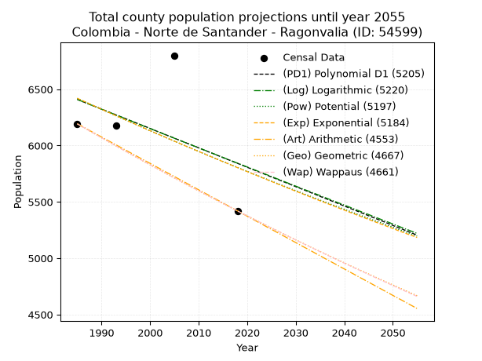
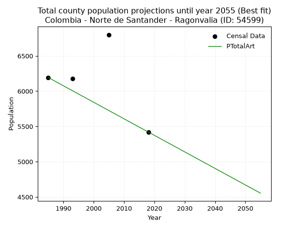
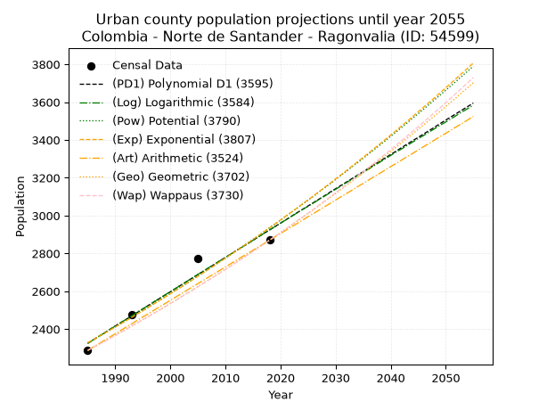
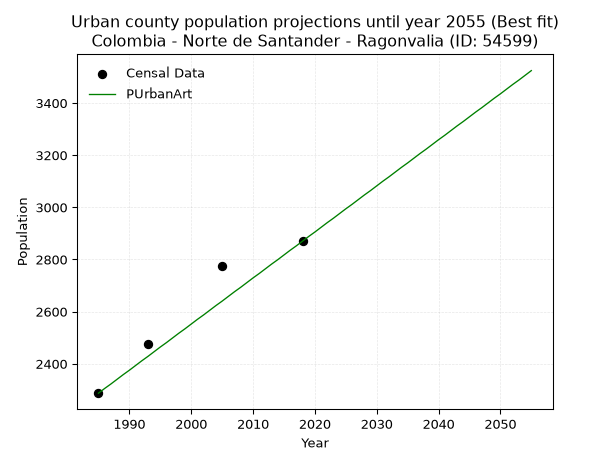
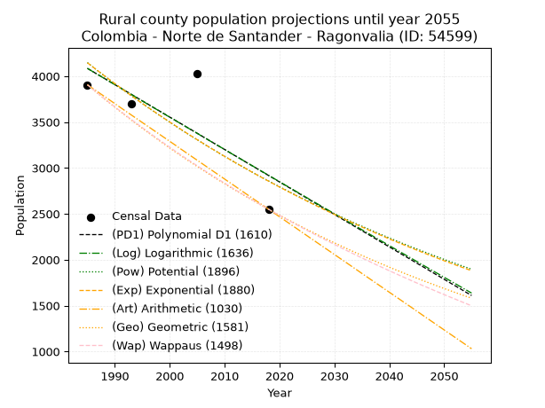
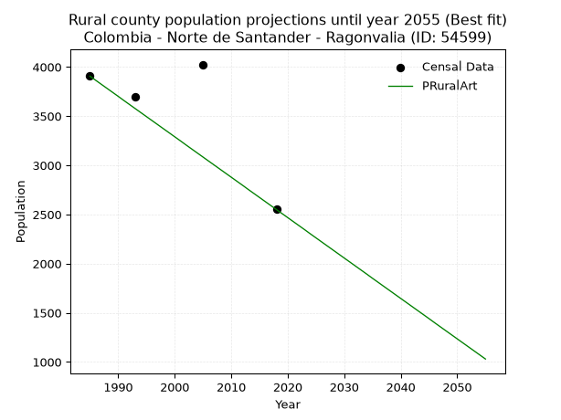

<div align="center">


</div>

# 📜 _“Population and Public Services Demand Projections (PPSD) until Year 2050 for Colombia - Norte de Santander - Ragonvalia (ID: 54599)”_
Keywords: `population` `public-service` `projection` `lineal` `polynomial` `logarithmic` `potential` `exponential` `arithmetic` `geometric` `wappaus` `dane` `colombia` `south-america`

PPSD are analytical estimates used by governments and planners to anticipate future changes in population size, age distribution, and the resulting community needs for utilities, healthcare, education, and infrastructure as sizing future water treatment facilities, electrical grids, and road networks based on spatial growth.

<div align="center">

</img>

</div>


> **General running parameters**: • app_version: _v20260806_. • Python version: _3.14.7_. • Pandas version: _3.0.5_. • NumPy version: _2.5.1_. • Creates, save and include plots into reports (create_plot): _False_. • Projection until year: _2050_. • Process polynomial degree 2 and up: _False_. • Process Wappaus: _True_. • Process Wappaus: _True_. • Set negative values to zero: _True_. • Set infinite values to zero: _True_. • Drop dataset notes: _True_. 
<div align="center">

Maps & GIS Layers: [:earth_americas:Google](http://maps.google.com/maps?q=7.577861415,-72.4767082) [:earth_americas:OSM](https://www.openstreetmap.org/#map=18/7.577861415/-72.4767082&layers=P) [:earth_americas:Bing](https://www.bing.com/maps?cp=7.577861415~-72.4767082&lvl=18) [:earth_americas:Apple](https://maps.apple.com/frame?center=7.577861415%2C-72.4767082&span=0.003%2C0.006) [:earth_americas:GISMobile](https://github.com/rcfdtools/R.GISMobile/blob/main/file/gis/CountyLayer_CO/Readme.md)

</div>


<div align="center">

```geojson
{
  "type": "Feature",
  "geometry": {
    "type": "Point", 
    "coordinates": [-72.4767082, 7.577861415]
  }, 
  "properties": {
    "Name": "Colombia - Norte de Santander - Ragonvalia (ID: 54599)"
  }
}
```

</div>


## 0. Census Data (4 records)

Census data are official statistics collected by a government about the people and housing in a country. They usually include counts of total population, age, sex, race, income, education, and jobs.

📅Global census file: [Population.xlsx](../data/Population.xlsx)

| Source   |   Year |   CountryID | CountryName   |   StateID | StateName          |   CountyID | CountyName   |   PTotal |   PUrban |   PRural |
|:---------|-------:|------------:|:--------------|----------:|:-------------------|-----------:|:-------------|---------:|---------:|---------:|
| DANE     |   1985 |          57 | Colombia      |        54 | Norte de Santander |      54599 | Ragonvalia   |     6193 |     2287 |     3906 |
| DANE     |   1993 |          57 | Colombia      |        54 | Norte de Santander |      54599 | Ragonvalia   |     6176 |     2475 |     3701 |
| DANE     |   2005 |          57 | Colombia      |        54 | Norte de Santander |      54599 | Ragonvalia   |     6800 |     2775 |     4025 |
| DANE     |   2018 |          57 | Colombia      |        54 | Norte de Santander |      54599 | Ragonvalia   |     5420 |     2870 |     2550 |

> 🔥Some records could had specific notes about the registered values or the corresponding urban or rural distribution.

📅[SUI-RUPS](https://www.datos.gov.co/Hacienda-y-Cr-dito-P-blico/Registro-nico-de-Prestadores-de-Servicios-P-blicos/4qkq-csdn/about_data) - Local public utility companies: [RUPS.csv](../data/RUPS.csv)

 | SERVICIO       | ESTADO    | NOMBRE                                                   | NIT         | DEPARTAMENTO_DOMICILIO   | MUNICIPIO_DOMICILIO   | DIRECCION        |   TELEFONO | EMAIL                                       | TIPO_PRESTADOR                 | CLASIFICACION                 |
|:---------------|:----------|:---------------------------------------------------------|:------------|:-------------------------|:----------------------|:-----------------|-----------:|:--------------------------------------------|:-------------------------------|:------------------------------|
| ACUEDUCTO      | OPERATIVA | UNIDAD DE SERVICIOS PUBLICOS DEL MUNICIPIO DE RAGONVALIA | 800099251-1 | NORTE DE SANTANDER       | RAGONVALIA            | CALLE 6 N° 2 -32 |    5869047 | alcaldia@ragonvalia-nortedesantander.gov.co | MUNICIPIO (PRESTACIÓN DIRECTA) | MENOR O IGUAL A 2500 USUARIOS |
| ALCANTARILLADO | OPERATIVA | UNIDAD DE SERVICIOS PUBLICOS DEL MUNICIPIO DE RAGONVALIA | 800099251-1 | NORTE DE SANTANDER       | RAGONVALIA            | CALLE 6 N° 2 -32 |    5869047 | alcaldia@ragonvalia-nortedesantander.gov.co | MUNICIPIO (PRESTACIÓN DIRECTA) | MENOR O IGUAL A 2500 USUARIOS |

## 1. Total

### 1.1. Coefficients and Parameters

* (PD1) Polynomial Deg 1: -17.20473705339136, 40561.02529104607 (lineal)
* (Log) Logarithmic: -34299.65041652658, 266859.167676167
* (Pow) Potential: -6.092271929612856, 23.898330801924054
* (Exp) Exponential: -0.0030548847770948463, 2760895.8543710927
* (Art) Arithmetic: Year diff. 2018 - 1985 = 33, Population diff. 5420 - 6193 = -773, Annual growth = -23.424242424242426
* (Geo) Geometric: Year diff. 2018 - 1985 = 33, Population diff. 5420 - 6193 = -773, Annual growth % = -0.004031965062328835
* (Wap) Wappaus: i = -0.40341414663295316, Condition values only valid for < 200)

<sub>
Wappaus condition values: ['-0.00', '-0.40', '-0.81', '-1.21', '-1.61', '-2.02', '-2.42', '-2.82', '-3.23', '-3.63', '-4.03', '-4.44', '-4.84', '-5.24', '-5.65', '-6.05', '-6.45', '-6.86', '-7.26', '-7.66', '-8.07', '-8.47', '-8.88', '-9.28', '-9.68', '-10.09', '-10.49', '-10.89', '-11.30', '-11.70', '-12.10', '-12.51', '-12.91', '-13.31', '-13.72', '-14.12', '-14.52', '-14.93', '-15.33', '-15.73', '-16.14', '-16.54', '-16.94', '-17.35', '-17.75', '-18.15', '-18.56', '-18.96', '-19.36', '-19.77', '-20.17', '-20.57', '-20.98', '-21.38', '-21.78', '-22.19', '-22.59', '-22.99', '-23.40', '-23.80', '-24.20', '-24.61', '-25.01', '-25.42', '-25.82', '-26.22']
</sub>


### 1.2. Projected Dataset

|   Year |   CountyID |   PTotalPD1 |   PTotalLog |   PTotalPow |   PTotalExp |   PTotalArt |   PTotalGeo |   PTotalWap |
|-------:|-----------:|------------:|------------:|------------:|------------:|------------:|------------:|------------:|
|   1985 |      54599 |        6410 |        6409 |        6419 |        6420 |        6193 |        6193 |        6193 |
|   1986 |      54599 |        6392 |        6392 |        6399 |        6400 |        6170 |        6168 |        6168 |
|   1987 |      54599 |        6375 |        6375 |        6380 |        6381 |        6146 |        6143 |        6143 |
|   1988 |      54599 |        6358 |        6357 |        6360 |        6361 |        6123 |        6118 |        6119 |
|   1989 |      54599 |        6341 |        6340 |        6341 |        6342 |        6099 |        6094 |        6094 |
|   1990 |      54599 |        6324 |        6323 |        6322 |        6322 |        6076 |        6069 |        6069 |
|   1991 |      54599 |        6306 |        6306 |        6302 |        6303 |        6052 |        6045 |        6045 |
|   1992 |      54599 |        6289 |        6288 |        6283 |        6284 |        6029 |        6020 |        6021 |
|   1993 |      54599 |        6272 |        6271 |        6264 |        6265 |        6006 |        5996 |        5996 |
|   1994 |      54599 |        6255 |        6254 |        6245 |        6246 |        5982 |        5972 |        5972 |
|   1995 |      54599 |        6238 |        6237 |        6226 |        6227 |        5959 |        5948 |        5948 |
|   1996 |      54599 |        6220 |        6220 |        6207 |        6208 |        5935 |        5924 |        5924 |
|   1997 |      54599 |        6203 |        6202 |        6188 |        6189 |        5912 |        5900 |        5900 |
|   1998 |      54599 |        6186 |        6185 |        6169 |        6170 |        5888 |        5876 |        5877 |
|   1999 |      54599 |        6169 |        6168 |        6150 |        6151 |        5865 |        5852 |        5853 |
|   2000 |      54599 |        6152 |        6151 |        6131 |        6132 |        5842 |        5829 |        5829 |
|   2001 |      54599 |        6134 |        6134 |        6113 |        6113 |        5818 |        5805 |        5806 |
|   2002 |      54599 |        6117 |        6117 |        6094 |        6095 |        5795 |        5782 |        5782 |
|   2003 |      54599 |        6100 |        6099 |        6076 |        6076 |        5771 |        5759 |        5759 |
|   2004 |      54599 |        6083 |        6082 |        6057 |        6058 |        5748 |        5735 |        5736 |
|   2005 |      54599 |        6066 |        6065 |        6039 |        6039 |        5725 |        5712 |        5713 |
|   2006 |      54599 |        6048 |        6048 |        6021 |        6021 |        5701 |        5689 |        5690 |
|   2007 |      54599 |        6031 |        6031 |        6002 |        6002 |        5678 |        5666 |        5667 |
|   2008 |      54599 |        6014 |        6014 |        5984 |        5984 |        5654 |        5643 |        5644 |
|   2009 |      54599 |        5997 |        5997 |        5966 |        5966 |        5631 |        5621 |        5621 |
|   2010 |      54599 |        5980 |        5980 |        5948 |        5948 |        5607 |        5598 |        5598 |
|   2011 |      54599 |        5962 |        5963 |        5930 |        5929 |        5584 |        5575 |        5576 |
|   2012 |      54599 |        5945 |        5946 |        5912 |        5911 |        5561 |        5553 |        5553 |
|   2013 |      54599 |        5928 |        5929 |        5894 |        5893 |        5537 |        5531 |        5531 |
|   2014 |      54599 |        5911 |        5912 |        5876 |        5875 |        5514 |        5508 |        5509 |
|   2015 |      54599 |        5893 |        5895 |        5859 |        5857 |        5490 |        5486 |        5486 |
|   2016 |      54599 |        5876 |        5878 |        5841 |        5840 |        5467 |        5464 |        5464 |
|   2017 |      54599 |        5859 |        5861 |        5823 |        5822 |        5443 |        5442 |        5442 |
|   2018 |      54599 |        5842 |        5844 |        5806 |        5804 |        5420 |        5420 |        5420 |
|   2019 |      54599 |        5825 |        5827 |        5788 |        5786 |        5397 |        5398 |        5398 |
|   2020 |      54599 |        5807 |        5810 |        5771 |        5769 |        5373 |        5376 |        5376 |
|   2021 |      54599 |        5790 |        5793 |        5753 |        5751 |        5350 |        5355 |        5354 |
|   2022 |      54599 |        5773 |        5776 |        5736 |        5734 |        5326 |        5333 |        5333 |
|   2023 |      54599 |        5756 |        5759 |        5719 |        5716 |        5303 |        5312 |        5311 |
|   2024 |      54599 |        5739 |        5742 |        5702 |        5699 |        5279 |        5290 |        5290 |
|   2025 |      54599 |        5721 |        5725 |        5684 |        5681 |        5256 |        5269 |        5268 |
|   2026 |      54599 |        5704 |        5708 |        5667 |        5664 |        5233 |        5248 |        5247 |
|   2027 |      54599 |        5687 |        5691 |        5650 |        5647 |        5209 |        5226 |        5226 |
|   2028 |      54599 |        5670 |        5674 |        5633 |        5629 |        5186 |        5205 |        5204 |
|   2029 |      54599 |        5653 |        5657 |        5617 |        5612 |        5162 |        5184 |        5183 |
|   2030 |      54599 |        5635 |        5640 |        5600 |        5595 |        5139 |        5163 |        5162 |
|   2031 |      54599 |        5618 |        5623 |        5583 |        5578 |        5115 |        5143 |        5141 |
|   2032 |      54599 |        5601 |        5606 |        5566 |        5561 |        5092 |        5122 |        5120 |
|   2033 |      54599 |        5584 |        5590 |        5550 |        5544 |        5069 |        5101 |        5100 |
|   2034 |      54599 |        5567 |        5573 |        5533 |        5527 |        5045 |        5081 |        5079 |
|   2035 |      54599 |        5549 |        5556 |        5516 |        5510 |        5022 |        5060 |        5058 |
|   2036 |      54599 |        5532 |        5539 |        5500 |        5493 |        4998 |        5040 |        5038 |
|   2037 |      54599 |        5515 |        5522 |        5483 |        5477 |        4975 |        5020 |        5017 |
|   2038 |      54599 |        5498 |        5505 |        5467 |        5460 |        4952 |        4999 |        4997 |
|   2039 |      54599 |        5481 |        5488 |        5451 |        5443 |        4928 |        4979 |        4976 |
|   2040 |      54599 |        5463 |        5472 |        5435 |        5427 |        4905 |        4959 |        4956 |
|   2041 |      54599 |        5446 |        5455 |        5418 |        5410 |        4881 |        4939 |        4936 |
|   2042 |      54599 |        5429 |        5438 |        5402 |        5394 |        4858 |        4919 |        4916 |
|   2043 |      54599 |        5412 |        5421 |        5386 |        5377 |        4834 |        4899 |        4896 |
|   2044 |      54599 |        5395 |        5404 |        5370 |        5361 |        4811 |        4880 |        4876 |
|   2045 |      54599 |        5377 |        5388 |        5354 |        5345 |        4788 |        4860 |        4856 |
|   2046 |      54599 |        5360 |        5371 |        5338 |        5328 |        4764 |        4840 |        4836 |
|   2047 |      54599 |        5343 |        5354 |        5322 |        5312 |        4741 |        4821 |        4816 |
|   2048 |      54599 |        5326 |        5337 |        5307 |        5296 |        4717 |        4801 |        4797 |
|   2049 |      54599 |        5309 |        5321 |        5291 |        5280 |        4694 |        4782 |        4777 |
|   2050 |      54599 |        5291 |        5304 |        5275 |        5264 |        4670 |        4763 |        4757 |
<div align="center">

</img>

</div>


### 1.3. Best fit with absolute and relative error (%)

Relative error puts that difference into context by dividing the absolute error by the true value, creating a unitless ratio or percentage that shows the scale of the mistake.

Absolute and relative error

|   Year | Source   |   CountryID | CountryName   |   StateID | StateName          |   CountyID_x | CountyName   |   PTotal |   PUrban |   PRural |   CountyID_y |   PTotalPD1 |   PTotalLog |   PTotalPow |   PTotalExp |   PTotalArt |   PTotalGeo |   PTotalWap |   PTotalPD1AbsError |   PTotalLogAbsError |   PTotalPowAbsError |   PTotalExpAbsError |   PTotalArtAbsError |   PTotalGeoAbsError |   PTotalWapAbsError |   PTotalPD1RelError |   PTotalLogRelError |   PTotalPowRelError |   PTotalExpRelError |   PTotalArtRelError |   PTotalGeoRelError |   PTotalWapRelError |
|-------:|:---------|------------:|:--------------|----------:|:-------------------|-------------:|:-------------|---------:|---------:|---------:|-------------:|------------:|------------:|------------:|------------:|------------:|------------:|------------:|--------------------:|--------------------:|--------------------:|--------------------:|--------------------:|--------------------:|--------------------:|--------------------:|--------------------:|--------------------:|--------------------:|--------------------:|--------------------:|--------------------:|
|   1985 | DANE     |          57 | Colombia      |        54 | Norte de Santander |        54599 | Ragonvalia   |     6193 |     2287 |     3906 |        54599 |        6410 |        6409 |        6419 |        6420 |        6193 |        6193 |        6193 |                 217 |                 216 |                 226 |                 227 |                   0 |                   0 |                   0 |             3.50396 |             3.48781 |             3.64928 |             3.66543 |             0       |             0       |             0       |
|   1993 | DANE     |          57 | Colombia      |        54 | Norte de Santander |        54599 | Ragonvalia   |     6176 |     2475 |     3701 |        54599 |        6272 |        6271 |        6264 |        6265 |        6006 |        5996 |        5996 |                  96 |                  95 |                  88 |                  89 |                 170 |                 180 |                 180 |             1.5544  |             1.53821 |             1.42487 |             1.44106 |             2.75259 |             2.91451 |             2.91451 |
|   2005 | DANE     |          57 | Colombia      |        54 | Norte de Santander |        54599 | Ragonvalia   |     6800 |     2775 |     4025 |        54599 |        6066 |        6065 |        6039 |        6039 |        5725 |        5712 |        5713 |                 734 |                 735 |                 761 |                 761 |                1075 |                1088 |                1087 |            10.7941  |            10.8088  |            11.1912  |            11.1912  |            15.8088  |            16       |            15.9853  |
|   2018 | DANE     |          57 | Colombia      |        54 | Norte de Santander |        54599 | Ragonvalia   |     5420 |     2870 |     2550 |        54599 |        5842 |        5844 |        5806 |        5804 |        5420 |        5420 |        5420 |                 422 |                 424 |                 386 |                 384 |                   0 |                   0 |                   0 |             7.78598 |             7.82288 |             7.12177 |             7.08487 |             0       |             0       |             0       |

Relative error mean

| Method    |   RelError | Best   |
|:----------|-----------:|:-------|
| PTotalPD1 |    5.90961 |        |
| PTotalLog |    5.91443 |        |
| PTotalPow |    5.84677 |        |
| PTotalExp |    5.84563 |        |
| PTotalArt |    4.64035 | True   |
| PTotalGeo |    4.72863 |        |
| PTotalWap |    4.72495 |        |

💙Best method: _**PTotalArt**_
<div align="center">

</img>

</div>


### 1.4. Fresh water supply demand in liters per capita per day (lpcd)

The fresh water supply demand typically ranges from 100 to 300 liters per capita per day (lpcd) for standard domestic and municipal planning, though absolute survival minimums set by the World Health Organization are as low as 7.5 to 20 liters per day, and total consumption in high-income nations can exceed 400 liters.

> `CZ`: Level in meters above the sea level (masl)<br> `WS`: Fresh water supply demand in liters per capita per day (lpcd or l/h/d)<br> `WSAll`: Zonal fresh water supply demand in liters per second (l/s)<br> `A`: Zonal area in square meters<br> `DP`: Population density (people/hectare or p/ha)

Reference values (RAS Colombia)

|    CZ |   WS |
|------:|-----:|
|  1000 |  120 |
|  2000 |  130 |
| 99999 |  140 |

County shapefile geometry properties and water supply values

|   CountyID |      ATotal |   CZTotal |   WSTotal |
|-----------:|------------:|----------:|----------:|
|      54599 | 9.78218e+07 |   1845.44 |       130 |

Projected values for best method: PTotalArt

|   CountyID |   Year |   PTotalArt |   DPTotal |   WSTotal |   WSTotalAll |
|-----------:|-------:|------------:|----------:|----------:|-------------:|
|      54599 |   1985 |        6193 |      0.63 |       130 |      9.31817 |
|      54599 |   1986 |        6170 |      0.63 |       130 |      9.28356 |
|      54599 |   1987 |        6146 |      0.63 |       130 |      9.24745 |
|      54599 |   1988 |        6123 |      0.63 |       130 |      9.21285 |
|      54599 |   1989 |        6099 |      0.62 |       130 |      9.17674 |
|      54599 |   1990 |        6076 |      0.62 |       130 |      9.14213 |
|      54599 |   1991 |        6052 |      0.62 |       130 |      9.10602 |
|      54599 |   1992 |        6029 |      0.62 |       130 |      9.07141 |
|      54599 |   1993 |        6006 |      0.61 |       130 |      9.03681 |
|      54599 |   1994 |        5982 |      0.61 |       130 |      9.00069 |
|      54599 |   1995 |        5959 |      0.61 |       130 |      8.96609 |
|      54599 |   1996 |        5935 |      0.61 |       130 |      8.92998 |
|      54599 |   1997 |        5912 |      0.6  |       130 |      8.89537 |
|      54599 |   1998 |        5888 |      0.6  |       130 |      8.85926 |
|      54599 |   1999 |        5865 |      0.6  |       130 |      8.82465 |
|      54599 |   2000 |        5842 |      0.6  |       130 |      8.79005 |
|      54599 |   2001 |        5818 |      0.59 |       130 |      8.75394 |
|      54599 |   2002 |        5795 |      0.59 |       130 |      8.71933 |
|      54599 |   2003 |        5771 |      0.59 |       130 |      8.68322 |
|      54599 |   2004 |        5748 |      0.59 |       130 |      8.64861 |
|      54599 |   2005 |        5725 |      0.59 |       130 |      8.614   |
|      54599 |   2006 |        5701 |      0.58 |       130 |      8.57789 |
|      54599 |   2007 |        5678 |      0.58 |       130 |      8.54329 |
|      54599 |   2008 |        5654 |      0.58 |       130 |      8.50718 |
|      54599 |   2009 |        5631 |      0.58 |       130 |      8.47257 |
|      54599 |   2010 |        5607 |      0.57 |       130 |      8.43646 |
|      54599 |   2011 |        5584 |      0.57 |       130 |      8.40185 |
|      54599 |   2012 |        5561 |      0.57 |       130 |      8.36725 |
|      54599 |   2013 |        5537 |      0.57 |       130 |      8.33113 |
|      54599 |   2014 |        5514 |      0.56 |       130 |      8.29653 |
|      54599 |   2015 |        5490 |      0.56 |       130 |      8.26042 |
|      54599 |   2016 |        5467 |      0.56 |       130 |      8.22581 |
|      54599 |   2017 |        5443 |      0.56 |       130 |      8.1897  |
|      54599 |   2018 |        5420 |      0.55 |       130 |      8.15509 |
|      54599 |   2019 |        5397 |      0.55 |       130 |      8.12049 |
|      54599 |   2020 |        5373 |      0.55 |       130 |      8.08437 |
|      54599 |   2021 |        5350 |      0.55 |       130 |      8.04977 |
|      54599 |   2022 |        5326 |      0.54 |       130 |      8.01366 |
|      54599 |   2023 |        5303 |      0.54 |       130 |      7.97905 |
|      54599 |   2024 |        5279 |      0.54 |       130 |      7.94294 |
|      54599 |   2025 |        5256 |      0.54 |       130 |      7.90833 |
|      54599 |   2026 |        5233 |      0.53 |       130 |      7.87373 |
|      54599 |   2027 |        5209 |      0.53 |       130 |      7.83762 |
|      54599 |   2028 |        5186 |      0.53 |       130 |      7.80301 |
|      54599 |   2029 |        5162 |      0.53 |       130 |      7.7669  |
|      54599 |   2030 |        5139 |      0.53 |       130 |      7.73229 |
|      54599 |   2031 |        5115 |      0.52 |       130 |      7.69618 |
|      54599 |   2032 |        5092 |      0.52 |       130 |      7.66157 |
|      54599 |   2033 |        5069 |      0.52 |       130 |      7.62697 |
|      54599 |   2034 |        5045 |      0.52 |       130 |      7.59086 |
|      54599 |   2035 |        5022 |      0.51 |       130 |      7.55625 |
|      54599 |   2036 |        4998 |      0.51 |       130 |      7.52014 |
|      54599 |   2037 |        4975 |      0.51 |       130 |      7.48553 |
|      54599 |   2038 |        4952 |      0.51 |       130 |      7.45093 |
|      54599 |   2039 |        4928 |      0.5  |       130 |      7.41481 |
|      54599 |   2040 |        4905 |      0.5  |       130 |      7.38021 |
|      54599 |   2041 |        4881 |      0.5  |       130 |      7.3441  |
|      54599 |   2042 |        4858 |      0.5  |       130 |      7.30949 |
|      54599 |   2043 |        4834 |      0.49 |       130 |      7.27338 |
|      54599 |   2044 |        4811 |      0.49 |       130 |      7.23877 |
|      54599 |   2045 |        4788 |      0.49 |       130 |      7.20417 |
|      54599 |   2046 |        4764 |      0.49 |       130 |      7.16806 |
|      54599 |   2047 |        4741 |      0.48 |       130 |      7.13345 |
|      54599 |   2048 |        4717 |      0.48 |       130 |      7.09734 |
|      54599 |   2049 |        4694 |      0.48 |       130 |      7.06273 |
|      54599 |   2050 |        4670 |      0.48 |       130 |      7.02662 |

## 2. Urban

### 2.1. Coefficients and Parameters

* (PD1) Polynomial Deg 1: 18.1505419510236, -33703.871537534964 (lineal)
* (Log) Logarithmic: 36349.43237794144, -273690.5767908031
* (Pow) Potential: 14.074820323021099, -43.04855271773501
* (Exp) Exponential: 0.007027639907053297, 0.002035181198349683
* (Art) Arithmetic: Year diff. 2018 - 1985 = 33, Population diff. 2870 - 2287 = 583, Annual growth = 17.666666666666668
* (Geo) Geometric: Year diff. 2018 - 1985 = 33, Population diff. 2870 - 2287 = 583, Annual growth % = 0.006904670950660163
* (Wap) Wappaus: i = 0.6851528666537392, Condition values only valid for < 200)

<sub>
Wappaus condition values: ['0.00', '0.69', '1.37', '2.06', '2.74', '3.43', '4.11', '4.80', '5.48', '6.17', '6.85', '7.54', '8.22', '8.91', '9.59', '10.28', '10.96', '11.65', '12.33', '13.02', '13.70', '14.39', '15.07', '15.76', '16.44', '17.13', '17.81', '18.50', '19.18', '19.87', '20.55', '21.24', '21.92', '22.61', '23.30', '23.98', '24.67', '25.35', '26.04', '26.72', '27.41', '28.09', '28.78', '29.46', '30.15', '30.83', '31.52', '32.20', '32.89', '33.57', '34.26', '34.94', '35.63', '36.31', '37.00', '37.68', '38.37', '39.05', '39.74', '40.42', '41.11', '41.79', '42.48', '43.16', '43.85', '44.53']
</sub>


### 2.2. Projected Dataset

|   Year |   CountyID |   PUrbanPD1 |   PUrbanLog |   PUrbanPow |   PUrbanExp |   PUrbanArt |   PUrbanGeo |   PUrbanWap |
|-------:|-----------:|------------:|------------:|------------:|------------:|------------:|------------:|------------:|
|   1985 |      54599 |        2325 |        2324 |        2327 |        2328 |        2287 |        2287 |        2287 |
|   1986 |      54599 |        2343 |        2343 |        2344 |        2344 |        2305 |        2303 |        2303 |
|   1987 |      54599 |        2361 |        2361 |        2360 |        2361 |        2322 |        2319 |        2319 |
|   1988 |      54599 |        2379 |        2379 |        2377 |        2377 |        2340 |        2335 |        2334 |
|   1989 |      54599 |        2398 |        2397 |        2394 |        2394 |        2358 |        2351 |        2351 |
|   1990 |      54599 |        2416 |        2416 |        2411 |        2411 |        2375 |        2367 |        2367 |
|   1991 |      54599 |        2434 |        2434 |        2428 |        2428 |        2393 |        2383 |        2383 |
|   1992 |      54599 |        2452 |        2452 |        2445 |        2445 |        2411 |        2400 |        2399 |
|   1993 |      54599 |        2470 |        2470 |        2463 |        2462 |        2428 |        2416 |        2416 |
|   1994 |      54599 |        2488 |        2489 |        2480 |        2480 |        2446 |        2433 |        2433 |
|   1995 |      54599 |        2506 |        2507 |        2498 |        2497 |        2464 |        2450 |        2449 |
|   1996 |      54599 |        2525 |        2525 |        2515 |        2515 |        2481 |        2467 |        2466 |
|   1997 |      54599 |        2543 |        2543 |        2533 |        2533 |        2499 |        2484 |        2483 |
|   1998 |      54599 |        2561 |        2562 |        2551 |        2551 |        2517 |        2501 |        2500 |
|   1999 |      54599 |        2579 |        2580 |        2569 |        2569 |        2534 |        2518 |        2517 |
|   2000 |      54599 |        2597 |        2598 |        2587 |        2587 |        2552 |        2536 |        2535 |
|   2001 |      54599 |        2615 |        2616 |        2606 |        2605 |        2570 |        2553 |        2552 |
|   2002 |      54599 |        2634 |        2634 |        2624 |        2623 |        2587 |        2571 |        2570 |
|   2003 |      54599 |        2652 |        2652 |        2642 |        2642 |        2605 |        2589 |        2588 |
|   2004 |      54599 |        2670 |        2671 |        2661 |        2660 |        2623 |        2606 |        2605 |
|   2005 |      54599 |        2688 |        2689 |        2680 |        2679 |        2640 |        2624 |        2623 |
|   2006 |      54599 |        2706 |        2707 |        2699 |        2698 |        2658 |        2643 |        2642 |
|   2007 |      54599 |        2724 |        2725 |        2718 |        2717 |        2676 |        2661 |        2660 |
|   2008 |      54599 |        2742 |        2743 |        2737 |        2736 |        2693 |        2679 |        2678 |
|   2009 |      54599 |        2761 |        2761 |        2756 |        2756 |        2711 |        2698 |        2697 |
|   2010 |      54599 |        2779 |        2779 |        2775 |        2775 |        2729 |        2716 |        2715 |
|   2011 |      54599 |        2797 |        2797 |        2795 |        2795 |        2746 |        2735 |        2734 |
|   2012 |      54599 |        2815 |        2815 |        2815 |        2814 |        2764 |        2754 |        2753 |
|   2013 |      54599 |        2833 |        2833 |        2834 |        2834 |        2782 |        2773 |        2772 |
|   2014 |      54599 |        2851 |        2851 |        2854 |        2854 |        2799 |        2792 |        2792 |
|   2015 |      54599 |        2869 |        2870 |        2874 |        2874 |        2817 |        2811 |        2811 |
|   2016 |      54599 |        2888 |        2888 |        2894 |        2894 |        2835 |        2831 |        2830 |
|   2017 |      54599 |        2906 |        2906 |        2915 |        2915 |        2852 |        2850 |        2850 |
|   2018 |      54599 |        2924 |        2924 |        2935 |        2935 |        2870 |        2870 |        2870 |
|   2019 |      54599 |        2942 |        2942 |        2956 |        2956 |        2888 |        2890 |        2890 |
|   2020 |      54599 |        2960 |        2960 |        2976 |        2977 |        2905 |        2910 |        2910 |
|   2021 |      54599 |        2978 |        2978 |        2997 |        2998 |        2923 |        2930 |        2930 |
|   2022 |      54599 |        2997 |        2996 |        3018 |        3019 |        2941 |        2950 |        2951 |
|   2023 |      54599 |        3015 |        3014 |        3039 |        3040 |        2958 |        2970 |        2972 |
|   2024 |      54599 |        3033 |        3032 |        3060 |        3062 |        2976 |        2991 |        2992 |
|   2025 |      54599 |        3051 |        3049 |        3082 |        3083 |        2994 |        3012 |        3013 |
|   2026 |      54599 |        3069 |        3067 |        3103 |        3105 |        3011 |        3032 |        3034 |
|   2027 |      54599 |        3087 |        3085 |        3125 |        3127 |        3029 |        3053 |        3056 |
|   2028 |      54599 |        3105 |        3103 |        3147 |        3149 |        3047 |        3074 |        3077 |
|   2029 |      54599 |        3124 |        3121 |        3168 |        3171 |        3064 |        3096 |        3099 |
|   2030 |      54599 |        3142 |        3139 |        3191 |        3194 |        3082 |        3117 |        3121 |
|   2031 |      54599 |        3160 |        3157 |        3213 |        3216 |        3100 |        3139 |        3143 |
|   2032 |      54599 |        3178 |        3175 |        3235 |        3239 |        3117 |        3160 |        3165 |
|   2033 |      54599 |        3196 |        3193 |        3258 |        3262 |        3135 |        3182 |        3187 |
|   2034 |      54599 |        3214 |        3211 |        3280 |        3285 |        3153 |        3204 |        3210 |
|   2035 |      54599 |        3232 |        3229 |        3303 |        3308 |        3170 |        3226 |        3232 |
|   2036 |      54599 |        3251 |        3246 |        3326 |        3331 |        3188 |        3248 |        3255 |
|   2037 |      54599 |        3269 |        3264 |        3349 |        3355 |        3206 |        3271 |        3278 |
|   2038 |      54599 |        3287 |        3282 |        3372 |        3378 |        3223 |        3293 |        3302 |
|   2039 |      54599 |        3305 |        3300 |        3395 |        3402 |        3241 |        3316 |        3325 |
|   2040 |      54599 |        3323 |        3318 |        3419 |        3426 |        3259 |        3339 |        3349 |
|   2041 |      54599 |        3341 |        3336 |        3443 |        3450 |        3276 |        3362 |        3373 |
|   2042 |      54599 |        3360 |        3353 |        3466 |        3475 |        3294 |        3385 |        3397 |
|   2043 |      54599 |        3378 |        3371 |        3490 |        3499 |        3312 |        3409 |        3421 |
|   2044 |      54599 |        3396 |        3389 |        3515 |        3524 |        3329 |        3432 |        3446 |
|   2045 |      54599 |        3414 |        3407 |        3539 |        3549 |        3347 |        3456 |        3470 |
|   2046 |      54599 |        3432 |        3424 |        3563 |        3574 |        3365 |        3480 |        3495 |
|   2047 |      54599 |        3450 |        3442 |        3588 |        3599 |        3382 |        3504 |        3520 |
|   2048 |      54599 |        3468 |        3460 |        3613 |        3624 |        3400 |        3528 |        3546 |
|   2049 |      54599 |        3487 |        3478 |        3638 |        3650 |        3418 |        3552 |        3571 |
|   2050 |      54599 |        3505 |        3495 |        3663 |        3676 |        3435 |        3577 |        3597 |
<div align="center">

</img>

</div>


### 2.3. Best fit with absolute and relative error (%)

Relative error puts that difference into context by dividing the absolute error by the true value, creating a unitless ratio or percentage that shows the scale of the mistake.

Absolute and relative error

|   Year | Source   |   CountryID | CountryName   |   StateID | StateName          |   CountyID_x | CountyName   |   PTotal |   PUrban |   PRural |   CountyID_y |   PUrbanPD1 |   PUrbanLog |   PUrbanPow |   PUrbanExp |   PUrbanArt |   PUrbanGeo |   PUrbanWap |   PUrbanPD1AbsError |   PUrbanLogAbsError |   PUrbanPowAbsError |   PUrbanExpAbsError |   PUrbanArtAbsError |   PUrbanGeoAbsError |   PUrbanWapAbsError |   PUrbanPD1RelError |   PUrbanLogRelError |   PUrbanPowRelError |   PUrbanExpRelError |   PUrbanArtRelError |   PUrbanGeoRelError |   PUrbanWapRelError |
|-------:|:---------|------------:|:--------------|----------:|:-------------------|-------------:|:-------------|---------:|---------:|---------:|-------------:|------------:|------------:|------------:|------------:|------------:|------------:|------------:|--------------------:|--------------------:|--------------------:|--------------------:|--------------------:|--------------------:|--------------------:|--------------------:|--------------------:|--------------------:|--------------------:|--------------------:|--------------------:|--------------------:|
|   1985 | DANE     |          57 | Colombia      |        54 | Norte de Santander |        54599 | Ragonvalia   |     6193 |     2287 |     3906 |        54599 |        2325 |        2324 |        2327 |        2328 |        2287 |        2287 |        2287 |                  38 |                  37 |                  40 |                  41 |                   0 |                   0 |                   0 |             1.66157 |             1.61784 |            1.74902  |            1.79274  |             0       |             0       |             0       |
|   1993 | DANE     |          57 | Colombia      |        54 | Norte de Santander |        54599 | Ragonvalia   |     6176 |     2475 |     3701 |        54599 |        2470 |        2470 |        2463 |        2462 |        2428 |        2416 |        2416 |                   5 |                   5 |                  12 |                  13 |                  47 |                  59 |                  59 |             0.20202 |             0.20202 |            0.484848 |            0.525253 |             1.89899 |             2.38384 |             2.38384 |
|   2005 | DANE     |          57 | Colombia      |        54 | Norte de Santander |        54599 | Ragonvalia   |     6800 |     2775 |     4025 |        54599 |        2688 |        2689 |        2680 |        2679 |        2640 |        2624 |        2623 |                  87 |                  86 |                  95 |                  96 |                 135 |                 151 |                 152 |             3.13514 |             3.0991  |            3.42342  |            3.45946  |             4.86486 |             5.44144 |             5.47748 |
|   2018 | DANE     |          57 | Colombia      |        54 | Norte de Santander |        54599 | Ragonvalia   |     5420 |     2870 |     2550 |        54599 |        2924 |        2924 |        2935 |        2935 |        2870 |        2870 |        2870 |                  54 |                  54 |                  65 |                  65 |                   0 |                   0 |                   0 |             1.88153 |             1.88153 |            2.26481  |            2.26481  |             0       |             0       |             0       |

Relative error mean

| Method    |   RelError | Best   |
|:----------|-----------:|:-------|
| PUrbanPD1 |    1.72006 |        |
| PUrbanLog |    1.70012 |        |
| PUrbanPow |    1.98052 |        |
| PUrbanExp |    2.01057 |        |
| PUrbanArt |    1.69096 | True   |
| PUrbanGeo |    1.95632 |        |
| PUrbanWap |    1.96533 |        |

💙Best method: _**PUrbanArt**_
<div align="center">

</img>

</div>


### 2.4. Fresh water supply demand in liters per capita per day (lpcd)

The fresh water supply demand typically ranges from 100 to 300 liters per capita per day (lpcd) for standard domestic and municipal planning, though absolute survival minimums set by the World Health Organization are as low as 7.5 to 20 liters per day, and total consumption in high-income nations can exceed 400 liters.

> `CZ`: Level in meters above the sea level (masl)<br> `WS`: Fresh water supply demand in liters per capita per day (lpcd or l/h/d)<br> `WSAll`: Zonal fresh water supply demand in liters per second (l/s)<br> `A`: Zonal area in square meters<br> `DP`: Population density (people/hectare or p/ha)

Reference values (RAS Colombia)

|    CZ |   WS |
|------:|-----:|
|  1000 |  120 |
|  2000 |  130 |
| 99999 |  140 |

County shapefile geometry properties and water supply values

|   CountyID |   AUrban |   CZUrban |   WSUrban |
|-----------:|---------:|----------:|----------:|
|      54599 |   655604 |   1561.84 |       130 |

Projected values for best method: PUrbanArt

|   CountyID |   Year |   PUrbanArt |   DPUrban |   WSUrban |   WSUrbanAll |
|-----------:|-------:|------------:|----------:|----------:|-------------:|
|      54599 |   1985 |        2287 |     34.88 |       130 |      3.44109 |
|      54599 |   1986 |        2305 |     35.16 |       130 |      3.46817 |
|      54599 |   1987 |        2322 |     35.42 |       130 |      3.49375 |
|      54599 |   1988 |        2340 |     35.69 |       130 |      3.52083 |
|      54599 |   1989 |        2358 |     35.97 |       130 |      3.54792 |
|      54599 |   1990 |        2375 |     36.23 |       130 |      3.5735  |
|      54599 |   1991 |        2393 |     36.5  |       130 |      3.60058 |
|      54599 |   1992 |        2411 |     36.78 |       130 |      3.62766 |
|      54599 |   1993 |        2428 |     37.03 |       130 |      3.65324 |
|      54599 |   1994 |        2446 |     37.31 |       130 |      3.68032 |
|      54599 |   1995 |        2464 |     37.58 |       130 |      3.70741 |
|      54599 |   1996 |        2481 |     37.84 |       130 |      3.73299 |
|      54599 |   1997 |        2499 |     38.12 |       130 |      3.76007 |
|      54599 |   1998 |        2517 |     38.39 |       130 |      3.78715 |
|      54599 |   1999 |        2534 |     38.65 |       130 |      3.81273 |
|      54599 |   2000 |        2552 |     38.93 |       130 |      3.83981 |
|      54599 |   2001 |        2570 |     39.2  |       130 |      3.8669  |
|      54599 |   2002 |        2587 |     39.46 |       130 |      3.89248 |
|      54599 |   2003 |        2605 |     39.73 |       130 |      3.91956 |
|      54599 |   2004 |        2623 |     40.01 |       130 |      3.94664 |
|      54599 |   2005 |        2640 |     40.27 |       130 |      3.97222 |
|      54599 |   2006 |        2658 |     40.54 |       130 |      3.99931 |
|      54599 |   2007 |        2676 |     40.82 |       130 |      4.02639 |
|      54599 |   2008 |        2693 |     41.08 |       130 |      4.05197 |
|      54599 |   2009 |        2711 |     41.35 |       130 |      4.07905 |
|      54599 |   2010 |        2729 |     41.63 |       130 |      4.10613 |
|      54599 |   2011 |        2746 |     41.89 |       130 |      4.13171 |
|      54599 |   2012 |        2764 |     42.16 |       130 |      4.1588  |
|      54599 |   2013 |        2782 |     42.43 |       130 |      4.18588 |
|      54599 |   2014 |        2799 |     42.69 |       130 |      4.21146 |
|      54599 |   2015 |        2817 |     42.97 |       130 |      4.23854 |
|      54599 |   2016 |        2835 |     43.24 |       130 |      4.26562 |
|      54599 |   2017 |        2852 |     43.5  |       130 |      4.2912  |
|      54599 |   2018 |        2870 |     43.78 |       130 |      4.31829 |
|      54599 |   2019 |        2888 |     44.05 |       130 |      4.34537 |
|      54599 |   2020 |        2905 |     44.31 |       130 |      4.37095 |
|      54599 |   2021 |        2923 |     44.58 |       130 |      4.39803 |
|      54599 |   2022 |        2941 |     44.86 |       130 |      4.42512 |
|      54599 |   2023 |        2958 |     45.12 |       130 |      4.45069 |
|      54599 |   2024 |        2976 |     45.39 |       130 |      4.47778 |
|      54599 |   2025 |        2994 |     45.67 |       130 |      4.50486 |
|      54599 |   2026 |        3011 |     45.93 |       130 |      4.53044 |
|      54599 |   2027 |        3029 |     46.2  |       130 |      4.55752 |
|      54599 |   2028 |        3047 |     46.48 |       130 |      4.58461 |
|      54599 |   2029 |        3064 |     46.74 |       130 |      4.61019 |
|      54599 |   2030 |        3082 |     47.01 |       130 |      4.63727 |
|      54599 |   2031 |        3100 |     47.28 |       130 |      4.66435 |
|      54599 |   2032 |        3117 |     47.54 |       130 |      4.68993 |
|      54599 |   2033 |        3135 |     47.82 |       130 |      4.71701 |
|      54599 |   2034 |        3153 |     48.09 |       130 |      4.7441  |
|      54599 |   2035 |        3170 |     48.35 |       130 |      4.76968 |
|      54599 |   2036 |        3188 |     48.63 |       130 |      4.79676 |
|      54599 |   2037 |        3206 |     48.9  |       130 |      4.82384 |
|      54599 |   2038 |        3223 |     49.16 |       130 |      4.84942 |
|      54599 |   2039 |        3241 |     49.44 |       130 |      4.8765  |
|      54599 |   2040 |        3259 |     49.71 |       130 |      4.90359 |
|      54599 |   2041 |        3276 |     49.97 |       130 |      4.92917 |
|      54599 |   2042 |        3294 |     50.24 |       130 |      4.95625 |
|      54599 |   2043 |        3312 |     50.52 |       130 |      4.98333 |
|      54599 |   2044 |        3329 |     50.78 |       130 |      5.00891 |
|      54599 |   2045 |        3347 |     51.05 |       130 |      5.036   |
|      54599 |   2046 |        3365 |     51.33 |       130 |      5.06308 |
|      54599 |   2047 |        3382 |     51.59 |       130 |      5.08866 |
|      54599 |   2048 |        3400 |     51.86 |       130 |      5.11574 |
|      54599 |   2049 |        3418 |     52.14 |       130 |      5.14282 |
|      54599 |   2050 |        3435 |     52.39 |       130 |      5.1684  |

## 3. Rural

### 3.1. Coefficients and Parameters

* (PD1) Polynomial Deg 1: -35.355279004414996, 74264.8968285811 (lineal)
* (Log) Logarithmic: -70649.08279446808, 540549.7444669704
* (Pow) Potential: -22.576253331479943, 78.06876371354191
* (Exp) Exponential: -0.011297563436694457, 22751230145767.242
* (Art) Arithmetic: Year diff. 2018 - 1985 = 33, Population diff. 2550 - 3906 = -1356, Annual growth = -41.09090909090909
* (Geo) Geometric: Year diff. 2018 - 1985 = 33, Population diff. 2550 - 3906 = -1356, Annual growth % = -0.012838704088346753
* (Wap) Wappaus: i = -1.2729525740678158, Condition values only valid for < 200)

<sub>
Wappaus condition values: ['-0.00', '-1.27', '-2.55', '-3.82', '-5.09', '-6.36', '-7.64', '-8.91', '-10.18', '-11.46', '-12.73', '-14.00', '-15.28', '-16.55', '-17.82', '-19.09', '-20.37', '-21.64', '-22.91', '-24.19', '-25.46', '-26.73', '-28.00', '-29.28', '-30.55', '-31.82', '-33.10', '-34.37', '-35.64', '-36.92', '-38.19', '-39.46', '-40.73', '-42.01', '-43.28', '-44.55', '-45.83', '-47.10', '-48.37', '-49.65', '-50.92', '-52.19', '-53.46', '-54.74', '-56.01', '-57.28', '-58.56', '-59.83', '-61.10', '-62.37', '-63.65', '-64.92', '-66.19', '-67.47', '-68.74', '-70.01', '-71.29', '-72.56', '-73.83', '-75.10', '-76.38', '-77.65', '-78.92', '-80.20', '-81.47', '-82.74']
</sub>


### 3.2. Projected Dataset

|   Year |   CountyID |   PRuralPD1 |   PRuralLog |   PRuralPow |   PRuralExp |   PRuralArt |   PRuralGeo |   PRuralWap |
|-------:|-----------:|------------:|------------:|------------:|------------:|------------:|------------:|------------:|
|   1985 |      54599 |        4085 |        4085 |        4147 |        4146 |        3906 |        3906 |        3906 |
|   1986 |      54599 |        4049 |        4049 |        4100 |        4100 |        3865 |        3856 |        3857 |
|   1987 |      54599 |        4014 |        4014 |        4053 |        4054 |        3824 |        3806 |        3808 |
|   1988 |      54599 |        3979 |        3978 |        4008 |        4008 |        3783 |        3757 |        3760 |
|   1989 |      54599 |        3943 |        3943 |        3962 |        3963 |        3742 |        3709 |        3712 |
|   1990 |      54599 |        3908 |        3907 |        3918 |        3919 |        3701 |        3662 |        3665 |
|   1991 |      54599 |        3873 |        3872 |        3873 |        3875 |        3659 |        3615 |        3619 |
|   1992 |      54599 |        3837 |        3836 |        3830 |        3831 |        3618 |        3568 |        3573 |
|   1993 |      54599 |        3802 |        3801 |        3787 |        3788 |        3577 |        3522 |        3528 |
|   1994 |      54599 |        3766 |        3765 |        3744 |        3745 |        3536 |        3477 |        3483 |
|   1995 |      54599 |        3731 |        3730 |        3702 |        3703 |        3495 |        3433 |        3439 |
|   1996 |      54599 |        3696 |        3694 |        3660 |        3662 |        3454 |        3388 |        3395 |
|   1997 |      54599 |        3660 |        3659 |        3619 |        3621 |        3413 |        3345 |        3352 |
|   1998 |      54599 |        3625 |        3624 |        3578 |        3580 |        3372 |        3302 |        3309 |
|   1999 |      54599 |        3590 |        3588 |        3538 |        3540 |        3331 |        3260 |        3267 |
|   2000 |      54599 |        3554 |        3553 |        3498 |        3500 |        3290 |        3218 |        3225 |
|   2001 |      54599 |        3519 |        3518 |        3459 |        3461 |        3249 |        3176 |        3184 |
|   2002 |      54599 |        3484 |        3482 |        3420 |        3422 |        3207 |        3136 |        3143 |
|   2003 |      54599 |        3448 |        3447 |        3382 |        3383 |        3166 |        3095 |        3103 |
|   2004 |      54599 |        3413 |        3412 |        3344 |        3345 |        3125 |        3056 |        3063 |
|   2005 |      54599 |        3378 |        3377 |        3307 |        3308 |        3084 |        3016 |        3024 |
|   2006 |      54599 |        3342 |        3341 |        3270 |        3271 |        3043 |        2978 |        2985 |
|   2007 |      54599 |        3307 |        3306 |        3233 |        3234 |        3002 |        2939 |        2946 |
|   2008 |      54599 |        3271 |        3271 |        3197 |        3198 |        2961 |        2902 |        2908 |
|   2009 |      54599 |        3236 |        3236 |        3161 |        3162 |        2920 |        2864 |        2871 |
|   2010 |      54599 |        3201 |        3201 |        3126 |        3126 |        2879 |        2828 |        2834 |
|   2011 |      54599 |        3165 |        3165 |        3091 |        3091 |        2838 |        2791 |        2797 |
|   2012 |      54599 |        3130 |        3130 |        3056 |        3056 |        2797 |        2756 |        2760 |
|   2013 |      54599 |        3095 |        3095 |        3022 |        3022 |        2755 |        2720 |        2724 |
|   2014 |      54599 |        3059 |        3060 |        2989 |        2988 |        2714 |        2685 |        2689 |
|   2015 |      54599 |        3024 |        3025 |        2955 |        2954 |        2673 |        2651 |        2654 |
|   2016 |      54599 |        2989 |        2990 |        2922 |        2921 |        2632 |        2617 |        2619 |
|   2017 |      54599 |        2953 |        2955 |        2890 |        2888 |        2591 |        2583 |        2584 |
|   2018 |      54599 |        2918 |        2920 |        2858 |        2856 |        2550 |        2550 |        2550 |
|   2019 |      54599 |        2883 |        2885 |        2826 |        2824 |        2509 |        2517 |        2516 |
|   2020 |      54599 |        2847 |        2850 |        2795 |        2792 |        2468 |        2485 |        2483 |
|   2021 |      54599 |        2812 |        2815 |        2764 |        2761 |        2427 |        2453 |        2450 |
|   2022 |      54599 |        2777 |        2780 |        2733 |        2730 |        2386 |        2422 |        2417 |
|   2023 |      54599 |        2741 |        2745 |        2702 |        2699 |        2345 |        2390 |        2385 |
|   2024 |      54599 |        2706 |        2710 |        2673 |        2669 |        2303 |        2360 |        2352 |
|   2025 |      54599 |        2670 |        2675 |        2643 |        2639 |        2262 |        2329 |        2321 |
|   2026 |      54599 |        2635 |        2640 |        2614 |        2609 |        2221 |        2300 |        2289 |
|   2027 |      54599 |        2600 |        2606 |        2585 |        2580 |        2180 |        2270 |        2258 |
|   2028 |      54599 |        2564 |        2571 |        2556 |        2551 |        2139 |        2241 |        2227 |
|   2029 |      54599 |        2529 |        2536 |        2528 |        2522 |        2098 |        2212 |        2197 |
|   2030 |      54599 |        2494 |        2501 |        2500 |        2494 |        2057 |        2184 |        2167 |
|   2031 |      54599 |        2458 |        2466 |        2472 |        2466 |        2016 |        2156 |        2137 |
|   2032 |      54599 |        2423 |        2432 |        2445 |        2438 |        1975 |        2128 |        2107 |
|   2033 |      54599 |        2388 |        2397 |        2418 |        2411 |        1934 |        2101 |        2078 |
|   2034 |      54599 |        2352 |        2362 |        2391 |        2384 |        1893 |        2074 |        2049 |
|   2035 |      54599 |        2317 |        2327 |        2365 |        2357 |        1851 |        2047 |        2020 |
|   2036 |      54599 |        2282 |        2293 |        2339 |        2330 |        1810 |        2021 |        1992 |
|   2037 |      54599 |        2246 |        2258 |        2313 |        2304 |        1769 |        1995 |        1963 |
|   2038 |      54599 |        2211 |        2223 |        2287 |        2278 |        1728 |        1969 |        1935 |
|   2039 |      54599 |        2175 |        2189 |        2262 |        2253 |        1687 |        1944 |        1908 |
|   2040 |      54599 |        2140 |        2154 |        2237 |        2227 |        1646 |        1919 |        1880 |
|   2041 |      54599 |        2105 |        2119 |        2213 |        2202 |        1605 |        1894 |        1853 |
|   2042 |      54599 |        2069 |        2085 |        2188 |        2178 |        1564 |        1870 |        1826 |
|   2043 |      54599 |        2034 |        2050 |        2164 |        2153 |        1523 |        1846 |        1800 |
|   2044 |      54599 |        1999 |        2016 |        2140 |        2129 |        1482 |        1822 |        1773 |
|   2045 |      54599 |        1963 |        1981 |        2117 |        2105 |        1441 |        1799 |        1747 |
|   2046 |      54599 |        1928 |        1946 |        2094 |        2081 |        1399 |        1776 |        1721 |
|   2047 |      54599 |        1893 |        1912 |        2071 |        2058 |        1358 |        1753 |        1696 |
|   2048 |      54599 |        1857 |        1877 |        2048 |        2035 |        1317 |        1731 |        1670 |
|   2049 |      54599 |        1822 |        1843 |        2026 |        2012 |        1276 |        1708 |        1645 |
|   2050 |      54599 |        1787 |        1808 |        2003 |        1989 |        1235 |        1686 |        1620 |
<div align="center">

</img>

</div>


### 3.3. Best fit with absolute and relative error (%)

Relative error puts that difference into context by dividing the absolute error by the true value, creating a unitless ratio or percentage that shows the scale of the mistake.

Absolute and relative error

|   Year | Source   |   CountryID | CountryName   |   StateID | StateName          |   CountyID_x | CountyName   |   PTotal |   PUrban |   PRural |   CountyID_y |   PRuralPD1 |   PRuralLog |   PRuralPow |   PRuralExp |   PRuralArt |   PRuralGeo |   PRuralWap |   PRuralPD1AbsError |   PRuralLogAbsError |   PRuralPowAbsError |   PRuralExpAbsError |   PRuralArtAbsError |   PRuralGeoAbsError |   PRuralWapAbsError |   PRuralPD1RelError |   PRuralLogRelError |   PRuralPowRelError |   PRuralExpRelError |   PRuralArtRelError |   PRuralGeoRelError |   PRuralWapRelError |
|-------:|:---------|------------:|:--------------|----------:|:-------------------|-------------:|:-------------|---------:|---------:|---------:|-------------:|------------:|------------:|------------:|------------:|------------:|------------:|------------:|--------------------:|--------------------:|--------------------:|--------------------:|--------------------:|--------------------:|--------------------:|--------------------:|--------------------:|--------------------:|--------------------:|--------------------:|--------------------:|--------------------:|
|   1985 | DANE     |          57 | Colombia      |        54 | Norte de Santander |        54599 | Ragonvalia   |     6193 |     2287 |     3906 |        54599 |        4085 |        4085 |        4147 |        4146 |        3906 |        3906 |        3906 |                 179 |                 179 |                 241 |                 240 |                   0 |                   0 |                   0 |             4.58269 |             4.58269 |             6.16999 |             6.14439 |             0       |             0       |             0       |
|   1993 | DANE     |          57 | Colombia      |        54 | Norte de Santander |        54599 | Ragonvalia   |     6176 |     2475 |     3701 |        54599 |        3802 |        3801 |        3787 |        3788 |        3577 |        3522 |        3528 |                 101 |                 100 |                  86 |                  87 |                 124 |                 179 |                 173 |             2.72899 |             2.70197 |             2.3237  |             2.35072 |             3.35045 |             4.83653 |             4.67441 |
|   2005 | DANE     |          57 | Colombia      |        54 | Norte de Santander |        54599 | Ragonvalia   |     6800 |     2775 |     4025 |        54599 |        3378 |        3377 |        3307 |        3308 |        3084 |        3016 |        3024 |                 647 |                 648 |                 718 |                 717 |                 941 |                1009 |                1001 |            16.0745  |            16.0994  |            17.8385  |            17.8137  |            23.3789  |            25.0683  |            24.8696  |
|   2018 | DANE     |          57 | Colombia      |        54 | Norte de Santander |        54599 | Ragonvalia   |     5420 |     2870 |     2550 |        54599 |        2918 |        2920 |        2858 |        2856 |        2550 |        2550 |        2550 |                 368 |                 370 |                 308 |                 306 |                   0 |                   0 |                   0 |            14.4314  |            14.5098  |            12.0784  |            12       |             0       |             0       |             0       |

Relative error mean

| Method    |   RelError | Best   |
|:----------|-----------:|:-------|
| PRuralPD1 |    9.4544  |        |
| PRuralLog |    9.47346 |        |
| PRuralPow |    9.60266 |        |
| PRuralExp |    9.57719 |        |
| PRuralArt |    6.68233 | True   |
| PRuralGeo |    7.47621 |        |
| PRuralWap |    7.38599 |        |

💙Best method: _**PRuralArt**_
<div align="center">

</img>

</div>


### 3.4. Fresh water supply demand in liters per capita per day (lpcd)

The fresh water supply demand typically ranges from 100 to 300 liters per capita per day (lpcd) for standard domestic and municipal planning, though absolute survival minimums set by the World Health Organization are as low as 7.5 to 20 liters per day, and total consumption in high-income nations can exceed 400 liters.

> `CZ`: Level in meters above the sea level (masl)<br> `WS`: Fresh water supply demand in liters per capita per day (lpcd or l/h/d)<br> `WSAll`: Zonal fresh water supply demand in liters per second (l/s)<br> `A`: Zonal area in square meters<br> `DP`: Population density (people/hectare or p/ha)

Reference values (RAS Colombia)

|    CZ |   WS |
|------:|-----:|
|  1000 |  120 |
|  2000 |  130 |
| 99999 |  140 |

County shapefile geometry properties and water supply values

|   CountyID |      ARural |   CZRural |   WSRural |
|-----------:|------------:|----------:|----------:|
|      54599 | 9.71662e+07 |   1847.26 |       130 |

Projected values for best method: PRuralArt

|   CountyID |   Year |   PRuralArt |   DPRural |   WSRural |   WSRuralAll |
|-----------:|-------:|------------:|----------:|----------:|-------------:|
|      54599 |   1985 |        3906 |      0.4  |       130 |      5.87708 |
|      54599 |   1986 |        3865 |      0.4  |       130 |      5.81539 |
|      54599 |   1987 |        3824 |      0.39 |       130 |      5.7537  |
|      54599 |   1988 |        3783 |      0.39 |       130 |      5.69201 |
|      54599 |   1989 |        3742 |      0.39 |       130 |      5.63032 |
|      54599 |   1990 |        3701 |      0.38 |       130 |      5.56863 |
|      54599 |   1991 |        3659 |      0.38 |       130 |      5.50544 |
|      54599 |   1992 |        3618 |      0.37 |       130 |      5.44375 |
|      54599 |   1993 |        3577 |      0.37 |       130 |      5.38206 |
|      54599 |   1994 |        3536 |      0.36 |       130 |      5.32037 |
|      54599 |   1995 |        3495 |      0.36 |       130 |      5.25868 |
|      54599 |   1996 |        3454 |      0.36 |       130 |      5.19699 |
|      54599 |   1997 |        3413 |      0.35 |       130 |      5.1353  |
|      54599 |   1998 |        3372 |      0.35 |       130 |      5.07361 |
|      54599 |   1999 |        3331 |      0.34 |       130 |      5.01192 |
|      54599 |   2000 |        3290 |      0.34 |       130 |      4.95023 |
|      54599 |   2001 |        3249 |      0.33 |       130 |      4.88854 |
|      54599 |   2002 |        3207 |      0.33 |       130 |      4.82535 |
|      54599 |   2003 |        3166 |      0.33 |       130 |      4.76366 |
|      54599 |   2004 |        3125 |      0.32 |       130 |      4.70197 |
|      54599 |   2005 |        3084 |      0.32 |       130 |      4.64028 |
|      54599 |   2006 |        3043 |      0.31 |       130 |      4.57859 |
|      54599 |   2007 |        3002 |      0.31 |       130 |      4.5169  |
|      54599 |   2008 |        2961 |      0.3  |       130 |      4.45521 |
|      54599 |   2009 |        2920 |      0.3  |       130 |      4.39352 |
|      54599 |   2010 |        2879 |      0.3  |       130 |      4.33183 |
|      54599 |   2011 |        2838 |      0.29 |       130 |      4.27014 |
|      54599 |   2012 |        2797 |      0.29 |       130 |      4.20845 |
|      54599 |   2013 |        2755 |      0.28 |       130 |      4.14525 |
|      54599 |   2014 |        2714 |      0.28 |       130 |      4.08356 |
|      54599 |   2015 |        2673 |      0.28 |       130 |      4.02187 |
|      54599 |   2016 |        2632 |      0.27 |       130 |      3.96019 |
|      54599 |   2017 |        2591 |      0.27 |       130 |      3.8985  |
|      54599 |   2018 |        2550 |      0.26 |       130 |      3.83681 |
|      54599 |   2019 |        2509 |      0.26 |       130 |      3.77512 |
|      54599 |   2020 |        2468 |      0.25 |       130 |      3.71343 |
|      54599 |   2021 |        2427 |      0.25 |       130 |      3.65174 |
|      54599 |   2022 |        2386 |      0.25 |       130 |      3.59005 |
|      54599 |   2023 |        2345 |      0.24 |       130 |      3.52836 |
|      54599 |   2024 |        2303 |      0.24 |       130 |      3.46516 |
|      54599 |   2025 |        2262 |      0.23 |       130 |      3.40347 |
|      54599 |   2026 |        2221 |      0.23 |       130 |      3.34178 |
|      54599 |   2027 |        2180 |      0.22 |       130 |      3.28009 |
|      54599 |   2028 |        2139 |      0.22 |       130 |      3.2184  |
|      54599 |   2029 |        2098 |      0.22 |       130 |      3.15671 |
|      54599 |   2030 |        2057 |      0.21 |       130 |      3.09502 |
|      54599 |   2031 |        2016 |      0.21 |       130 |      3.03333 |
|      54599 |   2032 |        1975 |      0.2  |       130 |      2.97164 |
|      54599 |   2033 |        1934 |      0.2  |       130 |      2.90995 |
|      54599 |   2034 |        1893 |      0.19 |       130 |      2.84826 |
|      54599 |   2035 |        1851 |      0.19 |       130 |      2.78507 |
|      54599 |   2036 |        1810 |      0.19 |       130 |      2.72338 |
|      54599 |   2037 |        1769 |      0.18 |       130 |      2.66169 |
|      54599 |   2038 |        1728 |      0.18 |       130 |      2.6     |
|      54599 |   2039 |        1687 |      0.17 |       130 |      2.53831 |
|      54599 |   2040 |        1646 |      0.17 |       130 |      2.47662 |
|      54599 |   2041 |        1605 |      0.17 |       130 |      2.41493 |
|      54599 |   2042 |        1564 |      0.16 |       130 |      2.35324 |
|      54599 |   2043 |        1523 |      0.16 |       130 |      2.29155 |
|      54599 |   2044 |        1482 |      0.15 |       130 |      2.22986 |
|      54599 |   2045 |        1441 |      0.15 |       130 |      2.16817 |
|      54599 |   2046 |        1399 |      0.14 |       130 |      2.10498 |
|      54599 |   2047 |        1358 |      0.14 |       130 |      2.04329 |
|      54599 |   2048 |        1317 |      0.14 |       130 |      1.9816  |
|      54599 |   2049 |        1276 |      0.13 |       130 |      1.91991 |
|      54599 |   2050 |        1235 |      0.13 |       130 |      1.85822 |

#

<div align="center"><br><sub>Share this research</sub></div><br>

<sub>**APPS & TOOLS & CONTENT DISCLAIMER**: • NO WARRANTY - This content and software is provided by <a href="https://github.com/rcfdtools" target="_blank">github.com/rcfdtools</a> "as is", without any express or implied warranty, including warranties of merchantability, fitness for a particular purpose, or non-infringement. There is no guarantee that the software will be error-free or operate without interruption. • LIMITATION OF LIABILITY - Neither the authors nor copyright holders will be liable for claims or damages arising from the software or its use. You are responsible for determining if the software is appropriate for your use and assume all associated risks, including errors, legal compliance, and data loss. • NO PROFESSIONAL ADVICE - The software provides general information and does not offer professional advice. It should not replace consultation with professional advisors. [Clauses and global license for rcfdtools use.](https://github.com/rcfdtools/rcfdtools/blob/main/LICENSE.md)</sub>

| [:house: Home](Readme.md)  | [:beginner: Help / Collab](https://github.com/rcfdtools/R.HydroTools/discussions/31) |
|----------------------------|-------------------------------------------------------------------------------------------|