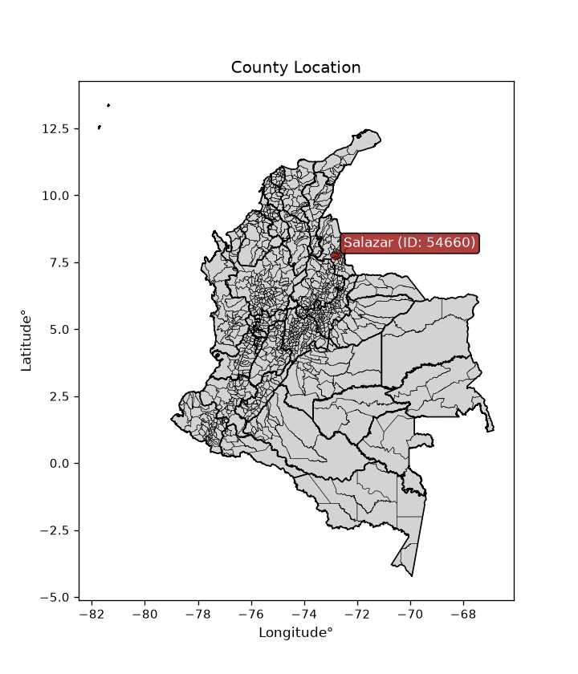
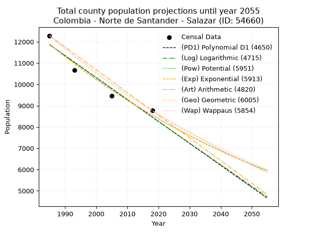
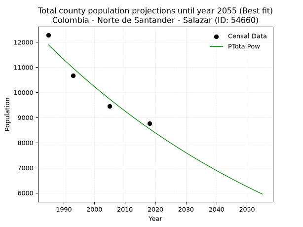
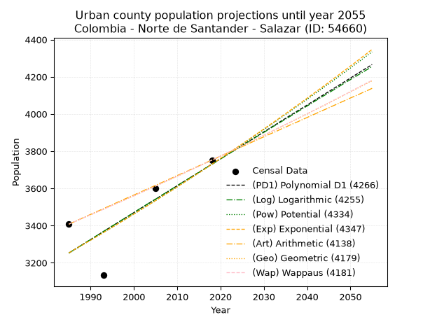
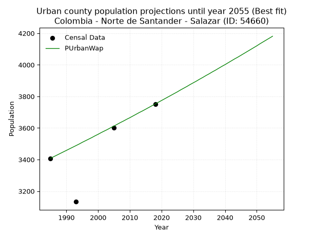
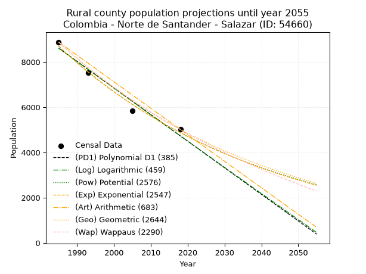
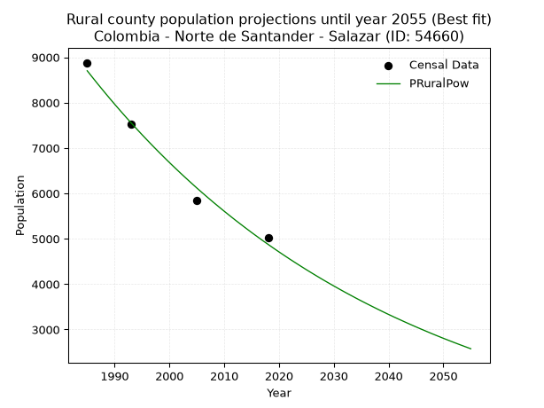

<div align="center">


</div>

# _“Population and Public Services Demand Projections (PPSD) until Year 2050 for Colombia - Norte de Santander - Salazar (ID: 54660)”_
Keywords: `population` `public-service` `projection` `lineal` `polynomial` `logarithmic` `potential` `exponential` `arithmetic` `geometric` `wappaus` `dane` `colombia` `south-america`

PPSD are analytical estimates used by governments and planners to anticipate future changes in population size, age distribution, and the resulting community needs for utilities, healthcare, education, and infrastructure as sizing future water treatment facilities, electrical grids, and road networks based on spatial growth.

> **General running parameters**: • app_version: _v20260806_. • Python version: _3.14.7_. • Pandas version: _3.0.5_. • NumPy version: _2.5.1_. • Creates, save and include plots into reports (create_plot): _False_. • Projection until year: _2050_. • Process polynomial degree 2 and up: _False_. • Process Wappaus: _True_. • Process Wappaus: _True_. • Set negative values to zero: _True_. • Set infinite values to zero: _True_. • Drop dataset notes: _True_. 
<div align="center">

Dynamic map: [:earth_americas:Google](http://maps.google.com/maps?q=7.773682867,-72.8130642) [:earth_americas:OSM](https://www.openstreetmap.org/#map=18/7.773682867/-72.8130642&layers=P) [:earth_americas:Bing](https://www.bing.com/maps?cp=7.773682867~-72.8130642&lvl=18) [:earth_americas:Apple](https://maps.apple.com/frame?center=7.773682867%2C-72.8130642&span=0.003%2C0.006)

</div>


<div align="center">

```geojson
{
  "type": "Feature",
  "geometry": {
    "type": "Point", 
    "coordinates": [-72.8130642, 7.773682867]
  }, 
  "properties": {
    "Name": "Colombia - Norte de Santander - Salazar (ID: 54660)"
  }
}
```

</div>


<div align="center">

</img>

</div>


## 0. Census Data (4 records)

Census data are official statistics collected by a government about the people and housing in a country. They usually include counts of total population, age, sex, race, income, education, and jobs.

📅Global census file: [Population.xlsx](../data/Population.xlsx)

| Source   |   Year |   CountryID | CountryName   |   StateID | StateName          |   CountyID | CountyName   |   PTotal |   PUrban |   PRural |
|:---------|-------:|------------:|:--------------|----------:|:-------------------|-----------:|:-------------|---------:|---------:|---------:|
| DANE     |   1985 |          57 | Colombia      |        54 | Norte de Santander |      54660 | Salazar      |    12289 |     3408 |     8881 |
| DANE     |   1993 |          57 | Colombia      |        54 | Norte de Santander |      54660 | Salazar      |    10661 |     3133 |     7528 |
| DANE     |   2005 |          57 | Colombia      |        54 | Norte De Santander |      54660 | Salazar      |     9451 |     3600 |     5851 |
| DANE     |   2018 |          57 | Colombia      |        54 | Norte de Santander |      54660 | Salazar      |     8768 |     3752 |     5016 |

> 🔥Some records could had specific notes about the registered values or the corresponding urban or rural distribution.

📅   [RUPS](https://www.datos.gov.co/Hacienda-y-Cr-dito-P-blico/Registro-nico-de-Prestadores-de-Servicios-P-blicos/4qkq-csdn/about_data) - Local public utility companies: [RUPS.csv](../data/RUPS.xlsx)

 | SERVICIO       | ESTADO    | NOMBRE                                                                                       | NIT         | DEPARTAMENTO_DOMICILIO   | MUNICIPIO_DOMICILIO   | DIRECCION                                          |   TELEFONO | EMAIL                 | TIPO_PRESTADOR                 | CLASIFICACION                 |
|:---------------|:----------|:---------------------------------------------------------------------------------------------|:------------|:-------------------------|:----------------------|:---------------------------------------------------|-----------:|:----------------------|:-------------------------------|:------------------------------|
| ACUEDUCTO      | OPERATIVA | UNIDAD MUNICIPAL DE SERVICIOS PÚBLICOS DOMICILIARIOS DEL MUNICIPIO DE  SALAZAR DE LAS PALMAS | 890501549-0 | NORTE DE SANTANDER       | SALAZAR               | CALLE 2 # 6-25 PALACIO MUNICIPAL, BARRIO EL CENTRO |    5668039 | joandrez7@hotmail.com | MUNICIPIO (PRESTACIÓN DIRECTA) | MENOR O IGUAL A 2500 USUARIOS |
| ALCANTARILLADO | OPERATIVA | UNIDAD MUNICIPAL DE SERVICIOS PÚBLICOS DOMICILIARIOS DEL MUNICIPIO DE  SALAZAR DE LAS PALMAS | 890501549-0 | NORTE DE SANTANDER       | SALAZAR               | CALLE 2 # 6-25 PALACIO MUNICIPAL, BARRIO EL CENTRO |    5668039 | joandrez7@hotmail.com | MUNICIPIO (PRESTACIÓN DIRECTA) | MENOR O IGUAL A 2500 USUARIOS |

## 1. Total

### 1.1. Coefficients and Parameters

* (PD1) Polynomial Deg 1: -103.05138498594883, 216420.78281814413 (lineal)
* (Log) Logarithmic: -206404.09154322764, 1579171.4038386582
* (Pow) Potential: -19.968489549237738, 69.92642155362445
* (Exp) Exponential: -0.009970751428616784, 4682636114904.351
* (Art) Arithmetic: Year diff. 2018 - 1985 = 33, Population diff. 8768 - 12289 = -3521, Annual growth = -106.6969696969697
* (Geo) Geometric: Year diff. 2018 - 1985 = 33, Population diff. 8768 - 12289 = -3521, Annual growth % = -0.010178026189289091
* (Wap) Wappaus: i = -1.0134109293533713, Condition values only valid for < 200)

<sub>
Wappaus condition values: ['-0.00', '-1.01', '-2.03', '-3.04', '-4.05', '-5.07', '-6.08', '-7.09', '-8.11', '-9.12', '-10.13', '-11.15', '-12.16', '-13.17', '-14.19', '-15.20', '-16.21', '-17.23', '-18.24', '-19.25', '-20.27', '-21.28', '-22.30', '-23.31', '-24.32', '-25.34', '-26.35', '-27.36', '-28.38', '-29.39', '-30.40', '-31.42', '-32.43', '-33.44', '-34.46', '-35.47', '-36.48', '-37.50', '-38.51', '-39.52', '-40.54', '-41.55', '-42.56', '-43.58', '-44.59', '-45.60', '-46.62', '-47.63', '-48.64', '-49.66', '-50.67', '-51.68', '-52.70', '-53.71', '-54.72', '-55.74', '-56.75', '-57.76', '-58.78', '-59.79', '-60.80', '-61.82', '-62.83', '-63.84', '-64.86', '-65.87']
</sub>


### 1.2. Projected Dataset

|   Year |   CountyID |   PTotalPD1 |   PTotalLog |   PTotalPow |   PTotalExp |   PTotalArt |   PTotalGeo |   PTotalWap |
|-------:|-----------:|------------:|------------:|------------:|------------:|------------:|------------:|------------:|
|   1985 |      54660 |       11864 |       11868 |       11888 |       11884 |       12289 |       12289 |       12289 |
|   1986 |      54660 |       11761 |       11764 |       11769 |       11766 |       12182 |       12164 |       12165 |
|   1987 |      54660 |       11658 |       11660 |       11652 |       11649 |       12076 |       12040 |       12042 |
|   1988 |      54660 |       11555 |       11556 |       11535 |       11534 |       11969 |       11918 |       11921 |
|   1989 |      54660 |       11452 |       11452 |       11420 |       11419 |       11862 |       11796 |       11801 |
|   1990 |      54660 |       11349 |       11349 |       11306 |       11306 |       11756 |       11676 |       11682 |
|   1991 |      54660 |       11245 |       11245 |       11193 |       11194 |       11649 |       11557 |       11564 |
|   1992 |      54660 |       11142 |       11141 |       11081 |       11083 |       11542 |       11440 |       11447 |
|   1993 |      54660 |       11039 |       11038 |       10971 |       10973 |       11435 |       11323 |       11332 |
|   1994 |      54660 |       10936 |       10934 |       10862 |       10864 |       11329 |       11208 |       11217 |
|   1995 |      54660 |       10833 |       10831 |       10753 |       10756 |       11222 |       11094 |       11104 |
|   1996 |      54660 |       10730 |       10727 |       10646 |       10649 |       11115 |       10981 |       10991 |
|   1997 |      54660 |       10627 |       10624 |       10540 |       10544 |       11009 |       10869 |       10880 |
|   1998 |      54660 |       10524 |       10521 |       10436 |       10439 |       10902 |       10759 |       10770 |
|   1999 |      54660 |       10421 |       10417 |       10332 |       10336 |       10795 |       10649 |       10661 |
|   2000 |      54660 |       10318 |       10314 |       10229 |       10233 |       10689 |       10541 |       10553 |
|   2001 |      54660 |       10215 |       10211 |       10128 |       10132 |       10582 |       10433 |       10446 |
|   2002 |      54660 |       10112 |       10108 |       10027 |       10031 |       10475 |       10327 |       10340 |
|   2003 |      54660 |       10009 |       10005 |        9928 |        9932 |       10368 |       10222 |       10235 |
|   2004 |      54660 |        9906 |        9902 |        9829 |        9833 |       10262 |       10118 |       10131 |
|   2005 |      54660 |        9803 |        9799 |        9732 |        9735 |       10155 |       10015 |       10027 |
|   2006 |      54660 |        9700 |        9696 |        9635 |        9639 |       10048 |        9913 |        9925 |
|   2007 |      54660 |        9597 |        9593 |        9540 |        9543 |        9942 |        9812 |        9824 |
|   2008 |      54660 |        9494 |        9490 |        9445 |        9449 |        9835 |        9712 |        9724 |
|   2009 |      54660 |        9391 |        9387 |        9352 |        9355 |        9728 |        9614 |        9624 |
|   2010 |      54660 |        9287 |        9285 |        9259 |        9262 |        9622 |        9516 |        9526 |
|   2011 |      54660 |        9184 |        9182 |        9168 |        9170 |        9515 |        9419 |        9428 |
|   2012 |      54660 |        9081 |        9079 |        9077 |        9079 |        9408 |        9323 |        9331 |
|   2013 |      54660 |        8978 |        8977 |        8988 |        8989 |        9301 |        9228 |        9235 |
|   2014 |      54660 |        8875 |        8874 |        8899 |        8900 |        9195 |        9134 |        9140 |
|   2015 |      54660 |        8772 |        8772 |        8811 |        8812 |        9088 |        9041 |        9046 |
|   2016 |      54660 |        8669 |        8669 |        8724 |        8724 |        8981 |        8949 |        8952 |
|   2017 |      54660 |        8566 |        8567 |        8638 |        8638 |        8875 |        8858 |        8860 |
|   2018 |      54660 |        8463 |        8465 |        8553 |        8552 |        8768 |        8768 |        8768 |
|   2019 |      54660 |        8360 |        8362 |        8469 |        8467 |        8661 |        8679 |        8677 |
|   2020 |      54660 |        8257 |        8260 |        8386 |        8383 |        8555 |        8590 |        8587 |
|   2021 |      54660 |        8154 |        8158 |        8303 |        8300 |        8448 |        8503 |        8497 |
|   2022 |      54660 |        8051 |        8056 |        8222 |        8218 |        8341 |        8416 |        8409 |
|   2023 |      54660 |        7948 |        7954 |        8141 |        8136 |        8235 |        8331 |        8321 |
|   2024 |      54660 |        7845 |        7852 |        8061 |        8055 |        8128 |        8246 |        8233 |
|   2025 |      54660 |        7742 |        7750 |        7982 |        7975 |        8021 |        8162 |        8147 |
|   2026 |      54660 |        7639 |        7648 |        7904 |        7896 |        7914 |        8079 |        8061 |
|   2027 |      54660 |        7536 |        7546 |        7826 |        7818 |        7808 |        7997 |        7976 |
|   2028 |      54660 |        7433 |        7444 |        7749 |        7740 |        7701 |        7915 |        7892 |
|   2029 |      54660 |        7330 |        7343 |        7674 |        7664 |        7594 |        7835 |        7808 |
|   2030 |      54660 |        7226 |        7241 |        7598 |        7587 |        7488 |        7755 |        7725 |
|   2031 |      54660 |        7123 |        7139 |        7524 |        7512 |        7381 |        7676 |        7643 |
|   2032 |      54660 |        7020 |        7038 |        7450 |        7438 |        7274 |        7598 |        7562 |
|   2033 |      54660 |        6917 |        6936 |        7378 |        7364 |        7168 |        7521 |        7481 |
|   2034 |      54660 |        6814 |        6835 |        7306 |        7291 |        7061 |        7444 |        7400 |
|   2035 |      54660 |        6711 |        6733 |        7234 |        7219 |        6954 |        7368 |        7321 |
|   2036 |      54660 |        6608 |        6632 |        7164 |        7147 |        6847 |        7293 |        7242 |
|   2037 |      54660 |        6505 |        6530 |        7094 |        7076 |        6741 |        7219 |        7164 |
|   2038 |      54660 |        6402 |        6429 |        7024 |        7006 |        6634 |        7146 |        7086 |
|   2039 |      54660 |        6299 |        6328 |        6956 |        6936 |        6527 |        7073 |        7009 |
|   2040 |      54660 |        6196 |        6227 |        6888 |        6867 |        6421 |        7001 |        6932 |
|   2041 |      54660 |        6093 |        6126 |        6821 |        6799 |        6314 |        6930 |        6856 |
|   2042 |      54660 |        5990 |        6024 |        6755 |        6732 |        6207 |        6859 |        6781 |
|   2043 |      54660 |        5887 |        5923 |        6689 |        6665 |        6101 |        6789 |        6706 |
|   2044 |      54660 |        5784 |        5822 |        6624 |        6599 |        5994 |        6720 |        6632 |
|   2045 |      54660 |        5681 |        5721 |        6560 |        6533 |        5887 |        6652 |        6559 |
|   2046 |      54660 |        5578 |        5621 |        6496 |        6469 |        5780 |        6584 |        6486 |
|   2047 |      54660 |        5475 |        5520 |        6433 |        6404 |        5674 |        6517 |        6413 |
|   2048 |      54660 |        5372 |        5419 |        6370 |        6341 |        5567 |        6451 |        6342 |
|   2049 |      54660 |        5268 |        5318 |        6309 |        6278 |        5460 |        6385 |        6270 |
|   2050 |      54660 |        5165 |        5217 |        6247 |        6216 |        5354 |        6320 |        6200 |
<div align="center">

</img>

</div>


### 1.3. Best fit with absolute and relative error (%)

Relative error puts that difference into context by dividing the absolute error by the true value, creating a unitless ratio or percentage that shows the scale of the mistake.

Absolute and relative error

|   Year | Source   |   CountryID | CountryName   |   StateID | StateName          |   CountyID_x | CountyName   |   PTotal |   PUrban |   PRural |   CountyID_y |   PTotalPD1 |   PTotalLog |   PTotalPow |   PTotalExp |   PTotalArt |   PTotalGeo |   PTotalWap |   PTotalPD1AbsError |   PTotalLogAbsError |   PTotalPowAbsError |   PTotalExpAbsError |   PTotalArtAbsError |   PTotalGeoAbsError |   PTotalWapAbsError |   PTotalPD1RelError |   PTotalLogRelError |   PTotalPowRelError |   PTotalExpRelError |   PTotalArtRelError |   PTotalGeoRelError |   PTotalWapRelError |
|-------:|:---------|------------:|:--------------|----------:|:-------------------|-------------:|:-------------|---------:|---------:|---------:|-------------:|------------:|------------:|------------:|------------:|------------:|------------:|------------:|--------------------:|--------------------:|--------------------:|--------------------:|--------------------:|--------------------:|--------------------:|--------------------:|--------------------:|--------------------:|--------------------:|--------------------:|--------------------:|--------------------:|
|   1985 | DANE     |          57 | Colombia      |        54 | Norte de Santander |        54660 | Salazar      |    12289 |     3408 |     8881 |        54660 |       11864 |       11868 |       11888 |       11884 |       12289 |       12289 |       12289 |                 425 |                 421 |                 401 |                 405 |                   0 |                   0 |                   0 |             3.45838 |             3.42583 |             3.26308 |             3.29563 |             0       |             0       |             0       |
|   1993 | DANE     |          57 | Colombia      |        54 | Norte de Santander |        54660 | Salazar      |    10661 |     3133 |     7528 |        54660 |       11039 |       11038 |       10971 |       10973 |       11435 |       11323 |       11332 |                 378 |                 377 |                 310 |                 312 |                 774 |                 662 |                 671 |             3.54563 |             3.53625 |             2.90779 |             2.92655 |             7.26011 |             6.20955 |             6.29397 |
|   2005 | DANE     |          57 | Colombia      |        54 | Norte De Santander |        54660 | Salazar      |     9451 |     3600 |     5851 |        54660 |        9803 |        9799 |        9732 |        9735 |       10155 |       10015 |       10027 |                 352 |                 348 |                 281 |                 284 |                 704 |                 564 |                 576 |             3.72447 |             3.68215 |             2.97323 |             3.00497 |             7.44895 |             5.96762 |             6.09459 |
|   2018 | DANE     |          57 | Colombia      |        54 | Norte de Santander |        54660 | Salazar      |     8768 |     3752 |     5016 |        54660 |        8463 |        8465 |        8553 |        8552 |        8768 |        8768 |        8768 |                 305 |                 303 |                 215 |                 216 |                   0 |                   0 |                   0 |             3.47856 |             3.45575 |             2.4521  |             2.4635  |             0       |             0       |             0       |

Relative error mean

| Method    |   RelError | Best   |
|:----------|-----------:|:-------|
| PTotalPD1 |    3.55176 |        |
| PTotalLog |    3.52499 |        |
| PTotalPow |    2.89905 | True   |
| PTotalExp |    2.92267 |        |
| PTotalArt |    3.67726 |        |
| PTotalGeo |    3.04429 |        |
| PTotalWap |    3.09714 |        |

💙Best method: _**PTotalPow**_
<div align="center">

</img>

</div>


### 1.4. Fresh water supply demand in liters per capita per day (lpcd)

The fresh water supply demand typically ranges from 100 to 300 liters per capita per day (lpcd) for standard domestic and municipal planning, though absolute survival minimums set by the World Health Organization are as low as 7.5 to 20 liters per day, and total consumption in high-income nations can exceed 400 liters.

> `CZ`: Level in meters above the sea level (masl)<br> `WS`: Fresh water supply demand in liters per capita per day (lpcd or l/h/d)<br> `WSAll`: Zonal fresh water supply demand in liters per second (l/s)<br> `A`: Zonal area in square meters<br> `DP`: Population density (people/hectare or p/ha)

Reference values (RAS Colombia)

|    CZ |   WS |
|------:|-----:|
|  1000 |  120 |
|  2000 |  130 |
| 99999 |  140 |

County shapefile geometry properties and water supply values

|   CountyID |      ATotal |   CZTotal |   WSTotal |
|-----------:|------------:|----------:|----------:|
|      54660 | 4.92906e+08 |   1846.14 |       130 |

Projected values for best method: PTotalPow

|   CountyID |   Year |   PTotalPow |   DPTotal |   WSTotal |   WSTotalAll |
|-----------:|-------:|------------:|----------:|----------:|-------------:|
|      54660 |   1985 |       11888 |      0.24 |       130 |     17.887   |
|      54660 |   1986 |       11769 |      0.24 |       130 |     17.708   |
|      54660 |   1987 |       11652 |      0.24 |       130 |     17.5319  |
|      54660 |   1988 |       11535 |      0.23 |       130 |     17.3559  |
|      54660 |   1989 |       11420 |      0.23 |       130 |     17.1829  |
|      54660 |   1990 |       11306 |      0.23 |       130 |     17.0113  |
|      54660 |   1991 |       11193 |      0.23 |       130 |     16.8413  |
|      54660 |   1992 |       11081 |      0.22 |       130 |     16.6728  |
|      54660 |   1993 |       10971 |      0.22 |       130 |     16.5073  |
|      54660 |   1994 |       10862 |      0.22 |       130 |     16.3433  |
|      54660 |   1995 |       10753 |      0.22 |       130 |     16.1793  |
|      54660 |   1996 |       10646 |      0.22 |       130 |     16.0183  |
|      54660 |   1997 |       10540 |      0.21 |       130 |     15.8588  |
|      54660 |   1998 |       10436 |      0.21 |       130 |     15.7023  |
|      54660 |   1999 |       10332 |      0.21 |       130 |     15.5458  |
|      54660 |   2000 |       10229 |      0.21 |       130 |     15.3909  |
|      54660 |   2001 |       10128 |      0.21 |       130 |     15.2389  |
|      54660 |   2002 |       10027 |      0.2  |       130 |     15.0869  |
|      54660 |   2003 |        9928 |      0.2  |       130 |     14.938   |
|      54660 |   2004 |        9829 |      0.2  |       130 |     14.789   |
|      54660 |   2005 |        9732 |      0.2  |       130 |     14.6431  |
|      54660 |   2006 |        9635 |      0.2  |       130 |     14.4971  |
|      54660 |   2007 |        9540 |      0.19 |       130 |     14.3542  |
|      54660 |   2008 |        9445 |      0.19 |       130 |     14.2112  |
|      54660 |   2009 |        9352 |      0.19 |       130 |     14.0713  |
|      54660 |   2010 |        9259 |      0.19 |       130 |     13.9314  |
|      54660 |   2011 |        9168 |      0.19 |       130 |     13.7944  |
|      54660 |   2012 |        9077 |      0.18 |       130 |     13.6575  |
|      54660 |   2013 |        8988 |      0.18 |       130 |     13.5236  |
|      54660 |   2014 |        8899 |      0.18 |       130 |     13.3897  |
|      54660 |   2015 |        8811 |      0.18 |       130 |     13.2573  |
|      54660 |   2016 |        8724 |      0.18 |       130 |     13.1264  |
|      54660 |   2017 |        8638 |      0.18 |       130 |     12.997   |
|      54660 |   2018 |        8553 |      0.17 |       130 |     12.8691  |
|      54660 |   2019 |        8469 |      0.17 |       130 |     12.7427  |
|      54660 |   2020 |        8386 |      0.17 |       130 |     12.6178  |
|      54660 |   2021 |        8303 |      0.17 |       130 |     12.4929  |
|      54660 |   2022 |        8222 |      0.17 |       130 |     12.3711  |
|      54660 |   2023 |        8141 |      0.17 |       130 |     12.2492  |
|      54660 |   2024 |        8061 |      0.16 |       130 |     12.1288  |
|      54660 |   2025 |        7982 |      0.16 |       130 |     12.01    |
|      54660 |   2026 |        7904 |      0.16 |       130 |     11.8926  |
|      54660 |   2027 |        7826 |      0.16 |       130 |     11.7752  |
|      54660 |   2028 |        7749 |      0.16 |       130 |     11.6594  |
|      54660 |   2029 |        7674 |      0.16 |       130 |     11.5465  |
|      54660 |   2030 |        7598 |      0.15 |       130 |     11.4322  |
|      54660 |   2031 |        7524 |      0.15 |       130 |     11.3208  |
|      54660 |   2032 |        7450 |      0.15 |       130 |     11.2095  |
|      54660 |   2033 |        7378 |      0.15 |       130 |     11.1012  |
|      54660 |   2034 |        7306 |      0.15 |       130 |     10.9928  |
|      54660 |   2035 |        7234 |      0.15 |       130 |     10.8845  |
|      54660 |   2036 |        7164 |      0.15 |       130 |     10.7792  |
|      54660 |   2037 |        7094 |      0.14 |       130 |     10.6738  |
|      54660 |   2038 |        7024 |      0.14 |       130 |     10.5685  |
|      54660 |   2039 |        6956 |      0.14 |       130 |     10.4662  |
|      54660 |   2040 |        6888 |      0.14 |       130 |     10.3639  |
|      54660 |   2041 |        6821 |      0.14 |       130 |     10.2631  |
|      54660 |   2042 |        6755 |      0.14 |       130 |     10.1638  |
|      54660 |   2043 |        6689 |      0.14 |       130 |     10.0645  |
|      54660 |   2044 |        6624 |      0.13 |       130 |      9.96667 |
|      54660 |   2045 |        6560 |      0.13 |       130 |      9.87037 |
|      54660 |   2046 |        6496 |      0.13 |       130 |      9.77407 |
|      54660 |   2047 |        6433 |      0.13 |       130 |      9.67928 |
|      54660 |   2048 |        6370 |      0.13 |       130 |      9.58449 |
|      54660 |   2049 |        6309 |      0.13 |       130 |      9.49271 |
|      54660 |   2050 |        6247 |      0.13 |       130 |      9.39942 |

## 2. Urban

### 2.1. Coefficients and Parameters

* (PD1) Polynomial Deg 1: 14.470895222801973, -25472.15816940965 (lineal)
* (Log) Logarithmic: 28939.439768578985, -216495.66358708494
* (Pow) Potential: 8.276030867723453, -23.78004919720411
* (Exp) Exponential: 0.004138443508983872, 0.880441779363266
* (Art) Arithmetic: Year diff. 2018 - 1985 = 33, Population diff. 3752 - 3408 = 344, Annual growth = 10.424242424242424
* (Geo) Geometric: Year diff. 2018 - 1985 = 33, Population diff. 3752 - 3408 = 344, Annual growth % = 0.002918293047030618
* (Wap) Wappaus: i = 0.29117995598442525, Condition values only valid for < 200)

<sub>
Wappaus condition values: ['0.00', '0.29', '0.58', '0.87', '1.16', '1.46', '1.75', '2.04', '2.33', '2.62', '2.91', '3.20', '3.49', '3.79', '4.08', '4.37', '4.66', '4.95', '5.24', '5.53', '5.82', '6.11', '6.41', '6.70', '6.99', '7.28', '7.57', '7.86', '8.15', '8.44', '8.74', '9.03', '9.32', '9.61', '9.90', '10.19', '10.48', '10.77', '11.06', '11.36', '11.65', '11.94', '12.23', '12.52', '12.81', '13.10', '13.39', '13.69', '13.98', '14.27', '14.56', '14.85', '15.14', '15.43', '15.72', '16.01', '16.31', '16.60', '16.89', '17.18', '17.47', '17.76', '18.05', '18.34', '18.64', '18.93']
</sub>


### 2.2. Projected Dataset

|   Year |   CountyID |   PUrbanPD1 |   PUrbanLog |   PUrbanPow |   PUrbanExp |   PUrbanArt |   PUrbanGeo |   PUrbanWap |
|-------:|-----------:|------------:|------------:|------------:|------------:|------------:|------------:|------------:|
|   1985 |      54660 |        3253 |        3252 |        3253 |        3253 |        3408 |        3408 |        3408 |
|   1986 |      54660 |        3267 |        3267 |        3267 |        3267 |        3418 |        3418 |        3418 |
|   1987 |      54660 |        3282 |        3281 |        3280 |        3281 |        3429 |        3428 |        3428 |
|   1988 |      54660 |        3296 |        3296 |        3294 |        3294 |        3439 |        3438 |        3438 |
|   1989 |      54660 |        3310 |        3311 |        3308 |        3308 |        3450 |        3448 |        3448 |
|   1990 |      54660 |        3325 |        3325 |        3322 |        3321 |        3460 |        3458 |        3458 |
|   1991 |      54660 |        3339 |        3340 |        3336 |        3335 |        3471 |        3468 |        3468 |
|   1992 |      54660 |        3354 |        3354 |        3349 |        3349 |        3481 |        3478 |        3478 |
|   1993 |      54660 |        3368 |        3369 |        3363 |        3363 |        3491 |        3488 |        3488 |
|   1994 |      54660 |        3383 |        3383 |        3377 |        3377 |        3502 |        3499 |        3498 |
|   1995 |      54660 |        3397 |        3398 |        3391 |        3391 |        3512 |        3509 |        3509 |
|   1996 |      54660 |        3412 |        3412 |        3406 |        3405 |        3523 |        3519 |        3519 |
|   1997 |      54660 |        3426 |        3427 |        3420 |        3419 |        3533 |        3529 |        3529 |
|   1998 |      54660 |        3441 |        3441 |        3434 |        3433 |        3544 |        3540 |        3539 |
|   1999 |      54660 |        3455 |        3456 |        3448 |        3448 |        3554 |        3550 |        3550 |
|   2000 |      54660 |        3470 |        3470 |        3462 |        3462 |        3564 |        3560 |        3560 |
|   2001 |      54660 |        3484 |        3485 |        3477 |        3476 |        3575 |        3571 |        3571 |
|   2002 |      54660 |        3499 |        3499 |        3491 |        3491 |        3585 |        3581 |        3581 |
|   2003 |      54660 |        3513 |        3514 |        3506 |        3505 |        3596 |        3592 |        3591 |
|   2004 |      54660 |        3528 |        3528 |        3520 |        3520 |        3606 |        3602 |        3602 |
|   2005 |      54660 |        3542 |        3542 |        3535 |        3534 |        3616 |        3613 |        3612 |
|   2006 |      54660 |        3556 |        3557 |        3549 |        3549 |        3627 |        3623 |        3623 |
|   2007 |      54660 |        3571 |        3571 |        3564 |        3564 |        3637 |        3634 |        3634 |
|   2008 |      54660 |        3585 |        3586 |        3579 |        3578 |        3648 |        3644 |        3644 |
|   2009 |      54660 |        3600 |        3600 |        3593 |        3593 |        3658 |        3655 |        3655 |
|   2010 |      54660 |        3614 |        3615 |        3608 |        3608 |        3669 |        3666 |        3665 |
|   2011 |      54660 |        3629 |        3629 |        3623 |        3623 |        3679 |        3676 |        3676 |
|   2012 |      54660 |        3643 |        3643 |        3638 |        3638 |        3689 |        3687 |        3687 |
|   2013 |      54660 |        3658 |        3658 |        3653 |        3653 |        3700 |        3698 |        3698 |
|   2014 |      54660 |        3672 |        3672 |        3668 |        3668 |        3710 |        3709 |        3708 |
|   2015 |      54660 |        3687 |        3686 |        3683 |        3684 |        3721 |        3719 |        3719 |
|   2016 |      54660 |        3701 |        3701 |        3698 |        3699 |        3731 |        3730 |        3730 |
|   2017 |      54660 |        3716 |        3715 |        3714 |        3714 |        3742 |        3741 |        3741 |
|   2018 |      54660 |        3730 |        3729 |        3729 |        3730 |        3752 |        3752 |        3752 |
|   2019 |      54660 |        3745 |        3744 |        3744 |        3745 |        3762 |        3763 |        3763 |
|   2020 |      54660 |        3759 |        3758 |        3760 |        3761 |        3773 |        3774 |        3774 |
|   2021 |      54660 |        3774 |        3772 |        3775 |        3776 |        3783 |        3785 |        3785 |
|   2022 |      54660 |        3788 |        3787 |        3791 |        3792 |        3794 |        3796 |        3796 |
|   2023 |      54660 |        3802 |        3801 |        3806 |        3808 |        3804 |        3807 |        3807 |
|   2024 |      54660 |        3817 |        3815 |        3822 |        3823 |        3815 |        3818 |        3818 |
|   2025 |      54660 |        3831 |        3830 |        3837 |        3839 |        3825 |        3829 |        3829 |
|   2026 |      54660 |        3846 |        3844 |        3853 |        3855 |        3835 |        3840 |        3841 |
|   2027 |      54660 |        3860 |        3858 |        3869 |        3871 |        3846 |        3852 |        3852 |
|   2028 |      54660 |        3875 |        3873 |        3885 |        3887 |        3856 |        3863 |        3863 |
|   2029 |      54660 |        3889 |        3887 |        3900 |        3903 |        3867 |        3874 |        3875 |
|   2030 |      54660 |        3904 |        3901 |        3916 |        3919 |        3877 |        3886 |        3886 |
|   2031 |      54660 |        3918 |        3915 |        3932 |        3936 |        3888 |        3897 |        3897 |
|   2032 |      54660 |        3933 |        3930 |        3948 |        3952 |        3898 |        3908 |        3909 |
|   2033 |      54660 |        3947 |        3944 |        3965 |        3968 |        3908 |        3920 |        3920 |
|   2034 |      54660 |        3962 |        3958 |        3981 |        3985 |        3919 |        3931 |        3932 |
|   2035 |      54660 |        3976 |        3972 |        3997 |        4001 |        3929 |        3943 |        3943 |
|   2036 |      54660 |        3991 |        3986 |        4013 |        4018 |        3940 |        3954 |        3955 |
|   2037 |      54660 |        4005 |        4001 |        4030 |        4035 |        3950 |        3966 |        3966 |
|   2038 |      54660 |        4020 |        4015 |        4046 |        4051 |        3960 |        3977 |        3978 |
|   2039 |      54660 |        4034 |        4029 |        4062 |        4068 |        3971 |        3989 |        3990 |
|   2040 |      54660 |        4048 |        4043 |        4079 |        4085 |        3981 |        4000 |        4001 |
|   2041 |      54660 |        4063 |        4057 |        4096 |        4102 |        3992 |        4012 |        4013 |
|   2042 |      54660 |        4077 |        4072 |        4112 |        4119 |        4002 |        4024 |        4025 |
|   2043 |      54660 |        4092 |        4086 |        4129 |        4136 |        4013 |        4036 |        4037 |
|   2044 |      54660 |        4106 |        4100 |        4146 |        4153 |        4023 |        4047 |        4048 |
|   2045 |      54660 |        4121 |        4114 |        4162 |        4170 |        4033 |        4059 |        4060 |
|   2046 |      54660 |        4135 |        4128 |        4179 |        4188 |        4044 |        4071 |        4072 |
|   2047 |      54660 |        4150 |        4142 |        4196 |        4205 |        4054 |        4083 |        4084 |
|   2048 |      54660 |        4164 |        4157 |        4213 |        4223 |        4065 |        4095 |        4096 |
|   2049 |      54660 |        4179 |        4171 |        4230 |        4240 |        4075 |        4107 |        4108 |
|   2050 |      54660 |        4193 |        4185 |        4247 |        4258 |        4086 |        4119 |        4120 |
<div align="center">

</img>

</div>


### 2.3. Best fit with absolute and relative error (%)

Relative error puts that difference into context by dividing the absolute error by the true value, creating a unitless ratio or percentage that shows the scale of the mistake.

Absolute and relative error

|   Year | Source   |   CountryID | CountryName   |   StateID | StateName          |   CountyID_x | CountyName   |   PTotal |   PUrban |   PRural |   CountyID_y |   PUrbanPD1 |   PUrbanLog |   PUrbanPow |   PUrbanExp |   PUrbanArt |   PUrbanGeo |   PUrbanWap |   PUrbanPD1AbsError |   PUrbanLogAbsError |   PUrbanPowAbsError |   PUrbanExpAbsError |   PUrbanArtAbsError |   PUrbanGeoAbsError |   PUrbanWapAbsError |   PUrbanPD1RelError |   PUrbanLogRelError |   PUrbanPowRelError |   PUrbanExpRelError |   PUrbanArtRelError |   PUrbanGeoRelError |   PUrbanWapRelError |
|-------:|:---------|------------:|:--------------|----------:|:-------------------|-------------:|:-------------|---------:|---------:|---------:|-------------:|------------:|------------:|------------:|------------:|------------:|------------:|------------:|--------------------:|--------------------:|--------------------:|--------------------:|--------------------:|--------------------:|--------------------:|--------------------:|--------------------:|--------------------:|--------------------:|--------------------:|--------------------:|--------------------:|
|   1985 | DANE     |          57 | Colombia      |        54 | Norte de Santander |        54660 | Salazar      |    12289 |     3408 |     8881 |        54660 |        3253 |        3252 |        3253 |        3253 |        3408 |        3408 |        3408 |                 155 |                 156 |                 155 |                 155 |                   0 |                   0 |                   0 |            4.54812  |            4.57746  |            4.54812  |            4.54812  |            0        |            0        |            0        |
|   1993 | DANE     |          57 | Colombia      |        54 | Norte de Santander |        54660 | Salazar      |    10661 |     3133 |     7528 |        54660 |        3368 |        3369 |        3363 |        3363 |        3491 |        3488 |        3488 |                 235 |                 236 |                 230 |                 230 |                 358 |                 355 |                 355 |            7.5008   |            7.53272  |            7.34121  |            7.34121  |           11.4267   |           11.331    |           11.331    |
|   2005 | DANE     |          57 | Colombia      |        54 | Norte De Santander |        54660 | Salazar      |     9451 |     3600 |     5851 |        54660 |        3542 |        3542 |        3535 |        3534 |        3616 |        3613 |        3612 |                  58 |                  58 |                  65 |                  66 |                  16 |                  13 |                  12 |            1.61111  |            1.61111  |            1.80556  |            1.83333  |            0.444444 |            0.361111 |            0.333333 |
|   2018 | DANE     |          57 | Colombia      |        54 | Norte de Santander |        54660 | Salazar      |     8768 |     3752 |     5016 |        54660 |        3730 |        3729 |        3729 |        3730 |        3752 |        3752 |        3752 |                  22 |                  23 |                  23 |                  22 |                   0 |                   0 |                   0 |            0.586354 |            0.613006 |            0.613006 |            0.586354 |            0        |            0        |            0        |

Relative error mean

| Method    |   RelError | Best   |
|:----------|-----------:|:-------|
| PUrbanPD1 |    3.5616  |        |
| PUrbanLog |    3.58357 |        |
| PUrbanPow |    3.57697 |        |
| PUrbanExp |    3.57725 |        |
| PUrbanArt |    2.9678  |        |
| PUrbanGeo |    2.92303 |        |
| PUrbanWap |    2.91608 | True   |

💙Best method: _**PUrbanWap**_
<div align="center">

</img>

</div>


### 2.4. Fresh water supply demand in liters per capita per day (lpcd)

The fresh water supply demand typically ranges from 100 to 300 liters per capita per day (lpcd) for standard domestic and municipal planning, though absolute survival minimums set by the World Health Organization are as low as 7.5 to 20 liters per day, and total consumption in high-income nations can exceed 400 liters.

> `CZ`: Level in meters above the sea level (masl)<br> `WS`: Fresh water supply demand in liters per capita per day (lpcd or l/h/d)<br> `WSAll`: Zonal fresh water supply demand in liters per second (l/s)<br> `A`: Zonal area in square meters<br> `DP`: Population density (people/hectare or p/ha)

Reference values (RAS Colombia)

|    CZ |   WS |
|------:|-----:|
|  1000 |  120 |
|  2000 |  130 |
| 99999 |  140 |

County shapefile geometry properties and water supply values

|   CountyID |   AUrban |   CZUrban |   WSUrban |
|-----------:|---------:|----------:|----------:|
|      54660 |   964245 |   872.289 |       120 |

Projected values for best method: PUrbanWap

|   CountyID |   Year |   PUrbanWap |   DPUrban |   WSUrban |   WSUrbanAll |
|-----------:|-------:|------------:|----------:|----------:|-------------:|
|      54660 |   1985 |        3408 |     35.34 |       120 |      4.73333 |
|      54660 |   1986 |        3418 |     35.45 |       120 |      4.74722 |
|      54660 |   1987 |        3428 |     35.55 |       120 |      4.76111 |
|      54660 |   1988 |        3438 |     35.65 |       120 |      4.775   |
|      54660 |   1989 |        3448 |     35.76 |       120 |      4.78889 |
|      54660 |   1990 |        3458 |     35.86 |       120 |      4.80278 |
|      54660 |   1991 |        3468 |     35.97 |       120 |      4.81667 |
|      54660 |   1992 |        3478 |     36.07 |       120 |      4.83056 |
|      54660 |   1993 |        3488 |     36.17 |       120 |      4.84444 |
|      54660 |   1994 |        3498 |     36.28 |       120 |      4.85833 |
|      54660 |   1995 |        3509 |     36.39 |       120 |      4.87361 |
|      54660 |   1996 |        3519 |     36.49 |       120 |      4.8875  |
|      54660 |   1997 |        3529 |     36.6  |       120 |      4.90139 |
|      54660 |   1998 |        3539 |     36.7  |       120 |      4.91528 |
|      54660 |   1999 |        3550 |     36.82 |       120 |      4.93056 |
|      54660 |   2000 |        3560 |     36.92 |       120 |      4.94444 |
|      54660 |   2001 |        3571 |     37.03 |       120 |      4.95972 |
|      54660 |   2002 |        3581 |     37.14 |       120 |      4.97361 |
|      54660 |   2003 |        3591 |     37.24 |       120 |      4.9875  |
|      54660 |   2004 |        3602 |     37.36 |       120 |      5.00278 |
|      54660 |   2005 |        3612 |     37.46 |       120 |      5.01667 |
|      54660 |   2006 |        3623 |     37.57 |       120 |      5.03194 |
|      54660 |   2007 |        3634 |     37.69 |       120 |      5.04722 |
|      54660 |   2008 |        3644 |     37.79 |       120 |      5.06111 |
|      54660 |   2009 |        3655 |     37.91 |       120 |      5.07639 |
|      54660 |   2010 |        3665 |     38.01 |       120 |      5.09028 |
|      54660 |   2011 |        3676 |     38.12 |       120 |      5.10556 |
|      54660 |   2012 |        3687 |     38.24 |       120 |      5.12083 |
|      54660 |   2013 |        3698 |     38.35 |       120 |      5.13611 |
|      54660 |   2014 |        3708 |     38.45 |       120 |      5.15    |
|      54660 |   2015 |        3719 |     38.57 |       120 |      5.16528 |
|      54660 |   2016 |        3730 |     38.68 |       120 |      5.18056 |
|      54660 |   2017 |        3741 |     38.8  |       120 |      5.19583 |
|      54660 |   2018 |        3752 |     38.91 |       120 |      5.21111 |
|      54660 |   2019 |        3763 |     39.03 |       120 |      5.22639 |
|      54660 |   2020 |        3774 |     39.14 |       120 |      5.24167 |
|      54660 |   2021 |        3785 |     39.25 |       120 |      5.25694 |
|      54660 |   2022 |        3796 |     39.37 |       120 |      5.27222 |
|      54660 |   2023 |        3807 |     39.48 |       120 |      5.2875  |
|      54660 |   2024 |        3818 |     39.6  |       120 |      5.30278 |
|      54660 |   2025 |        3829 |     39.71 |       120 |      5.31806 |
|      54660 |   2026 |        3841 |     39.83 |       120 |      5.33472 |
|      54660 |   2027 |        3852 |     39.95 |       120 |      5.35    |
|      54660 |   2028 |        3863 |     40.06 |       120 |      5.36528 |
|      54660 |   2029 |        3875 |     40.19 |       120 |      5.38194 |
|      54660 |   2030 |        3886 |     40.3  |       120 |      5.39722 |
|      54660 |   2031 |        3897 |     40.42 |       120 |      5.4125  |
|      54660 |   2032 |        3909 |     40.54 |       120 |      5.42917 |
|      54660 |   2033 |        3920 |     40.65 |       120 |      5.44444 |
|      54660 |   2034 |        3932 |     40.78 |       120 |      5.46111 |
|      54660 |   2035 |        3943 |     40.89 |       120 |      5.47639 |
|      54660 |   2036 |        3955 |     41.02 |       120 |      5.49306 |
|      54660 |   2037 |        3966 |     41.13 |       120 |      5.50833 |
|      54660 |   2038 |        3978 |     41.26 |       120 |      5.525   |
|      54660 |   2039 |        3990 |     41.38 |       120 |      5.54167 |
|      54660 |   2040 |        4001 |     41.49 |       120 |      5.55694 |
|      54660 |   2041 |        4013 |     41.62 |       120 |      5.57361 |
|      54660 |   2042 |        4025 |     41.74 |       120 |      5.59028 |
|      54660 |   2043 |        4037 |     41.87 |       120 |      5.60694 |
|      54660 |   2044 |        4048 |     41.98 |       120 |      5.62222 |
|      54660 |   2045 |        4060 |     42.11 |       120 |      5.63889 |
|      54660 |   2046 |        4072 |     42.23 |       120 |      5.65556 |
|      54660 |   2047 |        4084 |     42.35 |       120 |      5.67222 |
|      54660 |   2048 |        4096 |     42.48 |       120 |      5.68889 |
|      54660 |   2049 |        4108 |     42.6  |       120 |      5.70556 |
|      54660 |   2050 |        4120 |     42.73 |       120 |      5.72222 |

## 3. Rural

### 3.1. Coefficients and Parameters

* (PD1) Polynomial Deg 1: -117.52228020875084, 241892.94098755388 (lineal)
* (Log) Logarithmic: -235343.53131180676, 1795667.0674257441
* (Pow) Potential: -35.12202527097333, 119.76365125088319
* (Exp) Exponential: -0.017541729602680675, 1.1524964190643567e+19
* (Art) Arithmetic: Year diff. 2018 - 1985 = 33, Population diff. 5016 - 8881 = -3865, Annual growth = -117.12121212121212
* (Geo) Geometric: Year diff. 2018 - 1985 = 33, Population diff. 5016 - 8881 = -3865, Annual growth % = -0.01716257232416163
* (Wap) Wappaus: i = -1.685561086870722, Condition values only valid for < 200)

<sub>
Wappaus condition values: ['-0.00', '-1.69', '-3.37', '-5.06', '-6.74', '-8.43', '-10.11', '-11.80', '-13.48', '-15.17', '-16.86', '-18.54', '-20.23', '-21.91', '-23.60', '-25.28', '-26.97', '-28.65', '-30.34', '-32.03', '-33.71', '-35.40', '-37.08', '-38.77', '-40.45', '-42.14', '-43.82', '-45.51', '-47.20', '-48.88', '-50.57', '-52.25', '-53.94', '-55.62', '-57.31', '-58.99', '-60.68', '-62.37', '-64.05', '-65.74', '-67.42', '-69.11', '-70.79', '-72.48', '-74.16', '-75.85', '-77.54', '-79.22', '-80.91', '-82.59', '-84.28', '-85.96', '-87.65', '-89.33', '-91.02', '-92.71', '-94.39', '-96.08', '-97.76', '-99.45', '-101.13', '-102.82', '-104.50', '-106.19', '-107.88', '-109.56']
</sub>


### 3.2. Projected Dataset

|   Year |   CountyID |   PRuralPD1 |   PRuralLog |   PRuralPow |   PRuralExp |   PRuralArt |   PRuralGeo |   PRuralWap |
|-------:|-----------:|------------:|------------:|------------:|------------:|------------:|------------:|------------:|
|   1985 |      54660 |        8611 |        8616 |        8702 |        8697 |        8881 |        8881 |        8881 |
|   1986 |      54660 |        8494 |        8497 |        8550 |        8546 |        8764 |        8729 |        8733 |
|   1987 |      54660 |        8376 |        8379 |        8400 |        8397 |        8647 |        8579 |        8587 |
|   1988 |      54660 |        8259 |        8260 |        8253 |        8251 |        8530 |        8432 |        8443 |
|   1989 |      54660 |        8141 |        8142 |        8108 |        8108 |        8413 |        8287 |        8302 |
|   1990 |      54660 |        8024 |        8024 |        7966 |        7967 |        8295 |        8145 |        8163 |
|   1991 |      54660 |        7906 |        7905 |        7827 |        7828 |        8178 |        8005 |        8026 |
|   1992 |      54660 |        7789 |        7787 |        7690 |        7692 |        8061 |        7867 |        7892 |
|   1993 |      54660 |        7671 |        7669 |        7556 |        7558 |        7944 |        7732 |        7759 |
|   1994 |      54660 |        7554 |        7551 |        7424 |        7427 |        7827 |        7600 |        7629 |
|   1995 |      54660 |        7436 |        7433 |        7294 |        7298 |        7710 |        7469 |        7500 |
|   1996 |      54660 |        7318 |        7315 |        7167 |        7171 |        7593 |        7341 |        7374 |
|   1997 |      54660 |        7201 |        7197 |        7042 |        7046 |        7476 |        7215 |        7250 |
|   1998 |      54660 |        7083 |        7079 |        6919 |        6923 |        7358 |        7091 |        7127 |
|   1999 |      54660 |        6966 |        6962 |        6799 |        6803 |        7241 |        6970 |        7006 |
|   2000 |      54660 |        6848 |        6844 |        6680 |        6685 |        7124 |        6850 |        6888 |
|   2001 |      54660 |        6731 |        6726 |        6564 |        6569 |        7007 |        6732 |        6770 |
|   2002 |      54660 |        6613 |        6609 |        6450 |        6454 |        6890 |        6617 |        6655 |
|   2003 |      54660 |        6496 |        6491 |        6338 |        6342 |        6773 |        6503 |        6541 |
|   2004 |      54660 |        6378 |        6374 |        6228 |        6232 |        6656 |        6392 |        6429 |
|   2005 |      54660 |        6261 |        6256 |        6119 |        6123 |        6539 |        6282 |        6319 |
|   2006 |      54660 |        6143 |        6139 |        6013 |        6017 |        6421 |        6174 |        6210 |
|   2007 |      54660 |        6026 |        6022 |        5909 |        5912 |        6304 |        6068 |        6103 |
|   2008 |      54660 |        5908 |        5904 |        5806 |        5810 |        6187 |        5964 |        5997 |
|   2009 |      54660 |        5791 |        5787 |        5706 |        5709 |        6070 |        5862 |        5893 |
|   2010 |      54660 |        5673 |        5670 |        5607 |        5609 |        5953 |        5761 |        5790 |
|   2011 |      54660 |        5556 |        5553 |        5510 |        5512 |        5836 |        5662 |        5688 |
|   2012 |      54660 |        5438 |        5436 |        5414 |        5416 |        5719 |        5565 |        5588 |
|   2013 |      54660 |        5321 |        5319 |        5321 |        5322 |        5602 |        5470 |        5490 |
|   2014 |      54660 |        5203 |        5202 |        5229 |        5229 |        5484 |        5376 |        5392 |
|   2015 |      54660 |        5086 |        5085 |        5138 |        5138 |        5367 |        5283 |        5296 |
|   2016 |      54660 |        4968 |        4969 |        5050 |        5049 |        5250 |        5193 |        5202 |
|   2017 |      54660 |        4851 |        4852 |        4962 |        4961 |        5133 |        5104 |        5108 |
|   2018 |      54660 |        4733 |        4735 |        4877 |        4875 |        5016 |        5016 |        5016 |
|   2019 |      54660 |        4615 |        4619 |        4793 |        4790 |        4899 |        4930 |        4925 |
|   2020 |      54660 |        4498 |        4502 |        4710 |        4707 |        4782 |        4845 |        4835 |
|   2021 |      54660 |        4380 |        4386 |        4629 |        4625 |        4665 |        4762 |        4746 |
|   2022 |      54660 |        4263 |        4269 |        4549 |        4544 |        4548 |        4680 |        4659 |
|   2023 |      54660 |        4145 |        4153 |        4471 |        4465 |        4430 |        4600 |        4572 |
|   2024 |      54660 |        4028 |        4037 |        4394 |        4388 |        4313 |        4521 |        4487 |
|   2025 |      54660 |        3910 |        3920 |        4318 |        4312 |        4196 |        4444 |        4403 |
|   2026 |      54660 |        3793 |        3804 |        4244 |        4237 |        4079 |        4367 |        4320 |
|   2027 |      54660 |        3675 |        3688 |        4171 |        4163 |        3962 |        4292 |        4237 |
|   2028 |      54660 |        3558 |        3572 |        4099 |        4090 |        3845 |        4219 |        4156 |
|   2029 |      54660 |        3440 |        3456 |        4029 |        4019 |        3728 |        4146 |        4076 |
|   2030 |      54660 |        3323 |        3340 |        3960 |        3949 |        3611 |        4075 |        3997 |
|   2031 |      54660 |        3205 |        3224 |        3892 |        3881 |        3493 |        4005 |        3919 |
|   2032 |      54660 |        3088 |        3108 |        3825 |        3813 |        3376 |        3936 |        3842 |
|   2033 |      54660 |        2970 |        2992 |        3760 |        3747 |        3259 |        3869 |        3765 |
|   2034 |      54660 |        2853 |        2877 |        3695 |        3682 |        3142 |        3802 |        3690 |
|   2035 |      54660 |        2735 |        2761 |        3632 |        3618 |        3025 |        3737 |        3615 |
|   2036 |      54660 |        2618 |        2645 |        3570 |        3555 |        2908 |        3673 |        3542 |
|   2037 |      54660 |        2500 |        2530 |        3509 |        3493 |        2791 |        3610 |        3469 |
|   2038 |      54660 |        2383 |        2414 |        3449 |        3432 |        2674 |        3548 |        3397 |
|   2039 |      54660 |        2265 |        2299 |        3390 |        3373 |        2556 |        3487 |        3326 |
|   2040 |      54660 |        2147 |        2183 |        3332 |        3314 |        2439 |        3427 |        3255 |
|   2041 |      54660 |        2030 |        2068 |        3275 |        3256 |        2322 |        3368 |        3186 |
|   2042 |      54660 |        1912 |        1953 |        3220 |        3200 |        2205 |        3311 |        3117 |
|   2043 |      54660 |        1795 |        1838 |        3165 |        3144 |        2088 |        3254 |        3049 |
|   2044 |      54660 |        1677 |        1722 |        3111 |        3089 |        1971 |        3198 |        2982 |
|   2045 |      54660 |        1560 |        1607 |        3058 |        3036 |        1854 |        3143 |        2916 |
|   2046 |      54660 |        1442 |        1492 |        3006 |        2983 |        1737 |        3089 |        2850 |
|   2047 |      54660 |        1325 |        1377 |        2955 |        2931 |        1619 |        3036 |        2785 |
|   2048 |      54660 |        1207 |        1262 |        2904 |        2880 |        1502 |        2984 |        2721 |
|   2049 |      54660 |        1090 |        1147 |        2855 |        2830 |        1385 |        2933 |        2657 |
|   2050 |      54660 |         972 |        1033 |        2806 |        2781 |        1268 |        2883 |        2595 |
<div align="center">

</img>

</div>


### 3.3. Best fit with absolute and relative error (%)

Relative error puts that difference into context by dividing the absolute error by the true value, creating a unitless ratio or percentage that shows the scale of the mistake.

Absolute and relative error

|   Year | Source   |   CountryID | CountryName   |   StateID | StateName          |   CountyID_x | CountyName   |   PTotal |   PUrban |   PRural |   CountyID_y |   PRuralPD1 |   PRuralLog |   PRuralPow |   PRuralExp |   PRuralArt |   PRuralGeo |   PRuralWap |   PRuralPD1AbsError |   PRuralLogAbsError |   PRuralPowAbsError |   PRuralExpAbsError |   PRuralArtAbsError |   PRuralGeoAbsError |   PRuralWapAbsError |   PRuralPD1RelError |   PRuralLogRelError |   PRuralPowRelError |   PRuralExpRelError |   PRuralArtRelError |   PRuralGeoRelError |   PRuralWapRelError |
|-------:|:---------|------------:|:--------------|----------:|:-------------------|-------------:|:-------------|---------:|---------:|---------:|-------------:|------------:|------------:|------------:|------------:|------------:|------------:|------------:|--------------------:|--------------------:|--------------------:|--------------------:|--------------------:|--------------------:|--------------------:|--------------------:|--------------------:|--------------------:|--------------------:|--------------------:|--------------------:|--------------------:|
|   1985 | DANE     |          57 | Colombia      |        54 | Norte de Santander |        54660 | Salazar      |    12289 |     3408 |     8881 |        54660 |        8611 |        8616 |        8702 |        8697 |        8881 |        8881 |        8881 |                 270 |                 265 |                 179 |                 184 |                   0 |                   0 |                   0 |             3.0402  |             2.9839  |            2.01554  |            2.07184  |             0       |             0       |             0       |
|   1993 | DANE     |          57 | Colombia      |        54 | Norte de Santander |        54660 | Salazar      |    10661 |     3133 |     7528 |        54660 |        7671 |        7669 |        7556 |        7558 |        7944 |        7732 |        7759 |                 143 |                 141 |                  28 |                  30 |                 416 |                 204 |                 231 |             1.89957 |             1.87301 |            0.371945 |            0.398512 |             5.52604 |             2.70988 |             3.06854 |
|   2005 | DANE     |          57 | Colombia      |        54 | Norte De Santander |        54660 | Salazar      |     9451 |     3600 |     5851 |        54660 |        6261 |        6256 |        6119 |        6123 |        6539 |        6282 |        6319 |                 410 |                 405 |                 268 |                 272 |                 688 |                 431 |                 468 |             7.00735 |             6.92189 |            4.58041  |            4.64878  |            11.7587  |             7.36626 |             7.99863 |
|   2018 | DANE     |          57 | Colombia      |        54 | Norte de Santander |        54660 | Salazar      |     8768 |     3752 |     5016 |        54660 |        4733 |        4735 |        4877 |        4875 |        5016 |        5016 |        5016 |                 283 |                 281 |                 139 |                 141 |                   0 |                   0 |                   0 |             5.64195 |             5.60207 |            2.77113  |            2.811    |             0       |             0       |             0       |

Relative error mean

| Method    |   RelError | Best   |
|:----------|-----------:|:-------|
| PRuralPD1 |    4.39727 |        |
| PRuralLog |    4.34522 |        |
| PRuralPow |    2.43476 | True   |
| PRuralExp |    2.48253 |        |
| PRuralArt |    4.32118 |        |
| PRuralGeo |    2.51904 |        |
| PRuralWap |    2.76679 |        |

💙Best method: _**PRuralPow**_
<div align="center">

</img>

</div>


### 3.4. Fresh water supply demand in liters per capita per day (lpcd)

The fresh water supply demand typically ranges from 100 to 300 liters per capita per day (lpcd) for standard domestic and municipal planning, though absolute survival minimums set by the World Health Organization are as low as 7.5 to 20 liters per day, and total consumption in high-income nations can exceed 400 liters.

> `CZ`: Level in meters above the sea level (masl)<br> `WS`: Fresh water supply demand in liters per capita per day (lpcd or l/h/d)<br> `WSAll`: Zonal fresh water supply demand in liters per second (l/s)<br> `A`: Zonal area in square meters<br> `DP`: Population density (people/hectare or p/ha)

Reference values (RAS Colombia)

|    CZ |   WS |
|------:|-----:|
|  1000 |  120 |
|  2000 |  130 |
| 99999 |  140 |

County shapefile geometry properties and water supply values

|   CountyID |      ARural |   CZRural |   WSRural |
|-----------:|------------:|----------:|----------:|
|      54660 | 4.91941e+08 |   1848.07 |       130 |

Projected values for best method: PRuralPow

|   CountyID |   Year |   PRuralPow |   DPRural |   WSRural |   WSRuralAll |
|-----------:|-------:|------------:|----------:|----------:|-------------:|
|      54660 |   1985 |        8702 |      0.18 |       130 |     13.0933  |
|      54660 |   1986 |        8550 |      0.17 |       130 |     12.8646  |
|      54660 |   1987 |        8400 |      0.17 |       130 |     12.6389  |
|      54660 |   1988 |        8253 |      0.17 |       130 |     12.4177  |
|      54660 |   1989 |        8108 |      0.16 |       130 |     12.1995  |
|      54660 |   1990 |        7966 |      0.16 |       130 |     11.9859  |
|      54660 |   1991 |        7827 |      0.16 |       130 |     11.7767  |
|      54660 |   1992 |        7690 |      0.16 |       130 |     11.5706  |
|      54660 |   1993 |        7556 |      0.15 |       130 |     11.369   |
|      54660 |   1994 |        7424 |      0.15 |       130 |     11.1704  |
|      54660 |   1995 |        7294 |      0.15 |       130 |     10.9748  |
|      54660 |   1996 |        7167 |      0.15 |       130 |     10.7837  |
|      54660 |   1997 |        7042 |      0.14 |       130 |     10.5956  |
|      54660 |   1998 |        6919 |      0.14 |       130 |     10.4105  |
|      54660 |   1999 |        6799 |      0.14 |       130 |     10.23    |
|      54660 |   2000 |        6680 |      0.14 |       130 |     10.0509  |
|      54660 |   2001 |        6564 |      0.13 |       130 |      9.87639 |
|      54660 |   2002 |        6450 |      0.13 |       130 |      9.70486 |
|      54660 |   2003 |        6338 |      0.13 |       130 |      9.53634 |
|      54660 |   2004 |        6228 |      0.13 |       130 |      9.37083 |
|      54660 |   2005 |        6119 |      0.12 |       130 |      9.20683 |
|      54660 |   2006 |        6013 |      0.12 |       130 |      9.04734 |
|      54660 |   2007 |        5909 |      0.12 |       130 |      8.89086 |
|      54660 |   2008 |        5806 |      0.12 |       130 |      8.73588 |
|      54660 |   2009 |        5706 |      0.12 |       130 |      8.58542 |
|      54660 |   2010 |        5607 |      0.11 |       130 |      8.43646 |
|      54660 |   2011 |        5510 |      0.11 |       130 |      8.29051 |
|      54660 |   2012 |        5414 |      0.11 |       130 |      8.14606 |
|      54660 |   2013 |        5321 |      0.11 |       130 |      8.00613 |
|      54660 |   2014 |        5229 |      0.11 |       130 |      7.86771 |
|      54660 |   2015 |        5138 |      0.1  |       130 |      7.73079 |
|      54660 |   2016 |        5050 |      0.1  |       130 |      7.59838 |
|      54660 |   2017 |        4962 |      0.1  |       130 |      7.46597 |
|      54660 |   2018 |        4877 |      0.1  |       130 |      7.33808 |
|      54660 |   2019 |        4793 |      0.1  |       130 |      7.21169 |
|      54660 |   2020 |        4710 |      0.1  |       130 |      7.08681 |
|      54660 |   2021 |        4629 |      0.09 |       130 |      6.96493 |
|      54660 |   2022 |        4549 |      0.09 |       130 |      6.84456 |
|      54660 |   2023 |        4471 |      0.09 |       130 |      6.7272  |
|      54660 |   2024 |        4394 |      0.09 |       130 |      6.61134 |
|      54660 |   2025 |        4318 |      0.09 |       130 |      6.49699 |
|      54660 |   2026 |        4244 |      0.09 |       130 |      6.38565 |
|      54660 |   2027 |        4171 |      0.08 |       130 |      6.27581 |
|      54660 |   2028 |        4099 |      0.08 |       130 |      6.16748 |
|      54660 |   2029 |        4029 |      0.08 |       130 |      6.06215 |
|      54660 |   2030 |        3960 |      0.08 |       130 |      5.95833 |
|      54660 |   2031 |        3892 |      0.08 |       130 |      5.85602 |
|      54660 |   2032 |        3825 |      0.08 |       130 |      5.75521 |
|      54660 |   2033 |        3760 |      0.08 |       130 |      5.65741 |
|      54660 |   2034 |        3695 |      0.08 |       130 |      5.55961 |
|      54660 |   2035 |        3632 |      0.07 |       130 |      5.46481 |
|      54660 |   2036 |        3570 |      0.07 |       130 |      5.37153 |
|      54660 |   2037 |        3509 |      0.07 |       130 |      5.27975 |
|      54660 |   2038 |        3449 |      0.07 |       130 |      5.18947 |
|      54660 |   2039 |        3390 |      0.07 |       130 |      5.10069 |
|      54660 |   2040 |        3332 |      0.07 |       130 |      5.01343 |
|      54660 |   2041 |        3275 |      0.07 |       130 |      4.92766 |
|      54660 |   2042 |        3220 |      0.07 |       130 |      4.84491 |
|      54660 |   2043 |        3165 |      0.06 |       130 |      4.76215 |
|      54660 |   2044 |        3111 |      0.06 |       130 |      4.6809  |
|      54660 |   2045 |        3058 |      0.06 |       130 |      4.60116 |
|      54660 |   2046 |        3006 |      0.06 |       130 |      4.52292 |
|      54660 |   2047 |        2955 |      0.06 |       130 |      4.44618 |
|      54660 |   2048 |        2904 |      0.06 |       130 |      4.36944 |
|      54660 |   2049 |        2855 |      0.06 |       130 |      4.29572 |
|      54660 |   2050 |        2806 |      0.06 |       130 |      4.22199 |

<div align="center"><br><sub>Share this research</sub></div><br>

<sub>**APPS & TOOLS & CONTENT DISCLAIMER**: • NO WARRANTY - This content and software is provided by <a href="https://github.com/rcfdtools" target="_blank">github.com/rcfdtools</a> "as is", without any express or implied warranty, including warranties of merchantability, fitness for a particular purpose, or non-infringement. There is no guarantee that the software will be error-free or operate without interruption. • LIMITATION OF LIABILITY - Neither the authors nor copyright holders will be liable for claims or damages arising from the software or its use. You are responsible for determining if the software is appropriate for your use and assume all associated risks, including errors, legal compliance, and data loss. • NO PROFESSIONAL ADVICE - The software provides general information and does not offer professional advice. It should not replace consultation with professional advisors. [Clauses and global license for rcfdtools use.](https://github.com/rcfdtools/rcfdtools/blob/main/LICENSE.md)</sub>

| [:house: Home](Readme.md)  | [:beginner: Help / Collab](https://github.com/rcfdtools/R.HydroTools/discussions/31) |
|----------------------------|-------------------------------------------------------------------------------------------|