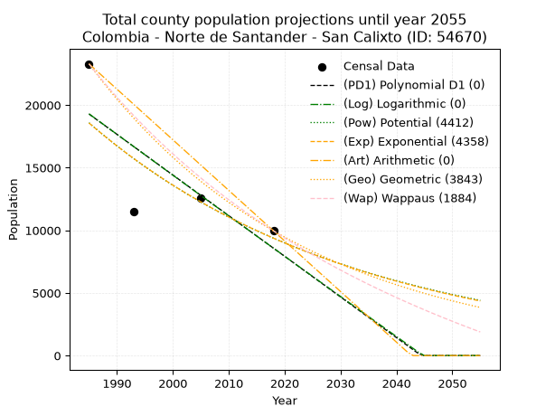
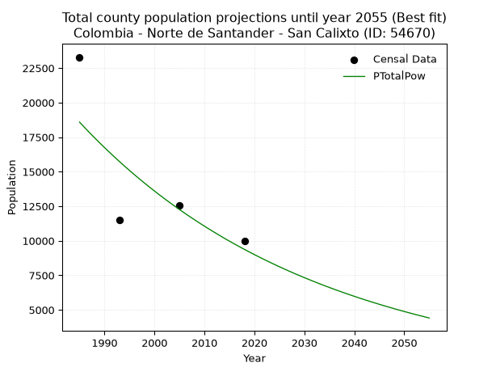
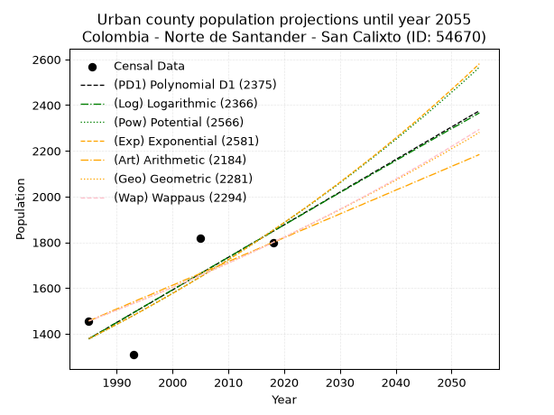
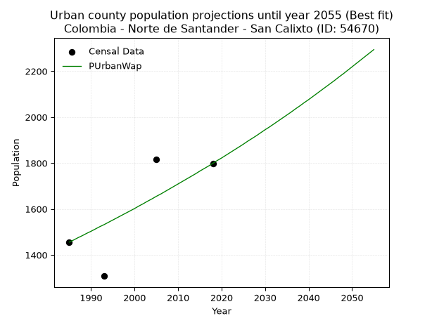
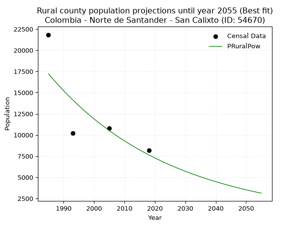

<div align="center">


</div>

# _“Population and Public Services Demand Projections (PPSD) until Year 2050 for Colombia - Norte de Santander - San Calixto (ID: 54670)”_
Keywords: `population` `public-service` `projection` `lineal` `polynomial` `logarithmic` `potential` `exponential` `arithmetic` `geometric` `wappaus` `dane` `colombia` `south-america`

PPSD are analytical estimates used by governments and planners to anticipate future changes in population size, age distribution, and the resulting community needs for utilities, healthcare, education, and infrastructure as sizing future water treatment facilities, electrical grids, and road networks based on spatial growth.

> **General running parameters**: • app_version: _v20260806_. • Python version: _3.14.7_. • Pandas version: _3.0.5_. • NumPy version: _2.5.1_. • Creates, save and include plots into reports (create_plot): _False_. • Projection until year: _2050_. • Process polynomial degree 2 and up: _False_. • Process Wappaus: _True_. • Process Wappaus: _True_. • Set negative values to zero: _True_. • Set infinite values to zero: _True_. • Drop dataset notes: _True_. 
<div align="center">

Dynamic map: [:earth_americas:Google](http://maps.google.com/maps?q=8.402140364,-73.2086215) [:earth_americas:OSM](https://www.openstreetmap.org/#map=18/8.402140364/-73.2086215&layers=P) [:earth_americas:Bing](https://www.bing.com/maps?cp=8.402140364~-73.2086215&lvl=18) [:earth_americas:Apple](https://maps.apple.com/frame?center=8.402140364%2C-73.2086215&span=0.003%2C0.006)

</div>


<div align="center">

```geojson
{
  "type": "Feature",
  "geometry": {
    "type": "Point", 
    "coordinates": [-73.2086215, 8.402140364]
  }, 
  "properties": {
    "Name": "Colombia - Norte de Santander - San Calixto (ID: 54670)"
  }
}
```

</div>


## 0. Census Data (4 records)

Census data are official statistics collected by a government about the people and housing in a country. They usually include counts of total population, age, sex, race, income, education, and jobs.

📅Global census file: [Population.xlsx](../data/Population.xlsx)

| Source   |   Year |   CountryID | CountryName   |   StateID | StateName          |   CountyID | CountyName   |   PTotal |   PUrban |   PRural |
|:---------|-------:|------------:|:--------------|----------:|:-------------------|-----------:|:-------------|---------:|---------:|---------:|
| DANE     |   1985 |          57 | Colombia      |        54 | Norte de Santander |      54670 | San Calixto  |    23290 |     1456 |    21834 |
| DANE     |   1993 |          57 | Colombia      |        54 | Norte de Santander |      54670 | San Calixto  |    11518 |     1308 |    10210 |
| DANE     |   2005 |          57 | Colombia      |        54 | Norte De Santander |      54670 | San Calixto  |    12581 |     1817 |    10764 |
| DANE     |   2018 |          57 | Colombia      |        54 | Norte de Santander |      54670 | San Calixto  |     9961 |     1799 |     8162 |

> 🔥Some records could had specific notes about the registered values or the corresponding urban or rural distribution.

## 1. Total

### 1.1. Coefficients and Parameters

* (PD1) Polynomial Deg 1: -324.5451625853054, 663508.9614612572 (lineal)
* (Log) Logarithmic: -650494.2388511526, 4958749.422241296
* (Pow) Potential: -41.49589984905672, 141.11275349940033
* (Exp) Exponential: -0.02070863977259533, 1.321860241510108e+22
* (Art) Arithmetic: Year diff. 2018 - 1985 = 33, Population diff. 9961 - 23290 = -13329, Annual growth = -403.90909090909093
* (Geo) Geometric: Year diff. 2018 - 1985 = 33, Population diff. 9961 - 23290 = -13329, Annual growth % = -0.025409383073835334
* (Wap) Wappaus: i = -2.429455300045658, Condition values only valid for < 200)

<sub>
Wappaus condition values: ['-0.00', '-2.43', '-4.86', '-7.29', '-9.72', '-12.15', '-14.58', '-17.01', '-19.44', '-21.87', '-24.29', '-26.72', '-29.15', '-31.58', '-34.01', '-36.44', '-38.87', '-41.30', '-43.73', '-46.16', '-48.59', '-51.02', '-53.45', '-55.88', '-58.31', '-60.74', '-63.17', '-65.60', '-68.02', '-70.45', '-72.88', '-75.31', '-77.74', '-80.17', '-82.60', '-85.03', '-87.46', '-89.89', '-92.32', '-94.75', '-97.18', '-99.61', '-102.04', '-104.47', '-106.90', '-109.33', '-111.75', '-114.18', '-116.61', '-119.04', '-121.47', '-123.90', '-126.33', '-128.76', '-131.19', '-133.62', '-136.05', '-138.48', '-140.91', '-143.34', '-145.77', '-148.20', '-150.63', '-153.06', '-155.49', '-157.91']
</sub>


### 1.2. Projected Dataset

|   Year |   CountyID |   PTotalPD1 |   PTotalLog |   PTotalPow |   PTotalExp |   PTotalArt |   PTotalGeo |   PTotalWap |
|-------:|-----------:|------------:|------------:|------------:|------------:|------------:|------------:|------------:|
|   1985 |      54670 |       19287 |       19303 |       18587 |       18569 |       23290 |       23290 |       23290 |
|   1986 |      54670 |       18962 |       18976 |       18203 |       18189 |       22886 |       22698 |       22731 |
|   1987 |      54670 |       18638 |       18648 |       17826 |       17816 |       22482 |       22121 |       22185 |
|   1988 |      54670 |       18313 |       18321 |       17458 |       17451 |       22078 |       21559 |       21652 |
|   1989 |      54670 |       17989 |       17994 |       17098 |       17093 |       21674 |       21012 |       21132 |
|   1990 |      54670 |       17664 |       17667 |       16745 |       16743 |       21270 |       20478 |       20623 |
|   1991 |      54670 |       17340 |       17340 |       16399 |       16400 |       20867 |       19957 |       20126 |
|   1992 |      54670 |       17015 |       17013 |       16061 |       16063 |       20463 |       19450 |       19640 |
|   1993 |      54670 |       16690 |       16687 |       15730 |       15734 |       20059 |       18956 |       19164 |
|   1994 |      54670 |       16366 |       16361 |       15406 |       15412 |       19655 |       18474 |       18699 |
|   1995 |      54670 |       16041 |       16034 |       15089 |       15096 |       19251 |       18005 |       18245 |
|   1996 |      54670 |       15717 |       15708 |       14778 |       14786 |       18847 |       17547 |       17800 |
|   1997 |      54670 |       15392 |       15383 |       14474 |       14483 |       18443 |       17102 |       17364 |
|   1998 |      54670 |       15068 |       15057 |       14177 |       14187 |       18039 |       16667 |       16937 |
|   1999 |      54670 |       14743 |       14731 |       13885 |       13896 |       17635 |       16244 |       16520 |
|   2000 |      54670 |       14419 |       14406 |       13600 |       13611 |       17231 |       15831 |       16111 |
|   2001 |      54670 |       14094 |       14081 |       13321 |       13332 |       16827 |       15429 |       15710 |
|   2002 |      54670 |       13770 |       13756 |       13048 |       13059 |       16424 |       15037 |       15317 |
|   2003 |      54670 |       13445 |       13431 |       12780 |       12791 |       16020 |       14654 |       14933 |
|   2004 |      54670 |       13120 |       13106 |       12518 |       12529 |       15616 |       14282 |       14555 |
|   2005 |      54670 |       12796 |       12782 |       12262 |       12272 |       15212 |       13919 |       14185 |
|   2006 |      54670 |       12471 |       12458 |       12010 |       12021 |       14808 |       13566 |       13823 |
|   2007 |      54670 |       12147 |       12133 |       11765 |       11774 |       14404 |       13221 |       13467 |
|   2008 |      54670 |       11822 |       11809 |       11524 |       11533 |       14000 |       12885 |       13118 |
|   2009 |      54670 |       11498 |       11486 |       11288 |       11297 |       13596 |       12557 |       12776 |
|   2010 |      54670 |       11173 |       11162 |       11058 |       11065 |       13192 |       12238 |       12440 |
|   2011 |      54670 |       10849 |       10838 |       10832 |       10838 |       12788 |       11927 |       12110 |
|   2012 |      54670 |       10524 |       10515 |       10611 |       10616 |       12384 |       11624 |       11786 |
|   2013 |      54670 |       10200 |       10192 |       10394 |       10399 |       11981 |       11329 |       11468 |
|   2014 |      54670 |        9875 |        9869 |       10182 |       10185 |       11577 |       11041 |       11156 |
|   2015 |      54670 |        9550 |        9546 |        9974 |        9977 |       11173 |       10761 |       10849 |
|   2016 |      54670 |        9226 |        9223 |        9771 |        9772 |       10769 |       10487 |       10548 |
|   2017 |      54670 |        8901 |        8900 |        9572 |        9572 |       10365 |       10221 |       10252 |
|   2018 |      54670 |        8577 |        8578 |        9377 |        9376 |        9961 |        9961 |        9961 |
|   2019 |      54670 |        8252 |        8256 |        9186 |        9184 |        9557 |        9708 |        9675 |
|   2020 |      54670 |        7928 |        7934 |        9000 |        8995 |        9153 |        9461 |        9394 |
|   2021 |      54670 |        7603 |        7612 |        8817 |        8811 |        8749 |        9221 |        9118 |
|   2022 |      54670 |        7279 |        7290 |        8638 |        8630 |        8345 |        8987 |        8846 |
|   2023 |      54670 |        6954 |        6968 |        8462 |        8453 |        7941 |        8758 |        8579 |
|   2024 |      54670 |        6630 |        6647 |        8290 |        8280 |        7538 |        8536 |        8317 |
|   2025 |      54670 |        6305 |        6325 |        8122 |        8111 |        7134 |        8319 |        8058 |
|   2026 |      54670 |        5980 |        6004 |        7957 |        7944 |        6730 |        8107 |        7804 |
|   2027 |      54670 |        5656 |        5683 |        7796 |        7781 |        6326 |        7901 |        7554 |
|   2028 |      54670 |        5331 |        5362 |        7638 |        7622 |        5922 |        7701 |        7308 |
|   2029 |      54670 |        5007 |        5042 |        7484 |        7466 |        5518 |        7505 |        7066 |
|   2030 |      54670 |        4682 |        4721 |        7332 |        7313 |        5114 |        7314 |        6827 |
|   2031 |      54670 |        4358 |        4401 |        7184 |        7163 |        4710 |        7128 |        6592 |
|   2032 |      54670 |        4033 |        4081 |        7039 |        7016 |        4306 |        6947 |        6361 |
|   2033 |      54670 |        3709 |        3761 |        6896 |        6872 |        3902 |        6771 |        6134 |
|   2034 |      54670 |        3384 |        3441 |        6757 |        6731 |        3498 |        6599 |        5910 |
|   2035 |      54670 |        3060 |        3121 |        6621 |        6593 |        3095 |        6431 |        5689 |
|   2036 |      54670 |        2735 |        2801 |        6487 |        6458 |        2691 |        6268 |        5472 |
|   2037 |      54670 |        2410 |        2482 |        6356 |        6326 |        2287 |        6108 |        5258 |
|   2038 |      54670 |        2086 |        2163 |        6228 |        6196 |        1883 |        5953 |        5047 |
|   2039 |      54670 |        1761 |        1844 |        6102 |        6069 |        1479 |        5802 |        4839 |
|   2040 |      54670 |        1437 |        1525 |        5980 |        5945 |        1075 |        5654 |        4634 |
|   2041 |      54670 |        1112 |        1206 |        5859 |        5823 |         671 |        5511 |        4432 |
|   2042 |      54670 |         788 |         887 |        5741 |        5704 |         267 |        5371 |        4233 |
|   2043 |      54670 |         463 |         569 |        5626 |        5587 |           0 |        5234 |        4037 |
|   2044 |      54670 |         139 |         250 |        5513 |        5472 |           0 |        5101 |        3844 |
|   2045 |      54670 |           0 |           0 |        5402 |        5360 |           0 |        4972 |        3653 |
|   2046 |      54670 |           0 |           0 |        5294 |        5250 |           0 |        4845 |        3465 |
|   2047 |      54670 |           0 |           0 |        5187 |        5143 |           0 |        4722 |        3280 |
|   2048 |      54670 |           0 |           0 |        5083 |        5037 |           0 |        4602 |        3097 |
|   2049 |      54670 |           0 |           0 |        4981 |        4934 |           0 |        4485 |        2916 |
|   2050 |      54670 |           0 |           0 |        4881 |        4833 |           0 |        4371 |        2739 |
<div align="center">

</img>

</div>


### 1.3. Best fit with absolute and relative error (%)

Relative error puts that difference into context by dividing the absolute error by the true value, creating a unitless ratio or percentage that shows the scale of the mistake.

Absolute and relative error

|   Year | Source   |   CountryID | CountryName   |   StateID | StateName          |   CountyID_x | CountyName   |   PTotal |   PUrban |   PRural |   CountyID_y |   PTotalPD1 |   PTotalLog |   PTotalPow |   PTotalExp |   PTotalArt |   PTotalGeo |   PTotalWap |   PTotalPD1AbsError |   PTotalLogAbsError |   PTotalPowAbsError |   PTotalExpAbsError |   PTotalArtAbsError |   PTotalGeoAbsError |   PTotalWapAbsError |   PTotalPD1RelError |   PTotalLogRelError |   PTotalPowRelError |   PTotalExpRelError |   PTotalArtRelError |   PTotalGeoRelError |   PTotalWapRelError |
|-------:|:---------|------------:|:--------------|----------:|:-------------------|-------------:|:-------------|---------:|---------:|---------:|-------------:|------------:|------------:|------------:|------------:|------------:|------------:|------------:|--------------------:|--------------------:|--------------------:|--------------------:|--------------------:|--------------------:|--------------------:|--------------------:|--------------------:|--------------------:|--------------------:|--------------------:|--------------------:|--------------------:|
|   1985 | DANE     |          57 | Colombia      |        54 | Norte de Santander |        54670 | San Calixto  |    23290 |     1456 |    21834 |        54670 |       19287 |       19303 |       18587 |       18569 |       23290 |       23290 |       23290 |                4003 |                3987 |                4703 |                4721 |                   0 |                   0 |                   0 |            17.1876  |            17.1189  |            20.1932  |            20.2705  |              0      |              0      |              0      |
|   1993 | DANE     |          57 | Colombia      |        54 | Norte de Santander |        54670 | San Calixto  |    11518 |     1308 |    10210 |        54670 |       16690 |       16687 |       15730 |       15734 |       20059 |       18956 |       19164 |                5172 |                5169 |                4212 |                4216 |                8541 |                7438 |                7646 |            44.9036  |            44.8776  |            36.5688  |            36.6036  |             74.1535 |             64.5772 |             66.3831 |
|   2005 | DANE     |          57 | Colombia      |        54 | Norte De Santander |        54670 | San Calixto  |    12581 |     1817 |    10764 |        54670 |       12796 |       12782 |       12262 |       12272 |       15212 |       13919 |       14185 |                 215 |                 201 |                 319 |                 309 |                2631 |                1338 |                1604 |             1.70893 |             1.59765 |             2.53557 |             2.45608 |             20.9125 |             10.6351 |             12.7494 |
|   2018 | DANE     |          57 | Colombia      |        54 | Norte de Santander |        54670 | San Calixto  |     9961 |     1799 |     8162 |        54670 |        8577 |        8578 |        9377 |        9376 |        9961 |        9961 |        9961 |                1384 |                1383 |                 584 |                 585 |                   0 |                   0 |                   0 |            13.8942  |            13.8841  |             5.86287 |             5.8729  |              0      |              0      |              0      |

Relative error mean

| Method    |   RelError | Best   |
|:----------|-----------:|:-------|
| PTotalPD1 |    19.4236 |        |
| PTotalLog |    19.3696 |        |
| PTotalPow |    16.2901 | True   |
| PTotalExp |    16.3008 |        |
| PTotalArt |    23.7665 |        |
| PTotalGeo |    18.8031 |        |
| PTotalWap |    19.7831 |        |

💙Best method: _**PTotalPow**_
<div align="center">

</img>

</div>


### 1.4. Fresh water supply demand in liters per capita per day (lpcd)

The fresh water supply demand typically ranges from 100 to 300 liters per capita per day (lpcd) for standard domestic and municipal planning, though absolute survival minimums set by the World Health Organization are as low as 7.5 to 20 liters per day, and total consumption in high-income nations can exceed 400 liters.

> `CZ`: Level in meters above the sea level (masl)<br> `WS`: Fresh water supply demand in liters per capita per day (lpcd or l/h/d)<br> `WSAll`: Zonal fresh water supply demand in liters per second (l/s)<br> `A`: Zonal area in square meters<br> `DP`: Population density (people/hectare)

Reference values (RAS Colombia)

|    CZ |   WS |
|------:|-----:|
|  1000 |  120 |
|  2000 |  130 |
| 99999 |  140 |

County shapefile geometry properties and water supply values

|   CountyID |      ATotal |   CZTotal |   WSTotal |
|-----------:|------------:|----------:|----------:|
|      54670 | 3.97288e+08 |   1120.26 |       130 |

Projected values for best method: PTotalPow

|   CountyID |   Year |   PTotalPow |   DPTotal |   WSTotal |   WSTotalAll |
|-----------:|-------:|------------:|----------:|----------:|-------------:|
|      54670 |   1985 |       18587 |      0.47 |       130 |     27.9666  |
|      54670 |   1986 |       18203 |      0.46 |       130 |     27.3888  |
|      54670 |   1987 |       17826 |      0.45 |       130 |     26.8215  |
|      54670 |   1988 |       17458 |      0.44 |       130 |     26.2678  |
|      54670 |   1989 |       17098 |      0.43 |       130 |     25.7262  |
|      54670 |   1990 |       16745 |      0.42 |       130 |     25.195   |
|      54670 |   1991 |       16399 |      0.41 |       130 |     24.6744  |
|      54670 |   1992 |       16061 |      0.4  |       130 |     24.1659  |
|      54670 |   1993 |       15730 |      0.4  |       130 |     23.6678  |
|      54670 |   1994 |       15406 |      0.39 |       130 |     23.1803  |
|      54670 |   1995 |       15089 |      0.38 |       130 |     22.7034  |
|      54670 |   1996 |       14778 |      0.37 |       130 |     22.2354  |
|      54670 |   1997 |       14474 |      0.36 |       130 |     21.778   |
|      54670 |   1998 |       14177 |      0.36 |       130 |     21.3311  |
|      54670 |   1999 |       13885 |      0.35 |       130 |     20.8918  |
|      54670 |   2000 |       13600 |      0.34 |       130 |     20.463   |
|      54670 |   2001 |       13321 |      0.34 |       130 |     20.0432  |
|      54670 |   2002 |       13048 |      0.33 |       130 |     19.6324  |
|      54670 |   2003 |       12780 |      0.32 |       130 |     19.2292  |
|      54670 |   2004 |       12518 |      0.32 |       130 |     18.835   |
|      54670 |   2005 |       12262 |      0.31 |       130 |     18.4498  |
|      54670 |   2006 |       12010 |      0.3  |       130 |     18.0706  |
|      54670 |   2007 |       11765 |      0.3  |       130 |     17.702   |
|      54670 |   2008 |       11524 |      0.29 |       130 |     17.3394  |
|      54670 |   2009 |       11288 |      0.28 |       130 |     16.9843  |
|      54670 |   2010 |       11058 |      0.28 |       130 |     16.6382  |
|      54670 |   2011 |       10832 |      0.27 |       130 |     16.2981  |
|      54670 |   2012 |       10611 |      0.27 |       130 |     15.9656  |
|      54670 |   2013 |       10394 |      0.26 |       130 |     15.6391  |
|      54670 |   2014 |       10182 |      0.26 |       130 |     15.3201  |
|      54670 |   2015 |        9974 |      0.25 |       130 |     15.0072  |
|      54670 |   2016 |        9771 |      0.25 |       130 |     14.7017  |
|      54670 |   2017 |        9572 |      0.24 |       130 |     14.4023  |
|      54670 |   2018 |        9377 |      0.24 |       130 |     14.1089  |
|      54670 |   2019 |        9186 |      0.23 |       130 |     13.8215  |
|      54670 |   2020 |        9000 |      0.23 |       130 |     13.5417  |
|      54670 |   2021 |        8817 |      0.22 |       130 |     13.2663  |
|      54670 |   2022 |        8638 |      0.22 |       130 |     12.997   |
|      54670 |   2023 |        8462 |      0.21 |       130 |     12.7322  |
|      54670 |   2024 |        8290 |      0.21 |       130 |     12.4734  |
|      54670 |   2025 |        8122 |      0.2  |       130 |     12.2206  |
|      54670 |   2026 |        7957 |      0.2  |       130 |     11.9723  |
|      54670 |   2027 |        7796 |      0.2  |       130 |     11.7301  |
|      54670 |   2028 |        7638 |      0.19 |       130 |     11.4924  |
|      54670 |   2029 |        7484 |      0.19 |       130 |     11.2606  |
|      54670 |   2030 |        7332 |      0.18 |       130 |     11.0319  |
|      54670 |   2031 |        7184 |      0.18 |       130 |     10.8093  |
|      54670 |   2032 |        7039 |      0.18 |       130 |     10.5911  |
|      54670 |   2033 |        6896 |      0.17 |       130 |     10.3759  |
|      54670 |   2034 |        6757 |      0.17 |       130 |     10.1668  |
|      54670 |   2035 |        6621 |      0.17 |       130 |      9.96215 |
|      54670 |   2036 |        6487 |      0.16 |       130 |      9.76053 |
|      54670 |   2037 |        6356 |      0.16 |       130 |      9.56343 |
|      54670 |   2038 |        6228 |      0.16 |       130 |      9.37083 |
|      54670 |   2039 |        6102 |      0.15 |       130 |      9.18125 |
|      54670 |   2040 |        5980 |      0.15 |       130 |      8.99769 |
|      54670 |   2041 |        5859 |      0.15 |       130 |      8.81563 |
|      54670 |   2042 |        5741 |      0.14 |       130 |      8.63808 |
|      54670 |   2043 |        5626 |      0.14 |       130 |      8.46505 |
|      54670 |   2044 |        5513 |      0.14 |       130 |      8.29502 |
|      54670 |   2045 |        5402 |      0.14 |       130 |      8.12801 |
|      54670 |   2046 |        5294 |      0.13 |       130 |      7.96551 |
|      54670 |   2047 |        5187 |      0.13 |       130 |      7.80451 |
|      54670 |   2048 |        5083 |      0.13 |       130 |      7.64803 |
|      54670 |   2049 |        4981 |      0.13 |       130 |      7.49456 |
|      54670 |   2050 |        4881 |      0.12 |       130 |      7.3441  |

## 2. Urban

### 2.1. Coefficients and Parameters

* (PD1) Polynomial Deg 1: 14.25291047771977, -26914.384183058966 (lineal)
* (Log) Logarithmic: 28531.518417451338, -215273.3001282871
* (Pow) Potential: 17.94845940500668, -56.050686853784995
* (Exp) Exponential: 0.008966759746031125, 2.5652913239230502e-05
* (Art) Arithmetic: Year diff. 2018 - 1985 = 33, Population diff. 1799 - 1456 = 343, Annual growth = 10.393939393939394
* (Geo) Geometric: Year diff. 2018 - 1985 = 33, Population diff. 1799 - 1456 = 343, Annual growth % = 0.006430832157825694
* (Wap) Wappaus: i = 0.6386445096122515, Condition values only valid for < 200)

<sub>
Wappaus condition values: ['0.00', '0.64', '1.28', '1.92', '2.55', '3.19', '3.83', '4.47', '5.11', '5.75', '6.39', '7.03', '7.66', '8.30', '8.94', '9.58', '10.22', '10.86', '11.50', '12.13', '12.77', '13.41', '14.05', '14.69', '15.33', '15.97', '16.60', '17.24', '17.88', '18.52', '19.16', '19.80', '20.44', '21.08', '21.71', '22.35', '22.99', '23.63', '24.27', '24.91', '25.55', '26.18', '26.82', '27.46', '28.10', '28.74', '29.38', '30.02', '30.65', '31.29', '31.93', '32.57', '33.21', '33.85', '34.49', '35.13', '35.76', '36.40', '37.04', '37.68', '38.32', '38.96', '39.60', '40.23', '40.87', '41.51']
</sub>


### 2.2. Projected Dataset

|   Year |   CountyID |   PUrbanPD1 |   PUrbanLog |   PUrbanPow |   PUrbanExp |   PUrbanArt |   PUrbanGeo |   PUrbanWap |
|-------:|-----------:|------------:|------------:|------------:|------------:|------------:|------------:|------------:|
|   1985 |      54670 |        1378 |        1377 |        1377 |        1378 |        1456 |        1456 |        1456 |
|   1986 |      54670 |        1392 |        1392 |        1390 |        1390 |        1466 |        1465 |        1465 |
|   1987 |      54670 |        1406 |        1406 |        1402 |        1403 |        1477 |        1475 |        1475 |
|   1988 |      54670 |        1420 |        1420 |        1415 |        1415 |        1487 |        1484 |        1484 |
|   1989 |      54670 |        1435 |        1435 |        1428 |        1428 |        1498 |        1494 |        1494 |
|   1990 |      54670 |        1449 |        1449 |        1441 |        1441 |        1508 |        1503 |        1503 |
|   1991 |      54670 |        1463 |        1463 |        1454 |        1454 |        1518 |        1513 |        1513 |
|   1992 |      54670 |        1477 |        1478 |        1467 |        1467 |        1529 |        1523 |        1523 |
|   1993 |      54670 |        1492 |        1492 |        1480 |        1480 |        1539 |        1533 |        1532 |
|   1994 |      54670 |        1506 |        1506 |        1494 |        1493 |        1550 |        1542 |        1542 |
|   1995 |      54670 |        1520 |        1521 |        1507 |        1507 |        1560 |        1552 |        1552 |
|   1996 |      54670 |        1534 |        1535 |        1521 |        1521 |        1570 |        1562 |        1562 |
|   1997 |      54670 |        1549 |        1549 |        1535 |        1534 |        1581 |        1572 |        1572 |
|   1998 |      54670 |        1563 |        1563 |        1549 |        1548 |        1591 |        1583 |        1582 |
|   1999 |      54670 |        1577 |        1578 |        1562 |        1562 |        1602 |        1593 |        1592 |
|   2000 |      54670 |        1591 |        1592 |        1577 |        1576 |        1612 |        1603 |        1602 |
|   2001 |      54670 |        1606 |        1606 |        1591 |        1590 |        1622 |        1613 |        1613 |
|   2002 |      54670 |        1620 |        1621 |        1605 |        1605 |        1633 |        1624 |        1623 |
|   2003 |      54670 |        1634 |        1635 |        1620 |        1619 |        1643 |        1634 |        1634 |
|   2004 |      54670 |        1648 |        1649 |        1634 |        1634 |        1653 |        1645 |        1644 |
|   2005 |      54670 |        1663 |        1663 |        1649 |        1648 |        1664 |        1655 |        1655 |
|   2006 |      54670 |        1677 |        1677 |        1664 |        1663 |        1674 |        1666 |        1665 |
|   2007 |      54670 |        1691 |        1692 |        1679 |        1678 |        1685 |        1677 |        1676 |
|   2008 |      54670 |        1705 |        1706 |        1694 |        1693 |        1695 |        1687 |        1687 |
|   2009 |      54670 |        1720 |        1720 |        1709 |        1708 |        1705 |        1698 |        1698 |
|   2010 |      54670 |        1734 |        1734 |        1724 |        1724 |        1716 |        1709 |        1709 |
|   2011 |      54670 |        1748 |        1748 |        1740 |        1739 |        1726 |        1720 |        1720 |
|   2012 |      54670 |        1762 |        1763 |        1755 |        1755 |        1737 |        1731 |        1731 |
|   2013 |      54670 |        1777 |        1777 |        1771 |        1771 |        1747 |        1742 |        1742 |
|   2014 |      54670 |        1791 |        1791 |        1787 |        1787 |        1757 |        1753 |        1753 |
|   2015 |      54670 |        1805 |        1805 |        1803 |        1803 |        1768 |        1765 |        1765 |
|   2016 |      54670 |        1819 |        1819 |        1819 |        1819 |        1778 |        1776 |        1776 |
|   2017 |      54670 |        1834 |        1833 |        1835 |        1836 |        1789 |        1788 |        1787 |
|   2018 |      54670 |        1848 |        1848 |        1852 |        1852 |        1799 |        1799 |        1799 |
|   2019 |      54670 |        1862 |        1862 |        1868 |        1869 |        1809 |        1811 |        1811 |
|   2020 |      54670 |        1876 |        1876 |        1885 |        1886 |        1820 |        1822 |        1822 |
|   2021 |      54670 |        1891 |        1890 |        1902 |        1903 |        1830 |        1834 |        1834 |
|   2022 |      54670 |        1905 |        1904 |        1919 |        1920 |        1841 |        1846 |        1846 |
|   2023 |      54670 |        1919 |        1918 |        1936 |        1937 |        1851 |        1858 |        1858 |
|   2024 |      54670 |        1934 |        1932 |        1953 |        1954 |        1861 |        1870 |        1870 |
|   2025 |      54670 |        1948 |        1946 |        1970 |        1972 |        1872 |        1882 |        1882 |
|   2026 |      54670 |        1962 |        1961 |        1988 |        1990 |        1882 |        1894 |        1895 |
|   2027 |      54670 |        1976 |        1975 |        2006 |        2008 |        1893 |        1906 |        1907 |
|   2028 |      54670 |        1991 |        1989 |        2023 |        2026 |        1903 |        1918 |        1919 |
|   2029 |      54670 |        2005 |        2003 |        2041 |        2044 |        1913 |        1930 |        1932 |
|   2030 |      54670 |        2019 |        2017 |        2060 |        2062 |        1924 |        1943 |        1945 |
|   2031 |      54670 |        2033 |        2031 |        2078 |        2081 |        1934 |        1955 |        1957 |
|   2032 |      54670 |        2048 |        2045 |        2096 |        2100 |        1945 |        1968 |        1970 |
|   2033 |      54670 |        2062 |        2059 |        2115 |        2119 |        1955 |        1981 |        1983 |
|   2034 |      54670 |        2076 |        2073 |        2134 |        2138 |        1965 |        1993 |        1996 |
|   2035 |      54670 |        2090 |        2087 |        2153 |        2157 |        1976 |        2006 |        2009 |
|   2036 |      54670 |        2105 |        2101 |        2172 |        2176 |        1986 |        2019 |        2022 |
|   2037 |      54670 |        2119 |        2115 |        2191 |        2196 |        1996 |        2032 |        2036 |
|   2038 |      54670 |        2133 |        2129 |        2210 |        2216 |        2007 |        2045 |        2049 |
|   2039 |      54670 |        2147 |        2143 |        2230 |        2236 |        2017 |        2058 |        2063 |
|   2040 |      54670 |        2162 |        2157 |        2249 |        2256 |        2028 |        2071 |        2076 |
|   2041 |      54670 |        2176 |        2171 |        2269 |        2276 |        2038 |        2085 |        2090 |
|   2042 |      54670 |        2190 |        2185 |        2289 |        2297 |        2048 |        2098 |        2104 |
|   2043 |      54670 |        2204 |        2199 |        2310 |        2317 |        2059 |        2112 |        2118 |
|   2044 |      54670 |        2219 |        2213 |        2330 |        2338 |        2069 |        2125 |        2132 |
|   2045 |      54670 |        2233 |        2227 |        2350 |        2359 |        2080 |        2139 |        2146 |
|   2046 |      54670 |        2247 |        2241 |        2371 |        2381 |        2090 |        2153 |        2160 |
|   2047 |      54670 |        2261 |        2255 |        2392 |        2402 |        2100 |        2167 |        2175 |
|   2048 |      54670 |        2276 |        2269 |        2413 |        2424 |        2111 |        2180 |        2189 |
|   2049 |      54670 |        2290 |        2283 |        2434 |        2446 |        2121 |        2194 |        2204 |
|   2050 |      54670 |        2304 |        2297 |        2456 |        2468 |        2132 |        2209 |        2219 |
<div align="center">

</img>

</div>


### 2.3. Best fit with absolute and relative error (%)

Relative error puts that difference into context by dividing the absolute error by the true value, creating a unitless ratio or percentage that shows the scale of the mistake.

Absolute and relative error

|   Year | Source   |   CountryID | CountryName   |   StateID | StateName          |   CountyID_x | CountyName   |   PTotal |   PUrban |   PRural |   CountyID_y |   PUrbanPD1 |   PUrbanLog |   PUrbanPow |   PUrbanExp |   PUrbanArt |   PUrbanGeo |   PUrbanWap |   PUrbanPD1AbsError |   PUrbanLogAbsError |   PUrbanPowAbsError |   PUrbanExpAbsError |   PUrbanArtAbsError |   PUrbanGeoAbsError |   PUrbanWapAbsError |   PUrbanPD1RelError |   PUrbanLogRelError |   PUrbanPowRelError |   PUrbanExpRelError |   PUrbanArtRelError |   PUrbanGeoRelError |   PUrbanWapRelError |
|-------:|:---------|------------:|:--------------|----------:|:-------------------|-------------:|:-------------|---------:|---------:|---------:|-------------:|------------:|------------:|------------:|------------:|------------:|------------:|------------:|--------------------:|--------------------:|--------------------:|--------------------:|--------------------:|--------------------:|--------------------:|--------------------:|--------------------:|--------------------:|--------------------:|--------------------:|--------------------:|--------------------:|
|   1985 | DANE     |          57 | Colombia      |        54 | Norte de Santander |        54670 | San Calixto  |    23290 |     1456 |    21834 |        54670 |        1378 |        1377 |        1377 |        1378 |        1456 |        1456 |        1456 |                  78 |                  79 |                  79 |                  78 |                   0 |                   0 |                   0 |             5.35714 |             5.42582 |             5.42582 |             5.35714 |             0       |              0      |              0      |
|   1993 | DANE     |          57 | Colombia      |        54 | Norte de Santander |        54670 | San Calixto  |    11518 |     1308 |    10210 |        54670 |        1492 |        1492 |        1480 |        1480 |        1539 |        1533 |        1532 |                 184 |                 184 |                 172 |                 172 |                 231 |                 225 |                 224 |            14.0673  |            14.0673  |            13.1498  |            13.1498  |            17.6606  |             17.2018 |             17.1254 |
|   2005 | DANE     |          57 | Colombia      |        54 | Norte De Santander |        54670 | San Calixto  |    12581 |     1817 |    10764 |        54670 |        1663 |        1663 |        1649 |        1648 |        1664 |        1655 |        1655 |                 154 |                 154 |                 168 |                 169 |                 153 |                 162 |                 162 |             8.47551 |             8.47551 |             9.24601 |             9.30105 |             8.42047 |              8.9158 |              8.9158 |
|   2018 | DANE     |          57 | Colombia      |        54 | Norte de Santander |        54670 | San Calixto  |     9961 |     1799 |     8162 |        54670 |        1848 |        1848 |        1852 |        1852 |        1799 |        1799 |        1799 |                  49 |                  49 |                  53 |                  53 |                   0 |                   0 |                   0 |             2.72374 |             2.72374 |             2.94608 |             2.94608 |             0       |              0      |              0      |

Relative error mean

| Method    |   RelError | Best   |
|:----------|-----------:|:-------|
| PUrbanPD1 |    7.65592 |        |
| PUrbanLog |    7.67309 |        |
| PUrbanPow |    7.69194 |        |
| PUrbanExp |    7.68853 |        |
| PUrbanArt |    6.52026 |        |
| PUrbanGeo |    6.52941 |        |
| PUrbanWap |    6.51029 | True   |

💙Best method: _**PUrbanWap**_
<div align="center">

</img>

</div>


### 2.4. Fresh water supply demand in liters per capita per day (lpcd)

The fresh water supply demand typically ranges from 100 to 300 liters per capita per day (lpcd) for standard domestic and municipal planning, though absolute survival minimums set by the World Health Organization are as low as 7.5 to 20 liters per day, and total consumption in high-income nations can exceed 400 liters.

> `CZ`: Level in meters above the sea level (masl)<br> `WS`: Fresh water supply demand in liters per capita per day (lpcd or l/h/d)<br> `WSAll`: Zonal fresh water supply demand in liters per second (l/s)<br> `A`: Zonal area in square meters<br> `DP`: Population density (people/hectare)

Reference values (RAS Colombia)

|    CZ |   WS |
|------:|-----:|
|  1000 |  120 |
|  2000 |  130 |
| 99999 |  140 |

County shapefile geometry properties and water supply values

|   CountyID |   AUrban |   CZUrban |   WSUrban |
|-----------:|---------:|----------:|----------:|
|      54670 |   460656 |   1672.78 |       130 |

Projected values for best method: PUrbanWap

|   CountyID |   Year |   PUrbanWap |   DPUrban |   WSUrban |   WSUrbanAll |
|-----------:|-------:|------------:|----------:|----------:|-------------:|
|      54670 |   1985 |        1456 |     31.61 |       130 |      2.19074 |
|      54670 |   1986 |        1465 |     31.8  |       130 |      2.20428 |
|      54670 |   1987 |        1475 |     32.02 |       130 |      2.21933 |
|      54670 |   1988 |        1484 |     32.21 |       130 |      2.23287 |
|      54670 |   1989 |        1494 |     32.43 |       130 |      2.24792 |
|      54670 |   1990 |        1503 |     32.63 |       130 |      2.26146 |
|      54670 |   1991 |        1513 |     32.84 |       130 |      2.2765  |
|      54670 |   1992 |        1523 |     33.06 |       130 |      2.29155 |
|      54670 |   1993 |        1532 |     33.26 |       130 |      2.30509 |
|      54670 |   1994 |        1542 |     33.47 |       130 |      2.32014 |
|      54670 |   1995 |        1552 |     33.69 |       130 |      2.33519 |
|      54670 |   1996 |        1562 |     33.91 |       130 |      2.35023 |
|      54670 |   1997 |        1572 |     34.13 |       130 |      2.36528 |
|      54670 |   1998 |        1582 |     34.34 |       130 |      2.38032 |
|      54670 |   1999 |        1592 |     34.56 |       130 |      2.39537 |
|      54670 |   2000 |        1602 |     34.78 |       130 |      2.41042 |
|      54670 |   2001 |        1613 |     35.02 |       130 |      2.42697 |
|      54670 |   2002 |        1623 |     35.23 |       130 |      2.44201 |
|      54670 |   2003 |        1634 |     35.47 |       130 |      2.45856 |
|      54670 |   2004 |        1644 |     35.69 |       130 |      2.47361 |
|      54670 |   2005 |        1655 |     35.93 |       130 |      2.49016 |
|      54670 |   2006 |        1665 |     36.14 |       130 |      2.50521 |
|      54670 |   2007 |        1676 |     36.38 |       130 |      2.52176 |
|      54670 |   2008 |        1687 |     36.62 |       130 |      2.53831 |
|      54670 |   2009 |        1698 |     36.86 |       130 |      2.55486 |
|      54670 |   2010 |        1709 |     37.1  |       130 |      2.57141 |
|      54670 |   2011 |        1720 |     37.34 |       130 |      2.58796 |
|      54670 |   2012 |        1731 |     37.58 |       130 |      2.60451 |
|      54670 |   2013 |        1742 |     37.82 |       130 |      2.62106 |
|      54670 |   2014 |        1753 |     38.05 |       130 |      2.63762 |
|      54670 |   2015 |        1765 |     38.31 |       130 |      2.65567 |
|      54670 |   2016 |        1776 |     38.55 |       130 |      2.67222 |
|      54670 |   2017 |        1787 |     38.79 |       130 |      2.68877 |
|      54670 |   2018 |        1799 |     39.05 |       130 |      2.70683 |
|      54670 |   2019 |        1811 |     39.31 |       130 |      2.72488 |
|      54670 |   2020 |        1822 |     39.55 |       130 |      2.74144 |
|      54670 |   2021 |        1834 |     39.81 |       130 |      2.75949 |
|      54670 |   2022 |        1846 |     40.07 |       130 |      2.77755 |
|      54670 |   2023 |        1858 |     40.33 |       130 |      2.7956  |
|      54670 |   2024 |        1870 |     40.59 |       130 |      2.81366 |
|      54670 |   2025 |        1882 |     40.85 |       130 |      2.83171 |
|      54670 |   2026 |        1895 |     41.14 |       130 |      2.85127 |
|      54670 |   2027 |        1907 |     41.4  |       130 |      2.86933 |
|      54670 |   2028 |        1919 |     41.66 |       130 |      2.88738 |
|      54670 |   2029 |        1932 |     41.94 |       130 |      2.90694 |
|      54670 |   2030 |        1945 |     42.22 |       130 |      2.9265  |
|      54670 |   2031 |        1957 |     42.48 |       130 |      2.94456 |
|      54670 |   2032 |        1970 |     42.77 |       130 |      2.96412 |
|      54670 |   2033 |        1983 |     43.05 |       130 |      2.98368 |
|      54670 |   2034 |        1996 |     43.33 |       130 |      3.00324 |
|      54670 |   2035 |        2009 |     43.61 |       130 |      3.0228  |
|      54670 |   2036 |        2022 |     43.89 |       130 |      3.04236 |
|      54670 |   2037 |        2036 |     44.2  |       130 |      3.06343 |
|      54670 |   2038 |        2049 |     44.48 |       130 |      3.08299 |
|      54670 |   2039 |        2063 |     44.78 |       130 |      3.10405 |
|      54670 |   2040 |        2076 |     45.07 |       130 |      3.12361 |
|      54670 |   2041 |        2090 |     45.37 |       130 |      3.14468 |
|      54670 |   2042 |        2104 |     45.67 |       130 |      3.16574 |
|      54670 |   2043 |        2118 |     45.98 |       130 |      3.18681 |
|      54670 |   2044 |        2132 |     46.28 |       130 |      3.20787 |
|      54670 |   2045 |        2146 |     46.59 |       130 |      3.22894 |
|      54670 |   2046 |        2160 |     46.89 |       130 |      3.25    |
|      54670 |   2047 |        2175 |     47.22 |       130 |      3.27257 |
|      54670 |   2048 |        2189 |     47.52 |       130 |      3.29363 |
|      54670 |   2049 |        2204 |     47.84 |       130 |      3.3162  |
|      54670 |   2050 |        2219 |     48.17 |       130 |      3.33877 |

## 3. Rural

### 3.1. Coefficients and Parameters

* (PD1) Polynomial Deg 1: -338.79807306302524, 690423.3456443163 (lineal)
* (Log) Logarithmic: -679025.7572686037, 5174022.7223695805
* (Pow) Potential: -49.27073057869563, 166.7194005246548
* (Exp) Exponential: -0.02459155348944116, 2.7264923889107167e+25
* (Art) Arithmetic: Year diff. 2018 - 1985 = 33, Population diff. 8162 - 21834 = -13672, Annual growth = -414.3030303030303
* (Geo) Geometric: Year diff. 2018 - 1985 = 33, Population diff. 8162 - 21834 = -13672, Annual growth % = -0.02937739253653726
* (Wap) Wappaus: i = -2.762388520489601, Condition values only valid for < 200)

<sub>
Wappaus condition values: ['-0.00', '-2.76', '-5.52', '-8.29', '-11.05', '-13.81', '-16.57', '-19.34', '-22.10', '-24.86', '-27.62', '-30.39', '-33.15', '-35.91', '-38.67', '-41.44', '-44.20', '-46.96', '-49.72', '-52.49', '-55.25', '-58.01', '-60.77', '-63.53', '-66.30', '-69.06', '-71.82', '-74.58', '-77.35', '-80.11', '-82.87', '-85.63', '-88.40', '-91.16', '-93.92', '-96.68', '-99.45', '-102.21', '-104.97', '-107.73', '-110.50', '-113.26', '-116.02', '-118.78', '-121.55', '-124.31', '-127.07', '-129.83', '-132.59', '-135.36', '-138.12', '-140.88', '-143.64', '-146.41', '-149.17', '-151.93', '-154.69', '-157.46', '-160.22', '-162.98', '-165.74', '-168.51', '-171.27', '-174.03', '-176.79', '-179.56']
</sub>


### 3.2. Projected Dataset

|   Year |   CountyID |   PRuralPD1 |   PRuralLog |   PRuralPow |   PRuralExp |   PRuralArt |   PRuralGeo |   PRuralWap |
|-------:|-----------:|------------:|------------:|------------:|------------:|------------:|------------:|------------:|
|   1985 |      54670 |       17909 |       17926 |       17232 |       17213 |       21834 |       21834 |       21834 |
|   1986 |      54670 |       17570 |       17584 |       16809 |       16795 |       21420 |       21193 |       21239 |
|   1987 |      54670 |       17232 |       17242 |       16398 |       16387 |       21005 |       20570 |       20660 |
|   1988 |      54670 |       16893 |       16901 |       15996 |       15989 |       20591 |       19966 |       20097 |
|   1989 |      54670 |       16554 |       16559 |       15605 |       15600 |       20177 |       19379 |       19548 |
|   1990 |      54670 |       16215 |       16218 |       15223 |       15221 |       19762 |       18810 |       19013 |
|   1991 |      54670 |       15876 |       15877 |       14851 |       14852 |       19348 |       18257 |       18492 |
|   1992 |      54670 |       15538 |       15536 |       14488 |       14491 |       18934 |       17721 |       17984 |
|   1993 |      54670 |       15199 |       15195 |       14134 |       14139 |       18520 |       17200 |       17489 |
|   1994 |      54670 |       14860 |       14854 |       13789 |       13795 |       18105 |       16695 |       17006 |
|   1995 |      54670 |       14521 |       14514 |       13452 |       13460 |       17691 |       16205 |       16535 |
|   1996 |      54670 |       14182 |       14174 |       13124 |       13133 |       17277 |       15729 |       16075 |
|   1997 |      54670 |       13844 |       13833 |       12804 |       12814 |       16862 |       15266 |       15625 |
|   1998 |      54670 |       13505 |       13494 |       12493 |       12503 |       16448 |       14818 |       15187 |
|   1999 |      54670 |       13166 |       13154 |       12188 |       12199 |       16034 |       14383 |       14758 |
|   2000 |      54670 |       12827 |       12814 |       11892 |       11903 |       15619 |       13960 |       14340 |
|   2001 |      54670 |       12488 |       12475 |       11602 |       11614 |       15205 |       13550 |       13930 |
|   2002 |      54670 |       12150 |       12135 |       11320 |       11332 |       14791 |       13152 |       13530 |
|   2003 |      54670 |       11811 |       11796 |       11045 |       11056 |       14377 |       12766 |       13139 |
|   2004 |      54670 |       11472 |       11457 |       10777 |       10788 |       13962 |       12391 |       12757 |
|   2005 |      54670 |       11133 |       11119 |       10515 |       10526 |       13548 |       12027 |       12382 |
|   2006 |      54670 |       10794 |       10780 |       10260 |       10270 |       13134 |       11673 |       12016 |
|   2007 |      54670 |       10456 |       10442 |       10011 |       10021 |       12719 |       11330 |       11657 |
|   2008 |      54670 |       10117 |       10103 |        9768 |        9777 |       12305 |       10997 |       11306 |
|   2009 |      54670 |        9778 |        9765 |        9532 |        9540 |       11891 |       10674 |       10962 |
|   2010 |      54670 |        9439 |        9428 |        9301 |        9308 |       11476 |       10361 |       10626 |
|   2011 |      54670 |        9100 |        9090 |        9076 |        9082 |       11062 |       10056 |       10296 |
|   2012 |      54670 |        8762 |        8752 |        8856 |        8861 |       10648 |        9761 |        9973 |
|   2013 |      54670 |        8423 |        8415 |        8642 |        8646 |       10234 |        9474 |        9656 |
|   2014 |      54670 |        8084 |        8078 |        8433 |        8436 |        9819 |        9196 |        9345 |
|   2015 |      54670 |        7745 |        7740 |        8229 |        8231 |        9405 |        8926 |        9041 |
|   2016 |      54670 |        7406 |        7404 |        8030 |        8031 |        8991 |        8664 |        8742 |
|   2017 |      54670 |        7068 |        7067 |        7837 |        7836 |        8576 |        8409 |        8449 |
|   2018 |      54670 |        6729 |        6730 |        7648 |        7646 |        8162 |        8162 |        8162 |
|   2019 |      54670 |        6390 |        6394 |        7463 |        7460 |        7748 |        7922 |        7880 |
|   2020 |      54670 |        6051 |        6058 |        7283 |        7279 |        7333 |        7689 |        7603 |
|   2021 |      54670 |        5712 |        5722 |        7108 |        7102 |        6919 |        7464 |        7332 |
|   2022 |      54670 |        5374 |        5386 |        6937 |        6929 |        6505 |        7244 |        7065 |
|   2023 |      54670 |        5035 |        5050 |        6770 |        6761 |        6090 |        7032 |        6803 |
|   2024 |      54670 |        4696 |        4714 |        6607 |        6597 |        5676 |        6825 |        6546 |
|   2025 |      54670 |        4357 |        4379 |        6448 |        6437 |        5262 |        6624 |        6294 |
|   2026 |      54670 |        4018 |        4044 |        6293 |        6280 |        4848 |        6430 |        6046 |
|   2027 |      54670 |        3680 |        3709 |        6142 |        6128 |        4433 |        6241 |        5802 |
|   2028 |      54670 |        3341 |        3374 |        5994 |        5979 |        4019 |        6058 |        5563 |
|   2029 |      54670 |        3002 |        3039 |        5851 |        5834 |        3605 |        5880 |        5327 |
|   2030 |      54670 |        2663 |        2704 |        5710 |        5692 |        3190 |        5707 |        5096 |
|   2031 |      54670 |        2324 |        2370 |        5573 |        5554 |        2776 |        5539 |        4869 |
|   2032 |      54670 |        1986 |        2036 |        5440 |        5419 |        2362 |        5377 |        4645 |
|   2033 |      54670 |        1647 |        1702 |        5310 |        5287 |        1947 |        5219 |        4425 |
|   2034 |      54670 |        1308 |        1368 |        5182 |        5159 |        1533 |        5065 |        4209 |
|   2035 |      54670 |         969 |        1034 |        5058 |        5033 |        1119 |        4916 |        3996 |
|   2036 |      54670 |         630 |         700 |        4937 |        4911 |         705 |        4772 |        3787 |
|   2037 |      54670 |         292 |         367 |        4819 |        4792 |         290 |        4632 |        3581 |
|   2038 |      54670 |           0 |          34 |        4704 |        4675 |           0 |        4496 |        3378 |
|   2039 |      54670 |           0 |           0 |        4592 |        4562 |           0 |        4364 |        3179 |
|   2040 |      54670 |           0 |           0 |        4482 |        4451 |           0 |        4236 |        2982 |
|   2041 |      54670 |           0 |           0 |        4375 |        4343 |           0 |        4111 |        2789 |
|   2042 |      54670 |           0 |           0 |        4271 |        4237 |           0 |        3990 |        2599 |
|   2043 |      54670 |           0 |           0 |        4169 |        4134 |           0 |        3873 |        2411 |
|   2044 |      54670 |           0 |           0 |        4070 |        4034 |           0 |        3759 |        2227 |
|   2045 |      54670 |           0 |           0 |        3973 |        3936 |           0 |        3649 |        2045 |
|   2046 |      54670 |           0 |           0 |        3878 |        3840 |           0 |        3542 |        1866 |
|   2047 |      54670 |           0 |           0 |        3786 |        3747 |           0 |        3438 |        1690 |
|   2048 |      54670 |           0 |           0 |        3696 |        3656 |           0 |        3337 |        1516 |
|   2049 |      54670 |           0 |           0 |        3608 |        3567 |           0 |        3239 |        1345 |
|   2050 |      54670 |           0 |           0 |        3523 |        3481 |           0 |        3143 |        1176 |
<div align="center">

</img>

</div>


### 3.3. Best fit with absolute and relative error (%)

Relative error puts that difference into context by dividing the absolute error by the true value, creating a unitless ratio or percentage that shows the scale of the mistake.

Absolute and relative error

|   Year | Source   |   CountryID | CountryName   |   StateID | StateName          |   CountyID_x | CountyName   |   PTotal |   PUrban |   PRural |   CountyID_y |   PRuralPD1 |   PRuralLog |   PRuralPow |   PRuralExp |   PRuralArt |   PRuralGeo |   PRuralWap |   PRuralPD1AbsError |   PRuralLogAbsError |   PRuralPowAbsError |   PRuralExpAbsError |   PRuralArtAbsError |   PRuralGeoAbsError |   PRuralWapAbsError |   PRuralPD1RelError |   PRuralLogRelError |   PRuralPowRelError |   PRuralExpRelError |   PRuralArtRelError |   PRuralGeoRelError |   PRuralWapRelError |
|-------:|:---------|------------:|:--------------|----------:|:-------------------|-------------:|:-------------|---------:|---------:|---------:|-------------:|------------:|------------:|------------:|------------:|------------:|------------:|------------:|--------------------:|--------------------:|--------------------:|--------------------:|--------------------:|--------------------:|--------------------:|--------------------:|--------------------:|--------------------:|--------------------:|--------------------:|--------------------:|--------------------:|
|   1985 | DANE     |          57 | Colombia      |        54 | Norte de Santander |        54670 | San Calixto  |    23290 |     1456 |    21834 |        54670 |       17909 |       17926 |       17232 |       17213 |       21834 |       21834 |       21834 |                3925 |                3908 |                4602 |                4621 |                   0 |                   0 |                   0 |            17.9766  |            17.8987  |            21.0772  |            21.1642  |              0      |              0      |              0      |
|   1993 | DANE     |          57 | Colombia      |        54 | Norte de Santander |        54670 | San Calixto  |    11518 |     1308 |    10210 |        54670 |       15199 |       15195 |       14134 |       14139 |       18520 |       17200 |       17489 |                4989 |                4985 |                3924 |                3929 |                8310 |                6990 |                7279 |            48.8639  |            48.8247  |            38.4329  |            38.4819  |             81.3908 |             68.4623 |             71.2929 |
|   2005 | DANE     |          57 | Colombia      |        54 | Norte De Santander |        54670 | San Calixto  |    12581 |     1817 |    10764 |        54670 |       11133 |       11119 |       10515 |       10526 |       13548 |       12027 |       12382 |                 369 |                 355 |                 249 |                 238 |                2784 |                1263 |                1618 |             3.42809 |             3.29803 |             2.31327 |             2.21107 |             25.864  |             11.7336 |             15.0316 |
|   2018 | DANE     |          57 | Colombia      |        54 | Norte de Santander |        54670 | San Calixto  |     9961 |     1799 |     8162 |        54670 |        6729 |        6730 |        7648 |        7646 |        8162 |        8162 |        8162 |                1433 |                1432 |                 514 |                 516 |                   0 |                   0 |                   0 |            17.557   |            17.5447  |             6.29748 |             6.32198 |              0      |              0      |              0      |

Relative error mean

| Method    |   RelError | Best   |
|:----------|-----------:|:-------|
| PRuralPD1 |    21.9564 |        |
| PRuralLog |    21.8915 |        |
| PRuralPow |    17.0302 | True   |
| PRuralExp |    17.0448 |        |
| PRuralArt |    26.8137 |        |
| PRuralGeo |    20.049  |        |
| PRuralWap |    21.5811 |        |

💙Best method: _**PRuralPow**_
<div align="center">

</img>

</div>


### 3.4. Fresh water supply demand in liters per capita per day (lpcd)

The fresh water supply demand typically ranges from 100 to 300 liters per capita per day (lpcd) for standard domestic and municipal planning, though absolute survival minimums set by the World Health Organization are as low as 7.5 to 20 liters per day, and total consumption in high-income nations can exceed 400 liters.

> `CZ`: Level in meters above the sea level (masl)<br> `WS`: Fresh water supply demand in liters per capita per day (lpcd or l/h/d)<br> `WSAll`: Zonal fresh water supply demand in liters per second (l/s)<br> `A`: Zonal area in square meters<br> `DP`: Population density (people/hectare)

Reference values (RAS Colombia)

|    CZ |   WS |
|------:|-----:|
|  1000 |  120 |
|  2000 |  130 |
| 99999 |  140 |

County shapefile geometry properties and water supply values

|   CountyID |      ARural |   CZRural |   WSRural |
|-----------:|------------:|----------:|----------:|
|      54670 | 3.96827e+08 |   1119.63 |       130 |

Projected values for best method: PRuralPow

|   CountyID |   Year |   PRuralPow |   DPRural |   WSRural |   WSRuralAll |
|-----------:|-------:|------------:|----------:|----------:|-------------:|
|      54670 |   1985 |       17232 |      0.43 |       130 |     25.9278  |
|      54670 |   1986 |       16809 |      0.42 |       130 |     25.2913  |
|      54670 |   1987 |       16398 |      0.41 |       130 |     24.6729  |
|      54670 |   1988 |       15996 |      0.4  |       130 |     24.0681  |
|      54670 |   1989 |       15605 |      0.39 |       130 |     23.4797  |
|      54670 |   1990 |       15223 |      0.38 |       130 |     22.905   |
|      54670 |   1991 |       14851 |      0.37 |       130 |     22.3453  |
|      54670 |   1992 |       14488 |      0.37 |       130 |     21.7991  |
|      54670 |   1993 |       14134 |      0.36 |       130 |     21.2664  |
|      54670 |   1994 |       13789 |      0.35 |       130 |     20.7473  |
|      54670 |   1995 |       13452 |      0.34 |       130 |     20.2403  |
|      54670 |   1996 |       13124 |      0.33 |       130 |     19.7468  |
|      54670 |   1997 |       12804 |      0.32 |       130 |     19.2653  |
|      54670 |   1998 |       12493 |      0.31 |       130 |     18.7973  |
|      54670 |   1999 |       12188 |      0.31 |       130 |     18.3384  |
|      54670 |   2000 |       11892 |      0.3  |       130 |     17.8931  |
|      54670 |   2001 |       11602 |      0.29 |       130 |     17.4567  |
|      54670 |   2002 |       11320 |      0.29 |       130 |     17.0324  |
|      54670 |   2003 |       11045 |      0.28 |       130 |     16.6186  |
|      54670 |   2004 |       10777 |      0.27 |       130 |     16.2154  |
|      54670 |   2005 |       10515 |      0.26 |       130 |     15.8212  |
|      54670 |   2006 |       10260 |      0.26 |       130 |     15.4375  |
|      54670 |   2007 |       10011 |      0.25 |       130 |     15.0628  |
|      54670 |   2008 |        9768 |      0.25 |       130 |     14.6972  |
|      54670 |   2009 |        9532 |      0.24 |       130 |     14.3421  |
|      54670 |   2010 |        9301 |      0.23 |       130 |     13.9946  |
|      54670 |   2011 |        9076 |      0.23 |       130 |     13.656   |
|      54670 |   2012 |        8856 |      0.22 |       130 |     13.325   |
|      54670 |   2013 |        8642 |      0.22 |       130 |     13.003   |
|      54670 |   2014 |        8433 |      0.21 |       130 |     12.6885  |
|      54670 |   2015 |        8229 |      0.21 |       130 |     12.3816  |
|      54670 |   2016 |        8030 |      0.2  |       130 |     12.0822  |
|      54670 |   2017 |        7837 |      0.2  |       130 |     11.7918  |
|      54670 |   2018 |        7648 |      0.19 |       130 |     11.5074  |
|      54670 |   2019 |        7463 |      0.19 |       130 |     11.2291  |
|      54670 |   2020 |        7283 |      0.18 |       130 |     10.9582  |
|      54670 |   2021 |        7108 |      0.18 |       130 |     10.6949  |
|      54670 |   2022 |        6937 |      0.17 |       130 |     10.4376  |
|      54670 |   2023 |        6770 |      0.17 |       130 |     10.1863  |
|      54670 |   2024 |        6607 |      0.17 |       130 |      9.94109 |
|      54670 |   2025 |        6448 |      0.16 |       130 |      9.70185 |
|      54670 |   2026 |        6293 |      0.16 |       130 |      9.46863 |
|      54670 |   2027 |        6142 |      0.15 |       130 |      9.24144 |
|      54670 |   2028 |        5994 |      0.15 |       130 |      9.01875 |
|      54670 |   2029 |        5851 |      0.15 |       130 |      8.80359 |
|      54670 |   2030 |        5710 |      0.14 |       130 |      8.59144 |
|      54670 |   2031 |        5573 |      0.14 |       130 |      8.3853  |
|      54670 |   2032 |        5440 |      0.14 |       130 |      8.18519 |
|      54670 |   2033 |        5310 |      0.13 |       130 |      7.98958 |
|      54670 |   2034 |        5182 |      0.13 |       130 |      7.79699 |
|      54670 |   2035 |        5058 |      0.13 |       130 |      7.61042 |
|      54670 |   2036 |        4937 |      0.12 |       130 |      7.42836 |
|      54670 |   2037 |        4819 |      0.12 |       130 |      7.25081 |
|      54670 |   2038 |        4704 |      0.12 |       130 |      7.07778 |
|      54670 |   2039 |        4592 |      0.12 |       130 |      6.90926 |
|      54670 |   2040 |        4482 |      0.11 |       130 |      6.74375 |
|      54670 |   2041 |        4375 |      0.11 |       130 |      6.58275 |
|      54670 |   2042 |        4271 |      0.11 |       130 |      6.42627 |
|      54670 |   2043 |        4169 |      0.11 |       130 |      6.2728  |
|      54670 |   2044 |        4070 |      0.1  |       130 |      6.12384 |
|      54670 |   2045 |        3973 |      0.1  |       130 |      5.97789 |
|      54670 |   2046 |        3878 |      0.1  |       130 |      5.83495 |
|      54670 |   2047 |        3786 |      0.1  |       130 |      5.69653 |
|      54670 |   2048 |        3696 |      0.09 |       130 |      5.56111 |
|      54670 |   2049 |        3608 |      0.09 |       130 |      5.4287  |
|      54670 |   2050 |        3523 |      0.09 |       130 |      5.30081 |

<div align="center"><br><sub>Share this research</sub></div><br>

<sub>**APPS & TOOLS & CONTENT DISCLAIMER**: • NO WARRANTY - This content and software is provided by <a href="https://github.com/rcfdtools" target="_blank">github.com/rcfdtools</a> "as is", without any express or implied warranty, including warranties of merchantability, fitness for a particular purpose, or non-infringement. There is no guarantee that the software will be error-free or operate without interruption. • LIMITATION OF LIABILITY - Neither the authors nor copyright holders will be liable for claims or damages arising from the software or its use. You are responsible for determining if the software is appropriate for your use and assume all associated risks, including errors, legal compliance, and data loss. • NO PROFESSIONAL ADVICE - The software provides general information and does not offer professional advice. It should not replace consultation with professional advisors. [Clauses and global license for rcfdtools use.](https://github.com/rcfdtools/rcfdtools/blob/main/LICENSE.md)</sub>

| [:house: Home](Readme.md)  | [:beginner: Help / Collaborate](https://github.com/rcfdtools/R.HydroTools/discussions/31) |
|----------------------------|-------------------------------------------------------------------------------------------|