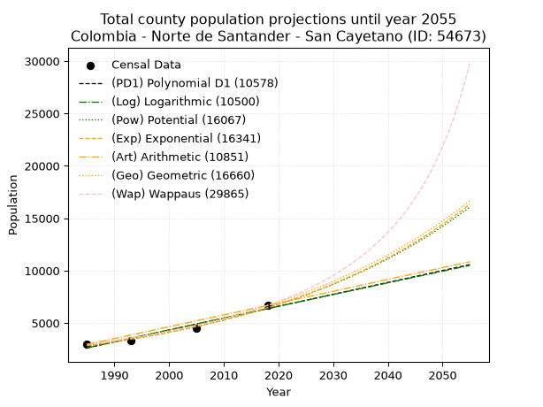
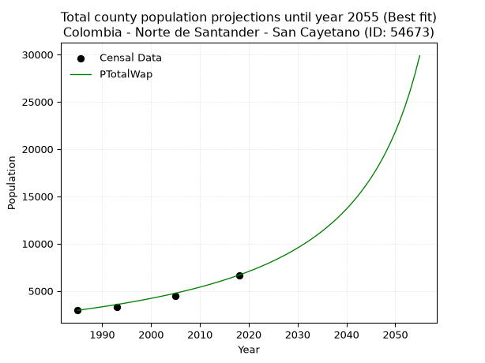
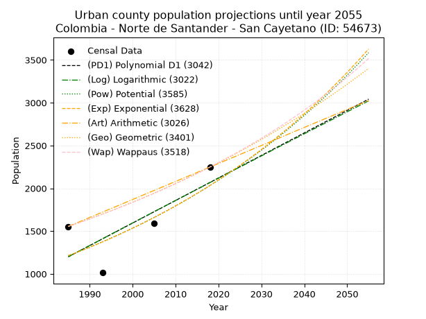
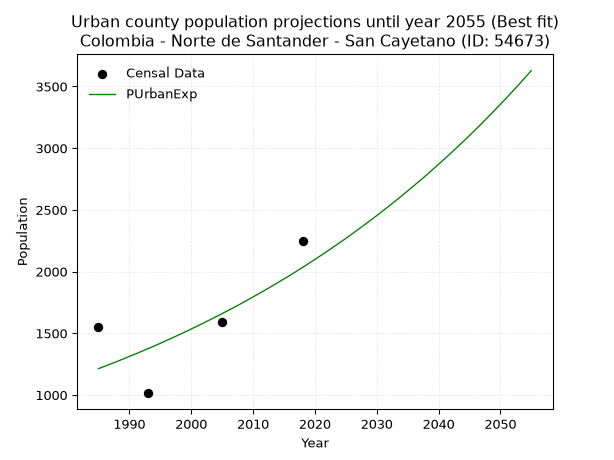
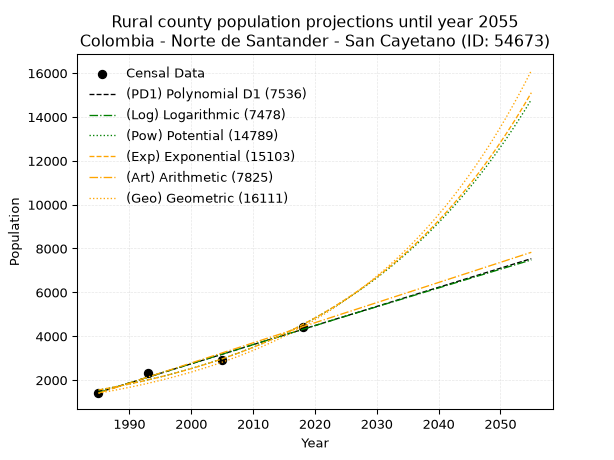
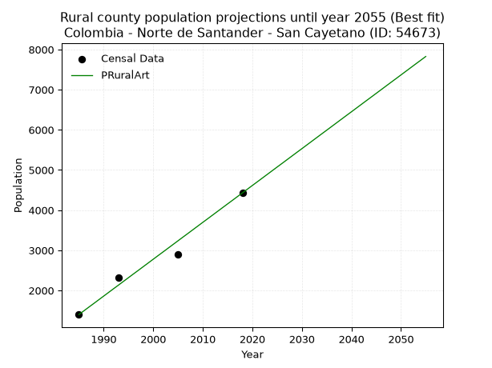

<div align="center">


</div>

# _“Population and Public Services Demand Projections (PPSD) until Year 2050 for Colombia - Norte de Santander - San Cayetano (ID: 54673)”_
Keywords: `population` `public-service` `projection` `lineal` `polynomial` `logarithmic` `potential` `exponential` `arithmetic` `geometric` `wappaus` `dane` `colombia` `south-america`

PPSD are analytical estimates used by governments and planners to anticipate future changes in population size, age distribution, and the resulting community needs for utilities, healthcare, education, and infrastructure as sizing future water treatment facilities, electrical grids, and road networks based on spatial growth.

> **General running parameters**: • app_version: _v20260806_. • Python version: _3.14.7_. • Pandas version: _3.0.5_. • NumPy version: _2.5.1_. • Creates, save and include plots into reports (create_plot): _False_. • Projection until year: _2050_. • Process polynomial degree 2 and up: _False_. • Process Wappaus: _True_. • Process Wappaus: _True_. • Set negative values to zero: _True_. • Set infinite values to zero: _True_. • Drop dataset notes: _True_. 
<div align="center">

Dynamic map: [:earth_americas:Google](http://maps.google.com/maps?q=7.875694587,-72.6254587) [:earth_americas:OSM](https://www.openstreetmap.org/#map=18/7.875694587/-72.6254587&layers=P) [:earth_americas:Bing](https://www.bing.com/maps?cp=7.875694587~-72.6254587&lvl=18) [:earth_americas:Apple](https://maps.apple.com/frame?center=7.875694587%2C-72.6254587&span=0.003%2C0.006)

</div>


<div align="center">

```geojson
{
  "type": "Feature",
  "geometry": {
    "type": "Point", 
    "coordinates": [-72.6254587, 7.875694587]
  }, 
  "properties": {
    "Name": "Colombia - Norte de Santander - San Cayetano (ID: 54673)"
  }
}
```

</div>


## 0. Census Data (4 records)

Census data are official statistics collected by a government about the people and housing in a country. They usually include counts of total population, age, sex, race, income, education, and jobs.

📅Global census file: [Population.xlsx](../data/Population.xlsx)

| Source   |   Year |   CountryID | CountryName   |   StateID | StateName          |   CountyID | CountyName   |   PTotal |   PUrban |   PRural |
|:---------|-------:|------------:|:--------------|----------:|:-------------------|-----------:|:-------------|---------:|---------:|---------:|
| DANE     |   1985 |          57 | Colombia      |        54 | Norte de Santander |      54673 | San Cayetano |     2954 |     1554 |     1400 |
| DANE     |   1993 |          57 | Colombia      |        54 | Norte de Santander |      54673 | San Cayetano |     3326 |     1014 |     2312 |
| DANE     |   2005 |          57 | Colombia      |        54 | Norte De Santander |      54673 | San Cayetano |     4493 |     1587 |     2906 |
| DANE     |   2018 |          57 | Colombia      |        54 | Norte de Santander |      54673 | San Cayetano |     6677 |     2248 |     4429 |

> 🔥Some records could had specific notes about the registered values or the corresponding urban or rural distribution.

📅   [RUPS](https://www.datos.gov.co/Hacienda-y-Cr-dito-P-blico/Registro-nico-de-Prestadores-de-Servicios-P-blicos/4qkq-csdn/about_data) - Local public utility companies: [RUPS.csv](../data/RUPS.xlsx)

 | SERVICIO       | ESTADO    | NOMBRE                                                     | NIT         | DEPARTAMENTO_DOMICILIO   | MUNICIPIO_DOMICILIO   | DIRECCION                         |   TELEFONO | EMAIL                               | TIPO_PRESTADOR                 | CLASIFICACION                 |
|:---------------|:----------|:-----------------------------------------------------------|:------------|:-------------------------|:----------------------|:----------------------------------|-----------:|:------------------------------------|:-------------------------------|:------------------------------|
| ACUEDUCTO      | OPERATIVA | UNIDAD DE SERVICIOS PUBLICOS DOMICILIARIOS DE SAN CAYETANO | 890501876-4 | NORTE DE SANTANDER       | SAN CAYETANO          | Carrera 4 No 3-61 Barrio La Playa |    5784945 | ingenioyconsultoriasiamca@gmail.com | MUNICIPIO (PRESTACIÓN DIRECTA) | MENOR O IGUAL A 2500 USUARIOS |
| ALCANTARILLADO | OPERATIVA | UNIDAD DE SERVICIOS PUBLICOS DOMICILIARIOS DE SAN CAYETANO | 890501876-4 | NORTE DE SANTANDER       | SAN CAYETANO          | Carrera 4 No 3-61 Barrio La Playa |    5784945 | ingenioyconsultoriasiamca@gmail.com | MUNICIPIO (PRESTACIÓN DIRECTA) | MENOR O IGUAL A 2500 USUARIOS |

## 1. Total

### 1.1. Coefficients and Parameters

* (PD1) Polynomial Deg 1: 113.52308309915554, -222712.0469690859 (lineal)
* (Log) Logarithmic: 227110.5459731057, -1721906.5798912733
* (Pow) Potential: 50.15041105107607, -161.93294751188714
* (Exp) Exponential: 0.02506192831185741, 7.016608173008103e-19
* (Art) Arithmetic: Year diff. 2018 - 1985 = 33, Population diff. 6677 - 2954 = 3723, Annual growth = 112.81818181818181
* (Geo) Geometric: Year diff. 2018 - 1985 = 33, Population diff. 6677 - 2954 = 3723, Annual growth % = 0.02502026368261312
* (Wap) Wappaus: i = 2.3428134527708817, Condition values only valid for < 200)

<sub>
Wappaus condition values: ['0.00', '2.34', '4.69', '7.03', '9.37', '11.71', '14.06', '16.40', '18.74', '21.09', '23.43', '25.77', '28.11', '30.46', '32.80', '35.14', '37.49', '39.83', '42.17', '44.51', '46.86', '49.20', '51.54', '53.88', '56.23', '58.57', '60.91', '63.26', '65.60', '67.94', '70.28', '72.63', '74.97', '77.31', '79.66', '82.00', '84.34', '86.68', '89.03', '91.37', '93.71', '96.06', '98.40', '100.74', '103.08', '105.43', '107.77', '110.11', '112.46', '114.80', '117.14', '119.48', '121.83', '124.17', '126.51', '128.85', '131.20', '133.54', '135.88', '138.23', '140.57', '142.91', '145.25', '147.60', '149.94', '152.28']
</sub>


### 1.2. Projected Dataset

|   Year |   CountyID |   PTotalPD1 |   PTotalLog |   PTotalPow |   PTotalExp |   PTotalArt |   PTotalGeo |   PTotalWap |
|-------:|-----------:|------------:|------------:|------------:|------------:|------------:|------------:|------------:|
|   1985 |      54673 |        2631 |        2629 |        2826 |        2827 |        2954 |        2954 |        2954 |
|   1986 |      54673 |        2745 |        2743 |        2898 |        2899 |        3067 |        3028 |        3024 |
|   1987 |      54673 |        2858 |        2857 |        2972 |        2973 |        3180 |        3104 |        3096 |
|   1988 |      54673 |        2972 |        2972 |        3048 |        3048 |        3292 |        3181 |        3169 |
|   1989 |      54673 |        3085 |        3086 |        3126 |        3125 |        3405 |        3261 |        3244 |
|   1990 |      54673 |        3199 |        3200 |        3205 |        3205 |        3518 |        3343 |        3322 |
|   1991 |      54673 |        3312 |        3314 |        3287 |        3286 |        3631 |        3426 |        3401 |
|   1992 |      54673 |        3426 |        3428 |        3371 |        3370 |        3744 |        3512 |        3482 |
|   1993 |      54673 |        3539 |        3542 |        3457 |        3455 |        3857 |        3600 |        3565 |
|   1994 |      54673 |        3653 |        3656 |        3545 |        3543 |        3969 |        3690 |        3650 |
|   1995 |      54673 |        3767 |        3770 |        3635 |        3633 |        4082 |        3782 |        3738 |
|   1996 |      54673 |        3880 |        3884 |        3728 |        3725 |        4195 |        3877 |        3828 |
|   1997 |      54673 |        3994 |        3998 |        3823 |        3819 |        4308 |        3974 |        3920 |
|   1998 |      54673 |        4107 |        4111 |        3920 |        3916 |        4421 |        4073 |        4015 |
|   1999 |      54673 |        4221 |        4225 |        4019 |        4016 |        4533 |        4175 |        4113 |
|   2000 |      54673 |        4334 |        4339 |        4122 |        4118 |        4646 |        4280 |        4213 |
|   2001 |      54673 |        4448 |        4452 |        4226 |        4222 |        4759 |        4387 |        4317 |
|   2002 |      54673 |        4561 |        4566 |        4333 |        4329 |        4872 |        4496 |        4423 |
|   2003 |      54673 |        4675 |        4679 |        4443 |        4439 |        4985 |        4609 |        4533 |
|   2004 |      54673 |        4788 |        4792 |        4556 |        4552 |        5098 |        4724 |        4645 |
|   2005 |      54673 |        4902 |        4906 |        4671 |        4667 |        5210 |        4842 |        4762 |
|   2006 |      54673 |        5015 |        5019 |        4790 |        4786 |        5323 |        4964 |        4881 |
|   2007 |      54673 |        5129 |        5132 |        4911 |        4907 |        5436 |        5088 |        5005 |
|   2008 |      54673 |        5242 |        5245 |        5035 |        5032 |        5549 |        5215 |        5133 |
|   2009 |      54673 |        5356 |        5358 |        5162 |        5159 |        5662 |        5346 |        5265 |
|   2010 |      54673 |        5469 |        5471 |        5293 |        5290 |        5774 |        5479 |        5401 |
|   2011 |      54673 |        5583 |        5584 |        5427 |        5425 |        5887 |        5616 |        5541 |
|   2012 |      54673 |        5696 |        5697 |        5564 |        5562 |        6000 |        5757 |        5687 |
|   2013 |      54673 |        5810 |        5810 |        5704 |        5703 |        6113 |        5901 |        5838 |
|   2014 |      54673 |        5923 |        5923 |        5848 |        5848 |        6226 |        6049 |        5994 |
|   2015 |      54673 |        6037 |        6036 |        5995 |        5997 |        6339 |        6200 |        6155 |
|   2016 |      54673 |        6150 |        6148 |        6146 |        6149 |        6451 |        6355 |        6323 |
|   2017 |      54673 |        6264 |        6261 |        6301 |        6305 |        6564 |        6514 |        6497 |
|   2018 |      54673 |        6378 |        6373 |        6460 |        6465 |        6677 |        6677 |        6677 |
|   2019 |      54673 |        6491 |        6486 |        6622 |        6629 |        6790 |        6844 |        6864 |
|   2020 |      54673 |        6605 |        6598 |        6789 |        6797 |        6903 |        7015 |        7059 |
|   2021 |      54673 |        6718 |        6711 |        6959 |        6970 |        7015 |        7191 |        7262 |
|   2022 |      54673 |        6832 |        6823 |        7134 |        7147 |        7128 |        7371 |        7473 |
|   2023 |      54673 |        6945 |        6935 |        7313 |        7328 |        7241 |        7555 |        7694 |
|   2024 |      54673 |        7059 |        7048 |        7497 |        7514 |        7354 |        7744 |        7923 |
|   2025 |      54673 |        7172 |        7160 |        7685 |        7705 |        7467 |        7938 |        8163 |
|   2026 |      54673 |        7286 |        7272 |        7877 |        7900 |        7580 |        8137 |        8414 |
|   2027 |      54673 |        7399 |        7384 |        8075 |        8101 |        7692 |        8340 |        8676 |
|   2028 |      54673 |        7513 |        7496 |        8277 |        8306 |        7805 |        8549 |        8950 |
|   2029 |      54673 |        7626 |        7608 |        8484 |        8517 |        7918 |        8763 |        9238 |
|   2030 |      54673 |        7740 |        7720 |        8696 |        8733 |        8031 |        8982 |        9540 |
|   2031 |      54673 |        7853 |        7832 |        8914 |        8955 |        8144 |        9207 |        9857 |
|   2032 |      54673 |        7967 |        7944 |        9137 |        9182 |        8256 |        9437 |       10191 |
|   2033 |      54673 |        8080 |        8055 |        9365 |        9415 |        8369 |        9673 |       10543 |
|   2034 |      54673 |        8194 |        8167 |        9599 |        9654 |        8482 |        9915 |       10914 |
|   2035 |      54673 |        8307 |        8279 |        9838 |        9899 |        8595 |       10163 |       11306 |
|   2036 |      54673 |        8421 |        8390 |       10084 |       10150 |        8708 |       10418 |       11721 |
|   2037 |      54673 |        8534 |        8502 |       10335 |       10408 |        8821 |       10678 |       12161 |
|   2038 |      54673 |        8648 |        8613 |       10593 |       10672 |        8933 |       10945 |       12628 |
|   2039 |      54673 |        8762 |        8725 |       10856 |       10943 |        9046 |       11219 |       13125 |
|   2040 |      54673 |        8875 |        8836 |       11127 |       11220 |        9159 |       11500 |       13654 |
|   2041 |      54673 |        8989 |        8947 |       11404 |       11505 |        9272 |       11788 |       14220 |
|   2042 |      54673 |        9102 |        9058 |       11687 |       11797 |        9385 |       12083 |       14825 |
|   2043 |      54673 |        9216 |        9170 |       11978 |       12097 |        9497 |       12385 |       15475 |
|   2044 |      54673 |        9329 |        9281 |       12275 |       12404 |        9610 |       12695 |       16174 |
|   2045 |      54673 |        9443 |        9392 |       12580 |       12718 |        9723 |       13012 |       16928 |
|   2046 |      54673 |        9556 |        9503 |       12892 |       13041 |        9836 |       13338 |       17744 |
|   2047 |      54673 |        9670 |        9614 |       13212 |       13372 |        9949 |       13672 |       18629 |
|   2048 |      54673 |        9783 |        9725 |       13540 |       13712 |       10062 |       14014 |       19594 |
|   2049 |      54673 |        9897 |        9836 |       13875 |       14060 |       10174 |       14364 |       20650 |
|   2050 |      54673 |       10010 |        9946 |       14219 |       14416 |       10287 |       14724 |       21809 |
<div align="center">

</img>

</div>


### 1.3. Best fit with absolute and relative error (%)

Relative error puts that difference into context by dividing the absolute error by the true value, creating a unitless ratio or percentage that shows the scale of the mistake.

Absolute and relative error

|   Year | Source   |   CountryID | CountryName   |   StateID | StateName          |   CountyID_x | CountyName   |   PTotal |   PUrban |   PRural |   CountyID_y |   PTotalPD1 |   PTotalLog |   PTotalPow |   PTotalExp |   PTotalArt |   PTotalGeo |   PTotalWap |   PTotalPD1AbsError |   PTotalLogAbsError |   PTotalPowAbsError |   PTotalExpAbsError |   PTotalArtAbsError |   PTotalGeoAbsError |   PTotalWapAbsError |   PTotalPD1RelError |   PTotalLogRelError |   PTotalPowRelError |   PTotalExpRelError |   PTotalArtRelError |   PTotalGeoRelError |   PTotalWapRelError |
|-------:|:---------|------------:|:--------------|----------:|:-------------------|-------------:|:-------------|---------:|---------:|---------:|-------------:|------------:|------------:|------------:|------------:|------------:|------------:|------------:|--------------------:|--------------------:|--------------------:|--------------------:|--------------------:|--------------------:|--------------------:|--------------------:|--------------------:|--------------------:|--------------------:|--------------------:|--------------------:|--------------------:|
|   1985 | DANE     |          57 | Colombia      |        54 | Norte de Santander |        54673 | San Cayetano |     2954 |     1554 |     1400 |        54673 |        2631 |        2629 |        2826 |        2827 |        2954 |        2954 |        2954 |                 323 |                 325 |                 128 |                 127 |                   0 |                   0 |                   0 |            10.9343  |            11.002   |             4.33311 |             4.29926 |              0      |             0       |             0       |
|   1993 | DANE     |          57 | Colombia      |        54 | Norte de Santander |        54673 | San Cayetano |     3326 |     1014 |     2312 |        54673 |        3539 |        3542 |        3457 |        3455 |        3857 |        3600 |        3565 |                 213 |                 216 |                 131 |                 129 |                 531 |                 274 |                 239 |             6.40409 |             6.49429 |             3.93867 |             3.87853 |             15.9651 |             8.23812 |             7.18581 |
|   2005 | DANE     |          57 | Colombia      |        54 | Norte De Santander |        54673 | San Cayetano |     4493 |     1587 |     2906 |        54673 |        4902 |        4906 |        4671 |        4667 |        5210 |        4842 |        4762 |                 409 |                 413 |                 178 |                 174 |                 717 |                 349 |                 269 |             9.10305 |             9.19208 |             3.96172 |             3.87269 |             15.9582 |             7.76764 |             5.98709 |
|   2018 | DANE     |          57 | Colombia      |        54 | Norte de Santander |        54673 | San Cayetano |     6677 |     2248 |     4429 |        54673 |        6378 |        6373 |        6460 |        6465 |        6677 |        6677 |        6677 |                 299 |                 304 |                 217 |                 212 |                   0 |                   0 |                   0 |             4.47806 |             4.55294 |             3.24996 |             3.17508 |              0      |             0       |             0       |

Relative error mean

| Method    |   RelError | Best   |
|:----------|-----------:|:-------|
| PTotalPD1 |    7.72988 |        |
| PTotalLog |    7.81033 |        |
| PTotalPow |    3.87086 |        |
| PTotalExp |    3.80639 |        |
| PTotalArt |    7.98082 |        |
| PTotalGeo |    4.00144 |        |
| PTotalWap |    3.29322 | True   |

💙Best method: _**PTotalWap**_
<div align="center">

</img>

</div>


### 1.4. Fresh water supply demand in liters per capita per day (lpcd)

The fresh water supply demand typically ranges from 100 to 300 liters per capita per day (lpcd) for standard domestic and municipal planning, though absolute survival minimums set by the World Health Organization are as low as 7.5 to 20 liters per day, and total consumption in high-income nations can exceed 400 liters.

> `CZ`: Level in meters above the sea level (masl)<br> `WS`: Fresh water supply demand in liters per capita per day (lpcd or l/h/d)<br> `WSAll`: Zonal fresh water supply demand in liters per second (l/s)<br> `A`: Zonal area in square meters<br> `DP`: Population density (people/hectare or p/ha)

Reference values (RAS Colombia)

|    CZ |   WS |
|------:|-----:|
|  1000 |  120 |
|  2000 |  130 |
| 99999 |  140 |

County shapefile geometry properties and water supply values

|   CountyID |      ATotal |   CZTotal |   WSTotal |
|-----------:|------------:|----------:|----------:|
|      54673 | 1.38976e+08 |   542.444 |       120 |

Projected values for best method: PTotalWap

|   CountyID |   Year |   PTotalWap |   DPTotal |   WSTotal |   WSTotalAll |
|-----------:|-------:|------------:|----------:|----------:|-------------:|
|      54673 |   1985 |        2954 |      0.21 |       120 |      4.10278 |
|      54673 |   1986 |        3024 |      0.22 |       120 |      4.2     |
|      54673 |   1987 |        3096 |      0.22 |       120 |      4.3     |
|      54673 |   1988 |        3169 |      0.23 |       120 |      4.40139 |
|      54673 |   1989 |        3244 |      0.23 |       120 |      4.50556 |
|      54673 |   1990 |        3322 |      0.24 |       120 |      4.61389 |
|      54673 |   1991 |        3401 |      0.24 |       120 |      4.72361 |
|      54673 |   1992 |        3482 |      0.25 |       120 |      4.83611 |
|      54673 |   1993 |        3565 |      0.26 |       120 |      4.95139 |
|      54673 |   1994 |        3650 |      0.26 |       120 |      5.06944 |
|      54673 |   1995 |        3738 |      0.27 |       120 |      5.19167 |
|      54673 |   1996 |        3828 |      0.28 |       120 |      5.31667 |
|      54673 |   1997 |        3920 |      0.28 |       120 |      5.44444 |
|      54673 |   1998 |        4015 |      0.29 |       120 |      5.57639 |
|      54673 |   1999 |        4113 |      0.3  |       120 |      5.7125  |
|      54673 |   2000 |        4213 |      0.3  |       120 |      5.85139 |
|      54673 |   2001 |        4317 |      0.31 |       120 |      5.99583 |
|      54673 |   2002 |        4423 |      0.32 |       120 |      6.14306 |
|      54673 |   2003 |        4533 |      0.33 |       120 |      6.29583 |
|      54673 |   2004 |        4645 |      0.33 |       120 |      6.45139 |
|      54673 |   2005 |        4762 |      0.34 |       120 |      6.61389 |
|      54673 |   2006 |        4881 |      0.35 |       120 |      6.77917 |
|      54673 |   2007 |        5005 |      0.36 |       120 |      6.95139 |
|      54673 |   2008 |        5133 |      0.37 |       120 |      7.12917 |
|      54673 |   2009 |        5265 |      0.38 |       120 |      7.3125  |
|      54673 |   2010 |        5401 |      0.39 |       120 |      7.50139 |
|      54673 |   2011 |        5541 |      0.4  |       120 |      7.69583 |
|      54673 |   2012 |        5687 |      0.41 |       120 |      7.89861 |
|      54673 |   2013 |        5838 |      0.42 |       120 |      8.10833 |
|      54673 |   2014 |        5994 |      0.43 |       120 |      8.325   |
|      54673 |   2015 |        6155 |      0.44 |       120 |      8.54861 |
|      54673 |   2016 |        6323 |      0.45 |       120 |      8.78194 |
|      54673 |   2017 |        6497 |      0.47 |       120 |      9.02361 |
|      54673 |   2018 |        6677 |      0.48 |       120 |      9.27361 |
|      54673 |   2019 |        6864 |      0.49 |       120 |      9.53333 |
|      54673 |   2020 |        7059 |      0.51 |       120 |      9.80417 |
|      54673 |   2021 |        7262 |      0.52 |       120 |     10.0861  |
|      54673 |   2022 |        7473 |      0.54 |       120 |     10.3792  |
|      54673 |   2023 |        7694 |      0.55 |       120 |     10.6861  |
|      54673 |   2024 |        7923 |      0.57 |       120 |     11.0042  |
|      54673 |   2025 |        8163 |      0.59 |       120 |     11.3375  |
|      54673 |   2026 |        8414 |      0.61 |       120 |     11.6861  |
|      54673 |   2027 |        8676 |      0.62 |       120 |     12.05    |
|      54673 |   2028 |        8950 |      0.64 |       120 |     12.4306  |
|      54673 |   2029 |        9238 |      0.66 |       120 |     12.8306  |
|      54673 |   2030 |        9540 |      0.69 |       120 |     13.25    |
|      54673 |   2031 |        9857 |      0.71 |       120 |     13.6903  |
|      54673 |   2032 |       10191 |      0.73 |       120 |     14.1542  |
|      54673 |   2033 |       10543 |      0.76 |       120 |     14.6431  |
|      54673 |   2034 |       10914 |      0.79 |       120 |     15.1583  |
|      54673 |   2035 |       11306 |      0.81 |       120 |     15.7028  |
|      54673 |   2036 |       11721 |      0.84 |       120 |     16.2792  |
|      54673 |   2037 |       12161 |      0.88 |       120 |     16.8903  |
|      54673 |   2038 |       12628 |      0.91 |       120 |     17.5389  |
|      54673 |   2039 |       13125 |      0.94 |       120 |     18.2292  |
|      54673 |   2040 |       13654 |      0.98 |       120 |     18.9639  |
|      54673 |   2041 |       14220 |      1.02 |       120 |     19.75    |
|      54673 |   2042 |       14825 |      1.07 |       120 |     20.5903  |
|      54673 |   2043 |       15475 |      1.11 |       120 |     21.4931  |
|      54673 |   2044 |       16174 |      1.16 |       120 |     22.4639  |
|      54673 |   2045 |       16928 |      1.22 |       120 |     23.5111  |
|      54673 |   2046 |       17744 |      1.28 |       120 |     24.6444  |
|      54673 |   2047 |       18629 |      1.34 |       120 |     25.8736  |
|      54673 |   2048 |       19594 |      1.41 |       120 |     27.2139  |
|      54673 |   2049 |       20650 |      1.49 |       120 |     28.6806  |
|      54673 |   2050 |       21809 |      1.57 |       120 |     30.2903  |

## 2. Urban

### 2.1. Coefficients and Parameters

* (PD1) Polynomial Deg 1: 26.319148936169775, -51044.12765957359 (lineal)
* (Log) Logarithmic: 52588.247817821764, -398122.9430790336
* (Pow) Potential: 31.275079906413662, -100.05394503366253
* (Exp) Exponential: 0.015653961439180904, 3.880679688987862e-11
* (Art) Arithmetic: Year diff. 2018 - 1985 = 33, Population diff. 2248 - 1554 = 694, Annual growth = 21.03030303030303
* (Geo) Geometric: Year diff. 2018 - 1985 = 33, Population diff. 2248 - 1554 = 694, Annual growth % = 0.011250963145521764
* (Wap) Wappaus: i = 1.1062758038034208, Condition values only valid for < 200)

<sub>
Wappaus condition values: ['0.00', '1.11', '2.21', '3.32', '4.43', '5.53', '6.64', '7.74', '8.85', '9.96', '11.06', '12.17', '13.28', '14.38', '15.49', '16.59', '17.70', '18.81', '19.91', '21.02', '22.13', '23.23', '24.34', '25.44', '26.55', '27.66', '28.76', '29.87', '30.98', '32.08', '33.19', '34.29', '35.40', '36.51', '37.61', '38.72', '39.83', '40.93', '42.04', '43.14', '44.25', '45.36', '46.46', '47.57', '48.68', '49.78', '50.89', '51.99', '53.10', '54.21', '55.31', '56.42', '57.53', '58.63', '59.74', '60.85', '61.95', '63.06', '64.16', '65.27', '66.38', '67.48', '68.59', '69.70', '70.80', '71.91']
</sub>


### 2.2. Projected Dataset

|   Year |   CountyID |   PUrbanPD1 |   PUrbanLog |   PUrbanPow |   PUrbanExp |   PUrbanArt |   PUrbanGeo |   PUrbanWap |
|-------:|-----------:|------------:|------------:|------------:|------------:|------------:|------------:|------------:|
|   1985 |      54673 |        1199 |        1199 |        1213 |        1213 |        1554 |        1554 |        1554 |
|   1986 |      54673 |        1226 |        1226 |        1232 |        1232 |        1575 |        1571 |        1571 |
|   1987 |      54673 |        1252 |        1252 |        1252 |        1251 |        1596 |        1589 |        1589 |
|   1988 |      54673 |        1278 |        1279 |        1271 |        1271 |        1617 |        1607 |        1606 |
|   1989 |      54673 |        1305 |        1305 |        1292 |        1291 |        1638 |        1625 |        1624 |
|   1990 |      54673 |        1331 |        1332 |        1312 |        1312 |        1659 |        1643 |        1642 |
|   1991 |      54673 |        1357 |        1358 |        1333 |        1332 |        1680 |        1662 |        1661 |
|   1992 |      54673 |        1384 |        1384 |        1354 |        1353 |        1701 |        1681 |        1679 |
|   1993 |      54673 |        1410 |        1411 |        1375 |        1375 |        1722 |        1700 |        1698 |
|   1994 |      54673 |        1436 |        1437 |        1397 |        1396 |        1743 |        1719 |        1717 |
|   1995 |      54673 |        1463 |        1464 |        1419 |        1418 |        1764 |        1738 |        1736 |
|   1996 |      54673 |        1489 |        1490 |        1442 |        1441 |        1785 |        1758 |        1755 |
|   1997 |      54673 |        1515 |        1516 |        1464 |        1463 |        1806 |        1777 |        1775 |
|   1998 |      54673 |        1542 |        1543 |        1487 |        1487 |        1827 |        1797 |        1795 |
|   1999 |      54673 |        1568 |        1569 |        1511 |        1510 |        1848 |        1818 |        1815 |
|   2000 |      54673 |        1594 |        1595 |        1535 |        1534 |        1869 |        1838 |        1835 |
|   2001 |      54673 |        1620 |        1621 |        1559 |        1558 |        1890 |        1859 |        1856 |
|   2002 |      54673 |        1647 |        1648 |        1583 |        1583 |        1912 |        1880 |        1877 |
|   2003 |      54673 |        1673 |        1674 |        1608 |        1608 |        1933 |        1901 |        1898 |
|   2004 |      54673 |        1699 |        1700 |        1634 |        1633 |        1954 |        1922 |        1919 |
|   2005 |      54673 |        1726 |        1727 |        1659 |        1659 |        1975 |        1944 |        1941 |
|   2006 |      54673 |        1752 |        1753 |        1685 |        1685 |        1996 |        1966 |        1962 |
|   2007 |      54673 |        1778 |        1779 |        1712 |        1711 |        2017 |        1988 |        1985 |
|   2008 |      54673 |        1805 |        1805 |        1739 |        1738 |        2038 |        2010 |        2007 |
|   2009 |      54673 |        1831 |        1831 |        1766 |        1766 |        2059 |        2033 |        2030 |
|   2010 |      54673 |        1857 |        1857 |        1794 |        1794 |        2080 |        2056 |        2053 |
|   2011 |      54673 |        1884 |        1884 |        1822 |        1822 |        2101 |        2079 |        2076 |
|   2012 |      54673 |        1910 |        1910 |        1850 |        1851 |        2122 |        2102 |        2100 |
|   2013 |      54673 |        1936 |        1936 |        1879 |        1880 |        2143 |        2126 |        2124 |
|   2014 |      54673 |        1963 |        1962 |        1909 |        1910 |        2164 |        2150 |        2148 |
|   2015 |      54673 |        1989 |        1988 |        1939 |        1940 |        2185 |        2174 |        2172 |
|   2016 |      54673 |        2015 |        2014 |        1969 |        1970 |        2206 |        2198 |        2197 |
|   2017 |      54673 |        2042 |        2040 |        2000 |        2001 |        2227 |        2223 |        2222 |
|   2018 |      54673 |        2068 |        2066 |        2031 |        2033 |        2248 |        2248 |        2248 |
|   2019 |      54673 |        2094 |        2092 |        2063 |        2065 |        2269 |        2273 |        2274 |
|   2020 |      54673 |        2121 |        2118 |        2095 |        2098 |        2290 |        2299 |        2300 |
|   2021 |      54673 |        2147 |        2144 |        2128 |        2131 |        2311 |        2325 |        2327 |
|   2022 |      54673 |        2173 |        2171 |        2161 |        2164 |        2332 |        2351 |        2354 |
|   2023 |      54673 |        2200 |        2197 |        2195 |        2199 |        2353 |        2377 |        2381 |
|   2024 |      54673 |        2226 |        2223 |        2229 |        2233 |        2374 |        2404 |        2409 |
|   2025 |      54673 |        2252 |        2248 |        2263 |        2268 |        2395 |        2431 |        2437 |
|   2026 |      54673 |        2278 |        2274 |        2299 |        2304 |        2416 |        2458 |        2466 |
|   2027 |      54673 |        2305 |        2300 |        2334 |        2341 |        2437 |        2486 |        2495 |
|   2028 |      54673 |        2331 |        2326 |        2371 |        2378 |        2458 |        2514 |        2524 |
|   2029 |      54673 |        2357 |        2352 |        2407 |        2415 |        2479 |        2542 |        2554 |
|   2030 |      54673 |        2384 |        2378 |        2445 |        2453 |        2500 |        2571 |        2584 |
|   2031 |      54673 |        2410 |        2404 |        2483 |        2492 |        2521 |        2600 |        2615 |
|   2032 |      54673 |        2436 |        2430 |        2521 |        2531 |        2542 |        2629 |        2646 |
|   2033 |      54673 |        2463 |        2456 |        2560 |        2571 |        2563 |        2659 |        2677 |
|   2034 |      54673 |        2489 |        2482 |        2600 |        2612 |        2584 |        2689 |        2710 |
|   2035 |      54673 |        2515 |        2508 |        2640 |        2653 |        2606 |        2719 |        2742 |
|   2036 |      54673 |        2542 |        2533 |        2681 |        2695 |        2627 |        2750 |        2775 |
|   2037 |      54673 |        2568 |        2559 |        2723 |        2737 |        2648 |        2780 |        2809 |
|   2038 |      54673 |        2594 |        2585 |        2765 |        2780 |        2669 |        2812 |        2843 |
|   2039 |      54673 |        2621 |        2611 |        2808 |        2824 |        2690 |        2843 |        2878 |
|   2040 |      54673 |        2647 |        2637 |        2851 |        2869 |        2711 |        2875 |        2913 |
|   2041 |      54673 |        2673 |        2662 |        2895 |        2914 |        2732 |        2908 |        2949 |
|   2042 |      54673 |        2700 |        2688 |        2940 |        2960 |        2753 |        2940 |        2985 |
|   2043 |      54673 |        2726 |        2714 |        2985 |        3007 |        2774 |        2974 |        3022 |
|   2044 |      54673 |        2752 |        2740 |        3031 |        3054 |        2795 |        3007 |        3060 |
|   2045 |      54673 |        2779 |        2765 |        3078 |        3102 |        2816 |        3041 |        3098 |
|   2046 |      54673 |        2805 |        2791 |        3125 |        3151 |        2837 |        3075 |        3137 |
|   2047 |      54673 |        2831 |        2817 |        3173 |        3201 |        2858 |        3110 |        3176 |
|   2048 |      54673 |        2857 |        2842 |        3222 |        3252 |        2879 |        3145 |        3216 |
|   2049 |      54673 |        2884 |        2868 |        3272 |        3303 |        2900 |        3180 |        3257 |
|   2050 |      54673 |        2910 |        2894 |        3322 |        3355 |        2921 |        3216 |        3299 |
<div align="center">

</img>

</div>


### 2.3. Best fit with absolute and relative error (%)

Relative error puts that difference into context by dividing the absolute error by the true value, creating a unitless ratio or percentage that shows the scale of the mistake.

Absolute and relative error

|   Year | Source   |   CountryID | CountryName   |   StateID | StateName          |   CountyID_x | CountyName   |   PTotal |   PUrban |   PRural |   CountyID_y |   PUrbanPD1 |   PUrbanLog |   PUrbanPow |   PUrbanExp |   PUrbanArt |   PUrbanGeo |   PUrbanWap |   PUrbanPD1AbsError |   PUrbanLogAbsError |   PUrbanPowAbsError |   PUrbanExpAbsError |   PUrbanArtAbsError |   PUrbanGeoAbsError |   PUrbanWapAbsError |   PUrbanPD1RelError |   PUrbanLogRelError |   PUrbanPowRelError |   PUrbanExpRelError |   PUrbanArtRelError |   PUrbanGeoRelError |   PUrbanWapRelError |
|-------:|:---------|------------:|:--------------|----------:|:-------------------|-------------:|:-------------|---------:|---------:|---------:|-------------:|------------:|------------:|------------:|------------:|------------:|------------:|------------:|--------------------:|--------------------:|--------------------:|--------------------:|--------------------:|--------------------:|--------------------:|--------------------:|--------------------:|--------------------:|--------------------:|--------------------:|--------------------:|--------------------:|
|   1985 | DANE     |          57 | Colombia      |        54 | Norte de Santander |        54673 | San Cayetano |     2954 |     1554 |     1400 |        54673 |        1199 |        1199 |        1213 |        1213 |        1554 |        1554 |        1554 |                 355 |                 355 |                 341 |                 341 |                   0 |                   0 |                   0 |            22.8443  |            22.8443  |            21.9434  |            21.9434  |              0      |              0      |              0      |
|   1993 | DANE     |          57 | Colombia      |        54 | Norte de Santander |        54673 | San Cayetano |     3326 |     1014 |     2312 |        54673 |        1410 |        1411 |        1375 |        1375 |        1722 |        1700 |        1698 |                 396 |                 397 |                 361 |                 361 |                 708 |                 686 |                 684 |            39.0533  |            39.1519  |            35.6016  |            35.6016  |             69.8225 |             67.6529 |             67.4556 |
|   2005 | DANE     |          57 | Colombia      |        54 | Norte De Santander |        54673 | San Cayetano |     4493 |     1587 |     2906 |        54673 |        1726 |        1727 |        1659 |        1659 |        1975 |        1944 |        1941 |                 139 |                 140 |                  72 |                  72 |                 388 |                 357 |                 354 |             8.75866 |             8.82168 |             4.53686 |             4.53686 |             24.4486 |             22.4953 |             22.3062 |
|   2018 | DANE     |          57 | Colombia      |        54 | Norte de Santander |        54673 | San Cayetano |     6677 |     2248 |     4429 |        54673 |        2068 |        2066 |        2031 |        2033 |        2248 |        2248 |        2248 |                 180 |                 182 |                 217 |                 215 |                   0 |                   0 |                   0 |             8.00712 |             8.09609 |             9.65302 |             9.56406 |              0      |              0      |              0      |

Relative error mean

| Method    |   RelError | Best   |
|:----------|-----------:|:-------|
| PUrbanPD1 |    19.6658 |        |
| PUrbanLog |    19.7285 |        |
| PUrbanPow |    17.9337 |        |
| PUrbanExp |    17.9115 | True   |
| PUrbanArt |    23.5678 |        |
| PUrbanGeo |    22.537  |        |
| PUrbanWap |    22.4405 |        |

💙Best method: _**PUrbanExp**_
<div align="center">

</img>

</div>


### 2.4. Fresh water supply demand in liters per capita per day (lpcd)

The fresh water supply demand typically ranges from 100 to 300 liters per capita per day (lpcd) for standard domestic and municipal planning, though absolute survival minimums set by the World Health Organization are as low as 7.5 to 20 liters per day, and total consumption in high-income nations can exceed 400 liters.

> `CZ`: Level in meters above the sea level (masl)<br> `WS`: Fresh water supply demand in liters per capita per day (lpcd or l/h/d)<br> `WSAll`: Zonal fresh water supply demand in liters per second (l/s)<br> `A`: Zonal area in square meters<br> `DP`: Population density (people/hectare or p/ha)

Reference values (RAS Colombia)

|    CZ |   WS |
|------:|-----:|
|  1000 |  120 |
|  2000 |  130 |
| 99999 |  140 |

County shapefile geometry properties and water supply values

|   CountyID |      AUrban |   CZUrban |   WSUrban |
|-----------:|------------:|----------:|----------:|
|      54673 | 1.71557e+06 |   246.415 |       120 |

Projected values for best method: PUrbanExp

|   CountyID |   Year |   PUrbanExp |   DPUrban |   WSUrban |   WSUrbanAll |
|-----------:|-------:|------------:|----------:|----------:|-------------:|
|      54673 |   1985 |        1213 |      7.07 |       120 |      1.68472 |
|      54673 |   1986 |        1232 |      7.18 |       120 |      1.71111 |
|      54673 |   1987 |        1251 |      7.29 |       120 |      1.7375  |
|      54673 |   1988 |        1271 |      7.41 |       120 |      1.76528 |
|      54673 |   1989 |        1291 |      7.53 |       120 |      1.79306 |
|      54673 |   1990 |        1312 |      7.65 |       120 |      1.82222 |
|      54673 |   1991 |        1332 |      7.76 |       120 |      1.85    |
|      54673 |   1992 |        1353 |      7.89 |       120 |      1.87917 |
|      54673 |   1993 |        1375 |      8.01 |       120 |      1.90972 |
|      54673 |   1994 |        1396 |      8.14 |       120 |      1.93889 |
|      54673 |   1995 |        1418 |      8.27 |       120 |      1.96944 |
|      54673 |   1996 |        1441 |      8.4  |       120 |      2.00139 |
|      54673 |   1997 |        1463 |      8.53 |       120 |      2.03194 |
|      54673 |   1998 |        1487 |      8.67 |       120 |      2.06528 |
|      54673 |   1999 |        1510 |      8.8  |       120 |      2.09722 |
|      54673 |   2000 |        1534 |      8.94 |       120 |      2.13056 |
|      54673 |   2001 |        1558 |      9.08 |       120 |      2.16389 |
|      54673 |   2002 |        1583 |      9.23 |       120 |      2.19861 |
|      54673 |   2003 |        1608 |      9.37 |       120 |      2.23333 |
|      54673 |   2004 |        1633 |      9.52 |       120 |      2.26806 |
|      54673 |   2005 |        1659 |      9.67 |       120 |      2.30417 |
|      54673 |   2006 |        1685 |      9.82 |       120 |      2.34028 |
|      54673 |   2007 |        1711 |      9.97 |       120 |      2.37639 |
|      54673 |   2008 |        1738 |     10.13 |       120 |      2.41389 |
|      54673 |   2009 |        1766 |     10.29 |       120 |      2.45278 |
|      54673 |   2010 |        1794 |     10.46 |       120 |      2.49167 |
|      54673 |   2011 |        1822 |     10.62 |       120 |      2.53056 |
|      54673 |   2012 |        1851 |     10.79 |       120 |      2.57083 |
|      54673 |   2013 |        1880 |     10.96 |       120 |      2.61111 |
|      54673 |   2014 |        1910 |     11.13 |       120 |      2.65278 |
|      54673 |   2015 |        1940 |     11.31 |       120 |      2.69444 |
|      54673 |   2016 |        1970 |     11.48 |       120 |      2.73611 |
|      54673 |   2017 |        2001 |     11.66 |       120 |      2.77917 |
|      54673 |   2018 |        2033 |     11.85 |       120 |      2.82361 |
|      54673 |   2019 |        2065 |     12.04 |       120 |      2.86806 |
|      54673 |   2020 |        2098 |     12.23 |       120 |      2.91389 |
|      54673 |   2021 |        2131 |     12.42 |       120 |      2.95972 |
|      54673 |   2022 |        2164 |     12.61 |       120 |      3.00556 |
|      54673 |   2023 |        2199 |     12.82 |       120 |      3.05417 |
|      54673 |   2024 |        2233 |     13.02 |       120 |      3.10139 |
|      54673 |   2025 |        2268 |     13.22 |       120 |      3.15    |
|      54673 |   2026 |        2304 |     13.43 |       120 |      3.2     |
|      54673 |   2027 |        2341 |     13.65 |       120 |      3.25139 |
|      54673 |   2028 |        2378 |     13.86 |       120 |      3.30278 |
|      54673 |   2029 |        2415 |     14.08 |       120 |      3.35417 |
|      54673 |   2030 |        2453 |     14.3  |       120 |      3.40694 |
|      54673 |   2031 |        2492 |     14.53 |       120 |      3.46111 |
|      54673 |   2032 |        2531 |     14.75 |       120 |      3.51528 |
|      54673 |   2033 |        2571 |     14.99 |       120 |      3.57083 |
|      54673 |   2034 |        2612 |     15.23 |       120 |      3.62778 |
|      54673 |   2035 |        2653 |     15.46 |       120 |      3.68472 |
|      54673 |   2036 |        2695 |     15.71 |       120 |      3.74306 |
|      54673 |   2037 |        2737 |     15.95 |       120 |      3.80139 |
|      54673 |   2038 |        2780 |     16.2  |       120 |      3.86111 |
|      54673 |   2039 |        2824 |     16.46 |       120 |      3.92222 |
|      54673 |   2040 |        2869 |     16.72 |       120 |      3.98472 |
|      54673 |   2041 |        2914 |     16.99 |       120 |      4.04722 |
|      54673 |   2042 |        2960 |     17.25 |       120 |      4.11111 |
|      54673 |   2043 |        3007 |     17.53 |       120 |      4.17639 |
|      54673 |   2044 |        3054 |     17.8  |       120 |      4.24167 |
|      54673 |   2045 |        3102 |     18.08 |       120 |      4.30833 |
|      54673 |   2046 |        3151 |     18.37 |       120 |      4.37639 |
|      54673 |   2047 |        3201 |     18.66 |       120 |      4.44583 |
|      54673 |   2048 |        3252 |     18.96 |       120 |      4.51667 |
|      54673 |   2049 |        3303 |     19.25 |       120 |      4.5875  |
|      54673 |   2050 |        3355 |     19.56 |       120 |      4.65972 |

## 3. Rural

### 3.1. Coefficients and Parameters

* (PD1) Polynomial Deg 1: 87.20393416298575, -171667.91930951222 (lineal)
* (Log) Logarithmic: 174522.29815528388, -1323783.6368122392
* (Pow) Potential: 65.18501313206527, -211.775742506572
* (Exp) Exponential: 0.032556817864809545, 1.3270942983487683e-25
* (Art) Arithmetic: Year diff. 2018 - 1985 = 33, Population diff. 4429 - 1400 = 3029, Annual growth = 91.78787878787878
* (Geo) Geometric: Year diff. 2018 - 1985 = 33, Population diff. 4429 - 1400 = 3029, Annual growth % = 0.03551620184699944
* (Wap) Wappaus: i = 3.149352506017457, Condition values only valid for < 200)

<sub>
Wappaus condition values: ['0.00', '3.15', '6.30', '9.45', '12.60', '15.75', '18.90', '22.05', '25.19', '28.34', '31.49', '34.64', '37.79', '40.94', '44.09', '47.24', '50.39', '53.54', '56.69', '59.84', '62.99', '66.14', '69.29', '72.44', '75.58', '78.73', '81.88', '85.03', '88.18', '91.33', '94.48', '97.63', '100.78', '103.93', '107.08', '110.23', '113.38', '116.53', '119.68', '122.82', '125.97', '129.12', '132.27', '135.42', '138.57', '141.72', '144.87', '148.02', '151.17', '154.32', '157.47', '160.62', '163.77', '166.92', '170.07', '173.21', '176.36', '179.51', '182.66', '185.81', '188.96', '192.11', '195.26', '198.41', '201.56', '204.71']
</sub>


### 3.2. Projected Dataset

|   Year |   CountyID |   PRuralPD1 |   PRuralLog |   PRuralPow |   PRuralExp |   PRuralArt |   PRuralGeo |
|-------:|-----------:|------------:|------------:|------------:|------------:|------------:|------------:|
|   1985 |      54673 |        1432 |        1429 |        1545 |        1546 |        1400 |        1400 |
|   1986 |      54673 |        1519 |        1517 |        1596 |        1598 |        1492 |        1450 |
|   1987 |      54673 |        1606 |        1605 |        1649 |        1650 |        1584 |        1501 |
|   1988 |      54673 |        1694 |        1693 |        1704 |        1705 |        1675 |        1555 |
|   1989 |      54673 |        1781 |        1781 |        1761 |        1761 |        1767 |        1610 |
|   1990 |      54673 |        1868 |        1869 |        1820 |        1820 |        1859 |        1667 |
|   1991 |      54673 |        1955 |        1956 |        1880 |        1880 |        1951 |        1726 |
|   1992 |      54673 |        2042 |        2044 |        1943 |        1942 |        2043 |        1787 |
|   1993 |      54673 |        2130 |        2131 |        2008 |        2006 |        2134 |        1851 |
|   1994 |      54673 |        2217 |        2219 |        2074 |        2073 |        2226 |        1917 |
|   1995 |      54673 |        2304 |        2306 |        2143 |        2141 |        2318 |        1985 |
|   1996 |      54673 |        2391 |        2394 |        2214 |        2212 |        2410 |        2055 |
|   1997 |      54673 |        2478 |        2481 |        2288 |        2285 |        2501 |        2128 |
|   1998 |      54673 |        2566 |        2569 |        2364 |        2361 |        2593 |        2204 |
|   1999 |      54673 |        2653 |        2656 |        2442 |        2439 |        2685 |        2282 |
|   2000 |      54673 |        2740 |        2743 |        2523 |        2520 |        2777 |        2363 |
|   2001 |      54673 |        2827 |        2831 |        2607 |        2603 |        2869 |        2447 |
|   2002 |      54673 |        2914 |        2918 |        2693 |        2690 |        2960 |        2534 |
|   2003 |      54673 |        3002 |        3005 |        2782 |        2779 |        3052 |        2624 |
|   2004 |      54673 |        3089 |        3092 |        2874 |        2870 |        3144 |        2717 |
|   2005 |      54673 |        3176 |        3179 |        2969 |        2965 |        3236 |        2814 |
|   2006 |      54673 |        3263 |        3266 |        3067 |        3064 |        3328 |        2914 |
|   2007 |      54673 |        3350 |        3353 |        3168 |        3165 |        3419 |        3017 |
|   2008 |      54673 |        3438 |        3440 |        3273 |        3270 |        3511 |        3124 |
|   2009 |      54673 |        3525 |        3527 |        3381 |        3378 |        3603 |        3235 |
|   2010 |      54673 |        3612 |        3614 |        3492 |        3490 |        3695 |        3350 |
|   2011 |      54673 |        3699 |        3701 |        3608 |        3605 |        3786 |        3469 |
|   2012 |      54673 |        3786 |        3787 |        3726 |        3724 |        3878 |        3592 |
|   2013 |      54673 |        3874 |        3874 |        3849 |        3848 |        3970 |        3720 |
|   2014 |      54673 |        3961 |        3961 |        3976 |        3975 |        4062 |        3852 |
|   2015 |      54673 |        4048 |        4047 |        4106 |        4107 |        4154 |        3989 |
|   2016 |      54673 |        4135 |        4134 |        4241 |        4243 |        4245 |        4130 |
|   2017 |      54673 |        4222 |        4220 |        4381 |        4383 |        4337 |        4277 |
|   2018 |      54673 |        4310 |        4307 |        4525 |        4528 |        4429 |        4429 |
|   2019 |      54673 |        4397 |        4393 |        4673 |        4678 |        4521 |        4586 |
|   2020 |      54673 |        4484 |        4480 |        4826 |        4833 |        4613 |        4749 |
|   2021 |      54673 |        4571 |        4566 |        4985 |        4993 |        4704 |        4918 |
|   2022 |      54673 |        4658 |        4653 |        5148 |        5158 |        4796 |        5093 |
|   2023 |      54673 |        4746 |        4739 |        5317 |        5328 |        4888 |        5273 |
|   2024 |      54673 |        4833 |        4825 |        5491 |        5505 |        4980 |        5461 |
|   2025 |      54673 |        4920 |        4911 |        5670 |        5687 |        5072 |        5655 |
|   2026 |      54673 |        5007 |        4997 |        5856 |        5875 |        5163 |        5855 |
|   2027 |      54673 |        5094 |        5084 |        6047 |        6070 |        5255 |        6063 |
|   2028 |      54673 |        5182 |        5170 |        6245 |        6270 |        5347 |        6279 |
|   2029 |      54673 |        5269 |        5256 |        6449 |        6478 |        5439 |        6502 |
|   2030 |      54673 |        5356 |        5342 |        6659 |        6692 |        5530 |        6733 |
|   2031 |      54673 |        5443 |        5428 |        6877 |        6914 |        5622 |        6972 |
|   2032 |      54673 |        5530 |        5514 |        7101 |        7143 |        5714 |        7219 |
|   2033 |      54673 |        5618 |        5599 |        7332 |        7379 |        5806 |        7476 |
|   2034 |      54673 |        5705 |        5685 |        7571 |        7623 |        5898 |        7741 |
|   2035 |      54673 |        5792 |        5771 |        7818 |        7875 |        5989 |        8016 |
|   2036 |      54673 |        5879 |        5857 |        8072 |        8136 |        6081 |        8301 |
|   2037 |      54673 |        5966 |        5942 |        8335 |        8405 |        6173 |        8596 |
|   2038 |      54673 |        6054 |        6028 |        8605 |        8683 |        6265 |        8901 |
|   2039 |      54673 |        6141 |        6114 |        8885 |        8971 |        6357 |        9217 |
|   2040 |      54673 |        6228 |        6199 |        9174 |        9268 |        6448 |        9545 |
|   2041 |      54673 |        6315 |        6285 |        9471 |        9574 |        6540 |        9884 |
|   2042 |      54673 |        6403 |        6370 |        9779 |        9891 |        6632 |       10235 |
|   2043 |      54673 |        6490 |        6456 |       10096 |       10218 |        6724 |       10598 |
|   2044 |      54673 |        6577 |        6541 |       10423 |       10557 |        6815 |       10975 |
|   2045 |      54673 |        6664 |        6627 |       10761 |       10906 |        6907 |       11364 |
|   2046 |      54673 |        6751 |        6712 |       11109 |       11267 |        6999 |       11768 |
|   2047 |      54673 |        6839 |        6797 |       11469 |       11640 |        7091 |       12186 |
|   2048 |      54673 |        6926 |        6882 |       11840 |       12025 |        7183 |       12619 |
|   2049 |      54673 |        7013 |        6968 |       12223 |       12423 |        7274 |       13067 |
|   2050 |      54673 |        7100 |        7053 |       12618 |       12834 |        7366 |       13531 |
<div align="center">

</img>

</div>


### 3.3. Best fit with absolute and relative error (%)

Relative error puts that difference into context by dividing the absolute error by the true value, creating a unitless ratio or percentage that shows the scale of the mistake.

Absolute and relative error

|   Year | Source   |   CountryID | CountryName   |   StateID | StateName          |   CountyID_x | CountyName   |   PTotal |   PUrban |   PRural |   CountyID_y |   PRuralPD1 |   PRuralLog |   PRuralPow |   PRuralExp |   PRuralArt |   PRuralGeo |   PRuralPD1AbsError |   PRuralLogAbsError |   PRuralPowAbsError |   PRuralExpAbsError |   PRuralArtAbsError |   PRuralGeoAbsError |   PRuralPD1RelError |   PRuralLogRelError |   PRuralPowRelError |   PRuralExpRelError |   PRuralArtRelError |   PRuralGeoRelError |
|-------:|:---------|------------:|:--------------|----------:|:-------------------|-------------:|:-------------|---------:|---------:|---------:|-------------:|------------:|------------:|------------:|------------:|------------:|------------:|--------------------:|--------------------:|--------------------:|--------------------:|--------------------:|--------------------:|--------------------:|--------------------:|--------------------:|--------------------:|--------------------:|--------------------:|
|   1985 | DANE     |          57 | Colombia      |        54 | Norte de Santander |        54673 | San Cayetano |     2954 |     1554 |     1400 |        54673 |        1432 |        1429 |        1545 |        1546 |        1400 |        1400 |                  32 |                  29 |                 145 |                 146 |                   0 |                   0 |             2.28571 |             2.07143 |            10.3571  |            10.4286  |             0       |             0       |
|   1993 | DANE     |          57 | Colombia      |        54 | Norte de Santander |        54673 | San Cayetano |     3326 |     1014 |     2312 |        54673 |        2130 |        2131 |        2008 |        2006 |        2134 |        1851 |                 182 |                 181 |                 304 |                 306 |                 178 |                 461 |             7.87197 |             7.82872 |            13.1488  |            13.2353  |             7.69896 |            19.9394  |
|   2005 | DANE     |          57 | Colombia      |        54 | Norte De Santander |        54673 | San Cayetano |     4493 |     1587 |     2906 |        54673 |        3176 |        3179 |        2969 |        2965 |        3236 |        2814 |                 270 |                 273 |                  63 |                  59 |                 330 |                  92 |             9.29112 |             9.39436 |             2.16793 |             2.03028 |            11.3558  |             3.16586 |
|   2018 | DANE     |          57 | Colombia      |        54 | Norte de Santander |        54673 | San Cayetano |     6677 |     2248 |     4429 |        54673 |        4310 |        4307 |        4525 |        4528 |        4429 |        4429 |                 119 |                 122 |                  96 |                  99 |                   0 |                   0 |             2.68684 |             2.75457 |             2.16753 |             2.23527 |             0       |             0       |

Relative error mean

| Method    |   RelError | Best   |
|:----------|-----------:|:-------|
| PRuralPD1 |    5.53391 |        |
| PRuralLog |    5.51227 |        |
| PRuralPow |    6.96035 |        |
| PRuralExp |    6.98235 |        |
| PRuralArt |    4.76369 | True   |
| PRuralGeo |    5.77633 |        |

💙Best method: _**PRuralArt**_
<div align="center">

</img>

</div>


### 3.4. Fresh water supply demand in liters per capita per day (lpcd)

The fresh water supply demand typically ranges from 100 to 300 liters per capita per day (lpcd) for standard domestic and municipal planning, though absolute survival minimums set by the World Health Organization are as low as 7.5 to 20 liters per day, and total consumption in high-income nations can exceed 400 liters.

> `CZ`: Level in meters above the sea level (masl)<br> `WS`: Fresh water supply demand in liters per capita per day (lpcd or l/h/d)<br> `WSAll`: Zonal fresh water supply demand in liters per second (l/s)<br> `A`: Zonal area in square meters<br> `DP`: Population density (people/hectare or p/ha)

Reference values (RAS Colombia)

|    CZ |   WS |
|------:|-----:|
|  1000 |  120 |
|  2000 |  130 |
| 99999 |  140 |

County shapefile geometry properties and water supply values

|   CountyID |     ARural |   CZRural |   WSRural |
|-----------:|-----------:|----------:|----------:|
|      54673 | 1.3726e+08 |    546.09 |       120 |

Projected values for best method: PRuralArt

|   CountyID |   Year |   PRuralArt |   DPRural |   WSRural |   WSRuralAll |
|-----------:|-------:|------------:|----------:|----------:|-------------:|
|      54673 |   1985 |        1400 |      0.1  |       120 |      1.94444 |
|      54673 |   1986 |        1492 |      0.11 |       120 |      2.07222 |
|      54673 |   1987 |        1584 |      0.12 |       120 |      2.2     |
|      54673 |   1988 |        1675 |      0.12 |       120 |      2.32639 |
|      54673 |   1989 |        1767 |      0.13 |       120 |      2.45417 |
|      54673 |   1990 |        1859 |      0.14 |       120 |      2.58194 |
|      54673 |   1991 |        1951 |      0.14 |       120 |      2.70972 |
|      54673 |   1992 |        2043 |      0.15 |       120 |      2.8375  |
|      54673 |   1993 |        2134 |      0.16 |       120 |      2.96389 |
|      54673 |   1994 |        2226 |      0.16 |       120 |      3.09167 |
|      54673 |   1995 |        2318 |      0.17 |       120 |      3.21944 |
|      54673 |   1996 |        2410 |      0.18 |       120 |      3.34722 |
|      54673 |   1997 |        2501 |      0.18 |       120 |      3.47361 |
|      54673 |   1998 |        2593 |      0.19 |       120 |      3.60139 |
|      54673 |   1999 |        2685 |      0.2  |       120 |      3.72917 |
|      54673 |   2000 |        2777 |      0.2  |       120 |      3.85694 |
|      54673 |   2001 |        2869 |      0.21 |       120 |      3.98472 |
|      54673 |   2002 |        2960 |      0.22 |       120 |      4.11111 |
|      54673 |   2003 |        3052 |      0.22 |       120 |      4.23889 |
|      54673 |   2004 |        3144 |      0.23 |       120 |      4.36667 |
|      54673 |   2005 |        3236 |      0.24 |       120 |      4.49444 |
|      54673 |   2006 |        3328 |      0.24 |       120 |      4.62222 |
|      54673 |   2007 |        3419 |      0.25 |       120 |      4.74861 |
|      54673 |   2008 |        3511 |      0.26 |       120 |      4.87639 |
|      54673 |   2009 |        3603 |      0.26 |       120 |      5.00417 |
|      54673 |   2010 |        3695 |      0.27 |       120 |      5.13194 |
|      54673 |   2011 |        3786 |      0.28 |       120 |      5.25833 |
|      54673 |   2012 |        3878 |      0.28 |       120 |      5.38611 |
|      54673 |   2013 |        3970 |      0.29 |       120 |      5.51389 |
|      54673 |   2014 |        4062 |      0.3  |       120 |      5.64167 |
|      54673 |   2015 |        4154 |      0.3  |       120 |      5.76944 |
|      54673 |   2016 |        4245 |      0.31 |       120 |      5.89583 |
|      54673 |   2017 |        4337 |      0.32 |       120 |      6.02361 |
|      54673 |   2018 |        4429 |      0.32 |       120 |      6.15139 |
|      54673 |   2019 |        4521 |      0.33 |       120 |      6.27917 |
|      54673 |   2020 |        4613 |      0.34 |       120 |      6.40694 |
|      54673 |   2021 |        4704 |      0.34 |       120 |      6.53333 |
|      54673 |   2022 |        4796 |      0.35 |       120 |      6.66111 |
|      54673 |   2023 |        4888 |      0.36 |       120 |      6.78889 |
|      54673 |   2024 |        4980 |      0.36 |       120 |      6.91667 |
|      54673 |   2025 |        5072 |      0.37 |       120 |      7.04444 |
|      54673 |   2026 |        5163 |      0.38 |       120 |      7.17083 |
|      54673 |   2027 |        5255 |      0.38 |       120 |      7.29861 |
|      54673 |   2028 |        5347 |      0.39 |       120 |      7.42639 |
|      54673 |   2029 |        5439 |      0.4  |       120 |      7.55417 |
|      54673 |   2030 |        5530 |      0.4  |       120 |      7.68056 |
|      54673 |   2031 |        5622 |      0.41 |       120 |      7.80833 |
|      54673 |   2032 |        5714 |      0.42 |       120 |      7.93611 |
|      54673 |   2033 |        5806 |      0.42 |       120 |      8.06389 |
|      54673 |   2034 |        5898 |      0.43 |       120 |      8.19167 |
|      54673 |   2035 |        5989 |      0.44 |       120 |      8.31806 |
|      54673 |   2036 |        6081 |      0.44 |       120 |      8.44583 |
|      54673 |   2037 |        6173 |      0.45 |       120 |      8.57361 |
|      54673 |   2038 |        6265 |      0.46 |       120 |      8.70139 |
|      54673 |   2039 |        6357 |      0.46 |       120 |      8.82917 |
|      54673 |   2040 |        6448 |      0.47 |       120 |      8.95556 |
|      54673 |   2041 |        6540 |      0.48 |       120 |      9.08333 |
|      54673 |   2042 |        6632 |      0.48 |       120 |      9.21111 |
|      54673 |   2043 |        6724 |      0.49 |       120 |      9.33889 |
|      54673 |   2044 |        6815 |      0.5  |       120 |      9.46528 |
|      54673 |   2045 |        6907 |      0.5  |       120 |      9.59306 |
|      54673 |   2046 |        6999 |      0.51 |       120 |      9.72083 |
|      54673 |   2047 |        7091 |      0.52 |       120 |      9.84861 |
|      54673 |   2048 |        7183 |      0.52 |       120 |      9.97639 |
|      54673 |   2049 |        7274 |      0.53 |       120 |     10.1028  |
|      54673 |   2050 |        7366 |      0.54 |       120 |     10.2306  |

<div align="center"><br><sub>Share this research</sub></div><br>

<sub>**APPS & TOOLS & CONTENT DISCLAIMER**: • NO WARRANTY - This content and software is provided by <a href="https://github.com/rcfdtools" target="_blank">github.com/rcfdtools</a> "as is", without any express or implied warranty, including warranties of merchantability, fitness for a particular purpose, or non-infringement. There is no guarantee that the software will be error-free or operate without interruption. • LIMITATION OF LIABILITY - Neither the authors nor copyright holders will be liable for claims or damages arising from the software or its use. You are responsible for determining if the software is appropriate for your use and assume all associated risks, including errors, legal compliance, and data loss. • NO PROFESSIONAL ADVICE - The software provides general information and does not offer professional advice. It should not replace consultation with professional advisors. [Clauses and global license for rcfdtools use.](https://github.com/rcfdtools/rcfdtools/blob/main/LICENSE.md)</sub>

| [:house: Home](Readme.md)  | [:beginner: Help / Collab](https://github.com/rcfdtools/R.HydroTools/discussions/31) |
|----------------------------|-------------------------------------------------------------------------------------------|