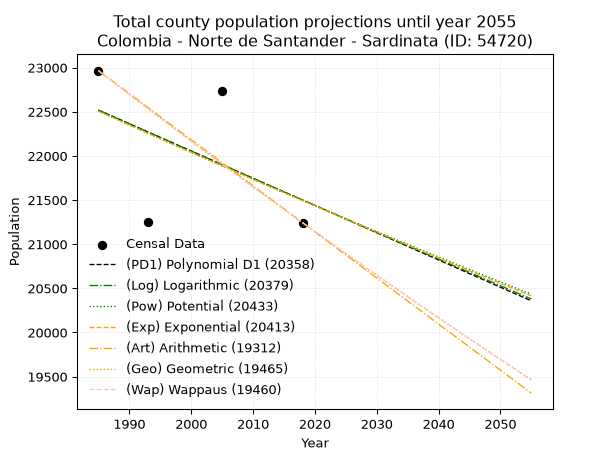
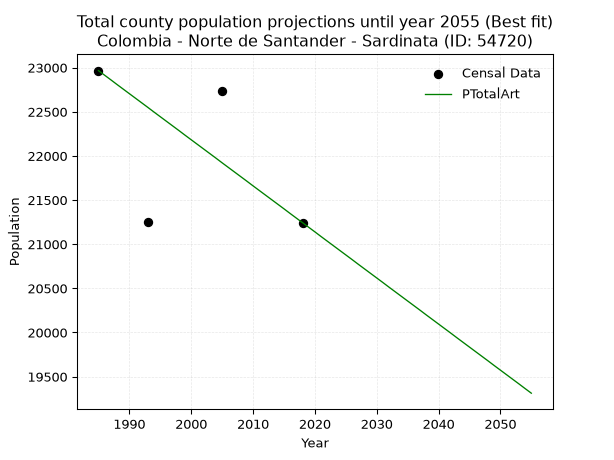
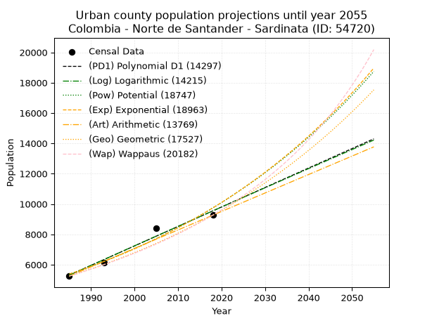
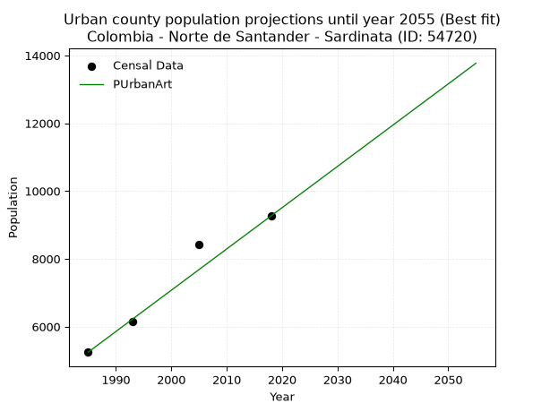
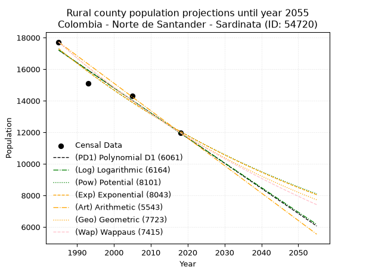
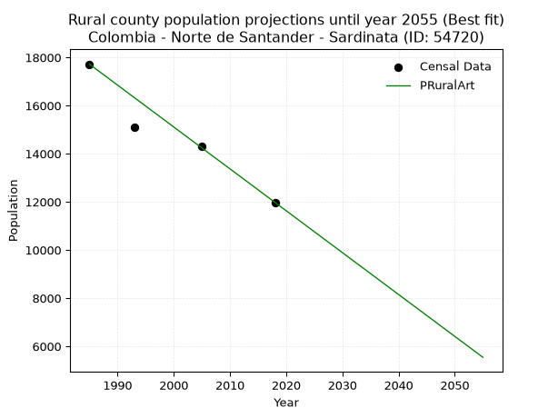

<div align="center">


</div>

# _“Population and Public Services Demand Projections (PPSD) until Year 2050 for Colombia - Norte de Santander - Sardinata (ID: 54720)”_
Keywords: `population` `public-service` `projection` `lineal` `polynomial` `logarithmic` `potential` `exponential` `arithmetic` `geometric` `wappaus` `dane` `colombia` `south-america`

PPSD are analytical estimates used by governments and planners to anticipate future changes in population size, age distribution, and the resulting community needs for utilities, healthcare, education, and infrastructure as sizing future water treatment facilities, electrical grids, and road networks based on spatial growth.

> **General running parameters**: • app_version: _v20260806_. • Python version: _3.14.7_. • Pandas version: _3.0.5_. • NumPy version: _2.5.1_. • Creates, save and include plots into reports (create_plot): _False_. • Projection until year: _2050_. • Process polynomial degree 2 and up: _False_. • Process Wappaus: _True_. • Process Wappaus: _True_. • Set negative values to zero: _True_. • Set infinite values to zero: _True_. • Drop dataset notes: _True_. 
<div align="center">

Dynamic map: [:earth_americas:Google](http://maps.google.com/maps?q=8.082105337,-72.8005765) [:earth_americas:OSM](https://www.openstreetmap.org/#map=18/8.082105337/-72.8005765&layers=P) [:earth_americas:Bing](https://www.bing.com/maps?cp=8.082105337~-72.8005765&lvl=18) [:earth_americas:Apple](https://maps.apple.com/frame?center=8.082105337%2C-72.8005765&span=0.003%2C0.006)

</div>


<div align="center">

```geojson
{
  "type": "Feature",
  "geometry": {
    "type": "Point", 
    "coordinates": [-72.8005765, 8.082105337]
  }, 
  "properties": {
    "Name": "Colombia - Norte de Santander - Sardinata (ID: 54720)"
  }
}
```

</div>


## 0. Census Data (4 records)

Census data are official statistics collected by a government about the people and housing in a country. They usually include counts of total population, age, sex, race, income, education, and jobs.

📅Global census file: [Population.xlsx](../data/Population.xlsx)

| Source   |   Year |   CountryID | CountryName   |   StateID | StateName          |   CountyID | CountyName   |   PTotal |   PUrban |   PRural |
|:---------|-------:|------------:|:--------------|----------:|:-------------------|-----------:|:-------------|---------:|---------:|---------:|
| DANE     |   1985 |          57 | Colombia      |        54 | Norte de Santander |      54720 | Sardinata    |    22965 |     5246 |    17719 |
| DANE     |   1993 |          57 | Colombia      |        54 | Norte de Santander |      54720 | Sardinata    |    21247 |     6138 |    15109 |
| DANE     |   2005 |          57 | Colombia      |        54 | Norte De Santander |      54720 | Sardinata    |    22733 |     8425 |    14308 |
| DANE     |   2018 |          57 | Colombia      |        54 | Norte de Santander |      54720 | Sardinata    |    21243 |     9264 |    11979 |

> 🔥Some records could had specific notes about the registered values or the corresponding urban or rural distribution.

**Local public utility companies (RUPS)**

 | SERVICIO       | ESTADO    | NOMBRE                                                   | NIT         | DEPARTAMENTO_DOMICILIO   | MUNICIPIO_DOMICILIO   | DIRECCION                           |   TELEFONO | EMAIL                           | TIPO_INSCRIPCION    | REPRESENTANTE_LEGAL     | TIPO_PRESTADOR                             | CLASIFICACION                 |
|:---------------|:----------|:---------------------------------------------------------|:------------|:-------------------------|:----------------------|:------------------------------------|-----------:|:--------------------------------|:--------------------|:------------------------|:-------------------------------------------|:------------------------------|
| ASEO           | OPERATIVA | ASEO URBANO S.A.S. E.S.P.                                | 807005020-8 | NORTE DE SANTANDER       | CUCUTA                | Av 4ª N° 8N-57 Zona Industrial      |    5784888 | silvia-paola.fuentes@veolia.com | Registro por la ESP | OSCAR GARCIA POVEDA     | SOCIEDADES (EMPRESA DE SERVICIOS PUBLICOS) | MAYOR O IGUAL A 5001 USUARIOS |
| ACUEDUCTO      | OPERATIVA | UNIDAD DE SERVICIOS PUBLICOS DEL MUNICIPIO  DE SARDINATA | 800099263-8 | NORTE DE SANTANDER       | SARDINATA             | CALLE  6 No. 6-55 Palacio Municipal |    5665746 | unidadsardinata@hotmail.com     | Registro por la ESP | HERMIDES MONCADA OSORIO | MUNICIPIO (PRESTACIÓN DIRECTA)             | MENOR O IGUAL A 2500 USUARIOS |
| ALCANTARILLADO | OPERATIVA | UNIDAD DE SERVICIOS PUBLICOS DEL MUNICIPIO  DE SARDINATA | 800099263-8 | NORTE DE SANTANDER       | SARDINATA             | CALLE  6 No. 6-55 Palacio Municipal |    5665746 | unidadsardinata@hotmail.com     | Registro por la ESP | HERMIDES MONCADA OSORIO | MUNICIPIO (PRESTACIÓN DIRECTA)             | MENOR O IGUAL A 2500 USUARIOS |
| ASEO           | OPERATIVA | UNIDAD DE SERVICIOS PUBLICOS DEL MUNICIPIO  DE SARDINATA | 800099263-8 | NORTE DE SANTANDER       | SARDINATA             | CALLE  6 No. 6-55 Palacio Municipal |    5665746 | unidadsardinata@hotmail.com     | Registro por la ESP | HERMIDES MONCADA OSORIO | MUNICIPIO (PRESTACIÓN DIRECTA)             | MENOR O IGUAL A 2500 USUARIOS |

> [📅RUPS Database: Registro Único de Prestadores de Servicios Públicos de Colombia Suramérica - RUPS](https://www.datos.gov.co/Hacienda-y-Cr-dito-P-blico/Registro-nico-de-Prestadores-de-Servicios-P-blicos/4qkq-csdn/about_data)

## 1. Total

### 1.1. Coefficients and Parameters

* (PD1) Polynomial Deg 1: -30.850260939380657, 83755.23444399616 (lineal)
* (Log) Logarithmic: -61741.77596844415, 491346.7339036854
* (Pow) Potential: -2.789476447976059, 13.551332467925329
* (Exp) Exponential: -0.0013938273012876717, 357992.1564281886
* (Art) Arithmetic: Year diff. 2018 - 1985 = 33, Population diff. 21243 - 22965 = -1722, Annual growth = -52.18181818181818
* (Geo) Geometric: Year diff. 2018 - 1985 = 33, Population diff. 21243 - 22965 = -1722, Annual growth % = -0.0023591488372771696
* (Wap) Wappaus: i = -0.23607409600894944, Condition values only valid for < 200)

<sub>
Wappaus condition values: ['-0.00', '-0.24', '-0.47', '-0.71', '-0.94', '-1.18', '-1.42', '-1.65', '-1.89', '-2.12', '-2.36', '-2.60', '-2.83', '-3.07', '-3.31', '-3.54', '-3.78', '-4.01', '-4.25', '-4.49', '-4.72', '-4.96', '-5.19', '-5.43', '-5.67', '-5.90', '-6.14', '-6.37', '-6.61', '-6.85', '-7.08', '-7.32', '-7.55', '-7.79', '-8.03', '-8.26', '-8.50', '-8.73', '-8.97', '-9.21', '-9.44', '-9.68', '-9.92', '-10.15', '-10.39', '-10.62', '-10.86', '-11.10', '-11.33', '-11.57', '-11.80', '-12.04', '-12.28', '-12.51', '-12.75', '-12.98', '-13.22', '-13.46', '-13.69', '-13.93', '-14.16', '-14.40', '-14.64', '-14.87', '-15.11', '-15.34']
</sub>


### 1.2. Projected Dataset

|   Year |   CountyID |   PTotalPD1 |   PTotalLog |   PTotalPow |   PTotalExp |   PTotalArt |   PTotalGeo |   PTotalWap |
|-------:|-----------:|------------:|------------:|------------:|------------:|------------:|------------:|------------:|
|   1985 |      54720 |       22517 |       22518 |       22506 |       22506 |       22965 |       22965 |       22965 |
|   1986 |      54720 |       22487 |       22487 |       22475 |       22474 |       22913 |       22911 |       22911 |
|   1987 |      54720 |       22456 |       22456 |       22443 |       22443 |       22861 |       22857 |       22857 |
|   1988 |      54720 |       22425 |       22425 |       22412 |       22412 |       22808 |       22803 |       22803 |
|   1989 |      54720 |       22394 |       22394 |       22380 |       22380 |       22756 |       22749 |       22749 |
|   1990 |      54720 |       22363 |       22363 |       22349 |       22349 |       22704 |       22695 |       22696 |
|   1991 |      54720 |       22332 |       22332 |       22318 |       22318 |       22652 |       22642 |       22642 |
|   1992 |      54720 |       22302 |       22301 |       22287 |       22287 |       22600 |       22588 |       22589 |
|   1993 |      54720 |       22271 |       22270 |       22255 |       22256 |       22548 |       22535 |       22535 |
|   1994 |      54720 |       22240 |       22239 |       22224 |       22225 |       22495 |       22482 |       22482 |
|   1995 |      54720 |       22209 |       22208 |       22193 |       22194 |       22443 |       22429 |       22429 |
|   1996 |      54720 |       22178 |       22177 |       22162 |       22163 |       22391 |       22376 |       22376 |
|   1997 |      54720 |       22147 |       22146 |       22131 |       22132 |       22339 |       22323 |       22324 |
|   1998 |      54720 |       22116 |       22115 |       22100 |       22101 |       22287 |       22271 |       22271 |
|   1999 |      54720 |       22086 |       22084 |       22070 |       22071 |       22234 |       22218 |       22218 |
|   2000 |      54720 |       22055 |       22054 |       22039 |       22040 |       22182 |       22166 |       22166 |
|   2001 |      54720 |       22024 |       22023 |       22008 |       22009 |       22130 |       22113 |       22114 |
|   2002 |      54720 |       21993 |       21992 |       21977 |       21979 |       22078 |       22061 |       22061 |
|   2003 |      54720 |       21962 |       21961 |       21947 |       21948 |       22026 |       22009 |       22009 |
|   2004 |      54720 |       21931 |       21930 |       21916 |       21917 |       21974 |       21957 |       21958 |
|   2005 |      54720 |       21900 |       21899 |       21886 |       21887 |       21921 |       21905 |       21906 |
|   2006 |      54720 |       21870 |       21869 |       21855 |       21856 |       21869 |       21854 |       21854 |
|   2007 |      54720 |       21839 |       21838 |       21825 |       21826 |       21817 |       21802 |       21802 |
|   2008 |      54720 |       21808 |       21807 |       21795 |       21796 |       21765 |       21751 |       21751 |
|   2009 |      54720 |       21777 |       21776 |       21764 |       21765 |       21713 |       21699 |       21700 |
|   2010 |      54720 |       21746 |       21746 |       21734 |       21735 |       21660 |       21648 |       21648 |
|   2011 |      54720 |       21715 |       21715 |       21704 |       21705 |       21608 |       21597 |       21597 |
|   2012 |      54720 |       21685 |       21684 |       21674 |       21674 |       21556 |       21546 |       21546 |
|   2013 |      54720 |       21654 |       21653 |       21644 |       21644 |       21504 |       21495 |       21496 |
|   2014 |      54720 |       21623 |       21623 |       21614 |       21614 |       21452 |       21445 |       21445 |
|   2015 |      54720 |       21592 |       21592 |       21584 |       21584 |       21400 |       21394 |       21394 |
|   2016 |      54720 |       21561 |       21562 |       21554 |       21554 |       21347 |       21344 |       21344 |
|   2017 |      54720 |       21530 |       21531 |       21525 |       21524 |       21295 |       21293 |       21293 |
|   2018 |      54720 |       21499 |       21500 |       21495 |       21494 |       21243 |       21243 |       21243 |
|   2019 |      54720 |       21469 |       21470 |       21465 |       21464 |       21191 |       21193 |       21193 |
|   2020 |      54720 |       21438 |       21439 |       21435 |       21434 |       21139 |       21143 |       21143 |
|   2021 |      54720 |       21407 |       21409 |       21406 |       21404 |       21086 |       21093 |       21093 |
|   2022 |      54720 |       21376 |       21378 |       21376 |       21374 |       21034 |       21043 |       21043 |
|   2023 |      54720 |       21345 |       21348 |       21347 |       21345 |       20982 |       20994 |       20993 |
|   2024 |      54720 |       21314 |       21317 |       21317 |       21315 |       20930 |       20944 |       20944 |
|   2025 |      54720 |       21283 |       21287 |       21288 |       21285 |       20878 |       20895 |       20894 |
|   2026 |      54720 |       21253 |       21256 |       21259 |       21256 |       20826 |       20845 |       20845 |
|   2027 |      54720 |       21222 |       21226 |       21230 |       21226 |       20773 |       20796 |       20796 |
|   2028 |      54720 |       21191 |       21195 |       21200 |       21196 |       20721 |       20747 |       20746 |
|   2029 |      54720 |       21160 |       21165 |       21171 |       21167 |       20669 |       20698 |       20697 |
|   2030 |      54720 |       21129 |       21134 |       21142 |       21137 |       20617 |       20649 |       20648 |
|   2031 |      54720 |       21098 |       21104 |       21113 |       21108 |       20565 |       20601 |       20600 |
|   2032 |      54720 |       21068 |       21073 |       21084 |       21079 |       20512 |       20552 |       20551 |
|   2033 |      54720 |       21037 |       21043 |       21055 |       21049 |       20460 |       20504 |       20502 |
|   2034 |      54720 |       21006 |       21013 |       21026 |       21020 |       20408 |       20455 |       20454 |
|   2035 |      54720 |       20975 |       20982 |       20998 |       20991 |       20356 |       20407 |       20405 |
|   2036 |      54720 |       20944 |       20952 |       20969 |       20961 |       20304 |       20359 |       20357 |
|   2037 |      54720 |       20913 |       20922 |       20940 |       20932 |       20252 |       20311 |       20309 |
|   2038 |      54720 |       20882 |       20891 |       20912 |       20903 |       20199 |       20263 |       20261 |
|   2039 |      54720 |       20852 |       20861 |       20883 |       20874 |       20147 |       20215 |       20213 |
|   2040 |      54720 |       20821 |       20831 |       20854 |       20845 |       20095 |       20167 |       20165 |
|   2041 |      54720 |       20790 |       20801 |       20826 |       20816 |       20043 |       20120 |       20117 |
|   2042 |      54720 |       20759 |       20770 |       20797 |       20787 |       19991 |       20072 |       20070 |
|   2043 |      54720 |       20728 |       20740 |       20769 |       20758 |       19938 |       20025 |       20022 |
|   2044 |      54720 |       20697 |       20710 |       20741 |       20729 |       19886 |       19978 |       19975 |
|   2045 |      54720 |       20666 |       20680 |       20712 |       20700 |       19834 |       19931 |       19927 |
|   2046 |      54720 |       20636 |       20650 |       20684 |       20671 |       19782 |       19884 |       19880 |
|   2047 |      54720 |       20605 |       20619 |       20656 |       20642 |       19730 |       19837 |       19833 |
|   2048 |      54720 |       20574 |       20589 |       20628 |       20614 |       19678 |       19790 |       19786 |
|   2049 |      54720 |       20543 |       20559 |       20600 |       20585 |       19625 |       19743 |       19739 |
|   2050 |      54720 |       20512 |       20529 |       20572 |       20556 |       19573 |       19697 |       19692 |
<div align="center">

</img>

</div>


### 1.3. Best fit with absolute and relative error (%)

Relative error puts that difference into context by dividing the absolute error by the true value, creating a unitless ratio or percentage that shows the scale of the mistake.

Absolute and relative error

|   Year | Source   |   CountryID | CountryName   |   StateID | StateName          |   CountyID_x | CountyName   |   PTotal |   PUrban |   PRural |   CountyID_y |   PTotalPD1 |   PTotalLog |   PTotalPow |   PTotalExp |   PTotalArt |   PTotalGeo |   PTotalWap |   PTotalPD1AbsError |   PTotalLogAbsError |   PTotalPowAbsError |   PTotalExpAbsError |   PTotalArtAbsError |   PTotalGeoAbsError |   PTotalWapAbsError |   PTotalPD1RelError |   PTotalLogRelError |   PTotalPowRelError |   PTotalExpRelError |   PTotalArtRelError |   PTotalGeoRelError |   PTotalWapRelError |
|-------:|:---------|------------:|:--------------|----------:|:-------------------|-------------:|:-------------|---------:|---------:|---------:|-------------:|------------:|------------:|------------:|------------:|------------:|------------:|------------:|--------------------:|--------------------:|--------------------:|--------------------:|--------------------:|--------------------:|--------------------:|--------------------:|--------------------:|--------------------:|--------------------:|--------------------:|--------------------:|--------------------:|
|   1985 | DANE     |          57 | Colombia      |        54 | Norte de Santander |        54720 | Sardinata    |    22965 |     5246 |    17719 |        54720 |       22517 |       22518 |       22506 |       22506 |       22965 |       22965 |       22965 |                 448 |                 447 |                 459 |                 459 |                   0 |                   0 |                   0 |             1.95079 |             1.94644 |             1.99869 |             1.99869 |             0       |             0       |             0       |
|   1993 | DANE     |          57 | Colombia      |        54 | Norte de Santander |        54720 | Sardinata    |    21247 |     6138 |    15109 |        54720 |       22271 |       22270 |       22255 |       22256 |       22548 |       22535 |       22535 |                1024 |                1023 |                1008 |                1009 |                1301 |                1288 |                1288 |             4.8195  |             4.8148  |             4.7442  |             4.74891 |             6.12322 |             6.06203 |             6.06203 |
|   2005 | DANE     |          57 | Colombia      |        54 | Norte De Santander |        54720 | Sardinata    |    22733 |     8425 |    14308 |        54720 |       21900 |       21899 |       21886 |       21887 |       21921 |       21905 |       21906 |                 833 |                 834 |                 847 |                 846 |                 812 |                 828 |                 827 |             3.66428 |             3.66868 |             3.72586 |             3.72146 |             3.5719  |             3.64228 |             3.63788 |
|   2018 | DANE     |          57 | Colombia      |        54 | Norte de Santander |        54720 | Sardinata    |    21243 |     9264 |    11979 |        54720 |       21499 |       21500 |       21495 |       21494 |       21243 |       21243 |       21243 |                 256 |                 257 |                 252 |                 251 |                   0 |                   0 |                   0 |             1.2051  |             1.20981 |             1.18627 |             1.18157 |             0       |             0       |             0       |

Relative error mean

| Method    |   RelError | Best   |
|:----------|-----------:|:-------|
| PTotalPD1 |    2.90992 |        |
| PTotalLog |    2.90993 |        |
| PTotalPow |    2.91376 |        |
| PTotalExp |    2.91266 |        |
| PTotalArt |    2.42378 | True   |
| PTotalGeo |    2.42608 |        |
| PTotalWap |    2.42498 |        |

💙Best method: _**PTotalArt**_
<div align="center">

</img>

</div>


### 1.4. Fresh water supply demand in liters per capita per day (lpcd)

The fresh water supply demand typically ranges from 100 to 300 liters per capita per day (lpcd) for standard domestic and municipal planning, though absolute survival minimums set by the World Health Organization are as low as 7.5 to 20 liters per day, and total consumption in high-income nations can exceed 400 liters.

> `CZ`: Level in meters above the sea level (masl)<br> `WS`: Fresh water supply demand in liters per capita per day (lpcd or l/h/d)<br> `WSAll`: Zonal fresh water supply demand in liters per second (l/s)<br> `A`: Zonal area in square meters<br> `DP`: Population density (people/hectare or p/ha)

Reference values (RAS Colombia)

|    CZ |   WS |
|------:|-----:|
|  1000 |  120 |
|  2000 |  130 |
| 99999 |  140 |

County shapefile geometry properties and water supply values

|   CountyID |      ATotal |   CZTotal |   WSTotal |
|-----------:|------------:|----------:|----------:|
|      54720 | 1.46466e+09 |   624.861 |       120 |

Projected values for best method: PTotalArt

|   CountyID |   Year |   PTotalArt |   DPTotal |   WSTotal |   WSTotalAll |
|-----------:|-------:|------------:|----------:|----------:|-------------:|
|      54720 |   1985 |       22965 |      0.16 |       120 |      31.8958 |
|      54720 |   1986 |       22913 |      0.16 |       120 |      31.8236 |
|      54720 |   1987 |       22861 |      0.16 |       120 |      31.7514 |
|      54720 |   1988 |       22808 |      0.16 |       120 |      31.6778 |
|      54720 |   1989 |       22756 |      0.16 |       120 |      31.6056 |
|      54720 |   1990 |       22704 |      0.16 |       120 |      31.5333 |
|      54720 |   1991 |       22652 |      0.15 |       120 |      31.4611 |
|      54720 |   1992 |       22600 |      0.15 |       120 |      31.3889 |
|      54720 |   1993 |       22548 |      0.15 |       120 |      31.3167 |
|      54720 |   1994 |       22495 |      0.15 |       120 |      31.2431 |
|      54720 |   1995 |       22443 |      0.15 |       120 |      31.1708 |
|      54720 |   1996 |       22391 |      0.15 |       120 |      31.0986 |
|      54720 |   1997 |       22339 |      0.15 |       120 |      31.0264 |
|      54720 |   1998 |       22287 |      0.15 |       120 |      30.9542 |
|      54720 |   1999 |       22234 |      0.15 |       120 |      30.8806 |
|      54720 |   2000 |       22182 |      0.15 |       120 |      30.8083 |
|      54720 |   2001 |       22130 |      0.15 |       120 |      30.7361 |
|      54720 |   2002 |       22078 |      0.15 |       120 |      30.6639 |
|      54720 |   2003 |       22026 |      0.15 |       120 |      30.5917 |
|      54720 |   2004 |       21974 |      0.15 |       120 |      30.5194 |
|      54720 |   2005 |       21921 |      0.15 |       120 |      30.4458 |
|      54720 |   2006 |       21869 |      0.15 |       120 |      30.3736 |
|      54720 |   2007 |       21817 |      0.15 |       120 |      30.3014 |
|      54720 |   2008 |       21765 |      0.15 |       120 |      30.2292 |
|      54720 |   2009 |       21713 |      0.15 |       120 |      30.1569 |
|      54720 |   2010 |       21660 |      0.15 |       120 |      30.0833 |
|      54720 |   2011 |       21608 |      0.15 |       120 |      30.0111 |
|      54720 |   2012 |       21556 |      0.15 |       120 |      29.9389 |
|      54720 |   2013 |       21504 |      0.15 |       120 |      29.8667 |
|      54720 |   2014 |       21452 |      0.15 |       120 |      29.7944 |
|      54720 |   2015 |       21400 |      0.15 |       120 |      29.7222 |
|      54720 |   2016 |       21347 |      0.15 |       120 |      29.6486 |
|      54720 |   2017 |       21295 |      0.15 |       120 |      29.5764 |
|      54720 |   2018 |       21243 |      0.15 |       120 |      29.5042 |
|      54720 |   2019 |       21191 |      0.14 |       120 |      29.4319 |
|      54720 |   2020 |       21139 |      0.14 |       120 |      29.3597 |
|      54720 |   2021 |       21086 |      0.14 |       120 |      29.2861 |
|      54720 |   2022 |       21034 |      0.14 |       120 |      29.2139 |
|      54720 |   2023 |       20982 |      0.14 |       120 |      29.1417 |
|      54720 |   2024 |       20930 |      0.14 |       120 |      29.0694 |
|      54720 |   2025 |       20878 |      0.14 |       120 |      28.9972 |
|      54720 |   2026 |       20826 |      0.14 |       120 |      28.925  |
|      54720 |   2027 |       20773 |      0.14 |       120 |      28.8514 |
|      54720 |   2028 |       20721 |      0.14 |       120 |      28.7792 |
|      54720 |   2029 |       20669 |      0.14 |       120 |      28.7069 |
|      54720 |   2030 |       20617 |      0.14 |       120 |      28.6347 |
|      54720 |   2031 |       20565 |      0.14 |       120 |      28.5625 |
|      54720 |   2032 |       20512 |      0.14 |       120 |      28.4889 |
|      54720 |   2033 |       20460 |      0.14 |       120 |      28.4167 |
|      54720 |   2034 |       20408 |      0.14 |       120 |      28.3444 |
|      54720 |   2035 |       20356 |      0.14 |       120 |      28.2722 |
|      54720 |   2036 |       20304 |      0.14 |       120 |      28.2    |
|      54720 |   2037 |       20252 |      0.14 |       120 |      28.1278 |
|      54720 |   2038 |       20199 |      0.14 |       120 |      28.0542 |
|      54720 |   2039 |       20147 |      0.14 |       120 |      27.9819 |
|      54720 |   2040 |       20095 |      0.14 |       120 |      27.9097 |
|      54720 |   2041 |       20043 |      0.14 |       120 |      27.8375 |
|      54720 |   2042 |       19991 |      0.14 |       120 |      27.7653 |
|      54720 |   2043 |       19938 |      0.14 |       120 |      27.6917 |
|      54720 |   2044 |       19886 |      0.14 |       120 |      27.6194 |
|      54720 |   2045 |       19834 |      0.14 |       120 |      27.5472 |
|      54720 |   2046 |       19782 |      0.14 |       120 |      27.475  |
|      54720 |   2047 |       19730 |      0.13 |       120 |      27.4028 |
|      54720 |   2048 |       19678 |      0.13 |       120 |      27.3306 |
|      54720 |   2049 |       19625 |      0.13 |       120 |      27.2569 |
|      54720 |   2050 |       19573 |      0.13 |       120 |      27.1847 |

## 2. Urban

### 2.1. Coefficients and Parameters

* (PD1) Polynomial Deg 1: 128.38659173022813, -249537.03010838883 (lineal)
* (Log) Logarithmic: 257063.2031215483, -1946671.2169021163
* (Pow) Potential: 36.0332660983698, -115.09848814486647
* (Exp) Exponential: 0.017993828956102315, 1.6552401170647986e-12
* (Art) Arithmetic: Year diff. 2018 - 1985 = 33, Population diff. 9264 - 5246 = 4018, Annual growth = 121.75757575757575
* (Geo) Geometric: Year diff. 2018 - 1985 = 33, Population diff. 9264 - 5246 = 4018, Annual growth % = 0.01738176024622362
* (Wap) Wappaus: i = 1.6782574191257857, Condition values only valid for < 200)

<sub>
Wappaus condition values: ['0.00', '1.68', '3.36', '5.03', '6.71', '8.39', '10.07', '11.75', '13.43', '15.10', '16.78', '18.46', '20.14', '21.82', '23.50', '25.17', '26.85', '28.53', '30.21', '31.89', '33.57', '35.24', '36.92', '38.60', '40.28', '41.96', '43.63', '45.31', '46.99', '48.67', '50.35', '52.03', '53.70', '55.38', '57.06', '58.74', '60.42', '62.10', '63.77', '65.45', '67.13', '68.81', '70.49', '72.17', '73.84', '75.52', '77.20', '78.88', '80.56', '82.23', '83.91', '85.59', '87.27', '88.95', '90.63', '92.30', '93.98', '95.66', '97.34', '99.02', '100.70', '102.37', '104.05', '105.73', '107.41', '109.09']
</sub>


### 2.2. Projected Dataset

|   Year |   CountyID |   PUrbanPD1 |   PUrbanLog |   PUrbanPow |   PUrbanExp |   PUrbanArt |   PUrbanGeo |   PUrbanWap |
|-------:|-----------:|------------:|------------:|------------:|------------:|------------:|------------:|------------:|
|   1985 |      54720 |        5310 |        5306 |        5378 |        5381 |        5246 |        5246 |        5246 |
|   1986 |      54720 |        5439 |        5435 |        5476 |        5479 |        5368 |        5337 |        5335 |
|   1987 |      54720 |        5567 |        5565 |        5576 |        5578 |        5490 |        5430 |        5425 |
|   1988 |      54720 |        5696 |        5694 |        5678 |        5680 |        5611 |        5524 |        5517 |
|   1989 |      54720 |        5824 |        5823 |        5782 |        5783 |        5733 |        5620 |        5610 |
|   1990 |      54720 |        5952 |        5953 |        5888 |        5888 |        5855 |        5718 |        5705 |
|   1991 |      54720 |        6081 |        6082 |        5995 |        5995 |        5977 |        5817 |        5802 |
|   1992 |      54720 |        6209 |        6211 |        6105 |        6104 |        6098 |        5919 |        5901 |
|   1993 |      54720 |        6337 |        6340 |        6216 |        6214 |        6220 |        6021 |        6001 |
|   1994 |      54720 |        6466 |        6469 |        6330 |        6327 |        6342 |        6126 |        6103 |
|   1995 |      54720 |        6594 |        6598 |        6445 |        6442 |        6464 |        6233 |        6207 |
|   1996 |      54720 |        6723 |        6726 |        6563 |        6559 |        6585 |        6341 |        6313 |
|   1997 |      54720 |        6851 |        6855 |        6682 |        6678 |        6707 |        6451 |        6421 |
|   1998 |      54720 |        6979 |        6984 |        6804 |        6799 |        6829 |        6563 |        6531 |
|   1999 |      54720 |        7108 |        7113 |        6928 |        6923 |        6951 |        6677 |        6643 |
|   2000 |      54720 |        7236 |        7241 |        7053 |        7049 |        7072 |        6793 |        6757 |
|   2001 |      54720 |        7365 |        7370 |        7182 |        7177 |        7194 |        6911 |        6873 |
|   2002 |      54720 |        7493 |        7498 |        7312 |        7307 |        7316 |        7032 |        6992 |
|   2003 |      54720 |        7621 |        7626 |        7445 |        7440 |        7438 |        7154 |        7113 |
|   2004 |      54720 |        7750 |        7755 |        7580 |        7575 |        7559 |        7278 |        7236 |
|   2005 |      54720 |        7878 |        7883 |        7718 |        7712 |        7681 |        7405 |        7362 |
|   2006 |      54720 |        8006 |        8011 |        7857 |        7852 |        7803 |        7533 |        7490 |
|   2007 |      54720 |        8135 |        8139 |        8000 |        7995 |        7925 |        7664 |        7621 |
|   2008 |      54720 |        8263 |        8267 |        8145 |        8140 |        8046 |        7798 |        7755 |
|   2009 |      54720 |        8392 |        8395 |        8292 |        8288 |        8168 |        7933 |        7892 |
|   2010 |      54720 |        8520 |        8523 |        8442 |        8438 |        8290 |        8071 |        8031 |
|   2011 |      54720 |        8648 |        8651 |        8595 |        8591 |        8412 |        8211 |        8174 |
|   2012 |      54720 |        8777 |        8779 |        8750 |        8747 |        8533 |        8354 |        8319 |
|   2013 |      54720 |        8905 |        8907 |        8908 |        8906 |        8655 |        8499 |        8468 |
|   2014 |      54720 |        9034 |        9034 |        9069 |        9068 |        8777 |        8647 |        8620 |
|   2015 |      54720 |        9162 |        9162 |        9233 |        9233 |        8899 |        8797 |        8776 |
|   2016 |      54720 |        9290 |        9289 |        9399 |        9400 |        9020 |        8950 |        8935 |
|   2017 |      54720 |        9419 |        9417 |        9569 |        9571 |        9142 |        9106 |        9098 |
|   2018 |      54720 |        9547 |        9544 |        9741 |        9745 |        9264 |        9264 |        9264 |
|   2019 |      54720 |        9675 |        9672 |        9917 |        9922 |        9386 |        9425 |        9434 |
|   2020 |      54720 |        9804 |        9799 |       10095 |       10102 |        9508 |        9589 |        9609 |
|   2021 |      54720 |        9932 |        9926 |       10277 |       10285 |        9629 |        9756 |        9787 |
|   2022 |      54720 |       10061 |       10053 |       10462 |       10472 |        9751 |        9925 |        9970 |
|   2023 |      54720 |       10189 |       10180 |       10650 |       10662 |        9873 |       10098 |       10158 |
|   2024 |      54720 |       10317 |       10308 |       10841 |       10856 |        9995 |       10273 |       10350 |
|   2025 |      54720 |       10446 |       10434 |       11036 |       11053 |       10116 |       10452 |       10547 |
|   2026 |      54720 |       10574 |       10561 |       11234 |       11253 |       10238 |       10633 |       10749 |
|   2027 |      54720 |       10703 |       10688 |       11435 |       11458 |       10360 |       10818 |       10956 |
|   2028 |      54720 |       10831 |       10815 |       11640 |       11666 |       10482 |       11006 |       11169 |
|   2029 |      54720 |       10959 |       10942 |       11849 |       11878 |       10603 |       11198 |       11387 |
|   2030 |      54720 |       11088 |       11068 |       12061 |       12093 |       10725 |       11392 |       11612 |
|   2031 |      54720 |       11216 |       11195 |       12277 |       12313 |       10847 |       11590 |       11842 |
|   2032 |      54720 |       11345 |       11322 |       12497 |       12536 |       10969 |       11792 |       12079 |
|   2033 |      54720 |       11473 |       11448 |       12721 |       12764 |       11090 |       11997 |       12322 |
|   2034 |      54720 |       11601 |       11574 |       12948 |       12996 |       11212 |       12205 |       12572 |
|   2035 |      54720 |       11730 |       11701 |       13179 |       13232 |       11334 |       12417 |       12830 |
|   2036 |      54720 |       11858 |       11827 |       13415 |       13472 |       11456 |       12633 |       13095 |
|   2037 |      54720 |       11986 |       11953 |       13654 |       13716 |       11577 |       12853 |       13368 |
|   2038 |      54720 |       12115 |       12079 |       13898 |       13966 |       11699 |       13076 |       13650 |
|   2039 |      54720 |       12243 |       12206 |       14146 |       14219 |       11821 |       13303 |       13940 |
|   2040 |      54720 |       12372 |       12332 |       14398 |       14477 |       11943 |       13535 |       14239 |
|   2041 |      54720 |       12500 |       12458 |       14654 |       14740 |       12064 |       13770 |       14547 |
|   2042 |      54720 |       12628 |       12584 |       14915 |       15008 |       12186 |       14009 |       14865 |
|   2043 |      54720 |       12757 |       12709 |       15181 |       15280 |       12308 |       14253 |       15194 |
|   2044 |      54720 |       12885 |       12835 |       15451 |       15558 |       12430 |       14500 |       15534 |
|   2045 |      54720 |       13014 |       12961 |       15726 |       15840 |       12551 |       14752 |       15885 |
|   2046 |      54720 |       13142 |       13087 |       16005 |       16128 |       12673 |       15009 |       16248 |
|   2047 |      54720 |       13270 |       13212 |       16289 |       16421 |       12795 |       15270 |       16624 |
|   2048 |      54720 |       13399 |       13338 |       16578 |       16719 |       12917 |       15535 |       17014 |
|   2049 |      54720 |       13527 |       13463 |       16873 |       17022 |       13038 |       15805 |       17417 |
|   2050 |      54720 |       13655 |       13589 |       17172 |       17331 |       13160 |       16080 |       17835 |
<div align="center">

</img>

</div>


### 2.3. Best fit with absolute and relative error (%)

Relative error puts that difference into context by dividing the absolute error by the true value, creating a unitless ratio or percentage that shows the scale of the mistake.

Absolute and relative error

|   Year | Source   |   CountryID | CountryName   |   StateID | StateName          |   CountyID_x | CountyName   |   PTotal |   PUrban |   PRural |   CountyID_y |   PUrbanPD1 |   PUrbanLog |   PUrbanPow |   PUrbanExp |   PUrbanArt |   PUrbanGeo |   PUrbanWap |   PUrbanPD1AbsError |   PUrbanLogAbsError |   PUrbanPowAbsError |   PUrbanExpAbsError |   PUrbanArtAbsError |   PUrbanGeoAbsError |   PUrbanWapAbsError |   PUrbanPD1RelError |   PUrbanLogRelError |   PUrbanPowRelError |   PUrbanExpRelError |   PUrbanArtRelError |   PUrbanGeoRelError |   PUrbanWapRelError |
|-------:|:---------|------------:|:--------------|----------:|:-------------------|-------------:|:-------------|---------:|---------:|---------:|-------------:|------------:|------------:|------------:|------------:|------------:|------------:|------------:|--------------------:|--------------------:|--------------------:|--------------------:|--------------------:|--------------------:|--------------------:|--------------------:|--------------------:|--------------------:|--------------------:|--------------------:|--------------------:|--------------------:|
|   1985 | DANE     |          57 | Colombia      |        54 | Norte de Santander |        54720 | Sardinata    |    22965 |     5246 |    17719 |        54720 |        5310 |        5306 |        5378 |        5381 |        5246 |        5246 |        5246 |                  64 |                  60 |                 132 |                 135 |                   0 |                   0 |                   0 |             1.21998 |             1.14373 |             2.5162  |             2.57339 |             0       |             0       |              0      |
|   1993 | DANE     |          57 | Colombia      |        54 | Norte de Santander |        54720 | Sardinata    |    21247 |     6138 |    15109 |        54720 |        6337 |        6340 |        6216 |        6214 |        6220 |        6021 |        6001 |                 199 |                 202 |                  78 |                  76 |                  82 |                 117 |                 137 |             3.2421  |             3.29097 |             1.27077 |             1.23819 |             1.33594 |             1.90616 |              2.232  |
|   2005 | DANE     |          57 | Colombia      |        54 | Norte De Santander |        54720 | Sardinata    |    22733 |     8425 |    14308 |        54720 |        7878 |        7883 |        7718 |        7712 |        7681 |        7405 |        7362 |                 547 |                 542 |                 707 |                 713 |                 744 |                1020 |                1063 |             6.49258 |             6.43323 |             8.39169 |             8.46291 |             8.83086 |            12.1068  |             12.6172 |
|   2018 | DANE     |          57 | Colombia      |        54 | Norte de Santander |        54720 | Sardinata    |    21243 |     9264 |    11979 |        54720 |        9547 |        9544 |        9741 |        9745 |        9264 |        9264 |        9264 |                 283 |                 280 |                 477 |                 481 |                   0 |                   0 |                   0 |             3.05484 |             3.02245 |             5.14896 |             5.19214 |             0       |             0       |              0      |

Relative error mean

| Method    |   RelError | Best   |
|:----------|-----------:|:-------|
| PUrbanPD1 |    3.50237 |        |
| PUrbanLog |    3.4726  |        |
| PUrbanPow |    4.33191 |        |
| PUrbanExp |    4.36666 |        |
| PUrbanArt |    2.5417  | True   |
| PUrbanGeo |    3.50325 |        |
| PUrbanWap |    3.7123  |        |

💙Best method: _**PUrbanArt**_
<div align="center">

</img>

</div>


### 2.4. Fresh water supply demand in liters per capita per day (lpcd)

The fresh water supply demand typically ranges from 100 to 300 liters per capita per day (lpcd) for standard domestic and municipal planning, though absolute survival minimums set by the World Health Organization are as low as 7.5 to 20 liters per day, and total consumption in high-income nations can exceed 400 liters.

> `CZ`: Level in meters above the sea level (masl)<br> `WS`: Fresh water supply demand in liters per capita per day (lpcd or l/h/d)<br> `WSAll`: Zonal fresh water supply demand in liters per second (l/s)<br> `A`: Zonal area in square meters<br> `DP`: Population density (people/hectare or p/ha)

Reference values (RAS Colombia)

|    CZ |   WS |
|------:|-----:|
|  1000 |  120 |
|  2000 |  130 |
| 99999 |  140 |

County shapefile geometry properties and water supply values

|   CountyID |      AUrban |   CZUrban |   WSUrban |
|-----------:|------------:|----------:|----------:|
|      54720 | 1.12258e+06 |   312.634 |       120 |

Projected values for best method: PUrbanArt

|   CountyID |   Year |   PUrbanArt |   DPUrban |   WSUrban |   WSUrbanAll |
|-----------:|-------:|------------:|----------:|----------:|-------------:|
|      54720 |   1985 |        5246 |     46.73 |       120 |      7.28611 |
|      54720 |   1986 |        5368 |     47.82 |       120 |      7.45556 |
|      54720 |   1987 |        5490 |     48.91 |       120 |      7.625   |
|      54720 |   1988 |        5611 |     49.98 |       120 |      7.79306 |
|      54720 |   1989 |        5733 |     51.07 |       120 |      7.9625  |
|      54720 |   1990 |        5855 |     52.16 |       120 |      8.13194 |
|      54720 |   1991 |        5977 |     53.24 |       120 |      8.30139 |
|      54720 |   1992 |        6098 |     54.32 |       120 |      8.46944 |
|      54720 |   1993 |        6220 |     55.41 |       120 |      8.63889 |
|      54720 |   1994 |        6342 |     56.5  |       120 |      8.80833 |
|      54720 |   1995 |        6464 |     57.58 |       120 |      8.97778 |
|      54720 |   1996 |        6585 |     58.66 |       120 |      9.14583 |
|      54720 |   1997 |        6707 |     59.75 |       120 |      9.31528 |
|      54720 |   1998 |        6829 |     60.83 |       120 |      9.48472 |
|      54720 |   1999 |        6951 |     61.92 |       120 |      9.65417 |
|      54720 |   2000 |        7072 |     63    |       120 |      9.82222 |
|      54720 |   2001 |        7194 |     64.08 |       120 |      9.99167 |
|      54720 |   2002 |        7316 |     65.17 |       120 |     10.1611  |
|      54720 |   2003 |        7438 |     66.26 |       120 |     10.3306  |
|      54720 |   2004 |        7559 |     67.34 |       120 |     10.4986  |
|      54720 |   2005 |        7681 |     68.42 |       120 |     10.6681  |
|      54720 |   2006 |        7803 |     69.51 |       120 |     10.8375  |
|      54720 |   2007 |        7925 |     70.6  |       120 |     11.0069  |
|      54720 |   2008 |        8046 |     71.67 |       120 |     11.175   |
|      54720 |   2009 |        8168 |     72.76 |       120 |     11.3444  |
|      54720 |   2010 |        8290 |     73.85 |       120 |     11.5139  |
|      54720 |   2011 |        8412 |     74.93 |       120 |     11.6833  |
|      54720 |   2012 |        8533 |     76.01 |       120 |     11.8514  |
|      54720 |   2013 |        8655 |     77.1  |       120 |     12.0208  |
|      54720 |   2014 |        8777 |     78.19 |       120 |     12.1903  |
|      54720 |   2015 |        8899 |     79.27 |       120 |     12.3597  |
|      54720 |   2016 |        9020 |     80.35 |       120 |     12.5278  |
|      54720 |   2017 |        9142 |     81.44 |       120 |     12.6972  |
|      54720 |   2018 |        9264 |     82.52 |       120 |     12.8667  |
|      54720 |   2019 |        9386 |     83.61 |       120 |     13.0361  |
|      54720 |   2020 |        9508 |     84.7  |       120 |     13.2056  |
|      54720 |   2021 |        9629 |     85.78 |       120 |     13.3736  |
|      54720 |   2022 |        9751 |     86.86 |       120 |     13.5431  |
|      54720 |   2023 |        9873 |     87.95 |       120 |     13.7125  |
|      54720 |   2024 |        9995 |     89.04 |       120 |     13.8819  |
|      54720 |   2025 |       10116 |     90.11 |       120 |     14.05    |
|      54720 |   2026 |       10238 |     91.2  |       120 |     14.2194  |
|      54720 |   2027 |       10360 |     92.29 |       120 |     14.3889  |
|      54720 |   2028 |       10482 |     93.37 |       120 |     14.5583  |
|      54720 |   2029 |       10603 |     94.45 |       120 |     14.7264  |
|      54720 |   2030 |       10725 |     95.54 |       120 |     14.8958  |
|      54720 |   2031 |       10847 |     96.63 |       120 |     15.0653  |
|      54720 |   2032 |       10969 |     97.71 |       120 |     15.2347  |
|      54720 |   2033 |       11090 |     98.79 |       120 |     15.4028  |
|      54720 |   2034 |       11212 |     99.88 |       120 |     15.5722  |
|      54720 |   2035 |       11334 |    100.96 |       120 |     15.7417  |
|      54720 |   2036 |       11456 |    102.05 |       120 |     15.9111  |
|      54720 |   2037 |       11577 |    103.13 |       120 |     16.0792  |
|      54720 |   2038 |       11699 |    104.22 |       120 |     16.2486  |
|      54720 |   2039 |       11821 |    105.3  |       120 |     16.4181  |
|      54720 |   2040 |       11943 |    106.39 |       120 |     16.5875  |
|      54720 |   2041 |       12064 |    107.47 |       120 |     16.7556  |
|      54720 |   2042 |       12186 |    108.55 |       120 |     16.925   |
|      54720 |   2043 |       12308 |    109.64 |       120 |     17.0944  |
|      54720 |   2044 |       12430 |    110.73 |       120 |     17.2639  |
|      54720 |   2045 |       12551 |    111.81 |       120 |     17.4319  |
|      54720 |   2046 |       12673 |    112.89 |       120 |     17.6014  |
|      54720 |   2047 |       12795 |    113.98 |       120 |     17.7708  |
|      54720 |   2048 |       12917 |    115.07 |       120 |     17.9403  |
|      54720 |   2049 |       13038 |    116.14 |       120 |     18.1083  |
|      54720 |   2050 |       13160 |    117.23 |       120 |     18.2778  |

## 3. Rural

### 3.1. Coefficients and Parameters

* (PD1) Polynomial Deg 1: -159.2368526696091, 333292.2645523856 (lineal)
* (Log) Logarithmic: -318804.97908999247, 2438017.9508058024
* (Pow) Potential: -21.88737989991376, 76.41731953287098
* (Exp) Exponential: -0.010934060383369639, 46111572790046.21
* (Art) Arithmetic: Year diff. 2018 - 1985 = 33, Population diff. 11979 - 17719 = -5740, Annual growth = -173.93939393939394
* (Geo) Geometric: Year diff. 2018 - 1985 = 33, Population diff. 11979 - 17719 = -5740, Annual growth % = -0.011793013658854656
* (Wap) Wappaus: i = -1.1713879314391134, Condition values only valid for < 200)

<sub>
Wappaus condition values: ['-0.00', '-1.17', '-2.34', '-3.51', '-4.69', '-5.86', '-7.03', '-8.20', '-9.37', '-10.54', '-11.71', '-12.89', '-14.06', '-15.23', '-16.40', '-17.57', '-18.74', '-19.91', '-21.08', '-22.26', '-23.43', '-24.60', '-25.77', '-26.94', '-28.11', '-29.28', '-30.46', '-31.63', '-32.80', '-33.97', '-35.14', '-36.31', '-37.48', '-38.66', '-39.83', '-41.00', '-42.17', '-43.34', '-44.51', '-45.68', '-46.86', '-48.03', '-49.20', '-50.37', '-51.54', '-52.71', '-53.88', '-55.06', '-56.23', '-57.40', '-58.57', '-59.74', '-60.91', '-62.08', '-63.25', '-64.43', '-65.60', '-66.77', '-67.94', '-69.11', '-70.28', '-71.45', '-72.63', '-73.80', '-74.97', '-76.14']
</sub>


### 3.2. Projected Dataset

|   Year |   CountyID |   PRuralPD1 |   PRuralLog |   PRuralPow |   PRuralExp |   PRuralArt |   PRuralGeo |   PRuralWap |
|-------:|-----------:|------------:|------------:|------------:|------------:|------------:|------------:|------------:|
|   1985 |      54720 |       17207 |       17212 |       17297 |       17292 |       17719 |       17719 |       17719 |
|   1986 |      54720 |       17048 |       17052 |       17108 |       17104 |       17545 |       17510 |       17513 |
|   1987 |      54720 |       16889 |       16891 |       16920 |       16918 |       17371 |       17304 |       17309 |
|   1988 |      54720 |       16729 |       16731 |       16735 |       16734 |       17197 |       17099 |       17107 |
|   1989 |      54720 |       16570 |       16571 |       16552 |       16552 |       17023 |       16898 |       16908 |
|   1990 |      54720 |       16411 |       16410 |       16371 |       16372 |       16849 |       16699 |       16711 |
|   1991 |      54720 |       16252 |       16250 |       16192 |       16194 |       16675 |       16502 |       16516 |
|   1992 |      54720 |       16092 |       16090 |       16015 |       16017 |       16501 |       16307 |       16323 |
|   1993 |      54720 |       15933 |       15930 |       15840 |       15843 |       16327 |       16115 |       16133 |
|   1994 |      54720 |       15774 |       15770 |       15667 |       15671 |       16154 |       15925 |       15945 |
|   1995 |      54720 |       15615 |       15610 |       15496 |       15501 |       15980 |       15737 |       15758 |
|   1996 |      54720 |       15456 |       15451 |       15327 |       15332 |       15806 |       15551 |       15574 |
|   1997 |      54720 |       15296 |       15291 |       15160 |       15165 |       15632 |       15368 |       15392 |
|   1998 |      54720 |       15137 |       15131 |       14995 |       15000 |       15458 |       15187 |       15212 |
|   1999 |      54720 |       14978 |       14972 |       14831 |       14837 |       15284 |       15008 |       15033 |
|   2000 |      54720 |       14819 |       14812 |       14670 |       14676 |       15110 |       14831 |       14857 |
|   2001 |      54720 |       14659 |       14653 |       14510 |       14516 |       14936 |       14656 |       14683 |
|   2002 |      54720 |       14500 |       14494 |       14352 |       14358 |       14762 |       14483 |       14510 |
|   2003 |      54720 |       14341 |       14335 |       14196 |       14202 |       14588 |       14312 |       14339 |
|   2004 |      54720 |       14182 |       14175 |       14042 |       14048 |       14414 |       14143 |       14170 |
|   2005 |      54720 |       14022 |       14016 |       13890 |       13895 |       14240 |       13976 |       14003 |
|   2006 |      54720 |       13863 |       13857 |       13739 |       13744 |       14066 |       13812 |       13838 |
|   2007 |      54720 |       13704 |       13699 |       13590 |       13595 |       13892 |       13649 |       13674 |
|   2008 |      54720 |       13545 |       13540 |       13442 |       13447 |       13718 |       13488 |       13512 |
|   2009 |      54720 |       13385 |       13381 |       13297 |       13301 |       13544 |       13329 |       13352 |
|   2010 |      54720 |       13226 |       13222 |       13153 |       13156 |       13371 |       13172 |       13193 |
|   2011 |      54720 |       13067 |       13064 |       13010 |       13013 |       13197 |       13016 |       13036 |
|   2012 |      54720 |       12908 |       12905 |       12869 |       12871 |       13023 |       12863 |       12880 |
|   2013 |      54720 |       12748 |       12747 |       12730 |       12731 |       12849 |       12711 |       12726 |
|   2014 |      54720 |       12589 |       12589 |       12593 |       12593 |       12675 |       12561 |       12574 |
|   2015 |      54720 |       12430 |       12430 |       12457 |       12456 |       12501 |       12413 |       12423 |
|   2016 |      54720 |       12271 |       12272 |       12322 |       12320 |       12327 |       12267 |       12273 |
|   2017 |      54720 |       12112 |       12114 |       12189 |       12187 |       12153 |       12122 |       12125 |
|   2018 |      54720 |       11952 |       11956 |       12057 |       12054 |       11979 |       11979 |       11979 |
|   2019 |      54720 |       11793 |       11798 |       11927 |       11923 |       11805 |       11838 |       11834 |
|   2020 |      54720 |       11634 |       11640 |       11799 |       11793 |       11631 |       11698 |       11690 |
|   2021 |      54720 |       11475 |       11482 |       11672 |       11665 |       11457 |       11560 |       11548 |
|   2022 |      54720 |       11315 |       11325 |       11546 |       11538 |       11283 |       11424 |       11407 |
|   2023 |      54720 |       11156 |       11167 |       11422 |       11413 |       11109 |       11289 |       11268 |
|   2024 |      54720 |       10997 |       11010 |       11299 |       11289 |       10935 |       11156 |       11129 |
|   2025 |      54720 |       10838 |       10852 |       11177 |       11166 |       10761 |       11024 |       10993 |
|   2026 |      54720 |       10678 |       10695 |       11057 |       11044 |       10587 |       10894 |       10857 |
|   2027 |      54720 |       10519 |       10537 |       10938 |       10924 |       10414 |       10766 |       10723 |
|   2028 |      54720 |       10360 |       10380 |       10821 |       10806 |       10240 |       10639 |       10590 |
|   2029 |      54720 |       10201 |       10223 |       10705 |       10688 |       10066 |       10514 |       10458 |
|   2030 |      54720 |       10041 |       10066 |       10590 |       10572 |        9892 |       10390 |       10327 |
|   2031 |      54720 |        9882 |        9909 |       10476 |       10457 |        9718 |       10267 |       10198 |
|   2032 |      54720 |        9723 |        9752 |       10364 |       10343 |        9544 |       10146 |       10069 |
|   2033 |      54720 |        9564 |        9595 |       10253 |       10231 |        9370 |       10026 |        9942 |
|   2034 |      54720 |        9405 |        9438 |       10143 |       10119 |        9196 |        9908 |        9817 |
|   2035 |      54720 |        9245 |        9282 |       10035 |       10009 |        9022 |        9791 |        9692 |
|   2036 |      54720 |        9086 |        9125 |        9928 |        9900 |        8848 |        9676 |        9568 |
|   2037 |      54720 |        8927 |        8968 |        9821 |        9793 |        8674 |        9562 |        9446 |
|   2038 |      54720 |        8768 |        8812 |        9717 |        9686 |        8500 |        9449 |        9324 |
|   2039 |      54720 |        8608 |        8656 |        9613 |        9581 |        8326 |        9337 |        9204 |
|   2040 |      54720 |        8449 |        8499 |        9510 |        9477 |        8152 |        9227 |        9085 |
|   2041 |      54720 |        8290 |        8343 |        9409 |        9374 |        7978 |        9118 |        8966 |
|   2042 |      54720 |        8131 |        8187 |        9308 |        9272 |        7804 |        9011 |        8849 |
|   2043 |      54720 |        7971 |        8031 |        9209 |        9171 |        7631 |        8905 |        8733 |
|   2044 |      54720 |        7812 |        7875 |        9111 |        9071 |        7457 |        8800 |        8618 |
|   2045 |      54720 |        7653 |        7719 |        9014 |        8973 |        7283 |        8696 |        8504 |
|   2046 |      54720 |        7494 |        7563 |        8918 |        8875 |        7109 |        8593 |        8391 |
|   2047 |      54720 |        7334 |        7407 |        8823 |        8779 |        6935 |        8492 |        8279 |
|   2048 |      54720 |        7175 |        7251 |        8729 |        8683 |        6761 |        8392 |        8167 |
|   2049 |      54720 |        7016 |        7096 |        8637 |        8589 |        6587 |        8293 |        8057 |
|   2050 |      54720 |        6857 |        6940 |        8545 |        8495 |        6413 |        8195 |        7948 |
<div align="center">

</img>

</div>


### 3.3. Best fit with absolute and relative error (%)

Relative error puts that difference into context by dividing the absolute error by the true value, creating a unitless ratio or percentage that shows the scale of the mistake.

Absolute and relative error

|   Year | Source   |   CountryID | CountryName   |   StateID | StateName          |   CountyID_x | CountyName   |   PTotal |   PUrban |   PRural |   CountyID_y |   PRuralPD1 |   PRuralLog |   PRuralPow |   PRuralExp |   PRuralArt |   PRuralGeo |   PRuralWap |   PRuralPD1AbsError |   PRuralLogAbsError |   PRuralPowAbsError |   PRuralExpAbsError |   PRuralArtAbsError |   PRuralGeoAbsError |   PRuralWapAbsError |   PRuralPD1RelError |   PRuralLogRelError |   PRuralPowRelError |   PRuralExpRelError |   PRuralArtRelError |   PRuralGeoRelError |   PRuralWapRelError |
|-------:|:---------|------------:|:--------------|----------:|:-------------------|-------------:|:-------------|---------:|---------:|---------:|-------------:|------------:|------------:|------------:|------------:|------------:|------------:|------------:|--------------------:|--------------------:|--------------------:|--------------------:|--------------------:|--------------------:|--------------------:|--------------------:|--------------------:|--------------------:|--------------------:|--------------------:|--------------------:|--------------------:|
|   1985 | DANE     |          57 | Colombia      |        54 | Norte de Santander |        54720 | Sardinata    |    22965 |     5246 |    17719 |        54720 |       17207 |       17212 |       17297 |       17292 |       17719 |       17719 |       17719 |                 512 |                 507 |                 422 |                 427 |                   0 |                   0 |                   0 |            2.88955  |            2.86134  |            2.38162  |            2.40984  |            0        |             0       |             0       |
|   1993 | DANE     |          57 | Colombia      |        54 | Norte de Santander |        54720 | Sardinata    |    21247 |     6138 |    15109 |        54720 |       15933 |       15930 |       15840 |       15843 |       16327 |       16115 |       16133 |                 824 |                 821 |                 731 |                 734 |                1218 |                1006 |                1024 |            5.4537   |            5.43385  |            4.83818  |            4.85803  |            8.06142  |             6.65828 |             6.77742 |
|   2005 | DANE     |          57 | Colombia      |        54 | Norte De Santander |        54720 | Sardinata    |    22733 |     8425 |    14308 |        54720 |       14022 |       14016 |       13890 |       13895 |       14240 |       13976 |       14003 |                 286 |                 292 |                 418 |                 413 |                  68 |                 332 |                 305 |            1.99888  |            2.04082  |            2.92144  |            2.8865   |            0.475259 |             2.32038 |             2.13167 |
|   2018 | DANE     |          57 | Colombia      |        54 | Norte de Santander |        54720 | Sardinata    |    21243 |     9264 |    11979 |        54720 |       11952 |       11956 |       12057 |       12054 |       11979 |       11979 |       11979 |                  27 |                  23 |                  78 |                  75 |                   0 |                   0 |                   0 |            0.225394 |            0.192003 |            0.651139 |            0.626096 |            0        |             0       |             0       |

Relative error mean

| Method    |   RelError | Best   |
|:----------|-----------:|:-------|
| PRuralPD1 |    2.64188 |        |
| PRuralLog |    2.632   |        |
| PRuralPow |    2.6981  |        |
| PRuralExp |    2.69512 |        |
| PRuralArt |    2.13417 | True   |
| PRuralGeo |    2.24467 |        |
| PRuralWap |    2.22727 |        |

💙Best method: _**PRuralArt**_
<div align="center">

</img>

</div>


### 3.4. Fresh water supply demand in liters per capita per day (lpcd)

The fresh water supply demand typically ranges from 100 to 300 liters per capita per day (lpcd) for standard domestic and municipal planning, though absolute survival minimums set by the World Health Organization are as low as 7.5 to 20 liters per day, and total consumption in high-income nations can exceed 400 liters.

> `CZ`: Level in meters above the sea level (masl)<br> `WS`: Fresh water supply demand in liters per capita per day (lpcd or l/h/d)<br> `WSAll`: Zonal fresh water supply demand in liters per second (l/s)<br> `A`: Zonal area in square meters<br> `DP`: Population density (people/hectare or p/ha)

Reference values (RAS Colombia)

|    CZ |   WS |
|------:|-----:|
|  1000 |  120 |
|  2000 |  130 |
| 99999 |  140 |

County shapefile geometry properties and water supply values

|   CountyID |      ARural |   CZRural |   WSRural |
|-----------:|------------:|----------:|----------:|
|      54720 | 1.46354e+09 |   625.096 |       120 |

Projected values for best method: PRuralArt

|   CountyID |   Year |   PRuralArt |   DPRural |   WSRural |   WSRuralAll |
|-----------:|-------:|------------:|----------:|----------:|-------------:|
|      54720 |   1985 |       17719 |      0.12 |       120 |     24.6097  |
|      54720 |   1986 |       17545 |      0.12 |       120 |     24.3681  |
|      54720 |   1987 |       17371 |      0.12 |       120 |     24.1264  |
|      54720 |   1988 |       17197 |      0.12 |       120 |     23.8847  |
|      54720 |   1989 |       17023 |      0.12 |       120 |     23.6431  |
|      54720 |   1990 |       16849 |      0.12 |       120 |     23.4014  |
|      54720 |   1991 |       16675 |      0.11 |       120 |     23.1597  |
|      54720 |   1992 |       16501 |      0.11 |       120 |     22.9181  |
|      54720 |   1993 |       16327 |      0.11 |       120 |     22.6764  |
|      54720 |   1994 |       16154 |      0.11 |       120 |     22.4361  |
|      54720 |   1995 |       15980 |      0.11 |       120 |     22.1944  |
|      54720 |   1996 |       15806 |      0.11 |       120 |     21.9528  |
|      54720 |   1997 |       15632 |      0.11 |       120 |     21.7111  |
|      54720 |   1998 |       15458 |      0.11 |       120 |     21.4694  |
|      54720 |   1999 |       15284 |      0.1  |       120 |     21.2278  |
|      54720 |   2000 |       15110 |      0.1  |       120 |     20.9861  |
|      54720 |   2001 |       14936 |      0.1  |       120 |     20.7444  |
|      54720 |   2002 |       14762 |      0.1  |       120 |     20.5028  |
|      54720 |   2003 |       14588 |      0.1  |       120 |     20.2611  |
|      54720 |   2004 |       14414 |      0.1  |       120 |     20.0194  |
|      54720 |   2005 |       14240 |      0.1  |       120 |     19.7778  |
|      54720 |   2006 |       14066 |      0.1  |       120 |     19.5361  |
|      54720 |   2007 |       13892 |      0.09 |       120 |     19.2944  |
|      54720 |   2008 |       13718 |      0.09 |       120 |     19.0528  |
|      54720 |   2009 |       13544 |      0.09 |       120 |     18.8111  |
|      54720 |   2010 |       13371 |      0.09 |       120 |     18.5708  |
|      54720 |   2011 |       13197 |      0.09 |       120 |     18.3292  |
|      54720 |   2012 |       13023 |      0.09 |       120 |     18.0875  |
|      54720 |   2013 |       12849 |      0.09 |       120 |     17.8458  |
|      54720 |   2014 |       12675 |      0.09 |       120 |     17.6042  |
|      54720 |   2015 |       12501 |      0.09 |       120 |     17.3625  |
|      54720 |   2016 |       12327 |      0.08 |       120 |     17.1208  |
|      54720 |   2017 |       12153 |      0.08 |       120 |     16.8792  |
|      54720 |   2018 |       11979 |      0.08 |       120 |     16.6375  |
|      54720 |   2019 |       11805 |      0.08 |       120 |     16.3958  |
|      54720 |   2020 |       11631 |      0.08 |       120 |     16.1542  |
|      54720 |   2021 |       11457 |      0.08 |       120 |     15.9125  |
|      54720 |   2022 |       11283 |      0.08 |       120 |     15.6708  |
|      54720 |   2023 |       11109 |      0.08 |       120 |     15.4292  |
|      54720 |   2024 |       10935 |      0.07 |       120 |     15.1875  |
|      54720 |   2025 |       10761 |      0.07 |       120 |     14.9458  |
|      54720 |   2026 |       10587 |      0.07 |       120 |     14.7042  |
|      54720 |   2027 |       10414 |      0.07 |       120 |     14.4639  |
|      54720 |   2028 |       10240 |      0.07 |       120 |     14.2222  |
|      54720 |   2029 |       10066 |      0.07 |       120 |     13.9806  |
|      54720 |   2030 |        9892 |      0.07 |       120 |     13.7389  |
|      54720 |   2031 |        9718 |      0.07 |       120 |     13.4972  |
|      54720 |   2032 |        9544 |      0.07 |       120 |     13.2556  |
|      54720 |   2033 |        9370 |      0.06 |       120 |     13.0139  |
|      54720 |   2034 |        9196 |      0.06 |       120 |     12.7722  |
|      54720 |   2035 |        9022 |      0.06 |       120 |     12.5306  |
|      54720 |   2036 |        8848 |      0.06 |       120 |     12.2889  |
|      54720 |   2037 |        8674 |      0.06 |       120 |     12.0472  |
|      54720 |   2038 |        8500 |      0.06 |       120 |     11.8056  |
|      54720 |   2039 |        8326 |      0.06 |       120 |     11.5639  |
|      54720 |   2040 |        8152 |      0.06 |       120 |     11.3222  |
|      54720 |   2041 |        7978 |      0.05 |       120 |     11.0806  |
|      54720 |   2042 |        7804 |      0.05 |       120 |     10.8389  |
|      54720 |   2043 |        7631 |      0.05 |       120 |     10.5986  |
|      54720 |   2044 |        7457 |      0.05 |       120 |     10.3569  |
|      54720 |   2045 |        7283 |      0.05 |       120 |     10.1153  |
|      54720 |   2046 |        7109 |      0.05 |       120 |      9.87361 |
|      54720 |   2047 |        6935 |      0.05 |       120 |      9.63194 |
|      54720 |   2048 |        6761 |      0.05 |       120 |      9.39028 |
|      54720 |   2049 |        6587 |      0.05 |       120 |      9.14861 |
|      54720 |   2050 |        6413 |      0.04 |       120 |      8.90694 |

<div align="center"><br><sub>Share this research</sub></div><br>

<sub>**APPS & TOOLS & CONTENT DISCLAIMER**: • NO WARRANTY - This content and software is provided by <a href="https://github.com/rcfdtools" target="_blank">github.com/rcfdtools</a> "as is", without any express or implied warranty, including warranties of merchantability, fitness for a particular purpose, or non-infringement. There is no guarantee that the software will be error-free or operate without interruption. • LIMITATION OF LIABILITY - Neither the authors nor copyright holders will be liable for claims or damages arising from the software or its use. You are responsible for determining if the software is appropriate for your use and assume all associated risks, including errors, legal compliance, and data loss. • NO PROFESSIONAL ADVICE - The software provides general information and does not offer professional advice. It should not replace consultation with professional advisors. [Clauses and global license for rcfdtools use.](https://github.com/rcfdtools/rcfdtools/blob/main/LICENSE.md)</sub>

| [:house: Home](Readme.md)  | [:beginner: Help / Collaborate](https://github.com/rcfdtools/R.HydroTools/discussions/31) |
|----------------------------|-------------------------------------------------------------------------------------------|