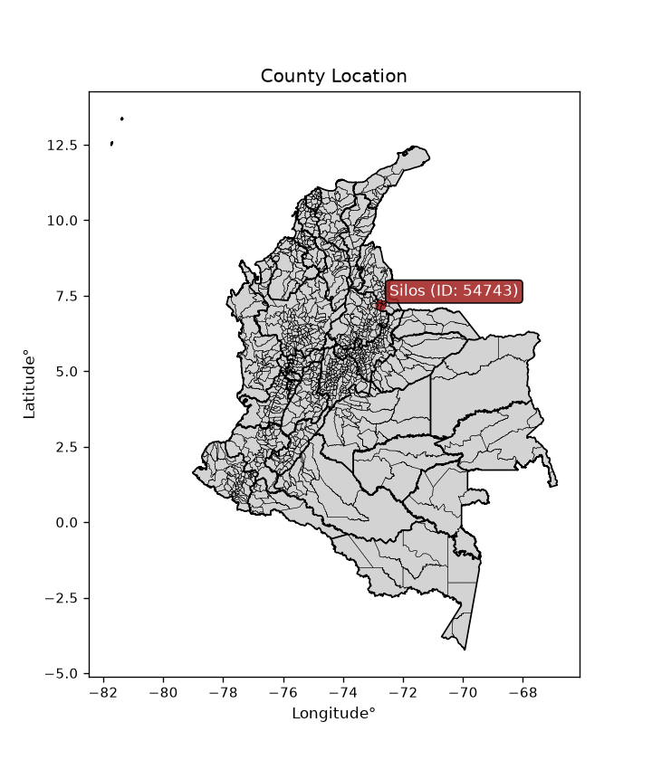
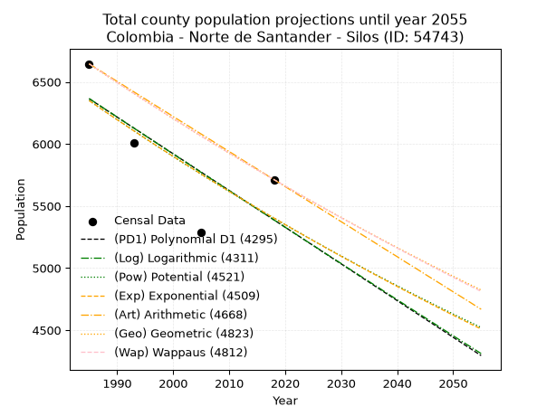
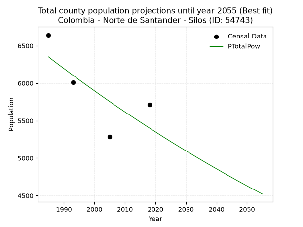
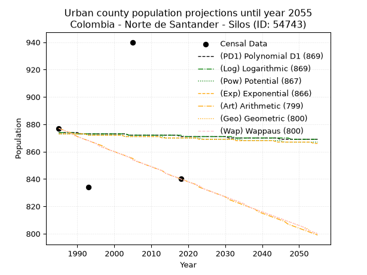
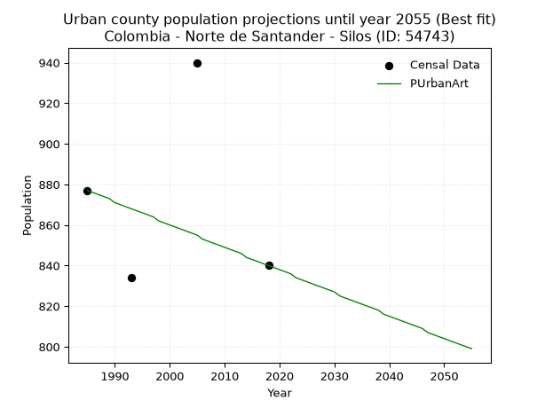
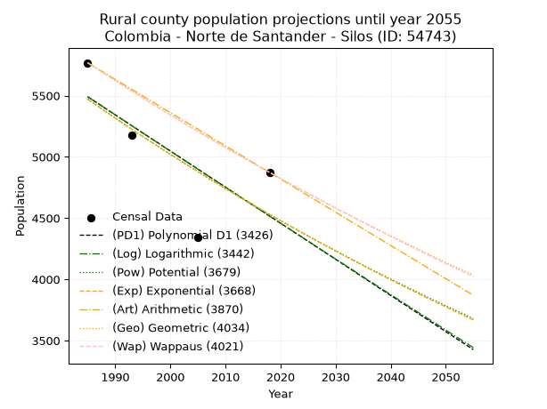
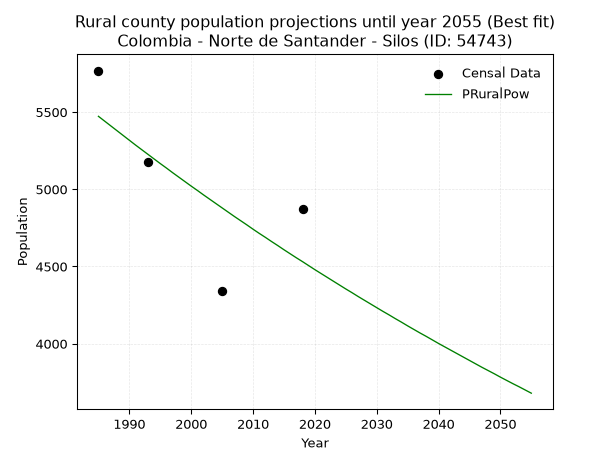

<div align="center">


</div>

# _“Population and Public Services Demand Projections (PPSD) until Year 2050 for Colombia - Norte de Santander - Silos (ID: 54743)”_
Keywords: `population` `public-service` `projection` `lineal` `polynomial` `logarithmic` `potential` `exponential` `arithmetic` `geometric` `wappaus` `dane` `colombia` `south-america`

PPSD are analytical estimates used by governments and planners to anticipate future changes in population size, age distribution, and the resulting community needs for utilities, healthcare, education, and infrastructure as sizing future water treatment facilities, electrical grids, and road networks based on spatial growth.

<div align="center">

</img>

</div>


> **General running parameters**: • app_version: _v20260806_. • Python version: _3.14.7_. • Pandas version: _3.0.5_. • NumPy version: _2.5.1_. • Creates, save and include plots into reports (create_plot): _False_. • Projection until year: _2050_. • Process polynomial degree 2 and up: _False_. • Process Wappaus: _True_. • Process Wappaus: _True_. • Set negative values to zero: _True_. • Set infinite values to zero: _True_. • Drop dataset notes: _True_. 
<div align="center">

Dynamic map: [:earth_americas:Google](http://maps.google.com/maps?q=7.204735943,-72.757128) [:earth_americas:OSM](https://www.openstreetmap.org/#map=18/7.204735943/-72.757128&layers=P) [:earth_americas:Bing](https://www.bing.com/maps?cp=7.204735943~-72.757128&lvl=18) [:earth_americas:Apple](https://maps.apple.com/frame?center=7.204735943%2C-72.757128&span=0.003%2C0.006)

</div>


<div align="center">

```geojson
{
  "type": "Feature",
  "geometry": {
    "type": "Point", 
    "coordinates": [-72.757128, 7.204735943]
  }, 
  "properties": {
    "Name": "Colombia - Norte de Santander - Silos (ID: 54743)"
  }
}
```

</div>


## 0. Census Data (4 records)

Census data are official statistics collected by a government about the people and housing in a country. They usually include counts of total population, age, sex, race, income, education, and jobs.

📅Global census file: [Population.xlsx](../data/Population.xlsx)

| Source   |   Year |   CountryID | CountryName   |   StateID | StateName          |   CountyID | CountyName   |   PTotal |   PUrban |   PRural |
|:---------|-------:|------------:|:--------------|----------:|:-------------------|-----------:|:-------------|---------:|---------:|---------:|
| DANE     |   1985 |          57 | Colombia      |        54 | Norte de Santander |      54743 | Silos        |     6645 |      877 |     5768 |
| DANE     |   1993 |          57 | Colombia      |        54 | Norte de Santander |      54743 | Silos        |     6011 |      834 |     5177 |
| DANE     |   2005 |          57 | Colombia      |        54 | Norte de Santander |      54743 | Silos        |     5284 |      940 |     4344 |
| DANE     |   2018 |          57 | Colombia      |        54 | Norte de Santander |      54743 | Silos        |     5713 |      840 |     4873 |

> 🔥Some records could had specific notes about the registered values or the corresponding urban or rural distribution.

📅[SUI-RUPS](https://www.datos.gov.co/Hacienda-y-Cr-dito-P-blico/Registro-nico-de-Prestadores-de-Servicios-P-blicos/4qkq-csdn/about_data) - Local public utility companies: [RUPS.csv](../data/RUPS.xlsx)

 | SERVICIO       | ESTADO    | NOMBRE                       | NIT         | DEPARTAMENTO_DOMICILIO   | MUNICIPIO_DOMICILIO   | DIRECCION                         |   TELEFONO | EMAIL                                | TIPO_PRESTADOR                 | CLASIFICACION                 |
|:---------------|:----------|:-----------------------------|:------------|:-------------------------|:----------------------|:----------------------------------|-----------:|:-------------------------------------|:-------------------------------|:------------------------------|
| ACUEDUCTO      | OPERATIVA | UNIDAD DE SERVICIOS PUBLICOS | 890506128-6 | NORTE DE SANTANDER       | SILOS                 | Cra 3 N° 5-50 - Palacio Municipal |    5676001 | serviciospublicosacuesilos@gmail.com | MUNICIPIO (PRESTACIÓN DIRECTA) | MENOR O IGUAL A 2500 USUARIOS |
| ALCANTARILLADO | OPERATIVA | UNIDAD DE SERVICIOS PUBLICOS | 890506128-6 | NORTE DE SANTANDER       | SILOS                 | Cra 3 N° 5-50 - Palacio Municipal |    5676001 | serviciospublicosacuesilos@gmail.com | MUNICIPIO (PRESTACIÓN DIRECTA) | MENOR O IGUAL A 2500 USUARIOS |

## 1. Total

### 1.1. Coefficients and Parameters

* (PD1) Polynomial Deg 1: -29.56443195503839, 65049.50501806554 (lineal)
* (Log) Logarithmic: -59297.499301341006, 456634.0173698305
* (Pow) Potential: -9.804369015855219, 36.1352828434434
* (Exp) Exponential: -0.00488802112062829, 103879319.73534322
* (Art) Arithmetic: Year diff. 2018 - 1985 = 33, Population diff. 5713 - 6645 = -932, Annual growth = -28.242424242424242
* (Geo) Geometric: Year diff. 2018 - 1985 = 33, Population diff. 5713 - 6645 = -932, Annual growth % = -0.004568936942852431
* (Wap) Wappaus: i = -0.4570711157537505, Condition values only valid for < 200)

<sub>
Wappaus condition values: ['-0.00', '-0.46', '-0.91', '-1.37', '-1.83', '-2.29', '-2.74', '-3.20', '-3.66', '-4.11', '-4.57', '-5.03', '-5.48', '-5.94', '-6.40', '-6.86', '-7.31', '-7.77', '-8.23', '-8.68', '-9.14', '-9.60', '-10.06', '-10.51', '-10.97', '-11.43', '-11.88', '-12.34', '-12.80', '-13.26', '-13.71', '-14.17', '-14.63', '-15.08', '-15.54', '-16.00', '-16.45', '-16.91', '-17.37', '-17.83', '-18.28', '-18.74', '-19.20', '-19.65', '-20.11', '-20.57', '-21.03', '-21.48', '-21.94', '-22.40', '-22.85', '-23.31', '-23.77', '-24.22', '-24.68', '-25.14', '-25.60', '-26.05', '-26.51', '-26.97', '-27.42', '-27.88', '-28.34', '-28.80', '-29.25', '-29.71']
</sub>


### 1.2. Projected Dataset

|   Year |   CountyID |   PTotalPD1 |   PTotalLog |   PTotalPow |   PTotalExp |   PTotalArt |   PTotalGeo |   PTotalWap |
|-------:|-----------:|------------:|------------:|------------:|------------:|------------:|------------:|------------:|
|   1985 |      54743 |        6364 |        6366 |        6351 |        6349 |        6645 |        6645 |        6645 |
|   1986 |      54743 |        6335 |        6336 |        6319 |        6318 |        6617 |        6615 |        6615 |
|   1987 |      54743 |        6305 |        6306 |        6288 |        6287 |        6589 |        6584 |        6585 |
|   1988 |      54743 |        6275 |        6276 |        6257 |        6256 |        6560 |        6554 |        6555 |
|   1989 |      54743 |        6246 |        6247 |        6227 |        6226 |        6532 |        6524 |        6525 |
|   1990 |      54743 |        6216 |        6217 |        6196 |        6195 |        6504 |        6495 |        6495 |
|   1991 |      54743 |        6187 |        6187 |        6166 |        6165 |        6476 |        6465 |        6465 |
|   1992 |      54743 |        6157 |        6157 |        6135 |        6135 |        6447 |        6435 |        6436 |
|   1993 |      54743 |        6128 |        6127 |        6105 |        6105 |        6419 |        6406 |        6406 |
|   1994 |      54743 |        6098 |        6098 |        6075 |        6076 |        6391 |        6377 |        6377 |
|   1995 |      54743 |        6068 |        6068 |        6045 |        6046 |        6363 |        6348 |        6348 |
|   1996 |      54743 |        6039 |        6038 |        6016 |        6016 |        6334 |        6319 |        6319 |
|   1997 |      54743 |        6009 |        6009 |        5986 |        5987 |        6306 |        6290 |        6290 |
|   1998 |      54743 |        5980 |        5979 |        5957 |        5958 |        6278 |        6261 |        6262 |
|   1999 |      54743 |        5950 |        5949 |        5928 |        5929 |        6250 |        6232 |        6233 |
|   2000 |      54743 |        5921 |        5920 |        5899 |        5900 |        6221 |        6204 |        6205 |
|   2001 |      54743 |        5891 |        5890 |        5870 |        5871 |        6193 |        6176 |        6176 |
|   2002 |      54743 |        5862 |        5860 |        5841 |        5843 |        6165 |        6147 |        6148 |
|   2003 |      54743 |        5832 |        5831 |        5813 |        5814 |        6137 |        6119 |        6120 |
|   2004 |      54743 |        5802 |        5801 |        5784 |        5786 |        6108 |        6091 |        6092 |
|   2005 |      54743 |        5773 |        5771 |        5756 |        5757 |        6080 |        6063 |        6064 |
|   2006 |      54743 |        5743 |        5742 |        5728 |        5729 |        6052 |        6036 |        6036 |
|   2007 |      54743 |        5714 |        5712 |        5700 |        5701 |        6024 |        6008 |        6009 |
|   2008 |      54743 |        5684 |        5683 |        5672 |        5674 |        5995 |        5981 |        5981 |
|   2009 |      54743 |        5655 |        5653 |        5645 |        5646 |        5967 |        5953 |        5954 |
|   2010 |      54743 |        5625 |        5624 |        5617 |        5618 |        5939 |        5926 |        5927 |
|   2011 |      54743 |        5595 |        5594 |        5590 |        5591 |        5911 |        5899 |        5900 |
|   2012 |      54743 |        5566 |        5565 |        5563 |        5564 |        5882 |        5872 |        5873 |
|   2013 |      54743 |        5536 |        5535 |        5536 |        5537 |        5854 |        5845 |        5846 |
|   2014 |      54743 |        5507 |        5506 |        5509 |        5510 |        5826 |        5819 |        5819 |
|   2015 |      54743 |        5477 |        5476 |        5482 |        5483 |        5798 |        5792 |        5792 |
|   2016 |      54743 |        5448 |        5447 |        5456 |        5456 |        5769 |        5766 |        5766 |
|   2017 |      54743 |        5418 |        5418 |        5429 |        5429 |        5741 |        5739 |        5739 |
|   2018 |      54743 |        5388 |        5388 |        5403 |        5403 |        5713 |        5713 |        5713 |
|   2019 |      54743 |        5359 |        5359 |        5377 |        5377 |        5685 |        5687 |        5687 |
|   2020 |      54743 |        5329 |        5329 |        5351 |        5350 |        5657 |        5661 |        5661 |
|   2021 |      54743 |        5300 |        5300 |        5325 |        5324 |        5628 |        5635 |        5635 |
|   2022 |      54743 |        5270 |        5271 |        5299 |        5298 |        5600 |        5609 |        5609 |
|   2023 |      54743 |        5241 |        5241 |        5273 |        5273 |        5572 |        5584 |        5583 |
|   2024 |      54743 |        5211 |        5212 |        5248 |        5247 |        5544 |        5558 |        5557 |
|   2025 |      54743 |        5182 |        5183 |        5222 |        5221 |        5515 |        5533 |        5532 |
|   2026 |      54743 |        5152 |        5154 |        5197 |        5196 |        5487 |        5507 |        5506 |
|   2027 |      54743 |        5122 |        5124 |        5172 |        5170 |        5459 |        5482 |        5481 |
|   2028 |      54743 |        5093 |        5095 |        5147 |        5145 |        5431 |        5457 |        5456 |
|   2029 |      54743 |        5063 |        5066 |        5122 |        5120 |        5402 |        5432 |        5431 |
|   2030 |      54743 |        5034 |        5037 |        5098 |        5095 |        5374 |        5408 |        5406 |
|   2031 |      54743 |        5004 |        5007 |        5073 |        5070 |        5346 |        5383 |        5381 |
|   2032 |      54743 |        4975 |        4978 |        5049 |        5046 |        5318 |        5358 |        5356 |
|   2033 |      54743 |        4945 |        4949 |        5024 |        5021 |        5289 |        5334 |        5331 |
|   2034 |      54743 |        4915 |        4920 |        5000 |        4997 |        5261 |        5309 |        5307 |
|   2035 |      54743 |        4886 |        4891 |        4976 |        4972 |        5233 |        5285 |        5282 |
|   2036 |      54743 |        4856 |        4862 |        4952 |        4948 |        5205 |        5261 |        5258 |
|   2037 |      54743 |        4827 |        4833 |        4928 |        4924 |        5176 |        5237 |        5233 |
|   2038 |      54743 |        4797 |        4803 |        4905 |        4900 |        5148 |        5213 |        5209 |
|   2039 |      54743 |        4768 |        4774 |        4881 |        4876 |        5120 |        5189 |        5185 |
|   2040 |      54743 |        4738 |        4745 |        4858 |        4852 |        5092 |        5165 |        5161 |
|   2041 |      54743 |        4708 |        4716 |        4835 |        4828 |        5063 |        5142 |        5137 |
|   2042 |      54743 |        4679 |        4687 |        4811 |        4805 |        5035 |        5118 |        5113 |
|   2043 |      54743 |        4649 |        4658 |        4788 |        4782 |        5007 |        5095 |        5090 |
|   2044 |      54743 |        4620 |        4629 |        4765 |        4758 |        4979 |        5072 |        5066 |
|   2045 |      54743 |        4590 |        4600 |        4743 |        4735 |        4950 |        5049 |        5042 |
|   2046 |      54743 |        4561 |        4571 |        4720 |        4712 |        4922 |        5025 |        5019 |
|   2047 |      54743 |        4531 |        4542 |        4697 |        4689 |        4894 |        5003 |        4996 |
|   2048 |      54743 |        4502 |        4513 |        4675 |        4666 |        4866 |        4980 |        4972 |
|   2049 |      54743 |        4472 |        4484 |        4653 |        4643 |        4837 |        4957 |        4949 |
|   2050 |      54743 |        4442 |        4455 |        4630 |        4621 |        4809 |        4934 |        4926 |
<div align="center">

</img>

</div>


### 1.3. Best fit with absolute and relative error (%)

Relative error puts that difference into context by dividing the absolute error by the true value, creating a unitless ratio or percentage that shows the scale of the mistake.

Absolute and relative error

|   Year | Source   |   CountryID | CountryName   |   StateID | StateName          |   CountyID_x | CountyName   |   PTotal |   PUrban |   PRural |   CountyID_y |   PTotalPD1 |   PTotalLog |   PTotalPow |   PTotalExp |   PTotalArt |   PTotalGeo |   PTotalWap |   PTotalPD1AbsError |   PTotalLogAbsError |   PTotalPowAbsError |   PTotalExpAbsError |   PTotalArtAbsError |   PTotalGeoAbsError |   PTotalWapAbsError |   PTotalPD1RelError |   PTotalLogRelError |   PTotalPowRelError |   PTotalExpRelError |   PTotalArtRelError |   PTotalGeoRelError |   PTotalWapRelError |
|-------:|:---------|------------:|:--------------|----------:|:-------------------|-------------:|:-------------|---------:|---------:|---------:|-------------:|------------:|------------:|------------:|------------:|------------:|------------:|------------:|--------------------:|--------------------:|--------------------:|--------------------:|--------------------:|--------------------:|--------------------:|--------------------:|--------------------:|--------------------:|--------------------:|--------------------:|--------------------:|--------------------:|
|   1985 | DANE     |          57 | Colombia      |        54 | Norte de Santander |        54743 | Silos        |     6645 |      877 |     5768 |        54743 |        6364 |        6366 |        6351 |        6349 |        6645 |        6645 |        6645 |                 281 |                 279 |                 294 |                 296 |                   0 |                   0 |                   0 |             4.22874 |             4.19865 |             4.42438 |             4.45448 |             0       |             0       |             0       |
|   1993 | DANE     |          57 | Colombia      |        54 | Norte de Santander |        54743 | Silos        |     6011 |      834 |     5177 |        54743 |        6128 |        6127 |        6105 |        6105 |        6419 |        6406 |        6406 |                 117 |                 116 |                  94 |                  94 |                 408 |                 395 |                 395 |             1.94643 |             1.9298  |             1.5638  |             1.5638  |             6.78756 |             6.57129 |             6.57129 |
|   2005 | DANE     |          57 | Colombia      |        54 | Norte de Santander |        54743 | Silos        |     5284 |      940 |     4344 |        54743 |        5773 |        5771 |        5756 |        5757 |        6080 |        6063 |        6064 |                 489 |                 487 |                 472 |                 473 |                 796 |                 779 |                 780 |             9.25435 |             9.2165  |             8.93263 |             8.95155 |            15.0643  |            14.7426  |            14.7615  |
|   2018 | DANE     |          57 | Colombia      |        54 | Norte de Santander |        54743 | Silos        |     5713 |      840 |     4873 |        54743 |        5388 |        5388 |        5403 |        5403 |        5713 |        5713 |        5713 |                 325 |                 325 |                 310 |                 310 |                   0 |                   0 |                   0 |             5.68878 |             5.68878 |             5.42622 |             5.42622 |             0       |             0       |             0       |

Relative error mean

| Method    |   RelError | Best   |
|:----------|-----------:|:-------|
| PTotalPD1 |    5.27958 |        |
| PTotalLog |    5.25843 |        |
| PTotalPow |    5.08676 | True   |
| PTotalExp |    5.09901 |        |
| PTotalArt |    5.46298 |        |
| PTotalGeo |    5.32848 |        |
| PTotalWap |    5.33321 |        |

💙Best method: _**PTotalPow**_
<div align="center">

</img>

</div>


### 1.4. Fresh water supply demand in liters per capita per day (lpcd)

The fresh water supply demand typically ranges from 100 to 300 liters per capita per day (lpcd) for standard domestic and municipal planning, though absolute survival minimums set by the World Health Organization are as low as 7.5 to 20 liters per day, and total consumption in high-income nations can exceed 400 liters.

> `CZ`: Level in meters above the sea level (masl)<br> `WS`: Fresh water supply demand in liters per capita per day (lpcd or l/h/d)<br> `WSAll`: Zonal fresh water supply demand in liters per second (l/s)<br> `A`: Zonal area in square meters<br> `DP`: Population density (people/hectare or p/ha)

Reference values (RAS Colombia)

|    CZ |   WS |
|------:|-----:|
|  1000 |  120 |
|  2000 |  130 |
| 99999 |  140 |

County shapefile geometry properties and water supply values

|   CountyID |     ATotal |   CZTotal |   WSTotal |
|-----------:|-----------:|----------:|----------:|
|      54743 | 3.9149e+08 |    3364.7 |       140 |

Projected values for best method: PTotalPow

|   CountyID |   Year |   PTotalPow |   DPTotal |   WSTotal |   WSTotalAll |
|-----------:|-------:|------------:|----------:|----------:|-------------:|
|      54743 |   1985 |        6351 |      0.16 |       140 |     10.291   |
|      54743 |   1986 |        6319 |      0.16 |       140 |     10.2391  |
|      54743 |   1987 |        6288 |      0.16 |       140 |     10.1889  |
|      54743 |   1988 |        6257 |      0.16 |       140 |     10.1387  |
|      54743 |   1989 |        6227 |      0.16 |       140 |     10.09    |
|      54743 |   1990 |        6196 |      0.16 |       140 |     10.0398  |
|      54743 |   1991 |        6166 |      0.16 |       140 |      9.9912  |
|      54743 |   1992 |        6135 |      0.16 |       140 |      9.94097 |
|      54743 |   1993 |        6105 |      0.16 |       140 |      9.89236 |
|      54743 |   1994 |        6075 |      0.16 |       140 |      9.84375 |
|      54743 |   1995 |        6045 |      0.15 |       140 |      9.79514 |
|      54743 |   1996 |        6016 |      0.15 |       140 |      9.74815 |
|      54743 |   1997 |        5986 |      0.15 |       140 |      9.69954 |
|      54743 |   1998 |        5957 |      0.15 |       140 |      9.65255 |
|      54743 |   1999 |        5928 |      0.15 |       140 |      9.60556 |
|      54743 |   2000 |        5899 |      0.15 |       140 |      9.55856 |
|      54743 |   2001 |        5870 |      0.15 |       140 |      9.51157 |
|      54743 |   2002 |        5841 |      0.15 |       140 |      9.46458 |
|      54743 |   2003 |        5813 |      0.15 |       140 |      9.41921 |
|      54743 |   2004 |        5784 |      0.15 |       140 |      9.37222 |
|      54743 |   2005 |        5756 |      0.15 |       140 |      9.32685 |
|      54743 |   2006 |        5728 |      0.15 |       140 |      9.28148 |
|      54743 |   2007 |        5700 |      0.15 |       140 |      9.23611 |
|      54743 |   2008 |        5672 |      0.14 |       140 |      9.19074 |
|      54743 |   2009 |        5645 |      0.14 |       140 |      9.14699 |
|      54743 |   2010 |        5617 |      0.14 |       140 |      9.10162 |
|      54743 |   2011 |        5590 |      0.14 |       140 |      9.05787 |
|      54743 |   2012 |        5563 |      0.14 |       140 |      9.01412 |
|      54743 |   2013 |        5536 |      0.14 |       140 |      8.97037 |
|      54743 |   2014 |        5509 |      0.14 |       140 |      8.92662 |
|      54743 |   2015 |        5482 |      0.14 |       140 |      8.88287 |
|      54743 |   2016 |        5456 |      0.14 |       140 |      8.84074 |
|      54743 |   2017 |        5429 |      0.14 |       140 |      8.79699 |
|      54743 |   2018 |        5403 |      0.14 |       140 |      8.75486 |
|      54743 |   2019 |        5377 |      0.14 |       140 |      8.71273 |
|      54743 |   2020 |        5351 |      0.14 |       140 |      8.6706  |
|      54743 |   2021 |        5325 |      0.14 |       140 |      8.62847 |
|      54743 |   2022 |        5299 |      0.14 |       140 |      8.58634 |
|      54743 |   2023 |        5273 |      0.13 |       140 |      8.54421 |
|      54743 |   2024 |        5248 |      0.13 |       140 |      8.5037  |
|      54743 |   2025 |        5222 |      0.13 |       140 |      8.46157 |
|      54743 |   2026 |        5197 |      0.13 |       140 |      8.42106 |
|      54743 |   2027 |        5172 |      0.13 |       140 |      8.38056 |
|      54743 |   2028 |        5147 |      0.13 |       140 |      8.34005 |
|      54743 |   2029 |        5122 |      0.13 |       140 |      8.29954 |
|      54743 |   2030 |        5098 |      0.13 |       140 |      8.26065 |
|      54743 |   2031 |        5073 |      0.13 |       140 |      8.22014 |
|      54743 |   2032 |        5049 |      0.13 |       140 |      8.18125 |
|      54743 |   2033 |        5024 |      0.13 |       140 |      8.14074 |
|      54743 |   2034 |        5000 |      0.13 |       140 |      8.10185 |
|      54743 |   2035 |        4976 |      0.13 |       140 |      8.06296 |
|      54743 |   2036 |        4952 |      0.13 |       140 |      8.02407 |
|      54743 |   2037 |        4928 |      0.13 |       140 |      7.98519 |
|      54743 |   2038 |        4905 |      0.13 |       140 |      7.94792 |
|      54743 |   2039 |        4881 |      0.12 |       140 |      7.90903 |
|      54743 |   2040 |        4858 |      0.12 |       140 |      7.87176 |
|      54743 |   2041 |        4835 |      0.12 |       140 |      7.83449 |
|      54743 |   2042 |        4811 |      0.12 |       140 |      7.7956  |
|      54743 |   2043 |        4788 |      0.12 |       140 |      7.75833 |
|      54743 |   2044 |        4765 |      0.12 |       140 |      7.72106 |
|      54743 |   2045 |        4743 |      0.12 |       140 |      7.68542 |
|      54743 |   2046 |        4720 |      0.12 |       140 |      7.64815 |
|      54743 |   2047 |        4697 |      0.12 |       140 |      7.61088 |
|      54743 |   2048 |        4675 |      0.12 |       140 |      7.57523 |
|      54743 |   2049 |        4653 |      0.12 |       140 |      7.53958 |
|      54743 |   2050 |        4630 |      0.12 |       140 |      7.50231 |

## 2. Urban

### 2.1. Coefficients and Parameters

* (PD1) Polynomial Deg 1: -0.0734644720995017, 1019.6973103170282 (lineal)
* (Log) Logarithmic: -139.27765982294838, 1931.400608415351
* (Pow) Potential: -0.21999382324184308, 3.666609490145355
* (Exp) Exponential: -0.00011418837922009502, 1095.4394062378342
* (Art) Arithmetic: Year diff. 2018 - 1985 = 33, Population diff. 840 - 877 = -37, Annual growth = -1.121212121212121
* (Geo) Geometric: Year diff. 2018 - 1985 = 33, Population diff. 840 - 877 = -37, Annual growth % = -0.0013053624400121144
* (Wap) Wappaus: i = -0.13060129542366, Condition values only valid for < 200)

<sub>
Wappaus condition values: ['-0.00', '-0.13', '-0.26', '-0.39', '-0.52', '-0.65', '-0.78', '-0.91', '-1.04', '-1.18', '-1.31', '-1.44', '-1.57', '-1.70', '-1.83', '-1.96', '-2.09', '-2.22', '-2.35', '-2.48', '-2.61', '-2.74', '-2.87', '-3.00', '-3.13', '-3.27', '-3.40', '-3.53', '-3.66', '-3.79', '-3.92', '-4.05', '-4.18', '-4.31', '-4.44', '-4.57', '-4.70', '-4.83', '-4.96', '-5.09', '-5.22', '-5.35', '-5.49', '-5.62', '-5.75', '-5.88', '-6.01', '-6.14', '-6.27', '-6.40', '-6.53', '-6.66', '-6.79', '-6.92', '-7.05', '-7.18', '-7.31', '-7.44', '-7.57', '-7.71', '-7.84', '-7.97', '-8.10', '-8.23', '-8.36', '-8.49']
</sub>


### 2.2. Projected Dataset

|   Year |   CountyID |   PUrbanPD1 |   PUrbanLog |   PUrbanPow |   PUrbanExp |   PUrbanArt |   PUrbanGeo |   PUrbanWap |
|-------:|-----------:|------------:|------------:|------------:|------------:|------------:|------------:|------------:|
|   1985 |      54743 |         874 |         874 |         873 |         873 |         877 |         877 |         877 |
|   1986 |      54743 |         874 |         874 |         873 |         873 |         876 |         876 |         876 |
|   1987 |      54743 |         874 |         874 |         873 |         873 |         875 |         875 |         875 |
|   1988 |      54743 |         874 |         874 |         873 |         873 |         874 |         874 |         874 |
|   1989 |      54743 |         874 |         874 |         873 |         873 |         873 |         872 |         872 |
|   1990 |      54743 |         874 |         873 |         873 |         873 |         871 |         871 |         871 |
|   1991 |      54743 |         873 |         873 |         873 |         873 |         870 |         870 |         870 |
|   1992 |      54743 |         873 |         873 |         873 |         873 |         869 |         869 |         869 |
|   1993 |      54743 |         873 |         873 |         872 |         872 |         868 |         868 |         868 |
|   1994 |      54743 |         873 |         873 |         872 |         872 |         867 |         867 |         867 |
|   1995 |      54743 |         873 |         873 |         872 |         872 |         866 |         866 |         866 |
|   1996 |      54743 |         873 |         873 |         872 |         872 |         865 |         864 |         864 |
|   1997 |      54743 |         873 |         873 |         872 |         872 |         864 |         863 |         863 |
|   1998 |      54743 |         873 |         873 |         872 |         872 |         862 |         862 |         862 |
|   1999 |      54743 |         873 |         873 |         872 |         872 |         861 |         861 |         861 |
|   2000 |      54743 |         873 |         873 |         872 |         872 |         860 |         860 |         860 |
|   2001 |      54743 |         873 |         873 |         872 |         872 |         859 |         859 |         859 |
|   2002 |      54743 |         873 |         873 |         872 |         872 |         858 |         858 |         858 |
|   2003 |      54743 |         873 |         873 |         871 |         871 |         857 |         857 |         857 |
|   2004 |      54743 |         872 |         872 |         871 |         871 |         856 |         856 |         856 |
|   2005 |      54743 |         872 |         872 |         871 |         871 |         855 |         854 |         854 |
|   2006 |      54743 |         872 |         872 |         871 |         871 |         853 |         853 |         853 |
|   2007 |      54743 |         872 |         872 |         871 |         871 |         852 |         852 |         852 |
|   2008 |      54743 |         872 |         872 |         871 |         871 |         851 |         851 |         851 |
|   2009 |      54743 |         872 |         872 |         871 |         871 |         850 |         850 |         850 |
|   2010 |      54743 |         872 |         872 |         871 |         871 |         849 |         849 |         849 |
|   2011 |      54743 |         872 |         872 |         871 |         871 |         848 |         848 |         848 |
|   2012 |      54743 |         872 |         872 |         871 |         871 |         847 |         847 |         847 |
|   2013 |      54743 |         872 |         872 |         871 |         870 |         846 |         846 |         846 |
|   2014 |      54743 |         872 |         872 |         870 |         870 |         844 |         844 |         844 |
|   2015 |      54743 |         872 |         872 |         870 |         870 |         843 |         843 |         843 |
|   2016 |      54743 |         872 |         872 |         870 |         870 |         842 |         842 |         842 |
|   2017 |      54743 |         872 |         872 |         870 |         870 |         841 |         841 |         841 |
|   2018 |      54743 |         871 |         872 |         870 |         870 |         840 |         840 |         840 |
|   2019 |      54743 |         871 |         871 |         870 |         870 |         839 |         839 |         839 |
|   2020 |      54743 |         871 |         871 |         870 |         870 |         838 |         838 |         838 |
|   2021 |      54743 |         871 |         871 |         870 |         870 |         837 |         837 |         837 |
|   2022 |      54743 |         871 |         871 |         870 |         870 |         836 |         836 |         836 |
|   2023 |      54743 |         871 |         871 |         870 |         869 |         834 |         835 |         835 |
|   2024 |      54743 |         871 |         871 |         869 |         869 |         833 |         833 |         833 |
|   2025 |      54743 |         871 |         871 |         869 |         869 |         832 |         832 |         832 |
|   2026 |      54743 |         871 |         871 |         869 |         869 |         831 |         831 |         831 |
|   2027 |      54743 |         871 |         871 |         869 |         869 |         830 |         830 |         830 |
|   2028 |      54743 |         871 |         871 |         869 |         869 |         829 |         829 |         829 |
|   2029 |      54743 |         871 |         871 |         869 |         869 |         828 |         828 |         828 |
|   2030 |      54743 |         871 |         871 |         869 |         869 |         827 |         827 |         827 |
|   2031 |      54743 |         870 |         871 |         869 |         869 |         825 |         826 |         826 |
|   2032 |      54743 |         870 |         871 |         869 |         869 |         824 |         825 |         825 |
|   2033 |      54743 |         870 |         870 |         869 |         868 |         823 |         824 |         824 |
|   2034 |      54743 |         870 |         870 |         869 |         868 |         822 |         823 |         823 |
|   2035 |      54743 |         870 |         870 |         868 |         868 |         821 |         822 |         822 |
|   2036 |      54743 |         870 |         870 |         868 |         868 |         820 |         820 |         820 |
|   2037 |      54743 |         870 |         870 |         868 |         868 |         819 |         819 |         819 |
|   2038 |      54743 |         870 |         870 |         868 |         868 |         818 |         818 |         818 |
|   2039 |      54743 |         870 |         870 |         868 |         868 |         816 |         817 |         817 |
|   2040 |      54743 |         870 |         870 |         868 |         868 |         815 |         816 |         816 |
|   2041 |      54743 |         870 |         870 |         868 |         868 |         814 |         815 |         815 |
|   2042 |      54743 |         870 |         870 |         868 |         868 |         813 |         814 |         814 |
|   2043 |      54743 |         870 |         870 |         868 |         868 |         812 |         813 |         813 |
|   2044 |      54743 |         870 |         870 |         868 |         867 |         811 |         812 |         812 |
|   2045 |      54743 |         869 |         870 |         868 |         867 |         810 |         811 |         811 |
|   2046 |      54743 |         869 |         870 |         867 |         867 |         809 |         810 |         810 |
|   2047 |      54743 |         869 |         870 |         867 |         867 |         807 |         809 |         809 |
|   2048 |      54743 |         869 |         869 |         867 |         867 |         806 |         808 |         808 |
|   2049 |      54743 |         869 |         869 |         867 |         867 |         805 |         807 |         807 |
|   2050 |      54743 |         869 |         869 |         867 |         867 |         804 |         806 |         806 |
<div align="center">

</img>

</div>


### 2.3. Best fit with absolute and relative error (%)

Relative error puts that difference into context by dividing the absolute error by the true value, creating a unitless ratio or percentage that shows the scale of the mistake.

Absolute and relative error

|   Year | Source   |   CountryID | CountryName   |   StateID | StateName          |   CountyID_x | CountyName   |   PTotal |   PUrban |   PRural |   CountyID_y |   PUrbanPD1 |   PUrbanLog |   PUrbanPow |   PUrbanExp |   PUrbanArt |   PUrbanGeo |   PUrbanWap |   PUrbanPD1AbsError |   PUrbanLogAbsError |   PUrbanPowAbsError |   PUrbanExpAbsError |   PUrbanArtAbsError |   PUrbanGeoAbsError |   PUrbanWapAbsError |   PUrbanPD1RelError |   PUrbanLogRelError |   PUrbanPowRelError |   PUrbanExpRelError |   PUrbanArtRelError |   PUrbanGeoRelError |   PUrbanWapRelError |
|-------:|:---------|------------:|:--------------|----------:|:-------------------|-------------:|:-------------|---------:|---------:|---------:|-------------:|------------:|------------:|------------:|------------:|------------:|------------:|------------:|--------------------:|--------------------:|--------------------:|--------------------:|--------------------:|--------------------:|--------------------:|--------------------:|--------------------:|--------------------:|--------------------:|--------------------:|--------------------:|--------------------:|
|   1985 | DANE     |          57 | Colombia      |        54 | Norte de Santander |        54743 | Silos        |     6645 |      877 |     5768 |        54743 |         874 |         874 |         873 |         873 |         877 |         877 |         877 |                   3 |                   3 |                   4 |                   4 |                   0 |                   0 |                   0 |            0.342075 |            0.342075 |             0.4561  |             0.4561  |             0       |             0       |             0       |
|   1993 | DANE     |          57 | Colombia      |        54 | Norte de Santander |        54743 | Silos        |     6011 |      834 |     5177 |        54743 |         873 |         873 |         872 |         872 |         868 |         868 |         868 |                  39 |                  39 |                  38 |                  38 |                  34 |                  34 |                  34 |            4.67626  |            4.67626  |             4.55635 |             4.55635 |             4.07674 |             4.07674 |             4.07674 |
|   2005 | DANE     |          57 | Colombia      |        54 | Norte de Santander |        54743 | Silos        |     5284 |      940 |     4344 |        54743 |         872 |         872 |         871 |         871 |         855 |         854 |         854 |                  68 |                  68 |                  69 |                  69 |                  85 |                  86 |                  86 |            7.23404  |            7.23404  |             7.34043 |             7.34043 |             9.04255 |             9.14894 |             9.14894 |
|   2018 | DANE     |          57 | Colombia      |        54 | Norte de Santander |        54743 | Silos        |     5713 |      840 |     4873 |        54743 |         871 |         872 |         870 |         870 |         840 |         840 |         840 |                  31 |                  32 |                  30 |                  30 |                   0 |                   0 |                   0 |            3.69048  |            3.80952  |             3.57143 |             3.57143 |             0       |             0       |             0       |

Relative error mean

| Method    |   RelError | Best   |
|:----------|-----------:|:-------|
| PUrbanPD1 |    3.98571 |        |
| PUrbanLog |    4.01548 |        |
| PUrbanPow |    3.98108 |        |
| PUrbanExp |    3.98108 |        |
| PUrbanArt |    3.27982 | True   |
| PUrbanGeo |    3.30642 |        |
| PUrbanWap |    3.30642 |        |

💙Best method: _**PUrbanArt**_
<div align="center">

</img>

</div>


### 2.4. Fresh water supply demand in liters per capita per day (lpcd)

The fresh water supply demand typically ranges from 100 to 300 liters per capita per day (lpcd) for standard domestic and municipal planning, though absolute survival minimums set by the World Health Organization are as low as 7.5 to 20 liters per day, and total consumption in high-income nations can exceed 400 liters.

> `CZ`: Level in meters above the sea level (masl)<br> `WS`: Fresh water supply demand in liters per capita per day (lpcd or l/h/d)<br> `WSAll`: Zonal fresh water supply demand in liters per second (l/s)<br> `A`: Zonal area in square meters<br> `DP`: Population density (people/hectare or p/ha)

Reference values (RAS Colombia)

|    CZ |   WS |
|------:|-----:|
|  1000 |  120 |
|  2000 |  130 |
| 99999 |  140 |

County shapefile geometry properties and water supply values

|   CountyID |   AUrban |   CZUrban |   WSUrban |
|-----------:|---------:|----------:|----------:|
|      54743 |   263099 |   2721.48 |       140 |

Projected values for best method: PUrbanArt

|   CountyID |   Year |   PUrbanArt |   DPUrban |   WSUrban |   WSUrbanAll |
|-----------:|-------:|------------:|----------:|----------:|-------------:|
|      54743 |   1985 |         877 |     33.33 |       140 |      1.42106 |
|      54743 |   1986 |         876 |     33.3  |       140 |      1.41944 |
|      54743 |   1987 |         875 |     33.26 |       140 |      1.41782 |
|      54743 |   1988 |         874 |     33.22 |       140 |      1.4162  |
|      54743 |   1989 |         873 |     33.18 |       140 |      1.41458 |
|      54743 |   1990 |         871 |     33.11 |       140 |      1.41134 |
|      54743 |   1991 |         870 |     33.07 |       140 |      1.40972 |
|      54743 |   1992 |         869 |     33.03 |       140 |      1.4081  |
|      54743 |   1993 |         868 |     32.99 |       140 |      1.40648 |
|      54743 |   1994 |         867 |     32.95 |       140 |      1.40486 |
|      54743 |   1995 |         866 |     32.92 |       140 |      1.40324 |
|      54743 |   1996 |         865 |     32.88 |       140 |      1.40162 |
|      54743 |   1997 |         864 |     32.84 |       140 |      1.4     |
|      54743 |   1998 |         862 |     32.76 |       140 |      1.39676 |
|      54743 |   1999 |         861 |     32.73 |       140 |      1.39514 |
|      54743 |   2000 |         860 |     32.69 |       140 |      1.39352 |
|      54743 |   2001 |         859 |     32.65 |       140 |      1.3919  |
|      54743 |   2002 |         858 |     32.61 |       140 |      1.39028 |
|      54743 |   2003 |         857 |     32.57 |       140 |      1.38866 |
|      54743 |   2004 |         856 |     32.54 |       140 |      1.38704 |
|      54743 |   2005 |         855 |     32.5  |       140 |      1.38542 |
|      54743 |   2006 |         853 |     32.42 |       140 |      1.38218 |
|      54743 |   2007 |         852 |     32.38 |       140 |      1.38056 |
|      54743 |   2008 |         851 |     32.35 |       140 |      1.37894 |
|      54743 |   2009 |         850 |     32.31 |       140 |      1.37731 |
|      54743 |   2010 |         849 |     32.27 |       140 |      1.37569 |
|      54743 |   2011 |         848 |     32.23 |       140 |      1.37407 |
|      54743 |   2012 |         847 |     32.19 |       140 |      1.37245 |
|      54743 |   2013 |         846 |     32.16 |       140 |      1.37083 |
|      54743 |   2014 |         844 |     32.08 |       140 |      1.36759 |
|      54743 |   2015 |         843 |     32.04 |       140 |      1.36597 |
|      54743 |   2016 |         842 |     32    |       140 |      1.36435 |
|      54743 |   2017 |         841 |     31.97 |       140 |      1.36273 |
|      54743 |   2018 |         840 |     31.93 |       140 |      1.36111 |
|      54743 |   2019 |         839 |     31.89 |       140 |      1.35949 |
|      54743 |   2020 |         838 |     31.85 |       140 |      1.35787 |
|      54743 |   2021 |         837 |     31.81 |       140 |      1.35625 |
|      54743 |   2022 |         836 |     31.78 |       140 |      1.35463 |
|      54743 |   2023 |         834 |     31.7  |       140 |      1.35139 |
|      54743 |   2024 |         833 |     31.66 |       140 |      1.34977 |
|      54743 |   2025 |         832 |     31.62 |       140 |      1.34815 |
|      54743 |   2026 |         831 |     31.59 |       140 |      1.34653 |
|      54743 |   2027 |         830 |     31.55 |       140 |      1.34491 |
|      54743 |   2028 |         829 |     31.51 |       140 |      1.34329 |
|      54743 |   2029 |         828 |     31.47 |       140 |      1.34167 |
|      54743 |   2030 |         827 |     31.43 |       140 |      1.34005 |
|      54743 |   2031 |         825 |     31.36 |       140 |      1.33681 |
|      54743 |   2032 |         824 |     31.32 |       140 |      1.33519 |
|      54743 |   2033 |         823 |     31.28 |       140 |      1.33356 |
|      54743 |   2034 |         822 |     31.24 |       140 |      1.33194 |
|      54743 |   2035 |         821 |     31.21 |       140 |      1.33032 |
|      54743 |   2036 |         820 |     31.17 |       140 |      1.3287  |
|      54743 |   2037 |         819 |     31.13 |       140 |      1.32708 |
|      54743 |   2038 |         818 |     31.09 |       140 |      1.32546 |
|      54743 |   2039 |         816 |     31.01 |       140 |      1.32222 |
|      54743 |   2040 |         815 |     30.98 |       140 |      1.3206  |
|      54743 |   2041 |         814 |     30.94 |       140 |      1.31898 |
|      54743 |   2042 |         813 |     30.9  |       140 |      1.31736 |
|      54743 |   2043 |         812 |     30.86 |       140 |      1.31574 |
|      54743 |   2044 |         811 |     30.82 |       140 |      1.31412 |
|      54743 |   2045 |         810 |     30.79 |       140 |      1.3125  |
|      54743 |   2046 |         809 |     30.75 |       140 |      1.31088 |
|      54743 |   2047 |         807 |     30.67 |       140 |      1.30764 |
|      54743 |   2048 |         806 |     30.63 |       140 |      1.30602 |
|      54743 |   2049 |         805 |     30.6  |       140 |      1.3044  |
|      54743 |   2050 |         804 |     30.56 |       140 |      1.30278 |

## 3. Rural

### 3.1. Coefficients and Parameters

* (PD1) Polynomial Deg 1: -29.490967482938867, 64029.80770774847 (lineal)
* (Log) Logarithmic: -59158.22164151807, 454702.61676141515
* (Pow) Potential: -11.455259690361288, 41.514878383456285
* (Exp) Exponential: -0.005710110997373199, 457674560.34633934
* (Art) Arithmetic: Year diff. 2018 - 1985 = 33, Population diff. 4873 - 5768 = -895, Annual growth = -27.12121212121212
* (Geo) Geometric: Year diff. 2018 - 1985 = 33, Population diff. 4873 - 5768 = -895, Annual growth % = -0.005096533109829382
* (Wap) Wappaus: i = -0.5097493115536532, Condition values only valid for < 200)

<sub>
Wappaus condition values: ['-0.00', '-0.51', '-1.02', '-1.53', '-2.04', '-2.55', '-3.06', '-3.57', '-4.08', '-4.59', '-5.10', '-5.61', '-6.12', '-6.63', '-7.14', '-7.65', '-8.16', '-8.67', '-9.18', '-9.69', '-10.19', '-10.70', '-11.21', '-11.72', '-12.23', '-12.74', '-13.25', '-13.76', '-14.27', '-14.78', '-15.29', '-15.80', '-16.31', '-16.82', '-17.33', '-17.84', '-18.35', '-18.86', '-19.37', '-19.88', '-20.39', '-20.90', '-21.41', '-21.92', '-22.43', '-22.94', '-23.45', '-23.96', '-24.47', '-24.98', '-25.49', '-26.00', '-26.51', '-27.02', '-27.53', '-28.04', '-28.55', '-29.06', '-29.57', '-30.08', '-30.58', '-31.09', '-31.60', '-32.11', '-32.62', '-33.13']
</sub>


### 3.2. Projected Dataset

|   Year |   CountyID |   PRuralPD1 |   PRuralLog |   PRuralPow |   PRuralExp |   PRuralArt |   PRuralGeo |   PRuralWap |
|-------:|-----------:|------------:|------------:|------------:|------------:|------------:|------------:|------------:|
|   1985 |      54743 |        5490 |        5492 |        5472 |        5470 |        5768 |        5768 |        5768 |
|   1986 |      54743 |        5461 |        5462 |        5441 |        5439 |        5741 |        5739 |        5739 |
|   1987 |      54743 |        5431 |        5433 |        5410 |        5408 |        5714 |        5709 |        5709 |
|   1988 |      54743 |        5402 |        5403 |        5379 |        5377 |        5687 |        5680 |        5680 |
|   1989 |      54743 |        5372 |        5373 |        5348 |        5347 |        5660 |        5651 |        5652 |
|   1990 |      54743 |        5343 |        5343 |        5317 |        5316 |        5632 |        5623 |        5623 |
|   1991 |      54743 |        5313 |        5314 |        5286 |        5286 |        5605 |        5594 |        5594 |
|   1992 |      54743 |        5284 |        5284 |        5256 |        5256 |        5578 |        5565 |        5566 |
|   1993 |      54743 |        5254 |        5254 |        5226 |        5226 |        5551 |        5537 |        5537 |
|   1994 |      54743 |        5225 |        5224 |        5196 |        5196 |        5524 |        5509 |        5509 |
|   1995 |      54743 |        5195 |        5195 |        5166 |        5167 |        5497 |        5481 |        5481 |
|   1996 |      54743 |        5166 |        5165 |        5137 |        5137 |        5470 |        5453 |        5453 |
|   1997 |      54743 |        5136 |        5136 |        5107 |        5108 |        5443 |        5425 |        5426 |
|   1998 |      54743 |        5107 |        5106 |        5078 |        5079 |        5415 |        5397 |        5398 |
|   1999 |      54743 |        5077 |        5076 |        5049 |        5050 |        5388 |        5370 |        5371 |
|   2000 |      54743 |        5048 |        5047 |        5020 |        5021 |        5361 |        5342 |        5343 |
|   2001 |      54743 |        5018 |        5017 |        4992 |        4993 |        5334 |        5315 |        5316 |
|   2002 |      54743 |        4989 |        4988 |        4963 |        4964 |        5307 |        5288 |        5289 |
|   2003 |      54743 |        4959 |        4958 |        4935 |        4936 |        5280 |        5261 |        5262 |
|   2004 |      54743 |        4930 |        4929 |        4907 |        4908 |        5253 |        5234 |        5235 |
|   2005 |      54743 |        4900 |        4899 |        4879 |        4880 |        5226 |        5208 |        5208 |
|   2006 |      54743 |        4871 |        4870 |        4851 |        4852 |        5198 |        5181 |        5182 |
|   2007 |      54743 |        4841 |        4840 |        4823 |        4825 |        5171 |        5155 |        5155 |
|   2008 |      54743 |        4812 |        4811 |        4796 |        4797 |        5144 |        5128 |        5129 |
|   2009 |      54743 |        4782 |        4781 |        4769 |        4770 |        5117 |        5102 |        5103 |
|   2010 |      54743 |        4753 |        4752 |        4741 |        4743 |        5090 |        5076 |        5077 |
|   2011 |      54743 |        4723 |        4722 |        4714 |        4716 |        5063 |        5050 |        5051 |
|   2012 |      54743 |        4694 |        4693 |        4688 |        4689 |        5036 |        5025 |        5025 |
|   2013 |      54743 |        4664 |        4663 |        4661 |        4662 |        5009 |        4999 |        5000 |
|   2014 |      54743 |        4635 |        4634 |        4635 |        4636 |        4981 |        4974 |        4974 |
|   2015 |      54743 |        4606 |        4605 |        4608 |        4609 |        4954 |        4948 |        4949 |
|   2016 |      54743 |        4576 |        4575 |        4582 |        4583 |        4927 |        4923 |        4923 |
|   2017 |      54743 |        4547 |        4546 |        4556 |        4557 |        4900 |        4898 |        4898 |
|   2018 |      54743 |        4517 |        4517 |        4531 |        4531 |        4873 |        4873 |        4873 |
|   2019 |      54743 |        4488 |        4487 |        4505 |        4505 |        4846 |        4848 |        4848 |
|   2020 |      54743 |        4458 |        4458 |        4479 |        4479 |        4819 |        4823 |        4823 |
|   2021 |      54743 |        4429 |        4429 |        4454 |        4454 |        4792 |        4799 |        4798 |
|   2022 |      54743 |        4399 |        4400 |        4429 |        4429 |        4765 |        4774 |        4774 |
|   2023 |      54743 |        4370 |        4370 |        4404 |        4403 |        4737 |        4750 |        4749 |
|   2024 |      54743 |        4340 |        4341 |        4379 |        4378 |        4710 |        4726 |        4725 |
|   2025 |      54743 |        4311 |        4312 |        4354 |        4353 |        4683 |        4702 |        4701 |
|   2026 |      54743 |        4281 |        4283 |        4330 |        4329 |        4656 |        4678 |        4677 |
|   2027 |      54743 |        4252 |        4253 |        4305 |        4304 |        4629 |        4654 |        4653 |
|   2028 |      54743 |        4222 |        4224 |        4281 |        4279 |        4602 |        4630 |        4629 |
|   2029 |      54743 |        4193 |        4195 |        4257 |        4255 |        4575 |        4607 |        4605 |
|   2030 |      54743 |        4163 |        4166 |        4233 |        4231 |        4548 |        4583 |        4581 |
|   2031 |      54743 |        4134 |        4137 |        4209 |        4207 |        4520 |        4560 |        4557 |
|   2032 |      54743 |        4104 |        4108 |        4186 |        4183 |        4493 |        4537 |        4534 |
|   2033 |      54743 |        4075 |        4079 |        4162 |        4159 |        4466 |        4513 |        4511 |
|   2034 |      54743 |        4045 |        4050 |        4139 |        4135 |        4439 |        4490 |        4487 |
|   2035 |      54743 |        4016 |        4020 |        4115 |        4112 |        4412 |        4468 |        4464 |
|   2036 |      54743 |        3986 |        3991 |        4092 |        4088 |        4385 |        4445 |        4441 |
|   2037 |      54743 |        3957 |        3962 |        4069 |        4065 |        4358 |        4422 |        4418 |
|   2038 |      54743 |        3927 |        3933 |        4047 |        4042 |        4331 |        4400 |        4395 |
|   2039 |      54743 |        3898 |        3904 |        4024 |        4019 |        4303 |        4377 |        4372 |
|   2040 |      54743 |        3868 |        3875 |        4001 |        3996 |        4276 |        4355 |        4350 |
|   2041 |      54743 |        3839 |        3846 |        3979 |        3973 |        4249 |        4333 |        4327 |
|   2042 |      54743 |        3809 |        3817 |        3957 |        3951 |        4222 |        4311 |        4305 |
|   2043 |      54743 |        3780 |        3788 |        3935 |        3928 |        4195 |        4289 |        4282 |
|   2044 |      54743 |        3750 |        3759 |        3913 |        3906 |        4168 |        4267 |        4260 |
|   2045 |      54743 |        3721 |        3730 |        3891 |        3883 |        4141 |        4245 |        4238 |
|   2046 |      54743 |        3691 |        3702 |        3869 |        3861 |        4114 |        4223 |        4216 |
|   2047 |      54743 |        3662 |        3673 |        3847 |        3839 |        4086 |        4202 |        4194 |
|   2048 |      54743 |        3632 |        3644 |        3826 |        3818 |        4059 |        4180 |        4172 |
|   2049 |      54743 |        3603 |        3615 |        3805 |        3796 |        4032 |        4159 |        4150 |
|   2050 |      54743 |        3573 |        3586 |        3783 |        3774 |        4005 |        4138 |        4128 |
<div align="center">

</img>

</div>


### 3.3. Best fit with absolute and relative error (%)

Relative error puts that difference into context by dividing the absolute error by the true value, creating a unitless ratio or percentage that shows the scale of the mistake.

Absolute and relative error

|   Year | Source   |   CountryID | CountryName   |   StateID | StateName          |   CountyID_x | CountyName   |   PTotal |   PUrban |   PRural |   CountyID_y |   PRuralPD1 |   PRuralLog |   PRuralPow |   PRuralExp |   PRuralArt |   PRuralGeo |   PRuralWap |   PRuralPD1AbsError |   PRuralLogAbsError |   PRuralPowAbsError |   PRuralExpAbsError |   PRuralArtAbsError |   PRuralGeoAbsError |   PRuralWapAbsError |   PRuralPD1RelError |   PRuralLogRelError |   PRuralPowRelError |   PRuralExpRelError |   PRuralArtRelError |   PRuralGeoRelError |   PRuralWapRelError |
|-------:|:---------|------------:|:--------------|----------:|:-------------------|-------------:|:-------------|---------:|---------:|---------:|-------------:|------------:|------------:|------------:|------------:|------------:|------------:|------------:|--------------------:|--------------------:|--------------------:|--------------------:|--------------------:|--------------------:|--------------------:|--------------------:|--------------------:|--------------------:|--------------------:|--------------------:|--------------------:|--------------------:|
|   1985 | DANE     |          57 | Colombia      |        54 | Norte de Santander |        54743 | Silos        |     6645 |      877 |     5768 |        54743 |        5490 |        5492 |        5472 |        5470 |        5768 |        5768 |        5768 |                 278 |                 276 |                 296 |                 298 |                   0 |                   0 |                   0 |             4.81969 |             4.78502 |            5.13176  |            5.16644  |             0       |             0       |             0       |
|   1993 | DANE     |          57 | Colombia      |        54 | Norte de Santander |        54743 | Silos        |     6011 |      834 |     5177 |        54743 |        5254 |        5254 |        5226 |        5226 |        5551 |        5537 |        5537 |                  77 |                  77 |                  49 |                  49 |                 374 |                 360 |                 360 |             1.48735 |             1.48735 |            0.946494 |            0.946494 |             7.22426 |             6.95383 |             6.95383 |
|   2005 | DANE     |          57 | Colombia      |        54 | Norte de Santander |        54743 | Silos        |     5284 |      940 |     4344 |        54743 |        4900 |        4899 |        4879 |        4880 |        5226 |        5208 |        5208 |                 556 |                 555 |                 535 |                 536 |                 882 |                 864 |                 864 |            12.7993  |            12.7762  |           12.3158   |           12.3389   |            20.3039  |            19.8895  |            19.8895  |
|   2018 | DANE     |          57 | Colombia      |        54 | Norte de Santander |        54743 | Silos        |     5713 |      840 |     4873 |        54743 |        4517 |        4517 |        4531 |        4531 |        4873 |        4873 |        4873 |                 356 |                 356 |                 342 |                 342 |                   0 |                   0 |                   0 |             7.30556 |             7.30556 |            7.01826  |            7.01826  |             0       |             0       |             0       |

Relative error mean

| Method    |   RelError | Best   |
|:----------|-----------:|:-------|
| PRuralPD1 |    6.60297 |        |
| PRuralLog |    6.58854 |        |
| PRuralPow |    6.35309 | True   |
| PRuralExp |    6.36751 |        |
| PRuralArt |    6.88203 |        |
| PRuralGeo |    6.71083 |        |
| PRuralWap |    6.71083 |        |

💙Best method: _**PRuralPow**_
<div align="center">

</img>

</div>


### 3.4. Fresh water supply demand in liters per capita per day (lpcd)

The fresh water supply demand typically ranges from 100 to 300 liters per capita per day (lpcd) for standard domestic and municipal planning, though absolute survival minimums set by the World Health Organization are as low as 7.5 to 20 liters per day, and total consumption in high-income nations can exceed 400 liters.

> `CZ`: Level in meters above the sea level (masl)<br> `WS`: Fresh water supply demand in liters per capita per day (lpcd or l/h/d)<br> `WSAll`: Zonal fresh water supply demand in liters per second (l/s)<br> `A`: Zonal area in square meters<br> `DP`: Population density (people/hectare or p/ha)

Reference values (RAS Colombia)

|    CZ |   WS |
|------:|-----:|
|  1000 |  120 |
|  2000 |  130 |
| 99999 |  140 |

County shapefile geometry properties and water supply values

|   CountyID |      ARural |   CZRural |   WSRural |
|-----------:|------------:|----------:|----------:|
|      54743 | 3.91227e+08 |   3365.17 |       140 |

Projected values for best method: PRuralPow

|   CountyID |   Year |   PRuralPow |   DPRural |   WSRural |   WSRuralAll |
|-----------:|-------:|------------:|----------:|----------:|-------------:|
|      54743 |   1985 |        5472 |      0.14 |       140 |      8.86667 |
|      54743 |   1986 |        5441 |      0.14 |       140 |      8.81644 |
|      54743 |   1987 |        5410 |      0.14 |       140 |      8.7662  |
|      54743 |   1988 |        5379 |      0.14 |       140 |      8.71597 |
|      54743 |   1989 |        5348 |      0.14 |       140 |      8.66574 |
|      54743 |   1990 |        5317 |      0.14 |       140 |      8.61551 |
|      54743 |   1991 |        5286 |      0.14 |       140 |      8.56528 |
|      54743 |   1992 |        5256 |      0.13 |       140 |      8.51667 |
|      54743 |   1993 |        5226 |      0.13 |       140 |      8.46806 |
|      54743 |   1994 |        5196 |      0.13 |       140 |      8.41944 |
|      54743 |   1995 |        5166 |      0.13 |       140 |      8.37083 |
|      54743 |   1996 |        5137 |      0.13 |       140 |      8.32384 |
|      54743 |   1997 |        5107 |      0.13 |       140 |      8.27523 |
|      54743 |   1998 |        5078 |      0.13 |       140 |      8.22824 |
|      54743 |   1999 |        5049 |      0.13 |       140 |      8.18125 |
|      54743 |   2000 |        5020 |      0.13 |       140 |      8.13426 |
|      54743 |   2001 |        4992 |      0.13 |       140 |      8.08889 |
|      54743 |   2002 |        4963 |      0.13 |       140 |      8.0419  |
|      54743 |   2003 |        4935 |      0.13 |       140 |      7.99653 |
|      54743 |   2004 |        4907 |      0.13 |       140 |      7.95116 |
|      54743 |   2005 |        4879 |      0.12 |       140 |      7.90579 |
|      54743 |   2006 |        4851 |      0.12 |       140 |      7.86042 |
|      54743 |   2007 |        4823 |      0.12 |       140 |      7.81505 |
|      54743 |   2008 |        4796 |      0.12 |       140 |      7.7713  |
|      54743 |   2009 |        4769 |      0.12 |       140 |      7.72755 |
|      54743 |   2010 |        4741 |      0.12 |       140 |      7.68218 |
|      54743 |   2011 |        4714 |      0.12 |       140 |      7.63843 |
|      54743 |   2012 |        4688 |      0.12 |       140 |      7.5963  |
|      54743 |   2013 |        4661 |      0.12 |       140 |      7.55255 |
|      54743 |   2014 |        4635 |      0.12 |       140 |      7.51042 |
|      54743 |   2015 |        4608 |      0.12 |       140 |      7.46667 |
|      54743 |   2016 |        4582 |      0.12 |       140 |      7.42454 |
|      54743 |   2017 |        4556 |      0.12 |       140 |      7.38241 |
|      54743 |   2018 |        4531 |      0.12 |       140 |      7.3419  |
|      54743 |   2019 |        4505 |      0.12 |       140 |      7.29977 |
|      54743 |   2020 |        4479 |      0.11 |       140 |      7.25764 |
|      54743 |   2021 |        4454 |      0.11 |       140 |      7.21713 |
|      54743 |   2022 |        4429 |      0.11 |       140 |      7.17662 |
|      54743 |   2023 |        4404 |      0.11 |       140 |      7.13611 |
|      54743 |   2024 |        4379 |      0.11 |       140 |      7.0956  |
|      54743 |   2025 |        4354 |      0.11 |       140 |      7.05509 |
|      54743 |   2026 |        4330 |      0.11 |       140 |      7.0162  |
|      54743 |   2027 |        4305 |      0.11 |       140 |      6.97569 |
|      54743 |   2028 |        4281 |      0.11 |       140 |      6.93681 |
|      54743 |   2029 |        4257 |      0.11 |       140 |      6.89792 |
|      54743 |   2030 |        4233 |      0.11 |       140 |      6.85903 |
|      54743 |   2031 |        4209 |      0.11 |       140 |      6.82014 |
|      54743 |   2032 |        4186 |      0.11 |       140 |      6.78287 |
|      54743 |   2033 |        4162 |      0.11 |       140 |      6.74398 |
|      54743 |   2034 |        4139 |      0.11 |       140 |      6.70671 |
|      54743 |   2035 |        4115 |      0.11 |       140 |      6.66782 |
|      54743 |   2036 |        4092 |      0.1  |       140 |      6.63056 |
|      54743 |   2037 |        4069 |      0.1  |       140 |      6.59329 |
|      54743 |   2038 |        4047 |      0.1  |       140 |      6.55764 |
|      54743 |   2039 |        4024 |      0.1  |       140 |      6.52037 |
|      54743 |   2040 |        4001 |      0.1  |       140 |      6.4831  |
|      54743 |   2041 |        3979 |      0.1  |       140 |      6.44745 |
|      54743 |   2042 |        3957 |      0.1  |       140 |      6.41181 |
|      54743 |   2043 |        3935 |      0.1  |       140 |      6.37616 |
|      54743 |   2044 |        3913 |      0.1  |       140 |      6.34051 |
|      54743 |   2045 |        3891 |      0.1  |       140 |      6.30486 |
|      54743 |   2046 |        3869 |      0.1  |       140 |      6.26921 |
|      54743 |   2047 |        3847 |      0.1  |       140 |      6.23356 |
|      54743 |   2048 |        3826 |      0.1  |       140 |      6.19954 |
|      54743 |   2049 |        3805 |      0.1  |       140 |      6.16551 |
|      54743 |   2050 |        3783 |      0.1  |       140 |      6.12986 |

#

<div align="center"><br><sub>Share this research</sub></div><br>

<sub>**APPS & TOOLS & CONTENT DISCLAIMER**: • NO WARRANTY - This content and software is provided by <a href="https://github.com/rcfdtools" target="_blank">github.com/rcfdtools</a> "as is", without any express or implied warranty, including warranties of merchantability, fitness for a particular purpose, or non-infringement. There is no guarantee that the software will be error-free or operate without interruption. • LIMITATION OF LIABILITY - Neither the authors nor copyright holders will be liable for claims or damages arising from the software or its use. You are responsible for determining if the software is appropriate for your use and assume all associated risks, including errors, legal compliance, and data loss. • NO PROFESSIONAL ADVICE - The software provides general information and does not offer professional advice. It should not replace consultation with professional advisors. [Clauses and global license for rcfdtools use.](https://github.com/rcfdtools/rcfdtools/blob/main/LICENSE.md)</sub>

| [:house: Home](Readme.md)  | [:beginner: Help / Collab](https://github.com/rcfdtools/R.HydroTools/discussions/31) |
|----------------------------|-------------------------------------------------------------------------------------------|