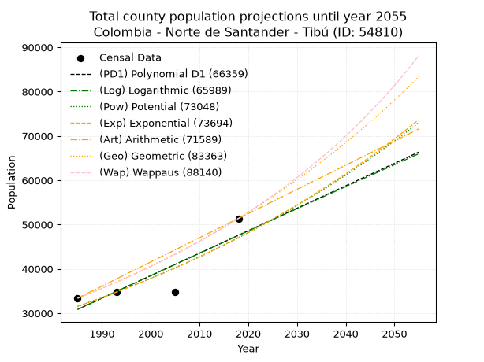
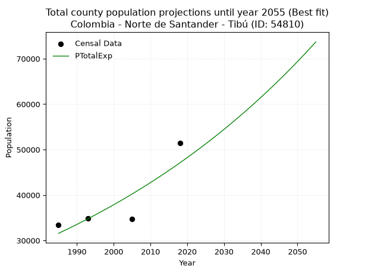
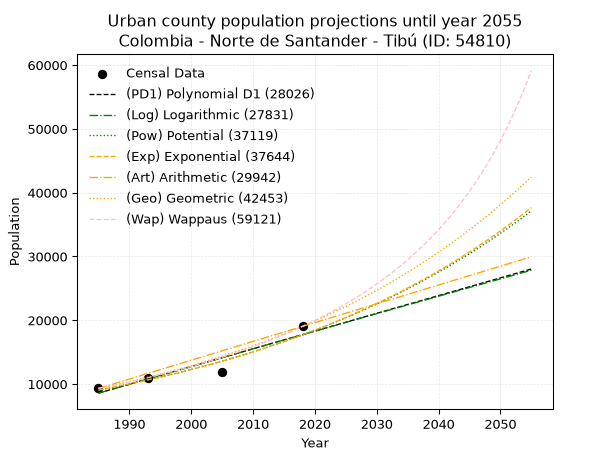
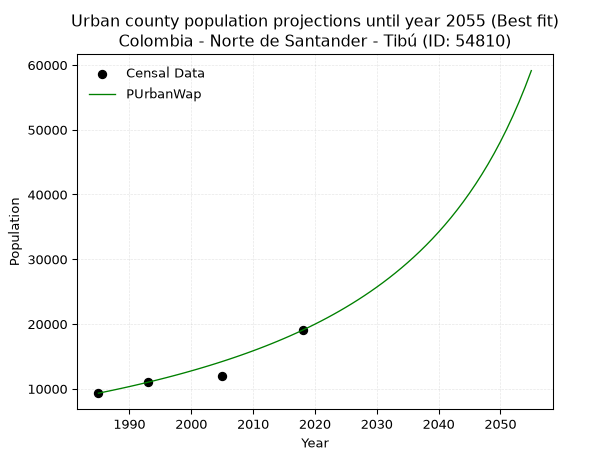
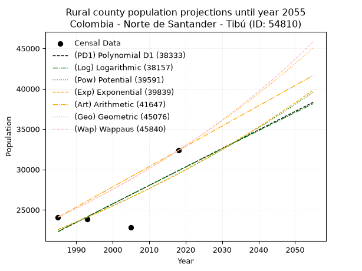
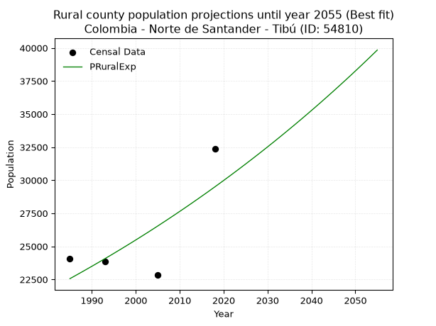

<div align="center">


</div>

# _“Population and Public Services Demand Projections (PPSD) until Year 2050 for Colombia - Norte de Santander - Tibú (ID: 54810)”_
Keywords: `population` `public-service` `projection` `lineal` `polynomial` `logarithmic` `potential` `exponential` `arithmetic` `geometric` `wappaus` `dane` `colombia` `south-america`

PPSD are analytical estimates used by governments and planners to anticipate future changes in population size, age distribution, and the resulting community needs for utilities, healthcare, education, and infrastructure as sizing future water treatment facilities, electrical grids, and road networks based on spatial growth.

> **General running parameters**: • app_version: _v20260806_. • Python version: _3.14.7_. • Pandas version: _3.0.5_. • NumPy version: _2.5.1_. • Creates, save and include plots into reports (create_plot): _False_. • Projection until year: _2050_. • Process polynomial degree 2 and up: _False_. • Process Wappaus: _True_. • Process Wappaus: _True_. • Set negative values to zero: _True_. • Set infinite values to zero: _True_. • Drop dataset notes: _True_. 
<div align="center">

Dynamic map: [:earth_americas:Google](http://maps.google.com/maps?q=8.63989106,-72.7344958) [:earth_americas:OSM](https://www.openstreetmap.org/#map=18/8.63989106/-72.7344958&layers=P) [:earth_americas:Bing](https://www.bing.com/maps?cp=8.63989106~-72.7344958&lvl=18) [:earth_americas:Apple](https://maps.apple.com/frame?center=8.63989106%2C-72.7344958&span=0.003%2C0.006)

</div>


<div align="center">

```geojson
{
  "type": "Feature",
  "geometry": {
    "type": "Point", 
    "coordinates": [-72.7344958, 8.63989106]
  }, 
  "properties": {
    "Name": "Colombia - Norte de Santander - Tibú (ID: 54810)"
  }
}
```

</div>


## 0. Census Data (4 records)

Census data are official statistics collected by a government about the people and housing in a country. They usually include counts of total population, age, sex, race, income, education, and jobs.

📅Global census file: [Population.xlsx](../data/Population.xlsx)

| Source   |   Year |   CountryID | CountryName   |   StateID | StateName          |   CountyID | CountyName   |   PTotal |   PUrban |   PRural |
|:---------|-------:|------------:|:--------------|----------:|:-------------------|-----------:|:-------------|---------:|---------:|---------:|
| DANE     |   1985 |          57 | Colombia      |        54 | Norte de Santander |      54810 | Tibú         |    33392 |     9309 |    24083 |
| DANE     |   1993 |          57 | Colombia      |        54 | Norte de Santander |      54810 | Tibú         |    34830 |    10961 |    23869 |
| DANE     |   2005 |          57 | Colombia      |        54 | Norte De Santander |      54810 | Tibú         |    34773 |    11925 |    22848 |
| DANE     |   2018 |          57 | Colombia      |        54 | Norte de Santander |      54810 | Tibú         |    51399 |    19036 |    32363 |

> 🔥Some records could had specific notes about the registered values or the corresponding urban or rural distribution.

📅   [RUPS](https://www.datos.gov.co/Hacienda-y-Cr-dito-P-blico/Registro-nico-de-Prestadores-de-Servicios-P-blicos/4qkq-csdn/about_data) - Local public utility companies: [RUPS.csv](../data/RUPS.xlsx)

 | SERVICIO       | ESTADO    | NOMBRE                              | NIT         | DEPARTAMENTO_DOMICILIO   | MUNICIPIO_DOMICILIO   | DIRECCION             |   TELEFONO | EMAIL                              | TIPO_PRESTADOR                            | CLASIFICACION                  |
|:---------------|:----------|:------------------------------------|:------------|:-------------------------|:----------------------|:----------------------|-----------:|:-----------------------------------|:------------------------------------------|:-------------------------------|
| ACUEDUCTO      | OPERATIVA | EMPRESAS MUNICIPALES DE TIBÚ E.S.P. | 807000697-0 | NORTE DE SANTANDER       | TIBU                  | Carrera 7 Nro 10 - 35 |    5663305 | atencion_usuarios@emtibuesp.gov.co | EMPRESA INDUSTRIAL Y COMERCIAL DEL ESTADO | DESDE 2501 HASTA 5000 USUARIOS |
| ALCANTARILLADO | OPERATIVA | EMPRESAS MUNICIPALES DE TIBÚ E.S.P. | 807000697-0 | NORTE DE SANTANDER       | TIBU                  | Carrera 7 Nro 10 - 35 |    5663305 | atencion_usuarios@emtibuesp.gov.co | EMPRESA INDUSTRIAL Y COMERCIAL DEL ESTADO | DESDE 2501 HASTA 5000 USUARIOS |

## 1. Total

### 1.1. Coefficients and Parameters

* (PD1) Polynomial Deg 1: 507.0389401846545, -975606.1401043552 (lineal)
* (Log) Logarithmic: 1013584.7568417786, -7665667.3591128485
* (Pow) Potential: 24.21250405917382, -75.34786392289503
* (Exp) Exponential: 0.012111489899188789, 1.1434751582354125e-06
* (Art) Arithmetic: Year diff. 2018 - 1985 = 33, Population diff. 51399 - 33392 = 18007, Annual growth = 545.6666666666666
* (Geo) Geometric: Year diff. 2018 - 1985 = 33, Population diff. 51399 - 33392 = 18007, Annual growth % = 0.013155551426965229
* (Wap) Wappaus: i = 1.287086286673507, Condition values only valid for < 200)

<sub>
Wappaus condition values: ['0.00', '1.29', '2.57', '3.86', '5.15', '6.44', '7.72', '9.01', '10.30', '11.58', '12.87', '14.16', '15.45', '16.73', '18.02', '19.31', '20.59', '21.88', '23.17', '24.45', '25.74', '27.03', '28.32', '29.60', '30.89', '32.18', '33.46', '34.75', '36.04', '37.33', '38.61', '39.90', '41.19', '42.47', '43.76', '45.05', '46.34', '47.62', '48.91', '50.20', '51.48', '52.77', '54.06', '55.34', '56.63', '57.92', '59.21', '60.49', '61.78', '63.07', '64.35', '65.64', '66.93', '68.22', '69.50', '70.79', '72.08', '73.36', '74.65', '75.94', '77.23', '78.51', '79.80', '81.09', '82.37', '83.66']
</sub>


### 1.2. Projected Dataset

|   Year |   CountyID |   PTotalPD1 |   PTotalLog |   PTotalPow |   PTotalExp |   PTotalArt |   PTotalGeo |   PTotalWap |
|-------:|-----------:|------------:|------------:|------------:|------------:|------------:|------------:|------------:|
|   1985 |      54810 |       30866 |       30861 |       31563 |       31567 |       33392 |       33392 |       33392 |
|   1986 |      54810 |       31373 |       31371 |       31950 |       31952 |       33938 |       33831 |       33825 |
|   1987 |      54810 |       31880 |       31882 |       32342 |       32341 |       34483 |       34276 |       34263 |
|   1988 |      54810 |       32387 |       32392 |       32738 |       32735 |       35029 |       34727 |       34707 |
|   1989 |      54810 |       32894 |       32901 |       33139 |       33134 |       35575 |       35184 |       35157 |
|   1990 |      54810 |       33401 |       33411 |       33545 |       33538 |       36120 |       35647 |       35612 |
|   1991 |      54810 |       33908 |       33920 |       33956 |       33946 |       36666 |       36116 |       36074 |
|   1992 |      54810 |       34415 |       34429 |       34371 |       34360 |       37212 |       36591 |       36542 |
|   1993 |      54810 |       34922 |       34938 |       34791 |       34779 |       37757 |       37072 |       37017 |
|   1994 |      54810 |       35430 |       35446 |       35216 |       35202 |       38303 |       37560 |       37498 |
|   1995 |      54810 |       35937 |       35954 |       35647 |       35631 |       38849 |       38054 |       37985 |
|   1996 |      54810 |       36444 |       36462 |       36082 |       36066 |       39394 |       38555 |       38480 |
|   1997 |      54810 |       36951 |       36970 |       36522 |       36505 |       39940 |       39062 |       38981 |
|   1998 |      54810 |       37458 |       37477 |       36967 |       36950 |       40486 |       39576 |       39489 |
|   1999 |      54810 |       37965 |       37985 |       37418 |       37400 |       41031 |       40097 |       40005 |
|   2000 |      54810 |       38472 |       38492 |       37874 |       37856 |       41577 |       40624 |       40528 |
|   2001 |      54810 |       38979 |       38998 |       38335 |       38317 |       42123 |       41159 |       41058 |
|   2002 |      54810 |       39486 |       39505 |       38801 |       38784 |       42668 |       41700 |       41596 |
|   2003 |      54810 |       39993 |       40011 |       39273 |       39257 |       43214 |       42249 |       42142 |
|   2004 |      54810 |       40500 |       40517 |       39751 |       39735 |       43760 |       42804 |       42695 |
|   2005 |      54810 |       41007 |       41022 |       40234 |       40219 |       44305 |       43368 |       43257 |
|   2006 |      54810 |       41514 |       41528 |       40723 |       40709 |       44851 |       43938 |       43828 |
|   2007 |      54810 |       42021 |       42033 |       41217 |       41205 |       45397 |       44516 |       44407 |
|   2008 |      54810 |       42528 |       42538 |       41717 |       41707 |       45942 |       45102 |       44994 |
|   2009 |      54810 |       43035 |       43042 |       42223 |       42216 |       46488 |       45695 |       45591 |
|   2010 |      54810 |       43542 |       43547 |       42735 |       42730 |       47034 |       46296 |       46197 |
|   2011 |      54810 |       44049 |       44051 |       43253 |       43251 |       47579 |       46905 |       46812 |
|   2012 |      54810 |       44556 |       44555 |       43777 |       43778 |       48125 |       47522 |       47436 |
|   2013 |      54810 |       45063 |       45058 |       44306 |       44311 |       48671 |       48148 |       48071 |
|   2014 |      54810 |       45570 |       45562 |       44842 |       44851 |       49216 |       48781 |       48716 |
|   2015 |      54810 |       46077 |       46065 |       45385 |       45398 |       49762 |       49423 |       49370 |
|   2016 |      54810 |       46584 |       46568 |       45933 |       45951 |       50308 |       50073 |       50036 |
|   2017 |      54810 |       47091 |       47071 |       46488 |       46511 |       50853 |       50732 |       50712 |
|   2018 |      54810 |       47598 |       47573 |       47049 |       47077 |       51399 |       51399 |       51399 |
|   2019 |      54810 |       48105 |       48075 |       47617 |       47651 |       51945 |       52075 |       52098 |
|   2020 |      54810 |       48613 |       48577 |       48191 |       48232 |       52490 |       52760 |       52808 |
|   2021 |      54810 |       49120 |       49079 |       48772 |       48819 |       53036 |       53454 |       53530 |
|   2022 |      54810 |       49627 |       49580 |       49360 |       49414 |       53582 |       54158 |       54264 |
|   2023 |      54810 |       50134 |       50081 |       49955 |       50016 |       54127 |       54870 |       55011 |
|   2024 |      54810 |       50641 |       50582 |       50556 |       50626 |       54673 |       55592 |       55770 |
|   2025 |      54810 |       51148 |       51083 |       51164 |       51243 |       55219 |       56323 |       56543 |
|   2026 |      54810 |       51655 |       51583 |       51779 |       51867 |       55764 |       57064 |       57329 |
|   2027 |      54810 |       52162 |       52083 |       52402 |       52499 |       56310 |       57815 |       58129 |
|   2028 |      54810 |       52669 |       52583 |       53031 |       53139 |       56856 |       58575 |       58943 |
|   2029 |      54810 |       53176 |       53083 |       53668 |       53786 |       57401 |       59346 |       59772 |
|   2030 |      54810 |       53683 |       53582 |       54312 |       54442 |       57947 |       60127 |       60616 |
|   2031 |      54810 |       54190 |       54082 |       54964 |       55105 |       58493 |       60918 |       61476 |
|   2032 |      54810 |       54697 |       54580 |       55623 |       55777 |       59038 |       61719 |       62351 |
|   2033 |      54810 |       55204 |       55079 |       56289 |       56456 |       59584 |       62531 |       63242 |
|   2034 |      54810 |       55711 |       55578 |       56964 |       57144 |       60130 |       63354 |       64151 |
|   2035 |      54810 |       56218 |       56076 |       57645 |       57840 |       60675 |       64187 |       65076 |
|   2036 |      54810 |       56725 |       56574 |       58335 |       58545 |       61221 |       65032 |       66020 |
|   2037 |      54810 |       57232 |       57071 |       59033 |       59259 |       61767 |       65887 |       66981 |
|   2038 |      54810 |       57739 |       57569 |       59739 |       59981 |       62312 |       66754 |       67961 |
|   2039 |      54810 |       58246 |       58066 |       60452 |       60712 |       62858 |       67632 |       68961 |
|   2040 |      54810 |       58753 |       58563 |       61174 |       61451 |       63404 |       68522 |       69981 |
|   2041 |      54810 |       59260 |       59060 |       61905 |       62200 |       63949 |       69423 |       71021 |
|   2042 |      54810 |       59767 |       59556 |       62643 |       62958 |       64495 |       70337 |       72082 |
|   2043 |      54810 |       60274 |       60053 |       63390 |       63725 |       65041 |       71262 |       73165 |
|   2044 |      54810 |       60781 |       60549 |       64146 |       64502 |       65586 |       72199 |       74270 |
|   2045 |      54810 |       61288 |       61044 |       64910 |       65288 |       66132 |       73149 |       75399 |
|   2046 |      54810 |       61796 |       61540 |       65683 |       66083 |       66678 |       74112 |       76552 |
|   2047 |      54810 |       62303 |       62035 |       66465 |       66888 |       67223 |       75087 |       77729 |
|   2048 |      54810 |       62810 |       62530 |       67255 |       67703 |       67769 |       76074 |       78932 |
|   2049 |      54810 |       63317 |       63025 |       68055 |       68528 |       68315 |       77075 |       80161 |
|   2050 |      54810 |       63824 |       63520 |       68864 |       69363 |       68860 |       78089 |       81417 |
<div align="center">

</img>

</div>


### 1.3. Best fit with absolute and relative error (%)

Relative error puts that difference into context by dividing the absolute error by the true value, creating a unitless ratio or percentage that shows the scale of the mistake.

Absolute and relative error

|   Year | Source   |   CountryID | CountryName   |   StateID | StateName          |   CountyID_x | CountyName   |   PTotal |   PUrban |   PRural |   CountyID_y |   PTotalPD1 |   PTotalLog |   PTotalPow |   PTotalExp |   PTotalArt |   PTotalGeo |   PTotalWap |   PTotalPD1AbsError |   PTotalLogAbsError |   PTotalPowAbsError |   PTotalExpAbsError |   PTotalArtAbsError |   PTotalGeoAbsError |   PTotalWapAbsError |   PTotalPD1RelError |   PTotalLogRelError |   PTotalPowRelError |   PTotalExpRelError |   PTotalArtRelError |   PTotalGeoRelError |   PTotalWapRelError |
|-------:|:---------|------------:|:--------------|----------:|:-------------------|-------------:|:-------------|---------:|---------:|---------:|-------------:|------------:|------------:|------------:|------------:|------------:|------------:|------------:|--------------------:|--------------------:|--------------------:|--------------------:|--------------------:|--------------------:|--------------------:|--------------------:|--------------------:|--------------------:|--------------------:|--------------------:|--------------------:|--------------------:|
|   1985 | DANE     |          57 | Colombia      |        54 | Norte de Santander |        54810 | Tibú         |    33392 |     9309 |    24083 |        54810 |       30866 |       30861 |       31563 |       31567 |       33392 |       33392 |       33392 |                2526 |                2531 |                1829 |                1825 |                   0 |                   0 |                   0 |             7.56469 |            7.57966  |            5.47736  |            5.46538  |             0       |             0       |             0       |
|   1993 | DANE     |          57 | Colombia      |        54 | Norte de Santander |        54810 | Tibú         |    34830 |    10961 |    23869 |        54810 |       34922 |       34938 |       34791 |       34779 |       37757 |       37072 |       37017 |                  92 |                 108 |                  39 |                  51 |                2927 |                2242 |                2187 |             0.26414 |            0.310078 |            0.111972 |            0.146425 |             8.40367 |             6.43698 |             6.27907 |
|   2005 | DANE     |          57 | Colombia      |        54 | Norte De Santander |        54810 | Tibú         |    34773 |    11925 |    22848 |        54810 |       41007 |       41022 |       40234 |       40219 |       44305 |       43368 |       43257 |                6234 |                6249 |                5461 |                5446 |                9532 |                8595 |                8484 |            17.9277  |           17.9708   |           15.7047   |           15.6616   |            27.4121  |            24.7175  |            24.3982  |
|   2018 | DANE     |          57 | Colombia      |        54 | Norte de Santander |        54810 | Tibú         |    51399 |    19036 |    32363 |        54810 |       47598 |       47573 |       47049 |       47077 |       51399 |       51399 |       51399 |                3801 |                3826 |                4350 |                4322 |                   0 |                   0 |                   0 |             7.39509 |            7.44372  |            8.4632   |            8.40872  |             0       |             0       |             0       |

Relative error mean

| Method    |   RelError | Best   |
|:----------|-----------:|:-------|
| PTotalPD1 |    8.2879  |        |
| PTotalLog |    8.32608 |        |
| PTotalPow |    7.43931 |        |
| PTotalExp |    7.42053 | True   |
| PTotalArt |    8.95394 |        |
| PTotalGeo |    7.78861 |        |
| PTotalWap |    7.66933 |        |

💙Best method: _**PTotalExp**_
<div align="center">

</img>

</div>


### 1.4. Fresh water supply demand in liters per capita per day (lpcd)

The fresh water supply demand typically ranges from 100 to 300 liters per capita per day (lpcd) for standard domestic and municipal planning, though absolute survival minimums set by the World Health Organization are as low as 7.5 to 20 liters per day, and total consumption in high-income nations can exceed 400 liters.

> `CZ`: Level in meters above the sea level (masl)<br> `WS`: Fresh water supply demand in liters per capita per day (lpcd or l/h/d)<br> `WSAll`: Zonal fresh water supply demand in liters per second (l/s)<br> `A`: Zonal area in square meters<br> `DP`: Population density (people/hectare or p/ha)

Reference values (RAS Colombia)

|    CZ |   WS |
|------:|-----:|
|  1000 |  120 |
|  2000 |  130 |
| 99999 |  140 |

County shapefile geometry properties and water supply values

|   CountyID |      ATotal |   CZTotal |   WSTotal |
|-----------:|------------:|----------:|----------:|
|      54810 | 2.67468e+09 |   159.517 |       120 |

Projected values for best method: PTotalExp

|   CountyID |   Year |   PTotalExp |   DPTotal |   WSTotal |   WSTotalAll |
|-----------:|-------:|------------:|----------:|----------:|-------------:|
|      54810 |   1985 |       31567 |      0.12 |       120 |      43.8431 |
|      54810 |   1986 |       31952 |      0.12 |       120 |      44.3778 |
|      54810 |   1987 |       32341 |      0.12 |       120 |      44.9181 |
|      54810 |   1988 |       32735 |      0.12 |       120 |      45.4653 |
|      54810 |   1989 |       33134 |      0.12 |       120 |      46.0194 |
|      54810 |   1990 |       33538 |      0.13 |       120 |      46.5806 |
|      54810 |   1991 |       33946 |      0.13 |       120 |      47.1472 |
|      54810 |   1992 |       34360 |      0.13 |       120 |      47.7222 |
|      54810 |   1993 |       34779 |      0.13 |       120 |      48.3042 |
|      54810 |   1994 |       35202 |      0.13 |       120 |      48.8917 |
|      54810 |   1995 |       35631 |      0.13 |       120 |      49.4875 |
|      54810 |   1996 |       36066 |      0.13 |       120 |      50.0917 |
|      54810 |   1997 |       36505 |      0.14 |       120 |      50.7014 |
|      54810 |   1998 |       36950 |      0.14 |       120 |      51.3194 |
|      54810 |   1999 |       37400 |      0.14 |       120 |      51.9444 |
|      54810 |   2000 |       37856 |      0.14 |       120 |      52.5778 |
|      54810 |   2001 |       38317 |      0.14 |       120 |      53.2181 |
|      54810 |   2002 |       38784 |      0.15 |       120 |      53.8667 |
|      54810 |   2003 |       39257 |      0.15 |       120 |      54.5236 |
|      54810 |   2004 |       39735 |      0.15 |       120 |      55.1875 |
|      54810 |   2005 |       40219 |      0.15 |       120 |      55.8597 |
|      54810 |   2006 |       40709 |      0.15 |       120 |      56.5403 |
|      54810 |   2007 |       41205 |      0.15 |       120 |      57.2292 |
|      54810 |   2008 |       41707 |      0.16 |       120 |      57.9264 |
|      54810 |   2009 |       42216 |      0.16 |       120 |      58.6333 |
|      54810 |   2010 |       42730 |      0.16 |       120 |      59.3472 |
|      54810 |   2011 |       43251 |      0.16 |       120 |      60.0708 |
|      54810 |   2012 |       43778 |      0.16 |       120 |      60.8028 |
|      54810 |   2013 |       44311 |      0.17 |       120 |      61.5431 |
|      54810 |   2014 |       44851 |      0.17 |       120 |      62.2931 |
|      54810 |   2015 |       45398 |      0.17 |       120 |      63.0528 |
|      54810 |   2016 |       45951 |      0.17 |       120 |      63.8208 |
|      54810 |   2017 |       46511 |      0.17 |       120 |      64.5986 |
|      54810 |   2018 |       47077 |      0.18 |       120 |      65.3847 |
|      54810 |   2019 |       47651 |      0.18 |       120 |      66.1819 |
|      54810 |   2020 |       48232 |      0.18 |       120 |      66.9889 |
|      54810 |   2021 |       48819 |      0.18 |       120 |      67.8042 |
|      54810 |   2022 |       49414 |      0.18 |       120 |      68.6306 |
|      54810 |   2023 |       50016 |      0.19 |       120 |      69.4667 |
|      54810 |   2024 |       50626 |      0.19 |       120 |      70.3139 |
|      54810 |   2025 |       51243 |      0.19 |       120 |      71.1708 |
|      54810 |   2026 |       51867 |      0.19 |       120 |      72.0375 |
|      54810 |   2027 |       52499 |      0.2  |       120 |      72.9153 |
|      54810 |   2028 |       53139 |      0.2  |       120 |      73.8042 |
|      54810 |   2029 |       53786 |      0.2  |       120 |      74.7028 |
|      54810 |   2030 |       54442 |      0.2  |       120 |      75.6139 |
|      54810 |   2031 |       55105 |      0.21 |       120 |      76.5347 |
|      54810 |   2032 |       55777 |      0.21 |       120 |      77.4681 |
|      54810 |   2033 |       56456 |      0.21 |       120 |      78.4111 |
|      54810 |   2034 |       57144 |      0.21 |       120 |      79.3667 |
|      54810 |   2035 |       57840 |      0.22 |       120 |      80.3333 |
|      54810 |   2036 |       58545 |      0.22 |       120 |      81.3125 |
|      54810 |   2037 |       59259 |      0.22 |       120 |      82.3042 |
|      54810 |   2038 |       59981 |      0.22 |       120 |      83.3069 |
|      54810 |   2039 |       60712 |      0.23 |       120 |      84.3222 |
|      54810 |   2040 |       61451 |      0.23 |       120 |      85.3486 |
|      54810 |   2041 |       62200 |      0.23 |       120 |      86.3889 |
|      54810 |   2042 |       62958 |      0.24 |       120 |      87.4417 |
|      54810 |   2043 |       63725 |      0.24 |       120 |      88.5069 |
|      54810 |   2044 |       64502 |      0.24 |       120 |      89.5861 |
|      54810 |   2045 |       65288 |      0.24 |       120 |      90.6778 |
|      54810 |   2046 |       66083 |      0.25 |       120 |      91.7819 |
|      54810 |   2047 |       66888 |      0.25 |       120 |      92.9    |
|      54810 |   2048 |       67703 |      0.25 |       120 |      94.0319 |
|      54810 |   2049 |       68528 |      0.26 |       120 |      95.1778 |
|      54810 |   2050 |       69363 |      0.26 |       120 |      96.3375 |

## 2. Urban

### 2.1. Coefficients and Parameters

* (PD1) Polynomial Deg 1: 277.9658771577635, -543193.4957848163 (lineal)
* (Log) Logarithmic: 555949.9827301686, -4212972.523835574
* (Pow) Potential: 40.763487257929945, -130.47216600272932
* (Exp) Exponential: 0.02037648578848767, 2.4558045354550306e-14
* (Art) Arithmetic: Year diff. 2018 - 1985 = 33, Population diff. 19036 - 9309 = 9727, Annual growth = 294.75757575757575
* (Geo) Geometric: Year diff. 2018 - 1985 = 33, Population diff. 19036 - 9309 = 9727, Annual growth % = 0.021913939465571852
* (Wap) Wappaus: i = 2.0797853290356376, Condition values only valid for < 200)

<sub>
Wappaus condition values: ['0.00', '2.08', '4.16', '6.24', '8.32', '10.40', '12.48', '14.56', '16.64', '18.72', '20.80', '22.88', '24.96', '27.04', '29.12', '31.20', '33.28', '35.36', '37.44', '39.52', '41.60', '43.68', '45.76', '47.84', '49.91', '51.99', '54.07', '56.15', '58.23', '60.31', '62.39', '64.47', '66.55', '68.63', '70.71', '72.79', '74.87', '76.95', '79.03', '81.11', '83.19', '85.27', '87.35', '89.43', '91.51', '93.59', '95.67', '97.75', '99.83', '101.91', '103.99', '106.07', '108.15', '110.23', '112.31', '114.39', '116.47', '118.55', '120.63', '122.71', '124.79', '126.87', '128.95', '131.03', '133.11', '135.19']
</sub>


### 2.2. Projected Dataset

|   Year |   CountyID |   PUrbanPD1 |   PUrbanLog |   PUrbanPow |   PUrbanExp |   PUrbanArt |   PUrbanGeo |   PUrbanWap |
|-------:|-----------:|------------:|------------:|------------:|------------:|------------:|------------:|------------:|
|   1985 |      54810 |        8569 |        8564 |        9038 |        9042 |        9309 |        9309 |        9309 |
|   1986 |      54810 |        8847 |        8844 |        9225 |        9228 |        9604 |        9513 |        9505 |
|   1987 |      54810 |        9125 |        9124 |        9416 |        9418 |        9899 |        9721 |        9704 |
|   1988 |      54810 |        9403 |        9403 |        9611 |        9612 |       10193 |        9934 |        9909 |
|   1989 |      54810 |        9681 |        9683 |        9810 |        9809 |       10488 |       10152 |       10117 |
|   1990 |      54810 |        9959 |        9962 |       10014 |       10011 |       10783 |       10375 |       10330 |
|   1991 |      54810 |       10237 |       10242 |       10221 |       10217 |       11078 |       10602 |       10548 |
|   1992 |      54810 |       10515 |       10521 |       10432 |       10428 |       11372 |       10834 |       10771 |
|   1993 |      54810 |       10792 |       10800 |       10648 |       10642 |       11667 |       11072 |       10998 |
|   1994 |      54810 |       11070 |       11079 |       10868 |       10861 |       11962 |       11314 |       11231 |
|   1995 |      54810 |       11348 |       11357 |       11092 |       11085 |       12257 |       11562 |       11470 |
|   1996 |      54810 |       11626 |       11636 |       11321 |       11313 |       12551 |       11816 |       11714 |
|   1997 |      54810 |       11904 |       11915 |       11555 |       11546 |       12846 |       12075 |       11964 |
|   1998 |      54810 |       12182 |       12193 |       11793 |       11784 |       13141 |       12339 |       12219 |
|   1999 |      54810 |       12460 |       12471 |       12036 |       12026 |       13436 |       12610 |       12481 |
|   2000 |      54810 |       12738 |       12749 |       12284 |       12274 |       13730 |       12886 |       12750 |
|   2001 |      54810 |       13016 |       13027 |       12537 |       12527 |       14025 |       13168 |       13025 |
|   2002 |      54810 |       13294 |       13305 |       12794 |       12784 |       14320 |       13457 |       13307 |
|   2003 |      54810 |       13572 |       13582 |       13058 |       13048 |       14615 |       13752 |       13596 |
|   2004 |      54810 |       13850 |       13860 |       13326 |       13316 |       14909 |       14053 |       13893 |
|   2005 |      54810 |       14128 |       14137 |       13600 |       13590 |       15204 |       14361 |       14198 |
|   2006 |      54810 |       14406 |       14414 |       13879 |       13870 |       15499 |       14676 |       14511 |
|   2007 |      54810 |       14684 |       14691 |       14164 |       14156 |       15794 |       14997 |       14832 |
|   2008 |      54810 |       14962 |       14968 |       14454 |       14447 |       16088 |       15326 |       15162 |
|   2009 |      54810 |       15240 |       15245 |       14751 |       14744 |       16383 |       15662 |       15501 |
|   2010 |      54810 |       15518 |       15522 |       15053 |       15048 |       16678 |       16005 |       15850 |
|   2011 |      54810 |       15796 |       15798 |       15361 |       15358 |       16973 |       16356 |       16208 |
|   2012 |      54810 |       16074 |       16075 |       15676 |       15674 |       17267 |       16714 |       16577 |
|   2013 |      54810 |       16352 |       16351 |       15997 |       15997 |       17562 |       17081 |       16957 |
|   2014 |      54810 |       16630 |       16627 |       16324 |       16326 |       17857 |       17455 |       17348 |
|   2015 |      54810 |       16908 |       16903 |       16657 |       16662 |       18152 |       17837 |       17751 |
|   2016 |      54810 |       17186 |       17179 |       16998 |       17005 |       18446 |       18228 |       18166 |
|   2017 |      54810 |       17464 |       17455 |       17345 |       17355 |       18741 |       18628 |       18594 |
|   2018 |      54810 |       17742 |       17730 |       17699 |       17712 |       19036 |       19036 |       19036 |
|   2019 |      54810 |       18020 |       18006 |       18060 |       18077 |       19331 |       19453 |       19492 |
|   2020 |      54810 |       18298 |       18281 |       18428 |       18449 |       19626 |       19879 |       19963 |
|   2021 |      54810 |       18576 |       18556 |       18804 |       18829 |       19920 |       20315 |       20449 |
|   2022 |      54810 |       18854 |       18831 |       19187 |       19216 |       20215 |       20760 |       20952 |
|   2023 |      54810 |       19131 |       19106 |       19577 |       19612 |       20510 |       21215 |       21473 |
|   2024 |      54810 |       19409 |       19381 |       19976 |       20016 |       20805 |       21680 |       22011 |
|   2025 |      54810 |       19687 |       19655 |       20382 |       20428 |       21099 |       22155 |       22569 |
|   2026 |      54810 |       19965 |       19930 |       20796 |       20848 |       21394 |       22641 |       23147 |
|   2027 |      54810 |       20243 |       20204 |       21219 |       21277 |       21689 |       23137 |       23746 |
|   2028 |      54810 |       20521 |       20478 |       21650 |       21715 |       21984 |       23644 |       24368 |
|   2029 |      54810 |       20799 |       20752 |       22089 |       22162 |       22278 |       24162 |       25013 |
|   2030 |      54810 |       21077 |       21026 |       22538 |       22619 |       22573 |       24692 |       25684 |
|   2031 |      54810 |       21355 |       21300 |       22995 |       23084 |       22868 |       25233 |       26382 |
|   2032 |      54810 |       21633 |       21574 |       23461 |       23559 |       23163 |       25786 |       27108 |
|   2033 |      54810 |       21911 |       21847 |       23936 |       24044 |       23457 |       26351 |       27864 |
|   2034 |      54810 |       22189 |       22121 |       24421 |       24539 |       23752 |       26928 |       28652 |
|   2035 |      54810 |       22467 |       22394 |       24915 |       25045 |       24047 |       27518 |       29474 |
|   2036 |      54810 |       22745 |       22667 |       25419 |       25560 |       24342 |       28121 |       30333 |
|   2037 |      54810 |       23023 |       22940 |       25933 |       26086 |       24636 |       28737 |       31230 |
|   2038 |      54810 |       23301 |       23213 |       26457 |       26623 |       24931 |       29367 |       32170 |
|   2039 |      54810 |       23579 |       23486 |       26991 |       27171 |       25226 |       30011 |       33153 |
|   2040 |      54810 |       23857 |       23758 |       27536 |       27731 |       25521 |       30668 |       34185 |
|   2041 |      54810 |       24135 |       24031 |       28092 |       28302 |       25815 |       31340 |       35268 |
|   2042 |      54810 |       24413 |       24303 |       28658 |       28884 |       26110 |       32027 |       36406 |
|   2043 |      54810 |       24691 |       24575 |       29236 |       29479 |       26405 |       32729 |       37604 |
|   2044 |      54810 |       24969 |       24847 |       29825 |       30086 |       26700 |       33446 |       38866 |
|   2045 |      54810 |       25247 |       25119 |       30426 |       30705 |       26994 |       34179 |       40198 |
|   2046 |      54810 |       25525 |       25391 |       31038 |       31337 |       27289 |       34928 |       41606 |
|   2047 |      54810 |       25803 |       25663 |       31662 |       31982 |       27584 |       35694 |       43097 |
|   2048 |      54810 |       26081 |       25934 |       32299 |       32640 |       27879 |       36476 |       44677 |
|   2049 |      54810 |       26359 |       26206 |       32948 |       33312 |       28173 |       37275 |       46355 |
|   2050 |      54810 |       26637 |       26477 |       33610 |       33998 |       28468 |       38092 |       48142 |
<div align="center">

</img>

</div>


### 2.3. Best fit with absolute and relative error (%)

Relative error puts that difference into context by dividing the absolute error by the true value, creating a unitless ratio or percentage that shows the scale of the mistake.

Absolute and relative error

|   Year | Source   |   CountryID | CountryName   |   StateID | StateName          |   CountyID_x | CountyName   |   PTotal |   PUrban |   PRural |   CountyID_y |   PUrbanPD1 |   PUrbanLog |   PUrbanPow |   PUrbanExp |   PUrbanArt |   PUrbanGeo |   PUrbanWap |   PUrbanPD1AbsError |   PUrbanLogAbsError |   PUrbanPowAbsError |   PUrbanExpAbsError |   PUrbanArtAbsError |   PUrbanGeoAbsError |   PUrbanWapAbsError |   PUrbanPD1RelError |   PUrbanLogRelError |   PUrbanPowRelError |   PUrbanExpRelError |   PUrbanArtRelError |   PUrbanGeoRelError |   PUrbanWapRelError |
|-------:|:---------|------------:|:--------------|----------:|:-------------------|-------------:|:-------------|---------:|---------:|---------:|-------------:|------------:|------------:|------------:|------------:|------------:|------------:|------------:|--------------------:|--------------------:|--------------------:|--------------------:|--------------------:|--------------------:|--------------------:|--------------------:|--------------------:|--------------------:|--------------------:|--------------------:|--------------------:|--------------------:|
|   1985 | DANE     |          57 | Colombia      |        54 | Norte de Santander |        54810 | Tibú         |    33392 |     9309 |    24083 |        54810 |        8569 |        8564 |        9038 |        9042 |        9309 |        9309 |        9309 |                 740 |                 745 |                 271 |                 267 |                   0 |                   0 |                   0 |             7.9493  |             8.00301 |             2.91116 |             2.86819 |             0       |             0       |             0       |
|   1993 | DANE     |          57 | Colombia      |        54 | Norte de Santander |        54810 | Tibú         |    34830 |    10961 |    23869 |        54810 |       10792 |       10800 |       10648 |       10642 |       11667 |       11072 |       10998 |                 169 |                 161 |                 313 |                 319 |                 706 |                 111 |                  37 |             1.54183 |             1.46884 |             2.85558 |             2.91032 |             6.44102 |             1.01268 |             0.33756 |
|   2005 | DANE     |          57 | Colombia      |        54 | Norte De Santander |        54810 | Tibú         |    34773 |    11925 |    22848 |        54810 |       14128 |       14137 |       13600 |       13590 |       15204 |       14361 |       14198 |                2203 |                2212 |                1675 |                1665 |                3279 |                2436 |                2273 |            18.4738  |            18.5493  |            14.0461  |            13.9623  |            27.4969  |            20.4277  |            19.0608  |
|   2018 | DANE     |          57 | Colombia      |        54 | Norte de Santander |        54810 | Tibú         |    51399 |    19036 |    32363 |        54810 |       17742 |       17730 |       17699 |       17712 |       19036 |       19036 |       19036 |                1294 |                1306 |                1337 |                1324 |                   0 |                   0 |                   0 |             6.79765 |             6.86069 |             7.02353 |             6.95524 |             0       |             0       |             0       |

Relative error mean

| Method    |   RelError | Best   |
|:----------|-----------:|:-------|
| PUrbanPD1 |    8.69064 |        |
| PUrbanLog |    8.72045 |        |
| PUrbanPow |    6.7091  |        |
| PUrbanExp |    6.674   |        |
| PUrbanArt |    8.48447 |        |
| PUrbanGeo |    5.36009 |        |
| PUrbanWap |    4.84959 | True   |

💙Best method: _**PUrbanWap**_
<div align="center">

</img>

</div>


### 2.4. Fresh water supply demand in liters per capita per day (lpcd)

The fresh water supply demand typically ranges from 100 to 300 liters per capita per day (lpcd) for standard domestic and municipal planning, though absolute survival minimums set by the World Health Organization are as low as 7.5 to 20 liters per day, and total consumption in high-income nations can exceed 400 liters.

> `CZ`: Level in meters above the sea level (masl)<br> `WS`: Fresh water supply demand in liters per capita per day (lpcd or l/h/d)<br> `WSAll`: Zonal fresh water supply demand in liters per second (l/s)<br> `A`: Zonal area in square meters<br> `DP`: Population density (people/hectare or p/ha)

Reference values (RAS Colombia)

|    CZ |   WS |
|------:|-----:|
|  1000 |  120 |
|  2000 |  130 |
| 99999 |  140 |

County shapefile geometry properties and water supply values

|   CountyID |      AUrban |   CZUrban |   WSUrban |
|-----------:|------------:|----------:|----------:|
|      54810 | 3.20457e+06 |   67.7901 |       120 |

Projected values for best method: PUrbanWap

|   CountyID |   Year |   PUrbanWap |   DPUrban |   WSUrban |   WSUrbanAll |
|-----------:|-------:|------------:|----------:|----------:|-------------:|
|      54810 |   1985 |        9309 |     29.05 |       120 |      12.9292 |
|      54810 |   1986 |        9505 |     29.66 |       120 |      13.2014 |
|      54810 |   1987 |        9704 |     30.28 |       120 |      13.4778 |
|      54810 |   1988 |        9909 |     30.92 |       120 |      13.7625 |
|      54810 |   1989 |       10117 |     31.57 |       120 |      14.0514 |
|      54810 |   1990 |       10330 |     32.24 |       120 |      14.3472 |
|      54810 |   1991 |       10548 |     32.92 |       120 |      14.65   |
|      54810 |   1992 |       10771 |     33.61 |       120 |      14.9597 |
|      54810 |   1993 |       10998 |     34.32 |       120 |      15.275  |
|      54810 |   1994 |       11231 |     35.05 |       120 |      15.5986 |
|      54810 |   1995 |       11470 |     35.79 |       120 |      15.9306 |
|      54810 |   1996 |       11714 |     36.55 |       120 |      16.2694 |
|      54810 |   1997 |       11964 |     37.33 |       120 |      16.6167 |
|      54810 |   1998 |       12219 |     38.13 |       120 |      16.9708 |
|      54810 |   1999 |       12481 |     38.95 |       120 |      17.3347 |
|      54810 |   2000 |       12750 |     39.79 |       120 |      17.7083 |
|      54810 |   2001 |       13025 |     40.65 |       120 |      18.0903 |
|      54810 |   2002 |       13307 |     41.53 |       120 |      18.4819 |
|      54810 |   2003 |       13596 |     42.43 |       120 |      18.8833 |
|      54810 |   2004 |       13893 |     43.35 |       120 |      19.2958 |
|      54810 |   2005 |       14198 |     44.31 |       120 |      19.7194 |
|      54810 |   2006 |       14511 |     45.28 |       120 |      20.1542 |
|      54810 |   2007 |       14832 |     46.28 |       120 |      20.6    |
|      54810 |   2008 |       15162 |     47.31 |       120 |      21.0583 |
|      54810 |   2009 |       15501 |     48.37 |       120 |      21.5292 |
|      54810 |   2010 |       15850 |     49.46 |       120 |      22.0139 |
|      54810 |   2011 |       16208 |     50.58 |       120 |      22.5111 |
|      54810 |   2012 |       16577 |     51.73 |       120 |      23.0236 |
|      54810 |   2013 |       16957 |     52.92 |       120 |      23.5514 |
|      54810 |   2014 |       17348 |     54.14 |       120 |      24.0944 |
|      54810 |   2015 |       17751 |     55.39 |       120 |      24.6542 |
|      54810 |   2016 |       18166 |     56.69 |       120 |      25.2306 |
|      54810 |   2017 |       18594 |     58.02 |       120 |      25.825  |
|      54810 |   2018 |       19036 |     59.4  |       120 |      26.4389 |
|      54810 |   2019 |       19492 |     60.83 |       120 |      27.0722 |
|      54810 |   2020 |       19963 |     62.3  |       120 |      27.7264 |
|      54810 |   2021 |       20449 |     63.81 |       120 |      28.4014 |
|      54810 |   2022 |       20952 |     65.38 |       120 |      29.1    |
|      54810 |   2023 |       21473 |     67.01 |       120 |      29.8236 |
|      54810 |   2024 |       22011 |     68.69 |       120 |      30.5708 |
|      54810 |   2025 |       22569 |     70.43 |       120 |      31.3458 |
|      54810 |   2026 |       23147 |     72.23 |       120 |      32.1486 |
|      54810 |   2027 |       23746 |     74.1  |       120 |      32.9806 |
|      54810 |   2028 |       24368 |     76.04 |       120 |      33.8444 |
|      54810 |   2029 |       25013 |     78.05 |       120 |      34.7403 |
|      54810 |   2030 |       25684 |     80.15 |       120 |      35.6722 |
|      54810 |   2031 |       26382 |     82.33 |       120 |      36.6417 |
|      54810 |   2032 |       27108 |     84.59 |       120 |      37.65   |
|      54810 |   2033 |       27864 |     86.95 |       120 |      38.7    |
|      54810 |   2034 |       28652 |     89.41 |       120 |      39.7944 |
|      54810 |   2035 |       29474 |     91.97 |       120 |      40.9361 |
|      54810 |   2036 |       30333 |     94.66 |       120 |      42.1292 |
|      54810 |   2037 |       31230 |     97.45 |       120 |      43.375  |
|      54810 |   2038 |       32170 |    100.39 |       120 |      44.6806 |
|      54810 |   2039 |       33153 |    103.46 |       120 |      46.0458 |
|      54810 |   2040 |       34185 |    106.68 |       120 |      47.4792 |
|      54810 |   2041 |       35268 |    110.06 |       120 |      48.9833 |
|      54810 |   2042 |       36406 |    113.61 |       120 |      50.5639 |
|      54810 |   2043 |       37604 |    117.35 |       120 |      52.2278 |
|      54810 |   2044 |       38866 |    121.28 |       120 |      53.9806 |
|      54810 |   2045 |       40198 |    125.44 |       120 |      55.8306 |
|      54810 |   2046 |       41606 |    129.83 |       120 |      57.7861 |
|      54810 |   2047 |       43097 |    134.49 |       120 |      59.8569 |
|      54810 |   2048 |       44677 |    139.42 |       120 |      62.0514 |
|      54810 |   2049 |       46355 |    144.65 |       120 |      64.3819 |
|      54810 |   2050 |       48142 |    150.23 |       120 |      66.8639 |

## 3. Rural

### 3.1. Coefficients and Parameters

* (PD1) Polynomial Deg 1: 229.073063026891, -432412.6443195387 (lineal)
* (Log) Logarithmic: 457634.77411161124, -3452694.835277283
* (Pow) Potential: 16.230930095340504, -49.172420709061896
* (Exp) Exponential: 0.0081251769192132, 0.002232488664808887
* (Art) Arithmetic: Year diff. 2018 - 1985 = 33, Population diff. 32363 - 24083 = 8280, Annual growth = 250.9090909090909
* (Geo) Geometric: Year diff. 2018 - 1985 = 33, Population diff. 32363 - 24083 = 8280, Annual growth % = 0.00899505078404017
* (Wap) Wappaus: i = 0.8890234592675864, Condition values only valid for < 200)

<sub>
Wappaus condition values: ['0.00', '0.89', '1.78', '2.67', '3.56', '4.45', '5.33', '6.22', '7.11', '8.00', '8.89', '9.78', '10.67', '11.56', '12.45', '13.34', '14.22', '15.11', '16.00', '16.89', '17.78', '18.67', '19.56', '20.45', '21.34', '22.23', '23.11', '24.00', '24.89', '25.78', '26.67', '27.56', '28.45', '29.34', '30.23', '31.12', '32.00', '32.89', '33.78', '34.67', '35.56', '36.45', '37.34', '38.23', '39.12', '40.01', '40.90', '41.78', '42.67', '43.56', '44.45', '45.34', '46.23', '47.12', '48.01', '48.90', '49.79', '50.67', '51.56', '52.45', '53.34', '54.23', '55.12', '56.01', '56.90', '57.79']
</sub>


### 3.2. Projected Dataset

|   Year |   CountyID |   PRuralPD1 |   PRuralLog |   PRuralPow |   PRuralExp |   PRuralArt |   PRuralGeo |   PRuralWap |
|-------:|-----------:|------------:|------------:|------------:|------------:|------------:|------------:|------------:|
|   1985 |      54810 |       22297 |       22297 |       22558 |       22558 |       24083 |       24083 |       24083 |
|   1986 |      54810 |       22526 |       22528 |       22743 |       22742 |       24334 |       24300 |       24298 |
|   1987 |      54810 |       22756 |       22758 |       22930 |       22927 |       24585 |       24518 |       24515 |
|   1988 |      54810 |       22985 |       22988 |       23118 |       23114 |       24836 |       24739 |       24734 |
|   1989 |      54810 |       23214 |       23219 |       23307 |       23303 |       25087 |       24961 |       24955 |
|   1990 |      54810 |       23443 |       23449 |       23498 |       23493 |       25338 |       25186 |       25178 |
|   1991 |      54810 |       23672 |       23678 |       23691 |       23685 |       25588 |       25412 |       25403 |
|   1992 |      54810 |       23901 |       23908 |       23884 |       23878 |       25839 |       25641 |       25630 |
|   1993 |      54810 |       24130 |       24138 |       24080 |       24073 |       26090 |       25872 |       25859 |
|   1994 |      54810 |       24359 |       24367 |       24277 |       24269 |       26341 |       26104 |       26090 |
|   1995 |      54810 |       24588 |       24597 |       24475 |       24467 |       26592 |       26339 |       26324 |
|   1996 |      54810 |       24817 |       24826 |       24675 |       24667 |       26843 |       26576 |       26559 |
|   1997 |      54810 |       25046 |       25055 |       24876 |       24868 |       27094 |       26815 |       26797 |
|   1998 |      54810 |       25275 |       25285 |       25079 |       25071 |       27345 |       27056 |       27037 |
|   1999 |      54810 |       25504 |       25514 |       25284 |       25275 |       27596 |       27300 |       27279 |
|   2000 |      54810 |       25733 |       25742 |       25490 |       25482 |       27847 |       27545 |       27524 |
|   2001 |      54810 |       25963 |       25971 |       25697 |       25690 |       28098 |       27793 |       27771 |
|   2002 |      54810 |       26192 |       26200 |       25907 |       25899 |       28348 |       28043 |       28020 |
|   2003 |      54810 |       26421 |       26428 |       26118 |       26110 |       28599 |       28295 |       28272 |
|   2004 |      54810 |       26650 |       26657 |       26330 |       26323 |       28850 |       28550 |       28526 |
|   2005 |      54810 |       26879 |       26885 |       26544 |       26538 |       29101 |       28807 |       28783 |
|   2006 |      54810 |       27108 |       27113 |       26760 |       26755 |       29352 |       29066 |       29042 |
|   2007 |      54810 |       27337 |       27341 |       26977 |       26973 |       29603 |       29327 |       29304 |
|   2008 |      54810 |       27566 |       27569 |       27196 |       27193 |       29854 |       29591 |       29568 |
|   2009 |      54810 |       27795 |       27797 |       27417 |       27415 |       30105 |       29857 |       29835 |
|   2010 |      54810 |       28024 |       28025 |       27639 |       27639 |       30356 |       30126 |       30105 |
|   2011 |      54810 |       28253 |       28253 |       27863 |       27864 |       30607 |       30397 |       30377 |
|   2012 |      54810 |       28482 |       28480 |       28089 |       28091 |       30858 |       30670 |       30652 |
|   2013 |      54810 |       28711 |       28707 |       28316 |       28321 |       31108 |       30946 |       30930 |
|   2014 |      54810 |       28941 |       28935 |       28545 |       28552 |       31359 |       31224 |       31211 |
|   2015 |      54810 |       29170 |       29162 |       28776 |       28785 |       31610 |       31505 |       31494 |
|   2016 |      54810 |       29399 |       29389 |       29009 |       29019 |       31861 |       31789 |       31781 |
|   2017 |      54810 |       29628 |       29616 |       29244 |       29256 |       32112 |       32074 |       32070 |
|   2018 |      54810 |       29857 |       29843 |       29480 |       29495 |       32363 |       32363 |       32363 |
|   2019 |      54810 |       30086 |       30069 |       29718 |       29735 |       32614 |       32654 |       32659 |
|   2020 |      54810 |       30315 |       30296 |       29958 |       29978 |       32865 |       32948 |       32957 |
|   2021 |      54810 |       30544 |       30523 |       30199 |       30223 |       33116 |       33244 |       33259 |
|   2022 |      54810 |       30773 |       30749 |       30443 |       30469 |       33367 |       33543 |       33564 |
|   2023 |      54810 |       31002 |       30975 |       30688 |       30718 |       33618 |       33845 |       33873 |
|   2024 |      54810 |       31231 |       31201 |       30935 |       30968 |       33868 |       34149 |       34184 |
|   2025 |      54810 |       31460 |       31427 |       31184 |       31221 |       34119 |       34457 |       34499 |
|   2026 |      54810 |       31689 |       31653 |       31435 |       31476 |       34370 |       34767 |       34818 |
|   2027 |      54810 |       31918 |       31879 |       31688 |       31732 |       34621 |       35079 |       35140 |
|   2028 |      54810 |       32148 |       32105 |       31942 |       31991 |       34872 |       35395 |       35465 |
|   2029 |      54810 |       32377 |       32331 |       32199 |       32252 |       35123 |       35713 |       35794 |
|   2030 |      54810 |       32606 |       32556 |       32458 |       32515 |       35374 |       36034 |       36127 |
|   2031 |      54810 |       32835 |       32781 |       32718 |       32781 |       35625 |       36359 |       36463 |
|   2032 |      54810 |       33064 |       33007 |       32981 |       33048 |       35876 |       36686 |       36803 |
|   2033 |      54810 |       33293 |       33232 |       33245 |       33318 |       36127 |       37016 |       37147 |
|   2034 |      54810 |       33522 |       33457 |       33511 |       33590 |       36378 |       37349 |       37495 |
|   2035 |      54810 |       33751 |       33682 |       33780 |       33864 |       36628 |       37684 |       37847 |
|   2036 |      54810 |       33980 |       33907 |       34050 |       34140 |       36879 |       38023 |       38203 |
|   2037 |      54810 |       34209 |       34131 |       34323 |       34418 |       37130 |       38365 |       38563 |
|   2038 |      54810 |       34438 |       34356 |       34597 |       34699 |       37381 |       38711 |       38928 |
|   2039 |      54810 |       34667 |       34580 |       34874 |       34982 |       37632 |       39059 |       39296 |
|   2040 |      54810 |       34896 |       34805 |       35152 |       35268 |       37883 |       39410 |       39669 |
|   2041 |      54810 |       35125 |       35029 |       35433 |       35555 |       38134 |       39765 |       40047 |
|   2042 |      54810 |       35355 |       35253 |       35716 |       35845 |       38385 |       40122 |       40428 |
|   2043 |      54810 |       35584 |       35477 |       36001 |       36138 |       38636 |       40483 |       40815 |
|   2044 |      54810 |       35813 |       35701 |       36288 |       36433 |       38887 |       40847 |       41206 |
|   2045 |      54810 |       36042 |       35925 |       36577 |       36730 |       39138 |       41215 |       41602 |
|   2046 |      54810 |       36271 |       36149 |       36869 |       37030 |       39388 |       41585 |       42002 |
|   2047 |      54810 |       36500 |       36372 |       37162 |       37332 |       39639 |       41960 |       42408 |
|   2048 |      54810 |       36729 |       36596 |       37458 |       37636 |       39890 |       42337 |       42818 |
|   2049 |      54810 |       36958 |       36819 |       37756 |       37943 |       40141 |       42718 |       43234 |
|   2050 |      54810 |       37187 |       37043 |       38056 |       38253 |       40392 |       43102 |       43655 |
<div align="center">

</img>

</div>


### 3.3. Best fit with absolute and relative error (%)

Relative error puts that difference into context by dividing the absolute error by the true value, creating a unitless ratio or percentage that shows the scale of the mistake.

Absolute and relative error

|   Year | Source   |   CountryID | CountryName   |   StateID | StateName          |   CountyID_x | CountyName   |   PTotal |   PUrban |   PRural |   CountyID_y |   PRuralPD1 |   PRuralLog |   PRuralPow |   PRuralExp |   PRuralArt |   PRuralGeo |   PRuralWap |   PRuralPD1AbsError |   PRuralLogAbsError |   PRuralPowAbsError |   PRuralExpAbsError |   PRuralArtAbsError |   PRuralGeoAbsError |   PRuralWapAbsError |   PRuralPD1RelError |   PRuralLogRelError |   PRuralPowRelError |   PRuralExpRelError |   PRuralArtRelError |   PRuralGeoRelError |   PRuralWapRelError |
|-------:|:---------|------------:|:--------------|----------:|:-------------------|-------------:|:-------------|---------:|---------:|---------:|-------------:|------------:|------------:|------------:|------------:|------------:|------------:|------------:|--------------------:|--------------------:|--------------------:|--------------------:|--------------------:|--------------------:|--------------------:|--------------------:|--------------------:|--------------------:|--------------------:|--------------------:|--------------------:|--------------------:|
|   1985 | DANE     |          57 | Colombia      |        54 | Norte de Santander |        54810 | Tibú         |    33392 |     9309 |    24083 |        54810 |       22297 |       22297 |       22558 |       22558 |       24083 |       24083 |       24083 |                1786 |                1786 |                1525 |                1525 |                   0 |                   0 |                   0 |             7.41602 |             7.41602 |            6.33227  |            6.33227  |             0       |             0       |             0       |
|   1993 | DANE     |          57 | Colombia      |        54 | Norte de Santander |        54810 | Tibú         |    34830 |    10961 |    23869 |        54810 |       24130 |       24138 |       24080 |       24073 |       26090 |       25872 |       25859 |                 261 |                 269 |                 211 |                 204 |                2221 |                2003 |                1990 |             1.09347 |             1.12698 |            0.883992 |            0.854665 |             9.30496 |             8.39164 |             8.33717 |
|   2005 | DANE     |          57 | Colombia      |        54 | Norte De Santander |        54810 | Tibú         |    34773 |    11925 |    22848 |        54810 |       26879 |       26885 |       26544 |       26538 |       29101 |       28807 |       28783 |                4031 |                4037 |                3696 |                3690 |                6253 |                5959 |                5935 |            17.6427  |            17.6689  |           16.1765   |           16.1502   |            27.3678  |            26.0811  |            25.976   |
|   2018 | DANE     |          57 | Colombia      |        54 | Norte de Santander |        54810 | Tibú         |    51399 |    19036 |    32363 |        54810 |       29857 |       29843 |       29480 |       29495 |       32363 |       32363 |       32363 |                2506 |                2520 |                2883 |                2868 |                   0 |                   0 |                   0 |             7.74341 |             7.78667 |            8.90832  |            8.86197  |             0       |             0       |             0       |

Relative error mean

| Method    |   RelError | Best   |
|:----------|-----------:|:-------|
| PRuralPD1 |    8.4739  |        |
| PRuralLog |    8.49965 |        |
| PRuralPow |    8.07526 |        |
| PRuralExp |    8.04978 | True   |
| PRuralArt |    9.16819 |        |
| PRuralGeo |    8.61817 |        |
| PRuralWap |    8.5783  |        |

💙Best method: _**PRuralExp**_
<div align="center">

</img>

</div>


### 3.4. Fresh water supply demand in liters per capita per day (lpcd)

The fresh water supply demand typically ranges from 100 to 300 liters per capita per day (lpcd) for standard domestic and municipal planning, though absolute survival minimums set by the World Health Organization are as low as 7.5 to 20 liters per day, and total consumption in high-income nations can exceed 400 liters.

> `CZ`: Level in meters above the sea level (masl)<br> `WS`: Fresh water supply demand in liters per capita per day (lpcd or l/h/d)<br> `WSAll`: Zonal fresh water supply demand in liters per second (l/s)<br> `A`: Zonal area in square meters<br> `DP`: Population density (people/hectare or p/ha)

Reference values (RAS Colombia)

|    CZ |   WS |
|------:|-----:|
|  1000 |  120 |
|  2000 |  130 |
| 99999 |  140 |

County shapefile geometry properties and water supply values

|   CountyID |      ARural |   CZRural |   WSRural |
|-----------:|------------:|----------:|----------:|
|      54810 | 2.67148e+09 |   159.627 |       120 |

Projected values for best method: PRuralExp

|   CountyID |   Year |   PRuralExp |   DPRural |   WSRural |   WSRuralAll |
|-----------:|-------:|------------:|----------:|----------:|-------------:|
|      54810 |   1985 |       22558 |      0.08 |       120 |      31.3306 |
|      54810 |   1986 |       22742 |      0.09 |       120 |      31.5861 |
|      54810 |   1987 |       22927 |      0.09 |       120 |      31.8431 |
|      54810 |   1988 |       23114 |      0.09 |       120 |      32.1028 |
|      54810 |   1989 |       23303 |      0.09 |       120 |      32.3653 |
|      54810 |   1990 |       23493 |      0.09 |       120 |      32.6292 |
|      54810 |   1991 |       23685 |      0.09 |       120 |      32.8958 |
|      54810 |   1992 |       23878 |      0.09 |       120 |      33.1639 |
|      54810 |   1993 |       24073 |      0.09 |       120 |      33.4347 |
|      54810 |   1994 |       24269 |      0.09 |       120 |      33.7069 |
|      54810 |   1995 |       24467 |      0.09 |       120 |      33.9819 |
|      54810 |   1996 |       24667 |      0.09 |       120 |      34.2597 |
|      54810 |   1997 |       24868 |      0.09 |       120 |      34.5389 |
|      54810 |   1998 |       25071 |      0.09 |       120 |      34.8208 |
|      54810 |   1999 |       25275 |      0.09 |       120 |      35.1042 |
|      54810 |   2000 |       25482 |      0.1  |       120 |      35.3917 |
|      54810 |   2001 |       25690 |      0.1  |       120 |      35.6806 |
|      54810 |   2002 |       25899 |      0.1  |       120 |      35.9708 |
|      54810 |   2003 |       26110 |      0.1  |       120 |      36.2639 |
|      54810 |   2004 |       26323 |      0.1  |       120 |      36.5597 |
|      54810 |   2005 |       26538 |      0.1  |       120 |      36.8583 |
|      54810 |   2006 |       26755 |      0.1  |       120 |      37.1597 |
|      54810 |   2007 |       26973 |      0.1  |       120 |      37.4625 |
|      54810 |   2008 |       27193 |      0.1  |       120 |      37.7681 |
|      54810 |   2009 |       27415 |      0.1  |       120 |      38.0764 |
|      54810 |   2010 |       27639 |      0.1  |       120 |      38.3875 |
|      54810 |   2011 |       27864 |      0.1  |       120 |      38.7    |
|      54810 |   2012 |       28091 |      0.11 |       120 |      39.0153 |
|      54810 |   2013 |       28321 |      0.11 |       120 |      39.3347 |
|      54810 |   2014 |       28552 |      0.11 |       120 |      39.6556 |
|      54810 |   2015 |       28785 |      0.11 |       120 |      39.9792 |
|      54810 |   2016 |       29019 |      0.11 |       120 |      40.3042 |
|      54810 |   2017 |       29256 |      0.11 |       120 |      40.6333 |
|      54810 |   2018 |       29495 |      0.11 |       120 |      40.9653 |
|      54810 |   2019 |       29735 |      0.11 |       120 |      41.2986 |
|      54810 |   2020 |       29978 |      0.11 |       120 |      41.6361 |
|      54810 |   2021 |       30223 |      0.11 |       120 |      41.9764 |
|      54810 |   2022 |       30469 |      0.11 |       120 |      42.3181 |
|      54810 |   2023 |       30718 |      0.11 |       120 |      42.6639 |
|      54810 |   2024 |       30968 |      0.12 |       120 |      43.0111 |
|      54810 |   2025 |       31221 |      0.12 |       120 |      43.3625 |
|      54810 |   2026 |       31476 |      0.12 |       120 |      43.7167 |
|      54810 |   2027 |       31732 |      0.12 |       120 |      44.0722 |
|      54810 |   2028 |       31991 |      0.12 |       120 |      44.4319 |
|      54810 |   2029 |       32252 |      0.12 |       120 |      44.7944 |
|      54810 |   2030 |       32515 |      0.12 |       120 |      45.1597 |
|      54810 |   2031 |       32781 |      0.12 |       120 |      45.5292 |
|      54810 |   2032 |       33048 |      0.12 |       120 |      45.9    |
|      54810 |   2033 |       33318 |      0.12 |       120 |      46.275  |
|      54810 |   2034 |       33590 |      0.13 |       120 |      46.6528 |
|      54810 |   2035 |       33864 |      0.13 |       120 |      47.0333 |
|      54810 |   2036 |       34140 |      0.13 |       120 |      47.4167 |
|      54810 |   2037 |       34418 |      0.13 |       120 |      47.8028 |
|      54810 |   2038 |       34699 |      0.13 |       120 |      48.1931 |
|      54810 |   2039 |       34982 |      0.13 |       120 |      48.5861 |
|      54810 |   2040 |       35268 |      0.13 |       120 |      48.9833 |
|      54810 |   2041 |       35555 |      0.13 |       120 |      49.3819 |
|      54810 |   2042 |       35845 |      0.13 |       120 |      49.7847 |
|      54810 |   2043 |       36138 |      0.14 |       120 |      50.1917 |
|      54810 |   2044 |       36433 |      0.14 |       120 |      50.6014 |
|      54810 |   2045 |       36730 |      0.14 |       120 |      51.0139 |
|      54810 |   2046 |       37030 |      0.14 |       120 |      51.4306 |
|      54810 |   2047 |       37332 |      0.14 |       120 |      51.85   |
|      54810 |   2048 |       37636 |      0.14 |       120 |      52.2722 |
|      54810 |   2049 |       37943 |      0.14 |       120 |      52.6986 |
|      54810 |   2050 |       38253 |      0.14 |       120 |      53.1292 |

<div align="center"><br><sub>Share this research</sub></div><br>

<sub>**APPS & TOOLS & CONTENT DISCLAIMER**: • NO WARRANTY - This content and software is provided by <a href="https://github.com/rcfdtools" target="_blank">github.com/rcfdtools</a> "as is", without any express or implied warranty, including warranties of merchantability, fitness for a particular purpose, or non-infringement. There is no guarantee that the software will be error-free or operate without interruption. • LIMITATION OF LIABILITY - Neither the authors nor copyright holders will be liable for claims or damages arising from the software or its use. You are responsible for determining if the software is appropriate for your use and assume all associated risks, including errors, legal compliance, and data loss. • NO PROFESSIONAL ADVICE - The software provides general information and does not offer professional advice. It should not replace consultation with professional advisors. [Clauses and global license for rcfdtools use.](https://github.com/rcfdtools/rcfdtools/blob/main/LICENSE.md)</sub>

| [:house: Home](Readme.md)  | [:beginner: Help / Collab](https://github.com/rcfdtools/R.HydroTools/discussions/31) |
|----------------------------|-------------------------------------------------------------------------------------------|