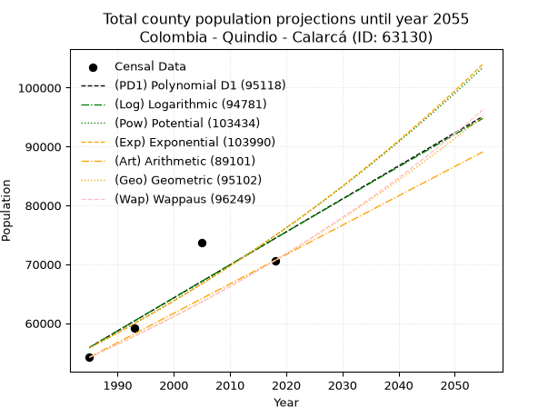
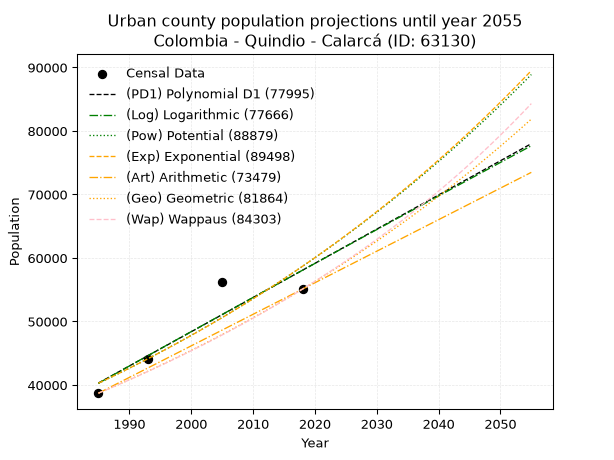
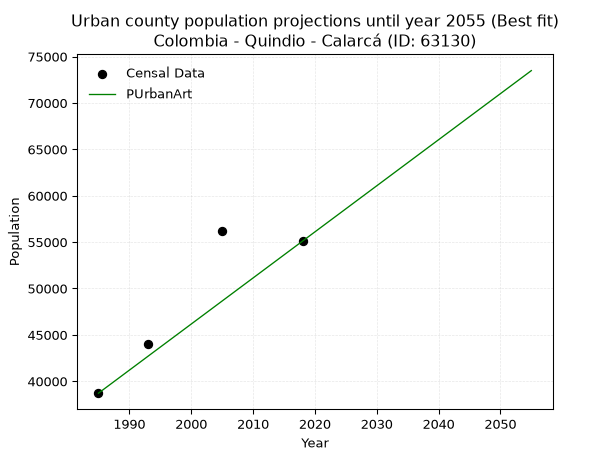
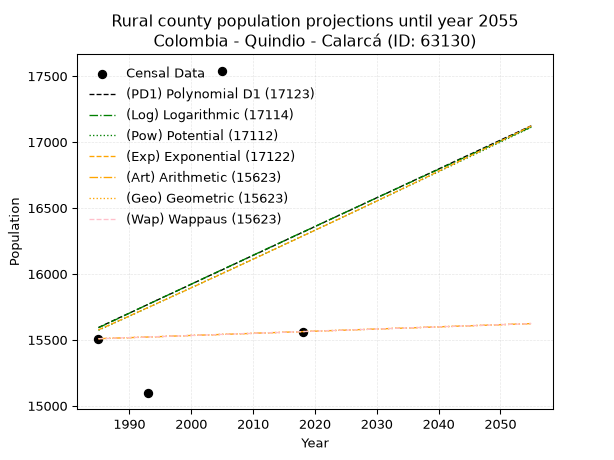
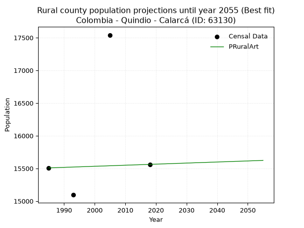

<div align="center">


</div>

# _“Population and Public Services Demand Projections (PPSD) until Year 2050 for Colombia - Quindio - Calarca (ID: 63130)”_
Keywords: `population` `public-service` `projection` `lineal` `polynomial` `logarithmic` `potential` `exponential` `arithmetic` `geometric` `wappaus` `dane` `colombia` `south-america`

PPSD are analytical estimates used by governments and planners to anticipate future changes in population size, age distribution, and the resulting community needs for utilities, healthcare, education, and infrastructure as sizing future water treatment facilities, electrical grids, and road networks based on spatial growth.

> **General running parameters**: • app_version: _v20260806_. • Python version: _3.14.7_. • Pandas version: _3.0.5_. • NumPy version: _2.5.1_. • Creates, save and include plots into reports (create_plot): _False_. • Projection until year: _2050_. • Process polynomial degree 2 and up: _False_. • Process Wappaus: _True_. • Process Wappaus: _True_. • Set negative values to zero: _True_. • Set infinite values to zero: _True_. • Drop dataset notes: _True_. 
<div align="center">

Dynamic map: [:earth_americas:Google](http://maps.google.com/maps?q=4.520981957,-75.646085) [:earth_americas:OSM](https://www.openstreetmap.org/#map=18/4.520981957/-75.646085&layers=P) [:earth_americas:Bing](https://www.bing.com/maps?cp=4.520981957~-75.646085&lvl=18) [:earth_americas:Apple](https://maps.apple.com/frame?center=4.520981957%2C-75.646085&span=0.003%2C0.006)

</div>


<div align="center">

```geojson
{
  "type": "Feature",
  "geometry": {
    "type": "Point", 
    "coordinates": [-75.646085, 4.520981957]
  }, 
  "properties": {
    "Name": "Colombia - Quindio - Calarca (ID: 63130)"
  }
}
```

</div>


## 0. Census Data (4 records)

Census data are official statistics collected by a government about the people and housing in a country. They usually include counts of total population, age, sex, race, income, education, and jobs.

📅Global census file: [Population.xlsx](../data/Population.xlsx)

| Source   |   Year |   CountryID | CountryName   |   StateID | StateName   |   CountyID | CountyName   |   PTotal |   PUrban |   PRural |
|:---------|-------:|------------:|:--------------|----------:|:------------|-----------:|:-------------|---------:|---------:|---------:|
| DANE     |   1985 |          57 | Colombia      |        63 | Quindio     |      63130 | Calarca      |    54216 |    38708 |    15508 |
| DANE     |   1993 |          57 | Colombia      |        63 | Quindío     |      63130 | Calarcá      |    59142 |    44047 |    15095 |
| DANE     |   2005 |          57 | Colombia      |        63 | Quindio     |      63130 | Calarca      |    73741 |    56200 |    17541 |
| DANE     |   2018 |          57 | Colombia      |        63 | Quindío     |      63130 | Calarcá      |    70662 |    55100 |    15562 |

> 🔥Some records has specific notes about the registered values or the corresponding urban or rural distribution.

## 1. Total

### 1.1. Coefficients and Parameters

* (PD1) Polynomial Deg 1: 560.3319951826584, -1056363.8233641128 (lineal)
* (Log) Logarithmic: 1122757.6737776848, -8469649.825599523
* (Pow) Potential: 17.802956039922524, -53.96317840654048
* (Exp) Exponential: 0.008884883794677379, 0.00122307456354742
* (Art) Arithmetic: Year diff. 2018 - 1985 = 33, Population diff. 70662 - 54216 = 16446, Annual growth = 498.3636363636364
* (Geo) Geometric: Year diff. 2018 - 1985 = 33, Population diff. 70662 - 54216 = 16446, Annual growth % = 0.00806055145708573
* (Wap) Wappaus: i = 0.7981608231452079, Condition values only valid for < 200)

<sub>
Wappaus condition values: ['0.00', '0.80', '1.60', '2.39', '3.19', '3.99', '4.79', '5.59', '6.39', '7.18', '7.98', '8.78', '9.58', '10.38', '11.17', '11.97', '12.77', '13.57', '14.37', '15.17', '15.96', '16.76', '17.56', '18.36', '19.16', '19.95', '20.75', '21.55', '22.35', '23.15', '23.94', '24.74', '25.54', '26.34', '27.14', '27.94', '28.73', '29.53', '30.33', '31.13', '31.93', '32.72', '33.52', '34.32', '35.12', '35.92', '36.72', '37.51', '38.31', '39.11', '39.91', '40.71', '41.50', '42.30', '43.10', '43.90', '44.70', '45.50', '46.29', '47.09', '47.89', '48.69', '49.49', '50.28', '51.08', '51.88']
</sub>


### 1.2. Projected Dataset

|   Year |   CountyID |   PTotalPD1 |   PTotalLog |   PTotalPow |   PTotalExp |   PTotalArt |   PTotalGeo |   PTotalWap |
|-------:|-----------:|------------:|------------:|------------:|------------:|------------:|------------:|------------:|
|   1985 |      63130 |       55895 |       55869 |       55809 |       55832 |       54216 |       54216 |       54216 |
|   1986 |      63130 |       56456 |       56435 |       56312 |       56331 |       54714 |       54653 |       54650 |
|   1987 |      63130 |       57016 |       57000 |       56819 |       56833 |       55213 |       55094 |       55088 |
|   1988 |      63130 |       57576 |       57565 |       57330 |       57340 |       55711 |       55538 |       55530 |
|   1989 |      63130 |       58137 |       58130 |       57846 |       57852 |       56209 |       55985 |       55975 |
|   1990 |      63130 |       58697 |       58694 |       58366 |       58368 |       56708 |       56437 |       56424 |
|   1991 |      63130 |       59257 |       59258 |       58890 |       58889 |       57206 |       56891 |       56876 |
|   1992 |      63130 |       59818 |       59822 |       59419 |       59415 |       57705 |       57350 |       57332 |
|   1993 |      63130 |       60378 |       60385 |       59952 |       59945 |       58203 |       57812 |       57792 |
|   1994 |      63130 |       60938 |       60948 |       60490 |       60480 |       58701 |       58278 |       58256 |
|   1995 |      63130 |       61499 |       61511 |       61032 |       61020 |       59200 |       58748 |       58723 |
|   1996 |      63130 |       62059 |       62074 |       61579 |       61564 |       59698 |       59222 |       59195 |
|   1997 |      63130 |       62619 |       62636 |       62131 |       62114 |       60196 |       59699 |       59670 |
|   1998 |      63130 |       63180 |       63198 |       62687 |       62668 |       60695 |       60180 |       60149 |
|   1999 |      63130 |       63740 |       63760 |       63248 |       63228 |       61193 |       60665 |       60633 |
|   2000 |      63130 |       64300 |       64322 |       63814 |       63792 |       61691 |       61154 |       61120 |
|   2001 |      63130 |       64860 |       64883 |       64384 |       64361 |       62190 |       61647 |       61612 |
|   2002 |      63130 |       65421 |       65444 |       64959 |       64936 |       62688 |       62144 |       62108 |
|   2003 |      63130 |       65981 |       66005 |       65539 |       65515 |       63187 |       62645 |       62608 |
|   2004 |      63130 |       66541 |       66565 |       66124 |       66100 |       63685 |       63150 |       63112 |
|   2005 |      63130 |       67102 |       67125 |       66714 |       66690 |       64183 |       63659 |       63621 |
|   2006 |      63130 |       67662 |       67685 |       67309 |       67285 |       64682 |       64172 |       64135 |
|   2007 |      63130 |       68222 |       68245 |       67909 |       67885 |       65180 |       64689 |       64652 |
|   2008 |      63130 |       68783 |       68804 |       68514 |       68491 |       65678 |       65211 |       65175 |
|   2009 |      63130 |       69343 |       69363 |       69124 |       69102 |       66177 |       65736 |       65702 |
|   2010 |      63130 |       69903 |       69922 |       69739 |       69719 |       66675 |       66266 |       66233 |
|   2011 |      63130 |       70464 |       70480 |       70359 |       70341 |       67173 |       66800 |       66770 |
|   2012 |      63130 |       71024 |       71038 |       70985 |       70969 |       67672 |       67339 |       67311 |
|   2013 |      63130 |       71584 |       71596 |       71616 |       71602 |       68170 |       67882 |       67857 |
|   2014 |      63130 |       72145 |       72154 |       72252 |       72241 |       68669 |       68429 |       68408 |
|   2015 |      63130 |       72705 |       72711 |       72893 |       72886 |       69167 |       68980 |       68964 |
|   2016 |      63130 |       73265 |       73268 |       73540 |       73537 |       69665 |       69536 |       69525 |
|   2017 |      63130 |       73826 |       73825 |       74192 |       74193 |       70164 |       70097 |       70091 |
|   2018 |      63130 |       74386 |       74381 |       74849 |       74855 |       70662 |       70662 |       70662 |
|   2019 |      63130 |       74946 |       74938 |       75512 |       75523 |       71160 |       71232 |       71239 |
|   2020 |      63130 |       75507 |       75494 |       76181 |       76197 |       71659 |       71806 |       71821 |
|   2021 |      63130 |       76067 |       76049 |       76855 |       76877 |       72157 |       72385 |       72408 |
|   2022 |      63130 |       76627 |       76605 |       77535 |       77563 |       72655 |       72968 |       73001 |
|   2023 |      63130 |       77188 |       77160 |       78221 |       78255 |       73154 |       73556 |       73599 |
|   2024 |      63130 |       77748 |       77715 |       78912 |       78954 |       73652 |       74149 |       74203 |
|   2025 |      63130 |       78308 |       78269 |       79609 |       79658 |       74151 |       74747 |       74813 |
|   2026 |      63130 |       78869 |       78824 |       80312 |       80369 |       74649 |       75349 |       75429 |
|   2027 |      63130 |       79429 |       79378 |       81020 |       81087 |       75147 |       75957 |       76050 |
|   2028 |      63130 |       79989 |       79931 |       81735 |       81810 |       75646 |       76569 |       76678 |
|   2029 |      63130 |       80550 |       80485 |       82455 |       82540 |       76144 |       77186 |       77312 |
|   2030 |      63130 |       81110 |       81038 |       83182 |       83277 |       76642 |       77808 |       77951 |
|   2031 |      63130 |       81670 |       81591 |       83914 |       84020 |       77141 |       78435 |       78598 |
|   2032 |      63130 |       82231 |       82144 |       84653 |       84770 |       77639 |       79068 |       79250 |
|   2033 |      63130 |       82791 |       82696 |       85398 |       85526 |       78137 |       79705 |       79909 |
|   2034 |      63130 |       83351 |       83248 |       86149 |       86290 |       78636 |       80347 |       80574 |
|   2035 |      63130 |       83912 |       83800 |       86906 |       87060 |       79134 |       80995 |       81246 |
|   2036 |      63130 |       84472 |       84352 |       87669 |       87837 |       79633 |       81648 |       81925 |
|   2037 |      63130 |       85032 |       84903 |       88439 |       88621 |       80131 |       82306 |       82610 |
|   2038 |      63130 |       85593 |       85454 |       89215 |       89412 |       80629 |       82969 |       83303 |
|   2039 |      63130 |       86153 |       86005 |       89998 |       90210 |       81128 |       83638 |       84003 |
|   2040 |      63130 |       86713 |       86555 |       90787 |       91015 |       81626 |       84312 |       84709 |
|   2041 |      63130 |       87274 |       87106 |       91582 |       91827 |       82124 |       84992 |       85423 |
|   2042 |      63130 |       87834 |       87655 |       92384 |       92646 |       82623 |       85677 |       86145 |
|   2043 |      63130 |       88394 |       88205 |       93193 |       93473 |       83121 |       86368 |       86874 |
|   2044 |      63130 |       88955 |       88755 |       94009 |       94307 |       83619 |       87064 |       87610 |
|   2045 |      63130 |       89515 |       89304 |       94831 |       95149 |       84118 |       87766 |       88354 |
|   2046 |      63130 |       90075 |       89853 |       95660 |       95998 |       84616 |       88473 |       89106 |
|   2047 |      63130 |       90636 |       90401 |       96495 |       96855 |       85115 |       89186 |       89866 |
|   2048 |      63130 |       91196 |       90950 |       97338 |       97719 |       85613 |       89905 |       90634 |
|   2049 |      63130 |       91756 |       91498 |       98188 |       98591 |       86111 |       90630 |       91411 |
|   2050 |      63130 |       92317 |       92046 |       99044 |       99471 |       86610 |       91360 |       92195 |
<div align="center">

</img>

</div>


### 1.3. Best fit with absolute error and relative error (%)

Relative error puts that difference into context by dividing the absolute error by the true value, creating a unitless ratio or percentage that shows the scale of the mistake.

Absolute and relative error

|   Year | Source   |   CountryID | CountryName   |   StateID | StateName   |   CountyID_x | CountyName   |   PTotal |   PUrban |   PRural |   CountyID_y |   PTotalPD1 |   PTotalLog |   PTotalPow |   PTotalExp |   PTotalArt |   PTotalGeo |   PTotalWap |   PTotalPD1AbsError |   PTotalLogAbsError |   PTotalPowAbsError |   PTotalExpAbsError |   PTotalArtAbsError |   PTotalGeoAbsError |   PTotalWapAbsError |   PTotalPD1RelError |   PTotalLogRelError |   PTotalPowRelError |   PTotalExpRelError |   PTotalArtRelError |   PTotalGeoRelError |   PTotalWapRelError |
|-------:|:---------|------------:|:--------------|----------:|:------------|-------------:|:-------------|---------:|---------:|---------:|-------------:|------------:|------------:|------------:|------------:|------------:|------------:|------------:|--------------------:|--------------------:|--------------------:|--------------------:|--------------------:|--------------------:|--------------------:|--------------------:|--------------------:|--------------------:|--------------------:|--------------------:|--------------------:|--------------------:|
|   1985 | DANE     |          57 | Colombia      |        63 | Quindio     |        63130 | Calarca      |    54216 |    38708 |    15508 |        63130 |       55895 |       55869 |       55809 |       55832 |       54216 |       54216 |       54216 |                1679 |                1653 |                1593 |                1616 |                   0 |                   0 |                   0 |             3.09687 |             3.04892 |             2.93825 |             2.98067 |              0      |             0       |             0       |
|   1993 | DANE     |          57 | Colombia      |        63 | Quindío     |        63130 | Calarcá      |    59142 |    44047 |    15095 |        63130 |       60378 |       60385 |       59952 |       59945 |       58203 |       57812 |       57792 |                1236 |                1243 |                 810 |                 803 |                 939 |                1330 |                1350 |             2.08989 |             2.10172 |             1.36959 |             1.35775 |              1.5877 |             2.24882 |             2.28264 |
|   2005 | DANE     |          57 | Colombia      |        63 | Quindio     |        63130 | Calarca      |    73741 |    56200 |    17541 |        63130 |       67102 |       67125 |       66714 |       66690 |       64183 |       63659 |       63621 |                6639 |                6616 |                7027 |                7051 |                9558 |               10082 |               10120 |             9.00313 |             8.97194 |             9.5293  |             9.56184 |             12.9616 |            13.6722  |            13.7237  |
|   2018 | DANE     |          57 | Colombia      |        63 | Quindío     |        63130 | Calarcá      |    70662 |    55100 |    15562 |        63130 |       74386 |       74381 |       74849 |       74855 |       70662 |       70662 |       70662 |                3724 |                3719 |                4187 |                4193 |                   0 |                   0 |                   0 |             5.27016 |             5.26308 |             5.92539 |             5.93388 |              0      |             0       |             0       |

Relative error mean

| Method    |   RelError | Best   |
|:----------|-----------:|:-------|
| PTotalPD1 |    4.86501 |        |
| PTotalLog |    4.84642 |        |
| PTotalPow |    4.94063 |        |
| PTotalExp |    4.95854 |        |
| PTotalArt |    3.63732 | True   |
| PTotalGeo |    3.98025 |        |
| PTotalWap |    4.00159 |        |

💙Best method: _**PTotalArt**_
<div align="center">

</img>

</div>


### 1.4. Fresh water supply demand in liters per capita per day (lpcd)

The fresh water supply demand typically ranges from 100 to 300 liters per capita per day (lpcd) for standard domestic and municipal planning, though absolute survival minimums set by the World Health Organization are as low as 7.5 to 20 liters per day, and total consumption in high-income nations can exceed 400 liters.

> `CZ`: Level in meters above the sea level (masl).<br> `WS`: Fresh water supply demand in liters per capita per day (lpcd or l/h/d).<br> `WSAll`: Zonal fresh water supply demand in liters per second (l/s).<br> `A`: Zonal area in square meters.

Reference values (RAS Colombia)

|    CZ |   WS |
|------:|-----:|
|  1000 |  120 |
|  2000 |  130 |
| 99999 |  140 |

County shapefile geometry properties and water supply values

|   CountyID |      ATotal |   CZTotal |   WSTotal |
|-----------:|------------:|----------:|----------:|
|      63130 | 2.19785e+08 |   1814.11 |       130 |

Projected values for best method: PTotalArt

|   CountyID |   Year |   PTotalArt |   WSTotal |   WSTotalAll |
|-----------:|-------:|------------:|----------:|-------------:|
|      63130 |   1985 |       54216 |       130 |      81.575  |
|      63130 |   1986 |       54714 |       130 |      82.3243 |
|      63130 |   1987 |       55213 |       130 |      83.0751 |
|      63130 |   1988 |       55711 |       130 |      83.8244 |
|      63130 |   1989 |       56209 |       130 |      84.5737 |
|      63130 |   1990 |       56708 |       130 |      85.3245 |
|      63130 |   1991 |       57206 |       130 |      86.0738 |
|      63130 |   1992 |       57705 |       130 |      86.8247 |
|      63130 |   1993 |       58203 |       130 |      87.574  |
|      63130 |   1994 |       58701 |       130 |      88.3233 |
|      63130 |   1995 |       59200 |       130 |      89.0741 |
|      63130 |   1996 |       59698 |       130 |      89.8234 |
|      63130 |   1997 |       60196 |       130 |      90.5727 |
|      63130 |   1998 |       60695 |       130 |      91.3235 |
|      63130 |   1999 |       61193 |       130 |      92.0728 |
|      63130 |   2000 |       61691 |       130 |      92.8221 |
|      63130 |   2001 |       62190 |       130 |      93.5729 |
|      63130 |   2002 |       62688 |       130 |      94.3222 |
|      63130 |   2003 |       63187 |       130 |      95.073  |
|      63130 |   2004 |       63685 |       130 |      95.8223 |
|      63130 |   2005 |       64183 |       130 |      96.5716 |
|      63130 |   2006 |       64682 |       130 |      97.3225 |
|      63130 |   2007 |       65180 |       130 |      98.0718 |
|      63130 |   2008 |       65678 |       130 |      98.8211 |
|      63130 |   2009 |       66177 |       130 |      99.5719 |
|      63130 |   2010 |       66675 |       130 |     100.321  |
|      63130 |   2011 |       67173 |       130 |     101.07   |
|      63130 |   2012 |       67672 |       130 |     101.821  |
|      63130 |   2013 |       68170 |       130 |     102.571  |
|      63130 |   2014 |       68669 |       130 |     103.321  |
|      63130 |   2015 |       69167 |       130 |     104.071  |
|      63130 |   2016 |       69665 |       130 |     104.82   |
|      63130 |   2017 |       70164 |       130 |     105.571  |
|      63130 |   2018 |       70662 |       130 |     106.32   |
|      63130 |   2019 |       71160 |       130 |     107.069  |
|      63130 |   2020 |       71659 |       130 |     107.82   |
|      63130 |   2021 |       72157 |       130 |     108.57   |
|      63130 |   2022 |       72655 |       130 |     109.319  |
|      63130 |   2023 |       73154 |       130 |     110.07   |
|      63130 |   2024 |       73652 |       130 |     110.819  |
|      63130 |   2025 |       74151 |       130 |     111.57   |
|      63130 |   2026 |       74649 |       130 |     112.319  |
|      63130 |   2027 |       75147 |       130 |     113.068  |
|      63130 |   2028 |       75646 |       130 |     113.819  |
|      63130 |   2029 |       76144 |       130 |     114.569  |
|      63130 |   2030 |       76642 |       130 |     115.318  |
|      63130 |   2031 |       77141 |       130 |     116.069  |
|      63130 |   2032 |       77639 |       130 |     116.818  |
|      63130 |   2033 |       78137 |       130 |     117.567  |
|      63130 |   2034 |       78636 |       130 |     118.318  |
|      63130 |   2035 |       79134 |       130 |     119.067  |
|      63130 |   2036 |       79633 |       130 |     119.818  |
|      63130 |   2037 |       80131 |       130 |     120.567  |
|      63130 |   2038 |       80629 |       130 |     121.317  |
|      63130 |   2039 |       81128 |       130 |     122.068  |
|      63130 |   2040 |       81626 |       130 |     122.817  |
|      63130 |   2041 |       82124 |       130 |     123.566  |
|      63130 |   2042 |       82623 |       130 |     124.317  |
|      63130 |   2043 |       83121 |       130 |     125.066  |
|      63130 |   2044 |       83619 |       130 |     125.816  |
|      63130 |   2045 |       84118 |       130 |     126.566  |
|      63130 |   2046 |       84616 |       130 |     127.316  |
|      63130 |   2047 |       85115 |       130 |     128.067  |
|      63130 |   2048 |       85613 |       130 |     128.816  |
|      63130 |   2049 |       86111 |       130 |     129.565  |
|      63130 |   2050 |       86610 |       130 |     130.316  |

## 2. Urban

### 2.1. Coefficients and Parameters

* (PD1) Polynomial Deg 1: 538.4781212364509, -1028577.1120032108 (lineal)
* (Log) Logarithmic: 1078807.8652241929, -8151513.478592768
* (Pow) Potential: 22.848375084082605, -70.74356766323841
* (Exp) Exponential: 0.011404160572775239, 5.941348662612933e-06
* (Art) Arithmetic: Year diff. 2018 - 1985 = 33, Population diff. 55100 - 38708 = 16392, Annual growth = 496.72727272727275
* (Geo) Geometric: Year diff. 2018 - 1985 = 33, Population diff. 55100 - 38708 = 16392, Annual growth % = 0.010757554446065631
* (Wap) Wappaus: i = 1.059029662133875, Condition values only valid for < 200)

<sub>
Wappaus condition values: ['0.00', '1.06', '2.12', '3.18', '4.24', '5.30', '6.35', '7.41', '8.47', '9.53', '10.59', '11.65', '12.71', '13.77', '14.83', '15.89', '16.94', '18.00', '19.06', '20.12', '21.18', '22.24', '23.30', '24.36', '25.42', '26.48', '27.53', '28.59', '29.65', '30.71', '31.77', '32.83', '33.89', '34.95', '36.01', '37.07', '38.13', '39.18', '40.24', '41.30', '42.36', '43.42', '44.48', '45.54', '46.60', '47.66', '48.72', '49.77', '50.83', '51.89', '52.95', '54.01', '55.07', '56.13', '57.19', '58.25', '59.31', '60.36', '61.42', '62.48', '63.54', '64.60', '65.66', '66.72', '67.78', '68.84']
</sub>


### 2.2. Projected Dataset

|   Year |   CountyID |   PUrbanPD1 |   PUrbanLog |   PUrbanPow |   PUrbanExp |   PUrbanArt |   PUrbanGeo |   PUrbanWap |
|-------:|-----------:|------------:|------------:|------------:|------------:|------------:|------------:|------------:|
|   1985 |      63130 |       40302 |       40278 |       40263 |       40283 |       38708 |       38708 |       38708 |
|   1986 |      63130 |       40840 |       40822 |       40729 |       40745 |       39205 |       39124 |       39120 |
|   1987 |      63130 |       41379 |       41365 |       41200 |       41212 |       39701 |       39545 |       39537 |
|   1988 |      63130 |       41917 |       41908 |       41676 |       41685 |       40198 |       39971 |       39958 |
|   1989 |      63130 |       42456 |       42450 |       42158 |       42163 |       40695 |       40401 |       40383 |
|   1990 |      63130 |       42994 |       42992 |       42645 |       42647 |       41192 |       40835 |       40813 |
|   1991 |      63130 |       43533 |       43534 |       43137 |       43136 |       41688 |       41275 |       41248 |
|   1992 |      63130 |       44071 |       44076 |       43635 |       43631 |       42185 |       41719 |       41688 |
|   1993 |      63130 |       44610 |       44617 |       44138 |       44131 |       42682 |       42167 |       42132 |
|   1994 |      63130 |       45148 |       45159 |       44647 |       44637 |       43179 |       42621 |       42582 |
|   1995 |      63130 |       45687 |       45699 |       45161 |       45149 |       43675 |       43080 |       43036 |
|   1996 |      63130 |       46225 |       46240 |       45681 |       45667 |       44172 |       43543 |       43496 |
|   1997 |      63130 |       46764 |       46780 |       46207 |       46191 |       44669 |       44011 |       43961 |
|   1998 |      63130 |       47302 |       47321 |       46739 |       46721 |       45165 |       44485 |       44431 |
|   1999 |      63130 |       47841 |       47860 |       47276 |       47256 |       45662 |       44963 |       44907 |
|   2000 |      63130 |       48379 |       48400 |       47819 |       47798 |       46159 |       45447 |       45387 |
|   2001 |      63130 |       48918 |       48939 |       48369 |       48347 |       46656 |       45936 |       45874 |
|   2002 |      63130 |       49456 |       49478 |       48924 |       48901 |       47152 |       46430 |       46366 |
|   2003 |      63130 |       49995 |       50017 |       49485 |       49462 |       47649 |       46930 |       46864 |
|   2004 |      63130 |       50533 |       50555 |       50053 |       50029 |       48146 |       47434 |       47368 |
|   2005 |      63130 |       51072 |       51094 |       50627 |       50603 |       48643 |       47945 |       47878 |
|   2006 |      63130 |       51610 |       51631 |       51207 |       51183 |       49139 |       48460 |       48394 |
|   2007 |      63130 |       52148 |       52169 |       51793 |       51771 |       49636 |       48982 |       48916 |
|   2008 |      63130 |       52687 |       52707 |       52386 |       52364 |       50133 |       49509 |       49444 |
|   2009 |      63130 |       53225 |       53244 |       52985 |       52965 |       50629 |       50041 |       49979 |
|   2010 |      63130 |       53764 |       53780 |       53591 |       53572 |       51126 |       50580 |       50520 |
|   2011 |      63130 |       54302 |       54317 |       54204 |       54187 |       51623 |       51124 |       51068 |
|   2012 |      63130 |       54841 |       54853 |       54823 |       54808 |       52120 |       51674 |       51622 |
|   2013 |      63130 |       55379 |       55389 |       55449 |       55437 |       52616 |       52230 |       52184 |
|   2014 |      63130 |       55918 |       55925 |       56082 |       56073 |       53113 |       52791 |       52753 |
|   2015 |      63130 |       56456 |       56461 |       56722 |       56716 |       53610 |       53359 |       53328 |
|   2016 |      63130 |       56995 |       56996 |       57368 |       57366 |       54107 |       53933 |       53911 |
|   2017 |      63130 |       57533 |       57531 |       58022 |       58024 |       54603 |       54514 |       54502 |
|   2018 |      63130 |       58072 |       58066 |       58683 |       58690 |       55100 |       55100 |       55100 |
|   2019 |      63130 |       58610 |       58600 |       59351 |       59363 |       55597 |       55693 |       55706 |
|   2020 |      63130 |       59149 |       59134 |       60026 |       60044 |       56093 |       56292 |       56319 |
|   2021 |      63130 |       59687 |       59668 |       60709 |       60732 |       56590 |       56897 |       56941 |
|   2022 |      63130 |       60226 |       60202 |       61399 |       61429 |       57087 |       57509 |       57571 |
|   2023 |      63130 |       60764 |       60735 |       62096 |       62134 |       57584 |       58128 |       58209 |
|   2024 |      63130 |       61303 |       61269 |       62802 |       62846 |       58080 |       58753 |       58856 |
|   2025 |      63130 |       61841 |       61801 |       63514 |       63567 |       58577 |       59386 |       59511 |
|   2026 |      63130 |       62380 |       62334 |       64235 |       64296 |       59074 |       60024 |       60176 |
|   2027 |      63130 |       62918 |       62866 |       64963 |       65034 |       59571 |       60670 |       60849 |
|   2028 |      63130 |       63457 |       63398 |       65699 |       65779 |       60067 |       61323 |       61532 |
|   2029 |      63130 |       63995 |       63930 |       66444 |       66534 |       60564 |       61982 |       62224 |
|   2030 |      63130 |       64533 |       64462 |       67196 |       67297 |       61061 |       62649 |       62925 |
|   2031 |      63130 |       65072 |       64993 |       67956 |       68069 |       61557 |       63323 |       63637 |
|   2032 |      63130 |       65610 |       65524 |       68725 |       68850 |       62054 |       64004 |       64358 |
|   2033 |      63130 |       66149 |       66055 |       69502 |       69639 |       62551 |       64693 |       65090 |
|   2034 |      63130 |       66687 |       66585 |       70287 |       70438 |       63048 |       65389 |       65832 |
|   2035 |      63130 |       67226 |       67116 |       71081 |       71246 |       63544 |       66092 |       66585 |
|   2036 |      63130 |       67764 |       67646 |       71883 |       72063 |       64041 |       66803 |       67349 |
|   2037 |      63130 |       68303 |       68175 |       72694 |       72890 |       64538 |       67522 |       68124 |
|   2038 |      63130 |       68841 |       68705 |       73514 |       73726 |       65035 |       68248 |       68910 |
|   2039 |      63130 |       69380 |       69234 |       74343 |       74571 |       65531 |       68982 |       69708 |
|   2040 |      63130 |       69918 |       69763 |       75180 |       75426 |       66028 |       69725 |       70518 |
|   2041 |      63130 |       70457 |       70292 |       76027 |       76292 |       66525 |       70475 |       71340 |
|   2042 |      63130 |       70995 |       70820 |       76882 |       77167 |       67021 |       71233 |       72175 |
|   2043 |      63130 |       71534 |       71348 |       77747 |       78052 |       67518 |       71999 |       73023 |
|   2044 |      63130 |       72072 |       71876 |       78622 |       78947 |       68015 |       72774 |       73883 |
|   2045 |      63130 |       72611 |       72404 |       79505 |       79852 |       68512 |       73556 |       74757 |
|   2046 |      63130 |       73149 |       72931 |       80398 |       80768 |       69008 |       74348 |       75644 |
|   2047 |      63130 |       73688 |       73459 |       81301 |       81695 |       69505 |       75147 |       76546 |
|   2048 |      63130 |       74226 |       73985 |       82213 |       82632 |       70002 |       75956 |       77461 |
|   2049 |      63130 |       74765 |       74512 |       83135 |       83579 |       70499 |       76773 |       78392 |
|   2050 |      63130 |       75303 |       75038 |       84067 |       84538 |       70995 |       77599 |       79337 |
<div align="center">

</img>

</div>


### 2.3. Best fit with absolute error and relative error (%)

Relative error puts that difference into context by dividing the absolute error by the true value, creating a unitless ratio or percentage that shows the scale of the mistake.

Absolute and relative error

|   Year | Source   |   CountryID | CountryName   |   StateID | StateName   |   CountyID_x | CountyName   |   PTotal |   PUrban |   PRural |   CountyID_y |   PUrbanPD1 |   PUrbanLog |   PUrbanPow |   PUrbanExp |   PUrbanArt |   PUrbanGeo |   PUrbanWap |   PUrbanPD1AbsError |   PUrbanLogAbsError |   PUrbanPowAbsError |   PUrbanExpAbsError |   PUrbanArtAbsError |   PUrbanGeoAbsError |   PUrbanWapAbsError |   PUrbanPD1RelError |   PUrbanLogRelError |   PUrbanPowRelError |   PUrbanExpRelError |   PUrbanArtRelError |   PUrbanGeoRelError |   PUrbanWapRelError |
|-------:|:---------|------------:|:--------------|----------:|:------------|-------------:|:-------------|---------:|---------:|---------:|-------------:|------------:|------------:|------------:|------------:|------------:|------------:|------------:|--------------------:|--------------------:|--------------------:|--------------------:|--------------------:|--------------------:|--------------------:|--------------------:|--------------------:|--------------------:|--------------------:|--------------------:|--------------------:|--------------------:|
|   1985 | DANE     |          57 | Colombia      |        63 | Quindio     |        63130 | Calarca      |    54216 |    38708 |    15508 |        63130 |       40302 |       40278 |       40263 |       40283 |       38708 |       38708 |       38708 |                1594 |                1570 |                1555 |                1575 |                   0 |                   0 |                   0 |             4.11801 |             4.05601 |            4.01726  |            4.06893  |             0       |             0       |             0       |
|   1993 | DANE     |          57 | Colombia      |        63 | Quindío     |        63130 | Calarcá      |    59142 |    44047 |    15095 |        63130 |       44610 |       44617 |       44138 |       44131 |       42682 |       42167 |       42132 |                 563 |                 570 |                  91 |                  84 |                1365 |                1880 |                1915 |             1.27818 |             1.29407 |            0.206597 |            0.190705 |             3.09896 |             4.26817 |             4.34763 |
|   2005 | DANE     |          57 | Colombia      |        63 | Quindio     |        63130 | Calarca      |    73741 |    56200 |    17541 |        63130 |       51072 |       51094 |       50627 |       50603 |       48643 |       47945 |       47878 |                5128 |                5106 |                5573 |                5597 |                7557 |                8255 |                8322 |             9.12456 |             9.08541 |            9.91637  |            9.95907  |            13.4466  |            14.6886  |            14.8078  |
|   2018 | DANE     |          57 | Colombia      |        63 | Quindío     |        63130 | Calarcá      |    70662 |    55100 |    15562 |        63130 |       58072 |       58066 |       58683 |       58690 |       55100 |       55100 |       55100 |                2972 |                2966 |                3583 |                3590 |                   0 |                   0 |                   0 |             5.39383 |             5.38294 |            6.50272  |            6.51543  |             0       |             0       |             0       |

Relative error mean

| Method    |   RelError | Best   |
|:----------|-----------:|:-------|
| PUrbanPD1 |    4.97864 |        |
| PUrbanLog |    4.95461 |        |
| PUrbanPow |    5.16074 |        |
| PUrbanExp |    5.18353 |        |
| PUrbanArt |    4.1364  | True   |
| PUrbanGeo |    4.7392  |        |
| PUrbanWap |    4.78886 |        |

💙Best method: _**PUrbanArt**_
<div align="center">

</img>

</div>


### 2.4. Fresh water supply demand in liters per capita per day (lpcd)

The fresh water supply demand typically ranges from 100 to 300 liters per capita per day (lpcd) for standard domestic and municipal planning, though absolute survival minimums set by the World Health Organization are as low as 7.5 to 20 liters per day, and total consumption in high-income nations can exceed 400 liters.

> `CZ`: Level in meters above the sea level (masl).<br> `WS`: Fresh water supply demand in liters per capita per day (lpcd or l/h/d).<br> `WSAll`: Zonal fresh water supply demand in liters per second (l/s).<br> `A`: Zonal area in square meters.

Reference values (RAS Colombia)

|    CZ |   WS |
|------:|-----:|
|  1000 |  120 |
|  2000 |  130 |
| 99999 |  140 |

County shapefile geometry properties and water supply values

|   CountyID |      AUrban |   CZUrban |   WSUrban |
|-----------:|------------:|----------:|----------:|
|      63130 | 7.26609e+06 |   1503.67 |       130 |

Projected values for best method: PUrbanArt

|   CountyID |   Year |   PUrbanArt |   WSUrban |   WSUrbanAll |
|-----------:|-------:|------------:|----------:|-------------:|
|      63130 |   1985 |       38708 |       130 |      58.2412 |
|      63130 |   1986 |       39205 |       130 |      58.989  |
|      63130 |   1987 |       39701 |       130 |      59.7353 |
|      63130 |   1988 |       40198 |       130 |      60.4831 |
|      63130 |   1989 |       40695 |       130 |      61.2309 |
|      63130 |   1990 |       41192 |       130 |      61.9787 |
|      63130 |   1991 |       41688 |       130 |      62.725  |
|      63130 |   1992 |       42185 |       130 |      63.4728 |
|      63130 |   1993 |       42682 |       130 |      64.2206 |
|      63130 |   1994 |       43179 |       130 |      64.9684 |
|      63130 |   1995 |       43675 |       130 |      65.7147 |
|      63130 |   1996 |       44172 |       130 |      66.4625 |
|      63130 |   1997 |       44669 |       130 |      67.2103 |
|      63130 |   1998 |       45165 |       130 |      67.9566 |
|      63130 |   1999 |       45662 |       130 |      68.7044 |
|      63130 |   2000 |       46159 |       130 |      69.4522 |
|      63130 |   2001 |       46656 |       130 |      70.2    |
|      63130 |   2002 |       47152 |       130 |      70.9463 |
|      63130 |   2003 |       47649 |       130 |      71.6941 |
|      63130 |   2004 |       48146 |       130 |      72.4419 |
|      63130 |   2005 |       48643 |       130 |      73.1897 |
|      63130 |   2006 |       49139 |       130 |      73.936  |
|      63130 |   2007 |       49636 |       130 |      74.6838 |
|      63130 |   2008 |       50133 |       130 |      75.4316 |
|      63130 |   2009 |       50629 |       130 |      76.1779 |
|      63130 |   2010 |       51126 |       130 |      76.9257 |
|      63130 |   2011 |       51623 |       130 |      77.6735 |
|      63130 |   2012 |       52120 |       130 |      78.4213 |
|      63130 |   2013 |       52616 |       130 |      79.1676 |
|      63130 |   2014 |       53113 |       130 |      79.9154 |
|      63130 |   2015 |       53610 |       130 |      80.6632 |
|      63130 |   2016 |       54107 |       130 |      81.411  |
|      63130 |   2017 |       54603 |       130 |      82.1573 |
|      63130 |   2018 |       55100 |       130 |      82.9051 |
|      63130 |   2019 |       55597 |       130 |      83.6529 |
|      63130 |   2020 |       56093 |       130 |      84.3992 |
|      63130 |   2021 |       56590 |       130 |      85.147  |
|      63130 |   2022 |       57087 |       130 |      85.8948 |
|      63130 |   2023 |       57584 |       130 |      86.6426 |
|      63130 |   2024 |       58080 |       130 |      87.3889 |
|      63130 |   2025 |       58577 |       130 |      88.1367 |
|      63130 |   2026 |       59074 |       130 |      88.8845 |
|      63130 |   2027 |       59571 |       130 |      89.6323 |
|      63130 |   2028 |       60067 |       130 |      90.3786 |
|      63130 |   2029 |       60564 |       130 |      91.1264 |
|      63130 |   2030 |       61061 |       130 |      91.8742 |
|      63130 |   2031 |       61557 |       130 |      92.6205 |
|      63130 |   2032 |       62054 |       130 |      93.3683 |
|      63130 |   2033 |       62551 |       130 |      94.1161 |
|      63130 |   2034 |       63048 |       130 |      94.8639 |
|      63130 |   2035 |       63544 |       130 |      95.6102 |
|      63130 |   2036 |       64041 |       130 |      96.358  |
|      63130 |   2037 |       64538 |       130 |      97.1058 |
|      63130 |   2038 |       65035 |       130 |      97.8536 |
|      63130 |   2039 |       65531 |       130 |      98.5999 |
|      63130 |   2040 |       66028 |       130 |      99.3477 |
|      63130 |   2041 |       66525 |       130 |     100.095  |
|      63130 |   2042 |       67021 |       130 |     100.842  |
|      63130 |   2043 |       67518 |       130 |     101.59   |
|      63130 |   2044 |       68015 |       130 |     102.337  |
|      63130 |   2045 |       68512 |       130 |     103.085  |
|      63130 |   2046 |       69008 |       130 |     103.831  |
|      63130 |   2047 |       69505 |       130 |     104.579  |
|      63130 |   2048 |       70002 |       130 |     105.327  |
|      63130 |   2049 |       70499 |       130 |     106.075  |
|      63130 |   2050 |       70995 |       130 |     106.821  |

## 3. Rural

### 3.1. Coefficients and Parameters

* (PD1) Polynomial Deg 1: 21.853873946207383, -27786.711360901318 (lineal)
* (Log) Logarithmic: 43949.808553492396, -318136.34700675827
* (Pow) Potential: 2.720380640664578, -4.778805633479417
* (Exp) Exponential: 0.0013529079198166248, 1061.9630080758138
* (Art) Arithmetic: Year diff. 2018 - 1985 = 33, Population diff. 15562 - 15508 = 54, Annual growth = 1.6363636363636365
* (Geo) Geometric: Year diff. 2018 - 1985 = 33, Population diff. 15562 - 15508 = 54, Annual growth % = 0.00010533965043912907
* (Wap) Wappaus: i = 0.010533399654738566, Condition values only valid for < 200)

<sub>
Wappaus condition values: ['0.00', '0.01', '0.02', '0.03', '0.04', '0.05', '0.06', '0.07', '0.08', '0.09', '0.11', '0.12', '0.13', '0.14', '0.15', '0.16', '0.17', '0.18', '0.19', '0.20', '0.21', '0.22', '0.23', '0.24', '0.25', '0.26', '0.27', '0.28', '0.29', '0.31', '0.32', '0.33', '0.34', '0.35', '0.36', '0.37', '0.38', '0.39', '0.40', '0.41', '0.42', '0.43', '0.44', '0.45', '0.46', '0.47', '0.48', '0.50', '0.51', '0.52', '0.53', '0.54', '0.55', '0.56', '0.57', '0.58', '0.59', '0.60', '0.61', '0.62', '0.63', '0.64', '0.65', '0.66', '0.67', '0.68']
</sub>


### 3.2. Projected Dataset

|   Year |   CountyID |   PRuralPD1 |   PRuralLog |   PRuralPow |   PRuralExp |   PRuralArt |   PRuralGeo |   PRuralWap |
|-------:|-----------:|------------:|------------:|------------:|------------:|------------:|------------:|------------:|
|   1985 |      63130 |       15593 |       15591 |       15572 |       15575 |       15508 |       15508 |       15508 |
|   1986 |      63130 |       15615 |       15613 |       15594 |       15596 |       15510 |       15510 |       15510 |
|   1987 |      63130 |       15637 |       15635 |       15615 |       15617 |       15511 |       15511 |       15511 |
|   1988 |      63130 |       15659 |       15657 |       15637 |       15638 |       15513 |       15513 |       15513 |
|   1989 |      63130 |       15681 |       15679 |       15658 |       15659 |       15515 |       15515 |       15515 |
|   1990 |      63130 |       15702 |       15702 |       15679 |       15680 |       15516 |       15516 |       15516 |
|   1991 |      63130 |       15724 |       15724 |       15701 |       15702 |       15518 |       15518 |       15518 |
|   1992 |      63130 |       15746 |       15746 |       15722 |       15723 |       15519 |       15519 |       15519 |
|   1993 |      63130 |       15768 |       15768 |       15744 |       15744 |       15521 |       15521 |       15521 |
|   1994 |      63130 |       15790 |       15790 |       15765 |       15765 |       15523 |       15523 |       15523 |
|   1995 |      63130 |       15812 |       15812 |       15787 |       15787 |       15524 |       15524 |       15524 |
|   1996 |      63130 |       15834 |       15834 |       15808 |       15808 |       15526 |       15526 |       15526 |
|   1997 |      63130 |       15855 |       15856 |       15830 |       15830 |       15528 |       15528 |       15528 |
|   1998 |      63130 |       15877 |       15878 |       15852 |       15851 |       15529 |       15529 |       15529 |
|   1999 |      63130 |       15899 |       15900 |       15873 |       15872 |       15531 |       15531 |       15531 |
|   2000 |      63130 |       15921 |       15922 |       15895 |       15894 |       15533 |       15533 |       15533 |
|   2001 |      63130 |       15943 |       15944 |       15916 |       15915 |       15534 |       15534 |       15534 |
|   2002 |      63130 |       15965 |       15966 |       15938 |       15937 |       15536 |       15536 |       15536 |
|   2003 |      63130 |       15987 |       15988 |       15960 |       15959 |       15537 |       15537 |       15537 |
|   2004 |      63130 |       16008 |       16010 |       15981 |       15980 |       15539 |       15539 |       15539 |
|   2005 |      63130 |       16030 |       16032 |       16003 |       16002 |       15541 |       15541 |       15541 |
|   2006 |      63130 |       16052 |       16054 |       16025 |       16023 |       15542 |       15542 |       15542 |
|   2007 |      63130 |       16074 |       16075 |       16046 |       16045 |       15544 |       15544 |       15544 |
|   2008 |      63130 |       16096 |       16097 |       16068 |       16067 |       15546 |       15546 |       15546 |
|   2009 |      63130 |       16118 |       16119 |       16090 |       16089 |       15547 |       15547 |       15547 |
|   2010 |      63130 |       16140 |       16141 |       16112 |       16110 |       15549 |       15549 |       15549 |
|   2011 |      63130 |       16161 |       16163 |       16134 |       16132 |       15551 |       15551 |       15551 |
|   2012 |      63130 |       16183 |       16185 |       16155 |       16154 |       15552 |       15552 |       15552 |
|   2013 |      63130 |       16205 |       16207 |       16177 |       16176 |       15554 |       15554 |       15554 |
|   2014 |      63130 |       16227 |       16228 |       16199 |       16198 |       15555 |       15555 |       15555 |
|   2015 |      63130 |       16249 |       16250 |       16221 |       16220 |       15557 |       15557 |       15557 |
|   2016 |      63130 |       16271 |       16272 |       16243 |       16242 |       15559 |       15559 |       15559 |
|   2017 |      63130 |       16293 |       16294 |       16265 |       16264 |       15560 |       15560 |       15560 |
|   2018 |      63130 |       16314 |       16316 |       16287 |       16286 |       15562 |       15562 |       15562 |
|   2019 |      63130 |       16336 |       16337 |       16309 |       16308 |       15564 |       15564 |       15564 |
|   2020 |      63130 |       16358 |       16359 |       16331 |       16330 |       15565 |       15565 |       15565 |
|   2021 |      63130 |       16380 |       16381 |       16353 |       16352 |       15567 |       15567 |       15567 |
|   2022 |      63130 |       16402 |       16403 |       16375 |       16374 |       15569 |       15569 |       15569 |
|   2023 |      63130 |       16424 |       16424 |       16397 |       16396 |       15570 |       15570 |       15570 |
|   2024 |      63130 |       16446 |       16446 |       16419 |       16418 |       15572 |       15572 |       15572 |
|   2025 |      63130 |       16467 |       16468 |       16441 |       16441 |       15573 |       15573 |       15573 |
|   2026 |      63130 |       16489 |       16490 |       16463 |       16463 |       15575 |       15575 |       15575 |
|   2027 |      63130 |       16511 |       16511 |       16485 |       16485 |       15577 |       15577 |       15577 |
|   2028 |      63130 |       16533 |       16533 |       16507 |       16508 |       15578 |       15578 |       15578 |
|   2029 |      63130 |       16555 |       16555 |       16530 |       16530 |       15580 |       15580 |       15580 |
|   2030 |      63130 |       16577 |       16576 |       16552 |       16552 |       15582 |       15582 |       15582 |
|   2031 |      63130 |       16599 |       16598 |       16574 |       16575 |       15583 |       15583 |       15583 |
|   2032 |      63130 |       16620 |       16619 |       16596 |       16597 |       15585 |       15585 |       15585 |
|   2033 |      63130 |       16642 |       16641 |       16618 |       16620 |       15587 |       15587 |       15587 |
|   2034 |      63130 |       16664 |       16663 |       16641 |       16642 |       15588 |       15588 |       15588 |
|   2035 |      63130 |       16686 |       16684 |       16663 |       16665 |       15590 |       15590 |       15590 |
|   2036 |      63130 |       16708 |       16706 |       16685 |       16687 |       15591 |       15592 |       15592 |
|   2037 |      63130 |       16730 |       16728 |       16707 |       16710 |       15593 |       15593 |       15593 |
|   2038 |      63130 |       16751 |       16749 |       16730 |       16732 |       15595 |       15595 |       15595 |
|   2039 |      63130 |       16773 |       16771 |       16752 |       16755 |       15596 |       15596 |       15596 |
|   2040 |      63130 |       16795 |       16792 |       16774 |       16778 |       15598 |       15598 |       15598 |
|   2041 |      63130 |       16817 |       16814 |       16797 |       16800 |       15600 |       15600 |       15600 |
|   2042 |      63130 |       16839 |       16835 |       16819 |       16823 |       15601 |       15601 |       15601 |
|   2043 |      63130 |       16861 |       16857 |       16842 |       16846 |       15603 |       15603 |       15603 |
|   2044 |      63130 |       16883 |       16878 |       16864 |       16869 |       15605 |       15605 |       15605 |
|   2045 |      63130 |       16904 |       16900 |       16887 |       16892 |       15606 |       15606 |       15606 |
|   2046 |      63130 |       16926 |       16921 |       16909 |       16914 |       15608 |       15608 |       15608 |
|   2047 |      63130 |       16948 |       16943 |       16931 |       16937 |       15609 |       15610 |       15610 |
|   2048 |      63130 |       16970 |       16964 |       16954 |       16960 |       15611 |       15611 |       15611 |
|   2049 |      63130 |       16992 |       16986 |       16977 |       16983 |       15613 |       15613 |       15613 |
|   2050 |      63130 |       17014 |       17007 |       16999 |       17006 |       15614 |       15615 |       15615 |
<div align="center">

</img>

</div>


### 3.3. Best fit with absolute error and relative error (%)

Relative error puts that difference into context by dividing the absolute error by the true value, creating a unitless ratio or percentage that shows the scale of the mistake.

Absolute and relative error

|   Year | Source   |   CountryID | CountryName   |   StateID | StateName   |   CountyID_x | CountyName   |   PTotal |   PUrban |   PRural |   CountyID_y |   PRuralPD1 |   PRuralLog |   PRuralPow |   PRuralExp |   PRuralArt |   PRuralGeo |   PRuralWap |   PRuralPD1AbsError |   PRuralLogAbsError |   PRuralPowAbsError |   PRuralExpAbsError |   PRuralArtAbsError |   PRuralGeoAbsError |   PRuralWapAbsError |   PRuralPD1RelError |   PRuralLogRelError |   PRuralPowRelError |   PRuralExpRelError |   PRuralArtRelError |   PRuralGeoRelError |   PRuralWapRelError |
|-------:|:---------|------------:|:--------------|----------:|:------------|-------------:|:-------------|---------:|---------:|---------:|-------------:|------------:|------------:|------------:|------------:|------------:|------------:|------------:|--------------------:|--------------------:|--------------------:|--------------------:|--------------------:|--------------------:|--------------------:|--------------------:|--------------------:|--------------------:|--------------------:|--------------------:|--------------------:|--------------------:|
|   1985 | DANE     |          57 | Colombia      |        63 | Quindio     |        63130 | Calarca      |    54216 |    38708 |    15508 |        63130 |       15593 |       15591 |       15572 |       15575 |       15508 |       15508 |       15508 |                  85 |                  83 |                  64 |                  67 |                   0 |                   0 |                   0 |            0.548104 |            0.535208 |             0.41269 |            0.432035 |             0       |             0       |             0       |
|   1993 | DANE     |          57 | Colombia      |        63 | Quindío     |        63130 | Calarcá      |    59142 |    44047 |    15095 |        63130 |       15768 |       15768 |       15744 |       15744 |       15521 |       15521 |       15521 |                 673 |                 673 |                 649 |                 649 |                 426 |                 426 |                 426 |            4.45843  |            4.45843  |             4.29944 |            4.29944  |             2.82213 |             2.82213 |             2.82213 |
|   2005 | DANE     |          57 | Colombia      |        63 | Quindio     |        63130 | Calarca      |    73741 |    56200 |    17541 |        63130 |       16030 |       16032 |       16003 |       16002 |       15541 |       15541 |       15541 |                1511 |                1509 |                1538 |                1539 |                2000 |                2000 |                2000 |            8.6141   |            8.6027   |             8.76803 |            8.77373  |            11.4019  |            11.4019  |            11.4019  |
|   2018 | DANE     |          57 | Colombia      |        63 | Quindío     |        63130 | Calarcá      |    70662 |    55100 |    15562 |        63130 |       16314 |       16316 |       16287 |       16286 |       15562 |       15562 |       15562 |                 752 |                 754 |                 725 |                 724 |                   0 |                   0 |                   0 |            4.83228  |            4.84514  |             4.65878 |            4.65236  |             0       |             0       |             0       |

Relative error mean

| Method    |   RelError | Best   |
|:----------|-----------:|:-------|
| PRuralPD1 |    4.61323 |        |
| PRuralLog |    4.61037 |        |
| PRuralPow |    4.53474 |        |
| PRuralExp |    4.53939 |        |
| PRuralArt |    3.556   | True   |
| PRuralGeo |    3.556   | True   |
| PRuralWap |    3.556   | True   |

💙Best method: _**PRuralArt**_
<div align="center">

</img>

</div>


### 3.4. Fresh water supply demand in liters per capita per day (lpcd)

The fresh water supply demand typically ranges from 100 to 300 liters per capita per day (lpcd) for standard domestic and municipal planning, though absolute survival minimums set by the World Health Organization are as low as 7.5 to 20 liters per day, and total consumption in high-income nations can exceed 400 liters.

> `CZ`: Level in meters above the sea level (masl).<br> `WS`: Fresh water supply demand in liters per capita per day (lpcd or l/h/d).<br> `WSAll`: Zonal fresh water supply demand in liters per second (l/s).<br> `A`: Zonal area in square meters.

Reference values (RAS Colombia)

|    CZ |   WS |
|------:|-----:|
|  1000 |  120 |
|  2000 |  130 |
| 99999 |  140 |

County shapefile geometry properties and water supply values

|   CountyID |      ARural |   CZRural |   WSRural |
|-----------:|------------:|----------:|----------:|
|      63130 | 2.12519e+08 |   1824.77 |       130 |

Projected values for best method: PRuralArt

|   CountyID |   Year |   PRuralArt |   WSRural |   WSRuralAll |
|-----------:|-------:|------------:|----------:|-------------:|
|      63130 |   1985 |       15508 |       130 |      23.3338 |
|      63130 |   1986 |       15510 |       130 |      23.3368 |
|      63130 |   1987 |       15511 |       130 |      23.3383 |
|      63130 |   1988 |       15513 |       130 |      23.3413 |
|      63130 |   1989 |       15515 |       130 |      23.3443 |
|      63130 |   1990 |       15516 |       130 |      23.3458 |
|      63130 |   1991 |       15518 |       130 |      23.3488 |
|      63130 |   1992 |       15519 |       130 |      23.3503 |
|      63130 |   1993 |       15521 |       130 |      23.3534 |
|      63130 |   1994 |       15523 |       130 |      23.3564 |
|      63130 |   1995 |       15524 |       130 |      23.3579 |
|      63130 |   1996 |       15526 |       130 |      23.3609 |
|      63130 |   1997 |       15528 |       130 |      23.3639 |
|      63130 |   1998 |       15529 |       130 |      23.3654 |
|      63130 |   1999 |       15531 |       130 |      23.3684 |
|      63130 |   2000 |       15533 |       130 |      23.3714 |
|      63130 |   2001 |       15534 |       130 |      23.3729 |
|      63130 |   2002 |       15536 |       130 |      23.3759 |
|      63130 |   2003 |       15537 |       130 |      23.3774 |
|      63130 |   2004 |       15539 |       130 |      23.3804 |
|      63130 |   2005 |       15541 |       130 |      23.3834 |
|      63130 |   2006 |       15542 |       130 |      23.385  |
|      63130 |   2007 |       15544 |       130 |      23.388  |
|      63130 |   2008 |       15546 |       130 |      23.391  |
|      63130 |   2009 |       15547 |       130 |      23.3925 |
|      63130 |   2010 |       15549 |       130 |      23.3955 |
|      63130 |   2011 |       15551 |       130 |      23.3985 |
|      63130 |   2012 |       15552 |       130 |      23.4    |
|      63130 |   2013 |       15554 |       130 |      23.403  |
|      63130 |   2014 |       15555 |       130 |      23.4045 |
|      63130 |   2015 |       15557 |       130 |      23.4075 |
|      63130 |   2016 |       15559 |       130 |      23.4105 |
|      63130 |   2017 |       15560 |       130 |      23.412  |
|      63130 |   2018 |       15562 |       130 |      23.415  |
|      63130 |   2019 |       15564 |       130 |      23.4181 |
|      63130 |   2020 |       15565 |       130 |      23.4196 |
|      63130 |   2021 |       15567 |       130 |      23.4226 |
|      63130 |   2022 |       15569 |       130 |      23.4256 |
|      63130 |   2023 |       15570 |       130 |      23.4271 |
|      63130 |   2024 |       15572 |       130 |      23.4301 |
|      63130 |   2025 |       15573 |       130 |      23.4316 |
|      63130 |   2026 |       15575 |       130 |      23.4346 |
|      63130 |   2027 |       15577 |       130 |      23.4376 |
|      63130 |   2028 |       15578 |       130 |      23.4391 |
|      63130 |   2029 |       15580 |       130 |      23.4421 |
|      63130 |   2030 |       15582 |       130 |      23.4451 |
|      63130 |   2031 |       15583 |       130 |      23.4466 |
|      63130 |   2032 |       15585 |       130 |      23.4497 |
|      63130 |   2033 |       15587 |       130 |      23.4527 |
|      63130 |   2034 |       15588 |       130 |      23.4542 |
|      63130 |   2035 |       15590 |       130 |      23.4572 |
|      63130 |   2036 |       15591 |       130 |      23.4587 |
|      63130 |   2037 |       15593 |       130 |      23.4617 |
|      63130 |   2038 |       15595 |       130 |      23.4647 |
|      63130 |   2039 |       15596 |       130 |      23.4662 |
|      63130 |   2040 |       15598 |       130 |      23.4692 |
|      63130 |   2041 |       15600 |       130 |      23.4722 |
|      63130 |   2042 |       15601 |       130 |      23.4737 |
|      63130 |   2043 |       15603 |       130 |      23.4767 |
|      63130 |   2044 |       15605 |       130 |      23.4797 |
|      63130 |   2045 |       15606 |       130 |      23.4812 |
|      63130 |   2046 |       15608 |       130 |      23.4843 |
|      63130 |   2047 |       15609 |       130 |      23.4858 |
|      63130 |   2048 |       15611 |       130 |      23.4888 |
|      63130 |   2049 |       15613 |       130 |      23.4918 |
|      63130 |   2050 |       15614 |       130 |      23.4933 |

<div align="center"><br><sub>Share this research</sub></div><br>

<sub>**APPS & TOOLS & CONTENT DISCLAIMER**: • NO WARRANTY - This content and software is provided by <a href="https://github.com/rcfdtools" target="_blank">github.com/rcfdtools</a> "as is", without any express or implied warranty, including warranties of merchantability, fitness for a particular purpose, or non-infringement. There is no guarantee that the software will be error-free or operate without interruption. • LIMITATION OF LIABILITY - Neither the authors nor copyright holders will be liable for claims or damages arising from the software or its use. You are responsible for determining if the software is appropriate for your use and assume all associated risks, including errors, legal compliance, and data loss. • NO PROFESSIONAL ADVICE - The software provides general information and does not offer professional advice. It should not replace consultation with professional advisors. [Clauses and global license for rcfdtools use.](https://github.com/rcfdtools/rcfdtools/blob/main/LICENSE.md)</sub>