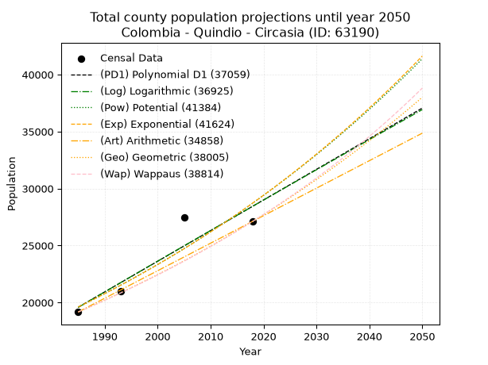
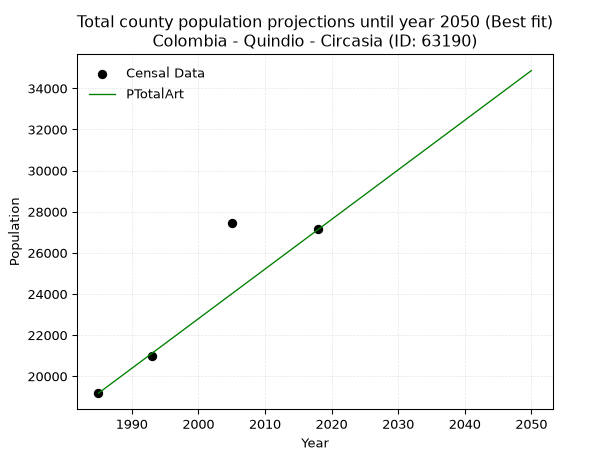
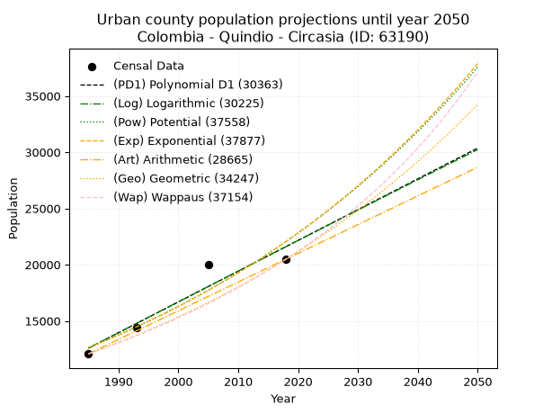
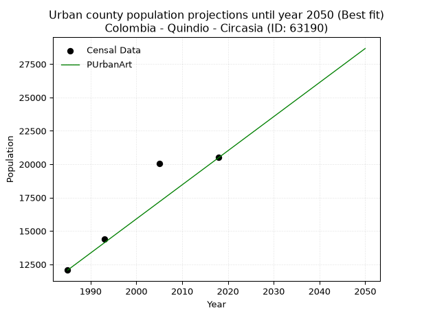
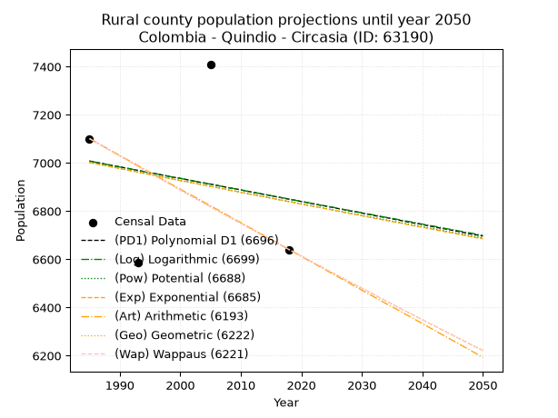
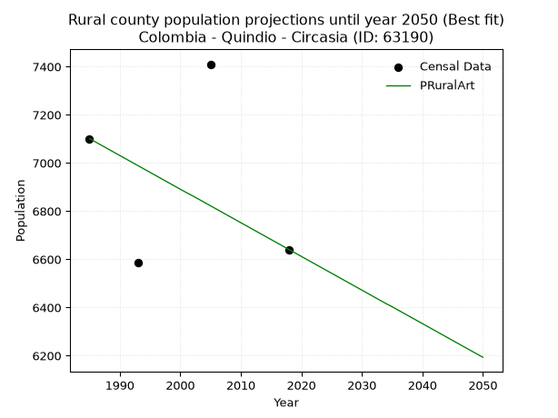

<div align="center">


</div>

# _“Population and Public Services Demand Projections (PPSD) until Year 2050 for Colombia - Quindio - Circasia (ID: 63190)”_
Keywords: `population` `public-service` `projection` `lineal` `polynomial` `logarithmic` `potential` `exponential` `arithmetic` `geometric` `wappaus` `dane` `colombia` `south-america`

PPSD are analytical estimates used by governments and planners to anticipate future changes in population size, age distribution, and the resulting community needs for utilities, healthcare, education, and infrastructure as sizing future water treatment facilities, electrical grids, and road networks based on spatial growth.

> **General running parameters**: • app_version: _v20260806_. • Python version: _3.14.7_. • Pandas version: _3.0.5_. • NumPy version: _2.5.1_. • Creates, save and include plots into reports (create_plot): _True_. • Projection until year: _2050_. • Process polynomial degree 2 and up: _False_. • Process Wappaus: _True_. • Process Wappaus: _True_. • Set negative values to zero: _True_. • Set infinite values to zero: _True_. • Drop dataset notes: _True_. 
<div align="center">

Dynamic map: [:earth_americas:Google](http://maps.google.com/maps?q=4.617758684,-75.6365329) [:earth_americas:OSM](https://www.openstreetmap.org/#map=18/4.617758684/-75.6365329&layers=P) [:earth_americas:Bing](https://www.bing.com/maps?cp=4.617758684~-75.6365329&lvl=18) [:earth_americas:Apple](https://maps.apple.com/frame?center=4.617758684%2C-75.6365329&span=0.003%2C0.006)

</div>


<div align="center">

```geojson
{
  "type": "Feature",
  "geometry": {
    "type": "Point", 
    "coordinates": [-75.6365329, 4.617758684]
  }, 
  "properties": {
    "Name": "Colombia - Quindio - Circasia (ID: 63190)"
  }
}
```

</div>


## 0. Census Data (4 records)

Census data are official statistics collected by a government about the people and housing in a country. They usually include counts of total population, age, sex, race, income, education, and jobs.

📅Global census file: [Population.xlsx](../data/Population.xlsx)

| Source   |   Year |   CountryID | CountryName   |   StateID | StateName   |   CountyID | CountyName   |   PTotal |   PUrban |   PRural |
|:---------|-------:|------------:|:--------------|----------:|:------------|-----------:|:-------------|---------:|---------:|---------:|
| DANE     |   1985 |          57 | Colombia      |        63 | Quindio     |      63190 | Circasia     |    19171 |    12070 |     7101 |
| DANE     |   1993 |          57 | Colombia      |        63 | Quindío     |      63190 | Circasia     |    21001 |    14414 |     6587 |
| DANE     |   2005 |          57 | Colombia      |        63 | Quindio     |      63190 | Circasia     |    27442 |    20032 |     7410 |
| DANE     |   2018 |          57 | Colombia      |        63 | Quindío     |      63190 | Circasia     |    27135 |    20495 |     6640 |

> 🔥Some records has specific notes about the registered values or the corresponding urban or rural distribution.

## 1. Total

### 1.1. Coefficients and Parameters

* (PD1) Polynomial Deg 1: 268.7767964672821, -513933.5371336811 (lineal)
* (Log) Logarithmic: 538387.2032870019, -4068598.1965487823
* (Pow) Potential: 23.190461338082013, -72.18426399382402
* (Exp) Exponential: 0.011576916262857348, 2.052905382852438e-06
* (Art) Arithmetic: Year diff. 2018 - 1985 = 33, Population diff. 27135 - 19171 = 7964, Annual growth = 241.33333333333334
* (Geo) Geometric: Year diff. 2018 - 1985 = 33, Population diff. 27135 - 19171 = 7964, Annual growth % = 0.010583666051654506
* (Wap) Wappaus: i = 1.0423415252163146, Condition values only valid for < 200)

<sub>
Wappaus condition values: ['0.00', '1.04', '2.08', '3.13', '4.17', '5.21', '6.25', '7.30', '8.34', '9.38', '10.42', '11.47', '12.51', '13.55', '14.59', '15.64', '16.68', '17.72', '18.76', '19.80', '20.85', '21.89', '22.93', '23.97', '25.02', '26.06', '27.10', '28.14', '29.19', '30.23', '31.27', '32.31', '33.35', '34.40', '35.44', '36.48', '37.52', '38.57', '39.61', '40.65', '41.69', '42.74', '43.78', '44.82', '45.86', '46.91', '47.95', '48.99', '50.03', '51.07', '52.12', '53.16', '54.20', '55.24', '56.29', '57.33', '58.37', '59.41', '60.46', '61.50', '62.54', '63.58', '64.63', '65.67', '66.71', '67.75']
</sub>


### 1.2. Projected Dataset

|   Year |   CountyID |   PTotalPD1 |   PTotalLog |   PTotalPow |   PTotalExp |   PTotalArt |   PTotalGeo |   PTotalWap |
|-------:|-----------:|------------:|------------:|------------:|------------:|------------:|------------:|------------:|
|   1985 |      63190 |       19588 |       19577 |       19603 |       19613 |       19171 |       19171 |       19171 |
|   1986 |      63190 |       19857 |       19848 |       19833 |       19841 |       19412 |       19374 |       19372 |
|   1987 |      63190 |       20126 |       20119 |       20066 |       20072 |       19654 |       19579 |       19575 |
|   1988 |      63190 |       20395 |       20390 |       20302 |       20306 |       19895 |       19786 |       19780 |
|   1989 |      63190 |       20664 |       20661 |       20540 |       20542 |       20136 |       19996 |       19987 |
|   1990 |      63190 |       20932 |       20932 |       20781 |       20781 |       20378 |       20207 |       20197 |
|   1991 |      63190 |       21201 |       21202 |       21024 |       21023 |       20619 |       20421 |       20409 |
|   1992 |      63190 |       21470 |       21473 |       21271 |       21268 |       20860 |       20637 |       20623 |
|   1993 |      63190 |       21739 |       21743 |       21520 |       21516 |       21102 |       20856 |       20839 |
|   1994 |      63190 |       22007 |       22013 |       21771 |       21766 |       21343 |       21076 |       21058 |
|   1995 |      63190 |       22276 |       22283 |       22026 |       22020 |       21584 |       21299 |       21279 |
|   1996 |      63190 |       22545 |       22553 |       22283 |       22276 |       21826 |       21525 |       21503 |
|   1997 |      63190 |       22814 |       22822 |       22544 |       22536 |       22067 |       21753 |       21729 |
|   1998 |      63190 |       23083 |       23092 |       22807 |       22798 |       22308 |       21983 |       21958 |
|   1999 |      63190 |       23351 |       23361 |       23073 |       23063 |       22550 |       22216 |       22189 |
|   2000 |      63190 |       23620 |       23630 |       23342 |       23332 |       22791 |       22451 |       22423 |
|   2001 |      63190 |       23889 |       23900 |       23615 |       23604 |       23032 |       22688 |       22659 |
|   2002 |      63190 |       24158 |       24169 |       23890 |       23878 |       23274 |       22928 |       22898 |
|   2003 |      63190 |       24426 |       24437 |       24168 |       24156 |       23515 |       23171 |       23140 |
|   2004 |      63190 |       24695 |       24706 |       24449 |       24438 |       23756 |       23416 |       23385 |
|   2005 |      63190 |       24964 |       24975 |       24734 |       24722 |       23998 |       23664 |       23633 |
|   2006 |      63190 |       25233 |       25243 |       25022 |       25010 |       24239 |       23915 |       23883 |
|   2007 |      63190 |       25501 |       25511 |       25312 |       25301 |       24480 |       24168 |       24137 |
|   2008 |      63190 |       25770 |       25780 |       25606 |       25596 |       24722 |       24423 |       24393 |
|   2009 |      63190 |       26039 |       26048 |       25904 |       25894 |       24963 |       24682 |       24652 |
|   2010 |      63190 |       26308 |       26316 |       26205 |       26196 |       25204 |       24943 |       24915 |
|   2011 |      63190 |       26577 |       26583 |       26509 |       26501 |       25446 |       25207 |       25181 |
|   2012 |      63190 |       26845 |       26851 |       26816 |       26809 |       25687 |       25474 |       25450 |
|   2013 |      63190 |       27114 |       27119 |       27127 |       27121 |       25928 |       25744 |       25722 |
|   2014 |      63190 |       27383 |       27386 |       27441 |       27437 |       26170 |       26016 |       25998 |
|   2015 |      63190 |       27652 |       27653 |       27759 |       27757 |       26411 |       26291 |       26277 |
|   2016 |      63190 |       27920 |       27920 |       28080 |       28080 |       26652 |       26570 |       26559 |
|   2017 |      63190 |       28189 |       28187 |       28405 |       28407 |       26894 |       26851 |       26845 |
|   2018 |      63190 |       28458 |       28454 |       28733 |       28738 |       27135 |       27135 |       27135 |
|   2019 |      63190 |       28727 |       28721 |       29065 |       29072 |       27376 |       27422 |       27428 |
|   2020 |      63190 |       28996 |       28988 |       29401 |       29411 |       27618 |       27712 |       27725 |
|   2021 |      63190 |       29264 |       29254 |       29740 |       29753 |       27859 |       28006 |       28026 |
|   2022 |      63190 |       29533 |       29520 |       30083 |       30100 |       28100 |       28302 |       28331 |
|   2023 |      63190 |       29802 |       29787 |       30430 |       30450 |       28342 |       28602 |       28640 |
|   2024 |      63190 |       30071 |       30053 |       30781 |       30805 |       28583 |       28904 |       28952 |
|   2025 |      63190 |       30339 |       30319 |       31136 |       31163 |       28824 |       29210 |       29269 |
|   2026 |      63190 |       30608 |       30584 |       31494 |       31526 |       29066 |       29519 |       29590 |
|   2027 |      63190 |       30877 |       30850 |       31857 |       31893 |       29307 |       29832 |       29916 |
|   2028 |      63190 |       31146 |       31116 |       32223 |       32265 |       29548 |       30148 |       30245 |
|   2029 |      63190 |       31415 |       31381 |       32594 |       32640 |       29790 |       30467 |       30580 |
|   2030 |      63190 |       31683 |       31646 |       32968 |       33021 |       30031 |       30789 |       30918 |
|   2031 |      63190 |       31952 |       31911 |       33347 |       33405 |       30272 |       31115 |       31262 |
|   2032 |      63190 |       32221 |       32176 |       33730 |       33794 |       30514 |       31444 |       31610 |
|   2033 |      63190 |       32490 |       32441 |       34117 |       34188 |       30755 |       31777 |       31963 |
|   2034 |      63190 |       32758 |       32706 |       34508 |       34586 |       30996 |       32113 |       32321 |
|   2035 |      63190 |       33027 |       32971 |       34904 |       34988 |       31238 |       32453 |       32684 |
|   2036 |      63190 |       33296 |       33235 |       35304 |       35396 |       31479 |       32797 |       33052 |
|   2037 |      63190 |       33565 |       33500 |       35708 |       35808 |       31720 |       33144 |       33425 |
|   2038 |      63190 |       33834 |       33764 |       36117 |       36225 |       31962 |       33495 |       33804 |
|   2039 |      63190 |       34102 |       34028 |       36530 |       36647 |       32203 |       33849 |       34188 |
|   2040 |      63190 |       34371 |       34292 |       36948 |       37073 |       32444 |       34207 |       34578 |
|   2041 |      63190 |       34640 |       34556 |       37370 |       37505 |       32686 |       34569 |       34973 |
|   2042 |      63190 |       34909 |       34819 |       37797 |       37942 |       32927 |       34935 |       35375 |
|   2043 |      63190 |       35177 |       35083 |       38228 |       38384 |       33168 |       35305 |       35782 |
|   2044 |      63190 |       35446 |       35347 |       38665 |       38831 |       33410 |       35679 |       36196 |
|   2045 |      63190 |       35715 |       35610 |       39106 |       39283 |       33651 |       36056 |       36616 |
|   2046 |      63190 |       35984 |       35873 |       39552 |       39740 |       33892 |       36438 |       37042 |
|   2047 |      63190 |       36253 |       36136 |       40002 |       40203 |       34134 |       36824 |       37475 |
|   2048 |      63190 |       36521 |       36399 |       40458 |       40671 |       34375 |       37213 |       37914 |
|   2049 |      63190 |       36790 |       36662 |       40919 |       41145 |       34616 |       37607 |       38361 |
|   2050 |      63190 |       37059 |       36925 |       41384 |       41624 |       34858 |       38005 |       38814 |
<div align="center">

</img>

</div>


### 1.3. Best fit with absolute error and relative error (%)

Relative error puts that difference into context by dividing the absolute error by the true value, creating a unitless ratio or percentage that shows the scale of the mistake.

Absolute and relative error

|   Year | Source   |   CountryID | CountryName   |   StateID | StateName   |   CountyID_x | CountyName   |   PTotal |   PUrban |   PRural |   CountyID_y |   PTotalPD1 |   PTotalLog |   PTotalPow |   PTotalExp |   PTotalArt |   PTotalGeo |   PTotalWap |   PTotalPD1AbsError |   PTotalLogAbsError |   PTotalPowAbsError |   PTotalExpAbsError |   PTotalArtAbsError |   PTotalGeoAbsError |   PTotalWapAbsError |   PTotalPD1RelError |   PTotalLogRelError |   PTotalPowRelError |   PTotalExpRelError |   PTotalArtRelError |   PTotalGeoRelError |   PTotalWapRelError |
|-------:|:---------|------------:|:--------------|----------:|:------------|-------------:|:-------------|---------:|---------:|---------:|-------------:|------------:|------------:|------------:|------------:|------------:|------------:|------------:|--------------------:|--------------------:|--------------------:|--------------------:|--------------------:|--------------------:|--------------------:|--------------------:|--------------------:|--------------------:|--------------------:|--------------------:|--------------------:|--------------------:|
|   1985 | DANE     |          57 | Colombia      |        63 | Quindio     |        63190 | Circasia     |    19171 |    12070 |     7101 |        63190 |       19588 |       19577 |       19603 |       19613 |       19171 |       19171 |       19171 |                 417 |                 406 |                 432 |                 442 |                   0 |                   0 |                   0 |             2.17516 |             2.11778 |             2.2534  |             2.30557 |            0        |            0        |            0        |
|   1993 | DANE     |          57 | Colombia      |        63 | Quindío     |        63190 | Circasia     |    21001 |    14414 |     6587 |        63190 |       21739 |       21743 |       21520 |       21516 |       21102 |       20856 |       20839 |                 738 |                 742 |                 519 |                 515 |                 101 |                 145 |                 162 |             3.51412 |             3.53317 |             2.47131 |             2.45226 |            0.480929 |            0.690443 |            0.771392 |
|   2005 | DANE     |          57 | Colombia      |        63 | Quindio     |        63190 | Circasia     |    27442 |    20032 |     7410 |        63190 |       24964 |       24975 |       24734 |       24722 |       23998 |       23664 |       23633 |                2478 |                2467 |                2708 |                2720 |                3444 |                3778 |                3809 |             9.02995 |             8.98987 |             9.86809 |             9.91181 |           12.5501   |           13.7672   |           13.8802   |
|   2018 | DANE     |          57 | Colombia      |        63 | Quindío     |        63190 | Circasia     |    27135 |    20495 |     6640 |        63190 |       28458 |       28454 |       28733 |       28738 |       27135 |       27135 |       27135 |                1323 |                1319 |                1598 |                1603 |                   0 |                   0 |                   0 |             4.87562 |             4.86088 |             5.88907 |             5.9075  |            0        |            0        |            0        |

Relative error mean

| Method    |   RelError | Best   |
|:----------|-----------:|:-------|
| PTotalPD1 |    4.89871 |        |
| PTotalLog |    4.87542 |        |
| PTotalPow |    5.12047 |        |
| PTotalExp |    5.14429 |        |
| PTotalArt |    3.25776 | True   |
| PTotalGeo |    3.61442 |        |
| PTotalWap |    3.66289 |        |

💙Best method: _**PTotalArt**_
<div align="center">

</img>

</div>


### 1.4. Fresh water supply demand in liters per capita per day (lpcd)

The fresh water supply demand typically ranges from 100 to 300 liters per capita per day (lpcd) for standard domestic and municipal planning, though absolute survival minimums set by the World Health Organization are as low as 7.5 to 20 liters per day, and total consumption in high-income nations can exceed 400 liters.

> `CZ`: Level in meters above the sea level (masl).<br> `WS`: Fresh water supply demand in liters per capita per day (lpcd or l/h/d).<br> `WSAll`: Zonal fresh water supply demand in liters per second (l/s).<br> `A`: Zonal area in square meters.

Reference values (RAS Colombia)

|    CZ |   WS |
|------:|-----:|
|  1000 |  120 |
|  2000 |  130 |
| 99999 |  140 |

County shapefile geometry properties and water supply values

|   CountyID |      ATotal |   CZTotal |   WSTotal |
|-----------:|------------:|----------:|----------:|
|      63190 | 9.15073e+07 |   1630.06 |       130 |

Projected values for best method: PTotalArt

|   CountyID |   Year |   PTotalArt |   WSTotal |   WSTotalAll |
|-----------:|-------:|------------:|----------:|-------------:|
|      63190 |   1985 |       19171 |       130 |      28.8453 |
|      63190 |   1986 |       19412 |       130 |      29.2079 |
|      63190 |   1987 |       19654 |       130 |      29.572  |
|      63190 |   1988 |       19895 |       130 |      29.9346 |
|      63190 |   1989 |       20136 |       130 |      30.2972 |
|      63190 |   1990 |       20378 |       130 |      30.6613 |
|      63190 |   1991 |       20619 |       130 |      31.024  |
|      63190 |   1992 |       20860 |       130 |      31.3866 |
|      63190 |   1993 |       21102 |       130 |      31.7507 |
|      63190 |   1994 |       21343 |       130 |      32.1133 |
|      63190 |   1995 |       21584 |       130 |      32.4759 |
|      63190 |   1996 |       21826 |       130 |      32.84   |
|      63190 |   1997 |       22067 |       130 |      33.2027 |
|      63190 |   1998 |       22308 |       130 |      33.5653 |
|      63190 |   1999 |       22550 |       130 |      33.9294 |
|      63190 |   2000 |       22791 |       130 |      34.292  |
|      63190 |   2001 |       23032 |       130 |      34.6546 |
|      63190 |   2002 |       23274 |       130 |      35.0187 |
|      63190 |   2003 |       23515 |       130 |      35.3814 |
|      63190 |   2004 |       23756 |       130 |      35.744  |
|      63190 |   2005 |       23998 |       130 |      36.1081 |
|      63190 |   2006 |       24239 |       130 |      36.4707 |
|      63190 |   2007 |       24480 |       130 |      36.8333 |
|      63190 |   2008 |       24722 |       130 |      37.1975 |
|      63190 |   2009 |       24963 |       130 |      37.5601 |
|      63190 |   2010 |       25204 |       130 |      37.9227 |
|      63190 |   2011 |       25446 |       130 |      38.2868 |
|      63190 |   2012 |       25687 |       130 |      38.6494 |
|      63190 |   2013 |       25928 |       130 |      39.012  |
|      63190 |   2014 |       26170 |       130 |      39.3762 |
|      63190 |   2015 |       26411 |       130 |      39.7388 |
|      63190 |   2016 |       26652 |       130 |      40.1014 |
|      63190 |   2017 |       26894 |       130 |      40.4655 |
|      63190 |   2018 |       27135 |       130 |      40.8281 |
|      63190 |   2019 |       27376 |       130 |      41.1907 |
|      63190 |   2020 |       27618 |       130 |      41.5549 |
|      63190 |   2021 |       27859 |       130 |      41.9175 |
|      63190 |   2022 |       28100 |       130 |      42.2801 |
|      63190 |   2023 |       28342 |       130 |      42.6442 |
|      63190 |   2024 |       28583 |       130 |      43.0068 |
|      63190 |   2025 |       28824 |       130 |      43.3694 |
|      63190 |   2026 |       29066 |       130 |      43.7336 |
|      63190 |   2027 |       29307 |       130 |      44.0962 |
|      63190 |   2028 |       29548 |       130 |      44.4588 |
|      63190 |   2029 |       29790 |       130 |      44.8229 |
|      63190 |   2030 |       30031 |       130 |      45.1855 |
|      63190 |   2031 |       30272 |       130 |      45.5481 |
|      63190 |   2032 |       30514 |       130 |      45.9123 |
|      63190 |   2033 |       30755 |       130 |      46.2749 |
|      63190 |   2034 |       30996 |       130 |      46.6375 |
|      63190 |   2035 |       31238 |       130 |      47.0016 |
|      63190 |   2036 |       31479 |       130 |      47.3642 |
|      63190 |   2037 |       31720 |       130 |      47.7269 |
|      63190 |   2038 |       31962 |       130 |      48.091  |
|      63190 |   2039 |       32203 |       130 |      48.4536 |
|      63190 |   2040 |       32444 |       130 |      48.8162 |
|      63190 |   2041 |       32686 |       130 |      49.1803 |
|      63190 |   2042 |       32927 |       130 |      49.5429 |
|      63190 |   2043 |       33168 |       130 |      49.9056 |
|      63190 |   2044 |       33410 |       130 |      50.2697 |
|      63190 |   2045 |       33651 |       130 |      50.6323 |
|      63190 |   2046 |       33892 |       130 |      50.9949 |
|      63190 |   2047 |       34134 |       130 |      51.359  |
|      63190 |   2048 |       34375 |       130 |      51.7216 |
|      63190 |   2049 |       34616 |       130 |      52.0843 |
|      63190 |   2050 |       34858 |       130 |      52.4484 |

## 2. Urban

### 2.1. Coefficients and Parameters

* (PD1) Polynomial Deg 1: 273.5756724207139, -530466.9887595329 (lineal)
* (Log) Logarithmic: 547950.3897991627, -4148222.553862285
* (Pow) Potential: 33.83025234278486, -107.46276256843304
* (Exp) Exponential: 0.016888893116857654, 3.4843850766287627e-11
* (Art) Arithmetic: Year diff. 2018 - 1985 = 33, Population diff. 20495 - 12070 = 8425, Annual growth = 255.3030303030303
* (Geo) Geometric: Year diff. 2018 - 1985 = 33, Population diff. 20495 - 12070 = 8425, Annual growth % = 0.016173578311735826
* (Wap) Wappaus: i = 1.5679596517919872, Condition values only valid for < 200)

<sub>
Wappaus condition values: ['0.00', '1.57', '3.14', '4.70', '6.27', '7.84', '9.41', '10.98', '12.54', '14.11', '15.68', '17.25', '18.82', '20.38', '21.95', '23.52', '25.09', '26.66', '28.22', '29.79', '31.36', '32.93', '34.50', '36.06', '37.63', '39.20', '40.77', '42.33', '43.90', '45.47', '47.04', '48.61', '50.17', '51.74', '53.31', '54.88', '56.45', '58.01', '59.58', '61.15', '62.72', '64.29', '65.85', '67.42', '68.99', '70.56', '72.13', '73.69', '75.26', '76.83', '78.40', '79.97', '81.53', '83.10', '84.67', '86.24', '87.81', '89.37', '90.94', '92.51', '94.08', '95.65', '97.21', '98.78', '100.35', '101.92']
</sub>


### 2.2. Projected Dataset

|   Year |   CountyID |   PUrbanPD1 |   PUrbanLog |   PUrbanPow |   PUrbanExp |   PUrbanArt |   PUrbanGeo |   PUrbanWap |
|-------:|-----------:|------------:|------------:|------------:|------------:|------------:|------------:|------------:|
|   1985 |      63190 |       12581 |       12570 |       12627 |       12636 |       12070 |       12070 |       12070 |
|   1986 |      63190 |       12854 |       12846 |       12844 |       12851 |       12325 |       12265 |       12261 |
|   1987 |      63190 |       13128 |       13122 |       13065 |       13070 |       12581 |       12464 |       12455 |
|   1988 |      63190 |       13401 |       13397 |       13289 |       13293 |       12836 |       12665 |       12651 |
|   1989 |      63190 |       13675 |       13673 |       13517 |       13519 |       13091 |       12870 |       12852 |
|   1990 |      63190 |       13949 |       13948 |       13749 |       13749 |       13347 |       13078 |       13055 |
|   1991 |      63190 |       14222 |       14224 |       13985 |       13984 |       13602 |       13290 |       13262 |
|   1992 |      63190 |       14496 |       14499 |       14224 |       14222 |       13857 |       13505 |       13472 |
|   1993 |      63190 |       14769 |       14774 |       14468 |       14464 |       14112 |       13723 |       13685 |
|   1994 |      63190 |       15043 |       15049 |       14715 |       14710 |       14368 |       13945 |       13903 |
|   1995 |      63190 |       15316 |       15323 |       14967 |       14961 |       14623 |       14171 |       14124 |
|   1996 |      63190 |       15590 |       15598 |       15223 |       15216 |       14878 |       14400 |       14348 |
|   1997 |      63190 |       15864 |       15872 |       15483 |       15475 |       15134 |       14633 |       14577 |
|   1998 |      63190 |       16137 |       16147 |       15748 |       15738 |       15389 |       14869 |       14809 |
|   1999 |      63190 |       16411 |       16421 |       16016 |       16007 |       15644 |       15110 |       15046 |
|   2000 |      63190 |       16684 |       16695 |       16290 |       16279 |       15900 |       15354 |       15287 |
|   2001 |      63190 |       16958 |       16969 |       16568 |       16556 |       16155 |       15602 |       15532 |
|   2002 |      63190 |       17232 |       17243 |       16850 |       16838 |       16410 |       15855 |       15782 |
|   2003 |      63190 |       17505 |       17516 |       17137 |       17125 |       16665 |       16111 |       16036 |
|   2004 |      63190 |       17779 |       17790 |       17429 |       17417 |       16921 |       16372 |       16295 |
|   2005 |      63190 |       18052 |       18063 |       17726 |       17714 |       17176 |       16637 |       16559 |
|   2006 |      63190 |       18326 |       18336 |       18027 |       18015 |       17431 |       16906 |       16828 |
|   2007 |      63190 |       18599 |       18609 |       18334 |       18322 |       17687 |       17179 |       17101 |
|   2008 |      63190 |       18873 |       18882 |       18645 |       18634 |       17942 |       17457 |       17380 |
|   2009 |      63190 |       19147 |       19155 |       18962 |       18952 |       18197 |       17739 |       17665 |
|   2010 |      63190 |       19420 |       19428 |       19284 |       19274 |       18453 |       18026 |       17955 |
|   2011 |      63190 |       19694 |       19700 |       19611 |       19603 |       18708 |       18318 |       18250 |
|   2012 |      63190 |       19967 |       19973 |       19944 |       19937 |       18963 |       18614 |       18552 |
|   2013 |      63190 |       20241 |       20245 |       20282 |       20276 |       19218 |       18915 |       18859 |
|   2014 |      63190 |       20514 |       20517 |       20625 |       20621 |       19474 |       19221 |       19173 |
|   2015 |      63190 |       20788 |       20789 |       20975 |       20973 |       19729 |       19532 |       19494 |
|   2016 |      63190 |       21062 |       21061 |       21330 |       21330 |       19984 |       19848 |       19820 |
|   2017 |      63190 |       21335 |       21333 |       21691 |       21693 |       20240 |       20169 |       20154 |
|   2018 |      63190 |       21609 |       21604 |       22057 |       22063 |       20495 |       20495 |       20495 |
|   2019 |      63190 |       21882 |       21876 |       22430 |       22438 |       20750 |       20826 |       20843 |
|   2020 |      63190 |       22156 |       22147 |       22809 |       22821 |       21006 |       21163 |       21199 |
|   2021 |      63190 |       22429 |       22418 |       23194 |       23209 |       21261 |       21506 |       21562 |
|   2022 |      63190 |       22703 |       22689 |       23586 |       23605 |       21516 |       21853 |       21933 |
|   2023 |      63190 |       22977 |       22960 |       23983 |       24007 |       21772 |       22207 |       22313 |
|   2024 |      63190 |       23250 |       23231 |       24388 |       24416 |       22027 |       22566 |       22701 |
|   2025 |      63190 |       23524 |       23502 |       24799 |       24831 |       22282 |       22931 |       23099 |
|   2026 |      63190 |       23797 |       23772 |       25216 |       25254 |       22537 |       23302 |       23505 |
|   2027 |      63190 |       24071 |       24043 |       25641 |       25684 |       22793 |       23679 |       23921 |
|   2028 |      63190 |       24344 |       24313 |       26072 |       26122 |       23048 |       24062 |       24346 |
|   2029 |      63190 |       24618 |       24583 |       26511 |       26567 |       23303 |       24451 |       24782 |
|   2030 |      63190 |       24892 |       24853 |       26956 |       27019 |       23559 |       24846 |       25229 |
|   2031 |      63190 |       25165 |       25123 |       27409 |       27480 |       23814 |       25248 |       25686 |
|   2032 |      63190 |       25439 |       25393 |       27870 |       27948 |       24069 |       25657 |       26155 |
|   2033 |      63190 |       25712 |       25662 |       28337 |       28424 |       24325 |       26072 |       26635 |
|   2034 |      63190 |       25986 |       25932 |       28813 |       28908 |       24580 |       26493 |       27128 |
|   2035 |      63190 |       26260 |       26201 |       29296 |       29400 |       24835 |       26922 |       27633 |
|   2036 |      63190 |       26533 |       26470 |       29787 |       29901 |       25090 |       27357 |       28152 |
|   2037 |      63190 |       26807 |       26739 |       30286 |       30410 |       25346 |       27800 |       28684 |
|   2038 |      63190 |       27080 |       27008 |       30793 |       30928 |       25601 |       28249 |       29231 |
|   2039 |      63190 |       27354 |       27277 |       31308 |       31455 |       25856 |       28706 |       29792 |
|   2040 |      63190 |       27627 |       27546 |       31832 |       31991 |       26112 |       29170 |       30369 |
|   2041 |      63190 |       27901 |       27814 |       32364 |       32535 |       26367 |       29642 |       30963 |
|   2042 |      63190 |       28175 |       28083 |       32905 |       33090 |       26622 |       30122 |       31572 |
|   2043 |      63190 |       28448 |       28351 |       33454 |       33653 |       26878 |       30609 |       32200 |
|   2044 |      63190 |       28722 |       28619 |       34013 |       34226 |       27133 |       31104 |       32846 |
|   2045 |      63190 |       28995 |       28887 |       34580 |       34809 |       27388 |       31607 |       33511 |
|   2046 |      63190 |       29269 |       29155 |       35157 |       35402 |       27643 |       32118 |       34195 |
|   2047 |      63190 |       29542 |       29423 |       35743 |       36005 |       27899 |       32638 |       34901 |
|   2048 |      63190 |       29816 |       29690 |       36338 |       36618 |       28154 |       33165 |       35629 |
|   2049 |      63190 |       30090 |       29958 |       36943 |       37242 |       28409 |       33702 |       36379 |
|   2050 |      63190 |       30363 |       30225 |       37558 |       37877 |       28665 |       34247 |       37154 |
<div align="center">

</img>

</div>


### 2.3. Best fit with absolute error and relative error (%)

Relative error puts that difference into context by dividing the absolute error by the true value, creating a unitless ratio or percentage that shows the scale of the mistake.

Absolute and relative error

|   Year | Source   |   CountryID | CountryName   |   StateID | StateName   |   CountyID_x | CountyName   |   PTotal |   PUrban |   PRural |   CountyID_y |   PUrbanPD1 |   PUrbanLog |   PUrbanPow |   PUrbanExp |   PUrbanArt |   PUrbanGeo |   PUrbanWap |   PUrbanPD1AbsError |   PUrbanLogAbsError |   PUrbanPowAbsError |   PUrbanExpAbsError |   PUrbanArtAbsError |   PUrbanGeoAbsError |   PUrbanWapAbsError |   PUrbanPD1RelError |   PUrbanLogRelError |   PUrbanPowRelError |   PUrbanExpRelError |   PUrbanArtRelError |   PUrbanGeoRelError |   PUrbanWapRelError |
|-------:|:---------|------------:|:--------------|----------:|:------------|-------------:|:-------------|---------:|---------:|---------:|-------------:|------------:|------------:|------------:|------------:|------------:|------------:|------------:|--------------------:|--------------------:|--------------------:|--------------------:|--------------------:|--------------------:|--------------------:|--------------------:|--------------------:|--------------------:|--------------------:|--------------------:|--------------------:|--------------------:|
|   1985 | DANE     |          57 | Colombia      |        63 | Quindio     |        63190 | Circasia     |    19171 |    12070 |     7101 |        63190 |       12581 |       12570 |       12627 |       12636 |       12070 |       12070 |       12070 |                 511 |                 500 |                 557 |                 566 |                   0 |                   0 |                   0 |             4.23364 |             4.1425  |            4.61475  |            4.68931  |             0       |             0       |             0       |
|   1993 | DANE     |          57 | Colombia      |        63 | Quindío     |        63190 | Circasia     |    21001 |    14414 |     6587 |        63190 |       14769 |       14774 |       14468 |       14464 |       14112 |       13723 |       13685 |                 355 |                 360 |                  54 |                  50 |                 302 |                 691 |                 729 |             2.46288 |             2.49757 |            0.374636 |            0.346885 |             2.09519 |             4.79395 |             5.05758 |
|   2005 | DANE     |          57 | Colombia      |        63 | Quindio     |        63190 | Circasia     |    27442 |    20032 |     7410 |        63190 |       18052 |       18063 |       17726 |       17714 |       17176 |       16637 |       16559 |                1980 |                1969 |                2306 |                2318 |                2856 |                3395 |                3473 |             9.88419 |             9.82927 |           11.5116   |           11.5715   |            14.2572  |            16.9479  |            17.3373  |
|   2018 | DANE     |          57 | Colombia      |        63 | Quindío     |        63190 | Circasia     |    27135 |    20495 |     6640 |        63190 |       21609 |       21604 |       22057 |       22063 |       20495 |       20495 |       20495 |                1114 |                1109 |                1562 |                1568 |                   0 |                   0 |                   0 |             5.43547 |             5.41108 |            7.62137  |            7.65065  |             0       |             0       |             0       |

Relative error mean

| Method    |   RelError | Best   |
|:----------|-----------:|:-------|
| PUrbanPD1 |    5.50404 |        |
| PUrbanLog |    5.47011 |        |
| PUrbanPow |    6.03058 |        |
| PUrbanExp |    6.06458 |        |
| PUrbanArt |    4.08809 | True   |
| PUrbanGeo |    5.43546 |        |
| PUrbanWap |    5.59871 |        |

💙Best method: _**PUrbanArt**_
<div align="center">

</img>

</div>


### 2.4. Fresh water supply demand in liters per capita per day (lpcd)

The fresh water supply demand typically ranges from 100 to 300 liters per capita per day (lpcd) for standard domestic and municipal planning, though absolute survival minimums set by the World Health Organization are as low as 7.5 to 20 liters per day, and total consumption in high-income nations can exceed 400 liters.

> `CZ`: Level in meters above the sea level (masl).<br> `WS`: Fresh water supply demand in liters per capita per day (lpcd or l/h/d).<br> `WSAll`: Zonal fresh water supply demand in liters per second (l/s).<br> `A`: Zonal area in square meters.

Reference values (RAS Colombia)

|    CZ |   WS |
|------:|-----:|
|  1000 |  120 |
|  2000 |  130 |
| 99999 |  140 |

County shapefile geometry properties and water supply values

|   CountyID |      AUrban |   CZUrban |   WSUrban |
|-----------:|------------:|----------:|----------:|
|      63190 | 3.26141e+06 |   1765.11 |       130 |

Projected values for best method: PUrbanArt

|   CountyID |   Year |   PUrbanArt |   WSUrban |   WSUrbanAll |
|-----------:|-------:|------------:|----------:|-------------:|
|      63190 |   1985 |       12070 |       130 |      18.1609 |
|      63190 |   1986 |       12325 |       130 |      18.5446 |
|      63190 |   1987 |       12581 |       130 |      18.9297 |
|      63190 |   1988 |       12836 |       130 |      19.3134 |
|      63190 |   1989 |       13091 |       130 |      19.6971 |
|      63190 |   1990 |       13347 |       130 |      20.0823 |
|      63190 |   1991 |       13602 |       130 |      20.466  |
|      63190 |   1992 |       13857 |       130 |      20.8497 |
|      63190 |   1993 |       14112 |       130 |      21.2333 |
|      63190 |   1994 |       14368 |       130 |      21.6185 |
|      63190 |   1995 |       14623 |       130 |      22.0022 |
|      63190 |   1996 |       14878 |       130 |      22.3859 |
|      63190 |   1997 |       15134 |       130 |      22.7711 |
|      63190 |   1998 |       15389 |       130 |      23.1547 |
|      63190 |   1999 |       15644 |       130 |      23.5384 |
|      63190 |   2000 |       15900 |       130 |      23.9236 |
|      63190 |   2001 |       16155 |       130 |      24.3073 |
|      63190 |   2002 |       16410 |       130 |      24.691  |
|      63190 |   2003 |       16665 |       130 |      25.0747 |
|      63190 |   2004 |       16921 |       130 |      25.4598 |
|      63190 |   2005 |       17176 |       130 |      25.8435 |
|      63190 |   2006 |       17431 |       130 |      26.2272 |
|      63190 |   2007 |       17687 |       130 |      26.6124 |
|      63190 |   2008 |       17942 |       130 |      26.9961 |
|      63190 |   2009 |       18197 |       130 |      27.3797 |
|      63190 |   2010 |       18453 |       130 |      27.7649 |
|      63190 |   2011 |       18708 |       130 |      28.1486 |
|      63190 |   2012 |       18963 |       130 |      28.5323 |
|      63190 |   2013 |       19218 |       130 |      28.916  |
|      63190 |   2014 |       19474 |       130 |      29.3012 |
|      63190 |   2015 |       19729 |       130 |      29.6848 |
|      63190 |   2016 |       19984 |       130 |      30.0685 |
|      63190 |   2017 |       20240 |       130 |      30.4537 |
|      63190 |   2018 |       20495 |       130 |      30.8374 |
|      63190 |   2019 |       20750 |       130 |      31.2211 |
|      63190 |   2020 |       21006 |       130 |      31.6062 |
|      63190 |   2021 |       21261 |       130 |      31.9899 |
|      63190 |   2022 |       21516 |       130 |      32.3736 |
|      63190 |   2023 |       21772 |       130 |      32.7588 |
|      63190 |   2024 |       22027 |       130 |      33.1425 |
|      63190 |   2025 |       22282 |       130 |      33.5262 |
|      63190 |   2026 |       22537 |       130 |      33.9098 |
|      63190 |   2027 |       22793 |       130 |      34.295  |
|      63190 |   2028 |       23048 |       130 |      34.6787 |
|      63190 |   2029 |       23303 |       130 |      35.0624 |
|      63190 |   2030 |       23559 |       130 |      35.4476 |
|      63190 |   2031 |       23814 |       130 |      35.8312 |
|      63190 |   2032 |       24069 |       130 |      36.2149 |
|      63190 |   2033 |       24325 |       130 |      36.6001 |
|      63190 |   2034 |       24580 |       130 |      36.9838 |
|      63190 |   2035 |       24835 |       130 |      37.3675 |
|      63190 |   2036 |       25090 |       130 |      37.7512 |
|      63190 |   2037 |       25346 |       130 |      38.1363 |
|      63190 |   2038 |       25601 |       130 |      38.52   |
|      63190 |   2039 |       25856 |       130 |      38.9037 |
|      63190 |   2040 |       26112 |       130 |      39.2889 |
|      63190 |   2041 |       26367 |       130 |      39.6726 |
|      63190 |   2042 |       26622 |       130 |      40.0562 |
|      63190 |   2043 |       26878 |       130 |      40.4414 |
|      63190 |   2044 |       27133 |       130 |      40.8251 |
|      63190 |   2045 |       27388 |       130 |      41.2088 |
|      63190 |   2046 |       27643 |       130 |      41.5925 |
|      63190 |   2047 |       27899 |       130 |      41.9777 |
|      63190 |   2048 |       28154 |       130 |      42.3613 |
|      63190 |   2049 |       28409 |       130 |      42.745  |
|      63190 |   2050 |       28665 |       130 |      43.1302 |

## 3. Rural

### 3.1. Coefficients and Parameters

* (PD1) Polynomial Deg 1: -4.798875953431895, 16533.45162585215 (lineal)
* (Log) Logarithmic: -9563.186512160291, 79624.35731349754
* (Pow) Potential: -1.4224200488071594, 8.536014819274607
* (Exp) Exponential: -0.0007135637482019703, 28864.858756447837
* (Art) Arithmetic: Year diff. 2018 - 1985 = 33, Population diff. 6640 - 7101 = -461, Annual growth = -13.969696969696969
* (Geo) Geometric: Year diff. 2018 - 1985 = 33, Population diff. 6640 - 7101 = -461, Annual growth % = -0.0020319828949126872
* (Wap) Wappaus: i = -0.2033286801498722, Condition values only valid for < 200)

<sub>
Wappaus condition values: ['-0.00', '-0.20', '-0.41', '-0.61', '-0.81', '-1.02', '-1.22', '-1.42', '-1.63', '-1.83', '-2.03', '-2.24', '-2.44', '-2.64', '-2.85', '-3.05', '-3.25', '-3.46', '-3.66', '-3.86', '-4.07', '-4.27', '-4.47', '-4.68', '-4.88', '-5.08', '-5.29', '-5.49', '-5.69', '-5.90', '-6.10', '-6.30', '-6.51', '-6.71', '-6.91', '-7.12', '-7.32', '-7.52', '-7.73', '-7.93', '-8.13', '-8.34', '-8.54', '-8.74', '-8.95', '-9.15', '-9.35', '-9.56', '-9.76', '-9.96', '-10.17', '-10.37', '-10.57', '-10.78', '-10.98', '-11.18', '-11.39', '-11.59', '-11.79', '-12.00', '-12.20', '-12.40', '-12.61', '-12.81', '-13.01', '-13.22']
</sub>


### 3.2. Projected Dataset

|   Year |   CountyID |   PRuralPD1 |   PRuralLog |   PRuralPow |   PRuralExp |   PRuralArt |   PRuralGeo |   PRuralWap |
|-------:|-----------:|------------:|------------:|------------:|------------:|------------:|------------:|------------:|
|   1985 |      63190 |        7008 |        7008 |        7002 |        7002 |        7101 |        7101 |        7101 |
|   1986 |      63190 |        7003 |        7003 |        6997 |        6997 |        7087 |        7087 |        7087 |
|   1987 |      63190 |        6998 |        6998 |        6992 |        6992 |        7073 |        7072 |        7072 |
|   1988 |      63190 |        6993 |        6993 |        6987 |        6987 |        7059 |        7058 |        7058 |
|   1989 |      63190 |        6988 |        6988 |        6982 |        6982 |        7045 |        7043 |        7043 |
|   1990 |      63190 |        6984 |        6983 |        6977 |        6977 |        7031 |        7029 |        7029 |
|   1991 |      63190 |        6979 |        6979 |        6972 |        6972 |        7017 |        7015 |        7015 |
|   1992 |      63190 |        6974 |        6974 |        6967 |        6967 |        7003 |        7001 |        7001 |
|   1993 |      63190 |        6969 |        6969 |        6962 |        6962 |        6989 |        6986 |        6986 |
|   1994 |      63190 |        6964 |        6964 |        6957 |        6957 |        6975 |        6972 |        6972 |
|   1995 |      63190 |        6960 |        6959 |        6952 |        6952 |        6961 |        6958 |        6958 |
|   1996 |      63190 |        6955 |        6955 |        6947 |        6947 |        6947 |        6944 |        6944 |
|   1997 |      63190 |        6950 |        6950 |        6942 |        6942 |        6933 |        6930 |        6930 |
|   1998 |      63190 |        6945 |        6945 |        6937 |        6937 |        6919 |        6916 |        6916 |
|   1999 |      63190 |        6940 |        6940 |        6932 |        6932 |        6905 |        6902 |        6902 |
|   2000 |      63190 |        6936 |        6936 |        6927 |        6927 |        6891 |        6888 |        6888 |
|   2001 |      63190 |        6931 |        6931 |        6922 |        6923 |        6877 |        6874 |        6874 |
|   2002 |      63190 |        6926 |        6926 |        6917 |        6918 |        6864 |        6860 |        6860 |
|   2003 |      63190 |        6921 |        6921 |        6913 |        6913 |        6850 |        6846 |        6846 |
|   2004 |      63190 |        6917 |        6916 |        6908 |        6908 |        6836 |        6832 |        6832 |
|   2005 |      63190 |        6912 |        6912 |        6903 |        6903 |        6822 |        6818 |        6818 |
|   2006 |      63190 |        6907 |        6907 |        6898 |        6898 |        6808 |        6804 |        6804 |
|   2007 |      63190 |        6902 |        6902 |        6893 |        6893 |        6794 |        6790 |        6790 |
|   2008 |      63190 |        6897 |        6897 |        6888 |        6888 |        6780 |        6776 |        6777 |
|   2009 |      63190 |        6893 |        6893 |        6883 |        6883 |        6766 |        6763 |        6763 |
|   2010 |      63190 |        6888 |        6888 |        6878 |        6878 |        6752 |        6749 |        6749 |
|   2011 |      63190 |        6883 |        6883 |        6873 |        6873 |        6738 |        6735 |        6735 |
|   2012 |      63190 |        6878 |        6878 |        6869 |        6868 |        6724 |        6722 |        6722 |
|   2013 |      63190 |        6873 |        6874 |        6864 |        6864 |        6710 |        6708 |        6708 |
|   2014 |      63190 |        6869 |        6869 |        6859 |        6859 |        6696 |        6694 |        6694 |
|   2015 |      63190 |        6864 |        6864 |        6854 |        6854 |        6682 |        6681 |        6681 |
|   2016 |      63190 |        6859 |        6859 |        6849 |        6849 |        6668 |        6667 |        6667 |
|   2017 |      63190 |        6854 |        6855 |        6844 |        6844 |        6654 |        6654 |        6654 |
|   2018 |      63190 |        6849 |        6850 |        6840 |        6839 |        6640 |        6640 |        6640 |
|   2019 |      63190 |        6845 |        6845 |        6835 |        6834 |        6626 |        6627 |        6626 |
|   2020 |      63190 |        6840 |        6840 |        6830 |        6829 |        6612 |        6613 |        6613 |
|   2021 |      63190 |        6835 |        6836 |        6825 |        6824 |        6598 |        6600 |        6600 |
|   2022 |      63190 |        6830 |        6831 |        6820 |        6820 |        6584 |        6586 |        6586 |
|   2023 |      63190 |        6825 |        6826 |        6816 |        6815 |        6570 |        6573 |        6573 |
|   2024 |      63190 |        6821 |        6821 |        6811 |        6810 |        6556 |        6559 |        6559 |
|   2025 |      63190 |        6816 |        6817 |        6806 |        6805 |        6542 |        6546 |        6546 |
|   2026 |      63190 |        6811 |        6812 |        6801 |        6800 |        6528 |        6533 |        6533 |
|   2027 |      63190 |        6806 |        6807 |        6796 |        6795 |        6514 |        6520 |        6519 |
|   2028 |      63190 |        6801 |        6803 |        6792 |        6790 |        6500 |        6506 |        6506 |
|   2029 |      63190 |        6797 |        6798 |        6787 |        6786 |        6486 |        6493 |        6493 |
|   2030 |      63190 |        6792 |        6793 |        6782 |        6781 |        6472 |        6480 |        6480 |
|   2031 |      63190 |        6787 |        6788 |        6777 |        6776 |        6458 |        6467 |        6467 |
|   2032 |      63190 |        6782 |        6784 |        6773 |        6771 |        6444 |        6454 |        6453 |
|   2033 |      63190 |        6777 |        6779 |        6768 |        6766 |        6430 |        6440 |        6440 |
|   2034 |      63190 |        6773 |        6774 |        6763 |        6761 |        6416 |        6427 |        6427 |
|   2035 |      63190 |        6768 |        6770 |        6758 |        6757 |        6403 |        6414 |        6414 |
|   2036 |      63190 |        6763 |        6765 |        6754 |        6752 |        6389 |        6401 |        6401 |
|   2037 |      63190 |        6758 |        6760 |        6749 |        6747 |        6375 |        6388 |        6388 |
|   2038 |      63190 |        6753 |        6756 |        6744 |        6742 |        6361 |        6375 |        6375 |
|   2039 |      63190 |        6749 |        6751 |        6740 |        6737 |        6347 |        6362 |        6362 |
|   2040 |      63190 |        6744 |        6746 |        6735 |        6733 |        6333 |        6349 |        6349 |
|   2041 |      63190 |        6739 |        6741 |        6730 |        6728 |        6319 |        6337 |        6336 |
|   2042 |      63190 |        6734 |        6737 |        6726 |        6723 |        6305 |        6324 |        6323 |
|   2043 |      63190 |        6729 |        6732 |        6721 |        6718 |        6291 |        6311 |        6310 |
|   2044 |      63190 |        6725 |        6727 |        6716 |        6713 |        6277 |        6298 |        6297 |
|   2045 |      63190 |        6720 |        6723 |        6711 |        6709 |        6263 |        6285 |        6285 |
|   2046 |      63190 |        6715 |        6718 |        6707 |        6704 |        6249 |        6272 |        6272 |
|   2047 |      63190 |        6710 |        6713 |        6702 |        6699 |        6235 |        6260 |        6259 |
|   2048 |      63190 |        6705 |        6709 |        6697 |        6694 |        6221 |        6247 |        6246 |
|   2049 |      63190 |        6701 |        6704 |        6693 |        6689 |        6207 |        6234 |        6233 |
|   2050 |      63190 |        6696 |        6699 |        6688 |        6685 |        6193 |        6222 |        6221 |
<div align="center">

</img>

</div>


### 3.3. Best fit with absolute error and relative error (%)

Relative error puts that difference into context by dividing the absolute error by the true value, creating a unitless ratio or percentage that shows the scale of the mistake.

Absolute and relative error

|   Year | Source   |   CountryID | CountryName   |   StateID | StateName   |   CountyID_x | CountyName   |   PTotal |   PUrban |   PRural |   CountyID_y |   PRuralPD1 |   PRuralLog |   PRuralPow |   PRuralExp |   PRuralArt |   PRuralGeo |   PRuralWap |   PRuralPD1AbsError |   PRuralLogAbsError |   PRuralPowAbsError |   PRuralExpAbsError |   PRuralArtAbsError |   PRuralGeoAbsError |   PRuralWapAbsError |   PRuralPD1RelError |   PRuralLogRelError |   PRuralPowRelError |   PRuralExpRelError |   PRuralArtRelError |   PRuralGeoRelError |   PRuralWapRelError |
|-------:|:---------|------------:|:--------------|----------:|:------------|-------------:|:-------------|---------:|---------:|---------:|-------------:|------------:|------------:|------------:|------------:|------------:|------------:|------------:|--------------------:|--------------------:|--------------------:|--------------------:|--------------------:|--------------------:|--------------------:|--------------------:|--------------------:|--------------------:|--------------------:|--------------------:|--------------------:|--------------------:|
|   1985 | DANE     |          57 | Colombia      |        63 | Quindio     |        63190 | Circasia     |    19171 |    12070 |     7101 |        63190 |        7008 |        7008 |        7002 |        7002 |        7101 |        7101 |        7101 |                  93 |                  93 |                  99 |                  99 |                   0 |                   0 |                   0 |             1.30967 |             1.30967 |             1.39417 |             1.39417 |             0       |             0       |             0       |
|   1993 | DANE     |          57 | Colombia      |        63 | Quindío     |        63190 | Circasia     |    21001 |    14414 |     6587 |        63190 |        6969 |        6969 |        6962 |        6962 |        6989 |        6986 |        6986 |                 382 |                 382 |                 375 |                 375 |                 402 |                 399 |                 399 |             5.7993  |             5.7993  |             5.69303 |             5.69303 |             6.10293 |             6.05739 |             6.05739 |
|   2005 | DANE     |          57 | Colombia      |        63 | Quindio     |        63190 | Circasia     |    27442 |    20032 |     7410 |        63190 |        6912 |        6912 |        6903 |        6903 |        6822 |        6818 |        6818 |                 498 |                 498 |                 507 |                 507 |                 588 |                 592 |                 592 |             6.72065 |             6.72065 |             6.84211 |             6.84211 |             7.93522 |             7.9892  |             7.9892  |
|   2018 | DANE     |          57 | Colombia      |        63 | Quindío     |        63190 | Circasia     |    27135 |    20495 |     6640 |        63190 |        6849 |        6850 |        6840 |        6839 |        6640 |        6640 |        6640 |                 209 |                 210 |                 200 |                 199 |                   0 |                   0 |                   0 |             3.14759 |             3.16265 |             3.01205 |             2.99699 |             0       |             0       |             0       |

Relative error mean

| Method    |   RelError | Best   |
|:----------|-----------:|:-------|
| PRuralPD1 |    4.2443  |        |
| PRuralLog |    4.24807 |        |
| PRuralPow |    4.23534 |        |
| PRuralExp |    4.23157 |        |
| PRuralArt |    3.50954 | True   |
| PRuralGeo |    3.51165 |        |
| PRuralWap |    3.51165 |        |

💙Best method: _**PRuralArt**_
<div align="center">

</img>

</div>


### 3.4. Fresh water supply demand in liters per capita per day (lpcd)

The fresh water supply demand typically ranges from 100 to 300 liters per capita per day (lpcd) for standard domestic and municipal planning, though absolute survival minimums set by the World Health Organization are as low as 7.5 to 20 liters per day, and total consumption in high-income nations can exceed 400 liters.

> `CZ`: Level in meters above the sea level (masl).<br> `WS`: Fresh water supply demand in liters per capita per day (lpcd or l/h/d).<br> `WSAll`: Zonal fresh water supply demand in liters per second (l/s).<br> `A`: Zonal area in square meters.

Reference values (RAS Colombia)

|    CZ |   WS |
|------:|-----:|
|  1000 |  120 |
|  2000 |  130 |
| 99999 |  140 |

County shapefile geometry properties and water supply values

|   CountyID |      ARural |   CZRural |   WSRural |
|-----------:|------------:|----------:|----------:|
|      63190 | 8.82459e+07 |   1625.24 |       130 |

Projected values for best method: PRuralArt

|   CountyID |   Year |   PRuralArt |   WSRural |   WSRuralAll |
|-----------:|-------:|------------:|----------:|-------------:|
|      63190 |   1985 |        7101 |       130 |     10.6844  |
|      63190 |   1986 |        7087 |       130 |     10.6633  |
|      63190 |   1987 |        7073 |       130 |     10.6422  |
|      63190 |   1988 |        7059 |       130 |     10.6212  |
|      63190 |   1989 |        7045 |       130 |     10.6001  |
|      63190 |   1990 |        7031 |       130 |     10.5791  |
|      63190 |   1991 |        7017 |       130 |     10.558   |
|      63190 |   1992 |        7003 |       130 |     10.5369  |
|      63190 |   1993 |        6989 |       130 |     10.5159  |
|      63190 |   1994 |        6975 |       130 |     10.4948  |
|      63190 |   1995 |        6961 |       130 |     10.4737  |
|      63190 |   1996 |        6947 |       130 |     10.4527  |
|      63190 |   1997 |        6933 |       130 |     10.4316  |
|      63190 |   1998 |        6919 |       130 |     10.4105  |
|      63190 |   1999 |        6905 |       130 |     10.3895  |
|      63190 |   2000 |        6891 |       130 |     10.3684  |
|      63190 |   2001 |        6877 |       130 |     10.3473  |
|      63190 |   2002 |        6864 |       130 |     10.3278  |
|      63190 |   2003 |        6850 |       130 |     10.3067  |
|      63190 |   2004 |        6836 |       130 |     10.2856  |
|      63190 |   2005 |        6822 |       130 |     10.2646  |
|      63190 |   2006 |        6808 |       130 |     10.2435  |
|      63190 |   2007 |        6794 |       130 |     10.2225  |
|      63190 |   2008 |        6780 |       130 |     10.2014  |
|      63190 |   2009 |        6766 |       130 |     10.1803  |
|      63190 |   2010 |        6752 |       130 |     10.1593  |
|      63190 |   2011 |        6738 |       130 |     10.1382  |
|      63190 |   2012 |        6724 |       130 |     10.1171  |
|      63190 |   2013 |        6710 |       130 |     10.0961  |
|      63190 |   2014 |        6696 |       130 |     10.075   |
|      63190 |   2015 |        6682 |       130 |     10.0539  |
|      63190 |   2016 |        6668 |       130 |     10.0329  |
|      63190 |   2017 |        6654 |       130 |     10.0118  |
|      63190 |   2018 |        6640 |       130 |      9.99074 |
|      63190 |   2019 |        6626 |       130 |      9.96968 |
|      63190 |   2020 |        6612 |       130 |      9.94861 |
|      63190 |   2021 |        6598 |       130 |      9.92755 |
|      63190 |   2022 |        6584 |       130 |      9.90648 |
|      63190 |   2023 |        6570 |       130 |      9.88542 |
|      63190 |   2024 |        6556 |       130 |      9.86435 |
|      63190 |   2025 |        6542 |       130 |      9.84329 |
|      63190 |   2026 |        6528 |       130 |      9.82222 |
|      63190 |   2027 |        6514 |       130 |      9.80116 |
|      63190 |   2028 |        6500 |       130 |      9.78009 |
|      63190 |   2029 |        6486 |       130 |      9.75903 |
|      63190 |   2030 |        6472 |       130 |      9.73796 |
|      63190 |   2031 |        6458 |       130 |      9.7169  |
|      63190 |   2032 |        6444 |       130 |      9.69583 |
|      63190 |   2033 |        6430 |       130 |      9.67477 |
|      63190 |   2034 |        6416 |       130 |      9.6537  |
|      63190 |   2035 |        6403 |       130 |      9.63414 |
|      63190 |   2036 |        6389 |       130 |      9.61308 |
|      63190 |   2037 |        6375 |       130 |      9.59201 |
|      63190 |   2038 |        6361 |       130 |      9.57095 |
|      63190 |   2039 |        6347 |       130 |      9.54988 |
|      63190 |   2040 |        6333 |       130 |      9.52882 |
|      63190 |   2041 |        6319 |       130 |      9.50775 |
|      63190 |   2042 |        6305 |       130 |      9.48669 |
|      63190 |   2043 |        6291 |       130 |      9.46562 |
|      63190 |   2044 |        6277 |       130 |      9.44456 |
|      63190 |   2045 |        6263 |       130 |      9.4235  |
|      63190 |   2046 |        6249 |       130 |      9.40243 |
|      63190 |   2047 |        6235 |       130 |      9.38137 |
|      63190 |   2048 |        6221 |       130 |      9.3603  |
|      63190 |   2049 |        6207 |       130 |      9.33924 |
|      63190 |   2050 |        6193 |       130 |      9.31817 |

<div align="center"><br><sub>Share this research</sub></div><br>

<sub>**APPS & TOOLS & CONTENT DISCLAIMER**: • NO WARRANTY - This content and software is provided by <a href="https://github.com/rcfdtools" target="_blank">github.com/rcfdtools</a> "as is", without any express or implied warranty, including warranties of merchantability, fitness for a particular purpose, or non-infringement. There is no guarantee that the software will be error-free or operate without interruption. • LIMITATION OF LIABILITY - Neither the authors nor copyright holders will be liable for claims or damages arising from the software or its use. You are responsible for determining if the software is appropriate for your use and assume all associated risks, including errors, legal compliance, and data loss. • NO PROFESSIONAL ADVICE - The software provides general information and does not offer professional advice. It should not replace consultation with professional advisors. [Clauses and global license for rcfdtools use.](https://github.com/rcfdtools/rcfdtools/blob/main/LICENSE.md)</sub>