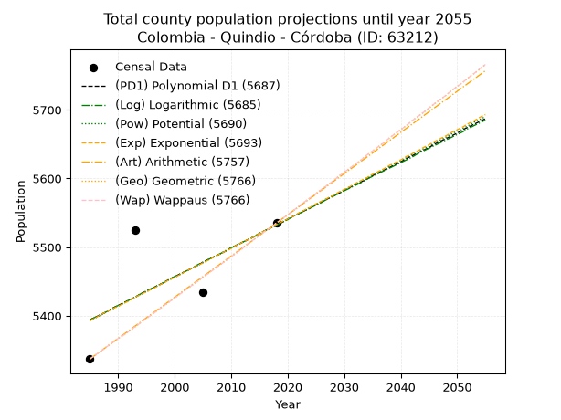
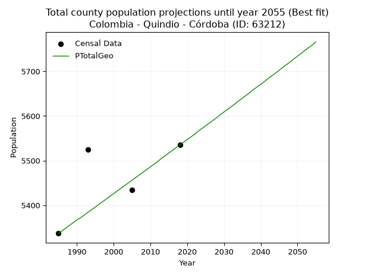
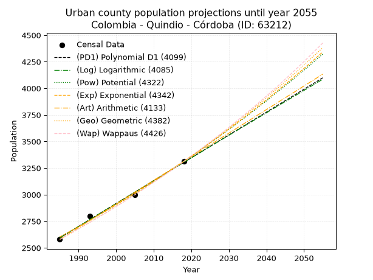
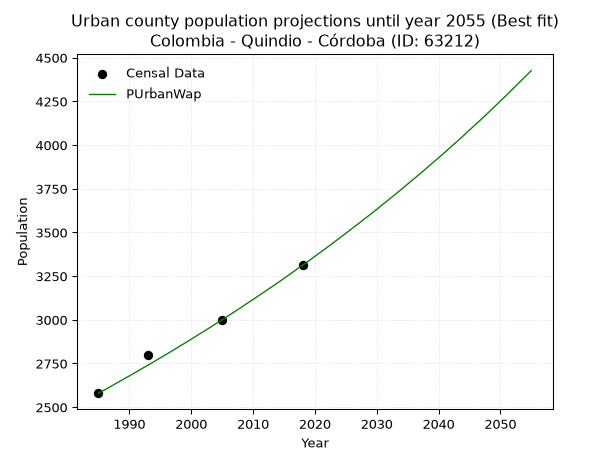
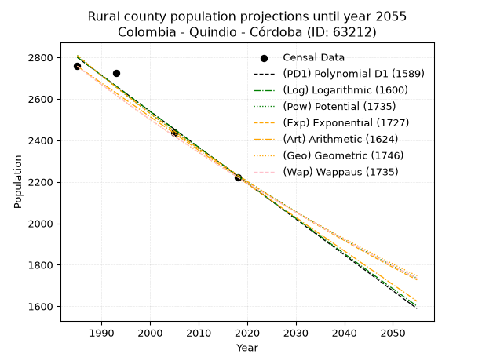
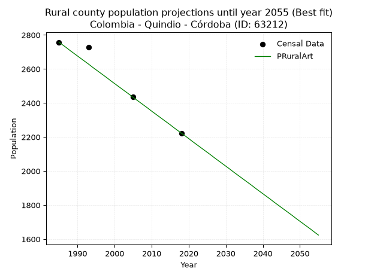

<div align="center">


</div>

# 📜 _“Population and Public Services Demand Projections (PPSD) until Year 2050 for Colombia - Quindio - Córdoba (ID: 63212)”_
Keywords: `population` `public-service` `projection` `lineal` `polynomial` `logarithmic` `potential` `exponential` `arithmetic` `geometric` `wappaus` `dane` `colombia` `south-america`

PPSD are analytical estimates used by governments and planners to anticipate future changes in population size, age distribution, and the resulting community needs for utilities, healthcare, education, and infrastructure as sizing future water treatment facilities, electrical grids, and road networks based on spatial growth.

<div align="center">

</img>

</div>


> **General running parameters**: • app_version: _v20260806_. • Python version: _3.14.7_. • Pandas version: _3.0.5_. • NumPy version: _2.5.1_. • Creates, save and include plots into reports (create_plot): _False_. • Projection until year: _2050_. • Process polynomial degree 2 and up: _False_. • Process Wappaus: _True_. • Process Wappaus: _True_. • Set negative values to zero: _True_. • Set infinite values to zero: _True_. • Drop dataset notes: _True_. 
<div align="center">

Dynamic map: [:earth_americas:Google](http://maps.google.com/maps?q=4.392485448,-75.6878663) [:earth_americas:OSM](https://www.openstreetmap.org/#map=18/4.392485448/-75.6878663&layers=P) [:earth_americas:Bing](https://www.bing.com/maps?cp=4.392485448~-75.6878663&lvl=18) [:earth_americas:Apple](https://maps.apple.com/frame?center=4.392485448%2C-75.6878663&span=0.003%2C0.006)

</div>


<div align="center">

```geojson
{
  "type": "Feature",
  "geometry": {
    "type": "Point", 
    "coordinates": [-75.6878663, 4.392485448]
  }, 
  "properties": {
    "Name": "Colombia - Quindio - Córdoba (ID: 63212)"
  }
}
```

</div>


## 0. Census Data (4 records)

Census data are official statistics collected by a government about the people and housing in a country. They usually include counts of total population, age, sex, race, income, education, and jobs.

📅Global census file: [Population.xlsx](../data/Population.xlsx)

| Source   |   Year |   CountryID | CountryName   |   StateID | StateName   |   CountyID | CountyName   |   PTotal |   PUrban |   PRural |
|:---------|-------:|------------:|:--------------|----------:|:------------|-----------:|:-------------|---------:|---------:|---------:|
| DANE     |   1985 |          57 | Colombia      |        63 | Quindio     |      63212 | Córdoba      |     5337 |     2580 |     2757 |
| DANE     |   1993 |          57 | Colombia      |        63 | Quindio     |      63212 | Córdoba      |     5525 |     2799 |     2726 |
| DANE     |   2005 |          57 | Colombia      |        63 | Quindio     |      63212 | Córdoba      |     5434 |     2997 |     2437 |
| DANE     |   2018 |          57 | Colombia      |        63 | Quindio     |      63212 | Córdoba      |     5535 |     3312 |     2223 |

> 🔥Some records could had specific notes about the registered values or the corresponding urban or rural distribution.

📅[SUI-RUPS](https://www.datos.gov.co/Hacienda-y-Cr-dito-P-blico/Registro-nico-de-Prestadores-de-Servicios-P-blicos/4qkq-csdn/about_data) - Local public utility companies: [RUPS.csv](../data/RUPS.xlsx)

 | SERVICIO       | ESTADO    | NOMBRE                                                          | NIT         | DEPARTAMENTO_DOMICILIO   | MUNICIPIO_DOMICILIO   | DIRECCION                  |   TELEFONO | EMAIL                  | TIPO_PRESTADOR                             | CLASIFICACION                 |
|:---------------|:----------|:----------------------------------------------------------------|:------------|:-------------------------|:----------------------|:---------------------------|-----------:|:-----------------------|:-------------------------------------------|:------------------------------|
| ACUEDUCTO      | OPERATIVA | EMPRESA DE SERVICIOS PUBLICOS DE CORDOBA QUINDIO  E.S.P. S.A.S. | 801001380-4 | QUINDIO                  | CORDOBA               | CRA 10 CALLE 14 ESQ piso 1 |    7545307 | esacor_esp@hotmail.com | SOCIEDADES (EMPRESA DE SERVICIOS PUBLICOS) | MENOR O IGUAL A 2500 USUARIOS |
| ALCANTARILLADO | OPERATIVA | EMPRESA DE SERVICIOS PUBLICOS DE CORDOBA QUINDIO  E.S.P. S.A.S. | 801001380-4 | QUINDIO                  | CORDOBA               | CRA 10 CALLE 14 ESQ piso 1 |    7545307 | esacor_esp@hotmail.com | SOCIEDADES (EMPRESA DE SERVICIOS PUBLICOS) | MENOR O IGUAL A 2500 USUARIOS |

## 1. Total

### 1.1. Coefficients and Parameters

* (PD1) Polynomial Deg 1: 4.1947009233238965, -2932.7005218786235 (lineal)
* (Log) Logarithmic: 8402.821933317438, -58412.166851134876
* (Pow) Potential: 1.5477639864964148, -1.3723196113418823
* (Exp) Exponential: 0.0007726359668047216, 1163.5357306082817
* (Art) Arithmetic: Year diff. 2018 - 1985 = 33, Population diff. 5535 - 5337 = 198, Annual growth = 6.0
* (Geo) Geometric: Year diff. 2018 - 1985 = 33, Population diff. 5535 - 5337 = 198, Annual growth % = 0.0011044843064360599
* (Wap) Wappaus: i = 0.11037527593818984, Condition values only valid for < 200)

<sub>
Wappaus condition values: ['0.00', '0.11', '0.22', '0.33', '0.44', '0.55', '0.66', '0.77', '0.88', '0.99', '1.10', '1.21', '1.32', '1.43', '1.55', '1.66', '1.77', '1.88', '1.99', '2.10', '2.21', '2.32', '2.43', '2.54', '2.65', '2.76', '2.87', '2.98', '3.09', '3.20', '3.31', '3.42', '3.53', '3.64', '3.75', '3.86', '3.97', '4.08', '4.19', '4.30', '4.42', '4.53', '4.64', '4.75', '4.86', '4.97', '5.08', '5.19', '5.30', '5.41', '5.52', '5.63', '5.74', '5.85', '5.96', '6.07', '6.18', '6.29', '6.40', '6.51', '6.62', '6.73', '6.84', '6.95', '7.06', '7.17']
</sub>


### 1.2. Projected Dataset

|   Year |   CountyID |   PTotalPD1 |   PTotalLog |   PTotalPow |   PTotalExp |   PTotalArt |   PTotalGeo |   PTotalWap |
|-------:|-----------:|------------:|------------:|------------:|------------:|------------:|------------:|------------:|
|   1985 |      63212 |        5394 |        5394 |        5393 |        5393 |        5337 |        5337 |        5337 |
|   1986 |      63212 |        5398 |        5398 |        5397 |        5397 |        5343 |        5343 |        5343 |
|   1987 |      63212 |        5402 |        5402 |        5401 |        5402 |        5349 |        5349 |        5349 |
|   1988 |      63212 |        5406 |        5406 |        5406 |        5406 |        5355 |        5355 |        5355 |
|   1989 |      63212 |        5411 |        5411 |        5410 |        5410 |        5361 |        5361 |        5361 |
|   1990 |      63212 |        5415 |        5415 |        5414 |        5414 |        5367 |        5367 |        5367 |
|   1991 |      63212 |        5419 |        5419 |        5418 |        5418 |        5373 |        5372 |        5372 |
|   1992 |      63212 |        5423 |        5423 |        5423 |        5422 |        5379 |        5378 |        5378 |
|   1993 |      63212 |        5427 |        5427 |        5427 |        5427 |        5385 |        5384 |        5384 |
|   1994 |      63212 |        5432 |        5432 |        5431 |        5431 |        5391 |        5390 |        5390 |
|   1995 |      63212 |        5436 |        5436 |        5435 |        5435 |        5397 |        5396 |        5396 |
|   1996 |      63212 |        5440 |        5440 |        5439 |        5439 |        5403 |        5402 |        5402 |
|   1997 |      63212 |        5444 |        5444 |        5444 |        5443 |        5409 |        5408 |        5408 |
|   1998 |      63212 |        5448 |        5448 |        5448 |        5448 |        5415 |        5414 |        5414 |
|   1999 |      63212 |        5453 |        5453 |        5452 |        5452 |        5421 |        5420 |        5420 |
|   2000 |      63212 |        5457 |        5457 |        5456 |        5456 |        5427 |        5426 |        5426 |
|   2001 |      63212 |        5461 |        5461 |        5460 |        5460 |        5433 |        5432 |        5432 |
|   2002 |      63212 |        5465 |        5465 |        5465 |        5465 |        5439 |        5438 |        5438 |
|   2003 |      63212 |        5469 |        5469 |        5469 |        5469 |        5445 |        5444 |        5444 |
|   2004 |      63212 |        5473 |        5474 |        5473 |        5473 |        5451 |        5450 |        5450 |
|   2005 |      63212 |        5478 |        5478 |        5477 |        5477 |        5457 |        5456 |        5456 |
|   2006 |      63212 |        5482 |        5482 |        5482 |        5481 |        5463 |        5462 |        5462 |
|   2007 |      63212 |        5486 |        5486 |        5486 |        5486 |        5469 |        5468 |        5468 |
|   2008 |      63212 |        5490 |        5490 |        5490 |        5490 |        5475 |        5474 |        5474 |
|   2009 |      63212 |        5494 |        5495 |        5494 |        5494 |        5481 |        5480 |        5480 |
|   2010 |      63212 |        5499 |        5499 |        5499 |        5498 |        5487 |        5486 |        5486 |
|   2011 |      63212 |        5503 |        5503 |        5503 |        5503 |        5493 |        5492 |        5492 |
|   2012 |      63212 |        5507 |        5507 |        5507 |        5507 |        5499 |        5498 |        5498 |
|   2013 |      63212 |        5511 |        5511 |        5511 |        5511 |        5505 |        5505 |        5505 |
|   2014 |      63212 |        5515 |        5515 |        5515 |        5515 |        5511 |        5511 |        5511 |
|   2015 |      63212 |        5520 |        5520 |        5520 |        5520 |        5517 |        5517 |        5517 |
|   2016 |      63212 |        5524 |        5524 |        5524 |        5524 |        5523 |        5523 |        5523 |
|   2017 |      63212 |        5528 |        5528 |        5528 |        5528 |        5529 |        5529 |        5529 |
|   2018 |      63212 |        5532 |        5532 |        5532 |        5533 |        5535 |        5535 |        5535 |
|   2019 |      63212 |        5536 |        5536 |        5537 |        5537 |        5541 |        5541 |        5541 |
|   2020 |      63212 |        5541 |        5540 |        5541 |        5541 |        5547 |        5547 |        5547 |
|   2021 |      63212 |        5545 |        5545 |        5545 |        5545 |        5553 |        5553 |        5553 |
|   2022 |      63212 |        5549 |        5549 |        5549 |        5550 |        5559 |        5559 |        5560 |
|   2023 |      63212 |        5553 |        5553 |        5554 |        5554 |        5565 |        5566 |        5566 |
|   2024 |      63212 |        5557 |        5557 |        5558 |        5558 |        5571 |        5572 |        5572 |
|   2025 |      63212 |        5562 |        5561 |        5562 |        5563 |        5577 |        5578 |        5578 |
|   2026 |      63212 |        5566 |        5565 |        5566 |        5567 |        5583 |        5584 |        5584 |
|   2027 |      63212 |        5570 |        5570 |        5571 |        5571 |        5589 |        5590 |        5590 |
|   2028 |      63212 |        5574 |        5574 |        5575 |        5575 |        5595 |        5596 |        5596 |
|   2029 |      63212 |        5578 |        5578 |        5579 |        5580 |        5601 |        5603 |        5603 |
|   2030 |      63212 |        5583 |        5582 |        5583 |        5584 |        5607 |        5609 |        5609 |
|   2031 |      63212 |        5587 |        5586 |        5588 |        5588 |        5613 |        5615 |        5615 |
|   2032 |      63212 |        5591 |        5590 |        5592 |        5593 |        5619 |        5621 |        5621 |
|   2033 |      63212 |        5595 |        5594 |        5596 |        5597 |        5625 |        5627 |        5627 |
|   2034 |      63212 |        5599 |        5599 |        5601 |        5601 |        5631 |        5634 |        5634 |
|   2035 |      63212 |        5604 |        5603 |        5605 |        5606 |        5637 |        5640 |        5640 |
|   2036 |      63212 |        5608 |        5607 |        5609 |        5610 |        5643 |        5646 |        5646 |
|   2037 |      63212 |        5612 |        5611 |        5613 |        5614 |        5649 |        5652 |        5652 |
|   2038 |      63212 |        5616 |        5615 |        5618 |        5619 |        5655 |        5659 |        5659 |
|   2039 |      63212 |        5620 |        5619 |        5622 |        5623 |        5661 |        5665 |        5665 |
|   2040 |      63212 |        5624 |        5623 |        5626 |        5627 |        5667 |        5671 |        5671 |
|   2041 |      63212 |        5629 |        5627 |        5630 |        5632 |        5673 |        5677 |        5677 |
|   2042 |      63212 |        5633 |        5631 |        5635 |        5636 |        5679 |        5684 |        5684 |
|   2043 |      63212 |        5637 |        5636 |        5639 |        5640 |        5685 |        5690 |        5690 |
|   2044 |      63212 |        5641 |        5640 |        5643 |        5645 |        5691 |        5696 |        5696 |
|   2045 |      63212 |        5645 |        5644 |        5647 |        5649 |        5697 |        5702 |        5703 |
|   2046 |      63212 |        5650 |        5648 |        5652 |        5654 |        5703 |        5709 |        5709 |
|   2047 |      63212 |        5654 |        5652 |        5656 |        5658 |        5709 |        5715 |        5715 |
|   2048 |      63212 |        5658 |        5656 |        5660 |        5662 |        5715 |        5721 |        5721 |
|   2049 |      63212 |        5662 |        5660 |        5665 |        5667 |        5721 |        5728 |        5728 |
|   2050 |      63212 |        5666 |        5664 |        5669 |        5671 |        5727 |        5734 |        5734 |
<div align="center">

</img>

</div>


### 1.3. Best fit with absolute and relative error (%)

Relative error puts that difference into context by dividing the absolute error by the true value, creating a unitless ratio or percentage that shows the scale of the mistake.

Absolute and relative error

|   Year | Source   |   CountryID | CountryName   |   StateID | StateName   |   CountyID_x | CountyName   |   PTotal |   PUrban |   PRural |   CountyID_y |   PTotalPD1 |   PTotalLog |   PTotalPow |   PTotalExp |   PTotalArt |   PTotalGeo |   PTotalWap |   PTotalPD1AbsError |   PTotalLogAbsError |   PTotalPowAbsError |   PTotalExpAbsError |   PTotalArtAbsError |   PTotalGeoAbsError |   PTotalWapAbsError |   PTotalPD1RelError |   PTotalLogRelError |   PTotalPowRelError |   PTotalExpRelError |   PTotalArtRelError |   PTotalGeoRelError |   PTotalWapRelError |
|-------:|:---------|------------:|:--------------|----------:|:------------|-------------:|:-------------|---------:|---------:|---------:|-------------:|------------:|------------:|------------:|------------:|------------:|------------:|------------:|--------------------:|--------------------:|--------------------:|--------------------:|--------------------:|--------------------:|--------------------:|--------------------:|--------------------:|--------------------:|--------------------:|--------------------:|--------------------:|--------------------:|
|   1985 | DANE     |          57 | Colombia      |        63 | Quindio     |        63212 | Córdoba      |     5337 |     2580 |     2757 |        63212 |        5394 |        5394 |        5393 |        5393 |        5337 |        5337 |        5337 |                  57 |                  57 |                  56 |                  56 |                   0 |                   0 |                   0 |           1.06802   |           1.06802   |           1.04928   |           1.04928   |            0        |            0        |            0        |
|   1993 | DANE     |          57 | Colombia      |        63 | Quindio     |        63212 | Córdoba      |     5525 |     2799 |     2726 |        63212 |        5427 |        5427 |        5427 |        5427 |        5385 |        5384 |        5384 |                  98 |                  98 |                  98 |                  98 |                 140 |                 141 |                 141 |           1.77376   |           1.77376   |           1.77376   |           1.77376   |            2.53394  |            2.55204  |            2.55204  |
|   2005 | DANE     |          57 | Colombia      |        63 | Quindio     |        63212 | Córdoba      |     5434 |     2997 |     2437 |        63212 |        5478 |        5478 |        5477 |        5477 |        5457 |        5456 |        5456 |                  44 |                  44 |                  43 |                  43 |                  23 |                  22 |                  22 |           0.809717  |           0.809717  |           0.791314  |           0.791314  |            0.423261 |            0.404858 |            0.404858 |
|   2018 | DANE     |          57 | Colombia      |        63 | Quindio     |        63212 | Córdoba      |     5535 |     3312 |     2223 |        63212 |        5532 |        5532 |        5532 |        5533 |        5535 |        5535 |        5535 |                   3 |                   3 |                   3 |                   2 |                   0 |                   0 |                   0 |           0.0542005 |           0.0542005 |           0.0542005 |           0.0361337 |            0        |            0        |            0        |

Relative error mean

| Method    |   RelError | Best   |
|:----------|-----------:|:-------|
| PTotalPD1 |   0.926422 |        |
| PTotalLog |   0.926422 |        |
| PTotalPow |   0.917137 |        |
| PTotalExp |   0.91262  |        |
| PTotalArt |   0.739299 |        |
| PTotalGeo |   0.739224 | True   |
| PTotalWap |   0.739224 | True   |

💙Best method: _**PTotalGeo**_
<div align="center">

</img>

</div>


### 1.4. Fresh water supply demand in liters per capita per day (lpcd)

The fresh water supply demand typically ranges from 100 to 300 liters per capita per day (lpcd) for standard domestic and municipal planning, though absolute survival minimums set by the World Health Organization are as low as 7.5 to 20 liters per day, and total consumption in high-income nations can exceed 400 liters.

> `CZ`: Level in meters above the sea level (masl)<br> `WS`: Fresh water supply demand in liters per capita per day (lpcd or l/h/d)<br> `WSAll`: Zonal fresh water supply demand in liters per second (l/s)<br> `A`: Zonal area in square meters<br> `DP`: Population density (people/hectare or p/ha)

Reference values (RAS Colombia)

|    CZ |   WS |
|------:|-----:|
|  1000 |  120 |
|  2000 |  130 |
| 99999 |  140 |

County shapefile geometry properties and water supply values

|   CountyID |      ATotal |   CZTotal |   WSTotal |
|-----------:|------------:|----------:|----------:|
|      63212 | 9.38003e+07 |   2342.84 |       140 |

Projected values for best method: PTotalGeo

|   CountyID |   Year |   PTotalGeo |   DPTotal |   WSTotal |   WSTotalAll |
|-----------:|-------:|------------:|----------:|----------:|-------------:|
|      63212 |   1985 |        5337 |      0.57 |       140 |      8.64792 |
|      63212 |   1986 |        5343 |      0.57 |       140 |      8.65764 |
|      63212 |   1987 |        5349 |      0.57 |       140 |      8.66736 |
|      63212 |   1988 |        5355 |      0.57 |       140 |      8.67708 |
|      63212 |   1989 |        5361 |      0.57 |       140 |      8.68681 |
|      63212 |   1990 |        5367 |      0.57 |       140 |      8.69653 |
|      63212 |   1991 |        5372 |      0.57 |       140 |      8.70463 |
|      63212 |   1992 |        5378 |      0.57 |       140 |      8.71435 |
|      63212 |   1993 |        5384 |      0.57 |       140 |      8.72407 |
|      63212 |   1994 |        5390 |      0.57 |       140 |      8.7338  |
|      63212 |   1995 |        5396 |      0.58 |       140 |      8.74352 |
|      63212 |   1996 |        5402 |      0.58 |       140 |      8.75324 |
|      63212 |   1997 |        5408 |      0.58 |       140 |      8.76296 |
|      63212 |   1998 |        5414 |      0.58 |       140 |      8.77269 |
|      63212 |   1999 |        5420 |      0.58 |       140 |      8.78241 |
|      63212 |   2000 |        5426 |      0.58 |       140 |      8.79213 |
|      63212 |   2001 |        5432 |      0.58 |       140 |      8.80185 |
|      63212 |   2002 |        5438 |      0.58 |       140 |      8.81157 |
|      63212 |   2003 |        5444 |      0.58 |       140 |      8.8213  |
|      63212 |   2004 |        5450 |      0.58 |       140 |      8.83102 |
|      63212 |   2005 |        5456 |      0.58 |       140 |      8.84074 |
|      63212 |   2006 |        5462 |      0.58 |       140 |      8.85046 |
|      63212 |   2007 |        5468 |      0.58 |       140 |      8.86019 |
|      63212 |   2008 |        5474 |      0.58 |       140 |      8.86991 |
|      63212 |   2009 |        5480 |      0.58 |       140 |      8.87963 |
|      63212 |   2010 |        5486 |      0.58 |       140 |      8.88935 |
|      63212 |   2011 |        5492 |      0.59 |       140 |      8.89907 |
|      63212 |   2012 |        5498 |      0.59 |       140 |      8.9088  |
|      63212 |   2013 |        5505 |      0.59 |       140 |      8.92014 |
|      63212 |   2014 |        5511 |      0.59 |       140 |      8.92986 |
|      63212 |   2015 |        5517 |      0.59 |       140 |      8.93958 |
|      63212 |   2016 |        5523 |      0.59 |       140 |      8.94931 |
|      63212 |   2017 |        5529 |      0.59 |       140 |      8.95903 |
|      63212 |   2018 |        5535 |      0.59 |       140 |      8.96875 |
|      63212 |   2019 |        5541 |      0.59 |       140 |      8.97847 |
|      63212 |   2020 |        5547 |      0.59 |       140 |      8.98819 |
|      63212 |   2021 |        5553 |      0.59 |       140 |      8.99792 |
|      63212 |   2022 |        5559 |      0.59 |       140 |      9.00764 |
|      63212 |   2023 |        5566 |      0.59 |       140 |      9.01898 |
|      63212 |   2024 |        5572 |      0.59 |       140 |      9.0287  |
|      63212 |   2025 |        5578 |      0.59 |       140 |      9.03843 |
|      63212 |   2026 |        5584 |      0.6  |       140 |      9.04815 |
|      63212 |   2027 |        5590 |      0.6  |       140 |      9.05787 |
|      63212 |   2028 |        5596 |      0.6  |       140 |      9.06759 |
|      63212 |   2029 |        5603 |      0.6  |       140 |      9.07894 |
|      63212 |   2030 |        5609 |      0.6  |       140 |      9.08866 |
|      63212 |   2031 |        5615 |      0.6  |       140 |      9.09838 |
|      63212 |   2032 |        5621 |      0.6  |       140 |      9.1081  |
|      63212 |   2033 |        5627 |      0.6  |       140 |      9.11782 |
|      63212 |   2034 |        5634 |      0.6  |       140 |      9.12917 |
|      63212 |   2035 |        5640 |      0.6  |       140 |      9.13889 |
|      63212 |   2036 |        5646 |      0.6  |       140 |      9.14861 |
|      63212 |   2037 |        5652 |      0.6  |       140 |      9.15833 |
|      63212 |   2038 |        5659 |      0.6  |       140 |      9.16968 |
|      63212 |   2039 |        5665 |      0.6  |       140 |      9.1794  |
|      63212 |   2040 |        5671 |      0.6  |       140 |      9.18912 |
|      63212 |   2041 |        5677 |      0.61 |       140 |      9.19884 |
|      63212 |   2042 |        5684 |      0.61 |       140 |      9.21019 |
|      63212 |   2043 |        5690 |      0.61 |       140 |      9.21991 |
|      63212 |   2044 |        5696 |      0.61 |       140 |      9.22963 |
|      63212 |   2045 |        5702 |      0.61 |       140 |      9.23935 |
|      63212 |   2046 |        5709 |      0.61 |       140 |      9.25069 |
|      63212 |   2047 |        5715 |      0.61 |       140 |      9.26042 |
|      63212 |   2048 |        5721 |      0.61 |       140 |      9.27014 |
|      63212 |   2049 |        5728 |      0.61 |       140 |      9.28148 |
|      63212 |   2050 |        5734 |      0.61 |       140 |      9.2912  |

## 2. Urban

### 2.1. Coefficients and Parameters

* (PD1) Polynomial Deg 1: 21.494981934965658, -40073.337615415054 (lineal)
* (Log) Logarithmic: 43024.440068241114, -324107.1137349255
* (Pow) Potential: 14.639379626624944, -44.86185243765319
* (Exp) Exponential: 0.007313157499429368, 0.0012910052497940997
* (Art) Arithmetic: Year diff. 2018 - 1985 = 33, Population diff. 3312 - 2580 = 732, Annual growth = 22.181818181818183
* (Geo) Geometric: Year diff. 2018 - 1985 = 33, Population diff. 3312 - 2580 = 732, Annual growth % = 0.0075972848639671575
* (Wap) Wappaus: i = 0.7529469851262112, Condition values only valid for < 200)

<sub>
Wappaus condition values: ['0.00', '0.75', '1.51', '2.26', '3.01', '3.76', '4.52', '5.27', '6.02', '6.78', '7.53', '8.28', '9.04', '9.79', '10.54', '11.29', '12.05', '12.80', '13.55', '14.31', '15.06', '15.81', '16.56', '17.32', '18.07', '18.82', '19.58', '20.33', '21.08', '21.84', '22.59', '23.34', '24.09', '24.85', '25.60', '26.35', '27.11', '27.86', '28.61', '29.36', '30.12', '30.87', '31.62', '32.38', '33.13', '33.88', '34.64', '35.39', '36.14', '36.89', '37.65', '38.40', '39.15', '39.91', '40.66', '41.41', '42.17', '42.92', '43.67', '44.42', '45.18', '45.93', '46.68', '47.44', '48.19', '48.94']
</sub>


### 2.2. Projected Dataset

|   Year |   CountyID |   PUrbanPD1 |   PUrbanLog |   PUrbanPow |   PUrbanExp |   PUrbanArt |   PUrbanGeo |   PUrbanWap |
|-------:|-----------:|------------:|------------:|------------:|------------:|------------:|------------:|------------:|
|   1985 |      63212 |        2594 |        2594 |        2602 |        2603 |        2580 |        2580 |        2580 |
|   1986 |      63212 |        2616 |        2615 |        2621 |        2622 |        2602 |        2600 |        2599 |
|   1987 |      63212 |        2637 |        2637 |        2641 |        2641 |        2624 |        2619 |        2619 |
|   1988 |      63212 |        2659 |        2659 |        2660 |        2660 |        2647 |        2639 |        2639 |
|   1989 |      63212 |        2680 |        2680 |        2680 |        2680 |        2669 |        2659 |        2659 |
|   1990 |      63212 |        2702 |        2702 |        2700 |        2700 |        2691 |        2680 |        2679 |
|   1991 |      63212 |        2723 |        2723 |        2720 |        2719 |        2713 |        2700 |        2699 |
|   1992 |      63212 |        2745 |        2745 |        2740 |        2739 |        2735 |        2720 |        2720 |
|   1993 |      63212 |        2766 |        2767 |        2760 |        2759 |        2757 |        2741 |        2740 |
|   1994 |      63212 |        2788 |        2788 |        2780 |        2780 |        2780 |        2762 |        2761 |
|   1995 |      63212 |        2809 |        2810 |        2801 |        2800 |        2802 |        2783 |        2782 |
|   1996 |      63212 |        2831 |        2831 |        2821 |        2821 |        2824 |        2804 |        2803 |
|   1997 |      63212 |        2852 |        2853 |        2842 |        2841 |        2846 |        2825 |        2824 |
|   1998 |      63212 |        2874 |        2874 |        2863 |        2862 |        2868 |        2847 |        2846 |
|   1999 |      63212 |        2895 |        2896 |        2884 |        2883 |        2891 |        2868 |        2867 |
|   2000 |      63212 |        2917 |        2917 |        2905 |        2904 |        2913 |        2890 |        2889 |
|   2001 |      63212 |        2938 |        2939 |        2927 |        2926 |        2935 |        2912 |        2911 |
|   2002 |      63212 |        2960 |        2960 |        2948 |        2947 |        2957 |        2934 |        2933 |
|   2003 |      63212 |        2981 |        2982 |        2970 |        2969 |        2979 |        2957 |        2955 |
|   2004 |      63212 |        3003 |        3003 |        2991 |        2991 |        3001 |        2979 |        2978 |
|   2005 |      63212 |        3024 |        3025 |        3013 |        3013 |        3024 |        3002 |        3000 |
|   2006 |      63212 |        3046 |        3046 |        3035 |        3035 |        3046 |        3024 |        3023 |
|   2007 |      63212 |        3067 |        3068 |        3058 |        3057 |        3068 |        3047 |        3046 |
|   2008 |      63212 |        3089 |        3089 |        3080 |        3079 |        3090 |        3071 |        3069 |
|   2009 |      63212 |        3110 |        3111 |        3103 |        3102 |        3112 |        3094 |        3093 |
|   2010 |      63212 |        3132 |        3132 |        3125 |        3125 |        3135 |        3117 |        3116 |
|   2011 |      63212 |        3153 |        3153 |        3148 |        3148 |        3157 |        3141 |        3140 |
|   2012 |      63212 |        3175 |        3175 |        3171 |        3171 |        3179 |        3165 |        3164 |
|   2013 |      63212 |        3196 |        3196 |        3194 |        3194 |        3201 |        3189 |        3188 |
|   2014 |      63212 |        3218 |        3218 |        3218 |        3218 |        3223 |        3213 |        3212 |
|   2015 |      63212 |        3239 |        3239 |        3241 |        3241 |        3245 |        3238 |        3237 |
|   2016 |      63212 |        3261 |        3260 |        3265 |        3265 |        3268 |        3262 |        3262 |
|   2017 |      63212 |        3282 |        3282 |        3288 |        3289 |        3290 |        3287 |        3287 |
|   2018 |      63212 |        3304 |        3303 |        3312 |        3313 |        3312 |        3312 |        3312 |
|   2019 |      63212 |        3325 |        3324 |        3337 |        3337 |        3334 |        3337 |        3337 |
|   2020 |      63212 |        3347 |        3346 |        3361 |        3362 |        3356 |        3363 |        3363 |
|   2021 |      63212 |        3368 |        3367 |        3385 |        3387 |        3379 |        3388 |        3389 |
|   2022 |      63212 |        3390 |        3388 |        3410 |        3411 |        3401 |        3414 |        3415 |
|   2023 |      63212 |        3411 |        3409 |        3435 |        3436 |        3423 |        3440 |        3441 |
|   2024 |      63212 |        3433 |        3431 |        3460 |        3462 |        3445 |        3466 |        3468 |
|   2025 |      63212 |        3454 |        3452 |        3485 |        3487 |        3467 |        3492 |        3495 |
|   2026 |      63212 |        3475 |        3473 |        3510 |        3513 |        3489 |        3519 |        3522 |
|   2027 |      63212 |        3497 |        3494 |        3535 |        3538 |        3512 |        3545 |        3549 |
|   2028 |      63212 |        3518 |        3516 |        3561 |        3564 |        3534 |        3572 |        3577 |
|   2029 |      63212 |        3540 |        3537 |        3587 |        3591 |        3556 |        3600 |        3604 |
|   2030 |      63212 |        3561 |        3558 |        3613 |        3617 |        3578 |        3627 |        3632 |
|   2031 |      63212 |        3583 |        3579 |        3639 |        3643 |        3600 |        3654 |        3661 |
|   2032 |      63212 |        3604 |        3600 |        3665 |        3670 |        3623 |        3682 |        3689 |
|   2033 |      63212 |        3626 |        3622 |        3692 |        3697 |        3645 |        3710 |        3718 |
|   2034 |      63212 |        3647 |        3643 |        3718 |        3724 |        3667 |        3738 |        3747 |
|   2035 |      63212 |        3669 |        3664 |        3745 |        3752 |        3689 |        3767 |        3777 |
|   2036 |      63212 |        3690 |        3685 |        3772 |        3779 |        3711 |        3795 |        3806 |
|   2037 |      63212 |        3712 |        3706 |        3799 |        3807 |        3733 |        3824 |        3836 |
|   2038 |      63212 |        3733 |        3727 |        3827 |        3835 |        3756 |        3853 |        3866 |
|   2039 |      63212 |        3755 |        3748 |        3854 |        3863 |        3778 |        3883 |        3897 |
|   2040 |      63212 |        3776 |        3769 |        3882 |        3891 |        3800 |        3912 |        3927 |
|   2041 |      63212 |        3798 |        3791 |        3910 |        3920 |        3822 |        3942 |        3958 |
|   2042 |      63212 |        3819 |        3812 |        3938 |        3949 |        3844 |        3972 |        3990 |
|   2043 |      63212 |        3841 |        3833 |        3967 |        3978 |        3867 |        4002 |        4021 |
|   2044 |      63212 |        3862 |        3854 |        3995 |        4007 |        3889 |        4032 |        4053 |
|   2045 |      63212 |        3884 |        3875 |        4024 |        4036 |        3911 |        4063 |        4086 |
|   2046 |      63212 |        3905 |        3896 |        4053 |        4066 |        3933 |        4094 |        4118 |
|   2047 |      63212 |        3927 |        3917 |        4082 |        4096 |        3955 |        4125 |        4151 |
|   2048 |      63212 |        3948 |        3938 |        4111 |        4126 |        3977 |        4156 |        4184 |
|   2049 |      63212 |        3970 |        3959 |        4141 |        4156 |        4000 |        4188 |        4218 |
|   2050 |      63212 |        3991 |        3980 |        4170 |        4187 |        4022 |        4220 |        4252 |
<div align="center">

</img>

</div>


### 2.3. Best fit with absolute and relative error (%)

Relative error puts that difference into context by dividing the absolute error by the true value, creating a unitless ratio or percentage that shows the scale of the mistake.

Absolute and relative error

|   Year | Source   |   CountryID | CountryName   |   StateID | StateName   |   CountyID_x | CountyName   |   PTotal |   PUrban |   PRural |   CountyID_y |   PUrbanPD1 |   PUrbanLog |   PUrbanPow |   PUrbanExp |   PUrbanArt |   PUrbanGeo |   PUrbanWap |   PUrbanPD1AbsError |   PUrbanLogAbsError |   PUrbanPowAbsError |   PUrbanExpAbsError |   PUrbanArtAbsError |   PUrbanGeoAbsError |   PUrbanWapAbsError |   PUrbanPD1RelError |   PUrbanLogRelError |   PUrbanPowRelError |   PUrbanExpRelError |   PUrbanArtRelError |   PUrbanGeoRelError |   PUrbanWapRelError |
|-------:|:---------|------------:|:--------------|----------:|:------------|-------------:|:-------------|---------:|---------:|---------:|-------------:|------------:|------------:|------------:|------------:|------------:|------------:|------------:|--------------------:|--------------------:|--------------------:|--------------------:|--------------------:|--------------------:|--------------------:|--------------------:|--------------------:|--------------------:|--------------------:|--------------------:|--------------------:|--------------------:|
|   1985 | DANE     |          57 | Colombia      |        63 | Quindio     |        63212 | Córdoba      |     5337 |     2580 |     2757 |        63212 |        2594 |        2594 |        2602 |        2603 |        2580 |        2580 |        2580 |                  14 |                  14 |                  22 |                  23 |                   0 |                   0 |                   0 |            0.542636 |            0.542636 |            0.852713 |           0.891473  |            0        |            0        |              0      |
|   1993 | DANE     |          57 | Colombia      |        63 | Quindio     |        63212 | Córdoba      |     5525 |     2799 |     2726 |        63212 |        2766 |        2767 |        2760 |        2759 |        2757 |        2741 |        2740 |                  33 |                  32 |                  39 |                  40 |                  42 |                  58 |                  59 |            1.17899  |            1.14327  |            1.39335  |           1.42908   |            1.50054  |            2.07217  |              2.1079 |
|   2005 | DANE     |          57 | Colombia      |        63 | Quindio     |        63212 | Córdoba      |     5434 |     2997 |     2437 |        63212 |        3024 |        3025 |        3013 |        3013 |        3024 |        3002 |        3000 |                  27 |                  28 |                  16 |                  16 |                  27 |                   5 |                   3 |            0.900901 |            0.934268 |            0.533867 |           0.533867  |            0.900901 |            0.166834 |              0.1001 |
|   2018 | DANE     |          57 | Colombia      |        63 | Quindio     |        63212 | Córdoba      |     5535 |     3312 |     2223 |        63212 |        3304 |        3303 |        3312 |        3313 |        3312 |        3312 |        3312 |                   8 |                   9 |                   0 |                   1 |                   0 |                   0 |                   0 |            0.241546 |            0.271739 |            0        |           0.0301932 |            0        |            0        |              0      |

Relative error mean

| Method    |   RelError | Best   |
|:----------|-----------:|:-------|
| PUrbanPD1 |   0.716019 |        |
| PUrbanLog |   0.722977 |        |
| PUrbanPow |   0.694984 |        |
| PUrbanExp |   0.721154 |        |
| PUrbanArt |   0.600359 |        |
| PUrbanGeo |   0.559751 |        |
| PUrbanWap |   0.551999 | True   |

💙Best method: _**PUrbanWap**_
<div align="center">

</img>

</div>


### 2.4. Fresh water supply demand in liters per capita per day (lpcd)

The fresh water supply demand typically ranges from 100 to 300 liters per capita per day (lpcd) for standard domestic and municipal planning, though absolute survival minimums set by the World Health Organization are as low as 7.5 to 20 liters per day, and total consumption in high-income nations can exceed 400 liters.

> `CZ`: Level in meters above the sea level (masl)<br> `WS`: Fresh water supply demand in liters per capita per day (lpcd or l/h/d)<br> `WSAll`: Zonal fresh water supply demand in liters per second (l/s)<br> `A`: Zonal area in square meters<br> `DP`: Population density (people/hectare or p/ha)

Reference values (RAS Colombia)

|    CZ |   WS |
|------:|-----:|
|  1000 |  120 |
|  2000 |  130 |
| 99999 |  140 |

County shapefile geometry properties and water supply values

|   CountyID |   AUrban |   CZUrban |   WSUrban |
|-----------:|---------:|----------:|----------:|
|      63212 |   470945 |   1498.08 |       130 |

Projected values for best method: PUrbanWap

|   CountyID |   Year |   PUrbanWap |   DPUrban |   WSUrban |   WSUrbanAll |
|-----------:|-------:|------------:|----------:|----------:|-------------:|
|      63212 |   1985 |        2580 |     54.78 |       130 |      3.88194 |
|      63212 |   1986 |        2599 |     55.19 |       130 |      3.91053 |
|      63212 |   1987 |        2619 |     55.61 |       130 |      3.94062 |
|      63212 |   1988 |        2639 |     56.04 |       130 |      3.97072 |
|      63212 |   1989 |        2659 |     56.46 |       130 |      4.00081 |
|      63212 |   1990 |        2679 |     56.89 |       130 |      4.0309  |
|      63212 |   1991 |        2699 |     57.31 |       130 |      4.061   |
|      63212 |   1992 |        2720 |     57.76 |       130 |      4.09259 |
|      63212 |   1993 |        2740 |     58.18 |       130 |      4.12269 |
|      63212 |   1994 |        2761 |     58.63 |       130 |      4.15428 |
|      63212 |   1995 |        2782 |     59.07 |       130 |      4.18588 |
|      63212 |   1996 |        2803 |     59.52 |       130 |      4.21748 |
|      63212 |   1997 |        2824 |     59.96 |       130 |      4.24907 |
|      63212 |   1998 |        2846 |     60.43 |       130 |      4.28218 |
|      63212 |   1999 |        2867 |     60.88 |       130 |      4.31377 |
|      63212 |   2000 |        2889 |     61.34 |       130 |      4.34687 |
|      63212 |   2001 |        2911 |     61.81 |       130 |      4.37998 |
|      63212 |   2002 |        2933 |     62.28 |       130 |      4.41308 |
|      63212 |   2003 |        2955 |     62.75 |       130 |      4.44618 |
|      63212 |   2004 |        2978 |     63.23 |       130 |      4.48079 |
|      63212 |   2005 |        3000 |     63.7  |       130 |      4.51389 |
|      63212 |   2006 |        3023 |     64.19 |       130 |      4.5485  |
|      63212 |   2007 |        3046 |     64.68 |       130 |      4.5831  |
|      63212 |   2008 |        3069 |     65.17 |       130 |      4.61771 |
|      63212 |   2009 |        3093 |     65.68 |       130 |      4.65382 |
|      63212 |   2010 |        3116 |     66.16 |       130 |      4.68843 |
|      63212 |   2011 |        3140 |     66.67 |       130 |      4.72454 |
|      63212 |   2012 |        3164 |     67.18 |       130 |      4.76065 |
|      63212 |   2013 |        3188 |     67.69 |       130 |      4.79676 |
|      63212 |   2014 |        3212 |     68.2  |       130 |      4.83287 |
|      63212 |   2015 |        3237 |     68.73 |       130 |      4.87049 |
|      63212 |   2016 |        3262 |     69.27 |       130 |      4.9081  |
|      63212 |   2017 |        3287 |     69.8  |       130 |      4.94572 |
|      63212 |   2018 |        3312 |     70.33 |       130 |      4.98333 |
|      63212 |   2019 |        3337 |     70.86 |       130 |      5.02095 |
|      63212 |   2020 |        3363 |     71.41 |       130 |      5.06007 |
|      63212 |   2021 |        3389 |     71.96 |       130 |      5.09919 |
|      63212 |   2022 |        3415 |     72.51 |       130 |      5.13831 |
|      63212 |   2023 |        3441 |     73.07 |       130 |      5.17743 |
|      63212 |   2024 |        3468 |     73.64 |       130 |      5.21806 |
|      63212 |   2025 |        3495 |     74.21 |       130 |      5.25868 |
|      63212 |   2026 |        3522 |     74.79 |       130 |      5.29931 |
|      63212 |   2027 |        3549 |     75.36 |       130 |      5.33993 |
|      63212 |   2028 |        3577 |     75.95 |       130 |      5.38206 |
|      63212 |   2029 |        3604 |     76.53 |       130 |      5.42269 |
|      63212 |   2030 |        3632 |     77.12 |       130 |      5.46481 |
|      63212 |   2031 |        3661 |     77.74 |       130 |      5.50845 |
|      63212 |   2032 |        3689 |     78.33 |       130 |      5.55058 |
|      63212 |   2033 |        3718 |     78.95 |       130 |      5.59421 |
|      63212 |   2034 |        3747 |     79.56 |       130 |      5.63785 |
|      63212 |   2035 |        3777 |     80.2  |       130 |      5.68299 |
|      63212 |   2036 |        3806 |     80.82 |       130 |      5.72662 |
|      63212 |   2037 |        3836 |     81.45 |       130 |      5.77176 |
|      63212 |   2038 |        3866 |     82.09 |       130 |      5.8169  |
|      63212 |   2039 |        3897 |     82.75 |       130 |      5.86354 |
|      63212 |   2040 |        3927 |     83.39 |       130 |      5.90868 |
|      63212 |   2041 |        3958 |     84.04 |       130 |      5.95532 |
|      63212 |   2042 |        3990 |     84.72 |       130 |      6.00347 |
|      63212 |   2043 |        4021 |     85.38 |       130 |      6.05012 |
|      63212 |   2044 |        4053 |     86.06 |       130 |      6.09826 |
|      63212 |   2045 |        4086 |     86.76 |       130 |      6.14792 |
|      63212 |   2046 |        4118 |     87.44 |       130 |      6.19606 |
|      63212 |   2047 |        4151 |     88.14 |       130 |      6.24572 |
|      63212 |   2048 |        4184 |     88.84 |       130 |      6.29537 |
|      63212 |   2049 |        4218 |     89.56 |       130 |      6.34653 |
|      63212 |   2050 |        4252 |     90.29 |       130 |      6.39769 |

## 3. Rural

### 3.1. Coefficients and Parameters

* (PD1) Polynomial Deg 1: -17.300281011641744, 37140.637093536396 (lineal)
* (Log) Logarithmic: -34621.61813492362, 265694.94688379025
* (Pow) Potential: -13.898889430372801, 49.28372746439228
* (Exp) Exponential: -0.006945594507247059, 2729356381.9983544
* (Art) Arithmetic: Year diff. 2018 - 1985 = 33, Population diff. 2223 - 2757 = -534, Annual growth = -16.181818181818183
* (Geo) Geometric: Year diff. 2018 - 1985 = 33, Population diff. 2223 - 2757 = -534, Annual growth % = -0.0065025691389315465
* (Wap) Wappaus: i = -0.6498722161372764, Condition values only valid for < 200)

<sub>
Wappaus condition values: ['-0.00', '-0.65', '-1.30', '-1.95', '-2.60', '-3.25', '-3.90', '-4.55', '-5.20', '-5.85', '-6.50', '-7.15', '-7.80', '-8.45', '-9.10', '-9.75', '-10.40', '-11.05', '-11.70', '-12.35', '-13.00', '-13.65', '-14.30', '-14.95', '-15.60', '-16.25', '-16.90', '-17.55', '-18.20', '-18.85', '-19.50', '-20.15', '-20.80', '-21.45', '-22.10', '-22.75', '-23.40', '-24.05', '-24.70', '-25.35', '-25.99', '-26.64', '-27.29', '-27.94', '-28.59', '-29.24', '-29.89', '-30.54', '-31.19', '-31.84', '-32.49', '-33.14', '-33.79', '-34.44', '-35.09', '-35.74', '-36.39', '-37.04', '-37.69', '-38.34', '-38.99', '-39.64', '-40.29', '-40.94', '-41.59', '-42.24']
</sub>


### 3.2. Projected Dataset

|   Year |   CountyID |   PRuralPD1 |   PRuralLog |   PRuralPow |   PRuralExp |   PRuralArt |   PRuralGeo |   PRuralWap |
|-------:|-----------:|------------:|------------:|------------:|------------:|------------:|------------:|------------:|
|   1985 |      63212 |        2800 |        2800 |        2809 |        2808 |        2757 |        2757 |        2757 |
|   1986 |      63212 |        2782 |        2783 |        2789 |        2789 |        2741 |        2739 |        2739 |
|   1987 |      63212 |        2765 |        2765 |        2770 |        2770 |        2725 |        2721 |        2721 |
|   1988 |      63212 |        2748 |        2748 |        2750 |        2750 |        2708 |        2704 |        2704 |
|   1989 |      63212 |        2730 |        2730 |        2731 |        2731 |        2692 |        2686 |        2686 |
|   1990 |      63212 |        2713 |        2713 |        2712 |        2712 |        2676 |        2669 |        2669 |
|   1991 |      63212 |        2696 |        2696 |        2693 |        2694 |        2660 |        2651 |        2652 |
|   1992 |      63212 |        2678 |        2678 |        2675 |        2675 |        2644 |        2634 |        2634 |
|   1993 |      63212 |        2661 |        2661 |        2656 |        2656 |        2628 |        2617 |        2617 |
|   1994 |      63212 |        2644 |        2643 |        2638 |        2638 |        2611 |        2600 |        2600 |
|   1995 |      63212 |        2627 |        2626 |        2619 |        2620 |        2595 |        2583 |        2583 |
|   1996 |      63212 |        2609 |        2609 |        2601 |        2602 |        2579 |        2566 |        2567 |
|   1997 |      63212 |        2592 |        2591 |        2583 |        2584 |        2563 |        2549 |        2550 |
|   1998 |      63212 |        2575 |        2574 |        2565 |        2566 |        2547 |        2533 |        2534 |
|   1999 |      63212 |        2557 |        2557 |        2547 |        2548 |        2530 |        2516 |        2517 |
|   2000 |      63212 |        2540 |        2539 |        2530 |        2530 |        2514 |        2500 |        2501 |
|   2001 |      63212 |        2523 |        2522 |        2512 |        2513 |        2498 |        2484 |        2484 |
|   2002 |      63212 |        2505 |        2505 |        2495 |        2496 |        2482 |        2468 |        2468 |
|   2003 |      63212 |        2488 |        2488 |        2478 |        2478 |        2466 |        2452 |        2452 |
|   2004 |      63212 |        2471 |        2470 |        2460 |        2461 |        2450 |        2436 |        2436 |
|   2005 |      63212 |        2454 |        2453 |        2443 |        2444 |        2433 |        2420 |        2421 |
|   2006 |      63212 |        2436 |        2436 |        2427 |        2427 |        2417 |        2404 |        2405 |
|   2007 |      63212 |        2419 |        2418 |        2410 |        2410 |        2401 |        2388 |        2389 |
|   2008 |      63212 |        2402 |        2401 |        2393 |        2394 |        2385 |        2373 |        2374 |
|   2009 |      63212 |        2384 |        2384 |        2377 |        2377 |        2369 |        2357 |        2358 |
|   2010 |      63212 |        2367 |        2367 |        2360 |        2361 |        2352 |        2342 |        2343 |
|   2011 |      63212 |        2350 |        2350 |        2344 |        2344 |        2336 |        2327 |        2327 |
|   2012 |      63212 |        2332 |        2332 |        2328 |        2328 |        2320 |        2312 |        2312 |
|   2013 |      63212 |        2315 |        2315 |        2312 |        2312 |        2304 |        2297 |        2297 |
|   2014 |      63212 |        2298 |        2298 |        2296 |        2296 |        2288 |        2282 |        2282 |
|   2015 |      63212 |        2281 |        2281 |        2280 |        2280 |        2272 |        2267 |        2267 |
|   2016 |      63212 |        2263 |        2264 |        2265 |        2264 |        2255 |        2252 |        2252 |
|   2017 |      63212 |        2246 |        2246 |        2249 |        2249 |        2239 |        2238 |        2238 |
|   2018 |      63212 |        2229 |        2229 |        2234 |        2233 |        2223 |        2223 |        2223 |
|   2019 |      63212 |        2211 |        2212 |        2218 |        2218 |        2207 |        2209 |        2208 |
|   2020 |      63212 |        2194 |        2195 |        2203 |        2202 |        2191 |        2194 |        2194 |
|   2021 |      63212 |        2177 |        2178 |        2188 |        2187 |        2174 |        2180 |        2180 |
|   2022 |      63212 |        2159 |        2161 |        2173 |        2172 |        2158 |        2166 |        2165 |
|   2023 |      63212 |        2142 |        2144 |        2158 |        2157 |        2142 |        2152 |        2151 |
|   2024 |      63212 |        2125 |        2126 |        2143 |        2142 |        2126 |        2138 |        2137 |
|   2025 |      63212 |        2108 |        2109 |        2129 |        2127 |        2110 |        2124 |        2123 |
|   2026 |      63212 |        2090 |        2092 |        2114 |        2112 |        2094 |        2110 |        2109 |
|   2027 |      63212 |        2073 |        2075 |        2100 |        2098 |        2077 |        2096 |        2095 |
|   2028 |      63212 |        2056 |        2058 |        2085 |        2083 |        2061 |        2083 |        2081 |
|   2029 |      63212 |        2038 |        2041 |        2071 |        2069 |        2045 |        2069 |        2067 |
|   2030 |      63212 |        2021 |        2024 |        2057 |        2054 |        2029 |        2056 |        2054 |
|   2031 |      63212 |        2004 |        2007 |        2043 |        2040 |        2013 |        2042 |        2040 |
|   2032 |      63212 |        1986 |        1990 |        2029 |        2026 |        1996 |        2029 |        2026 |
|   2033 |      63212 |        1969 |        1973 |        2015 |        2012 |        1980 |        2016 |        2013 |
|   2034 |      63212 |        1952 |        1956 |        2001 |        1998 |        1964 |        2003 |        2000 |
|   2035 |      63212 |        1935 |        1939 |        1988 |        1984 |        1948 |        1990 |        1986 |
|   2036 |      63212 |        1917 |        1922 |        1974 |        1971 |        1932 |        1977 |        1973 |
|   2037 |      63212 |        1900 |        1905 |        1961 |        1957 |        1916 |        1964 |        1960 |
|   2038 |      63212 |        1883 |        1888 |        1947 |        1943 |        1899 |        1951 |        1947 |
|   2039 |      63212 |        1865 |        1871 |        1934 |        1930 |        1883 |        1938 |        1934 |
|   2040 |      63212 |        1848 |        1854 |        1921 |        1917 |        1867 |        1926 |        1921 |
|   2041 |      63212 |        1831 |        1837 |        1908 |        1903 |        1851 |        1913 |        1908 |
|   2042 |      63212 |        1813 |        1820 |        1895 |        1890 |        1835 |        1901 |        1895 |
|   2043 |      63212 |        1796 |        1803 |        1882 |        1877 |        1818 |        1888 |        1883 |
|   2044 |      63212 |        1779 |        1786 |        1869 |        1864 |        1802 |        1876 |        1870 |
|   2045 |      63212 |        1762 |        1769 |        1857 |        1851 |        1786 |        1864 |        1857 |
|   2046 |      63212 |        1744 |        1752 |        1844 |        1838 |        1770 |        1852 |        1845 |
|   2047 |      63212 |        1727 |        1735 |        1832 |        1826 |        1754 |        1840 |        1832 |
|   2048 |      63212 |        1710 |        1718 |        1819 |        1813 |        1738 |        1828 |        1820 |
|   2049 |      63212 |        1692 |        1701 |        1807 |        1800 |        1721 |        1816 |        1808 |
|   2050 |      63212 |        1675 |        1685 |        1795 |        1788 |        1705 |        1804 |        1795 |
<div align="center">

</img>

</div>


### 3.3. Best fit with absolute and relative error (%)

Relative error puts that difference into context by dividing the absolute error by the true value, creating a unitless ratio or percentage that shows the scale of the mistake.

Absolute and relative error

|   Year | Source   |   CountryID | CountryName   |   StateID | StateName   |   CountyID_x | CountyName   |   PTotal |   PUrban |   PRural |   CountyID_y |   PRuralPD1 |   PRuralLog |   PRuralPow |   PRuralExp |   PRuralArt |   PRuralGeo |   PRuralWap |   PRuralPD1AbsError |   PRuralLogAbsError |   PRuralPowAbsError |   PRuralExpAbsError |   PRuralArtAbsError |   PRuralGeoAbsError |   PRuralWapAbsError |   PRuralPD1RelError |   PRuralLogRelError |   PRuralPowRelError |   PRuralExpRelError |   PRuralArtRelError |   PRuralGeoRelError |   PRuralWapRelError |
|-------:|:---------|------------:|:--------------|----------:|:------------|-------------:|:-------------|---------:|---------:|---------:|-------------:|------------:|------------:|------------:|------------:|------------:|------------:|------------:|--------------------:|--------------------:|--------------------:|--------------------:|--------------------:|--------------------:|--------------------:|--------------------:|--------------------:|--------------------:|--------------------:|--------------------:|--------------------:|--------------------:|
|   1985 | DANE     |          57 | Colombia      |        63 | Quindio     |        63212 | Córdoba      |     5337 |     2580 |     2757 |        63212 |        2800 |        2800 |        2809 |        2808 |        2757 |        2757 |        2757 |                  43 |                  43 |                  52 |                  51 |                   0 |                   0 |                   0 |            1.55967  |            1.55967  |            1.88611  |            1.84984  |            0        |            0        |            0        |
|   1993 | DANE     |          57 | Colombia      |        63 | Quindio     |        63212 | Córdoba      |     5525 |     2799 |     2726 |        63212 |        2661 |        2661 |        2656 |        2656 |        2628 |        2617 |        2617 |                  65 |                  65 |                  70 |                  70 |                  98 |                 109 |                 109 |            2.38445  |            2.38445  |            2.56787  |            2.56787  |            3.59501  |            3.99853  |            3.99853  |
|   2005 | DANE     |          57 | Colombia      |        63 | Quindio     |        63212 | Córdoba      |     5434 |     2997 |     2437 |        63212 |        2454 |        2453 |        2443 |        2444 |        2433 |        2420 |        2421 |                  17 |                  16 |                   6 |                   7 |                   4 |                  17 |                  16 |            0.697579 |            0.656545 |            0.246204 |            0.287238 |            0.164136 |            0.697579 |            0.656545 |
|   2018 | DANE     |          57 | Colombia      |        63 | Quindio     |        63212 | Córdoba      |     5535 |     3312 |     2223 |        63212 |        2229 |        2229 |        2234 |        2233 |        2223 |        2223 |        2223 |                   6 |                   6 |                  11 |                  10 |                   0 |                   0 |                   0 |            0.269906 |            0.269906 |            0.494827 |            0.449843 |            0        |            0        |            0        |

Relative error mean

| Method    |   RelError | Best   |
|:----------|-----------:|:-------|
| PRuralPD1 |   1.2279   |        |
| PRuralLog |   1.21764  |        |
| PRuralPow |   1.29875  |        |
| PRuralExp |   1.2887   |        |
| PRuralArt |   0.939787 | True   |
| PRuralGeo |   1.17403  |        |
| PRuralWap |   1.16377  |        |

💙Best method: _**PRuralArt**_
<div align="center">

</img>

</div>


### 3.4. Fresh water supply demand in liters per capita per day (lpcd)

The fresh water supply demand typically ranges from 100 to 300 liters per capita per day (lpcd) for standard domestic and municipal planning, though absolute survival minimums set by the World Health Organization are as low as 7.5 to 20 liters per day, and total consumption in high-income nations can exceed 400 liters.

> `CZ`: Level in meters above the sea level (masl)<br> `WS`: Fresh water supply demand in liters per capita per day (lpcd or l/h/d)<br> `WSAll`: Zonal fresh water supply demand in liters per second (l/s)<br> `A`: Zonal area in square meters<br> `DP`: Population density (people/hectare or p/ha)

Reference values (RAS Colombia)

|    CZ |   WS |
|------:|-----:|
|  1000 |  120 |
|  2000 |  130 |
| 99999 |  140 |

County shapefile geometry properties and water supply values

|   CountyID |      ARural |   CZRural |   WSRural |
|-----------:|------------:|----------:|----------:|
|      63212 | 9.33294e+07 |   2347.09 |       140 |

Projected values for best method: PRuralArt

|   CountyID |   Year |   PRuralArt |   DPRural |   WSRural |   WSRuralAll |
|-----------:|-------:|------------:|----------:|----------:|-------------:|
|      63212 |   1985 |        2757 |      0.3  |       140 |      4.46736 |
|      63212 |   1986 |        2741 |      0.29 |       140 |      4.44144 |
|      63212 |   1987 |        2725 |      0.29 |       140 |      4.41551 |
|      63212 |   1988 |        2708 |      0.29 |       140 |      4.38796 |
|      63212 |   1989 |        2692 |      0.29 |       140 |      4.36204 |
|      63212 |   1990 |        2676 |      0.29 |       140 |      4.33611 |
|      63212 |   1991 |        2660 |      0.29 |       140 |      4.31019 |
|      63212 |   1992 |        2644 |      0.28 |       140 |      4.28426 |
|      63212 |   1993 |        2628 |      0.28 |       140 |      4.25833 |
|      63212 |   1994 |        2611 |      0.28 |       140 |      4.23079 |
|      63212 |   1995 |        2595 |      0.28 |       140 |      4.20486 |
|      63212 |   1996 |        2579 |      0.28 |       140 |      4.17894 |
|      63212 |   1997 |        2563 |      0.27 |       140 |      4.15301 |
|      63212 |   1998 |        2547 |      0.27 |       140 |      4.12708 |
|      63212 |   1999 |        2530 |      0.27 |       140 |      4.09954 |
|      63212 |   2000 |        2514 |      0.27 |       140 |      4.07361 |
|      63212 |   2001 |        2498 |      0.27 |       140 |      4.04769 |
|      63212 |   2002 |        2482 |      0.27 |       140 |      4.02176 |
|      63212 |   2003 |        2466 |      0.26 |       140 |      3.99583 |
|      63212 |   2004 |        2450 |      0.26 |       140 |      3.96991 |
|      63212 |   2005 |        2433 |      0.26 |       140 |      3.94236 |
|      63212 |   2006 |        2417 |      0.26 |       140 |      3.91644 |
|      63212 |   2007 |        2401 |      0.26 |       140 |      3.89051 |
|      63212 |   2008 |        2385 |      0.26 |       140 |      3.86458 |
|      63212 |   2009 |        2369 |      0.25 |       140 |      3.83866 |
|      63212 |   2010 |        2352 |      0.25 |       140 |      3.81111 |
|      63212 |   2011 |        2336 |      0.25 |       140 |      3.78519 |
|      63212 |   2012 |        2320 |      0.25 |       140 |      3.75926 |
|      63212 |   2013 |        2304 |      0.25 |       140 |      3.73333 |
|      63212 |   2014 |        2288 |      0.25 |       140 |      3.70741 |
|      63212 |   2015 |        2272 |      0.24 |       140 |      3.68148 |
|      63212 |   2016 |        2255 |      0.24 |       140 |      3.65394 |
|      63212 |   2017 |        2239 |      0.24 |       140 |      3.62801 |
|      63212 |   2018 |        2223 |      0.24 |       140 |      3.60208 |
|      63212 |   2019 |        2207 |      0.24 |       140 |      3.57616 |
|      63212 |   2020 |        2191 |      0.23 |       140 |      3.55023 |
|      63212 |   2021 |        2174 |      0.23 |       140 |      3.52269 |
|      63212 |   2022 |        2158 |      0.23 |       140 |      3.49676 |
|      63212 |   2023 |        2142 |      0.23 |       140 |      3.47083 |
|      63212 |   2024 |        2126 |      0.23 |       140 |      3.44491 |
|      63212 |   2025 |        2110 |      0.23 |       140 |      3.41898 |
|      63212 |   2026 |        2094 |      0.22 |       140 |      3.39306 |
|      63212 |   2027 |        2077 |      0.22 |       140 |      3.36551 |
|      63212 |   2028 |        2061 |      0.22 |       140 |      3.33958 |
|      63212 |   2029 |        2045 |      0.22 |       140 |      3.31366 |
|      63212 |   2030 |        2029 |      0.22 |       140 |      3.28773 |
|      63212 |   2031 |        2013 |      0.22 |       140 |      3.26181 |
|      63212 |   2032 |        1996 |      0.21 |       140 |      3.23426 |
|      63212 |   2033 |        1980 |      0.21 |       140 |      3.20833 |
|      63212 |   2034 |        1964 |      0.21 |       140 |      3.18241 |
|      63212 |   2035 |        1948 |      0.21 |       140 |      3.15648 |
|      63212 |   2036 |        1932 |      0.21 |       140 |      3.13056 |
|      63212 |   2037 |        1916 |      0.21 |       140 |      3.10463 |
|      63212 |   2038 |        1899 |      0.2  |       140 |      3.07708 |
|      63212 |   2039 |        1883 |      0.2  |       140 |      3.05116 |
|      63212 |   2040 |        1867 |      0.2  |       140 |      3.02523 |
|      63212 |   2041 |        1851 |      0.2  |       140 |      2.99931 |
|      63212 |   2042 |        1835 |      0.2  |       140 |      2.97338 |
|      63212 |   2043 |        1818 |      0.19 |       140 |      2.94583 |
|      63212 |   2044 |        1802 |      0.19 |       140 |      2.91991 |
|      63212 |   2045 |        1786 |      0.19 |       140 |      2.89398 |
|      63212 |   2046 |        1770 |      0.19 |       140 |      2.86806 |
|      63212 |   2047 |        1754 |      0.19 |       140 |      2.84213 |
|      63212 |   2048 |        1738 |      0.19 |       140 |      2.8162  |
|      63212 |   2049 |        1721 |      0.18 |       140 |      2.78866 |
|      63212 |   2050 |        1705 |      0.18 |       140 |      2.76273 |

#

<div align="center"><br><sub>Share this research</sub></div><br>

<sub>**APPS & TOOLS & CONTENT DISCLAIMER**: • NO WARRANTY - This content and software is provided by <a href="https://github.com/rcfdtools" target="_blank">github.com/rcfdtools</a> "as is", without any express or implied warranty, including warranties of merchantability, fitness for a particular purpose, or non-infringement. There is no guarantee that the software will be error-free or operate without interruption. • LIMITATION OF LIABILITY - Neither the authors nor copyright holders will be liable for claims or damages arising from the software or its use. You are responsible for determining if the software is appropriate for your use and assume all associated risks, including errors, legal compliance, and data loss. • NO PROFESSIONAL ADVICE - The software provides general information and does not offer professional advice. It should not replace consultation with professional advisors. [Clauses and global license for rcfdtools use.](https://github.com/rcfdtools/rcfdtools/blob/main/LICENSE.md)</sub>

| [:house: Home](Readme.md)  | [:beginner: Help / Collab](https://github.com/rcfdtools/R.HydroTools/discussions/31) |
|----------------------------|-------------------------------------------------------------------------------------------|