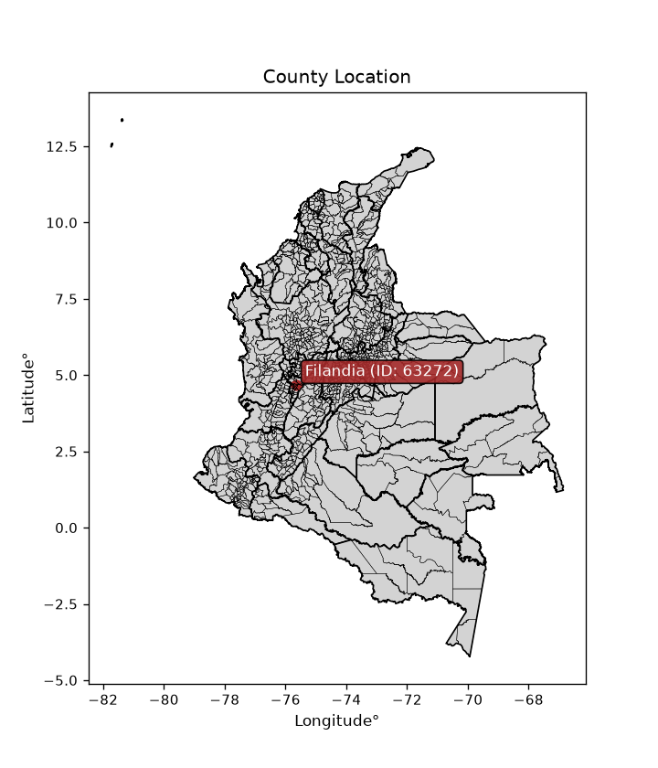
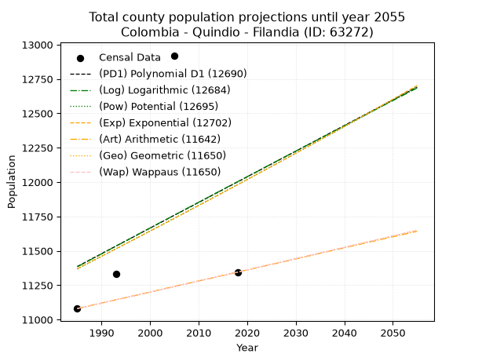
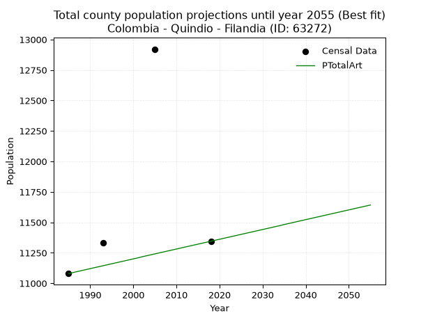
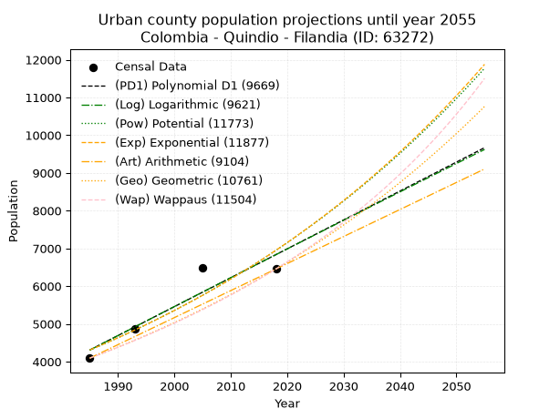
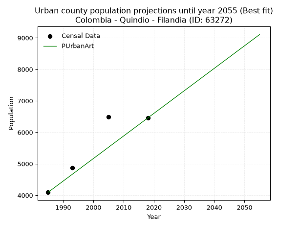
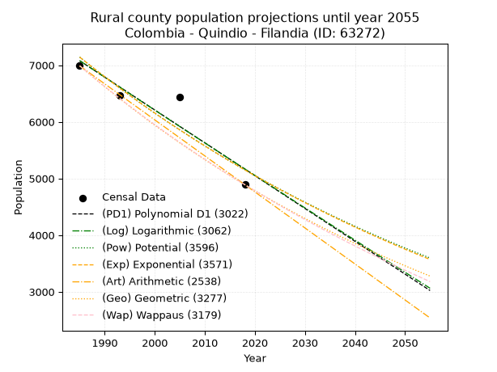
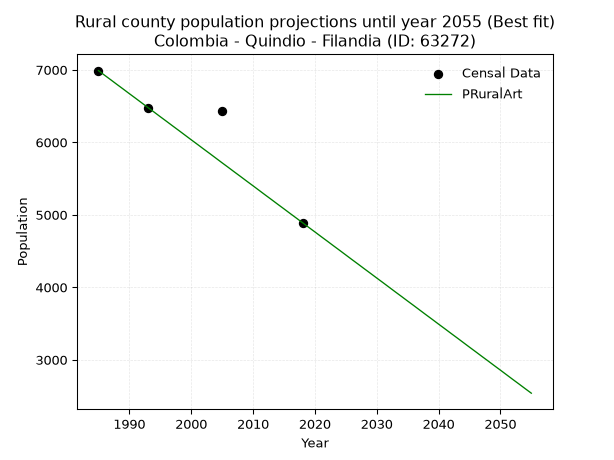

<div align="center">


</div>

# _“Population and Public Services Demand Projections (PPSD) until Year 2050 for Colombia - Quindio - Filandia (ID: 63272)”_
Keywords: `population` `public-service` `projection` `lineal` `polynomial` `logarithmic` `potential` `exponential` `arithmetic` `geometric` `wappaus` `dane` `colombia` `south-america`

PPSD are analytical estimates used by governments and planners to anticipate future changes in population size, age distribution, and the resulting community needs for utilities, healthcare, education, and infrastructure as sizing future water treatment facilities, electrical grids, and road networks based on spatial growth.

<div align="center">

</img>

</div>


> **General running parameters**: • app_version: _v20260806_. • Python version: _3.14.7_. • Pandas version: _3.0.5_. • NumPy version: _2.5.1_. • Creates, save and include plots into reports (create_plot): _False_. • Projection until year: _2050_. • Process polynomial degree 2 and up: _False_. • Process Wappaus: _True_. • Process Wappaus: _True_. • Set negative values to zero: _True_. • Set infinite values to zero: _True_. • Drop dataset notes: _True_. 
<div align="center">

Dynamic map: [:earth_americas:Google](http://maps.google.com/maps?q=4.674337631,-75.6583869) [:earth_americas:OSM](https://www.openstreetmap.org/#map=18/4.674337631/-75.6583869&layers=P) [:earth_americas:Bing](https://www.bing.com/maps?cp=4.674337631~-75.6583869&lvl=18) [:earth_americas:Apple](https://maps.apple.com/frame?center=4.674337631%2C-75.6583869&span=0.003%2C0.006)

</div>


<div align="center">

```geojson
{
  "type": "Feature",
  "geometry": {
    "type": "Point", 
    "coordinates": [-75.6583869, 4.674337631]
  }, 
  "properties": {
    "Name": "Colombia - Quindio - Filandia (ID: 63272)"
  }
}
```

</div>


## 0. Census Data (4 records)

Census data are official statistics collected by a government about the people and housing in a country. They usually include counts of total population, age, sex, race, income, education, and jobs.

📅Global census file: [Population.xlsx](../data/Population.xlsx)

| Source   |   Year |   CountryID | CountryName   |   StateID | StateName   |   CountyID | CountyName   |   PTotal |   PUrban |   PRural |
|:---------|-------:|------------:|:--------------|----------:|:------------|-----------:|:-------------|---------:|---------:|---------:|
| DANE     |   1985 |          57 | Colombia      |        63 | Quindio     |      63272 | Filandia     |    11080 |     4092 |     6988 |
| DANE     |   1993 |          57 | Colombia      |        63 | Quindio     |      63272 | Filandia     |    11334 |     4868 |     6466 |
| DANE     |   2005 |          57 | Colombia      |        63 | Quindio     |      63272 | Filandia     |    12921 |     6487 |     6434 |
| DANE     |   2018 |          57 | Colombia      |        63 | Quindio     |      63272 | Filandia     |    11345 |     6455 |     4890 |

> 🔥Some records could had specific notes about the registered values or the corresponding urban or rural distribution.

📅[SUI-RUPS](https://www.datos.gov.co/Hacienda-y-Cr-dito-P-blico/Registro-nico-de-Prestadores-de-Servicios-P-blicos/4qkq-csdn/about_data) - Local public utility companies: [RUPS.csv](../data/RUPS.xlsx)

 | SERVICIO       | ESTADO    | NOMBRE                                                                                                   | NIT         | DEPARTAMENTO_DOMICILIO   | MUNICIPIO_DOMICILIO   | DIRECCION                  |   TELEFONO | EMAIL                                 | TIPO_PRESTADOR                             | CLASIFICACION                 |
|:---------------|:----------|:---------------------------------------------------------------------------------------------------------|:------------|:-------------------------|:----------------------|:---------------------------|-----------:|:--------------------------------------|:-------------------------------------------|:------------------------------|
| ACUEDUCTO      | OPERATIVA | EMPRESAS PÚBLICAS DEL QUINDIO S.A.   E.S.P.                                                              | 800063823-7 | QUINDIO                  | ARMENIA               | CARRERA 14 N° 22-30 CENTRO |    7441774 | contactenos@epq.gov.co                | SOCIEDADES (EMPRESA DE SERVICIOS PUBLICOS) | MAYOR O IGUAL A 5001 USUARIOS |
| ALCANTARILLADO | OPERATIVA | EMPRESAS PÚBLICAS DEL QUINDIO S.A.   E.S.P.                                                              | 800063823-7 | QUINDIO                  | ARMENIA               | CARRERA 14 N° 22-30 CENTRO |    7441774 | contactenos@epq.gov.co                | SOCIEDADES (EMPRESA DE SERVICIOS PUBLICOS) | MAYOR O IGUAL A 5001 USUARIOS |
| ACUEDUCTO      | OPERATIVA | ASOCIACION DE USUARIOS DEL ACUEDUCTO RURAL ROBLE CRUCES DE LOS MUNICIPIOS DE CIRCASIA FILANDIA Y SALENTO | 801001305-1 | QUINDIO                  | CIRCASIA              | CRA 14 No 5 51 PISO 2      |    7585352 | acueductoroblecruces@gmail.com        | ORGANIZACION AUTORIZADA                    | MENOR O IGUAL A 2500 USUARIOS |
| ACUEDUCTO      | OPERATIVA | ACUEDUCTO REGIONAL RURAL DEL MUNICIPIO DE FILANDIA DEPARTAMENTO DE QUINDIO                               | 801000337-2 | QUINDIO                  | FILANDIA              | CRA 5 LOTE 4 ZONA HOSPITAL |    7582371 | acueductoregionalfilandia@hotmail.com | ORGANIZACION AUTORIZADA                    | MENOR O IGUAL A 2500 USUARIOS |
| ACUEDUCTO      | OPERATIVA | ACUEDUCTO RURAL VEREDAS LA JULIA LA CASTALIA Y LA LOTERIA                                                | 801004044-8 | QUINDIO                  | FILANDIA              | CALLE 6 CARRERA 5          |    0000000 | acuecastaliafilandia@gmail.com        | ORGANIZACION AUTORIZADA                    | MENOR O IGUAL A 2500 USUARIOS |

## 1. Total

### 1.1. Coefficients and Parameters

* (PD1) Polynomial Deg 1: 18.63829787234123, -25611.255319150547 (lineal)
* (Log) Logarithmic: 37516.87535046813, -273496.0701802793
* (Pow) Potential: 3.1845431655112906, -6.4461625972253715
* (Exp) Exponential: 0.0015822369166507255, 491.77968646268783
* (Art) Arithmetic: Year diff. 2018 - 1985 = 33, Population diff. 11345 - 11080 = 265, Annual growth = 8.030303030303031
* (Geo) Geometric: Year diff. 2018 - 1985 = 33, Population diff. 11345 - 11080 = 265, Annual growth % = 0.0007164819116194376
* (Wap) Wappaus: i = 0.07161920205398466, Condition values only valid for < 200)

<sub>
Wappaus condition values: ['0.00', '0.07', '0.14', '0.21', '0.29', '0.36', '0.43', '0.50', '0.57', '0.64', '0.72', '0.79', '0.86', '0.93', '1.00', '1.07', '1.15', '1.22', '1.29', '1.36', '1.43', '1.50', '1.58', '1.65', '1.72', '1.79', '1.86', '1.93', '2.01', '2.08', '2.15', '2.22', '2.29', '2.36', '2.44', '2.51', '2.58', '2.65', '2.72', '2.79', '2.86', '2.94', '3.01', '3.08', '3.15', '3.22', '3.29', '3.37', '3.44', '3.51', '3.58', '3.65', '3.72', '3.80', '3.87', '3.94', '4.01', '4.08', '4.15', '4.23', '4.30', '4.37', '4.44', '4.51', '4.58', '4.66']
</sub>


### 1.2. Projected Dataset

|   Year |   CountyID |   PTotalPD1 |   PTotalLog |   PTotalPow |   PTotalExp |   PTotalArt |   PTotalGeo |   PTotalWap |
|-------:|-----------:|------------:|------------:|------------:|------------:|------------:|------------:|------------:|
|   1985 |      63272 |       11386 |       11384 |       11368 |       11370 |       11080 |       11080 |       11080 |
|   1986 |      63272 |       11404 |       11402 |       11387 |       11388 |       11088 |       11088 |       11088 |
|   1987 |      63272 |       11423 |       11421 |       11405 |       11406 |       11096 |       11096 |       11096 |
|   1988 |      63272 |       11442 |       11440 |       11423 |       11425 |       11104 |       11104 |       11104 |
|   1989 |      63272 |       11460 |       11459 |       11441 |       11443 |       11112 |       11112 |       11112 |
|   1990 |      63272 |       11479 |       11478 |       11460 |       11461 |       11120 |       11120 |       11120 |
|   1991 |      63272 |       11498 |       11497 |       11478 |       11479 |       11128 |       11128 |       11128 |
|   1992 |      63272 |       11516 |       11516 |       11497 |       11497 |       11136 |       11136 |       11136 |
|   1993 |      63272 |       11535 |       11535 |       11515 |       11515 |       11144 |       11144 |       11144 |
|   1994 |      63272 |       11554 |       11553 |       11533 |       11534 |       11152 |       11152 |       11152 |
|   1995 |      63272 |       11572 |       11572 |       11552 |       11552 |       11160 |       11160 |       11160 |
|   1996 |      63272 |       11591 |       11591 |       11570 |       11570 |       11168 |       11168 |       11168 |
|   1997 |      63272 |       11609 |       11610 |       11589 |       11588 |       11176 |       11176 |       11176 |
|   1998 |      63272 |       11628 |       11629 |       11607 |       11607 |       11184 |       11184 |       11184 |
|   1999 |      63272 |       11647 |       11647 |       11626 |       11625 |       11192 |       11192 |       11192 |
|   2000 |      63272 |       11665 |       11666 |       11644 |       11644 |       11200 |       11200 |       11200 |
|   2001 |      63272 |       11684 |       11685 |       11663 |       11662 |       11208 |       11208 |       11208 |
|   2002 |      63272 |       11703 |       11704 |       11681 |       11680 |       11217 |       11216 |       11216 |
|   2003 |      63272 |       11721 |       11722 |       11700 |       11699 |       11225 |       11224 |       11224 |
|   2004 |      63272 |       11740 |       11741 |       11719 |       11717 |       11233 |       11232 |       11232 |
|   2005 |      63272 |       11759 |       11760 |       11737 |       11736 |       11241 |       11240 |       11240 |
|   2006 |      63272 |       11777 |       11778 |       11756 |       11755 |       11249 |       11248 |       11248 |
|   2007 |      63272 |       11796 |       11797 |       11774 |       11773 |       11257 |       11256 |       11256 |
|   2008 |      63272 |       11814 |       11816 |       11793 |       11792 |       11265 |       11264 |       11264 |
|   2009 |      63272 |       11833 |       11834 |       11812 |       11811 |       11273 |       11272 |       11272 |
|   2010 |      63272 |       11852 |       11853 |       11831 |       11829 |       11281 |       11280 |       11280 |
|   2011 |      63272 |       11870 |       11872 |       11849 |       11848 |       11289 |       11288 |       11288 |
|   2012 |      63272 |       11889 |       11890 |       11868 |       11867 |       11297 |       11296 |       11296 |
|   2013 |      63272 |       11908 |       11909 |       11887 |       11885 |       11305 |       11304 |       11304 |
|   2014 |      63272 |       11926 |       11928 |       11906 |       11904 |       11313 |       11313 |       11313 |
|   2015 |      63272 |       11945 |       11946 |       11925 |       11923 |       11321 |       11321 |       11321 |
|   2016 |      63272 |       11964 |       11965 |       11943 |       11942 |       11329 |       11329 |       11329 |
|   2017 |      63272 |       11982 |       11984 |       11962 |       11961 |       11337 |       11337 |       11337 |
|   2018 |      63272 |       12001 |       12002 |       11981 |       11980 |       11345 |       11345 |       11345 |
|   2019 |      63272 |       12019 |       12021 |       12000 |       11999 |       11353 |       11353 |       11353 |
|   2020 |      63272 |       12038 |       12039 |       12019 |       12018 |       11361 |       11361 |       11361 |
|   2021 |      63272 |       12057 |       12058 |       12038 |       12037 |       11369 |       11369 |       11369 |
|   2022 |      63272 |       12075 |       12076 |       12057 |       12056 |       11377 |       11378 |       11378 |
|   2023 |      63272 |       12094 |       12095 |       12076 |       12075 |       11385 |       11386 |       11386 |
|   2024 |      63272 |       12113 |       12114 |       12095 |       12094 |       11393 |       11394 |       11394 |
|   2025 |      63272 |       12131 |       12132 |       12114 |       12113 |       11401 |       11402 |       11402 |
|   2026 |      63272 |       12150 |       12151 |       12133 |       12132 |       11409 |       11410 |       11410 |
|   2027 |      63272 |       12169 |       12169 |       12152 |       12152 |       11417 |       11418 |       11418 |
|   2028 |      63272 |       12187 |       12188 |       12171 |       12171 |       11425 |       11427 |       11427 |
|   2029 |      63272 |       12206 |       12206 |       12190 |       12190 |       11433 |       11435 |       11435 |
|   2030 |      63272 |       12224 |       12225 |       12210 |       12210 |       11441 |       11443 |       11443 |
|   2031 |      63272 |       12243 |       12243 |       12229 |       12229 |       11449 |       11451 |       11451 |
|   2032 |      63272 |       12262 |       12262 |       12248 |       12248 |       11457 |       11459 |       11459 |
|   2033 |      63272 |       12280 |       12280 |       12267 |       12268 |       11465 |       11468 |       11468 |
|   2034 |      63272 |       12299 |       12298 |       12286 |       12287 |       11473 |       11476 |       11476 |
|   2035 |      63272 |       12318 |       12317 |       12306 |       12307 |       11482 |       11484 |       11484 |
|   2036 |      63272 |       12336 |       12335 |       12325 |       12326 |       11490 |       11492 |       11492 |
|   2037 |      63272 |       12355 |       12354 |       12344 |       12346 |       11498 |       11500 |       11500 |
|   2038 |      63272 |       12374 |       12372 |       12363 |       12365 |       11506 |       11509 |       11509 |
|   2039 |      63272 |       12392 |       12391 |       12383 |       12385 |       11514 |       11517 |       11517 |
|   2040 |      63272 |       12411 |       12409 |       12402 |       12404 |       11522 |       11525 |       11525 |
|   2041 |      63272 |       12430 |       12427 |       12422 |       12424 |       11530 |       11533 |       11533 |
|   2042 |      63272 |       12448 |       12446 |       12441 |       12444 |       11538 |       11542 |       11542 |
|   2043 |      63272 |       12467 |       12464 |       12460 |       12463 |       11546 |       11550 |       11550 |
|   2044 |      63272 |       12485 |       12482 |       12480 |       12483 |       11554 |       11558 |       11558 |
|   2045 |      63272 |       12504 |       12501 |       12499 |       12503 |       11562 |       11567 |       11567 |
|   2046 |      63272 |       12523 |       12519 |       12519 |       12523 |       11570 |       11575 |       11575 |
|   2047 |      63272 |       12541 |       12537 |       12538 |       12542 |       11578 |       11583 |       11583 |
|   2048 |      63272 |       12560 |       12556 |       12558 |       12562 |       11586 |       11591 |       11591 |
|   2049 |      63272 |       12579 |       12574 |       12577 |       12582 |       11594 |       11600 |       11600 |
|   2050 |      63272 |       12597 |       12592 |       12597 |       12602 |       11602 |       11608 |       11608 |
<div align="center">

</img>

</div>


### 1.3. Best fit with absolute and relative error (%)

Relative error puts that difference into context by dividing the absolute error by the true value, creating a unitless ratio or percentage that shows the scale of the mistake.

Absolute and relative error

|   Year | Source   |   CountryID | CountryName   |   StateID | StateName   |   CountyID_x | CountyName   |   PTotal |   PUrban |   PRural |   CountyID_y |   PTotalPD1 |   PTotalLog |   PTotalPow |   PTotalExp |   PTotalArt |   PTotalGeo |   PTotalWap |   PTotalPD1AbsError |   PTotalLogAbsError |   PTotalPowAbsError |   PTotalExpAbsError |   PTotalArtAbsError |   PTotalGeoAbsError |   PTotalWapAbsError |   PTotalPD1RelError |   PTotalLogRelError |   PTotalPowRelError |   PTotalExpRelError |   PTotalArtRelError |   PTotalGeoRelError |   PTotalWapRelError |
|-------:|:---------|------------:|:--------------|----------:|:------------|-------------:|:-------------|---------:|---------:|---------:|-------------:|------------:|------------:|------------:|------------:|------------:|------------:|------------:|--------------------:|--------------------:|--------------------:|--------------------:|--------------------:|--------------------:|--------------------:|--------------------:|--------------------:|--------------------:|--------------------:|--------------------:|--------------------:|--------------------:|
|   1985 | DANE     |          57 | Colombia      |        63 | Quindio     |        63272 | Filandia     |    11080 |     4092 |     6988 |        63272 |       11386 |       11384 |       11368 |       11370 |       11080 |       11080 |       11080 |                 306 |                 304 |                 288 |                 290 |                   0 |                   0 |                   0 |             2.76173 |             2.74368 |             2.59928 |             2.61733 |             0       |             0       |             0       |
|   1993 | DANE     |          57 | Colombia      |        63 | Quindio     |        63272 | Filandia     |    11334 |     4868 |     6466 |        63272 |       11535 |       11535 |       11515 |       11515 |       11144 |       11144 |       11144 |                 201 |                 201 |                 181 |                 181 |                 190 |                 190 |                 190 |             1.77343 |             1.77343 |             1.59696 |             1.59696 |             1.67637 |             1.67637 |             1.67637 |
|   2005 | DANE     |          57 | Colombia      |        63 | Quindio     |        63272 | Filandia     |    12921 |     6487 |     6434 |        63272 |       11759 |       11760 |       11737 |       11736 |       11241 |       11240 |       11240 |                1162 |                1161 |                1184 |                1185 |                1680 |                1681 |                1681 |             8.99311 |             8.98537 |             9.16338 |             9.17112 |            13.0021  |            13.0098  |            13.0098  |
|   2018 | DANE     |          57 | Colombia      |        63 | Quindio     |        63272 | Filandia     |    11345 |     6455 |     4890 |        63272 |       12001 |       12002 |       11981 |       11980 |       11345 |       11345 |       11345 |                 656 |                 657 |                 636 |                 635 |                   0 |                   0 |                   0 |             5.78228 |             5.7911  |             5.60599 |             5.59718 |             0       |             0       |             0       |

Relative error mean

| Method    |   RelError | Best   |
|:----------|-----------:|:-------|
| PTotalPD1 |    4.82764 |        |
| PTotalLog |    4.82339 |        |
| PTotalPow |    4.7414  |        |
| PTotalExp |    4.74565 |        |
| PTotalArt |    3.66962 | True   |
| PTotalGeo |    3.67155 |        |
| PTotalWap |    3.67155 |        |

💙Best method: _**PTotalArt**_
<div align="center">

</img>

</div>


### 1.4. Fresh water supply demand in liters per capita per day (lpcd)

The fresh water supply demand typically ranges from 100 to 300 liters per capita per day (lpcd) for standard domestic and municipal planning, though absolute survival minimums set by the World Health Organization are as low as 7.5 to 20 liters per day, and total consumption in high-income nations can exceed 400 liters.

> `CZ`: Level in meters above the sea level (masl)<br> `WS`: Fresh water supply demand in liters per capita per day (lpcd or l/h/d)<br> `WSAll`: Zonal fresh water supply demand in liters per second (l/s)<br> `A`: Zonal area in square meters<br> `DP`: Population density (people/hectare or p/ha)

Reference values (RAS Colombia)

|    CZ |   WS |
|------:|-----:|
|  1000 |  120 |
|  2000 |  130 |
| 99999 |  140 |

County shapefile geometry properties and water supply values

|   CountyID |      ATotal |   CZTotal |   WSTotal |
|-----------:|------------:|----------:|----------:|
|      63272 | 1.06609e+08 |   1725.71 |       130 |

Projected values for best method: PTotalArt

|   CountyID |   Year |   PTotalArt |   DPTotal |   WSTotal |   WSTotalAll |
|-----------:|-------:|------------:|----------:|----------:|-------------:|
|      63272 |   1985 |       11080 |      1.04 |       130 |      16.6713 |
|      63272 |   1986 |       11088 |      1.04 |       130 |      16.6833 |
|      63272 |   1987 |       11096 |      1.04 |       130 |      16.6954 |
|      63272 |   1988 |       11104 |      1.04 |       130 |      16.7074 |
|      63272 |   1989 |       11112 |      1.04 |       130 |      16.7194 |
|      63272 |   1990 |       11120 |      1.04 |       130 |      16.7315 |
|      63272 |   1991 |       11128 |      1.04 |       130 |      16.7435 |
|      63272 |   1992 |       11136 |      1.04 |       130 |      16.7556 |
|      63272 |   1993 |       11144 |      1.05 |       130 |      16.7676 |
|      63272 |   1994 |       11152 |      1.05 |       130 |      16.7796 |
|      63272 |   1995 |       11160 |      1.05 |       130 |      16.7917 |
|      63272 |   1996 |       11168 |      1.05 |       130 |      16.8037 |
|      63272 |   1997 |       11176 |      1.05 |       130 |      16.8157 |
|      63272 |   1998 |       11184 |      1.05 |       130 |      16.8278 |
|      63272 |   1999 |       11192 |      1.05 |       130 |      16.8398 |
|      63272 |   2000 |       11200 |      1.05 |       130 |      16.8519 |
|      63272 |   2001 |       11208 |      1.05 |       130 |      16.8639 |
|      63272 |   2002 |       11217 |      1.05 |       130 |      16.8774 |
|      63272 |   2003 |       11225 |      1.05 |       130 |      16.8895 |
|      63272 |   2004 |       11233 |      1.05 |       130 |      16.9015 |
|      63272 |   2005 |       11241 |      1.05 |       130 |      16.9135 |
|      63272 |   2006 |       11249 |      1.06 |       130 |      16.9256 |
|      63272 |   2007 |       11257 |      1.06 |       130 |      16.9376 |
|      63272 |   2008 |       11265 |      1.06 |       130 |      16.9497 |
|      63272 |   2009 |       11273 |      1.06 |       130 |      16.9617 |
|      63272 |   2010 |       11281 |      1.06 |       130 |      16.9737 |
|      63272 |   2011 |       11289 |      1.06 |       130 |      16.9858 |
|      63272 |   2012 |       11297 |      1.06 |       130 |      16.9978 |
|      63272 |   2013 |       11305 |      1.06 |       130 |      17.0098 |
|      63272 |   2014 |       11313 |      1.06 |       130 |      17.0219 |
|      63272 |   2015 |       11321 |      1.06 |       130 |      17.0339 |
|      63272 |   2016 |       11329 |      1.06 |       130 |      17.0459 |
|      63272 |   2017 |       11337 |      1.06 |       130 |      17.058  |
|      63272 |   2018 |       11345 |      1.06 |       130 |      17.07   |
|      63272 |   2019 |       11353 |      1.06 |       130 |      17.0821 |
|      63272 |   2020 |       11361 |      1.07 |       130 |      17.0941 |
|      63272 |   2021 |       11369 |      1.07 |       130 |      17.1061 |
|      63272 |   2022 |       11377 |      1.07 |       130 |      17.1182 |
|      63272 |   2023 |       11385 |      1.07 |       130 |      17.1302 |
|      63272 |   2024 |       11393 |      1.07 |       130 |      17.1422 |
|      63272 |   2025 |       11401 |      1.07 |       130 |      17.1543 |
|      63272 |   2026 |       11409 |      1.07 |       130 |      17.1663 |
|      63272 |   2027 |       11417 |      1.07 |       130 |      17.1784 |
|      63272 |   2028 |       11425 |      1.07 |       130 |      17.1904 |
|      63272 |   2029 |       11433 |      1.07 |       130 |      17.2024 |
|      63272 |   2030 |       11441 |      1.07 |       130 |      17.2145 |
|      63272 |   2031 |       11449 |      1.07 |       130 |      17.2265 |
|      63272 |   2032 |       11457 |      1.07 |       130 |      17.2385 |
|      63272 |   2033 |       11465 |      1.08 |       130 |      17.2506 |
|      63272 |   2034 |       11473 |      1.08 |       130 |      17.2626 |
|      63272 |   2035 |       11482 |      1.08 |       130 |      17.2762 |
|      63272 |   2036 |       11490 |      1.08 |       130 |      17.2882 |
|      63272 |   2037 |       11498 |      1.08 |       130 |      17.3002 |
|      63272 |   2038 |       11506 |      1.08 |       130 |      17.3123 |
|      63272 |   2039 |       11514 |      1.08 |       130 |      17.3243 |
|      63272 |   2040 |       11522 |      1.08 |       130 |      17.3363 |
|      63272 |   2041 |       11530 |      1.08 |       130 |      17.3484 |
|      63272 |   2042 |       11538 |      1.08 |       130 |      17.3604 |
|      63272 |   2043 |       11546 |      1.08 |       130 |      17.3725 |
|      63272 |   2044 |       11554 |      1.08 |       130 |      17.3845 |
|      63272 |   2045 |       11562 |      1.08 |       130 |      17.3965 |
|      63272 |   2046 |       11570 |      1.09 |       130 |      17.4086 |
|      63272 |   2047 |       11578 |      1.09 |       130 |      17.4206 |
|      63272 |   2048 |       11586 |      1.09 |       130 |      17.4326 |
|      63272 |   2049 |       11594 |      1.09 |       130 |      17.4447 |
|      63272 |   2050 |       11602 |      1.09 |       130 |      17.4567 |

## 2. Urban

### 2.1. Coefficients and Parameters

* (PD1) Polynomial Deg 1: 76.58530710558, -147714.2605379364 (lineal)
* (Log) Logarithmic: 153421.40347640263, -1160681.817266105
* (Pow) Potential: 29.01927950502738, -92.06453580117686
* (Exp) Exponential: 0.014484959142313616, 1.4036481193556289e-09
* (Art) Arithmetic: Year diff. 2018 - 1985 = 33, Population diff. 6455 - 4092 = 2363, Annual growth = 71.60606060606061
* (Geo) Geometric: Year diff. 2018 - 1985 = 33, Population diff. 6455 - 4092 = 2363, Annual growth % = 0.01390859987445836
* (Wap) Wappaus: i = 1.357846982195138, Condition values only valid for < 200)

<sub>
Wappaus condition values: ['0.00', '1.36', '2.72', '4.07', '5.43', '6.79', '8.15', '9.50', '10.86', '12.22', '13.58', '14.94', '16.29', '17.65', '19.01', '20.37', '21.73', '23.08', '24.44', '25.80', '27.16', '28.51', '29.87', '31.23', '32.59', '33.95', '35.30', '36.66', '38.02', '39.38', '40.74', '42.09', '43.45', '44.81', '46.17', '47.52', '48.88', '50.24', '51.60', '52.96', '54.31', '55.67', '57.03', '58.39', '59.75', '61.10', '62.46', '63.82', '65.18', '66.53', '67.89', '69.25', '70.61', '71.97', '73.32', '74.68', '76.04', '77.40', '78.76', '80.11', '81.47', '82.83', '84.19', '85.54', '86.90', '88.26']
</sub>


### 2.2. Projected Dataset

|   Year |   CountyID |   PUrbanPD1 |   PUrbanLog |   PUrbanPow |   PUrbanExp |   PUrbanArt |   PUrbanGeo |   PUrbanWap |
|-------:|-----------:|------------:|------------:|------------:|------------:|------------:|------------:|------------:|
|   1985 |      63272 |        4308 |        4304 |        4306 |        4309 |        4092 |        4092 |        4092 |
|   1986 |      63272 |        4384 |        4382 |        4370 |        4372 |        4164 |        4149 |        4148 |
|   1987 |      63272 |        4461 |        4459 |        4434 |        4436 |        4235 |        4207 |        4205 |
|   1988 |      63272 |        4537 |        4536 |        4499 |        4500 |        4307 |        4265 |        4262 |
|   1989 |      63272 |        4614 |        4613 |        4565 |        4566 |        4378 |        4324 |        4320 |
|   1990 |      63272 |        4691 |        4690 |        4632 |        4633 |        4450 |        4385 |        4380 |
|   1991 |      63272 |        4767 |        4767 |        4700 |        4700 |        4522 |        4446 |        4440 |
|   1992 |      63272 |        4844 |        4844 |        4769 |        4769 |        4593 |        4507 |        4500 |
|   1993 |      63272 |        4920 |        4921 |        4839 |        4838 |        4665 |        4570 |        4562 |
|   1994 |      63272 |        4997 |        4998 |        4910 |        4909 |        4736 |        4634 |        4625 |
|   1995 |      63272 |        5073 |        5075 |        4982 |        4981 |        4808 |        4698 |        4688 |
|   1996 |      63272 |        5150 |        5152 |        5055 |        5053 |        4880 |        4763 |        4753 |
|   1997 |      63272 |        5227 |        5229 |        5129 |        5127 |        4951 |        4830 |        4818 |
|   1998 |      63272 |        5303 |        5306 |        5204 |        5202 |        5023 |        4897 |        4884 |
|   1999 |      63272 |        5380 |        5383 |        5280 |        5278 |        5094 |        4965 |        4952 |
|   2000 |      63272 |        5456 |        5459 |        5358 |        5355 |        5166 |        5034 |        5020 |
|   2001 |      63272 |        5533 |        5536 |        5436 |        5433 |        5238 |        5104 |        5089 |
|   2002 |      63272 |        5610 |        5613 |        5515 |        5512 |        5309 |        5175 |        5160 |
|   2003 |      63272 |        5686 |        5689 |        5596 |        5593 |        5381 |        5247 |        5231 |
|   2004 |      63272 |        5763 |        5766 |        5677 |        5674 |        5453 |        5320 |        5304 |
|   2005 |      63272 |        5839 |        5842 |        5760 |        5757 |        5524 |        5394 |        5378 |
|   2006 |      63272 |        5916 |        5919 |        5844 |        5841 |        5596 |        5469 |        5453 |
|   2007 |      63272 |        5992 |        5995 |        5929 |        5926 |        5667 |        5545 |        5529 |
|   2008 |      63272 |        6069 |        6072 |        6016 |        6013 |        5739 |        5622 |        5606 |
|   2009 |      63272 |        6146 |        6148 |        6103 |        6100 |        5811 |        5700 |        5685 |
|   2010 |      63272 |        6222 |        6225 |        6192 |        6189 |        5882 |        5780 |        5765 |
|   2011 |      63272 |        6299 |        6301 |        6282 |        6280 |        5954 |        5860 |        5846 |
|   2012 |      63272 |        6375 |        6377 |        6373 |        6371 |        6025 |        5942 |        5929 |
|   2013 |      63272 |        6452 |        6453 |        6466 |        6464 |        6097 |        6024 |        6013 |
|   2014 |      63272 |        6529 |        6530 |        6560 |        6558 |        6169 |        6108 |        6098 |
|   2015 |      63272 |        6605 |        6606 |        6655 |        6654 |        6240 |        6193 |        6185 |
|   2016 |      63272 |        6682 |        6682 |        6751 |        6751 |        6312 |        6279 |        6274 |
|   2017 |      63272 |        6758 |        6758 |        6849 |        6850 |        6383 |        6366 |        6364 |
|   2018 |      63272 |        6835 |        6834 |        6949 |        6950 |        6455 |        6455 |        6455 |
|   2019 |      63272 |        6911 |        6910 |        7049 |        7051 |        6527 |        6545 |        6548 |
|   2020 |      63272 |        6988 |        6986 |        7151 |        7154 |        6598 |        6636 |        6643 |
|   2021 |      63272 |        7065 |        7062 |        7255 |        7258 |        6670 |        6728 |        6739 |
|   2022 |      63272 |        7141 |        7138 |        7360 |        7364 |        6741 |        6822 |        6838 |
|   2023 |      63272 |        7218 |        7214 |        7466 |        7472 |        6813 |        6917 |        6938 |
|   2024 |      63272 |        7294 |        7289 |        7574 |        7581 |        6885 |        7013 |        7039 |
|   2025 |      63272 |        7371 |        7365 |        7683 |        7691 |        6956 |        7110 |        7143 |
|   2026 |      63272 |        7448 |        7441 |        7794 |        7804 |        7028 |        7209 |        7249 |
|   2027 |      63272 |        7524 |        7517 |        7906 |        7917 |        7099 |        7309 |        7357 |
|   2028 |      63272 |        7601 |        7592 |        8020 |        8033 |        7171 |        7411 |        7466 |
|   2029 |      63272 |        7677 |        7668 |        8136 |        8150 |        7243 |        7514 |        7578 |
|   2030 |      63272 |        7754 |        7744 |        8253 |        8269 |        7314 |        7619 |        7692 |
|   2031 |      63272 |        7830 |        7819 |        8372 |        8390 |        7386 |        7725 |        7809 |
|   2032 |      63272 |        7907 |        7895 |        8492 |        8512 |        7457 |        7832 |        7927 |
|   2033 |      63272 |        7984 |        7970 |        8614 |        8636 |        7529 |        7941 |        8048 |
|   2034 |      63272 |        8060 |        8046 |        8738 |        8762 |        7601 |        8052 |        8172 |
|   2035 |      63272 |        8137 |        8121 |        8864 |        8890 |        7672 |        8163 |        8298 |
|   2036 |      63272 |        8213 |        8196 |        8991 |        9020 |        7744 |        8277 |        8427 |
|   2037 |      63272 |        8290 |        8272 |        9120 |        9151 |        7816 |        8392 |        8558 |
|   2038 |      63272 |        8367 |        8347 |        9251 |        9285 |        7887 |        8509 |        8692 |
|   2039 |      63272 |        8443 |        8422 |        9384 |        9420 |        7959 |        8627 |        8829 |
|   2040 |      63272 |        8520 |        8497 |        9518 |        9558 |        8030 |        8747 |        8969 |
|   2041 |      63272 |        8596 |        8573 |        9654 |        9697 |        8102 |        8869 |        9112 |
|   2042 |      63272 |        8673 |        8648 |        9793 |        9839 |        8174 |        8992 |        9258 |
|   2043 |      63272 |        8750 |        8723 |        9933 |        9982 |        8245 |        9117 |        9408 |
|   2044 |      63272 |        8826 |        8798 |       10075 |       10128 |        8317 |        9244 |        9561 |
|   2045 |      63272 |        8903 |        8873 |       10219 |       10276 |        8388 |        9373 |        9717 |
|   2046 |      63272 |        8979 |        8948 |       10365 |       10426 |        8460 |        9503 |        9877 |
|   2047 |      63272 |        9056 |        9023 |       10513 |       10578 |        8532 |        9635 |       10041 |
|   2048 |      63272 |        9132 |        9098 |       10663 |       10732 |        8603 |        9769 |       10209 |
|   2049 |      63272 |        9209 |        9173 |       10815 |       10889 |        8675 |        9905 |       10380 |
|   2050 |      63272 |        9286 |        9248 |       10969 |       11048 |        8746 |       10043 |       10556 |
<div align="center">

</img>

</div>


### 2.3. Best fit with absolute and relative error (%)

Relative error puts that difference into context by dividing the absolute error by the true value, creating a unitless ratio or percentage that shows the scale of the mistake.

Absolute and relative error

|   Year | Source   |   CountryID | CountryName   |   StateID | StateName   |   CountyID_x | CountyName   |   PTotal |   PUrban |   PRural |   CountyID_y |   PUrbanPD1 |   PUrbanLog |   PUrbanPow |   PUrbanExp |   PUrbanArt |   PUrbanGeo |   PUrbanWap |   PUrbanPD1AbsError |   PUrbanLogAbsError |   PUrbanPowAbsError |   PUrbanExpAbsError |   PUrbanArtAbsError |   PUrbanGeoAbsError |   PUrbanWapAbsError |   PUrbanPD1RelError |   PUrbanLogRelError |   PUrbanPowRelError |   PUrbanExpRelError |   PUrbanArtRelError |   PUrbanGeoRelError |   PUrbanWapRelError |
|-------:|:---------|------------:|:--------------|----------:|:------------|-------------:|:-------------|---------:|---------:|---------:|-------------:|------------:|------------:|------------:|------------:|------------:|------------:|------------:|--------------------:|--------------------:|--------------------:|--------------------:|--------------------:|--------------------:|--------------------:|--------------------:|--------------------:|--------------------:|--------------------:|--------------------:|--------------------:|--------------------:|
|   1985 | DANE     |          57 | Colombia      |        63 | Quindio     |        63272 | Filandia     |    11080 |     4092 |     6988 |        63272 |        4308 |        4304 |        4306 |        4309 |        4092 |        4092 |        4092 |                 216 |                 212 |                 214 |                 217 |                   0 |                   0 |                   0 |             5.27859 |             5.18084 |            5.22972  |             5.30303 |             0       |             0       |             0       |
|   1993 | DANE     |          57 | Colombia      |        63 | Quindio     |        63272 | Filandia     |    11334 |     4868 |     6466 |        63272 |        4920 |        4921 |        4839 |        4838 |        4665 |        4570 |        4562 |                  52 |                  53 |                  29 |                  30 |                 203 |                 298 |                 306 |             1.0682  |             1.08874 |            0.595727 |             0.61627 |             4.17009 |             6.12161 |             6.28595 |
|   2005 | DANE     |          57 | Colombia      |        63 | Quindio     |        63272 | Filandia     |    12921 |     6487 |     6434 |        63272 |        5839 |        5842 |        5760 |        5757 |        5524 |        5394 |        5378 |                 648 |                 645 |                 727 |                 730 |                 963 |                1093 |                1109 |             9.98921 |             9.94296 |           11.207    |            11.2533  |            14.8451  |            16.8491  |            17.0957  |
|   2018 | DANE     |          57 | Colombia      |        63 | Quindio     |        63272 | Filandia     |    11345 |     6455 |     4890 |        63272 |        6835 |        6834 |        6949 |        6950 |        6455 |        6455 |        6455 |                 380 |                 379 |                 494 |                 495 |                   0 |                   0 |                   0 |             5.88691 |             5.87142 |            7.65298  |             7.66847 |             0       |             0       |             0       |

Relative error mean

| Method    |   RelError | Best   |
|:----------|-----------:|:-------|
| PUrbanPD1 |    5.55573 |        |
| PUrbanLog |    5.52099 |        |
| PUrbanPow |    6.17136 |        |
| PUrbanExp |    6.21026 |        |
| PUrbanArt |    4.75379 | True   |
| PUrbanGeo |    5.74267 |        |
| PUrbanWap |    5.84542 |        |

💙Best method: _**PUrbanArt**_
<div align="center">

</img>

</div>


### 2.4. Fresh water supply demand in liters per capita per day (lpcd)

The fresh water supply demand typically ranges from 100 to 300 liters per capita per day (lpcd) for standard domestic and municipal planning, though absolute survival minimums set by the World Health Organization are as low as 7.5 to 20 liters per day, and total consumption in high-income nations can exceed 400 liters.

> `CZ`: Level in meters above the sea level (masl)<br> `WS`: Fresh water supply demand in liters per capita per day (lpcd or l/h/d)<br> `WSAll`: Zonal fresh water supply demand in liters per second (l/s)<br> `A`: Zonal area in square meters<br> `DP`: Population density (people/hectare or p/ha)

Reference values (RAS Colombia)

|    CZ |   WS |
|------:|-----:|
|  1000 |  120 |
|  2000 |  130 |
| 99999 |  140 |

County shapefile geometry properties and water supply values

|   CountyID |   AUrban |   CZUrban |   WSUrban |
|-----------:|---------:|----------:|----------:|
|      63272 |   829115 |   1897.58 |       130 |

Projected values for best method: PUrbanArt

|   CountyID |   Year |   PUrbanArt |   DPUrban |   WSUrban |   WSUrbanAll |
|-----------:|-------:|------------:|----------:|----------:|-------------:|
|      63272 |   1985 |        4092 |     49.35 |       130 |      6.15694 |
|      63272 |   1986 |        4164 |     50.22 |       130 |      6.26528 |
|      63272 |   1987 |        4235 |     51.08 |       130 |      6.37211 |
|      63272 |   1988 |        4307 |     51.95 |       130 |      6.48044 |
|      63272 |   1989 |        4378 |     52.8  |       130 |      6.58727 |
|      63272 |   1990 |        4450 |     53.67 |       130 |      6.6956  |
|      63272 |   1991 |        4522 |     54.54 |       130 |      6.80394 |
|      63272 |   1992 |        4593 |     55.4  |       130 |      6.91076 |
|      63272 |   1993 |        4665 |     56.26 |       130 |      7.0191  |
|      63272 |   1994 |        4736 |     57.12 |       130 |      7.12593 |
|      63272 |   1995 |        4808 |     57.99 |       130 |      7.23426 |
|      63272 |   1996 |        4880 |     58.86 |       130 |      7.34259 |
|      63272 |   1997 |        4951 |     59.71 |       130 |      7.44942 |
|      63272 |   1998 |        5023 |     60.58 |       130 |      7.55775 |
|      63272 |   1999 |        5094 |     61.44 |       130 |      7.66458 |
|      63272 |   2000 |        5166 |     62.31 |       130 |      7.77292 |
|      63272 |   2001 |        5238 |     63.18 |       130 |      7.88125 |
|      63272 |   2002 |        5309 |     64.03 |       130 |      7.98808 |
|      63272 |   2003 |        5381 |     64.9  |       130 |      8.09641 |
|      63272 |   2004 |        5453 |     65.77 |       130 |      8.20475 |
|      63272 |   2005 |        5524 |     66.63 |       130 |      8.31157 |
|      63272 |   2006 |        5596 |     67.49 |       130 |      8.41991 |
|      63272 |   2007 |        5667 |     68.35 |       130 |      8.52674 |
|      63272 |   2008 |        5739 |     69.22 |       130 |      8.63507 |
|      63272 |   2009 |        5811 |     70.09 |       130 |      8.7434  |
|      63272 |   2010 |        5882 |     70.94 |       130 |      8.85023 |
|      63272 |   2011 |        5954 |     71.81 |       130 |      8.95856 |
|      63272 |   2012 |        6025 |     72.67 |       130 |      9.06539 |
|      63272 |   2013 |        6097 |     73.54 |       130 |      9.17373 |
|      63272 |   2014 |        6169 |     74.4  |       130 |      9.28206 |
|      63272 |   2015 |        6240 |     75.26 |       130 |      9.38889 |
|      63272 |   2016 |        6312 |     76.13 |       130 |      9.49722 |
|      63272 |   2017 |        6383 |     76.99 |       130 |      9.60405 |
|      63272 |   2018 |        6455 |     77.85 |       130 |      9.71238 |
|      63272 |   2019 |        6527 |     78.72 |       130 |      9.82072 |
|      63272 |   2020 |        6598 |     79.58 |       130 |      9.92755 |
|      63272 |   2021 |        6670 |     80.45 |       130 |     10.0359  |
|      63272 |   2022 |        6741 |     81.3  |       130 |     10.1427  |
|      63272 |   2023 |        6813 |     82.17 |       130 |     10.251   |
|      63272 |   2024 |        6885 |     83.04 |       130 |     10.3594  |
|      63272 |   2025 |        6956 |     83.9  |       130 |     10.4662  |
|      63272 |   2026 |        7028 |     84.77 |       130 |     10.5745  |
|      63272 |   2027 |        7099 |     85.62 |       130 |     10.6814  |
|      63272 |   2028 |        7171 |     86.49 |       130 |     10.7897  |
|      63272 |   2029 |        7243 |     87.36 |       130 |     10.898   |
|      63272 |   2030 |        7314 |     88.21 |       130 |     11.0049  |
|      63272 |   2031 |        7386 |     89.08 |       130 |     11.1132  |
|      63272 |   2032 |        7457 |     89.94 |       130 |     11.22    |
|      63272 |   2033 |        7529 |     90.81 |       130 |     11.3284  |
|      63272 |   2034 |        7601 |     91.68 |       130 |     11.4367  |
|      63272 |   2035 |        7672 |     92.53 |       130 |     11.5435  |
|      63272 |   2036 |        7744 |     93.4  |       130 |     11.6519  |
|      63272 |   2037 |        7816 |     94.27 |       130 |     11.7602  |
|      63272 |   2038 |        7887 |     95.13 |       130 |     11.867   |
|      63272 |   2039 |        7959 |     95.99 |       130 |     11.9753  |
|      63272 |   2040 |        8030 |     96.85 |       130 |     12.0822  |
|      63272 |   2041 |        8102 |     97.72 |       130 |     12.1905  |
|      63272 |   2042 |        8174 |     98.59 |       130 |     12.2988  |
|      63272 |   2043 |        8245 |     99.44 |       130 |     12.4057  |
|      63272 |   2044 |        8317 |    100.31 |       130 |     12.514   |
|      63272 |   2045 |        8388 |    101.17 |       130 |     12.6208  |
|      63272 |   2046 |        8460 |    102.04 |       130 |     12.7292  |
|      63272 |   2047 |        8532 |    102.9  |       130 |     12.8375  |
|      63272 |   2048 |        8603 |    103.76 |       130 |     12.9443  |
|      63272 |   2049 |        8675 |    104.63 |       130 |     13.0527  |
|      63272 |   2050 |        8746 |    105.49 |       130 |     13.1595  |

## 3. Rural

### 3.1. Coefficients and Parameters

* (PD1) Polynomial Deg 1: -57.947009233238724, 122103.00521878577 (lineal)
* (Log) Logarithmic: -115904.52812593438, 887185.7470858247
* (Pow) Potential: -19.80306656408585, 69.15961916452666
* (Exp) Exponential: -0.009901663963586, 2453272155601.1885
* (Art) Arithmetic: Year diff. 2018 - 1985 = 33, Population diff. 4890 - 6988 = -2098, Annual growth = -63.57575757575758
* (Geo) Geometric: Year diff. 2018 - 1985 = 33, Population diff. 4890 - 6988 = -2098, Annual growth % = -0.010759938349392595
* (Wap) Wappaus: i = -1.0704791644343759, Condition values only valid for < 200)

<sub>
Wappaus condition values: ['-0.00', '-1.07', '-2.14', '-3.21', '-4.28', '-5.35', '-6.42', '-7.49', '-8.56', '-9.63', '-10.70', '-11.78', '-12.85', '-13.92', '-14.99', '-16.06', '-17.13', '-18.20', '-19.27', '-20.34', '-21.41', '-22.48', '-23.55', '-24.62', '-25.69', '-26.76', '-27.83', '-28.90', '-29.97', '-31.04', '-32.11', '-33.18', '-34.26', '-35.33', '-36.40', '-37.47', '-38.54', '-39.61', '-40.68', '-41.75', '-42.82', '-43.89', '-44.96', '-46.03', '-47.10', '-48.17', '-49.24', '-50.31', '-51.38', '-52.45', '-53.52', '-54.59', '-55.66', '-56.74', '-57.81', '-58.88', '-59.95', '-61.02', '-62.09', '-63.16', '-64.23', '-65.30', '-66.37', '-67.44', '-68.51', '-69.58']
</sub>


### 3.2. Projected Dataset

|   Year |   CountyID |   PRuralPD1 |   PRuralLog |   PRuralPow |   PRuralExp |   PRuralArt |   PRuralGeo |   PRuralWap |
|-------:|-----------:|------------:|------------:|------------:|------------:|------------:|------------:|------------:|
|   1985 |      63272 |        7078 |        7079 |        7142 |        7141 |        6988 |        6988 |        6988 |
|   1986 |      63272 |        7020 |        7021 |        7072 |        7071 |        6924 |        6913 |        6914 |
|   1987 |      63272 |        6962 |        6963 |        7001 |        7001 |        6861 |        6838 |        6840 |
|   1988 |      63272 |        6904 |        6904 |        6932 |        6932 |        6797 |        6765 |        6767 |
|   1989 |      63272 |        6846 |        6846 |        6863 |        6864 |        6734 |        6692 |        6695 |
|   1990 |      63272 |        6788 |        6788 |        6795 |        6796 |        6670 |        6620 |        6624 |
|   1991 |      63272 |        6731 |        6729 |        6728 |        6729 |        6607 |        6549 |        6553 |
|   1992 |      63272 |        6673 |        6671 |        6662 |        6663 |        6543 |        6478 |        6483 |
|   1993 |      63272 |        6615 |        6613 |        6596 |        6597 |        6479 |        6409 |        6414 |
|   1994 |      63272 |        6557 |        6555 |        6530 |        6532 |        6416 |        6340 |        6346 |
|   1995 |      63272 |        6499 |        6497 |        6466 |        6468 |        6352 |        6271 |        6278 |
|   1996 |      63272 |        6441 |        6439 |        6402 |        6404 |        6289 |        6204 |        6211 |
|   1997 |      63272 |        6383 |        6381 |        6339 |        6341 |        6225 |        6137 |        6145 |
|   1998 |      63272 |        6325 |        6323 |        6276 |        6279 |        6162 |        6071 |        6079 |
|   1999 |      63272 |        6267 |        6265 |        6214 |        6217 |        6098 |        6006 |        6014 |
|   2000 |      63272 |        6209 |        6207 |        6153 |        6156 |        6034 |        5941 |        5949 |
|   2001 |      63272 |        6151 |        6149 |        6093 |        6095 |        5971 |        5877 |        5886 |
|   2002 |      63272 |        6093 |        6091 |        6033 |        6035 |        5907 |        5814 |        5822 |
|   2003 |      63272 |        6035 |        6033 |        5973 |        5975 |        5844 |        5752 |        5760 |
|   2004 |      63272 |        5977 |        5975 |        5915 |        5917 |        5780 |        5690 |        5698 |
|   2005 |      63272 |        5919 |        5917 |        5856 |        5858 |        5716 |        5628 |        5637 |
|   2006 |      63272 |        5861 |        5860 |        5799 |        5801 |        5653 |        5568 |        5576 |
|   2007 |      63272 |        5803 |        5802 |        5742 |        5743 |        5589 |        5508 |        5516 |
|   2008 |      63272 |        5745 |        5744 |        5686 |        5687 |        5526 |        5449 |        5456 |
|   2009 |      63272 |        5687 |        5686 |        5630 |        5631 |        5462 |        5390 |        5397 |
|   2010 |      63272 |        5630 |        5629 |        5575 |        5575 |        5399 |        5332 |        5339 |
|   2011 |      63272 |        5572 |        5571 |        5520 |        5520 |        5335 |        5275 |        5281 |
|   2012 |      63272 |        5514 |        5513 |        5466 |        5466 |        5271 |        5218 |        5223 |
|   2013 |      63272 |        5456 |        5456 |        5412 |        5412 |        5208 |        5162 |        5166 |
|   2014 |      63272 |        5398 |        5398 |        5359 |        5359 |        5144 |        5106 |        5110 |
|   2015 |      63272 |        5340 |        5341 |        5307 |        5306 |        5081 |        5051 |        5054 |
|   2016 |      63272 |        5282 |        5283 |        5255 |        5254 |        5017 |        4997 |        4999 |
|   2017 |      63272 |        5224 |        5226 |        5204 |        5202 |        4954 |        4943 |        4944 |
|   2018 |      63272 |        5166 |        5168 |        5153 |        5151 |        4890 |        4890 |        4890 |
|   2019 |      63272 |        5108 |        5111 |        5103 |        5100 |        4826 |        4837 |        4836 |
|   2020 |      63272 |        5050 |        5053 |        5053 |        5050 |        4763 |        4785 |        4783 |
|   2021 |      63272 |        4992 |        4996 |        5003 |        5000 |        4699 |        4734 |        4730 |
|   2022 |      63272 |        4934 |        4939 |        4955 |        4951 |        4636 |        4683 |        4678 |
|   2023 |      63272 |        4876 |        4881 |        4906 |        4902 |        4572 |        4633 |        4626 |
|   2024 |      63272 |        4818 |        4824 |        4859 |        4854 |        4509 |        4583 |        4574 |
|   2025 |      63272 |        4760 |        4767 |        4811 |        4806 |        4445 |        4533 |        4523 |
|   2026 |      63272 |        4702 |        4710 |        4765 |        4758 |        4381 |        4485 |        4473 |
|   2027 |      63272 |        4644 |        4652 |        4718 |        4712 |        4318 |        4436 |        4423 |
|   2028 |      63272 |        4586 |        4595 |        4672 |        4665 |        4254 |        4389 |        4373 |
|   2029 |      63272 |        4529 |        4538 |        4627 |        4619 |        4191 |        4341 |        4324 |
|   2030 |      63272 |        4471 |        4481 |        4582 |        4574 |        4127 |        4295 |        4275 |
|   2031 |      63272 |        4413 |        4424 |        4538 |        4529 |        4064 |        4248 |        4227 |
|   2032 |      63272 |        4355 |        4367 |        4494 |        4484 |        4000 |        4203 |        4179 |
|   2033 |      63272 |        4297 |        4310 |        4450 |        4440 |        3936 |        4158 |        4131 |
|   2034 |      63272 |        4239 |        4253 |        4407 |        4396 |        3873 |        4113 |        4084 |
|   2035 |      63272 |        4181 |        4196 |        4364 |        4353 |        3809 |        4069 |        4037 |
|   2036 |      63272 |        4123 |        4139 |        4322 |        4310 |        3746 |        4025 |        3991 |
|   2037 |      63272 |        4065 |        4082 |        4280 |        4267 |        3682 |        3981 |        3945 |
|   2038 |      63272 |        4007 |        4025 |        4239 |        4225 |        3618 |        3939 |        3899 |
|   2039 |      63272 |        3949 |        3968 |        4198 |        4184 |        3555 |        3896 |        3854 |
|   2040 |      63272 |        3891 |        3912 |        4157 |        4142 |        3491 |        3854 |        3809 |
|   2041 |      63272 |        3833 |        3855 |        4117 |        4102 |        3428 |        3813 |        3765 |
|   2042 |      63272 |        3775 |        3798 |        4077 |        4061 |        3364 |        3772 |        3721 |
|   2043 |      63272 |        3717 |        3741 |        4038 |        4021 |        3301 |        3731 |        3677 |
|   2044 |      63272 |        3659 |        3684 |        3999 |        3982 |        3237 |        3691 |        3634 |
|   2045 |      63272 |        3601 |        3628 |        3960 |        3942 |        3173 |        3651 |        3591 |
|   2046 |      63272 |        3543 |        3571 |        3922 |        3904 |        3110 |        3612 |        3548 |
|   2047 |      63272 |        3485 |        3514 |        3884 |        3865 |        3046 |        3573 |        3506 |
|   2048 |      63272 |        3428 |        3458 |        3847 |        3827 |        2983 |        3535 |        3464 |
|   2049 |      63272 |        3370 |        3401 |        3810 |        3789 |        2919 |        3497 |        3422 |
|   2050 |      63272 |        3312 |        3345 |        3773 |        3752 |        2856 |        3459 |        3381 |
<div align="center">

</img>

</div>


### 3.3. Best fit with absolute and relative error (%)

Relative error puts that difference into context by dividing the absolute error by the true value, creating a unitless ratio or percentage that shows the scale of the mistake.

Absolute and relative error

|   Year | Source   |   CountryID | CountryName   |   StateID | StateName   |   CountyID_x | CountyName   |   PTotal |   PUrban |   PRural |   CountyID_y |   PRuralPD1 |   PRuralLog |   PRuralPow |   PRuralExp |   PRuralArt |   PRuralGeo |   PRuralWap |   PRuralPD1AbsError |   PRuralLogAbsError |   PRuralPowAbsError |   PRuralExpAbsError |   PRuralArtAbsError |   PRuralGeoAbsError |   PRuralWapAbsError |   PRuralPD1RelError |   PRuralLogRelError |   PRuralPowRelError |   PRuralExpRelError |   PRuralArtRelError |   PRuralGeoRelError |   PRuralWapRelError |
|-------:|:---------|------------:|:--------------|----------:|:------------|-------------:|:-------------|---------:|---------:|---------:|-------------:|------------:|------------:|------------:|------------:|------------:|------------:|------------:|--------------------:|--------------------:|--------------------:|--------------------:|--------------------:|--------------------:|--------------------:|--------------------:|--------------------:|--------------------:|--------------------:|--------------------:|--------------------:|--------------------:|
|   1985 | DANE     |          57 | Colombia      |        63 | Quindio     |        63272 | Filandia     |    11080 |     4092 |     6988 |        63272 |        7078 |        7079 |        7142 |        7141 |        6988 |        6988 |        6988 |                  90 |                  91 |                 154 |                 153 |                   0 |                   0 |                   0 |             1.28792 |             1.30223 |             2.20378 |             2.18947 |            0        |            0        |            0        |
|   1993 | DANE     |          57 | Colombia      |        63 | Quindio     |        63272 | Filandia     |    11334 |     4868 |     6466 |        63272 |        6615 |        6613 |        6596 |        6597 |        6479 |        6409 |        6414 |                 149 |                 147 |                 130 |                 131 |                  13 |                  57 |                  52 |             2.30436 |             2.27343 |             2.01052 |             2.02598 |            0.201052 |            0.881534 |            0.804207 |
|   2005 | DANE     |          57 | Colombia      |        63 | Quindio     |        63272 | Filandia     |    12921 |     6487 |     6434 |        63272 |        5919 |        5917 |        5856 |        5858 |        5716 |        5628 |        5637 |                 515 |                 517 |                 578 |                 576 |                 718 |                 806 |                 797 |             8.00435 |             8.03544 |             8.98353 |             8.95244 |           11.1595   |           12.5272   |           12.3873   |
|   2018 | DANE     |          57 | Colombia      |        63 | Quindio     |        63272 | Filandia     |    11345 |     6455 |     4890 |        63272 |        5166 |        5168 |        5153 |        5151 |        4890 |        4890 |        4890 |                 276 |                 278 |                 263 |                 261 |                   0 |                   0 |                   0 |             5.64417 |             5.68507 |             5.37832 |             5.33742 |            0        |            0        |            0        |

Relative error mean

| Method    |   RelError | Best   |
|:----------|-----------:|:-------|
| PRuralPD1 |    4.3102  |        |
| PRuralLog |    4.32404 |        |
| PRuralPow |    4.64404 |        |
| PRuralExp |    4.62633 |        |
| PRuralArt |    2.84013 | True   |
| PRuralGeo |    3.35218 |        |
| PRuralWap |    3.29788 |        |

💙Best method: _**PRuralArt**_
<div align="center">

</img>

</div>


### 3.4. Fresh water supply demand in liters per capita per day (lpcd)

The fresh water supply demand typically ranges from 100 to 300 liters per capita per day (lpcd) for standard domestic and municipal planning, though absolute survival minimums set by the World Health Organization are as low as 7.5 to 20 liters per day, and total consumption in high-income nations can exceed 400 liters.

> `CZ`: Level in meters above the sea level (masl)<br> `WS`: Fresh water supply demand in liters per capita per day (lpcd or l/h/d)<br> `WSAll`: Zonal fresh water supply demand in liters per second (l/s)<br> `A`: Zonal area in square meters<br> `DP`: Population density (people/hectare or p/ha)

Reference values (RAS Colombia)

|    CZ |   WS |
|------:|-----:|
|  1000 |  120 |
|  2000 |  130 |
| 99999 |  140 |

County shapefile geometry properties and water supply values

|   CountyID |     ARural |   CZRural |   WSRural |
|-----------:|-----------:|----------:|----------:|
|      63272 | 1.0578e+08 |   1724.38 |       130 |

Projected values for best method: PRuralArt

|   CountyID |   Year |   PRuralArt |   DPRural |   WSRural |   WSRuralAll |
|-----------:|-------:|------------:|----------:|----------:|-------------:|
|      63272 |   1985 |        6988 |      0.66 |       130 |     10.5144  |
|      63272 |   1986 |        6924 |      0.65 |       130 |     10.4181  |
|      63272 |   1987 |        6861 |      0.65 |       130 |     10.3233  |
|      63272 |   1988 |        6797 |      0.64 |       130 |     10.227   |
|      63272 |   1989 |        6734 |      0.64 |       130 |     10.1322  |
|      63272 |   1990 |        6670 |      0.63 |       130 |     10.0359  |
|      63272 |   1991 |        6607 |      0.62 |       130 |      9.94109 |
|      63272 |   1992 |        6543 |      0.62 |       130 |      9.84479 |
|      63272 |   1993 |        6479 |      0.61 |       130 |      9.7485  |
|      63272 |   1994 |        6416 |      0.61 |       130 |      9.6537  |
|      63272 |   1995 |        6352 |      0.6  |       130 |      9.55741 |
|      63272 |   1996 |        6289 |      0.59 |       130 |      9.46262 |
|      63272 |   1997 |        6225 |      0.59 |       130 |      9.36632 |
|      63272 |   1998 |        6162 |      0.58 |       130 |      9.27153 |
|      63272 |   1999 |        6098 |      0.58 |       130 |      9.17523 |
|      63272 |   2000 |        6034 |      0.57 |       130 |      9.07894 |
|      63272 |   2001 |        5971 |      0.56 |       130 |      8.98414 |
|      63272 |   2002 |        5907 |      0.56 |       130 |      8.88785 |
|      63272 |   2003 |        5844 |      0.55 |       130 |      8.79306 |
|      63272 |   2004 |        5780 |      0.55 |       130 |      8.69676 |
|      63272 |   2005 |        5716 |      0.54 |       130 |      8.60046 |
|      63272 |   2006 |        5653 |      0.53 |       130 |      8.50567 |
|      63272 |   2007 |        5589 |      0.53 |       130 |      8.40938 |
|      63272 |   2008 |        5526 |      0.52 |       130 |      8.31458 |
|      63272 |   2009 |        5462 |      0.52 |       130 |      8.21829 |
|      63272 |   2010 |        5399 |      0.51 |       130 |      8.1235  |
|      63272 |   2011 |        5335 |      0.5  |       130 |      8.0272  |
|      63272 |   2012 |        5271 |      0.5  |       130 |      7.9309  |
|      63272 |   2013 |        5208 |      0.49 |       130 |      7.83611 |
|      63272 |   2014 |        5144 |      0.49 |       130 |      7.73981 |
|      63272 |   2015 |        5081 |      0.48 |       130 |      7.64502 |
|      63272 |   2016 |        5017 |      0.47 |       130 |      7.54873 |
|      63272 |   2017 |        4954 |      0.47 |       130 |      7.45394 |
|      63272 |   2018 |        4890 |      0.46 |       130 |      7.35764 |
|      63272 |   2019 |        4826 |      0.46 |       130 |      7.26134 |
|      63272 |   2020 |        4763 |      0.45 |       130 |      7.16655 |
|      63272 |   2021 |        4699 |      0.44 |       130 |      7.07025 |
|      63272 |   2022 |        4636 |      0.44 |       130 |      6.97546 |
|      63272 |   2023 |        4572 |      0.43 |       130 |      6.87917 |
|      63272 |   2024 |        4509 |      0.43 |       130 |      6.78437 |
|      63272 |   2025 |        4445 |      0.42 |       130 |      6.68808 |
|      63272 |   2026 |        4381 |      0.41 |       130 |      6.59178 |
|      63272 |   2027 |        4318 |      0.41 |       130 |      6.49699 |
|      63272 |   2028 |        4254 |      0.4  |       130 |      6.40069 |
|      63272 |   2029 |        4191 |      0.4  |       130 |      6.3059  |
|      63272 |   2030 |        4127 |      0.39 |       130 |      6.20961 |
|      63272 |   2031 |        4064 |      0.38 |       130 |      6.11481 |
|      63272 |   2032 |        4000 |      0.38 |       130 |      6.01852 |
|      63272 |   2033 |        3936 |      0.37 |       130 |      5.92222 |
|      63272 |   2034 |        3873 |      0.37 |       130 |      5.82743 |
|      63272 |   2035 |        3809 |      0.36 |       130 |      5.73113 |
|      63272 |   2036 |        3746 |      0.35 |       130 |      5.63634 |
|      63272 |   2037 |        3682 |      0.35 |       130 |      5.54005 |
|      63272 |   2038 |        3618 |      0.34 |       130 |      5.44375 |
|      63272 |   2039 |        3555 |      0.34 |       130 |      5.34896 |
|      63272 |   2040 |        3491 |      0.33 |       130 |      5.25266 |
|      63272 |   2041 |        3428 |      0.32 |       130 |      5.15787 |
|      63272 |   2042 |        3364 |      0.32 |       130 |      5.06157 |
|      63272 |   2043 |        3301 |      0.31 |       130 |      4.96678 |
|      63272 |   2044 |        3237 |      0.31 |       130 |      4.87049 |
|      63272 |   2045 |        3173 |      0.3  |       130 |      4.77419 |
|      63272 |   2046 |        3110 |      0.29 |       130 |      4.6794  |
|      63272 |   2047 |        3046 |      0.29 |       130 |      4.5831  |
|      63272 |   2048 |        2983 |      0.28 |       130 |      4.48831 |
|      63272 |   2049 |        2919 |      0.28 |       130 |      4.39201 |
|      63272 |   2050 |        2856 |      0.27 |       130 |      4.29722 |

<div align="center"><br><sub>Share this research</sub></div><br>

<sub>**APPS & TOOLS & CONTENT DISCLAIMER**: • NO WARRANTY - This content and software is provided by <a href="https://github.com/rcfdtools" target="_blank">github.com/rcfdtools</a> "as is", without any express or implied warranty, including warranties of merchantability, fitness for a particular purpose, or non-infringement. There is no guarantee that the software will be error-free or operate without interruption. • LIMITATION OF LIABILITY - Neither the authors nor copyright holders will be liable for claims or damages arising from the software or its use. You are responsible for determining if the software is appropriate for your use and assume all associated risks, including errors, legal compliance, and data loss. • NO PROFESSIONAL ADVICE - The software provides general information and does not offer professional advice. It should not replace consultation with professional advisors. [Clauses and global license for rcfdtools use.](https://github.com/rcfdtools/rcfdtools/blob/main/LICENSE.md)</sub>

| [:house: Home](Readme.md)  | [:beginner: Help / Collab](https://github.com/rcfdtools/R.HydroTools/discussions/31) |
|----------------------------|-------------------------------------------------------------------------------------------|