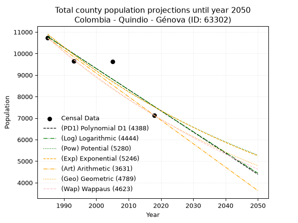
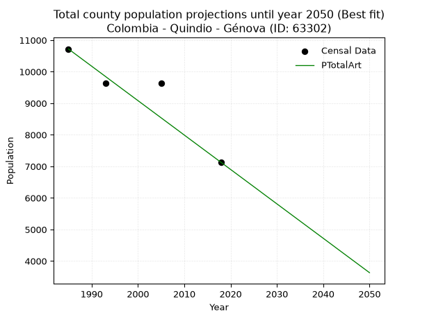
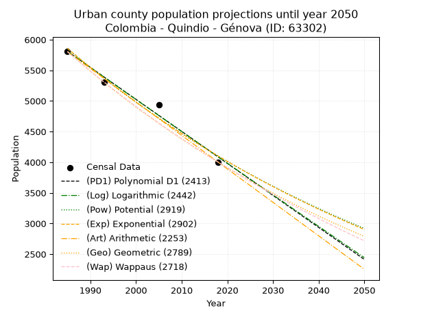
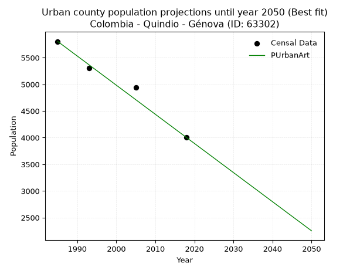
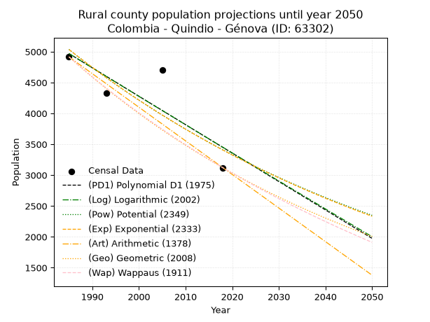
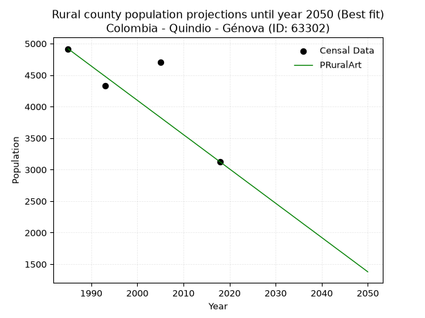

<div align="center">


</div>

# _“Population and Public Services Demand Projections (PPSD) until Year 2050 for Colombia - Quindio - Génova (ID: 63302)”_
Keywords: `population` `public-service` `projection` `lineal` `polynomial` `logarithmic` `potential` `exponential` `arithmetic` `geometric` `wappaus` `dane` `colombia` `south-america`

PPSD are analytical estimates used by governments and planners to anticipate future changes in population size, age distribution, and the resulting community needs for utilities, healthcare, education, and infrastructure as sizing future water treatment facilities, electrical grids, and road networks based on spatial growth.

> **General running parameters**: • app_version: _v20260806_. • Python version: _3.14.7_. • Pandas version: _3.0.5_. • NumPy version: _2.5.1_. • Creates, save and include plots into reports (create_plot): _True_. • Projection until year: _2050_. • Process polynomial degree 2 and up: _False_. • Process Wappaus: _True_. • Process Wappaus: _True_. • Set negative values to zero: _True_. • Set infinite values to zero: _True_. • Drop dataset notes: _True_. 
<div align="center">

Dynamic map: [:earth_americas:Google](http://maps.google.com/maps?q=4.206641389,-75.7904023) [:earth_americas:OSM](https://www.openstreetmap.org/#map=18/4.206641389/-75.7904023&layers=P) [:earth_americas:Bing](https://www.bing.com/maps?cp=4.206641389~-75.7904023&lvl=18) [:earth_americas:Apple](https://maps.apple.com/frame?center=4.206641389%2C-75.7904023&span=0.003%2C0.006)

</div>


<div align="center">

```geojson
{
  "type": "Feature",
  "geometry": {
    "type": "Point", 
    "coordinates": [-75.7904023, 4.206641389]
  }, 
  "properties": {
    "Name": "Colombia - Quindio - Génova (ID: 63302)"
  }
}
```

</div>


## 0. Census Data (4 records)

Census data are official statistics collected by a government about the people and housing in a country. They usually include counts of total population, age, sex, race, income, education, and jobs.

📅Global census file: [Population.xlsx](../data/Population.xlsx)

| Source   |   Year |   CountryID | CountryName   |   StateID | StateName   |   CountyID | CountyName   |   PTotal |   PUrban |   PRural |
|:---------|-------:|------------:|:--------------|----------:|:------------|-----------:|:-------------|---------:|---------:|---------:|
| DANE     |   1985 |          57 | Colombia      |        63 | Quindio     |      63302 | Génova       |    10720 |     5804 |     4916 |
| DANE     |   1993 |          57 | Colombia      |        63 | Quindío     |      63302 | Génova       |     9642 |     5309 |     4333 |
| DANE     |   2005 |          57 | Colombia      |        63 | Quindio     |      63302 | Génova       |     9634 |     4936 |     4698 |
| DANE     |   2018 |          57 | Colombia      |        63 | Quindío     |      63302 | Génova       |     7121 |     4001 |     3120 |

> 🔥Some records has specific notes about the registered values or the corresponding urban or rural distribution.

## 1. Total

### 1.1. Coefficients and Parameters

* (PD1) Polynomial Deg 1: -98.31433159373587, 205932.4917703702 (lineal)
* (Log) Logarithmic: -196673.01828436993, 1504192.4380181534
* (Pow) Potential: -22.482556811353675, 78.17930243269352
* (Exp) Exponential: -0.011240231732946296, 53338280577293.17
* (Art) Arithmetic: Year diff. 2018 - 1985 = 33, Population diff. 7121 - 10720 = -3599, Annual growth = -109.06060606060606
* (Geo) Geometric: Year diff. 2018 - 1985 = 33, Population diff. 7121 - 10720 = -3599, Annual growth % = -0.012319336145224957
* (Wap) Wappaus: i = -1.2225840038182396, Condition values only valid for < 200)

<sub>
Wappaus condition values: ['-0.00', '-1.22', '-2.45', '-3.67', '-4.89', '-6.11', '-7.34', '-8.56', '-9.78', '-11.00', '-12.23', '-13.45', '-14.67', '-15.89', '-17.12', '-18.34', '-19.56', '-20.78', '-22.01', '-23.23', '-24.45', '-25.67', '-26.90', '-28.12', '-29.34', '-30.56', '-31.79', '-33.01', '-34.23', '-35.45', '-36.68', '-37.90', '-39.12', '-40.35', '-41.57', '-42.79', '-44.01', '-45.24', '-46.46', '-47.68', '-48.90', '-50.13', '-51.35', '-52.57', '-53.79', '-55.02', '-56.24', '-57.46', '-58.68', '-59.91', '-61.13', '-62.35', '-63.57', '-64.80', '-66.02', '-67.24', '-68.46', '-69.69', '-70.91', '-72.13', '-73.36', '-74.58', '-75.80', '-77.02', '-78.25', '-79.47']
</sub>


### 1.2. Projected Dataset

|   Year |   CountyID |   PTotalPD1 |   PTotalLog |   PTotalPow |   PTotalExp |   PTotalArt |   PTotalGeo |   PTotalWap |
|-------:|-----------:|------------:|------------:|------------:|------------:|------------:|------------:|------------:|
|   1985 |      63302 |       10779 |       10781 |       10895 |       10892 |       10720 |       10720 |       10720 |
|   1986 |      63302 |       10680 |       10682 |       10772 |       10771 |       10611 |       10588 |       10590 |
|   1987 |      63302 |       10582 |       10583 |       10651 |       10650 |       10502 |       10458 |       10461 |
|   1988 |      63302 |       10484 |       10484 |       10531 |       10531 |       10393 |       10329 |       10334 |
|   1989 |      63302 |       10385 |       10385 |       10413 |       10413 |       10284 |       10201 |       10208 |
|   1990 |      63302 |       10287 |       10286 |       10296 |       10297 |       10175 |       10076 |       10084 |
|   1991 |      63302 |       10189 |       10187 |       10180 |       10182 |       10066 |        9952 |        9961 |
|   1992 |      63302 |       10090 |       10088 |       10066 |       10068 |        9957 |        9829 |        9840 |
|   1993 |      63302 |        9992 |        9990 |        9953 |        9956 |        9848 |        9708 |        9720 |
|   1994 |      63302 |        9894 |        9891 |        9841 |        9844 |        9738 |        9588 |        9602 |
|   1995 |      63302 |        9795 |        9792 |        9731 |        9734 |        9629 |        9470 |        9485 |
|   1996 |      63302 |        9697 |        9694 |        9622 |        9626 |        9520 |        9354 |        9369 |
|   1997 |      63302 |        9599 |        9595 |        9514 |        9518 |        9411 |        9238 |        9255 |
|   1998 |      63302 |        9500 |        9497 |        9408 |        9412 |        9302 |        9125 |        9142 |
|   1999 |      63302 |        9402 |        9398 |        9302 |        9306 |        9193 |        9012 |        9030 |
|   2000 |      63302 |        9304 |        9300 |        9198 |        9202 |        9084 |        8901 |        8919 |
|   2001 |      63302 |        9206 |        9202 |        9096 |        9099 |        8975 |        8791 |        8810 |
|   2002 |      63302 |        9107 |        9103 |        8994 |        8998 |        8866 |        8683 |        8702 |
|   2003 |      63302 |        9009 |        9005 |        8894 |        8897 |        8757 |        8576 |        8595 |
|   2004 |      63302 |        8911 |        8907 |        8794 |        8798 |        8648 |        8471 |        8489 |
|   2005 |      63302 |        8812 |        8809 |        8696 |        8699 |        8539 |        8366 |        8384 |
|   2006 |      63302 |        8714 |        8711 |        8599 |        8602 |        8430 |        8263 |        8281 |
|   2007 |      63302 |        8616 |        8613 |        8503 |        8506 |        8321 |        8161 |        8178 |
|   2008 |      63302 |        8517 |        8515 |        8409 |        8411 |        8212 |        8061 |        8077 |
|   2009 |      63302 |        8419 |        8417 |        8315 |        8317 |        8103 |        7961 |        7977 |
|   2010 |      63302 |        8321 |        8319 |        8223 |        8224 |        7993 |        7863 |        7878 |
|   2011 |      63302 |        8222 |        8221 |        8131 |        8132 |        7884 |        7766 |        7780 |
|   2012 |      63302 |        8124 |        8123 |        8041 |        8041 |        7775 |        7671 |        7683 |
|   2013 |      63302 |        8026 |        8026 |        7951 |        7951 |        7666 |        7576 |        7587 |
|   2014 |      63302 |        7927 |        7928 |        7863 |        7862 |        7557 |        7483 |        7492 |
|   2015 |      63302 |        7829 |        7830 |        7776 |        7775 |        7448 |        7391 |        7397 |
|   2016 |      63302 |        7731 |        7733 |        7690 |        7688 |        7339 |        7300 |        7304 |
|   2017 |      63302 |        7632 |        7635 |        7604 |        7602 |        7230 |        7210 |        7212 |
|   2018 |      63302 |        7534 |        7538 |        7520 |        7517 |        7121 |        7121 |        7121 |
|   2019 |      63302 |        7436 |        7440 |        7437 |        7433 |        7012 |        7033 |        7031 |
|   2020 |      63302 |        7338 |        7343 |        7354 |        7350 |        6903 |        6947 |        6941 |
|   2021 |      63302 |        7239 |        7246 |        7273 |        7267 |        6794 |        6861 |        6853 |
|   2022 |      63302 |        7141 |        7148 |        7193 |        7186 |        6685 |        6777 |        6765 |
|   2023 |      63302 |        7043 |        7051 |        7113 |        7106 |        6576 |        6693 |        6678 |
|   2024 |      63302 |        6944 |        6954 |        7035 |        7027 |        6467 |        6611 |        6593 |
|   2025 |      63302 |        6846 |        6857 |        6957 |        6948 |        6358 |        6529 |        6508 |
|   2026 |      63302 |        6748 |        6760 |        6880 |        6870 |        6249 |        6449 |        6423 |
|   2027 |      63302 |        6649 |        6663 |        6804 |        6794 |        6139 |        6369 |        6340 |
|   2028 |      63302 |        6551 |        6566 |        6729 |        6718 |        6030 |        6291 |        6257 |
|   2029 |      63302 |        6453 |        6469 |        6655 |        6643 |        5921 |        6213 |        6176 |
|   2030 |      63302 |        6354 |        6372 |        6582 |        6568 |        5812 |        6137 |        6095 |
|   2031 |      63302 |        6256 |        6275 |        6509 |        6495 |        5703 |        6061 |        6014 |
|   2032 |      63302 |        6158 |        6178 |        6438 |        6422 |        5594 |        5986 |        5935 |
|   2033 |      63302 |        6059 |        6081 |        6367 |        6350 |        5485 |        5913 |        5856 |
|   2034 |      63302 |        5961 |        5985 |        6297 |        6279 |        5376 |        5840 |        5778 |
|   2035 |      63302 |        5863 |        5888 |        6228 |        6209 |        5267 |        5768 |        5701 |
|   2036 |      63302 |        5765 |        5791 |        6159 |        6140 |        5158 |        5697 |        5624 |
|   2037 |      63302 |        5666 |        5695 |        6091 |        6071 |        5049 |        5627 |        5549 |
|   2038 |      63302 |        5568 |        5598 |        6025 |        6003 |        4940 |        5557 |        5474 |
|   2039 |      63302 |        5470 |        5502 |        5959 |        5936 |        4831 |        5489 |        5399 |
|   2040 |      63302 |        5371 |        5405 |        5893 |        5870 |        4722 |        5421 |        5325 |
|   2041 |      63302 |        5273 |        5309 |        5829 |        5804 |        4613 |        5355 |        5252 |
|   2042 |      63302 |        5175 |        5213 |        5765 |        5739 |        4504 |        5289 |        5180 |
|   2043 |      63302 |        5076 |        5116 |        5702 |        5675 |        4394 |        5223 |        5108 |
|   2044 |      63302 |        4978 |        5020 |        5639 |        5612 |        4285 |        5159 |        5037 |
|   2045 |      63302 |        4880 |        4924 |        5578 |        5549 |        4176 |        5096 |        4967 |
|   2046 |      63302 |        4781 |        4828 |        5517 |        5487 |        4067 |        5033 |        4897 |
|   2047 |      63302 |        4683 |        4732 |        5456 |        5426 |        3958 |        4971 |        4827 |
|   2048 |      63302 |        4585 |        4636 |        5397 |        5365 |        3849 |        4910 |        4759 |
|   2049 |      63302 |        4486 |        4540 |        5338 |        5305 |        3740 |        4849 |        4691 |
|   2050 |      63302 |        4388 |        4444 |        5280 |        5246 |        3631 |        4789 |        4623 |
<div align="center">

</img>

</div>


### 1.3. Best fit with absolute error and relative error (%)

Relative error puts that difference into context by dividing the absolute error by the true value, creating a unitless ratio or percentage that shows the scale of the mistake.

Absolute and relative error

|   Year | Source   |   CountryID | CountryName   |   StateID | StateName   |   CountyID_x | CountyName   |   PTotal |   PUrban |   PRural |   CountyID_y |   PTotalPD1 |   PTotalLog |   PTotalPow |   PTotalExp |   PTotalArt |   PTotalGeo |   PTotalWap |   PTotalPD1AbsError |   PTotalLogAbsError |   PTotalPowAbsError |   PTotalExpAbsError |   PTotalArtAbsError |   PTotalGeoAbsError |   PTotalWapAbsError |   PTotalPD1RelError |   PTotalLogRelError |   PTotalPowRelError |   PTotalExpRelError |   PTotalArtRelError |   PTotalGeoRelError |   PTotalWapRelError |
|-------:|:---------|------------:|:--------------|----------:|:------------|-------------:|:-------------|---------:|---------:|---------:|-------------:|------------:|------------:|------------:|------------:|------------:|------------:|------------:|--------------------:|--------------------:|--------------------:|--------------------:|--------------------:|--------------------:|--------------------:|--------------------:|--------------------:|--------------------:|--------------------:|--------------------:|--------------------:|--------------------:|
|   1985 | DANE     |          57 | Colombia      |        63 | Quindio     |        63302 | Génova       |    10720 |     5804 |     4916 |        63302 |       10779 |       10781 |       10895 |       10892 |       10720 |       10720 |       10720 |                  59 |                  61 |                 175 |                 172 |                   0 |                   0 |                   0 |            0.550373 |             0.56903 |             1.63246 |             1.60448 |             0       |            0        |            0        |
|   1993 | DANE     |          57 | Colombia      |        63 | Quindío     |        63302 | Génova       |     9642 |     5309 |     4333 |        63302 |        9992 |        9990 |        9953 |        9956 |        9848 |        9708 |        9720 |                 350 |                 348 |                 311 |                 314 |                 206 |                  66 |                  78 |            3.62995  |             3.60921 |             3.22547 |             3.25659 |             2.13649 |            0.684505 |            0.808961 |
|   2005 | DANE     |          57 | Colombia      |        63 | Quindio     |        63302 | Génova       |     9634 |     4936 |     4698 |        63302 |        8812 |        8809 |        8696 |        8699 |        8539 |        8366 |        8384 |                 822 |                 825 |                 938 |                 935 |                1095 |                1268 |                1250 |            8.53228  |             8.56342 |             9.73635 |             9.70521 |            11.366   |           13.1617   |           12.9749   |
|   2018 | DANE     |          57 | Colombia      |        63 | Quindío     |        63302 | Génova       |     7121 |     4001 |     3120 |        63302 |        7534 |        7538 |        7520 |        7517 |        7121 |        7121 |        7121 |                 413 |                 417 |                 399 |                 396 |                   0 |                   0 |                   0 |            5.79975  |             5.85592 |             5.60315 |             5.56102 |             0       |            0        |            0        |

Relative error mean

| Method    |   RelError | Best   |
|:----------|-----------:|:-------|
| PTotalPD1 |    4.62809 |        |
| PTotalLog |    4.64939 |        |
| PTotalPow |    5.04936 |        |
| PTotalExp |    5.03182 |        |
| PTotalArt |    3.37562 | True   |
| PTotalGeo |    3.46156 |        |
| PTotalWap |    3.44596 |        |

💙Best method: _**PTotalArt**_
<div align="center">

</img>

</div>


### 1.4. Fresh water supply demand in liters per capita per day (lpcd)

The fresh water supply demand typically ranges from 100 to 300 liters per capita per day (lpcd) for standard domestic and municipal planning, though absolute survival minimums set by the World Health Organization are as low as 7.5 to 20 liters per day, and total consumption in high-income nations can exceed 400 liters.

> `CZ`: Level in meters above the sea level (masl).<br> `WS`: Fresh water supply demand in liters per capita per day (lpcd or l/h/d).<br> `WSAll`: Zonal fresh water supply demand in liters per second (l/s).<br> `A`: Zonal area in square meters.

Reference values (RAS Colombia)

|    CZ |   WS |
|------:|-----:|
|  1000 |  120 |
|  2000 |  130 |
| 99999 |  140 |

County shapefile geometry properties and water supply values

|   CountyID |      ATotal |   CZTotal |   WSTotal |
|-----------:|------------:|----------:|----------:|
|      63302 | 2.95697e+08 |   2480.32 |       140 |

Projected values for best method: PTotalArt

|   CountyID |   Year |   PTotalArt |   WSTotal |   WSTotalAll |
|-----------:|-------:|------------:|----------:|-------------:|
|      63302 |   1985 |       10720 |       140 |     17.3704  |
|      63302 |   1986 |       10611 |       140 |     17.1938  |
|      63302 |   1987 |       10502 |       140 |     17.0171  |
|      63302 |   1988 |       10393 |       140 |     16.8405  |
|      63302 |   1989 |       10284 |       140 |     16.6639  |
|      63302 |   1990 |       10175 |       140 |     16.4873  |
|      63302 |   1991 |       10066 |       140 |     16.3106  |
|      63302 |   1992 |        9957 |       140 |     16.134   |
|      63302 |   1993 |        9848 |       140 |     15.9574  |
|      63302 |   1994 |        9738 |       140 |     15.7792  |
|      63302 |   1995 |        9629 |       140 |     15.6025  |
|      63302 |   1996 |        9520 |       140 |     15.4259  |
|      63302 |   1997 |        9411 |       140 |     15.2493  |
|      63302 |   1998 |        9302 |       140 |     15.0727  |
|      63302 |   1999 |        9193 |       140 |     14.8961  |
|      63302 |   2000 |        9084 |       140 |     14.7194  |
|      63302 |   2001 |        8975 |       140 |     14.5428  |
|      63302 |   2002 |        8866 |       140 |     14.3662  |
|      63302 |   2003 |        8757 |       140 |     14.1896  |
|      63302 |   2004 |        8648 |       140 |     14.013   |
|      63302 |   2005 |        8539 |       140 |     13.8363  |
|      63302 |   2006 |        8430 |       140 |     13.6597  |
|      63302 |   2007 |        8321 |       140 |     13.4831  |
|      63302 |   2008 |        8212 |       140 |     13.3065  |
|      63302 |   2009 |        8103 |       140 |     13.1299  |
|      63302 |   2010 |        7993 |       140 |     12.9516  |
|      63302 |   2011 |        7884 |       140 |     12.775   |
|      63302 |   2012 |        7775 |       140 |     12.5984  |
|      63302 |   2013 |        7666 |       140 |     12.4218  |
|      63302 |   2014 |        7557 |       140 |     12.2451  |
|      63302 |   2015 |        7448 |       140 |     12.0685  |
|      63302 |   2016 |        7339 |       140 |     11.8919  |
|      63302 |   2017 |        7230 |       140 |     11.7153  |
|      63302 |   2018 |        7121 |       140 |     11.5387  |
|      63302 |   2019 |        7012 |       140 |     11.362   |
|      63302 |   2020 |        6903 |       140 |     11.1854  |
|      63302 |   2021 |        6794 |       140 |     11.0088  |
|      63302 |   2022 |        6685 |       140 |     10.8322  |
|      63302 |   2023 |        6576 |       140 |     10.6556  |
|      63302 |   2024 |        6467 |       140 |     10.4789  |
|      63302 |   2025 |        6358 |       140 |     10.3023  |
|      63302 |   2026 |        6249 |       140 |     10.1257  |
|      63302 |   2027 |        6139 |       140 |      9.94745 |
|      63302 |   2028 |        6030 |       140 |      9.77083 |
|      63302 |   2029 |        5921 |       140 |      9.59421 |
|      63302 |   2030 |        5812 |       140 |      9.41759 |
|      63302 |   2031 |        5703 |       140 |      9.24097 |
|      63302 |   2032 |        5594 |       140 |      9.06435 |
|      63302 |   2033 |        5485 |       140 |      8.88773 |
|      63302 |   2034 |        5376 |       140 |      8.71111 |
|      63302 |   2035 |        5267 |       140 |      8.53449 |
|      63302 |   2036 |        5158 |       140 |      8.35787 |
|      63302 |   2037 |        5049 |       140 |      8.18125 |
|      63302 |   2038 |        4940 |       140 |      8.00463 |
|      63302 |   2039 |        4831 |       140 |      7.82801 |
|      63302 |   2040 |        4722 |       140 |      7.65139 |
|      63302 |   2041 |        4613 |       140 |      7.47477 |
|      63302 |   2042 |        4504 |       140 |      7.29815 |
|      63302 |   2043 |        4394 |       140 |      7.11991 |
|      63302 |   2044 |        4285 |       140 |      6.94329 |
|      63302 |   2045 |        4176 |       140 |      6.76667 |
|      63302 |   2046 |        4067 |       140 |      6.59005 |
|      63302 |   2047 |        3958 |       140 |      6.41343 |
|      63302 |   2048 |        3849 |       140 |      6.23681 |
|      63302 |   2049 |        3740 |       140 |      6.06019 |
|      63302 |   2050 |        3631 |       140 |      5.88356 |

## 2. Urban

### 2.1. Coefficients and Parameters

* (PD1) Polynomial Deg 1: -52.248093135286446, 109521.7482938567 (lineal)
* (Log) Logarithmic: -104558.32254888727, 799761.1475719045
* (Pow) Potential: -21.61165894240883, 75.03779609369671
* (Exp) Exponential: -0.010800839375428315, 11987635397418.572
* (Art) Arithmetic: Year diff. 2018 - 1985 = 33, Population diff. 4001 - 5804 = -1803, Annual growth = -54.63636363636363
* (Geo) Geometric: Year diff. 2018 - 1985 = 33, Population diff. 4001 - 5804 = -1803, Annual growth % = -0.011209518201399371
* (Wap) Wappaus: i = -1.1144592276667749, Condition values only valid for < 200)

<sub>
Wappaus condition values: ['-0.00', '-1.11', '-2.23', '-3.34', '-4.46', '-5.57', '-6.69', '-7.80', '-8.92', '-10.03', '-11.14', '-12.26', '-13.37', '-14.49', '-15.60', '-16.72', '-17.83', '-18.95', '-20.06', '-21.17', '-22.29', '-23.40', '-24.52', '-25.63', '-26.75', '-27.86', '-28.98', '-30.09', '-31.20', '-32.32', '-33.43', '-34.55', '-35.66', '-36.78', '-37.89', '-39.01', '-40.12', '-41.23', '-42.35', '-43.46', '-44.58', '-45.69', '-46.81', '-47.92', '-49.04', '-50.15', '-51.27', '-52.38', '-53.49', '-54.61', '-55.72', '-56.84', '-57.95', '-59.07', '-60.18', '-61.30', '-62.41', '-63.52', '-64.64', '-65.75', '-66.87', '-67.98', '-69.10', '-70.21', '-71.33', '-72.44']
</sub>


### 2.2. Projected Dataset

|   Year |   CountyID |   PUrbanPD1 |   PUrbanLog |   PUrbanPow |   PUrbanExp |   PUrbanArt |   PUrbanGeo |   PUrbanWap |
|-------:|-----------:|------------:|------------:|------------:|------------:|------------:|------------:|------------:|
|   1985 |      63302 |        5809 |        5811 |        5858 |        5856 |        5804 |        5804 |        5804 |
|   1986 |      63302 |        5757 |        5758 |        5794 |        5793 |        5749 |        5739 |        5740 |
|   1987 |      63302 |        5705 |        5705 |        5732 |        5731 |        5695 |        5675 |        5676 |
|   1988 |      63302 |        5653 |        5653 |        5670 |        5669 |        5640 |        5611 |        5613 |
|   1989 |      63302 |        5600 |        5600 |        5608 |        5608 |        5585 |        5548 |        5551 |
|   1990 |      63302 |        5548 |        5548 |        5548 |        5548 |        5531 |        5486 |        5489 |
|   1991 |      63302 |        5496 |        5495 |        5488 |        5489 |        5476 |        5424 |        5428 |
|   1992 |      63302 |        5444 |        5443 |        5429 |        5430 |        5422 |        5364 |        5368 |
|   1993 |      63302 |        5391 |        5390 |        5370 |        5371 |        5367 |        5303 |        5309 |
|   1994 |      63302 |        5339 |        5338 |        5312 |        5314 |        5312 |        5244 |        5250 |
|   1995 |      63302 |        5287 |        5285 |        5255 |        5257 |        5258 |        5185 |        5191 |
|   1996 |      63302 |        5235 |        5233 |        5198 |        5200 |        5203 |        5127 |        5134 |
|   1997 |      63302 |        5182 |        5180 |        5142 |        5144 |        5148 |        5070 |        5076 |
|   1998 |      63302 |        5130 |        5128 |        5087 |        5089 |        5094 |        5013 |        5020 |
|   1999 |      63302 |        5078 |        5076 |        5032 |        5034 |        5039 |        4957 |        4964 |
|   2000 |      63302 |        5026 |        5024 |        4978 |        4980 |        4984 |        4901 |        4909 |
|   2001 |      63302 |        4973 |        4971 |        4925 |        4927 |        4930 |        4846 |        4854 |
|   2002 |      63302 |        4921 |        4919 |        4872 |        4874 |        4875 |        4792 |        4800 |
|   2003 |      63302 |        4869 |        4867 |        4819 |        4821 |        4821 |        4738 |        4746 |
|   2004 |      63302 |        4817 |        4815 |        4768 |        4770 |        4766 |        4685 |        4693 |
|   2005 |      63302 |        4764 |        4762 |        4717 |        4718 |        4711 |        4632 |        4640 |
|   2006 |      63302 |        4712 |        4710 |        4666 |        4668 |        4657 |        4581 |        4588 |
|   2007 |      63302 |        4660 |        4658 |        4616 |        4618 |        4602 |        4529 |        4536 |
|   2008 |      63302 |        4608 |        4606 |        4567 |        4568 |        4547 |        4478 |        4485 |
|   2009 |      63302 |        4555 |        4554 |        4518 |        4519 |        4493 |        4428 |        4435 |
|   2010 |      63302 |        4503 |        4502 |        4469 |        4470 |        4438 |        4379 |        4385 |
|   2011 |      63302 |        4451 |        4450 |        4422 |        4422 |        4383 |        4330 |        4335 |
|   2012 |      63302 |        4399 |        4398 |        4374 |        4375 |        4329 |        4281 |        4286 |
|   2013 |      63302 |        4346 |        4346 |        4328 |        4328 |        4274 |        4233 |        4237 |
|   2014 |      63302 |        4294 |        4294 |        4281 |        4281 |        4220 |        4186 |        4189 |
|   2015 |      63302 |        4242 |        4242 |        4236 |        4235 |        4165 |        4139 |        4141 |
|   2016 |      63302 |        4190 |        4190 |        4191 |        4190 |        4110 |        4092 |        4094 |
|   2017 |      63302 |        4137 |        4139 |        4146 |        4145 |        4056 |        4046 |        4047 |
|   2018 |      63302 |        4085 |        4087 |        4102 |        4100 |        4001 |        4001 |        4001 |
|   2019 |      63302 |        4033 |        4035 |        4058 |        4056 |        3946 |        3956 |        3955 |
|   2020 |      63302 |        3981 |        3983 |        4015 |        4013 |        3892 |        3912 |        3910 |
|   2021 |      63302 |        3928 |        3931 |        3972 |        3970 |        3837 |        3868 |        3864 |
|   2022 |      63302 |        3876 |        3880 |        3930 |        3927 |        3782 |        3825 |        3820 |
|   2023 |      63302 |        3824 |        3828 |        3888 |        3885 |        3728 |        3782 |        3776 |
|   2024 |      63302 |        3772 |        3776 |        3847 |        3843 |        3673 |        3739 |        3732 |
|   2025 |      63302 |        3719 |        3725 |        3806 |        3802 |        3619 |        3697 |        3688 |
|   2026 |      63302 |        3667 |        3673 |        3766 |        3761 |        3564 |        3656 |        3645 |
|   2027 |      63302 |        3615 |        3621 |        3726 |        3720 |        3509 |        3615 |        3603 |
|   2028 |      63302 |        3563 |        3570 |        3686 |        3680 |        3455 |        3574 |        3560 |
|   2029 |      63302 |        3510 |        3518 |        3647 |        3641 |        3400 |        3534 |        3518 |
|   2030 |      63302 |        3458 |        3467 |        3608 |        3602 |        3345 |        3495 |        3477 |
|   2031 |      63302 |        3406 |        3415 |        3570 |        3563 |        3291 |        3456 |        3436 |
|   2032 |      63302 |        3354 |        3364 |        3532 |        3525 |        3236 |        3417 |        3395 |
|   2033 |      63302 |        3301 |        3312 |        3495 |        3487 |        3181 |        3379 |        3354 |
|   2034 |      63302 |        3249 |        3261 |        3458 |        3450 |        3127 |        3341 |        3314 |
|   2035 |      63302 |        3197 |        3210 |        3422 |        3412 |        3072 |        3303 |        3275 |
|   2036 |      63302 |        3145 |        3158 |        3385 |        3376 |        3018 |        3266 |        3235 |
|   2037 |      63302 |        3092 |        3107 |        3350 |        3340 |        2963 |        3230 |        3196 |
|   2038 |      63302 |        3040 |        3056 |        3314 |        3304 |        2908 |        3193 |        3157 |
|   2039 |      63302 |        2988 |        3004 |        3279 |        3268 |        2854 |        3158 |        3119 |
|   2040 |      63302 |        2936 |        2953 |        3245 |        3233 |        2799 |        3122 |        3081 |
|   2041 |      63302 |        2883 |        2902 |        3211 |        3198 |        2744 |        3087 |        3043 |
|   2042 |      63302 |        2831 |        2851 |        3177 |        3164 |        2690 |        3053 |        3006 |
|   2043 |      63302 |        2779 |        2799 |        3143 |        3130 |        2635 |        3018 |        2969 |
|   2044 |      63302 |        2727 |        2748 |        3110 |        3096 |        2580 |        2985 |        2932 |
|   2045 |      63302 |        2674 |        2697 |        3078 |        3063 |        2526 |        2951 |        2895 |
|   2046 |      63302 |        2622 |        2646 |        3045 |        3030 |        2471 |        2918 |        2859 |
|   2047 |      63302 |        2570 |        2595 |        3013 |        2998 |        2417 |        2885 |        2823 |
|   2048 |      63302 |        2518 |        2544 |        2982 |        2965 |        2362 |        2853 |        2788 |
|   2049 |      63302 |        2465 |        2493 |        2950 |        2934 |        2307 |        2821 |        2753 |
|   2050 |      63302 |        2413 |        2442 |        2919 |        2902 |        2253 |        2789 |        2718 |
<div align="center">

</img>

</div>


### 2.3. Best fit with absolute error and relative error (%)

Relative error puts that difference into context by dividing the absolute error by the true value, creating a unitless ratio or percentage that shows the scale of the mistake.

Absolute and relative error

|   Year | Source   |   CountryID | CountryName   |   StateID | StateName   |   CountyID_x | CountyName   |   PTotal |   PUrban |   PRural |   CountyID_y |   PUrbanPD1 |   PUrbanLog |   PUrbanPow |   PUrbanExp |   PUrbanArt |   PUrbanGeo |   PUrbanWap |   PUrbanPD1AbsError |   PUrbanLogAbsError |   PUrbanPowAbsError |   PUrbanExpAbsError |   PUrbanArtAbsError |   PUrbanGeoAbsError |   PUrbanWapAbsError |   PUrbanPD1RelError |   PUrbanLogRelError |   PUrbanPowRelError |   PUrbanExpRelError |   PUrbanArtRelError |   PUrbanGeoRelError |   PUrbanWapRelError |
|-------:|:---------|------------:|:--------------|----------:|:------------|-------------:|:-------------|---------:|---------:|---------:|-------------:|------------:|------------:|------------:|------------:|------------:|------------:|------------:|--------------------:|--------------------:|--------------------:|--------------------:|--------------------:|--------------------:|--------------------:|--------------------:|--------------------:|--------------------:|--------------------:|--------------------:|--------------------:|--------------------:|
|   1985 | DANE     |          57 | Colombia      |        63 | Quindio     |        63302 | Génova       |    10720 |     5804 |     4916 |        63302 |        5809 |        5811 |        5858 |        5856 |        5804 |        5804 |        5804 |                   5 |                   7 |                  54 |                  52 |                   0 |                   0 |                   0 |           0.0861475 |            0.120606 |            0.930393 |            0.895934 |             0       |            0        |             0       |
|   1993 | DANE     |          57 | Colombia      |        63 | Quindío     |        63302 | Génova       |     9642 |     5309 |     4333 |        63302 |        5391 |        5390 |        5370 |        5371 |        5367 |        5303 |        5309 |                  82 |                  81 |                  61 |                  62 |                  58 |                   6 |                   0 |           1.54455   |            1.52571  |            1.14899  |            1.16783  |             1.09248 |            0.113016 |             0       |
|   2005 | DANE     |          57 | Colombia      |        63 | Quindio     |        63302 | Génova       |     9634 |     4936 |     4698 |        63302 |        4764 |        4762 |        4717 |        4718 |        4711 |        4632 |        4640 |                 172 |                 174 |                 219 |                 218 |                 225 |                 304 |                 296 |           3.4846    |            3.52512  |            4.43679  |            4.41653  |             4.55835 |            6.15883  |             5.99676 |
|   2018 | DANE     |          57 | Colombia      |        63 | Quindío     |        63302 | Génova       |     7121 |     4001 |     3120 |        63302 |        4085 |        4087 |        4102 |        4100 |        4001 |        4001 |        4001 |                  84 |                  86 |                 101 |                  99 |                   0 |                   0 |                   0 |           2.09948   |            2.14946  |            2.52437  |            2.47438  |             0       |            0        |             0       |

Relative error mean

| Method    |   RelError | Best   |
|:----------|-----------:|:-------|
| PUrbanPD1 |    1.80369 |        |
| PUrbanLog |    1.83023 |        |
| PUrbanPow |    2.26014 |        |
| PUrbanExp |    2.23867 |        |
| PUrbanArt |    1.41271 | True   |
| PUrbanGeo |    1.56796 |        |
| PUrbanWap |    1.49919 |        |

💙Best method: _**PUrbanArt**_
<div align="center">

</img>

</div>


### 2.4. Fresh water supply demand in liters per capita per day (lpcd)

The fresh water supply demand typically ranges from 100 to 300 liters per capita per day (lpcd) for standard domestic and municipal planning, though absolute survival minimums set by the World Health Organization are as low as 7.5 to 20 liters per day, and total consumption in high-income nations can exceed 400 liters.

> `CZ`: Level in meters above the sea level (masl).<br> `WS`: Fresh water supply demand in liters per capita per day (lpcd or l/h/d).<br> `WSAll`: Zonal fresh water supply demand in liters per second (l/s).<br> `A`: Zonal area in square meters.

Reference values (RAS Colombia)

|    CZ |   WS |
|------:|-----:|
|  1000 |  120 |
|  2000 |  130 |
| 99999 |  140 |

County shapefile geometry properties and water supply values

|   CountyID |   AUrban |   CZUrban |   WSUrban |
|-----------:|---------:|----------:|----------:|
|      63302 |   518260 |   1441.49 |       130 |

Projected values for best method: PUrbanArt

|   CountyID |   Year |   PUrbanArt |   WSUrban |   WSUrbanAll |
|-----------:|-------:|------------:|----------:|-------------:|
|      63302 |   1985 |        5804 |       130 |      8.73287 |
|      63302 |   1986 |        5749 |       130 |      8.65012 |
|      63302 |   1987 |        5695 |       130 |      8.56887 |
|      63302 |   1988 |        5640 |       130 |      8.48611 |
|      63302 |   1989 |        5585 |       130 |      8.40336 |
|      63302 |   1990 |        5531 |       130 |      8.32211 |
|      63302 |   1991 |        5476 |       130 |      8.23935 |
|      63302 |   1992 |        5422 |       130 |      8.1581  |
|      63302 |   1993 |        5367 |       130 |      8.07535 |
|      63302 |   1994 |        5312 |       130 |      7.99259 |
|      63302 |   1995 |        5258 |       130 |      7.91134 |
|      63302 |   1996 |        5203 |       130 |      7.82859 |
|      63302 |   1997 |        5148 |       130 |      7.74583 |
|      63302 |   1998 |        5094 |       130 |      7.66458 |
|      63302 |   1999 |        5039 |       130 |      7.58183 |
|      63302 |   2000 |        4984 |       130 |      7.49907 |
|      63302 |   2001 |        4930 |       130 |      7.41782 |
|      63302 |   2002 |        4875 |       130 |      7.33507 |
|      63302 |   2003 |        4821 |       130 |      7.25382 |
|      63302 |   2004 |        4766 |       130 |      7.17106 |
|      63302 |   2005 |        4711 |       130 |      7.08831 |
|      63302 |   2006 |        4657 |       130 |      7.00706 |
|      63302 |   2007 |        4602 |       130 |      6.92431 |
|      63302 |   2008 |        4547 |       130 |      6.84155 |
|      63302 |   2009 |        4493 |       130 |      6.7603  |
|      63302 |   2010 |        4438 |       130 |      6.67755 |
|      63302 |   2011 |        4383 |       130 |      6.59479 |
|      63302 |   2012 |        4329 |       130 |      6.51354 |
|      63302 |   2013 |        4274 |       130 |      6.43079 |
|      63302 |   2014 |        4220 |       130 |      6.34954 |
|      63302 |   2015 |        4165 |       130 |      6.26678 |
|      63302 |   2016 |        4110 |       130 |      6.18403 |
|      63302 |   2017 |        4056 |       130 |      6.10278 |
|      63302 |   2018 |        4001 |       130 |      6.02002 |
|      63302 |   2019 |        3946 |       130 |      5.93727 |
|      63302 |   2020 |        3892 |       130 |      5.85602 |
|      63302 |   2021 |        3837 |       130 |      5.77326 |
|      63302 |   2022 |        3782 |       130 |      5.69051 |
|      63302 |   2023 |        3728 |       130 |      5.60926 |
|      63302 |   2024 |        3673 |       130 |      5.5265  |
|      63302 |   2025 |        3619 |       130 |      5.44525 |
|      63302 |   2026 |        3564 |       130 |      5.3625  |
|      63302 |   2027 |        3509 |       130 |      5.27975 |
|      63302 |   2028 |        3455 |       130 |      5.1985  |
|      63302 |   2029 |        3400 |       130 |      5.11574 |
|      63302 |   2030 |        3345 |       130 |      5.03299 |
|      63302 |   2031 |        3291 |       130 |      4.95174 |
|      63302 |   2032 |        3236 |       130 |      4.86898 |
|      63302 |   2033 |        3181 |       130 |      4.78623 |
|      63302 |   2034 |        3127 |       130 |      4.70498 |
|      63302 |   2035 |        3072 |       130 |      4.62222 |
|      63302 |   2036 |        3018 |       130 |      4.54097 |
|      63302 |   2037 |        2963 |       130 |      4.45822 |
|      63302 |   2038 |        2908 |       130 |      4.37546 |
|      63302 |   2039 |        2854 |       130 |      4.29421 |
|      63302 |   2040 |        2799 |       130 |      4.21146 |
|      63302 |   2041 |        2744 |       130 |      4.1287  |
|      63302 |   2042 |        2690 |       130 |      4.04745 |
|      63302 |   2043 |        2635 |       130 |      3.9647  |
|      63302 |   2044 |        2580 |       130 |      3.88194 |
|      63302 |   2045 |        2526 |       130 |      3.80069 |
|      63302 |   2046 |        2471 |       130 |      3.71794 |
|      63302 |   2047 |        2417 |       130 |      3.63669 |
|      63302 |   2048 |        2362 |       130 |      3.55394 |
|      63302 |   2049 |        2307 |       130 |      3.47118 |
|      63302 |   2050 |        2253 |       130 |      3.38993 |

## 3. Rural

### 3.1. Coefficients and Parameters

* (PD1) Polynomial Deg 1: -46.06623845844943, 96410.74347651347 (lineal)
* (Log) Logarithmic: -92114.69573548267, 704431.290446249
* (Pow) Potential: -23.664023609158804, 81.74035358870398
* (Exp) Exponential: -0.011835410223239405, 80354232590681.86
* (Art) Arithmetic: Year diff. 2018 - 1985 = 33, Population diff. 3120 - 4916 = -1796, Annual growth = -54.42424242424242
* (Geo) Geometric: Year diff. 2018 - 1985 = 33, Population diff. 3120 - 4916 = -1796, Annual growth % = -0.013683164795772584
* (Wap) Wappaus: i = -1.3545107621762673, Condition values only valid for < 200)

<sub>
Wappaus condition values: ['-0.00', '-1.35', '-2.71', '-4.06', '-5.42', '-6.77', '-8.13', '-9.48', '-10.84', '-12.19', '-13.55', '-14.90', '-16.25', '-17.61', '-18.96', '-20.32', '-21.67', '-23.03', '-24.38', '-25.74', '-27.09', '-28.44', '-29.80', '-31.15', '-32.51', '-33.86', '-35.22', '-36.57', '-37.93', '-39.28', '-40.64', '-41.99', '-43.34', '-44.70', '-46.05', '-47.41', '-48.76', '-50.12', '-51.47', '-52.83', '-54.18', '-55.53', '-56.89', '-58.24', '-59.60', '-60.95', '-62.31', '-63.66', '-65.02', '-66.37', '-67.73', '-69.08', '-70.43', '-71.79', '-73.14', '-74.50', '-75.85', '-77.21', '-78.56', '-79.92', '-81.27', '-82.63', '-83.98', '-85.33', '-86.69', '-88.04']
</sub>


### 3.2. Projected Dataset

|   Year |   CountyID |   PRuralPD1 |   PRuralLog |   PRuralPow |   PRuralExp |   PRuralArt |   PRuralGeo |   PRuralWap |
|-------:|-----------:|------------:|------------:|------------:|------------:|------------:|------------:|------------:|
|   1985 |      63302 |        4969 |        4970 |        5036 |        5035 |        4916 |        4916 |        4916 |
|   1986 |      63302 |        4923 |        4924 |        4976 |        4976 |        4862 |        4849 |        4850 |
|   1987 |      63302 |        4877 |        4877 |        4917 |        4917 |        4807 |        4782 |        4785 |
|   1988 |      63302 |        4831 |        4831 |        4859 |        4859 |        4753 |        4717 |        4720 |
|   1989 |      63302 |        4785 |        4785 |        4802 |        4802 |        4698 |        4652 |        4657 |
|   1990 |      63302 |        4739 |        4738 |        4745 |        4746 |        4644 |        4589 |        4594 |
|   1991 |      63302 |        4693 |        4692 |        4689 |        4690 |        4589 |        4526 |        4532 |
|   1992 |      63302 |        4647 |        4646 |        4633 |        4635 |        4535 |        4464 |        4471 |
|   1993 |      63302 |        4601 |        4599 |        4579 |        4580 |        4481 |        4403 |        4411 |
|   1994 |      63302 |        4555 |        4553 |        4525 |        4526 |        4426 |        4343 |        4351 |
|   1995 |      63302 |        4509 |        4507 |        4471 |        4473 |        4372 |        4283 |        4292 |
|   1996 |      63302 |        4463 |        4461 |        4419 |        4420 |        4317 |        4225 |        4234 |
|   1997 |      63302 |        4416 |        4415 |        4366 |        4368 |        4263 |        4167 |        4177 |
|   1998 |      63302 |        4370 |        4369 |        4315 |        4317 |        4208 |        4110 |        4120 |
|   1999 |      63302 |        4324 |        4323 |        4264 |        4266 |        4154 |        4054 |        4065 |
|   2000 |      63302 |        4278 |        4276 |        4214 |        4216 |        4100 |        3998 |        4009 |
|   2001 |      63302 |        4232 |        4230 |        4165 |        4166 |        4045 |        3943 |        3955 |
|   2002 |      63302 |        4186 |        4184 |        4116 |        4117 |        3991 |        3889 |        3901 |
|   2003 |      63302 |        4140 |        4138 |        4067 |        4069 |        3936 |        3836 |        3848 |
|   2004 |      63302 |        4094 |        4092 |        4019 |        4021 |        3882 |        3784 |        3795 |
|   2005 |      63302 |        4048 |        4046 |        3972 |        3974 |        3828 |        3732 |        3743 |
|   2006 |      63302 |        4002 |        4001 |        3926 |        3927 |        3773 |        3681 |        3692 |
|   2007 |      63302 |        3956 |        3955 |        3880 |        3881 |        3719 |        3631 |        3641 |
|   2008 |      63302 |        3910 |        3909 |        3834 |        3835 |        3664 |        3581 |        3591 |
|   2009 |      63302 |        3864 |        3863 |        3789 |        3790 |        3610 |        3532 |        3541 |
|   2010 |      63302 |        3818 |        3817 |        3745 |        3745 |        3555 |        3484 |        3492 |
|   2011 |      63302 |        3772 |        3771 |        3701 |        3701 |        3501 |        3436 |        3444 |
|   2012 |      63302 |        3725 |        3725 |        3658 |        3658 |        3447 |        3389 |        3396 |
|   2013 |      63302 |        3679 |        3680 |        3615 |        3615 |        3392 |        3343 |        3349 |
|   2014 |      63302 |        3633 |        3634 |        3573 |        3572 |        3338 |        3297 |        3302 |
|   2015 |      63302 |        3587 |        3588 |        3531 |        3530 |        3283 |        3252 |        3256 |
|   2016 |      63302 |        3541 |        3542 |        3490 |        3489 |        3229 |        3207 |        3210 |
|   2017 |      63302 |        3495 |        3497 |        3449 |        3448 |        3174 |        3163 |        3165 |
|   2018 |      63302 |        3449 |        3451 |        3409 |        3407 |        3120 |        3120 |        3120 |
|   2019 |      63302 |        3403 |        3406 |        3369 |        3367 |        3066 |        3077 |        3076 |
|   2020 |      63302 |        3357 |        3360 |        3330 |        3327 |        3011 |        3035 |        3032 |
|   2021 |      63302 |        3311 |        3314 |        3291 |        3288 |        2957 |        2994 |        2989 |
|   2022 |      63302 |        3265 |        3269 |        3253 |        3250 |        2902 |        2953 |        2946 |
|   2023 |      63302 |        3219 |        3223 |        3215 |        3211 |        2848 |        2912 |        2904 |
|   2024 |      63302 |        3173 |        3178 |        3178 |        3174 |        2793 |        2872 |        2862 |
|   2025 |      63302 |        3127 |        3132 |        3141 |        3136 |        2739 |        2833 |        2820 |
|   2026 |      63302 |        3081 |        3087 |        3104 |        3099 |        2685 |        2794 |        2779 |
|   2027 |      63302 |        3034 |        3041 |        3068 |        3063 |        2630 |        2756 |        2739 |
|   2028 |      63302 |        2988 |        2996 |        3033 |        3027 |        2576 |        2718 |        2699 |
|   2029 |      63302 |        2942 |        2950 |        2997 |        2991 |        2521 |        2681 |        2659 |
|   2030 |      63302 |        2896 |        2905 |        2963 |        2956 |        2467 |        2645 |        2619 |
|   2031 |      63302 |        2850 |        2860 |        2928 |        2921 |        2412 |        2608 |        2581 |
|   2032 |      63302 |        2804 |        2814 |        2894 |        2887 |        2358 |        2573 |        2542 |
|   2033 |      63302 |        2758 |        2769 |        2861 |        2853 |        2304 |        2537 |        2504 |
|   2034 |      63302 |        2712 |        2724 |        2828 |        2819 |        2249 |        2503 |        2466 |
|   2035 |      63302 |        2666 |        2678 |        2795 |        2786 |        2195 |        2469 |        2429 |
|   2036 |      63302 |        2620 |        2633 |        2763 |        2753 |        2140 |        2435 |        2392 |
|   2037 |      63302 |        2574 |        2588 |        2731 |        2721 |        2086 |        2401 |        2355 |
|   2038 |      63302 |        2528 |        2543 |        2699 |        2689 |        2032 |        2369 |        2319 |
|   2039 |      63302 |        2482 |        2498 |        2668 |        2657 |        1977 |        2336 |        2283 |
|   2040 |      63302 |        2436 |        2452 |        2637 |        2626 |        1923 |        2304 |        2248 |
|   2041 |      63302 |        2390 |        2407 |        2607 |        2595 |        1868 |        2273 |        2212 |
|   2042 |      63302 |        2343 |        2362 |        2577 |        2565 |        1814 |        2242 |        2178 |
|   2043 |      63302 |        2297 |        2317 |        2547 |        2534 |        1759 |        2211 |        2143 |
|   2044 |      63302 |        2251 |        2272 |        2518 |        2505 |        1705 |        2181 |        2109 |
|   2045 |      63302 |        2205 |        2227 |        2489 |        2475 |        1651 |        2151 |        2075 |
|   2046 |      63302 |        2159 |        2182 |        2460 |        2446 |        1596 |        2121 |        2042 |
|   2047 |      63302 |        2113 |        2137 |        2432 |        2417 |        1542 |        2092 |        2008 |
|   2048 |      63302 |        2067 |        2092 |        2404 |        2389 |        1487 |        2064 |        1976 |
|   2049 |      63302 |        2021 |        2047 |        2377 |        2361 |        1433 |        2035 |        1943 |
|   2050 |      63302 |        1975 |        2002 |        2349 |        2333 |        1378 |        2008 |        1911 |
<div align="center">

</img>

</div>


### 3.3. Best fit with absolute error and relative error (%)

Relative error puts that difference into context by dividing the absolute error by the true value, creating a unitless ratio or percentage that shows the scale of the mistake.

Absolute and relative error

|   Year | Source   |   CountryID | CountryName   |   StateID | StateName   |   CountyID_x | CountyName   |   PTotal |   PUrban |   PRural |   CountyID_y |   PRuralPD1 |   PRuralLog |   PRuralPow |   PRuralExp |   PRuralArt |   PRuralGeo |   PRuralWap |   PRuralPD1AbsError |   PRuralLogAbsError |   PRuralPowAbsError |   PRuralExpAbsError |   PRuralArtAbsError |   PRuralGeoAbsError |   PRuralWapAbsError |   PRuralPD1RelError |   PRuralLogRelError |   PRuralPowRelError |   PRuralExpRelError |   PRuralArtRelError |   PRuralGeoRelError |   PRuralWapRelError |
|-------:|:---------|------------:|:--------------|----------:|:------------|-------------:|:-------------|---------:|---------:|---------:|-------------:|------------:|------------:|------------:|------------:|------------:|------------:|------------:|--------------------:|--------------------:|--------------------:|--------------------:|--------------------:|--------------------:|--------------------:|--------------------:|--------------------:|--------------------:|--------------------:|--------------------:|--------------------:|--------------------:|
|   1985 | DANE     |          57 | Colombia      |        63 | Quindio     |        63302 | Génova       |    10720 |     5804 |     4916 |        63302 |        4969 |        4970 |        5036 |        5035 |        4916 |        4916 |        4916 |                  53 |                  54 |                 120 |                 119 |                   0 |                   0 |                   0 |             1.07811 |             1.09845 |             2.44101 |             2.42067 |             0       |             0       |             0       |
|   1993 | DANE     |          57 | Colombia      |        63 | Quindío     |        63302 | Génova       |     9642 |     5309 |     4333 |        63302 |        4601 |        4599 |        4579 |        4580 |        4481 |        4403 |        4411 |                 268 |                 266 |                 246 |                 247 |                 148 |                  70 |                  78 |             6.18509 |             6.13893 |             5.67736 |             5.70044 |             3.41565 |             1.61551 |             1.80014 |
|   2005 | DANE     |          57 | Colombia      |        63 | Quindio     |        63302 | Génova       |     9634 |     4936 |     4698 |        63302 |        4048 |        4046 |        3972 |        3974 |        3828 |        3732 |        3743 |                 650 |                 652 |                 726 |                 724 |                 870 |                 966 |                 955 |            13.8357  |            13.8782  |            15.4534  |            15.4108  |            18.5185  |            20.5619  |            20.3278  |
|   2018 | DANE     |          57 | Colombia      |        63 | Quindío     |        63302 | Génova       |     7121 |     4001 |     3120 |        63302 |        3449 |        3451 |        3409 |        3407 |        3120 |        3120 |        3120 |                 329 |                 331 |                 289 |                 287 |                   0 |                   0 |                   0 |            10.5449  |            10.609   |             9.26282 |             9.19872 |             0       |             0       |             0       |

Relative error mean

| Method    |   RelError | Best   |
|:----------|-----------:|:-------|
| PRuralPD1 |    7.91094 |        |
| PRuralLog |    7.93115 |        |
| PRuralPow |    8.20864 |        |
| PRuralExp |    8.18266 |        |
| PRuralArt |    5.48354 | True   |
| PRuralGeo |    5.54436 |        |
| PRuralWap |    5.53198 |        |

💙Best method: _**PRuralArt**_
<div align="center">

</img>

</div>


### 3.4. Fresh water supply demand in liters per capita per day (lpcd)

The fresh water supply demand typically ranges from 100 to 300 liters per capita per day (lpcd) for standard domestic and municipal planning, though absolute survival minimums set by the World Health Organization are as low as 7.5 to 20 liters per day, and total consumption in high-income nations can exceed 400 liters.

> `CZ`: Level in meters above the sea level (masl).<br> `WS`: Fresh water supply demand in liters per capita per day (lpcd or l/h/d).<br> `WSAll`: Zonal fresh water supply demand in liters per second (l/s).<br> `A`: Zonal area in square meters.

Reference values (RAS Colombia)

|    CZ |   WS |
|------:|-----:|
|  1000 |  120 |
|  2000 |  130 |
| 99999 |  140 |

County shapefile geometry properties and water supply values

|   CountyID |      ARural |   CZRural |   WSRural |
|-----------:|------------:|----------:|----------:|
|      63302 | 2.95179e+08 |   2482.15 |       140 |

Projected values for best method: PRuralArt

|   CountyID |   Year |   PRuralArt |   WSRural |   WSRuralAll |
|-----------:|-------:|------------:|----------:|-------------:|
|      63302 |   1985 |        4916 |       140 |      7.96574 |
|      63302 |   1986 |        4862 |       140 |      7.87824 |
|      63302 |   1987 |        4807 |       140 |      7.78912 |
|      63302 |   1988 |        4753 |       140 |      7.70162 |
|      63302 |   1989 |        4698 |       140 |      7.6125  |
|      63302 |   1990 |        4644 |       140 |      7.525   |
|      63302 |   1991 |        4589 |       140 |      7.43588 |
|      63302 |   1992 |        4535 |       140 |      7.34838 |
|      63302 |   1993 |        4481 |       140 |      7.26088 |
|      63302 |   1994 |        4426 |       140 |      7.17176 |
|      63302 |   1995 |        4372 |       140 |      7.08426 |
|      63302 |   1996 |        4317 |       140 |      6.99514 |
|      63302 |   1997 |        4263 |       140 |      6.90764 |
|      63302 |   1998 |        4208 |       140 |      6.81852 |
|      63302 |   1999 |        4154 |       140 |      6.73102 |
|      63302 |   2000 |        4100 |       140 |      6.64352 |
|      63302 |   2001 |        4045 |       140 |      6.5544  |
|      63302 |   2002 |        3991 |       140 |      6.4669  |
|      63302 |   2003 |        3936 |       140 |      6.37778 |
|      63302 |   2004 |        3882 |       140 |      6.29028 |
|      63302 |   2005 |        3828 |       140 |      6.20278 |
|      63302 |   2006 |        3773 |       140 |      6.11366 |
|      63302 |   2007 |        3719 |       140 |      6.02616 |
|      63302 |   2008 |        3664 |       140 |      5.93704 |
|      63302 |   2009 |        3610 |       140 |      5.84954 |
|      63302 |   2010 |        3555 |       140 |      5.76042 |
|      63302 |   2011 |        3501 |       140 |      5.67292 |
|      63302 |   2012 |        3447 |       140 |      5.58542 |
|      63302 |   2013 |        3392 |       140 |      5.4963  |
|      63302 |   2014 |        3338 |       140 |      5.4088  |
|      63302 |   2015 |        3283 |       140 |      5.31968 |
|      63302 |   2016 |        3229 |       140 |      5.23218 |
|      63302 |   2017 |        3174 |       140 |      5.14306 |
|      63302 |   2018 |        3120 |       140 |      5.05556 |
|      63302 |   2019 |        3066 |       140 |      4.96806 |
|      63302 |   2020 |        3011 |       140 |      4.87894 |
|      63302 |   2021 |        2957 |       140 |      4.79144 |
|      63302 |   2022 |        2902 |       140 |      4.70231 |
|      63302 |   2023 |        2848 |       140 |      4.61481 |
|      63302 |   2024 |        2793 |       140 |      4.52569 |
|      63302 |   2025 |        2739 |       140 |      4.43819 |
|      63302 |   2026 |        2685 |       140 |      4.35069 |
|      63302 |   2027 |        2630 |       140 |      4.26157 |
|      63302 |   2028 |        2576 |       140 |      4.17407 |
|      63302 |   2029 |        2521 |       140 |      4.08495 |
|      63302 |   2030 |        2467 |       140 |      3.99745 |
|      63302 |   2031 |        2412 |       140 |      3.90833 |
|      63302 |   2032 |        2358 |       140 |      3.82083 |
|      63302 |   2033 |        2304 |       140 |      3.73333 |
|      63302 |   2034 |        2249 |       140 |      3.64421 |
|      63302 |   2035 |        2195 |       140 |      3.55671 |
|      63302 |   2036 |        2140 |       140 |      3.46759 |
|      63302 |   2037 |        2086 |       140 |      3.38009 |
|      63302 |   2038 |        2032 |       140 |      3.29259 |
|      63302 |   2039 |        1977 |       140 |      3.20347 |
|      63302 |   2040 |        1923 |       140 |      3.11597 |
|      63302 |   2041 |        1868 |       140 |      3.02685 |
|      63302 |   2042 |        1814 |       140 |      2.93935 |
|      63302 |   2043 |        1759 |       140 |      2.85023 |
|      63302 |   2044 |        1705 |       140 |      2.76273 |
|      63302 |   2045 |        1651 |       140 |      2.67523 |
|      63302 |   2046 |        1596 |       140 |      2.58611 |
|      63302 |   2047 |        1542 |       140 |      2.49861 |
|      63302 |   2048 |        1487 |       140 |      2.40949 |
|      63302 |   2049 |        1433 |       140 |      2.32199 |
|      63302 |   2050 |        1378 |       140 |      2.23287 |

<div align="center"><br><sub>Share this research</sub></div><br>

<sub>**APPS & TOOLS & CONTENT DISCLAIMER**: • NO WARRANTY - This content and software is provided by <a href="https://github.com/rcfdtools" target="_blank">github.com/rcfdtools</a> "as is", without any express or implied warranty, including warranties of merchantability, fitness for a particular purpose, or non-infringement. There is no guarantee that the software will be error-free or operate without interruption. • LIMITATION OF LIABILITY - Neither the authors nor copyright holders will be liable for claims or damages arising from the software or its use. You are responsible for determining if the software is appropriate for your use and assume all associated risks, including errors, legal compliance, and data loss. • NO PROFESSIONAL ADVICE - The software provides general information and does not offer professional advice. It should not replace consultation with professional advisors. [Clauses and global license for rcfdtools use.](https://github.com/rcfdtools/rcfdtools/blob/main/LICENSE.md)</sub>