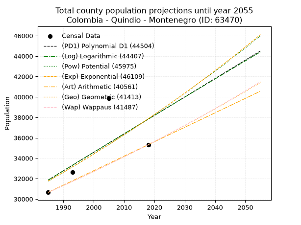
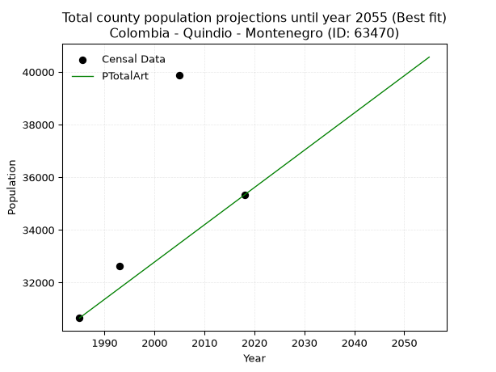
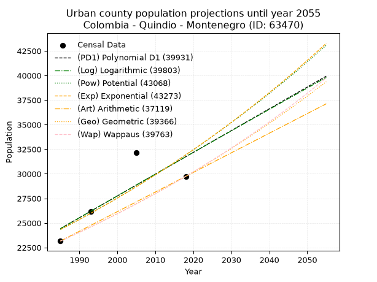
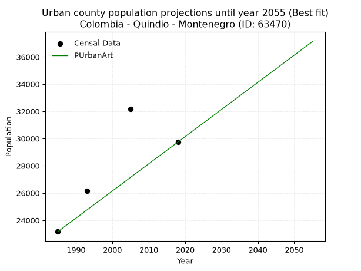
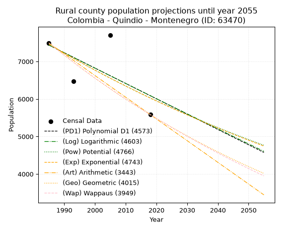
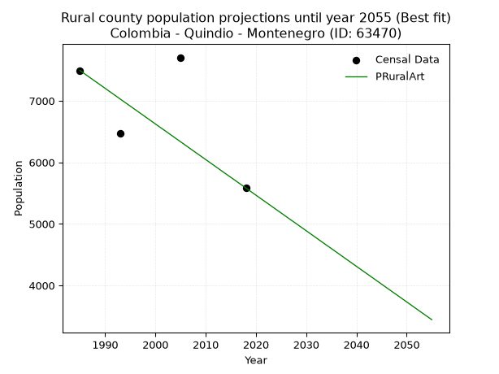

<div align="center">


</div>

# 📜 _“Population and Public Services Demand Projections (PPSD) until Year 2050 for Colombia - Quindio - Montenegro (ID: 63470)”_
Keywords: `population` `public-service` `projection` `lineal` `polynomial` `logarithmic` `potential` `exponential` `arithmetic` `geometric` `wappaus` `dane` `colombia` `south-america`

PPSD are analytical estimates used by governments and planners to anticipate future changes in population size, age distribution, and the resulting community needs for utilities, healthcare, education, and infrastructure as sizing future water treatment facilities, electrical grids, and road networks based on spatial growth.

<div align="center">

</img>

</div>


> **General running parameters**: • app_version: _v20260806_. • Python version: _3.14.7_. • Pandas version: _3.0.5_. • NumPy version: _2.5.1_. • Creates, save and include plots into reports (create_plot): _False_. • Projection until year: _2050_. • Process polynomial degree 2 and up: _False_. • Process Wappaus: _True_. • Process Wappaus: _True_. • Set negative values to zero: _True_. • Set infinite values to zero: _True_. • Drop dataset notes: _True_. 
<div align="center">

Dynamic map: [:earth_americas:Google](http://maps.google.com/maps?q=4.565057038,-75.7498273) [:earth_americas:OSM](https://www.openstreetmap.org/#map=18/4.565057038/-75.7498273&layers=P) [:earth_americas:Bing](https://www.bing.com/maps?cp=4.565057038~-75.7498273&lvl=18) [:earth_americas:Apple](https://maps.apple.com/frame?center=4.565057038%2C-75.7498273&span=0.003%2C0.006)

</div>


<div align="center">

```geojson
{
  "type": "Feature",
  "geometry": {
    "type": "Point", 
    "coordinates": [-75.7498273, 4.565057038]
  }, 
  "properties": {
    "Name": "Colombia - Quindio - Montenegro (ID: 63470)"
  }
}
```

</div>


## 0. Census Data (4 records)

Census data are official statistics collected by a government about the people and housing in a country. They usually include counts of total population, age, sex, race, income, education, and jobs.

📅Global census file: [Population.xlsx](../data/Population.xlsx)

| Source   |   Year |   CountryID | CountryName   |   StateID | StateName   |   CountyID | CountyName   |   PTotal |   PUrban |   PRural |
|:---------|-------:|------------:|:--------------|----------:|:------------|-----------:|:-------------|---------:|---------:|---------:|
| DANE     |   1985 |          57 | Colombia      |        63 | Quindio     |      63470 | Montenegro   |    30653 |    23161 |     7492 |
| DANE     |   1993 |          57 | Colombia      |        63 | Quindio     |      63470 | Montenegro   |    32620 |    26148 |     6472 |
| DANE     |   2005 |          57 | Colombia      |        63 | Quindio     |      63470 | Montenegro   |    39874 |    32169 |     7705 |
| DANE     |   2018 |          57 | Colombia      |        63 | Quindio     |      63470 | Montenegro   |    35324 |    29741 |     5583 |

> 🔥Some records could had specific notes about the registered values or the corresponding urban or rural distribution.

📅[SUI-RUPS](https://www.datos.gov.co/Hacienda-y-Cr-dito-P-blico/Registro-nico-de-Prestadores-de-Servicios-P-blicos/4qkq-csdn/about_data) - Local public utility companies: [RUPS.csv](../data/RUPS.xlsx)

 | SERVICIO       | ESTADO    | NOMBRE                                      | NIT         | DEPARTAMENTO_DOMICILIO   | MUNICIPIO_DOMICILIO   | DIRECCION                                      |   TELEFONO | EMAIL                                    | TIPO_PRESTADOR                             | CLASIFICACION                 |
|:---------------|:----------|:--------------------------------------------|:------------|:-------------------------|:----------------------|:-----------------------------------------------|-----------:|:-----------------------------------------|:-------------------------------------------|:------------------------------|
| ACUEDUCTO      | OPERATIVA | EMPRESAS PÚBLICAS DEL QUINDIO S.A.   E.S.P. | 800063823-7 | QUINDIO                  | ARMENIA               | CARRERA 14 N° 22-30 CENTRO                     |    7441774 | contactenos@epq.gov.co                   | SOCIEDADES (EMPRESA DE SERVICIOS PUBLICOS) | MAYOR O IGUAL A 5001 USUARIOS |
| ALCANTARILLADO | OPERATIVA | EMPRESAS PÚBLICAS DEL QUINDIO S.A.   E.S.P. | 800063823-7 | QUINDIO                  | ARMENIA               | CARRERA 14 N° 22-30 CENTRO                     |    7441774 | contactenos@epq.gov.co                   | SOCIEDADES (EMPRESA DE SERVICIOS PUBLICOS) | MAYOR O IGUAL A 5001 USUARIOS |
| ACUEDUCTO      | OPERATIVA | ASOCIACION ACUEDUCTO REGIONAL VILLARAZO     | 801000734-3 | QUINDIO                  | CIRCASIA              | IGLESIA VEREDA VILLARAZO MUNICIPIO DE CIRCACIA |    7327244 | asociacionacueductovillarazo@hotmail.com | ORGANIZACION AUTORIZADA                    | MENOR O IGUAL A 2500 USUARIOS |

## 1. Total

### 1.1. Coefficients and Parameters

* (PD1) Polynomial Deg 1: 180.56884785227086, -326565.0879165048 (lineal)
* (Log) Logarithmic: 362236.7319339398, -2718746.5522128697
* (Pow) Potential: 10.680263551505135, -30.719180788785035
* (Exp) Exponential: 0.005324490602214171, 0.8162200925915575
* (Art) Arithmetic: Year diff. 2018 - 1985 = 33, Population diff. 35324 - 30653 = 4671, Annual growth = 141.54545454545453
* (Geo) Geometric: Year diff. 2018 - 1985 = 33, Population diff. 35324 - 30653 = 4671, Annual growth % = 0.0043071912996397455
* (Wap) Wappaus: i = 0.42907514602196084, Condition values only valid for < 200)

<sub>
Wappaus condition values: ['0.00', '0.43', '0.86', '1.29', '1.72', '2.15', '2.57', '3.00', '3.43', '3.86', '4.29', '4.72', '5.15', '5.58', '6.01', '6.44', '6.87', '7.29', '7.72', '8.15', '8.58', '9.01', '9.44', '9.87', '10.30', '10.73', '11.16', '11.59', '12.01', '12.44', '12.87', '13.30', '13.73', '14.16', '14.59', '15.02', '15.45', '15.88', '16.30', '16.73', '17.16', '17.59', '18.02', '18.45', '18.88', '19.31', '19.74', '20.17', '20.60', '21.02', '21.45', '21.88', '22.31', '22.74', '23.17', '23.60', '24.03', '24.46', '24.89', '25.32', '25.74', '26.17', '26.60', '27.03', '27.46', '27.89']
</sub>


### 1.2. Projected Dataset

|   Year |   CountyID |   PTotalPD1 |   PTotalLog |   PTotalPow |   PTotalExp |   PTotalArt |   PTotalGeo |   PTotalWap |
|-------:|-----------:|------------:|------------:|------------:|------------:|------------:|------------:|------------:|
|   1985 |      63470 |       31864 |       31852 |       31752 |       31763 |       30653 |       30653 |       30653 |
|   1986 |      63470 |       32045 |       32035 |       31923 |       31932 |       30795 |       30785 |       30785 |
|   1987 |      63470 |       32225 |       32217 |       32095 |       32103 |       30936 |       30918 |       30917 |
|   1988 |      63470 |       32406 |       32400 |       32268 |       32274 |       31078 |       31051 |       31050 |
|   1989 |      63470 |       32586 |       32582 |       32442 |       32446 |       31219 |       31185 |       31184 |
|   1990 |      63470 |       32767 |       32764 |       32617 |       32619 |       31361 |       31319 |       31318 |
|   1991 |      63470 |       32947 |       32946 |       32792 |       32794 |       31502 |       31454 |       31452 |
|   1992 |      63470 |       33128 |       33128 |       32968 |       32969 |       31644 |       31589 |       31588 |
|   1993 |      63470 |       33309 |       33309 |       33146 |       33145 |       31785 |       31725 |       31724 |
|   1994 |      63470 |       33489 |       33491 |       33324 |       33322 |       31927 |       31862 |       31860 |
|   1995 |      63470 |       33670 |       33673 |       33503 |       33500 |       32068 |       31999 |       31997 |
|   1996 |      63470 |       33850 |       33854 |       33682 |       33678 |       32210 |       32137 |       32135 |
|   1997 |      63470 |       34031 |       34036 |       33863 |       33858 |       32352 |       32275 |       32273 |
|   1998 |      63470 |       34211 |       34217 |       34045 |       34039 |       32493 |       32414 |       32412 |
|   1999 |      63470 |       34392 |       34398 |       34227 |       34221 |       32635 |       32554 |       32551 |
|   2000 |      63470 |       34573 |       34580 |       34410 |       34403 |       32776 |       32694 |       32691 |
|   2001 |      63470 |       34753 |       34761 |       34595 |       34587 |       32918 |       32835 |       32832 |
|   2002 |      63470 |       34934 |       34942 |       34780 |       34772 |       33059 |       32977 |       32974 |
|   2003 |      63470 |       35114 |       35122 |       34966 |       34957 |       33201 |       33119 |       33116 |
|   2004 |      63470 |       35295 |       35303 |       35153 |       35144 |       33342 |       33261 |       33258 |
|   2005 |      63470 |       35475 |       35484 |       35340 |       35332 |       33484 |       33404 |       33401 |
|   2006 |      63470 |       35656 |       35665 |       35529 |       35520 |       33625 |       33548 |       33545 |
|   2007 |      63470 |       35837 |       35845 |       35719 |       35710 |       33767 |       33693 |       33690 |
|   2008 |      63470 |       36017 |       36026 |       35909 |       35900 |       33909 |       33838 |       33835 |
|   2009 |      63470 |       36198 |       36206 |       36101 |       36092 |       34050 |       33984 |       33981 |
|   2010 |      63470 |       36378 |       36386 |       36293 |       36285 |       34192 |       34130 |       34127 |
|   2011 |      63470 |       36559 |       36566 |       36486 |       36479 |       34333 |       34277 |       34275 |
|   2012 |      63470 |       36739 |       36746 |       36681 |       36673 |       34475 |       34425 |       34423 |
|   2013 |      63470 |       36920 |       36926 |       36876 |       36869 |       34616 |       34573 |       34571 |
|   2014 |      63470 |       37101 |       37106 |       37072 |       37066 |       34758 |       34722 |       34720 |
|   2015 |      63470 |       37281 |       37286 |       37269 |       37264 |       34899 |       34871 |       34870 |
|   2016 |      63470 |       37462 |       37466 |       37467 |       37463 |       35041 |       35022 |       35021 |
|   2017 |      63470 |       37642 |       37646 |       37666 |       37663 |       35182 |       35173 |       35172 |
|   2018 |      63470 |       37823 |       37825 |       37866 |       37864 |       35324 |       35324 |       35324 |
|   2019 |      63470 |       38003 |       38005 |       38067 |       38066 |       35466 |       35476 |       35477 |
|   2020 |      63470 |       38184 |       38184 |       38269 |       38269 |       35607 |       35629 |       35630 |
|   2021 |      63470 |       38365 |       38363 |       38471 |       38473 |       35749 |       35782 |       35784 |
|   2022 |      63470 |       38545 |       38542 |       38675 |       38679 |       35890 |       35937 |       35939 |
|   2023 |      63470 |       38726 |       38721 |       38880 |       38885 |       36032 |       36091 |       36095 |
|   2024 |      63470 |       38906 |       38900 |       39086 |       39093 |       36173 |       36247 |       36251 |
|   2025 |      63470 |       39087 |       39079 |       39293 |       39302 |       36315 |       36403 |       36408 |
|   2026 |      63470 |       39267 |       39258 |       39500 |       39511 |       36456 |       36560 |       36566 |
|   2027 |      63470 |       39448 |       39437 |       39709 |       39722 |       36598 |       36717 |       36724 |
|   2028 |      63470 |       39629 |       39616 |       39919 |       39934 |       36739 |       36875 |       36883 |
|   2029 |      63470 |       39809 |       39794 |       40129 |       40148 |       36881 |       37034 |       37043 |
|   2030 |      63470 |       39990 |       39973 |       40341 |       40362 |       37023 |       37194 |       37204 |
|   2031 |      63470 |       40170 |       40151 |       40554 |       40578 |       37164 |       37354 |       37366 |
|   2032 |      63470 |       40351 |       40329 |       40768 |       40794 |       37306 |       37515 |       37528 |
|   2033 |      63470 |       40531 |       40508 |       40982 |       41012 |       37447 |       37676 |       37691 |
|   2034 |      63470 |       40712 |       40686 |       41198 |       41231 |       37589 |       37839 |       37855 |
|   2035 |      63470 |       40893 |       40864 |       41415 |       41451 |       37730 |       38002 |       38019 |
|   2036 |      63470 |       41073 |       41042 |       41633 |       41672 |       37872 |       38165 |       38185 |
|   2037 |      63470 |       41254 |       41220 |       41852 |       41895 |       38013 |       38330 |       38351 |
|   2038 |      63470 |       41434 |       41397 |       42072 |       42118 |       38155 |       38495 |       38518 |
|   2039 |      63470 |       41615 |       41575 |       42293 |       42343 |       38296 |       38661 |       38686 |
|   2040 |      63470 |       41795 |       41753 |       42515 |       42569 |       38438 |       38827 |       38855 |
|   2041 |      63470 |       41976 |       41930 |       42738 |       42797 |       38580 |       38994 |       39024 |
|   2042 |      63470 |       42156 |       42108 |       42962 |       43025 |       38721 |       39162 |       39194 |
|   2043 |      63470 |       42337 |       42285 |       43187 |       43255 |       38863 |       39331 |       39366 |
|   2044 |      63470 |       42518 |       42462 |       43414 |       43486 |       39004 |       39500 |       39538 |
|   2045 |      63470 |       42698 |       42640 |       43641 |       43718 |       39146 |       39670 |       39710 |
|   2046 |      63470 |       42879 |       42817 |       43870 |       43951 |       39287 |       39841 |       39884 |
|   2047 |      63470 |       43059 |       42994 |       44099 |       44186 |       39429 |       40013 |       40059 |
|   2048 |      63470 |       43240 |       43171 |       44330 |       44422 |       39570 |       40185 |       40234 |
|   2049 |      63470 |       43420 |       43347 |       44562 |       44659 |       39712 |       40358 |       40410 |
|   2050 |      63470 |       43601 |       43524 |       44794 |       44897 |       39853 |       40532 |       40587 |
<div align="center">

</img>

</div>


### 1.3. Best fit with absolute and relative error (%)

Relative error puts that difference into context by dividing the absolute error by the true value, creating a unitless ratio or percentage that shows the scale of the mistake.

Absolute and relative error

|   Year | Source   |   CountryID | CountryName   |   StateID | StateName   |   CountyID_x | CountyName   |   PTotal |   PUrban |   PRural |   CountyID_y |   PTotalPD1 |   PTotalLog |   PTotalPow |   PTotalExp |   PTotalArt |   PTotalGeo |   PTotalWap |   PTotalPD1AbsError |   PTotalLogAbsError |   PTotalPowAbsError |   PTotalExpAbsError |   PTotalArtAbsError |   PTotalGeoAbsError |   PTotalWapAbsError |   PTotalPD1RelError |   PTotalLogRelError |   PTotalPowRelError |   PTotalExpRelError |   PTotalArtRelError |   PTotalGeoRelError |   PTotalWapRelError |
|-------:|:---------|------------:|:--------------|----------:|:------------|-------------:|:-------------|---------:|---------:|---------:|-------------:|------------:|------------:|------------:|------------:|------------:|------------:|------------:|--------------------:|--------------------:|--------------------:|--------------------:|--------------------:|--------------------:|--------------------:|--------------------:|--------------------:|--------------------:|--------------------:|--------------------:|--------------------:|--------------------:|
|   1985 | DANE     |          57 | Colombia      |        63 | Quindio     |        63470 | Montenegro   |    30653 |    23161 |     7492 |        63470 |       31864 |       31852 |       31752 |       31763 |       30653 |       30653 |       30653 |                1211 |                1199 |                1099 |                1110 |                   0 |                   0 |                   0 |             3.95067 |             3.91153 |             3.58529 |             3.62118 |             0       |             0       |             0       |
|   1993 | DANE     |          57 | Colombia      |        63 | Quindio     |        63470 | Montenegro   |    32620 |    26148 |     6472 |        63470 |       33309 |       33309 |       33146 |       33145 |       31785 |       31725 |       31724 |                 689 |                 689 |                 526 |                 525 |                 835 |                 895 |                 896 |             2.1122  |             2.1122  |             1.61251 |             1.60944 |             2.55978 |             2.74372 |             2.74678 |
|   2005 | DANE     |          57 | Colombia      |        63 | Quindio     |        63470 | Montenegro   |    39874 |    32169 |     7705 |        63470 |       35475 |       35484 |       35340 |       35332 |       33484 |       33404 |       33401 |                4399 |                4390 |                4534 |                4542 |                6390 |                6470 |                6473 |            11.0323  |            11.0097  |            11.3708  |            11.3909  |            16.0255  |            16.2261  |            16.2336  |
|   2018 | DANE     |          57 | Colombia      |        63 | Quindio     |        63470 | Montenegro   |    35324 |    29741 |     5583 |        63470 |       37823 |       37825 |       37866 |       37864 |       35324 |       35324 |       35324 |                2499 |                2501 |                2542 |                2540 |                   0 |                   0 |                   0 |             7.07451 |             7.08017 |             7.19624 |             7.19058 |             0       |             0       |             0       |

Relative error mean

| Method    |   RelError | Best   |
|:----------|-----------:|:-------|
| PTotalPD1 |    6.04241 |        |
| PTotalLog |    6.02839 |        |
| PTotalPow |    5.94121 |        |
| PTotalExp |    5.95302 |        |
| PTotalArt |    4.64631 | True   |
| PTotalGeo |    4.74246 |        |
| PTotalWap |    4.7451  |        |

💙Best method: _**PTotalArt**_
<div align="center">

</img>

</div>


### 1.4. Fresh water supply demand in liters per capita per day (lpcd)

The fresh water supply demand typically ranges from 100 to 300 liters per capita per day (lpcd) for standard domestic and municipal planning, though absolute survival minimums set by the World Health Organization are as low as 7.5 to 20 liters per day, and total consumption in high-income nations can exceed 400 liters.

> `CZ`: Level in meters above the sea level (masl)<br> `WS`: Fresh water supply demand in liters per capita per day (lpcd or l/h/d)<br> `WSAll`: Zonal fresh water supply demand in liters per second (l/s)<br> `A`: Zonal area in square meters<br> `DP`: Population density (people/hectare or p/ha)

Reference values (RAS Colombia)

|    CZ |   WS |
|------:|-----:|
|  1000 |  120 |
|  2000 |  130 |
| 99999 |  140 |

County shapefile geometry properties and water supply values

|   CountyID |      ATotal |   CZTotal |   WSTotal |
|-----------:|------------:|----------:|----------:|
|      63470 | 1.49438e+08 |   1193.11 |       130 |

Projected values for best method: PTotalArt

|   CountyID |   Year |   PTotalArt |   DPTotal |   WSTotal |   WSTotalAll |
|-----------:|-------:|------------:|----------:|----------:|-------------:|
|      63470 |   1985 |       30653 |      2.05 |       130 |      46.1214 |
|      63470 |   1986 |       30795 |      2.06 |       130 |      46.3351 |
|      63470 |   1987 |       30936 |      2.07 |       130 |      46.5472 |
|      63470 |   1988 |       31078 |      2.08 |       130 |      46.7609 |
|      63470 |   1989 |       31219 |      2.09 |       130 |      46.973  |
|      63470 |   1990 |       31361 |      2.1  |       130 |      47.1867 |
|      63470 |   1991 |       31502 |      2.11 |       130 |      47.3988 |
|      63470 |   1992 |       31644 |      2.12 |       130 |      47.6125 |
|      63470 |   1993 |       31785 |      2.13 |       130 |      47.8247 |
|      63470 |   1994 |       31927 |      2.14 |       130 |      48.0383 |
|      63470 |   1995 |       32068 |      2.15 |       130 |      48.2505 |
|      63470 |   1996 |       32210 |      2.16 |       130 |      48.4641 |
|      63470 |   1997 |       32352 |      2.16 |       130 |      48.6778 |
|      63470 |   1998 |       32493 |      2.17 |       130 |      48.8899 |
|      63470 |   1999 |       32635 |      2.18 |       130 |      49.1036 |
|      63470 |   2000 |       32776 |      2.19 |       130 |      49.3157 |
|      63470 |   2001 |       32918 |      2.2  |       130 |      49.5294 |
|      63470 |   2002 |       33059 |      2.21 |       130 |      49.7416 |
|      63470 |   2003 |       33201 |      2.22 |       130 |      49.9552 |
|      63470 |   2004 |       33342 |      2.23 |       130 |      50.1674 |
|      63470 |   2005 |       33484 |      2.24 |       130 |      50.381  |
|      63470 |   2006 |       33625 |      2.25 |       130 |      50.5932 |
|      63470 |   2007 |       33767 |      2.26 |       130 |      50.8068 |
|      63470 |   2008 |       33909 |      2.27 |       130 |      51.0205 |
|      63470 |   2009 |       34050 |      2.28 |       130 |      51.2326 |
|      63470 |   2010 |       34192 |      2.29 |       130 |      51.4463 |
|      63470 |   2011 |       34333 |      2.3  |       130 |      51.6584 |
|      63470 |   2012 |       34475 |      2.31 |       130 |      51.8721 |
|      63470 |   2013 |       34616 |      2.32 |       130 |      52.0843 |
|      63470 |   2014 |       34758 |      2.33 |       130 |      52.2979 |
|      63470 |   2015 |       34899 |      2.34 |       130 |      52.5101 |
|      63470 |   2016 |       35041 |      2.34 |       130 |      52.7237 |
|      63470 |   2017 |       35182 |      2.35 |       130 |      52.9359 |
|      63470 |   2018 |       35324 |      2.36 |       130 |      53.1495 |
|      63470 |   2019 |       35466 |      2.37 |       130 |      53.3632 |
|      63470 |   2020 |       35607 |      2.38 |       130 |      53.5753 |
|      63470 |   2021 |       35749 |      2.39 |       130 |      53.789  |
|      63470 |   2022 |       35890 |      2.4  |       130 |      54.0012 |
|      63470 |   2023 |       36032 |      2.41 |       130 |      54.2148 |
|      63470 |   2024 |       36173 |      2.42 |       130 |      54.427  |
|      63470 |   2025 |       36315 |      2.43 |       130 |      54.6406 |
|      63470 |   2026 |       36456 |      2.44 |       130 |      54.8528 |
|      63470 |   2027 |       36598 |      2.45 |       130 |      55.0664 |
|      63470 |   2028 |       36739 |      2.46 |       130 |      55.2786 |
|      63470 |   2029 |       36881 |      2.47 |       130 |      55.4922 |
|      63470 |   2030 |       37023 |      2.48 |       130 |      55.7059 |
|      63470 |   2031 |       37164 |      2.49 |       130 |      55.9181 |
|      63470 |   2032 |       37306 |      2.5  |       130 |      56.1317 |
|      63470 |   2033 |       37447 |      2.51 |       130 |      56.3439 |
|      63470 |   2034 |       37589 |      2.52 |       130 |      56.5575 |
|      63470 |   2035 |       37730 |      2.52 |       130 |      56.7697 |
|      63470 |   2036 |       37872 |      2.53 |       130 |      56.9833 |
|      63470 |   2037 |       38013 |      2.54 |       130 |      57.1955 |
|      63470 |   2038 |       38155 |      2.55 |       130 |      57.4091 |
|      63470 |   2039 |       38296 |      2.56 |       130 |      57.6213 |
|      63470 |   2040 |       38438 |      2.57 |       130 |      57.835  |
|      63470 |   2041 |       38580 |      2.58 |       130 |      58.0486 |
|      63470 |   2042 |       38721 |      2.59 |       130 |      58.2608 |
|      63470 |   2043 |       38863 |      2.6  |       130 |      58.4744 |
|      63470 |   2044 |       39004 |      2.61 |       130 |      58.6866 |
|      63470 |   2045 |       39146 |      2.62 |       130 |      58.9002 |
|      63470 |   2046 |       39287 |      2.63 |       130 |      59.1124 |
|      63470 |   2047 |       39429 |      2.64 |       130 |      59.326  |
|      63470 |   2048 |       39570 |      2.65 |       130 |      59.5382 |
|      63470 |   2049 |       39712 |      2.66 |       130 |      59.7519 |
|      63470 |   2050 |       39853 |      2.67 |       130 |      59.964  |

## 2. Urban

### 2.1. Coefficients and Parameters

* (PD1) Polynomial Deg 1: 221.4809313528716, -415212.4829385815 (lineal)
* (Log) Logarithmic: 444003.35708068684, -3347068.3251899057
* (Pow) Potential: 16.480054808548072, -49.96116349600033
* (Exp) Exponential: 0.008220947376990613, 0.001991730096531009
* (Art) Arithmetic: Year diff. 2018 - 1985 = 33, Population diff. 29741 - 23161 = 6580, Annual growth = 199.3939393939394
* (Geo) Geometric: Year diff. 2018 - 1985 = 33, Population diff. 29741 - 23161 = 6580, Annual growth % = 0.007606258564108126
* (Wap) Wappaus: i = 0.7538238228949355, Condition values only valid for < 200)

<sub>
Wappaus condition values: ['0.00', '0.75', '1.51', '2.26', '3.02', '3.77', '4.52', '5.28', '6.03', '6.78', '7.54', '8.29', '9.05', '9.80', '10.55', '11.31', '12.06', '12.82', '13.57', '14.32', '15.08', '15.83', '16.58', '17.34', '18.09', '18.85', '19.60', '20.35', '21.11', '21.86', '22.61', '23.37', '24.12', '24.88', '25.63', '26.38', '27.14', '27.89', '28.65', '29.40', '30.15', '30.91', '31.66', '32.41', '33.17', '33.92', '34.68', '35.43', '36.18', '36.94', '37.69', '38.45', '39.20', '39.95', '40.71', '41.46', '42.21', '42.97', '43.72', '44.48', '45.23', '45.98', '46.74', '47.49', '48.24', '49.00']
</sub>


### 2.2. Projected Dataset

|   Year |   CountyID |   PUrbanPD1 |   PUrbanLog |   PUrbanPow |   PUrbanExp |   PUrbanArt |   PUrbanGeo |   PUrbanWap |
|-------:|-----------:|------------:|------------:|------------:|------------:|------------:|------------:|------------:|
|   1985 |      63470 |       24427 |       24415 |       24328 |       24339 |       23161 |       23161 |       23161 |
|   1986 |      63470 |       24649 |       24639 |       24531 |       24540 |       23360 |       23337 |       23336 |
|   1987 |      63470 |       24870 |       24862 |       24735 |       24742 |       23560 |       23515 |       23513 |
|   1988 |      63470 |       25092 |       25086 |       24941 |       24947 |       23759 |       23694 |       23691 |
|   1989 |      63470 |       25313 |       25309 |       25149 |       25153 |       23959 |       23874 |       23870 |
|   1990 |      63470 |       25535 |       25532 |       25358 |       25360 |       24158 |       24055 |       24051 |
|   1991 |      63470 |       25756 |       25755 |       25569 |       25569 |       24357 |       24238 |       24233 |
|   1992 |      63470 |       25978 |       25978 |       25781 |       25781 |       24557 |       24423 |       24416 |
|   1993 |      63470 |       26199 |       26201 |       25995 |       25993 |       24756 |       24608 |       24601 |
|   1994 |      63470 |       26420 |       26424 |       26211 |       26208 |       24956 |       24796 |       24788 |
|   1995 |      63470 |       26642 |       26646 |       26429 |       26424 |       25155 |       24984 |       24975 |
|   1996 |      63470 |       26863 |       26869 |       26648 |       26642 |       25354 |       25174 |       25165 |
|   1997 |      63470 |       27085 |       27091 |       26869 |       26862 |       25554 |       25366 |       25355 |
|   1998 |      63470 |       27306 |       27314 |       27091 |       27084 |       25753 |       25559 |       25548 |
|   1999 |      63470 |       27528 |       27536 |       27316 |       27308 |       25953 |       25753 |       25741 |
|   2000 |      63470 |       27749 |       27758 |       27542 |       27533 |       26152 |       25949 |       25937 |
|   2001 |      63470 |       27971 |       27980 |       27770 |       27760 |       26351 |       26146 |       26134 |
|   2002 |      63470 |       28192 |       28202 |       27999 |       27990 |       26551 |       26345 |       26332 |
|   2003 |      63470 |       28414 |       28423 |       28231 |       28221 |       26750 |       26546 |       26532 |
|   2004 |      63470 |       28635 |       28645 |       28464 |       28454 |       26949 |       26748 |       26734 |
|   2005 |      63470 |       28857 |       28867 |       28699 |       28688 |       27149 |       26951 |       26938 |
|   2006 |      63470 |       29078 |       29088 |       28936 |       28925 |       27348 |       27156 |       27143 |
|   2007 |      63470 |       29300 |       29309 |       29174 |       29164 |       27548 |       27363 |       27349 |
|   2008 |      63470 |       29521 |       29530 |       29415 |       29405 |       27747 |       27571 |       27558 |
|   2009 |      63470 |       29743 |       29751 |       29657 |       29647 |       27946 |       27780 |       27768 |
|   2010 |      63470 |       29964 |       29972 |       29901 |       29892 |       28146 |       27992 |       27980 |
|   2011 |      63470 |       30186 |       30193 |       30147 |       30139 |       28345 |       28205 |       28194 |
|   2012 |      63470 |       30407 |       30414 |       30395 |       30388 |       28545 |       28419 |       28409 |
|   2013 |      63470 |       30629 |       30635 |       30645 |       30639 |       28744 |       28635 |       28626 |
|   2014 |      63470 |       30850 |       30855 |       30897 |       30892 |       28943 |       28853 |       28846 |
|   2015 |      63470 |       31072 |       31075 |       31151 |       31147 |       29143 |       29073 |       29067 |
|   2016 |      63470 |       31293 |       31296 |       31407 |       31404 |       29342 |       29294 |       29289 |
|   2017 |      63470 |       31515 |       31516 |       31664 |       31663 |       29542 |       29516 |       29514 |
|   2018 |      63470 |       31736 |       31736 |       31924 |       31924 |       29741 |       29741 |       29741 |
|   2019 |      63470 |       31958 |       31956 |       32186 |       32188 |       29940 |       29967 |       29970 |
|   2020 |      63470 |       32179 |       32176 |       32450 |       32453 |       30140 |       30195 |       30200 |
|   2021 |      63470 |       32400 |       32396 |       32715 |       32721 |       30339 |       30425 |       30433 |
|   2022 |      63470 |       32622 |       32615 |       32983 |       32991 |       30539 |       30656 |       30668 |
|   2023 |      63470 |       32843 |       32835 |       33253 |       33264 |       30738 |       30889 |       30905 |
|   2024 |      63470 |       33065 |       33054 |       33525 |       33538 |       30937 |       31124 |       31144 |
|   2025 |      63470 |       33286 |       33274 |       33799 |       33815 |       31137 |       31361 |       31385 |
|   2026 |      63470 |       33508 |       33493 |       34075 |       34094 |       31336 |       31600 |       31628 |
|   2027 |      63470 |       33729 |       33712 |       34353 |       34376 |       31536 |       31840 |       31873 |
|   2028 |      63470 |       33951 |       33931 |       34634 |       34660 |       31735 |       32082 |       32121 |
|   2029 |      63470 |       34172 |       34150 |       34916 |       34946 |       31934 |       32326 |       32370 |
|   2030 |      63470 |       34394 |       34368 |       35201 |       35234 |       32134 |       32572 |       32622 |
|   2031 |      63470 |       34615 |       34587 |       35488 |       35525 |       32333 |       32820 |       32877 |
|   2032 |      63470 |       34837 |       34806 |       35777 |       35818 |       32533 |       33069 |       33133 |
|   2033 |      63470 |       35058 |       35024 |       36068 |       36114 |       32732 |       33321 |       33393 |
|   2034 |      63470 |       35280 |       35243 |       36361 |       36412 |       32931 |       33574 |       33654 |
|   2035 |      63470 |       35501 |       35461 |       36657 |       36713 |       33131 |       33830 |       33918 |
|   2036 |      63470 |       35723 |       35679 |       36955 |       37016 |       33330 |       34087 |       34184 |
|   2037 |      63470 |       35944 |       35897 |       37255 |       37321 |       33529 |       34346 |       34453 |
|   2038 |      63470 |       36166 |       36115 |       37558 |       37629 |       33729 |       34608 |       34724 |
|   2039 |      63470 |       36387 |       36333 |       37863 |       37940 |       33928 |       34871 |       34998 |
|   2040 |      63470 |       36609 |       36550 |       38170 |       38253 |       34128 |       35136 |       35275 |
|   2041 |      63470 |       36830 |       36768 |       38480 |       38569 |       34327 |       35403 |       35554 |
|   2042 |      63470 |       37052 |       36985 |       38791 |       38887 |       34526 |       35673 |       35836 |
|   2043 |      63470 |       37273 |       37203 |       39106 |       39208 |       34726 |       35944 |       36120 |
|   2044 |      63470 |       37495 |       37420 |       39422 |       39532 |       34925 |       36217 |       36408 |
|   2045 |      63470 |       37716 |       37637 |       39741 |       39858 |       35125 |       36493 |       36698 |
|   2046 |      63470 |       37938 |       37854 |       40063 |       40187 |       35324 |       36771 |       36991 |
|   2047 |      63470 |       38159 |       38071 |       40387 |       40519 |       35523 |       37050 |       37287 |
|   2048 |      63470 |       38380 |       38288 |       40713 |       40854 |       35723 |       37332 |       37586 |
|   2049 |      63470 |       38602 |       38505 |       41042 |       41191 |       35922 |       37616 |       37887 |
|   2050 |      63470 |       38823 |       38721 |       41373 |       41531 |       36122 |       37902 |       38192 |
<div align="center">

</img>

</div>


### 2.3. Best fit with absolute and relative error (%)

Relative error puts that difference into context by dividing the absolute error by the true value, creating a unitless ratio or percentage that shows the scale of the mistake.

Absolute and relative error

|   Year | Source   |   CountryID | CountryName   |   StateID | StateName   |   CountyID_x | CountyName   |   PTotal |   PUrban |   PRural |   CountyID_y |   PUrbanPD1 |   PUrbanLog |   PUrbanPow |   PUrbanExp |   PUrbanArt |   PUrbanGeo |   PUrbanWap |   PUrbanPD1AbsError |   PUrbanLogAbsError |   PUrbanPowAbsError |   PUrbanExpAbsError |   PUrbanArtAbsError |   PUrbanGeoAbsError |   PUrbanWapAbsError |   PUrbanPD1RelError |   PUrbanLogRelError |   PUrbanPowRelError |   PUrbanExpRelError |   PUrbanArtRelError |   PUrbanGeoRelError |   PUrbanWapRelError |
|-------:|:---------|------------:|:--------------|----------:|:------------|-------------:|:-------------|---------:|---------:|---------:|-------------:|------------:|------------:|------------:|------------:|------------:|------------:|------------:|--------------------:|--------------------:|--------------------:|--------------------:|--------------------:|--------------------:|--------------------:|--------------------:|--------------------:|--------------------:|--------------------:|--------------------:|--------------------:|--------------------:|
|   1985 | DANE     |          57 | Colombia      |        63 | Quindio     |        63470 | Montenegro   |    30653 |    23161 |     7492 |        63470 |       24427 |       24415 |       24328 |       24339 |       23161 |       23161 |       23161 |                1266 |                1254 |                1167 |                1178 |                   0 |                   0 |                   0 |            5.46609  |            5.41427  |            5.03864  |             5.08614 |             0       |             0       |             0       |
|   1993 | DANE     |          57 | Colombia      |        63 | Quindio     |        63470 | Montenegro   |    32620 |    26148 |     6472 |        63470 |       26199 |       26201 |       25995 |       25993 |       24756 |       24608 |       24601 |                  51 |                  53 |                 153 |                 155 |                1392 |                1540 |                1547 |            0.195044 |            0.202692 |            0.585131 |             0.59278 |             5.32354 |             5.88955 |             5.91632 |
|   2005 | DANE     |          57 | Colombia      |        63 | Quindio     |        63470 | Montenegro   |    39874 |    32169 |     7705 |        63470 |       28857 |       28867 |       28699 |       28688 |       27149 |       26951 |       26938 |                3312 |                3302 |                3470 |                3481 |                5020 |                5218 |                5231 |           10.2956   |           10.2645   |           10.7868   |            10.821   |            15.6051  |            16.2206  |            16.261   |
|   2018 | DANE     |          57 | Colombia      |        63 | Quindio     |        63470 | Montenegro   |    35324 |    29741 |     5583 |        63470 |       31736 |       31736 |       31924 |       31924 |       29741 |       29741 |       29741 |                1995 |                1995 |                2183 |                2183 |                   0 |                   0 |                   0 |            6.70791  |            6.70791  |            7.34004  |             7.34004 |             0       |             0       |             0       |

Relative error mean

| Method    |   RelError | Best   |
|:----------|-----------:|:-------|
| PUrbanPD1 |    5.66617 |        |
| PUrbanLog |    5.64735 |        |
| PUrbanPow |    5.93765 |        |
| PUrbanExp |    5.95998 |        |
| PUrbanArt |    5.23216 | True   |
| PUrbanGeo |    5.52753 |        |
| PUrbanWap |    5.54433 |        |

💙Best method: _**PUrbanArt**_
<div align="center">

</img>

</div>


### 2.4. Fresh water supply demand in liters per capita per day (lpcd)

The fresh water supply demand typically ranges from 100 to 300 liters per capita per day (lpcd) for standard domestic and municipal planning, though absolute survival minimums set by the World Health Organization are as low as 7.5 to 20 liters per day, and total consumption in high-income nations can exceed 400 liters.

> `CZ`: Level in meters above the sea level (masl)<br> `WS`: Fresh water supply demand in liters per capita per day (lpcd or l/h/d)<br> `WSAll`: Zonal fresh water supply demand in liters per second (l/s)<br> `A`: Zonal area in square meters<br> `DP`: Population density (people/hectare or p/ha)

Reference values (RAS Colombia)

|    CZ |   WS |
|------:|-----:|
|  1000 |  120 |
|  2000 |  130 |
| 99999 |  140 |

County shapefile geometry properties and water supply values

|   CountyID |      AUrban |   CZUrban |   WSUrban |
|-----------:|------------:|----------:|----------:|
|      63470 | 3.11767e+06 |   1285.83 |       130 |

Projected values for best method: PUrbanArt

|   CountyID |   Year |   PUrbanArt |   DPUrban |   WSUrban |   WSUrbanAll |
|-----------:|-------:|------------:|----------:|----------:|-------------:|
|      63470 |   1985 |       23161 |     74.29 |       130 |      34.8487 |
|      63470 |   1986 |       23360 |     74.93 |       130 |      35.1481 |
|      63470 |   1987 |       23560 |     75.57 |       130 |      35.4491 |
|      63470 |   1988 |       23759 |     76.21 |       130 |      35.7485 |
|      63470 |   1989 |       23959 |     76.85 |       130 |      36.0494 |
|      63470 |   1990 |       24158 |     77.49 |       130 |      36.3488 |
|      63470 |   1991 |       24357 |     78.13 |       130 |      36.6483 |
|      63470 |   1992 |       24557 |     78.77 |       130 |      36.9492 |
|      63470 |   1993 |       24756 |     79.41 |       130 |      37.2486 |
|      63470 |   1994 |       24956 |     80.05 |       130 |      37.5495 |
|      63470 |   1995 |       25155 |     80.69 |       130 |      37.849  |
|      63470 |   1996 |       25354 |     81.32 |       130 |      38.1484 |
|      63470 |   1997 |       25554 |     81.97 |       130 |      38.4493 |
|      63470 |   1998 |       25753 |     82.6  |       130 |      38.7487 |
|      63470 |   1999 |       25953 |     83.24 |       130 |      39.0497 |
|      63470 |   2000 |       26152 |     83.88 |       130 |      39.3491 |
|      63470 |   2001 |       26351 |     84.52 |       130 |      39.6485 |
|      63470 |   2002 |       26551 |     85.16 |       130 |      39.9494 |
|      63470 |   2003 |       26750 |     85.8  |       130 |      40.2488 |
|      63470 |   2004 |       26949 |     86.44 |       130 |      40.5483 |
|      63470 |   2005 |       27149 |     87.08 |       130 |      40.8492 |
|      63470 |   2006 |       27348 |     87.72 |       130 |      41.1486 |
|      63470 |   2007 |       27548 |     88.36 |       130 |      41.4495 |
|      63470 |   2008 |       27747 |     89    |       130 |      41.749  |
|      63470 |   2009 |       27946 |     89.64 |       130 |      42.0484 |
|      63470 |   2010 |       28146 |     90.28 |       130 |      42.3493 |
|      63470 |   2011 |       28345 |     90.92 |       130 |      42.6487 |
|      63470 |   2012 |       28545 |     91.56 |       130 |      42.9497 |
|      63470 |   2013 |       28744 |     92.2  |       130 |      43.2491 |
|      63470 |   2014 |       28943 |     92.84 |       130 |      43.5485 |
|      63470 |   2015 |       29143 |     93.48 |       130 |      43.8494 |
|      63470 |   2016 |       29342 |     94.12 |       130 |      44.1488 |
|      63470 |   2017 |       29542 |     94.76 |       130 |      44.4498 |
|      63470 |   2018 |       29741 |     95.4  |       130 |      44.7492 |
|      63470 |   2019 |       29940 |     96.03 |       130 |      45.0486 |
|      63470 |   2020 |       30140 |     96.67 |       130 |      45.3495 |
|      63470 |   2021 |       30339 |     97.31 |       130 |      45.649  |
|      63470 |   2022 |       30539 |     97.95 |       130 |      45.9499 |
|      63470 |   2023 |       30738 |     98.59 |       130 |      46.2493 |
|      63470 |   2024 |       30937 |     99.23 |       130 |      46.5487 |
|      63470 |   2025 |       31137 |     99.87 |       130 |      46.8497 |
|      63470 |   2026 |       31336 |    100.51 |       130 |      47.1491 |
|      63470 |   2027 |       31536 |    101.15 |       130 |      47.45   |
|      63470 |   2028 |       31735 |    101.79 |       130 |      47.7494 |
|      63470 |   2029 |       31934 |    102.43 |       130 |      48.0488 |
|      63470 |   2030 |       32134 |    103.07 |       130 |      48.3498 |
|      63470 |   2031 |       32333 |    103.71 |       130 |      48.6492 |
|      63470 |   2032 |       32533 |    104.35 |       130 |      48.9501 |
|      63470 |   2033 |       32732 |    104.99 |       130 |      49.2495 |
|      63470 |   2034 |       32931 |    105.63 |       130 |      49.549  |
|      63470 |   2035 |       33131 |    106.27 |       130 |      49.8499 |
|      63470 |   2036 |       33330 |    106.91 |       130 |      50.1493 |
|      63470 |   2037 |       33529 |    107.55 |       130 |      50.4487 |
|      63470 |   2038 |       33729 |    108.19 |       130 |      50.7497 |
|      63470 |   2039 |       33928 |    108.82 |       130 |      51.0491 |
|      63470 |   2040 |       34128 |    109.47 |       130 |      51.35   |
|      63470 |   2041 |       34327 |    110.1  |       130 |      51.6494 |
|      63470 |   2042 |       34526 |    110.74 |       130 |      51.9488 |
|      63470 |   2043 |       34726 |    111.38 |       130 |      52.2498 |
|      63470 |   2044 |       34925 |    112.02 |       130 |      52.5492 |
|      63470 |   2045 |       35125 |    112.66 |       130 |      52.8501 |
|      63470 |   2046 |       35324 |    113.3  |       130 |      53.1495 |
|      63470 |   2047 |       35523 |    113.94 |       130 |      53.449  |
|      63470 |   2048 |       35723 |    114.58 |       130 |      53.7499 |
|      63470 |   2049 |       35922 |    115.22 |       130 |      54.0493 |
|      63470 |   2050 |       36122 |    115.86 |       130 |      54.3502 |

## 3. Rural

### 3.1. Coefficients and Parameters

* (PD1) Polynomial Deg 1: -40.912083500600914, 88647.39502207698 (lineal)
* (Log) Logarithmic: -81766.62514674694, 628321.7729770354
* (Pow) Potential: -12.921765055754827, 46.48554553611776
* (Exp) Exponential: -0.006465262246667209, 2793679169.3104553
* (Art) Arithmetic: Year diff. 2018 - 1985 = 33, Population diff. 5583 - 7492 = -1909, Annual growth = -57.84848484848485
* (Geo) Geometric: Year diff. 2018 - 1985 = 33, Population diff. 5583 - 7492 = -1909, Annual growth % = -0.00887281184580102
* (Wap) Wappaus: i = -0.8848716611622921, Condition values only valid for < 200)

<sub>
Wappaus condition values: ['-0.00', '-0.88', '-1.77', '-2.65', '-3.54', '-4.42', '-5.31', '-6.19', '-7.08', '-7.96', '-8.85', '-9.73', '-10.62', '-11.50', '-12.39', '-13.27', '-14.16', '-15.04', '-15.93', '-16.81', '-17.70', '-18.58', '-19.47', '-20.35', '-21.24', '-22.12', '-23.01', '-23.89', '-24.78', '-25.66', '-26.55', '-27.43', '-28.32', '-29.20', '-30.09', '-30.97', '-31.86', '-32.74', '-33.63', '-34.51', '-35.39', '-36.28', '-37.16', '-38.05', '-38.93', '-39.82', '-40.70', '-41.59', '-42.47', '-43.36', '-44.24', '-45.13', '-46.01', '-46.90', '-47.78', '-48.67', '-49.55', '-50.44', '-51.32', '-52.21', '-53.09', '-53.98', '-54.86', '-55.75', '-56.63', '-57.52']
</sub>


### 3.2. Projected Dataset

|   Year |   CountyID |   PRuralPD1 |   PRuralLog |   PRuralPow |   PRuralExp |   PRuralArt |   PRuralGeo |   PRuralWap |
|-------:|-----------:|------------:|------------:|------------:|------------:|------------:|------------:|------------:|
|   1985 |      63470 |        7437 |        7437 |        7459 |        7458 |        7492 |        7492 |        7492 |
|   1986 |      63470 |        7396 |        7396 |        7410 |        7410 |        7434 |        7426 |        7426 |
|   1987 |      63470 |        7355 |        7355 |        7362 |        7362 |        7376 |        7360 |        7361 |
|   1988 |      63470 |        7314 |        7314 |        7314 |        7315 |        7318 |        7294 |        7296 |
|   1989 |      63470 |        7273 |        7273 |        7267 |        7268 |        7261 |        7230 |        7231 |
|   1990 |      63470 |        7232 |        7231 |        7220 |        7221 |        7203 |        7165 |        7168 |
|   1991 |      63470 |        7191 |        7190 |        7173 |        7174 |        7145 |        7102 |        7105 |
|   1992 |      63470 |        7151 |        7149 |        7127 |        7128 |        7087 |        7039 |        7042 |
|   1993 |      63470 |        7110 |        7108 |        7081 |        7082 |        7029 |        6976 |        6980 |
|   1994 |      63470 |        7069 |        7067 |        7035 |        7037 |        6971 |        6915 |        6918 |
|   1995 |      63470 |        7028 |        7026 |        6990 |        6991 |        6914 |        6853 |        6857 |
|   1996 |      63470 |        6987 |        6985 |        6945 |        6946 |        6856 |        6792 |        6797 |
|   1997 |      63470 |        6946 |        6944 |        6900 |        6902 |        6798 |        6732 |        6737 |
|   1998 |      63470 |        6905 |        6903 |        6855 |        6857 |        6740 |        6672 |        6677 |
|   1999 |      63470 |        6864 |        6863 |        6811 |        6813 |        6682 |        6613 |        6618 |
|   2000 |      63470 |        6823 |        6822 |        6767 |        6769 |        6624 |        6554 |        6559 |
|   2001 |      63470 |        6782 |        6781 |        6724 |        6725 |        6566 |        6496 |        6501 |
|   2002 |      63470 |        6741 |        6740 |        6680 |        6682 |        6509 |        6439 |        6444 |
|   2003 |      63470 |        6700 |        6699 |        6637 |        6639 |        6451 |        6382 |        6387 |
|   2004 |      63470 |        6660 |        6658 |        6595 |        6596 |        6393 |        6325 |        6330 |
|   2005 |      63470 |        6619 |        6617 |        6552 |        6554 |        6335 |        6269 |        6274 |
|   2006 |      63470 |        6578 |        6577 |        6510 |        6511 |        6277 |        6213 |        6218 |
|   2007 |      63470 |        6537 |        6536 |        6469 |        6469 |        6219 |        6158 |        6163 |
|   2008 |      63470 |        6496 |        6495 |        6427 |        6428 |        6161 |        6103 |        6108 |
|   2009 |      63470 |        6455 |        6455 |        6386 |        6386 |        6104 |        6049 |        6054 |
|   2010 |      63470 |        6414 |        6414 |        6345 |        6345 |        6046 |        5996 |        6000 |
|   2011 |      63470 |        6373 |        6373 |        6304 |        6304 |        5988 |        5942 |        5946 |
|   2012 |      63470 |        6332 |        6332 |        6264 |        6264 |        5930 |        5890 |        5893 |
|   2013 |      63470 |        6291 |        6292 |        6224 |        6223 |        5872 |        5837 |        5840 |
|   2014 |      63470 |        6250 |        6251 |        6184 |        6183 |        5814 |        5786 |        5788 |
|   2015 |      63470 |        6210 |        6211 |        6144 |        6143 |        5757 |        5734 |        5736 |
|   2016 |      63470 |        6169 |        6170 |        6105 |        6104 |        5699 |        5683 |        5685 |
|   2017 |      63470 |        6128 |        6130 |        6066 |        6064 |        5641 |        5633 |        5634 |
|   2018 |      63470 |        6087 |        6089 |        6027 |        6025 |        5583 |        5583 |        5583 |
|   2019 |      63470 |        6046 |        6049 |        5989 |        5986 |        5525 |        5533 |        5533 |
|   2020 |      63470 |        6005 |        6008 |        5951 |        5948 |        5467 |        5484 |        5483 |
|   2021 |      63470 |        5964 |        5968 |        5913 |        5910 |        5409 |        5436 |        5433 |
|   2022 |      63470 |        5923 |        5927 |        5875 |        5871 |        5352 |        5387 |        5384 |
|   2023 |      63470 |        5882 |        5887 |        5838 |        5834 |        5294 |        5340 |        5335 |
|   2024 |      63470 |        5841 |        5846 |        5801 |        5796 |        5236 |        5292 |        5287 |
|   2025 |      63470 |        5800 |        5806 |        5764 |        5759 |        5178 |        5245 |        5239 |
|   2026 |      63470 |        5760 |        5766 |        5727 |        5722 |        5120 |        5199 |        5191 |
|   2027 |      63470 |        5719 |        5725 |        5691 |        5685 |        5062 |        5153 |        5144 |
|   2028 |      63470 |        5678 |        5685 |        5654 |        5648 |        5005 |        5107 |        5097 |
|   2029 |      63470 |        5637 |        5645 |        5619 |        5612 |        4947 |        5062 |        5050 |
|   2030 |      63470 |        5596 |        5604 |        5583 |        5576 |        4889 |        5017 |        5004 |
|   2031 |      63470 |        5555 |        5564 |        5547 |        5540 |        4831 |        4972 |        4958 |
|   2032 |      63470 |        5514 |        5524 |        5512 |        5504 |        4773 |        4928 |        4913 |
|   2033 |      63470 |        5473 |        5483 |        5477 |        5468 |        4715 |        4884 |        4867 |
|   2034 |      63470 |        5432 |        5443 |        5443 |        5433 |        4657 |        4841 |        4822 |
|   2035 |      63470 |        5391 |        5403 |        5408 |        5398 |        4600 |        4798 |        4778 |
|   2036 |      63470 |        5350 |        5363 |        5374 |        5363 |        4542 |        4756 |        4733 |
|   2037 |      63470 |        5309 |        5323 |        5340 |        5329 |        4484 |        4713 |        4689 |
|   2038 |      63470 |        5269 |        5283 |        5306 |        5294 |        4426 |        4671 |        4646 |
|   2039 |      63470 |        5228 |        5243 |        5273 |        5260 |        4368 |        4630 |        4602 |
|   2040 |      63470 |        5187 |        5202 |        5239 |        5226 |        4310 |        4589 |        4559 |
|   2041 |      63470 |        5146 |        5162 |        5206 |        5193 |        4252 |        4548 |        4517 |
|   2042 |      63470 |        5105 |        5122 |        5173 |        5159 |        4195 |        4508 |        4474 |
|   2043 |      63470 |        5064 |        5082 |        5141 |        5126 |        4137 |        4468 |        4432 |
|   2044 |      63470 |        5023 |        5042 |        5108 |        5093 |        4079 |        4428 |        4390 |
|   2045 |      63470 |        4982 |        5002 |        5076 |        5060 |        4021 |        4389 |        4349 |
|   2046 |      63470 |        4941 |        4962 |        5044 |        5028 |        3963 |        4350 |        4307 |
|   2047 |      63470 |        4900 |        4922 |        5013 |        4995 |        3905 |        4311 |        4267 |
|   2048 |      63470 |        4859 |        4882 |        4981 |        4963 |        3848 |        4273 |        4226 |
|   2049 |      63470 |        4819 |        4842 |        4950 |        4931 |        3790 |        4235 |        4185 |
|   2050 |      63470 |        4778 |        4803 |        4919 |        4899 |        3732 |        4198 |        4145 |
<div align="center">

</img>

</div>


### 3.3. Best fit with absolute and relative error (%)

Relative error puts that difference into context by dividing the absolute error by the true value, creating a unitless ratio or percentage that shows the scale of the mistake.

Absolute and relative error

|   Year | Source   |   CountryID | CountryName   |   StateID | StateName   |   CountyID_x | CountyName   |   PTotal |   PUrban |   PRural |   CountyID_y |   PRuralPD1 |   PRuralLog |   PRuralPow |   PRuralExp |   PRuralArt |   PRuralGeo |   PRuralWap |   PRuralPD1AbsError |   PRuralLogAbsError |   PRuralPowAbsError |   PRuralExpAbsError |   PRuralArtAbsError |   PRuralGeoAbsError |   PRuralWapAbsError |   PRuralPD1RelError |   PRuralLogRelError |   PRuralPowRelError |   PRuralExpRelError |   PRuralArtRelError |   PRuralGeoRelError |   PRuralWapRelError |
|-------:|:---------|------------:|:--------------|----------:|:------------|-------------:|:-------------|---------:|---------:|---------:|-------------:|------------:|------------:|------------:|------------:|------------:|------------:|------------:|--------------------:|--------------------:|--------------------:|--------------------:|--------------------:|--------------------:|--------------------:|--------------------:|--------------------:|--------------------:|--------------------:|--------------------:|--------------------:|--------------------:|
|   1985 | DANE     |          57 | Colombia      |        63 | Quindio     |        63470 | Montenegro   |    30653 |    23161 |     7492 |        63470 |        7437 |        7437 |        7459 |        7458 |        7492 |        7492 |        7492 |                  55 |                  55 |                  33 |                  34 |                   0 |                   0 |                   0 |            0.734116 |            0.734116 |             0.44047 |            0.453817 |              0      |             0       |              0      |
|   1993 | DANE     |          57 | Colombia      |        63 | Quindio     |        63470 | Montenegro   |    32620 |    26148 |     6472 |        63470 |        7110 |        7108 |        7081 |        7082 |        7029 |        6976 |        6980 |                 638 |                 636 |                 609 |                 610 |                 557 |                 504 |                 508 |            9.85785  |            9.82695  |             9.40977 |            9.42522  |              8.6063 |             7.78739 |              7.8492 |
|   2005 | DANE     |          57 | Colombia      |        63 | Quindio     |        63470 | Montenegro   |    39874 |    32169 |     7705 |        63470 |        6619 |        6617 |        6552 |        6554 |        6335 |        6269 |        6274 |                1086 |                1088 |                1153 |                1151 |                1370 |                1436 |                1431 |           14.0947   |           14.1207   |            14.9643  |           14.9384   |             17.7807 |            18.6372  |             18.5724 |
|   2018 | DANE     |          57 | Colombia      |        63 | Quindio     |        63470 | Montenegro   |    35324 |    29741 |     5583 |        63470 |        6087 |        6089 |        6027 |        6025 |        5583 |        5583 |        5583 |                 504 |                 506 |                 444 |                 442 |                   0 |                   0 |                   0 |            9.0274   |            9.06323  |             7.95271 |            7.91689  |              0      |             0       |              0      |

Relative error mean

| Method    |   RelError | Best   |
|:----------|-----------:|:-------|
| PRuralPD1 |    8.42853 |        |
| PRuralLog |    8.43625 |        |
| PRuralPow |    8.19181 |        |
| PRuralExp |    8.18357 |        |
| PRuralArt |    6.59674 | True   |
| PRuralGeo |    6.60616 |        |
| PRuralWap |    6.60539 |        |

💙Best method: _**PRuralArt**_
<div align="center">

</img>

</div>


### 3.4. Fresh water supply demand in liters per capita per day (lpcd)

The fresh water supply demand typically ranges from 100 to 300 liters per capita per day (lpcd) for standard domestic and municipal planning, though absolute survival minimums set by the World Health Organization are as low as 7.5 to 20 liters per day, and total consumption in high-income nations can exceed 400 liters.

> `CZ`: Level in meters above the sea level (masl)<br> `WS`: Fresh water supply demand in liters per capita per day (lpcd or l/h/d)<br> `WSAll`: Zonal fresh water supply demand in liters per second (l/s)<br> `A`: Zonal area in square meters<br> `DP`: Population density (people/hectare or p/ha)

Reference values (RAS Colombia)

|    CZ |   WS |
|------:|-----:|
|  1000 |  120 |
|  2000 |  130 |
| 99999 |  140 |

County shapefile geometry properties and water supply values

|   CountyID |     ARural |   CZRural |   WSRural |
|-----------:|-----------:|----------:|----------:|
|      63470 | 1.4632e+08 |   1191.17 |       130 |

Projected values for best method: PRuralArt

|   CountyID |   Year |   PRuralArt |   DPRural |   WSRural |   WSRuralAll |
|-----------:|-------:|------------:|----------:|----------:|-------------:|
|      63470 |   1985 |        7492 |      0.51 |       130 |     11.2727  |
|      63470 |   1986 |        7434 |      0.51 |       130 |     11.1854  |
|      63470 |   1987 |        7376 |      0.5  |       130 |     11.0981  |
|      63470 |   1988 |        7318 |      0.5  |       130 |     11.0109  |
|      63470 |   1989 |        7261 |      0.5  |       130 |     10.9251  |
|      63470 |   1990 |        7203 |      0.49 |       130 |     10.8378  |
|      63470 |   1991 |        7145 |      0.49 |       130 |     10.7506  |
|      63470 |   1992 |        7087 |      0.48 |       130 |     10.6633  |
|      63470 |   1993 |        7029 |      0.48 |       130 |     10.576   |
|      63470 |   1994 |        6971 |      0.48 |       130 |     10.4888  |
|      63470 |   1995 |        6914 |      0.47 |       130 |     10.403   |
|      63470 |   1996 |        6856 |      0.47 |       130 |     10.3157  |
|      63470 |   1997 |        6798 |      0.46 |       130 |     10.2285  |
|      63470 |   1998 |        6740 |      0.46 |       130 |     10.1412  |
|      63470 |   1999 |        6682 |      0.46 |       130 |     10.0539  |
|      63470 |   2000 |        6624 |      0.45 |       130 |      9.96667 |
|      63470 |   2001 |        6566 |      0.45 |       130 |      9.8794  |
|      63470 |   2002 |        6509 |      0.44 |       130 |      9.79363 |
|      63470 |   2003 |        6451 |      0.44 |       130 |      9.70637 |
|      63470 |   2004 |        6393 |      0.44 |       130 |      9.6191  |
|      63470 |   2005 |        6335 |      0.43 |       130 |      9.53183 |
|      63470 |   2006 |        6277 |      0.43 |       130 |      9.44456 |
|      63470 |   2007 |        6219 |      0.43 |       130 |      9.35729 |
|      63470 |   2008 |        6161 |      0.42 |       130 |      9.27002 |
|      63470 |   2009 |        6104 |      0.42 |       130 |      9.18426 |
|      63470 |   2010 |        6046 |      0.41 |       130 |      9.09699 |
|      63470 |   2011 |        5988 |      0.41 |       130 |      9.00972 |
|      63470 |   2012 |        5930 |      0.41 |       130 |      8.92245 |
|      63470 |   2013 |        5872 |      0.4  |       130 |      8.83519 |
|      63470 |   2014 |        5814 |      0.4  |       130 |      8.74792 |
|      63470 |   2015 |        5757 |      0.39 |       130 |      8.66215 |
|      63470 |   2016 |        5699 |      0.39 |       130 |      8.57488 |
|      63470 |   2017 |        5641 |      0.39 |       130 |      8.48762 |
|      63470 |   2018 |        5583 |      0.38 |       130 |      8.40035 |
|      63470 |   2019 |        5525 |      0.38 |       130 |      8.31308 |
|      63470 |   2020 |        5467 |      0.37 |       130 |      8.22581 |
|      63470 |   2021 |        5409 |      0.37 |       130 |      8.13854 |
|      63470 |   2022 |        5352 |      0.37 |       130 |      8.05278 |
|      63470 |   2023 |        5294 |      0.36 |       130 |      7.96551 |
|      63470 |   2024 |        5236 |      0.36 |       130 |      7.87824 |
|      63470 |   2025 |        5178 |      0.35 |       130 |      7.79097 |
|      63470 |   2026 |        5120 |      0.35 |       130 |      7.7037  |
|      63470 |   2027 |        5062 |      0.35 |       130 |      7.61644 |
|      63470 |   2028 |        5005 |      0.34 |       130 |      7.53067 |
|      63470 |   2029 |        4947 |      0.34 |       130 |      7.4434  |
|      63470 |   2030 |        4889 |      0.33 |       130 |      7.35613 |
|      63470 |   2031 |        4831 |      0.33 |       130 |      7.26887 |
|      63470 |   2032 |        4773 |      0.33 |       130 |      7.1816  |
|      63470 |   2033 |        4715 |      0.32 |       130 |      7.09433 |
|      63470 |   2034 |        4657 |      0.32 |       130 |      7.00706 |
|      63470 |   2035 |        4600 |      0.31 |       130 |      6.9213  |
|      63470 |   2036 |        4542 |      0.31 |       130 |      6.83403 |
|      63470 |   2037 |        4484 |      0.31 |       130 |      6.74676 |
|      63470 |   2038 |        4426 |      0.3  |       130 |      6.65949 |
|      63470 |   2039 |        4368 |      0.3  |       130 |      6.57222 |
|      63470 |   2040 |        4310 |      0.29 |       130 |      6.48495 |
|      63470 |   2041 |        4252 |      0.29 |       130 |      6.39769 |
|      63470 |   2042 |        4195 |      0.29 |       130 |      6.31192 |
|      63470 |   2043 |        4137 |      0.28 |       130 |      6.22465 |
|      63470 |   2044 |        4079 |      0.28 |       130 |      6.13738 |
|      63470 |   2045 |        4021 |      0.27 |       130 |      6.05012 |
|      63470 |   2046 |        3963 |      0.27 |       130 |      5.96285 |
|      63470 |   2047 |        3905 |      0.27 |       130 |      5.87558 |
|      63470 |   2048 |        3848 |      0.26 |       130 |      5.78981 |
|      63470 |   2049 |        3790 |      0.26 |       130 |      5.70255 |
|      63470 |   2050 |        3732 |      0.26 |       130 |      5.61528 |

#

<div align="center"><br><sub>Share this research</sub></div><br>

<sub>**APPS & TOOLS & CONTENT DISCLAIMER**: • NO WARRANTY - This content and software is provided by <a href="https://github.com/rcfdtools" target="_blank">github.com/rcfdtools</a> "as is", without any express or implied warranty, including warranties of merchantability, fitness for a particular purpose, or non-infringement. There is no guarantee that the software will be error-free or operate without interruption. • LIMITATION OF LIABILITY - Neither the authors nor copyright holders will be liable for claims or damages arising from the software or its use. You are responsible for determining if the software is appropriate for your use and assume all associated risks, including errors, legal compliance, and data loss. • NO PROFESSIONAL ADVICE - The software provides general information and does not offer professional advice. It should not replace consultation with professional advisors. [Clauses and global license for rcfdtools use.](https://github.com/rcfdtools/rcfdtools/blob/main/LICENSE.md)</sub>

| [:house: Home](Readme.md)  | [:beginner: Help / Collab](https://github.com/rcfdtools/R.HydroTools/discussions/31) |
|----------------------------|-------------------------------------------------------------------------------------------|