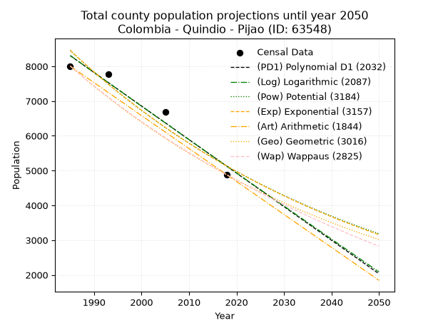
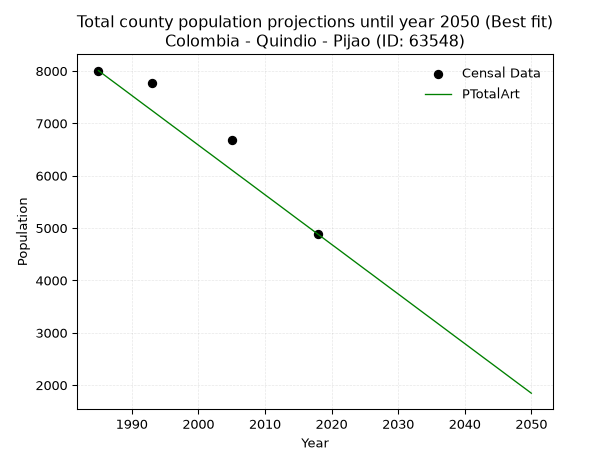
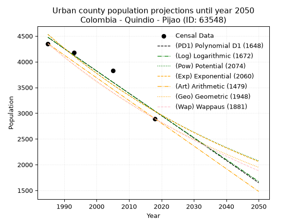
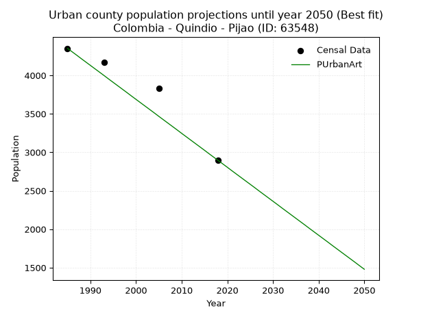
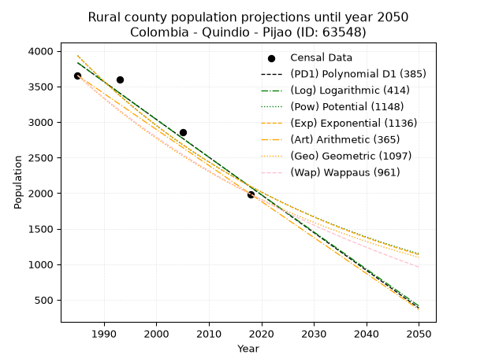
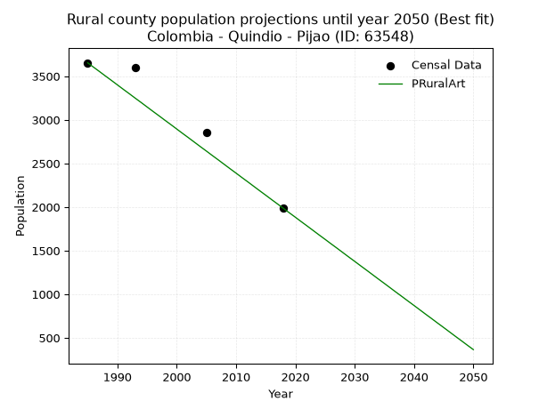

<div align="center">


</div>

# _“Population and Public Services Demand Projections (PPSD) until Year 2050 for Colombia - Quindio - Pijao (ID: 63548)”_
Keywords: `population` `public-service` `projection` `lineal` `polynomial` `logarithmic` `potential` `exponential` `arithmetic` `geometric` `wappaus` `dane` `colombia` `south-america`

PPSD are analytical estimates used by governments and planners to anticipate future changes in population size, age distribution, and the resulting community needs for utilities, healthcare, education, and infrastructure as sizing future water treatment facilities, electrical grids, and road networks based on spatial growth.

> **General running parameters**: • app_version: _v20260806_. • Python version: _3.14.7_. • Pandas version: _3.0.5_. • NumPy version: _2.5.1_. • Creates, save and include plots into reports (create_plot): _True_. • Projection until year: _2050_. • Process polynomial degree 2 and up: _False_. • Process Wappaus: _True_. • Process Wappaus: _True_. • Set negative values to zero: _True_. • Set infinite values to zero: _True_. • Drop dataset notes: _True_. 
<div align="center">

Dynamic map: [:earth_americas:Google](http://maps.google.com/maps?q=4.335036209,-75.7033292) [:earth_americas:OSM](https://www.openstreetmap.org/#map=18/4.335036209/-75.7033292&layers=P) [:earth_americas:Bing](https://www.bing.com/maps?cp=4.335036209~-75.7033292&lvl=18) [:earth_americas:Apple](https://maps.apple.com/frame?center=4.335036209%2C-75.7033292&span=0.003%2C0.006)

</div>


<div align="center">

```geojson
{
  "type": "Feature",
  "geometry": {
    "type": "Point", 
    "coordinates": [-75.7033292, 4.335036209]
  }, 
  "properties": {
    "Name": "Colombia - Quindio - Pijao (ID: 63548)"
  }
}
```

</div>


## 0. Census Data (4 records)

Census data are official statistics collected by a government about the people and housing in a country. They usually include counts of total population, age, sex, race, income, education, and jobs.

📅Global census file: [Population.xlsx](../data/Population.xlsx)

| Source   |   Year |   CountryID | CountryName   |   StateID | StateName   |   CountyID | CountyName   |   PTotal |   PUrban |   PRural |
|:---------|-------:|------------:|:--------------|----------:|:------------|-----------:|:-------------|---------:|---------:|---------:|
| DANE     |   1985 |          57 | Colombia      |        63 | Quindio     |      63548 | Pijao        |     8005 |     4351 |     3654 |
| DANE     |   1993 |          57 | Colombia      |        63 | Quindío     |      63548 | Pijao        |     7771 |     4173 |     3598 |
| DANE     |   2005 |          57 | Colombia      |        63 | Quindio     |      63548 | Pijao        |     6683 |     3827 |     2856 |
| DANE     |   2018 |          57 | Colombia      |        63 | Quindío     |      63548 | Pijao        |     4877 |     2893 |     1984 |

> 🔥Some records has specific notes about the registered values or the corresponding urban or rural distribution.

## 1. Total

### 1.1. Coefficients and Parameters

* (PD1) Polynomial Deg 1: -96.51545564030388, 199889.04014451787 (lineal)
* (Log) Logarithmic: -193085.01353224204, 1474474.735144764
* (Pow) Potential: -30.315333047242653, 103.89995403332013
* (Exp) Exponential: -0.0151554361839514, 9.822696084191714e+16
* (Art) Arithmetic: Year diff. 2018 - 1985 = 33, Population diff. 4877 - 8005 = -3128, Annual growth = -94.78787878787878
* (Geo) Geometric: Year diff. 2018 - 1985 = 33, Population diff. 4877 - 8005 = -3128, Annual growth % = -0.014904062954304798
* (Wap) Wappaus: i = -1.4716329574270888, Condition values only valid for < 200)

<sub>
Wappaus condition values: ['-0.00', '-1.47', '-2.94', '-4.41', '-5.89', '-7.36', '-8.83', '-10.30', '-11.77', '-13.24', '-14.72', '-16.19', '-17.66', '-19.13', '-20.60', '-22.07', '-23.55', '-25.02', '-26.49', '-27.96', '-29.43', '-30.90', '-32.38', '-33.85', '-35.32', '-36.79', '-38.26', '-39.73', '-41.21', '-42.68', '-44.15', '-45.62', '-47.09', '-48.56', '-50.04', '-51.51', '-52.98', '-54.45', '-55.92', '-57.39', '-58.87', '-60.34', '-61.81', '-63.28', '-64.75', '-66.22', '-67.70', '-69.17', '-70.64', '-72.11', '-73.58', '-75.05', '-76.52', '-78.00', '-79.47', '-80.94', '-82.41', '-83.88', '-85.35', '-86.83', '-88.30', '-89.77', '-91.24', '-92.71', '-94.18', '-95.66']
</sub>


### 1.2. Projected Dataset

|   Year |   CountyID |   PTotalPD1 |   PTotalLog |   PTotalPow |   PTotalExp |   PTotalArt |   PTotalGeo |   PTotalWap |
|-------:|-----------:|------------:|------------:|------------:|------------:|------------:|------------:|------------:|
|   1985 |      63548 |        8306 |        8308 |        8458 |        8455 |        8005 |        8005 |        8005 |
|   1986 |      63548 |        8209 |        8211 |        8329 |        8328 |        7910 |        7886 |        7888 |
|   1987 |      63548 |        8113 |        8114 |        8203 |        8203 |        7815 |        7768 |        7773 |
|   1988 |      63548 |        8016 |        8016 |        8079 |        8079 |        7721 |        7652 |        7659 |
|   1989 |      63548 |        7920 |        7919 |        7957 |        7958 |        7626 |        7538 |        7547 |
|   1990 |      63548 |        7823 |        7822 |        7837 |        7838 |        7531 |        7426 |        7437 |
|   1991 |      63548 |        7727 |        7725 |        7718 |        7720 |        7436 |        7315 |        7328 |
|   1992 |      63548 |        7630 |        7628 |        7601 |        7604 |        7341 |        7206 |        7221 |
|   1993 |      63548 |        7534 |        7531 |        7487 |        7490 |        7247 |        7099 |        7115 |
|   1994 |      63548 |        7437 |        7435 |        7374 |        7377 |        7152 |        6993 |        7011 |
|   1995 |      63548 |        7341 |        7338 |        7262 |        7266 |        7057 |        6889 |        6908 |
|   1996 |      63548 |        7244 |        7241 |        7153 |        7157 |        6962 |        6786 |        6806 |
|   1997 |      63548 |        7148 |        7144 |        7045 |        7049 |        6868 |        6685 |        6706 |
|   1998 |      63548 |        7051 |        7048 |        6939 |        6943 |        6773 |        6585 |        6607 |
|   1999 |      63548 |        6955 |        6951 |        6835 |        6839 |        6678 |        6487 |        6510 |
|   2000 |      63548 |        6858 |        6854 |        6732 |        6736 |        6583 |        6391 |        6414 |
|   2001 |      63548 |        6762 |        6758 |        6631 |        6634 |        6488 |        6295 |        6319 |
|   2002 |      63548 |        6665 |        6661 |        6531 |        6535 |        6394 |        6201 |        6225 |
|   2003 |      63548 |        6569 |        6565 |        6433 |        6436 |        6299 |        6109 |        6133 |
|   2004 |      63548 |        6472 |        6469 |        6336 |        6340 |        6204 |        6018 |        6041 |
|   2005 |      63548 |        6376 |        6372 |        6241 |        6244 |        6109 |        5928 |        5951 |
|   2006 |      63548 |        6279 |        6276 |        6147 |        6150 |        6014 |        5840 |        5862 |
|   2007 |      63548 |        6183 |        6180 |        6055 |        6058 |        5920 |        5753 |        5774 |
|   2008 |      63548 |        6086 |        6084 |        5964 |        5967 |        5825 |        5667 |        5688 |
|   2009 |      63548 |        5989 |        5987 |        5875 |        5877 |        5730 |        5583 |        5602 |
|   2010 |      63548 |        5893 |        5891 |        5787 |        5789 |        5635 |        5500 |        5517 |
|   2011 |      63548 |        5796 |        5795 |        5701 |        5701 |        5541 |        5418 |        5434 |
|   2012 |      63548 |        5700 |        5699 |        5615 |        5616 |        5446 |        5337 |        5351 |
|   2013 |      63548 |        5603 |        5603 |        5531 |        5531 |        5351 |        5257 |        5270 |
|   2014 |      63548 |        5507 |        5507 |        5449 |        5448 |        5256 |        5179 |        5189 |
|   2015 |      63548 |        5410 |        5412 |        5367 |        5366 |        5161 |        5102 |        5110 |
|   2016 |      63548 |        5314 |        5316 |        5287 |        5285 |        5067 |        5026 |        5031 |
|   2017 |      63548 |        5217 |        5220 |        5208 |        5206 |        4972 |        4951 |        4954 |
|   2018 |      63548 |        5121 |        5124 |        5131 |        5128 |        4877 |        4877 |        4877 |
|   2019 |      63548 |        5024 |        5029 |        5054 |        5050 |        4782 |        4804 |        4801 |
|   2020 |      63548 |        4928 |        4933 |        4979 |        4974 |        4687 |        4733 |        4726 |
|   2021 |      63548 |        4831 |        4838 |        4905 |        4900 |        4593 |        4662 |        4652 |
|   2022 |      63548 |        4735 |        4742 |        4832 |        4826 |        4498 |        4593 |        4579 |
|   2023 |      63548 |        4638 |        4647 |        4760 |        4753 |        4403 |        4524 |        4507 |
|   2024 |      63548 |        4542 |        4551 |        4689 |        4682 |        4308 |        4457 |        4435 |
|   2025 |      63548 |        4445 |        4456 |        4619 |        4611 |        4213 |        4390 |        4364 |
|   2026 |      63548 |        4349 |        4360 |        4551 |        4542 |        4119 |        4325 |        4294 |
|   2027 |      63548 |        4252 |        4265 |        4483 |        4474 |        4024 |        4260 |        4225 |
|   2028 |      63548 |        4156 |        4170 |        4417 |        4406 |        3929 |        4197 |        4157 |
|   2029 |      63548 |        4059 |        4075 |        4351 |        4340 |        3834 |        4134 |        4089 |
|   2030 |      63548 |        3963 |        3980 |        4287 |        4275 |        3740 |        4073 |        4022 |
|   2031 |      63548 |        3866 |        3885 |        4223 |        4211 |        3645 |        4012 |        3956 |
|   2032 |      63548 |        3770 |        3789 |        4160 |        4147 |        3550 |        3952 |        3891 |
|   2033 |      63548 |        3673 |        3694 |        4099 |        4085 |        3455 |        3893 |        3826 |
|   2034 |      63548 |        3577 |        3600 |        4038 |        4023 |        3360 |        3835 |        3762 |
|   2035 |      63548 |        3480 |        3505 |        3979 |        3963 |        3266 |        3778 |        3699 |
|   2036 |      63548 |        3384 |        3410 |        3920 |        3903 |        3171 |        3722 |        3636 |
|   2037 |      63548 |        3287 |        3315 |        3862 |        3845 |        3076 |        3666 |        3574 |
|   2038 |      63548 |        3191 |        3220 |        3805 |        3787 |        2981 |        3612 |        3513 |
|   2039 |      63548 |        3094 |        3125 |        3749 |        3730 |        2886 |        3558 |        3452 |
|   2040 |      63548 |        2998 |        3031 |        3693 |        3674 |        2792 |        3505 |        3392 |
|   2041 |      63548 |        2901 |        2936 |        3639 |        3618 |        2697 |        3453 |        3333 |
|   2042 |      63548 |        2804 |        2842 |        3585 |        3564 |        2602 |        3401 |        3274 |
|   2043 |      63548 |        2708 |        2747 |        3532 |        3510 |        2507 |        3351 |        3216 |
|   2044 |      63548 |        2611 |        2653 |        3480 |        3458 |        2413 |        3301 |        3159 |
|   2045 |      63548 |        2515 |        2558 |        3429 |        3406 |        2318 |        3251 |        3102 |
|   2046 |      63548 |        2418 |        2464 |        3379 |        3354 |        2223 |        3203 |        3045 |
|   2047 |      63548 |        2322 |        2369 |        3329 |        3304 |        2128 |        3155 |        2989 |
|   2048 |      63548 |        2225 |        2275 |        3280 |        3254 |        2033 |        3108 |        2934 |
|   2049 |      63548 |        2129 |        2181 |        3232 |        3205 |        1939 |        3062 |        2879 |
|   2050 |      63548 |        2032 |        2087 |        3184 |        3157 |        1844 |        3016 |        2825 |
<div align="center">

</img>

</div>


### 1.3. Best fit with absolute error and relative error (%)

Relative error puts that difference into context by dividing the absolute error by the true value, creating a unitless ratio or percentage that shows the scale of the mistake.

Absolute and relative error

|   Year | Source   |   CountryID | CountryName   |   StateID | StateName   |   CountyID_x | CountyName   |   PTotal |   PUrban |   PRural |   CountyID_y |   PTotalPD1 |   PTotalLog |   PTotalPow |   PTotalExp |   PTotalArt |   PTotalGeo |   PTotalWap |   PTotalPD1AbsError |   PTotalLogAbsError |   PTotalPowAbsError |   PTotalExpAbsError |   PTotalArtAbsError |   PTotalGeoAbsError |   PTotalWapAbsError |   PTotalPD1RelError |   PTotalLogRelError |   PTotalPowRelError |   PTotalExpRelError |   PTotalArtRelError |   PTotalGeoRelError |   PTotalWapRelError |
|-------:|:---------|------------:|:--------------|----------:|:------------|-------------:|:-------------|---------:|---------:|---------:|-------------:|------------:|------------:|------------:|------------:|------------:|------------:|------------:|--------------------:|--------------------:|--------------------:|--------------------:|--------------------:|--------------------:|--------------------:|--------------------:|--------------------:|--------------------:|--------------------:|--------------------:|--------------------:|--------------------:|
|   1985 | DANE     |          57 | Colombia      |        63 | Quindio     |        63548 | Pijao        |     8005 |     4351 |     3654 |        63548 |        8306 |        8308 |        8458 |        8455 |        8005 |        8005 |        8005 |                 301 |                 303 |                 453 |                 450 |                   0 |                   0 |                   0 |             3.76015 |             3.78513 |             5.65896 |             5.62149 |             0       |             0       |             0       |
|   1993 | DANE     |          57 | Colombia      |        63 | Quindío     |        63548 | Pijao        |     7771 |     4173 |     3598 |        63548 |        7534 |        7531 |        7487 |        7490 |        7247 |        7099 |        7115 |                 237 |                 240 |                 284 |                 281 |                 524 |                 672 |                 656 |             3.0498  |             3.08841 |             3.65461 |             3.61601 |             6.74302 |             8.64754 |             8.44164 |
|   2005 | DANE     |          57 | Colombia      |        63 | Quindio     |        63548 | Pijao        |     6683 |     3827 |     2856 |        63548 |        6376 |        6372 |        6241 |        6244 |        6109 |        5928 |        5951 |                 307 |                 311 |                 442 |                 439 |                 574 |                 755 |                 732 |             4.59375 |             4.6536  |             6.6138  |             6.56891 |             8.58896 |            11.2973  |            10.9532  |
|   2018 | DANE     |          57 | Colombia      |        63 | Quindío     |        63548 | Pijao        |     4877 |     2893 |     1984 |        63548 |        5121 |        5124 |        5131 |        5128 |        4877 |        4877 |        4877 |                 244 |                 247 |                 254 |                 251 |                   0 |                   0 |                   0 |             5.00308 |             5.06459 |             5.20812 |             5.14661 |             0       |             0       |             0       |

Relative error mean

| Method    |   RelError | Best   |
|:----------|-----------:|:-------|
| PTotalPD1 |    4.10169 |        |
| PTotalLog |    4.14793 |        |
| PTotalPow |    5.28387 |        |
| PTotalExp |    5.23825 |        |
| PTotalArt |    3.83299 | True   |
| PTotalGeo |    4.98621 |        |
| PTotalWap |    4.8487  |        |

💙Best method: _**PTotalArt**_
<div align="center">

</img>

</div>


### 1.4. Fresh water supply demand in liters per capita per day (lpcd)

The fresh water supply demand typically ranges from 100 to 300 liters per capita per day (lpcd) for standard domestic and municipal planning, though absolute survival minimums set by the World Health Organization are as low as 7.5 to 20 liters per day, and total consumption in high-income nations can exceed 400 liters.

> `CZ`: Level in meters above the sea level (masl).<br> `WS`: Fresh water supply demand in liters per capita per day (lpcd or l/h/d).<br> `WSAll`: Zonal fresh water supply demand in liters per second (l/s).<br> `A`: Zonal area in square meters.

Reference values (RAS Colombia)

|    CZ |   WS |
|------:|-----:|
|  1000 |  120 |
|  2000 |  130 |
| 99999 |  140 |

County shapefile geometry properties and water supply values

|   CountyID |      ATotal |   CZTotal |   WSTotal |
|-----------:|------------:|----------:|----------:|
|      63548 | 2.47958e+08 |   2403.09 |       140 |

Projected values for best method: PTotalArt

|   CountyID |   Year |   PTotalArt |   WSTotal |   WSTotalAll |
|-----------:|-------:|------------:|----------:|-------------:|
|      63548 |   1985 |        8005 |       140 |     12.9711  |
|      63548 |   1986 |        7910 |       140 |     12.8171  |
|      63548 |   1987 |        7815 |       140 |     12.6632  |
|      63548 |   1988 |        7721 |       140 |     12.5109  |
|      63548 |   1989 |        7626 |       140 |     12.3569  |
|      63548 |   1990 |        7531 |       140 |     12.203   |
|      63548 |   1991 |        7436 |       140 |     12.0491  |
|      63548 |   1992 |        7341 |       140 |     11.8951  |
|      63548 |   1993 |        7247 |       140 |     11.7428  |
|      63548 |   1994 |        7152 |       140 |     11.5889  |
|      63548 |   1995 |        7057 |       140 |     11.435   |
|      63548 |   1996 |        6962 |       140 |     11.281   |
|      63548 |   1997 |        6868 |       140 |     11.1287  |
|      63548 |   1998 |        6773 |       140 |     10.9748  |
|      63548 |   1999 |        6678 |       140 |     10.8208  |
|      63548 |   2000 |        6583 |       140 |     10.6669  |
|      63548 |   2001 |        6488 |       140 |     10.513   |
|      63548 |   2002 |        6394 |       140 |     10.3606  |
|      63548 |   2003 |        6299 |       140 |     10.2067  |
|      63548 |   2004 |        6204 |       140 |     10.0528  |
|      63548 |   2005 |        6109 |       140 |      9.89884 |
|      63548 |   2006 |        6014 |       140 |      9.74491 |
|      63548 |   2007 |        5920 |       140 |      9.59259 |
|      63548 |   2008 |        5825 |       140 |      9.43866 |
|      63548 |   2009 |        5730 |       140 |      9.28472 |
|      63548 |   2010 |        5635 |       140 |      9.13079 |
|      63548 |   2011 |        5541 |       140 |      8.97847 |
|      63548 |   2012 |        5446 |       140 |      8.82454 |
|      63548 |   2013 |        5351 |       140 |      8.6706  |
|      63548 |   2014 |        5256 |       140 |      8.51667 |
|      63548 |   2015 |        5161 |       140 |      8.36273 |
|      63548 |   2016 |        5067 |       140 |      8.21042 |
|      63548 |   2017 |        4972 |       140 |      8.05648 |
|      63548 |   2018 |        4877 |       140 |      7.90255 |
|      63548 |   2019 |        4782 |       140 |      7.74861 |
|      63548 |   2020 |        4687 |       140 |      7.59468 |
|      63548 |   2021 |        4593 |       140 |      7.44236 |
|      63548 |   2022 |        4498 |       140 |      7.28843 |
|      63548 |   2023 |        4403 |       140 |      7.13449 |
|      63548 |   2024 |        4308 |       140 |      6.98056 |
|      63548 |   2025 |        4213 |       140 |      6.82662 |
|      63548 |   2026 |        4119 |       140 |      6.67431 |
|      63548 |   2027 |        4024 |       140 |      6.52037 |
|      63548 |   2028 |        3929 |       140 |      6.36644 |
|      63548 |   2029 |        3834 |       140 |      6.2125  |
|      63548 |   2030 |        3740 |       140 |      6.06019 |
|      63548 |   2031 |        3645 |       140 |      5.90625 |
|      63548 |   2032 |        3550 |       140 |      5.75231 |
|      63548 |   2033 |        3455 |       140 |      5.59838 |
|      63548 |   2034 |        3360 |       140 |      5.44444 |
|      63548 |   2035 |        3266 |       140 |      5.29213 |
|      63548 |   2036 |        3171 |       140 |      5.13819 |
|      63548 |   2037 |        3076 |       140 |      4.98426 |
|      63548 |   2038 |        2981 |       140 |      4.83032 |
|      63548 |   2039 |        2886 |       140 |      4.67639 |
|      63548 |   2040 |        2792 |       140 |      4.52407 |
|      63548 |   2041 |        2697 |       140 |      4.37014 |
|      63548 |   2042 |        2602 |       140 |      4.2162  |
|      63548 |   2043 |        2507 |       140 |      4.06227 |
|      63548 |   2044 |        2413 |       140 |      3.90995 |
|      63548 |   2045 |        2318 |       140 |      3.75602 |
|      63548 |   2046 |        2223 |       140 |      3.60208 |
|      63548 |   2047 |        2128 |       140 |      3.44815 |
|      63548 |   2048 |        2033 |       140 |      3.29421 |
|      63548 |   2049 |        1939 |       140 |      3.1419  |
|      63548 |   2050 |        1844 |       140 |      2.98796 |

## 2. Urban

### 2.1. Coefficients and Parameters

* (PD1) Polynomial Deg 1: -43.48133279807246, 90784.53592934445 (lineal)
* (Log) Logarithmic: -86979.2005235204, 664940.600186848
* (Pow) Potential: -24.251359369804412, 83.63138752501567
* (Exp) Exponential: -0.012124749099446752, 128395787574861.23
* (Art) Arithmetic: Year diff. 2018 - 1985 = 33, Population diff. 2893 - 4351 = -1458, Annual growth = -44.18181818181818
* (Geo) Geometric: Year diff. 2018 - 1985 = 33, Population diff. 2893 - 4351 = -1458, Annual growth % = -0.012290863208921254
* (Wap) Wappaus: i = -1.2198182822147483, Condition values only valid for < 200)

<sub>
Wappaus condition values: ['-0.00', '-1.22', '-2.44', '-3.66', '-4.88', '-6.10', '-7.32', '-8.54', '-9.76', '-10.98', '-12.20', '-13.42', '-14.64', '-15.86', '-17.08', '-18.30', '-19.52', '-20.74', '-21.96', '-23.18', '-24.40', '-25.62', '-26.84', '-28.06', '-29.28', '-30.50', '-31.72', '-32.94', '-34.15', '-35.37', '-36.59', '-37.81', '-39.03', '-40.25', '-41.47', '-42.69', '-43.91', '-45.13', '-46.35', '-47.57', '-48.79', '-50.01', '-51.23', '-52.45', '-53.67', '-54.89', '-56.11', '-57.33', '-58.55', '-59.77', '-60.99', '-62.21', '-63.43', '-64.65', '-65.87', '-67.09', '-68.31', '-69.53', '-70.75', '-71.97', '-73.19', '-74.41', '-75.63', '-76.85', '-78.07', '-79.29']
</sub>


### 2.2. Projected Dataset

|   Year |   CountyID |   PUrbanPD1 |   PUrbanLog |   PUrbanPow |   PUrbanExp |   PUrbanArt |   PUrbanGeo |   PUrbanWap |
|-------:|-----------:|------------:|------------:|------------:|------------:|------------:|------------:|------------:|
|   1985 |      63548 |        4474 |        4475 |        4531 |        4530 |        4351 |        4351 |        4351 |
|   1986 |      63548 |        4431 |        4431 |        4476 |        4476 |        4307 |        4298 |        4298 |
|   1987 |      63548 |        4387 |        4387 |        4422 |        4422 |        4263 |        4245 |        4246 |
|   1988 |      63548 |        4344 |        4344 |        4368 |        4368 |        4218 |        4193 |        4195 |
|   1989 |      63548 |        4300 |        4300 |        4315 |        4316 |        4174 |        4141 |        4144 |
|   1990 |      63548 |        4257 |        4256 |        4263 |        4264 |        4130 |        4090 |        4093 |
|   1991 |      63548 |        4213 |        4212 |        4211 |        4212 |        4086 |        4040 |        4044 |
|   1992 |      63548 |        4170 |        4169 |        4160 |        4162 |        4042 |        3990 |        3995 |
|   1993 |      63548 |        4126 |        4125 |        4110 |        4111 |        3998 |        3941 |        3946 |
|   1994 |      63548 |        4083 |        4082 |        4060 |        4062 |        3953 |        3893 |        3898 |
|   1995 |      63548 |        4039 |        4038 |        4011 |        4013 |        3909 |        3845 |        3851 |
|   1996 |      63548 |        3996 |        3994 |        3963 |        3965 |        3865 |        3798 |        3804 |
|   1997 |      63548 |        3952 |        3951 |        3915 |        3917 |        3821 |        3751 |        3758 |
|   1998 |      63548 |        3909 |        3907 |        3868 |        3870 |        3777 |        3705 |        3712 |
|   1999 |      63548 |        3865 |        3864 |        3821 |        3823 |        3732 |        3659 |        3666 |
|   2000 |      63548 |        3822 |        3820 |        3775 |        3777 |        3688 |        3614 |        3622 |
|   2001 |      63548 |        3778 |        3777 |        3730 |        3731 |        3644 |        3570 |        3577 |
|   2002 |      63548 |        3735 |        3733 |        3685 |        3686 |        3600 |        3526 |        3533 |
|   2003 |      63548 |        3691 |        3690 |        3640 |        3642 |        3556 |        3483 |        3490 |
|   2004 |      63548 |        3648 |        3646 |        3596 |        3598 |        3512 |        3440 |        3447 |
|   2005 |      63548 |        3604 |        3603 |        3553 |        3555 |        3467 |        3398 |        3405 |
|   2006 |      63548 |        3561 |        3560 |        3511 |        3512 |        3423 |        3356 |        3363 |
|   2007 |      63548 |        3518 |        3516 |        3468 |        3470 |        3379 |        3315 |        3322 |
|   2008 |      63548 |        3474 |        3473 |        3427 |        3428 |        3335 |        3274 |        3280 |
|   2009 |      63548 |        3431 |        3430 |        3386 |        3386 |        3291 |        3234 |        3240 |
|   2010 |      63548 |        3387 |        3386 |        3345 |        3346 |        3246 |        3194 |        3200 |
|   2011 |      63548 |        3344 |        3343 |        3305 |        3305 |        3202 |        3155 |        3160 |
|   2012 |      63548 |        3300 |        3300 |        3265 |        3265 |        3158 |        3116 |        3121 |
|   2013 |      63548 |        3257 |        3257 |        3226 |        3226 |        3114 |        3078 |        3082 |
|   2014 |      63548 |        3213 |        3213 |        3188 |        3187 |        3070 |        3040 |        3043 |
|   2015 |      63548 |        3170 |        3170 |        3149 |        3149 |        3026 |        3002 |        3005 |
|   2016 |      63548 |        3126 |        3127 |        3112 |        3111 |        2981 |        2965 |        2967 |
|   2017 |      63548 |        3083 |        3084 |        3075 |        3073 |        2937 |        2929 |        2930 |
|   2018 |      63548 |        3039 |        3041 |        3038 |        3036 |        2893 |        2893 |        2893 |
|   2019 |      63548 |        2996 |        2998 |        3002 |        3000 |        2849 |        2857 |        2856 |
|   2020 |      63548 |        2952 |        2955 |        2966 |        2964 |        2805 |        2822 |        2820 |
|   2021 |      63548 |        2909 |        2912 |        2930 |        2928 |        2760 |        2788 |        2784 |
|   2022 |      63548 |        2865 |        2869 |        2895 |        2893 |        2716 |        2753 |        2749 |
|   2023 |      63548 |        2822 |        2826 |        2861 |        2858 |        2672 |        2720 |        2714 |
|   2024 |      63548 |        2778 |        2783 |        2827 |        2823 |        2628 |        2686 |        2679 |
|   2025 |      63548 |        2735 |        2740 |        2793 |        2789 |        2584 |        2653 |        2644 |
|   2026 |      63548 |        2691 |        2697 |        2760 |        2756 |        2540 |        2620 |        2610 |
|   2027 |      63548 |        2648 |        2654 |        2727 |        2722 |        2495 |        2588 |        2576 |
|   2028 |      63548 |        2604 |        2611 |        2695 |        2690 |        2451 |        2556 |        2543 |
|   2029 |      63548 |        2561 |        2568 |        2663 |        2657 |        2407 |        2525 |        2510 |
|   2030 |      63548 |        2517 |        2525 |        2631 |        2625 |        2363 |        2494 |        2477 |
|   2031 |      63548 |        2474 |        2482 |        2600 |        2594 |        2319 |        2463 |        2444 |
|   2032 |      63548 |        2430 |        2440 |        2569 |        2562 |        2274 |        2433 |        2412 |
|   2033 |      63548 |        2387 |        2397 |        2538 |        2531 |        2230 |        2403 |        2380 |
|   2034 |      63548 |        2344 |        2354 |        2508 |        2501 |        2186 |        2374 |        2349 |
|   2035 |      63548 |        2300 |        2311 |        2479 |        2471 |        2142 |        2344 |        2317 |
|   2036 |      63548 |        2257 |        2268 |        2449 |        2441 |        2098 |        2316 |        2286 |
|   2037 |      63548 |        2213 |        2226 |        2420 |        2412 |        2054 |        2287 |        2256 |
|   2038 |      63548 |        2170 |        2183 |        2392 |        2382 |        2009 |        2259 |        2225 |
|   2039 |      63548 |        2126 |        2140 |        2363 |        2354 |        1965 |        2231 |        2195 |
|   2040 |      63548 |        2083 |        2098 |        2335 |        2325 |        1921 |        2204 |        2165 |
|   2041 |      63548 |        2039 |        2055 |        2308 |        2297 |        1877 |        2177 |        2136 |
|   2042 |      63548 |        1996 |        2013 |        2281 |        2270 |        1833 |        2150 |        2106 |
|   2043 |      63548 |        1952 |        1970 |        2254 |        2242 |        1788 |        2124 |        2077 |
|   2044 |      63548 |        1909 |        1927 |        2227 |        2215 |        1744 |        2098 |        2048 |
|   2045 |      63548 |        1865 |        1885 |        2201 |        2189 |        1700 |        2072 |        2020 |
|   2046 |      63548 |        1822 |        1842 |        2175 |        2162 |        1656 |        2046 |        1991 |
|   2047 |      63548 |        1778 |        1800 |        2149 |        2136 |        1612 |        2021 |        1963 |
|   2048 |      63548 |        1735 |        1757 |        2124 |        2110 |        1568 |        1996 |        1935 |
|   2049 |      63548 |        1691 |        1715 |        2099 |        2085 |        1523 |        1972 |        1908 |
|   2050 |      63548 |        1648 |        1672 |        2074 |        2060 |        1479 |        1948 |        1881 |
<div align="center">

</img>

</div>


### 2.3. Best fit with absolute error and relative error (%)

Relative error puts that difference into context by dividing the absolute error by the true value, creating a unitless ratio or percentage that shows the scale of the mistake.

Absolute and relative error

|   Year | Source   |   CountryID | CountryName   |   StateID | StateName   |   CountyID_x | CountyName   |   PTotal |   PUrban |   PRural |   CountyID_y |   PUrbanPD1 |   PUrbanLog |   PUrbanPow |   PUrbanExp |   PUrbanArt |   PUrbanGeo |   PUrbanWap |   PUrbanPD1AbsError |   PUrbanLogAbsError |   PUrbanPowAbsError |   PUrbanExpAbsError |   PUrbanArtAbsError |   PUrbanGeoAbsError |   PUrbanWapAbsError |   PUrbanPD1RelError |   PUrbanLogRelError |   PUrbanPowRelError |   PUrbanExpRelError |   PUrbanArtRelError |   PUrbanGeoRelError |   PUrbanWapRelError |
|-------:|:---------|------------:|:--------------|----------:|:------------|-------------:|:-------------|---------:|---------:|---------:|-------------:|------------:|------------:|------------:|------------:|------------:|------------:|------------:|--------------------:|--------------------:|--------------------:|--------------------:|--------------------:|--------------------:|--------------------:|--------------------:|--------------------:|--------------------:|--------------------:|--------------------:|--------------------:|--------------------:|
|   1985 | DANE     |          57 | Colombia      |        63 | Quindio     |        63548 | Pijao        |     8005 |     4351 |     3654 |        63548 |        4474 |        4475 |        4531 |        4530 |        4351 |        4351 |        4351 |                 123 |                 124 |                 180 |                 179 |                   0 |                   0 |                   0 |             2.82694 |             2.84992 |             4.13698 |             4.114   |             0       |             0       |             0       |
|   1993 | DANE     |          57 | Colombia      |        63 | Quindío     |        63548 | Pijao        |     7771 |     4173 |     3598 |        63548 |        4126 |        4125 |        4110 |        4111 |        3998 |        3941 |        3946 |                  47 |                  48 |                  63 |                  62 |                 175 |                 232 |                 227 |             1.12629 |             1.15025 |             1.50971 |             1.48574 |             4.19363 |             5.55955 |             5.43973 |
|   2005 | DANE     |          57 | Colombia      |        63 | Quindio     |        63548 | Pijao        |     6683 |     3827 |     2856 |        63548 |        3604 |        3603 |        3553 |        3555 |        3467 |        3398 |        3405 |                 223 |                 224 |                 274 |                 272 |                 360 |                 429 |                 422 |             5.82702 |             5.85315 |             7.15966 |             7.10739 |             9.40685 |            11.2098  |            11.0269  |
|   2018 | DANE     |          57 | Colombia      |        63 | Quindío     |        63548 | Pijao        |     4877 |     2893 |     1984 |        63548 |        3039 |        3041 |        3038 |        3036 |        2893 |        2893 |        2893 |                 146 |                 148 |                 145 |                 143 |                   0 |                   0 |                   0 |             5.04666 |             5.1158  |             5.0121  |             4.94297 |             0       |             0       |             0       |

Relative error mean

| Method    |   RelError | Best   |
|:----------|-----------:|:-------|
| PUrbanPD1 |    3.70673 |        |
| PUrbanLog |    3.74228 |        |
| PUrbanPow |    4.45461 |        |
| PUrbanExp |    4.41252 |        |
| PUrbanArt |    3.40012 | True   |
| PUrbanGeo |    4.19234 |        |
| PUrbanWap |    4.11666 |        |

💙Best method: _**PUrbanArt**_
<div align="center">

</img>

</div>


### 2.4. Fresh water supply demand in liters per capita per day (lpcd)

The fresh water supply demand typically ranges from 100 to 300 liters per capita per day (lpcd) for standard domestic and municipal planning, though absolute survival minimums set by the World Health Organization are as low as 7.5 to 20 liters per day, and total consumption in high-income nations can exceed 400 liters.

> `CZ`: Level in meters above the sea level (masl).<br> `WS`: Fresh water supply demand in liters per capita per day (lpcd or l/h/d).<br> `WSAll`: Zonal fresh water supply demand in liters per second (l/s).<br> `A`: Zonal area in square meters.

Reference values (RAS Colombia)

|    CZ |   WS |
|------:|-----:|
|  1000 |  120 |
|  2000 |  130 |
| 99999 |  140 |

County shapefile geometry properties and water supply values

|   CountyID |   AUrban |   CZUrban |   WSUrban |
|-----------:|---------:|----------:|----------:|
|      63548 |   654762 |    1665.8 |       130 |

Projected values for best method: PUrbanArt

|   CountyID |   Year |   PUrbanArt |   WSUrban |   WSUrbanAll |
|-----------:|-------:|------------:|----------:|-------------:|
|      63548 |   1985 |        4351 |       130 |      6.54664 |
|      63548 |   1986 |        4307 |       130 |      6.48044 |
|      63548 |   1987 |        4263 |       130 |      6.41424 |
|      63548 |   1988 |        4218 |       130 |      6.34653 |
|      63548 |   1989 |        4174 |       130 |      6.28032 |
|      63548 |   1990 |        4130 |       130 |      6.21412 |
|      63548 |   1991 |        4086 |       130 |      6.14792 |
|      63548 |   1992 |        4042 |       130 |      6.08171 |
|      63548 |   1993 |        3998 |       130 |      6.01551 |
|      63548 |   1994 |        3953 |       130 |      5.9478  |
|      63548 |   1995 |        3909 |       130 |      5.8816  |
|      63548 |   1996 |        3865 |       130 |      5.81539 |
|      63548 |   1997 |        3821 |       130 |      5.74919 |
|      63548 |   1998 |        3777 |       130 |      5.68299 |
|      63548 |   1999 |        3732 |       130 |      5.61528 |
|      63548 |   2000 |        3688 |       130 |      5.54907 |
|      63548 |   2001 |        3644 |       130 |      5.48287 |
|      63548 |   2002 |        3600 |       130 |      5.41667 |
|      63548 |   2003 |        3556 |       130 |      5.35046 |
|      63548 |   2004 |        3512 |       130 |      5.28426 |
|      63548 |   2005 |        3467 |       130 |      5.21655 |
|      63548 |   2006 |        3423 |       130 |      5.15035 |
|      63548 |   2007 |        3379 |       130 |      5.08414 |
|      63548 |   2008 |        3335 |       130 |      5.01794 |
|      63548 |   2009 |        3291 |       130 |      4.95174 |
|      63548 |   2010 |        3246 |       130 |      4.88403 |
|      63548 |   2011 |        3202 |       130 |      4.81782 |
|      63548 |   2012 |        3158 |       130 |      4.75162 |
|      63548 |   2013 |        3114 |       130 |      4.68542 |
|      63548 |   2014 |        3070 |       130 |      4.61921 |
|      63548 |   2015 |        3026 |       130 |      4.55301 |
|      63548 |   2016 |        2981 |       130 |      4.4853  |
|      63548 |   2017 |        2937 |       130 |      4.4191  |
|      63548 |   2018 |        2893 |       130 |      4.35289 |
|      63548 |   2019 |        2849 |       130 |      4.28669 |
|      63548 |   2020 |        2805 |       130 |      4.22049 |
|      63548 |   2021 |        2760 |       130 |      4.15278 |
|      63548 |   2022 |        2716 |       130 |      4.08657 |
|      63548 |   2023 |        2672 |       130 |      4.02037 |
|      63548 |   2024 |        2628 |       130 |      3.95417 |
|      63548 |   2025 |        2584 |       130 |      3.88796 |
|      63548 |   2026 |        2540 |       130 |      3.82176 |
|      63548 |   2027 |        2495 |       130 |      3.75405 |
|      63548 |   2028 |        2451 |       130 |      3.68785 |
|      63548 |   2029 |        2407 |       130 |      3.62164 |
|      63548 |   2030 |        2363 |       130 |      3.55544 |
|      63548 |   2031 |        2319 |       130 |      3.48924 |
|      63548 |   2032 |        2274 |       130 |      3.42153 |
|      63548 |   2033 |        2230 |       130 |      3.35532 |
|      63548 |   2034 |        2186 |       130 |      3.28912 |
|      63548 |   2035 |        2142 |       130 |      3.22292 |
|      63548 |   2036 |        2098 |       130 |      3.15671 |
|      63548 |   2037 |        2054 |       130 |      3.09051 |
|      63548 |   2038 |        2009 |       130 |      3.0228  |
|      63548 |   2039 |        1965 |       130 |      2.9566  |
|      63548 |   2040 |        1921 |       130 |      2.89039 |
|      63548 |   2041 |        1877 |       130 |      2.82419 |
|      63548 |   2042 |        1833 |       130 |      2.75799 |
|      63548 |   2043 |        1788 |       130 |      2.69028 |
|      63548 |   2044 |        1744 |       130 |      2.62407 |
|      63548 |   2045 |        1700 |       130 |      2.55787 |
|      63548 |   2046 |        1656 |       130 |      2.49167 |
|      63548 |   2047 |        1612 |       130 |      2.42546 |
|      63548 |   2048 |        1568 |       130 |      2.35926 |
|      63548 |   2049 |        1523 |       130 |      2.29155 |
|      63548 |   2050 |        1479 |       130 |      2.22535 |

## 3. Rural

### 3.1. Coefficients and Parameters

* (PD1) Polynomial Deg 1: -53.03412284223142, 109104.5042151734 (lineal)
* (Log) Logarithmic: -106105.81300872161, 809534.1349579156
* (Pow) Potential: -38.220326398591766, 129.63622835615655
* (Exp) Exponential: -0.019106363464996383, 1.1632773831384934e+20
* (Art) Arithmetic: Year diff. 2018 - 1985 = 33, Population diff. 1984 - 3654 = -1670, Annual growth = -50.60606060606061
* (Geo) Geometric: Year diff. 2018 - 1985 = 33, Population diff. 1984 - 3654 = -1670, Annual growth % = -0.018336096496894494
* (Wap) Wappaus: i = -1.7951777440958, Condition values only valid for < 200)

<sub>
Wappaus condition values: ['-0.00', '-1.80', '-3.59', '-5.39', '-7.18', '-8.98', '-10.77', '-12.57', '-14.36', '-16.16', '-17.95', '-19.75', '-21.54', '-23.34', '-25.13', '-26.93', '-28.72', '-30.52', '-32.31', '-34.11', '-35.90', '-37.70', '-39.49', '-41.29', '-43.08', '-44.88', '-46.67', '-48.47', '-50.26', '-52.06', '-53.86', '-55.65', '-57.45', '-59.24', '-61.04', '-62.83', '-64.63', '-66.42', '-68.22', '-70.01', '-71.81', '-73.60', '-75.40', '-77.19', '-78.99', '-80.78', '-82.58', '-84.37', '-86.17', '-87.96', '-89.76', '-91.55', '-93.35', '-95.14', '-96.94', '-98.73', '-100.53', '-102.33', '-104.12', '-105.92', '-107.71', '-109.51', '-111.30', '-113.10', '-114.89', '-116.69']
</sub>


### 3.2. Projected Dataset

|   Year |   CountyID |   PRuralPD1 |   PRuralLog |   PRuralPow |   PRuralExp |   PRuralArt |   PRuralGeo |   PRuralWap |
|-------:|-----------:|------------:|------------:|------------:|------------:|------------:|------------:|------------:|
|   1985 |      63548 |        3832 |        3833 |        3933 |        3932 |        3654 |        3654 |        3654 |
|   1986 |      63548 |        3779 |        3780 |        3858 |        3857 |        3603 |        3587 |        3589 |
|   1987 |      63548 |        3726 |        3726 |        3785 |        3784 |        3553 |        3521 |        3525 |
|   1988 |      63548 |        3673 |        3673 |        3713 |        3713 |        3502 |        3457 |        3462 |
|   1989 |      63548 |        3620 |        3619 |        3642 |        3642 |        3452 |        3393 |        3401 |
|   1990 |      63548 |        3567 |        3566 |        3573 |        3573 |        3401 |        3331 |        3340 |
|   1991 |      63548 |        3514 |        3513 |        3505 |        3506 |        3350 |        3270 |        3281 |
|   1992 |      63548 |        3461 |        3459 |        3438 |        3439 |        3300 |        3210 |        3222 |
|   1993 |      63548 |        3407 |        3406 |        3373 |        3374 |        3249 |        3151 |        3164 |
|   1994 |      63548 |        3354 |        3353 |        3309 |        3310 |        3199 |        3093 |        3108 |
|   1995 |      63548 |        3301 |        3300 |        3246 |        3248 |        3148 |        3037 |        3052 |
|   1996 |      63548 |        3248 |        3247 |        3184 |        3186 |        3097 |        2981 |        2997 |
|   1997 |      63548 |        3195 |        3193 |        3124 |        3126 |        3047 |        2926 |        2943 |
|   1998 |      63548 |        3142 |        3140 |        3065 |        3067 |        2996 |        2873 |        2890 |
|   1999 |      63548 |        3089 |        3087 |        3007 |        3009 |        2946 |        2820 |        2838 |
|   2000 |      63548 |        3036 |        3034 |        2950 |        2952 |        2895 |        2768 |        2787 |
|   2001 |      63548 |        2983 |        2981 |        2894 |        2896 |        2844 |        2718 |        2736 |
|   2002 |      63548 |        2930 |        2928 |        2839 |        2841 |        2794 |        2668 |        2687 |
|   2003 |      63548 |        2877 |        2875 |        2786 |        2787 |        2743 |        2619 |        2638 |
|   2004 |      63548 |        2824 |        2822 |        2733 |        2735 |        2692 |        2571 |        2589 |
|   2005 |      63548 |        2771 |        2769 |        2681 |        2683 |        2642 |        2524 |        2542 |
|   2006 |      63548 |        2718 |        2716 |        2631 |        2632 |        2591 |        2477 |        2495 |
|   2007 |      63548 |        2665 |        2663 |        2581 |        2582 |        2541 |        2432 |        2449 |
|   2008 |      63548 |        2612 |        2611 |        2532 |        2534 |        2490 |        2387 |        2403 |
|   2009 |      63548 |        2559 |        2558 |        2485 |        2486 |        2439 |        2344 |        2359 |
|   2010 |      63548 |        2506 |        2505 |        2438 |        2439 |        2389 |        2301 |        2315 |
|   2011 |      63548 |        2453 |        2452 |        2392 |        2392 |        2338 |        2258 |        2271 |
|   2012 |      63548 |        2400 |        2399 |        2347 |        2347 |        2288 |        2217 |        2228 |
|   2013 |      63548 |        2347 |        2347 |        2303 |        2303 |        2237 |        2176 |        2186 |
|   2014 |      63548 |        2294 |        2294 |        2259 |        2259 |        2186 |        2136 |        2145 |
|   2015 |      63548 |        2241 |        2241 |        2217 |        2216 |        2136 |        2097 |        2104 |
|   2016 |      63548 |        2188 |        2189 |        2175 |        2174 |        2085 |        2059 |        2063 |
|   2017 |      63548 |        2135 |        2136 |        2134 |        2133 |        2035 |        2021 |        2023 |
|   2018 |      63548 |        2082 |        2084 |        2094 |        2093 |        1984 |        1984 |        1984 |
|   2019 |      63548 |        2029 |        2031 |        2055 |        2053 |        1933 |        1948 |        1945 |
|   2020 |      63548 |        1976 |        1978 |        2017 |        2014 |        1883 |        1912 |        1907 |
|   2021 |      63548 |        1923 |        1926 |        1979 |        1976 |        1832 |        1877 |        1869 |
|   2022 |      63548 |        1870 |        1873 |        1942 |        1939 |        1782 |        1842 |        1832 |
|   2023 |      63548 |        1816 |        1821 |        1905 |        1902 |        1731 |        1809 |        1795 |
|   2024 |      63548 |        1763 |        1769 |        1870 |        1866 |        1680 |        1775 |        1759 |
|   2025 |      63548 |        1710 |        1716 |        1835 |        1831 |        1630 |        1743 |        1723 |
|   2026 |      63548 |        1657 |        1664 |        1800 |        1796 |        1579 |        1711 |        1688 |
|   2027 |      63548 |        1604 |        1611 |        1767 |        1762 |        1529 |        1680 |        1653 |
|   2028 |      63548 |        1551 |        1559 |        1734 |        1729 |        1478 |        1649 |        1619 |
|   2029 |      63548 |        1498 |        1507 |        1701 |        1696 |        1427 |        1619 |        1585 |
|   2030 |      63548 |        1445 |        1454 |        1670 |        1664 |        1377 |        1589 |        1551 |
|   2031 |      63548 |        1392 |        1402 |        1639 |        1633 |        1326 |        1560 |        1518 |
|   2032 |      63548 |        1339 |        1350 |        1608 |        1602 |        1276 |        1531 |        1486 |
|   2033 |      63548 |        1286 |        1298 |        1578 |        1571 |        1225 |        1503 |        1453 |
|   2034 |      63548 |        1233 |        1246 |        1549 |        1542 |        1174 |        1476 |        1422 |
|   2035 |      63548 |        1180 |        1193 |        1520 |        1512 |        1124 |        1448 |        1390 |
|   2036 |      63548 |        1127 |        1141 |        1492 |        1484 |        1073 |        1422 |        1359 |
|   2037 |      63548 |        1074 |        1089 |        1464 |        1456 |        1022 |        1396 |        1328 |
|   2038 |      63548 |        1021 |        1037 |        1437 |        1428 |         972 |        1370 |        1298 |
|   2039 |      63548 |         968 |         985 |        1410 |        1401 |         921 |        1345 |        1268 |
|   2040 |      63548 |         915 |         933 |        1384 |        1375 |         871 |        1320 |        1239 |
|   2041 |      63548 |         862 |         881 |        1358 |        1349 |         820 |        1296 |        1209 |
|   2042 |      63548 |         809 |         829 |        1333 |        1323 |         769 |        1272 |        1181 |
|   2043 |      63548 |         756 |         777 |        1308 |        1298 |         719 |        1249 |        1152 |
|   2044 |      63548 |         703 |         725 |        1284 |        1274 |         668 |        1226 |        1124 |
|   2045 |      63548 |         650 |         673 |        1260 |        1249 |         618 |        1204 |        1096 |
|   2046 |      63548 |         597 |         621 |        1237 |        1226 |         567 |        1182 |        1068 |
|   2047 |      63548 |         544 |         570 |        1214 |        1203 |         516 |        1160 |        1041 |
|   2048 |      63548 |         491 |         518 |        1192 |        1180 |         466 |        1139 |        1014 |
|   2049 |      63548 |         438 |         466 |        1170 |        1157 |         415 |        1118 |         988 |
|   2050 |      63548 |         385 |         414 |        1148 |        1136 |         365 |        1097 |         961 |
<div align="center">

</img>

</div>


### 3.3. Best fit with absolute error and relative error (%)

Relative error puts that difference into context by dividing the absolute error by the true value, creating a unitless ratio or percentage that shows the scale of the mistake.

Absolute and relative error

|   Year | Source   |   CountryID | CountryName   |   StateID | StateName   |   CountyID_x | CountyName   |   PTotal |   PUrban |   PRural |   CountyID_y |   PRuralPD1 |   PRuralLog |   PRuralPow |   PRuralExp |   PRuralArt |   PRuralGeo |   PRuralWap |   PRuralPD1AbsError |   PRuralLogAbsError |   PRuralPowAbsError |   PRuralExpAbsError |   PRuralArtAbsError |   PRuralGeoAbsError |   PRuralWapAbsError |   PRuralPD1RelError |   PRuralLogRelError |   PRuralPowRelError |   PRuralExpRelError |   PRuralArtRelError |   PRuralGeoRelError |   PRuralWapRelError |
|-------:|:---------|------------:|:--------------|----------:|:------------|-------------:|:-------------|---------:|---------:|---------:|-------------:|------------:|------------:|------------:|------------:|------------:|------------:|------------:|--------------------:|--------------------:|--------------------:|--------------------:|--------------------:|--------------------:|--------------------:|--------------------:|--------------------:|--------------------:|--------------------:|--------------------:|--------------------:|--------------------:|
|   1985 | DANE     |          57 | Colombia      |        63 | Quindio     |        63548 | Pijao        |     8005 |     4351 |     3654 |        63548 |        3832 |        3833 |        3933 |        3932 |        3654 |        3654 |        3654 |                 178 |                 179 |                 279 |                 278 |                   0 |                   0 |                   0 |             4.87137 |             4.89874 |             7.63547 |             7.6081  |             0       |              0      |              0      |
|   1993 | DANE     |          57 | Colombia      |        63 | Quindío     |        63548 | Pijao        |     7771 |     4173 |     3598 |        63548 |        3407 |        3406 |        3373 |        3374 |        3249 |        3151 |        3164 |                 191 |                 192 |                 225 |                 224 |                 349 |                 447 |                 434 |             5.3085  |             5.3363  |             6.25347 |             6.22568 |             9.69983 |             12.4236 |             12.0623 |
|   2005 | DANE     |          57 | Colombia      |        63 | Quindio     |        63548 | Pijao        |     6683 |     3827 |     2856 |        63548 |        2771 |        2769 |        2681 |        2683 |        2642 |        2524 |        2542 |                  85 |                  87 |                 175 |                 173 |                 214 |                 332 |                 314 |             2.97619 |             3.04622 |             6.12745 |             6.05742 |             7.493   |             11.6246 |             10.9944 |
|   2018 | DANE     |          57 | Colombia      |        63 | Quindío     |        63548 | Pijao        |     4877 |     2893 |     1984 |        63548 |        2082 |        2084 |        2094 |        2093 |        1984 |        1984 |        1984 |                  98 |                 100 |                 110 |                 109 |                   0 |                   0 |                   0 |             4.93952 |             5.04032 |             5.54435 |             5.49395 |             0       |              0      |              0      |

Relative error mean

| Method    |   RelError | Best   |
|:----------|-----------:|:-------|
| PRuralPD1 |    4.5239  |        |
| PRuralLog |    4.5804  |        |
| PRuralPow |    6.39019 |        |
| PRuralExp |    6.34629 |        |
| PRuralArt |    4.29821 | True   |
| PRuralGeo |    6.01205 |        |
| PRuralWap |    5.76416 |        |

💙Best method: _**PRuralArt**_
<div align="center">

</img>

</div>


### 3.4. Fresh water supply demand in liters per capita per day (lpcd)

The fresh water supply demand typically ranges from 100 to 300 liters per capita per day (lpcd) for standard domestic and municipal planning, though absolute survival minimums set by the World Health Organization are as low as 7.5 to 20 liters per day, and total consumption in high-income nations can exceed 400 liters.

> `CZ`: Level in meters above the sea level (masl).<br> `WS`: Fresh water supply demand in liters per capita per day (lpcd or l/h/d).<br> `WSAll`: Zonal fresh water supply demand in liters per second (l/s).<br> `A`: Zonal area in square meters.

Reference values (RAS Colombia)

|    CZ |   WS |
|------:|-----:|
|  1000 |  120 |
|  2000 |  130 |
| 99999 |  140 |

County shapefile geometry properties and water supply values

|   CountyID |      ARural |   CZRural |   WSRural |
|-----------:|------------:|----------:|----------:|
|      63548 | 2.47303e+08 |   2405.02 |       140 |

Projected values for best method: PRuralArt

|   CountyID |   Year |   PRuralArt |   WSRural |   WSRuralAll |
|-----------:|-------:|------------:|----------:|-------------:|
|      63548 |   1985 |        3654 |       140 |     5.92083  |
|      63548 |   1986 |        3603 |       140 |     5.83819  |
|      63548 |   1987 |        3553 |       140 |     5.75718  |
|      63548 |   1988 |        3502 |       140 |     5.67454  |
|      63548 |   1989 |        3452 |       140 |     5.59352  |
|      63548 |   1990 |        3401 |       140 |     5.51088  |
|      63548 |   1991 |        3350 |       140 |     5.42824  |
|      63548 |   1992 |        3300 |       140 |     5.34722  |
|      63548 |   1993 |        3249 |       140 |     5.26458  |
|      63548 |   1994 |        3199 |       140 |     5.18356  |
|      63548 |   1995 |        3148 |       140 |     5.10093  |
|      63548 |   1996 |        3097 |       140 |     5.01829  |
|      63548 |   1997 |        3047 |       140 |     4.93727  |
|      63548 |   1998 |        2996 |       140 |     4.85463  |
|      63548 |   1999 |        2946 |       140 |     4.77361  |
|      63548 |   2000 |        2895 |       140 |     4.69097  |
|      63548 |   2001 |        2844 |       140 |     4.60833  |
|      63548 |   2002 |        2794 |       140 |     4.52731  |
|      63548 |   2003 |        2743 |       140 |     4.44468  |
|      63548 |   2004 |        2692 |       140 |     4.36204  |
|      63548 |   2005 |        2642 |       140 |     4.28102  |
|      63548 |   2006 |        2591 |       140 |     4.19838  |
|      63548 |   2007 |        2541 |       140 |     4.11736  |
|      63548 |   2008 |        2490 |       140 |     4.03472  |
|      63548 |   2009 |        2439 |       140 |     3.95208  |
|      63548 |   2010 |        2389 |       140 |     3.87106  |
|      63548 |   2011 |        2338 |       140 |     3.78843  |
|      63548 |   2012 |        2288 |       140 |     3.70741  |
|      63548 |   2013 |        2237 |       140 |     3.62477  |
|      63548 |   2014 |        2186 |       140 |     3.54213  |
|      63548 |   2015 |        2136 |       140 |     3.46111  |
|      63548 |   2016 |        2085 |       140 |     3.37847  |
|      63548 |   2017 |        2035 |       140 |     3.29745  |
|      63548 |   2018 |        1984 |       140 |     3.21481  |
|      63548 |   2019 |        1933 |       140 |     3.13218  |
|      63548 |   2020 |        1883 |       140 |     3.05116  |
|      63548 |   2021 |        1832 |       140 |     2.96852  |
|      63548 |   2022 |        1782 |       140 |     2.8875   |
|      63548 |   2023 |        1731 |       140 |     2.80486  |
|      63548 |   2024 |        1680 |       140 |     2.72222  |
|      63548 |   2025 |        1630 |       140 |     2.6412   |
|      63548 |   2026 |        1579 |       140 |     2.55856  |
|      63548 |   2027 |        1529 |       140 |     2.47755  |
|      63548 |   2028 |        1478 |       140 |     2.39491  |
|      63548 |   2029 |        1427 |       140 |     2.31227  |
|      63548 |   2030 |        1377 |       140 |     2.23125  |
|      63548 |   2031 |        1326 |       140 |     2.14861  |
|      63548 |   2032 |        1276 |       140 |     2.06759  |
|      63548 |   2033 |        1225 |       140 |     1.98495  |
|      63548 |   2034 |        1174 |       140 |     1.90231  |
|      63548 |   2035 |        1124 |       140 |     1.8213   |
|      63548 |   2036 |        1073 |       140 |     1.73866  |
|      63548 |   2037 |        1022 |       140 |     1.65602  |
|      63548 |   2038 |         972 |       140 |     1.575    |
|      63548 |   2039 |         921 |       140 |     1.49236  |
|      63548 |   2040 |         871 |       140 |     1.41134  |
|      63548 |   2041 |         820 |       140 |     1.3287   |
|      63548 |   2042 |         769 |       140 |     1.24606  |
|      63548 |   2043 |         719 |       140 |     1.16505  |
|      63548 |   2044 |         668 |       140 |     1.08241  |
|      63548 |   2045 |         618 |       140 |     1.00139  |
|      63548 |   2046 |         567 |       140 |     0.91875  |
|      63548 |   2047 |         516 |       140 |     0.836111 |
|      63548 |   2048 |         466 |       140 |     0.755093 |
|      63548 |   2049 |         415 |       140 |     0.672454 |
|      63548 |   2050 |         365 |       140 |     0.591435 |

<div align="center"><br><sub>Share this research</sub></div><br>

<sub>**APPS & TOOLS & CONTENT DISCLAIMER**: • NO WARRANTY - This content and software is provided by <a href="https://github.com/rcfdtools" target="_blank">github.com/rcfdtools</a> "as is", without any express or implied warranty, including warranties of merchantability, fitness for a particular purpose, or non-infringement. There is no guarantee that the software will be error-free or operate without interruption. • LIMITATION OF LIABILITY - Neither the authors nor copyright holders will be liable for claims or damages arising from the software or its use. You are responsible for determining if the software is appropriate for your use and assume all associated risks, including errors, legal compliance, and data loss. • NO PROFESSIONAL ADVICE - The software provides general information and does not offer professional advice. It should not replace consultation with professional advisors. [Clauses and global license for rcfdtools use.](https://github.com/rcfdtools/rcfdtools/blob/main/LICENSE.md)</sub>