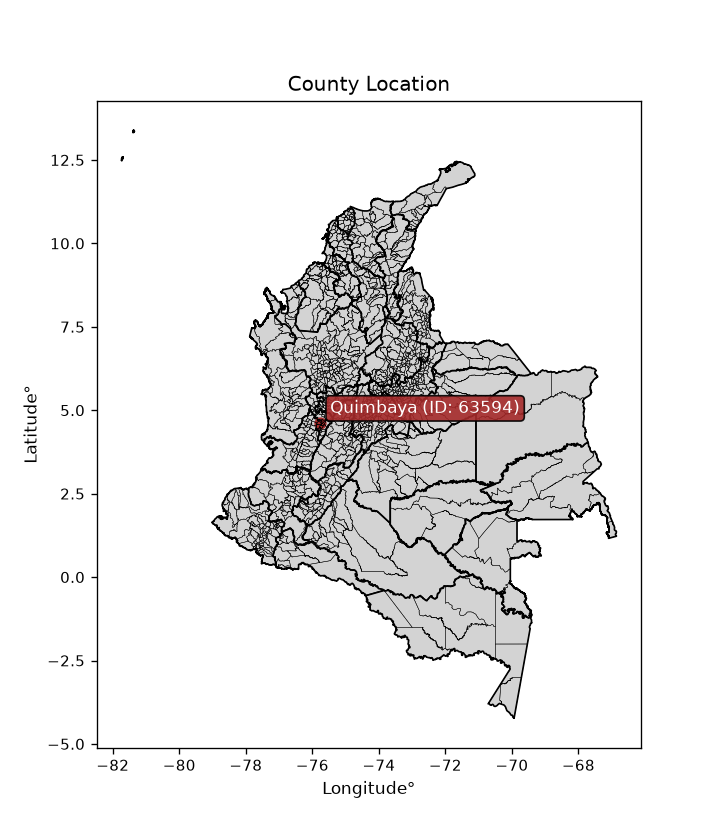
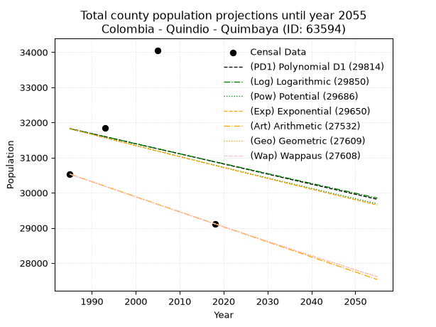
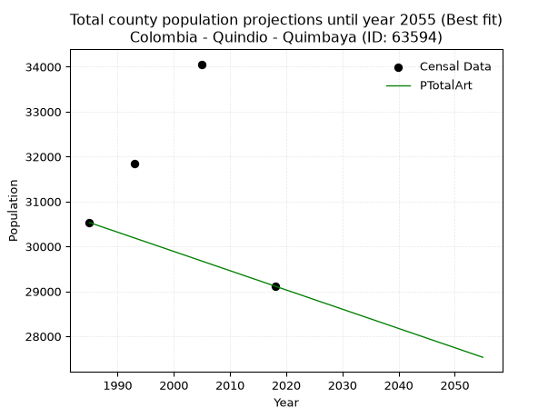
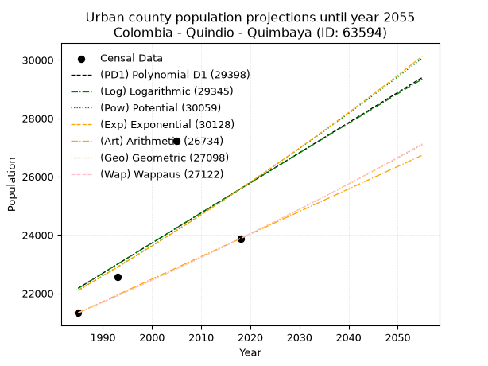
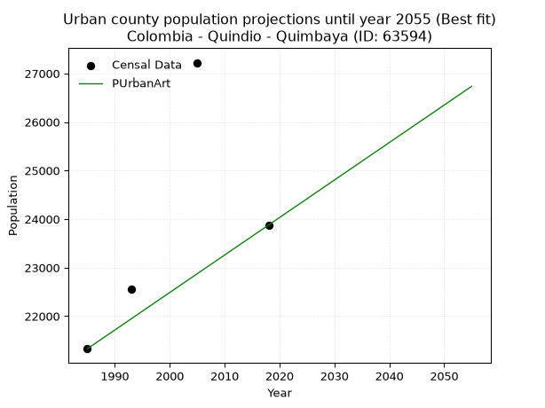
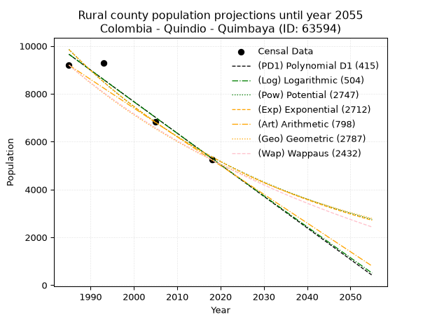
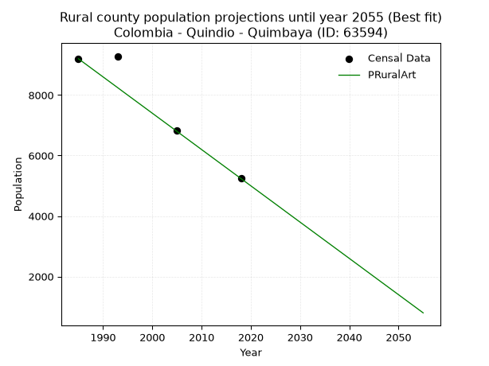

<div align="center">


</div>

# _“Population and Public Services Demand Projections (PPSD) until Year 2050 for Colombia - Quindio - Quimbaya (ID: 63594)”_
Keywords: `population` `public-service` `projection` `lineal` `polynomial` `logarithmic` `potential` `exponential` `arithmetic` `geometric` `wappaus` `dane` `colombia` `south-america`

PPSD are analytical estimates used by governments and planners to anticipate future changes in population size, age distribution, and the resulting community needs for utilities, healthcare, education, and infrastructure as sizing future water treatment facilities, electrical grids, and road networks based on spatial growth.

<div align="center">

</img>

</div>


> **General running parameters**: • app_version: _v20260806_. • Python version: _3.14.7_. • Pandas version: _3.0.5_. • NumPy version: _2.5.1_. • Creates, save and include plots into reports (create_plot): _False_. • Projection until year: _2050_. • Process polynomial degree 2 and up: _False_. • Process Wappaus: _True_. • Process Wappaus: _True_. • Set negative values to zero: _True_. • Set infinite values to zero: _True_. • Drop dataset notes: _True_. 
<div align="center">

Dynamic map: [:earth_americas:Google](http://maps.google.com/maps?q=4.624386538,-75.7650739) [:earth_americas:OSM](https://www.openstreetmap.org/#map=18/4.624386538/-75.7650739&layers=P) [:earth_americas:Bing](https://www.bing.com/maps?cp=4.624386538~-75.7650739&lvl=18) [:earth_americas:Apple](https://maps.apple.com/frame?center=4.624386538%2C-75.7650739&span=0.003%2C0.006)

</div>


<div align="center">

```geojson
{
  "type": "Feature",
  "geometry": {
    "type": "Point", 
    "coordinates": [-75.7650739, 4.624386538]
  }, 
  "properties": {
    "Name": "Colombia - Quindio - Quimbaya (ID: 63594)"
  }
}
```

</div>


## 0. Census Data (4 records)

Census data are official statistics collected by a government about the people and housing in a country. They usually include counts of total population, age, sex, race, income, education, and jobs.

📅Global census file: [Population.xlsx](../data/Population.xlsx)

| Source   |   Year |   CountryID | CountryName   |   StateID | StateName   |   CountyID | CountyName   |   PTotal |   PUrban |   PRural |
|:---------|-------:|------------:|:--------------|----------:|:------------|-----------:|:-------------|---------:|---------:|---------:|
| DANE     |   1985 |          57 | Colombia      |        63 | Quindio     |      63594 | Quimbaya     |    30531 |    21329 |     9202 |
| DANE     |   1993 |          57 | Colombia      |        63 | Quindío     |      63594 | Quimbaya     |    31849 |    22563 |     9286 |
| DANE     |   2005 |          57 | Colombia      |        63 | Quindio     |      63594 | Quimbaya     |    34056 |    27222 |     6834 |
| DANE     |   2018 |          57 | Colombia      |        63 | Quindío     |      63594 | Quimbaya     |    29117 |    23877 |     5240 |

> 🔥Some records could had specific notes about the registered values or the corresponding urban or rural distribution.

📅   [RUPS](https://www.datos.gov.co/Hacienda-y-Cr-dito-P-blico/Registro-nico-de-Prestadores-de-Servicios-P-blicos/4qkq-csdn/about_data) - Local public utility companies: [RUPS.csv](../data/RUPS.xlsx)

 | SERVICIO       | ESTADO    | NOMBRE                                      | NIT         | DEPARTAMENTO_DOMICILIO   | MUNICIPIO_DOMICILIO   | DIRECCION                  |   TELEFONO | EMAIL                  | TIPO_PRESTADOR                             | CLASIFICACION                 |
|:---------------|:----------|:--------------------------------------------|:------------|:-------------------------|:----------------------|:---------------------------|-----------:|:-----------------------|:-------------------------------------------|:------------------------------|
| ACUEDUCTO      | OPERATIVA | EMPRESAS PÚBLICAS DEL QUINDIO S.A.   E.S.P. | 800063823-7 | QUINDIO                  | ARMENIA               | CARRERA 14 N° 22-30 CENTRO |    7441774 | contactenos@epq.gov.co | SOCIEDADES (EMPRESA DE SERVICIOS PUBLICOS) | MAYOR O IGUAL A 5001 USUARIOS |
| ALCANTARILLADO | OPERATIVA | EMPRESAS PÚBLICAS DEL QUINDIO S.A.   E.S.P. | 800063823-7 | QUINDIO                  | ARMENIA               | CARRERA 14 N° 22-30 CENTRO |    7441774 | contactenos@epq.gov.co | SOCIEDADES (EMPRESA DE SERVICIOS PUBLICOS) | MAYOR O IGUAL A 5001 USUARIOS |

## 1. Total

### 1.1. Coefficients and Parameters

* (PD1) Polynomial Deg 1: -28.759935768764702, 88915.3115214716 (lineal)
* (Log) Logarithmic: -56941.0332487398, 464197.50002047495
* (Pow) Potential: -2.0022968408252297, 11.105777993504208
* (Exp) Exponential: -0.001010227016725563, 236388.3096289153
* (Art) Arithmetic: Year diff. 2018 - 1985 = 33, Population diff. 29117 - 30531 = -1414, Annual growth = -42.84848484848485
* (Geo) Geometric: Year diff. 2018 - 1985 = 33, Population diff. 29117 - 30531 = -1414, Annual growth % = -0.0014359487900836854
* (Wap) Wappaus: i = -0.1436711535960463, Condition values only valid for < 200)

<sub>
Wappaus condition values: ['-0.00', '-0.14', '-0.29', '-0.43', '-0.57', '-0.72', '-0.86', '-1.01', '-1.15', '-1.29', '-1.44', '-1.58', '-1.72', '-1.87', '-2.01', '-2.16', '-2.30', '-2.44', '-2.59', '-2.73', '-2.87', '-3.02', '-3.16', '-3.30', '-3.45', '-3.59', '-3.74', '-3.88', '-4.02', '-4.17', '-4.31', '-4.45', '-4.60', '-4.74', '-4.88', '-5.03', '-5.17', '-5.32', '-5.46', '-5.60', '-5.75', '-5.89', '-6.03', '-6.18', '-6.32', '-6.47', '-6.61', '-6.75', '-6.90', '-7.04', '-7.18', '-7.33', '-7.47', '-7.61', '-7.76', '-7.90', '-8.05', '-8.19', '-8.33', '-8.48', '-8.62', '-8.76', '-8.91', '-9.05', '-9.19', '-9.34']
</sub>


### 1.2. Projected Dataset

|   Year |   CountyID |   PTotalPD1 |   PTotalLog |   PTotalPow |   PTotalExp |   PTotalArt |   PTotalGeo |   PTotalWap |
|-------:|-----------:|------------:|------------:|------------:|------------:|------------:|------------:|------------:|
|   1985 |      63594 |       31827 |       31823 |       31819 |       31823 |       30531 |       30531 |       30531 |
|   1986 |      63594 |       31798 |       31794 |       31787 |       31790 |       30488 |       30487 |       30487 |
|   1987 |      63594 |       31769 |       31766 |       31755 |       31758 |       30445 |       30443 |       30443 |
|   1988 |      63594 |       31741 |       31737 |       31723 |       31726 |       30402 |       30400 |       30400 |
|   1989 |      63594 |       31712 |       31708 |       31691 |       31694 |       30360 |       30356 |       30356 |
|   1990 |      63594 |       31683 |       31680 |       31659 |       31662 |       30317 |       30312 |       30312 |
|   1991 |      63594 |       31654 |       31651 |       31627 |       31630 |       30274 |       30269 |       30269 |
|   1992 |      63594 |       31626 |       31622 |       31595 |       31598 |       30231 |       30225 |       30225 |
|   1993 |      63594 |       31597 |       31594 |       31563 |       31566 |       30188 |       30182 |       30182 |
|   1994 |      63594 |       31568 |       31565 |       31532 |       31535 |       30145 |       30139 |       30139 |
|   1995 |      63594 |       31539 |       31537 |       31500 |       31503 |       30103 |       30095 |       30095 |
|   1996 |      63594 |       31510 |       31508 |       31469 |       31471 |       30060 |       30052 |       30052 |
|   1997 |      63594 |       31482 |       31480 |       31437 |       31439 |       30017 |       30009 |       30009 |
|   1998 |      63594 |       31453 |       31451 |       31406 |       31407 |       29974 |       29966 |       29966 |
|   1999 |      63594 |       31424 |       31423 |       31374 |       31376 |       29931 |       29923 |       29923 |
|   2000 |      63594 |       31395 |       31394 |       31343 |       31344 |       29888 |       29880 |       29880 |
|   2001 |      63594 |       31367 |       31366 |       31311 |       31312 |       29845 |       29837 |       29837 |
|   2002 |      63594 |       31338 |       31337 |       31280 |       31281 |       29803 |       29794 |       29794 |
|   2003 |      63594 |       31309 |       31309 |       31249 |       31249 |       29760 |       29751 |       29752 |
|   2004 |      63594 |       31280 |       31280 |       31218 |       31218 |       29717 |       29709 |       29709 |
|   2005 |      63594 |       31252 |       31252 |       31186 |       31186 |       29674 |       29666 |       29666 |
|   2006 |      63594 |       31223 |       31224 |       31155 |       31155 |       29631 |       29623 |       29624 |
|   2007 |      63594 |       31194 |       31195 |       31124 |       31123 |       29588 |       29581 |       29581 |
|   2008 |      63594 |       31165 |       31167 |       31093 |       31092 |       29545 |       29538 |       29539 |
|   2009 |      63594 |       31137 |       31139 |       31062 |       31060 |       29503 |       29496 |       29496 |
|   2010 |      63594 |       31108 |       31110 |       31031 |       31029 |       29460 |       29454 |       29454 |
|   2011 |      63594 |       31079 |       31082 |       31000 |       30998 |       29417 |       29411 |       29411 |
|   2012 |      63594 |       31050 |       31054 |       30969 |       30966 |       29374 |       29369 |       29369 |
|   2013 |      63594 |       31022 |       31025 |       30939 |       30935 |       29331 |       29327 |       29327 |
|   2014 |      63594 |       30993 |       30997 |       30908 |       30904 |       29288 |       29285 |       29285 |
|   2015 |      63594 |       30964 |       30969 |       30877 |       30873 |       29246 |       29243 |       29243 |
|   2016 |      63594 |       30935 |       30941 |       30847 |       30841 |       29203 |       29201 |       29201 |
|   2017 |      63594 |       30907 |       30912 |       30816 |       30810 |       29160 |       29159 |       29159 |
|   2018 |      63594 |       30878 |       30884 |       30785 |       30779 |       29117 |       29117 |       29117 |
|   2019 |      63594 |       30849 |       30856 |       30755 |       30748 |       29074 |       29075 |       29075 |
|   2020 |      63594 |       30820 |       30828 |       30724 |       30717 |       29031 |       29033 |       29033 |
|   2021 |      63594 |       30791 |       30799 |       30694 |       30686 |       28988 |       28992 |       28992 |
|   2022 |      63594 |       30763 |       30771 |       30664 |       30655 |       28946 |       28950 |       28950 |
|   2023 |      63594 |       30734 |       30743 |       30633 |       30624 |       28903 |       28909 |       28908 |
|   2024 |      63594 |       30705 |       30715 |       30603 |       30593 |       28860 |       28867 |       28867 |
|   2025 |      63594 |       30676 |       30687 |       30573 |       30562 |       28817 |       28826 |       28825 |
|   2026 |      63594 |       30648 |       30659 |       30542 |       30531 |       28774 |       28784 |       28784 |
|   2027 |      63594 |       30619 |       30631 |       30512 |       30501 |       28731 |       28743 |       28743 |
|   2028 |      63594 |       30590 |       30603 |       30482 |       30470 |       28689 |       28702 |       28701 |
|   2029 |      63594 |       30561 |       30575 |       30452 |       30439 |       28646 |       28660 |       28660 |
|   2030 |      63594 |       30533 |       30546 |       30422 |       30408 |       28603 |       28619 |       28619 |
|   2031 |      63594 |       30504 |       30518 |       30392 |       30378 |       28560 |       28578 |       28578 |
|   2032 |      63594 |       30475 |       30490 |       30362 |       30347 |       28517 |       28537 |       28537 |
|   2033 |      63594 |       30446 |       30462 |       30332 |       30316 |       28474 |       28496 |       28496 |
|   2034 |      63594 |       30418 |       30434 |       30302 |       30286 |       28431 |       28455 |       28455 |
|   2035 |      63594 |       30389 |       30406 |       30273 |       30255 |       28389 |       28414 |       28414 |
|   2036 |      63594 |       30360 |       30378 |       30243 |       30225 |       28346 |       28374 |       28373 |
|   2037 |      63594 |       30331 |       30350 |       30213 |       30194 |       28303 |       28333 |       28332 |
|   2038 |      63594 |       30303 |       30323 |       30183 |       30164 |       28260 |       28292 |       28291 |
|   2039 |      63594 |       30274 |       30295 |       30154 |       30133 |       28217 |       28251 |       28251 |
|   2040 |      63594 |       30245 |       30267 |       30124 |       30103 |       28174 |       28211 |       28210 |
|   2041 |      63594 |       30216 |       30239 |       30095 |       30072 |       28131 |       28170 |       28170 |
|   2042 |      63594 |       30188 |       30211 |       30065 |       30042 |       28089 |       28130 |       28129 |
|   2043 |      63594 |       30159 |       30183 |       30036 |       30012 |       28046 |       28090 |       28089 |
|   2044 |      63594 |       30130 |       30155 |       30006 |       29981 |       28003 |       28049 |       28048 |
|   2045 |      63594 |       30101 |       30127 |       29977 |       29951 |       27960 |       28009 |       28008 |
|   2046 |      63594 |       30072 |       30099 |       29948 |       29921 |       27917 |       27969 |       27968 |
|   2047 |      63594 |       30044 |       30072 |       29918 |       29891 |       27874 |       27929 |       27927 |
|   2048 |      63594 |       30015 |       30044 |       29889 |       29860 |       27832 |       27888 |       27887 |
|   2049 |      63594 |       29986 |       30016 |       29860 |       29830 |       27789 |       27848 |       27847 |
|   2050 |      63594 |       29957 |       29988 |       29831 |       29800 |       27746 |       27808 |       27807 |
<div align="center">

</img>

</div>


### 1.3. Best fit with absolute and relative error (%)

Relative error puts that difference into context by dividing the absolute error by the true value, creating a unitless ratio or percentage that shows the scale of the mistake.

Absolute and relative error

|   Year | Source   |   CountryID | CountryName   |   StateID | StateName   |   CountyID_x | CountyName   |   PTotal |   PUrban |   PRural |   CountyID_y |   PTotalPD1 |   PTotalLog |   PTotalPow |   PTotalExp |   PTotalArt |   PTotalGeo |   PTotalWap |   PTotalPD1AbsError |   PTotalLogAbsError |   PTotalPowAbsError |   PTotalExpAbsError |   PTotalArtAbsError |   PTotalGeoAbsError |   PTotalWapAbsError |   PTotalPD1RelError |   PTotalLogRelError |   PTotalPowRelError |   PTotalExpRelError |   PTotalArtRelError |   PTotalGeoRelError |   PTotalWapRelError |
|-------:|:---------|------------:|:--------------|----------:|:------------|-------------:|:-------------|---------:|---------:|---------:|-------------:|------------:|------------:|------------:|------------:|------------:|------------:|------------:|--------------------:|--------------------:|--------------------:|--------------------:|--------------------:|--------------------:|--------------------:|--------------------:|--------------------:|--------------------:|--------------------:|--------------------:|--------------------:|--------------------:|
|   1985 | DANE     |          57 | Colombia      |        63 | Quindio     |        63594 | Quimbaya     |    30531 |    21329 |     9202 |        63594 |       31827 |       31823 |       31819 |       31823 |       30531 |       30531 |       30531 |                1296 |                1292 |                1288 |                1292 |                   0 |                   0 |                   0 |            4.24487  |            4.23176  |            4.21866  |            4.23176  |             0       |             0       |             0       |
|   1993 | DANE     |          57 | Colombia      |        63 | Quindío     |        63594 | Quimbaya     |    31849 |    22563 |     9286 |        63594 |       31597 |       31594 |       31563 |       31566 |       30188 |       30182 |       30182 |                 252 |                 255 |                 286 |                 283 |                1661 |                1667 |                1667 |            0.791234 |            0.800653 |            0.897987 |            0.888568 |             5.21523 |             5.23407 |             5.23407 |
|   2005 | DANE     |          57 | Colombia      |        63 | Quindio     |        63594 | Quimbaya     |    34056 |    27222 |     6834 |        63594 |       31252 |       31252 |       31186 |       31186 |       29674 |       29666 |       29666 |                2804 |                2804 |                2870 |                2870 |                4382 |                4390 |                4390 |            8.2335   |            8.2335   |            8.4273   |            8.4273   |            12.867   |            12.8905  |            12.8905  |
|   2018 | DANE     |          57 | Colombia      |        63 | Quindío     |        63594 | Quimbaya     |    29117 |    23877 |     5240 |        63594 |       30878 |       30884 |       30785 |       30779 |       29117 |       29117 |       29117 |                1761 |                1767 |                1668 |                1662 |                   0 |                   0 |                   0 |            6.04801  |            6.06862  |            5.72861  |            5.70801  |             0       |             0       |             0       |

Relative error mean

| Method    |   RelError | Best   |
|:----------|-----------:|:-------|
| PTotalPD1 |    4.8294  |        |
| PTotalLog |    4.83363 |        |
| PTotalPow |    4.81814 |        |
| PTotalExp |    4.81391 |        |
| PTotalArt |    4.52057 | True   |
| PTotalGeo |    4.53115 |        |
| PTotalWap |    4.53115 |        |

💙Best method: _**PTotalArt**_
<div align="center">

</img>

</div>


### 1.4. Fresh water supply demand in liters per capita per day (lpcd)

The fresh water supply demand typically ranges from 100 to 300 liters per capita per day (lpcd) for standard domestic and municipal planning, though absolute survival minimums set by the World Health Organization are as low as 7.5 to 20 liters per day, and total consumption in high-income nations can exceed 400 liters.

> `CZ`: Level in meters above the sea level (masl)<br> `WS`: Fresh water supply demand in liters per capita per day (lpcd or l/h/d)<br> `WSAll`: Zonal fresh water supply demand in liters per second (l/s)<br> `A`: Zonal area in square meters<br> `DP`: Population density (people/hectare or p/ha)

Reference values (RAS Colombia)

|    CZ |   WS |
|------:|-----:|
|  1000 |  120 |
|  2000 |  130 |
| 99999 |  140 |

County shapefile geometry properties and water supply values

|   CountyID |      ATotal |   CZTotal |   WSTotal |
|-----------:|------------:|----------:|----------:|
|      63594 | 1.33228e+08 |   1231.98 |       130 |

Projected values for best method: PTotalArt

|   CountyID |   Year |   PTotalArt |   DPTotal |   WSTotal |   WSTotalAll |
|-----------:|-------:|------------:|----------:|----------:|-------------:|
|      63594 |   1985 |       30531 |      2.29 |       130 |      45.9378 |
|      63594 |   1986 |       30488 |      2.29 |       130 |      45.8731 |
|      63594 |   1987 |       30445 |      2.29 |       130 |      45.8084 |
|      63594 |   1988 |       30402 |      2.28 |       130 |      45.7437 |
|      63594 |   1989 |       30360 |      2.28 |       130 |      45.6806 |
|      63594 |   1990 |       30317 |      2.28 |       130 |      45.6159 |
|      63594 |   1991 |       30274 |      2.27 |       130 |      45.5512 |
|      63594 |   1992 |       30231 |      2.27 |       130 |      45.4865 |
|      63594 |   1993 |       30188 |      2.27 |       130 |      45.4218 |
|      63594 |   1994 |       30145 |      2.26 |       130 |      45.3571 |
|      63594 |   1995 |       30103 |      2.26 |       130 |      45.2939 |
|      63594 |   1996 |       30060 |      2.26 |       130 |      45.2292 |
|      63594 |   1997 |       30017 |      2.25 |       130 |      45.1645 |
|      63594 |   1998 |       29974 |      2.25 |       130 |      45.0998 |
|      63594 |   1999 |       29931 |      2.25 |       130 |      45.0351 |
|      63594 |   2000 |       29888 |      2.24 |       130 |      44.9704 |
|      63594 |   2001 |       29845 |      2.24 |       130 |      44.9057 |
|      63594 |   2002 |       29803 |      2.24 |       130 |      44.8425 |
|      63594 |   2003 |       29760 |      2.23 |       130 |      44.7778 |
|      63594 |   2004 |       29717 |      2.23 |       130 |      44.7131 |
|      63594 |   2005 |       29674 |      2.23 |       130 |      44.6484 |
|      63594 |   2006 |       29631 |      2.22 |       130 |      44.5837 |
|      63594 |   2007 |       29588 |      2.22 |       130 |      44.519  |
|      63594 |   2008 |       29545 |      2.22 |       130 |      44.4543 |
|      63594 |   2009 |       29503 |      2.21 |       130 |      44.3911 |
|      63594 |   2010 |       29460 |      2.21 |       130 |      44.3264 |
|      63594 |   2011 |       29417 |      2.21 |       130 |      44.2617 |
|      63594 |   2012 |       29374 |      2.2  |       130 |      44.197  |
|      63594 |   2013 |       29331 |      2.2  |       130 |      44.1323 |
|      63594 |   2014 |       29288 |      2.2  |       130 |      44.0676 |
|      63594 |   2015 |       29246 |      2.2  |       130 |      44.0044 |
|      63594 |   2016 |       29203 |      2.19 |       130 |      43.9397 |
|      63594 |   2017 |       29160 |      2.19 |       130 |      43.875  |
|      63594 |   2018 |       29117 |      2.19 |       130 |      43.8103 |
|      63594 |   2019 |       29074 |      2.18 |       130 |      43.7456 |
|      63594 |   2020 |       29031 |      2.18 |       130 |      43.6809 |
|      63594 |   2021 |       28988 |      2.18 |       130 |      43.6162 |
|      63594 |   2022 |       28946 |      2.17 |       130 |      43.553  |
|      63594 |   2023 |       28903 |      2.17 |       130 |      43.4883 |
|      63594 |   2024 |       28860 |      2.17 |       130 |      43.4236 |
|      63594 |   2025 |       28817 |      2.16 |       130 |      43.3589 |
|      63594 |   2026 |       28774 |      2.16 |       130 |      43.2942 |
|      63594 |   2027 |       28731 |      2.16 |       130 |      43.2295 |
|      63594 |   2028 |       28689 |      2.15 |       130 |      43.1663 |
|      63594 |   2029 |       28646 |      2.15 |       130 |      43.1016 |
|      63594 |   2030 |       28603 |      2.15 |       130 |      43.0369 |
|      63594 |   2031 |       28560 |      2.14 |       130 |      42.9722 |
|      63594 |   2032 |       28517 |      2.14 |       130 |      42.9075 |
|      63594 |   2033 |       28474 |      2.14 |       130 |      42.8428 |
|      63594 |   2034 |       28431 |      2.13 |       130 |      42.7781 |
|      63594 |   2035 |       28389 |      2.13 |       130 |      42.7149 |
|      63594 |   2036 |       28346 |      2.13 |       130 |      42.6502 |
|      63594 |   2037 |       28303 |      2.12 |       130 |      42.5855 |
|      63594 |   2038 |       28260 |      2.12 |       130 |      42.5208 |
|      63594 |   2039 |       28217 |      2.12 |       130 |      42.4561 |
|      63594 |   2040 |       28174 |      2.11 |       130 |      42.3914 |
|      63594 |   2041 |       28131 |      2.11 |       130 |      42.3267 |
|      63594 |   2042 |       28089 |      2.11 |       130 |      42.2635 |
|      63594 |   2043 |       28046 |      2.11 |       130 |      42.1988 |
|      63594 |   2044 |       28003 |      2.1  |       130 |      42.1341 |
|      63594 |   2045 |       27960 |      2.1  |       130 |      42.0694 |
|      63594 |   2046 |       27917 |      2.1  |       130 |      42.0047 |
|      63594 |   2047 |       27874 |      2.09 |       130 |      41.94   |
|      63594 |   2048 |       27832 |      2.09 |       130 |      41.8769 |
|      63594 |   2049 |       27789 |      2.09 |       130 |      41.8122 |
|      63594 |   2050 |       27746 |      2.08 |       130 |      41.7475 |

## 2. Urban

### 2.1. Coefficients and Parameters

* (PD1) Polynomial Deg 1: 103.20714572461037, -182692.3432356519 (lineal)
* (Log) Logarithmic: 207133.55884893666, -1550676.090674937
* (Pow) Potential: 8.874631435451517, -24.92201461363021
* (Exp) Exponential: 0.004422456107489542, 3.4043958444174236
* (Art) Arithmetic: Year diff. 2018 - 1985 = 33, Population diff. 23877 - 21329 = 2548, Annual growth = 77.21212121212122
* (Geo) Geometric: Year diff. 2018 - 1985 = 33, Population diff. 23877 - 21329 = 2548, Annual growth % = 0.0034254900949741707
* (Wap) Wappaus: i = 0.34160120874273864, Condition values only valid for < 200)

<sub>
Wappaus condition values: ['0.00', '0.34', '0.68', '1.02', '1.37', '1.71', '2.05', '2.39', '2.73', '3.07', '3.42', '3.76', '4.10', '4.44', '4.78', '5.12', '5.47', '5.81', '6.15', '6.49', '6.83', '7.17', '7.52', '7.86', '8.20', '8.54', '8.88', '9.22', '9.56', '9.91', '10.25', '10.59', '10.93', '11.27', '11.61', '11.96', '12.30', '12.64', '12.98', '13.32', '13.66', '14.01', '14.35', '14.69', '15.03', '15.37', '15.71', '16.06', '16.40', '16.74', '17.08', '17.42', '17.76', '18.10', '18.45', '18.79', '19.13', '19.47', '19.81', '20.15', '20.50', '20.84', '21.18', '21.52', '21.86', '22.20']
</sub>


### 2.2. Projected Dataset

|   Year |   CountyID |   PUrbanPD1 |   PUrbanLog |   PUrbanPow |   PUrbanExp |   PUrbanArt |   PUrbanGeo |   PUrbanWap |
|-------:|-----------:|------------:|------------:|------------:|------------:|------------:|------------:|------------:|
|   1985 |      63594 |       22174 |       22167 |       22100 |       22107 |       21329 |       21329 |       21329 |
|   1986 |      63594 |       22277 |       22271 |       22199 |       22205 |       21406 |       21402 |       21402 |
|   1987 |      63594 |       22380 |       22375 |       22299 |       22303 |       21483 |       21475 |       21475 |
|   1988 |      63594 |       22483 |       22479 |       22398 |       22402 |       21561 |       21549 |       21549 |
|   1989 |      63594 |       22587 |       22584 |       22498 |       22501 |       21638 |       21623 |       21622 |
|   1990 |      63594 |       22690 |       22688 |       22599 |       22601 |       21715 |       21697 |       21696 |
|   1991 |      63594 |       22793 |       22792 |       22700 |       22701 |       21792 |       21771 |       21771 |
|   1992 |      63594 |       22896 |       22896 |       22801 |       22802 |       21869 |       21846 |       21845 |
|   1993 |      63594 |       22999 |       23000 |       22903 |       22903 |       21947 |       21921 |       21920 |
|   1994 |      63594 |       23103 |       23104 |       23005 |       23004 |       22024 |       21996 |       21995 |
|   1995 |      63594 |       23206 |       23207 |       23108 |       23106 |       22101 |       22071 |       22070 |
|   1996 |      63594 |       23309 |       23311 |       23211 |       23209 |       22178 |       22147 |       22146 |
|   1997 |      63594 |       23412 |       23415 |       23314 |       23312 |       22256 |       22222 |       22222 |
|   1998 |      63594 |       23516 |       23519 |       23418 |       23415 |       22333 |       22299 |       22298 |
|   1999 |      63594 |       23619 |       23622 |       23522 |       23519 |       22410 |       22375 |       22374 |
|   2000 |      63594 |       23722 |       23726 |       23627 |       23623 |       22487 |       22452 |       22451 |
|   2001 |      63594 |       23825 |       23829 |       23732 |       23728 |       22564 |       22529 |       22528 |
|   2002 |      63594 |       23928 |       23933 |       23838 |       23833 |       22642 |       22606 |       22605 |
|   2003 |      63594 |       24032 |       24036 |       23943 |       23939 |       22719 |       22683 |       22682 |
|   2004 |      63594 |       24135 |       24140 |       24050 |       24045 |       22796 |       22761 |       22760 |
|   2005 |      63594 |       24238 |       24243 |       24156 |       24151 |       22873 |       22839 |       22838 |
|   2006 |      63594 |       24341 |       24346 |       24264 |       24258 |       22950 |       22917 |       22916 |
|   2007 |      63594 |       24444 |       24450 |       24371 |       24366 |       23028 |       22996 |       22995 |
|   2008 |      63594 |       24548 |       24553 |       24479 |       24474 |       23105 |       23074 |       23073 |
|   2009 |      63594 |       24651 |       24656 |       24588 |       24582 |       23182 |       23153 |       23152 |
|   2010 |      63594 |       24754 |       24759 |       24696 |       24691 |       23259 |       23233 |       23232 |
|   2011 |      63594 |       24857 |       24862 |       24806 |       24801 |       23337 |       23312 |       23311 |
|   2012 |      63594 |       24960 |       24965 |       24915 |       24911 |       23414 |       23392 |       23391 |
|   2013 |      63594 |       25064 |       25068 |       25025 |       25021 |       23491 |       23472 |       23472 |
|   2014 |      63594 |       25167 |       25171 |       25136 |       25132 |       23568 |       23553 |       23552 |
|   2015 |      63594 |       25270 |       25274 |       25247 |       25243 |       23645 |       23633 |       23633 |
|   2016 |      63594 |       25373 |       25376 |       25358 |       25355 |       23723 |       23714 |       23714 |
|   2017 |      63594 |       25476 |       25479 |       25470 |       25468 |       23800 |       23795 |       23795 |
|   2018 |      63594 |       25580 |       25582 |       25582 |       25580 |       23877 |       23877 |       23877 |
|   2019 |      63594 |       25683 |       25684 |       25695 |       25694 |       23954 |       23959 |       23959 |
|   2020 |      63594 |       25786 |       25787 |       25808 |       25808 |       24031 |       24041 |       24041 |
|   2021 |      63594 |       25889 |       25889 |       25922 |       25922 |       24109 |       24123 |       24124 |
|   2022 |      63594 |       25993 |       25992 |       26036 |       26037 |       24186 |       24206 |       24207 |
|   2023 |      63594 |       26096 |       26094 |       26151 |       26152 |       24263 |       24289 |       24290 |
|   2024 |      63594 |       26199 |       26197 |       26265 |       26268 |       24340 |       24372 |       24373 |
|   2025 |      63594 |       26302 |       26299 |       26381 |       26385 |       24417 |       24455 |       24457 |
|   2026 |      63594 |       26405 |       26401 |       26497 |       26502 |       24495 |       24539 |       24541 |
|   2027 |      63594 |       26509 |       26503 |       26613 |       26619 |       24572 |       24623 |       24626 |
|   2028 |      63594 |       26612 |       26606 |       26730 |       26737 |       24649 |       24708 |       24710 |
|   2029 |      63594 |       26715 |       26708 |       26847 |       26856 |       24726 |       24792 |       24795 |
|   2030 |      63594 |       26818 |       26810 |       26965 |       26975 |       24804 |       24877 |       24881 |
|   2031 |      63594 |       26921 |       26912 |       27083 |       27094 |       24881 |       24962 |       24966 |
|   2032 |      63594 |       27025 |       27014 |       27201 |       27214 |       24958 |       25048 |       25052 |
|   2033 |      63594 |       27128 |       27116 |       27320 |       27335 |       25035 |       25134 |       25139 |
|   2034 |      63594 |       27231 |       27218 |       27440 |       27456 |       25112 |       25220 |       25225 |
|   2035 |      63594 |       27334 |       27319 |       27560 |       27578 |       25190 |       25306 |       25312 |
|   2036 |      63594 |       27437 |       27421 |       27680 |       27700 |       25267 |       25393 |       25399 |
|   2037 |      63594 |       27541 |       27523 |       27801 |       27823 |       25344 |       25480 |       25487 |
|   2038 |      63594 |       27644 |       27625 |       27922 |       27946 |       25421 |       25567 |       25575 |
|   2039 |      63594 |       27747 |       27726 |       28044 |       28070 |       25498 |       25655 |       25663 |
|   2040 |      63594 |       27850 |       27828 |       28167 |       28194 |       25576 |       25743 |       25752 |
|   2041 |      63594 |       27953 |       27929 |       28289 |       28319 |       25653 |       25831 |       25841 |
|   2042 |      63594 |       28057 |       28031 |       28413 |       28445 |       25730 |       25919 |       25930 |
|   2043 |      63594 |       28160 |       28132 |       28536 |       28571 |       25807 |       26008 |       26020 |
|   2044 |      63594 |       28263 |       28233 |       28660 |       28698 |       25885 |       26097 |       26109 |
|   2045 |      63594 |       28366 |       28335 |       28785 |       28825 |       25962 |       26187 |       26200 |
|   2046 |      63594 |       28469 |       28436 |       28910 |       28953 |       26039 |       26276 |       26290 |
|   2047 |      63594 |       28573 |       28537 |       29036 |       29081 |       26116 |       26366 |       26381 |
|   2048 |      63594 |       28676 |       28638 |       29162 |       29210 |       26193 |       26457 |       26473 |
|   2049 |      63594 |       28779 |       28739 |       29289 |       29339 |       26271 |       26547 |       26564 |
|   2050 |      63594 |       28882 |       28841 |       29416 |       29469 |       26348 |       26638 |       26656 |
<div align="center">

</img>

</div>


### 2.3. Best fit with absolute and relative error (%)

Relative error puts that difference into context by dividing the absolute error by the true value, creating a unitless ratio or percentage that shows the scale of the mistake.

Absolute and relative error

|   Year | Source   |   CountryID | CountryName   |   StateID | StateName   |   CountyID_x | CountyName   |   PTotal |   PUrban |   PRural |   CountyID_y |   PUrbanPD1 |   PUrbanLog |   PUrbanPow |   PUrbanExp |   PUrbanArt |   PUrbanGeo |   PUrbanWap |   PUrbanPD1AbsError |   PUrbanLogAbsError |   PUrbanPowAbsError |   PUrbanExpAbsError |   PUrbanArtAbsError |   PUrbanGeoAbsError |   PUrbanWapAbsError |   PUrbanPD1RelError |   PUrbanLogRelError |   PUrbanPowRelError |   PUrbanExpRelError |   PUrbanArtRelError |   PUrbanGeoRelError |   PUrbanWapRelError |
|-------:|:---------|------------:|:--------------|----------:|:------------|-------------:|:-------------|---------:|---------:|---------:|-------------:|------------:|------------:|------------:|------------:|------------:|------------:|------------:|--------------------:|--------------------:|--------------------:|--------------------:|--------------------:|--------------------:|--------------------:|--------------------:|--------------------:|--------------------:|--------------------:|--------------------:|--------------------:|--------------------:|
|   1985 | DANE     |          57 | Colombia      |        63 | Quindio     |        63594 | Quimbaya     |    30531 |    21329 |     9202 |        63594 |       22174 |       22167 |       22100 |       22107 |       21329 |       21329 |       21329 |                 845 |                 838 |                 771 |                 778 |                   0 |                   0 |                   0 |             3.96174 |             3.92892 |             3.6148  |             3.64762 |             0       |             0       |              0      |
|   1993 | DANE     |          57 | Colombia      |        63 | Quindío     |        63594 | Quimbaya     |    31849 |    22563 |     9286 |        63594 |       22999 |       23000 |       22903 |       22903 |       21947 |       21921 |       21920 |                 436 |                 437 |                 340 |                 340 |                 616 |                 642 |                 643 |             1.93237 |             1.9368  |             1.50689 |             1.50689 |             2.73013 |             2.84537 |              2.8498 |
|   2005 | DANE     |          57 | Colombia      |        63 | Quindio     |        63594 | Quimbaya     |    34056 |    27222 |     6834 |        63594 |       24238 |       24243 |       24156 |       24151 |       22873 |       22839 |       22838 |                2984 |                2979 |                3066 |                3071 |                4349 |                4383 |                4384 |            10.9617  |            10.9434  |            11.2629  |            11.2813  |            15.976   |            16.1009  |             16.1046 |
|   2018 | DANE     |          57 | Colombia      |        63 | Quindío     |        63594 | Quimbaya     |    29117 |    23877 |     5240 |        63594 |       25580 |       25582 |       25582 |       25580 |       23877 |       23877 |       23877 |                1703 |                1705 |                1705 |                1703 |                   0 |                   0 |                   0 |             7.13239 |             7.14076 |             7.14076 |             7.13239 |             0       |             0       |              0      |

Relative error mean

| Method    |   RelError | Best   |
|:----------|-----------:|:-------|
| PUrbanPD1 |    5.99705 |        |
| PUrbanLog |    5.98746 |        |
| PUrbanPow |    5.88135 |        |
| PUrbanExp |    5.89205 |        |
| PUrbanArt |    4.67655 | True   |
| PUrbanGeo |    4.73658 |        |
| PUrbanWap |    4.7386  |        |

💙Best method: _**PUrbanArt**_
<div align="center">

</img>

</div>


### 2.4. Fresh water supply demand in liters per capita per day (lpcd)

The fresh water supply demand typically ranges from 100 to 300 liters per capita per day (lpcd) for standard domestic and municipal planning, though absolute survival minimums set by the World Health Organization are as low as 7.5 to 20 liters per day, and total consumption in high-income nations can exceed 400 liters.

> `CZ`: Level in meters above the sea level (masl)<br> `WS`: Fresh water supply demand in liters per capita per day (lpcd or l/h/d)<br> `WSAll`: Zonal fresh water supply demand in liters per second (l/s)<br> `A`: Zonal area in square meters<br> `DP`: Population density (people/hectare or p/ha)

Reference values (RAS Colombia)

|    CZ |   WS |
|------:|-----:|
|  1000 |  120 |
|  2000 |  130 |
| 99999 |  140 |

County shapefile geometry properties and water supply values

|   CountyID |      AUrban |   CZUrban |   WSUrban |
|-----------:|------------:|----------:|----------:|
|      63594 | 2.99255e+06 |   1300.86 |       130 |

Projected values for best method: PUrbanArt

|   CountyID |   Year |   PUrbanArt |   DPUrban |   WSUrban |   WSUrbanAll |
|-----------:|-------:|------------:|----------:|----------:|-------------:|
|      63594 |   1985 |       21329 |     71.27 |       130 |      32.0922 |
|      63594 |   1986 |       21406 |     71.53 |       130 |      32.2081 |
|      63594 |   1987 |       21483 |     71.79 |       130 |      32.324  |
|      63594 |   1988 |       21561 |     72.05 |       130 |      32.4413 |
|      63594 |   1989 |       21638 |     72.31 |       130 |      32.5572 |
|      63594 |   1990 |       21715 |     72.56 |       130 |      32.673  |
|      63594 |   1991 |       21792 |     72.82 |       130 |      32.7889 |
|      63594 |   1992 |       21869 |     73.08 |       130 |      32.9047 |
|      63594 |   1993 |       21947 |     73.34 |       130 |      33.0221 |
|      63594 |   1994 |       22024 |     73.6  |       130 |      33.138  |
|      63594 |   1995 |       22101 |     73.85 |       130 |      33.2538 |
|      63594 |   1996 |       22178 |     74.11 |       130 |      33.3697 |
|      63594 |   1997 |       22256 |     74.37 |       130 |      33.487  |
|      63594 |   1998 |       22333 |     74.63 |       130 |      33.6029 |
|      63594 |   1999 |       22410 |     74.89 |       130 |      33.7188 |
|      63594 |   2000 |       22487 |     75.14 |       130 |      33.8346 |
|      63594 |   2001 |       22564 |     75.4  |       130 |      33.9505 |
|      63594 |   2002 |       22642 |     75.66 |       130 |      34.0678 |
|      63594 |   2003 |       22719 |     75.92 |       130 |      34.1837 |
|      63594 |   2004 |       22796 |     76.18 |       130 |      34.2995 |
|      63594 |   2005 |       22873 |     76.43 |       130 |      34.4154 |
|      63594 |   2006 |       22950 |     76.69 |       130 |      34.5312 |
|      63594 |   2007 |       23028 |     76.95 |       130 |      34.6486 |
|      63594 |   2008 |       23105 |     77.21 |       130 |      34.7645 |
|      63594 |   2009 |       23182 |     77.47 |       130 |      34.8803 |
|      63594 |   2010 |       23259 |     77.72 |       130 |      34.9962 |
|      63594 |   2011 |       23337 |     77.98 |       130 |      35.1135 |
|      63594 |   2012 |       23414 |     78.24 |       130 |      35.2294 |
|      63594 |   2013 |       23491 |     78.5  |       130 |      35.3453 |
|      63594 |   2014 |       23568 |     78.76 |       130 |      35.4611 |
|      63594 |   2015 |       23645 |     79.01 |       130 |      35.577  |
|      63594 |   2016 |       23723 |     79.27 |       130 |      35.6943 |
|      63594 |   2017 |       23800 |     79.53 |       130 |      35.8102 |
|      63594 |   2018 |       23877 |     79.79 |       130 |      35.926  |
|      63594 |   2019 |       23954 |     80.05 |       130 |      36.0419 |
|      63594 |   2020 |       24031 |     80.3  |       130 |      36.1578 |
|      63594 |   2021 |       24109 |     80.56 |       130 |      36.2751 |
|      63594 |   2022 |       24186 |     80.82 |       130 |      36.391  |
|      63594 |   2023 |       24263 |     81.08 |       130 |      36.5068 |
|      63594 |   2024 |       24340 |     81.34 |       130 |      36.6227 |
|      63594 |   2025 |       24417 |     81.59 |       130 |      36.7385 |
|      63594 |   2026 |       24495 |     81.85 |       130 |      36.8559 |
|      63594 |   2027 |       24572 |     82.11 |       130 |      36.9718 |
|      63594 |   2028 |       24649 |     82.37 |       130 |      37.0876 |
|      63594 |   2029 |       24726 |     82.63 |       130 |      37.2035 |
|      63594 |   2030 |       24804 |     82.89 |       130 |      37.3208 |
|      63594 |   2031 |       24881 |     83.14 |       130 |      37.4367 |
|      63594 |   2032 |       24958 |     83.4  |       130 |      37.5525 |
|      63594 |   2033 |       25035 |     83.66 |       130 |      37.6684 |
|      63594 |   2034 |       25112 |     83.91 |       130 |      37.7843 |
|      63594 |   2035 |       25190 |     84.18 |       130 |      37.9016 |
|      63594 |   2036 |       25267 |     84.43 |       130 |      38.0175 |
|      63594 |   2037 |       25344 |     84.69 |       130 |      38.1333 |
|      63594 |   2038 |       25421 |     84.95 |       130 |      38.2492 |
|      63594 |   2039 |       25498 |     85.2  |       130 |      38.365  |
|      63594 |   2040 |       25576 |     85.47 |       130 |      38.4824 |
|      63594 |   2041 |       25653 |     85.72 |       130 |      38.5983 |
|      63594 |   2042 |       25730 |     85.98 |       130 |      38.7141 |
|      63594 |   2043 |       25807 |     86.24 |       130 |      38.83   |
|      63594 |   2044 |       25885 |     86.5  |       130 |      38.9473 |
|      63594 |   2045 |       25962 |     86.76 |       130 |      39.0632 |
|      63594 |   2046 |       26039 |     87.01 |       130 |      39.1791 |
|      63594 |   2047 |       26116 |     87.27 |       130 |      39.2949 |
|      63594 |   2048 |       26193 |     87.53 |       130 |      39.4108 |
|      63594 |   2049 |       26271 |     87.79 |       130 |      39.5281 |
|      63594 |   2050 |       26348 |     88.05 |       130 |      39.644  |

## 3. Rural

### 3.1. Coefficients and Parameters

* (PD1) Polynomial Deg 1: -131.9670814933749, 271607.65475712315 (lineal)
* (Log) Logarithmic: -264074.5920976758, 2014873.590695406
* (Pow) Potential: -36.86470890091773, 125.56462908933709
* (Exp) Exponential: -0.018424842012145816, 7.534321979597711e+19
* (Art) Arithmetic: Year diff. 2018 - 1985 = 33, Population diff. 5240 - 9202 = -3962, Annual growth = -120.06060606060606
* (Geo) Geometric: Year diff. 2018 - 1985 = 33, Population diff. 5240 - 9202 = -3962, Annual growth % = -0.01691885780106961
* (Wap) Wappaus: i = -1.6626589954383888, Condition values only valid for < 200)

<sub>
Wappaus condition values: ['-0.00', '-1.66', '-3.33', '-4.99', '-6.65', '-8.31', '-9.98', '-11.64', '-13.30', '-14.96', '-16.63', '-18.29', '-19.95', '-21.61', '-23.28', '-24.94', '-26.60', '-28.27', '-29.93', '-31.59', '-33.25', '-34.92', '-36.58', '-38.24', '-39.90', '-41.57', '-43.23', '-44.89', '-46.55', '-48.22', '-49.88', '-51.54', '-53.21', '-54.87', '-56.53', '-58.19', '-59.86', '-61.52', '-63.18', '-64.84', '-66.51', '-68.17', '-69.83', '-71.49', '-73.16', '-74.82', '-76.48', '-78.14', '-79.81', '-81.47', '-83.13', '-84.80', '-86.46', '-88.12', '-89.78', '-91.45', '-93.11', '-94.77', '-96.43', '-98.10', '-99.76', '-101.42', '-103.08', '-104.75', '-106.41', '-108.07']
</sub>


### 3.2. Projected Dataset

|   Year |   CountyID |   PRuralPD1 |   PRuralLog |   PRuralPow |   PRuralExp |   PRuralArt |   PRuralGeo |   PRuralWap |
|-------:|-----------:|------------:|------------:|------------:|------------:|------------:|------------:|------------:|
|   1985 |      63594 |        9653 |        9656 |        9855 |        9850 |        9202 |        9202 |        9202 |
|   1986 |      63594 |        9521 |        9523 |        9674 |        9671 |        9082 |        9046 |        9050 |
|   1987 |      63594 |        9389 |        9390 |        9496 |        9494 |        8962 |        8893 |        8901 |
|   1988 |      63594 |        9257 |        9258 |        9321 |        9321 |        8842 |        8743 |        8754 |
|   1989 |      63594 |        9125 |        9125 |        9150 |        9151 |        8722 |        8595 |        8610 |
|   1990 |      63594 |        8993 |        8992 |        8982 |        8984 |        8602 |        8449 |        8468 |
|   1991 |      63594 |        8861 |        8859 |        8817 |        8820 |        8482 |        8307 |        8328 |
|   1992 |      63594 |        8729 |        8727 |        8655 |        8659 |        8362 |        8166 |        8190 |
|   1993 |      63594 |        8597 |        8594 |        8497 |        8500 |        8242 |        8028 |        8054 |
|   1994 |      63594 |        8465 |        8462 |        8341 |        8345 |        8121 |        7892 |        7921 |
|   1995 |      63594 |        8333 |        8329 |        8188 |        8193 |        8001 |        7758 |        7789 |
|   1996 |      63594 |        8201 |        8197 |        8038 |        8043 |        7881 |        7627 |        7660 |
|   1997 |      63594 |        8069 |        8065 |        7891 |        7897 |        7761 |        7498 |        7533 |
|   1998 |      63594 |        7937 |        7933 |        7747 |        7752 |        7641 |        7371 |        7407 |
|   1999 |      63594 |        7805 |        7800 |        7605 |        7611 |        7521 |        7247 |        7283 |
|   2000 |      63594 |        7673 |        7668 |        7467 |        7472 |        7401 |        7124 |        7161 |
|   2001 |      63594 |        7542 |        7536 |        7330 |        7335 |        7281 |        7003 |        7041 |
|   2002 |      63594 |        7410 |        7404 |        7196 |        7202 |        7161 |        6885 |        6923 |
|   2003 |      63594 |        7278 |        7273 |        7065 |        7070 |        7041 |        6768 |        6806 |
|   2004 |      63594 |        7146 |        7141 |        6936 |        6941 |        6921 |        6654 |        6692 |
|   2005 |      63594 |        7014 |        7009 |        6810 |        6814 |        6801 |        6541 |        6578 |
|   2006 |      63594 |        6882 |        6877 |        6686 |        6690 |        6681 |        6431 |        6467 |
|   2007 |      63594 |        6750 |        6746 |        6564 |        6568 |        6561 |        6322 |        6356 |
|   2008 |      63594 |        6618 |        6614 |        6445 |        6448 |        6441 |        6215 |        6248 |
|   2009 |      63594 |        6486 |        6483 |        6328 |        6330 |        6321 |        6110 |        6141 |
|   2010 |      63594 |        6354 |        6351 |        6213 |        6215 |        6200 |        6006 |        6035 |
|   2011 |      63594 |        6222 |        6220 |        6100 |        6101 |        6080 |        5905 |        5931 |
|   2012 |      63594 |        6090 |        6089 |        5989 |        5990 |        5960 |        5805 |        5828 |
|   2013 |      63594 |        5958 |        5957 |        5880 |        5880 |        5840 |        5707 |        5727 |
|   2014 |      63594 |        5826 |        5826 |        5773 |        5773 |        5720 |        5610 |        5627 |
|   2015 |      63594 |        5694 |        5695 |        5669 |        5668 |        5600 |        5515 |        5528 |
|   2016 |      63594 |        5562 |        5564 |        5566 |        5564 |        5480 |        5422 |        5431 |
|   2017 |      63594 |        5430 |        5433 |        5465 |        5463 |        5360 |        5330 |        5335 |
|   2018 |      63594 |        5298 |        5302 |        5366 |        5363 |        5240 |        5240 |        5240 |
|   2019 |      63594 |        5166 |        5172 |        5269 |        5265 |        5120 |        5151 |        5146 |
|   2020 |      63594 |        5034 |        5041 |        5174 |        5169 |        5000 |        5064 |        5054 |
|   2021 |      63594 |        4902 |        4910 |        5080 |        5074 |        4880 |        4979 |        4963 |
|   2022 |      63594 |        4770 |        4779 |        4988 |        4982 |        4760 |        4894 |        4873 |
|   2023 |      63594 |        4638 |        4649 |        4898 |        4891 |        4640 |        4811 |        4784 |
|   2024 |      63594 |        4506 |        4518 |        4810 |        4802 |        4520 |        4730 |        4696 |
|   2025 |      63594 |        4374 |        4388 |        4723 |        4714 |        4400 |        4650 |        4609 |
|   2026 |      63594 |        4242 |        4258 |        4638 |        4628 |        4280 |        4571 |        4524 |
|   2027 |      63594 |        4110 |        4127 |        4554 |        4543 |        4159 |        4494 |        4439 |
|   2028 |      63594 |        3978 |        3997 |        4472 |        4460 |        4039 |        4418 |        4356 |
|   2029 |      63594 |        3846 |        3867 |        4392 |        4379 |        3919 |        4343 |        4273 |
|   2030 |      63594 |        3714 |        3737 |        4313 |        4299 |        3799 |        4270 |        4192 |
|   2031 |      63594 |        3583 |        3607 |        4235 |        4221 |        3679 |        4198 |        4111 |
|   2032 |      63594 |        3451 |        3477 |        4159 |        4144 |        3559 |        4127 |        4031 |
|   2033 |      63594 |        3319 |        3347 |        4084 |        4068 |        3439 |        4057 |        3953 |
|   2034 |      63594 |        3187 |        3217 |        4011 |        3994 |        3319 |        3988 |        3875 |
|   2035 |      63594 |        3055 |        3087 |        3939 |        3921 |        3199 |        3921 |        3798 |
|   2036 |      63594 |        2923 |        2957 |        3868 |        3849 |        3079 |        3854 |        3722 |
|   2037 |      63594 |        2791 |        2828 |        3799 |        3779 |        2959 |        3789 |        3647 |
|   2038 |      63594 |        2659 |        2698 |        3731 |        3710 |        2839 |        3725 |        3573 |
|   2039 |      63594 |        2527 |        2568 |        3664 |        3642 |        2719 |        3662 |        3500 |
|   2040 |      63594 |        2395 |        2439 |        3598 |        3576 |        2599 |        3600 |        3427 |
|   2041 |      63594 |        2263 |        2310 |        3534 |        3510 |        2479 |        3539 |        3356 |
|   2042 |      63594 |        2131 |        2180 |        3470 |        3446 |        2359 |        3479 |        3285 |
|   2043 |      63594 |        1999 |        2051 |        3408 |        3383 |        2238 |        3420 |        3215 |
|   2044 |      63594 |        1867 |        1922 |        3347 |        3322 |        2118 |        3362 |        3146 |
|   2045 |      63594 |        1735 |        1793 |        3288 |        3261 |        1998 |        3306 |        3077 |
|   2046 |      63594 |        1603 |        1663 |        3229 |        3201 |        1878 |        3250 |        3009 |
|   2047 |      63594 |        1471 |        1534 |        3171 |        3143 |        1758 |        3195 |        2942 |
|   2048 |      63594 |        1339 |        1405 |        3115 |        3086 |        1638 |        3141 |        2876 |
|   2049 |      63594 |        1207 |        1277 |        3059 |        3029 |        1518 |        3087 |        2811 |
|   2050 |      63594 |        1075 |        1148 |        3005 |        2974 |        1398 |        3035 |        2746 |
<div align="center">

</img>

</div>


### 3.3. Best fit with absolute and relative error (%)

Relative error puts that difference into context by dividing the absolute error by the true value, creating a unitless ratio or percentage that shows the scale of the mistake.

Absolute and relative error

|   Year | Source   |   CountryID | CountryName   |   StateID | StateName   |   CountyID_x | CountyName   |   PTotal |   PUrban |   PRural |   CountyID_y |   PRuralPD1 |   PRuralLog |   PRuralPow |   PRuralExp |   PRuralArt |   PRuralGeo |   PRuralWap |   PRuralPD1AbsError |   PRuralLogAbsError |   PRuralPowAbsError |   PRuralExpAbsError |   PRuralArtAbsError |   PRuralGeoAbsError |   PRuralWapAbsError |   PRuralPD1RelError |   PRuralLogRelError |   PRuralPowRelError |   PRuralExpRelError |   PRuralArtRelError |   PRuralGeoRelError |   PRuralWapRelError |
|-------:|:---------|------------:|:--------------|----------:|:------------|-------------:|:-------------|---------:|---------:|---------:|-------------:|------------:|------------:|------------:|------------:|------------:|------------:|------------:|--------------------:|--------------------:|--------------------:|--------------------:|--------------------:|--------------------:|--------------------:|--------------------:|--------------------:|--------------------:|--------------------:|--------------------:|--------------------:|--------------------:|
|   1985 | DANE     |          57 | Colombia      |        63 | Quindio     |        63594 | Quimbaya     |    30531 |    21329 |     9202 |        63594 |        9653 |        9656 |        9855 |        9850 |        9202 |        9202 |        9202 |                 451 |                 454 |                 653 |                 648 |                   0 |                   0 |                   0 |             4.90111 |             4.93371 |            7.09628  |            7.04195  |             0       |             0       |             0       |
|   1993 | DANE     |          57 | Colombia      |        63 | Quindío     |        63594 | Quimbaya     |    31849 |    22563 |     9286 |        63594 |        8597 |        8594 |        8497 |        8500 |        8242 |        8028 |        8054 |                 689 |                 692 |                 789 |                 786 |                1044 |                1258 |                1232 |             7.41977 |             7.45208 |            8.49666  |            8.46435  |            11.2427  |            13.5473  |            13.2673  |
|   2005 | DANE     |          57 | Colombia      |        63 | Quindio     |        63594 | Quimbaya     |    34056 |    27222 |     6834 |        63594 |        7014 |        7009 |        6810 |        6814 |        6801 |        6541 |        6578 |                 180 |                 175 |                  24 |                  20 |                  33 |                 293 |                 256 |             2.63389 |             2.56073 |            0.351185 |            0.292654 |             0.48288 |             4.28739 |             3.74598 |
|   2018 | DANE     |          57 | Colombia      |        63 | Quindío     |        63594 | Quimbaya     |    29117 |    23877 |     5240 |        63594 |        5298 |        5302 |        5366 |        5363 |        5240 |        5240 |        5240 |                  58 |                  62 |                 126 |                 123 |                   0 |                   0 |                   0 |             1.10687 |             1.18321 |            2.40458  |            2.34733  |             0       |             0       |             0       |

Relative error mean

| Method    |   RelError | Best   |
|:----------|-----------:|:-------|
| PRuralPD1 |    4.01541 |        |
| PRuralLog |    4.03243 |        |
| PRuralPow |    4.58718 |        |
| PRuralExp |    4.53657 |        |
| PRuralArt |    2.9314  | True   |
| PRuralGeo |    4.45867 |        |
| PRuralWap |    4.25332 |        |

💙Best method: _**PRuralArt**_
<div align="center">

</img>

</div>


### 3.4. Fresh water supply demand in liters per capita per day (lpcd)

The fresh water supply demand typically ranges from 100 to 300 liters per capita per day (lpcd) for standard domestic and municipal planning, though absolute survival minimums set by the World Health Organization are as low as 7.5 to 20 liters per day, and total consumption in high-income nations can exceed 400 liters.

> `CZ`: Level in meters above the sea level (masl)<br> `WS`: Fresh water supply demand in liters per capita per day (lpcd or l/h/d)<br> `WSAll`: Zonal fresh water supply demand in liters per second (l/s)<br> `A`: Zonal area in square meters<br> `DP`: Population density (people/hectare or p/ha)

Reference values (RAS Colombia)

|    CZ |   WS |
|------:|-----:|
|  1000 |  120 |
|  2000 |  130 |
| 99999 |  140 |

County shapefile geometry properties and water supply values

|   CountyID |      ARural |   CZRural |   WSRural |
|-----------:|------------:|----------:|----------:|
|      63594 | 1.30235e+08 |   1230.41 |       130 |

Projected values for best method: PRuralArt

|   CountyID |   Year |   PRuralArt |   DPRural |   WSRural |   WSRuralAll |
|-----------:|-------:|------------:|----------:|----------:|-------------:|
|      63594 |   1985 |        9202 |      0.71 |       130 |     13.8456  |
|      63594 |   1986 |        9082 |      0.7  |       130 |     13.665   |
|      63594 |   1987 |        8962 |      0.69 |       130 |     13.4845  |
|      63594 |   1988 |        8842 |      0.68 |       130 |     13.3039  |
|      63594 |   1989 |        8722 |      0.67 |       130 |     13.1234  |
|      63594 |   1990 |        8602 |      0.66 |       130 |     12.9428  |
|      63594 |   1991 |        8482 |      0.65 |       130 |     12.7623  |
|      63594 |   1992 |        8362 |      0.64 |       130 |     12.5817  |
|      63594 |   1993 |        8242 |      0.63 |       130 |     12.4012  |
|      63594 |   1994 |        8121 |      0.62 |       130 |     12.2191  |
|      63594 |   1995 |        8001 |      0.61 |       130 |     12.0385  |
|      63594 |   1996 |        7881 |      0.61 |       130 |     11.858   |
|      63594 |   1997 |        7761 |      0.6  |       130 |     11.6774  |
|      63594 |   1998 |        7641 |      0.59 |       130 |     11.4969  |
|      63594 |   1999 |        7521 |      0.58 |       130 |     11.3163  |
|      63594 |   2000 |        7401 |      0.57 |       130 |     11.1358  |
|      63594 |   2001 |        7281 |      0.56 |       130 |     10.9552  |
|      63594 |   2002 |        7161 |      0.55 |       130 |     10.7747  |
|      63594 |   2003 |        7041 |      0.54 |       130 |     10.5941  |
|      63594 |   2004 |        6921 |      0.53 |       130 |     10.4135  |
|      63594 |   2005 |        6801 |      0.52 |       130 |     10.233   |
|      63594 |   2006 |        6681 |      0.51 |       130 |     10.0524  |
|      63594 |   2007 |        6561 |      0.5  |       130 |      9.87187 |
|      63594 |   2008 |        6441 |      0.49 |       130 |      9.69132 |
|      63594 |   2009 |        6321 |      0.49 |       130 |      9.51076 |
|      63594 |   2010 |        6200 |      0.48 |       130 |      9.3287  |
|      63594 |   2011 |        6080 |      0.47 |       130 |      9.14815 |
|      63594 |   2012 |        5960 |      0.46 |       130 |      8.96759 |
|      63594 |   2013 |        5840 |      0.45 |       130 |      8.78704 |
|      63594 |   2014 |        5720 |      0.44 |       130 |      8.60648 |
|      63594 |   2015 |        5600 |      0.43 |       130 |      8.42593 |
|      63594 |   2016 |        5480 |      0.42 |       130 |      8.24537 |
|      63594 |   2017 |        5360 |      0.41 |       130 |      8.06481 |
|      63594 |   2018 |        5240 |      0.4  |       130 |      7.88426 |
|      63594 |   2019 |        5120 |      0.39 |       130 |      7.7037  |
|      63594 |   2020 |        5000 |      0.38 |       130 |      7.52315 |
|      63594 |   2021 |        4880 |      0.37 |       130 |      7.34259 |
|      63594 |   2022 |        4760 |      0.37 |       130 |      7.16204 |
|      63594 |   2023 |        4640 |      0.36 |       130 |      6.98148 |
|      63594 |   2024 |        4520 |      0.35 |       130 |      6.80093 |
|      63594 |   2025 |        4400 |      0.34 |       130 |      6.62037 |
|      63594 |   2026 |        4280 |      0.33 |       130 |      6.43981 |
|      63594 |   2027 |        4159 |      0.32 |       130 |      6.25775 |
|      63594 |   2028 |        4039 |      0.31 |       130 |      6.0772  |
|      63594 |   2029 |        3919 |      0.3  |       130 |      5.89664 |
|      63594 |   2030 |        3799 |      0.29 |       130 |      5.71609 |
|      63594 |   2031 |        3679 |      0.28 |       130 |      5.53553 |
|      63594 |   2032 |        3559 |      0.27 |       130 |      5.35498 |
|      63594 |   2033 |        3439 |      0.26 |       130 |      5.17442 |
|      63594 |   2034 |        3319 |      0.25 |       130 |      4.99387 |
|      63594 |   2035 |        3199 |      0.25 |       130 |      4.81331 |
|      63594 |   2036 |        3079 |      0.24 |       130 |      4.63275 |
|      63594 |   2037 |        2959 |      0.23 |       130 |      4.4522  |
|      63594 |   2038 |        2839 |      0.22 |       130 |      4.27164 |
|      63594 |   2039 |        2719 |      0.21 |       130 |      4.09109 |
|      63594 |   2040 |        2599 |      0.2  |       130 |      3.91053 |
|      63594 |   2041 |        2479 |      0.19 |       130 |      3.72998 |
|      63594 |   2042 |        2359 |      0.18 |       130 |      3.54942 |
|      63594 |   2043 |        2238 |      0.17 |       130 |      3.36736 |
|      63594 |   2044 |        2118 |      0.16 |       130 |      3.18681 |
|      63594 |   2045 |        1998 |      0.15 |       130 |      3.00625 |
|      63594 |   2046 |        1878 |      0.14 |       130 |      2.82569 |
|      63594 |   2047 |        1758 |      0.13 |       130 |      2.64514 |
|      63594 |   2048 |        1638 |      0.13 |       130 |      2.46458 |
|      63594 |   2049 |        1518 |      0.12 |       130 |      2.28403 |
|      63594 |   2050 |        1398 |      0.11 |       130 |      2.10347 |

<div align="center"><br><sub>Share this research</sub></div><br>

<sub>**APPS & TOOLS & CONTENT DISCLAIMER**: • NO WARRANTY - This content and software is provided by <a href="https://github.com/rcfdtools" target="_blank">github.com/rcfdtools</a> "as is", without any express or implied warranty, including warranties of merchantability, fitness for a particular purpose, or non-infringement. There is no guarantee that the software will be error-free or operate without interruption. • LIMITATION OF LIABILITY - Neither the authors nor copyright holders will be liable for claims or damages arising from the software or its use. You are responsible for determining if the software is appropriate for your use and assume all associated risks, including errors, legal compliance, and data loss. • NO PROFESSIONAL ADVICE - The software provides general information and does not offer professional advice. It should not replace consultation with professional advisors. [Clauses and global license for rcfdtools use.](https://github.com/rcfdtools/rcfdtools/blob/main/LICENSE.md)</sub>

| [:house: Home](Readme.md)  | [:beginner: Help / Collab](https://github.com/rcfdtools/R.HydroTools/discussions/31) |
|----------------------------|-------------------------------------------------------------------------------------------|