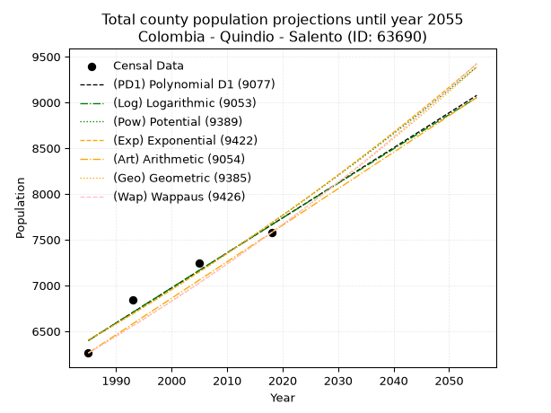
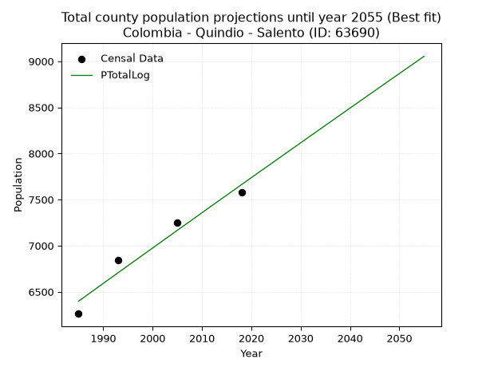
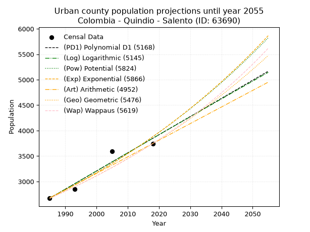
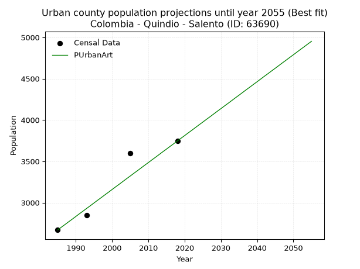
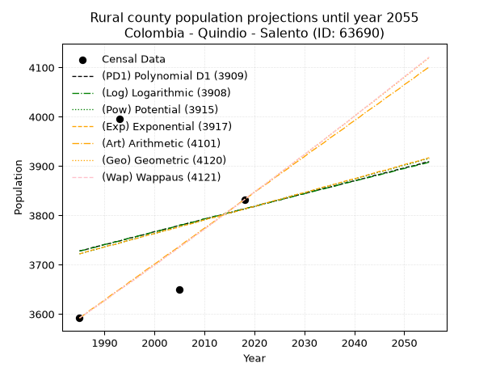
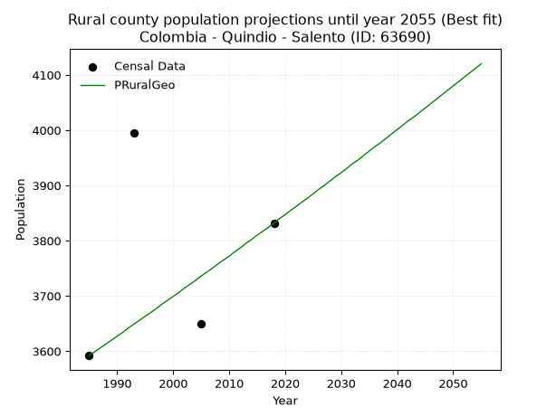

<div align="center">


</div>

# _“Population and Public Services Demand Projections (PPSD) until Year 2050 for Colombia - Quindio - Salento (ID: 63690)”_
Keywords: `population` `public-service` `projection` `lineal` `polynomial` `logarithmic` `potential` `exponential` `arithmetic` `geometric` `wappaus` `dane` `colombia` `south-america`

PPSD are analytical estimates used by governments and planners to anticipate future changes in population size, age distribution, and the resulting community needs for utilities, healthcare, education, and infrastructure as sizing future water treatment facilities, electrical grids, and road networks based on spatial growth.

> **General running parameters**: • app_version: _v20260806_. • Python version: _3.14.7_. • Pandas version: _3.0.5_. • NumPy version: _2.5.1_. • Creates, save and include plots into reports (create_plot): _False_. • Projection until year: _2050_. • Process polynomial degree 2 and up: _False_. • Process Wappaus: _True_. • Process Wappaus: _True_. • Set negative values to zero: _True_. • Set infinite values to zero: _True_. • Drop dataset notes: _True_. 
<div align="center">

Dynamic map: [:earth_americas:Google](http://maps.google.com/maps?q=4.63715676,-75.5708441) [:earth_americas:OSM](https://www.openstreetmap.org/#map=18/4.63715676/-75.5708441&layers=P) [:earth_americas:Bing](https://www.bing.com/maps?cp=4.63715676~-75.5708441&lvl=18) [:earth_americas:Apple](https://maps.apple.com/frame?center=4.63715676%2C-75.5708441&span=0.003%2C0.006)

</div>


<div align="center">

```geojson
{
  "type": "Feature",
  "geometry": {
    "type": "Point", 
    "coordinates": [-75.5708441, 4.63715676]
  }, 
  "properties": {
    "Name": "Colombia - Quindio - Salento (ID: 63690)"
  }
}
```

</div>


## 0. Census Data (4 records)

Census data are official statistics collected by a government about the people and housing in a country. They usually include counts of total population, age, sex, race, income, education, and jobs.

📅Global census file: [Population.xlsx](../data/Population.xlsx)

| Source   |   Year |   CountryID | CountryName   |   StateID | StateName   |   CountyID | CountyName   |   PTotal |   PUrban |   PRural |
|:---------|-------:|------------:|:--------------|----------:|:------------|-----------:|:-------------|---------:|---------:|---------:|
| DANE     |   1985 |          57 | Colombia      |        63 | Quindio     |      63690 | Salento      |     6262 |     2670 |     3592 |
| DANE     |   1993 |          57 | Colombia      |        63 | Quindío     |      63690 | Salento      |     6843 |     2848 |     3995 |
| DANE     |   2005 |          57 | Colombia      |        63 | Quindio     |      63690 | Salento      |     7247 |     3597 |     3650 |
| DANE     |   2018 |          57 | Colombia      |        63 | Quindío     |      63690 | Salento      |     7578 |     3746 |     3832 |

> 🔥Some records could had specific notes about the registered values or the corresponding urban or rural distribution.

## 1. Total

### 1.1. Coefficients and Parameters

* (PD1) Polynomial Deg 1: 38.2585307105578, -69544.12605379324 (lineal)
* (Log) Logarithmic: 76618.53807925925, -575395.6219228805
* (Pow) Potential: 11.051747782837555, -32.639739447974215
* (Exp) Exponential: 0.005518196580675786, 0.11201452348563819
* (Art) Arithmetic: Year diff. 2018 - 1985 = 33, Population diff. 7578 - 6262 = 1316, Annual growth = 39.878787878787875
* (Geo) Geometric: Year diff. 2018 - 1985 = 33, Population diff. 7578 - 6262 = 1316, Annual growth % = 0.005797031759142257
* (Wap) Wappaus: i = 0.5762830618321948, Condition values only valid for < 200)

<sub>
Wappaus condition values: ['0.00', '0.58', '1.15', '1.73', '2.31', '2.88', '3.46', '4.03', '4.61', '5.19', '5.76', '6.34', '6.92', '7.49', '8.07', '8.64', '9.22', '9.80', '10.37', '10.95', '11.53', '12.10', '12.68', '13.25', '13.83', '14.41', '14.98', '15.56', '16.14', '16.71', '17.29', '17.86', '18.44', '19.02', '19.59', '20.17', '20.75', '21.32', '21.90', '22.48', '23.05', '23.63', '24.20', '24.78', '25.36', '25.93', '26.51', '27.09', '27.66', '28.24', '28.81', '29.39', '29.97', '30.54', '31.12', '31.70', '32.27', '32.85', '33.42', '34.00', '34.58', '35.15', '35.73', '36.31', '36.88', '37.46']
</sub>


### 1.2. Projected Dataset

|   Year |   CountyID |   PTotalPD1 |   PTotalLog |   PTotalPow |   PTotalExp |   PTotalArt |   PTotalGeo |   PTotalWap |
|-------:|-----------:|------------:|------------:|------------:|------------:|------------:|------------:|------------:|
|   1985 |      63690 |        6399 |        6398 |        6401 |        6403 |        6262 |        6262 |        6262 |
|   1986 |      63690 |        6437 |        6436 |        6437 |        6438 |        6302 |        6298 |        6298 |
|   1987 |      63690 |        6476 |        6475 |        6473 |        6474 |        6342 |        6335 |        6335 |
|   1988 |      63690 |        6514 |        6513 |        6509 |        6510 |        6382 |        6372 |        6371 |
|   1989 |      63690 |        6552 |        6552 |        6545 |        6546 |        6422 |        6408 |        6408 |
|   1990 |      63690 |        6590 |        6590 |        6582 |        6582 |        6461 |        6446 |        6445 |
|   1991 |      63690 |        6629 |        6629 |        6619 |        6618 |        6501 |        6483 |        6482 |
|   1992 |      63690 |        6667 |        6667 |        6655 |        6655 |        6541 |        6521 |        6520 |
|   1993 |      63690 |        6705 |        6706 |        6692 |        6692 |        6581 |        6558 |        6558 |
|   1994 |      63690 |        6743 |        6744 |        6730 |        6729 |        6621 |        6596 |        6595 |
|   1995 |      63690 |        6782 |        6783 |        6767 |        6766 |        6661 |        6635 |        6634 |
|   1996 |      63690 |        6820 |        6821 |        6805 |        6804 |        6701 |        6673 |        6672 |
|   1997 |      63690 |        6858 |        6859 |        6842 |        6841 |        6741 |        6712 |        6711 |
|   1998 |      63690 |        6896 |        6898 |        6880 |        6879 |        6780 |        6751 |        6749 |
|   1999 |      63690 |        6935 |        6936 |        6918 |        6917 |        6820 |        6790 |        6788 |
|   2000 |      63690 |        6973 |        6974 |        6957 |        6955 |        6860 |        6829 |        6828 |
|   2001 |      63690 |        7011 |        7013 |        6995 |        6994 |        6900 |        6869 |        6867 |
|   2002 |      63690 |        7049 |        7051 |        7034 |        7033 |        6940 |        6909 |        6907 |
|   2003 |      63690 |        7088 |        7089 |        7073 |        7071 |        6980 |        6949 |        6947 |
|   2004 |      63690 |        7126 |        7127 |        7112 |        7111 |        7020 |        6989 |        6987 |
|   2005 |      63690 |        7164 |        7166 |        7151 |        7150 |        7060 |        7029 |        7028 |
|   2006 |      63690 |        7202 |        7204 |        7191 |        7189 |        7099 |        7070 |        7069 |
|   2007 |      63690 |        7241 |        7242 |        7231 |        7229 |        7139 |        7111 |        7110 |
|   2008 |      63690 |        7279 |        7280 |        7271 |        7269 |        7179 |        7152 |        7151 |
|   2009 |      63690 |        7317 |        7318 |        7311 |        7310 |        7219 |        7194 |        7192 |
|   2010 |      63690 |        7356 |        7357 |        7351 |        7350 |        7259 |        7236 |        7234 |
|   2011 |      63690 |        7394 |        7395 |        7392 |        7391 |        7299 |        7277 |        7276 |
|   2012 |      63690 |        7432 |        7433 |        7432 |        7432 |        7339 |        7320 |        7319 |
|   2013 |      63690 |        7470 |        7471 |        7473 |        7473 |        7379 |        7362 |        7361 |
|   2014 |      63690 |        7509 |        7509 |        7514 |        7514 |        7418 |        7405 |        7404 |
|   2015 |      63690 |        7547 |        7547 |        7556 |        7556 |        7458 |        7448 |        7447 |
|   2016 |      63690 |        7585 |        7585 |        7597 |        7597 |        7498 |        7491 |        7490 |
|   2017 |      63690 |        7623 |        7623 |        7639 |        7639 |        7538 |        7534 |        7534 |
|   2018 |      63690 |        7662 |        7661 |        7681 |        7682 |        7578 |        7578 |        7578 |
|   2019 |      63690 |        7700 |        7699 |        7723 |        7724 |        7618 |        7622 |        7622 |
|   2020 |      63690 |        7738 |        7737 |        7766 |        7767 |        7658 |        7666 |        7667 |
|   2021 |      63690 |        7776 |        7775 |        7808 |        7810 |        7698 |        7711 |        7711 |
|   2022 |      63690 |        7815 |        7813 |        7851 |        7853 |        7738 |        7755 |        7757 |
|   2023 |      63690 |        7853 |        7850 |        7894 |        7897 |        7777 |        7800 |        7802 |
|   2024 |      63690 |        7891 |        7888 |        7937 |        7940 |        7817 |        7845 |        7848 |
|   2025 |      63690 |        7929 |        7926 |        7981 |        7984 |        7857 |        7891 |        7894 |
|   2026 |      63690 |        7968 |        7964 |        8024 |        8028 |        7897 |        7937 |        7940 |
|   2027 |      63690 |        8006 |        8002 |        8068 |        8073 |        7937 |        7983 |        7986 |
|   2028 |      63690 |        8044 |        8040 |        8112 |        8117 |        7977 |        8029 |        8033 |
|   2029 |      63690 |        8082 |        8077 |        8157 |        8162 |        8017 |        8075 |        8080 |
|   2030 |      63690 |        8121 |        8115 |        8201 |        8208 |        8057 |        8122 |        8128 |
|   2031 |      63690 |        8159 |        8153 |        8246 |        8253 |        8096 |        8169 |        8176 |
|   2032 |      63690 |        8197 |        8191 |        8291 |        8299 |        8136 |        8217 |        8224 |
|   2033 |      63690 |        8235 |        8228 |        8336 |        8345 |        8176 |        8264 |        8272 |
|   2034 |      63690 |        8274 |        8266 |        8381 |        8391 |        8216 |        8312 |        8321 |
|   2035 |      63690 |        8312 |        8304 |        8427 |        8437 |        8256 |        8360 |        8370 |
|   2036 |      63690 |        8350 |        8341 |        8473 |        8484 |        8296 |        8409 |        8419 |
|   2037 |      63690 |        8389 |        8379 |        8519 |        8531 |        8336 |        8458 |        8469 |
|   2038 |      63690 |        8427 |        8417 |        8565 |        8578 |        8376 |        8507 |        8519 |
|   2039 |      63690 |        8465 |        8454 |        8612 |        8625 |        8415 |        8556 |        8570 |
|   2040 |      63690 |        8503 |        8492 |        8659 |        8673 |        8455 |        8606 |        8621 |
|   2041 |      63690 |        8542 |        8529 |        8706 |        8721 |        8495 |        8656 |        8672 |
|   2042 |      63690 |        8580 |        8567 |        8753 |        8769 |        8535 |        8706 |        8723 |
|   2043 |      63690 |        8618 |        8604 |        8801 |        8818 |        8575 |        8756 |        8775 |
|   2044 |      63690 |        8656 |        8642 |        8848 |        8867 |        8615 |        8807 |        8827 |
|   2045 |      63690 |        8695 |        8679 |        8896 |        8916 |        8655 |        8858 |        8880 |
|   2046 |      63690 |        8733 |        8717 |        8944 |        8965 |        8695 |        8909 |        8933 |
|   2047 |      63690 |        8771 |        8754 |        8993 |        9015 |        8734 |        8961 |        8986 |
|   2048 |      63690 |        8809 |        8792 |        9042 |        9065 |        8774 |        9013 |        9040 |
|   2049 |      63690 |        8848 |        8829 |        9090 |        9115 |        8814 |        9065 |        9094 |
|   2050 |      63690 |        8886 |        8866 |        9140 |        9165 |        8854 |        9118 |        9148 |
<div align="center">

</img>

</div>


### 1.3. Best fit with absolute and relative error (%)

Relative error puts that difference into context by dividing the absolute error by the true value, creating a unitless ratio or percentage that shows the scale of the mistake.

Absolute and relative error

|   Year | Source   |   CountryID | CountryName   |   StateID | StateName   |   CountyID_x | CountyName   |   PTotal |   PUrban |   PRural |   CountyID_y |   PTotalPD1 |   PTotalLog |   PTotalPow |   PTotalExp |   PTotalArt |   PTotalGeo |   PTotalWap |   PTotalPD1AbsError |   PTotalLogAbsError |   PTotalPowAbsError |   PTotalExpAbsError |   PTotalArtAbsError |   PTotalGeoAbsError |   PTotalWapAbsError |   PTotalPD1RelError |   PTotalLogRelError |   PTotalPowRelError |   PTotalExpRelError |   PTotalArtRelError |   PTotalGeoRelError |   PTotalWapRelError |
|-------:|:---------|------------:|:--------------|----------:|:------------|-------------:|:-------------|---------:|---------:|---------:|-------------:|------------:|------------:|------------:|------------:|------------:|------------:|------------:|--------------------:|--------------------:|--------------------:|--------------------:|--------------------:|--------------------:|--------------------:|--------------------:|--------------------:|--------------------:|--------------------:|--------------------:|--------------------:|--------------------:|
|   1985 | DANE     |          57 | Colombia      |        63 | Quindio     |        63690 | Salento      |     6262 |     2670 |     3592 |        63690 |        6399 |        6398 |        6401 |        6403 |        6262 |        6262 |        6262 |                 137 |                 136 |                 139 |                 141 |                   0 |                   0 |                   0 |             2.1878  |             2.17183 |             2.21974 |             2.25168 |             0       |             0       |             0       |
|   1993 | DANE     |          57 | Colombia      |        63 | Quindío     |        63690 | Salento      |     6843 |     2848 |     3995 |        63690 |        6705 |        6706 |        6692 |        6692 |        6581 |        6558 |        6558 |                 138 |                 137 |                 151 |                 151 |                 262 |                 285 |                 285 |             2.01666 |             2.00205 |             2.20663 |             2.20663 |             3.82873 |             4.16484 |             4.16484 |
|   2005 | DANE     |          57 | Colombia      |        63 | Quindio     |        63690 | Salento      |     7247 |     3597 |     3650 |        63690 |        7164 |        7166 |        7151 |        7150 |        7060 |        7029 |        7028 |                  83 |                  81 |                  96 |                  97 |                 187 |                 218 |                 219 |             1.1453  |             1.1177  |             1.32469 |             1.33848 |             2.58038 |             3.00814 |             3.02194 |
|   2018 | DANE     |          57 | Colombia      |        63 | Quindío     |        63690 | Salento      |     7578 |     3746 |     3832 |        63690 |        7662 |        7661 |        7681 |        7682 |        7578 |        7578 |        7578 |                  84 |                  83 |                 103 |                 104 |                   0 |                   0 |                   0 |             1.10847 |             1.09528 |             1.3592  |             1.37239 |             0       |             0       |             0       |

Relative error mean

| Method    |   RelError | Best   |
|:----------|-----------:|:-------|
| PTotalPD1 |    1.61456 |        |
| PTotalLog |    1.59671 | True   |
| PTotalPow |    1.77756 |        |
| PTotalExp |    1.7923  |        |
| PTotalArt |    1.60228 |        |
| PTotalGeo |    1.79325 |        |
| PTotalWap |    1.7967  |        |

💙Best method: _**PTotalLog**_
<div align="center">

</img>

</div>


### 1.4. Fresh water supply demand in liters per capita per day (lpcd)

The fresh water supply demand typically ranges from 100 to 300 liters per capita per day (lpcd) for standard domestic and municipal planning, though absolute survival minimums set by the World Health Organization are as low as 7.5 to 20 liters per day, and total consumption in high-income nations can exceed 400 liters.

> `CZ`: Level in meters above the sea level (masl)<br> `WS`: Fresh water supply demand in liters per capita per day (lpcd or l/h/d)<br> `WSAll`: Zonal fresh water supply demand in liters per second (l/s)<br> `A`: Zonal area in square meters<br> `DP`: Population density (people/hectare)

Reference values (RAS Colombia)

|    CZ |   WS |
|------:|-----:|
|  1000 |  120 |
|  2000 |  130 |
| 99999 |  140 |

County shapefile geometry properties and water supply values

|   CountyID |      ATotal |   CZTotal |   WSTotal |
|-----------:|------------:|----------:|----------:|
|      63690 | 3.46099e+08 |   2623.21 |       140 |

Projected values for best method: PTotalLog

|   CountyID |   Year |   PTotalLog |   DPTotal |   WSTotal |   WSTotalAll |
|-----------:|-------:|------------:|----------:|----------:|-------------:|
|      63690 |   1985 |        6398 |      0.18 |       140 |      10.3671 |
|      63690 |   1986 |        6436 |      0.19 |       140 |      10.4287 |
|      63690 |   1987 |        6475 |      0.19 |       140 |      10.4919 |
|      63690 |   1988 |        6513 |      0.19 |       140 |      10.5535 |
|      63690 |   1989 |        6552 |      0.19 |       140 |      10.6167 |
|      63690 |   1990 |        6590 |      0.19 |       140 |      10.6782 |
|      63690 |   1991 |        6629 |      0.19 |       140 |      10.7414 |
|      63690 |   1992 |        6667 |      0.19 |       140 |      10.803  |
|      63690 |   1993 |        6706 |      0.19 |       140 |      10.8662 |
|      63690 |   1994 |        6744 |      0.19 |       140 |      10.9278 |
|      63690 |   1995 |        6783 |      0.2  |       140 |      10.991  |
|      63690 |   1996 |        6821 |      0.2  |       140 |      11.0525 |
|      63690 |   1997 |        6859 |      0.2  |       140 |      11.1141 |
|      63690 |   1998 |        6898 |      0.2  |       140 |      11.1773 |
|      63690 |   1999 |        6936 |      0.2  |       140 |      11.2389 |
|      63690 |   2000 |        6974 |      0.2  |       140 |      11.3005 |
|      63690 |   2001 |        7013 |      0.2  |       140 |      11.3637 |
|      63690 |   2002 |        7051 |      0.2  |       140 |      11.4252 |
|      63690 |   2003 |        7089 |      0.2  |       140 |      11.4868 |
|      63690 |   2004 |        7127 |      0.21 |       140 |      11.5484 |
|      63690 |   2005 |        7166 |      0.21 |       140 |      11.6116 |
|      63690 |   2006 |        7204 |      0.21 |       140 |      11.6731 |
|      63690 |   2007 |        7242 |      0.21 |       140 |      11.7347 |
|      63690 |   2008 |        7280 |      0.21 |       140 |      11.7963 |
|      63690 |   2009 |        7318 |      0.21 |       140 |      11.8579 |
|      63690 |   2010 |        7357 |      0.21 |       140 |      11.9211 |
|      63690 |   2011 |        7395 |      0.21 |       140 |      11.9826 |
|      63690 |   2012 |        7433 |      0.21 |       140 |      12.0442 |
|      63690 |   2013 |        7471 |      0.22 |       140 |      12.1058 |
|      63690 |   2014 |        7509 |      0.22 |       140 |      12.1674 |
|      63690 |   2015 |        7547 |      0.22 |       140 |      12.2289 |
|      63690 |   2016 |        7585 |      0.22 |       140 |      12.2905 |
|      63690 |   2017 |        7623 |      0.22 |       140 |      12.3521 |
|      63690 |   2018 |        7661 |      0.22 |       140 |      12.4137 |
|      63690 |   2019 |        7699 |      0.22 |       140 |      12.4752 |
|      63690 |   2020 |        7737 |      0.22 |       140 |      12.5368 |
|      63690 |   2021 |        7775 |      0.22 |       140 |      12.5984 |
|      63690 |   2022 |        7813 |      0.23 |       140 |      12.66   |
|      63690 |   2023 |        7850 |      0.23 |       140 |      12.7199 |
|      63690 |   2024 |        7888 |      0.23 |       140 |      12.7815 |
|      63690 |   2025 |        7926 |      0.23 |       140 |      12.8431 |
|      63690 |   2026 |        7964 |      0.23 |       140 |      12.9046 |
|      63690 |   2027 |        8002 |      0.23 |       140 |      12.9662 |
|      63690 |   2028 |        8040 |      0.23 |       140 |      13.0278 |
|      63690 |   2029 |        8077 |      0.23 |       140 |      13.0877 |
|      63690 |   2030 |        8115 |      0.23 |       140 |      13.1493 |
|      63690 |   2031 |        8153 |      0.24 |       140 |      13.2109 |
|      63690 |   2032 |        8191 |      0.24 |       140 |      13.2725 |
|      63690 |   2033 |        8228 |      0.24 |       140 |      13.3324 |
|      63690 |   2034 |        8266 |      0.24 |       140 |      13.394  |
|      63690 |   2035 |        8304 |      0.24 |       140 |      13.4556 |
|      63690 |   2036 |        8341 |      0.24 |       140 |      13.5155 |
|      63690 |   2037 |        8379 |      0.24 |       140 |      13.5771 |
|      63690 |   2038 |        8417 |      0.24 |       140 |      13.6387 |
|      63690 |   2039 |        8454 |      0.24 |       140 |      13.6986 |
|      63690 |   2040 |        8492 |      0.25 |       140 |      13.7602 |
|      63690 |   2041 |        8529 |      0.25 |       140 |      13.8201 |
|      63690 |   2042 |        8567 |      0.25 |       140 |      13.8817 |
|      63690 |   2043 |        8604 |      0.25 |       140 |      13.9417 |
|      63690 |   2044 |        8642 |      0.25 |       140 |      14.0032 |
|      63690 |   2045 |        8679 |      0.25 |       140 |      14.0632 |
|      63690 |   2046 |        8717 |      0.25 |       140 |      14.1248 |
|      63690 |   2047 |        8754 |      0.25 |       140 |      14.1847 |
|      63690 |   2048 |        8792 |      0.25 |       140 |      14.2463 |
|      63690 |   2049 |        8829 |      0.26 |       140 |      14.3063 |
|      63690 |   2050 |        8866 |      0.26 |       140 |      14.3662 |

## 2. Urban

### 2.1. Coefficients and Parameters

* (PD1) Polynomial Deg 1: 35.66720192693682, -68128.07065435538 (lineal)
* (Log) Logarithmic: 71418.9916761635, -539641.0780464001
* (Pow) Potential: 22.373981829421314, -70.35557093395632
* (Exp) Exponential: 0.011173068801696941, 6.26069447852648e-07
* (Art) Arithmetic: Year diff. 2018 - 1985 = 33, Population diff. 3746 - 2670 = 1076, Annual growth = 32.60606060606061
* (Geo) Geometric: Year diff. 2018 - 1985 = 33, Population diff. 3746 - 2670 = 1076, Annual growth % = 0.010313736766183634
* (Wap) Wappaus: i = 1.0163983979445326, Condition values only valid for < 200)

<sub>
Wappaus condition values: ['0.00', '1.02', '2.03', '3.05', '4.07', '5.08', '6.10', '7.11', '8.13', '9.15', '10.16', '11.18', '12.20', '13.21', '14.23', '15.25', '16.26', '17.28', '18.30', '19.31', '20.33', '21.34', '22.36', '23.38', '24.39', '25.41', '26.43', '27.44', '28.46', '29.48', '30.49', '31.51', '32.52', '33.54', '34.56', '35.57', '36.59', '37.61', '38.62', '39.64', '40.66', '41.67', '42.69', '43.71', '44.72', '45.74', '46.75', '47.77', '48.79', '49.80', '50.82', '51.84', '52.85', '53.87', '54.89', '55.90', '56.92', '57.93', '58.95', '59.97', '60.98', '62.00', '63.02', '64.03', '65.05', '66.07']
</sub>


### 2.2. Projected Dataset

|   Year |   CountyID |   PUrbanPD1 |   PUrbanLog |   PUrbanPow |   PUrbanExp |   PUrbanArt |   PUrbanGeo |   PUrbanWap |
|-------:|-----------:|------------:|------------:|------------:|------------:|------------:|------------:|------------:|
|   1985 |      63690 |        2671 |        2670 |        2682 |        2683 |        2670 |        2670 |        2670 |
|   1986 |      63690 |        2707 |        2706 |        2712 |        2713 |        2703 |        2698 |        2697 |
|   1987 |      63690 |        2743 |        2742 |        2743 |        2744 |        2735 |        2725 |        2725 |
|   1988 |      63690 |        2778 |        2778 |        2774 |        2775 |        2768 |        2753 |        2753 |
|   1989 |      63690 |        2814 |        2814 |        2806 |        2806 |        2800 |        2782 |        2781 |
|   1990 |      63690 |        2850 |        2850 |        2837 |        2837 |        2833 |        2811 |        2809 |
|   1991 |      63690 |        2885 |        2886 |        2869 |        2869 |        2866 |        2840 |        2838 |
|   1992 |      63690 |        2921 |        2921 |        2902 |        2901 |        2898 |        2869 |        2867 |
|   1993 |      63690 |        2957 |        2957 |        2935 |        2934 |        2931 |        2898 |        2896 |
|   1994 |      63690 |        2992 |        2993 |        2968 |        2967 |        2963 |        2928 |        2926 |
|   1995 |      63690 |        3028 |        3029 |        3001 |        3000 |        2996 |        2959 |        2956 |
|   1996 |      63690 |        3064 |        3065 |        3035 |        3034 |        3029 |        2989 |        2986 |
|   1997 |      63690 |        3099 |        3101 |        3069 |        3068 |        3061 |        3020 |        3017 |
|   1998 |      63690 |        3135 |        3136 |        3104 |        3103 |        3094 |        3051 |        3048 |
|   1999 |      63690 |        3171 |        3172 |        3139 |        3137 |        3126 |        3082 |        3079 |
|   2000 |      63690 |        3206 |        3208 |        3174 |        3173 |        3159 |        3114 |        3111 |
|   2001 |      63690 |        3242 |        3243 |        3210 |        3208 |        3192 |        3146 |        3143 |
|   2002 |      63690 |        3278 |        3279 |        3246 |        3244 |        3224 |        3179 |        3175 |
|   2003 |      63690 |        3313 |        3315 |        3282 |        3281 |        3257 |        3212 |        3208 |
|   2004 |      63690 |        3349 |        3350 |        3319 |        3318 |        3290 |        3245 |        3241 |
|   2005 |      63690 |        3385 |        3386 |        3356 |        3355 |        3322 |        3278 |        3274 |
|   2006 |      63690 |        3420 |        3422 |        3394 |        3393 |        3355 |        3312 |        3308 |
|   2007 |      63690 |        3456 |        3457 |        3432 |        3431 |        3387 |        3346 |        3342 |
|   2008 |      63690 |        3492 |        3493 |        3471 |        3469 |        3420 |        3381 |        3377 |
|   2009 |      63690 |        3527 |        3528 |        3509 |        3508 |        3453 |        3416 |        3412 |
|   2010 |      63690 |        3563 |        3564 |        3549 |        3548 |        3485 |        3451 |        3447 |
|   2011 |      63690 |        3599 |        3599 |        3588 |        3588 |        3518 |        3486 |        3483 |
|   2012 |      63690 |        3634 |        3635 |        3629 |        3628 |        3550 |        3522 |        3519 |
|   2013 |      63690 |        3670 |        3670 |        3669 |        3669 |        3583 |        3559 |        3556 |
|   2014 |      63690 |        3706 |        3706 |        3710 |        3710 |        3616 |        3595 |        3593 |
|   2015 |      63690 |        3741 |        3741 |        3752 |        3752 |        3648 |        3632 |        3631 |
|   2016 |      63690 |        3777 |        3777 |        3794 |        3794 |        3681 |        3670 |        3669 |
|   2017 |      63690 |        3813 |        3812 |        3836 |        3836 |        3713 |        3708 |        3707 |
|   2018 |      63690 |        3848 |        3848 |        3879 |        3879 |        3746 |        3746 |        3746 |
|   2019 |      63690 |        3884 |        3883 |        3922 |        3923 |        3779 |        3785 |        3785 |
|   2020 |      63690 |        3920 |        3918 |        3966 |        3967 |        3811 |        3824 |        3825 |
|   2021 |      63690 |        3955 |        3954 |        4010 |        4012 |        3844 |        3863 |        3866 |
|   2022 |      63690 |        3991 |        3989 |        4054 |        4057 |        3876 |        3903 |        3907 |
|   2023 |      63690 |        4027 |        4024 |        4099 |        4102 |        3909 |        3943 |        3948 |
|   2024 |      63690 |        4062 |        4060 |        4145 |        4148 |        3942 |        3984 |        3990 |
|   2025 |      63690 |        4098 |        4095 |        4191 |        4195 |        3974 |        4025 |        4032 |
|   2026 |      63690 |        4134 |        4130 |        4238 |        4242 |        4007 |        4066 |        4076 |
|   2027 |      63690 |        4169 |        4165 |        4285 |        4290 |        4039 |        4108 |        4119 |
|   2028 |      63690 |        4205 |        4201 |        4332 |        4338 |        4072 |        4151 |        4163 |
|   2029 |      63690 |        4241 |        4236 |        4380 |        4387 |        4105 |        4194 |        4208 |
|   2030 |      63690 |        4276 |        4271 |        4429 |        4436 |        4137 |        4237 |        4253 |
|   2031 |      63690 |        4312 |        4306 |        4478 |        4486 |        4170 |        4281 |        4299 |
|   2032 |      63690 |        4348 |        4341 |        4527 |        4536 |        4202 |        4325 |        4346 |
|   2033 |      63690 |        4383 |        4377 |        4578 |        4587 |        4235 |        4369 |        4393 |
|   2034 |      63690 |        4419 |        4412 |        4628 |        4639 |        4268 |        4414 |        4441 |
|   2035 |      63690 |        4455 |        4447 |        4679 |        4691 |        4300 |        4460 |        4489 |
|   2036 |      63690 |        4490 |        4482 |        4731 |        4744 |        4333 |        4506 |        4538 |
|   2037 |      63690 |        4526 |        4517 |        4783 |        4797 |        4366 |        4552 |        4588 |
|   2038 |      63690 |        4562 |        4552 |        4836 |        4851 |        4398 |        4599 |        4639 |
|   2039 |      63690 |        4597 |        4587 |        4890 |        4905 |        4431 |        4647 |        4690 |
|   2040 |      63690 |        4633 |        4622 |        4943 |        4960 |        4463 |        4695 |        4742 |
|   2041 |      63690 |        4669 |        4657 |        4998 |        5016 |        4496 |        4743 |        4794 |
|   2042 |      63690 |        4704 |        4692 |        5053 |        5073 |        4529 |        4792 |        4848 |
|   2043 |      63690 |        4740 |        4727 |        5109 |        5130 |        4561 |        4841 |        4902 |
|   2044 |      63690 |        4776 |        4762 |        5165 |        5187 |        4594 |        4891 |        4957 |
|   2045 |      63690 |        4811 |        4797 |        5222 |        5245 |        4626 |        4942 |        5013 |
|   2046 |      63690 |        4847 |        4832 |        5279 |        5304 |        4659 |        4993 |        5069 |
|   2047 |      63690 |        4883 |        4867 |        5337 |        5364 |        4692 |        5044 |        5127 |
|   2048 |      63690 |        4918 |        4902 |        5396 |        5424 |        4724 |        5096 |        5185 |
|   2049 |      63690 |        4954 |        4936 |        5455 |        5485 |        4757 |        5149 |        5244 |
|   2050 |      63690 |        4990 |        4971 |        5515 |        5547 |        4789 |        5202 |        5304 |
<div align="center">

</img>

</div>


### 2.3. Best fit with absolute and relative error (%)

Relative error puts that difference into context by dividing the absolute error by the true value, creating a unitless ratio or percentage that shows the scale of the mistake.

Absolute and relative error

|   Year | Source   |   CountryID | CountryName   |   StateID | StateName   |   CountyID_x | CountyName   |   PTotal |   PUrban |   PRural |   CountyID_y |   PUrbanPD1 |   PUrbanLog |   PUrbanPow |   PUrbanExp |   PUrbanArt |   PUrbanGeo |   PUrbanWap |   PUrbanPD1AbsError |   PUrbanLogAbsError |   PUrbanPowAbsError |   PUrbanExpAbsError |   PUrbanArtAbsError |   PUrbanGeoAbsError |   PUrbanWapAbsError |   PUrbanPD1RelError |   PUrbanLogRelError |   PUrbanPowRelError |   PUrbanExpRelError |   PUrbanArtRelError |   PUrbanGeoRelError |   PUrbanWapRelError |
|-------:|:---------|------------:|:--------------|----------:|:------------|-------------:|:-------------|---------:|---------:|---------:|-------------:|------------:|------------:|------------:|------------:|------------:|------------:|------------:|--------------------:|--------------------:|--------------------:|--------------------:|--------------------:|--------------------:|--------------------:|--------------------:|--------------------:|--------------------:|--------------------:|--------------------:|--------------------:|--------------------:|
|   1985 | DANE     |          57 | Colombia      |        63 | Quindio     |        63690 | Salento      |     6262 |     2670 |     3592 |        63690 |        2671 |        2670 |        2682 |        2683 |        2670 |        2670 |        2670 |                   1 |                   0 |                  12 |                  13 |                   0 |                   0 |                   0 |           0.0374532 |             0       |            0.449438 |            0.486891 |             0       |             0       |             0       |
|   1993 | DANE     |          57 | Colombia      |        63 | Quindío     |        63690 | Salento      |     6843 |     2848 |     3995 |        63690 |        2957 |        2957 |        2935 |        2934 |        2931 |        2898 |        2896 |                 109 |                 109 |                  87 |                  86 |                  83 |                  50 |                  48 |           3.82725   |             3.82725 |            3.05478  |            3.01966  |             2.91433 |             1.75562 |             1.68539 |
|   2005 | DANE     |          57 | Colombia      |        63 | Quindio     |        63690 | Salento      |     7247 |     3597 |     3650 |        63690 |        3385 |        3386 |        3356 |        3355 |        3322 |        3278 |        3274 |                 212 |                 211 |                 241 |                 242 |                 275 |                 319 |                 323 |           5.8938    |             5.866   |            6.70003  |            6.72783  |             7.64526 |             8.8685  |             8.97971 |
|   2018 | DANE     |          57 | Colombia      |        63 | Quindío     |        63690 | Salento      |     7578 |     3746 |     3832 |        63690 |        3848 |        3848 |        3879 |        3879 |        3746 |        3746 |        3746 |                 102 |                 102 |                 133 |                 133 |                   0 |                   0 |                   0 |           2.7229    |             2.7229  |            3.55045  |            3.55045  |             0       |             0       |             0       |

Relative error mean

| Method    |   RelError | Best   |
|:----------|-----------:|:-------|
| PUrbanPD1 |    3.12035 |        |
| PUrbanLog |    3.10404 |        |
| PUrbanPow |    3.43867 |        |
| PUrbanExp |    3.44621 |        |
| PUrbanArt |    2.6399  | True   |
| PUrbanGeo |    2.65603 |        |
| PUrbanWap |    2.66627 |        |

💙Best method: _**PUrbanArt**_
<div align="center">

</img>

</div>


### 2.4. Fresh water supply demand in liters per capita per day (lpcd)

The fresh water supply demand typically ranges from 100 to 300 liters per capita per day (lpcd) for standard domestic and municipal planning, though absolute survival minimums set by the World Health Organization are as low as 7.5 to 20 liters per day, and total consumption in high-income nations can exceed 400 liters.

> `CZ`: Level in meters above the sea level (masl)<br> `WS`: Fresh water supply demand in liters per capita per day (lpcd or l/h/d)<br> `WSAll`: Zonal fresh water supply demand in liters per second (l/s)<br> `A`: Zonal area in square meters<br> `DP`: Population density (people/hectare)

Reference values (RAS Colombia)

|    CZ |   WS |
|------:|-----:|
|  1000 |  120 |
|  2000 |  130 |
| 99999 |  140 |

County shapefile geometry properties and water supply values

|   CountyID |   AUrban |   CZUrban |   WSUrban |
|-----------:|---------:|----------:|----------:|
|      63690 |   834316 |   1981.62 |       130 |

Projected values for best method: PUrbanArt

|   CountyID |   Year |   PUrbanArt |   DPUrban |   WSUrban |   WSUrbanAll |
|-----------:|-------:|------------:|----------:|----------:|-------------:|
|      63690 |   1985 |        2670 |     32    |       130 |      4.01736 |
|      63690 |   1986 |        2703 |     32.4  |       130 |      4.06701 |
|      63690 |   1987 |        2735 |     32.78 |       130 |      4.11516 |
|      63690 |   1988 |        2768 |     33.18 |       130 |      4.16481 |
|      63690 |   1989 |        2800 |     33.56 |       130 |      4.21296 |
|      63690 |   1990 |        2833 |     33.96 |       130 |      4.26262 |
|      63690 |   1991 |        2866 |     34.35 |       130 |      4.31227 |
|      63690 |   1992 |        2898 |     34.74 |       130 |      4.36042 |
|      63690 |   1993 |        2931 |     35.13 |       130 |      4.41007 |
|      63690 |   1994 |        2963 |     35.51 |       130 |      4.45822 |
|      63690 |   1995 |        2996 |     35.91 |       130 |      4.50787 |
|      63690 |   1996 |        3029 |     36.31 |       130 |      4.55752 |
|      63690 |   1997 |        3061 |     36.69 |       130 |      4.60567 |
|      63690 |   1998 |        3094 |     37.08 |       130 |      4.65532 |
|      63690 |   1999 |        3126 |     37.47 |       130 |      4.70347 |
|      63690 |   2000 |        3159 |     37.86 |       130 |      4.75312 |
|      63690 |   2001 |        3192 |     38.26 |       130 |      4.80278 |
|      63690 |   2002 |        3224 |     38.64 |       130 |      4.85093 |
|      63690 |   2003 |        3257 |     39.04 |       130 |      4.90058 |
|      63690 |   2004 |        3290 |     39.43 |       130 |      4.95023 |
|      63690 |   2005 |        3322 |     39.82 |       130 |      4.99838 |
|      63690 |   2006 |        3355 |     40.21 |       130 |      5.04803 |
|      63690 |   2007 |        3387 |     40.6  |       130 |      5.09618 |
|      63690 |   2008 |        3420 |     40.99 |       130 |      5.14583 |
|      63690 |   2009 |        3453 |     41.39 |       130 |      5.19549 |
|      63690 |   2010 |        3485 |     41.77 |       130 |      5.24363 |
|      63690 |   2011 |        3518 |     42.17 |       130 |      5.29329 |
|      63690 |   2012 |        3550 |     42.55 |       130 |      5.34144 |
|      63690 |   2013 |        3583 |     42.95 |       130 |      5.39109 |
|      63690 |   2014 |        3616 |     43.34 |       130 |      5.44074 |
|      63690 |   2015 |        3648 |     43.72 |       130 |      5.48889 |
|      63690 |   2016 |        3681 |     44.12 |       130 |      5.53854 |
|      63690 |   2017 |        3713 |     44.5  |       130 |      5.58669 |
|      63690 |   2018 |        3746 |     44.9  |       130 |      5.63634 |
|      63690 |   2019 |        3779 |     45.29 |       130 |      5.686   |
|      63690 |   2020 |        3811 |     45.68 |       130 |      5.73414 |
|      63690 |   2021 |        3844 |     46.07 |       130 |      5.7838  |
|      63690 |   2022 |        3876 |     46.46 |       130 |      5.83194 |
|      63690 |   2023 |        3909 |     46.85 |       130 |      5.8816  |
|      63690 |   2024 |        3942 |     47.25 |       130 |      5.93125 |
|      63690 |   2025 |        3974 |     47.63 |       130 |      5.9794  |
|      63690 |   2026 |        4007 |     48.03 |       130 |      6.02905 |
|      63690 |   2027 |        4039 |     48.41 |       130 |      6.0772  |
|      63690 |   2028 |        4072 |     48.81 |       130 |      6.12685 |
|      63690 |   2029 |        4105 |     49.2  |       130 |      6.1765  |
|      63690 |   2030 |        4137 |     49.59 |       130 |      6.22465 |
|      63690 |   2031 |        4170 |     49.98 |       130 |      6.27431 |
|      63690 |   2032 |        4202 |     50.36 |       130 |      6.32245 |
|      63690 |   2033 |        4235 |     50.76 |       130 |      6.37211 |
|      63690 |   2034 |        4268 |     51.16 |       130 |      6.42176 |
|      63690 |   2035 |        4300 |     51.54 |       130 |      6.46991 |
|      63690 |   2036 |        4333 |     51.93 |       130 |      6.51956 |
|      63690 |   2037 |        4366 |     52.33 |       130 |      6.56921 |
|      63690 |   2038 |        4398 |     52.71 |       130 |      6.61736 |
|      63690 |   2039 |        4431 |     53.11 |       130 |      6.66701 |
|      63690 |   2040 |        4463 |     53.49 |       130 |      6.71516 |
|      63690 |   2041 |        4496 |     53.89 |       130 |      6.76481 |
|      63690 |   2042 |        4529 |     54.28 |       130 |      6.81447 |
|      63690 |   2043 |        4561 |     54.67 |       130 |      6.86262 |
|      63690 |   2044 |        4594 |     55.06 |       130 |      6.91227 |
|      63690 |   2045 |        4626 |     55.45 |       130 |      6.96042 |
|      63690 |   2046 |        4659 |     55.84 |       130 |      7.01007 |
|      63690 |   2047 |        4692 |     56.24 |       130 |      7.05972 |
|      63690 |   2048 |        4724 |     56.62 |       130 |      7.10787 |
|      63690 |   2049 |        4757 |     57.02 |       130 |      7.15752 |
|      63690 |   2050 |        4789 |     57.4  |       130 |      7.20567 |

## 3. Rural

### 3.1. Coefficients and Parameters

* (PD1) Polynomial Deg 1: 2.5913287836209626, -1416.055399437831 (lineal)
* (Log) Logarithmic: 5199.546403095783, -35754.54387648095
* (Pow) Potential: 1.4599419910328997, -1.2437363611330023
* (Exp) Exponential: 0.000727724318682898, 877.9515412176745
* (Art) Arithmetic: Year diff. 2018 - 1985 = 33, Population diff. 3832 - 3592 = 240, Annual growth = 7.2727272727272725
* (Geo) Geometric: Year diff. 2018 - 1985 = 33, Population diff. 3832 - 3592 = 240, Annual growth % = 0.001961852515395046
* (Wap) Wappaus: i = 0.19592476489028213, Condition values only valid for < 200)

<sub>
Wappaus condition values: ['0.00', '0.20', '0.39', '0.59', '0.78', '0.98', '1.18', '1.37', '1.57', '1.76', '1.96', '2.16', '2.35', '2.55', '2.74', '2.94', '3.13', '3.33', '3.53', '3.72', '3.92', '4.11', '4.31', '4.51', '4.70', '4.90', '5.09', '5.29', '5.49', '5.68', '5.88', '6.07', '6.27', '6.47', '6.66', '6.86', '7.05', '7.25', '7.45', '7.64', '7.84', '8.03', '8.23', '8.42', '8.62', '8.82', '9.01', '9.21', '9.40', '9.60', '9.80', '9.99', '10.19', '10.38', '10.58', '10.78', '10.97', '11.17', '11.36', '11.56', '11.76', '11.95', '12.15', '12.34', '12.54', '12.74']
</sub>


### 3.2. Projected Dataset

|   Year |   CountyID |   PRuralPD1 |   PRuralLog |   PRuralPow |   PRuralExp |   PRuralArt |   PRuralGeo |   PRuralWap |
|-------:|-----------:|------------:|------------:|------------:|------------:|------------:|------------:|------------:|
|   1985 |      63690 |        3728 |        3728 |        3722 |        3722 |        3592 |        3592 |        3592 |
|   1986 |      63690 |        3730 |        3730 |        3725 |        3725 |        3599 |        3599 |        3599 |
|   1987 |      63690 |        3733 |        3733 |        3728 |        3728 |        3607 |        3606 |        3606 |
|   1988 |      63690 |        3736 |        3735 |        3730 |        3731 |        3614 |        3613 |        3613 |
|   1989 |      63690 |        3738 |        3738 |        3733 |        3733 |        3621 |        3620 |        3620 |
|   1990 |      63690 |        3741 |        3741 |        3736 |        3736 |        3628 |        3627 |        3627 |
|   1991 |      63690 |        3743 |        3743 |        3739 |        3739 |        3636 |        3634 |        3634 |
|   1992 |      63690 |        3746 |        3746 |        3741 |        3741 |        3643 |        3642 |        3642 |
|   1993 |      63690 |        3748 |        3748 |        3744 |        3744 |        3650 |        3649 |        3649 |
|   1994 |      63690 |        3751 |        3751 |        3747 |        3747 |        3657 |        3656 |        3656 |
|   1995 |      63690 |        3754 |        3754 |        3750 |        3750 |        3665 |        3663 |        3663 |
|   1996 |      63690 |        3756 |        3756 |        3752 |        3752 |        3672 |        3670 |        3670 |
|   1997 |      63690 |        3759 |        3759 |        3755 |        3755 |        3679 |        3677 |        3677 |
|   1998 |      63690 |        3761 |        3761 |        3758 |        3758 |        3687 |        3685 |        3685 |
|   1999 |      63690 |        3764 |        3764 |        3761 |        3761 |        3694 |        3692 |        3692 |
|   2000 |      63690 |        3767 |        3767 |        3763 |        3763 |        3701 |        3699 |        3699 |
|   2001 |      63690 |        3769 |        3769 |        3766 |        3766 |        3708 |        3706 |        3706 |
|   2002 |      63690 |        3772 |        3772 |        3769 |        3769 |        3716 |        3714 |        3714 |
|   2003 |      63690 |        3774 |        3774 |        3772 |        3771 |        3723 |        3721 |        3721 |
|   2004 |      63690 |        3777 |        3777 |        3774 |        3774 |        3730 |        3728 |        3728 |
|   2005 |      63690 |        3780 |        3780 |        3777 |        3777 |        3737 |        3736 |        3736 |
|   2006 |      63690 |        3782 |        3782 |        3780 |        3780 |        3745 |        3743 |        3743 |
|   2007 |      63690 |        3785 |        3785 |        3783 |        3782 |        3752 |        3750 |        3750 |
|   2008 |      63690 |        3787 |        3787 |        3785 |        3785 |        3759 |        3758 |        3758 |
|   2009 |      63690 |        3790 |        3790 |        3788 |        3788 |        3767 |        3765 |        3765 |
|   2010 |      63690 |        3793 |        3793 |        3791 |        3791 |        3774 |        3772 |        3772 |
|   2011 |      63690 |        3795 |        3795 |        3794 |        3794 |        3781 |        3780 |        3780 |
|   2012 |      63690 |        3798 |        3798 |        3796 |        3796 |        3788 |        3787 |        3787 |
|   2013 |      63690 |        3800 |        3800 |        3799 |        3799 |        3796 |        3795 |        3795 |
|   2014 |      63690 |        3803 |        3803 |        3802 |        3802 |        3803 |        3802 |        3802 |
|   2015 |      63690 |        3805 |        3806 |        3805 |        3805 |        3810 |        3810 |        3810 |
|   2016 |      63690 |        3808 |        3808 |        3807 |        3807 |        3817 |        3817 |        3817 |
|   2017 |      63690 |        3811 |        3811 |        3810 |        3810 |        3825 |        3824 |        3824 |
|   2018 |      63690 |        3813 |        3813 |        3813 |        3813 |        3832 |        3832 |        3832 |
|   2019 |      63690 |        3816 |        3816 |        3816 |        3816 |        3839 |        3840 |        3840 |
|   2020 |      63690 |        3818 |        3818 |        3818 |        3818 |        3847 |        3847 |        3847 |
|   2021 |      63690 |        3821 |        3821 |        3821 |        3821 |        3854 |        3855 |        3855 |
|   2022 |      63690 |        3824 |        3824 |        3824 |        3824 |        3861 |        3862 |        3862 |
|   2023 |      63690 |        3826 |        3826 |        3827 |        3827 |        3868 |        3870 |        3870 |
|   2024 |      63690 |        3829 |        3829 |        3829 |        3830 |        3876 |        3877 |        3877 |
|   2025 |      63690 |        3831 |        3831 |        3832 |        3832 |        3883 |        3885 |        3885 |
|   2026 |      63690 |        3834 |        3834 |        3835 |        3835 |        3890 |        3893 |        3893 |
|   2027 |      63690 |        3837 |        3836 |        3838 |        3838 |        3897 |        3900 |        3900 |
|   2028 |      63690 |        3839 |        3839 |        3841 |        3841 |        3905 |        3908 |        3908 |
|   2029 |      63690 |        3842 |        3842 |        3843 |        3844 |        3912 |        3916 |        3916 |
|   2030 |      63690 |        3844 |        3844 |        3846 |        3846 |        3919 |        3923 |        3923 |
|   2031 |      63690 |        3847 |        3847 |        3849 |        3849 |        3927 |        3931 |        3931 |
|   2032 |      63690 |        3850 |        3849 |        3852 |        3852 |        3934 |        3939 |        3939 |
|   2033 |      63690 |        3852 |        3852 |        3854 |        3855 |        3941 |        3946 |        3946 |
|   2034 |      63690 |        3855 |        3854 |        3857 |        3858 |        3948 |        3954 |        3954 |
|   2035 |      63690 |        3857 |        3857 |        3860 |        3860 |        3956 |        3962 |        3962 |
|   2036 |      63690 |        3860 |        3859 |        3863 |        3863 |        3963 |        3970 |        3970 |
|   2037 |      63690 |        3862 |        3862 |        3865 |        3866 |        3970 |        3977 |        3978 |
|   2038 |      63690 |        3865 |        3865 |        3868 |        3869 |        3977 |        3985 |        3985 |
|   2039 |      63690 |        3868 |        3867 |        3871 |        3872 |        3985 |        3993 |        3993 |
|   2040 |      63690 |        3870 |        3870 |        3874 |        3874 |        3992 |        4001 |        4001 |
|   2041 |      63690 |        3873 |        3872 |        3877 |        3877 |        3999 |        4009 |        4009 |
|   2042 |      63690 |        3875 |        3875 |        3879 |        3880 |        4007 |        4017 |        4017 |
|   2043 |      63690 |        3878 |        3877 |        3882 |        3883 |        4014 |        4024 |        4025 |
|   2044 |      63690 |        3881 |        3880 |        3885 |        3886 |        4021 |        4032 |        4033 |
|   2045 |      63690 |        3883 |        3882 |        3888 |        3889 |        4028 |        4040 |        4041 |
|   2046 |      63690 |        3886 |        3885 |        3890 |        3891 |        4036 |        4048 |        4049 |
|   2047 |      63690 |        3888 |        3887 |        3893 |        3894 |        4043 |        4056 |        4057 |
|   2048 |      63690 |        3891 |        3890 |        3896 |        3897 |        4050 |        4064 |        4065 |
|   2049 |      63690 |        3894 |        3893 |        3899 |        3900 |        4057 |        4072 |        4073 |
|   2050 |      63690 |        3896 |        3895 |        3902 |        3903 |        4065 |        4080 |        4081 |
<div align="center">

</img>

</div>


### 3.3. Best fit with absolute and relative error (%)

Relative error puts that difference into context by dividing the absolute error by the true value, creating a unitless ratio or percentage that shows the scale of the mistake.

Absolute and relative error

|   Year | Source   |   CountryID | CountryName   |   StateID | StateName   |   CountyID_x | CountyName   |   PTotal |   PUrban |   PRural |   CountyID_y |   PRuralPD1 |   PRuralLog |   PRuralPow |   PRuralExp |   PRuralArt |   PRuralGeo |   PRuralWap |   PRuralPD1AbsError |   PRuralLogAbsError |   PRuralPowAbsError |   PRuralExpAbsError |   PRuralArtAbsError |   PRuralGeoAbsError |   PRuralWapAbsError |   PRuralPD1RelError |   PRuralLogRelError |   PRuralPowRelError |   PRuralExpRelError |   PRuralArtRelError |   PRuralGeoRelError |   PRuralWapRelError |
|-------:|:---------|------------:|:--------------|----------:|:------------|-------------:|:-------------|---------:|---------:|---------:|-------------:|------------:|------------:|------------:|------------:|------------:|------------:|------------:|--------------------:|--------------------:|--------------------:|--------------------:|--------------------:|--------------------:|--------------------:|--------------------:|--------------------:|--------------------:|--------------------:|--------------------:|--------------------:|--------------------:|
|   1985 | DANE     |          57 | Colombia      |        63 | Quindio     |        63690 | Salento      |     6262 |     2670 |     3592 |        63690 |        3728 |        3728 |        3722 |        3722 |        3592 |        3592 |        3592 |                 136 |                 136 |                 130 |                 130 |                   0 |                   0 |                   0 |            3.78619  |            3.78619  |            3.61915  |            3.61915  |             0       |             0       |             0       |
|   1993 | DANE     |          57 | Colombia      |        63 | Quindío     |        63690 | Salento      |     6843 |     2848 |     3995 |        63690 |        3748 |        3748 |        3744 |        3744 |        3650 |        3649 |        3649 |                 247 |                 247 |                 251 |                 251 |                 345 |                 346 |                 346 |            6.18273  |            6.18273  |            6.28285  |            6.28285  |             8.63579 |             8.66083 |             8.66083 |
|   2005 | DANE     |          57 | Colombia      |        63 | Quindio     |        63690 | Salento      |     7247 |     3597 |     3650 |        63690 |        3780 |        3780 |        3777 |        3777 |        3737 |        3736 |        3736 |                 130 |                 130 |                 127 |                 127 |                  87 |                  86 |                  86 |            3.56164  |            3.56164  |            3.47945  |            3.47945  |             2.38356 |             2.35616 |             2.35616 |
|   2018 | DANE     |          57 | Colombia      |        63 | Quindío     |        63690 | Salento      |     7578 |     3746 |     3832 |        63690 |        3813 |        3813 |        3813 |        3813 |        3832 |        3832 |        3832 |                  19 |                  19 |                  19 |                  19 |                   0 |                   0 |                   0 |            0.495825 |            0.495825 |            0.495825 |            0.495825 |             0       |             0       |             0       |

Relative error mean

| Method    |   RelError | Best   |
|:----------|-----------:|:-------|
| PRuralPD1 |    3.5066  |        |
| PRuralLog |    3.5066  |        |
| PRuralPow |    3.46932 |        |
| PRuralExp |    3.46932 |        |
| PRuralArt |    2.75484 |        |
| PRuralGeo |    2.75425 | True   |
| PRuralWap |    2.75425 | True   |

💙Best method: _**PRuralGeo**_
<div align="center">

</img>

</div>


### 3.4. Fresh water supply demand in liters per capita per day (lpcd)

The fresh water supply demand typically ranges from 100 to 300 liters per capita per day (lpcd) for standard domestic and municipal planning, though absolute survival minimums set by the World Health Organization are as low as 7.5 to 20 liters per day, and total consumption in high-income nations can exceed 400 liters.

> `CZ`: Level in meters above the sea level (masl)<br> `WS`: Fresh water supply demand in liters per capita per day (lpcd or l/h/d)<br> `WSAll`: Zonal fresh water supply demand in liters per second (l/s)<br> `A`: Zonal area in square meters<br> `DP`: Population density (people/hectare)

Reference values (RAS Colombia)

|    CZ |   WS |
|------:|-----:|
|  1000 |  120 |
|  2000 |  130 |
| 99999 |  140 |

County shapefile geometry properties and water supply values

|   CountyID |      ARural |   CZRural |   WSRural |
|-----------:|------------:|----------:|----------:|
|      63690 | 3.45265e+08 |   2624.98 |       140 |

Projected values for best method: PRuralGeo

|   CountyID |   Year |   PRuralGeo |   DPRural |   WSRural |   WSRuralAll |
|-----------:|-------:|------------:|----------:|----------:|-------------:|
|      63690 |   1985 |        3592 |      0.1  |       140 |      5.82037 |
|      63690 |   1986 |        3599 |      0.1  |       140 |      5.83171 |
|      63690 |   1987 |        3606 |      0.1  |       140 |      5.84306 |
|      63690 |   1988 |        3613 |      0.1  |       140 |      5.8544  |
|      63690 |   1989 |        3620 |      0.1  |       140 |      5.86574 |
|      63690 |   1990 |        3627 |      0.11 |       140 |      5.87708 |
|      63690 |   1991 |        3634 |      0.11 |       140 |      5.88843 |
|      63690 |   1992 |        3642 |      0.11 |       140 |      5.90139 |
|      63690 |   1993 |        3649 |      0.11 |       140 |      5.91273 |
|      63690 |   1994 |        3656 |      0.11 |       140 |      5.92407 |
|      63690 |   1995 |        3663 |      0.11 |       140 |      5.93542 |
|      63690 |   1996 |        3670 |      0.11 |       140 |      5.94676 |
|      63690 |   1997 |        3677 |      0.11 |       140 |      5.9581  |
|      63690 |   1998 |        3685 |      0.11 |       140 |      5.97106 |
|      63690 |   1999 |        3692 |      0.11 |       140 |      5.98241 |
|      63690 |   2000 |        3699 |      0.11 |       140 |      5.99375 |
|      63690 |   2001 |        3706 |      0.11 |       140 |      6.00509 |
|      63690 |   2002 |        3714 |      0.11 |       140 |      6.01806 |
|      63690 |   2003 |        3721 |      0.11 |       140 |      6.0294  |
|      63690 |   2004 |        3728 |      0.11 |       140 |      6.04074 |
|      63690 |   2005 |        3736 |      0.11 |       140 |      6.0537  |
|      63690 |   2006 |        3743 |      0.11 |       140 |      6.06505 |
|      63690 |   2007 |        3750 |      0.11 |       140 |      6.07639 |
|      63690 |   2008 |        3758 |      0.11 |       140 |      6.08935 |
|      63690 |   2009 |        3765 |      0.11 |       140 |      6.10069 |
|      63690 |   2010 |        3772 |      0.11 |       140 |      6.11204 |
|      63690 |   2011 |        3780 |      0.11 |       140 |      6.125   |
|      63690 |   2012 |        3787 |      0.11 |       140 |      6.13634 |
|      63690 |   2013 |        3795 |      0.11 |       140 |      6.14931 |
|      63690 |   2014 |        3802 |      0.11 |       140 |      6.16065 |
|      63690 |   2015 |        3810 |      0.11 |       140 |      6.17361 |
|      63690 |   2016 |        3817 |      0.11 |       140 |      6.18495 |
|      63690 |   2017 |        3824 |      0.11 |       140 |      6.1963  |
|      63690 |   2018 |        3832 |      0.11 |       140 |      6.20926 |
|      63690 |   2019 |        3840 |      0.11 |       140 |      6.22222 |
|      63690 |   2020 |        3847 |      0.11 |       140 |      6.23356 |
|      63690 |   2021 |        3855 |      0.11 |       140 |      6.24653 |
|      63690 |   2022 |        3862 |      0.11 |       140 |      6.25787 |
|      63690 |   2023 |        3870 |      0.11 |       140 |      6.27083 |
|      63690 |   2024 |        3877 |      0.11 |       140 |      6.28218 |
|      63690 |   2025 |        3885 |      0.11 |       140 |      6.29514 |
|      63690 |   2026 |        3893 |      0.11 |       140 |      6.3081  |
|      63690 |   2027 |        3900 |      0.11 |       140 |      6.31944 |
|      63690 |   2028 |        3908 |      0.11 |       140 |      6.33241 |
|      63690 |   2029 |        3916 |      0.11 |       140 |      6.34537 |
|      63690 |   2030 |        3923 |      0.11 |       140 |      6.35671 |
|      63690 |   2031 |        3931 |      0.11 |       140 |      6.36968 |
|      63690 |   2032 |        3939 |      0.11 |       140 |      6.38264 |
|      63690 |   2033 |        3946 |      0.11 |       140 |      6.39398 |
|      63690 |   2034 |        3954 |      0.11 |       140 |      6.40694 |
|      63690 |   2035 |        3962 |      0.11 |       140 |      6.41991 |
|      63690 |   2036 |        3970 |      0.11 |       140 |      6.43287 |
|      63690 |   2037 |        3977 |      0.12 |       140 |      6.44421 |
|      63690 |   2038 |        3985 |      0.12 |       140 |      6.45718 |
|      63690 |   2039 |        3993 |      0.12 |       140 |      6.47014 |
|      63690 |   2040 |        4001 |      0.12 |       140 |      6.4831  |
|      63690 |   2041 |        4009 |      0.12 |       140 |      6.49606 |
|      63690 |   2042 |        4017 |      0.12 |       140 |      6.50903 |
|      63690 |   2043 |        4024 |      0.12 |       140 |      6.52037 |
|      63690 |   2044 |        4032 |      0.12 |       140 |      6.53333 |
|      63690 |   2045 |        4040 |      0.12 |       140 |      6.5463  |
|      63690 |   2046 |        4048 |      0.12 |       140 |      6.55926 |
|      63690 |   2047 |        4056 |      0.12 |       140 |      6.57222 |
|      63690 |   2048 |        4064 |      0.12 |       140 |      6.58519 |
|      63690 |   2049 |        4072 |      0.12 |       140 |      6.59815 |
|      63690 |   2050 |        4080 |      0.12 |       140 |      6.61111 |

<div align="center"><br><sub>Share this research</sub></div><br>

<sub>**APPS & TOOLS & CONTENT DISCLAIMER**: • NO WARRANTY - This content and software is provided by <a href="https://github.com/rcfdtools" target="_blank">github.com/rcfdtools</a> "as is", without any express or implied warranty, including warranties of merchantability, fitness for a particular purpose, or non-infringement. There is no guarantee that the software will be error-free or operate without interruption. • LIMITATION OF LIABILITY - Neither the authors nor copyright holders will be liable for claims or damages arising from the software or its use. You are responsible for determining if the software is appropriate for your use and assume all associated risks, including errors, legal compliance, and data loss. • NO PROFESSIONAL ADVICE - The software provides general information and does not offer professional advice. It should not replace consultation with professional advisors. [Clauses and global license for rcfdtools use.](https://github.com/rcfdtools/rcfdtools/blob/main/LICENSE.md)</sub>

| [:house: Home](Readme.md)  | [:beginner: Help / Collaborate](https://github.com/rcfdtools/R.HydroTools/discussions/31) |
|----------------------------|-------------------------------------------------------------------------------------------|