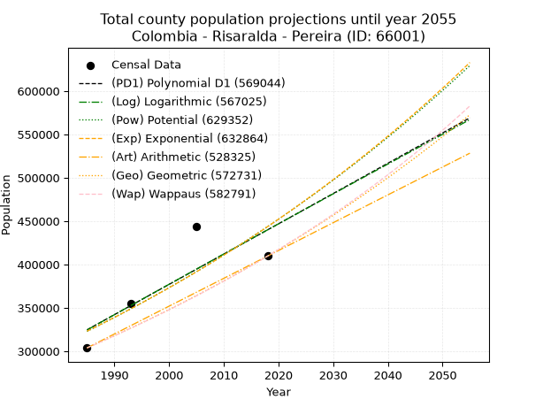
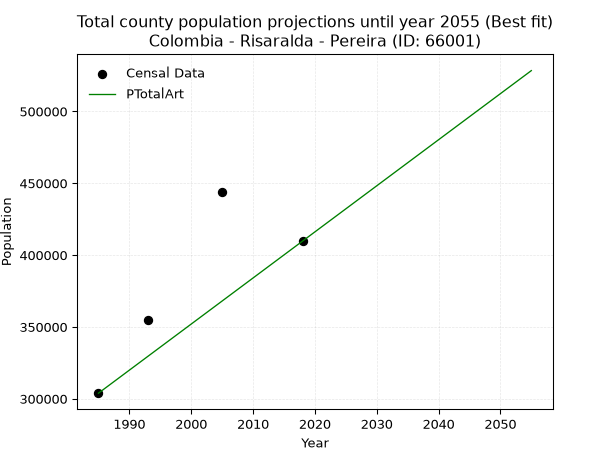
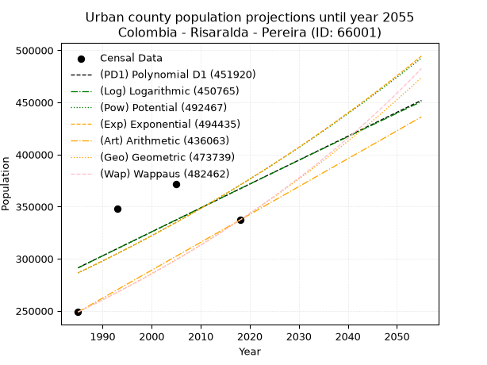
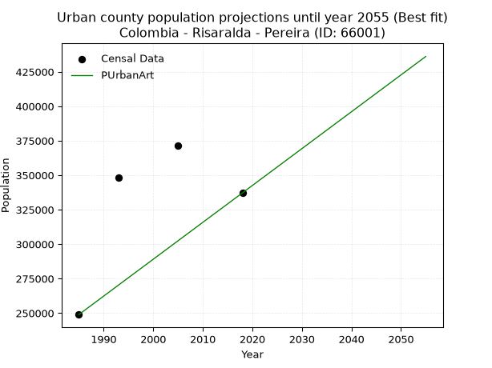
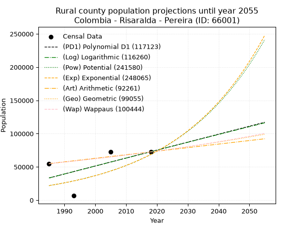
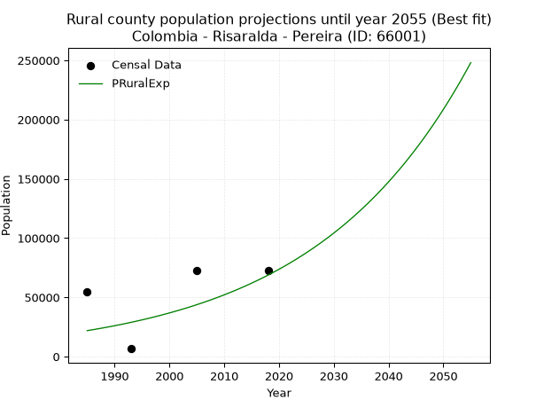

<div align="center">


</div>

# 📜 _“Population and Public Services Demand Projections (PPSD) until Year 2050 for Colombia - Risaralda - Pereira (ID: 66001)”_
Keywords: `population` `public-service` `projection` `lineal` `polynomial` `logarithmic` `potential` `exponential` `arithmetic` `geometric` `wappaus` `dane` `colombia` `south-america`

PPSD are analytical estimates used by governments and planners to anticipate future changes in population size, age distribution, and the resulting community needs for utilities, healthcare, education, and infrastructure as sizing future water treatment facilities, electrical grids, and road networks based on spatial growth.

<div align="center">

</img>

</div>


> **General running parameters**: • app_version: _v20260806_. • Python version: _3.14.7_. • Pandas version: _3.0.5_. • NumPy version: _2.5.1_. • Creates, save and include plots into reports (create_plot): _False_. • Projection until year: _2050_. • Process polynomial degree 2 and up: _False_. • Process Wappaus: _True_. • Process Wappaus: _True_. • Set negative values to zero: _True_. • Set infinite values to zero: _True_. • Drop dataset notes: _True_. 
<div align="center">

Dynamic map: [:earth_americas:Google](http://maps.google.com/maps?q=4.804985213,-75.7197107) [:earth_americas:OSM](https://www.openstreetmap.org/#map=18/4.804985213/-75.7197107&layers=P) [:earth_americas:Bing](https://www.bing.com/maps?cp=4.804985213~-75.7197107&lvl=18) [:earth_americas:Apple](https://maps.apple.com/frame?center=4.804985213%2C-75.7197107&span=0.003%2C0.006)

</div>


<div align="center">

```geojson
{
  "type": "Feature",
  "geometry": {
    "type": "Point", 
    "coordinates": [-75.7197107, 4.804985213]
  }, 
  "properties": {
    "Name": "Colombia - Risaralda - Pereira (ID: 66001)"
  }
}
```

</div>


## 0. Census Data (4 records)

Census data are official statistics collected by a government about the people and housing in a country. They usually include counts of total population, age, sex, race, income, education, and jobs.

📅Global census file: [Population.xlsx](../data/Population.xlsx)

| Source   |   Year |   CountryID | CountryName   |   StateID | StateName   |   CountyID | CountyName   |   PTotal |   PUrban |   PRural |
|:---------|-------:|------------:|:--------------|----------:|:------------|-----------:|:-------------|---------:|---------:|---------:|
| DANE     |   1985 |          57 | Colombia      |        66 | Risaralda   |      66001 | Pereira      |   303843 |   248928 |    54915 |
| DANE     |   1993 |          57 | Colombia      |        66 | Risaralda   |      66001 | Pereira      |   354625 |   348023 |     6602 |
| DANE     |   2005 |          57 | Colombia      |        66 | Risaralda   |      66001 | Pereira      |   443554 |   371239 |    72315 |
| DANE     |   2018 |          57 | Colombia      |        66 | Risaralda   |      66001 | Pereira      |   409670 |   337149 |    72521 |

> 🔥Some records could had specific notes about the registered values or the corresponding urban or rural distribution.

📅[SUI-RUPS](https://www.datos.gov.co/Hacienda-y-Cr-dito-P-blico/Registro-nico-de-Prestadores-de-Servicios-P-blicos/4qkq-csdn/about_data) - Local public utility companies: [RUPS.csv](../data/RUPS.csv)

 | SERVICIO       | ESTADO    | NOMBRE                                                                                                     | NIT         | DEPARTAMENTO_DOMICILIO   | MUNICIPIO_DOMICILIO   | DIRECCION                                                                          |   TELEFONO | EMAIL                             | TIPO_PRESTADOR                             | CLASIFICACION                  |
|:---------------|:----------|:-----------------------------------------------------------------------------------------------------------|:------------|:-------------------------|:----------------------|:-----------------------------------------------------------------------------------|-----------:|:----------------------------------|:-------------------------------------------|:-------------------------------|
| ACUEDUCTO      | OPERATIVA | COMPAÑIA DE SERVICIOS PUBLICOS DOMICILIARIOS S.A. E.S.P.                                                   | 800211801-0 | RISARALDA                | DOSQUEBRADAS          | CRA 10 DIAG 69 ESQUINA RINCÓN DE LA ESTACIÓN                                       |    3116570 | contadora.acuaseo@acuaseo.com     | SOCIEDADES (EMPRESA DE SERVICIOS PUBLICOS) | MAYOR O IGUAL A 5001 USUARIOS  |
| ALCANTARILLADO | OPERATIVA | COMPAÑIA DE SERVICIOS PUBLICOS DOMICILIARIOS S.A. E.S.P.                                                   | 800211801-0 | RISARALDA                | DOSQUEBRADAS          | CRA 10 DIAG 69 ESQUINA RINCÓN DE LA ESTACIÓN                                       |    3116570 | contadora.acuaseo@acuaseo.com     | SOCIEDADES (EMPRESA DE SERVICIOS PUBLICOS) | MAYOR O IGUAL A 5001 USUARIOS  |
| ACUEDUCTO      | OPERATIVA | EMPRESAS MUNICIPALES DE CARTAGO E.S.P.                                                                     | 836000349-8 | VALLE DEL CAUCA          | CARTAGO               | CALLE 13 # 5A - 35 PISO 2                                                          |    2110060 | sui@emcartago.com                 | SOCIEDADES (EMPRESA DE SERVICIOS PUBLICOS) | MAYOR O IGUAL A 5001 USUARIOS  |
| ACUEDUCTO      | OPERATIVA | ASOCIACION VIVA CERRITOS                                                                                   | 800191614-2 | RISARALDA                | PEREIRA               | Km 8 Via Pereria Cerritos                                                          |    3343352 | asistenteadmi@vivacerritos.com    | ORGANIZACION AUTORIZADA                    | MENOR O IGUAL A 2500 USUARIOS  |
| ACUEDUCTO      | OPERATIVA | EMPRESA DE ACUEDUCTO Y ALCANTARILLADO DE PEREIRA S.A.S ESP.                                                | 816002020-7 | RISARALDA                | PEREIRA               | CARRERA 10 No. 17-55 piso 9                                                        |    3151251 | wrendon@aguasyaguas.com.co        | SOCIEDADES (EMPRESA DE SERVICIOS PUBLICOS) | MAYOR O IGUAL A 5001 USUARIOS  |
| ALCANTARILLADO | OPERATIVA | EMPRESA DE ACUEDUCTO Y ALCANTARILLADO DE PEREIRA S.A.S ESP.                                                | 816002020-7 | RISARALDA                | PEREIRA               | CARRERA 10 No. 17-55 piso 9                                                        |    3151251 | wrendon@aguasyaguas.com.co        | SOCIEDADES (EMPRESA DE SERVICIOS PUBLICOS) | MAYOR O IGUAL A 5001 USUARIOS  |
| ACUEDUCTO      | OPERATIVA | ASOCIACIÓN DE SUSCRIPTORES  DE SERVICIOS PUBLICOS DOMICILIARIOS AQUASAT                                    | 816003697-7 | RISARALDA                | PEREIRA               | cr 26 Nº 78-631 san joaquin - cuba                                                 |    3235197 | ACUEDUCTOAQUASAT@GMAIL.COM        | ORGANIZACION AUTORIZADA                    | MENOR O IGUAL A 2500 USUARIOS  |
| ACUEDUCTO      | OPERATIVA | ASOCIACIÓN DE USUARIOS DEL ACUEDUCTO LA REPRESA CHARCO HONDO                                               | 816001108-1 | RISARALDA                | PEREIRA               | Cll 20E No 12b-15                                                                  |    3249717 | jairoherrerachavarro@hotmail.com  | ORGANIZACION AUTORIZADA                    | MENOR O IGUAL A 2500 USUARIOS  |
| ACUEDUCTO      | OPERATIVA | ASOCIACION DE SUSCRIPTORES DE LA EMPRESA DE SERVICIOS PUBLICOS  TRIBUNAS CORCEGA E.S.P                     | 816003198-3 | RISARALDA                | PEREIRA               | Kilometro 5 Via Pereira Armenia, Vereda Huertas                                    |    3119733 | esptricorc@yahoo.es               | ORGANIZACION AUTORIZADA                    | DESDE 2501 HASTA 5000 USUARIOS |
| ALCANTARILLADO | OPERATIVA | ASOCIACION DE SUSCRIPTORES DE LA EMPRESA DE SERVICIOS PUBLICOS  TRIBUNAS CORCEGA E.S.P                     | 816003198-3 | RISARALDA                | PEREIRA               | Kilometro 5 Via Pereira Armenia, Vereda Huertas                                    |    3119733 | esptricorc@yahoo.es               | ORGANIZACION AUTORIZADA                    | MENOR O IGUAL A 2500 USUARIOS  |
| ACUEDUCTO      | OPERATIVA | ASOCIACION DE USUARIOS DEL ACUEDUCTO DE COMBIA BAJA E.S.P                                                  | 816004276-4 | RISARALDA                | PEREIRA               | KM 7 VIA MARSELLA CRUCERO DE COMBIA VIVERO SAN SEBASTIAN                           |    3299656 | acuacombia@hotmail.com            | ORGANIZACION AUTORIZADA                    | MENOR O IGUAL A 2500 USUARIOS  |
| ACUEDUCTO      | OPERATIVA | ASOCIACION COMUNITARIA DE SUSCRIPTORES DEL ACUEDUCTO CESTILLAL EL DIAMANTE E.S.P.                          | 816003887-1 | RISARALDA                | PEREIRA               | CORREGIMIENTO DE ALTAGRACIA CASA 82 VIA PRINCIPAL                                  |    3259379 | acucesdi@hotmail.com              | ORGANIZACION AUTORIZADA                    | DESDE 2501 HASTA 5000 USUARIOS |
| ACUEDUCTO      | OPERATIVA | ASOCIACION DE USUARIOS ACUEDUCTO CARACOL EL ROCIO                                                          | 816001955-3 | RISARALDA                | PEREIRA               | MZ 5 CASA 70                                                                       |    3141225 | caracolrocio@yahoo.es             | ORGANIZACION AUTORIZADA                    | MENOR O IGUAL A 2500 USUARIOS  |
| ACUEDUCTO      | OPERATIVA | ASOCIACION DE USUARIOS ACUEDUCTO CHOCHO CANCELES                                                           | 800172202-0 | RISARALDA                | PEREIRA               | casa el jazmin vereda el chocho                                                    |    3127803 | mcenaida0367@hotmail.com          | ORGANIZACION AUTORIZADA                    | MENOR O IGUAL A 2500 USUARIOS  |
| ACUEDUCTO      | OPERATIVA | ASOCIACION DE SUSCRIPTORES DE LA EMPRESA DE ACUEDUCTO Y ALCANTARILLADO DEL CORREGIMIENTO LA BELLA E.S.P.   | 816005483-7 | RISARALDA                | PEREIRA               | CORREGIMIENTO LA BELLA                                                             |    3328706 | ACUABELLAESP@GMAIL.COM            | ORGANIZACION AUTORIZADA                    | MENOR O IGUAL A 2500 USUARIOS  |
| ACUEDUCTO      | OPERATIVA | ASOCIACION DEL USUARIO DEL ACUEDUCTO Y ALCANTARILLADO COMUNITARIO DEL CORREGIMIENTO LA FLORIDA             | 816001188-0 | RISARALDA                | PEREIRA               | CARRERA 13 NRO 99E 47                                                              |    3144178 | acueductolaflorida@yahoo.es       | ORGANIZACION AUTORIZADA                    | MENOR O IGUAL A 2500 USUARIOS  |
| ACUEDUCTO      | OPERATIVA | ASOCIACIÓN DE SUSCRIPTORES DEL SERVICIO DE AGUA POTABLE  DE LA VEREDA MUNDO NUEVO E.S.P.                   | 816003035-1 | RISARALDA                | PEREIRA               | VEREDA MUNDO NUEVO INSPECCION DE POLICIA OFICINA ACUEDUCTO, CORREGIMIENTO LA BELLA |    3014519 | acueductomundonuevo@gmail.com     | ORGANIZACION AUTORIZADA                    | MENOR O IGUAL A 2500 USUARIOS  |
| ACUEDUCTO      | OPERATIVA | ASOCIACION DE USUARIOS DEL ACUEDUCTO PLAN DEL MANZANO DEL CORREGIMIENTO DE LA FLORIDA MUNICIPIO DE PEREIRA | 816006665-5 | RISARALDA                | PEREIRA               | Calle de la Iglesia Cooregimiento La Florida                                       |    3144178 | acueductolaflorida@yahoo.es       | ORGANIZACION AUTORIZADA                    | HASTA 2500 SUSCRIPTORES        |
| ACUEDUCTO      | OPERATIVA | ASOCIACIÓN JUNTA ADMINISTRADORA DEL ACUEDUCTO DE PUERTO CALDAS                                             | 816004338-2 | RISARALDA                | PEREIRA               | Carrera 4 No. 7 - 16                                                               |    2116144 | williamagude@gmail.com            | ORGANIZACION AUTORIZADA                    | HASTA 2500 SUSCRIPTORES        |
| ACUEDUCTO      | OPERATIVA | ASOCIACION COMUNITARIA DE SUSCRIPTORES DEL ACUEDUCTO SANTA CRUZ DE BARBAS                                  | 816007156-2 | RISARALDA                | PEREIRA               | CL 24 Nº 7-29 OF 504                                                               |    3330705 | gvalenciad@gmail.com              | ORGANIZACION AUTORIZADA                    | HASTA 2500 SUSCRIPTORES        |
| ACUEDUCTO      | OPERATIVA | ASOCIACION DE USUARIOS DEL ACUEDUCTO YARUMAL                                                               | 900040015-6 | RISARALDA                | PEREIRA               | FINCA LA RIVERA ENSEGUIDA CENTRO DOCENTE DE YARUMAL                                |    3329344 | acueductoyarumalris@hotmail.com   | ORGANIZACION AUTORIZADA                    | MENOR O IGUAL A 2500 USUARIOS  |
| ACUEDUCTO      | OPERATIVA | ASOCIACION DE SUSCRIPTORES DEL ACUEDUCTO CANTAMONOS                                                        | 816007142-1 | RISARALDA                | PEREIRA               | kilometro 10 via Armenia vereda Cantamonos                                         |    3386156 | a-acueductocantamonos@hotmail.com | ORGANIZACION AUTORIZADA                    | MENOR O IGUAL A 2500 USUARIOS  |
| ACUEDUCTO      | OPERATIVA | ASOCIACION DE USUARIOS DEL ACUEDUCTO DE LA VEREDA MINAS DEL SOCORRO                                        | 830510405-9 | RISARALDA                | PEREIRA               | pereira                                                                            |    3168116 | asominasdelsocorro@yahoo.com.co   | ORGANIZACION AUTORIZADA                    | HASTA 2500 SUSCRIPTORES        |
| ACUEDUCTO      | OPERATIVA | ASOCIACION DE USUARIOS DEL ACUEDUCTO NO. 2 DEL  CORREGIMIENTO CAIMALITO                                    | 816008701-1 | RISARALDA                | PEREIRA               | CAIMALITO CENTRO CASA No. 101                                                      |    3684326 | yanet50236@hotmail.com            | ORGANIZACION AUTORIZADA                    | HASTA 2500 SUSCRIPTORES        |

## 1. Total

### 1.1. Coefficients and Parameters

* (PD1) Polynomial Deg 1: 3490.7860297069574, -6604521.7559213415 (lineal)
* (Log) Logarithmic: 6997782.596584169, -52812278.59334668
* (Pow) Potential: 19.252244610538778, -57.980169683472674
* (Exp) Exponential: 0.009604020969862822, 0.001698088988070487
* (Art) Arithmetic: Year diff. 2018 - 1985 = 33, Population diff. 409670 - 303843 = 105827, Annual growth = 3206.878787878788
* (Geo) Geometric: Year diff. 2018 - 1985 = 33, Population diff. 409670 - 303843 = 105827, Annual growth % = 0.009096910593492158
* (Wap) Wappaus: i = 0.8988984889914515, Condition values only valid for < 200)

<sub>
Wappaus condition values: ['0.00', '0.90', '1.80', '2.70', '3.60', '4.49', '5.39', '6.29', '7.19', '8.09', '8.99', '9.89', '10.79', '11.69', '12.58', '13.48', '14.38', '15.28', '16.18', '17.08', '17.98', '18.88', '19.78', '20.67', '21.57', '22.47', '23.37', '24.27', '25.17', '26.07', '26.97', '27.87', '28.76', '29.66', '30.56', '31.46', '32.36', '33.26', '34.16', '35.06', '35.96', '36.85', '37.75', '38.65', '39.55', '40.45', '41.35', '42.25', '43.15', '44.05', '44.94', '45.84', '46.74', '47.64', '48.54', '49.44', '50.34', '51.24', '52.14', '53.04', '53.93', '54.83', '55.73', '56.63', '57.53', '58.43']
</sub>


### 1.2. Projected Dataset

|   Year |   CountyID |   PTotalPD1 |   PTotalLog |   PTotalPow |   PTotalExp |   PTotalArt |   PTotalGeo |   PTotalWap |
|-------:|-----------:|------------:|------------:|------------:|------------:|------------:|------------:|------------:|
|   1985 |      66001 |      324689 |      324503 |      322940 |      323104 |      303843 |      303843 |      303843 |
|   1986 |      66001 |      328179 |      328028 |      326087 |      326222 |      307050 |      306607 |      306587 |
|   1987 |      66001 |      331670 |      331550 |      329263 |      329370 |      310257 |      309396 |      309355 |
|   1988 |      66001 |      335161 |      335071 |      332468 |      332549 |      313464 |      312211 |      312149 |
|   1989 |      66001 |      338652 |      338590 |      335702 |      335758 |      316671 |      315051 |      314968 |
|   1990 |      66001 |      342142 |      342108 |      338966 |      338998 |      319877 |      317917 |      317813 |
|   1991 |      66001 |      345633 |      345623 |      342261 |      342270 |      323084 |      320809 |      320685 |
|   1992 |      66001 |      349124 |      349137 |      345586 |      345573 |      326291 |      323727 |      323583 |
|   1993 |      66001 |      352615 |      352649 |      348941 |      348907 |      329498 |      326672 |      326508 |
|   1994 |      66001 |      356106 |      356159 |      352327 |      352275 |      332705 |      329644 |      329460 |
|   1995 |      66001 |      359596 |      359668 |      355745 |      355674 |      335912 |      332643 |      332441 |
|   1996 |      66001 |      363087 |      363175 |      359193 |      359106 |      339119 |      335669 |      335449 |
|   1997 |      66001 |      366578 |      366680 |      362674 |      362572 |      342326 |      338722 |      338486 |
|   1998 |      66001 |      370069 |      370183 |      366186 |      366071 |      345532 |      341804 |      341552 |
|   1999 |      66001 |      373560 |      373685 |      369731 |      369604 |      348739 |      344913 |      344648 |
|   2000 |      66001 |      377050 |      377184 |      373308 |      373170 |      351946 |      348051 |      347773 |
|   2001 |      66001 |      380541 |      380682 |      376918 |      376771 |      355153 |      351217 |      350929 |
|   2002 |      66001 |      384032 |      384179 |      380561 |      380407 |      358360 |      354412 |      354115 |
|   2003 |      66001 |      387523 |      387673 |      384237 |      384078 |      361567 |      357636 |      357333 |
|   2004 |      66001 |      391013 |      391166 |      387947 |      387785 |      364774 |      360889 |      360582 |
|   2005 |      66001 |      394504 |      394657 |      391691 |      391527 |      367981 |      364172 |      363863 |
|   2006 |      66001 |      397995 |      398146 |      395470 |      395306 |      371187 |      367485 |      367177 |
|   2007 |      66001 |      401486 |      401634 |      399282 |      399120 |      374394 |      370828 |      370524 |
|   2008 |      66001 |      404977 |      405120 |      403130 |      402972 |      377601 |      374201 |      373904 |
|   2009 |      66001 |      408467 |      408604 |      407013 |      406861 |      380808 |      377605 |      377318 |
|   2010 |      66001 |      411958 |      412086 |      410931 |      410787 |      384015 |      381041 |      380767 |
|   2011 |      66001 |      415449 |      415567 |      414885 |      414751 |      387222 |      384507 |      384252 |
|   2012 |      66001 |      418940 |      419046 |      418875 |      418754 |      390429 |      388005 |      387771 |
|   2013 |      66001 |      422431 |      422523 |      422901 |      422795 |      393636 |      391534 |      391327 |
|   2014 |      66001 |      425921 |      425998 |      426964 |      426875 |      396842 |      395096 |      394920 |
|   2015 |      66001 |      429412 |      429472 |      431064 |      430994 |      400049 |      398690 |      398550 |
|   2016 |      66001 |      432903 |      432944 |      435201 |      435154 |      403256 |      402317 |      402218 |
|   2017 |      66001 |      436394 |      436414 |      439376 |      439353 |      406463 |      405977 |      405924 |
|   2018 |      66001 |      439884 |      439883 |      443589 |      443593 |      409670 |      409670 |      409670 |
|   2019 |      66001 |      443375 |      443350 |      447840 |      447874 |      412877 |      413397 |      413455 |
|   2020 |      66001 |      446866 |      446815 |      452130 |      452196 |      416084 |      417157 |      417281 |
|   2021 |      66001 |      450357 |      450278 |      456459 |      456560 |      419291 |      420952 |      421148 |
|   2022 |      66001 |      453848 |      453740 |      460827 |      460966 |      422498 |      424782 |      425056 |
|   2023 |      66001 |      457338 |      457200 |      465234 |      465414 |      425704 |      428646 |      429007 |
|   2024 |      66001 |      460829 |      460658 |      469682 |      469905 |      428911 |      432545 |      433001 |
|   2025 |      66001 |      464320 |      464114 |      474170 |      474440 |      432118 |      436480 |      437038 |
|   2026 |      66001 |      467811 |      467569 |      478698 |      479019 |      435325 |      440451 |      441121 |
|   2027 |      66001 |      471302 |      471022 |      483267 |      483641 |      438532 |      444457 |      445248 |
|   2028 |      66001 |      474792 |      474474 |      487878 |      488309 |      441739 |      448500 |      449421 |
|   2029 |      66001 |      478283 |      477924 |      492531 |      493021 |      444946 |      452580 |      453641 |
|   2030 |      66001 |      481774 |      481372 |      497225 |      497779 |      448153 |      456698 |      457909 |
|   2031 |      66001 |      485265 |      484818 |      501962 |      502582 |      451359 |      460852 |      462225 |
|   2032 |      66001 |      488755 |      488263 |      506742 |      507432 |      454566 |      465044 |      466590 |
|   2033 |      66001 |      492246 |      491706 |      511564 |      512329 |      457773 |      469275 |      471005 |
|   2034 |      66001 |      495737 |      495147 |      516431 |      517273 |      460980 |      473544 |      475472 |
|   2035 |      66001 |      499228 |      498586 |      521341 |      522265 |      464187 |      477852 |      479989 |
|   2036 |      66001 |      502719 |      502024 |      526295 |      527305 |      467394 |      482199 |      484560 |
|   2037 |      66001 |      506209 |      505460 |      531294 |      532394 |      470601 |      486585 |      489184 |
|   2038 |      66001 |      509700 |      508895 |      536338 |      537532 |      473808 |      491012 |      493863 |
|   2039 |      66001 |      513191 |      512328 |      541427 |      542719 |      477014 |      495478 |      498597 |
|   2040 |      66001 |      516682 |      515759 |      546563 |      547956 |      480221 |      499986 |      503388 |
|   2041 |      66001 |      520173 |      519188 |      551744 |      553244 |      483428 |      504534 |      508237 |
|   2042 |      66001 |      523663 |      522616 |      556972 |      558583 |      486635 |      509124 |      513144 |
|   2043 |      66001 |      527154 |      526042 |      562246 |      563974 |      489842 |      513755 |      518110 |
|   2044 |      66001 |      530645 |      529467 |      567568 |      569416 |      493049 |      518429 |      523138 |
|   2045 |      66001 |      534136 |      532889 |      572938 |      574911 |      496256 |      523145 |      528227 |
|   2046 |      66001 |      537626 |      536310 |      578356 |      580459 |      499463 |      527904 |      533379 |
|   2047 |      66001 |      541117 |      539730 |      583823 |      586061 |      502669 |      532706 |      538596 |
|   2048 |      66001 |      544608 |      543147 |      589338 |      591717 |      505876 |      537552 |      543878 |
|   2049 |      66001 |      548099 |      546564 |      594903 |      597427 |      509083 |      542442 |      549226 |
|   2050 |      66001 |      551590 |      549978 |      600518 |      603192 |      512290 |      547377 |      554643 |
<div align="center">

</img>

</div>


### 1.3. Best fit with absolute and relative error (%)

Relative error puts that difference into context by dividing the absolute error by the true value, creating a unitless ratio or percentage that shows the scale of the mistake.

Absolute and relative error

|   Year | Source   |   CountryID | CountryName   |   StateID | StateName   |   CountyID_x | CountyName   |   PTotal |   PUrban |   PRural |   CountyID_y |   PTotalPD1 |   PTotalLog |   PTotalPow |   PTotalExp |   PTotalArt |   PTotalGeo |   PTotalWap |   PTotalPD1AbsError |   PTotalLogAbsError |   PTotalPowAbsError |   PTotalExpAbsError |   PTotalArtAbsError |   PTotalGeoAbsError |   PTotalWapAbsError |   PTotalPD1RelError |   PTotalLogRelError |   PTotalPowRelError |   PTotalExpRelError |   PTotalArtRelError |   PTotalGeoRelError |   PTotalWapRelError |
|-------:|:---------|------------:|:--------------|----------:|:------------|-------------:|:-------------|---------:|---------:|---------:|-------------:|------------:|------------:|------------:|------------:|------------:|------------:|------------:|--------------------:|--------------------:|--------------------:|--------------------:|--------------------:|--------------------:|--------------------:|--------------------:|--------------------:|--------------------:|--------------------:|--------------------:|--------------------:|--------------------:|
|   1985 | DANE     |          57 | Colombia      |        66 | Risaralda   |        66001 | Pereira      |   303843 |   248928 |    54915 |        66001 |      324689 |      324503 |      322940 |      323104 |      303843 |      303843 |      303843 |               20846 |               20660 |               19097 |               19261 |                   0 |                   0 |                   0 |            6.86078  |            6.79956  |             6.28515 |             6.33913 |             0       |             0       |             0       |
|   1993 | DANE     |          57 | Colombia      |        66 | Risaralda   |        66001 | Pereira      |   354625 |   348023 |     6602 |        66001 |      352615 |      352649 |      348941 |      348907 |      329498 |      326672 |      326508 |                2010 |                1976 |                5684 |                5718 |               25127 |               27953 |               28117 |            0.566796 |            0.557208 |             1.60282 |             1.61241 |             7.08551 |             7.88241 |             7.92866 |
|   2005 | DANE     |          57 | Colombia      |        66 | Risaralda   |        66001 | Pereira      |   443554 |   371239 |    72315 |        66001 |      394504 |      394657 |      391691 |      391527 |      367981 |      364172 |      363863 |               49050 |               48897 |               51863 |               52027 |               75573 |               79382 |               79691 |           11.0584   |           11.0239   |            11.6926  |            11.7296  |            17.0381  |            17.8968  |            17.9665  |
|   2018 | DANE     |          57 | Colombia      |        66 | Risaralda   |        66001 | Pereira      |   409670 |   337149 |    72521 |        66001 |      439884 |      439883 |      443589 |      443593 |      409670 |      409670 |      409670 |               30214 |               30213 |               33919 |               33923 |                   0 |                   0 |                   0 |            7.3752   |            7.37496  |             8.27959 |             8.28057 |             0       |             0       |             0       |

Relative error mean

| Method    |   RelError | Best   |
|:----------|-----------:|:-------|
| PTotalPD1 |    6.4653  |        |
| PTotalLog |    6.43891 |        |
| PTotalPow |    6.96504 |        |
| PTotalExp |    6.99042 |        |
| PTotalArt |    6.03089 | True   |
| PTotalGeo |    6.4448  |        |
| PTotalWap |    6.47378 |        |

💙Best method: _**PTotalArt**_
<div align="center">

</img>

</div>


### 1.4. Fresh water supply demand in liters per capita per day (lpcd)

The fresh water supply demand typically ranges from 100 to 300 liters per capita per day (lpcd) for standard domestic and municipal planning, though absolute survival minimums set by the World Health Organization are as low as 7.5 to 20 liters per day, and total consumption in high-income nations can exceed 400 liters.

> `CZ`: Level in meters above the sea level (masl)<br> `WS`: Fresh water supply demand in liters per capita per day (lpcd or l/h/d)<br> `WSAll`: Zonal fresh water supply demand in liters per second (l/s)<br> `A`: Zonal area in square meters<br> `DP`: Population density (people/hectare or p/ha)

Reference values (RAS Colombia)

|    CZ |   WS |
|------:|-----:|
|  1000 |  120 |
|  2000 |  130 |
| 99999 |  140 |

County shapefile geometry properties and water supply values

|   CountyID |      ATotal |   CZTotal |   WSTotal |
|-----------:|------------:|----------:|----------:|
|      66001 | 6.08239e+08 |   1721.83 |       130 |

Projected values for best method: PTotalArt

|   CountyID |   Year |   PTotalArt |   DPTotal |   WSTotal |   WSTotalAll |
|-----------:|-------:|------------:|----------:|----------:|-------------:|
|      66001 |   1985 |      303843 |      5    |       130 |      457.171 |
|      66001 |   1986 |      307050 |      5.05 |       130 |      461.997 |
|      66001 |   1987 |      310257 |      5.1  |       130 |      466.822 |
|      66001 |   1988 |      313464 |      5.15 |       130 |      471.647 |
|      66001 |   1989 |      316671 |      5.21 |       130 |      476.473 |
|      66001 |   1990 |      319877 |      5.26 |       130 |      481.296 |
|      66001 |   1991 |      323084 |      5.31 |       130 |      486.122 |
|      66001 |   1992 |      326291 |      5.36 |       130 |      490.947 |
|      66001 |   1993 |      329498 |      5.42 |       130 |      495.772 |
|      66001 |   1994 |      332705 |      5.47 |       130 |      500.598 |
|      66001 |   1995 |      335912 |      5.52 |       130 |      505.423 |
|      66001 |   1996 |      339119 |      5.58 |       130 |      510.248 |
|      66001 |   1997 |      342326 |      5.63 |       130 |      515.074 |
|      66001 |   1998 |      345532 |      5.68 |       130 |      519.898 |
|      66001 |   1999 |      348739 |      5.73 |       130 |      524.723 |
|      66001 |   2000 |      351946 |      5.79 |       130 |      529.548 |
|      66001 |   2001 |      355153 |      5.84 |       130 |      534.374 |
|      66001 |   2002 |      358360 |      5.89 |       130 |      539.199 |
|      66001 |   2003 |      361567 |      5.94 |       130 |      544.024 |
|      66001 |   2004 |      364774 |      6    |       130 |      548.85  |
|      66001 |   2005 |      367981 |      6.05 |       130 |      553.675 |
|      66001 |   2006 |      371187 |      6.1  |       130 |      558.499 |
|      66001 |   2007 |      374394 |      6.16 |       130 |      563.324 |
|      66001 |   2008 |      377601 |      6.21 |       130 |      568.15  |
|      66001 |   2009 |      380808 |      6.26 |       130 |      572.975 |
|      66001 |   2010 |      384015 |      6.31 |       130 |      577.8   |
|      66001 |   2011 |      387222 |      6.37 |       130 |      582.626 |
|      66001 |   2012 |      390429 |      6.42 |       130 |      587.451 |
|      66001 |   2013 |      393636 |      6.47 |       130 |      592.276 |
|      66001 |   2014 |      396842 |      6.52 |       130 |      597.1   |
|      66001 |   2015 |      400049 |      6.58 |       130 |      601.926 |
|      66001 |   2016 |      403256 |      6.63 |       130 |      606.751 |
|      66001 |   2017 |      406463 |      6.68 |       130 |      611.576 |
|      66001 |   2018 |      409670 |      6.74 |       130 |      616.402 |
|      66001 |   2019 |      412877 |      6.79 |       130 |      621.227 |
|      66001 |   2020 |      416084 |      6.84 |       130 |      626.052 |
|      66001 |   2021 |      419291 |      6.89 |       130 |      630.878 |
|      66001 |   2022 |      422498 |      6.95 |       130 |      635.703 |
|      66001 |   2023 |      425704 |      7    |       130 |      640.527 |
|      66001 |   2024 |      428911 |      7.05 |       130 |      645.352 |
|      66001 |   2025 |      432118 |      7.1  |       130 |      650.178 |
|      66001 |   2026 |      435325 |      7.16 |       130 |      655.003 |
|      66001 |   2027 |      438532 |      7.21 |       130 |      659.828 |
|      66001 |   2028 |      441739 |      7.26 |       130 |      664.654 |
|      66001 |   2029 |      444946 |      7.32 |       130 |      669.479 |
|      66001 |   2030 |      448153 |      7.37 |       130 |      674.304 |
|      66001 |   2031 |      451359 |      7.42 |       130 |      679.128 |
|      66001 |   2032 |      454566 |      7.47 |       130 |      683.953 |
|      66001 |   2033 |      457773 |      7.53 |       130 |      688.779 |
|      66001 |   2034 |      460980 |      7.58 |       130 |      693.604 |
|      66001 |   2035 |      464187 |      7.63 |       130 |      698.43  |
|      66001 |   2036 |      467394 |      7.68 |       130 |      703.255 |
|      66001 |   2037 |      470601 |      7.74 |       130 |      708.08  |
|      66001 |   2038 |      473808 |      7.79 |       130 |      712.906 |
|      66001 |   2039 |      477014 |      7.84 |       130 |      717.729 |
|      66001 |   2040 |      480221 |      7.9  |       130 |      722.555 |
|      66001 |   2041 |      483428 |      7.95 |       130 |      727.38  |
|      66001 |   2042 |      486635 |      8    |       130 |      732.205 |
|      66001 |   2043 |      489842 |      8.05 |       130 |      737.031 |
|      66001 |   2044 |      493049 |      8.11 |       130 |      741.856 |
|      66001 |   2045 |      496256 |      8.16 |       130 |      746.681 |
|      66001 |   2046 |      499463 |      8.21 |       130 |      751.507 |
|      66001 |   2047 |      502669 |      8.26 |       130 |      756.331 |
|      66001 |   2048 |      505876 |      8.32 |       130 |      761.156 |
|      66001 |   2049 |      509083 |      8.37 |       130 |      765.981 |
|      66001 |   2050 |      512290 |      8.42 |       130 |      770.807 |

## 2. Urban

### 2.1. Coefficients and Parameters

* (PD1) Polynomial Deg 1: 2293.7956643918305, -4261830.027699758 (lineal)
* (Log) Logarithmic: 4604572.879745568, -34673060.60767739
* (Pow) Potential: 15.643184827801736, -46.130550159798496
* (Exp) Exponential: 0.007793887536488162, 0.05473415045020477
* (Art) Arithmetic: Year diff. 2018 - 1985 = 33, Population diff. 337149 - 248928 = 88221, Annual growth = 2673.3636363636365
* (Geo) Geometric: Year diff. 2018 - 1985 = 33, Population diff. 337149 - 248928 = 88221, Annual growth % = 0.009235149036278534
* (Wap) Wappaus: i = 0.9122909229891759, Condition values only valid for < 200)

<sub>
Wappaus condition values: ['0.00', '0.91', '1.82', '2.74', '3.65', '4.56', '5.47', '6.39', '7.30', '8.21', '9.12', '10.04', '10.95', '11.86', '12.77', '13.68', '14.60', '15.51', '16.42', '17.33', '18.25', '19.16', '20.07', '20.98', '21.89', '22.81', '23.72', '24.63', '25.54', '26.46', '27.37', '28.28', '29.19', '30.11', '31.02', '31.93', '32.84', '33.75', '34.67', '35.58', '36.49', '37.40', '38.32', '39.23', '40.14', '41.05', '41.97', '42.88', '43.79', '44.70', '45.61', '46.53', '47.44', '48.35', '49.26', '50.18', '51.09', '52.00', '52.91', '53.83', '54.74', '55.65', '56.56', '57.47', '58.39', '59.30']
</sub>


### 2.2. Projected Dataset

|   Year |   CountyID |   PUrbanPD1 |   PUrbanLog |   PUrbanPow |   PUrbanExp |   PUrbanArt |   PUrbanGeo |   PUrbanWap |
|-------:|-----------:|------------:|------------:|------------:|------------:|------------:|------------:|------------:|
|   1985 |      66001 |      291354 |      291184 |      286370 |      286530 |      248928 |      248928 |      248928 |
|   1986 |      66001 |      293648 |      293503 |      288635 |      288772 |      251601 |      251227 |      251209 |
|   1987 |      66001 |      295942 |      295821 |      290917 |      291032 |      254275 |      253547 |      253512 |
|   1988 |      66001 |      298236 |      298138 |      293215 |      293309 |      256948 |      255889 |      255835 |
|   1989 |      66001 |      300530 |      300454 |      295531 |      295604 |      259621 |      258252 |      258181 |
|   1990 |      66001 |      302823 |      302768 |      297864 |      297917 |      262295 |      260637 |      260548 |
|   1991 |      66001 |      305117 |      305081 |      300214 |      300248 |      264968 |      263044 |      262937 |
|   1992 |      66001 |      307411 |      307393 |      302582 |      302597 |      267642 |      265473 |      265349 |
|   1993 |      66001 |      309705 |      309704 |      304967 |      304964 |      270315 |      267925 |      267784 |
|   1994 |      66001 |      311999 |      312014 |      307369 |      307351 |      272988 |      270399 |      270242 |
|   1995 |      66001 |      314292 |      314323 |      309789 |      309755 |      275662 |      272896 |      272723 |
|   1996 |      66001 |      316586 |      316630 |      312227 |      312179 |      278335 |      275416 |      275228 |
|   1997 |      66001 |      318880 |      318937 |      314683 |      314622 |      281008 |      277960 |      277757 |
|   1998 |      66001 |      321174 |      321242 |      317158 |      317083 |      283682 |      280527 |      280311 |
|   1999 |      66001 |      323468 |      323546 |      319650 |      319564 |      286355 |      283118 |      282890 |
|   2000 |      66001 |      325761 |      325849 |      322160 |      322065 |      289028 |      285732 |      285494 |
|   2001 |      66001 |      328055 |      328150 |      324689 |      324585 |      291702 |      288371 |      288124 |
|   2002 |      66001 |      330349 |      330451 |      327237 |      327124 |      294375 |      291034 |      290779 |
|   2003 |      66001 |      332643 |      332750 |      329803 |      329684 |      297049 |      293722 |      293462 |
|   2004 |      66001 |      334936 |      335049 |      332389 |      332263 |      299722 |      296434 |      296170 |
|   2005 |      66001 |      337230 |      337346 |      334993 |      334863 |      302395 |      299172 |      298906 |
|   2006 |      66001 |      339524 |      339642 |      337616 |      337483 |      305069 |      301935 |      301670 |
|   2007 |      66001 |      341818 |      341937 |      340258 |      340124 |      307742 |      304723 |      304462 |
|   2008 |      66001 |      344112 |      344230 |      342920 |      342785 |      310415 |      307538 |      307282 |
|   2009 |      66001 |      346405 |      346523 |      345601 |      345467 |      313089 |      310378 |      310131 |
|   2010 |      66001 |      348699 |      348814 |      348302 |      348170 |      315762 |      313244 |      313009 |
|   2011 |      66001 |      350993 |      351104 |      351023 |      350894 |      318435 |      316137 |      315917 |
|   2012 |      66001 |      353287 |      353394 |      353763 |      353640 |      321109 |      319057 |      318856 |
|   2013 |      66001 |      355581 |      355682 |      356524 |      356407 |      323782 |      322003 |      321825 |
|   2014 |      66001 |      357874 |      357968 |      359305 |      359195 |      326456 |      324977 |      324825 |
|   2015 |      66001 |      360168 |      360254 |      362106 |      362006 |      329129 |      327978 |      327857 |
|   2016 |      66001 |      362462 |      362539 |      364927 |      364838 |      331802 |      331007 |      330922 |
|   2017 |      66001 |      364756 |      364822 |      367769 |      367693 |      334476 |      334064 |      334019 |
|   2018 |      66001 |      367050 |      367105 |      370632 |      370570 |      337149 |      337149 |      337149 |
|   2019 |      66001 |      369343 |      369386 |      373515 |      373469 |      339822 |      340263 |      340313 |
|   2020 |      66001 |      371637 |      371666 |      376420 |      376392 |      342496 |      343405 |      343512 |
|   2021 |      66001 |      373931 |      373945 |      379345 |      379337 |      345169 |      346576 |      346745 |
|   2022 |      66001 |      376225 |      376222 |      382292 |      382305 |      347842 |      349777 |      350014 |
|   2023 |      66001 |      378519 |      378499 |      385260 |      385296 |      350516 |      353007 |      353319 |
|   2024 |      66001 |      380812 |      380775 |      388250 |      388311 |      353189 |      356267 |      356660 |
|   2025 |      66001 |      383106 |      383049 |      391262 |      391349 |      355863 |      359558 |      360039 |
|   2026 |      66001 |      385400 |      385322 |      394295 |      394411 |      358536 |      362878 |      363456 |
|   2027 |      66001 |      387694 |      387595 |      397351 |      397497 |      361209 |      366229 |      366911 |
|   2028 |      66001 |      389988 |      389866 |      400429 |      400607 |      363883 |      369612 |      370406 |
|   2029 |      66001 |      392281 |      392136 |      403528 |      403742 |      366556 |      373025 |      373940 |
|   2030 |      66001 |      394575 |      394404 |      406651 |      406901 |      369229 |      376470 |      377515 |
|   2031 |      66001 |      396869 |      396672 |      409796 |      410084 |      371903 |      379947 |      381131 |
|   2032 |      66001 |      399163 |      398939 |      412964 |      413293 |      374576 |      383456 |      384790 |
|   2033 |      66001 |      401457 |      401204 |      416154 |      416527 |      377249 |      386997 |      388491 |
|   2034 |      66001 |      403750 |      403469 |      419368 |      419786 |      379923 |      390571 |      392235 |
|   2035 |      66001 |      406044 |      405732 |      422605 |      423070 |      382596 |      394178 |      396024 |
|   2036 |      66001 |      408338 |      407994 |      425865 |      426381 |      385270 |      397818 |      399858 |
|   2037 |      66001 |      410632 |      410255 |      429149 |      429717 |      387943 |      401492 |      403737 |
|   2038 |      66001 |      412926 |      412515 |      432457 |      433079 |      390616 |      405200 |      407664 |
|   2039 |      66001 |      415219 |      414774 |      435788 |      436468 |      393290 |      408942 |      411638 |
|   2040 |      66001 |      417513 |      417031 |      439143 |      439883 |      395963 |      412719 |      415660 |
|   2041 |      66001 |      419807 |      419288 |      442523 |      443324 |      398636 |      416530 |      419731 |
|   2042 |      66001 |      422101 |      421543 |      445927 |      446793 |      401310 |      420377 |      423853 |
|   2043 |      66001 |      424395 |      423798 |      449355 |      450289 |      403983 |      424259 |      428026 |
|   2044 |      66001 |      426688 |      426051 |      452808 |      453812 |      406656 |      428177 |      432251 |
|   2045 |      66001 |      428982 |      428303 |      456286 |      457363 |      409330 |      432131 |      436529 |
|   2046 |      66001 |      431276 |      430554 |      459789 |      460942 |      412003 |      436122 |      440861 |
|   2047 |      66001 |      433570 |      432804 |      463317 |      464548 |      414677 |      440150 |      445248 |
|   2048 |      66001 |      435863 |      435053 |      466870 |      468183 |      417350 |      444215 |      449691 |
|   2049 |      66001 |      438157 |      437301 |      470449 |      471846 |      420023 |      448317 |      454192 |
|   2050 |      66001 |      440451 |      439548 |      474054 |      475538 |      422697 |      452457 |      458751 |
<div align="center">

</img>

</div>


### 2.3. Best fit with absolute and relative error (%)

Relative error puts that difference into context by dividing the absolute error by the true value, creating a unitless ratio or percentage that shows the scale of the mistake.

Absolute and relative error

|   Year | Source   |   CountryID | CountryName   |   StateID | StateName   |   CountyID_x | CountyName   |   PTotal |   PUrban |   PRural |   CountyID_y |   PUrbanPD1 |   PUrbanLog |   PUrbanPow |   PUrbanExp |   PUrbanArt |   PUrbanGeo |   PUrbanWap |   PUrbanPD1AbsError |   PUrbanLogAbsError |   PUrbanPowAbsError |   PUrbanExpAbsError |   PUrbanArtAbsError |   PUrbanGeoAbsError |   PUrbanWapAbsError |   PUrbanPD1RelError |   PUrbanLogRelError |   PUrbanPowRelError |   PUrbanExpRelError |   PUrbanArtRelError |   PUrbanGeoRelError |   PUrbanWapRelError |
|-------:|:---------|------------:|:--------------|----------:|:------------|-------------:|:-------------|---------:|---------:|---------:|-------------:|------------:|------------:|------------:|------------:|------------:|------------:|------------:|--------------------:|--------------------:|--------------------:|--------------------:|--------------------:|--------------------:|--------------------:|--------------------:|--------------------:|--------------------:|--------------------:|--------------------:|--------------------:|--------------------:|
|   1985 | DANE     |          57 | Colombia      |        66 | Risaralda   |        66001 | Pereira      |   303843 |   248928 |    54915 |        66001 |      291354 |      291184 |      286370 |      286530 |      248928 |      248928 |      248928 |               42426 |               42256 |               37442 |               37602 |                   0 |                   0 |                   0 |            17.0435  |            16.9752  |            15.0413  |            15.1056  |              0      |              0      |              0      |
|   1993 | DANE     |          57 | Colombia      |        66 | Risaralda   |        66001 | Pereira      |   354625 |   348023 |     6602 |        66001 |      309705 |      309704 |      304967 |      304964 |      270315 |      267925 |      267784 |               38318 |               38319 |               43056 |               43059 |               77708 |               80098 |               80239 |            11.0102  |            11.0105  |            12.3716  |            12.3725  |             22.3284 |             23.0151 |             23.0557 |
|   2005 | DANE     |          57 | Colombia      |        66 | Risaralda   |        66001 | Pereira      |   443554 |   371239 |    72315 |        66001 |      337230 |      337346 |      334993 |      334863 |      302395 |      299172 |      298906 |               34009 |               33893 |               36246 |               36376 |               68844 |               72067 |               72333 |             9.16094 |             9.1297  |             9.76352 |             9.79854 |             18.5444 |             19.4126 |             19.4842 |
|   2018 | DANE     |          57 | Colombia      |        66 | Risaralda   |        66001 | Pereira      |   409670 |   337149 |    72521 |        66001 |      367050 |      367105 |      370632 |      370570 |      337149 |      337149 |      337149 |               29901 |               29956 |               33483 |               33421 |                   0 |                   0 |                   0 |             8.86878 |             8.88509 |             9.93122 |             9.91283 |              0      |              0      |              0      |

Relative error mean

| Method    |   RelError | Best   |
|:----------|-----------:|:-------|
| PUrbanPD1 |    11.5208 |        |
| PUrbanLog |    11.5001 |        |
| PUrbanPow |    11.7769 |        |
| PUrbanExp |    11.7973 |        |
| PUrbanArt |    10.2182 | True   |
| PUrbanGeo |    10.6069 |        |
| PUrbanWap |    10.635  |        |

💙Best method: _**PUrbanArt**_
<div align="center">

</img>

</div>


### 2.4. Fresh water supply demand in liters per capita per day (lpcd)

The fresh water supply demand typically ranges from 100 to 300 liters per capita per day (lpcd) for standard domestic and municipal planning, though absolute survival minimums set by the World Health Organization are as low as 7.5 to 20 liters per day, and total consumption in high-income nations can exceed 400 liters.

> `CZ`: Level in meters above the sea level (masl)<br> `WS`: Fresh water supply demand in liters per capita per day (lpcd or l/h/d)<br> `WSAll`: Zonal fresh water supply demand in liters per second (l/s)<br> `A`: Zonal area in square meters<br> `DP`: Population density (people/hectare or p/ha)

Reference values (RAS Colombia)

|    CZ |   WS |
|------:|-----:|
|  1000 |  120 |
|  2000 |  130 |
| 99999 |  140 |

County shapefile geometry properties and water supply values

|   CountyID |     AUrban |   CZUrban |   WSUrban |
|-----------:|-----------:|----------:|----------:|
|      66001 | 3.3908e+07 |   1345.98 |       130 |

Projected values for best method: PUrbanArt

|   CountyID |   Year |   PUrbanArt |   DPUrban |   WSUrban |   WSUrbanAll |
|-----------:|-------:|------------:|----------:|----------:|-------------:|
|      66001 |   1985 |      248928 |     73.41 |       130 |      374.544 |
|      66001 |   1986 |      251601 |     74.2  |       130 |      378.566 |
|      66001 |   1987 |      254275 |     74.99 |       130 |      382.59  |
|      66001 |   1988 |      256948 |     75.78 |       130 |      386.612 |
|      66001 |   1989 |      259621 |     76.57 |       130 |      390.633 |
|      66001 |   1990 |      262295 |     77.35 |       130 |      394.657 |
|      66001 |   1991 |      264968 |     78.14 |       130 |      398.679 |
|      66001 |   1992 |      267642 |     78.93 |       130 |      402.702 |
|      66001 |   1993 |      270315 |     79.72 |       130 |      406.724 |
|      66001 |   1994 |      272988 |     80.51 |       130 |      410.746 |
|      66001 |   1995 |      275662 |     81.3  |       130 |      414.769 |
|      66001 |   1996 |      278335 |     82.09 |       130 |      418.791 |
|      66001 |   1997 |      281008 |     82.87 |       130 |      422.813 |
|      66001 |   1998 |      283682 |     83.66 |       130 |      426.836 |
|      66001 |   1999 |      286355 |     84.45 |       130 |      430.858 |
|      66001 |   2000 |      289028 |     85.24 |       130 |      434.88  |
|      66001 |   2001 |      291702 |     86.03 |       130 |      438.903 |
|      66001 |   2002 |      294375 |     86.82 |       130 |      442.925 |
|      66001 |   2003 |      297049 |     87.6  |       130 |      446.949 |
|      66001 |   2004 |      299722 |     88.39 |       130 |      450.971 |
|      66001 |   2005 |      302395 |     89.18 |       130 |      454.992 |
|      66001 |   2006 |      305069 |     89.97 |       130 |      459.016 |
|      66001 |   2007 |      307742 |     90.76 |       130 |      463.038 |
|      66001 |   2008 |      310415 |     91.55 |       130 |      467.06  |
|      66001 |   2009 |      313089 |     92.33 |       130 |      471.083 |
|      66001 |   2010 |      315762 |     93.12 |       130 |      475.105 |
|      66001 |   2011 |      318435 |     93.91 |       130 |      479.127 |
|      66001 |   2012 |      321109 |     94.7  |       130 |      483.15  |
|      66001 |   2013 |      323782 |     95.49 |       130 |      487.172 |
|      66001 |   2014 |      326456 |     96.28 |       130 |      491.195 |
|      66001 |   2015 |      329129 |     97.07 |       130 |      495.217 |
|      66001 |   2016 |      331802 |     97.85 |       130 |      499.239 |
|      66001 |   2017 |      334476 |     98.64 |       130 |      503.262 |
|      66001 |   2018 |      337149 |     99.43 |       130 |      507.284 |
|      66001 |   2019 |      339822 |    100.22 |       130 |      511.306 |
|      66001 |   2020 |      342496 |    101.01 |       130 |      515.33  |
|      66001 |   2021 |      345169 |    101.8  |       130 |      519.352 |
|      66001 |   2022 |      347842 |    102.58 |       130 |      523.373 |
|      66001 |   2023 |      350516 |    103.37 |       130 |      527.397 |
|      66001 |   2024 |      353189 |    104.16 |       130 |      531.419 |
|      66001 |   2025 |      355863 |    104.95 |       130 |      535.442 |
|      66001 |   2026 |      358536 |    105.74 |       130 |      539.464 |
|      66001 |   2027 |      361209 |    106.53 |       130 |      543.486 |
|      66001 |   2028 |      363883 |    107.31 |       130 |      547.509 |
|      66001 |   2029 |      366556 |    108.1  |       130 |      551.531 |
|      66001 |   2030 |      369229 |    108.89 |       130 |      555.553 |
|      66001 |   2031 |      371903 |    109.68 |       130 |      559.576 |
|      66001 |   2032 |      374576 |    110.47 |       130 |      563.598 |
|      66001 |   2033 |      377249 |    111.26 |       130 |      567.62  |
|      66001 |   2034 |      379923 |    112.05 |       130 |      571.643 |
|      66001 |   2035 |      382596 |    112.83 |       130 |      575.665 |
|      66001 |   2036 |      385270 |    113.62 |       130 |      579.689 |
|      66001 |   2037 |      387943 |    114.41 |       130 |      583.711 |
|      66001 |   2038 |      390616 |    115.2  |       130 |      587.732 |
|      66001 |   2039 |      393290 |    115.99 |       130 |      591.756 |
|      66001 |   2040 |      395963 |    116.78 |       130 |      595.778 |
|      66001 |   2041 |      398636 |    117.56 |       130 |      599.8   |
|      66001 |   2042 |      401310 |    118.35 |       130 |      603.823 |
|      66001 |   2043 |      403983 |    119.14 |       130 |      607.845 |
|      66001 |   2044 |      406656 |    119.93 |       130 |      611.867 |
|      66001 |   2045 |      409330 |    120.72 |       130 |      615.89  |
|      66001 |   2046 |      412003 |    121.51 |       130 |      619.912 |
|      66001 |   2047 |      414677 |    122.29 |       130 |      623.935 |
|      66001 |   2048 |      417350 |    123.08 |       130 |      627.957 |
|      66001 |   2049 |      420023 |    123.87 |       130 |      631.979 |
|      66001 |   2050 |      422697 |    124.66 |       130 |      636.002 |

## 3. Rural

### 3.1. Coefficients and Parameters

* (PD1) Polynomial Deg 1: 1196.9903653151305, -2342691.72822159 (lineal)
* (Log) Logarithmic: 2393209.7168385973, -18139217.985669255
* (Pow) Potential: 69.29936128244057, -224.1926823897581
* (Exp) Exponential: 0.0346880864577667, 2.7309225697645506e-26
* (Art) Arithmetic: Year diff. 2018 - 1985 = 33, Population diff. 72521 - 54915 = 17606, Annual growth = 533.5151515151515
* (Geo) Geometric: Year diff. 2018 - 1985 = 33, Population diff. 72521 - 54915 = 17606, Annual growth % = 0.00846256554916347
* (Wap) Wappaus: i = 0.8373068073623646, Condition values only valid for < 200)

<sub>
Wappaus condition values: ['0.00', '0.84', '1.67', '2.51', '3.35', '4.19', '5.02', '5.86', '6.70', '7.54', '8.37', '9.21', '10.05', '10.88', '11.72', '12.56', '13.40', '14.23', '15.07', '15.91', '16.75', '17.58', '18.42', '19.26', '20.10', '20.93', '21.77', '22.61', '23.44', '24.28', '25.12', '25.96', '26.79', '27.63', '28.47', '29.31', '30.14', '30.98', '31.82', '32.65', '33.49', '34.33', '35.17', '36.00', '36.84', '37.68', '38.52', '39.35', '40.19', '41.03', '41.87', '42.70', '43.54', '44.38', '45.21', '46.05', '46.89', '47.73', '48.56', '49.40', '50.24', '51.08', '51.91', '52.75', '53.59', '54.42']
</sub>


### 3.2. Projected Dataset

|   Year |   CountyID |   PRuralPD1 |   PRuralLog |   PRuralPow |   PRuralExp |   PRuralArt |   PRuralGeo |   PRuralWap |
|-------:|-----------:|------------:|------------:|------------:|------------:|------------:|------------:|------------:|
|   1985 |      66001 |       33334 |       33319 |       21878 |       21879 |       54915 |       54915 |       54915 |
|   1986 |      66001 |       34531 |       34524 |       22655 |       22651 |       55449 |       55380 |       55377 |
|   1987 |      66001 |       35728 |       35729 |       23460 |       23451 |       55982 |       55848 |       55842 |
|   1988 |      66001 |       36925 |       36933 |       24292 |       24278 |       56516 |       56321 |       56312 |
|   1989 |      66001 |       38122 |       38137 |       25154 |       25135 |       57049 |       56798 |       56786 |
|   1990 |      66001 |       39319 |       39340 |       26045 |       26023 |       57583 |       57278 |       57263 |
|   1991 |      66001 |       40516 |       40542 |       26968 |       26941 |       58116 |       57763 |       57745 |
|   1992 |      66001 |       41713 |       41744 |       27923 |       27892 |       58650 |       58252 |       58231 |
|   1993 |      66001 |       42910 |       42945 |       28911 |       28876 |       59183 |       58745 |       58721 |
|   1994 |      66001 |       44107 |       44145 |       29934 |       29896 |       59717 |       59242 |       59215 |
|   1995 |      66001 |       45304 |       45345 |       30992 |       30951 |       60250 |       59743 |       59714 |
|   1996 |      66001 |       46501 |       46544 |       32087 |       32043 |       60784 |       60249 |       60217 |
|   1997 |      66001 |       47698 |       47743 |       33221 |       33174 |       61317 |       60759 |       60725 |
|   1998 |      66001 |       48895 |       48941 |       34394 |       34345 |       61851 |       61273 |       61237 |
|   1999 |      66001 |       50092 |       50139 |       35607 |       35558 |       62384 |       61791 |       61753 |
|   2000 |      66001 |       51289 |       51336 |       36863 |       36813 |       62918 |       62314 |       62274 |
|   2001 |      66001 |       52486 |       52532 |       38162 |       38112 |       63451 |       62842 |       62800 |
|   2002 |      66001 |       53683 |       53728 |       39507 |       39457 |       63985 |       63373 |       63331 |
|   2003 |      66001 |       54880 |       54923 |       40898 |       40850 |       64518 |       63910 |       63866 |
|   2004 |      66001 |       56077 |       56117 |       42337 |       42292 |       65052 |       64451 |       64406 |
|   2005 |      66001 |       57274 |       57311 |       43826 |       43785 |       65585 |       64996 |       64952 |
|   2006 |      66001 |       58471 |       58505 |       45367 |       45330 |       66119 |       65546 |       65502 |
|   2007 |      66001 |       59668 |       59697 |       46961 |       46930 |       66652 |       66101 |       66057 |
|   2008 |      66001 |       60865 |       60889 |       48611 |       48587 |       67186 |       66660 |       66617 |
|   2009 |      66001 |       62062 |       62081 |       50317 |       50302 |       67719 |       67224 |       67183 |
|   2010 |      66001 |       63259 |       63272 |       52083 |       52077 |       68253 |       67793 |       67754 |
|   2011 |      66001 |       64456 |       64462 |       53909 |       53915 |       68786 |       68367 |       68330 |
|   2012 |      66001 |       65653 |       65652 |       55799 |       55818 |       69320 |       68945 |       68912 |
|   2013 |      66001 |       66850 |       66841 |       57754 |       57789 |       69853 |       69529 |       69499 |
|   2014 |      66001 |       68047 |       68030 |       59776 |       59828 |       70387 |       70117 |       70092 |
|   2015 |      66001 |       69244 |       69218 |       61868 |       61940 |       70920 |       70711 |       70691 |
|   2016 |      66001 |       70441 |       70405 |       64033 |       64126 |       71454 |       71309 |       71295 |
|   2017 |      66001 |       71638 |       71592 |       66271 |       66390 |       71987 |       71912 |       71905 |
|   2018 |      66001 |       72835 |       72778 |       68587 |       68733 |       72521 |       72521 |       72521 |
|   2019 |      66001 |       74032 |       73964 |       70983 |       71159 |       73055 |       73135 |       73143 |
|   2020 |      66001 |       75229 |       75149 |       73461 |       73671 |       73588 |       73754 |       73771 |
|   2021 |      66001 |       76426 |       76333 |       76024 |       76271 |       74122 |       74378 |       74406 |
|   2022 |      66001 |       77623 |       77517 |       78676 |       78963 |       74655 |       75007 |       75046 |
|   2023 |      66001 |       78820 |       78701 |       81418 |       81750 |       75189 |       75642 |       75693 |
|   2024 |      66001 |       80017 |       79883 |       84255 |       84636 |       75722 |       76282 |       76347 |
|   2025 |      66001 |       81214 |       81065 |       87189 |       87623 |       76256 |       76928 |       77007 |
|   2026 |      66001 |       82411 |       82247 |       90223 |       90716 |       76789 |       77579 |       77674 |
|   2027 |      66001 |       83608 |       83428 |       93362 |       93918 |       77323 |       78235 |       78347 |
|   2028 |      66001 |       84805 |       84608 |       96608 |       97233 |       77856 |       78897 |       79027 |
|   2029 |      66001 |       86002 |       85788 |       99966 |      100665 |       78390 |       79565 |       79715 |
|   2030 |      66001 |       87199 |       86967 |      103438 |      104218 |       78923 |       80238 |       80409 |
|   2031 |      66001 |       88396 |       88146 |      107029 |      107897 |       79457 |       80917 |       81111 |
|   2032 |      66001 |       89593 |       89324 |      110743 |      111705 |       79990 |       81602 |       81820 |
|   2033 |      66001 |       90790 |       90501 |      114584 |      115648 |       80524 |       82293 |       82536 |
|   2034 |      66001 |       91987 |       91678 |      118556 |      119730 |       81057 |       82989 |       83260 |
|   2035 |      66001 |       93184 |       92855 |      122664 |      123956 |       81591 |       83691 |       83992 |
|   2036 |      66001 |       94381 |       94030 |      126912 |      128331 |       82124 |       84399 |       84731 |
|   2037 |      66001 |       95578 |       95205 |      131305 |      132861 |       82658 |       85114 |       85479 |
|   2038 |      66001 |       96775 |       96380 |      135848 |      137551 |       83191 |       85834 |       86234 |
|   2039 |      66001 |       97972 |       97554 |      140546 |      142406 |       83725 |       86560 |       86998 |
|   2040 |      66001 |       99169 |       98727 |      145403 |      147432 |       84258 |       87293 |       87769 |
|   2041 |      66001 |      100366 |       99900 |      150426 |      152636 |       84792 |       88032 |       88550 |
|   2042 |      66001 |      101563 |      101073 |      155620 |      158024 |       85325 |       88777 |       89339 |
|   2043 |      66001 |      102760 |      102244 |      160991 |      163601 |       85859 |       89528 |       90136 |
|   2044 |      66001 |      103957 |      103415 |      166544 |      169376 |       86392 |       90286 |       90943 |
|   2045 |      66001 |      105154 |      104586 |      172286 |      175354 |       86926 |       91050 |       91758 |
|   2046 |      66001 |      106351 |      105756 |      178223 |      181544 |       87459 |       91820 |       92583 |
|   2047 |      66001 |      107548 |      106925 |      184361 |      187952 |       87993 |       92597 |       93417 |
|   2048 |      66001 |      108745 |      108094 |      190708 |      194586 |       88526 |       93381 |       94260 |
|   2049 |      66001 |      109942 |      109263 |      197270 |      201454 |       89060 |       94171 |       95113 |
|   2050 |      66001 |      111139 |      110430 |      204054 |      208565 |       89593 |       94968 |       95976 |
<div align="center">

</img>

</div>


### 3.3. Best fit with absolute and relative error (%)

Relative error puts that difference into context by dividing the absolute error by the true value, creating a unitless ratio or percentage that shows the scale of the mistake.

Absolute and relative error

|   Year | Source   |   CountryID | CountryName   |   StateID | StateName   |   CountyID_x | CountyName   |   PTotal |   PUrban |   PRural |   CountyID_y |   PRuralPD1 |   PRuralLog |   PRuralPow |   PRuralExp |   PRuralArt |   PRuralGeo |   PRuralWap |   PRuralPD1AbsError |   PRuralLogAbsError |   PRuralPowAbsError |   PRuralExpAbsError |   PRuralArtAbsError |   PRuralGeoAbsError |   PRuralWapAbsError |   PRuralPD1RelError |   PRuralLogRelError |   PRuralPowRelError |   PRuralExpRelError |   PRuralArtRelError |   PRuralGeoRelError |   PRuralWapRelError |
|-------:|:---------|------------:|:--------------|----------:|:------------|-------------:|:-------------|---------:|---------:|---------:|-------------:|------------:|------------:|------------:|------------:|------------:|------------:|------------:|--------------------:|--------------------:|--------------------:|--------------------:|--------------------:|--------------------:|--------------------:|--------------------:|--------------------:|--------------------:|--------------------:|--------------------:|--------------------:|--------------------:|
|   1985 | DANE     |          57 | Colombia      |        66 | Risaralda   |        66001 | Pereira      |   303843 |   248928 |    54915 |        66001 |       33334 |       33319 |       21878 |       21879 |       54915 |       54915 |       54915 |               21581 |               21596 |               33037 |               33036 |                   0 |                   0 |                   0 |           39.2989   |            39.3262  |            60.1602  |            60.1584  |             0       |               0     |              0      |
|   1993 | DANE     |          57 | Colombia      |        66 | Risaralda   |        66001 | Pereira      |   354625 |   348023 |     6602 |        66001 |       42910 |       42945 |       28911 |       28876 |       59183 |       58745 |       58721 |               36308 |               36343 |               22309 |               22274 |               52581 |               52143 |               52119 |          549.955    |           550.485   |           337.913   |           337.383   |           796.44    |             789.806 |            789.443  |
|   2005 | DANE     |          57 | Colombia      |        66 | Risaralda   |        66001 | Pereira      |   443554 |   371239 |    72315 |        66001 |       57274 |       57311 |       43826 |       43785 |       65585 |       64996 |       64952 |               15041 |               15004 |               28489 |               28530 |                6730 |                7319 |                7363 |           20.7993   |            20.7481  |            39.3957  |            39.4524  |             9.30651 |              10.121 |             10.1818 |
|   2018 | DANE     |          57 | Colombia      |        66 | Risaralda   |        66001 | Pereira      |   409670 |   337149 |    72521 |        66001 |       72835 |       72778 |       68587 |       68733 |       72521 |       72521 |       72521 |                 314 |                 257 |                3934 |                3788 |                   0 |                   0 |                   0 |            0.432978 |             0.35438 |             5.42464 |             5.22331 |             0       |               0     |              0      |

Relative error mean

| Method    |   RelError | Best   |
|:----------|-----------:|:-------|
| PRuralPD1 |    152.621 |        |
| PRuralLog |    152.728 |        |
| PRuralPow |    110.723 |        |
| PRuralExp |    110.554 | True   |
| PRuralArt |    201.437 |        |
| PRuralGeo |    199.982 |        |
| PRuralWap |    199.906 |        |

💙Best method: _**PRuralExp**_
<div align="center">

</img>

</div>


### 3.4. Fresh water supply demand in liters per capita per day (lpcd)

The fresh water supply demand typically ranges from 100 to 300 liters per capita per day (lpcd) for standard domestic and municipal planning, though absolute survival minimums set by the World Health Organization are as low as 7.5 to 20 liters per day, and total consumption in high-income nations can exceed 400 liters.

> `CZ`: Level in meters above the sea level (masl)<br> `WS`: Fresh water supply demand in liters per capita per day (lpcd or l/h/d)<br> `WSAll`: Zonal fresh water supply demand in liters per second (l/s)<br> `A`: Zonal area in square meters<br> `DP`: Population density (people/hectare or p/ha)

Reference values (RAS Colombia)

|    CZ |   WS |
|------:|-----:|
|  1000 |  120 |
|  2000 |  130 |
| 99999 |  140 |

County shapefile geometry properties and water supply values

|   CountyID |      ARural |   CZRural |   WSRural |
|-----------:|------------:|----------:|----------:|
|      66001 | 5.74331e+08 |   1744.15 |       130 |

Projected values for best method: PRuralExp

|   CountyID |   Year |   PRuralExp |   DPRural |   WSRural |   WSRuralAll |
|-----------:|-------:|------------:|----------:|----------:|-------------:|
|      66001 |   1985 |       21879 |      0.38 |       130 |      32.9198 |
|      66001 |   1986 |       22651 |      0.39 |       130 |      34.0814 |
|      66001 |   1987 |       23451 |      0.41 |       130 |      35.2851 |
|      66001 |   1988 |       24278 |      0.42 |       130 |      36.5294 |
|      66001 |   1989 |       25135 |      0.44 |       130 |      37.8189 |
|      66001 |   1990 |       26023 |      0.45 |       130 |      39.155  |
|      66001 |   1991 |       26941 |      0.47 |       130 |      40.5362 |
|      66001 |   1992 |       27892 |      0.49 |       130 |      41.9671 |
|      66001 |   1993 |       28876 |      0.5  |       130 |      43.4477 |
|      66001 |   1994 |       29896 |      0.52 |       130 |      44.9824 |
|      66001 |   1995 |       30951 |      0.54 |       130 |      46.5698 |
|      66001 |   1996 |       32043 |      0.56 |       130 |      48.2128 |
|      66001 |   1997 |       33174 |      0.58 |       130 |      49.9146 |
|      66001 |   1998 |       34345 |      0.6  |       130 |      51.6765 |
|      66001 |   1999 |       35558 |      0.62 |       130 |      53.5016 |
|      66001 |   2000 |       36813 |      0.64 |       130 |      55.3899 |
|      66001 |   2001 |       38112 |      0.66 |       130 |      57.3444 |
|      66001 |   2002 |       39457 |      0.69 |       130 |      59.3682 |
|      66001 |   2003 |       40850 |      0.71 |       130 |      61.4641 |
|      66001 |   2004 |       42292 |      0.74 |       130 |      63.6338 |
|      66001 |   2005 |       43785 |      0.76 |       130 |      65.8802 |
|      66001 |   2006 |       45330 |      0.79 |       130 |      68.2049 |
|      66001 |   2007 |       46930 |      0.82 |       130 |      70.6123 |
|      66001 |   2008 |       48587 |      0.85 |       130 |      73.1054 |
|      66001 |   2009 |       50302 |      0.88 |       130 |      75.6859 |
|      66001 |   2010 |       52077 |      0.91 |       130 |      78.3566 |
|      66001 |   2011 |       53915 |      0.94 |       130 |      81.1221 |
|      66001 |   2012 |       55818 |      0.97 |       130 |      83.9854 |
|      66001 |   2013 |       57789 |      1.01 |       130 |      86.951  |
|      66001 |   2014 |       59828 |      1.04 |       130 |      90.019  |
|      66001 |   2015 |       61940 |      1.08 |       130 |      93.1968 |
|      66001 |   2016 |       64126 |      1.12 |       130 |      96.4859 |
|      66001 |   2017 |       66390 |      1.16 |       130 |      99.8924 |
|      66001 |   2018 |       68733 |      1.2  |       130 |     103.418  |
|      66001 |   2019 |       71159 |      1.24 |       130 |     107.068  |
|      66001 |   2020 |       73671 |      1.28 |       130 |     110.848  |
|      66001 |   2021 |       76271 |      1.33 |       130 |     114.76   |
|      66001 |   2022 |       78963 |      1.37 |       130 |     118.81   |
|      66001 |   2023 |       81750 |      1.42 |       130 |     123.003  |
|      66001 |   2024 |       84636 |      1.47 |       130 |     127.346  |
|      66001 |   2025 |       87623 |      1.53 |       130 |     131.84   |
|      66001 |   2026 |       90716 |      1.58 |       130 |     136.494  |
|      66001 |   2027 |       93918 |      1.64 |       130 |     141.312  |
|      66001 |   2028 |       97233 |      1.69 |       130 |     146.3    |
|      66001 |   2029 |      100665 |      1.75 |       130 |     151.464  |
|      66001 |   2030 |      104218 |      1.81 |       130 |     156.809  |
|      66001 |   2031 |      107897 |      1.88 |       130 |     162.345  |
|      66001 |   2032 |      111705 |      1.94 |       130 |     168.075  |
|      66001 |   2033 |      115648 |      2.01 |       130 |     174.007  |
|      66001 |   2034 |      119730 |      2.08 |       130 |     180.149  |
|      66001 |   2035 |      123956 |      2.16 |       130 |     186.508  |
|      66001 |   2036 |      128331 |      2.23 |       130 |     193.091  |
|      66001 |   2037 |      132861 |      2.31 |       130 |     199.907  |
|      66001 |   2038 |      137551 |      2.39 |       130 |     206.963  |
|      66001 |   2039 |      142406 |      2.48 |       130 |     214.268  |
|      66001 |   2040 |      147432 |      2.57 |       130 |     221.831  |
|      66001 |   2041 |      152636 |      2.66 |       130 |     229.661  |
|      66001 |   2042 |      158024 |      2.75 |       130 |     237.768  |
|      66001 |   2043 |      163601 |      2.85 |       130 |     246.159  |
|      66001 |   2044 |      169376 |      2.95 |       130 |     254.848  |
|      66001 |   2045 |      175354 |      3.05 |       130 |     263.843  |
|      66001 |   2046 |      181544 |      3.16 |       130 |     273.156  |
|      66001 |   2047 |      187952 |      3.27 |       130 |     282.798  |
|      66001 |   2048 |      194586 |      3.39 |       130 |     292.78   |
|      66001 |   2049 |      201454 |      3.51 |       130 |     303.114  |
|      66001 |   2050 |      208565 |      3.63 |       130 |     313.813  |

#

<div align="center"><br><sub>Share this research</sub></div><br>

<sub>**APPS & TOOLS & CONTENT DISCLAIMER**: • NO WARRANTY - This content and software is provided by <a href="https://github.com/rcfdtools" target="_blank">github.com/rcfdtools</a> "as is", without any express or implied warranty, including warranties of merchantability, fitness for a particular purpose, or non-infringement. There is no guarantee that the software will be error-free or operate without interruption. • LIMITATION OF LIABILITY - Neither the authors nor copyright holders will be liable for claims or damages arising from the software or its use. You are responsible for determining if the software is appropriate for your use and assume all associated risks, including errors, legal compliance, and data loss. • NO PROFESSIONAL ADVICE - The software provides general information and does not offer professional advice. It should not replace consultation with professional advisors. [Clauses and global license for rcfdtools use.](https://github.com/rcfdtools/rcfdtools/blob/main/LICENSE.md)</sub>

| [:house: Home](Readme.md)  | [:beginner: Help / Collab](https://github.com/rcfdtools/R.HydroTools/discussions/31) |
|----------------------------|-------------------------------------------------------------------------------------------|