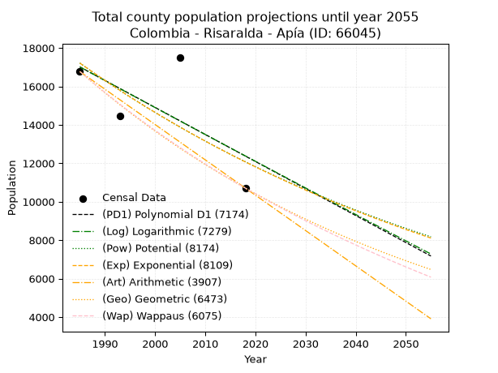
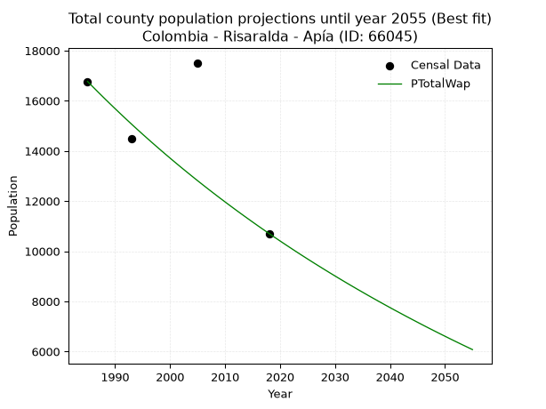
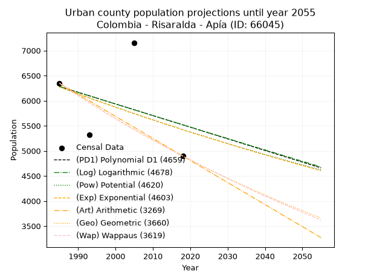
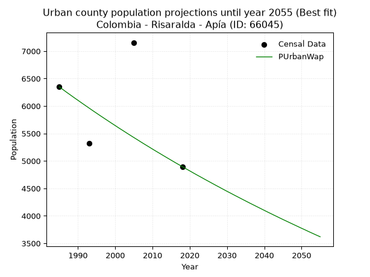
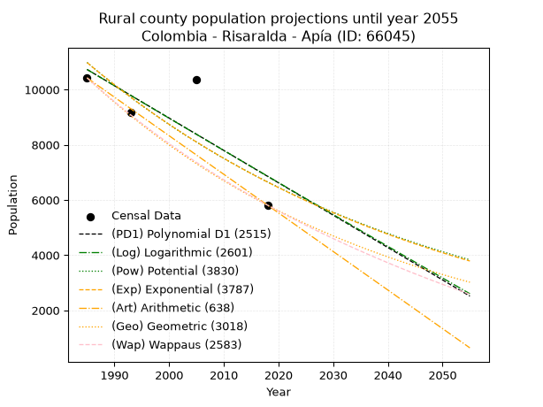
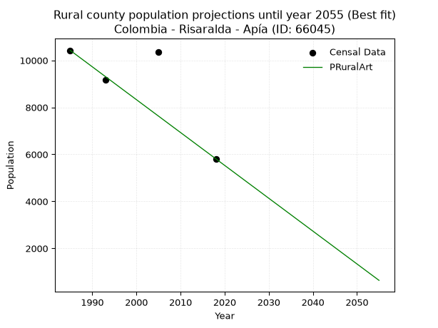

<div align="center">


</div>

# _“Population and Public Services Demand Projections (PPSD) until Year 2050 for Colombia - Risaralda - Apía (ID: 66045)”_
Keywords: `population` `public-service` `projection` `lineal` `polynomial` `logarithmic` `potential` `exponential` `arithmetic` `geometric` `wappaus` `dane` `colombia` `south-america`

PPSD are analytical estimates used by governments and planners to anticipate future changes in population size, age distribution, and the resulting community needs for utilities, healthcare, education, and infrastructure as sizing future water treatment facilities, electrical grids, and road networks based on spatial growth.

> **General running parameters**: • app_version: _v20260806_. • Python version: _3.14.7_. • Pandas version: _3.0.5_. • NumPy version: _2.5.1_. • Creates, save and include plots into reports (create_plot): _False_. • Projection until year: _2050_. • Process polynomial degree 2 and up: _False_. • Process Wappaus: _True_. • Process Wappaus: _True_. • Set negative values to zero: _True_. • Set infinite values to zero: _True_. • Drop dataset notes: _True_. 
<div align="center">

Dynamic map: [:earth_americas:Google](http://maps.google.com/maps?q=5.106525731,-75.9423563) [:earth_americas:OSM](https://www.openstreetmap.org/#map=18/5.106525731/-75.9423563&layers=P) [:earth_americas:Bing](https://www.bing.com/maps?cp=5.106525731~-75.9423563&lvl=18) [:earth_americas:Apple](https://maps.apple.com/frame?center=5.106525731%2C-75.9423563&span=0.003%2C0.006)

</div>


<div align="center">

```geojson
{
  "type": "Feature",
  "geometry": {
    "type": "Point", 
    "coordinates": [-75.9423563, 5.106525731]
  }, 
  "properties": {
    "Name": "Colombia - Risaralda - Apía (ID: 66045)"
  }
}
```

</div>


## 0. Census Data (4 records)

Census data are official statistics collected by a government about the people and housing in a country. They usually include counts of total population, age, sex, race, income, education, and jobs.

📅Global census file: [Population.xlsx](../data/Population.xlsx)

| Source   |   Year |   CountryID | CountryName   |   StateID | StateName   |   CountyID | CountyName   |   PTotal |   PUrban |   PRural |
|:---------|-------:|------------:|:--------------|----------:|:------------|-----------:|:-------------|---------:|---------:|---------:|
| DANE     |   1985 |          57 | Colombia      |        66 | Risaralda   |      66045 | Apía         |    16772 |     6347 |    10425 |
| DANE     |   1993 |          57 | Colombia      |        66 | Risaralda   |      66045 | Apía         |    14481 |     5317 |     9164 |
| DANE     |   2005 |          57 | Colombia      |        66 | Risaralda   |      66045 | Apía         |    17514 |     7156 |    10358 |
| DANE     |   2018 |          57 | Colombia      |        66 | Risaralda   |      66045 | Apía         |    10707 |     4896 |     5811 |

> 🔥Some records could had specific notes about the registered values or the corresponding urban or rural distribution.

## 1. Total

### 1.1. Coefficients and Parameters

* (PD1) Polynomial Deg 1: -140.5371336812484, 295977.9016459171 (lineal)
* (Log) Logarithmic: -280837.65301676444, 2149517.751072139
* (Pow) Potential: -21.487451293902275, 75.09631540737217
* (Exp) Exponential: -0.010752266875335321, 31994615489101.895
* (Art) Arithmetic: Year diff. 2018 - 1985 = 33, Population diff. 10707 - 16772 = -6065, Annual growth = -183.78787878787878
* (Geo) Geometric: Year diff. 2018 - 1985 = 33, Population diff. 10707 - 16772 = -6065, Annual growth % = -0.013508329312869938
* (Wap) Wappaus: i = -1.3376606047372814, Condition values only valid for < 200)

<sub>
Wappaus condition values: ['-0.00', '-1.34', '-2.68', '-4.01', '-5.35', '-6.69', '-8.03', '-9.36', '-10.70', '-12.04', '-13.38', '-14.71', '-16.05', '-17.39', '-18.73', '-20.06', '-21.40', '-22.74', '-24.08', '-25.42', '-26.75', '-28.09', '-29.43', '-30.77', '-32.10', '-33.44', '-34.78', '-36.12', '-37.45', '-38.79', '-40.13', '-41.47', '-42.81', '-44.14', '-45.48', '-46.82', '-48.16', '-49.49', '-50.83', '-52.17', '-53.51', '-54.84', '-56.18', '-57.52', '-58.86', '-60.19', '-61.53', '-62.87', '-64.21', '-65.55', '-66.88', '-68.22', '-69.56', '-70.90', '-72.23', '-73.57', '-74.91', '-76.25', '-77.58', '-78.92', '-80.26', '-81.60', '-82.93', '-84.27', '-85.61', '-86.95']
</sub>


### 1.2. Projected Dataset

|   Year |   CountyID |   PTotalPD1 |   PTotalLog |   PTotalPow |   PTotalExp |   PTotalArt |   PTotalGeo |   PTotalWap |
|-------:|-----------:|------------:|------------:|------------:|------------:|------------:|------------:|------------:|
|   1985 |      66045 |       17012 |       17012 |       17213 |       17212 |       16772 |       16772 |       16772 |
|   1986 |      66045 |       16871 |       16871 |       17027 |       17028 |       16588 |       16545 |       16549 |
|   1987 |      66045 |       16731 |       16730 |       16844 |       16845 |       16404 |       16322 |       16329 |
|   1988 |      66045 |       16590 |       16588 |       16663 |       16665 |       16221 |       16101 |       16112 |
|   1989 |      66045 |       16450 |       16447 |       16484 |       16487 |       16037 |       15884 |       15898 |
|   1990 |      66045 |       16309 |       16306 |       16307 |       16311 |       15853 |       15669 |       15687 |
|   1991 |      66045 |       16168 |       16165 |       16132 |       16136 |       15669 |       15458 |       15478 |
|   1992 |      66045 |       16028 |       16024 |       15959 |       15964 |       15485 |       15249 |       15272 |
|   1993 |      66045 |       15887 |       15883 |       15787 |       15793 |       15302 |       15043 |       15068 |
|   1994 |      66045 |       15747 |       15742 |       15618 |       15624 |       15118 |       14840 |       14867 |
|   1995 |      66045 |       15606 |       15601 |       15451 |       15457 |       14934 |       14639 |       14669 |
|   1996 |      66045 |       15466 |       15460 |       15285 |       15292 |       14750 |       14442 |       14473 |
|   1997 |      66045 |       15325 |       15320 |       15122 |       15128 |       14567 |       14246 |       14280 |
|   1998 |      66045 |       15185 |       15179 |       14960 |       14966 |       14383 |       14054 |       14089 |
|   1999 |      66045 |       15044 |       15039 |       14800 |       14806 |       14199 |       13864 |       13900 |
|   2000 |      66045 |       14904 |       14898 |       14642 |       14648 |       14015 |       13677 |       13714 |
|   2001 |      66045 |       14763 |       14758 |       14485 |       14491 |       13831 |       13492 |       13529 |
|   2002 |      66045 |       14623 |       14617 |       14331 |       14336 |       13648 |       13310 |       13347 |
|   2003 |      66045 |       14482 |       14477 |       14178 |       14183 |       13464 |       13130 |       13168 |
|   2004 |      66045 |       14341 |       14337 |       14026 |       14031 |       13280 |       12953 |       12990 |
|   2005 |      66045 |       14201 |       14197 |       13877 |       13881 |       13096 |       12778 |       12814 |
|   2006 |      66045 |       14060 |       14057 |       13729 |       13733 |       12912 |       12605 |       12641 |
|   2007 |      66045 |       13920 |       13917 |       13583 |       13586 |       12729 |       12435 |       12469 |
|   2008 |      66045 |       13779 |       13777 |       13438 |       13441 |       12545 |       12267 |       12300 |
|   2009 |      66045 |       13639 |       13637 |       13295 |       13297 |       12361 |       12101 |       12132 |
|   2010 |      66045 |       13498 |       13497 |       13154 |       13155 |       12177 |       11938 |       11967 |
|   2011 |      66045 |       13358 |       13358 |       13014 |       13014 |       11994 |       11776 |       11803 |
|   2012 |      66045 |       13217 |       13218 |       12876 |       12875 |       11810 |       11617 |       11641 |
|   2013 |      66045 |       13077 |       13079 |       12739 |       12737 |       11626 |       11460 |       11481 |
|   2014 |      66045 |       12936 |       12939 |       12604 |       12601 |       11442 |       11306 |       11323 |
|   2015 |      66045 |       12796 |       12800 |       12470 |       12466 |       11258 |       11153 |       11166 |
|   2016 |      66045 |       12655 |       12660 |       12338 |       12333 |       11075 |       11002 |       11011 |
|   2017 |      66045 |       12515 |       12521 |       12207 |       12201 |       10891 |       10854 |       10858 |
|   2018 |      66045 |       12374 |       12382 |       12078 |       12070 |       10707 |       10707 |       10707 |
|   2019 |      66045 |       12233 |       12243 |       11950 |       11941 |       10523 |       10562 |       10557 |
|   2020 |      66045 |       12093 |       12104 |       11823 |       11814 |       10339 |       10420 |       10409 |
|   2021 |      66045 |       11952 |       11965 |       11698 |       11687 |       10156 |       10279 |       10263 |
|   2022 |      66045 |       11812 |       11826 |       11575 |       11562 |        9972 |       10140 |       10118 |
|   2023 |      66045 |       11671 |       11687 |       11452 |       11439 |        9788 |       10003 |        9974 |
|   2024 |      66045 |       11531 |       11548 |       11331 |       11316 |        9604 |        9868 |        9832 |
|   2025 |      66045 |       11390 |       11409 |       11212 |       11195 |        9420 |        9735 |        9692 |
|   2026 |      66045 |       11250 |       11271 |       11093 |       11076 |        9237 |        9603 |        9553 |
|   2027 |      66045 |       11109 |       11132 |       10976 |       10957 |        9053 |        9473 |        9416 |
|   2028 |      66045 |       10969 |       10994 |       10861 |       10840 |        8869 |        9345 |        9280 |
|   2029 |      66045 |       10828 |       10855 |       10746 |       10724 |        8685 |        9219 |        9145 |
|   2030 |      66045 |       10688 |       10717 |       10633 |       10609 |        8502 |        9095 |        9012 |
|   2031 |      66045 |       10547 |       10579 |       10521 |       10496 |        8318 |        8972 |        8880 |
|   2032 |      66045 |       10406 |       10440 |       10410 |       10384 |        8134 |        8851 |        8749 |
|   2033 |      66045 |       10266 |       10302 |       10301 |       10273 |        7950 |        8731 |        8620 |
|   2034 |      66045 |       10125 |       10164 |       10193 |       10163 |        7766 |        8613 |        8492 |
|   2035 |      66045 |        9985 |       10026 |       10086 |       10054 |        7583 |        8497 |        8366 |
|   2036 |      66045 |        9844 |        9888 |        9980 |        9946 |        7399 |        8382 |        8240 |
|   2037 |      66045 |        9704 |        9750 |        9875 |        9840 |        7215 |        8269 |        8116 |
|   2038 |      66045 |        9563 |        9612 |        9771 |        9735 |        7031 |        8157 |        7993 |
|   2039 |      66045 |        9423 |        9475 |        9669 |        9631 |        6847 |        8047 |        7872 |
|   2040 |      66045 |        9282 |        9337 |        9567 |        9528 |        6664 |        7938 |        7751 |
|   2041 |      66045 |        9142 |        9199 |        9467 |        9426 |        6480 |        7831 |        7632 |
|   2042 |      66045 |        9001 |        9062 |        9368 |        9325 |        6296 |        7725 |        7514 |
|   2043 |      66045 |        8861 |        8924 |        9270 |        9225 |        6112 |        7621 |        7397 |
|   2044 |      66045 |        8720 |        8787 |        9173 |        9127 |        5929 |        7518 |        7281 |
|   2045 |      66045 |        8579 |        8649 |        9077 |        9029 |        5745 |        7416 |        7166 |
|   2046 |      66045 |        8439 |        8512 |        8982 |        8932 |        5561 |        7316 |        7052 |
|   2047 |      66045 |        8298 |        8375 |        8889 |        8837 |        5377 |        7217 |        6939 |
|   2048 |      66045 |        8158 |        8238 |        8796 |        8742 |        5193 |        7120 |        6828 |
|   2049 |      66045 |        8017 |        8101 |        8704 |        8649 |        5010 |        7024 |        6717 |
|   2050 |      66045 |        7877 |        7964 |        8613 |        8556 |        4826 |        6929 |        6608 |
<div align="center">

</img>

</div>


### 1.3. Best fit with absolute and relative error (%)

Relative error puts that difference into context by dividing the absolute error by the true value, creating a unitless ratio or percentage that shows the scale of the mistake.

Absolute and relative error

|   Year | Source   |   CountryID | CountryName   |   StateID | StateName   |   CountyID_x | CountyName   |   PTotal |   PUrban |   PRural |   CountyID_y |   PTotalPD1 |   PTotalLog |   PTotalPow |   PTotalExp |   PTotalArt |   PTotalGeo |   PTotalWap |   PTotalPD1AbsError |   PTotalLogAbsError |   PTotalPowAbsError |   PTotalExpAbsError |   PTotalArtAbsError |   PTotalGeoAbsError |   PTotalWapAbsError |   PTotalPD1RelError |   PTotalLogRelError |   PTotalPowRelError |   PTotalExpRelError |   PTotalArtRelError |   PTotalGeoRelError |   PTotalWapRelError |
|-------:|:---------|------------:|:--------------|----------:|:------------|-------------:|:-------------|---------:|---------:|---------:|-------------:|------------:|------------:|------------:|------------:|------------:|------------:|------------:|--------------------:|--------------------:|--------------------:|--------------------:|--------------------:|--------------------:|--------------------:|--------------------:|--------------------:|--------------------:|--------------------:|--------------------:|--------------------:|--------------------:|
|   1985 | DANE     |          57 | Colombia      |        66 | Risaralda   |        66045 | Apía         |    16772 |     6347 |    10425 |        66045 |       17012 |       17012 |       17213 |       17212 |       16772 |       16772 |       16772 |                 240 |                 240 |                 441 |                 440 |                   0 |                   0 |                   0 |             1.43096 |             1.43096 |             2.62938 |             2.62342 |              0      |             0       |             0       |
|   1993 | DANE     |          57 | Colombia      |        66 | Risaralda   |        66045 | Apía         |    14481 |     5317 |     9164 |        66045 |       15887 |       15883 |       15787 |       15793 |       15302 |       15043 |       15068 |                1406 |                1402 |                1306 |                1312 |                 821 |                 562 |                 587 |             9.70927 |             9.68165 |             9.01871 |             9.06015 |              5.6695 |             3.88095 |             4.05359 |
|   2005 | DANE     |          57 | Colombia      |        66 | Risaralda   |        66045 | Apía         |    17514 |     7156 |    10358 |        66045 |       14201 |       14197 |       13877 |       13881 |       13096 |       12778 |       12814 |                3313 |                3317 |                3637 |                3633 |                4418 |                4736 |                4700 |            18.9163  |            18.9391  |            20.7662  |            20.7434  |             25.2255 |            27.0412  |            26.8357  |
|   2018 | DANE     |          57 | Colombia      |        66 | Risaralda   |        66045 | Apía         |    10707 |     4896 |     5811 |        66045 |       12374 |       12382 |       12078 |       12070 |       10707 |       10707 |       10707 |                1667 |                1675 |                1371 |                1363 |                   0 |                   0 |                   0 |            15.5693  |            15.644   |            12.8047  |            12.73    |              0      |             0       |             0       |

Relative error mean

| Method    |   RelError | Best   |
|:----------|-----------:|:-------|
| PTotalPD1 |   11.4064  |        |
| PTotalLog |   11.4239  |        |
| PTotalPow |   11.3048  |        |
| PTotalExp |   11.2892  |        |
| PTotalArt |    7.72376 |        |
| PTotalGeo |    7.73054 |        |
| PTotalWap |    7.72232 | True   |

💙Best method: _**PTotalWap**_
<div align="center">

</img>

</div>


### 1.4. Fresh water supply demand in liters per capita per day (lpcd)

The fresh water supply demand typically ranges from 100 to 300 liters per capita per day (lpcd) for standard domestic and municipal planning, though absolute survival minimums set by the World Health Organization are as low as 7.5 to 20 liters per day, and total consumption in high-income nations can exceed 400 liters.

> `CZ`: Level in meters above the sea level (masl).<br> `WS`: Fresh water supply demand in liters per capita per day (lpcd or l/h/d).<br> `WSAll`: Zonal fresh water supply demand in liters per second (l/s).<br> `A`: Zonal area in square meters.

Reference values (RAS Colombia)

|    CZ |   WS |
|------:|-----:|
|  1000 |  120 |
|  2000 |  130 |
| 99999 |  140 |

County shapefile geometry properties and water supply values

|   CountyID |     ATotal |   CZTotal |   WSTotal |
|-----------:|-----------:|----------:|----------:|
|      66045 | 1.4998e+08 |   1911.86 |       130 |

Projected values for best method: PTotalWap

|   CountyID |   Year |   PTotalWap |   WSTotal |   WSTotalAll |
|-----------:|-------:|------------:|----------:|-------------:|
|      66045 |   1985 |       16772 |       130 |     25.2356  |
|      66045 |   1986 |       16549 |       130 |     24.9001  |
|      66045 |   1987 |       16329 |       130 |     24.5691  |
|      66045 |   1988 |       16112 |       130 |     24.2426  |
|      66045 |   1989 |       15898 |       130 |     23.9206  |
|      66045 |   1990 |       15687 |       130 |     23.6031  |
|      66045 |   1991 |       15478 |       130 |     23.2887  |
|      66045 |   1992 |       15272 |       130 |     22.9787  |
|      66045 |   1993 |       15068 |       130 |     22.6718  |
|      66045 |   1994 |       14867 |       130 |     22.3693  |
|      66045 |   1995 |       14669 |       130 |     22.0714  |
|      66045 |   1996 |       14473 |       130 |     21.7765  |
|      66045 |   1997 |       14280 |       130 |     21.4861  |
|      66045 |   1998 |       14089 |       130 |     21.1987  |
|      66045 |   1999 |       13900 |       130 |     20.9144  |
|      66045 |   2000 |       13714 |       130 |     20.6345  |
|      66045 |   2001 |       13529 |       130 |     20.3561  |
|      66045 |   2002 |       13347 |       130 |     20.0823  |
|      66045 |   2003 |       13168 |       130 |     19.813   |
|      66045 |   2004 |       12990 |       130 |     19.5451  |
|      66045 |   2005 |       12814 |       130 |     19.2803  |
|      66045 |   2006 |       12641 |       130 |     19.02    |
|      66045 |   2007 |       12469 |       130 |     18.7612  |
|      66045 |   2008 |       12300 |       130 |     18.5069  |
|      66045 |   2009 |       12132 |       130 |     18.2542  |
|      66045 |   2010 |       11967 |       130 |     18.0059  |
|      66045 |   2011 |       11803 |       130 |     17.7591  |
|      66045 |   2012 |       11641 |       130 |     17.5154  |
|      66045 |   2013 |       11481 |       130 |     17.2747  |
|      66045 |   2014 |       11323 |       130 |     17.0369  |
|      66045 |   2015 |       11166 |       130 |     16.8007  |
|      66045 |   2016 |       11011 |       130 |     16.5675  |
|      66045 |   2017 |       10858 |       130 |     16.3373  |
|      66045 |   2018 |       10707 |       130 |     16.1101  |
|      66045 |   2019 |       10557 |       130 |     15.8844  |
|      66045 |   2020 |       10409 |       130 |     15.6617  |
|      66045 |   2021 |       10263 |       130 |     15.442   |
|      66045 |   2022 |       10118 |       130 |     15.2238  |
|      66045 |   2023 |        9974 |       130 |     15.0072  |
|      66045 |   2024 |        9832 |       130 |     14.7935  |
|      66045 |   2025 |        9692 |       130 |     14.5829  |
|      66045 |   2026 |        9553 |       130 |     14.3737  |
|      66045 |   2027 |        9416 |       130 |     14.1676  |
|      66045 |   2028 |        9280 |       130 |     13.963   |
|      66045 |   2029 |        9145 |       130 |     13.7598  |
|      66045 |   2030 |        9012 |       130 |     13.5597  |
|      66045 |   2031 |        8880 |       130 |     13.3611  |
|      66045 |   2032 |        8749 |       130 |     13.164   |
|      66045 |   2033 |        8620 |       130 |     12.9699  |
|      66045 |   2034 |        8492 |       130 |     12.7773  |
|      66045 |   2035 |        8366 |       130 |     12.5877  |
|      66045 |   2036 |        8240 |       130 |     12.3981  |
|      66045 |   2037 |        8116 |       130 |     12.2116  |
|      66045 |   2038 |        7993 |       130 |     12.0265  |
|      66045 |   2039 |        7872 |       130 |     11.8444  |
|      66045 |   2040 |        7751 |       130 |     11.6624  |
|      66045 |   2041 |        7632 |       130 |     11.4833  |
|      66045 |   2042 |        7514 |       130 |     11.3058  |
|      66045 |   2043 |        7397 |       130 |     11.1297  |
|      66045 |   2044 |        7281 |       130 |     10.9552  |
|      66045 |   2045 |        7166 |       130 |     10.7822  |
|      66045 |   2046 |        7052 |       130 |     10.6106  |
|      66045 |   2047 |        6939 |       130 |     10.4406  |
|      66045 |   2048 |        6828 |       130 |     10.2736  |
|      66045 |   2049 |        6717 |       130 |     10.1066  |
|      66045 |   2050 |        6608 |       130 |      9.94259 |

## 2. Urban

### 2.1. Coefficients and Parameters

* (PD1) Polynomial Deg 1: -23.19550381372814, 52325.80650340971 (lineal)
* (Log) Logarithmic: -46275.39877368218, 357668.6769065312
* (Pow) Potential: -8.825624231442054, 32.90224162321928
* (Exp) Exponential: -0.0044217169103704535, 40674415.069518924
* (Art) Arithmetic: Year diff. 2018 - 1985 = 33, Population diff. 4896 - 6347 = -1451, Annual growth = -43.96969696969697
* (Geo) Geometric: Year diff. 2018 - 1985 = 33, Population diff. 4896 - 6347 = -1451, Annual growth % = -0.007834714495714379
* (Wap) Wappaus: i = -0.7821701853543889, Condition values only valid for < 200)

<sub>
Wappaus condition values: ['-0.00', '-0.78', '-1.56', '-2.35', '-3.13', '-3.91', '-4.69', '-5.48', '-6.26', '-7.04', '-7.82', '-8.60', '-9.39', '-10.17', '-10.95', '-11.73', '-12.51', '-13.30', '-14.08', '-14.86', '-15.64', '-16.43', '-17.21', '-17.99', '-18.77', '-19.55', '-20.34', '-21.12', '-21.90', '-22.68', '-23.47', '-24.25', '-25.03', '-25.81', '-26.59', '-27.38', '-28.16', '-28.94', '-29.72', '-30.50', '-31.29', '-32.07', '-32.85', '-33.63', '-34.42', '-35.20', '-35.98', '-36.76', '-37.54', '-38.33', '-39.11', '-39.89', '-40.67', '-41.46', '-42.24', '-43.02', '-43.80', '-44.58', '-45.37', '-46.15', '-46.93', '-47.71', '-48.49', '-49.28', '-50.06', '-50.84']
</sub>


### 2.2. Projected Dataset

|   Year |   CountyID |   PUrbanPD1 |   PUrbanLog |   PUrbanPow |   PUrbanExp |   PUrbanArt |   PUrbanGeo |   PUrbanWap |
|-------:|-----------:|------------:|------------:|------------:|------------:|------------:|------------:|------------:|
|   1985 |      66045 |        6283 |        6282 |        6273 |        6273 |        6347 |        6347 |        6347 |
|   1986 |      66045 |        6260 |        6259 |        6245 |        6245 |        6303 |        6297 |        6298 |
|   1987 |      66045 |        6236 |        6236 |        6217 |        6218 |        6259 |        6248 |        6248 |
|   1988 |      66045 |        6213 |        6212 |        6190 |        6190 |        6215 |        6199 |        6200 |
|   1989 |      66045 |        6190 |        6189 |        6162 |        6163 |        6171 |        6150 |        6151 |
|   1990 |      66045 |        6167 |        6166 |        6135 |        6136 |        6127 |        6102 |        6104 |
|   1991 |      66045 |        6144 |        6143 |        6108 |        6109 |        6083 |        6054 |        6056 |
|   1992 |      66045 |        6120 |        6119 |        6081 |        6082 |        6039 |        6007 |        6009 |
|   1993 |      66045 |        6097 |        6096 |        6054 |        6055 |        5995 |        5960 |        5962 |
|   1994 |      66045 |        6074 |        6073 |        6027 |        6028 |        5951 |        5913 |        5915 |
|   1995 |      66045 |        6051 |        6050 |        6000 |        6002 |        5907 |        5867 |        5869 |
|   1996 |      66045 |        6028 |        6027 |        5974 |        5975 |        5863 |        5821 |        5823 |
|   1997 |      66045 |        6004 |        6003 |        5948 |        5949 |        5819 |        5775 |        5778 |
|   1998 |      66045 |        5981 |        5980 |        5921 |        5923 |        5775 |        5730 |        5733 |
|   1999 |      66045 |        5958 |        5957 |        5895 |        5896 |        5731 |        5685 |        5688 |
|   2000 |      66045 |        5935 |        5934 |        5869 |        5870 |        5687 |        5641 |        5644 |
|   2001 |      66045 |        5912 |        5911 |        5844 |        5844 |        5643 |        5596 |        5599 |
|   2002 |      66045 |        5888 |        5888 |        5818 |        5819 |        5600 |        5553 |        5556 |
|   2003 |      66045 |        5865 |        5865 |        5792 |        5793 |        5556 |        5509 |        5512 |
|   2004 |      66045 |        5842 |        5841 |        5767 |        5767 |        5512 |        5466 |        5469 |
|   2005 |      66045 |        5819 |        5818 |        5741 |        5742 |        5468 |        5423 |        5426 |
|   2006 |      66045 |        5796 |        5795 |        5716 |        5717 |        5424 |        5381 |        5384 |
|   2007 |      66045 |        5772 |        5772 |        5691 |        5691 |        5380 |        5338 |        5341 |
|   2008 |      66045 |        5749 |        5749 |        5666 |        5666 |        5336 |        5297 |        5299 |
|   2009 |      66045 |        5726 |        5726 |        5641 |        5641 |        5292 |        5255 |        5258 |
|   2010 |      66045 |        5703 |        5703 |        5617 |        5616 |        5248 |        5214 |        5216 |
|   2011 |      66045 |        5680 |        5680 |        5592 |        5592 |        5204 |        5173 |        5175 |
|   2012 |      66045 |        5656 |        5657 |        5568 |        5567 |        5160 |        5133 |        5135 |
|   2013 |      66045 |        5633 |        5634 |        5543 |        5542 |        5116 |        5092 |        5094 |
|   2014 |      66045 |        5610 |        5611 |        5519 |        5518 |        5072 |        5052 |        5054 |
|   2015 |      66045 |        5587 |        5588 |        5495 |        5494 |        5028 |        5013 |        5014 |
|   2016 |      66045 |        5564 |        5565 |        5471 |        5469 |        4984 |        4974 |        4974 |
|   2017 |      66045 |        5540 |        5542 |        5447 |        5445 |        4940 |        4935 |        4935 |
|   2018 |      66045 |        5517 |        5519 |        5423 |        5421 |        4896 |        4896 |        4896 |
|   2019 |      66045 |        5494 |        5496 |        5399 |        5397 |        4852 |        4858 |        4857 |
|   2020 |      66045 |        5471 |        5473 |        5376 |        5374 |        4808 |        4820 |        4819 |
|   2021 |      66045 |        5448 |        5451 |        5352 |        5350 |        4764 |        4782 |        4780 |
|   2022 |      66045 |        5424 |        5428 |        5329 |        5326 |        4720 |        4744 |        4742 |
|   2023 |      66045 |        5401 |        5405 |        5306 |        5303 |        4676 |        4707 |        4705 |
|   2024 |      66045 |        5378 |        5382 |        5283 |        5279 |        4632 |        4670 |        4667 |
|   2025 |      66045 |        5355 |        5359 |        5260 |        5256 |        4588 |        4634 |        4630 |
|   2026 |      66045 |        5332 |        5336 |        5237 |        5233 |        4544 |        4597 |        4593 |
|   2027 |      66045 |        5309 |        5313 |        5214 |        5210 |        4500 |        4561 |        4556 |
|   2028 |      66045 |        5285 |        5291 |        5192 |        5187 |        4456 |        4526 |        4520 |
|   2029 |      66045 |        5262 |        5268 |        5169 |        5164 |        4412 |        4490 |        4483 |
|   2030 |      66045 |        5239 |        5245 |        5147 |        5141 |        4368 |        4455 |        4447 |
|   2031 |      66045 |        5216 |        5222 |        5124 |        5118 |        4324 |        4420 |        4412 |
|   2032 |      66045 |        5193 |        5199 |        5102 |        5096 |        4280 |        4385 |        4376 |
|   2033 |      66045 |        5169 |        5177 |        5080 |        5073 |        4236 |        4351 |        4341 |
|   2034 |      66045 |        5146 |        5154 |        5058 |        5051 |        4192 |        4317 |        4306 |
|   2035 |      66045 |        5123 |        5131 |        5036 |        5029 |        4149 |        4283 |        4271 |
|   2036 |      66045 |        5100 |        5108 |        5014 |        5007 |        4105 |        4250 |        4236 |
|   2037 |      66045 |        5077 |        5086 |        4993 |        4984 |        4061 |        4216 |        4202 |
|   2038 |      66045 |        5053 |        5063 |        4971 |        4962 |        4017 |        4183 |        4168 |
|   2039 |      66045 |        5030 |        5040 |        4950 |        4941 |        3973 |        4151 |        4134 |
|   2040 |      66045 |        5007 |        5018 |        4928 |        4919 |        3929 |        4118 |        4100 |
|   2041 |      66045 |        4984 |        4995 |        4907 |        4897 |        3885 |        4086 |        4066 |
|   2042 |      66045 |        4961 |        4972 |        4886 |        4875 |        3841 |        4054 |        4033 |
|   2043 |      66045 |        4937 |        4950 |        4865 |        4854 |        3797 |        4022 |        4000 |
|   2044 |      66045 |        4914 |        4927 |        4844 |        4833 |        3753 |        3990 |        3967 |
|   2045 |      66045 |        4891 |        4904 |        4823 |        4811 |        3709 |        3959 |        3934 |
|   2046 |      66045 |        4868 |        4882 |        4802 |        4790 |        3665 |        3928 |        3902 |
|   2047 |      66045 |        4845 |        4859 |        4781 |        4769 |        3621 |        3897 |        3870 |
|   2048 |      66045 |        4821 |        4836 |        4761 |        4748 |        3577 |        3867 |        3838 |
|   2049 |      66045 |        4798 |        4814 |        4740 |        4727 |        3533 |        3837 |        3806 |
|   2050 |      66045 |        4775 |        4791 |        4720 |        4706 |        3489 |        3807 |        3774 |
<div align="center">

</img>

</div>


### 2.3. Best fit with absolute and relative error (%)

Relative error puts that difference into context by dividing the absolute error by the true value, creating a unitless ratio or percentage that shows the scale of the mistake.

Absolute and relative error

|   Year | Source   |   CountryID | CountryName   |   StateID | StateName   |   CountyID_x | CountyName   |   PTotal |   PUrban |   PRural |   CountyID_y |   PUrbanPD1 |   PUrbanLog |   PUrbanPow |   PUrbanExp |   PUrbanArt |   PUrbanGeo |   PUrbanWap |   PUrbanPD1AbsError |   PUrbanLogAbsError |   PUrbanPowAbsError |   PUrbanExpAbsError |   PUrbanArtAbsError |   PUrbanGeoAbsError |   PUrbanWapAbsError |   PUrbanPD1RelError |   PUrbanLogRelError |   PUrbanPowRelError |   PUrbanExpRelError |   PUrbanArtRelError |   PUrbanGeoRelError |   PUrbanWapRelError |
|-------:|:---------|------------:|:--------------|----------:|:------------|-------------:|:-------------|---------:|---------:|---------:|-------------:|------------:|------------:|------------:|------------:|------------:|------------:|------------:|--------------------:|--------------------:|--------------------:|--------------------:|--------------------:|--------------------:|--------------------:|--------------------:|--------------------:|--------------------:|--------------------:|--------------------:|--------------------:|--------------------:|
|   1985 | DANE     |          57 | Colombia      |        66 | Risaralda   |        66045 | Apía         |    16772 |     6347 |    10425 |        66045 |        6283 |        6282 |        6273 |        6273 |        6347 |        6347 |        6347 |                  64 |                  65 |                  74 |                  74 |                   0 |                   0 |                   0 |             1.00835 |             1.02411 |             1.16591 |             1.16591 |              0      |              0      |              0      |
|   1993 | DANE     |          57 | Colombia      |        66 | Risaralda   |        66045 | Apía         |    14481 |     5317 |     9164 |        66045 |        6097 |        6096 |        6054 |        6055 |        5995 |        5960 |        5962 |                 780 |                 779 |                 737 |                 738 |                 678 |                 643 |                 645 |            14.6699  |            14.6511  |            13.8612  |            13.88    |             12.7516 |             12.0933 |             12.1309 |
|   2005 | DANE     |          57 | Colombia      |        66 | Risaralda   |        66045 | Apía         |    17514 |     7156 |    10358 |        66045 |        5819 |        5818 |        5741 |        5742 |        5468 |        5423 |        5426 |                1337 |                1338 |                1415 |                1414 |                1688 |                1733 |                1730 |            18.6836  |            18.6976  |            19.7736  |            19.7596  |             23.5886 |             24.2174 |             24.1755 |
|   2018 | DANE     |          57 | Colombia      |        66 | Risaralda   |        66045 | Apía         |    10707 |     4896 |     5811 |        66045 |        5517 |        5519 |        5423 |        5421 |        4896 |        4896 |        4896 |                 621 |                 623 |                 527 |                 525 |                   0 |                   0 |                   0 |            12.6838  |            12.7247  |            10.7639  |            10.723   |              0      |              0      |              0      |

Relative error mean

| Method    |   RelError | Best   |
|:----------|-----------:|:-------|
| PUrbanPD1 |   11.7614  |        |
| PUrbanLog |   11.7744  |        |
| PUrbanPow |   11.3912  |        |
| PUrbanExp |   11.3821  |        |
| PUrbanArt |    9.08504 |        |
| PUrbanGeo |    9.07768 |        |
| PUrbanWap |    9.0766  | True   |

💙Best method: _**PUrbanWap**_
<div align="center">

</img>

</div>


### 2.4. Fresh water supply demand in liters per capita per day (lpcd)

The fresh water supply demand typically ranges from 100 to 300 liters per capita per day (lpcd) for standard domestic and municipal planning, though absolute survival minimums set by the World Health Organization are as low as 7.5 to 20 liters per day, and total consumption in high-income nations can exceed 400 liters.

> `CZ`: Level in meters above the sea level (masl).<br> `WS`: Fresh water supply demand in liters per capita per day (lpcd or l/h/d).<br> `WSAll`: Zonal fresh water supply demand in liters per second (l/s).<br> `A`: Zonal area in square meters.

Reference values (RAS Colombia)

|    CZ |   WS |
|------:|-----:|
|  1000 |  120 |
|  2000 |  130 |
| 99999 |  140 |

County shapefile geometry properties and water supply values

|   CountyID |   AUrban |   CZUrban |   WSUrban |
|-----------:|---------:|----------:|----------:|
|      66045 |   746345 |    1616.4 |       130 |

Projected values for best method: PUrbanWap

|   CountyID |   Year |   PUrbanWap |   WSUrban |   WSUrbanAll |
|-----------:|-------:|------------:|----------:|-------------:|
|      66045 |   1985 |        6347 |       130 |      9.54988 |
|      66045 |   1986 |        6298 |       130 |      9.47616 |
|      66045 |   1987 |        6248 |       130 |      9.40093 |
|      66045 |   1988 |        6200 |       130 |      9.3287  |
|      66045 |   1989 |        6151 |       130 |      9.25498 |
|      66045 |   1990 |        6104 |       130 |      9.18426 |
|      66045 |   1991 |        6056 |       130 |      9.11204 |
|      66045 |   1992 |        6009 |       130 |      9.04132 |
|      66045 |   1993 |        5962 |       130 |      8.9706  |
|      66045 |   1994 |        5915 |       130 |      8.89988 |
|      66045 |   1995 |        5869 |       130 |      8.83067 |
|      66045 |   1996 |        5823 |       130 |      8.76146 |
|      66045 |   1997 |        5778 |       130 |      8.69375 |
|      66045 |   1998 |        5733 |       130 |      8.62604 |
|      66045 |   1999 |        5688 |       130 |      8.55833 |
|      66045 |   2000 |        5644 |       130 |      8.49213 |
|      66045 |   2001 |        5599 |       130 |      8.42442 |
|      66045 |   2002 |        5556 |       130 |      8.35972 |
|      66045 |   2003 |        5512 |       130 |      8.29352 |
|      66045 |   2004 |        5469 |       130 |      8.22882 |
|      66045 |   2005 |        5426 |       130 |      8.16412 |
|      66045 |   2006 |        5384 |       130 |      8.10093 |
|      66045 |   2007 |        5341 |       130 |      8.03623 |
|      66045 |   2008 |        5299 |       130 |      7.97303 |
|      66045 |   2009 |        5258 |       130 |      7.91134 |
|      66045 |   2010 |        5216 |       130 |      7.84815 |
|      66045 |   2011 |        5175 |       130 |      7.78646 |
|      66045 |   2012 |        5135 |       130 |      7.72627 |
|      66045 |   2013 |        5094 |       130 |      7.66458 |
|      66045 |   2014 |        5054 |       130 |      7.6044  |
|      66045 |   2015 |        5014 |       130 |      7.54421 |
|      66045 |   2016 |        4974 |       130 |      7.48403 |
|      66045 |   2017 |        4935 |       130 |      7.42535 |
|      66045 |   2018 |        4896 |       130 |      7.36667 |
|      66045 |   2019 |        4857 |       130 |      7.30799 |
|      66045 |   2020 |        4819 |       130 |      7.25081 |
|      66045 |   2021 |        4780 |       130 |      7.19213 |
|      66045 |   2022 |        4742 |       130 |      7.13495 |
|      66045 |   2023 |        4705 |       130 |      7.07928 |
|      66045 |   2024 |        4667 |       130 |      7.02211 |
|      66045 |   2025 |        4630 |       130 |      6.96644 |
|      66045 |   2026 |        4593 |       130 |      6.91076 |
|      66045 |   2027 |        4556 |       130 |      6.85509 |
|      66045 |   2028 |        4520 |       130 |      6.80093 |
|      66045 |   2029 |        4483 |       130 |      6.74525 |
|      66045 |   2030 |        4447 |       130 |      6.69109 |
|      66045 |   2031 |        4412 |       130 |      6.63843 |
|      66045 |   2032 |        4376 |       130 |      6.58426 |
|      66045 |   2033 |        4341 |       130 |      6.5316  |
|      66045 |   2034 |        4306 |       130 |      6.47894 |
|      66045 |   2035 |        4271 |       130 |      6.42627 |
|      66045 |   2036 |        4236 |       130 |      6.37361 |
|      66045 |   2037 |        4202 |       130 |      6.32245 |
|      66045 |   2038 |        4168 |       130 |      6.2713  |
|      66045 |   2039 |        4134 |       130 |      6.22014 |
|      66045 |   2040 |        4100 |       130 |      6.16898 |
|      66045 |   2041 |        4066 |       130 |      6.11782 |
|      66045 |   2042 |        4033 |       130 |      6.06817 |
|      66045 |   2043 |        4000 |       130 |      6.01852 |
|      66045 |   2044 |        3967 |       130 |      5.96887 |
|      66045 |   2045 |        3934 |       130 |      5.91921 |
|      66045 |   2046 |        3902 |       130 |      5.87106 |
|      66045 |   2047 |        3870 |       130 |      5.82292 |
|      66045 |   2048 |        3838 |       130 |      5.77477 |
|      66045 |   2049 |        3806 |       130 |      5.72662 |
|      66045 |   2050 |        3774 |       130 |      5.67847 |

## 3. Rural

### 3.1. Coefficients and Parameters

* (PD1) Polynomial Deg 1: -117.34162986752031, 243652.09514250752 (lineal)
* (Log) Logarithmic: -234562.25424308234, 1791849.074165608
* (Pow) Potential: -30.396384738975033, 104.28069318054742
* (Exp) Exponential: -0.015206723813845476, 1.4124253739916254e+17
* (Art) Arithmetic: Year diff. 2018 - 1985 = 33, Population diff. 5811 - 10425 = -4614, Annual growth = -139.8181818181818
* (Geo) Geometric: Year diff. 2018 - 1985 = 33, Population diff. 5811 - 10425 = -4614, Annual growth % = -0.01755481696040251
* (Wap) Wappaus: i = -1.7223230083540504, Condition values only valid for < 200)

<sub>
Wappaus condition values: ['-0.00', '-1.72', '-3.44', '-5.17', '-6.89', '-8.61', '-10.33', '-12.06', '-13.78', '-15.50', '-17.22', '-18.95', '-20.67', '-22.39', '-24.11', '-25.83', '-27.56', '-29.28', '-31.00', '-32.72', '-34.45', '-36.17', '-37.89', '-39.61', '-41.34', '-43.06', '-44.78', '-46.50', '-48.23', '-49.95', '-51.67', '-53.39', '-55.11', '-56.84', '-58.56', '-60.28', '-62.00', '-63.73', '-65.45', '-67.17', '-68.89', '-70.62', '-72.34', '-74.06', '-75.78', '-77.50', '-79.23', '-80.95', '-82.67', '-84.39', '-86.12', '-87.84', '-89.56', '-91.28', '-93.01', '-94.73', '-96.45', '-98.17', '-99.89', '-101.62', '-103.34', '-105.06', '-106.78', '-108.51', '-110.23', '-111.95']
</sub>


### 3.2. Projected Dataset

|   Year |   CountyID |   PRuralPD1 |   PRuralLog |   PRuralPow |   PRuralExp |   PRuralArt |   PRuralGeo |   PRuralWap |
|-------:|-----------:|------------:|------------:|------------:|------------:|------------:|------------:|------------:|
|   1985 |      66045 |       10729 |       10730 |       10982 |       10981 |       10425 |       10425 |       10425 |
|   1986 |      66045 |       10612 |       10612 |       10816 |       10815 |       10285 |       10242 |       10247 |
|   1987 |      66045 |       10494 |       10494 |       10651 |       10652 |       10145 |       10062 |       10072 |
|   1988 |      66045 |       10377 |       10376 |       10490 |       10491 |       10006 |        9886 |        9900 |
|   1989 |      66045 |       10260 |       10258 |       10330 |       10333 |        9866 |        9712 |        9731 |
|   1990 |      66045 |       10142 |       10140 |       10174 |       10177 |        9726 |        9542 |        9564 |
|   1991 |      66045 |       10025 |       10022 |       10020 |       10023 |        9586 |        9374 |        9401 |
|   1992 |      66045 |        9908 |        9904 |        9868 |        9872 |        9446 |        9209 |        9240 |
|   1993 |      66045 |        9790 |        9787 |        9719 |        9723 |        9306 |        9048 |        9081 |
|   1994 |      66045 |        9673 |        9669 |        9571 |        9576 |        9167 |        8889 |        8925 |
|   1995 |      66045 |        9556 |        9551 |        9427 |        9432 |        9027 |        8733 |        8772 |
|   1996 |      66045 |        9438 |        9434 |        9284 |        9289 |        8887 |        8580 |        8621 |
|   1997 |      66045 |        9321 |        9316 |        9144 |        9149 |        8747 |        8429 |        8472 |
|   1998 |      66045 |        9204 |        9199 |        9006 |        9011 |        8607 |        8281 |        8326 |
|   1999 |      66045 |        9086 |        9082 |        8870 |        8875 |        8468 |        8136 |        8182 |
|   2000 |      66045 |        8969 |        8964 |        8736 |        8741 |        8328 |        7993 |        8040 |
|   2001 |      66045 |        8851 |        8847 |        8604 |        8609 |        8188 |        7853 |        7900 |
|   2002 |      66045 |        8734 |        8730 |        8475 |        8479 |        8048 |        7715 |        7762 |
|   2003 |      66045 |        8617 |        8613 |        8347 |        8351 |        7908 |        7579 |        7627 |
|   2004 |      66045 |        8499 |        8496 |        8221 |        8225 |        7768 |        7446 |        7493 |
|   2005 |      66045 |        8382 |        8379 |        8098 |        8101 |        7629 |        7315 |        7362 |
|   2006 |      66045 |        8265 |        8262 |        7976 |        7979 |        7489 |        7187 |        7232 |
|   2007 |      66045 |        8147 |        8145 |        7856 |        7859 |        7349 |        7061 |        7104 |
|   2008 |      66045 |        8030 |        8028 |        7738 |        7740 |        7209 |        6937 |        6978 |
|   2009 |      66045 |        7913 |        7911 |        7622 |        7623 |        7069 |        6815 |        6854 |
|   2010 |      66045 |        7795 |        7794 |        7507 |        7508 |        6930 |        6696 |        6731 |
|   2011 |      66045 |        7678 |        7678 |        7395 |        7395 |        6790 |        6578 |        6611 |
|   2012 |      66045 |        7561 |        7561 |        7284 |        7283 |        6650 |        6463 |        6492 |
|   2013 |      66045 |        7443 |        7445 |        7174 |        7173 |        6510 |        6349 |        6374 |
|   2014 |      66045 |        7326 |        7328 |        7067 |        7065 |        6370 |        6238 |        6259 |
|   2015 |      66045 |        7209 |        7212 |        6961 |        6958 |        6230 |        6128 |        6144 |
|   2016 |      66045 |        7091 |        7095 |        6857 |        6853 |        6091 |        6021 |        6032 |
|   2017 |      66045 |        6974 |        6979 |        6754 |        6750 |        5951 |        5915 |        5921 |
|   2018 |      66045 |        6857 |        6863 |        6653 |        6648 |        5811 |        5811 |        5811 |
|   2019 |      66045 |        6739 |        6746 |        6554 |        6548 |        5671 |        5709 |        5703 |
|   2020 |      66045 |        6622 |        6630 |        6456 |        6449 |        5531 |        5609 |        5596 |
|   2021 |      66045 |        6505 |        6514 |        6360 |        6352 |        5392 |        5510 |        5491 |
|   2022 |      66045 |        6387 |        6398 |        6265 |        6256 |        5252 |        5414 |        5387 |
|   2023 |      66045 |        6270 |        6282 |        6171 |        6161 |        5112 |        5319 |        5284 |
|   2024 |      66045 |        6153 |        6166 |        6079 |        6068 |        4972 |        5225 |        5183 |
|   2025 |      66045 |        6035 |        6050 |        5989 |        5977 |        4832 |        5133 |        5083 |
|   2026 |      66045 |        5918 |        5935 |        5899 |        5887 |        4692 |        5043 |        4984 |
|   2027 |      66045 |        5801 |        5819 |        5812 |        5798 |        4553 |        4955 |        4887 |
|   2028 |      66045 |        5683 |        5703 |        5725 |        5710 |        4413 |        4868 |        4791 |
|   2029 |      66045 |        5566 |        5588 |        5640 |        5624 |        4273 |        4782 |        4696 |
|   2030 |      66045 |        5449 |        5472 |        5556 |        5539 |        4133 |        4698 |        4602 |
|   2031 |      66045 |        5331 |        5356 |        5474 |        5456 |        3993 |        4616 |        4509 |
|   2032 |      66045 |        5214 |        5241 |        5392 |        5373 |        3854 |        4535 |        4418 |
|   2033 |      66045 |        5097 |        5126 |        5312 |        5292 |        3714 |        4455 |        4327 |
|   2034 |      66045 |        4979 |        5010 |        5233 |        5212 |        3574 |        4377 |        4238 |
|   2035 |      66045 |        4862 |        4895 |        5156 |        5134 |        3434 |        4300 |        4150 |
|   2036 |      66045 |        4745 |        4780 |        5079 |        5056 |        3294 |        4225 |        4062 |
|   2037 |      66045 |        4627 |        4665 |        5004 |        4980 |        3154 |        4151 |        3976 |
|   2038 |      66045 |        4510 |        4549 |        4930 |        4905 |        3015 |        4078 |        3891 |
|   2039 |      66045 |        4393 |        4434 |        4857 |        4831 |        2875 |        4006 |        3807 |
|   2040 |      66045 |        4275 |        4319 |        4785 |        4758 |        2735 |        3936 |        3724 |
|   2041 |      66045 |        4158 |        4204 |        4714 |        4686 |        2595 |        3867 |        3641 |
|   2042 |      66045 |        4040 |        4089 |        4645 |        4615 |        2455 |        3799 |        3560 |
|   2043 |      66045 |        3923 |        3975 |        4576 |        4546 |        2316 |        3732 |        3480 |
|   2044 |      66045 |        3806 |        3860 |        4509 |        4477 |        2176 |        3667 |        3400 |
|   2045 |      66045 |        3688 |        3745 |        4442 |        4409 |        2036 |        3602 |        3322 |
|   2046 |      66045 |        3571 |        3630 |        4377 |        4343 |        1896 |        3539 |        3244 |
|   2047 |      66045 |        3454 |        3516 |        4312 |        4277 |        1756 |        3477 |        3168 |
|   2048 |      66045 |        3336 |        3401 |        4248 |        4213 |        1616 |        3416 |        3092 |
|   2049 |      66045 |        3219 |        3287 |        4186 |        4149 |        1477 |        3356 |        3017 |
|   2050 |      66045 |        3102 |        3172 |        4124 |        4087 |        1337 |        3297 |        2942 |
<div align="center">

</img>

</div>


### 3.3. Best fit with absolute and relative error (%)

Relative error puts that difference into context by dividing the absolute error by the true value, creating a unitless ratio or percentage that shows the scale of the mistake.

Absolute and relative error

|   Year | Source   |   CountryID | CountryName   |   StateID | StateName   |   CountyID_x | CountyName   |   PTotal |   PUrban |   PRural |   CountyID_y |   PRuralPD1 |   PRuralLog |   PRuralPow |   PRuralExp |   PRuralArt |   PRuralGeo |   PRuralWap |   PRuralPD1AbsError |   PRuralLogAbsError |   PRuralPowAbsError |   PRuralExpAbsError |   PRuralArtAbsError |   PRuralGeoAbsError |   PRuralWapAbsError |   PRuralPD1RelError |   PRuralLogRelError |   PRuralPowRelError |   PRuralExpRelError |   PRuralArtRelError |   PRuralGeoRelError |   PRuralWapRelError |
|-------:|:---------|------------:|:--------------|----------:|:------------|-------------:|:-------------|---------:|---------:|---------:|-------------:|------------:|------------:|------------:|------------:|------------:|------------:|------------:|--------------------:|--------------------:|--------------------:|--------------------:|--------------------:|--------------------:|--------------------:|--------------------:|--------------------:|--------------------:|--------------------:|--------------------:|--------------------:|--------------------:|
|   1985 | DANE     |          57 | Colombia      |        66 | Risaralda   |        66045 | Apía         |    16772 |     6347 |    10425 |        66045 |       10729 |       10730 |       10982 |       10981 |       10425 |       10425 |       10425 |                 304 |                 305 |                 557 |                 556 |                   0 |                   0 |                   0 |             2.91607 |             2.92566 |             5.34293 |             5.33333 |             0       |             0       |            0        |
|   1993 | DANE     |          57 | Colombia      |        66 | Risaralda   |        66045 | Apía         |    14481 |     5317 |     9164 |        66045 |        9790 |        9787 |        9719 |        9723 |        9306 |        9048 |        9081 |                 626 |                 623 |                 555 |                 559 |                 142 |                 116 |                  83 |             6.83108 |             6.79834 |             6.05631 |             6.09996 |             1.54954 |             1.26582 |            0.905718 |
|   2005 | DANE     |          57 | Colombia      |        66 | Risaralda   |        66045 | Apía         |    17514 |     7156 |    10358 |        66045 |        8382 |        8379 |        8098 |        8101 |        7629 |        7315 |        7362 |                1976 |                1979 |                2260 |                2257 |                2729 |                3043 |                2996 |            19.077   |            19.106   |            21.8189  |            21.7899  |            26.3468  |            29.3783  |           28.9245   |
|   2018 | DANE     |          57 | Colombia      |        66 | Risaralda   |        66045 | Apía         |    10707 |     4896 |     5811 |        66045 |        6857 |        6863 |        6653 |        6648 |        5811 |        5811 |        5811 |                1046 |                1052 |                 842 |                 837 |                   0 |                   0 |                   0 |            18.0003  |            18.1036  |            14.4898  |            14.4037  |             0       |             0       |            0        |

Relative error mean

| Method    |   RelError | Best   |
|:----------|-----------:|:-------|
| PRuralPD1 |   11.7061  |        |
| PRuralLog |   11.7334  |        |
| PRuralPow |   11.927   |        |
| PRuralExp |   11.9067  |        |
| PRuralArt |    6.97408 | True   |
| PRuralGeo |    7.66102 |        |
| PRuralWap |    7.45756 |        |

💙Best method: _**PRuralArt**_
<div align="center">

</img>

</div>


### 3.4. Fresh water supply demand in liters per capita per day (lpcd)

The fresh water supply demand typically ranges from 100 to 300 liters per capita per day (lpcd) for standard domestic and municipal planning, though absolute survival minimums set by the World Health Organization are as low as 7.5 to 20 liters per day, and total consumption in high-income nations can exceed 400 liters.

> `CZ`: Level in meters above the sea level (masl).<br> `WS`: Fresh water supply demand in liters per capita per day (lpcd or l/h/d).<br> `WSAll`: Zonal fresh water supply demand in liters per second (l/s).<br> `A`: Zonal area in square meters.

Reference values (RAS Colombia)

|    CZ |   WS |
|------:|-----:|
|  1000 |  120 |
|  2000 |  130 |
| 99999 |  140 |

County shapefile geometry properties and water supply values

|   CountyID |      ARural |   CZRural |   WSRural |
|-----------:|------------:|----------:|----------:|
|      66045 | 1.49233e+08 |   1913.36 |       130 |

Projected values for best method: PRuralArt

|   CountyID |   Year |   PRuralArt |   WSRural |   WSRuralAll |
|-----------:|-------:|------------:|----------:|-------------:|
|      66045 |   1985 |       10425 |       130 |     15.6858  |
|      66045 |   1986 |       10285 |       130 |     15.4751  |
|      66045 |   1987 |       10145 |       130 |     15.2645  |
|      66045 |   1988 |       10006 |       130 |     15.0553  |
|      66045 |   1989 |        9866 |       130 |     14.8447  |
|      66045 |   1990 |        9726 |       130 |     14.634   |
|      66045 |   1991 |        9586 |       130 |     14.4234  |
|      66045 |   1992 |        9446 |       130 |     14.2127  |
|      66045 |   1993 |        9306 |       130 |     14.0021  |
|      66045 |   1994 |        9167 |       130 |     13.7929  |
|      66045 |   1995 |        9027 |       130 |     13.5823  |
|      66045 |   1996 |        8887 |       130 |     13.3716  |
|      66045 |   1997 |        8747 |       130 |     13.161   |
|      66045 |   1998 |        8607 |       130 |     12.9503  |
|      66045 |   1999 |        8468 |       130 |     12.7412  |
|      66045 |   2000 |        8328 |       130 |     12.5306  |
|      66045 |   2001 |        8188 |       130 |     12.3199  |
|      66045 |   2002 |        8048 |       130 |     12.1093  |
|      66045 |   2003 |        7908 |       130 |     11.8986  |
|      66045 |   2004 |        7768 |       130 |     11.688   |
|      66045 |   2005 |        7629 |       130 |     11.4788  |
|      66045 |   2006 |        7489 |       130 |     11.2682  |
|      66045 |   2007 |        7349 |       130 |     11.0575  |
|      66045 |   2008 |        7209 |       130 |     10.8469  |
|      66045 |   2009 |        7069 |       130 |     10.6362  |
|      66045 |   2010 |        6930 |       130 |     10.4271  |
|      66045 |   2011 |        6790 |       130 |     10.2164  |
|      66045 |   2012 |        6650 |       130 |     10.0058  |
|      66045 |   2013 |        6510 |       130 |      9.79514 |
|      66045 |   2014 |        6370 |       130 |      9.58449 |
|      66045 |   2015 |        6230 |       130 |      9.37384 |
|      66045 |   2016 |        6091 |       130 |      9.1647  |
|      66045 |   2017 |        5951 |       130 |      8.95405 |
|      66045 |   2018 |        5811 |       130 |      8.7434  |
|      66045 |   2019 |        5671 |       130 |      8.53275 |
|      66045 |   2020 |        5531 |       130 |      8.32211 |
|      66045 |   2021 |        5392 |       130 |      8.11296 |
|      66045 |   2022 |        5252 |       130 |      7.90231 |
|      66045 |   2023 |        5112 |       130 |      7.69167 |
|      66045 |   2024 |        4972 |       130 |      7.48102 |
|      66045 |   2025 |        4832 |       130 |      7.27037 |
|      66045 |   2026 |        4692 |       130 |      7.05972 |
|      66045 |   2027 |        4553 |       130 |      6.85058 |
|      66045 |   2028 |        4413 |       130 |      6.63993 |
|      66045 |   2029 |        4273 |       130 |      6.42928 |
|      66045 |   2030 |        4133 |       130 |      6.21863 |
|      66045 |   2031 |        3993 |       130 |      6.00799 |
|      66045 |   2032 |        3854 |       130 |      5.79884 |
|      66045 |   2033 |        3714 |       130 |      5.58819 |
|      66045 |   2034 |        3574 |       130 |      5.37755 |
|      66045 |   2035 |        3434 |       130 |      5.1669  |
|      66045 |   2036 |        3294 |       130 |      4.95625 |
|      66045 |   2037 |        3154 |       130 |      4.7456  |
|      66045 |   2038 |        3015 |       130 |      4.53646 |
|      66045 |   2039 |        2875 |       130 |      4.32581 |
|      66045 |   2040 |        2735 |       130 |      4.11516 |
|      66045 |   2041 |        2595 |       130 |      3.90451 |
|      66045 |   2042 |        2455 |       130 |      3.69387 |
|      66045 |   2043 |        2316 |       130 |      3.48472 |
|      66045 |   2044 |        2176 |       130 |      3.27407 |
|      66045 |   2045 |        2036 |       130 |      3.06343 |
|      66045 |   2046 |        1896 |       130 |      2.85278 |
|      66045 |   2047 |        1756 |       130 |      2.64213 |
|      66045 |   2048 |        1616 |       130 |      2.43148 |
|      66045 |   2049 |        1477 |       130 |      2.22234 |
|      66045 |   2050 |        1337 |       130 |      2.01169 |

<div align="center"><br><sub>Share this research</sub></div><br>

<sub>**APPS & TOOLS & CONTENT DISCLAIMER**: • NO WARRANTY - This content and software is provided by <a href="https://github.com/rcfdtools" target="_blank">github.com/rcfdtools</a> "as is", without any express or implied warranty, including warranties of merchantability, fitness for a particular purpose, or non-infringement. There is no guarantee that the software will be error-free or operate without interruption. • LIMITATION OF LIABILITY - Neither the authors nor copyright holders will be liable for claims or damages arising from the software or its use. You are responsible for determining if the software is appropriate for your use and assume all associated risks, including errors, legal compliance, and data loss. • NO PROFESSIONAL ADVICE - The software provides general information and does not offer professional advice. It should not replace consultation with professional advisors. [Clauses and global license for rcfdtools use.](https://github.com/rcfdtools/rcfdtools/blob/main/LICENSE.md)</sub>