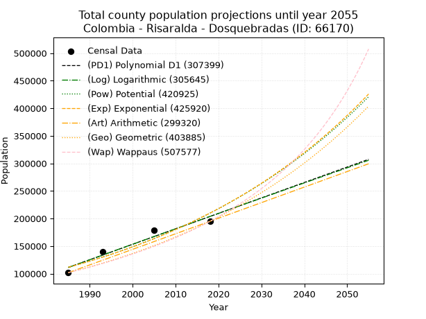
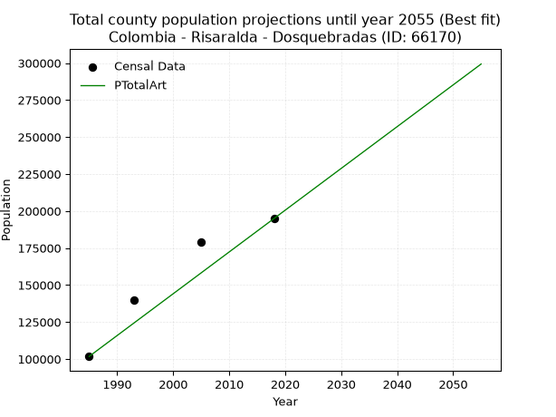
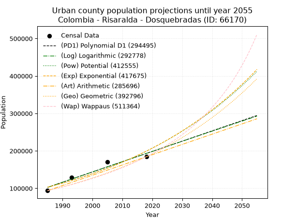
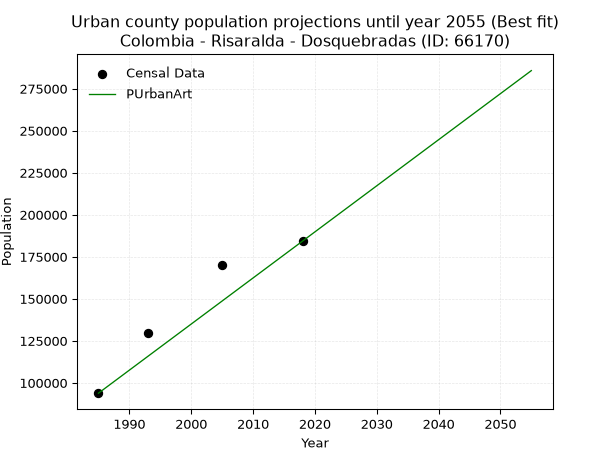
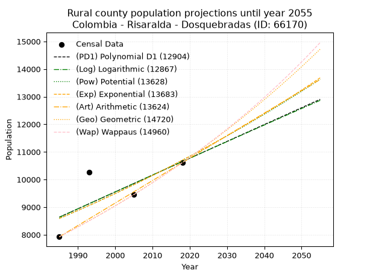
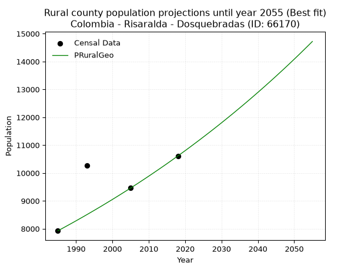

<div align="center">


</div>

# 📜 _“Population and Public Services Demand Projections (PPSD) until Year 2050 for Colombia - Risaralda - Dosquebradas (ID: 66170)”_
Keywords: `population` `public-service` `projection` `lineal` `polynomial` `logarithmic` `potential` `exponential` `arithmetic` `geometric` `wappaus` `dane` `colombia` `south-america`

PPSD are analytical estimates used by governments and planners to anticipate future changes in population size, age distribution, and the resulting community needs for utilities, healthcare, education, and infrastructure as sizing future water treatment facilities, electrical grids, and road networks based on spatial growth.

<div align="center">

</img>

</div>


> **General running parameters**: • app_version: _v20260806_. • Python version: _3.14.7_. • Pandas version: _3.0.5_. • NumPy version: _2.5.1_. • Creates, save and include plots into reports (create_plot): _False_. • Projection until year: _2050_. • Process polynomial degree 2 and up: _False_. • Process Wappaus: _True_. • Process Wappaus: _True_. • Set negative values to zero: _True_. • Set infinite values to zero: _True_. • Drop dataset notes: _True_. 
<div align="center">

Dynamic map: [:earth_americas:Google](http://maps.google.com/maps?q=4.833130583,-75.6753707) [:earth_americas:OSM](https://www.openstreetmap.org/#map=18/4.833130583/-75.6753707&layers=P) [:earth_americas:Bing](https://www.bing.com/maps?cp=4.833130583~-75.6753707&lvl=18) [:earth_americas:Apple](https://maps.apple.com/frame?center=4.833130583%2C-75.6753707&span=0.003%2C0.006)

</div>


<div align="center">

```geojson
{
  "type": "Feature",
  "geometry": {
    "type": "Point", 
    "coordinates": [-75.6753707, 4.833130583]
  }, 
  "properties": {
    "Name": "Colombia - Risaralda - Dosquebradas (ID: 66170)"
  }
}
```

</div>


## 0. Census Data (4 records)

Census data are official statistics collected by a government about the people and housing in a country. They usually include counts of total population, age, sex, race, income, education, and jobs.

📅Global census file: [Population.xlsx](../data/Population.xlsx)

| Source   |   Year |   CountryID | CountryName   |   StateID | StateName   |   CountyID | CountyName   |   PTotal |   PUrban |   PRural |
|:---------|-------:|------------:|:--------------|----------:|:------------|-----------:|:-------------|---------:|---------:|---------:|
| DANE     |   1985 |          57 | Colombia      |        66 | Risaralda   |      66170 | Dosquebradas |   101750 |    93824 |     7926 |
| DANE     |   1993 |          57 | Colombia      |        66 | Risaralda   |      66170 | Dosquebradas |   139839 |   129572 |    10267 |
| DANE     |   2005 |          57 | Colombia      |        66 | Risaralda   |      66170 | Dosquebradas |   179301 |   169844 |     9457 |
| DANE     |   2018 |          57 | Colombia      |        66 | Risaralda   |      66170 | Dosquebradas |   194890 |   184278 |    10612 |

> 🔥Some records could had specific notes about the registered values or the corresponding urban or rural distribution.

📅[SUI-RUPS](https://www.datos.gov.co/Hacienda-y-Cr-dito-P-blico/Registro-nico-de-Prestadores-de-Servicios-P-blicos/4qkq-csdn/about_data) - Local public utility companies: [RUPS.csv](../data/RUPS.csv)

 | SERVICIO       | ESTADO    | NOMBRE                                                                                | NIT         | DEPARTAMENTO_DOMICILIO   | MUNICIPIO_DOMICILIO   | DIRECCION                                        |      TELEFONO | EMAIL                                     | TIPO_PRESTADOR                             | CLASIFICACION                 |
|:---------------|:----------|:--------------------------------------------------------------------------------------|:------------|:-------------------------|:----------------------|:-------------------------------------------------|--------------:|:------------------------------------------|:-------------------------------------------|:------------------------------|
| ACUEDUCTO      | OPERATIVA | COMPAÑIA DE SERVICIOS PUBLICOS DOMICILIARIOS S.A. E.S.P.                              | 800211801-0 | RISARALDA                | DOSQUEBRADAS          | CRA 10 DIAG 69 ESQUINA RINCÓN DE LA ESTACIÓN     |   3.11657e+06 | contadora.acuaseo@acuaseo.com             | SOCIEDADES (EMPRESA DE SERVICIOS PUBLICOS) | MAYOR O IGUAL A 5001 USUARIOS |
| ALCANTARILLADO | OPERATIVA | COMPAÑIA DE SERVICIOS PUBLICOS DOMICILIARIOS S.A. E.S.P.                              | 800211801-0 | RISARALDA                | DOSQUEBRADAS          | CRA 10 DIAG 69 ESQUINA RINCÓN DE LA ESTACIÓN     |   3.11657e+06 | contadora.acuaseo@acuaseo.com             | SOCIEDADES (EMPRESA DE SERVICIOS PUBLICOS) | MAYOR O IGUAL A 5001 USUARIOS |
| ACUEDUCTO      | OPERATIVA | EMPRESA INDUSTRIAL Y COMERCIAL DEL ESTADO EMPRESA DE SERVICIOS PÚBLICOS DOMICILIARIOS | 816001609-1 | RISARALDA                | DOSQUEBRADAS          | CR 16 No 36-44 CAM P1                            |   3.32211e+06 | estadistica@serviciudad.gov.co            | EMPRESA INDUSTRIAL Y COMERCIAL DEL ESTADO  | MAYOR O IGUAL A 5001 USUARIOS |
| ALCANTARILLADO | OPERATIVA | EMPRESA INDUSTRIAL Y COMERCIAL DEL ESTADO EMPRESA DE SERVICIOS PÚBLICOS DOMICILIARIOS | 816001609-1 | RISARALDA                | DOSQUEBRADAS          | CR 16 No 36-44 CAM P1                            |   3.32211e+06 | estadistica@serviciudad.gov.co            | EMPRESA INDUSTRIAL Y COMERCIAL DEL ESTADO  | MAYOR O IGUAL A 5001 USUARIOS |
| ACUEDUCTO      | OPERATIVA | EMPRESA DE ACUEDUCTO Y ALCANTARILLADO DE PEREIRA S.A.S ESP.                           | 816002020-7 | RISARALDA                | PEREIRA               | CARRERA 10 No. 17-55 piso 9                      |   3.15125e+06 | wrendon@aguasyaguas.com.co                | SOCIEDADES (EMPRESA DE SERVICIOS PUBLICOS) | MAYOR O IGUAL A 5001 USUARIOS |
| ACUEDUCTO      | OPERATIVA | JUNTA ADMINISTRATIVA ACUEDUCTO BARRIO SAN DIEGO                                       | 900144745-1 | RISARALDA                | DOSQUEBRADAS          | cra 18 N° 55-16 Barrio San Diego                 |   3.42438e+06 | cristinavera_76@hotmail.com               | ORGANIZACION AUTORIZADA                    | MENOR O IGUAL A 2500 USUARIOS |
| ACUEDUCTO      | OPERATIVA | ASOCIACION COMUNITARIA FRAILES - NARANJALES                                           | 800175029-6 | nan                      | nan                   | nan                                              | nan           | nan                                       | ORGANIZACION AUTORIZADA                    | MENOR O IGUAL A 2500 USUARIOS |
| ACUEDUCTO      | OPERATIVA | ASOCIACION DE USUARIOS DEL ACUEDUCTO DEL BARRIO LA CAPILLA                            | 800215349-0 | RISARALDA                | DOSQUEBRADAS          | Carrera 18 N°. 66-40                             |   3.28193e+06 | asousacapilla@gmail.com                   | ORGANIZACION AUTORIZADA                    | MENOR O IGUAL A 2500 USUARIOS |
| ACUEDUCTO      | OPERATIVA | ASOCIACIÓN DE USUARIOS DEL ACUEDUCTO DE LA LOCALIDAD DE PLAYA RICA                    | 816003453-7 | RISARALDA                | DOSQUEBRADAS          | CALLE 42A N°. 10-50 PLAYA RICA                   |   3.32641e+06 | acueplayarica@hotmail.com                 | ORGANIZACION AUTORIZADA                    | MENOR O IGUAL A 2500 USUARIOS |
| ACUEDUCTO      | OPERATIVA | ASOCIACION USUARIOS ACUEDUCTO COMUNITARIO VEREDA EL RODEO                             | 816004166-2 | RISARALDA                | DOSQUEBRADAS          | VEREDA EL RODEO BAJO FINCA LA TULIA              |   3.1174e+06  | acueductoveredaelrodeo@hotmail.com        | ORGANIZACION AUTORIZADA                    | MENOR O IGUAL A 2500 USUARIOS |
| ACUEDUCTO      | OPERATIVA | ASOCIACION DE USUARIOS DEL ACUEDUCTO COMUNITARIO DE LOS BARRIOS UNIDOS DE FRAILES     | 816003200-0 | RISARALDA                | DOSQUEBRADAS          | BARRIO LARA BONILLA , 3 MZ F CASA 11             |   3.30256e+06 | acueductofrailes@hotmail.com              | ORGANIZACION AUTORIZADA                    | HASTA 2500 SUSCRIPTORES       |
| ACUEDUCTO      | OPERATIVA | ASOCIACIÓN DE USUARIOS DEL ACUEDUCTO COMUNAL DEL BARRIO CAMILO MEJÍA DUQUE            | 816000429-6 | RISARALDA                | DOSQUEBRADAS          | Manzana 7 Casa 18 Barrio Camilo Mejía Duque      |   3.30461e+06 | acueductocamilomejia@hotmail.com          | ORGANIZACION AUTORIZADA                    | MENOR O IGUAL A 2500 USUARIOS |
| ACUEDUCTO      | OPERATIVA | ASOCIACION DE USUARIOS DEL ACUEDUCTO COMUNITARIO DE LOS BARRIOS ROSALES VIOLETAS      | 816003583-6 | RISARALDA                | DOSQUEBRADAS          | CRA 35 A 68 68 CA 100 ROSALES                    |   3.32823e+06 | asoacueductorv@gmail.com                  | ORGANIZACION AUTORIZADA                    | HASTA 2500 SUSCRIPTORES       |
| ACUEDUCTO      | OPERATIVA | ASOCIACION DE USUARIOS DEL ACUEDUCTO COMUNITARIO LA ROMELIA                           | 816004631-6 | RISARALDA                | DOSQUEBRADAS          | CALLE 80 No. 15-80 LA ROMELIA                    |   3.43773e+06 | rodrigorendon1955@hotmail.com             | ORGANIZACION AUTORIZADA                    | HASTA 2500 SUSCRIPTORES       |
| ACUEDUCTO      | OPERATIVA | ASOCIACION DE USUARIOS ACUEDUCTO COMUNITARIO SANTIAGO LONDOÑO VELA I Y VELA II        | 800155065-6 | RISARALDA                | DOSQUEBRADAS          | manzana A casa 4 Santiago Londoño                |   3.30808e+06 | asosantiagov@hotmail.com                  | ORGANIZACION AUTORIZADA                    | MENOR O IGUAL A 2500 USUARIOS |
| ACUEDUCTO      | OPERATIVA | ASOCIACION DE USUARIOS DEL ACUEDUCTO COMUNITARIO DE PUERTO NUEVO                      | 816002064-0 | RISARALDA                | DOSQUEBRADAS          | TRANS. 18 CLL 72B BRR LA MARIANA                 |   3.28381e+06 | acueductopuertonuevo@hotmail.com          | ORGANIZACION AUTORIZADA                    | MENOR O IGUAL A 2500 USUARIOS |
| ACUEDUCTO      | OPERATIVA | ASOCIACION DE USUARIOS DL ACUEDUCTO COMUNITARIO DEL BARRIO LOS LAGOS                  | 816004704-5 | RISARALDA                | DOSQUEBRADAS          | MZ 8 CASA 104 LOS LAGOS                          |   3.32806e+06 | adolfotiquearmero@gmail.com               | ORGANIZACION AUTORIZADA                    | MENOR O IGUAL A 2500 USUARIOS |
| ACUEDUCTO      | OPERATIVA | ASOCIACION DE USUARIOS DEL ACUEDUCTO DEL BARRIO LA FLORESTA                           | 816002782-0 | RISARALDA                | DOSQUEBRADAS          | TV 8 CASA 40 BARRIO LA FLORESTA                  |   3.43762e+06 | nacho10100@hotmail.com                    | ORGANIZACION AUTORIZADA                    | HASTA 2500 SUSCRIPTORES       |
| ACUEDUCTO      | OPERATIVA | ASOCIACION DEL ACUEDUCTO COMUNITARIO DEL BARRIO SAN FERNANDO                          | 900045338-2 | RISARALDA                | DOSQUEBRADAS          | CL 44 19 13 BRR SAN FERNANDO                     |   3.11759e+06 | sanfernandoacueducto@gmail.com            | ORGANIZACION AUTORIZADA                    | MENOR O IGUAL A 2500 USUARIOS |
| ACUEDUCTO      | OPERATIVA | ASOCIACION DE USUARIOS DEL ACUEDUCTO DEL BARRIO LOS COMUNEROS                         | 816003017-9 | RISARALDA                | DOSQUEBRADAS          | CASA 28 BARRIO COMUNEROS                         |   3.26661e+06 | SOCOBE76@HOTMAIL.COM                      | ORGANIZACION AUTORIZADA                    | HASTA 2500 SUSCRIPTORES       |
| ACUEDUCTO      | OPERATIVA | ASOCIACION DE USUARIOS DEL ACUEDUCTO COMUNITARIO DEL BARRIO MARIANA GIRALDO           | 816001905-5 | RISARALDA                | DOSQUEBRADAS          | CALLE 72 No 16 - 92                              |   3.28998e+06 | asoc-acueductolamariana@hotmail.com       | ORGANIZACION AUTORIZADA                    | MENOR O IGUAL A 2500 USUARIOS |
| ACUEDUCTO      | OPERATIVA | ASOCIACION DE USUARIOS DEL ACUEDUCTO COMUNITARIO GAITAN LA PLAYA                      | 900037565-4 | RISARALDA                | DOSQUEBRADAS          | Kr8 N° 28-83                                     |   3.22984e+06 | aguas_gaitanlaplaya@hotmail.com           | ORGANIZACION AUTORIZADA                    | HASTA 2500 SUSCRIPTORES       |
| ACUEDUCTO      | OPERATIVA | ASOCIACION DE USUARIOS DEL ACUEDUCTO COMUNITARIO VEREDA LA PALMA                      | 900357825-7 | RISARALDA                | DOSQUEBRADAS          | VEREDA LA PALMA, FINCA LA PRADERA                |   3.14833e+06 | luisosorio194@hotmail.com                 | ORGANIZACION AUTORIZADA                    | MENOR O IGUAL A 2500 USUARIOS |
| ACUEDUCTO      | OPERATIVA | ASOCIACION DE USUARIOS DEL ACUEDUCTO COMUNITARIO DEL BARRIO LAURELES PRIMERA ETAPA    | 816008439-6 | RISARALDA                | DOSQUEBRADAS          | MZ 2 CASA 13 LOS LAURELES DOSQUBRADAS            |   3.28082e+06 | juan.gallego@hotmail.com                  | ORGANIZACION AUTORIZADA                    | HASTA 2500 SUSCRIPTORES       |
| ACUEDUCTO      | OPERATIVA | ASOCIACION ACUEDUCTOVEREDA EL ESTANQUILLO LA FRIA                                     | 830513844-2 | RISARALDA                | DOSQUEBRADAS          | vereda el estanquillo                            |   3.14614e+06 | contactenos@dosquebradas-risaralda.com    | ORGANIZACION AUTORIZADA                    | HASTA 2500 SUSCRIPTORES       |
| ACUEDUCTO      | OPERATIVA | ASOCIACION DE USUARIOS DEL ACUEDUCTO COMUNITARIO LA PRIMAVERA Y GUAYACANES            | 816004262-1 | RISARALDA                | DOSQUEBRADAS          | guayacanes manzana h casa 6                      |   3.42665e+06 | contactenos@dosquebradas-risaralda.gov.co | ORGANIZACION AUTORIZADA                    | HASTA 2500 SUSCRIPTORES       |
| ACUEDUCTO      | OPERATIVA | ASOCIACIÓN DE USUARIOS DEL ACUEDUCTO LA BADEA                                         | 800177394-9 | RISARALDA                | DOSQUEBRADAS          | CL 9 1A 553 VIA TURIN LA POPA                    |   3.39465e+06 | Consultoriasrr3000@gmail.com              | ORGANIZACION AUTORIZADA                    | MENOR O IGUAL A 2500 USUARIOS |
| ACUEDUCTO      | OPERATIVA | ASOCIACION DE USUARIOS DEL ACUEDUCTO COMUNITARIO DEL BARRIO DIVINO NIÑO               | 816004135-4 | RISARALDA                | DOSQUEBRADAS          | CALLE 73 A N° 19 - 40 BARRIO DIVINO NIÑO         |   3.42842e+06 | jhonalonso1@hotmail.com                   | ORGANIZACION AUTORIZADA                    | HASTA 2500 SUSCRIPTORES       |
| ACUEDUCTO      | OPERATIVA | ASOCIACION DE USUARIOS DEL ACUEDUCTO COMUNITARIO DEL BARRIO LAS ACACIAS               | 816003578-9 | RISARALDA                | DOSQUEBRADAS          | MANZANA 5 CASA 30 BOSQUES DE LA ACUARELA 4 ETAPA |   3.28146e+06 | socobe76@hotmail.com                      | ORGANIZACION AUTORIZADA                    | HASTA 2500 SUSCRIPTORES       |
| ACUEDUCTO      | OPERATIVA | ASOCIACION DE USUARIOS DEL ACUEDUCTO COMUNITARIO DEL BARRIO LAS VEGAS                 | 816001591-6 | RISARALDA                | DOSQUEBRADAS          | MANZANA 9 CASA 14 BARRIO LAS VEGAS               |   3.14362e+06 | acuavegas@hotmail.com                     | ORGANIZACION AUTORIZADA                    | HASTA 2500 SUSCRIPTORES       |
| ALCANTARILLADO | OPERATIVA | ASOCIACION DE USUARIOS DEL ACUEDUCTO COMUNITARIO DEL BARRIO LAS VEGAS                 | 816001591-6 | RISARALDA                | DOSQUEBRADAS          | MANZANA 9 CASA 14 BARRIO LAS VEGAS               |   3.14362e+06 | acuavegas@hotmail.com                     | ORGANIZACION AUTORIZADA                    | HASTA 2500 SUSCRIPTORES       |
| ACUEDUCTO      | OPERATIVA | ASOCIACION DE USUARIOS DEL ACUEDUCTO COMUNITARIO BARRIO LOS GUAMOS                    | 816003001-1 | RISARALDA                | DOSQUEBRADAS          | MANZANA 4 CASA 15 LOS GUAMOS DOSQUEBRADAS        |   3.28584e+06 | ATRID2050@HOTMAIL.COM                     | ORGANIZACION AUTORIZADA                    | MENOR O IGUAL A 2500 USUARIOS |
| ACUEDUCTO      | OPERATIVA | ASOCIACION DE USUARIOS DEL ACUEDUCTO COMUNITARIO BARRIO GALAXIA                       | 816002515-0 | RISARALDA                | DOSQUEBRADAS          | manzana 2 casa 12                                |   3.2831e+06  | oscar.btncur@gmail.com                    | ORGANIZACION AUTORIZADA                    | MENOR O IGUAL A 2500 USUARIOS |
| ACUEDUCTO      | OPERATIVA | ASOCIACION DE USUARIOS DEL ACUEDUCTO COMUNITARIO DEL BARRIO LOS PINOS                 | 816002634-9 | RISARALDA                | DOSQUEBRADAS          | Manzana A Casa 23 B. LOS PINOS                   |   3.28682e+06 | acueductopinos2@gmail.com                 | ORGANIZACION AUTORIZADA                    | MENOR O IGUAL A 2500 USUARIOS |
| ACUEDUCTO      | OPERATIVA | ACUEDUCTO LA TOMINEJA                                                                 | 900247192-1 | RISARALDA                | DOSQUEBRADAS          | kr 18a N° 49-58                                  |   3.12835e+06 | miyoca_mikey@hotmail.com                  | ORGANIZACION AUTORIZADA                    | HASTA 2500 SUSCRIPTORES       |
| ACUEDUCTO      | OPERATIVA | ASOCIACION DE USUARIOS ACUEDUCTO DE LA CUENCA BUENOS AIRES                            | 900381046-7 | RISARALDA                | GUATICA               | VEREDA TARQUI                                    |   3.14718e+06 | criss060@gmail.com                        | ORGANIZACION AUTORIZADA                    | HASTA 2500 SUSCRIPTORES       |
| ACUEDUCTO      | OPERATIVA | ASOCIACION DE USUARIOS DEL ACUEDUCTO COMUNITARIO DEL BARRIO SANTA TERESITA            | 816002114-0 | RISARALDA                | DOSQUEBRADAS          | CARRERA 14 Nº 56 - 04                            |   3.22825e+06 | contactenos@dosquebradas-risaralda.gov.co | ORGANIZACION AUTORIZADA                    | HASTA 2500 SUSCRIPTORES       |
| ACUEDUCTO      | OPERATIVA | ASOCIACION DE  USUARIOS DEL ACUEDUCTO COMUNITARIO NUEVA COLOMBIA                      | 816004829-7 | RISARALDA                | DOSQUEBRADAS          | NUEVA COLOMBIA MANZANA A CASA 22 A               |   3.28462e+06 | acueductonuevacolombia2quebrad@gmail.com  | ORGANIZACION AUTORIZADA                    | MENOR O IGUAL A 2500 USUARIOS |
| ACUEDUCTO      | OPERATIVA | ASOCIACION DE USUARIOS DEL ACUEDUCTO COMUNITARIO DEL BARRIO LOS LIBERTADORES          | 816007273-6 | RISARALDA                | DOSQUEBRADAS          | MANZANA 3 CASA 18 BARRIO LOS LIBERTADORES        |   3.28766e+06 | acueductolibertadores@gmail.com           | ORGANIZACION AUTORIZADA                    | MENOR O IGUAL A 2500 USUARIOS |

## 1. Total

### 1.1. Coefficients and Parameters

* (PD1) Polynomial Deg 1: 2802.8213568847727, -5452398.419108766 (lineal)
* (Log) Logarithmic: 5613697.795672205, -42515816.93025533
* (Pow) Potential: 38.34963305887871, -121.42091330606392
* (Exp) Exponential: 0.019143817714085073, 3.4990201504095742e-12
* (Art) Arithmetic: Year diff. 2018 - 1985 = 33, Population diff. 194890 - 101750 = 93140, Annual growth = 2822.4242424242425
* (Geo) Geometric: Year diff. 2018 - 1985 = 33, Population diff. 194890 - 101750 = 93140, Annual growth % = 0.01988965345929583
* (Wap) Wappaus: i = 1.9029289660357622, Condition values only valid for < 200)

<sub>
Wappaus condition values: ['0.00', '1.90', '3.81', '5.71', '7.61', '9.51', '11.42', '13.32', '15.22', '17.13', '19.03', '20.93', '22.84', '24.74', '26.64', '28.54', '30.45', '32.35', '34.25', '36.16', '38.06', '39.96', '41.86', '43.77', '45.67', '47.57', '49.48', '51.38', '53.28', '55.18', '57.09', '58.99', '60.89', '62.80', '64.70', '66.60', '68.51', '70.41', '72.31', '74.21', '76.12', '78.02', '79.92', '81.83', '83.73', '85.63', '87.53', '89.44', '91.34', '93.24', '95.15', '97.05', '98.95', '100.86', '102.76', '104.66', '106.56', '108.47', '110.37', '112.27', '114.18', '116.08', '117.98', '119.88', '121.79', '123.69']
</sub>


### 1.2. Projected Dataset

|   Year |   CountyID |   PTotalPD1 |   PTotalLog |   PTotalPow |   PTotalExp |   PTotalArt |   PTotalGeo |   PTotalWap |
|-------:|-----------:|------------:|------------:|------------:|------------:|------------:|------------:|------------:|
|   1985 |      66170 |      111202 |      111091 |      111427 |      111518 |      101750 |      101750 |      101750 |
|   1986 |      66170 |      114005 |      113918 |      113601 |      113673 |      104572 |      103774 |      103705 |
|   1987 |      66170 |      116808 |      116744 |      115815 |      115870 |      107395 |      105838 |      105698 |
|   1988 |      66170 |      119610 |      119569 |      118071 |      118110 |      110217 |      107943 |      107729 |
|   1989 |      66170 |      122413 |      122392 |      120371 |      120393 |      113040 |      110090 |      109801 |
|   1990 |      66170 |      125216 |      125214 |      122713 |      122720 |      115862 |      112279 |      111915 |
|   1991 |      66170 |      128019 |      128034 |      125100 |      125092 |      118685 |      114513 |      114071 |
|   1992 |      66170 |      130822 |      130853 |      127533 |      127510 |      121507 |      116790 |      116271 |
|   1993 |      66170 |      133625 |      133670 |      130011 |      129974 |      124329 |      119113 |      118516 |
|   1994 |      66170 |      136427 |      136486 |      132537 |      132486 |      127152 |      121482 |      120808 |
|   1995 |      66170 |      139230 |      139301 |      135110 |      135047 |      129974 |      123899 |      123148 |
|   1996 |      66170 |      142033 |      142114 |      137731 |      137657 |      132797 |      126363 |      125538 |
|   1997 |      66170 |      144836 |      144926 |      140402 |      140318 |      135619 |      128876 |      127980 |
|   1998 |      66170 |      147639 |      147736 |      143124 |      143030 |      138442 |      131439 |      130474 |
|   1999 |      66170 |      150441 |      150545 |      145897 |      145795 |      141264 |      134054 |      133023 |
|   2000 |      66170 |      153244 |      153352 |      148722 |      148612 |      144086 |      136720 |      135629 |
|   2001 |      66170 |      156047 |      156159 |      151601 |      151485 |      146909 |      139439 |      138293 |
|   2002 |      66170 |      158850 |      158963 |      154533 |      154413 |      149731 |      142213 |      141017 |
|   2003 |      66170 |      161653 |      161767 |      157521 |      157397 |      152554 |      145041 |      143805 |
|   2004 |      66170 |      164456 |      164569 |      160566 |      160440 |      155376 |      147926 |      146656 |
|   2005 |      66170 |      167258 |      167369 |      163667 |      163541 |      158198 |      150868 |      149575 |
|   2006 |      66170 |      170061 |      170168 |      166827 |      166702 |      161021 |      153869 |      152564 |
|   2007 |      66170 |      172864 |      172966 |      170046 |      169924 |      163843 |      156929 |      155624 |
|   2008 |      66170 |      175667 |      175762 |      173326 |      173208 |      166666 |      160051 |      158759 |
|   2009 |      66170 |      178470 |      178557 |      176667 |      176556 |      169488 |      163234 |      161971 |
|   2010 |      66170 |      181273 |      181351 |      180071 |      179968 |      172311 |      166481 |      165263 |
|   2011 |      66170 |      184075 |      184143 |      183539 |      183447 |      175133 |      169792 |      168639 |
|   2012 |      66170 |      186878 |      186934 |      187071 |      186992 |      177955 |      173169 |      172101 |
|   2013 |      66170 |      189681 |      189723 |      190670 |      190607 |      180778 |      176613 |      175653 |
|   2014 |      66170 |      192484 |      192511 |      194337 |      194291 |      183600 |      180126 |      179298 |
|   2015 |      66170 |      195287 |      195298 |      198072 |      198046 |      186423 |      183709 |      183040 |
|   2016 |      66170 |      198089 |      198083 |      201877 |      201874 |      189245 |      187363 |      186884 |
|   2017 |      66170 |      200892 |      200867 |      205753 |      205776 |      192068 |      191089 |      190832 |
|   2018 |      66170 |      203695 |      203650 |      209701 |      209753 |      194890 |      194890 |      194890 |
|   2019 |      66170 |      206498 |      206431 |      213723 |      213807 |      197712 |      198766 |      199062 |
|   2020 |      66170 |      209301 |      209211 |      217821 |      217940 |      200535 |      202720 |      203353 |
|   2021 |      66170 |      212104 |      211989 |      221994 |      222152 |      203357 |      206752 |      207769 |
|   2022 |      66170 |      214906 |      214766 |      226246 |      226446 |      206180 |      210864 |      212313 |
|   2023 |      66170 |      217709 |      217542 |      230577 |      230823 |      209002 |      215058 |      216994 |
|   2024 |      66170 |      220512 |      220316 |      234988 |      235284 |      211825 |      219335 |      221816 |
|   2025 |      66170 |      223315 |      223089 |      239482 |      239832 |      214647 |      223698 |      226786 |
|   2026 |      66170 |      226118 |      225860 |      244060 |      244467 |      217469 |      228147 |      231911 |
|   2027 |      66170 |      228920 |      228630 |      248722 |      249192 |      220292 |      232685 |      237199 |
|   2028 |      66170 |      231723 |      231399 |      253471 |      254009 |      223114 |      237313 |      242657 |
|   2029 |      66170 |      234526 |      234167 |      258309 |      258918 |      225937 |      242033 |      248294 |
|   2030 |      66170 |      237329 |      236933 |      263236 |      263923 |      228759 |      246847 |      254118 |
|   2031 |      66170 |      240132 |      239697 |      268255 |      269024 |      231582 |      251757 |      260140 |
|   2032 |      66170 |      242935 |      242461 |      273368 |      274224 |      234404 |      256764 |      266368 |
|   2033 |      66170 |      245737 |      245223 |      278574 |      279524 |      237226 |      261871 |      272815 |
|   2034 |      66170 |      248540 |      247983 |      283878 |      284927 |      240049 |      267079 |      279491 |
|   2035 |      66170 |      251343 |      250742 |      289280 |      290434 |      242871 |      272392 |      286410 |
|   2036 |      66170 |      254146 |      253500 |      294781 |      296047 |      245694 |      277809 |      293585 |
|   2037 |      66170 |      256949 |      256257 |      300385 |      301769 |      248516 |      283335 |      301030 |
|   2038 |      66170 |      259752 |      259012 |      306093 |      307602 |      251338 |      288970 |      308761 |
|   2039 |      66170 |      262554 |      261766 |      311905 |      313548 |      254161 |      294718 |      316794 |
|   2040 |      66170 |      265357 |      264518 |      317826 |      319608 |      256983 |      300580 |      325148 |
|   2041 |      66170 |      268160 |      267270 |      323856 |      325785 |      259806 |      306558 |      333842 |
|   2042 |      66170 |      270963 |      270019 |      329997 |      332082 |      262628 |      312655 |      342898 |
|   2043 |      66170 |      273766 |      272768 |      336251 |      338501 |      265451 |      318874 |      352338 |
|   2044 |      66170 |      276568 |      275515 |      342621 |      345043 |      268273 |      325216 |      362188 |
|   2045 |      66170 |      279371 |      278261 |      349108 |      351712 |      271095 |      331685 |      372475 |
|   2046 |      66170 |      282174 |      281005 |      355715 |      358510 |      273918 |      338282 |      383228 |
|   2047 |      66170 |      284977 |      283748 |      362444 |      365440 |      276740 |      345010 |      394480 |
|   2048 |      66170 |      287780 |      286490 |      369297 |      372503 |      279563 |      351872 |      406267 |
|   2049 |      66170 |      290583 |      289230 |      376275 |      379703 |      282385 |      358871 |      418627 |
|   2050 |      66170 |      293385 |      291969 |      383382 |      387042 |      285208 |      366009 |      431603 |
<div align="center">

</img>

</div>


### 1.3. Best fit with absolute and relative error (%)

Relative error puts that difference into context by dividing the absolute error by the true value, creating a unitless ratio or percentage that shows the scale of the mistake.

Absolute and relative error

|   Year | Source   |   CountryID | CountryName   |   StateID | StateName   |   CountyID_x | CountyName   |   PTotal |   PUrban |   PRural |   CountyID_y |   PTotalPD1 |   PTotalLog |   PTotalPow |   PTotalExp |   PTotalArt |   PTotalGeo |   PTotalWap |   PTotalPD1AbsError |   PTotalLogAbsError |   PTotalPowAbsError |   PTotalExpAbsError |   PTotalArtAbsError |   PTotalGeoAbsError |   PTotalWapAbsError |   PTotalPD1RelError |   PTotalLogRelError |   PTotalPowRelError |   PTotalExpRelError |   PTotalArtRelError |   PTotalGeoRelError |   PTotalWapRelError |
|-------:|:---------|------------:|:--------------|----------:|:------------|-------------:|:-------------|---------:|---------:|---------:|-------------:|------------:|------------:|------------:|------------:|------------:|------------:|------------:|--------------------:|--------------------:|--------------------:|--------------------:|--------------------:|--------------------:|--------------------:|--------------------:|--------------------:|--------------------:|--------------------:|--------------------:|--------------------:|--------------------:|
|   1985 | DANE     |          57 | Colombia      |        66 | Risaralda   |        66170 | Dosquebradas |   101750 |    93824 |     7926 |        66170 |      111202 |      111091 |      111427 |      111518 |      101750 |      101750 |      101750 |                9452 |                9341 |                9677 |                9768 |                   0 |                   0 |                   0 |             9.28943 |             9.18034 |             9.51057 |             9.6     |              0      |              0      |              0      |
|   1993 | DANE     |          57 | Colombia      |        66 | Risaralda   |        66170 | Dosquebradas |   139839 |   129572 |    10267 |        66170 |      133625 |      133670 |      130011 |      129974 |      124329 |      119113 |      118516 |                6214 |                6169 |                9828 |                9865 |               15510 |               20726 |               21323 |             4.44368 |             4.4115  |             7.02808 |             7.05454 |             11.0913 |             14.8213 |             15.2482 |
|   2005 | DANE     |          57 | Colombia      |        66 | Risaralda   |        66170 | Dosquebradas |   179301 |   169844 |     9457 |        66170 |      167258 |      167369 |      163667 |      163541 |      158198 |      150868 |      149575 |               12043 |               11932 |               15634 |               15760 |               21103 |               28433 |               29726 |             6.71664 |             6.65473 |             8.71942 |             8.78969 |             11.7696 |             15.8577 |             16.5788 |
|   2018 | DANE     |          57 | Colombia      |        66 | Risaralda   |        66170 | Dosquebradas |   194890 |   184278 |    10612 |        66170 |      203695 |      203650 |      209701 |      209753 |      194890 |      194890 |      194890 |                8805 |                8760 |               14811 |               14863 |                   0 |                   0 |                   0 |             4.51793 |             4.49484 |             7.59967 |             7.62635 |              0      |              0      |              0      |

Relative error mean

| Method    |   RelError | Best   |
|:----------|-----------:|:-------|
| PTotalPD1 |    6.24192 |        |
| PTotalLog |    6.18536 |        |
| PTotalPow |    8.21443 |        |
| PTotalExp |    8.26765 |        |
| PTotalArt |    5.71523 | True   |
| PTotalGeo |    7.66976 |        |
| PTotalWap |    7.95677 |        |

💙Best method: _**PTotalArt**_
<div align="center">

</img>

</div>


### 1.4. Fresh water supply demand in liters per capita per day (lpcd)

The fresh water supply demand typically ranges from 100 to 300 liters per capita per day (lpcd) for standard domestic and municipal planning, though absolute survival minimums set by the World Health Organization are as low as 7.5 to 20 liters per day, and total consumption in high-income nations can exceed 400 liters.

> `CZ`: Level in meters above the sea level (masl)<br> `WS`: Fresh water supply demand in liters per capita per day (lpcd or l/h/d)<br> `WSAll`: Zonal fresh water supply demand in liters per second (l/s)<br> `A`: Zonal area in square meters<br> `DP`: Population density (people/hectare or p/ha)

Reference values (RAS Colombia)

|    CZ |   WS |
|------:|-----:|
|  1000 |  120 |
|  2000 |  130 |
| 99999 |  140 |

County shapefile geometry properties and water supply values

|   CountyID |      ATotal |   CZTotal |   WSTotal |
|-----------:|------------:|----------:|----------:|
|      66170 | 6.99744e+07 |    1638.2 |       130 |

Projected values for best method: PTotalArt

|   CountyID |   Year |   PTotalArt |   DPTotal |   WSTotal |   WSTotalAll |
|-----------:|-------:|------------:|----------:|----------:|-------------:|
|      66170 |   1985 |      101750 |     14.54 |       130 |      153.096 |
|      66170 |   1986 |      104572 |     14.94 |       130 |      157.342 |
|      66170 |   1987 |      107395 |     15.35 |       130 |      161.59  |
|      66170 |   1988 |      110217 |     15.75 |       130 |      165.836 |
|      66170 |   1989 |      113040 |     16.15 |       130 |      170.083 |
|      66170 |   1990 |      115862 |     16.56 |       130 |      174.329 |
|      66170 |   1991 |      118685 |     16.96 |       130 |      178.577 |
|      66170 |   1992 |      121507 |     17.36 |       130 |      182.823 |
|      66170 |   1993 |      124329 |     17.77 |       130 |      187.069 |
|      66170 |   1994 |      127152 |     18.17 |       130 |      191.317 |
|      66170 |   1995 |      129974 |     18.57 |       130 |      195.563 |
|      66170 |   1996 |      132797 |     18.98 |       130 |      199.81  |
|      66170 |   1997 |      135619 |     19.38 |       130 |      204.056 |
|      66170 |   1998 |      138442 |     19.78 |       130 |      208.304 |
|      66170 |   1999 |      141264 |     20.19 |       130 |      212.55  |
|      66170 |   2000 |      144086 |     20.59 |       130 |      216.796 |
|      66170 |   2001 |      146909 |     20.99 |       130 |      221.044 |
|      66170 |   2002 |      149731 |     21.4  |       130 |      225.29  |
|      66170 |   2003 |      152554 |     21.8  |       130 |      229.537 |
|      66170 |   2004 |      155376 |     22.2  |       130 |      233.783 |
|      66170 |   2005 |      158198 |     22.61 |       130 |      238.029 |
|      66170 |   2006 |      161021 |     23.01 |       130 |      242.277 |
|      66170 |   2007 |      163843 |     23.41 |       130 |      246.523 |
|      66170 |   2008 |      166666 |     23.82 |       130 |      250.771 |
|      66170 |   2009 |      169488 |     24.22 |       130 |      255.017 |
|      66170 |   2010 |      172311 |     24.62 |       130 |      259.264 |
|      66170 |   2011 |      175133 |     25.03 |       130 |      263.51  |
|      66170 |   2012 |      177955 |     25.43 |       130 |      267.756 |
|      66170 |   2013 |      180778 |     25.83 |       130 |      272.004 |
|      66170 |   2014 |      183600 |     26.24 |       130 |      276.25  |
|      66170 |   2015 |      186423 |     26.64 |       130 |      280.498 |
|      66170 |   2016 |      189245 |     27.04 |       130 |      284.744 |
|      66170 |   2017 |      192068 |     27.45 |       130 |      288.991 |
|      66170 |   2018 |      194890 |     27.85 |       130 |      293.237 |
|      66170 |   2019 |      197712 |     28.25 |       130 |      297.483 |
|      66170 |   2020 |      200535 |     28.66 |       130 |      301.731 |
|      66170 |   2021 |      203357 |     29.06 |       130 |      305.977 |
|      66170 |   2022 |      206180 |     29.47 |       130 |      310.225 |
|      66170 |   2023 |      209002 |     29.87 |       130 |      314.471 |
|      66170 |   2024 |      211825 |     30.27 |       130 |      318.718 |
|      66170 |   2025 |      214647 |     30.68 |       130 |      322.964 |
|      66170 |   2026 |      217469 |     31.08 |       130 |      327.21  |
|      66170 |   2027 |      220292 |     31.48 |       130 |      331.458 |
|      66170 |   2028 |      223114 |     31.89 |       130 |      335.704 |
|      66170 |   2029 |      225937 |     32.29 |       130 |      339.952 |
|      66170 |   2030 |      228759 |     32.69 |       130 |      344.198 |
|      66170 |   2031 |      231582 |     33.1  |       130 |      348.445 |
|      66170 |   2032 |      234404 |     33.5  |       130 |      352.691 |
|      66170 |   2033 |      237226 |     33.9  |       130 |      356.937 |
|      66170 |   2034 |      240049 |     34.31 |       130 |      361.185 |
|      66170 |   2035 |      242871 |     34.71 |       130 |      365.431 |
|      66170 |   2036 |      245694 |     35.11 |       130 |      369.678 |
|      66170 |   2037 |      248516 |     35.52 |       130 |      373.925 |
|      66170 |   2038 |      251338 |     35.92 |       130 |      378.171 |
|      66170 |   2039 |      254161 |     36.32 |       130 |      382.418 |
|      66170 |   2040 |      256983 |     36.73 |       130 |      386.664 |
|      66170 |   2041 |      259806 |     37.13 |       130 |      390.912 |
|      66170 |   2042 |      262628 |     37.53 |       130 |      395.158 |
|      66170 |   2043 |      265451 |     37.94 |       130 |      399.405 |
|      66170 |   2044 |      268273 |     38.34 |       130 |      403.652 |
|      66170 |   2045 |      271095 |     38.74 |       130 |      407.898 |
|      66170 |   2046 |      273918 |     39.15 |       130 |      412.145 |
|      66170 |   2047 |      276740 |     39.55 |       130 |      416.391 |
|      66170 |   2048 |      279563 |     39.95 |       130 |      420.639 |
|      66170 |   2049 |      282385 |     40.36 |       130 |      424.885 |
|      66170 |   2050 |      285208 |     40.76 |       130 |      429.132 |

## 2. Urban

### 2.1. Coefficients and Parameters

* (PD1) Polynomial Deg 1: 2741.8394219188963, -5339984.803693273 (lineal)
* (Log) Logarithmic: 5491533.9292483255, -41596813.902607635
* (Pow) Potential: 40.08141441770474, -127.16670145211786
* (Exp) Exponential: 0.020008362127030156, 5.805936663436399e-13
* (Art) Arithmetic: Year diff. 2018 - 1985 = 33, Population diff. 184278 - 93824 = 90454, Annual growth = 2741.030303030303
* (Geo) Geometric: Year diff. 2018 - 1985 = 33, Population diff. 184278 - 93824 = 90454, Annual growth % = 0.020665940367062596
* (Wap) Wappaus: i = 1.9712409857033053, Condition values only valid for < 200)

<sub>
Wappaus condition values: ['0.00', '1.97', '3.94', '5.91', '7.88', '9.86', '11.83', '13.80', '15.77', '17.74', '19.71', '21.68', '23.65', '25.63', '27.60', '29.57', '31.54', '33.51', '35.48', '37.45', '39.42', '41.40', '43.37', '45.34', '47.31', '49.28', '51.25', '53.22', '55.19', '57.17', '59.14', '61.11', '63.08', '65.05', '67.02', '68.99', '70.96', '72.94', '74.91', '76.88', '78.85', '80.82', '82.79', '84.76', '86.73', '88.71', '90.68', '92.65', '94.62', '96.59', '98.56', '100.53', '102.50', '104.48', '106.45', '108.42', '110.39', '112.36', '114.33', '116.30', '118.27', '120.25', '122.22', '124.19', '126.16', '128.13']
</sub>


### 2.2. Projected Dataset

|   Year |   CountyID |   PUrbanPD1 |   PUrbanLog |   PUrbanPow |   PUrbanExp |   PUrbanArt |   PUrbanGeo |   PUrbanWap |
|-------:|-----------:|------------:|------------:|------------:|------------:|------------:|------------:|------------:|
|   1985 |      66170 |      102566 |      102458 |      102850 |      102937 |       93824 |       93824 |       93824 |
|   1986 |      66170 |      105308 |      105224 |      104947 |      105017 |       96565 |       95763 |       95692 |
|   1987 |      66170 |      108050 |      107988 |      107086 |      107140 |       99306 |       97742 |       97597 |
|   1988 |      66170 |      110792 |      110751 |      109268 |      109305 |      102047 |       99762 |       99542 |
|   1989 |      66170 |      113534 |      113513 |      111493 |      111514 |      104788 |      101824 |      101526 |
|   1990 |      66170 |      116276 |      116273 |      113762 |      113768 |      107529 |      103928 |      103551 |
|   1991 |      66170 |      119017 |      119032 |      116076 |      116067 |      110270 |      106076 |      105618 |
|   1992 |      66170 |      121759 |      121790 |      118435 |      118413 |      113011 |      108268 |      107730 |
|   1993 |      66170 |      124501 |      124546 |      120842 |      120806 |      115752 |      110505 |      109886 |
|   1994 |      66170 |      127243 |      127300 |      123296 |      123247 |      118493 |      112789 |      112090 |
|   1995 |      66170 |      129985 |      130054 |      125799 |      125738 |      121234 |      115120 |      114341 |
|   1996 |      66170 |      132727 |      132806 |      128351 |      128279 |      123975 |      117499 |      116642 |
|   1997 |      66170 |      135469 |      135556 |      130954 |      130872 |      126716 |      119927 |      118995 |
|   1998 |      66170 |      138210 |      138306 |      133608 |      133517 |      129457 |      122406 |      121401 |
|   1999 |      66170 |      140952 |      141053 |      136315 |      136215 |      132198 |      124935 |      123862 |
|   2000 |      66170 |      143694 |      143800 |      139075 |      138968 |      134939 |      127517 |      126380 |
|   2001 |      66170 |      146436 |      146545 |      141890 |      141777 |      137680 |      130152 |      128956 |
|   2002 |      66170 |      149178 |      149289 |      144760 |      144642 |      140422 |      132842 |      131594 |
|   2003 |      66170 |      151920 |      152031 |      147687 |      147565 |      143163 |      135587 |      134295 |
|   2004 |      66170 |      154661 |      154772 |      150671 |      150547 |      145904 |      138389 |      137061 |
|   2005 |      66170 |      157403 |      157512 |      153714 |      153590 |      148645 |      141249 |      139896 |
|   2006 |      66170 |      160145 |      160250 |      156817 |      156694 |      151386 |      144168 |      142801 |
|   2007 |      66170 |      162887 |      162987 |      159981 |      159861 |      154127 |      147148 |      145779 |
|   2008 |      66170 |      165629 |      165722 |      163207 |      163091 |      156868 |      150189 |      148832 |
|   2009 |      66170 |      168371 |      168456 |      166497 |      166387 |      159609 |      153292 |      151965 |
|   2010 |      66170 |      171112 |      171189 |      169851 |      169750 |      162350 |      156460 |      155180 |
|   2011 |      66170 |      173854 |      173921 |      173271 |      173181 |      165091 |      159694 |      158480 |
|   2012 |      66170 |      176596 |      176651 |      176759 |      176681 |      167832 |      162994 |      161868 |
|   2013 |      66170 |      179338 |      179379 |      180314 |      180251 |      170573 |      166362 |      165349 |
|   2014 |      66170 |      182080 |      182107 |      183940 |      183894 |      173314 |      169801 |      168926 |
|   2015 |      66170 |      184822 |      184833 |      187636 |      187611 |      176055 |      173310 |      172603 |
|   2016 |      66170 |      187563 |      187557 |      191405 |      191402 |      178796 |      176891 |      176384 |
|   2017 |      66170 |      190305 |      190281 |      195247 |      195271 |      181537 |      180547 |      180274 |
|   2018 |      66170 |      193047 |      193003 |      199165 |      199217 |      184278 |      184278 |      184278 |
|   2019 |      66170 |      195789 |      195723 |      203159 |      203243 |      187019 |      188086 |      188401 |
|   2020 |      66170 |      198531 |      198442 |      207232 |      207351 |      189760 |      191973 |      192647 |
|   2021 |      66170 |      201273 |      201160 |      211384 |      211541 |      192501 |      195941 |      197023 |
|   2022 |      66170 |      204015 |      203877 |      215617 |      215816 |      195242 |      199990 |      201536 |
|   2023 |      66170 |      206756 |      206592 |      219933 |      220178 |      197983 |      204123 |      206190 |
|   2024 |      66170 |      209498 |      209306 |      224332 |      224628 |      200724 |      208341 |      210993 |
|   2025 |      66170 |      212240 |      212019 |      228818 |      229167 |      203465 |      212647 |      215953 |
|   2026 |      66170 |      214982 |      214730 |      233391 |      233799 |      206206 |      217041 |      221077 |
|   2027 |      66170 |      217724 |      217440 |      238053 |      238524 |      208947 |      221527 |      226373 |
|   2028 |      66170 |      220466 |      220148 |      242806 |      243344 |      211688 |      226105 |      231850 |
|   2029 |      66170 |      223207 |      222855 |      247651 |      248262 |      214429 |      230777 |      237518 |
|   2030 |      66170 |      225949 |      225561 |      252591 |      253280 |      217170 |      235547 |      243387 |
|   2031 |      66170 |      228691 |      228266 |      257627 |      258398 |      219911 |      240414 |      249467 |
|   2032 |      66170 |      231433 |      230969 |      262760 |      263621 |      222652 |      245383 |      255771 |
|   2033 |      66170 |      234175 |      233671 |      267993 |      268948 |      225393 |      250454 |      262310 |
|   2034 |      66170 |      236917 |      236371 |      273328 |      274384 |      228134 |      255630 |      269099 |
|   2035 |      66170 |      239658 |      239070 |      278766 |      279929 |      230876 |      260913 |      276152 |
|   2036 |      66170 |      242400 |      241768 |      284310 |      285586 |      233617 |      266305 |      283484 |
|   2037 |      66170 |      245142 |      244465 |      289961 |      291358 |      236358 |      271808 |      291113 |
|   2038 |      66170 |      247884 |      247160 |      295721 |      297246 |      239099 |      277425 |      299056 |
|   2039 |      66170 |      250626 |      249854 |      301593 |      303254 |      241840 |      283158 |      307335 |
|   2040 |      66170 |      253368 |      252547 |      307579 |      309382 |      244581 |      289010 |      315969 |
|   2041 |      66170 |      256109 |      255238 |      313681 |      315635 |      247322 |      294983 |      324984 |
|   2042 |      66170 |      258851 |      257928 |      319900 |      322014 |      250063 |      301079 |      334404 |
|   2043 |      66170 |      261593 |      260616 |      326240 |      328522 |      252804 |      307301 |      344258 |
|   2044 |      66170 |      264335 |      263304 |      332702 |      335161 |      255545 |      313652 |      354576 |
|   2045 |      66170 |      267077 |      265990 |      339289 |      341935 |      258286 |      320134 |      365391 |
|   2046 |      66170 |      269819 |      268675 |      346002 |      348845 |      261027 |      326749 |      376741 |
|   2047 |      66170 |      272560 |      271358 |      352846 |      355895 |      263768 |      333502 |      388667 |
|   2048 |      66170 |      275302 |      274040 |      359821 |      363088 |      266509 |      340394 |      401212 |
|   2049 |      66170 |      278044 |      276721 |      366931 |      370426 |      269250 |      347429 |      414428 |
|   2050 |      66170 |      280786 |      279400 |      374177 |      377912 |      271991 |      354609 |      428368 |
<div align="center">

</img>

</div>


### 2.3. Best fit with absolute and relative error (%)

Relative error puts that difference into context by dividing the absolute error by the true value, creating a unitless ratio or percentage that shows the scale of the mistake.

Absolute and relative error

|   Year | Source   |   CountryID | CountryName   |   StateID | StateName   |   CountyID_x | CountyName   |   PTotal |   PUrban |   PRural |   CountyID_y |   PUrbanPD1 |   PUrbanLog |   PUrbanPow |   PUrbanExp |   PUrbanArt |   PUrbanGeo |   PUrbanWap |   PUrbanPD1AbsError |   PUrbanLogAbsError |   PUrbanPowAbsError |   PUrbanExpAbsError |   PUrbanArtAbsError |   PUrbanGeoAbsError |   PUrbanWapAbsError |   PUrbanPD1RelError |   PUrbanLogRelError |   PUrbanPowRelError |   PUrbanExpRelError |   PUrbanArtRelError |   PUrbanGeoRelError |   PUrbanWapRelError |
|-------:|:---------|------------:|:--------------|----------:|:------------|-------------:|:-------------|---------:|---------:|---------:|-------------:|------------:|------------:|------------:|------------:|------------:|------------:|------------:|--------------------:|--------------------:|--------------------:|--------------------:|--------------------:|--------------------:|--------------------:|--------------------:|--------------------:|--------------------:|--------------------:|--------------------:|--------------------:|--------------------:|
|   1985 | DANE     |          57 | Colombia      |        66 | Risaralda   |        66170 | Dosquebradas |   101750 |    93824 |     7926 |        66170 |      102566 |      102458 |      102850 |      102937 |       93824 |       93824 |       93824 |                8742 |                8634 |                9026 |                9113 |                   0 |                   0 |                   0 |             9.31745 |             9.20234 |             9.62014 |             9.71287 |              0      |              0      |              0      |
|   1993 | DANE     |          57 | Colombia      |        66 | Risaralda   |        66170 | Dosquebradas |   139839 |   129572 |    10267 |        66170 |      124501 |      124546 |      120842 |      120806 |      115752 |      110505 |      109886 |                5071 |                5026 |                8730 |                8766 |               13820 |               19067 |               19686 |             3.91365 |             3.87892 |             6.73757 |             6.76535 |             10.6659 |             14.7154 |             15.1931 |
|   2005 | DANE     |          57 | Colombia      |        66 | Risaralda   |        66170 | Dosquebradas |   179301 |   169844 |     9457 |        66170 |      157403 |      157512 |      153714 |      153590 |      148645 |      141249 |      139896 |               12441 |               12332 |               16130 |               16254 |               21199 |               28595 |               29948 |             7.32496 |             7.26078 |             9.49695 |             9.56996 |             12.4815 |             16.836  |             17.6327 |
|   2018 | DANE     |          57 | Colombia      |        66 | Risaralda   |        66170 | Dosquebradas |   194890 |   184278 |    10612 |        66170 |      193047 |      193003 |      199165 |      199217 |      184278 |      184278 |      184278 |                8769 |                8725 |               14887 |               14939 |                   0 |                   0 |                   0 |             4.75857 |             4.73469 |             8.07856 |             8.10677 |              0      |              0      |              0      |

Relative error mean

| Method    |   RelError | Best   |
|:----------|-----------:|:-------|
| PUrbanPD1 |    6.32866 |        |
| PUrbanLog |    6.26918 |        |
| PUrbanPow |    8.4833  |        |
| PUrbanExp |    8.53874 |        |
| PUrbanArt |    5.78683 | True   |
| PUrbanGeo |    7.88785 |        |
| PUrbanWap |    8.20644 |        |

💙Best method: _**PUrbanArt**_
<div align="center">

</img>

</div>


### 2.4. Fresh water supply demand in liters per capita per day (lpcd)

The fresh water supply demand typically ranges from 100 to 300 liters per capita per day (lpcd) for standard domestic and municipal planning, though absolute survival minimums set by the World Health Organization are as low as 7.5 to 20 liters per day, and total consumption in high-income nations can exceed 400 liters.

> `CZ`: Level in meters above the sea level (masl)<br> `WS`: Fresh water supply demand in liters per capita per day (lpcd or l/h/d)<br> `WSAll`: Zonal fresh water supply demand in liters per second (l/s)<br> `A`: Zonal area in square meters<br> `DP`: Population density (people/hectare or p/ha)

Reference values (RAS Colombia)

|    CZ |   WS |
|------:|-----:|
|  1000 |  120 |
|  2000 |  130 |
| 99999 |  140 |

County shapefile geometry properties and water supply values

|   CountyID |      AUrban |   CZUrban |   WSUrban |
|-----------:|------------:|----------:|----------:|
|      66170 | 1.70772e+07 |   1456.46 |       130 |

Projected values for best method: PUrbanArt

|   CountyID |   Year |   PUrbanArt |   DPUrban |   WSUrban |   WSUrbanAll |
|-----------:|-------:|------------:|----------:|----------:|-------------:|
|      66170 |   1985 |       93824 |     54.94 |       130 |      141.17  |
|      66170 |   1986 |       96565 |     56.55 |       130 |      145.295 |
|      66170 |   1987 |       99306 |     58.15 |       130 |      149.419 |
|      66170 |   1988 |      102047 |     59.76 |       130 |      153.543 |
|      66170 |   1989 |      104788 |     61.36 |       130 |      157.667 |
|      66170 |   1990 |      107529 |     62.97 |       130 |      161.791 |
|      66170 |   1991 |      110270 |     64.57 |       130 |      165.916 |
|      66170 |   1992 |      113011 |     66.18 |       130 |      170.04  |
|      66170 |   1993 |      115752 |     67.78 |       130 |      174.164 |
|      66170 |   1994 |      118493 |     69.39 |       130 |      178.288 |
|      66170 |   1995 |      121234 |     70.99 |       130 |      182.412 |
|      66170 |   1996 |      123975 |     72.6  |       130 |      186.536 |
|      66170 |   1997 |      126716 |     74.2  |       130 |      190.661 |
|      66170 |   1998 |      129457 |     75.81 |       130 |      194.785 |
|      66170 |   1999 |      132198 |     77.41 |       130 |      198.909 |
|      66170 |   2000 |      134939 |     79.02 |       130 |      203.033 |
|      66170 |   2001 |      137680 |     80.62 |       130 |      207.157 |
|      66170 |   2002 |      140422 |     82.23 |       130 |      211.283 |
|      66170 |   2003 |      143163 |     83.83 |       130 |      215.407 |
|      66170 |   2004 |      145904 |     85.44 |       130 |      219.531 |
|      66170 |   2005 |      148645 |     87.04 |       130 |      223.656 |
|      66170 |   2006 |      151386 |     88.65 |       130 |      227.78  |
|      66170 |   2007 |      154127 |     90.25 |       130 |      231.904 |
|      66170 |   2008 |      156868 |     91.86 |       130 |      236.028 |
|      66170 |   2009 |      159609 |     93.46 |       130 |      240.152 |
|      66170 |   2010 |      162350 |     95.07 |       130 |      244.277 |
|      66170 |   2011 |      165091 |     96.67 |       130 |      248.401 |
|      66170 |   2012 |      167832 |     98.28 |       130 |      252.525 |
|      66170 |   2013 |      170573 |     99.88 |       130 |      256.649 |
|      66170 |   2014 |      173314 |    101.49 |       130 |      260.773 |
|      66170 |   2015 |      176055 |    103.09 |       130 |      264.898 |
|      66170 |   2016 |      178796 |    104.7  |       130 |      269.022 |
|      66170 |   2017 |      181537 |    106.3  |       130 |      273.146 |
|      66170 |   2018 |      184278 |    107.91 |       130 |      277.27  |
|      66170 |   2019 |      187019 |    109.51 |       130 |      281.394 |
|      66170 |   2020 |      189760 |    111.12 |       130 |      285.519 |
|      66170 |   2021 |      192501 |    112.72 |       130 |      289.643 |
|      66170 |   2022 |      195242 |    114.33 |       130 |      293.767 |
|      66170 |   2023 |      197983 |    115.93 |       130 |      297.891 |
|      66170 |   2024 |      200724 |    117.54 |       130 |      302.015 |
|      66170 |   2025 |      203465 |    119.14 |       130 |      306.139 |
|      66170 |   2026 |      206206 |    120.75 |       130 |      310.264 |
|      66170 |   2027 |      208947 |    122.35 |       130 |      314.388 |
|      66170 |   2028 |      211688 |    123.96 |       130 |      318.512 |
|      66170 |   2029 |      214429 |    125.56 |       130 |      322.636 |
|      66170 |   2030 |      217170 |    127.17 |       130 |      326.76  |
|      66170 |   2031 |      219911 |    128.77 |       130 |      330.885 |
|      66170 |   2032 |      222652 |    130.38 |       130 |      335.009 |
|      66170 |   2033 |      225393 |    131.98 |       130 |      339.133 |
|      66170 |   2034 |      228134 |    133.59 |       130 |      343.257 |
|      66170 |   2035 |      230876 |    135.2  |       130 |      347.383 |
|      66170 |   2036 |      233617 |    136.8  |       130 |      351.507 |
|      66170 |   2037 |      236358 |    138.41 |       130 |      355.631 |
|      66170 |   2038 |      239099 |    140.01 |       130 |      359.755 |
|      66170 |   2039 |      241840 |    141.62 |       130 |      363.88  |
|      66170 |   2040 |      244581 |    143.22 |       130 |      368.004 |
|      66170 |   2041 |      247322 |    144.83 |       130 |      372.128 |
|      66170 |   2042 |      250063 |    146.43 |       130 |      376.252 |
|      66170 |   2043 |      252804 |    148.04 |       130 |      380.376 |
|      66170 |   2044 |      255545 |    149.64 |       130 |      384.501 |
|      66170 |   2045 |      258286 |    151.25 |       130 |      388.625 |
|      66170 |   2046 |      261027 |    152.85 |       130 |      392.749 |
|      66170 |   2047 |      263768 |    154.46 |       130 |      396.873 |
|      66170 |   2048 |      266509 |    156.06 |       130 |      400.997 |
|      66170 |   2049 |      269250 |    157.67 |       130 |      405.122 |
|      66170 |   2050 |      271991 |    159.27 |       130 |      409.246 |

## 3. Rural

### 3.1. Coefficients and Parameters

* (PD1) Polynomial Deg 1: 60.981934965876476, -112413.61541549444 (lineal)
* (Log) Logarithmic: 122163.86642388017, -919003.0276477002
* (Pow) Potential: 13.32808780765772, -40.019016552369685
* (Exp) Exponential: 0.006652406891265818, 0.015815487406843593
* (Art) Arithmetic: Year diff. 2018 - 1985 = 33, Population diff. 10612 - 7926 = 2686, Annual growth = 81.39393939393939
* (Geo) Geometric: Year diff. 2018 - 1985 = 33, Population diff. 10612 - 7926 = 2686, Annual growth % = 0.008882763342807243
* (Wap) Wappaus: i = 0.878130751903543, Condition values only valid for < 200)

<sub>
Wappaus condition values: ['0.00', '0.88', '1.76', '2.63', '3.51', '4.39', '5.27', '6.15', '7.03', '7.90', '8.78', '9.66', '10.54', '11.42', '12.29', '13.17', '14.05', '14.93', '15.81', '16.68', '17.56', '18.44', '19.32', '20.20', '21.08', '21.95', '22.83', '23.71', '24.59', '25.47', '26.34', '27.22', '28.10', '28.98', '29.86', '30.73', '31.61', '32.49', '33.37', '34.25', '35.13', '36.00', '36.88', '37.76', '38.64', '39.52', '40.39', '41.27', '42.15', '43.03', '43.91', '44.78', '45.66', '46.54', '47.42', '48.30', '49.18', '50.05', '50.93', '51.81', '52.69', '53.57', '54.44', '55.32', '56.20', '57.08']
</sub>


### 3.2. Projected Dataset

|   Year |   CountyID |   PRuralPD1 |   PRuralLog |   PRuralPow |   PRuralExp |   PRuralArt |   PRuralGeo |   PRuralWap |
|-------:|-----------:|------------:|------------:|------------:|------------:|------------:|------------:|------------:|
|   1985 |      66170 |        8636 |        8633 |        8587 |        8589 |        7926 |        7926 |        7926 |
|   1986 |      66170 |        8697 |        8694 |        8645 |        8647 |        8007 |        7996 |        7996 |
|   1987 |      66170 |        8757 |        8756 |        8703 |        8704 |        8089 |        8067 |        8066 |
|   1988 |      66170 |        8818 |        8817 |        8761 |        8762 |        8170 |        8139 |        8138 |
|   1989 |      66170 |        8879 |        8879 |        8820 |        8821 |        8252 |        8211 |        8209 |
|   1990 |      66170 |        8940 |        8940 |        8879 |        8880 |        8333 |        8284 |        8282 |
|   1991 |      66170 |        9001 |        9002 |        8939 |        8939 |        8414 |        8358 |        8355 |
|   1992 |      66170 |        9062 |        9063 |        8999 |        8999 |        8496 |        8432 |        8429 |
|   1993 |      66170 |        9123 |        9124 |        9060 |        9059 |        8577 |        8507 |        8503 |
|   1994 |      66170 |        9184 |        9186 |        9120 |        9119 |        8659 |        8583 |        8578 |
|   1995 |      66170 |        9245 |        9247 |        9181 |        9180 |        8740 |        8659 |        8654 |
|   1996 |      66170 |        9306 |        9308 |        9243 |        9241 |        8821 |        8736 |        8730 |
|   1997 |      66170 |        9367 |        9369 |        9305 |        9303 |        8903 |        8813 |        8808 |
|   1998 |      66170 |        9428 |        9430 |        9367 |        9365 |        8984 |        8892 |        8886 |
|   1999 |      66170 |        9489 |        9492 |        9430 |        9428 |        9066 |        8971 |        8964 |
|   2000 |      66170 |        9550 |        9553 |        9493 |        9491 |        9147 |        9050 |        9044 |
|   2001 |      66170 |        9611 |        9614 |        9556 |        9554 |        9228 |        9131 |        9124 |
|   2002 |      66170 |        9672 |        9675 |        9620 |        9618 |        9310 |        9212 |        9205 |
|   2003 |      66170 |        9733 |        9736 |        9684 |        9682 |        9391 |        9294 |        9286 |
|   2004 |      66170 |        9794 |        9797 |        9749 |        9746 |        9472 |        9376 |        9369 |
|   2005 |      66170 |        9855 |        9858 |        9814 |        9811 |        9554 |        9459 |        9452 |
|   2006 |      66170 |        9916 |        9919 |        9880 |        9877 |        9635 |        9544 |        9536 |
|   2007 |      66170 |        9977 |        9979 |        9945 |        9943 |        9717 |        9628 |        9621 |
|   2008 |      66170 |       10038 |       10040 |       10012 |       10009 |        9798 |        9714 |        9707 |
|   2009 |      66170 |       10099 |       10101 |       10078 |       10076 |        9879 |        9800 |        9793 |
|   2010 |      66170 |       10160 |       10162 |       10145 |       10143 |        9961 |        9887 |        9881 |
|   2011 |      66170 |       10221 |       10223 |       10213 |       10211 |       10042 |        9975 |        9969 |
|   2012 |      66170 |       10282 |       10283 |       10281 |       10279 |       10124 |       10064 |       10058 |
|   2013 |      66170 |       10343 |       10344 |       10349 |       10348 |       10205 |       10153 |       10148 |
|   2014 |      66170 |       10404 |       10405 |       10418 |       10417 |       10286 |       10243 |       10239 |
|   2015 |      66170 |       10465 |       10465 |       10487 |       10486 |       10368 |       10334 |       10331 |
|   2016 |      66170 |       10526 |       10526 |       10557 |       10556 |       10449 |       10426 |       10424 |
|   2017 |      66170 |       10587 |       10587 |       10627 |       10627 |       10531 |       10519 |       10517 |
|   2018 |      66170 |       10648 |       10647 |       10697 |       10698 |       10612 |       10612 |       10612 |
|   2019 |      66170 |       10709 |       10708 |       10768 |       10769 |       10693 |       10706 |       10708 |
|   2020 |      66170 |       10770 |       10768 |       10839 |       10841 |       10775 |       10801 |       10804 |
|   2021 |      66170 |       10831 |       10829 |       10911 |       10913 |       10856 |       10897 |       10902 |
|   2022 |      66170 |       10892 |       10889 |       10983 |       10986 |       10938 |       10994 |       11001 |
|   2023 |      66170 |       10953 |       10949 |       11056 |       11060 |       11019 |       11092 |       11100 |
|   2024 |      66170 |       11014 |       11010 |       11129 |       11133 |       11100 |       11190 |       11201 |
|   2025 |      66170 |       11075 |       11070 |       11202 |       11208 |       11182 |       11290 |       11303 |
|   2026 |      66170 |       11136 |       11131 |       11276 |       11283 |       11263 |       11390 |       11406 |
|   2027 |      66170 |       11197 |       11191 |       11351 |       11358 |       11345 |       11491 |       11510 |
|   2028 |      66170 |       11258 |       11251 |       11426 |       11434 |       11426 |       11593 |       11615 |
|   2029 |      66170 |       11319 |       11311 |       11501 |       11510 |       11507 |       11696 |       11722 |
|   2030 |      66170 |       11380 |       11371 |       11577 |       11587 |       11589 |       11800 |       11829 |
|   2031 |      66170 |       11441 |       11432 |       11653 |       11664 |       11670 |       11905 |       11938 |
|   2032 |      66170 |       11502 |       11492 |       11730 |       11742 |       11752 |       12011 |       12048 |
|   2033 |      66170 |       11563 |       11552 |       11807 |       11820 |       11833 |       12117 |       12159 |
|   2034 |      66170 |       11624 |       11612 |       11884 |       11899 |       11914 |       12225 |       12271 |
|   2035 |      66170 |       11685 |       11672 |       11962 |       11979 |       11996 |       12334 |       12385 |
|   2036 |      66170 |       11746 |       11732 |       12041 |       12059 |       12077 |       12443 |       12500 |
|   2037 |      66170 |       11807 |       11792 |       12120 |       12139 |       12158 |       12554 |       12616 |
|   2038 |      66170 |       11868 |       11852 |       12200 |       12220 |       12240 |       12665 |       12734 |
|   2039 |      66170 |       11929 |       11912 |       12280 |       12302 |       12321 |       12778 |       12852 |
|   2040 |      66170 |       11990 |       11972 |       12360 |       12384 |       12403 |       12891 |       12973 |
|   2041 |      66170 |       12051 |       12032 |       12441 |       12466 |       12484 |       13006 |       13094 |
|   2042 |      66170 |       12111 |       12091 |       12523 |       12550 |       12565 |       13121 |       13218 |
|   2043 |      66170 |       12172 |       12151 |       12605 |       12633 |       12647 |       13238 |       13342 |
|   2044 |      66170 |       12233 |       12211 |       12687 |       12718 |       12728 |       13355 |       13468 |
|   2045 |      66170 |       12294 |       12271 |       12770 |       12803 |       12810 |       13474 |       13596 |
|   2046 |      66170 |       12355 |       12331 |       12854 |       12888 |       12891 |       13594 |       13725 |
|   2047 |      66170 |       12416 |       12390 |       12938 |       12974 |       12972 |       13714 |       13855 |
|   2048 |      66170 |       12477 |       12450 |       13022 |       13061 |       13054 |       13836 |       13988 |
|   2049 |      66170 |       12538 |       12510 |       13107 |       13148 |       13135 |       13959 |       14121 |
|   2050 |      66170 |       12599 |       12569 |       13193 |       13236 |       13217 |       14083 |       14257 |
<div align="center">

</img>

</div>


### 3.3. Best fit with absolute and relative error (%)

Relative error puts that difference into context by dividing the absolute error by the true value, creating a unitless ratio or percentage that shows the scale of the mistake.

Absolute and relative error

|   Year | Source   |   CountryID | CountryName   |   StateID | StateName   |   CountyID_x | CountyName   |   PTotal |   PUrban |   PRural |   CountyID_y |   PRuralPD1 |   PRuralLog |   PRuralPow |   PRuralExp |   PRuralArt |   PRuralGeo |   PRuralWap |   PRuralPD1AbsError |   PRuralLogAbsError |   PRuralPowAbsError |   PRuralExpAbsError |   PRuralArtAbsError |   PRuralGeoAbsError |   PRuralWapAbsError |   PRuralPD1RelError |   PRuralLogRelError |   PRuralPowRelError |   PRuralExpRelError |   PRuralArtRelError |   PRuralGeoRelError |   PRuralWapRelError |
|-------:|:---------|------------:|:--------------|----------:|:------------|-------------:|:-------------|---------:|---------:|---------:|-------------:|------------:|------------:|------------:|------------:|------------:|------------:|------------:|--------------------:|--------------------:|--------------------:|--------------------:|--------------------:|--------------------:|--------------------:|--------------------:|--------------------:|--------------------:|--------------------:|--------------------:|--------------------:|--------------------:|
|   1985 | DANE     |          57 | Colombia      |        66 | Risaralda   |        66170 | Dosquebradas |   101750 |    93824 |     7926 |        66170 |        8636 |        8633 |        8587 |        8589 |        7926 |        7926 |        7926 |                 710 |                 707 |                 661 |                 663 |                   0 |                   0 |                   0 |            8.95786  |            8.92001  |             8.33964 |            8.36488  |              0      |           0         |           0         |
|   1993 | DANE     |          57 | Colombia      |        66 | Risaralda   |        66170 | Dosquebradas |   139839 |   129572 |    10267 |        66170 |        9123 |        9124 |        9060 |        9059 |        8577 |        8507 |        8503 |                1144 |                1143 |                1207 |                1208 |                1690 |                1760 |                1764 |           11.1425   |           11.1328   |            11.7561  |           11.7659   |             16.4605 |          17.1423    |          17.1813    |
|   2005 | DANE     |          57 | Colombia      |        66 | Risaralda   |        66170 | Dosquebradas |   179301 |   169844 |     9457 |        66170 |        9855 |        9858 |        9814 |        9811 |        9554 |        9459 |        9452 |                 398 |                 401 |                 357 |                 354 |                  97 |                   2 |                   5 |            4.20852  |            4.24025  |             3.77498 |            3.74326  |              1.0257 |           0.0211484 |           0.0528709 |
|   2018 | DANE     |          57 | Colombia      |        66 | Risaralda   |        66170 | Dosquebradas |   194890 |   184278 |    10612 |        66170 |       10648 |       10647 |       10697 |       10698 |       10612 |       10612 |       10612 |                  36 |                  35 |                  85 |                  86 |                   0 |                   0 |                   0 |            0.339239 |            0.329815 |             0.80098 |            0.810403 |              0      |           0         |           0         |

Relative error mean

| Method    |   RelError | Best   |
|:----------|-----------:|:-------|
| PRuralPD1 |    6.16203 |        |
| PRuralLog |    6.15571 |        |
| PRuralPow |    6.16793 |        |
| PRuralExp |    6.1711  |        |
| PRuralArt |    4.37155 |        |
| PRuralGeo |    4.29086 | True   |
| PRuralWap |    4.30853 |        |

💙Best method: _**PRuralGeo**_
<div align="center">

</img>

</div>


### 3.4. Fresh water supply demand in liters per capita per day (lpcd)

The fresh water supply demand typically ranges from 100 to 300 liters per capita per day (lpcd) for standard domestic and municipal planning, though absolute survival minimums set by the World Health Organization are as low as 7.5 to 20 liters per day, and total consumption in high-income nations can exceed 400 liters.

> `CZ`: Level in meters above the sea level (masl)<br> `WS`: Fresh water supply demand in liters per capita per day (lpcd or l/h/d)<br> `WSAll`: Zonal fresh water supply demand in liters per second (l/s)<br> `A`: Zonal area in square meters<br> `DP`: Population density (people/hectare or p/ha)

Reference values (RAS Colombia)

|    CZ |   WS |
|------:|-----:|
|  1000 |  120 |
|  2000 |  130 |
| 99999 |  140 |

County shapefile geometry properties and water supply values

|   CountyID |      ARural |   CZRural |   WSRural |
|-----------:|------------:|----------:|----------:|
|      66170 | 5.28972e+07 |   1696.17 |       130 |

Projected values for best method: PRuralGeo

|   CountyID |   Year |   PRuralGeo |   DPRural |   WSRural |   WSRuralAll |
|-----------:|-------:|------------:|----------:|----------:|-------------:|
|      66170 |   1985 |        7926 |      1.5  |       130 |      11.9257 |
|      66170 |   1986 |        7996 |      1.51 |       130 |      12.031  |
|      66170 |   1987 |        8067 |      1.53 |       130 |      12.1378 |
|      66170 |   1988 |        8139 |      1.54 |       130 |      12.2462 |
|      66170 |   1989 |        8211 |      1.55 |       130 |      12.3545 |
|      66170 |   1990 |        8284 |      1.57 |       130 |      12.4644 |
|      66170 |   1991 |        8358 |      1.58 |       130 |      12.5757 |
|      66170 |   1992 |        8432 |      1.59 |       130 |      12.687  |
|      66170 |   1993 |        8507 |      1.61 |       130 |      12.7999 |
|      66170 |   1994 |        8583 |      1.62 |       130 |      12.9142 |
|      66170 |   1995 |        8659 |      1.64 |       130 |      13.0286 |
|      66170 |   1996 |        8736 |      1.65 |       130 |      13.1444 |
|      66170 |   1997 |        8813 |      1.67 |       130 |      13.2603 |
|      66170 |   1998 |        8892 |      1.68 |       130 |      13.3792 |
|      66170 |   1999 |        8971 |      1.7  |       130 |      13.498  |
|      66170 |   2000 |        9050 |      1.71 |       130 |      13.6169 |
|      66170 |   2001 |        9131 |      1.73 |       130 |      13.7388 |
|      66170 |   2002 |        9212 |      1.74 |       130 |      13.8606 |
|      66170 |   2003 |        9294 |      1.76 |       130 |      13.984  |
|      66170 |   2004 |        9376 |      1.77 |       130 |      14.1074 |
|      66170 |   2005 |        9459 |      1.79 |       130 |      14.2323 |
|      66170 |   2006 |        9544 |      1.8  |       130 |      14.3602 |
|      66170 |   2007 |        9628 |      1.82 |       130 |      14.4866 |
|      66170 |   2008 |        9714 |      1.84 |       130 |      14.616  |
|      66170 |   2009 |        9800 |      1.85 |       130 |      14.7454 |
|      66170 |   2010 |        9887 |      1.87 |       130 |      14.8763 |
|      66170 |   2011 |        9975 |      1.89 |       130 |      15.0087 |
|      66170 |   2012 |       10064 |      1.9  |       130 |      15.1426 |
|      66170 |   2013 |       10153 |      1.92 |       130 |      15.2765 |
|      66170 |   2014 |       10243 |      1.94 |       130 |      15.4119 |
|      66170 |   2015 |       10334 |      1.95 |       130 |      15.5488 |
|      66170 |   2016 |       10426 |      1.97 |       130 |      15.6873 |
|      66170 |   2017 |       10519 |      1.99 |       130 |      15.8272 |
|      66170 |   2018 |       10612 |      2.01 |       130 |      15.9671 |
|      66170 |   2019 |       10706 |      2.02 |       130 |      16.1086 |
|      66170 |   2020 |       10801 |      2.04 |       130 |      16.2515 |
|      66170 |   2021 |       10897 |      2.06 |       130 |      16.3959 |
|      66170 |   2022 |       10994 |      2.08 |       130 |      16.5419 |
|      66170 |   2023 |       11092 |      2.1  |       130 |      16.6894 |
|      66170 |   2024 |       11190 |      2.12 |       130 |      16.8368 |
|      66170 |   2025 |       11290 |      2.13 |       130 |      16.9873 |
|      66170 |   2026 |       11390 |      2.15 |       130 |      17.1377 |
|      66170 |   2027 |       11491 |      2.17 |       130 |      17.2897 |
|      66170 |   2028 |       11593 |      2.19 |       130 |      17.4432 |
|      66170 |   2029 |       11696 |      2.21 |       130 |      17.5981 |
|      66170 |   2030 |       11800 |      2.23 |       130 |      17.7546 |
|      66170 |   2031 |       11905 |      2.25 |       130 |      17.9126 |
|      66170 |   2032 |       12011 |      2.27 |       130 |      18.0721 |
|      66170 |   2033 |       12117 |      2.29 |       130 |      18.2316 |
|      66170 |   2034 |       12225 |      2.31 |       130 |      18.3941 |
|      66170 |   2035 |       12334 |      2.33 |       130 |      18.5581 |
|      66170 |   2036 |       12443 |      2.35 |       130 |      18.7221 |
|      66170 |   2037 |       12554 |      2.37 |       130 |      18.8891 |
|      66170 |   2038 |       12665 |      2.39 |       130 |      19.0561 |
|      66170 |   2039 |       12778 |      2.42 |       130 |      19.2262 |
|      66170 |   2040 |       12891 |      2.44 |       130 |      19.3962 |
|      66170 |   2041 |       13006 |      2.46 |       130 |      19.5692 |
|      66170 |   2042 |       13121 |      2.48 |       130 |      19.7422 |
|      66170 |   2043 |       13238 |      2.5  |       130 |      19.9183 |
|      66170 |   2044 |       13355 |      2.52 |       130 |      20.0943 |
|      66170 |   2045 |       13474 |      2.55 |       130 |      20.2734 |
|      66170 |   2046 |       13594 |      2.57 |       130 |      20.4539 |
|      66170 |   2047 |       13714 |      2.59 |       130 |      20.6345 |
|      66170 |   2048 |       13836 |      2.62 |       130 |      20.8181 |
|      66170 |   2049 |       13959 |      2.64 |       130 |      21.0031 |
|      66170 |   2050 |       14083 |      2.66 |       130 |      21.1897 |

#

<div align="center"><br><sub>Share this research</sub></div><br>

<sub>**APPS & TOOLS & CONTENT DISCLAIMER**: • NO WARRANTY - This content and software is provided by <a href="https://github.com/rcfdtools" target="_blank">github.com/rcfdtools</a> "as is", without any express or implied warranty, including warranties of merchantability, fitness for a particular purpose, or non-infringement. There is no guarantee that the software will be error-free or operate without interruption. • LIMITATION OF LIABILITY - Neither the authors nor copyright holders will be liable for claims or damages arising from the software or its use. You are responsible for determining if the software is appropriate for your use and assume all associated risks, including errors, legal compliance, and data loss. • NO PROFESSIONAL ADVICE - The software provides general information and does not offer professional advice. It should not replace consultation with professional advisors. [Clauses and global license for rcfdtools use.](https://github.com/rcfdtools/rcfdtools/blob/main/LICENSE.md)</sub>

| [:house: Home](Readme.md)  | [:beginner: Help / Collab](https://github.com/rcfdtools/R.HydroTools/discussions/31) |
|----------------------------|-------------------------------------------------------------------------------------------|