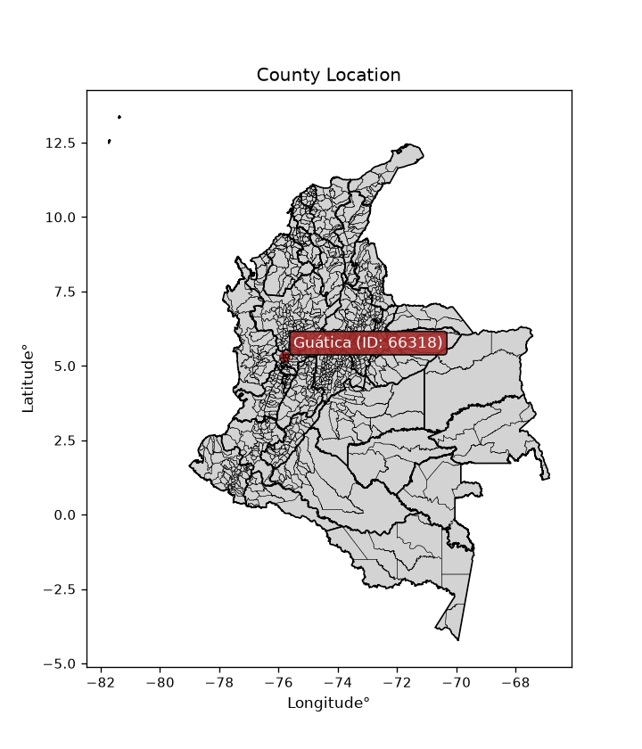
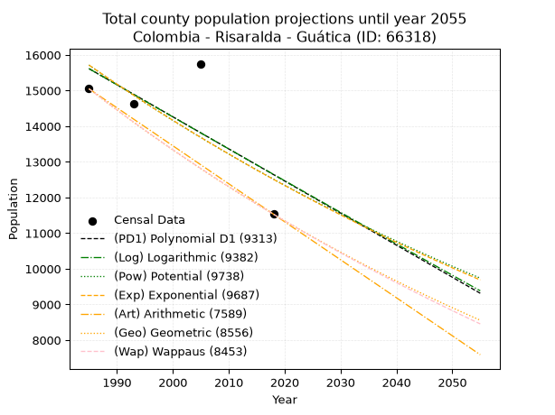
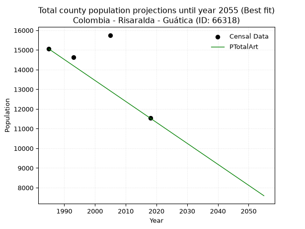
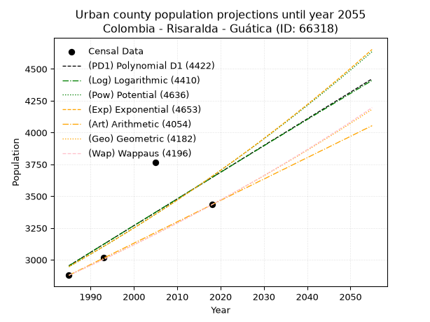
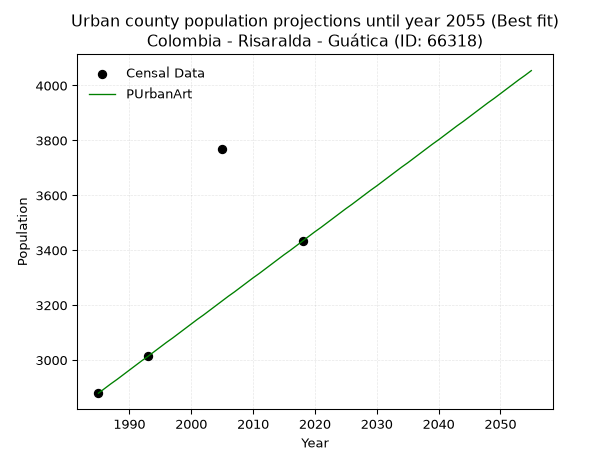
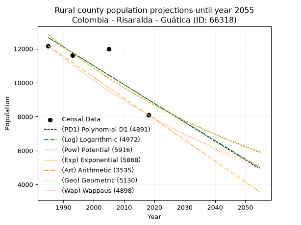
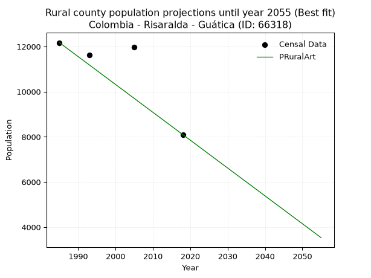

<div align="center">


</div>

# _“Population and Public Services Demand Projections (PPSD) until Year 2050 for Colombia - Risaralda - Guática (ID: 66318)”_
Keywords: `population` `public-service` `projection` `lineal` `polynomial` `logarithmic` `potential` `exponential` `arithmetic` `geometric` `wappaus` `dane` `colombia` `south-america`

PPSD are analytical estimates used by governments and planners to anticipate future changes in population size, age distribution, and the resulting community needs for utilities, healthcare, education, and infrastructure as sizing future water treatment facilities, electrical grids, and road networks based on spatial growth.

> **General running parameters**: • app_version: _v20260806_. • Python version: _3.14.7_. • Pandas version: _3.0.5_. • NumPy version: _2.5.1_. • Creates, save and include plots into reports (create_plot): _False_. • Projection until year: _2050_. • Process polynomial degree 2 and up: _False_. • Process Wappaus: _True_. • Process Wappaus: _True_. • Set negative values to zero: _True_. • Set infinite values to zero: _True_. • Drop dataset notes: _True_. 
<div align="center">

Dynamic map: [:earth_americas:Google](http://maps.google.com/maps?q=5.315366618,-75.799005) [:earth_americas:OSM](https://www.openstreetmap.org/#map=18/5.315366618/-75.799005&layers=P) [:earth_americas:Bing](https://www.bing.com/maps?cp=5.315366618~-75.799005&lvl=18) [:earth_americas:Apple](https://maps.apple.com/frame?center=5.315366618%2C-75.799005&span=0.003%2C0.006)

</div>


<div align="center">

```geojson
{
  "type": "Feature",
  "geometry": {
    "type": "Point", 
    "coordinates": [-75.799005, 5.315366618]
  }, 
  "properties": {
    "Name": "Colombia - Risaralda - Guática (ID: 66318)"
  }
}
```

</div>


<div align="center">

</img>

</div>


## 0. Census Data (4 records)

Census data are official statistics collected by a government about the people and housing in a country. They usually include counts of total population, age, sex, race, income, education, and jobs.

📅Global census file: [Population.xlsx](../data/Population.xlsx)

| Source   |   Year |   CountryID | CountryName   |   StateID | StateName   |   CountyID | CountyName   |   PTotal |   PUrban |   PRural |
|:---------|-------:|------------:|:--------------|----------:|:------------|-----------:|:-------------|---------:|---------:|---------:|
| DANE     |   1985 |          57 | Colombia      |        66 | Risaralda   |      66318 | Guática      |    15049 |     2879 |    12170 |
| DANE     |   1993 |          57 | Colombia      |        66 | Risaralda   |      66318 | Guática      |    14631 |     3016 |    11615 |
| DANE     |   2005 |          57 | Colombia      |        66 | Risaralda   |      66318 | Guática      |    15752 |     3767 |    11985 |
| DANE     |   2018 |          57 | Colombia      |        66 | Risaralda   |      66318 | Guática      |    11532 |     3433 |     8099 |

> 🔥Some records could had specific notes about the registered values or the corresponding urban or rural distribution.

📅   [RUPS](https://www.datos.gov.co/Hacienda-y-Cr-dito-P-blico/Registro-nico-de-Prestadores-de-Servicios-P-blicos/4qkq-csdn/about_data) - Local public utility companies: [RUPS.csv](../data/RUPS.xlsx)

 | SERVICIO       | ESTADO    | NOMBRE                                                                    | NIT         | DEPARTAMENTO_DOMICILIO   | MUNICIPIO_DOMICILIO   | DIRECCION                             |   TELEFONO | EMAIL                               | TIPO_PRESTADOR                            | CLASIFICACION                 |
|:---------------|:----------|:--------------------------------------------------------------------------|:------------|:-------------------------|:----------------------|:--------------------------------------|-----------:|:------------------------------------|:------------------------------------------|:------------------------------|
| ACUEDUCTO      | OPERATIVA | EMPRESAS PUBLICAS MUNICIPALES DE GUATICA  E.S.P.                          | 816003140-7 | RISARALDA                | GUATICA               | EDIFICIO CAM PISO 1 PLAZA PRINCIPAL   |    3539010 | epm.guatica@gmail.com               | EMPRESA INDUSTRIAL Y COMERCIAL DEL ESTADO | MENOR O IGUAL A 2500 USUARIOS |
| ALCANTARILLADO | OPERATIVA | EMPRESAS PUBLICAS MUNICIPALES DE GUATICA  E.S.P.                          | 816003140-7 | RISARALDA                | GUATICA               | EDIFICIO CAM PISO 1 PLAZA PRINCIPAL   |    3539010 | epm.guatica@gmail.com               | EMPRESA INDUSTRIAL Y COMERCIAL DEL ESTADO | MENOR O IGUAL A 2500 USUARIOS |
| ACUEDUCTO      | OPERATIVA | ASOCIACION DE USUARIOS DEL ACUEDUCTO COMUNITARIO SAN CLEMENTE             | 816003234-0 | RISARALDA                | GUATICA               | CGTO SAN CLEMENTE MPIO DE GUATICA RDA |    3539139 | acuesanc@gmail.com                  | ORGANIZACION AUTORIZADA                   | MENOR O IGUAL A 2500 USUARIOS |
| ACUEDUCTO      | OPERATIVA | ASOCIACION DE USUARIOS ACUEDUCTO EL POBLADO                               | 900440475-7 | RISARALDA                | GUATICA               | VEREDA EL POBLADO                     |    3137797 | frang14@hotmail.com                 | ORGANIZACION AUTORIZADA                   | MENOR O IGUAL A 2500 USUARIOS |
| ACUEDUCTO      | OPERATIVA | ASOCIACION DE USUARIOS  ACUEDUCTO SANTA ANA                               | 900223592-0 | RISARALDA                | GUATICA               | CARRERA 2   NUMERO 1 -50              |    3401300 | mariaalciraguapacha@hotmail.com     | ORGANIZACION AUTORIZADA                   | MENOR O IGUAL A 2500 USUARIOS |
| ACUEDUCTO      | OPERATIVA | ASOCIACION DE USUARIOS ACUEDUCTO EL PORVENIR DE GUATICA                   | 900265051-8 | RISARALDA                | GUATICA               | VEREDA EL CARMELO                     |    3137188 | usuarioselporvenir@yahoo.es         | ORGANIZACION AUTORIZADA                   | HASTA 2500 SUSCRIPTORES       |
| ACUEDUCTO      | OPERATIVA | ASOCIACION AMBIENTALISTA LOS ARRAYANES                                    | 816004644-1 | RISARALDA                | GUATICA               | ESCUELA EL SILENCIO                   |    3136584 | asociacionlosarrayanes@yahoo.com.co | ORGANIZACION AUTORIZADA                   | HASTA 2500 SUSCRIPTORES       |
| ACUEDUCTO      | OPERATIVA | ASOCIACION DE USUARIOS DEL ACUEDUCTO DE LA VEREDA PIRA                    | 900182435-5 | RISARALDA                | GUATICA               | CASA 6 VEREDA PIRA                    |    3128745 | veredapira@yahoo.com.co             | ORGANIZACION AUTORIZADA                   | HASTA 2500 SUSCRIPTORES       |
| ACUEDUCTO      | OPERATIVA | ASOCIACION AMBIENTAL ADMINISTRADORA DEL ACUEDUCTO DE LA VEREDA VILLANUEVA | 816007737-1 | RISARALDA                | GUATICA               | vereda villanueva                     |    3137954 | acueductovillanueva@yahoo.com.co    | ORGANIZACION AUTORIZADA                   | HASTA 2500 SUSCRIPTORES       |
| ACUEDUCTO      | OPERATIVA | CORPORACION ACUEDUCTO REGIONAL CORREGIMIENTO DE TRAVESIAS                 | 900648328-7 | RISARALDA                | GUATICA               | CALLE 8 # 6-20                        |    0000000 | acuetravesias1983@hotmail.com       | ORGANIZACION AUTORIZADA                   | MENOR O IGUAL A 2500 USUARIOS |
| ACUEDUCTO      | OPERATIVA | ASOCIACION ACUEDUCTO COMUNITARIO AGUAS CLARAS VEREDA TAUMA                | 900584310-9 | RISARALDA                | GUATICA               | VDA.TAUMA                             |    3539010 | asoaguasclaras@outlook.es           | ORGANIZACION AUTORIZADA                   | MENOR O IGUAL A 2500 USUARIOS |

## 1. Total

### 1.1. Coefficients and Parameters

* (PD1) Polynomial Deg 1: -90.01525491770109, 194294.0136491316 (lineal)
* (Log) Logarithmic: -179814.42857382807, 1381011.9125320655
* (Pow) Potential: -13.806081644381106, 49.72542801952045
* (Exp) Exponential: -0.006910810405081099, 14253104781.381577
* (Art) Arithmetic: Year diff. 2018 - 1985 = 33, Population diff. 11532 - 15049 = -3517, Annual growth = -106.57575757575758
* (Geo) Geometric: Year diff. 2018 - 1985 = 33, Population diff. 11532 - 15049 = -3517, Annual growth % = -0.00803379049219799
* (Wap) Wappaus: i = -0.8018942671514057, Condition values only valid for < 200)

<sub>
Wappaus condition values: ['-0.00', '-0.80', '-1.60', '-2.41', '-3.21', '-4.01', '-4.81', '-5.61', '-6.42', '-7.22', '-8.02', '-8.82', '-9.62', '-10.42', '-11.23', '-12.03', '-12.83', '-13.63', '-14.43', '-15.24', '-16.04', '-16.84', '-17.64', '-18.44', '-19.25', '-20.05', '-20.85', '-21.65', '-22.45', '-23.25', '-24.06', '-24.86', '-25.66', '-26.46', '-27.26', '-28.07', '-28.87', '-29.67', '-30.47', '-31.27', '-32.08', '-32.88', '-33.68', '-34.48', '-35.28', '-36.09', '-36.89', '-37.69', '-38.49', '-39.29', '-40.09', '-40.90', '-41.70', '-42.50', '-43.30', '-44.10', '-44.91', '-45.71', '-46.51', '-47.31', '-48.11', '-48.92', '-49.72', '-50.52', '-51.32', '-52.12']
</sub>


### 1.2. Projected Dataset

|   Year |   CountyID |   PTotalPD1 |   PTotalLog |   PTotalPow |   PTotalExp |   PTotalArt |   PTotalGeo |   PTotalWap |
|-------:|-----------:|------------:|------------:|------------:|------------:|------------:|------------:|------------:|
|   1985 |      66318 |       15614 |       15614 |       15714 |       15714 |       15049 |       15049 |       15049 |
|   1986 |      66318 |       15524 |       15523 |       15605 |       15605 |       14942 |       14928 |       14929 |
|   1987 |      66318 |       15434 |       15433 |       15497 |       15498 |       14836 |       14808 |       14810 |
|   1988 |      66318 |       15344 |       15342 |       15389 |       15391 |       14729 |       14689 |       14691 |
|   1989 |      66318 |       15254 |       15252 |       15283 |       15285 |       14623 |       14571 |       14574 |
|   1990 |      66318 |       15164 |       15161 |       15177 |       15180 |       14516 |       14454 |       14457 |
|   1991 |      66318 |       15074 |       15071 |       15072 |       15075 |       14410 |       14338 |       14342 |
|   1992 |      66318 |       14984 |       14981 |       14968 |       14972 |       14303 |       14223 |       14227 |
|   1993 |      66318 |       14894 |       14890 |       14865 |       14868 |       14196 |       14109 |       14114 |
|   1994 |      66318 |       14804 |       14800 |       14762 |       14766 |       14090 |       13995 |       14001 |
|   1995 |      66318 |       14714 |       14710 |       14660 |       14664 |       13983 |       13883 |       13889 |
|   1996 |      66318 |       14624 |       14620 |       14559 |       14563 |       13877 |       13771 |       13778 |
|   1997 |      66318 |       14534 |       14530 |       14459 |       14463 |       13770 |       13661 |       13667 |
|   1998 |      66318 |       14444 |       14440 |       14359 |       14363 |       13664 |       13551 |       13558 |
|   1999 |      66318 |       14354 |       14350 |       14261 |       14265 |       13557 |       13442 |       13449 |
|   2000 |      66318 |       14264 |       14260 |       14162 |       14166 |       13450 |       13334 |       13342 |
|   2001 |      66318 |       14173 |       14170 |       14065 |       14069 |       13344 |       13227 |       13235 |
|   2002 |      66318 |       14083 |       14080 |       13968 |       13972 |       13237 |       13121 |       13128 |
|   2003 |      66318 |       13993 |       13990 |       13872 |       13876 |       13131 |       13015 |       13023 |
|   2004 |      66318 |       13903 |       13901 |       13777 |       13780 |       13024 |       12911 |       12918 |
|   2005 |      66318 |       13813 |       13811 |       13683 |       13685 |       12917 |       12807 |       12815 |
|   2006 |      66318 |       13723 |       13721 |       13589 |       13591 |       12811 |       12704 |       12712 |
|   2007 |      66318 |       13633 |       13632 |       13496 |       13497 |       12704 |       12602 |       12609 |
|   2008 |      66318 |       13543 |       13542 |       13403 |       13404 |       12598 |       12501 |       12508 |
|   2009 |      66318 |       13453 |       13453 |       13311 |       13312 |       12491 |       12400 |       12407 |
|   2010 |      66318 |       13363 |       13363 |       13220 |       13220 |       12385 |       12301 |       12307 |
|   2011 |      66318 |       13273 |       13274 |       13130 |       13129 |       12278 |       12202 |       12208 |
|   2012 |      66318 |       13183 |       13184 |       13040 |       13039 |       12171 |       12104 |       12109 |
|   2013 |      66318 |       13093 |       13095 |       12951 |       12949 |       12065 |       12007 |       12011 |
|   2014 |      66318 |       13003 |       13006 |       12862 |       12860 |       11958 |       11910 |       11914 |
|   2015 |      66318 |       12913 |       12916 |       12774 |       12771 |       11852 |       11814 |       11817 |
|   2016 |      66318 |       12823 |       12827 |       12687 |       12683 |       11745 |       11720 |       11722 |
|   2017 |      66318 |       12733 |       12738 |       12601 |       12596 |       11639 |       11625 |       11626 |
|   2018 |      66318 |       12643 |       12649 |       12515 |       12509 |       11532 |       11532 |       11532 |
|   2019 |      66318 |       12553 |       12560 |       12429 |       12423 |       11425 |       11439 |       11438 |
|   2020 |      66318 |       12463 |       12471 |       12345 |       12338 |       11319 |       11347 |       11345 |
|   2021 |      66318 |       12373 |       12382 |       12261 |       12253 |       11212 |       11256 |       11253 |
|   2022 |      66318 |       12283 |       12293 |       12177 |       12168 |       11106 |       11166 |       11161 |
|   2023 |      66318 |       12193 |       12204 |       12094 |       12084 |       10999 |       11076 |       11070 |
|   2024 |      66318 |       12103 |       12115 |       12012 |       12001 |       10893 |       10987 |       10979 |
|   2025 |      66318 |       12013 |       12026 |       11930 |       11919 |       10786 |       10899 |       10889 |
|   2026 |      66318 |       11923 |       11937 |       11849 |       11836 |       10679 |       10811 |       10800 |
|   2027 |      66318 |       11833 |       11849 |       11769 |       11755 |       10573 |       10724 |       10711 |
|   2028 |      66318 |       11743 |       11760 |       11689 |       11674 |       10466 |       10638 |       10623 |
|   2029 |      66318 |       11653 |       11671 |       11610 |       11594 |       10360 |       10553 |       10535 |
|   2030 |      66318 |       11563 |       11583 |       11531 |       11514 |       10253 |       10468 |       10449 |
|   2031 |      66318 |       11473 |       11494 |       11453 |       11434 |       10147 |       10384 |       10362 |
|   2032 |      66318 |       11383 |       11406 |       11375 |       11356 |       10040 |       10301 |       10277 |
|   2033 |      66318 |       11293 |       11317 |       11298 |       11277 |        9933 |       10218 |       10191 |
|   2034 |      66318 |       11203 |       11229 |       11222 |       11200 |        9827 |       10136 |       10107 |
|   2035 |      66318 |       11113 |       11140 |       11146 |       11123 |        9720 |       10054 |       10023 |
|   2036 |      66318 |       11023 |       11052 |       11071 |       11046 |        9614 |        9974 |        9939 |
|   2037 |      66318 |       10933 |       10964 |       10996 |       10970 |        9507 |        9893 |        9856 |
|   2038 |      66318 |       10843 |       10876 |       10922 |       10894 |        9400 |        9814 |        9774 |
|   2039 |      66318 |       10753 |       10787 |       10848 |       10819 |        9294 |        9735 |        9692 |
|   2040 |      66318 |       10663 |       10699 |       10775 |       10745 |        9187 |        9657 |        9611 |
|   2041 |      66318 |       10573 |       10611 |       10702 |       10671 |        9081 |        9579 |        9530 |
|   2042 |      66318 |       10483 |       10523 |       10630 |       10597 |        8974 |        9502 |        9450 |
|   2043 |      66318 |       10393 |       10435 |       10558 |       10524 |        8868 |        9426 |        9370 |
|   2044 |      66318 |       10303 |       10347 |       10487 |       10452 |        8761 |        9350 |        9291 |
|   2045 |      66318 |       10213 |       10259 |       10417 |       10380 |        8654 |        9275 |        9212 |
|   2046 |      66318 |       10123 |       10171 |       10347 |       10308 |        8548 |        9201 |        9134 |
|   2047 |      66318 |       10033 |       10083 |       10277 |       10237 |        8441 |        9127 |        9057 |
|   2048 |      66318 |        9943 |        9995 |       10208 |       10167 |        8335 |        9053 |        8979 |
|   2049 |      66318 |        9853 |        9908 |       10139 |       10097 |        8228 |        8981 |        8903 |
|   2050 |      66318 |        9763 |        9820 |       10071 |       10027 |        8122 |        8909 |        8827 |
<div align="center">

</img>

</div>


### 1.3. Best fit with absolute and relative error (%)

Relative error puts that difference into context by dividing the absolute error by the true value, creating a unitless ratio or percentage that shows the scale of the mistake.

Absolute and relative error

|   Year | Source   |   CountryID | CountryName   |   StateID | StateName   |   CountyID_x | CountyName   |   PTotal |   PUrban |   PRural |   CountyID_y |   PTotalPD1 |   PTotalLog |   PTotalPow |   PTotalExp |   PTotalArt |   PTotalGeo |   PTotalWap |   PTotalPD1AbsError |   PTotalLogAbsError |   PTotalPowAbsError |   PTotalExpAbsError |   PTotalArtAbsError |   PTotalGeoAbsError |   PTotalWapAbsError |   PTotalPD1RelError |   PTotalLogRelError |   PTotalPowRelError |   PTotalExpRelError |   PTotalArtRelError |   PTotalGeoRelError |   PTotalWapRelError |
|-------:|:---------|------------:|:--------------|----------:|:------------|-------------:|:-------------|---------:|---------:|---------:|-------------:|------------:|------------:|------------:|------------:|------------:|------------:|------------:|--------------------:|--------------------:|--------------------:|--------------------:|--------------------:|--------------------:|--------------------:|--------------------:|--------------------:|--------------------:|--------------------:|--------------------:|--------------------:|--------------------:|
|   1985 | DANE     |          57 | Colombia      |        66 | Risaralda   |        66318 | Guática      |    15049 |     2879 |    12170 |        66318 |       15614 |       15614 |       15714 |       15714 |       15049 |       15049 |       15049 |                 565 |                 565 |                 665 |                 665 |                   0 |                   0 |                   0 |             3.7544  |             3.7544  |             4.4189  |             4.4189  |             0       |             0       |             0       |
|   1993 | DANE     |          57 | Colombia      |        66 | Risaralda   |        66318 | Guática      |    14631 |     3016 |    11615 |        66318 |       14894 |       14890 |       14865 |       14868 |       14196 |       14109 |       14114 |                 263 |                 259 |                 234 |                 237 |                 435 |                 522 |                 517 |             1.79755 |             1.77021 |             1.59934 |             1.61985 |             2.97314 |             3.56777 |             3.53359 |
|   2005 | DANE     |          57 | Colombia      |        66 | Risaralda   |        66318 | Guática      |    15752 |     3767 |    11985 |        66318 |       13813 |       13811 |       13683 |       13685 |       12917 |       12807 |       12815 |                1939 |                1941 |                2069 |                2067 |                2835 |                2945 |                2937 |            12.3095  |            12.3222  |            13.1348  |            13.1221  |            17.9977  |            18.696   |            18.6453  |
|   2018 | DANE     |          57 | Colombia      |        66 | Risaralda   |        66318 | Guática      |    11532 |     3433 |     8099 |        66318 |       12643 |       12649 |       12515 |       12509 |       11532 |       11532 |       11532 |                1111 |                1117 |                 983 |                 977 |                   0 |                   0 |                   0 |             9.63406 |             9.68609 |             8.52411 |             8.47208 |             0       |             0       |             0       |

Relative error mean

| Method    |   RelError | Best   |
|:----------|-----------:|:-------|
| PTotalPD1 |    6.87389 |        |
| PTotalLog |    6.88324 |        |
| PTotalPow |    6.9193  |        |
| PTotalExp |    6.90824 |        |
| PTotalArt |    5.24271 | True   |
| PTotalGeo |    5.56595 |        |
| PTotalWap |    5.54471 |        |

💙Best method: _**PTotalArt**_
<div align="center">

</img>

</div>


### 1.4. Fresh water supply demand in liters per capita per day (lpcd)

The fresh water supply demand typically ranges from 100 to 300 liters per capita per day (lpcd) for standard domestic and municipal planning, though absolute survival minimums set by the World Health Organization are as low as 7.5 to 20 liters per day, and total consumption in high-income nations can exceed 400 liters.

> `CZ`: Level in meters above the sea level (masl)<br> `WS`: Fresh water supply demand in liters per capita per day (lpcd or l/h/d)<br> `WSAll`: Zonal fresh water supply demand in liters per second (l/s)<br> `A`: Zonal area in square meters<br> `DP`: Population density (people/hectare or p/ha)

Reference values (RAS Colombia)

|    CZ |   WS |
|------:|-----:|
|  1000 |  120 |
|  2000 |  130 |
| 99999 |  140 |

County shapefile geometry properties and water supply values

|   CountyID |      ATotal |   CZTotal |   WSTotal |
|-----------:|------------:|----------:|----------:|
|      66318 | 1.00798e+08 |   1885.57 |       130 |

Projected values for best method: PTotalArt

|   CountyID |   Year |   PTotalArt |   DPTotal |   WSTotal |   WSTotalAll |
|-----------:|-------:|------------:|----------:|----------:|-------------:|
|      66318 |   1985 |       15049 |      1.49 |       130 |      22.6432 |
|      66318 |   1986 |       14942 |      1.48 |       130 |      22.4822 |
|      66318 |   1987 |       14836 |      1.47 |       130 |      22.3227 |
|      66318 |   1988 |       14729 |      1.46 |       130 |      22.1617 |
|      66318 |   1989 |       14623 |      1.45 |       130 |      22.0022 |
|      66318 |   1990 |       14516 |      1.44 |       130 |      21.8412 |
|      66318 |   1991 |       14410 |      1.43 |       130 |      21.6817 |
|      66318 |   1992 |       14303 |      1.42 |       130 |      21.5207 |
|      66318 |   1993 |       14196 |      1.41 |       130 |      21.3597 |
|      66318 |   1994 |       14090 |      1.4  |       130 |      21.2002 |
|      66318 |   1995 |       13983 |      1.39 |       130 |      21.0392 |
|      66318 |   1996 |       13877 |      1.38 |       130 |      20.8797 |
|      66318 |   1997 |       13770 |      1.37 |       130 |      20.7188 |
|      66318 |   1998 |       13664 |      1.36 |       130 |      20.5593 |
|      66318 |   1999 |       13557 |      1.34 |       130 |      20.3983 |
|      66318 |   2000 |       13450 |      1.33 |       130 |      20.2373 |
|      66318 |   2001 |       13344 |      1.32 |       130 |      20.0778 |
|      66318 |   2002 |       13237 |      1.31 |       130 |      19.9168 |
|      66318 |   2003 |       13131 |      1.3  |       130 |      19.7573 |
|      66318 |   2004 |       13024 |      1.29 |       130 |      19.5963 |
|      66318 |   2005 |       12917 |      1.28 |       130 |      19.4353 |
|      66318 |   2006 |       12811 |      1.27 |       130 |      19.2758 |
|      66318 |   2007 |       12704 |      1.26 |       130 |      19.1148 |
|      66318 |   2008 |       12598 |      1.25 |       130 |      18.9553 |
|      66318 |   2009 |       12491 |      1.24 |       130 |      18.7943 |
|      66318 |   2010 |       12385 |      1.23 |       130 |      18.6348 |
|      66318 |   2011 |       12278 |      1.22 |       130 |      18.4738 |
|      66318 |   2012 |       12171 |      1.21 |       130 |      18.3128 |
|      66318 |   2013 |       12065 |      1.2  |       130 |      18.1534 |
|      66318 |   2014 |       11958 |      1.19 |       130 |      17.9924 |
|      66318 |   2015 |       11852 |      1.18 |       130 |      17.8329 |
|      66318 |   2016 |       11745 |      1.17 |       130 |      17.6719 |
|      66318 |   2017 |       11639 |      1.15 |       130 |      17.5124 |
|      66318 |   2018 |       11532 |      1.14 |       130 |      17.3514 |
|      66318 |   2019 |       11425 |      1.13 |       130 |      17.1904 |
|      66318 |   2020 |       11319 |      1.12 |       130 |      17.0309 |
|      66318 |   2021 |       11212 |      1.11 |       130 |      16.8699 |
|      66318 |   2022 |       11106 |      1.1  |       130 |      16.7104 |
|      66318 |   2023 |       10999 |      1.09 |       130 |      16.5494 |
|      66318 |   2024 |       10893 |      1.08 |       130 |      16.3899 |
|      66318 |   2025 |       10786 |      1.07 |       130 |      16.2289 |
|      66318 |   2026 |       10679 |      1.06 |       130 |      16.0679 |
|      66318 |   2027 |       10573 |      1.05 |       130 |      15.9084 |
|      66318 |   2028 |       10466 |      1.04 |       130 |      15.7475 |
|      66318 |   2029 |       10360 |      1.03 |       130 |      15.588  |
|      66318 |   2030 |       10253 |      1.02 |       130 |      15.427  |
|      66318 |   2031 |       10147 |      1.01 |       130 |      15.2675 |
|      66318 |   2032 |       10040 |      1    |       130 |      15.1065 |
|      66318 |   2033 |        9933 |      0.99 |       130 |      14.9455 |
|      66318 |   2034 |        9827 |      0.97 |       130 |      14.786  |
|      66318 |   2035 |        9720 |      0.96 |       130 |      14.625  |
|      66318 |   2036 |        9614 |      0.95 |       130 |      14.4655 |
|      66318 |   2037 |        9507 |      0.94 |       130 |      14.3045 |
|      66318 |   2038 |        9400 |      0.93 |       130 |      14.1435 |
|      66318 |   2039 |        9294 |      0.92 |       130 |      13.984  |
|      66318 |   2040 |        9187 |      0.91 |       130 |      13.823  |
|      66318 |   2041 |        9081 |      0.9  |       130 |      13.6635 |
|      66318 |   2042 |        8974 |      0.89 |       130 |      13.5025 |
|      66318 |   2043 |        8868 |      0.88 |       130 |      13.3431 |
|      66318 |   2044 |        8761 |      0.87 |       130 |      13.1821 |
|      66318 |   2045 |        8654 |      0.86 |       130 |      13.0211 |
|      66318 |   2046 |        8548 |      0.85 |       130 |      12.8616 |
|      66318 |   2047 |        8441 |      0.84 |       130 |      12.7006 |
|      66318 |   2048 |        8335 |      0.83 |       130 |      12.5411 |
|      66318 |   2049 |        8228 |      0.82 |       130 |      12.3801 |
|      66318 |   2050 |        8122 |      0.81 |       130 |      12.2206 |

## 2. Urban

### 2.1. Coefficients and Parameters

* (PD1) Polynomial Deg 1: 20.96868727418726, -38668.866720193066 (lineal)
* (Log) Logarithmic: 42036.42432151536, -316245.44812660187
* (Pow) Potential: 13.080960854627994, -39.66865819767674
* (Exp) Exponential: 0.006525537699556236, 0.006980187303085704
* (Art) Arithmetic: Year diff. 2018 - 1985 = 33, Population diff. 3433 - 2879 = 554, Annual growth = 16.78787878787879
* (Geo) Geometric: Year diff. 2018 - 1985 = 33, Population diff. 3433 - 2879 = 554, Annual growth % = 0.005347322006811428
* (Wap) Wappaus: i = 0.5319353228098476, Condition values only valid for < 200)

<sub>
Wappaus condition values: ['0.00', '0.53', '1.06', '1.60', '2.13', '2.66', '3.19', '3.72', '4.26', '4.79', '5.32', '5.85', '6.38', '6.92', '7.45', '7.98', '8.51', '9.04', '9.57', '10.11', '10.64', '11.17', '11.70', '12.23', '12.77', '13.30', '13.83', '14.36', '14.89', '15.43', '15.96', '16.49', '17.02', '17.55', '18.09', '18.62', '19.15', '19.68', '20.21', '20.75', '21.28', '21.81', '22.34', '22.87', '23.41', '23.94', '24.47', '25.00', '25.53', '26.06', '26.60', '27.13', '27.66', '28.19', '28.72', '29.26', '29.79', '30.32', '30.85', '31.38', '31.92', '32.45', '32.98', '33.51', '34.04', '34.58']
</sub>


### 2.2. Projected Dataset

|   Year |   CountyID |   PUrbanPD1 |   PUrbanLog |   PUrbanPow |   PUrbanExp |   PUrbanArt |   PUrbanGeo |   PUrbanWap |
|-------:|-----------:|------------:|------------:|------------:|------------:|------------:|------------:|------------:|
|   1985 |      66318 |        2954 |        2953 |        2946 |        2947 |        2879 |        2879 |        2879 |
|   1986 |      66318 |        2975 |        2974 |        2965 |        2966 |        2896 |        2894 |        2894 |
|   1987 |      66318 |        2996 |        2995 |        2985 |        2986 |        2913 |        2910 |        2910 |
|   1988 |      66318 |        3017 |        3016 |        3005 |        3005 |        2929 |        2925 |        2925 |
|   1989 |      66318 |        3038 |        3037 |        3025 |        3025 |        2946 |        2941 |        2941 |
|   1990 |      66318 |        3059 |        3059 |        3044 |        3045 |        2963 |        2957 |        2957 |
|   1991 |      66318 |        3080 |        3080 |        3065 |        3065 |        2980 |        2973 |        2972 |
|   1992 |      66318 |        3101 |        3101 |        3085 |        3085 |        2997 |        2989 |        2988 |
|   1993 |      66318 |        3122 |        3122 |        3105 |        3105 |        3013 |        3004 |        3004 |
|   1994 |      66318 |        3143 |        3143 |        3125 |        3125 |        3030 |        3021 |        3020 |
|   1995 |      66318 |        3164 |        3164 |        3146 |        3146 |        3047 |        3037 |        3036 |
|   1996 |      66318 |        3185 |        3185 |        3167 |        3166 |        3064 |        3053 |        3053 |
|   1997 |      66318 |        3206 |        3206 |        3188 |        3187 |        3080 |        3069 |        3069 |
|   1998 |      66318 |        3227 |        3227 |        3209 |        3208 |        3097 |        3086 |        3085 |
|   1999 |      66318 |        3248 |        3248 |        3230 |        3229 |        3114 |        3102 |        3102 |
|   2000 |      66318 |        3269 |        3269 |        3251 |        3250 |        3131 |        3119 |        3118 |
|   2001 |      66318 |        3289 |        3290 |        3272 |        3271 |        3148 |        3135 |        3135 |
|   2002 |      66318 |        3310 |        3311 |        3294 |        3293 |        3164 |        3152 |        3152 |
|   2003 |      66318 |        3331 |        3332 |        3315 |        3314 |        3181 |        3169 |        3169 |
|   2004 |      66318 |        3352 |        3353 |        3337 |        3336 |        3198 |        3186 |        3185 |
|   2005 |      66318 |        3373 |        3374 |        3359 |        3358 |        3215 |        3203 |        3202 |
|   2006 |      66318 |        3394 |        3395 |        3381 |        3380 |        3232 |        3220 |        3220 |
|   2007 |      66318 |        3415 |        3416 |        3403 |        3402 |        3248 |        3237 |        3237 |
|   2008 |      66318 |        3436 |        3437 |        3425 |        3424 |        3265 |        3255 |        3254 |
|   2009 |      66318 |        3457 |        3458 |        3447 |        3447 |        3282 |        3272 |        3272 |
|   2010 |      66318 |        3478 |        3479 |        3470 |        3469 |        3299 |        3290 |        3289 |
|   2011 |      66318 |        3499 |        3500 |        3493 |        3492 |        3315 |        3307 |        3307 |
|   2012 |      66318 |        3520 |        3521 |        3515 |        3515 |        3332 |        3325 |        3324 |
|   2013 |      66318 |        3541 |        3542 |        3538 |        3538 |        3349 |        3343 |        3342 |
|   2014 |      66318 |        3562 |        3563 |        3561 |        3561 |        3366 |        3361 |        3360 |
|   2015 |      66318 |        3583 |        3583 |        3585 |        3584 |        3383 |        3379 |        3378 |
|   2016 |      66318 |        3604 |        3604 |        3608 |        3608 |        3399 |        3397 |        3396 |
|   2017 |      66318 |        3625 |        3625 |        3631 |        3631 |        3416 |        3415 |        3415 |
|   2018 |      66318 |        3646 |        3646 |        3655 |        3655 |        3433 |        3433 |        3433 |
|   2019 |      66318 |        3667 |        3667 |        3679 |        3679 |        3450 |        3451 |        3451 |
|   2020 |      66318 |        3688 |        3688 |        3703 |        3703 |        3467 |        3470 |        3470 |
|   2021 |      66318 |        3709 |        3708 |        3727 |        3727 |        3483 |        3488 |        3489 |
|   2022 |      66318 |        3730 |        3729 |        3751 |        3752 |        3500 |        3507 |        3507 |
|   2023 |      66318 |        3751 |        3750 |        3775 |        3776 |        3517 |        3526 |        3526 |
|   2024 |      66318 |        3772 |        3771 |        3800 |        3801 |        3534 |        3545 |        3545 |
|   2025 |      66318 |        3793 |        3792 |        3824 |        3826 |        3551 |        3564 |        3565 |
|   2026 |      66318 |        3814 |        3812 |        3849 |        3851 |        3567 |        3583 |        3584 |
|   2027 |      66318 |        3835 |        3833 |        3874 |        3876 |        3584 |        3602 |        3603 |
|   2028 |      66318 |        3856 |        3854 |        3899 |        3901 |        3601 |        3621 |        3623 |
|   2029 |      66318 |        3877 |        3874 |        3924 |        3927 |        3618 |        3640 |        3642 |
|   2030 |      66318 |        3898 |        3895 |        3950 |        3953 |        3634 |        3660 |        3662 |
|   2031 |      66318 |        3919 |        3916 |        3975 |        3979 |        3651 |        3679 |        3682 |
|   2032 |      66318 |        3940 |        3937 |        4001 |        4005 |        3668 |        3699 |        3702 |
|   2033 |      66318 |        3960 |        3957 |        4027 |        4031 |        3685 |        3719 |        3722 |
|   2034 |      66318 |        3981 |        3978 |        4053 |        4057 |        3702 |        3739 |        3742 |
|   2035 |      66318 |        4002 |        3999 |        4079 |        4084 |        3718 |        3759 |        3762 |
|   2036 |      66318 |        4023 |        4019 |        4105 |        4111 |        3735 |        3779 |        3783 |
|   2037 |      66318 |        4044 |        4040 |        4132 |        4137 |        3752 |        3799 |        3803 |
|   2038 |      66318 |        4065 |        4061 |        4158 |        4165 |        3769 |        3819 |        3824 |
|   2039 |      66318 |        4086 |        4081 |        4185 |        4192 |        3786 |        3840 |        3845 |
|   2040 |      66318 |        4107 |        4102 |        4212 |        4219 |        3802 |        3860 |        3866 |
|   2041 |      66318 |        4128 |        4122 |        4239 |        4247 |        3819 |        3881 |        3887 |
|   2042 |      66318 |        4149 |        4143 |        4266 |        4275 |        3836 |        3902 |        3908 |
|   2043 |      66318 |        4170 |        4164 |        4294 |        4303 |        3853 |        3923 |        3929 |
|   2044 |      66318 |        4191 |        4184 |        4321 |        4331 |        3869 |        3944 |        3951 |
|   2045 |      66318 |        4212 |        4205 |        4349 |        4359 |        3886 |        3965 |        3972 |
|   2046 |      66318 |        4233 |        4225 |        4377 |        4388 |        3903 |        3986 |        3994 |
|   2047 |      66318 |        4254 |        4246 |        4405 |        4416 |        3920 |        4007 |        4016 |
|   2048 |      66318 |        4275 |        4266 |        4433 |        4445 |        3937 |        4029 |        4038 |
|   2049 |      66318 |        4296 |        4287 |        4462 |        4474 |        3953 |        4050 |        4060 |
|   2050 |      66318 |        4317 |        4307 |        4490 |        4504 |        3970 |        4072 |        4082 |
<div align="center">

</img>

</div>


### 2.3. Best fit with absolute and relative error (%)

Relative error puts that difference into context by dividing the absolute error by the true value, creating a unitless ratio or percentage that shows the scale of the mistake.

Absolute and relative error

|   Year | Source   |   CountryID | CountryName   |   StateID | StateName   |   CountyID_x | CountyName   |   PTotal |   PUrban |   PRural |   CountyID_y |   PUrbanPD1 |   PUrbanLog |   PUrbanPow |   PUrbanExp |   PUrbanArt |   PUrbanGeo |   PUrbanWap |   PUrbanPD1AbsError |   PUrbanLogAbsError |   PUrbanPowAbsError |   PUrbanExpAbsError |   PUrbanArtAbsError |   PUrbanGeoAbsError |   PUrbanWapAbsError |   PUrbanPD1RelError |   PUrbanLogRelError |   PUrbanPowRelError |   PUrbanExpRelError |   PUrbanArtRelError |   PUrbanGeoRelError |   PUrbanWapRelError |
|-------:|:---------|------------:|:--------------|----------:|:------------|-------------:|:-------------|---------:|---------:|---------:|-------------:|------------:|------------:|------------:|------------:|------------:|------------:|------------:|--------------------:|--------------------:|--------------------:|--------------------:|--------------------:|--------------------:|--------------------:|--------------------:|--------------------:|--------------------:|--------------------:|--------------------:|--------------------:|--------------------:|
|   1985 | DANE     |          57 | Colombia      |        66 | Risaralda   |        66318 | Guática      |    15049 |     2879 |    12170 |        66318 |        2954 |        2953 |        2946 |        2947 |        2879 |        2879 |        2879 |                  75 |                  74 |                  67 |                  68 |                   0 |                   0 |                   0 |             2.60507 |             2.57034 |             2.3272  |             2.36193 |           0         |            0        |            0        |
|   1993 | DANE     |          57 | Colombia      |        66 | Risaralda   |        66318 | Guática      |    14631 |     3016 |    11615 |        66318 |        3122 |        3122 |        3105 |        3105 |        3013 |        3004 |        3004 |                 106 |                 106 |                  89 |                  89 |                   3 |                  12 |                  12 |             3.51459 |             3.51459 |             2.95093 |             2.95093 |           0.0994695 |            0.397878 |            0.397878 |
|   2005 | DANE     |          57 | Colombia      |        66 | Risaralda   |        66318 | Guática      |    15752 |     3767 |    11985 |        66318 |        3373 |        3374 |        3359 |        3358 |        3215 |        3203 |        3202 |                 394 |                 393 |                 408 |                 409 |                 552 |                 564 |                 565 |            10.4593  |            10.4327  |            10.8309  |            10.8574  |          14.6536    |           14.9721   |           14.9987   |
|   2018 | DANE     |          57 | Colombia      |        66 | Risaralda   |        66318 | Guática      |    11532 |     3433 |     8099 |        66318 |        3646 |        3646 |        3655 |        3655 |        3433 |        3433 |        3433 |                 213 |                 213 |                 222 |                 222 |                   0 |                   0 |                   0 |             6.20449 |             6.20449 |             6.46665 |             6.46665 |           0         |            0        |            0        |

Relative error mean

| Method    |   RelError | Best   |
|:----------|-----------:|:-------|
| PUrbanPD1 |    5.69585 |        |
| PUrbanLog |    5.68053 |        |
| PUrbanPow |    5.64392 |        |
| PUrbanExp |    5.65924 |        |
| PUrbanArt |    3.68826 | True   |
| PUrbanGeo |    3.8425  |        |
| PUrbanWap |    3.84914 |        |

💙Best method: _**PUrbanArt**_
<div align="center">

</img>

</div>


### 2.4. Fresh water supply demand in liters per capita per day (lpcd)

The fresh water supply demand typically ranges from 100 to 300 liters per capita per day (lpcd) for standard domestic and municipal planning, though absolute survival minimums set by the World Health Organization are as low as 7.5 to 20 liters per day, and total consumption in high-income nations can exceed 400 liters.

> `CZ`: Level in meters above the sea level (masl)<br> `WS`: Fresh water supply demand in liters per capita per day (lpcd or l/h/d)<br> `WSAll`: Zonal fresh water supply demand in liters per second (l/s)<br> `A`: Zonal area in square meters<br> `DP`: Population density (people/hectare or p/ha)

Reference values (RAS Colombia)

|    CZ |   WS |
|------:|-----:|
|  1000 |  120 |
|  2000 |  130 |
| 99999 |  140 |

County shapefile geometry properties and water supply values

|   CountyID |   AUrban |   CZUrban |   WSUrban |
|-----------:|---------:|----------:|----------:|
|      66318 |   612608 |   1891.34 |       130 |

Projected values for best method: PUrbanArt

|   CountyID |   Year |   PUrbanArt |   DPUrban |   WSUrban |   WSUrbanAll |
|-----------:|-------:|------------:|----------:|----------:|-------------:|
|      66318 |   1985 |        2879 |     47    |       130 |      4.33183 |
|      66318 |   1986 |        2896 |     47.27 |       130 |      4.35741 |
|      66318 |   1987 |        2913 |     47.55 |       130 |      4.38299 |
|      66318 |   1988 |        2929 |     47.81 |       130 |      4.40706 |
|      66318 |   1989 |        2946 |     48.09 |       130 |      4.43264 |
|      66318 |   1990 |        2963 |     48.37 |       130 |      4.45822 |
|      66318 |   1991 |        2980 |     48.64 |       130 |      4.4838  |
|      66318 |   1992 |        2997 |     48.92 |       130 |      4.50938 |
|      66318 |   1993 |        3013 |     49.18 |       130 |      4.53345 |
|      66318 |   1994 |        3030 |     49.46 |       130 |      4.55903 |
|      66318 |   1995 |        3047 |     49.74 |       130 |      4.58461 |
|      66318 |   1996 |        3064 |     50.02 |       130 |      4.61019 |
|      66318 |   1997 |        3080 |     50.28 |       130 |      4.63426 |
|      66318 |   1998 |        3097 |     50.55 |       130 |      4.65984 |
|      66318 |   1999 |        3114 |     50.83 |       130 |      4.68542 |
|      66318 |   2000 |        3131 |     51.11 |       130 |      4.711   |
|      66318 |   2001 |        3148 |     51.39 |       130 |      4.73657 |
|      66318 |   2002 |        3164 |     51.65 |       130 |      4.76065 |
|      66318 |   2003 |        3181 |     51.93 |       130 |      4.78623 |
|      66318 |   2004 |        3198 |     52.2  |       130 |      4.81181 |
|      66318 |   2005 |        3215 |     52.48 |       130 |      4.83738 |
|      66318 |   2006 |        3232 |     52.76 |       130 |      4.86296 |
|      66318 |   2007 |        3248 |     53.02 |       130 |      4.88704 |
|      66318 |   2008 |        3265 |     53.3  |       130 |      4.91262 |
|      66318 |   2009 |        3282 |     53.57 |       130 |      4.93819 |
|      66318 |   2010 |        3299 |     53.85 |       130 |      4.96377 |
|      66318 |   2011 |        3315 |     54.11 |       130 |      4.98785 |
|      66318 |   2012 |        3332 |     54.39 |       130 |      5.01343 |
|      66318 |   2013 |        3349 |     54.67 |       130 |      5.039   |
|      66318 |   2014 |        3366 |     54.95 |       130 |      5.06458 |
|      66318 |   2015 |        3383 |     55.22 |       130 |      5.09016 |
|      66318 |   2016 |        3399 |     55.48 |       130 |      5.11424 |
|      66318 |   2017 |        3416 |     55.76 |       130 |      5.13981 |
|      66318 |   2018 |        3433 |     56.04 |       130 |      5.16539 |
|      66318 |   2019 |        3450 |     56.32 |       130 |      5.19097 |
|      66318 |   2020 |        3467 |     56.59 |       130 |      5.21655 |
|      66318 |   2021 |        3483 |     56.86 |       130 |      5.24062 |
|      66318 |   2022 |        3500 |     57.13 |       130 |      5.2662  |
|      66318 |   2023 |        3517 |     57.41 |       130 |      5.29178 |
|      66318 |   2024 |        3534 |     57.69 |       130 |      5.31736 |
|      66318 |   2025 |        3551 |     57.97 |       130 |      5.34294 |
|      66318 |   2026 |        3567 |     58.23 |       130 |      5.36701 |
|      66318 |   2027 |        3584 |     58.5  |       130 |      5.39259 |
|      66318 |   2028 |        3601 |     58.78 |       130 |      5.41817 |
|      66318 |   2029 |        3618 |     59.06 |       130 |      5.44375 |
|      66318 |   2030 |        3634 |     59.32 |       130 |      5.46782 |
|      66318 |   2031 |        3651 |     59.6  |       130 |      5.4934  |
|      66318 |   2032 |        3668 |     59.88 |       130 |      5.51898 |
|      66318 |   2033 |        3685 |     60.15 |       130 |      5.54456 |
|      66318 |   2034 |        3702 |     60.43 |       130 |      5.57014 |
|      66318 |   2035 |        3718 |     60.69 |       130 |      5.59421 |
|      66318 |   2036 |        3735 |     60.97 |       130 |      5.61979 |
|      66318 |   2037 |        3752 |     61.25 |       130 |      5.64537 |
|      66318 |   2038 |        3769 |     61.52 |       130 |      5.67095 |
|      66318 |   2039 |        3786 |     61.8  |       130 |      5.69653 |
|      66318 |   2040 |        3802 |     62.06 |       130 |      5.7206  |
|      66318 |   2041 |        3819 |     62.34 |       130 |      5.74618 |
|      66318 |   2042 |        3836 |     62.62 |       130 |      5.77176 |
|      66318 |   2043 |        3853 |     62.9  |       130 |      5.79734 |
|      66318 |   2044 |        3869 |     63.16 |       130 |      5.82141 |
|      66318 |   2045 |        3886 |     63.43 |       130 |      5.84699 |
|      66318 |   2046 |        3903 |     63.71 |       130 |      5.87257 |
|      66318 |   2047 |        3920 |     63.99 |       130 |      5.89815 |
|      66318 |   2048 |        3937 |     64.27 |       130 |      5.92373 |
|      66318 |   2049 |        3953 |     64.53 |       130 |      5.9478  |
|      66318 |   2050 |        3970 |     64.8  |       130 |      5.97338 |

## 3. Rural

### 3.1. Coefficients and Parameters

* (PD1) Polynomial Deg 1: -110.9839421918884, 232962.88036932476 (lineal)
* (Log) Logarithmic: -221850.85289534327, 1697257.360658666
* (Pow) Potential: -22.34874813080848, 77.80925725290548
* (Exp) Exponential: -0.011180645544611251, 55839826326806.97
* (Art) Arithmetic: Year diff. 2018 - 1985 = 33, Population diff. 8099 - 12170 = -4071, Annual growth = -123.36363636363636
* (Geo) Geometric: Year diff. 2018 - 1985 = 33, Population diff. 8099 - 12170 = -4071, Annual growth % = -0.012264572795067985
* (Wap) Wappaus: i = -1.2172641606752812, Condition values only valid for < 200)

<sub>
Wappaus condition values: ['-0.00', '-1.22', '-2.43', '-3.65', '-4.87', '-6.09', '-7.30', '-8.52', '-9.74', '-10.96', '-12.17', '-13.39', '-14.61', '-15.82', '-17.04', '-18.26', '-19.48', '-20.69', '-21.91', '-23.13', '-24.35', '-25.56', '-26.78', '-28.00', '-29.21', '-30.43', '-31.65', '-32.87', '-34.08', '-35.30', '-36.52', '-37.74', '-38.95', '-40.17', '-41.39', '-42.60', '-43.82', '-45.04', '-46.26', '-47.47', '-48.69', '-49.91', '-51.13', '-52.34', '-53.56', '-54.78', '-55.99', '-57.21', '-58.43', '-59.65', '-60.86', '-62.08', '-63.30', '-64.52', '-65.73', '-66.95', '-68.17', '-69.38', '-70.60', '-71.82', '-73.04', '-74.25', '-75.47', '-76.69', '-77.90', '-79.12']
</sub>


### 3.2. Projected Dataset

|   Year |   CountyID |   PRuralPD1 |   PRuralLog |   PRuralPow |   PRuralExp |   PRuralArt |   PRuralGeo |   PRuralWap |
|-------:|-----------:|------------:|------------:|------------:|------------:|------------:|------------:|------------:|
|   1985 |      66318 |       12660 |       12661 |       12836 |       12835 |       12170 |       12170 |       12170 |
|   1986 |      66318 |       12549 |       12549 |       12693 |       12692 |       12047 |       12021 |       12023 |
|   1987 |      66318 |       12438 |       12437 |       12551 |       12551 |       11923 |       11873 |       11877 |
|   1988 |      66318 |       12327 |       12326 |       12410 |       12412 |       11800 |       11728 |       11734 |
|   1989 |      66318 |       12216 |       12214 |       12272 |       12274 |       11677 |       11584 |       11592 |
|   1990 |      66318 |       12105 |       12103 |       12134 |       12137 |       11553 |       11442 |       11451 |
|   1991 |      66318 |       11994 |       11991 |       11999 |       12002 |       11430 |       11301 |       11312 |
|   1992 |      66318 |       11883 |       11880 |       11865 |       11869 |       11306 |       11163 |       11175 |
|   1993 |      66318 |       11772 |       11769 |       11733 |       11737 |       11183 |       11026 |       11040 |
|   1994 |      66318 |       11661 |       11657 |       11602 |       11606 |       11060 |       10891 |       10906 |
|   1995 |      66318 |       11550 |       11546 |       11473 |       11477 |       10936 |       10757 |       10774 |
|   1996 |      66318 |       11439 |       11435 |       11345 |       11350 |       10813 |       10625 |       10643 |
|   1997 |      66318 |       11328 |       11324 |       11219 |       11223 |       10690 |       10495 |       10513 |
|   1998 |      66318 |       11217 |       11213 |       11094 |       11099 |       10566 |       10366 |       10385 |
|   1999 |      66318 |       11106 |       11102 |       10970 |       10975 |       10443 |       10239 |       10259 |
|   2000 |      66318 |       10995 |       10991 |       10848 |       10853 |       10320 |       10113 |       10134 |
|   2001 |      66318 |       10884 |       10880 |       10728 |       10733 |       10196 |        9989 |       10010 |
|   2002 |      66318 |       10773 |       10769 |       10609 |       10613 |       10073 |        9867 |        9888 |
|   2003 |      66318 |       10662 |       10658 |       10491 |       10495 |        9949 |        9746 |        9767 |
|   2004 |      66318 |       10551 |       10547 |       10375 |       10379 |        9826 |        9626 |        9647 |
|   2005 |      66318 |       10440 |       10437 |       10260 |       10263 |        9703 |        9508 |        9529 |
|   2006 |      66318 |       10329 |       10326 |       10146 |       10149 |        9579 |        9392 |        9412 |
|   2007 |      66318 |       10218 |       10216 |       10034 |       10036 |        9456 |        9277 |        9296 |
|   2008 |      66318 |       10107 |       10105 |        9923 |        9925 |        9333 |        9163 |        9181 |
|   2009 |      66318 |        9996 |        9995 |        9813 |        9814 |        9209 |        9050 |        9068 |
|   2010 |      66318 |        9885 |        9884 |        9704 |        9705 |        9086 |        8939 |        8956 |
|   2011 |      66318 |        9774 |        9774 |        9597 |        9597 |        8963 |        8830 |        8845 |
|   2012 |      66318 |        9663 |        9664 |        9491 |        9491 |        8839 |        8721 |        8735 |
|   2013 |      66318 |        9552 |        9553 |        9386 |        9385 |        8716 |        8614 |        8626 |
|   2014 |      66318 |        9441 |        9443 |        9282 |        9281 |        8592 |        8509 |        8518 |
|   2015 |      66318 |        9330 |        9333 |        9180 |        9177 |        8469 |        8404 |        8412 |
|   2016 |      66318 |        9219 |        9223 |        9079 |        9075 |        8346 |        8301 |        8307 |
|   2017 |      66318 |        9108 |        9113 |        8979 |        8975 |        8222 |        8200 |        8202 |
|   2018 |      66318 |        8997 |        9003 |        8880 |        8875 |        8099 |        8099 |        8099 |
|   2019 |      66318 |        8886 |        8893 |        8782 |        8776 |        7976 |        8000 |        7997 |
|   2020 |      66318 |        8775 |        8783 |        8685 |        8679 |        7852 |        7902 |        7896 |
|   2021 |      66318 |        8664 |        8673 |        8590 |        8582 |        7729 |        7805 |        7795 |
|   2022 |      66318 |        8553 |        8564 |        8495 |        8487 |        7606 |        7709 |        7696 |
|   2023 |      66318 |        8442 |        8454 |        8402 |        8392 |        7482 |        7614 |        7598 |
|   2024 |      66318 |        8331 |        8344 |        8310 |        8299 |        7359 |        7521 |        7501 |
|   2025 |      66318 |        8220 |        8235 |        8219 |        8207 |        7235 |        7429 |        7405 |
|   2026 |      66318 |        8109 |        8125 |        8128 |        8115 |        7112 |        7338 |        7309 |
|   2027 |      66318 |        7998 |        8016 |        8039 |        8025 |        6989 |        7248 |        7215 |
|   2028 |      66318 |        7887 |        7906 |        7951 |        7936 |        6865 |        7159 |        7121 |
|   2029 |      66318 |        7776 |        7797 |        7864 |        7848 |        6742 |        7071 |        7029 |
|   2030 |      66318 |        7665 |        7688 |        7778 |        7760 |        6619 |        6984 |        6937 |
|   2031 |      66318 |        7554 |        7578 |        7693 |        7674 |        6495 |        6899 |        6846 |
|   2032 |      66318 |        7444 |        7469 |        7609 |        7589 |        6372 |        6814 |        6756 |
|   2033 |      66318 |        7333 |        7360 |        7525 |        7504 |        6249 |        6730 |        6667 |
|   2034 |      66318 |        7222 |        7251 |        7443 |        7421 |        6125 |        6648 |        6579 |
|   2035 |      66318 |        7111 |        7142 |        7362 |        7339 |        6002 |        6566 |        6491 |
|   2036 |      66318 |        7000 |        7033 |        7281 |        7257 |        5878 |        6486 |        6404 |
|   2037 |      66318 |        6889 |        6924 |        7202 |        7176 |        5755 |        6406 |        6319 |
|   2038 |      66318 |        6778 |        6815 |        7123 |        7096 |        5632 |        6328 |        6233 |
|   2039 |      66318 |        6667 |        6706 |        7046 |        7018 |        5508 |        6250 |        6149 |
|   2040 |      66318 |        6556 |        6597 |        6969 |        6940 |        5385 |        6173 |        6066 |
|   2041 |      66318 |        6445 |        6489 |        6893 |        6862 |        5262 |        6098 |        5983 |
|   2042 |      66318 |        6334 |        6380 |        6818 |        6786 |        5138 |        6023 |        5901 |
|   2043 |      66318 |        6223 |        6271 |        6744 |        6711 |        5015 |        5949 |        5820 |
|   2044 |      66318 |        6112 |        6163 |        6670 |        6636 |        4892 |        5876 |        5739 |
|   2045 |      66318 |        6001 |        6054 |        6598 |        6562 |        4768 |        5804 |        5659 |
|   2046 |      66318 |        5890 |        5946 |        6526 |        6489 |        4645 |        5733 |        5580 |
|   2047 |      66318 |        5779 |        5837 |        6455 |        6417 |        4521 |        5663 |        5502 |
|   2048 |      66318 |        5668 |        5729 |        6385 |        6346 |        4398 |        5593 |        5424 |
|   2049 |      66318 |        5557 |        5621 |        6316 |        6275 |        4275 |        5524 |        5347 |
|   2050 |      66318 |        5446 |        5513 |        6247 |        6205 |        4151 |        5457 |        5270 |
<div align="center">

</img>

</div>


### 3.3. Best fit with absolute and relative error (%)

Relative error puts that difference into context by dividing the absolute error by the true value, creating a unitless ratio or percentage that shows the scale of the mistake.

Absolute and relative error

|   Year | Source   |   CountryID | CountryName   |   StateID | StateName   |   CountyID_x | CountyName   |   PTotal |   PUrban |   PRural |   CountyID_y |   PRuralPD1 |   PRuralLog |   PRuralPow |   PRuralExp |   PRuralArt |   PRuralGeo |   PRuralWap |   PRuralPD1AbsError |   PRuralLogAbsError |   PRuralPowAbsError |   PRuralExpAbsError |   PRuralArtAbsError |   PRuralGeoAbsError |   PRuralWapAbsError |   PRuralPD1RelError |   PRuralLogRelError |   PRuralPowRelError |   PRuralExpRelError |   PRuralArtRelError |   PRuralGeoRelError |   PRuralWapRelError |
|-------:|:---------|------------:|:--------------|----------:|:------------|-------------:|:-------------|---------:|---------:|---------:|-------------:|------------:|------------:|------------:|------------:|------------:|------------:|------------:|--------------------:|--------------------:|--------------------:|--------------------:|--------------------:|--------------------:|--------------------:|--------------------:|--------------------:|--------------------:|--------------------:|--------------------:|--------------------:|--------------------:|
|   1985 | DANE     |          57 | Colombia      |        66 | Risaralda   |        66318 | Guática      |    15049 |     2879 |    12170 |        66318 |       12660 |       12661 |       12836 |       12835 |       12170 |       12170 |       12170 |                 490 |                 491 |                 666 |                 665 |                   0 |                   0 |                   0 |             4.02629 |             4.03451 |             5.47247 |             5.46426 |             0       |             0       |              0      |
|   1993 | DANE     |          57 | Colombia      |        66 | Risaralda   |        66318 | Guática      |    14631 |     3016 |    11615 |        66318 |       11772 |       11769 |       11733 |       11737 |       11183 |       11026 |       11040 |                 157 |                 154 |                 118 |                 122 |                 432 |                 589 |                 575 |             1.3517  |             1.32587 |             1.01593 |             1.05037 |             3.71933 |             5.07103 |              4.9505 |
|   2005 | DANE     |          57 | Colombia      |        66 | Risaralda   |        66318 | Guática      |    15752 |     3767 |    11985 |        66318 |       10440 |       10437 |       10260 |       10263 |        9703 |        9508 |        9529 |                1545 |                1548 |                1725 |                1722 |                2282 |                2477 |                2456 |            12.8911  |            12.9161  |            14.393   |            14.368   |            19.0405  |            20.6675  |             20.4923 |
|   2018 | DANE     |          57 | Colombia      |        66 | Risaralda   |        66318 | Guática      |    11532 |     3433 |     8099 |        66318 |        8997 |        9003 |        8880 |        8875 |        8099 |        8099 |        8099 |                 898 |                 904 |                 781 |                 776 |                   0 |                   0 |                   0 |            11.0878  |            11.1619  |             9.64317 |             9.58143 |             0       |             0       |              0      |

Relative error mean

| Method    |   RelError | Best   |
|:----------|-----------:|:-------|
| PRuralPD1 |    7.33922 |        |
| PRuralLog |    7.3596  |        |
| PRuralPow |    7.63114 |        |
| PRuralExp |    7.616   |        |
| PRuralArt |    5.68995 | True   |
| PRuralGeo |    6.43463 |        |
| PRuralWap |    6.36069 |        |

💙Best method: _**PRuralArt**_
<div align="center">

</img>

</div>


### 3.4. Fresh water supply demand in liters per capita per day (lpcd)

The fresh water supply demand typically ranges from 100 to 300 liters per capita per day (lpcd) for standard domestic and municipal planning, though absolute survival minimums set by the World Health Organization are as low as 7.5 to 20 liters per day, and total consumption in high-income nations can exceed 400 liters.

> `CZ`: Level in meters above the sea level (masl)<br> `WS`: Fresh water supply demand in liters per capita per day (lpcd or l/h/d)<br> `WSAll`: Zonal fresh water supply demand in liters per second (l/s)<br> `A`: Zonal area in square meters<br> `DP`: Population density (people/hectare or p/ha)

Reference values (RAS Colombia)

|    CZ |   WS |
|------:|-----:|
|  1000 |  120 |
|  2000 |  130 |
| 99999 |  140 |

County shapefile geometry properties and water supply values

|   CountyID |      ARural |   CZRural |   WSRural |
|-----------:|------------:|----------:|----------:|
|      66318 | 1.00186e+08 |   1885.54 |       130 |

Projected values for best method: PRuralArt

|   CountyID |   Year |   PRuralArt |   DPRural |   WSRural |   WSRuralAll |
|-----------:|-------:|------------:|----------:|----------:|-------------:|
|      66318 |   1985 |       12170 |      1.21 |       130 |     18.3113  |
|      66318 |   1986 |       12047 |      1.2  |       130 |     18.1263  |
|      66318 |   1987 |       11923 |      1.19 |       130 |     17.9397  |
|      66318 |   1988 |       11800 |      1.18 |       130 |     17.7546  |
|      66318 |   1989 |       11677 |      1.17 |       130 |     17.5696  |
|      66318 |   1990 |       11553 |      1.15 |       130 |     17.383   |
|      66318 |   1991 |       11430 |      1.14 |       130 |     17.1979  |
|      66318 |   1992 |       11306 |      1.13 |       130 |     17.0113  |
|      66318 |   1993 |       11183 |      1.12 |       130 |     16.8263  |
|      66318 |   1994 |       11060 |      1.1  |       130 |     16.6412  |
|      66318 |   1995 |       10936 |      1.09 |       130 |     16.4546  |
|      66318 |   1996 |       10813 |      1.08 |       130 |     16.2696  |
|      66318 |   1997 |       10690 |      1.07 |       130 |     16.0845  |
|      66318 |   1998 |       10566 |      1.05 |       130 |     15.8979  |
|      66318 |   1999 |       10443 |      1.04 |       130 |     15.7128  |
|      66318 |   2000 |       10320 |      1.03 |       130 |     15.5278  |
|      66318 |   2001 |       10196 |      1.02 |       130 |     15.3412  |
|      66318 |   2002 |       10073 |      1.01 |       130 |     15.1561  |
|      66318 |   2003 |        9949 |      0.99 |       130 |     14.9696  |
|      66318 |   2004 |        9826 |      0.98 |       130 |     14.7845  |
|      66318 |   2005 |        9703 |      0.97 |       130 |     14.5994  |
|      66318 |   2006 |        9579 |      0.96 |       130 |     14.4128  |
|      66318 |   2007 |        9456 |      0.94 |       130 |     14.2278  |
|      66318 |   2008 |        9333 |      0.93 |       130 |     14.0427  |
|      66318 |   2009 |        9209 |      0.92 |       130 |     13.8561  |
|      66318 |   2010 |        9086 |      0.91 |       130 |     13.6711  |
|      66318 |   2011 |        8963 |      0.89 |       130 |     13.486   |
|      66318 |   2012 |        8839 |      0.88 |       130 |     13.2994  |
|      66318 |   2013 |        8716 |      0.87 |       130 |     13.1144  |
|      66318 |   2014 |        8592 |      0.86 |       130 |     12.9278  |
|      66318 |   2015 |        8469 |      0.85 |       130 |     12.7427  |
|      66318 |   2016 |        8346 |      0.83 |       130 |     12.5576  |
|      66318 |   2017 |        8222 |      0.82 |       130 |     12.3711  |
|      66318 |   2018 |        8099 |      0.81 |       130 |     12.186   |
|      66318 |   2019 |        7976 |      0.8  |       130 |     12.0009  |
|      66318 |   2020 |        7852 |      0.78 |       130 |     11.8144  |
|      66318 |   2021 |        7729 |      0.77 |       130 |     11.6293  |
|      66318 |   2022 |        7606 |      0.76 |       130 |     11.4442  |
|      66318 |   2023 |        7482 |      0.75 |       130 |     11.2576  |
|      66318 |   2024 |        7359 |      0.73 |       130 |     11.0726  |
|      66318 |   2025 |        7235 |      0.72 |       130 |     10.886   |
|      66318 |   2026 |        7112 |      0.71 |       130 |     10.7009  |
|      66318 |   2027 |        6989 |      0.7  |       130 |     10.5159  |
|      66318 |   2028 |        6865 |      0.69 |       130 |     10.3293  |
|      66318 |   2029 |        6742 |      0.67 |       130 |     10.1442  |
|      66318 |   2030 |        6619 |      0.66 |       130 |      9.95914 |
|      66318 |   2031 |        6495 |      0.65 |       130 |      9.77257 |
|      66318 |   2032 |        6372 |      0.64 |       130 |      9.5875  |
|      66318 |   2033 |        6249 |      0.62 |       130 |      9.40243 |
|      66318 |   2034 |        6125 |      0.61 |       130 |      9.21586 |
|      66318 |   2035 |        6002 |      0.6  |       130 |      9.03079 |
|      66318 |   2036 |        5878 |      0.59 |       130 |      8.84421 |
|      66318 |   2037 |        5755 |      0.57 |       130 |      8.65914 |
|      66318 |   2038 |        5632 |      0.56 |       130 |      8.47407 |
|      66318 |   2039 |        5508 |      0.55 |       130 |      8.2875  |
|      66318 |   2040 |        5385 |      0.54 |       130 |      8.10243 |
|      66318 |   2041 |        5262 |      0.53 |       130 |      7.91736 |
|      66318 |   2042 |        5138 |      0.51 |       130 |      7.73079 |
|      66318 |   2043 |        5015 |      0.5  |       130 |      7.54572 |
|      66318 |   2044 |        4892 |      0.49 |       130 |      7.36065 |
|      66318 |   2045 |        4768 |      0.48 |       130 |      7.17407 |
|      66318 |   2046 |        4645 |      0.46 |       130 |      6.989   |
|      66318 |   2047 |        4521 |      0.45 |       130 |      6.80243 |
|      66318 |   2048 |        4398 |      0.44 |       130 |      6.61736 |
|      66318 |   2049 |        4275 |      0.43 |       130 |      6.43229 |
|      66318 |   2050 |        4151 |      0.41 |       130 |      6.24572 |

<div align="center"><br><sub>Share this research</sub></div><br>

<sub>**APPS & TOOLS & CONTENT DISCLAIMER**: • NO WARRANTY - This content and software is provided by <a href="https://github.com/rcfdtools" target="_blank">github.com/rcfdtools</a> "as is", without any express or implied warranty, including warranties of merchantability, fitness for a particular purpose, or non-infringement. There is no guarantee that the software will be error-free or operate without interruption. • LIMITATION OF LIABILITY - Neither the authors nor copyright holders will be liable for claims or damages arising from the software or its use. You are responsible for determining if the software is appropriate for your use and assume all associated risks, including errors, legal compliance, and data loss. • NO PROFESSIONAL ADVICE - The software provides general information and does not offer professional advice. It should not replace consultation with professional advisors. [Clauses and global license for rcfdtools use.](https://github.com/rcfdtools/rcfdtools/blob/main/LICENSE.md)</sub>

| [:house: Home](Readme.md)  | [:beginner: Help / Collab](https://github.com/rcfdtools/R.HydroTools/discussions/31) |
|----------------------------|-------------------------------------------------------------------------------------------|