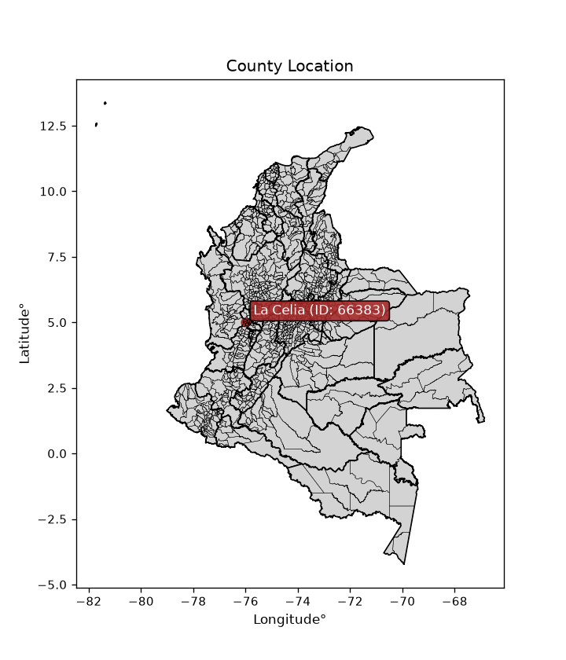
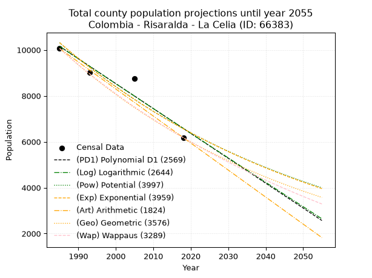
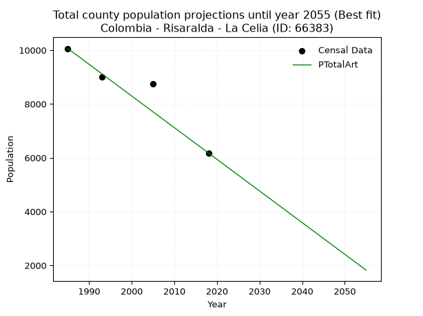
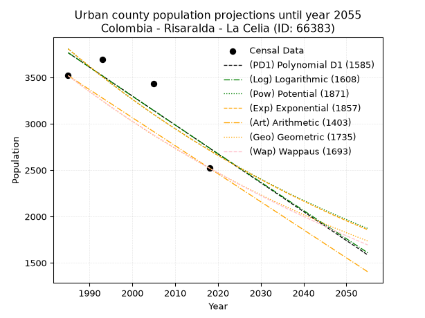
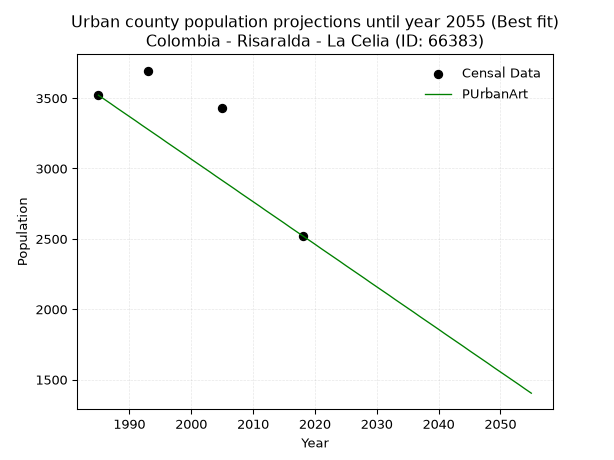
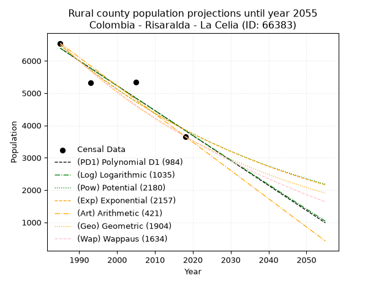
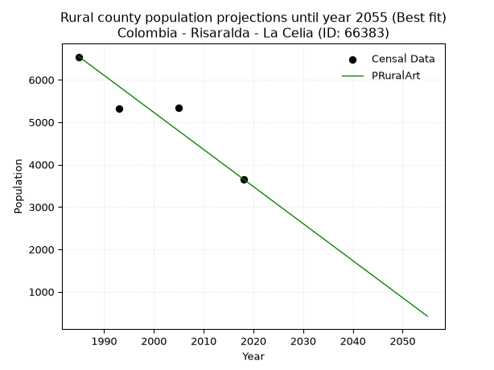

<div align="center">


</div>

# _“Population and Public Services Demand Projections (PPSD) until Year 2050 for Colombia - Risaralda - La Celia (ID: 66383)”_
Keywords: `population` `public-service` `projection` `lineal` `polynomial` `logarithmic` `potential` `exponential` `arithmetic` `geometric` `wappaus` `dane` `colombia` `south-america`

PPSD are analytical estimates used by governments and planners to anticipate future changes in population size, age distribution, and the resulting community needs for utilities, healthcare, education, and infrastructure as sizing future water treatment facilities, electrical grids, and road networks based on spatial growth.

> **General running parameters**: • app_version: _v20260806_. • Python version: _3.14.7_. • Pandas version: _3.0.5_. • NumPy version: _2.5.1_. • Creates, save and include plots into reports (create_plot): _False_. • Projection until year: _2050_. • Process polynomial degree 2 and up: _False_. • Process Wappaus: _True_. • Process Wappaus: _True_. • Set negative values to zero: _True_. • Set infinite values to zero: _True_. • Drop dataset notes: _True_. 
<div align="center">

Dynamic map: [:earth_americas:Google](http://maps.google.com/maps?q=5.002786755,-76.0032) [:earth_americas:OSM](https://www.openstreetmap.org/#map=18/5.002786755/-76.0032&layers=P) [:earth_americas:Bing](https://www.bing.com/maps?cp=5.002786755~-76.0032&lvl=18) [:earth_americas:Apple](https://maps.apple.com/frame?center=5.002786755%2C-76.0032&span=0.003%2C0.006)

</div>


<div align="center">

```geojson
{
  "type": "Feature",
  "geometry": {
    "type": "Point", 
    "coordinates": [-76.0032, 5.002786755]
  }, 
  "properties": {
    "Name": "Colombia - Risaralda - La Celia (ID: 66383)"
  }
}
```

</div>


<div align="center">

</img>

</div>


## 0. Census Data (4 records)

Census data are official statistics collected by a government about the people and housing in a country. They usually include counts of total population, age, sex, race, income, education, and jobs.

📅Global census file: [Population.xlsx](../data/Population.xlsx)

| Source   |   Year |   CountryID | CountryName   |   StateID | StateName   |   CountyID | CountyName   |   PTotal |   PUrban |   PRural |
|:---------|-------:|------------:|:--------------|----------:|:------------|-----------:|:-------------|---------:|---------:|---------:|
| DANE     |   1985 |          57 | Colombia      |        66 | Risaralda   |      66383 | La Celia     |    10061 |     3520 |     6541 |
| DANE     |   1993 |          57 | Colombia      |        66 | Risaralda   |      66383 | La Celia     |     9013 |     3695 |     5318 |
| DANE     |   2005 |          57 | Colombia      |        66 | Risaralda   |      66383 | La Celia     |     8761 |     3430 |     5331 |
| DANE     |   2018 |          57 | Colombia      |        66 | Risaralda   |      66383 | La Celia     |     6178 |     2522 |     3656 |

> 🔥Some records could had specific notes about the registered values or the corresponding urban or rural distribution.

📅   [RUPS](https://www.datos.gov.co/Hacienda-y-Cr-dito-P-blico/Registro-nico-de-Prestadores-de-Servicios-P-blicos/4qkq-csdn/about_data) - Local public utility companies: [RUPS.csv](../data/RUPS.xlsx)

 | SERVICIO       | ESTADO    | NOMBRE                                                              | NIT         | DEPARTAMENTO_DOMICILIO   | MUNICIPIO_DOMICILIO   | DIRECCION     |   TELEFONO | EMAIL                        | TIPO_PRESTADOR                             | CLASIFICACION                 |
|:---------------|:----------|:--------------------------------------------------------------------|:------------|:-------------------------|:----------------------|:--------------|-----------:|:-----------------------------|:-------------------------------------------|:------------------------------|
| ACUEDUCTO      | OPERATIVA | EMPRESA DE SERVICIOS PUBLICOS DEL MUNICIPIO DE LA CELIA S.A.S E.S.P | 800091379-7 | RISARALDA                | LA CELIA              | Cra 3 Nº 3-16 |    3671783 | esp@lacelia-risaralda.gov.co | SOCIEDADES (EMPRESA DE SERVICIOS PUBLICOS) | MENOR O IGUAL A 2500 USUARIOS |
| ALCANTARILLADO | OPERATIVA | EMPRESA DE SERVICIOS PUBLICOS DEL MUNICIPIO DE LA CELIA S.A.S E.S.P | 800091379-7 | RISARALDA                | LA CELIA              | Cra 3 Nº 3-16 |    3671783 | esp@lacelia-risaralda.gov.co | SOCIEDADES (EMPRESA DE SERVICIOS PUBLICOS) | MENOR O IGUAL A 2500 USUARIOS |

## 1. Total

### 1.1. Coefficients and Parameters

* (PD1) Polynomial Deg 1: -108.39060618225443, 225311.56001605446 (lineal)
* (Log) Logarithmic: -216840.23639129454, 1656707.6244588308
* (Pow) Potential: -27.35242298557121, 94.21515063165475
* (Exp) Exponential: -0.01367463851477886, 6336549459642950.0
* (Art) Arithmetic: Year diff. 2018 - 1985 = 33, Population diff. 6178 - 10061 = -3883, Annual growth = -117.66666666666667
* (Geo) Geometric: Year diff. 2018 - 1985 = 33, Population diff. 6178 - 10061 = -3883, Annual growth % = -0.01466928062122752
* (Wap) Wappaus: i = -1.4491861157296222, Condition values only valid for < 200)

<sub>
Wappaus condition values: ['-0.00', '-1.45', '-2.90', '-4.35', '-5.80', '-7.25', '-8.70', '-10.14', '-11.59', '-13.04', '-14.49', '-15.94', '-17.39', '-18.84', '-20.29', '-21.74', '-23.19', '-24.64', '-26.09', '-27.53', '-28.98', '-30.43', '-31.88', '-33.33', '-34.78', '-36.23', '-37.68', '-39.13', '-40.58', '-42.03', '-43.48', '-44.92', '-46.37', '-47.82', '-49.27', '-50.72', '-52.17', '-53.62', '-55.07', '-56.52', '-57.97', '-59.42', '-60.87', '-62.32', '-63.76', '-65.21', '-66.66', '-68.11', '-69.56', '-71.01', '-72.46', '-73.91', '-75.36', '-76.81', '-78.26', '-79.71', '-81.15', '-82.60', '-84.05', '-85.50', '-86.95', '-88.40', '-89.85', '-91.30', '-92.75', '-94.20']
</sub>


### 1.2. Projected Dataset

|   Year |   CountyID |   PTotalPD1 |   PTotalLog |   PTotalPow |   PTotalExp |   PTotalArt |   PTotalGeo |   PTotalWap |
|-------:|-----------:|------------:|------------:|------------:|------------:|------------:|------------:|------------:|
|   1985 |      66383 |       10156 |       10159 |       10314 |       10311 |       10061 |       10061 |       10061 |
|   1986 |      66383 |       10048 |       10049 |       10172 |       10171 |        9943 |        9913 |        9916 |
|   1987 |      66383 |        9939 |        9940 |       10033 |       10033 |        9826 |        9768 |        9774 |
|   1988 |      66383 |        9831 |        9831 |        9896 |        9896 |        9708 |        9625 |        9633 |
|   1989 |      66383 |        9723 |        9722 |        9761 |        9762 |        9590 |        9484 |        9494 |
|   1990 |      66383 |        9614 |        9613 |        9628 |        9629 |        9473 |        9344 |        9357 |
|   1991 |      66383 |        9506 |        9504 |        9496 |        9499 |        9355 |        9207 |        9223 |
|   1992 |      66383 |        9397 |        9395 |        9367 |        9370 |        9237 |        9072 |        9090 |
|   1993 |      66383 |        9289 |        9286 |        9239 |        9242 |        9120 |        8939 |        8958 |
|   1994 |      66383 |        9181 |        9178 |        9113 |        9117 |        9002 |        8808 |        8829 |
|   1995 |      66383 |        9072 |        9069 |        8989 |        8993 |        8884 |        8679 |        8701 |
|   1996 |      66383 |        8964 |        8960 |        8867 |        8871 |        8767 |        8552 |        8576 |
|   1997 |      66383 |        8856 |        8852 |        8746 |        8750 |        8649 |        8426 |        8451 |
|   1998 |      66383 |        8747 |        8743 |        8627 |        8632 |        8531 |        8302 |        8329 |
|   1999 |      66383 |        8639 |        8635 |        8510 |        8514 |        8414 |        8181 |        8208 |
|   2000 |      66383 |        8530 |        8526 |        8394 |        8399 |        8296 |        8061 |        8088 |
|   2001 |      66383 |        8422 |        8418 |        8280 |        8285 |        8178 |        7942 |        7971 |
|   2002 |      66383 |        8314 |        8309 |        8168 |        8172 |        8061 |        7826 |        7854 |
|   2003 |      66383 |        8205 |        8201 |        8057 |        8061 |        7943 |        7711 |        7739 |
|   2004 |      66383 |        8097 |        8093 |        7948 |        7952 |        7825 |        7598 |        7626 |
|   2005 |      66383 |        7988 |        7985 |        7840 |        7844 |        7708 |        7487 |        7514 |
|   2006 |      66383 |        7880 |        7877 |        7734 |        7737 |        7590 |        7377 |        7404 |
|   2007 |      66383 |        7772 |        7769 |        7629 |        7632 |        7472 |        7269 |        7294 |
|   2008 |      66383 |        7663 |        7661 |        7526 |        7528 |        7355 |        7162 |        7187 |
|   2009 |      66383 |        7555 |        7553 |        7424 |        7426 |        7237 |        7057 |        7080 |
|   2010 |      66383 |        7446 |        7445 |        7324 |        7325 |        7119 |        6953 |        6975 |
|   2011 |      66383 |        7338 |        7337 |        7225 |        7226 |        7002 |        6851 |        6871 |
|   2012 |      66383 |        7230 |        7229 |        7127 |        7128 |        6884 |        6751 |        6768 |
|   2013 |      66383 |        7121 |        7121 |        7031 |        7031 |        6766 |        6652 |        6667 |
|   2014 |      66383 |        7013 |        7014 |        6936 |        6935 |        6649 |        6554 |        6567 |
|   2015 |      66383 |        6904 |        6906 |        6843 |        6841 |        6531 |        6458 |        6468 |
|   2016 |      66383 |        6796 |        6798 |        6750 |        6748 |        6413 |        6363 |        6370 |
|   2017 |      66383 |        6688 |        6691 |        6659 |        6657 |        6296 |        6270 |        6274 |
|   2018 |      66383 |        6579 |        6583 |        6570 |        6566 |        6178 |        6178 |        6178 |
|   2019 |      66383 |        6471 |        6476 |        6481 |        6477 |        6060 |        6087 |        6084 |
|   2020 |      66383 |        6363 |        6369 |        6394 |        6389 |        5943 |        5998 |        5990 |
|   2021 |      66383 |        6254 |        6261 |        6308 |        6302 |        5825 |        5910 |        5898 |
|   2022 |      66383 |        6146 |        6154 |        6223 |        6217 |        5707 |        5823 |        5807 |
|   2023 |      66383 |        6037 |        6047 |        6140 |        6132 |        5590 |        5738 |        5717 |
|   2024 |      66383 |        5929 |        5940 |        6057 |        6049 |        5472 |        5654 |        5628 |
|   2025 |      66383 |        5821 |        5832 |        5976 |        5967 |        5354 |        5571 |        5539 |
|   2026 |      66383 |        5712 |        5725 |        5896 |        5886 |        5237 |        5489 |        5452 |
|   2027 |      66383 |        5604 |        5618 |        5817 |        5806 |        5119 |        5409 |        5366 |
|   2028 |      66383 |        5495 |        5511 |        5739 |        5727 |        5001 |        5329 |        5281 |
|   2029 |      66383 |        5387 |        5405 |        5662 |        5649 |        4884 |        5251 |        5197 |
|   2030 |      66383 |        5279 |        5298 |        5586 |        5572 |        4766 |        5174 |        5113 |
|   2031 |      66383 |        5170 |        5191 |        5511 |        5497 |        4648 |        5098 |        5031 |
|   2032 |      66383 |        5062 |        5084 |        5438 |        5422 |        4531 |        5023 |        4949 |
|   2033 |      66383 |        4953 |        4977 |        5365 |        5348 |        4413 |        4950 |        4868 |
|   2034 |      66383 |        4845 |        4871 |        5293 |        5276 |        4295 |        4877 |        4789 |
|   2035 |      66383 |        4737 |        4764 |        5223 |        5204 |        4178 |        4806 |        4710 |
|   2036 |      66383 |        4628 |        4658 |        5153 |        5134 |        4060 |        4735 |        4631 |
|   2037 |      66383 |        4520 |        4551 |        5084 |        5064 |        3942 |        4666 |        4554 |
|   2038 |      66383 |        4412 |        4445 |        5016 |        4995 |        3825 |        4597 |        4478 |
|   2039 |      66383 |        4303 |        4338 |        4950 |        4927 |        3707 |        4530 |        4402 |
|   2040 |      66383 |        4195 |        4232 |        4884 |        4860 |        3589 |        4463 |        4327 |
|   2041 |      66383 |        4086 |        4126 |        4819 |        4794 |        3472 |        4398 |        4253 |
|   2042 |      66383 |        3978 |        4020 |        4755 |        4729 |        3354 |        4333 |        4179 |
|   2043 |      66383 |        3870 |        3913 |        4691 |        4665 |        3236 |        4270 |        4107 |
|   2044 |      66383 |        3761 |        3807 |        4629 |        4602 |        3119 |        4207 |        4035 |
|   2045 |      66383 |        3653 |        3701 |        4567 |        4539 |        3001 |        4145 |        3964 |
|   2046 |      66383 |        3544 |        3595 |        4507 |        4477 |        2883 |        4085 |        3893 |
|   2047 |      66383 |        3436 |        3489 |        4447 |        4417 |        2766 |        4025 |        3823 |
|   2048 |      66383 |        3328 |        3383 |        4388 |        4357 |        2648 |        3966 |        3754 |
|   2049 |      66383 |        3219 |        3278 |        4330 |        4297 |        2530 |        3907 |        3686 |
|   2050 |      66383 |        3111 |        3172 |        4272 |        4239 |        2413 |        3850 |        3618 |
<div align="center">

</img>

</div>


### 1.3. Best fit with absolute and relative error (%)

Relative error puts that difference into context by dividing the absolute error by the true value, creating a unitless ratio or percentage that shows the scale of the mistake.

Absolute and relative error

|   Year | Source   |   CountryID | CountryName   |   StateID | StateName   |   CountyID_x | CountyName   |   PTotal |   PUrban |   PRural |   CountyID_y |   PTotalPD1 |   PTotalLog |   PTotalPow |   PTotalExp |   PTotalArt |   PTotalGeo |   PTotalWap |   PTotalPD1AbsError |   PTotalLogAbsError |   PTotalPowAbsError |   PTotalExpAbsError |   PTotalArtAbsError |   PTotalGeoAbsError |   PTotalWapAbsError |   PTotalPD1RelError |   PTotalLogRelError |   PTotalPowRelError |   PTotalExpRelError |   PTotalArtRelError |   PTotalGeoRelError |   PTotalWapRelError |
|-------:|:---------|------------:|:--------------|----------:|:------------|-------------:|:-------------|---------:|---------:|---------:|-------------:|------------:|------------:|------------:|------------:|------------:|------------:|------------:|--------------------:|--------------------:|--------------------:|--------------------:|--------------------:|--------------------:|--------------------:|--------------------:|--------------------:|--------------------:|--------------------:|--------------------:|--------------------:|--------------------:|
|   1985 | DANE     |          57 | Colombia      |        66 | Risaralda   |        66383 | La Celia     |    10061 |     3520 |     6541 |        66383 |       10156 |       10159 |       10314 |       10311 |       10061 |       10061 |       10061 |                  95 |                  98 |                 253 |                 250 |                   0 |                   0 |                   0 |             0.94424 |            0.974058 |             2.51466 |             2.48484 |             0       |            0        |             0       |
|   1993 | DANE     |          57 | Colombia      |        66 | Risaralda   |        66383 | La Celia     |     9013 |     3695 |     5318 |        66383 |        9289 |        9286 |        9239 |        9242 |        9120 |        8939 |        8958 |                 276 |                 273 |                 226 |                 229 |                 107 |                  74 |                  55 |             3.06224 |            3.02896  |             2.50749 |             2.54077 |             1.18717 |            0.821036 |             0.61023 |
|   2005 | DANE     |          57 | Colombia      |        66 | Risaralda   |        66383 | La Celia     |     8761 |     3430 |     5331 |        66383 |        7988 |        7985 |        7840 |        7844 |        7708 |        7487 |        7514 |                 773 |                 776 |                 921 |                 917 |                1053 |                1274 |                1247 |             8.82319 |            8.85744  |            10.5125  |            10.4668  |            12.0192  |           14.5417   |            14.2335  |
|   2018 | DANE     |          57 | Colombia      |        66 | Risaralda   |        66383 | La Celia     |     6178 |     2522 |     3656 |        66383 |        6579 |        6583 |        6570 |        6566 |        6178 |        6178 |        6178 |                 401 |                 405 |                 392 |                 388 |                   0 |                   0 |                   0 |             6.49077 |            6.55552  |             6.3451  |             6.28035 |             0       |            0        |             0       |

Relative error mean

| Method    |   RelError | Best   |
|:----------|-----------:|:-------|
| PTotalPD1 |    4.83011 |        |
| PTotalLog |    4.85399 |        |
| PTotalPow |    5.46994 |        |
| PTotalExp |    5.4432  |        |
| PTotalArt |    3.30159 | True   |
| PTotalGeo |    3.84069 |        |
| PTotalWap |    3.71094 |        |

💙Best method: _**PTotalArt**_
<div align="center">

</img>

</div>


### 1.4. Fresh water supply demand in liters per capita per day (lpcd)

The fresh water supply demand typically ranges from 100 to 300 liters per capita per day (lpcd) for standard domestic and municipal planning, though absolute survival minimums set by the World Health Organization are as low as 7.5 to 20 liters per day, and total consumption in high-income nations can exceed 400 liters.

> `CZ`: Level in meters above the sea level (masl)<br> `WS`: Fresh water supply demand in liters per capita per day (lpcd or l/h/d)<br> `WSAll`: Zonal fresh water supply demand in liters per second (l/s)<br> `A`: Zonal area in square meters<br> `DP`: Population density (people/hectare or p/ha)

Reference values (RAS Colombia)

|    CZ |   WS |
|------:|-----:|
|  1000 |  120 |
|  2000 |  130 |
| 99999 |  140 |

County shapefile geometry properties and water supply values

|   CountyID |      ATotal |   CZTotal |   WSTotal |
|-----------:|------------:|----------:|----------:|
|      66383 | 9.24755e+07 |    1592.6 |       130 |

Projected values for best method: PTotalArt

|   CountyID |   Year |   PTotalArt |   DPTotal |   WSTotal |   WSTotalAll |
|-----------:|-------:|------------:|----------:|----------:|-------------:|
|      66383 |   1985 |       10061 |      1.09 |       130 |     15.1381  |
|      66383 |   1986 |        9943 |      1.08 |       130 |     14.9605  |
|      66383 |   1987 |        9826 |      1.06 |       130 |     14.7845  |
|      66383 |   1988 |        9708 |      1.05 |       130 |     14.6069  |
|      66383 |   1989 |        9590 |      1.04 |       130 |     14.4294  |
|      66383 |   1990 |        9473 |      1.02 |       130 |     14.2534  |
|      66383 |   1991 |        9355 |      1.01 |       130 |     14.0758  |
|      66383 |   1992 |        9237 |      1    |       130 |     13.8983  |
|      66383 |   1993 |        9120 |      0.99 |       130 |     13.7222  |
|      66383 |   1994 |        9002 |      0.97 |       130 |     13.5447  |
|      66383 |   1995 |        8884 |      0.96 |       130 |     13.3671  |
|      66383 |   1996 |        8767 |      0.95 |       130 |     13.1911  |
|      66383 |   1997 |        8649 |      0.94 |       130 |     13.0135  |
|      66383 |   1998 |        8531 |      0.92 |       130 |     12.836   |
|      66383 |   1999 |        8414 |      0.91 |       130 |     12.66    |
|      66383 |   2000 |        8296 |      0.9  |       130 |     12.4824  |
|      66383 |   2001 |        8178 |      0.88 |       130 |     12.3049  |
|      66383 |   2002 |        8061 |      0.87 |       130 |     12.1288  |
|      66383 |   2003 |        7943 |      0.86 |       130 |     11.9513  |
|      66383 |   2004 |        7825 |      0.85 |       130 |     11.7737  |
|      66383 |   2005 |        7708 |      0.83 |       130 |     11.5977  |
|      66383 |   2006 |        7590 |      0.82 |       130 |     11.4201  |
|      66383 |   2007 |        7472 |      0.81 |       130 |     11.2426  |
|      66383 |   2008 |        7355 |      0.8  |       130 |     11.0666  |
|      66383 |   2009 |        7237 |      0.78 |       130 |     10.889   |
|      66383 |   2010 |        7119 |      0.77 |       130 |     10.7115  |
|      66383 |   2011 |        7002 |      0.76 |       130 |     10.5354  |
|      66383 |   2012 |        6884 |      0.74 |       130 |     10.3579  |
|      66383 |   2013 |        6766 |      0.73 |       130 |     10.1803  |
|      66383 |   2014 |        6649 |      0.72 |       130 |     10.0043  |
|      66383 |   2015 |        6531 |      0.71 |       130 |      9.82674 |
|      66383 |   2016 |        6413 |      0.69 |       130 |      9.64919 |
|      66383 |   2017 |        6296 |      0.68 |       130 |      9.47315 |
|      66383 |   2018 |        6178 |      0.67 |       130 |      9.2956  |
|      66383 |   2019 |        6060 |      0.66 |       130 |      9.11806 |
|      66383 |   2020 |        5943 |      0.64 |       130 |      8.94201 |
|      66383 |   2021 |        5825 |      0.63 |       130 |      8.76447 |
|      66383 |   2022 |        5707 |      0.62 |       130 |      8.58692 |
|      66383 |   2023 |        5590 |      0.6  |       130 |      8.41088 |
|      66383 |   2024 |        5472 |      0.59 |       130 |      8.23333 |
|      66383 |   2025 |        5354 |      0.58 |       130 |      8.05579 |
|      66383 |   2026 |        5237 |      0.57 |       130 |      7.87975 |
|      66383 |   2027 |        5119 |      0.55 |       130 |      7.7022  |
|      66383 |   2028 |        5001 |      0.54 |       130 |      7.52465 |
|      66383 |   2029 |        4884 |      0.53 |       130 |      7.34861 |
|      66383 |   2030 |        4766 |      0.52 |       130 |      7.17106 |
|      66383 |   2031 |        4648 |      0.5  |       130 |      6.99352 |
|      66383 |   2032 |        4531 |      0.49 |       130 |      6.81748 |
|      66383 |   2033 |        4413 |      0.48 |       130 |      6.63993 |
|      66383 |   2034 |        4295 |      0.46 |       130 |      6.46238 |
|      66383 |   2035 |        4178 |      0.45 |       130 |      6.28634 |
|      66383 |   2036 |        4060 |      0.44 |       130 |      6.1088  |
|      66383 |   2037 |        3942 |      0.43 |       130 |      5.93125 |
|      66383 |   2038 |        3825 |      0.41 |       130 |      5.75521 |
|      66383 |   2039 |        3707 |      0.4  |       130 |      5.57766 |
|      66383 |   2040 |        3589 |      0.39 |       130 |      5.40012 |
|      66383 |   2041 |        3472 |      0.38 |       130 |      5.22407 |
|      66383 |   2042 |        3354 |      0.36 |       130 |      5.04653 |
|      66383 |   2043 |        3236 |      0.35 |       130 |      4.86898 |
|      66383 |   2044 |        3119 |      0.34 |       130 |      4.69294 |
|      66383 |   2045 |        3001 |      0.32 |       130 |      4.51539 |
|      66383 |   2046 |        2883 |      0.31 |       130 |      4.33785 |
|      66383 |   2047 |        2766 |      0.3  |       130 |      4.16181 |
|      66383 |   2048 |        2648 |      0.29 |       130 |      3.98426 |
|      66383 |   2049 |        2530 |      0.27 |       130 |      3.80671 |
|      66383 |   2050 |        2413 |      0.26 |       130 |      3.63067 |

## 2. Urban

### 2.1. Coefficients and Parameters

* (PD1) Polynomial Deg 1: -31.169409875551395, 65638.36210357168 (lineal)
* (Log) Logarithmic: -62301.0810459916, 476842.76628011314
* (Pow) Potential: -20.51819921285719, 71.24493072080614
* (Exp) Exponential: -0.010265436618186317, 2693758066159.6655
* (Art) Arithmetic: Year diff. 2018 - 1985 = 33, Population diff. 2522 - 3520 = -998, Annual growth = -30.242424242424242
* (Geo) Geometric: Year diff. 2018 - 1985 = 33, Population diff. 2522 - 3520 = -998, Annual growth % = -0.010052428678737013
* (Wap) Wappaus: i = -1.0010732950156982, Condition values only valid for < 200)

<sub>
Wappaus condition values: ['-0.00', '-1.00', '-2.00', '-3.00', '-4.00', '-5.01', '-6.01', '-7.01', '-8.01', '-9.01', '-10.01', '-11.01', '-12.01', '-13.01', '-14.02', '-15.02', '-16.02', '-17.02', '-18.02', '-19.02', '-20.02', '-21.02', '-22.02', '-23.02', '-24.03', '-25.03', '-26.03', '-27.03', '-28.03', '-29.03', '-30.03', '-31.03', '-32.03', '-33.04', '-34.04', '-35.04', '-36.04', '-37.04', '-38.04', '-39.04', '-40.04', '-41.04', '-42.05', '-43.05', '-44.05', '-45.05', '-46.05', '-47.05', '-48.05', '-49.05', '-50.05', '-51.05', '-52.06', '-53.06', '-54.06', '-55.06', '-56.06', '-57.06', '-58.06', '-59.06', '-60.06', '-61.07', '-62.07', '-63.07', '-64.07', '-65.07']
</sub>


### 2.2. Projected Dataset

|   Year |   CountyID |   PUrbanPD1 |   PUrbanLog |   PUrbanPow |   PUrbanExp |   PUrbanArt |   PUrbanGeo |   PUrbanWap |
|-------:|-----------:|------------:|------------:|------------:|------------:|------------:|------------:|------------:|
|   1985 |      66383 |        3767 |        3767 |        3809 |        3809 |        3520 |        3520 |        3520 |
|   1986 |      66383 |        3736 |        3736 |        3770 |        3770 |        3490 |        3485 |        3485 |
|   1987 |      66383 |        3705 |        3705 |        3731 |        3731 |        3460 |        3450 |        3450 |
|   1988 |      66383 |        3674 |        3673 |        3693 |        3693 |        3429 |        3415 |        3416 |
|   1989 |      66383 |        3642 |        3642 |        3655 |        3656 |        3399 |        3381 |        3382 |
|   1990 |      66383 |        3611 |        3611 |        3617 |        3618 |        3369 |        3347 |        3348 |
|   1991 |      66383 |        3580 |        3579 |        3580 |        3581 |        3339 |        3313 |        3315 |
|   1992 |      66383 |        3549 |        3548 |        3544 |        3545 |        3308 |        3280 |        3282 |
|   1993 |      66383 |        3518 |        3517 |        3507 |        3508 |        3278 |        3247 |        3249 |
|   1994 |      66383 |        3487 |        3486 |        3471 |        3473 |        3248 |        3214 |        3217 |
|   1995 |      66383 |        3455 |        3454 |        3436 |        3437 |        3218 |        3182 |        3184 |
|   1996 |      66383 |        3424 |        3423 |        3401 |        3402 |        3187 |        3150 |        3153 |
|   1997 |      66383 |        3393 |        3392 |        3366 |        3367 |        3157 |        3118 |        3121 |
|   1998 |      66383 |        3362 |        3361 |        3332 |        3333 |        3127 |        3087 |        3090 |
|   1999 |      66383 |        3331 |        3329 |        3298 |        3299 |        3097 |        3056 |        3059 |
|   2000 |      66383 |        3300 |        3298 |        3264 |        3265 |        3066 |        3025 |        3028 |
|   2001 |      66383 |        3268 |        3267 |        3231 |        3232 |        3036 |        2995 |        2998 |
|   2002 |      66383 |        3237 |        3236 |        3198 |        3199 |        3006 |        2964 |        2968 |
|   2003 |      66383 |        3206 |        3205 |        3165 |        3166 |        2976 |        2935 |        2938 |
|   2004 |      66383 |        3175 |        3174 |        3133 |        3134 |        2945 |        2905 |        2909 |
|   2005 |      66383 |        3144 |        3143 |        3101 |        3102 |        2915 |        2876 |        2879 |
|   2006 |      66383 |        3113 |        3112 |        3069 |        3070 |        2885 |        2847 |        2850 |
|   2007 |      66383 |        3081 |        3081 |        3038 |        3039 |        2855 |        2818 |        2822 |
|   2008 |      66383 |        3050 |        3050 |        3007 |        3008 |        2824 |        2790 |        2793 |
|   2009 |      66383 |        3019 |        3019 |        2977 |        2977 |        2794 |        2762 |        2765 |
|   2010 |      66383 |        2988 |        2988 |        2946 |        2947 |        2764 |        2734 |        2737 |
|   2011 |      66383 |        2957 |        2957 |        2917 |        2917 |        2734 |        2707 |        2709 |
|   2012 |      66383 |        2926 |        2926 |        2887 |        2887 |        2703 |        2680 |        2682 |
|   2013 |      66383 |        2894 |        2895 |        2858 |        2857 |        2673 |        2653 |        2655 |
|   2014 |      66383 |        2863 |        2864 |        2829 |        2828 |        2643 |        2626 |        2628 |
|   2015 |      66383 |        2832 |        2833 |        2800 |        2799 |        2613 |        2600 |        2601 |
|   2016 |      66383 |        2801 |        2802 |        2772 |        2771 |        2582 |        2573 |        2574 |
|   2017 |      66383 |        2770 |        2771 |        2744 |        2742 |        2552 |        2548 |        2548 |
|   2018 |      66383 |        2738 |        2740 |        2716 |        2714 |        2522 |        2522 |        2522 |
|   2019 |      66383 |        2707 |        2709 |        2688 |        2687 |        2492 |        2497 |        2496 |
|   2020 |      66383 |        2676 |        2678 |        2661 |        2659 |        2462 |        2472 |        2471 |
|   2021 |      66383 |        2645 |        2648 |        2634 |        2632 |        2431 |        2447 |        2445 |
|   2022 |      66383 |        2614 |        2617 |        2608 |        2605 |        2401 |        2422 |        2420 |
|   2023 |      66383 |        2583 |        2586 |        2581 |        2579 |        2371 |        2398 |        2395 |
|   2024 |      66383 |        2551 |        2555 |        2555 |        2552 |        2341 |        2374 |        2370 |
|   2025 |      66383 |        2520 |        2524 |        2530 |        2526 |        2310 |        2350 |        2346 |
|   2026 |      66383 |        2489 |        2494 |        2504 |        2500 |        2280 |        2326 |        2321 |
|   2027 |      66383 |        2458 |        2463 |        2479 |        2475 |        2250 |        2303 |        2297 |
|   2028 |      66383 |        2427 |        2432 |        2454 |        2450 |        2220 |        2280 |        2273 |
|   2029 |      66383 |        2396 |        2401 |        2429 |        2425 |        2189 |        2257 |        2249 |
|   2030 |      66383 |        2364 |        2371 |        2405 |        2400 |        2159 |        2234 |        2226 |
|   2031 |      66383 |        2333 |        2340 |        2381 |        2375 |        2129 |        2212 |        2202 |
|   2032 |      66383 |        2302 |        2309 |        2357 |        2351 |        2099 |        2189 |        2179 |
|   2033 |      66383 |        2271 |        2279 |        2333 |        2327 |        2068 |        2167 |        2156 |
|   2034 |      66383 |        2240 |        2248 |        2310 |        2303 |        2038 |        2146 |        2133 |
|   2035 |      66383 |        2209 |        2217 |        2286 |        2280 |        2008 |        2124 |        2111 |
|   2036 |      66383 |        2177 |        2187 |        2263 |        2256 |        1978 |        2103 |        2088 |
|   2037 |      66383 |        2146 |        2156 |        2241 |        2233 |        1947 |        2082 |        2066 |
|   2038 |      66383 |        2115 |        2126 |        2218 |        2211 |        1917 |        2061 |        2044 |
|   2039 |      66383 |        2084 |        2095 |        2196 |        2188 |        1887 |        2040 |        2022 |
|   2040 |      66383 |        2053 |        2065 |        2174 |        2166 |        1857 |        2019 |        2000 |
|   2041 |      66383 |        2022 |        2034 |        2152 |        2144 |        1826 |        1999 |        1979 |
|   2042 |      66383 |        1990 |        2004 |        2131 |        2122 |        1796 |        1979 |        1957 |
|   2043 |      66383 |        1959 |        1973 |        2110 |        2100 |        1766 |        1959 |        1936 |
|   2044 |      66383 |        1928 |        1943 |        2088 |        2079 |        1736 |        1939 |        1915 |
|   2045 |      66383 |        1897 |        1912 |        2068 |        2057 |        1705 |        1920 |        1894 |
|   2046 |      66383 |        1866 |        1882 |        2047 |        2036 |        1675 |        1901 |        1873 |
|   2047 |      66383 |        1835 |        1851 |        2027 |        2015 |        1645 |        1881 |        1853 |
|   2048 |      66383 |        1803 |        1821 |        2006 |        1995 |        1615 |        1863 |        1832 |
|   2049 |      66383 |        1772 |        1790 |        1986 |        1975 |        1584 |        1844 |        1812 |
|   2050 |      66383 |        1741 |        1760 |        1967 |        1954 |        1554 |        1825 |        1792 |
<div align="center">

</img>

</div>


### 2.3. Best fit with absolute and relative error (%)

Relative error puts that difference into context by dividing the absolute error by the true value, creating a unitless ratio or percentage that shows the scale of the mistake.

Absolute and relative error

|   Year | Source   |   CountryID | CountryName   |   StateID | StateName   |   CountyID_x | CountyName   |   PTotal |   PUrban |   PRural |   CountyID_y |   PUrbanPD1 |   PUrbanLog |   PUrbanPow |   PUrbanExp |   PUrbanArt |   PUrbanGeo |   PUrbanWap |   PUrbanPD1AbsError |   PUrbanLogAbsError |   PUrbanPowAbsError |   PUrbanExpAbsError |   PUrbanArtAbsError |   PUrbanGeoAbsError |   PUrbanWapAbsError |   PUrbanPD1RelError |   PUrbanLogRelError |   PUrbanPowRelError |   PUrbanExpRelError |   PUrbanArtRelError |   PUrbanGeoRelError |   PUrbanWapRelError |
|-------:|:---------|------------:|:--------------|----------:|:------------|-------------:|:-------------|---------:|---------:|---------:|-------------:|------------:|------------:|------------:|------------:|------------:|------------:|------------:|--------------------:|--------------------:|--------------------:|--------------------:|--------------------:|--------------------:|--------------------:|--------------------:|--------------------:|--------------------:|--------------------:|--------------------:|--------------------:|--------------------:|
|   1985 | DANE     |          57 | Colombia      |        66 | Risaralda   |        66383 | La Celia     |    10061 |     3520 |     6541 |        66383 |        3767 |        3767 |        3809 |        3809 |        3520 |        3520 |        3520 |                 247 |                 247 |                 289 |                 289 |                   0 |                   0 |                   0 |             7.01705 |             7.01705 |             8.21023 |             8.21023 |              0      |              0      |              0      |
|   1993 | DANE     |          57 | Colombia      |        66 | Risaralda   |        66383 | La Celia     |     9013 |     3695 |     5318 |        66383 |        3518 |        3517 |        3507 |        3508 |        3278 |        3247 |        3249 |                 177 |                 178 |                 188 |                 187 |                 417 |                 448 |                 446 |             4.79026 |             4.81732 |             5.08796 |             5.06089 |             11.2855 |             12.1245 |             12.0704 |
|   2005 | DANE     |          57 | Colombia      |        66 | Risaralda   |        66383 | La Celia     |     8761 |     3430 |     5331 |        66383 |        3144 |        3143 |        3101 |        3102 |        2915 |        2876 |        2879 |                 286 |                 287 |                 329 |                 328 |                 515 |                 554 |                 551 |             8.33819 |             8.36735 |             9.59184 |             9.56268 |             15.0146 |             16.1516 |             16.0641 |
|   2018 | DANE     |          57 | Colombia      |        66 | Risaralda   |        66383 | La Celia     |     6178 |     2522 |     3656 |        66383 |        2738 |        2740 |        2716 |        2714 |        2522 |        2522 |        2522 |                 216 |                 218 |                 194 |                 192 |                   0 |                   0 |                   0 |             8.56463 |             8.64393 |             7.69231 |             7.61301 |              0      |              0      |              0      |

Relative error mean

| Method    |   RelError | Best   |
|:----------|-----------:|:-------|
| PUrbanPD1 |    7.17753 |        |
| PUrbanLog |    7.21141 |        |
| PUrbanPow |    7.64558 |        |
| PUrbanExp |    7.6117  |        |
| PUrbanArt |    6.57502 | True   |
| PUrbanGeo |    7.06902 |        |
| PUrbanWap |    7.03363 |        |

💙Best method: _**PUrbanArt**_
<div align="center">

</img>

</div>


### 2.4. Fresh water supply demand in liters per capita per day (lpcd)

The fresh water supply demand typically ranges from 100 to 300 liters per capita per day (lpcd) for standard domestic and municipal planning, though absolute survival minimums set by the World Health Organization are as low as 7.5 to 20 liters per day, and total consumption in high-income nations can exceed 400 liters.

> `CZ`: Level in meters above the sea level (masl)<br> `WS`: Fresh water supply demand in liters per capita per day (lpcd or l/h/d)<br> `WSAll`: Zonal fresh water supply demand in liters per second (l/s)<br> `A`: Zonal area in square meters<br> `DP`: Population density (people/hectare or p/ha)

Reference values (RAS Colombia)

|    CZ |   WS |
|------:|-----:|
|  1000 |  120 |
|  2000 |  130 |
| 99999 |  140 |

County shapefile geometry properties and water supply values

|   CountyID |   AUrban |   CZUrban |   WSUrban |
|-----------:|---------:|----------:|----------:|
|      66383 |   413002 |   1394.05 |       130 |

Projected values for best method: PUrbanArt

|   CountyID |   Year |   PUrbanArt |   DPUrban |   WSUrban |   WSUrbanAll |
|-----------:|-------:|------------:|----------:|----------:|-------------:|
|      66383 |   1985 |        3520 |     85.23 |       130 |      5.2963  |
|      66383 |   1986 |        3490 |     84.5  |       130 |      5.25116 |
|      66383 |   1987 |        3460 |     83.78 |       130 |      5.20602 |
|      66383 |   1988 |        3429 |     83.03 |       130 |      5.15937 |
|      66383 |   1989 |        3399 |     82.3  |       130 |      5.11424 |
|      66383 |   1990 |        3369 |     81.57 |       130 |      5.0691  |
|      66383 |   1991 |        3339 |     80.85 |       130 |      5.02396 |
|      66383 |   1992 |        3308 |     80.1  |       130 |      4.97731 |
|      66383 |   1993 |        3278 |     79.37 |       130 |      4.93218 |
|      66383 |   1994 |        3248 |     78.64 |       130 |      4.88704 |
|      66383 |   1995 |        3218 |     77.92 |       130 |      4.8419  |
|      66383 |   1996 |        3187 |     77.17 |       130 |      4.79525 |
|      66383 |   1997 |        3157 |     76.44 |       130 |      4.75012 |
|      66383 |   1998 |        3127 |     75.71 |       130 |      4.70498 |
|      66383 |   1999 |        3097 |     74.99 |       130 |      4.65984 |
|      66383 |   2000 |        3066 |     74.24 |       130 |      4.61319 |
|      66383 |   2001 |        3036 |     73.51 |       130 |      4.56806 |
|      66383 |   2002 |        3006 |     72.78 |       130 |      4.52292 |
|      66383 |   2003 |        2976 |     72.06 |       130 |      4.47778 |
|      66383 |   2004 |        2945 |     71.31 |       130 |      4.43113 |
|      66383 |   2005 |        2915 |     70.58 |       130 |      4.386   |
|      66383 |   2006 |        2885 |     69.85 |       130 |      4.34086 |
|      66383 |   2007 |        2855 |     69.13 |       130 |      4.29572 |
|      66383 |   2008 |        2824 |     68.38 |       130 |      4.24907 |
|      66383 |   2009 |        2794 |     67.65 |       130 |      4.20394 |
|      66383 |   2010 |        2764 |     66.92 |       130 |      4.1588  |
|      66383 |   2011 |        2734 |     66.2  |       130 |      4.11366 |
|      66383 |   2012 |        2703 |     65.45 |       130 |      4.06701 |
|      66383 |   2013 |        2673 |     64.72 |       130 |      4.02187 |
|      66383 |   2014 |        2643 |     63.99 |       130 |      3.97674 |
|      66383 |   2015 |        2613 |     63.27 |       130 |      3.9316  |
|      66383 |   2016 |        2582 |     62.52 |       130 |      3.88495 |
|      66383 |   2017 |        2552 |     61.79 |       130 |      3.83981 |
|      66383 |   2018 |        2522 |     61.07 |       130 |      3.79468 |
|      66383 |   2019 |        2492 |     60.34 |       130 |      3.74954 |
|      66383 |   2020 |        2462 |     59.61 |       130 |      3.7044  |
|      66383 |   2021 |        2431 |     58.86 |       130 |      3.65775 |
|      66383 |   2022 |        2401 |     58.14 |       130 |      3.61262 |
|      66383 |   2023 |        2371 |     57.41 |       130 |      3.56748 |
|      66383 |   2024 |        2341 |     56.68 |       130 |      3.52234 |
|      66383 |   2025 |        2310 |     55.93 |       130 |      3.47569 |
|      66383 |   2026 |        2280 |     55.21 |       130 |      3.43056 |
|      66383 |   2027 |        2250 |     54.48 |       130 |      3.38542 |
|      66383 |   2028 |        2220 |     53.75 |       130 |      3.34028 |
|      66383 |   2029 |        2189 |     53    |       130 |      3.29363 |
|      66383 |   2030 |        2159 |     52.28 |       130 |      3.2485  |
|      66383 |   2031 |        2129 |     51.55 |       130 |      3.20336 |
|      66383 |   2032 |        2099 |     50.82 |       130 |      3.15822 |
|      66383 |   2033 |        2068 |     50.07 |       130 |      3.11157 |
|      66383 |   2034 |        2038 |     49.35 |       130 |      3.06644 |
|      66383 |   2035 |        2008 |     48.62 |       130 |      3.0213  |
|      66383 |   2036 |        1978 |     47.89 |       130 |      2.97616 |
|      66383 |   2037 |        1947 |     47.14 |       130 |      2.92951 |
|      66383 |   2038 |        1917 |     46.42 |       130 |      2.88437 |
|      66383 |   2039 |        1887 |     45.69 |       130 |      2.83924 |
|      66383 |   2040 |        1857 |     44.96 |       130 |      2.7941  |
|      66383 |   2041 |        1826 |     44.21 |       130 |      2.74745 |
|      66383 |   2042 |        1796 |     43.49 |       130 |      2.70231 |
|      66383 |   2043 |        1766 |     42.76 |       130 |      2.65718 |
|      66383 |   2044 |        1736 |     42.03 |       130 |      2.61204 |
|      66383 |   2045 |        1705 |     41.28 |       130 |      2.56539 |
|      66383 |   2046 |        1675 |     40.56 |       130 |      2.52025 |
|      66383 |   2047 |        1645 |     39.83 |       130 |      2.47512 |
|      66383 |   2048 |        1615 |     39.1  |       130 |      2.42998 |
|      66383 |   2049 |        1584 |     38.35 |       130 |      2.38333 |
|      66383 |   2050 |        1554 |     37.63 |       130 |      2.33819 |

## 3. Rural

### 3.1. Coefficients and Parameters

* (PD1) Polynomial Deg 1: -77.22119630670309, 159673.19791248286 (lineal)
* (Log) Logarithmic: -154539.15534530283, 1179864.8581787169
* (Pow) Potential: -31.474428789589265, 107.60727820378628
* (Exp) Exponential: -0.015730964177250062, 2.3618465615766547e+17
* (Art) Arithmetic: Year diff. 2018 - 1985 = 33, Population diff. 3656 - 6541 = -2885, Annual growth = -87.42424242424242
* (Geo) Geometric: Year diff. 2018 - 1985 = 33, Population diff. 3656 - 6541 = -2885, Annual growth % = -0.017473428747232456
* (Wap) Wappaus: i = -1.714705156894036, Condition values only valid for < 200)

<sub>
Wappaus condition values: ['-0.00', '-1.71', '-3.43', '-5.14', '-6.86', '-8.57', '-10.29', '-12.00', '-13.72', '-15.43', '-17.15', '-18.86', '-20.58', '-22.29', '-24.01', '-25.72', '-27.44', '-29.15', '-30.86', '-32.58', '-34.29', '-36.01', '-37.72', '-39.44', '-41.15', '-42.87', '-44.58', '-46.30', '-48.01', '-49.73', '-51.44', '-53.16', '-54.87', '-56.59', '-58.30', '-60.01', '-61.73', '-63.44', '-65.16', '-66.87', '-68.59', '-70.30', '-72.02', '-73.73', '-75.45', '-77.16', '-78.88', '-80.59', '-82.31', '-84.02', '-85.74', '-87.45', '-89.16', '-90.88', '-92.59', '-94.31', '-96.02', '-97.74', '-99.45', '-101.17', '-102.88', '-104.60', '-106.31', '-108.03', '-109.74', '-111.46']
</sub>


### 3.2. Projected Dataset

|   Year |   CountyID |   PRuralPD1 |   PRuralLog |   PRuralPow |   PRuralExp |   PRuralArt |   PRuralGeo |   PRuralWap |
|-------:|-----------:|------------:|------------:|------------:|------------:|------------:|------------:|------------:|
|   1985 |      66383 |        6389 |        6391 |        6489 |        6486 |        6541 |        6541 |        6541 |
|   1986 |      66383 |        6312 |        6313 |        6387 |        6385 |        6454 |        6427 |        6430 |
|   1987 |      66383 |        6235 |        6236 |        6286 |        6285 |        6366 |        6314 |        6320 |
|   1988 |      66383 |        6157 |        6158 |        6187 |        6187 |        6279 |        6204 |        6213 |
|   1989 |      66383 |        6080 |        6080 |        6090 |        6091 |        6191 |        6096 |        6107 |
|   1990 |      66383 |        6003 |        6002 |        5995 |        5996 |        6104 |        5989 |        6003 |
|   1991 |      66383 |        5926 |        5925 |        5901 |        5902 |        6016 |        5885 |        5901 |
|   1992 |      66383 |        5849 |        5847 |        5808 |        5810 |        5929 |        5782 |        5800 |
|   1993 |      66383 |        5771 |        5770 |        5717 |        5719 |        5842 |        5681 |        5701 |
|   1994 |      66383 |        5694 |        5692 |        5627 |        5630 |        5754 |        5581 |        5604 |
|   1995 |      66383 |        5617 |        5615 |        5539 |        5542 |        5667 |        5484 |        5508 |
|   1996 |      66383 |        5540 |        5537 |        5453 |        5456 |        5579 |        5388 |        5414 |
|   1997 |      66383 |        5462 |        5460 |        5367 |        5370 |        5492 |        5294 |        5321 |
|   1998 |      66383 |        5385 |        5382 |        5283 |        5287 |        5404 |        5201 |        5229 |
|   1999 |      66383 |        5308 |        5305 |        5201 |        5204 |        5317 |        5111 |        5139 |
|   2000 |      66383 |        5231 |        5228 |        5120 |        5123 |        5230 |        5021 |        5050 |
|   2001 |      66383 |        5154 |        5151 |        5040 |        5043 |        5142 |        4933 |        4963 |
|   2002 |      66383 |        5076 |        5073 |        4961 |        4964 |        5055 |        4847 |        4877 |
|   2003 |      66383 |        4999 |        4996 |        4884 |        4887 |        4967 |        4763 |        4792 |
|   2004 |      66383 |        4922 |        4919 |        4808 |        4810 |        4880 |        4679 |        4708 |
|   2005 |      66383 |        4845 |        4842 |        4733 |        4735 |        4793 |        4598 |        4626 |
|   2006 |      66383 |        4767 |        4765 |        4659 |        4661 |        4705 |        4517 |        4545 |
|   2007 |      66383 |        4690 |        4688 |        4587 |        4589 |        4618 |        4438 |        4465 |
|   2008 |      66383 |        4613 |        4611 |        4515 |        4517 |        4530 |        4361 |        4386 |
|   2009 |      66383 |        4536 |        4534 |        4445 |        4447 |        4443 |        4285 |        4309 |
|   2010 |      66383 |        4459 |        4457 |        4376 |        4377 |        4355 |        4210 |        4232 |
|   2011 |      66383 |        4381 |        4380 |        4308 |        4309 |        4268 |        4136 |        4156 |
|   2012 |      66383 |        4304 |        4303 |        4241 |        4242 |        4181 |        4064 |        4082 |
|   2013 |      66383 |        4227 |        4227 |        4175 |        4175 |        4093 |        3993 |        4009 |
|   2014 |      66383 |        4150 |        4150 |        4110 |        4110 |        4006 |        3923 |        3936 |
|   2015 |      66383 |        4072 |        4073 |        4047 |        4046 |        3918 |        3855 |        3865 |
|   2016 |      66383 |        3995 |        3996 |        3984 |        3983 |        3831 |        3787 |        3794 |
|   2017 |      66383 |        3918 |        3920 |        3922 |        3921 |        3743 |        3721 |        3725 |
|   2018 |      66383 |        3841 |        3843 |        3862 |        3860 |        3656 |        3656 |        3656 |
|   2019 |      66383 |        3764 |        3767 |        3802 |        3799 |        3569 |        3592 |        3588 |
|   2020 |      66383 |        3686 |        3690 |        3743 |        3740 |        3481 |        3529 |        3522 |
|   2021 |      66383 |        3609 |        3614 |        3685 |        3682 |        3394 |        3468 |        3456 |
|   2022 |      66383 |        3532 |        3537 |        3628 |        3624 |        3306 |        3407 |        3391 |
|   2023 |      66383 |        3455 |        3461 |        3572 |        3568 |        3219 |        3348 |        3326 |
|   2024 |      66383 |        3377 |        3384 |        3517 |        3512 |        3131 |        3289 |        3263 |
|   2025 |      66383 |        3300 |        3308 |        3463 |        3457 |        3044 |        3232 |        3200 |
|   2026 |      66383 |        3223 |        3232 |        3409 |        3403 |        2957 |        3175 |        3139 |
|   2027 |      66383 |        3146 |        3155 |        3357 |        3350 |        2869 |        3120 |        3077 |
|   2028 |      66383 |        3069 |        3079 |        3305 |        3298 |        2782 |        3065 |        3017 |
|   2029 |      66383 |        2991 |        3003 |        3254 |        3246 |        2694 |        3012 |        2958 |
|   2030 |      66383 |        2914 |        2927 |        3204 |        3196 |        2607 |        2959 |        2899 |
|   2031 |      66383 |        2837 |        2851 |        3155 |        3146 |        2519 |        2907 |        2841 |
|   2032 |      66383 |        2760 |        2775 |        3106 |        3097 |        2432 |        2856 |        2784 |
|   2033 |      66383 |        2683 |        2699 |        3059 |        3048 |        2345 |        2807 |        2727 |
|   2034 |      66383 |        2605 |        2623 |        3012 |        3001 |        2257 |        2757 |        2671 |
|   2035 |      66383 |        2528 |        2547 |        2966 |        2954 |        2170 |        2709 |        2616 |
|   2036 |      66383 |        2451 |        2471 |        2920 |        2908 |        2082 |        2662 |        2561 |
|   2037 |      66383 |        2374 |        2395 |        2875 |        2862 |        1995 |        2615 |        2507 |
|   2038 |      66383 |        2296 |        2319 |        2831 |        2818 |        1908 |        2570 |        2454 |
|   2039 |      66383 |        2219 |        2243 |        2788 |        2774 |        1820 |        2525 |        2401 |
|   2040 |      66383 |        2142 |        2168 |        2745 |        2730 |        1733 |        2481 |        2349 |
|   2041 |      66383 |        2065 |        2092 |        2703 |        2688 |        1645 |        2437 |        2297 |
|   2042 |      66383 |        1988 |        2016 |        2662 |        2646 |        1558 |        2395 |        2247 |
|   2043 |      66383 |        1910 |        1940 |        2621 |        2605 |        1470 |        2353 |        2196 |
|   2044 |      66383 |        1833 |        1865 |        2581 |        2564 |        1383 |        2312 |        2147 |
|   2045 |      66383 |        1756 |        1789 |        2542 |        2524 |        1296 |        2271 |        2097 |
|   2046 |      66383 |        1679 |        1714 |        2503 |        2485 |        1208 |        2232 |        2049 |
|   2047 |      66383 |        1601 |        1638 |        2465 |        2446 |        1121 |        2193 |        2001 |
|   2048 |      66383 |        1524 |        1563 |        2427 |        2408 |        1033 |        2154 |        1953 |
|   2049 |      66383 |        1447 |        1487 |        2390 |        2370 |         946 |        2117 |        1906 |
|   2050 |      66383 |        1370 |        1412 |        2354 |        2333 |         858 |        2080 |        1860 |
<div align="center">

</img>

</div>


### 3.3. Best fit with absolute and relative error (%)

Relative error puts that difference into context by dividing the absolute error by the true value, creating a unitless ratio or percentage that shows the scale of the mistake.

Absolute and relative error

|   Year | Source   |   CountryID | CountryName   |   StateID | StateName   |   CountyID_x | CountyName   |   PTotal |   PUrban |   PRural |   CountyID_y |   PRuralPD1 |   PRuralLog |   PRuralPow |   PRuralExp |   PRuralArt |   PRuralGeo |   PRuralWap |   PRuralPD1AbsError |   PRuralLogAbsError |   PRuralPowAbsError |   PRuralExpAbsError |   PRuralArtAbsError |   PRuralGeoAbsError |   PRuralWapAbsError |   PRuralPD1RelError |   PRuralLogRelError |   PRuralPowRelError |   PRuralExpRelError |   PRuralArtRelError |   PRuralGeoRelError |   PRuralWapRelError |
|-------:|:---------|------------:|:--------------|----------:|:------------|-------------:|:-------------|---------:|---------:|---------:|-------------:|------------:|------------:|------------:|------------:|------------:|------------:|------------:|--------------------:|--------------------:|--------------------:|--------------------:|--------------------:|--------------------:|--------------------:|--------------------:|--------------------:|--------------------:|--------------------:|--------------------:|--------------------:|--------------------:|
|   1985 | DANE     |          57 | Colombia      |        66 | Risaralda   |        66383 | La Celia     |    10061 |     3520 |     6541 |        66383 |        6389 |        6391 |        6489 |        6486 |        6541 |        6541 |        6541 |                 152 |                 150 |                  52 |                  55 |                   0 |                   0 |                   0 |             2.3238  |             2.29323 |            0.794985 |             0.84085 |             0       |             0       |             0       |
|   1993 | DANE     |          57 | Colombia      |        66 | Risaralda   |        66383 | La Celia     |     9013 |     3695 |     5318 |        66383 |        5771 |        5770 |        5717 |        5719 |        5842 |        5681 |        5701 |                 453 |                 452 |                 399 |                 401 |                 524 |                 363 |                 383 |             8.51824 |             8.49944 |            7.50282  |             7.54043 |             9.85333 |             6.82587 |             7.20196 |
|   2005 | DANE     |          57 | Colombia      |        66 | Risaralda   |        66383 | La Celia     |     8761 |     3430 |     5331 |        66383 |        4845 |        4842 |        4733 |        4735 |        4793 |        4598 |        4626 |                 486 |                 489 |                 598 |                 596 |                 538 |                 733 |                 705 |             9.11649 |             9.17276 |           11.2174   |            11.1799  |            10.0919  |            13.7498  |            13.2245  |
|   2018 | DANE     |          57 | Colombia      |        66 | Risaralda   |        66383 | La Celia     |     6178 |     2522 |     3656 |        66383 |        3841 |        3843 |        3862 |        3860 |        3656 |        3656 |        3656 |                 185 |                 187 |                 206 |                 204 |                   0 |                   0 |                   0 |             5.06018 |             5.11488 |            5.63457  |             5.57987 |             0       |             0       |             0       |

Relative error mean

| Method    |   RelError | Best   |
|:----------|-----------:|:-------|
| PRuralPD1 |    6.25468 |        |
| PRuralLog |    6.27008 |        |
| PRuralPow |    6.28745 |        |
| PRuralExp |    6.28526 |        |
| PRuralArt |    4.98631 | True   |
| PRuralGeo |    5.14391 |        |
| PRuralWap |    5.10662 |        |

💙Best method: _**PRuralArt**_
<div align="center">

</img>

</div>


### 3.4. Fresh water supply demand in liters per capita per day (lpcd)

The fresh water supply demand typically ranges from 100 to 300 liters per capita per day (lpcd) for standard domestic and municipal planning, though absolute survival minimums set by the World Health Organization are as low as 7.5 to 20 liters per day, and total consumption in high-income nations can exceed 400 liters.

> `CZ`: Level in meters above the sea level (masl)<br> `WS`: Fresh water supply demand in liters per capita per day (lpcd or l/h/d)<br> `WSAll`: Zonal fresh water supply demand in liters per second (l/s)<br> `A`: Zonal area in square meters<br> `DP`: Population density (people/hectare or p/ha)

Reference values (RAS Colombia)

|    CZ |   WS |
|------:|-----:|
|  1000 |  120 |
|  2000 |  130 |
| 99999 |  140 |

County shapefile geometry properties and water supply values

|   CountyID |      ARural |   CZRural |   WSRural |
|-----------:|------------:|----------:|----------:|
|      66383 | 9.20625e+07 |   1593.48 |       130 |

Projected values for best method: PRuralArt

|   CountyID |   Year |   PRuralArt |   DPRural |   WSRural |   WSRuralAll |
|-----------:|-------:|------------:|----------:|----------:|-------------:|
|      66383 |   1985 |        6541 |      0.71 |       130 |      9.84178 |
|      66383 |   1986 |        6454 |      0.7  |       130 |      9.71088 |
|      66383 |   1987 |        6366 |      0.69 |       130 |      9.57847 |
|      66383 |   1988 |        6279 |      0.68 |       130 |      9.44757 |
|      66383 |   1989 |        6191 |      0.67 |       130 |      9.31516 |
|      66383 |   1990 |        6104 |      0.66 |       130 |      9.18426 |
|      66383 |   1991 |        6016 |      0.65 |       130 |      9.05185 |
|      66383 |   1992 |        5929 |      0.64 |       130 |      8.92095 |
|      66383 |   1993 |        5842 |      0.63 |       130 |      8.79005 |
|      66383 |   1994 |        5754 |      0.63 |       130 |      8.65764 |
|      66383 |   1995 |        5667 |      0.62 |       130 |      8.52674 |
|      66383 |   1996 |        5579 |      0.61 |       130 |      8.39433 |
|      66383 |   1997 |        5492 |      0.6  |       130 |      8.26343 |
|      66383 |   1998 |        5404 |      0.59 |       130 |      8.13102 |
|      66383 |   1999 |        5317 |      0.58 |       130 |      8.00012 |
|      66383 |   2000 |        5230 |      0.57 |       130 |      7.86921 |
|      66383 |   2001 |        5142 |      0.56 |       130 |      7.73681 |
|      66383 |   2002 |        5055 |      0.55 |       130 |      7.6059  |
|      66383 |   2003 |        4967 |      0.54 |       130 |      7.4735  |
|      66383 |   2004 |        4880 |      0.53 |       130 |      7.34259 |
|      66383 |   2005 |        4793 |      0.52 |       130 |      7.21169 |
|      66383 |   2006 |        4705 |      0.51 |       130 |      7.07928 |
|      66383 |   2007 |        4618 |      0.5  |       130 |      6.94838 |
|      66383 |   2008 |        4530 |      0.49 |       130 |      6.81597 |
|      66383 |   2009 |        4443 |      0.48 |       130 |      6.68507 |
|      66383 |   2010 |        4355 |      0.47 |       130 |      6.55266 |
|      66383 |   2011 |        4268 |      0.46 |       130 |      6.42176 |
|      66383 |   2012 |        4181 |      0.45 |       130 |      6.29086 |
|      66383 |   2013 |        4093 |      0.44 |       130 |      6.15845 |
|      66383 |   2014 |        4006 |      0.44 |       130 |      6.02755 |
|      66383 |   2015 |        3918 |      0.43 |       130 |      5.89514 |
|      66383 |   2016 |        3831 |      0.42 |       130 |      5.76424 |
|      66383 |   2017 |        3743 |      0.41 |       130 |      5.63183 |
|      66383 |   2018 |        3656 |      0.4  |       130 |      5.50093 |
|      66383 |   2019 |        3569 |      0.39 |       130 |      5.37002 |
|      66383 |   2020 |        3481 |      0.38 |       130 |      5.23762 |
|      66383 |   2021 |        3394 |      0.37 |       130 |      5.10671 |
|      66383 |   2022 |        3306 |      0.36 |       130 |      4.97431 |
|      66383 |   2023 |        3219 |      0.35 |       130 |      4.8434  |
|      66383 |   2024 |        3131 |      0.34 |       130 |      4.711   |
|      66383 |   2025 |        3044 |      0.33 |       130 |      4.58009 |
|      66383 |   2026 |        2957 |      0.32 |       130 |      4.44919 |
|      66383 |   2027 |        2869 |      0.31 |       130 |      4.31678 |
|      66383 |   2028 |        2782 |      0.3  |       130 |      4.18588 |
|      66383 |   2029 |        2694 |      0.29 |       130 |      4.05347 |
|      66383 |   2030 |        2607 |      0.28 |       130 |      3.92257 |
|      66383 |   2031 |        2519 |      0.27 |       130 |      3.79016 |
|      66383 |   2032 |        2432 |      0.26 |       130 |      3.65926 |
|      66383 |   2033 |        2345 |      0.25 |       130 |      3.52836 |
|      66383 |   2034 |        2257 |      0.25 |       130 |      3.39595 |
|      66383 |   2035 |        2170 |      0.24 |       130 |      3.26505 |
|      66383 |   2036 |        2082 |      0.23 |       130 |      3.13264 |
|      66383 |   2037 |        1995 |      0.22 |       130 |      3.00174 |
|      66383 |   2038 |        1908 |      0.21 |       130 |      2.87083 |
|      66383 |   2039 |        1820 |      0.2  |       130 |      2.73843 |
|      66383 |   2040 |        1733 |      0.19 |       130 |      2.60752 |
|      66383 |   2041 |        1645 |      0.18 |       130 |      2.47512 |
|      66383 |   2042 |        1558 |      0.17 |       130 |      2.34421 |
|      66383 |   2043 |        1470 |      0.16 |       130 |      2.21181 |
|      66383 |   2044 |        1383 |      0.15 |       130 |      2.0809  |
|      66383 |   2045 |        1296 |      0.14 |       130 |      1.95    |
|      66383 |   2046 |        1208 |      0.13 |       130 |      1.81759 |
|      66383 |   2047 |        1121 |      0.12 |       130 |      1.68669 |
|      66383 |   2048 |        1033 |      0.11 |       130 |      1.55428 |
|      66383 |   2049 |         946 |      0.1  |       130 |      1.42338 |
|      66383 |   2050 |         858 |      0.09 |       130 |      1.29097 |

<div align="center"><br><sub>Share this research</sub></div><br>

<sub>**APPS & TOOLS & CONTENT DISCLAIMER**: • NO WARRANTY - This content and software is provided by <a href="https://github.com/rcfdtools" target="_blank">github.com/rcfdtools</a> "as is", without any express or implied warranty, including warranties of merchantability, fitness for a particular purpose, or non-infringement. There is no guarantee that the software will be error-free or operate without interruption. • LIMITATION OF LIABILITY - Neither the authors nor copyright holders will be liable for claims or damages arising from the software or its use. You are responsible for determining if the software is appropriate for your use and assume all associated risks, including errors, legal compliance, and data loss. • NO PROFESSIONAL ADVICE - The software provides general information and does not offer professional advice. It should not replace consultation with professional advisors. [Clauses and global license for rcfdtools use.](https://github.com/rcfdtools/rcfdtools/blob/main/LICENSE.md)</sub>

| [:house: Home](Readme.md)  | [:beginner: Help / Collab](https://github.com/rcfdtools/R.HydroTools/discussions/31) |
|----------------------------|-------------------------------------------------------------------------------------------|