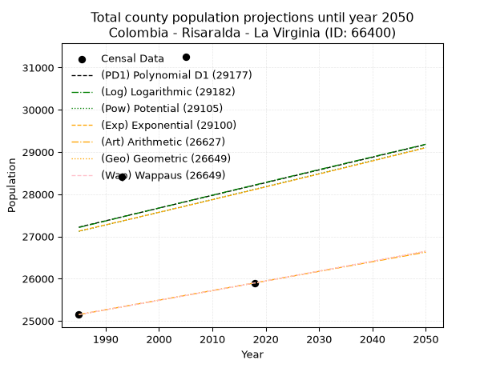
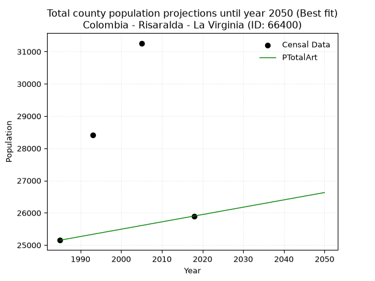
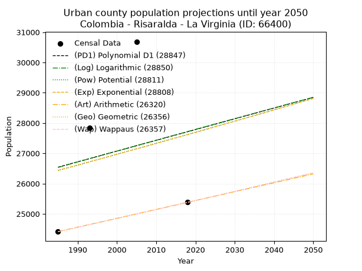
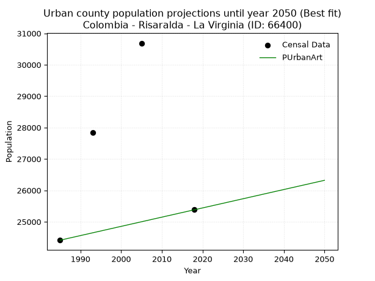
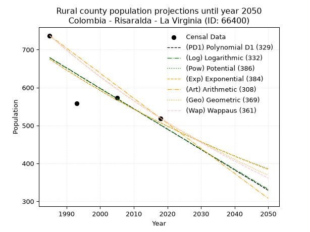
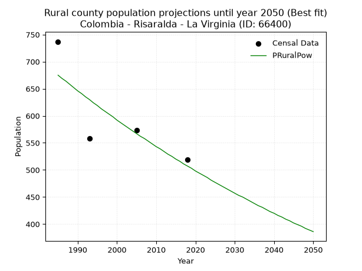

<div align="center">


</div>

# _“Population and Public Services Demand Projections (PPSD) until Year 2050 for Colombia - Risaralda - La Virginia (ID: 66400)”_
Keywords: `population` `public-service` `projection` `lineal` `polynomial` `logarithmic` `potential` `exponential` `arithmetic` `geometric` `wappaus` `dane` `colombia` `south-america`

PPSD are analytical estimates used by governments and planners to anticipate future changes in population size, age distribution, and the resulting community needs for utilities, healthcare, education, and infrastructure as sizing future water treatment facilities, electrical grids, and road networks based on spatial growth.

> **General running parameters**: • app_version: _v20260806_. • Python version: _3.14.7_. • Pandas version: _3.0.5_. • NumPy version: _2.5.1_. • Creates, save and include plots into reports (create_plot): _True_. • Projection until year: _2050_. • Process polynomial degree 2 and up: _False_. • Process Wappaus: _True_. • Process Wappaus: _True_. • Set negative values to zero: _True_. • Set infinite values to zero: _True_. • Drop dataset notes: _True_. 
<div align="center">

Dynamic map: [:earth_americas:Google](http://maps.google.com/maps?q=4.896623733,-75.8803942) [:earth_americas:OSM](https://www.openstreetmap.org/#map=18/4.896623733/-75.8803942&layers=P) [:earth_americas:Bing](https://www.bing.com/maps?cp=4.896623733~-75.8803942&lvl=18) [:earth_americas:Apple](https://maps.apple.com/frame?center=4.896623733%2C-75.8803942&span=0.003%2C0.006)

</div>


<div align="center">

```geojson
{
  "type": "Feature",
  "geometry": {
    "type": "Point", 
    "coordinates": [-75.8803942, 4.896623733]
  }, 
  "properties": {
    "Name": "Colombia - Risaralda - La Virginia (ID: 66400)"
  }
}
```

</div>


## 0. Census Data (4 records)

Census data are official statistics collected by a government about the people and housing in a country. They usually include counts of total population, age, sex, race, income, education, and jobs.

📅Global census file: [Population.xlsx](../data/Population.xlsx)

| Source   |   Year |   CountryID | CountryName   |   StateID | StateName   |   CountyID | CountyName   |   PTotal |   PUrban |   PRural |
|:---------|-------:|------------:|:--------------|----------:|:------------|-----------:|:-------------|---------:|---------:|---------:|
| DANE     |   1985 |          57 | Colombia      |        66 | Risaralda   |      66400 | La Virginia  |    25150 |    24413 |      737 |
| DANE     |   1993 |          57 | Colombia      |        66 | Risaralda   |      66400 | La Virginia  |    28404 |    27846 |      558 |
| DANE     |   2005 |          57 | Colombia      |        66 | Risaralda   |      66400 | La Virginia  |    31261 |    30688 |      573 |
| DANE     |   2018 |          57 | Colombia      |        66 | Risaralda   |      66400 | La Virginia  |    25900 |    25381 |      519 |

> 🔥Some records has specific notes about the registered values or the corresponding urban or rural distribution.

## 1. Total

### 1.1. Coefficients and Parameters

* (PD1) Polynomial Deg 1: 30.105580088320888, -32539.936571663853 (lineal)
* (Log) Logarithmic: 61129.1449556382, -436964.37066603056
* (Pow) Potential: 2.193103678827435, -2.799046531600983
* (Exp) Exponential: 0.0010801303212276824, 3178.6922336229104
* (Art) Arithmetic: Year diff. 2018 - 1985 = 33, Population diff. 25900 - 25150 = 750, Annual growth = 22.727272727272727
* (Geo) Geometric: Year diff. 2018 - 1985 = 33, Population diff. 25900 - 25150 = 750, Annual growth % = 0.0008908533064113655
* (Wap) Wappaus: i = 0.08903926631644556, Condition values only valid for < 200)

<sub>
Wappaus condition values: ['0.00', '0.09', '0.18', '0.27', '0.36', '0.45', '0.53', '0.62', '0.71', '0.80', '0.89', '0.98', '1.07', '1.16', '1.25', '1.34', '1.42', '1.51', '1.60', '1.69', '1.78', '1.87', '1.96', '2.05', '2.14', '2.23', '2.32', '2.40', '2.49', '2.58', '2.67', '2.76', '2.85', '2.94', '3.03', '3.12', '3.21', '3.29', '3.38', '3.47', '3.56', '3.65', '3.74', '3.83', '3.92', '4.01', '4.10', '4.18', '4.27', '4.36', '4.45', '4.54', '4.63', '4.72', '4.81', '4.90', '4.99', '5.08', '5.16', '5.25', '5.34', '5.43', '5.52', '5.61', '5.70', '5.79']
</sub>


### 1.2. Projected Dataset

|   Year |   CountyID |   PTotalPD1 |   PTotalLog |   PTotalPow |   PTotalExp |   PTotalArt |   PTotalGeo |   PTotalWap |
|-------:|-----------:|------------:|------------:|------------:|------------:|------------:|------------:|------------:|
|   1985 |      66400 |       27220 |       27212 |       27120 |       27127 |       25150 |       25150 |       25150 |
|   1986 |      66400 |       27250 |       27243 |       27150 |       27156 |       25173 |       25172 |       25172 |
|   1987 |      66400 |       27280 |       27274 |       27180 |       27186 |       25195 |       25195 |       25195 |
|   1988 |      66400 |       27310 |       27304 |       27210 |       27215 |       25218 |       25217 |       25217 |
|   1989 |      66400 |       27340 |       27335 |       27240 |       27244 |       25241 |       25240 |       25240 |
|   1990 |      66400 |       27370 |       27366 |       27270 |       27274 |       25264 |       25262 |       25262 |
|   1991 |      66400 |       27400 |       27397 |       27300 |       27303 |       25286 |       25285 |       25285 |
|   1992 |      66400 |       27430 |       27427 |       27330 |       27333 |       25309 |       25307 |       25307 |
|   1993 |      66400 |       27460 |       27458 |       27360 |       27362 |       25332 |       25330 |       25330 |
|   1994 |      66400 |       27491 |       27489 |       27390 |       27392 |       25355 |       25352 |       25352 |
|   1995 |      66400 |       27521 |       27519 |       27420 |       27422 |       25377 |       25375 |       25375 |
|   1996 |      66400 |       27551 |       27550 |       27450 |       27451 |       25400 |       25398 |       25398 |
|   1997 |      66400 |       27581 |       27581 |       27481 |       27481 |       25423 |       25420 |       25420 |
|   1998 |      66400 |       27611 |       27611 |       27511 |       27511 |       25445 |       25443 |       25443 |
|   1999 |      66400 |       27641 |       27642 |       27541 |       27540 |       25468 |       25465 |       25465 |
|   2000 |      66400 |       27671 |       27672 |       27571 |       27570 |       25491 |       25488 |       25488 |
|   2001 |      66400 |       27701 |       27703 |       27601 |       27600 |       25514 |       25511 |       25511 |
|   2002 |      66400 |       27731 |       27733 |       27632 |       27630 |       25536 |       25534 |       25534 |
|   2003 |      66400 |       27762 |       27764 |       27662 |       27660 |       25559 |       25556 |       25556 |
|   2004 |      66400 |       27792 |       27794 |       27692 |       27689 |       25582 |       25579 |       25579 |
|   2005 |      66400 |       27822 |       27825 |       27723 |       27719 |       25605 |       25602 |       25602 |
|   2006 |      66400 |       27852 |       27855 |       27753 |       27749 |       25627 |       25625 |       25625 |
|   2007 |      66400 |       27882 |       27886 |       27783 |       27779 |       25650 |       25648 |       25648 |
|   2008 |      66400 |       27912 |       27916 |       27814 |       27809 |       25673 |       25670 |       25670 |
|   2009 |      66400 |       27942 |       27947 |       27844 |       27839 |       25695 |       25693 |       25693 |
|   2010 |      66400 |       27972 |       27977 |       27874 |       27869 |       25718 |       25716 |       25716 |
|   2011 |      66400 |       28002 |       28008 |       27905 |       27900 |       25741 |       25739 |       25739 |
|   2012 |      66400 |       28032 |       28038 |       27935 |       27930 |       25764 |       25762 |       25762 |
|   2013 |      66400 |       28063 |       28068 |       27966 |       27960 |       25786 |       25785 |       25785 |
|   2014 |      66400 |       28093 |       28099 |       27996 |       27990 |       25809 |       25808 |       25808 |
|   2015 |      66400 |       28123 |       28129 |       28027 |       28020 |       25832 |       25831 |       25831 |
|   2016 |      66400 |       28153 |       28159 |       28057 |       28051 |       25855 |       25854 |       25854 |
|   2017 |      66400 |       28183 |       28190 |       28088 |       28081 |       25877 |       25877 |       25877 |
|   2018 |      66400 |       28213 |       28220 |       28118 |       28111 |       25900 |       25900 |       25900 |
|   2019 |      66400 |       28243 |       28250 |       28149 |       28142 |       25923 |       25923 |       25923 |
|   2020 |      66400 |       28273 |       28281 |       28179 |       28172 |       25945 |       25946 |       25946 |
|   2021 |      66400 |       28303 |       28311 |       28210 |       28203 |       25968 |       25969 |       25969 |
|   2022 |      66400 |       28334 |       28341 |       28241 |       28233 |       25991 |       25992 |       25992 |
|   2023 |      66400 |       28364 |       28371 |       28271 |       28264 |       26014 |       26016 |       26016 |
|   2024 |      66400 |       28394 |       28401 |       28302 |       28294 |       26036 |       26039 |       26039 |
|   2025 |      66400 |       28424 |       28432 |       28333 |       28325 |       26059 |       26062 |       26062 |
|   2026 |      66400 |       28454 |       28462 |       28363 |       28355 |       26082 |       26085 |       26085 |
|   2027 |      66400 |       28484 |       28492 |       28394 |       28386 |       26105 |       26108 |       26108 |
|   2028 |      66400 |       28514 |       28522 |       28425 |       28417 |       26127 |       26132 |       26132 |
|   2029 |      66400 |       28544 |       28552 |       28455 |       28447 |       26150 |       26155 |       26155 |
|   2030 |      66400 |       28574 |       28582 |       28486 |       28478 |       26173 |       26178 |       26178 |
|   2031 |      66400 |       28604 |       28613 |       28517 |       28509 |       26195 |       26202 |       26202 |
|   2032 |      66400 |       28635 |       28643 |       28548 |       28540 |       26218 |       26225 |       26225 |
|   2033 |      66400 |       28665 |       28673 |       28579 |       28571 |       26241 |       26248 |       26248 |
|   2034 |      66400 |       28695 |       28703 |       28609 |       28601 |       26264 |       26272 |       26272 |
|   2035 |      66400 |       28725 |       28733 |       28640 |       28632 |       26286 |       26295 |       26295 |
|   2036 |      66400 |       28755 |       28763 |       28671 |       28663 |       26309 |       26318 |       26319 |
|   2037 |      66400 |       28785 |       28793 |       28702 |       28694 |       26332 |       26342 |       26342 |
|   2038 |      66400 |       28815 |       28823 |       28733 |       28725 |       26355 |       26365 |       26366 |
|   2039 |      66400 |       28845 |       28853 |       28764 |       28756 |       26377 |       26389 |       26389 |
|   2040 |      66400 |       28875 |       28883 |       28795 |       28787 |       26400 |       26412 |       26413 |
|   2041 |      66400 |       28906 |       28913 |       28826 |       28818 |       26423 |       26436 |       26436 |
|   2042 |      66400 |       28936 |       28943 |       28857 |       28850 |       26445 |       26459 |       26460 |
|   2043 |      66400 |       28966 |       28973 |       28888 |       28881 |       26468 |       26483 |       26483 |
|   2044 |      66400 |       28996 |       29003 |       28919 |       28912 |       26491 |       26507 |       26507 |
|   2045 |      66400 |       29026 |       29032 |       28950 |       28943 |       26514 |       26530 |       26530 |
|   2046 |      66400 |       29056 |       29062 |       28981 |       28975 |       26536 |       26554 |       26554 |
|   2047 |      66400 |       29086 |       29092 |       29012 |       29006 |       26559 |       26578 |       26578 |
|   2048 |      66400 |       29116 |       29122 |       29043 |       29037 |       26582 |       26601 |       26601 |
|   2049 |      66400 |       29146 |       29152 |       29074 |       29069 |       26605 |       26625 |       26625 |
|   2050 |      66400 |       29177 |       29182 |       29105 |       29100 |       26627 |       26649 |       26649 |
<div align="center">

</img>

</div>


### 1.3. Best fit with absolute error and relative error (%)

Relative error puts that difference into context by dividing the absolute error by the true value, creating a unitless ratio or percentage that shows the scale of the mistake.

Absolute and relative error

|   Year | Source   |   CountryID | CountryName   |   StateID | StateName   |   CountyID_x | CountyName   |   PTotal |   PUrban |   PRural |   CountyID_y |   PTotalPD1 |   PTotalLog |   PTotalPow |   PTotalExp |   PTotalArt |   PTotalGeo |   PTotalWap |   PTotalPD1AbsError |   PTotalLogAbsError |   PTotalPowAbsError |   PTotalExpAbsError |   PTotalArtAbsError |   PTotalGeoAbsError |   PTotalWapAbsError |   PTotalPD1RelError |   PTotalLogRelError |   PTotalPowRelError |   PTotalExpRelError |   PTotalArtRelError |   PTotalGeoRelError |   PTotalWapRelError |
|-------:|:---------|------------:|:--------------|----------:|:------------|-------------:|:-------------|---------:|---------:|---------:|-------------:|------------:|------------:|------------:|------------:|------------:|------------:|------------:|--------------------:|--------------------:|--------------------:|--------------------:|--------------------:|--------------------:|--------------------:|--------------------:|--------------------:|--------------------:|--------------------:|--------------------:|--------------------:|--------------------:|
|   1985 | DANE     |          57 | Colombia      |        66 | Risaralda   |        66400 | La Virginia  |    25150 |    24413 |      737 |        66400 |       27220 |       27212 |       27120 |       27127 |       25150 |       25150 |       25150 |                2070 |                2062 |                1970 |                1977 |                   0 |                   0 |                   0 |             8.23062 |             8.19881 |             7.833   |             7.86083 |              0      |              0      |              0      |
|   1993 | DANE     |          57 | Colombia      |        66 | Risaralda   |        66400 | La Virginia  |    28404 |    27846 |      558 |        66400 |       27460 |       27458 |       27360 |       27362 |       25332 |       25330 |       25330 |                 944 |                 946 |                1044 |                1042 |                3072 |                3074 |                3074 |             3.32348 |             3.33052 |             3.67554 |             3.6685  |             10.8154 |             10.8224 |             10.8224 |
|   2005 | DANE     |          57 | Colombia      |        66 | Risaralda   |        66400 | La Virginia  |    31261 |    30688 |      573 |        66400 |       27822 |       27825 |       27723 |       27719 |       25605 |       25602 |       25602 |                3439 |                3436 |                3538 |                3542 |                5656 |                5659 |                5659 |            11.0009  |            10.9913  |            11.3176  |            11.3304  |             18.0928 |             18.1024 |             18.1024 |
|   2018 | DANE     |          57 | Colombia      |        66 | Risaralda   |        66400 | La Virginia  |    25900 |    25381 |      519 |        66400 |       28213 |       28220 |       28118 |       28111 |       25900 |       25900 |       25900 |                2313 |                2320 |                2218 |                2211 |                   0 |                   0 |                   0 |             8.9305  |             8.95753 |             8.56371 |             8.53668 |              0      |              0      |              0      |

Relative error mean

| Method    |   RelError | Best   |
|:----------|-----------:|:-------|
| PTotalPD1 |    7.87138 |        |
| PTotalLog |    7.86955 |        |
| PTotalPow |    7.84747 |        |
| PTotalExp |    7.84911 |        |
| PTotalArt |    7.22705 | True   |
| PTotalGeo |    7.23121 |        |
| PTotalWap |    7.23121 |        |

💙Best method: _**PTotalArt**_
<div align="center">

</img>

</div>


### 1.4. Fresh water supply demand in liters per capita per day (lpcd)

The fresh water supply demand typically ranges from 100 to 300 liters per capita per day (lpcd) for standard domestic and municipal planning, though absolute survival minimums set by the World Health Organization are as low as 7.5 to 20 liters per day, and total consumption in high-income nations can exceed 400 liters.

> `CZ`: Level in meters above the sea level (masl).<br> `WS`: Fresh water supply demand in liters per capita per day (lpcd or l/h/d).<br> `WSAll`: Zonal fresh water supply demand in liters per second (l/s).<br> `A`: Zonal area in square meters.

Reference values (RAS Colombia)

|    CZ |   WS |
|------:|-----:|
|  1000 |  120 |
|  2000 |  130 |
| 99999 |  140 |

County shapefile geometry properties and water supply values

|   CountyID |      ATotal |   CZTotal |   WSTotal |
|-----------:|------------:|----------:|----------:|
|      66400 | 3.28002e+07 |    996.33 |       120 |

Projected values for best method: PTotalArt

|   CountyID |   Year |   PTotalArt |   WSTotal |   WSTotalAll |
|-----------:|-------:|------------:|----------:|-------------:|
|      66400 |   1985 |       25150 |       120 |      34.9306 |
|      66400 |   1986 |       25173 |       120 |      34.9625 |
|      66400 |   1987 |       25195 |       120 |      34.9931 |
|      66400 |   1988 |       25218 |       120 |      35.025  |
|      66400 |   1989 |       25241 |       120 |      35.0569 |
|      66400 |   1990 |       25264 |       120 |      35.0889 |
|      66400 |   1991 |       25286 |       120 |      35.1194 |
|      66400 |   1992 |       25309 |       120 |      35.1514 |
|      66400 |   1993 |       25332 |       120 |      35.1833 |
|      66400 |   1994 |       25355 |       120 |      35.2153 |
|      66400 |   1995 |       25377 |       120 |      35.2458 |
|      66400 |   1996 |       25400 |       120 |      35.2778 |
|      66400 |   1997 |       25423 |       120 |      35.3097 |
|      66400 |   1998 |       25445 |       120 |      35.3403 |
|      66400 |   1999 |       25468 |       120 |      35.3722 |
|      66400 |   2000 |       25491 |       120 |      35.4042 |
|      66400 |   2001 |       25514 |       120 |      35.4361 |
|      66400 |   2002 |       25536 |       120 |      35.4667 |
|      66400 |   2003 |       25559 |       120 |      35.4986 |
|      66400 |   2004 |       25582 |       120 |      35.5306 |
|      66400 |   2005 |       25605 |       120 |      35.5625 |
|      66400 |   2006 |       25627 |       120 |      35.5931 |
|      66400 |   2007 |       25650 |       120 |      35.625  |
|      66400 |   2008 |       25673 |       120 |      35.6569 |
|      66400 |   2009 |       25695 |       120 |      35.6875 |
|      66400 |   2010 |       25718 |       120 |      35.7194 |
|      66400 |   2011 |       25741 |       120 |      35.7514 |
|      66400 |   2012 |       25764 |       120 |      35.7833 |
|      66400 |   2013 |       25786 |       120 |      35.8139 |
|      66400 |   2014 |       25809 |       120 |      35.8458 |
|      66400 |   2015 |       25832 |       120 |      35.8778 |
|      66400 |   2016 |       25855 |       120 |      35.9097 |
|      66400 |   2017 |       25877 |       120 |      35.9403 |
|      66400 |   2018 |       25900 |       120 |      35.9722 |
|      66400 |   2019 |       25923 |       120 |      36.0042 |
|      66400 |   2020 |       25945 |       120 |      36.0347 |
|      66400 |   2021 |       25968 |       120 |      36.0667 |
|      66400 |   2022 |       25991 |       120 |      36.0986 |
|      66400 |   2023 |       26014 |       120 |      36.1306 |
|      66400 |   2024 |       26036 |       120 |      36.1611 |
|      66400 |   2025 |       26059 |       120 |      36.1931 |
|      66400 |   2026 |       26082 |       120 |      36.225  |
|      66400 |   2027 |       26105 |       120 |      36.2569 |
|      66400 |   2028 |       26127 |       120 |      36.2875 |
|      66400 |   2029 |       26150 |       120 |      36.3194 |
|      66400 |   2030 |       26173 |       120 |      36.3514 |
|      66400 |   2031 |       26195 |       120 |      36.3819 |
|      66400 |   2032 |       26218 |       120 |      36.4139 |
|      66400 |   2033 |       26241 |       120 |      36.4458 |
|      66400 |   2034 |       26264 |       120 |      36.4778 |
|      66400 |   2035 |       26286 |       120 |      36.5083 |
|      66400 |   2036 |       26309 |       120 |      36.5403 |
|      66400 |   2037 |       26332 |       120 |      36.5722 |
|      66400 |   2038 |       26355 |       120 |      36.6042 |
|      66400 |   2039 |       26377 |       120 |      36.6347 |
|      66400 |   2040 |       26400 |       120 |      36.6667 |
|      66400 |   2041 |       26423 |       120 |      36.6986 |
|      66400 |   2042 |       26445 |       120 |      36.7292 |
|      66400 |   2043 |       26468 |       120 |      36.7611 |
|      66400 |   2044 |       26491 |       120 |      36.7931 |
|      66400 |   2045 |       26514 |       120 |      36.825  |
|      66400 |   2046 |       26536 |       120 |      36.8556 |
|      66400 |   2047 |       26559 |       120 |      36.8875 |
|      66400 |   2048 |       26582 |       120 |      36.9194 |
|      66400 |   2049 |       26605 |       120 |      36.9514 |
|      66400 |   2050 |       26627 |       120 |      36.9819 |

## 2. Urban

### 2.1. Coefficients and Parameters

* (PD1) Polynomial Deg 1: 35.486150140509, -43899.17181855313 (lineal)
* (Log) Logarithmic: 71911.15275604291, -519515.24835849466
* (Pow) Potential: 2.6771549479225047, -4.406526189801098
* (Exp) Exponential: 0.0013213852068248446, 1919.0277106547824
* (Art) Arithmetic: Year diff. 2018 - 1985 = 33, Population diff. 25381 - 24413 = 968, Annual growth = 29.333333333333332
* (Geo) Geometric: Year diff. 2018 - 1985 = 33, Population diff. 25381 - 24413 = 968, Annual growth % = 0.001179030428997363
* (Wap) Wappaus: i = 0.11781874656919843, Condition values only valid for < 200)

<sub>
Wappaus condition values: ['0.00', '0.12', '0.24', '0.35', '0.47', '0.59', '0.71', '0.82', '0.94', '1.06', '1.18', '1.30', '1.41', '1.53', '1.65', '1.77', '1.89', '2.00', '2.12', '2.24', '2.36', '2.47', '2.59', '2.71', '2.83', '2.95', '3.06', '3.18', '3.30', '3.42', '3.53', '3.65', '3.77', '3.89', '4.01', '4.12', '4.24', '4.36', '4.48', '4.59', '4.71', '4.83', '4.95', '5.07', '5.18', '5.30', '5.42', '5.54', '5.66', '5.77', '5.89', '6.01', '6.13', '6.24', '6.36', '6.48', '6.60', '6.72', '6.83', '6.95', '7.07', '7.19', '7.30', '7.42', '7.54', '7.66']
</sub>


### 2.2. Projected Dataset

|   Year |   CountyID |   PUrbanPD1 |   PUrbanLog |   PUrbanPow |   PUrbanExp |   PUrbanArt |   PUrbanGeo |   PUrbanWap |
|-------:|-----------:|------------:|------------:|------------:|------------:|------------:|------------:|------------:|
|   1985 |      66400 |       26541 |       26533 |       26430 |       26437 |       24413 |       24413 |       24413 |
|   1986 |      66400 |       26576 |       26569 |       26465 |       26472 |       24442 |       24442 |       24442 |
|   1987 |      66400 |       26612 |       26605 |       26501 |       26507 |       24472 |       24471 |       24471 |
|   1988 |      66400 |       26647 |       26642 |       26537 |       26542 |       24501 |       24499 |       24499 |
|   1989 |      66400 |       26683 |       26678 |       26572 |       26577 |       24530 |       24528 |       24528 |
|   1990 |      66400 |       26718 |       26714 |       26608 |       26612 |       24560 |       24557 |       24557 |
|   1991 |      66400 |       26754 |       26750 |       26644 |       26648 |       24589 |       24586 |       24586 |
|   1992 |      66400 |       26789 |       26786 |       26680 |       26683 |       24618 |       24615 |       24615 |
|   1993 |      66400 |       26825 |       26822 |       26716 |       26718 |       24648 |       24644 |       24644 |
|   1994 |      66400 |       26860 |       26858 |       26752 |       26753 |       24677 |       24673 |       24673 |
|   1995 |      66400 |       26896 |       26894 |       26788 |       26789 |       24706 |       24702 |       24702 |
|   1996 |      66400 |       26931 |       26930 |       26823 |       26824 |       24736 |       24731 |       24731 |
|   1997 |      66400 |       26967 |       26966 |       26859 |       26860 |       24765 |       24761 |       24761 |
|   1998 |      66400 |       27002 |       27002 |       26895 |       26895 |       24794 |       24790 |       24790 |
|   1999 |      66400 |       27038 |       27038 |       26932 |       26931 |       24824 |       24819 |       24819 |
|   2000 |      66400 |       27073 |       27074 |       26968 |       26966 |       24853 |       24848 |       24848 |
|   2001 |      66400 |       27109 |       27110 |       27004 |       27002 |       24882 |       24878 |       24878 |
|   2002 |      66400 |       27144 |       27146 |       27040 |       27038 |       24912 |       24907 |       24907 |
|   2003 |      66400 |       27180 |       27182 |       27076 |       27073 |       24941 |       24936 |       24936 |
|   2004 |      66400 |       27215 |       27218 |       27112 |       27109 |       24970 |       24966 |       24966 |
|   2005 |      66400 |       27251 |       27254 |       27148 |       27145 |       25000 |       24995 |       24995 |
|   2006 |      66400 |       27286 |       27290 |       27185 |       27181 |       25029 |       25025 |       25025 |
|   2007 |      66400 |       27322 |       27326 |       27221 |       27217 |       25058 |       25054 |       25054 |
|   2008 |      66400 |       27357 |       27361 |       27257 |       27253 |       25088 |       25084 |       25084 |
|   2009 |      66400 |       27393 |       27397 |       27294 |       27289 |       25117 |       25113 |       25113 |
|   2010 |      66400 |       27428 |       27433 |       27330 |       27325 |       25146 |       25143 |       25143 |
|   2011 |      66400 |       27463 |       27469 |       27367 |       27361 |       25176 |       25173 |       25172 |
|   2012 |      66400 |       27499 |       27505 |       27403 |       27397 |       25205 |       25202 |       25202 |
|   2013 |      66400 |       27534 |       27540 |       27439 |       27434 |       25234 |       25232 |       25232 |
|   2014 |      66400 |       27570 |       27576 |       27476 |       27470 |       25264 |       25262 |       25262 |
|   2015 |      66400 |       27605 |       27612 |       27513 |       27506 |       25293 |       25291 |       25291 |
|   2016 |      66400 |       27641 |       27647 |       27549 |       27543 |       25322 |       25321 |       25321 |
|   2017 |      66400 |       27676 |       27683 |       27586 |       27579 |       25352 |       25351 |       25351 |
|   2018 |      66400 |       27712 |       27719 |       27622 |       27615 |       25381 |       25381 |       25381 |
|   2019 |      66400 |       27747 |       27754 |       27659 |       27652 |       25410 |       25411 |       25411 |
|   2020 |      66400 |       27783 |       27790 |       27696 |       27688 |       25440 |       25441 |       25441 |
|   2021 |      66400 |       27818 |       27826 |       27732 |       27725 |       25469 |       25471 |       25471 |
|   2022 |      66400 |       27854 |       27861 |       27769 |       27762 |       25498 |       25501 |       25501 |
|   2023 |      66400 |       27889 |       27897 |       27806 |       27798 |       25528 |       25531 |       25531 |
|   2024 |      66400 |       27925 |       27932 |       27843 |       27835 |       25557 |       25561 |       25561 |
|   2025 |      66400 |       27960 |       27968 |       27880 |       27872 |       25586 |       25591 |       25591 |
|   2026 |      66400 |       27996 |       28003 |       27916 |       27909 |       25616 |       25621 |       25621 |
|   2027 |      66400 |       28031 |       28039 |       27953 |       27946 |       25645 |       25652 |       25652 |
|   2028 |      66400 |       28067 |       28074 |       27990 |       27983 |       25674 |       25682 |       25682 |
|   2029 |      66400 |       28102 |       28110 |       28027 |       28020 |       25704 |       25712 |       25712 |
|   2030 |      66400 |       28138 |       28145 |       28064 |       28057 |       25733 |       25742 |       25743 |
|   2031 |      66400 |       28173 |       28180 |       28101 |       28094 |       25762 |       25773 |       25773 |
|   2032 |      66400 |       28209 |       28216 |       28138 |       28131 |       25792 |       25803 |       25803 |
|   2033 |      66400 |       28244 |       28251 |       28175 |       28168 |       25821 |       25834 |       25834 |
|   2034 |      66400 |       28280 |       28287 |       28213 |       28205 |       25850 |       25864 |       25864 |
|   2035 |      66400 |       28315 |       28322 |       28250 |       28243 |       25880 |       25895 |       25895 |
|   2036 |      66400 |       28351 |       28357 |       28287 |       28280 |       25909 |       25925 |       25925 |
|   2037 |      66400 |       28386 |       28393 |       28324 |       28318 |       25938 |       25956 |       25956 |
|   2038 |      66400 |       28422 |       28428 |       28361 |       28355 |       25968 |       25986 |       25987 |
|   2039 |      66400 |       28457 |       28463 |       28399 |       28392 |       25997 |       26017 |       26017 |
|   2040 |      66400 |       28493 |       28498 |       28436 |       28430 |       26026 |       26048 |       26048 |
|   2041 |      66400 |       28528 |       28534 |       28473 |       28468 |       26056 |       26078 |       26079 |
|   2042 |      66400 |       28564 |       28569 |       28511 |       28505 |       26085 |       26109 |       26109 |
|   2043 |      66400 |       28599 |       28604 |       28548 |       28543 |       26114 |       26140 |       26140 |
|   2044 |      66400 |       28635 |       28639 |       28585 |       28581 |       26144 |       26171 |       26171 |
|   2045 |      66400 |       28670 |       28674 |       28623 |       28618 |       26173 |       26201 |       26202 |
|   2046 |      66400 |       28705 |       28710 |       28660 |       28656 |       26202 |       26232 |       26233 |
|   2047 |      66400 |       28741 |       28745 |       28698 |       28694 |       26232 |       26263 |       26264 |
|   2048 |      66400 |       28776 |       28780 |       28735 |       28732 |       26261 |       26294 |       26295 |
|   2049 |      66400 |       28812 |       28815 |       28773 |       28770 |       26290 |       26325 |       26326 |
|   2050 |      66400 |       28847 |       28850 |       28811 |       28808 |       26320 |       26356 |       26357 |
<div align="center">

</img>

</div>


### 2.3. Best fit with absolute error and relative error (%)

Relative error puts that difference into context by dividing the absolute error by the true value, creating a unitless ratio or percentage that shows the scale of the mistake.

Absolute and relative error

|   Year | Source   |   CountryID | CountryName   |   StateID | StateName   |   CountyID_x | CountyName   |   PTotal |   PUrban |   PRural |   CountyID_y |   PUrbanPD1 |   PUrbanLog |   PUrbanPow |   PUrbanExp |   PUrbanArt |   PUrbanGeo |   PUrbanWap |   PUrbanPD1AbsError |   PUrbanLogAbsError |   PUrbanPowAbsError |   PUrbanExpAbsError |   PUrbanArtAbsError |   PUrbanGeoAbsError |   PUrbanWapAbsError |   PUrbanPD1RelError |   PUrbanLogRelError |   PUrbanPowRelError |   PUrbanExpRelError |   PUrbanArtRelError |   PUrbanGeoRelError |   PUrbanWapRelError |
|-------:|:---------|------------:|:--------------|----------:|:------------|-------------:|:-------------|---------:|---------:|---------:|-------------:|------------:|------------:|------------:|------------:|------------:|------------:|------------:|--------------------:|--------------------:|--------------------:|--------------------:|--------------------:|--------------------:|--------------------:|--------------------:|--------------------:|--------------------:|--------------------:|--------------------:|--------------------:|--------------------:|
|   1985 | DANE     |          57 | Colombia      |        66 | Risaralda   |        66400 | La Virginia  |    25150 |    24413 |      737 |        66400 |       26541 |       26533 |       26430 |       26437 |       24413 |       24413 |       24413 |                2128 |                2120 |                2017 |                2024 |                   0 |                   0 |                   0 |             8.71667 |             8.6839  |             8.26199 |             8.29066 |              0      |              0      |              0      |
|   1993 | DANE     |          57 | Colombia      |        66 | Risaralda   |        66400 | La Virginia  |    28404 |    27846 |      558 |        66400 |       26825 |       26822 |       26716 |       26718 |       24648 |       24644 |       24644 |                1021 |                1024 |                1130 |                1128 |                3198 |                3202 |                3202 |             3.66659 |             3.67737 |             4.05803 |             4.05085 |             11.4846 |             11.499  |             11.499  |
|   2005 | DANE     |          57 | Colombia      |        66 | Risaralda   |        66400 | La Virginia  |    31261 |    30688 |      573 |        66400 |       27251 |       27254 |       27148 |       27145 |       25000 |       24995 |       24995 |                3437 |                3434 |                3540 |                3543 |                5688 |                5693 |                5693 |            11.1998  |            11.19    |            11.5355  |            11.5452  |             18.5349 |             18.5512 |             18.5512 |
|   2018 | DANE     |          57 | Colombia      |        66 | Risaralda   |        66400 | La Virginia  |    25900 |    25381 |      519 |        66400 |       27712 |       27719 |       27622 |       27615 |       25381 |       25381 |       25381 |                2331 |                2338 |                2241 |                2234 |                   0 |                   0 |                   0 |             9.18404 |             9.21161 |             8.82944 |             8.80186 |              0      |              0      |              0      |

Relative error mean

| Method    |   RelError | Best   |
|:----------|-----------:|:-------|
| PUrbanPD1 |    8.19178 |        |
| PUrbanLog |    8.19073 |        |
| PUrbanPow |    8.17123 |        |
| PUrbanExp |    8.17215 |        |
| PUrbanArt |    7.50488 | True   |
| PUrbanGeo |    7.51255 |        |
| PUrbanWap |    7.51255 |        |

💙Best method: _**PUrbanArt**_
<div align="center">

</img>

</div>


### 2.4. Fresh water supply demand in liters per capita per day (lpcd)

The fresh water supply demand typically ranges from 100 to 300 liters per capita per day (lpcd) for standard domestic and municipal planning, though absolute survival minimums set by the World Health Organization are as low as 7.5 to 20 liters per day, and total consumption in high-income nations can exceed 400 liters.

> `CZ`: Level in meters above the sea level (masl).<br> `WS`: Fresh water supply demand in liters per capita per day (lpcd or l/h/d).<br> `WSAll`: Zonal fresh water supply demand in liters per second (l/s).<br> `A`: Zonal area in square meters.

Reference values (RAS Colombia)

|    CZ |   WS |
|------:|-----:|
|  1000 |  120 |
|  2000 |  130 |
| 99999 |  140 |

County shapefile geometry properties and water supply values

|   CountyID |      AUrban |   CZUrban |   WSUrban |
|-----------:|------------:|----------:|----------:|
|      66400 | 2.15912e+06 |   901.792 |       120 |

Projected values for best method: PUrbanArt

|   CountyID |   Year |   PUrbanArt |   WSUrban |   WSUrbanAll |
|-----------:|-------:|------------:|----------:|-------------:|
|      66400 |   1985 |       24413 |       120 |      33.9069 |
|      66400 |   1986 |       24442 |       120 |      33.9472 |
|      66400 |   1987 |       24472 |       120 |      33.9889 |
|      66400 |   1988 |       24501 |       120 |      34.0292 |
|      66400 |   1989 |       24530 |       120 |      34.0694 |
|      66400 |   1990 |       24560 |       120 |      34.1111 |
|      66400 |   1991 |       24589 |       120 |      34.1514 |
|      66400 |   1992 |       24618 |       120 |      34.1917 |
|      66400 |   1993 |       24648 |       120 |      34.2333 |
|      66400 |   1994 |       24677 |       120 |      34.2736 |
|      66400 |   1995 |       24706 |       120 |      34.3139 |
|      66400 |   1996 |       24736 |       120 |      34.3556 |
|      66400 |   1997 |       24765 |       120 |      34.3958 |
|      66400 |   1998 |       24794 |       120 |      34.4361 |
|      66400 |   1999 |       24824 |       120 |      34.4778 |
|      66400 |   2000 |       24853 |       120 |      34.5181 |
|      66400 |   2001 |       24882 |       120 |      34.5583 |
|      66400 |   2002 |       24912 |       120 |      34.6    |
|      66400 |   2003 |       24941 |       120 |      34.6403 |
|      66400 |   2004 |       24970 |       120 |      34.6806 |
|      66400 |   2005 |       25000 |       120 |      34.7222 |
|      66400 |   2006 |       25029 |       120 |      34.7625 |
|      66400 |   2007 |       25058 |       120 |      34.8028 |
|      66400 |   2008 |       25088 |       120 |      34.8444 |
|      66400 |   2009 |       25117 |       120 |      34.8847 |
|      66400 |   2010 |       25146 |       120 |      34.925  |
|      66400 |   2011 |       25176 |       120 |      34.9667 |
|      66400 |   2012 |       25205 |       120 |      35.0069 |
|      66400 |   2013 |       25234 |       120 |      35.0472 |
|      66400 |   2014 |       25264 |       120 |      35.0889 |
|      66400 |   2015 |       25293 |       120 |      35.1292 |
|      66400 |   2016 |       25322 |       120 |      35.1694 |
|      66400 |   2017 |       25352 |       120 |      35.2111 |
|      66400 |   2018 |       25381 |       120 |      35.2514 |
|      66400 |   2019 |       25410 |       120 |      35.2917 |
|      66400 |   2020 |       25440 |       120 |      35.3333 |
|      66400 |   2021 |       25469 |       120 |      35.3736 |
|      66400 |   2022 |       25498 |       120 |      35.4139 |
|      66400 |   2023 |       25528 |       120 |      35.4556 |
|      66400 |   2024 |       25557 |       120 |      35.4958 |
|      66400 |   2025 |       25586 |       120 |      35.5361 |
|      66400 |   2026 |       25616 |       120 |      35.5778 |
|      66400 |   2027 |       25645 |       120 |      35.6181 |
|      66400 |   2028 |       25674 |       120 |      35.6583 |
|      66400 |   2029 |       25704 |       120 |      35.7    |
|      66400 |   2030 |       25733 |       120 |      35.7403 |
|      66400 |   2031 |       25762 |       120 |      35.7806 |
|      66400 |   2032 |       25792 |       120 |      35.8222 |
|      66400 |   2033 |       25821 |       120 |      35.8625 |
|      66400 |   2034 |       25850 |       120 |      35.9028 |
|      66400 |   2035 |       25880 |       120 |      35.9444 |
|      66400 |   2036 |       25909 |       120 |      35.9847 |
|      66400 |   2037 |       25938 |       120 |      36.025  |
|      66400 |   2038 |       25968 |       120 |      36.0667 |
|      66400 |   2039 |       25997 |       120 |      36.1069 |
|      66400 |   2040 |       26026 |       120 |      36.1472 |
|      66400 |   2041 |       26056 |       120 |      36.1889 |
|      66400 |   2042 |       26085 |       120 |      36.2292 |
|      66400 |   2043 |       26114 |       120 |      36.2694 |
|      66400 |   2044 |       26144 |       120 |      36.3111 |
|      66400 |   2045 |       26173 |       120 |      36.3514 |
|      66400 |   2046 |       26202 |       120 |      36.3917 |
|      66400 |   2047 |       26232 |       120 |      36.4333 |
|      66400 |   2048 |       26261 |       120 |      36.4736 |
|      66400 |   2049 |       26290 |       120 |      36.5139 |
|      66400 |   2050 |       26320 |       120 |      36.5556 |

## 3. Rural

### 3.1. Coefficients and Parameters

* (PD1) Polynomial Deg 1: -5.3805700521878475, 11359.235246888742 (lineal)
* (Log) Logarithmic: -10782.00780040479, 82550.87769246483
* (Pow) Potential: -17.383813442162936, 60.15714242834703
* (Exp) Exponential: -0.008676140911380708, 20360955781.370857
* (Art) Arithmetic: Year diff. 2018 - 1985 = 33, Population diff. 519 - 737 = -218, Annual growth = -6.606060606060606
* (Geo) Geometric: Year diff. 2018 - 1985 = 33, Population diff. 519 - 737 = -218, Annual growth % = -0.0105705233201987
* (Wap) Wappaus: i = -1.051920478672071, Condition values only valid for < 200)

<sub>
Wappaus condition values: ['-0.00', '-1.05', '-2.10', '-3.16', '-4.21', '-5.26', '-6.31', '-7.36', '-8.42', '-9.47', '-10.52', '-11.57', '-12.62', '-13.67', '-14.73', '-15.78', '-16.83', '-17.88', '-18.93', '-19.99', '-21.04', '-22.09', '-23.14', '-24.19', '-25.25', '-26.30', '-27.35', '-28.40', '-29.45', '-30.51', '-31.56', '-32.61', '-33.66', '-34.71', '-35.77', '-36.82', '-37.87', '-38.92', '-39.97', '-41.02', '-42.08', '-43.13', '-44.18', '-45.23', '-46.28', '-47.34', '-48.39', '-49.44', '-50.49', '-51.54', '-52.60', '-53.65', '-54.70', '-55.75', '-56.80', '-57.86', '-58.91', '-59.96', '-61.01', '-62.06', '-63.12', '-64.17', '-65.22', '-66.27', '-67.32', '-68.37']
</sub>


### 3.2. Projected Dataset

|   Year |   CountyID |   PRuralPD1 |   PRuralLog |   PRuralPow |   PRuralExp |   PRuralArt |   PRuralGeo |   PRuralWap |
|-------:|-----------:|------------:|------------:|------------:|------------:|------------:|------------:|------------:|
|   1985 |      66400 |         679 |         679 |         675 |         675 |         737 |         737 |         737 |
|   1986 |      66400 |         673 |         674 |         669 |         669 |         730 |         729 |         729 |
|   1987 |      66400 |         668 |         668 |         664 |         663 |         724 |         722 |         722 |
|   1988 |      66400 |         663 |         663 |         658 |         658 |         717 |         714 |         714 |
|   1989 |      66400 |         657 |         657 |         652 |         652 |         711 |         706 |         707 |
|   1990 |      66400 |         652 |         652 |         646 |         646 |         704 |         699 |         699 |
|   1991 |      66400 |         647 |         647 |         641 |         641 |         697 |         691 |         692 |
|   1992 |      66400 |         641 |         641 |         635 |         635 |         691 |         684 |         685 |
|   1993 |      66400 |         636 |         636 |         630 |         630 |         684 |         677 |         677 |
|   1994 |      66400 |         630 |         630 |         624 |         624 |         678 |         670 |         670 |
|   1995 |      66400 |         625 |         625 |         619 |         619 |         671 |         663 |         663 |
|   1996 |      66400 |         620 |         619 |         613 |         614 |         664 |         656 |         656 |
|   1997 |      66400 |         614 |         614 |         608 |         608 |         658 |         649 |         649 |
|   1998 |      66400 |         609 |         609 |         603 |         603 |         651 |         642 |         643 |
|   1999 |      66400 |         603 |         603 |         598 |         598 |         645 |         635 |         636 |
|   2000 |      66400 |         598 |         598 |         592 |         593 |         638 |         628 |         629 |
|   2001 |      66400 |         593 |         592 |         587 |         588 |         631 |         622 |         623 |
|   2002 |      66400 |         587 |         587 |         582 |         582 |         625 |         615 |         616 |
|   2003 |      66400 |         582 |         582 |         577 |         577 |         618 |         609 |         610 |
|   2004 |      66400 |         577 |         576 |         572 |         572 |         611 |         602 |         603 |
|   2005 |      66400 |         571 |         571 |         567 |         567 |         605 |         596 |         597 |
|   2006 |      66400 |         566 |         566 |         562 |         563 |         598 |         590 |         590 |
|   2007 |      66400 |         560 |         560 |         558 |         558 |         592 |         583 |         584 |
|   2008 |      66400 |         555 |         555 |         553 |         553 |         585 |         577 |         578 |
|   2009 |      66400 |         550 |         549 |         548 |         548 |         578 |         571 |         572 |
|   2010 |      66400 |         544 |         544 |         543 |         543 |         572 |         565 |         566 |
|   2011 |      66400 |         539 |         539 |         539 |         539 |         565 |         559 |         560 |
|   2012 |      66400 |         534 |         533 |         534 |         534 |         559 |         553 |         554 |
|   2013 |      66400 |         528 |         528 |         529 |         529 |         552 |         547 |         548 |
|   2014 |      66400 |         523 |         523 |         525 |         525 |         545 |         542 |         542 |
|   2015 |      66400 |         517 |         517 |         520 |         520 |         539 |         536 |         536 |
|   2016 |      66400 |         512 |         512 |         516 |         516 |         532 |         530 |         530 |
|   2017 |      66400 |         507 |         507 |         511 |         511 |         526 |         525 |         525 |
|   2018 |      66400 |         501 |         501 |         507 |         507 |         519 |         519 |         519 |
|   2019 |      66400 |         496 |         496 |         503 |         503 |         512 |         514 |         513 |
|   2020 |      66400 |         490 |         491 |         498 |         498 |         506 |         508 |         508 |
|   2021 |      66400 |         485 |         485 |         494 |         494 |         499 |         503 |         502 |
|   2022 |      66400 |         480 |         480 |         490 |         490 |         493 |         497 |         497 |
|   2023 |      66400 |         474 |         475 |         486 |         485 |         486 |         492 |         491 |
|   2024 |      66400 |         469 |         469 |         481 |         481 |         479 |         487 |         486 |
|   2025 |      66400 |         464 |         464 |         477 |         477 |         473 |         482 |         481 |
|   2026 |      66400 |         458 |         459 |         473 |         473 |         466 |         477 |         476 |
|   2027 |      66400 |         453 |         453 |         469 |         469 |         460 |         472 |         470 |
|   2028 |      66400 |         447 |         448 |         465 |         465 |         453 |         467 |         465 |
|   2029 |      66400 |         442 |         443 |         461 |         461 |         446 |         462 |         460 |
|   2030 |      66400 |         437 |         437 |         457 |         457 |         440 |         457 |         455 |
|   2031 |      66400 |         431 |         432 |         453 |         453 |         433 |         452 |         450 |
|   2032 |      66400 |         426 |         427 |         450 |         449 |         427 |         447 |         445 |
|   2033 |      66400 |         421 |         421 |         446 |         445 |         420 |         443 |         440 |
|   2034 |      66400 |         415 |         416 |         442 |         441 |         413 |         438 |         435 |
|   2035 |      66400 |         410 |         411 |         438 |         437 |         407 |         433 |         430 |
|   2036 |      66400 |         404 |         406 |         434 |         434 |         400 |         429 |         425 |
|   2037 |      66400 |         399 |         400 |         431 |         430 |         393 |         424 |         420 |
|   2038 |      66400 |         394 |         395 |         427 |         426 |         387 |         420 |         416 |
|   2039 |      66400 |         388 |         390 |         423 |         423 |         380 |         415 |         411 |
|   2040 |      66400 |         383 |         384 |         420 |         419 |         374 |         411 |         406 |
|   2041 |      66400 |         377 |         379 |         416 |         415 |         367 |         406 |         402 |
|   2042 |      66400 |         372 |         374 |         413 |         412 |         360 |         402 |         397 |
|   2043 |      66400 |         367 |         369 |         409 |         408 |         354 |         398 |         392 |
|   2044 |      66400 |         361 |         363 |         406 |         405 |         347 |         394 |         388 |
|   2045 |      66400 |         356 |         358 |         402 |         401 |         341 |         390 |         383 |
|   2046 |      66400 |         351 |         353 |         399 |         398 |         334 |         385 |         379 |
|   2047 |      66400 |         345 |         347 |         396 |         394 |         327 |         381 |         375 |
|   2048 |      66400 |         340 |         342 |         392 |         391 |         321 |         377 |         370 |
|   2049 |      66400 |         334 |         337 |         389 |         387 |         314 |         373 |         366 |
|   2050 |      66400 |         329 |         332 |         386 |         384 |         308 |         369 |         361 |
<div align="center">

</img>

</div>


### 3.3. Best fit with absolute error and relative error (%)

Relative error puts that difference into context by dividing the absolute error by the true value, creating a unitless ratio or percentage that shows the scale of the mistake.

Absolute and relative error

|   Year | Source   |   CountryID | CountryName   |   StateID | StateName   |   CountyID_x | CountyName   |   PTotal |   PUrban |   PRural |   CountyID_y |   PRuralPD1 |   PRuralLog |   PRuralPow |   PRuralExp |   PRuralArt |   PRuralGeo |   PRuralWap |   PRuralPD1AbsError |   PRuralLogAbsError |   PRuralPowAbsError |   PRuralExpAbsError |   PRuralArtAbsError |   PRuralGeoAbsError |   PRuralWapAbsError |   PRuralPD1RelError |   PRuralLogRelError |   PRuralPowRelError |   PRuralExpRelError |   PRuralArtRelError |   PRuralGeoRelError |   PRuralWapRelError |
|-------:|:---------|------------:|:--------------|----------:|:------------|-------------:|:-------------|---------:|---------:|---------:|-------------:|------------:|------------:|------------:|------------:|------------:|------------:|------------:|--------------------:|--------------------:|--------------------:|--------------------:|--------------------:|--------------------:|--------------------:|--------------------:|--------------------:|--------------------:|--------------------:|--------------------:|--------------------:|--------------------:|
|   1985 | DANE     |          57 | Colombia      |        66 | Risaralda   |        66400 | La Virginia  |    25150 |    24413 |      737 |        66400 |         679 |         679 |         675 |         675 |         737 |         737 |         737 |                  58 |                  58 |                  62 |                  62 |                   0 |                   0 |                   0 |             7.86974 |             7.86974 |             8.41248 |             8.41248 |             0       |             0       |             0       |
|   1993 | DANE     |          57 | Colombia      |        66 | Risaralda   |        66400 | La Virginia  |    28404 |    27846 |      558 |        66400 |         636 |         636 |         630 |         630 |         684 |         677 |         677 |                  78 |                  78 |                  72 |                  72 |                 126 |                 119 |                 119 |            13.9785  |            13.9785  |            12.9032  |            12.9032  |            22.5806  |            21.3262  |            21.3262  |
|   2005 | DANE     |          57 | Colombia      |        66 | Risaralda   |        66400 | La Virginia  |    31261 |    30688 |      573 |        66400 |         571 |         571 |         567 |         567 |         605 |         596 |         597 |                   2 |                   2 |                   6 |                   6 |                  32 |                  23 |                  24 |             0.34904 |             0.34904 |             1.04712 |             1.04712 |             5.58464 |             4.01396 |             4.18848 |
|   2018 | DANE     |          57 | Colombia      |        66 | Risaralda   |        66400 | La Virginia  |    25900 |    25381 |      519 |        66400 |         501 |         501 |         507 |         507 |         519 |         519 |         519 |                  18 |                  18 |                  12 |                  12 |                   0 |                   0 |                   0 |             3.46821 |             3.46821 |             2.31214 |             2.31214 |             0       |             0       |             0       |

Relative error mean

| Method    |   RelError | Best   |
|:----------|-----------:|:-------|
| PRuralPD1 |    6.41637 |        |
| PRuralLog |    6.41637 |        |
| PRuralPow |    6.16874 | True   |
| PRuralExp |    6.16874 | True   |
| PRuralArt |    7.04132 |        |
| PRuralGeo |    6.33503 |        |
| PRuralWap |    6.37866 |        |

💙Best method: _**PRuralPow**_
<div align="center">

</img>

</div>


### 3.4. Fresh water supply demand in liters per capita per day (lpcd)

The fresh water supply demand typically ranges from 100 to 300 liters per capita per day (lpcd) for standard domestic and municipal planning, though absolute survival minimums set by the World Health Organization are as low as 7.5 to 20 liters per day, and total consumption in high-income nations can exceed 400 liters.

> `CZ`: Level in meters above the sea level (masl).<br> `WS`: Fresh water supply demand in liters per capita per day (lpcd or l/h/d).<br> `WSAll`: Zonal fresh water supply demand in liters per second (l/s).<br> `A`: Zonal area in square meters.

Reference values (RAS Colombia)

|    CZ |   WS |
|------:|-----:|
|  1000 |  120 |
|  2000 |  130 |
| 99999 |  140 |

County shapefile geometry properties and water supply values

|   CountyID |     ARural |   CZRural |   WSRural |
|-----------:|-----------:|----------:|----------:|
|      66400 | 3.0641e+07 |   1002.87 |       130 |

Projected values for best method: PRuralPow

|   CountyID |   Year |   PRuralPow |   WSRural |   WSRuralAll |
|-----------:|-------:|------------:|----------:|-------------:|
|      66400 |   1985 |         675 |       130 |     1.01562  |
|      66400 |   1986 |         669 |       130 |     1.0066   |
|      66400 |   1987 |         664 |       130 |     0.999074 |
|      66400 |   1988 |         658 |       130 |     0.990046 |
|      66400 |   1989 |         652 |       130 |     0.981019 |
|      66400 |   1990 |         646 |       130 |     0.971991 |
|      66400 |   1991 |         641 |       130 |     0.964468 |
|      66400 |   1992 |         635 |       130 |     0.95544  |
|      66400 |   1993 |         630 |       130 |     0.947917 |
|      66400 |   1994 |         624 |       130 |     0.938889 |
|      66400 |   1995 |         619 |       130 |     0.931366 |
|      66400 |   1996 |         613 |       130 |     0.922338 |
|      66400 |   1997 |         608 |       130 |     0.914815 |
|      66400 |   1998 |         603 |       130 |     0.907292 |
|      66400 |   1999 |         598 |       130 |     0.899769 |
|      66400 |   2000 |         592 |       130 |     0.890741 |
|      66400 |   2001 |         587 |       130 |     0.883218 |
|      66400 |   2002 |         582 |       130 |     0.875694 |
|      66400 |   2003 |         577 |       130 |     0.868171 |
|      66400 |   2004 |         572 |       130 |     0.860648 |
|      66400 |   2005 |         567 |       130 |     0.853125 |
|      66400 |   2006 |         562 |       130 |     0.845602 |
|      66400 |   2007 |         558 |       130 |     0.839583 |
|      66400 |   2008 |         553 |       130 |     0.83206  |
|      66400 |   2009 |         548 |       130 |     0.824537 |
|      66400 |   2010 |         543 |       130 |     0.817014 |
|      66400 |   2011 |         539 |       130 |     0.810995 |
|      66400 |   2012 |         534 |       130 |     0.803472 |
|      66400 |   2013 |         529 |       130 |     0.795949 |
|      66400 |   2014 |         525 |       130 |     0.789931 |
|      66400 |   2015 |         520 |       130 |     0.782407 |
|      66400 |   2016 |         516 |       130 |     0.776389 |
|      66400 |   2017 |         511 |       130 |     0.768866 |
|      66400 |   2018 |         507 |       130 |     0.762847 |
|      66400 |   2019 |         503 |       130 |     0.756829 |
|      66400 |   2020 |         498 |       130 |     0.749306 |
|      66400 |   2021 |         494 |       130 |     0.743287 |
|      66400 |   2022 |         490 |       130 |     0.737269 |
|      66400 |   2023 |         486 |       130 |     0.73125  |
|      66400 |   2024 |         481 |       130 |     0.723727 |
|      66400 |   2025 |         477 |       130 |     0.717708 |
|      66400 |   2026 |         473 |       130 |     0.71169  |
|      66400 |   2027 |         469 |       130 |     0.705671 |
|      66400 |   2028 |         465 |       130 |     0.699653 |
|      66400 |   2029 |         461 |       130 |     0.693634 |
|      66400 |   2030 |         457 |       130 |     0.687616 |
|      66400 |   2031 |         453 |       130 |     0.681597 |
|      66400 |   2032 |         450 |       130 |     0.677083 |
|      66400 |   2033 |         446 |       130 |     0.671065 |
|      66400 |   2034 |         442 |       130 |     0.665046 |
|      66400 |   2035 |         438 |       130 |     0.659028 |
|      66400 |   2036 |         434 |       130 |     0.653009 |
|      66400 |   2037 |         431 |       130 |     0.648495 |
|      66400 |   2038 |         427 |       130 |     0.642477 |
|      66400 |   2039 |         423 |       130 |     0.636458 |
|      66400 |   2040 |         420 |       130 |     0.631944 |
|      66400 |   2041 |         416 |       130 |     0.625926 |
|      66400 |   2042 |         413 |       130 |     0.621412 |
|      66400 |   2043 |         409 |       130 |     0.615394 |
|      66400 |   2044 |         406 |       130 |     0.61088  |
|      66400 |   2045 |         402 |       130 |     0.604861 |
|      66400 |   2046 |         399 |       130 |     0.600347 |
|      66400 |   2047 |         396 |       130 |     0.595833 |
|      66400 |   2048 |         392 |       130 |     0.589815 |
|      66400 |   2049 |         389 |       130 |     0.585301 |
|      66400 |   2050 |         386 |       130 |     0.580787 |

<div align="center"><br><sub>Share this research</sub></div><br>

<sub>**APPS & TOOLS & CONTENT DISCLAIMER**: • NO WARRANTY - This content and software is provided by <a href="https://github.com/rcfdtools" target="_blank">github.com/rcfdtools</a> "as is", without any express or implied warranty, including warranties of merchantability, fitness for a particular purpose, or non-infringement. There is no guarantee that the software will be error-free or operate without interruption. • LIMITATION OF LIABILITY - Neither the authors nor copyright holders will be liable for claims or damages arising from the software or its use. You are responsible for determining if the software is appropriate for your use and assume all associated risks, including errors, legal compliance, and data loss. • NO PROFESSIONAL ADVICE - The software provides general information and does not offer professional advice. It should not replace consultation with professional advisors. [Clauses and global license for rcfdtools use.](https://github.com/rcfdtools/rcfdtools/blob/main/LICENSE.md)</sub>