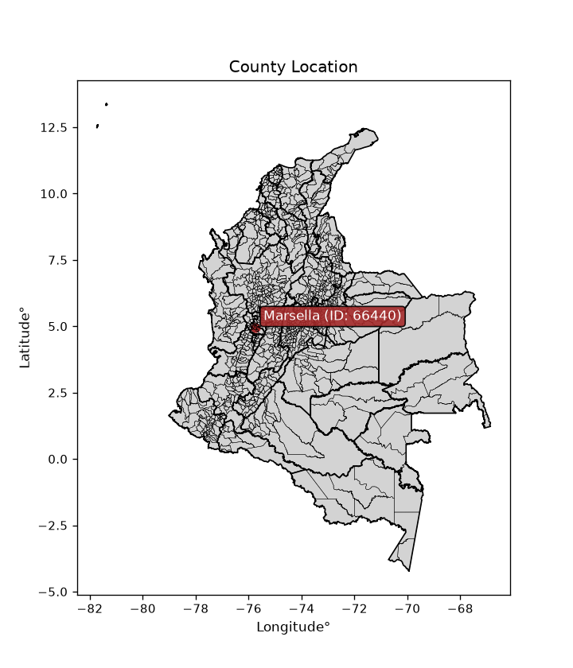
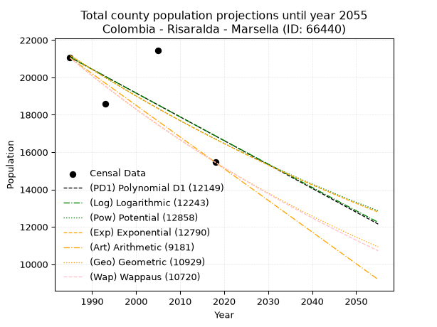
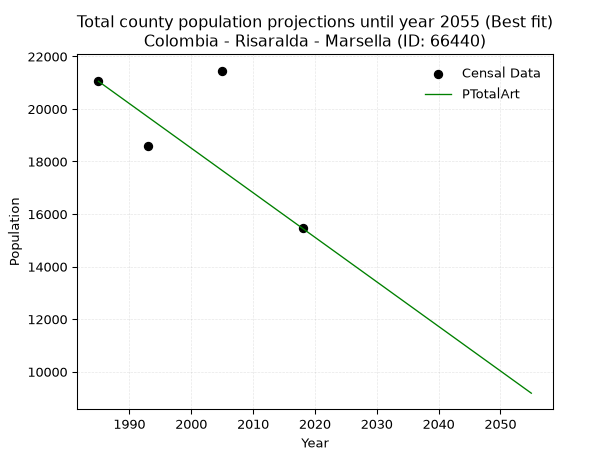
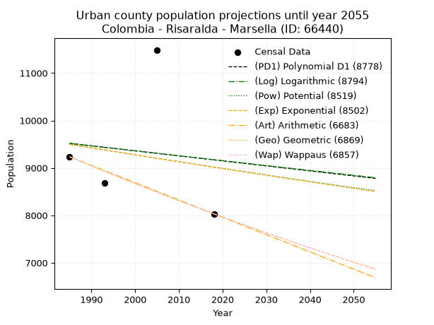
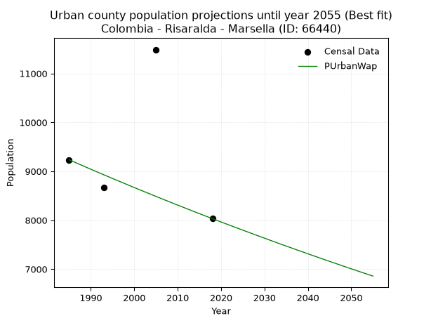
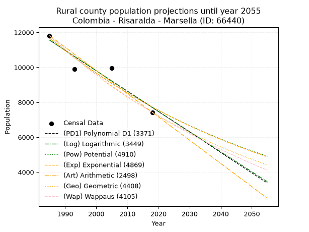
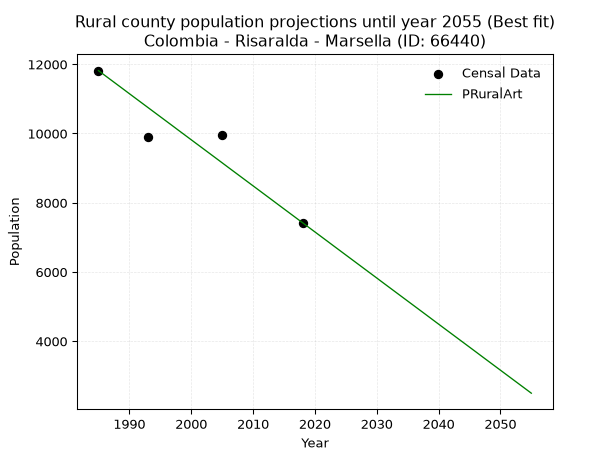

<div align="center">


</div>

# _“Population and Public Services Demand Projections (PPSD) until Year 2050 for Colombia - Risaralda - Marsella (ID: 66440)”_
Keywords: `population` `public-service` `projection` `lineal` `polynomial` `logarithmic` `potential` `exponential` `arithmetic` `geometric` `wappaus` `dane` `colombia` `south-america`

PPSD are analytical estimates used by governments and planners to anticipate future changes in population size, age distribution, and the resulting community needs for utilities, healthcare, education, and infrastructure as sizing future water treatment facilities, electrical grids, and road networks based on spatial growth.

> **General running parameters**: • app_version: _v20260806_. • Python version: _3.14.7_. • Pandas version: _3.0.5_. • NumPy version: _2.5.1_. • Creates, save and include plots into reports (create_plot): _False_. • Projection until year: _2050_. • Process polynomial degree 2 and up: _False_. • Process Wappaus: _True_. • Process Wappaus: _True_. • Set negative values to zero: _True_. • Set infinite values to zero: _True_. • Drop dataset notes: _True_. 
<div align="center">

Dynamic map: [:earth_americas:Google](http://maps.google.com/maps?q=4.935770625,-75.7387896) [:earth_americas:OSM](https://www.openstreetmap.org/#map=18/4.935770625/-75.7387896&layers=P) [:earth_americas:Bing](https://www.bing.com/maps?cp=4.935770625~-75.7387896&lvl=18) [:earth_americas:Apple](https://maps.apple.com/frame?center=4.935770625%2C-75.7387896&span=0.003%2C0.006)

</div>


<div align="center">

```geojson
{
  "type": "Feature",
  "geometry": {
    "type": "Point", 
    "coordinates": [-75.7387896, 4.935770625]
  }, 
  "properties": {
    "Name": "Colombia - Risaralda - Marsella (ID: 66440)"
  }
}
```

</div>


<div align="center">

</img>

</div>


## 0. Census Data (4 records)

Census data are official statistics collected by a government about the people and housing in a country. They usually include counts of total population, age, sex, race, income, education, and jobs.

📅Global census file: [Population.xlsx](../data/Population.xlsx)

| Source   |   Year |   CountryID | CountryName   |   StateID | StateName   |   CountyID | CountyName   |   PTotal |   PUrban |   PRural |
|:---------|-------:|------------:|:--------------|----------:|:------------|-----------:|:-------------|---------:|---------:|---------:|
| DANE     |   1985 |          57 | Colombia      |        66 | Risaralda   |      66440 | Marsella     |    21051 |     9235 |    11816 |
| DANE     |   1993 |          57 | Colombia      |        66 | Risaralda   |      66440 | Marsella     |    18576 |     8675 |     9901 |
| DANE     |   2005 |          57 | Colombia      |        66 | Risaralda   |      66440 | Marsella     |    21457 |    11488 |     9969 |
| DANE     |   2018 |          57 | Colombia      |        66 | Risaralda   |      66440 | Marsella     |    15455 |     8032 |     7423 |

> 🔥Some records could had specific notes about the registered values or the corresponding urban or rural distribution.

📅   [RUPS](https://www.datos.gov.co/Hacienda-y-Cr-dito-P-blico/Registro-nico-de-Prestadores-de-Servicios-P-blicos/4qkq-csdn/about_data) - Local public utility companies: [RUPS.csv](../data/RUPS.xlsx)

 | SERVICIO       | ESTADO    | NOMBRE                                                                                       | NIT         | DEPARTAMENTO_DOMICILIO   | MUNICIPIO_DOMICILIO   | DIRECCION                       |   TELEFONO | EMAIL                          | TIPO_PRESTADOR                            | CLASIFICACION                  |
|:---------------|:----------|:---------------------------------------------------------------------------------------------|:------------|:-------------------------|:----------------------|:--------------------------------|-----------:|:-------------------------------|:------------------------------------------|:-------------------------------|
| ACUEDUCTO      | OPERATIVA | EMPRESAS PUBLICAS DE MARSELLA E.S.P.                                                         | 891411995-1 | RISARALDA                | MARSELLA              | CARRERA 11 No. 7-09             |    3685751 | gerencia@empumar.com           | EMPRESA INDUSTRIAL Y COMERCIAL DEL ESTADO | DESDE 2501 HASTA 5000 USUARIOS |
| ALCANTARILLADO | OPERATIVA | EMPRESAS PUBLICAS DE MARSELLA E.S.P.                                                         | 891411995-1 | RISARALDA                | MARSELLA              | CARRERA 11 No. 7-09             |    3685751 | gerencia@empumar.com           | EMPRESA INDUSTRIAL Y COMERCIAL DEL ESTADO | DESDE 2501 HASTA 5000 USUARIOS |
| ACUEDUCTO      | OPERATIVA | ASOCIACION AMBIENTAL ADMINISTRADORA DEL ACUEDUCTO DEL PLAN DE VIVIENDA EL RAYO               | 900250005-3 | RISARALDA                | MARSELLA              | VEREDA PLAN DE VIVIENDA EL RAYO |    3427140 | marioduquecorrea@hotmail.com   | ORGANIZACION AUTORIZADA                   | HASTA 2500 SUSCRIPTORES        |
| ALCANTARILLADO | OPERATIVA | ASOCIACION AMBIENTAL ADMINISTRADORA DEL ACUEDUCTO DEL PLAN DE VIVIENDA EL RAYO               | 900250005-3 | RISARALDA                | MARSELLA              | VEREDA PLAN DE VIVIENDA EL RAYO |    3427140 | marioduquecorrea@hotmail.com   | ORGANIZACION AUTORIZADA                   | HASTA 2500 SUSCRIPTORES        |
| ACUEDUCTO      | OPERATIVA | ASOCIACION AMBIENTAL ADMINISTRADORA DEL ACUEDUCTO VEREDA LAS TAZAS DEL MUNICIPIO DE MARSELLA | 816005835-6 | RISARALDA                | MARSELLA              | ESCUELA VEREDA LAS TAZAS        |    3397752 | aso.acueductotazas@hotmail.com | ORGANIZACION AUTORIZADA                   | HASTA 2500 SUSCRIPTORES        |

## 1. Total

### 1.1. Coefficients and Parameters

* (PD1) Polynomial Deg 1: -127.59012444800926, 274346.89642713056 (lineal)
* (Log) Logarithmic: -255015.34973240973, 1957508.466880807
* (Pow) Potential: -14.40256891630882, 51.822187978780235
* (Exp) Exponential: -0.0072058987160490825, 34511370460.31577
* (Art) Arithmetic: Year diff. 2018 - 1985 = 33, Population diff. 15455 - 21051 = -5596, Annual growth = -169.57575757575756
* (Geo) Geometric: Year diff. 2018 - 1985 = 33, Population diff. 15455 - 21051 = -5596, Annual growth % = -0.00932039903100268
* (Wap) Wappaus: i = -0.9290295161110917, Condition values only valid for < 200)

<sub>
Wappaus condition values: ['-0.00', '-0.93', '-1.86', '-2.79', '-3.72', '-4.65', '-5.57', '-6.50', '-7.43', '-8.36', '-9.29', '-10.22', '-11.15', '-12.08', '-13.01', '-13.94', '-14.86', '-15.79', '-16.72', '-17.65', '-18.58', '-19.51', '-20.44', '-21.37', '-22.30', '-23.23', '-24.15', '-25.08', '-26.01', '-26.94', '-27.87', '-28.80', '-29.73', '-30.66', '-31.59', '-32.52', '-33.45', '-34.37', '-35.30', '-36.23', '-37.16', '-38.09', '-39.02', '-39.95', '-40.88', '-41.81', '-42.74', '-43.66', '-44.59', '-45.52', '-46.45', '-47.38', '-48.31', '-49.24', '-50.17', '-51.10', '-52.03', '-52.95', '-53.88', '-54.81', '-55.74', '-56.67', '-57.60', '-58.53', '-59.46', '-60.39']
</sub>


### 1.2. Projected Dataset

|   Year |   CountyID |   PTotalPD1 |   PTotalLog |   PTotalPow |   PTotalExp |   PTotalArt |   PTotalGeo |   PTotalWap |
|-------:|-----------:|------------:|------------:|------------:|------------:|------------:|------------:|------------:|
|   1985 |      66440 |       21080 |       21081 |       21182 |       21181 |       21051 |       21051 |       21051 |
|   1986 |      66440 |       20953 |       20953 |       21029 |       21029 |       20881 |       20855 |       20856 |
|   1987 |      66440 |       20825 |       20825 |       20877 |       20878 |       20712 |       20660 |       20663 |
|   1988 |      66440 |       20698 |       20696 |       20726 |       20728 |       20542 |       20468 |       20472 |
|   1989 |      66440 |       20570 |       20568 |       20577 |       20579 |       20373 |       20277 |       20283 |
|   1990 |      66440 |       20443 |       20440 |       20428 |       20431 |       20203 |       20088 |       20095 |
|   1991 |      66440 |       20315 |       20312 |       20281 |       20284 |       20034 |       19901 |       19909 |
|   1992 |      66440 |       20187 |       20184 |       20135 |       20139 |       19864 |       19715 |       19725 |
|   1993 |      66440 |       20060 |       20056 |       19990 |       19994 |       19694 |       19532 |       19542 |
|   1994 |      66440 |       19932 |       19928 |       19846 |       19851 |       19525 |       19350 |       19362 |
|   1995 |      66440 |       19805 |       19800 |       19703 |       19708 |       19355 |       19169 |       19182 |
|   1996 |      66440 |       19677 |       19672 |       19561 |       19567 |       19186 |       18991 |       19004 |
|   1997 |      66440 |       19549 |       19544 |       19421 |       19426 |       19016 |       18814 |       18828 |
|   1998 |      66440 |       19422 |       19417 |       19281 |       19287 |       18847 |       18638 |       18653 |
|   1999 |      66440 |       19294 |       19289 |       19143 |       19148 |       18677 |       18465 |       18480 |
|   2000 |      66440 |       19167 |       19162 |       19005 |       19011 |       18507 |       18292 |       18309 |
|   2001 |      66440 |       19039 |       19034 |       18869 |       18874 |       18338 |       18122 |       18138 |
|   2002 |      66440 |       18911 |       18907 |       18734 |       18739 |       18168 |       17953 |       17970 |
|   2003 |      66440 |       18784 |       18779 |       18599 |       18604 |       17999 |       17786 |       17802 |
|   2004 |      66440 |       18656 |       18652 |       18466 |       18471 |       17829 |       17620 |       17637 |
|   2005 |      66440 |       18529 |       18525 |       18334 |       18338 |       17659 |       17456 |       17472 |
|   2006 |      66440 |       18401 |       18398 |       18203 |       18206 |       17490 |       17293 |       17309 |
|   2007 |      66440 |       18274 |       18271 |       18073 |       18076 |       17320 |       17132 |       17147 |
|   2008 |      66440 |       18146 |       18144 |       17943 |       17946 |       17151 |       16972 |       16987 |
|   2009 |      66440 |       18018 |       18017 |       17815 |       17817 |       16981 |       16814 |       16828 |
|   2010 |      66440 |       17891 |       17890 |       17688 |       17689 |       16812 |       16657 |       16670 |
|   2011 |      66440 |       17763 |       17763 |       17562 |       17562 |       16642 |       16502 |       16514 |
|   2012 |      66440 |       17636 |       17636 |       17436 |       17436 |       16472 |       16348 |       16359 |
|   2013 |      66440 |       17508 |       17509 |       17312 |       17311 |       16303 |       16196 |       16205 |
|   2014 |      66440 |       17380 |       17383 |       17189 |       17186 |       16133 |       16045 |       16053 |
|   2015 |      66440 |       17253 |       17256 |       17066 |       17063 |       15964 |       15895 |       15902 |
|   2016 |      66440 |       17125 |       17130 |       16945 |       16941 |       15794 |       15747 |       15751 |
|   2017 |      66440 |       16998 |       17003 |       16824 |       16819 |       15625 |       15600 |       15603 |
|   2018 |      66440 |       16870 |       16877 |       16704 |       16698 |       15455 |       15455 |       15455 |
|   2019 |      66440 |       16742 |       16750 |       16586 |       16578 |       15285 |       15311 |       15309 |
|   2020 |      66440 |       16615 |       16624 |       16468 |       16459 |       15116 |       15168 |       15163 |
|   2021 |      66440 |       16487 |       16498 |       16351 |       16341 |       14946 |       15027 |       15019 |
|   2022 |      66440 |       16360 |       16372 |       16235 |       16224 |       14777 |       14887 |       14876 |
|   2023 |      66440 |       16232 |       16246 |       16120 |       16107 |       14607 |       14748 |       14734 |
|   2024 |      66440 |       16104 |       16120 |       16005 |       15992 |       14438 |       14611 |       14594 |
|   2025 |      66440 |       15977 |       15994 |       15892 |       15877 |       14268 |       14474 |       14454 |
|   2026 |      66440 |       15849 |       15868 |       15779 |       15763 |       14098 |       14340 |       14315 |
|   2027 |      66440 |       15722 |       15742 |       15667 |       15650 |       13929 |       14206 |       14178 |
|   2028 |      66440 |       15594 |       15616 |       15557 |       15537 |       13759 |       14073 |       14042 |
|   2029 |      66440 |       15467 |       15490 |       15447 |       15426 |       13590 |       13942 |       13906 |
|   2030 |      66440 |       15339 |       15365 |       15337 |       15315 |       13420 |       13812 |       13772 |
|   2031 |      66440 |       15211 |       15239 |       15229 |       15205 |       13251 |       13684 |       13639 |
|   2032 |      66440 |       15084 |       15114 |       15121 |       15096 |       13081 |       13556 |       13506 |
|   2033 |      66440 |       14956 |       14988 |       15015 |       14987 |       12911 |       13430 |       13375 |
|   2034 |      66440 |       14829 |       14863 |       14909 |       14880 |       12742 |       13305 |       13245 |
|   2035 |      66440 |       14701 |       14737 |       14803 |       14773 |       12572 |       13181 |       13116 |
|   2036 |      66440 |       14573 |       14612 |       14699 |       14667 |       12403 |       13058 |       12987 |
|   2037 |      66440 |       14446 |       14487 |       14595 |       14562 |       12233 |       12936 |       12860 |
|   2038 |      66440 |       14318 |       14362 |       14493 |       14457 |       12063 |       12815 |       12733 |
|   2039 |      66440 |       14191 |       14237 |       14391 |       14353 |       11894 |       12696 |       12608 |
|   2040 |      66440 |       14063 |       14112 |       14289 |       14250 |       11724 |       12578 |       12484 |
|   2041 |      66440 |       13935 |       13987 |       14189 |       14148 |       11555 |       12460 |       12360 |
|   2042 |      66440 |       13808 |       13862 |       14089 |       14046 |       11385 |       12344 |       12237 |
|   2043 |      66440 |       13680 |       13737 |       13990 |       13945 |       11216 |       12229 |       12115 |
|   2044 |      66440 |       13553 |       13612 |       13892 |       13845 |       11046 |       12115 |       11994 |
|   2045 |      66440 |       13425 |       13487 |       13794 |       13746 |       10876 |       12002 |       11874 |
|   2046 |      66440 |       13298 |       13363 |       13698 |       13647 |       10707 |       11890 |       11755 |
|   2047 |      66440 |       13170 |       13238 |       13601 |       13549 |       10537 |       11780 |       11637 |
|   2048 |      66440 |       13042 |       13114 |       13506 |       13452 |       10368 |       11670 |       11519 |
|   2049 |      66440 |       12915 |       12989 |       13411 |       13355 |       10198 |       11561 |       11403 |
|   2050 |      66440 |       12787 |       12865 |       13318 |       13259 |       10029 |       11453 |       11287 |
<div align="center">

</img>

</div>


### 1.3. Best fit with absolute and relative error (%)

Relative error puts that difference into context by dividing the absolute error by the true value, creating a unitless ratio or percentage that shows the scale of the mistake.

Absolute and relative error

|   Year | Source   |   CountryID | CountryName   |   StateID | StateName   |   CountyID_x | CountyName   |   PTotal |   PUrban |   PRural |   CountyID_y |   PTotalPD1 |   PTotalLog |   PTotalPow |   PTotalExp |   PTotalArt |   PTotalGeo |   PTotalWap |   PTotalPD1AbsError |   PTotalLogAbsError |   PTotalPowAbsError |   PTotalExpAbsError |   PTotalArtAbsError |   PTotalGeoAbsError |   PTotalWapAbsError |   PTotalPD1RelError |   PTotalLogRelError |   PTotalPowRelError |   PTotalExpRelError |   PTotalArtRelError |   PTotalGeoRelError |   PTotalWapRelError |
|-------:|:---------|------------:|:--------------|----------:|:------------|-------------:|:-------------|---------:|---------:|---------:|-------------:|------------:|------------:|------------:|------------:|------------:|------------:|------------:|--------------------:|--------------------:|--------------------:|--------------------:|--------------------:|--------------------:|--------------------:|--------------------:|--------------------:|--------------------:|--------------------:|--------------------:|--------------------:|--------------------:|
|   1985 | DANE     |          57 | Colombia      |        66 | Risaralda   |        66440 | Marsella     |    21051 |     9235 |    11816 |        66440 |       21080 |       21081 |       21182 |       21181 |       21051 |       21051 |       21051 |                  29 |                  30 |                 131 |                 130 |                   0 |                   0 |                   0 |            0.137761 |            0.142511 |            0.622298 |            0.617548 |             0       |             0       |             0       |
|   1993 | DANE     |          57 | Colombia      |        66 | Risaralda   |        66440 | Marsella     |    18576 |     8675 |     9901 |        66440 |       20060 |       20056 |       19990 |       19994 |       19694 |       19532 |       19542 |                1484 |                1480 |                1414 |                1418 |                1118 |                 956 |                 966 |            7.9888   |            7.96727  |            7.61197  |            7.63351  |             6.01852 |             5.14643 |             5.20026 |
|   2005 | DANE     |          57 | Colombia      |        66 | Risaralda   |        66440 | Marsella     |    21457 |    11488 |     9969 |        66440 |       18529 |       18525 |       18334 |       18338 |       17659 |       17456 |       17472 |                2928 |                2932 |                3123 |                3119 |                3798 |                4001 |                3985 |           13.6459   |           13.6645   |           14.5547   |           14.536    |            17.7005  |            18.6466  |            18.572   |
|   2018 | DANE     |          57 | Colombia      |        66 | Risaralda   |        66440 | Marsella     |    15455 |     8032 |     7423 |        66440 |       16870 |       16877 |       16704 |       16698 |       15455 |       15455 |       15455 |                1415 |                1422 |                1249 |                1243 |                   0 |                   0 |                   0 |            9.15561  |            9.20091  |            8.08153  |            8.0427   |             0       |             0       |             0       |

Relative error mean

| Method    |   RelError | Best   |
|:----------|-----------:|:-------|
| PTotalPD1 |    7.73202 |        |
| PTotalLog |    7.74381 |        |
| PTotalPow |    7.71762 |        |
| PTotalExp |    7.70745 |        |
| PTotalArt |    5.92976 | True   |
| PTotalGeo |    5.94826 |        |
| PTotalWap |    5.94307 |        |

💙Best method: _**PTotalArt**_
<div align="center">

</img>

</div>


### 1.4. Fresh water supply demand in liters per capita per day (lpcd)

The fresh water supply demand typically ranges from 100 to 300 liters per capita per day (lpcd) for standard domestic and municipal planning, though absolute survival minimums set by the World Health Organization are as low as 7.5 to 20 liters per day, and total consumption in high-income nations can exceed 400 liters.

> `CZ`: Level in meters above the sea level (masl)<br> `WS`: Fresh water supply demand in liters per capita per day (lpcd or l/h/d)<br> `WSAll`: Zonal fresh water supply demand in liters per second (l/s)<br> `A`: Zonal area in square meters<br> `DP`: Population density (people/hectare or p/ha)

Reference values (RAS Colombia)

|    CZ |   WS |
|------:|-----:|
|  1000 |  120 |
|  2000 |  130 |
| 99999 |  140 |

County shapefile geometry properties and water supply values

|   CountyID |      ATotal |   CZTotal |   WSTotal |
|-----------:|------------:|----------:|----------:|
|      66440 | 1.49298e+08 |   1305.74 |       130 |

Projected values for best method: PTotalArt

|   CountyID |   Year |   PTotalArt |   DPTotal |   WSTotal |   WSTotalAll |
|-----------:|-------:|------------:|----------:|----------:|-------------:|
|      66440 |   1985 |       21051 |      1.41 |       130 |      31.674  |
|      66440 |   1986 |       20881 |      1.4  |       130 |      31.4182 |
|      66440 |   1987 |       20712 |      1.39 |       130 |      31.1639 |
|      66440 |   1988 |       20542 |      1.38 |       130 |      30.9081 |
|      66440 |   1989 |       20373 |      1.36 |       130 |      30.6538 |
|      66440 |   1990 |       20203 |      1.35 |       130 |      30.398  |
|      66440 |   1991 |       20034 |      1.34 |       130 |      30.1438 |
|      66440 |   1992 |       19864 |      1.33 |       130 |      29.888  |
|      66440 |   1993 |       19694 |      1.32 |       130 |      29.6322 |
|      66440 |   1994 |       19525 |      1.31 |       130 |      29.3779 |
|      66440 |   1995 |       19355 |      1.3  |       130 |      29.1221 |
|      66440 |   1996 |       19186 |      1.29 |       130 |      28.8678 |
|      66440 |   1997 |       19016 |      1.27 |       130 |      28.612  |
|      66440 |   1998 |       18847 |      1.26 |       130 |      28.3578 |
|      66440 |   1999 |       18677 |      1.25 |       130 |      28.102  |
|      66440 |   2000 |       18507 |      1.24 |       130 |      27.8462 |
|      66440 |   2001 |       18338 |      1.23 |       130 |      27.5919 |
|      66440 |   2002 |       18168 |      1.22 |       130 |      27.3361 |
|      66440 |   2003 |       17999 |      1.21 |       130 |      27.0818 |
|      66440 |   2004 |       17829 |      1.19 |       130 |      26.826  |
|      66440 |   2005 |       17659 |      1.18 |       130 |      26.5703 |
|      66440 |   2006 |       17490 |      1.17 |       130 |      26.316  |
|      66440 |   2007 |       17320 |      1.16 |       130 |      26.0602 |
|      66440 |   2008 |       17151 |      1.15 |       130 |      25.8059 |
|      66440 |   2009 |       16981 |      1.14 |       130 |      25.5501 |
|      66440 |   2010 |       16812 |      1.13 |       130 |      25.2958 |
|      66440 |   2011 |       16642 |      1.11 |       130 |      25.04   |
|      66440 |   2012 |       16472 |      1.1  |       130 |      24.7843 |
|      66440 |   2013 |       16303 |      1.09 |       130 |      24.53   |
|      66440 |   2014 |       16133 |      1.08 |       130 |      24.2742 |
|      66440 |   2015 |       15964 |      1.07 |       130 |      24.0199 |
|      66440 |   2016 |       15794 |      1.06 |       130 |      23.7641 |
|      66440 |   2017 |       15625 |      1.05 |       130 |      23.5098 |
|      66440 |   2018 |       15455 |      1.04 |       130 |      23.2541 |
|      66440 |   2019 |       15285 |      1.02 |       130 |      22.9983 |
|      66440 |   2020 |       15116 |      1.01 |       130 |      22.744  |
|      66440 |   2021 |       14946 |      1    |       130 |      22.4882 |
|      66440 |   2022 |       14777 |      0.99 |       130 |      22.2339 |
|      66440 |   2023 |       14607 |      0.98 |       130 |      21.9781 |
|      66440 |   2024 |       14438 |      0.97 |       130 |      21.7238 |
|      66440 |   2025 |       14268 |      0.96 |       130 |      21.4681 |
|      66440 |   2026 |       14098 |      0.94 |       130 |      21.2123 |
|      66440 |   2027 |       13929 |      0.93 |       130 |      20.958  |
|      66440 |   2028 |       13759 |      0.92 |       130 |      20.7022 |
|      66440 |   2029 |       13590 |      0.91 |       130 |      20.4479 |
|      66440 |   2030 |       13420 |      0.9  |       130 |      20.1921 |
|      66440 |   2031 |       13251 |      0.89 |       130 |      19.9378 |
|      66440 |   2032 |       13081 |      0.88 |       130 |      19.6821 |
|      66440 |   2033 |       12911 |      0.86 |       130 |      19.4263 |
|      66440 |   2034 |       12742 |      0.85 |       130 |      19.172  |
|      66440 |   2035 |       12572 |      0.84 |       130 |      18.9162 |
|      66440 |   2036 |       12403 |      0.83 |       130 |      18.6619 |
|      66440 |   2037 |       12233 |      0.82 |       130 |      18.4061 |
|      66440 |   2038 |       12063 |      0.81 |       130 |      18.1503 |
|      66440 |   2039 |       11894 |      0.8  |       130 |      17.8961 |
|      66440 |   2040 |       11724 |      0.79 |       130 |      17.6403 |
|      66440 |   2041 |       11555 |      0.77 |       130 |      17.386  |
|      66440 |   2042 |       11385 |      0.76 |       130 |      17.1302 |
|      66440 |   2043 |       11216 |      0.75 |       130 |      16.8759 |
|      66440 |   2044 |       11046 |      0.74 |       130 |      16.6201 |
|      66440 |   2045 |       10876 |      0.73 |       130 |      16.3644 |
|      66440 |   2046 |       10707 |      0.72 |       130 |      16.1101 |
|      66440 |   2047 |       10537 |      0.71 |       130 |      15.8543 |
|      66440 |   2048 |       10368 |      0.69 |       130 |      15.6    |
|      66440 |   2049 |       10198 |      0.68 |       130 |      15.3442 |
|      66440 |   2050 |       10029 |      0.67 |       130 |      15.0899 |

## 2. Urban

### 2.1. Coefficients and Parameters

* (PD1) Polynomial Deg 1: -10.584504215172643, 30529.15455639908 (lineal)
* (Log) Logarithmic: -20853.66335640582, 167866.36228281105
* (Pow) Potential: -3.13823305746244, 14.326738944863708
* (Exp) Exponential: -0.0015846694815980012, 220694.80169089496
* (Art) Arithmetic: Year diff. 2018 - 1985 = 33, Population diff. 8032 - 9235 = -1203, Annual growth = -36.45454545454545
* (Geo) Geometric: Year diff. 2018 - 1985 = 33, Population diff. 8032 - 9235 = -1203, Annual growth % = -0.004220373653117115
* (Wap) Wappaus: i = -0.422245270800318, Condition values only valid for < 200)

<sub>
Wappaus condition values: ['-0.00', '-0.42', '-0.84', '-1.27', '-1.69', '-2.11', '-2.53', '-2.96', '-3.38', '-3.80', '-4.22', '-4.64', '-5.07', '-5.49', '-5.91', '-6.33', '-6.76', '-7.18', '-7.60', '-8.02', '-8.44', '-8.87', '-9.29', '-9.71', '-10.13', '-10.56', '-10.98', '-11.40', '-11.82', '-12.25', '-12.67', '-13.09', '-13.51', '-13.93', '-14.36', '-14.78', '-15.20', '-15.62', '-16.05', '-16.47', '-16.89', '-17.31', '-17.73', '-18.16', '-18.58', '-19.00', '-19.42', '-19.85', '-20.27', '-20.69', '-21.11', '-21.53', '-21.96', '-22.38', '-22.80', '-23.22', '-23.65', '-24.07', '-24.49', '-24.91', '-25.33', '-25.76', '-26.18', '-26.60', '-27.02', '-27.45']
</sub>


### 2.2. Projected Dataset

|   Year |   CountyID |   PUrbanPD1 |   PUrbanLog |   PUrbanPow |   PUrbanExp |   PUrbanArt |   PUrbanGeo |   PUrbanWap |
|-------:|-----------:|------------:|------------:|------------:|------------:|------------:|------------:|------------:|
|   1985 |      66440 |        9519 |        9517 |        9497 |        9499 |        9235 |        9235 |        9235 |
|   1986 |      66440 |        9508 |        9506 |        9482 |        9484 |        9199 |        9196 |        9196 |
|   1987 |      66440 |        9498 |        9496 |        9467 |        9469 |        9162 |        9157 |        9157 |
|   1988 |      66440 |        9487 |        9485 |        9452 |        9454 |        9126 |        9119 |        9119 |
|   1989 |      66440 |        9477 |        9475 |        9437 |        9439 |        9089 |        9080 |        9080 |
|   1990 |      66440 |        9466 |        9464 |        9423 |        9424 |        9053 |        9042 |        9042 |
|   1991 |      66440 |        9455 |        9454 |        9408 |        9409 |        9016 |        9004 |        9004 |
|   1992 |      66440 |        9445 |        9443 |        9393 |        9394 |        8980 |        8966 |        8966 |
|   1993 |      66440 |        9434 |        9433 |        9378 |        9380 |        8943 |        8928 |        8928 |
|   1994 |      66440 |        9424 |        9422 |        9363 |        9365 |        8907 |        8890 |        8891 |
|   1995 |      66440 |        9413 |        9412 |        9349 |        9350 |        8870 |        8853 |        8853 |
|   1996 |      66440 |        9402 |        9401 |        9334 |        9335 |        8834 |        8815 |        8816 |
|   1997 |      66440 |        9392 |        9391 |        9319 |        9320 |        8798 |        8778 |        8779 |
|   1998 |      66440 |        9381 |        9381 |        9305 |        9306 |        8761 |        8741 |        8742 |
|   1999 |      66440 |        9371 |        9370 |        9290 |        9291 |        8725 |        8704 |        8705 |
|   2000 |      66440 |        9360 |        9360 |        9276 |        9276 |        8688 |        8667 |        8668 |
|   2001 |      66440 |        9350 |        9349 |        9261 |        9261 |        8652 |        8631 |        8631 |
|   2002 |      66440 |        9339 |        9339 |        9246 |        9247 |        8615 |        8594 |        8595 |
|   2003 |      66440 |        9328 |        9328 |        9232 |        9232 |        8579 |        8558 |        8559 |
|   2004 |      66440 |        9318 |        9318 |        9218 |        9217 |        8542 |        8522 |        8523 |
|   2005 |      66440 |        9307 |        9308 |        9203 |        9203 |        8506 |        8486 |        8487 |
|   2006 |      66440 |        9297 |        9297 |        9189 |        9188 |        8469 |        8450 |        8451 |
|   2007 |      66440 |        9286 |        9287 |        9174 |        9174 |        8433 |        8414 |        8415 |
|   2008 |      66440 |        9275 |        9276 |        9160 |        9159 |        8397 |        8379 |        8380 |
|   2009 |      66440 |        9265 |        9266 |        9146 |        9145 |        8360 |        8344 |        8344 |
|   2010 |      66440 |        9254 |        9256 |        9131 |        9130 |        8324 |        8308 |        8309 |
|   2011 |      66440 |        9244 |        9245 |        9117 |        9116 |        8287 |        8273 |        8274 |
|   2012 |      66440 |        9233 |        9235 |        9103 |        9101 |        8251 |        8238 |        8239 |
|   2013 |      66440 |        9223 |        9225 |        9089 |        9087 |        8214 |        8204 |        8204 |
|   2014 |      66440 |        9212 |        9214 |        9075 |        9073 |        8178 |        8169 |        8169 |
|   2015 |      66440 |        9201 |        9204 |        9061 |        9058 |        8141 |        8135 |        8135 |
|   2016 |      66440 |        9191 |        9194 |        9046 |        9044 |        8105 |        8100 |        8100 |
|   2017 |      66440 |        9180 |        9183 |        9032 |        9030 |        8068 |        8066 |        8066 |
|   2018 |      66440 |        9170 |        9173 |        9018 |        9015 |        8032 |        8032 |        8032 |
|   2019 |      66440 |        9159 |        9163 |        9004 |        9001 |        7996 |        7998 |        7998 |
|   2020 |      66440 |        9148 |        9152 |        8990 |        8987 |        7959 |        7964 |        7964 |
|   2021 |      66440 |        9138 |        9142 |        8976 |        8972 |        7923 |        7931 |        7930 |
|   2022 |      66440 |        9127 |        9132 |        8962 |        8958 |        7886 |        7897 |        7897 |
|   2023 |      66440 |        9117 |        9121 |        8949 |        8944 |        7850 |        7864 |        7863 |
|   2024 |      66440 |        9106 |        9111 |        8935 |        8930 |        7813 |        7831 |        7830 |
|   2025 |      66440 |        9096 |        9101 |        8921 |        8916 |        7777 |        7798 |        7797 |
|   2026 |      66440 |        9085 |        9090 |        8907 |        8902 |        7740 |        7765 |        7764 |
|   2027 |      66440 |        9074 |        9080 |        8893 |        8888 |        7704 |        7732 |        7731 |
|   2028 |      66440 |        9064 |        9070 |        8880 |        8874 |        7667 |        7699 |        7698 |
|   2029 |      66440 |        9053 |        9059 |        8866 |        8859 |        7631 |        7667 |        7665 |
|   2030 |      66440 |        9043 |        9049 |        8852 |        8845 |        7595 |        7635 |        7633 |
|   2031 |      66440 |        9032 |        9039 |        8838 |        8831 |        7558 |        7602 |        7600 |
|   2032 |      66440 |        9021 |        9029 |        8825 |        8817 |        7522 |        7570 |        7568 |
|   2033 |      66440 |        9011 |        9018 |        8811 |        8803 |        7485 |        7538 |        7535 |
|   2034 |      66440 |        9000 |        9008 |        8798 |        8790 |        7449 |        7506 |        7503 |
|   2035 |      66440 |        8990 |        8998 |        8784 |        8776 |        7412 |        7475 |        7471 |
|   2036 |      66440 |        8979 |        8988 |        8770 |        8762 |        7376 |        7443 |        7440 |
|   2037 |      66440 |        8969 |        8977 |        8757 |        8748 |        7339 |        7412 |        7408 |
|   2038 |      66440 |        8958 |        8967 |        8743 |        8734 |        7303 |        7381 |        7376 |
|   2039 |      66440 |        8947 |        8957 |        8730 |        8720 |        7266 |        7349 |        7345 |
|   2040 |      66440 |        8937 |        8947 |        8717 |        8706 |        7230 |        7318 |        7313 |
|   2041 |      66440 |        8926 |        8937 |        8703 |        8693 |        7194 |        7287 |        7282 |
|   2042 |      66440 |        8916 |        8926 |        8690 |        8679 |        7157 |        7257 |        7251 |
|   2043 |      66440 |        8905 |        8916 |        8677 |        8665 |        7121 |        7226 |        7220 |
|   2044 |      66440 |        8894 |        8906 |        8663 |        8651 |        7084 |        7196 |        7189 |
|   2045 |      66440 |        8884 |        8896 |        8650 |        8638 |        7048 |        7165 |        7158 |
|   2046 |      66440 |        8873 |        8885 |        8637 |        8624 |        7011 |        7135 |        7128 |
|   2047 |      66440 |        8863 |        8875 |        8623 |        8610 |        6975 |        7105 |        7097 |
|   2048 |      66440 |        8852 |        8865 |        8610 |        8597 |        6938 |        7075 |        7067 |
|   2049 |      66440 |        8842 |        8855 |        8597 |        8583 |        6902 |        7045 |        7036 |
|   2050 |      66440 |        8831 |        8845 |        8584 |        8569 |        6865 |        7015 |        7006 |
<div align="center">

</img>

</div>


### 2.3. Best fit with absolute and relative error (%)

Relative error puts that difference into context by dividing the absolute error by the true value, creating a unitless ratio or percentage that shows the scale of the mistake.

Absolute and relative error

|   Year | Source   |   CountryID | CountryName   |   StateID | StateName   |   CountyID_x | CountyName   |   PTotal |   PUrban |   PRural |   CountyID_y |   PUrbanPD1 |   PUrbanLog |   PUrbanPow |   PUrbanExp |   PUrbanArt |   PUrbanGeo |   PUrbanWap |   PUrbanPD1AbsError |   PUrbanLogAbsError |   PUrbanPowAbsError |   PUrbanExpAbsError |   PUrbanArtAbsError |   PUrbanGeoAbsError |   PUrbanWapAbsError |   PUrbanPD1RelError |   PUrbanLogRelError |   PUrbanPowRelError |   PUrbanExpRelError |   PUrbanArtRelError |   PUrbanGeoRelError |   PUrbanWapRelError |
|-------:|:---------|------------:|:--------------|----------:|:------------|-------------:|:-------------|---------:|---------:|---------:|-------------:|------------:|------------:|------------:|------------:|------------:|------------:|------------:|--------------------:|--------------------:|--------------------:|--------------------:|--------------------:|--------------------:|--------------------:|--------------------:|--------------------:|--------------------:|--------------------:|--------------------:|--------------------:|--------------------:|
|   1985 | DANE     |          57 | Colombia      |        66 | Risaralda   |        66440 | Marsella     |    21051 |     9235 |    11816 |        66440 |        9519 |        9517 |        9497 |        9499 |        9235 |        9235 |        9235 |                 284 |                 282 |                 262 |                 264 |                   0 |                   0 |                   0 |             3.07526 |             3.0536  |             2.83703 |             2.85869 |             0       |             0       |             0       |
|   1993 | DANE     |          57 | Colombia      |        66 | Risaralda   |        66440 | Marsella     |    18576 |     8675 |     9901 |        66440 |        9434 |        9433 |        9378 |        9380 |        8943 |        8928 |        8928 |                 759 |                 758 |                 703 |                 705 |                 268 |                 253 |                 253 |             8.74928 |             8.73775 |             8.10375 |             8.1268  |             3.08934 |             2.91643 |             2.91643 |
|   2005 | DANE     |          57 | Colombia      |        66 | Risaralda   |        66440 | Marsella     |    21457 |    11488 |     9969 |        66440 |        9307 |        9308 |        9203 |        9203 |        8506 |        8486 |        8487 |                2181 |                2180 |                2285 |                2285 |                2982 |                3002 |                3001 |            18.985   |            18.9763  |            19.8903  |            19.8903  |            25.9575  |            26.1316  |            26.1229  |
|   2018 | DANE     |          57 | Colombia      |        66 | Risaralda   |        66440 | Marsella     |    15455 |     8032 |     7423 |        66440 |        9170 |        9173 |        9018 |        9015 |        8032 |        8032 |        8032 |                1138 |                1141 |                 986 |                 983 |                   0 |                   0 |                   0 |            14.1683  |            14.2057  |            12.2759  |            12.2385  |             0       |             0       |             0       |

Relative error mean

| Method    |   RelError | Best   |
|:----------|-----------:|:-------|
| PUrbanPD1 |   11.2445  |        |
| PUrbanLog |   11.2433  |        |
| PUrbanPow |   10.7767  |        |
| PUrbanExp |   10.7786  |        |
| PUrbanArt |    7.26171 |        |
| PUrbanGeo |    7.26201 |        |
| PUrbanWap |    7.25983 | True   |

💙Best method: _**PUrbanWap**_
<div align="center">

</img>

</div>


### 2.4. Fresh water supply demand in liters per capita per day (lpcd)

The fresh water supply demand typically ranges from 100 to 300 liters per capita per day (lpcd) for standard domestic and municipal planning, though absolute survival minimums set by the World Health Organization are as low as 7.5 to 20 liters per day, and total consumption in high-income nations can exceed 400 liters.

> `CZ`: Level in meters above the sea level (masl)<br> `WS`: Fresh water supply demand in liters per capita per day (lpcd or l/h/d)<br> `WSAll`: Zonal fresh water supply demand in liters per second (l/s)<br> `A`: Zonal area in square meters<br> `DP`: Population density (people/hectare or p/ha)

Reference values (RAS Colombia)

|    CZ |   WS |
|------:|-----:|
|  1000 |  120 |
|  2000 |  130 |
| 99999 |  140 |

County shapefile geometry properties and water supply values

|   CountyID |     AUrban |   CZUrban |   WSUrban |
|-----------:|-----------:|----------:|----------:|
|      66440 | 2.3654e+06 |   1567.93 |       130 |

Projected values for best method: PUrbanWap

|   CountyID |   Year |   PUrbanWap |   DPUrban |   WSUrban |   WSUrbanAll |
|-----------:|-------:|------------:|----------:|----------:|-------------:|
|      66440 |   1985 |        9235 |     39.04 |       130 |      13.8953 |
|      66440 |   1986 |        9196 |     38.88 |       130 |      13.8366 |
|      66440 |   1987 |        9157 |     38.71 |       130 |      13.7779 |
|      66440 |   1988 |        9119 |     38.55 |       130 |      13.7207 |
|      66440 |   1989 |        9080 |     38.39 |       130 |      13.662  |
|      66440 |   1990 |        9042 |     38.23 |       130 |      13.6049 |
|      66440 |   1991 |        9004 |     38.07 |       130 |      13.5477 |
|      66440 |   1992 |        8966 |     37.9  |       130 |      13.4905 |
|      66440 |   1993 |        8928 |     37.74 |       130 |      13.4333 |
|      66440 |   1994 |        8891 |     37.59 |       130 |      13.3777 |
|      66440 |   1995 |        8853 |     37.43 |       130 |      13.3205 |
|      66440 |   1996 |        8816 |     37.27 |       130 |      13.2648 |
|      66440 |   1997 |        8779 |     37.11 |       130 |      13.2091 |
|      66440 |   1998 |        8742 |     36.96 |       130 |      13.1535 |
|      66440 |   1999 |        8705 |     36.8  |       130 |      13.0978 |
|      66440 |   2000 |        8668 |     36.64 |       130 |      13.0421 |
|      66440 |   2001 |        8631 |     36.49 |       130 |      12.9865 |
|      66440 |   2002 |        8595 |     36.34 |       130 |      12.9323 |
|      66440 |   2003 |        8559 |     36.18 |       130 |      12.8781 |
|      66440 |   2004 |        8523 |     36.03 |       130 |      12.824  |
|      66440 |   2005 |        8487 |     35.88 |       130 |      12.7698 |
|      66440 |   2006 |        8451 |     35.73 |       130 |      12.7156 |
|      66440 |   2007 |        8415 |     35.58 |       130 |      12.6615 |
|      66440 |   2008 |        8380 |     35.43 |       130 |      12.6088 |
|      66440 |   2009 |        8344 |     35.28 |       130 |      12.5546 |
|      66440 |   2010 |        8309 |     35.13 |       130 |      12.502  |
|      66440 |   2011 |        8274 |     34.98 |       130 |      12.4493 |
|      66440 |   2012 |        8239 |     34.83 |       130 |      12.3966 |
|      66440 |   2013 |        8204 |     34.68 |       130 |      12.344  |
|      66440 |   2014 |        8169 |     34.54 |       130 |      12.2913 |
|      66440 |   2015 |        8135 |     34.39 |       130 |      12.2402 |
|      66440 |   2016 |        8100 |     34.24 |       130 |      12.1875 |
|      66440 |   2017 |        8066 |     34.1  |       130 |      12.1363 |
|      66440 |   2018 |        8032 |     33.96 |       130 |      12.0852 |
|      66440 |   2019 |        7998 |     33.81 |       130 |      12.034  |
|      66440 |   2020 |        7964 |     33.67 |       130 |      11.9829 |
|      66440 |   2021 |        7930 |     33.53 |       130 |      11.9317 |
|      66440 |   2022 |        7897 |     33.39 |       130 |      11.8821 |
|      66440 |   2023 |        7863 |     33.24 |       130 |      11.8309 |
|      66440 |   2024 |        7830 |     33.1  |       130 |      11.7812 |
|      66440 |   2025 |        7797 |     32.96 |       130 |      11.7316 |
|      66440 |   2026 |        7764 |     32.82 |       130 |      11.6819 |
|      66440 |   2027 |        7731 |     32.68 |       130 |      11.6323 |
|      66440 |   2028 |        7698 |     32.54 |       130 |      11.5826 |
|      66440 |   2029 |        7665 |     32.4  |       130 |      11.533  |
|      66440 |   2030 |        7633 |     32.27 |       130 |      11.4848 |
|      66440 |   2031 |        7600 |     32.13 |       130 |      11.4352 |
|      66440 |   2032 |        7568 |     31.99 |       130 |      11.387  |
|      66440 |   2033 |        7535 |     31.86 |       130 |      11.3374 |
|      66440 |   2034 |        7503 |     31.72 |       130 |      11.2892 |
|      66440 |   2035 |        7471 |     31.58 |       130 |      11.2411 |
|      66440 |   2036 |        7440 |     31.45 |       130 |      11.1944 |
|      66440 |   2037 |        7408 |     31.32 |       130 |      11.1463 |
|      66440 |   2038 |        7376 |     31.18 |       130 |      11.0981 |
|      66440 |   2039 |        7345 |     31.05 |       130 |      11.0515 |
|      66440 |   2040 |        7313 |     30.92 |       130 |      11.0034 |
|      66440 |   2041 |        7282 |     30.79 |       130 |      10.9567 |
|      66440 |   2042 |        7251 |     30.65 |       130 |      10.9101 |
|      66440 |   2043 |        7220 |     30.52 |       130 |      10.8634 |
|      66440 |   2044 |        7189 |     30.39 |       130 |      10.8168 |
|      66440 |   2045 |        7158 |     30.26 |       130 |      10.7701 |
|      66440 |   2046 |        7128 |     30.13 |       130 |      10.725  |
|      66440 |   2047 |        7097 |     30    |       130 |      10.6784 |
|      66440 |   2048 |        7067 |     29.88 |       130 |      10.6332 |
|      66440 |   2049 |        7036 |     29.75 |       130 |      10.5866 |
|      66440 |   2050 |        7006 |     29.62 |       130 |      10.5414 |

## 3. Rural

### 3.1. Coefficients and Parameters

* (PD1) Polynomial Deg 1: -117.00562023283659, 243817.74187073138 (lineal)
* (Log) Logarithmic: -234161.68637600384, 1789642.1045979955
* (Pow) Potential: -24.987393421675637, 86.46962580785022
* (Exp) Exponential: -0.012488007073729206, 680214902048570.4
* (Art) Arithmetic: Year diff. 2018 - 1985 = 33, Population diff. 7423 - 11816 = -4393, Annual growth = -133.12121212121212
* (Geo) Geometric: Year diff. 2018 - 1985 = 33, Population diff. 7423 - 11816 = -4393, Annual growth % = -0.013988250173449845
* (Wap) Wappaus: i = -1.3838683104237448, Condition values only valid for < 200)

<sub>
Wappaus condition values: ['-0.00', '-1.38', '-2.77', '-4.15', '-5.54', '-6.92', '-8.30', '-9.69', '-11.07', '-12.45', '-13.84', '-15.22', '-16.61', '-17.99', '-19.37', '-20.76', '-22.14', '-23.53', '-24.91', '-26.29', '-27.68', '-29.06', '-30.45', '-31.83', '-33.21', '-34.60', '-35.98', '-37.36', '-38.75', '-40.13', '-41.52', '-42.90', '-44.28', '-45.67', '-47.05', '-48.44', '-49.82', '-51.20', '-52.59', '-53.97', '-55.35', '-56.74', '-58.12', '-59.51', '-60.89', '-62.27', '-63.66', '-65.04', '-66.43', '-67.81', '-69.19', '-70.58', '-71.96', '-73.35', '-74.73', '-76.11', '-77.50', '-78.88', '-80.26', '-81.65', '-83.03', '-84.42', '-85.80', '-87.18', '-88.57', '-89.95']
</sub>


### 3.2. Projected Dataset

|   Year |   CountyID |   PRuralPD1 |   PRuralLog |   PRuralPow |   PRuralExp |   PRuralArt |   PRuralGeo |   PRuralWap |
|-------:|-----------:|------------:|------------:|------------:|------------:|------------:|------------:|------------:|
|   1985 |      66440 |       11562 |       11565 |       11673 |       11670 |       11816 |       11816 |       11816 |
|   1986 |      66440 |       11445 |       11447 |       11527 |       11525 |       11683 |       11651 |       11654 |
|   1987 |      66440 |       11328 |       11329 |       11383 |       11382 |       11550 |       11488 |       11493 |
|   1988 |      66440 |       11211 |       11211 |       11241 |       11240 |       11417 |       11327 |       11335 |
|   1989 |      66440 |       11094 |       11093 |       11100 |       11101 |       11284 |       11169 |       11180 |
|   1990 |      66440 |       10977 |       10976 |       10962 |       10963 |       11150 |       11012 |       11026 |
|   1991 |      66440 |       10860 |       10858 |       10825 |       10827 |       11017 |       10858 |       10874 |
|   1992 |      66440 |       10743 |       10740 |       10690 |       10693 |       10884 |       10706 |       10724 |
|   1993 |      66440 |       10626 |       10623 |       10557 |       10560 |       10751 |       10557 |       10576 |
|   1994 |      66440 |       10509 |       10506 |       10425 |       10429 |       10618 |       10409 |       10431 |
|   1995 |      66440 |       10392 |       10388 |       10296 |       10300 |       10485 |       10263 |       10287 |
|   1996 |      66440 |       10275 |       10271 |       10168 |       10172 |       10352 |       10120 |       10145 |
|   1997 |      66440 |       10158 |       10153 |       10041 |       10045 |       10219 |        9978 |       10004 |
|   1998 |      66440 |       10041 |       10036 |        9916 |        9921 |       10085 |        9839 |        9866 |
|   1999 |      66440 |        9924 |        9919 |        9793 |        9798 |        9952 |        9701 |        9729 |
|   2000 |      66440 |        9807 |        9802 |        9671 |        9676 |        9819 |        9565 |        9594 |
|   2001 |      66440 |        9689 |        9685 |        9551 |        9556 |        9686 |        9432 |        9460 |
|   2002 |      66440 |        9572 |        9568 |        9433 |        9437 |        9553 |        9300 |        9329 |
|   2003 |      66440 |        9455 |        9451 |        9316 |        9320 |        9420 |        9170 |        9199 |
|   2004 |      66440 |        9338 |        9334 |        9200 |        9205 |        9287 |        9041 |        9070 |
|   2005 |      66440 |        9221 |        9217 |        9086 |        9090 |        9154 |        8915 |        8943 |
|   2006 |      66440 |        9104 |        9101 |        8974 |        8978 |        9020 |        8790 |        8818 |
|   2007 |      66440 |        8987 |        8984 |        8863 |        8866 |        8887 |        8667 |        8694 |
|   2008 |      66440 |        8870 |        8867 |        8753 |        8756 |        8754 |        8546 |        8571 |
|   2009 |      66440 |        8753 |        8751 |        8645 |        8647 |        8621 |        8426 |        8450 |
|   2010 |      66440 |        8636 |        8634 |        8538 |        8540 |        8488 |        8309 |        8331 |
|   2011 |      66440 |        8519 |        8518 |        8433 |        8434 |        8355 |        8192 |        8213 |
|   2012 |      66440 |        8402 |        8401 |        8329 |        8330 |        8222 |        8078 |        8096 |
|   2013 |      66440 |        8285 |        8285 |        8226 |        8226 |        8089 |        7965 |        7981 |
|   2014 |      66440 |        8168 |        8169 |        8124 |        8124 |        7955 |        7853 |        7866 |
|   2015 |      66440 |        8051 |        8052 |        8024 |        8023 |        7822 |        7743 |        7754 |
|   2016 |      66440 |        7934 |        7936 |        7925 |        7924 |        7689 |        7635 |        7642 |
|   2017 |      66440 |        7817 |        7820 |        7828 |        7825 |        7556 |        7528 |        7532 |
|   2018 |      66440 |        7700 |        7704 |        7731 |        7728 |        7423 |        7423 |        7423 |
|   2019 |      66440 |        7583 |        7588 |        7636 |        7632 |        7290 |        7319 |        7315 |
|   2020 |      66440 |        7466 |        7472 |        7542 |        7538 |        7157 |        7217 |        7209 |
|   2021 |      66440 |        7349 |        7356 |        7450 |        7444 |        7024 |        7116 |        7103 |
|   2022 |      66440 |        7232 |        7240 |        7358 |        7352 |        6891 |        7016 |        6999 |
|   2023 |      66440 |        7115 |        7124 |        7268 |        7260 |        6757 |        6918 |        6896 |
|   2024 |      66440 |        6998 |        7009 |        7179 |        7170 |        6624 |        6821 |        6794 |
|   2025 |      66440 |        6881 |        6893 |        7091 |        7081 |        6491 |        6726 |        6693 |
|   2026 |      66440 |        6764 |        6777 |        7004 |        6993 |        6358 |        6632 |        6593 |
|   2027 |      66440 |        6647 |        6662 |        6918 |        6907 |        6225 |        6539 |        6495 |
|   2028 |      66440 |        6530 |        6546 |        6833 |        6821 |        6092 |        6448 |        6397 |
|   2029 |      66440 |        6413 |        6431 |        6749 |        6736 |        5959 |        6357 |        6300 |
|   2030 |      66440 |        6296 |        6316 |        6667 |        6653 |        5826 |        6269 |        6205 |
|   2031 |      66440 |        6179 |        6200 |        6585 |        6570 |        5692 |        6181 |        6110 |
|   2032 |      66440 |        6062 |        6085 |        6505 |        6489 |        5559 |        6094 |        6017 |
|   2033 |      66440 |        5945 |        5970 |        6425 |        6408 |        5426 |        6009 |        5924 |
|   2034 |      66440 |        5828 |        5855 |        6347 |        6329 |        5293 |        5925 |        5832 |
|   2035 |      66440 |        5711 |        5740 |        6269 |        6250 |        5160 |        5842 |        5742 |
|   2036 |      66440 |        5594 |        5625 |        6193 |        6172 |        5027 |        5760 |        5652 |
|   2037 |      66440 |        5477 |        5510 |        6117 |        6096 |        4894 |        5680 |        5563 |
|   2038 |      66440 |        5360 |        5395 |        6043 |        6020 |        4761 |        5600 |        5475 |
|   2039 |      66440 |        5243 |        5280 |        5969 |        5945 |        4627 |        5522 |        5388 |
|   2040 |      66440 |        5126 |        5165 |        5897 |        5872 |        4494 |        5445 |        5302 |
|   2041 |      66440 |        5009 |        5050 |        5825 |        5799 |        4361 |        5369 |        5216 |
|   2042 |      66440 |        4892 |        4935 |        5754 |        5727 |        4228 |        5294 |        5132 |
|   2043 |      66440 |        4775 |        4821 |        5684 |        5656 |        4095 |        5220 |        5048 |
|   2044 |      66440 |        4658 |        4706 |        5615 |        5586 |        3962 |        5147 |        4965 |
|   2045 |      66440 |        4541 |        4592 |        5547 |        5516 |        3829 |        5075 |        4883 |
|   2046 |      66440 |        4424 |        4477 |        5479 |        5448 |        3696 |        5004 |        4802 |
|   2047 |      66440 |        4307 |        4363 |        5413 |        5380 |        3562 |        4934 |        4721 |
|   2048 |      66440 |        4190 |        4248 |        5347 |        5313 |        3429 |        4865 |        4642 |
|   2049 |      66440 |        4073 |        4134 |        5282 |        5247 |        3296 |        4796 |        4563 |
|   2050 |      66440 |        3956 |        4020 |        5218 |        5182 |        3163 |        4729 |        4485 |
<div align="center">

</img>

</div>


### 3.3. Best fit with absolute and relative error (%)

Relative error puts that difference into context by dividing the absolute error by the true value, creating a unitless ratio or percentage that shows the scale of the mistake.

Absolute and relative error

|   Year | Source   |   CountryID | CountryName   |   StateID | StateName   |   CountyID_x | CountyName   |   PTotal |   PUrban |   PRural |   CountyID_y |   PRuralPD1 |   PRuralLog |   PRuralPow |   PRuralExp |   PRuralArt |   PRuralGeo |   PRuralWap |   PRuralPD1AbsError |   PRuralLogAbsError |   PRuralPowAbsError |   PRuralExpAbsError |   PRuralArtAbsError |   PRuralGeoAbsError |   PRuralWapAbsError |   PRuralPD1RelError |   PRuralLogRelError |   PRuralPowRelError |   PRuralExpRelError |   PRuralArtRelError |   PRuralGeoRelError |   PRuralWapRelError |
|-------:|:---------|------------:|:--------------|----------:|:------------|-------------:|:-------------|---------:|---------:|---------:|-------------:|------------:|------------:|------------:|------------:|------------:|------------:|------------:|--------------------:|--------------------:|--------------------:|--------------------:|--------------------:|--------------------:|--------------------:|--------------------:|--------------------:|--------------------:|--------------------:|--------------------:|--------------------:|--------------------:|
|   1985 | DANE     |          57 | Colombia      |        66 | Risaralda   |        66440 | Marsella     |    21051 |     9235 |    11816 |        66440 |       11562 |       11565 |       11673 |       11670 |       11816 |       11816 |       11816 |                 254 |                 251 |                 143 |                 146 |                   0 |                   0 |                   0 |             2.14963 |             2.12424 |             1.21022 |             1.23561 |             0       |             0       |             0       |
|   1993 | DANE     |          57 | Colombia      |        66 | Risaralda   |        66440 | Marsella     |    18576 |     8675 |     9901 |        66440 |       10626 |       10623 |       10557 |       10560 |       10751 |       10557 |       10576 |                 725 |                 722 |                 656 |                 659 |                 850 |                 656 |                 675 |             7.32249 |             7.29219 |             6.62559 |             6.65589 |             8.58499 |             6.62559 |             6.81749 |
|   2005 | DANE     |          57 | Colombia      |        66 | Risaralda   |        66440 | Marsella     |    21457 |    11488 |     9969 |        66440 |        9221 |        9217 |        9086 |        9090 |        9154 |        8915 |        8943 |                 748 |                 752 |                 883 |                 879 |                 815 |                1054 |                1026 |             7.50326 |             7.54338 |             8.85746 |             8.81733 |             8.17534 |            10.5728  |            10.2919  |
|   2018 | DANE     |          57 | Colombia      |        66 | Risaralda   |        66440 | Marsella     |    15455 |     8032 |     7423 |        66440 |        7700 |        7704 |        7731 |        7728 |        7423 |        7423 |        7423 |                 277 |                 281 |                 308 |                 305 |                   0 |                   0 |                   0 |             3.73164 |             3.78553 |             4.14927 |             4.10885 |             0       |             0       |             0       |

Relative error mean

| Method    |   RelError | Best   |
|:----------|-----------:|:-------|
| PRuralPD1 |    5.17676 |        |
| PRuralLog |    5.18634 |        |
| PRuralPow |    5.21064 |        |
| PRuralExp |    5.20442 |        |
| PRuralArt |    4.19008 | True   |
| PRuralGeo |    4.29959 |        |
| PRuralWap |    4.27735 |        |

💙Best method: _**PRuralArt**_
<div align="center">

</img>

</div>


### 3.4. Fresh water supply demand in liters per capita per day (lpcd)

The fresh water supply demand typically ranges from 100 to 300 liters per capita per day (lpcd) for standard domestic and municipal planning, though absolute survival minimums set by the World Health Organization are as low as 7.5 to 20 liters per day, and total consumption in high-income nations can exceed 400 liters.

> `CZ`: Level in meters above the sea level (masl)<br> `WS`: Fresh water supply demand in liters per capita per day (lpcd or l/h/d)<br> `WSAll`: Zonal fresh water supply demand in liters per second (l/s)<br> `A`: Zonal area in square meters<br> `DP`: Population density (people/hectare or p/ha)

Reference values (RAS Colombia)

|    CZ |   WS |
|------:|-----:|
|  1000 |  120 |
|  2000 |  130 |
| 99999 |  140 |

County shapefile geometry properties and water supply values

|   CountyID |      ARural |   CZRural |   WSRural |
|-----------:|------------:|----------:|----------:|
|      66440 | 1.46932e+08 |   1301.52 |       130 |

Projected values for best method: PRuralArt

|   CountyID |   Year |   PRuralArt |   DPRural |   WSRural |   WSRuralAll |
|-----------:|-------:|------------:|----------:|----------:|-------------:|
|      66440 |   1985 |       11816 |      0.8  |       130 |     17.7787  |
|      66440 |   1986 |       11683 |      0.8  |       130 |     17.5786  |
|      66440 |   1987 |       11550 |      0.79 |       130 |     17.3785  |
|      66440 |   1988 |       11417 |      0.78 |       130 |     17.1784  |
|      66440 |   1989 |       11284 |      0.77 |       130 |     16.9782  |
|      66440 |   1990 |       11150 |      0.76 |       130 |     16.7766  |
|      66440 |   1991 |       11017 |      0.75 |       130 |     16.5765  |
|      66440 |   1992 |       10884 |      0.74 |       130 |     16.3764  |
|      66440 |   1993 |       10751 |      0.73 |       130 |     16.1763  |
|      66440 |   1994 |       10618 |      0.72 |       130 |     15.9762  |
|      66440 |   1995 |       10485 |      0.71 |       130 |     15.776   |
|      66440 |   1996 |       10352 |      0.7  |       130 |     15.5759  |
|      66440 |   1997 |       10219 |      0.7  |       130 |     15.3758  |
|      66440 |   1998 |       10085 |      0.69 |       130 |     15.1742  |
|      66440 |   1999 |        9952 |      0.68 |       130 |     14.9741  |
|      66440 |   2000 |        9819 |      0.67 |       130 |     14.774   |
|      66440 |   2001 |        9686 |      0.66 |       130 |     14.5738  |
|      66440 |   2002 |        9553 |      0.65 |       130 |     14.3737  |
|      66440 |   2003 |        9420 |      0.64 |       130 |     14.1736  |
|      66440 |   2004 |        9287 |      0.63 |       130 |     13.9735  |
|      66440 |   2005 |        9154 |      0.62 |       130 |     13.7734  |
|      66440 |   2006 |        9020 |      0.61 |       130 |     13.5718  |
|      66440 |   2007 |        8887 |      0.6  |       130 |     13.3716  |
|      66440 |   2008 |        8754 |      0.6  |       130 |     13.1715  |
|      66440 |   2009 |        8621 |      0.59 |       130 |     12.9714  |
|      66440 |   2010 |        8488 |      0.58 |       130 |     12.7713  |
|      66440 |   2011 |        8355 |      0.57 |       130 |     12.5712  |
|      66440 |   2012 |        8222 |      0.56 |       130 |     12.3711  |
|      66440 |   2013 |        8089 |      0.55 |       130 |     12.1709  |
|      66440 |   2014 |        7955 |      0.54 |       130 |     11.9693  |
|      66440 |   2015 |        7822 |      0.53 |       130 |     11.7692  |
|      66440 |   2016 |        7689 |      0.52 |       130 |     11.5691  |
|      66440 |   2017 |        7556 |      0.51 |       130 |     11.369   |
|      66440 |   2018 |        7423 |      0.51 |       130 |     11.1689  |
|      66440 |   2019 |        7290 |      0.5  |       130 |     10.9688  |
|      66440 |   2020 |        7157 |      0.49 |       130 |     10.7686  |
|      66440 |   2021 |        7024 |      0.48 |       130 |     10.5685  |
|      66440 |   2022 |        6891 |      0.47 |       130 |     10.3684  |
|      66440 |   2023 |        6757 |      0.46 |       130 |     10.1668  |
|      66440 |   2024 |        6624 |      0.45 |       130 |      9.96667 |
|      66440 |   2025 |        6491 |      0.44 |       130 |      9.76655 |
|      66440 |   2026 |        6358 |      0.43 |       130 |      9.56644 |
|      66440 |   2027 |        6225 |      0.42 |       130 |      9.36632 |
|      66440 |   2028 |        6092 |      0.41 |       130 |      9.1662  |
|      66440 |   2029 |        5959 |      0.41 |       130 |      8.96609 |
|      66440 |   2030 |        5826 |      0.4  |       130 |      8.76597 |
|      66440 |   2031 |        5692 |      0.39 |       130 |      8.56435 |
|      66440 |   2032 |        5559 |      0.38 |       130 |      8.36424 |
|      66440 |   2033 |        5426 |      0.37 |       130 |      8.16412 |
|      66440 |   2034 |        5293 |      0.36 |       130 |      7.964   |
|      66440 |   2035 |        5160 |      0.35 |       130 |      7.76389 |
|      66440 |   2036 |        5027 |      0.34 |       130 |      7.56377 |
|      66440 |   2037 |        4894 |      0.33 |       130 |      7.36366 |
|      66440 |   2038 |        4761 |      0.32 |       130 |      7.16354 |
|      66440 |   2039 |        4627 |      0.31 |       130 |      6.96192 |
|      66440 |   2040 |        4494 |      0.31 |       130 |      6.76181 |
|      66440 |   2041 |        4361 |      0.3  |       130 |      6.56169 |
|      66440 |   2042 |        4228 |      0.29 |       130 |      6.36157 |
|      66440 |   2043 |        4095 |      0.28 |       130 |      6.16146 |
|      66440 |   2044 |        3962 |      0.27 |       130 |      5.96134 |
|      66440 |   2045 |        3829 |      0.26 |       130 |      5.76123 |
|      66440 |   2046 |        3696 |      0.25 |       130 |      5.56111 |
|      66440 |   2047 |        3562 |      0.24 |       130 |      5.35949 |
|      66440 |   2048 |        3429 |      0.23 |       130 |      5.15937 |
|      66440 |   2049 |        3296 |      0.22 |       130 |      4.95926 |
|      66440 |   2050 |        3163 |      0.22 |       130 |      4.75914 |

<div align="center"><br><sub>Share this research</sub></div><br>

<sub>**APPS & TOOLS & CONTENT DISCLAIMER**: • NO WARRANTY - This content and software is provided by <a href="https://github.com/rcfdtools" target="_blank">github.com/rcfdtools</a> "as is", without any express or implied warranty, including warranties of merchantability, fitness for a particular purpose, or non-infringement. There is no guarantee that the software will be error-free or operate without interruption. • LIMITATION OF LIABILITY - Neither the authors nor copyright holders will be liable for claims or damages arising from the software or its use. You are responsible for determining if the software is appropriate for your use and assume all associated risks, including errors, legal compliance, and data loss. • NO PROFESSIONAL ADVICE - The software provides general information and does not offer professional advice. It should not replace consultation with professional advisors. [Clauses and global license for rcfdtools use.](https://github.com/rcfdtools/rcfdtools/blob/main/LICENSE.md)</sub>

| [:house: Home](Readme.md)  | [:beginner: Help / Collab](https://github.com/rcfdtools/R.HydroTools/discussions/31) |
|----------------------------|-------------------------------------------------------------------------------------------|