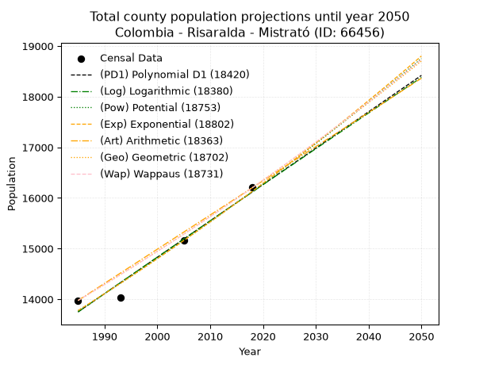
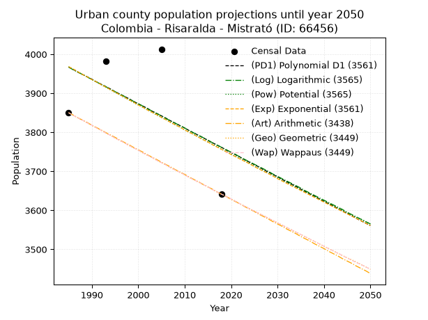
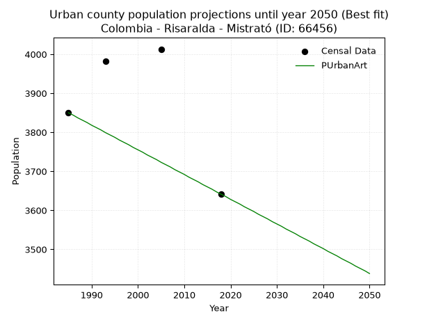
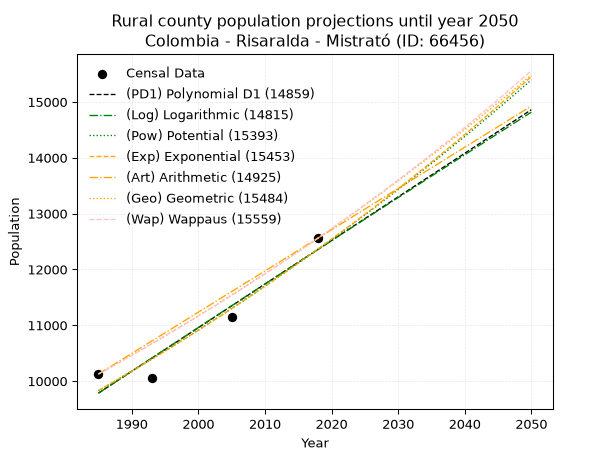
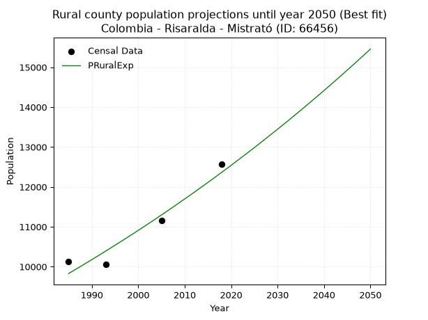

<div align="center">


</div>

# _“Population and Public Services Demand Projections (PPSD) until Year 2050 for Colombia - Risaralda - Mistrató (ID: 66456)”_
Keywords: `population` `public-service` `projection` `lineal` `polynomial` `logarithmic` `potential` `exponential` `arithmetic` `geometric` `wappaus` `dane` `colombia` `south-america`

PPSD are analytical estimates used by governments and planners to anticipate future changes in population size, age distribution, and the resulting community needs for utilities, healthcare, education, and infrastructure as sizing future water treatment facilities, electrical grids, and road networks based on spatial growth.

> **General running parameters**: • app_version: _v20260806_. • Python version: _3.14.7_. • Pandas version: _3.0.5_. • NumPy version: _2.5.1_. • Creates, save and include plots into reports (create_plot): _True_. • Projection until year: _2050_. • Process polynomial degree 2 and up: _False_. • Process Wappaus: _True_. • Process Wappaus: _True_. • Set negative values to zero: _True_. • Set infinite values to zero: _True_. • Drop dataset notes: _True_. 
<div align="center">

Dynamic map: [:earth_americas:Google](http://maps.google.com/maps?q=5.297038821,-75.8828859) [:earth_americas:OSM](https://www.openstreetmap.org/#map=18/5.297038821/-75.8828859&layers=P) [:earth_americas:Bing](https://www.bing.com/maps?cp=5.297038821~-75.8828859&lvl=18) [:earth_americas:Apple](https://maps.apple.com/frame?center=5.297038821%2C-75.8828859&span=0.003%2C0.006)

</div>


<div align="center">

```geojson
{
  "type": "Feature",
  "geometry": {
    "type": "Point", 
    "coordinates": [-75.8828859, 5.297038821]
  }, 
  "properties": {
    "Name": "Colombia - Risaralda - Mistrató (ID: 66456)"
  }
}
```

</div>


## 0. Census Data (4 records)

Census data are official statistics collected by a government about the people and housing in a country. They usually include counts of total population, age, sex, race, income, education, and jobs.

📅Global census file: [Population.xlsx](../data/Population.xlsx)

| Source   |   Year |   CountryID | CountryName   |   StateID | StateName   |   CountyID | CountyName   |   PTotal |   PUrban |   PRural |
|:---------|-------:|------------:|:--------------|----------:|:------------|-----------:|:-------------|---------:|---------:|---------:|
| DANE     |   1985 |          57 | Colombia      |        66 | Risaralda   |      66456 | Mistrató     |    13975 |     3850 |    10125 |
| DANE     |   1993 |          57 | Colombia      |        66 | Risaralda   |      66456 | Mistrató     |    14039 |     3982 |    10057 |
| DANE     |   2005 |          57 | Colombia      |        66 | Risaralda   |      66456 | Mistrató     |    15166 |     4013 |    11153 |
| DANE     |   2018 |          57 | Colombia      |        66 | Risaralda   |      66456 | Mistrató     |    16203 |     3641 |    12562 |

> 🔥Some records has specific notes about the registered values or the corresponding urban or rural distribution.

## 1. Total

### 1.1. Coefficients and Parameters

* (PD1) Polynomial Deg 1: 71.8430349257318, -128858.28061019501 (lineal)
* (Log) Logarithmic: 143752.08720553666, -1077815.0168062153
* (Pow) Potential: 9.578579025607894, -27.448827157240174
* (Exp) Exponential: 0.004786914305451505, 1.0289824071295348
* (Art) Arithmetic: Year diff. 2018 - 1985 = 33, Population diff. 16203 - 13975 = 2228, Annual growth = 67.51515151515152
* (Geo) Geometric: Year diff. 2018 - 1985 = 33, Population diff. 16203 - 13975 = 2228, Annual growth % = 0.00449267987700952
* (Wap) Wappaus: i = 0.4474461628679933, Condition values only valid for < 200)

<sub>
Wappaus condition values: ['0.00', '0.45', '0.89', '1.34', '1.79', '2.24', '2.68', '3.13', '3.58', '4.03', '4.47', '4.92', '5.37', '5.82', '6.26', '6.71', '7.16', '7.61', '8.05', '8.50', '8.95', '9.40', '9.84', '10.29', '10.74', '11.19', '11.63', '12.08', '12.53', '12.98', '13.42', '13.87', '14.32', '14.77', '15.21', '15.66', '16.11', '16.56', '17.00', '17.45', '17.90', '18.35', '18.79', '19.24', '19.69', '20.14', '20.58', '21.03', '21.48', '21.92', '22.37', '22.82', '23.27', '23.71', '24.16', '24.61', '25.06', '25.50', '25.95', '26.40', '26.85', '27.29', '27.74', '28.19', '28.64', '29.08']
</sub>


### 1.2. Projected Dataset

|   Year |   CountyID |   PTotalPD1 |   PTotalLog |   PTotalPow |   PTotalExp |   PTotalArt |   PTotalGeo |   PTotalWap |
|-------:|-----------:|------------:|------------:|------------:|------------:|------------:|------------:|------------:|
|   1985 |      66456 |       13750 |       13748 |       13773 |       13775 |       13975 |       13975 |       13975 |
|   1986 |      66456 |       13822 |       13821 |       13840 |       13841 |       14043 |       14038 |       14038 |
|   1987 |      66456 |       13894 |       13893 |       13907 |       13907 |       14110 |       14101 |       14101 |
|   1988 |      66456 |       13966 |       13965 |       13974 |       13974 |       14178 |       14164 |       14164 |
|   1989 |      66456 |       14038 |       14038 |       14041 |       14041 |       14245 |       14228 |       14227 |
|   1990 |      66456 |       14109 |       14110 |       14109 |       14108 |       14313 |       14292 |       14291 |
|   1991 |      66456 |       14181 |       14182 |       14177 |       14176 |       14380 |       14356 |       14355 |
|   1992 |      66456 |       14253 |       14254 |       14245 |       14244 |       14448 |       14420 |       14420 |
|   1993 |      66456 |       14325 |       14327 |       14314 |       14313 |       14515 |       14485 |       14484 |
|   1994 |      66456 |       14397 |       14399 |       14383 |       14381 |       14583 |       14550 |       14549 |
|   1995 |      66456 |       14469 |       14471 |       14452 |       14450 |       14650 |       14616 |       14615 |
|   1996 |      66456 |       14540 |       14543 |       14522 |       14520 |       14718 |       14681 |       14680 |
|   1997 |      66456 |       14612 |       14615 |       14592 |       14589 |       14785 |       14747 |       14746 |
|   1998 |      66456 |       14684 |       14687 |       14662 |       14659 |       14853 |       14814 |       14812 |
|   1999 |      66456 |       14756 |       14759 |       14732 |       14730 |       14920 |       14880 |       14879 |
|   2000 |      66456 |       14828 |       14831 |       14803 |       14800 |       14988 |       14947 |       14946 |
|   2001 |      66456 |       14900 |       14902 |       14874 |       14871 |       15055 |       15014 |       15013 |
|   2002 |      66456 |       14971 |       14974 |       14945 |       14943 |       15123 |       15082 |       15080 |
|   2003 |      66456 |       15043 |       15046 |       15017 |       15014 |       15190 |       15149 |       15148 |
|   2004 |      66456 |       15115 |       15118 |       15089 |       15086 |       15258 |       15217 |       15216 |
|   2005 |      66456 |       15187 |       15190 |       15161 |       15159 |       15325 |       15286 |       15284 |
|   2006 |      66456 |       15259 |       15261 |       15234 |       15231 |       15393 |       15354 |       15353 |
|   2007 |      66456 |       15331 |       15333 |       15307 |       15305 |       15460 |       15423 |       15422 |
|   2008 |      66456 |       15403 |       15404 |       15380 |       15378 |       15528 |       15493 |       15491 |
|   2009 |      66456 |       15474 |       15476 |       15454 |       15452 |       15595 |       15562 |       15561 |
|   2010 |      66456 |       15546 |       15548 |       15527 |       15526 |       15663 |       15632 |       15631 |
|   2011 |      66456 |       15618 |       15619 |       15602 |       15600 |       15730 |       15702 |       15701 |
|   2012 |      66456 |       15690 |       15691 |       15676 |       15675 |       15798 |       15773 |       15772 |
|   2013 |      66456 |       15762 |       15762 |       15751 |       15751 |       15865 |       15844 |       15843 |
|   2014 |      66456 |       15834 |       15833 |       15826 |       15826 |       15933 |       15915 |       15914 |
|   2015 |      66456 |       15905 |       15905 |       15901 |       15902 |       16000 |       15987 |       15986 |
|   2016 |      66456 |       15977 |       15976 |       15977 |       15978 |       16068 |       16058 |       16058 |
|   2017 |      66456 |       16049 |       16047 |       16053 |       16055 |       16135 |       16131 |       16130 |
|   2018 |      66456 |       16121 |       16119 |       16130 |       16132 |       16203 |       16203 |       16203 |
|   2019 |      66456 |       16193 |       16190 |       16206 |       16209 |       16271 |       16276 |       16276 |
|   2020 |      66456 |       16265 |       16261 |       16283 |       16287 |       16338 |       16349 |       16350 |
|   2021 |      66456 |       16336 |       16332 |       16361 |       16365 |       16406 |       16422 |       16423 |
|   2022 |      66456 |       16408 |       16403 |       16438 |       16444 |       16473 |       16496 |       16497 |
|   2023 |      66456 |       16480 |       16474 |       16516 |       16523 |       16541 |       16570 |       16572 |
|   2024 |      66456 |       16552 |       16545 |       16595 |       16602 |       16608 |       16645 |       16647 |
|   2025 |      66456 |       16624 |       16616 |       16673 |       16682 |       16676 |       16719 |       16722 |
|   2026 |      66456 |       16696 |       16687 |       16753 |       16762 |       16743 |       16795 |       16798 |
|   2027 |      66456 |       16768 |       16758 |       16832 |       16842 |       16811 |       16870 |       16874 |
|   2028 |      66456 |       16839 |       16829 |       16912 |       16923 |       16878 |       16946 |       16950 |
|   2029 |      66456 |       16911 |       16900 |       16992 |       17004 |       16946 |       17022 |       17027 |
|   2030 |      66456 |       16983 |       16971 |       17072 |       17086 |       17013 |       17098 |       17104 |
|   2031 |      66456 |       17055 |       17042 |       17153 |       17168 |       17081 |       17175 |       17181 |
|   2032 |      66456 |       17127 |       17112 |       17234 |       17250 |       17148 |       17252 |       17259 |
|   2033 |      66456 |       17199 |       17183 |       17315 |       17333 |       17216 |       17330 |       17338 |
|   2034 |      66456 |       17270 |       17254 |       17397 |       17416 |       17283 |       17408 |       17416 |
|   2035 |      66456 |       17342 |       17324 |       17479 |       17500 |       17351 |       17486 |       17495 |
|   2036 |      66456 |       17414 |       17395 |       17562 |       17584 |       17418 |       17565 |       17575 |
|   2037 |      66456 |       17486 |       17466 |       17644 |       17668 |       17486 |       17643 |       17655 |
|   2038 |      66456 |       17558 |       17536 |       17727 |       17753 |       17553 |       17723 |       17735 |
|   2039 |      66456 |       17630 |       17607 |       17811 |       17838 |       17621 |       17802 |       17816 |
|   2040 |      66456 |       17702 |       17677 |       17895 |       17924 |       17688 |       17882 |       17897 |
|   2041 |      66456 |       17773 |       17748 |       17979 |       18010 |       17756 |       17963 |       17978 |
|   2042 |      66456 |       17845 |       17818 |       18064 |       18096 |       17823 |       18043 |       18060 |
|   2043 |      66456 |       17917 |       17888 |       18148 |       18183 |       17891 |       18124 |       18143 |
|   2044 |      66456 |       17989 |       17959 |       18234 |       18270 |       17958 |       18206 |       18225 |
|   2045 |      66456 |       18061 |       18029 |       18319 |       18358 |       18026 |       18288 |       18309 |
|   2046 |      66456 |       18133 |       18099 |       18405 |       18446 |       18093 |       18370 |       18392 |
|   2047 |      66456 |       18204 |       18170 |       18492 |       18534 |       18161 |       18452 |       18476 |
|   2048 |      66456 |       18276 |       18240 |       18578 |       18623 |       18228 |       18535 |       18561 |
|   2049 |      66456 |       18348 |       18310 |       18665 |       18713 |       18296 |       18619 |       18646 |
|   2050 |      66456 |       18420 |       18380 |       18753 |       18802 |       18363 |       18702 |       18731 |
<div align="center">

</img>

</div>


### 1.3. Best fit with absolute error and relative error (%)

Relative error puts that difference into context by dividing the absolute error by the true value, creating a unitless ratio or percentage that shows the scale of the mistake.

Absolute and relative error

|   Year | Source   |   CountryID | CountryName   |   StateID | StateName   |   CountyID_x | CountyName   |   PTotal |   PUrban |   PRural |   CountyID_y |   PTotalPD1 |   PTotalLog |   PTotalPow |   PTotalExp |   PTotalArt |   PTotalGeo |   PTotalWap |   PTotalPD1AbsError |   PTotalLogAbsError |   PTotalPowAbsError |   PTotalExpAbsError |   PTotalArtAbsError |   PTotalGeoAbsError |   PTotalWapAbsError |   PTotalPD1RelError |   PTotalLogRelError |   PTotalPowRelError |   PTotalExpRelError |   PTotalArtRelError |   PTotalGeoRelError |   PTotalWapRelError |
|-------:|:---------|------------:|:--------------|----------:|:------------|-------------:|:-------------|---------:|---------:|---------:|-------------:|------------:|------------:|------------:|------------:|------------:|------------:|------------:|--------------------:|--------------------:|--------------------:|--------------------:|--------------------:|--------------------:|--------------------:|--------------------:|--------------------:|--------------------:|--------------------:|--------------------:|--------------------:|--------------------:|
|   1985 | DANE     |          57 | Colombia      |        66 | Risaralda   |        66456 | Mistrató     |    13975 |     3850 |    10125 |        66456 |       13750 |       13748 |       13773 |       13775 |       13975 |       13975 |       13975 |                 225 |                 227 |                 202 |                 200 |                   0 |                   0 |                   0 |            1.61002  |            1.62433  |           1.44544   |           1.43113   |             0       |            0        |            0        |
|   1993 | DANE     |          57 | Colombia      |        66 | Risaralda   |        66456 | Mistrató     |    14039 |     3982 |    10057 |        66456 |       14325 |       14327 |       14314 |       14313 |       14515 |       14485 |       14484 |                 286 |                 288 |                 275 |                 274 |                 476 |                 446 |                 445 |            2.03718  |            2.05143  |           1.95883   |           1.95171   |             3.39055 |            3.17686  |            3.16974  |
|   2005 | DANE     |          57 | Colombia      |        66 | Risaralda   |        66456 | Mistrató     |    15166 |     4013 |    11153 |        66456 |       15187 |       15190 |       15161 |       15159 |       15325 |       15286 |       15284 |                  21 |                  24 |                   5 |                   7 |                 159 |                 120 |                 118 |            0.138468 |            0.158249 |           0.0329685 |           0.0461559 |             1.0484  |            0.791244 |            0.778056 |
|   2018 | DANE     |          57 | Colombia      |        66 | Risaralda   |        66456 | Mistrató     |    16203 |     3641 |    12562 |        66456 |       16121 |       16119 |       16130 |       16132 |       16203 |       16203 |       16203 |                  82 |                  84 |                  73 |                  71 |                   0 |                   0 |                   0 |            0.506079 |            0.518423 |           0.450534  |           0.43819   |             0       |            0        |            0        |

Relative error mean

| Method    |   RelError | Best   |
|:----------|-----------:|:-------|
| PTotalPD1 |   1.07294  |        |
| PTotalLog |   1.08811  |        |
| PTotalPow |   0.971942 |        |
| PTotalExp |   0.966795 | True   |
| PTotalArt |   1.10974  |        |
| PTotalGeo |   0.992027 |        |
| PTotalWap |   0.986949 |        |

💙Best method: _**PTotalExp**_
<div align="center">

</img>

</div>


### 1.4. Fresh water supply demand in liters per capita per day (lpcd)

The fresh water supply demand typically ranges from 100 to 300 liters per capita per day (lpcd) for standard domestic and municipal planning, though absolute survival minimums set by the World Health Organization are as low as 7.5 to 20 liters per day, and total consumption in high-income nations can exceed 400 liters.

> `CZ`: Level in meters above the sea level (masl).<br> `WS`: Fresh water supply demand in liters per capita per day (lpcd or l/h/d).<br> `WSAll`: Zonal fresh water supply demand in liters per second (l/s).<br> `A`: Zonal area in square meters.

Reference values (RAS Colombia)

|    CZ |   WS |
|------:|-----:|
|  1000 |  120 |
|  2000 |  130 |
| 99999 |  140 |

County shapefile geometry properties and water supply values

|   CountyID |      ATotal |   CZTotal |   WSTotal |
|-----------:|------------:|----------:|----------:|
|      66456 | 5.64152e+08 |   1698.28 |       130 |

Projected values for best method: PTotalExp

|   CountyID |   Year |   PTotalExp |   WSTotal |   WSTotalAll |
|-----------:|-------:|------------:|----------:|-------------:|
|      66456 |   1985 |       13775 |       130 |      20.7263 |
|      66456 |   1986 |       13841 |       130 |      20.8256 |
|      66456 |   1987 |       13907 |       130 |      20.9249 |
|      66456 |   1988 |       13974 |       130 |      21.0257 |
|      66456 |   1989 |       14041 |       130 |      21.1265 |
|      66456 |   1990 |       14108 |       130 |      21.2273 |
|      66456 |   1991 |       14176 |       130 |      21.3296 |
|      66456 |   1992 |       14244 |       130 |      21.4319 |
|      66456 |   1993 |       14313 |       130 |      21.5358 |
|      66456 |   1994 |       14381 |       130 |      21.6381 |
|      66456 |   1995 |       14450 |       130 |      21.7419 |
|      66456 |   1996 |       14520 |       130 |      21.8472 |
|      66456 |   1997 |       14589 |       130 |      21.951  |
|      66456 |   1998 |       14659 |       130 |      22.0564 |
|      66456 |   1999 |       14730 |       130 |      22.1632 |
|      66456 |   2000 |       14800 |       130 |      22.2685 |
|      66456 |   2001 |       14871 |       130 |      22.3753 |
|      66456 |   2002 |       14943 |       130 |      22.4837 |
|      66456 |   2003 |       15014 |       130 |      22.5905 |
|      66456 |   2004 |       15086 |       130 |      22.6988 |
|      66456 |   2005 |       15159 |       130 |      22.8087 |
|      66456 |   2006 |       15231 |       130 |      22.917  |
|      66456 |   2007 |       15305 |       130 |      23.0284 |
|      66456 |   2008 |       15378 |       130 |      23.1382 |
|      66456 |   2009 |       15452 |       130 |      23.2495 |
|      66456 |   2010 |       15526 |       130 |      23.3609 |
|      66456 |   2011 |       15600 |       130 |      23.4722 |
|      66456 |   2012 |       15675 |       130 |      23.5851 |
|      66456 |   2013 |       15751 |       130 |      23.6994 |
|      66456 |   2014 |       15826 |       130 |      23.8123 |
|      66456 |   2015 |       15902 |       130 |      23.9266 |
|      66456 |   2016 |       15978 |       130 |      24.041  |
|      66456 |   2017 |       16055 |       130 |      24.1568 |
|      66456 |   2018 |       16132 |       130 |      24.2727 |
|      66456 |   2019 |       16209 |       130 |      24.3885 |
|      66456 |   2020 |       16287 |       130 |      24.5059 |
|      66456 |   2021 |       16365 |       130 |      24.6233 |
|      66456 |   2022 |       16444 |       130 |      24.7421 |
|      66456 |   2023 |       16523 |       130 |      24.861  |
|      66456 |   2024 |       16602 |       130 |      24.9799 |
|      66456 |   2025 |       16682 |       130 |      25.1002 |
|      66456 |   2026 |       16762 |       130 |      25.2206 |
|      66456 |   2027 |       16842 |       130 |      25.341  |
|      66456 |   2028 |       16923 |       130 |      25.4628 |
|      66456 |   2029 |       17004 |       130 |      25.5847 |
|      66456 |   2030 |       17086 |       130 |      25.7081 |
|      66456 |   2031 |       17168 |       130 |      25.8315 |
|      66456 |   2032 |       17250 |       130 |      25.9549 |
|      66456 |   2033 |       17333 |       130 |      26.0797 |
|      66456 |   2034 |       17416 |       130 |      26.2046 |
|      66456 |   2035 |       17500 |       130 |      26.331  |
|      66456 |   2036 |       17584 |       130 |      26.4574 |
|      66456 |   2037 |       17668 |       130 |      26.5838 |
|      66456 |   2038 |       17753 |       130 |      26.7117 |
|      66456 |   2039 |       17838 |       130 |      26.8396 |
|      66456 |   2040 |       17924 |       130 |      26.969  |
|      66456 |   2041 |       18010 |       130 |      27.0984 |
|      66456 |   2042 |       18096 |       130 |      27.2278 |
|      66456 |   2043 |       18183 |       130 |      27.3587 |
|      66456 |   2044 |       18270 |       130 |      27.4896 |
|      66456 |   2045 |       18358 |       130 |      27.622  |
|      66456 |   2046 |       18446 |       130 |      27.7544 |
|      66456 |   2047 |       18534 |       130 |      27.8868 |
|      66456 |   2048 |       18623 |       130 |      28.0207 |
|      66456 |   2049 |       18713 |       130 |      28.1561 |
|      66456 |   2050 |       18802 |       130 |      28.29   |

## 2. Urban

### 2.1. Coefficients and Parameters

* (PD1) Polynomial Deg 1: -6.25050180650316, 16374.066238457946 (lineal)
* (Log) Logarithmic: -12464.93562248044, 98617.57555419904
* (Pow) Potential: -3.3248057831022257, 14.5629989898294
* (Exp) Exponential: -0.001667048198620772, 108573.4457030263
* (Art) Arithmetic: Year diff. 2018 - 1985 = 33, Population diff. 3641 - 3850 = -209, Annual growth = -6.333333333333333
* (Geo) Geometric: Year diff. 2018 - 1985 = 33, Population diff. 3641 - 3850 = -209, Annual growth % = -0.0016899274045309998
* (Wap) Wappaus: i = -0.16909179904774618, Condition values only valid for < 200)

<sub>
Wappaus condition values: ['-0.00', '-0.17', '-0.34', '-0.51', '-0.68', '-0.85', '-1.01', '-1.18', '-1.35', '-1.52', '-1.69', '-1.86', '-2.03', '-2.20', '-2.37', '-2.54', '-2.71', '-2.87', '-3.04', '-3.21', '-3.38', '-3.55', '-3.72', '-3.89', '-4.06', '-4.23', '-4.40', '-4.57', '-4.73', '-4.90', '-5.07', '-5.24', '-5.41', '-5.58', '-5.75', '-5.92', '-6.09', '-6.26', '-6.43', '-6.59', '-6.76', '-6.93', '-7.10', '-7.27', '-7.44', '-7.61', '-7.78', '-7.95', '-8.12', '-8.29', '-8.45', '-8.62', '-8.79', '-8.96', '-9.13', '-9.30', '-9.47', '-9.64', '-9.81', '-9.98', '-10.15', '-10.31', '-10.48', '-10.65', '-10.82', '-10.99']
</sub>


### 2.2. Projected Dataset

|   Year |   CountyID |   PUrbanPD1 |   PUrbanLog |   PUrbanPow |   PUrbanExp |   PUrbanArt |   PUrbanGeo |   PUrbanWap |
|-------:|-----------:|------------:|------------:|------------:|------------:|------------:|------------:|------------:|
|   1985 |      66456 |        3967 |        3967 |        3968 |        3968 |        3850 |        3850 |        3850 |
|   1986 |      66456 |        3961 |        3960 |        3961 |        3962 |        3844 |        3843 |        3843 |
|   1987 |      66456 |        3954 |        3954 |        3955 |        3955 |        3837 |        3837 |        3837 |
|   1988 |      66456 |        3948 |        3948 |        3948 |        3948 |        3831 |        3831 |        3831 |
|   1989 |      66456 |        3942 |        3942 |        3942 |        3942 |        3825 |        3824 |        3824 |
|   1990 |      66456 |        3936 |        3935 |        3935 |        3935 |        3818 |        3818 |        3818 |
|   1991 |      66456 |        3929 |        3929 |        3929 |        3929 |        3812 |        3811 |        3811 |
|   1992 |      66456 |        3923 |        3923 |        3922 |        3922 |        3806 |        3805 |        3805 |
|   1993 |      66456 |        3917 |        3917 |        3915 |        3916 |        3799 |        3798 |        3798 |
|   1994 |      66456 |        3911 |        3910 |        3909 |        3909 |        3793 |        3792 |        3792 |
|   1995 |      66456 |        3904 |        3904 |        3902 |        3903 |        3787 |        3785 |        3785 |
|   1996 |      66456 |        3898 |        3898 |        3896 |        3896 |        3780 |        3779 |        3779 |
|   1997 |      66456 |        3892 |        3892 |        3889 |        3890 |        3774 |        3773 |        3773 |
|   1998 |      66456 |        3886 |        3885 |        3883 |        3883 |        3768 |        3766 |        3766 |
|   1999 |      66456 |        3879 |        3879 |        3876 |        3877 |        3761 |        3760 |        3760 |
|   2000 |      66456 |        3873 |        3873 |        3870 |        3870 |        3755 |        3754 |        3754 |
|   2001 |      66456 |        3867 |        3867 |        3864 |        3864 |        3749 |        3747 |        3747 |
|   2002 |      66456 |        3861 |        3860 |        3857 |        3857 |        3742 |        3741 |        3741 |
|   2003 |      66456 |        3854 |        3854 |        3851 |        3851 |        3736 |        3735 |        3735 |
|   2004 |      66456 |        3848 |        3848 |        3844 |        3845 |        3730 |        3728 |        3728 |
|   2005 |      66456 |        3842 |        3842 |        3838 |        3838 |        3723 |        3722 |        3722 |
|   2006 |      66456 |        3836 |        3835 |        3832 |        3832 |        3717 |        3716 |        3716 |
|   2007 |      66456 |        3829 |        3829 |        3825 |        3825 |        3711 |        3709 |        3709 |
|   2008 |      66456 |        3823 |        3823 |        3819 |        3819 |        3704 |        3703 |        3703 |
|   2009 |      66456 |        3817 |        3817 |        3813 |        3813 |        3698 |        3697 |        3697 |
|   2010 |      66456 |        3811 |        3811 |        3806 |        3806 |        3692 |        3691 |        3691 |
|   2011 |      66456 |        3804 |        3804 |        3800 |        3800 |        3685 |        3684 |        3684 |
|   2012 |      66456 |        3798 |        3798 |        3794 |        3794 |        3679 |        3678 |        3678 |
|   2013 |      66456 |        3792 |        3792 |        3788 |        3787 |        3673 |        3672 |        3672 |
|   2014 |      66456 |        3786 |        3786 |        3781 |        3781 |        3666 |        3666 |        3666 |
|   2015 |      66456 |        3779 |        3780 |        3775 |        3775 |        3660 |        3660 |        3660 |
|   2016 |      66456 |        3773 |        3773 |        3769 |        3768 |        3654 |        3653 |        3653 |
|   2017 |      66456 |        3767 |        3767 |        3763 |        3762 |        3647 |        3647 |        3647 |
|   2018 |      66456 |        3761 |        3761 |        3756 |        3756 |        3641 |        3641 |        3641 |
|   2019 |      66456 |        3754 |        3755 |        3750 |        3750 |        3635 |        3635 |        3635 |
|   2020 |      66456 |        3748 |        3749 |        3744 |        3743 |        3628 |        3629 |        3629 |
|   2021 |      66456 |        3742 |        3743 |        3738 |        3737 |        3622 |        3623 |        3623 |
|   2022 |      66456 |        3736 |        3736 |        3732 |        3731 |        3616 |        3616 |        3616 |
|   2023 |      66456 |        3729 |        3730 |        3726 |        3725 |        3609 |        3610 |        3610 |
|   2024 |      66456 |        3723 |        3724 |        3720 |        3719 |        3603 |        3604 |        3604 |
|   2025 |      66456 |        3717 |        3718 |        3713 |        3712 |        3597 |        3598 |        3598 |
|   2026 |      66456 |        3711 |        3712 |        3707 |        3706 |        3590 |        3592 |        3592 |
|   2027 |      66456 |        3704 |        3706 |        3701 |        3700 |        3584 |        3586 |        3586 |
|   2028 |      66456 |        3698 |        3700 |        3695 |        3694 |        3578 |        3580 |        3580 |
|   2029 |      66456 |        3692 |        3693 |        3689 |        3688 |        3571 |        3574 |        3574 |
|   2030 |      66456 |        3686 |        3687 |        3683 |        3681 |        3565 |        3568 |        3568 |
|   2031 |      66456 |        3679 |        3681 |        3677 |        3675 |        3559 |        3562 |        3562 |
|   2032 |      66456 |        3673 |        3675 |        3671 |        3669 |        3552 |        3556 |        3556 |
|   2033 |      66456 |        3667 |        3669 |        3665 |        3663 |        3546 |        3550 |        3550 |
|   2034 |      66456 |        3661 |        3663 |        3659 |        3657 |        3540 |        3544 |        3544 |
|   2035 |      66456 |        3654 |        3657 |        3653 |        3651 |        3533 |        3538 |        3538 |
|   2036 |      66456 |        3648 |        3650 |        3647 |        3645 |        3527 |        3532 |        3532 |
|   2037 |      66456 |        3642 |        3644 |        3641 |        3639 |        3521 |        3526 |        3526 |
|   2038 |      66456 |        3636 |        3638 |        3635 |        3633 |        3514 |        3520 |        3520 |
|   2039 |      66456 |        3629 |        3632 |        3629 |        3627 |        3508 |        3514 |        3514 |
|   2040 |      66456 |        3623 |        3626 |        3623 |        3621 |        3502 |        3508 |        3508 |
|   2041 |      66456 |        3617 |        3620 |        3618 |        3615 |        3495 |        3502 |        3502 |
|   2042 |      66456 |        3611 |        3614 |        3612 |        3609 |        3489 |        3496 |        3496 |
|   2043 |      66456 |        3604 |        3608 |        3606 |        3603 |        3483 |        3490 |        3490 |
|   2044 |      66456 |        3598 |        3602 |        3600 |        3597 |        3476 |        3484 |        3484 |
|   2045 |      66456 |        3592 |        3595 |        3594 |        3591 |        3470 |        3478 |        3478 |
|   2046 |      66456 |        3586 |        3589 |        3588 |        3585 |        3464 |        3473 |        3472 |
|   2047 |      66456 |        3579 |        3583 |        3582 |        3579 |        3457 |        3467 |        3466 |
|   2048 |      66456 |        3573 |        3577 |        3577 |        3573 |        3451 |        3461 |        3461 |
|   2049 |      66456 |        3567 |        3571 |        3571 |        3567 |        3445 |        3455 |        3455 |
|   2050 |      66456 |        3561 |        3565 |        3565 |        3561 |        3438 |        3449 |        3449 |
<div align="center">

</img>

</div>


### 2.3. Best fit with absolute error and relative error (%)

Relative error puts that difference into context by dividing the absolute error by the true value, creating a unitless ratio or percentage that shows the scale of the mistake.

Absolute and relative error

|   Year | Source   |   CountryID | CountryName   |   StateID | StateName   |   CountyID_x | CountyName   |   PTotal |   PUrban |   PRural |   CountyID_y |   PUrbanPD1 |   PUrbanLog |   PUrbanPow |   PUrbanExp |   PUrbanArt |   PUrbanGeo |   PUrbanWap |   PUrbanPD1AbsError |   PUrbanLogAbsError |   PUrbanPowAbsError |   PUrbanExpAbsError |   PUrbanArtAbsError |   PUrbanGeoAbsError |   PUrbanWapAbsError |   PUrbanPD1RelError |   PUrbanLogRelError |   PUrbanPowRelError |   PUrbanExpRelError |   PUrbanArtRelError |   PUrbanGeoRelError |   PUrbanWapRelError |
|-------:|:---------|------------:|:--------------|----------:|:------------|-------------:|:-------------|---------:|---------:|---------:|-------------:|------------:|------------:|------------:|------------:|------------:|------------:|------------:|--------------------:|--------------------:|--------------------:|--------------------:|--------------------:|--------------------:|--------------------:|--------------------:|--------------------:|--------------------:|--------------------:|--------------------:|--------------------:|--------------------:|
|   1985 | DANE     |          57 | Colombia      |        66 | Risaralda   |        66456 | Mistrató     |    13975 |     3850 |    10125 |        66456 |        3967 |        3967 |        3968 |        3968 |        3850 |        3850 |        3850 |                 117 |                 117 |                 118 |                 118 |                   0 |                   0 |                   0 |             3.03896 |             3.03896 |             3.06494 |             3.06494 |             0       |             0       |             0       |
|   1993 | DANE     |          57 | Colombia      |        66 | Risaralda   |        66456 | Mistrató     |    14039 |     3982 |    10057 |        66456 |        3917 |        3917 |        3915 |        3916 |        3799 |        3798 |        3798 |                  65 |                  65 |                  67 |                  66 |                 183 |                 184 |                 184 |             1.63235 |             1.63235 |             1.68257 |             1.65746 |             4.59568 |             4.62079 |             4.62079 |
|   2005 | DANE     |          57 | Colombia      |        66 | Risaralda   |        66456 | Mistrató     |    15166 |     4013 |    11153 |        66456 |        3842 |        3842 |        3838 |        3838 |        3723 |        3722 |        3722 |                 171 |                 171 |                 175 |                 175 |                 290 |                 291 |                 291 |             4.26115 |             4.26115 |             4.36083 |             4.36083 |             7.22651 |             7.25143 |             7.25143 |
|   2018 | DANE     |          57 | Colombia      |        66 | Risaralda   |        66456 | Mistrató     |    16203 |     3641 |    12562 |        66456 |        3761 |        3761 |        3756 |        3756 |        3641 |        3641 |        3641 |                 120 |                 120 |                 115 |                 115 |                   0 |                   0 |                   0 |             3.2958  |             3.2958  |             3.15847 |             3.15847 |             0       |             0       |             0       |

Relative error mean

| Method    |   RelError | Best   |
|:----------|-----------:|:-------|
| PUrbanPD1 |    3.05706 |        |
| PUrbanLog |    3.05706 |        |
| PUrbanPow |    3.0667  |        |
| PUrbanExp |    3.06042 |        |
| PUrbanArt |    2.95555 | True   |
| PUrbanGeo |    2.96806 |        |
| PUrbanWap |    2.96806 |        |

💙Best method: _**PUrbanArt**_
<div align="center">

</img>

</div>


### 2.4. Fresh water supply demand in liters per capita per day (lpcd)

The fresh water supply demand typically ranges from 100 to 300 liters per capita per day (lpcd) for standard domestic and municipal planning, though absolute survival minimums set by the World Health Organization are as low as 7.5 to 20 liters per day, and total consumption in high-income nations can exceed 400 liters.

> `CZ`: Level in meters above the sea level (masl).<br> `WS`: Fresh water supply demand in liters per capita per day (lpcd or l/h/d).<br> `WSAll`: Zonal fresh water supply demand in liters per second (l/s).<br> `A`: Zonal area in square meters.

Reference values (RAS Colombia)

|    CZ |   WS |
|------:|-----:|
|  1000 |  120 |
|  2000 |  130 |
| 99999 |  140 |

County shapefile geometry properties and water supply values

|   CountyID |   AUrban |   CZUrban |   WSUrban |
|-----------:|---------:|----------:|----------:|
|      66456 |   435829 |   1501.32 |       130 |

Projected values for best method: PUrbanArt

|   CountyID |   Year |   PUrbanArt |   WSUrban |   WSUrbanAll |
|-----------:|-------:|------------:|----------:|-------------:|
|      66456 |   1985 |        3850 |       130 |      5.79282 |
|      66456 |   1986 |        3844 |       130 |      5.7838  |
|      66456 |   1987 |        3837 |       130 |      5.77326 |
|      66456 |   1988 |        3831 |       130 |      5.76424 |
|      66456 |   1989 |        3825 |       130 |      5.75521 |
|      66456 |   1990 |        3818 |       130 |      5.74468 |
|      66456 |   1991 |        3812 |       130 |      5.73565 |
|      66456 |   1992 |        3806 |       130 |      5.72662 |
|      66456 |   1993 |        3799 |       130 |      5.71609 |
|      66456 |   1994 |        3793 |       130 |      5.70706 |
|      66456 |   1995 |        3787 |       130 |      5.69803 |
|      66456 |   1996 |        3780 |       130 |      5.6875  |
|      66456 |   1997 |        3774 |       130 |      5.67847 |
|      66456 |   1998 |        3768 |       130 |      5.66944 |
|      66456 |   1999 |        3761 |       130 |      5.65891 |
|      66456 |   2000 |        3755 |       130 |      5.64988 |
|      66456 |   2001 |        3749 |       130 |      5.64086 |
|      66456 |   2002 |        3742 |       130 |      5.63032 |
|      66456 |   2003 |        3736 |       130 |      5.6213  |
|      66456 |   2004 |        3730 |       130 |      5.61227 |
|      66456 |   2005 |        3723 |       130 |      5.60174 |
|      66456 |   2006 |        3717 |       130 |      5.59271 |
|      66456 |   2007 |        3711 |       130 |      5.58368 |
|      66456 |   2008 |        3704 |       130 |      5.57315 |
|      66456 |   2009 |        3698 |       130 |      5.56412 |
|      66456 |   2010 |        3692 |       130 |      5.55509 |
|      66456 |   2011 |        3685 |       130 |      5.54456 |
|      66456 |   2012 |        3679 |       130 |      5.53553 |
|      66456 |   2013 |        3673 |       130 |      5.5265  |
|      66456 |   2014 |        3666 |       130 |      5.51597 |
|      66456 |   2015 |        3660 |       130 |      5.50694 |
|      66456 |   2016 |        3654 |       130 |      5.49792 |
|      66456 |   2017 |        3647 |       130 |      5.48738 |
|      66456 |   2018 |        3641 |       130 |      5.47836 |
|      66456 |   2019 |        3635 |       130 |      5.46933 |
|      66456 |   2020 |        3628 |       130 |      5.4588  |
|      66456 |   2021 |        3622 |       130 |      5.44977 |
|      66456 |   2022 |        3616 |       130 |      5.44074 |
|      66456 |   2023 |        3609 |       130 |      5.43021 |
|      66456 |   2024 |        3603 |       130 |      5.42118 |
|      66456 |   2025 |        3597 |       130 |      5.41215 |
|      66456 |   2026 |        3590 |       130 |      5.40162 |
|      66456 |   2027 |        3584 |       130 |      5.39259 |
|      66456 |   2028 |        3578 |       130 |      5.38356 |
|      66456 |   2029 |        3571 |       130 |      5.37303 |
|      66456 |   2030 |        3565 |       130 |      5.364   |
|      66456 |   2031 |        3559 |       130 |      5.35498 |
|      66456 |   2032 |        3552 |       130 |      5.34444 |
|      66456 |   2033 |        3546 |       130 |      5.33542 |
|      66456 |   2034 |        3540 |       130 |      5.32639 |
|      66456 |   2035 |        3533 |       130 |      5.31586 |
|      66456 |   2036 |        3527 |       130 |      5.30683 |
|      66456 |   2037 |        3521 |       130 |      5.2978  |
|      66456 |   2038 |        3514 |       130 |      5.28727 |
|      66456 |   2039 |        3508 |       130 |      5.27824 |
|      66456 |   2040 |        3502 |       130 |      5.26921 |
|      66456 |   2041 |        3495 |       130 |      5.25868 |
|      66456 |   2042 |        3489 |       130 |      5.24965 |
|      66456 |   2043 |        3483 |       130 |      5.24062 |
|      66456 |   2044 |        3476 |       130 |      5.23009 |
|      66456 |   2045 |        3470 |       130 |      5.22106 |
|      66456 |   2046 |        3464 |       130 |      5.21204 |
|      66456 |   2047 |        3457 |       130 |      5.2015  |
|      66456 |   2048 |        3451 |       130 |      5.19248 |
|      66456 |   2049 |        3445 |       130 |      5.18345 |
|      66456 |   2050 |        3438 |       130 |      5.17292 |

## 3. Rural

### 3.1. Coefficients and Parameters

* (PD1) Polynomial Deg 1: 78.0935367322351, -145232.34684865322 (lineal)
* (Log) Logarithmic: 156217.02282801716, -1176432.5923604146
* (Pow) Potential: 13.929672132729989, -41.94432560365329
* (Exp) Exponential: 0.006963156314558093, 0.009765663379153562
* (Art) Arithmetic: Year diff. 2018 - 1985 = 33, Population diff. 12562 - 10125 = 2437, Annual growth = 73.84848484848484
* (Geo) Geometric: Year diff. 2018 - 1985 = 33, Population diff. 12562 - 10125 = 2437, Annual growth % = 0.006556819743119613
* (Wap) Wappaus: i = 0.6510202745932459, Condition values only valid for < 200)

<sub>
Wappaus condition values: ['0.00', '0.65', '1.30', '1.95', '2.60', '3.26', '3.91', '4.56', '5.21', '5.86', '6.51', '7.16', '7.81', '8.46', '9.11', '9.77', '10.42', '11.07', '11.72', '12.37', '13.02', '13.67', '14.32', '14.97', '15.62', '16.28', '16.93', '17.58', '18.23', '18.88', '19.53', '20.18', '20.83', '21.48', '22.13', '22.79', '23.44', '24.09', '24.74', '25.39', '26.04', '26.69', '27.34', '27.99', '28.64', '29.30', '29.95', '30.60', '31.25', '31.90', '32.55', '33.20', '33.85', '34.50', '35.16', '35.81', '36.46', '37.11', '37.76', '38.41', '39.06', '39.71', '40.36', '41.01', '41.67', '42.32']
</sub>


### 3.2. Projected Dataset

|   Year |   CountyID |   PRuralPD1 |   PRuralLog |   PRuralPow |   PRuralExp |   PRuralArt |   PRuralGeo |   PRuralWap |
|-------:|-----------:|------------:|------------:|------------:|------------:|------------:|------------:|------------:|
|   1985 |      66456 |        9783 |        9782 |        9826 |        9828 |       10125 |       10125 |       10125 |
|   1986 |      66456 |        9861 |        9860 |        9896 |        9897 |       10199 |       10191 |       10191 |
|   1987 |      66456 |        9940 |        9939 |        9965 |        9966 |       10273 |       10258 |       10258 |
|   1988 |      66456 |       10018 |       10018 |       10035 |       10035 |       10347 |       10325 |       10325 |
|   1989 |      66456 |       10096 |       10096 |       10106 |       10106 |       10420 |       10393 |       10392 |
|   1990 |      66456 |       10174 |       10175 |       10177 |       10176 |       10494 |       10461 |       10460 |
|   1991 |      66456 |       10252 |       10253 |       10248 |       10247 |       10568 |       10530 |       10528 |
|   1992 |      66456 |       10330 |       10332 |       10320 |       10319 |       10642 |       10599 |       10597 |
|   1993 |      66456 |       10408 |       10410 |       10393 |       10391 |       10716 |       10668 |       10666 |
|   1994 |      66456 |       10486 |       10488 |       10466 |       10464 |       10790 |       10738 |       10736 |
|   1995 |      66456 |       10564 |       10567 |       10539 |       10537 |       10863 |       10809 |       10806 |
|   1996 |      66456 |       10642 |       10645 |       10613 |       10610 |       10937 |       10880 |       10877 |
|   1997 |      66456 |       10720 |       10723 |       10687 |       10684 |       11011 |       10951 |       10948 |
|   1998 |      66456 |       10799 |       10801 |       10762 |       10759 |       11085 |       11023 |       11020 |
|   1999 |      66456 |       10877 |       10880 |       10837 |       10834 |       11159 |       11095 |       11092 |
|   2000 |      66456 |       10955 |       10958 |       10913 |       10910 |       11233 |       11168 |       11164 |
|   2001 |      66456 |       11033 |       11036 |       10989 |       10986 |       11307 |       11241 |       11238 |
|   2002 |      66456 |       11111 |       11114 |       11066 |       11063 |       11380 |       11315 |       11311 |
|   2003 |      66456 |       11189 |       11192 |       11143 |       11140 |       11454 |       11389 |       11385 |
|   2004 |      66456 |       11267 |       11270 |       11221 |       11218 |       11528 |       11464 |       11460 |
|   2005 |      66456 |       11345 |       11348 |       11299 |       11296 |       11602 |       11539 |       11535 |
|   2006 |      66456 |       11423 |       11426 |       11378 |       11375 |       11676 |       11614 |       11611 |
|   2007 |      66456 |       11501 |       11504 |       11457 |       11455 |       11750 |       11691 |       11687 |
|   2008 |      66456 |       11579 |       11581 |       11537 |       11535 |       11824 |       11767 |       11764 |
|   2009 |      66456 |       11658 |       11659 |       11617 |       11616 |       11897 |       11844 |       11841 |
|   2010 |      66456 |       11736 |       11737 |       11698 |       11697 |       11971 |       11922 |       11919 |
|   2011 |      66456 |       11814 |       11815 |       11779 |       11778 |       12045 |       12000 |       11997 |
|   2012 |      66456 |       11892 |       11892 |       11861 |       11861 |       12119 |       12079 |       12076 |
|   2013 |      66456 |       11970 |       11970 |       11944 |       11944 |       12193 |       12158 |       12156 |
|   2014 |      66456 |       12048 |       12047 |       12027 |       12027 |       12267 |       12238 |       12236 |
|   2015 |      66456 |       12126 |       12125 |       12110 |       12111 |       12340 |       12318 |       12316 |
|   2016 |      66456 |       12204 |       12203 |       12194 |       12196 |       12414 |       12399 |       12398 |
|   2017 |      66456 |       12282 |       12280 |       12278 |       12281 |       12488 |       12480 |       12480 |
|   2018 |      66456 |       12360 |       12357 |       12364 |       12367 |       12562 |       12562 |       12562 |
|   2019 |      66456 |       12439 |       12435 |       12449 |       12453 |       12636 |       12644 |       12645 |
|   2020 |      66456 |       12517 |       12512 |       12535 |       12540 |       12710 |       12727 |       12729 |
|   2021 |      66456 |       12595 |       12589 |       12622 |       12628 |       12784 |       12811 |       12813 |
|   2022 |      66456 |       12673 |       12667 |       12709 |       12716 |       12857 |       12895 |       12898 |
|   2023 |      66456 |       12751 |       12744 |       12797 |       12805 |       12931 |       12979 |       12983 |
|   2024 |      66456 |       12829 |       12821 |       12886 |       12894 |       13005 |       13064 |       13070 |
|   2025 |      66456 |       12907 |       12898 |       12975 |       12984 |       13079 |       13150 |       13156 |
|   2026 |      66456 |       12985 |       12975 |       13064 |       13075 |       13153 |       13236 |       13244 |
|   2027 |      66456 |       13063 |       13053 |       13154 |       13167 |       13227 |       13323 |       13332 |
|   2028 |      66456 |       13141 |       13130 |       13245 |       13259 |       13300 |       13410 |       13421 |
|   2029 |      66456 |       13219 |       13207 |       13336 |       13351 |       13374 |       13498 |       13510 |
|   2030 |      66456 |       13298 |       13284 |       13428 |       13444 |       13448 |       13587 |       13600 |
|   2031 |      66456 |       13376 |       13361 |       13520 |       13538 |       13522 |       13676 |       13691 |
|   2032 |      66456 |       13454 |       13437 |       13613 |       13633 |       13596 |       13766 |       13783 |
|   2033 |      66456 |       13532 |       13514 |       13707 |       13728 |       13670 |       13856 |       13875 |
|   2034 |      66456 |       13610 |       13591 |       13801 |       13824 |       13744 |       13947 |       13968 |
|   2035 |      66456 |       13688 |       13668 |       13896 |       13921 |       13817 |       14038 |       14061 |
|   2036 |      66456 |       13766 |       13745 |       13991 |       14018 |       13891 |       14130 |       14156 |
|   2037 |      66456 |       13844 |       13821 |       14088 |       14116 |       13965 |       14223 |       14251 |
|   2038 |      66456 |       13922 |       13898 |       14184 |       14215 |       14039 |       14316 |       14347 |
|   2039 |      66456 |       14000 |       13975 |       14281 |       14314 |       14113 |       14410 |       14444 |
|   2040 |      66456 |       14078 |       14051 |       14379 |       14414 |       14187 |       14504 |       14541 |
|   2041 |      66456 |       14157 |       14128 |       14478 |       14515 |       14261 |       14600 |       14639 |
|   2042 |      66456 |       14235 |       14204 |       14577 |       14616 |       14334 |       14695 |       14738 |
|   2043 |      66456 |       14313 |       14281 |       14677 |       14718 |       14408 |       14792 |       14838 |
|   2044 |      66456 |       14391 |       14357 |       14777 |       14821 |       14482 |       14889 |       14938 |
|   2045 |      66456 |       14469 |       14434 |       14878 |       14925 |       14556 |       14986 |       15040 |
|   2046 |      66456 |       14547 |       14510 |       14980 |       15029 |       14630 |       15085 |       15142 |
|   2047 |      66456 |       14625 |       14586 |       15082 |       15134 |       14704 |       15183 |       15245 |
|   2048 |      66456 |       14703 |       14663 |       15185 |       15240 |       14777 |       15283 |       15349 |
|   2049 |      66456 |       14781 |       14739 |       15289 |       15346 |       14851 |       15383 |       15454 |
|   2050 |      66456 |       14859 |       14815 |       15393 |       15453 |       14925 |       15484 |       15559 |
<div align="center">

</img>

</div>


### 3.3. Best fit with absolute error and relative error (%)

Relative error puts that difference into context by dividing the absolute error by the true value, creating a unitless ratio or percentage that shows the scale of the mistake.

Absolute and relative error

|   Year | Source   |   CountryID | CountryName   |   StateID | StateName   |   CountyID_x | CountyName   |   PTotal |   PUrban |   PRural |   CountyID_y |   PRuralPD1 |   PRuralLog |   PRuralPow |   PRuralExp |   PRuralArt |   PRuralGeo |   PRuralWap |   PRuralPD1AbsError |   PRuralLogAbsError |   PRuralPowAbsError |   PRuralExpAbsError |   PRuralArtAbsError |   PRuralGeoAbsError |   PRuralWapAbsError |   PRuralPD1RelError |   PRuralLogRelError |   PRuralPowRelError |   PRuralExpRelError |   PRuralArtRelError |   PRuralGeoRelError |   PRuralWapRelError |
|-------:|:---------|------------:|:--------------|----------:|:------------|-------------:|:-------------|---------:|---------:|---------:|-------------:|------------:|------------:|------------:|------------:|------------:|------------:|------------:|--------------------:|--------------------:|--------------------:|--------------------:|--------------------:|--------------------:|--------------------:|--------------------:|--------------------:|--------------------:|--------------------:|--------------------:|--------------------:|--------------------:|
|   1985 | DANE     |          57 | Colombia      |        66 | Risaralda   |        66456 | Mistrató     |    13975 |     3850 |    10125 |        66456 |        9783 |        9782 |        9826 |        9828 |       10125 |       10125 |       10125 |                 342 |                 343 |                 299 |                 297 |                   0 |                   0 |                   0 |             3.37778 |             3.38765 |             2.95309 |             2.93333 |             0       |             0       |             0       |
|   1993 | DANE     |          57 | Colombia      |        66 | Risaralda   |        66456 | Mistrató     |    14039 |     3982 |    10057 |        66456 |       10408 |       10410 |       10393 |       10391 |       10716 |       10668 |       10666 |                 351 |                 353 |                 336 |                 334 |                 659 |                 611 |                 609 |             3.49011 |             3.50999 |             3.34096 |             3.32107 |             6.55265 |             6.07537 |             6.05548 |
|   2005 | DANE     |          57 | Colombia      |        66 | Risaralda   |        66456 | Mistrató     |    15166 |     4013 |    11153 |        66456 |       11345 |       11348 |       11299 |       11296 |       11602 |       11539 |       11535 |                 192 |                 195 |                 146 |                 143 |                 449 |                 386 |                 382 |             1.72151 |             1.74841 |             1.30906 |             1.28217 |             4.02582 |             3.46095 |             3.42509 |
|   2018 | DANE     |          57 | Colombia      |        66 | Risaralda   |        66456 | Mistrató     |    16203 |     3641 |    12562 |        66456 |       12360 |       12357 |       12364 |       12367 |       12562 |       12562 |       12562 |                 202 |                 205 |                 198 |                 195 |                   0 |                   0 |                   0 |             1.60802 |             1.63191 |             1.57618 |             1.5523  |             0       |             0       |             0       |

Relative error mean

| Method    |   RelError | Best   |
|:----------|-----------:|:-------|
| PRuralPD1 |    2.54935 |        |
| PRuralLog |    2.56949 |        |
| PRuralPow |    2.29482 |        |
| PRuralExp |    2.27222 | True   |
| PRuralArt |    2.64462 |        |
| PRuralGeo |    2.38408 |        |
| PRuralWap |    2.37014 |        |

💙Best method: _**PRuralExp**_
<div align="center">

</img>

</div>


### 3.4. Fresh water supply demand in liters per capita per day (lpcd)

The fresh water supply demand typically ranges from 100 to 300 liters per capita per day (lpcd) for standard domestic and municipal planning, though absolute survival minimums set by the World Health Organization are as low as 7.5 to 20 liters per day, and total consumption in high-income nations can exceed 400 liters.

> `CZ`: Level in meters above the sea level (masl).<br> `WS`: Fresh water supply demand in liters per capita per day (lpcd or l/h/d).<br> `WSAll`: Zonal fresh water supply demand in liters per second (l/s).<br> `A`: Zonal area in square meters.

Reference values (RAS Colombia)

|    CZ |   WS |
|------:|-----:|
|  1000 |  120 |
|  2000 |  130 |
| 99999 |  140 |

County shapefile geometry properties and water supply values

|   CountyID |      ARural |   CZRural |   WSRural |
|-----------:|------------:|----------:|----------:|
|      66456 | 5.63716e+08 |   1698.44 |       130 |

Projected values for best method: PRuralExp

|   CountyID |   Year |   PRuralExp |   WSRural |   WSRuralAll |
|-----------:|-------:|------------:|----------:|-------------:|
|      66456 |   1985 |        9828 |       130 |      14.7875 |
|      66456 |   1986 |        9897 |       130 |      14.8913 |
|      66456 |   1987 |        9966 |       130 |      14.9951 |
|      66456 |   1988 |       10035 |       130 |      15.099  |
|      66456 |   1989 |       10106 |       130 |      15.2058 |
|      66456 |   1990 |       10176 |       130 |      15.3111 |
|      66456 |   1991 |       10247 |       130 |      15.4179 |
|      66456 |   1992 |       10319 |       130 |      15.5263 |
|      66456 |   1993 |       10391 |       130 |      15.6346 |
|      66456 |   1994 |       10464 |       130 |      15.7444 |
|      66456 |   1995 |       10537 |       130 |      15.8543 |
|      66456 |   1996 |       10610 |       130 |      15.9641 |
|      66456 |   1997 |       10684 |       130 |      16.0755 |
|      66456 |   1998 |       10759 |       130 |      16.1883 |
|      66456 |   1999 |       10834 |       130 |      16.3012 |
|      66456 |   2000 |       10910 |       130 |      16.4155 |
|      66456 |   2001 |       10986 |       130 |      16.5299 |
|      66456 |   2002 |       11063 |       130 |      16.6457 |
|      66456 |   2003 |       11140 |       130 |      16.7616 |
|      66456 |   2004 |       11218 |       130 |      16.8789 |
|      66456 |   2005 |       11296 |       130 |      16.9963 |
|      66456 |   2006 |       11375 |       130 |      17.1152 |
|      66456 |   2007 |       11455 |       130 |      17.2355 |
|      66456 |   2008 |       11535 |       130 |      17.3559 |
|      66456 |   2009 |       11616 |       130 |      17.4778 |
|      66456 |   2010 |       11697 |       130 |      17.5997 |
|      66456 |   2011 |       11778 |       130 |      17.7215 |
|      66456 |   2012 |       11861 |       130 |      17.8464 |
|      66456 |   2013 |       11944 |       130 |      17.9713 |
|      66456 |   2014 |       12027 |       130 |      18.0962 |
|      66456 |   2015 |       12111 |       130 |      18.2226 |
|      66456 |   2016 |       12196 |       130 |      18.3505 |
|      66456 |   2017 |       12281 |       130 |      18.4784 |
|      66456 |   2018 |       12367 |       130 |      18.6078 |
|      66456 |   2019 |       12453 |       130 |      18.7372 |
|      66456 |   2020 |       12540 |       130 |      18.8681 |
|      66456 |   2021 |       12628 |       130 |      19.0005 |
|      66456 |   2022 |       12716 |       130 |      19.1329 |
|      66456 |   2023 |       12805 |       130 |      19.2668 |
|      66456 |   2024 |       12894 |       130 |      19.4007 |
|      66456 |   2025 |       12984 |       130 |      19.5361 |
|      66456 |   2026 |       13075 |       130 |      19.673  |
|      66456 |   2027 |       13167 |       130 |      19.8115 |
|      66456 |   2028 |       13259 |       130 |      19.9499 |
|      66456 |   2029 |       13351 |       130 |      20.0883 |
|      66456 |   2030 |       13444 |       130 |      20.2282 |
|      66456 |   2031 |       13538 |       130 |      20.3697 |
|      66456 |   2032 |       13633 |       130 |      20.5126 |
|      66456 |   2033 |       13728 |       130 |      20.6556 |
|      66456 |   2034 |       13824 |       130 |      20.8    |
|      66456 |   2035 |       13921 |       130 |      20.9459 |
|      66456 |   2036 |       14018 |       130 |      21.0919 |
|      66456 |   2037 |       14116 |       130 |      21.2394 |
|      66456 |   2038 |       14215 |       130 |      21.3883 |
|      66456 |   2039 |       14314 |       130 |      21.5373 |
|      66456 |   2040 |       14414 |       130 |      21.6877 |
|      66456 |   2041 |       14515 |       130 |      21.8397 |
|      66456 |   2042 |       14616 |       130 |      21.9917 |
|      66456 |   2043 |       14718 |       130 |      22.1451 |
|      66456 |   2044 |       14821 |       130 |      22.3001 |
|      66456 |   2045 |       14925 |       130 |      22.4566 |
|      66456 |   2046 |       15029 |       130 |      22.6131 |
|      66456 |   2047 |       15134 |       130 |      22.7711 |
|      66456 |   2048 |       15240 |       130 |      22.9306 |
|      66456 |   2049 |       15346 |       130 |      23.09   |
|      66456 |   2050 |       15453 |       130 |      23.251  |

<div align="center"><br><sub>Share this research</sub></div><br>

<sub>**APPS & TOOLS & CONTENT DISCLAIMER**: • NO WARRANTY - This content and software is provided by <a href="https://github.com/rcfdtools" target="_blank">github.com/rcfdtools</a> "as is", without any express or implied warranty, including warranties of merchantability, fitness for a particular purpose, or non-infringement. There is no guarantee that the software will be error-free or operate without interruption. • LIMITATION OF LIABILITY - Neither the authors nor copyright holders will be liable for claims or damages arising from the software or its use. You are responsible for determining if the software is appropriate for your use and assume all associated risks, including errors, legal compliance, and data loss. • NO PROFESSIONAL ADVICE - The software provides general information and does not offer professional advice. It should not replace consultation with professional advisors. [Clauses and global license for rcfdtools use.](https://github.com/rcfdtools/rcfdtools/blob/main/LICENSE.md)</sub>