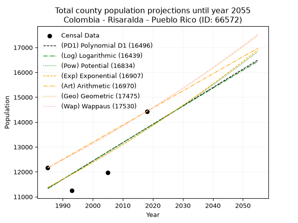
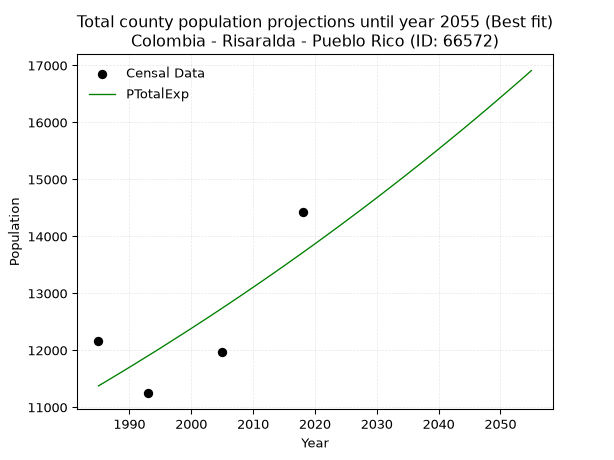
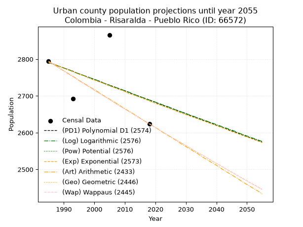
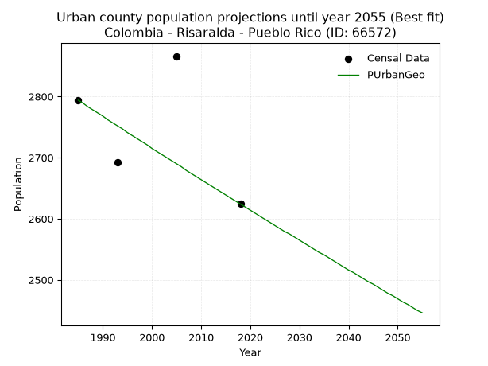
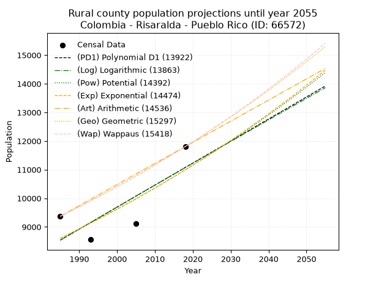
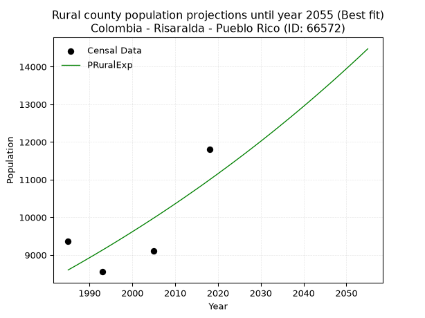

<div align="center">


</div>

# 📜 _“Population and Public Services Demand Projections (PPSD) until Year 2050 for Colombia - Risaralda - Pueblo Rico (ID: 66572)”_
Keywords: `population` `public-service` `projection` `lineal` `polynomial` `logarithmic` `potential` `exponential` `arithmetic` `geometric` `wappaus` `dane` `colombia` `south-america`

PPSD are analytical estimates used by governments and planners to anticipate future changes in population size, age distribution, and the resulting community needs for utilities, healthcare, education, and infrastructure as sizing future water treatment facilities, electrical grids, and road networks based on spatial growth.

<div align="center">

</img>

</div>


> **General running parameters**: • app_version: _v20260806_. • Python version: _3.14.7_. • Pandas version: _3.0.5_. • NumPy version: _2.5.1_. • Creates, save and include plots into reports (create_plot): _False_. • Projection until year: _2050_. • Process polynomial degree 2 and up: _False_. • Process Wappaus: _True_. • Process Wappaus: _True_. • Set negative values to zero: _True_. • Set infinite values to zero: _True_. • Drop dataset notes: _True_. 
<div align="center">

Maps & GIS Layers: [:earth_americas:Google](http://maps.google.com/maps?q=5.222042904,-76.0308012) [:earth_americas:OSM](https://www.openstreetmap.org/#map=18/5.222042904/-76.0308012&layers=P) [:earth_americas:Bing](https://www.bing.com/maps?cp=5.222042904~-76.0308012&lvl=18) [:earth_americas:Apple](https://maps.apple.com/frame?center=5.222042904%2C-76.0308012&span=0.003%2C0.006) [:earth_americas:GISMobile](https://github.com/rcfdtools/R.GISMobile/blob/main/file/gis/CountyLayer_CO/Readme.md)

</div>


<div align="center">

```geojson
{
  "type": "Feature",
  "geometry": {
    "type": "Point", 
    "coordinates": [-76.0308012, 5.222042904]
  }, 
  "properties": {
    "Name": "Colombia - Risaralda - Pueblo Rico (ID: 66572)"
  }
}
```

</div>


## 0. Census Data (4 records)

Census data are official statistics collected by a government about the people and housing in a country. They usually include counts of total population, age, sex, race, income, education, and jobs.

📅Global census file: [Population.xlsx](../data/Population.xlsx)

| Source   |   Year |   CountryID | CountryName   |   StateID | StateName   |   CountyID | CountyName   |   PTotal |   PUrban |   PRural |
|:---------|-------:|------------:|:--------------|----------:|:------------|-----------:|:-------------|---------:|---------:|---------:|
| DANE     |   1985 |          57 | Colombia      |        66 | Risaralda   |      66572 | Pueblo Rico  |    12163 |     2794 |     9369 |
| DANE     |   1993 |          57 | Colombia      |        66 | Risaralda   |      66572 | Pueblo Rico  |    11245 |     2692 |     8553 |
| DANE     |   2005 |          57 | Colombia      |        66 | Risaralda   |      66572 | Pueblo Rico  |    11975 |     2866 |     9109 |
| DANE     |   2018 |          57 | Colombia      |        66 | Risaralda   |      66572 | Pueblo Rico  |    14429 |     2624 |    11805 |

> 🔥Some records could had specific notes about the registered values or the corresponding urban or rural distribution.

📅[SUI-RUPS](https://www.datos.gov.co/Hacienda-y-Cr-dito-P-blico/Registro-nico-de-Prestadores-de-Servicios-P-blicos/4qkq-csdn/about_data) - Local public utility companies: [RUPS.csv](../data/RUPS.csv)

 | SERVICIO       | ESTADO    | NOMBRE                                                           | NIT         | DEPARTAMENTO_DOMICILIO   | MUNICIPIO_DOMICILIO   | DIRECCION                                                    |   TELEFONO | EMAIL                     | TIPO_PRESTADOR                            | CLASIFICACION                 |
|:---------------|:----------|:-----------------------------------------------------------------|:------------|:-------------------------|:----------------------|:-------------------------------------------------------------|-----------:|:--------------------------|:------------------------------------------|:------------------------------|
| ACUEDUCTO      | OPERATIVA | EMPRESA DE SERVICIOS PUBLICOS DE PUEBLO RICO RISARALDA E.S.P.    | 816007531-1 | RISARALDA                | PUEBLO RICO           | Cra 4 No 6-17 CAM PRINCIPAL                                  |    3663244 | carguesuipr@gmail.com     | EMPRESA INDUSTRIAL Y COMERCIAL DEL ESTADO | MENOR O IGUAL A 2500 USUARIOS |
| ALCANTARILLADO | OPERATIVA | EMPRESA DE SERVICIOS PUBLICOS DE PUEBLO RICO RISARALDA E.S.P.    | 816007531-1 | RISARALDA                | PUEBLO RICO           | Cra 4 No 6-17 CAM PRINCIPAL                                  |    3663244 | carguesuipr@gmail.com     | EMPRESA INDUSTRIAL Y COMERCIAL DEL ESTADO | MENOR O IGUAL A 2500 USUARIOS |
| ACUEDUCTO      | OPERATIVA | ASOCIACION ADMINISTRADORA DE SERVICIOS PUBLICOS DE SANTA CECILIA | 901399289-2 | RISARALDA                | PUEBLO RICO           | CORREGIMIENTO SANTA CECILIA PLAZA PRINCIPAL JUNTO A BOMBEROS |    3192774 | victorhh.1975@hotmail.com | ORGANIZACION AUTORIZADA                   | MENOR O IGUAL A 2500 USUARIOS |

## 1. Total

### 1.1. Coefficients and Parameters

* (PD1) Polynomial Deg 1: 73.84022480931205, -135245.90967482646 (lineal)
* (Log) Logarithmic: 147518.96388281096, -1108839.8266160325
* (Pow) Potential: 11.315623594073848, -33.26035364833873
* (Exp) Exponential: 0.005664211474618335, 0.14889887656623194
* (Art) Arithmetic: Year diff. 2018 - 1985 = 33, Population diff. 14429 - 12163 = 2266, Annual growth = 68.66666666666667
* (Geo) Geometric: Year diff. 2018 - 1985 = 33, Population diff. 14429 - 12163 = 2266, Annual growth % = 0.005190439466359997
* (Wap) Wappaus: i = 0.5164460489370236, Condition values only valid for < 200)

<sub>
Wappaus condition values: ['0.00', '0.52', '1.03', '1.55', '2.07', '2.58', '3.10', '3.62', '4.13', '4.65', '5.16', '5.68', '6.20', '6.71', '7.23', '7.75', '8.26', '8.78', '9.30', '9.81', '10.33', '10.85', '11.36', '11.88', '12.39', '12.91', '13.43', '13.94', '14.46', '14.98', '15.49', '16.01', '16.53', '17.04', '17.56', '18.08', '18.59', '19.11', '19.62', '20.14', '20.66', '21.17', '21.69', '22.21', '22.72', '23.24', '23.76', '24.27', '24.79', '25.31', '25.82', '26.34', '26.86', '27.37', '27.89', '28.40', '28.92', '29.44', '29.95', '30.47', '30.99', '31.50', '32.02', '32.54', '33.05', '33.57']
</sub>


### 1.2. Projected Dataset

|   Year |   CountyID |   PTotalPD1 |   PTotalLog |   PTotalPow |   PTotalExp |   PTotalArt |   PTotalGeo |   PTotalWap |
|-------:|-----------:|------------:|------------:|------------:|------------:|------------:|------------:|------------:|
|   1985 |      66572 |       11327 |       11327 |       11373 |       11373 |       12163 |       12163 |       12163 |
|   1986 |      66572 |       11401 |       11401 |       11438 |       11437 |       12232 |       12226 |       12226 |
|   1987 |      66572 |       11475 |       11475 |       11503 |       11502 |       12300 |       12290 |       12289 |
|   1988 |      66572 |       11548 |       11550 |       11569 |       11568 |       12369 |       12353 |       12353 |
|   1989 |      66572 |       11622 |       11624 |       11635 |       11633 |       12438 |       12417 |       12417 |
|   1990 |      66572 |       11696 |       11698 |       11701 |       11699 |       12506 |       12482 |       12481 |
|   1991 |      66572 |       11770 |       11772 |       11768 |       11766 |       12575 |       12547 |       12546 |
|   1992 |      66572 |       11844 |       11846 |       11835 |       11833 |       12644 |       12612 |       12611 |
|   1993 |      66572 |       11918 |       11920 |       11902 |       11900 |       12712 |       12677 |       12676 |
|   1994 |      66572 |       11991 |       11994 |       11970 |       11967 |       12781 |       12743 |       12742 |
|   1995 |      66572 |       12065 |       12068 |       12038 |       12035 |       12850 |       12809 |       12808 |
|   1996 |      66572 |       12139 |       12142 |       12107 |       12104 |       12918 |       12876 |       12874 |
|   1997 |      66572 |       12213 |       12216 |       12175 |       12173 |       12987 |       12943 |       12941 |
|   1998 |      66572 |       12287 |       12290 |       12245 |       12242 |       13056 |       13010 |       13008 |
|   1999 |      66572 |       12361 |       12364 |       12314 |       12311 |       13124 |       13077 |       13075 |
|   2000 |      66572 |       12435 |       12437 |       12384 |       12381 |       13193 |       13145 |       13143 |
|   2001 |      66572 |       12508 |       12511 |       12454 |       12452 |       13262 |       13213 |       13211 |
|   2002 |      66572 |       12582 |       12585 |       12525 |       12522 |       13330 |       13282 |       13280 |
|   2003 |      66572 |       12656 |       12659 |       12596 |       12593 |       13399 |       13351 |       13349 |
|   2004 |      66572 |       12730 |       12732 |       12667 |       12665 |       13468 |       13420 |       13418 |
|   2005 |      66572 |       12804 |       12806 |       12739 |       12737 |       13536 |       13490 |       13488 |
|   2006 |      66572 |       12878 |       12879 |       12811 |       12809 |       13605 |       13560 |       13558 |
|   2007 |      66572 |       12951 |       12953 |       12883 |       12882 |       13674 |       13630 |       13628 |
|   2008 |      66572 |       13025 |       13026 |       12956 |       12955 |       13742 |       13701 |       13699 |
|   2009 |      66572 |       13099 |       13100 |       13029 |       13029 |       13811 |       13772 |       13770 |
|   2010 |      66572 |       13173 |       13173 |       13103 |       13103 |       13880 |       13844 |       13842 |
|   2011 |      66572 |       13247 |       13247 |       13177 |       13177 |       13948 |       13915 |       13914 |
|   2012 |      66572 |       13321 |       13320 |       13251 |       13252 |       14017 |       13988 |       13986 |
|   2013 |      66572 |       13394 |       13393 |       13326 |       13327 |       14086 |       14060 |       14059 |
|   2014 |      66572 |       13468 |       13466 |       13401 |       13403 |       14154 |       14133 |       14132 |
|   2015 |      66572 |       13542 |       13540 |       13477 |       13479 |       14223 |       14207 |       14206 |
|   2016 |      66572 |       13616 |       13613 |       13552 |       13556 |       14292 |       14280 |       14280 |
|   2017 |      66572 |       13690 |       13686 |       13629 |       13633 |       14360 |       14354 |       14354 |
|   2018 |      66572 |       13764 |       13759 |       13705 |       13710 |       14429 |       14429 |       14429 |
|   2019 |      66572 |       13838 |       13832 |       13782 |       13788 |       14498 |       14504 |       14504 |
|   2020 |      66572 |       13911 |       13905 |       13860 |       13866 |       14566 |       14579 |       14580 |
|   2021 |      66572 |       13985 |       13978 |       13938 |       13945 |       14635 |       14655 |       14656 |
|   2022 |      66572 |       14059 |       14051 |       14016 |       14024 |       14704 |       14731 |       14733 |
|   2023 |      66572 |       14133 |       14124 |       14095 |       14104 |       14772 |       14807 |       14810 |
|   2024 |      66572 |       14207 |       14197 |       14174 |       14184 |       14841 |       14884 |       14887 |
|   2025 |      66572 |       14281 |       14270 |       14253 |       14265 |       14910 |       14961 |       14965 |
|   2026 |      66572 |       14354 |       14343 |       14333 |       14346 |       14978 |       15039 |       15043 |
|   2027 |      66572 |       14428 |       14416 |       14413 |       14427 |       15047 |       15117 |       15122 |
|   2028 |      66572 |       14502 |       14488 |       14494 |       14509 |       15116 |       15196 |       15201 |
|   2029 |      66572 |       14576 |       14561 |       14575 |       14592 |       15184 |       15275 |       15281 |
|   2030 |      66572 |       14650 |       14634 |       14656 |       14674 |       15253 |       15354 |       15361 |
|   2031 |      66572 |       14724 |       14706 |       14738 |       14758 |       15322 |       15434 |       15442 |
|   2032 |      66572 |       14797 |       14779 |       14821 |       14842 |       15390 |       15514 |       15523 |
|   2033 |      66572 |       14871 |       14852 |       14903 |       14926 |       15459 |       15594 |       15605 |
|   2034 |      66572 |       14945 |       14924 |       14987 |       15011 |       15528 |       15675 |       15687 |
|   2035 |      66572 |       15019 |       14997 |       15070 |       15096 |       15596 |       15756 |       15769 |
|   2036 |      66572 |       15093 |       15069 |       15154 |       15182 |       15665 |       15838 |       15852 |
|   2037 |      66572 |       15167 |       15142 |       15239 |       15268 |       15734 |       15920 |       15936 |
|   2038 |      66572 |       15240 |       15214 |       15323 |       15355 |       15802 |       16003 |       16020 |
|   2039 |      66572 |       15314 |       15286 |       15409 |       15442 |       15871 |       16086 |       16105 |
|   2040 |      66572 |       15388 |       15359 |       15494 |       15530 |       15940 |       16170 |       16190 |
|   2041 |      66572 |       15462 |       15431 |       15581 |       15618 |       16008 |       16254 |       16275 |
|   2042 |      66572 |       15536 |       15503 |       15667 |       15707 |       16077 |       16338 |       16361 |
|   2043 |      66572 |       15610 |       15575 |       15754 |       15796 |       16146 |       16423 |       16448 |
|   2044 |      66572 |       15684 |       15648 |       15842 |       15885 |       16214 |       16508 |       16535 |
|   2045 |      66572 |       15757 |       15720 |       15930 |       15976 |       16283 |       16594 |       16623 |
|   2046 |      66572 |       15831 |       15792 |       16018 |       16066 |       16352 |       16680 |       16711 |
|   2047 |      66572 |       15905 |       15864 |       16107 |       16158 |       16420 |       16766 |       16800 |
|   2048 |      66572 |       15979 |       15936 |       16196 |       16249 |       16489 |       16853 |       16889 |
|   2049 |      66572 |       16053 |       16008 |       16286 |       16342 |       16558 |       16941 |       16979 |
|   2050 |      66572 |       16127 |       16080 |       16376 |       16435 |       16626 |       17029 |       17070 |
<div align="center">

</img>

</div>


### 1.3. Best fit with absolute and relative error (%)

Relative error puts that difference into context by dividing the absolute error by the true value, creating a unitless ratio or percentage that shows the scale of the mistake.

Absolute and relative error

|   Year | Source   |   CountryID | CountryName   |   StateID | StateName   |   CountyID_x | CountyName   |   PTotal |   PUrban |   PRural |   CountyID_y |   PTotalPD1 |   PTotalLog |   PTotalPow |   PTotalExp |   PTotalArt |   PTotalGeo |   PTotalWap |   PTotalPD1AbsError |   PTotalLogAbsError |   PTotalPowAbsError |   PTotalExpAbsError |   PTotalArtAbsError |   PTotalGeoAbsError |   PTotalWapAbsError |   PTotalPD1RelError |   PTotalLogRelError |   PTotalPowRelError |   PTotalExpRelError |   PTotalArtRelError |   PTotalGeoRelError |   PTotalWapRelError |
|-------:|:---------|------------:|:--------------|----------:|:------------|-------------:|:-------------|---------:|---------:|---------:|-------------:|------------:|------------:|------------:|------------:|------------:|------------:|------------:|--------------------:|--------------------:|--------------------:|--------------------:|--------------------:|--------------------:|--------------------:|--------------------:|--------------------:|--------------------:|--------------------:|--------------------:|--------------------:|--------------------:|
|   1985 | DANE     |          57 | Colombia      |        66 | Risaralda   |        66572 | Pueblo Rico  |    12163 |     2794 |     9369 |        66572 |       11327 |       11327 |       11373 |       11373 |       12163 |       12163 |       12163 |                 836 |                 836 |                 790 |                 790 |                   0 |                   0 |                   0 |             6.8733  |             6.8733  |             6.49511 |             6.49511 |              0      |              0      |              0      |
|   1993 | DANE     |          57 | Colombia      |        66 | Risaralda   |        66572 | Pueblo Rico  |    11245 |     2692 |     8553 |        66572 |       11918 |       11920 |       11902 |       11900 |       12712 |       12677 |       12676 |                 673 |                 675 |                 657 |                 655 |                1467 |                1432 |                1431 |             5.98488 |             6.00267 |             5.8426  |             5.82481 |             13.0458 |             12.7345 |             12.7257 |
|   2005 | DANE     |          57 | Colombia      |        66 | Risaralda   |        66572 | Pueblo Rico  |    11975 |     2866 |     9109 |        66572 |       12804 |       12806 |       12739 |       12737 |       13536 |       13490 |       13488 |                 829 |                 831 |                 764 |                 762 |                1561 |                1515 |                1513 |             6.92276 |             6.93946 |             6.37996 |             6.36326 |             13.0355 |             12.6514 |             12.6347 |
|   2018 | DANE     |          57 | Colombia      |        66 | Risaralda   |        66572 | Pueblo Rico  |    14429 |     2624 |    11805 |        66572 |       13764 |       13759 |       13705 |       13710 |       14429 |       14429 |       14429 |                 665 |                 670 |                 724 |                 719 |                   0 |                   0 |                   0 |             4.60877 |             4.64343 |             5.01767 |             4.98302 |              0      |              0      |              0      |

Relative error mean

| Method    |   RelError | Best   |
|:----------|-----------:|:-------|
| PTotalPD1 |    6.09743 |        |
| PTotalLog |    6.11471 |        |
| PTotalPow |    5.93383 |        |
| PTotalExp |    5.91655 | True   |
| PTotalArt |    6.52032 |        |
| PTotalGeo |    6.34648 |        |
| PTotalWap |    6.34008 |        |

💙Best method: _**PTotalExp**_
<div align="center">

</img>

</div>


### 1.4. Fresh water supply demand in liters per capita per day (lpcd)

The fresh water supply demand typically ranges from 100 to 300 liters per capita per day (lpcd) for standard domestic and municipal planning, though absolute survival minimums set by the World Health Organization are as low as 7.5 to 20 liters per day, and total consumption in high-income nations can exceed 400 liters.

> `CZ`: Level in meters above the sea level (masl)<br> `WS`: Fresh water supply demand in liters per capita per day (lpcd or l/h/d)<br> `WSAll`: Zonal fresh water supply demand in liters per second (l/s)<br> `A`: Zonal area in square meters<br> `DP`: Population density (people/hectare or p/ha)

Reference values (RAS Colombia)

|    CZ |   WS |
|------:|-----:|
|  1000 |  120 |
|  2000 |  130 |
| 99999 |  140 |

County shapefile geometry properties and water supply values

|   CountyID |      ATotal |   CZTotal |   WSTotal |
|-----------:|------------:|----------:|----------:|
|      66572 | 6.13804e+08 |   1462.33 |       130 |

Projected values for best method: PTotalExp

|   CountyID |   Year |   PTotalExp |   DPTotal |   WSTotal |   WSTotalAll |
|-----------:|-------:|------------:|----------:|----------:|-------------:|
|      66572 |   1985 |       11373 |      0.19 |       130 |      17.1122 |
|      66572 |   1986 |       11437 |      0.19 |       130 |      17.2084 |
|      66572 |   1987 |       11502 |      0.19 |       130 |      17.3062 |
|      66572 |   1988 |       11568 |      0.19 |       130 |      17.4056 |
|      66572 |   1989 |       11633 |      0.19 |       130 |      17.5034 |
|      66572 |   1990 |       11699 |      0.19 |       130 |      17.6027 |
|      66572 |   1991 |       11766 |      0.19 |       130 |      17.7035 |
|      66572 |   1992 |       11833 |      0.19 |       130 |      17.8043 |
|      66572 |   1993 |       11900 |      0.19 |       130 |      17.9051 |
|      66572 |   1994 |       11967 |      0.19 |       130 |      18.0059 |
|      66572 |   1995 |       12035 |      0.2  |       130 |      18.1082 |
|      66572 |   1996 |       12104 |      0.2  |       130 |      18.212  |
|      66572 |   1997 |       12173 |      0.2  |       130 |      18.3159 |
|      66572 |   1998 |       12242 |      0.2  |       130 |      18.4197 |
|      66572 |   1999 |       12311 |      0.2  |       130 |      18.5235 |
|      66572 |   2000 |       12381 |      0.2  |       130 |      18.6288 |
|      66572 |   2001 |       12452 |      0.2  |       130 |      18.7356 |
|      66572 |   2002 |       12522 |      0.2  |       130 |      18.841  |
|      66572 |   2003 |       12593 |      0.21 |       130 |      18.9478 |
|      66572 |   2004 |       12665 |      0.21 |       130 |      19.0561 |
|      66572 |   2005 |       12737 |      0.21 |       130 |      19.1645 |
|      66572 |   2006 |       12809 |      0.21 |       130 |      19.2728 |
|      66572 |   2007 |       12882 |      0.21 |       130 |      19.3826 |
|      66572 |   2008 |       12955 |      0.21 |       130 |      19.4925 |
|      66572 |   2009 |       13029 |      0.21 |       130 |      19.6038 |
|      66572 |   2010 |       13103 |      0.21 |       130 |      19.7152 |
|      66572 |   2011 |       13177 |      0.21 |       130 |      19.8265 |
|      66572 |   2012 |       13252 |      0.22 |       130 |      19.9394 |
|      66572 |   2013 |       13327 |      0.22 |       130 |      20.0522 |
|      66572 |   2014 |       13403 |      0.22 |       130 |      20.1666 |
|      66572 |   2015 |       13479 |      0.22 |       130 |      20.2809 |
|      66572 |   2016 |       13556 |      0.22 |       130 |      20.3968 |
|      66572 |   2017 |       13633 |      0.22 |       130 |      20.5126 |
|      66572 |   2018 |       13710 |      0.22 |       130 |      20.6285 |
|      66572 |   2019 |       13788 |      0.22 |       130 |      20.7458 |
|      66572 |   2020 |       13866 |      0.23 |       130 |      20.8632 |
|      66572 |   2021 |       13945 |      0.23 |       130 |      20.9821 |
|      66572 |   2022 |       14024 |      0.23 |       130 |      21.1009 |
|      66572 |   2023 |       14104 |      0.23 |       130 |      21.2213 |
|      66572 |   2024 |       14184 |      0.23 |       130 |      21.3417 |
|      66572 |   2025 |       14265 |      0.23 |       130 |      21.4635 |
|      66572 |   2026 |       14346 |      0.23 |       130 |      21.5854 |
|      66572 |   2027 |       14427 |      0.24 |       130 |      21.7073 |
|      66572 |   2028 |       14509 |      0.24 |       130 |      21.8307 |
|      66572 |   2029 |       14592 |      0.24 |       130 |      21.9556 |
|      66572 |   2030 |       14674 |      0.24 |       130 |      22.0789 |
|      66572 |   2031 |       14758 |      0.24 |       130 |      22.2053 |
|      66572 |   2032 |       14842 |      0.24 |       130 |      22.3317 |
|      66572 |   2033 |       14926 |      0.24 |       130 |      22.4581 |
|      66572 |   2034 |       15011 |      0.24 |       130 |      22.586  |
|      66572 |   2035 |       15096 |      0.25 |       130 |      22.7139 |
|      66572 |   2036 |       15182 |      0.25 |       130 |      22.8433 |
|      66572 |   2037 |       15268 |      0.25 |       130 |      22.9727 |
|      66572 |   2038 |       15355 |      0.25 |       130 |      23.1036 |
|      66572 |   2039 |       15442 |      0.25 |       130 |      23.2345 |
|      66572 |   2040 |       15530 |      0.25 |       130 |      23.3669 |
|      66572 |   2041 |       15618 |      0.25 |       130 |      23.4993 |
|      66572 |   2042 |       15707 |      0.26 |       130 |      23.6332 |
|      66572 |   2043 |       15796 |      0.26 |       130 |      23.7671 |
|      66572 |   2044 |       15885 |      0.26 |       130 |      23.901  |
|      66572 |   2045 |       15976 |      0.26 |       130 |      24.038  |
|      66572 |   2046 |       16066 |      0.26 |       130 |      24.1734 |
|      66572 |   2047 |       16158 |      0.26 |       130 |      24.3118 |
|      66572 |   2048 |       16249 |      0.26 |       130 |      24.4487 |
|      66572 |   2049 |       16342 |      0.27 |       130 |      24.5887 |
|      66572 |   2050 |       16435 |      0.27 |       130 |      24.7286 |

## 2. Urban

### 2.1. Coefficients and Parameters

* (PD1) Polynomial Deg 1: -3.108791649939627, 8962.360497791738 (lineal)
* (Log) Logarithmic: -6206.105622938357, 49916.658572563734
* (Pow) Potential: -2.3203016869644237, 11.097627202293303
* (Exp) Exponential: -0.0011622070441944098, 28037.660054763255
* (Art) Arithmetic: Year diff. 2018 - 1985 = 33, Population diff. 2624 - 2794 = -170, Annual growth = -5.151515151515151
* (Geo) Geometric: Year diff. 2018 - 1985 = 33, Population diff. 2624 - 2794 = -170, Annual growth % = -0.0019004460960450054
* (Wap) Wappaus: i = -0.19016298086065528, Condition values only valid for < 200)

<sub>
Wappaus condition values: ['-0.00', '-0.19', '-0.38', '-0.57', '-0.76', '-0.95', '-1.14', '-1.33', '-1.52', '-1.71', '-1.90', '-2.09', '-2.28', '-2.47', '-2.66', '-2.85', '-3.04', '-3.23', '-3.42', '-3.61', '-3.80', '-3.99', '-4.18', '-4.37', '-4.56', '-4.75', '-4.94', '-5.13', '-5.32', '-5.51', '-5.70', '-5.90', '-6.09', '-6.28', '-6.47', '-6.66', '-6.85', '-7.04', '-7.23', '-7.42', '-7.61', '-7.80', '-7.99', '-8.18', '-8.37', '-8.56', '-8.75', '-8.94', '-9.13', '-9.32', '-9.51', '-9.70', '-9.89', '-10.08', '-10.27', '-10.46', '-10.65', '-10.84', '-11.03', '-11.22', '-11.41', '-11.60', '-11.79', '-11.98', '-12.17', '-12.36']
</sub>


### 2.2. Projected Dataset

|   Year |   CountyID |   PUrbanPD1 |   PUrbanLog |   PUrbanPow |   PUrbanExp |   PUrbanArt |   PUrbanGeo |   PUrbanWap |
|-------:|-----------:|------------:|------------:|------------:|------------:|------------:|------------:|------------:|
|   1985 |      66572 |        2791 |        2791 |        2791 |        2791 |        2794 |        2794 |        2794 |
|   1986 |      66572 |        2788 |        2788 |        2788 |        2788 |        2789 |        2789 |        2789 |
|   1987 |      66572 |        2785 |        2785 |        2785 |        2785 |        2784 |        2783 |        2783 |
|   1988 |      66572 |        2782 |        2782 |        2782 |        2782 |        2779 |        2778 |        2778 |
|   1989 |      66572 |        2779 |        2779 |        2778 |        2779 |        2773 |        2773 |        2773 |
|   1990 |      66572 |        2776 |        2776 |        2775 |        2775 |        2768 |        2768 |        2768 |
|   1991 |      66572 |        2773 |        2773 |        2772 |        2772 |        2763 |        2762 |        2762 |
|   1992 |      66572 |        2770 |        2770 |        2769 |        2769 |        2758 |        2757 |        2757 |
|   1993 |      66572 |        2767 |        2766 |        2766 |        2766 |        2753 |        2752 |        2752 |
|   1994 |      66572 |        2763 |        2763 |        2762 |        2762 |        2748 |        2747 |        2747 |
|   1995 |      66572 |        2760 |        2760 |        2759 |        2759 |        2742 |        2741 |        2741 |
|   1996 |      66572 |        2757 |        2757 |        2756 |        2756 |        2737 |        2736 |        2736 |
|   1997 |      66572 |        2754 |        2754 |        2753 |        2753 |        2732 |        2731 |        2731 |
|   1998 |      66572 |        2751 |        2751 |        2749 |        2750 |        2727 |        2726 |        2726 |
|   1999 |      66572 |        2748 |        2748 |        2746 |        2746 |        2722 |        2721 |        2721 |
|   2000 |      66572 |        2745 |        2745 |        2743 |        2743 |        2717 |        2715 |        2715 |
|   2001 |      66572 |        2742 |        2742 |        2740 |        2740 |        2712 |        2710 |        2710 |
|   2002 |      66572 |        2739 |        2738 |        2737 |        2737 |        2706 |        2705 |        2705 |
|   2003 |      66572 |        2735 |        2735 |        2734 |        2734 |        2701 |        2700 |        2700 |
|   2004 |      66572 |        2732 |        2732 |        2730 |        2731 |        2696 |        2695 |        2695 |
|   2005 |      66572 |        2729 |        2729 |        2727 |        2727 |        2691 |        2690 |        2690 |
|   2006 |      66572 |        2726 |        2726 |        2724 |        2724 |        2686 |        2685 |        2685 |
|   2007 |      66572 |        2723 |        2723 |        2721 |        2721 |        2681 |        2679 |        2680 |
|   2008 |      66572 |        2720 |        2720 |        2718 |        2718 |        2676 |        2674 |        2674 |
|   2009 |      66572 |        2717 |        2717 |        2715 |        2715 |        2670 |        2669 |        2669 |
|   2010 |      66572 |        2714 |        2714 |        2712 |        2712 |        2665 |        2664 |        2664 |
|   2011 |      66572 |        2711 |        2711 |        2708 |        2708 |        2660 |        2659 |        2659 |
|   2012 |      66572 |        2707 |        2708 |        2705 |        2705 |        2655 |        2654 |        2654 |
|   2013 |      66572 |        2704 |        2704 |        2702 |        2702 |        2650 |        2649 |        2649 |
|   2014 |      66572 |        2701 |        2701 |        2699 |        2699 |        2645 |        2644 |        2644 |
|   2015 |      66572 |        2698 |        2698 |        2696 |        2696 |        2639 |        2639 |        2639 |
|   2016 |      66572 |        2695 |        2695 |        2693 |        2693 |        2634 |        2634 |        2634 |
|   2017 |      66572 |        2692 |        2692 |        2690 |        2690 |        2629 |        2629 |        2629 |
|   2018 |      66572 |        2689 |        2689 |        2687 |        2686 |        2624 |        2624 |        2624 |
|   2019 |      66572 |        2686 |        2686 |        2684 |        2683 |        2619 |        2619 |        2619 |
|   2020 |      66572 |        2683 |        2683 |        2680 |        2680 |        2614 |        2614 |        2614 |
|   2021 |      66572 |        2679 |        2680 |        2677 |        2677 |        2609 |        2609 |        2609 |
|   2022 |      66572 |        2676 |        2677 |        2674 |        2674 |        2603 |        2604 |        2604 |
|   2023 |      66572 |        2673 |        2674 |        2671 |        2671 |        2598 |        2599 |        2599 |
|   2024 |      66572 |        2670 |        2671 |        2668 |        2668 |        2593 |        2594 |        2594 |
|   2025 |      66572 |        2667 |        2668 |        2665 |        2665 |        2588 |        2589 |        2589 |
|   2026 |      66572 |        2664 |        2664 |        2662 |        2662 |        2583 |        2584 |        2584 |
|   2027 |      66572 |        2661 |        2661 |        2659 |        2658 |        2578 |        2579 |        2579 |
|   2028 |      66572 |        2658 |        2658 |        2656 |        2655 |        2572 |        2575 |        2575 |
|   2029 |      66572 |        2655 |        2655 |        2653 |        2652 |        2567 |        2570 |        2570 |
|   2030 |      66572 |        2652 |        2652 |        2650 |        2649 |        2562 |        2565 |        2565 |
|   2031 |      66572 |        2648 |        2649 |        2647 |        2646 |        2557 |        2560 |        2560 |
|   2032 |      66572 |        2645 |        2646 |        2644 |        2643 |        2552 |        2555 |        2555 |
|   2033 |      66572 |        2642 |        2643 |        2641 |        2640 |        2547 |        2550 |        2550 |
|   2034 |      66572 |        2639 |        2640 |        2638 |        2637 |        2542 |        2545 |        2545 |
|   2035 |      66572 |        2636 |        2637 |        2635 |        2634 |        2536 |        2541 |        2540 |
|   2036 |      66572 |        2633 |        2634 |        2632 |        2631 |        2531 |        2536 |        2536 |
|   2037 |      66572 |        2630 |        2631 |        2629 |        2628 |        2526 |        2531 |        2531 |
|   2038 |      66572 |        2627 |        2628 |        2626 |        2625 |        2521 |        2526 |        2526 |
|   2039 |      66572 |        2624 |        2625 |        2623 |        2622 |        2516 |        2521 |        2521 |
|   2040 |      66572 |        2620 |        2622 |        2620 |        2619 |        2511 |        2516 |        2516 |
|   2041 |      66572 |        2617 |        2619 |        2617 |        2616 |        2506 |        2512 |        2512 |
|   2042 |      66572 |        2614 |        2616 |        2614 |        2613 |        2500 |        2507 |        2507 |
|   2043 |      66572 |        2611 |        2613 |        2611 |        2610 |        2495 |        2502 |        2502 |
|   2044 |      66572 |        2608 |        2610 |        2608 |        2606 |        2490 |        2497 |        2497 |
|   2045 |      66572 |        2605 |        2607 |        2605 |        2603 |        2485 |        2493 |        2492 |
|   2046 |      66572 |        2602 |        2604 |        2602 |        2600 |        2480 |        2488 |        2488 |
|   2047 |      66572 |        2599 |        2600 |        2599 |        2597 |        2475 |        2483 |        2483 |
|   2048 |      66572 |        2596 |        2597 |        2596 |        2594 |        2469 |        2478 |        2478 |
|   2049 |      66572 |        2592 |        2594 |        2593 |        2591 |        2464 |        2474 |        2473 |
|   2050 |      66572 |        2589 |        2591 |        2590 |        2588 |        2459 |        2469 |        2469 |
<div align="center">

</img>

</div>


### 2.3. Best fit with absolute and relative error (%)

Relative error puts that difference into context by dividing the absolute error by the true value, creating a unitless ratio or percentage that shows the scale of the mistake.

Absolute and relative error

|   Year | Source   |   CountryID | CountryName   |   StateID | StateName   |   CountyID_x | CountyName   |   PTotal |   PUrban |   PRural |   CountyID_y |   PUrbanPD1 |   PUrbanLog |   PUrbanPow |   PUrbanExp |   PUrbanArt |   PUrbanGeo |   PUrbanWap |   PUrbanPD1AbsError |   PUrbanLogAbsError |   PUrbanPowAbsError |   PUrbanExpAbsError |   PUrbanArtAbsError |   PUrbanGeoAbsError |   PUrbanWapAbsError |   PUrbanPD1RelError |   PUrbanLogRelError |   PUrbanPowRelError |   PUrbanExpRelError |   PUrbanArtRelError |   PUrbanGeoRelError |   PUrbanWapRelError |
|-------:|:---------|------------:|:--------------|----------:|:------------|-------------:|:-------------|---------:|---------:|---------:|-------------:|------------:|------------:|------------:|------------:|------------:|------------:|------------:|--------------------:|--------------------:|--------------------:|--------------------:|--------------------:|--------------------:|--------------------:|--------------------:|--------------------:|--------------------:|--------------------:|--------------------:|--------------------:|--------------------:|
|   1985 | DANE     |          57 | Colombia      |        66 | Risaralda   |        66572 | Pueblo Rico  |    12163 |     2794 |     9369 |        66572 |        2791 |        2791 |        2791 |        2791 |        2794 |        2794 |        2794 |                   3 |                   3 |                   3 |                   3 |                   0 |                   0 |                   0 |            0.107373 |            0.107373 |            0.107373 |            0.107373 |             0       |             0       |             0       |
|   1993 | DANE     |          57 | Colombia      |        66 | Risaralda   |        66572 | Pueblo Rico  |    11245 |     2692 |     8553 |        66572 |        2767 |        2766 |        2766 |        2766 |        2753 |        2752 |        2752 |                  75 |                  74 |                  74 |                  74 |                  61 |                  60 |                  60 |            2.78603  |            2.74889  |            2.74889  |            2.74889  |             2.26597 |             2.22883 |             2.22883 |
|   2005 | DANE     |          57 | Colombia      |        66 | Risaralda   |        66572 | Pueblo Rico  |    11975 |     2866 |     9109 |        66572 |        2729 |        2729 |        2727 |        2727 |        2691 |        2690 |        2690 |                 137 |                 137 |                 139 |                 139 |                 175 |                 176 |                 176 |            4.78018  |            4.78018  |            4.84997  |            4.84997  |             6.10607 |             6.14096 |             6.14096 |
|   2018 | DANE     |          57 | Colombia      |        66 | Risaralda   |        66572 | Pueblo Rico  |    14429 |     2624 |    11805 |        66572 |        2689 |        2689 |        2687 |        2686 |        2624 |        2624 |        2624 |                  65 |                  65 |                  63 |                  62 |                   0 |                   0 |                   0 |            2.47713  |            2.47713  |            2.40091  |            2.3628   |             0       |             0       |             0       |

Relative error mean

| Method    |   RelError | Best   |
|:----------|-----------:|:-------|
| PUrbanPD1 |    2.53768 |        |
| PUrbanLog |    2.52839 |        |
| PUrbanPow |    2.52678 |        |
| PUrbanExp |    2.51726 |        |
| PUrbanArt |    2.09301 |        |
| PUrbanGeo |    2.09245 | True   |
| PUrbanWap |    2.09245 | True   |

💙Best method: _**PUrbanGeo**_
<div align="center">

</img>

</div>


### 2.4. Fresh water supply demand in liters per capita per day (lpcd)

The fresh water supply demand typically ranges from 100 to 300 liters per capita per day (lpcd) for standard domestic and municipal planning, though absolute survival minimums set by the World Health Organization are as low as 7.5 to 20 liters per day, and total consumption in high-income nations can exceed 400 liters.

> `CZ`: Level in meters above the sea level (masl)<br> `WS`: Fresh water supply demand in liters per capita per day (lpcd or l/h/d)<br> `WSAll`: Zonal fresh water supply demand in liters per second (l/s)<br> `A`: Zonal area in square meters<br> `DP`: Population density (people/hectare or p/ha)

Reference values (RAS Colombia)

|    CZ |   WS |
|------:|-----:|
|  1000 |  120 |
|  2000 |  130 |
| 99999 |  140 |

County shapefile geometry properties and water supply values

|   CountyID |   AUrban |   CZUrban |   WSUrban |
|-----------:|---------:|----------:|----------:|
|      66572 |   473865 |   1551.89 |       130 |

Projected values for best method: PUrbanGeo

|   CountyID |   Year |   PUrbanGeo |   DPUrban |   WSUrban |   WSUrbanAll |
|-----------:|-------:|------------:|----------:|----------:|-------------:|
|      66572 |   1985 |        2794 |     58.96 |       130 |      4.20394 |
|      66572 |   1986 |        2789 |     58.86 |       130 |      4.19641 |
|      66572 |   1987 |        2783 |     58.73 |       130 |      4.18738 |
|      66572 |   1988 |        2778 |     58.62 |       130 |      4.17986 |
|      66572 |   1989 |        2773 |     58.52 |       130 |      4.17234 |
|      66572 |   1990 |        2768 |     58.41 |       130 |      4.16481 |
|      66572 |   1991 |        2762 |     58.29 |       130 |      4.15579 |
|      66572 |   1992 |        2757 |     58.18 |       130 |      4.14826 |
|      66572 |   1993 |        2752 |     58.08 |       130 |      4.14074 |
|      66572 |   1994 |        2747 |     57.97 |       130 |      4.13322 |
|      66572 |   1995 |        2741 |     57.84 |       130 |      4.12419 |
|      66572 |   1996 |        2736 |     57.74 |       130 |      4.11667 |
|      66572 |   1997 |        2731 |     57.63 |       130 |      4.10914 |
|      66572 |   1998 |        2726 |     57.53 |       130 |      4.10162 |
|      66572 |   1999 |        2721 |     57.42 |       130 |      4.0941  |
|      66572 |   2000 |        2715 |     57.29 |       130 |      4.08507 |
|      66572 |   2001 |        2710 |     57.19 |       130 |      4.07755 |
|      66572 |   2002 |        2705 |     57.08 |       130 |      4.07002 |
|      66572 |   2003 |        2700 |     56.98 |       130 |      4.0625  |
|      66572 |   2004 |        2695 |     56.87 |       130 |      4.05498 |
|      66572 |   2005 |        2690 |     56.77 |       130 |      4.04745 |
|      66572 |   2006 |        2685 |     56.66 |       130 |      4.03993 |
|      66572 |   2007 |        2679 |     56.54 |       130 |      4.0309  |
|      66572 |   2008 |        2674 |     56.43 |       130 |      4.02338 |
|      66572 |   2009 |        2669 |     56.32 |       130 |      4.01586 |
|      66572 |   2010 |        2664 |     56.22 |       130 |      4.00833 |
|      66572 |   2011 |        2659 |     56.11 |       130 |      4.00081 |
|      66572 |   2012 |        2654 |     56.01 |       130 |      3.99329 |
|      66572 |   2013 |        2649 |     55.9  |       130 |      3.98576 |
|      66572 |   2014 |        2644 |     55.8  |       130 |      3.97824 |
|      66572 |   2015 |        2639 |     55.69 |       130 |      3.97072 |
|      66572 |   2016 |        2634 |     55.59 |       130 |      3.96319 |
|      66572 |   2017 |        2629 |     55.48 |       130 |      3.95567 |
|      66572 |   2018 |        2624 |     55.37 |       130 |      3.94815 |
|      66572 |   2019 |        2619 |     55.27 |       130 |      3.94062 |
|      66572 |   2020 |        2614 |     55.16 |       130 |      3.9331  |
|      66572 |   2021 |        2609 |     55.06 |       130 |      3.92558 |
|      66572 |   2022 |        2604 |     54.95 |       130 |      3.91806 |
|      66572 |   2023 |        2599 |     54.85 |       130 |      3.91053 |
|      66572 |   2024 |        2594 |     54.74 |       130 |      3.90301 |
|      66572 |   2025 |        2589 |     54.64 |       130 |      3.89549 |
|      66572 |   2026 |        2584 |     54.53 |       130 |      3.88796 |
|      66572 |   2027 |        2579 |     54.42 |       130 |      3.88044 |
|      66572 |   2028 |        2575 |     54.34 |       130 |      3.87442 |
|      66572 |   2029 |        2570 |     54.23 |       130 |      3.8669  |
|      66572 |   2030 |        2565 |     54.13 |       130 |      3.85938 |
|      66572 |   2031 |        2560 |     54.02 |       130 |      3.85185 |
|      66572 |   2032 |        2555 |     53.92 |       130 |      3.84433 |
|      66572 |   2033 |        2550 |     53.81 |       130 |      3.83681 |
|      66572 |   2034 |        2545 |     53.71 |       130 |      3.82928 |
|      66572 |   2035 |        2541 |     53.62 |       130 |      3.82326 |
|      66572 |   2036 |        2536 |     53.52 |       130 |      3.81574 |
|      66572 |   2037 |        2531 |     53.41 |       130 |      3.80822 |
|      66572 |   2038 |        2526 |     53.31 |       130 |      3.80069 |
|      66572 |   2039 |        2521 |     53.2  |       130 |      3.79317 |
|      66572 |   2040 |        2516 |     53.1  |       130 |      3.78565 |
|      66572 |   2041 |        2512 |     53.01 |       130 |      3.77963 |
|      66572 |   2042 |        2507 |     52.91 |       130 |      3.77211 |
|      66572 |   2043 |        2502 |     52.8  |       130 |      3.76458 |
|      66572 |   2044 |        2497 |     52.69 |       130 |      3.75706 |
|      66572 |   2045 |        2493 |     52.61 |       130 |      3.75104 |
|      66572 |   2046 |        2488 |     52.5  |       130 |      3.74352 |
|      66572 |   2047 |        2483 |     52.4  |       130 |      3.736   |
|      66572 |   2048 |        2478 |     52.29 |       130 |      3.72847 |
|      66572 |   2049 |        2474 |     52.21 |       130 |      3.72245 |
|      66572 |   2050 |        2469 |     52.1  |       130 |      3.71493 |

## 3. Rural

### 3.1. Coefficients and Parameters

* (PD1) Polynomial Deg 1: 76.94901645925158, -144208.27017261798 (lineal)
* (Log) Logarithmic: 153725.06950574924, -1158756.4851885953
* (Pow) Potential: 14.849743945562167, -45.03629382565311
* (Exp) Exponential: 0.007433629724278825, 0.003359396500655089
* (Art) Arithmetic: Year diff. 2018 - 1985 = 33, Population diff. 11805 - 9369 = 2436, Annual growth = 73.81818181818181
* (Geo) Geometric: Year diff. 2018 - 1985 = 33, Population diff. 11805 - 9369 = 2436, Annual growth % = 0.007028121638665175
* (Wap) Wappaus: i = 0.6972530633624427, Condition values only valid for < 200)

<sub>
Wappaus condition values: ['0.00', '0.70', '1.39', '2.09', '2.79', '3.49', '4.18', '4.88', '5.58', '6.28', '6.97', '7.67', '8.37', '9.06', '9.76', '10.46', '11.16', '11.85', '12.55', '13.25', '13.95', '14.64', '15.34', '16.04', '16.73', '17.43', '18.13', '18.83', '19.52', '20.22', '20.92', '21.61', '22.31', '23.01', '23.71', '24.40', '25.10', '25.80', '26.50', '27.19', '27.89', '28.59', '29.28', '29.98', '30.68', '31.38', '32.07', '32.77', '33.47', '34.17', '34.86', '35.56', '36.26', '36.95', '37.65', '38.35', '39.05', '39.74', '40.44', '41.14', '41.84', '42.53', '43.23', '43.93', '44.62', '45.32']
</sub>


### 3.2. Projected Dataset

|   Year |   CountyID |   PRuralPD1 |   PRuralLog |   PRuralPow |   PRuralExp |   PRuralArt |   PRuralGeo |   PRuralWap |
|-------:|-----------:|------------:|------------:|------------:|------------:|------------:|------------:|------------:|
|   1985 |      66572 |        8536 |        8535 |        8602 |        8602 |        9369 |        9369 |        9369 |
|   1986 |      66572 |        8612 |        8613 |        8667 |        8666 |        9443 |        9435 |        9435 |
|   1987 |      66572 |        8689 |        8690 |        8732 |        8731 |        9517 |        9501 |        9501 |
|   1988 |      66572 |        8766 |        8768 |        8797 |        8796 |        9590 |        9568 |        9567 |
|   1989 |      66572 |        8843 |        8845 |        8863 |        8862 |        9664 |        9635 |        9634 |
|   1990 |      66572 |        8920 |        8922 |        8930 |        8928 |        9738 |        9703 |        9701 |
|   1991 |      66572 |        8997 |        8999 |        8996 |        8994 |        9812 |        9771 |        9769 |
|   1992 |      66572 |        9074 |        9077 |        9064 |        9062 |        9886 |        9840 |        9838 |
|   1993 |      66572 |        9151 |        9154 |        9132 |        9129 |        9960 |        9909 |        9907 |
|   1994 |      66572 |        9228 |        9231 |        9200 |        9197 |       10033 |        9979 |        9976 |
|   1995 |      66572 |        9305 |        9308 |        9269 |        9266 |       10107 |       10049 |       10046 |
|   1996 |      66572 |        9382 |        9385 |        9338 |        9335 |       10181 |       10119 |       10116 |
|   1997 |      66572 |        9459 |        9462 |        9408 |        9405 |       10255 |       10190 |       10187 |
|   1998 |      66572 |        9536 |        9539 |        9478 |        9475 |       10329 |       10262 |       10259 |
|   1999 |      66572 |        9613 |        9616 |        9548 |        9546 |       10402 |       10334 |       10330 |
|   2000 |      66572 |        9690 |        9693 |        9620 |        9617 |       10476 |       10407 |       10403 |
|   2001 |      66572 |        9767 |        9770 |        9691 |        9689 |       10550 |       10480 |       10476 |
|   2002 |      66572 |        9844 |        9846 |        9763 |        9761 |       10624 |       10554 |       10549 |
|   2003 |      66572 |        9921 |        9923 |        9836 |        9834 |       10698 |       10628 |       10624 |
|   2004 |      66572 |        9998 |       10000 |        9909 |        9907 |       10772 |       10702 |       10698 |
|   2005 |      66572 |       10075 |       10077 |        9983 |        9981 |       10845 |       10778 |       10773 |
|   2006 |      66572 |       10151 |       10153 |       10057 |       10055 |       10919 |       10853 |       10849 |
|   2007 |      66572 |       10228 |       10230 |       10132 |       10130 |       10993 |       10930 |       10926 |
|   2008 |      66572 |       10305 |       10306 |       10207 |       10206 |       11067 |       11007 |       11002 |
|   2009 |      66572 |       10382 |       10383 |       10283 |       10282 |       11141 |       11084 |       11080 |
|   2010 |      66572 |       10459 |       10459 |       10359 |       10359 |       11214 |       11162 |       11158 |
|   2011 |      66572 |       10536 |       10536 |       10436 |       10436 |       11288 |       11240 |       11237 |
|   2012 |      66572 |       10613 |       10612 |       10513 |       10514 |       11362 |       11319 |       11316 |
|   2013 |      66572 |       10690 |       10689 |       10591 |       10593 |       11436 |       11399 |       11396 |
|   2014 |      66572 |       10767 |       10765 |       10669 |       10672 |       11510 |       11479 |       11477 |
|   2015 |      66572 |       10844 |       10841 |       10748 |       10751 |       11584 |       11560 |       11558 |
|   2016 |      66572 |       10921 |       10918 |       10828 |       10831 |       11657 |       11641 |       11639 |
|   2017 |      66572 |       10998 |       10994 |       10908 |       10912 |       11731 |       11723 |       11722 |
|   2018 |      66572 |       11075 |       11070 |       10989 |       10994 |       11805 |       11805 |       11805 |
|   2019 |      66572 |       11152 |       11146 |       11070 |       11076 |       11879 |       11888 |       11889 |
|   2020 |      66572 |       11229 |       11222 |       11151 |       11158 |       11953 |       11972 |       11973 |
|   2021 |      66572 |       11306 |       11298 |       11234 |       11242 |       12026 |       12056 |       12058 |
|   2022 |      66572 |       11383 |       11375 |       11316 |       11325 |       12100 |       12140 |       12144 |
|   2023 |      66572 |       11460 |       11451 |       11400 |       11410 |       12174 |       12226 |       12230 |
|   2024 |      66572 |       11537 |       11526 |       11484 |       11495 |       12248 |       12312 |       12318 |
|   2025 |      66572 |       11613 |       11602 |       11568 |       11581 |       12322 |       12398 |       12405 |
|   2026 |      66572 |       11690 |       11678 |       11653 |       11667 |       12396 |       12485 |       12494 |
|   2027 |      66572 |       11767 |       11754 |       11739 |       11754 |       12469 |       12573 |       12583 |
|   2028 |      66572 |       11844 |       11830 |       11825 |       11842 |       12543 |       12661 |       12673 |
|   2029 |      66572 |       11921 |       11906 |       11912 |       11930 |       12617 |       12750 |       12764 |
|   2030 |      66572 |       11998 |       11982 |       12000 |       12019 |       12691 |       12840 |       12856 |
|   2031 |      66572 |       12075 |       12057 |       12088 |       12109 |       12765 |       12930 |       12948 |
|   2032 |      66572 |       12152 |       12133 |       12177 |       12199 |       12838 |       13021 |       13041 |
|   2033 |      66572 |       12229 |       12209 |       12266 |       12290 |       12912 |       13113 |       13135 |
|   2034 |      66572 |       12306 |       12284 |       12356 |       12382 |       12986 |       13205 |       13229 |
|   2035 |      66572 |       12383 |       12360 |       12446 |       12475 |       13060 |       13298 |       13325 |
|   2036 |      66572 |       12460 |       12435 |       12537 |       12568 |       13134 |       13391 |       13421 |
|   2037 |      66572 |       12537 |       12511 |       12629 |       12661 |       13208 |       13485 |       13518 |
|   2038 |      66572 |       12614 |       12586 |       12722 |       12756 |       13281 |       13580 |       13616 |
|   2039 |      66572 |       12691 |       12662 |       12815 |       12851 |       13355 |       13675 |       13715 |
|   2040 |      66572 |       12768 |       12737 |       12908 |       12947 |       13429 |       13771 |       13814 |
|   2041 |      66572 |       12845 |       12812 |       13003 |       13043 |       13503 |       13868 |       13915 |
|   2042 |      66572 |       12922 |       12888 |       13097 |       13141 |       13577 |       13966 |       14016 |
|   2043 |      66572 |       12999 |       12963 |       13193 |       13239 |       13650 |       14064 |       14118 |
|   2044 |      66572 |       13076 |       13038 |       13289 |       13338 |       13724 |       14163 |       14221 |
|   2045 |      66572 |       13152 |       13113 |       13386 |       13437 |       13798 |       14262 |       14325 |
|   2046 |      66572 |       13229 |       13188 |       13484 |       13537 |       13872 |       14363 |       14430 |
|   2047 |      66572 |       13306 |       13264 |       13582 |       13638 |       13946 |       14463 |       14536 |
|   2048 |      66572 |       13383 |       13339 |       13681 |       13740 |       14020 |       14565 |       14643 |
|   2049 |      66572 |       13460 |       13414 |       13780 |       13843 |       14093 |       14667 |       14751 |
|   2050 |      66572 |       13537 |       13489 |       13880 |       13946 |       14167 |       14771 |       14859 |
<div align="center">

</img>

</div>


### 3.3. Best fit with absolute and relative error (%)

Relative error puts that difference into context by dividing the absolute error by the true value, creating a unitless ratio or percentage that shows the scale of the mistake.

Absolute and relative error

|   Year | Source   |   CountryID | CountryName   |   StateID | StateName   |   CountyID_x | CountyName   |   PTotal |   PUrban |   PRural |   CountyID_y |   PRuralPD1 |   PRuralLog |   PRuralPow |   PRuralExp |   PRuralArt |   PRuralGeo |   PRuralWap |   PRuralPD1AbsError |   PRuralLogAbsError |   PRuralPowAbsError |   PRuralExpAbsError |   PRuralArtAbsError |   PRuralGeoAbsError |   PRuralWapAbsError |   PRuralPD1RelError |   PRuralLogRelError |   PRuralPowRelError |   PRuralExpRelError |   PRuralArtRelError |   PRuralGeoRelError |   PRuralWapRelError |
|-------:|:---------|------------:|:--------------|----------:|:------------|-------------:|:-------------|---------:|---------:|---------:|-------------:|------------:|------------:|------------:|------------:|------------:|------------:|------------:|--------------------:|--------------------:|--------------------:|--------------------:|--------------------:|--------------------:|--------------------:|--------------------:|--------------------:|--------------------:|--------------------:|--------------------:|--------------------:|--------------------:|
|   1985 | DANE     |          57 | Colombia      |        66 | Risaralda   |        66572 | Pueblo Rico  |    12163 |     2794 |     9369 |        66572 |        8536 |        8535 |        8602 |        8602 |        9369 |        9369 |        9369 |                 833 |                 834 |                 767 |                 767 |                   0 |                   0 |                   0 |             8.89102 |             8.9017  |             8.18657 |             8.18657 |              0      |              0      |              0      |
|   1993 | DANE     |          57 | Colombia      |        66 | Risaralda   |        66572 | Pueblo Rico  |    11245 |     2692 |     8553 |        66572 |        9151 |        9154 |        9132 |        9129 |        9960 |        9909 |        9907 |                 598 |                 601 |                 579 |                 576 |                1407 |                1356 |                1354 |             6.9917  |             7.02677 |             6.76955 |             6.73448 |             16.4504 |             15.8541 |             15.8307 |
|   2005 | DANE     |          57 | Colombia      |        66 | Risaralda   |        66572 | Pueblo Rico  |    11975 |     2866 |     9109 |        66572 |       10075 |       10077 |        9983 |        9981 |       10845 |       10778 |       10773 |                 966 |                 968 |                 874 |                 872 |                1736 |                1669 |                1664 |            10.6049  |            10.6269  |             9.59491 |             9.57295 |             19.0581 |             18.3225 |             18.2676 |
|   2018 | DANE     |          57 | Colombia      |        66 | Risaralda   |        66572 | Pueblo Rico  |    14429 |     2624 |    11805 |        66572 |       11075 |       11070 |       10989 |       10994 |       11805 |       11805 |       11805 |                 730 |                 735 |                 816 |                 811 |                   0 |                   0 |                   0 |             6.18382 |             6.22618 |             6.91233 |             6.86997 |              0      |              0      |              0      |

Relative error mean

| Method    |   RelError | Best   |
|:----------|-----------:|:-------|
| PRuralPD1 |    8.16786 |        |
| PRuralLog |    8.19537 |        |
| PRuralPow |    7.86584 |        |
| PRuralExp |    7.84099 | True   |
| PRuralArt |    8.87711 |        |
| PRuralGeo |    8.54416 |        |
| PRuralWap |    8.52459 |        |

💙Best method: _**PRuralExp**_
<div align="center">

</img>

</div>


### 3.4. Fresh water supply demand in liters per capita per day (lpcd)

The fresh water supply demand typically ranges from 100 to 300 liters per capita per day (lpcd) for standard domestic and municipal planning, though absolute survival minimums set by the World Health Organization are as low as 7.5 to 20 liters per day, and total consumption in high-income nations can exceed 400 liters.

> `CZ`: Level in meters above the sea level (masl)<br> `WS`: Fresh water supply demand in liters per capita per day (lpcd or l/h/d)<br> `WSAll`: Zonal fresh water supply demand in liters per second (l/s)<br> `A`: Zonal area in square meters<br> `DP`: Population density (people/hectare or p/ha)

Reference values (RAS Colombia)

|    CZ |   WS |
|------:|-----:|
|  1000 |  120 |
|  2000 |  130 |
| 99999 |  140 |

County shapefile geometry properties and water supply values

|   CountyID |     ARural |   CZRural |   WSRural |
|-----------:|-----------:|----------:|----------:|
|      66572 | 6.1333e+08 |   1462.26 |       130 |

Projected values for best method: PRuralExp

|   CountyID |   Year |   PRuralExp |   DPRural |   WSRural |   WSRuralAll |
|-----------:|-------:|------------:|----------:|----------:|-------------:|
|      66572 |   1985 |        8602 |      0.14 |       130 |      12.9428 |
|      66572 |   1986 |        8666 |      0.14 |       130 |      13.0391 |
|      66572 |   1987 |        8731 |      0.14 |       130 |      13.1369 |
|      66572 |   1988 |        8796 |      0.14 |       130 |      13.2347 |
|      66572 |   1989 |        8862 |      0.14 |       130 |      13.334  |
|      66572 |   1990 |        8928 |      0.15 |       130 |      13.4333 |
|      66572 |   1991 |        8994 |      0.15 |       130 |      13.5326 |
|      66572 |   1992 |        9062 |      0.15 |       130 |      13.635  |
|      66572 |   1993 |        9129 |      0.15 |       130 |      13.7358 |
|      66572 |   1994 |        9197 |      0.15 |       130 |      13.8381 |
|      66572 |   1995 |        9266 |      0.15 |       130 |      13.9419 |
|      66572 |   1996 |        9335 |      0.15 |       130 |      14.0457 |
|      66572 |   1997 |        9405 |      0.15 |       130 |      14.151  |
|      66572 |   1998 |        9475 |      0.15 |       130 |      14.2564 |
|      66572 |   1999 |        9546 |      0.16 |       130 |      14.3632 |
|      66572 |   2000 |        9617 |      0.16 |       130 |      14.47   |
|      66572 |   2001 |        9689 |      0.16 |       130 |      14.5784 |
|      66572 |   2002 |        9761 |      0.16 |       130 |      14.6867 |
|      66572 |   2003 |        9834 |      0.16 |       130 |      14.7965 |
|      66572 |   2004 |        9907 |      0.16 |       130 |      14.9064 |
|      66572 |   2005 |        9981 |      0.16 |       130 |      15.0177 |
|      66572 |   2006 |       10055 |      0.16 |       130 |      15.1291 |
|      66572 |   2007 |       10130 |      0.17 |       130 |      15.2419 |
|      66572 |   2008 |       10206 |      0.17 |       130 |      15.3562 |
|      66572 |   2009 |       10282 |      0.17 |       130 |      15.4706 |
|      66572 |   2010 |       10359 |      0.17 |       130 |      15.5865 |
|      66572 |   2011 |       10436 |      0.17 |       130 |      15.7023 |
|      66572 |   2012 |       10514 |      0.17 |       130 |      15.8197 |
|      66572 |   2013 |       10593 |      0.17 |       130 |      15.9385 |
|      66572 |   2014 |       10672 |      0.17 |       130 |      16.0574 |
|      66572 |   2015 |       10751 |      0.18 |       130 |      16.1763 |
|      66572 |   2016 |       10831 |      0.18 |       130 |      16.2966 |
|      66572 |   2017 |       10912 |      0.18 |       130 |      16.4185 |
|      66572 |   2018 |       10994 |      0.18 |       130 |      16.5419 |
|      66572 |   2019 |       11076 |      0.18 |       130 |      16.6653 |
|      66572 |   2020 |       11158 |      0.18 |       130 |      16.7887 |
|      66572 |   2021 |       11242 |      0.18 |       130 |      16.915  |
|      66572 |   2022 |       11325 |      0.18 |       130 |      17.0399 |
|      66572 |   2023 |       11410 |      0.19 |       130 |      17.1678 |
|      66572 |   2024 |       11495 |      0.19 |       130 |      17.2957 |
|      66572 |   2025 |       11581 |      0.19 |       130 |      17.4251 |
|      66572 |   2026 |       11667 |      0.19 |       130 |      17.5545 |
|      66572 |   2027 |       11754 |      0.19 |       130 |      17.6854 |
|      66572 |   2028 |       11842 |      0.19 |       130 |      17.8178 |
|      66572 |   2029 |       11930 |      0.19 |       130 |      17.9502 |
|      66572 |   2030 |       12019 |      0.2  |       130 |      18.0841 |
|      66572 |   2031 |       12109 |      0.2  |       130 |      18.2196 |
|      66572 |   2032 |       12199 |      0.2  |       130 |      18.355  |
|      66572 |   2033 |       12290 |      0.2  |       130 |      18.4919 |
|      66572 |   2034 |       12382 |      0.2  |       130 |      18.6303 |
|      66572 |   2035 |       12475 |      0.2  |       130 |      18.7703 |
|      66572 |   2036 |       12568 |      0.2  |       130 |      18.9102 |
|      66572 |   2037 |       12661 |      0.21 |       130 |      19.0501 |
|      66572 |   2038 |       12756 |      0.21 |       130 |      19.1931 |
|      66572 |   2039 |       12851 |      0.21 |       130 |      19.336  |
|      66572 |   2040 |       12947 |      0.21 |       130 |      19.4804 |
|      66572 |   2041 |       13043 |      0.21 |       130 |      19.6249 |
|      66572 |   2042 |       13141 |      0.21 |       130 |      19.7723 |
|      66572 |   2043 |       13239 |      0.22 |       130 |      19.9198 |
|      66572 |   2044 |       13338 |      0.22 |       130 |      20.0688 |
|      66572 |   2045 |       13437 |      0.22 |       130 |      20.2177 |
|      66572 |   2046 |       13537 |      0.22 |       130 |      20.3682 |
|      66572 |   2047 |       13638 |      0.22 |       130 |      20.5201 |
|      66572 |   2048 |       13740 |      0.22 |       130 |      20.6736 |
|      66572 |   2049 |       13843 |      0.23 |       130 |      20.8286 |
|      66572 |   2050 |       13946 |      0.23 |       130 |      20.9836 |

#

<div align="center"><br><sub>Share this research</sub></div><br>

<sub>**APPS & TOOLS & CONTENT DISCLAIMER**: • NO WARRANTY - This content and software is provided by <a href="https://github.com/rcfdtools" target="_blank">github.com/rcfdtools</a> "as is", without any express or implied warranty, including warranties of merchantability, fitness for a particular purpose, or non-infringement. There is no guarantee that the software will be error-free or operate without interruption. • LIMITATION OF LIABILITY - Neither the authors nor copyright holders will be liable for claims or damages arising from the software or its use. You are responsible for determining if the software is appropriate for your use and assume all associated risks, including errors, legal compliance, and data loss. • NO PROFESSIONAL ADVICE - The software provides general information and does not offer professional advice. It should not replace consultation with professional advisors. [Clauses and global license for rcfdtools use.](https://github.com/rcfdtools/rcfdtools/blob/main/LICENSE.md)</sub>

| [:house: Home](Readme.md)  | [:beginner: Help / Collab](https://github.com/rcfdtools/R.HydroTools/discussions/31) |
|----------------------------|-------------------------------------------------------------------------------------------|