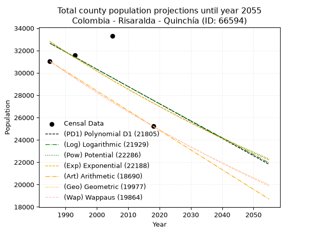
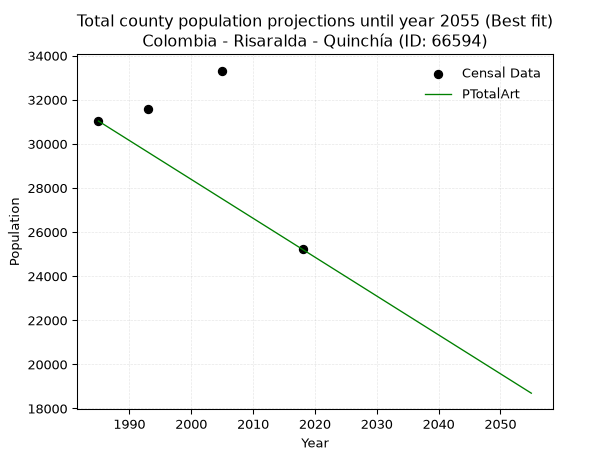
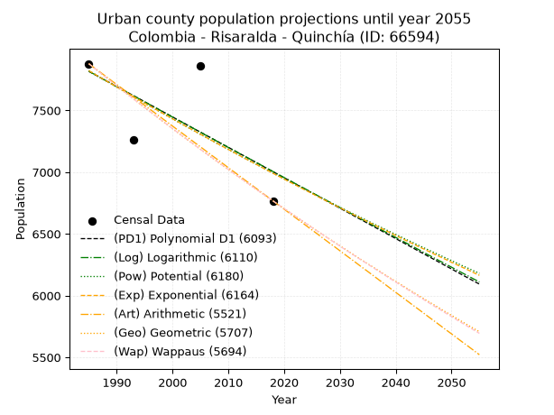
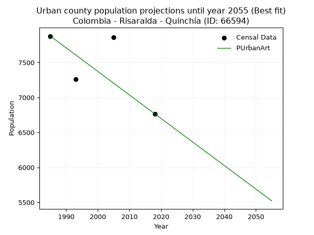
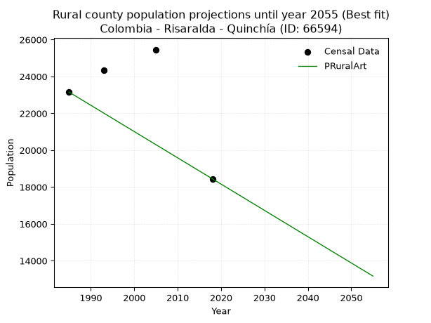

<div align="center">


</div>

# 📜 _“Population and Public Services Demand Projections (PPSD) until Year 2050 for Colombia - Risaralda - Quinchía (ID: 66594)”_
Keywords: `population` `public-service` `projection` `lineal` `polynomial` `logarithmic` `potential` `exponential` `arithmetic` `geometric` `wappaus` `dane` `colombia` `south-america`

PPSD are analytical estimates used by governments and planners to anticipate future changes in population size, age distribution, and the resulting community needs for utilities, healthcare, education, and infrastructure as sizing future water treatment facilities, electrical grids, and road networks based on spatial growth.

<div align="center">

</img>

</div>


> **General running parameters**: • app_version: _v20260806_. • Python version: _3.14.7_. • Pandas version: _3.0.5_. • NumPy version: _2.5.1_. • Creates, save and include plots into reports (create_plot): _False_. • Projection until year: _2050_. • Process polynomial degree 2 and up: _False_. • Process Wappaus: _True_. • Process Wappaus: _True_. • Set negative values to zero: _True_. • Set infinite values to zero: _True_. • Drop dataset notes: _True_. 
<div align="center">

Maps & GIS Layers: [:earth_americas:Google](http://maps.google.com/maps?q=5.340456043,-75.7304309) [:earth_americas:OSM](https://www.openstreetmap.org/#map=18/5.340456043/-75.7304309&layers=P) [:earth_americas:Bing](https://www.bing.com/maps?cp=5.340456043~-75.7304309&lvl=18) [:earth_americas:Apple](https://maps.apple.com/frame?center=5.340456043%2C-75.7304309&span=0.003%2C0.006) [:earth_americas:GISMobile](https://github.com/rcfdtools/R.GISMobile/blob/main/file/gis/CountyLayer_CO/Readme.md)

</div>


<div align="center">

```geojson
{
  "type": "Feature",
  "geometry": {
    "type": "Point", 
    "coordinates": [-75.7304309, 5.340456043]
  }, 
  "properties": {
    "Name": "Colombia - Risaralda - Quinchía (ID: 66594)"
  }
}
```

</div>


## 0. Census Data (4 records)

Census data are official statistics collected by a government about the people and housing in a country. They usually include counts of total population, age, sex, race, income, education, and jobs.

📅Global census file: [Population.xlsx](../data/Population.xlsx)

| Source   |   Year |   CountryID | CountryName   |   StateID | StateName   |   CountyID | CountyName   |   PTotal |   PUrban |   PRural |
|:---------|-------:|------------:|:--------------|----------:|:------------|-----------:|:-------------|---------:|---------:|---------:|
| DANE     |   1985 |          57 | Colombia      |        66 | Risaralda   |      66594 | Quinchía     |    31031 |     7878 |    23153 |
| DANE     |   1993 |          57 | Colombia      |        66 | Risaralda   |      66594 | Quinchía     |    31597 |     7260 |    24337 |
| DANE     |   2005 |          57 | Colombia      |        66 | Risaralda   |      66594 | Quinchía     |    33318 |     7858 |    25460 |
| DANE     |   2018 |          57 | Colombia      |        66 | Risaralda   |      66594 | Quinchía     |    25213 |     6767 |    18446 |

> 🔥Some records could had specific notes about the registered values or the corresponding urban or rural distribution.

📅[SUI-RUPS](https://www.datos.gov.co/Hacienda-y-Cr-dito-P-blico/Registro-nico-de-Prestadores-de-Servicios-P-blicos/4qkq-csdn/about_data) - Local public utility companies: [RUPS.csv](../data/RUPS.csv)

 | SERVICIO       | ESTADO    | NOMBRE                                                                                    | NIT         | DEPARTAMENTO_DOMICILIO   | MUNICIPIO_DOMICILIO   | DIRECCION                                   |   TELEFONO | EMAIL                                     | TIPO_PRESTADOR                            | CLASIFICACION                 |
|:---------------|:----------|:------------------------------------------------------------------------------------------|:------------|:-------------------------|:----------------------|:--------------------------------------------|-----------:|:------------------------------------------|:------------------------------------------|:------------------------------|
| ACUEDUCTO      | OPERATIVA | EMPRESAS PUBLICAS MUNICIPALES DE QUINCHIA E.S.P                                           | 800122736-8 | RISARALDA                | QUINCHIA              | Carrera 7 Calle 8 Esquina 2 Piso            |    3563002 | contactenos@epm-quinchia-risaralda.gov.co | EMPRESA INDUSTRIAL Y COMERCIAL DEL ESTADO | MENOR O IGUAL A 2500 USUARIOS |
| ALCANTARILLADO | OPERATIVA | EMPRESAS PUBLICAS MUNICIPALES DE QUINCHIA E.S.P                                           | 800122736-8 | RISARALDA                | QUINCHIA              | Carrera 7 Calle 8 Esquina 2 Piso            |    3563002 | contactenos@epm-quinchia-risaralda.gov.co | EMPRESA INDUSTRIAL Y COMERCIAL DEL ESTADO | MENOR O IGUAL A 2500 USUARIOS |
| ACUEDUCTO      | OPERATIVA | ASOCIACIÓN DE USUARIOS DEL ACUEDUCTO DEL CORREGIMIENTO DE IRRA                            | 816002314-7 | RISARALDA                | QUINCHIA              | PISO 1 GALERIA CENTRAL                      |    3600689 | acueirra@hotmail.com                      | ORGANIZACION AUTORIZADA                   | MENOR O IGUAL A 2500 USUARIOS |
| ACUEDUCTO      | OPERATIVA | ASOCIACION DE USUARIOS DEL ACUEDCUTO REGIONAL EMBERA KARAMBA                              | 816000914-7 | RISARALDA                | QUINCHIA              | VEREDA MIRACAMPOS                           |    3369430 | acueductoemberakaramba@gmail.com          | ORGANIZACION AUTORIZADA                   | MENOR O IGUAL A 2500 USUARIOS |
| ACUEDUCTO      | OPERATIVA | ASOCIACION DE USUARIOS DEL ACUEDUCTO OJO DE AGUA                                          | 900279821-3 | RISARALDA                | QUINCHIA              | Clle 5 N 6-23                               |    3117293 | contactenos@quinchia-risaralda.gov.co     | ORGANIZACION AUTORIZADA                   | HASTA 2500 SUSCRIPTORES       |
| ACUEDUCTO      | OPERATIVA | ASOCIACION AMBIENTAL ADMINISTRADORA DEL ACUEDUCTO AGUAS DEL NARANJAL                      | 816008253-3 | RISARALDA                | QUINCHIA              | VEREDA NARANJAL, CORREGIMIENTO DE NARANJARA |    3563002 | asoc.naranjal@hotmail.com                 | ORGANIZACION AUTORIZADA                   | MENOR O IGUAL A 2500 USUARIOS |
| ACUEDUCTO      | OPERATIVA | ASOCIACION DE USUARIOS DEL ACUEDUCTO ALTO RISARALDITA                                     | 900187999-1 | RISARALDA                | QUINCHIA              | vereda risaraldita                          |    3127040 | gustavo528@hotmail.com                    | ORGANIZACION AUTORIZADA                   | HASTA 2500 SUSCRIPTORES       |
| ACUEDUCTO      | OPERATIVA | ASOCIACION DE USUARIOS DEL ACUEDUCTO DE COROZAL                                           | 900126420-7 | RISARALDA                | QUINCHIA              | VEREDA COROZAL                              |    3126970 | alfredotascon.g@gmail.com                 | ORGANIZACION AUTORIZADA                   | MENOR O IGUAL A 2500 USUARIOS |
| ACUEDUCTO      | OPERATIVA | ASOCIACION DE USUARIOS DE LOS ACUEDUCTOS PRIMAVERA 1 Y PRIMAVERA 2 DE LA VEREDA PRIMAVERA | 900126195-4 | RISARALDA                | QUINCHIA              | vereda la primavera                         |    1111111 | romandiaziba@gmail.com                    | ORGANIZACION AUTORIZADA                   | MENOR O IGUAL A 2500 USUARIOS |
| ACUEDUCTO      | OPERATIVA | ASOCIACION DE USUARIOS DEL ACUEDUCTO LA CEIBA DE LA VEREDA LA CEIBA                       | 900125938-5 | RISARALDA                | QUINCHIA              | alcaldia municipal                          |    3137175 | zuluagaferney@gmail.com                   | ORGANIZACION AUTORIZADA                   | HASTA 2500 SUSCRIPTORES       |
| ACUEDUCTO      | OPERATIVA | Junta de Acción Comunal Vereda el Naranjo                                                 | 816001317-4 | RISARALDA                | QUINCHIA              | VEREDA EL NARANJO FINCA VILLALUISA          |    3508804 | edgarsuare80@gmail.com                    | ORGANIZACION AUTORIZADA                   | MENOR O IGUAL A 2500 USUARIOS |

## 1. Total

### 1.1. Coefficients and Parameters

* (PD1) Polynomial Deg 1: -154.97350461661486, 340275.50260938384 (lineal)
* (Log) Logarithmic: -309383.5743461694, 2381916.7778496034
* (Pow) Potential: -11.15325140107167, 41.29666497318506
* (Exp) Exponential: -0.005585946610564399, 2145034749.2537115
* (Art) Arithmetic: Year diff. 2018 - 1985 = 33, Population diff. 25213 - 31031 = -5818, Annual growth = -176.3030303030303
* (Geo) Geometric: Year diff. 2018 - 1985 = 33, Population diff. 25213 - 31031 = -5818, Annual growth % = -0.0062719749077186915
* (Wap) Wappaus: i = -0.626922090544877, Condition values only valid for < 200)

<sub>
Wappaus condition values: ['-0.00', '-0.63', '-1.25', '-1.88', '-2.51', '-3.13', '-3.76', '-4.39', '-5.02', '-5.64', '-6.27', '-6.90', '-7.52', '-8.15', '-8.78', '-9.40', '-10.03', '-10.66', '-11.28', '-11.91', '-12.54', '-13.17', '-13.79', '-14.42', '-15.05', '-15.67', '-16.30', '-16.93', '-17.55', '-18.18', '-18.81', '-19.43', '-20.06', '-20.69', '-21.32', '-21.94', '-22.57', '-23.20', '-23.82', '-24.45', '-25.08', '-25.70', '-26.33', '-26.96', '-27.58', '-28.21', '-28.84', '-29.47', '-30.09', '-30.72', '-31.35', '-31.97', '-32.60', '-33.23', '-33.85', '-34.48', '-35.11', '-35.73', '-36.36', '-36.99', '-37.62', '-38.24', '-38.87', '-39.50', '-40.12', '-40.75']
</sub>


### 1.2. Projected Dataset

|   Year |   CountyID |   PTotalPD1 |   PTotalLog |   PTotalPow |   PTotalExp |   PTotalArt |   PTotalGeo |   PTotalWap |
|-------:|-----------:|------------:|------------:|------------:|------------:|------------:|------------:|------------:|
|   1985 |      66594 |       32653 |       32652 |       32803 |       32804 |       31031 |       31031 |       31031 |
|   1986 |      66594 |       32498 |       32496 |       32619 |       32622 |       30855 |       30836 |       30837 |
|   1987 |      66594 |       32343 |       32340 |       32437 |       32440 |       30678 |       30643 |       30644 |
|   1988 |      66594 |       32188 |       32184 |       32255 |       32259 |       30502 |       30451 |       30453 |
|   1989 |      66594 |       32033 |       32029 |       32075 |       32080 |       30326 |       30260 |       30262 |
|   1990 |      66594 |       31878 |       31873 |       31895 |       31901 |       30149 |       30070 |       30073 |
|   1991 |      66594 |       31723 |       31718 |       31717 |       31723 |       29973 |       29881 |       29885 |
|   1992 |      66594 |       31568 |       31562 |       31540 |       31546 |       29797 |       29694 |       29698 |
|   1993 |      66594 |       31413 |       31407 |       31364 |       31371 |       29621 |       29508 |       29513 |
|   1994 |      66594 |       31258 |       31252 |       31189 |       31196 |       29444 |       29323 |       29328 |
|   1995 |      66594 |       31103 |       31097 |       31015 |       31022 |       29268 |       29139 |       29145 |
|   1996 |      66594 |       30948 |       30942 |       30842 |       30849 |       29092 |       28956 |       28962 |
|   1997 |      66594 |       30793 |       30787 |       30670 |       30678 |       28915 |       28774 |       28781 |
|   1998 |      66594 |       30638 |       30632 |       30500 |       30507 |       28739 |       28594 |       28601 |
|   1999 |      66594 |       30483 |       30477 |       30330 |       30337 |       28563 |       28415 |       28422 |
|   2000 |      66594 |       30328 |       30322 |       30161 |       30168 |       28386 |       28236 |       28244 |
|   2001 |      66594 |       30174 |       30168 |       29993 |       30000 |       28210 |       28059 |       28067 |
|   2002 |      66594 |       30019 |       30013 |       29827 |       29833 |       28034 |       27883 |       27891 |
|   2003 |      66594 |       29864 |       29859 |       29661 |       29666 |       27858 |       27708 |       27716 |
|   2004 |      66594 |       29709 |       29704 |       29496 |       29501 |       27681 |       27535 |       27543 |
|   2005 |      66594 |       29554 |       29550 |       29333 |       29337 |       27505 |       27362 |       27370 |
|   2006 |      66594 |       29399 |       29396 |       29170 |       29173 |       27329 |       27190 |       27198 |
|   2007 |      66594 |       29244 |       29241 |       29008 |       29011 |       27152 |       27020 |       27027 |
|   2008 |      66594 |       29089 |       29087 |       28848 |       28849 |       26976 |       26850 |       26857 |
|   2009 |      66594 |       28934 |       28933 |       28688 |       28689 |       26800 |       26682 |       26689 |
|   2010 |      66594 |       28779 |       28779 |       28529 |       28529 |       26623 |       26515 |       26521 |
|   2011 |      66594 |       28624 |       28625 |       28371 |       28370 |       26447 |       26348 |       26354 |
|   2012 |      66594 |       28469 |       28472 |       28214 |       28212 |       26271 |       26183 |       26188 |
|   2013 |      66594 |       28314 |       28318 |       28059 |       28055 |       26095 |       26019 |       26023 |
|   2014 |      66594 |       28159 |       28164 |       27904 |       27898 |       25918 |       25856 |       25859 |
|   2015 |      66594 |       28004 |       28011 |       27749 |       27743 |       25742 |       25693 |       25696 |
|   2016 |      66594 |       27849 |       27857 |       27596 |       27588 |       25566 |       25532 |       25534 |
|   2017 |      66594 |       27694 |       27704 |       27444 |       27435 |       25389 |       25372 |       25373 |
|   2018 |      66594 |       27539 |       27550 |       27293 |       27282 |       25213 |       25213 |       25213 |
|   2019 |      66594 |       27384 |       27397 |       27142 |       27130 |       25037 |       25055 |       25054 |
|   2020 |      66594 |       27229 |       27244 |       26993 |       26979 |       24860 |       24898 |       24895 |
|   2021 |      66594 |       27074 |       27091 |       26844 |       26829 |       24684 |       24742 |       24738 |
|   2022 |      66594 |       26919 |       26938 |       26697 |       26679 |       24508 |       24586 |       24581 |
|   2023 |      66594 |       26764 |       26785 |       26550 |       26531 |       24331 |       24432 |       24425 |
|   2024 |      66594 |       26609 |       26632 |       26404 |       26383 |       24155 |       24279 |       24270 |
|   2025 |      66594 |       26454 |       26479 |       26259 |       26236 |       23979 |       24127 |       24116 |
|   2026 |      66594 |       26299 |       26326 |       26115 |       26090 |       23803 |       23975 |       23963 |
|   2027 |      66594 |       26144 |       26174 |       25971 |       25944 |       23626 |       23825 |       23811 |
|   2028 |      66594 |       25989 |       26021 |       25829 |       25800 |       23450 |       23676 |       23659 |
|   2029 |      66594 |       25834 |       25869 |       25687 |       25656 |       23274 |       23527 |       23509 |
|   2030 |      66594 |       25679 |       25716 |       25546 |       25513 |       23097 |       23379 |       23359 |
|   2031 |      66594 |       25524 |       25564 |       25406 |       25371 |       22921 |       23233 |       23210 |
|   2032 |      66594 |       25369 |       25411 |       25267 |       25230 |       22745 |       23087 |       23062 |
|   2033 |      66594 |       25214 |       25259 |       25129 |       25089 |       22568 |       22942 |       22914 |
|   2034 |      66594 |       25059 |       25107 |       24992 |       24949 |       22392 |       22798 |       22768 |
|   2035 |      66594 |       24904 |       24955 |       24855 |       24810 |       22216 |       22655 |       22622 |
|   2036 |      66594 |       24749 |       24803 |       24719 |       24672 |       22040 |       22513 |       22477 |
|   2037 |      66594 |       24594 |       24651 |       24584 |       24535 |       21863 |       22372 |       22333 |
|   2038 |      66594 |       24440 |       24499 |       24450 |       24398 |       21687 |       22232 |       22189 |
|   2039 |      66594 |       24285 |       24347 |       24317 |       24262 |       21511 |       22092 |       22047 |
|   2040 |      66594 |       24130 |       24196 |       24184 |       24127 |       21334 |       21954 |       21905 |
|   2041 |      66594 |       23975 |       24044 |       24052 |       23993 |       21158 |       21816 |       21764 |
|   2042 |      66594 |       23820 |       23893 |       23921 |       23859 |       20982 |       21679 |       21623 |
|   2043 |      66594 |       23665 |       23741 |       23791 |       23726 |       20805 |       21543 |       21483 |
|   2044 |      66594 |       23510 |       23590 |       23661 |       23594 |       20629 |       21408 |       21345 |
|   2045 |      66594 |       23355 |       23438 |       23533 |       23463 |       20453 |       21274 |       21206 |
|   2046 |      66594 |       23200 |       23287 |       23405 |       23332 |       20277 |       21141 |       21069 |
|   2047 |      66594 |       23045 |       23136 |       23277 |       23202 |       20100 |       21008 |       20932 |
|   2048 |      66594 |       22890 |       22985 |       23151 |       23073 |       19924 |       20876 |       20796 |
|   2049 |      66594 |       22735 |       22834 |       23025 |       22944 |       19748 |       20745 |       20661 |
|   2050 |      66594 |       22580 |       22683 |       22900 |       22816 |       19571 |       20615 |       20526 |
<div align="center">

</img>

</div>


### 1.3. Best fit with absolute and relative error (%)

Relative error puts that difference into context by dividing the absolute error by the true value, creating a unitless ratio or percentage that shows the scale of the mistake.

Absolute and relative error

|   Year | Source   |   CountryID | CountryName   |   StateID | StateName   |   CountyID_x | CountyName   |   PTotal |   PUrban |   PRural |   CountyID_y |   PTotalPD1 |   PTotalLog |   PTotalPow |   PTotalExp |   PTotalArt |   PTotalGeo |   PTotalWap |   PTotalPD1AbsError |   PTotalLogAbsError |   PTotalPowAbsError |   PTotalExpAbsError |   PTotalArtAbsError |   PTotalGeoAbsError |   PTotalWapAbsError |   PTotalPD1RelError |   PTotalLogRelError |   PTotalPowRelError |   PTotalExpRelError |   PTotalArtRelError |   PTotalGeoRelError |   PTotalWapRelError |
|-------:|:---------|------------:|:--------------|----------:|:------------|-------------:|:-------------|---------:|---------:|---------:|-------------:|------------:|------------:|------------:|------------:|------------:|------------:|------------:|--------------------:|--------------------:|--------------------:|--------------------:|--------------------:|--------------------:|--------------------:|--------------------:|--------------------:|--------------------:|--------------------:|--------------------:|--------------------:|--------------------:|
|   1985 | DANE     |          57 | Colombia      |        66 | Risaralda   |        66594 | Quinchía     |    31031 |     7878 |    23153 |        66594 |       32653 |       32652 |       32803 |       32804 |       31031 |       31031 |       31031 |                1622 |                1621 |                1772 |                1773 |                   0 |                   0 |                   0 |            5.22703  |            5.22381  |            5.71042  |            5.71364  |             0       |             0       |             0       |
|   1993 | DANE     |          57 | Colombia      |        66 | Risaralda   |        66594 | Quinchía     |    31597 |     7260 |    24337 |        66594 |       31413 |       31407 |       31364 |       31371 |       29621 |       29508 |       29513 |                 184 |                 190 |                 233 |                 226 |                1976 |                2089 |                2084 |            0.582334 |            0.601323 |            0.737412 |            0.715258 |             6.25376 |             6.61139 |             6.59556 |
|   2005 | DANE     |          57 | Colombia      |        66 | Risaralda   |        66594 | Quinchía     |    33318 |     7858 |    25460 |        66594 |       29554 |       29550 |       29333 |       29337 |       27505 |       27362 |       27370 |                3764 |                3768 |                3985 |                3981 |                5813 |                5956 |                5948 |           11.2972   |           11.3092   |           11.9605   |           11.9485   |            17.447   |            17.8762  |            17.8522  |
|   2018 | DANE     |          57 | Colombia      |        66 | Risaralda   |        66594 | Quinchía     |    25213 |     6767 |    18446 |        66594 |       27539 |       27550 |       27293 |       27282 |       25213 |       25213 |       25213 |                2326 |                2337 |                2080 |                2069 |                   0 |                   0 |                   0 |            9.2254   |            9.26903  |            8.24971  |            8.20608  |             0       |             0       |             0       |

Relative error mean

| Method    |   RelError | Best   |
|:----------|-----------:|:-------|
| PTotalPD1 |    6.58299 |        |
| PTotalLog |    6.60084 |        |
| PTotalPow |    6.66451 |        |
| PTotalExp |    6.64587 |        |
| PTotalArt |    5.9252  | True   |
| PTotalGeo |    6.1219  |        |
| PTotalWap |    6.11194 |        |

💙Best method: _**PTotalArt**_
<div align="center">

</img>

</div>


### 1.4. Fresh water supply demand in liters per capita per day (lpcd)

The fresh water supply demand typically ranges from 100 to 300 liters per capita per day (lpcd) for standard domestic and municipal planning, though absolute survival minimums set by the World Health Organization are as low as 7.5 to 20 liters per day, and total consumption in high-income nations can exceed 400 liters.

> `CZ`: Level in meters above the sea level (masl)<br> `WS`: Fresh water supply demand in liters per capita per day (lpcd or l/h/d)<br> `WSAll`: Zonal fresh water supply demand in liters per second (l/s)<br> `A`: Zonal area in square meters<br> `DP`: Population density (people/hectare or p/ha)

Reference values (RAS Colombia)

|    CZ |   WS |
|------:|-----:|
|  1000 |  120 |
|  2000 |  130 |
| 99999 |  140 |

County shapefile geometry properties and water supply values

|   CountyID |      ATotal |   CZTotal |   WSTotal |
|-----------:|------------:|----------:|----------:|
|      66594 | 1.40138e+08 |   1556.45 |       130 |

Projected values for best method: PTotalArt

|   CountyID |   Year |   PTotalArt |   DPTotal |   WSTotal |   WSTotalAll |
|-----------:|-------:|------------:|----------:|----------:|-------------:|
|      66594 |   1985 |       31031 |      2.21 |       130 |      46.6902 |
|      66594 |   1986 |       30855 |      2.2  |       130 |      46.4253 |
|      66594 |   1987 |       30678 |      2.19 |       130 |      46.159  |
|      66594 |   1988 |       30502 |      2.18 |       130 |      45.8942 |
|      66594 |   1989 |       30326 |      2.16 |       130 |      45.6294 |
|      66594 |   1990 |       30149 |      2.15 |       130 |      45.3631 |
|      66594 |   1991 |       29973 |      2.14 |       130 |      45.0983 |
|      66594 |   1992 |       29797 |      2.13 |       130 |      44.8334 |
|      66594 |   1993 |       29621 |      2.11 |       130 |      44.5686 |
|      66594 |   1994 |       29444 |      2.1  |       130 |      44.3023 |
|      66594 |   1995 |       29268 |      2.09 |       130 |      44.0375 |
|      66594 |   1996 |       29092 |      2.08 |       130 |      43.7727 |
|      66594 |   1997 |       28915 |      2.06 |       130 |      43.5064 |
|      66594 |   1998 |       28739 |      2.05 |       130 |      43.2416 |
|      66594 |   1999 |       28563 |      2.04 |       130 |      42.9767 |
|      66594 |   2000 |       28386 |      2.03 |       130 |      42.7104 |
|      66594 |   2001 |       28210 |      2.01 |       130 |      42.4456 |
|      66594 |   2002 |       28034 |      2    |       130 |      42.1808 |
|      66594 |   2003 |       27858 |      1.99 |       130 |      41.916  |
|      66594 |   2004 |       27681 |      1.98 |       130 |      41.6497 |
|      66594 |   2005 |       27505 |      1.96 |       130 |      41.3848 |
|      66594 |   2006 |       27329 |      1.95 |       130 |      41.12   |
|      66594 |   2007 |       27152 |      1.94 |       130 |      40.8537 |
|      66594 |   2008 |       26976 |      1.92 |       130 |      40.5889 |
|      66594 |   2009 |       26800 |      1.91 |       130 |      40.3241 |
|      66594 |   2010 |       26623 |      1.9  |       130 |      40.0578 |
|      66594 |   2011 |       26447 |      1.89 |       130 |      39.7929 |
|      66594 |   2012 |       26271 |      1.87 |       130 |      39.5281 |
|      66594 |   2013 |       26095 |      1.86 |       130 |      39.2633 |
|      66594 |   2014 |       25918 |      1.85 |       130 |      38.997  |
|      66594 |   2015 |       25742 |      1.84 |       130 |      38.7322 |
|      66594 |   2016 |       25566 |      1.82 |       130 |      38.4674 |
|      66594 |   2017 |       25389 |      1.81 |       130 |      38.201  |
|      66594 |   2018 |       25213 |      1.8  |       130 |      37.9362 |
|      66594 |   2019 |       25037 |      1.79 |       130 |      37.6714 |
|      66594 |   2020 |       24860 |      1.77 |       130 |      37.4051 |
|      66594 |   2021 |       24684 |      1.76 |       130 |      37.1403 |
|      66594 |   2022 |       24508 |      1.75 |       130 |      36.8755 |
|      66594 |   2023 |       24331 |      1.74 |       130 |      36.6091 |
|      66594 |   2024 |       24155 |      1.72 |       130 |      36.3443 |
|      66594 |   2025 |       23979 |      1.71 |       130 |      36.0795 |
|      66594 |   2026 |       23803 |      1.7  |       130 |      35.8147 |
|      66594 |   2027 |       23626 |      1.69 |       130 |      35.5484 |
|      66594 |   2028 |       23450 |      1.67 |       130 |      35.2836 |
|      66594 |   2029 |       23274 |      1.66 |       130 |      35.0187 |
|      66594 |   2030 |       23097 |      1.65 |       130 |      34.7524 |
|      66594 |   2031 |       22921 |      1.64 |       130 |      34.4876 |
|      66594 |   2032 |       22745 |      1.62 |       130 |      34.2228 |
|      66594 |   2033 |       22568 |      1.61 |       130 |      33.9565 |
|      66594 |   2034 |       22392 |      1.6  |       130 |      33.6917 |
|      66594 |   2035 |       22216 |      1.59 |       130 |      33.4269 |
|      66594 |   2036 |       22040 |      1.57 |       130 |      33.162  |
|      66594 |   2037 |       21863 |      1.56 |       130 |      32.8957 |
|      66594 |   2038 |       21687 |      1.55 |       130 |      32.6309 |
|      66594 |   2039 |       21511 |      1.53 |       130 |      32.3661 |
|      66594 |   2040 |       21334 |      1.52 |       130 |      32.0998 |
|      66594 |   2041 |       21158 |      1.51 |       130 |      31.835  |
|      66594 |   2042 |       20982 |      1.5  |       130 |      31.5701 |
|      66594 |   2043 |       20805 |      1.48 |       130 |      31.3038 |
|      66594 |   2044 |       20629 |      1.47 |       130 |      31.039  |
|      66594 |   2045 |       20453 |      1.46 |       130 |      30.7742 |
|      66594 |   2046 |       20277 |      1.45 |       130 |      30.5094 |
|      66594 |   2047 |       20100 |      1.43 |       130 |      30.2431 |
|      66594 |   2048 |       19924 |      1.42 |       130 |      29.9782 |
|      66594 |   2049 |       19748 |      1.41 |       130 |      29.7134 |
|      66594 |   2050 |       19571 |      1.4  |       130 |      29.4471 |

## 2. Urban

### 2.1. Coefficients and Parameters

* (PD1) Polynomial Deg 1: -24.624247290244263, 56695.40064231109 (lineal)
* (Log) Logarithmic: -49234.86413357914, 381675.346822775
* (Pow) Potential: -6.800313195492687, 26.319114774322745
* (Exp) Exponential: -0.0034011701354437476, 6688878.704418536
* (Art) Arithmetic: Year diff. 2018 - 1985 = 33, Population diff. 6767 - 7878 = -1111, Annual growth = -33.666666666666664
* (Geo) Geometric: Year diff. 2018 - 1985 = 33, Population diff. 6767 - 7878 = -1111, Annual growth % = -0.004595957850209831
* (Wap) Wappaus: i = -0.45977011494252873, Condition values only valid for < 200)

<sub>
Wappaus condition values: ['-0.00', '-0.46', '-0.92', '-1.38', '-1.84', '-2.30', '-2.76', '-3.22', '-3.68', '-4.14', '-4.60', '-5.06', '-5.52', '-5.98', '-6.44', '-6.90', '-7.36', '-7.82', '-8.28', '-8.74', '-9.20', '-9.66', '-10.11', '-10.57', '-11.03', '-11.49', '-11.95', '-12.41', '-12.87', '-13.33', '-13.79', '-14.25', '-14.71', '-15.17', '-15.63', '-16.09', '-16.55', '-17.01', '-17.47', '-17.93', '-18.39', '-18.85', '-19.31', '-19.77', '-20.23', '-20.69', '-21.15', '-21.61', '-22.07', '-22.53', '-22.99', '-23.45', '-23.91', '-24.37', '-24.83', '-25.29', '-25.75', '-26.21', '-26.67', '-27.13', '-27.59', '-28.05', '-28.51', '-28.97', '-29.43', '-29.89']
</sub>


### 2.2. Projected Dataset

|   Year |   CountyID |   PUrbanPD1 |   PUrbanLog |   PUrbanPow |   PUrbanExp |   PUrbanArt |   PUrbanGeo |   PUrbanWap |
|-------:|-----------:|------------:|------------:|------------:|------------:|------------:|------------:|------------:|
|   1985 |      66594 |        7816 |        7817 |        7822 |        7822 |        7878 |        7878 |        7878 |
|   1986 |      66594 |        7792 |        7792 |        7795 |        7795 |        7844 |        7842 |        7842 |
|   1987 |      66594 |        7767 |        7767 |        7768 |        7768 |        7811 |        7806 |        7806 |
|   1988 |      66594 |        7742 |        7742 |        7742 |        7742 |        7777 |        7770 |        7770 |
|   1989 |      66594 |        7718 |        7717 |        7716 |        7716 |        7743 |        7734 |        7734 |
|   1990 |      66594 |        7693 |        7693 |        7689 |        7690 |        7710 |        7699 |        7699 |
|   1991 |      66594 |        7669 |        7668 |        7663 |        7664 |        7676 |        7663 |        7664 |
|   1992 |      66594 |        7644 |        7643 |        7637 |        7638 |        7642 |        7628 |        7628 |
|   1993 |      66594 |        7619 |        7619 |        7611 |        7612 |        7609 |        7593 |        7593 |
|   1994 |      66594 |        7595 |        7594 |        7585 |        7586 |        7575 |        7558 |        7559 |
|   1995 |      66594 |        7570 |        7569 |        7559 |        7560 |        7541 |        7523 |        7524 |
|   1996 |      66594 |        7545 |        7545 |        7533 |        7534 |        7508 |        7489 |        7489 |
|   1997 |      66594 |        7521 |        7520 |        7508 |        7509 |        7474 |        7454 |        7455 |
|   1998 |      66594 |        7496 |        7495 |        7482 |        7483 |        7440 |        7420 |        7421 |
|   1999 |      66594 |        7472 |        7471 |        7457 |        7458 |        7407 |        7386 |        7387 |
|   2000 |      66594 |        7447 |        7446 |        7432 |        7432 |        7373 |        7352 |        7353 |
|   2001 |      66594 |        7422 |        7421 |        7406 |        7407 |        7339 |        7318 |        7319 |
|   2002 |      66594 |        7398 |        7397 |        7381 |        7382 |        7306 |        7285 |        7285 |
|   2003 |      66594 |        7373 |        7372 |        7356 |        7357 |        7272 |        7251 |        7252 |
|   2004 |      66594 |        7348 |        7348 |        7331 |        7332 |        7238 |        7218 |        7219 |
|   2005 |      66594 |        7324 |        7323 |        7306 |        7307 |        7205 |        7185 |        7185 |
|   2006 |      66594 |        7299 |        7298 |        7282 |        7282 |        7171 |        7152 |        7152 |
|   2007 |      66594 |        7275 |        7274 |        7257 |        7258 |        7137 |        7119 |        7120 |
|   2008 |      66594 |        7250 |        7249 |        7232 |        7233 |        7104 |        7086 |        7087 |
|   2009 |      66594 |        7225 |        7225 |        7208 |        7208 |        7070 |        7053 |        7054 |
|   2010 |      66594 |        7201 |        7200 |        7184 |        7184 |        7036 |        7021 |        7022 |
|   2011 |      66594 |        7176 |        7176 |        7159 |        7160 |        7003 |        6989 |        6989 |
|   2012 |      66594 |        7151 |        7151 |        7135 |        7135 |        6969 |        6957 |        6957 |
|   2013 |      66594 |        7127 |        7127 |        7111 |        7111 |        6935 |        6925 |        6925 |
|   2014 |      66594 |        7102 |        7103 |        7087 |        7087 |        6902 |        6893 |        6893 |
|   2015 |      66594 |        7078 |        7078 |        7063 |        7063 |        6868 |        6861 |        6861 |
|   2016 |      66594 |        7053 |        7054 |        7040 |        7039 |        6834 |        6830 |        6830 |
|   2017 |      66594 |        7028 |        7029 |        7016 |        7015 |        6801 |        6798 |        6798 |
|   2018 |      66594 |        7004 |        7005 |        6992 |        6991 |        6767 |        6767 |        6767 |
|   2019 |      66594 |        6979 |        6980 |        6969 |        6967 |        6733 |        6736 |        6736 |
|   2020 |      66594 |        6954 |        6956 |        6945 |        6944 |        6700 |        6705 |        6705 |
|   2021 |      66594 |        6930 |        6932 |        6922 |        6920 |        6666 |        6674 |        6674 |
|   2022 |      66594 |        6905 |        6907 |        6899 |        6897 |        6632 |        6643 |        6643 |
|   2023 |      66594 |        6881 |        6883 |        6876 |        6873 |        6599 |        6613 |        6612 |
|   2024 |      66594 |        6856 |        6859 |        6852 |        6850 |        6565 |        6583 |        6582 |
|   2025 |      66594 |        6831 |        6834 |        6830 |        6827 |        6531 |        6552 |        6551 |
|   2026 |      66594 |        6807 |        6810 |        6807 |        6803 |        6498 |        6522 |        6521 |
|   2027 |      66594 |        6782 |        6786 |        6784 |        6780 |        6464 |        6492 |        6491 |
|   2028 |      66594 |        6757 |        6761 |        6761 |        6757 |        6430 |        6462 |        6461 |
|   2029 |      66594 |        6733 |        6737 |        6738 |        6734 |        6397 |        6433 |        6431 |
|   2030 |      66594 |        6708 |        6713 |        6716 |        6712 |        6363 |        6403 |        6401 |
|   2031 |      66594 |        6684 |        6689 |        6693 |        6689 |        6329 |        6374 |        6371 |
|   2032 |      66594 |        6659 |        6664 |        6671 |        6666 |        6296 |        6344 |        6342 |
|   2033 |      66594 |        6634 |        6640 |        6649 |        6643 |        6262 |        6315 |        6312 |
|   2034 |      66594 |        6610 |        6616 |        6627 |        6621 |        6228 |        6286 |        6283 |
|   2035 |      66594 |        6585 |        6592 |        6605 |        6598 |        6195 |        6257 |        6254 |
|   2036 |      66594 |        6560 |        6568 |        6582 |        6576 |        6161 |        6229 |        6225 |
|   2037 |      66594 |        6536 |        6543 |        6561 |        6554 |        6127 |        6200 |        6196 |
|   2038 |      66594 |        6511 |        6519 |        6539 |        6531 |        6094 |        6171 |        6167 |
|   2039 |      66594 |        6487 |        6495 |        6517 |        6509 |        6060 |        6143 |        6138 |
|   2040 |      66594 |        6462 |        6471 |        6495 |        6487 |        6026 |        6115 |        6109 |
|   2041 |      66594 |        6437 |        6447 |        6474 |        6465 |        5993 |        6087 |        6081 |
|   2042 |      66594 |        6413 |        6423 |        6452 |        6443 |        5959 |        6059 |        6053 |
|   2043 |      66594 |        6388 |        6399 |        6431 |        6421 |        5925 |        6031 |        6024 |
|   2044 |      66594 |        6363 |        6375 |        6409 |        6399 |        5892 |        6003 |        5996 |
|   2045 |      66594 |        6339 |        6350 |        6388 |        6378 |        5858 |        5976 |        5968 |
|   2046 |      66594 |        6314 |        6326 |        6367 |        6356 |        5824 |        5948 |        5940 |
|   2047 |      66594 |        6290 |        6302 |        6346 |        6334 |        5791 |        5921 |        5912 |
|   2048 |      66594 |        6265 |        6278 |        6325 |        6313 |        5757 |        5894 |        5885 |
|   2049 |      66594 |        6240 |        6254 |        6304 |        6292 |        5723 |        5866 |        5857 |
|   2050 |      66594 |        6216 |        6230 |        6283 |        6270 |        5690 |        5840 |        5830 |
<div align="center">

</img>

</div>


### 2.3. Best fit with absolute and relative error (%)

Relative error puts that difference into context by dividing the absolute error by the true value, creating a unitless ratio or percentage that shows the scale of the mistake.

Absolute and relative error

|   Year | Source   |   CountryID | CountryName   |   StateID | StateName   |   CountyID_x | CountyName   |   PTotal |   PUrban |   PRural |   CountyID_y |   PUrbanPD1 |   PUrbanLog |   PUrbanPow |   PUrbanExp |   PUrbanArt |   PUrbanGeo |   PUrbanWap |   PUrbanPD1AbsError |   PUrbanLogAbsError |   PUrbanPowAbsError |   PUrbanExpAbsError |   PUrbanArtAbsError |   PUrbanGeoAbsError |   PUrbanWapAbsError |   PUrbanPD1RelError |   PUrbanLogRelError |   PUrbanPowRelError |   PUrbanExpRelError |   PUrbanArtRelError |   PUrbanGeoRelError |   PUrbanWapRelError |
|-------:|:---------|------------:|:--------------|----------:|:------------|-------------:|:-------------|---------:|---------:|---------:|-------------:|------------:|------------:|------------:|------------:|------------:|------------:|------------:|--------------------:|--------------------:|--------------------:|--------------------:|--------------------:|--------------------:|--------------------:|--------------------:|--------------------:|--------------------:|--------------------:|--------------------:|--------------------:|--------------------:|
|   1985 | DANE     |          57 | Colombia      |        66 | Risaralda   |        66594 | Quinchía     |    31031 |     7878 |    23153 |        66594 |        7816 |        7817 |        7822 |        7822 |        7878 |        7878 |        7878 |                  62 |                  61 |                  56 |                  56 |                   0 |                   0 |                   0 |            0.787002 |            0.774308 |             0.71084 |             0.71084 |             0       |             0       |             0       |
|   1993 | DANE     |          57 | Colombia      |        66 | Risaralda   |        66594 | Quinchía     |    31597 |     7260 |    24337 |        66594 |        7619 |        7619 |        7611 |        7612 |        7609 |        7593 |        7593 |                 359 |                 359 |                 351 |                 352 |                 349 |                 333 |                 333 |            4.9449   |            4.9449   |             4.83471 |             4.84848 |             4.80716 |             4.58678 |             4.58678 |
|   2005 | DANE     |          57 | Colombia      |        66 | Risaralda   |        66594 | Quinchía     |    33318 |     7858 |    25460 |        66594 |        7324 |        7323 |        7306 |        7307 |        7205 |        7185 |        7185 |                 534 |                 535 |                 552 |                 551 |                 653 |                 673 |                 673 |            6.79562  |            6.80835  |             7.02469 |             7.01196 |             8.31    |             8.56452 |             8.56452 |
|   2018 | DANE     |          57 | Colombia      |        66 | Risaralda   |        66594 | Quinchía     |    25213 |     6767 |    18446 |        66594 |        7004 |        7005 |        6992 |        6991 |        6767 |        6767 |        6767 |                 237 |                 238 |                 225 |                 224 |                   0 |                   0 |                   0 |            3.50229  |            3.51707  |             3.32496 |             3.31018 |             0       |             0       |             0       |

Relative error mean

| Method    |   RelError | Best   |
|:----------|-----------:|:-------|
| PUrbanPD1 |    4.00745 |        |
| PUrbanLog |    4.01116 |        |
| PUrbanPow |    3.9738  |        |
| PUrbanExp |    3.97037 |        |
| PUrbanArt |    3.27929 | True   |
| PUrbanGeo |    3.28782 |        |
| PUrbanWap |    3.28782 |        |

💙Best method: _**PUrbanArt**_
<div align="center">

</img>

</div>


### 2.4. Fresh water supply demand in liters per capita per day (lpcd)

The fresh water supply demand typically ranges from 100 to 300 liters per capita per day (lpcd) for standard domestic and municipal planning, though absolute survival minimums set by the World Health Organization are as low as 7.5 to 20 liters per day, and total consumption in high-income nations can exceed 400 liters.

> `CZ`: Level in meters above the sea level (masl)<br> `WS`: Fresh water supply demand in liters per capita per day (lpcd or l/h/d)<br> `WSAll`: Zonal fresh water supply demand in liters per second (l/s)<br> `A`: Zonal area in square meters<br> `DP`: Population density (people/hectare or p/ha)

Reference values (RAS Colombia)

|    CZ |   WS |
|------:|-----:|
|  1000 |  120 |
|  2000 |  130 |
| 99999 |  140 |

County shapefile geometry properties and water supply values

|   CountyID |      AUrban |   CZUrban |   WSUrban |
|-----------:|------------:|----------:|----------:|
|      66594 | 1.09079e+06 |   1836.41 |       130 |

Projected values for best method: PUrbanArt

|   CountyID |   Year |   PUrbanArt |   DPUrban |   WSUrban |   WSUrbanAll |
|-----------:|-------:|------------:|----------:|----------:|-------------:|
|      66594 |   1985 |        7878 |     72.22 |       130 |     11.8535  |
|      66594 |   1986 |        7844 |     71.91 |       130 |     11.8023  |
|      66594 |   1987 |        7811 |     71.61 |       130 |     11.7527  |
|      66594 |   1988 |        7777 |     71.3  |       130 |     11.7015  |
|      66594 |   1989 |        7743 |     70.99 |       130 |     11.6503  |
|      66594 |   1990 |        7710 |     70.68 |       130 |     11.6007  |
|      66594 |   1991 |        7676 |     70.37 |       130 |     11.5495  |
|      66594 |   1992 |        7642 |     70.06 |       130 |     11.4984  |
|      66594 |   1993 |        7609 |     69.76 |       130 |     11.4487  |
|      66594 |   1994 |        7575 |     69.45 |       130 |     11.3976  |
|      66594 |   1995 |        7541 |     69.13 |       130 |     11.3464  |
|      66594 |   1996 |        7508 |     68.83 |       130 |     11.2968  |
|      66594 |   1997 |        7474 |     68.52 |       130 |     11.2456  |
|      66594 |   1998 |        7440 |     68.21 |       130 |     11.1944  |
|      66594 |   1999 |        7407 |     67.9  |       130 |     11.1448  |
|      66594 |   2000 |        7373 |     67.59 |       130 |     11.0936  |
|      66594 |   2001 |        7339 |     67.28 |       130 |     11.0425  |
|      66594 |   2002 |        7306 |     66.98 |       130 |     10.9928  |
|      66594 |   2003 |        7272 |     66.67 |       130 |     10.9417  |
|      66594 |   2004 |        7238 |     66.36 |       130 |     10.8905  |
|      66594 |   2005 |        7205 |     66.05 |       130 |     10.8409  |
|      66594 |   2006 |        7171 |     65.74 |       130 |     10.7897  |
|      66594 |   2007 |        7137 |     65.43 |       130 |     10.7385  |
|      66594 |   2008 |        7104 |     65.13 |       130 |     10.6889  |
|      66594 |   2009 |        7070 |     64.82 |       130 |     10.6377  |
|      66594 |   2010 |        7036 |     64.5  |       130 |     10.5866  |
|      66594 |   2011 |        7003 |     64.2  |       130 |     10.5369  |
|      66594 |   2012 |        6969 |     63.89 |       130 |     10.4858  |
|      66594 |   2013 |        6935 |     63.58 |       130 |     10.4346  |
|      66594 |   2014 |        6902 |     63.28 |       130 |     10.385   |
|      66594 |   2015 |        6868 |     62.96 |       130 |     10.3338  |
|      66594 |   2016 |        6834 |     62.65 |       130 |     10.2826  |
|      66594 |   2017 |        6801 |     62.35 |       130 |     10.233   |
|      66594 |   2018 |        6767 |     62.04 |       130 |     10.1818  |
|      66594 |   2019 |        6733 |     61.73 |       130 |     10.1307  |
|      66594 |   2020 |        6700 |     61.42 |       130 |     10.081   |
|      66594 |   2021 |        6666 |     61.11 |       130 |     10.0299  |
|      66594 |   2022 |        6632 |     60.8  |       130 |      9.9787  |
|      66594 |   2023 |        6599 |     60.5  |       130 |      9.92905 |
|      66594 |   2024 |        6565 |     60.19 |       130 |      9.87789 |
|      66594 |   2025 |        6531 |     59.87 |       130 |      9.82674 |
|      66594 |   2026 |        6498 |     59.57 |       130 |      9.77708 |
|      66594 |   2027 |        6464 |     59.26 |       130 |      9.72593 |
|      66594 |   2028 |        6430 |     58.95 |       130 |      9.67477 |
|      66594 |   2029 |        6397 |     58.65 |       130 |      9.62512 |
|      66594 |   2030 |        6363 |     58.33 |       130 |      9.57396 |
|      66594 |   2031 |        6329 |     58.02 |       130 |      9.5228  |
|      66594 |   2032 |        6296 |     57.72 |       130 |      9.47315 |
|      66594 |   2033 |        6262 |     57.41 |       130 |      9.42199 |
|      66594 |   2034 |        6228 |     57.1  |       130 |      9.37083 |
|      66594 |   2035 |        6195 |     56.79 |       130 |      9.32118 |
|      66594 |   2036 |        6161 |     56.48 |       130 |      9.27002 |
|      66594 |   2037 |        6127 |     56.17 |       130 |      9.21887 |
|      66594 |   2038 |        6094 |     55.87 |       130 |      9.16921 |
|      66594 |   2039 |        6060 |     55.56 |       130 |      9.11806 |
|      66594 |   2040 |        6026 |     55.24 |       130 |      9.0669  |
|      66594 |   2041 |        5993 |     54.94 |       130 |      9.01725 |
|      66594 |   2042 |        5959 |     54.63 |       130 |      8.96609 |
|      66594 |   2043 |        5925 |     54.32 |       130 |      8.91493 |
|      66594 |   2044 |        5892 |     54.02 |       130 |      8.86528 |
|      66594 |   2045 |        5858 |     53.7  |       130 |      8.81412 |
|      66594 |   2046 |        5824 |     53.39 |       130 |      8.76296 |
|      66594 |   2047 |        5791 |     53.09 |       130 |      8.71331 |
|      66594 |   2048 |        5757 |     52.78 |       130 |      8.66215 |
|      66594 |   2049 |        5723 |     52.47 |       130 |      8.611   |
|      66594 |   2050 |        5690 |     52.16 |       130 |      8.56134 |

## 3. Rural

### 3.1. Coefficients and Parameters

* (PD1) Polynomial Deg 1: -130.34925732637055, 283580.1019670727 (lineal)
* (Log) Logarithmic: -260148.71021259064, 2000241.431026831
* (Pow) Potential: -12.644164665005988, 46.09500518614998
* (Exp) Exponential: -0.006334116448187267, 7212570806.405168
* (Art) Arithmetic: Year diff. 2018 - 1985 = 33, Population diff. 18446 - 23153 = -4707, Annual growth = -142.63636363636363
* (Geo) Geometric: Year diff. 2018 - 1985 = 33, Population diff. 18446 - 23153 = -4707, Annual growth % = -0.006863514026064221
* (Wap) Wappaus: i = -0.6857682330650431, Condition values only valid for < 200)

<sub>
Wappaus condition values: ['-0.00', '-0.69', '-1.37', '-2.06', '-2.74', '-3.43', '-4.11', '-4.80', '-5.49', '-6.17', '-6.86', '-7.54', '-8.23', '-8.91', '-9.60', '-10.29', '-10.97', '-11.66', '-12.34', '-13.03', '-13.72', '-14.40', '-15.09', '-15.77', '-16.46', '-17.14', '-17.83', '-18.52', '-19.20', '-19.89', '-20.57', '-21.26', '-21.94', '-22.63', '-23.32', '-24.00', '-24.69', '-25.37', '-26.06', '-26.74', '-27.43', '-28.12', '-28.80', '-29.49', '-30.17', '-30.86', '-31.55', '-32.23', '-32.92', '-33.60', '-34.29', '-34.97', '-35.66', '-36.35', '-37.03', '-37.72', '-38.40', '-39.09', '-39.77', '-40.46', '-41.15', '-41.83', '-42.52', '-43.20', '-43.89', '-44.57']
</sub>


### 3.2. Projected Dataset

|   Year |   CountyID |   PRuralPD1 |   PRuralLog |   PRuralPow |   PRuralExp |   PRuralArt |   PRuralGeo |   PRuralWap |
|-------:|-----------:|------------:|------------:|------------:|------------:|------------:|------------:|------------:|
|   1985 |      66594 |       24837 |       24835 |       24979 |       24981 |       23153 |       23153 |       23153 |
|   1986 |      66594 |       24706 |       24704 |       24821 |       24823 |       23010 |       22994 |       22995 |
|   1987 |      66594 |       24576 |       24573 |       24663 |       24667 |       22868 |       22836 |       22838 |
|   1988 |      66594 |       24446 |       24442 |       24507 |       24511 |       22725 |       22680 |       22682 |
|   1989 |      66594 |       24315 |       24311 |       24351 |       24356 |       22582 |       22524 |       22526 |
|   1990 |      66594 |       24185 |       24180 |       24197 |       24202 |       22440 |       22369 |       22373 |
|   1991 |      66594 |       24055 |       24050 |       24044 |       24049 |       22297 |       22216 |       22220 |
|   1992 |      66594 |       23924 |       23919 |       23892 |       23898 |       22155 |       22063 |       22068 |
|   1993 |      66594 |       23794 |       23789 |       23741 |       23747 |       22012 |       21912 |       21917 |
|   1994 |      66594 |       23664 |       23658 |       23590 |       23597 |       21869 |       21761 |       21767 |
|   1995 |      66594 |       23533 |       23528 |       23441 |       23448 |       21727 |       21612 |       21618 |
|   1996 |      66594 |       23403 |       23397 |       23293 |       23300 |       21584 |       21464 |       21470 |
|   1997 |      66594 |       23273 |       23267 |       23146 |       23153 |       21441 |       21316 |       21323 |
|   1998 |      66594 |       23142 |       23137 |       23000 |       23006 |       21299 |       21170 |       21177 |
|   1999 |      66594 |       23012 |       23007 |       22855 |       22861 |       21156 |       21025 |       21032 |
|   2000 |      66594 |       22882 |       22876 |       22711 |       22717 |       21013 |       20881 |       20888 |
|   2001 |      66594 |       22751 |       22746 |       22568 |       22573 |       20871 |       20737 |       20745 |
|   2002 |      66594 |       22621 |       22616 |       22426 |       22431 |       20728 |       20595 |       20602 |
|   2003 |      66594 |       22491 |       22487 |       22285 |       22289 |       20586 |       20454 |       20461 |
|   2004 |      66594 |       22360 |       22357 |       22145 |       22148 |       20443 |       20313 |       20321 |
|   2005 |      66594 |       22230 |       22227 |       22005 |       22009 |       20300 |       20174 |       20181 |
|   2006 |      66594 |       22099 |       22097 |       21867 |       21870 |       20158 |       20035 |       20043 |
|   2007 |      66594 |       21969 |       21968 |       21730 |       21732 |       20015 |       19898 |       19905 |
|   2008 |      66594 |       21839 |       21838 |       21593 |       21594 |       19872 |       19761 |       19768 |
|   2009 |      66594 |       21708 |       21708 |       21458 |       21458 |       19730 |       19626 |       19632 |
|   2010 |      66594 |       21578 |       21579 |       21323 |       21322 |       19587 |       19491 |       19497 |
|   2011 |      66594 |       21448 |       21450 |       21189 |       21188 |       19444 |       19357 |       19363 |
|   2012 |      66594 |       21317 |       21320 |       21057 |       21054 |       19302 |       19224 |       19229 |
|   2013 |      66594 |       21187 |       21191 |       20925 |       20921 |       19159 |       19092 |       19097 |
|   2014 |      66594 |       21057 |       21062 |       20794 |       20789 |       19017 |       18961 |       18965 |
|   2015 |      66594 |       20926 |       20933 |       20664 |       20658 |       18874 |       18831 |       18834 |
|   2016 |      66594 |       20796 |       20804 |       20534 |       20527 |       18731 |       18702 |       18704 |
|   2017 |      66594 |       20666 |       20675 |       20406 |       20398 |       18589 |       18573 |       18575 |
|   2018 |      66594 |       20535 |       20546 |       20279 |       20269 |       18446 |       18446 |       18446 |
|   2019 |      66594 |       20405 |       20417 |       20152 |       20141 |       18303 |       18319 |       18318 |
|   2020 |      66594 |       20275 |       20288 |       20026 |       20014 |       18161 |       18194 |       18191 |
|   2021 |      66594 |       20144 |       20159 |       19901 |       19887 |       18018 |       18069 |       18065 |
|   2022 |      66594 |       20014 |       20030 |       19777 |       19762 |       17875 |       17945 |       17940 |
|   2023 |      66594 |       19884 |       19902 |       19654 |       19637 |       17733 |       17822 |       17815 |
|   2024 |      66594 |       19753 |       19773 |       19531 |       19513 |       17590 |       17699 |       17691 |
|   2025 |      66594 |       19623 |       19645 |       19410 |       19390 |       17448 |       17578 |       17568 |
|   2026 |      66594 |       19493 |       19516 |       19289 |       19267 |       17305 |       17457 |       17446 |
|   2027 |      66594 |       19362 |       19388 |       19169 |       19146 |       17162 |       17337 |       17324 |
|   2028 |      66594 |       19232 |       19260 |       19050 |       19025 |       17020 |       17218 |       17203 |
|   2029 |      66594 |       19101 |       19131 |       18932 |       18905 |       16877 |       17100 |       17083 |
|   2030 |      66594 |       18971 |       19003 |       18814 |       18785 |       16734 |       16983 |       16963 |
|   2031 |      66594 |       18841 |       18875 |       18697 |       18667 |       16592 |       16866 |       16844 |
|   2032 |      66594 |       18710 |       18747 |       18581 |       18549 |       16449 |       16750 |       16726 |
|   2033 |      66594 |       18580 |       18619 |       18466 |       18432 |       16306 |       16636 |       16609 |
|   2034 |      66594 |       18450 |       18491 |       18351 |       18315 |       16164 |       16521 |       16492 |
|   2035 |      66594 |       18319 |       18363 |       18238 |       18200 |       16021 |       16408 |       16376 |
|   2036 |      66594 |       18189 |       18235 |       18125 |       18085 |       15879 |       16295 |       16261 |
|   2037 |      66594 |       18059 |       18108 |       18013 |       17971 |       15736 |       16183 |       16146 |
|   2038 |      66594 |       17928 |       17980 |       17901 |       17857 |       15593 |       16072 |       16032 |
|   2039 |      66594 |       17798 |       17852 |       17791 |       17744 |       15451 |       15962 |       15919 |
|   2040 |      66594 |       17668 |       17725 |       17681 |       17632 |       15308 |       15853 |       15806 |
|   2041 |      66594 |       17537 |       17597 |       17571 |       17521 |       15165 |       15744 |       15694 |
|   2042 |      66594 |       17407 |       17470 |       17463 |       17410 |       15023 |       15636 |       15582 |
|   2043 |      66594 |       17277 |       17343 |       17355 |       17301 |       14880 |       15528 |       15472 |
|   2044 |      66594 |       17146 |       17215 |       17248 |       17191 |       14737 |       15422 |       15361 |
|   2045 |      66594 |       17016 |       17088 |       17142 |       17083 |       14595 |       15316 |       15252 |
|   2046 |      66594 |       16886 |       16961 |       17036 |       16975 |       14452 |       15211 |       15143 |
|   2047 |      66594 |       16755 |       16834 |       16931 |       16868 |       14310 |       15106 |       15035 |
|   2048 |      66594 |       16625 |       16707 |       16827 |       16761 |       14167 |       15003 |       14927 |
|   2049 |      66594 |       16494 |       16580 |       16723 |       16655 |       14024 |       14900 |       14820 |
|   2050 |      66594 |       16364 |       16453 |       16620 |       16550 |       13882 |       14797 |       14714 |
<div align="center">

</img>

</div>


### 3.3. Best fit with absolute and relative error (%)

Relative error puts that difference into context by dividing the absolute error by the true value, creating a unitless ratio or percentage that shows the scale of the mistake.

Absolute and relative error

|   Year | Source   |   CountryID | CountryName   |   StateID | StateName   |   CountyID_x | CountyName   |   PTotal |   PUrban |   PRural |   CountyID_y |   PRuralPD1 |   PRuralLog |   PRuralPow |   PRuralExp |   PRuralArt |   PRuralGeo |   PRuralWap |   PRuralPD1AbsError |   PRuralLogAbsError |   PRuralPowAbsError |   PRuralExpAbsError |   PRuralArtAbsError |   PRuralGeoAbsError |   PRuralWapAbsError |   PRuralPD1RelError |   PRuralLogRelError |   PRuralPowRelError |   PRuralExpRelError |   PRuralArtRelError |   PRuralGeoRelError |   PRuralWapRelError |
|-------:|:---------|------------:|:--------------|----------:|:------------|-------------:|:-------------|---------:|---------:|---------:|-------------:|------------:|------------:|------------:|------------:|------------:|------------:|------------:|--------------------:|--------------------:|--------------------:|--------------------:|--------------------:|--------------------:|--------------------:|--------------------:|--------------------:|--------------------:|--------------------:|--------------------:|--------------------:|--------------------:|
|   1985 | DANE     |          57 | Colombia      |        66 | Risaralda   |        66594 | Quinchía     |    31031 |     7878 |    23153 |        66594 |       24837 |       24835 |       24979 |       24981 |       23153 |       23153 |       23153 |                1684 |                1682 |                1826 |                1828 |                   0 |                   0 |                   0 |             7.27336 |             7.26472 |             7.88667 |             7.89531 |             0       |             0       |             0       |
|   1993 | DANE     |          57 | Colombia      |        66 | Risaralda   |        66594 | Quinchía     |    31597 |     7260 |    24337 |        66594 |       23794 |       23789 |       23741 |       23747 |       22012 |       21912 |       21917 |                 543 |                 548 |                 596 |                 590 |                2325 |                2425 |                2420 |             2.23117 |             2.25172 |             2.44895 |             2.42429 |             9.55335 |             9.96425 |             9.94371 |
|   2005 | DANE     |          57 | Colombia      |        66 | Risaralda   |        66594 | Quinchía     |    33318 |     7858 |    25460 |        66594 |       22230 |       22227 |       22005 |       22009 |       20300 |       20174 |       20181 |                3230 |                3233 |                3455 |                3451 |                5160 |                5286 |                5279 |            12.6866  |            12.6984  |            13.5703  |            13.5546  |            20.2671  |            20.762   |            20.7345  |
|   2018 | DANE     |          57 | Colombia      |        66 | Risaralda   |        66594 | Quinchía     |    25213 |     6767 |    18446 |        66594 |       20535 |       20546 |       20279 |       20269 |       18446 |       18446 |       18446 |                2089 |                2100 |                1833 |                1823 |                   0 |                   0 |                   0 |            11.3249  |            11.3846  |             9.93711 |             9.8829  |             0       |             0       |             0       |

Relative error mean

| Method    |   RelError | Best   |
|:----------|-----------:|:-------|
| PRuralPD1 |    8.37901 |        |
| PRuralLog |    8.39984 |        |
| PRuralPow |    8.46076 |        |
| PRuralExp |    8.43927 |        |
| PRuralArt |    7.45511 | True   |
| PRuralGeo |    7.68156 |        |
| PRuralWap |    7.66955 |        |

💙Best method: _**PRuralArt**_
<div align="center">

</img>

</div>


### 3.4. Fresh water supply demand in liters per capita per day (lpcd)

The fresh water supply demand typically ranges from 100 to 300 liters per capita per day (lpcd) for standard domestic and municipal planning, though absolute survival minimums set by the World Health Organization are as low as 7.5 to 20 liters per day, and total consumption in high-income nations can exceed 400 liters.

> `CZ`: Level in meters above the sea level (masl)<br> `WS`: Fresh water supply demand in liters per capita per day (lpcd or l/h/d)<br> `WSAll`: Zonal fresh water supply demand in liters per second (l/s)<br> `A`: Zonal area in square meters<br> `DP`: Population density (people/hectare or p/ha)

Reference values (RAS Colombia)

|    CZ |   WS |
|------:|-----:|
|  1000 |  120 |
|  2000 |  130 |
| 99999 |  140 |

County shapefile geometry properties and water supply values

|   CountyID |      ARural |   CZRural |   WSRural |
|-----------:|------------:|----------:|----------:|
|      66594 | 1.39047e+08 |   1554.29 |       130 |

Projected values for best method: PRuralArt

|   CountyID |   Year |   PRuralArt |   DPRural |   WSRural |   WSRuralAll |
|-----------:|-------:|------------:|----------:|----------:|-------------:|
|      66594 |   1985 |       23153 |      1.67 |       130 |      34.8367 |
|      66594 |   1986 |       23010 |      1.65 |       130 |      34.6215 |
|      66594 |   1987 |       22868 |      1.64 |       130 |      34.4079 |
|      66594 |   1988 |       22725 |      1.63 |       130 |      34.1927 |
|      66594 |   1989 |       22582 |      1.62 |       130 |      33.9775 |
|      66594 |   1990 |       22440 |      1.61 |       130 |      33.7639 |
|      66594 |   1991 |       22297 |      1.6  |       130 |      33.5487 |
|      66594 |   1992 |       22155 |      1.59 |       130 |      33.3351 |
|      66594 |   1993 |       22012 |      1.58 |       130 |      33.1199 |
|      66594 |   1994 |       21869 |      1.57 |       130 |      32.9047 |
|      66594 |   1995 |       21727 |      1.56 |       130 |      32.6911 |
|      66594 |   1996 |       21584 |      1.55 |       130 |      32.4759 |
|      66594 |   1997 |       21441 |      1.54 |       130 |      32.2608 |
|      66594 |   1998 |       21299 |      1.53 |       130 |      32.0471 |
|      66594 |   1999 |       21156 |      1.52 |       130 |      31.8319 |
|      66594 |   2000 |       21013 |      1.51 |       130 |      31.6168 |
|      66594 |   2001 |       20871 |      1.5  |       130 |      31.4031 |
|      66594 |   2002 |       20728 |      1.49 |       130 |      31.188  |
|      66594 |   2003 |       20586 |      1.48 |       130 |      30.9743 |
|      66594 |   2004 |       20443 |      1.47 |       130 |      30.7591 |
|      66594 |   2005 |       20300 |      1.46 |       130 |      30.544  |
|      66594 |   2006 |       20158 |      1.45 |       130 |      30.3303 |
|      66594 |   2007 |       20015 |      1.44 |       130 |      30.1152 |
|      66594 |   2008 |       19872 |      1.43 |       130 |      29.9    |
|      66594 |   2009 |       19730 |      1.42 |       130 |      29.6863 |
|      66594 |   2010 |       19587 |      1.41 |       130 |      29.4712 |
|      66594 |   2011 |       19444 |      1.4  |       130 |      29.256  |
|      66594 |   2012 |       19302 |      1.39 |       130 |      29.0424 |
|      66594 |   2013 |       19159 |      1.38 |       130 |      28.8272 |
|      66594 |   2014 |       19017 |      1.37 |       130 |      28.6135 |
|      66594 |   2015 |       18874 |      1.36 |       130 |      28.3984 |
|      66594 |   2016 |       18731 |      1.35 |       130 |      28.1832 |
|      66594 |   2017 |       18589 |      1.34 |       130 |      27.9696 |
|      66594 |   2018 |       18446 |      1.33 |       130 |      27.7544 |
|      66594 |   2019 |       18303 |      1.32 |       130 |      27.5392 |
|      66594 |   2020 |       18161 |      1.31 |       130 |      27.3256 |
|      66594 |   2021 |       18018 |      1.3  |       130 |      27.1104 |
|      66594 |   2022 |       17875 |      1.29 |       130 |      26.8953 |
|      66594 |   2023 |       17733 |      1.28 |       130 |      26.6816 |
|      66594 |   2024 |       17590 |      1.27 |       130 |      26.4664 |
|      66594 |   2025 |       17448 |      1.25 |       130 |      26.2528 |
|      66594 |   2026 |       17305 |      1.24 |       130 |      26.0376 |
|      66594 |   2027 |       17162 |      1.23 |       130 |      25.8225 |
|      66594 |   2028 |       17020 |      1.22 |       130 |      25.6088 |
|      66594 |   2029 |       16877 |      1.21 |       130 |      25.3936 |
|      66594 |   2030 |       16734 |      1.2  |       130 |      25.1785 |
|      66594 |   2031 |       16592 |      1.19 |       130 |      24.9648 |
|      66594 |   2032 |       16449 |      1.18 |       130 |      24.7497 |
|      66594 |   2033 |       16306 |      1.17 |       130 |      24.5345 |
|      66594 |   2034 |       16164 |      1.16 |       130 |      24.3208 |
|      66594 |   2035 |       16021 |      1.15 |       130 |      24.1057 |
|      66594 |   2036 |       15879 |      1.14 |       130 |      23.892  |
|      66594 |   2037 |       15736 |      1.13 |       130 |      23.6769 |
|      66594 |   2038 |       15593 |      1.12 |       130 |      23.4617 |
|      66594 |   2039 |       15451 |      1.11 |       130 |      23.248  |
|      66594 |   2040 |       15308 |      1.1  |       130 |      23.0329 |
|      66594 |   2041 |       15165 |      1.09 |       130 |      22.8177 |
|      66594 |   2042 |       15023 |      1.08 |       130 |      22.6041 |
|      66594 |   2043 |       14880 |      1.07 |       130 |      22.3889 |
|      66594 |   2044 |       14737 |      1.06 |       130 |      22.1737 |
|      66594 |   2045 |       14595 |      1.05 |       130 |      21.9601 |
|      66594 |   2046 |       14452 |      1.04 |       130 |      21.7449 |
|      66594 |   2047 |       14310 |      1.03 |       130 |      21.5312 |
|      66594 |   2048 |       14167 |      1.02 |       130 |      21.3161 |
|      66594 |   2049 |       14024 |      1.01 |       130 |      21.1009 |
|      66594 |   2050 |       13882 |      1    |       130 |      20.8873 |

#

<div align="center"><br><sub>Share this research</sub></div><br>

<sub>**APPS & TOOLS & CONTENT DISCLAIMER**: • NO WARRANTY - This content and software is provided by <a href="https://github.com/rcfdtools" target="_blank">github.com/rcfdtools</a> "as is", without any express or implied warranty, including warranties of merchantability, fitness for a particular purpose, or non-infringement. There is no guarantee that the software will be error-free or operate without interruption. • LIMITATION OF LIABILITY - Neither the authors nor copyright holders will be liable for claims or damages arising from the software or its use. You are responsible for determining if the software is appropriate for your use and assume all associated risks, including errors, legal compliance, and data loss. • NO PROFESSIONAL ADVICE - The software provides general information and does not offer professional advice. It should not replace consultation with professional advisors. [Clauses and global license for rcfdtools use.](https://github.com/rcfdtools/rcfdtools/blob/main/LICENSE.md)</sub>

| [:house: Home](Readme.md)  | [:beginner: Help / Collab](https://github.com/rcfdtools/R.HydroTools/discussions/31) |
|----------------------------|-------------------------------------------------------------------------------------------|