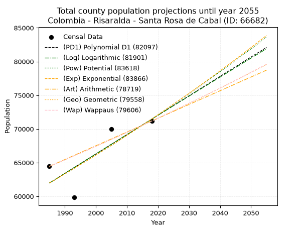
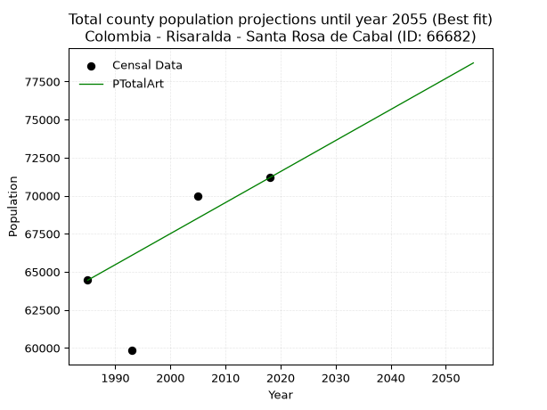
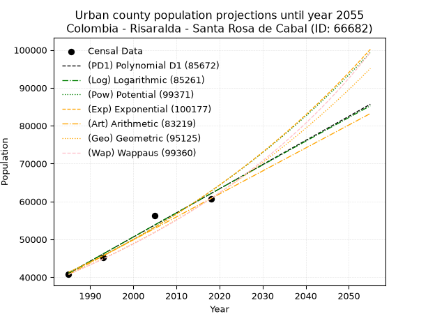
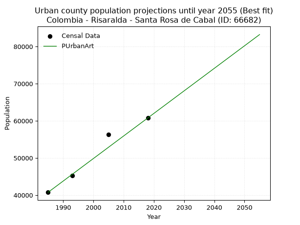
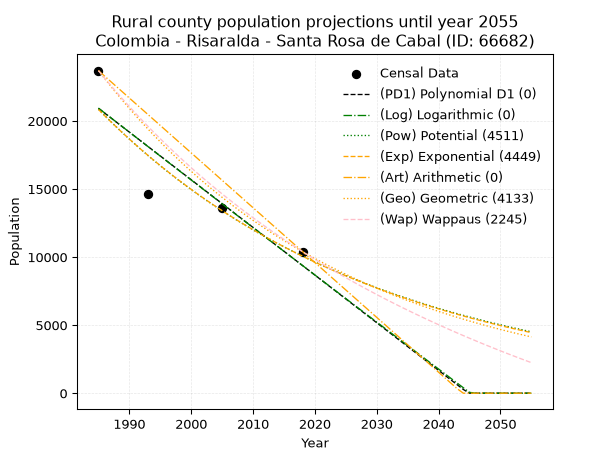
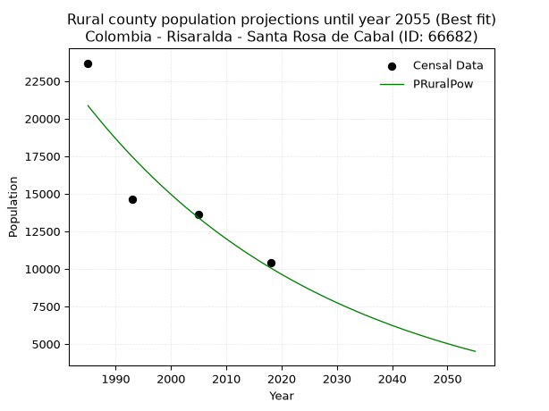

<div align="center">


</div>

# _“Population and Public Services Demand Projections (PPSD) until Year 2050 for Colombia - Risaralda - Santa Rosa de Cabal (ID: 66682)”_
Keywords: `population` `public-service` `projection` `lineal` `polynomial` `logarithmic` `potential` `exponential` `arithmetic` `geometric` `wappaus` `dane` `colombia` `south-america`

PPSD are analytical estimates used by governments and planners to anticipate future changes in population size, age distribution, and the resulting community needs for utilities, healthcare, education, and infrastructure as sizing future water treatment facilities, electrical grids, and road networks based on spatial growth.

> **General running parameters**: • app_version: _v20260806_. • Python version: _3.14.7_. • Pandas version: _3.0.5_. • NumPy version: _2.5.1_. • Creates, save and include plots into reports (create_plot): _False_. • Projection until year: _2050_. • Process polynomial degree 2 and up: _False_. • Process Wappaus: _True_. • Process Wappaus: _True_. • Set negative values to zero: _True_. • Set infinite values to zero: _True_. • Drop dataset notes: _True_. 
<div align="center">

Dynamic map: [:earth_americas:Google](http://maps.google.com/maps?q=4.876271311,-75.623268) [:earth_americas:OSM](https://www.openstreetmap.org/#map=18/4.876271311/-75.623268&layers=P) [:earth_americas:Bing](https://www.bing.com/maps?cp=4.876271311~-75.623268&lvl=18) [:earth_americas:Apple](https://maps.apple.com/frame?center=4.876271311%2C-75.623268&span=0.003%2C0.006)

</div>


<div align="center">

```geojson
{
  "type": "Feature",
  "geometry": {
    "type": "Point", 
    "coordinates": [-75.623268, 4.876271311]
  }, 
  "properties": {
    "Name": "Colombia - Risaralda - Santa Rosa de Cabal (ID: 66682)"
  }
}
```

</div>


## 0. Census Data (4 records)

Census data are official statistics collected by a government about the people and housing in a country. They usually include counts of total population, age, sex, race, income, education, and jobs.

📅Global census file: [Population.xlsx](../data/Population.xlsx)

| Source   |   Year |   CountryID | CountryName   |   StateID | StateName   |   CountyID | CountyName          |   PTotal |   PUrban |   PRural |
|:---------|-------:|------------:|:--------------|----------:|:------------|-----------:|:--------------------|---------:|---------:|---------:|
| DANE     |   1985 |          57 | Colombia      |        66 | Risaralda   |      66682 | Santa Rosa de Cabal |    64445 |    40752 |    23693 |
| DANE     |   1993 |          57 | Colombia      |        66 | Risaralda   |      66682 | Santa Rosa De Cabal |    59831 |    45208 |    14623 |
| DANE     |   2005 |          57 | Colombia      |        66 | Risaralda   |      66682 | Santa Rosa de Cabal |    69960 |    56329 |    13631 |
| DANE     |   2018 |          57 | Colombia      |        66 | Risaralda   |      66682 | Santa Rosa De Cabal |    71174 |    60772 |    10402 |

> 🔥Some records has specific notes about the registered values or the corresponding urban or rural distribution.

## 1. Total

### 1.1. Coefficients and Parameters

* (PD1) Polynomial Deg 1: 287.5752709755104, -508869.93576876464 (lineal)
* (Log) Logarithmic: 575369.5371724542, -4307035.962769929
* (Pow) Potential: 8.646845746131875, -23.723071894138425
* (Exp) Exponential: 0.00432190810264714, 11.65173879928867
* (Art) Arithmetic: Year diff. 2018 - 1985 = 33, Population diff. 71174 - 64445 = 6729, Annual growth = 203.9090909090909
* (Geo) Geometric: Year diff. 2018 - 1985 = 33, Population diff. 71174 - 64445 = 6729, Annual growth % = 0.0030140919450007964
* (Wap) Wappaus: i = 0.30070873684231697, Condition values only valid for < 200)

<sub>
Wappaus condition values: ['0.00', '0.30', '0.60', '0.90', '1.20', '1.50', '1.80', '2.10', '2.41', '2.71', '3.01', '3.31', '3.61', '3.91', '4.21', '4.51', '4.81', '5.11', '5.41', '5.71', '6.01', '6.31', '6.62', '6.92', '7.22', '7.52', '7.82', '8.12', '8.42', '8.72', '9.02', '9.32', '9.62', '9.92', '10.22', '10.52', '10.83', '11.13', '11.43', '11.73', '12.03', '12.33', '12.63', '12.93', '13.23', '13.53', '13.83', '14.13', '14.43', '14.73', '15.04', '15.34', '15.64', '15.94', '16.24', '16.54', '16.84', '17.14', '17.44', '17.74', '18.04', '18.34', '18.64', '18.94', '19.25', '19.55']
</sub>


### 1.2. Projected Dataset

|   Year |   CountyID |   PTotalPD1 |   PTotalLog |   PTotalPow |   PTotalExp |   PTotalArt |   PTotalGeo |   PTotalWap |
|-------:|-----------:|------------:|------------:|------------:|------------:|------------:|------------:|------------:|
|   1985 |      66682 |       61967 |       61960 |       61966 |       61972 |       64445 |       64445 |       64445 |
|   1986 |      66682 |       62255 |       62250 |       62237 |       62241 |       64649 |       64639 |       64639 |
|   1987 |      66682 |       62542 |       62540 |       62508 |       62510 |       64853 |       64834 |       64834 |
|   1988 |      66682 |       62830 |       62829 |       62781 |       62781 |       65057 |       65029 |       65029 |
|   1989 |      66682 |       63117 |       63119 |       63054 |       63053 |       65261 |       65225 |       65225 |
|   1990 |      66682 |       63405 |       63408 |       63329 |       63326 |       65465 |       65422 |       65421 |
|   1991 |      66682 |       63692 |       63697 |       63605 |       63600 |       65668 |       65619 |       65618 |
|   1992 |      66682 |       63980 |       63986 |       63881 |       63876 |       65872 |       65817 |       65816 |
|   1993 |      66682 |       64268 |       64274 |       64159 |       64152 |       66076 |       66015 |       66014 |
|   1994 |      66682 |       64555 |       64563 |       64438 |       64430 |       66280 |       66214 |       66213 |
|   1995 |      66682 |       64843 |       64852 |       64718 |       64709 |       66484 |       66414 |       66412 |
|   1996 |      66682 |       65130 |       65140 |       64999 |       64990 |       66688 |       66614 |       66613 |
|   1997 |      66682 |       65418 |       65428 |       65281 |       65271 |       66892 |       66815 |       66813 |
|   1998 |      66682 |       65705 |       65716 |       65564 |       65554 |       67096 |       67016 |       67015 |
|   1999 |      66682 |       65993 |       66004 |       65849 |       65838 |       67300 |       67218 |       67216 |
|   2000 |      66682 |       66281 |       66292 |       66134 |       66123 |       67504 |       67421 |       67419 |
|   2001 |      66682 |       66568 |       66579 |       66421 |       66409 |       67708 |       67624 |       67622 |
|   2002 |      66682 |       66856 |       66867 |       66708 |       66697 |       67911 |       67828 |       67826 |
|   2003 |      66682 |       67143 |       67154 |       66997 |       66986 |       68115 |       68032 |       68030 |
|   2004 |      66682 |       67431 |       67441 |       67287 |       67276 |       68319 |       68237 |       68235 |
|   2005 |      66682 |       67718 |       67728 |       67577 |       67567 |       68523 |       68443 |       68441 |
|   2006 |      66682 |       68006 |       68015 |       67869 |       67860 |       68727 |       68649 |       68647 |
|   2007 |      66682 |       68294 |       68302 |       68163 |       68154 |       68931 |       68856 |       68854 |
|   2008 |      66682 |       68581 |       68589 |       68457 |       68449 |       69135 |       69064 |       69062 |
|   2009 |      66682 |       68869 |       68875 |       68752 |       68746 |       69339 |       69272 |       69270 |
|   2010 |      66682 |       69156 |       69161 |       69049 |       69043 |       69543 |       69481 |       69479 |
|   2011 |      66682 |       69444 |       69448 |       69346 |       69342 |       69747 |       69690 |       69689 |
|   2012 |      66682 |       69732 |       69734 |       69645 |       69643 |       69951 |       69900 |       69899 |
|   2013 |      66682 |       70019 |       70020 |       69945 |       69944 |       70154 |       70111 |       70110 |
|   2014 |      66682 |       70307 |       70305 |       70246 |       70247 |       70358 |       70322 |       70321 |
|   2015 |      66682 |       70594 |       70591 |       70548 |       70552 |       70562 |       70534 |       70533 |
|   2016 |      66682 |       70882 |       70876 |       70851 |       70857 |       70766 |       70747 |       70746 |
|   2017 |      66682 |       71169 |       71162 |       71156 |       71164 |       70970 |       70960 |       70960 |
|   2018 |      66682 |       71457 |       71447 |       71461 |       71472 |       71174 |       71174 |       71174 |
|   2019 |      66682 |       71745 |       71732 |       71768 |       71782 |       71378 |       71389 |       71389 |
|   2020 |      66682 |       72032 |       72017 |       72076 |       72093 |       71582 |       71604 |       71604 |
|   2021 |      66682 |       72320 |       72302 |       72385 |       72405 |       71786 |       71820 |       71821 |
|   2022 |      66682 |       72607 |       72586 |       72696 |       72719 |       71990 |       72036 |       72038 |
|   2023 |      66682 |       72895 |       72871 |       73007 |       73034 |       72194 |       72253 |       72255 |
|   2024 |      66682 |       73182 |       73155 |       73320 |       73350 |       72397 |       72471 |       72474 |
|   2025 |      66682 |       73470 |       73439 |       73633 |       73668 |       72601 |       72689 |       72693 |
|   2026 |      66682 |       73758 |       73723 |       73948 |       73987 |       72805 |       72908 |       72912 |
|   2027 |      66682 |       74045 |       74007 |       74265 |       74307 |       73009 |       73128 |       73133 |
|   2028 |      66682 |       74333 |       74291 |       74582 |       74629 |       73213 |       73349 |       73354 |
|   2029 |      66682 |       74620 |       74575 |       74901 |       74952 |       73417 |       73570 |       73576 |
|   2030 |      66682 |       74908 |       74858 |       75220 |       75277 |       73621 |       73791 |       73798 |
|   2031 |      66682 |       75195 |       75142 |       75541 |       75603 |       73825 |       74014 |       74022 |
|   2032 |      66682 |       75483 |       75425 |       75864 |       75930 |       74029 |       74237 |       74246 |
|   2033 |      66682 |       75771 |       75708 |       76187 |       76259 |       74233 |       74461 |       74471 |
|   2034 |      66682 |       76058 |       75991 |       76512 |       76590 |       74437 |       74685 |       74696 |
|   2035 |      66682 |       76346 |       76274 |       76838 |       76921 |       74640 |       74910 |       74922 |
|   2036 |      66682 |       76633 |       76556 |       77165 |       77254 |       74844 |       75136 |       75149 |
|   2037 |      66682 |       76921 |       76839 |       77493 |       77589 |       75048 |       75362 |       75377 |
|   2038 |      66682 |       77208 |       77121 |       77823 |       77925 |       75252 |       75590 |       75605 |
|   2039 |      66682 |       77496 |       77403 |       78153 |       78263 |       75456 |       75817 |       75834 |
|   2040 |      66682 |       77784 |       77686 |       78486 |       78602 |       75660 |       76046 |       76064 |
|   2041 |      66682 |       78071 |       77968 |       78819 |       78942 |       75864 |       76275 |       76295 |
|   2042 |      66682 |       78359 |       78249 |       79153 |       79284 |       76068 |       76505 |       76527 |
|   2043 |      66682 |       78646 |       78531 |       79489 |       79627 |       76272 |       76736 |       76759 |
|   2044 |      66682 |       78934 |       78813 |       79826 |       79972 |       76476 |       76967 |       76992 |
|   2045 |      66682 |       79221 |       79094 |       80165 |       80319 |       76680 |       77199 |       77225 |
|   2046 |      66682 |       79509 |       79375 |       80504 |       80667 |       76883 |       77432 |       77460 |
|   2047 |      66682 |       79797 |       79657 |       80845 |       81016 |       77087 |       77665 |       77695 |
|   2048 |      66682 |       80084 |       79938 |       81187 |       81367 |       77291 |       77899 |       77931 |
|   2049 |      66682 |       80372 |       80218 |       81531 |       81719 |       77495 |       78134 |       78168 |
|   2050 |      66682 |       80659 |       80499 |       81875 |       82073 |       77699 |       78369 |       78406 |
<div align="center">

</img>

</div>


### 1.3. Best fit with absolute error and relative error (%)

Relative error puts that difference into context by dividing the absolute error by the true value, creating a unitless ratio or percentage that shows the scale of the mistake.

Absolute and relative error

|   Year | Source   |   CountryID | CountryName   |   StateID | StateName   |   CountyID_x | CountyName          |   PTotal |   PUrban |   PRural |   CountyID_y |   PTotalPD1 |   PTotalLog |   PTotalPow |   PTotalExp |   PTotalArt |   PTotalGeo |   PTotalWap |   PTotalPD1AbsError |   PTotalLogAbsError |   PTotalPowAbsError |   PTotalExpAbsError |   PTotalArtAbsError |   PTotalGeoAbsError |   PTotalWapAbsError |   PTotalPD1RelError |   PTotalLogRelError |   PTotalPowRelError |   PTotalExpRelError |   PTotalArtRelError |   PTotalGeoRelError |   PTotalWapRelError |
|-------:|:---------|------------:|:--------------|----------:|:------------|-------------:|:--------------------|---------:|---------:|---------:|-------------:|------------:|------------:|------------:|------------:|------------:|------------:|------------:|--------------------:|--------------------:|--------------------:|--------------------:|--------------------:|--------------------:|--------------------:|--------------------:|--------------------:|--------------------:|--------------------:|--------------------:|--------------------:|--------------------:|
|   1985 | DANE     |          57 | Colombia      |        66 | Risaralda   |        66682 | Santa Rosa de Cabal |    64445 |    40752 |    23693 |        66682 |       61967 |       61960 |       61966 |       61972 |       64445 |       64445 |       64445 |                2478 |                2485 |                2479 |                2473 |                   0 |                   0 |                   0 |            3.84514  |            3.856    |            3.84669  |            3.83738  |             0       |             0       |             0       |
|   1993 | DANE     |          57 | Colombia      |        66 | Risaralda   |        66682 | Santa Rosa De Cabal |    59831 |    45208 |    14623 |        66682 |       64268 |       64274 |       64159 |       64152 |       66076 |       66015 |       66014 |                4437 |                4443 |                4328 |                4321 |                6245 |                6184 |                6183 |            7.41589  |            7.42592  |            7.23371  |            7.22201  |            10.4377  |            10.3358  |            10.3341  |
|   2005 | DANE     |          57 | Colombia      |        66 | Risaralda   |        66682 | Santa Rosa de Cabal |    69960 |    56329 |    13631 |        66682 |       67718 |       67728 |       67577 |       67567 |       68523 |       68443 |       68441 |                2242 |                2232 |                2383 |                2393 |                1437 |                1517 |                1519 |            3.20469  |            3.19039  |            3.40623  |            3.42053  |             2.05403 |             2.16838 |             2.17124 |
|   2018 | DANE     |          57 | Colombia      |        66 | Risaralda   |        66682 | Santa Rosa De Cabal |    71174 |    60772 |    10402 |        66682 |       71457 |       71447 |       71461 |       71472 |       71174 |       71174 |       71174 |                 283 |                 273 |                 287 |                 298 |                   0 |                   0 |                   0 |            0.397617 |            0.383567 |            0.403237 |            0.418692 |             0       |             0       |             0       |

Relative error mean

| Method    |   RelError | Best   |
|:----------|-----------:|:-------|
| PTotalPD1 |    3.71583 |        |
| PTotalLog |    3.71397 |        |
| PTotalPow |    3.72247 |        |
| PTotalExp |    3.72465 |        |
| PTotalArt |    3.12294 | True   |
| PTotalGeo |    3.12604 |        |
| PTotalWap |    3.12634 |        |

💙Best method: _**PTotalArt**_
<div align="center">

</img>

</div>


### 1.4. Fresh water supply demand in liters per capita per day (lpcd)

The fresh water supply demand typically ranges from 100 to 300 liters per capita per day (lpcd) for standard domestic and municipal planning, though absolute survival minimums set by the World Health Organization are as low as 7.5 to 20 liters per day, and total consumption in high-income nations can exceed 400 liters.

> `CZ`: Level in meters above the sea level (masl).<br> `WS`: Fresh water supply demand in liters per capita per day (lpcd or l/h/d).<br> `WSAll`: Zonal fresh water supply demand in liters per second (l/s).<br> `A`: Zonal area in square meters.

Reference values (RAS Colombia)

|    CZ |   WS |
|------:|-----:|
|  1000 |  120 |
|  2000 |  130 |
| 99999 |  140 |

County shapefile geometry properties and water supply values

|   CountyID |      ATotal |   CZTotal |   WSTotal |
|-----------:|------------:|----------:|----------:|
|      66682 | 5.43329e+08 |   2556.23 |       140 |

Projected values for best method: PTotalArt

|   CountyID |   Year |   PTotalArt |   WSTotal |   WSTotalAll |
|-----------:|-------:|------------:|----------:|-------------:|
|      66682 |   1985 |       64445 |       140 |      104.425 |
|      66682 |   1986 |       64649 |       140 |      104.755 |
|      66682 |   1987 |       64853 |       140 |      105.086 |
|      66682 |   1988 |       65057 |       140 |      105.416 |
|      66682 |   1989 |       65261 |       140 |      105.747 |
|      66682 |   1990 |       65465 |       140 |      106.078 |
|      66682 |   1991 |       65668 |       140 |      106.406 |
|      66682 |   1992 |       65872 |       140 |      106.737 |
|      66682 |   1993 |       66076 |       140 |      107.068 |
|      66682 |   1994 |       66280 |       140 |      107.398 |
|      66682 |   1995 |       66484 |       140 |      107.729 |
|      66682 |   1996 |       66688 |       140 |      108.059 |
|      66682 |   1997 |       66892 |       140 |      108.39  |
|      66682 |   1998 |       67096 |       140 |      108.72  |
|      66682 |   1999 |       67300 |       140 |      109.051 |
|      66682 |   2000 |       67504 |       140 |      109.381 |
|      66682 |   2001 |       67708 |       140 |      109.712 |
|      66682 |   2002 |       67911 |       140 |      110.041 |
|      66682 |   2003 |       68115 |       140 |      110.372 |
|      66682 |   2004 |       68319 |       140 |      110.702 |
|      66682 |   2005 |       68523 |       140 |      111.033 |
|      66682 |   2006 |       68727 |       140 |      111.363 |
|      66682 |   2007 |       68931 |       140 |      111.694 |
|      66682 |   2008 |       69135 |       140 |      112.024 |
|      66682 |   2009 |       69339 |       140 |      112.355 |
|      66682 |   2010 |       69543 |       140 |      112.685 |
|      66682 |   2011 |       69747 |       140 |      113.016 |
|      66682 |   2012 |       69951 |       140 |      113.347 |
|      66682 |   2013 |       70154 |       140 |      113.675 |
|      66682 |   2014 |       70358 |       140 |      114.006 |
|      66682 |   2015 |       70562 |       140 |      114.337 |
|      66682 |   2016 |       70766 |       140 |      114.667 |
|      66682 |   2017 |       70970 |       140 |      114.998 |
|      66682 |   2018 |       71174 |       140 |      115.328 |
|      66682 |   2019 |       71378 |       140 |      115.659 |
|      66682 |   2020 |       71582 |       140 |      115.989 |
|      66682 |   2021 |       71786 |       140 |      116.32  |
|      66682 |   2022 |       71990 |       140 |      116.65  |
|      66682 |   2023 |       72194 |       140 |      116.981 |
|      66682 |   2024 |       72397 |       140 |      117.31  |
|      66682 |   2025 |       72601 |       140 |      117.641 |
|      66682 |   2026 |       72805 |       140 |      117.971 |
|      66682 |   2027 |       73009 |       140 |      118.302 |
|      66682 |   2028 |       73213 |       140 |      118.632 |
|      66682 |   2029 |       73417 |       140 |      118.963 |
|      66682 |   2030 |       73621 |       140 |      119.293 |
|      66682 |   2031 |       73825 |       140 |      119.624 |
|      66682 |   2032 |       74029 |       140 |      119.954 |
|      66682 |   2033 |       74233 |       140 |      120.285 |
|      66682 |   2034 |       74437 |       140 |      120.616 |
|      66682 |   2035 |       74640 |       140 |      120.944 |
|      66682 |   2036 |       74844 |       140 |      121.275 |
|      66682 |   2037 |       75048 |       140 |      121.606 |
|      66682 |   2038 |       75252 |       140 |      121.936 |
|      66682 |   2039 |       75456 |       140 |      122.267 |
|      66682 |   2040 |       75660 |       140 |      122.597 |
|      66682 |   2041 |       75864 |       140 |      122.928 |
|      66682 |   2042 |       76068 |       140 |      123.258 |
|      66682 |   2043 |       76272 |       140 |      123.589 |
|      66682 |   2044 |       76476 |       140 |      123.919 |
|      66682 |   2045 |       76680 |       140 |      124.25  |
|      66682 |   2046 |       76883 |       140 |      124.579 |
|      66682 |   2047 |       77087 |       140 |      124.909 |
|      66682 |   2048 |       77291 |       140 |      125.24  |
|      66682 |   2049 |       77495 |       140 |      125.571 |
|      66682 |   2050 |       77699 |       140 |      125.901 |

## 2. Urban

### 2.1. Coefficients and Parameters

* (PD1) Polynomial Deg 1: 637.5588117221964, -1224511.7631473232 (lineal)
* (Log) Logarithmic: 1276529.117876947, -9652142.804445034
* (Pow) Potential: 25.333152269598738, -78.92670688826878
* (Exp) Exponential: 0.012651305821554777, 5.126155021682718e-07
* (Art) Arithmetic: Year diff. 2018 - 1985 = 33, Population diff. 60772 - 40752 = 20020, Annual growth = 606.6666666666666
* (Geo) Geometric: Year diff. 2018 - 1985 = 33, Population diff. 60772 - 40752 = 20020, Annual growth % = 0.012183446218299476
* (Wap) Wappaus: i = 1.1951197089686512, Condition values only valid for < 200)

<sub>
Wappaus condition values: ['0.00', '1.20', '2.39', '3.59', '4.78', '5.98', '7.17', '8.37', '9.56', '10.76', '11.95', '13.15', '14.34', '15.54', '16.73', '17.93', '19.12', '20.32', '21.51', '22.71', '23.90', '25.10', '26.29', '27.49', '28.68', '29.88', '31.07', '32.27', '33.46', '34.66', '35.85', '37.05', '38.24', '39.44', '40.63', '41.83', '43.02', '44.22', '45.41', '46.61', '47.80', '49.00', '50.20', '51.39', '52.59', '53.78', '54.98', '56.17', '57.37', '58.56', '59.76', '60.95', '62.15', '63.34', '64.54', '65.73', '66.93', '68.12', '69.32', '70.51', '71.71', '72.90', '74.10', '75.29', '76.49', '77.68']
</sub>


### 2.2. Projected Dataset

|   Year |   CountyID |   PUrbanPD1 |   PUrbanLog |   PUrbanPow |   PUrbanExp |   PUrbanArt |   PUrbanGeo |   PUrbanWap |
|-------:|-----------:|------------:|------------:|------------:|------------:|------------:|------------:|------------:|
|   1985 |      66682 |       41042 |       41020 |       41301 |       41320 |       40752 |       40752 |       40752 |
|   1986 |      66682 |       41680 |       41663 |       41832 |       41846 |       41359 |       41248 |       41242 |
|   1987 |      66682 |       42318 |       42306 |       42368 |       42379 |       41965 |       41751 |       41738 |
|   1988 |      66682 |       42955 |       42948 |       42912 |       42918 |       42572 |       42260 |       42240 |
|   1989 |      66682 |       43593 |       43590 |       43462 |       43465 |       43179 |       42775 |       42748 |
|   1990 |      66682 |       44230 |       44232 |       44019 |       44018 |       43785 |       43296 |       43262 |
|   1991 |      66682 |       44868 |       44873 |       44583 |       44579 |       44392 |       43823 |       43783 |
|   1992 |      66682 |       45505 |       45514 |       45154 |       45146 |       44999 |       44357 |       44310 |
|   1993 |      66682 |       46143 |       46155 |       45731 |       45721 |       45605 |       44898 |       44844 |
|   1994 |      66682 |       46781 |       46795 |       46316 |       46303 |       46212 |       45445 |       45384 |
|   1995 |      66682 |       47418 |       47435 |       46908 |       46893 |       46819 |       45998 |       45932 |
|   1996 |      66682 |       48056 |       48075 |       47508 |       47490 |       47425 |       46559 |       46486 |
|   1997 |      66682 |       48693 |       48714 |       48114 |       48094 |       48032 |       47126 |       47048 |
|   1998 |      66682 |       49331 |       49353 |       48728 |       48707 |       48639 |       47700 |       47617 |
|   1999 |      66682 |       49968 |       49992 |       49350 |       49327 |       49245 |       48281 |       48193 |
|   2000 |      66682 |       50606 |       50631 |       49979 |       49955 |       49852 |       48869 |       48777 |
|   2001 |      66682 |       51243 |       51269 |       50616 |       50591 |       50459 |       49465 |       49368 |
|   2002 |      66682 |       51881 |       51906 |       51261 |       51235 |       51065 |       50067 |       49968 |
|   2003 |      66682 |       52519 |       52544 |       51913 |       51887 |       51672 |       50677 |       50575 |
|   2004 |      66682 |       53156 |       53181 |       52574 |       52548 |       52279 |       51295 |       51191 |
|   2005 |      66682 |       53794 |       53818 |       53243 |       53217 |       52885 |       51920 |       51815 |
|   2006 |      66682 |       54431 |       54454 |       53919 |       53894 |       53492 |       52552 |       52447 |
|   2007 |      66682 |       55069 |       55091 |       54605 |       54580 |       54099 |       53193 |       53089 |
|   2008 |      66682 |       55706 |       55726 |       55298 |       55275 |       54705 |       53841 |       53739 |
|   2009 |      66682 |       56344 |       56362 |       56000 |       55979 |       55312 |       54497 |       54398 |
|   2010 |      66682 |       56981 |       56997 |       56710 |       56692 |       55919 |       55161 |       55066 |
|   2011 |      66682 |       57619 |       57632 |       57429 |       57414 |       56525 |       55833 |       55744 |
|   2012 |      66682 |       58257 |       58267 |       58157 |       58145 |       57132 |       56513 |       56432 |
|   2013 |      66682 |       58894 |       58901 |       58894 |       58885 |       57739 |       57201 |       57129 |
|   2014 |      66682 |       59532 |       59535 |       59640 |       59635 |       58345 |       57898 |       57837 |
|   2015 |      66682 |       60169 |       60169 |       60394 |       60394 |       58952 |       58604 |       58554 |
|   2016 |      66682 |       60807 |       60802 |       61158 |       61163 |       59559 |       59318 |       59283 |
|   2017 |      66682 |       61444 |       61435 |       61931 |       61941 |       60165 |       60040 |       60022 |
|   2018 |      66682 |       62082 |       62068 |       62714 |       62730 |       60772 |       60772 |       60772 |
|   2019 |      66682 |       62719 |       62700 |       63506 |       63529 |       61379 |       61512 |       61533 |
|   2020 |      66682 |       63357 |       63332 |       64308 |       64338 |       61985 |       62262 |       62306 |
|   2021 |      66682 |       63995 |       63964 |       65119 |       65157 |       62592 |       63020 |       63091 |
|   2022 |      66682 |       64632 |       64596 |       65940 |       65986 |       63199 |       63788 |       63887 |
|   2023 |      66682 |       65270 |       65227 |       66771 |       66826 |       63805 |       64565 |       64696 |
|   2024 |      66682 |       65907 |       65858 |       67613 |       67677 |       64412 |       65352 |       65518 |
|   2025 |      66682 |       66545 |       66488 |       68464 |       68539 |       65019 |       66148 |       66353 |
|   2026 |      66682 |       67182 |       67118 |       69326 |       69411 |       65625 |       66954 |       67200 |
|   2027 |      66682 |       67820 |       67748 |       70198 |       70295 |       66232 |       67770 |       68061 |
|   2028 |      66682 |       68458 |       68378 |       71080 |       71190 |       66839 |       68596 |       68937 |
|   2029 |      66682 |       69095 |       69007 |       71974 |       72096 |       67445 |       69431 |       69826 |
|   2030 |      66682 |       69733 |       69636 |       72878 |       73014 |       68052 |       70277 |       70730 |
|   2031 |      66682 |       70370 |       70265 |       73793 |       73944 |       68659 |       71133 |       71648 |
|   2032 |      66682 |       71008 |       70893 |       74718 |       74885 |       69265 |       72000 |       72582 |
|   2033 |      66682 |       71645 |       71521 |       75656 |       75839 |       69872 |       72877 |       73532 |
|   2034 |      66682 |       72283 |       72149 |       76604 |       76804 |       70479 |       73765 |       74498 |
|   2035 |      66682 |       72920 |       72777 |       77564 |       77782 |       71085 |       74664 |       75480 |
|   2036 |      66682 |       73558 |       73404 |       78535 |       78772 |       71692 |       75574 |       76479 |
|   2037 |      66682 |       74196 |       74031 |       79518 |       79775 |       72299 |       76494 |       77495 |
|   2038 |      66682 |       74833 |       74657 |       80513 |       80791 |       72905 |       77426 |       78529 |
|   2039 |      66682 |       75471 |       75283 |       81520 |       81820 |       73512 |       78370 |       79581 |
|   2040 |      66682 |       76108 |       75909 |       82539 |       82861 |       74119 |       79324 |       80653 |
|   2041 |      66682 |       76746 |       76535 |       83570 |       83916 |       74725 |       80291 |       81743 |
|   2042 |      66682 |       77383 |       77160 |       84613 |       84985 |       75332 |       81269 |       82853 |
|   2043 |      66682 |       78021 |       77785 |       85669 |       86067 |       75939 |       82259 |       83983 |
|   2044 |      66682 |       78658 |       78410 |       86738 |       87162 |       76545 |       83261 |       85135 |
|   2045 |      66682 |       79296 |       79034 |       87819 |       88272 |       77152 |       84276 |       86307 |
|   2046 |      66682 |       79934 |       79658 |       88914 |       89396 |       77759 |       85303 |       87502 |
|   2047 |      66682 |       80571 |       80282 |       90021 |       90534 |       78365 |       86342 |       88720 |
|   2048 |      66682 |       81209 |       80905 |       91142 |       91687 |       78972 |       87394 |       89960 |
|   2049 |      66682 |       81846 |       81528 |       92276 |       92854 |       79579 |       88459 |       91225 |
|   2050 |      66682 |       82484 |       82151 |       93424 |       94036 |       80185 |       89536 |       92515 |
<div align="center">

</img>

</div>


### 2.3. Best fit with absolute error and relative error (%)

Relative error puts that difference into context by dividing the absolute error by the true value, creating a unitless ratio or percentage that shows the scale of the mistake.

Absolute and relative error

|   Year | Source   |   CountryID | CountryName   |   StateID | StateName   |   CountyID_x | CountyName          |   PTotal |   PUrban |   PRural |   CountyID_y |   PUrbanPD1 |   PUrbanLog |   PUrbanPow |   PUrbanExp |   PUrbanArt |   PUrbanGeo |   PUrbanWap |   PUrbanPD1AbsError |   PUrbanLogAbsError |   PUrbanPowAbsError |   PUrbanExpAbsError |   PUrbanArtAbsError |   PUrbanGeoAbsError |   PUrbanWapAbsError |   PUrbanPD1RelError |   PUrbanLogRelError |   PUrbanPowRelError |   PUrbanExpRelError |   PUrbanArtRelError |   PUrbanGeoRelError |   PUrbanWapRelError |
|-------:|:---------|------------:|:--------------|----------:|:------------|-------------:|:--------------------|---------:|---------:|---------:|-------------:|------------:|------------:|------------:|------------:|------------:|------------:|------------:|--------------------:|--------------------:|--------------------:|--------------------:|--------------------:|--------------------:|--------------------:|--------------------:|--------------------:|--------------------:|--------------------:|--------------------:|--------------------:|--------------------:|
|   1985 | DANE     |          57 | Colombia      |        66 | Risaralda   |        66682 | Santa Rosa de Cabal |    64445 |    40752 |    23693 |        66682 |       41042 |       41020 |       41301 |       41320 |       40752 |       40752 |       40752 |                 290 |                 268 |                 549 |                 568 |                   0 |                   0 |                   0 |            0.711622 |            0.657636 |             1.34717 |             1.3938  |            0        |            0        |            0        |
|   1993 | DANE     |          57 | Colombia      |        66 | Risaralda   |        66682 | Santa Rosa De Cabal |    59831 |    45208 |    14623 |        66682 |       46143 |       46155 |       45731 |       45721 |       45605 |       44898 |       44844 |                 935 |                 947 |                 523 |                 513 |                 397 |                 310 |                 364 |            2.06822  |            2.09476  |             1.15687 |             1.13475 |            0.878163 |            0.685719 |            0.805167 |
|   2005 | DANE     |          57 | Colombia      |        66 | Risaralda   |        66682 | Santa Rosa de Cabal |    69960 |    56329 |    13631 |        66682 |       53794 |       53818 |       53243 |       53217 |       52885 |       51920 |       51815 |                2535 |                2511 |                3086 |                3112 |                3444 |                4409 |                4514 |            4.50035  |            4.45774  |             5.47853 |             5.52469 |            6.11408  |            7.82723  |            8.01363  |
|   2018 | DANE     |          57 | Colombia      |        66 | Risaralda   |        66682 | Santa Rosa De Cabal |    71174 |    60772 |    10402 |        66682 |       62082 |       62068 |       62714 |       62730 |       60772 |       60772 |       60772 |                1310 |                1296 |                1942 |                1958 |                   0 |                   0 |                   0 |            2.1556   |            2.13256  |             3.19555 |             3.22188 |            0        |            0        |            0        |

Relative error mean

| Method    |   RelError | Best   |
|:----------|-----------:|:-------|
| PUrbanPD1 |    2.35895 |        |
| PUrbanLog |    2.33567 |        |
| PUrbanPow |    2.79453 |        |
| PUrbanExp |    2.81878 |        |
| PUrbanArt |    1.74806 | True   |
| PUrbanGeo |    2.12824 |        |
| PUrbanWap |    2.2047  |        |

💙Best method: _**PUrbanArt**_
<div align="center">

</img>

</div>


### 2.4. Fresh water supply demand in liters per capita per day (lpcd)

The fresh water supply demand typically ranges from 100 to 300 liters per capita per day (lpcd) for standard domestic and municipal planning, though absolute survival minimums set by the World Health Organization are as low as 7.5 to 20 liters per day, and total consumption in high-income nations can exceed 400 liters.

> `CZ`: Level in meters above the sea level (masl).<br> `WS`: Fresh water supply demand in liters per capita per day (lpcd or l/h/d).<br> `WSAll`: Zonal fresh water supply demand in liters per second (l/s).<br> `A`: Zonal area in square meters.

Reference values (RAS Colombia)

|    CZ |   WS |
|------:|-----:|
|  1000 |  120 |
|  2000 |  130 |
| 99999 |  140 |

County shapefile geometry properties and water supply values

|   CountyID |      AUrban |   CZUrban |   WSUrban |
|-----------:|------------:|----------:|----------:|
|      66682 | 7.72427e+06 |   1667.74 |       130 |

Projected values for best method: PUrbanArt

|   CountyID |   Year |   PUrbanArt |   WSUrban |   WSUrbanAll |
|-----------:|-------:|------------:|----------:|-------------:|
|      66682 |   1985 |       40752 |       130 |      61.3167 |
|      66682 |   1986 |       41359 |       130 |      62.23   |
|      66682 |   1987 |       41965 |       130 |      63.1418 |
|      66682 |   1988 |       42572 |       130 |      64.0551 |
|      66682 |   1989 |       43179 |       130 |      64.9684 |
|      66682 |   1990 |       43785 |       130 |      65.8802 |
|      66682 |   1991 |       44392 |       130 |      66.7935 |
|      66682 |   1992 |       44999 |       130 |      67.7068 |
|      66682 |   1993 |       45605 |       130 |      68.6186 |
|      66682 |   1994 |       46212 |       130 |      69.5319 |
|      66682 |   1995 |       46819 |       130 |      70.4453 |
|      66682 |   1996 |       47425 |       130 |      71.3571 |
|      66682 |   1997 |       48032 |       130 |      72.2704 |
|      66682 |   1998 |       48639 |       130 |      73.1837 |
|      66682 |   1999 |       49245 |       130 |      74.0955 |
|      66682 |   2000 |       49852 |       130 |      75.0088 |
|      66682 |   2001 |       50459 |       130 |      75.9221 |
|      66682 |   2002 |       51065 |       130 |      76.8339 |
|      66682 |   2003 |       51672 |       130 |      77.7472 |
|      66682 |   2004 |       52279 |       130 |      78.6605 |
|      66682 |   2005 |       52885 |       130 |      79.5723 |
|      66682 |   2006 |       53492 |       130 |      80.4856 |
|      66682 |   2007 |       54099 |       130 |      81.399  |
|      66682 |   2008 |       54705 |       130 |      82.3108 |
|      66682 |   2009 |       55312 |       130 |      83.2241 |
|      66682 |   2010 |       55919 |       130 |      84.1374 |
|      66682 |   2011 |       56525 |       130 |      85.0492 |
|      66682 |   2012 |       57132 |       130 |      85.9625 |
|      66682 |   2013 |       57739 |       130 |      86.8758 |
|      66682 |   2014 |       58345 |       130 |      87.7876 |
|      66682 |   2015 |       58952 |       130 |      88.7009 |
|      66682 |   2016 |       59559 |       130 |      89.6142 |
|      66682 |   2017 |       60165 |       130 |      90.526  |
|      66682 |   2018 |       60772 |       130 |      91.4394 |
|      66682 |   2019 |       61379 |       130 |      92.3527 |
|      66682 |   2020 |       61985 |       130 |      93.2645 |
|      66682 |   2021 |       62592 |       130 |      94.1778 |
|      66682 |   2022 |       63199 |       130 |      95.0911 |
|      66682 |   2023 |       63805 |       130 |      96.0029 |
|      66682 |   2024 |       64412 |       130 |      96.9162 |
|      66682 |   2025 |       65019 |       130 |      97.8295 |
|      66682 |   2026 |       65625 |       130 |      98.7413 |
|      66682 |   2027 |       66232 |       130 |      99.6546 |
|      66682 |   2028 |       66839 |       130 |     100.568  |
|      66682 |   2029 |       67445 |       130 |     101.48   |
|      66682 |   2030 |       68052 |       130 |     102.393  |
|      66682 |   2031 |       68659 |       130 |     103.306  |
|      66682 |   2032 |       69265 |       130 |     104.218  |
|      66682 |   2033 |       69872 |       130 |     105.131  |
|      66682 |   2034 |       70479 |       130 |     106.045  |
|      66682 |   2035 |       71085 |       130 |     106.957  |
|      66682 |   2036 |       71692 |       130 |     107.87   |
|      66682 |   2037 |       72299 |       130 |     108.783  |
|      66682 |   2038 |       72905 |       130 |     109.695  |
|      66682 |   2039 |       73512 |       130 |     110.608  |
|      66682 |   2040 |       74119 |       130 |     111.522  |
|      66682 |   2041 |       74725 |       130 |     112.433  |
|      66682 |   2042 |       75332 |       130 |     113.347  |
|      66682 |   2043 |       75939 |       130 |     114.26   |
|      66682 |   2044 |       76545 |       130 |     115.172  |
|      66682 |   2045 |       77152 |       130 |     116.085  |
|      66682 |   2046 |       77759 |       130 |     116.998  |
|      66682 |   2047 |       78365 |       130 |     117.91   |
|      66682 |   2048 |       78972 |       130 |     118.824  |
|      66682 |   2049 |       79579 |       130 |     119.737  |
|      66682 |   2050 |       80185 |       130 |     120.649  |

## 3. Rural

### 3.1. Coefficients and Parameters

* (PD1) Polynomial Deg 1: -349.9835407466859, 715641.8273785583 (lineal)
* (Log) Logarithmic: -701159.5807044927, 5345106.841675103
* (Pow) Potential: -44.18360929018942, 150.02627030196257
* (Exp) Exponential: -0.022061333337570814, 2.174959719183533e+23
* (Art) Arithmetic: Year diff. 2018 - 1985 = 33, Population diff. 10402 - 23693 = -13291, Annual growth = -402.75757575757575
* (Geo) Geometric: Year diff. 2018 - 1985 = 33, Population diff. 10402 - 23693 = -13291, Annual growth % = -0.024636342496666908
* (Wap) Wappaus: i = -2.3625609371319887, Condition values only valid for < 200)

<sub>
Wappaus condition values: ['-0.00', '-2.36', '-4.73', '-7.09', '-9.45', '-11.81', '-14.18', '-16.54', '-18.90', '-21.26', '-23.63', '-25.99', '-28.35', '-30.71', '-33.08', '-35.44', '-37.80', '-40.16', '-42.53', '-44.89', '-47.25', '-49.61', '-51.98', '-54.34', '-56.70', '-59.06', '-61.43', '-63.79', '-66.15', '-68.51', '-70.88', '-73.24', '-75.60', '-77.96', '-80.33', '-82.69', '-85.05', '-87.41', '-89.78', '-92.14', '-94.50', '-96.86', '-99.23', '-101.59', '-103.95', '-106.32', '-108.68', '-111.04', '-113.40', '-115.77', '-118.13', '-120.49', '-122.85', '-125.22', '-127.58', '-129.94', '-132.30', '-134.67', '-137.03', '-139.39', '-141.75', '-144.12', '-146.48', '-148.84', '-151.20', '-153.57']
</sub>


### 3.2. Projected Dataset

|   Year |   CountyID |   PRuralPD1 |   PRuralLog |   PRuralPow |   PRuralExp |   PRuralArt |   PRuralGeo |   PRuralWap |
|-------:|-----------:|------------:|------------:|------------:|------------:|------------:|------------:|------------:|
|   1985 |      66682 |       20924 |       20940 |       20860 |       20842 |       23693 |       23693 |       23693 |
|   1986 |      66682 |       20575 |       20587 |       20401 |       20387 |       23290 |       23109 |       23140 |
|   1987 |      66682 |       20225 |       20234 |       19952 |       19942 |       22887 |       22540 |       22599 |
|   1988 |      66682 |       19875 |       19881 |       19513 |       19507 |       22485 |       21985 |       22071 |
|   1989 |      66682 |       19525 |       19528 |       19084 |       19082 |       22082 |       21443 |       21555 |
|   1990 |      66682 |       19175 |       19176 |       18665 |       18665 |       21679 |       20915 |       21050 |
|   1991 |      66682 |       18825 |       18824 |       18256 |       18258 |       21276 |       20399 |       20557 |
|   1992 |      66682 |       18475 |       18472 |       17855 |       17860 |       20874 |       19897 |       20074 |
|   1993 |      66682 |       18125 |       18120 |       17463 |       17470 |       20471 |       19407 |       19602 |
|   1994 |      66682 |       17775 |       17768 |       17081 |       17089 |       20068 |       18929 |       19139 |
|   1995 |      66682 |       17425 |       17416 |       16706 |       16716 |       19665 |       18462 |       18687 |
|   1996 |      66682 |       17075 |       17065 |       16341 |       16351 |       19263 |       18007 |       18244 |
|   1997 |      66682 |       16725 |       16714 |       15983 |       15994 |       18860 |       17564 |       17810 |
|   1998 |      66682 |       16375 |       16363 |       15633 |       15645 |       18457 |       17131 |       17385 |
|   1999 |      66682 |       16025 |       16012 |       15291 |       15304 |       18054 |       16709 |       16968 |
|   2000 |      66682 |       15675 |       15661 |       14957 |       14970 |       17652 |       16297 |       16560 |
|   2001 |      66682 |       15325 |       15311 |       14630 |       14643 |       17249 |       15896 |       16160 |
|   2002 |      66682 |       14975 |       14960 |       14311 |       14324 |       16846 |       15504 |       15768 |
|   2003 |      66682 |       14625 |       14610 |       13999 |       14011 |       16443 |       15122 |       15384 |
|   2004 |      66682 |       14275 |       14260 |       13693 |       13706 |       16041 |       14750 |       15007 |
|   2005 |      66682 |       13925 |       13911 |       13395 |       13406 |       15638 |       14386 |       14637 |
|   2006 |      66682 |       13575 |       13561 |       13103 |       13114 |       15235 |       14032 |       14274 |
|   2007 |      66682 |       13225 |       13211 |       12818 |       12828 |       14832 |       13686 |       13918 |
|   2008 |      66682 |       12875 |       12862 |       12539 |       12548 |       14430 |       13349 |       13569 |
|   2009 |      66682 |       12525 |       12513 |       12266 |       12274 |       14027 |       13020 |       13226 |
|   2010 |      66682 |       12175 |       12164 |       11999 |       12006 |       13624 |       12699 |       12889 |
|   2011 |      66682 |       11825 |       11815 |       11738 |       11744 |       13221 |       12387 |       12559 |
|   2012 |      66682 |       11475 |       11467 |       11483 |       11488 |       12819 |       12081 |       12234 |
|   2013 |      66682 |       11125 |       11118 |       11234 |       11237 |       12416 |       11784 |       11915 |
|   2014 |      66682 |       10775 |       10770 |       10990 |       10992 |       12013 |       11493 |       11602 |
|   2015 |      66682 |       10425 |       10422 |       10752 |       10752 |       11610 |       11210 |       11294 |
|   2016 |      66682 |       10075 |       10074 |       10518 |       10518 |       11208 |       10934 |       10992 |
|   2017 |      66682 |        9725 |        9727 |       10290 |       10288 |       10805 |       10665 |       10694 |
|   2018 |      66682 |        9375 |        9379 |       10068 |       10064 |       10402 |       10402 |       10402 |
|   2019 |      66682 |        9025 |        9032 |        9850 |        9844 |        9999 |       10146 |       10115 |
|   2020 |      66682 |        8675 |        8684 |        9636 |        9629 |        9596 |        9896 |        9832 |
|   2021 |      66682 |        8325 |        8337 |        9428 |        9419 |        9194 |        9652 |        9554 |
|   2022 |      66682 |        7975 |        7991 |        9224 |        9214 |        8791 |        9414 |        9281 |
|   2023 |      66682 |        7625 |        7644 |        9025 |        9013 |        8388 |        9182 |        9012 |
|   2024 |      66682 |        7275 |        7297 |        8830 |        8816 |        7985 |        8956 |        8748 |
|   2025 |      66682 |        6925 |        6951 |        8639 |        8624 |        7583 |        8735 |        8487 |
|   2026 |      66682 |        6575 |        6605 |        8453 |        8436 |        7180 |        8520 |        8231 |
|   2027 |      66682 |        6225 |        6259 |        8271 |        8251 |        6777 |        8310 |        7979 |
|   2028 |      66682 |        5875 |        5913 |        8092 |        8071 |        6374 |        8106 |        7731 |
|   2029 |      66682 |        5525 |        5567 |        7918 |        7895 |        5972 |        7906 |        7487 |
|   2030 |      66682 |        5175 |        5222 |        7747 |        7723 |        5569 |        7711 |        7246 |
|   2031 |      66682 |        4825 |        4877 |        7581 |        7555 |        5166 |        7521 |        7010 |
|   2032 |      66682 |        4475 |        4532 |        7418 |        7390 |        4763 |        7336 |        6776 |
|   2033 |      66682 |        4125 |        4187 |        7258 |        7228 |        4361 |        7155 |        6547 |
|   2034 |      66682 |        3775 |        3842 |        7102 |        7071 |        3958 |        6979 |        6320 |
|   2035 |      66682 |        3425 |        3497 |        6949 |        6916 |        3555 |        6807 |        6098 |
|   2036 |      66682 |        3075 |        3153 |        6800 |        6766 |        3152 |        6639 |        5878 |
|   2037 |      66682 |        2725 |        2808 |        6654 |        6618 |        2750 |        6476 |        5662 |
|   2038 |      66682 |        2375 |        2464 |        6512 |        6473 |        2347 |        6316 |        5448 |
|   2039 |      66682 |        2025 |        2120 |        6372 |        6332 |        1944 |        6160 |        5238 |
|   2040 |      66682 |        1675 |        1776 |        6235 |        6194 |        1541 |        6009 |        5031 |
|   2041 |      66682 |        1325 |        1433 |        6102 |        6059 |        1139 |        5861 |        4827 |
|   2042 |      66682 |         975 |        1089 |        5971 |        5927 |         736 |        5716 |        4625 |
|   2043 |      66682 |         625 |         746 |        5843 |        5797 |         333 |        5575 |        4427 |
|   2044 |      66682 |         275 |         403 |        5718 |        5671 |         -70 |        5438 |        4231 |
|   2045 |      66682 |           0 |          60 |        5596 |        5547 |        -472 |        5304 |        4038 |
|   2046 |      66682 |           0 |           0 |        5477 |        5426 |        -875 |        5173 |        3848 |
|   2047 |      66682 |           0 |           0 |        5360 |        5308 |       -1278 |        5046 |        3660 |
|   2048 |      66682 |           0 |           0 |        5245 |        5192 |       -1681 |        4922 |        3475 |
|   2049 |      66682 |           0 |           0 |        5133 |        5079 |       -2083 |        4800 |        3292 |
|   2050 |      66682 |           0 |           0 |        5024 |        4968 |       -2486 |        4682 |        3112 |
<div align="center">

</img>

</div>


### 3.3. Best fit with absolute error and relative error (%)

Relative error puts that difference into context by dividing the absolute error by the true value, creating a unitless ratio or percentage that shows the scale of the mistake.

Absolute and relative error

|   Year | Source   |   CountryID | CountryName   |   StateID | StateName   |   CountyID_x | CountyName          |   PTotal |   PUrban |   PRural |   CountyID_y |   PRuralPD1 |   PRuralLog |   PRuralPow |   PRuralExp |   PRuralArt |   PRuralGeo |   PRuralWap |   PRuralPD1AbsError |   PRuralLogAbsError |   PRuralPowAbsError |   PRuralExpAbsError |   PRuralArtAbsError |   PRuralGeoAbsError |   PRuralWapAbsError |   PRuralPD1RelError |   PRuralLogRelError |   PRuralPowRelError |   PRuralExpRelError |   PRuralArtRelError |   PRuralGeoRelError |   PRuralWapRelError |
|-------:|:---------|------------:|:--------------|----------:|:------------|-------------:|:--------------------|---------:|---------:|---------:|-------------:|------------:|------------:|------------:|------------:|------------:|------------:|------------:|--------------------:|--------------------:|--------------------:|--------------------:|--------------------:|--------------------:|--------------------:|--------------------:|--------------------:|--------------------:|--------------------:|--------------------:|--------------------:|--------------------:|
|   1985 | DANE     |          57 | Colombia      |        66 | Risaralda   |        66682 | Santa Rosa de Cabal |    64445 |    40752 |    23693 |        66682 |       20924 |       20940 |       20860 |       20842 |       23693 |       23693 |       23693 |                2769 |                2753 |                2833 |                2851 |                   0 |                   0 |                   0 |            11.687   |            11.6195  |            11.9571  |            12.0331  |              0      |             0       |             0       |
|   1993 | DANE     |          57 | Colombia      |        66 | Risaralda   |        66682 | Santa Rosa De Cabal |    59831 |    45208 |    14623 |        66682 |       18125 |       18120 |       17463 |       17470 |       20471 |       19407 |       19602 |                3502 |                3497 |                2840 |                2847 |                5848 |                4784 |                4979 |            23.9486  |            23.9144  |            19.4215  |            19.4693  |             39.9918 |            32.7156  |            34.0491  |
|   2005 | DANE     |          57 | Colombia      |        66 | Risaralda   |        66682 | Santa Rosa de Cabal |    69960 |    56329 |    13631 |        66682 |       13925 |       13911 |       13395 |       13406 |       15638 |       14386 |       14637 |                 294 |                 280 |                 236 |                 225 |                2007 |                 755 |                1006 |             2.15685 |             2.05414 |             1.73135 |             1.65065 |             14.7238 |             5.53885 |             7.38024 |
|   2018 | DANE     |          57 | Colombia      |        66 | Risaralda   |        66682 | Santa Rosa De Cabal |    71174 |    60772 |    10402 |        66682 |        9375 |        9379 |       10068 |       10064 |       10402 |       10402 |       10402 |                1027 |                1023 |                 334 |                 338 |                   0 |                   0 |                   0 |             9.8731  |             9.83465 |             3.21092 |             3.24938 |              0      |             0       |             0       |

Relative error mean

| Method    |   RelError | Best   |
|:----------|-----------:|:-------|
| PRuralPD1 |   11.9164  |        |
| PRuralLog |   11.8557  |        |
| PRuralPow |    9.08021 | True   |
| PRuralExp |    9.10061 |        |
| PRuralArt |   13.6789  |        |
| PRuralGeo |    9.56361 |        |
| PRuralWap |   10.3573  |        |

💙Best method: _**PRuralPow**_
<div align="center">

</img>

</div>


### 3.4. Fresh water supply demand in liters per capita per day (lpcd)

The fresh water supply demand typically ranges from 100 to 300 liters per capita per day (lpcd) for standard domestic and municipal planning, though absolute survival minimums set by the World Health Organization are as low as 7.5 to 20 liters per day, and total consumption in high-income nations can exceed 400 liters.

> `CZ`: Level in meters above the sea level (masl).<br> `WS`: Fresh water supply demand in liters per capita per day (lpcd or l/h/d).<br> `WSAll`: Zonal fresh water supply demand in liters per second (l/s).<br> `A`: Zonal area in square meters.

Reference values (RAS Colombia)

|    CZ |   WS |
|------:|-----:|
|  1000 |  120 |
|  2000 |  130 |
| 99999 |  140 |

County shapefile geometry properties and water supply values

|   CountyID |      ARural |   CZRural |   WSRural |
|-----------:|------------:|----------:|----------:|
|      66682 | 5.35605e+08 |   2569.03 |       140 |

Projected values for best method: PRuralPow

|   CountyID |   Year |   PRuralPow |   WSRural |   WSRuralAll |
|-----------:|-------:|------------:|----------:|-------------:|
|      66682 |   1985 |       20860 |       140 |     33.8009  |
|      66682 |   1986 |       20401 |       140 |     33.0572  |
|      66682 |   1987 |       19952 |       140 |     32.3296  |
|      66682 |   1988 |       19513 |       140 |     31.6183  |
|      66682 |   1989 |       19084 |       140 |     30.9231  |
|      66682 |   1990 |       18665 |       140 |     30.2442  |
|      66682 |   1991 |       18256 |       140 |     29.5815  |
|      66682 |   1992 |       17855 |       140 |     28.9317  |
|      66682 |   1993 |       17463 |       140 |     28.2965  |
|      66682 |   1994 |       17081 |       140 |     27.6775  |
|      66682 |   1995 |       16706 |       140 |     27.0699  |
|      66682 |   1996 |       16341 |       140 |     26.4785  |
|      66682 |   1997 |       15983 |       140 |     25.8984  |
|      66682 |   1998 |       15633 |       140 |     25.3313  |
|      66682 |   1999 |       15291 |       140 |     24.7771  |
|      66682 |   2000 |       14957 |       140 |     24.2359  |
|      66682 |   2001 |       14630 |       140 |     23.706   |
|      66682 |   2002 |       14311 |       140 |     23.1891  |
|      66682 |   2003 |       13999 |       140 |     22.6836  |
|      66682 |   2004 |       13693 |       140 |     22.1877  |
|      66682 |   2005 |       13395 |       140 |     21.7049  |
|      66682 |   2006 |       13103 |       140 |     21.2317  |
|      66682 |   2007 |       12818 |       140 |     20.7699  |
|      66682 |   2008 |       12539 |       140 |     20.3178  |
|      66682 |   2009 |       12266 |       140 |     19.8755  |
|      66682 |   2010 |       11999 |       140 |     19.4428  |
|      66682 |   2011 |       11738 |       140 |     19.0199  |
|      66682 |   2012 |       11483 |       140 |     18.6067  |
|      66682 |   2013 |       11234 |       140 |     18.2032  |
|      66682 |   2014 |       10990 |       140 |     17.8079  |
|      66682 |   2015 |       10752 |       140 |     17.4222  |
|      66682 |   2016 |       10518 |       140 |     17.0431  |
|      66682 |   2017 |       10290 |       140 |     16.6736  |
|      66682 |   2018 |       10068 |       140 |     16.3139  |
|      66682 |   2019 |        9850 |       140 |     15.9606  |
|      66682 |   2020 |        9636 |       140 |     15.6139  |
|      66682 |   2021 |        9428 |       140 |     15.2769  |
|      66682 |   2022 |        9224 |       140 |     14.9463  |
|      66682 |   2023 |        9025 |       140 |     14.6238  |
|      66682 |   2024 |        8830 |       140 |     14.3079  |
|      66682 |   2025 |        8639 |       140 |     13.9984  |
|      66682 |   2026 |        8453 |       140 |     13.697   |
|      66682 |   2027 |        8271 |       140 |     13.4021  |
|      66682 |   2028 |        8092 |       140 |     13.112   |
|      66682 |   2029 |        7918 |       140 |     12.8301  |
|      66682 |   2030 |        7747 |       140 |     12.553   |
|      66682 |   2031 |        7581 |       140 |     12.284   |
|      66682 |   2032 |        7418 |       140 |     12.0199  |
|      66682 |   2033 |        7258 |       140 |     11.7606  |
|      66682 |   2034 |        7102 |       140 |     11.5079  |
|      66682 |   2035 |        6949 |       140 |     11.26    |
|      66682 |   2036 |        6800 |       140 |     11.0185  |
|      66682 |   2037 |        6654 |       140 |     10.7819  |
|      66682 |   2038 |        6512 |       140 |     10.5519  |
|      66682 |   2039 |        6372 |       140 |     10.325   |
|      66682 |   2040 |        6235 |       140 |     10.103   |
|      66682 |   2041 |        6102 |       140 |      9.8875  |
|      66682 |   2042 |        5971 |       140 |      9.67523 |
|      66682 |   2043 |        5843 |       140 |      9.46782 |
|      66682 |   2044 |        5718 |       140 |      9.26528 |
|      66682 |   2045 |        5596 |       140 |      9.06759 |
|      66682 |   2046 |        5477 |       140 |      8.87477 |
|      66682 |   2047 |        5360 |       140 |      8.68519 |
|      66682 |   2048 |        5245 |       140 |      8.49884 |
|      66682 |   2049 |        5133 |       140 |      8.31736 |
|      66682 |   2050 |        5024 |       140 |      8.14074 |

<div align="center"><br><sub>Share this research</sub></div><br>

<sub>**APPS & TOOLS & CONTENT DISCLAIMER**: • NO WARRANTY - This content and software is provided by <a href="https://github.com/rcfdtools" target="_blank">github.com/rcfdtools</a> "as is", without any express or implied warranty, including warranties of merchantability, fitness for a particular purpose, or non-infringement. There is no guarantee that the software will be error-free or operate without interruption. • LIMITATION OF LIABILITY - Neither the authors nor copyright holders will be liable for claims or damages arising from the software or its use. You are responsible for determining if the software is appropriate for your use and assume all associated risks, including errors, legal compliance, and data loss. • NO PROFESSIONAL ADVICE - The software provides general information and does not offer professional advice. It should not replace consultation with professional advisors. [Clauses and global license for rcfdtools use.](https://github.com/rcfdtools/rcfdtools/blob/main/LICENSE.md)</sub>