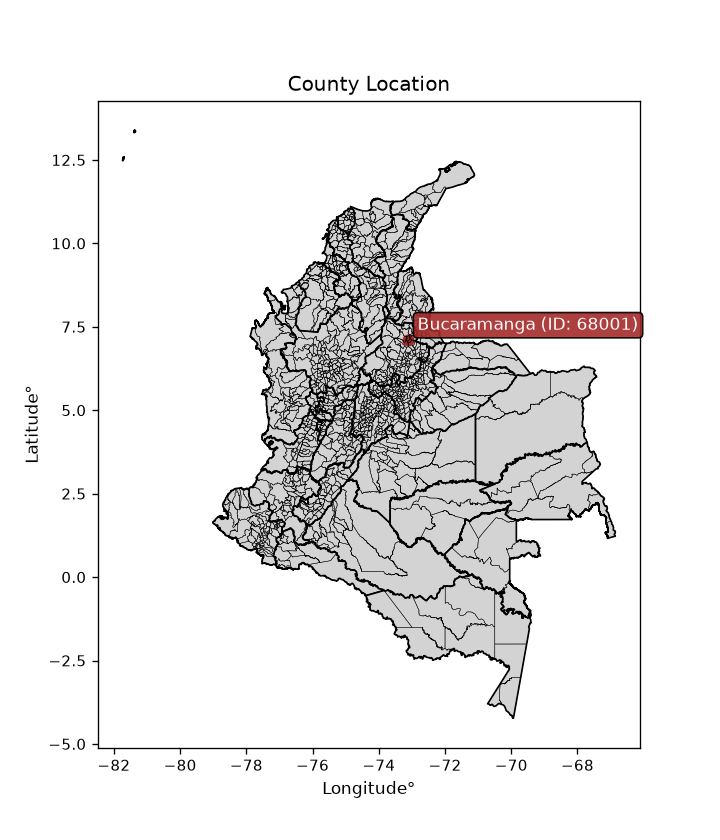
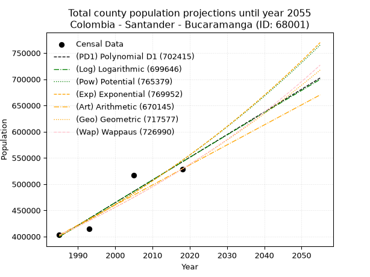
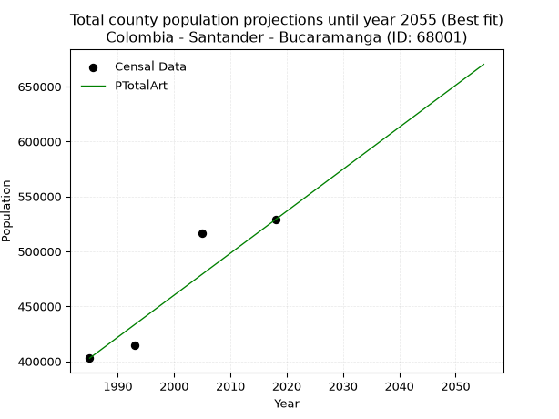
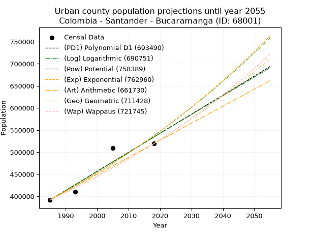
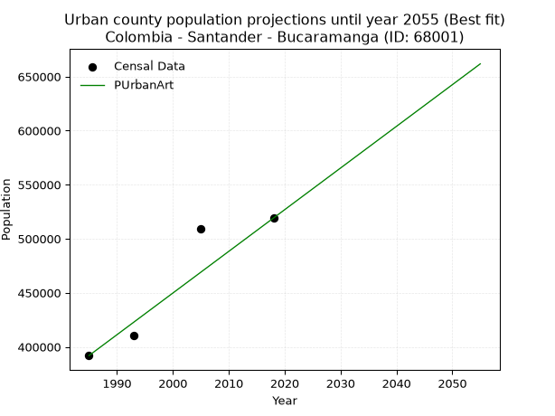
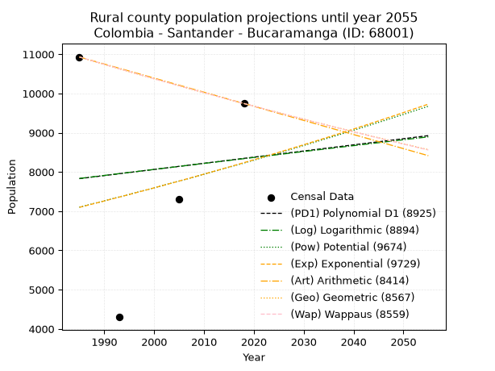
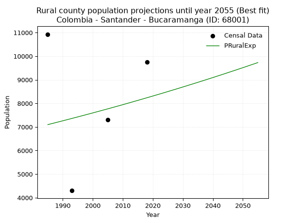

<div align="center">


</div>

# _“Population and Public Services Demand Projections (PPSD) until Year 2050 for Colombia - Santander - Bucaramanga (ID: 68001)”_
Keywords: `population` `public-service` `projection` `lineal` `polynomial` `logarithmic` `potential` `exponential` `arithmetic` `geometric` `wappaus` `dane` `colombia` `south-america`

PPSD are analytical estimates used by governments and planners to anticipate future changes in population size, age distribution, and the resulting community needs for utilities, healthcare, education, and infrastructure as sizing future water treatment facilities, electrical grids, and road networks based on spatial growth.

<div align="center">

</img>

</div>


> **General running parameters**: • app_version: _v20260806_. • Python version: _3.14.7_. • Pandas version: _3.0.5_. • NumPy version: _2.5.1_. • Creates, save and include plots into reports (create_plot): _False_. • Projection until year: _2050_. • Process polynomial degree 2 and up: _False_. • Process Wappaus: _True_. • Process Wappaus: _True_. • Set negative values to zero: _True_. • Set infinite values to zero: _True_. • Drop dataset notes: _True_. 
<div align="center">

Dynamic map: [:earth_americas:Google](http://maps.google.com/maps?q=7.116470286,-73.1325624) [:earth_americas:OSM](https://www.openstreetmap.org/#map=18/7.116470286/-73.1325624&layers=P) [:earth_americas:Bing](https://www.bing.com/maps?cp=7.116470286~-73.1325624&lvl=18) [:earth_americas:Apple](https://maps.apple.com/frame?center=7.116470286%2C-73.1325624&span=0.003%2C0.006)

</div>


<div align="center">

```geojson
{
  "type": "Feature",
  "geometry": {
    "type": "Point", 
    "coordinates": [-73.1325624, 7.116470286]
  }, 
  "properties": {
    "Name": "Colombia - Santander - Bucaramanga (ID: 68001)"
  }
}
```

</div>


## 0. Census Data (4 records)

Census data are official statistics collected by a government about the people and housing in a country. They usually include counts of total population, age, sex, race, income, education, and jobs.

📅Global census file: [Population.xlsx](../data/Population.xlsx)

| Source   |   Year |   CountryID | CountryName   |   StateID | StateName   |   CountyID | CountyName   |   PTotal |   PUrban |   PRural |
|:---------|-------:|------------:|:--------------|----------:|:------------|-----------:|:-------------|---------:|---------:|---------:|
| DANE     |   1985 |          57 | Colombia      |        68 | Santander   |      68001 | Bucaramanga  |   402840 |   391910 |    10930 |
| DANE     |   1993 |          57 | Colombia      |        68 | Santander   |      68001 | Bucaramanga  |   414365 |   410065 |     4300 |
| DANE     |   2005 |          57 | Colombia      |        68 | Santander   |      68001 | Bucaramanga  |   516512 |   509216 |     7296 |
| DANE     |   2018 |          57 | Colombia      |        68 | Santander   |      68001 | Bucaramanga  |   528855 |   519111 |     9744 |

> 🔥Some records could had specific notes about the registered values or the corresponding urban or rural distribution.

📅   [RUPS](https://www.datos.gov.co/Hacienda-y-Cr-dito-P-blico/Registro-nico-de-Prestadores-de-Servicios-P-blicos/4qkq-csdn/about_data) - Local public utility companies: [RUPS.csv](../data/RUPS.xlsx)

 | SERVICIO       | ESTADO    | NOMBRE                                                     | NIT         | DEPARTAMENTO_DOMICILIO   | MUNICIPIO_DOMICILIO   | DIRECCION                                    |   TELEFONO | EMAIL                        | TIPO_PRESTADOR                             | CLASIFICACION                 |
|:---------------|:----------|:-----------------------------------------------------------|:------------|:-------------------------|:----------------------|:---------------------------------------------|-----------:|:-----------------------------|:-------------------------------------------|:------------------------------|
| ACUEDUCTO      | OPERATIVA | ACUEDUCTO METROPOLITANO DE BUCARAMANGA S. A. E.S.P.        | 890200162-2 | SANTANDER                | BUCARAMANGA           | DIAGONAL 32 No. 30A - 51 PARQUE DEL AGUA     |    6320220 | contabilidad.jefe@amb.com.co | SOCIEDADES (EMPRESA DE SERVICIOS PUBLICOS) | MAYOR O IGUAL A 5001 USUARIOS |
| ALCANTARILLADO | OPERATIVA | EMPRESA PUBLICA DE ALCANTARILLADO DE SANTANDER S.A. E.S.P. | 900115931-1 | SANTANDER                | BUCARAMANGA           | Calle 24 # 23-68                             |    6059370 | felix.herrera@empas.gov.co   | SOCIEDADES (EMPRESA DE SERVICIOS PUBLICOS) | MAYOR O IGUAL A 5001 USUARIOS |
| ALCANTARILLADO | OPERATIVA | D. INGENIERIA LIMITADA                                     | 800232197-1 | SANTANDER                | BUCARAMANGA           | CALLE 51 N° 35 - 28 INTERIOR 100 OFICINA 309 |    6431155 | jhon.salcedo@dingenieria.com | PRESTADORES FUERA DEL ART. 15 LSPD         | MAS DE 2500 SUSCRIPTORES      |

## 1. Total

### 1.1. Coefficients and Parameters

* (PD1) Polynomial Deg 1: 4324.611802488946, -8184661.757928514 (lineal)
* (Log) Logarithmic: 8659348.329018697, -65354133.04053366
* (Pow) Potential: 18.672770637675445, -55.97549879425507
* (Exp) Exponential: 0.0093251746044287, 0.0036641813148434095
* (Art) Arithmetic: Year diff. 2018 - 1985 = 33, Population diff. 528855 - 402840 = 126015, Annual growth = 3818.6363636363635
* (Geo) Geometric: Year diff. 2018 - 1985 = 33, Population diff. 528855 - 402840 = 126015, Annual growth % = 0.008281828326446306
* (Wap) Wappaus: i = 0.819718118834246, Condition values only valid for < 200)

<sub>
Wappaus condition values: ['0.00', '0.82', '1.64', '2.46', '3.28', '4.10', '4.92', '5.74', '6.56', '7.38', '8.20', '9.02', '9.84', '10.66', '11.48', '12.30', '13.12', '13.94', '14.75', '15.57', '16.39', '17.21', '18.03', '18.85', '19.67', '20.49', '21.31', '22.13', '22.95', '23.77', '24.59', '25.41', '26.23', '27.05', '27.87', '28.69', '29.51', '30.33', '31.15', '31.97', '32.79', '33.61', '34.43', '35.25', '36.07', '36.89', '37.71', '38.53', '39.35', '40.17', '40.99', '41.81', '42.63', '43.45', '44.26', '45.08', '45.90', '46.72', '47.54', '48.36', '49.18', '50.00', '50.82', '51.64', '52.46', '53.28']
</sub>


### 1.2. Projected Dataset

|   Year |   CountyID |   PTotalPD1 |   PTotalLog |   PTotalPow |   PTotalExp |   PTotalArt |   PTotalGeo |   PTotalWap |
|-------:|-----------:|------------:|------------:|------------:|------------:|------------:|------------:|------------:|
|   1985 |      68001 |      399693 |      399539 |      400707 |      400841 |      402840 |      402840 |      402840 |
|   1986 |      68001 |      404017 |      403900 |      404493 |      404597 |      406659 |      406176 |      406156 |
|   1987 |      68001 |      408342 |      408259 |      408313 |      408387 |      410477 |      409540 |      409499 |
|   1988 |      68001 |      412667 |      412616 |      412167 |      412214 |      414296 |      412932 |      412870 |
|   1989 |      68001 |      416991 |      416971 |      416056 |      416075 |      418115 |      416352 |      416269 |
|   1990 |      68001 |      421316 |      421324 |      419979 |      419974 |      421933 |      419800 |      419696 |
|   1991 |      68001 |      425640 |      425674 |      423938 |      423908 |      425752 |      423277 |      423152 |
|   1992 |      68001 |      429965 |      430022 |      427931 |      427880 |      429570 |      426782 |      426638 |
|   1993 |      68001 |      434290 |      434368 |      431961 |      431888 |      433389 |      430317 |      430153 |
|   1994 |      68001 |      438614 |      438712 |      436026 |      435935 |      437208 |      433880 |      433698 |
|   1995 |      68001 |      442939 |      443053 |      440127 |      440019 |      441026 |      437474 |      437273 |
|   1996 |      68001 |      447263 |      447393 |      444265 |      444141 |      444845 |      441097 |      440879 |
|   1997 |      68001 |      451588 |      451730 |      448439 |      448302 |      448664 |      444750 |      444516 |
|   1998 |      68001 |      455913 |      456065 |      452651 |      452502 |      452482 |      448433 |      448184 |
|   1999 |      68001 |      460237 |      460398 |      456900 |      456742 |      456301 |      452147 |      451884 |
|   2000 |      68001 |      464562 |      464729 |      461187 |      461021 |      460120 |      455892 |      455617 |
|   2001 |      68001 |      468886 |      469058 |      465512 |      465340 |      463938 |      459667 |      459382 |
|   2002 |      68001 |      473211 |      473384 |      469875 |      469700 |      467757 |      463474 |      463181 |
|   2003 |      68001 |      477536 |      477708 |      474277 |      474100 |      471575 |      467313 |      467013 |
|   2004 |      68001 |      481860 |      482030 |      478718 |      478542 |      475394 |      471183 |      470879 |
|   2005 |      68001 |      486185 |      486350 |      483199 |      483026 |      479213 |      475085 |      474780 |
|   2006 |      68001 |      490510 |      490668 |      487718 |      487551 |      483031 |      479020 |      478716 |
|   2007 |      68001 |      494834 |      494984 |      492278 |      492119 |      486850 |      482987 |      482687 |
|   2008 |      68001 |      499159 |      499297 |      496879 |      496729 |      490669 |      486987 |      486694 |
|   2009 |      68001 |      503483 |      503609 |      501520 |      501383 |      494487 |      491020 |      490738 |
|   2010 |      68001 |      507808 |      507918 |      506202 |      506080 |      498306 |      495087 |      494818 |
|   2011 |      68001 |      512133 |      512225 |      510925 |      510822 |      502125 |      499187 |      498936 |
|   2012 |      68001 |      516457 |      516530 |      515690 |      515607 |      505943 |      503321 |      503092 |
|   2013 |      68001 |      520782 |      520833 |      520497 |      520438 |      509762 |      507489 |      507287 |
|   2014 |      68001 |      525106 |      525133 |      525346 |      525314 |      513580 |      511692 |      511520 |
|   2015 |      68001 |      529431 |      529432 |      530239 |      530235 |      517399 |      515930 |      515793 |
|   2016 |      68001 |      533756 |      533728 |      535174 |      535203 |      521218 |      520203 |      520106 |
|   2017 |      68001 |      538080 |      538022 |      540153 |      540217 |      525036 |      524511 |      524460 |
|   2018 |      68001 |      542405 |      542314 |      545175 |      545279 |      528855 |      528855 |      528855 |
|   2019 |      68001 |      546729 |      546604 |      550242 |      550387 |      532674 |      533235 |      533292 |
|   2020 |      68001 |      551054 |      550892 |      555353 |      555544 |      536492 |      537651 |      537771 |
|   2021 |      68001 |      555379 |      555178 |      560509 |      560748 |      540311 |      542104 |      542294 |
|   2022 |      68001 |      559703 |      559462 |      565711 |      566002 |      544130 |      546593 |      546860 |
|   2023 |      68001 |      564028 |      563743 |      570958 |      571305 |      547948 |      551120 |      551470 |
|   2024 |      68001 |      568353 |      568023 |      576251 |      576657 |      551767 |      555684 |      556126 |
|   2025 |      68001 |      572677 |      572300 |      581591 |      582060 |      555585 |      560287 |      560827 |
|   2026 |      68001 |      577002 |      576575 |      586977 |      587513 |      559404 |      564927 |      565575 |
|   2027 |      68001 |      581326 |      580848 |      592411 |      593017 |      563223 |      569605 |      570369 |
|   2028 |      68001 |      585651 |      585119 |      597892 |      598573 |      567041 |      574323 |      575211 |
|   2029 |      68001 |      589976 |      589388 |      603421 |      604181 |      570860 |      579079 |      580102 |
|   2030 |      68001 |      594300 |      593655 |      608998 |      609841 |      574679 |      583875 |      585041 |
|   2031 |      68001 |      598625 |      597919 |      614625 |      615555 |      578497 |      588711 |      590031 |
|   2032 |      68001 |      602949 |      602182 |      620300 |      621322 |      582316 |      593586 |      595071 |
|   2033 |      68001 |      607274 |      606442 |      626025 |      627143 |      586135 |      598502 |      600163 |
|   2034 |      68001 |      611599 |      610701 |      631800 |      633018 |      589953 |      603459 |      605307 |
|   2035 |      68001 |      615923 |      614957 |      637625 |      638949 |      593772 |      608457 |      610504 |
|   2036 |      68001 |      620248 |      619211 |      643502 |      644935 |      597590 |      613496 |      615755 |
|   2037 |      68001 |      624572 |      623463 |      649429 |      650977 |      601409 |      618577 |      621061 |
|   2038 |      68001 |      628897 |      627713 |      655408 |      657076 |      605228 |      623700 |      626422 |
|   2039 |      68001 |      633222 |      631961 |      661439 |      663232 |      609046 |      628865 |      631839 |
|   2040 |      68001 |      637546 |      636207 |      667523 |      669446 |      612865 |      634073 |      637314 |
|   2041 |      68001 |      641871 |      640451 |      673660 |      675718 |      616684 |      639324 |      642847 |
|   2042 |      68001 |      646196 |      644692 |      679850 |      682049 |      620502 |      644619 |      648440 |
|   2043 |      68001 |      650520 |      648932 |      686093 |      688439 |      624321 |      649958 |      654092 |
|   2044 |      68001 |      654845 |      653169 |      692391 |      694888 |      628140 |      655341 |      659806 |
|   2045 |      68001 |      659169 |      657405 |      698744 |      701399 |      631958 |      660768 |      665581 |
|   2046 |      68001 |      663494 |      661638 |      705152 |      707970 |      635777 |      666240 |      671420 |
|   2047 |      68001 |      667819 |      665869 |      711615 |      714603 |      639595 |      671758 |      677323 |
|   2048 |      68001 |      672143 |      670099 |      718135 |      721298 |      643414 |      677321 |      683291 |
|   2049 |      68001 |      676468 |      674326 |      724711 |      728055 |      647233 |      682931 |      689326 |
|   2050 |      68001 |      680792 |      678551 |      731344 |      734876 |      651051 |      688587 |      695428 |
<div align="center">

</img>

</div>


### 1.3. Best fit with absolute and relative error (%)

Relative error puts that difference into context by dividing the absolute error by the true value, creating a unitless ratio or percentage that shows the scale of the mistake.

Absolute and relative error

|   Year | Source   |   CountryID | CountryName   |   StateID | StateName   |   CountyID_x | CountyName   |   PTotal |   PUrban |   PRural |   CountyID_y |   PTotalPD1 |   PTotalLog |   PTotalPow |   PTotalExp |   PTotalArt |   PTotalGeo |   PTotalWap |   PTotalPD1AbsError |   PTotalLogAbsError |   PTotalPowAbsError |   PTotalExpAbsError |   PTotalArtAbsError |   PTotalGeoAbsError |   PTotalWapAbsError |   PTotalPD1RelError |   PTotalLogRelError |   PTotalPowRelError |   PTotalExpRelError |   PTotalArtRelError |   PTotalGeoRelError |   PTotalWapRelError |
|-------:|:---------|------------:|:--------------|----------:|:------------|-------------:|:-------------|---------:|---------:|---------:|-------------:|------------:|------------:|------------:|------------:|------------:|------------:|------------:|--------------------:|--------------------:|--------------------:|--------------------:|--------------------:|--------------------:|--------------------:|--------------------:|--------------------:|--------------------:|--------------------:|--------------------:|--------------------:|--------------------:|
|   1985 | DANE     |          57 | Colombia      |        68 | Santander   |        68001 | Bucaramanga  |   402840 |   391910 |    10930 |        68001 |      399693 |      399539 |      400707 |      400841 |      402840 |      402840 |      402840 |                3147 |                3301 |                2133 |                1999 |                   0 |                   0 |                   0 |            0.781203 |            0.819432 |            0.529491 |            0.496227 |             0       |             0       |             0       |
|   1993 | DANE     |          57 | Colombia      |        68 | Santander   |        68001 | Bucaramanga  |   414365 |   410065 |     4300 |        68001 |      434290 |      434368 |      431961 |      431888 |      433389 |      430317 |      430153 |               19925 |               20003 |               17596 |               17523 |               19024 |               15952 |               15788 |            4.80856  |            4.82739  |            4.2465   |            4.22888  |             4.59112 |             3.84975 |             3.81017 |
|   2005 | DANE     |          57 | Colombia      |        68 | Santander   |        68001 | Bucaramanga  |   516512 |   509216 |     7296 |        68001 |      486185 |      486350 |      483199 |      483026 |      479213 |      475085 |      474780 |               30327 |               30162 |               33313 |               33486 |               37299 |               41427 |               41732 |            5.8715   |            5.83955  |            6.44961  |            6.4831   |             7.22132 |             8.02053 |             8.07958 |
|   2018 | DANE     |          57 | Colombia      |        68 | Santander   |        68001 | Bucaramanga  |   528855 |   519111 |     9744 |        68001 |      542405 |      542314 |      545175 |      545279 |      528855 |      528855 |      528855 |               13550 |               13459 |               16320 |               16424 |                   0 |                   0 |                   0 |            2.56214  |            2.54493  |            3.08591  |            3.10558  |             0       |             0       |             0       |

Relative error mean

| Method    |   RelError | Best   |
|:----------|-----------:|:-------|
| PTotalPD1 |    3.50585 |        |
| PTotalLog |    3.50783 |        |
| PTotalPow |    3.57788 |        |
| PTotalExp |    3.57845 |        |
| PTotalArt |    2.95311 | True   |
| PTotalGeo |    2.96757 |        |
| PTotalWap |    2.97244 |        |

💙Best method: _**PTotalArt**_
<div align="center">

</img>

</div>


### 1.4. Fresh water supply demand in liters per capita per day (lpcd)

The fresh water supply demand typically ranges from 100 to 300 liters per capita per day (lpcd) for standard domestic and municipal planning, though absolute survival minimums set by the World Health Organization are as low as 7.5 to 20 liters per day, and total consumption in high-income nations can exceed 400 liters.

> `CZ`: Level in meters above the sea level (masl)<br> `WS`: Fresh water supply demand in liters per capita per day (lpcd or l/h/d)<br> `WSAll`: Zonal fresh water supply demand in liters per second (l/s)<br> `A`: Zonal area in square meters<br> `DP`: Population density (people/hectare or p/ha)

Reference values (RAS Colombia)

|    CZ |   WS |
|------:|-----:|
|  1000 |  120 |
|  2000 |  130 |
| 99999 |  140 |

County shapefile geometry properties and water supply values

|   CountyID |      ATotal |   CZTotal |   WSTotal |
|-----------:|------------:|----------:|----------:|
|      68001 | 1.53235e+08 |   1103.69 |       130 |

Projected values for best method: PTotalArt

|   CountyID |   Year |   PTotalArt |   DPTotal |   WSTotal |   WSTotalAll |
|-----------:|-------:|------------:|----------:|----------:|-------------:|
|      68001 |   1985 |      402840 |     26.29 |       130 |      606.125 |
|      68001 |   1986 |      406659 |     26.54 |       130 |      611.871 |
|      68001 |   1987 |      410477 |     26.79 |       130 |      617.616 |
|      68001 |   1988 |      414296 |     27.04 |       130 |      623.362 |
|      68001 |   1989 |      418115 |     27.29 |       130 |      629.108 |
|      68001 |   1990 |      421933 |     27.54 |       130 |      634.853 |
|      68001 |   1991 |      425752 |     27.78 |       130 |      640.599 |
|      68001 |   1992 |      429570 |     28.03 |       130 |      646.344 |
|      68001 |   1993 |      433389 |     28.28 |       130 |      652.09  |
|      68001 |   1994 |      437208 |     28.53 |       130 |      657.836 |
|      68001 |   1995 |      441026 |     28.78 |       130 |      663.581 |
|      68001 |   1996 |      444845 |     29.03 |       130 |      669.327 |
|      68001 |   1997 |      448664 |     29.28 |       130 |      675.073 |
|      68001 |   1998 |      452482 |     29.53 |       130 |      680.818 |
|      68001 |   1999 |      456301 |     29.78 |       130 |      686.564 |
|      68001 |   2000 |      460120 |     30.03 |       130 |      692.31  |
|      68001 |   2001 |      463938 |     30.28 |       130 |      698.055 |
|      68001 |   2002 |      467757 |     30.53 |       130 |      703.801 |
|      68001 |   2003 |      471575 |     30.77 |       130 |      709.546 |
|      68001 |   2004 |      475394 |     31.02 |       130 |      715.292 |
|      68001 |   2005 |      479213 |     31.27 |       130 |      721.038 |
|      68001 |   2006 |      483031 |     31.52 |       130 |      726.783 |
|      68001 |   2007 |      486850 |     31.77 |       130 |      732.529 |
|      68001 |   2008 |      490669 |     32.02 |       130 |      738.275 |
|      68001 |   2009 |      494487 |     32.27 |       130 |      744.02  |
|      68001 |   2010 |      498306 |     32.52 |       130 |      749.766 |
|      68001 |   2011 |      502125 |     32.77 |       130 |      755.512 |
|      68001 |   2012 |      505943 |     33.02 |       130 |      761.257 |
|      68001 |   2013 |      509762 |     33.27 |       130 |      767.003 |
|      68001 |   2014 |      513580 |     33.52 |       130 |      772.748 |
|      68001 |   2015 |      517399 |     33.77 |       130 |      778.494 |
|      68001 |   2016 |      521218 |     34.01 |       130 |      784.24  |
|      68001 |   2017 |      525036 |     34.26 |       130 |      789.985 |
|      68001 |   2018 |      528855 |     34.51 |       130 |      795.731 |
|      68001 |   2019 |      532674 |     34.76 |       130 |      801.477 |
|      68001 |   2020 |      536492 |     35.01 |       130 |      807.222 |
|      68001 |   2021 |      540311 |     35.26 |       130 |      812.968 |
|      68001 |   2022 |      544130 |     35.51 |       130 |      818.714 |
|      68001 |   2023 |      547948 |     35.76 |       130 |      824.459 |
|      68001 |   2024 |      551767 |     36.01 |       130 |      830.205 |
|      68001 |   2025 |      555585 |     36.26 |       130 |      835.95  |
|      68001 |   2026 |      559404 |     36.51 |       130 |      841.696 |
|      68001 |   2027 |      563223 |     36.76 |       130 |      847.442 |
|      68001 |   2028 |      567041 |     37    |       130 |      853.187 |
|      68001 |   2029 |      570860 |     37.25 |       130 |      858.933 |
|      68001 |   2030 |      574679 |     37.5  |       130 |      864.679 |
|      68001 |   2031 |      578497 |     37.75 |       130 |      870.424 |
|      68001 |   2032 |      582316 |     38    |       130 |      876.17  |
|      68001 |   2033 |      586135 |     38.25 |       130 |      881.916 |
|      68001 |   2034 |      589953 |     38.5  |       130 |      887.661 |
|      68001 |   2035 |      593772 |     38.75 |       130 |      893.407 |
|      68001 |   2036 |      597590 |     39    |       130 |      899.152 |
|      68001 |   2037 |      601409 |     39.25 |       130 |      904.898 |
|      68001 |   2038 |      605228 |     39.5  |       130 |      910.644 |
|      68001 |   2039 |      609046 |     39.75 |       130 |      916.389 |
|      68001 |   2040 |      612865 |     40    |       130 |      922.135 |
|      68001 |   2041 |      616684 |     40.24 |       130 |      927.881 |
|      68001 |   2042 |      620502 |     40.49 |       130 |      933.626 |
|      68001 |   2043 |      624321 |     40.74 |       130 |      939.372 |
|      68001 |   2044 |      628140 |     40.99 |       130 |      945.118 |
|      68001 |   2045 |      631958 |     41.24 |       130 |      950.863 |
|      68001 |   2046 |      635777 |     41.49 |       130 |      956.609 |
|      68001 |   2047 |      639595 |     41.74 |       130 |      962.354 |
|      68001 |   2048 |      643414 |     41.99 |       130 |      968.1   |
|      68001 |   2049 |      647233 |     42.24 |       130 |      973.846 |
|      68001 |   2050 |      651051 |     42.49 |       130 |      979.591 |

## 2. Urban

### 2.1. Coefficients and Parameters

* (PD1) Polynomial Deg 1: 4308.948213568834, -8161398.16419106 (lineal)
* (Log) Logarithmic: 8628760.672978494, -65129703.52185799
* (Pow) Potential: 18.987911992620816, -57.023487146856105
* (Exp) Exponential: 0.009481658843749857, 0.002632428850660122
* (Art) Arithmetic: Year diff. 2018 - 1985 = 33, Population diff. 519111 - 391910 = 127201, Annual growth = 3854.5757575757575
* (Geo) Geometric: Year diff. 2018 - 1985 = 33, Population diff. 519111 - 391910 = 127201, Annual growth % = 0.00855412196099814
* (Wap) Wappaus: i = 0.8462100780499588, Condition values only valid for < 200)

<sub>
Wappaus condition values: ['0.00', '0.85', '1.69', '2.54', '3.38', '4.23', '5.08', '5.92', '6.77', '7.62', '8.46', '9.31', '10.15', '11.00', '11.85', '12.69', '13.54', '14.39', '15.23', '16.08', '16.92', '17.77', '18.62', '19.46', '20.31', '21.16', '22.00', '22.85', '23.69', '24.54', '25.39', '26.23', '27.08', '27.92', '28.77', '29.62', '30.46', '31.31', '32.16', '33.00', '33.85', '34.69', '35.54', '36.39', '37.23', '38.08', '38.93', '39.77', '40.62', '41.46', '42.31', '43.16', '44.00', '44.85', '45.70', '46.54', '47.39', '48.23', '49.08', '49.93', '50.77', '51.62', '52.47', '53.31', '54.16', '55.00']
</sub>


### 2.2. Projected Dataset

|   Year |   CountyID |   PUrbanPD1 |   PUrbanLog |   PUrbanPow |   PUrbanExp |   PUrbanArt |   PUrbanGeo |   PUrbanWap |
|-------:|-----------:|------------:|------------:|------------:|------------:|------------:|------------:|------------:|
|   1985 |      68001 |      391864 |      391705 |      392735 |      392874 |      391910 |      391910 |      391910 |
|   1986 |      68001 |      396173 |      396051 |      396508 |      396617 |      395765 |      395262 |      395240 |
|   1987 |      68001 |      400482 |      400395 |      400317 |      400395 |      399619 |      398644 |      398599 |
|   1988 |      68001 |      404791 |      404736 |      404160 |      404210 |      403474 |      402054 |      401987 |
|   1989 |      68001 |      409100 |      409076 |      408037 |      408061 |      407328 |      405493 |      405404 |
|   1990 |      68001 |      413409 |      413413 |      411950 |      411948 |      411183 |      408961 |      408850 |
|   1991 |      68001 |      417718 |      417748 |      415899 |      415873 |      415037 |      412460 |      412327 |
|   1992 |      68001 |      422027 |      422080 |      419883 |      419835 |      418892 |      415988 |      415833 |
|   1993 |      68001 |      426336 |      426411 |      423904 |      423834 |      422747 |      419546 |      419371 |
|   1994 |      68001 |      430645 |      430740 |      427960 |      427872 |      426601 |      423135 |      422939 |
|   1995 |      68001 |      434954 |      435066 |      432054 |      431948 |      430456 |      426755 |      426539 |
|   1996 |      68001 |      439262 |      439390 |      436185 |      436063 |      434310 |      430405 |      430171 |
|   1997 |      68001 |      443571 |      443712 |      440353 |      440218 |      438165 |      434087 |      433835 |
|   1998 |      68001 |      447880 |      448032 |      444559 |      444411 |      442019 |      437800 |      437532 |
|   1999 |      68001 |      452189 |      452349 |      448803 |      448645 |      445874 |      441545 |      441263 |
|   2000 |      68001 |      456498 |      456665 |      453085 |      452919 |      449729 |      445322 |      445027 |
|   2001 |      68001 |      460807 |      460978 |      457406 |      457234 |      453583 |      449132 |      448825 |
|   2002 |      68001 |      465116 |      465289 |      461766 |      461590 |      457438 |      452974 |      452658 |
|   2003 |      68001 |      469425 |      469598 |      466166 |      465988 |      461292 |      456848 |      456526 |
|   2004 |      68001 |      473734 |      473905 |      470605 |      470427 |      465147 |      460756 |      460430 |
|   2005 |      68001 |      478043 |      478210 |      475084 |      474909 |      469002 |      464698 |      464369 |
|   2006 |      68001 |      482352 |      482512 |      479603 |      479433 |      472856 |      468673 |      468345 |
|   2007 |      68001 |      486661 |      486813 |      484163 |      484000 |      476711 |      472682 |      472359 |
|   2008 |      68001 |      490970 |      491111 |      488764 |      488611 |      480565 |      476725 |      476410 |
|   2009 |      68001 |      495279 |      495407 |      493407 |      493266 |      484420 |      480803 |      480499 |
|   2010 |      68001 |      499588 |      499701 |      498091 |      497965 |      488274 |      484916 |      484627 |
|   2011 |      68001 |      503897 |      503993 |      502818 |      502709 |      492129 |      489064 |      488794 |
|   2012 |      68001 |      508206 |      508283 |      507587 |      507499 |      495984 |      493248 |      493001 |
|   2013 |      68001 |      512515 |      512570 |      512398 |      512333 |      499838 |      497467 |      497248 |
|   2014 |      68001 |      516824 |      516856 |      517253 |      517214 |      503693 |      501722 |      501536 |
|   2015 |      68001 |      521132 |      521139 |      522152 |      522142 |      507547 |      506014 |      505866 |
|   2016 |      68001 |      525441 |      525420 |      527094 |      527116 |      511402 |      510343 |      510238 |
|   2017 |      68001 |      529750 |      529699 |      532081 |      532138 |      515256 |      514708 |      514653 |
|   2018 |      68001 |      534059 |      533976 |      537112 |      537207 |      519111 |      519111 |      519111 |
|   2019 |      68001 |      538368 |      538251 |      542189 |      542325 |      522966 |      523552 |      523613 |
|   2020 |      68001 |      542677 |      542524 |      547310 |      547492 |      526820 |      528030 |      528160 |
|   2021 |      68001 |      546986 |      546794 |      552478 |      552707 |      530675 |      532547 |      532753 |
|   2022 |      68001 |      551295 |      551063 |      557692 |      557973 |      534529 |      537102 |      537391 |
|   2023 |      68001 |      555604 |      555329 |      562952 |      563289 |      538384 |      541697 |      542076 |
|   2024 |      68001 |      559913 |      559593 |      568260 |      568655 |      542238 |      546331 |      546809 |
|   2025 |      68001 |      564222 |      563856 |      573615 |      574072 |      546093 |      551004 |      551590 |
|   2026 |      68001 |      568531 |      568116 |      579017 |      579541 |      549948 |      555717 |      556420 |
|   2027 |      68001 |      572840 |      572374 |      584468 |      585063 |      553802 |      560471 |      561299 |
|   2028 |      68001 |      577149 |      576630 |      589967 |      590636 |      557657 |      565265 |      566229 |
|   2029 |      68001 |      581458 |      580883 |      595516 |      596263 |      561511 |      570101 |      571211 |
|   2030 |      68001 |      585767 |      585135 |      601114 |      601944 |      565366 |      574977 |      576244 |
|   2031 |      68001 |      590076 |      589385 |      606761 |      607678 |      569220 |      579896 |      581330 |
|   2032 |      68001 |      594385 |      593632 |      612459 |      613467 |      573075 |      584856 |      586470 |
|   2033 |      68001 |      598694 |      597877 |      618207 |      619312 |      576930 |      589859 |      591665 |
|   2034 |      68001 |      603003 |      602121 |      624007 |      625212 |      580784 |      594905 |      596915 |
|   2035 |      68001 |      607311 |      606362 |      629858 |      631168 |      584639 |      599994 |      602221 |
|   2036 |      68001 |      611620 |      610601 |      635761 |      637181 |      588493 |      605126 |      607584 |
|   2037 |      68001 |      615929 |      614838 |      641717 |      643251 |      592348 |      610303 |      613006 |
|   2038 |      68001 |      620238 |      619073 |      647725 |      649379 |      596203 |      615523 |      618487 |
|   2039 |      68001 |      624547 |      623306 |      653786 |      655566 |      600057 |      620788 |      624028 |
|   2040 |      68001 |      628856 |      627537 |      659902 |      661811 |      603912 |      626099 |      629630 |
|   2041 |      68001 |      633165 |      631766 |      666071 |      668116 |      607766 |      631454 |      635295 |
|   2042 |      68001 |      637474 |      635992 |      672295 |      674481 |      611621 |      636856 |      641022 |
|   2043 |      68001 |      641783 |      640217 |      678574 |      680907 |      615475 |      642304 |      646814 |
|   2044 |      68001 |      646092 |      644439 |      684909 |      687394 |      619330 |      647798 |      652671 |
|   2045 |      68001 |      650401 |      648660 |      691299 |      693942 |      623185 |      653339 |      658594 |
|   2046 |      68001 |      654710 |      652878 |      697746 |      700553 |      627039 |      658928 |      664585 |
|   2047 |      68001 |      659019 |      657095 |      704250 |      707227 |      630894 |      664565 |      670645 |
|   2048 |      68001 |      663328 |      661309 |      710812 |      713965 |      634748 |      670249 |      676774 |
|   2049 |      68001 |      667637 |      665521 |      717431 |      720767 |      638603 |      675983 |      682975 |
|   2050 |      68001 |      671946 |      669731 |      724109 |      727633 |      642457 |      681765 |      689248 |
<div align="center">

</img>

</div>


### 2.3. Best fit with absolute and relative error (%)

Relative error puts that difference into context by dividing the absolute error by the true value, creating a unitless ratio or percentage that shows the scale of the mistake.

Absolute and relative error

|   Year | Source   |   CountryID | CountryName   |   StateID | StateName   |   CountyID_x | CountyName   |   PTotal |   PUrban |   PRural |   CountyID_y |   PUrbanPD1 |   PUrbanLog |   PUrbanPow |   PUrbanExp |   PUrbanArt |   PUrbanGeo |   PUrbanWap |   PUrbanPD1AbsError |   PUrbanLogAbsError |   PUrbanPowAbsError |   PUrbanExpAbsError |   PUrbanArtAbsError |   PUrbanGeoAbsError |   PUrbanWapAbsError |   PUrbanPD1RelError |   PUrbanLogRelError |   PUrbanPowRelError |   PUrbanExpRelError |   PUrbanArtRelError |   PUrbanGeoRelError |   PUrbanWapRelError |
|-------:|:---------|------------:|:--------------|----------:|:------------|-------------:|:-------------|---------:|---------:|---------:|-------------:|------------:|------------:|------------:|------------:|------------:|------------:|------------:|--------------------:|--------------------:|--------------------:|--------------------:|--------------------:|--------------------:|--------------------:|--------------------:|--------------------:|--------------------:|--------------------:|--------------------:|--------------------:|--------------------:|
|   1985 | DANE     |          57 | Colombia      |        68 | Santander   |        68001 | Bucaramanga  |   402840 |   391910 |    10930 |        68001 |      391864 |      391705 |      392735 |      392874 |      391910 |      391910 |      391910 |                  46 |                 205 |                 825 |                 964 |                   0 |                   0 |                   0 |           0.0117374 |           0.0523079 |            0.210508 |            0.245975 |             0       |             0       |             0       |
|   1993 | DANE     |          57 | Colombia      |        68 | Santander   |        68001 | Bucaramanga  |   414365 |   410065 |     4300 |        68001 |      426336 |      426411 |      423904 |      423834 |      422747 |      419546 |      419371 |               16271 |               16346 |               13839 |               13769 |               12682 |                9481 |                9306 |           3.96791   |           3.9862    |            3.37483  |            3.35776  |             3.09268 |             2.31207 |             2.2694  |
|   2005 | DANE     |          57 | Colombia      |        68 | Santander   |        68001 | Bucaramanga  |   516512 |   509216 |     7296 |        68001 |      478043 |      478210 |      475084 |      474909 |      469002 |      464698 |      464369 |               31173 |               31006 |               34132 |               34307 |               40214 |               44518 |               44847 |           6.12176   |           6.08897   |            6.70285  |            6.73722  |             7.89724 |             8.74246 |             8.80707 |
|   2018 | DANE     |          57 | Colombia      |        68 | Santander   |        68001 | Bucaramanga  |   528855 |   519111 |     9744 |        68001 |      534059 |      533976 |      537112 |      537207 |      519111 |      519111 |      519111 |               14948 |               14865 |               18001 |               18096 |                   0 |                   0 |                   0 |           2.87954   |           2.86355   |            3.46766  |            3.48596  |             0       |             0       |             0       |

Relative error mean

| Method    |   RelError | Best   |
|:----------|-----------:|:-------|
| PUrbanPD1 |    3.24524 |        |
| PUrbanLog |    3.24776 |        |
| PUrbanPow |    3.43896 |        |
| PUrbanExp |    3.45673 |        |
| PUrbanArt |    2.74748 | True   |
| PUrbanGeo |    2.76363 |        |
| PUrbanWap |    2.76912 |        |

💙Best method: _**PUrbanArt**_
<div align="center">

</img>

</div>


### 2.4. Fresh water supply demand in liters per capita per day (lpcd)

The fresh water supply demand typically ranges from 100 to 300 liters per capita per day (lpcd) for standard domestic and municipal planning, though absolute survival minimums set by the World Health Organization are as low as 7.5 to 20 liters per day, and total consumption in high-income nations can exceed 400 liters.

> `CZ`: Level in meters above the sea level (masl)<br> `WS`: Fresh water supply demand in liters per capita per day (lpcd or l/h/d)<br> `WSAll`: Zonal fresh water supply demand in liters per second (l/s)<br> `A`: Zonal area in square meters<br> `DP`: Population density (people/hectare or p/ha)

Reference values (RAS Colombia)

|    CZ |   WS |
|------:|-----:|
|  1000 |  120 |
|  2000 |  130 |
| 99999 |  140 |

County shapefile geometry properties and water supply values

|   CountyID |      AUrban |   CZUrban |   WSUrban |
|-----------:|------------:|----------:|----------:|
|      68001 | 5.53845e+07 |   859.071 |       120 |

Projected values for best method: PUrbanArt

|   CountyID |   Year |   PUrbanArt |   DPUrban |   WSUrban |   WSUrbanAll |
|-----------:|-------:|------------:|----------:|----------:|-------------:|
|      68001 |   1985 |      391910 |     70.76 |       120 |      544.319 |
|      68001 |   1986 |      395765 |     71.46 |       120 |      549.674 |
|      68001 |   1987 |      399619 |     72.15 |       120 |      555.026 |
|      68001 |   1988 |      403474 |     72.85 |       120 |      560.381 |
|      68001 |   1989 |      407328 |     73.55 |       120 |      565.733 |
|      68001 |   1990 |      411183 |     74.24 |       120 |      571.087 |
|      68001 |   1991 |      415037 |     74.94 |       120 |      576.44  |
|      68001 |   1992 |      418892 |     75.63 |       120 |      581.794 |
|      68001 |   1993 |      422747 |     76.33 |       120 |      587.149 |
|      68001 |   1994 |      426601 |     77.03 |       120 |      592.501 |
|      68001 |   1995 |      430456 |     77.72 |       120 |      597.856 |
|      68001 |   1996 |      434310 |     78.42 |       120 |      603.208 |
|      68001 |   1997 |      438165 |     79.11 |       120 |      608.562 |
|      68001 |   1998 |      442019 |     79.81 |       120 |      613.915 |
|      68001 |   1999 |      445874 |     80.51 |       120 |      619.269 |
|      68001 |   2000 |      449729 |     81.2  |       120 |      624.624 |
|      68001 |   2001 |      453583 |     81.9  |       120 |      629.976 |
|      68001 |   2002 |      457438 |     82.59 |       120 |      635.331 |
|      68001 |   2003 |      461292 |     83.29 |       120 |      640.683 |
|      68001 |   2004 |      465147 |     83.99 |       120 |      646.038 |
|      68001 |   2005 |      469002 |     84.68 |       120 |      651.392 |
|      68001 |   2006 |      472856 |     85.38 |       120 |      656.744 |
|      68001 |   2007 |      476711 |     86.07 |       120 |      662.099 |
|      68001 |   2008 |      480565 |     86.77 |       120 |      667.451 |
|      68001 |   2009 |      484420 |     87.46 |       120 |      672.806 |
|      68001 |   2010 |      488274 |     88.16 |       120 |      678.158 |
|      68001 |   2011 |      492129 |     88.86 |       120 |      683.513 |
|      68001 |   2012 |      495984 |     89.55 |       120 |      688.867 |
|      68001 |   2013 |      499838 |     90.25 |       120 |      694.219 |
|      68001 |   2014 |      503693 |     90.94 |       120 |      699.574 |
|      68001 |   2015 |      507547 |     91.64 |       120 |      704.926 |
|      68001 |   2016 |      511402 |     92.34 |       120 |      710.281 |
|      68001 |   2017 |      515256 |     93.03 |       120 |      715.633 |
|      68001 |   2018 |      519111 |     93.73 |       120 |      720.987 |
|      68001 |   2019 |      522966 |     94.42 |       120 |      726.342 |
|      68001 |   2020 |      526820 |     95.12 |       120 |      731.694 |
|      68001 |   2021 |      530675 |     95.82 |       120 |      737.049 |
|      68001 |   2022 |      534529 |     96.51 |       120 |      742.401 |
|      68001 |   2023 |      538384 |     97.21 |       120 |      747.756 |
|      68001 |   2024 |      542238 |     97.9  |       120 |      753.108 |
|      68001 |   2025 |      546093 |     98.6  |       120 |      758.462 |
|      68001 |   2026 |      549948 |     99.3  |       120 |      763.817 |
|      68001 |   2027 |      553802 |     99.99 |       120 |      769.169 |
|      68001 |   2028 |      557657 |    100.69 |       120 |      774.524 |
|      68001 |   2029 |      561511 |    101.38 |       120 |      779.876 |
|      68001 |   2030 |      565366 |    102.08 |       120 |      785.231 |
|      68001 |   2031 |      569220 |    102.78 |       120 |      790.583 |
|      68001 |   2032 |      573075 |    103.47 |       120 |      795.938 |
|      68001 |   2033 |      576930 |    104.17 |       120 |      801.292 |
|      68001 |   2034 |      580784 |    104.86 |       120 |      806.644 |
|      68001 |   2035 |      584639 |    105.56 |       120 |      811.999 |
|      68001 |   2036 |      588493 |    106.26 |       120 |      817.351 |
|      68001 |   2037 |      592348 |    106.95 |       120 |      822.706 |
|      68001 |   2038 |      596203 |    107.65 |       120 |      828.06  |
|      68001 |   2039 |      600057 |    108.34 |       120 |      833.413 |
|      68001 |   2040 |      603912 |    109.04 |       120 |      838.767 |
|      68001 |   2041 |      607766 |    109.74 |       120 |      844.119 |
|      68001 |   2042 |      611621 |    110.43 |       120 |      849.474 |
|      68001 |   2043 |      615475 |    111.13 |       120 |      854.826 |
|      68001 |   2044 |      619330 |    111.82 |       120 |      860.181 |
|      68001 |   2045 |      623185 |    112.52 |       120 |      865.535 |
|      68001 |   2046 |      627039 |    113.22 |       120 |      870.888 |
|      68001 |   2047 |      630894 |    113.91 |       120 |      876.242 |
|      68001 |   2048 |      634748 |    114.61 |       120 |      881.594 |
|      68001 |   2049 |      638603 |    115.3  |       120 |      886.949 |
|      68001 |   2050 |      642457 |    116    |       120 |      892.301 |

## 3. Rural

### 3.1. Coefficients and Parameters

* (PD1) Polynomial Deg 1: 15.66358892011079, -23263.593737451607 (lineal)
* (Log) Logarithmic: 30587.656040211892, -224429.51867574293
* (Pow) Potential: 8.915700909681279, -25.550427164796943
* (Exp) Exponential: 0.004503992448648043, 0.9297592993202158
* (Art) Arithmetic: Year diff. 2018 - 1985 = 33, Population diff. 9744 - 10930 = -1186, Annual growth = -35.93939393939394
* (Geo) Geometric: Year diff. 2018 - 1985 = 33, Population diff. 9744 - 10930 = -1186, Annual growth % = -0.003474543428717891
* (Wap) Wappaus: i = -0.3476772171751373, Condition values only valid for < 200)

<sub>
Wappaus condition values: ['-0.00', '-0.35', '-0.70', '-1.04', '-1.39', '-1.74', '-2.09', '-2.43', '-2.78', '-3.13', '-3.48', '-3.82', '-4.17', '-4.52', '-4.87', '-5.22', '-5.56', '-5.91', '-6.26', '-6.61', '-6.95', '-7.30', '-7.65', '-8.00', '-8.34', '-8.69', '-9.04', '-9.39', '-9.73', '-10.08', '-10.43', '-10.78', '-11.13', '-11.47', '-11.82', '-12.17', '-12.52', '-12.86', '-13.21', '-13.56', '-13.91', '-14.25', '-14.60', '-14.95', '-15.30', '-15.65', '-15.99', '-16.34', '-16.69', '-17.04', '-17.38', '-17.73', '-18.08', '-18.43', '-18.77', '-19.12', '-19.47', '-19.82', '-20.17', '-20.51', '-20.86', '-21.21', '-21.56', '-21.90', '-22.25', '-22.60']
</sub>


### 3.2. Projected Dataset

|   Year |   CountyID |   PRuralPD1 |   PRuralLog |   PRuralPow |   PRuralExp |   PRuralArt |   PRuralGeo |   PRuralWap |
|-------:|-----------:|------------:|------------:|------------:|------------:|------------:|------------:|------------:|
|   1985 |      68001 |        7829 |        7834 |        7103 |        7098 |       10930 |       10930 |       10930 |
|   1986 |      68001 |        7844 |        7849 |        7135 |        7130 |       10894 |       10892 |       10892 |
|   1987 |      68001 |        7860 |        7865 |        7167 |        7162 |       10858 |       10854 |       10854 |
|   1988 |      68001 |        7876 |        7880 |        7199 |        7195 |       10822 |       10816 |       10817 |
|   1989 |      68001 |        7891 |        7896 |        7231 |        7227 |       10786 |       10779 |       10779 |
|   1990 |      68001 |        7907 |        7911 |        7264 |        7260 |       10750 |       10741 |       10742 |
|   1991 |      68001 |        7923 |        7926 |        7296 |        7293 |       10714 |       10704 |       10704 |
|   1992 |      68001 |        7938 |        7942 |        7329 |        7326 |       10678 |       10667 |       10667 |
|   1993 |      68001 |        7954 |        7957 |        7362 |        7359 |       10642 |       10630 |       10630 |
|   1994 |      68001 |        7970 |        7972 |        7395 |        7392 |       10607 |       10593 |       10593 |
|   1995 |      68001 |        7985 |        7988 |        7428 |        7425 |       10571 |       10556 |       10556 |
|   1996 |      68001 |        8001 |        8003 |        7461 |        7459 |       10535 |       10519 |       10520 |
|   1997 |      68001 |        8017 |        8018 |        7495 |        7492 |       10499 |       10483 |       10483 |
|   1998 |      68001 |        8032 |        8034 |        7528 |        7526 |       10463 |       10446 |       10447 |
|   1999 |      68001 |        8048 |        8049 |        7562 |        7560 |       10427 |       10410 |       10411 |
|   2000 |      68001 |        8064 |        8064 |        7596 |        7594 |       10391 |       10374 |       10374 |
|   2001 |      68001 |        8079 |        8080 |        7630 |        7629 |       10355 |       10338 |       10338 |
|   2002 |      68001 |        8095 |        8095 |        7664 |        7663 |       10319 |       10302 |       10303 |
|   2003 |      68001 |        8111 |        8110 |        7698 |        7698 |       10283 |       10266 |       10267 |
|   2004 |      68001 |        8126 |        8125 |        7732 |        7732 |       10247 |       10231 |       10231 |
|   2005 |      68001 |        8142 |        8141 |        7767 |        7767 |       10211 |       10195 |       10196 |
|   2006 |      68001 |        8158 |        8156 |        7801 |        7802 |       10175 |       10160 |       10160 |
|   2007 |      68001 |        8173 |        8171 |        7836 |        7838 |       10139 |       10124 |       10125 |
|   2008 |      68001 |        8189 |        8186 |        7871 |        7873 |       10103 |       10089 |       10090 |
|   2009 |      68001 |        8205 |        8202 |        7906 |        7908 |       10067 |       10054 |       10055 |
|   2010 |      68001 |        8220 |        8217 |        7941 |        7944 |       10032 |       10019 |       10020 |
|   2011 |      68001 |        8236 |        8232 |        7976 |        7980 |        9996 |        9984 |        9985 |
|   2012 |      68001 |        8252 |        8247 |        8012 |        8016 |        9960 |        9950 |        9950 |
|   2013 |      68001 |        8267 |        8262 |        8047 |        8052 |        9924 |        9915 |        9915 |
|   2014 |      68001 |        8283 |        8278 |        8083 |        8089 |        9888 |        9881 |        9881 |
|   2015 |      68001 |        8299 |        8293 |        8119 |        8125 |        9852 |        9846 |        9846 |
|   2016 |      68001 |        8314 |        8308 |        8155 |        8162 |        9816 |        9812 |        9812 |
|   2017 |      68001 |        8330 |        8323 |        8191 |        8199 |        9780 |        9778 |        9778 |
|   2018 |      68001 |        8346 |        8338 |        8227 |        8236 |        9744 |        9744 |        9744 |
|   2019 |      68001 |        8361 |        8353 |        8264 |        8273 |        9708 |        9710 |        9710 |
|   2020 |      68001 |        8377 |        8369 |        8300 |        8310 |        9672 |        9676 |        9676 |
|   2021 |      68001 |        8393 |        8384 |        8337 |        8348 |        9636 |        9643 |        9643 |
|   2022 |      68001 |        8408 |        8399 |        8374 |        8385 |        9600 |        9609 |        9609 |
|   2023 |      68001 |        8424 |        8414 |        8411 |        8423 |        9564 |        9576 |        9575 |
|   2024 |      68001 |        8440 |        8429 |        8448 |        8461 |        9528 |        9543 |        9542 |
|   2025 |      68001 |        8455 |        8444 |        8485 |        8499 |        9492 |        9509 |        9509 |
|   2026 |      68001 |        8471 |        8459 |        8523 |        8538 |        9456 |        9476 |        9476 |
|   2027 |      68001 |        8487 |        8474 |        8560 |        8576 |        9421 |        9443 |        9443 |
|   2028 |      68001 |        8502 |        8490 |        8598 |        8615 |        9385 |        9411 |        9410 |
|   2029 |      68001 |        8518 |        8505 |        8636 |        8654 |        9349 |        9378 |        9377 |
|   2030 |      68001 |        8533 |        8520 |        8674 |        8693 |        9313 |        9345 |        9344 |
|   2031 |      68001 |        8549 |        8535 |        8712 |        8732 |        9277 |        9313 |        9311 |
|   2032 |      68001 |        8565 |        8550 |        8750 |        8772 |        9241 |        9281 |        9279 |
|   2033 |      68001 |        8580 |        8565 |        8789 |        8811 |        9205 |        9248 |        9246 |
|   2034 |      68001 |        8596 |        8580 |        8828 |        8851 |        9169 |        9216 |        9214 |
|   2035 |      68001 |        8612 |        8595 |        8866 |        8891 |        9133 |        9184 |        9182 |
|   2036 |      68001 |        8627 |        8610 |        8905 |        8931 |        9097 |        9152 |        9150 |
|   2037 |      68001 |        8643 |        8625 |        8944 |        8971 |        9061 |        9120 |        9118 |
|   2038 |      68001 |        8659 |        8640 |        8984 |        9012 |        9025 |        9089 |        9086 |
|   2039 |      68001 |        8674 |        8655 |        9023 |        9053 |        8989 |        9057 |        9054 |
|   2040 |      68001 |        8690 |        8670 |        9062 |        9093 |        8953 |        9026 |        9022 |
|   2041 |      68001 |        8706 |        8685 |        9102 |        9135 |        8917 |        8994 |        8991 |
|   2042 |      68001 |        8721 |        8700 |        9142 |        9176 |        8881 |        8963 |        8959 |
|   2043 |      68001 |        8737 |        8715 |        9182 |        9217 |        8846 |        8932 |        8928 |
|   2044 |      68001 |        8753 |        8730 |        9222 |        9259 |        8810 |        8901 |        8896 |
|   2045 |      68001 |        8768 |        8745 |        9262 |        9301 |        8774 |        8870 |        8865 |
|   2046 |      68001 |        8784 |        8760 |        9303 |        9343 |        8738 |        8839 |        8834 |
|   2047 |      68001 |        8800 |        8775 |        9343 |        9385 |        8702 |        8808 |        8803 |
|   2048 |      68001 |        8815 |        8790 |        9384 |        9427 |        8666 |        8778 |        8772 |
|   2049 |      68001 |        8831 |        8805 |        9425 |        9470 |        8630 |        8747 |        8741 |
|   2050 |      68001 |        8847 |        8820 |        9466 |        9512 |        8594 |        8717 |        8711 |
<div align="center">

</img>

</div>


### 3.3. Best fit with absolute and relative error (%)

Relative error puts that difference into context by dividing the absolute error by the true value, creating a unitless ratio or percentage that shows the scale of the mistake.

Absolute and relative error

|   Year | Source   |   CountryID | CountryName   |   StateID | StateName   |   CountyID_x | CountyName   |   PTotal |   PUrban |   PRural |   CountyID_y |   PRuralPD1 |   PRuralLog |   PRuralPow |   PRuralExp |   PRuralArt |   PRuralGeo |   PRuralWap |   PRuralPD1AbsError |   PRuralLogAbsError |   PRuralPowAbsError |   PRuralExpAbsError |   PRuralArtAbsError |   PRuralGeoAbsError |   PRuralWapAbsError |   PRuralPD1RelError |   PRuralLogRelError |   PRuralPowRelError |   PRuralExpRelError |   PRuralArtRelError |   PRuralGeoRelError |   PRuralWapRelError |
|-------:|:---------|------------:|:--------------|----------:|:------------|-------------:|:-------------|---------:|---------:|---------:|-------------:|------------:|------------:|------------:|------------:|------------:|------------:|------------:|--------------------:|--------------------:|--------------------:|--------------------:|--------------------:|--------------------:|--------------------:|--------------------:|--------------------:|--------------------:|--------------------:|--------------------:|--------------------:|--------------------:|
|   1985 | DANE     |          57 | Colombia      |        68 | Santander   |        68001 | Bucaramanga  |   402840 |   391910 |    10930 |        68001 |        7829 |        7834 |        7103 |        7098 |       10930 |       10930 |       10930 |                3101 |                3096 |                3827 |                3832 |                   0 |                   0 |                   0 |             28.3715 |             28.3257 |            35.0137  |            35.0595  |              0      |              0      |              0      |
|   1993 | DANE     |          57 | Colombia      |        68 | Santander   |        68001 | Bucaramanga  |   414365 |   410065 |     4300 |        68001 |        7954 |        7957 |        7362 |        7359 |       10642 |       10630 |       10630 |                3654 |                3657 |                3062 |                3059 |                6342 |                6330 |                6330 |             84.9767 |             85.0465 |            71.2093  |            71.1395  |            147.488  |            147.209  |            147.209  |
|   2005 | DANE     |          57 | Colombia      |        68 | Santander   |        68001 | Bucaramanga  |   516512 |   509216 |     7296 |        68001 |        8142 |        8141 |        7767 |        7767 |       10211 |       10195 |       10196 |                 846 |                 845 |                 471 |                 471 |                2915 |                2899 |                2900 |             11.5954 |             11.5817 |             6.45559 |             6.45559 |             39.9534 |             39.7341 |             39.7478 |
|   2018 | DANE     |          57 | Colombia      |        68 | Santander   |        68001 | Bucaramanga  |   528855 |   519111 |     9744 |        68001 |        8346 |        8338 |        8227 |        8236 |        9744 |        9744 |        9744 |                1398 |                1406 |                1517 |                1508 |                   0 |                   0 |                   0 |             14.3473 |             14.4294 |            15.5686  |            15.4762  |              0      |              0      |              0      |

Relative error mean

| Method    |   RelError | Best   |
|:----------|-----------:|:-------|
| PRuralPD1 |    34.8227 |        |
| PRuralLog |    34.8458 |        |
| PRuralPow |    32.0618 |        |
| PRuralExp |    32.0327 | True   |
| PRuralArt |    46.8604 |        |
| PRuralGeo |    46.7359 |        |
| PRuralWap |    46.7393 |        |

💙Best method: _**PRuralExp**_
<div align="center">

</img>

</div>


### 3.4. Fresh water supply demand in liters per capita per day (lpcd)

The fresh water supply demand typically ranges from 100 to 300 liters per capita per day (lpcd) for standard domestic and municipal planning, though absolute survival minimums set by the World Health Organization are as low as 7.5 to 20 liters per day, and total consumption in high-income nations can exceed 400 liters.

> `CZ`: Level in meters above the sea level (masl)<br> `WS`: Fresh water supply demand in liters per capita per day (lpcd or l/h/d)<br> `WSAll`: Zonal fresh water supply demand in liters per second (l/s)<br> `A`: Zonal area in square meters<br> `DP`: Population density (people/hectare or p/ha)

Reference values (RAS Colombia)

|    CZ |   WS |
|------:|-----:|
|  1000 |  120 |
|  2000 |  130 |
| 99999 |  140 |

County shapefile geometry properties and water supply values

|   CountyID |      ARural |   CZRural |   WSRural |
|-----------:|------------:|----------:|----------:|
|      68001 | 9.78503e+07 |   1239.02 |       130 |

Projected values for best method: PRuralExp

|   CountyID |   Year |   PRuralExp |   DPRural |   WSRural |   WSRuralAll |
|-----------:|-------:|------------:|----------:|----------:|-------------:|
|      68001 |   1985 |        7098 |      0.73 |       130 |      10.6799 |
|      68001 |   1986 |        7130 |      0.73 |       130 |      10.728  |
|      68001 |   1987 |        7162 |      0.73 |       130 |      10.7762 |
|      68001 |   1988 |        7195 |      0.74 |       130 |      10.8258 |
|      68001 |   1989 |        7227 |      0.74 |       130 |      10.874  |
|      68001 |   1990 |        7260 |      0.74 |       130 |      10.9236 |
|      68001 |   1991 |        7293 |      0.75 |       130 |      10.9733 |
|      68001 |   1992 |        7326 |      0.75 |       130 |      11.0229 |
|      68001 |   1993 |        7359 |      0.75 |       130 |      11.0726 |
|      68001 |   1994 |        7392 |      0.76 |       130 |      11.1222 |
|      68001 |   1995 |        7425 |      0.76 |       130 |      11.1719 |
|      68001 |   1996 |        7459 |      0.76 |       130 |      11.223  |
|      68001 |   1997 |        7492 |      0.77 |       130 |      11.2727 |
|      68001 |   1998 |        7526 |      0.77 |       130 |      11.3238 |
|      68001 |   1999 |        7560 |      0.77 |       130 |      11.375  |
|      68001 |   2000 |        7594 |      0.78 |       130 |      11.4262 |
|      68001 |   2001 |        7629 |      0.78 |       130 |      11.4788 |
|      68001 |   2002 |        7663 |      0.78 |       130 |      11.53   |
|      68001 |   2003 |        7698 |      0.79 |       130 |      11.5826 |
|      68001 |   2004 |        7732 |      0.79 |       130 |      11.6338 |
|      68001 |   2005 |        7767 |      0.79 |       130 |      11.6865 |
|      68001 |   2006 |        7802 |      0.8  |       130 |      11.7391 |
|      68001 |   2007 |        7838 |      0.8  |       130 |      11.7933 |
|      68001 |   2008 |        7873 |      0.8  |       130 |      11.8459 |
|      68001 |   2009 |        7908 |      0.81 |       130 |      11.8986 |
|      68001 |   2010 |        7944 |      0.81 |       130 |      11.9528 |
|      68001 |   2011 |        7980 |      0.82 |       130 |      12.0069 |
|      68001 |   2012 |        8016 |      0.82 |       130 |      12.0611 |
|      68001 |   2013 |        8052 |      0.82 |       130 |      12.1153 |
|      68001 |   2014 |        8089 |      0.83 |       130 |      12.1709 |
|      68001 |   2015 |        8125 |      0.83 |       130 |      12.2251 |
|      68001 |   2016 |        8162 |      0.83 |       130 |      12.2808 |
|      68001 |   2017 |        8199 |      0.84 |       130 |      12.3365 |
|      68001 |   2018 |        8236 |      0.84 |       130 |      12.3921 |
|      68001 |   2019 |        8273 |      0.85 |       130 |      12.4478 |
|      68001 |   2020 |        8310 |      0.85 |       130 |      12.5035 |
|      68001 |   2021 |        8348 |      0.85 |       130 |      12.5606 |
|      68001 |   2022 |        8385 |      0.86 |       130 |      12.6163 |
|      68001 |   2023 |        8423 |      0.86 |       130 |      12.6735 |
|      68001 |   2024 |        8461 |      0.86 |       130 |      12.7307 |
|      68001 |   2025 |        8499 |      0.87 |       130 |      12.7878 |
|      68001 |   2026 |        8538 |      0.87 |       130 |      12.8465 |
|      68001 |   2027 |        8576 |      0.88 |       130 |      12.9037 |
|      68001 |   2028 |        8615 |      0.88 |       130 |      12.9624 |
|      68001 |   2029 |        8654 |      0.88 |       130 |      13.0211 |
|      68001 |   2030 |        8693 |      0.89 |       130 |      13.0797 |
|      68001 |   2031 |        8732 |      0.89 |       130 |      13.1384 |
|      68001 |   2032 |        8772 |      0.9  |       130 |      13.1986 |
|      68001 |   2033 |        8811 |      0.9  |       130 |      13.2573 |
|      68001 |   2034 |        8851 |      0.9  |       130 |      13.3175 |
|      68001 |   2035 |        8891 |      0.91 |       130 |      13.3777 |
|      68001 |   2036 |        8931 |      0.91 |       130 |      13.4378 |
|      68001 |   2037 |        8971 |      0.92 |       130 |      13.498  |
|      68001 |   2038 |        9012 |      0.92 |       130 |      13.5597 |
|      68001 |   2039 |        9053 |      0.93 |       130 |      13.6214 |
|      68001 |   2040 |        9093 |      0.93 |       130 |      13.6816 |
|      68001 |   2041 |        9135 |      0.93 |       130 |      13.7448 |
|      68001 |   2042 |        9176 |      0.94 |       130 |      13.8065 |
|      68001 |   2043 |        9217 |      0.94 |       130 |      13.8682 |
|      68001 |   2044 |        9259 |      0.95 |       130 |      13.9314 |
|      68001 |   2045 |        9301 |      0.95 |       130 |      13.9946 |
|      68001 |   2046 |        9343 |      0.95 |       130 |      14.0578 |
|      68001 |   2047 |        9385 |      0.96 |       130 |      14.1209 |
|      68001 |   2048 |        9427 |      0.96 |       130 |      14.1841 |
|      68001 |   2049 |        9470 |      0.97 |       130 |      14.2488 |
|      68001 |   2050 |        9512 |      0.97 |       130 |      14.312  |

<div align="center"><br><sub>Share this research</sub></div><br>

<sub>**APPS & TOOLS & CONTENT DISCLAIMER**: • NO WARRANTY - This content and software is provided by <a href="https://github.com/rcfdtools" target="_blank">github.com/rcfdtools</a> "as is", without any express or implied warranty, including warranties of merchantability, fitness for a particular purpose, or non-infringement. There is no guarantee that the software will be error-free or operate without interruption. • LIMITATION OF LIABILITY - Neither the authors nor copyright holders will be liable for claims or damages arising from the software or its use. You are responsible for determining if the software is appropriate for your use and assume all associated risks, including errors, legal compliance, and data loss. • NO PROFESSIONAL ADVICE - The software provides general information and does not offer professional advice. It should not replace consultation with professional advisors. [Clauses and global license for rcfdtools use.](https://github.com/rcfdtools/rcfdtools/blob/main/LICENSE.md)</sub>

| [:house: Home](Readme.md)  | [:beginner: Help / Collab](https://github.com/rcfdtools/R.HydroTools/discussions/31) |
|----------------------------|-------------------------------------------------------------------------------------------|