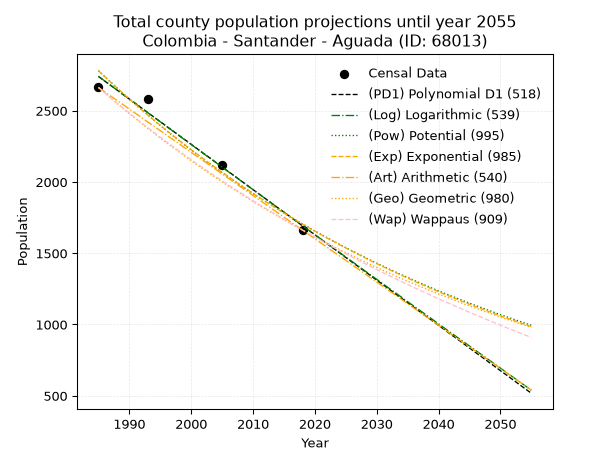
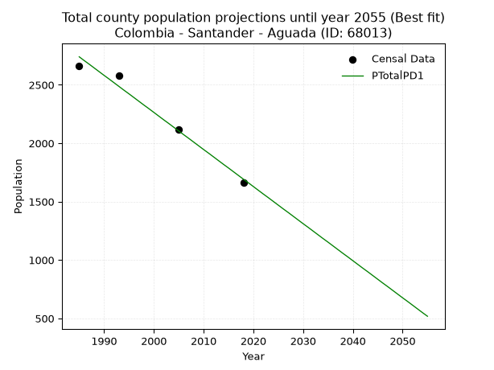
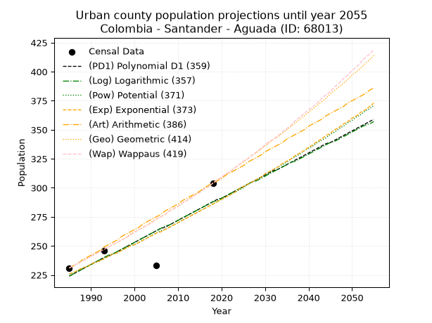
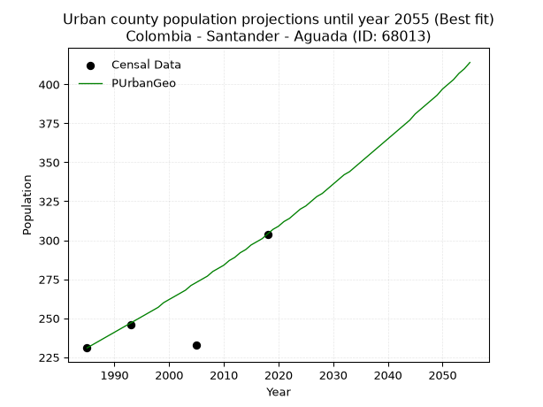
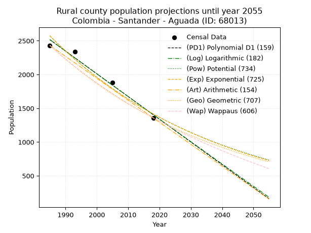
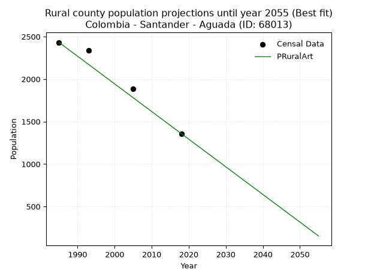

<div align="center">


</div>

# _“Population and Public Services Demand Projections (PPSD) until Year 2050 for Colombia - Santander - Aguada (ID: 68013)”_
Keywords: `population` `public-service` `projection` `lineal` `polynomial` `logarithmic` `potential` `exponential` `arithmetic` `geometric` `wappaus` `dane` `colombia` `south-america`

PPSD are analytical estimates used by governments and planners to anticipate future changes in population size, age distribution, and the resulting community needs for utilities, healthcare, education, and infrastructure as sizing future water treatment facilities, electrical grids, and road networks based on spatial growth.

> **General running parameters**: • app_version: _v20260806_. • Python version: _3.14.7_. • Pandas version: _3.0.5_. • NumPy version: _2.5.1_. • Creates, save and include plots into reports (create_plot): _False_. • Projection until year: _2050_. • Process polynomial degree 2 and up: _False_. • Process Wappaus: _True_. • Process Wappaus: _True_. • Set negative values to zero: _True_. • Set infinite values to zero: _True_. • Drop dataset notes: _True_. 
<div align="center">

Dynamic map: [:earth_americas:Google](http://maps.google.com/maps?q=6.162354666,-73.5231321) [:earth_americas:OSM](https://www.openstreetmap.org/#map=18/6.162354666/-73.5231321&layers=P) [:earth_americas:Bing](https://www.bing.com/maps?cp=6.162354666~-73.5231321&lvl=18) [:earth_americas:Apple](https://maps.apple.com/frame?center=6.162354666%2C-73.5231321&span=0.003%2C0.006)

</div>


<div align="center">

```geojson
{
  "type": "Feature",
  "geometry": {
    "type": "Point", 
    "coordinates": [-73.5231321, 6.162354666]
  }, 
  "properties": {
    "Name": "Colombia - Santander - Aguada (ID: 68013)"
  }
}
```

</div>


## 0. Census Data (4 records)

Census data are official statistics collected by a government about the people and housing in a country. They usually include counts of total population, age, sex, race, income, education, and jobs.

📅Global census file: [Population.xlsx](../data/Population.xlsx)

| Source   |   Year |   CountryID | CountryName   |   StateID | StateName   |   CountyID | CountyName   |   PTotal |   PUrban |   PRural |
|:---------|-------:|------------:|:--------------|----------:|:------------|-----------:|:-------------|---------:|---------:|---------:|
| DANE     |   1985 |          57 | Colombia      |        68 | Santander   |      68013 | Aguada       |     2663 |      231 |     2432 |
| DANE     |   1993 |          57 | Colombia      |        68 | Santander   |      68013 | Aguada       |     2582 |      246 |     2336 |
| DANE     |   2005 |          57 | Colombia      |        68 | Santander   |      68013 | Aguada       |     2117 |      233 |     1884 |
| DANE     |   2018 |          57 | Colombia      |        68 | Santander   |      68013 | Aguada       |     1662 |      304 |     1358 |

> 🔥Some records could had specific notes about the registered values or the corresponding urban or rural distribution.

**Local public utility companies (RUPS)**

 | SERVICIO       | ESTADO    | NOMBRE                                                                                              | NIT         | DEPARTAMENTO_DOMICILIO   | MUNICIPIO_DOMICILIO   | DIRECCION         |   TELEFONO | EMAIL                            | TIPO_INSCRIPCION    | REPRESENTANTE_LEGAL               | TIPO_PRESTADOR                 | CLASIFICACION                 |
|:---------------|:----------|:----------------------------------------------------------------------------------------------------|:------------|:-------------------------|:----------------------|:------------------|-----------:|:---------------------------------|:--------------------|:----------------------------------|:-------------------------------|:------------------------------|
| ACUEDUCTO      | OPERATIVA | UNIDAD ADMINISTRADORA DE SERVICIOS PUBLICOS DE ACUEDUCTO, ALCANTARILLADO Y ASEO DE AGUADA SANTANDER | 890210928-1 | SANTANDER                | AGUADA                | CARRERA 4 No 2-73 |    7565517 | alcaldia@aguada-santander.gov.co | Registro por la ESP | OSCAR MAURICIO SANCHEZ SANTAMARIA | MUNICIPIO (PRESTACIÓN DIRECTA) | MENOR O IGUAL A 2500 USUARIOS |
| ALCANTARILLADO | OPERATIVA | UNIDAD ADMINISTRADORA DE SERVICIOS PUBLICOS DE ACUEDUCTO, ALCANTARILLADO Y ASEO DE AGUADA SANTANDER | 890210928-1 | SANTANDER                | AGUADA                | CARRERA 4 No 2-73 |    7565517 | alcaldia@aguada-santander.gov.co | Registro por la ESP | OSCAR MAURICIO SANCHEZ SANTAMARIA | MUNICIPIO (PRESTACIÓN DIRECTA) | MENOR O IGUAL A 2500 USUARIOS |
| ASEO           | OPERATIVA | UNIDAD ADMINISTRADORA DE SERVICIOS PUBLICOS DE ACUEDUCTO, ALCANTARILLADO Y ASEO DE AGUADA SANTANDER | 890210928-1 | SANTANDER                | AGUADA                | CARRERA 4 No 2-73 |    7565517 | alcaldia@aguada-santander.gov.co | Registro por la ESP | OSCAR MAURICIO SANCHEZ SANTAMARIA | MUNICIPIO (PRESTACIÓN DIRECTA) | MENOR O IGUAL A 2500 USUARIOS |

> [📅RUPS Database: Registro Único de Prestadores de Servicios Públicos de Colombia Suramérica - RUPS](https://www.datos.gov.co/Hacienda-y-Cr-dito-P-blico/Registro-nico-de-Prestadores-de-Servicios-P-blicos/4qkq-csdn/about_data)

## 1. Total

### 1.1. Coefficients and Parameters

* (PD1) Polynomial Deg 1: -31.75270975511811, 65769.357687675 (lineal)
* (Log) Logarithmic: -63538.98963499742, 485216.36938512325
* (Pow) Potential: -29.66700714061321, 101.27896025331464
* (Exp) Exponential: -0.014827569610351313, 1.6849733137522964e+16
* (Art) Arithmetic: Year diff. 2018 - 1985 = 33, Population diff. 1662 - 2663 = -1001, Annual growth = -30.333333333333332
* (Geo) Geometric: Year diff. 2018 - 1985 = 33, Population diff. 1662 - 2663 = -1001, Annual growth % = -0.014184248431371116
* (Wap) Wappaus: i = -1.4026974951830442, Condition values only valid for < 200)

<sub>
Wappaus condition values: ['-0.00', '-1.40', '-2.81', '-4.21', '-5.61', '-7.01', '-8.42', '-9.82', '-11.22', '-12.62', '-14.03', '-15.43', '-16.83', '-18.24', '-19.64', '-21.04', '-22.44', '-23.85', '-25.25', '-26.65', '-28.05', '-29.46', '-30.86', '-32.26', '-33.66', '-35.07', '-36.47', '-37.87', '-39.28', '-40.68', '-42.08', '-43.48', '-44.89', '-46.29', '-47.69', '-49.09', '-50.50', '-51.90', '-53.30', '-54.71', '-56.11', '-57.51', '-58.91', '-60.32', '-61.72', '-63.12', '-64.52', '-65.93', '-67.33', '-68.73', '-70.13', '-71.54', '-72.94', '-74.34', '-75.75', '-77.15', '-78.55', '-79.95', '-81.36', '-82.76', '-84.16', '-85.56', '-86.97', '-88.37', '-89.77', '-91.18']
</sub>


### 1.2. Projected Dataset

|   Year |   CountyID |   PTotalPD1 |   PTotalLog |   PTotalPow |   PTotalExp |   PTotalArt |   PTotalGeo |   PTotalWap |
|-------:|-----------:|------------:|------------:|------------:|------------:|------------:|------------:|------------:|
|   1985 |      68013 |        2740 |        2741 |        2781 |        2780 |        2663 |        2663 |        2663 |
|   1986 |      68013 |        2708 |        2709 |        2740 |        2740 |        2633 |        2625 |        2626 |
|   1987 |      68013 |        2677 |        2677 |        2700 |        2699 |        2602 |        2588 |        2589 |
|   1988 |      68013 |        2645 |        2645 |        2660 |        2660 |        2572 |        2551 |        2553 |
|   1989 |      68013 |        2613 |        2613 |        2620 |        2620 |        2542 |        2515 |        2518 |
|   1990 |      68013 |        2581 |        2581 |        2581 |        2582 |        2511 |        2479 |        2483 |
|   1991 |      68013 |        2550 |        2549 |        2543 |        2544 |        2481 |        2444 |        2448 |
|   1992 |      68013 |        2518 |        2517 |        2506 |        2506 |        2451 |        2410 |        2414 |
|   1993 |      68013 |        2486 |        2485 |        2469 |        2469 |        2420 |        2375 |        2380 |
|   1994 |      68013 |        2454 |        2454 |        2432 |        2433 |        2390 |        2342 |        2347 |
|   1995 |      68013 |        2423 |        2422 |        2396 |        2397 |        2360 |        2308 |        2314 |
|   1996 |      68013 |        2391 |        2390 |        2361 |        2362 |        2329 |        2276 |        2282 |
|   1997 |      68013 |        2359 |        2358 |        2326 |        2327 |        2299 |        2243 |        2250 |
|   1998 |      68013 |        2327 |        2326 |        2292 |        2293 |        2269 |        2212 |        2218 |
|   1999 |      68013 |        2296 |        2294 |        2258 |        2259 |        2238 |        2180 |        2187 |
|   2000 |      68013 |        2264 |        2263 |        2225 |        2226 |        2208 |        2149 |        2156 |
|   2001 |      68013 |        2232 |        2231 |        2192 |        2193 |        2178 |        2119 |        2126 |
|   2002 |      68013 |        2200 |        2199 |        2160 |        2161 |        2147 |        2089 |        2096 |
|   2003 |      68013 |        2169 |        2167 |        2128 |        2129 |        2117 |        2059 |        2066 |
|   2004 |      68013 |        2137 |        2136 |        2097 |        2098 |        2087 |        2030 |        2037 |
|   2005 |      68013 |        2105 |        2104 |        2066 |        2067 |        2056 |        2001 |        2008 |
|   2006 |      68013 |        2073 |        2072 |        2036 |        2037 |        2026 |        1973 |        1979 |
|   2007 |      68013 |        2042 |        2041 |        2006 |        2007 |        1996 |        1945 |        1951 |
|   2008 |      68013 |        2010 |        2009 |        1976 |        1977 |        1965 |        1917 |        1923 |
|   2009 |      68013 |        1978 |        1977 |        1947 |        1948 |        1935 |        1890 |        1896 |
|   2010 |      68013 |        1946 |        1946 |        1919 |        1919 |        1905 |        1863 |        1868 |
|   2011 |      68013 |        1915 |        1914 |        1891 |        1891 |        1874 |        1837 |        1842 |
|   2012 |      68013 |        1883 |        1883 |        1863 |        1863 |        1844 |        1811 |        1815 |
|   2013 |      68013 |        1851 |        1851 |        1836 |        1836 |        1814 |        1785 |        1789 |
|   2014 |      68013 |        1819 |        1819 |        1809 |        1809 |        1783 |        1760 |        1763 |
|   2015 |      68013 |        1788 |        1788 |        1782 |        1782 |        1753 |        1735 |        1737 |
|   2016 |      68013 |        1756 |        1756 |        1756 |        1756 |        1723 |        1710 |        1712 |
|   2017 |      68013 |        1724 |        1725 |        1731 |        1730 |        1692 |        1686 |        1687 |
|   2018 |      68013 |        1692 |        1693 |        1705 |        1705 |        1662 |        1662 |        1662 |
|   2019 |      68013 |        1661 |        1662 |        1681 |        1679 |        1632 |        1638 |        1638 |
|   2020 |      68013 |        1629 |        1630 |        1656 |        1655 |        1601 |        1615 |        1613 |
|   2021 |      68013 |        1597 |        1599 |        1632 |        1630 |        1571 |        1592 |        1589 |
|   2022 |      68013 |        1565 |        1568 |        1608 |        1606 |        1541 |        1570 |        1566 |
|   2023 |      68013 |        1534 |        1536 |        1585 |        1583 |        1510 |        1547 |        1542 |
|   2024 |      68013 |        1502 |        1505 |        1562 |        1559 |        1480 |        1525 |        1519 |
|   2025 |      68013 |        1470 |        1473 |        1539 |        1537 |        1450 |        1504 |        1496 |
|   2026 |      68013 |        1438 |        1442 |        1517 |        1514 |        1419 |        1483 |        1474 |
|   2027 |      68013 |        1407 |        1411 |        1495 |        1492 |        1389 |        1461 |        1451 |
|   2028 |      68013 |        1375 |        1379 |        1473 |        1470 |        1359 |        1441 |        1429 |
|   2029 |      68013 |        1343 |        1348 |        1451 |        1448 |        1328 |        1420 |        1407 |
|   2030 |      68013 |        1311 |        1317 |        1430 |        1427 |        1298 |        1400 |        1385 |
|   2031 |      68013 |        1280 |        1285 |        1410 |        1406 |        1268 |        1380 |        1364 |
|   2032 |      68013 |        1248 |        1254 |        1389 |        1385 |        1237 |        1361 |        1343 |
|   2033 |      68013 |        1216 |        1223 |        1369 |        1365 |        1207 |        1341 |        1322 |
|   2034 |      68013 |        1184 |        1192 |        1349 |        1345 |        1177 |        1322 |        1301 |
|   2035 |      68013 |        1153 |        1160 |        1330 |        1325 |        1146 |        1304 |        1280 |
|   2036 |      68013 |        1121 |        1129 |        1310 |        1305 |        1116 |        1285 |        1260 |
|   2037 |      68013 |        1089 |        1098 |        1292 |        1286 |        1086 |        1267 |        1240 |
|   2038 |      68013 |        1057 |        1067 |        1273 |        1267 |        1055 |        1249 |        1220 |
|   2039 |      68013 |        1026 |        1036 |        1254 |        1248 |        1025 |        1231 |        1200 |
|   2040 |      68013 |         994 |        1004 |        1236 |        1230 |         995 |        1214 |        1180 |
|   2041 |      68013 |         962 |         973 |        1218 |        1212 |         964 |        1197 |        1161 |
|   2042 |      68013 |         930 |         942 |        1201 |        1194 |         934 |        1180 |        1142 |
|   2043 |      68013 |         899 |         911 |        1184 |        1177 |         904 |        1163 |        1123 |
|   2044 |      68013 |         867 |         880 |        1167 |        1159 |         873 |        1146 |        1104 |
|   2045 |      68013 |         835 |         849 |        1150 |        1142 |         843 |        1130 |        1086 |
|   2046 |      68013 |         803 |         818 |        1133 |        1125 |         813 |        1114 |        1067 |
|   2047 |      68013 |         772 |         787 |        1117 |        1109 |         782 |        1098 |        1049 |
|   2048 |      68013 |         740 |         756 |        1101 |        1093 |         752 |        1083 |        1031 |
|   2049 |      68013 |         708 |         725 |        1085 |        1076 |         722 |        1067 |        1013 |
|   2050 |      68013 |         676 |         694 |        1069 |        1061 |         691 |        1052 |         995 |
<div align="center">

</img>

</div>


### 1.3. Best fit with absolute and relative error (%)

Relative error puts that difference into context by dividing the absolute error by the true value, creating a unitless ratio or percentage that shows the scale of the mistake.

Absolute and relative error

|   Year | Source   |   CountryID | CountryName   |   StateID | StateName   |   CountyID_x | CountyName   |   PTotal |   PUrban |   PRural |   CountyID_y |   PTotalPD1 |   PTotalLog |   PTotalPow |   PTotalExp |   PTotalArt |   PTotalGeo |   PTotalWap |   PTotalPD1AbsError |   PTotalLogAbsError |   PTotalPowAbsError |   PTotalExpAbsError |   PTotalArtAbsError |   PTotalGeoAbsError |   PTotalWapAbsError |   PTotalPD1RelError |   PTotalLogRelError |   PTotalPowRelError |   PTotalExpRelError |   PTotalArtRelError |   PTotalGeoRelError |   PTotalWapRelError |
|-------:|:---------|------------:|:--------------|----------:|:------------|-------------:|:-------------|---------:|---------:|---------:|-------------:|------------:|------------:|------------:|------------:|------------:|------------:|------------:|--------------------:|--------------------:|--------------------:|--------------------:|--------------------:|--------------------:|--------------------:|--------------------:|--------------------:|--------------------:|--------------------:|--------------------:|--------------------:|--------------------:|
|   1985 | DANE     |          57 | Colombia      |        68 | Santander   |        68013 | Aguada       |     2663 |      231 |     2432 |        68013 |        2740 |        2741 |        2781 |        2780 |        2663 |        2663 |        2663 |                  77 |                  78 |                 118 |                 117 |                   0 |                   0 |                   0 |             2.89148 |            2.92903  |             4.43109 |             4.39354 |             0       |             0       |             0       |
|   1993 | DANE     |          57 | Colombia      |        68 | Santander   |        68013 | Aguada       |     2582 |      246 |     2336 |        68013 |        2486 |        2485 |        2469 |        2469 |        2420 |        2375 |        2380 |                  96 |                  97 |                 113 |                 113 |                 162 |                 207 |                 202 |             3.71805 |            3.75678  |             4.37645 |             4.37645 |             6.27421 |             8.01704 |             7.82339 |
|   2005 | DANE     |          57 | Colombia      |        68 | Santander   |        68013 | Aguada       |     2117 |      233 |     1884 |        68013 |        2105 |        2104 |        2066 |        2067 |        2056 |        2001 |        2008 |                  12 |                  13 |                  51 |                  50 |                  61 |                 116 |                 109 |             0.56684 |            0.614077 |             2.40907 |             2.36183 |             2.88144 |             5.47945 |             5.1488  |
|   2018 | DANE     |          57 | Colombia      |        68 | Santander   |        68013 | Aguada       |     1662 |      304 |     1358 |        68013 |        1692 |        1693 |        1705 |        1705 |        1662 |        1662 |        1662 |                  30 |                  31 |                  43 |                  43 |                   0 |                   0 |                   0 |             1.80505 |            1.86522  |             2.58724 |             2.58724 |             0       |             0       |             0       |

Relative error mean

| Method    |   RelError | Best   |
|:----------|-----------:|:-------|
| PTotalPD1 |    2.24535 | True   |
| PTotalLog |    2.29128 |        |
| PTotalPow |    3.45096 |        |
| PTotalExp |    3.42977 |        |
| PTotalArt |    2.28891 |        |
| PTotalGeo |    3.37412 |        |
| PTotalWap |    3.24305 |        |

💙Best method: _**PTotalPD1**_
<div align="center">

</img>

</div>


### 1.4. Fresh water supply demand in liters per capita per day (lpcd)

The fresh water supply demand typically ranges from 100 to 300 liters per capita per day (lpcd) for standard domestic and municipal planning, though absolute survival minimums set by the World Health Organization are as low as 7.5 to 20 liters per day, and total consumption in high-income nations can exceed 400 liters.

> `CZ`: Level in meters above the sea level (masl)<br> `WS`: Fresh water supply demand in liters per capita per day (lpcd or l/h/d)<br> `WSAll`: Zonal fresh water supply demand in liters per second (l/s)<br> `A`: Zonal area in square meters<br> `DP`: Population density (people/hectare or p/ha)

Reference values (RAS Colombia)

|    CZ |   WS |
|------:|-----:|
|  1000 |  120 |
|  2000 |  130 |
| 99999 |  140 |

County shapefile geometry properties and water supply values

|   CountyID |      ATotal |   CZTotal |   WSTotal |
|-----------:|------------:|----------:|----------:|
|      68013 | 7.51105e+07 |   1752.21 |       130 |

Projected values for best method: PTotalPD1

|   CountyID |   Year |   PTotalPD1 |   DPTotal |   WSTotal |   WSTotalAll |
|-----------:|-------:|------------:|----------:|----------:|-------------:|
|      68013 |   1985 |        2740 |      0.36 |       130 |      4.12269 |
|      68013 |   1986 |        2708 |      0.36 |       130 |      4.07454 |
|      68013 |   1987 |        2677 |      0.36 |       130 |      4.02789 |
|      68013 |   1988 |        2645 |      0.35 |       130 |      3.97975 |
|      68013 |   1989 |        2613 |      0.35 |       130 |      3.9316  |
|      68013 |   1990 |        2581 |      0.34 |       130 |      3.88345 |
|      68013 |   1991 |        2550 |      0.34 |       130 |      3.83681 |
|      68013 |   1992 |        2518 |      0.34 |       130 |      3.78866 |
|      68013 |   1993 |        2486 |      0.33 |       130 |      3.74051 |
|      68013 |   1994 |        2454 |      0.33 |       130 |      3.69236 |
|      68013 |   1995 |        2423 |      0.32 |       130 |      3.64572 |
|      68013 |   1996 |        2391 |      0.32 |       130 |      3.59757 |
|      68013 |   1997 |        2359 |      0.31 |       130 |      3.54942 |
|      68013 |   1998 |        2327 |      0.31 |       130 |      3.50127 |
|      68013 |   1999 |        2296 |      0.31 |       130 |      3.45463 |
|      68013 |   2000 |        2264 |      0.3  |       130 |      3.40648 |
|      68013 |   2001 |        2232 |      0.3  |       130 |      3.35833 |
|      68013 |   2002 |        2200 |      0.29 |       130 |      3.31019 |
|      68013 |   2003 |        2169 |      0.29 |       130 |      3.26354 |
|      68013 |   2004 |        2137 |      0.28 |       130 |      3.21539 |
|      68013 |   2005 |        2105 |      0.28 |       130 |      3.16725 |
|      68013 |   2006 |        2073 |      0.28 |       130 |      3.1191  |
|      68013 |   2007 |        2042 |      0.27 |       130 |      3.07245 |
|      68013 |   2008 |        2010 |      0.27 |       130 |      3.02431 |
|      68013 |   2009 |        1978 |      0.26 |       130 |      2.97616 |
|      68013 |   2010 |        1946 |      0.26 |       130 |      2.92801 |
|      68013 |   2011 |        1915 |      0.25 |       130 |      2.88137 |
|      68013 |   2012 |        1883 |      0.25 |       130 |      2.83322 |
|      68013 |   2013 |        1851 |      0.25 |       130 |      2.78507 |
|      68013 |   2014 |        1819 |      0.24 |       130 |      2.73692 |
|      68013 |   2015 |        1788 |      0.24 |       130 |      2.69028 |
|      68013 |   2016 |        1756 |      0.23 |       130 |      2.64213 |
|      68013 |   2017 |        1724 |      0.23 |       130 |      2.59398 |
|      68013 |   2018 |        1692 |      0.23 |       130 |      2.54583 |
|      68013 |   2019 |        1661 |      0.22 |       130 |      2.49919 |
|      68013 |   2020 |        1629 |      0.22 |       130 |      2.45104 |
|      68013 |   2021 |        1597 |      0.21 |       130 |      2.40289 |
|      68013 |   2022 |        1565 |      0.21 |       130 |      2.35475 |
|      68013 |   2023 |        1534 |      0.2  |       130 |      2.3081  |
|      68013 |   2024 |        1502 |      0.2  |       130 |      2.25995 |
|      68013 |   2025 |        1470 |      0.2  |       130 |      2.21181 |
|      68013 |   2026 |        1438 |      0.19 |       130 |      2.16366 |
|      68013 |   2027 |        1407 |      0.19 |       130 |      2.11701 |
|      68013 |   2028 |        1375 |      0.18 |       130 |      2.06887 |
|      68013 |   2029 |        1343 |      0.18 |       130 |      2.02072 |
|      68013 |   2030 |        1311 |      0.17 |       130 |      1.97257 |
|      68013 |   2031 |        1280 |      0.17 |       130 |      1.92593 |
|      68013 |   2032 |        1248 |      0.17 |       130 |      1.87778 |
|      68013 |   2033 |        1216 |      0.16 |       130 |      1.82963 |
|      68013 |   2034 |        1184 |      0.16 |       130 |      1.78148 |
|      68013 |   2035 |        1153 |      0.15 |       130 |      1.73484 |
|      68013 |   2036 |        1121 |      0.15 |       130 |      1.68669 |
|      68013 |   2037 |        1089 |      0.14 |       130 |      1.63854 |
|      68013 |   2038 |        1057 |      0.14 |       130 |      1.59039 |
|      68013 |   2039 |        1026 |      0.14 |       130 |      1.54375 |
|      68013 |   2040 |         994 |      0.13 |       130 |      1.4956  |
|      68013 |   2041 |         962 |      0.13 |       130 |      1.44745 |
|      68013 |   2042 |         930 |      0.12 |       130 |      1.39931 |
|      68013 |   2043 |         899 |      0.12 |       130 |      1.35266 |
|      68013 |   2044 |         867 |      0.12 |       130 |      1.30451 |
|      68013 |   2045 |         835 |      0.11 |       130 |      1.25637 |
|      68013 |   2046 |         803 |      0.11 |       130 |      1.20822 |
|      68013 |   2047 |         772 |      0.1  |       130 |      1.16157 |
|      68013 |   2048 |         740 |      0.1  |       130 |      1.11343 |
|      68013 |   2049 |         708 |      0.09 |       130 |      1.06528 |
|      68013 |   2050 |         676 |      0.09 |       130 |      1.01713 |

## 2. Urban

### 2.1. Coefficients and Parameters

* (PD1) Polynomial Deg 1: 1.9213167402649094, -3589.613809714885 (lineal)
* (Log) Logarithmic: 3840.604767577001, -28938.967615027876
* (Pow) Potential: 14.313657561437468, -44.84927496959599
* (Exp) Exponential: 0.007160418520161287, 0.00015168974193982137
* (Art) Arithmetic: Year diff. 2018 - 1985 = 33, Population diff. 304 - 231 = 73, Annual growth = 2.212121212121212
* (Geo) Geometric: Year diff. 2018 - 1985 = 33, Population diff. 304 - 231 = 73, Annual growth % = 0.008356234921165662
* (Wap) Wappaus: i = 0.8269612007929765, Condition values only valid for < 200)

<sub>
Wappaus condition values: ['0.00', '0.83', '1.65', '2.48', '3.31', '4.13', '4.96', '5.79', '6.62', '7.44', '8.27', '9.10', '9.92', '10.75', '11.58', '12.40', '13.23', '14.06', '14.89', '15.71', '16.54', '17.37', '18.19', '19.02', '19.85', '20.67', '21.50', '22.33', '23.15', '23.98', '24.81', '25.64', '26.46', '27.29', '28.12', '28.94', '29.77', '30.60', '31.42', '32.25', '33.08', '33.91', '34.73', '35.56', '36.39', '37.21', '38.04', '38.87', '39.69', '40.52', '41.35', '42.18', '43.00', '43.83', '44.66', '45.48', '46.31', '47.14', '47.96', '48.79', '49.62', '50.44', '51.27', '52.10', '52.93', '53.75']
</sub>


### 2.2. Projected Dataset

|   Year |   CountyID |   PUrbanPD1 |   PUrbanLog |   PUrbanPow |   PUrbanExp |   PUrbanArt |   PUrbanGeo |   PUrbanWap |
|-------:|-----------:|------------:|------------:|------------:|------------:|------------:|------------:|------------:|
|   1985 |      68013 |         224 |         224 |         226 |         226 |         231 |         231 |         231 |
|   1986 |      68013 |         226 |         226 |         227 |         227 |         233 |         233 |         233 |
|   1987 |      68013 |         228 |         228 |         229 |         229 |         235 |         235 |         235 |
|   1988 |      68013 |         230 |         230 |         231 |         231 |         238 |         237 |         237 |
|   1989 |      68013 |         232 |         232 |         232 |         232 |         240 |         239 |         239 |
|   1990 |      68013 |         234 |         234 |         234 |         234 |         242 |         241 |         241 |
|   1991 |      68013 |         236 |         236 |         236 |         236 |         244 |         243 |         243 |
|   1992 |      68013 |         238 |         238 |         237 |         237 |         246 |         245 |         245 |
|   1993 |      68013 |         240 |         240 |         239 |         239 |         249 |         247 |         247 |
|   1994 |      68013 |         241 |         242 |         241 |         241 |         251 |         249 |         249 |
|   1995 |      68013 |         243 |         243 |         243 |         243 |         253 |         251 |         251 |
|   1996 |      68013 |         245 |         245 |         244 |         244 |         255 |         253 |         253 |
|   1997 |      68013 |         247 |         247 |         246 |         246 |         258 |         255 |         255 |
|   1998 |      68013 |         249 |         249 |         248 |         248 |         260 |         257 |         257 |
|   1999 |      68013 |         251 |         251 |         250 |         250 |         262 |         260 |         259 |
|   2000 |      68013 |         253 |         253 |         251 |         251 |         264 |         262 |         262 |
|   2001 |      68013 |         255 |         255 |         253 |         253 |         266 |         264 |         264 |
|   2002 |      68013 |         257 |         257 |         255 |         255 |         269 |         266 |         266 |
|   2003 |      68013 |         259 |         259 |         257 |         257 |         271 |         268 |         268 |
|   2004 |      68013 |         261 |         261 |         259 |         259 |         273 |         271 |         270 |
|   2005 |      68013 |         263 |         263 |         261 |         261 |         275 |         273 |         273 |
|   2006 |      68013 |         265 |         265 |         263 |         262 |         277 |         275 |         275 |
|   2007 |      68013 |         266 |         267 |         264 |         264 |         280 |         277 |         277 |
|   2008 |      68013 |         268 |         268 |         266 |         266 |         282 |         280 |         280 |
|   2009 |      68013 |         270 |         270 |         268 |         268 |         284 |         282 |         282 |
|   2010 |      68013 |         272 |         272 |         270 |         270 |         286 |         284 |         284 |
|   2011 |      68013 |         274 |         274 |         272 |         272 |         289 |         287 |         287 |
|   2012 |      68013 |         276 |         276 |         274 |         274 |         291 |         289 |         289 |
|   2013 |      68013 |         278 |         278 |         276 |         276 |         293 |         292 |         291 |
|   2014 |      68013 |         280 |         280 |         278 |         278 |         295 |         294 |         294 |
|   2015 |      68013 |         282 |         282 |         280 |         280 |         297 |         297 |         296 |
|   2016 |      68013 |         284 |         284 |         282 |         282 |         300 |         299 |         299 |
|   2017 |      68013 |         286 |         286 |         284 |         284 |         302 |         301 |         301 |
|   2018 |      68013 |         288 |         288 |         286 |         286 |         304 |         304 |         304 |
|   2019 |      68013 |         290 |         289 |         288 |         288 |         306 |         307 |         307 |
|   2020 |      68013 |         291 |         291 |         290 |         290 |         308 |         309 |         309 |
|   2021 |      68013 |         293 |         293 |         292 |         292 |         311 |         312 |         312 |
|   2022 |      68013 |         295 |         295 |         294 |         294 |         313 |         314 |         314 |
|   2023 |      68013 |         297 |         297 |         296 |         296 |         315 |         317 |         317 |
|   2024 |      68013 |         299 |         299 |         298 |         299 |         317 |         320 |         320 |
|   2025 |      68013 |         301 |         301 |         300 |         301 |         319 |         322 |         323 |
|   2026 |      68013 |         303 |         303 |         303 |         303 |         322 |         325 |         325 |
|   2027 |      68013 |         305 |         305 |         305 |         305 |         324 |         328 |         328 |
|   2028 |      68013 |         307 |         306 |         307 |         307 |         326 |         330 |         331 |
|   2029 |      68013 |         309 |         308 |         309 |         309 |         328 |         333 |         334 |
|   2030 |      68013 |         311 |         310 |         311 |         312 |         331 |         336 |         337 |
|   2031 |      68013 |         313 |         312 |         313 |         314 |         333 |         339 |         340 |
|   2032 |      68013 |         315 |         314 |         316 |         316 |         335 |         342 |         342 |
|   2033 |      68013 |         316 |         316 |         318 |         318 |         337 |         344 |         345 |
|   2034 |      68013 |         318 |         318 |         320 |         321 |         339 |         347 |         348 |
|   2035 |      68013 |         320 |         320 |         322 |         323 |         342 |         350 |         351 |
|   2036 |      68013 |         322 |         322 |         325 |         325 |         344 |         353 |         354 |
|   2037 |      68013 |         324 |         323 |         327 |         328 |         346 |         356 |         358 |
|   2038 |      68013 |         326 |         325 |         329 |         330 |         348 |         359 |         361 |
|   2039 |      68013 |         328 |         327 |         332 |         332 |         350 |         362 |         364 |
|   2040 |      68013 |         330 |         329 |         334 |         335 |         353 |         365 |         367 |
|   2041 |      68013 |         332 |         331 |         336 |         337 |         355 |         368 |         370 |
|   2042 |      68013 |         334 |         333 |         339 |         340 |         357 |         371 |         373 |
|   2043 |      68013 |         336 |         335 |         341 |         342 |         359 |         374 |         377 |
|   2044 |      68013 |         338 |         337 |         343 |         345 |         362 |         377 |         380 |
|   2045 |      68013 |         339 |         339 |         346 |         347 |         364 |         381 |         383 |
|   2046 |      68013 |         341 |         340 |         348 |         350 |         366 |         384 |         387 |
|   2047 |      68013 |         343 |         342 |         351 |         352 |         368 |         387 |         390 |
|   2048 |      68013 |         345 |         344 |         353 |         355 |         370 |         390 |         394 |
|   2049 |      68013 |         347 |         346 |         356 |         357 |         373 |         393 |         397 |
|   2050 |      68013 |         349 |         348 |         358 |         360 |         375 |         397 |         401 |
<div align="center">

</img>

</div>


### 2.3. Best fit with absolute and relative error (%)

Relative error puts that difference into context by dividing the absolute error by the true value, creating a unitless ratio or percentage that shows the scale of the mistake.

Absolute and relative error

|   Year | Source   |   CountryID | CountryName   |   StateID | StateName   |   CountyID_x | CountyName   |   PTotal |   PUrban |   PRural |   CountyID_y |   PUrbanPD1 |   PUrbanLog |   PUrbanPow |   PUrbanExp |   PUrbanArt |   PUrbanGeo |   PUrbanWap |   PUrbanPD1AbsError |   PUrbanLogAbsError |   PUrbanPowAbsError |   PUrbanExpAbsError |   PUrbanArtAbsError |   PUrbanGeoAbsError |   PUrbanWapAbsError |   PUrbanPD1RelError |   PUrbanLogRelError |   PUrbanPowRelError |   PUrbanExpRelError |   PUrbanArtRelError |   PUrbanGeoRelError |   PUrbanWapRelError |
|-------:|:---------|------------:|:--------------|----------:|:------------|-------------:|:-------------|---------:|---------:|---------:|-------------:|------------:|------------:|------------:|------------:|------------:|------------:|------------:|--------------------:|--------------------:|--------------------:|--------------------:|--------------------:|--------------------:|--------------------:|--------------------:|--------------------:|--------------------:|--------------------:|--------------------:|--------------------:|--------------------:|
|   1985 | DANE     |          57 | Colombia      |        68 | Santander   |        68013 | Aguada       |     2663 |      231 |     2432 |        68013 |         224 |         224 |         226 |         226 |         231 |         231 |         231 |                   7 |                   7 |                   5 |                   5 |                   0 |                   0 |                   0 |             3.0303  |             3.0303  |             2.1645  |             2.1645  |             0       |            0        |            0        |
|   1993 | DANE     |          57 | Colombia      |        68 | Santander   |        68013 | Aguada       |     2582 |      246 |     2336 |        68013 |         240 |         240 |         239 |         239 |         249 |         247 |         247 |                   6 |                   6 |                   7 |                   7 |                   3 |                   1 |                   1 |             2.43902 |             2.43902 |             2.84553 |             2.84553 |             1.21951 |            0.406504 |            0.406504 |
|   2005 | DANE     |          57 | Colombia      |        68 | Santander   |        68013 | Aguada       |     2117 |      233 |     1884 |        68013 |         263 |         263 |         261 |         261 |         275 |         273 |         273 |                  30 |                  30 |                  28 |                  28 |                  42 |                  40 |                  40 |            12.8755  |            12.8755  |            12.0172  |            12.0172  |            18.0258  |           17.1674   |           17.1674   |
|   2018 | DANE     |          57 | Colombia      |        68 | Santander   |        68013 | Aguada       |     1662 |      304 |     1358 |        68013 |         288 |         288 |         286 |         286 |         304 |         304 |         304 |                  16 |                  16 |                  18 |                  18 |                   0 |                   0 |                   0 |             5.26316 |             5.26316 |             5.92105 |             5.92105 |             0       |            0        |            0        |

Relative error mean

| Method    |   RelError | Best   |
|:----------|-----------:|:-------|
| PUrbanPD1 |    5.90201 |        |
| PUrbanLog |    5.90201 |        |
| PUrbanPow |    5.73706 |        |
| PUrbanExp |    5.73706 |        |
| PUrbanArt |    4.81132 |        |
| PUrbanGeo |    4.39347 | True   |
| PUrbanWap |    4.39347 | True   |

💙Best method: _**PUrbanGeo**_
<div align="center">

</img>

</div>


### 2.4. Fresh water supply demand in liters per capita per day (lpcd)

The fresh water supply demand typically ranges from 100 to 300 liters per capita per day (lpcd) for standard domestic and municipal planning, though absolute survival minimums set by the World Health Organization are as low as 7.5 to 20 liters per day, and total consumption in high-income nations can exceed 400 liters.

> `CZ`: Level in meters above the sea level (masl)<br> `WS`: Fresh water supply demand in liters per capita per day (lpcd or l/h/d)<br> `WSAll`: Zonal fresh water supply demand in liters per second (l/s)<br> `A`: Zonal area in square meters<br> `DP`: Population density (people/hectare or p/ha)

Reference values (RAS Colombia)

|    CZ |   WS |
|------:|-----:|
|  1000 |  120 |
|  2000 |  130 |
| 99999 |  140 |

County shapefile geometry properties and water supply values

|   CountyID |   AUrban |   CZUrban |   WSUrban |
|-----------:|---------:|----------:|----------:|
|      68013 |   113131 |   1743.35 |       130 |

Projected values for best method: PUrbanGeo

|   CountyID |   Year |   PUrbanGeo |   DPUrban |   WSUrban |   WSUrbanAll |
|-----------:|-------:|------------:|----------:|----------:|-------------:|
|      68013 |   1985 |         231 |     20.42 |       130 |     0.347569 |
|      68013 |   1986 |         233 |     20.6  |       130 |     0.350579 |
|      68013 |   1987 |         235 |     20.77 |       130 |     0.353588 |
|      68013 |   1988 |         237 |     20.95 |       130 |     0.356597 |
|      68013 |   1989 |         239 |     21.13 |       130 |     0.359606 |
|      68013 |   1990 |         241 |     21.3  |       130 |     0.362616 |
|      68013 |   1991 |         243 |     21.48 |       130 |     0.365625 |
|      68013 |   1992 |         245 |     21.66 |       130 |     0.368634 |
|      68013 |   1993 |         247 |     21.83 |       130 |     0.371644 |
|      68013 |   1994 |         249 |     22.01 |       130 |     0.374653 |
|      68013 |   1995 |         251 |     22.19 |       130 |     0.377662 |
|      68013 |   1996 |         253 |     22.36 |       130 |     0.380671 |
|      68013 |   1997 |         255 |     22.54 |       130 |     0.383681 |
|      68013 |   1998 |         257 |     22.72 |       130 |     0.38669  |
|      68013 |   1999 |         260 |     22.98 |       130 |     0.391204 |
|      68013 |   2000 |         262 |     23.16 |       130 |     0.394213 |
|      68013 |   2001 |         264 |     23.34 |       130 |     0.397222 |
|      68013 |   2002 |         266 |     23.51 |       130 |     0.400231 |
|      68013 |   2003 |         268 |     23.69 |       130 |     0.403241 |
|      68013 |   2004 |         271 |     23.95 |       130 |     0.407755 |
|      68013 |   2005 |         273 |     24.13 |       130 |     0.410764 |
|      68013 |   2006 |         275 |     24.31 |       130 |     0.413773 |
|      68013 |   2007 |         277 |     24.48 |       130 |     0.416782 |
|      68013 |   2008 |         280 |     24.75 |       130 |     0.421296 |
|      68013 |   2009 |         282 |     24.93 |       130 |     0.424306 |
|      68013 |   2010 |         284 |     25.1  |       130 |     0.427315 |
|      68013 |   2011 |         287 |     25.37 |       130 |     0.431829 |
|      68013 |   2012 |         289 |     25.55 |       130 |     0.434838 |
|      68013 |   2013 |         292 |     25.81 |       130 |     0.439352 |
|      68013 |   2014 |         294 |     25.99 |       130 |     0.442361 |
|      68013 |   2015 |         297 |     26.25 |       130 |     0.446875 |
|      68013 |   2016 |         299 |     26.43 |       130 |     0.449884 |
|      68013 |   2017 |         301 |     26.61 |       130 |     0.452894 |
|      68013 |   2018 |         304 |     26.87 |       130 |     0.457407 |
|      68013 |   2019 |         307 |     27.14 |       130 |     0.461921 |
|      68013 |   2020 |         309 |     27.31 |       130 |     0.464931 |
|      68013 |   2021 |         312 |     27.58 |       130 |     0.469444 |
|      68013 |   2022 |         314 |     27.76 |       130 |     0.472454 |
|      68013 |   2023 |         317 |     28.02 |       130 |     0.476968 |
|      68013 |   2024 |         320 |     28.29 |       130 |     0.481481 |
|      68013 |   2025 |         322 |     28.46 |       130 |     0.484491 |
|      68013 |   2026 |         325 |     28.73 |       130 |     0.489005 |
|      68013 |   2027 |         328 |     28.99 |       130 |     0.493519 |
|      68013 |   2028 |         330 |     29.17 |       130 |     0.496528 |
|      68013 |   2029 |         333 |     29.43 |       130 |     0.501042 |
|      68013 |   2030 |         336 |     29.7  |       130 |     0.505556 |
|      68013 |   2031 |         339 |     29.97 |       130 |     0.510069 |
|      68013 |   2032 |         342 |     30.23 |       130 |     0.514583 |
|      68013 |   2033 |         344 |     30.41 |       130 |     0.517593 |
|      68013 |   2034 |         347 |     30.67 |       130 |     0.522106 |
|      68013 |   2035 |         350 |     30.94 |       130 |     0.52662  |
|      68013 |   2036 |         353 |     31.2  |       130 |     0.531134 |
|      68013 |   2037 |         356 |     31.47 |       130 |     0.535648 |
|      68013 |   2038 |         359 |     31.73 |       130 |     0.540162 |
|      68013 |   2039 |         362 |     32    |       130 |     0.544676 |
|      68013 |   2040 |         365 |     32.26 |       130 |     0.54919  |
|      68013 |   2041 |         368 |     32.53 |       130 |     0.553704 |
|      68013 |   2042 |         371 |     32.79 |       130 |     0.558218 |
|      68013 |   2043 |         374 |     33.06 |       130 |     0.562731 |
|      68013 |   2044 |         377 |     33.32 |       130 |     0.567245 |
|      68013 |   2045 |         381 |     33.68 |       130 |     0.573264 |
|      68013 |   2046 |         384 |     33.94 |       130 |     0.577778 |
|      68013 |   2047 |         387 |     34.21 |       130 |     0.582292 |
|      68013 |   2048 |         390 |     34.47 |       130 |     0.586806 |
|      68013 |   2049 |         393 |     34.74 |       130 |     0.591319 |
|      68013 |   2050 |         397 |     35.09 |       130 |     0.597338 |

## 3. Rural

### 3.1. Coefficients and Parameters

* (PD1) Polynomial Deg 1: -33.67402649538301, 69358.97149738987 (lineal)
* (Log) Logarithmic: -67379.59440257445, 514155.3370001514
* (Pow) Potential: -36.18519558685525, 122.74067908418834
* (Exp) Exponential: -0.01808705029254555, 1.0064224544289786e+19
* (Art) Arithmetic: Year diff. 2018 - 1985 = 33, Population diff. 1358 - 2432 = -1074, Annual growth = -32.54545454545455
* (Geo) Geometric: Year diff. 2018 - 1985 = 33, Population diff. 1358 - 2432 = -1074, Annual growth % = -0.017502622142805846
* (Wap) Wappaus: i = -1.7174382345886303, Condition values only valid for < 200)

<sub>
Wappaus condition values: ['-0.00', '-1.72', '-3.43', '-5.15', '-6.87', '-8.59', '-10.30', '-12.02', '-13.74', '-15.46', '-17.17', '-18.89', '-20.61', '-22.33', '-24.04', '-25.76', '-27.48', '-29.20', '-30.91', '-32.63', '-34.35', '-36.07', '-37.78', '-39.50', '-41.22', '-42.94', '-44.65', '-46.37', '-48.09', '-49.81', '-51.52', '-53.24', '-54.96', '-56.68', '-58.39', '-60.11', '-61.83', '-63.55', '-65.26', '-66.98', '-68.70', '-70.41', '-72.13', '-73.85', '-75.57', '-77.28', '-79.00', '-80.72', '-82.44', '-84.15', '-85.87', '-87.59', '-89.31', '-91.02', '-92.74', '-94.46', '-96.18', '-97.89', '-99.61', '-101.33', '-103.05', '-104.76', '-106.48', '-108.20', '-109.92', '-111.63']
</sub>


### 3.2. Projected Dataset

|   Year |   CountyID |   PRuralPD1 |   PRuralLog |   PRuralPow |   PRuralExp |   PRuralArt |   PRuralGeo |   PRuralWap |
|-------:|-----------:|------------:|------------:|------------:|------------:|------------:|------------:|------------:|
|   1985 |      68013 |        2516 |        2517 |        2574 |        2573 |        2432 |        2432 |        2432 |
|   1986 |      68013 |        2482 |        2483 |        2527 |        2527 |        2399 |        2389 |        2391 |
|   1987 |      68013 |        2449 |        2449 |        2482 |        2481 |        2367 |        2348 |        2350 |
|   1988 |      68013 |        2415 |        2415 |        2437 |        2437 |        2334 |        2307 |        2310 |
|   1989 |      68013 |        2381 |        2381 |        2393 |        2393 |        2302 |        2266 |        2270 |
|   1990 |      68013 |        2348 |        2347 |        2350 |        2350 |        2269 |        2226 |        2232 |
|   1991 |      68013 |        2314 |        2314 |        2307 |        2308 |        2237 |        2188 |        2194 |
|   1992 |      68013 |        2280 |        2280 |        2266 |        2267 |        2204 |        2149 |        2156 |
|   1993 |      68013 |        2247 |        2246 |        2225 |        2226 |        2172 |        2112 |        2119 |
|   1994 |      68013 |        2213 |        2212 |        2185 |        2186 |        2139 |        2075 |        2083 |
|   1995 |      68013 |        2179 |        2178 |        2146 |        2147 |        2107 |        2038 |        2047 |
|   1996 |      68013 |        2146 |        2145 |        2107 |        2109 |        2074 |        2003 |        2012 |
|   1997 |      68013 |        2112 |        2111 |        2069 |        2071 |        2041 |        1968 |        1978 |
|   1998 |      68013 |        2078 |        2077 |        2032 |        2034 |        2009 |        1933 |        1944 |
|   1999 |      68013 |        2045 |        2043 |        1996 |        1997 |        1976 |        1899 |        1910 |
|   2000 |      68013 |        2011 |        2010 |        1960 |        1961 |        1944 |        1866 |        1877 |
|   2001 |      68013 |        1977 |        1976 |        1925 |        1926 |        1911 |        1833 |        1844 |
|   2002 |      68013 |        1944 |        1942 |        1890 |        1892 |        1879 |        1801 |        1812 |
|   2003 |      68013 |        1910 |        1909 |        1857 |        1858 |        1846 |        1770 |        1781 |
|   2004 |      68013 |        1876 |        1875 |        1823 |        1825 |        1814 |        1739 |        1750 |
|   2005 |      68013 |        1843 |        1841 |        1791 |        1792 |        1781 |        1708 |        1719 |
|   2006 |      68013 |        1809 |        1808 |        1759 |        1760 |        1749 |        1679 |        1689 |
|   2007 |      68013 |        1775 |        1774 |        1727 |        1728 |        1716 |        1649 |        1659 |
|   2008 |      68013 |        1742 |        1741 |        1696 |        1697 |        1683 |        1620 |        1630 |
|   2009 |      68013 |        1708 |        1707 |        1666 |        1667 |        1651 |        1592 |        1601 |
|   2010 |      68013 |        1674 |        1674 |        1636 |        1637 |        1618 |        1564 |        1572 |
|   2011 |      68013 |        1641 |        1640 |        1607 |        1608 |        1586 |        1537 |        1544 |
|   2012 |      68013 |        1607 |        1607 |        1579 |        1579 |        1553 |        1510 |        1517 |
|   2013 |      68013 |        1573 |        1573 |        1550 |        1550 |        1521 |        1483 |        1489 |
|   2014 |      68013 |        1539 |        1540 |        1523 |        1523 |        1488 |        1457 |        1462 |
|   2015 |      68013 |        1506 |        1506 |        1496 |        1495 |        1456 |        1432 |        1436 |
|   2016 |      68013 |        1472 |        1473 |        1469 |        1469 |        1423 |        1407 |        1409 |
|   2017 |      68013 |        1438 |        1439 |        1443 |        1442 |        1391 |        1382 |        1384 |
|   2018 |      68013 |        1405 |        1406 |        1417 |        1416 |        1358 |        1358 |        1358 |
|   2019 |      68013 |        1371 |        1373 |        1392 |        1391 |        1325 |        1334 |        1333 |
|   2020 |      68013 |        1337 |        1339 |        1367 |        1366 |        1293 |        1311 |        1308 |
|   2021 |      68013 |        1304 |        1306 |        1343 |        1342 |        1260 |        1288 |        1283 |
|   2022 |      68013 |        1270 |        1272 |        1319 |        1318 |        1228 |        1265 |        1259 |
|   2023 |      68013 |        1236 |        1239 |        1296 |        1294 |        1195 |        1243 |        1235 |
|   2024 |      68013 |        1203 |        1206 |        1273 |        1271 |        1163 |        1221 |        1212 |
|   2025 |      68013 |        1169 |        1173 |        1250 |        1248 |        1130 |        1200 |        1188 |
|   2026 |      68013 |        1135 |        1139 |        1228 |        1226 |        1098 |        1179 |        1165 |
|   2027 |      68013 |        1102 |        1106 |        1207 |        1204 |        1065 |        1158 |        1143 |
|   2028 |      68013 |        1068 |        1073 |        1185 |        1182 |        1033 |        1138 |        1120 |
|   2029 |      68013 |        1034 |        1040 |        1164 |        1161 |        1000 |        1118 |        1098 |
|   2030 |      68013 |        1001 |        1006 |        1144 |        1140 |         967 |        1099 |        1076 |
|   2031 |      68013 |         967 |         973 |        1123 |        1120 |         935 |        1079 |        1055 |
|   2032 |      68013 |         933 |         940 |        1104 |        1100 |         902 |        1061 |        1033 |
|   2033 |      68013 |         900 |         907 |        1084 |        1080 |         870 |        1042 |        1012 |
|   2034 |      68013 |         866 |         874 |        1065 |        1060 |         837 |        1024 |         991 |
|   2035 |      68013 |         832 |         841 |        1046 |        1041 |         805 |        1006 |         971 |
|   2036 |      68013 |         799 |         808 |        1028 |        1023 |         772 |         988 |         951 |
|   2037 |      68013 |         765 |         774 |        1010 |        1004 |         740 |         971 |         931 |
|   2038 |      68013 |         731 |         741 |         992 |         986 |         707 |         954 |         911 |
|   2039 |      68013 |         698 |         708 |         974 |         969 |         675 |         937 |         891 |
|   2040 |      68013 |         664 |         675 |         957 |         951 |         642 |         921 |         872 |
|   2041 |      68013 |         630 |         642 |         941 |         934 |         609 |         905 |         853 |
|   2042 |      68013 |         597 |         609 |         924 |         918 |         577 |         889 |         834 |
|   2043 |      68013 |         563 |         576 |         908 |         901 |         544 |         873 |         815 |
|   2044 |      68013 |         529 |         543 |         892 |         885 |         512 |         858 |         796 |
|   2045 |      68013 |         496 |         510 |         876 |         869 |         479 |         843 |         778 |
|   2046 |      68013 |         462 |         477 |         861 |         854 |         447 |         828 |         760 |
|   2047 |      68013 |         428 |         445 |         846 |         838 |         414 |         814 |         742 |
|   2048 |      68013 |         395 |         412 |         831 |         823 |         382 |         800 |         724 |
|   2049 |      68013 |         361 |         379 |         816 |         808 |         349 |         786 |         707 |
|   2050 |      68013 |         327 |         346 |         802 |         794 |         317 |         772 |         690 |
<div align="center">

</img>

</div>


### 3.3. Best fit with absolute and relative error (%)

Relative error puts that difference into context by dividing the absolute error by the true value, creating a unitless ratio or percentage that shows the scale of the mistake.

Absolute and relative error

|   Year | Source   |   CountryID | CountryName   |   StateID | StateName   |   CountyID_x | CountyName   |   PTotal |   PUrban |   PRural |   CountyID_y |   PRuralPD1 |   PRuralLog |   PRuralPow |   PRuralExp |   PRuralArt |   PRuralGeo |   PRuralWap |   PRuralPD1AbsError |   PRuralLogAbsError |   PRuralPowAbsError |   PRuralExpAbsError |   PRuralArtAbsError |   PRuralGeoAbsError |   PRuralWapAbsError |   PRuralPD1RelError |   PRuralLogRelError |   PRuralPowRelError |   PRuralExpRelError |   PRuralArtRelError |   PRuralGeoRelError |   PRuralWapRelError |
|-------:|:---------|------------:|:--------------|----------:|:------------|-------------:|:-------------|---------:|---------:|---------:|-------------:|------------:|------------:|------------:|------------:|------------:|------------:|------------:|--------------------:|--------------------:|--------------------:|--------------------:|--------------------:|--------------------:|--------------------:|--------------------:|--------------------:|--------------------:|--------------------:|--------------------:|--------------------:|--------------------:|
|   1985 | DANE     |          57 | Colombia      |        68 | Santander   |        68013 | Aguada       |     2663 |      231 |     2432 |        68013 |        2516 |        2517 |        2574 |        2573 |        2432 |        2432 |        2432 |                  84 |                  85 |                 142 |                 141 |                   0 |                   0 |                   0 |             3.45395 |             3.49507 |             5.83882 |             5.7977  |             0       |             0       |             0       |
|   1993 | DANE     |          57 | Colombia      |        68 | Santander   |        68013 | Aguada       |     2582 |      246 |     2336 |        68013 |        2247 |        2246 |        2225 |        2226 |        2172 |        2112 |        2119 |                  89 |                  90 |                 111 |                 110 |                 164 |                 224 |                 217 |             3.80993 |             3.85274 |             4.75171 |             4.7089  |             7.02055 |             9.58904 |             9.28938 |
|   2005 | DANE     |          57 | Colombia      |        68 | Santander   |        68013 | Aguada       |     2117 |      233 |     1884 |        68013 |        1843 |        1841 |        1791 |        1792 |        1781 |        1708 |        1719 |                  41 |                  43 |                  93 |                  92 |                 103 |                 176 |                 165 |             2.17622 |             2.28238 |             4.93631 |             4.88323 |             5.46709 |             9.34183 |             8.75796 |
|   2018 | DANE     |          57 | Colombia      |        68 | Santander   |        68013 | Aguada       |     1662 |      304 |     1358 |        68013 |        1405 |        1406 |        1417 |        1416 |        1358 |        1358 |        1358 |                  47 |                  48 |                  59 |                  58 |                   0 |                   0 |                   0 |             3.46097 |             3.53461 |             4.34462 |             4.27099 |             0       |             0       |             0       |

Relative error mean

| Method    |   RelError | Best   |
|:----------|-----------:|:-------|
| PRuralPD1 |    3.22527 |        |
| PRuralLog |    3.2912  |        |
| PRuralPow |    4.96786 |        |
| PRuralExp |    4.9152  |        |
| PRuralArt |    3.12191 | True   |
| PRuralGeo |    4.73272 |        |
| PRuralWap |    4.51184 |        |

💙Best method: _**PRuralArt**_
<div align="center">

</img>

</div>


### 3.4. Fresh water supply demand in liters per capita per day (lpcd)

The fresh water supply demand typically ranges from 100 to 300 liters per capita per day (lpcd) for standard domestic and municipal planning, though absolute survival minimums set by the World Health Organization are as low as 7.5 to 20 liters per day, and total consumption in high-income nations can exceed 400 liters.

> `CZ`: Level in meters above the sea level (masl)<br> `WS`: Fresh water supply demand in liters per capita per day (lpcd or l/h/d)<br> `WSAll`: Zonal fresh water supply demand in liters per second (l/s)<br> `A`: Zonal area in square meters<br> `DP`: Population density (people/hectare or p/ha)

Reference values (RAS Colombia)

|    CZ |   WS |
|------:|-----:|
|  1000 |  120 |
|  2000 |  130 |
| 99999 |  140 |

County shapefile geometry properties and water supply values

|   CountyID |      ARural |   CZRural |   WSRural |
|-----------:|------------:|----------:|----------:|
|      68013 | 7.49974e+07 |   1752.23 |       130 |

Projected values for best method: PRuralArt

|   CountyID |   Year |   PRuralArt |   DPRural |   WSRural |   WSRuralAll |
|-----------:|-------:|------------:|----------:|----------:|-------------:|
|      68013 |   1985 |        2432 |      0.32 |       130 |     3.65926  |
|      68013 |   1986 |        2399 |      0.32 |       130 |     3.60961  |
|      68013 |   1987 |        2367 |      0.32 |       130 |     3.56146  |
|      68013 |   1988 |        2334 |      0.31 |       130 |     3.51181  |
|      68013 |   1989 |        2302 |      0.31 |       130 |     3.46366  |
|      68013 |   1990 |        2269 |      0.3  |       130 |     3.414    |
|      68013 |   1991 |        2237 |      0.3  |       130 |     3.36586  |
|      68013 |   1992 |        2204 |      0.29 |       130 |     3.3162   |
|      68013 |   1993 |        2172 |      0.29 |       130 |     3.26806  |
|      68013 |   1994 |        2139 |      0.29 |       130 |     3.2184   |
|      68013 |   1995 |        2107 |      0.28 |       130 |     3.17025  |
|      68013 |   1996 |        2074 |      0.28 |       130 |     3.1206   |
|      68013 |   1997 |        2041 |      0.27 |       130 |     3.07095  |
|      68013 |   1998 |        2009 |      0.27 |       130 |     3.0228   |
|      68013 |   1999 |        1976 |      0.26 |       130 |     2.97315  |
|      68013 |   2000 |        1944 |      0.26 |       130 |     2.925    |
|      68013 |   2001 |        1911 |      0.25 |       130 |     2.87535  |
|      68013 |   2002 |        1879 |      0.25 |       130 |     2.8272   |
|      68013 |   2003 |        1846 |      0.25 |       130 |     2.77755  |
|      68013 |   2004 |        1814 |      0.24 |       130 |     2.7294   |
|      68013 |   2005 |        1781 |      0.24 |       130 |     2.67975  |
|      68013 |   2006 |        1749 |      0.23 |       130 |     2.6316   |
|      68013 |   2007 |        1716 |      0.23 |       130 |     2.58194  |
|      68013 |   2008 |        1683 |      0.22 |       130 |     2.53229  |
|      68013 |   2009 |        1651 |      0.22 |       130 |     2.48414  |
|      68013 |   2010 |        1618 |      0.22 |       130 |     2.43449  |
|      68013 |   2011 |        1586 |      0.21 |       130 |     2.38634  |
|      68013 |   2012 |        1553 |      0.21 |       130 |     2.33669  |
|      68013 |   2013 |        1521 |      0.2  |       130 |     2.28854  |
|      68013 |   2014 |        1488 |      0.2  |       130 |     2.23889  |
|      68013 |   2015 |        1456 |      0.19 |       130 |     2.19074  |
|      68013 |   2016 |        1423 |      0.19 |       130 |     2.14109  |
|      68013 |   2017 |        1391 |      0.19 |       130 |     2.09294  |
|      68013 |   2018 |        1358 |      0.18 |       130 |     2.04329  |
|      68013 |   2019 |        1325 |      0.18 |       130 |     1.99363  |
|      68013 |   2020 |        1293 |      0.17 |       130 |     1.94549  |
|      68013 |   2021 |        1260 |      0.17 |       130 |     1.89583  |
|      68013 |   2022 |        1228 |      0.16 |       130 |     1.84769  |
|      68013 |   2023 |        1195 |      0.16 |       130 |     1.79803  |
|      68013 |   2024 |        1163 |      0.16 |       130 |     1.74988  |
|      68013 |   2025 |        1130 |      0.15 |       130 |     1.70023  |
|      68013 |   2026 |        1098 |      0.15 |       130 |     1.65208  |
|      68013 |   2027 |        1065 |      0.14 |       130 |     1.60243  |
|      68013 |   2028 |        1033 |      0.14 |       130 |     1.55428  |
|      68013 |   2029 |        1000 |      0.13 |       130 |     1.50463  |
|      68013 |   2030 |         967 |      0.13 |       130 |     1.45498  |
|      68013 |   2031 |         935 |      0.12 |       130 |     1.40683  |
|      68013 |   2032 |         902 |      0.12 |       130 |     1.35718  |
|      68013 |   2033 |         870 |      0.12 |       130 |     1.30903  |
|      68013 |   2034 |         837 |      0.11 |       130 |     1.25937  |
|      68013 |   2035 |         805 |      0.11 |       130 |     1.21123  |
|      68013 |   2036 |         772 |      0.1  |       130 |     1.16157  |
|      68013 |   2037 |         740 |      0.1  |       130 |     1.11343  |
|      68013 |   2038 |         707 |      0.09 |       130 |     1.06377  |
|      68013 |   2039 |         675 |      0.09 |       130 |     1.01562  |
|      68013 |   2040 |         642 |      0.09 |       130 |     0.965972 |
|      68013 |   2041 |         609 |      0.08 |       130 |     0.916319 |
|      68013 |   2042 |         577 |      0.08 |       130 |     0.868171 |
|      68013 |   2043 |         544 |      0.07 |       130 |     0.818519 |
|      68013 |   2044 |         512 |      0.07 |       130 |     0.77037  |
|      68013 |   2045 |         479 |      0.06 |       130 |     0.720718 |
|      68013 |   2046 |         447 |      0.06 |       130 |     0.672569 |
|      68013 |   2047 |         414 |      0.06 |       130 |     0.622917 |
|      68013 |   2048 |         382 |      0.05 |       130 |     0.574769 |
|      68013 |   2049 |         349 |      0.05 |       130 |     0.525116 |
|      68013 |   2050 |         317 |      0.04 |       130 |     0.476968 |

<div align="center"><br><sub>Share this research</sub></div><br>

<sub>**APPS & TOOLS & CONTENT DISCLAIMER**: • NO WARRANTY - This content and software is provided by <a href="https://github.com/rcfdtools" target="_blank">github.com/rcfdtools</a> "as is", without any express or implied warranty, including warranties of merchantability, fitness for a particular purpose, or non-infringement. There is no guarantee that the software will be error-free or operate without interruption. • LIMITATION OF LIABILITY - Neither the authors nor copyright holders will be liable for claims or damages arising from the software or its use. You are responsible for determining if the software is appropriate for your use and assume all associated risks, including errors, legal compliance, and data loss. • NO PROFESSIONAL ADVICE - The software provides general information and does not offer professional advice. It should not replace consultation with professional advisors. [Clauses and global license for rcfdtools use.](https://github.com/rcfdtools/rcfdtools/blob/main/LICENSE.md)</sub>

| [:house: Home](Readme.md)  | [:beginner: Help / Collaborate](https://github.com/rcfdtools/R.HydroTools/discussions/31) |
|----------------------------|-------------------------------------------------------------------------------------------|