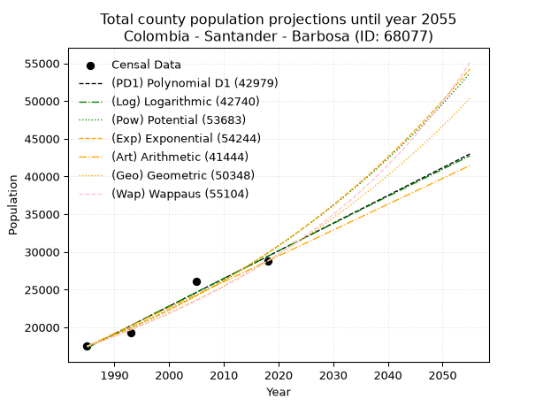
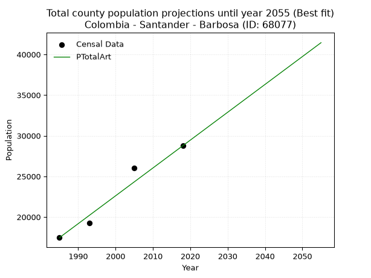
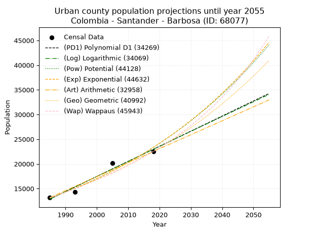
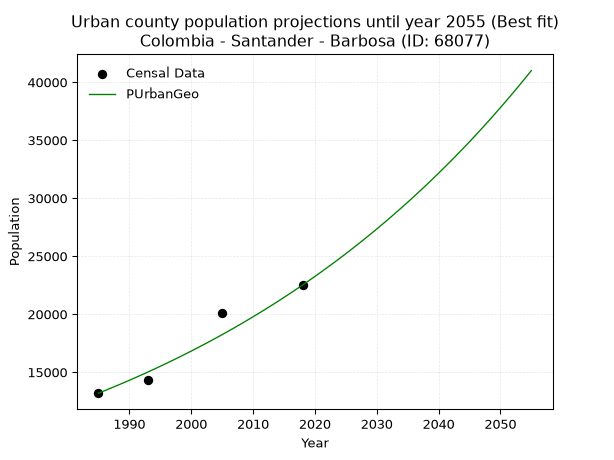
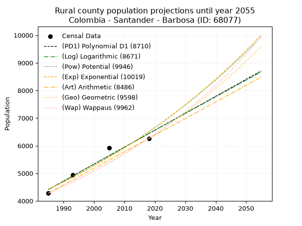
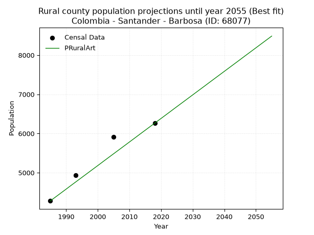

<div align="center">


</div>

# _“Population and Public Services Demand Projections (PPSD) until Year 2050 for Colombia - Santander - Barbosa (ID: 68077)”_
Keywords: `population` `public-service` `projection` `lineal` `polynomial` `logarithmic` `potential` `exponential` `arithmetic` `geometric` `wappaus` `dane` `colombia` `south-america`

PPSD are analytical estimates used by governments and planners to anticipate future changes in population size, age distribution, and the resulting community needs for utilities, healthcare, education, and infrastructure as sizing future water treatment facilities, electrical grids, and road networks based on spatial growth.

> **General running parameters**: • app_version: _v20260806_. • Python version: _3.14.7_. • Pandas version: _3.0.5_. • NumPy version: _2.5.1_. • Creates, save and include plots into reports (create_plot): _False_. • Projection until year: _2050_. • Process polynomial degree 2 and up: _False_. • Process Wappaus: _True_. • Process Wappaus: _True_. • Set negative values to zero: _True_. • Set infinite values to zero: _True_. • Drop dataset notes: _True_. 
<div align="center">

Dynamic map: [:earth_americas:Google](http://maps.google.com/maps?q=5.932530931,-73.6159645) [:earth_americas:OSM](https://www.openstreetmap.org/#map=18/5.932530931/-73.6159645&layers=P) [:earth_americas:Bing](https://www.bing.com/maps?cp=5.932530931~-73.6159645&lvl=18) [:earth_americas:Apple](https://maps.apple.com/frame?center=5.932530931%2C-73.6159645&span=0.003%2C0.006)

</div>


<div align="center">

```geojson
{
  "type": "Feature",
  "geometry": {
    "type": "Point", 
    "coordinates": [-73.6159645, 5.932530931]
  }, 
  "properties": {
    "Name": "Colombia - Santander - Barbosa (ID: 68077)"
  }
}
```

</div>


## 0. Census Data (4 records)

Census data are official statistics collected by a government about the people and housing in a country. They usually include counts of total population, age, sex, race, income, education, and jobs.

📅Global census file: [Population.xlsx](../data/Population.xlsx)

| Source   |   Year |   CountryID | CountryName   |   StateID | StateName   |   CountyID | CountyName   |   PTotal |   PUrban |   PRural |
|:---------|-------:|------------:|:--------------|----------:|:------------|-----------:|:-------------|---------:|---------:|---------:|
| DANE     |   1985 |          57 | Colombia      |        68 | Santander   |      68077 | Barbosa      |    17464 |    13184 |     4280 |
| DANE     |   1993 |          57 | Colombia      |        68 | Santander   |      68077 | Barbosa      |    19226 |    14293 |     4933 |
| DANE     |   2005 |          57 | Colombia      |        68 | Santander   |      68077 | Barbosa      |    26046 |    20129 |     5917 |
| DANE     |   2018 |          57 | Colombia      |        68 | Santander   |      68077 | Barbosa      |    28769 |    22506 |     6263 |

> 🔥Some records could had specific notes about the registered values or the corresponding urban or rural distribution.

## 1. Total

### 1.1. Coefficients and Parameters

* (PD1) Polynomial Deg 1: 367.1678040947389, -711551.1501405016 (lineal)
* (Log) Logarithmic: 735068.8574310798, -5564388.025805781
* (Pow) Potential: 32.350142914775546, -102.44010048899013
* (Exp) Exponential: 0.016157096141009727, 2.0632173732996964e-10
* (Art) Arithmetic: Year diff. 2018 - 1985 = 33, Population diff. 28769 - 17464 = 11305, Annual growth = 342.57575757575756
* (Geo) Geometric: Year diff. 2018 - 1985 = 33, Population diff. 28769 - 17464 = 11305, Annual growth % = 0.015240939980249113
* (Wap) Wappaus: i = 1.4819533994149527, Condition values only valid for < 200)

<sub>
Wappaus condition values: ['0.00', '1.48', '2.96', '4.45', '5.93', '7.41', '8.89', '10.37', '11.86', '13.34', '14.82', '16.30', '17.78', '19.27', '20.75', '22.23', '23.71', '25.19', '26.68', '28.16', '29.64', '31.12', '32.60', '34.08', '35.57', '37.05', '38.53', '40.01', '41.49', '42.98', '44.46', '45.94', '47.42', '48.90', '50.39', '51.87', '53.35', '54.83', '56.31', '57.80', '59.28', '60.76', '62.24', '63.72', '65.21', '66.69', '68.17', '69.65', '71.13', '72.62', '74.10', '75.58', '77.06', '78.54', '80.03', '81.51', '82.99', '84.47', '85.95', '87.44', '88.92', '90.40', '91.88', '93.36', '94.85', '96.33']
</sub>


### 1.2. Projected Dataset

|   Year |   CountyID |   PTotalPD1 |   PTotalLog |   PTotalPow |   PTotalExp |   PTotalArt |   PTotalGeo |   PTotalWap |
|-------:|-----------:|------------:|------------:|------------:|------------:|------------:|------------:|------------:|
|   1985 |      68077 |       17277 |       17265 |       17495 |       17505 |       17464 |       17464 |       17464 |
|   1986 |      68077 |       17644 |       17635 |       17783 |       17790 |       17807 |       17730 |       17725 |
|   1987 |      68077 |       18011 |       18005 |       18075 |       18080 |       18149 |       18000 |       17989 |
|   1988 |      68077 |       18378 |       18375 |       18371 |       18375 |       18492 |       18275 |       18258 |
|   1989 |      68077 |       18746 |       18745 |       18673 |       18674 |       18834 |       18553 |       18531 |
|   1990 |      68077 |       19113 |       19114 |       18979 |       18978 |       19177 |       18836 |       18808 |
|   1991 |      68077 |       19480 |       19483 |       19290 |       19287 |       19519 |       19123 |       19089 |
|   1992 |      68077 |       19847 |       19852 |       19606 |       19601 |       19862 |       19415 |       19375 |
|   1993 |      68077 |       20214 |       20221 |       19927 |       19921 |       20205 |       19710 |       19665 |
|   1994 |      68077 |       20581 |       20590 |       20253 |       20245 |       20547 |       20011 |       19960 |
|   1995 |      68077 |       20949 |       20959 |       20584 |       20575 |       20890 |       20316 |       20259 |
|   1996 |      68077 |       21316 |       21327 |       20920 |       20910 |       21232 |       20625 |       20564 |
|   1997 |      68077 |       21683 |       21695 |       21262 |       21251 |       21575 |       20940 |       20873 |
|   1998 |      68077 |       22050 |       22063 |       21609 |       21597 |       21917 |       21259 |       21187 |
|   1999 |      68077 |       22417 |       22431 |       21962 |       21948 |       22260 |       21583 |       21507 |
|   2000 |      68077 |       22784 |       22799 |       22320 |       22306 |       22603 |       21912 |       21832 |
|   2001 |      68077 |       23152 |       23166 |       22684 |       22669 |       22945 |       22246 |       22162 |
|   2002 |      68077 |       23519 |       23533 |       23053 |       23039 |       23288 |       22585 |       22498 |
|   2003 |      68077 |       23886 |       23900 |       23429 |       23414 |       23630 |       22929 |       22840 |
|   2004 |      68077 |       24253 |       24267 |       23810 |       23795 |       23973 |       23279 |       23187 |
|   2005 |      68077 |       24620 |       24634 |       24198 |       24183 |       24316 |       23633 |       23541 |
|   2006 |      68077 |       24987 |       25001 |       24591 |       24577 |       24658 |       23994 |       23901 |
|   2007 |      68077 |       25355 |       25367 |       24991 |       24977 |       25001 |       24359 |       24267 |
|   2008 |      68077 |       25722 |       25733 |       25397 |       25384 |       25343 |       24731 |       24639 |
|   2009 |      68077 |       26089 |       26099 |       25809 |       25797 |       25686 |       25107 |       25019 |
|   2010 |      68077 |       26456 |       26465 |       26228 |       26217 |       26028 |       25490 |       25405 |
|   2011 |      68077 |       26823 |       26830 |       26653 |       26644 |       26371 |       25879 |       25799 |
|   2012 |      68077 |       27190 |       27196 |       27085 |       27078 |       26714 |       26273 |       26199 |
|   2013 |      68077 |       27558 |       27561 |       27524 |       27520 |       27056 |       26673 |       26608 |
|   2014 |      68077 |       27925 |       27926 |       27970 |       27968 |       27399 |       27080 |       27024 |
|   2015 |      68077 |       28292 |       28291 |       28423 |       28423 |       27741 |       27493 |       27448 |
|   2016 |      68077 |       28659 |       28656 |       28883 |       28886 |       28084 |       27912 |       27880 |
|   2017 |      68077 |       29026 |       29020 |       29350 |       29357 |       28426 |       28337 |       28320 |
|   2018 |      68077 |       29393 |       29385 |       29824 |       29835 |       28769 |       28769 |       28769 |
|   2019 |      68077 |       29761 |       29749 |       30306 |       30321 |       29112 |       29207 |       29227 |
|   2020 |      68077 |       30128 |       30113 |       30796 |       30815 |       29454 |       29653 |       29694 |
|   2021 |      68077 |       30495 |       30477 |       31293 |       31317 |       29797 |       30105 |       30171 |
|   2022 |      68077 |       30862 |       30840 |       31797 |       31827 |       30139 |       30563 |       30657 |
|   2023 |      68077 |       31229 |       31204 |       32310 |       32345 |       30482 |       31029 |       31153 |
|   2024 |      68077 |       31596 |       31567 |       32831 |       32872 |       30824 |       31502 |       31660 |
|   2025 |      68077 |       31964 |       31930 |       33360 |       33407 |       31167 |       31982 |       32177 |
|   2026 |      68077 |       32331 |       32293 |       33897 |       33952 |       31510 |       32470 |       32706 |
|   2027 |      68077 |       32698 |       32656 |       34442 |       34505 |       31852 |       32965 |       33245 |
|   2028 |      68077 |       33065 |       33018 |       34996 |       35067 |       32195 |       33467 |       33797 |
|   2029 |      68077 |       33432 |       33381 |       35559 |       35638 |       32537 |       33977 |       34360 |
|   2030 |      68077 |       33799 |       33743 |       36130 |       36218 |       32880 |       34495 |       34936 |
|   2031 |      68077 |       34167 |       34105 |       36710 |       36808 |       33222 |       35021 |       35525 |
|   2032 |      68077 |       34534 |       34467 |       37300 |       37408 |       33565 |       35554 |       36128 |
|   2033 |      68077 |       34901 |       34828 |       37898 |       38017 |       33908 |       36096 |       36744 |
|   2034 |      68077 |       35268 |       35190 |       38506 |       38636 |       34250 |       36646 |       37375 |
|   2035 |      68077 |       35635 |       35551 |       39123 |       39266 |       34593 |       37205 |       38020 |
|   2036 |      68077 |       36002 |       35912 |       39750 |       39905 |       34935 |       37772 |       38681 |
|   2037 |      68077 |       36370 |       36273 |       40386 |       40555 |       35278 |       38348 |       39358 |
|   2038 |      68077 |       36737 |       36634 |       41032 |       41216 |       35621 |       38932 |       40051 |
|   2039 |      68077 |       37104 |       36995 |       41689 |       41887 |       35963 |       39525 |       40762 |
|   2040 |      68077 |       37471 |       37355 |       42355 |       42569 |       36306 |       40128 |       41490 |
|   2041 |      68077 |       37838 |       37715 |       43032 |       43263 |       36648 |       40739 |       42237 |
|   2042 |      68077 |       38206 |       38075 |       43720 |       43967 |       36991 |       41360 |       43002 |
|   2043 |      68077 |       38573 |       38435 |       44418 |       44684 |       37333 |       41991 |       43788 |
|   2044 |      68077 |       38940 |       38795 |       45126 |       45411 |       37676 |       42631 |       44595 |
|   2045 |      68077 |       39307 |       39154 |       45846 |       46151 |       38019 |       43280 |       45422 |
|   2046 |      68077 |       39674 |       39514 |       46577 |       46903 |       38361 |       43940 |       46273 |
|   2047 |      68077 |       40041 |       39873 |       47319 |       47667 |       38704 |       44610 |       47146 |
|   2048 |      68077 |       40409 |       40232 |       48072 |       48443 |       39046 |       45290 |       48044 |
|   2049 |      68077 |       40776 |       40591 |       48838 |       49232 |       39389 |       45980 |       48967 |
|   2050 |      68077 |       41143 |       40949 |       49615 |       50034 |       39731 |       46681 |       49917 |
<div align="center">

</img>

</div>


### 1.3. Best fit with absolute and relative error (%)

Relative error puts that difference into context by dividing the absolute error by the true value, creating a unitless ratio or percentage that shows the scale of the mistake.

Absolute and relative error

|   Year | Source   |   CountryID | CountryName   |   StateID | StateName   |   CountyID_x | CountyName   |   PTotal |   PUrban |   PRural |   CountyID_y |   PTotalPD1 |   PTotalLog |   PTotalPow |   PTotalExp |   PTotalArt |   PTotalGeo |   PTotalWap |   PTotalPD1AbsError |   PTotalLogAbsError |   PTotalPowAbsError |   PTotalExpAbsError |   PTotalArtAbsError |   PTotalGeoAbsError |   PTotalWapAbsError |   PTotalPD1RelError |   PTotalLogRelError |   PTotalPowRelError |   PTotalExpRelError |   PTotalArtRelError |   PTotalGeoRelError |   PTotalWapRelError |
|-------:|:---------|------------:|:--------------|----------:|:------------|-------------:|:-------------|---------:|---------:|---------:|-------------:|------------:|------------:|------------:|------------:|------------:|------------:|------------:|--------------------:|--------------------:|--------------------:|--------------------:|--------------------:|--------------------:|--------------------:|--------------------:|--------------------:|--------------------:|--------------------:|--------------------:|--------------------:|--------------------:|
|   1985 | DANE     |          57 | Colombia      |        68 | Santander   |        68077 | Barbosa      |    17464 |    13184 |     4280 |        68077 |       17277 |       17265 |       17495 |       17505 |       17464 |       17464 |       17464 |                 187 |                 199 |                  31 |                  41 |                   0 |                   0 |                   0 |             1.07077 |             1.13949 |            0.177508 |            0.234769 |             0       |             0       |             0       |
|   1993 | DANE     |          57 | Colombia      |        68 | Santander   |        68077 | Barbosa      |    19226 |    14293 |     4933 |        68077 |       20214 |       20221 |       19927 |       19921 |       20205 |       19710 |       19665 |                 988 |                 995 |                 701 |                 695 |                 979 |                 484 |                 439 |             5.13887 |             5.17528 |            3.6461   |            3.6149   |             5.09206 |             2.51742 |             2.28337 |
|   2005 | DANE     |          57 | Colombia      |        68 | Santander   |        68077 | Barbosa      |    26046 |    20129 |     5917 |        68077 |       24620 |       24634 |       24198 |       24183 |       24316 |       23633 |       23541 |                1426 |                1412 |                1848 |                1863 |                1730 |                2413 |                2505 |             5.47493 |             5.42118 |            7.09514  |            7.15273  |             6.64209 |             9.26438 |             9.6176  |
|   2018 | DANE     |          57 | Colombia      |        68 | Santander   |        68077 | Barbosa      |    28769 |    22506 |     6263 |        68077 |       29393 |       29385 |       29824 |       29835 |       28769 |       28769 |       28769 |                 624 |                 616 |                1055 |                1066 |                   0 |                   0 |                   0 |             2.169   |             2.14119 |            3.66714  |            3.70538  |             0       |             0       |             0       |

Relative error mean

| Method    |   RelError | Best   |
|:----------|-----------:|:-------|
| PTotalPD1 |    3.46339 |        |
| PTotalLog |    3.46929 |        |
| PTotalPow |    3.64647 |        |
| PTotalExp |    3.67694 |        |
| PTotalArt |    2.93354 | True   |
| PTotalGeo |    2.94545 |        |
| PTotalWap |    2.97524 |        |

💙Best method: _**PTotalArt**_
<div align="center">

</img>

</div>


### 1.4. Fresh water supply demand in liters per capita per day (lpcd)

The fresh water supply demand typically ranges from 100 to 300 liters per capita per day (lpcd) for standard domestic and municipal planning, though absolute survival minimums set by the World Health Organization are as low as 7.5 to 20 liters per day, and total consumption in high-income nations can exceed 400 liters.

> `CZ`: Level in meters above the sea level (masl).<br> `WS`: Fresh water supply demand in liters per capita per day (lpcd or l/h/d).<br> `WSAll`: Zonal fresh water supply demand in liters per second (l/s).<br> `A`: Zonal area in square meters.

Reference values (RAS Colombia)

|    CZ |   WS |
|------:|-----:|
|  1000 |  120 |
|  2000 |  130 |
| 99999 |  140 |

County shapefile geometry properties and water supply values

|   CountyID |      ATotal |   CZTotal |   WSTotal |
|-----------:|------------:|----------:|----------:|
|      68077 | 4.65955e+07 |   1739.66 |       130 |

Projected values for best method: PTotalArt

|   CountyID |   Year |   PTotalArt |   WSTotal |   WSTotalAll |
|-----------:|-------:|------------:|----------:|-------------:|
|      68077 |   1985 |       17464 |       130 |      26.2769 |
|      68077 |   1986 |       17807 |       130 |      26.7929 |
|      68077 |   1987 |       18149 |       130 |      27.3075 |
|      68077 |   1988 |       18492 |       130 |      27.8236 |
|      68077 |   1989 |       18834 |       130 |      28.3382 |
|      68077 |   1990 |       19177 |       130 |      28.8543 |
|      68077 |   1991 |       19519 |       130 |      29.3689 |
|      68077 |   1992 |       19862 |       130 |      29.885  |
|      68077 |   1993 |       20205 |       130 |      30.401  |
|      68077 |   1994 |       20547 |       130 |      30.9156 |
|      68077 |   1995 |       20890 |       130 |      31.4317 |
|      68077 |   1996 |       21232 |       130 |      31.9463 |
|      68077 |   1997 |       21575 |       130 |      32.4624 |
|      68077 |   1998 |       21917 |       130 |      32.977  |
|      68077 |   1999 |       22260 |       130 |      33.4931 |
|      68077 |   2000 |       22603 |       130 |      34.0091 |
|      68077 |   2001 |       22945 |       130 |      34.5237 |
|      68077 |   2002 |       23288 |       130 |      35.0398 |
|      68077 |   2003 |       23630 |       130 |      35.5544 |
|      68077 |   2004 |       23973 |       130 |      36.0705 |
|      68077 |   2005 |       24316 |       130 |      36.5866 |
|      68077 |   2006 |       24658 |       130 |      37.1012 |
|      68077 |   2007 |       25001 |       130 |      37.6172 |
|      68077 |   2008 |       25343 |       130 |      38.1318 |
|      68077 |   2009 |       25686 |       130 |      38.6479 |
|      68077 |   2010 |       26028 |       130 |      39.1625 |
|      68077 |   2011 |       26371 |       130 |      39.6786 |
|      68077 |   2012 |       26714 |       130 |      40.1947 |
|      68077 |   2013 |       27056 |       130 |      40.7093 |
|      68077 |   2014 |       27399 |       130 |      41.2253 |
|      68077 |   2015 |       27741 |       130 |      41.7399 |
|      68077 |   2016 |       28084 |       130 |      42.256  |
|      68077 |   2017 |       28426 |       130 |      42.7706 |
|      68077 |   2018 |       28769 |       130 |      43.2867 |
|      68077 |   2019 |       29112 |       130 |      43.8028 |
|      68077 |   2020 |       29454 |       130 |      44.3174 |
|      68077 |   2021 |       29797 |       130 |      44.8334 |
|      68077 |   2022 |       30139 |       130 |      45.348  |
|      68077 |   2023 |       30482 |       130 |      45.8641 |
|      68077 |   2024 |       30824 |       130 |      46.3787 |
|      68077 |   2025 |       31167 |       130 |      46.8948 |
|      68077 |   2026 |       31510 |       130 |      47.4109 |
|      68077 |   2027 |       31852 |       130 |      47.9255 |
|      68077 |   2028 |       32195 |       130 |      48.4416 |
|      68077 |   2029 |       32537 |       130 |      48.9561 |
|      68077 |   2030 |       32880 |       130 |      49.4722 |
|      68077 |   2031 |       33222 |       130 |      49.9868 |
|      68077 |   2032 |       33565 |       130 |      50.5029 |
|      68077 |   2033 |       33908 |       130 |      51.019  |
|      68077 |   2034 |       34250 |       130 |      51.5336 |
|      68077 |   2035 |       34593 |       130 |      52.0497 |
|      68077 |   2036 |       34935 |       130 |      52.5642 |
|      68077 |   2037 |       35278 |       130 |      53.0803 |
|      68077 |   2038 |       35621 |       130 |      53.5964 |
|      68077 |   2039 |       35963 |       130 |      54.111  |
|      68077 |   2040 |       36306 |       130 |      54.6271 |
|      68077 |   2041 |       36648 |       130 |      55.1417 |
|      68077 |   2042 |       36991 |       130 |      55.6578 |
|      68077 |   2043 |       37333 |       130 |      56.1723 |
|      68077 |   2044 |       37676 |       130 |      56.6884 |
|      68077 |   2045 |       38019 |       130 |      57.2045 |
|      68077 |   2046 |       38361 |       130 |      57.7191 |
|      68077 |   2047 |       38704 |       130 |      58.2352 |
|      68077 |   2048 |       39046 |       130 |      58.7498 |
|      68077 |   2049 |       39389 |       130 |      59.2659 |
|      68077 |   2050 |       39731 |       130 |      59.7804 |

## 2. Urban

### 2.1. Coefficients and Parameters

* (PD1) Polynomial Deg 1: 305.7631473303875, -594074.7354476076 (lineal)
* (Log) Logarithmic: 612097.4161336744, -4635029.365072916
* (Pow) Potential: 35.09662445629108, -111.62379618307261
* (Exp) Exponential: 0.01752991479897883, 1.0107155756093377e-11
* (Art) Arithmetic: Year diff. 2018 - 1985 = 33, Population diff. 22506 - 13184 = 9322, Annual growth = 282.4848484848485
* (Geo) Geometric: Year diff. 2018 - 1985 = 33, Population diff. 22506 - 13184 = 9322, Annual growth % = 0.01633741250334353
* (Wap) Wappaus: i = 1.582991585793491, Condition values only valid for < 200)

<sub>
Wappaus condition values: ['0.00', '1.58', '3.17', '4.75', '6.33', '7.91', '9.50', '11.08', '12.66', '14.25', '15.83', '17.41', '19.00', '20.58', '22.16', '23.74', '25.33', '26.91', '28.49', '30.08', '31.66', '33.24', '34.83', '36.41', '37.99', '39.57', '41.16', '42.74', '44.32', '45.91', '47.49', '49.07', '50.66', '52.24', '53.82', '55.40', '56.99', '58.57', '60.15', '61.74', '63.32', '64.90', '66.49', '68.07', '69.65', '71.23', '72.82', '74.40', '75.98', '77.57', '79.15', '80.73', '82.32', '83.90', '85.48', '87.06', '88.65', '90.23', '91.81', '93.40', '94.98', '96.56', '98.15', '99.73', '101.31', '102.89']
</sub>


### 2.2. Projected Dataset

|   Year |   CountyID |   PUrbanPD1 |   PUrbanLog |   PUrbanPow |   PUrbanExp |   PUrbanArt |   PUrbanGeo |   PUrbanWap |
|-------:|-----------:|------------:|------------:|------------:|------------:|------------:|------------:|------------:|
|   1985 |      68077 |       12865 |       12855 |       13076 |       13083 |       13184 |       13184 |       13184 |
|   1986 |      68077 |       13171 |       13164 |       13309 |       13315 |       13466 |       13399 |       13394 |
|   1987 |      68077 |       13477 |       13472 |       13546 |       13550 |       13749 |       13618 |       13608 |
|   1988 |      68077 |       13782 |       13780 |       13787 |       13790 |       14031 |       13841 |       13825 |
|   1989 |      68077 |       14088 |       14088 |       14033 |       14034 |       14314 |       14067 |       14046 |
|   1990 |      68077 |       14394 |       14395 |       14283 |       14282 |       14596 |       14297 |       14271 |
|   1991 |      68077 |       14700 |       14703 |       14537 |       14535 |       14879 |       14530 |       14499 |
|   1992 |      68077 |       15005 |       15010 |       14795 |       14792 |       15161 |       14768 |       14731 |
|   1993 |      68077 |       15311 |       15317 |       15058 |       15053 |       15444 |       15009 |       14966 |
|   1994 |      68077 |       15617 |       15624 |       15326 |       15319 |       15726 |       15254 |       15206 |
|   1995 |      68077 |       15923 |       15931 |       15598 |       15590 |       16009 |       15503 |       15450 |
|   1996 |      68077 |       16229 |       16238 |       15874 |       15866 |       16291 |       15757 |       15699 |
|   1997 |      68077 |       16534 |       16545 |       16156 |       16147 |       16574 |       16014 |       15951 |
|   1998 |      68077 |       16840 |       16851 |       16442 |       16432 |       16856 |       16276 |       16208 |
|   1999 |      68077 |       17146 |       17157 |       16734 |       16723 |       17139 |       16542 |       16470 |
|   2000 |      68077 |       17452 |       17463 |       17030 |       17018 |       17421 |       16812 |       16736 |
|   2001 |      68077 |       17757 |       17769 |       17331 |       17319 |       17704 |       17087 |       17007 |
|   2002 |      68077 |       18063 |       18075 |       17638 |       17626 |       17986 |       17366 |       17284 |
|   2003 |      68077 |       18369 |       18381 |       17950 |       17937 |       18269 |       17649 |       17565 |
|   2004 |      68077 |       18675 |       18686 |       18267 |       18255 |       18551 |       17938 |       17851 |
|   2005 |      68077 |       18980 |       18992 |       18590 |       18577 |       18834 |       18231 |       18143 |
|   2006 |      68077 |       19286 |       19297 |       18918 |       18906 |       19116 |       18529 |       18440 |
|   2007 |      68077 |       19592 |       19602 |       19252 |       19240 |       19399 |       18831 |       18744 |
|   2008 |      68077 |       19898 |       19907 |       19591 |       19581 |       19681 |       19139 |       19052 |
|   2009 |      68077 |       20203 |       20212 |       19937 |       19927 |       19964 |       19452 |       19367 |
|   2010 |      68077 |       20509 |       20516 |       20288 |       20279 |       20246 |       19769 |       19689 |
|   2011 |      68077 |       20815 |       20821 |       20645 |       20638 |       20529 |       20092 |       20016 |
|   2012 |      68077 |       21121 |       21125 |       21008 |       21003 |       20811 |       20421 |       20350 |
|   2013 |      68077 |       21426 |       21429 |       21378 |       21374 |       21094 |       20754 |       20691 |
|   2014 |      68077 |       21732 |       21733 |       21754 |       21752 |       21376 |       21093 |       21039 |
|   2015 |      68077 |       22038 |       22037 |       22136 |       22137 |       21659 |       21438 |       21395 |
|   2016 |      68077 |       22344 |       22341 |       22525 |       22528 |       21941 |       21788 |       21757 |
|   2017 |      68077 |       22650 |       22644 |       22921 |       22927 |       22224 |       22144 |       22128 |
|   2018 |      68077 |       22955 |       22948 |       23323 |       23332 |       22506 |       22506 |       22506 |
|   2019 |      68077 |       23261 |       23251 |       23732 |       23745 |       22788 |       22874 |       22892 |
|   2020 |      68077 |       23567 |       23554 |       24148 |       24165 |       23071 |       23247 |       23287 |
|   2021 |      68077 |       23873 |       23857 |       24571 |       24592 |       23353 |       23627 |       23691 |
|   2022 |      68077 |       24178 |       24160 |       25001 |       25027 |       23636 |       24013 |       24104 |
|   2023 |      68077 |       24484 |       24462 |       25439 |       25470 |       23918 |       24406 |       24526 |
|   2024 |      68077 |       24790 |       24765 |       25884 |       25920 |       24201 |       24804 |       24958 |
|   2025 |      68077 |       25096 |       25067 |       26337 |       26378 |       24483 |       25209 |       25399 |
|   2026 |      68077 |       25401 |       25369 |       26797 |       26845 |       24766 |       25621 |       25852 |
|   2027 |      68077 |       25707 |       25671 |       27265 |       27320 |       25048 |       26040 |       26314 |
|   2028 |      68077 |       26013 |       25973 |       27741 |       27803 |       25331 |       26465 |       26788 |
|   2029 |      68077 |       26319 |       26275 |       28225 |       28294 |       25613 |       26898 |       27274 |
|   2030 |      68077 |       26624 |       26577 |       28718 |       28795 |       25896 |       27337 |       27771 |
|   2031 |      68077 |       26930 |       26878 |       29218 |       29304 |       26178 |       27784 |       28281 |
|   2032 |      68077 |       27236 |       27179 |       29728 |       29822 |       26461 |       28238 |       28803 |
|   2033 |      68077 |       27542 |       27481 |       30245 |       30350 |       26743 |       28699 |       29339 |
|   2034 |      68077 |       27848 |       27782 |       30772 |       30886 |       27026 |       29168 |       29889 |
|   2035 |      68077 |       28153 |       28082 |       31307 |       31433 |       27308 |       29644 |       30453 |
|   2036 |      68077 |       28459 |       28383 |       31852 |       31988 |       27591 |       30129 |       31033 |
|   2037 |      68077 |       28765 |       28684 |       32406 |       32554 |       27873 |       30621 |       31627 |
|   2038 |      68077 |       29071 |       28984 |       32969 |       33130 |       28156 |       31121 |       32238 |
|   2039 |      68077 |       29376 |       29284 |       33541 |       33716 |       28438 |       31630 |       32866 |
|   2040 |      68077 |       29682 |       29585 |       34123 |       34312 |       28721 |       32146 |       33512 |
|   2041 |      68077 |       29988 |       29885 |       34715 |       34919 |       29003 |       32672 |       34176 |
|   2042 |      68077 |       30294 |       30184 |       35317 |       35536 |       29286 |       33205 |       34858 |
|   2043 |      68077 |       30599 |       30484 |       35929 |       36165 |       29568 |       33748 |       35561 |
|   2044 |      68077 |       30905 |       30784 |       36552 |       36804 |       29851 |       34299 |       36285 |
|   2045 |      68077 |       31211 |       31083 |       37185 |       37455 |       30133 |       34860 |       37031 |
|   2046 |      68077 |       31517 |       31382 |       37828 |       38117 |       30416 |       35429 |       37799 |
|   2047 |      68077 |       31822 |       31681 |       38482 |       38792 |       30698 |       36008 |       38592 |
|   2048 |      68077 |       32128 |       31980 |       39148 |       39478 |       30981 |       36596 |       39409 |
|   2049 |      68077 |       32434 |       32279 |       39824 |       40176 |       31263 |       37194 |       40253 |
|   2050 |      68077 |       32740 |       32578 |       40512 |       40886 |       31546 |       37802 |       41124 |
<div align="center">

</img>

</div>


### 2.3. Best fit with absolute and relative error (%)

Relative error puts that difference into context by dividing the absolute error by the true value, creating a unitless ratio or percentage that shows the scale of the mistake.

Absolute and relative error

|   Year | Source   |   CountryID | CountryName   |   StateID | StateName   |   CountyID_x | CountyName   |   PTotal |   PUrban |   PRural |   CountyID_y |   PUrbanPD1 |   PUrbanLog |   PUrbanPow |   PUrbanExp |   PUrbanArt |   PUrbanGeo |   PUrbanWap |   PUrbanPD1AbsError |   PUrbanLogAbsError |   PUrbanPowAbsError |   PUrbanExpAbsError |   PUrbanArtAbsError |   PUrbanGeoAbsError |   PUrbanWapAbsError |   PUrbanPD1RelError |   PUrbanLogRelError |   PUrbanPowRelError |   PUrbanExpRelError |   PUrbanArtRelError |   PUrbanGeoRelError |   PUrbanWapRelError |
|-------:|:---------|------------:|:--------------|----------:|:------------|-------------:|:-------------|---------:|---------:|---------:|-------------:|------------:|------------:|------------:|------------:|------------:|------------:|------------:|--------------------:|--------------------:|--------------------:|--------------------:|--------------------:|--------------------:|--------------------:|--------------------:|--------------------:|--------------------:|--------------------:|--------------------:|--------------------:|--------------------:|
|   1985 | DANE     |          57 | Colombia      |        68 | Santander   |        68077 | Barbosa      |    17464 |    13184 |     4280 |        68077 |       12865 |       12855 |       13076 |       13083 |       13184 |       13184 |       13184 |                 319 |                 329 |                 108 |                 101 |                   0 |                   0 |                   0 |             2.4196  |             2.49545 |            0.819175 |             0.76608 |             0       |             0       |             0       |
|   1993 | DANE     |          57 | Colombia      |        68 | Santander   |        68077 | Barbosa      |    19226 |    14293 |     4933 |        68077 |       15311 |       15317 |       15058 |       15053 |       15444 |       15009 |       14966 |                1018 |                1024 |                 765 |                 760 |                1151 |                 716 |                 673 |             7.12237 |             7.16435 |            5.35227  |             5.31729 |             8.05289 |             5.00945 |             4.7086  |
|   2005 | DANE     |          57 | Colombia      |        68 | Santander   |        68077 | Barbosa      |    26046 |    20129 |     5917 |        68077 |       18980 |       18992 |       18590 |       18577 |       18834 |       18231 |       18143 |                1149 |                1137 |                1539 |                1552 |                1295 |                1898 |                1986 |             5.70818 |             5.64857 |            7.64569  |             7.71027 |             6.4335  |             9.42918 |             9.86636 |
|   2018 | DANE     |          57 | Colombia      |        68 | Santander   |        68077 | Barbosa      |    28769 |    22506 |     6263 |        68077 |       22955 |       22948 |       23323 |       23332 |       22506 |       22506 |       22506 |                 449 |                 442 |                 817 |                 826 |                   0 |                   0 |                   0 |             1.99502 |             1.96392 |            3.63014  |             3.67013 |             0       |             0       |             0       |

Relative error mean

| Method    |   RelError | Best   |
|:----------|-----------:|:-------|
| PUrbanPD1 |    4.31129 |        |
| PUrbanLog |    4.31807 |        |
| PUrbanPow |    4.36182 |        |
| PUrbanExp |    4.36594 |        |
| PUrbanArt |    3.6216  |        |
| PUrbanGeo |    3.60966 | True   |
| PUrbanWap |    3.64374 |        |

💙Best method: _**PUrbanGeo**_
<div align="center">

</img>

</div>


### 2.4. Fresh water supply demand in liters per capita per day (lpcd)

The fresh water supply demand typically ranges from 100 to 300 liters per capita per day (lpcd) for standard domestic and municipal planning, though absolute survival minimums set by the World Health Organization are as low as 7.5 to 20 liters per day, and total consumption in high-income nations can exceed 400 liters.

> `CZ`: Level in meters above the sea level (masl).<br> `WS`: Fresh water supply demand in liters per capita per day (lpcd or l/h/d).<br> `WSAll`: Zonal fresh water supply demand in liters per second (l/s).<br> `A`: Zonal area in square meters.

Reference values (RAS Colombia)

|    CZ |   WS |
|------:|-----:|
|  1000 |  120 |
|  2000 |  130 |
| 99999 |  140 |

County shapefile geometry properties and water supply values

|   CountyID |      AUrban |   CZUrban |   WSUrban |
|-----------:|------------:|----------:|----------:|
|      68077 | 3.60708e+06 |   1565.17 |       130 |

Projected values for best method: PUrbanGeo

|   CountyID |   Year |   PUrbanGeo |   WSUrban |   WSUrbanAll |
|-----------:|-------:|------------:|----------:|-------------:|
|      68077 |   1985 |       13184 |       130 |      19.837  |
|      68077 |   1986 |       13399 |       130 |      20.1605 |
|      68077 |   1987 |       13618 |       130 |      20.49   |
|      68077 |   1988 |       13841 |       130 |      20.8256 |
|      68077 |   1989 |       14067 |       130 |      21.1656 |
|      68077 |   1990 |       14297 |       130 |      21.5117 |
|      68077 |   1991 |       14530 |       130 |      21.8623 |
|      68077 |   1992 |       14768 |       130 |      22.2204 |
|      68077 |   1993 |       15009 |       130 |      22.583  |
|      68077 |   1994 |       15254 |       130 |      22.9516 |
|      68077 |   1995 |       15503 |       130 |      23.3263 |
|      68077 |   1996 |       15757 |       130 |      23.7084 |
|      68077 |   1997 |       16014 |       130 |      24.0951 |
|      68077 |   1998 |       16276 |       130 |      24.4894 |
|      68077 |   1999 |       16542 |       130 |      24.8896 |
|      68077 |   2000 |       16812 |       130 |      25.2958 |
|      68077 |   2001 |       17087 |       130 |      25.7096 |
|      68077 |   2002 |       17366 |       130 |      26.1294 |
|      68077 |   2003 |       17649 |       130 |      26.5552 |
|      68077 |   2004 |       17938 |       130 |      26.99   |
|      68077 |   2005 |       18231 |       130 |      27.4309 |
|      68077 |   2006 |       18529 |       130 |      27.8793 |
|      68077 |   2007 |       18831 |       130 |      28.3337 |
|      68077 |   2008 |       19139 |       130 |      28.7971 |
|      68077 |   2009 |       19452 |       130 |      29.2681 |
|      68077 |   2010 |       19769 |       130 |      29.745  |
|      68077 |   2011 |       20092 |       130 |      30.231  |
|      68077 |   2012 |       20421 |       130 |      30.726  |
|      68077 |   2013 |       20754 |       130 |      31.2271 |
|      68077 |   2014 |       21093 |       130 |      31.7372 |
|      68077 |   2015 |       21438 |       130 |      32.2563 |
|      68077 |   2016 |       21788 |       130 |      32.7829 |
|      68077 |   2017 |       22144 |       130 |      33.3185 |
|      68077 |   2018 |       22506 |       130 |      33.8632 |
|      68077 |   2019 |       22874 |       130 |      34.4169 |
|      68077 |   2020 |       23247 |       130 |      34.9781 |
|      68077 |   2021 |       23627 |       130 |      35.5499 |
|      68077 |   2022 |       24013 |       130 |      36.1307 |
|      68077 |   2023 |       24406 |       130 |      36.722  |
|      68077 |   2024 |       24804 |       130 |      37.3208 |
|      68077 |   2025 |       25209 |       130 |      37.9302 |
|      68077 |   2026 |       25621 |       130 |      38.5501 |
|      68077 |   2027 |       26040 |       130 |      39.1806 |
|      68077 |   2028 |       26465 |       130 |      39.82   |
|      68077 |   2029 |       26898 |       130 |      40.4715 |
|      68077 |   2030 |       27337 |       130 |      41.1321 |
|      68077 |   2031 |       27784 |       130 |      41.8046 |
|      68077 |   2032 |       28238 |       130 |      42.4877 |
|      68077 |   2033 |       28699 |       130 |      43.1814 |
|      68077 |   2034 |       29168 |       130 |      43.887  |
|      68077 |   2035 |       29644 |       130 |      44.6032 |
|      68077 |   2036 |       30129 |       130 |      45.333  |
|      68077 |   2037 |       30621 |       130 |      46.0733 |
|      68077 |   2038 |       31121 |       130 |      46.8256 |
|      68077 |   2039 |       31630 |       130 |      47.5914 |
|      68077 |   2040 |       32146 |       130 |      48.3678 |
|      68077 |   2041 |       32672 |       130 |      49.1593 |
|      68077 |   2042 |       33205 |       130 |      49.9612 |
|      68077 |   2043 |       33748 |       130 |      50.7782 |
|      68077 |   2044 |       34299 |       130 |      51.6073 |
|      68077 |   2045 |       34860 |       130 |      52.4514 |
|      68077 |   2046 |       35429 |       130 |      53.3075 |
|      68077 |   2047 |       36008 |       130 |      54.1787 |
|      68077 |   2048 |       36596 |       130 |      55.0634 |
|      68077 |   2049 |       37194 |       130 |      55.9632 |
|      68077 |   2050 |       37802 |       130 |      56.878  |

## 3. Rural

### 3.1. Coefficients and Parameters

* (PD1) Polynomial Deg 1: 61.40465676435138, -117476.41469289386 (lineal)
* (Log) Logarithmic: 122971.44129740565, -929358.660732866
* (Pow) Potential: 23.369951455923356, -73.422622350485
* (Exp) Exponential: 0.01166839274638965, 3.8641650828609065e-07
* (Art) Arithmetic: Year diff. 2018 - 1985 = 33, Population diff. 6263 - 4280 = 1983, Annual growth = 60.09090909090909
* (Geo) Geometric: Year diff. 2018 - 1985 = 33, Population diff. 6263 - 4280 = 1983, Annual growth % = 0.011603357049167373
* (Wap) Wappaus: i = 1.139920498736775, Condition values only valid for < 200)

<sub>
Wappaus condition values: ['0.00', '1.14', '2.28', '3.42', '4.56', '5.70', '6.84', '7.98', '9.12', '10.26', '11.40', '12.54', '13.68', '14.82', '15.96', '17.10', '18.24', '19.38', '20.52', '21.66', '22.80', '23.94', '25.08', '26.22', '27.36', '28.50', '29.64', '30.78', '31.92', '33.06', '34.20', '35.34', '36.48', '37.62', '38.76', '39.90', '41.04', '42.18', '43.32', '44.46', '45.60', '46.74', '47.88', '49.02', '50.16', '51.30', '52.44', '53.58', '54.72', '55.86', '57.00', '58.14', '59.28', '60.42', '61.56', '62.70', '63.84', '64.98', '66.12', '67.26', '68.40', '69.54', '70.68', '71.81', '72.95', '74.09']
</sub>


### 3.2. Projected Dataset

|   Year |   CountyID |   PRuralPD1 |   PRuralLog |   PRuralPow |   PRuralExp |   PRuralArt |   PRuralGeo |   PRuralWap |
|-------:|-----------:|------------:|------------:|------------:|------------:|------------:|------------:|------------:|
|   1985 |      68077 |        4412 |        4410 |        4425 |        4427 |        4280 |        4280 |        4280 |
|   1986 |      68077 |        4473 |        4471 |        4477 |        4479 |        4340 |        4330 |        4329 |
|   1987 |      68077 |        4535 |        4533 |        4530 |        4531 |        4400 |        4380 |        4379 |
|   1988 |      68077 |        4596 |        4595 |        4584 |        4584 |        4460 |        4431 |        4429 |
|   1989 |      68077 |        4657 |        4657 |        4638 |        4638 |        4520 |        4482 |        4480 |
|   1990 |      68077 |        4719 |        4719 |        4693 |        4693 |        4580 |        4534 |        4531 |
|   1991 |      68077 |        4780 |        4781 |        4748 |        4748 |        4641 |        4587 |        4583 |
|   1992 |      68077 |        4842 |        4842 |        4804 |        4803 |        4701 |        4640 |        4636 |
|   1993 |      68077 |        4903 |        4904 |        4861 |        4860 |        4761 |        4694 |        4689 |
|   1994 |      68077 |        4964 |        4966 |        4918 |        4917 |        4821 |        4748 |        4743 |
|   1995 |      68077 |        5026 |        5027 |        4976 |        4975 |        4881 |        4803 |        4797 |
|   1996 |      68077 |        5087 |        5089 |        5035 |        5033 |        4941 |        4859 |        4853 |
|   1997 |      68077 |        5149 |        5151 |        5094 |        5092 |        5001 |        4915 |        4908 |
|   1998 |      68077 |        5210 |        5212 |        5154 |        5152 |        5061 |        4973 |        4965 |
|   1999 |      68077 |        5271 |        5274 |        5214 |        5212 |        5121 |        5030 |        5022 |
|   2000 |      68077 |        5333 |        5335 |        5276 |        5273 |        5181 |        5089 |        5080 |
|   2001 |      68077 |        5394 |        5397 |        5338 |        5335 |        5241 |        5148 |        5139 |
|   2002 |      68077 |        5456 |        5458 |        5400 |        5398 |        5302 |        5207 |        5198 |
|   2003 |      68077 |        5517 |        5520 |        5464 |        5461 |        5362 |        5268 |        5259 |
|   2004 |      68077 |        5579 |        5581 |        5528 |        5525 |        5422 |        5329 |        5320 |
|   2005 |      68077 |        5640 |        5642 |        5593 |        5590 |        5482 |        5391 |        5381 |
|   2006 |      68077 |        5701 |        5704 |        5658 |        5656 |        5542 |        5453 |        5444 |
|   2007 |      68077 |        5763 |        5765 |        5725 |        5722 |        5602 |        5517 |        5507 |
|   2008 |      68077 |        5824 |        5826 |        5792 |        5789 |        5662 |        5581 |        5571 |
|   2009 |      68077 |        5886 |        5887 |        5859 |        5857 |        5722 |        5645 |        5636 |
|   2010 |      68077 |        5947 |        5949 |        5928 |        5926 |        5782 |        5711 |        5702 |
|   2011 |      68077 |        6008 |        6010 |        5997 |        5996 |        5842 |        5777 |        5769 |
|   2012 |      68077 |        6070 |        6071 |        6067 |        6066 |        5902 |        5844 |        5837 |
|   2013 |      68077 |        6131 |        6132 |        6138 |        6137 |        5963 |        5912 |        5905 |
|   2014 |      68077 |        6193 |        6193 |        6210 |        6209 |        6023 |        5981 |        5975 |
|   2015 |      68077 |        6254 |        6254 |        6282 |        6282 |        6083 |        6050 |        6046 |
|   2016 |      68077 |        6315 |        6315 |        6356 |        6356 |        6143 |        6120 |        6117 |
|   2017 |      68077 |        6377 |        6376 |        6430 |        6430 |        6203 |        6191 |        6190 |
|   2018 |      68077 |        6438 |        6437 |        6505 |        6506 |        6263 |        6263 |        6263 |
|   2019 |      68077 |        6500 |        6498 |        6580 |        6582 |        6323 |        6336 |        6338 |
|   2020 |      68077 |        6561 |        6559 |        6657 |        6660 |        6383 |        6409 |        6413 |
|   2021 |      68077 |        6622 |        6620 |        6734 |        6738 |        6443 |        6484 |        6490 |
|   2022 |      68077 |        6684 |        6681 |        6813 |        6817 |        6503 |        6559 |        6568 |
|   2023 |      68077 |        6745 |        6741 |        6892 |        6897 |        6563 |        6635 |        6647 |
|   2024 |      68077 |        6807 |        6802 |        6972 |        6978 |        6624 |        6712 |        6727 |
|   2025 |      68077 |        6868 |        6863 |        7053 |        7060 |        6684 |        6790 |        6808 |
|   2026 |      68077 |        6929 |        6924 |        7135 |        7142 |        6744 |        6869 |        6890 |
|   2027 |      68077 |        6991 |        6984 |        7218 |        7226 |        6804 |        6948 |        6974 |
|   2028 |      68077 |        7052 |        7045 |        7301 |        7311 |        6864 |        7029 |        7059 |
|   2029 |      68077 |        7114 |        7106 |        7386 |        7397 |        6924 |        7110 |        7145 |
|   2030 |      68077 |        7175 |        7166 |        7471 |        7484 |        6984 |        7193 |        7233 |
|   2031 |      68077 |        7236 |        7227 |        7558 |        7572 |        7044 |        7276 |        7322 |
|   2032 |      68077 |        7298 |        7287 |        7645 |        7660 |        7104 |        7361 |        7412 |
|   2033 |      68077 |        7359 |        7348 |        7734 |        7750 |        7164 |        7446 |        7504 |
|   2034 |      68077 |        7421 |        7408 |        7823 |        7841 |        7224 |        7533 |        7597 |
|   2035 |      68077 |        7482 |        7469 |        7913 |        7933 |        7285 |        7620 |        7692 |
|   2036 |      68077 |        7543 |        7529 |        8005 |        8026 |        7345 |        7708 |        7788 |
|   2037 |      68077 |        7605 |        7589 |        8097 |        8121 |        7405 |        7798 |        7886 |
|   2038 |      68077 |        7666 |        7650 |        8191 |        8216 |        7465 |        7888 |        7985 |
|   2039 |      68077 |        7728 |        7710 |        8285 |        8312 |        7525 |        7980 |        8086 |
|   2040 |      68077 |        7789 |        7770 |        8381 |        8410 |        7585 |        8073 |        8189 |
|   2041 |      68077 |        7850 |        7831 |        8477 |        8509 |        7645 |        8166 |        8293 |
|   2042 |      68077 |        7912 |        7891 |        8575 |        8609 |        7705 |        8261 |        8399 |
|   2043 |      68077 |        7973 |        7951 |        8673 |        8710 |        7765 |        8357 |        8507 |
|   2044 |      68077 |        8035 |        8011 |        8773 |        8812 |        7825 |        8454 |        8617 |
|   2045 |      68077 |        8096 |        8071 |        8874 |        8915 |        7885 |        8552 |        8729 |
|   2046 |      68077 |        8158 |        8132 |        8976 |        9020 |        7946 |        8651 |        8842 |
|   2047 |      68077 |        8219 |        8192 |        9079 |        9126 |        8006 |        8751 |        8958 |
|   2048 |      68077 |        8280 |        8252 |        9183 |        9233 |        8066 |        8853 |        9076 |
|   2049 |      68077 |        8342 |        8312 |        9289 |        9341 |        8126 |        8956 |        9196 |
|   2050 |      68077 |        8403 |        8372 |        9395 |        9451 |        8186 |        9060 |        9318 |
<div align="center">

</img>

</div>


### 3.3. Best fit with absolute and relative error (%)

Relative error puts that difference into context by dividing the absolute error by the true value, creating a unitless ratio or percentage that shows the scale of the mistake.

Absolute and relative error

|   Year | Source   |   CountryID | CountryName   |   StateID | StateName   |   CountyID_x | CountyName   |   PTotal |   PUrban |   PRural |   CountyID_y |   PRuralPD1 |   PRuralLog |   PRuralPow |   PRuralExp |   PRuralArt |   PRuralGeo |   PRuralWap |   PRuralPD1AbsError |   PRuralLogAbsError |   PRuralPowAbsError |   PRuralExpAbsError |   PRuralArtAbsError |   PRuralGeoAbsError |   PRuralWapAbsError |   PRuralPD1RelError |   PRuralLogRelError |   PRuralPowRelError |   PRuralExpRelError |   PRuralArtRelError |   PRuralGeoRelError |   PRuralWapRelError |
|-------:|:---------|------------:|:--------------|----------:|:------------|-------------:|:-------------|---------:|---------:|---------:|-------------:|------------:|------------:|------------:|------------:|------------:|------------:|------------:|--------------------:|--------------------:|--------------------:|--------------------:|--------------------:|--------------------:|--------------------:|--------------------:|--------------------:|--------------------:|--------------------:|--------------------:|--------------------:|--------------------:|
|   1985 | DANE     |          57 | Colombia      |        68 | Santander   |        68077 | Barbosa      |    17464 |    13184 |     4280 |        68077 |        4412 |        4410 |        4425 |        4427 |        4280 |        4280 |        4280 |                 132 |                 130 |                 145 |                 147 |                   0 |                   0 |                   0 |            3.08411  |            3.03738  |             3.38785 |             3.43458 |             0       |             0       |             0       |
|   1993 | DANE     |          57 | Colombia      |        68 | Santander   |        68077 | Barbosa      |    19226 |    14293 |     4933 |        68077 |        4903 |        4904 |        4861 |        4860 |        4761 |        4694 |        4689 |                  30 |                  29 |                  72 |                  73 |                 172 |                 239 |                 244 |            0.608149 |            0.587878 |             1.45956 |             1.47983 |             3.48672 |             4.84492 |             4.94628 |
|   2005 | DANE     |          57 | Colombia      |        68 | Santander   |        68077 | Barbosa      |    26046 |    20129 |     5917 |        68077 |        5640 |        5642 |        5593 |        5590 |        5482 |        5391 |        5381 |                 277 |                 275 |                 324 |                 327 |                 435 |                 526 |                 536 |            4.68143  |            4.64763  |             5.47575 |             5.52645 |             7.3517  |             8.88964 |             9.05864 |
|   2018 | DANE     |          57 | Colombia      |        68 | Santander   |        68077 | Barbosa      |    28769 |    22506 |     6263 |        68077 |        6438 |        6437 |        6505 |        6506 |        6263 |        6263 |        6263 |                 175 |                 174 |                 242 |                 243 |                   0 |                   0 |                   0 |            2.79419  |            2.77822  |             3.86396 |             3.87993 |             0       |             0       |             0       |

Relative error mean

| Method    |   RelError | Best   |
|:----------|-----------:|:-------|
| PRuralPD1 |    2.79197 |        |
| PRuralLog |    2.76278 |        |
| PRuralPow |    3.54678 |        |
| PRuralExp |    3.5802  |        |
| PRuralArt |    2.70961 | True   |
| PRuralGeo |    3.43364 |        |
| PRuralWap |    3.50123 |        |

💙Best method: _**PRuralArt**_
<div align="center">

</img>

</div>


### 3.4. Fresh water supply demand in liters per capita per day (lpcd)

The fresh water supply demand typically ranges from 100 to 300 liters per capita per day (lpcd) for standard domestic and municipal planning, though absolute survival minimums set by the World Health Organization are as low as 7.5 to 20 liters per day, and total consumption in high-income nations can exceed 400 liters.

> `CZ`: Level in meters above the sea level (masl).<br> `WS`: Fresh water supply demand in liters per capita per day (lpcd or l/h/d).<br> `WSAll`: Zonal fresh water supply demand in liters per second (l/s).<br> `A`: Zonal area in square meters.

Reference values (RAS Colombia)

|    CZ |   WS |
|------:|-----:|
|  1000 |  120 |
|  2000 |  130 |
| 99999 |  140 |

County shapefile geometry properties and water supply values

|   CountyID |      ARural |   CZRural |   WSRural |
|-----------:|------------:|----------:|----------:|
|      68077 | 4.29884e+07 |   1753.87 |       130 |

Projected values for best method: PRuralArt

|   CountyID |   Year |   PRuralArt |   WSRural |   WSRuralAll |
|-----------:|-------:|------------:|----------:|-------------:|
|      68077 |   1985 |        4280 |       130 |      6.43981 |
|      68077 |   1986 |        4340 |       130 |      6.53009 |
|      68077 |   1987 |        4400 |       130 |      6.62037 |
|      68077 |   1988 |        4460 |       130 |      6.71065 |
|      68077 |   1989 |        4520 |       130 |      6.80093 |
|      68077 |   1990 |        4580 |       130 |      6.8912  |
|      68077 |   1991 |        4641 |       130 |      6.98299 |
|      68077 |   1992 |        4701 |       130 |      7.07326 |
|      68077 |   1993 |        4761 |       130 |      7.16354 |
|      68077 |   1994 |        4821 |       130 |      7.25382 |
|      68077 |   1995 |        4881 |       130 |      7.3441  |
|      68077 |   1996 |        4941 |       130 |      7.43438 |
|      68077 |   1997 |        5001 |       130 |      7.52465 |
|      68077 |   1998 |        5061 |       130 |      7.61493 |
|      68077 |   1999 |        5121 |       130 |      7.70521 |
|      68077 |   2000 |        5181 |       130 |      7.79549 |
|      68077 |   2001 |        5241 |       130 |      7.88576 |
|      68077 |   2002 |        5302 |       130 |      7.97755 |
|      68077 |   2003 |        5362 |       130 |      8.06782 |
|      68077 |   2004 |        5422 |       130 |      8.1581  |
|      68077 |   2005 |        5482 |       130 |      8.24838 |
|      68077 |   2006 |        5542 |       130 |      8.33866 |
|      68077 |   2007 |        5602 |       130 |      8.42894 |
|      68077 |   2008 |        5662 |       130 |      8.51921 |
|      68077 |   2009 |        5722 |       130 |      8.60949 |
|      68077 |   2010 |        5782 |       130 |      8.69977 |
|      68077 |   2011 |        5842 |       130 |      8.79005 |
|      68077 |   2012 |        5902 |       130 |      8.88032 |
|      68077 |   2013 |        5963 |       130 |      8.97211 |
|      68077 |   2014 |        6023 |       130 |      9.06238 |
|      68077 |   2015 |        6083 |       130 |      9.15266 |
|      68077 |   2016 |        6143 |       130 |      9.24294 |
|      68077 |   2017 |        6203 |       130 |      9.33322 |
|      68077 |   2018 |        6263 |       130 |      9.4235  |
|      68077 |   2019 |        6323 |       130 |      9.51377 |
|      68077 |   2020 |        6383 |       130 |      9.60405 |
|      68077 |   2021 |        6443 |       130 |      9.69433 |
|      68077 |   2022 |        6503 |       130 |      9.78461 |
|      68077 |   2023 |        6563 |       130 |      9.87488 |
|      68077 |   2024 |        6624 |       130 |      9.96667 |
|      68077 |   2025 |        6684 |       130 |     10.0569  |
|      68077 |   2026 |        6744 |       130 |     10.1472  |
|      68077 |   2027 |        6804 |       130 |     10.2375  |
|      68077 |   2028 |        6864 |       130 |     10.3278  |
|      68077 |   2029 |        6924 |       130 |     10.4181  |
|      68077 |   2030 |        6984 |       130 |     10.5083  |
|      68077 |   2031 |        7044 |       130 |     10.5986  |
|      68077 |   2032 |        7104 |       130 |     10.6889  |
|      68077 |   2033 |        7164 |       130 |     10.7792  |
|      68077 |   2034 |        7224 |       130 |     10.8694  |
|      68077 |   2035 |        7285 |       130 |     10.9612  |
|      68077 |   2036 |        7345 |       130 |     11.0515  |
|      68077 |   2037 |        7405 |       130 |     11.1418  |
|      68077 |   2038 |        7465 |       130 |     11.2321  |
|      68077 |   2039 |        7525 |       130 |     11.3223  |
|      68077 |   2040 |        7585 |       130 |     11.4126  |
|      68077 |   2041 |        7645 |       130 |     11.5029  |
|      68077 |   2042 |        7705 |       130 |     11.5932  |
|      68077 |   2043 |        7765 |       130 |     11.6834  |
|      68077 |   2044 |        7825 |       130 |     11.7737  |
|      68077 |   2045 |        7885 |       130 |     11.864   |
|      68077 |   2046 |        7946 |       130 |     11.9558  |
|      68077 |   2047 |        8006 |       130 |     12.0461  |
|      68077 |   2048 |        8066 |       130 |     12.1363  |
|      68077 |   2049 |        8126 |       130 |     12.2266  |
|      68077 |   2050 |        8186 |       130 |     12.3169  |

<div align="center"><br><sub>Share this research</sub></div><br>

<sub>**APPS & TOOLS & CONTENT DISCLAIMER**: • NO WARRANTY - This content and software is provided by <a href="https://github.com/rcfdtools" target="_blank">github.com/rcfdtools</a> "as is", without any express or implied warranty, including warranties of merchantability, fitness for a particular purpose, or non-infringement. There is no guarantee that the software will be error-free or operate without interruption. • LIMITATION OF LIABILITY - Neither the authors nor copyright holders will be liable for claims or damages arising from the software or its use. You are responsible for determining if the software is appropriate for your use and assume all associated risks, including errors, legal compliance, and data loss. • NO PROFESSIONAL ADVICE - The software provides general information and does not offer professional advice. It should not replace consultation with professional advisors. [Clauses and global license for rcfdtools use.](https://github.com/rcfdtools/rcfdtools/blob/main/LICENSE.md)</sub>