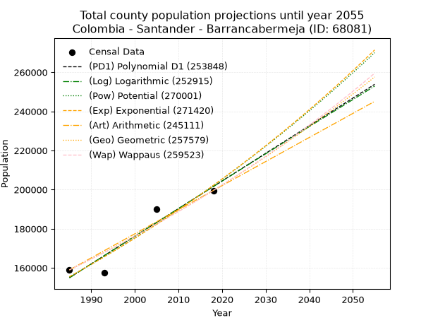
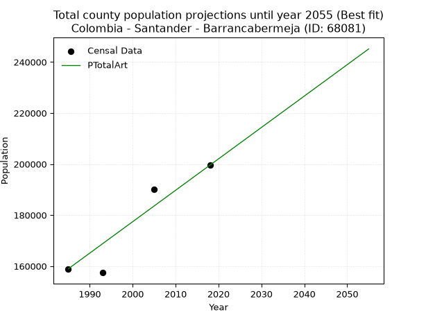
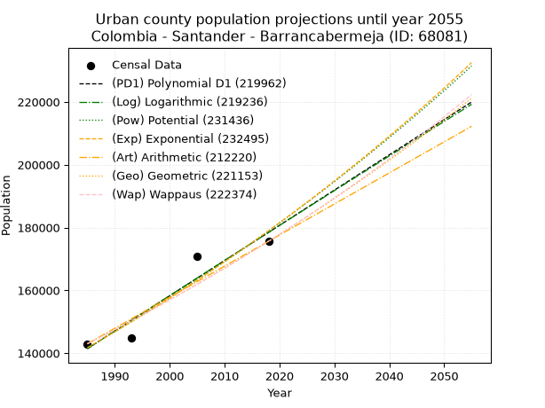
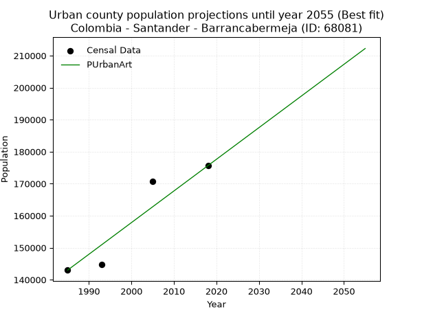
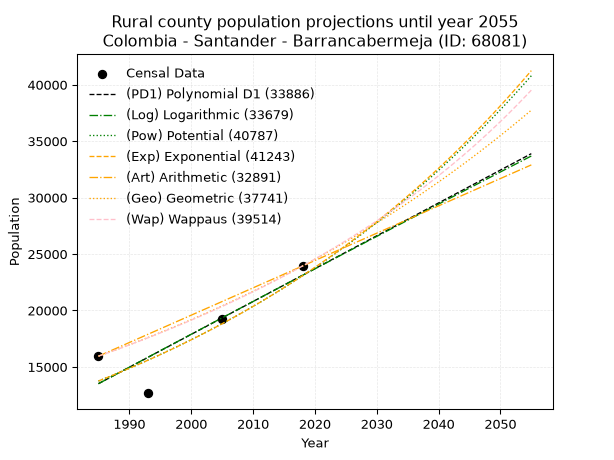
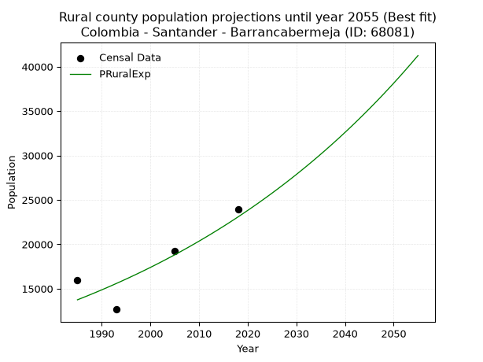

<div align="center">


</div>

# 📜 _“Population and Public Services Demand Projections (PPSD) until Year 2050 for Colombia - Santander - Barrancabermeja (ID: 68081)”_
Keywords: `population` `public-service` `projection` `lineal` `polynomial` `logarithmic` `potential` `exponential` `arithmetic` `geometric` `wappaus` `dane` `colombia` `south-america`

PPSD are analytical estimates used by governments and planners to anticipate future changes in population size, age distribution, and the resulting community needs for utilities, healthcare, education, and infrastructure as sizing future water treatment facilities, electrical grids, and road networks based on spatial growth.

<div align="center">

</img>

</div>


> **General running parameters**: • app_version: _v20260806_. • Python version: _3.14.7_. • Pandas version: _3.0.5_. • NumPy version: _2.5.1_. • Creates, save and include plots into reports (create_plot): _False_. • Projection until year: _2050_. • Process polynomial degree 2 and up: _False_. • Process Wappaus: _True_. • Process Wappaus: _True_. • Set negative values to zero: _True_. • Set infinite values to zero: _True_. • Drop dataset notes: _True_. 
<div align="center">

Maps & GIS Layers: [:earth_americas:Google](http://maps.google.com/maps?q=7.064856575,-73.849243) [:earth_americas:OSM](https://www.openstreetmap.org/#map=18/7.064856575/-73.849243&layers=P) [:earth_americas:Bing](https://www.bing.com/maps?cp=7.064856575~-73.849243&lvl=18) [:earth_americas:Apple](https://maps.apple.com/frame?center=7.064856575%2C-73.849243&span=0.003%2C0.006) [:earth_americas:GISMobile](https://github.com/rcfdtools/R.GISMobile/blob/main/file/gis/CountyLayer_CO/Readme.md)

</div>


<div align="center">

```geojson
{
  "type": "Feature",
  "geometry": {
    "type": "Point", 
    "coordinates": [-73.849243, 7.064856575]
  }, 
  "properties": {
    "Name": "Colombia - Santander - Barrancabermeja (ID: 68081)"
  }
}
```

</div>


## 0. Census Data (4 records)

Census data are official statistics collected by a government about the people and housing in a country. They usually include counts of total population, age, sex, race, income, education, and jobs.

📅Global census file: [Population.xlsx](../data/Population.xlsx)

| Source   |   Year |   CountryID | CountryName   |   StateID | StateName   |   CountyID | CountyName      |   PTotal |   PUrban |   PRural |
|:---------|-------:|------------:|:--------------|----------:|:------------|-----------:|:----------------|---------:|---------:|---------:|
| DANE     |   1985 |          57 | Colombia      |        68 | Santander   |      68081 | Barrancabermeja |   158941 |   142998 |    15943 |
| DANE     |   1993 |          57 | Colombia      |        68 | Santander   |      68081 | Barrancabermeja |   157433 |   144769 |    12664 |
| DANE     |   2005 |          57 | Colombia      |        68 | Santander   |      68081 | Barrancabermeja |   190058 |   170810 |    19248 |
| DANE     |   2018 |          57 | Colombia      |        68 | Santander   |      68081 | Barrancabermeja |   199564 |   175631 |    23933 |

> 🔥Some records could had specific notes about the registered values or the corresponding urban or rural distribution.

📅[SUI-RUPS](https://www.datos.gov.co/Hacienda-y-Cr-dito-P-blico/Registro-nico-de-Prestadores-de-Servicios-P-blicos/4qkq-csdn/about_data) - Local public utility companies: [RUPS.csv](../data/RUPS.csv)

 | SERVICIO       | ESTADO      | NOMBRE                                                                       | NIT         | DEPARTAMENTO_DOMICILIO   | MUNICIPIO_DOMICILIO   | DIRECCION                                               |   TELEFONO | EMAIL                                          | TIPO_PRESTADOR                             | CLASIFICACION                 |
|:---------------|:------------|:-----------------------------------------------------------------------------|:------------|:-------------------------|:----------------------|:--------------------------------------------------------|-----------:|:-----------------------------------------------|:-------------------------------------------|:------------------------------|
| ACUEDUCTO      | CANCELACION | CONHYDRA S.A. E.S.P.                                                         | 811011165-6 | ANTIOQUIA                | MEDELLIN              | CALLE 32 F # 63 A 117                                   |    4441676 | lchavarria@conhydra.com                        | nan                                        | nan                           |
| ALCANTARILLADO | CANCELACION | CONHYDRA S.A. E.S.P.                                                         | 811011165-6 | ANTIOQUIA                | MEDELLIN              | CALLE 32 F # 63 A 117                                   |    4441676 | lchavarria@conhydra.com                        | nan                                        | nan                           |
| ACUEDUCTO      | OPERATIVA   | CORPORACION ADMINISTRADORA DEL ACUEDUCTO VEREDAL DEL CORREGIMIENTO EL CENTRO | 829002947-6 | SANTANDER                | BARRANCABERMEJA       | VEREDA CAMPO 22 FRENTE HOSPITAL DE ECOPETROL LOCAL 1001 |    6109174 | corpacentro@hotmail.com                        | ORGANIZACION AUTORIZADA                    | MENOR O IGUAL A 2500 USUARIOS |
| ACUEDUCTO      | OPERATIVA   | AGUAS DE BARRANCABERMEJA S.A. E.S.P                                          | 900045408-1 | SANTANDER                | BARRANCABERMEJA       | PLANTA DE TRATAMIENTO-Carretera NACIONAL                |    6216504 | hernan.hernandez@aguasdebarrancabermeja.gov.co | SOCIEDADES (EMPRESA DE SERVICIOS PUBLICOS) | MAYOR O IGUAL A 5001 USUARIOS |
| ALCANTARILLADO | OPERATIVA   | AGUAS DE BARRANCABERMEJA S.A. E.S.P                                          | 900045408-1 | SANTANDER                | BARRANCABERMEJA       | PLANTA DE TRATAMIENTO-Carretera NACIONAL                |    6216504 | hernan.hernandez@aguasdebarrancabermeja.gov.co | SOCIEDADES (EMPRESA DE SERVICIOS PUBLICOS) | MAYOR O IGUAL A 5001 USUARIOS |
| ACUEDUCTO      | OPERATIVA   | ASOCIACION DE USUARIOS DEL ACUEDUCTO VEREDAL LA FORTUNA E.S.P                | 900725003-9 | SANTANDER                | BARRANCABERMEJA       | CASETA COMUNAL                                          |    7299005 | oscar.mauro@hotmail.es                         | ORGANIZACION AUTORIZADA                    | MENOR O IGUAL A 2500 USUARIOS |

## 1. Total

### 1.1. Coefficients and Parameters

* (PD1) Polynomial Deg 1: 1412.761140104368, -2649376.4704937623 (lineal)
* (Log) Logarithmic: 2827819.1402861937, -21317776.946035784
* (Pow) Potential: 15.93738142837798, -47.366179724015694
* (Exp) Exponential: 0.007961992968029666, 0.02126969843892378
* (Art) Arithmetic: Year diff. 2018 - 1985 = 33, Population diff. 199564 - 158941 = 40623, Annual growth = 1231.0
* (Geo) Geometric: Year diff. 2018 - 1985 = 33, Population diff. 199564 - 158941 = 40623, Annual growth % = 0.0069208672335829835
* (Wap) Wappaus: i = 0.6867407707005481, Condition values only valid for < 200)

<sub>
Wappaus condition values: ['0.00', '0.69', '1.37', '2.06', '2.75', '3.43', '4.12', '4.81', '5.49', '6.18', '6.87', '7.55', '8.24', '8.93', '9.61', '10.30', '10.99', '11.67', '12.36', '13.05', '13.73', '14.42', '15.11', '15.80', '16.48', '17.17', '17.86', '18.54', '19.23', '19.92', '20.60', '21.29', '21.98', '22.66', '23.35', '24.04', '24.72', '25.41', '26.10', '26.78', '27.47', '28.16', '28.84', '29.53', '30.22', '30.90', '31.59', '32.28', '32.96', '33.65', '34.34', '35.02', '35.71', '36.40', '37.08', '37.77', '38.46', '39.14', '39.83', '40.52', '41.20', '41.89', '42.58', '43.26', '43.95', '44.64']
</sub>


### 1.2. Projected Dataset

|   Year |   CountyID |   PTotalPD1 |   PTotalLog |   PTotalPow |   PTotalExp |   PTotalArt |   PTotalGeo |   PTotalWap |
|-------:|-----------:|------------:|------------:|------------:|------------:|------------:|------------:|------------:|
|   1985 |      68081 |      154954 |      154912 |      155413 |      155451 |      158941 |      158941 |      158941 |
|   1986 |      68081 |      156367 |      156336 |      156666 |      156693 |      160172 |      160041 |      160036 |
|   1987 |      68081 |      157780 |      157760 |      157927 |      157946 |      161403 |      161149 |      161139 |
|   1988 |      68081 |      159193 |      159182 |      159199 |      159209 |      162634 |      162264 |      162250 |
|   1989 |      68081 |      160605 |      160605 |      160480 |      160481 |      163865 |      163387 |      163368 |
|   1990 |      68081 |      162018 |      162026 |      161771 |      161764 |      165096 |      164518 |      164494 |
|   1991 |      68081 |      163431 |      163447 |      163071 |      163057 |      166327 |      165656 |      165628 |
|   1992 |      68081 |      164844 |      164867 |      164381 |      164361 |      167558 |      166803 |      166770 |
|   1993 |      68081 |      166256 |      166286 |      165702 |      165674 |      168789 |      167957 |      167920 |
|   1994 |      68081 |      167669 |      167704 |      167032 |      166999 |      170020 |      169120 |      169078 |
|   1995 |      68081 |      169082 |      169122 |      168372 |      168334 |      171251 |      170290 |      170244 |
|   1996 |      68081 |      170495 |      170539 |      169722 |      169679 |      172482 |      171469 |      171419 |
|   1997 |      68081 |      171908 |      171956 |      171082 |      171036 |      173713 |      172655 |      172602 |
|   1998 |      68081 |      173320 |      173371 |      172452 |      172403 |      174944 |      173850 |      173794 |
|   1999 |      68081 |      174733 |      174786 |      173833 |      173781 |      176175 |      175053 |      174994 |
|   2000 |      68081 |      176146 |      176201 |      175224 |      175170 |      177406 |      176265 |      176203 |
|   2001 |      68081 |      177559 |      177614 |      176626 |      176571 |      178637 |      177485 |      177420 |
|   2002 |      68081 |      178971 |      179027 |      178038 |      177982 |      179868 |      178713 |      178647 |
|   2003 |      68081 |      180384 |      180439 |      179461 |      179405 |      181099 |      179950 |      179883 |
|   2004 |      68081 |      181797 |      181851 |      180894 |      180839 |      182330 |      181196 |      181127 |
|   2005 |      68081 |      183210 |      183261 |      182338 |      182285 |      183561 |      182450 |      182381 |
|   2006 |      68081 |      184622 |      184671 |      183793 |      183742 |      184792 |      183712 |      183644 |
|   2007 |      68081 |      186035 |      186081 |      185258 |      185210 |      186023 |      184984 |      184917 |
|   2008 |      68081 |      187448 |      187489 |      186735 |      186691 |      187254 |      186264 |      186198 |
|   2009 |      68081 |      188861 |      188897 |      188222 |      188183 |      188485 |      187553 |      187490 |
|   2010 |      68081 |      190273 |      190304 |      189721 |      189688 |      189716 |      188851 |      188791 |
|   2011 |      68081 |      191686 |      191711 |      191231 |      191204 |      190947 |      190158 |      190102 |
|   2012 |      68081 |      193099 |      193117 |      192752 |      192732 |      192178 |      191474 |      191423 |
|   2013 |      68081 |      194512 |      194522 |      194285 |      194273 |      193409 |      192799 |      192754 |
|   2014 |      68081 |      195924 |      195926 |      195829 |      195826 |      194640 |      194134 |      194095 |
|   2015 |      68081 |      197337 |      197330 |      197384 |      197391 |      195871 |      195477 |      195447 |
|   2016 |      68081 |      198750 |      198733 |      198951 |      198969 |      197102 |      196830 |      196809 |
|   2017 |      68081 |      200163 |      200135 |      200530 |      200560 |      198333 |      198192 |      198181 |
|   2018 |      68081 |      201576 |      201537 |      202120 |      202163 |      199564 |      199564 |      199564 |
|   2019 |      68081 |      202988 |      202938 |      203722 |      203779 |      200795 |      200945 |      200958 |
|   2020 |      68081 |      204401 |      204338 |      205336 |      205408 |      202026 |      202336 |      202362 |
|   2021 |      68081 |      205814 |      205738 |      206962 |      207050 |      203257 |      203736 |      203778 |
|   2022 |      68081 |      207227 |      207137 |      208601 |      208705 |      204488 |      205146 |      205205 |
|   2023 |      68081 |      208639 |      208535 |      210251 |      210374 |      205719 |      206566 |      206643 |
|   2024 |      68081 |      210052 |      209932 |      211913 |      212055 |      206950 |      207996 |      208092 |
|   2025 |      68081 |      211465 |      211329 |      213588 |      213750 |      208181 |      209435 |      209553 |
|   2026 |      68081 |      212878 |      212725 |      215275 |      215459 |      209412 |      210885 |      211026 |
|   2027 |      68081 |      214290 |      214121 |      216975 |      217181 |      210643 |      212344 |      212510 |
|   2028 |      68081 |      215703 |      215515 |      218687 |      218917 |      211874 |      213814 |      214006 |
|   2029 |      68081 |      217116 |      216909 |      220412 |      220667 |      213105 |      215294 |      215515 |
|   2030 |      68081 |      218529 |      218303 |      222150 |      222431 |      214336 |      216784 |      217036 |
|   2031 |      68081 |      219941 |      219695 |      223900 |      224209 |      215567 |      218284 |      218569 |
|   2032 |      68081 |      221354 |      221087 |      225664 |      226002 |      216798 |      219795 |      220115 |
|   2033 |      68081 |      222767 |      222479 |      227440 |      227808 |      218029 |      221316 |      221673 |
|   2034 |      68081 |      224180 |      223869 |      229230 |      229629 |      219260 |      222847 |      223244 |
|   2035 |      68081 |      225592 |      225259 |      231033 |      231465 |      220491 |      224390 |      224829 |
|   2036 |      68081 |      227005 |      226649 |      232849 |      233315 |      221722 |      225943 |      226426 |
|   2037 |      68081 |      228418 |      228037 |      234678 |      235180 |      222953 |      227506 |      228037 |
|   2038 |      68081 |      229831 |      229425 |      236521 |      237060 |      224184 |      229081 |      229661 |
|   2039 |      68081 |      231243 |      230812 |      238377 |      238955 |      225415 |      230666 |      231299 |
|   2040 |      68081 |      232656 |      232199 |      240247 |      240865 |      226646 |      232263 |      232951 |
|   2041 |      68081 |      234069 |      233585 |      242131 |      242791 |      227877 |      233870 |      234617 |
|   2042 |      68081 |      235482 |      234970 |      244029 |      244732 |      229108 |      235489 |      236298 |
|   2043 |      68081 |      236895 |      236354 |      245940 |      246688 |      230339 |      237119 |      237992 |
|   2044 |      68081 |      238307 |      237738 |      247866 |      248660 |      231570 |      238760 |      239701 |
|   2045 |      68081 |      239720 |      239121 |      249806 |      250648 |      232801 |      240412 |      241425 |
|   2046 |      68081 |      241133 |      240504 |      251760 |      252651 |      234032 |      242076 |      243164 |
|   2047 |      68081 |      242546 |      241885 |      253728 |      254671 |      235263 |      243751 |      244919 |
|   2048 |      68081 |      243958 |      243267 |      255711 |      256707 |      236494 |      245438 |      246688 |
|   2049 |      68081 |      245371 |      244647 |      257708 |      258759 |      237725 |      247137 |      248473 |
|   2050 |      68081 |      246784 |      246027 |      259720 |      260827 |      238956 |      248847 |      250274 |
<div align="center">

</img>

</div>


### 1.3. Best fit with absolute and relative error (%)

Relative error puts that difference into context by dividing the absolute error by the true value, creating a unitless ratio or percentage that shows the scale of the mistake.

Absolute and relative error

|   Year | Source   |   CountryID | CountryName   |   StateID | StateName   |   CountyID_x | CountyName      |   PTotal |   PUrban |   PRural |   CountyID_y |   PTotalPD1 |   PTotalLog |   PTotalPow |   PTotalExp |   PTotalArt |   PTotalGeo |   PTotalWap |   PTotalPD1AbsError |   PTotalLogAbsError |   PTotalPowAbsError |   PTotalExpAbsError |   PTotalArtAbsError |   PTotalGeoAbsError |   PTotalWapAbsError |   PTotalPD1RelError |   PTotalLogRelError |   PTotalPowRelError |   PTotalExpRelError |   PTotalArtRelError |   PTotalGeoRelError |   PTotalWapRelError |
|-------:|:---------|------------:|:--------------|----------:|:------------|-------------:|:----------------|---------:|---------:|---------:|-------------:|------------:|------------:|------------:|------------:|------------:|------------:|------------:|--------------------:|--------------------:|--------------------:|--------------------:|--------------------:|--------------------:|--------------------:|--------------------:|--------------------:|--------------------:|--------------------:|--------------------:|--------------------:|--------------------:|
|   1985 | DANE     |          57 | Colombia      |        68 | Santander   |        68081 | Barrancabermeja |   158941 |   142998 |    15943 |        68081 |      154954 |      154912 |      155413 |      155451 |      158941 |      158941 |      158941 |                3987 |                4029 |                3528 |                3490 |                   0 |                   0 |                   0 |             2.50848 |            2.5349   |             2.21969 |             2.19578 |             0       |             0       |             0       |
|   1993 | DANE     |          57 | Colombia      |        68 | Santander   |        68081 | Barrancabermeja |   157433 |   144769 |    12664 |        68081 |      166256 |      166286 |      165702 |      165674 |      168789 |      167957 |      167920 |                8823 |                8853 |                8269 |                8241 |               11356 |               10524 |               10487 |             5.60429 |            5.62334  |             5.25239 |             5.23461 |             7.21323 |             6.68475 |             6.66125 |
|   2005 | DANE     |          57 | Colombia      |        68 | Santander   |        68081 | Barrancabermeja |   190058 |   170810 |    19248 |        68081 |      183210 |      183261 |      182338 |      182285 |      183561 |      182450 |      182381 |                6848 |                6797 |                7720 |                7773 |                6497 |                7608 |                7677 |             3.60311 |            3.57628  |             4.06192 |             4.0898  |             3.41843 |             4.00299 |             4.03929 |
|   2018 | DANE     |          57 | Colombia      |        68 | Santander   |        68081 | Barrancabermeja |   199564 |   175631 |    23933 |        68081 |      201576 |      201537 |      202120 |      202163 |      199564 |      199564 |      199564 |                2012 |                1973 |                2556 |                2599 |                   0 |                   0 |                   0 |             1.0082  |            0.988655 |             1.28079 |             1.30234 |             0       |             0       |             0       |

Relative error mean

| Method    |   RelError | Best   |
|:----------|-----------:|:-------|
| PTotalPD1 |    3.18102 |        |
| PTotalLog |    3.18079 |        |
| PTotalPow |    3.2037  |        |
| PTotalExp |    3.20563 |        |
| PTotalArt |    2.65791 | True   |
| PTotalGeo |    2.67193 |        |
| PTotalWap |    2.67513 |        |

💙Best method: _**PTotalArt**_
<div align="center">

</img>

</div>


### 1.4. Fresh water supply demand in liters per capita per day (lpcd)

The fresh water supply demand typically ranges from 100 to 300 liters per capita per day (lpcd) for standard domestic and municipal planning, though absolute survival minimums set by the World Health Organization are as low as 7.5 to 20 liters per day, and total consumption in high-income nations can exceed 400 liters.

> `CZ`: Level in meters above the sea level (masl)<br> `WS`: Fresh water supply demand in liters per capita per day (lpcd or l/h/d)<br> `WSAll`: Zonal fresh water supply demand in liters per second (l/s)<br> `A`: Zonal area in square meters<br> `DP`: Population density (people/hectare or p/ha)

Reference values (RAS Colombia)

|    CZ |   WS |
|------:|-----:|
|  1000 |  120 |
|  2000 |  130 |
| 99999 |  140 |

County shapefile geometry properties and water supply values

|   CountyID |      ATotal |   CZTotal |   WSTotal |
|-----------:|------------:|----------:|----------:|
|      68081 | 1.32467e+09 |   95.8199 |       120 |

Projected values for best method: PTotalArt

|   CountyID |   Year |   PTotalArt |   DPTotal |   WSTotal |   WSTotalAll |
|-----------:|-------:|------------:|----------:|----------:|-------------:|
|      68081 |   1985 |      158941 |      1.2  |       120 |      220.751 |
|      68081 |   1986 |      160172 |      1.21 |       120 |      222.461 |
|      68081 |   1987 |      161403 |      1.22 |       120 |      224.171 |
|      68081 |   1988 |      162634 |      1.23 |       120 |      225.881 |
|      68081 |   1989 |      163865 |      1.24 |       120 |      227.59  |
|      68081 |   1990 |      165096 |      1.25 |       120 |      229.3   |
|      68081 |   1991 |      166327 |      1.26 |       120 |      231.01  |
|      68081 |   1992 |      167558 |      1.26 |       120 |      232.719 |
|      68081 |   1993 |      168789 |      1.27 |       120 |      234.429 |
|      68081 |   1994 |      170020 |      1.28 |       120 |      236.139 |
|      68081 |   1995 |      171251 |      1.29 |       120 |      237.849 |
|      68081 |   1996 |      172482 |      1.3  |       120 |      239.558 |
|      68081 |   1997 |      173713 |      1.31 |       120 |      241.268 |
|      68081 |   1998 |      174944 |      1.32 |       120 |      242.978 |
|      68081 |   1999 |      176175 |      1.33 |       120 |      244.688 |
|      68081 |   2000 |      177406 |      1.34 |       120 |      246.397 |
|      68081 |   2001 |      178637 |      1.35 |       120 |      248.107 |
|      68081 |   2002 |      179868 |      1.36 |       120 |      249.817 |
|      68081 |   2003 |      181099 |      1.37 |       120 |      251.526 |
|      68081 |   2004 |      182330 |      1.38 |       120 |      253.236 |
|      68081 |   2005 |      183561 |      1.39 |       120 |      254.946 |
|      68081 |   2006 |      184792 |      1.4  |       120 |      256.656 |
|      68081 |   2007 |      186023 |      1.4  |       120 |      258.365 |
|      68081 |   2008 |      187254 |      1.41 |       120 |      260.075 |
|      68081 |   2009 |      188485 |      1.42 |       120 |      261.785 |
|      68081 |   2010 |      189716 |      1.43 |       120 |      263.494 |
|      68081 |   2011 |      190947 |      1.44 |       120 |      265.204 |
|      68081 |   2012 |      192178 |      1.45 |       120 |      266.914 |
|      68081 |   2013 |      193409 |      1.46 |       120 |      268.624 |
|      68081 |   2014 |      194640 |      1.47 |       120 |      270.333 |
|      68081 |   2015 |      195871 |      1.48 |       120 |      272.043 |
|      68081 |   2016 |      197102 |      1.49 |       120 |      273.753 |
|      68081 |   2017 |      198333 |      1.5  |       120 |      275.462 |
|      68081 |   2018 |      199564 |      1.51 |       120 |      277.172 |
|      68081 |   2019 |      200795 |      1.52 |       120 |      278.882 |
|      68081 |   2020 |      202026 |      1.53 |       120 |      280.592 |
|      68081 |   2021 |      203257 |      1.53 |       120 |      282.301 |
|      68081 |   2022 |      204488 |      1.54 |       120 |      284.011 |
|      68081 |   2023 |      205719 |      1.55 |       120 |      285.721 |
|      68081 |   2024 |      206950 |      1.56 |       120 |      287.431 |
|      68081 |   2025 |      208181 |      1.57 |       120 |      289.14  |
|      68081 |   2026 |      209412 |      1.58 |       120 |      290.85  |
|      68081 |   2027 |      210643 |      1.59 |       120 |      292.56  |
|      68081 |   2028 |      211874 |      1.6  |       120 |      294.269 |
|      68081 |   2029 |      213105 |      1.61 |       120 |      295.979 |
|      68081 |   2030 |      214336 |      1.62 |       120 |      297.689 |
|      68081 |   2031 |      215567 |      1.63 |       120 |      299.399 |
|      68081 |   2032 |      216798 |      1.64 |       120 |      301.108 |
|      68081 |   2033 |      218029 |      1.65 |       120 |      302.818 |
|      68081 |   2034 |      219260 |      1.66 |       120 |      304.528 |
|      68081 |   2035 |      220491 |      1.66 |       120 |      306.238 |
|      68081 |   2036 |      221722 |      1.67 |       120 |      307.947 |
|      68081 |   2037 |      222953 |      1.68 |       120 |      309.657 |
|      68081 |   2038 |      224184 |      1.69 |       120 |      311.367 |
|      68081 |   2039 |      225415 |      1.7  |       120 |      313.076 |
|      68081 |   2040 |      226646 |      1.71 |       120 |      314.786 |
|      68081 |   2041 |      227877 |      1.72 |       120 |      316.496 |
|      68081 |   2042 |      229108 |      1.73 |       120 |      318.206 |
|      68081 |   2043 |      230339 |      1.74 |       120 |      319.915 |
|      68081 |   2044 |      231570 |      1.75 |       120 |      321.625 |
|      68081 |   2045 |      232801 |      1.76 |       120 |      323.335 |
|      68081 |   2046 |      234032 |      1.77 |       120 |      325.044 |
|      68081 |   2047 |      235263 |      1.78 |       120 |      326.754 |
|      68081 |   2048 |      236494 |      1.79 |       120 |      328.464 |
|      68081 |   2049 |      237725 |      1.79 |       120 |      330.174 |
|      68081 |   2050 |      238956 |      1.8  |       120 |      331.883 |

## 2. Urban

### 2.1. Coefficients and Parameters

* (PD1) Polynomial Deg 1: 1121.642713769565, -2085013.8382175723 (lineal)
* (Log) Logarithmic: 2245638.4511741167, -16910563.86279163
* (Pow) Potential: 14.157416232344728, -41.536424640104165
* (Exp) Exponential: 0.00707110524670018, 0.11366540048913053
* (Art) Arithmetic: Year diff. 2018 - 1985 = 33, Population diff. 175631 - 142998 = 32633, Annual growth = 988.8787878787879
* (Geo) Geometric: Year diff. 2018 - 1985 = 33, Population diff. 175631 - 142998 = 32633, Annual growth % = 0.006248366134491423
* (Wap) Wappaus: i = 0.6207085907929208, Condition values only valid for < 200)

<sub>
Wappaus condition values: ['0.00', '0.62', '1.24', '1.86', '2.48', '3.10', '3.72', '4.34', '4.97', '5.59', '6.21', '6.83', '7.45', '8.07', '8.69', '9.31', '9.93', '10.55', '11.17', '11.79', '12.41', '13.03', '13.66', '14.28', '14.90', '15.52', '16.14', '16.76', '17.38', '18.00', '18.62', '19.24', '19.86', '20.48', '21.10', '21.72', '22.35', '22.97', '23.59', '24.21', '24.83', '25.45', '26.07', '26.69', '27.31', '27.93', '28.55', '29.17', '29.79', '30.41', '31.04', '31.66', '32.28', '32.90', '33.52', '34.14', '34.76', '35.38', '36.00', '36.62', '37.24', '37.86', '38.48', '39.10', '39.73', '40.35']
</sub>


### 2.2. Projected Dataset

|   Year |   CountyID |   PUrbanPD1 |   PUrbanLog |   PUrbanPow |   PUrbanExp |   PUrbanArt |   PUrbanGeo |   PUrbanWap |
|-------:|-----------:|------------:|------------:|------------:|------------:|------------:|------------:|------------:|
|   1985 |      68081 |      141447 |      141409 |      141691 |      141726 |      142998 |      142998 |      142998 |
|   1986 |      68081 |      142569 |      142540 |      142705 |      142731 |      143987 |      143892 |      143888 |
|   1987 |      68081 |      143690 |      143671 |      143726 |      143744 |      144976 |      144791 |      144784 |
|   1988 |      68081 |      144812 |      144801 |      144753 |      144764 |      145965 |      145695 |      145686 |
|   1989 |      68081 |      145934 |      145930 |      145788 |      145791 |      146954 |      146606 |      146593 |
|   1990 |      68081 |      147055 |      147059 |      146829 |      146826 |      147942 |      147522 |      147506 |
|   1991 |      68081 |      148177 |      148187 |      147877 |      147868 |      148931 |      148443 |      148425 |
|   1992 |      68081 |      149298 |      149314 |      148932 |      148917 |      149920 |      149371 |      149349 |
|   1993 |      68081 |      150420 |      150441 |      149994 |      149974 |      150909 |      150304 |      150280 |
|   1994 |      68081 |      151542 |      151568 |      151063 |      151038 |      151898 |      151243 |      151216 |
|   1995 |      68081 |      152663 |      152694 |      152139 |      152110 |      152887 |      152189 |      152158 |
|   1996 |      68081 |      153785 |      153819 |      153222 |      153189 |      153876 |      153139 |      153107 |
|   1997 |      68081 |      154907 |      154944 |      154313 |      154276 |      154865 |      154096 |      154061 |
|   1998 |      68081 |      156028 |      156068 |      155410 |      155371 |      155853 |      155059 |      155022 |
|   1999 |      68081 |      157150 |      157192 |      156515 |      156474 |      156842 |      156028 |      155989 |
|   2000 |      68081 |      158272 |      158315 |      157627 |      157584 |      157831 |      157003 |      156962 |
|   2001 |      68081 |      159393 |      159438 |      158747 |      158702 |      158820 |      157984 |      157942 |
|   2002 |      68081 |      160515 |      160559 |      159873 |      159828 |      159809 |      158971 |      158928 |
|   2003 |      68081 |      161637 |      161681 |      161008 |      160963 |      160798 |      159964 |      159920 |
|   2004 |      68081 |      162758 |      162802 |      162150 |      162105 |      161787 |      160964 |      160919 |
|   2005 |      68081 |      163880 |      163922 |      163299 |      163255 |      162776 |      161970 |      161925 |
|   2006 |      68081 |      165001 |      165042 |      164456 |      164414 |      163764 |      162982 |      162937 |
|   2007 |      68081 |      166123 |      166161 |      165620 |      165580 |      164753 |      164000 |      163956 |
|   2008 |      68081 |      167245 |      167280 |      166792 |      166755 |      165742 |      165025 |      164982 |
|   2009 |      68081 |      168366 |      168398 |      167972 |      167939 |      166731 |      166056 |      166015 |
|   2010 |      68081 |      169488 |      169515 |      169160 |      169130 |      167720 |      167094 |      167055 |
|   2011 |      68081 |      170610 |      170632 |      170355 |      170331 |      168709 |      168138 |      168101 |
|   2012 |      68081 |      171731 |      171749 |      171558 |      171539 |      169698 |      169188 |      169155 |
|   2013 |      68081 |      172853 |      172864 |      172769 |      172757 |      170687 |      170245 |      170216 |
|   2014 |      68081 |      173975 |      173980 |      173988 |      173982 |      171675 |      171309 |      171284 |
|   2015 |      68081 |      175096 |      175094 |      175216 |      175217 |      172664 |      172379 |      172360 |
|   2016 |      68081 |      176218 |      176209 |      176451 |      176460 |      173653 |      173457 |      173443 |
|   2017 |      68081 |      177340 |      177322 |      177694 |      177713 |      174642 |      174540 |      174533 |
|   2018 |      68081 |      178461 |      178435 |      178945 |      178974 |      175631 |      175631 |      175631 |
|   2019 |      68081 |      179583 |      179548 |      180205 |      180244 |      176620 |      176728 |      176737 |
|   2020 |      68081 |      180704 |      180660 |      181472 |      181523 |      177609 |      177833 |      177850 |
|   2021 |      68081 |      181826 |      181771 |      182748 |      182811 |      178598 |      178944 |      178971 |
|   2022 |      68081 |      182948 |      182882 |      184033 |      184108 |      179587 |      180062 |      180100 |
|   2023 |      68081 |      184069 |      183992 |      185325 |      185415 |      180575 |      181187 |      181236 |
|   2024 |      68081 |      185191 |      185102 |      186627 |      186730 |      181564 |      182319 |      182381 |
|   2025 |      68081 |      186313 |      186211 |      187936 |      188055 |      182553 |      183458 |      183534 |
|   2026 |      68081 |      187434 |      187320 |      189255 |      189390 |      183542 |      184605 |      184695 |
|   2027 |      68081 |      188556 |      188428 |      190581 |      190734 |      184531 |      185758 |      185865 |
|   2028 |      68081 |      189678 |      189536 |      191917 |      192087 |      185520 |      186919 |      187043 |
|   2029 |      68081 |      190799 |      190643 |      193261 |      193450 |      186509 |      188087 |      188229 |
|   2030 |      68081 |      191921 |      191749 |      194614 |      194823 |      187498 |      189262 |      189424 |
|   2031 |      68081 |      193043 |      192855 |      195975 |      196206 |      188486 |      190445 |      190627 |
|   2032 |      68081 |      194164 |      193961 |      197346 |      197598 |      189475 |      191635 |      191840 |
|   2033 |      68081 |      195286 |      195066 |      198725 |      199000 |      190464 |      192832 |      193061 |
|   2034 |      68081 |      196407 |      196170 |      200114 |      200412 |      191453 |      194037 |      194291 |
|   2035 |      68081 |      197529 |      197274 |      201511 |      201834 |      192442 |      195249 |      195530 |
|   2036 |      68081 |      198651 |      198377 |      202918 |      203267 |      193431 |      196469 |      196778 |
|   2037 |      68081 |      199772 |      199480 |      204333 |      204709 |      194420 |      197697 |      198035 |
|   2038 |      68081 |      200894 |      200582 |      205758 |      206162 |      195409 |      198932 |      199302 |
|   2039 |      68081 |      202016 |      201683 |      207192 |      207625 |      196397 |      200175 |      200578 |
|   2040 |      68081 |      203137 |      202785 |      208635 |      209098 |      197386 |      201426 |      201864 |
|   2041 |      68081 |      204259 |      203885 |      210088 |      210582 |      198375 |      202684 |      203160 |
|   2042 |      68081 |      205381 |      204985 |      211550 |      212076 |      199364 |      203951 |      204465 |
|   2043 |      68081 |      206502 |      206084 |      213021 |      213581 |      200353 |      205225 |      205780 |
|   2044 |      68081 |      207624 |      207183 |      214502 |      215097 |      201342 |      206508 |      207105 |
|   2045 |      68081 |      208746 |      208282 |      215992 |      216623 |      202331 |      207798 |      208440 |
|   2046 |      68081 |      209867 |      209380 |      217493 |      218160 |      203320 |      209096 |      209786 |
|   2047 |      68081 |      210989 |      210477 |      219002 |      219708 |      204308 |      210403 |      211141 |
|   2048 |      68081 |      212110 |      211574 |      220522 |      221267 |      205297 |      211718 |      212508 |
|   2049 |      68081 |      213232 |      212670 |      222051 |      222838 |      206286 |      213040 |      213884 |
|   2050 |      68081 |      214354 |      213766 |      223590 |      224419 |      207275 |      214372 |      215272 |
<div align="center">

</img>

</div>


### 2.3. Best fit with absolute and relative error (%)

Relative error puts that difference into context by dividing the absolute error by the true value, creating a unitless ratio or percentage that shows the scale of the mistake.

Absolute and relative error

|   Year | Source   |   CountryID | CountryName   |   StateID | StateName   |   CountyID_x | CountyName      |   PTotal |   PUrban |   PRural |   CountyID_y |   PUrbanPD1 |   PUrbanLog |   PUrbanPow |   PUrbanExp |   PUrbanArt |   PUrbanGeo |   PUrbanWap |   PUrbanPD1AbsError |   PUrbanLogAbsError |   PUrbanPowAbsError |   PUrbanExpAbsError |   PUrbanArtAbsError |   PUrbanGeoAbsError |   PUrbanWapAbsError |   PUrbanPD1RelError |   PUrbanLogRelError |   PUrbanPowRelError |   PUrbanExpRelError |   PUrbanArtRelError |   PUrbanGeoRelError |   PUrbanWapRelError |
|-------:|:---------|------------:|:--------------|----------:|:------------|-------------:|:----------------|---------:|---------:|---------:|-------------:|------------:|------------:|------------:|------------:|------------:|------------:|------------:|--------------------:|--------------------:|--------------------:|--------------------:|--------------------:|--------------------:|--------------------:|--------------------:|--------------------:|--------------------:|--------------------:|--------------------:|--------------------:|--------------------:|
|   1985 | DANE     |          57 | Colombia      |        68 | Santander   |        68081 | Barrancabermeja |   158941 |   142998 |    15943 |        68081 |      141447 |      141409 |      141691 |      141726 |      142998 |      142998 |      142998 |                1551 |                1589 |                1307 |                1272 |                   0 |                   0 |                   0 |             1.08463 |             1.1112  |            0.913999 |            0.889523 |             0       |             0       |             0       |
|   1993 | DANE     |          57 | Colombia      |        68 | Santander   |        68081 | Barrancabermeja |   157433 |   144769 |    12664 |        68081 |      150420 |      150441 |      149994 |      149974 |      150909 |      150304 |      150280 |                5651 |                5672 |                5225 |                5205 |                6140 |                5535 |                5511 |             3.90346 |             3.91797 |            3.6092   |            3.59538  |             4.24124 |             3.82333 |             3.80675 |
|   2005 | DANE     |          57 | Colombia      |        68 | Santander   |        68081 | Barrancabermeja |   190058 |   170810 |    19248 |        68081 |      163880 |      163922 |      163299 |      163255 |      162776 |      161970 |      161925 |                6930 |                6888 |                7511 |                7555 |                8034 |                8840 |                8885 |             4.05714 |             4.03255 |            4.39728  |            4.42304  |             4.70347 |             5.17534 |             5.20169 |
|   2018 | DANE     |          57 | Colombia      |        68 | Santander   |        68081 | Barrancabermeja |   199564 |   175631 |    23933 |        68081 |      178461 |      178435 |      178945 |      178974 |      175631 |      175631 |      175631 |                2830 |                2804 |                3314 |                3343 |                   0 |                   0 |                   0 |             1.61133 |             1.59653 |            1.88691  |            1.90342  |             0       |             0       |             0       |

Relative error mean

| Method    |   RelError | Best   |
|:----------|-----------:|:-------|
| PUrbanPD1 |    2.66414 |        |
| PUrbanLog |    2.66456 |        |
| PUrbanPow |    2.70185 |        |
| PUrbanExp |    2.70284 |        |
| PUrbanArt |    2.23618 | True   |
| PUrbanGeo |    2.24967 |        |
| PUrbanWap |    2.25211 |        |

💙Best method: _**PUrbanArt**_
<div align="center">

</img>

</div>


### 2.4. Fresh water supply demand in liters per capita per day (lpcd)

The fresh water supply demand typically ranges from 100 to 300 liters per capita per day (lpcd) for standard domestic and municipal planning, though absolute survival minimums set by the World Health Organization are as low as 7.5 to 20 liters per day, and total consumption in high-income nations can exceed 400 liters.

> `CZ`: Level in meters above the sea level (masl)<br> `WS`: Fresh water supply demand in liters per capita per day (lpcd or l/h/d)<br> `WSAll`: Zonal fresh water supply demand in liters per second (l/s)<br> `A`: Zonal area in square meters<br> `DP`: Population density (people/hectare or p/ha)

Reference values (RAS Colombia)

|    CZ |   WS |
|------:|-----:|
|  1000 |  120 |
|  2000 |  130 |
| 99999 |  140 |

County shapefile geometry properties and water supply values

|   CountyID |     AUrban |   CZUrban |   WSUrban |
|-----------:|-----------:|----------:|----------:|
|      68081 | 3.2781e+07 |   88.1946 |       120 |

Projected values for best method: PUrbanArt

|   CountyID |   Year |   PUrbanArt |   DPUrban |   WSUrban |   WSUrbanAll |
|-----------:|-------:|------------:|----------:|----------:|-------------:|
|      68081 |   1985 |      142998 |     43.62 |       120 |      198.608 |
|      68081 |   1986 |      143987 |     43.92 |       120 |      199.982 |
|      68081 |   1987 |      144976 |     44.23 |       120 |      201.356 |
|      68081 |   1988 |      145965 |     44.53 |       120 |      202.729 |
|      68081 |   1989 |      146954 |     44.83 |       120 |      204.103 |
|      68081 |   1990 |      147942 |     45.13 |       120 |      205.475 |
|      68081 |   1991 |      148931 |     45.43 |       120 |      206.849 |
|      68081 |   1992 |      149920 |     45.73 |       120 |      208.222 |
|      68081 |   1993 |      150909 |     46.04 |       120 |      209.596 |
|      68081 |   1994 |      151898 |     46.34 |       120 |      210.969 |
|      68081 |   1995 |      152887 |     46.64 |       120 |      212.343 |
|      68081 |   1996 |      153876 |     46.94 |       120 |      213.717 |
|      68081 |   1997 |      154865 |     47.24 |       120 |      215.09  |
|      68081 |   1998 |      155853 |     47.54 |       120 |      216.463 |
|      68081 |   1999 |      156842 |     47.85 |       120 |      217.836 |
|      68081 |   2000 |      157831 |     48.15 |       120 |      219.21  |
|      68081 |   2001 |      158820 |     48.45 |       120 |      220.583 |
|      68081 |   2002 |      159809 |     48.75 |       120 |      221.957 |
|      68081 |   2003 |      160798 |     49.05 |       120 |      223.331 |
|      68081 |   2004 |      161787 |     49.35 |       120 |      224.704 |
|      68081 |   2005 |      162776 |     49.66 |       120 |      226.078 |
|      68081 |   2006 |      163764 |     49.96 |       120 |      227.45  |
|      68081 |   2007 |      164753 |     50.26 |       120 |      228.824 |
|      68081 |   2008 |      165742 |     50.56 |       120 |      230.197 |
|      68081 |   2009 |      166731 |     50.86 |       120 |      231.571 |
|      68081 |   2010 |      167720 |     51.16 |       120 |      232.944 |
|      68081 |   2011 |      168709 |     51.47 |       120 |      234.318 |
|      68081 |   2012 |      169698 |     51.77 |       120 |      235.692 |
|      68081 |   2013 |      170687 |     52.07 |       120 |      237.065 |
|      68081 |   2014 |      171675 |     52.37 |       120 |      238.438 |
|      68081 |   2015 |      172664 |     52.67 |       120 |      239.811 |
|      68081 |   2016 |      173653 |     52.97 |       120 |      241.185 |
|      68081 |   2017 |      174642 |     53.28 |       120 |      242.558 |
|      68081 |   2018 |      175631 |     53.58 |       120 |      243.932 |
|      68081 |   2019 |      176620 |     53.88 |       120 |      245.306 |
|      68081 |   2020 |      177609 |     54.18 |       120 |      246.679 |
|      68081 |   2021 |      178598 |     54.48 |       120 |      248.053 |
|      68081 |   2022 |      179587 |     54.78 |       120 |      249.426 |
|      68081 |   2023 |      180575 |     55.09 |       120 |      250.799 |
|      68081 |   2024 |      181564 |     55.39 |       120 |      252.172 |
|      68081 |   2025 |      182553 |     55.69 |       120 |      253.546 |
|      68081 |   2026 |      183542 |     55.99 |       120 |      254.919 |
|      68081 |   2027 |      184531 |     56.29 |       120 |      256.293 |
|      68081 |   2028 |      185520 |     56.59 |       120 |      257.667 |
|      68081 |   2029 |      186509 |     56.9  |       120 |      259.04  |
|      68081 |   2030 |      187498 |     57.2  |       120 |      260.414 |
|      68081 |   2031 |      188486 |     57.5  |       120 |      261.786 |
|      68081 |   2032 |      189475 |     57.8  |       120 |      263.16  |
|      68081 |   2033 |      190464 |     58.1  |       120 |      264.533 |
|      68081 |   2034 |      191453 |     58.4  |       120 |      265.907 |
|      68081 |   2035 |      192442 |     58.71 |       120 |      267.281 |
|      68081 |   2036 |      193431 |     59.01 |       120 |      268.654 |
|      68081 |   2037 |      194420 |     59.31 |       120 |      270.028 |
|      68081 |   2038 |      195409 |     59.61 |       120 |      271.401 |
|      68081 |   2039 |      196397 |     59.91 |       120 |      272.774 |
|      68081 |   2040 |      197386 |     60.21 |       120 |      274.147 |
|      68081 |   2041 |      198375 |     60.52 |       120 |      275.521 |
|      68081 |   2042 |      199364 |     60.82 |       120 |      276.894 |
|      68081 |   2043 |      200353 |     61.12 |       120 |      278.268 |
|      68081 |   2044 |      201342 |     61.42 |       120 |      279.642 |
|      68081 |   2045 |      202331 |     61.72 |       120 |      281.015 |
|      68081 |   2046 |      203320 |     62.02 |       120 |      282.389 |
|      68081 |   2047 |      204308 |     62.33 |       120 |      283.761 |
|      68081 |   2048 |      205297 |     62.63 |       120 |      285.135 |
|      68081 |   2049 |      206286 |     62.93 |       120 |      286.508 |
|      68081 |   2050 |      207275 |     63.23 |       120 |      287.882 |

## 3. Rural

### 3.1. Coefficients and Parameters

* (PD1) Polynomial Deg 1: 291.1184263348021, -564362.632276188 (lineal)
* (Log) Logarithmic: 582180.6891120758, -4407213.083244141
* (Pow) Potential: 31.389547989690495, -99.3771474835831
* (Exp) Exponential: 0.015696396853985606, 4.043054830795639e-10
* (Art) Arithmetic: Year diff. 2018 - 1985 = 33, Population diff. 23933 - 15943 = 7990, Annual growth = 242.12121212121212
* (Geo) Geometric: Year diff. 2018 - 1985 = 33, Population diff. 23933 - 15943 = 7990, Annual growth % = 0.012386337556488547
* (Wap) Wappaus: i = 1.2143706094954967, Condition values only valid for < 200)

<sub>
Wappaus condition values: ['0.00', '1.21', '2.43', '3.64', '4.86', '6.07', '7.29', '8.50', '9.71', '10.93', '12.14', '13.36', '14.57', '15.79', '17.00', '18.22', '19.43', '20.64', '21.86', '23.07', '24.29', '25.50', '26.72', '27.93', '29.14', '30.36', '31.57', '32.79', '34.00', '35.22', '36.43', '37.65', '38.86', '40.07', '41.29', '42.50', '43.72', '44.93', '46.15', '47.36', '48.57', '49.79', '51.00', '52.22', '53.43', '54.65', '55.86', '57.08', '58.29', '59.50', '60.72', '61.93', '63.15', '64.36', '65.58', '66.79', '68.00', '69.22', '70.43', '71.65', '72.86', '74.08', '75.29', '76.51', '77.72', '78.93']
</sub>


### 3.2. Projected Dataset

|   Year |   CountyID |   PRuralPD1 |   PRuralLog |   PRuralPow |   PRuralExp |   PRuralArt |   PRuralGeo |   PRuralWap |
|-------:|-----------:|------------:|------------:|------------:|------------:|------------:|------------:|------------:|
|   1985 |      68081 |       13507 |       13503 |       13742 |       13746 |       15943 |       15943 |       15943 |
|   1986 |      68081 |       13799 |       13796 |       13961 |       13963 |       16185 |       16140 |       16138 |
|   1987 |      68081 |       14090 |       14089 |       14184 |       14184 |       16427 |       16340 |       16335 |
|   1988 |      68081 |       14381 |       14382 |       14410 |       14409 |       16669 |       16543 |       16535 |
|   1989 |      68081 |       14672 |       14675 |       14639 |       14637 |       16911 |       16748 |       16737 |
|   1990 |      68081 |       14963 |       14967 |       14872 |       14868 |       17154 |       16955 |       16941 |
|   1991 |      68081 |       15254 |       15260 |       15108 |       15103 |       17396 |       17165 |       17149 |
|   1992 |      68081 |       15545 |       15552 |       15348 |       15342 |       17638 |       17378 |       17358 |
|   1993 |      68081 |       15836 |       15844 |       15592 |       15585 |       17880 |       17593 |       17571 |
|   1994 |      68081 |       16128 |       16136 |       15839 |       15832 |       18122 |       17811 |       17786 |
|   1995 |      68081 |       16419 |       16428 |       16090 |       16082 |       18364 |       18032 |       18004 |
|   1996 |      68081 |       16710 |       16720 |       16346 |       16337 |       18606 |       18255 |       18225 |
|   1997 |      68081 |       17001 |       17012 |       16605 |       16595 |       18848 |       18481 |       18449 |
|   1998 |      68081 |       17292 |       17303 |       16868 |       16857 |       19091 |       18710 |       18676 |
|   1999 |      68081 |       17583 |       17594 |       17135 |       17124 |       19333 |       18942 |       18905 |
|   2000 |      68081 |       17874 |       17886 |       17406 |       17395 |       19575 |       19176 |       19138 |
|   2001 |      68081 |       18165 |       18177 |       17681 |       17670 |       19817 |       19414 |       19374 |
|   2002 |      68081 |       18456 |       18467 |       17960 |       17950 |       20059 |       19654 |       19613 |
|   2003 |      68081 |       18748 |       18758 |       18244 |       18234 |       20301 |       19898 |       19856 |
|   2004 |      68081 |       19039 |       19049 |       18532 |       18522 |       20543 |       20144 |       20101 |
|   2005 |      68081 |       19330 |       19339 |       18825 |       18815 |       20785 |       20394 |       20350 |
|   2006 |      68081 |       19621 |       19629 |       19122 |       19113 |       21028 |       20646 |       20603 |
|   2007 |      68081 |       19912 |       19920 |       19423 |       19415 |       21270 |       20902 |       20859 |
|   2008 |      68081 |       20203 |       20210 |       19729 |       19722 |       21512 |       21161 |       21119 |
|   2009 |      68081 |       20494 |       20499 |       20040 |       20034 |       21754 |       21423 |       21382 |
|   2010 |      68081 |       20785 |       20789 |       20356 |       20351 |       21996 |       21688 |       21649 |
|   2011 |      68081 |       21077 |       21079 |       20676 |       20673 |       22238 |       21957 |       21920 |
|   2012 |      68081 |       21368 |       21368 |       21001 |       21000 |       22480 |       22229 |       22195 |
|   2013 |      68081 |       21659 |       21657 |       21331 |       21333 |       22722 |       22504 |       22474 |
|   2014 |      68081 |       21950 |       21947 |       21666 |       21670 |       22965 |       22783 |       22758 |
|   2015 |      68081 |       22241 |       22236 |       22007 |       22013 |       23207 |       23065 |       23045 |
|   2016 |      68081 |       22532 |       22524 |       22352 |       22361 |       23449 |       23351 |       23336 |
|   2017 |      68081 |       22823 |       22813 |       22703 |       22715 |       23691 |       23640 |       23632 |
|   2018 |      68081 |       23114 |       23102 |       23059 |       23074 |       23933 |       23933 |       23933 |
|   2019 |      68081 |       23405 |       23390 |       23420 |       23439 |       24175 |       24229 |       24238 |
|   2020 |      68081 |       23697 |       23678 |       23787 |       23810 |       24417 |       24530 |       24548 |
|   2021 |      68081 |       23988 |       23967 |       24159 |       24187 |       24659 |       24833 |       24863 |
|   2022 |      68081 |       24279 |       24255 |       24537 |       24570 |       24901 |       25141 |       25182 |
|   2023 |      68081 |       24570 |       24542 |       24921 |       24958 |       25144 |       25452 |       25507 |
|   2024 |      68081 |       24861 |       24830 |       25311 |       25353 |       25386 |       25768 |       25836 |
|   2025 |      68081 |       25152 |       25118 |       25706 |       25754 |       25628 |       26087 |       26172 |
|   2026 |      68081 |       25443 |       25405 |       26108 |       26162 |       25870 |       26410 |       26512 |
|   2027 |      68081 |       25734 |       25692 |       26515 |       26576 |       26112 |       26737 |       26858 |
|   2028 |      68081 |       26026 |       25980 |       26929 |       26996 |       26354 |       27068 |       27210 |
|   2029 |      68081 |       26317 |       26267 |       27349 |       27423 |       26596 |       27404 |       27567 |
|   2030 |      68081 |       26608 |       26553 |       27775 |       27857 |       26838 |       27743 |       27931 |
|   2031 |      68081 |       26899 |       26840 |       28208 |       28298 |       27081 |       28087 |       28300 |
|   2032 |      68081 |       27190 |       27127 |       28647 |       28745 |       27323 |       28434 |       28676 |
|   2033 |      68081 |       27481 |       27413 |       29093 |       29200 |       27565 |       28787 |       29059 |
|   2034 |      68081 |       27772 |       27699 |       29546 |       29662 |       27807 |       29143 |       29448 |
|   2035 |      68081 |       28063 |       27986 |       30005 |       30131 |       28049 |       29504 |       29843 |
|   2036 |      68081 |       28354 |       28272 |       30471 |       30608 |       28291 |       29870 |       30246 |
|   2037 |      68081 |       28646 |       28557 |       30945 |       31092 |       28533 |       30240 |       30656 |
|   2038 |      68081 |       28937 |       28843 |       31425 |       31584 |       28775 |       30614 |       31073 |
|   2039 |      68081 |       29228 |       29129 |       31913 |       32084 |       29018 |       30993 |       31498 |
|   2040 |      68081 |       29519 |       29414 |       32408 |       32591 |       29260 |       31377 |       31930 |
|   2041 |      68081 |       29810 |       29700 |       32910 |       33107 |       29502 |       31766 |       32371 |
|   2042 |      68081 |       30101 |       29985 |       33420 |       33631 |       29744 |       32159 |       32819 |
|   2043 |      68081 |       30392 |       30270 |       33938 |       34163 |       29986 |       32558 |       33277 |
|   2044 |      68081 |       30683 |       30555 |       34463 |       34703 |       30228 |       32961 |       33742 |
|   2045 |      68081 |       30975 |       30839 |       34996 |       35252 |       30470 |       33369 |       34217 |
|   2046 |      68081 |       31266 |       31124 |       35537 |       35810 |       30712 |       33783 |       34700 |
|   2047 |      68081 |       31557 |       31409 |       36087 |       36376 |       30955 |       34201 |       35194 |
|   2048 |      68081 |       31848 |       31693 |       36644 |       36952 |       31197 |       34625 |       35696 |
|   2049 |      68081 |       32139 |       31977 |       37210 |       37536 |       31439 |       35054 |       36209 |
|   2050 |      68081 |       32430 |       32261 |       37784 |       38130 |       31681 |       35488 |       36732 |
<div align="center">

</img>

</div>


### 3.3. Best fit with absolute and relative error (%)

Relative error puts that difference into context by dividing the absolute error by the true value, creating a unitless ratio or percentage that shows the scale of the mistake.

Absolute and relative error

|   Year | Source   |   CountryID | CountryName   |   StateID | StateName   |   CountyID_x | CountyName      |   PTotal |   PUrban |   PRural |   CountyID_y |   PRuralPD1 |   PRuralLog |   PRuralPow |   PRuralExp |   PRuralArt |   PRuralGeo |   PRuralWap |   PRuralPD1AbsError |   PRuralLogAbsError |   PRuralPowAbsError |   PRuralExpAbsError |   PRuralArtAbsError |   PRuralGeoAbsError |   PRuralWapAbsError |   PRuralPD1RelError |   PRuralLogRelError |   PRuralPowRelError |   PRuralExpRelError |   PRuralArtRelError |   PRuralGeoRelError |   PRuralWapRelError |
|-------:|:---------|------------:|:--------------|----------:|:------------|-------------:|:----------------|---------:|---------:|---------:|-------------:|------------:|------------:|------------:|------------:|------------:|------------:|------------:|--------------------:|--------------------:|--------------------:|--------------------:|--------------------:|--------------------:|--------------------:|--------------------:|--------------------:|--------------------:|--------------------:|--------------------:|--------------------:|--------------------:|
|   1985 | DANE     |          57 | Colombia      |        68 | Santander   |        68081 | Barrancabermeja |   158941 |   142998 |    15943 |        68081 |       13507 |       13503 |       13742 |       13746 |       15943 |       15943 |       15943 |                2436 |                2440 |                2201 |                2197 |                   0 |                   0 |                   0 |           15.2794   |           15.3045   |            13.8054  |            13.7803  |             0       |             0       |             0       |
|   1993 | DANE     |          57 | Colombia      |        68 | Santander   |        68081 | Barrancabermeja |   157433 |   144769 |    12664 |        68081 |       15836 |       15844 |       15592 |       15585 |       17880 |       17593 |       17571 |                3172 |                3180 |                2928 |                2921 |                5216 |                4929 |                4907 |           25.0474   |           25.1105   |            23.1207  |            23.0654  |            41.1876  |            38.9214  |            38.7476  |
|   2005 | DANE     |          57 | Colombia      |        68 | Santander   |        68081 | Barrancabermeja |   190058 |   170810 |    19248 |        68081 |       19330 |       19339 |       18825 |       18815 |       20785 |       20394 |       20350 |                  82 |                  91 |                 423 |                 433 |                1537 |                1146 |                1102 |            0.426018 |            0.472776 |             2.19763 |             2.24958 |             7.98525 |             5.95387 |             5.72527 |
|   2018 | DANE     |          57 | Colombia      |        68 | Santander   |        68081 | Barrancabermeja |   199564 |   175631 |    23933 |        68081 |       23114 |       23102 |       23059 |       23074 |       23933 |       23933 |       23933 |                 819 |                 831 |                 874 |                 859 |                   0 |                   0 |                   0 |            3.42205  |            3.47219  |             3.65186 |             3.58919 |             0       |             0       |             0       |

Relative error mean

| Method    |   RelError | Best   |
|:----------|-----------:|:-------|
| PRuralPD1 |    11.0437 |        |
| PRuralLog |    11.09   |        |
| PRuralPow |    10.6939 |        |
| PRuralExp |    10.6711 | True   |
| PRuralArt |    12.2932 |        |
| PRuralGeo |    11.2188 |        |
| PRuralWap |    11.1182 |        |

💙Best method: _**PRuralExp**_
<div align="center">

</img>

</div>


### 3.4. Fresh water supply demand in liters per capita per day (lpcd)

The fresh water supply demand typically ranges from 100 to 300 liters per capita per day (lpcd) for standard domestic and municipal planning, though absolute survival minimums set by the World Health Organization are as low as 7.5 to 20 liters per day, and total consumption in high-income nations can exceed 400 liters.

> `CZ`: Level in meters above the sea level (masl)<br> `WS`: Fresh water supply demand in liters per capita per day (lpcd or l/h/d)<br> `WSAll`: Zonal fresh water supply demand in liters per second (l/s)<br> `A`: Zonal area in square meters<br> `DP`: Population density (people/hectare or p/ha)

Reference values (RAS Colombia)

|    CZ |   WS |
|------:|-----:|
|  1000 |  120 |
|  2000 |  130 |
| 99999 |  140 |

County shapefile geometry properties and water supply values

|   CountyID |      ARural |   CZRural |   WSRural |
|-----------:|------------:|----------:|----------:|
|      68081 | 1.29189e+09 |   96.0103 |       120 |

Projected values for best method: PRuralExp

|   CountyID |   Year |   PRuralExp |   DPRural |   WSRural |   WSRuralAll |
|-----------:|-------:|------------:|----------:|----------:|-------------:|
|      68081 |   1985 |       13746 |      0.11 |       120 |      19.0917 |
|      68081 |   1986 |       13963 |      0.11 |       120 |      19.3931 |
|      68081 |   1987 |       14184 |      0.11 |       120 |      19.7    |
|      68081 |   1988 |       14409 |      0.11 |       120 |      20.0125 |
|      68081 |   1989 |       14637 |      0.11 |       120 |      20.3292 |
|      68081 |   1990 |       14868 |      0.12 |       120 |      20.65   |
|      68081 |   1991 |       15103 |      0.12 |       120 |      20.9764 |
|      68081 |   1992 |       15342 |      0.12 |       120 |      21.3083 |
|      68081 |   1993 |       15585 |      0.12 |       120 |      21.6458 |
|      68081 |   1994 |       15832 |      0.12 |       120 |      21.9889 |
|      68081 |   1995 |       16082 |      0.12 |       120 |      22.3361 |
|      68081 |   1996 |       16337 |      0.13 |       120 |      22.6903 |
|      68081 |   1997 |       16595 |      0.13 |       120 |      23.0486 |
|      68081 |   1998 |       16857 |      0.13 |       120 |      23.4125 |
|      68081 |   1999 |       17124 |      0.13 |       120 |      23.7833 |
|      68081 |   2000 |       17395 |      0.13 |       120 |      24.1597 |
|      68081 |   2001 |       17670 |      0.14 |       120 |      24.5417 |
|      68081 |   2002 |       17950 |      0.14 |       120 |      24.9306 |
|      68081 |   2003 |       18234 |      0.14 |       120 |      25.325  |
|      68081 |   2004 |       18522 |      0.14 |       120 |      25.725  |
|      68081 |   2005 |       18815 |      0.15 |       120 |      26.1319 |
|      68081 |   2006 |       19113 |      0.15 |       120 |      26.5458 |
|      68081 |   2007 |       19415 |      0.15 |       120 |      26.9653 |
|      68081 |   2008 |       19722 |      0.15 |       120 |      27.3917 |
|      68081 |   2009 |       20034 |      0.16 |       120 |      27.825  |
|      68081 |   2010 |       20351 |      0.16 |       120 |      28.2653 |
|      68081 |   2011 |       20673 |      0.16 |       120 |      28.7125 |
|      68081 |   2012 |       21000 |      0.16 |       120 |      29.1667 |
|      68081 |   2013 |       21333 |      0.17 |       120 |      29.6292 |
|      68081 |   2014 |       21670 |      0.17 |       120 |      30.0972 |
|      68081 |   2015 |       22013 |      0.17 |       120 |      30.5736 |
|      68081 |   2016 |       22361 |      0.17 |       120 |      31.0569 |
|      68081 |   2017 |       22715 |      0.18 |       120 |      31.5486 |
|      68081 |   2018 |       23074 |      0.18 |       120 |      32.0472 |
|      68081 |   2019 |       23439 |      0.18 |       120 |      32.5542 |
|      68081 |   2020 |       23810 |      0.18 |       120 |      33.0694 |
|      68081 |   2021 |       24187 |      0.19 |       120 |      33.5931 |
|      68081 |   2022 |       24570 |      0.19 |       120 |      34.125  |
|      68081 |   2023 |       24958 |      0.19 |       120 |      34.6639 |
|      68081 |   2024 |       25353 |      0.2  |       120 |      35.2125 |
|      68081 |   2025 |       25754 |      0.2  |       120 |      35.7694 |
|      68081 |   2026 |       26162 |      0.2  |       120 |      36.3361 |
|      68081 |   2027 |       26576 |      0.21 |       120 |      36.9111 |
|      68081 |   2028 |       26996 |      0.21 |       120 |      37.4944 |
|      68081 |   2029 |       27423 |      0.21 |       120 |      38.0875 |
|      68081 |   2030 |       27857 |      0.22 |       120 |      38.6903 |
|      68081 |   2031 |       28298 |      0.22 |       120 |      39.3028 |
|      68081 |   2032 |       28745 |      0.22 |       120 |      39.9236 |
|      68081 |   2033 |       29200 |      0.23 |       120 |      40.5556 |
|      68081 |   2034 |       29662 |      0.23 |       120 |      41.1972 |
|      68081 |   2035 |       30131 |      0.23 |       120 |      41.8486 |
|      68081 |   2036 |       30608 |      0.24 |       120 |      42.5111 |
|      68081 |   2037 |       31092 |      0.24 |       120 |      43.1833 |
|      68081 |   2038 |       31584 |      0.24 |       120 |      43.8667 |
|      68081 |   2039 |       32084 |      0.25 |       120 |      44.5611 |
|      68081 |   2040 |       32591 |      0.25 |       120 |      45.2653 |
|      68081 |   2041 |       33107 |      0.26 |       120 |      45.9819 |
|      68081 |   2042 |       33631 |      0.26 |       120 |      46.7097 |
|      68081 |   2043 |       34163 |      0.26 |       120 |      47.4486 |
|      68081 |   2044 |       34703 |      0.27 |       120 |      48.1986 |
|      68081 |   2045 |       35252 |      0.27 |       120 |      48.9611 |
|      68081 |   2046 |       35810 |      0.28 |       120 |      49.7361 |
|      68081 |   2047 |       36376 |      0.28 |       120 |      50.5222 |
|      68081 |   2048 |       36952 |      0.29 |       120 |      51.3222 |
|      68081 |   2049 |       37536 |      0.29 |       120 |      52.1333 |
|      68081 |   2050 |       38130 |      0.3  |       120 |      52.9583 |

#

<div align="center"><br><sub>Share this research</sub></div><br>

<sub>**APPS & TOOLS & CONTENT DISCLAIMER**: • NO WARRANTY - This content and software is provided by <a href="https://github.com/rcfdtools" target="_blank">github.com/rcfdtools</a> "as is", without any express or implied warranty, including warranties of merchantability, fitness for a particular purpose, or non-infringement. There is no guarantee that the software will be error-free or operate without interruption. • LIMITATION OF LIABILITY - Neither the authors nor copyright holders will be liable for claims or damages arising from the software or its use. You are responsible for determining if the software is appropriate for your use and assume all associated risks, including errors, legal compliance, and data loss. • NO PROFESSIONAL ADVICE - The software provides general information and does not offer professional advice. It should not replace consultation with professional advisors. [Clauses and global license for rcfdtools use.](https://github.com/rcfdtools/rcfdtools/blob/main/LICENSE.md)</sub>

| [:house: Home](Readme.md)  | [:beginner: Help / Collab](https://github.com/rcfdtools/R.HydroTools/discussions/31) |
|----------------------------|-------------------------------------------------------------------------------------------|