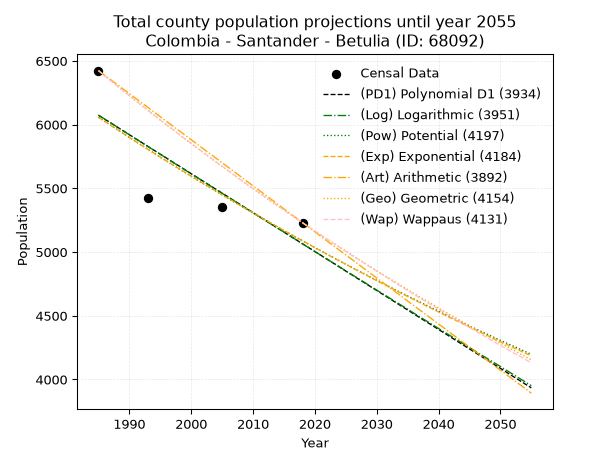
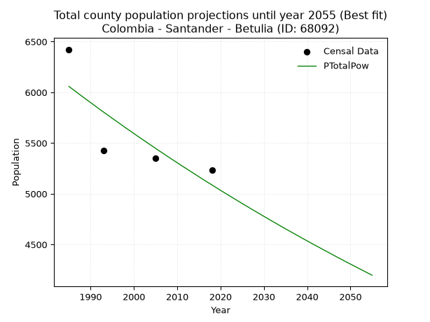
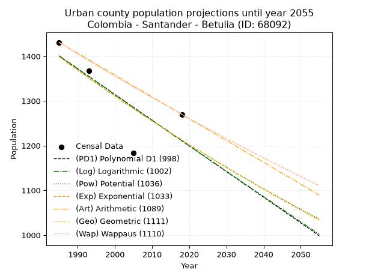
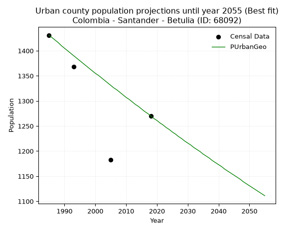
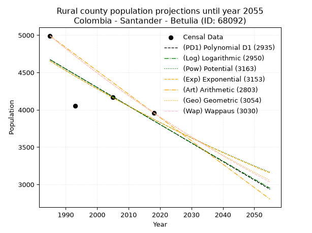
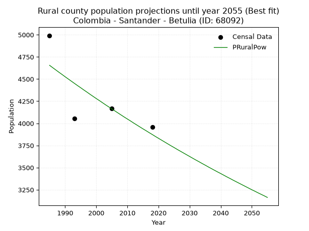

<div align="center">


</div>

# 📜 _“Population and Public Services Demand Projections (PPSD) until Year 2050 for Colombia - Santander - Betulia (ID: 68092)”_
Keywords: `population` `public-service` `projection` `lineal` `polynomial` `logarithmic` `potential` `exponential` `arithmetic` `geometric` `wappaus` `dane` `colombia` `south-america`

PPSD are analytical estimates used by governments and planners to anticipate future changes in population size, age distribution, and the resulting community needs for utilities, healthcare, education, and infrastructure as sizing future water treatment facilities, electrical grids, and road networks based on spatial growth.

<div align="center">

</img>

</div>


> **General running parameters**: • app_version: _v20260806_. • Python version: _3.14.7_. • Pandas version: _3.0.5_. • NumPy version: _2.5.1_. • Creates, save and include plots into reports (create_plot): _False_. • Projection until year: _2050_. • Process polynomial degree 2 and up: _False_. • Process Wappaus: _True_. • Process Wappaus: _True_. • Set negative values to zero: _True_. • Set infinite values to zero: _True_. • Drop dataset notes: _True_. 
<div align="center">

Maps & GIS Layers: [:earth_americas:Google](http://maps.google.com/maps?q=6.899525364,-73.2836691) [:earth_americas:OSM](https://www.openstreetmap.org/#map=18/6.899525364/-73.2836691&layers=P) [:earth_americas:Bing](https://www.bing.com/maps?cp=6.899525364~-73.2836691&lvl=18) [:earth_americas:Apple](https://maps.apple.com/frame?center=6.899525364%2C-73.2836691&span=0.003%2C0.006) [:earth_americas:GISMobile](https://github.com/rcfdtools/R.GISMobile/blob/main/file/gis/CountyLayer_CO/Readme.md)

</div>


<div align="center">

```geojson
{
  "type": "Feature",
  "geometry": {
    "type": "Point", 
    "coordinates": [-73.2836691, 6.899525364]
  }, 
  "properties": {
    "Name": "Colombia - Santander - Betulia (ID: 68092)"
  }
}
```

</div>


## 0. Census Data (4 records)

Census data are official statistics collected by a government about the people and housing in a country. They usually include counts of total population, age, sex, race, income, education, and jobs.

📅Global census file: [Population.xlsx](../data/Population.xlsx)

| Source   |   Year |   CountryID | CountryName   |   StateID | StateName   |   CountyID | CountyName   |   PTotal |   PUrban |   PRural |
|:---------|-------:|------------:|:--------------|----------:|:------------|-----------:|:-------------|---------:|---------:|---------:|
| DANE     |   1985 |          57 | Colombia      |        68 | Santander   |      68092 | Betulia      |     6423 |     1431 |     4992 |
| DANE     |   1993 |          57 | Colombia      |        68 | Santander   |      68092 | Betulia      |     5424 |     1368 |     4056 |
| DANE     |   2005 |          57 | Colombia      |        68 | Santander   |      68092 | Betulia      |     5350 |     1183 |     4167 |
| DANE     |   2018 |          57 | Colombia      |        68 | Santander   |      68092 | Betulia      |     5230 |     1270 |     3960 |

> 🔥Some records could had specific notes about the registered values or the corresponding urban or rural distribution.

📅[SUI-RUPS](https://www.datos.gov.co/Hacienda-y-Cr-dito-P-blico/Registro-nico-de-Prestadores-de-Servicios-P-blicos/4qkq-csdn/about_data) - Local public utility companies: [RUPS.csv](../data/RUPS.csv)

 | SERVICIO       | ESTADO    | NOMBRE                                                                                    | NIT         | DEPARTAMENTO_DOMICILIO   | MUNICIPIO_DOMICILIO   | DIRECCION           |   TELEFONO | EMAIL                 | TIPO_PRESTADOR                 | CLASIFICACION                 |
|:---------------|:----------|:------------------------------------------------------------------------------------------|:------------|:-------------------------|:----------------------|:--------------------|-----------:|:----------------------|:-------------------------------|:------------------------------|
| ACUEDUCTO      | OPERATIVA | UNIDAD ADMINISTRADORA DE SERVICIOS PUBLICOS DE ACUEDUCTO ALCANTARILLADO Y ASEO DE BETULIA | 890208119-1 | SANTANDER                | BETULIA               | Carrera 5  No 5 -35 |    6259220 | leydy8407@hotmail.com | MUNICIPIO (PRESTACIÓN DIRECTA) | MENOR O IGUAL A 2500 USUARIOS |
| ALCANTARILLADO | OPERATIVA | UNIDAD ADMINISTRADORA DE SERVICIOS PUBLICOS DE ACUEDUCTO ALCANTARILLADO Y ASEO DE BETULIA | 890208119-1 | SANTANDER                | BETULIA               | Carrera 5  No 5 -35 |    6259220 | leydy8407@hotmail.com | MUNICIPIO (PRESTACIÓN DIRECTA) | MENOR O IGUAL A 2500 USUARIOS |

## 1. Total

### 1.1. Coefficients and Parameters

* (PD1) Polynomial Deg 1: -30.557607386591616, 66729.60417502988 (lineal)
* (Log) Logarithmic: -61253.131276075736, 471192.2916812403
* (Pow) Potential: -10.58869606497764, 38.70131699561351
* (Exp) Exponential: -0.005282673931197957, 216907267.5814771
* (Art) Arithmetic: Year diff. 2018 - 1985 = 33, Population diff. 5230 - 6423 = -1193, Annual growth = -36.15151515151515
* (Geo) Geometric: Year diff. 2018 - 1985 = 33, Population diff. 5230 - 6423 = -1193, Annual growth % = -0.006207141069987654
* (Wap) Wappaus: i = -0.6204670926201863, Condition values only valid for < 200)

<sub>
Wappaus condition values: ['-0.00', '-0.62', '-1.24', '-1.86', '-2.48', '-3.10', '-3.72', '-4.34', '-4.96', '-5.58', '-6.20', '-6.83', '-7.45', '-8.07', '-8.69', '-9.31', '-9.93', '-10.55', '-11.17', '-11.79', '-12.41', '-13.03', '-13.65', '-14.27', '-14.89', '-15.51', '-16.13', '-16.75', '-17.37', '-17.99', '-18.61', '-19.23', '-19.85', '-20.48', '-21.10', '-21.72', '-22.34', '-22.96', '-23.58', '-24.20', '-24.82', '-25.44', '-26.06', '-26.68', '-27.30', '-27.92', '-28.54', '-29.16', '-29.78', '-30.40', '-31.02', '-31.64', '-32.26', '-32.88', '-33.51', '-34.13', '-34.75', '-35.37', '-35.99', '-36.61', '-37.23', '-37.85', '-38.47', '-39.09', '-39.71', '-40.33']
</sub>


### 1.2. Projected Dataset

|   Year |   CountyID |   PTotalPD1 |   PTotalLog |   PTotalPow |   PTotalExp |   PTotalArt |   PTotalGeo |   PTotalWap |
|-------:|-----------:|------------:|------------:|------------:|------------:|------------:|------------:|------------:|
|   1985 |      68092 |        6073 |        6074 |        6058 |        6056 |        6423 |        6423 |        6423 |
|   1986 |      68092 |        6042 |        6043 |        6026 |        6025 |        6387 |        6383 |        6383 |
|   1987 |      68092 |        6012 |        6013 |        5994 |        5993 |        6351 |        6344 |        6344 |
|   1988 |      68092 |        5981 |        5982 |        5962 |        5961 |        6315 |        6304 |        6305 |
|   1989 |      68092 |        5951 |        5951 |        5930 |        5930 |        6278 |        6265 |        6266 |
|   1990 |      68092 |        5920 |        5920 |        5899 |        5899 |        6242 |        6226 |        6227 |
|   1991 |      68092 |        5889 |        5889 |        5868 |        5867 |        6206 |        6187 |        6188 |
|   1992 |      68092 |        5859 |        5859 |        5836 |        5837 |        6170 |        6149 |        6150 |
|   1993 |      68092 |        5828 |        5828 |        5805 |        5806 |        6134 |        6111 |        6112 |
|   1994 |      68092 |        5798 |        5797 |        5775 |        5775 |        6098 |        6073 |        6074 |
|   1995 |      68092 |        5767 |        5767 |        5744 |        5745 |        6061 |        6035 |        6036 |
|   1996 |      68092 |        5737 |        5736 |        5714 |        5715 |        6025 |        5998 |        5999 |
|   1997 |      68092 |        5706 |        5705 |        5684 |        5684 |        5989 |        5961 |        5962 |
|   1998 |      68092 |        5676 |        5674 |        5653 |        5654 |        5953 |        5924 |        5925 |
|   1999 |      68092 |        5645 |        5644 |        5624 |        5625 |        5917 |        5887 |        5888 |
|   2000 |      68092 |        5614 |        5613 |        5594 |        5595 |        5881 |        5850 |        5852 |
|   2001 |      68092 |        5584 |        5583 |        5564 |        5566 |        5845 |        5814 |        5816 |
|   2002 |      68092 |        5553 |        5552 |        5535 |        5536 |        5808 |        5778 |        5779 |
|   2003 |      68092 |        5523 |        5521 |        5506 |        5507 |        5772 |        5742 |        5744 |
|   2004 |      68092 |        5492 |        5491 |        5477 |        5478 |        5736 |        5706 |        5708 |
|   2005 |      68092 |        5462 |        5460 |        5448 |        5449 |        5700 |        5671 |        5673 |
|   2006 |      68092 |        5431 |        5430 |        5419 |        5420 |        5664 |        5636 |        5637 |
|   2007 |      68092 |        5400 |        5399 |        5391 |        5392 |        5628 |        5601 |        5602 |
|   2008 |      68092 |        5370 |        5369 |        5362 |        5363 |        5592 |        5566 |        5567 |
|   2009 |      68092 |        5339 |        5338 |        5334 |        5335 |        5555 |        5531 |        5533 |
|   2010 |      68092 |        5309 |        5308 |        5306 |        5307 |        5519 |        5497 |        5498 |
|   2011 |      68092 |        5278 |        5277 |        5278 |        5279 |        5483 |        5463 |        5464 |
|   2012 |      68092 |        5248 |        5247 |        5251 |        5251 |        5447 |        5429 |        5430 |
|   2013 |      68092 |        5217 |        5216 |        5223 |        5224 |        5411 |        5395 |        5396 |
|   2014 |      68092 |        5187 |        5186 |        5196 |        5196 |        5375 |        5362 |        5363 |
|   2015 |      68092 |        5156 |        5156 |        5168 |        5169 |        5338 |        5329 |        5329 |
|   2016 |      68092 |        5125 |        5125 |        5141 |        5142 |        5302 |        5296 |        5296 |
|   2017 |      68092 |        5095 |        5095 |        5114 |        5114 |        5266 |        5263 |        5263 |
|   2018 |      68092 |        5064 |        5064 |        5088 |        5088 |        5230 |        5230 |        5230 |
|   2019 |      68092 |        5034 |        5034 |        5061 |        5061 |        5194 |        5198 |        5197 |
|   2020 |      68092 |        5003 |        5004 |        5034 |        5034 |        5158 |        5165 |        5165 |
|   2021 |      68092 |        4973 |        4973 |        5008 |        5008 |        5122 |        5133 |        5132 |
|   2022 |      68092 |        4942 |        4943 |        4982 |        4981 |        5085 |        5101 |        5100 |
|   2023 |      68092 |        4912 |        4913 |        4956 |        4955 |        5049 |        5070 |        5068 |
|   2024 |      68092 |        4881 |        4883 |        4930 |        4929 |        5013 |        5038 |        5037 |
|   2025 |      68092 |        4850 |        4852 |        4904 |        4903 |        4977 |        5007 |        5005 |
|   2026 |      68092 |        4820 |        4822 |        4879 |        4877 |        4941 |        4976 |        4973 |
|   2027 |      68092 |        4789 |        4792 |        4853 |        4851 |        4905 |        4945 |        4942 |
|   2028 |      68092 |        4759 |        4762 |        4828 |        4826 |        4868 |        4914 |        4911 |
|   2029 |      68092 |        4728 |        4731 |        4803 |        4800 |        4832 |        4884 |        4880 |
|   2030 |      68092 |        4698 |        4701 |        4778 |        4775 |        4796 |        4853 |        4849 |
|   2031 |      68092 |        4667 |        4671 |        4753 |        4750 |        4760 |        4823 |        4819 |
|   2032 |      68092 |        4637 |        4641 |        4728 |        4725 |        4724 |        4793 |        4788 |
|   2033 |      68092 |        4606 |        4611 |        4704 |        4700 |        4688 |        4764 |        4758 |
|   2034 |      68092 |        4575 |        4581 |        4679 |        4675 |        4652 |        4734 |        4728 |
|   2035 |      68092 |        4545 |        4551 |        4655 |        4651 |        4615 |        4705 |        4698 |
|   2036 |      68092 |        4514 |        4520 |        4631 |        4626 |        4579 |        4675 |        4668 |
|   2037 |      68092 |        4484 |        4490 |        4607 |        4602 |        4543 |        4646 |        4639 |
|   2038 |      68092 |        4453 |        4460 |        4583 |        4577 |        4507 |        4618 |        4609 |
|   2039 |      68092 |        4423 |        4430 |        4559 |        4553 |        4471 |        4589 |        4580 |
|   2040 |      68092 |        4392 |        4400 |        4536 |        4529 |        4435 |        4560 |        4551 |
|   2041 |      68092 |        4362 |        4370 |        4512 |        4505 |        4399 |        4532 |        4522 |
|   2042 |      68092 |        4331 |        4340 |        4489 |        4482 |        4362 |        4504 |        4493 |
|   2043 |      68092 |        4300 |        4310 |        4466 |        4458 |        4326 |        4476 |        4464 |
|   2044 |      68092 |        4270 |        4280 |        4443 |        4435 |        4290 |        4448 |        4435 |
|   2045 |      68092 |        4239 |        4250 |        4420 |        4411 |        4254 |        4421 |        4407 |
|   2046 |      68092 |        4209 |        4220 |        4397 |        4388 |        4218 |        4393 |        4379 |
|   2047 |      68092 |        4178 |        4190 |        4374 |        4365 |        4182 |        4366 |        4351 |
|   2048 |      68092 |        4148 |        4161 |        4352 |        4342 |        4145 |        4339 |        4323 |
|   2049 |      68092 |        4117 |        4131 |        4329 |        4319 |        4109 |        4312 |        4295 |
|   2050 |      68092 |        4087 |        4101 |        4307 |        4296 |        4073 |        4285 |        4267 |
<div align="center">

</img>

</div>


### 1.3. Best fit with absolute and relative error (%)

Relative error puts that difference into context by dividing the absolute error by the true value, creating a unitless ratio or percentage that shows the scale of the mistake.

Absolute and relative error

|   Year | Source   |   CountryID | CountryName   |   StateID | StateName   |   CountyID_x | CountyName   |   PTotal |   PUrban |   PRural |   CountyID_y |   PTotalPD1 |   PTotalLog |   PTotalPow |   PTotalExp |   PTotalArt |   PTotalGeo |   PTotalWap |   PTotalPD1AbsError |   PTotalLogAbsError |   PTotalPowAbsError |   PTotalExpAbsError |   PTotalArtAbsError |   PTotalGeoAbsError |   PTotalWapAbsError |   PTotalPD1RelError |   PTotalLogRelError |   PTotalPowRelError |   PTotalExpRelError |   PTotalArtRelError |   PTotalGeoRelError |   PTotalWapRelError |
|-------:|:---------|------------:|:--------------|----------:|:------------|-------------:|:-------------|---------:|---------:|---------:|-------------:|------------:|------------:|------------:|------------:|------------:|------------:|------------:|--------------------:|--------------------:|--------------------:|--------------------:|--------------------:|--------------------:|--------------------:|--------------------:|--------------------:|--------------------:|--------------------:|--------------------:|--------------------:|--------------------:|
|   1985 | DANE     |          57 | Colombia      |        68 | Santander   |        68092 | Betulia      |     6423 |     1431 |     4992 |        68092 |        6073 |        6074 |        6058 |        6056 |        6423 |        6423 |        6423 |                 350 |                 349 |                 365 |                 367 |                   0 |                   0 |                   0 |             5.44917 |             5.4336  |             5.6827  |             5.71384 |             0       |              0      |             0       |
|   1993 | DANE     |          57 | Colombia      |        68 | Santander   |        68092 | Betulia      |     5424 |     1368 |     4056 |        68092 |        5828 |        5828 |        5805 |        5806 |        6134 |        6111 |        6112 |                 404 |                 404 |                 381 |                 382 |                 710 |                 687 |                 688 |             7.44838 |             7.44838 |             7.02434 |             7.04277 |            13.09    |             12.6659 |            12.6844  |
|   2005 | DANE     |          57 | Colombia      |        68 | Santander   |        68092 | Betulia      |     5350 |     1183 |     4167 |        68092 |        5462 |        5460 |        5448 |        5449 |        5700 |        5671 |        5673 |                 112 |                 110 |                  98 |                  99 |                 350 |                 321 |                 323 |             2.09346 |             2.05607 |             1.83178 |             1.85047 |             6.54206 |              6      |             6.03738 |
|   2018 | DANE     |          57 | Colombia      |        68 | Santander   |        68092 | Betulia      |     5230 |     1270 |     3960 |        68092 |        5064 |        5064 |        5088 |        5088 |        5230 |        5230 |        5230 |                 166 |                 166 |                 142 |                 142 |                   0 |                   0 |                   0 |             3.174   |             3.174   |             2.71511 |             2.71511 |             0       |              0      |             0       |

Relative error mean

| Method    |   RelError | Best   |
|:----------|-----------:|:-------|
| PTotalPD1 |    4.54125 |        |
| PTotalLog |    4.52801 |        |
| PTotalPow |    4.31348 | True   |
| PTotalExp |    4.33055 |        |
| PTotalArt |    4.90801 |        |
| PTotalGeo |    4.66648 |        |
| PTotalWap |    4.68044 |        |

💙Best method: _**PTotalPow**_
<div align="center">

</img>

</div>


### 1.4. Fresh water supply demand in liters per capita per day (lpcd)

The fresh water supply demand typically ranges from 100 to 300 liters per capita per day (lpcd) for standard domestic and municipal planning, though absolute survival minimums set by the World Health Organization are as low as 7.5 to 20 liters per day, and total consumption in high-income nations can exceed 400 liters.

> `CZ`: Level in meters above the sea level (masl)<br> `WS`: Fresh water supply demand in liters per capita per day (lpcd or l/h/d)<br> `WSAll`: Zonal fresh water supply demand in liters per second (l/s)<br> `A`: Zonal area in square meters<br> `DP`: Population density (people/hectare or p/ha)

Reference values (RAS Colombia)

|    CZ |   WS |
|------:|-----:|
|  1000 |  120 |
|  2000 |  130 |
| 99999 |  140 |

County shapefile geometry properties and water supply values

|   CountyID |      ATotal |   CZTotal |   WSTotal |
|-----------:|------------:|----------:|----------:|
|      68092 | 4.30517e+08 |   735.062 |       120 |

Projected values for best method: PTotalPow

|   CountyID |   Year |   PTotalPow |   DPTotal |   WSTotal |   WSTotalAll |
|-----------:|-------:|------------:|----------:|----------:|-------------:|
|      68092 |   1985 |        6058 |      0.14 |       120 |      8.41389 |
|      68092 |   1986 |        6026 |      0.14 |       120 |      8.36944 |
|      68092 |   1987 |        5994 |      0.14 |       120 |      8.325   |
|      68092 |   1988 |        5962 |      0.14 |       120 |      8.28056 |
|      68092 |   1989 |        5930 |      0.14 |       120 |      8.23611 |
|      68092 |   1990 |        5899 |      0.14 |       120 |      8.19306 |
|      68092 |   1991 |        5868 |      0.14 |       120 |      8.15    |
|      68092 |   1992 |        5836 |      0.14 |       120 |      8.10556 |
|      68092 |   1993 |        5805 |      0.13 |       120 |      8.0625  |
|      68092 |   1994 |        5775 |      0.13 |       120 |      8.02083 |
|      68092 |   1995 |        5744 |      0.13 |       120 |      7.97778 |
|      68092 |   1996 |        5714 |      0.13 |       120 |      7.93611 |
|      68092 |   1997 |        5684 |      0.13 |       120 |      7.89444 |
|      68092 |   1998 |        5653 |      0.13 |       120 |      7.85139 |
|      68092 |   1999 |        5624 |      0.13 |       120 |      7.81111 |
|      68092 |   2000 |        5594 |      0.13 |       120 |      7.76944 |
|      68092 |   2001 |        5564 |      0.13 |       120 |      7.72778 |
|      68092 |   2002 |        5535 |      0.13 |       120 |      7.6875  |
|      68092 |   2003 |        5506 |      0.13 |       120 |      7.64722 |
|      68092 |   2004 |        5477 |      0.13 |       120 |      7.60694 |
|      68092 |   2005 |        5448 |      0.13 |       120 |      7.56667 |
|      68092 |   2006 |        5419 |      0.13 |       120 |      7.52639 |
|      68092 |   2007 |        5391 |      0.13 |       120 |      7.4875  |
|      68092 |   2008 |        5362 |      0.12 |       120 |      7.44722 |
|      68092 |   2009 |        5334 |      0.12 |       120 |      7.40833 |
|      68092 |   2010 |        5306 |      0.12 |       120 |      7.36944 |
|      68092 |   2011 |        5278 |      0.12 |       120 |      7.33056 |
|      68092 |   2012 |        5251 |      0.12 |       120 |      7.29306 |
|      68092 |   2013 |        5223 |      0.12 |       120 |      7.25417 |
|      68092 |   2014 |        5196 |      0.12 |       120 |      7.21667 |
|      68092 |   2015 |        5168 |      0.12 |       120 |      7.17778 |
|      68092 |   2016 |        5141 |      0.12 |       120 |      7.14028 |
|      68092 |   2017 |        5114 |      0.12 |       120 |      7.10278 |
|      68092 |   2018 |        5088 |      0.12 |       120 |      7.06667 |
|      68092 |   2019 |        5061 |      0.12 |       120 |      7.02917 |
|      68092 |   2020 |        5034 |      0.12 |       120 |      6.99167 |
|      68092 |   2021 |        5008 |      0.12 |       120 |      6.95556 |
|      68092 |   2022 |        4982 |      0.12 |       120 |      6.91944 |
|      68092 |   2023 |        4956 |      0.12 |       120 |      6.88333 |
|      68092 |   2024 |        4930 |      0.11 |       120 |      6.84722 |
|      68092 |   2025 |        4904 |      0.11 |       120 |      6.81111 |
|      68092 |   2026 |        4879 |      0.11 |       120 |      6.77639 |
|      68092 |   2027 |        4853 |      0.11 |       120 |      6.74028 |
|      68092 |   2028 |        4828 |      0.11 |       120 |      6.70556 |
|      68092 |   2029 |        4803 |      0.11 |       120 |      6.67083 |
|      68092 |   2030 |        4778 |      0.11 |       120 |      6.63611 |
|      68092 |   2031 |        4753 |      0.11 |       120 |      6.60139 |
|      68092 |   2032 |        4728 |      0.11 |       120 |      6.56667 |
|      68092 |   2033 |        4704 |      0.11 |       120 |      6.53333 |
|      68092 |   2034 |        4679 |      0.11 |       120 |      6.49861 |
|      68092 |   2035 |        4655 |      0.11 |       120 |      6.46528 |
|      68092 |   2036 |        4631 |      0.11 |       120 |      6.43194 |
|      68092 |   2037 |        4607 |      0.11 |       120 |      6.39861 |
|      68092 |   2038 |        4583 |      0.11 |       120 |      6.36528 |
|      68092 |   2039 |        4559 |      0.11 |       120 |      6.33194 |
|      68092 |   2040 |        4536 |      0.11 |       120 |      6.3     |
|      68092 |   2041 |        4512 |      0.1  |       120 |      6.26667 |
|      68092 |   2042 |        4489 |      0.1  |       120 |      6.23472 |
|      68092 |   2043 |        4466 |      0.1  |       120 |      6.20278 |
|      68092 |   2044 |        4443 |      0.1  |       120 |      6.17083 |
|      68092 |   2045 |        4420 |      0.1  |       120 |      6.13889 |
|      68092 |   2046 |        4397 |      0.1  |       120 |      6.10694 |
|      68092 |   2047 |        4374 |      0.1  |       120 |      6.075   |
|      68092 |   2048 |        4352 |      0.1  |       120 |      6.04444 |
|      68092 |   2049 |        4329 |      0.1  |       120 |      6.0125  |
|      68092 |   2050 |        4307 |      0.1  |       120 |      5.98194 |

## 2. Urban

### 2.1. Coefficients and Parameters

* (PD1) Polynomial Deg 1: -5.7470895222802385, 12808.615816941048 (lineal)
* (Log) Logarithmic: -11522.763908927689, 88897.6208093943
* (Pow) Potential: -8.680891077719016, 31.77340833089429
* (Exp) Exponential: -0.004329470190088077, 7553159.254573487
* (Art) Arithmetic: Year diff. 2018 - 1985 = 33, Population diff. 1270 - 1431 = -161, Annual growth = -4.878787878787879
* (Geo) Geometric: Year diff. 2018 - 1985 = 33, Population diff. 1270 - 1431 = -161, Annual growth % = -0.0036103336862425284
* (Wap) Wappaus: i = -0.36125789550447085, Condition values only valid for < 200)

<sub>
Wappaus condition values: ['-0.00', '-0.36', '-0.72', '-1.08', '-1.45', '-1.81', '-2.17', '-2.53', '-2.89', '-3.25', '-3.61', '-3.97', '-4.34', '-4.70', '-5.06', '-5.42', '-5.78', '-6.14', '-6.50', '-6.86', '-7.23', '-7.59', '-7.95', '-8.31', '-8.67', '-9.03', '-9.39', '-9.75', '-10.12', '-10.48', '-10.84', '-11.20', '-11.56', '-11.92', '-12.28', '-12.64', '-13.01', '-13.37', '-13.73', '-14.09', '-14.45', '-14.81', '-15.17', '-15.53', '-15.90', '-16.26', '-16.62', '-16.98', '-17.34', '-17.70', '-18.06', '-18.42', '-18.79', '-19.15', '-19.51', '-19.87', '-20.23', '-20.59', '-20.95', '-21.31', '-21.68', '-22.04', '-22.40', '-22.76', '-23.12', '-23.48']
</sub>


### 2.2. Projected Dataset

|   Year |   CountyID |   PUrbanPD1 |   PUrbanLog |   PUrbanPow |   PUrbanExp |   PUrbanArt |   PUrbanGeo |   PUrbanWap |
|-------:|-----------:|------------:|------------:|------------:|------------:|------------:|------------:|------------:|
|   1985 |      68092 |        1401 |        1401 |        1399 |        1399 |        1431 |        1431 |        1431 |
|   1986 |      68092 |        1395 |        1395 |        1393 |        1393 |        1426 |        1426 |        1426 |
|   1987 |      68092 |        1389 |        1389 |        1387 |        1387 |        1421 |        1421 |        1421 |
|   1988 |      68092 |        1383 |        1384 |        1381 |        1381 |        1416 |        1416 |        1416 |
|   1989 |      68092 |        1378 |        1378 |        1375 |        1375 |        1411 |        1410 |        1410 |
|   1990 |      68092 |        1372 |        1372 |        1369 |        1369 |        1407 |        1405 |        1405 |
|   1991 |      68092 |        1366 |        1366 |        1363 |        1363 |        1402 |        1400 |        1400 |
|   1992 |      68092 |        1360 |        1360 |        1357 |        1357 |        1397 |        1395 |        1395 |
|   1993 |      68092 |        1355 |        1355 |        1351 |        1351 |        1392 |        1390 |        1390 |
|   1994 |      68092 |        1349 |        1349 |        1345 |        1345 |        1387 |        1385 |        1385 |
|   1995 |      68092 |        1343 |        1343 |        1340 |        1340 |        1382 |        1380 |        1380 |
|   1996 |      68092 |        1337 |        1337 |        1334 |        1334 |        1377 |        1375 |        1375 |
|   1997 |      68092 |        1332 |        1332 |        1328 |        1328 |        1372 |        1370 |        1370 |
|   1998 |      68092 |        1326 |        1326 |        1322 |        1322 |        1368 |        1365 |        1365 |
|   1999 |      68092 |        1320 |        1320 |        1316 |        1317 |        1363 |        1360 |        1360 |
|   2000 |      68092 |        1314 |        1314 |        1311 |        1311 |        1358 |        1355 |        1356 |
|   2001 |      68092 |        1309 |        1308 |        1305 |        1305 |        1353 |        1351 |        1351 |
|   2002 |      68092 |        1303 |        1303 |        1299 |        1300 |        1348 |        1346 |        1346 |
|   2003 |      68092 |        1297 |        1297 |        1294 |        1294 |        1343 |        1341 |        1341 |
|   2004 |      68092 |        1291 |        1291 |        1288 |        1288 |        1338 |        1336 |        1336 |
|   2005 |      68092 |        1286 |        1285 |        1283 |        1283 |        1333 |        1331 |        1331 |
|   2006 |      68092 |        1280 |        1280 |        1277 |        1277 |        1329 |        1326 |        1326 |
|   2007 |      68092 |        1274 |        1274 |        1272 |        1272 |        1324 |        1322 |        1322 |
|   2008 |      68092 |        1268 |        1268 |        1266 |        1266 |        1319 |        1317 |        1317 |
|   2009 |      68092 |        1263 |        1262 |        1261 |        1261 |        1314 |        1312 |        1312 |
|   2010 |      68092 |        1257 |        1257 |        1255 |        1255 |        1309 |        1307 |        1307 |
|   2011 |      68092 |        1251 |        1251 |        1250 |        1250 |        1304 |        1303 |        1303 |
|   2012 |      68092 |        1245 |        1245 |        1244 |        1245 |        1299 |        1298 |        1298 |
|   2013 |      68092 |        1240 |        1240 |        1239 |        1239 |        1294 |        1293 |        1293 |
|   2014 |      68092 |        1234 |        1234 |        1234 |        1234 |        1290 |        1289 |        1289 |
|   2015 |      68092 |        1228 |        1228 |        1228 |        1229 |        1285 |        1284 |        1284 |
|   2016 |      68092 |        1222 |        1222 |        1223 |        1223 |        1280 |        1279 |        1279 |
|   2017 |      68092 |        1217 |        1217 |        1218 |        1218 |        1275 |        1275 |        1275 |
|   2018 |      68092 |        1211 |        1211 |        1213 |        1213 |        1270 |        1270 |        1270 |
|   2019 |      68092 |        1205 |        1205 |        1207 |        1207 |        1265 |        1265 |        1265 |
|   2020 |      68092 |        1199 |        1200 |        1202 |        1202 |        1260 |        1261 |        1261 |
|   2021 |      68092 |        1194 |        1194 |        1197 |        1197 |        1255 |        1256 |        1256 |
|   2022 |      68092 |        1188 |        1188 |        1192 |        1192 |        1250 |        1252 |        1252 |
|   2023 |      68092 |        1182 |        1182 |        1187 |        1187 |        1246 |        1247 |        1247 |
|   2024 |      68092 |        1177 |        1177 |        1182 |        1182 |        1241 |        1243 |        1243 |
|   2025 |      68092 |        1171 |        1171 |        1177 |        1177 |        1236 |        1238 |        1238 |
|   2026 |      68092 |        1165 |        1165 |        1172 |        1171 |        1231 |        1234 |        1234 |
|   2027 |      68092 |        1159 |        1160 |        1167 |        1166 |        1226 |        1229 |        1229 |
|   2028 |      68092 |        1154 |        1154 |        1162 |        1161 |        1221 |        1225 |        1225 |
|   2029 |      68092 |        1148 |        1148 |        1157 |        1156 |        1216 |        1220 |        1220 |
|   2030 |      68092 |        1142 |        1143 |        1152 |        1151 |        1211 |        1216 |        1216 |
|   2031 |      68092 |        1136 |        1137 |        1147 |        1146 |        1207 |        1212 |        1211 |
|   2032 |      68092 |        1131 |        1131 |        1142 |        1141 |        1202 |        1207 |        1207 |
|   2033 |      68092 |        1125 |        1126 |        1137 |        1136 |        1197 |        1203 |        1203 |
|   2034 |      68092 |        1119 |        1120 |        1132 |        1132 |        1192 |        1199 |        1198 |
|   2035 |      68092 |        1113 |        1114 |        1128 |        1127 |        1187 |        1194 |        1194 |
|   2036 |      68092 |        1108 |        1109 |        1123 |        1122 |        1182 |        1190 |        1190 |
|   2037 |      68092 |        1102 |        1103 |        1118 |        1117 |        1177 |        1186 |        1185 |
|   2038 |      68092 |        1096 |        1097 |        1113 |        1112 |        1172 |        1181 |        1181 |
|   2039 |      68092 |        1090 |        1092 |        1108 |        1107 |        1168 |        1177 |        1177 |
|   2040 |      68092 |        1085 |        1086 |        1104 |        1103 |        1163 |        1173 |        1172 |
|   2041 |      68092 |        1079 |        1080 |        1099 |        1098 |        1158 |        1169 |        1168 |
|   2042 |      68092 |        1073 |        1075 |        1094 |        1093 |        1153 |        1164 |        1164 |
|   2043 |      68092 |        1067 |        1069 |        1090 |        1088 |        1148 |        1160 |        1160 |
|   2044 |      68092 |        1062 |        1063 |        1085 |        1084 |        1143 |        1156 |        1155 |
|   2045 |      68092 |        1056 |        1058 |        1081 |        1079 |        1138 |        1152 |        1151 |
|   2046 |      68092 |        1050 |        1052 |        1076 |        1074 |        1133 |        1148 |        1147 |
|   2047 |      68092 |        1044 |        1047 |        1071 |        1070 |        1129 |        1144 |        1143 |
|   2048 |      68092 |        1039 |        1041 |        1067 |        1065 |        1124 |        1139 |        1139 |
|   2049 |      68092 |        1033 |        1035 |        1062 |        1060 |        1119 |        1135 |        1134 |
|   2050 |      68092 |        1027 |        1030 |        1058 |        1056 |        1114 |        1131 |        1130 |
<div align="center">

</img>

</div>


### 2.3. Best fit with absolute and relative error (%)

Relative error puts that difference into context by dividing the absolute error by the true value, creating a unitless ratio or percentage that shows the scale of the mistake.

Absolute and relative error

|   Year | Source   |   CountryID | CountryName   |   StateID | StateName   |   CountyID_x | CountyName   |   PTotal |   PUrban |   PRural |   CountyID_y |   PUrbanPD1 |   PUrbanLog |   PUrbanPow |   PUrbanExp |   PUrbanArt |   PUrbanGeo |   PUrbanWap |   PUrbanPD1AbsError |   PUrbanLogAbsError |   PUrbanPowAbsError |   PUrbanExpAbsError |   PUrbanArtAbsError |   PUrbanGeoAbsError |   PUrbanWapAbsError |   PUrbanPD1RelError |   PUrbanLogRelError |   PUrbanPowRelError |   PUrbanExpRelError |   PUrbanArtRelError |   PUrbanGeoRelError |   PUrbanWapRelError |
|-------:|:---------|------------:|:--------------|----------:|:------------|-------------:|:-------------|---------:|---------:|---------:|-------------:|------------:|------------:|------------:|------------:|------------:|------------:|------------:|--------------------:|--------------------:|--------------------:|--------------------:|--------------------:|--------------------:|--------------------:|--------------------:|--------------------:|--------------------:|--------------------:|--------------------:|--------------------:|--------------------:|
|   1985 | DANE     |          57 | Colombia      |        68 | Santander   |        68092 | Betulia      |     6423 |     1431 |     4992 |        68092 |        1401 |        1401 |        1399 |        1399 |        1431 |        1431 |        1431 |                  30 |                  30 |                  32 |                  32 |                   0 |                   0 |                   0 |            2.09644  |            2.09644  |             2.2362  |             2.2362  |             0       |             0       |             0       |
|   1993 | DANE     |          57 | Colombia      |        68 | Santander   |        68092 | Betulia      |     5424 |     1368 |     4056 |        68092 |        1355 |        1355 |        1351 |        1351 |        1392 |        1390 |        1390 |                  13 |                  13 |                  17 |                  17 |                  24 |                  22 |                  22 |            0.950292 |            0.950292 |             1.24269 |             1.24269 |             1.75439 |             1.60819 |             1.60819 |
|   2005 | DANE     |          57 | Colombia      |        68 | Santander   |        68092 | Betulia      |     5350 |     1183 |     4167 |        68092 |        1286 |        1285 |        1283 |        1283 |        1333 |        1331 |        1331 |                 103 |                 102 |                 100 |                 100 |                 150 |                 148 |                 148 |            8.70668  |            8.62215  |             8.45309 |             8.45309 |            12.6796  |            12.5106  |            12.5106  |
|   2018 | DANE     |          57 | Colombia      |        68 | Santander   |        68092 | Betulia      |     5230 |     1270 |     3960 |        68092 |        1211 |        1211 |        1213 |        1213 |        1270 |        1270 |        1270 |                  59 |                  59 |                  57 |                  57 |                   0 |                   0 |                   0 |            4.64567  |            4.64567  |             4.48819 |             4.48819 |             0       |             0       |             0       |

Relative error mean

| Method    |   RelError | Best   |
|:----------|-----------:|:-------|
| PUrbanPD1 |    4.09977 |        |
| PUrbanLog |    4.07864 |        |
| PUrbanPow |    4.10504 |        |
| PUrbanExp |    4.10504 |        |
| PUrbanArt |    3.6085  |        |
| PUrbanGeo |    3.52969 | True   |
| PUrbanWap |    3.52969 | True   |

💙Best method: _**PUrbanGeo**_
<div align="center">

</img>

</div>


### 2.4. Fresh water supply demand in liters per capita per day (lpcd)

The fresh water supply demand typically ranges from 100 to 300 liters per capita per day (lpcd) for standard domestic and municipal planning, though absolute survival minimums set by the World Health Organization are as low as 7.5 to 20 liters per day, and total consumption in high-income nations can exceed 400 liters.

> `CZ`: Level in meters above the sea level (masl)<br> `WS`: Fresh water supply demand in liters per capita per day (lpcd or l/h/d)<br> `WSAll`: Zonal fresh water supply demand in liters per second (l/s)<br> `A`: Zonal area in square meters<br> `DP`: Population density (people/hectare or p/ha)

Reference values (RAS Colombia)

|    CZ |   WS |
|------:|-----:|
|  1000 |  120 |
|  2000 |  130 |
| 99999 |  140 |

County shapefile geometry properties and water supply values

|   CountyID |   AUrban |   CZUrban |   WSUrban |
|-----------:|---------:|----------:|----------:|
|      68092 |   479900 |   1819.46 |       130 |

Projected values for best method: PUrbanGeo

|   CountyID |   Year |   PUrbanGeo |   DPUrban |   WSUrban |   WSUrbanAll |
|-----------:|-------:|------------:|----------:|----------:|-------------:|
|      68092 |   1985 |        1431 |     29.82 |       130 |      2.15313 |
|      68092 |   1986 |        1426 |     29.71 |       130 |      2.1456  |
|      68092 |   1987 |        1421 |     29.61 |       130 |      2.13808 |
|      68092 |   1988 |        1416 |     29.51 |       130 |      2.13056 |
|      68092 |   1989 |        1410 |     29.38 |       130 |      2.12153 |
|      68092 |   1990 |        1405 |     29.28 |       130 |      2.114   |
|      68092 |   1991 |        1400 |     29.17 |       130 |      2.10648 |
|      68092 |   1992 |        1395 |     29.07 |       130 |      2.09896 |
|      68092 |   1993 |        1390 |     28.96 |       130 |      2.09144 |
|      68092 |   1994 |        1385 |     28.86 |       130 |      2.08391 |
|      68092 |   1995 |        1380 |     28.76 |       130 |      2.07639 |
|      68092 |   1996 |        1375 |     28.65 |       130 |      2.06887 |
|      68092 |   1997 |        1370 |     28.55 |       130 |      2.06134 |
|      68092 |   1998 |        1365 |     28.44 |       130 |      2.05382 |
|      68092 |   1999 |        1360 |     28.34 |       130 |      2.0463  |
|      68092 |   2000 |        1355 |     28.24 |       130 |      2.03877 |
|      68092 |   2001 |        1351 |     28.15 |       130 |      2.03275 |
|      68092 |   2002 |        1346 |     28.05 |       130 |      2.02523 |
|      68092 |   2003 |        1341 |     27.94 |       130 |      2.01771 |
|      68092 |   2004 |        1336 |     27.84 |       130 |      2.01019 |
|      68092 |   2005 |        1331 |     27.73 |       130 |      2.00266 |
|      68092 |   2006 |        1326 |     27.63 |       130 |      1.99514 |
|      68092 |   2007 |        1322 |     27.55 |       130 |      1.98912 |
|      68092 |   2008 |        1317 |     27.44 |       130 |      1.9816  |
|      68092 |   2009 |        1312 |     27.34 |       130 |      1.97407 |
|      68092 |   2010 |        1307 |     27.23 |       130 |      1.96655 |
|      68092 |   2011 |        1303 |     27.15 |       130 |      1.96053 |
|      68092 |   2012 |        1298 |     27.05 |       130 |      1.95301 |
|      68092 |   2013 |        1293 |     26.94 |       130 |      1.94549 |
|      68092 |   2014 |        1289 |     26.86 |       130 |      1.93947 |
|      68092 |   2015 |        1284 |     26.76 |       130 |      1.93194 |
|      68092 |   2016 |        1279 |     26.65 |       130 |      1.92442 |
|      68092 |   2017 |        1275 |     26.57 |       130 |      1.9184  |
|      68092 |   2018 |        1270 |     26.46 |       130 |      1.91088 |
|      68092 |   2019 |        1265 |     26.36 |       130 |      1.90336 |
|      68092 |   2020 |        1261 |     26.28 |       130 |      1.89734 |
|      68092 |   2021 |        1256 |     26.17 |       130 |      1.88981 |
|      68092 |   2022 |        1252 |     26.09 |       130 |      1.8838  |
|      68092 |   2023 |        1247 |     25.98 |       130 |      1.87627 |
|      68092 |   2024 |        1243 |     25.9  |       130 |      1.87025 |
|      68092 |   2025 |        1238 |     25.8  |       130 |      1.86273 |
|      68092 |   2026 |        1234 |     25.71 |       130 |      1.85671 |
|      68092 |   2027 |        1229 |     25.61 |       130 |      1.84919 |
|      68092 |   2028 |        1225 |     25.53 |       130 |      1.84317 |
|      68092 |   2029 |        1220 |     25.42 |       130 |      1.83565 |
|      68092 |   2030 |        1216 |     25.34 |       130 |      1.82963 |
|      68092 |   2031 |        1212 |     25.26 |       130 |      1.82361 |
|      68092 |   2032 |        1207 |     25.15 |       130 |      1.81609 |
|      68092 |   2033 |        1203 |     25.07 |       130 |      1.81007 |
|      68092 |   2034 |        1199 |     24.98 |       130 |      1.80405 |
|      68092 |   2035 |        1194 |     24.88 |       130 |      1.79653 |
|      68092 |   2036 |        1190 |     24.8  |       130 |      1.79051 |
|      68092 |   2037 |        1186 |     24.71 |       130 |      1.78449 |
|      68092 |   2038 |        1181 |     24.61 |       130 |      1.77697 |
|      68092 |   2039 |        1177 |     24.53 |       130 |      1.77095 |
|      68092 |   2040 |        1173 |     24.44 |       130 |      1.76493 |
|      68092 |   2041 |        1169 |     24.36 |       130 |      1.75891 |
|      68092 |   2042 |        1164 |     24.26 |       130 |      1.75139 |
|      68092 |   2043 |        1160 |     24.17 |       130 |      1.74537 |
|      68092 |   2044 |        1156 |     24.09 |       130 |      1.73935 |
|      68092 |   2045 |        1152 |     24.01 |       130 |      1.73333 |
|      68092 |   2046 |        1148 |     23.92 |       130 |      1.72731 |
|      68092 |   2047 |        1144 |     23.84 |       130 |      1.7213  |
|      68092 |   2048 |        1139 |     23.73 |       130 |      1.71377 |
|      68092 |   2049 |        1135 |     23.65 |       130 |      1.70775 |
|      68092 |   2050 |        1131 |     23.57 |       130 |      1.70174 |

## 3. Rural

### 3.1. Coefficients and Parameters

* (PD1) Polynomial Deg 1: -24.81051786431143, 53920.988358088944 (lineal)
* (Log) Logarithmic: -49730.36736714799, 382294.6708718455
* (Pow) Potential: -11.146837807661843, 40.42752975000624
* (Exp) Exponential: -0.005561500894095774, 289891134.2024358
* (Art) Arithmetic: Year diff. 2018 - 1985 = 33, Population diff. 3960 - 4992 = -1032, Annual growth = -31.272727272727273
* (Geo) Geometric: Year diff. 2018 - 1985 = 33, Population diff. 3960 - 4992 = -1032, Annual growth % = -0.006993389392866978
* (Wap) Wappaus: i = -0.6986757656998944, Condition values only valid for < 200)

<sub>
Wappaus condition values: ['-0.00', '-0.70', '-1.40', '-2.10', '-2.79', '-3.49', '-4.19', '-4.89', '-5.59', '-6.29', '-6.99', '-7.69', '-8.38', '-9.08', '-9.78', '-10.48', '-11.18', '-11.88', '-12.58', '-13.27', '-13.97', '-14.67', '-15.37', '-16.07', '-16.77', '-17.47', '-18.17', '-18.86', '-19.56', '-20.26', '-20.96', '-21.66', '-22.36', '-23.06', '-23.75', '-24.45', '-25.15', '-25.85', '-26.55', '-27.25', '-27.95', '-28.65', '-29.34', '-30.04', '-30.74', '-31.44', '-32.14', '-32.84', '-33.54', '-34.24', '-34.93', '-35.63', '-36.33', '-37.03', '-37.73', '-38.43', '-39.13', '-39.82', '-40.52', '-41.22', '-41.92', '-42.62', '-43.32', '-44.02', '-44.72', '-45.41']
</sub>


### 3.2. Projected Dataset

|   Year |   CountyID |   PRuralPD1 |   PRuralLog |   PRuralPow |   PRuralExp |   PRuralArt |   PRuralGeo |   PRuralWap |
|-------:|-----------:|------------:|------------:|------------:|------------:|------------:|------------:|------------:|
|   1985 |      68092 |        4672 |        4673 |        4655 |        4654 |        4992 |        4992 |        4992 |
|   1986 |      68092 |        4647 |        4648 |        4629 |        4628 |        4961 |        4957 |        4957 |
|   1987 |      68092 |        4622 |        4623 |        4603 |        4602 |        4929 |        4922 |        4923 |
|   1988 |      68092 |        4598 |        4598 |        4577 |        4577 |        4898 |        4888 |        4888 |
|   1989 |      68092 |        4573 |        4573 |        4552 |        4551 |        4867 |        4854 |        4854 |
|   1990 |      68092 |        4548 |        4548 |        4526 |        4526 |        4836 |        4820 |        4821 |
|   1991 |      68092 |        4523 |        4523 |        4501 |        4501 |        4804 |        4786 |        4787 |
|   1992 |      68092 |        4498 |        4498 |        4476 |        4476 |        4773 |        4753 |        4754 |
|   1993 |      68092 |        4474 |        4473 |        4451 |        4451 |        4742 |        4719 |        4721 |
|   1994 |      68092 |        4449 |        4448 |        4426 |        4427 |        4711 |        4686 |        4688 |
|   1995 |      68092 |        4424 |        4423 |        4402 |        4402 |        4679 |        4654 |        4655 |
|   1996 |      68092 |        4399 |        4399 |        4377 |        4378 |        4648 |        4621 |        4623 |
|   1997 |      68092 |        4374 |        4374 |        4353 |        4353 |        4617 |        4589 |        4590 |
|   1998 |      68092 |        4350 |        4349 |        4328 |        4329 |        4585 |        4557 |        4558 |
|   1999 |      68092 |        4325 |        4324 |        4304 |        4305 |        4554 |        4525 |        4526 |
|   2000 |      68092 |        4300 |        4299 |        4280 |        4281 |        4523 |        4493 |        4495 |
|   2001 |      68092 |        4275 |        4274 |        4257 |        4258 |        4492 |        4462 |        4463 |
|   2002 |      68092 |        4250 |        4249 |        4233 |        4234 |        4460 |        4431 |        4432 |
|   2003 |      68092 |        4226 |        4224 |        4209 |        4210 |        4429 |        4400 |        4401 |
|   2004 |      68092 |        4201 |        4200 |        4186 |        4187 |        4398 |        4369 |        4371 |
|   2005 |      68092 |        4176 |        4175 |        4163 |        4164 |        4367 |        4338 |        4340 |
|   2006 |      68092 |        4151 |        4150 |        4140 |        4141 |        4335 |        4308 |        4310 |
|   2007 |      68092 |        4126 |        4125 |        4117 |        4118 |        4304 |        4278 |        4279 |
|   2008 |      68092 |        4101 |        4100 |        4094 |        4095 |        4273 |        4248 |        4249 |
|   2009 |      68092 |        4077 |        4076 |        4071 |        4072 |        4241 |        4218 |        4220 |
|   2010 |      68092 |        4052 |        4051 |        4049 |        4050 |        4210 |        4189 |        4190 |
|   2011 |      68092 |        4027 |        4026 |        4027 |        4027 |        4179 |        4159 |        4161 |
|   2012 |      68092 |        4002 |        4002 |        4004 |        4005 |        4148 |        4130 |        4131 |
|   2013 |      68092 |        3977 |        3977 |        3982 |        3983 |        4116 |        4101 |        4102 |
|   2014 |      68092 |        3953 |        3952 |        3960 |        3961 |        4085 |        4073 |        4074 |
|   2015 |      68092 |        3928 |        3927 |        3938 |        3939 |        4054 |        4044 |        4045 |
|   2016 |      68092 |        3903 |        3903 |        3917 |        3917 |        4023 |        4016 |        4016 |
|   2017 |      68092 |        3878 |        3878 |        3895 |        3895 |        3991 |        3988 |        3988 |
|   2018 |      68092 |        3853 |        3853 |        3874 |        3873 |        3960 |        3960 |        3960 |
|   2019 |      68092 |        3829 |        3829 |        3852 |        3852 |        3929 |        3932 |        3932 |
|   2020 |      68092 |        3804 |        3804 |        3831 |        3831 |        3897 |        3905 |        3904 |
|   2021 |      68092 |        3779 |        3780 |        3810 |        3809 |        3866 |        3877 |        3877 |
|   2022 |      68092 |        3754 |        3755 |        3789 |        3788 |        3835 |        3850 |        3849 |
|   2023 |      68092 |        3729 |        3730 |        3768 |        3767 |        3804 |        3823 |        3822 |
|   2024 |      68092 |        3705 |        3706 |        3747 |        3746 |        3772 |        3797 |        3795 |
|   2025 |      68092 |        3680 |        3681 |        3727 |        3726 |        3741 |        3770 |        3768 |
|   2026 |      68092 |        3655 |        3657 |        3706 |        3705 |        3710 |        3744 |        3741 |
|   2027 |      68092 |        3630 |        3632 |        3686 |        3684 |        3679 |        3718 |        3715 |
|   2028 |      68092 |        3605 |        3608 |        3666 |        3664 |        3647 |        3692 |        3688 |
|   2029 |      68092 |        3580 |        3583 |        3646 |        3644 |        3616 |        3666 |        3662 |
|   2030 |      68092 |        3556 |        3559 |        3626 |        3623 |        3585 |        3640 |        3636 |
|   2031 |      68092 |        3531 |        3534 |        3606 |        3603 |        3553 |        3615 |        3610 |
|   2032 |      68092 |        3506 |        3510 |        3586 |        3583 |        3522 |        3589 |        3584 |
|   2033 |      68092 |        3481 |        3485 |        3567 |        3563 |        3491 |        3564 |        3558 |
|   2034 |      68092 |        3456 |        3461 |        3547 |        3544 |        3460 |        3539 |        3533 |
|   2035 |      68092 |        3432 |        3436 |        3528 |        3524 |        3428 |        3515 |        3507 |
|   2036 |      68092 |        3407 |        3412 |        3508 |        3504 |        3397 |        3490 |        3482 |
|   2037 |      68092 |        3382 |        3387 |        3489 |        3485 |        3366 |        3466 |        3457 |
|   2038 |      68092 |        3357 |        3363 |        3470 |        3466 |        3335 |        3441 |        3432 |
|   2039 |      68092 |        3332 |        3339 |        3451 |        3447 |        3303 |        3417 |        3407 |
|   2040 |      68092 |        3308 |        3314 |        3433 |        3427 |        3272 |        3393 |        3383 |
|   2041 |      68092 |        3283 |        3290 |        3414 |        3408 |        3241 |        3370 |        3358 |
|   2042 |      68092 |        3258 |        3265 |        3395 |        3389 |        3209 |        3346 |        3334 |
|   2043 |      68092 |        3233 |        3241 |        3377 |        3371 |        3178 |        3323 |        3310 |
|   2044 |      68092 |        3208 |        3217 |        3358 |        3352 |        3147 |        3300 |        3286 |
|   2045 |      68092 |        3183 |        3192 |        3340 |        3333 |        3116 |        3276 |        3262 |
|   2046 |      68092 |        3159 |        3168 |        3322 |        3315 |        3084 |        3254 |        3238 |
|   2047 |      68092 |        3134 |        3144 |        3304 |        3297 |        3053 |        3231 |        3215 |
|   2048 |      68092 |        3109 |        3120 |        3286 |        3278 |        3022 |        3208 |        3191 |
|   2049 |      68092 |        3084 |        3095 |        3268 |        3260 |        2991 |        3186 |        3168 |
|   2050 |      68092 |        3059 |        3071 |        3250 |        3242 |        2959 |        3163 |        3144 |
<div align="center">

</img>

</div>


### 3.3. Best fit with absolute and relative error (%)

Relative error puts that difference into context by dividing the absolute error by the true value, creating a unitless ratio or percentage that shows the scale of the mistake.

Absolute and relative error

|   Year | Source   |   CountryID | CountryName   |   StateID | StateName   |   CountyID_x | CountyName   |   PTotal |   PUrban |   PRural |   CountyID_y |   PRuralPD1 |   PRuralLog |   PRuralPow |   PRuralExp |   PRuralArt |   PRuralGeo |   PRuralWap |   PRuralPD1AbsError |   PRuralLogAbsError |   PRuralPowAbsError |   PRuralExpAbsError |   PRuralArtAbsError |   PRuralGeoAbsError |   PRuralWapAbsError |   PRuralPD1RelError |   PRuralLogRelError |   PRuralPowRelError |   PRuralExpRelError |   PRuralArtRelError |   PRuralGeoRelError |   PRuralWapRelError |
|-------:|:---------|------------:|:--------------|----------:|:------------|-------------:|:-------------|---------:|---------:|---------:|-------------:|------------:|------------:|------------:|------------:|------------:|------------:|------------:|--------------------:|--------------------:|--------------------:|--------------------:|--------------------:|--------------------:|--------------------:|--------------------:|--------------------:|--------------------:|--------------------:|--------------------:|--------------------:|--------------------:|
|   1985 | DANE     |          57 | Colombia      |        68 | Santander   |        68092 | Betulia      |     6423 |     1431 |     4992 |        68092 |        4672 |        4673 |        4655 |        4654 |        4992 |        4992 |        4992 |                 320 |                 319 |                 337 |                 338 |                   0 |                   0 |                   0 |            6.41026  |            6.39022  |           6.7508    |           6.77083   |             0       |             0       |             0       |
|   1993 | DANE     |          57 | Colombia      |        68 | Santander   |        68092 | Betulia      |     5424 |     1368 |     4056 |        68092 |        4474 |        4473 |        4451 |        4451 |        4742 |        4719 |        4721 |                 418 |                 417 |                 395 |                 395 |                 686 |                 663 |                 665 |           10.3057   |           10.2811   |           9.73866   |           9.73866   |            16.9132  |            16.3462  |            16.3955  |
|   2005 | DANE     |          57 | Colombia      |        68 | Santander   |        68092 | Betulia      |     5350 |     1183 |     4167 |        68092 |        4176 |        4175 |        4163 |        4164 |        4367 |        4338 |        4340 |                   9 |                   8 |                   4 |                   3 |                 200 |                 171 |                 173 |            0.215983 |            0.191985 |           0.0959923 |           0.0719942 |             4.79962 |             4.10367 |             4.15167 |
|   2018 | DANE     |          57 | Colombia      |        68 | Santander   |        68092 | Betulia      |     5230 |     1270 |     3960 |        68092 |        3853 |        3853 |        3874 |        3873 |        3960 |        3960 |        3960 |                 107 |                 107 |                  86 |                  87 |                   0 |                   0 |                   0 |            2.70202  |            2.70202  |           2.17172   |           2.19697   |             0       |             0       |             0       |

Relative error mean

| Method    |   RelError | Best   |
|:----------|-----------:|:-------|
| PRuralPD1 |    4.90849 |        |
| PRuralLog |    4.89132 |        |
| PRuralPow |    4.68929 | True   |
| PRuralExp |    4.69461 |        |
| PRuralArt |    5.42821 |        |
| PRuralGeo |    5.11246 |        |
| PRuralWap |    5.13678 |        |

💙Best method: _**PRuralPow**_
<div align="center">

</img>

</div>


### 3.4. Fresh water supply demand in liters per capita per day (lpcd)

The fresh water supply demand typically ranges from 100 to 300 liters per capita per day (lpcd) for standard domestic and municipal planning, though absolute survival minimums set by the World Health Organization are as low as 7.5 to 20 liters per day, and total consumption in high-income nations can exceed 400 liters.

> `CZ`: Level in meters above the sea level (masl)<br> `WS`: Fresh water supply demand in liters per capita per day (lpcd or l/h/d)<br> `WSAll`: Zonal fresh water supply demand in liters per second (l/s)<br> `A`: Zonal area in square meters<br> `DP`: Population density (people/hectare or p/ha)

Reference values (RAS Colombia)

|    CZ |   WS |
|------:|-----:|
|  1000 |  120 |
|  2000 |  130 |
| 99999 |  140 |

County shapefile geometry properties and water supply values

|   CountyID |      ARural |   CZRural |   WSRural |
|-----------:|------------:|----------:|----------:|
|      68092 | 4.30037e+08 |   733.865 |       120 |

Projected values for best method: PRuralPow

|   CountyID |   Year |   PRuralPow |   DPRural |   WSRural |   WSRuralAll |
|-----------:|-------:|------------:|----------:|----------:|-------------:|
|      68092 |   1985 |        4655 |      0.11 |       120 |      6.46528 |
|      68092 |   1986 |        4629 |      0.11 |       120 |      6.42917 |
|      68092 |   1987 |        4603 |      0.11 |       120 |      6.39306 |
|      68092 |   1988 |        4577 |      0.11 |       120 |      6.35694 |
|      68092 |   1989 |        4552 |      0.11 |       120 |      6.32222 |
|      68092 |   1990 |        4526 |      0.11 |       120 |      6.28611 |
|      68092 |   1991 |        4501 |      0.1  |       120 |      6.25139 |
|      68092 |   1992 |        4476 |      0.1  |       120 |      6.21667 |
|      68092 |   1993 |        4451 |      0.1  |       120 |      6.18194 |
|      68092 |   1994 |        4426 |      0.1  |       120 |      6.14722 |
|      68092 |   1995 |        4402 |      0.1  |       120 |      6.11389 |
|      68092 |   1996 |        4377 |      0.1  |       120 |      6.07917 |
|      68092 |   1997 |        4353 |      0.1  |       120 |      6.04583 |
|      68092 |   1998 |        4328 |      0.1  |       120 |      6.01111 |
|      68092 |   1999 |        4304 |      0.1  |       120 |      5.97778 |
|      68092 |   2000 |        4280 |      0.1  |       120 |      5.94444 |
|      68092 |   2001 |        4257 |      0.1  |       120 |      5.9125  |
|      68092 |   2002 |        4233 |      0.1  |       120 |      5.87917 |
|      68092 |   2003 |        4209 |      0.1  |       120 |      5.84583 |
|      68092 |   2004 |        4186 |      0.1  |       120 |      5.81389 |
|      68092 |   2005 |        4163 |      0.1  |       120 |      5.78194 |
|      68092 |   2006 |        4140 |      0.1  |       120 |      5.75    |
|      68092 |   2007 |        4117 |      0.1  |       120 |      5.71806 |
|      68092 |   2008 |        4094 |      0.1  |       120 |      5.68611 |
|      68092 |   2009 |        4071 |      0.09 |       120 |      5.65417 |
|      68092 |   2010 |        4049 |      0.09 |       120 |      5.62361 |
|      68092 |   2011 |        4027 |      0.09 |       120 |      5.59306 |
|      68092 |   2012 |        4004 |      0.09 |       120 |      5.56111 |
|      68092 |   2013 |        3982 |      0.09 |       120 |      5.53056 |
|      68092 |   2014 |        3960 |      0.09 |       120 |      5.5     |
|      68092 |   2015 |        3938 |      0.09 |       120 |      5.46944 |
|      68092 |   2016 |        3917 |      0.09 |       120 |      5.44028 |
|      68092 |   2017 |        3895 |      0.09 |       120 |      5.40972 |
|      68092 |   2018 |        3874 |      0.09 |       120 |      5.38056 |
|      68092 |   2019 |        3852 |      0.09 |       120 |      5.35    |
|      68092 |   2020 |        3831 |      0.09 |       120 |      5.32083 |
|      68092 |   2021 |        3810 |      0.09 |       120 |      5.29167 |
|      68092 |   2022 |        3789 |      0.09 |       120 |      5.2625  |
|      68092 |   2023 |        3768 |      0.09 |       120 |      5.23333 |
|      68092 |   2024 |        3747 |      0.09 |       120 |      5.20417 |
|      68092 |   2025 |        3727 |      0.09 |       120 |      5.17639 |
|      68092 |   2026 |        3706 |      0.09 |       120 |      5.14722 |
|      68092 |   2027 |        3686 |      0.09 |       120 |      5.11944 |
|      68092 |   2028 |        3666 |      0.09 |       120 |      5.09167 |
|      68092 |   2029 |        3646 |      0.08 |       120 |      5.06389 |
|      68092 |   2030 |        3626 |      0.08 |       120 |      5.03611 |
|      68092 |   2031 |        3606 |      0.08 |       120 |      5.00833 |
|      68092 |   2032 |        3586 |      0.08 |       120 |      4.98056 |
|      68092 |   2033 |        3567 |      0.08 |       120 |      4.95417 |
|      68092 |   2034 |        3547 |      0.08 |       120 |      4.92639 |
|      68092 |   2035 |        3528 |      0.08 |       120 |      4.9     |
|      68092 |   2036 |        3508 |      0.08 |       120 |      4.87222 |
|      68092 |   2037 |        3489 |      0.08 |       120 |      4.84583 |
|      68092 |   2038 |        3470 |      0.08 |       120 |      4.81944 |
|      68092 |   2039 |        3451 |      0.08 |       120 |      4.79306 |
|      68092 |   2040 |        3433 |      0.08 |       120 |      4.76806 |
|      68092 |   2041 |        3414 |      0.08 |       120 |      4.74167 |
|      68092 |   2042 |        3395 |      0.08 |       120 |      4.71528 |
|      68092 |   2043 |        3377 |      0.08 |       120 |      4.69028 |
|      68092 |   2044 |        3358 |      0.08 |       120 |      4.66389 |
|      68092 |   2045 |        3340 |      0.08 |       120 |      4.63889 |
|      68092 |   2046 |        3322 |      0.08 |       120 |      4.61389 |
|      68092 |   2047 |        3304 |      0.08 |       120 |      4.58889 |
|      68092 |   2048 |        3286 |      0.08 |       120 |      4.56389 |
|      68092 |   2049 |        3268 |      0.08 |       120 |      4.53889 |
|      68092 |   2050 |        3250 |      0.08 |       120 |      4.51389 |

#

<div align="center"><br><sub>Share this research</sub></div><br>

<sub>**APPS & TOOLS & CONTENT DISCLAIMER**: • NO WARRANTY - This content and software is provided by <a href="https://github.com/rcfdtools" target="_blank">github.com/rcfdtools</a> "as is", without any express or implied warranty, including warranties of merchantability, fitness for a particular purpose, or non-infringement. There is no guarantee that the software will be error-free or operate without interruption. • LIMITATION OF LIABILITY - Neither the authors nor copyright holders will be liable for claims or damages arising from the software or its use. You are responsible for determining if the software is appropriate for your use and assume all associated risks, including errors, legal compliance, and data loss. • NO PROFESSIONAL ADVICE - The software provides general information and does not offer professional advice. It should not replace consultation with professional advisors. [Clauses and global license for rcfdtools use.](https://github.com/rcfdtools/rcfdtools/blob/main/LICENSE.md)</sub>

| [:house: Home](Readme.md)  | [:beginner: Help / Collab](https://github.com/rcfdtools/R.HydroTools/discussions/31) |
|----------------------------|-------------------------------------------------------------------------------------------|