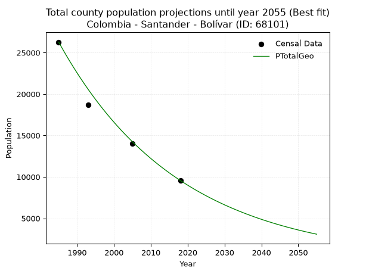
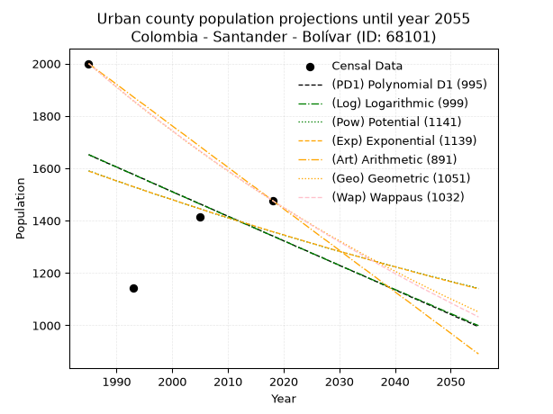
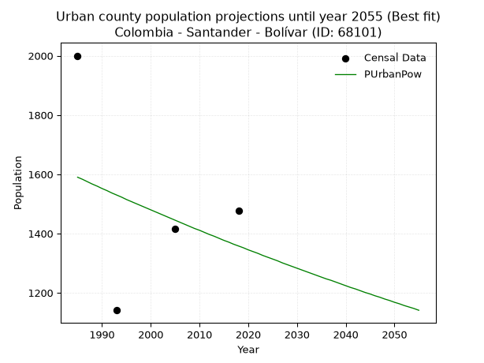
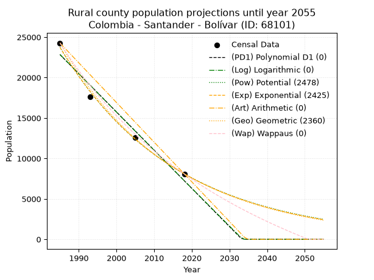
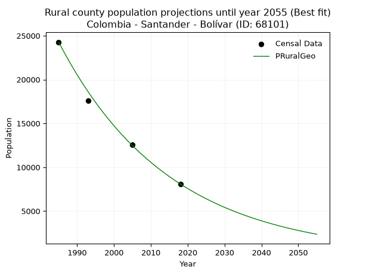

<div align="center">


</div>

# _“Population and Public Services Demand Projections (PPSD) until Year 2050 for Colombia - Santander - Bolívar (ID: 68101)”_
Keywords: `population` `public-service` `projection` `lineal` `polynomial` `logarithmic` `potential` `exponential` `arithmetic` `geometric` `wappaus` `dane` `colombia` `south-america`

PPSD are analytical estimates used by governments and planners to anticipate future changes in population size, age distribution, and the resulting community needs for utilities, healthcare, education, and infrastructure as sizing future water treatment facilities, electrical grids, and road networks based on spatial growth.

> **General running parameters**: • app_version: _v20260806_. • Python version: _3.14.7_. • Pandas version: _3.0.5_. • NumPy version: _2.5.1_. • Creates, save and include plots into reports (create_plot): _False_. • Projection until year: _2050_. • Process polynomial degree 2 and up: _False_. • Process Wappaus: _True_. • Process Wappaus: _True_. • Set negative values to zero: _True_. • Set infinite values to zero: _True_. • Drop dataset notes: _True_. 
<div align="center">

Dynamic map: [:earth_americas:Google](http://maps.google.com/maps?q=5.988952615,-73.7713464) [:earth_americas:OSM](https://www.openstreetmap.org/#map=18/5.988952615/-73.7713464&layers=P) [:earth_americas:Bing](https://www.bing.com/maps?cp=5.988952615~-73.7713464&lvl=18) [:earth_americas:Apple](https://maps.apple.com/frame?center=5.988952615%2C-73.7713464&span=0.003%2C0.006)

</div>


<div align="center">

```geojson
{
  "type": "Feature",
  "geometry": {
    "type": "Point", 
    "coordinates": [-73.7713464, 5.988952615]
  }, 
  "properties": {
    "Name": "Colombia - Santander - Bolívar (ID: 68101)"
  }
}
```

</div>


## 0. Census Data (4 records)

Census data are official statistics collected by a government about the people and housing in a country. They usually include counts of total population, age, sex, race, income, education, and jobs.

📅Global census file: [Population.xlsx](../data/Population.xlsx)

| Source   |   Year |   CountryID | CountryName   |   StateID | StateName   |   CountyID | CountyName   |   PTotal |   PUrban |   PRural |
|:---------|-------:|------------:|:--------------|----------:|:------------|-----------:|:-------------|---------:|---------:|---------:|
| DANE     |   1985 |          57 | Colombia      |        68 | Santander   |      68101 | Bolívar      |    26275 |     2000 |    24275 |
| DANE     |   1993 |          57 | Colombia      |        68 | Santander   |      68101 | Bolívar      |    18731 |     1142 |    17589 |
| DANE     |   2005 |          57 | Colombia      |        68 | Santander   |      68101 | Bolívar      |    13996 |     1415 |    12581 |
| DANE     |   2018 |          57 | Colombia      |        68 | Santander   |      68101 | Bolívar      |     9567 |     1477 |     8090 |

> 🔥Some records could had specific notes about the registered values or the corresponding urban or rural distribution.

📅   [RUPS](https://www.datos.gov.co/Hacienda-y-Cr-dito-P-blico/Registro-nico-de-Prestadores-de-Servicios-P-blicos/4qkq-csdn/about_data) - Local public utility companies: [RUPS.csv](../data/RUPS.xlsx)

 | SERVICIO       | ESTADO      | NOMBRE                                                                                                | NIT         | DEPARTAMENTO_DOMICILIO   | MUNICIPIO_DOMICILIO   | DIRECCION         |   TELEFONO | EMAIL                      | TIPO_INSCRIPCION    | REPRESENTANTE_LEGAL         | TIPO_PRESTADOR                 | CLASIFICACION                 |
|:---------------|:------------|:------------------------------------------------------------------------------------------------------|:------------|:-------------------------|:----------------------|:------------------|-----------:|:---------------------------|:--------------------|:----------------------------|:-------------------------------|:------------------------------|
| ACUEDUCTO      | CANCELACION | UNIDAD ADMINISTRADORA DE SERVICIOS PUBLICOS DOMICILIARIOS DE BOLIVAR-SANTANDER                        | 890210890-9 | SANTANDER                | BOLIVAR               | Calle 3 No 3 - 31 |    7569006 | luzcellypardo1@hotmail.com | Registro por la ESP | NOE ALEXANDER MEDINA SOSA   | MUNICIPIO (PRESTACIÓN DIRECTA) | nan                           |
| ALCANTARILLADO | CANCELACION | UNIDAD ADMINISTRADORA DE SERVICIOS PUBLICOS DOMICILIARIOS DE BOLIVAR-SANTANDER                        | 890210890-9 | SANTANDER                | BOLIVAR               | Calle 3 No 3 - 31 |    7569006 | luzcellypardo1@hotmail.com | Registro por la ESP | NOE ALEXANDER MEDINA SOSA   | MUNICIPIO (PRESTACIÓN DIRECTA) | nan                           |
| ACUEDUCTO      | OPERATIVA   | ADMINISTRACION COOPERATIVA DE SERVICIOS PUBLICOS DE ACUEDUCTO, ALCANTARILLADO Y ASEO AGUAS DE BOLIVAR | 900275068-5 | SANTANDER                | BOLIVAR               | CALLE 9 N 3-31    |    7569015 | acuabol@hotmail.com        | Registro por la ESP | JOSE MIGUEL MOGOLLON GAMBOA | ORGANIZACION AUTORIZADA        | MENOR O IGUAL A 2500 USUARIOS |
| ALCANTARILLADO | OPERATIVA   | ADMINISTRACION COOPERATIVA DE SERVICIOS PUBLICOS DE ACUEDUCTO, ALCANTARILLADO Y ASEO AGUAS DE BOLIVAR | 900275068-5 | SANTANDER                | BOLIVAR               | CALLE 9 N 3-31    |    7569015 | acuabol@hotmail.com        | Registro por la ESP | JOSE MIGUEL MOGOLLON GAMBOA | ORGANIZACION AUTORIZADA        | MENOR O IGUAL A 2500 USUARIOS |

## 1. Total

### 1.1. Coefficients and Parameters

* (PD1) Polynomial Deg 1: -482.0525893215544, 981367.9417904392 (lineal)
* (Log) Logarithmic: -965372.1041810407, 7354943.349886628
* (Pow) Potential: -59.37675842249936, 200.2119033667311
* (Exp) Exponential: -0.029660197999044808, 9.342472119090453e+29
* (Art) Arithmetic: Year diff. 2018 - 1985 = 33, Population diff. 9567 - 26275 = -16708, Annual growth = -506.3030303030303
* (Geo) Geometric: Year diff. 2018 - 1985 = 33, Population diff. 9567 - 26275 = -16708, Annual growth % = -0.030151202192351345
* (Wap) Wappaus: i = -2.8251940756823295, Condition values only valid for < 200)

<sub>
Wappaus condition values: ['-0.00', '-2.83', '-5.65', '-8.48', '-11.30', '-14.13', '-16.95', '-19.78', '-22.60', '-25.43', '-28.25', '-31.08', '-33.90', '-36.73', '-39.55', '-42.38', '-45.20', '-48.03', '-50.85', '-53.68', '-56.50', '-59.33', '-62.15', '-64.98', '-67.80', '-70.63', '-73.46', '-76.28', '-79.11', '-81.93', '-84.76', '-87.58', '-90.41', '-93.23', '-96.06', '-98.88', '-101.71', '-104.53', '-107.36', '-110.18', '-113.01', '-115.83', '-118.66', '-121.48', '-124.31', '-127.13', '-129.96', '-132.78', '-135.61', '-138.43', '-141.26', '-144.08', '-146.91', '-149.74', '-152.56', '-155.39', '-158.21', '-161.04', '-163.86', '-166.69', '-169.51', '-172.34', '-175.16', '-177.99', '-180.81', '-183.64']
</sub>


### 1.2. Projected Dataset

|   Year |   CountyID |   PTotalPD1 |   PTotalLog |   PTotalPow |   PTotalExp |   PTotalArt |   PTotalGeo |   PTotalWap |
|-------:|-----------:|------------:|------------:|------------:|------------:|------------:|------------:|------------:|
|   1985 |      68101 |       24494 |       24512 |       25210 |       25186 |       26275 |       26275 |       26275 |
|   1986 |      68101 |       24011 |       24026 |       24467 |       24450 |       25769 |       25483 |       25543 |
|   1987 |      68101 |       23529 |       23540 |       23747 |       23735 |       25262 |       24714 |       24831 |
|   1988 |      68101 |       23047 |       23054 |       23048 |       23042 |       24756 |       23969 |       24139 |
|   1989 |      68101 |       22565 |       22568 |       22370 |       22368 |       24250 |       23247 |       23465 |
|   1990 |      68101 |       22083 |       22083 |       21712 |       21715 |       23743 |       22546 |       22808 |
|   1991 |      68101 |       21601 |       21598 |       21074 |       21080 |       23237 |       21866 |       22169 |
|   1992 |      68101 |       21119 |       21113 |       20455 |       20464 |       22731 |       21207 |       21546 |
|   1993 |      68101 |       20637 |       20629 |       19854 |       19866 |       22225 |       20567 |       20939 |
|   1994 |      68101 |       20155 |       20145 |       19272 |       19285 |       21718 |       19947 |       20348 |
|   1995 |      68101 |       19673 |       19661 |       18706 |       18722 |       21212 |       19346 |       19771 |
|   1996 |      68101 |       19191 |       19177 |       18158 |       18175 |       20706 |       18762 |       19208 |
|   1997 |      68101 |       18709 |       18693 |       17626 |       17644 |       20199 |       18197 |       18658 |
|   1998 |      68101 |       18227 |       18210 |       17110 |       17128 |       19693 |       17648 |       18122 |
|   1999 |      68101 |       17745 |       17727 |       16609 |       16627 |       19187 |       17116 |       17598 |
|   2000 |      68101 |       17263 |       17244 |       16123 |       16141 |       18680 |       16600 |       17087 |
|   2001 |      68101 |       16781 |       16762 |       15651 |       15670 |       18174 |       16099 |       16587 |
|   2002 |      68101 |       16299 |       16279 |       15194 |       15212 |       17668 |       15614 |       16099 |
|   2003 |      68101 |       15817 |       15797 |       14750 |       14767 |       17162 |       15143 |       15622 |
|   2004 |      68101 |       15335 |       15315 |       14319 |       14336 |       16655 |       14687 |       15155 |
|   2005 |      68101 |       14853 |       14834 |       13901 |       13917 |       16149 |       14244 |       14699 |
|   2006 |      68101 |       14370 |       14352 |       13496 |       13510 |       15643 |       13814 |       14253 |
|   2007 |      68101 |       13888 |       13871 |       13102 |       13115 |       15136 |       13398 |       13816 |
|   2008 |      68101 |       13406 |       13390 |       12720 |       12732 |       14630 |       12994 |       13388 |
|   2009 |      68101 |       12924 |       12910 |       12350 |       12360 |       14124 |       12602 |       12970 |
|   2010 |      68101 |       12442 |       12429 |       11990 |       11999 |       13617 |       12222 |       12560 |
|   2011 |      68101 |       11960 |       11949 |       11641 |       11648 |       13111 |       11854 |       12159 |
|   2012 |      68101 |       11478 |       11469 |       11303 |       11307 |       12605 |       11496 |       11766 |
|   2013 |      68101 |       10996 |       10990 |       10974 |       10977 |       12099 |       11150 |       11381 |
|   2014 |      68101 |       10514 |       10510 |       10655 |       10656 |       11592 |       10813 |       11004 |
|   2015 |      68101 |       10032 |       10031 |       10346 |       10345 |       11086 |       10487 |       10634 |
|   2016 |      68101 |        9550 |        9552 |       10045 |       10042 |       10580 |       10171 |       10271 |
|   2017 |      68101 |        9068 |        9073 |        9754 |        9749 |       10073 |        9864 |        9916 |
|   2018 |      68101 |        8586 |        8595 |        9471 |        9464 |        9567 |        9567 |        9567 |
|   2019 |      68101 |        8104 |        8116 |        9197 |        9187 |        9061 |        9279 |        9225 |
|   2020 |      68101 |        7622 |        7638 |        8930 |        8919 |        8554 |        8999 |        8889 |
|   2021 |      68101 |        7140 |        7161 |        8671 |        8658 |        8048 |        8727 |        8560 |
|   2022 |      68101 |        6658 |        6683 |        8420 |        8405 |        7542 |        8464 |        8237 |
|   2023 |      68101 |        6176 |        6206 |        8177 |        8160 |        7035 |        8209 |        7920 |
|   2024 |      68101 |        5694 |        5729 |        7940 |        7921 |        6529 |        7962 |        7608 |
|   2025 |      68101 |        5211 |        5252 |        7711 |        7690 |        6023 |        7722 |        7302 |
|   2026 |      68101 |        4729 |        4775 |        7488 |        7465 |        5517 |        7489 |        7002 |
|   2027 |      68101 |        4247 |        4299 |        7272 |        7247 |        5010 |        7263 |        6707 |
|   2028 |      68101 |        3765 |        3823 |        7062 |        7035 |        4504 |        7044 |        6417 |
|   2029 |      68101 |        3283 |        3347 |        6858 |        6829 |        3998 |        6832 |        6132 |
|   2030 |      68101 |        2801 |        2871 |        6661 |        6630 |        3491 |        6626 |        5853 |
|   2031 |      68101 |        2319 |        2396 |        6469 |        6436 |        2985 |        6426 |        5577 |
|   2032 |      68101 |        1837 |        1920 |        6282 |        6248 |        2479 |        6232 |        5307 |
|   2033 |      68101 |        1355 |        1445 |        6101 |        6065 |        1972 |        6044 |        5041 |
|   2034 |      68101 |         873 |         971 |        5926 |        5888 |        1466 |        5862 |        4780 |
|   2035 |      68101 |         391 |         496 |        5755 |        5716 |         960 |        5685 |        4523 |
|   2036 |      68101 |           0 |          22 |        5590 |        5549 |         454 |        5514 |        4270 |
|   2037 |      68101 |           0 |           0 |        5429 |        5387 |           0 |        5348 |        4021 |
|   2038 |      68101 |           0 |           0 |        5273 |        5229 |           0 |        5186 |        3776 |
|   2039 |      68101 |           0 |           0 |        5122 |        5077 |           0 |        5030 |        3535 |
|   2040 |      68101 |           0 |           0 |        4975 |        4928 |           0 |        4878 |        3299 |
|   2041 |      68101 |           0 |           0 |        4832 |        4784 |           0 |        4731 |        3065 |
|   2042 |      68101 |           0 |           0 |        4694 |        4644 |           0 |        4589 |        2836 |
|   2043 |      68101 |           0 |           0 |        4559 |        4509 |           0 |        4450 |        2610 |
|   2044 |      68101 |           0 |           0 |        4429 |        4377 |           0 |        4316 |        2387 |
|   2045 |      68101 |           0 |           0 |        4302 |        4249 |           0 |        4186 |        2168 |
|   2046 |      68101 |           0 |           0 |        4179 |        4125 |           0 |        4060 |        1952 |
|   2047 |      68101 |           0 |           0 |        4059 |        4004 |           0 |        3937 |        1740 |
|   2048 |      68101 |           0 |           0 |        3943 |        3887 |           0 |        3819 |        1530 |
|   2049 |      68101 |           0 |           0 |        3831 |        3774 |           0 |        3703 |        1324 |
|   2050 |      68101 |           0 |           0 |        3721 |        3663 |           0 |        3592 |        1121 |
<div align="center">

</img>

</div>


### 1.3. Best fit with absolute and relative error (%)

Relative error puts that difference into context by dividing the absolute error by the true value, creating a unitless ratio or percentage that shows the scale of the mistake.

Absolute and relative error

|   Year | Source   |   CountryID | CountryName   |   StateID | StateName   |   CountyID_x | CountyName   |   PTotal |   PUrban |   PRural |   CountyID_y |   PTotalPD1 |   PTotalLog |   PTotalPow |   PTotalExp |   PTotalArt |   PTotalGeo |   PTotalWap |   PTotalPD1AbsError |   PTotalLogAbsError |   PTotalPowAbsError |   PTotalExpAbsError |   PTotalArtAbsError |   PTotalGeoAbsError |   PTotalWapAbsError |   PTotalPD1RelError |   PTotalLogRelError |   PTotalPowRelError |   PTotalExpRelError |   PTotalArtRelError |   PTotalGeoRelError |   PTotalWapRelError |
|-------:|:---------|------------:|:--------------|----------:|:------------|-------------:|:-------------|---------:|---------:|---------:|-------------:|------------:|------------:|------------:|------------:|------------:|------------:|------------:|--------------------:|--------------------:|--------------------:|--------------------:|--------------------:|--------------------:|--------------------:|--------------------:|--------------------:|--------------------:|--------------------:|--------------------:|--------------------:|--------------------:|
|   1985 | DANE     |          57 | Colombia      |        68 | Santander   |        68101 | Bolívar      |    26275 |     2000 |    24275 |        68101 |       24494 |       24512 |       25210 |       25186 |       26275 |       26275 |       26275 |                1781 |                1763 |                1065 |                1089 |                   0 |                   0 |                   0 |             6.77831 |             6.7098  |            4.05328  |            4.14462  |              0      |             0       |             0       |
|   1993 | DANE     |          57 | Colombia      |        68 | Santander   |        68101 | Bolívar      |    18731 |     1142 |    17589 |        68101 |       20637 |       20629 |       19854 |       19866 |       22225 |       20567 |       20939 |                1906 |                1898 |                1123 |                1135 |                3494 |                1836 |                2208 |            10.1756  |            10.1329  |            5.99541  |            6.05947  |             18.6536 |             9.80193 |            11.7879  |
|   2005 | DANE     |          57 | Colombia      |        68 | Santander   |        68101 | Bolívar      |    13996 |     1415 |    12581 |        68101 |       14853 |       14834 |       13901 |       13917 |       16149 |       14244 |       14699 |                 857 |                 838 |                  95 |                  79 |                2153 |                 248 |                 703 |             6.12318 |             5.98742 |            0.678765 |            0.564447 |             15.383  |             1.77193 |             5.02286 |
|   2018 | DANE     |          57 | Colombia      |        68 | Santander   |        68101 | Bolívar      |     9567 |     1477 |     8090 |        68101 |        8586 |        8595 |        9471 |        9464 |        9567 |        9567 |        9567 |                 981 |                 972 |                  96 |                 103 |                   0 |                   0 |                   0 |            10.254   |            10.1599  |            1.00345  |            1.07662  |              0      |             0       |             0       |

Relative error mean

| Method    |   RelError | Best   |
|:----------|-----------:|:-------|
| PTotalPD1 |    8.33278 |        |
| PTotalLog |    8.24752 |        |
| PTotalPow |    2.93273 |        |
| PTotalExp |    2.96129 |        |
| PTotalArt |    8.50913 |        |
| PTotalGeo |    2.89347 | True   |
| PTotalWap |    4.2027  |        |

💙Best method: _**PTotalGeo**_
<div align="center">

</img>

</div>


### 1.4. Fresh water supply demand in liters per capita per day (lpcd)

The fresh water supply demand typically ranges from 100 to 300 liters per capita per day (lpcd) for standard domestic and municipal planning, though absolute survival minimums set by the World Health Organization are as low as 7.5 to 20 liters per day, and total consumption in high-income nations can exceed 400 liters.

> `CZ`: Level in meters above the sea level (masl)<br> `WS`: Fresh water supply demand in liters per capita per day (lpcd or l/h/d)<br> `WSAll`: Zonal fresh water supply demand in liters per second (l/s)<br> `A`: Zonal area in square meters<br> `DP`: Population density (people/hectare or p/ha)

Reference values (RAS Colombia)

|    CZ |   WS |
|------:|-----:|
|  1000 |  120 |
|  2000 |  130 |
| 99999 |  140 |

County shapefile geometry properties and water supply values

|   CountyID |      ATotal |   CZTotal |   WSTotal |
|-----------:|------------:|----------:|----------:|
|      68101 | 1.00882e+09 |   691.156 |       120 |

Projected values for best method: PTotalGeo

|   CountyID |   Year |   PTotalGeo |   DPTotal |   WSTotal |   WSTotalAll |
|-----------:|-------:|------------:|----------:|----------:|-------------:|
|      68101 |   1985 |       26275 |      0.26 |       120 |     36.4931  |
|      68101 |   1986 |       25483 |      0.25 |       120 |     35.3931  |
|      68101 |   1987 |       24714 |      0.24 |       120 |     34.325   |
|      68101 |   1988 |       23969 |      0.24 |       120 |     33.2903  |
|      68101 |   1989 |       23247 |      0.23 |       120 |     32.2875  |
|      68101 |   1990 |       22546 |      0.22 |       120 |     31.3139  |
|      68101 |   1991 |       21866 |      0.22 |       120 |     30.3694  |
|      68101 |   1992 |       21207 |      0.21 |       120 |     29.4542  |
|      68101 |   1993 |       20567 |      0.2  |       120 |     28.5653  |
|      68101 |   1994 |       19947 |      0.2  |       120 |     27.7042  |
|      68101 |   1995 |       19346 |      0.19 |       120 |     26.8694  |
|      68101 |   1996 |       18762 |      0.19 |       120 |     26.0583  |
|      68101 |   1997 |       18197 |      0.18 |       120 |     25.2736  |
|      68101 |   1998 |       17648 |      0.17 |       120 |     24.5111  |
|      68101 |   1999 |       17116 |      0.17 |       120 |     23.7722  |
|      68101 |   2000 |       16600 |      0.16 |       120 |     23.0556  |
|      68101 |   2001 |       16099 |      0.16 |       120 |     22.3597  |
|      68101 |   2002 |       15614 |      0.15 |       120 |     21.6861  |
|      68101 |   2003 |       15143 |      0.15 |       120 |     21.0319  |
|      68101 |   2004 |       14687 |      0.15 |       120 |     20.3986  |
|      68101 |   2005 |       14244 |      0.14 |       120 |     19.7833  |
|      68101 |   2006 |       13814 |      0.14 |       120 |     19.1861  |
|      68101 |   2007 |       13398 |      0.13 |       120 |     18.6083  |
|      68101 |   2008 |       12994 |      0.13 |       120 |     18.0472  |
|      68101 |   2009 |       12602 |      0.12 |       120 |     17.5028  |
|      68101 |   2010 |       12222 |      0.12 |       120 |     16.975   |
|      68101 |   2011 |       11854 |      0.12 |       120 |     16.4639  |
|      68101 |   2012 |       11496 |      0.11 |       120 |     15.9667  |
|      68101 |   2013 |       11150 |      0.11 |       120 |     15.4861  |
|      68101 |   2014 |       10813 |      0.11 |       120 |     15.0181  |
|      68101 |   2015 |       10487 |      0.1  |       120 |     14.5653  |
|      68101 |   2016 |       10171 |      0.1  |       120 |     14.1264  |
|      68101 |   2017 |        9864 |      0.1  |       120 |     13.7     |
|      68101 |   2018 |        9567 |      0.09 |       120 |     13.2875  |
|      68101 |   2019 |        9279 |      0.09 |       120 |     12.8875  |
|      68101 |   2020 |        8999 |      0.09 |       120 |     12.4986  |
|      68101 |   2021 |        8727 |      0.09 |       120 |     12.1208  |
|      68101 |   2022 |        8464 |      0.08 |       120 |     11.7556  |
|      68101 |   2023 |        8209 |      0.08 |       120 |     11.4014  |
|      68101 |   2024 |        7962 |      0.08 |       120 |     11.0583  |
|      68101 |   2025 |        7722 |      0.08 |       120 |     10.725   |
|      68101 |   2026 |        7489 |      0.07 |       120 |     10.4014  |
|      68101 |   2027 |        7263 |      0.07 |       120 |     10.0875  |
|      68101 |   2028 |        7044 |      0.07 |       120 |      9.78333 |
|      68101 |   2029 |        6832 |      0.07 |       120 |      9.48889 |
|      68101 |   2030 |        6626 |      0.07 |       120 |      9.20278 |
|      68101 |   2031 |        6426 |      0.06 |       120 |      8.925   |
|      68101 |   2032 |        6232 |      0.06 |       120 |      8.65556 |
|      68101 |   2033 |        6044 |      0.06 |       120 |      8.39444 |
|      68101 |   2034 |        5862 |      0.06 |       120 |      8.14167 |
|      68101 |   2035 |        5685 |      0.06 |       120 |      7.89583 |
|      68101 |   2036 |        5514 |      0.05 |       120 |      7.65833 |
|      68101 |   2037 |        5348 |      0.05 |       120 |      7.42778 |
|      68101 |   2038 |        5186 |      0.05 |       120 |      7.20278 |
|      68101 |   2039 |        5030 |      0.05 |       120 |      6.98611 |
|      68101 |   2040 |        4878 |      0.05 |       120 |      6.775   |
|      68101 |   2041 |        4731 |      0.05 |       120 |      6.57083 |
|      68101 |   2042 |        4589 |      0.05 |       120 |      6.37361 |
|      68101 |   2043 |        4450 |      0.04 |       120 |      6.18056 |
|      68101 |   2044 |        4316 |      0.04 |       120 |      5.99444 |
|      68101 |   2045 |        4186 |      0.04 |       120 |      5.81389 |
|      68101 |   2046 |        4060 |      0.04 |       120 |      5.63889 |
|      68101 |   2047 |        3937 |      0.04 |       120 |      5.46806 |
|      68101 |   2048 |        3819 |      0.04 |       120 |      5.30417 |
|      68101 |   2049 |        3703 |      0.04 |       120 |      5.14306 |
|      68101 |   2050 |        3592 |      0.04 |       120 |      4.98889 |

## 2. Urban

### 2.1. Coefficients and Parameters

* (PD1) Polynomial Deg 1: -9.380168606985197, 20271.182256122145 (lineal)
* (Log) Logarithmic: -18855.729004545763, 144831.0472638817
* (Pow) Potential: -9.57043901863987, 34.762453254171845
* (Exp) Exponential: -0.004755618585761698, 19994125.467787426
* (Art) Arithmetic: Year diff. 2018 - 1985 = 33, Population diff. 1477 - 2000 = -523, Annual growth = -15.848484848484848
* (Geo) Geometric: Year diff. 2018 - 1985 = 33, Population diff. 1477 - 2000 = -523, Annual growth % = -0.00914382280675563
* (Wap) Wappaus: i = -0.911618340436287, Condition values only valid for < 200)

<sub>
Wappaus condition values: ['-0.00', '-0.91', '-1.82', '-2.73', '-3.65', '-4.56', '-5.47', '-6.38', '-7.29', '-8.20', '-9.12', '-10.03', '-10.94', '-11.85', '-12.76', '-13.67', '-14.59', '-15.50', '-16.41', '-17.32', '-18.23', '-19.14', '-20.06', '-20.97', '-21.88', '-22.79', '-23.70', '-24.61', '-25.53', '-26.44', '-27.35', '-28.26', '-29.17', '-30.08', '-31.00', '-31.91', '-32.82', '-33.73', '-34.64', '-35.55', '-36.46', '-37.38', '-38.29', '-39.20', '-40.11', '-41.02', '-41.93', '-42.85', '-43.76', '-44.67', '-45.58', '-46.49', '-47.40', '-48.32', '-49.23', '-50.14', '-51.05', '-51.96', '-52.87', '-53.79', '-54.70', '-55.61', '-56.52', '-57.43', '-58.34', '-59.26']
</sub>


### 2.2. Projected Dataset

|   Year |   CountyID |   PUrbanPD1 |   PUrbanLog |   PUrbanPow |   PUrbanExp |   PUrbanArt |   PUrbanGeo |   PUrbanWap |
|-------:|-----------:|------------:|------------:|------------:|------------:|------------:|------------:|------------:|
|   1985 |      68101 |        1652 |        1652 |        1590 |        1589 |        2000 |        2000 |        2000 |
|   1986 |      68101 |        1642 |        1643 |        1583 |        1582 |        1984 |        1982 |        1982 |
|   1987 |      68101 |        1633 |        1633 |        1575 |        1574 |        1968 |        1964 |        1964 |
|   1988 |      68101 |        1623 |        1624 |        1567 |        1567 |        1952 |        1946 |        1946 |
|   1989 |      68101 |        1614 |        1614 |        1560 |        1559 |        1937 |        1928 |        1928 |
|   1990 |      68101 |        1605 |        1605 |        1552 |        1552 |        1921 |        1910 |        1911 |
|   1991 |      68101 |        1595 |        1596 |        1545 |        1545 |        1905 |        1893 |        1894 |
|   1992 |      68101 |        1586 |        1586 |        1537 |        1537 |        1889 |        1875 |        1876 |
|   1993 |      68101 |        1577 |        1577 |        1530 |        1530 |        1873 |        1858 |        1859 |
|   1994 |      68101 |        1567 |        1567 |        1523 |        1523 |        1857 |        1841 |        1842 |
|   1995 |      68101 |        1558 |        1558 |        1515 |        1515 |        1842 |        1824 |        1826 |
|   1996 |      68101 |        1548 |        1548 |        1508 |        1508 |        1826 |        1808 |        1809 |
|   1997 |      68101 |        1539 |        1539 |        1501 |        1501 |        1810 |        1791 |        1793 |
|   1998 |      68101 |        1530 |        1529 |        1494 |        1494 |        1794 |        1775 |        1776 |
|   1999 |      68101 |        1520 |        1520 |        1487 |        1487 |        1778 |        1759 |        1760 |
|   2000 |      68101 |        1511 |        1510 |        1480 |        1480 |        1762 |        1743 |        1744 |
|   2001 |      68101 |        1501 |        1501 |        1473 |        1473 |        1746 |        1727 |        1728 |
|   2002 |      68101 |        1492 |        1492 |        1466 |        1466 |        1731 |        1711 |        1712 |
|   2003 |      68101 |        1483 |        1482 |        1459 |        1459 |        1715 |        1695 |        1697 |
|   2004 |      68101 |        1473 |        1473 |        1452 |        1452 |        1699 |        1680 |        1681 |
|   2005 |      68101 |        1464 |        1463 |        1445 |        1445 |        1683 |        1664 |        1666 |
|   2006 |      68101 |        1455 |        1454 |        1438 |        1438 |        1667 |        1649 |        1651 |
|   2007 |      68101 |        1445 |        1445 |        1431 |        1431 |        1651 |        1634 |        1635 |
|   2008 |      68101 |        1436 |        1435 |        1424 |        1425 |        1635 |        1619 |        1620 |
|   2009 |      68101 |        1426 |        1426 |        1417 |        1418 |        1620 |        1604 |        1606 |
|   2010 |      68101 |        1417 |        1416 |        1411 |        1411 |        1604 |        1590 |        1591 |
|   2011 |      68101 |        1408 |        1407 |        1404 |        1404 |        1588 |        1575 |        1576 |
|   2012 |      68101 |        1398 |        1398 |        1397 |        1398 |        1572 |        1561 |        1562 |
|   2013 |      68101 |        1389 |        1388 |        1391 |        1391 |        1556 |        1546 |        1547 |
|   2014 |      68101 |        1380 |        1379 |        1384 |        1385 |        1540 |        1532 |        1533 |
|   2015 |      68101 |        1370 |        1370 |        1377 |        1378 |        1525 |        1518 |        1519 |
|   2016 |      68101 |        1361 |        1360 |        1371 |        1371 |        1509 |        1504 |        1505 |
|   2017 |      68101 |        1351 |        1351 |        1364 |        1365 |        1493 |        1491 |        1491 |
|   2018 |      68101 |        1342 |        1342 |        1358 |        1358 |        1477 |        1477 |        1477 |
|   2019 |      68101 |        1333 |        1332 |        1352 |        1352 |        1461 |        1463 |        1463 |
|   2020 |      68101 |        1323 |        1323 |        1345 |        1346 |        1445 |        1450 |        1450 |
|   2021 |      68101 |        1314 |        1314 |        1339 |        1339 |        1429 |        1437 |        1436 |
|   2022 |      68101 |        1304 |        1304 |        1333 |        1333 |        1414 |        1424 |        1423 |
|   2023 |      68101 |        1295 |        1295 |        1326 |        1327 |        1398 |        1411 |        1409 |
|   2024 |      68101 |        1286 |        1286 |        1320 |        1320 |        1382 |        1398 |        1396 |
|   2025 |      68101 |        1276 |        1276 |        1314 |        1314 |        1366 |        1385 |        1383 |
|   2026 |      68101 |        1267 |        1267 |        1308 |        1308 |        1350 |        1372 |        1370 |
|   2027 |      68101 |        1258 |        1258 |        1301 |        1302 |        1334 |        1360 |        1357 |
|   2028 |      68101 |        1248 |        1248 |        1295 |        1295 |        1319 |        1347 |        1344 |
|   2029 |      68101 |        1239 |        1239 |        1289 |        1289 |        1303 |        1335 |        1332 |
|   2030 |      68101 |        1229 |        1230 |        1283 |        1283 |        1287 |        1323 |        1319 |
|   2031 |      68101 |        1220 |        1220 |        1277 |        1277 |        1271 |        1311 |        1307 |
|   2032 |      68101 |        1211 |        1211 |        1271 |        1271 |        1255 |        1299 |        1294 |
|   2033 |      68101 |        1201 |        1202 |        1265 |        1265 |        1239 |        1287 |        1282 |
|   2034 |      68101 |        1192 |        1193 |        1259 |        1259 |        1223 |        1275 |        1270 |
|   2035 |      68101 |        1183 |        1183 |        1253 |        1253 |        1208 |        1263 |        1258 |
|   2036 |      68101 |        1173 |        1174 |        1247 |        1247 |        1192 |        1252 |        1246 |
|   2037 |      68101 |        1164 |        1165 |        1242 |        1241 |        1176 |        1240 |        1234 |
|   2038 |      68101 |        1154 |        1156 |        1236 |        1235 |        1160 |        1229 |        1222 |
|   2039 |      68101 |        1145 |        1146 |        1230 |        1229 |        1144 |        1218 |        1210 |
|   2040 |      68101 |        1136 |        1137 |        1224 |        1224 |        1128 |        1207 |        1198 |
|   2041 |      68101 |        1126 |        1128 |        1218 |        1218 |        1112 |        1196 |        1187 |
|   2042 |      68101 |        1117 |        1119 |        1213 |        1212 |        1097 |        1185 |        1175 |
|   2043 |      68101 |        1107 |        1109 |        1207 |        1206 |        1081 |        1174 |        1164 |
|   2044 |      68101 |        1098 |        1100 |        1201 |        1200 |        1065 |        1163 |        1152 |
|   2045 |      68101 |        1089 |        1091 |        1196 |        1195 |        1049 |        1153 |        1141 |
|   2046 |      68101 |        1079 |        1082 |        1190 |        1189 |        1033 |        1142 |        1130 |
|   2047 |      68101 |        1070 |        1073 |        1185 |        1183 |        1017 |        1132 |        1119 |
|   2048 |      68101 |        1061 |        1063 |        1179 |        1178 |        1002 |        1121 |        1108 |
|   2049 |      68101 |        1051 |        1054 |        1174 |        1172 |         986 |        1111 |        1097 |
|   2050 |      68101 |        1042 |        1045 |        1168 |        1167 |         970 |        1101 |        1086 |
<div align="center">

</img>

</div>


### 2.3. Best fit with absolute and relative error (%)

Relative error puts that difference into context by dividing the absolute error by the true value, creating a unitless ratio or percentage that shows the scale of the mistake.

Absolute and relative error

|   Year | Source   |   CountryID | CountryName   |   StateID | StateName   |   CountyID_x | CountyName   |   PTotal |   PUrban |   PRural |   CountyID_y |   PUrbanPD1 |   PUrbanLog |   PUrbanPow |   PUrbanExp |   PUrbanArt |   PUrbanGeo |   PUrbanWap |   PUrbanPD1AbsError |   PUrbanLogAbsError |   PUrbanPowAbsError |   PUrbanExpAbsError |   PUrbanArtAbsError |   PUrbanGeoAbsError |   PUrbanWapAbsError |   PUrbanPD1RelError |   PUrbanLogRelError |   PUrbanPowRelError |   PUrbanExpRelError |   PUrbanArtRelError |   PUrbanGeoRelError |   PUrbanWapRelError |
|-------:|:---------|------------:|:--------------|----------:|:------------|-------------:|:-------------|---------:|---------:|---------:|-------------:|------------:|------------:|------------:|------------:|------------:|------------:|------------:|--------------------:|--------------------:|--------------------:|--------------------:|--------------------:|--------------------:|--------------------:|--------------------:|--------------------:|--------------------:|--------------------:|--------------------:|--------------------:|--------------------:|
|   1985 | DANE     |          57 | Colombia      |        68 | Santander   |        68101 | Bolívar      |    26275 |     2000 |    24275 |        68101 |        1652 |        1652 |        1590 |        1589 |        2000 |        2000 |        2000 |                 348 |                 348 |                 410 |                 411 |                   0 |                   0 |                   0 |            17.4     |            17.4     |            20.5     |            20.55    |              0      |              0      |              0      |
|   1993 | DANE     |          57 | Colombia      |        68 | Santander   |        68101 | Bolívar      |    18731 |     1142 |    17589 |        68101 |        1577 |        1577 |        1530 |        1530 |        1873 |        1858 |        1859 |                 435 |                 435 |                 388 |                 388 |                 731 |                 716 |                 717 |            38.0911  |            38.0911  |            33.9755  |            33.9755  |             64.0105 |             62.697  |             62.7846 |
|   2005 | DANE     |          57 | Colombia      |        68 | Santander   |        68101 | Bolívar      |    13996 |     1415 |    12581 |        68101 |        1464 |        1463 |        1445 |        1445 |        1683 |        1664 |        1666 |                  49 |                  48 |                  30 |                  30 |                 268 |                 249 |                 251 |             3.4629  |             3.39223 |             2.12014 |             2.12014 |             18.9399 |             17.5972 |             17.7385 |
|   2018 | DANE     |          57 | Colombia      |        68 | Santander   |        68101 | Bolívar      |     9567 |     1477 |     8090 |        68101 |        1342 |        1342 |        1358 |        1358 |        1477 |        1477 |        1477 |                 135 |                 135 |                 119 |                 119 |                   0 |                   0 |                   0 |             9.14015 |             9.14015 |             8.05687 |             8.05687 |              0      |              0      |              0      |

Relative error mean

| Method    |   RelError | Best   |
|:----------|-----------:|:-------|
| PUrbanPD1 |    17.0235 |        |
| PUrbanLog |    17.0059 |        |
| PUrbanPow |    16.1631 | True   |
| PUrbanExp |    16.1756 |        |
| PUrbanArt |    20.7376 |        |
| PUrbanGeo |    20.0735 |        |
| PUrbanWap |    20.1308 |        |

💙Best method: _**PUrbanPow**_
<div align="center">

</img>

</div>


### 2.4. Fresh water supply demand in liters per capita per day (lpcd)

The fresh water supply demand typically ranges from 100 to 300 liters per capita per day (lpcd) for standard domestic and municipal planning, though absolute survival minimums set by the World Health Organization are as low as 7.5 to 20 liters per day, and total consumption in high-income nations can exceed 400 liters.

> `CZ`: Level in meters above the sea level (masl)<br> `WS`: Fresh water supply demand in liters per capita per day (lpcd or l/h/d)<br> `WSAll`: Zonal fresh water supply demand in liters per second (l/s)<br> `A`: Zonal area in square meters<br> `DP`: Population density (people/hectare or p/ha)

Reference values (RAS Colombia)

|    CZ |   WS |
|------:|-----:|
|  1000 |  120 |
|  2000 |  130 |
| 99999 |  140 |

County shapefile geometry properties and water supply values

|   CountyID |   AUrban |   CZUrban |   WSUrban |
|-----------:|---------:|----------:|----------:|
|      68101 |   303436 |   2138.48 |       140 |

Projected values for best method: PUrbanPow

|   CountyID |   Year |   PUrbanPow |   DPUrban |   WSUrban |   WSUrbanAll |
|-----------:|-------:|------------:|----------:|----------:|-------------:|
|      68101 |   1985 |        1590 |     52.4  |       140 |      2.57639 |
|      68101 |   1986 |        1583 |     52.17 |       140 |      2.56505 |
|      68101 |   1987 |        1575 |     51.91 |       140 |      2.55208 |
|      68101 |   1988 |        1567 |     51.64 |       140 |      2.53912 |
|      68101 |   1989 |        1560 |     51.41 |       140 |      2.52778 |
|      68101 |   1990 |        1552 |     51.15 |       140 |      2.51481 |
|      68101 |   1991 |        1545 |     50.92 |       140 |      2.50347 |
|      68101 |   1992 |        1537 |     50.65 |       140 |      2.49051 |
|      68101 |   1993 |        1530 |     50.42 |       140 |      2.47917 |
|      68101 |   1994 |        1523 |     50.19 |       140 |      2.46782 |
|      68101 |   1995 |        1515 |     49.93 |       140 |      2.45486 |
|      68101 |   1996 |        1508 |     49.7  |       140 |      2.44352 |
|      68101 |   1997 |        1501 |     49.47 |       140 |      2.43218 |
|      68101 |   1998 |        1494 |     49.24 |       140 |      2.42083 |
|      68101 |   1999 |        1487 |     49.01 |       140 |      2.40949 |
|      68101 |   2000 |        1480 |     48.77 |       140 |      2.39815 |
|      68101 |   2001 |        1473 |     48.54 |       140 |      2.38681 |
|      68101 |   2002 |        1466 |     48.31 |       140 |      2.37546 |
|      68101 |   2003 |        1459 |     48.08 |       140 |      2.36412 |
|      68101 |   2004 |        1452 |     47.85 |       140 |      2.35278 |
|      68101 |   2005 |        1445 |     47.62 |       140 |      2.34144 |
|      68101 |   2006 |        1438 |     47.39 |       140 |      2.33009 |
|      68101 |   2007 |        1431 |     47.16 |       140 |      2.31875 |
|      68101 |   2008 |        1424 |     46.93 |       140 |      2.30741 |
|      68101 |   2009 |        1417 |     46.7  |       140 |      2.29606 |
|      68101 |   2010 |        1411 |     46.5  |       140 |      2.28634 |
|      68101 |   2011 |        1404 |     46.27 |       140 |      2.275   |
|      68101 |   2012 |        1397 |     46.04 |       140 |      2.26366 |
|      68101 |   2013 |        1391 |     45.84 |       140 |      2.25394 |
|      68101 |   2014 |        1384 |     45.61 |       140 |      2.24259 |
|      68101 |   2015 |        1377 |     45.38 |       140 |      2.23125 |
|      68101 |   2016 |        1371 |     45.18 |       140 |      2.22153 |
|      68101 |   2017 |        1364 |     44.95 |       140 |      2.21019 |
|      68101 |   2018 |        1358 |     44.75 |       140 |      2.20046 |
|      68101 |   2019 |        1352 |     44.56 |       140 |      2.19074 |
|      68101 |   2020 |        1345 |     44.33 |       140 |      2.1794  |
|      68101 |   2021 |        1339 |     44.13 |       140 |      2.16968 |
|      68101 |   2022 |        1333 |     43.93 |       140 |      2.15995 |
|      68101 |   2023 |        1326 |     43.7  |       140 |      2.14861 |
|      68101 |   2024 |        1320 |     43.5  |       140 |      2.13889 |
|      68101 |   2025 |        1314 |     43.3  |       140 |      2.12917 |
|      68101 |   2026 |        1308 |     43.11 |       140 |      2.11944 |
|      68101 |   2027 |        1301 |     42.88 |       140 |      2.1081  |
|      68101 |   2028 |        1295 |     42.68 |       140 |      2.09838 |
|      68101 |   2029 |        1289 |     42.48 |       140 |      2.08866 |
|      68101 |   2030 |        1283 |     42.28 |       140 |      2.07894 |
|      68101 |   2031 |        1277 |     42.08 |       140 |      2.06921 |
|      68101 |   2032 |        1271 |     41.89 |       140 |      2.05949 |
|      68101 |   2033 |        1265 |     41.69 |       140 |      2.04977 |
|      68101 |   2034 |        1259 |     41.49 |       140 |      2.04005 |
|      68101 |   2035 |        1253 |     41.29 |       140 |      2.03032 |
|      68101 |   2036 |        1247 |     41.1  |       140 |      2.0206  |
|      68101 |   2037 |        1242 |     40.93 |       140 |      2.0125  |
|      68101 |   2038 |        1236 |     40.73 |       140 |      2.00278 |
|      68101 |   2039 |        1230 |     40.54 |       140 |      1.99306 |
|      68101 |   2040 |        1224 |     40.34 |       140 |      1.98333 |
|      68101 |   2041 |        1218 |     40.14 |       140 |      1.97361 |
|      68101 |   2042 |        1213 |     39.98 |       140 |      1.96551 |
|      68101 |   2043 |        1207 |     39.78 |       140 |      1.95579 |
|      68101 |   2044 |        1201 |     39.58 |       140 |      1.94606 |
|      68101 |   2045 |        1196 |     39.42 |       140 |      1.93796 |
|      68101 |   2046 |        1190 |     39.22 |       140 |      1.92824 |
|      68101 |   2047 |        1185 |     39.05 |       140 |      1.92014 |
|      68101 |   2048 |        1179 |     38.86 |       140 |      1.91042 |
|      68101 |   2049 |        1174 |     38.69 |       140 |      1.90231 |
|      68101 |   2050 |        1168 |     38.49 |       140 |      1.89259 |

## 3. Rural

### 3.1. Coefficients and Parameters

* (PD1) Polynomial Deg 1: -472.6724207145692, 961096.7595343172 (lineal)
* (Log) Logarithmic: -946516.3751764953, 7210112.30262275
* (Pow) Potential: -65.21888966904942, 219.4520168310374
* (Exp) Exponential: -0.03258169345791488, 2.9050451727519757e+32
* (Art) Arithmetic: Year diff. 2018 - 1985 = 33, Population diff. 8090 - 24275 = -16185, Annual growth = -490.45454545454544
* (Geo) Geometric: Year diff. 2018 - 1985 = 33, Population diff. 8090 - 24275 = -16185, Annual growth % = -0.03274926327344474
* (Wap) Wappaus: i = -3.0307711753718243, Condition values only valid for < 200)

<sub>
Wappaus condition values: ['-0.00', '-3.03', '-6.06', '-9.09', '-12.12', '-15.15', '-18.18', '-21.22', '-24.25', '-27.28', '-30.31', '-33.34', '-36.37', '-39.40', '-42.43', '-45.46', '-48.49', '-51.52', '-54.55', '-57.58', '-60.62', '-63.65', '-66.68', '-69.71', '-72.74', '-75.77', '-78.80', '-81.83', '-84.86', '-87.89', '-90.92', '-93.95', '-96.98', '-100.02', '-103.05', '-106.08', '-109.11', '-112.14', '-115.17', '-118.20', '-121.23', '-124.26', '-127.29', '-130.32', '-133.35', '-136.38', '-139.42', '-142.45', '-145.48', '-148.51', '-151.54', '-154.57', '-157.60', '-160.63', '-163.66', '-166.69', '-169.72', '-172.75', '-175.78', '-178.82', '-181.85', '-184.88', '-187.91', '-190.94', '-193.97', '-197.00']
</sub>


### 3.2. Projected Dataset

|   Year |   CountyID |   PRuralPD1 |   PRuralLog |   PRuralPow |   PRuralExp |   PRuralArt |   PRuralGeo |   PRuralWap |
|-------:|-----------:|------------:|------------:|------------:|------------:|------------:|------------:|------------:|
|   1985 |      68101 |       22842 |       22859 |       23754 |       23730 |       24275 |       24275 |       24275 |
|   1986 |      68101 |       22369 |       22383 |       22986 |       22970 |       23785 |       23480 |       23550 |
|   1987 |      68101 |       21897 |       21906 |       22244 |       22233 |       23294 |       22711 |       22847 |
|   1988 |      68101 |       21424 |       21430 |       21526 |       21521 |       22804 |       21967 |       22164 |
|   1989 |      68101 |       20951 |       20954 |       20831 |       20831 |       22313 |       21248 |       21500 |
|   1990 |      68101 |       20479 |       20478 |       20160 |       20163 |       21823 |       20552 |       20855 |
|   1991 |      68101 |       20006 |       20003 |       19510 |       19517 |       21332 |       19879 |       20229 |
|   1992 |      68101 |       19533 |       19527 |       18881 |       18891 |       20842 |       19228 |       19619 |
|   1993 |      68101 |       19061 |       19052 |       18273 |       18285 |       20351 |       18598 |       19026 |
|   1994 |      68101 |       18588 |       18577 |       17685 |       17699 |       19861 |       17989 |       18448 |
|   1995 |      68101 |       18115 |       18103 |       17116 |       17132 |       19370 |       17400 |       17886 |
|   1996 |      68101 |       17643 |       17629 |       16566 |       16583 |       18880 |       16830 |       17338 |
|   1997 |      68101 |       17170 |       17154 |       16033 |       16051 |       18390 |       16279 |       16805 |
|   1998 |      68101 |       16697 |       16681 |       15518 |       15537 |       17899 |       15746 |       16285 |
|   1999 |      68101 |       16225 |       16207 |       15020 |       15038 |       17409 |       15230 |       15778 |
|   2000 |      68101 |       15752 |       15734 |       14538 |       14556 |       16918 |       14731 |       15283 |
|   2001 |      68101 |       15279 |       15261 |       14072 |       14090 |       16428 |       14249 |       14801 |
|   2002 |      68101 |       14807 |       14788 |       13621 |       13638 |       15937 |       13782 |       14330 |
|   2003 |      68101 |       14334 |       14315 |       13184 |       13201 |       15447 |       13331 |       13870 |
|   2004 |      68101 |       13861 |       13843 |       12762 |       12778 |       14956 |       12894 |       13421 |
|   2005 |      68101 |       13389 |       13370 |       12353 |       12368 |       14466 |       12472 |       12983 |
|   2006 |      68101 |       12916 |       12898 |       11958 |       11972 |       13975 |       12064 |       12555 |
|   2007 |      68101 |       12443 |       12427 |       11576 |       11588 |       13485 |       11669 |       12136 |
|   2008 |      68101 |       11971 |       11955 |       11206 |       11216 |       12995 |       11286 |       11727 |
|   2009 |      68101 |       11498 |       11484 |       10848 |       10857 |       12504 |       10917 |       11327 |
|   2010 |      68101 |       11025 |       11013 |       10501 |       10509 |       12014 |       10559 |       10936 |
|   2011 |      68101 |       10553 |       10542 |       10166 |       10172 |       11523 |       10214 |       10553 |
|   2012 |      68101 |       10080 |       10072 |        9842 |        9846 |       11033 |        9879 |       10178 |
|   2013 |      68101 |        9607 |        9601 |        9528 |        9530 |       10542 |        9555 |        9812 |
|   2014 |      68101 |        9135 |        9131 |        9224 |        9225 |       10052 |        9243 |        9453 |
|   2015 |      68101 |        8662 |        8661 |        8930 |        8929 |        9561 |        8940 |        9102 |
|   2016 |      68101 |        8189 |        8192 |        8646 |        8643 |        9071 |        8647 |        8757 |
|   2017 |      68101 |        7716 |        7722 |        8371 |        8366 |        8580 |        8364 |        8420 |
|   2018 |      68101 |        7244 |        7253 |        8105 |        8098 |        8090 |        8090 |        8090 |
|   2019 |      68101 |        6771 |        6784 |        7847 |        7838 |        7600 |        7825 |        7766 |
|   2020 |      68101 |        6298 |        6316 |        7597 |        7587 |        7109 |        7569 |        7449 |
|   2021 |      68101 |        5826 |        5847 |        7356 |        7343 |        6619 |        7321 |        7138 |
|   2022 |      68101 |        5353 |        5379 |        7123 |        7108 |        6128 |        7081 |        6833 |
|   2023 |      68101 |        4880 |        4911 |        6897 |        6880 |        5638 |        6849 |        6534 |
|   2024 |      68101 |        4408 |        4443 |        6678 |        6660 |        5147 |        6625 |        6240 |
|   2025 |      68101 |        3935 |        3976 |        6466 |        6446 |        4657 |        6408 |        5952 |
|   2026 |      68101 |        3462 |        3508 |        6261 |        6240 |        4166 |        6198 |        5670 |
|   2027 |      68101 |        2990 |        3041 |        6063 |        6040 |        3676 |        5995 |        5393 |
|   2028 |      68101 |        2517 |        2574 |        5871 |        5846 |        3185 |        5799 |        5120 |
|   2029 |      68101 |        2044 |        2108 |        5685 |        5659 |        2695 |        5609 |        4853 |
|   2030 |      68101 |        1572 |        1641 |        5506 |        5477 |        2205 |        5425 |        4591 |
|   2031 |      68101 |        1099 |        1175 |        5331 |        5302 |        1714 |        5248 |        4333 |
|   2032 |      68101 |         626 |         709 |        5163 |        5132 |        1224 |        5076 |        4080 |
|   2033 |      68101 |         154 |         244 |        5000 |        4967 |         733 |        4909 |        3831 |
|   2034 |      68101 |           0 |           0 |        4842 |        4808 |         243 |        4749 |        3587 |
|   2035 |      68101 |           0 |           0 |        4689 |        4654 |           0 |        4593 |        3346 |
|   2036 |      68101 |           0 |           0 |        4542 |        4505 |           0 |        4443 |        3110 |
|   2037 |      68101 |           0 |           0 |        4398 |        4360 |           0 |        4297 |        2878 |
|   2038 |      68101 |           0 |           0 |        4260 |        4220 |           0 |        4157 |        2650 |
|   2039 |      68101 |           0 |           0 |        4126 |        4085 |           0 |        4020 |        2426 |
|   2040 |      68101 |           0 |           0 |        3996 |        3954 |           0 |        3889 |        2205 |
|   2041 |      68101 |           0 |           0 |        3870 |        3827 |           0 |        3761 |        1988 |
|   2042 |      68101 |           0 |           0 |        3748 |        3705 |           0 |        3638 |        1774 |
|   2043 |      68101 |           0 |           0 |        3631 |        3586 |           0 |        3519 |        1564 |
|   2044 |      68101 |           0 |           0 |        3517 |        3471 |           0 |        3404 |        1358 |
|   2045 |      68101 |           0 |           0 |        3406 |        3360 |           0 |        3292 |        1154 |
|   2046 |      68101 |           0 |           0 |        3299 |        3252 |           0 |        3185 |         954 |
|   2047 |      68101 |           0 |           0 |        3196 |        3148 |           0 |        3080 |         757 |
|   2048 |      68101 |           0 |           0 |        3096 |        3047 |           0 |        2979 |         563 |
|   2049 |      68101 |           0 |           0 |        2999 |        2949 |           0 |        2882 |         372 |
|   2050 |      68101 |           0 |           0 |        2905 |        2855 |           0 |        2787 |         183 |
<div align="center">

</img>

</div>


### 3.3. Best fit with absolute and relative error (%)

Relative error puts that difference into context by dividing the absolute error by the true value, creating a unitless ratio or percentage that shows the scale of the mistake.

Absolute and relative error

|   Year | Source   |   CountryID | CountryName   |   StateID | StateName   |   CountyID_x | CountyName   |   PTotal |   PUrban |   PRural |   CountyID_y |   PRuralPD1 |   PRuralLog |   PRuralPow |   PRuralExp |   PRuralArt |   PRuralGeo |   PRuralWap |   PRuralPD1AbsError |   PRuralLogAbsError |   PRuralPowAbsError |   PRuralExpAbsError |   PRuralArtAbsError |   PRuralGeoAbsError |   PRuralWapAbsError |   PRuralPD1RelError |   PRuralLogRelError |   PRuralPowRelError |   PRuralExpRelError |   PRuralArtRelError |   PRuralGeoRelError |   PRuralWapRelError |
|-------:|:---------|------------:|:--------------|----------:|:------------|-------------:|:-------------|---------:|---------:|---------:|-------------:|------------:|------------:|------------:|------------:|------------:|------------:|------------:|--------------------:|--------------------:|--------------------:|--------------------:|--------------------:|--------------------:|--------------------:|--------------------:|--------------------:|--------------------:|--------------------:|--------------------:|--------------------:|--------------------:|
|   1985 | DANE     |          57 | Colombia      |        68 | Santander   |        68101 | Bolívar      |    26275 |     2000 |    24275 |        68101 |       22842 |       22859 |       23754 |       23730 |       24275 |       24275 |       24275 |                1433 |                1416 |                 521 |                 545 |                   0 |                   0 |                   0 |             5.90319 |             5.83316 |            2.14624  |           2.24511   |              0      |            0        |             0       |
|   1993 | DANE     |          57 | Colombia      |        68 | Santander   |        68101 | Bolívar      |    18731 |     1142 |    17589 |        68101 |       19061 |       19052 |       18273 |       18285 |       20351 |       18598 |       19026 |                1472 |                1463 |                 684 |                 696 |                2762 |                1009 |                1437 |             8.36887 |             8.3177  |            3.88879  |           3.95702   |             15.703  |            5.73654  |             8.16988 |
|   2005 | DANE     |          57 | Colombia      |        68 | Santander   |        68101 | Bolívar      |    13996 |     1415 |    12581 |        68101 |       13389 |       13370 |       12353 |       12368 |       14466 |       12472 |       12983 |                 808 |                 789 |                 228 |                 213 |                1885 |                 109 |                 402 |             6.42238 |             6.27136 |            1.81226  |           1.69303   |             14.9829 |            0.866386 |             3.19529 |
|   2018 | DANE     |          57 | Colombia      |        68 | Santander   |        68101 | Bolívar      |     9567 |     1477 |     8090 |        68101 |        7244 |        7253 |        8105 |        8098 |        8090 |        8090 |        8090 |                 846 |                 837 |                  15 |                   8 |                   0 |                   0 |                   0 |            10.4574  |            10.3461  |            0.185414 |           0.0988875 |              0      |            0        |             0       |

Relative error mean

| Method    |   RelError | Best   |
|:----------|-----------:|:-------|
| PRuralPD1 |    7.78795 |        |
| PRuralLog |    7.69208 |        |
| PRuralPow |    2.00818 |        |
| PRuralExp |    1.99851 |        |
| PRuralArt |    7.67148 |        |
| PRuralGeo |    1.65073 | True   |
| PRuralWap |    2.84129 |        |

💙Best method: _**PRuralGeo**_
<div align="center">

</img>

</div>


### 3.4. Fresh water supply demand in liters per capita per day (lpcd)

The fresh water supply demand typically ranges from 100 to 300 liters per capita per day (lpcd) for standard domestic and municipal planning, though absolute survival minimums set by the World Health Organization are as low as 7.5 to 20 liters per day, and total consumption in high-income nations can exceed 400 liters.

> `CZ`: Level in meters above the sea level (masl)<br> `WS`: Fresh water supply demand in liters per capita per day (lpcd or l/h/d)<br> `WSAll`: Zonal fresh water supply demand in liters per second (l/s)<br> `A`: Zonal area in square meters<br> `DP`: Population density (people/hectare or p/ha)

Reference values (RAS Colombia)

|    CZ |   WS |
|------:|-----:|
|  1000 |  120 |
|  2000 |  130 |
| 99999 |  140 |

County shapefile geometry properties and water supply values

|   CountyID |      ARural |   CZRural |   WSRural |
|-----------:|------------:|----------:|----------:|
|      68101 | 1.00851e+09 |   690.766 |       120 |

Projected values for best method: PRuralGeo

|   CountyID |   Year |   PRuralGeo |   DPRural |   WSRural |   WSRuralAll |
|-----------:|-------:|------------:|----------:|----------:|-------------:|
|      68101 |   1985 |       24275 |      0.24 |       120 |     33.7153  |
|      68101 |   1986 |       23480 |      0.23 |       120 |     32.6111  |
|      68101 |   1987 |       22711 |      0.23 |       120 |     31.5431  |
|      68101 |   1988 |       21967 |      0.22 |       120 |     30.5097  |
|      68101 |   1989 |       21248 |      0.21 |       120 |     29.5111  |
|      68101 |   1990 |       20552 |      0.2  |       120 |     28.5444  |
|      68101 |   1991 |       19879 |      0.2  |       120 |     27.6097  |
|      68101 |   1992 |       19228 |      0.19 |       120 |     26.7056  |
|      68101 |   1993 |       18598 |      0.18 |       120 |     25.8306  |
|      68101 |   1994 |       17989 |      0.18 |       120 |     24.9847  |
|      68101 |   1995 |       17400 |      0.17 |       120 |     24.1667  |
|      68101 |   1996 |       16830 |      0.17 |       120 |     23.375   |
|      68101 |   1997 |       16279 |      0.16 |       120 |     22.6097  |
|      68101 |   1998 |       15746 |      0.16 |       120 |     21.8694  |
|      68101 |   1999 |       15230 |      0.15 |       120 |     21.1528  |
|      68101 |   2000 |       14731 |      0.15 |       120 |     20.4597  |
|      68101 |   2001 |       14249 |      0.14 |       120 |     19.7903  |
|      68101 |   2002 |       13782 |      0.14 |       120 |     19.1417  |
|      68101 |   2003 |       13331 |      0.13 |       120 |     18.5153  |
|      68101 |   2004 |       12894 |      0.13 |       120 |     17.9083  |
|      68101 |   2005 |       12472 |      0.12 |       120 |     17.3222  |
|      68101 |   2006 |       12064 |      0.12 |       120 |     16.7556  |
|      68101 |   2007 |       11669 |      0.12 |       120 |     16.2069  |
|      68101 |   2008 |       11286 |      0.11 |       120 |     15.675   |
|      68101 |   2009 |       10917 |      0.11 |       120 |     15.1625  |
|      68101 |   2010 |       10559 |      0.1  |       120 |     14.6653  |
|      68101 |   2011 |       10214 |      0.1  |       120 |     14.1861  |
|      68101 |   2012 |        9879 |      0.1  |       120 |     13.7208  |
|      68101 |   2013 |        9555 |      0.09 |       120 |     13.2708  |
|      68101 |   2014 |        9243 |      0.09 |       120 |     12.8375  |
|      68101 |   2015 |        8940 |      0.09 |       120 |     12.4167  |
|      68101 |   2016 |        8647 |      0.09 |       120 |     12.0097  |
|      68101 |   2017 |        8364 |      0.08 |       120 |     11.6167  |
|      68101 |   2018 |        8090 |      0.08 |       120 |     11.2361  |
|      68101 |   2019 |        7825 |      0.08 |       120 |     10.8681  |
|      68101 |   2020 |        7569 |      0.08 |       120 |     10.5125  |
|      68101 |   2021 |        7321 |      0.07 |       120 |     10.1681  |
|      68101 |   2022 |        7081 |      0.07 |       120 |      9.83472 |
|      68101 |   2023 |        6849 |      0.07 |       120 |      9.5125  |
|      68101 |   2024 |        6625 |      0.07 |       120 |      9.20139 |
|      68101 |   2025 |        6408 |      0.06 |       120 |      8.9     |
|      68101 |   2026 |        6198 |      0.06 |       120 |      8.60833 |
|      68101 |   2027 |        5995 |      0.06 |       120 |      8.32639 |
|      68101 |   2028 |        5799 |      0.06 |       120 |      8.05417 |
|      68101 |   2029 |        5609 |      0.06 |       120 |      7.79028 |
|      68101 |   2030 |        5425 |      0.05 |       120 |      7.53472 |
|      68101 |   2031 |        5248 |      0.05 |       120 |      7.28889 |
|      68101 |   2032 |        5076 |      0.05 |       120 |      7.05    |
|      68101 |   2033 |        4909 |      0.05 |       120 |      6.81806 |
|      68101 |   2034 |        4749 |      0.05 |       120 |      6.59583 |
|      68101 |   2035 |        4593 |      0.05 |       120 |      6.37917 |
|      68101 |   2036 |        4443 |      0.04 |       120 |      6.17083 |
|      68101 |   2037 |        4297 |      0.04 |       120 |      5.96806 |
|      68101 |   2038 |        4157 |      0.04 |       120 |      5.77361 |
|      68101 |   2039 |        4020 |      0.04 |       120 |      5.58333 |
|      68101 |   2040 |        3889 |      0.04 |       120 |      5.40139 |
|      68101 |   2041 |        3761 |      0.04 |       120 |      5.22361 |
|      68101 |   2042 |        3638 |      0.04 |       120 |      5.05278 |
|      68101 |   2043 |        3519 |      0.03 |       120 |      4.8875  |
|      68101 |   2044 |        3404 |      0.03 |       120 |      4.72778 |
|      68101 |   2045 |        3292 |      0.03 |       120 |      4.57222 |
|      68101 |   2046 |        3185 |      0.03 |       120 |      4.42361 |
|      68101 |   2047 |        3080 |      0.03 |       120 |      4.27778 |
|      68101 |   2048 |        2979 |      0.03 |       120 |      4.1375  |
|      68101 |   2049 |        2882 |      0.03 |       120 |      4.00278 |
|      68101 |   2050 |        2787 |      0.03 |       120 |      3.87083 |

<div align="center"><br><sub>Share this research</sub></div><br>

<sub>**APPS & TOOLS & CONTENT DISCLAIMER**: • NO WARRANTY - This content and software is provided by <a href="https://github.com/rcfdtools" target="_blank">github.com/rcfdtools</a> "as is", without any express or implied warranty, including warranties of merchantability, fitness for a particular purpose, or non-infringement. There is no guarantee that the software will be error-free or operate without interruption. • LIMITATION OF LIABILITY - Neither the authors nor copyright holders will be liable for claims or damages arising from the software or its use. You are responsible for determining if the software is appropriate for your use and assume all associated risks, including errors, legal compliance, and data loss. • NO PROFESSIONAL ADVICE - The software provides general information and does not offer professional advice. It should not replace consultation with professional advisors. [Clauses and global license for rcfdtools use.](https://github.com/rcfdtools/rcfdtools/blob/main/LICENSE.md)</sub>

| [:house: Home](Readme.md)  | [:beginner: Help / Collaborate](https://github.com/rcfdtools/R.HydroTools/discussions/31) |
|----------------------------|-------------------------------------------------------------------------------------------|