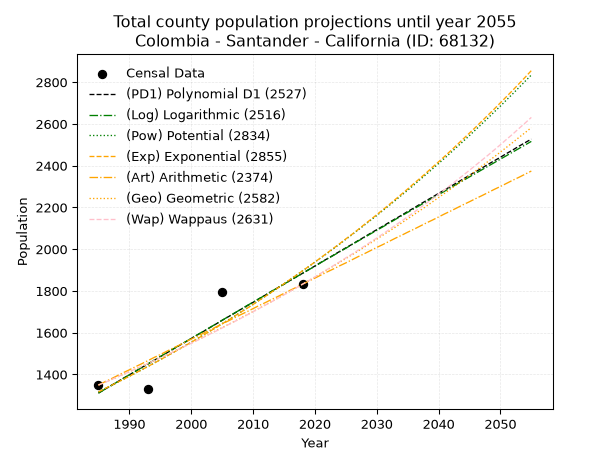
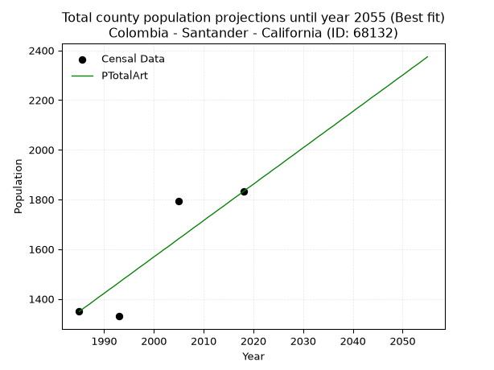
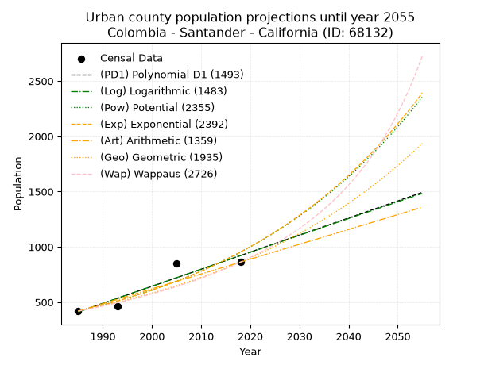
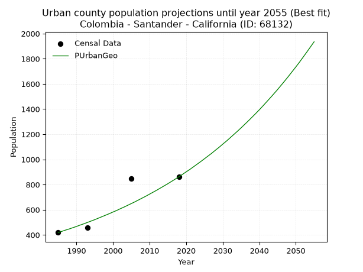
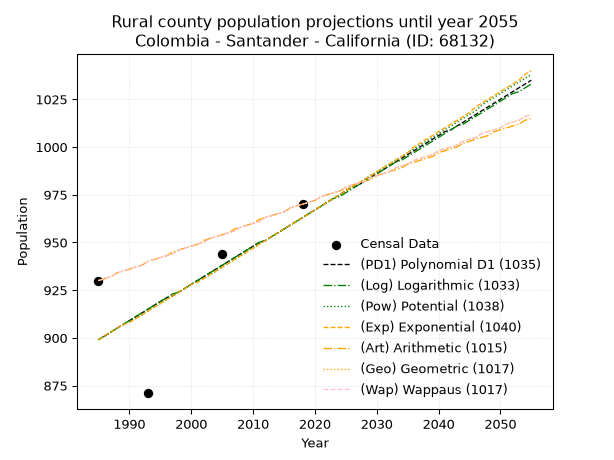
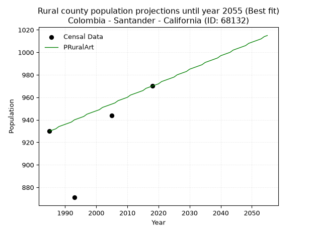

<div align="center">


</div>

# _“Population and Public Services Demand Projections (PPSD) until Year 2050 for Colombia - Santander - California (ID: 68132)”_
Keywords: `population` `public-service` `projection` `lineal` `polynomial` `logarithmic` `potential` `exponential` `arithmetic` `geometric` `wappaus` `dane` `colombia` `south-america`

PPSD are analytical estimates used by governments and planners to anticipate future changes in population size, age distribution, and the resulting community needs for utilities, healthcare, education, and infrastructure as sizing future water treatment facilities, electrical grids, and road networks based on spatial growth.

> **General running parameters**: • app_version: _v20260806_. • Python version: _3.14.7_. • Pandas version: _3.0.5_. • NumPy version: _2.5.1_. • Creates, save and include plots into reports (create_plot): _False_. • Projection until year: _2050_. • Process polynomial degree 2 and up: _False_. • Process Wappaus: _True_. • Process Wappaus: _True_. • Set negative values to zero: _True_. • Set infinite values to zero: _True_. • Drop dataset notes: _True_. 
<div align="center">

Dynamic map: [:earth_americas:Google](http://maps.google.com/maps?q=7.347988535,-72.9464914) [:earth_americas:OSM](https://www.openstreetmap.org/#map=18/7.347988535/-72.9464914&layers=P) [:earth_americas:Bing](https://www.bing.com/maps?cp=7.347988535~-72.9464914&lvl=18) [:earth_americas:Apple](https://maps.apple.com/frame?center=7.347988535%2C-72.9464914&span=0.003%2C0.006)

</div>


<div align="center">

```geojson
{
  "type": "Feature",
  "geometry": {
    "type": "Point", 
    "coordinates": [-72.9464914, 7.347988535]
  }, 
  "properties": {
    "Name": "Colombia - Santander - California (ID: 68132)"
  }
}
```

</div>


## 0. Census Data (4 records)

Census data are official statistics collected by a government about the people and housing in a country. They usually include counts of total population, age, sex, race, income, education, and jobs.

📅Global census file: [Population.xlsx](../data/Population.xlsx)

| Source   |   Year |   CountryID | CountryName   |   StateID | StateName   |   CountyID | CountyName   |   PTotal |   PUrban |   PRural |
|:---------|-------:|------------:|:--------------|----------:|:------------|-----------:|:-------------|---------:|---------:|---------:|
| DANE     |   1985 |          57 | Colombia      |        68 | Santander   |      68132 | California   |     1349 |      419 |      930 |
| DANE     |   1993 |          57 | Colombia      |        68 | Santander   |      68132 | California   |     1330 |      459 |      871 |
| DANE     |   2005 |          57 | Colombia      |        68 | Santander   |      68132 | California   |     1793 |      849 |      944 |
| DANE     |   2018 |          57 | Colombia      |        68 | Santander   |      68132 | California   |     1832 |      862 |      970 |

> 🔥Some records could had specific notes about the registered values or the corresponding urban or rural distribution.

## 1. Total

### 1.1. Coefficients and Parameters

* (PD1) Polynomial Deg 1: 17.37454837414688, -33177.440385387294 (lineal)
* (Log) Logarithmic: 34785.967367553974, -262832.41671802575
* (Pow) Potential: 22.140521839063503, -69.89494932775509
* (Exp) Exponential: 0.01105842355125871, 3.856266419743906e-07
* (Art) Arithmetic: Year diff. 2018 - 1985 = 33, Population diff. 1832 - 1349 = 483, Annual growth = 14.636363636363637
* (Geo) Geometric: Year diff. 2018 - 1985 = 33, Population diff. 1832 - 1349 = 483, Annual growth % = 0.009317219029922663
* (Wap) Wappaus: i = 0.9202366322768712, Condition values only valid for < 200)

<sub>
Wappaus condition values: ['0.00', '0.92', '1.84', '2.76', '3.68', '4.60', '5.52', '6.44', '7.36', '8.28', '9.20', '10.12', '11.04', '11.96', '12.88', '13.80', '14.72', '15.64', '16.56', '17.48', '18.40', '19.32', '20.25', '21.17', '22.09', '23.01', '23.93', '24.85', '25.77', '26.69', '27.61', '28.53', '29.45', '30.37', '31.29', '32.21', '33.13', '34.05', '34.97', '35.89', '36.81', '37.73', '38.65', '39.57', '40.49', '41.41', '42.33', '43.25', '44.17', '45.09', '46.01', '46.93', '47.85', '48.77', '49.69', '50.61', '51.53', '52.45', '53.37', '54.29', '55.21', '56.13', '57.05', '57.97', '58.90', '59.82']
</sub>


### 1.2. Projected Dataset

|   Year |   CountyID |   PTotalPD1 |   PTotalLog |   PTotalPow |   PTotalExp |   PTotalArt |   PTotalGeo |   PTotalWap |
|-------:|-----------:|------------:|------------:|------------:|------------:|------------:|------------:|------------:|
|   1985 |      68132 |        1311 |        1310 |        1316 |        1316 |        1349 |        1349 |        1349 |
|   1986 |      68132 |        1328 |        1328 |        1331 |        1331 |        1364 |        1362 |        1361 |
|   1987 |      68132 |        1346 |        1345 |        1345 |        1346 |        1378 |        1374 |        1374 |
|   1988 |      68132 |        1363 |        1363 |        1361 |        1361 |        1393 |        1387 |        1387 |
|   1989 |      68132 |        1381 |        1380 |        1376 |        1376 |        1408 |        1400 |        1400 |
|   1990 |      68132 |        1398 |        1398 |        1391 |        1391 |        1422 |        1413 |        1413 |
|   1991 |      68132 |        1415 |        1415 |        1407 |        1407 |        1437 |        1426 |        1426 |
|   1992 |      68132 |        1433 |        1433 |        1422 |        1422 |        1451 |        1439 |        1439 |
|   1993 |      68132 |        1450 |        1450 |        1438 |        1438 |        1466 |        1453 |        1452 |
|   1994 |      68132 |        1467 |        1468 |        1454 |        1454 |        1481 |        1466 |        1466 |
|   1995 |      68132 |        1485 |        1485 |        1471 |        1470 |        1495 |        1480 |        1479 |
|   1996 |      68132 |        1502 |        1503 |        1487 |        1487 |        1510 |        1494 |        1493 |
|   1997 |      68132 |        1520 |        1520 |        1504 |        1503 |        1525 |        1508 |        1507 |
|   1998 |      68132 |        1537 |        1538 |        1520 |        1520 |        1539 |        1522 |        1521 |
|   1999 |      68132 |        1554 |        1555 |        1537 |        1537 |        1554 |        1536 |        1535 |
|   2000 |      68132 |        1572 |        1572 |        1554 |        1554 |        1569 |        1550 |        1549 |
|   2001 |      68132 |        1589 |        1590 |        1572 |        1571 |        1583 |        1565 |        1563 |
|   2002 |      68132 |        1606 |        1607 |        1589 |        1589 |        1598 |        1579 |        1578 |
|   2003 |      68132 |        1624 |        1624 |        1607 |        1606 |        1612 |        1594 |        1593 |
|   2004 |      68132 |        1641 |        1642 |        1625 |        1624 |        1627 |        1609 |        1607 |
|   2005 |      68132 |        1659 |        1659 |        1643 |        1642 |        1642 |        1624 |        1622 |
|   2006 |      68132 |        1676 |        1677 |        1661 |        1660 |        1656 |        1639 |        1638 |
|   2007 |      68132 |        1693 |        1694 |        1679 |        1679 |        1671 |        1654 |        1653 |
|   2008 |      68132 |        1711 |        1711 |        1698 |        1698 |        1686 |        1670 |        1668 |
|   2009 |      68132 |        1728 |        1729 |        1717 |        1716 |        1700 |        1685 |        1684 |
|   2010 |      68132 |        1745 |        1746 |        1736 |        1735 |        1715 |        1701 |        1700 |
|   2011 |      68132 |        1763 |        1763 |        1755 |        1755 |        1730 |        1717 |        1716 |
|   2012 |      68132 |        1780 |        1780 |        1775 |        1774 |        1744 |        1733 |        1732 |
|   2013 |      68132 |        1798 |        1798 |        1794 |        1794 |        1759 |        1749 |        1748 |
|   2014 |      68132 |        1815 |        1815 |        1814 |        1814 |        1773 |        1765 |        1764 |
|   2015 |      68132 |        1832 |        1832 |        1834 |        1834 |        1788 |        1782 |        1781 |
|   2016 |      68132 |        1850 |        1850 |        1854 |        1855 |        1803 |        1798 |        1798 |
|   2017 |      68132 |        1867 |        1867 |        1875 |        1875 |        1817 |        1815 |        1815 |
|   2018 |      68132 |        1884 |        1884 |        1896 |        1896 |        1832 |        1832 |        1832 |
|   2019 |      68132 |        1902 |        1901 |        1916 |        1917 |        1847 |        1849 |        1849 |
|   2020 |      68132 |        1919 |        1918 |        1938 |        1938 |        1861 |        1866 |        1867 |
|   2021 |      68132 |        1937 |        1936 |        1959 |        1960 |        1876 |        1884 |        1885 |
|   2022 |      68132 |        1954 |        1953 |        1980 |        1982 |        1891 |        1901 |        1903 |
|   2023 |      68132 |        1971 |        1970 |        2002 |        2004 |        1905 |        1919 |        1921 |
|   2024 |      68132 |        1989 |        1987 |        2024 |        2026 |        1920 |        1937 |        1939 |
|   2025 |      68132 |        2006 |        2004 |        2047 |        2049 |        1934 |        1955 |        1958 |
|   2026 |      68132 |        2023 |        2022 |        2069 |        2071 |        1949 |        1973 |        1976 |
|   2027 |      68132 |        2041 |        2039 |        2092 |        2094 |        1964 |        1991 |        1995 |
|   2028 |      68132 |        2058 |        2056 |        2115 |        2118 |        1978 |        2010 |        2014 |
|   2029 |      68132 |        2076 |        2073 |        2138 |        2141 |        1993 |        2029 |        2034 |
|   2030 |      68132 |        2093 |        2090 |        2161 |        2165 |        2008 |        2048 |        2053 |
|   2031 |      68132 |        2110 |        2107 |        2185 |        2189 |        2022 |        2067 |        2073 |
|   2032 |      68132 |        2128 |        2124 |        2209 |        2213 |        2037 |        2086 |        2093 |
|   2033 |      68132 |        2145 |        2142 |        2233 |        2238 |        2052 |        2105 |        2114 |
|   2034 |      68132 |        2162 |        2159 |        2258 |        2263 |        2066 |        2125 |        2134 |
|   2035 |      68132 |        2180 |        2176 |        2282 |        2288 |        2081 |        2145 |        2155 |
|   2036 |      68132 |        2197 |        2193 |        2307 |        2314 |        2095 |        2165 |        2176 |
|   2037 |      68132 |        2215 |        2210 |        2333 |        2339 |        2110 |        2185 |        2198 |
|   2038 |      68132 |        2232 |        2227 |        2358 |        2365 |        2125 |        2205 |        2219 |
|   2039 |      68132 |        2249 |        2244 |        2384 |        2392 |        2139 |        2226 |        2241 |
|   2040 |      68132 |        2267 |        2261 |        2410 |        2418 |        2154 |        2247 |        2263 |
|   2041 |      68132 |        2284 |        2278 |        2436 |        2445 |        2169 |        2268 |        2285 |
|   2042 |      68132 |        2301 |        2295 |        2463 |        2472 |        2183 |        2289 |        2308 |
|   2043 |      68132 |        2319 |        2312 |        2490 |        2500 |        2198 |        2310 |        2331 |
|   2044 |      68132 |        2336 |        2329 |        2517 |        2528 |        2213 |        2332 |        2354 |
|   2045 |      68132 |        2354 |        2346 |        2544 |        2556 |        2227 |        2353 |        2378 |
|   2046 |      68132 |        2371 |        2363 |        2572 |        2584 |        2242 |        2375 |        2402 |
|   2047 |      68132 |        2388 |        2380 |        2600 |        2613 |        2256 |        2397 |        2426 |
|   2048 |      68132 |        2406 |        2397 |        2628 |        2642 |        2271 |        2420 |        2450 |
|   2049 |      68132 |        2423 |        2414 |        2657 |        2671 |        2286 |        2442 |        2475 |
|   2050 |      68132 |        2440 |        2431 |        2685 |        2701 |        2300 |        2465 |        2500 |
<div align="center">

</img>

</div>


### 1.3. Best fit with absolute and relative error (%)

Relative error puts that difference into context by dividing the absolute error by the true value, creating a unitless ratio or percentage that shows the scale of the mistake.

Absolute and relative error

|   Year | Source   |   CountryID | CountryName   |   StateID | StateName   |   CountyID_x | CountyName   |   PTotal |   PUrban |   PRural |   CountyID_y |   PTotalPD1 |   PTotalLog |   PTotalPow |   PTotalExp |   PTotalArt |   PTotalGeo |   PTotalWap |   PTotalPD1AbsError |   PTotalLogAbsError |   PTotalPowAbsError |   PTotalExpAbsError |   PTotalArtAbsError |   PTotalGeoAbsError |   PTotalWapAbsError |   PTotalPD1RelError |   PTotalLogRelError |   PTotalPowRelError |   PTotalExpRelError |   PTotalArtRelError |   PTotalGeoRelError |   PTotalWapRelError |
|-------:|:---------|------------:|:--------------|----------:|:------------|-------------:|:-------------|---------:|---------:|---------:|-------------:|------------:|------------:|------------:|------------:|------------:|------------:|------------:|--------------------:|--------------------:|--------------------:|--------------------:|--------------------:|--------------------:|--------------------:|--------------------:|--------------------:|--------------------:|--------------------:|--------------------:|--------------------:|--------------------:|
|   1985 | DANE     |          57 | Colombia      |        68 | Santander   |        68132 | California   |     1349 |      419 |      930 |        68132 |        1311 |        1310 |        1316 |        1316 |        1349 |        1349 |        1349 |                  38 |                  39 |                  33 |                  33 |                   0 |                   0 |                   0 |             2.8169  |             2.89103 |             2.44626 |             2.44626 |             0       |             0       |             0       |
|   1993 | DANE     |          57 | Colombia      |        68 | Santander   |        68132 | California   |     1330 |      459 |      871 |        68132 |        1450 |        1450 |        1438 |        1438 |        1466 |        1453 |        1452 |                 120 |                 120 |                 108 |                 108 |                 136 |                 123 |                 122 |             9.02256 |             9.02256 |             8.1203  |             8.1203  |            10.2256  |             9.24812 |             9.17293 |
|   2005 | DANE     |          57 | Colombia      |        68 | Santander   |        68132 | California   |     1793 |      849 |      944 |        68132 |        1659 |        1659 |        1643 |        1642 |        1642 |        1624 |        1622 |                 134 |                 134 |                 150 |                 151 |                 151 |                 169 |                 171 |             7.47351 |             7.47351 |             8.36587 |             8.42164 |             8.42164 |             9.42554 |             9.53709 |
|   2018 | DANE     |          57 | Colombia      |        68 | Santander   |        68132 | California   |     1832 |      862 |      970 |        68132 |        1884 |        1884 |        1896 |        1896 |        1832 |        1832 |        1832 |                  52 |                  52 |                  64 |                  64 |                   0 |                   0 |                   0 |             2.83843 |             2.83843 |             3.49345 |             3.49345 |             0       |             0       |             0       |

Relative error mean

| Method    |   RelError | Best   |
|:----------|-----------:|:-------|
| PTotalPD1 |    5.53785 |        |
| PTotalLog |    5.55638 |        |
| PTotalPow |    5.60647 |        |
| PTotalExp |    5.62041 |        |
| PTotalArt |    4.6618  | True   |
| PTotalGeo |    4.66842 |        |
| PTotalWap |    4.67751 |        |

💙Best method: _**PTotalArt**_
<div align="center">

</img>

</div>


### 1.4. Fresh water supply demand in liters per capita per day (lpcd)

The fresh water supply demand typically ranges from 100 to 300 liters per capita per day (lpcd) for standard domestic and municipal planning, though absolute survival minimums set by the World Health Organization are as low as 7.5 to 20 liters per day, and total consumption in high-income nations can exceed 400 liters.

> `CZ`: Level in meters above the sea level (masl)<br> `WS`: Fresh water supply demand in liters per capita per day (lpcd or l/h/d)<br> `WSAll`: Zonal fresh water supply demand in liters per second (l/s)<br> `A`: Zonal area in square meters<br> `DP`: Population density (people/hectare)

Reference values (RAS Colombia)

|    CZ |   WS |
|------:|-----:|
|  1000 |  120 |
|  2000 |  130 |
| 99999 |  140 |

County shapefile geometry properties and water supply values

|   CountyID |      ATotal |   CZTotal |   WSTotal |
|-----------:|------------:|----------:|----------:|
|      68132 | 4.49236e+07 |   2718.53 |       140 |

Projected values for best method: PTotalArt

|   CountyID |   Year |   PTotalArt |   DPTotal |   WSTotal |   WSTotalAll |
|-----------:|-------:|------------:|----------:|----------:|-------------:|
|      68132 |   1985 |        1349 |      0.3  |       140 |      2.18588 |
|      68132 |   1986 |        1364 |      0.3  |       140 |      2.21019 |
|      68132 |   1987 |        1378 |      0.31 |       140 |      2.23287 |
|      68132 |   1988 |        1393 |      0.31 |       140 |      2.25718 |
|      68132 |   1989 |        1408 |      0.31 |       140 |      2.28148 |
|      68132 |   1990 |        1422 |      0.32 |       140 |      2.30417 |
|      68132 |   1991 |        1437 |      0.32 |       140 |      2.32847 |
|      68132 |   1992 |        1451 |      0.32 |       140 |      2.35116 |
|      68132 |   1993 |        1466 |      0.33 |       140 |      2.37546 |
|      68132 |   1994 |        1481 |      0.33 |       140 |      2.39977 |
|      68132 |   1995 |        1495 |      0.33 |       140 |      2.42245 |
|      68132 |   1996 |        1510 |      0.34 |       140 |      2.44676 |
|      68132 |   1997 |        1525 |      0.34 |       140 |      2.47106 |
|      68132 |   1998 |        1539 |      0.34 |       140 |      2.49375 |
|      68132 |   1999 |        1554 |      0.35 |       140 |      2.51806 |
|      68132 |   2000 |        1569 |      0.35 |       140 |      2.54236 |
|      68132 |   2001 |        1583 |      0.35 |       140 |      2.56505 |
|      68132 |   2002 |        1598 |      0.36 |       140 |      2.58935 |
|      68132 |   2003 |        1612 |      0.36 |       140 |      2.61204 |
|      68132 |   2004 |        1627 |      0.36 |       140 |      2.63634 |
|      68132 |   2005 |        1642 |      0.37 |       140 |      2.66065 |
|      68132 |   2006 |        1656 |      0.37 |       140 |      2.68333 |
|      68132 |   2007 |        1671 |      0.37 |       140 |      2.70764 |
|      68132 |   2008 |        1686 |      0.38 |       140 |      2.73194 |
|      68132 |   2009 |        1700 |      0.38 |       140 |      2.75463 |
|      68132 |   2010 |        1715 |      0.38 |       140 |      2.77894 |
|      68132 |   2011 |        1730 |      0.39 |       140 |      2.80324 |
|      68132 |   2012 |        1744 |      0.39 |       140 |      2.82593 |
|      68132 |   2013 |        1759 |      0.39 |       140 |      2.85023 |
|      68132 |   2014 |        1773 |      0.39 |       140 |      2.87292 |
|      68132 |   2015 |        1788 |      0.4  |       140 |      2.89722 |
|      68132 |   2016 |        1803 |      0.4  |       140 |      2.92153 |
|      68132 |   2017 |        1817 |      0.4  |       140 |      2.94421 |
|      68132 |   2018 |        1832 |      0.41 |       140 |      2.96852 |
|      68132 |   2019 |        1847 |      0.41 |       140 |      2.99282 |
|      68132 |   2020 |        1861 |      0.41 |       140 |      3.01551 |
|      68132 |   2021 |        1876 |      0.42 |       140 |      3.03981 |
|      68132 |   2022 |        1891 |      0.42 |       140 |      3.06412 |
|      68132 |   2023 |        1905 |      0.42 |       140 |      3.08681 |
|      68132 |   2024 |        1920 |      0.43 |       140 |      3.11111 |
|      68132 |   2025 |        1934 |      0.43 |       140 |      3.1338  |
|      68132 |   2026 |        1949 |      0.43 |       140 |      3.1581  |
|      68132 |   2027 |        1964 |      0.44 |       140 |      3.18241 |
|      68132 |   2028 |        1978 |      0.44 |       140 |      3.20509 |
|      68132 |   2029 |        1993 |      0.44 |       140 |      3.2294  |
|      68132 |   2030 |        2008 |      0.45 |       140 |      3.2537  |
|      68132 |   2031 |        2022 |      0.45 |       140 |      3.27639 |
|      68132 |   2032 |        2037 |      0.45 |       140 |      3.30069 |
|      68132 |   2033 |        2052 |      0.46 |       140 |      3.325   |
|      68132 |   2034 |        2066 |      0.46 |       140 |      3.34769 |
|      68132 |   2035 |        2081 |      0.46 |       140 |      3.37199 |
|      68132 |   2036 |        2095 |      0.47 |       140 |      3.39468 |
|      68132 |   2037 |        2110 |      0.47 |       140 |      3.41898 |
|      68132 |   2038 |        2125 |      0.47 |       140 |      3.44329 |
|      68132 |   2039 |        2139 |      0.48 |       140 |      3.46597 |
|      68132 |   2040 |        2154 |      0.48 |       140 |      3.49028 |
|      68132 |   2041 |        2169 |      0.48 |       140 |      3.51458 |
|      68132 |   2042 |        2183 |      0.49 |       140 |      3.53727 |
|      68132 |   2043 |        2198 |      0.49 |       140 |      3.56157 |
|      68132 |   2044 |        2213 |      0.49 |       140 |      3.58588 |
|      68132 |   2045 |        2227 |      0.5  |       140 |      3.60856 |
|      68132 |   2046 |        2242 |      0.5  |       140 |      3.63287 |
|      68132 |   2047 |        2256 |      0.5  |       140 |      3.65556 |
|      68132 |   2048 |        2271 |      0.51 |       140 |      3.67986 |
|      68132 |   2049 |        2286 |      0.51 |       140 |      3.70417 |
|      68132 |   2050 |        2300 |      0.51 |       140 |      3.72685 |

## 2. Urban

### 2.1. Coefficients and Parameters

* (PD1) Polynomial Deg 1: 15.440786832597311, -30238.18386190277 (lineal)
* (Log) Logarithmic: 30921.088514404386, -234384.19158404024
* (Pow) Potential: 49.838879195472494, -161.73480944737568
* (Exp) Exponential: 0.02488625714573729, 1.47394106195901e-19
* (Art) Arithmetic: Year diff. 2018 - 1985 = 33, Population diff. 862 - 419 = 443, Annual growth = 13.424242424242424
* (Geo) Geometric: Year diff. 2018 - 1985 = 33, Population diff. 862 - 419 = 443, Annual growth % = 0.02210081511256412
* (Wap) Wappaus: i = 2.095900456556194, Condition values only valid for < 200)

<sub>
Wappaus condition values: ['0.00', '2.10', '4.19', '6.29', '8.38', '10.48', '12.58', '14.67', '16.77', '18.86', '20.96', '23.05', '25.15', '27.25', '29.34', '31.44', '33.53', '35.63', '37.73', '39.82', '41.92', '44.01', '46.11', '48.21', '50.30', '52.40', '54.49', '56.59', '58.69', '60.78', '62.88', '64.97', '67.07', '69.16', '71.26', '73.36', '75.45', '77.55', '79.64', '81.74', '83.84', '85.93', '88.03', '90.12', '92.22', '94.32', '96.41', '98.51', '100.60', '102.70', '104.80', '106.89', '108.99', '111.08', '113.18', '115.27', '117.37', '119.47', '121.56', '123.66', '125.75', '127.85', '129.95', '132.04', '134.14', '136.23']
</sub>


### 2.2. Projected Dataset

|   Year |   CountyID |   PUrbanPD1 |   PUrbanLog |   PUrbanPow |   PUrbanExp |   PUrbanArt |   PUrbanGeo |   PUrbanWap |
|-------:|-----------:|------------:|------------:|------------:|------------:|------------:|------------:|------------:|
|   1985 |      68132 |         412 |         411 |         419 |         419 |         419 |         419 |         419 |
|   1986 |      68132 |         427 |         427 |         429 |         430 |         432 |         428 |         428 |
|   1987 |      68132 |         443 |         442 |         440 |         440 |         446 |         438 |         437 |
|   1988 |      68132 |         458 |         458 |         451 |         452 |         459 |         447 |         446 |
|   1989 |      68132 |         474 |         473 |         463 |         463 |         473 |         457 |         456 |
|   1990 |      68132 |         489 |         489 |         475 |         475 |         486 |         467 |         465 |
|   1991 |      68132 |         504 |         505 |         487 |         487 |         500 |         478 |         475 |
|   1992 |      68132 |         520 |         520 |         499 |         499 |         513 |         488 |         485 |
|   1993 |      68132 |         535 |         536 |         512 |         511 |         526 |         499 |         496 |
|   1994 |      68132 |         551 |         551 |         525 |         524 |         540 |         510 |         506 |
|   1995 |      68132 |         566 |         567 |         538 |         537 |         553 |         521 |         517 |
|   1996 |      68132 |         582 |         582 |         551 |         551 |         567 |         533 |         528 |
|   1997 |      68132 |         597 |         598 |         565 |         565 |         580 |         545 |         540 |
|   1998 |      68132 |         613 |         613 |         580 |         579 |         594 |         557 |         551 |
|   1999 |      68132 |         628 |         629 |         594 |         594 |         607 |         569 |         563 |
|   2000 |      68132 |         643 |         644 |         609 |         609 |         620 |         582 |         575 |
|   2001 |      68132 |         659 |         659 |         625 |         624 |         634 |         594 |         588 |
|   2002 |      68132 |         674 |         675 |         640 |         640 |         647 |         608 |         601 |
|   2003 |      68132 |         690 |         690 |         657 |         656 |         661 |         621 |         614 |
|   2004 |      68132 |         705 |         706 |         673 |         672 |         674 |         635 |         627 |
|   2005 |      68132 |         721 |         721 |         690 |         689 |         687 |         649 |         641 |
|   2006 |      68132 |         736 |         737 |         707 |         707 |         701 |         663 |         655 |
|   2007 |      68132 |         751 |         752 |         725 |         725 |         714 |         678 |         670 |
|   2008 |      68132 |         767 |         767 |         743 |         743 |         728 |         693 |         685 |
|   2009 |      68132 |         782 |         783 |         762 |         762 |         741 |         708 |         701 |
|   2010 |      68132 |         798 |         798 |         781 |         781 |         755 |         724 |         716 |
|   2011 |      68132 |         813 |         814 |         801 |         800 |         768 |         740 |         733 |
|   2012 |      68132 |         829 |         829 |         821 |         821 |         781 |         756 |         750 |
|   2013 |      68132 |         844 |         844 |         842 |         841 |         795 |         773 |         767 |
|   2014 |      68132 |         860 |         860 |         863 |         862 |         808 |         790 |         785 |
|   2015 |      68132 |         875 |         875 |         884 |         884 |         822 |         807 |         803 |
|   2016 |      68132 |         890 |         890 |         906 |         906 |         835 |         825 |         822 |
|   2017 |      68132 |         906 |         906 |         929 |         929 |         849 |         843 |         842 |
|   2018 |      68132 |         921 |         921 |         952 |         953 |         862 |         862 |         862 |
|   2019 |      68132 |         937 |         936 |         976 |         977 |         875 |         881 |         883 |
|   2020 |      68132 |         952 |         952 |        1000 |        1001 |         889 |         901 |         904 |
|   2021 |      68132 |         968 |         967 |        1025 |        1027 |         902 |         920 |         927 |
|   2022 |      68132 |         983 |         982 |        1051 |        1052 |         916 |         941 |         950 |
|   2023 |      68132 |         999 |         998 |        1077 |        1079 |         929 |         962 |         974 |
|   2024 |      68132 |        1014 |        1013 |        1104 |        1106 |         943 |         983 |         998 |
|   2025 |      68132 |        1029 |        1028 |        1132 |        1134 |         956 |        1005 |        1024 |
|   2026 |      68132 |        1045 |        1043 |        1160 |        1163 |         969 |        1027 |        1050 |
|   2027 |      68132 |        1060 |        1059 |        1189 |        1192 |         983 |        1049 |        1078 |
|   2028 |      68132 |        1076 |        1074 |        1218 |        1222 |         996 |        1073 |        1106 |
|   2029 |      68132 |        1091 |        1089 |        1249 |        1253 |        1010 |        1096 |        1136 |
|   2030 |      68132 |        1107 |        1104 |        1280 |        1284 |        1023 |        1121 |        1167 |
|   2031 |      68132 |        1122 |        1120 |        1311 |        1317 |        1037 |        1145 |        1199 |
|   2032 |      68132 |        1137 |        1135 |        1344 |        1350 |        1050 |        1171 |        1232 |
|   2033 |      68132 |        1153 |        1150 |        1377 |        1384 |        1063 |        1197 |        1267 |
|   2034 |      68132 |        1168 |        1165 |        1412 |        1419 |        1077 |        1223 |        1303 |
|   2035 |      68132 |        1184 |        1180 |        1447 |        1454 |        1090 |        1250 |        1341 |
|   2036 |      68132 |        1199 |        1196 |        1482 |        1491 |        1104 |        1278 |        1381 |
|   2037 |      68132 |        1215 |        1211 |        1519 |        1529 |        1117 |        1306 |        1422 |
|   2038 |      68132 |        1230 |        1226 |        1557 |        1567 |        1130 |        1335 |        1466 |
|   2039 |      68132 |        1246 |        1241 |        1595 |        1607 |        1144 |        1364 |        1511 |
|   2040 |      68132 |        1261 |        1256 |        1635 |        1647 |        1157 |        1394 |        1559 |
|   2041 |      68132 |        1276 |        1271 |        1675 |        1689 |        1171 |        1425 |        1609 |
|   2042 |      68132 |        1292 |        1287 |        1717 |        1731 |        1184 |        1457 |        1662 |
|   2043 |      68132 |        1307 |        1302 |        1759 |        1775 |        1198 |        1489 |        1718 |
|   2044 |      68132 |        1323 |        1317 |        1802 |        1820 |        1211 |        1522 |        1776 |
|   2045 |      68132 |        1338 |        1332 |        1847 |        1865 |        1224 |        1555 |        1838 |
|   2046 |      68132 |        1354 |        1347 |        1892 |        1912 |        1238 |        1590 |        1904 |
|   2047 |      68132 |        1369 |        1362 |        1939 |        1961 |        1251 |        1625 |        1973 |
|   2048 |      68132 |        1385 |        1377 |        1987 |        2010 |        1265 |        1661 |        2047 |
|   2049 |      68132 |        1400 |        1392 |        2036 |        2061 |        1278 |        1698 |        2126 |
|   2050 |      68132 |        1415 |        1408 |        2086 |        2113 |        1292 |        1735 |        2209 |
<div align="center">

</img>

</div>


### 2.3. Best fit with absolute and relative error (%)

Relative error puts that difference into context by dividing the absolute error by the true value, creating a unitless ratio or percentage that shows the scale of the mistake.

Absolute and relative error

|   Year | Source   |   CountryID | CountryName   |   StateID | StateName   |   CountyID_x | CountyName   |   PTotal |   PUrban |   PRural |   CountyID_y |   PUrbanPD1 |   PUrbanLog |   PUrbanPow |   PUrbanExp |   PUrbanArt |   PUrbanGeo |   PUrbanWap |   PUrbanPD1AbsError |   PUrbanLogAbsError |   PUrbanPowAbsError |   PUrbanExpAbsError |   PUrbanArtAbsError |   PUrbanGeoAbsError |   PUrbanWapAbsError |   PUrbanPD1RelError |   PUrbanLogRelError |   PUrbanPowRelError |   PUrbanExpRelError |   PUrbanArtRelError |   PUrbanGeoRelError |   PUrbanWapRelError |
|-------:|:---------|------------:|:--------------|----------:|:------------|-------------:|:-------------|---------:|---------:|---------:|-------------:|------------:|------------:|------------:|------------:|------------:|------------:|------------:|--------------------:|--------------------:|--------------------:|--------------------:|--------------------:|--------------------:|--------------------:|--------------------:|--------------------:|--------------------:|--------------------:|--------------------:|--------------------:|--------------------:|
|   1985 | DANE     |          57 | Colombia      |        68 | Santander   |        68132 | California   |     1349 |      419 |      930 |        68132 |         412 |         411 |         419 |         419 |         419 |         419 |         419 |                   7 |                   8 |                   0 |                   0 |                   0 |                   0 |                   0 |             1.67064 |             1.90931 |              0      |              0      |              0      |              0      |              0      |
|   1993 | DANE     |          57 | Colombia      |        68 | Santander   |        68132 | California   |     1330 |      459 |      871 |        68132 |         535 |         536 |         512 |         511 |         526 |         499 |         496 |                  76 |                  77 |                  53 |                  52 |                  67 |                  40 |                  37 |            16.5577  |            16.7756  |             11.5468 |             11.329  |             14.5969 |              8.7146 |              8.061  |
|   2005 | DANE     |          57 | Colombia      |        68 | Santander   |        68132 | California   |     1793 |      849 |      944 |        68132 |         721 |         721 |         690 |         689 |         687 |         649 |         641 |                 128 |                 128 |                 159 |                 160 |                 162 |                 200 |                 208 |            15.0766  |            15.0766  |             18.7279 |             18.8457 |             19.0813 |             23.5571 |             24.4994 |
|   2018 | DANE     |          57 | Colombia      |        68 | Santander   |        68132 | California   |     1832 |      862 |      970 |        68132 |         921 |         921 |         952 |         953 |         862 |         862 |         862 |                  59 |                  59 |                  90 |                  91 |                   0 |                   0 |                   0 |             6.84455 |             6.84455 |             10.4408 |             10.5568 |              0      |              0      |              0      |

Relative error mean

| Method    |   RelError | Best   |
|:----------|-----------:|:-------|
| PUrbanPD1 |   10.0374  |        |
| PUrbanLog |   10.1515  |        |
| PUrbanPow |   10.1789  |        |
| PUrbanExp |   10.1829  |        |
| PUrbanArt |    8.41956 |        |
| PUrbanGeo |    8.06793 | True   |
| PUrbanWap |    8.1401  |        |

💙Best method: _**PUrbanGeo**_
<div align="center">

</img>

</div>


### 2.4. Fresh water supply demand in liters per capita per day (lpcd)

The fresh water supply demand typically ranges from 100 to 300 liters per capita per day (lpcd) for standard domestic and municipal planning, though absolute survival minimums set by the World Health Organization are as low as 7.5 to 20 liters per day, and total consumption in high-income nations can exceed 400 liters.

> `CZ`: Level in meters above the sea level (masl)<br> `WS`: Fresh water supply demand in liters per capita per day (lpcd or l/h/d)<br> `WSAll`: Zonal fresh water supply demand in liters per second (l/s)<br> `A`: Zonal area in square meters<br> `DP`: Population density (people/hectare)

Reference values (RAS Colombia)

|    CZ |   WS |
|------:|-----:|
|  1000 |  120 |
|  2000 |  130 |
| 99999 |  140 |

County shapefile geometry properties and water supply values

|   CountyID |   AUrban |   CZUrban |   WSUrban |
|-----------:|---------:|----------:|----------:|
|      68132 |   142385 |   2018.95 |       140 |

Projected values for best method: PUrbanGeo

|   CountyID |   Year |   PUrbanGeo |   DPUrban |   WSUrban |   WSUrbanAll |
|-----------:|-------:|------------:|----------:|----------:|-------------:|
|      68132 |   1985 |         419 |     29.43 |       140 |     0.678935 |
|      68132 |   1986 |         428 |     30.06 |       140 |     0.693519 |
|      68132 |   1987 |         438 |     30.76 |       140 |     0.709722 |
|      68132 |   1988 |         447 |     31.39 |       140 |     0.724306 |
|      68132 |   1989 |         457 |     32.1  |       140 |     0.740509 |
|      68132 |   1990 |         467 |     32.8  |       140 |     0.756713 |
|      68132 |   1991 |         478 |     33.57 |       140 |     0.774537 |
|      68132 |   1992 |         488 |     34.27 |       140 |     0.790741 |
|      68132 |   1993 |         499 |     35.05 |       140 |     0.808565 |
|      68132 |   1994 |         510 |     35.82 |       140 |     0.826389 |
|      68132 |   1995 |         521 |     36.59 |       140 |     0.844213 |
|      68132 |   1996 |         533 |     37.43 |       140 |     0.863657 |
|      68132 |   1997 |         545 |     38.28 |       140 |     0.883102 |
|      68132 |   1998 |         557 |     39.12 |       140 |     0.902546 |
|      68132 |   1999 |         569 |     39.96 |       140 |     0.921991 |
|      68132 |   2000 |         582 |     40.88 |       140 |     0.943056 |
|      68132 |   2001 |         594 |     41.72 |       140 |     0.9625   |
|      68132 |   2002 |         608 |     42.7  |       140 |     0.985185 |
|      68132 |   2003 |         621 |     43.61 |       140 |     1.00625  |
|      68132 |   2004 |         635 |     44.6  |       140 |     1.02894  |
|      68132 |   2005 |         649 |     45.58 |       140 |     1.05162  |
|      68132 |   2006 |         663 |     46.56 |       140 |     1.07431  |
|      68132 |   2007 |         678 |     47.62 |       140 |     1.09861  |
|      68132 |   2008 |         693 |     48.67 |       140 |     1.12292  |
|      68132 |   2009 |         708 |     49.72 |       140 |     1.14722  |
|      68132 |   2010 |         724 |     50.85 |       140 |     1.17315  |
|      68132 |   2011 |         740 |     51.97 |       140 |     1.19907  |
|      68132 |   2012 |         756 |     53.1  |       140 |     1.225    |
|      68132 |   2013 |         773 |     54.29 |       140 |     1.25255  |
|      68132 |   2014 |         790 |     55.48 |       140 |     1.28009  |
|      68132 |   2015 |         807 |     56.68 |       140 |     1.30764  |
|      68132 |   2016 |         825 |     57.94 |       140 |     1.33681  |
|      68132 |   2017 |         843 |     59.21 |       140 |     1.36597  |
|      68132 |   2018 |         862 |     60.54 |       140 |     1.39676  |
|      68132 |   2019 |         881 |     61.87 |       140 |     1.42755  |
|      68132 |   2020 |         901 |     63.28 |       140 |     1.45995  |
|      68132 |   2021 |         920 |     64.61 |       140 |     1.49074  |
|      68132 |   2022 |         941 |     66.09 |       140 |     1.52477  |
|      68132 |   2023 |         962 |     67.56 |       140 |     1.5588   |
|      68132 |   2024 |         983 |     69.04 |       140 |     1.59282  |
|      68132 |   2025 |        1005 |     70.58 |       140 |     1.62847  |
|      68132 |   2026 |        1027 |     72.13 |       140 |     1.66412  |
|      68132 |   2027 |        1049 |     73.67 |       140 |     1.69977  |
|      68132 |   2028 |        1073 |     75.36 |       140 |     1.73866  |
|      68132 |   2029 |        1096 |     76.97 |       140 |     1.77593  |
|      68132 |   2030 |        1121 |     78.73 |       140 |     1.81644  |
|      68132 |   2031 |        1145 |     80.42 |       140 |     1.85532  |
|      68132 |   2032 |        1171 |     82.24 |       140 |     1.89745  |
|      68132 |   2033 |        1197 |     84.07 |       140 |     1.93958  |
|      68132 |   2034 |        1223 |     85.89 |       140 |     1.98171  |
|      68132 |   2035 |        1250 |     87.79 |       140 |     2.02546  |
|      68132 |   2036 |        1278 |     89.76 |       140 |     2.07083  |
|      68132 |   2037 |        1306 |     91.72 |       140 |     2.1162   |
|      68132 |   2038 |        1335 |     93.76 |       140 |     2.16319  |
|      68132 |   2039 |        1364 |     95.8  |       140 |     2.21019  |
|      68132 |   2040 |        1394 |     97.9  |       140 |     2.2588   |
|      68132 |   2041 |        1425 |    100.08 |       140 |     2.30903  |
|      68132 |   2042 |        1457 |    102.33 |       140 |     2.36088  |
|      68132 |   2043 |        1489 |    104.58 |       140 |     2.41273  |
|      68132 |   2044 |        1522 |    106.89 |       140 |     2.4662   |
|      68132 |   2045 |        1555 |    109.21 |       140 |     2.51968  |
|      68132 |   2046 |        1590 |    111.67 |       140 |     2.57639  |
|      68132 |   2047 |        1625 |    114.13 |       140 |     2.6331   |
|      68132 |   2048 |        1661 |    116.66 |       140 |     2.69144  |
|      68132 |   2049 |        1698 |    119.25 |       140 |     2.75139  |
|      68132 |   2050 |        1735 |    121.85 |       140 |     2.81134  |

## 3. Rural

### 3.1. Coefficients and Parameters

* (PD1) Polynomial Deg 1: 1.9337615415495544, -2939.256523484496 (lineal)
* (Log) Logarithmic: 3864.8788531496075, -28448.225133985576
* (Pow) Potential: 4.151668312446108, -10.737410742104553
* (Exp) Exponential: 0.002077294720744262, 14.555274477785325
* (Art) Arithmetic: Year diff. 2018 - 1985 = 33, Population diff. 970 - 930 = 40, Annual growth = 1.2121212121212122
* (Geo) Geometric: Year diff. 2018 - 1985 = 33, Population diff. 970 - 930 = 40, Annual growth % = 0.0012769201858982004
* (Wap) Wappaus: i = 0.12759170653907495, Condition values only valid for < 200)

<sub>
Wappaus condition values: ['0.00', '0.13', '0.26', '0.38', '0.51', '0.64', '0.77', '0.89', '1.02', '1.15', '1.28', '1.40', '1.53', '1.66', '1.79', '1.91', '2.04', '2.17', '2.30', '2.42', '2.55', '2.68', '2.81', '2.93', '3.06', '3.19', '3.32', '3.44', '3.57', '3.70', '3.83', '3.96', '4.08', '4.21', '4.34', '4.47', '4.59', '4.72', '4.85', '4.98', '5.10', '5.23', '5.36', '5.49', '5.61', '5.74', '5.87', '6.00', '6.12', '6.25', '6.38', '6.51', '6.63', '6.76', '6.89', '7.02', '7.15', '7.27', '7.40', '7.53', '7.66', '7.78', '7.91', '8.04', '8.17', '8.29']
</sub>


### 3.2. Projected Dataset

|   Year |   CountyID |   PRuralPD1 |   PRuralLog |   PRuralPow |   PRuralExp |   PRuralArt |   PRuralGeo |   PRuralWap |
|-------:|-----------:|------------:|------------:|------------:|------------:|------------:|------------:|------------:|
|   1985 |      68132 |         899 |         899 |         899 |         899 |         930 |         930 |         930 |
|   1986 |      68132 |         901 |         901 |         901 |         901 |         931 |         931 |         931 |
|   1987 |      68132 |         903 |         903 |         903 |         903 |         932 |         932 |         932 |
|   1988 |      68132 |         905 |         905 |         905 |         905 |         934 |         934 |         934 |
|   1989 |      68132 |         907 |         907 |         907 |         907 |         935 |         935 |         935 |
|   1990 |      68132 |         909 |         909 |         909 |         908 |         936 |         936 |         936 |
|   1991 |      68132 |         911 |         911 |         910 |         910 |         937 |         937 |         937 |
|   1992 |      68132 |         913 |         913 |         912 |         912 |         938 |         938 |         938 |
|   1993 |      68132 |         915 |         915 |         914 |         914 |         940 |         940 |         940 |
|   1994 |      68132 |         917 |         917 |         916 |         916 |         941 |         941 |         941 |
|   1995 |      68132 |         919 |         919 |         918 |         918 |         942 |         942 |         942 |
|   1996 |      68132 |         921 |         921 |         920 |         920 |         943 |         943 |         943 |
|   1997 |      68132 |         922 |         923 |         922 |         922 |         945 |         944 |         944 |
|   1998 |      68132 |         924 |         924 |         924 |         924 |         946 |         946 |         946 |
|   1999 |      68132 |         926 |         926 |         926 |         926 |         947 |         947 |         947 |
|   2000 |      68132 |         928 |         928 |         928 |         928 |         948 |         948 |         948 |
|   2001 |      68132 |         930 |         930 |         930 |         929 |         949 |         949 |         949 |
|   2002 |      68132 |         932 |         932 |         931 |         931 |         951 |         950 |         950 |
|   2003 |      68132 |         934 |         934 |         933 |         933 |         952 |         952 |         952 |
|   2004 |      68132 |         936 |         936 |         935 |         935 |         953 |         953 |         953 |
|   2005 |      68132 |         938 |         938 |         937 |         937 |         954 |         954 |         954 |
|   2006 |      68132 |         940 |         940 |         939 |         939 |         955 |         955 |         955 |
|   2007 |      68132 |         942 |         942 |         941 |         941 |         957 |         956 |         956 |
|   2008 |      68132 |         944 |         944 |         943 |         943 |         958 |         958 |         958 |
|   2009 |      68132 |         946 |         946 |         945 |         945 |         959 |         959 |         959 |
|   2010 |      68132 |         948 |         948 |         947 |         947 |         960 |         960 |         960 |
|   2011 |      68132 |         950 |         950 |         949 |         949 |         962 |         961 |         961 |
|   2012 |      68132 |         951 |         951 |         951 |         951 |         963 |         963 |         963 |
|   2013 |      68132 |         953 |         953 |         953 |         953 |         964 |         964 |         964 |
|   2014 |      68132 |         955 |         955 |         955 |         955 |         965 |         965 |         965 |
|   2015 |      68132 |         957 |         957 |         957 |         957 |         966 |         966 |         966 |
|   2016 |      68132 |         959 |         959 |         959 |         959 |         968 |         968 |         968 |
|   2017 |      68132 |         961 |         961 |         961 |         961 |         969 |         969 |         969 |
|   2018 |      68132 |         963 |         963 |         963 |         963 |         970 |         970 |         970 |
|   2019 |      68132 |         965 |         965 |         965 |         965 |         971 |         971 |         971 |
|   2020 |      68132 |         967 |         967 |         967 |         967 |         972 |         972 |         972 |
|   2021 |      68132 |         969 |         969 |         969 |         969 |         974 |         974 |         974 |
|   2022 |      68132 |         971 |         971 |         971 |         971 |         975 |         975 |         975 |
|   2023 |      68132 |         973 |         973 |         973 |         973 |         976 |         976 |         976 |
|   2024 |      68132 |         975 |         974 |         975 |         975 |         977 |         977 |         977 |
|   2025 |      68132 |         977 |         976 |         977 |         977 |         978 |         979 |         979 |
|   2026 |      68132 |         979 |         978 |         979 |         979 |         980 |         980 |         980 |
|   2027 |      68132 |         980 |         980 |         981 |         981 |         981 |         981 |         981 |
|   2028 |      68132 |         982 |         982 |         983 |         983 |         982 |         982 |         982 |
|   2029 |      68132 |         984 |         984 |         985 |         985 |         983 |         984 |         984 |
|   2030 |      68132 |         986 |         986 |         987 |         987 |         985 |         985 |         985 |
|   2031 |      68132 |         988 |         988 |         989 |         989 |         986 |         986 |         986 |
|   2032 |      68132 |         990 |         990 |         991 |         991 |         987 |         987 |         987 |
|   2033 |      68132 |         992 |         992 |         993 |         993 |         988 |         989 |         989 |
|   2034 |      68132 |         994 |         993 |         995 |         995 |         989 |         990 |         990 |
|   2035 |      68132 |         996 |         995 |         997 |         997 |         991 |         991 |         991 |
|   2036 |      68132 |         998 |         997 |         999 |        1000 |         992 |         993 |         993 |
|   2037 |      68132 |        1000 |         999 |        1001 |        1002 |         993 |         994 |         994 |
|   2038 |      68132 |        1002 |        1001 |        1003 |        1004 |         994 |         995 |         995 |
|   2039 |      68132 |        1004 |        1003 |        1005 |        1006 |         995 |         996 |         996 |
|   2040 |      68132 |        1006 |        1005 |        1007 |        1008 |         997 |         998 |         998 |
|   2041 |      68132 |        1008 |        1007 |        1009 |        1010 |         998 |         999 |         999 |
|   2042 |      68132 |        1009 |        1009 |        1011 |        1012 |         999 |        1000 |        1000 |
|   2043 |      68132 |        1011 |        1011 |        1013 |        1014 |        1000 |        1001 |        1001 |
|   2044 |      68132 |        1013 |        1012 |        1015 |        1016 |        1002 |        1003 |        1003 |
|   2045 |      68132 |        1015 |        1014 |        1017 |        1018 |        1003 |        1004 |        1004 |
|   2046 |      68132 |        1017 |        1016 |        1019 |        1021 |        1004 |        1005 |        1005 |
|   2047 |      68132 |        1019 |        1018 |        1022 |        1023 |        1005 |        1007 |        1007 |
|   2048 |      68132 |        1021 |        1020 |        1024 |        1025 |        1006 |        1008 |        1008 |
|   2049 |      68132 |        1023 |        1022 |        1026 |        1027 |        1008 |        1009 |        1009 |
|   2050 |      68132 |        1025 |        1024 |        1028 |        1029 |        1009 |        1010 |        1010 |
<div align="center">

</img>

</div>


### 3.3. Best fit with absolute and relative error (%)

Relative error puts that difference into context by dividing the absolute error by the true value, creating a unitless ratio or percentage that shows the scale of the mistake.

Absolute and relative error

|   Year | Source   |   CountryID | CountryName   |   StateID | StateName   |   CountyID_x | CountyName   |   PTotal |   PUrban |   PRural |   CountyID_y |   PRuralPD1 |   PRuralLog |   PRuralPow |   PRuralExp |   PRuralArt |   PRuralGeo |   PRuralWap |   PRuralPD1AbsError |   PRuralLogAbsError |   PRuralPowAbsError |   PRuralExpAbsError |   PRuralArtAbsError |   PRuralGeoAbsError |   PRuralWapAbsError |   PRuralPD1RelError |   PRuralLogRelError |   PRuralPowRelError |   PRuralExpRelError |   PRuralArtRelError |   PRuralGeoRelError |   PRuralWapRelError |
|-------:|:---------|------------:|:--------------|----------:|:------------|-------------:|:-------------|---------:|---------:|---------:|-------------:|------------:|------------:|------------:|------------:|------------:|------------:|------------:|--------------------:|--------------------:|--------------------:|--------------------:|--------------------:|--------------------:|--------------------:|--------------------:|--------------------:|--------------------:|--------------------:|--------------------:|--------------------:|--------------------:|
|   1985 | DANE     |          57 | Colombia      |        68 | Santander   |        68132 | California   |     1349 |      419 |      930 |        68132 |         899 |         899 |         899 |         899 |         930 |         930 |         930 |                  31 |                  31 |                  31 |                  31 |                   0 |                   0 |                   0 |            3.33333  |            3.33333  |            3.33333  |            3.33333  |             0       |             0       |             0       |
|   1993 | DANE     |          57 | Colombia      |        68 | Santander   |        68132 | California   |     1330 |      459 |      871 |        68132 |         915 |         915 |         914 |         914 |         940 |         940 |         940 |                  44 |                  44 |                  43 |                  43 |                  69 |                  69 |                  69 |            5.05166  |            5.05166  |            4.93685  |            4.93685  |             7.92193 |             7.92193 |             7.92193 |
|   2005 | DANE     |          57 | Colombia      |        68 | Santander   |        68132 | California   |     1793 |      849 |      944 |        68132 |         938 |         938 |         937 |         937 |         954 |         954 |         954 |                   6 |                   6 |                   7 |                   7 |                  10 |                  10 |                  10 |            0.635593 |            0.635593 |            0.741525 |            0.741525 |             1.05932 |             1.05932 |             1.05932 |
|   2018 | DANE     |          57 | Colombia      |        68 | Santander   |        68132 | California   |     1832 |      862 |      970 |        68132 |         963 |         963 |         963 |         963 |         970 |         970 |         970 |                   7 |                   7 |                   7 |                   7 |                   0 |                   0 |                   0 |            0.721649 |            0.721649 |            0.721649 |            0.721649 |             0       |             0       |             0       |

Relative error mean

| Method    |   RelError | Best   |
|:----------|-----------:|:-------|
| PRuralPD1 |    2.43556 |        |
| PRuralLog |    2.43556 |        |
| PRuralPow |    2.43334 |        |
| PRuralExp |    2.43334 |        |
| PRuralArt |    2.24531 | True   |
| PRuralGeo |    2.24531 | True   |
| PRuralWap |    2.24531 | True   |

💙Best method: _**PRuralArt**_
<div align="center">

</img>

</div>


### 3.4. Fresh water supply demand in liters per capita per day (lpcd)

The fresh water supply demand typically ranges from 100 to 300 liters per capita per day (lpcd) for standard domestic and municipal planning, though absolute survival minimums set by the World Health Organization are as low as 7.5 to 20 liters per day, and total consumption in high-income nations can exceed 400 liters.

> `CZ`: Level in meters above the sea level (masl)<br> `WS`: Fresh water supply demand in liters per capita per day (lpcd or l/h/d)<br> `WSAll`: Zonal fresh water supply demand in liters per second (l/s)<br> `A`: Zonal area in square meters<br> `DP`: Population density (people/hectare)

Reference values (RAS Colombia)

|    CZ |   WS |
|------:|-----:|
|  1000 |  120 |
|  2000 |  130 |
| 99999 |  140 |

County shapefile geometry properties and water supply values

|   CountyID |      ARural |   CZRural |   WSRural |
|-----------:|------------:|----------:|----------:|
|      68132 | 4.47812e+07 |   2720.65 |       140 |

Projected values for best method: PRuralArt

|   CountyID |   Year |   PRuralArt |   DPRural |   WSRural |   WSRuralAll |
|-----------:|-------:|------------:|----------:|----------:|-------------:|
|      68132 |   1985 |         930 |      0.21 |       140 |      1.50694 |
|      68132 |   1986 |         931 |      0.21 |       140 |      1.50856 |
|      68132 |   1987 |         932 |      0.21 |       140 |      1.51019 |
|      68132 |   1988 |         934 |      0.21 |       140 |      1.51343 |
|      68132 |   1989 |         935 |      0.21 |       140 |      1.51505 |
|      68132 |   1990 |         936 |      0.21 |       140 |      1.51667 |
|      68132 |   1991 |         937 |      0.21 |       140 |      1.51829 |
|      68132 |   1992 |         938 |      0.21 |       140 |      1.51991 |
|      68132 |   1993 |         940 |      0.21 |       140 |      1.52315 |
|      68132 |   1994 |         941 |      0.21 |       140 |      1.52477 |
|      68132 |   1995 |         942 |      0.21 |       140 |      1.52639 |
|      68132 |   1996 |         943 |      0.21 |       140 |      1.52801 |
|      68132 |   1997 |         945 |      0.21 |       140 |      1.53125 |
|      68132 |   1998 |         946 |      0.21 |       140 |      1.53287 |
|      68132 |   1999 |         947 |      0.21 |       140 |      1.53449 |
|      68132 |   2000 |         948 |      0.21 |       140 |      1.53611 |
|      68132 |   2001 |         949 |      0.21 |       140 |      1.53773 |
|      68132 |   2002 |         951 |      0.21 |       140 |      1.54097 |
|      68132 |   2003 |         952 |      0.21 |       140 |      1.54259 |
|      68132 |   2004 |         953 |      0.21 |       140 |      1.54421 |
|      68132 |   2005 |         954 |      0.21 |       140 |      1.54583 |
|      68132 |   2006 |         955 |      0.21 |       140 |      1.54745 |
|      68132 |   2007 |         957 |      0.21 |       140 |      1.55069 |
|      68132 |   2008 |         958 |      0.21 |       140 |      1.55231 |
|      68132 |   2009 |         959 |      0.21 |       140 |      1.55394 |
|      68132 |   2010 |         960 |      0.21 |       140 |      1.55556 |
|      68132 |   2011 |         962 |      0.21 |       140 |      1.5588  |
|      68132 |   2012 |         963 |      0.22 |       140 |      1.56042 |
|      68132 |   2013 |         964 |      0.22 |       140 |      1.56204 |
|      68132 |   2014 |         965 |      0.22 |       140 |      1.56366 |
|      68132 |   2015 |         966 |      0.22 |       140 |      1.56528 |
|      68132 |   2016 |         968 |      0.22 |       140 |      1.56852 |
|      68132 |   2017 |         969 |      0.22 |       140 |      1.57014 |
|      68132 |   2018 |         970 |      0.22 |       140 |      1.57176 |
|      68132 |   2019 |         971 |      0.22 |       140 |      1.57338 |
|      68132 |   2020 |         972 |      0.22 |       140 |      1.575   |
|      68132 |   2021 |         974 |      0.22 |       140 |      1.57824 |
|      68132 |   2022 |         975 |      0.22 |       140 |      1.57986 |
|      68132 |   2023 |         976 |      0.22 |       140 |      1.58148 |
|      68132 |   2024 |         977 |      0.22 |       140 |      1.5831  |
|      68132 |   2025 |         978 |      0.22 |       140 |      1.58472 |
|      68132 |   2026 |         980 |      0.22 |       140 |      1.58796 |
|      68132 |   2027 |         981 |      0.22 |       140 |      1.58958 |
|      68132 |   2028 |         982 |      0.22 |       140 |      1.5912  |
|      68132 |   2029 |         983 |      0.22 |       140 |      1.59282 |
|      68132 |   2030 |         985 |      0.22 |       140 |      1.59606 |
|      68132 |   2031 |         986 |      0.22 |       140 |      1.59769 |
|      68132 |   2032 |         987 |      0.22 |       140 |      1.59931 |
|      68132 |   2033 |         988 |      0.22 |       140 |      1.60093 |
|      68132 |   2034 |         989 |      0.22 |       140 |      1.60255 |
|      68132 |   2035 |         991 |      0.22 |       140 |      1.60579 |
|      68132 |   2036 |         992 |      0.22 |       140 |      1.60741 |
|      68132 |   2037 |         993 |      0.22 |       140 |      1.60903 |
|      68132 |   2038 |         994 |      0.22 |       140 |      1.61065 |
|      68132 |   2039 |         995 |      0.22 |       140 |      1.61227 |
|      68132 |   2040 |         997 |      0.22 |       140 |      1.61551 |
|      68132 |   2041 |         998 |      0.22 |       140 |      1.61713 |
|      68132 |   2042 |         999 |      0.22 |       140 |      1.61875 |
|      68132 |   2043 |        1000 |      0.22 |       140 |      1.62037 |
|      68132 |   2044 |        1002 |      0.22 |       140 |      1.62361 |
|      68132 |   2045 |        1003 |      0.22 |       140 |      1.62523 |
|      68132 |   2046 |        1004 |      0.22 |       140 |      1.62685 |
|      68132 |   2047 |        1005 |      0.22 |       140 |      1.62847 |
|      68132 |   2048 |        1006 |      0.22 |       140 |      1.63009 |
|      68132 |   2049 |        1008 |      0.23 |       140 |      1.63333 |
|      68132 |   2050 |        1009 |      0.23 |       140 |      1.63495 |

<div align="center"><br><sub>Share this research</sub></div><br>

<sub>**APPS & TOOLS & CONTENT DISCLAIMER**: • NO WARRANTY - This content and software is provided by <a href="https://github.com/rcfdtools" target="_blank">github.com/rcfdtools</a> "as is", without any express or implied warranty, including warranties of merchantability, fitness for a particular purpose, or non-infringement. There is no guarantee that the software will be error-free or operate without interruption. • LIMITATION OF LIABILITY - Neither the authors nor copyright holders will be liable for claims or damages arising from the software or its use. You are responsible for determining if the software is appropriate for your use and assume all associated risks, including errors, legal compliance, and data loss. • NO PROFESSIONAL ADVICE - The software provides general information and does not offer professional advice. It should not replace consultation with professional advisors. [Clauses and global license for rcfdtools use.](https://github.com/rcfdtools/rcfdtools/blob/main/LICENSE.md)</sub>

| [:house: Home](Readme.md)  | [:beginner: Help / Collaborate](https://github.com/rcfdtools/R.HydroTools/discussions/31) |
|----------------------------|-------------------------------------------------------------------------------------------|