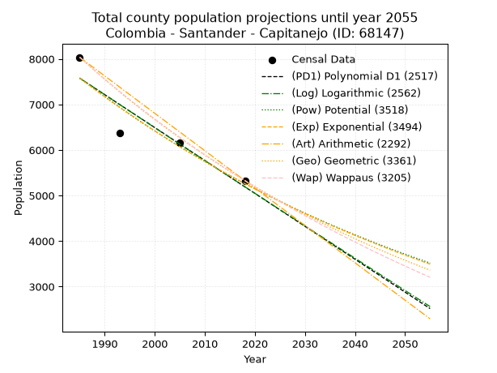
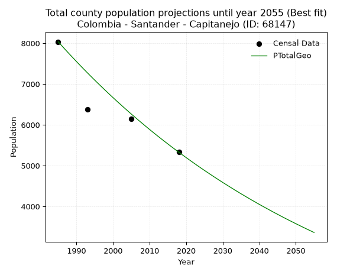
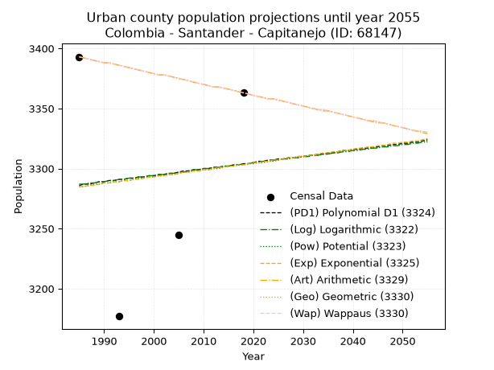
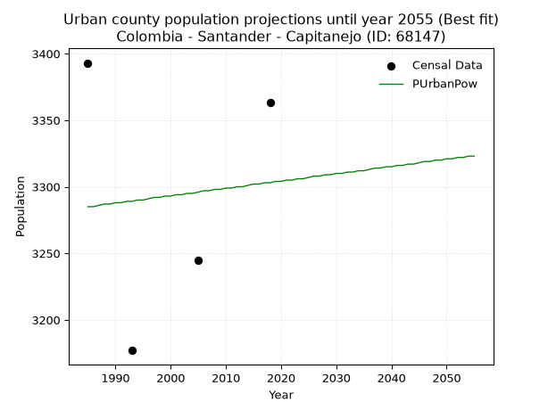
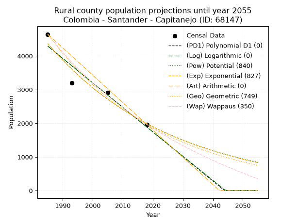
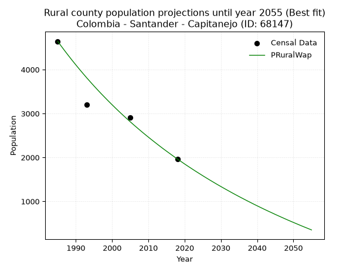

<div align="center">


</div>

# 📜 _“Population and Public Services Demand Projections (PPSD) until Year 2050 for Colombia - Santander - Capitanejo (ID: 68147)”_
Keywords: `population` `public-service` `projection` `lineal` `polynomial` `logarithmic` `potential` `exponential` `arithmetic` `geometric` `wappaus` `dane` `colombia` `south-america`

PPSD are analytical estimates used by governments and planners to anticipate future changes in population size, age distribution, and the resulting community needs for utilities, healthcare, education, and infrastructure as sizing future water treatment facilities, electrical grids, and road networks based on spatial growth.

<div align="center">

</img>

</div>


> **General running parameters**: • app_version: _v20260806_. • Python version: _3.14.7_. • Pandas version: _3.0.5_. • NumPy version: _2.5.1_. • Creates, save and include plots into reports (create_plot): _False_. • Projection until year: _2050_. • Process polynomial degree 2 and up: _False_. • Process Wappaus: _True_. • Process Wappaus: _True_. • Set negative values to zero: _True_. • Set infinite values to zero: _True_. • Drop dataset notes: _True_. 
<div align="center">

Maps & GIS Layers: [:earth_americas:Google](http://maps.google.com/maps?q=6.527394048,-72.6954265) [:earth_americas:OSM](https://www.openstreetmap.org/#map=18/6.527394048/-72.6954265&layers=P) [:earth_americas:Bing](https://www.bing.com/maps?cp=6.527394048~-72.6954265&lvl=18) [:earth_americas:Apple](https://maps.apple.com/frame?center=6.527394048%2C-72.6954265&span=0.003%2C0.006) [:earth_americas:GISMobile](https://github.com/rcfdtools/R.GISMobile/blob/main/file/gis/CountyLayer_CO/Readme.md)

</div>


<div align="center">

```geojson
{
  "type": "Feature",
  "geometry": {
    "type": "Point", 
    "coordinates": [-72.6954265, 6.527394048]
  }, 
  "properties": {
    "Name": "Colombia - Santander - Capitanejo (ID: 68147)"
  }
}
```

</div>


## 0. Census Data (4 records)

Census data are official statistics collected by a government about the people and housing in a country. They usually include counts of total population, age, sex, race, income, education, and jobs.

📅Global census file: [Population.xlsx](../data/Population.xlsx)

| Source   |   Year |   CountryID | CountryName   |   StateID | StateName   |   CountyID | CountyName   |   PTotal |   PUrban |   PRural |
|:---------|-------:|------------:|:--------------|----------:|:------------|-----------:|:-------------|---------:|---------:|---------:|
| DANE     |   1985 |          57 | Colombia      |        68 | Santander   |      68147 | Capitanejo   |     8036 |     3393 |     4643 |
| DANE     |   1993 |          57 | Colombia      |        68 | Santander   |      68147 | Capitanejo   |     6380 |     3177 |     3203 |
| DANE     |   2005 |          57 | Colombia      |        68 | Santander   |      68147 | Capitanejo   |     6152 |     3245 |     2907 |
| DANE     |   2018 |          57 | Colombia      |        68 | Santander   |      68147 | Capitanejo   |     5328 |     3363 |     1965 |

> 🔥Some records could had specific notes about the registered values or the corresponding urban or rural distribution.

📅[SUI-RUPS](https://www.datos.gov.co/Hacienda-y-Cr-dito-P-blico/Registro-nico-de-Prestadores-de-Servicios-P-blicos/4qkq-csdn/about_data) - Local public utility companies: [RUPS.csv](../data/RUPS.csv)

 | SERVICIO       | ESTADO    | NOMBRE                                                                                                            | NIT         | DEPARTAMENTO_DOMICILIO   | MUNICIPIO_DOMICILIO   | DIRECCION        |   TELEFONO | EMAIL                                        | TIPO_PRESTADOR                 | CLASIFICACION                 |
|:---------------|:----------|:------------------------------------------------------------------------------------------------------------------|:------------|:-------------------------|:----------------------|:-----------------|-----------:|:---------------------------------------------|:-------------------------------|:------------------------------|
| ACUEDUCTO      | OPERATIVA | UNIDAD ADMINISTRADORA DE LOS  SERVICIOS PUBLICOS DE ACUEDUCTO, ALACANTARILLADO Y ASEO DEL MUNICIPIO DE CAPITANEJO | 890205119-8 | SANTANDER                | CAPITANEJO            | Calle 5 No. 5-48 |    6600032 | serviciospublcos@capitanejo-santander.gov.co | MUNICIPIO (PRESTACIÓN DIRECTA) | MENOR O IGUAL A 2500 USUARIOS |
| ALCANTARILLADO | OPERATIVA | UNIDAD ADMINISTRADORA DE LOS  SERVICIOS PUBLICOS DE ACUEDUCTO, ALACANTARILLADO Y ASEO DEL MUNICIPIO DE CAPITANEJO | 890205119-8 | SANTANDER                | CAPITANEJO            | Calle 5 No. 5-48 |    6600032 | serviciospublcos@capitanejo-santander.gov.co | MUNICIPIO (PRESTACIÓN DIRECTA) | MENOR O IGUAL A 2500 USUARIOS |

## 1. Total

### 1.1. Coefficients and Parameters

* (PD1) Polynomial Deg 1: -72.27619429947754, 151044.45764752993 (lineal)
* (Log) Logarithmic: -144764.6244398172, 1106831.070437946
* (Pow) Potential: -22.157764011635486, 76.95081967183418
* (Exp) Exponential: -0.011064485915572216, 26184962434585.28
* (Art) Arithmetic: Year diff. 2018 - 1985 = 33, Population diff. 5328 - 8036 = -2708, Annual growth = -82.06060606060606
* (Geo) Geometric: Year diff. 2018 - 1985 = 33, Population diff. 5328 - 8036 = -2708, Annual growth % = -0.012375977201172894
* (Wap) Wappaus: i = -1.2280844965669868, Condition values only valid for < 200)

<sub>
Wappaus condition values: ['-0.00', '-1.23', '-2.46', '-3.68', '-4.91', '-6.14', '-7.37', '-8.60', '-9.82', '-11.05', '-12.28', '-13.51', '-14.74', '-15.97', '-17.19', '-18.42', '-19.65', '-20.88', '-22.11', '-23.33', '-24.56', '-25.79', '-27.02', '-28.25', '-29.47', '-30.70', '-31.93', '-33.16', '-34.39', '-35.61', '-36.84', '-38.07', '-39.30', '-40.53', '-41.75', '-42.98', '-44.21', '-45.44', '-46.67', '-47.90', '-49.12', '-50.35', '-51.58', '-52.81', '-54.04', '-55.26', '-56.49', '-57.72', '-58.95', '-60.18', '-61.40', '-62.63', '-63.86', '-65.09', '-66.32', '-67.54', '-68.77', '-70.00', '-71.23', '-72.46', '-73.69', '-74.91', '-76.14', '-77.37', '-78.60', '-79.83']
</sub>


### 1.2. Projected Dataset

|   Year |   CountyID |   PTotalPD1 |   PTotalLog |   PTotalPow |   PTotalExp |   PTotalArt |   PTotalGeo |   PTotalWap |
|-------:|-----------:|------------:|------------:|------------:|------------:|------------:|------------:|------------:|
|   1985 |      68147 |        7576 |        7579 |        7583 |        7579 |        8036 |        8036 |        8036 |
|   1986 |      68147 |        7504 |        7506 |        7498 |        7496 |        7954 |        7937 |        7938 |
|   1987 |      68147 |        7432 |        7433 |        7415 |        7414 |        7872 |        7838 |        7841 |
|   1988 |      68147 |        7359 |        7360 |        7333 |        7332 |        7790 |        7741 |        7745 |
|   1989 |      68147 |        7287 |        7288 |        7252 |        7251 |        7708 |        7646 |        7651 |
|   1990 |      68147 |        7215 |        7215 |        7172 |        7172 |        7626 |        7551 |        7557 |
|   1991 |      68147 |        7143 |        7142 |        7092 |        7093 |        7544 |        7457 |        7465 |
|   1992 |      68147 |        7070 |        7070 |        7014 |        7015 |        7462 |        7365 |        7374 |
|   1993 |      68147 |        6998 |        6997 |        6936 |        6937 |        7380 |        7274 |        7283 |
|   1994 |      68147 |        6926 |        6924 |        6859 |        6861 |        7297 |        7184 |        7194 |
|   1995 |      68147 |        6853 |        6852 |        6784 |        6786 |        7215 |        7095 |        7106 |
|   1996 |      68147 |        6781 |        6779 |        6709 |        6711 |        7133 |        7007 |        7019 |
|   1997 |      68147 |        6709 |        6707 |        6635 |        6637 |        7051 |        6921 |        6933 |
|   1998 |      68147 |        6637 |        6634 |        6562 |        6564 |        6969 |        6835 |        6848 |
|   1999 |      68147 |        6564 |        6562 |        6489 |        6492 |        6887 |        6750 |        6764 |
|   2000 |      68147 |        6492 |        6489 |        6418 |        6420 |        6805 |        6667 |        6681 |
|   2001 |      68147 |        6420 |        6417 |        6347 |        6350 |        6723 |        6584 |        6598 |
|   2002 |      68147 |        6348 |        6345 |        6277 |        6280 |        6641 |        6503 |        6517 |
|   2003 |      68147 |        6275 |        6272 |        6208 |        6211 |        6559 |        6422 |        6436 |
|   2004 |      68147 |        6203 |        6200 |        6140 |        6142 |        6477 |        6343 |        6357 |
|   2005 |      68147 |        6131 |        6128 |        6072 |        6075 |        6395 |        6264 |        6278 |
|   2006 |      68147 |        6058 |        6056 |        6006 |        6008 |        6313 |        6187 |        6200 |
|   2007 |      68147 |        5986 |        5983 |        5940 |        5942 |        6231 |        6110 |        6123 |
|   2008 |      68147 |        5914 |        5911 |        5874 |        5877 |        6149 |        6035 |        6047 |
|   2009 |      68147 |        5842 |        5839 |        5810 |        5812 |        6067 |        5960 |        5972 |
|   2010 |      68147 |        5769 |        5767 |        5746 |        5748 |        5984 |        5886 |        5897 |
|   2011 |      68147 |        5697 |        5695 |        5683 |        5685 |        5902 |        5813 |        5823 |
|   2012 |      68147 |        5625 |        5623 |        5621 |        5622 |        5820 |        5741 |        5750 |
|   2013 |      68147 |        5552 |        5551 |        5559 |        5560 |        5738 |        5670 |        5678 |
|   2014 |      68147 |        5480 |        5479 |        5499 |        5499 |        5656 |        5600 |        5607 |
|   2015 |      68147 |        5408 |        5408 |        5438 |        5439 |        5574 |        5531 |        5536 |
|   2016 |      68147 |        5336 |        5336 |        5379 |        5379 |        5492 |        5462 |        5466 |
|   2017 |      68147 |        5263 |        5264 |        5320 |        5320 |        5410 |        5395 |        5397 |
|   2018 |      68147 |        5191 |        5192 |        5262 |        5261 |        5328 |        5328 |        5328 |
|   2019 |      68147 |        5119 |        5121 |        5205 |        5203 |        5246 |        5262 |        5260 |
|   2020 |      68147 |        5047 |        5049 |        5148 |        5146 |        5164 |        5197 |        5193 |
|   2021 |      68147 |        4974 |        4977 |        5092 |        5089 |        5082 |        5133 |        5126 |
|   2022 |      68147 |        4902 |        4906 |        5036 |        5033 |        5000 |        5069 |        5061 |
|   2023 |      68147 |        4830 |        4834 |        4981 |        4978 |        4918 |        5006 |        4995 |
|   2024 |      68147 |        4757 |        4762 |        4927 |        4923 |        4836 |        4944 |        4931 |
|   2025 |      68147 |        4685 |        4691 |        4873 |        4869 |        4754 |        4883 |        4867 |
|   2026 |      68147 |        4613 |        4619 |        4820 |        4815 |        4672 |        4823 |        4804 |
|   2027 |      68147 |        4541 |        4548 |        4768 |        4762 |        4589 |        4763 |        4741 |
|   2028 |      68147 |        4468 |        4477 |        4716 |        4710 |        4507 |        4704 |        4679 |
|   2029 |      68147 |        4396 |        4405 |        4665 |        4658 |        4425 |        4646 |        4617 |
|   2030 |      68147 |        4324 |        4334 |        4614 |        4607 |        4343 |        4588 |        4556 |
|   2031 |      68147 |        4252 |        4263 |        4564 |        4556 |        4261 |        4532 |        4496 |
|   2032 |      68147 |        4179 |        4191 |        4515 |        4506 |        4179 |        4476 |        4436 |
|   2033 |      68147 |        4107 |        4120 |        4466 |        4456 |        4097 |        4420 |        4377 |
|   2034 |      68147 |        4035 |        4049 |        4417 |        4407 |        4015 |        4365 |        4319 |
|   2035 |      68147 |        3962 |        3978 |        4369 |        4359 |        3933 |        4311 |        4261 |
|   2036 |      68147 |        3890 |        3907 |        4322 |        4311 |        3851 |        4258 |        4203 |
|   2037 |      68147 |        3818 |        3836 |        4275 |        4264 |        3769 |        4205 |        4146 |
|   2038 |      68147 |        3746 |        3765 |        4229 |        4217 |        3687 |        4153 |        4090 |
|   2039 |      68147 |        3673 |        3694 |        4183 |        4170 |        3605 |        4102 |        4034 |
|   2040 |      68147 |        3601 |        3623 |        4138 |        4124 |        3523 |        4051 |        3978 |
|   2041 |      68147 |        3529 |        3552 |        4094 |        4079 |        3441 |        4001 |        3924 |
|   2042 |      68147 |        3456 |        3481 |        4049 |        4034 |        3359 |        3952 |        3869 |
|   2043 |      68147 |        3384 |        3410 |        4006 |        3990 |        3276 |        3903 |        3815 |
|   2044 |      68147 |        3312 |        3339 |        3962 |        3946 |        3194 |        3854 |        3762 |
|   2045 |      68147 |        3240 |        3268 |        3920 |        3902 |        3112 |        3807 |        3709 |
|   2046 |      68147 |        3167 |        3197 |        3878 |        3859 |        3030 |        3760 |        3656 |
|   2047 |      68147 |        3095 |        3127 |        3836 |        3817 |        2948 |        3713 |        3604 |
|   2048 |      68147 |        3023 |        3056 |        3794 |        3775 |        2866 |        3667 |        3553 |
|   2049 |      68147 |        2951 |        2985 |        3754 |        3733 |        2784 |        3622 |        3502 |
|   2050 |      68147 |        2878 |        2915 |        3713 |        3692 |        2702 |        3577 |        3451 |
<div align="center">

</img>

</div>


### 1.3. Best fit with absolute and relative error (%)

Relative error puts that difference into context by dividing the absolute error by the true value, creating a unitless ratio or percentage that shows the scale of the mistake.

Absolute and relative error

|   Year | Source   |   CountryID | CountryName   |   StateID | StateName   |   CountyID_x | CountyName   |   PTotal |   PUrban |   PRural |   CountyID_y |   PTotalPD1 |   PTotalLog |   PTotalPow |   PTotalExp |   PTotalArt |   PTotalGeo |   PTotalWap |   PTotalPD1AbsError |   PTotalLogAbsError |   PTotalPowAbsError |   PTotalExpAbsError |   PTotalArtAbsError |   PTotalGeoAbsError |   PTotalWapAbsError |   PTotalPD1RelError |   PTotalLogRelError |   PTotalPowRelError |   PTotalExpRelError |   PTotalArtRelError |   PTotalGeoRelError |   PTotalWapRelError |
|-------:|:---------|------------:|:--------------|----------:|:------------|-------------:|:-------------|---------:|---------:|---------:|-------------:|------------:|------------:|------------:|------------:|------------:|------------:|------------:|--------------------:|--------------------:|--------------------:|--------------------:|--------------------:|--------------------:|--------------------:|--------------------:|--------------------:|--------------------:|--------------------:|--------------------:|--------------------:|--------------------:|
|   1985 | DANE     |          57 | Colombia      |        68 | Santander   |        68147 | Capitanejo   |     8036 |     3393 |     4643 |        68147 |        7576 |        7579 |        7583 |        7579 |        8036 |        8036 |        8036 |                 460 |                 457 |                 453 |                 457 |                   0 |                   0 |                   0 |            5.72424  |            5.68691  |             5.63713 |             5.68691 |             0       |             0       |             0       |
|   1993 | DANE     |          57 | Colombia      |        68 | Santander   |        68147 | Capitanejo   |     6380 |     3177 |     3203 |        68147 |        6998 |        6997 |        6936 |        6937 |        7380 |        7274 |        7283 |                 618 |                 617 |                 556 |                 557 |                1000 |                 894 |                 903 |            9.68652  |            9.67085  |             8.71473 |             8.73041 |            15.674   |            14.0125  |            14.1536  |
|   2005 | DANE     |          57 | Colombia      |        68 | Santander   |        68147 | Capitanejo   |     6152 |     3245 |     2907 |        68147 |        6131 |        6128 |        6072 |        6075 |        6395 |        6264 |        6278 |                  21 |                  24 |                  80 |                  77 |                 243 |                 112 |                 126 |            0.341352 |            0.390117 |             1.30039 |             1.25163 |             3.94993 |             1.82055 |             2.04811 |
|   2018 | DANE     |          57 | Colombia      |        68 | Santander   |        68147 | Capitanejo   |     5328 |     3363 |     1965 |        68147 |        5191 |        5192 |        5262 |        5261 |        5328 |        5328 |        5328 |                 137 |                 136 |                  66 |                  67 |                   0 |                   0 |                   0 |            2.57132  |            2.55255  |             1.23874 |             1.25751 |             0       |             0       |             0       |

Relative error mean

| Method    |   RelError | Best   |
|:----------|-----------:|:-------|
| PTotalPD1 |    4.58086 |        |
| PTotalLog |    4.57511 |        |
| PTotalPow |    4.22275 |        |
| PTotalExp |    4.23161 |        |
| PTotalArt |    4.90598 |        |
| PTotalGeo |    3.95827 | True   |
| PTotalWap |    4.05043 |        |

💙Best method: _**PTotalGeo**_
<div align="center">

</img>

</div>


### 1.4. Fresh water supply demand in liters per capita per day (lpcd)

The fresh water supply demand typically ranges from 100 to 300 liters per capita per day (lpcd) for standard domestic and municipal planning, though absolute survival minimums set by the World Health Organization are as low as 7.5 to 20 liters per day, and total consumption in high-income nations can exceed 400 liters.

> `CZ`: Level in meters above the sea level (masl)<br> `WS`: Fresh water supply demand in liters per capita per day (lpcd or l/h/d)<br> `WSAll`: Zonal fresh water supply demand in liters per second (l/s)<br> `A`: Zonal area in square meters<br> `DP`: Population density (people/hectare or p/ha)

Reference values (RAS Colombia)

|    CZ |   WS |
|------:|-----:|
|  1000 |  120 |
|  2000 |  130 |
| 99999 |  140 |

County shapefile geometry properties and water supply values

|   CountyID |      ATotal |   CZTotal |   WSTotal |
|-----------:|------------:|----------:|----------:|
|      68147 | 8.52261e+07 |   1593.48 |       130 |

Projected values for best method: PTotalGeo

|   CountyID |   Year |   PTotalGeo |   DPTotal |   WSTotal |   WSTotalAll |
|-----------:|-------:|------------:|----------:|----------:|-------------:|
|      68147 |   1985 |        8036 |      0.94 |       130 |     12.0912  |
|      68147 |   1986 |        7937 |      0.93 |       130 |     11.9422  |
|      68147 |   1987 |        7838 |      0.92 |       130 |     11.7933  |
|      68147 |   1988 |        7741 |      0.91 |       130 |     11.6473  |
|      68147 |   1989 |        7646 |      0.9  |       130 |     11.5044  |
|      68147 |   1990 |        7551 |      0.89 |       130 |     11.3615  |
|      68147 |   1991 |        7457 |      0.87 |       130 |     11.22    |
|      68147 |   1992 |        7365 |      0.86 |       130 |     11.0816  |
|      68147 |   1993 |        7274 |      0.85 |       130 |     10.9447  |
|      68147 |   1994 |        7184 |      0.84 |       130 |     10.8093  |
|      68147 |   1995 |        7095 |      0.83 |       130 |     10.6753  |
|      68147 |   1996 |        7007 |      0.82 |       130 |     10.5429  |
|      68147 |   1997 |        6921 |      0.81 |       130 |     10.4135  |
|      68147 |   1998 |        6835 |      0.8  |       130 |     10.2841  |
|      68147 |   1999 |        6750 |      0.79 |       130 |     10.1562  |
|      68147 |   2000 |        6667 |      0.78 |       130 |     10.0314  |
|      68147 |   2001 |        6584 |      0.77 |       130 |      9.90648 |
|      68147 |   2002 |        6503 |      0.76 |       130 |      9.78461 |
|      68147 |   2003 |        6422 |      0.75 |       130 |      9.66273 |
|      68147 |   2004 |        6343 |      0.74 |       130 |      9.54387 |
|      68147 |   2005 |        6264 |      0.73 |       130 |      9.425   |
|      68147 |   2006 |        6187 |      0.73 |       130 |      9.30914 |
|      68147 |   2007 |        6110 |      0.72 |       130 |      9.19329 |
|      68147 |   2008 |        6035 |      0.71 |       130 |      9.08044 |
|      68147 |   2009 |        5960 |      0.7  |       130 |      8.96759 |
|      68147 |   2010 |        5886 |      0.69 |       130 |      8.85625 |
|      68147 |   2011 |        5813 |      0.68 |       130 |      8.74641 |
|      68147 |   2012 |        5741 |      0.67 |       130 |      8.63808 |
|      68147 |   2013 |        5670 |      0.67 |       130 |      8.53125 |
|      68147 |   2014 |        5600 |      0.66 |       130 |      8.42593 |
|      68147 |   2015 |        5531 |      0.65 |       130 |      8.32211 |
|      68147 |   2016 |        5462 |      0.64 |       130 |      8.21829 |
|      68147 |   2017 |        5395 |      0.63 |       130 |      8.11748 |
|      68147 |   2018 |        5328 |      0.63 |       130 |      8.01667 |
|      68147 |   2019 |        5262 |      0.62 |       130 |      7.91736 |
|      68147 |   2020 |        5197 |      0.61 |       130 |      7.81956 |
|      68147 |   2021 |        5133 |      0.6  |       130 |      7.72326 |
|      68147 |   2022 |        5069 |      0.59 |       130 |      7.62697 |
|      68147 |   2023 |        5006 |      0.59 |       130 |      7.53218 |
|      68147 |   2024 |        4944 |      0.58 |       130 |      7.43889 |
|      68147 |   2025 |        4883 |      0.57 |       130 |      7.34711 |
|      68147 |   2026 |        4823 |      0.57 |       130 |      7.25683 |
|      68147 |   2027 |        4763 |      0.56 |       130 |      7.16655 |
|      68147 |   2028 |        4704 |      0.55 |       130 |      7.07778 |
|      68147 |   2029 |        4646 |      0.55 |       130 |      6.99051 |
|      68147 |   2030 |        4588 |      0.54 |       130 |      6.90324 |
|      68147 |   2031 |        4532 |      0.53 |       130 |      6.81898 |
|      68147 |   2032 |        4476 |      0.53 |       130 |      6.73472 |
|      68147 |   2033 |        4420 |      0.52 |       130 |      6.65046 |
|      68147 |   2034 |        4365 |      0.51 |       130 |      6.56771 |
|      68147 |   2035 |        4311 |      0.51 |       130 |      6.48646 |
|      68147 |   2036 |        4258 |      0.5  |       130 |      6.40671 |
|      68147 |   2037 |        4205 |      0.49 |       130 |      6.32697 |
|      68147 |   2038 |        4153 |      0.49 |       130 |      6.24873 |
|      68147 |   2039 |        4102 |      0.48 |       130 |      6.17199 |
|      68147 |   2040 |        4051 |      0.48 |       130 |      6.09525 |
|      68147 |   2041 |        4001 |      0.47 |       130 |      6.02002 |
|      68147 |   2042 |        3952 |      0.46 |       130 |      5.9463  |
|      68147 |   2043 |        3903 |      0.46 |       130 |      5.87257 |
|      68147 |   2044 |        3854 |      0.45 |       130 |      5.79884 |
|      68147 |   2045 |        3807 |      0.45 |       130 |      5.72813 |
|      68147 |   2046 |        3760 |      0.44 |       130 |      5.65741 |
|      68147 |   2047 |        3713 |      0.44 |       130 |      5.58669 |
|      68147 |   2048 |        3667 |      0.43 |       130 |      5.51748 |
|      68147 |   2049 |        3622 |      0.42 |       130 |      5.44977 |
|      68147 |   2050 |        3577 |      0.42 |       130 |      5.38206 |

## 2. Urban

### 2.1. Coefficients and Parameters

* (PD1) Polynomial Deg 1: 0.5307105580087581, 2232.9462063429814 (lineal)
* (Log) Logarithmic: 1033.1279158361885, -4558.313567238406
* (Pow) Potential: 0.3363551158715293, 2.4073019150207577
* (Exp) Exponential: 0.00017246023345265492, 2332.4904841142143
* (Art) Arithmetic: Year diff. 2018 - 1985 = 33, Population diff. 3363 - 3393 = -30, Annual growth = -0.9090909090909091
* (Geo) Geometric: Year diff. 2018 - 1985 = 33, Population diff. 3363 - 3393 = -30, Annual growth % = -0.000269086609216429
* (Wap) Wappaus: i = -0.026912105064858173, Condition values only valid for < 200)

<sub>
Wappaus condition values: ['-0.00', '-0.03', '-0.05', '-0.08', '-0.11', '-0.13', '-0.16', '-0.19', '-0.22', '-0.24', '-0.27', '-0.30', '-0.32', '-0.35', '-0.38', '-0.40', '-0.43', '-0.46', '-0.48', '-0.51', '-0.54', '-0.57', '-0.59', '-0.62', '-0.65', '-0.67', '-0.70', '-0.73', '-0.75', '-0.78', '-0.81', '-0.83', '-0.86', '-0.89', '-0.92', '-0.94', '-0.97', '-1.00', '-1.02', '-1.05', '-1.08', '-1.10', '-1.13', '-1.16', '-1.18', '-1.21', '-1.24', '-1.26', '-1.29', '-1.32', '-1.35', '-1.37', '-1.40', '-1.43', '-1.45', '-1.48', '-1.51', '-1.53', '-1.56', '-1.59', '-1.61', '-1.64', '-1.67', '-1.70', '-1.72', '-1.75']
</sub>


### 2.2. Projected Dataset

|   Year |   CountyID |   PUrbanPD1 |   PUrbanLog |   PUrbanPow |   PUrbanExp |   PUrbanArt |   PUrbanGeo |   PUrbanWap |
|-------:|-----------:|------------:|------------:|------------:|------------:|------------:|------------:|------------:|
|   1985 |      68147 |        3286 |        3287 |        3285 |        3285 |        3393 |        3393 |        3393 |
|   1986 |      68147 |        3287 |        3287 |        3285 |        3285 |        3392 |        3392 |        3392 |
|   1987 |      68147 |        3287 |        3288 |        3286 |        3286 |        3391 |        3391 |        3391 |
|   1988 |      68147 |        3288 |        3288 |        3287 |        3286 |        3390 |        3390 |        3390 |
|   1989 |      68147 |        3289 |        3289 |        3287 |        3287 |        3389 |        3389 |        3389 |
|   1990 |      68147 |        3289 |        3289 |        3288 |        3288 |        3388 |        3388 |        3388 |
|   1991 |      68147 |        3290 |        3290 |        3288 |        3288 |        3388 |        3388 |        3388 |
|   1992 |      68147 |        3290 |        3290 |        3289 |        3289 |        3387 |        3387 |        3387 |
|   1993 |      68147 |        3291 |        3291 |        3289 |        3289 |        3386 |        3386 |        3386 |
|   1994 |      68147 |        3291 |        3291 |        3290 |        3290 |        3385 |        3385 |        3385 |
|   1995 |      68147 |        3292 |        3292 |        3290 |        3290 |        3384 |        3384 |        3384 |
|   1996 |      68147 |        3292 |        3292 |        3291 |        3291 |        3383 |        3383 |        3383 |
|   1997 |      68147 |        3293 |        3293 |        3292 |        3291 |        3382 |        3382 |        3382 |
|   1998 |      68147 |        3293 |        3293 |        3292 |        3292 |        3381 |        3381 |        3381 |
|   1999 |      68147 |        3294 |        3294 |        3293 |        3293 |        3380 |        3380 |        3380 |
|   2000 |      68147 |        3294 |        3294 |        3293 |        3293 |        3379 |        3379 |        3379 |
|   2001 |      68147 |        3295 |        3295 |        3294 |        3294 |        3378 |        3378 |        3378 |
|   2002 |      68147 |        3295 |        3295 |        3294 |        3294 |        3378 |        3378 |        3378 |
|   2003 |      68147 |        3296 |        3296 |        3295 |        3295 |        3377 |        3377 |        3377 |
|   2004 |      68147 |        3296 |        3296 |        3295 |        3295 |        3376 |        3376 |        3376 |
|   2005 |      68147 |        3297 |        3297 |        3296 |        3296 |        3375 |        3375 |        3375 |
|   2006 |      68147 |        3298 |        3297 |        3297 |        3297 |        3374 |        3374 |        3374 |
|   2007 |      68147 |        3298 |        3298 |        3297 |        3297 |        3373 |        3373 |        3373 |
|   2008 |      68147 |        3299 |        3299 |        3298 |        3298 |        3372 |        3372 |        3372 |
|   2009 |      68147 |        3299 |        3299 |        3298 |        3298 |        3371 |        3371 |        3371 |
|   2010 |      68147 |        3300 |        3300 |        3299 |        3299 |        3370 |        3370 |        3370 |
|   2011 |      68147 |        3300 |        3300 |        3299 |        3299 |        3369 |        3369 |        3369 |
|   2012 |      68147 |        3301 |        3301 |        3300 |        3300 |        3368 |        3368 |        3368 |
|   2013 |      68147 |        3301 |        3301 |        3300 |        3301 |        3368 |        3368 |        3368 |
|   2014 |      68147 |        3302 |        3302 |        3301 |        3301 |        3367 |        3367 |        3367 |
|   2015 |      68147 |        3302 |        3302 |        3302 |        3302 |        3366 |        3366 |        3366 |
|   2016 |      68147 |        3303 |        3303 |        3302 |        3302 |        3365 |        3365 |        3365 |
|   2017 |      68147 |        3303 |        3303 |        3303 |        3303 |        3364 |        3364 |        3364 |
|   2018 |      68147 |        3304 |        3304 |        3303 |        3303 |        3363 |        3363 |        3363 |
|   2019 |      68147 |        3304 |        3304 |        3304 |        3304 |        3362 |        3362 |        3362 |
|   2020 |      68147 |        3305 |        3305 |        3304 |        3305 |        3361 |        3361 |        3361 |
|   2021 |      68147 |        3306 |        3305 |        3305 |        3305 |        3360 |        3360 |        3360 |
|   2022 |      68147 |        3306 |        3306 |        3305 |        3306 |        3359 |        3359 |        3359 |
|   2023 |      68147 |        3307 |        3306 |        3306 |        3306 |        3358 |        3358 |        3358 |
|   2024 |      68147 |        3307 |        3307 |        3306 |        3307 |        3358 |        3358 |        3358 |
|   2025 |      68147 |        3308 |        3307 |        3307 |        3307 |        3357 |        3357 |        3357 |
|   2026 |      68147 |        3308 |        3308 |        3308 |        3308 |        3356 |        3356 |        3356 |
|   2027 |      68147 |        3309 |        3308 |        3308 |        3309 |        3355 |        3355 |        3355 |
|   2028 |      68147 |        3309 |        3309 |        3309 |        3309 |        3354 |        3354 |        3354 |
|   2029 |      68147 |        3310 |        3309 |        3309 |        3310 |        3353 |        3353 |        3353 |
|   2030 |      68147 |        3310 |        3310 |        3310 |        3310 |        3352 |        3352 |        3352 |
|   2031 |      68147 |        3311 |        3310 |        3310 |        3311 |        3351 |        3351 |        3351 |
|   2032 |      68147 |        3311 |        3311 |        3311 |        3311 |        3350 |        3350 |        3350 |
|   2033 |      68147 |        3312 |        3311 |        3311 |        3312 |        3349 |        3349 |        3349 |
|   2034 |      68147 |        3312 |        3312 |        3312 |        3313 |        3348 |        3349 |        3349 |
|   2035 |      68147 |        3313 |        3312 |        3312 |        3313 |        3348 |        3348 |        3348 |
|   2036 |      68147 |        3313 |        3313 |        3313 |        3314 |        3347 |        3347 |        3347 |
|   2037 |      68147 |        3314 |        3313 |        3314 |        3314 |        3346 |        3346 |        3346 |
|   2038 |      68147 |        3315 |        3314 |        3314 |        3315 |        3345 |        3345 |        3345 |
|   2039 |      68147 |        3315 |        3314 |        3315 |        3315 |        3344 |        3344 |        3344 |
|   2040 |      68147 |        3316 |        3315 |        3315 |        3316 |        3343 |        3343 |        3343 |
|   2041 |      68147 |        3316 |        3315 |        3316 |        3317 |        3342 |        3342 |        3342 |
|   2042 |      68147 |        3317 |        3316 |        3316 |        3317 |        3341 |        3341 |        3341 |
|   2043 |      68147 |        3317 |        3316 |        3317 |        3318 |        3340 |        3340 |        3340 |
|   2044 |      68147 |        3318 |        3317 |        3317 |        3318 |        3339 |        3340 |        3340 |
|   2045 |      68147 |        3318 |        3317 |        3318 |        3319 |        3338 |        3339 |        3339 |
|   2046 |      68147 |        3319 |        3318 |        3319 |        3319 |        3338 |        3338 |        3338 |
|   2047 |      68147 |        3319 |        3318 |        3319 |        3320 |        3337 |        3337 |        3337 |
|   2048 |      68147 |        3320 |        3319 |        3320 |        3321 |        3336 |        3336 |        3336 |
|   2049 |      68147 |        3320 |        3319 |        3320 |        3321 |        3335 |        3335 |        3335 |
|   2050 |      68147 |        3321 |        3320 |        3321 |        3322 |        3334 |        3334 |        3334 |
<div align="center">

</img>

</div>


### 2.3. Best fit with absolute and relative error (%)

Relative error puts that difference into context by dividing the absolute error by the true value, creating a unitless ratio or percentage that shows the scale of the mistake.

Absolute and relative error

|   Year | Source   |   CountryID | CountryName   |   StateID | StateName   |   CountyID_x | CountyName   |   PTotal |   PUrban |   PRural |   CountyID_y |   PUrbanPD1 |   PUrbanLog |   PUrbanPow |   PUrbanExp |   PUrbanArt |   PUrbanGeo |   PUrbanWap |   PUrbanPD1AbsError |   PUrbanLogAbsError |   PUrbanPowAbsError |   PUrbanExpAbsError |   PUrbanArtAbsError |   PUrbanGeoAbsError |   PUrbanWapAbsError |   PUrbanPD1RelError |   PUrbanLogRelError |   PUrbanPowRelError |   PUrbanExpRelError |   PUrbanArtRelError |   PUrbanGeoRelError |   PUrbanWapRelError |
|-------:|:---------|------------:|:--------------|----------:|:------------|-------------:|:-------------|---------:|---------:|---------:|-------------:|------------:|------------:|------------:|------------:|------------:|------------:|------------:|--------------------:|--------------------:|--------------------:|--------------------:|--------------------:|--------------------:|--------------------:|--------------------:|--------------------:|--------------------:|--------------------:|--------------------:|--------------------:|--------------------:|
|   1985 | DANE     |          57 | Colombia      |        68 | Santander   |        68147 | Capitanejo   |     8036 |     3393 |     4643 |        68147 |        3286 |        3287 |        3285 |        3285 |        3393 |        3393 |        3393 |                 107 |                 106 |                 108 |                 108 |                   0 |                   0 |                   0 |             3.15355 |             3.12408 |             3.18302 |             3.18302 |             0       |             0       |             0       |
|   1993 | DANE     |          57 | Colombia      |        68 | Santander   |        68147 | Capitanejo   |     6380 |     3177 |     3203 |        68147 |        3291 |        3291 |        3289 |        3289 |        3386 |        3386 |        3386 |                 114 |                 114 |                 112 |                 112 |                 209 |                 209 |                 209 |             3.58829 |             3.58829 |             3.52534 |             3.52534 |             6.57853 |             6.57853 |             6.57853 |
|   2005 | DANE     |          57 | Colombia      |        68 | Santander   |        68147 | Capitanejo   |     6152 |     3245 |     2907 |        68147 |        3297 |        3297 |        3296 |        3296 |        3375 |        3375 |        3375 |                  52 |                  52 |                  51 |                  51 |                 130 |                 130 |                 130 |             1.60247 |             1.60247 |             1.57165 |             1.57165 |             4.00616 |             4.00616 |             4.00616 |
|   2018 | DANE     |          57 | Colombia      |        68 | Santander   |        68147 | Capitanejo   |     5328 |     3363 |     1965 |        68147 |        3304 |        3304 |        3303 |        3303 |        3363 |        3363 |        3363 |                  59 |                  59 |                  60 |                  60 |                   0 |                   0 |                   0 |             1.75439 |             1.75439 |             1.78412 |             1.78412 |             0       |             0       |             0       |

Relative error mean

| Method    |   RelError | Best   |
|:----------|-----------:|:-------|
| PUrbanPD1 |    2.52467 |        |
| PUrbanLog |    2.51731 |        |
| PUrbanPow |    2.51603 | True   |
| PUrbanExp |    2.51603 | True   |
| PUrbanArt |    2.64617 |        |
| PUrbanGeo |    2.64617 |        |
| PUrbanWap |    2.64617 |        |

💙Best method: _**PUrbanPow**_
<div align="center">

</img>

</div>


### 2.4. Fresh water supply demand in liters per capita per day (lpcd)

The fresh water supply demand typically ranges from 100 to 300 liters per capita per day (lpcd) for standard domestic and municipal planning, though absolute survival minimums set by the World Health Organization are as low as 7.5 to 20 liters per day, and total consumption in high-income nations can exceed 400 liters.

> `CZ`: Level in meters above the sea level (masl)<br> `WS`: Fresh water supply demand in liters per capita per day (lpcd or l/h/d)<br> `WSAll`: Zonal fresh water supply demand in liters per second (l/s)<br> `A`: Zonal area in square meters<br> `DP`: Population density (people/hectare or p/ha)

Reference values (RAS Colombia)

|    CZ |   WS |
|------:|-----:|
|  1000 |  120 |
|  2000 |  130 |
| 99999 |  140 |

County shapefile geometry properties and water supply values

|   CountyID |      AUrban |   CZUrban |   WSUrban |
|-----------:|------------:|----------:|----------:|
|      68147 | 2.19807e+06 |   1100.16 |       130 |

Projected values for best method: PUrbanPow

|   CountyID |   Year |   PUrbanPow |   DPUrban |   WSUrban |   WSUrbanAll |
|-----------:|-------:|------------:|----------:|----------:|-------------:|
|      68147 |   1985 |        3285 |     14.94 |       130 |      4.94271 |
|      68147 |   1986 |        3285 |     14.94 |       130 |      4.94271 |
|      68147 |   1987 |        3286 |     14.95 |       130 |      4.94421 |
|      68147 |   1988 |        3287 |     14.95 |       130 |      4.94572 |
|      68147 |   1989 |        3287 |     14.95 |       130 |      4.94572 |
|      68147 |   1990 |        3288 |     14.96 |       130 |      4.94722 |
|      68147 |   1991 |        3288 |     14.96 |       130 |      4.94722 |
|      68147 |   1992 |        3289 |     14.96 |       130 |      4.94873 |
|      68147 |   1993 |        3289 |     14.96 |       130 |      4.94873 |
|      68147 |   1994 |        3290 |     14.97 |       130 |      4.95023 |
|      68147 |   1995 |        3290 |     14.97 |       130 |      4.95023 |
|      68147 |   1996 |        3291 |     14.97 |       130 |      4.95174 |
|      68147 |   1997 |        3292 |     14.98 |       130 |      4.95324 |
|      68147 |   1998 |        3292 |     14.98 |       130 |      4.95324 |
|      68147 |   1999 |        3293 |     14.98 |       130 |      4.95475 |
|      68147 |   2000 |        3293 |     14.98 |       130 |      4.95475 |
|      68147 |   2001 |        3294 |     14.99 |       130 |      4.95625 |
|      68147 |   2002 |        3294 |     14.99 |       130 |      4.95625 |
|      68147 |   2003 |        3295 |     14.99 |       130 |      4.95775 |
|      68147 |   2004 |        3295 |     14.99 |       130 |      4.95775 |
|      68147 |   2005 |        3296 |     14.99 |       130 |      4.95926 |
|      68147 |   2006 |        3297 |     15    |       130 |      4.96076 |
|      68147 |   2007 |        3297 |     15    |       130 |      4.96076 |
|      68147 |   2008 |        3298 |     15    |       130 |      4.96227 |
|      68147 |   2009 |        3298 |     15    |       130 |      4.96227 |
|      68147 |   2010 |        3299 |     15.01 |       130 |      4.96377 |
|      68147 |   2011 |        3299 |     15.01 |       130 |      4.96377 |
|      68147 |   2012 |        3300 |     15.01 |       130 |      4.96528 |
|      68147 |   2013 |        3300 |     15.01 |       130 |      4.96528 |
|      68147 |   2014 |        3301 |     15.02 |       130 |      4.96678 |
|      68147 |   2015 |        3302 |     15.02 |       130 |      4.96829 |
|      68147 |   2016 |        3302 |     15.02 |       130 |      4.96829 |
|      68147 |   2017 |        3303 |     15.03 |       130 |      4.96979 |
|      68147 |   2018 |        3303 |     15.03 |       130 |      4.96979 |
|      68147 |   2019 |        3304 |     15.03 |       130 |      4.9713  |
|      68147 |   2020 |        3304 |     15.03 |       130 |      4.9713  |
|      68147 |   2021 |        3305 |     15.04 |       130 |      4.9728  |
|      68147 |   2022 |        3305 |     15.04 |       130 |      4.9728  |
|      68147 |   2023 |        3306 |     15.04 |       130 |      4.97431 |
|      68147 |   2024 |        3306 |     15.04 |       130 |      4.97431 |
|      68147 |   2025 |        3307 |     15.05 |       130 |      4.97581 |
|      68147 |   2026 |        3308 |     15.05 |       130 |      4.97731 |
|      68147 |   2027 |        3308 |     15.05 |       130 |      4.97731 |
|      68147 |   2028 |        3309 |     15.05 |       130 |      4.97882 |
|      68147 |   2029 |        3309 |     15.05 |       130 |      4.97882 |
|      68147 |   2030 |        3310 |     15.06 |       130 |      4.98032 |
|      68147 |   2031 |        3310 |     15.06 |       130 |      4.98032 |
|      68147 |   2032 |        3311 |     15.06 |       130 |      4.98183 |
|      68147 |   2033 |        3311 |     15.06 |       130 |      4.98183 |
|      68147 |   2034 |        3312 |     15.07 |       130 |      4.98333 |
|      68147 |   2035 |        3312 |     15.07 |       130 |      4.98333 |
|      68147 |   2036 |        3313 |     15.07 |       130 |      4.98484 |
|      68147 |   2037 |        3314 |     15.08 |       130 |      4.98634 |
|      68147 |   2038 |        3314 |     15.08 |       130 |      4.98634 |
|      68147 |   2039 |        3315 |     15.08 |       130 |      4.98785 |
|      68147 |   2040 |        3315 |     15.08 |       130 |      4.98785 |
|      68147 |   2041 |        3316 |     15.09 |       130 |      4.98935 |
|      68147 |   2042 |        3316 |     15.09 |       130 |      4.98935 |
|      68147 |   2043 |        3317 |     15.09 |       130 |      4.99086 |
|      68147 |   2044 |        3317 |     15.09 |       130 |      4.99086 |
|      68147 |   2045 |        3318 |     15.1  |       130 |      4.99236 |
|      68147 |   2046 |        3319 |     15.1  |       130 |      4.99387 |
|      68147 |   2047 |        3319 |     15.1  |       130 |      4.99387 |
|      68147 |   2048 |        3320 |     15.1  |       130 |      4.99537 |
|      68147 |   2049 |        3320 |     15.1  |       130 |      4.99537 |
|      68147 |   2050 |        3321 |     15.11 |       130 |      4.99688 |

## 3. Rural

### 3.1. Coefficients and Parameters

* (PD1) Polynomial Deg 1: -72.80690485748637, 148811.5114411871 (lineal)
* (Log) Logarithmic: -145797.7523556534, 1111389.3840051843
* (Pow) Potential: -47.55842315717768, 160.47625233999153
* (Exp) Exponential: -0.023757644027187004, 1.3197682119167421e+24
* (Art) Arithmetic: Year diff. 2018 - 1985 = 33, Population diff. 1965 - 4643 = -2678, Annual growth = -81.15151515151516
* (Geo) Geometric: Year diff. 2018 - 1985 = 33, Population diff. 1965 - 4643 = -2678, Annual growth % = -0.025720075792006525
* (Wap) Wappaus: i = -2.45615965954949, Condition values only valid for < 200)

<sub>
Wappaus condition values: ['-0.00', '-2.46', '-4.91', '-7.37', '-9.82', '-12.28', '-14.74', '-17.19', '-19.65', '-22.11', '-24.56', '-27.02', '-29.47', '-31.93', '-34.39', '-36.84', '-39.30', '-41.75', '-44.21', '-46.67', '-49.12', '-51.58', '-54.04', '-56.49', '-58.95', '-61.40', '-63.86', '-66.32', '-68.77', '-71.23', '-73.68', '-76.14', '-78.60', '-81.05', '-83.51', '-85.97', '-88.42', '-90.88', '-93.33', '-95.79', '-98.25', '-100.70', '-103.16', '-105.61', '-108.07', '-110.53', '-112.98', '-115.44', '-117.90', '-120.35', '-122.81', '-125.26', '-127.72', '-130.18', '-132.63', '-135.09', '-137.54', '-140.00', '-142.46', '-144.91', '-147.37', '-149.83', '-152.28', '-154.74', '-157.19', '-159.65']
</sub>


### 3.2. Projected Dataset

|   Year |   CountyID |   PRuralPD1 |   PRuralLog |   PRuralPow |   PRuralExp |   PRuralArt |   PRuralGeo |   PRuralWap |
|-------:|-----------:|------------:|------------:|------------:|------------:|------------:|------------:|------------:|
|   1985 |      68147 |        4290 |        4292 |        4365 |        4362 |        4643 |        4643 |        4643 |
|   1986 |      68147 |        4217 |        4219 |        4261 |        4259 |        4562 |        4524 |        4530 |
|   1987 |      68147 |        4144 |        4146 |        4161 |        4159 |        4481 |        4407 |        4420 |
|   1988 |      68147 |        4071 |        4072 |        4062 |        4061 |        4400 |        4294 |        4313 |
|   1989 |      68147 |        3999 |        3999 |        3966 |        3966 |        4318 |        4183 |        4208 |
|   1990 |      68147 |        3926 |        3926 |        3873 |        3873 |        4237 |        4076 |        4106 |
|   1991 |      68147 |        3853 |        3852 |        3781 |        3782 |        4156 |        3971 |        4006 |
|   1992 |      68147 |        3780 |        3779 |        3692 |        3693 |        4075 |        3869 |        3908 |
|   1993 |      68147 |        3707 |        3706 |        3605 |        3607 |        3994 |        3769 |        3812 |
|   1994 |      68147 |        3635 |        3633 |        3520 |        3522 |        3913 |        3672 |        3719 |
|   1995 |      68147 |        3562 |        3560 |        3437 |        3439 |        3831 |        3578 |        3627 |
|   1996 |      68147 |        3489 |        3487 |        3356 |        3358 |        3750 |        3486 |        3538 |
|   1997 |      68147 |        3416 |        3414 |        3277 |        3280 |        3669 |        3396 |        3450 |
|   1998 |      68147 |        3343 |        3341 |        3200 |        3203 |        3588 |        3309 |        3365 |
|   1999 |      68147 |        3271 |        3268 |        3125 |        3127 |        3507 |        3224 |        3281 |
|   2000 |      68147 |        3198 |        3195 |        3051 |        3054 |        3426 |        3141 |        3199 |
|   2001 |      68147 |        3125 |        3122 |        2980 |        2982 |        3345 |        3060 |        3118 |
|   2002 |      68147 |        3052 |        3049 |        2910 |        2912 |        3263 |        2981 |        3039 |
|   2003 |      68147 |        2979 |        2976 |        2841 |        2844 |        3182 |        2905 |        2962 |
|   2004 |      68147 |        2906 |        2904 |        2775 |        2777 |        3101 |        2830 |        2886 |
|   2005 |      68147 |        2834 |        2831 |        2710 |        2712 |        3020 |        2757 |        2812 |
|   2006 |      68147 |        2761 |        2758 |        2646 |        2648 |        2939 |        2686 |        2739 |
|   2007 |      68147 |        2688 |        2685 |        2584 |        2586 |        2858 |        2617 |        2668 |
|   2008 |      68147 |        2615 |        2613 |        2524 |        2525 |        2777 |        2550 |        2598 |
|   2009 |      68147 |        2542 |        2540 |        2465 |        2466 |        2695 |        2484 |        2529 |
|   2010 |      68147 |        2470 |        2468 |        2407 |        2408 |        2614 |        2420 |        2462 |
|   2011 |      68147 |        2397 |        2395 |        2351 |        2352 |        2533 |        2358 |        2396 |
|   2012 |      68147 |        2324 |        2323 |        2296 |        2296 |        2452 |        2298 |        2331 |
|   2013 |      68147 |        2251 |        2250 |        2242 |        2243 |        2371 |        2238 |        2267 |
|   2014 |      68147 |        2178 |        2178 |        2190 |        2190 |        2290 |        2181 |        2204 |
|   2015 |      68147 |        2106 |        2105 |        2139 |        2138 |        2208 |        2125 |        2143 |
|   2016 |      68147 |        2033 |        2033 |        2089 |        2088 |        2127 |        2070 |        2083 |
|   2017 |      68147 |        1960 |        1961 |        2040 |        2039 |        2046 |        2017 |        2023 |
|   2018 |      68147 |        1887 |        1889 |        1993 |        1991 |        1965 |        1965 |        1965 |
|   2019 |      68147 |        1814 |        1816 |        1946 |        1945 |        1884 |        1914 |        1908 |
|   2020 |      68147 |        1742 |        1744 |        1901 |        1899 |        1803 |        1865 |        1851 |
|   2021 |      68147 |        1669 |        1672 |        1857 |        1854 |        1722 |        1817 |        1796 |
|   2022 |      68147 |        1596 |        1600 |        1813 |        1811 |        1640 |        1771 |        1742 |
|   2023 |      68147 |        1523 |        1528 |        1771 |        1768 |        1559 |        1725 |        1688 |
|   2024 |      68147 |        1450 |        1456 |        1730 |        1727 |        1478 |        1681 |        1636 |
|   2025 |      68147 |        1378 |        1384 |        1690 |        1686 |        1397 |        1637 |        1584 |
|   2026 |      68147 |        1305 |        1312 |        1651 |        1647 |        1316 |        1595 |        1533 |
|   2027 |      68147 |        1232 |        1240 |        1613 |        1608 |        1235 |        1554 |        1483 |
|   2028 |      68147 |        1159 |        1168 |        1575 |        1570 |        1153 |        1514 |        1434 |
|   2029 |      68147 |        1086 |        1096 |        1539 |        1533 |        1072 |        1475 |        1385 |
|   2030 |      68147 |        1013 |        1024 |        1503 |        1497 |         991 |        1437 |        1338 |
|   2031 |      68147 |         941 |         952 |        1468 |        1462 |         910 |        1400 |        1291 |
|   2032 |      68147 |         868 |         881 |        1434 |        1428 |         829 |        1364 |        1245 |
|   2033 |      68147 |         795 |         809 |        1401 |        1394 |         748 |        1329 |        1199 |
|   2034 |      68147 |         722 |         737 |        1369 |        1362 |         667 |        1295 |        1154 |
|   2035 |      68147 |         649 |         665 |        1337 |        1330 |         585 |        1262 |        1110 |
|   2036 |      68147 |         577 |         594 |        1306 |        1298 |         504 |        1229 |        1067 |
|   2037 |      68147 |         504 |         522 |        1276 |        1268 |         423 |        1198 |        1024 |
|   2038 |      68147 |         431 |         451 |        1247 |        1238 |         342 |        1167 |         982 |
|   2039 |      68147 |         358 |         379 |        1218 |        1209 |         261 |        1137 |         940 |
|   2040 |      68147 |         285 |         308 |        1190 |        1181 |         180 |        1108 |         899 |
|   2041 |      68147 |         213 |         236 |        1162 |        1153 |          99 |        1079 |         859 |
|   2042 |      68147 |         140 |         165 |        1136 |        1126 |          17 |        1051 |         819 |
|   2043 |      68147 |          67 |          93 |        1109 |        1100 |           0 |        1024 |         780 |
|   2044 |      68147 |           0 |          22 |        1084 |        1074 |           0 |         998 |         742 |
|   2045 |      68147 |           0 |           0 |        1059 |        1049 |           0 |         972 |         703 |
|   2046 |      68147 |           0 |           0 |        1035 |        1024 |           0 |         947 |         666 |
|   2047 |      68147 |           0 |           0 |        1011 |        1000 |           0 |         923 |         629 |
|   2048 |      68147 |           0 |           0 |         988 |         976 |           0 |         899 |         592 |
|   2049 |      68147 |           0 |           0 |         965 |         953 |           0 |         876 |         556 |
|   2050 |      68147 |           0 |           0 |         943 |         931 |           0 |         854 |         521 |
<div align="center">

</img>

</div>


### 3.3. Best fit with absolute and relative error (%)

Relative error puts that difference into context by dividing the absolute error by the true value, creating a unitless ratio or percentage that shows the scale of the mistake.

Absolute and relative error

|   Year | Source   |   CountryID | CountryName   |   StateID | StateName   |   CountyID_x | CountyName   |   PTotal |   PUrban |   PRural |   CountyID_y |   PRuralPD1 |   PRuralLog |   PRuralPow |   PRuralExp |   PRuralArt |   PRuralGeo |   PRuralWap |   PRuralPD1AbsError |   PRuralLogAbsError |   PRuralPowAbsError |   PRuralExpAbsError |   PRuralArtAbsError |   PRuralGeoAbsError |   PRuralWapAbsError |   PRuralPD1RelError |   PRuralLogRelError |   PRuralPowRelError |   PRuralExpRelError |   PRuralArtRelError |   PRuralGeoRelError |   PRuralWapRelError |
|-------:|:---------|------------:|:--------------|----------:|:------------|-------------:|:-------------|---------:|---------:|---------:|-------------:|------------:|------------:|------------:|------------:|------------:|------------:|------------:|--------------------:|--------------------:|--------------------:|--------------------:|--------------------:|--------------------:|--------------------:|--------------------:|--------------------:|--------------------:|--------------------:|--------------------:|--------------------:|--------------------:|
|   1985 | DANE     |          57 | Colombia      |        68 | Santander   |        68147 | Capitanejo   |     8036 |     3393 |     4643 |        68147 |        4290 |        4292 |        4365 |        4362 |        4643 |        4643 |        4643 |                 353 |                 351 |                 278 |                 281 |                   0 |                   0 |                   0 |             7.60284 |             7.55977 |             5.98751 |             6.05212 |             0       |             0       |             0       |
|   1993 | DANE     |          57 | Colombia      |        68 | Santander   |        68147 | Capitanejo   |     6380 |     3177 |     3203 |        68147 |        3707 |        3706 |        3605 |        3607 |        3994 |        3769 |        3812 |                 504 |                 503 |                 402 |                 404 |                 791 |                 566 |                 609 |            15.7352  |            15.704   |            12.5507  |            12.6132  |            24.6956  |            17.6709  |            19.0134  |
|   2005 | DANE     |          57 | Colombia      |        68 | Santander   |        68147 | Capitanejo   |     6152 |     3245 |     2907 |        68147 |        2834 |        2831 |        2710 |        2712 |        3020 |        2757 |        2812 |                  73 |                  76 |                 197 |                 195 |                 113 |                 150 |                  95 |             2.51118 |             2.61438 |             6.77675 |             6.70795 |             3.88717 |             5.15996 |             3.26797 |
|   2018 | DANE     |          57 | Colombia      |        68 | Santander   |        68147 | Capitanejo   |     5328 |     3363 |     1965 |        68147 |        1887 |        1889 |        1993 |        1991 |        1965 |        1965 |        1965 |                  78 |                  76 |                  28 |                  26 |                   0 |                   0 |                   0 |             3.96947 |             3.86768 |             1.42494 |             1.32316 |             0       |             0       |             0       |

Relative error mean

| Method    |   RelError | Best   |
|:----------|-----------:|:-------|
| PRuralPD1 |    7.45468 |        |
| PRuralLog |    7.43646 |        |
| PRuralPow |    6.68498 |        |
| PRuralExp |    6.6741  |        |
| PRuralArt |    7.14569 |        |
| PRuralGeo |    5.70772 |        |
| PRuralWap |    5.57035 | True   |

💙Best method: _**PRuralWap**_
<div align="center">

</img>

</div>


### 3.4. Fresh water supply demand in liters per capita per day (lpcd)

The fresh water supply demand typically ranges from 100 to 300 liters per capita per day (lpcd) for standard domestic and municipal planning, though absolute survival minimums set by the World Health Organization are as low as 7.5 to 20 liters per day, and total consumption in high-income nations can exceed 400 liters.

> `CZ`: Level in meters above the sea level (masl)<br> `WS`: Fresh water supply demand in liters per capita per day (lpcd or l/h/d)<br> `WSAll`: Zonal fresh water supply demand in liters per second (l/s)<br> `A`: Zonal area in square meters<br> `DP`: Population density (people/hectare or p/ha)

Reference values (RAS Colombia)

|    CZ |   WS |
|------:|-----:|
|  1000 |  120 |
|  2000 |  130 |
| 99999 |  140 |

County shapefile geometry properties and water supply values

|   CountyID |      ARural |   CZRural |   WSRural |
|-----------:|------------:|----------:|----------:|
|      68147 | 8.30281e+07 |   1606.52 |       130 |

Projected values for best method: PRuralWap

|   CountyID |   Year |   PRuralWap |   DPRural |   WSRural |   WSRuralAll |
|-----------:|-------:|------------:|----------:|----------:|-------------:|
|      68147 |   1985 |        4643 |      0.56 |       130 |     6.986    |
|      68147 |   1986 |        4530 |      0.55 |       130 |     6.81597  |
|      68147 |   1987 |        4420 |      0.53 |       130 |     6.65046  |
|      68147 |   1988 |        4313 |      0.52 |       130 |     6.48947  |
|      68147 |   1989 |        4208 |      0.51 |       130 |     6.33148  |
|      68147 |   1990 |        4106 |      0.49 |       130 |     6.17801  |
|      68147 |   1991 |        4006 |      0.48 |       130 |     6.02755  |
|      68147 |   1992 |        3908 |      0.47 |       130 |     5.88009  |
|      68147 |   1993 |        3812 |      0.46 |       130 |     5.73565  |
|      68147 |   1994 |        3719 |      0.45 |       130 |     5.59572  |
|      68147 |   1995 |        3627 |      0.44 |       130 |     5.45729  |
|      68147 |   1996 |        3538 |      0.43 |       130 |     5.32338  |
|      68147 |   1997 |        3450 |      0.42 |       130 |     5.19097  |
|      68147 |   1998 |        3365 |      0.41 |       130 |     5.06308  |
|      68147 |   1999 |        3281 |      0.4  |       130 |     4.93669  |
|      68147 |   2000 |        3199 |      0.39 |       130 |     4.81331  |
|      68147 |   2001 |        3118 |      0.38 |       130 |     4.69144  |
|      68147 |   2002 |        3039 |      0.37 |       130 |     4.57257  |
|      68147 |   2003 |        2962 |      0.36 |       130 |     4.45671  |
|      68147 |   2004 |        2886 |      0.35 |       130 |     4.34236  |
|      68147 |   2005 |        2812 |      0.34 |       130 |     4.23102  |
|      68147 |   2006 |        2739 |      0.33 |       130 |     4.12118  |
|      68147 |   2007 |        2668 |      0.32 |       130 |     4.01435  |
|      68147 |   2008 |        2598 |      0.31 |       130 |     3.90903  |
|      68147 |   2009 |        2529 |      0.3  |       130 |     3.80521  |
|      68147 |   2010 |        2462 |      0.3  |       130 |     3.7044   |
|      68147 |   2011 |        2396 |      0.29 |       130 |     3.60509  |
|      68147 |   2012 |        2331 |      0.28 |       130 |     3.50729  |
|      68147 |   2013 |        2267 |      0.27 |       130 |     3.411    |
|      68147 |   2014 |        2204 |      0.27 |       130 |     3.3162   |
|      68147 |   2015 |        2143 |      0.26 |       130 |     3.22442  |
|      68147 |   2016 |        2083 |      0.25 |       130 |     3.13414  |
|      68147 |   2017 |        2023 |      0.24 |       130 |     3.04387  |
|      68147 |   2018 |        1965 |      0.24 |       130 |     2.9566   |
|      68147 |   2019 |        1908 |      0.23 |       130 |     2.87083  |
|      68147 |   2020 |        1851 |      0.22 |       130 |     2.78507  |
|      68147 |   2021 |        1796 |      0.22 |       130 |     2.70231  |
|      68147 |   2022 |        1742 |      0.21 |       130 |     2.62106  |
|      68147 |   2023 |        1688 |      0.2  |       130 |     2.53981  |
|      68147 |   2024 |        1636 |      0.2  |       130 |     2.46157  |
|      68147 |   2025 |        1584 |      0.19 |       130 |     2.38333  |
|      68147 |   2026 |        1533 |      0.18 |       130 |     2.3066   |
|      68147 |   2027 |        1483 |      0.18 |       130 |     2.23137  |
|      68147 |   2028 |        1434 |      0.17 |       130 |     2.15764  |
|      68147 |   2029 |        1385 |      0.17 |       130 |     2.08391  |
|      68147 |   2030 |        1338 |      0.16 |       130 |     2.01319  |
|      68147 |   2031 |        1291 |      0.16 |       130 |     1.94248  |
|      68147 |   2032 |        1245 |      0.15 |       130 |     1.87326  |
|      68147 |   2033 |        1199 |      0.14 |       130 |     1.80405  |
|      68147 |   2034 |        1154 |      0.14 |       130 |     1.73634  |
|      68147 |   2035 |        1110 |      0.13 |       130 |     1.67014  |
|      68147 |   2036 |        1067 |      0.13 |       130 |     1.60544  |
|      68147 |   2037 |        1024 |      0.12 |       130 |     1.54074  |
|      68147 |   2038 |         982 |      0.12 |       130 |     1.47755  |
|      68147 |   2039 |         940 |      0.11 |       130 |     1.41435  |
|      68147 |   2040 |         899 |      0.11 |       130 |     1.35266  |
|      68147 |   2041 |         859 |      0.1  |       130 |     1.29248  |
|      68147 |   2042 |         819 |      0.1  |       130 |     1.23229  |
|      68147 |   2043 |         780 |      0.09 |       130 |     1.17361  |
|      68147 |   2044 |         742 |      0.09 |       130 |     1.11644  |
|      68147 |   2045 |         703 |      0.08 |       130 |     1.05775  |
|      68147 |   2046 |         666 |      0.08 |       130 |     1.00208  |
|      68147 |   2047 |         629 |      0.08 |       130 |     0.946412 |
|      68147 |   2048 |         592 |      0.07 |       130 |     0.890741 |
|      68147 |   2049 |         556 |      0.07 |       130 |     0.836574 |
|      68147 |   2050 |         521 |      0.06 |       130 |     0.783912 |

#

<div align="center"><br><sub>Share this research</sub></div><br>

<sub>**APPS & TOOLS & CONTENT DISCLAIMER**: • NO WARRANTY - This content and software is provided by <a href="https://github.com/rcfdtools" target="_blank">github.com/rcfdtools</a> "as is", without any express or implied warranty, including warranties of merchantability, fitness for a particular purpose, or non-infringement. There is no guarantee that the software will be error-free or operate without interruption. • LIMITATION OF LIABILITY - Neither the authors nor copyright holders will be liable for claims or damages arising from the software or its use. You are responsible for determining if the software is appropriate for your use and assume all associated risks, including errors, legal compliance, and data loss. • NO PROFESSIONAL ADVICE - The software provides general information and does not offer professional advice. It should not replace consultation with professional advisors. [Clauses and global license for rcfdtools use.](https://github.com/rcfdtools/rcfdtools/blob/main/LICENSE.md)</sub>

| [:house: Home](Readme.md)  | [:beginner: Help / Collab](https://github.com/rcfdtools/R.HydroTools/discussions/31) |
|----------------------------|-------------------------------------------------------------------------------------------|