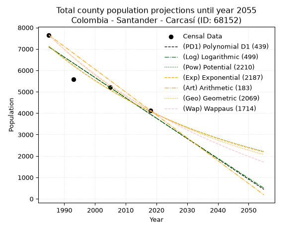
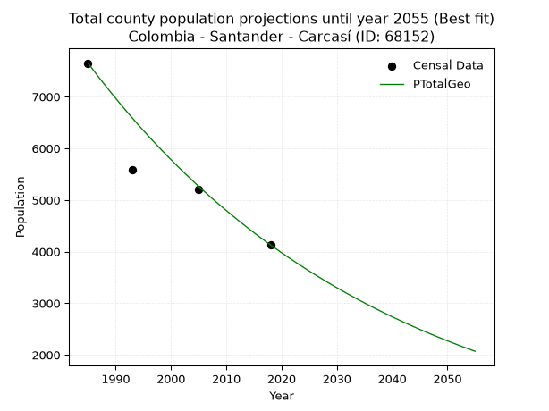
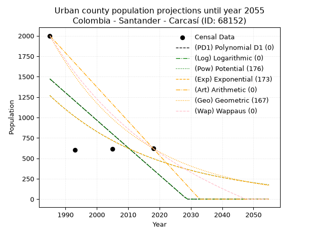
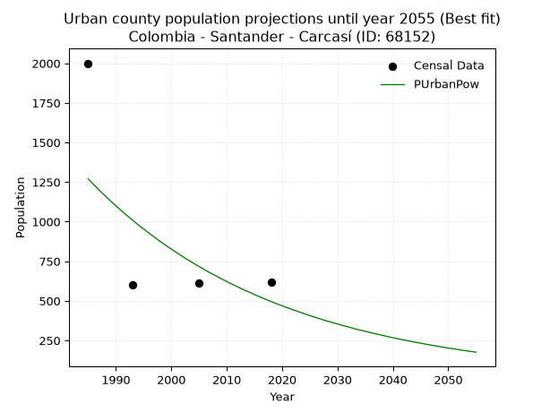
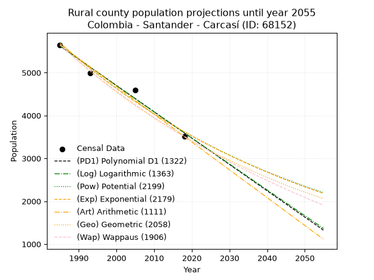
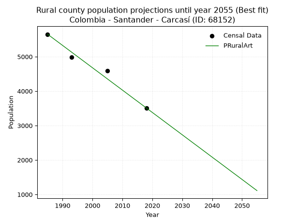

<div align="center">


</div>

# 📜 _“Population and Public Services Demand Projections (PPSD) until Year 2050 for Colombia - Santander - Carcasí (ID: 68152)”_
Keywords: `population` `public-service` `projection` `lineal` `polynomial` `logarithmic` `potential` `exponential` `arithmetic` `geometric` `wappaus` `dane` `colombia` `south-america`

PPSD are analytical estimates used by governments and planners to anticipate future changes in population size, age distribution, and the resulting community needs for utilities, healthcare, education, and infrastructure as sizing future water treatment facilities, electrical grids, and road networks based on spatial growth.

<div align="center">

</img>

</div>


> **General running parameters**: • app_version: _v20260806_. • Python version: _3.14.7_. • Pandas version: _3.0.5_. • NumPy version: _2.5.1_. • Creates, save and include plots into reports (create_plot): _False_. • Projection until year: _2050_. • Process polynomial degree 2 and up: _False_. • Process Wappaus: _True_. • Process Wappaus: _True_. • Set negative values to zero: _True_. • Set infinite values to zero: _True_. • Drop dataset notes: _True_. 
<div align="center">

Dynamic map: [:earth_americas:Google](http://maps.google.com/maps?q=6.629016463,-72.6270985) [:earth_americas:OSM](https://www.openstreetmap.org/#map=18/6.629016463/-72.6270985&layers=P) [:earth_americas:Bing](https://www.bing.com/maps?cp=6.629016463~-72.6270985&lvl=18) [:earth_americas:Apple](https://maps.apple.com/frame?center=6.629016463%2C-72.6270985&span=0.003%2C0.006)

</div>


<div align="center">

```geojson
{
  "type": "Feature",
  "geometry": {
    "type": "Point", 
    "coordinates": [-72.6270985, 6.629016463]
  }, 
  "properties": {
    "Name": "Colombia - Santander - Carcasí (ID: 68152)"
  }
}
```

</div>


## 0. Census Data (4 records)

Census data are official statistics collected by a government about the people and housing in a country. They usually include counts of total population, age, sex, race, income, education, and jobs.

📅Global census file: [Population.xlsx](../data/Population.xlsx)

| Source   |   Year |   CountryID | CountryName   |   StateID | StateName   |   CountyID | CountyName   |   PTotal |   PUrban |   PRural |
|:---------|-------:|------------:|:--------------|----------:|:------------|-----------:|:-------------|---------:|---------:|---------:|
| DANE     |   1985 |          57 | Colombia      |        68 | Santander   |      68152 | Carcasí      |     7650 |     2000 |     5650 |
| DANE     |   1993 |          57 | Colombia      |        68 | Santander   |      68152 | Carcasí      |     5591 |      601 |     4990 |
| DANE     |   2005 |          57 | Colombia      |        68 | Santander   |      68152 | Carcasí      |     5200 |      612 |     4588 |
| DANE     |   2018 |          57 | Colombia      |        68 | Santander   |      68152 | Carcasí      |     4130 |      620 |     3510 |

> 🔥Some records could had specific notes about the registered values or the corresponding urban or rural distribution.

📅[SUI-RUPS](https://www.datos.gov.co/Hacienda-y-Cr-dito-P-blico/Registro-nico-de-Prestadores-de-Servicios-P-blicos/4qkq-csdn/about_data) - Local public utility companies: [RUPS.csv](../data/RUPS.csv)

 | SERVICIO       | ESTADO    | NOMBRE                                                                                         | NIT         | DEPARTAMENTO_DOMICILIO   | MUNICIPIO_DOMICILIO   | DIRECCION               |   TELEFONO | EMAIL                                      | TIPO_PRESTADOR                 | CLASIFICACION                 |
|:---------------|:----------|:-----------------------------------------------------------------------------------------------|:------------|:-------------------------|:----------------------|:------------------------|-----------:|:-------------------------------------------|:-------------------------------|:------------------------------|
| ACUEDUCTO      | OPERATIVA | UNIDAD ADMINISTRADORA DE LOS SERVICIOS PUBLICOS DE ACUEDUCTO, ALCANTARILLADO Y ASEO DE CARCASI | 890210933-7 | SANTANDER                | CARCASI               | CALLE 2 No. 2-43 PISO 2 |    6606512 | serviciospublicos@carcasi-santander.gov.co | MUNICIPIO (PRESTACIÓN DIRECTA) | MENOR O IGUAL A 2500 USUARIOS |
| ALCANTARILLADO | OPERATIVA | UNIDAD ADMINISTRADORA DE LOS SERVICIOS PUBLICOS DE ACUEDUCTO, ALCANTARILLADO Y ASEO DE CARCASI | 890210933-7 | SANTANDER                | CARCASI               | CALLE 2 No. 2-43 PISO 2 |    6606512 | serviciospublicos@carcasi-santander.gov.co | MUNICIPIO (PRESTACIÓN DIRECTA) | MENOR O IGUAL A 2500 USUARIOS |

## 1. Total

### 1.1. Coefficients and Parameters

* (PD1) Polynomial Deg 1: -95.04576475311049, 195758.04094740926 (lineal)
* (Log) Logarithmic: -190363.0795161821, 1452594.0428764818
* (Pow) Potential: -33.76788433960691, 115.2111231463069
* (Exp) Exponential: -0.01686407925981385, 2.457877334110334e+18
* (Art) Arithmetic: Year diff. 2018 - 1985 = 33, Population diff. 4130 - 7650 = -3520, Annual growth = -106.66666666666667
* (Geo) Geometric: Year diff. 2018 - 1985 = 33, Population diff. 4130 - 7650 = -3520, Annual growth % = -0.018506260376660144
* (Wap) Wappaus: i = -1.8109790605546123, Condition values only valid for < 200)

<sub>
Wappaus condition values: ['-0.00', '-1.81', '-3.62', '-5.43', '-7.24', '-9.05', '-10.87', '-12.68', '-14.49', '-16.30', '-18.11', '-19.92', '-21.73', '-23.54', '-25.35', '-27.16', '-28.98', '-30.79', '-32.60', '-34.41', '-36.22', '-38.03', '-39.84', '-41.65', '-43.46', '-45.27', '-47.09', '-48.90', '-50.71', '-52.52', '-54.33', '-56.14', '-57.95', '-59.76', '-61.57', '-63.38', '-65.20', '-67.01', '-68.82', '-70.63', '-72.44', '-74.25', '-76.06', '-77.87', '-79.68', '-81.49', '-83.31', '-85.12', '-86.93', '-88.74', '-90.55', '-92.36', '-94.17', '-95.98', '-97.79', '-99.60', '-101.41', '-103.23', '-105.04', '-106.85', '-108.66', '-110.47', '-112.28', '-114.09', '-115.90', '-117.71']
</sub>


### 1.2. Projected Dataset

|   Year |   CountyID |   PTotalPD1 |   PTotalLog |   PTotalPow |   PTotalExp |   PTotalArt |   PTotalGeo |   PTotalWap |
|-------:|-----------:|------------:|------------:|------------:|------------:|------------:|------------:|------------:|
|   1985 |      68152 |        7092 |        7096 |        7124 |        7120 |        7650 |        7650 |        7650 |
|   1986 |      68152 |        6997 |        7000 |        7004 |        7001 |        7543 |        7508 |        7513 |
|   1987 |      68152 |        6902 |        6904 |        6886 |        6884 |        7437 |        7369 |        7378 |
|   1988 |      68152 |        6807 |        6808 |        6770 |        6769 |        7330 |        7233 |        7245 |
|   1989 |      68152 |        6712 |        6713 |        6656 |        6655 |        7223 |        7099 |        7115 |
|   1990 |      68152 |        6617 |        6617 |        6544 |        6544 |        7117 |        6968 |        6987 |
|   1991 |      68152 |        6522 |        6521 |        6434 |        6435 |        7010 |        6839 |        6862 |
|   1992 |      68152 |        6427 |        6426 |        6326 |        6327 |        6903 |        6712 |        6738 |
|   1993 |      68152 |        6332 |        6330 |        6219 |        6221 |        6797 |        6588 |        6617 |
|   1994 |      68152 |        6237 |        6235 |        6115 |        6117 |        6690 |        6466 |        6497 |
|   1995 |      68152 |        6142 |        6139 |        6012 |        6015 |        6583 |        6347 |        6380 |
|   1996 |      68152 |        6047 |        6044 |        5911 |        5914 |        6477 |        6229 |        6264 |
|   1997 |      68152 |        5952 |        5949 |        5812 |        5815 |        6370 |        6114 |        6150 |
|   1998 |      68152 |        5857 |        5853 |        5715 |        5718 |        6263 |        6001 |        6039 |
|   1999 |      68152 |        5762 |        5758 |        5619 |        5623 |        6157 |        5890 |        5929 |
|   2000 |      68152 |        5667 |        5663 |        5525 |        5528 |        6050 |        5781 |        5820 |
|   2001 |      68152 |        5571 |        5568 |        5432 |        5436 |        5943 |        5674 |        5714 |
|   2002 |      68152 |        5476 |        5473 |        5342 |        5345 |        5837 |        5569 |        5609 |
|   2003 |      68152 |        5381 |        5378 |        5252 |        5256 |        5730 |        5466 |        5506 |
|   2004 |      68152 |        5286 |        5282 |        5164 |        5168 |        5623 |        5364 |        5404 |
|   2005 |      68152 |        5191 |        5188 |        5078 |        5081 |        5517 |        5265 |        5304 |
|   2006 |      68152 |        5096 |        5093 |        4993 |        4996 |        5410 |        5168 |        5205 |
|   2007 |      68152 |        5001 |        4998 |        4910 |        4913 |        5303 |        5072 |        5108 |
|   2008 |      68152 |        4906 |        4903 |        4828 |        4831 |        5197 |        4978 |        5013 |
|   2009 |      68152 |        4811 |        4808 |        4748 |        4750 |        5090 |        4886 |        4919 |
|   2010 |      68152 |        4716 |        4713 |        4669 |        4671 |        4983 |        4796 |        4826 |
|   2011 |      68152 |        4621 |        4619 |        4591 |        4592 |        4877 |        4707 |        4734 |
|   2012 |      68152 |        4526 |        4524 |        4514 |        4516 |        4770 |        4620 |        4644 |
|   2013 |      68152 |        4431 |        4429 |        4439 |        4440 |        4663 |        4534 |        4555 |
|   2014 |      68152 |        4336 |        4335 |        4365 |        4366 |        4557 |        4450 |        4468 |
|   2015 |      68152 |        4241 |        4240 |        4293 |        4293 |        4450 |        4368 |        4382 |
|   2016 |      68152 |        4146 |        4146 |        4222 |        4221 |        4343 |        4287 |        4297 |
|   2017 |      68152 |        4051 |        4052 |        4151 |        4150 |        4237 |        4208 |        4213 |
|   2018 |      68152 |        3956 |        3957 |        4083 |        4081 |        4130 |        4130 |        4130 |
|   2019 |      68152 |        3861 |        3863 |        4015 |        4013 |        4023 |        4054 |        4048 |
|   2020 |      68152 |        3766 |        3769 |        3948 |        3946 |        3917 |        3979 |        3968 |
|   2021 |      68152 |        3671 |        3674 |        3883 |        3880 |        3810 |        3905 |        3889 |
|   2022 |      68152 |        3576 |        3580 |        3818 |        3815 |        3703 |        3833 |        3810 |
|   2023 |      68152 |        3480 |        3486 |        3755 |        3751 |        3597 |        3762 |        3733 |
|   2024 |      68152 |        3385 |        3392 |        3693 |        3688 |        3490 |        3692 |        3657 |
|   2025 |      68152 |        3290 |        3298 |        3632 |        3627 |        3383 |        3624 |        3582 |
|   2026 |      68152 |        3195 |        3204 |        3572 |        3566 |        3277 |        3557 |        3508 |
|   2027 |      68152 |        3100 |        3110 |        3513 |        3506 |        3170 |        3491 |        3435 |
|   2028 |      68152 |        3005 |        3016 |        3455 |        3448 |        3063 |        3426 |        3362 |
|   2029 |      68152 |        2910 |        2922 |        3398 |        3390 |        2957 |        3363 |        3291 |
|   2030 |      68152 |        2815 |        2829 |        3342 |        3333 |        2850 |        3301 |        3221 |
|   2031 |      68152 |        2720 |        2735 |        3287 |        3278 |        2743 |        3240 |        3151 |
|   2032 |      68152 |        2625 |        2641 |        3232 |        3223 |        2637 |        3180 |        3082 |
|   2033 |      68152 |        2530 |        2547 |        3179 |        3169 |        2530 |        3121 |        3015 |
|   2034 |      68152 |        2435 |        2454 |        3127 |        3116 |        2423 |        3063 |        2948 |
|   2035 |      68152 |        2340 |        2360 |        3075 |        3064 |        2317 |        3006 |        2882 |
|   2036 |      68152 |        2245 |        2267 |        3025 |        3013 |        2210 |        2951 |        2817 |
|   2037 |      68152 |        2150 |        2173 |        2975 |        2962 |        2103 |        2896 |        2752 |
|   2038 |      68152 |        2055 |        2080 |        2926 |        2913 |        1997 |        2843 |        2688 |
|   2039 |      68152 |        1960 |        1986 |        2878 |        2864 |        1890 |        2790 |        2626 |
|   2040 |      68152 |        1865 |        1893 |        2831 |        2816 |        1783 |        2738 |        2563 |
|   2041 |      68152 |        1770 |        1800 |        2784 |        2769 |        1677 |        2688 |        2502 |
|   2042 |      68152 |        1675 |        1707 |        2739 |        2723 |        1570 |        2638 |        2441 |
|   2043 |      68152 |        1580 |        1613 |        2694 |        2677 |        1463 |        2589 |        2382 |
|   2044 |      68152 |        1484 |        1520 |        2650 |        2632 |        1357 |        2541 |        2322 |
|   2045 |      68152 |        1389 |        1427 |        2606 |        2588 |        1250 |        2494 |        2264 |
|   2046 |      68152 |        1294 |        1334 |        2564 |        2545 |        1143 |        2448 |        2206 |
|   2047 |      68152 |        1199 |        1241 |        2522 |        2503 |        1037 |        2403 |        2149 |
|   2048 |      68152 |        1104 |        1148 |        2480 |        2461 |         930 |        2358 |        2092 |
|   2049 |      68152 |        1009 |        1055 |        2440 |        2420 |         823 |        2315 |        2037 |
|   2050 |      68152 |         914 |         962 |        2400 |        2379 |         717 |        2272 |        1981 |
<div align="center">

</img>

</div>


### 1.3. Best fit with absolute and relative error (%)

Relative error puts that difference into context by dividing the absolute error by the true value, creating a unitless ratio or percentage that shows the scale of the mistake.

Absolute and relative error

|   Year | Source   |   CountryID | CountryName   |   StateID | StateName   |   CountyID_x | CountyName   |   PTotal |   PUrban |   PRural |   CountyID_y |   PTotalPD1 |   PTotalLog |   PTotalPow |   PTotalExp |   PTotalArt |   PTotalGeo |   PTotalWap |   PTotalPD1AbsError |   PTotalLogAbsError |   PTotalPowAbsError |   PTotalExpAbsError |   PTotalArtAbsError |   PTotalGeoAbsError |   PTotalWapAbsError |   PTotalPD1RelError |   PTotalLogRelError |   PTotalPowRelError |   PTotalExpRelError |   PTotalArtRelError |   PTotalGeoRelError |   PTotalWapRelError |
|-------:|:---------|------------:|:--------------|----------:|:------------|-------------:|:-------------|---------:|---------:|---------:|-------------:|------------:|------------:|------------:|------------:|------------:|------------:|------------:|--------------------:|--------------------:|--------------------:|--------------------:|--------------------:|--------------------:|--------------------:|--------------------:|--------------------:|--------------------:|--------------------:|--------------------:|--------------------:|--------------------:|
|   1985 | DANE     |          57 | Colombia      |        68 | Santander   |        68152 | Carcasí      |     7650 |     2000 |     5650 |        68152 |        7092 |        7096 |        7124 |        7120 |        7650 |        7650 |        7650 |                 558 |                 554 |                 526 |                 530 |                   0 |                   0 |                   0 |            7.29412  |            7.24183  |             6.87582 |             6.9281  |             0       |              0      |              0      |
|   1993 | DANE     |          57 | Colombia      |        68 | Santander   |        68152 | Carcasí      |     5591 |      601 |     4990 |        68152 |        6332 |        6330 |        6219 |        6221 |        6797 |        6588 |        6617 |                 741 |                 739 |                 628 |                 630 |                1206 |                 997 |                1026 |           13.2534   |           13.2177   |            11.2323  |            11.2681  |            21.5704  |             17.8322 |             18.3509 |
|   2005 | DANE     |          57 | Colombia      |        68 | Santander   |        68152 | Carcasí      |     5200 |      612 |     4588 |        68152 |        5191 |        5188 |        5078 |        5081 |        5517 |        5265 |        5304 |                   9 |                  12 |                 122 |                 119 |                 317 |                  65 |                 104 |            0.173077 |            0.230769 |             2.34615 |             2.28846 |             6.09615 |              1.25   |              2      |
|   2018 | DANE     |          57 | Colombia      |        68 | Santander   |        68152 | Carcasí      |     4130 |      620 |     3510 |        68152 |        3956 |        3957 |        4083 |        4081 |        4130 |        4130 |        4130 |                 174 |                 173 |                  47 |                  49 |                   0 |                   0 |                   0 |            4.21308  |            4.18886  |             1.13801 |             1.18644 |             0       |              0      |              0      |

Relative error mean

| Method    |   RelError | Best   |
|:----------|-----------:|:-------|
| PTotalPD1 |    6.23343 |        |
| PTotalLog |    6.21978 |        |
| PTotalPow |    5.39808 |        |
| PTotalExp |    5.41778 |        |
| PTotalArt |    6.91663 |        |
| PTotalGeo |    4.77056 | True   |
| PTotalWap |    5.08773 |        |

💙Best method: _**PTotalGeo**_
<div align="center">

</img>

</div>


### 1.4. Fresh water supply demand in liters per capita per day (lpcd)

The fresh water supply demand typically ranges from 100 to 300 liters per capita per day (lpcd) for standard domestic and municipal planning, though absolute survival minimums set by the World Health Organization are as low as 7.5 to 20 liters per day, and total consumption in high-income nations can exceed 400 liters.

> `CZ`: Level in meters above the sea level (masl)<br> `WS`: Fresh water supply demand in liters per capita per day (lpcd or l/h/d)<br> `WSAll`: Zonal fresh water supply demand in liters per second (l/s)<br> `A`: Zonal area in square meters<br> `DP`: Population density (people/hectare or p/ha)

Reference values (RAS Colombia)

|    CZ |   WS |
|------:|-----:|
|  1000 |  120 |
|  2000 |  130 |
| 99999 |  140 |

County shapefile geometry properties and water supply values

|   CountyID |      ATotal |   CZTotal |   WSTotal |
|-----------:|------------:|----------:|----------:|
|      68152 | 2.58369e+08 |   3160.36 |       140 |

Projected values for best method: PTotalGeo

|   CountyID |   Year |   PTotalGeo |   DPTotal |   WSTotal |   WSTotalAll |
|-----------:|-------:|------------:|----------:|----------:|-------------:|
|      68152 |   1985 |        7650 |      0.3  |       140 |     12.3958  |
|      68152 |   1986 |        7508 |      0.29 |       140 |     12.1657  |
|      68152 |   1987 |        7369 |      0.29 |       140 |     11.9405  |
|      68152 |   1988 |        7233 |      0.28 |       140 |     11.7201  |
|      68152 |   1989 |        7099 |      0.27 |       140 |     11.503   |
|      68152 |   1990 |        6968 |      0.27 |       140 |     11.2907  |
|      68152 |   1991 |        6839 |      0.26 |       140 |     11.0817  |
|      68152 |   1992 |        6712 |      0.26 |       140 |     10.8759  |
|      68152 |   1993 |        6588 |      0.25 |       140 |     10.675   |
|      68152 |   1994 |        6466 |      0.25 |       140 |     10.4773  |
|      68152 |   1995 |        6347 |      0.25 |       140 |     10.2845  |
|      68152 |   1996 |        6229 |      0.24 |       140 |     10.0933  |
|      68152 |   1997 |        6114 |      0.24 |       140 |      9.90694 |
|      68152 |   1998 |        6001 |      0.23 |       140 |      9.72384 |
|      68152 |   1999 |        5890 |      0.23 |       140 |      9.54398 |
|      68152 |   2000 |        5781 |      0.22 |       140 |      9.36736 |
|      68152 |   2001 |        5674 |      0.22 |       140 |      9.19398 |
|      68152 |   2002 |        5569 |      0.22 |       140 |      9.02384 |
|      68152 |   2003 |        5466 |      0.21 |       140 |      8.85694 |
|      68152 |   2004 |        5364 |      0.21 |       140 |      8.69167 |
|      68152 |   2005 |        5265 |      0.2  |       140 |      8.53125 |
|      68152 |   2006 |        5168 |      0.2  |       140 |      8.37407 |
|      68152 |   2007 |        5072 |      0.2  |       140 |      8.21852 |
|      68152 |   2008 |        4978 |      0.19 |       140 |      8.0662  |
|      68152 |   2009 |        4886 |      0.19 |       140 |      7.91713 |
|      68152 |   2010 |        4796 |      0.19 |       140 |      7.7713  |
|      68152 |   2011 |        4707 |      0.18 |       140 |      7.62708 |
|      68152 |   2012 |        4620 |      0.18 |       140 |      7.48611 |
|      68152 |   2013 |        4534 |      0.18 |       140 |      7.34676 |
|      68152 |   2014 |        4450 |      0.17 |       140 |      7.21065 |
|      68152 |   2015 |        4368 |      0.17 |       140 |      7.07778 |
|      68152 |   2016 |        4287 |      0.17 |       140 |      6.94653 |
|      68152 |   2017 |        4208 |      0.16 |       140 |      6.81852 |
|      68152 |   2018 |        4130 |      0.16 |       140 |      6.69213 |
|      68152 |   2019 |        4054 |      0.16 |       140 |      6.56898 |
|      68152 |   2020 |        3979 |      0.15 |       140 |      6.44745 |
|      68152 |   2021 |        3905 |      0.15 |       140 |      6.32755 |
|      68152 |   2022 |        3833 |      0.15 |       140 |      6.21088 |
|      68152 |   2023 |        3762 |      0.15 |       140 |      6.09583 |
|      68152 |   2024 |        3692 |      0.14 |       140 |      5.98241 |
|      68152 |   2025 |        3624 |      0.14 |       140 |      5.87222 |
|      68152 |   2026 |        3557 |      0.14 |       140 |      5.76366 |
|      68152 |   2027 |        3491 |      0.14 |       140 |      5.65671 |
|      68152 |   2028 |        3426 |      0.13 |       140 |      5.55139 |
|      68152 |   2029 |        3363 |      0.13 |       140 |      5.44931 |
|      68152 |   2030 |        3301 |      0.13 |       140 |      5.34884 |
|      68152 |   2031 |        3240 |      0.13 |       140 |      5.25    |
|      68152 |   2032 |        3180 |      0.12 |       140 |      5.15278 |
|      68152 |   2033 |        3121 |      0.12 |       140 |      5.05718 |
|      68152 |   2034 |        3063 |      0.12 |       140 |      4.96319 |
|      68152 |   2035 |        3006 |      0.12 |       140 |      4.87083 |
|      68152 |   2036 |        2951 |      0.11 |       140 |      4.78171 |
|      68152 |   2037 |        2896 |      0.11 |       140 |      4.69259 |
|      68152 |   2038 |        2843 |      0.11 |       140 |      4.60671 |
|      68152 |   2039 |        2790 |      0.11 |       140 |      4.52083 |
|      68152 |   2040 |        2738 |      0.11 |       140 |      4.43657 |
|      68152 |   2041 |        2688 |      0.1  |       140 |      4.35556 |
|      68152 |   2042 |        2638 |      0.1  |       140 |      4.27454 |
|      68152 |   2043 |        2589 |      0.1  |       140 |      4.19514 |
|      68152 |   2044 |        2541 |      0.1  |       140 |      4.11736 |
|      68152 |   2045 |        2494 |      0.1  |       140 |      4.0412  |
|      68152 |   2046 |        2448 |      0.09 |       140 |      3.96667 |
|      68152 |   2047 |        2403 |      0.09 |       140 |      3.89375 |
|      68152 |   2048 |        2358 |      0.09 |       140 |      3.82083 |
|      68152 |   2049 |        2315 |      0.09 |       140 |      3.75116 |
|      68152 |   2050 |        2272 |      0.09 |       140 |      3.68148 |

## 2. Urban

### 2.1. Coefficients and Parameters

* (PD1) Polynomial Deg 1: -33.63348052990765, 68233.6194299478 (lineal)
* (Log) Logarithmic: -67457.17714957925, 513700.794081844
* (Pow) Potential: -56.99660052137689, 191.0648626764441
* (Exp) Exponential: -0.028416823293888022, 3.984614506460306e+27
* (Art) Arithmetic: Year diff. 2018 - 1985 = 33, Population diff. 620 - 2000 = -1380, Annual growth = -41.81818181818182
* (Geo) Geometric: Year diff. 2018 - 1985 = 33, Population diff. 620 - 2000 = -1380, Annual growth % = -0.034867994157020354
* (Wap) Wappaus: i = -3.1922276197085355, Condition values only valid for < 200)

<sub>
Wappaus condition values: ['-0.00', '-3.19', '-6.38', '-9.58', '-12.77', '-15.96', '-19.15', '-22.35', '-25.54', '-28.73', '-31.92', '-35.11', '-38.31', '-41.50', '-44.69', '-47.88', '-51.08', '-54.27', '-57.46', '-60.65', '-63.84', '-67.04', '-70.23', '-73.42', '-76.61', '-79.81', '-83.00', '-86.19', '-89.38', '-92.57', '-95.77', '-98.96', '-102.15', '-105.34', '-108.54', '-111.73', '-114.92', '-118.11', '-121.30', '-124.50', '-127.69', '-130.88', '-134.07', '-137.27', '-140.46', '-143.65', '-146.84', '-150.03', '-153.23', '-156.42', '-159.61', '-162.80', '-166.00', '-169.19', '-172.38', '-175.57', '-178.76', '-181.96', '-185.15', '-188.34', '-191.53', '-194.73', '-197.92', '-201.11', '-204.30', '-207.49']
</sub>


### 2.2. Projected Dataset

|   Year |   CountyID |   PUrbanPD1 |   PUrbanLog |   PUrbanPow |   PUrbanExp |   PUrbanArt |   PUrbanGeo |   PUrbanWap |
|-------:|-----------:|------------:|------------:|------------:|------------:|------------:|------------:|------------:|
|   1985 |      68152 |        1471 |        1473 |        1270 |        1268 |        2000 |        2000 |        2000 |
|   1986 |      68152 |        1438 |        1439 |        1234 |        1232 |        1958 |        1930 |        1937 |
|   1987 |      68152 |        1404 |        1405 |        1199 |        1198 |        1916 |        1863 |        1876 |
|   1988 |      68152 |        1370 |        1371 |        1165 |        1164 |        1875 |        1798 |        1817 |
|   1989 |      68152 |        1337 |        1337 |        1132 |        1131 |        1833 |        1735 |        1760 |
|   1990 |      68152 |        1303 |        1304 |        1100 |        1100 |        1791 |        1675 |        1704 |
|   1991 |      68152 |        1269 |        1270 |        1069 |        1069 |        1749 |        1616 |        1650 |
|   1992 |      68152 |        1236 |        1236 |        1039 |        1039 |        1707 |        1560 |        1598 |
|   1993 |      68152 |        1202 |        1202 |        1010 |        1010 |        1665 |        1506 |        1547 |
|   1994 |      68152 |        1168 |        1168 |         981 |         982 |        1624 |        1453 |        1498 |
|   1995 |      68152 |        1135 |        1134 |         954 |         954 |        1582 |        1402 |        1449 |
|   1996 |      68152 |        1101 |        1100 |         927 |         927 |        1540 |        1354 |        1403 |
|   1997 |      68152 |        1068 |        1067 |         901 |         901 |        1498 |        1306 |        1357 |
|   1998 |      68152 |        1034 |        1033 |         875 |         876 |        1456 |        1261 |        1313 |
|   1999 |      68152 |        1000 |         999 |         851 |         852 |        1415 |        1217 |        1269 |
|   2000 |      68152 |         967 |         965 |         827 |         828 |        1373 |        1174 |        1227 |
|   2001 |      68152 |         933 |         932 |         804 |         804 |        1331 |        1133 |        1186 |
|   2002 |      68152 |         899 |         898 |         781 |         782 |        1289 |        1094 |        1146 |
|   2003 |      68152 |         866 |         864 |         759 |         760 |        1247 |        1056 |        1107 |
|   2004 |      68152 |         832 |         831 |         738 |         739 |        1205 |        1019 |        1069 |
|   2005 |      68152 |         798 |         797 |         717 |         718 |        1164 |         983 |        1032 |
|   2006 |      68152 |         765 |         763 |         697 |         698 |        1122 |         949 |         996 |
|   2007 |      68152 |         731 |         730 |         677 |         678 |        1080 |         916 |         960 |
|   2008 |      68152 |         698 |         696 |         659 |         659 |        1038 |         884 |         926 |
|   2009 |      68152 |         664 |         662 |         640 |         641 |         996 |         853 |         892 |
|   2010 |      68152 |         630 |         629 |         622 |         623 |         955 |         824 |         859 |
|   2011 |      68152 |         597 |         595 |         605 |         605 |         913 |         795 |         827 |
|   2012 |      68152 |         563 |         562 |         588 |         589 |         871 |         767 |         795 |
|   2013 |      68152 |         529 |         528 |         571 |         572 |         829 |         740 |         765 |
|   2014 |      68152 |         496 |         495 |         556 |         556 |         787 |         715 |         734 |
|   2015 |      68152 |         462 |         461 |         540 |         540 |         745 |         690 |         705 |
|   2016 |      68152 |         429 |         428 |         525 |         525 |         704 |         666 |         676 |
|   2017 |      68152 |         395 |         394 |         510 |         511 |         662 |         642 |         648 |
|   2018 |      68152 |         361 |         361 |         496 |         496 |         620 |         620 |         620 |
|   2019 |      68152 |         328 |         328 |         482 |         482 |         578 |         598 |         593 |
|   2020 |      68152 |         294 |         294 |         469 |         469 |         536 |         578 |         566 |
|   2021 |      68152 |         260 |         261 |         456 |         456 |         495 |         557 |         540 |
|   2022 |      68152 |         227 |         227 |         443 |         443 |         453 |         538 |         515 |
|   2023 |      68152 |         193 |         194 |         431 |         431 |         411 |         519 |         490 |
|   2024 |      68152 |         159 |         161 |         419 |         418 |         369 |         501 |         465 |
|   2025 |      68152 |         126 |         127 |         407 |         407 |         327 |         484 |         441 |
|   2026 |      68152 |          92 |          94 |         396 |         395 |         285 |         467 |         418 |
|   2027 |      68152 |          59 |          61 |         385 |         384 |         244 |         450 |         395 |
|   2028 |      68152 |          25 |          28 |         374 |         374 |         202 |         435 |         372 |
|   2029 |      68152 |           0 |           0 |         364 |         363 |         160 |         420 |         350 |
|   2030 |      68152 |           0 |           0 |         354 |         353 |         118 |         405 |         328 |
|   2031 |      68152 |           0 |           0 |         344 |         343 |          76 |         391 |         307 |
|   2032 |      68152 |           0 |           0 |         335 |         333 |          35 |         377 |         285 |
|   2033 |      68152 |           0 |           0 |         325 |         324 |           0 |         364 |         265 |
|   2034 |      68152 |           0 |           0 |         316 |         315 |           0 |         351 |         245 |
|   2035 |      68152 |           0 |           0 |         308 |         306 |           0 |         339 |         225 |
|   2036 |      68152 |           0 |           0 |         299 |         298 |           0 |         327 |         205 |
|   2037 |      68152 |           0 |           0 |         291 |         289 |           0 |         316 |         186 |
|   2038 |      68152 |           0 |           0 |         283 |         281 |           0 |         305 |         167 |
|   2039 |      68152 |           0 |           0 |         275 |         273 |           0 |         294 |         148 |
|   2040 |      68152 |           0 |           0 |         267 |         266 |           0 |         284 |         130 |
|   2041 |      68152 |           0 |           0 |         260 |         258 |           0 |         274 |         112 |
|   2042 |      68152 |           0 |           0 |         253 |         251 |           0 |         265 |          94 |
|   2043 |      68152 |           0 |           0 |         246 |         244 |           0 |         255 |          77 |
|   2044 |      68152 |           0 |           0 |         239 |         237 |           0 |         246 |          60 |
|   2045 |      68152 |           0 |           0 |         233 |         230 |           0 |         238 |          43 |
|   2046 |      68152 |           0 |           0 |         226 |         224 |           0 |         230 |          27 |
|   2047 |      68152 |           0 |           0 |         220 |         218 |           0 |         222 |          10 |
|   2048 |      68152 |           0 |           0 |         214 |         212 |           0 |         214 |           0 |
|   2049 |      68152 |           0 |           0 |         208 |         206 |           0 |         206 |           0 |
|   2050 |      68152 |           0 |           0 |         202 |         200 |           0 |         199 |           0 |
<div align="center">

</img>

</div>


### 2.3. Best fit with absolute and relative error (%)

Relative error puts that difference into context by dividing the absolute error by the true value, creating a unitless ratio or percentage that shows the scale of the mistake.

Absolute and relative error

|   Year | Source   |   CountryID | CountryName   |   StateID | StateName   |   CountyID_x | CountyName   |   PTotal |   PUrban |   PRural |   CountyID_y |   PUrbanPD1 |   PUrbanLog |   PUrbanPow |   PUrbanExp |   PUrbanArt |   PUrbanGeo |   PUrbanWap |   PUrbanPD1AbsError |   PUrbanLogAbsError |   PUrbanPowAbsError |   PUrbanExpAbsError |   PUrbanArtAbsError |   PUrbanGeoAbsError |   PUrbanWapAbsError |   PUrbanPD1RelError |   PUrbanLogRelError |   PUrbanPowRelError |   PUrbanExpRelError |   PUrbanArtRelError |   PUrbanGeoRelError |   PUrbanWapRelError |
|-------:|:---------|------------:|:--------------|----------:|:------------|-------------:|:-------------|---------:|---------:|---------:|-------------:|------------:|------------:|------------:|------------:|------------:|------------:|------------:|--------------------:|--------------------:|--------------------:|--------------------:|--------------------:|--------------------:|--------------------:|--------------------:|--------------------:|--------------------:|--------------------:|--------------------:|--------------------:|--------------------:|
|   1985 | DANE     |          57 | Colombia      |        68 | Santander   |        68152 | Carcasí      |     7650 |     2000 |     5650 |        68152 |        1471 |        1473 |        1270 |        1268 |        2000 |        2000 |        2000 |                 529 |                 527 |                 730 |                 732 |                   0 |                   0 |                   0 |             26.45   |             26.35   |             36.5    |             36.6    |              0      |              0      |              0      |
|   1993 | DANE     |          57 | Colombia      |        68 | Santander   |        68152 | Carcasí      |     5591 |      601 |     4990 |        68152 |        1202 |        1202 |        1010 |        1010 |        1665 |        1506 |        1547 |                 601 |                 601 |                 409 |                 409 |                1064 |                 905 |                 946 |            100      |            100      |             68.0532 |             68.0532 |            177.038  |            150.582  |            157.404  |
|   2005 | DANE     |          57 | Colombia      |        68 | Santander   |        68152 | Carcasí      |     5200 |      612 |     4588 |        68152 |         798 |         797 |         717 |         718 |        1164 |         983 |        1032 |                 186 |                 185 |                 105 |                 106 |                 552 |                 371 |                 420 |             30.3922 |             30.2288 |             17.1569 |             17.3203 |             90.1961 |             60.6209 |             68.6275 |
|   2018 | DANE     |          57 | Colombia      |        68 | Santander   |        68152 | Carcasí      |     4130 |      620 |     3510 |        68152 |         361 |         361 |         496 |         496 |         620 |         620 |         620 |                 259 |                 259 |                 124 |                 124 |                   0 |                   0 |                   0 |             41.7742 |             41.7742 |             20      |             20      |              0      |              0      |              0      |

Relative error mean

| Method    |   RelError | Best   |
|:----------|-----------:|:-------|
| PUrbanPD1 |    49.6541 |        |
| PUrbanLog |    49.5882 |        |
| PUrbanPow |    35.4275 | True   |
| PUrbanExp |    35.4934 |        |
| PUrbanArt |    66.8086 |        |
| PUrbanGeo |    52.8008 |        |
| PUrbanWap |    56.5079 |        |

💙Best method: _**PUrbanPow**_
<div align="center">

</img>

</div>


### 2.4. Fresh water supply demand in liters per capita per day (lpcd)

The fresh water supply demand typically ranges from 100 to 300 liters per capita per day (lpcd) for standard domestic and municipal planning, though absolute survival minimums set by the World Health Organization are as low as 7.5 to 20 liters per day, and total consumption in high-income nations can exceed 400 liters.

> `CZ`: Level in meters above the sea level (masl)<br> `WS`: Fresh water supply demand in liters per capita per day (lpcd or l/h/d)<br> `WSAll`: Zonal fresh water supply demand in liters per second (l/s)<br> `A`: Zonal area in square meters<br> `DP`: Population density (people/hectare or p/ha)

Reference values (RAS Colombia)

|    CZ |   WS |
|------:|-----:|
|  1000 |  120 |
|  2000 |  130 |
| 99999 |  140 |

County shapefile geometry properties and water supply values

|   CountyID |   AUrban |   CZUrban |   WSUrban |
|-----------:|---------:|----------:|----------:|
|      68152 |   150379 |   2123.98 |       140 |

Projected values for best method: PUrbanPow

|   CountyID |   Year |   PUrbanPow |   DPUrban |   WSUrban |   WSUrbanAll |
|-----------:|-------:|------------:|----------:|----------:|-------------:|
|      68152 |   1985 |        1270 |     84.45 |       140 |     2.05787  |
|      68152 |   1986 |        1234 |     82.06 |       140 |     1.99954  |
|      68152 |   1987 |        1199 |     79.73 |       140 |     1.94282  |
|      68152 |   1988 |        1165 |     77.47 |       140 |     1.88773  |
|      68152 |   1989 |        1132 |     75.28 |       140 |     1.83426  |
|      68152 |   1990 |        1100 |     73.15 |       140 |     1.78241  |
|      68152 |   1991 |        1069 |     71.09 |       140 |     1.73218  |
|      68152 |   1992 |        1039 |     69.09 |       140 |     1.68356  |
|      68152 |   1993 |        1010 |     67.16 |       140 |     1.63657  |
|      68152 |   1994 |         981 |     65.24 |       140 |     1.58958  |
|      68152 |   1995 |         954 |     63.44 |       140 |     1.54583  |
|      68152 |   1996 |         927 |     61.64 |       140 |     1.50208  |
|      68152 |   1997 |         901 |     59.92 |       140 |     1.45995  |
|      68152 |   1998 |         875 |     58.19 |       140 |     1.41782  |
|      68152 |   1999 |         851 |     56.59 |       140 |     1.37894  |
|      68152 |   2000 |         827 |     54.99 |       140 |     1.34005  |
|      68152 |   2001 |         804 |     53.46 |       140 |     1.30278  |
|      68152 |   2002 |         781 |     51.94 |       140 |     1.26551  |
|      68152 |   2003 |         759 |     50.47 |       140 |     1.22986  |
|      68152 |   2004 |         738 |     49.08 |       140 |     1.19583  |
|      68152 |   2005 |         717 |     47.68 |       140 |     1.16181  |
|      68152 |   2006 |         697 |     46.35 |       140 |     1.1294   |
|      68152 |   2007 |         677 |     45.02 |       140 |     1.09699  |
|      68152 |   2008 |         659 |     43.82 |       140 |     1.06782  |
|      68152 |   2009 |         640 |     42.56 |       140 |     1.03704  |
|      68152 |   2010 |         622 |     41.36 |       140 |     1.00787  |
|      68152 |   2011 |         605 |     40.23 |       140 |     0.980324 |
|      68152 |   2012 |         588 |     39.1  |       140 |     0.952778 |
|      68152 |   2013 |         571 |     37.97 |       140 |     0.925231 |
|      68152 |   2014 |         556 |     36.97 |       140 |     0.900926 |
|      68152 |   2015 |         540 |     35.91 |       140 |     0.875    |
|      68152 |   2016 |         525 |     34.91 |       140 |     0.850694 |
|      68152 |   2017 |         510 |     33.91 |       140 |     0.826389 |
|      68152 |   2018 |         496 |     32.98 |       140 |     0.803704 |
|      68152 |   2019 |         482 |     32.05 |       140 |     0.781019 |
|      68152 |   2020 |         469 |     31.19 |       140 |     0.759954 |
|      68152 |   2021 |         456 |     30.32 |       140 |     0.738889 |
|      68152 |   2022 |         443 |     29.46 |       140 |     0.717824 |
|      68152 |   2023 |         431 |     28.66 |       140 |     0.69838  |
|      68152 |   2024 |         419 |     27.86 |       140 |     0.678935 |
|      68152 |   2025 |         407 |     27.06 |       140 |     0.659491 |
|      68152 |   2026 |         396 |     26.33 |       140 |     0.641667 |
|      68152 |   2027 |         385 |     25.6  |       140 |     0.623843 |
|      68152 |   2028 |         374 |     24.87 |       140 |     0.606019 |
|      68152 |   2029 |         364 |     24.21 |       140 |     0.589815 |
|      68152 |   2030 |         354 |     23.54 |       140 |     0.573611 |
|      68152 |   2031 |         344 |     22.88 |       140 |     0.557407 |
|      68152 |   2032 |         335 |     22.28 |       140 |     0.542824 |
|      68152 |   2033 |         325 |     21.61 |       140 |     0.52662  |
|      68152 |   2034 |         316 |     21.01 |       140 |     0.512037 |
|      68152 |   2035 |         308 |     20.48 |       140 |     0.499074 |
|      68152 |   2036 |         299 |     19.88 |       140 |     0.484491 |
|      68152 |   2037 |         291 |     19.35 |       140 |     0.471528 |
|      68152 |   2038 |         283 |     18.82 |       140 |     0.458565 |
|      68152 |   2039 |         275 |     18.29 |       140 |     0.445602 |
|      68152 |   2040 |         267 |     17.76 |       140 |     0.432639 |
|      68152 |   2041 |         260 |     17.29 |       140 |     0.421296 |
|      68152 |   2042 |         253 |     16.82 |       140 |     0.409954 |
|      68152 |   2043 |         246 |     16.36 |       140 |     0.398611 |
|      68152 |   2044 |         239 |     15.89 |       140 |     0.387269 |
|      68152 |   2045 |         233 |     15.49 |       140 |     0.377546 |
|      68152 |   2046 |         226 |     15.03 |       140 |     0.366204 |
|      68152 |   2047 |         220 |     14.63 |       140 |     0.356481 |
|      68152 |   2048 |         214 |     14.23 |       140 |     0.346759 |
|      68152 |   2049 |         208 |     13.83 |       140 |     0.337037 |
|      68152 |   2050 |         202 |     13.43 |       140 |     0.327315 |

## 3. Rural

### 3.1. Coefficients and Parameters

* (PD1) Polynomial Deg 1: -61.41228422320282, 127524.42151746145 (lineal)
* (Log) Logarithmic: -122905.90236660288, 938893.2487946382
* (Pow) Potential: -27.434049817574653, 94.2261488481385
* (Exp) Exponential: -0.013710337692011564, 3753241157818730.5
* (Art) Arithmetic: Year diff. 2018 - 1985 = 33, Population diff. 3510 - 5650 = -2140, Annual growth = -64.84848484848484
* (Geo) Geometric: Year diff. 2018 - 1985 = 33, Population diff. 3510 - 5650 = -2140, Annual growth % = -0.014321891479624038
* (Wap) Wappaus: i = -1.4159057827180097, Condition values only valid for < 200)

<sub>
Wappaus condition values: ['-0.00', '-1.42', '-2.83', '-4.25', '-5.66', '-7.08', '-8.50', '-9.91', '-11.33', '-12.74', '-14.16', '-15.57', '-16.99', '-18.41', '-19.82', '-21.24', '-22.65', '-24.07', '-25.49', '-26.90', '-28.32', '-29.73', '-31.15', '-32.57', '-33.98', '-35.40', '-36.81', '-38.23', '-39.65', '-41.06', '-42.48', '-43.89', '-45.31', '-46.72', '-48.14', '-49.56', '-50.97', '-52.39', '-53.80', '-55.22', '-56.64', '-58.05', '-59.47', '-60.88', '-62.30', '-63.72', '-65.13', '-66.55', '-67.96', '-69.38', '-70.80', '-72.21', '-73.63', '-75.04', '-76.46', '-77.87', '-79.29', '-80.71', '-82.12', '-83.54', '-84.95', '-86.37', '-87.79', '-89.20', '-90.62', '-92.03']
</sub>


### 3.2. Projected Dataset

|   Year |   CountyID |   PRuralPD1 |   PRuralLog |   PRuralPow |   PRuralExp |   PRuralArt |   PRuralGeo |   PRuralWap |
|-------:|-----------:|------------:|------------:|------------:|------------:|------------:|------------:|------------:|
|   1985 |      68152 |        5621 |        5623 |        5691 |        5689 |        5650 |        5650 |        5650 |
|   1986 |      68152 |        5560 |        5561 |        5613 |        5612 |        5585 |        5569 |        5571 |
|   1987 |      68152 |        5498 |        5499 |        5536 |        5536 |        5520 |        5489 |        5492 |
|   1988 |      68152 |        5437 |        5437 |        5460 |        5460 |        5455 |        5411 |        5415 |
|   1989 |      68152 |        5375 |        5375 |        5386 |        5386 |        5391 |        5333 |        5339 |
|   1990 |      68152 |        5314 |        5314 |        5312 |        5313 |        5326 |        5257 |        5264 |
|   1991 |      68152 |        5253 |        5252 |        5239 |        5240 |        5261 |        5182 |        5190 |
|   1992 |      68152 |        5191 |        5190 |        5168 |        5169 |        5196 |        5107 |        5116 |
|   1993 |      68152 |        5130 |        5128 |        5097 |        5098 |        5131 |        5034 |        5044 |
|   1994 |      68152 |        5068 |        5067 |        5027 |        5029 |        5066 |        4962 |        4973 |
|   1995 |      68152 |        5007 |        5005 |        4959 |        4961 |        5002 |        4891 |        4903 |
|   1996 |      68152 |        4946 |        4944 |        4891 |        4893 |        4937 |        4821 |        4834 |
|   1997 |      68152 |        4884 |        4882 |        4824 |        4826 |        4872 |        4752 |        4765 |
|   1998 |      68152 |        4823 |        4820 |        4758 |        4761 |        4807 |        4684 |        4698 |
|   1999 |      68152 |        4761 |        4759 |        4693 |        4696 |        4742 |        4617 |        4631 |
|   2000 |      68152 |        4700 |        4697 |        4629 |        4632 |        4677 |        4551 |        4565 |
|   2001 |      68152 |        4638 |        4636 |        4566 |        4569 |        4612 |        4485 |        4500 |
|   2002 |      68152 |        4577 |        4575 |        4504 |        4507 |        4548 |        4421 |        4436 |
|   2003 |      68152 |        4516 |        4513 |        4443 |        4445 |        4483 |        4358 |        4373 |
|   2004 |      68152 |        4454 |        4452 |        4383 |        4385 |        4418 |        4296 |        4310 |
|   2005 |      68152 |        4393 |        4391 |        4323 |        4325 |        4353 |        4234 |        4248 |
|   2006 |      68152 |        4331 |        4329 |        4264 |        4266 |        4288 |        4173 |        4187 |
|   2007 |      68152 |        4270 |        4268 |        4206 |        4208 |        4223 |        4114 |        4127 |
|   2008 |      68152 |        4209 |        4207 |        4149 |        4151 |        4158 |        4055 |        4068 |
|   2009 |      68152 |        4147 |        4146 |        4093 |        4094 |        4094 |        3997 |        4009 |
|   2010 |      68152 |        4086 |        4084 |        4037 |        4038 |        4029 |        3939 |        3951 |
|   2011 |      68152 |        4024 |        4023 |        3983 |        3983 |        3964 |        3883 |        3893 |
|   2012 |      68152 |        3963 |        3962 |        3929 |        3929 |        3899 |        3827 |        3837 |
|   2013 |      68152 |        3901 |        3901 |        3876 |        3876 |        3834 |        3773 |        3781 |
|   2014 |      68152 |        3840 |        3840 |        3823 |        3823 |        3769 |        3718 |        3725 |
|   2015 |      68152 |        3779 |        3779 |        3771 |        3771 |        3705 |        3665 |        3670 |
|   2016 |      68152 |        3717 |        3718 |        3720 |        3720 |        3640 |        3613 |        3616 |
|   2017 |      68152 |        3656 |        3657 |        3670 |        3669 |        3575 |        3561 |        3563 |
|   2018 |      68152 |        3594 |        3596 |        3621 |        3619 |        3510 |        3510 |        3510 |
|   2019 |      68152 |        3533 |        3535 |        3572 |        3570 |        3445 |        3460 |        3458 |
|   2020 |      68152 |        3472 |        3475 |        3524 |        3521 |        3380 |        3410 |        3406 |
|   2021 |      68152 |        3410 |        3414 |        3476 |        3473 |        3315 |        3361 |        3355 |
|   2022 |      68152 |        3349 |        3353 |        3429 |        3426 |        3251 |        3313 |        3304 |
|   2023 |      68152 |        3287 |        3292 |        3383 |        3379 |        3186 |        3266 |        3254 |
|   2024 |      68152 |        3226 |        3231 |        3337 |        3333 |        3121 |        3219 |        3205 |
|   2025 |      68152 |        3165 |        3171 |        3292 |        3288 |        3056 |        3173 |        3156 |
|   2026 |      68152 |        3103 |        3110 |        3248 |        3243 |        2991 |        3127 |        3108 |
|   2027 |      68152 |        3042 |        3049 |        3204 |        3199 |        2926 |        3083 |        3060 |
|   2028 |      68152 |        2980 |        2989 |        3161 |        3155 |        2862 |        3038 |        3013 |
|   2029 |      68152 |        2919 |        2928 |        3119 |        3112 |        2797 |        2995 |        2966 |
|   2030 |      68152 |        2857 |        2868 |        3077 |        3070 |        2732 |        2952 |        2920 |
|   2031 |      68152 |        2796 |        2807 |        3036 |        3028 |        2667 |        2910 |        2874 |
|   2032 |      68152 |        2735 |        2747 |        2995 |        2987 |        2602 |        2868 |        2829 |
|   2033 |      68152 |        2673 |        2686 |        2955 |        2946 |        2537 |        2827 |        2784 |
|   2034 |      68152 |        2612 |        2626 |        2915 |        2906 |        2472 |        2787 |        2740 |
|   2035 |      68152 |        2550 |        2565 |        2876 |        2867 |        2408 |        2747 |        2696 |
|   2036 |      68152 |        2489 |        2505 |        2838 |        2828 |        2343 |        2707 |        2652 |
|   2037 |      68152 |        2428 |        2444 |        2800 |        2789 |        2278 |        2669 |        2609 |
|   2038 |      68152 |        2366 |        2384 |        2762 |        2751 |        2213 |        2630 |        2567 |
|   2039 |      68152 |        2305 |        2324 |        2725 |        2714 |        2148 |        2593 |        2525 |
|   2040 |      68152 |        2243 |        2264 |        2689 |        2677 |        2083 |        2556 |        2483 |
|   2041 |      68152 |        2182 |        2203 |        2653 |        2640 |        2018 |        2519 |        2442 |
|   2042 |      68152 |        2121 |        2143 |        2618 |        2604 |        1954 |        2483 |        2401 |
|   2043 |      68152 |        2059 |        2083 |        2583 |        2569 |        1889 |        2447 |        2361 |
|   2044 |      68152 |        1998 |        2023 |        2548 |        2534 |        1824 |        2412 |        2321 |
|   2045 |      68152 |        1936 |        1963 |        2514 |        2499 |        1759 |        2378 |        2281 |
|   2046 |      68152 |        1875 |        1903 |        2481 |        2465 |        1694 |        2344 |        2242 |
|   2047 |      68152 |        1813 |        1843 |        2448 |        2432 |        1629 |        2310 |        2203 |
|   2048 |      68152 |        1752 |        1783 |        2415 |        2399 |        1565 |        2277 |        2165 |
|   2049 |      68152 |        1691 |        1723 |        2383 |        2366 |        1500 |        2244 |        2127 |
|   2050 |      68152 |        1629 |        1663 |        2351 |        2334 |        1435 |        2212 |        2089 |
<div align="center">

</img>

</div>


### 3.3. Best fit with absolute and relative error (%)

Relative error puts that difference into context by dividing the absolute error by the true value, creating a unitless ratio or percentage that shows the scale of the mistake.

Absolute and relative error

|   Year | Source   |   CountryID | CountryName   |   StateID | StateName   |   CountyID_x | CountyName   |   PTotal |   PUrban |   PRural |   CountyID_y |   PRuralPD1 |   PRuralLog |   PRuralPow |   PRuralExp |   PRuralArt |   PRuralGeo |   PRuralWap |   PRuralPD1AbsError |   PRuralLogAbsError |   PRuralPowAbsError |   PRuralExpAbsError |   PRuralArtAbsError |   PRuralGeoAbsError |   PRuralWapAbsError |   PRuralPD1RelError |   PRuralLogRelError |   PRuralPowRelError |   PRuralExpRelError |   PRuralArtRelError |   PRuralGeoRelError |   PRuralWapRelError |
|-------:|:---------|------------:|:--------------|----------:|:------------|-------------:|:-------------|---------:|---------:|---------:|-------------:|------------:|------------:|------------:|------------:|------------:|------------:|------------:|--------------------:|--------------------:|--------------------:|--------------------:|--------------------:|--------------------:|--------------------:|--------------------:|--------------------:|--------------------:|--------------------:|--------------------:|--------------------:|--------------------:|
|   1985 | DANE     |          57 | Colombia      |        68 | Santander   |        68152 | Carcasí      |     7650 |     2000 |     5650 |        68152 |        5621 |        5623 |        5691 |        5689 |        5650 |        5650 |        5650 |                  29 |                  27 |                  41 |                  39 |                   0 |                   0 |                   0 |            0.513274 |            0.477876 |            0.725664 |            0.690265 |             0       |            0        |             0       |
|   1993 | DANE     |          57 | Colombia      |        68 | Santander   |        68152 | Carcasí      |     5591 |      601 |     4990 |        68152 |        5130 |        5128 |        5097 |        5098 |        5131 |        5034 |        5044 |                 140 |                 138 |                 107 |                 108 |                 141 |                  44 |                  54 |            2.80561  |            2.76553  |            2.14429  |            2.16433  |             2.82565 |            0.881764 |             1.08216 |
|   2005 | DANE     |          57 | Colombia      |        68 | Santander   |        68152 | Carcasí      |     5200 |      612 |     4588 |        68152 |        4393 |        4391 |        4323 |        4325 |        4353 |        4234 |        4248 |                 195 |                 197 |                 265 |                 263 |                 235 |                 354 |                 340 |            4.25022  |            4.29381  |            5.77594  |            5.73235  |             5.12206 |            7.71578  |             7.41064 |
|   2018 | DANE     |          57 | Colombia      |        68 | Santander   |        68152 | Carcasí      |     4130 |      620 |     3510 |        68152 |        3594 |        3596 |        3621 |        3619 |        3510 |        3510 |        3510 |                  84 |                  86 |                 111 |                 109 |                   0 |                   0 |                   0 |            2.39316  |            2.45014  |            3.16239  |            3.10541  |             0       |            0        |             0       |

Relative error mean

| Method    |   RelError | Best   |
|:----------|-----------:|:-------|
| PRuralPD1 |    2.49057 |        |
| PRuralLog |    2.49684 |        |
| PRuralPow |    2.95207 |        |
| PRuralExp |    2.92309 |        |
| PRuralArt |    1.98693 | True   |
| PRuralGeo |    2.14939 |        |
| PRuralWap |    2.1232  |        |

💙Best method: _**PRuralArt**_
<div align="center">

</img>

</div>


### 3.4. Fresh water supply demand in liters per capita per day (lpcd)

The fresh water supply demand typically ranges from 100 to 300 liters per capita per day (lpcd) for standard domestic and municipal planning, though absolute survival minimums set by the World Health Organization are as low as 7.5 to 20 liters per day, and total consumption in high-income nations can exceed 400 liters.

> `CZ`: Level in meters above the sea level (masl)<br> `WS`: Fresh water supply demand in liters per capita per day (lpcd or l/h/d)<br> `WSAll`: Zonal fresh water supply demand in liters per second (l/s)<br> `A`: Zonal area in square meters<br> `DP`: Population density (people/hectare or p/ha)

Reference values (RAS Colombia)

|    CZ |   WS |
|------:|-----:|
|  1000 |  120 |
|  2000 |  130 |
| 99999 |  140 |

County shapefile geometry properties and water supply values

|   CountyID |      ARural |   CZRural |   WSRural |
|-----------:|------------:|----------:|----------:|
|      68152 | 2.58218e+08 |   3160.97 |       140 |

Projected values for best method: PRuralArt

|   CountyID |   Year |   PRuralArt |   DPRural |   WSRural |   WSRuralAll |
|-----------:|-------:|------------:|----------:|----------:|-------------:|
|      68152 |   1985 |        5650 |      0.22 |       140 |      9.15509 |
|      68152 |   1986 |        5585 |      0.22 |       140 |      9.04977 |
|      68152 |   1987 |        5520 |      0.21 |       140 |      8.94444 |
|      68152 |   1988 |        5455 |      0.21 |       140 |      8.83912 |
|      68152 |   1989 |        5391 |      0.21 |       140 |      8.73542 |
|      68152 |   1990 |        5326 |      0.21 |       140 |      8.63009 |
|      68152 |   1991 |        5261 |      0.2  |       140 |      8.52477 |
|      68152 |   1992 |        5196 |      0.2  |       140 |      8.41944 |
|      68152 |   1993 |        5131 |      0.2  |       140 |      8.31412 |
|      68152 |   1994 |        5066 |      0.2  |       140 |      8.2088  |
|      68152 |   1995 |        5002 |      0.19 |       140 |      8.10509 |
|      68152 |   1996 |        4937 |      0.19 |       140 |      7.99977 |
|      68152 |   1997 |        4872 |      0.19 |       140 |      7.89444 |
|      68152 |   1998 |        4807 |      0.19 |       140 |      7.78912 |
|      68152 |   1999 |        4742 |      0.18 |       140 |      7.6838  |
|      68152 |   2000 |        4677 |      0.18 |       140 |      7.57847 |
|      68152 |   2001 |        4612 |      0.18 |       140 |      7.47315 |
|      68152 |   2002 |        4548 |      0.18 |       140 |      7.36944 |
|      68152 |   2003 |        4483 |      0.17 |       140 |      7.26412 |
|      68152 |   2004 |        4418 |      0.17 |       140 |      7.1588  |
|      68152 |   2005 |        4353 |      0.17 |       140 |      7.05347 |
|      68152 |   2006 |        4288 |      0.17 |       140 |      6.94815 |
|      68152 |   2007 |        4223 |      0.16 |       140 |      6.84282 |
|      68152 |   2008 |        4158 |      0.16 |       140 |      6.7375  |
|      68152 |   2009 |        4094 |      0.16 |       140 |      6.6338  |
|      68152 |   2010 |        4029 |      0.16 |       140 |      6.52847 |
|      68152 |   2011 |        3964 |      0.15 |       140 |      6.42315 |
|      68152 |   2012 |        3899 |      0.15 |       140 |      6.31782 |
|      68152 |   2013 |        3834 |      0.15 |       140 |      6.2125  |
|      68152 |   2014 |        3769 |      0.15 |       140 |      6.10718 |
|      68152 |   2015 |        3705 |      0.14 |       140 |      6.00347 |
|      68152 |   2016 |        3640 |      0.14 |       140 |      5.89815 |
|      68152 |   2017 |        3575 |      0.14 |       140 |      5.79282 |
|      68152 |   2018 |        3510 |      0.14 |       140 |      5.6875  |
|      68152 |   2019 |        3445 |      0.13 |       140 |      5.58218 |
|      68152 |   2020 |        3380 |      0.13 |       140 |      5.47685 |
|      68152 |   2021 |        3315 |      0.13 |       140 |      5.37153 |
|      68152 |   2022 |        3251 |      0.13 |       140 |      5.26782 |
|      68152 |   2023 |        3186 |      0.12 |       140 |      5.1625  |
|      68152 |   2024 |        3121 |      0.12 |       140 |      5.05718 |
|      68152 |   2025 |        3056 |      0.12 |       140 |      4.95185 |
|      68152 |   2026 |        2991 |      0.12 |       140 |      4.84653 |
|      68152 |   2027 |        2926 |      0.11 |       140 |      4.7412  |
|      68152 |   2028 |        2862 |      0.11 |       140 |      4.6375  |
|      68152 |   2029 |        2797 |      0.11 |       140 |      4.53218 |
|      68152 |   2030 |        2732 |      0.11 |       140 |      4.42685 |
|      68152 |   2031 |        2667 |      0.1  |       140 |      4.32153 |
|      68152 |   2032 |        2602 |      0.1  |       140 |      4.2162  |
|      68152 |   2033 |        2537 |      0.1  |       140 |      4.11088 |
|      68152 |   2034 |        2472 |      0.1  |       140 |      4.00556 |
|      68152 |   2035 |        2408 |      0.09 |       140 |      3.90185 |
|      68152 |   2036 |        2343 |      0.09 |       140 |      3.79653 |
|      68152 |   2037 |        2278 |      0.09 |       140 |      3.6912  |
|      68152 |   2038 |        2213 |      0.09 |       140 |      3.58588 |
|      68152 |   2039 |        2148 |      0.08 |       140 |      3.48056 |
|      68152 |   2040 |        2083 |      0.08 |       140 |      3.37523 |
|      68152 |   2041 |        2018 |      0.08 |       140 |      3.26991 |
|      68152 |   2042 |        1954 |      0.08 |       140 |      3.1662  |
|      68152 |   2043 |        1889 |      0.07 |       140 |      3.06088 |
|      68152 |   2044 |        1824 |      0.07 |       140 |      2.95556 |
|      68152 |   2045 |        1759 |      0.07 |       140 |      2.85023 |
|      68152 |   2046 |        1694 |      0.07 |       140 |      2.74491 |
|      68152 |   2047 |        1629 |      0.06 |       140 |      2.63958 |
|      68152 |   2048 |        1565 |      0.06 |       140 |      2.53588 |
|      68152 |   2049 |        1500 |      0.06 |       140 |      2.43056 |
|      68152 |   2050 |        1435 |      0.06 |       140 |      2.32523 |

#

<div align="center"><br><sub>Share this research</sub></div><br>

<sub>**APPS & TOOLS & CONTENT DISCLAIMER**: • NO WARRANTY - This content and software is provided by <a href="https://github.com/rcfdtools" target="_blank">github.com/rcfdtools</a> "as is", without any express or implied warranty, including warranties of merchantability, fitness for a particular purpose, or non-infringement. There is no guarantee that the software will be error-free or operate without interruption. • LIMITATION OF LIABILITY - Neither the authors nor copyright holders will be liable for claims or damages arising from the software or its use. You are responsible for determining if the software is appropriate for your use and assume all associated risks, including errors, legal compliance, and data loss. • NO PROFESSIONAL ADVICE - The software provides general information and does not offer professional advice. It should not replace consultation with professional advisors. [Clauses and global license for rcfdtools use.](https://github.com/rcfdtools/rcfdtools/blob/main/LICENSE.md)</sub>

| [:house: Home](Readme.md)  | [:beginner: Help / Collab](https://github.com/rcfdtools/R.HydroTools/discussions/31) |
|----------------------------|-------------------------------------------------------------------------------------------|