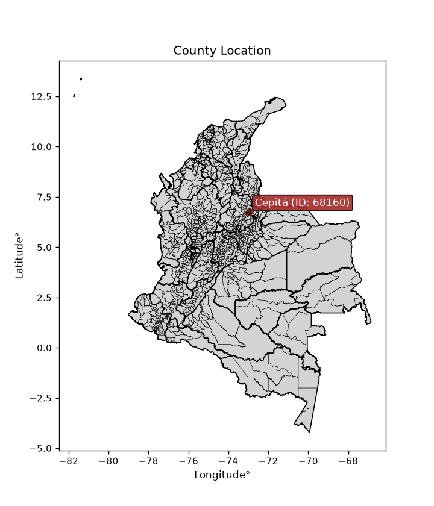
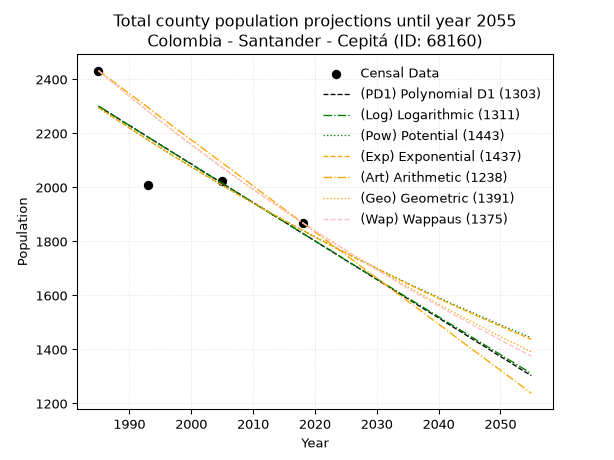
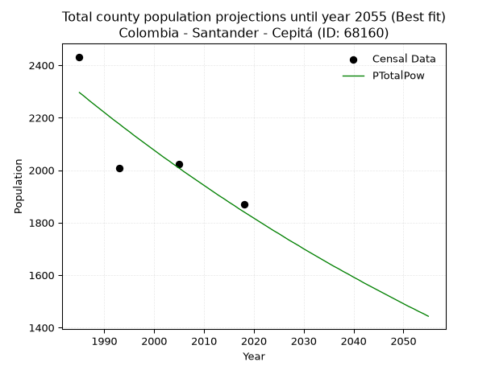
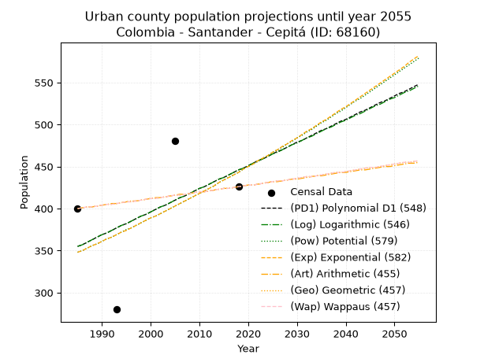
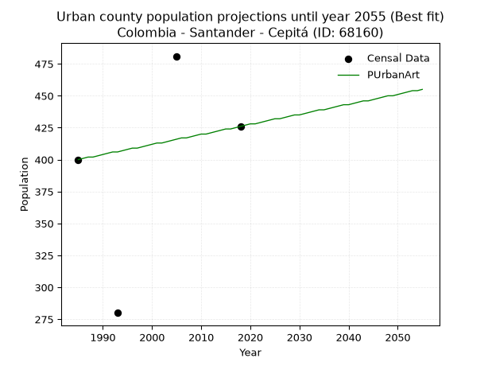
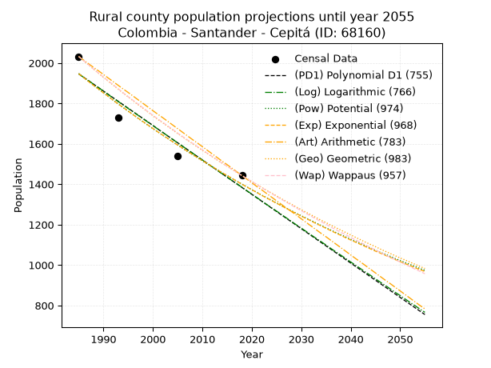
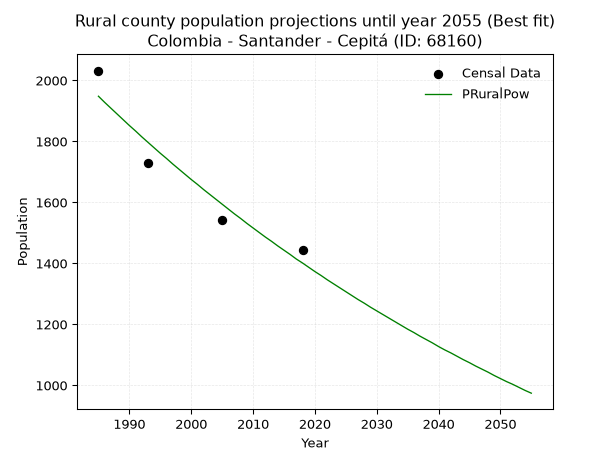

<div align="center">


</div>

# _“Population and Public Services Demand Projections (PPSD) until Year 2050 for Colombia - Santander - Cepitá (ID: 68160)”_
Keywords: `population` `public-service` `projection` `lineal` `polynomial` `logarithmic` `potential` `exponential` `arithmetic` `geometric` `wappaus` `dane` `colombia` `south-america`

PPSD are analytical estimates used by governments and planners to anticipate future changes in population size, age distribution, and the resulting community needs for utilities, healthcare, education, and infrastructure as sizing future water treatment facilities, electrical grids, and road networks based on spatial growth.

<div align="center">

</img>

</div>


> **General running parameters**: • app_version: _v20260806_. • Python version: _3.14.7_. • Pandas version: _3.0.5_. • NumPy version: _2.5.1_. • Creates, save and include plots into reports (create_plot): _False_. • Projection until year: _2050_. • Process polynomial degree 2 and up: _False_. • Process Wappaus: _True_. • Process Wappaus: _True_. • Set negative values to zero: _True_. • Set infinite values to zero: _True_. • Drop dataset notes: _True_. 
<div align="center">

Dynamic map: [:earth_americas:Google](http://maps.google.com/maps?q=6.753518401,-72.9735364) [:earth_americas:OSM](https://www.openstreetmap.org/#map=18/6.753518401/-72.9735364&layers=P) [:earth_americas:Bing](https://www.bing.com/maps?cp=6.753518401~-72.9735364&lvl=18) [:earth_americas:Apple](https://maps.apple.com/frame?center=6.753518401%2C-72.9735364&span=0.003%2C0.006)

</div>


<div align="center">

```geojson
{
  "type": "Feature",
  "geometry": {
    "type": "Point", 
    "coordinates": [-72.9735364, 6.753518401]
  }, 
  "properties": {
    "Name": "Colombia - Santander - Cepitá (ID: 68160)"
  }
}
```

</div>


## 0. Census Data (4 records)

Census data are official statistics collected by a government about the people and housing in a country. They usually include counts of total population, age, sex, race, income, education, and jobs.

📅Global census file: [Population.xlsx](../data/Population.xlsx)

| Source   |   Year |   CountryID | CountryName   |   StateID | StateName   |   CountyID | CountyName   |   PTotal |   PUrban |   PRural |
|:---------|-------:|------------:|:--------------|----------:|:------------|-----------:|:-------------|---------:|---------:|---------:|
| DANE     |   1985 |          57 | Colombia      |        68 | Santander   |      68160 | Cepitá       |     2432 |      400 |     2032 |
| DANE     |   1993 |          57 | Colombia      |        68 | Santander   |      68160 | Cepitá       |     2009 |      280 |     1729 |
| DANE     |   2005 |          57 | Colombia      |        68 | Santander   |      68160 | Cepitá       |     2022 |      481 |     1541 |
| DANE     |   2018 |          57 | Colombia      |        68 | Santander   |      68160 | Cepitá       |     1869 |      426 |     1443 |

> 🔥Some records could had specific notes about the registered values or the corresponding urban or rural distribution.

📅   [RUPS](https://www.datos.gov.co/Hacienda-y-Cr-dito-P-blico/Registro-nico-de-Prestadores-de-Servicios-P-blicos/4qkq-csdn/about_data) - Local public utility companies: [RUPS.csv](../data/RUPS.xlsx)

 | SERVICIO       | ESTADO    | NOMBRE                          | NIT         | DEPARTAMENTO_DOMICILIO   | MUNICIPIO_DOMICILIO   | DIRECCION   |   TELEFONO | EMAIL                         | TIPO_PRESTADOR                 | CLASIFICACION                 |
|:---------------|:----------|:--------------------------------|:------------|:-------------------------|:----------------------|:------------|-----------:|:------------------------------|:-------------------------------|:------------------------------|
| ACUEDUCTO      | OPERATIVA | MUNICIPIO DE CEPITA - SANTANDER | 890204699-3 | SANTANDER                | CEPITA                | Calle3 2-03 |    6569240 | planeacioncepitasui@gmail.com | MUNICIPIO (PRESTACIÓN DIRECTA) | MENOR O IGUAL A 2500 USUARIOS |
| ALCANTARILLADO | OPERATIVA | MUNICIPIO DE CEPITA - SANTANDER | 890204699-3 | SANTANDER                | CEPITA                | Calle3 2-03 |    6569240 | planeacioncepitasui@gmail.com | MUNICIPIO (PRESTACIÓN DIRECTA) | MENOR O IGUAL A 2500 USUARIOS |

## 1. Total

### 1.1. Coefficients and Parameters

* (PD1) Polynomial Deg 1: -14.249698916097866, 30585.960256924755 (lineal)
* (Log) Logarithmic: -28549.656926574917, 219089.1710814884
* (Pow) Potential: -13.39979415001678, 47.55032018158999
* (Exp) Exponential: -0.006688768159979763, 1339984944.9494488
* (Art) Arithmetic: Year diff. 2018 - 1985 = 33, Population diff. 1869 - 2432 = -563, Annual growth = -17.060606060606062
* (Geo) Geometric: Year diff. 2018 - 1985 = 33, Population diff. 1869 - 2432 = -563, Annual growth % = -0.007947355556604307
* (Wap) Wappaus: i = -0.7933320651293215, Condition values only valid for < 200)

<sub>
Wappaus condition values: ['-0.00', '-0.79', '-1.59', '-2.38', '-3.17', '-3.97', '-4.76', '-5.55', '-6.35', '-7.14', '-7.93', '-8.73', '-9.52', '-10.31', '-11.11', '-11.90', '-12.69', '-13.49', '-14.28', '-15.07', '-15.87', '-16.66', '-17.45', '-18.25', '-19.04', '-19.83', '-20.63', '-21.42', '-22.21', '-23.01', '-23.80', '-24.59', '-25.39', '-26.18', '-26.97', '-27.77', '-28.56', '-29.35', '-30.15', '-30.94', '-31.73', '-32.53', '-33.32', '-34.11', '-34.91', '-35.70', '-36.49', '-37.29', '-38.08', '-38.87', '-39.67', '-40.46', '-41.25', '-42.05', '-42.84', '-43.63', '-44.43', '-45.22', '-46.01', '-46.81', '-47.60', '-48.39', '-49.19', '-49.98', '-50.77', '-51.57']
</sub>


### 1.2. Projected Dataset

|   Year |   CountyID |   PTotalPD1 |   PTotalLog |   PTotalPow |   PTotalExp |   PTotalArt |   PTotalGeo |   PTotalWap |
|-------:|-----------:|------------:|------------:|------------:|------------:|------------:|------------:|------------:|
|   1985 |      68160 |        2300 |        2301 |        2296 |        2296 |        2432 |        2432 |        2432 |
|   1986 |      68160 |        2286 |        2287 |        2281 |        2280 |        2415 |        2413 |        2413 |
|   1987 |      68160 |        2272 |        2272 |        2265 |        2265 |        2398 |        2393 |        2394 |
|   1988 |      68160 |        2258 |        2258 |        2250 |        2250 |        2381 |        2374 |        2375 |
|   1989 |      68160 |        2243 |        2243 |        2235 |        2235 |        2364 |        2356 |        2356 |
|   1990 |      68160 |        2229 |        2229 |        2220 |        2220 |        2347 |        2337 |        2337 |
|   1991 |      68160 |        2215 |        2215 |        2205 |        2205 |        2330 |        2318 |        2319 |
|   1992 |      68160 |        2201 |        2200 |        2190 |        2191 |        2313 |        2300 |        2301 |
|   1993 |      68160 |        2186 |        2186 |        2176 |        2176 |        2296 |        2282 |        2282 |
|   1994 |      68160 |        2172 |        2172 |        2161 |        2161 |        2278 |        2263 |        2264 |
|   1995 |      68160 |        2158 |        2157 |        2147 |        2147 |        2261 |        2245 |        2246 |
|   1996 |      68160 |        2144 |        2143 |        2132 |        2133 |        2244 |        2228 |        2229 |
|   1997 |      68160 |        2129 |        2129 |        2118 |        2118 |        2227 |        2210 |        2211 |
|   1998 |      68160 |        2115 |        2115 |        2104 |        2104 |        2210 |        2192 |        2193 |
|   1999 |      68160 |        2101 |        2100 |        2090 |        2090 |        2193 |        2175 |        2176 |
|   2000 |      68160 |        2087 |        2086 |        2076 |        2076 |        2176 |        2158 |        2159 |
|   2001 |      68160 |        2072 |        2072 |        2062 |        2063 |        2159 |        2141 |        2142 |
|   2002 |      68160 |        2058 |        2057 |        2048 |        2049 |        2142 |        2124 |        2125 |
|   2003 |      68160 |        2044 |        2043 |        2035 |        2035 |        2125 |        2107 |        2108 |
|   2004 |      68160 |        2030 |        2029 |        2021 |        2022 |        2108 |        2090 |        2091 |
|   2005 |      68160 |        2015 |        2015 |        2008 |        2008 |        2091 |        2073 |        2074 |
|   2006 |      68160 |        2001 |        2000 |        1994 |        1995 |        2074 |        2057 |        2058 |
|   2007 |      68160 |        1987 |        1986 |        1981 |        1981 |        2057 |        2040 |        2042 |
|   2008 |      68160 |        1973 |        1972 |        1968 |        1968 |        2040 |        2024 |        2025 |
|   2009 |      68160 |        1958 |        1958 |        1955 |        1955 |        2023 |        2008 |        2009 |
|   2010 |      68160 |        1944 |        1944 |        1942 |        1942 |        2005 |        1992 |        1993 |
|   2011 |      68160 |        1930 |        1929 |        1929 |        1929 |        1988 |        1976 |        1977 |
|   2012 |      68160 |        1916 |        1915 |        1916 |        1916 |        1971 |        1961 |        1961 |
|   2013 |      68160 |        1901 |        1901 |        1903 |        1903 |        1954 |        1945 |        1946 |
|   2014 |      68160 |        1887 |        1887 |        1891 |        1891 |        1937 |        1930 |        1930 |
|   2015 |      68160 |        1873 |        1873 |        1878 |        1878 |        1920 |        1914 |        1915 |
|   2016 |      68160 |        1859 |        1859 |        1866 |        1866 |        1903 |        1899 |        1899 |
|   2017 |      68160 |        1844 |        1844 |        1853 |        1853 |        1886 |        1884 |        1884 |
|   2018 |      68160 |        1830 |        1830 |        1841 |        1841 |        1869 |        1869 |        1869 |
|   2019 |      68160 |        1816 |        1816 |        1829 |        1829 |        1852 |        1854 |        1854 |
|   2020 |      68160 |        1802 |        1802 |        1817 |        1816 |        1835 |        1839 |        1839 |
|   2021 |      68160 |        1787 |        1788 |        1805 |        1804 |        1818 |        1825 |        1824 |
|   2022 |      68160 |        1773 |        1774 |        1793 |        1792 |        1801 |        1810 |        1809 |
|   2023 |      68160 |        1759 |        1760 |        1781 |        1780 |        1784 |        1796 |        1795 |
|   2024 |      68160 |        1745 |        1745 |        1769 |        1768 |        1767 |        1782 |        1780 |
|   2025 |      68160 |        1730 |        1731 |        1758 |        1757 |        1750 |        1767 |        1766 |
|   2026 |      68160 |        1716 |        1717 |        1746 |        1745 |        1733 |        1753 |        1752 |
|   2027 |      68160 |        1702 |        1703 |        1734 |        1733 |        1715 |        1739 |        1737 |
|   2028 |      68160 |        1688 |        1689 |        1723 |        1722 |        1698 |        1726 |        1723 |
|   2029 |      68160 |        1673 |        1675 |        1712 |        1710 |        1681 |        1712 |        1709 |
|   2030 |      68160 |        1659 |        1661 |        1700 |        1699 |        1664 |        1698 |        1695 |
|   2031 |      68160 |        1645 |        1647 |        1689 |        1688 |        1647 |        1685 |        1681 |
|   2032 |      68160 |        1631 |        1633 |        1678 |        1676 |        1630 |        1671 |        1668 |
|   2033 |      68160 |        1616 |        1619 |        1667 |        1665 |        1613 |        1658 |        1654 |
|   2034 |      68160 |        1602 |        1605 |        1656 |        1654 |        1596 |        1645 |        1640 |
|   2035 |      68160 |        1588 |        1591 |        1645 |        1643 |        1579 |        1632 |        1627 |
|   2036 |      68160 |        1574 |        1577 |        1634 |        1632 |        1562 |        1619 |        1614 |
|   2037 |      68160 |        1559 |        1563 |        1624 |        1621 |        1545 |        1606 |        1600 |
|   2038 |      68160 |        1545 |        1549 |        1613 |        1610 |        1528 |        1593 |        1587 |
|   2039 |      68160 |        1531 |        1535 |        1603 |        1600 |        1511 |        1581 |        1574 |
|   2040 |      68160 |        1517 |        1521 |        1592 |        1589 |        1494 |        1568 |        1561 |
|   2041 |      68160 |        1502 |        1507 |        1582 |        1578 |        1477 |        1556 |        1548 |
|   2042 |      68160 |        1488 |        1493 |        1571 |        1568 |        1460 |        1543 |        1535 |
|   2043 |      68160 |        1474 |        1479 |        1561 |        1557 |        1442 |        1531 |        1522 |
|   2044 |      68160 |        1460 |        1465 |        1551 |        1547 |        1425 |        1519 |        1510 |
|   2045 |      68160 |        1445 |        1451 |        1541 |        1537 |        1408 |        1507 |        1497 |
|   2046 |      68160 |        1431 |        1437 |        1531 |        1526 |        1391 |        1495 |        1484 |
|   2047 |      68160 |        1417 |        1423 |        1521 |        1516 |        1374 |        1483 |        1472 |
|   2048 |      68160 |        1403 |        1409 |        1511 |        1506 |        1357 |        1471 |        1460 |
|   2049 |      68160 |        1388 |        1395 |        1501 |        1496 |        1340 |        1459 |        1447 |
|   2050 |      68160 |        1374 |        1381 |        1491 |        1486 |        1323 |        1448 |        1435 |
<div align="center">

</img>

</div>


### 1.3. Best fit with absolute and relative error (%)

Relative error puts that difference into context by dividing the absolute error by the true value, creating a unitless ratio or percentage that shows the scale of the mistake.

Absolute and relative error

|   Year | Source   |   CountryID | CountryName   |   StateID | StateName   |   CountyID_x | CountyName   |   PTotal |   PUrban |   PRural |   CountyID_y |   PTotalPD1 |   PTotalLog |   PTotalPow |   PTotalExp |   PTotalArt |   PTotalGeo |   PTotalWap |   PTotalPD1AbsError |   PTotalLogAbsError |   PTotalPowAbsError |   PTotalExpAbsError |   PTotalArtAbsError |   PTotalGeoAbsError |   PTotalWapAbsError |   PTotalPD1RelError |   PTotalLogRelError |   PTotalPowRelError |   PTotalExpRelError |   PTotalArtRelError |   PTotalGeoRelError |   PTotalWapRelError |
|-------:|:---------|------------:|:--------------|----------:|:------------|-------------:|:-------------|---------:|---------:|---------:|-------------:|------------:|------------:|------------:|------------:|------------:|------------:|------------:|--------------------:|--------------------:|--------------------:|--------------------:|--------------------:|--------------------:|--------------------:|--------------------:|--------------------:|--------------------:|--------------------:|--------------------:|--------------------:|--------------------:|
|   1985 | DANE     |          57 | Colombia      |        68 | Santander   |        68160 | Cepitá       |     2432 |      400 |     2032 |        68160 |        2300 |        2301 |        2296 |        2296 |        2432 |        2432 |        2432 |                 132 |                 131 |                 136 |                 136 |                   0 |                   0 |                   0 |            5.42763  |            5.38651  |            5.59211  |            5.59211  |             0       |             0       |             0       |
|   1993 | DANE     |          57 | Colombia      |        68 | Santander   |        68160 | Cepitá       |     2009 |      280 |     1729 |        68160 |        2186 |        2186 |        2176 |        2176 |        2296 |        2282 |        2282 |                 177 |                 177 |                 167 |                 167 |                 287 |                 273 |                 273 |            8.81035  |            8.81035  |            8.31259  |            8.31259  |            14.2857  |            13.5889  |            13.5889  |
|   2005 | DANE     |          57 | Colombia      |        68 | Santander   |        68160 | Cepitá       |     2022 |      481 |     1541 |        68160 |        2015 |        2015 |        2008 |        2008 |        2091 |        2073 |        2074 |                   7 |                   7 |                  14 |                  14 |                  69 |                  51 |                  52 |            0.346192 |            0.346192 |            0.692384 |            0.692384 |             3.41246 |             2.52226 |             2.57171 |
|   2018 | DANE     |          57 | Colombia      |        68 | Santander   |        68160 | Cepitá       |     1869 |      426 |     1443 |        68160 |        1830 |        1830 |        1841 |        1841 |        1869 |        1869 |        1869 |                  39 |                  39 |                  28 |                  28 |                   0 |                   0 |                   0 |            2.08668  |            2.08668  |            1.49813  |            1.49813  |             0       |             0       |             0       |

Relative error mean

| Method    |   RelError | Best   |
|:----------|-----------:|:-------|
| PTotalPD1 |    4.16771 |        |
| PTotalLog |    4.15743 |        |
| PTotalPow |    4.0238  | True   |
| PTotalExp |    4.0238  | True   |
| PTotalArt |    4.42454 |        |
| PTotalGeo |    4.02778 |        |
| PTotalWap |    4.04014 |        |

💙Best method: _**PTotalPow**_
<div align="center">

</img>

</div>


### 1.4. Fresh water supply demand in liters per capita per day (lpcd)

The fresh water supply demand typically ranges from 100 to 300 liters per capita per day (lpcd) for standard domestic and municipal planning, though absolute survival minimums set by the World Health Organization are as low as 7.5 to 20 liters per day, and total consumption in high-income nations can exceed 400 liters.

> `CZ`: Level in meters above the sea level (masl)<br> `WS`: Fresh water supply demand in liters per capita per day (lpcd or l/h/d)<br> `WSAll`: Zonal fresh water supply demand in liters per second (l/s)<br> `A`: Zonal area in square meters<br> `DP`: Population density (people/hectare or p/ha)

Reference values (RAS Colombia)

|    CZ |   WS |
|------:|-----:|
|  1000 |  120 |
|  2000 |  130 |
| 99999 |  140 |

County shapefile geometry properties and water supply values

|   CountyID |      ATotal |   CZTotal |   WSTotal |
|-----------:|------------:|----------:|----------:|
|      68160 | 1.07752e+08 |   1519.35 |       130 |

Projected values for best method: PTotalPow

|   CountyID |   Year |   PTotalPow |   DPTotal |   WSTotal |   WSTotalAll |
|-----------:|-------:|------------:|----------:|----------:|-------------:|
|      68160 |   1985 |        2296 |      0.21 |       130 |      3.45463 |
|      68160 |   1986 |        2281 |      0.21 |       130 |      3.43206 |
|      68160 |   1987 |        2265 |      0.21 |       130 |      3.40799 |
|      68160 |   1988 |        2250 |      0.21 |       130 |      3.38542 |
|      68160 |   1989 |        2235 |      0.21 |       130 |      3.36285 |
|      68160 |   1990 |        2220 |      0.21 |       130 |      3.34028 |
|      68160 |   1991 |        2205 |      0.2  |       130 |      3.31771 |
|      68160 |   1992 |        2190 |      0.2  |       130 |      3.29514 |
|      68160 |   1993 |        2176 |      0.2  |       130 |      3.27407 |
|      68160 |   1994 |        2161 |      0.2  |       130 |      3.2515  |
|      68160 |   1995 |        2147 |      0.2  |       130 |      3.23044 |
|      68160 |   1996 |        2132 |      0.2  |       130 |      3.20787 |
|      68160 |   1997 |        2118 |      0.2  |       130 |      3.18681 |
|      68160 |   1998 |        2104 |      0.2  |       130 |      3.16574 |
|      68160 |   1999 |        2090 |      0.19 |       130 |      3.14468 |
|      68160 |   2000 |        2076 |      0.19 |       130 |      3.12361 |
|      68160 |   2001 |        2062 |      0.19 |       130 |      3.10255 |
|      68160 |   2002 |        2048 |      0.19 |       130 |      3.08148 |
|      68160 |   2003 |        2035 |      0.19 |       130 |      3.06192 |
|      68160 |   2004 |        2021 |      0.19 |       130 |      3.04086 |
|      68160 |   2005 |        2008 |      0.19 |       130 |      3.0213  |
|      68160 |   2006 |        1994 |      0.19 |       130 |      3.00023 |
|      68160 |   2007 |        1981 |      0.18 |       130 |      2.98067 |
|      68160 |   2008 |        1968 |      0.18 |       130 |      2.96111 |
|      68160 |   2009 |        1955 |      0.18 |       130 |      2.94155 |
|      68160 |   2010 |        1942 |      0.18 |       130 |      2.92199 |
|      68160 |   2011 |        1929 |      0.18 |       130 |      2.90243 |
|      68160 |   2012 |        1916 |      0.18 |       130 |      2.88287 |
|      68160 |   2013 |        1903 |      0.18 |       130 |      2.86331 |
|      68160 |   2014 |        1891 |      0.18 |       130 |      2.84525 |
|      68160 |   2015 |        1878 |      0.17 |       130 |      2.82569 |
|      68160 |   2016 |        1866 |      0.17 |       130 |      2.80764 |
|      68160 |   2017 |        1853 |      0.17 |       130 |      2.78808 |
|      68160 |   2018 |        1841 |      0.17 |       130 |      2.77002 |
|      68160 |   2019 |        1829 |      0.17 |       130 |      2.75197 |
|      68160 |   2020 |        1817 |      0.17 |       130 |      2.73391 |
|      68160 |   2021 |        1805 |      0.17 |       130 |      2.71586 |
|      68160 |   2022 |        1793 |      0.17 |       130 |      2.6978  |
|      68160 |   2023 |        1781 |      0.17 |       130 |      2.67975 |
|      68160 |   2024 |        1769 |      0.16 |       130 |      2.66169 |
|      68160 |   2025 |        1758 |      0.16 |       130 |      2.64514 |
|      68160 |   2026 |        1746 |      0.16 |       130 |      2.62708 |
|      68160 |   2027 |        1734 |      0.16 |       130 |      2.60903 |
|      68160 |   2028 |        1723 |      0.16 |       130 |      2.59248 |
|      68160 |   2029 |        1712 |      0.16 |       130 |      2.57593 |
|      68160 |   2030 |        1700 |      0.16 |       130 |      2.55787 |
|      68160 |   2031 |        1689 |      0.16 |       130 |      2.54132 |
|      68160 |   2032 |        1678 |      0.16 |       130 |      2.52477 |
|      68160 |   2033 |        1667 |      0.15 |       130 |      2.50822 |
|      68160 |   2034 |        1656 |      0.15 |       130 |      2.49167 |
|      68160 |   2035 |        1645 |      0.15 |       130 |      2.47512 |
|      68160 |   2036 |        1634 |      0.15 |       130 |      2.45856 |
|      68160 |   2037 |        1624 |      0.15 |       130 |      2.44352 |
|      68160 |   2038 |        1613 |      0.15 |       130 |      2.42697 |
|      68160 |   2039 |        1603 |      0.15 |       130 |      2.41192 |
|      68160 |   2040 |        1592 |      0.15 |       130 |      2.39537 |
|      68160 |   2041 |        1582 |      0.15 |       130 |      2.38032 |
|      68160 |   2042 |        1571 |      0.15 |       130 |      2.36377 |
|      68160 |   2043 |        1561 |      0.14 |       130 |      2.34873 |
|      68160 |   2044 |        1551 |      0.14 |       130 |      2.33368 |
|      68160 |   2045 |        1541 |      0.14 |       130 |      2.31863 |
|      68160 |   2046 |        1531 |      0.14 |       130 |      2.30359 |
|      68160 |   2047 |        1521 |      0.14 |       130 |      2.28854 |
|      68160 |   2048 |        1511 |      0.14 |       130 |      2.2735  |
|      68160 |   2049 |        1501 |      0.14 |       130 |      2.25845 |
|      68160 |   2050 |        1491 |      0.14 |       130 |      2.2434  |

## 2. Urban

### 2.1. Coefficients and Parameters

* (PD1) Polynomial Deg 1: 2.755921316740288, -5115.781613809761 (lineal)
* (Log) Logarithmic: 5515.563419216624, -41527.09174841691
* (Pow) Potential: 14.712026673962061, -45.97532259459435
* (Exp) Exponential: 0.007353848194154866, 0.00015919277660060162
* (Art) Arithmetic: Year diff. 2018 - 1985 = 33, Population diff. 426 - 400 = 26, Annual growth = 0.7878787878787878
* (Geo) Geometric: Year diff. 2018 - 1985 = 33, Population diff. 426 - 400 = 26, Annual growth % = 0.0019101492625723804
* (Wap) Wappaus: i = 0.19076968229510602, Condition values only valid for < 200)

<sub>
Wappaus condition values: ['0.00', '0.19', '0.38', '0.57', '0.76', '0.95', '1.14', '1.34', '1.53', '1.72', '1.91', '2.10', '2.29', '2.48', '2.67', '2.86', '3.05', '3.24', '3.43', '3.62', '3.82', '4.01', '4.20', '4.39', '4.58', '4.77', '4.96', '5.15', '5.34', '5.53', '5.72', '5.91', '6.10', '6.30', '6.49', '6.68', '6.87', '7.06', '7.25', '7.44', '7.63', '7.82', '8.01', '8.20', '8.39', '8.58', '8.78', '8.97', '9.16', '9.35', '9.54', '9.73', '9.92', '10.11', '10.30', '10.49', '10.68', '10.87', '11.06', '11.26', '11.45', '11.64', '11.83', '12.02', '12.21', '12.40']
</sub>


### 2.2. Projected Dataset

|   Year |   CountyID |   PUrbanPD1 |   PUrbanLog |   PUrbanPow |   PUrbanExp |   PUrbanArt |   PUrbanGeo |   PUrbanWap |
|-------:|-----------:|------------:|------------:|------------:|------------:|------------:|------------:|------------:|
|   1985 |      68160 |         355 |         355 |         348 |         348 |         400 |         400 |         400 |
|   1986 |      68160 |         357 |         357 |         350 |         350 |         401 |         401 |         401 |
|   1987 |      68160 |         360 |         360 |         353 |         353 |         402 |         402 |         402 |
|   1988 |      68160 |         363 |         363 |         356 |         356 |         402 |         402 |         402 |
|   1989 |      68160 |         366 |         366 |         358 |         358 |         403 |         403 |         403 |
|   1990 |      68160 |         369 |         369 |         361 |         361 |         404 |         404 |         404 |
|   1991 |      68160 |         371 |         371 |         364 |         364 |         405 |         405 |         405 |
|   1992 |      68160 |         374 |         374 |         366 |         366 |         406 |         405 |         405 |
|   1993 |      68160 |         377 |         377 |         369 |         369 |         406 |         406 |         406 |
|   1994 |      68160 |         380 |         380 |         372 |         372 |         407 |         407 |         407 |
|   1995 |      68160 |         382 |         382 |         375 |         374 |         408 |         408 |         408 |
|   1996 |      68160 |         385 |         385 |         377 |         377 |         409 |         408 |         408 |
|   1997 |      68160 |         388 |         388 |         380 |         380 |         409 |         409 |         409 |
|   1998 |      68160 |         391 |         391 |         383 |         383 |         410 |         410 |         410 |
|   1999 |      68160 |         393 |         393 |         386 |         386 |         411 |         411 |         411 |
|   2000 |      68160 |         396 |         396 |         389 |         389 |         412 |         412 |         412 |
|   2001 |      68160 |         399 |         399 |         391 |         391 |         413 |         412 |         412 |
|   2002 |      68160 |         402 |         402 |         394 |         394 |         413 |         413 |         413 |
|   2003 |      68160 |         404 |         404 |         397 |         397 |         414 |         414 |         414 |
|   2004 |      68160 |         407 |         407 |         400 |         400 |         415 |         415 |         415 |
|   2005 |      68160 |         410 |         410 |         403 |         403 |         416 |         416 |         416 |
|   2006 |      68160 |         413 |         413 |         406 |         406 |         417 |         416 |         416 |
|   2007 |      68160 |         415 |         415 |         409 |         409 |         417 |         417 |         417 |
|   2008 |      68160 |         418 |         418 |         412 |         412 |         418 |         418 |         418 |
|   2009 |      68160 |         421 |         421 |         415 |         415 |         419 |         419 |         419 |
|   2010 |      68160 |         424 |         424 |         418 |         418 |         420 |         420 |         420 |
|   2011 |      68160 |         426 |         426 |         421 |         421 |         420 |         420 |         420 |
|   2012 |      68160 |         429 |         429 |         424 |         424 |         421 |         421 |         421 |
|   2013 |      68160 |         432 |         432 |         427 |         427 |         422 |         422 |         422 |
|   2014 |      68160 |         435 |         435 |         431 |         431 |         423 |         423 |         423 |
|   2015 |      68160 |         437 |         437 |         434 |         434 |         424 |         424 |         424 |
|   2016 |      68160 |         440 |         440 |         437 |         437 |         424 |         424 |         424 |
|   2017 |      68160 |         443 |         443 |         440 |         440 |         425 |         425 |         425 |
|   2018 |      68160 |         446 |         446 |         443 |         443 |         426 |         426 |         426 |
|   2019 |      68160 |         448 |         448 |         447 |         447 |         427 |         427 |         427 |
|   2020 |      68160 |         451 |         451 |         450 |         450 |         428 |         428 |         428 |
|   2021 |      68160 |         454 |         454 |         453 |         453 |         428 |         428 |         428 |
|   2022 |      68160 |         457 |         457 |         456 |         457 |         429 |         429 |         429 |
|   2023 |      68160 |         459 |         459 |         460 |         460 |         430 |         430 |         430 |
|   2024 |      68160 |         462 |         462 |         463 |         463 |         431 |         431 |         431 |
|   2025 |      68160 |         465 |         465 |         467 |         467 |         432 |         432 |         432 |
|   2026 |      68160 |         468 |         467 |         470 |         470 |         432 |         433 |         433 |
|   2027 |      68160 |         470 |         470 |         473 |         474 |         433 |         433 |         433 |
|   2028 |      68160 |         473 |         473 |         477 |         477 |         434 |         434 |         434 |
|   2029 |      68160 |         476 |         476 |         480 |         481 |         435 |         435 |         435 |
|   2030 |      68160 |         479 |         478 |         484 |         484 |         435 |         436 |         436 |
|   2031 |      68160 |         481 |         481 |         487 |         488 |         436 |         437 |         437 |
|   2032 |      68160 |         484 |         484 |         491 |         492 |         437 |         438 |         438 |
|   2033 |      68160 |         487 |         486 |         494 |         495 |         438 |         438 |         438 |
|   2034 |      68160 |         490 |         489 |         498 |         499 |         439 |         439 |         439 |
|   2035 |      68160 |         493 |         492 |         502 |         503 |         439 |         440 |         440 |
|   2036 |      68160 |         495 |         495 |         505 |         506 |         440 |         441 |         441 |
|   2037 |      68160 |         498 |         497 |         509 |         510 |         441 |         442 |         442 |
|   2038 |      68160 |         501 |         500 |         513 |         514 |         442 |         443 |         443 |
|   2039 |      68160 |         504 |         503 |         516 |         518 |         443 |         443 |         443 |
|   2040 |      68160 |         506 |         505 |         520 |         521 |         443 |         444 |         444 |
|   2041 |      68160 |         509 |         508 |         524 |         525 |         444 |         445 |         445 |
|   2042 |      68160 |         512 |         511 |         528 |         529 |         445 |         446 |         446 |
|   2043 |      68160 |         515 |         513 |         531 |         533 |         446 |         447 |         447 |
|   2044 |      68160 |         517 |         516 |         535 |         537 |         446 |         448 |         448 |
|   2045 |      68160 |         520 |         519 |         539 |         541 |         447 |         449 |         449 |
|   2046 |      68160 |         523 |         522 |         543 |         545 |         448 |         449 |         449 |
|   2047 |      68160 |         526 |         524 |         547 |         549 |         449 |         450 |         450 |
|   2048 |      68160 |         528 |         527 |         551 |         553 |         450 |         451 |         451 |
|   2049 |      68160 |         531 |         530 |         555 |         557 |         450 |         452 |         452 |
|   2050 |      68160 |         534 |         532 |         559 |         561 |         451 |         453 |         453 |
<div align="center">

</img>

</div>


### 2.3. Best fit with absolute and relative error (%)

Relative error puts that difference into context by dividing the absolute error by the true value, creating a unitless ratio or percentage that shows the scale of the mistake.

Absolute and relative error

|   Year | Source   |   CountryID | CountryName   |   StateID | StateName   |   CountyID_x | CountyName   |   PTotal |   PUrban |   PRural |   CountyID_y |   PUrbanPD1 |   PUrbanLog |   PUrbanPow |   PUrbanExp |   PUrbanArt |   PUrbanGeo |   PUrbanWap |   PUrbanPD1AbsError |   PUrbanLogAbsError |   PUrbanPowAbsError |   PUrbanExpAbsError |   PUrbanArtAbsError |   PUrbanGeoAbsError |   PUrbanWapAbsError |   PUrbanPD1RelError |   PUrbanLogRelError |   PUrbanPowRelError |   PUrbanExpRelError |   PUrbanArtRelError |   PUrbanGeoRelError |   PUrbanWapRelError |
|-------:|:---------|------------:|:--------------|----------:|:------------|-------------:|:-------------|---------:|---------:|---------:|-------------:|------------:|------------:|------------:|------------:|------------:|------------:|------------:|--------------------:|--------------------:|--------------------:|--------------------:|--------------------:|--------------------:|--------------------:|--------------------:|--------------------:|--------------------:|--------------------:|--------------------:|--------------------:|--------------------:|
|   1985 | DANE     |          57 | Colombia      |        68 | Santander   |        68160 | Cepitá       |     2432 |      400 |     2032 |        68160 |         355 |         355 |         348 |         348 |         400 |         400 |         400 |                  45 |                  45 |                  52 |                  52 |                   0 |                   0 |                   0 |            11.25    |            11.25    |            13       |            13       |              0      |              0      |              0      |
|   1993 | DANE     |          57 | Colombia      |        68 | Santander   |        68160 | Cepitá       |     2009 |      280 |     1729 |        68160 |         377 |         377 |         369 |         369 |         406 |         406 |         406 |                  97 |                  97 |                  89 |                  89 |                 126 |                 126 |                 126 |            34.6429  |            34.6429  |            31.7857  |            31.7857  |             45      |             45      |             45      |
|   2005 | DANE     |          57 | Colombia      |        68 | Santander   |        68160 | Cepitá       |     2022 |      481 |     1541 |        68160 |         410 |         410 |         403 |         403 |         416 |         416 |         416 |                  71 |                  71 |                  78 |                  78 |                  65 |                  65 |                  65 |            14.7609  |            14.7609  |            16.2162  |            16.2162  |             13.5135 |             13.5135 |             13.5135 |
|   2018 | DANE     |          57 | Colombia      |        68 | Santander   |        68160 | Cepitá       |     1869 |      426 |     1443 |        68160 |         446 |         446 |         443 |         443 |         426 |         426 |         426 |                  20 |                  20 |                  17 |                  17 |                   0 |                   0 |                   0 |             4.69484 |             4.69484 |             3.99061 |             3.99061 |              0      |              0      |              0      |

Relative error mean

| Method    |   RelError | Best   |
|:----------|-----------:|:-------|
| PUrbanPD1 |    16.3372 |        |
| PUrbanLog |    16.3372 |        |
| PUrbanPow |    16.2481 |        |
| PUrbanExp |    16.2481 |        |
| PUrbanArt |    14.6284 | True   |
| PUrbanGeo |    14.6284 | True   |
| PUrbanWap |    14.6284 | True   |

💙Best method: _**PUrbanArt**_
<div align="center">

</img>

</div>


### 2.4. Fresh water supply demand in liters per capita per day (lpcd)

The fresh water supply demand typically ranges from 100 to 300 liters per capita per day (lpcd) for standard domestic and municipal planning, though absolute survival minimums set by the World Health Organization are as low as 7.5 to 20 liters per day, and total consumption in high-income nations can exceed 400 liters.

> `CZ`: Level in meters above the sea level (masl)<br> `WS`: Fresh water supply demand in liters per capita per day (lpcd or l/h/d)<br> `WSAll`: Zonal fresh water supply demand in liters per second (l/s)<br> `A`: Zonal area in square meters<br> `DP`: Population density (people/hectare or p/ha)

Reference values (RAS Colombia)

|    CZ |   WS |
|------:|-----:|
|  1000 |  120 |
|  2000 |  130 |
| 99999 |  140 |

County shapefile geometry properties and water supply values

|   CountyID |   AUrban |   CZUrban |   WSUrban |
|-----------:|---------:|----------:|----------:|
|      68160 |   120186 |   664.786 |       120 |

Projected values for best method: PUrbanArt

|   CountyID |   Year |   PUrbanArt |   DPUrban |   WSUrban |   WSUrbanAll |
|-----------:|-------:|------------:|----------:|----------:|-------------:|
|      68160 |   1985 |         400 |     33.28 |       120 |     0.555556 |
|      68160 |   1986 |         401 |     33.36 |       120 |     0.556944 |
|      68160 |   1987 |         402 |     33.45 |       120 |     0.558333 |
|      68160 |   1988 |         402 |     33.45 |       120 |     0.558333 |
|      68160 |   1989 |         403 |     33.53 |       120 |     0.559722 |
|      68160 |   1990 |         404 |     33.61 |       120 |     0.561111 |
|      68160 |   1991 |         405 |     33.7  |       120 |     0.5625   |
|      68160 |   1992 |         406 |     33.78 |       120 |     0.563889 |
|      68160 |   1993 |         406 |     33.78 |       120 |     0.563889 |
|      68160 |   1994 |         407 |     33.86 |       120 |     0.565278 |
|      68160 |   1995 |         408 |     33.95 |       120 |     0.566667 |
|      68160 |   1996 |         409 |     34.03 |       120 |     0.568056 |
|      68160 |   1997 |         409 |     34.03 |       120 |     0.568056 |
|      68160 |   1998 |         410 |     34.11 |       120 |     0.569444 |
|      68160 |   1999 |         411 |     34.2  |       120 |     0.570833 |
|      68160 |   2000 |         412 |     34.28 |       120 |     0.572222 |
|      68160 |   2001 |         413 |     34.36 |       120 |     0.573611 |
|      68160 |   2002 |         413 |     34.36 |       120 |     0.573611 |
|      68160 |   2003 |         414 |     34.45 |       120 |     0.575    |
|      68160 |   2004 |         415 |     34.53 |       120 |     0.576389 |
|      68160 |   2005 |         416 |     34.61 |       120 |     0.577778 |
|      68160 |   2006 |         417 |     34.7  |       120 |     0.579167 |
|      68160 |   2007 |         417 |     34.7  |       120 |     0.579167 |
|      68160 |   2008 |         418 |     34.78 |       120 |     0.580556 |
|      68160 |   2009 |         419 |     34.86 |       120 |     0.581944 |
|      68160 |   2010 |         420 |     34.95 |       120 |     0.583333 |
|      68160 |   2011 |         420 |     34.95 |       120 |     0.583333 |
|      68160 |   2012 |         421 |     35.03 |       120 |     0.584722 |
|      68160 |   2013 |         422 |     35.11 |       120 |     0.586111 |
|      68160 |   2014 |         423 |     35.2  |       120 |     0.5875   |
|      68160 |   2015 |         424 |     35.28 |       120 |     0.588889 |
|      68160 |   2016 |         424 |     35.28 |       120 |     0.588889 |
|      68160 |   2017 |         425 |     35.36 |       120 |     0.590278 |
|      68160 |   2018 |         426 |     35.44 |       120 |     0.591667 |
|      68160 |   2019 |         427 |     35.53 |       120 |     0.593056 |
|      68160 |   2020 |         428 |     35.61 |       120 |     0.594444 |
|      68160 |   2021 |         428 |     35.61 |       120 |     0.594444 |
|      68160 |   2022 |         429 |     35.69 |       120 |     0.595833 |
|      68160 |   2023 |         430 |     35.78 |       120 |     0.597222 |
|      68160 |   2024 |         431 |     35.86 |       120 |     0.598611 |
|      68160 |   2025 |         432 |     35.94 |       120 |     0.6      |
|      68160 |   2026 |         432 |     35.94 |       120 |     0.6      |
|      68160 |   2027 |         433 |     36.03 |       120 |     0.601389 |
|      68160 |   2028 |         434 |     36.11 |       120 |     0.602778 |
|      68160 |   2029 |         435 |     36.19 |       120 |     0.604167 |
|      68160 |   2030 |         435 |     36.19 |       120 |     0.604167 |
|      68160 |   2031 |         436 |     36.28 |       120 |     0.605556 |
|      68160 |   2032 |         437 |     36.36 |       120 |     0.606944 |
|      68160 |   2033 |         438 |     36.44 |       120 |     0.608333 |
|      68160 |   2034 |         439 |     36.53 |       120 |     0.609722 |
|      68160 |   2035 |         439 |     36.53 |       120 |     0.609722 |
|      68160 |   2036 |         440 |     36.61 |       120 |     0.611111 |
|      68160 |   2037 |         441 |     36.69 |       120 |     0.6125   |
|      68160 |   2038 |         442 |     36.78 |       120 |     0.613889 |
|      68160 |   2039 |         443 |     36.86 |       120 |     0.615278 |
|      68160 |   2040 |         443 |     36.86 |       120 |     0.615278 |
|      68160 |   2041 |         444 |     36.94 |       120 |     0.616667 |
|      68160 |   2042 |         445 |     37.03 |       120 |     0.618056 |
|      68160 |   2043 |         446 |     37.11 |       120 |     0.619444 |
|      68160 |   2044 |         446 |     37.11 |       120 |     0.619444 |
|      68160 |   2045 |         447 |     37.19 |       120 |     0.620833 |
|      68160 |   2046 |         448 |     37.28 |       120 |     0.622222 |
|      68160 |   2047 |         449 |     37.36 |       120 |     0.623611 |
|      68160 |   2048 |         450 |     37.44 |       120 |     0.625    |
|      68160 |   2049 |         450 |     37.44 |       120 |     0.625    |
|      68160 |   2050 |         451 |     37.53 |       120 |     0.626389 |

## 3. Rural

### 3.1. Coefficients and Parameters

* (PD1) Polynomial Deg 1: -17.00562023283814, 35701.74187073449 (lineal)
* (Log) Logarithmic: -34065.220345791546, 260616.26282990532
* (Pow) Potential: -20.00174155567571, 69.25046266731816
* (Exp) Exponential: -0.009986102718341584, 790860266189.9393
* (Art) Arithmetic: Year diff. 2018 - 1985 = 33, Population diff. 1443 - 2032 = -589, Annual growth = -17.848484848484848
* (Geo) Geometric: Year diff. 2018 - 1985 = 33, Population diff. 1443 - 2032 = -589, Annual growth % = -0.010319003596122145
* (Wap) Wappaus: i = -1.027250926531502, Condition values only valid for < 200)

<sub>
Wappaus condition values: ['-0.00', '-1.03', '-2.05', '-3.08', '-4.11', '-5.14', '-6.16', '-7.19', '-8.22', '-9.25', '-10.27', '-11.30', '-12.33', '-13.35', '-14.38', '-15.41', '-16.44', '-17.46', '-18.49', '-19.52', '-20.55', '-21.57', '-22.60', '-23.63', '-24.65', '-25.68', '-26.71', '-27.74', '-28.76', '-29.79', '-30.82', '-31.84', '-32.87', '-33.90', '-34.93', '-35.95', '-36.98', '-38.01', '-39.04', '-40.06', '-41.09', '-42.12', '-43.14', '-44.17', '-45.20', '-46.23', '-47.25', '-48.28', '-49.31', '-50.34', '-51.36', '-52.39', '-53.42', '-54.44', '-55.47', '-56.50', '-57.53', '-58.55', '-59.58', '-60.61', '-61.64', '-62.66', '-63.69', '-64.72', '-65.74', '-66.77']
</sub>


### 3.2. Projected Dataset

|   Year |   CountyID |   PRuralPD1 |   PRuralLog |   PRuralPow |   PRuralExp |   PRuralArt |   PRuralGeo |   PRuralWap |
|-------:|-----------:|------------:|------------:|------------:|------------:|------------:|------------:|------------:|
|   1985 |      68160 |        1946 |        1946 |        1948 |        1947 |        2032 |        2032 |        2032 |
|   1986 |      68160 |        1929 |        1929 |        1928 |        1928 |        2014 |        2011 |        2011 |
|   1987 |      68160 |        1912 |        1912 |        1909 |        1908 |        1996 |        1990 |        1991 |
|   1988 |      68160 |        1895 |        1895 |        1890 |        1889 |        1978 |        1970 |        1970 |
|   1989 |      68160 |        1878 |        1878 |        1871 |        1871 |        1961 |        1949 |        1950 |
|   1990 |      68160 |        1861 |        1861 |        1852 |        1852 |        1943 |        1929 |        1930 |
|   1991 |      68160 |        1844 |        1843 |        1834 |        1834 |        1925 |        1909 |        1911 |
|   1992 |      68160 |        1827 |        1826 |        1815 |        1815 |        1907 |        1890 |        1891 |
|   1993 |      68160 |        1810 |        1809 |        1797 |        1797 |        1889 |        1870 |        1872 |
|   1994 |      68160 |        1793 |        1792 |        1779 |        1780 |        1871 |        1851 |        1852 |
|   1995 |      68160 |        1776 |        1775 |        1761 |        1762 |        1854 |        1832 |        1833 |
|   1996 |      68160 |        1759 |        1758 |        1744 |        1744 |        1836 |        1813 |        1815 |
|   1997 |      68160 |        1742 |        1741 |        1726 |        1727 |        1818 |        1794 |        1796 |
|   1998 |      68160 |        1725 |        1724 |        1709 |        1710 |        1800 |        1776 |        1778 |
|   1999 |      68160 |        1708 |        1707 |        1692 |        1693 |        1782 |        1757 |        1759 |
|   2000 |      68160 |        1691 |        1690 |        1675 |        1676 |        1764 |        1739 |        1741 |
|   2001 |      68160 |        1673 |        1673 |        1659 |        1659 |        1746 |        1721 |        1723 |
|   2002 |      68160 |        1656 |        1656 |        1642 |        1643 |        1729 |        1704 |        1706 |
|   2003 |      68160 |        1639 |        1639 |        1626 |        1627 |        1711 |        1686 |        1688 |
|   2004 |      68160 |        1622 |        1622 |        1610 |        1610 |        1693 |        1669 |        1671 |
|   2005 |      68160 |        1605 |        1605 |        1594 |        1594 |        1675 |        1651 |        1653 |
|   2006 |      68160 |        1588 |        1588 |        1578 |        1579 |        1657 |        1634 |        1636 |
|   2007 |      68160 |        1571 |        1571 |        1562 |        1563 |        1639 |        1617 |        1619 |
|   2008 |      68160 |        1554 |        1554 |        1547 |        1547 |        1621 |        1601 |        1603 |
|   2009 |      68160 |        1537 |        1537 |        1531 |        1532 |        1604 |        1584 |        1586 |
|   2010 |      68160 |        1520 |        1520 |        1516 |        1517 |        1586 |        1568 |        1570 |
|   2011 |      68160 |        1503 |        1503 |        1501 |        1502 |        1568 |        1552 |        1553 |
|   2012 |      68160 |        1486 |        1486 |        1486 |        1487 |        1550 |        1536 |        1537 |
|   2013 |      68160 |        1469 |        1469 |        1472 |        1472 |        1532 |        1520 |        1521 |
|   2014 |      68160 |        1452 |        1452 |        1457 |        1457 |        1514 |        1504 |        1505 |
|   2015 |      68160 |        1435 |        1435 |        1443 |        1443 |        1497 |        1489 |        1489 |
|   2016 |      68160 |        1418 |        1418 |        1429 |        1429 |        1479 |        1473 |        1474 |
|   2017 |      68160 |        1401 |        1402 |        1414 |        1414 |        1461 |        1458 |        1458 |
|   2018 |      68160 |        1384 |        1385 |        1401 |        1400 |        1443 |        1443 |        1443 |
|   2019 |      68160 |        1367 |        1368 |        1387 |        1386 |        1425 |        1428 |        1428 |
|   2020 |      68160 |        1350 |        1351 |        1373 |        1373 |        1407 |        1413 |        1413 |
|   2021 |      68160 |        1333 |        1334 |        1360 |        1359 |        1389 |        1399 |        1398 |
|   2022 |      68160 |        1316 |        1317 |        1346 |        1345 |        1372 |        1384 |        1383 |
|   2023 |      68160 |        1299 |        1300 |        1333 |        1332 |        1354 |        1370 |        1368 |
|   2024 |      68160 |        1282 |        1283 |        1320 |        1319 |        1336 |        1356 |        1354 |
|   2025 |      68160 |        1265 |        1267 |        1307 |        1306 |        1318 |        1342 |        1339 |
|   2026 |      68160 |        1248 |        1250 |        1294 |        1293 |        1300 |        1328 |        1325 |
|   2027 |      68160 |        1231 |        1233 |        1281 |        1280 |        1282 |        1314 |        1311 |
|   2028 |      68160 |        1214 |        1216 |        1269 |        1267 |        1265 |        1301 |        1297 |
|   2029 |      68160 |        1197 |        1199 |        1256 |        1255 |        1247 |        1287 |        1283 |
|   2030 |      68160 |        1180 |        1183 |        1244 |        1242 |        1229 |        1274 |        1269 |
|   2031 |      68160 |        1163 |        1166 |        1232 |        1230 |        1211 |        1261 |        1255 |
|   2032 |      68160 |        1146 |        1149 |        1220 |        1218 |        1193 |        1248 |        1242 |
|   2033 |      68160 |        1129 |        1132 |        1208 |        1205 |        1175 |        1235 |        1228 |
|   2034 |      68160 |        1112 |        1116 |        1196 |        1194 |        1157 |        1222 |        1215 |
|   2035 |      68160 |        1095 |        1099 |        1184 |        1182 |        1140 |        1210 |        1202 |
|   2036 |      68160 |        1078 |        1082 |        1173 |        1170 |        1122 |        1197 |        1188 |
|   2037 |      68160 |        1061 |        1065 |        1161 |        1158 |        1104 |        1185 |        1175 |
|   2038 |      68160 |        1044 |        1049 |        1150 |        1147 |        1086 |        1173 |        1162 |
|   2039 |      68160 |        1027 |        1032 |        1139 |        1135 |        1068 |        1161 |        1150 |
|   2040 |      68160 |        1010 |        1015 |        1127 |        1124 |        1050 |        1149 |        1137 |
|   2041 |      68160 |         993 |         999 |        1116 |        1113 |        1032 |        1137 |        1124 |
|   2042 |      68160 |         976 |         982 |        1106 |        1102 |        1015 |        1125 |        1112 |
|   2043 |      68160 |         959 |         965 |        1095 |        1091 |         997 |        1113 |        1099 |
|   2044 |      68160 |         942 |         949 |        1084 |        1080 |         979 |        1102 |        1087 |
|   2045 |      68160 |         925 |         932 |        1074 |        1069 |         961 |        1091 |        1075 |
|   2046 |      68160 |         908 |         915 |        1063 |        1059 |         943 |        1079 |        1062 |
|   2047 |      68160 |         891 |         899 |        1053 |        1048 |         925 |        1068 |        1050 |
|   2048 |      68160 |         874 |         882 |        1043 |        1038 |         908 |        1057 |        1038 |
|   2049 |      68160 |         857 |         865 |        1032 |        1027 |         890 |        1046 |        1027 |
|   2050 |      68160 |         840 |         849 |        1022 |        1017 |         872 |        1035 |        1015 |
<div align="center">

</img>

</div>


### 3.3. Best fit with absolute and relative error (%)

Relative error puts that difference into context by dividing the absolute error by the true value, creating a unitless ratio or percentage that shows the scale of the mistake.

Absolute and relative error

|   Year | Source   |   CountryID | CountryName   |   StateID | StateName   |   CountyID_x | CountyName   |   PTotal |   PUrban |   PRural |   CountyID_y |   PRuralPD1 |   PRuralLog |   PRuralPow |   PRuralExp |   PRuralArt |   PRuralGeo |   PRuralWap |   PRuralPD1AbsError |   PRuralLogAbsError |   PRuralPowAbsError |   PRuralExpAbsError |   PRuralArtAbsError |   PRuralGeoAbsError |   PRuralWapAbsError |   PRuralPD1RelError |   PRuralLogRelError |   PRuralPowRelError |   PRuralExpRelError |   PRuralArtRelError |   PRuralGeoRelError |   PRuralWapRelError |
|-------:|:---------|------------:|:--------------|----------:|:------------|-------------:|:-------------|---------:|---------:|---------:|-------------:|------------:|------------:|------------:|------------:|------------:|------------:|------------:|--------------------:|--------------------:|--------------------:|--------------------:|--------------------:|--------------------:|--------------------:|--------------------:|--------------------:|--------------------:|--------------------:|--------------------:|--------------------:|--------------------:|
|   1985 | DANE     |          57 | Colombia      |        68 | Santander   |        68160 | Cepitá       |     2432 |      400 |     2032 |        68160 |        1946 |        1946 |        1948 |        1947 |        2032 |        2032 |        2032 |                  86 |                  86 |                  84 |                  85 |                   0 |                   0 |                   0 |             4.23228 |             4.23228 |             4.13386 |             4.18307 |             0       |             0       |             0       |
|   1993 | DANE     |          57 | Colombia      |        68 | Santander   |        68160 | Cepitá       |     2009 |      280 |     1729 |        68160 |        1810 |        1809 |        1797 |        1797 |        1889 |        1870 |        1872 |                  81 |                  80 |                  68 |                  68 |                 160 |                 141 |                 143 |             4.68479 |             4.62695 |             3.93291 |             3.93291 |             9.2539  |             8.155   |             8.27068 |
|   2005 | DANE     |          57 | Colombia      |        68 | Santander   |        68160 | Cepitá       |     2022 |      481 |     1541 |        68160 |        1605 |        1605 |        1594 |        1594 |        1675 |        1651 |        1653 |                  64 |                  64 |                  53 |                  53 |                 134 |                 110 |                 112 |             4.15315 |             4.15315 |             3.43933 |             3.43933 |             8.69565 |             7.13822 |             7.26801 |
|   2018 | DANE     |          57 | Colombia      |        68 | Santander   |        68160 | Cepitá       |     1869 |      426 |     1443 |        68160 |        1384 |        1385 |        1401 |        1400 |        1443 |        1443 |        1443 |                  59 |                  58 |                  42 |                  43 |                   0 |                   0 |                   0 |             4.0887  |             4.0194  |             2.9106  |             2.9799  |             0       |             0       |             0       |

Relative error mean

| Method    |   RelError | Best   |
|:----------|-----------:|:-------|
| PRuralPD1 |    4.28973 |        |
| PRuralLog |    4.25795 |        |
| PRuralPow |    3.60417 | True   |
| PRuralExp |    3.6338  |        |
| PRuralArt |    4.48739 |        |
| PRuralGeo |    3.82331 |        |
| PRuralWap |    3.88467 |        |

💙Best method: _**PRuralPow**_
<div align="center">

</img>

</div>


### 3.4. Fresh water supply demand in liters per capita per day (lpcd)

The fresh water supply demand typically ranges from 100 to 300 liters per capita per day (lpcd) for standard domestic and municipal planning, though absolute survival minimums set by the World Health Organization are as low as 7.5 to 20 liters per day, and total consumption in high-income nations can exceed 400 liters.

> `CZ`: Level in meters above the sea level (masl)<br> `WS`: Fresh water supply demand in liters per capita per day (lpcd or l/h/d)<br> `WSAll`: Zonal fresh water supply demand in liters per second (l/s)<br> `A`: Zonal area in square meters<br> `DP`: Population density (people/hectare or p/ha)

Reference values (RAS Colombia)

|    CZ |   WS |
|------:|-----:|
|  1000 |  120 |
|  2000 |  130 |
| 99999 |  140 |

County shapefile geometry properties and water supply values

|   CountyID |      ARural |   CZRural |   WSRural |
|-----------:|------------:|----------:|----------:|
|      68160 | 1.07631e+08 |   1520.29 |       130 |

Projected values for best method: PRuralPow

|   CountyID |   Year |   PRuralPow |   DPRural |   WSRural |   WSRuralAll |
|-----------:|-------:|------------:|----------:|----------:|-------------:|
|      68160 |   1985 |        1948 |      0.18 |       130 |      2.93102 |
|      68160 |   1986 |        1928 |      0.18 |       130 |      2.90093 |
|      68160 |   1987 |        1909 |      0.18 |       130 |      2.87234 |
|      68160 |   1988 |        1890 |      0.18 |       130 |      2.84375 |
|      68160 |   1989 |        1871 |      0.17 |       130 |      2.81516 |
|      68160 |   1990 |        1852 |      0.17 |       130 |      2.78657 |
|      68160 |   1991 |        1834 |      0.17 |       130 |      2.75949 |
|      68160 |   1992 |        1815 |      0.17 |       130 |      2.7309  |
|      68160 |   1993 |        1797 |      0.17 |       130 |      2.70382 |
|      68160 |   1994 |        1779 |      0.17 |       130 |      2.67674 |
|      68160 |   1995 |        1761 |      0.16 |       130 |      2.64965 |
|      68160 |   1996 |        1744 |      0.16 |       130 |      2.62407 |
|      68160 |   1997 |        1726 |      0.16 |       130 |      2.59699 |
|      68160 |   1998 |        1709 |      0.16 |       130 |      2.57141 |
|      68160 |   1999 |        1692 |      0.16 |       130 |      2.54583 |
|      68160 |   2000 |        1675 |      0.16 |       130 |      2.52025 |
|      68160 |   2001 |        1659 |      0.15 |       130 |      2.49618 |
|      68160 |   2002 |        1642 |      0.15 |       130 |      2.4706  |
|      68160 |   2003 |        1626 |      0.15 |       130 |      2.44653 |
|      68160 |   2004 |        1610 |      0.15 |       130 |      2.42245 |
|      68160 |   2005 |        1594 |      0.15 |       130 |      2.39838 |
|      68160 |   2006 |        1578 |      0.15 |       130 |      2.37431 |
|      68160 |   2007 |        1562 |      0.15 |       130 |      2.35023 |
|      68160 |   2008 |        1547 |      0.14 |       130 |      2.32766 |
|      68160 |   2009 |        1531 |      0.14 |       130 |      2.30359 |
|      68160 |   2010 |        1516 |      0.14 |       130 |      2.28102 |
|      68160 |   2011 |        1501 |      0.14 |       130 |      2.25845 |
|      68160 |   2012 |        1486 |      0.14 |       130 |      2.23588 |
|      68160 |   2013 |        1472 |      0.14 |       130 |      2.21481 |
|      68160 |   2014 |        1457 |      0.14 |       130 |      2.19225 |
|      68160 |   2015 |        1443 |      0.13 |       130 |      2.17118 |
|      68160 |   2016 |        1429 |      0.13 |       130 |      2.15012 |
|      68160 |   2017 |        1414 |      0.13 |       130 |      2.12755 |
|      68160 |   2018 |        1401 |      0.13 |       130 |      2.10799 |
|      68160 |   2019 |        1387 |      0.13 |       130 |      2.08692 |
|      68160 |   2020 |        1373 |      0.13 |       130 |      2.06586 |
|      68160 |   2021 |        1360 |      0.13 |       130 |      2.0463  |
|      68160 |   2022 |        1346 |      0.13 |       130 |      2.02523 |
|      68160 |   2023 |        1333 |      0.12 |       130 |      2.00567 |
|      68160 |   2024 |        1320 |      0.12 |       130 |      1.98611 |
|      68160 |   2025 |        1307 |      0.12 |       130 |      1.96655 |
|      68160 |   2026 |        1294 |      0.12 |       130 |      1.94699 |
|      68160 |   2027 |        1281 |      0.12 |       130 |      1.92743 |
|      68160 |   2028 |        1269 |      0.12 |       130 |      1.90938 |
|      68160 |   2029 |        1256 |      0.12 |       130 |      1.88981 |
|      68160 |   2030 |        1244 |      0.12 |       130 |      1.87176 |
|      68160 |   2031 |        1232 |      0.11 |       130 |      1.8537  |
|      68160 |   2032 |        1220 |      0.11 |       130 |      1.83565 |
|      68160 |   2033 |        1208 |      0.11 |       130 |      1.81759 |
|      68160 |   2034 |        1196 |      0.11 |       130 |      1.79954 |
|      68160 |   2035 |        1184 |      0.11 |       130 |      1.78148 |
|      68160 |   2036 |        1173 |      0.11 |       130 |      1.76493 |
|      68160 |   2037 |        1161 |      0.11 |       130 |      1.74687 |
|      68160 |   2038 |        1150 |      0.11 |       130 |      1.73032 |
|      68160 |   2039 |        1139 |      0.11 |       130 |      1.71377 |
|      68160 |   2040 |        1127 |      0.1  |       130 |      1.69572 |
|      68160 |   2041 |        1116 |      0.1  |       130 |      1.67917 |
|      68160 |   2042 |        1106 |      0.1  |       130 |      1.66412 |
|      68160 |   2043 |        1095 |      0.1  |       130 |      1.64757 |
|      68160 |   2044 |        1084 |      0.1  |       130 |      1.63102 |
|      68160 |   2045 |        1074 |      0.1  |       130 |      1.61597 |
|      68160 |   2046 |        1063 |      0.1  |       130 |      1.59942 |
|      68160 |   2047 |        1053 |      0.1  |       130 |      1.58438 |
|      68160 |   2048 |        1043 |      0.1  |       130 |      1.56933 |
|      68160 |   2049 |        1032 |      0.1  |       130 |      1.55278 |
|      68160 |   2050 |        1022 |      0.09 |       130 |      1.53773 |

<div align="center"><br><sub>Share this research</sub></div><br>

<sub>**APPS & TOOLS & CONTENT DISCLAIMER**: • NO WARRANTY - This content and software is provided by <a href="https://github.com/rcfdtools" target="_blank">github.com/rcfdtools</a> "as is", without any express or implied warranty, including warranties of merchantability, fitness for a particular purpose, or non-infringement. There is no guarantee that the software will be error-free or operate without interruption. • LIMITATION OF LIABILITY - Neither the authors nor copyright holders will be liable for claims or damages arising from the software or its use. You are responsible for determining if the software is appropriate for your use and assume all associated risks, including errors, legal compliance, and data loss. • NO PROFESSIONAL ADVICE - The software provides general information and does not offer professional advice. It should not replace consultation with professional advisors. [Clauses and global license for rcfdtools use.](https://github.com/rcfdtools/rcfdtools/blob/main/LICENSE.md)</sub>

| [:house: Home](Readme.md)  | [:beginner: Help / Collab](https://github.com/rcfdtools/R.HydroTools/discussions/31) |
|----------------------------|-------------------------------------------------------------------------------------------|