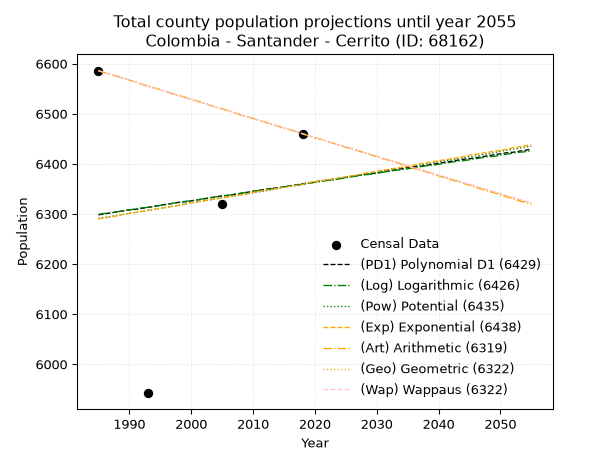
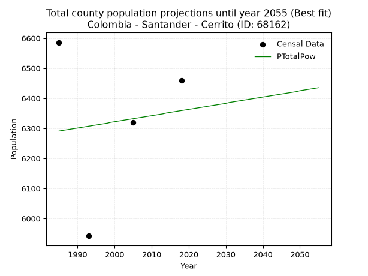
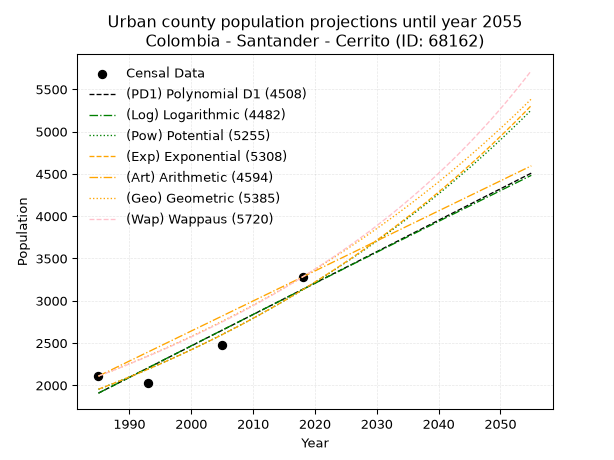
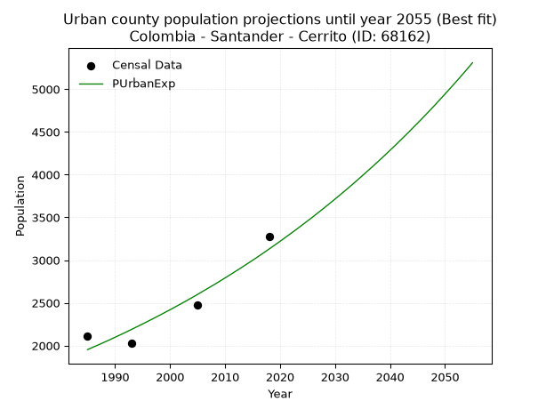
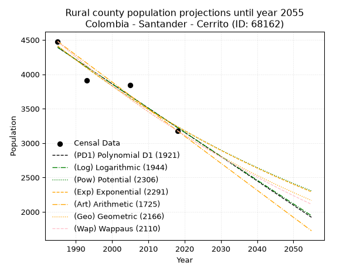
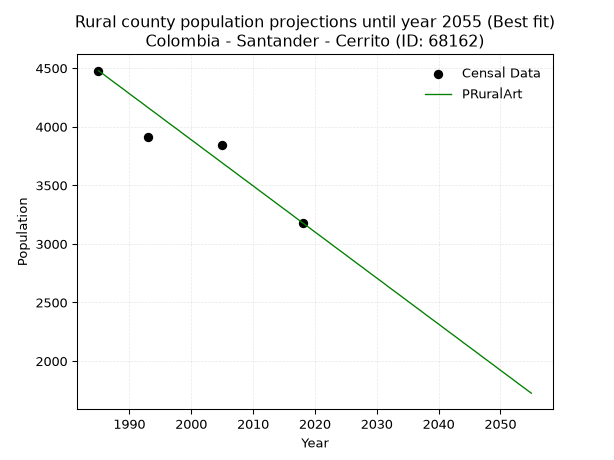

<div align="center">


</div>

# _“Population and Public Services Demand Projections (PPSD) until Year 2050 for Colombia - Santander - Cerrito (ID: 68162)”_
Keywords: `population` `public-service` `projection` `lineal` `polynomial` `logarithmic` `potential` `exponential` `arithmetic` `geometric` `wappaus` `dane` `colombia` `south-america`

PPSD are analytical estimates used by governments and planners to anticipate future changes in population size, age distribution, and the resulting community needs for utilities, healthcare, education, and infrastructure as sizing future water treatment facilities, electrical grids, and road networks based on spatial growth.

> **General running parameters**: • app_version: _v20260806_. • Python version: _3.14.7_. • Pandas version: _3.0.5_. • NumPy version: _2.5.1_. • Creates, save and include plots into reports (create_plot): _False_. • Projection until year: _2050_. • Process polynomial degree 2 and up: _False_. • Process Wappaus: _True_. • Process Wappaus: _True_. • Set negative values to zero: _True_. • Set infinite values to zero: _True_. • Drop dataset notes: _True_. 
<div align="center">

Dynamic map: [:earth_americas:Google](http://maps.google.com/maps?q=6.840404777,-72.6948509) [:earth_americas:OSM](https://www.openstreetmap.org/#map=18/6.840404777/-72.6948509&layers=P) [:earth_americas:Bing](https://www.bing.com/maps?cp=6.840404777~-72.6948509&lvl=18) [:earth_americas:Apple](https://maps.apple.com/frame?center=6.840404777%2C-72.6948509&span=0.003%2C0.006)

</div>


<div align="center">

```geojson
{
  "type": "Feature",
  "geometry": {
    "type": "Point", 
    "coordinates": [-72.6948509, 6.840404777]
  }, 
  "properties": {
    "Name": "Colombia - Santander - Cerrito (ID: 68162)"
  }
}
```

</div>


## 0. Census Data (4 records)

Census data are official statistics collected by a government about the people and housing in a country. They usually include counts of total population, age, sex, race, income, education, and jobs.

📅Global census file: [Population.xlsx](../data/Population.xlsx)

| Source   |   Year |   CountryID | CountryName   |   StateID | StateName   |   CountyID | CountyName   |   PTotal |   PUrban |   PRural |
|:---------|-------:|------------:|:--------------|----------:|:------------|-----------:|:-------------|---------:|---------:|---------:|
| DANE     |   1985 |          57 | Colombia      |        68 | Santander   |      68162 | Cerrito      |     6586 |     2108 |     4478 |
| DANE     |   1993 |          57 | Colombia      |        68 | Santander   |      68162 | Cerrito      |     5942 |     2028 |     3914 |
| DANE     |   2005 |          57 | Colombia      |        68 | Santander   |      68162 | Cerrito      |     6319 |     2478 |     3841 |
| DANE     |   2018 |          57 | Colombia      |        68 | Santander   |      68162 | Cerrito      |     6460 |     3280 |     3180 |

> 🔥Some records could had specific notes about the registered values or the corresponding urban or rural distribution.

## 1. Total

### 1.1. Coefficients and Parameters

* (PD1) Polynomial Deg 1: 1.8695303091127458, 2587.221999197229 (lineal)
* (Log) Logarithmic: 3678.837836895326, -21636.125878597635
* (Pow) Potential: 0.6539341311326479, 1.642172652421716
* (Exp) Exponential: 0.0003317122425005381, 3256.1260110810854
* (Art) Arithmetic: Year diff. 2018 - 1985 = 33, Population diff. 6460 - 6586 = -126, Annual growth = -3.8181818181818183
* (Geo) Geometric: Year diff. 2018 - 1985 = 33, Population diff. 6460 - 6586 = -126, Annual growth % = -0.0005851882911001027
* (Wap) Wappaus: i = -0.05853413794545176, Condition values only valid for < 200)

<sub>
Wappaus condition values: ['-0.00', '-0.06', '-0.12', '-0.18', '-0.23', '-0.29', '-0.35', '-0.41', '-0.47', '-0.53', '-0.59', '-0.64', '-0.70', '-0.76', '-0.82', '-0.88', '-0.94', '-1.00', '-1.05', '-1.11', '-1.17', '-1.23', '-1.29', '-1.35', '-1.40', '-1.46', '-1.52', '-1.58', '-1.64', '-1.70', '-1.76', '-1.81', '-1.87', '-1.93', '-1.99', '-2.05', '-2.11', '-2.17', '-2.22', '-2.28', '-2.34', '-2.40', '-2.46', '-2.52', '-2.58', '-2.63', '-2.69', '-2.75', '-2.81', '-2.87', '-2.93', '-2.99', '-3.04', '-3.10', '-3.16', '-3.22', '-3.28', '-3.34', '-3.39', '-3.45', '-3.51', '-3.57', '-3.63', '-3.69', '-3.75', '-3.80']
</sub>


### 1.2. Projected Dataset

|   Year |   CountyID |   PTotalPD1 |   PTotalLog |   PTotalPow |   PTotalExp |   PTotalArt |   PTotalGeo |   PTotalWap |
|-------:|-----------:|------------:|------------:|------------:|------------:|------------:|------------:|------------:|
|   1985 |      68162 |        6298 |        6299 |        6291 |        6290 |        6586 |        6586 |        6586 |
|   1986 |      68162 |        6300 |        6301 |        6293 |        6292 |        6582 |        6582 |        6582 |
|   1987 |      68162 |        6302 |        6302 |        6295 |        6294 |        6578 |        6578 |        6578 |
|   1988 |      68162 |        6304 |        6304 |        6297 |        6296 |        6575 |        6574 |        6574 |
|   1989 |      68162 |        6306 |        6306 |        6299 |        6299 |        6571 |        6571 |        6571 |
|   1990 |      68162 |        6308 |        6308 |        6301 |        6301 |        6567 |        6567 |        6567 |
|   1991 |      68162 |        6309 |        6310 |        6303 |        6303 |        6563 |        6563 |        6563 |
|   1992 |      68162 |        6311 |        6312 |        6305 |        6305 |        6559 |        6559 |        6559 |
|   1993 |      68162 |        6313 |        6313 |        6307 |        6307 |        6555 |        6555 |        6555 |
|   1994 |      68162 |        6315 |        6315 |        6309 |        6309 |        6552 |        6551 |        6551 |
|   1995 |      68162 |        6317 |        6317 |        6311 |        6311 |        6548 |        6548 |        6548 |
|   1996 |      68162 |        6319 |        6319 |        6313 |        6313 |        6544 |        6544 |        6544 |
|   1997 |      68162 |        6321 |        6321 |        6315 |        6315 |        6540 |        6540 |        6540 |
|   1998 |      68162 |        6323 |        6323 |        6317 |        6317 |        6536 |        6536 |        6536 |
|   1999 |      68162 |        6324 |        6325 |        6320 |        6319 |        6533 |        6532 |        6532 |
|   2000 |      68162 |        6326 |        6326 |        6322 |        6322 |        6529 |        6528 |        6528 |
|   2001 |      68162 |        6328 |        6328 |        6324 |        6324 |        6525 |        6525 |        6525 |
|   2002 |      68162 |        6330 |        6330 |        6326 |        6326 |        6521 |        6521 |        6521 |
|   2003 |      68162 |        6332 |        6332 |        6328 |        6328 |        6517 |        6517 |        6517 |
|   2004 |      68162 |        6334 |        6334 |        6330 |        6330 |        6513 |        6513 |        6513 |
|   2005 |      68162 |        6336 |        6336 |        6332 |        6332 |        6510 |        6509 |        6509 |
|   2006 |      68162 |        6337 |        6337 |        6334 |        6334 |        6506 |        6506 |        6506 |
|   2007 |      68162 |        6339 |        6339 |        6336 |        6336 |        6502 |        6502 |        6502 |
|   2008 |      68162 |        6341 |        6341 |        6338 |        6338 |        6498 |        6498 |        6498 |
|   2009 |      68162 |        6343 |        6343 |        6340 |        6340 |        6494 |        6494 |        6494 |
|   2010 |      68162 |        6345 |        6345 |        6342 |        6343 |        6491 |        6490 |        6490 |
|   2011 |      68162 |        6347 |        6347 |        6344 |        6345 |        6487 |        6487 |        6487 |
|   2012 |      68162 |        6349 |        6348 |        6346 |        6347 |        6483 |        6483 |        6483 |
|   2013 |      68162 |        6351 |        6350 |        6348 |        6349 |        6479 |        6479 |        6479 |
|   2014 |      68162 |        6352 |        6352 |        6351 |        6351 |        6475 |        6475 |        6475 |
|   2015 |      68162 |        6354 |        6354 |        6353 |        6353 |        6471 |        6471 |        6471 |
|   2016 |      68162 |        6356 |        6356 |        6355 |        6355 |        6468 |        6468 |        6468 |
|   2017 |      68162 |        6358 |        6357 |        6357 |        6357 |        6464 |        6464 |        6464 |
|   2018 |      68162 |        6360 |        6359 |        6359 |        6359 |        6460 |        6460 |        6460 |
|   2019 |      68162 |        6362 |        6361 |        6361 |        6362 |        6456 |        6456 |        6456 |
|   2020 |      68162 |        6364 |        6363 |        6363 |        6364 |        6452 |        6452 |        6452 |
|   2021 |      68162 |        6366 |        6365 |        6365 |        6366 |        6449 |        6449 |        6449 |
|   2022 |      68162 |        6367 |        6367 |        6367 |        6368 |        6445 |        6445 |        6445 |
|   2023 |      68162 |        6369 |        6368 |        6369 |        6370 |        6441 |        6441 |        6441 |
|   2024 |      68162 |        6371 |        6370 |        6371 |        6372 |        6437 |        6437 |        6437 |
|   2025 |      68162 |        6373 |        6372 |        6373 |        6374 |        6433 |        6434 |        6434 |
|   2026 |      68162 |        6375 |        6374 |        6375 |        6376 |        6429 |        6430 |        6430 |
|   2027 |      68162 |        6377 |        6376 |        6377 |        6378 |        6426 |        6426 |        6426 |
|   2028 |      68162 |        6379 |        6378 |        6379 |        6381 |        6422 |        6422 |        6422 |
|   2029 |      68162 |        6380 |        6379 |        6381 |        6383 |        6418 |        6419 |        6419 |
|   2030 |      68162 |        6382 |        6381 |        6383 |        6385 |        6414 |        6415 |        6415 |
|   2031 |      68162 |        6384 |        6383 |        6386 |        6387 |        6410 |        6411 |        6411 |
|   2032 |      68162 |        6386 |        6385 |        6388 |        6389 |        6407 |        6407 |        6407 |
|   2033 |      68162 |        6388 |        6387 |        6390 |        6391 |        6403 |        6404 |        6404 |
|   2034 |      68162 |        6390 |        6388 |        6392 |        6393 |        6399 |        6400 |        6400 |
|   2035 |      68162 |        6392 |        6390 |        6394 |        6395 |        6395 |        6396 |        6396 |
|   2036 |      68162 |        6394 |        6392 |        6396 |        6397 |        6391 |        6392 |        6392 |
|   2037 |      68162 |        6395 |        6394 |        6398 |        6400 |        6387 |        6389 |        6389 |
|   2038 |      68162 |        6397 |        6396 |        6400 |        6402 |        6384 |        6385 |        6385 |
|   2039 |      68162 |        6399 |        6397 |        6402 |        6404 |        6380 |        6381 |        6381 |
|   2040 |      68162 |        6401 |        6399 |        6404 |        6406 |        6376 |        6377 |        6377 |
|   2041 |      68162 |        6403 |        6401 |        6406 |        6408 |        6372 |        6374 |        6374 |
|   2042 |      68162 |        6405 |        6403 |        6408 |        6410 |        6368 |        6370 |        6370 |
|   2043 |      68162 |        6407 |        6405 |        6410 |        6412 |        6365 |        6366 |        6366 |
|   2044 |      68162 |        6409 |        6406 |        6412 |        6414 |        6361 |        6362 |        6362 |
|   2045 |      68162 |        6410 |        6408 |        6414 |        6417 |        6357 |        6359 |        6359 |
|   2046 |      68162 |        6412 |        6410 |        6416 |        6419 |        6353 |        6355 |        6355 |
|   2047 |      68162 |        6414 |        6412 |        6418 |        6421 |        6349 |        6351 |        6351 |
|   2048 |      68162 |        6416 |        6414 |        6420 |        6423 |        6345 |        6348 |        6348 |
|   2049 |      68162 |        6418 |        6415 |        6422 |        6425 |        6342 |        6344 |        6344 |
|   2050 |      68162 |        6420 |        6417 |        6425 |        6427 |        6338 |        6340 |        6340 |
<div align="center">

</img>

</div>


### 1.3. Best fit with absolute and relative error (%)

Relative error puts that difference into context by dividing the absolute error by the true value, creating a unitless ratio or percentage that shows the scale of the mistake.

Absolute and relative error

|   Year | Source   |   CountryID | CountryName   |   StateID | StateName   |   CountyID_x | CountyName   |   PTotal |   PUrban |   PRural |   CountyID_y |   PTotalPD1 |   PTotalLog |   PTotalPow |   PTotalExp |   PTotalArt |   PTotalGeo |   PTotalWap |   PTotalPD1AbsError |   PTotalLogAbsError |   PTotalPowAbsError |   PTotalExpAbsError |   PTotalArtAbsError |   PTotalGeoAbsError |   PTotalWapAbsError |   PTotalPD1RelError |   PTotalLogRelError |   PTotalPowRelError |   PTotalExpRelError |   PTotalArtRelError |   PTotalGeoRelError |   PTotalWapRelError |
|-------:|:---------|------------:|:--------------|----------:|:------------|-------------:|:-------------|---------:|---------:|---------:|-------------:|------------:|------------:|------------:|------------:|------------:|------------:|------------:|--------------------:|--------------------:|--------------------:|--------------------:|--------------------:|--------------------:|--------------------:|--------------------:|--------------------:|--------------------:|--------------------:|--------------------:|--------------------:|--------------------:|
|   1985 | DANE     |          57 | Colombia      |        68 | Santander   |        68162 | Cerrito      |     6586 |     2108 |     4478 |        68162 |        6298 |        6299 |        6291 |        6290 |        6586 |        6586 |        6586 |                 288 |                 287 |                 295 |                 296 |                   0 |                   0 |                   0 |             4.37291 |             4.35773 |            4.4792   |            4.49438  |             0       |              0      |              0      |
|   1993 | DANE     |          57 | Colombia      |        68 | Santander   |        68162 | Cerrito      |     5942 |     2028 |     3914 |        68162 |        6313 |        6313 |        6307 |        6307 |        6555 |        6555 |        6555 |                 371 |                 371 |                 365 |                 365 |                 613 |                 613 |                 613 |             6.24369 |             6.24369 |            6.14271  |            6.14271  |            10.3164  |             10.3164 |             10.3164 |
|   2005 | DANE     |          57 | Colombia      |        68 | Santander   |        68162 | Cerrito      |     6319 |     2478 |     3841 |        68162 |        6336 |        6336 |        6332 |        6332 |        6510 |        6509 |        6509 |                  17 |                  17 |                  13 |                  13 |                 191 |                 190 |                 190 |             0.26903 |             0.26903 |            0.205729 |            0.205729 |             3.02263 |              3.0068 |              3.0068 |
|   2018 | DANE     |          57 | Colombia      |        68 | Santander   |        68162 | Cerrito      |     6460 |     3280 |     3180 |        68162 |        6360 |        6359 |        6359 |        6359 |        6460 |        6460 |        6460 |                 100 |                 101 |                 101 |                 101 |                   0 |                   0 |                   0 |             1.54799 |             1.56347 |            1.56347  |            1.56347  |             0       |              0      |              0      |

Relative error mean

| Method    |   RelError | Best   |
|:----------|-----------:|:-------|
| PTotalPD1 |    3.1084  |        |
| PTotalLog |    3.10848 |        |
| PTotalPow |    3.09778 | True   |
| PTotalExp |    3.10157 |        |
| PTotalArt |    3.33476 |        |
| PTotalGeo |    3.3308  |        |
| PTotalWap |    3.3308  |        |

💙Best method: _**PTotalPow**_
<div align="center">

</img>

</div>


### 1.4. Fresh water supply demand in liters per capita per day (lpcd)

The fresh water supply demand typically ranges from 100 to 300 liters per capita per day (lpcd) for standard domestic and municipal planning, though absolute survival minimums set by the World Health Organization are as low as 7.5 to 20 liters per day, and total consumption in high-income nations can exceed 400 liters.

> `CZ`: Level in meters above the sea level (masl)<br> `WS`: Fresh water supply demand in liters per capita per day (lpcd or l/h/d)<br> `WSAll`: Zonal fresh water supply demand in liters per second (l/s)<br> `A`: Zonal area in square meters<br> `DP`: Population density (people/hectare)

Reference values (RAS Colombia)

|    CZ |   WS |
|------:|-----:|
|  1000 |  120 |
|  2000 |  130 |
| 99999 |  140 |

County shapefile geometry properties and water supply values

|   CountyID |      ATotal |   CZTotal |   WSTotal |
|-----------:|------------:|----------:|----------:|
|      68162 | 4.20065e+08 |   3379.46 |       140 |

Projected values for best method: PTotalPow

|   CountyID |   Year |   PTotalPow |   DPTotal |   WSTotal |   WSTotalAll |
|-----------:|-------:|------------:|----------:|----------:|-------------:|
|      68162 |   1985 |        6291 |      0.15 |       140 |      10.1937 |
|      68162 |   1986 |        6293 |      0.15 |       140 |      10.197  |
|      68162 |   1987 |        6295 |      0.15 |       140 |      10.2002 |
|      68162 |   1988 |        6297 |      0.15 |       140 |      10.2035 |
|      68162 |   1989 |        6299 |      0.15 |       140 |      10.2067 |
|      68162 |   1990 |        6301 |      0.15 |       140 |      10.21   |
|      68162 |   1991 |        6303 |      0.15 |       140 |      10.2132 |
|      68162 |   1992 |        6305 |      0.15 |       140 |      10.2164 |
|      68162 |   1993 |        6307 |      0.15 |       140 |      10.2197 |
|      68162 |   1994 |        6309 |      0.15 |       140 |      10.2229 |
|      68162 |   1995 |        6311 |      0.15 |       140 |      10.2262 |
|      68162 |   1996 |        6313 |      0.15 |       140 |      10.2294 |
|      68162 |   1997 |        6315 |      0.15 |       140 |      10.2326 |
|      68162 |   1998 |        6317 |      0.15 |       140 |      10.2359 |
|      68162 |   1999 |        6320 |      0.15 |       140 |      10.2407 |
|      68162 |   2000 |        6322 |      0.15 |       140 |      10.244  |
|      68162 |   2001 |        6324 |      0.15 |       140 |      10.2472 |
|      68162 |   2002 |        6326 |      0.15 |       140 |      10.2505 |
|      68162 |   2003 |        6328 |      0.15 |       140 |      10.2537 |
|      68162 |   2004 |        6330 |      0.15 |       140 |      10.2569 |
|      68162 |   2005 |        6332 |      0.15 |       140 |      10.2602 |
|      68162 |   2006 |        6334 |      0.15 |       140 |      10.2634 |
|      68162 |   2007 |        6336 |      0.15 |       140 |      10.2667 |
|      68162 |   2008 |        6338 |      0.15 |       140 |      10.2699 |
|      68162 |   2009 |        6340 |      0.15 |       140 |      10.2731 |
|      68162 |   2010 |        6342 |      0.15 |       140 |      10.2764 |
|      68162 |   2011 |        6344 |      0.15 |       140 |      10.2796 |
|      68162 |   2012 |        6346 |      0.15 |       140 |      10.2829 |
|      68162 |   2013 |        6348 |      0.15 |       140 |      10.2861 |
|      68162 |   2014 |        6351 |      0.15 |       140 |      10.291  |
|      68162 |   2015 |        6353 |      0.15 |       140 |      10.2942 |
|      68162 |   2016 |        6355 |      0.15 |       140 |      10.2975 |
|      68162 |   2017 |        6357 |      0.15 |       140 |      10.3007 |
|      68162 |   2018 |        6359 |      0.15 |       140 |      10.3039 |
|      68162 |   2019 |        6361 |      0.15 |       140 |      10.3072 |
|      68162 |   2020 |        6363 |      0.15 |       140 |      10.3104 |
|      68162 |   2021 |        6365 |      0.15 |       140 |      10.3137 |
|      68162 |   2022 |        6367 |      0.15 |       140 |      10.3169 |
|      68162 |   2023 |        6369 |      0.15 |       140 |      10.3201 |
|      68162 |   2024 |        6371 |      0.15 |       140 |      10.3234 |
|      68162 |   2025 |        6373 |      0.15 |       140 |      10.3266 |
|      68162 |   2026 |        6375 |      0.15 |       140 |      10.3299 |
|      68162 |   2027 |        6377 |      0.15 |       140 |      10.3331 |
|      68162 |   2028 |        6379 |      0.15 |       140 |      10.3363 |
|      68162 |   2029 |        6381 |      0.15 |       140 |      10.3396 |
|      68162 |   2030 |        6383 |      0.15 |       140 |      10.3428 |
|      68162 |   2031 |        6386 |      0.15 |       140 |      10.3477 |
|      68162 |   2032 |        6388 |      0.15 |       140 |      10.3509 |
|      68162 |   2033 |        6390 |      0.15 |       140 |      10.3542 |
|      68162 |   2034 |        6392 |      0.15 |       140 |      10.3574 |
|      68162 |   2035 |        6394 |      0.15 |       140 |      10.3606 |
|      68162 |   2036 |        6396 |      0.15 |       140 |      10.3639 |
|      68162 |   2037 |        6398 |      0.15 |       140 |      10.3671 |
|      68162 |   2038 |        6400 |      0.15 |       140 |      10.3704 |
|      68162 |   2039 |        6402 |      0.15 |       140 |      10.3736 |
|      68162 |   2040 |        6404 |      0.15 |       140 |      10.3769 |
|      68162 |   2041 |        6406 |      0.15 |       140 |      10.3801 |
|      68162 |   2042 |        6408 |      0.15 |       140 |      10.3833 |
|      68162 |   2043 |        6410 |      0.15 |       140 |      10.3866 |
|      68162 |   2044 |        6412 |      0.15 |       140 |      10.3898 |
|      68162 |   2045 |        6414 |      0.15 |       140 |      10.3931 |
|      68162 |   2046 |        6416 |      0.15 |       140 |      10.3963 |
|      68162 |   2047 |        6418 |      0.15 |       140 |      10.3995 |
|      68162 |   2048 |        6420 |      0.15 |       140 |      10.4028 |
|      68162 |   2049 |        6422 |      0.15 |       140 |      10.406  |
|      68162 |   2050 |        6425 |      0.15 |       140 |      10.4109 |

## 2. Urban

### 2.1. Coefficients and Parameters

* (PD1) Polynomial Deg 1: 37.15857085507777, -71852.9313528693 (lineal)
* (Log) Logarithmic: 74313.13551406456, -562381.2385504991
* (Pow) Potential: 28.5709269451811, -90.9295681583819
* (Exp) Exponential: 0.014284984710351674, 9.460136125466212e-10
* (Art) Arithmetic: Year diff. 2018 - 1985 = 33, Population diff. 3280 - 2108 = 1172, Annual growth = 35.515151515151516
* (Geo) Geometric: Year diff. 2018 - 1985 = 33, Population diff. 3280 - 2108 = 1172, Annual growth % = 0.013487227636828303
* (Wap) Wappaus: i = 1.3183055499313852, Condition values only valid for < 200)

<sub>
Wappaus condition values: ['0.00', '1.32', '2.64', '3.95', '5.27', '6.59', '7.91', '9.23', '10.55', '11.86', '13.18', '14.50', '15.82', '17.14', '18.46', '19.77', '21.09', '22.41', '23.73', '25.05', '26.37', '27.68', '29.00', '30.32', '31.64', '32.96', '34.28', '35.59', '36.91', '38.23', '39.55', '40.87', '42.19', '43.50', '44.82', '46.14', '47.46', '48.78', '50.10', '51.41', '52.73', '54.05', '55.37', '56.69', '58.01', '59.32', '60.64', '61.96', '63.28', '64.60', '65.92', '67.23', '68.55', '69.87', '71.19', '72.51', '73.83', '75.14', '76.46', '77.78', '79.10', '80.42', '81.73', '83.05', '84.37', '85.69']
</sub>


### 2.2. Projected Dataset

|   Year |   CountyID |   PUrbanPD1 |   PUrbanLog |   PUrbanPow |   PUrbanExp |   PUrbanArt |   PUrbanGeo |   PUrbanWap |
|-------:|-----------:|------------:|------------:|------------:|------------:|------------:|------------:|------------:|
|   1985 |      68162 |        1907 |        1906 |        1952 |        1953 |        2108 |        2108 |        2108 |
|   1986 |      68162 |        1944 |        1944 |        1980 |        1981 |        2144 |        2136 |        2136 |
|   1987 |      68162 |        1981 |        1981 |        2009 |        2009 |        2179 |        2165 |        2164 |
|   1988 |      68162 |        2018 |        2018 |        2038 |        2038 |        2215 |        2194 |        2193 |
|   1989 |      68162 |        2055 |        2056 |        2068 |        2067 |        2250 |        2224 |        2222 |
|   1990 |      68162 |        2093 |        2093 |        2098 |        2097 |        2286 |        2254 |        2252 |
|   1991 |      68162 |        2130 |        2130 |        2128 |        2127 |        2321 |        2284 |        2282 |
|   1992 |      68162 |        2167 |        2168 |        2159 |        2158 |        2357 |        2315 |        2312 |
|   1993 |      68162 |        2204 |        2205 |        2190 |        2189 |        2392 |        2346 |        2343 |
|   1994 |      68162 |        2241 |        2242 |        2221 |        2221 |        2428 |        2378 |        2374 |
|   1995 |      68162 |        2278 |        2280 |        2254 |        2252 |        2463 |        2410 |        2406 |
|   1996 |      68162 |        2316 |        2317 |        2286 |        2285 |        2499 |        2443 |        2438 |
|   1997 |      68162 |        2353 |        2354 |        2319 |        2318 |        2534 |        2476 |        2470 |
|   1998 |      68162 |        2390 |        2391 |        2352 |        2351 |        2570 |        2509 |        2503 |
|   1999 |      68162 |        2427 |        2428 |        2386 |        2385 |        2605 |        2543 |        2537 |
|   2000 |      68162 |        2464 |        2466 |        2421 |        2419 |        2641 |        2577 |        2571 |
|   2001 |      68162 |        2501 |        2503 |        2455 |        2454 |        2676 |        2612 |        2605 |
|   2002 |      68162 |        2539 |        2540 |        2491 |        2489 |        2712 |        2647 |        2640 |
|   2003 |      68162 |        2576 |        2577 |        2526 |        2525 |        2747 |        2683 |        2676 |
|   2004 |      68162 |        2613 |        2614 |        2563 |        2561 |        2783 |        2719 |        2712 |
|   2005 |      68162 |        2650 |        2651 |        2600 |        2598 |        2818 |        2756 |        2748 |
|   2006 |      68162 |        2687 |        2688 |        2637 |        2636 |        2854 |        2793 |        2785 |
|   2007 |      68162 |        2724 |        2725 |        2675 |        2674 |        2889 |        2831 |        2823 |
|   2008 |      68162 |        2761 |        2762 |        2713 |        2712 |        2925 |        2869 |        2861 |
|   2009 |      68162 |        2799 |        2799 |        2752 |        2751 |        2960 |        2907 |        2900 |
|   2010 |      68162 |        2836 |        2836 |        2791 |        2791 |        2996 |        2947 |        2940 |
|   2011 |      68162 |        2873 |        2873 |        2831 |        2831 |        3031 |        2986 |        2980 |
|   2012 |      68162 |        2910 |        2910 |        2872 |        2872 |        3067 |        3027 |        3021 |
|   2013 |      68162 |        2947 |        2947 |        2913 |        2913 |        3102 |        3067 |        3062 |
|   2014 |      68162 |        2984 |        2984 |        2954 |        2955 |        3138 |        3109 |        3104 |
|   2015 |      68162 |        3022 |        3021 |        2997 |        2997 |        3173 |        3151 |        3147 |
|   2016 |      68162 |        3059 |        3058 |        3039 |        3040 |        3209 |        3193 |        3191 |
|   2017 |      68162 |        3096 |        3095 |        3083 |        3084 |        3244 |        3236 |        3235 |
|   2018 |      68162 |        3133 |        3131 |        3127 |        3129 |        3280 |        3280 |        3280 |
|   2019 |      68162 |        3170 |        3168 |        3171 |        3174 |        3316 |        3324 |        3326 |
|   2020 |      68162 |        3207 |        3205 |        3217 |        3219 |        3351 |        3369 |        3372 |
|   2021 |      68162 |        3245 |        3242 |        3262 |        3266 |        3387 |        3415 |        3420 |
|   2022 |      68162 |        3282 |        3279 |        3309 |        3313 |        3422 |        3461 |        3468 |
|   2023 |      68162 |        3319 |        3315 |        3356 |        3360 |        3458 |        3507 |        3517 |
|   2024 |      68162 |        3356 |        3352 |        3404 |        3409 |        3493 |        3555 |        3567 |
|   2025 |      68162 |        3393 |        3389 |        3452 |        3458 |        3529 |        3602 |        3618 |
|   2026 |      68162 |        3430 |        3426 |        3501 |        3507 |        3564 |        3651 |        3669 |
|   2027 |      68162 |        3467 |        3462 |        3551 |        3558 |        3600 |        3700 |        3722 |
|   2028 |      68162 |        3505 |        3499 |        3601 |        3609 |        3635 |        3750 |        3776 |
|   2029 |      68162 |        3542 |        3535 |        3652 |        3661 |        3671 |        3801 |        3830 |
|   2030 |      68162 |        3579 |        3572 |        3704 |        3714 |        3706 |        3852 |        3886 |
|   2031 |      68162 |        3616 |        3609 |        3756 |        3767 |        3742 |        3904 |        3943 |
|   2032 |      68162 |        3653 |        3645 |        3810 |        3821 |        3777 |        3957 |        4000 |
|   2033 |      68162 |        3690 |        3682 |        3864 |        3876 |        3813 |        4010 |        4059 |
|   2034 |      68162 |        3728 |        3718 |        3918 |        3932 |        3848 |        4064 |        4119 |
|   2035 |      68162 |        3765 |        3755 |        3974 |        3989 |        3884 |        4119 |        4181 |
|   2036 |      68162 |        3802 |        3791 |        4030 |        4046 |        3919 |        4174 |        4243 |
|   2037 |      68162 |        3839 |        3828 |        4087 |        4104 |        3955 |        4231 |        4307 |
|   2038 |      68162 |        3876 |        3864 |        4144 |        4163 |        3990 |        4288 |        4372 |
|   2039 |      68162 |        3913 |        3901 |        4203 |        4223 |        4026 |        4346 |        4438 |
|   2040 |      68162 |        3951 |        3937 |        4262 |        4284 |        4061 |        4404 |        4506 |
|   2041 |      68162 |        3988 |        3974 |        4322 |        4345 |        4097 |        4464 |        4575 |
|   2042 |      68162 |        4025 |        4010 |        4383 |        4408 |        4132 |        4524 |        4645 |
|   2043 |      68162 |        4062 |        4046 |        4445 |        4471 |        4168 |        4585 |        4717 |
|   2044 |      68162 |        4099 |        4083 |        4508 |        4536 |        4203 |        4647 |        4791 |
|   2045 |      68162 |        4136 |        4119 |        4571 |        4601 |        4239 |        4709 |        4866 |
|   2046 |      68162 |        4174 |        4155 |        4635 |        4667 |        4274 |        4773 |        4943 |
|   2047 |      68162 |        4211 |        4192 |        4700 |        4734 |        4310 |        4837 |        5022 |
|   2048 |      68162 |        4248 |        4228 |        4766 |        4802 |        4345 |        4903 |        5102 |
|   2049 |      68162 |        4285 |        4264 |        4833 |        4872 |        4381 |        4969 |        5184 |
|   2050 |      68162 |        4322 |        4301 |        4901 |        4942 |        4416 |        5036 |        5268 |
<div align="center">

</img>

</div>


### 2.3. Best fit with absolute and relative error (%)

Relative error puts that difference into context by dividing the absolute error by the true value, creating a unitless ratio or percentage that shows the scale of the mistake.

Absolute and relative error

|   Year | Source   |   CountryID | CountryName   |   StateID | StateName   |   CountyID_x | CountyName   |   PTotal |   PUrban |   PRural |   CountyID_y |   PUrbanPD1 |   PUrbanLog |   PUrbanPow |   PUrbanExp |   PUrbanArt |   PUrbanGeo |   PUrbanWap |   PUrbanPD1AbsError |   PUrbanLogAbsError |   PUrbanPowAbsError |   PUrbanExpAbsError |   PUrbanArtAbsError |   PUrbanGeoAbsError |   PUrbanWapAbsError |   PUrbanPD1RelError |   PUrbanLogRelError |   PUrbanPowRelError |   PUrbanExpRelError |   PUrbanArtRelError |   PUrbanGeoRelError |   PUrbanWapRelError |
|-------:|:---------|------------:|:--------------|----------:|:------------|-------------:|:-------------|---------:|---------:|---------:|-------------:|------------:|------------:|------------:|------------:|------------:|------------:|------------:|--------------------:|--------------------:|--------------------:|--------------------:|--------------------:|--------------------:|--------------------:|--------------------:|--------------------:|--------------------:|--------------------:|--------------------:|--------------------:|--------------------:|
|   1985 | DANE     |          57 | Colombia      |        68 | Santander   |        68162 | Cerrito      |     6586 |     2108 |     4478 |        68162 |        1907 |        1906 |        1952 |        1953 |        2108 |        2108 |        2108 |                 201 |                 202 |                 156 |                 155 |                   0 |                   0 |                   0 |             9.5351  |             9.58254 |             7.40038 |             7.35294 |              0      |              0      |              0      |
|   1993 | DANE     |          57 | Colombia      |        68 | Santander   |        68162 | Cerrito      |     5942 |     2028 |     3914 |        68162 |        2204 |        2205 |        2190 |        2189 |        2392 |        2346 |        2343 |                 176 |                 177 |                 162 |                 161 |                 364 |                 318 |                 315 |             8.6785  |             8.72781 |             7.98817 |             7.93886 |             17.9487 |             15.6805 |             15.5325 |
|   2005 | DANE     |          57 | Colombia      |        68 | Santander   |        68162 | Cerrito      |     6319 |     2478 |     3841 |        68162 |        2650 |        2651 |        2600 |        2598 |        2818 |        2756 |        2748 |                 172 |                 173 |                 122 |                 120 |                 340 |                 278 |                 270 |             6.94108 |             6.98144 |             4.92333 |             4.84262 |             13.7207 |             11.2187 |             10.8959 |
|   2018 | DANE     |          57 | Colombia      |        68 | Santander   |        68162 | Cerrito      |     6460 |     3280 |     3180 |        68162 |        3133 |        3131 |        3127 |        3129 |        3280 |        3280 |        3280 |                 147 |                 149 |                 153 |                 151 |                   0 |                   0 |                   0 |             4.48171 |             4.54268 |             4.66463 |             4.60366 |              0      |              0      |              0      |

Relative error mean

| Method    |   RelError | Best   |
|:----------|-----------:|:-------|
| PUrbanPD1 |    7.4091  |        |
| PUrbanLog |    7.45862 |        |
| PUrbanPow |    6.24413 |        |
| PUrbanExp |    6.18452 | True   |
| PUrbanArt |    7.91737 |        |
| PUrbanGeo |    6.7248  |        |
| PUrbanWap |    6.60711 |        |

💙Best method: _**PUrbanExp**_
<div align="center">

</img>

</div>


### 2.4. Fresh water supply demand in liters per capita per day (lpcd)

The fresh water supply demand typically ranges from 100 to 300 liters per capita per day (lpcd) for standard domestic and municipal planning, though absolute survival minimums set by the World Health Organization are as low as 7.5 to 20 liters per day, and total consumption in high-income nations can exceed 400 liters.

> `CZ`: Level in meters above the sea level (masl)<br> `WS`: Fresh water supply demand in liters per capita per day (lpcd or l/h/d)<br> `WSAll`: Zonal fresh water supply demand in liters per second (l/s)<br> `A`: Zonal area in square meters<br> `DP`: Population density (people/hectare)

Reference values (RAS Colombia)

|    CZ |   WS |
|------:|-----:|
|  1000 |  120 |
|  2000 |  130 |
| 99999 |  140 |

County shapefile geometry properties and water supply values

|   CountyID |   AUrban |   CZUrban |   WSUrban |
|-----------:|---------:|----------:|----------:|
|      68162 |   538061 |   2489.08 |       140 |

Projected values for best method: PUrbanExp

|   CountyID |   Year |   PUrbanExp |   DPUrban |   WSUrban |   WSUrbanAll |
|-----------:|-------:|------------:|----------:|----------:|-------------:|
|      68162 |   1985 |        1953 |     36.3  |       140 |      3.16458 |
|      68162 |   1986 |        1981 |     36.82 |       140 |      3.20995 |
|      68162 |   1987 |        2009 |     37.34 |       140 |      3.25532 |
|      68162 |   1988 |        2038 |     37.88 |       140 |      3.30231 |
|      68162 |   1989 |        2067 |     38.42 |       140 |      3.34931 |
|      68162 |   1990 |        2097 |     38.97 |       140 |      3.39792 |
|      68162 |   1991 |        2127 |     39.53 |       140 |      3.44653 |
|      68162 |   1992 |        2158 |     40.11 |       140 |      3.49676 |
|      68162 |   1993 |        2189 |     40.68 |       140 |      3.54699 |
|      68162 |   1994 |        2221 |     41.28 |       140 |      3.59884 |
|      68162 |   1995 |        2252 |     41.85 |       140 |      3.64907 |
|      68162 |   1996 |        2285 |     42.47 |       140 |      3.70255 |
|      68162 |   1997 |        2318 |     43.08 |       140 |      3.75602 |
|      68162 |   1998 |        2351 |     43.69 |       140 |      3.80949 |
|      68162 |   1999 |        2385 |     44.33 |       140 |      3.86458 |
|      68162 |   2000 |        2419 |     44.96 |       140 |      3.91968 |
|      68162 |   2001 |        2454 |     45.61 |       140 |      3.97639 |
|      68162 |   2002 |        2489 |     46.26 |       140 |      4.0331  |
|      68162 |   2003 |        2525 |     46.93 |       140 |      4.09144 |
|      68162 |   2004 |        2561 |     47.6  |       140 |      4.14977 |
|      68162 |   2005 |        2598 |     48.28 |       140 |      4.20972 |
|      68162 |   2006 |        2636 |     48.99 |       140 |      4.2713  |
|      68162 |   2007 |        2674 |     49.7  |       140 |      4.33287 |
|      68162 |   2008 |        2712 |     50.4  |       140 |      4.39444 |
|      68162 |   2009 |        2751 |     51.13 |       140 |      4.45764 |
|      68162 |   2010 |        2791 |     51.87 |       140 |      4.52245 |
|      68162 |   2011 |        2831 |     52.61 |       140 |      4.58727 |
|      68162 |   2012 |        2872 |     53.38 |       140 |      4.6537  |
|      68162 |   2013 |        2913 |     54.14 |       140 |      4.72014 |
|      68162 |   2014 |        2955 |     54.92 |       140 |      4.78819 |
|      68162 |   2015 |        2997 |     55.7  |       140 |      4.85625 |
|      68162 |   2016 |        3040 |     56.5  |       140 |      4.92593 |
|      68162 |   2017 |        3084 |     57.32 |       140 |      4.99722 |
|      68162 |   2018 |        3129 |     58.15 |       140 |      5.07014 |
|      68162 |   2019 |        3174 |     58.99 |       140 |      5.14306 |
|      68162 |   2020 |        3219 |     59.83 |       140 |      5.21597 |
|      68162 |   2021 |        3266 |     60.7  |       140 |      5.29213 |
|      68162 |   2022 |        3313 |     61.57 |       140 |      5.36829 |
|      68162 |   2023 |        3360 |     62.45 |       140 |      5.44444 |
|      68162 |   2024 |        3409 |     63.36 |       140 |      5.52384 |
|      68162 |   2025 |        3458 |     64.27 |       140 |      5.60324 |
|      68162 |   2026 |        3507 |     65.18 |       140 |      5.68264 |
|      68162 |   2027 |        3558 |     66.13 |       140 |      5.76528 |
|      68162 |   2028 |        3609 |     67.07 |       140 |      5.84792 |
|      68162 |   2029 |        3661 |     68.04 |       140 |      5.93218 |
|      68162 |   2030 |        3714 |     69.03 |       140 |      6.01806 |
|      68162 |   2031 |        3767 |     70.01 |       140 |      6.10394 |
|      68162 |   2032 |        3821 |     71.01 |       140 |      6.19144 |
|      68162 |   2033 |        3876 |     72.04 |       140 |      6.28056 |
|      68162 |   2034 |        3932 |     73.08 |       140 |      6.3713  |
|      68162 |   2035 |        3989 |     74.14 |       140 |      6.46366 |
|      68162 |   2036 |        4046 |     75.2  |       140 |      6.55602 |
|      68162 |   2037 |        4104 |     76.27 |       140 |      6.65    |
|      68162 |   2038 |        4163 |     77.37 |       140 |      6.7456  |
|      68162 |   2039 |        4223 |     78.49 |       140 |      6.84282 |
|      68162 |   2040 |        4284 |     79.62 |       140 |      6.94167 |
|      68162 |   2041 |        4345 |     80.75 |       140 |      7.04051 |
|      68162 |   2042 |        4408 |     81.92 |       140 |      7.14259 |
|      68162 |   2043 |        4471 |     83.09 |       140 |      7.24468 |
|      68162 |   2044 |        4536 |     84.3  |       140 |      7.35    |
|      68162 |   2045 |        4601 |     85.51 |       140 |      7.45532 |
|      68162 |   2046 |        4667 |     86.74 |       140 |      7.56227 |
|      68162 |   2047 |        4734 |     87.98 |       140 |      7.67083 |
|      68162 |   2048 |        4802 |     89.25 |       140 |      7.78102 |
|      68162 |   2049 |        4872 |     90.55 |       140 |      7.89444 |
|      68162 |   2050 |        4942 |     91.85 |       140 |      8.00787 |

## 3. Rural

### 3.1. Coefficients and Parameters

* (PD1) Polynomial Deg 1: -35.289040545965065, 74440.15335206661 (lineal)
* (Log) Logarithmic: -70634.29767716926, 540745.1126719017
* (Pow) Potential: -18.731264821845116, 65.41596978734495
* (Exp) Exponential: -0.009359500842578536, 516677343427.4786
* (Art) Arithmetic: Year diff. 2018 - 1985 = 33, Population diff. 3180 - 4478 = -1298, Annual growth = -39.333333333333336
* (Geo) Geometric: Year diff. 2018 - 1985 = 33, Population diff. 3180 - 4478 = -1298, Annual growth % = -0.010318975748896952
* (Wap) Wappaus: i = -1.027248193610168, Condition values only valid for < 200)

<sub>
Wappaus condition values: ['-0.00', '-1.03', '-2.05', '-3.08', '-4.11', '-5.14', '-6.16', '-7.19', '-8.22', '-9.25', '-10.27', '-11.30', '-12.33', '-13.35', '-14.38', '-15.41', '-16.44', '-17.46', '-18.49', '-19.52', '-20.54', '-21.57', '-22.60', '-23.63', '-24.65', '-25.68', '-26.71', '-27.74', '-28.76', '-29.79', '-30.82', '-31.84', '-32.87', '-33.90', '-34.93', '-35.95', '-36.98', '-38.01', '-39.04', '-40.06', '-41.09', '-42.12', '-43.14', '-44.17', '-45.20', '-46.23', '-47.25', '-48.28', '-49.31', '-50.34', '-51.36', '-52.39', '-53.42', '-54.44', '-55.47', '-56.50', '-57.53', '-58.55', '-59.58', '-60.61', '-61.63', '-62.66', '-63.69', '-64.72', '-65.74', '-66.77']
</sub>


### 3.2. Projected Dataset

|   Year |   CountyID |   PRuralPD1 |   PRuralLog |   PRuralPow |   PRuralExp |   PRuralArt |   PRuralGeo |   PRuralWap |
|-------:|-----------:|------------:|------------:|------------:|------------:|------------:|------------:|------------:|
|   1985 |      68162 |        4391 |        4392 |        4413 |        4412 |        4478 |        4478 |        4478 |
|   1986 |      68162 |        4356 |        4357 |        4372 |        4371 |        4439 |        4432 |        4432 |
|   1987 |      68162 |        4321 |        4321 |        4331 |        4330 |        4399 |        4386 |        4387 |
|   1988 |      68162 |        4286 |        4286 |        4290 |        4290 |        4360 |        4341 |        4342 |
|   1989 |      68162 |        4250 |        4250 |        4250 |        4250 |        4321 |        4296 |        4298 |
|   1990 |      68162 |        4215 |        4215 |        4210 |        4210 |        4281 |        4252 |        4254 |
|   1991 |      68162 |        4180 |        4179 |        4171 |        4171 |        4242 |        4208 |        4210 |
|   1992 |      68162 |        4144 |        4144 |        4131 |        4132 |        4203 |        4164 |        4167 |
|   1993 |      68162 |        4109 |        4108 |        4093 |        4094 |        4163 |        4121 |        4125 |
|   1994 |      68162 |        4074 |        4073 |        4055 |        4056 |        4124 |        4079 |        4082 |
|   1995 |      68162 |        4039 |        4038 |        4017 |        4018 |        4085 |        4037 |        4040 |
|   1996 |      68162 |        4003 |        4002 |        3979 |        3980 |        4045 |        3995 |        3999 |
|   1997 |      68162 |        3968 |        3967 |        3942 |        3943 |        4006 |        3954 |        3958 |
|   1998 |      68162 |        3933 |        3931 |        3905 |        3907 |        3967 |        3913 |        3917 |
|   1999 |      68162 |        3897 |        3896 |        3869 |        3870 |        3927 |        3873 |        3877 |
|   2000 |      68162 |        3862 |        3861 |        3833 |        3834 |        3888 |        3833 |        3837 |
|   2001 |      68162 |        3827 |        3825 |        3797 |        3798 |        3849 |        3793 |        3798 |
|   2002 |      68162 |        3791 |        3790 |        3762 |        3763 |        3809 |        3754 |        3759 |
|   2003 |      68162 |        3756 |        3755 |        3727 |        3728 |        3770 |        3715 |        3720 |
|   2004 |      68162 |        3721 |        3720 |        3692 |        3693 |        3731 |        3677 |        3682 |
|   2005 |      68162 |        3686 |        3684 |        3658 |        3659 |        3691 |        3639 |        3644 |
|   2006 |      68162 |        3650 |        3649 |        3624 |        3625 |        3652 |        3602 |        3606 |
|   2007 |      68162 |        3615 |        3614 |        3590 |        3591 |        3613 |        3564 |        3569 |
|   2008 |      68162 |        3580 |        3579 |        3557 |        3557 |        3573 |        3528 |        3532 |
|   2009 |      68162 |        3544 |        3544 |        3524 |        3524 |        3534 |        3491 |        3495 |
|   2010 |      68162 |        3509 |        3508 |        3491 |        3492 |        3495 |        3455 |        3459 |
|   2011 |      68162 |        3474 |        3473 |        3458 |        3459 |        3455 |        3419 |        3423 |
|   2012 |      68162 |        3439 |        3438 |        3426 |        3427 |        3416 |        3384 |        3387 |
|   2013 |      68162 |        3403 |        3403 |        3395 |        3395 |        3377 |        3349 |        3352 |
|   2014 |      68162 |        3368 |        3368 |        3363 |        3363 |        3337 |        3315 |        3317 |
|   2015 |      68162 |        3333 |        3333 |        3332 |        3332 |        3298 |        3281 |        3282 |
|   2016 |      68162 |        3297 |        3298 |        3301 |        3301 |        3259 |        3247 |        3248 |
|   2017 |      68162 |        3262 |        3263 |        3271 |        3270 |        3219 |        3213 |        3214 |
|   2018 |      68162 |        3227 |        3228 |        3241 |        3240 |        3180 |        3180 |        3180 |
|   2019 |      68162 |        3192 |        3193 |        3211 |        3209 |        3141 |        3147 |        3147 |
|   2020 |      68162 |        3156 |        3158 |        3181 |        3180 |        3101 |        3115 |        3113 |
|   2021 |      68162 |        3121 |        3123 |        3152 |        3150 |        3062 |        3083 |        3080 |
|   2022 |      68162 |        3086 |        3088 |        3123 |        3121 |        3023 |        3051 |        3048 |
|   2023 |      68162 |        3050 |        3053 |        3094 |        3092 |        2983 |        3019 |        3015 |
|   2024 |      68162 |        3015 |        3018 |        3065 |        3063 |        2944 |        2988 |        2983 |
|   2025 |      68162 |        2980 |        2983 |        3037 |        3034 |        2905 |        2957 |        2952 |
|   2026 |      68162 |        2945 |        2948 |        3009 |        3006 |        2865 |        2927 |        2920 |
|   2027 |      68162 |        2909 |        2914 |        2981 |        2978 |        2826 |        2897 |        2889 |
|   2028 |      68162 |        2874 |        2879 |        2954 |        2950 |        2787 |        2867 |        2858 |
|   2029 |      68162 |        2839 |        2844 |        2927 |        2923 |        2747 |        2837 |        2827 |
|   2030 |      68162 |        2803 |        2809 |        2900 |        2895 |        2708 |        2808 |        2797 |
|   2031 |      68162 |        2768 |        2774 |        2873 |        2868 |        2669 |        2779 |        2766 |
|   2032 |      68162 |        2733 |        2740 |        2847 |        2842 |        2629 |        2750 |        2736 |
|   2033 |      68162 |        2698 |        2705 |        2821 |        2815 |        2590 |        2722 |        2707 |
|   2034 |      68162 |        2662 |        2670 |        2795 |        2789 |        2551 |        2694 |        2677 |
|   2035 |      68162 |        2627 |        2635 |        2769 |        2763 |        2511 |        2666 |        2648 |
|   2036 |      68162 |        2592 |        2601 |        2744 |        2737 |        2472 |        2638 |        2619 |
|   2037 |      68162 |        2556 |        2566 |        2719 |        2712 |        2433 |        2611 |        2590 |
|   2038 |      68162 |        2521 |        2531 |        2694 |        2687 |        2393 |        2584 |        2562 |
|   2039 |      68162 |        2486 |        2497 |        2669 |        2662 |        2354 |        2558 |        2533 |
|   2040 |      68162 |        2451 |        2462 |        2645 |        2637 |        2315 |        2531 |        2505 |
|   2041 |      68162 |        2415 |        2427 |        2621 |        2612 |        2275 |        2505 |        2477 |
|   2042 |      68162 |        2380 |        2393 |        2597 |        2588 |        2236 |        2479 |        2450 |
|   2043 |      68162 |        2345 |        2358 |        2573 |        2564 |        2197 |        2454 |        2422 |
|   2044 |      68162 |        2309 |        2324 |        2550 |        2540 |        2157 |        2428 |        2395 |
|   2045 |      68162 |        2274 |        2289 |        2526 |        2516 |        2118 |        2403 |        2368 |
|   2046 |      68162 |        2239 |        2255 |        2503 |        2493 |        2079 |        2378 |        2341 |
|   2047 |      68162 |        2203 |        2220 |        2481 |        2470 |        2039 |        2354 |        2315 |
|   2048 |      68162 |        2168 |        2186 |        2458 |        2447 |        2000 |        2330 |        2288 |
|   2049 |      68162 |        2133 |        2151 |        2436 |        2424 |        1961 |        2306 |        2262 |
|   2050 |      68162 |        2098 |        2117 |        2413 |        2401 |        1921 |        2282 |        2236 |
<div align="center">

</img>

</div>


### 3.3. Best fit with absolute and relative error (%)

Relative error puts that difference into context by dividing the absolute error by the true value, creating a unitless ratio or percentage that shows the scale of the mistake.

Absolute and relative error

|   Year | Source   |   CountryID | CountryName   |   StateID | StateName   |   CountyID_x | CountyName   |   PTotal |   PUrban |   PRural |   CountyID_y |   PRuralPD1 |   PRuralLog |   PRuralPow |   PRuralExp |   PRuralArt |   PRuralGeo |   PRuralWap |   PRuralPD1AbsError |   PRuralLogAbsError |   PRuralPowAbsError |   PRuralExpAbsError |   PRuralArtAbsError |   PRuralGeoAbsError |   PRuralWapAbsError |   PRuralPD1RelError |   PRuralLogRelError |   PRuralPowRelError |   PRuralExpRelError |   PRuralArtRelError |   PRuralGeoRelError |   PRuralWapRelError |
|-------:|:---------|------------:|:--------------|----------:|:------------|-------------:|:-------------|---------:|---------:|---------:|-------------:|------------:|------------:|------------:|------------:|------------:|------------:|------------:|--------------------:|--------------------:|--------------------:|--------------------:|--------------------:|--------------------:|--------------------:|--------------------:|--------------------:|--------------------:|--------------------:|--------------------:|--------------------:|--------------------:|
|   1985 | DANE     |          57 | Colombia      |        68 | Santander   |        68162 | Cerrito      |     6586 |     2108 |     4478 |        68162 |        4391 |        4392 |        4413 |        4412 |        4478 |        4478 |        4478 |                  87 |                  86 |                  65 |                  66 |                   0 |                   0 |                   0 |             1.94283 |             1.9205  |             1.45154 |             1.47387 |             0       |             0       |             0       |
|   1993 | DANE     |          57 | Colombia      |        68 | Santander   |        68162 | Cerrito      |     5942 |     2028 |     3914 |        68162 |        4109 |        4108 |        4093 |        4094 |        4163 |        4121 |        4125 |                 195 |                 194 |                 179 |                 180 |                 249 |                 207 |                 211 |             4.98212 |             4.95657 |             4.57333 |             4.59888 |             6.36178 |             5.28871 |             5.3909  |
|   2005 | DANE     |          57 | Colombia      |        68 | Santander   |        68162 | Cerrito      |     6319 |     2478 |     3841 |        68162 |        3686 |        3684 |        3658 |        3659 |        3691 |        3639 |        3644 |                 155 |                 157 |                 183 |                 182 |                 150 |                 202 |                 197 |             4.03541 |             4.08748 |             4.76438 |             4.73835 |             3.90523 |             5.25905 |             5.12887 |
|   2018 | DANE     |          57 | Colombia      |        68 | Santander   |        68162 | Cerrito      |     6460 |     3280 |     3180 |        68162 |        3227 |        3228 |        3241 |        3240 |        3180 |        3180 |        3180 |                  47 |                  48 |                  61 |                  60 |                   0 |                   0 |                   0 |             1.47799 |             1.50943 |             1.91824 |             1.88679 |             0       |             0       |             0       |

Relative error mean

| Method    |   RelError | Best   |
|:----------|-----------:|:-------|
| PRuralPD1 |    3.10959 |        |
| PRuralLog |    3.11849 |        |
| PRuralPow |    3.17687 |        |
| PRuralExp |    3.17447 |        |
| PRuralArt |    2.56675 | True   |
| PRuralGeo |    2.63694 |        |
| PRuralWap |    2.62994 |        |

💙Best method: _**PRuralArt**_
<div align="center">

</img>

</div>


### 3.4. Fresh water supply demand in liters per capita per day (lpcd)

The fresh water supply demand typically ranges from 100 to 300 liters per capita per day (lpcd) for standard domestic and municipal planning, though absolute survival minimums set by the World Health Organization are as low as 7.5 to 20 liters per day, and total consumption in high-income nations can exceed 400 liters.

> `CZ`: Level in meters above the sea level (masl)<br> `WS`: Fresh water supply demand in liters per capita per day (lpcd or l/h/d)<br> `WSAll`: Zonal fresh water supply demand in liters per second (l/s)<br> `A`: Zonal area in square meters<br> `DP`: Population density (people/hectare)

Reference values (RAS Colombia)

|    CZ |   WS |
|------:|-----:|
|  1000 |  120 |
|  2000 |  130 |
| 99999 |  140 |

County shapefile geometry properties and water supply values

|   CountyID |      ARural |   CZRural |   WSRural |
|-----------:|------------:|----------:|----------:|
|      68162 | 4.19527e+08 |   3380.58 |       140 |

Projected values for best method: PRuralArt

|   CountyID |   Year |   PRuralArt |   DPRural |   WSRural |   WSRuralAll |
|-----------:|-------:|------------:|----------:|----------:|-------------:|
|      68162 |   1985 |        4478 |      0.11 |       140 |      7.25602 |
|      68162 |   1986 |        4439 |      0.11 |       140 |      7.19282 |
|      68162 |   1987 |        4399 |      0.1  |       140 |      7.12801 |
|      68162 |   1988 |        4360 |      0.1  |       140 |      7.06481 |
|      68162 |   1989 |        4321 |      0.1  |       140 |      7.00162 |
|      68162 |   1990 |        4281 |      0.1  |       140 |      6.93681 |
|      68162 |   1991 |        4242 |      0.1  |       140 |      6.87361 |
|      68162 |   1992 |        4203 |      0.1  |       140 |      6.81042 |
|      68162 |   1993 |        4163 |      0.1  |       140 |      6.7456  |
|      68162 |   1994 |        4124 |      0.1  |       140 |      6.68241 |
|      68162 |   1995 |        4085 |      0.1  |       140 |      6.61921 |
|      68162 |   1996 |        4045 |      0.1  |       140 |      6.5544  |
|      68162 |   1997 |        4006 |      0.1  |       140 |      6.4912  |
|      68162 |   1998 |        3967 |      0.09 |       140 |      6.42801 |
|      68162 |   1999 |        3927 |      0.09 |       140 |      6.36319 |
|      68162 |   2000 |        3888 |      0.09 |       140 |      6.3     |
|      68162 |   2001 |        3849 |      0.09 |       140 |      6.23681 |
|      68162 |   2002 |        3809 |      0.09 |       140 |      6.17199 |
|      68162 |   2003 |        3770 |      0.09 |       140 |      6.1088  |
|      68162 |   2004 |        3731 |      0.09 |       140 |      6.0456  |
|      68162 |   2005 |        3691 |      0.09 |       140 |      5.98079 |
|      68162 |   2006 |        3652 |      0.09 |       140 |      5.91759 |
|      68162 |   2007 |        3613 |      0.09 |       140 |      5.8544  |
|      68162 |   2008 |        3573 |      0.09 |       140 |      5.78958 |
|      68162 |   2009 |        3534 |      0.08 |       140 |      5.72639 |
|      68162 |   2010 |        3495 |      0.08 |       140 |      5.66319 |
|      68162 |   2011 |        3455 |      0.08 |       140 |      5.59838 |
|      68162 |   2012 |        3416 |      0.08 |       140 |      5.53519 |
|      68162 |   2013 |        3377 |      0.08 |       140 |      5.47199 |
|      68162 |   2014 |        3337 |      0.08 |       140 |      5.40718 |
|      68162 |   2015 |        3298 |      0.08 |       140 |      5.34398 |
|      68162 |   2016 |        3259 |      0.08 |       140 |      5.28079 |
|      68162 |   2017 |        3219 |      0.08 |       140 |      5.21597 |
|      68162 |   2018 |        3180 |      0.08 |       140 |      5.15278 |
|      68162 |   2019 |        3141 |      0.07 |       140 |      5.08958 |
|      68162 |   2020 |        3101 |      0.07 |       140 |      5.02477 |
|      68162 |   2021 |        3062 |      0.07 |       140 |      4.96157 |
|      68162 |   2022 |        3023 |      0.07 |       140 |      4.89838 |
|      68162 |   2023 |        2983 |      0.07 |       140 |      4.83356 |
|      68162 |   2024 |        2944 |      0.07 |       140 |      4.77037 |
|      68162 |   2025 |        2905 |      0.07 |       140 |      4.70718 |
|      68162 |   2026 |        2865 |      0.07 |       140 |      4.64236 |
|      68162 |   2027 |        2826 |      0.07 |       140 |      4.57917 |
|      68162 |   2028 |        2787 |      0.07 |       140 |      4.51597 |
|      68162 |   2029 |        2747 |      0.07 |       140 |      4.45116 |
|      68162 |   2030 |        2708 |      0.06 |       140 |      4.38796 |
|      68162 |   2031 |        2669 |      0.06 |       140 |      4.32477 |
|      68162 |   2032 |        2629 |      0.06 |       140 |      4.25995 |
|      68162 |   2033 |        2590 |      0.06 |       140 |      4.19676 |
|      68162 |   2034 |        2551 |      0.06 |       140 |      4.13356 |
|      68162 |   2035 |        2511 |      0.06 |       140 |      4.06875 |
|      68162 |   2036 |        2472 |      0.06 |       140 |      4.00556 |
|      68162 |   2037 |        2433 |      0.06 |       140 |      3.94236 |
|      68162 |   2038 |        2393 |      0.06 |       140 |      3.87755 |
|      68162 |   2039 |        2354 |      0.06 |       140 |      3.81435 |
|      68162 |   2040 |        2315 |      0.06 |       140 |      3.75116 |
|      68162 |   2041 |        2275 |      0.05 |       140 |      3.68634 |
|      68162 |   2042 |        2236 |      0.05 |       140 |      3.62315 |
|      68162 |   2043 |        2197 |      0.05 |       140 |      3.55995 |
|      68162 |   2044 |        2157 |      0.05 |       140 |      3.49514 |
|      68162 |   2045 |        2118 |      0.05 |       140 |      3.43194 |
|      68162 |   2046 |        2079 |      0.05 |       140 |      3.36875 |
|      68162 |   2047 |        2039 |      0.05 |       140 |      3.30394 |
|      68162 |   2048 |        2000 |      0.05 |       140 |      3.24074 |
|      68162 |   2049 |        1961 |      0.05 |       140 |      3.17755 |
|      68162 |   2050 |        1921 |      0.05 |       140 |      3.11273 |

<div align="center"><br><sub>Share this research</sub></div><br>

<sub>**APPS & TOOLS & CONTENT DISCLAIMER**: • NO WARRANTY - This content and software is provided by <a href="https://github.com/rcfdtools" target="_blank">github.com/rcfdtools</a> "as is", without any express or implied warranty, including warranties of merchantability, fitness for a particular purpose, or non-infringement. There is no guarantee that the software will be error-free or operate without interruption. • LIMITATION OF LIABILITY - Neither the authors nor copyright holders will be liable for claims or damages arising from the software or its use. You are responsible for determining if the software is appropriate for your use and assume all associated risks, including errors, legal compliance, and data loss. • NO PROFESSIONAL ADVICE - The software provides general information and does not offer professional advice. It should not replace consultation with professional advisors. [Clauses and global license for rcfdtools use.](https://github.com/rcfdtools/rcfdtools/blob/main/LICENSE.md)</sub>

| [:house: Home](Readme.md)  | [:beginner: Help / Collaborate](https://github.com/rcfdtools/R.HydroTools/discussions/31) |
|----------------------------|-------------------------------------------------------------------------------------------|