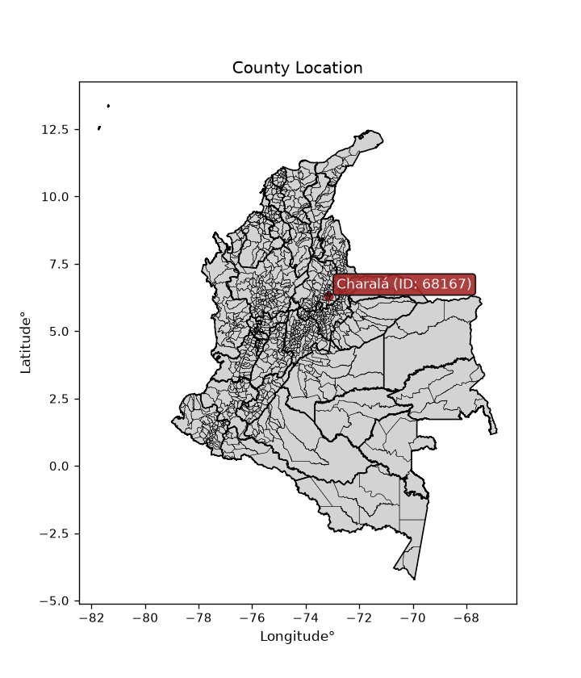
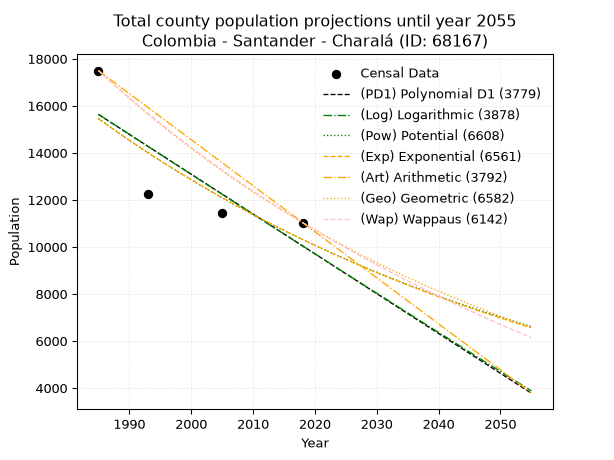
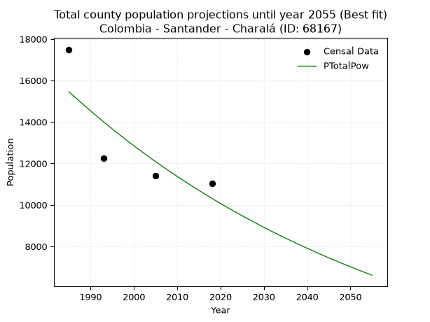
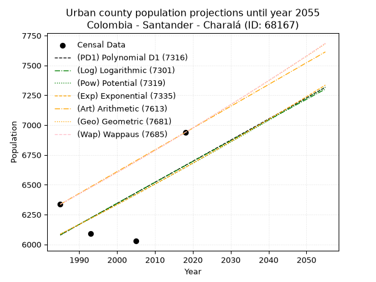
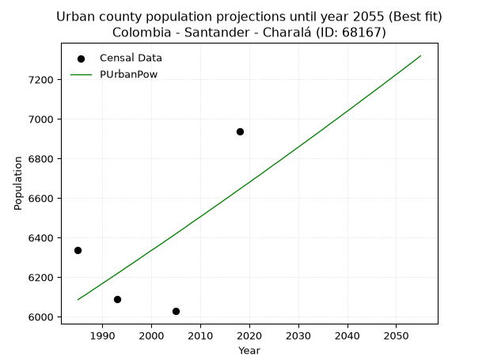
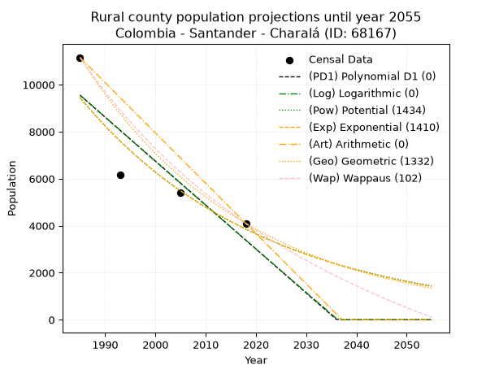
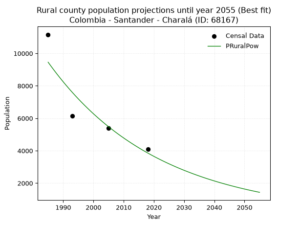

<div align="center">


</div>

# _“Population and Public Services Demand Projections (PPSD) until Year 2050 for Colombia - Santander - Charalá (ID: 68167)”_
Keywords: `population` `public-service` `projection` `lineal` `polynomial` `logarithmic` `potential` `exponential` `arithmetic` `geometric` `wappaus` `dane` `colombia` `south-america`

PPSD are analytical estimates used by governments and planners to anticipate future changes in population size, age distribution, and the resulting community needs for utilities, healthcare, education, and infrastructure as sizing future water treatment facilities, electrical grids, and road networks based on spatial growth.

<div align="center">

</img>

</div>


> **General running parameters**: • app_version: _v20260806_. • Python version: _3.14.7_. • Pandas version: _3.0.5_. • NumPy version: _2.5.1_. • Creates, save and include plots into reports (create_plot): _False_. • Projection until year: _2050_. • Process polynomial degree 2 and up: _False_. • Process Wappaus: _True_. • Process Wappaus: _True_. • Set negative values to zero: _True_. • Set infinite values to zero: _True_. • Drop dataset notes: _True_. 
<div align="center">

Dynamic map: [:earth_americas:Google](http://maps.google.com/maps?q=6.284338882,-73.1468733) [:earth_americas:OSM](https://www.openstreetmap.org/#map=18/6.284338882/-73.1468733&layers=P) [:earth_americas:Bing](https://www.bing.com/maps?cp=6.284338882~-73.1468733&lvl=18) [:earth_americas:Apple](https://maps.apple.com/frame?center=6.284338882%2C-73.1468733&span=0.003%2C0.006)

</div>


<div align="center">

```geojson
{
  "type": "Feature",
  "geometry": {
    "type": "Point", 
    "coordinates": [-73.1468733, 6.284338882]
  }, 
  "properties": {
    "Name": "Colombia - Santander - Charalá (ID: 68167)"
  }
}
```

</div>


## 0. Census Data (4 records)

Census data are official statistics collected by a government about the people and housing in a country. They usually include counts of total population, age, sex, race, income, education, and jobs.

📅Global census file: [Population.xlsx](../data/Population.xlsx)

| Source   |   Year |   CountryID | CountryName   |   StateID | StateName   |   CountyID | CountyName   |   PTotal |   PUrban |   PRural |
|:---------|-------:|------------:|:--------------|----------:|:------------|-----------:|:-------------|---------:|---------:|---------:|
| DANE     |   1985 |          57 | Colombia      |        68 | Santander   |      68167 | Charalá      |    17495 |     6336 |    11159 |
| DANE     |   1993 |          57 | Colombia      |        68 | Santander   |      68167 | Charalá      |    12243 |     6090 |     6153 |
| DANE     |   2005 |          57 | Colombia      |        68 | Santander   |      68167 | Charalá      |    11422 |     6028 |     5394 |
| DANE     |   2018 |          57 | Colombia      |        68 | Santander   |      68167 | Charalá      |    11035 |     6938 |     4097 |

> 🔥Some records could had specific notes about the registered values or the corresponding urban or rural distribution.

📅   [RUPS](https://www.datos.gov.co/Hacienda-y-Cr-dito-P-blico/Registro-nico-de-Prestadores-de-Servicios-P-blicos/4qkq-csdn/about_data) - Local public utility companies: [RUPS.csv](../data/RUPS.xlsx)

 | SERVICIO       | ESTADO    | NOMBRE                                                                                            | NIT         | DEPARTAMENTO_DOMICILIO   | MUNICIPIO_DOMICILIO   | DIRECCION            |   TELEFONO | EMAIL                                      | TIPO_PRESTADOR                 | CLASIFICACION                 |
|:---------------|:----------|:--------------------------------------------------------------------------------------------------|:------------|:-------------------------|:----------------------|:---------------------|-----------:|:-------------------------------------------|:-------------------------------|:------------------------------|
| ACUEDUCTO      | OPERATIVA | UNIDAD DE SERVICIOS PUBLICOS DOMICILIOS DE ACUERDO,ALCANTARILLADO Y ASEO DEL MUNICIPIO DE CHARALA | 890205063-4 | SANTANDER                | CHARALA               | Carrera 17 No. 25-30 |    7258130 | serviciospublicos@charala-santander.gov.co | MUNICIPIO (PRESTACIÓN DIRECTA) | MENOR O IGUAL A 2500 USUARIOS |
| ALCANTARILLADO | OPERATIVA | UNIDAD DE SERVICIOS PUBLICOS DOMICILIOS DE ACUERDO,ALCANTARILLADO Y ASEO DEL MUNICIPIO DE CHARALA | 890205063-4 | SANTANDER                | CHARALA               | Carrera 17 No. 25-30 |    7258130 | serviciospublicos@charala-santander.gov.co | MUNICIPIO (PRESTACIÓN DIRECTA) | MENOR O IGUAL A 2500 USUARIOS |

## 1. Total

### 1.1. Coefficients and Parameters

* (PD1) Polynomial Deg 1: -169.30509835407432, 351701.2729827372 (lineal)
* (Log) Logarithmic: -339383.6107105046, 2592706.2946601184
* (Pow) Potential: -24.516784750948045, 85.03959481871937
* (Exp) Exponential: -0.012231673536223111, 541319599635146.9
* (Art) Arithmetic: Year diff. 2018 - 1985 = 33, Population diff. 11035 - 17495 = -6460, Annual growth = -195.75757575757575
* (Geo) Geometric: Year diff. 2018 - 1985 = 33, Population diff. 11035 - 17495 = -6460, Annual growth % = -0.013867884526751584
* (Wap) Wappaus: i = -1.3722928549426971, Condition values only valid for < 200)

<sub>
Wappaus condition values: ['-0.00', '-1.37', '-2.74', '-4.12', '-5.49', '-6.86', '-8.23', '-9.61', '-10.98', '-12.35', '-13.72', '-15.10', '-16.47', '-17.84', '-19.21', '-20.58', '-21.96', '-23.33', '-24.70', '-26.07', '-27.45', '-28.82', '-30.19', '-31.56', '-32.94', '-34.31', '-35.68', '-37.05', '-38.42', '-39.80', '-41.17', '-42.54', '-43.91', '-45.29', '-46.66', '-48.03', '-49.40', '-50.77', '-52.15', '-53.52', '-54.89', '-56.26', '-57.64', '-59.01', '-60.38', '-61.75', '-63.13', '-64.50', '-65.87', '-67.24', '-68.61', '-69.99', '-71.36', '-72.73', '-74.10', '-75.48', '-76.85', '-78.22', '-79.59', '-80.97', '-82.34', '-83.71', '-85.08', '-86.45', '-87.83', '-89.20']
</sub>


### 1.2. Projected Dataset

|   Year |   CountyID |   PTotalPD1 |   PTotalLog |   PTotalPow |   PTotalExp |   PTotalArt |   PTotalGeo |   PTotalWap |
|-------:|-----------:|------------:|------------:|------------:|------------:|------------:|------------:|------------:|
|   1985 |      68167 |       15631 |       15640 |       15456 |       15447 |       17495 |       17495 |       17495 |
|   1986 |      68167 |       15461 |       15469 |       15267 |       15259 |       17299 |       17252 |       17257 |
|   1987 |      68167 |       15292 |       15298 |       15080 |       15074 |       17103 |       17013 |       17021 |
|   1988 |      68167 |       15123 |       15127 |       14895 |       14890 |       16908 |       16777 |       16789 |
|   1989 |      68167 |       14953 |       14956 |       14712 |       14709 |       16712 |       16545 |       16560 |
|   1990 |      68167 |       14784 |       14786 |       14532 |       14530 |       16516 |       16315 |       16334 |
|   1991 |      68167 |       14615 |       14615 |       14354 |       14354 |       16320 |       16089 |       16111 |
|   1992 |      68167 |       14446 |       14445 |       14178 |       14179 |       16125 |       15866 |       15891 |
|   1993 |      68167 |       14276 |       14274 |       14005 |       14007 |       15929 |       15646 |       15674 |
|   1994 |      68167 |       14107 |       14104 |       13834 |       13837 |       15733 |       15429 |       15460 |
|   1995 |      68167 |       13938 |       13934 |       13665 |       13668 |       15537 |       15215 |       15248 |
|   1996 |      68167 |       13768 |       13764 |       13498 |       13502 |       15342 |       15004 |       15039 |
|   1997 |      68167 |       13599 |       13594 |       13333 |       13338 |       15146 |       14796 |       14833 |
|   1998 |      68167 |       13430 |       13424 |       13171 |       13176 |       14950 |       14591 |       14630 |
|   1999 |      68167 |       13260 |       13254 |       13010 |       13016 |       14754 |       14388 |       14428 |
|   2000 |      68167 |       13091 |       13085 |       12851 |       12858 |       14559 |       14189 |       14230 |
|   2001 |      68167 |       12922 |       12915 |       12695 |       12701 |       14363 |       13992 |       14034 |
|   2002 |      68167 |       12752 |       12745 |       12540 |       12547 |       14167 |       13798 |       13840 |
|   2003 |      68167 |       12583 |       12576 |       12388 |       12394 |       13971 |       13606 |       13649 |
|   2004 |      68167 |       12414 |       12406 |       12237 |       12244 |       13776 |       13418 |       13460 |
|   2005 |      68167 |       12245 |       12237 |       12088 |       12095 |       13580 |       13232 |       13273 |
|   2006 |      68167 |       12075 |       12068 |       11941 |       11948 |       13384 |       13048 |       13088 |
|   2007 |      68167 |       11906 |       11899 |       11796 |       11802 |       13188 |       12867 |       12906 |
|   2008 |      68167 |       11737 |       11730 |       11653 |       11659 |       12993 |       12689 |       12726 |
|   2009 |      68167 |       11567 |       11561 |       11512 |       11517 |       12797 |       12513 |       12548 |
|   2010 |      68167 |       11398 |       11392 |       11372 |       11377 |       12601 |       12339 |       12372 |
|   2011 |      68167 |       11229 |       11223 |       11234 |       11239 |       12405 |       12168 |       12198 |
|   2012 |      68167 |       11059 |       11054 |       11098 |       11102 |       12210 |       11999 |       12026 |
|   2013 |      68167 |       10890 |       10886 |       10964 |       10967 |       12014 |       11833 |       11856 |
|   2014 |      68167 |       10721 |       10717 |       10831 |       10834 |       11818 |       11669 |       11688 |
|   2015 |      68167 |       10551 |       10549 |       10700 |       10702 |       11622 |       11507 |       11522 |
|   2016 |      68167 |       10382 |       10380 |       10571 |       10572 |       11427 |       11348 |       11358 |
|   2017 |      68167 |       10213 |       10212 |       10443 |       10444 |       11231 |       11190 |       11196 |
|   2018 |      68167 |       10044 |       10044 |       10317 |       10317 |       11035 |       11035 |       11035 |
|   2019 |      68167 |        9874 |        9876 |       10192 |       10191 |       10839 |       10882 |       10876 |
|   2020 |      68167 |        9705 |        9708 |       10069 |       10067 |       10643 |       10731 |       10719 |
|   2021 |      68167 |        9536 |        9540 |        9948 |        9945 |       10448 |       10582 |       10564 |
|   2022 |      68167 |        9366 |        9372 |        9828 |        9824 |       10252 |       10435 |       10411 |
|   2023 |      68167 |        9197 |        9204 |        9710 |        9705 |       10056 |       10291 |       10259 |
|   2024 |      68167 |        9028 |        9036 |        9593 |        9587 |        9860 |       10148 |       10108 |
|   2025 |      68167 |        8858 |        8869 |        9477 |        9470 |        9665 |       10007 |        9960 |
|   2026 |      68167 |        8689 |        8701 |        9363 |        9355 |        9469 |        9869 |        9813 |
|   2027 |      68167 |        8520 |        8534 |        9251 |        9241 |        9273 |        9732 |        9667 |
|   2028 |      68167 |        8351 |        8366 |        9139 |        9129 |        9077 |        9597 |        9523 |
|   2029 |      68167 |        8181 |        8199 |        9030 |        9018 |        8882 |        9464 |        9381 |
|   2030 |      68167 |        8012 |        8032 |        8921 |        8908 |        8686 |        9332 |        9240 |
|   2031 |      68167 |        7843 |        7864 |        8814 |        8800 |        8490 |        9203 |        9101 |
|   2032 |      68167 |        7673 |        7697 |        8708 |        8693 |        8294 |        9075 |        8963 |
|   2033 |      68167 |        7504 |        7530 |        8604 |        8587 |        8099 |        8950 |        8826 |
|   2034 |      68167 |        7335 |        7364 |        8501 |        8483 |        7903 |        8825 |        8691 |
|   2035 |      68167 |        7165 |        7197 |        8399 |        8380 |        7707 |        8703 |        8557 |
|   2036 |      68167 |        6996 |        7030 |        8299 |        8278 |        7511 |        8582 |        8425 |
|   2037 |      68167 |        6827 |        6863 |        8199 |        8177 |        7316 |        8463 |        8294 |
|   2038 |      68167 |        6657 |        6697 |        8101 |        8078 |        7120 |        8346 |        8164 |
|   2039 |      68167 |        6488 |        6530 |        8004 |        7980 |        6924 |        8230 |        8035 |
|   2040 |      68167 |        6319 |        6364 |        7909 |        7883 |        6728 |        8116 |        7908 |
|   2041 |      68167 |        6150 |        6198 |        7814 |        7787 |        6533 |        8003 |        7782 |
|   2042 |      68167 |        5980 |        6031 |        7721 |        7692 |        6337 |        7893 |        7658 |
|   2043 |      68167 |        5811 |        5865 |        7629 |        7599 |        6141 |        7783 |        7534 |
|   2044 |      68167 |        5642 |        5699 |        7538 |        7506 |        5945 |        7675 |        7412 |
|   2045 |      68167 |        5472 |        5533 |        7448 |        7415 |        5750 |        7569 |        7291 |
|   2046 |      68167 |        5303 |        5367 |        7359 |        7325 |        5554 |        7464 |        7171 |
|   2047 |      68167 |        5134 |        5201 |        7272 |        7236 |        5358 |        7360 |        7052 |
|   2048 |      68167 |        4964 |        5036 |        7185 |        7148 |        5162 |        7258 |        6935 |
|   2049 |      68167 |        4795 |        4870 |        7100 |        7061 |        4967 |        7157 |        6818 |
|   2050 |      68167 |        4626 |        4704 |        7015 |        6975 |        4771 |        7058 |        6703 |
<div align="center">

</img>

</div>


### 1.3. Best fit with absolute and relative error (%)

Relative error puts that difference into context by dividing the absolute error by the true value, creating a unitless ratio or percentage that shows the scale of the mistake.

Absolute and relative error

|   Year | Source   |   CountryID | CountryName   |   StateID | StateName   |   CountyID_x | CountyName   |   PTotal |   PUrban |   PRural |   CountyID_y |   PTotalPD1 |   PTotalLog |   PTotalPow |   PTotalExp |   PTotalArt |   PTotalGeo |   PTotalWap |   PTotalPD1AbsError |   PTotalLogAbsError |   PTotalPowAbsError |   PTotalExpAbsError |   PTotalArtAbsError |   PTotalGeoAbsError |   PTotalWapAbsError |   PTotalPD1RelError |   PTotalLogRelError |   PTotalPowRelError |   PTotalExpRelError |   PTotalArtRelError |   PTotalGeoRelError |   PTotalWapRelError |
|-------:|:---------|------------:|:--------------|----------:|:------------|-------------:|:-------------|---------:|---------:|---------:|-------------:|------------:|------------:|------------:|------------:|------------:|------------:|------------:|--------------------:|--------------------:|--------------------:|--------------------:|--------------------:|--------------------:|--------------------:|--------------------:|--------------------:|--------------------:|--------------------:|--------------------:|--------------------:|--------------------:|
|   1985 | DANE     |          57 | Colombia      |        68 | Santander   |        68167 | Charalá      |    17495 |     6336 |    11159 |        68167 |       15631 |       15640 |       15456 |       15447 |       17495 |       17495 |       17495 |                1864 |                1855 |                2039 |                2048 |                   0 |                   0 |                   0 |            10.6545  |            10.603   |            11.6548  |            11.7062  |              0      |              0      |              0      |
|   1993 | DANE     |          57 | Colombia      |        68 | Santander   |        68167 | Charalá      |    12243 |     6090 |     6153 |        68167 |       14276 |       14274 |       14005 |       14007 |       15929 |       15646 |       15674 |                2033 |                2031 |                1762 |                1764 |                3686 |                3403 |                3431 |            16.6054  |            16.5891  |            14.3919  |            14.4082  |             30.107  |             27.7955 |             28.0242 |
|   2005 | DANE     |          57 | Colombia      |        68 | Santander   |        68167 | Charalá      |    11422 |     6028 |     5394 |        68167 |       12245 |       12237 |       12088 |       12095 |       13580 |       13232 |       13273 |                 823 |                 815 |                 666 |                 673 |                2158 |                1810 |                1851 |             7.20539 |             7.13535 |             5.83085 |             5.89214 |             18.8934 |             15.8466 |             16.2056 |
|   2018 | DANE     |          57 | Colombia      |        68 | Santander   |        68167 | Charalá      |    11035 |     6938 |     4097 |        68167 |       10044 |       10044 |       10317 |       10317 |       11035 |       11035 |       11035 |                 991 |                 991 |                 718 |                 718 |                   0 |                   0 |                   0 |             8.98052 |             8.98052 |             6.50657 |             6.50657 |              0      |              0      |              0      |

Relative error mean

| Method    |   RelError | Best   |
|:----------|-----------:|:-------|
| PTotalPD1 |   10.8614  |        |
| PTotalLog |   10.827   |        |
| PTotalPow |    9.59602 | True   |
| PTotalExp |    9.62829 |        |
| PTotalArt |   12.2501  |        |
| PTotalGeo |   10.9105  |        |
| PTotalWap |   11.0574  |        |

💙Best method: _**PTotalPow**_
<div align="center">

</img>

</div>


### 1.4. Fresh water supply demand in liters per capita per day (lpcd)

The fresh water supply demand typically ranges from 100 to 300 liters per capita per day (lpcd) for standard domestic and municipal planning, though absolute survival minimums set by the World Health Organization are as low as 7.5 to 20 liters per day, and total consumption in high-income nations can exceed 400 liters.

> `CZ`: Level in meters above the sea level (masl)<br> `WS`: Fresh water supply demand in liters per capita per day (lpcd or l/h/d)<br> `WSAll`: Zonal fresh water supply demand in liters per second (l/s)<br> `A`: Zonal area in square meters<br> `DP`: Population density (people/hectare or p/ha)

Reference values (RAS Colombia)

|    CZ |   WS |
|------:|-----:|
|  1000 |  120 |
|  2000 |  130 |
| 99999 |  140 |

County shapefile geometry properties and water supply values

|   CountyID |      ATotal |   CZTotal |   WSTotal |
|-----------:|------------:|----------:|----------:|
|      68167 | 4.18467e+08 |   1896.29 |       130 |

Projected values for best method: PTotalPow

|   CountyID |   Year |   PTotalPow |   DPTotal |   WSTotal |   WSTotalAll |
|-----------:|-------:|------------:|----------:|----------:|-------------:|
|      68167 |   1985 |       15456 |      0.37 |       130 |      23.2556 |
|      68167 |   1986 |       15267 |      0.36 |       130 |      22.9712 |
|      68167 |   1987 |       15080 |      0.36 |       130 |      22.6898 |
|      68167 |   1988 |       14895 |      0.36 |       130 |      22.4115 |
|      68167 |   1989 |       14712 |      0.35 |       130 |      22.1361 |
|      68167 |   1990 |       14532 |      0.35 |       130 |      21.8653 |
|      68167 |   1991 |       14354 |      0.34 |       130 |      21.5975 |
|      68167 |   1992 |       14178 |      0.34 |       130 |      21.3326 |
|      68167 |   1993 |       14005 |      0.33 |       130 |      21.0723 |
|      68167 |   1994 |       13834 |      0.33 |       130 |      20.815  |
|      68167 |   1995 |       13665 |      0.33 |       130 |      20.5608 |
|      68167 |   1996 |       13498 |      0.32 |       130 |      20.3095 |
|      68167 |   1997 |       13333 |      0.32 |       130 |      20.0612 |
|      68167 |   1998 |       13171 |      0.31 |       130 |      19.8175 |
|      68167 |   1999 |       13010 |      0.31 |       130 |      19.5752 |
|      68167 |   2000 |       12851 |      0.31 |       130 |      19.336  |
|      68167 |   2001 |       12695 |      0.3  |       130 |      19.1013 |
|      68167 |   2002 |       12540 |      0.3  |       130 |      18.8681 |
|      68167 |   2003 |       12388 |      0.3  |       130 |      18.6394 |
|      68167 |   2004 |       12237 |      0.29 |       130 |      18.4122 |
|      68167 |   2005 |       12088 |      0.29 |       130 |      18.188  |
|      68167 |   2006 |       11941 |      0.29 |       130 |      17.9668 |
|      68167 |   2007 |       11796 |      0.28 |       130 |      17.7486 |
|      68167 |   2008 |       11653 |      0.28 |       130 |      17.5334 |
|      68167 |   2009 |       11512 |      0.28 |       130 |      17.3213 |
|      68167 |   2010 |       11372 |      0.27 |       130 |      17.1106 |
|      68167 |   2011 |       11234 |      0.27 |       130 |      16.903  |
|      68167 |   2012 |       11098 |      0.27 |       130 |      16.6984 |
|      68167 |   2013 |       10964 |      0.26 |       130 |      16.4968 |
|      68167 |   2014 |       10831 |      0.26 |       130 |      16.2966 |
|      68167 |   2015 |       10700 |      0.26 |       130 |      16.0995 |
|      68167 |   2016 |       10571 |      0.25 |       130 |      15.9054 |
|      68167 |   2017 |       10443 |      0.25 |       130 |      15.7128 |
|      68167 |   2018 |       10317 |      0.25 |       130 |      15.5233 |
|      68167 |   2019 |       10192 |      0.24 |       130 |      15.3352 |
|      68167 |   2020 |       10069 |      0.24 |       130 |      15.1501 |
|      68167 |   2021 |        9948 |      0.24 |       130 |      14.9681 |
|      68167 |   2022 |        9828 |      0.23 |       130 |      14.7875 |
|      68167 |   2023 |        9710 |      0.23 |       130 |      14.61   |
|      68167 |   2024 |        9593 |      0.23 |       130 |      14.4339 |
|      68167 |   2025 |        9477 |      0.23 |       130 |      14.2594 |
|      68167 |   2026 |        9363 |      0.22 |       130 |      14.0878 |
|      68167 |   2027 |        9251 |      0.22 |       130 |      13.9193 |
|      68167 |   2028 |        9139 |      0.22 |       130 |      13.7508 |
|      68167 |   2029 |        9030 |      0.22 |       130 |      13.5868 |
|      68167 |   2030 |        8921 |      0.21 |       130 |      13.4228 |
|      68167 |   2031 |        8814 |      0.21 |       130 |      13.2618 |
|      68167 |   2032 |        8708 |      0.21 |       130 |      13.1023 |
|      68167 |   2033 |        8604 |      0.21 |       130 |      12.9458 |
|      68167 |   2034 |        8501 |      0.2  |       130 |      12.7909 |
|      68167 |   2035 |        8399 |      0.2  |       130 |      12.6374 |
|      68167 |   2036 |        8299 |      0.2  |       130 |      12.4869 |
|      68167 |   2037 |        8199 |      0.2  |       130 |      12.3365 |
|      68167 |   2038 |        8101 |      0.19 |       130 |      12.189  |
|      68167 |   2039 |        8004 |      0.19 |       130 |      12.0431 |
|      68167 |   2040 |        7909 |      0.19 |       130 |      11.9001 |
|      68167 |   2041 |        7814 |      0.19 |       130 |      11.7572 |
|      68167 |   2042 |        7721 |      0.18 |       130 |      11.6172 |
|      68167 |   2043 |        7629 |      0.18 |       130 |      11.4788 |
|      68167 |   2044 |        7538 |      0.18 |       130 |      11.3419 |
|      68167 |   2045 |        7448 |      0.18 |       130 |      11.2065 |
|      68167 |   2046 |        7359 |      0.18 |       130 |      11.0726 |
|      68167 |   2047 |        7272 |      0.17 |       130 |      10.9417 |
|      68167 |   2048 |        7185 |      0.17 |       130 |      10.8108 |
|      68167 |   2049 |        7100 |      0.17 |       130 |      10.6829 |
|      68167 |   2050 |        7015 |      0.17 |       130 |      10.555  |

## 2. Urban

### 2.1. Coefficients and Parameters

* (PD1) Polynomial Deg 1: 17.673223604977363, -29002.865515855967 (lineal)
* (Log) Logarithmic: 35269.935121452705, -261739.05949368412
* (Pow) Potential: 5.323873766840069, -13.772551051737253
* (Exp) Exponential: 0.002667985140997624, 30.49915999504613
* (Art) Arithmetic: Year diff. 2018 - 1985 = 33, Population diff. 6938 - 6336 = 602, Annual growth = 18.242424242424242
* (Geo) Geometric: Year diff. 2018 - 1985 = 33, Population diff. 6938 - 6336 = 602, Annual growth % = 0.0027542676824097168
* (Wap) Wappaus: i = 0.2748594883595637, Condition values only valid for < 200)

<sub>
Wappaus condition values: ['0.00', '0.27', '0.55', '0.82', '1.10', '1.37', '1.65', '1.92', '2.20', '2.47', '2.75', '3.02', '3.30', '3.57', '3.85', '4.12', '4.40', '4.67', '4.95', '5.22', '5.50', '5.77', '6.05', '6.32', '6.60', '6.87', '7.15', '7.42', '7.70', '7.97', '8.25', '8.52', '8.80', '9.07', '9.35', '9.62', '9.89', '10.17', '10.44', '10.72', '10.99', '11.27', '11.54', '11.82', '12.09', '12.37', '12.64', '12.92', '13.19', '13.47', '13.74', '14.02', '14.29', '14.57', '14.84', '15.12', '15.39', '15.67', '15.94', '16.22', '16.49', '16.77', '17.04', '17.32', '17.59', '17.87']
</sub>


### 2.2. Projected Dataset

|   Year |   CountyID |   PUrbanPD1 |   PUrbanLog |   PUrbanPow |   PUrbanExp |   PUrbanArt |   PUrbanGeo |   PUrbanWap |
|-------:|-----------:|------------:|------------:|------------:|------------:|------------:|------------:|------------:|
|   1985 |      68167 |        6078 |        6079 |        6086 |        6085 |        6336 |        6336 |        6336 |
|   1986 |      68167 |        6096 |        6097 |        6102 |        6102 |        6354 |        6353 |        6353 |
|   1987 |      68167 |        6114 |        6114 |        6118 |        6118 |        6372 |        6371 |        6371 |
|   1988 |      68167 |        6132 |        6132 |        6135 |        6134 |        6391 |        6388 |        6388 |
|   1989 |      68167 |        6149 |        6150 |        6151 |        6151 |        6409 |        6406 |        6406 |
|   1990 |      68167 |        6167 |        6167 |        6168 |        6167 |        6427 |        6424 |        6424 |
|   1991 |      68167 |        6185 |        6185 |        6184 |        6184 |        6445 |        6441 |        6441 |
|   1992 |      68167 |        6202 |        6203 |        6201 |        6200 |        6464 |        6459 |        6459 |
|   1993 |      68167 |        6220 |        6221 |        6217 |        6217 |        6482 |        6477 |        6477 |
|   1994 |      68167 |        6238 |        6238 |        6234 |        6233 |        6500 |        6495 |        6495 |
|   1995 |      68167 |        6255 |        6256 |        6251 |        6250 |        6518 |        6513 |        6513 |
|   1996 |      68167 |        6273 |        6274 |        6267 |        6267 |        6537 |        6531 |        6531 |
|   1997 |      68167 |        6291 |        6291 |        6284 |        6283 |        6555 |        6549 |        6548 |
|   1998 |      68167 |        6308 |        6309 |        6301 |        6300 |        6573 |        6567 |        6567 |
|   1999 |      68167 |        6326 |        6327 |        6318 |        6317 |        6591 |        6585 |        6585 |
|   2000 |      68167 |        6344 |        6344 |        6335 |        6334 |        6610 |        6603 |        6603 |
|   2001 |      68167 |        6361 |        6362 |        6351 |        6351 |        6628 |        6621 |        6621 |
|   2002 |      68167 |        6379 |        6380 |        6368 |        6368 |        6646 |        6639 |        6639 |
|   2003 |      68167 |        6397 |        6397 |        6385 |        6385 |        6664 |        6658 |        6657 |
|   2004 |      68167 |        6414 |        6415 |        6402 |        6402 |        6683 |        6676 |        6676 |
|   2005 |      68167 |        6432 |        6432 |        6419 |        6419 |        6701 |        6694 |        6694 |
|   2006 |      68167 |        6450 |        6450 |        6436 |        6436 |        6719 |        6713 |        6713 |
|   2007 |      68167 |        6467 |        6468 |        6453 |        6453 |        6737 |        6731 |        6731 |
|   2008 |      68167 |        6485 |        6485 |        6471 |        6471 |        6756 |        6750 |        6750 |
|   2009 |      68167 |        6503 |        6503 |        6488 |        6488 |        6774 |        6768 |        6768 |
|   2010 |      68167 |        6520 |        6520 |        6505 |        6505 |        6792 |        6787 |        6787 |
|   2011 |      68167 |        6538 |        6538 |        6522 |        6523 |        6810 |        6806 |        6806 |
|   2012 |      68167 |        6556 |        6555 |        6540 |        6540 |        6829 |        6824 |        6824 |
|   2013 |      68167 |        6573 |        6573 |        6557 |        6557 |        6847 |        6843 |        6843 |
|   2014 |      68167 |        6591 |        6590 |        6574 |        6575 |        6865 |        6862 |        6862 |
|   2015 |      68167 |        6609 |        6608 |        6592 |        6593 |        6883 |        6881 |        6881 |
|   2016 |      68167 |        6626 |        6625 |        6609 |        6610 |        6902 |        6900 |        6900 |
|   2017 |      68167 |        6644 |        6643 |        6627 |        6628 |        6920 |        6919 |        6919 |
|   2018 |      68167 |        6662 |        6660 |        6644 |        6645 |        6938 |        6938 |        6938 |
|   2019 |      68167 |        6679 |        6678 |        6662 |        6663 |        6956 |        6957 |        6957 |
|   2020 |      68167 |        6697 |        6695 |        6679 |        6681 |        6974 |        6976 |        6976 |
|   2021 |      68167 |        6715 |        6713 |        6697 |        6699 |        6993 |        6995 |        6996 |
|   2022 |      68167 |        6732 |        6730 |        6714 |        6717 |        7011 |        7015 |        7015 |
|   2023 |      68167 |        6750 |        6748 |        6732 |        6735 |        7029 |        7034 |        7034 |
|   2024 |      68167 |        6768 |        6765 |        6750 |        6753 |        7047 |        7053 |        7054 |
|   2025 |      68167 |        6785 |        6782 |        6768 |        6771 |        7066 |        7073 |        7073 |
|   2026 |      68167 |        6803 |        6800 |        6785 |        6789 |        7084 |        7092 |        7093 |
|   2027 |      68167 |        6821 |        6817 |        6803 |        6807 |        7102 |        7112 |        7112 |
|   2028 |      68167 |        6838 |        6835 |        6821 |        6825 |        7120 |        7131 |        7132 |
|   2029 |      68167 |        6856 |        6852 |        6839 |        6843 |        7139 |        7151 |        7152 |
|   2030 |      68167 |        6874 |        6869 |        6857 |        6862 |        7157 |        7171 |        7171 |
|   2031 |      68167 |        6891 |        6887 |        6875 |        6880 |        7175 |        7191 |        7191 |
|   2032 |      68167 |        6909 |        6904 |        6893 |        6898 |        7193 |        7210 |        7211 |
|   2033 |      68167 |        6927 |        6921 |        6911 |        6917 |        7212 |        7230 |        7231 |
|   2034 |      68167 |        6944 |        6939 |        6929 |        6935 |        7230 |        7250 |        7251 |
|   2035 |      68167 |        6962 |        6956 |        6947 |        6954 |        7248 |        7270 |        7271 |
|   2036 |      68167 |        6980 |        6973 |        6966 |        6972 |        7266 |        7290 |        7291 |
|   2037 |      68167 |        6997 |        6991 |        6984 |        6991 |        7285 |        7310 |        7311 |
|   2038 |      68167 |        7015 |        7008 |        7002 |        7010 |        7303 |        7330 |        7332 |
|   2039 |      68167 |        7033 |        7025 |        7021 |        7028 |        7321 |        7351 |        7352 |
|   2040 |      68167 |        7051 |        7043 |        7039 |        7047 |        7339 |        7371 |        7372 |
|   2041 |      68167 |        7068 |        7060 |        7057 |        7066 |        7358 |        7391 |        7393 |
|   2042 |      68167 |        7086 |        7077 |        7076 |        7085 |        7376 |        7411 |        7413 |
|   2043 |      68167 |        7104 |        7095 |        7094 |        7104 |        7394 |        7432 |        7434 |
|   2044 |      68167 |        7121 |        7112 |        7113 |        7123 |        7412 |        7452 |        7454 |
|   2045 |      68167 |        7139 |        7129 |        7131 |        7142 |        7431 |        7473 |        7475 |
|   2046 |      68167 |        7157 |        7146 |        7150 |        7161 |        7449 |        7493 |        7496 |
|   2047 |      68167 |        7174 |        7164 |        7168 |        7180 |        7467 |        7514 |        7516 |
|   2048 |      68167 |        7192 |        7181 |        7187 |        7199 |        7485 |        7535 |        7537 |
|   2049 |      68167 |        7210 |        7198 |        7206 |        7218 |        7504 |        7556 |        7558 |
|   2050 |      68167 |        7227 |        7215 |        7225 |        7238 |        7522 |        7576 |        7579 |
<div align="center">

</img>

</div>


### 2.3. Best fit with absolute and relative error (%)

Relative error puts that difference into context by dividing the absolute error by the true value, creating a unitless ratio or percentage that shows the scale of the mistake.

Absolute and relative error

|   Year | Source   |   CountryID | CountryName   |   StateID | StateName   |   CountyID_x | CountyName   |   PTotal |   PUrban |   PRural |   CountyID_y |   PUrbanPD1 |   PUrbanLog |   PUrbanPow |   PUrbanExp |   PUrbanArt |   PUrbanGeo |   PUrbanWap |   PUrbanPD1AbsError |   PUrbanLogAbsError |   PUrbanPowAbsError |   PUrbanExpAbsError |   PUrbanArtAbsError |   PUrbanGeoAbsError |   PUrbanWapAbsError |   PUrbanPD1RelError |   PUrbanLogRelError |   PUrbanPowRelError |   PUrbanExpRelError |   PUrbanArtRelError |   PUrbanGeoRelError |   PUrbanWapRelError |
|-------:|:---------|------------:|:--------------|----------:|:------------|-------------:|:-------------|---------:|---------:|---------:|-------------:|------------:|------------:|------------:|------------:|------------:|------------:|------------:|--------------------:|--------------------:|--------------------:|--------------------:|--------------------:|--------------------:|--------------------:|--------------------:|--------------------:|--------------------:|--------------------:|--------------------:|--------------------:|--------------------:|
|   1985 | DANE     |          57 | Colombia      |        68 | Santander   |        68167 | Charalá      |    17495 |     6336 |    11159 |        68167 |        6078 |        6079 |        6086 |        6085 |        6336 |        6336 |        6336 |                 258 |                 257 |                 250 |                 251 |                   0 |                   0 |                   0 |             4.07197 |             4.05619 |             3.94571 |             3.96149 |             0       |             0       |             0       |
|   1993 | DANE     |          57 | Colombia      |        68 | Santander   |        68167 | Charalá      |    12243 |     6090 |     6153 |        68167 |        6220 |        6221 |        6217 |        6217 |        6482 |        6477 |        6477 |                 130 |                 131 |                 127 |                 127 |                 392 |                 387 |                 387 |             2.13465 |             2.15107 |             2.08539 |             2.08539 |             6.43678 |             6.35468 |             6.35468 |
|   2005 | DANE     |          57 | Colombia      |        68 | Santander   |        68167 | Charalá      |    11422 |     6028 |     5394 |        68167 |        6432 |        6432 |        6419 |        6419 |        6701 |        6694 |        6694 |                 404 |                 404 |                 391 |                 391 |                 673 |                 666 |                 666 |             6.70206 |             6.70206 |             6.4864  |             6.4864  |            11.1646  |            11.0484  |            11.0484  |
|   2018 | DANE     |          57 | Colombia      |        68 | Santander   |        68167 | Charalá      |    11035 |     6938 |     4097 |        68167 |        6662 |        6660 |        6644 |        6645 |        6938 |        6938 |        6938 |                 276 |                 278 |                 294 |                 293 |                   0 |                   0 |                   0 |             3.97809 |             4.00692 |             4.23753 |             4.22312 |             0       |             0       |             0       |

Relative error mean

| Method    |   RelError | Best   |
|:----------|-----------:|:-------|
| PUrbanPD1 |    4.22169 |        |
| PUrbanLog |    4.22906 |        |
| PUrbanPow |    4.18876 | True   |
| PUrbanExp |    4.1891  |        |
| PUrbanArt |    4.40034 |        |
| PUrbanGeo |    4.35078 |        |
| PUrbanWap |    4.35078 |        |

💙Best method: _**PUrbanPow**_
<div align="center">

</img>

</div>


### 2.4. Fresh water supply demand in liters per capita per day (lpcd)

The fresh water supply demand typically ranges from 100 to 300 liters per capita per day (lpcd) for standard domestic and municipal planning, though absolute survival minimums set by the World Health Organization are as low as 7.5 to 20 liters per day, and total consumption in high-income nations can exceed 400 liters.

> `CZ`: Level in meters above the sea level (masl)<br> `WS`: Fresh water supply demand in liters per capita per day (lpcd or l/h/d)<br> `WSAll`: Zonal fresh water supply demand in liters per second (l/s)<br> `A`: Zonal area in square meters<br> `DP`: Population density (people/hectare or p/ha)

Reference values (RAS Colombia)

|    CZ |   WS |
|------:|-----:|
|  1000 |  120 |
|  2000 |  130 |
| 99999 |  140 |

County shapefile geometry properties and water supply values

|   CountyID |      AUrban |   CZUrban |   WSUrban |
|-----------:|------------:|----------:|----------:|
|      68167 | 1.29203e+06 |    1288.9 |       130 |

Projected values for best method: PUrbanPow

|   CountyID |   Year |   PUrbanPow |   DPUrban |   WSUrban |   WSUrbanAll |
|-----------:|-------:|------------:|----------:|----------:|-------------:|
|      68167 |   1985 |        6086 |     47.1  |       130 |      9.15718 |
|      68167 |   1986 |        6102 |     47.23 |       130 |      9.18125 |
|      68167 |   1987 |        6118 |     47.35 |       130 |      9.20532 |
|      68167 |   1988 |        6135 |     47.48 |       130 |      9.2309  |
|      68167 |   1989 |        6151 |     47.61 |       130 |      9.25498 |
|      68167 |   1990 |        6168 |     47.74 |       130 |      9.28056 |
|      68167 |   1991 |        6184 |     47.86 |       130 |      9.30463 |
|      68167 |   1992 |        6201 |     47.99 |       130 |      9.33021 |
|      68167 |   1993 |        6217 |     48.12 |       130 |      9.35428 |
|      68167 |   1994 |        6234 |     48.25 |       130 |      9.37986 |
|      68167 |   1995 |        6251 |     48.38 |       130 |      9.40544 |
|      68167 |   1996 |        6267 |     48.51 |       130 |      9.42951 |
|      68167 |   1997 |        6284 |     48.64 |       130 |      9.45509 |
|      68167 |   1998 |        6301 |     48.77 |       130 |      9.48067 |
|      68167 |   1999 |        6318 |     48.9  |       130 |      9.50625 |
|      68167 |   2000 |        6335 |     49.03 |       130 |      9.53183 |
|      68167 |   2001 |        6351 |     49.16 |       130 |      9.5559  |
|      68167 |   2002 |        6368 |     49.29 |       130 |      9.58148 |
|      68167 |   2003 |        6385 |     49.42 |       130 |      9.60706 |
|      68167 |   2004 |        6402 |     49.55 |       130 |      9.63264 |
|      68167 |   2005 |        6419 |     49.68 |       130 |      9.65822 |
|      68167 |   2006 |        6436 |     49.81 |       130 |      9.6838  |
|      68167 |   2007 |        6453 |     49.94 |       130 |      9.70937 |
|      68167 |   2008 |        6471 |     50.08 |       130 |      9.73646 |
|      68167 |   2009 |        6488 |     50.22 |       130 |      9.76204 |
|      68167 |   2010 |        6505 |     50.35 |       130 |      9.78762 |
|      68167 |   2011 |        6522 |     50.48 |       130 |      9.81319 |
|      68167 |   2012 |        6540 |     50.62 |       130 |      9.84028 |
|      68167 |   2013 |        6557 |     50.75 |       130 |      9.86586 |
|      68167 |   2014 |        6574 |     50.88 |       130 |      9.89144 |
|      68167 |   2015 |        6592 |     51.02 |       130 |      9.91852 |
|      68167 |   2016 |        6609 |     51.15 |       130 |      9.9441  |
|      68167 |   2017 |        6627 |     51.29 |       130 |      9.97118 |
|      68167 |   2018 |        6644 |     51.42 |       130 |      9.99676 |
|      68167 |   2019 |        6662 |     51.56 |       130 |     10.0238  |
|      68167 |   2020 |        6679 |     51.69 |       130 |     10.0494  |
|      68167 |   2021 |        6697 |     51.83 |       130 |     10.0765  |
|      68167 |   2022 |        6714 |     51.96 |       130 |     10.1021  |
|      68167 |   2023 |        6732 |     52.1  |       130 |     10.1292  |
|      68167 |   2024 |        6750 |     52.24 |       130 |     10.1562  |
|      68167 |   2025 |        6768 |     52.38 |       130 |     10.1833  |
|      68167 |   2026 |        6785 |     52.51 |       130 |     10.2089  |
|      68167 |   2027 |        6803 |     52.65 |       130 |     10.236   |
|      68167 |   2028 |        6821 |     52.79 |       130 |     10.2631  |
|      68167 |   2029 |        6839 |     52.93 |       130 |     10.2902  |
|      68167 |   2030 |        6857 |     53.07 |       130 |     10.3172  |
|      68167 |   2031 |        6875 |     53.21 |       130 |     10.3443  |
|      68167 |   2032 |        6893 |     53.35 |       130 |     10.3714  |
|      68167 |   2033 |        6911 |     53.49 |       130 |     10.3985  |
|      68167 |   2034 |        6929 |     53.63 |       130 |     10.4256  |
|      68167 |   2035 |        6947 |     53.77 |       130 |     10.4527  |
|      68167 |   2036 |        6966 |     53.92 |       130 |     10.4812  |
|      68167 |   2037 |        6984 |     54.05 |       130 |     10.5083  |
|      68167 |   2038 |        7002 |     54.19 |       130 |     10.5354  |
|      68167 |   2039 |        7021 |     54.34 |       130 |     10.564   |
|      68167 |   2040 |        7039 |     54.48 |       130 |     10.5911  |
|      68167 |   2041 |        7057 |     54.62 |       130 |     10.6182  |
|      68167 |   2042 |        7076 |     54.77 |       130 |     10.6468  |
|      68167 |   2043 |        7094 |     54.91 |       130 |     10.6738  |
|      68167 |   2044 |        7113 |     55.05 |       130 |     10.7024  |
|      68167 |   2045 |        7131 |     55.19 |       130 |     10.7295  |
|      68167 |   2046 |        7150 |     55.34 |       130 |     10.7581  |
|      68167 |   2047 |        7168 |     55.48 |       130 |     10.7852  |
|      68167 |   2048 |        7187 |     55.63 |       130 |     10.8138  |
|      68167 |   2049 |        7206 |     55.77 |       130 |     10.8424  |
|      68167 |   2050 |        7225 |     55.92 |       130 |     10.8709  |

## 3. Rural

### 3.1. Coefficients and Parameters

* (PD1) Polynomial Deg 1: -186.97832195905175, 380704.13849859335 (lineal)
* (Log) Logarithmic: -374653.54583195725, 2854445.3541538026
* (Pow) Potential: -54.4290001568324, 183.4695295334097
* (Exp) Exponential: -0.027173712676306607, 2.517732345448168e+27
* (Art) Arithmetic: Year diff. 2018 - 1985 = 33, Population diff. 4097 - 11159 = -7062, Annual growth = -214.0
* (Geo) Geometric: Year diff. 2018 - 1985 = 33, Population diff. 4097 - 11159 = -7062, Annual growth % = -0.02990703726058297
* (Wap) Wappaus: i = -2.8054535920293655, Condition values only valid for < 200)

<sub>
Wappaus condition values: ['-0.00', '-2.81', '-5.61', '-8.42', '-11.22', '-14.03', '-16.83', '-19.64', '-22.44', '-25.25', '-28.05', '-30.86', '-33.67', '-36.47', '-39.28', '-42.08', '-44.89', '-47.69', '-50.50', '-53.30', '-56.11', '-58.91', '-61.72', '-64.53', '-67.33', '-70.14', '-72.94', '-75.75', '-78.55', '-81.36', '-84.16', '-86.97', '-89.77', '-92.58', '-95.39', '-98.19', '-101.00', '-103.80', '-106.61', '-109.41', '-112.22', '-115.02', '-117.83', '-120.63', '-123.44', '-126.25', '-129.05', '-131.86', '-134.66', '-137.47', '-140.27', '-143.08', '-145.88', '-148.69', '-151.49', '-154.30', '-157.11', '-159.91', '-162.72', '-165.52', '-168.33', '-171.13', '-173.94', '-176.74', '-179.55', '-182.35']
</sub>


### 3.2. Projected Dataset

|   Year |   CountyID |   PRuralPD1 |   PRuralLog |   PRuralPow |   PRuralExp |   PRuralArt |   PRuralGeo |   PRuralWap |
|-------:|-----------:|------------:|------------:|------------:|------------:|------------:|------------:|------------:|
|   1985 |      68167 |        9552 |        9561 |        9456 |        9446 |       11159 |       11159 |       11159 |
|   1986 |      68167 |        9365 |        9372 |        9201 |        9193 |       10945 |       10825 |       10850 |
|   1987 |      68167 |        9178 |        9183 |        8952 |        8946 |       10731 |       10502 |       10550 |
|   1988 |      68167 |        8991 |        8995 |        8710 |        8706 |       10517 |       10187 |       10258 |
|   1989 |      68167 |        8804 |        8807 |        8475 |        8473 |       10303 |        9883 |        9973 |
|   1990 |      68167 |        8617 |        8618 |        8246 |        8246 |       10089 |        9587 |        9696 |
|   1991 |      68167 |        8430 |        8430 |        8024 |        8025 |        9875 |        9300 |        9426 |
|   1992 |      68167 |        8243 |        8242 |        7807 |        7810 |        9661 |        9022 |        9164 |
|   1993 |      68167 |        8056 |        8054 |        7597 |        7600 |        9447 |        8752 |        8907 |
|   1994 |      68167 |        7869 |        7866 |        7392 |        7397 |        9233 |        8491 |        8657 |
|   1995 |      68167 |        7682 |        7678 |        7193 |        7198 |        9019 |        8237 |        8414 |
|   1996 |      68167 |        7495 |        7490 |        7000 |        7005 |        8805 |        7990 |        8176 |
|   1997 |      68167 |        7308 |        7303 |        6812 |        6818 |        8591 |        7751 |        7944 |
|   1998 |      68167 |        7121 |        7115 |        6629 |        6635 |        8377 |        7520 |        7717 |
|   1999 |      68167 |        6934 |        6928 |        6450 |        6457 |        8163 |        7295 |        7496 |
|   2000 |      68167 |        6747 |        6740 |        6277 |        6284 |        7949 |        7077 |        7279 |
|   2001 |      68167 |        6561 |        6553 |        6109 |        6115 |        7735 |        6865 |        7068 |
|   2002 |      68167 |        6374 |        6366 |        5945 |        5951 |        7521 |        6660 |        6862 |
|   2003 |      68167 |        6187 |        6179 |        5785 |        5792 |        7307 |        6460 |        6660 |
|   2004 |      68167 |        6000 |        5992 |        5630 |        5637 |        7093 |        6267 |        6463 |
|   2005 |      68167 |        5813 |        5805 |        5480 |        5485 |        6879 |        6080 |        6270 |
|   2006 |      68167 |        5626 |        5618 |        5333 |        5338 |        6665 |        5898 |        6081 |
|   2007 |      68167 |        5439 |        5431 |        5190 |        5195 |        6451 |        5722 |        5896 |
|   2008 |      68167 |        5252 |        5245 |        5051 |        5056 |        6237 |        5551 |        5715 |
|   2009 |      68167 |        5065 |        5058 |        4916 |        4921 |        6023 |        5385 |        5538 |
|   2010 |      68167 |        4878 |        4872 |        4785 |        4789 |        5809 |        5223 |        5365 |
|   2011 |      68167 |        4691 |        4685 |        4657 |        4660 |        5595 |        5067 |        5195 |
|   2012 |      68167 |        4504 |        4499 |        4533 |        4535 |        5381 |        4916 |        5028 |
|   2013 |      68167 |        4317 |        4313 |        4412 |        4414 |        5167 |        4769 |        4865 |
|   2014 |      68167 |        4130 |        4127 |        4294 |        4295 |        4953 |        4626 |        4705 |
|   2015 |      68167 |        3943 |        3941 |        4180 |        4180 |        4739 |        4488 |        4549 |
|   2016 |      68167 |        3756 |        3755 |        4068 |        4068 |        4525 |        4354 |        4395 |
|   2017 |      68167 |        3569 |        3569 |        3960 |        3959 |        4311 |        4223 |        4245 |
|   2018 |      68167 |        3382 |        3383 |        3855 |        3853 |        4097 |        4097 |        4097 |
|   2019 |      68167 |        3195 |        3198 |        3752 |        3750 |        3883 |        3974 |        3952 |
|   2020 |      68167 |        3008 |        3012 |        3652 |        3649 |        3669 |        3856 |        3810 |
|   2021 |      68167 |        2821 |        2827 |        3555 |        3551 |        3455 |        3740 |        3670 |
|   2022 |      68167 |        2634 |        2642 |        3461 |        3456 |        3241 |        3628 |        3533 |
|   2023 |      68167 |        2447 |        2456 |        3369 |        3363 |        3027 |        3520 |        3399 |
|   2024 |      68167 |        2260 |        2271 |        3279 |        3273 |        2813 |        3415 |        3267 |
|   2025 |      68167 |        2073 |        2086 |        3192 |        3186 |        2599 |        3313 |        3137 |
|   2026 |      68167 |        1886 |        1901 |        3108 |        3100 |        2385 |        3213 |        3010 |
|   2027 |      68167 |        1699 |        1716 |        3025 |        3017 |        2171 |        3117 |        2885 |
|   2028 |      68167 |        1512 |        1532 |        2945 |        2936 |        1957 |        3024 |        2762 |
|   2029 |      68167 |        1325 |        1347 |        2867 |        2857 |        1743 |        2934 |        2641 |
|   2030 |      68167 |        1138 |        1162 |        2791 |        2781 |        1529 |        2846 |        2523 |
|   2031 |      68167 |         951 |         978 |        2718 |        2706 |        1315 |        2761 |        2406 |
|   2032 |      68167 |         764 |         793 |        2646 |        2634 |        1101 |        2678 |        2291 |
|   2033 |      68167 |         577 |         609 |        2576 |        2563 |         887 |        2598 |        2179 |
|   2034 |      68167 |         390 |         425 |        2508 |        2494 |         673 |        2520 |        2068 |
|   2035 |      68167 |         203 |         241 |        2442 |        2428 |         459 |        2445 |        1959 |
|   2036 |      68167 |          16 |          57 |        2377 |        2363 |         245 |        2372 |        1851 |
|   2037 |      68167 |           0 |           0 |        2314 |        2299 |          31 |        2301 |        1746 |
|   2038 |      68167 |           0 |           0 |        2253 |        2238 |           0 |        2232 |        1642 |
|   2039 |      68167 |           0 |           0 |        2194 |        2178 |           0 |        2165 |        1540 |
|   2040 |      68167 |           0 |           0 |        2136 |        2119 |           0 |        2101 |        1439 |
|   2041 |      68167 |           0 |           0 |        2080 |        2062 |           0 |        2038 |        1340 |
|   2042 |      68167 |           0 |           0 |        2025 |        2007 |           0 |        1977 |        1243 |
|   2043 |      68167 |           0 |           0 |        1972 |        1953 |           0 |        1918 |        1147 |
|   2044 |      68167 |           0 |           0 |        1920 |        1901 |           0 |        1860 |        1053 |
|   2045 |      68167 |           0 |           0 |        1870 |        1850 |           0 |        1805 |         960 |
|   2046 |      68167 |           0 |           0 |        1821 |        1800 |           0 |        1751 |         868 |
|   2047 |      68167 |           0 |           0 |        1773 |        1752 |           0 |        1698 |         778 |
|   2048 |      68167 |           0 |           0 |        1726 |        1705 |           0 |        1648 |         689 |
|   2049 |      68167 |           0 |           0 |        1681 |        1659 |           0 |        1598 |         601 |
|   2050 |      68167 |           0 |           0 |        1637 |        1615 |           0 |        1551 |         515 |
<div align="center">

</img>

</div>


### 3.3. Best fit with absolute and relative error (%)

Relative error puts that difference into context by dividing the absolute error by the true value, creating a unitless ratio or percentage that shows the scale of the mistake.

Absolute and relative error

|   Year | Source   |   CountryID | CountryName   |   StateID | StateName   |   CountyID_x | CountyName   |   PTotal |   PUrban |   PRural |   CountyID_y |   PRuralPD1 |   PRuralLog |   PRuralPow |   PRuralExp |   PRuralArt |   PRuralGeo |   PRuralWap |   PRuralPD1AbsError |   PRuralLogAbsError |   PRuralPowAbsError |   PRuralExpAbsError |   PRuralArtAbsError |   PRuralGeoAbsError |   PRuralWapAbsError |   PRuralPD1RelError |   PRuralLogRelError |   PRuralPowRelError |   PRuralExpRelError |   PRuralArtRelError |   PRuralGeoRelError |   PRuralWapRelError |
|-------:|:---------|------------:|:--------------|----------:|:------------|-------------:|:-------------|---------:|---------:|---------:|-------------:|------------:|------------:|------------:|------------:|------------:|------------:|------------:|--------------------:|--------------------:|--------------------:|--------------------:|--------------------:|--------------------:|--------------------:|--------------------:|--------------------:|--------------------:|--------------------:|--------------------:|--------------------:|--------------------:|
|   1985 | DANE     |          57 | Colombia      |        68 | Santander   |        68167 | Charalá      |    17495 |     6336 |    11159 |        68167 |        9552 |        9561 |        9456 |        9446 |       11159 |       11159 |       11159 |                1607 |                1598 |                1703 |                1713 |                   0 |                   0 |                   0 |            14.4009  |            14.3203  |            15.2612  |            15.3508  |              0      |              0      |              0      |
|   1993 | DANE     |          57 | Colombia      |        68 | Santander   |        68167 | Charalá      |    12243 |     6090 |     6153 |        68167 |        8056 |        8054 |        7597 |        7600 |        9447 |        8752 |        8907 |                1903 |                1901 |                1444 |                1447 |                3294 |                2599 |                2754 |            30.928   |            30.8955  |            23.4682  |            23.517   |             53.5349 |             42.2396 |             44.7587 |
|   2005 | DANE     |          57 | Colombia      |        68 | Santander   |        68167 | Charalá      |    11422 |     6028 |     5394 |        68167 |        5813 |        5805 |        5480 |        5485 |        6879 |        6080 |        6270 |                 419 |                 411 |                  86 |                  91 |                1485 |                 686 |                 876 |             7.76789 |             7.61958 |             1.59436 |             1.68706 |             27.5306 |             12.7178 |             16.2403 |
|   2018 | DANE     |          57 | Colombia      |        68 | Santander   |        68167 | Charalá      |    11035 |     6938 |     4097 |        68167 |        3382 |        3383 |        3855 |        3853 |        4097 |        4097 |        4097 |                 715 |                 714 |                 242 |                 244 |                   0 |                   0 |                   0 |            17.4518  |            17.4274  |             5.90676 |             5.95558 |              0      |              0      |              0      |

Relative error mean

| Method    |   RelError | Best   |
|:----------|-----------:|:-------|
| PRuralPD1 |    17.6372 |        |
| PRuralLog |    17.5657 |        |
| PRuralPow |    11.5576 | True   |
| PRuralExp |    11.6276 |        |
| PRuralArt |    20.2664 |        |
| PRuralGeo |    13.7393 |        |
| PRuralWap |    15.2497 |        |

💙Best method: _**PRuralPow**_
<div align="center">

</img>

</div>


### 3.4. Fresh water supply demand in liters per capita per day (lpcd)

The fresh water supply demand typically ranges from 100 to 300 liters per capita per day (lpcd) for standard domestic and municipal planning, though absolute survival minimums set by the World Health Organization are as low as 7.5 to 20 liters per day, and total consumption in high-income nations can exceed 400 liters.

> `CZ`: Level in meters above the sea level (masl)<br> `WS`: Fresh water supply demand in liters per capita per day (lpcd or l/h/d)<br> `WSAll`: Zonal fresh water supply demand in liters per second (l/s)<br> `A`: Zonal area in square meters<br> `DP`: Population density (people/hectare or p/ha)

Reference values (RAS Colombia)

|    CZ |   WS |
|------:|-----:|
|  1000 |  120 |
|  2000 |  130 |
| 99999 |  140 |

County shapefile geometry properties and water supply values

|   CountyID |      ARural |   CZRural |   WSRural |
|-----------:|------------:|----------:|----------:|
|      68167 | 4.17175e+08 |   1898.23 |       130 |

Projected values for best method: PRuralPow

|   CountyID |   Year |   PRuralPow |   DPRural |   WSRural |   WSRuralAll |
|-----------:|-------:|------------:|----------:|----------:|-------------:|
|      68167 |   1985 |        9456 |      0.23 |       130 |     14.2278  |
|      68167 |   1986 |        9201 |      0.22 |       130 |     13.8441  |
|      68167 |   1987 |        8952 |      0.21 |       130 |     13.4694  |
|      68167 |   1988 |        8710 |      0.21 |       130 |     13.1053  |
|      68167 |   1989 |        8475 |      0.2  |       130 |     12.7517  |
|      68167 |   1990 |        8246 |      0.2  |       130 |     12.4072  |
|      68167 |   1991 |        8024 |      0.19 |       130 |     12.0731  |
|      68167 |   1992 |        7807 |      0.19 |       130 |     11.7466  |
|      68167 |   1993 |        7597 |      0.18 |       130 |     11.4307  |
|      68167 |   1994 |        7392 |      0.18 |       130 |     11.1222  |
|      68167 |   1995 |        7193 |      0.17 |       130 |     10.8228  |
|      68167 |   1996 |        7000 |      0.17 |       130 |     10.5324  |
|      68167 |   1997 |        6812 |      0.16 |       130 |     10.2495  |
|      68167 |   1998 |        6629 |      0.16 |       130 |      9.97419 |
|      68167 |   1999 |        6450 |      0.15 |       130 |      9.70486 |
|      68167 |   2000 |        6277 |      0.15 |       130 |      9.44456 |
|      68167 |   2001 |        6109 |      0.15 |       130 |      9.19178 |
|      68167 |   2002 |        5945 |      0.14 |       130 |      8.94502 |
|      68167 |   2003 |        5785 |      0.14 |       130 |      8.70428 |
|      68167 |   2004 |        5630 |      0.13 |       130 |      8.47106 |
|      68167 |   2005 |        5480 |      0.13 |       130 |      8.24537 |
|      68167 |   2006 |        5333 |      0.13 |       130 |      8.02419 |
|      68167 |   2007 |        5190 |      0.12 |       130 |      7.80903 |
|      68167 |   2008 |        5051 |      0.12 |       130 |      7.59988 |
|      68167 |   2009 |        4916 |      0.12 |       130 |      7.39676 |
|      68167 |   2010 |        4785 |      0.11 |       130 |      7.19965 |
|      68167 |   2011 |        4657 |      0.11 |       130 |      7.00706 |
|      68167 |   2012 |        4533 |      0.11 |       130 |      6.82049 |
|      68167 |   2013 |        4412 |      0.11 |       130 |      6.63843 |
|      68167 |   2014 |        4294 |      0.1  |       130 |      6.46088 |
|      68167 |   2015 |        4180 |      0.1  |       130 |      6.28935 |
|      68167 |   2016 |        4068 |      0.1  |       130 |      6.12083 |
|      68167 |   2017 |        3960 |      0.09 |       130 |      5.95833 |
|      68167 |   2018 |        3855 |      0.09 |       130 |      5.80035 |
|      68167 |   2019 |        3752 |      0.09 |       130 |      5.64537 |
|      68167 |   2020 |        3652 |      0.09 |       130 |      5.49491 |
|      68167 |   2021 |        3555 |      0.09 |       130 |      5.34896 |
|      68167 |   2022 |        3461 |      0.08 |       130 |      5.20752 |
|      68167 |   2023 |        3369 |      0.08 |       130 |      5.0691  |
|      68167 |   2024 |        3279 |      0.08 |       130 |      4.93368 |
|      68167 |   2025 |        3192 |      0.08 |       130 |      4.80278 |
|      68167 |   2026 |        3108 |      0.07 |       130 |      4.67639 |
|      68167 |   2027 |        3025 |      0.07 |       130 |      4.5515  |
|      68167 |   2028 |        2945 |      0.07 |       130 |      4.43113 |
|      68167 |   2029 |        2867 |      0.07 |       130 |      4.31377 |
|      68167 |   2030 |        2791 |      0.07 |       130 |      4.19942 |
|      68167 |   2031 |        2718 |      0.07 |       130 |      4.08958 |
|      68167 |   2032 |        2646 |      0.06 |       130 |      3.98125 |
|      68167 |   2033 |        2576 |      0.06 |       130 |      3.87593 |
|      68167 |   2034 |        2508 |      0.06 |       130 |      3.77361 |
|      68167 |   2035 |        2442 |      0.06 |       130 |      3.67431 |
|      68167 |   2036 |        2377 |      0.06 |       130 |      3.5765  |
|      68167 |   2037 |        2314 |      0.06 |       130 |      3.48171 |
|      68167 |   2038 |        2253 |      0.05 |       130 |      3.38993 |
|      68167 |   2039 |        2194 |      0.05 |       130 |      3.30116 |
|      68167 |   2040 |        2136 |      0.05 |       130 |      3.21389 |
|      68167 |   2041 |        2080 |      0.05 |       130 |      3.12963 |
|      68167 |   2042 |        2025 |      0.05 |       130 |      3.04688 |
|      68167 |   2043 |        1972 |      0.05 |       130 |      2.96713 |
|      68167 |   2044 |        1920 |      0.05 |       130 |      2.88889 |
|      68167 |   2045 |        1870 |      0.04 |       130 |      2.81366 |
|      68167 |   2046 |        1821 |      0.04 |       130 |      2.73993 |
|      68167 |   2047 |        1773 |      0.04 |       130 |      2.66771 |
|      68167 |   2048 |        1726 |      0.04 |       130 |      2.59699 |
|      68167 |   2049 |        1681 |      0.04 |       130 |      2.52928 |
|      68167 |   2050 |        1637 |      0.04 |       130 |      2.46308 |

<div align="center"><br><sub>Share this research</sub></div><br>

<sub>**APPS & TOOLS & CONTENT DISCLAIMER**: • NO WARRANTY - This content and software is provided by <a href="https://github.com/rcfdtools" target="_blank">github.com/rcfdtools</a> "as is", without any express or implied warranty, including warranties of merchantability, fitness for a particular purpose, or non-infringement. There is no guarantee that the software will be error-free or operate without interruption. • LIMITATION OF LIABILITY - Neither the authors nor copyright holders will be liable for claims or damages arising from the software or its use. You are responsible for determining if the software is appropriate for your use and assume all associated risks, including errors, legal compliance, and data loss. • NO PROFESSIONAL ADVICE - The software provides general information and does not offer professional advice. It should not replace consultation with professional advisors. [Clauses and global license for rcfdtools use.](https://github.com/rcfdtools/rcfdtools/blob/main/LICENSE.md)</sub>

| [:house: Home](Readme.md)  | [:beginner: Help / Collab](https://github.com/rcfdtools/R.HydroTools/discussions/31) |
|----------------------------|-------------------------------------------------------------------------------------------|