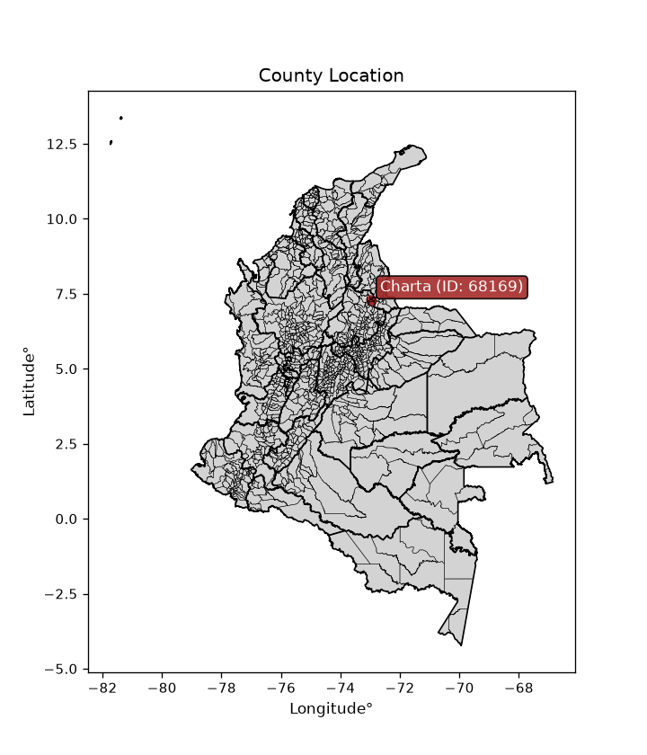
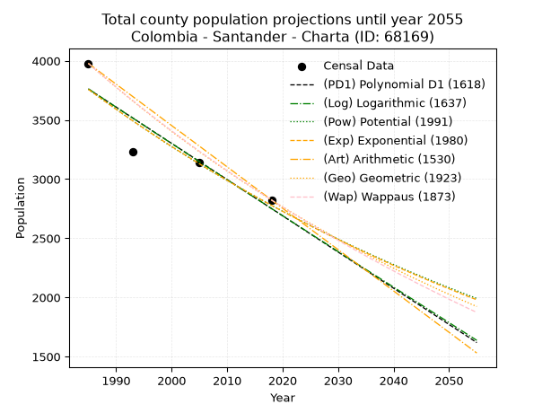
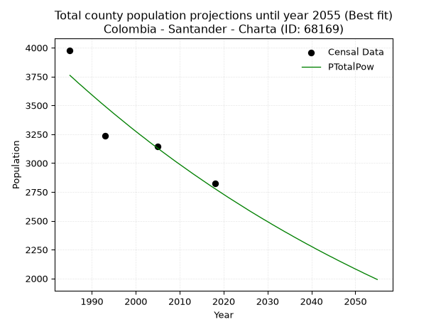
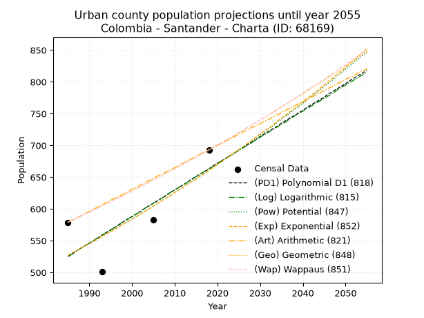
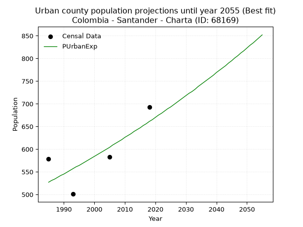
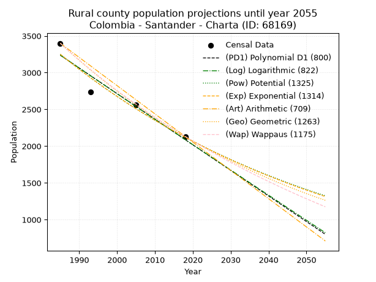
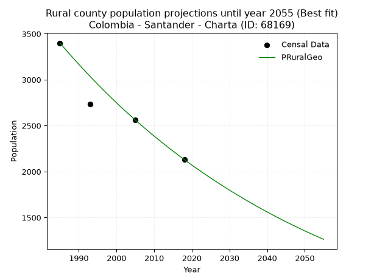

<div align="center">


</div>

# _“Population and Public Services Demand Projections (PPSD) until Year 2050 for Colombia - Santander - Charta (ID: 68169)”_
Keywords: `population` `public-service` `projection` `lineal` `polynomial` `logarithmic` `potential` `exponential` `arithmetic` `geometric` `wappaus` `dane` `colombia` `south-america`

PPSD are analytical estimates used by governments and planners to anticipate future changes in population size, age distribution, and the resulting community needs for utilities, healthcare, education, and infrastructure as sizing future water treatment facilities, electrical grids, and road networks based on spatial growth.

> **General running parameters**: • app_version: _v20260806_. • Python version: _3.14.7_. • Pandas version: _3.0.5_. • NumPy version: _2.5.1_. • Creates, save and include plots into reports (create_plot): _False_. • Projection until year: _2050_. • Process polynomial degree 2 and up: _False_. • Process Wappaus: _True_. • Process Wappaus: _True_. • Set negative values to zero: _True_. • Set infinite values to zero: _True_. • Drop dataset notes: _True_. 
<div align="center">

Dynamic map: [:earth_americas:Google](http://maps.google.com/maps?q=7.280820472,-72.9687984) [:earth_americas:OSM](https://www.openstreetmap.org/#map=18/7.280820472/-72.9687984&layers=P) [:earth_americas:Bing](https://www.bing.com/maps?cp=7.280820472~-72.9687984&lvl=18) [:earth_americas:Apple](https://maps.apple.com/frame?center=7.280820472%2C-72.9687984&span=0.003%2C0.006)

</div>


<div align="center">

```geojson
{
  "type": "Feature",
  "geometry": {
    "type": "Point", 
    "coordinates": [-72.9687984, 7.280820472]
  }, 
  "properties": {
    "Name": "Colombia - Santander - Charta (ID: 68169)"
  }
}
```

</div>


<div align="center">

</img>

</div>


## 0. Census Data (4 records)

Census data are official statistics collected by a government about the people and housing in a country. They usually include counts of total population, age, sex, race, income, education, and jobs.

📅Global census file: [Population.xlsx](../data/Population.xlsx)

| Source   |   Year |   CountryID | CountryName   |   StateID | StateName   |   CountyID | CountyName   |   PTotal |   PUrban |   PRural |
|:---------|-------:|------------:|:--------------|----------:|:------------|-----------:|:-------------|---------:|---------:|---------:|
| DANE     |   1985 |          57 | Colombia      |        68 | Santander   |      68169 | Charta       |     3978 |      579 |     3399 |
| DANE     |   1993 |          57 | Colombia      |        68 | Santander   |      68169 | Charta       |     3235 |      501 |     2734 |
| DANE     |   2005 |          57 | Colombia      |        68 | Santander   |      68169 | Charta       |     3142 |      583 |     2559 |
| DANE     |   2018 |          57 | Colombia      |        68 | Santander   |      68169 | Charta       |     2824 |      693 |     2131 |

> 🔥Some records could had specific notes about the registered values or the corresponding urban or rural distribution.

📅   [RUPS](https://www.datos.gov.co/Hacienda-y-Cr-dito-P-blico/Registro-nico-de-Prestadores-de-Servicios-P-blicos/4qkq-csdn/about_data) - Local public utility companies: [RUPS.csv](../data/RUPS.xlsx)

 | SERVICIO       | ESTADO    | NOMBRE                                                                                    | NIT         | DEPARTAMENTO_DOMICILIO   | MUNICIPIO_DOMICILIO   | DIRECCION         |   TELEFONO | EMAIL                        | TIPO_PRESTADOR                 | CLASIFICACION                 |
|:---------------|:----------|:------------------------------------------------------------------------------------------|:------------|:-------------------------|:----------------------|:------------------|-----------:|:-----------------------------|:-------------------------------|:------------------------------|
| ACUEDUCTO      | OPERATIVA | UNIDAD ADMINISTRADORA DE SERVICIOS PUBLICOS DE ACUEDUCTO ALCANTARILLADO Y  ASEO DE CHARTA | 890206724-9 | SANTANDER                | CHARTA                | PALACIO MUNICIPAL |    6069519 | angelicaescobara@hotmail.com | MUNICIPIO (PRESTACIÓN DIRECTA) | MENOR O IGUAL A 2500 USUARIOS |
| ALCANTARILLADO | OPERATIVA | UNIDAD ADMINISTRADORA DE SERVICIOS PUBLICOS DE ACUEDUCTO ALCANTARILLADO Y  ASEO DE CHARTA | 890206724-9 | SANTANDER                | CHARTA                | PALACIO MUNICIPAL |    6069519 | angelicaescobara@hotmail.com | MUNICIPIO (PRESTACIÓN DIRECTA) | MENOR O IGUAL A 2500 USUARIOS |

## 1. Total

### 1.1. Coefficients and Parameters

* (PD1) Polynomial Deg 1: -30.618627057406457, 64539.65877157727 (lineal)
* (Log) Logarithmic: -61333.78159690233, 469493.3154161343
* (Pow) Potential: -18.342806118660075, 64.06539654831523
* (Exp) Exponential: -0.009158201913422525, 295195636561.5162
* (Art) Arithmetic: Year diff. 2018 - 1985 = 33, Population diff. 2824 - 3978 = -1154, Annual growth = -34.96969696969697
* (Geo) Geometric: Year diff. 2018 - 1985 = 33, Population diff. 2824 - 3978 = -1154, Annual growth % = -0.010328858696734833
* (Wap) Wappaus: i = -1.0282180820257856, Condition values only valid for < 200)

<sub>
Wappaus condition values: ['-0.00', '-1.03', '-2.06', '-3.08', '-4.11', '-5.14', '-6.17', '-7.20', '-8.23', '-9.25', '-10.28', '-11.31', '-12.34', '-13.37', '-14.40', '-15.42', '-16.45', '-17.48', '-18.51', '-19.54', '-20.56', '-21.59', '-22.62', '-23.65', '-24.68', '-25.71', '-26.73', '-27.76', '-28.79', '-29.82', '-30.85', '-31.87', '-32.90', '-33.93', '-34.96', '-35.99', '-37.02', '-38.04', '-39.07', '-40.10', '-41.13', '-42.16', '-43.19', '-44.21', '-45.24', '-46.27', '-47.30', '-48.33', '-49.35', '-50.38', '-51.41', '-52.44', '-53.47', '-54.50', '-55.52', '-56.55', '-57.58', '-58.61', '-59.64', '-60.66', '-61.69', '-62.72', '-63.75', '-64.78', '-65.81', '-66.83']
</sub>


### 1.2. Projected Dataset

|   Year |   CountyID |   PTotalPD1 |   PTotalLog |   PTotalPow |   PTotalExp |   PTotalArt |   PTotalGeo |   PTotalWap |
|-------:|-----------:|------------:|------------:|------------:|------------:|------------:|------------:|------------:|
|   1985 |      68169 |        3762 |        3763 |        3760 |        3759 |        3978 |        3978 |        3978 |
|   1986 |      68169 |        3731 |        3732 |        3726 |        3725 |        3943 |        3937 |        3937 |
|   1987 |      68169 |        3700 |        3701 |        3691 |        3691 |        3908 |        3896 |        3897 |
|   1988 |      68169 |        3670 |        3670 |        3658 |        3657 |        3873 |        3856 |        3857 |
|   1989 |      68169 |        3639 |        3639 |        3624 |        3624 |        3838 |        3816 |        3818 |
|   1990 |      68169 |        3609 |        3609 |        3591 |        3591 |        3803 |        3777 |        3779 |
|   1991 |      68169 |        3578 |        3578 |        3558 |        3558 |        3768 |        3738 |        3740 |
|   1992 |      68169 |        3547 |        3547 |        3525 |        3525 |        3733 |        3699 |        3702 |
|   1993 |      68169 |        3517 |        3516 |        3493 |        3493 |        3698 |        3661 |        3664 |
|   1994 |      68169 |        3486 |        3486 |        3461 |        3461 |        3663 |        3623 |        3626 |
|   1995 |      68169 |        3455 |        3455 |        3429 |        3430 |        3628 |        3586 |        3589 |
|   1996 |      68169 |        3425 |        3424 |        3398 |        3399 |        3593 |        3549 |        3552 |
|   1997 |      68169 |        3394 |        3393 |        3367 |        3368 |        3558 |        3512 |        3516 |
|   1998 |      68169 |        3364 |        3363 |        3336 |        3337 |        3523 |        3476 |        3480 |
|   1999 |      68169 |        3333 |        3332 |        3305 |        3307 |        3488 |        3440 |        3444 |
|   2000 |      68169 |        3302 |        3301 |        3275 |        3276 |        3453 |        3404 |        3408 |
|   2001 |      68169 |        3272 |        3271 |        3245 |        3247 |        3418 |        3369 |        3373 |
|   2002 |      68169 |        3241 |        3240 |        3216 |        3217 |        3384 |        3334 |        3339 |
|   2003 |      68169 |        3211 |        3209 |        3186 |        3188 |        3349 |        3300 |        3304 |
|   2004 |      68169 |        3180 |        3179 |        3157 |        3159 |        3314 |        3266 |        3270 |
|   2005 |      68169 |        3149 |        3148 |        3129 |        3130 |        3279 |        3232 |        3236 |
|   2006 |      68169 |        3119 |        3117 |        3100 |        3101 |        3244 |        3199 |        3203 |
|   2007 |      68169 |        3088 |        3087 |        3072 |        3073 |        3209 |        3166 |        3170 |
|   2008 |      68169 |        3057 |        3056 |        3044 |        3045 |        3174 |        3133 |        3137 |
|   2009 |      68169 |        3027 |        3026 |        3016 |        3017 |        3139 |        3101 |        3104 |
|   2010 |      68169 |        2996 |        2995 |        2989 |        2990 |        3104 |        3069 |        3072 |
|   2011 |      68169 |        2966 |        2965 |        2962 |        2962 |        3069 |        3037 |        3040 |
|   2012 |      68169 |        2935 |        2934 |        2935 |        2935 |        3034 |        3006 |        3008 |
|   2013 |      68169 |        2904 |        2904 |        2908 |        2909 |        2999 |        2974 |        2977 |
|   2014 |      68169 |        2874 |        2873 |        2882 |        2882 |        2964 |        2944 |        2946 |
|   2015 |      68169 |        2843 |        2843 |        2856 |        2856 |        2929 |        2913 |        2915 |
|   2016 |      68169 |        2813 |        2813 |        2830 |        2830 |        2894 |        2883 |        2884 |
|   2017 |      68169 |        2782 |        2782 |        2804 |        2804 |        2859 |        2853 |        2854 |
|   2018 |      68169 |        2751 |        2752 |        2779 |        2778 |        2824 |        2824 |        2824 |
|   2019 |      68169 |        2721 |        2721 |        2754 |        2753 |        2789 |        2795 |        2794 |
|   2020 |      68169 |        2690 |        2691 |        2729 |        2728 |        2754 |        2766 |        2765 |
|   2021 |      68169 |        2659 |        2661 |        2704 |        2703 |        2719 |        2737 |        2735 |
|   2022 |      68169 |        2629 |        2630 |        2680 |        2679 |        2684 |        2709 |        2706 |
|   2023 |      68169 |        2598 |        2600 |        2656 |        2654 |        2649 |        2681 |        2678 |
|   2024 |      68169 |        2568 |        2570 |        2632 |        2630 |        2614 |        2653 |        2649 |
|   2025 |      68169 |        2537 |        2539 |        2608 |        2606 |        2579 |        2626 |        2621 |
|   2026 |      68169 |        2506 |        2509 |        2584 |        2582 |        2544 |        2599 |        2593 |
|   2027 |      68169 |        2476 |        2479 |        2561 |        2559 |        2509 |        2572 |        2565 |
|   2028 |      68169 |        2445 |        2449 |        2538 |        2535 |        2474 |        2546 |        2538 |
|   2029 |      68169 |        2414 |        2418 |        2515 |        2512 |        2439 |        2519 |        2510 |
|   2030 |      68169 |        2384 |        2388 |        2493 |        2489 |        2404 |        2493 |        2483 |
|   2031 |      68169 |        2353 |        2358 |        2470 |        2467 |        2369 |        2467 |        2456 |
|   2032 |      68169 |        2323 |        2328 |        2448 |        2444 |        2334 |        2442 |        2430 |
|   2033 |      68169 |        2292 |        2297 |        2426 |        2422 |        2299 |        2417 |        2403 |
|   2034 |      68169 |        2261 |        2267 |        2404 |        2400 |        2264 |        2392 |        2377 |
|   2035 |      68169 |        2231 |        2237 |        2383 |        2378 |        2230 |        2367 |        2351 |
|   2036 |      68169 |        2200 |        2207 |        2361 |        2356 |        2195 |        2343 |        2325 |
|   2037 |      68169 |        2170 |        2177 |        2340 |        2335 |        2160 |        2318 |        2300 |
|   2038 |      68169 |        2139 |        2147 |        2319 |        2313 |        2125 |        2294 |        2274 |
|   2039 |      68169 |        2108 |        2117 |        2298 |        2292 |        2090 |        2271 |        2249 |
|   2040 |      68169 |        2078 |        2087 |        2278 |        2271 |        2055 |        2247 |        2224 |
|   2041 |      68169 |        2047 |        2057 |        2257 |        2251 |        2020 |        2224 |        2199 |
|   2042 |      68169 |        2016 |        2027 |        2237 |        2230 |        1985 |        2201 |        2175 |
|   2043 |      68169 |        1986 |        1997 |        2217 |        2210 |        1950 |        2178 |        2151 |
|   2044 |      68169 |        1955 |        1967 |        2197 |        2190 |        1915 |        2156 |        2126 |
|   2045 |      68169 |        1925 |        1937 |        2178 |        2170 |        1880 |        2134 |        2102 |
|   2046 |      68169 |        1894 |        1907 |        2158 |        2150 |        1845 |        2112 |        2079 |
|   2047 |      68169 |        1863 |        1877 |        2139 |        2130 |        1810 |        2090 |        2055 |
|   2048 |      68169 |        1833 |        1847 |        2120 |        2111 |        1775 |        2068 |        2032 |
|   2049 |      68169 |        1802 |        1817 |        2101 |        2092 |        1740 |        2047 |        2008 |
|   2050 |      68169 |        1771 |        1787 |        2082 |        2073 |        1705 |        2026 |        1985 |
<div align="center">

</img>

</div>


### 1.3. Best fit with absolute and relative error (%)

Relative error puts that difference into context by dividing the absolute error by the true value, creating a unitless ratio or percentage that shows the scale of the mistake.

Absolute and relative error

|   Year | Source   |   CountryID | CountryName   |   StateID | StateName   |   CountyID_x | CountyName   |   PTotal |   PUrban |   PRural |   CountyID_y |   PTotalPD1 |   PTotalLog |   PTotalPow |   PTotalExp |   PTotalArt |   PTotalGeo |   PTotalWap |   PTotalPD1AbsError |   PTotalLogAbsError |   PTotalPowAbsError |   PTotalExpAbsError |   PTotalArtAbsError |   PTotalGeoAbsError |   PTotalWapAbsError |   PTotalPD1RelError |   PTotalLogRelError |   PTotalPowRelError |   PTotalExpRelError |   PTotalArtRelError |   PTotalGeoRelError |   PTotalWapRelError |
|-------:|:---------|------------:|:--------------|----------:|:------------|-------------:|:-------------|---------:|---------:|---------:|-------------:|------------:|------------:|------------:|------------:|------------:|------------:|------------:|--------------------:|--------------------:|--------------------:|--------------------:|--------------------:|--------------------:|--------------------:|--------------------:|--------------------:|--------------------:|--------------------:|--------------------:|--------------------:|--------------------:|
|   1985 | DANE     |          57 | Colombia      |        68 | Santander   |        68169 | Charta       |     3978 |      579 |     3399 |        68169 |        3762 |        3763 |        3760 |        3759 |        3978 |        3978 |        3978 |                 216 |                 215 |                 218 |                 219 |                   0 |                   0 |                   0 |            5.42986  |            5.40473  |            5.48014  |            5.50528  |             0       |             0       |             0       |
|   1993 | DANE     |          57 | Colombia      |        68 | Santander   |        68169 | Charta       |     3235 |      501 |     2734 |        68169 |        3517 |        3516 |        3493 |        3493 |        3698 |        3661 |        3664 |                 282 |                 281 |                 258 |                 258 |                 463 |                 426 |                 429 |            8.71716  |            8.68624  |            7.97527  |            7.97527  |            14.3122  |            13.1685  |            13.2612  |
|   2005 | DANE     |          57 | Colombia      |        68 | Santander   |        68169 | Charta       |     3142 |      583 |     2559 |        68169 |        3149 |        3148 |        3129 |        3130 |        3279 |        3232 |        3236 |                   7 |                   6 |                  13 |                  12 |                 137 |                  90 |                  94 |            0.222788 |            0.190961 |            0.413749 |            0.381922 |             4.36028 |             2.86442 |             2.99173 |
|   2018 | DANE     |          57 | Colombia      |        68 | Santander   |        68169 | Charta       |     2824 |      693 |     2131 |        68169 |        2751 |        2752 |        2779 |        2778 |        2824 |        2824 |        2824 |                  73 |                  72 |                  45 |                  46 |                   0 |                   0 |                   0 |            2.58499  |            2.54958  |            1.59348  |            1.6289   |             0       |             0       |             0       |

Relative error mean

| Method    |   RelError | Best   |
|:----------|-----------:|:-------|
| PTotalPD1 |    4.2387  |        |
| PTotalLog |    4.20788 |        |
| PTotalPow |    3.86566 | True   |
| PTotalExp |    3.87284 |        |
| PTotalArt |    4.66812 |        |
| PTotalGeo |    4.00822 |        |
| PTotalWap |    4.06323 |        |

💙Best method: _**PTotalPow**_
<div align="center">

</img>

</div>


### 1.4. Fresh water supply demand in liters per capita per day (lpcd)

The fresh water supply demand typically ranges from 100 to 300 liters per capita per day (lpcd) for standard domestic and municipal planning, though absolute survival minimums set by the World Health Organization are as low as 7.5 to 20 liters per day, and total consumption in high-income nations can exceed 400 liters.

> `CZ`: Level in meters above the sea level (masl)<br> `WS`: Fresh water supply demand in liters per capita per day (lpcd or l/h/d)<br> `WSAll`: Zonal fresh water supply demand in liters per second (l/s)<br> `A`: Zonal area in square meters<br> `DP`: Population density (people/hectare or p/ha)

Reference values (RAS Colombia)

|    CZ |   WS |
|------:|-----:|
|  1000 |  120 |
|  2000 |  130 |
| 99999 |  140 |

County shapefile geometry properties and water supply values

|   CountyID |      ATotal |   CZTotal |   WSTotal |
|-----------:|------------:|----------:|----------:|
|      68169 | 1.26458e+08 |   2199.18 |       140 |

Projected values for best method: PTotalPow

|   CountyID |   Year |   PTotalPow |   DPTotal |   WSTotal |   WSTotalAll |
|-----------:|-------:|------------:|----------:|----------:|-------------:|
|      68169 |   1985 |        3760 |      0.3  |       140 |      6.09259 |
|      68169 |   1986 |        3726 |      0.29 |       140 |      6.0375  |
|      68169 |   1987 |        3691 |      0.29 |       140 |      5.98079 |
|      68169 |   1988 |        3658 |      0.29 |       140 |      5.92731 |
|      68169 |   1989 |        3624 |      0.29 |       140 |      5.87222 |
|      68169 |   1990 |        3591 |      0.28 |       140 |      5.81875 |
|      68169 |   1991 |        3558 |      0.28 |       140 |      5.76528 |
|      68169 |   1992 |        3525 |      0.28 |       140 |      5.71181 |
|      68169 |   1993 |        3493 |      0.28 |       140 |      5.65995 |
|      68169 |   1994 |        3461 |      0.27 |       140 |      5.6081  |
|      68169 |   1995 |        3429 |      0.27 |       140 |      5.55625 |
|      68169 |   1996 |        3398 |      0.27 |       140 |      5.50602 |
|      68169 |   1997 |        3367 |      0.27 |       140 |      5.45579 |
|      68169 |   1998 |        3336 |      0.26 |       140 |      5.40556 |
|      68169 |   1999 |        3305 |      0.26 |       140 |      5.35532 |
|      68169 |   2000 |        3275 |      0.26 |       140 |      5.30671 |
|      68169 |   2001 |        3245 |      0.26 |       140 |      5.2581  |
|      68169 |   2002 |        3216 |      0.25 |       140 |      5.21111 |
|      68169 |   2003 |        3186 |      0.25 |       140 |      5.1625  |
|      68169 |   2004 |        3157 |      0.25 |       140 |      5.11551 |
|      68169 |   2005 |        3129 |      0.25 |       140 |      5.07014 |
|      68169 |   2006 |        3100 |      0.25 |       140 |      5.02315 |
|      68169 |   2007 |        3072 |      0.24 |       140 |      4.97778 |
|      68169 |   2008 |        3044 |      0.24 |       140 |      4.93241 |
|      68169 |   2009 |        3016 |      0.24 |       140 |      4.88704 |
|      68169 |   2010 |        2989 |      0.24 |       140 |      4.84329 |
|      68169 |   2011 |        2962 |      0.23 |       140 |      4.79954 |
|      68169 |   2012 |        2935 |      0.23 |       140 |      4.75579 |
|      68169 |   2013 |        2908 |      0.23 |       140 |      4.71204 |
|      68169 |   2014 |        2882 |      0.23 |       140 |      4.66991 |
|      68169 |   2015 |        2856 |      0.23 |       140 |      4.62778 |
|      68169 |   2016 |        2830 |      0.22 |       140 |      4.58565 |
|      68169 |   2017 |        2804 |      0.22 |       140 |      4.54352 |
|      68169 |   2018 |        2779 |      0.22 |       140 |      4.50301 |
|      68169 |   2019 |        2754 |      0.22 |       140 |      4.4625  |
|      68169 |   2020 |        2729 |      0.22 |       140 |      4.42199 |
|      68169 |   2021 |        2704 |      0.21 |       140 |      4.38148 |
|      68169 |   2022 |        2680 |      0.21 |       140 |      4.34259 |
|      68169 |   2023 |        2656 |      0.21 |       140 |      4.3037  |
|      68169 |   2024 |        2632 |      0.21 |       140 |      4.26481 |
|      68169 |   2025 |        2608 |      0.21 |       140 |      4.22593 |
|      68169 |   2026 |        2584 |      0.2  |       140 |      4.18704 |
|      68169 |   2027 |        2561 |      0.2  |       140 |      4.14977 |
|      68169 |   2028 |        2538 |      0.2  |       140 |      4.1125  |
|      68169 |   2029 |        2515 |      0.2  |       140 |      4.07523 |
|      68169 |   2030 |        2493 |      0.2  |       140 |      4.03958 |
|      68169 |   2031 |        2470 |      0.2  |       140 |      4.00231 |
|      68169 |   2032 |        2448 |      0.19 |       140 |      3.96667 |
|      68169 |   2033 |        2426 |      0.19 |       140 |      3.93102 |
|      68169 |   2034 |        2404 |      0.19 |       140 |      3.89537 |
|      68169 |   2035 |        2383 |      0.19 |       140 |      3.86134 |
|      68169 |   2036 |        2361 |      0.19 |       140 |      3.82569 |
|      68169 |   2037 |        2340 |      0.19 |       140 |      3.79167 |
|      68169 |   2038 |        2319 |      0.18 |       140 |      3.75764 |
|      68169 |   2039 |        2298 |      0.18 |       140 |      3.72361 |
|      68169 |   2040 |        2278 |      0.18 |       140 |      3.6912  |
|      68169 |   2041 |        2257 |      0.18 |       140 |      3.65718 |
|      68169 |   2042 |        2237 |      0.18 |       140 |      3.62477 |
|      68169 |   2043 |        2217 |      0.18 |       140 |      3.59236 |
|      68169 |   2044 |        2197 |      0.17 |       140 |      3.55995 |
|      68169 |   2045 |        2178 |      0.17 |       140 |      3.52917 |
|      68169 |   2046 |        2158 |      0.17 |       140 |      3.49676 |
|      68169 |   2047 |        2139 |      0.17 |       140 |      3.46597 |
|      68169 |   2048 |        2120 |      0.17 |       140 |      3.43519 |
|      68169 |   2049 |        2101 |      0.17 |       140 |      3.4044  |
|      68169 |   2050 |        2082 |      0.16 |       140 |      3.37361 |

## 2. Urban

### 2.1. Coefficients and Parameters

* (PD1) Polynomial Deg 1: 4.187876354877486, -7787.799678843691 (lineal)
* (Log) Logarithmic: 8367.857585661111, -63015.152564412434
* (Pow) Potential: 13.7061081039741, -42.477672763847664
* (Exp) Exponential: 0.006859758498485925, 0.000642945564753904
* (Art) Arithmetic: Year diff. 2018 - 1985 = 33, Population diff. 693 - 579 = 114, Annual growth = 3.4545454545454546
* (Geo) Geometric: Year diff. 2018 - 1985 = 33, Population diff. 693 - 579 = 114, Annual growth % = 0.005461146524631033
* (Wap) Wappaus: i = 0.5431675242995998, Condition values only valid for < 200)

<sub>
Wappaus condition values: ['0.00', '0.54', '1.09', '1.63', '2.17', '2.72', '3.26', '3.80', '4.35', '4.89', '5.43', '5.97', '6.52', '7.06', '7.60', '8.15', '8.69', '9.23', '9.78', '10.32', '10.86', '11.41', '11.95', '12.49', '13.04', '13.58', '14.12', '14.67', '15.21', '15.75', '16.30', '16.84', '17.38', '17.92', '18.47', '19.01', '19.55', '20.10', '20.64', '21.18', '21.73', '22.27', '22.81', '23.36', '23.90', '24.44', '24.99', '25.53', '26.07', '26.62', '27.16', '27.70', '28.24', '28.79', '29.33', '29.87', '30.42', '30.96', '31.50', '32.05', '32.59', '33.13', '33.68', '34.22', '34.76', '35.31']
</sub>


### 2.2. Projected Dataset

|   Year |   CountyID |   PUrbanPD1 |   PUrbanLog |   PUrbanPow |   PUrbanExp |   PUrbanArt |   PUrbanGeo |   PUrbanWap |
|-------:|-----------:|------------:|------------:|------------:|------------:|------------:|------------:|------------:|
|   1985 |      68169 |         525 |         525 |         527 |         527 |         579 |         579 |         579 |
|   1986 |      68169 |         529 |         529 |         531 |         531 |         582 |         582 |         582 |
|   1987 |      68169 |         534 |         534 |         534 |         534 |         586 |         585 |         585 |
|   1988 |      68169 |         538 |         538 |         538 |         538 |         589 |         589 |         589 |
|   1989 |      68169 |         542 |         542 |         542 |         542 |         593 |         592 |         592 |
|   1990 |      68169 |         546 |         546 |         545 |         545 |         596 |         595 |         595 |
|   1991 |      68169 |         550 |         550 |         549 |         549 |         600 |         598 |         598 |
|   1992 |      68169 |         554 |         555 |         553 |         553 |         603 |         601 |         601 |
|   1993 |      68169 |         559 |         559 |         557 |         557 |         607 |         605 |         605 |
|   1994 |      68169 |         563 |         563 |         561 |         561 |         610 |         608 |         608 |
|   1995 |      68169 |         567 |         567 |         565 |         564 |         614 |         611 |         611 |
|   1996 |      68169 |         571 |         571 |         568 |         568 |         617 |         615 |         615 |
|   1997 |      68169 |         575 |         576 |         572 |         572 |         620 |         618 |         618 |
|   1998 |      68169 |         580 |         580 |         576 |         576 |         624 |         621 |         621 |
|   1999 |      68169 |         584 |         584 |         580 |         580 |         627 |         625 |         625 |
|   2000 |      68169 |         588 |         588 |         584 |         584 |         631 |         628 |         628 |
|   2001 |      68169 |         592 |         592 |         588 |         588 |         634 |         632 |         632 |
|   2002 |      68169 |         596 |         596 |         592 |         592 |         638 |         635 |         635 |
|   2003 |      68169 |         601 |         601 |         596 |         596 |         641 |         639 |         639 |
|   2004 |      68169 |         605 |         605 |         600 |         600 |         645 |         642 |         642 |
|   2005 |      68169 |         609 |         609 |         605 |         604 |         648 |         646 |         646 |
|   2006 |      68169 |         613 |         613 |         609 |         609 |         652 |         649 |         649 |
|   2007 |      68169 |         617 |         617 |         613 |         613 |         655 |         653 |         653 |
|   2008 |      68169 |         621 |         622 |         617 |         617 |         658 |         656 |         656 |
|   2009 |      68169 |         626 |         626 |         621 |         621 |         662 |         660 |         660 |
|   2010 |      68169 |         630 |         630 |         626 |         626 |         665 |         663 |         663 |
|   2011 |      68169 |         634 |         634 |         630 |         630 |         669 |         667 |         667 |
|   2012 |      68169 |         638 |         638 |         634 |         634 |         672 |         671 |         671 |
|   2013 |      68169 |         642 |         642 |         639 |         639 |         676 |         674 |         674 |
|   2014 |      68169 |         647 |         646 |         643 |         643 |         679 |         678 |         678 |
|   2015 |      68169 |         651 |         651 |         647 |         647 |         683 |         682 |         682 |
|   2016 |      68169 |         655 |         655 |         652 |         652 |         686 |         685 |         685 |
|   2017 |      68169 |         659 |         659 |         656 |         656 |         690 |         689 |         689 |
|   2018 |      68169 |         663 |         663 |         661 |         661 |         693 |         693 |         693 |
|   2019 |      68169 |         668 |         667 |         665 |         665 |         696 |         697 |         697 |
|   2020 |      68169 |         672 |         671 |         670 |         670 |         700 |         701 |         701 |
|   2021 |      68169 |         676 |         676 |         674 |         675 |         703 |         704 |         704 |
|   2022 |      68169 |         680 |         680 |         679 |         679 |         707 |         708 |         708 |
|   2023 |      68169 |         684 |         684 |         683 |         684 |         710 |         712 |         712 |
|   2024 |      68169 |         688 |         688 |         688 |         689 |         714 |         716 |         716 |
|   2025 |      68169 |         693 |         692 |         693 |         693 |         717 |         720 |         720 |
|   2026 |      68169 |         697 |         696 |         697 |         698 |         721 |         724 |         724 |
|   2027 |      68169 |         701 |         700 |         702 |         703 |         724 |         728 |         728 |
|   2028 |      68169 |         705 |         704 |         707 |         708 |         728 |         732 |         732 |
|   2029 |      68169 |         709 |         709 |         712 |         713 |         731 |         736 |         736 |
|   2030 |      68169 |         714 |         713 |         717 |         718 |         734 |         740 |         740 |
|   2031 |      68169 |         718 |         717 |         721 |         723 |         738 |         744 |         744 |
|   2032 |      68169 |         722 |         721 |         726 |         727 |         741 |         748 |         748 |
|   2033 |      68169 |         726 |         725 |         731 |         732 |         745 |         752 |         753 |
|   2034 |      68169 |         730 |         729 |         736 |         738 |         748 |         756 |         757 |
|   2035 |      68169 |         735 |         733 |         741 |         743 |         752 |         760 |         761 |
|   2036 |      68169 |         739 |         737 |         746 |         748 |         755 |         764 |         765 |
|   2037 |      68169 |         743 |         742 |         751 |         753 |         759 |         769 |         769 |
|   2038 |      68169 |         747 |         746 |         756 |         758 |         762 |         773 |         774 |
|   2039 |      68169 |         751 |         750 |         761 |         763 |         766 |         777 |         778 |
|   2040 |      68169 |         755 |         754 |         766 |         769 |         769 |         781 |         782 |
|   2041 |      68169 |         760 |         758 |         772 |         774 |         772 |         785 |         787 |
|   2042 |      68169 |         764 |         762 |         777 |         779 |         776 |         790 |         791 |
|   2043 |      68169 |         768 |         766 |         782 |         784 |         779 |         794 |         796 |
|   2044 |      68169 |         772 |         770 |         787 |         790 |         783 |         798 |         800 |
|   2045 |      68169 |         776 |         774 |         793 |         795 |         786 |         803 |         804 |
|   2046 |      68169 |         781 |         778 |         798 |         801 |         790 |         807 |         809 |
|   2047 |      68169 |         785 |         782 |         803 |         806 |         793 |         812 |         813 |
|   2048 |      68169 |         789 |         787 |         809 |         812 |         797 |         816 |         818 |
|   2049 |      68169 |         793 |         791 |         814 |         817 |         800 |         820 |         823 |
|   2050 |      68169 |         797 |         795 |         820 |         823 |         804 |         825 |         827 |
<div align="center">

</img>

</div>


### 2.3. Best fit with absolute and relative error (%)

Relative error puts that difference into context by dividing the absolute error by the true value, creating a unitless ratio or percentage that shows the scale of the mistake.

Absolute and relative error

|   Year | Source   |   CountryID | CountryName   |   StateID | StateName   |   CountyID_x | CountyName   |   PTotal |   PUrban |   PRural |   CountyID_y |   PUrbanPD1 |   PUrbanLog |   PUrbanPow |   PUrbanExp |   PUrbanArt |   PUrbanGeo |   PUrbanWap |   PUrbanPD1AbsError |   PUrbanLogAbsError |   PUrbanPowAbsError |   PUrbanExpAbsError |   PUrbanArtAbsError |   PUrbanGeoAbsError |   PUrbanWapAbsError |   PUrbanPD1RelError |   PUrbanLogRelError |   PUrbanPowRelError |   PUrbanExpRelError |   PUrbanArtRelError |   PUrbanGeoRelError |   PUrbanWapRelError |
|-------:|:---------|------------:|:--------------|----------:|:------------|-------------:|:-------------|---------:|---------:|---------:|-------------:|------------:|------------:|------------:|------------:|------------:|------------:|------------:|--------------------:|--------------------:|--------------------:|--------------------:|--------------------:|--------------------:|--------------------:|--------------------:|--------------------:|--------------------:|--------------------:|--------------------:|--------------------:|--------------------:|
|   1985 | DANE     |          57 | Colombia      |        68 | Santander   |        68169 | Charta       |     3978 |      579 |     3399 |        68169 |         525 |         525 |         527 |         527 |         579 |         579 |         579 |                  54 |                  54 |                  52 |                  52 |                   0 |                   0 |                   0 |             9.32642 |             9.32642 |             8.981   |             8.981   |              0      |              0      |              0      |
|   1993 | DANE     |          57 | Colombia      |        68 | Santander   |        68169 | Charta       |     3235 |      501 |     2734 |        68169 |         559 |         559 |         557 |         557 |         607 |         605 |         605 |                  58 |                  58 |                  56 |                  56 |                 106 |                 104 |                 104 |            11.5768  |            11.5768  |            11.1776  |            11.1776  |             21.1577 |             20.7585 |             20.7585 |
|   2005 | DANE     |          57 | Colombia      |        68 | Santander   |        68169 | Charta       |     3142 |      583 |     2559 |        68169 |         609 |         609 |         605 |         604 |         648 |         646 |         646 |                  26 |                  26 |                  22 |                  21 |                  65 |                  63 |                  63 |             4.45969 |             4.45969 |             3.77358 |             3.60206 |             11.1492 |             10.8062 |             10.8062 |
|   2018 | DANE     |          57 | Colombia      |        68 | Santander   |        68169 | Charta       |     2824 |      693 |     2131 |        68169 |         663 |         663 |         661 |         661 |         693 |         693 |         693 |                  30 |                  30 |                  32 |                  32 |                   0 |                   0 |                   0 |             4.329   |             4.329   |             4.6176  |             4.6176  |              0      |              0      |              0      |

Relative error mean

| Method    |   RelError | Best   |
|:----------|-----------:|:-------|
| PUrbanPD1 |    7.42299 |        |
| PUrbanLog |    7.42299 |        |
| PUrbanPow |    7.13746 |        |
| PUrbanExp |    7.09458 | True   |
| PUrbanArt |    8.07673 |        |
| PUrbanGeo |    7.89116 |        |
| PUrbanWap |    7.89116 |        |

💙Best method: _**PUrbanExp**_
<div align="center">

</img>

</div>


### 2.4. Fresh water supply demand in liters per capita per day (lpcd)

The fresh water supply demand typically ranges from 100 to 300 liters per capita per day (lpcd) for standard domestic and municipal planning, though absolute survival minimums set by the World Health Organization are as low as 7.5 to 20 liters per day, and total consumption in high-income nations can exceed 400 liters.

> `CZ`: Level in meters above the sea level (masl)<br> `WS`: Fresh water supply demand in liters per capita per day (lpcd or l/h/d)<br> `WSAll`: Zonal fresh water supply demand in liters per second (l/s)<br> `A`: Zonal area in square meters<br> `DP`: Population density (people/hectare or p/ha)

Reference values (RAS Colombia)

|    CZ |   WS |
|------:|-----:|
|  1000 |  120 |
|  2000 |  130 |
| 99999 |  140 |

County shapefile geometry properties and water supply values

|   CountyID |   AUrban |   CZUrban |   WSUrban |
|-----------:|---------:|----------:|----------:|
|      68169 |   244038 |   1985.08 |       130 |

Projected values for best method: PUrbanExp

|   CountyID |   Year |   PUrbanExp |   DPUrban |   WSUrban |   WSUrbanAll |
|-----------:|-------:|------------:|----------:|----------:|-------------:|
|      68169 |   1985 |         527 |     21.6  |       130 |     0.79294  |
|      68169 |   1986 |         531 |     21.76 |       130 |     0.798958 |
|      68169 |   1987 |         534 |     21.88 |       130 |     0.803472 |
|      68169 |   1988 |         538 |     22.05 |       130 |     0.809491 |
|      68169 |   1989 |         542 |     22.21 |       130 |     0.815509 |
|      68169 |   1990 |         545 |     22.33 |       130 |     0.820023 |
|      68169 |   1991 |         549 |     22.5  |       130 |     0.826042 |
|      68169 |   1992 |         553 |     22.66 |       130 |     0.83206  |
|      68169 |   1993 |         557 |     22.82 |       130 |     0.838079 |
|      68169 |   1994 |         561 |     22.99 |       130 |     0.844097 |
|      68169 |   1995 |         564 |     23.11 |       130 |     0.848611 |
|      68169 |   1996 |         568 |     23.28 |       130 |     0.85463  |
|      68169 |   1997 |         572 |     23.44 |       130 |     0.860648 |
|      68169 |   1998 |         576 |     23.6  |       130 |     0.866667 |
|      68169 |   1999 |         580 |     23.77 |       130 |     0.872685 |
|      68169 |   2000 |         584 |     23.93 |       130 |     0.878704 |
|      68169 |   2001 |         588 |     24.09 |       130 |     0.884722 |
|      68169 |   2002 |         592 |     24.26 |       130 |     0.890741 |
|      68169 |   2003 |         596 |     24.42 |       130 |     0.896759 |
|      68169 |   2004 |         600 |     24.59 |       130 |     0.902778 |
|      68169 |   2005 |         604 |     24.75 |       130 |     0.908796 |
|      68169 |   2006 |         609 |     24.96 |       130 |     0.916319 |
|      68169 |   2007 |         613 |     25.12 |       130 |     0.922338 |
|      68169 |   2008 |         617 |     25.28 |       130 |     0.928356 |
|      68169 |   2009 |         621 |     25.45 |       130 |     0.934375 |
|      68169 |   2010 |         626 |     25.65 |       130 |     0.941898 |
|      68169 |   2011 |         630 |     25.82 |       130 |     0.947917 |
|      68169 |   2012 |         634 |     25.98 |       130 |     0.953935 |
|      68169 |   2013 |         639 |     26.18 |       130 |     0.961458 |
|      68169 |   2014 |         643 |     26.35 |       130 |     0.967477 |
|      68169 |   2015 |         647 |     26.51 |       130 |     0.973495 |
|      68169 |   2016 |         652 |     26.72 |       130 |     0.981019 |
|      68169 |   2017 |         656 |     26.88 |       130 |     0.987037 |
|      68169 |   2018 |         661 |     27.09 |       130 |     0.99456  |
|      68169 |   2019 |         665 |     27.25 |       130 |     1.00058  |
|      68169 |   2020 |         670 |     27.45 |       130 |     1.0081   |
|      68169 |   2021 |         675 |     27.66 |       130 |     1.01562  |
|      68169 |   2022 |         679 |     27.82 |       130 |     1.02164  |
|      68169 |   2023 |         684 |     28.03 |       130 |     1.02917  |
|      68169 |   2024 |         689 |     28.23 |       130 |     1.03669  |
|      68169 |   2025 |         693 |     28.4  |       130 |     1.04271  |
|      68169 |   2026 |         698 |     28.6  |       130 |     1.05023  |
|      68169 |   2027 |         703 |     28.81 |       130 |     1.05775  |
|      68169 |   2028 |         708 |     29.01 |       130 |     1.06528  |
|      68169 |   2029 |         713 |     29.22 |       130 |     1.0728   |
|      68169 |   2030 |         718 |     29.42 |       130 |     1.08032  |
|      68169 |   2031 |         723 |     29.63 |       130 |     1.08785  |
|      68169 |   2032 |         727 |     29.79 |       130 |     1.09387  |
|      68169 |   2033 |         732 |     30    |       130 |     1.10139  |
|      68169 |   2034 |         738 |     30.24 |       130 |     1.11042  |
|      68169 |   2035 |         743 |     30.45 |       130 |     1.11794  |
|      68169 |   2036 |         748 |     30.65 |       130 |     1.12546  |
|      68169 |   2037 |         753 |     30.86 |       130 |     1.13299  |
|      68169 |   2038 |         758 |     31.06 |       130 |     1.14051  |
|      68169 |   2039 |         763 |     31.27 |       130 |     1.14803  |
|      68169 |   2040 |         769 |     31.51 |       130 |     1.15706  |
|      68169 |   2041 |         774 |     31.72 |       130 |     1.16458  |
|      68169 |   2042 |         779 |     31.92 |       130 |     1.17211  |
|      68169 |   2043 |         784 |     32.13 |       130 |     1.17963  |
|      68169 |   2044 |         790 |     32.37 |       130 |     1.18866  |
|      68169 |   2045 |         795 |     32.58 |       130 |     1.19618  |
|      68169 |   2046 |         801 |     32.82 |       130 |     1.20521  |
|      68169 |   2047 |         806 |     33.03 |       130 |     1.21273  |
|      68169 |   2048 |         812 |     33.27 |       130 |     1.22176  |
|      68169 |   2049 |         817 |     33.48 |       130 |     1.22928  |
|      68169 |   2050 |         823 |     33.72 |       130 |     1.23831  |

## 3. Rural

### 3.1. Coefficients and Parameters

* (PD1) Polynomial Deg 1: -34.80650341228393, 72327.45845042093 (lineal)
* (Log) Logarithmic: -69701.63918256345, 532508.4679805468
* (Pow) Potential: -25.904282456464372, 88.93820174871452
* (Exp) Exponential: -0.012938122547835353, 462930770518693.25
* (Art) Arithmetic: Year diff. 2018 - 1985 = 33, Population diff. 2131 - 3399 = -1268, Annual growth = -38.42424242424242
* (Geo) Geometric: Year diff. 2018 - 1985 = 33, Population diff. 2131 - 3399 = -1268, Annual growth % = -0.01404856417642919
* (Wap) Wappaus: i = -1.3896651871335415, Condition values only valid for < 200)

<sub>
Wappaus condition values: ['-0.00', '-1.39', '-2.78', '-4.17', '-5.56', '-6.95', '-8.34', '-9.73', '-11.12', '-12.51', '-13.90', '-15.29', '-16.68', '-18.07', '-19.46', '-20.84', '-22.23', '-23.62', '-25.01', '-26.40', '-27.79', '-29.18', '-30.57', '-31.96', '-33.35', '-34.74', '-36.13', '-37.52', '-38.91', '-40.30', '-41.69', '-43.08', '-44.47', '-45.86', '-47.25', '-48.64', '-50.03', '-51.42', '-52.81', '-54.20', '-55.59', '-56.98', '-58.37', '-59.76', '-61.15', '-62.53', '-63.92', '-65.31', '-66.70', '-68.09', '-69.48', '-70.87', '-72.26', '-73.65', '-75.04', '-76.43', '-77.82', '-79.21', '-80.60', '-81.99', '-83.38', '-84.77', '-86.16', '-87.55', '-88.94', '-90.33']
</sub>


### 3.2. Projected Dataset

|   Year |   CountyID |   PRuralPD1 |   PRuralLog |   PRuralPow |   PRuralExp |   PRuralArt |   PRuralGeo |   PRuralWap |
|-------:|-----------:|------------:|------------:|------------:|------------:|------------:|------------:|------------:|
|   1985 |      68169 |        3237 |        3238 |        3251 |        3250 |        3399 |        3399 |        3399 |
|   1986 |      68169 |        3202 |        3203 |        3209 |        3208 |        3361 |        3351 |        3352 |
|   1987 |      68169 |        3167 |        3168 |        3168 |        3167 |        3322 |        3304 |        3306 |
|   1988 |      68169 |        3132 |        3133 |        3127 |        3126 |        3284 |        3258 |        3260 |
|   1989 |      68169 |        3097 |        3098 |        3086 |        3086 |        3245 |        3212 |        3215 |
|   1990 |      68169 |        3063 |        3062 |        3046 |        3046 |        3207 |        3167 |        3171 |
|   1991 |      68169 |        3028 |        3027 |        3007 |        3007 |        3168 |        3122 |        3127 |
|   1992 |      68169 |        2993 |        2992 |        2968 |        2969 |        3130 |        3079 |        3084 |
|   1993 |      68169 |        2958 |        2957 |        2930 |        2930 |        3092 |        3035 |        3041 |
|   1994 |      68169 |        2923 |        2923 |        2892 |        2893 |        3053 |        2993 |        2999 |
|   1995 |      68169 |        2888 |        2888 |        2855 |        2856 |        3015 |        2951 |        2957 |
|   1996 |      68169 |        2854 |        2853 |        2818 |        2819 |        2976 |        2909 |        2916 |
|   1997 |      68169 |        2819 |        2818 |        2781 |        2783 |        2938 |        2868 |        2876 |
|   1998 |      68169 |        2784 |        2783 |        2746 |        2747 |        2899 |        2828 |        2836 |
|   1999 |      68169 |        2749 |        2748 |        2710 |        2712 |        2861 |        2788 |        2796 |
|   2000 |      68169 |        2714 |        2713 |        2675 |        2677 |        2823 |        2749 |        2757 |
|   2001 |      68169 |        2680 |        2678 |        2641 |        2642 |        2784 |        2710 |        2719 |
|   2002 |      68169 |        2645 |        2643 |        2607 |        2608 |        2746 |        2672 |        2681 |
|   2003 |      68169 |        2610 |        2609 |        2574 |        2575 |        2707 |        2635 |        2643 |
|   2004 |      68169 |        2575 |        2574 |        2540 |        2542 |        2669 |        2598 |        2606 |
|   2005 |      68169 |        2540 |        2539 |        2508 |        2509 |        2631 |        2561 |        2570 |
|   2006 |      68169 |        2506 |        2504 |        2476 |        2477 |        2592 |        2525 |        2533 |
|   2007 |      68169 |        2471 |        2470 |        2444 |        2445 |        2554 |        2490 |        2498 |
|   2008 |      68169 |        2436 |        2435 |        2413 |        2414 |        2515 |        2455 |        2462 |
|   2009 |      68169 |        2401 |        2400 |        2382 |        2383 |        2477 |        2420 |        2427 |
|   2010 |      68169 |        2366 |        2365 |        2351 |        2352 |        2438 |        2386 |        2393 |
|   2011 |      68169 |        2332 |        2331 |        2321 |        2322 |        2400 |        2353 |        2359 |
|   2012 |      68169 |        2297 |        2296 |        2291 |        2292 |        2362 |        2320 |        2325 |
|   2013 |      68169 |        2262 |        2262 |        2262 |        2262 |        2323 |        2287 |        2292 |
|   2014 |      68169 |        2227 |        2227 |        2233 |        2233 |        2285 |        2255 |        2259 |
|   2015 |      68169 |        2192 |        2192 |        2205 |        2205 |        2246 |        2223 |        2226 |
|   2016 |      68169 |        2158 |        2158 |        2176 |        2176 |        2208 |        2192 |        2194 |
|   2017 |      68169 |        2123 |        2123 |        2149 |        2148 |        2169 |        2161 |        2162 |
|   2018 |      68169 |        2088 |        2089 |        2121 |        2121 |        2131 |        2131 |        2131 |
|   2019 |      68169 |        2053 |        2054 |        2094 |        2093 |        2093 |        2101 |        2100 |
|   2020 |      68169 |        2018 |        2020 |        2068 |        2066 |        2054 |        2072 |        2069 |
|   2021 |      68169 |        1984 |        1985 |        2041 |        2040 |        2016 |        2042 |        2039 |
|   2022 |      68169 |        1949 |        1951 |        2015 |        2014 |        1977 |        2014 |        2009 |
|   2023 |      68169 |        1914 |        1916 |        1990 |        1988 |        1939 |        1985 |        1979 |
|   2024 |      68169 |        1879 |        1882 |        1964 |        1962 |        1900 |        1958 |        1950 |
|   2025 |      68169 |        1844 |        1847 |        1939 |        1937 |        1862 |        1930 |        1921 |
|   2026 |      68169 |        1809 |        1813 |        1915 |        1912 |        1824 |        1903 |        1892 |
|   2027 |      68169 |        1775 |        1778 |        1890 |        1888 |        1785 |        1876 |        1863 |
|   2028 |      68169 |        1740 |        1744 |        1866 |        1863 |        1747 |        1850 |        1835 |
|   2029 |      68169 |        1705 |        1710 |        1843 |        1839 |        1708 |        1824 |        1807 |
|   2030 |      68169 |        1670 |        1675 |        1819 |        1816 |        1670 |        1798 |        1780 |
|   2031 |      68169 |        1635 |        1641 |        1796 |        1792 |        1631 |        1773 |        1752 |
|   2032 |      68169 |        1601 |        1607 |        1773 |        1769 |        1593 |        1748 |        1725 |
|   2033 |      68169 |        1566 |        1572 |        1751 |        1747 |        1555 |        1724 |        1699 |
|   2034 |      68169 |        1531 |        1538 |        1729 |        1724 |        1516 |        1699 |        1672 |
|   2035 |      68169 |        1496 |        1504 |        1707 |        1702 |        1478 |        1675 |        1646 |
|   2036 |      68169 |        1461 |        1470 |        1685 |        1680 |        1439 |        1652 |        1620 |
|   2037 |      68169 |        1427 |        1435 |        1664 |        1658 |        1401 |        1629 |        1595 |
|   2038 |      68169 |        1392 |        1401 |        1643 |        1637 |        1363 |        1606 |        1569 |
|   2039 |      68169 |        1357 |        1367 |        1622 |        1616 |        1324 |        1583 |        1544 |
|   2040 |      68169 |        1322 |        1333 |        1602 |        1595 |        1286 |        1561 |        1519 |
|   2041 |      68169 |        1287 |        1299 |        1582 |        1575 |        1247 |        1539 |        1495 |
|   2042 |      68169 |        1253 |        1265 |        1562 |        1555 |        1209 |        1517 |        1470 |
|   2043 |      68169 |        1218 |        1230 |        1542 |        1535 |        1170 |        1496 |        1446 |
|   2044 |      68169 |        1183 |        1196 |        1523 |        1515 |        1132 |        1475 |        1422 |
|   2045 |      68169 |        1148 |        1162 |        1503 |        1495 |        1094 |        1454 |        1399 |
|   2046 |      68169 |        1113 |        1128 |        1484 |        1476 |        1055 |        1434 |        1375 |
|   2047 |      68169 |        1079 |        1094 |        1466 |        1457 |        1017 |        1414 |        1352 |
|   2048 |      68169 |        1044 |        1060 |        1447 |        1438 |         978 |        1394 |        1329 |
|   2049 |      68169 |        1009 |        1026 |        1429 |        1420 |         940 |        1374 |        1306 |
|   2050 |      68169 |         974 |         992 |        1411 |        1402 |         901 |        1355 |        1284 |
<div align="center">

</img>

</div>


### 3.3. Best fit with absolute and relative error (%)

Relative error puts that difference into context by dividing the absolute error by the true value, creating a unitless ratio or percentage that shows the scale of the mistake.

Absolute and relative error

|   Year | Source   |   CountryID | CountryName   |   StateID | StateName   |   CountyID_x | CountyName   |   PTotal |   PUrban |   PRural |   CountyID_y |   PRuralPD1 |   PRuralLog |   PRuralPow |   PRuralExp |   PRuralArt |   PRuralGeo |   PRuralWap |   PRuralPD1AbsError |   PRuralLogAbsError |   PRuralPowAbsError |   PRuralExpAbsError |   PRuralArtAbsError |   PRuralGeoAbsError |   PRuralWapAbsError |   PRuralPD1RelError |   PRuralLogRelError |   PRuralPowRelError |   PRuralExpRelError |   PRuralArtRelError |   PRuralGeoRelError |   PRuralWapRelError |
|-------:|:---------|------------:|:--------------|----------:|:------------|-------------:|:-------------|---------:|---------:|---------:|-------------:|------------:|------------:|------------:|------------:|------------:|------------:|------------:|--------------------:|--------------------:|--------------------:|--------------------:|--------------------:|--------------------:|--------------------:|--------------------:|--------------------:|--------------------:|--------------------:|--------------------:|--------------------:|--------------------:|
|   1985 | DANE     |          57 | Colombia      |        68 | Santander   |        68169 | Charta       |     3978 |      579 |     3399 |        68169 |        3237 |        3238 |        3251 |        3250 |        3399 |        3399 |        3399 |                 162 |                 161 |                 148 |                 149 |                   0 |                   0 |                   0 |            4.76611  |            4.73669  |            4.35422  |            4.38364  |              0      |           0         |            0        |
|   1993 | DANE     |          57 | Colombia      |        68 | Santander   |        68169 | Charta       |     3235 |      501 |     2734 |        68169 |        2958 |        2957 |        2930 |        2930 |        3092 |        3035 |        3041 |                 224 |                 223 |                 196 |                 196 |                 358 |                 301 |                 307 |            8.19312  |            8.15655  |            7.16898  |            7.16898  |             13.0944 |          11.0095    |           11.229    |
|   2005 | DANE     |          57 | Colombia      |        68 | Santander   |        68169 | Charta       |     3142 |      583 |     2559 |        68169 |        2540 |        2539 |        2508 |        2509 |        2631 |        2561 |        2570 |                  19 |                  20 |                  51 |                  50 |                  72 |                   2 |                  11 |            0.742478 |            0.781555 |            1.99297  |            1.95389  |              2.8136 |           0.0781555 |            0.429855 |
|   2018 | DANE     |          57 | Colombia      |        68 | Santander   |        68169 | Charta       |     2824 |      693 |     2131 |        68169 |        2088 |        2089 |        2121 |        2121 |        2131 |        2131 |        2131 |                  43 |                  42 |                  10 |                  10 |                   0 |                   0 |                   0 |            2.01783  |            1.97091  |            0.469263 |            0.469263 |              0      |           0         |            0        |

Relative error mean

| Method    |   RelError | Best   |
|:----------|-----------:|:-------|
| PRuralPD1 |    3.92989 |        |
| PRuralLog |    3.91142 |        |
| PRuralPow |    3.49636 |        |
| PRuralExp |    3.49394 |        |
| PRuralArt |    3.97699 |        |
| PRuralGeo |    2.77192 | True   |
| PRuralWap |    2.91471 |        |

💙Best method: _**PRuralGeo**_
<div align="center">

</img>

</div>


### 3.4. Fresh water supply demand in liters per capita per day (lpcd)

The fresh water supply demand typically ranges from 100 to 300 liters per capita per day (lpcd) for standard domestic and municipal planning, though absolute survival minimums set by the World Health Organization are as low as 7.5 to 20 liters per day, and total consumption in high-income nations can exceed 400 liters.

> `CZ`: Level in meters above the sea level (masl)<br> `WS`: Fresh water supply demand in liters per capita per day (lpcd or l/h/d)<br> `WSAll`: Zonal fresh water supply demand in liters per second (l/s)<br> `A`: Zonal area in square meters<br> `DP`: Population density (people/hectare or p/ha)

Reference values (RAS Colombia)

|    CZ |   WS |
|------:|-----:|
|  1000 |  120 |
|  2000 |  130 |
| 99999 |  140 |

County shapefile geometry properties and water supply values

|   CountyID |      ARural |   CZRural |   WSRural |
|-----------:|------------:|----------:|----------:|
|      68169 | 1.26214e+08 |   2199.59 |       140 |

Projected values for best method: PRuralGeo

|   CountyID |   Year |   PRuralGeo |   DPRural |   WSRural |   WSRuralAll |
|-----------:|-------:|------------:|----------:|----------:|-------------:|
|      68169 |   1985 |        3399 |      0.27 |       140 |      5.50764 |
|      68169 |   1986 |        3351 |      0.27 |       140 |      5.42986 |
|      68169 |   1987 |        3304 |      0.26 |       140 |      5.3537  |
|      68169 |   1988 |        3258 |      0.26 |       140 |      5.27917 |
|      68169 |   1989 |        3212 |      0.25 |       140 |      5.20463 |
|      68169 |   1990 |        3167 |      0.25 |       140 |      5.13171 |
|      68169 |   1991 |        3122 |      0.25 |       140 |      5.0588  |
|      68169 |   1992 |        3079 |      0.24 |       140 |      4.98912 |
|      68169 |   1993 |        3035 |      0.24 |       140 |      4.91782 |
|      68169 |   1994 |        2993 |      0.24 |       140 |      4.84977 |
|      68169 |   1995 |        2951 |      0.23 |       140 |      4.78171 |
|      68169 |   1996 |        2909 |      0.23 |       140 |      4.71366 |
|      68169 |   1997 |        2868 |      0.23 |       140 |      4.64722 |
|      68169 |   1998 |        2828 |      0.22 |       140 |      4.58241 |
|      68169 |   1999 |        2788 |      0.22 |       140 |      4.51759 |
|      68169 |   2000 |        2749 |      0.22 |       140 |      4.4544  |
|      68169 |   2001 |        2710 |      0.21 |       140 |      4.3912  |
|      68169 |   2002 |        2672 |      0.21 |       140 |      4.32963 |
|      68169 |   2003 |        2635 |      0.21 |       140 |      4.26968 |
|      68169 |   2004 |        2598 |      0.21 |       140 |      4.20972 |
|      68169 |   2005 |        2561 |      0.2  |       140 |      4.14977 |
|      68169 |   2006 |        2525 |      0.2  |       140 |      4.09144 |
|      68169 |   2007 |        2490 |      0.2  |       140 |      4.03472 |
|      68169 |   2008 |        2455 |      0.19 |       140 |      3.97801 |
|      68169 |   2009 |        2420 |      0.19 |       140 |      3.9213  |
|      68169 |   2010 |        2386 |      0.19 |       140 |      3.8662  |
|      68169 |   2011 |        2353 |      0.19 |       140 |      3.81273 |
|      68169 |   2012 |        2320 |      0.18 |       140 |      3.75926 |
|      68169 |   2013 |        2287 |      0.18 |       140 |      3.70579 |
|      68169 |   2014 |        2255 |      0.18 |       140 |      3.65394 |
|      68169 |   2015 |        2223 |      0.18 |       140 |      3.60208 |
|      68169 |   2016 |        2192 |      0.17 |       140 |      3.55185 |
|      68169 |   2017 |        2161 |      0.17 |       140 |      3.50162 |
|      68169 |   2018 |        2131 |      0.17 |       140 |      3.45301 |
|      68169 |   2019 |        2101 |      0.17 |       140 |      3.4044  |
|      68169 |   2020 |        2072 |      0.16 |       140 |      3.35741 |
|      68169 |   2021 |        2042 |      0.16 |       140 |      3.3088  |
|      68169 |   2022 |        2014 |      0.16 |       140 |      3.26343 |
|      68169 |   2023 |        1985 |      0.16 |       140 |      3.21644 |
|      68169 |   2024 |        1958 |      0.16 |       140 |      3.17269 |
|      68169 |   2025 |        1930 |      0.15 |       140 |      3.12731 |
|      68169 |   2026 |        1903 |      0.15 |       140 |      3.08356 |
|      68169 |   2027 |        1876 |      0.15 |       140 |      3.03981 |
|      68169 |   2028 |        1850 |      0.15 |       140 |      2.99769 |
|      68169 |   2029 |        1824 |      0.14 |       140 |      2.95556 |
|      68169 |   2030 |        1798 |      0.14 |       140 |      2.91343 |
|      68169 |   2031 |        1773 |      0.14 |       140 |      2.87292 |
|      68169 |   2032 |        1748 |      0.14 |       140 |      2.83241 |
|      68169 |   2033 |        1724 |      0.14 |       140 |      2.79352 |
|      68169 |   2034 |        1699 |      0.13 |       140 |      2.75301 |
|      68169 |   2035 |        1675 |      0.13 |       140 |      2.71412 |
|      68169 |   2036 |        1652 |      0.13 |       140 |      2.67685 |
|      68169 |   2037 |        1629 |      0.13 |       140 |      2.63958 |
|      68169 |   2038 |        1606 |      0.13 |       140 |      2.60231 |
|      68169 |   2039 |        1583 |      0.13 |       140 |      2.56505 |
|      68169 |   2040 |        1561 |      0.12 |       140 |      2.5294  |
|      68169 |   2041 |        1539 |      0.12 |       140 |      2.49375 |
|      68169 |   2042 |        1517 |      0.12 |       140 |      2.4581  |
|      68169 |   2043 |        1496 |      0.12 |       140 |      2.42407 |
|      68169 |   2044 |        1475 |      0.12 |       140 |      2.39005 |
|      68169 |   2045 |        1454 |      0.12 |       140 |      2.35602 |
|      68169 |   2046 |        1434 |      0.11 |       140 |      2.32361 |
|      68169 |   2047 |        1414 |      0.11 |       140 |      2.2912  |
|      68169 |   2048 |        1394 |      0.11 |       140 |      2.2588  |
|      68169 |   2049 |        1374 |      0.11 |       140 |      2.22639 |
|      68169 |   2050 |        1355 |      0.11 |       140 |      2.1956  |

<div align="center"><br><sub>Share this research</sub></div><br>

<sub>**APPS & TOOLS & CONTENT DISCLAIMER**: • NO WARRANTY - This content and software is provided by <a href="https://github.com/rcfdtools" target="_blank">github.com/rcfdtools</a> "as is", without any express or implied warranty, including warranties of merchantability, fitness for a particular purpose, or non-infringement. There is no guarantee that the software will be error-free or operate without interruption. • LIMITATION OF LIABILITY - Neither the authors nor copyright holders will be liable for claims or damages arising from the software or its use. You are responsible for determining if the software is appropriate for your use and assume all associated risks, including errors, legal compliance, and data loss. • NO PROFESSIONAL ADVICE - The software provides general information and does not offer professional advice. It should not replace consultation with professional advisors. [Clauses and global license for rcfdtools use.](https://github.com/rcfdtools/rcfdtools/blob/main/LICENSE.md)</sub>

| [:house: Home](Readme.md)  | [:beginner: Help / Collab](https://github.com/rcfdtools/R.HydroTools/discussions/31) |
|----------------------------|-------------------------------------------------------------------------------------------|