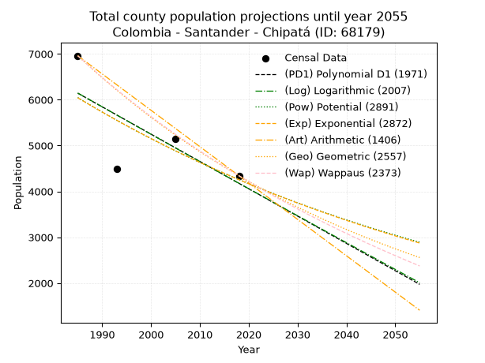
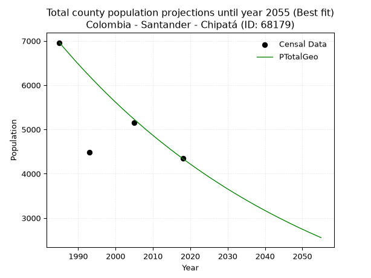
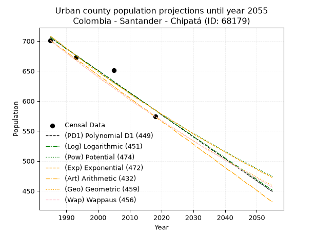
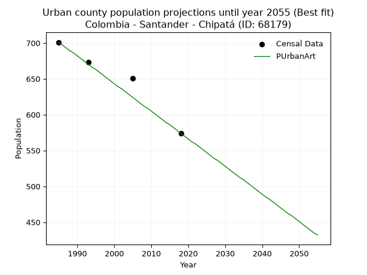
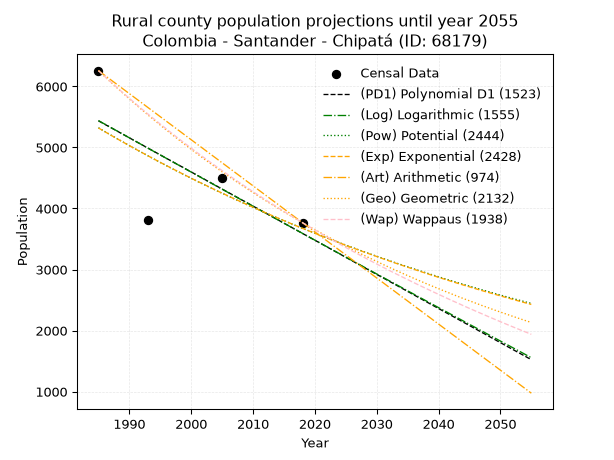
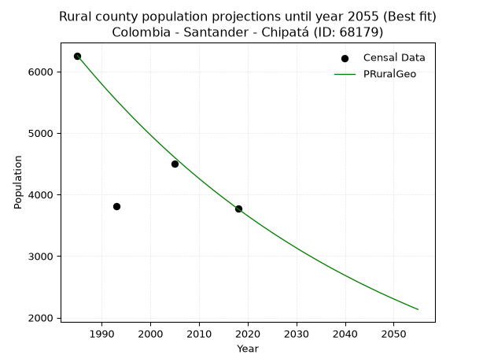

<div align="center">


</div>

# 📜 _“Population and Public Services Demand Projections (PPSD) until Year 2050 for Colombia - Santander - Chipatá (ID: 68179)”_
Keywords: `population` `public-service` `projection` `lineal` `polynomial` `logarithmic` `potential` `exponential` `arithmetic` `geometric` `wappaus` `dane` `colombia` `south-america`

PPSD are analytical estimates used by governments and planners to anticipate future changes in population size, age distribution, and the resulting community needs for utilities, healthcare, education, and infrastructure as sizing future water treatment facilities, electrical grids, and road networks based on spatial growth.

<div align="center">

</img>

</div>


> **General running parameters**: • app_version: _v20260806_. • Python version: _3.14.7_. • Pandas version: _3.0.5_. • NumPy version: _2.5.1_. • Creates, save and include plots into reports (create_plot): _False_. • Projection until year: _2050_. • Process polynomial degree 2 and up: _False_. • Process Wappaus: _True_. • Process Wappaus: _True_. • Set negative values to zero: _True_. • Set infinite values to zero: _True_. • Drop dataset notes: _True_. 
<div align="center">

Dynamic map: [:earth_americas:Google](http://maps.google.com/maps?q=6.062520903,-73.6371106) [:earth_americas:OSM](https://www.openstreetmap.org/#map=18/6.062520903/-73.6371106&layers=P) [:earth_americas:Bing](https://www.bing.com/maps?cp=6.062520903~-73.6371106&lvl=18) [:earth_americas:Apple](https://maps.apple.com/frame?center=6.062520903%2C-73.6371106&span=0.003%2C0.006)

</div>


<div align="center">

```geojson
{
  "type": "Feature",
  "geometry": {
    "type": "Point", 
    "coordinates": [-73.6371106, 6.062520903]
  }, 
  "properties": {
    "Name": "Colombia - Santander - Chipatá (ID: 68179)"
  }
}
```

</div>


## 0. Census Data (4 records)

Census data are official statistics collected by a government about the people and housing in a country. They usually include counts of total population, age, sex, race, income, education, and jobs.

📅Global census file: [Population.xlsx](../data/Population.xlsx)

| Source   |   Year |   CountryID | CountryName   |   StateID | StateName   |   CountyID | CountyName   |   PTotal |   PUrban |   PRural |
|:---------|-------:|------------:|:--------------|----------:|:------------|-----------:|:-------------|---------:|---------:|---------:|
| DANE     |   1985 |          57 | Colombia      |        68 | Santander   |      68179 | Chipatá      |     6959 |      701 |     6258 |
| DANE     |   1993 |          57 | Colombia      |        68 | Santander   |      68179 | Chipatá      |     4483 |      673 |     3810 |
| DANE     |   2005 |          57 | Colombia      |        68 | Santander   |      68179 | Chipatá      |     5151 |      651 |     4500 |
| DANE     |   2018 |          57 | Colombia      |        68 | Santander   |      68179 | Chipatá      |     4341 |      574 |     3767 |

> 🔥Some records could had specific notes about the registered values or the corresponding urban or rural distribution.

📅[SUI-RUPS](https://www.datos.gov.co/Hacienda-y-Cr-dito-P-blico/Registro-nico-de-Prestadores-de-Servicios-P-blicos/4qkq-csdn/about_data) - Local public utility companies: [RUPS.csv](../data/RUPS.xlsx)

 | SERVICIO       | ESTADO    | NOMBRE                                                                                              | NIT         | DEPARTAMENTO_DOMICILIO   | MUNICIPIO_DOMICILIO   | DIRECCION                      |   TELEFONO | EMAIL                                | TIPO_PRESTADOR                 | CLASIFICACION                 |
|:---------------|:----------|:----------------------------------------------------------------------------------------------------|:------------|:-------------------------|:----------------------|:-------------------------------|-----------:|:-------------------------------------|:-------------------------------|:------------------------------|
| ACUEDUCTO      | OPERATIVA | EMPRESA DE SERVICIOS PÚBLICOS DE ACUEDUCTO ALCANTARILLADO Y ASEO DE CHIPATA - DEPENDENCIA MUNICIPAL | 890208098-5 | SANTANDER                | CHIPATA               | ALCALDIA CHIPATA CRA 6 Nº 3-17 |    7565494 | contactenos@chipata-santander.gov.co | MUNICIPIO (PRESTACIÓN DIRECTA) | MENOR O IGUAL A 2500 USUARIOS |
| ALCANTARILLADO | OPERATIVA | EMPRESA DE SERVICIOS PÚBLICOS DE ACUEDUCTO ALCANTARILLADO Y ASEO DE CHIPATA - DEPENDENCIA MUNICIPAL | 890208098-5 | SANTANDER                | CHIPATA               | ALCALDIA CHIPATA CRA 6 Nº 3-17 |    7565494 | contactenos@chipata-santander.gov.co | MUNICIPIO (PRESTACIÓN DIRECTA) | MENOR O IGUAL A 2500 USUARIOS |

## 1. Total

### 1.1. Coefficients and Parameters

* (PD1) Polynomial Deg 1: -59.58490566037681, 124418.20754716871 (lineal)
* (Log) Logarithmic: -119415.01951998884, 912908.0203033455
* (Pow) Potential: -21.29362395365393, 74.00276674683738
* (Exp) Exponential: -0.010626496028914524, 8752057445642.546
* (Art) Arithmetic: Year diff. 2018 - 1985 = 33, Population diff. 4341 - 6959 = -2618, Annual growth = -79.33333333333333
* (Geo) Geometric: Year diff. 2018 - 1985 = 33, Population diff. 4341 - 6959 = -2618, Annual growth % = -0.014199168166280973
* (Wap) Wappaus: i = -1.4041297935103245, Condition values only valid for < 200)

<sub>
Wappaus condition values: ['-0.00', '-1.40', '-2.81', '-4.21', '-5.62', '-7.02', '-8.42', '-9.83', '-11.23', '-12.64', '-14.04', '-15.45', '-16.85', '-18.25', '-19.66', '-21.06', '-22.47', '-23.87', '-25.27', '-26.68', '-28.08', '-29.49', '-30.89', '-32.29', '-33.70', '-35.10', '-36.51', '-37.91', '-39.32', '-40.72', '-42.12', '-43.53', '-44.93', '-46.34', '-47.74', '-49.14', '-50.55', '-51.95', '-53.36', '-54.76', '-56.17', '-57.57', '-58.97', '-60.38', '-61.78', '-63.19', '-64.59', '-65.99', '-67.40', '-68.80', '-70.21', '-71.61', '-73.01', '-74.42', '-75.82', '-77.23', '-78.63', '-80.04', '-81.44', '-82.84', '-84.25', '-85.65', '-87.06', '-88.46', '-89.86', '-91.27']
</sub>


### 1.2. Projected Dataset

|   Year |   CountyID |   PTotalPD1 |   PTotalLog |   PTotalPow |   PTotalExp |   PTotalArt |   PTotalGeo |   PTotalWap |
|-------:|-----------:|------------:|------------:|------------:|------------:|------------:|------------:|------------:|
|   1985 |      68179 |        6142 |        6145 |        6046 |        6043 |        6959 |        6959 |        6959 |
|   1986 |      68179 |        6083 |        6085 |        5982 |        5979 |        6880 |        6860 |        6862 |
|   1987 |      68179 |        6023 |        6025 |        5918 |        5916 |        6800 |        6763 |        6766 |
|   1988 |      68179 |        5963 |        5965 |        5855 |        5854 |        6721 |        6667 |        6672 |
|   1989 |      68179 |        5904 |        5905 |        5793 |        5792 |        6642 |        6572 |        6579 |
|   1990 |      68179 |        5844 |        5845 |        5731 |        5731 |        6562 |        6479 |        6487 |
|   1991 |      68179 |        5785 |        5785 |        5670 |        5670 |        6483 |        6387 |        6396 |
|   1992 |      68179 |        5725 |        5725 |        5610 |        5610 |        6404 |        6296 |        6307 |
|   1993 |      68179 |        5665 |        5665 |        5550 |        5551 |        6324 |        6207 |        6219 |
|   1994 |      68179 |        5606 |        5605 |        5491 |        5492 |        6245 |        6119 |        6132 |
|   1995 |      68179 |        5546 |        5545 |        5433 |        5434 |        6166 |        6032 |        6046 |
|   1996 |      68179 |        5487 |        5485 |        5375 |        5377 |        6086 |        5946 |        5961 |
|   1997 |      68179 |        5427 |        5425 |        5318 |        5320 |        6007 |        5862 |        5878 |
|   1998 |      68179 |        5368 |        5366 |        5262 |        5264 |        5928 |        5778 |        5795 |
|   1999 |      68179 |        5308 |        5306 |        5206 |        5208 |        5848 |        5696 |        5713 |
|   2000 |      68179 |        5248 |        5246 |        5151 |        5153 |        5769 |        5615 |        5633 |
|   2001 |      68179 |        5189 |        5186 |        5096 |        5098 |        5690 |        5536 |        5553 |
|   2002 |      68179 |        5129 |        5127 |        5042 |        5045 |        5610 |        5457 |        5475 |
|   2003 |      68179 |        5070 |        5067 |        4989 |        4991 |        5531 |        5380 |        5397 |
|   2004 |      68179 |        5010 |        5008 |        4936 |        4938 |        5452 |        5303 |        5321 |
|   2005 |      68179 |        4950 |        4948 |        4884 |        4886 |        5372 |        5228 |        5245 |
|   2006 |      68179 |        4891 |        4888 |        4833 |        4835 |        5293 |        5154 |        5171 |
|   2007 |      68179 |        4831 |        4829 |        4782 |        4784 |        5214 |        5081 |        5097 |
|   2008 |      68179 |        4772 |        4769 |        4731 |        4733 |        5134 |        5008 |        5024 |
|   2009 |      68179 |        4712 |        4710 |        4681 |        4683 |        5055 |        4937 |        4952 |
|   2010 |      68179 |        4653 |        4651 |        4632 |        4633 |        4976 |        4867 |        4881 |
|   2011 |      68179 |        4593 |        4591 |        4583 |        4584 |        4896 |        4798 |        4811 |
|   2012 |      68179 |        4533 |        4532 |        4535 |        4536 |        4817 |        4730 |        4741 |
|   2013 |      68179 |        4474 |        4472 |        4487 |        4488 |        4738 |        4663 |        4673 |
|   2014 |      68179 |        4414 |        4413 |        4440 |        4441 |        4658 |        4597 |        4605 |
|   2015 |      68179 |        4355 |        4354 |        4393 |        4394 |        4579 |        4531 |        4538 |
|   2016 |      68179 |        4295 |        4295 |        4347 |        4347 |        4500 |        4467 |        4471 |
|   2017 |      68179 |        4235 |        4235 |        4301 |        4301 |        4420 |        4404 |        4406 |
|   2018 |      68179 |        4176 |        4176 |        4256 |        4256 |        4341 |        4341 |        4341 |
|   2019 |      68179 |        4116 |        4117 |        4212 |        4211 |        4262 |        4279 |        4277 |
|   2020 |      68179 |        4057 |        4058 |        4167 |        4166 |        4182 |        4219 |        4214 |
|   2021 |      68179 |        3997 |        3999 |        4124 |        4122 |        4103 |        4159 |        4151 |
|   2022 |      68179 |        3938 |        3940 |        4080 |        4079 |        4024 |        4100 |        4089 |
|   2023 |      68179 |        3878 |        3881 |        4038 |        4036 |        3944 |        4041 |        4028 |
|   2024 |      68179 |        3818 |        3822 |        3995 |        3993 |        3865 |        3984 |        3967 |
|   2025 |      68179 |        3759 |        3763 |        3954 |        3951 |        3786 |        3927 |        3907 |
|   2026 |      68179 |        3699 |        3704 |        3912 |        3909 |        3706 |        3872 |        3848 |
|   2027 |      68179 |        3640 |        3645 |        3871 |        3868 |        3627 |        3817 |        3790 |
|   2028 |      68179 |        3580 |        3586 |        3831 |        3827 |        3548 |        3763 |        3732 |
|   2029 |      68179 |        3520 |        3527 |        3791 |        3786 |        3468 |        3709 |        3674 |
|   2030 |      68179 |        3461 |        3468 |        3751 |        3746 |        3389 |        3656 |        3618 |
|   2031 |      68179 |        3401 |        3409 |        3712 |        3707 |        3310 |        3605 |        3561 |
|   2032 |      68179 |        3342 |        3351 |        3674 |        3668 |        3230 |        3553 |        3506 |
|   2033 |      68179 |        3282 |        3292 |        3635 |        3629 |        3151 |        3503 |        3451 |
|   2034 |      68179 |        3223 |        3233 |        3597 |        3590 |        3072 |        3453 |        3397 |
|   2035 |      68179 |        3163 |        3174 |        3560 |        3552 |        2992 |        3404 |        3343 |
|   2036 |      68179 |        3103 |        3116 |        3523 |        3515 |        2913 |        3356 |        3289 |
|   2037 |      68179 |        3044 |        3057 |        3486 |        3478 |        2834 |        3308 |        3237 |
|   2038 |      68179 |        2984 |        2999 |        3450 |        3441 |        2754 |        3261 |        3185 |
|   2039 |      68179 |        2925 |        2940 |        3414 |        3405 |        2675 |        3215 |        3133 |
|   2040 |      68179 |        2865 |        2881 |        3379 |        3369 |        2596 |        3169 |        3082 |
|   2041 |      68179 |        2805 |        2823 |        3344 |        3333 |        2516 |        3124 |        3031 |
|   2042 |      68179 |        2746 |        2764 |        3309 |        3298 |        2437 |        3080 |        2981 |
|   2043 |      68179 |        2686 |        2706 |        3275 |        3263 |        2358 |        3036 |        2932 |
|   2044 |      68179 |        2627 |        2647 |        3241 |        3228 |        2278 |        2993 |        2882 |
|   2045 |      68179 |        2567 |        2589 |        3207 |        3194 |        2199 |        2951 |        2834 |
|   2046 |      68179 |        2507 |        2531 |        3174 |        3161 |        2120 |        2909 |        2786 |
|   2047 |      68179 |        2448 |        2472 |        3141 |        3127 |        2040 |        2867 |        2738 |
|   2048 |      68179 |        2388 |        2414 |        3109 |        3094 |        1961 |        2827 |        2691 |
|   2049 |      68179 |        2329 |        2356 |        3076 |        3061 |        1882 |        2786 |        2644 |
|   2050 |      68179 |        2269 |        2297 |        3045 |        3029 |        1802 |        2747 |        2598 |
<div align="center">

</img>

</div>


### 1.3. Best fit with absolute and relative error (%)

Relative error puts that difference into context by dividing the absolute error by the true value, creating a unitless ratio or percentage that shows the scale of the mistake.

Absolute and relative error

|   Year | Source   |   CountryID | CountryName   |   StateID | StateName   |   CountyID_x | CountyName   |   PTotal |   PUrban |   PRural |   CountyID_y |   PTotalPD1 |   PTotalLog |   PTotalPow |   PTotalExp |   PTotalArt |   PTotalGeo |   PTotalWap |   PTotalPD1AbsError |   PTotalLogAbsError |   PTotalPowAbsError |   PTotalExpAbsError |   PTotalArtAbsError |   PTotalGeoAbsError |   PTotalWapAbsError |   PTotalPD1RelError |   PTotalLogRelError |   PTotalPowRelError |   PTotalExpRelError |   PTotalArtRelError |   PTotalGeoRelError |   PTotalWapRelError |
|-------:|:---------|------------:|:--------------|----------:|:------------|-------------:|:-------------|---------:|---------:|---------:|-------------:|------------:|------------:|------------:|------------:|------------:|------------:|------------:|--------------------:|--------------------:|--------------------:|--------------------:|--------------------:|--------------------:|--------------------:|--------------------:|--------------------:|--------------------:|--------------------:|--------------------:|--------------------:|--------------------:|
|   1985 | DANE     |          57 | Colombia      |        68 | Santander   |        68179 | Chipatá      |     6959 |      701 |     6258 |        68179 |        6142 |        6145 |        6046 |        6043 |        6959 |        6959 |        6959 |                 817 |                 814 |                 913 |                 916 |                   0 |                   0 |                   0 |            11.7402  |            11.6971  |            13.1197  |            13.1628  |             0       |             0       |             0       |
|   1993 | DANE     |          57 | Colombia      |        68 | Santander   |        68179 | Chipatá      |     4483 |      673 |     3810 |        68179 |        5665 |        5665 |        5550 |        5551 |        6324 |        6207 |        6219 |                1182 |                1182 |                1067 |                1068 |                1841 |                1724 |                1736 |            26.3663  |            26.3663  |            23.801   |            23.8233  |            41.0663  |            38.4564  |            38.7241  |
|   2005 | DANE     |          57 | Colombia      |        68 | Santander   |        68179 | Chipatá      |     5151 |      651 |     4500 |        68179 |        4950 |        4948 |        4884 |        4886 |        5372 |        5228 |        5245 |                 201 |                 203 |                 267 |                 265 |                 221 |                  77 |                  94 |             3.90215 |             3.94098 |             5.18346 |             5.14463 |             4.29043 |             1.49486 |             1.82489 |
|   2018 | DANE     |          57 | Colombia      |        68 | Santander   |        68179 | Chipatá      |     4341 |      574 |     3767 |        68179 |        4176 |        4176 |        4256 |        4256 |        4341 |        4341 |        4341 |                 165 |                 165 |                  85 |                  85 |                   0 |                   0 |                   0 |             3.80097 |             3.80097 |             1.95807 |             1.95807 |             0       |             0       |             0       |

Relative error mean

| Method    |   RelError | Best   |
|:----------|-----------:|:-------|
| PTotalPD1 |   11.4524  |        |
| PTotalLog |   11.4513  |        |
| PTotalPow |   11.0156  |        |
| PTotalExp |   11.0222  |        |
| PTotalArt |   11.3392  |        |
| PTotalGeo |    9.98781 | True   |
| PTotalWap |   10.1372  |        |

💙Best method: _**PTotalGeo**_
<div align="center">

</img>

</div>


### 1.4. Fresh water supply demand in liters per capita per day (lpcd)

The fresh water supply demand typically ranges from 100 to 300 liters per capita per day (lpcd) for standard domestic and municipal planning, though absolute survival minimums set by the World Health Organization are as low as 7.5 to 20 liters per day, and total consumption in high-income nations can exceed 400 liters.

> `CZ`: Level in meters above the sea level (masl)<br> `WS`: Fresh water supply demand in liters per capita per day (lpcd or l/h/d)<br> `WSAll`: Zonal fresh water supply demand in liters per second (l/s)<br> `A`: Zonal area in square meters<br> `DP`: Population density (people/hectare or p/ha)

Reference values (RAS Colombia)

|    CZ |   WS |
|------:|-----:|
|  1000 |  120 |
|  2000 |  130 |
| 99999 |  140 |

County shapefile geometry properties and water supply values

|   CountyID |      ATotal |   CZTotal |   WSTotal |
|-----------:|------------:|----------:|----------:|
|      68179 | 9.48363e+07 |   1886.35 |       130 |

Projected values for best method: PTotalGeo

|   CountyID |   Year |   PTotalGeo |   DPTotal |   WSTotal |   WSTotalAll |
|-----------:|-------:|------------:|----------:|----------:|-------------:|
|      68179 |   1985 |        6959 |      0.73 |       130 |     10.4707  |
|      68179 |   1986 |        6860 |      0.72 |       130 |     10.3218  |
|      68179 |   1987 |        6763 |      0.71 |       130 |     10.1758  |
|      68179 |   1988 |        6667 |      0.7  |       130 |     10.0314  |
|      68179 |   1989 |        6572 |      0.69 |       130 |      9.88843 |
|      68179 |   1990 |        6479 |      0.68 |       130 |      9.7485  |
|      68179 |   1991 |        6387 |      0.67 |       130 |      9.61007 |
|      68179 |   1992 |        6296 |      0.66 |       130 |      9.47315 |
|      68179 |   1993 |        6207 |      0.65 |       130 |      9.33924 |
|      68179 |   1994 |        6119 |      0.65 |       130 |      9.20683 |
|      68179 |   1995 |        6032 |      0.64 |       130 |      9.07593 |
|      68179 |   1996 |        5946 |      0.63 |       130 |      8.94653 |
|      68179 |   1997 |        5862 |      0.62 |       130 |      8.82014 |
|      68179 |   1998 |        5778 |      0.61 |       130 |      8.69375 |
|      68179 |   1999 |        5696 |      0.6  |       130 |      8.57037 |
|      68179 |   2000 |        5615 |      0.59 |       130 |      8.4485  |
|      68179 |   2001 |        5536 |      0.58 |       130 |      8.32963 |
|      68179 |   2002 |        5457 |      0.58 |       130 |      8.21076 |
|      68179 |   2003 |        5380 |      0.57 |       130 |      8.09491 |
|      68179 |   2004 |        5303 |      0.56 |       130 |      7.97905 |
|      68179 |   2005 |        5228 |      0.55 |       130 |      7.8662  |
|      68179 |   2006 |        5154 |      0.54 |       130 |      7.75486 |
|      68179 |   2007 |        5081 |      0.54 |       130 |      7.64502 |
|      68179 |   2008 |        5008 |      0.53 |       130 |      7.53519 |
|      68179 |   2009 |        4937 |      0.52 |       130 |      7.42836 |
|      68179 |   2010 |        4867 |      0.51 |       130 |      7.32303 |
|      68179 |   2011 |        4798 |      0.51 |       130 |      7.21921 |
|      68179 |   2012 |        4730 |      0.5  |       130 |      7.1169  |
|      68179 |   2013 |        4663 |      0.49 |       130 |      7.01609 |
|      68179 |   2014 |        4597 |      0.48 |       130 |      6.91678 |
|      68179 |   2015 |        4531 |      0.48 |       130 |      6.81748 |
|      68179 |   2016 |        4467 |      0.47 |       130 |      6.72118 |
|      68179 |   2017 |        4404 |      0.46 |       130 |      6.62639 |
|      68179 |   2018 |        4341 |      0.46 |       130 |      6.5316  |
|      68179 |   2019 |        4279 |      0.45 |       130 |      6.43831 |
|      68179 |   2020 |        4219 |      0.44 |       130 |      6.34803 |
|      68179 |   2021 |        4159 |      0.44 |       130 |      6.25775 |
|      68179 |   2022 |        4100 |      0.43 |       130 |      6.16898 |
|      68179 |   2023 |        4041 |      0.43 |       130 |      6.08021 |
|      68179 |   2024 |        3984 |      0.42 |       130 |      5.99444 |
|      68179 |   2025 |        3927 |      0.41 |       130 |      5.90868 |
|      68179 |   2026 |        3872 |      0.41 |       130 |      5.82593 |
|      68179 |   2027 |        3817 |      0.4  |       130 |      5.74317 |
|      68179 |   2028 |        3763 |      0.4  |       130 |      5.66192 |
|      68179 |   2029 |        3709 |      0.39 |       130 |      5.58067 |
|      68179 |   2030 |        3656 |      0.39 |       130 |      5.50093 |
|      68179 |   2031 |        3605 |      0.38 |       130 |      5.42419 |
|      68179 |   2032 |        3553 |      0.37 |       130 |      5.34595 |
|      68179 |   2033 |        3503 |      0.37 |       130 |      5.27072 |
|      68179 |   2034 |        3453 |      0.36 |       130 |      5.19549 |
|      68179 |   2035 |        3404 |      0.36 |       130 |      5.12176 |
|      68179 |   2036 |        3356 |      0.35 |       130 |      5.04954 |
|      68179 |   2037 |        3308 |      0.35 |       130 |      4.97731 |
|      68179 |   2038 |        3261 |      0.34 |       130 |      4.9066  |
|      68179 |   2039 |        3215 |      0.34 |       130 |      4.83738 |
|      68179 |   2040 |        3169 |      0.33 |       130 |      4.76817 |
|      68179 |   2041 |        3124 |      0.33 |       130 |      4.70046 |
|      68179 |   2042 |        3080 |      0.32 |       130 |      4.63426 |
|      68179 |   2043 |        3036 |      0.32 |       130 |      4.56806 |
|      68179 |   2044 |        2993 |      0.32 |       130 |      4.50336 |
|      68179 |   2045 |        2951 |      0.31 |       130 |      4.44016 |
|      68179 |   2046 |        2909 |      0.31 |       130 |      4.37697 |
|      68179 |   2047 |        2867 |      0.3  |       130 |      4.31377 |
|      68179 |   2048 |        2827 |      0.3  |       130 |      4.25359 |
|      68179 |   2049 |        2786 |      0.29 |       130 |      4.1919  |
|      68179 |   2050 |        2747 |      0.29 |       130 |      4.13322 |

## 2. Urban

### 2.1. Coefficients and Parameters

* (PD1) Polynomial Deg 1: -3.6752308309915223, 8001.130469690794 (lineal)
* (Log) Logarithmic: -7353.064056224004, 56540.44881511599
* (Pow) Potential: -11.577174579663907, 41.028687758349086
* (Exp) Exponential: -0.005786923054257219, 68967152.81663424
* (Art) Arithmetic: Year diff. 2018 - 1985 = 33, Population diff. 574 - 701 = -127, Annual growth = -3.8484848484848486
* (Geo) Geometric: Year diff. 2018 - 1985 = 33, Population diff. 574 - 701 = -127, Annual growth % = -0.006038617775498634
* (Wap) Wappaus: i = -0.6036838978015449, Condition values only valid for < 200)

<sub>
Wappaus condition values: ['-0.00', '-0.60', '-1.21', '-1.81', '-2.41', '-3.02', '-3.62', '-4.23', '-4.83', '-5.43', '-6.04', '-6.64', '-7.24', '-7.85', '-8.45', '-9.06', '-9.66', '-10.26', '-10.87', '-11.47', '-12.07', '-12.68', '-13.28', '-13.88', '-14.49', '-15.09', '-15.70', '-16.30', '-16.90', '-17.51', '-18.11', '-18.71', '-19.32', '-19.92', '-20.53', '-21.13', '-21.73', '-22.34', '-22.94', '-23.54', '-24.15', '-24.75', '-25.35', '-25.96', '-26.56', '-27.17', '-27.77', '-28.37', '-28.98', '-29.58', '-30.18', '-30.79', '-31.39', '-32.00', '-32.60', '-33.20', '-33.81', '-34.41', '-35.01', '-35.62', '-36.22', '-36.82', '-37.43', '-38.03', '-38.64', '-39.24']
</sub>


### 2.2. Projected Dataset

|   Year |   CountyID |   PUrbanPD1 |   PUrbanLog |   PUrbanPow |   PUrbanExp |   PUrbanArt |   PUrbanGeo |   PUrbanWap |
|-------:|-----------:|------------:|------------:|------------:|------------:|------------:|------------:|------------:|
|   1985 |      68179 |         706 |         706 |         708 |         708 |         701 |         701 |         701 |
|   1986 |      68179 |         702 |         702 |         704 |         704 |         697 |         697 |         697 |
|   1987 |      68179 |         698 |         698 |         700 |         700 |         693 |         693 |         693 |
|   1988 |      68179 |         695 |         695 |         696 |         696 |         689 |         688 |         688 |
|   1989 |      68179 |         691 |         691 |         692 |         692 |         686 |         684 |         684 |
|   1990 |      68179 |         687 |         687 |         688 |         688 |         682 |         680 |         680 |
|   1991 |      68179 |         684 |         684 |         684 |         684 |         678 |         676 |         676 |
|   1992 |      68179 |         680 |         680 |         680 |         680 |         674 |         672 |         672 |
|   1993 |      68179 |         676 |         676 |         676 |         676 |         670 |         668 |         668 |
|   1994 |      68179 |         673 |         673 |         672 |         672 |         666 |         664 |         664 |
|   1995 |      68179 |         669 |         669 |         668 |         668 |         663 |         660 |         660 |
|   1996 |      68179 |         665 |         665 |         664 |         664 |         659 |         656 |         656 |
|   1997 |      68179 |         662 |         662 |         660 |         660 |         655 |         652 |         652 |
|   1998 |      68179 |         658 |         658 |         656 |         656 |         651 |         648 |         648 |
|   1999 |      68179 |         654 |         654 |         653 |         653 |         647 |         644 |         644 |
|   2000 |      68179 |         651 |         651 |         649 |         649 |         643 |         640 |         640 |
|   2001 |      68179 |         647 |         647 |         645 |         645 |         639 |         636 |         636 |
|   2002 |      68179 |         643 |         643 |         641 |         641 |         636 |         632 |         633 |
|   2003 |      68179 |         640 |         640 |         638 |         638 |         632 |         629 |         629 |
|   2004 |      68179 |         636 |         636 |         634 |         634 |         628 |         625 |         625 |
|   2005 |      68179 |         632 |         632 |         630 |         630 |         624 |         621 |         621 |
|   2006 |      68179 |         629 |         628 |         627 |         627 |         620 |         617 |         617 |
|   2007 |      68179 |         625 |         625 |         623 |         623 |         616 |         614 |         614 |
|   2008 |      68179 |         621 |         621 |         619 |         620 |         612 |         610 |         610 |
|   2009 |      68179 |         618 |         618 |         616 |         616 |         609 |         606 |         606 |
|   2010 |      68179 |         614 |         614 |         612 |         612 |         605 |         602 |         603 |
|   2011 |      68179 |         610 |         610 |         609 |         609 |         601 |         599 |         599 |
|   2012 |      68179 |         607 |         607 |         605 |         605 |         597 |         595 |         595 |
|   2013 |      68179 |         603 |         603 |         602 |         602 |         593 |         592 |         592 |
|   2014 |      68179 |         599 |         599 |         598 |         598 |         589 |         588 |         588 |
|   2015 |      68179 |         596 |         596 |         595 |         595 |         586 |         585 |         585 |
|   2016 |      68179 |         592 |         592 |         592 |         592 |         582 |         581 |         581 |
|   2017 |      68179 |         588 |         588 |         588 |         588 |         578 |         577 |         578 |
|   2018 |      68179 |         585 |         585 |         585 |         585 |         574 |         574 |         574 |
|   2019 |      68179 |         581 |         581 |         581 |         581 |         570 |         571 |         571 |
|   2020 |      68179 |         577 |         577 |         578 |         578 |         566 |         567 |         567 |
|   2021 |      68179 |         573 |         574 |         575 |         575 |         562 |         564 |         564 |
|   2022 |      68179 |         570 |         570 |         572 |         571 |         559 |         560 |         560 |
|   2023 |      68179 |         566 |         566 |         568 |         568 |         555 |         557 |         557 |
|   2024 |      68179 |         562 |         563 |         565 |         565 |         551 |         554 |         553 |
|   2025 |      68179 |         559 |         559 |         562 |         562 |         547 |         550 |         550 |
|   2026 |      68179 |         555 |         556 |         559 |         558 |         543 |         547 |         547 |
|   2027 |      68179 |         551 |         552 |         555 |         555 |         539 |         544 |         543 |
|   2028 |      68179 |         548 |         548 |         552 |         552 |         536 |         540 |         540 |
|   2029 |      68179 |         544 |         545 |         549 |         549 |         532 |         537 |         537 |
|   2030 |      68179 |         540 |         541 |         546 |         545 |         528 |         534 |         533 |
|   2031 |      68179 |         537 |         537 |         543 |         542 |         524 |         531 |         530 |
|   2032 |      68179 |         533 |         534 |         540 |         539 |         520 |         527 |         527 |
|   2033 |      68179 |         529 |         530 |         537 |         536 |         516 |         524 |         524 |
|   2034 |      68179 |         526 |         527 |         534 |         533 |         512 |         521 |         520 |
|   2035 |      68179 |         522 |         523 |         531 |         530 |         509 |         518 |         517 |
|   2036 |      68179 |         518 |         519 |         528 |         527 |         505 |         515 |         514 |
|   2037 |      68179 |         515 |         516 |         525 |         524 |         501 |         512 |         511 |
|   2038 |      68179 |         511 |         512 |         522 |         521 |         497 |         509 |         508 |
|   2039 |      68179 |         507 |         509 |         519 |         518 |         493 |         505 |         505 |
|   2040 |      68179 |         504 |         505 |         516 |         515 |         489 |         502 |         501 |
|   2041 |      68179 |         500 |         501 |         513 |         512 |         485 |         499 |         498 |
|   2042 |      68179 |         496 |         498 |         510 |         509 |         482 |         496 |         495 |
|   2043 |      68179 |         493 |         494 |         507 |         506 |         478 |         493 |         492 |
|   2044 |      68179 |         489 |         491 |         504 |         503 |         474 |         490 |         489 |
|   2045 |      68179 |         485 |         487 |         501 |         500 |         470 |         487 |         486 |
|   2046 |      68179 |         482 |         483 |         499 |         497 |         466 |         484 |         483 |
|   2047 |      68179 |         478 |         480 |         496 |         494 |         462 |         482 |         480 |
|   2048 |      68179 |         474 |         476 |         493 |         492 |         459 |         479 |         477 |
|   2049 |      68179 |         471 |         473 |         490 |         489 |         455 |         476 |         474 |
|   2050 |      68179 |         467 |         469 |         487 |         486 |         451 |         473 |         471 |
<div align="center">

</img>

</div>


### 2.3. Best fit with absolute and relative error (%)

Relative error puts that difference into context by dividing the absolute error by the true value, creating a unitless ratio or percentage that shows the scale of the mistake.

Absolute and relative error

|   Year | Source   |   CountryID | CountryName   |   StateID | StateName   |   CountyID_x | CountyName   |   PTotal |   PUrban |   PRural |   CountyID_y |   PUrbanPD1 |   PUrbanLog |   PUrbanPow |   PUrbanExp |   PUrbanArt |   PUrbanGeo |   PUrbanWap |   PUrbanPD1AbsError |   PUrbanLogAbsError |   PUrbanPowAbsError |   PUrbanExpAbsError |   PUrbanArtAbsError |   PUrbanGeoAbsError |   PUrbanWapAbsError |   PUrbanPD1RelError |   PUrbanLogRelError |   PUrbanPowRelError |   PUrbanExpRelError |   PUrbanArtRelError |   PUrbanGeoRelError |   PUrbanWapRelError |
|-------:|:---------|------------:|:--------------|----------:|:------------|-------------:|:-------------|---------:|---------:|---------:|-------------:|------------:|------------:|------------:|------------:|------------:|------------:|------------:|--------------------:|--------------------:|--------------------:|--------------------:|--------------------:|--------------------:|--------------------:|--------------------:|--------------------:|--------------------:|--------------------:|--------------------:|--------------------:|--------------------:|
|   1985 | DANE     |          57 | Colombia      |        68 | Santander   |        68179 | Chipatá      |     6959 |      701 |     6258 |        68179 |         706 |         706 |         708 |         708 |         701 |         701 |         701 |                   5 |                   5 |                   7 |                   7 |                   0 |                   0 |                   0 |            0.713267 |            0.713267 |            0.998573 |            0.998573 |            0        |            0        |            0        |
|   1993 | DANE     |          57 | Colombia      |        68 | Santander   |        68179 | Chipatá      |     4483 |      673 |     3810 |        68179 |         676 |         676 |         676 |         676 |         670 |         668 |         668 |                   3 |                   3 |                   3 |                   3 |                   3 |                   5 |                   5 |            0.445765 |            0.445765 |            0.445765 |            0.445765 |            0.445765 |            0.742942 |            0.742942 |
|   2005 | DANE     |          57 | Colombia      |        68 | Santander   |        68179 | Chipatá      |     5151 |      651 |     4500 |        68179 |         632 |         632 |         630 |         630 |         624 |         621 |         621 |                  19 |                  19 |                  21 |                  21 |                  27 |                  30 |                  30 |            2.91859  |            2.91859  |            3.22581  |            3.22581  |            4.14747  |            4.60829  |            4.60829  |
|   2018 | DANE     |          57 | Colombia      |        68 | Santander   |        68179 | Chipatá      |     4341 |      574 |     3767 |        68179 |         585 |         585 |         585 |         585 |         574 |         574 |         574 |                  11 |                  11 |                  11 |                  11 |                   0 |                   0 |                   0 |            1.91638  |            1.91638  |            1.91638  |            1.91638  |            0        |            0        |            0        |

Relative error mean

| Method    |   RelError | Best   |
|:----------|-----------:|:-------|
| PUrbanPD1 |    1.4985  |        |
| PUrbanLog |    1.4985  |        |
| PUrbanPow |    1.64663 |        |
| PUrbanExp |    1.64663 |        |
| PUrbanArt |    1.14831 | True   |
| PUrbanGeo |    1.33781 |        |
| PUrbanWap |    1.33781 |        |

💙Best method: _**PUrbanArt**_
<div align="center">

</img>

</div>


### 2.4. Fresh water supply demand in liters per capita per day (lpcd)

The fresh water supply demand typically ranges from 100 to 300 liters per capita per day (lpcd) for standard domestic and municipal planning, though absolute survival minimums set by the World Health Organization are as low as 7.5 to 20 liters per day, and total consumption in high-income nations can exceed 400 liters.

> `CZ`: Level in meters above the sea level (masl)<br> `WS`: Fresh water supply demand in liters per capita per day (lpcd or l/h/d)<br> `WSAll`: Zonal fresh water supply demand in liters per second (l/s)<br> `A`: Zonal area in square meters<br> `DP`: Population density (people/hectare or p/ha)

Reference values (RAS Colombia)

|    CZ |   WS |
|------:|-----:|
|  1000 |  120 |
|  2000 |  130 |
| 99999 |  140 |

County shapefile geometry properties and water supply values

|   CountyID |   AUrban |   CZUrban |   WSUrban |
|-----------:|---------:|----------:|----------:|
|      68179 |   254030 |   1790.14 |       130 |

Projected values for best method: PUrbanArt

|   CountyID |   Year |   PUrbanArt |   DPUrban |   WSUrban |   WSUrbanAll |
|-----------:|-------:|------------:|----------:|----------:|-------------:|
|      68179 |   1985 |         701 |     27.6  |       130 |     1.05475  |
|      68179 |   1986 |         697 |     27.44 |       130 |     1.04873  |
|      68179 |   1987 |         693 |     27.28 |       130 |     1.04271  |
|      68179 |   1988 |         689 |     27.12 |       130 |     1.03669  |
|      68179 |   1989 |         686 |     27    |       130 |     1.03218  |
|      68179 |   1990 |         682 |     26.85 |       130 |     1.02616  |
|      68179 |   1991 |         678 |     26.69 |       130 |     1.02014  |
|      68179 |   1992 |         674 |     26.53 |       130 |     1.01412  |
|      68179 |   1993 |         670 |     26.37 |       130 |     1.0081   |
|      68179 |   1994 |         666 |     26.22 |       130 |     1.00208  |
|      68179 |   1995 |         663 |     26.1  |       130 |     0.997569 |
|      68179 |   1996 |         659 |     25.94 |       130 |     0.991551 |
|      68179 |   1997 |         655 |     25.78 |       130 |     0.985532 |
|      68179 |   1998 |         651 |     25.63 |       130 |     0.979514 |
|      68179 |   1999 |         647 |     25.47 |       130 |     0.973495 |
|      68179 |   2000 |         643 |     25.31 |       130 |     0.967477 |
|      68179 |   2001 |         639 |     25.15 |       130 |     0.961458 |
|      68179 |   2002 |         636 |     25.04 |       130 |     0.956944 |
|      68179 |   2003 |         632 |     24.88 |       130 |     0.950926 |
|      68179 |   2004 |         628 |     24.72 |       130 |     0.944907 |
|      68179 |   2005 |         624 |     24.56 |       130 |     0.938889 |
|      68179 |   2006 |         620 |     24.41 |       130 |     0.93287  |
|      68179 |   2007 |         616 |     24.25 |       130 |     0.926852 |
|      68179 |   2008 |         612 |     24.09 |       130 |     0.920833 |
|      68179 |   2009 |         609 |     23.97 |       130 |     0.916319 |
|      68179 |   2010 |         605 |     23.82 |       130 |     0.910301 |
|      68179 |   2011 |         601 |     23.66 |       130 |     0.904282 |
|      68179 |   2012 |         597 |     23.5  |       130 |     0.898264 |
|      68179 |   2013 |         593 |     23.34 |       130 |     0.892245 |
|      68179 |   2014 |         589 |     23.19 |       130 |     0.886227 |
|      68179 |   2015 |         586 |     23.07 |       130 |     0.881713 |
|      68179 |   2016 |         582 |     22.91 |       130 |     0.875694 |
|      68179 |   2017 |         578 |     22.75 |       130 |     0.869676 |
|      68179 |   2018 |         574 |     22.6  |       130 |     0.863657 |
|      68179 |   2019 |         570 |     22.44 |       130 |     0.857639 |
|      68179 |   2020 |         566 |     22.28 |       130 |     0.85162  |
|      68179 |   2021 |         562 |     22.12 |       130 |     0.845602 |
|      68179 |   2022 |         559 |     22.01 |       130 |     0.841088 |
|      68179 |   2023 |         555 |     21.85 |       130 |     0.835069 |
|      68179 |   2024 |         551 |     21.69 |       130 |     0.829051 |
|      68179 |   2025 |         547 |     21.53 |       130 |     0.823032 |
|      68179 |   2026 |         543 |     21.38 |       130 |     0.817014 |
|      68179 |   2027 |         539 |     21.22 |       130 |     0.810995 |
|      68179 |   2028 |         536 |     21.1  |       130 |     0.806481 |
|      68179 |   2029 |         532 |     20.94 |       130 |     0.800463 |
|      68179 |   2030 |         528 |     20.78 |       130 |     0.794444 |
|      68179 |   2031 |         524 |     20.63 |       130 |     0.788426 |
|      68179 |   2032 |         520 |     20.47 |       130 |     0.782407 |
|      68179 |   2033 |         516 |     20.31 |       130 |     0.776389 |
|      68179 |   2034 |         512 |     20.16 |       130 |     0.77037  |
|      68179 |   2035 |         509 |     20.04 |       130 |     0.765856 |
|      68179 |   2036 |         505 |     19.88 |       130 |     0.759838 |
|      68179 |   2037 |         501 |     19.72 |       130 |     0.753819 |
|      68179 |   2038 |         497 |     19.56 |       130 |     0.747801 |
|      68179 |   2039 |         493 |     19.41 |       130 |     0.741782 |
|      68179 |   2040 |         489 |     19.25 |       130 |     0.735764 |
|      68179 |   2041 |         485 |     19.09 |       130 |     0.729745 |
|      68179 |   2042 |         482 |     18.97 |       130 |     0.725231 |
|      68179 |   2043 |         478 |     18.82 |       130 |     0.719213 |
|      68179 |   2044 |         474 |     18.66 |       130 |     0.713194 |
|      68179 |   2045 |         470 |     18.5  |       130 |     0.707176 |
|      68179 |   2046 |         466 |     18.34 |       130 |     0.701157 |
|      68179 |   2047 |         462 |     18.19 |       130 |     0.695139 |
|      68179 |   2048 |         459 |     18.07 |       130 |     0.690625 |
|      68179 |   2049 |         455 |     17.91 |       130 |     0.684606 |
|      68179 |   2050 |         451 |     17.75 |       130 |     0.678588 |

## 3. Rural

### 3.1. Coefficients and Parameters

* (PD1) Polynomial Deg 1: -55.90967482938537, 116417.07707747808 (lineal)
* (Log) Logarithmic: -112061.95546376493, 856367.57148823
* (Pow) Potential: -22.457076894570324, 77.78415607712016
* (Exp) Exponential: -0.011205729172185987, 24323804494899.395
* (Art) Arithmetic: Year diff. 2018 - 1985 = 33, Population diff. 3767 - 6258 = -2491, Annual growth = -75.48484848484848
* (Geo) Geometric: Year diff. 2018 - 1985 = 33, Population diff. 3767 - 6258 = -2491, Annual growth % = -0.01526357666091871
* (Wap) Wappaus: i = -1.5059321393485983, Condition values only valid for < 200)

<sub>
Wappaus condition values: ['-0.00', '-1.51', '-3.01', '-4.52', '-6.02', '-7.53', '-9.04', '-10.54', '-12.05', '-13.55', '-15.06', '-16.57', '-18.07', '-19.58', '-21.08', '-22.59', '-24.09', '-25.60', '-27.11', '-28.61', '-30.12', '-31.62', '-33.13', '-34.64', '-36.14', '-37.65', '-39.15', '-40.66', '-42.17', '-43.67', '-45.18', '-46.68', '-48.19', '-49.70', '-51.20', '-52.71', '-54.21', '-55.72', '-57.23', '-58.73', '-60.24', '-61.74', '-63.25', '-64.76', '-66.26', '-67.77', '-69.27', '-70.78', '-72.28', '-73.79', '-75.30', '-76.80', '-78.31', '-79.81', '-81.32', '-82.83', '-84.33', '-85.84', '-87.34', '-88.85', '-90.36', '-91.86', '-93.37', '-94.87', '-96.38', '-97.89']
</sub>


### 3.2. Projected Dataset

|   Year |   CountyID |   PRuralPD1 |   PRuralLog |   PRuralPow |   PRuralExp |   PRuralArt |   PRuralGeo |   PRuralWap |
|-------:|-----------:|------------:|------------:|------------:|------------:|------------:|------------:|------------:|
|   1985 |      68179 |        5436 |        5439 |        5322 |        5319 |        6258 |        6258 |        6258 |
|   1986 |      68179 |        5380 |        5383 |        5262 |        5260 |        6183 |        6162 |        6164 |
|   1987 |      68179 |        5325 |        5326 |        5203 |        5201 |        6107 |        6068 |        6072 |
|   1988 |      68179 |        5269 |        5270 |        5145 |        5143 |        6032 |        5976 |        5982 |
|   1989 |      68179 |        5213 |        5214 |        5087 |        5086 |        5956 |        5885 |        5892 |
|   1990 |      68179 |        5157 |        5157 |        5030 |        5029 |        5881 |        5795 |        5804 |
|   1991 |      68179 |        5101 |        5101 |        4973 |        4973 |        5805 |        5706 |        5717 |
|   1992 |      68179 |        5045 |        5045 |        4918 |        4918 |        5730 |        5619 |        5631 |
|   1993 |      68179 |        4989 |        4988 |        4863 |        4863 |        5654 |        5533 |        5547 |
|   1994 |      68179 |        4933 |        4932 |        4808 |        4809 |        5579 |        5449 |        5464 |
|   1995 |      68179 |        4877 |        4876 |        4754 |        4755 |        5503 |        5366 |        5382 |
|   1996 |      68179 |        4821 |        4820 |        4701 |        4702 |        5428 |        5284 |        5301 |
|   1997 |      68179 |        4765 |        4764 |        4648 |        4650 |        5352 |        5203 |        5221 |
|   1998 |      68179 |        4710 |        4708 |        4597 |        4598 |        5277 |        5124 |        5142 |
|   1999 |      68179 |        4654 |        4652 |        4545 |        4547 |        5201 |        5046 |        5064 |
|   2000 |      68179 |        4598 |        4596 |        4494 |        4496 |        5126 |        4969 |        4988 |
|   2001 |      68179 |        4542 |        4540 |        4444 |        4446 |        5050 |        4893 |        4912 |
|   2002 |      68179 |        4486 |        4484 |        4395 |        4397 |        4975 |        4818 |        4838 |
|   2003 |      68179 |        4430 |        4428 |        4346 |        4348 |        4899 |        4745 |        4764 |
|   2004 |      68179 |        4374 |        4372 |        4297 |        4299 |        4824 |        4672 |        4692 |
|   2005 |      68179 |        4318 |        4316 |        4249 |        4251 |        4748 |        4601 |        4620 |
|   2006 |      68179 |        4262 |        4260 |        4202 |        4204 |        4673 |        4531 |        4549 |
|   2007 |      68179 |        4206 |        4204 |        4155 |        4157 |        4597 |        4461 |        4479 |
|   2008 |      68179 |        4150 |        4148 |        4109 |        4111 |        4522 |        4393 |        4410 |
|   2009 |      68179 |        4095 |        4092 |        4063 |        4065 |        4446 |        4326 |        4342 |
|   2010 |      68179 |        4039 |        4037 |        4018 |        4020 |        4371 |        4260 |        4275 |
|   2011 |      68179 |        3983 |        3981 |        3974 |        3975 |        4295 |        4195 |        4209 |
|   2012 |      68179 |        3927 |        3925 |        3929 |        3931 |        4220 |        4131 |        4143 |
|   2013 |      68179 |        3871 |        3870 |        3886 |        3887 |        4144 |        4068 |        4079 |
|   2014 |      68179 |        3815 |        3814 |        3843 |        3843 |        4069 |        4006 |        4015 |
|   2015 |      68179 |        3759 |        3758 |        3800 |        3801 |        3993 |        3945 |        3952 |
|   2016 |      68179 |        3703 |        3703 |        3758 |        3758 |        3918 |        3885 |        3889 |
|   2017 |      68179 |        3647 |        3647 |        3716 |        3716 |        3842 |        3825 |        3828 |
|   2018 |      68179 |        3591 |        3592 |        3675 |        3675 |        3767 |        3767 |        3767 |
|   2019 |      68179 |        3535 |        3536 |        3635 |        3634 |        3692 |        3710 |        3707 |
|   2020 |      68179 |        3480 |        3481 |        3594 |        3594 |        3616 |        3653 |        3648 |
|   2021 |      68179 |        3424 |        3425 |        3555 |        3554 |        3541 |        3597 |        3589 |
|   2022 |      68179 |        3368 |        3370 |        3515 |        3514 |        3465 |        3542 |        3531 |
|   2023 |      68179 |        3312 |        3314 |        3477 |        3475 |        3390 |        3488 |        3474 |
|   2024 |      68179 |        3256 |        3259 |        3438 |        3436 |        3314 |        3435 |        3417 |
|   2025 |      68179 |        3200 |        3203 |        3400 |        3398 |        3239 |        3382 |        3361 |
|   2026 |      68179 |        3144 |        3148 |        3363 |        3360 |        3163 |        3331 |        3306 |
|   2027 |      68179 |        3088 |        3093 |        3326 |        3322 |        3088 |        3280 |        3251 |
|   2028 |      68179 |        3032 |        3038 |        3289 |        3285 |        3012 |        3230 |        3197 |
|   2029 |      68179 |        2976 |        2982 |        3253 |        3249 |        2937 |        3181 |        3143 |
|   2030 |      68179 |        2920 |        2927 |        3217 |        3213 |        2861 |        3132 |        3090 |
|   2031 |      68179 |        2865 |        2872 |        3182 |        3177 |        2786 |        3084 |        3038 |
|   2032 |      68179 |        2809 |        2817 |        3147 |        3141 |        2710 |        3037 |        2986 |
|   2033 |      68179 |        2753 |        2762 |        3112 |        3106 |        2635 |        2991 |        2935 |
|   2034 |      68179 |        2697 |        2707 |        3078 |        3072 |        2559 |        2945 |        2885 |
|   2035 |      68179 |        2641 |        2651 |        3044 |        3038 |        2484 |        2900 |        2835 |
|   2036 |      68179 |        2585 |        2596 |        3011 |        3004 |        2408 |        2856 |        2785 |
|   2037 |      68179 |        2529 |        2541 |        2978 |        2970 |        2333 |        2812 |        2736 |
|   2038 |      68179 |        2473 |        2486 |        2945 |        2937 |        2257 |        2769 |        2688 |
|   2039 |      68179 |        2417 |        2431 |        2913 |        2904 |        2182 |        2727 |        2640 |
|   2040 |      68179 |        2361 |        2376 |        2881 |        2872 |        2106 |        2686 |        2593 |
|   2041 |      68179 |        2305 |        2322 |        2849 |        2840 |        2031 |        2645 |        2546 |
|   2042 |      68179 |        2250 |        2267 |        2818 |        2808 |        1955 |        2604 |        2499 |
|   2043 |      68179 |        2194 |        2212 |        2787 |        2777 |        1880 |        2564 |        2454 |
|   2044 |      68179 |        2138 |        2157 |        2757 |        2746 |        1804 |        2525 |        2408 |
|   2045 |      68179 |        2082 |        2102 |        2727 |        2716 |        1729 |        2487 |        2363 |
|   2046 |      68179 |        2026 |        2047 |        2697 |        2685 |        1653 |        2449 |        2319 |
|   2047 |      68179 |        1970 |        1993 |        2668 |        2655 |        1578 |        2411 |        2275 |
|   2048 |      68179 |        1914 |        1938 |        2639 |        2626 |        1502 |        2375 |        2231 |
|   2049 |      68179 |        1858 |        1883 |        2610 |        2597 |        1427 |        2338 |        2188 |
|   2050 |      68179 |        1802 |        1828 |        2581 |        2568 |        1351 |        2303 |        2145 |
<div align="center">

</img>

</div>


### 3.3. Best fit with absolute and relative error (%)

Relative error puts that difference into context by dividing the absolute error by the true value, creating a unitless ratio or percentage that shows the scale of the mistake.

Absolute and relative error

|   Year | Source   |   CountryID | CountryName   |   StateID | StateName   |   CountyID_x | CountyName   |   PTotal |   PUrban |   PRural |   CountyID_y |   PRuralPD1 |   PRuralLog |   PRuralPow |   PRuralExp |   PRuralArt |   PRuralGeo |   PRuralWap |   PRuralPD1AbsError |   PRuralLogAbsError |   PRuralPowAbsError |   PRuralExpAbsError |   PRuralArtAbsError |   PRuralGeoAbsError |   PRuralWapAbsError |   PRuralPD1RelError |   PRuralLogRelError |   PRuralPowRelError |   PRuralExpRelError |   PRuralArtRelError |   PRuralGeoRelError |   PRuralWapRelError |
|-------:|:---------|------------:|:--------------|----------:|:------------|-------------:|:-------------|---------:|---------:|---------:|-------------:|------------:|------------:|------------:|------------:|------------:|------------:|------------:|--------------------:|--------------------:|--------------------:|--------------------:|--------------------:|--------------------:|--------------------:|--------------------:|--------------------:|--------------------:|--------------------:|--------------------:|--------------------:|--------------------:|
|   1985 | DANE     |          57 | Colombia      |        68 | Santander   |        68179 | Chipatá      |     6959 |      701 |     6258 |        68179 |        5436 |        5439 |        5322 |        5319 |        6258 |        6258 |        6258 |                 822 |                 819 |                 936 |                 939 |                   0 |                   0 |                   0 |            13.1352  |            13.0872  |            14.9569  |            15.0048  |             0       |             0       |             0       |
|   1993 | DANE     |          57 | Colombia      |        68 | Santander   |        68179 | Chipatá      |     4483 |      673 |     3810 |        68179 |        4989 |        4988 |        4863 |        4863 |        5654 |        5533 |        5547 |                1179 |                1178 |                1053 |                1053 |                1844 |                1723 |                1737 |            30.9449  |            30.9186  |            27.6378  |            27.6378  |            48.399   |            45.2231  |            45.5906  |
|   2005 | DANE     |          57 | Colombia      |        68 | Santander   |        68179 | Chipatá      |     5151 |      651 |     4500 |        68179 |        4318 |        4316 |        4249 |        4251 |        4748 |        4601 |        4620 |                 182 |                 184 |                 251 |                 249 |                 248 |                 101 |                 120 |             4.04444 |             4.08889 |             5.57778 |             5.53333 |             5.51111 |             2.24444 |             2.66667 |
|   2018 | DANE     |          57 | Colombia      |        68 | Santander   |        68179 | Chipatá      |     4341 |      574 |     3767 |        68179 |        3591 |        3592 |        3675 |        3675 |        3767 |        3767 |        3767 |                 176 |                 175 |                  92 |                  92 |                   0 |                   0 |                   0 |             4.67215 |             4.64561 |             2.44226 |             2.44226 |             0       |             0       |             0       |

Relative error mean

| Method    |   RelError | Best   |
|:----------|-----------:|:-------|
| PRuralPD1 |    13.1992 |        |
| PRuralLog |    13.1851 |        |
| PRuralPow |    12.6537 |        |
| PRuralExp |    12.6545 |        |
| PRuralArt |    13.4775 |        |
| PRuralGeo |    11.8669 | True   |
| PRuralWap |    12.0643 |        |

💙Best method: _**PRuralGeo**_
<div align="center">

</img>

</div>


### 3.4. Fresh water supply demand in liters per capita per day (lpcd)

The fresh water supply demand typically ranges from 100 to 300 liters per capita per day (lpcd) for standard domestic and municipal planning, though absolute survival minimums set by the World Health Organization are as low as 7.5 to 20 liters per day, and total consumption in high-income nations can exceed 400 liters.

> `CZ`: Level in meters above the sea level (masl)<br> `WS`: Fresh water supply demand in liters per capita per day (lpcd or l/h/d)<br> `WSAll`: Zonal fresh water supply demand in liters per second (l/s)<br> `A`: Zonal area in square meters<br> `DP`: Population density (people/hectare or p/ha)

Reference values (RAS Colombia)

|    CZ |   WS |
|------:|-----:|
|  1000 |  120 |
|  2000 |  130 |
| 99999 |  140 |

County shapefile geometry properties and water supply values

|   CountyID |      ARural |   CZRural |   WSRural |
|-----------:|------------:|----------:|----------:|
|      68179 | 9.45822e+07 |    1886.6 |       130 |

Projected values for best method: PRuralGeo

|   CountyID |   Year |   PRuralGeo |   DPRural |   WSRural |   WSRuralAll |
|-----------:|-------:|------------:|----------:|----------:|-------------:|
|      68179 |   1985 |        6258 |      0.66 |       130 |      9.41597 |
|      68179 |   1986 |        6162 |      0.65 |       130 |      9.27153 |
|      68179 |   1987 |        6068 |      0.64 |       130 |      9.13009 |
|      68179 |   1988 |        5976 |      0.63 |       130 |      8.99167 |
|      68179 |   1989 |        5885 |      0.62 |       130 |      8.85475 |
|      68179 |   1990 |        5795 |      0.61 |       130 |      8.71933 |
|      68179 |   1991 |        5706 |      0.6  |       130 |      8.58542 |
|      68179 |   1992 |        5619 |      0.59 |       130 |      8.45451 |
|      68179 |   1993 |        5533 |      0.58 |       130 |      8.32512 |
|      68179 |   1994 |        5449 |      0.58 |       130 |      8.19873 |
|      68179 |   1995 |        5366 |      0.57 |       130 |      8.07384 |
|      68179 |   1996 |        5284 |      0.56 |       130 |      7.95046 |
|      68179 |   1997 |        5203 |      0.55 |       130 |      7.82859 |
|      68179 |   1998 |        5124 |      0.54 |       130 |      7.70972 |
|      68179 |   1999 |        5046 |      0.53 |       130 |      7.59236 |
|      68179 |   2000 |        4969 |      0.53 |       130 |      7.4765  |
|      68179 |   2001 |        4893 |      0.52 |       130 |      7.36215 |
|      68179 |   2002 |        4818 |      0.51 |       130 |      7.24931 |
|      68179 |   2003 |        4745 |      0.5  |       130 |      7.13947 |
|      68179 |   2004 |        4672 |      0.49 |       130 |      7.02963 |
|      68179 |   2005 |        4601 |      0.49 |       130 |      6.9228  |
|      68179 |   2006 |        4531 |      0.48 |       130 |      6.81748 |
|      68179 |   2007 |        4461 |      0.47 |       130 |      6.71215 |
|      68179 |   2008 |        4393 |      0.46 |       130 |      6.60984 |
|      68179 |   2009 |        4326 |      0.46 |       130 |      6.50903 |
|      68179 |   2010 |        4260 |      0.45 |       130 |      6.40972 |
|      68179 |   2011 |        4195 |      0.44 |       130 |      6.31192 |
|      68179 |   2012 |        4131 |      0.44 |       130 |      6.21563 |
|      68179 |   2013 |        4068 |      0.43 |       130 |      6.12083 |
|      68179 |   2014 |        4006 |      0.42 |       130 |      6.02755 |
|      68179 |   2015 |        3945 |      0.42 |       130 |      5.93576 |
|      68179 |   2016 |        3885 |      0.41 |       130 |      5.84549 |
|      68179 |   2017 |        3825 |      0.4  |       130 |      5.75521 |
|      68179 |   2018 |        3767 |      0.4  |       130 |      5.66794 |
|      68179 |   2019 |        3710 |      0.39 |       130 |      5.58218 |
|      68179 |   2020 |        3653 |      0.39 |       130 |      5.49641 |
|      68179 |   2021 |        3597 |      0.38 |       130 |      5.41215 |
|      68179 |   2022 |        3542 |      0.37 |       130 |      5.3294  |
|      68179 |   2023 |        3488 |      0.37 |       130 |      5.24815 |
|      68179 |   2024 |        3435 |      0.36 |       130 |      5.1684  |
|      68179 |   2025 |        3382 |      0.36 |       130 |      5.08866 |
|      68179 |   2026 |        3331 |      0.35 |       130 |      5.01192 |
|      68179 |   2027 |        3280 |      0.35 |       130 |      4.93519 |
|      68179 |   2028 |        3230 |      0.34 |       130 |      4.85995 |
|      68179 |   2029 |        3181 |      0.34 |       130 |      4.78623 |
|      68179 |   2030 |        3132 |      0.33 |       130 |      4.7125  |
|      68179 |   2031 |        3084 |      0.33 |       130 |      4.64028 |
|      68179 |   2032 |        3037 |      0.32 |       130 |      4.56956 |
|      68179 |   2033 |        2991 |      0.32 |       130 |      4.50035 |
|      68179 |   2034 |        2945 |      0.31 |       130 |      4.43113 |
|      68179 |   2035 |        2900 |      0.31 |       130 |      4.36343 |
|      68179 |   2036 |        2856 |      0.3  |       130 |      4.29722 |
|      68179 |   2037 |        2812 |      0.3  |       130 |      4.23102 |
|      68179 |   2038 |        2769 |      0.29 |       130 |      4.16632 |
|      68179 |   2039 |        2727 |      0.29 |       130 |      4.10313 |
|      68179 |   2040 |        2686 |      0.28 |       130 |      4.04144 |
|      68179 |   2041 |        2645 |      0.28 |       130 |      3.97975 |
|      68179 |   2042 |        2604 |      0.28 |       130 |      3.91806 |
|      68179 |   2043 |        2564 |      0.27 |       130 |      3.85787 |
|      68179 |   2044 |        2525 |      0.27 |       130 |      3.79919 |
|      68179 |   2045 |        2487 |      0.26 |       130 |      3.74201 |
|      68179 |   2046 |        2449 |      0.26 |       130 |      3.68484 |
|      68179 |   2047 |        2411 |      0.25 |       130 |      3.62766 |
|      68179 |   2048 |        2375 |      0.25 |       130 |      3.5735  |
|      68179 |   2049 |        2338 |      0.25 |       130 |      3.51782 |
|      68179 |   2050 |        2303 |      0.24 |       130 |      3.46516 |

#

<div align="center"><br><sub>Share this research</sub></div><br>

<sub>**APPS & TOOLS & CONTENT DISCLAIMER**: • NO WARRANTY - This content and software is provided by <a href="https://github.com/rcfdtools" target="_blank">github.com/rcfdtools</a> "as is", without any express or implied warranty, including warranties of merchantability, fitness for a particular purpose, or non-infringement. There is no guarantee that the software will be error-free or operate without interruption. • LIMITATION OF LIABILITY - Neither the authors nor copyright holders will be liable for claims or damages arising from the software or its use. You are responsible for determining if the software is appropriate for your use and assume all associated risks, including errors, legal compliance, and data loss. • NO PROFESSIONAL ADVICE - The software provides general information and does not offer professional advice. It should not replace consultation with professional advisors. [Clauses and global license for rcfdtools use.](https://github.com/rcfdtools/rcfdtools/blob/main/LICENSE.md)</sub>

| [:house: Home](Readme.md)  | [:beginner: Help / Collab](https://github.com/rcfdtools/R.HydroTools/discussions/31) |
|----------------------------|-------------------------------------------------------------------------------------------|