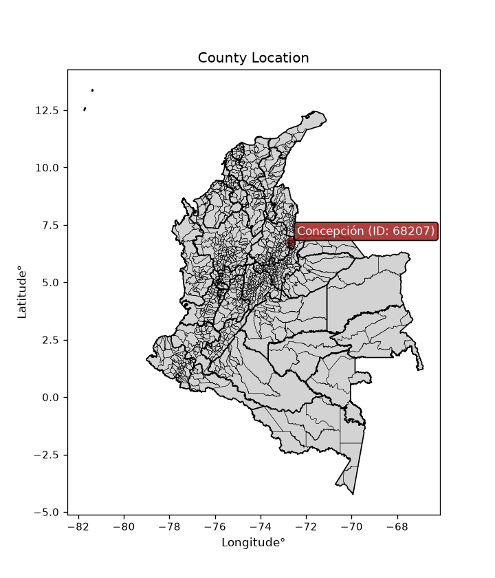
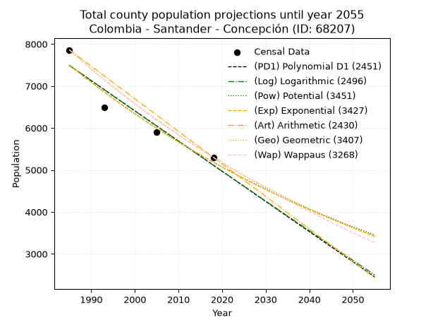
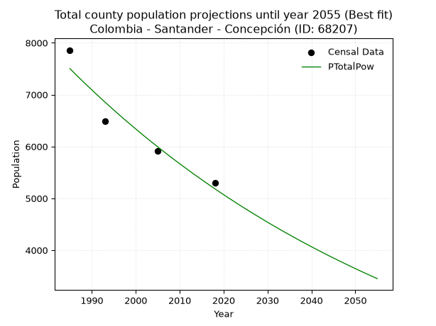
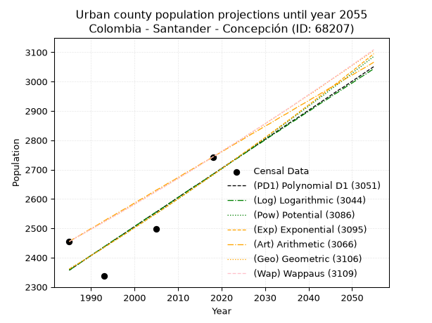
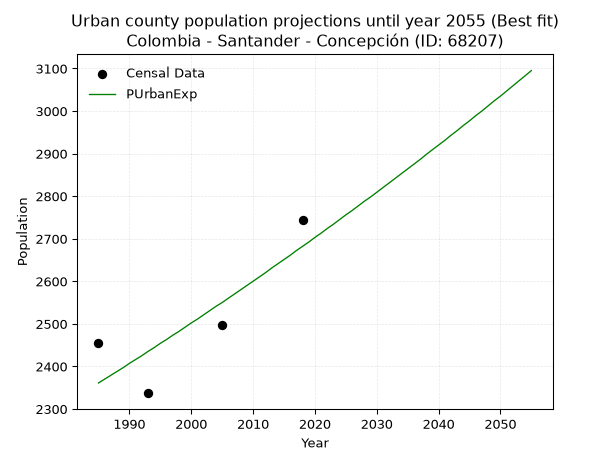
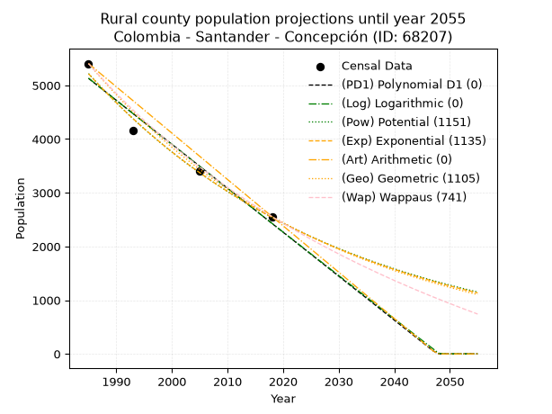
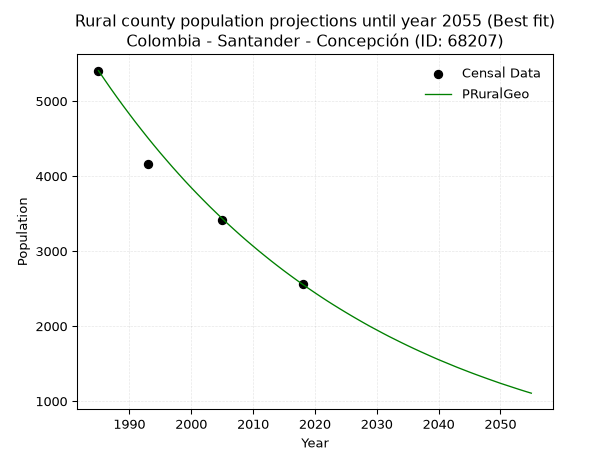

<div align="center">


</div>

# _“Population and Public Services Demand Projections (PPSD) until Year 2050 for Colombia - Santander - Concepción (ID: 68207)”_
Keywords: `population` `public-service` `projection` `lineal` `polynomial` `logarithmic` `potential` `exponential` `arithmetic` `geometric` `wappaus` `dane` `colombia` `south-america`

PPSD are analytical estimates used by governments and planners to anticipate future changes in population size, age distribution, and the resulting community needs for utilities, healthcare, education, and infrastructure as sizing future water treatment facilities, electrical grids, and road networks based on spatial growth.

<div align="center">

</img>

</div>


> **General running parameters**: • app_version: _v20260806_. • Python version: _3.14.7_. • Pandas version: _3.0.5_. • NumPy version: _2.5.1_. • Creates, save and include plots into reports (create_plot): _False_. • Projection until year: _2050_. • Process polynomial degree 2 and up: _False_. • Process Wappaus: _True_. • Process Wappaus: _True_. • Set negative values to zero: _True_. • Set infinite values to zero: _True_. • Drop dataset notes: _True_. 
<div align="center">

Dynamic map: [:earth_americas:Google](http://maps.google.com/maps?q=6.76890837,-72.6945674) [:earth_americas:OSM](https://www.openstreetmap.org/#map=18/6.76890837/-72.6945674&layers=P) [:earth_americas:Bing](https://www.bing.com/maps?cp=6.76890837~-72.6945674&lvl=18) [:earth_americas:Apple](https://maps.apple.com/frame?center=6.76890837%2C-72.6945674&span=0.003%2C0.006)

</div>


<div align="center">

```geojson
{
  "type": "Feature",
  "geometry": {
    "type": "Point", 
    "coordinates": [-72.6945674, 6.76890837]
  }, 
  "properties": {
    "Name": "Colombia - Santander - Concepción (ID: 68207)"
  }
}
```

</div>


## 0. Census Data (4 records)

Census data are official statistics collected by a government about the people and housing in a country. They usually include counts of total population, age, sex, race, income, education, and jobs.

📅Global census file: [Population.xlsx](../data/Population.xlsx)

| Source   |   Year |   CountryID | CountryName   |   StateID | StateName   |   CountyID | CountyName   |   PTotal |   PUrban |   PRural |
|:---------|-------:|------------:|:--------------|----------:|:------------|-----------:|:-------------|---------:|---------:|---------:|
| DANE     |   1985 |          57 | Colombia      |        68 | Santander   |      68207 | Concepción   |     7860 |     2455 |     5405 |
| DANE     |   1993 |          57 | Colombia      |        68 | Santander   |      68207 | Concepción   |     6493 |     2337 |     4156 |
| DANE     |   2005 |          57 | Colombia      |        68 | Santander   |      68207 | Concepción   |     5908 |     2498 |     3410 |
| DANE     |   2018 |          57 | Colombia      |        68 | Santander   |      68207 | Concepción   |     5300 |     2743 |     2557 |

> 🔥Some records could had specific notes about the registered values or the corresponding urban or rural distribution.

📅[SUI-RUPS](https://www.datos.gov.co/Hacienda-y-Cr-dito-P-blico/Registro-nico-de-Prestadores-de-Servicios-P-blicos/4qkq-csdn/about_data) - Local public utility companies: [RUPS.csv](../data/RUPS.xlsx)

 | SERVICIO       | ESTADO    | NOMBRE                                                                                                                | NIT         | DEPARTAMENTO_DOMICILIO   | MUNICIPIO_DOMICILIO   | DIRECCION         |   TELEFONO | EMAIL                                         | TIPO_PRESTADOR                 | CLASIFICACION                 |
|:---------------|:----------|:----------------------------------------------------------------------------------------------------------------------|:------------|:-------------------------|:----------------------|:------------------|-----------:|:----------------------------------------------|:-------------------------------|:------------------------------|
| ACUEDUCTO      | OPERATIVA | UNIDAD MUNICIPAL DE SERVICIOS PUBLICOS DOMICILIARIOS DE ACUEDUCTO, ALCANTARILLADO Y ASEO  DEL MUNICIPIO DE CONCEPCION | 800104060-1 | SANTANDER                | CONCEPCION            | Calle 7  # 3 - 16 |    6603251 | serviciospublicos@concepcion-santander.gov.co | MUNICIPIO (PRESTACIÓN DIRECTA) | MENOR O IGUAL A 2500 USUARIOS |
| ALCANTARILLADO | OPERATIVA | UNIDAD MUNICIPAL DE SERVICIOS PUBLICOS DOMICILIARIOS DE ACUEDUCTO, ALCANTARILLADO Y ASEO  DEL MUNICIPIO DE CONCEPCION | 800104060-1 | SANTANDER                | CONCEPCION            | Calle 7  # 3 - 16 |    6603251 | serviciospublicos@concepcion-santander.gov.co | MUNICIPIO (PRESTACIÓN DIRECTA) | MENOR O IGUAL A 2500 USUARIOS |

## 1. Total

### 1.1. Coefficients and Parameters

* (PD1) Polynomial Deg 1: -71.9409875551983, 150290.2103572854 (lineal)
* (Log) Logarithmic: -144095.33856702122, 1101660.073155503
* (Pow) Potential: -22.40088617794387, 77.74792016936375
* (Exp) Exponential: -0.011185457381306727, 32936341608806.934
* (Art) Arithmetic: Year diff. 2018 - 1985 = 33, Population diff. 5300 - 7860 = -2560, Annual growth = -77.57575757575758
* (Geo) Geometric: Year diff. 2018 - 1985 = 33, Population diff. 5300 - 7860 = -2560, Annual growth % = -0.011870791245545687
* (Wap) Wappaus: i = -1.1789628810905406, Condition values only valid for < 200)

<sub>
Wappaus condition values: ['-0.00', '-1.18', '-2.36', '-3.54', '-4.72', '-5.89', '-7.07', '-8.25', '-9.43', '-10.61', '-11.79', '-12.97', '-14.15', '-15.33', '-16.51', '-17.68', '-18.86', '-20.04', '-21.22', '-22.40', '-23.58', '-24.76', '-25.94', '-27.12', '-28.30', '-29.47', '-30.65', '-31.83', '-33.01', '-34.19', '-35.37', '-36.55', '-37.73', '-38.91', '-40.08', '-41.26', '-42.44', '-43.62', '-44.80', '-45.98', '-47.16', '-48.34', '-49.52', '-50.70', '-51.87', '-53.05', '-54.23', '-55.41', '-56.59', '-57.77', '-58.95', '-60.13', '-61.31', '-62.49', '-63.66', '-64.84', '-66.02', '-67.20', '-68.38', '-69.56', '-70.74', '-71.92', '-73.10', '-74.27', '-75.45', '-76.63']
</sub>


### 1.2. Projected Dataset

|   Year |   CountyID |   PTotalPD1 |   PTotalLog |   PTotalPow |   PTotalExp |   PTotalArt |   PTotalGeo |   PTotalWap |
|-------:|-----------:|------------:|------------:|------------:|------------:|------------:|------------:|------------:|
|   1985 |      68207 |        7487 |        7490 |        7502 |        7499 |        7860 |        7860 |        7860 |
|   1986 |      68207 |        7415 |        7418 |        7418 |        7415 |        7782 |        7767 |        7768 |
|   1987 |      68207 |        7343 |        7345 |        7334 |        7333 |        7705 |        7674 |        7677 |
|   1988 |      68207 |        7272 |        7273 |        7252 |        7251 |        7627 |        7583 |        7587 |
|   1989 |      68207 |        7200 |        7200 |        7171 |        7170 |        7550 |        7493 |        7498 |
|   1990 |      68207 |        7128 |        7128 |        7091 |        7091 |        7472 |        7404 |        7410 |
|   1991 |      68207 |        7056 |        7055 |        7011 |        7012 |        7395 |        7317 |        7323 |
|   1992 |      68207 |        6984 |        6983 |        6933 |        6934 |        7317 |        7230 |        7237 |
|   1993 |      68207 |        6912 |        6911 |        6855 |        6857 |        7239 |        7144 |        7152 |
|   1994 |      68207 |        6840 |        6838 |        6779 |        6780 |        7162 |        7059 |        7068 |
|   1995 |      68207 |        6768 |        6766 |        6703 |        6705 |        7084 |        6975 |        6985 |
|   1996 |      68207 |        6696 |        6694 |        6628 |        6630 |        7007 |        6892 |        6903 |
|   1997 |      68207 |        6624 |        6622 |        6554 |        6557 |        6929 |        6811 |        6821 |
|   1998 |      68207 |        6552 |        6550 |        6481 |        6484 |        6852 |        6730 |        6741 |
|   1999 |      68207 |        6480 |        6478 |        6409 |        6412 |        6774 |        6650 |        6662 |
|   2000 |      68207 |        6408 |        6405 |        6338 |        6340 |        6696 |        6571 |        6583 |
|   2001 |      68207 |        6336 |        6333 |        6267 |        6270 |        6619 |        6493 |        6505 |
|   2002 |      68207 |        6264 |        6261 |        6197 |        6200 |        6541 |        6416 |        6428 |
|   2003 |      68207 |        6192 |        6189 |        6128 |        6131 |        6464 |        6340 |        6352 |
|   2004 |      68207 |        6120 |        6118 |        6060 |        6063 |        6386 |        6264 |        6277 |
|   2005 |      68207 |        6049 |        6046 |        5993 |        5995 |        6308 |        6190 |        6202 |
|   2006 |      68207 |        5977 |        5974 |        5926 |        5929 |        6231 |        6117 |        6128 |
|   2007 |      68207 |        5905 |        5902 |        5860 |        5863 |        6153 |        6044 |        6055 |
|   2008 |      68207 |        5833 |        5830 |        5795 |        5798 |        6076 |        5972 |        5983 |
|   2009 |      68207 |        5761 |        5758 |        5731 |        5733 |        5998 |        5901 |        5912 |
|   2010 |      68207 |        5689 |        5687 |        5668 |        5669 |        5921 |        5831 |        5841 |
|   2011 |      68207 |        5617 |        5615 |        5605 |        5606 |        5843 |        5762 |        5771 |
|   2012 |      68207 |        5545 |        5543 |        5543 |        5544 |        5765 |        5694 |        5702 |
|   2013 |      68207 |        5473 |        5472 |        5481 |        5482 |        5688 |        5626 |        5633 |
|   2014 |      68207 |        5401 |        5400 |        5421 |        5421 |        5610 |        5559 |        5565 |
|   2015 |      68207 |        5329 |        5329 |        5361 |        5361 |        5533 |        5493 |        5498 |
|   2016 |      68207 |        5257 |        5257 |        5302 |        5301 |        5455 |        5428 |        5431 |
|   2017 |      68207 |        5185 |        5186 |        5243 |        5242 |        5378 |        5364 |        5365 |
|   2018 |      68207 |        5113 |        5114 |        5185 |        5184 |        5300 |        5300 |        5300 |
|   2019 |      68207 |        5041 |        5043 |        5128 |        5126 |        5222 |        5237 |        5235 |
|   2020 |      68207 |        4969 |        4972 |        5071 |        5069 |        5145 |        5175 |        5171 |
|   2021 |      68207 |        4897 |        4900 |        5015 |        5013 |        5067 |        5113 |        5108 |
|   2022 |      68207 |        4826 |        4829 |        4960 |        4957 |        4990 |        5053 |        5045 |
|   2023 |      68207 |        4754 |        4758 |        4905 |        4902 |        4912 |        4993 |        4983 |
|   2024 |      68207 |        4682 |        4687 |        4851 |        4848 |        4835 |        4934 |        4922 |
|   2025 |      68207 |        4610 |        4615 |        4798 |        4794 |        4757 |        4875 |        4861 |
|   2026 |      68207 |        4538 |        4544 |        4745 |        4740 |        4679 |        4817 |        4800 |
|   2027 |      68207 |        4466 |        4473 |        4693 |        4688 |        4602 |        4760 |        4740 |
|   2028 |      68207 |        4394 |        4402 |        4642 |        4635 |        4524 |        4703 |        4681 |
|   2029 |      68207 |        4322 |        4331 |        4591 |        4584 |        4447 |        4648 |        4622 |
|   2030 |      68207 |        4250 |        4260 |        4540 |        4533 |        4369 |        4592 |        4564 |
|   2031 |      68207 |        4178 |        4189 |        4490 |        4482 |        4292 |        4538 |        4507 |
|   2032 |      68207 |        4106 |        4118 |        4441 |        4433 |        4214 |        4484 |        4450 |
|   2033 |      68207 |        4034 |        4047 |        4392 |        4383 |        4136 |        4431 |        4393 |
|   2034 |      68207 |        3962 |        3976 |        4344 |        4335 |        4059 |        4378 |        4337 |
|   2035 |      68207 |        3890 |        3906 |        4297 |        4286 |        3981 |        4326 |        4281 |
|   2036 |      68207 |        3818 |        3835 |        4250 |        4239 |        3904 |        4275 |        4226 |
|   2037 |      68207 |        3746 |        3764 |        4203 |        4192 |        3826 |        4224 |        4172 |
|   2038 |      68207 |        3674 |        3693 |        4157 |        4145 |        3748 |        4174 |        4118 |
|   2039 |      68207 |        3603 |        3623 |        4112 |        4099 |        3671 |        4124 |        4064 |
|   2040 |      68207 |        3531 |        3552 |        4067 |        4053 |        3593 |        4075 |        4011 |
|   2041 |      68207 |        3459 |        3481 |        4023 |        4008 |        3516 |        4027 |        3959 |
|   2042 |      68207 |        3387 |        3411 |        3979 |        3964 |        3438 |        3979 |        3906 |
|   2043 |      68207 |        3315 |        3340 |        3935 |        3919 |        3361 |        3932 |        3855 |
|   2044 |      68207 |        3243 |        3270 |        3892 |        3876 |        3283 |        3885 |        3804 |
|   2045 |      68207 |        3171 |        3199 |        3850 |        3833 |        3205 |        3839 |        3753 |
|   2046 |      68207 |        3099 |        3129 |        3808 |        3790 |        3128 |        3794 |        3702 |
|   2047 |      68207 |        3027 |        3058 |        3767 |        3748 |        3050 |        3749 |        3652 |
|   2048 |      68207 |        2955 |        2988 |        3726 |        3706 |        2973 |        3704 |        3603 |
|   2049 |      68207 |        2883 |        2918 |        3685 |        3665 |        2895 |        3660 |        3554 |
|   2050 |      68207 |        2811 |        2847 |        3645 |        3624 |        2818 |        3617 |        3505 |
<div align="center">

</img>

</div>


### 1.3. Best fit with absolute and relative error (%)

Relative error puts that difference into context by dividing the absolute error by the true value, creating a unitless ratio or percentage that shows the scale of the mistake.

Absolute and relative error

|   Year | Source   |   CountryID | CountryName   |   StateID | StateName   |   CountyID_x | CountyName   |   PTotal |   PUrban |   PRural |   CountyID_y |   PTotalPD1 |   PTotalLog |   PTotalPow |   PTotalExp |   PTotalArt |   PTotalGeo |   PTotalWap |   PTotalPD1AbsError |   PTotalLogAbsError |   PTotalPowAbsError |   PTotalExpAbsError |   PTotalArtAbsError |   PTotalGeoAbsError |   PTotalWapAbsError |   PTotalPD1RelError |   PTotalLogRelError |   PTotalPowRelError |   PTotalExpRelError |   PTotalArtRelError |   PTotalGeoRelError |   PTotalWapRelError |
|-------:|:---------|------------:|:--------------|----------:|:------------|-------------:|:-------------|---------:|---------:|---------:|-------------:|------------:|------------:|------------:|------------:|------------:|------------:|------------:|--------------------:|--------------------:|--------------------:|--------------------:|--------------------:|--------------------:|--------------------:|--------------------:|--------------------:|--------------------:|--------------------:|--------------------:|--------------------:|--------------------:|
|   1985 | DANE     |          57 | Colombia      |        68 | Santander   |        68207 | Concepción   |     7860 |     2455 |     5405 |        68207 |        7487 |        7490 |        7502 |        7499 |        7860 |        7860 |        7860 |                 373 |                 370 |                 358 |                 361 |                   0 |                   0 |                   0 |             4.74555 |             4.70738 |             4.55471 |             4.59288 |             0       |             0       |              0      |
|   1993 | DANE     |          57 | Colombia      |        68 | Santander   |        68207 | Concepción   |     6493 |     2337 |     4156 |        68207 |        6912 |        6911 |        6855 |        6857 |        7239 |        7144 |        7152 |                 419 |                 418 |                 362 |                 364 |                 746 |                 651 |                 659 |             6.4531  |             6.4377  |             5.57523 |             5.60604 |            11.4893  |            10.0262  |             10.1494 |
|   2005 | DANE     |          57 | Colombia      |        68 | Santander   |        68207 | Concepción   |     5908 |     2498 |     3410 |        68207 |        6049 |        6046 |        5993 |        5995 |        6308 |        6190 |        6202 |                 141 |                 138 |                  85 |                  87 |                 400 |                 282 |                 294 |             2.38659 |             2.33582 |             1.43873 |             1.47258 |             6.77048 |             4.77319 |              4.9763 |
|   2018 | DANE     |          57 | Colombia      |        68 | Santander   |        68207 | Concepción   |     5300 |     2743 |     2557 |        68207 |        5113 |        5114 |        5185 |        5184 |        5300 |        5300 |        5300 |                 187 |                 186 |                 115 |                 116 |                   0 |                   0 |                   0 |             3.5283  |             3.50943 |             2.16981 |             2.18868 |             0       |             0       |              0      |

Relative error mean

| Method    |   RelError | Best   |
|:----------|-----------:|:-------|
| PTotalPD1 |    4.27839 |        |
| PTotalLog |    4.24758 |        |
| PTotalPow |    3.43462 | True   |
| PTotalExp |    3.46504 |        |
| PTotalArt |    4.56494 |        |
| PTotalGeo |    3.69984 |        |
| PTotalWap |    3.78142 |        |

💙Best method: _**PTotalPow**_
<div align="center">

</img>

</div>


### 1.4. Fresh water supply demand in liters per capita per day (lpcd)

The fresh water supply demand typically ranges from 100 to 300 liters per capita per day (lpcd) for standard domestic and municipal planning, though absolute survival minimums set by the World Health Organization are as low as 7.5 to 20 liters per day, and total consumption in high-income nations can exceed 400 liters.

> `CZ`: Level in meters above the sea level (masl)<br> `WS`: Fresh water supply demand in liters per capita per day (lpcd or l/h/d)<br> `WSAll`: Zonal fresh water supply demand in liters per second (l/s)<br> `A`: Zonal area in square meters<br> `DP`: Population density (people/hectare or p/ha)

Reference values (RAS Colombia)

|    CZ |   WS |
|------:|-----:|
|  1000 |  120 |
|  2000 |  130 |
| 99999 |  140 |

County shapefile geometry properties and water supply values

|   CountyID |      ATotal |   CZTotal |   WSTotal |
|-----------:|------------:|----------:|----------:|
|      68207 | 3.36376e+08 |   3215.74 |       140 |

Projected values for best method: PTotalPow

|   CountyID |   Year |   PTotalPow |   DPTotal |   WSTotal |   WSTotalAll |
|-----------:|-------:|------------:|----------:|----------:|-------------:|
|      68207 |   1985 |        7502 |      0.22 |       140 |     12.156   |
|      68207 |   1986 |        7418 |      0.22 |       140 |     12.0199  |
|      68207 |   1987 |        7334 |      0.22 |       140 |     11.8838  |
|      68207 |   1988 |        7252 |      0.22 |       140 |     11.7509  |
|      68207 |   1989 |        7171 |      0.21 |       140 |     11.6197  |
|      68207 |   1990 |        7091 |      0.21 |       140 |     11.49    |
|      68207 |   1991 |        7011 |      0.21 |       140 |     11.3604  |
|      68207 |   1992 |        6933 |      0.21 |       140 |     11.234   |
|      68207 |   1993 |        6855 |      0.2  |       140 |     11.1076  |
|      68207 |   1994 |        6779 |      0.2  |       140 |     10.9845  |
|      68207 |   1995 |        6703 |      0.2  |       140 |     10.8613  |
|      68207 |   1996 |        6628 |      0.2  |       140 |     10.7398  |
|      68207 |   1997 |        6554 |      0.19 |       140 |     10.6199  |
|      68207 |   1998 |        6481 |      0.19 |       140 |     10.5016  |
|      68207 |   1999 |        6409 |      0.19 |       140 |     10.385   |
|      68207 |   2000 |        6338 |      0.19 |       140 |     10.2699  |
|      68207 |   2001 |        6267 |      0.19 |       140 |     10.1549  |
|      68207 |   2002 |        6197 |      0.18 |       140 |     10.0414  |
|      68207 |   2003 |        6128 |      0.18 |       140 |      9.92963 |
|      68207 |   2004 |        6060 |      0.18 |       140 |      9.81944 |
|      68207 |   2005 |        5993 |      0.18 |       140 |      9.71088 |
|      68207 |   2006 |        5926 |      0.18 |       140 |      9.60231 |
|      68207 |   2007 |        5860 |      0.17 |       140 |      9.49537 |
|      68207 |   2008 |        5795 |      0.17 |       140 |      9.39005 |
|      68207 |   2009 |        5731 |      0.17 |       140 |      9.28634 |
|      68207 |   2010 |        5668 |      0.17 |       140 |      9.18426 |
|      68207 |   2011 |        5605 |      0.17 |       140 |      9.08218 |
|      68207 |   2012 |        5543 |      0.16 |       140 |      8.98171 |
|      68207 |   2013 |        5481 |      0.16 |       140 |      8.88125 |
|      68207 |   2014 |        5421 |      0.16 |       140 |      8.78403 |
|      68207 |   2015 |        5361 |      0.16 |       140 |      8.68681 |
|      68207 |   2016 |        5302 |      0.16 |       140 |      8.5912  |
|      68207 |   2017 |        5243 |      0.16 |       140 |      8.4956  |
|      68207 |   2018 |        5185 |      0.15 |       140 |      8.40162 |
|      68207 |   2019 |        5128 |      0.15 |       140 |      8.30926 |
|      68207 |   2020 |        5071 |      0.15 |       140 |      8.2169  |
|      68207 |   2021 |        5015 |      0.15 |       140 |      8.12616 |
|      68207 |   2022 |        4960 |      0.15 |       140 |      8.03704 |
|      68207 |   2023 |        4905 |      0.15 |       140 |      7.94792 |
|      68207 |   2024 |        4851 |      0.14 |       140 |      7.86042 |
|      68207 |   2025 |        4798 |      0.14 |       140 |      7.77454 |
|      68207 |   2026 |        4745 |      0.14 |       140 |      7.68866 |
|      68207 |   2027 |        4693 |      0.14 |       140 |      7.6044  |
|      68207 |   2028 |        4642 |      0.14 |       140 |      7.52176 |
|      68207 |   2029 |        4591 |      0.14 |       140 |      7.43912 |
|      68207 |   2030 |        4540 |      0.13 |       140 |      7.35648 |
|      68207 |   2031 |        4490 |      0.13 |       140 |      7.27546 |
|      68207 |   2032 |        4441 |      0.13 |       140 |      7.19606 |
|      68207 |   2033 |        4392 |      0.13 |       140 |      7.11667 |
|      68207 |   2034 |        4344 |      0.13 |       140 |      7.03889 |
|      68207 |   2035 |        4297 |      0.13 |       140 |      6.96273 |
|      68207 |   2036 |        4250 |      0.13 |       140 |      6.88657 |
|      68207 |   2037 |        4203 |      0.12 |       140 |      6.81042 |
|      68207 |   2038 |        4157 |      0.12 |       140 |      6.73588 |
|      68207 |   2039 |        4112 |      0.12 |       140 |      6.66296 |
|      68207 |   2040 |        4067 |      0.12 |       140 |      6.59005 |
|      68207 |   2041 |        4023 |      0.12 |       140 |      6.51875 |
|      68207 |   2042 |        3979 |      0.12 |       140 |      6.44745 |
|      68207 |   2043 |        3935 |      0.12 |       140 |      6.37616 |
|      68207 |   2044 |        3892 |      0.12 |       140 |      6.30648 |
|      68207 |   2045 |        3850 |      0.11 |       140 |      6.23843 |
|      68207 |   2046 |        3808 |      0.11 |       140 |      6.17037 |
|      68207 |   2047 |        3767 |      0.11 |       140 |      6.10394 |
|      68207 |   2048 |        3726 |      0.11 |       140 |      6.0375  |
|      68207 |   2049 |        3685 |      0.11 |       140 |      5.97106 |
|      68207 |   2050 |        3645 |      0.11 |       140 |      5.90625 |

## 2. Urban

### 2.1. Coefficients and Parameters

* (PD1) Polynomial Deg 1: 9.910477719791105, -17315.183059012157 (lineal)
* (Log) Logarithmic: 19809.054464122903, -148060.5317215983
* (Pow) Potential: 7.730480091737133, -22.12026892788871
* (Exp) Exponential: 0.00386757078443272, 1.0936614304495478
* (Art) Arithmetic: Year diff. 2018 - 1985 = 33, Population diff. 2743 - 2455 = 288, Annual growth = 8.727272727272727
* (Geo) Geometric: Year diff. 2018 - 1985 = 33, Population diff. 2743 - 2455 = 288, Annual growth % = 0.00336703305814523
* (Wap) Wappaus: i = 0.3357934870054916, Condition values only valid for < 200)

<sub>
Wappaus condition values: ['0.00', '0.34', '0.67', '1.01', '1.34', '1.68', '2.01', '2.35', '2.69', '3.02', '3.36', '3.69', '4.03', '4.37', '4.70', '5.04', '5.37', '5.71', '6.04', '6.38', '6.72', '7.05', '7.39', '7.72', '8.06', '8.39', '8.73', '9.07', '9.40', '9.74', '10.07', '10.41', '10.75', '11.08', '11.42', '11.75', '12.09', '12.42', '12.76', '13.10', '13.43', '13.77', '14.10', '14.44', '14.77', '15.11', '15.45', '15.78', '16.12', '16.45', '16.79', '17.13', '17.46', '17.80', '18.13', '18.47', '18.80', '19.14', '19.48', '19.81', '20.15', '20.48', '20.82', '21.15', '21.49', '21.83']
</sub>


### 2.2. Projected Dataset

|   Year |   CountyID |   PUrbanPD1 |   PUrbanLog |   PUrbanPow |   PUrbanExp |   PUrbanArt |   PUrbanGeo |   PUrbanWap |
|-------:|-----------:|------------:|------------:|------------:|------------:|------------:|------------:|------------:|
|   1985 |      68207 |        2357 |        2357 |        2360 |        2361 |        2455 |        2455 |        2455 |
|   1986 |      68207 |        2367 |        2367 |        2370 |        2370 |        2464 |        2463 |        2463 |
|   1987 |      68207 |        2377 |        2377 |        2379 |        2379 |        2472 |        2472 |        2472 |
|   1988 |      68207 |        2387 |        2387 |        2388 |        2388 |        2481 |        2480 |        2480 |
|   1989 |      68207 |        2397 |        2397 |        2398 |        2397 |        2490 |        2488 |        2488 |
|   1990 |      68207 |        2407 |        2407 |        2407 |        2407 |        2499 |        2497 |        2497 |
|   1991 |      68207 |        2417 |        2417 |        2416 |        2416 |        2507 |        2505 |        2505 |
|   1992 |      68207 |        2426 |        2427 |        2426 |        2425 |        2516 |        2513 |        2513 |
|   1993 |      68207 |        2436 |        2437 |        2435 |        2435 |        2525 |        2522 |        2522 |
|   1994 |      68207 |        2446 |        2447 |        2445 |        2444 |        2534 |        2530 |        2530 |
|   1995 |      68207 |        2456 |        2457 |        2454 |        2454 |        2542 |        2539 |        2539 |
|   1996 |      68207 |        2466 |        2467 |        2464 |        2463 |        2551 |        2547 |        2547 |
|   1997 |      68207 |        2476 |        2476 |        2473 |        2473 |        2560 |        2556 |        2556 |
|   1998 |      68207 |        2486 |        2486 |        2483 |        2482 |        2568 |        2565 |        2565 |
|   1999 |      68207 |        2496 |        2496 |        2492 |        2492 |        2577 |        2573 |        2573 |
|   2000 |      68207 |        2506 |        2506 |        2502 |        2502 |        2586 |        2582 |        2582 |
|   2001 |      68207 |        2516 |        2516 |        2512 |        2511 |        2595 |        2591 |        2591 |
|   2002 |      68207 |        2526 |        2526 |        2521 |        2521 |        2603 |        2599 |        2599 |
|   2003 |      68207 |        2536 |        2536 |        2531 |        2531 |        2612 |        2608 |        2608 |
|   2004 |      68207 |        2545 |        2546 |        2541 |        2541 |        2621 |        2617 |        2617 |
|   2005 |      68207 |        2555 |        2556 |        2551 |        2550 |        2630 |        2626 |        2626 |
|   2006 |      68207 |        2565 |        2565 |        2561 |        2560 |        2638 |        2635 |        2634 |
|   2007 |      68207 |        2575 |        2575 |        2570 |        2570 |        2647 |        2643 |        2643 |
|   2008 |      68207 |        2585 |        2585 |        2580 |        2580 |        2656 |        2652 |        2652 |
|   2009 |      68207 |        2595 |        2595 |        2590 |        2590 |        2664 |        2661 |        2661 |
|   2010 |      68207 |        2605 |        2605 |        2600 |        2600 |        2673 |        2670 |        2670 |
|   2011 |      68207 |        2615 |        2615 |        2610 |        2610 |        2682 |        2679 |        2679 |
|   2012 |      68207 |        2625 |        2625 |        2620 |        2620 |        2691 |        2688 |        2688 |
|   2013 |      68207 |        2635 |        2635 |        2630 |        2631 |        2699 |        2697 |        2697 |
|   2014 |      68207 |        2645 |        2644 |        2641 |        2641 |        2708 |        2706 |        2706 |
|   2015 |      68207 |        2654 |        2654 |        2651 |        2651 |        2717 |        2715 |        2715 |
|   2016 |      68207 |        2664 |        2664 |        2661 |        2661 |        2726 |        2725 |        2725 |
|   2017 |      68207 |        2674 |        2674 |        2671 |        2672 |        2734 |        2734 |        2734 |
|   2018 |      68207 |        2684 |        2684 |        2681 |        2682 |        2743 |        2743 |        2743 |
|   2019 |      68207 |        2694 |        2693 |        2692 |        2692 |        2752 |        2752 |        2752 |
|   2020 |      68207 |        2704 |        2703 |        2702 |        2703 |        2760 |        2762 |        2762 |
|   2021 |      68207 |        2714 |        2713 |        2712 |        2713 |        2769 |        2771 |        2771 |
|   2022 |      68207 |        2724 |        2723 |        2723 |        2724 |        2778 |        2780 |        2780 |
|   2023 |      68207 |        2734 |        2733 |        2733 |        2734 |        2787 |        2789 |        2790 |
|   2024 |      68207 |        2744 |        2742 |        2744 |        2745 |        2795 |        2799 |        2799 |
|   2025 |      68207 |        2754 |        2752 |        2754 |        2756 |        2804 |        2808 |        2808 |
|   2026 |      68207 |        2763 |        2762 |        2765 |        2766 |        2813 |        2818 |        2818 |
|   2027 |      68207 |        2773 |        2772 |        2775 |        2777 |        2822 |        2827 |        2828 |
|   2028 |      68207 |        2783 |        2782 |        2786 |        2788 |        2830 |        2837 |        2837 |
|   2029 |      68207 |        2793 |        2791 |        2796 |        2798 |        2839 |        2846 |        2847 |
|   2030 |      68207 |        2803 |        2801 |        2807 |        2809 |        2848 |        2856 |        2856 |
|   2031 |      68207 |        2813 |        2811 |        2818 |        2820 |        2856 |        2866 |        2866 |
|   2032 |      68207 |        2823 |        2821 |        2829 |        2831 |        2865 |        2875 |        2876 |
|   2033 |      68207 |        2833 |        2830 |        2839 |        2842 |        2874 |        2885 |        2885 |
|   2034 |      68207 |        2843 |        2840 |        2850 |        2853 |        2883 |        2895 |        2895 |
|   2035 |      68207 |        2853 |        2850 |        2861 |        2864 |        2891 |        2904 |        2905 |
|   2036 |      68207 |        2863 |        2860 |        2872 |        2875 |        2900 |        2914 |        2915 |
|   2037 |      68207 |        2872 |        2869 |        2883 |        2886 |        2909 |        2924 |        2925 |
|   2038 |      68207 |        2882 |        2879 |        2894 |        2898 |        2918 |        2934 |        2935 |
|   2039 |      68207 |        2892 |        2889 |        2905 |        2909 |        2926 |        2944 |        2945 |
|   2040 |      68207 |        2902 |        2898 |        2916 |        2920 |        2935 |        2954 |        2955 |
|   2041 |      68207 |        2912 |        2908 |        2927 |        2931 |        2944 |        2963 |        2965 |
|   2042 |      68207 |        2922 |        2918 |        2938 |        2943 |        2952 |        2973 |        2975 |
|   2043 |      68207 |        2932 |        2928 |        2949 |        2954 |        2961 |        2983 |        2985 |
|   2044 |      68207 |        2942 |        2937 |        2960 |        2966 |        2970 |        2994 |        2995 |
|   2045 |      68207 |        2952 |        2947 |        2972 |        2977 |        2979 |        3004 |        3005 |
|   2046 |      68207 |        2962 |        2957 |        2983 |        2989 |        2987 |        3014 |        3015 |
|   2047 |      68207 |        2972 |        2966 |        2994 |        3000 |        2996 |        3024 |        3025 |
|   2048 |      68207 |        2981 |        2976 |        3005 |        3012 |        3005 |        3034 |        3036 |
|   2049 |      68207 |        2991 |        2986 |        3017 |        3024 |        3014 |        3044 |        3046 |
|   2050 |      68207 |        3001 |        2995 |        3028 |        3035 |        3022 |        3055 |        3056 |
<div align="center">

</img>

</div>


### 2.3. Best fit with absolute and relative error (%)

Relative error puts that difference into context by dividing the absolute error by the true value, creating a unitless ratio or percentage that shows the scale of the mistake.

Absolute and relative error

|   Year | Source   |   CountryID | CountryName   |   StateID | StateName   |   CountyID_x | CountyName   |   PTotal |   PUrban |   PRural |   CountyID_y |   PUrbanPD1 |   PUrbanLog |   PUrbanPow |   PUrbanExp |   PUrbanArt |   PUrbanGeo |   PUrbanWap |   PUrbanPD1AbsError |   PUrbanLogAbsError |   PUrbanPowAbsError |   PUrbanExpAbsError |   PUrbanArtAbsError |   PUrbanGeoAbsError |   PUrbanWapAbsError |   PUrbanPD1RelError |   PUrbanLogRelError |   PUrbanPowRelError |   PUrbanExpRelError |   PUrbanArtRelError |   PUrbanGeoRelError |   PUrbanWapRelError |
|-------:|:---------|------------:|:--------------|----------:|:------------|-------------:|:-------------|---------:|---------:|---------:|-------------:|------------:|------------:|------------:|------------:|------------:|------------:|------------:|--------------------:|--------------------:|--------------------:|--------------------:|--------------------:|--------------------:|--------------------:|--------------------:|--------------------:|--------------------:|--------------------:|--------------------:|--------------------:|--------------------:|
|   1985 | DANE     |          57 | Colombia      |        68 | Santander   |        68207 | Concepción   |     7860 |     2455 |     5405 |        68207 |        2357 |        2357 |        2360 |        2361 |        2455 |        2455 |        2455 |                  98 |                  98 |                  95 |                  94 |                   0 |                   0 |                   0 |             3.99185 |             3.99185 |             3.86965 |             3.82892 |             0       |             0       |             0       |
|   1993 | DANE     |          57 | Colombia      |        68 | Santander   |        68207 | Concepción   |     6493 |     2337 |     4156 |        68207 |        2436 |        2437 |        2435 |        2435 |        2525 |        2522 |        2522 |                  99 |                 100 |                  98 |                  98 |                 188 |                 185 |                 185 |             4.2362  |             4.27899 |             4.19341 |             4.19341 |             8.0445  |             7.91613 |             7.91613 |
|   2005 | DANE     |          57 | Colombia      |        68 | Santander   |        68207 | Concepción   |     5908 |     2498 |     3410 |        68207 |        2555 |        2556 |        2551 |        2550 |        2630 |        2626 |        2626 |                  57 |                  58 |                  53 |                  52 |                 132 |                 128 |                 128 |             2.28183 |             2.32186 |             2.1217  |             2.08167 |             5.28423 |             5.1241  |             5.1241  |
|   2018 | DANE     |          57 | Colombia      |        68 | Santander   |        68207 | Concepción   |     5300 |     2743 |     2557 |        68207 |        2684 |        2684 |        2681 |        2682 |        2743 |        2743 |        2743 |                  59 |                  59 |                  62 |                  61 |                   0 |                   0 |                   0 |             2.15093 |             2.15093 |             2.2603  |             2.22384 |             0       |             0       |             0       |

Relative error mean

| Method    |   RelError | Best   |
|:----------|-----------:|:-------|
| PUrbanPD1 |    3.1652  |        |
| PUrbanLog |    3.18591 |        |
| PUrbanPow |    3.11127 |        |
| PUrbanExp |    3.08196 | True   |
| PUrbanArt |    3.33218 |        |
| PUrbanGeo |    3.26006 |        |
| PUrbanWap |    3.26006 |        |

💙Best method: _**PUrbanExp**_
<div align="center">

</img>

</div>


### 2.4. Fresh water supply demand in liters per capita per day (lpcd)

The fresh water supply demand typically ranges from 100 to 300 liters per capita per day (lpcd) for standard domestic and municipal planning, though absolute survival minimums set by the World Health Organization are as low as 7.5 to 20 liters per day, and total consumption in high-income nations can exceed 400 liters.

> `CZ`: Level in meters above the sea level (masl)<br> `WS`: Fresh water supply demand in liters per capita per day (lpcd or l/h/d)<br> `WSAll`: Zonal fresh water supply demand in liters per second (l/s)<br> `A`: Zonal area in square meters<br> `DP`: Population density (people/hectare or p/ha)

Reference values (RAS Colombia)

|    CZ |   WS |
|------:|-----:|
|  1000 |  120 |
|  2000 |  130 |
| 99999 |  140 |

County shapefile geometry properties and water supply values

|   CountyID |   AUrban |   CZUrban |   WSUrban |
|-----------:|---------:|----------:|----------:|
|      68207 |   456371 |   2014.63 |       140 |

Projected values for best method: PUrbanExp

|   CountyID |   Year |   PUrbanExp |   DPUrban |   WSUrban |   WSUrbanAll |
|-----------:|-------:|------------:|----------:|----------:|-------------:|
|      68207 |   1985 |        2361 |     51.73 |       140 |      3.82569 |
|      68207 |   1986 |        2370 |     51.93 |       140 |      3.84028 |
|      68207 |   1987 |        2379 |     52.13 |       140 |      3.85486 |
|      68207 |   1988 |        2388 |     52.33 |       140 |      3.86944 |
|      68207 |   1989 |        2397 |     52.52 |       140 |      3.88403 |
|      68207 |   1990 |        2407 |     52.74 |       140 |      3.90023 |
|      68207 |   1991 |        2416 |     52.94 |       140 |      3.91481 |
|      68207 |   1992 |        2425 |     53.14 |       140 |      3.9294  |
|      68207 |   1993 |        2435 |     53.36 |       140 |      3.9456  |
|      68207 |   1994 |        2444 |     53.55 |       140 |      3.96019 |
|      68207 |   1995 |        2454 |     53.77 |       140 |      3.97639 |
|      68207 |   1996 |        2463 |     53.97 |       140 |      3.99097 |
|      68207 |   1997 |        2473 |     54.19 |       140 |      4.00718 |
|      68207 |   1998 |        2482 |     54.39 |       140 |      4.02176 |
|      68207 |   1999 |        2492 |     54.6  |       140 |      4.03796 |
|      68207 |   2000 |        2502 |     54.82 |       140 |      4.05417 |
|      68207 |   2001 |        2511 |     55.02 |       140 |      4.06875 |
|      68207 |   2002 |        2521 |     55.24 |       140 |      4.08495 |
|      68207 |   2003 |        2531 |     55.46 |       140 |      4.10116 |
|      68207 |   2004 |        2541 |     55.68 |       140 |      4.11736 |
|      68207 |   2005 |        2550 |     55.88 |       140 |      4.13194 |
|      68207 |   2006 |        2560 |     56.09 |       140 |      4.14815 |
|      68207 |   2007 |        2570 |     56.31 |       140 |      4.16435 |
|      68207 |   2008 |        2580 |     56.53 |       140 |      4.18056 |
|      68207 |   2009 |        2590 |     56.75 |       140 |      4.19676 |
|      68207 |   2010 |        2600 |     56.97 |       140 |      4.21296 |
|      68207 |   2011 |        2610 |     57.19 |       140 |      4.22917 |
|      68207 |   2012 |        2620 |     57.41 |       140 |      4.24537 |
|      68207 |   2013 |        2631 |     57.65 |       140 |      4.26319 |
|      68207 |   2014 |        2641 |     57.87 |       140 |      4.2794  |
|      68207 |   2015 |        2651 |     58.09 |       140 |      4.2956  |
|      68207 |   2016 |        2661 |     58.31 |       140 |      4.31181 |
|      68207 |   2017 |        2672 |     58.55 |       140 |      4.32963 |
|      68207 |   2018 |        2682 |     58.77 |       140 |      4.34583 |
|      68207 |   2019 |        2692 |     58.99 |       140 |      4.36204 |
|      68207 |   2020 |        2703 |     59.23 |       140 |      4.37986 |
|      68207 |   2021 |        2713 |     59.45 |       140 |      4.39606 |
|      68207 |   2022 |        2724 |     59.69 |       140 |      4.41389 |
|      68207 |   2023 |        2734 |     59.91 |       140 |      4.43009 |
|      68207 |   2024 |        2745 |     60.15 |       140 |      4.44792 |
|      68207 |   2025 |        2756 |     60.39 |       140 |      4.46574 |
|      68207 |   2026 |        2766 |     60.61 |       140 |      4.48194 |
|      68207 |   2027 |        2777 |     60.85 |       140 |      4.49977 |
|      68207 |   2028 |        2788 |     61.09 |       140 |      4.51759 |
|      68207 |   2029 |        2798 |     61.31 |       140 |      4.5338  |
|      68207 |   2030 |        2809 |     61.55 |       140 |      4.55162 |
|      68207 |   2031 |        2820 |     61.79 |       140 |      4.56944 |
|      68207 |   2032 |        2831 |     62.03 |       140 |      4.58727 |
|      68207 |   2033 |        2842 |     62.27 |       140 |      4.60509 |
|      68207 |   2034 |        2853 |     62.51 |       140 |      4.62292 |
|      68207 |   2035 |        2864 |     62.76 |       140 |      4.64074 |
|      68207 |   2036 |        2875 |     63    |       140 |      4.65856 |
|      68207 |   2037 |        2886 |     63.24 |       140 |      4.67639 |
|      68207 |   2038 |        2898 |     63.5  |       140 |      4.69583 |
|      68207 |   2039 |        2909 |     63.74 |       140 |      4.71366 |
|      68207 |   2040 |        2920 |     63.98 |       140 |      4.73148 |
|      68207 |   2041 |        2931 |     64.22 |       140 |      4.74931 |
|      68207 |   2042 |        2943 |     64.49 |       140 |      4.76875 |
|      68207 |   2043 |        2954 |     64.73 |       140 |      4.78657 |
|      68207 |   2044 |        2966 |     64.99 |       140 |      4.80602 |
|      68207 |   2045 |        2977 |     65.23 |       140 |      4.82384 |
|      68207 |   2046 |        2989 |     65.49 |       140 |      4.84329 |
|      68207 |   2047 |        3000 |     65.74 |       140 |      4.86111 |
|      68207 |   2048 |        3012 |     66    |       140 |      4.88056 |
|      68207 |   2049 |        3024 |     66.26 |       140 |      4.9     |
|      68207 |   2050 |        3035 |     66.5  |       140 |      4.91782 |

## 3. Rural

### 3.1. Coefficients and Parameters

* (PD1) Polynomial Deg 1: -81.8514652749894, 167605.39341629753 (lineal)
* (Log) Logarithmic: -163904.39303114422, 1249720.6048771022
* (Pow) Potential: -43.61765084294775, 147.55816235756689
* (Exp) Exponential: -0.021788050448766638, 3.1638425042281988e+22
* (Art) Arithmetic: Year diff. 2018 - 1985 = 33, Population diff. 2557 - 5405 = -2848, Annual growth = -86.3030303030303
* (Geo) Geometric: Year diff. 2018 - 1985 = 33, Population diff. 2557 - 5405 = -2848, Annual growth % = -0.02242621610005069
* (Wap) Wappaus: i = -2.1678731550623036, Condition values only valid for < 200)

<sub>
Wappaus condition values: ['-0.00', '-2.17', '-4.34', '-6.50', '-8.67', '-10.84', '-13.01', '-15.18', '-17.34', '-19.51', '-21.68', '-23.85', '-26.01', '-28.18', '-30.35', '-32.52', '-34.69', '-36.85', '-39.02', '-41.19', '-43.36', '-45.53', '-47.69', '-49.86', '-52.03', '-54.20', '-56.36', '-58.53', '-60.70', '-62.87', '-65.04', '-67.20', '-69.37', '-71.54', '-73.71', '-75.88', '-78.04', '-80.21', '-82.38', '-84.55', '-86.71', '-88.88', '-91.05', '-93.22', '-95.39', '-97.55', '-99.72', '-101.89', '-104.06', '-106.23', '-108.39', '-110.56', '-112.73', '-114.90', '-117.07', '-119.23', '-121.40', '-123.57', '-125.74', '-127.90', '-130.07', '-132.24', '-134.41', '-136.58', '-138.74', '-140.91']
</sub>


### 3.2. Projected Dataset

|   Year |   CountyID |   PRuralPD1 |   PRuralLog |   PRuralPow |   PRuralExp |   PRuralArt |   PRuralGeo |   PRuralWap |
|-------:|-----------:|------------:|------------:|------------:|------------:|------------:|------------:|------------:|
|   1985 |      68207 |        5130 |        5133 |        5219 |        5215 |        5405 |        5405 |        5405 |
|   1986 |      68207 |        5048 |        5051 |        5106 |        5103 |        5319 |        5284 |        5289 |
|   1987 |      68207 |        4967 |        4968 |        4995 |        4993 |        5232 |        5165 |        5176 |
|   1988 |      68207 |        4885 |        4886 |        4886 |        4885 |        5146 |        5049 |        5065 |
|   1989 |      68207 |        4803 |        4803 |        4780 |        4780 |        5060 |        4936 |        4956 |
|   1990 |      68207 |        4721 |        4721 |        4677 |        4677 |        4973 |        4826 |        4849 |
|   1991 |      68207 |        4639 |        4639 |        4575 |        4576 |        4887 |        4717 |        4745 |
|   1992 |      68207 |        4557 |        4556 |        4476 |        4478 |        4801 |        4612 |        4643 |
|   1993 |      68207 |        4475 |        4474 |        4379 |        4381 |        4715 |        4508 |        4542 |
|   1994 |      68207 |        4394 |        4392 |        4285 |        4287 |        4628 |        4407 |        4444 |
|   1995 |      68207 |        4312 |        4310 |        4192 |        4194 |        4542 |        4308 |        4348 |
|   1996 |      68207 |        4230 |        4227 |        4101 |        4104 |        4456 |        4212 |        4253 |
|   1997 |      68207 |        4148 |        4145 |        4013 |        4016 |        4369 |        4117 |        4161 |
|   1998 |      68207 |        4066 |        4063 |        3926 |        3929 |        4283 |        4025 |        4070 |
|   1999 |      68207 |        3984 |        3981 |        3841 |        3844 |        4197 |        3934 |        3981 |
|   2000 |      68207 |        3902 |        3899 |        3758 |        3761 |        4110 |        3846 |        3893 |
|   2001 |      68207 |        3821 |        3817 |        3677 |        3680 |        4024 |        3760 |        3807 |
|   2002 |      68207 |        3739 |        3735 |        3598 |        3601 |        3938 |        3676 |        3723 |
|   2003 |      68207 |        3657 |        3654 |        3520 |        3523 |        3852 |        3593 |        3640 |
|   2004 |      68207 |        3575 |        3572 |        3445 |        3448 |        3765 |        3513 |        3559 |
|   2005 |      68207 |        3493 |        3490 |        3370 |        3373 |        3679 |        3434 |        3479 |
|   2006 |      68207 |        3411 |        3408 |        3298 |        3301 |        3593 |        3357 |        3401 |
|   2007 |      68207 |        3330 |        3327 |        3227 |        3229 |        3506 |        3282 |        3324 |
|   2008 |      68207 |        3248 |        3245 |        3158 |        3160 |        3420 |        3208 |        3248 |
|   2009 |      68207 |        3166 |        3163 |        3090 |        3092 |        3334 |        3136 |        3173 |
|   2010 |      68207 |        3084 |        3082 |        3024 |        3025 |        3247 |        3066 |        3100 |
|   2011 |      68207 |        3002 |        3000 |        2959 |        2960 |        3161 |        2997 |        3028 |
|   2012 |      68207 |        2920 |        2919 |        2895 |        2896 |        3075 |        2930 |        2958 |
|   2013 |      68207 |        2838 |        2837 |        2833 |        2834 |        2989 |        2864 |        2888 |
|   2014 |      68207 |        2757 |        2756 |        2772 |        2773 |        2902 |        2800 |        2820 |
|   2015 |      68207 |        2675 |        2675 |        2713 |        2713 |        2816 |        2737 |        2752 |
|   2016 |      68207 |        2593 |        2593 |        2655 |        2654 |        2730 |        2676 |        2686 |
|   2017 |      68207 |        2511 |        2512 |        2598 |        2597 |        2643 |        2616 |        2621 |
|   2018 |      68207 |        2429 |        2431 |        2543 |        2541 |        2557 |        2557 |        2557 |
|   2019 |      68207 |        2347 |        2350 |        2488 |        2486 |        2471 |        2500 |        2494 |
|   2020 |      68207 |        2265 |        2268 |        2435 |        2433 |        2384 |        2444 |        2432 |
|   2021 |      68207 |        2184 |        2187 |        2383 |        2380 |        2298 |        2389 |        2371 |
|   2022 |      68207 |        2102 |        2106 |        2332 |        2329 |        2212 |        2335 |        2311 |
|   2023 |      68207 |        2020 |        2025 |        2282 |        2279 |        2125 |        2283 |        2251 |
|   2024 |      68207 |        1938 |        1944 |        2234 |        2230 |        2039 |        2232 |        2193 |
|   2025 |      68207 |        1856 |        1863 |        2186 |        2182 |        1953 |        2182 |        2136 |
|   2026 |      68207 |        1774 |        1782 |        2140 |        2135 |        1867 |        2133 |        2079 |
|   2027 |      68207 |        1692 |        1701 |        2094 |        2089 |        1780 |        2085 |        2023 |
|   2028 |      68207 |        1611 |        1621 |        2049 |        2044 |        1694 |        2038 |        1968 |
|   2029 |      68207 |        1529 |        1540 |        2006 |        2000 |        1608 |        1992 |        1914 |
|   2030 |      68207 |        1447 |        1459 |        1963 |        1957 |        1521 |        1948 |        1861 |
|   2031 |      68207 |        1365 |        1378 |        1921 |        1914 |        1435 |        1904 |        1808 |
|   2032 |      68207 |        1283 |        1298 |        1881 |        1873 |        1349 |        1861 |        1757 |
|   2033 |      68207 |        1201 |        1217 |        1841 |        1833 |        1262 |        1820 |        1705 |
|   2034 |      68207 |        1120 |        1136 |        1802 |        1793 |        1176 |        1779 |        1655 |
|   2035 |      68207 |        1038 |        1056 |        1763 |        1755 |        1090 |        1739 |        1606 |
|   2036 |      68207 |         956 |         975 |        1726 |        1717 |        1004 |        1700 |        1557 |
|   2037 |      68207 |         874 |         895 |        1689 |        1680 |         917 |        1662 |        1508 |
|   2038 |      68207 |         792 |         814 |        1654 |        1644 |         831 |        1625 |        1461 |
|   2039 |      68207 |         710 |         734 |        1619 |        1608 |         745 |        1588 |        1414 |
|   2040 |      68207 |         628 |         654 |        1584 |        1573 |         658 |        1552 |        1367 |
|   2041 |      68207 |         547 |         573 |        1551 |        1540 |         572 |        1518 |        1322 |
|   2042 |      68207 |         465 |         493 |        1518 |        1506 |         486 |        1484 |        1277 |
|   2043 |      68207 |         383 |         413 |        1486 |        1474 |         399 |        1450 |        1232 |
|   2044 |      68207 |         301 |         332 |        1455 |        1442 |         313 |        1418 |        1188 |
|   2045 |      68207 |         219 |         252 |        1424 |        1411 |         227 |        1386 |        1145 |
|   2046 |      68207 |         137 |         172 |        1394 |        1381 |         141 |        1355 |        1102 |
|   2047 |      68207 |          55 |          92 |        1365 |        1351 |          54 |        1325 |        1060 |
|   2048 |      68207 |           0 |          12 |        1336 |        1322 |           0 |        1295 |        1019 |
|   2049 |      68207 |           0 |           0 |        1308 |        1293 |           0 |        1266 |         977 |
|   2050 |      68207 |           0 |           0 |        1280 |        1265 |           0 |        1237 |         937 |
<div align="center">

</img>

</div>


### 3.3. Best fit with absolute and relative error (%)

Relative error puts that difference into context by dividing the absolute error by the true value, creating a unitless ratio or percentage that shows the scale of the mistake.

Absolute and relative error

|   Year | Source   |   CountryID | CountryName   |   StateID | StateName   |   CountyID_x | CountyName   |   PTotal |   PUrban |   PRural |   CountyID_y |   PRuralPD1 |   PRuralLog |   PRuralPow |   PRuralExp |   PRuralArt |   PRuralGeo |   PRuralWap |   PRuralPD1AbsError |   PRuralLogAbsError |   PRuralPowAbsError |   PRuralExpAbsError |   PRuralArtAbsError |   PRuralGeoAbsError |   PRuralWapAbsError |   PRuralPD1RelError |   PRuralLogRelError |   PRuralPowRelError |   PRuralExpRelError |   PRuralArtRelError |   PRuralGeoRelError |   PRuralWapRelError |
|-------:|:---------|------------:|:--------------|----------:|:------------|-------------:|:-------------|---------:|---------:|---------:|-------------:|------------:|------------:|------------:|------------:|------------:|------------:|------------:|--------------------:|--------------------:|--------------------:|--------------------:|--------------------:|--------------------:|--------------------:|--------------------:|--------------------:|--------------------:|--------------------:|--------------------:|--------------------:|--------------------:|
|   1985 | DANE     |          57 | Colombia      |        68 | Santander   |        68207 | Concepción   |     7860 |     2455 |     5405 |        68207 |        5130 |        5133 |        5219 |        5215 |        5405 |        5405 |        5405 |                 275 |                 272 |                 186 |                 190 |                   0 |                   0 |                   0 |             5.08788 |             5.03238 |            3.44126  |            3.51526  |             0       |            0        |             0       |
|   1993 | DANE     |          57 | Colombia      |        68 | Santander   |        68207 | Concepción   |     6493 |     2337 |     4156 |        68207 |        4475 |        4474 |        4379 |        4381 |        4715 |        4508 |        4542 |                 319 |                 318 |                 223 |                 225 |                 559 |                 352 |                 386 |             7.67565 |             7.65159 |            5.36574  |            5.41386  |            13.4504  |            8.46968  |             9.28778 |
|   2005 | DANE     |          57 | Colombia      |        68 | Santander   |        68207 | Concepción   |     5908 |     2498 |     3410 |        68207 |        3493 |        3490 |        3370 |        3373 |        3679 |        3434 |        3479 |                  83 |                  80 |                  40 |                  37 |                 269 |                  24 |                  69 |             2.43402 |             2.34604 |            1.17302  |            1.08504  |             7.88856 |            0.703812 |             2.02346 |
|   2018 | DANE     |          57 | Colombia      |        68 | Santander   |        68207 | Concepción   |     5300 |     2743 |     2557 |        68207 |        2429 |        2431 |        2543 |        2541 |        2557 |        2557 |        2557 |                 128 |                 126 |                  14 |                  16 |                   0 |                   0 |                   0 |             5.00587 |             4.92765 |            0.547517 |            0.625733 |             0       |            0        |             0       |

Relative error mean

| Method    |   RelError | Best   |
|:----------|-----------:|:-------|
| PRuralPD1 |    5.05085 |        |
| PRuralLog |    4.98941 |        |
| PRuralPow |    2.63188 |        |
| PRuralExp |    2.65998 |        |
| PRuralArt |    5.33475 |        |
| PRuralGeo |    2.29337 | True   |
| PRuralWap |    2.82781 |        |

💙Best method: _**PRuralGeo**_
<div align="center">

</img>

</div>


### 3.4. Fresh water supply demand in liters per capita per day (lpcd)

The fresh water supply demand typically ranges from 100 to 300 liters per capita per day (lpcd) for standard domestic and municipal planning, though absolute survival minimums set by the World Health Organization are as low as 7.5 to 20 liters per day, and total consumption in high-income nations can exceed 400 liters.

> `CZ`: Level in meters above the sea level (masl)<br> `WS`: Fresh water supply demand in liters per capita per day (lpcd or l/h/d)<br> `WSAll`: Zonal fresh water supply demand in liters per second (l/s)<br> `A`: Zonal area in square meters<br> `DP`: Population density (people/hectare or p/ha)

Reference values (RAS Colombia)

|    CZ |   WS |
|------:|-----:|
|  1000 |  120 |
|  2000 |  130 |
| 99999 |  140 |

County shapefile geometry properties and water supply values

|   CountyID |     ARural |   CZRural |   WSRural |
|-----------:|-----------:|----------:|----------:|
|      68207 | 3.3592e+08 |   3217.38 |       140 |

Projected values for best method: PRuralGeo

|   CountyID |   Year |   PRuralGeo |   DPRural |   WSRural |   WSRuralAll |
|-----------:|-------:|------------:|----------:|----------:|-------------:|
|      68207 |   1985 |        5405 |      0.16 |       140 |      8.7581  |
|      68207 |   1986 |        5284 |      0.16 |       140 |      8.56204 |
|      68207 |   1987 |        5165 |      0.15 |       140 |      8.36921 |
|      68207 |   1988 |        5049 |      0.15 |       140 |      8.18125 |
|      68207 |   1989 |        4936 |      0.15 |       140 |      7.99815 |
|      68207 |   1990 |        4826 |      0.14 |       140 |      7.81991 |
|      68207 |   1991 |        4717 |      0.14 |       140 |      7.64329 |
|      68207 |   1992 |        4612 |      0.14 |       140 |      7.47315 |
|      68207 |   1993 |        4508 |      0.13 |       140 |      7.30463 |
|      68207 |   1994 |        4407 |      0.13 |       140 |      7.14097 |
|      68207 |   1995 |        4308 |      0.13 |       140 |      6.98056 |
|      68207 |   1996 |        4212 |      0.13 |       140 |      6.825   |
|      68207 |   1997 |        4117 |      0.12 |       140 |      6.67106 |
|      68207 |   1998 |        4025 |      0.12 |       140 |      6.52199 |
|      68207 |   1999 |        3934 |      0.12 |       140 |      6.37454 |
|      68207 |   2000 |        3846 |      0.11 |       140 |      6.23194 |
|      68207 |   2001 |        3760 |      0.11 |       140 |      6.09259 |
|      68207 |   2002 |        3676 |      0.11 |       140 |      5.95648 |
|      68207 |   2003 |        3593 |      0.11 |       140 |      5.82199 |
|      68207 |   2004 |        3513 |      0.1  |       140 |      5.69236 |
|      68207 |   2005 |        3434 |      0.1  |       140 |      5.56435 |
|      68207 |   2006 |        3357 |      0.1  |       140 |      5.43958 |
|      68207 |   2007 |        3282 |      0.1  |       140 |      5.31806 |
|      68207 |   2008 |        3208 |      0.1  |       140 |      5.19815 |
|      68207 |   2009 |        3136 |      0.09 |       140 |      5.08148 |
|      68207 |   2010 |        3066 |      0.09 |       140 |      4.96806 |
|      68207 |   2011 |        2997 |      0.09 |       140 |      4.85625 |
|      68207 |   2012 |        2930 |      0.09 |       140 |      4.74769 |
|      68207 |   2013 |        2864 |      0.09 |       140 |      4.64074 |
|      68207 |   2014 |        2800 |      0.08 |       140 |      4.53704 |
|      68207 |   2015 |        2737 |      0.08 |       140 |      4.43495 |
|      68207 |   2016 |        2676 |      0.08 |       140 |      4.33611 |
|      68207 |   2017 |        2616 |      0.08 |       140 |      4.23889 |
|      68207 |   2018 |        2557 |      0.08 |       140 |      4.14329 |
|      68207 |   2019 |        2500 |      0.07 |       140 |      4.05093 |
|      68207 |   2020 |        2444 |      0.07 |       140 |      3.96019 |
|      68207 |   2021 |        2389 |      0.07 |       140 |      3.87106 |
|      68207 |   2022 |        2335 |      0.07 |       140 |      3.78356 |
|      68207 |   2023 |        2283 |      0.07 |       140 |      3.69931 |
|      68207 |   2024 |        2232 |      0.07 |       140 |      3.61667 |
|      68207 |   2025 |        2182 |      0.06 |       140 |      3.53565 |
|      68207 |   2026 |        2133 |      0.06 |       140 |      3.45625 |
|      68207 |   2027 |        2085 |      0.06 |       140 |      3.37847 |
|      68207 |   2028 |        2038 |      0.06 |       140 |      3.30231 |
|      68207 |   2029 |        1992 |      0.06 |       140 |      3.22778 |
|      68207 |   2030 |        1948 |      0.06 |       140 |      3.15648 |
|      68207 |   2031 |        1904 |      0.06 |       140 |      3.08519 |
|      68207 |   2032 |        1861 |      0.06 |       140 |      3.01551 |
|      68207 |   2033 |        1820 |      0.05 |       140 |      2.94907 |
|      68207 |   2034 |        1779 |      0.05 |       140 |      2.88264 |
|      68207 |   2035 |        1739 |      0.05 |       140 |      2.81782 |
|      68207 |   2036 |        1700 |      0.05 |       140 |      2.75463 |
|      68207 |   2037 |        1662 |      0.05 |       140 |      2.69306 |
|      68207 |   2038 |        1625 |      0.05 |       140 |      2.6331  |
|      68207 |   2039 |        1588 |      0.05 |       140 |      2.57315 |
|      68207 |   2040 |        1552 |      0.05 |       140 |      2.51481 |
|      68207 |   2041 |        1518 |      0.05 |       140 |      2.45972 |
|      68207 |   2042 |        1484 |      0.04 |       140 |      2.40463 |
|      68207 |   2043 |        1450 |      0.04 |       140 |      2.34954 |
|      68207 |   2044 |        1418 |      0.04 |       140 |      2.29769 |
|      68207 |   2045 |        1386 |      0.04 |       140 |      2.24583 |
|      68207 |   2046 |        1355 |      0.04 |       140 |      2.1956  |
|      68207 |   2047 |        1325 |      0.04 |       140 |      2.14699 |
|      68207 |   2048 |        1295 |      0.04 |       140 |      2.09838 |
|      68207 |   2049 |        1266 |      0.04 |       140 |      2.05139 |
|      68207 |   2050 |        1237 |      0.04 |       140 |      2.0044  |

#

<div align="center"><br><sub>Share this research</sub></div><br>

<sub>**APPS & TOOLS & CONTENT DISCLAIMER**: • NO WARRANTY - This content and software is provided by <a href="https://github.com/rcfdtools" target="_blank">github.com/rcfdtools</a> "as is", without any express or implied warranty, including warranties of merchantability, fitness for a particular purpose, or non-infringement. There is no guarantee that the software will be error-free or operate without interruption. • LIMITATION OF LIABILITY - Neither the authors nor copyright holders will be liable for claims or damages arising from the software or its use. You are responsible for determining if the software is appropriate for your use and assume all associated risks, including errors, legal compliance, and data loss. • NO PROFESSIONAL ADVICE - The software provides general information and does not offer professional advice. It should not replace consultation with professional advisors. [Clauses and global license for rcfdtools use.](https://github.com/rcfdtools/rcfdtools/blob/main/LICENSE.md)</sub>

| [:house: Home](Readme.md)  | [:beginner: Help / Collab](https://github.com/rcfdtools/R.HydroTools/discussions/31) |
|----------------------------|-------------------------------------------------------------------------------------------|