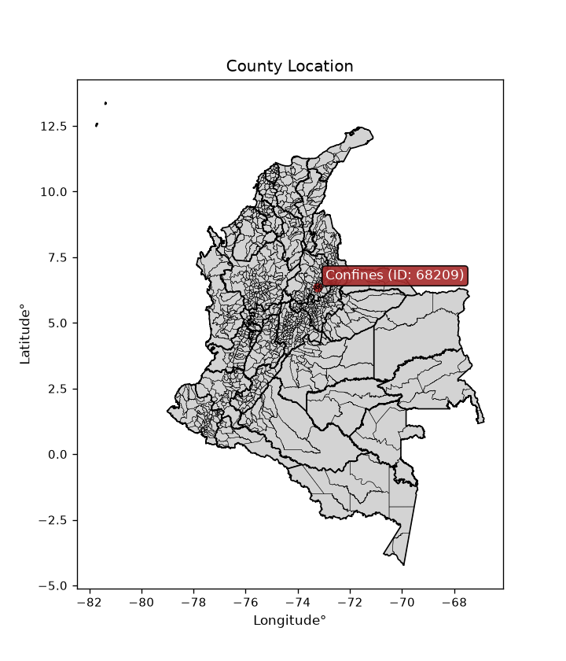
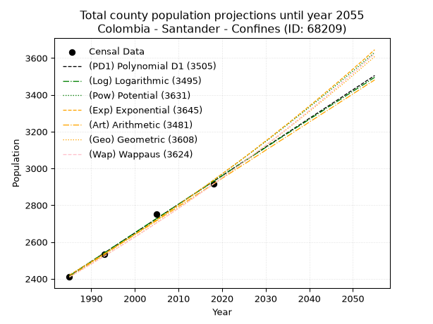
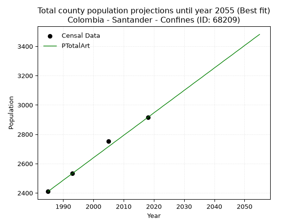
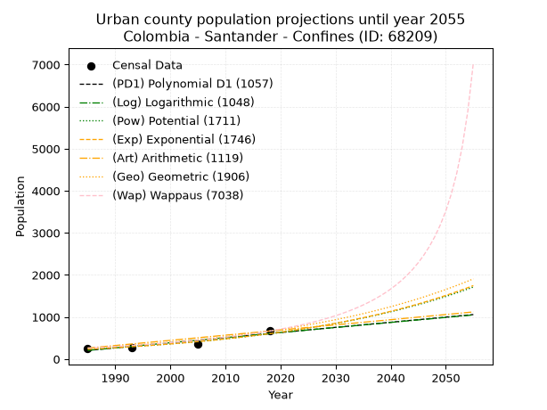
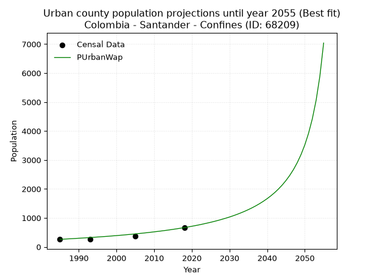
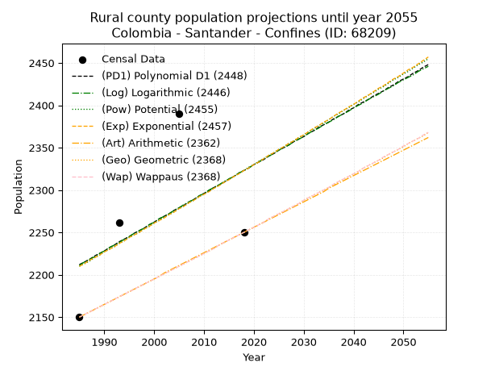
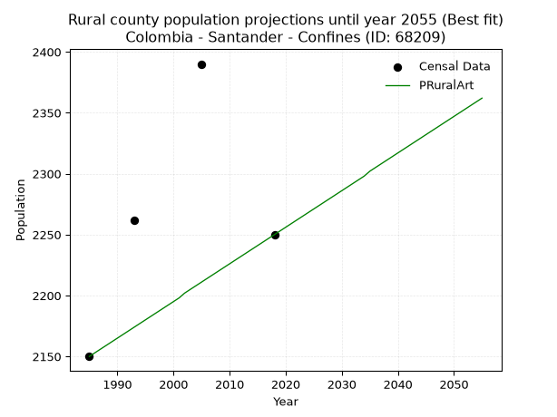

<div align="center">


</div>

# _“Population and Public Services Demand Projections (PPSD) until Year 2050 for Colombia - Santander - Confines (ID: 68209)”_
Keywords: `population` `public-service` `projection` `lineal` `polynomial` `logarithmic` `potential` `exponential` `arithmetic` `geometric` `wappaus` `dane` `colombia` `south-america`

PPSD are analytical estimates used by governments and planners to anticipate future changes in population size, age distribution, and the resulting community needs for utilities, healthcare, education, and infrastructure as sizing future water treatment facilities, electrical grids, and road networks based on spatial growth.

<div align="center">

</img>

</div>


> **General running parameters**: • app_version: _v20260806_. • Python version: _3.14.7_. • Pandas version: _3.0.5_. • NumPy version: _2.5.1_. • Creates, save and include plots into reports (create_plot): _False_. • Projection until year: _2050_. • Process polynomial degree 2 and up: _False_. • Process Wappaus: _True_. • Process Wappaus: _True_. • Set negative values to zero: _True_. • Set infinite values to zero: _True_. • Drop dataset notes: _True_. 
<div align="center">

Dynamic map: [:earth_americas:Google](http://maps.google.com/maps?q=6.357327489,-73.2405538) [:earth_americas:OSM](https://www.openstreetmap.org/#map=18/6.357327489/-73.2405538&layers=P) [:earth_americas:Bing](https://www.bing.com/maps?cp=6.357327489~-73.2405538&lvl=18) [:earth_americas:Apple](https://maps.apple.com/frame?center=6.357327489%2C-73.2405538&span=0.003%2C0.006)

</div>


<div align="center">

```geojson
{
  "type": "Feature",
  "geometry": {
    "type": "Point", 
    "coordinates": [-73.2405538, 6.357327489]
  }, 
  "properties": {
    "Name": "Colombia - Santander - Confines (ID: 68209)"
  }
}
```

</div>


## 0. Census Data (4 records)

Census data are official statistics collected by a government about the people and housing in a country. They usually include counts of total population, age, sex, race, income, education, and jobs.

📅Global census file: [Population.xlsx](../data/Population.xlsx)

| Source   |   Year |   CountryID | CountryName   |   StateID | StateName   |   CountyID | CountyName   |   PTotal |   PUrban |   PRural |
|:---------|-------:|------------:|:--------------|----------:|:------------|-----------:|:-------------|---------:|---------:|---------:|
| DANE     |   1985 |          57 | Colombia      |        68 | Santander   |      68209 | Confines     |     2410 |      260 |     2150 |
| DANE     |   1993 |          57 | Colombia      |        68 | Santander   |      68209 | Confines     |     2535 |      273 |     2262 |
| DANE     |   2005 |          57 | Colombia      |        68 | Santander   |      68209 | Confines     |     2753 |      363 |     2390 |
| DANE     |   2018 |          57 | Colombia      |        68 | Santander   |      68209 | Confines     |     2915 |      665 |     2250 |

> 🔥Some records could had specific notes about the registered values or the corresponding urban or rural distribution.

📅   [RUPS](https://www.datos.gov.co/Hacienda-y-Cr-dito-P-blico/Registro-nico-de-Prestadores-de-Servicios-P-blicos/4qkq-csdn/about_data) - Local public utility companies: [RUPS.csv](../data/RUPS.xlsx)

 | SERVICIO       | ESTADO    | NOMBRE                                                                                                                  | NIT         | DEPARTAMENTO_DOMICILIO   | MUNICIPIO_DOMICILIO   | DIRECCION          |   TELEFONO | EMAIL                 | TIPO_PRESTADOR                             | CLASIFICACION                 |
|:---------------|:----------|:------------------------------------------------------------------------------------------------------------------------|:------------|:-------------------------|:----------------------|:-------------------|-----------:|:----------------------|:-------------------------------------------|:------------------------------|
| ACUEDUCTO      | OPERATIVA | CONFINEÑA DE SERVICIOS PUBLICOS  S A  E.S.P                                                                             | 900263306-1 | SANTANDER                | CONFINES              | CALLE 5 # 6-20     |    7248160 | confinena@hotmail.com | SOCIEDADES (EMPRESA DE SERVICIOS PUBLICOS) | HASTA 2500 SUSCRIPTORES       |
| ALCANTARILLADO | OPERATIVA | CONFINEÑA DE SERVICIOS PUBLICOS  S A  E.S.P                                                                             | 900263306-1 | SANTANDER                | CONFINES              | CALLE 5 # 6-20     |    7248160 | confinena@hotmail.com | SOCIEDADES (EMPRESA DE SERVICIOS PUBLICOS) | HASTA 2500 SUSCRIPTORES       |
| ACUEDUCTO      | OPERATIVA | CORPORACION DE SERVICIOS DEL ACUEDUCTO DE LAS VEREDAS PAVAS Y AGUABUENA DEL MUNICIPIO DE PALMAS DEL SOCORRO Y AGUABUENA | 800149980-6 | SANTANDER                | SOCORRO               | CALLE 2 No 10 - 28 |    2928172 | corpaguas@gmail.com   | ORGANIZACION AUTORIZADA                    | MENOR O IGUAL A 2500 USUARIOS |

## 1. Total

### 1.1. Coefficients and Parameters

* (PD1) Polynomial Deg 1: 15.55479727017248, -28460.233239662502 (lineal)
* (Log) Logarithmic: 31139.3172971506, -234036.95031046995
* (Pow) Potential: 11.709208191466383, -35.2303742889914
* (Exp) Exponential: 0.005848672593783813, 0.02197265135630117
* (Art) Arithmetic: Year diff. 2018 - 1985 = 33, Population diff. 2915 - 2410 = 505, Annual growth = 15.303030303030303
* (Geo) Geometric: Year diff. 2018 - 1985 = 33, Population diff. 2915 - 2410 = 505, Annual growth % = 0.005781590839200268
* (Wap) Wappaus: i = 0.5747617015222649, Condition values only valid for < 200)

<sub>
Wappaus condition values: ['0.00', '0.57', '1.15', '1.72', '2.30', '2.87', '3.45', '4.02', '4.60', '5.17', '5.75', '6.32', '6.90', '7.47', '8.05', '8.62', '9.20', '9.77', '10.35', '10.92', '11.50', '12.07', '12.64', '13.22', '13.79', '14.37', '14.94', '15.52', '16.09', '16.67', '17.24', '17.82', '18.39', '18.97', '19.54', '20.12', '20.69', '21.27', '21.84', '22.42', '22.99', '23.57', '24.14', '24.71', '25.29', '25.86', '26.44', '27.01', '27.59', '28.16', '28.74', '29.31', '29.89', '30.46', '31.04', '31.61', '32.19', '32.76', '33.34', '33.91', '34.49', '35.06', '35.64', '36.21', '36.78', '37.36']
</sub>


### 1.2. Projected Dataset

|   Year |   CountyID |   PTotalPD1 |   PTotalLog |   PTotalPow |   PTotalExp |   PTotalArt |   PTotalGeo |   PTotalWap |
|-------:|-----------:|------------:|------------:|------------:|------------:|------------:|------------:|------------:|
|   1985 |      68209 |        2416 |        2416 |        2420 |        2420 |        2410 |        2410 |        2410 |
|   1986 |      68209 |        2432 |        2431 |        2434 |        2435 |        2425 |        2424 |        2424 |
|   1987 |      68209 |        2447 |        2447 |        2449 |        2449 |        2441 |        2438 |        2438 |
|   1988 |      68209 |        2463 |        2463 |        2463 |        2463 |        2456 |        2452 |        2452 |
|   1989 |      68209 |        2478 |        2478 |        2478 |        2478 |        2471 |        2466 |        2466 |
|   1990 |      68209 |        2494 |        2494 |        2492 |        2492 |        2487 |        2480 |        2480 |
|   1991 |      68209 |        2509 |        2510 |        2507 |        2507 |        2502 |        2495 |        2495 |
|   1992 |      68209 |        2525 |        2525 |        2522 |        2521 |        2517 |        2509 |        2509 |
|   1993 |      68209 |        2540 |        2541 |        2537 |        2536 |        2532 |        2524 |        2523 |
|   1994 |      68209 |        2556 |        2556 |        2551 |        2551 |        2548 |        2538 |        2538 |
|   1995 |      68209 |        2572 |        2572 |        2567 |        2566 |        2563 |        2553 |        2553 |
|   1996 |      68209 |        2587 |        2588 |        2582 |        2581 |        2578 |        2568 |        2567 |
|   1997 |      68209 |        2603 |        2603 |        2597 |        2596 |        2594 |        2583 |        2582 |
|   1998 |      68209 |        2618 |        2619 |        2612 |        2612 |        2609 |        2598 |        2597 |
|   1999 |      68209 |        2634 |        2634 |        2627 |        2627 |        2624 |        2613 |        2612 |
|   2000 |      68209 |        2649 |        2650 |        2643 |        2642 |        2640 |        2628 |        2627 |
|   2001 |      68209 |        2665 |        2666 |        2658 |        2658 |        2655 |        2643 |        2642 |
|   2002 |      68209 |        2680 |        2681 |        2674 |        2673 |        2670 |        2658 |        2658 |
|   2003 |      68209 |        2696 |        2697 |        2690 |        2689 |        2685 |        2674 |        2673 |
|   2004 |      68209 |        2712 |        2712 |        2705 |        2705 |        2701 |        2689 |        2688 |
|   2005 |      68209 |        2727 |        2728 |        2721 |        2721 |        2716 |        2705 |        2704 |
|   2006 |      68209 |        2743 |        2743 |        2737 |        2737 |        2731 |        2720 |        2720 |
|   2007 |      68209 |        2758 |        2759 |        2753 |        2753 |        2747 |        2736 |        2735 |
|   2008 |      68209 |        2774 |        2774 |        2769 |        2769 |        2762 |        2752 |        2751 |
|   2009 |      68209 |        2789 |        2790 |        2786 |        2785 |        2777 |        2768 |        2767 |
|   2010 |      68209 |        2805 |        2805 |        2802 |        2801 |        2793 |        2784 |        2783 |
|   2011 |      68209 |        2820 |        2821 |        2818 |        2818 |        2808 |        2800 |        2799 |
|   2012 |      68209 |        2836 |        2836 |        2835 |        2834 |        2823 |        2816 |        2815 |
|   2013 |      68209 |        2852 |        2852 |        2851 |        2851 |        2838 |        2832 |        2832 |
|   2014 |      68209 |        2867 |        2867 |        2868 |        2868 |        2854 |        2849 |        2848 |
|   2015 |      68209 |        2883 |        2883 |        2884 |        2885 |        2869 |        2865 |        2865 |
|   2016 |      68209 |        2898 |        2898 |        2901 |        2901 |        2884 |        2882 |        2881 |
|   2017 |      68209 |        2914 |        2914 |        2918 |        2918 |        2900 |        2898 |        2898 |
|   2018 |      68209 |        2929 |        2929 |        2935 |        2936 |        2915 |        2915 |        2915 |
|   2019 |      68209 |        2945 |        2944 |        2952 |        2953 |        2930 |        2932 |        2932 |
|   2020 |      68209 |        2960 |        2960 |        2969 |        2970 |        2946 |        2949 |        2949 |
|   2021 |      68209 |        2976 |        2975 |        2987 |        2988 |        2961 |        2966 |        2966 |
|   2022 |      68209 |        2992 |        2991 |        3004 |        3005 |        2976 |        2983 |        2983 |
|   2023 |      68209 |        3007 |        3006 |        3021 |        3023 |        2992 |        3000 |        3001 |
|   2024 |      68209 |        3023 |        3021 |        3039 |        3040 |        3007 |        3018 |        3018 |
|   2025 |      68209 |        3038 |        3037 |        3057 |        3058 |        3022 |        3035 |        3036 |
|   2026 |      68209 |        3054 |        3052 |        3074 |        3076 |        3037 |        3053 |        3054 |
|   2027 |      68209 |        3069 |        3068 |        3092 |        3094 |        3053 |        3070 |        3072 |
|   2028 |      68209 |        3085 |        3083 |        3110 |        3112 |        3068 |        3088 |        3090 |
|   2029 |      68209 |        3100 |        3098 |        3128 |        3131 |        3083 |        3106 |        3108 |
|   2030 |      68209 |        3116 |        3114 |        3146 |        3149 |        3099 |        3124 |        3126 |
|   2031 |      68209 |        3132 |        3129 |        3164 |        3167 |        3114 |        3142 |        3144 |
|   2032 |      68209 |        3147 |        3144 |        3183 |        3186 |        3129 |        3160 |        3163 |
|   2033 |      68209 |        3163 |        3160 |        3201 |        3205 |        3145 |        3178 |        3181 |
|   2034 |      68209 |        3178 |        3175 |        3220 |        3224 |        3160 |        3197 |        3200 |
|   2035 |      68209 |        3194 |        3190 |        3238 |        3242 |        3175 |        3215 |        3219 |
|   2036 |      68209 |        3209 |        3205 |        3257 |        3261 |        3190 |        3234 |        3238 |
|   2037 |      68209 |        3225 |        3221 |        3276 |        3281 |        3206 |        3252 |        3257 |
|   2038 |      68209 |        3240 |        3236 |        3294 |        3300 |        3221 |        3271 |        3276 |
|   2039 |      68209 |        3256 |        3251 |        3313 |        3319 |        3236 |        3290 |        3295 |
|   2040 |      68209 |        3272 |        3267 |        3333 |        3339 |        3252 |        3309 |        3315 |
|   2041 |      68209 |        3287 |        3282 |        3352 |        3358 |        3267 |        3328 |        3334 |
|   2042 |      68209 |        3303 |        3297 |        3371 |        3378 |        3282 |        3348 |        3354 |
|   2043 |      68209 |        3318 |        3312 |        3390 |        3398 |        3298 |        3367 |        3374 |
|   2044 |      68209 |        3334 |        3328 |        3410 |        3418 |        3313 |        3386 |        3394 |
|   2045 |      68209 |        3349 |        3343 |        3429 |        3438 |        3328 |        3406 |        3414 |
|   2046 |      68209 |        3365 |        3358 |        3449 |        3458 |        3343 |        3426 |        3435 |
|   2047 |      68209 |        3380 |        3373 |        3469 |        3478 |        3359 |        3445 |        3455 |
|   2048 |      68209 |        3396 |        3388 |        3489 |        3499 |        3374 |        3465 |        3476 |
|   2049 |      68209 |        3412 |        3404 |        3509 |        3519 |        3389 |        3485 |        3496 |
|   2050 |      68209 |        3427 |        3419 |        3529 |        3540 |        3405 |        3506 |        3517 |
<div align="center">

</img>

</div>


### 1.3. Best fit with absolute and relative error (%)

Relative error puts that difference into context by dividing the absolute error by the true value, creating a unitless ratio or percentage that shows the scale of the mistake.

Absolute and relative error

|   Year | Source   |   CountryID | CountryName   |   StateID | StateName   |   CountyID_x | CountyName   |   PTotal |   PUrban |   PRural |   CountyID_y |   PTotalPD1 |   PTotalLog |   PTotalPow |   PTotalExp |   PTotalArt |   PTotalGeo |   PTotalWap |   PTotalPD1AbsError |   PTotalLogAbsError |   PTotalPowAbsError |   PTotalExpAbsError |   PTotalArtAbsError |   PTotalGeoAbsError |   PTotalWapAbsError |   PTotalPD1RelError |   PTotalLogRelError |   PTotalPowRelError |   PTotalExpRelError |   PTotalArtRelError |   PTotalGeoRelError |   PTotalWapRelError |
|-------:|:---------|------------:|:--------------|----------:|:------------|-------------:|:-------------|---------:|---------:|---------:|-------------:|------------:|------------:|------------:|------------:|------------:|------------:|------------:|--------------------:|--------------------:|--------------------:|--------------------:|--------------------:|--------------------:|--------------------:|--------------------:|--------------------:|--------------------:|--------------------:|--------------------:|--------------------:|--------------------:|
|   1985 | DANE     |          57 | Colombia      |        68 | Santander   |        68209 | Confines     |     2410 |      260 |     2150 |        68209 |        2416 |        2416 |        2420 |        2420 |        2410 |        2410 |        2410 |                   6 |                   6 |                  10 |                  10 |                   0 |                   0 |                   0 |            0.248963 |            0.248963 |           0.414938  |           0.414938  |            0        |            0        |            0        |
|   1993 | DANE     |          57 | Colombia      |        68 | Santander   |        68209 | Confines     |     2535 |      273 |     2262 |        68209 |        2540 |        2541 |        2537 |        2536 |        2532 |        2524 |        2523 |                   5 |                   6 |                   2 |                   1 |                   3 |                  11 |                  12 |            0.197239 |            0.236686 |           0.0788955 |           0.0394477 |            0.118343 |            0.433925 |            0.473373 |
|   2005 | DANE     |          57 | Colombia      |        68 | Santander   |        68209 | Confines     |     2753 |      363 |     2390 |        68209 |        2727 |        2728 |        2721 |        2721 |        2716 |        2705 |        2704 |                  26 |                  25 |                  32 |                  32 |                  37 |                  48 |                  49 |            0.944424 |            0.9081   |           1.16237   |           1.16237   |            1.34399  |            1.74355  |            1.77988  |
|   2018 | DANE     |          57 | Colombia      |        68 | Santander   |        68209 | Confines     |     2915 |      665 |     2250 |        68209 |        2929 |        2929 |        2935 |        2936 |        2915 |        2915 |        2915 |                  14 |                  14 |                  20 |                  21 |                   0 |                   0 |                   0 |            0.480274 |            0.480274 |           0.686106  |           0.720412  |            0        |            0        |            0        |

Relative error mean

| Method    |   RelError | Best   |
|:----------|-----------:|:-------|
| PTotalPD1 |   0.467725 |        |
| PTotalLog |   0.468506 |        |
| PTotalPow |   0.585577 |        |
| PTotalExp |   0.584291 |        |
| PTotalArt |   0.365583 | True   |
| PTotalGeo |   0.544369 |        |
| PTotalWap |   0.563312 |        |

💙Best method: _**PTotalArt**_
<div align="center">

</img>

</div>


### 1.4. Fresh water supply demand in liters per capita per day (lpcd)

The fresh water supply demand typically ranges from 100 to 300 liters per capita per day (lpcd) for standard domestic and municipal planning, though absolute survival minimums set by the World Health Organization are as low as 7.5 to 20 liters per day, and total consumption in high-income nations can exceed 400 liters.

> `CZ`: Level in meters above the sea level (masl)<br> `WS`: Fresh water supply demand in liters per capita per day (lpcd or l/h/d)<br> `WSAll`: Zonal fresh water supply demand in liters per second (l/s)<br> `A`: Zonal area in square meters<br> `DP`: Population density (people/hectare or p/ha)

Reference values (RAS Colombia)

|    CZ |   WS |
|------:|-----:|
|  1000 |  120 |
|  2000 |  130 |
| 99999 |  140 |

County shapefile geometry properties and water supply values

|   CountyID |      ATotal |   CZTotal |   WSTotal |
|-----------:|------------:|----------:|----------:|
|      68209 | 7.12936e+07 |   1658.05 |       130 |

Projected values for best method: PTotalArt

|   CountyID |   Year |   PTotalArt |   DPTotal |   WSTotal |   WSTotalAll |
|-----------:|-------:|------------:|----------:|----------:|-------------:|
|      68209 |   1985 |        2410 |      0.34 |       130 |      3.62616 |
|      68209 |   1986 |        2425 |      0.34 |       130 |      3.64873 |
|      68209 |   1987 |        2441 |      0.34 |       130 |      3.6728  |
|      68209 |   1988 |        2456 |      0.34 |       130 |      3.69537 |
|      68209 |   1989 |        2471 |      0.35 |       130 |      3.71794 |
|      68209 |   1990 |        2487 |      0.35 |       130 |      3.74201 |
|      68209 |   1991 |        2502 |      0.35 |       130 |      3.76458 |
|      68209 |   1992 |        2517 |      0.35 |       130 |      3.78715 |
|      68209 |   1993 |        2532 |      0.36 |       130 |      3.80972 |
|      68209 |   1994 |        2548 |      0.36 |       130 |      3.8338  |
|      68209 |   1995 |        2563 |      0.36 |       130 |      3.85637 |
|      68209 |   1996 |        2578 |      0.36 |       130 |      3.87894 |
|      68209 |   1997 |        2594 |      0.36 |       130 |      3.90301 |
|      68209 |   1998 |        2609 |      0.37 |       130 |      3.92558 |
|      68209 |   1999 |        2624 |      0.37 |       130 |      3.94815 |
|      68209 |   2000 |        2640 |      0.37 |       130 |      3.97222 |
|      68209 |   2001 |        2655 |      0.37 |       130 |      3.99479 |
|      68209 |   2002 |        2670 |      0.37 |       130 |      4.01736 |
|      68209 |   2003 |        2685 |      0.38 |       130 |      4.03993 |
|      68209 |   2004 |        2701 |      0.38 |       130 |      4.064   |
|      68209 |   2005 |        2716 |      0.38 |       130 |      4.08657 |
|      68209 |   2006 |        2731 |      0.38 |       130 |      4.10914 |
|      68209 |   2007 |        2747 |      0.39 |       130 |      4.13322 |
|      68209 |   2008 |        2762 |      0.39 |       130 |      4.15579 |
|      68209 |   2009 |        2777 |      0.39 |       130 |      4.17836 |
|      68209 |   2010 |        2793 |      0.39 |       130 |      4.20243 |
|      68209 |   2011 |        2808 |      0.39 |       130 |      4.225   |
|      68209 |   2012 |        2823 |      0.4  |       130 |      4.24757 |
|      68209 |   2013 |        2838 |      0.4  |       130 |      4.27014 |
|      68209 |   2014 |        2854 |      0.4  |       130 |      4.29421 |
|      68209 |   2015 |        2869 |      0.4  |       130 |      4.31678 |
|      68209 |   2016 |        2884 |      0.4  |       130 |      4.33935 |
|      68209 |   2017 |        2900 |      0.41 |       130 |      4.36343 |
|      68209 |   2018 |        2915 |      0.41 |       130 |      4.386   |
|      68209 |   2019 |        2930 |      0.41 |       130 |      4.40856 |
|      68209 |   2020 |        2946 |      0.41 |       130 |      4.43264 |
|      68209 |   2021 |        2961 |      0.42 |       130 |      4.45521 |
|      68209 |   2022 |        2976 |      0.42 |       130 |      4.47778 |
|      68209 |   2023 |        2992 |      0.42 |       130 |      4.50185 |
|      68209 |   2024 |        3007 |      0.42 |       130 |      4.52442 |
|      68209 |   2025 |        3022 |      0.42 |       130 |      4.54699 |
|      68209 |   2026 |        3037 |      0.43 |       130 |      4.56956 |
|      68209 |   2027 |        3053 |      0.43 |       130 |      4.59363 |
|      68209 |   2028 |        3068 |      0.43 |       130 |      4.6162  |
|      68209 |   2029 |        3083 |      0.43 |       130 |      4.63877 |
|      68209 |   2030 |        3099 |      0.43 |       130 |      4.66285 |
|      68209 |   2031 |        3114 |      0.44 |       130 |      4.68542 |
|      68209 |   2032 |        3129 |      0.44 |       130 |      4.70799 |
|      68209 |   2033 |        3145 |      0.44 |       130 |      4.73206 |
|      68209 |   2034 |        3160 |      0.44 |       130 |      4.75463 |
|      68209 |   2035 |        3175 |      0.45 |       130 |      4.7772  |
|      68209 |   2036 |        3190 |      0.45 |       130 |      4.79977 |
|      68209 |   2037 |        3206 |      0.45 |       130 |      4.82384 |
|      68209 |   2038 |        3221 |      0.45 |       130 |      4.84641 |
|      68209 |   2039 |        3236 |      0.45 |       130 |      4.86898 |
|      68209 |   2040 |        3252 |      0.46 |       130 |      4.89306 |
|      68209 |   2041 |        3267 |      0.46 |       130 |      4.91563 |
|      68209 |   2042 |        3282 |      0.46 |       130 |      4.93819 |
|      68209 |   2043 |        3298 |      0.46 |       130 |      4.96227 |
|      68209 |   2044 |        3313 |      0.46 |       130 |      4.98484 |
|      68209 |   2045 |        3328 |      0.47 |       130 |      5.00741 |
|      68209 |   2046 |        3343 |      0.47 |       130 |      5.02998 |
|      68209 |   2047 |        3359 |      0.47 |       130 |      5.05405 |
|      68209 |   2048 |        3374 |      0.47 |       130 |      5.07662 |
|      68209 |   2049 |        3389 |      0.48 |       130 |      5.09919 |
|      68209 |   2050 |        3405 |      0.48 |       130 |      5.12326 |

## 2. Urban

### 2.1. Coefficients and Parameters

* (PD1) Polynomial Deg 1: 12.177840224809122, -23968.47490967445 (lineal)
* (Log) Logarithmic: 24353.008002650717, -184717.15898090662
* (Pow) Potential: 57.49579201558145, -187.23950369491533
* (Exp) Exponential: 0.028744388673338377, 3.87513120000624e-23
* (Art) Arithmetic: Year diff. 2018 - 1985 = 33, Population diff. 665 - 260 = 405, Annual growth = 12.272727272727273
* (Geo) Geometric: Year diff. 2018 - 1985 = 33, Population diff. 665 - 260 = 405, Annual growth % = 0.02886652969323067
* (Wap) Wappaus: i = 2.6535626535626538, Condition values only valid for < 200)

<sub>
Wappaus condition values: ['0.00', '2.65', '5.31', '7.96', '10.61', '13.27', '15.92', '18.57', '21.23', '23.88', '26.54', '29.19', '31.84', '34.50', '37.15', '39.80', '42.46', '45.11', '47.76', '50.42', '53.07', '55.72', '58.38', '61.03', '63.69', '66.34', '68.99', '71.65', '74.30', '76.95', '79.61', '82.26', '84.91', '87.57', '90.22', '92.87', '95.53', '98.18', '100.84', '103.49', '106.14', '108.80', '111.45', '114.10', '116.76', '119.41', '122.06', '124.72', '127.37', '130.02', '132.68', '135.33', '137.99', '140.64', '143.29', '145.95', '148.60', '151.25', '153.91', '156.56', '159.21', '161.87', '164.52', '167.17', '169.83', '172.48']
</sub>


### 2.2. Projected Dataset

|   Year |   CountyID |   PUrbanPD1 |   PUrbanLog |   PUrbanPow |   PUrbanExp |   PUrbanArt |   PUrbanGeo |   PUrbanWap |
|-------:|-----------:|------------:|------------:|------------:|------------:|------------:|------------:|------------:|
|   1985 |      68209 |         205 |         204 |         233 |         233 |         260 |         260 |         260 |
|   1986 |      68209 |         217 |         217 |         240 |         240 |         272 |         268 |         267 |
|   1987 |      68209 |         229 |         229 |         247 |         247 |         285 |         275 |         274 |
|   1988 |      68209 |         241 |         241 |         254 |         254 |         297 |         283 |         282 |
|   1989 |      68209 |         253 |         253 |         262 |         262 |         309 |         291 |         289 |
|   1990 |      68209 |         265 |         266 |         270 |         269 |         321 |         300 |         297 |
|   1991 |      68209 |         278 |         278 |         277 |         277 |         334 |         308 |         305 |
|   1992 |      68209 |         290 |         290 |         286 |         285 |         346 |         317 |         313 |
|   1993 |      68209 |         302 |         302 |         294 |         294 |         358 |         326 |         322 |
|   1994 |      68209 |         314 |         315 |         303 |         302 |         370 |         336 |         331 |
|   1995 |      68209 |         326 |         327 |         311 |         311 |         383 |         346 |         340 |
|   1996 |      68209 |         338 |         339 |         321 |         320 |         395 |         356 |         349 |
|   1997 |      68209 |         351 |         351 |         330 |         330 |         407 |         366 |         358 |
|   1998 |      68209 |         363 |         363 |         340 |         339 |         420 |         376 |         368 |
|   1999 |      68209 |         375 |         375 |         349 |         349 |         432 |         387 |         379 |
|   2000 |      68209 |         387 |         388 |         360 |         359 |         444 |         398 |         389 |
|   2001 |      68209 |         399 |         400 |         370 |         370 |         456 |         410 |         400 |
|   2002 |      68209 |         412 |         412 |         381 |         380 |         469 |         422 |         411 |
|   2003 |      68209 |         424 |         424 |         392 |         392 |         481 |         434 |         423 |
|   2004 |      68209 |         436 |         436 |         403 |         403 |         493 |         446 |         435 |
|   2005 |      68209 |         448 |         448 |         415 |         415 |         505 |         459 |         448 |
|   2006 |      68209 |         460 |         461 |         427 |         427 |         518 |         473 |         461 |
|   2007 |      68209 |         472 |         473 |         440 |         439 |         530 |         486 |         474 |
|   2008 |      68209 |         485 |         485 |         452 |         452 |         542 |         500 |         488 |
|   2009 |      68209 |         497 |         497 |         466 |         465 |         555 |         515 |         503 |
|   2010 |      68209 |         509 |         509 |         479 |         479 |         567 |         530 |         518 |
|   2011 |      68209 |         521 |         521 |         493 |         493 |         579 |         545 |         534 |
|   2012 |      68209 |         533 |         533 |         507 |         507 |         591 |         561 |         550 |
|   2013 |      68209 |         546 |         545 |         522 |         522 |         604 |         577 |         567 |
|   2014 |      68209 |         558 |         558 |         537 |         537 |         616 |         593 |         585 |
|   2015 |      68209 |         570 |         570 |         553 |         553 |         628 |         611 |         604 |
|   2016 |      68209 |         582 |         582 |         569 |         569 |         640 |         628 |         623 |
|   2017 |      68209 |         594 |         594 |         585 |         586 |         653 |         646 |         644 |
|   2018 |      68209 |         606 |         606 |         602 |         603 |         665 |         665 |         665 |
|   2019 |      68209 |         619 |         618 |         619 |         620 |         677 |         684 |         687 |
|   2020 |      68209 |         631 |         630 |         637 |         638 |         690 |         704 |         711 |
|   2021 |      68209 |         643 |         642 |         656 |         657 |         702 |         724 |         735 |
|   2022 |      68209 |         655 |         654 |         675 |         676 |         714 |         745 |         761 |
|   2023 |      68209 |         667 |         666 |         694 |         696 |         726 |         767 |         789 |
|   2024 |      68209 |         679 |         678 |         714 |         716 |         739 |         789 |         818 |
|   2025 |      68209 |         692 |         690 |         735 |         737 |         751 |         812 |         848 |
|   2026 |      68209 |         704 |         702 |         756 |         758 |         763 |         835 |         880 |
|   2027 |      68209 |         716 |         714 |         777 |         781 |         775 |         859 |         914 |
|   2028 |      68209 |         728 |         726 |         800 |         803 |         788 |         884 |         951 |
|   2029 |      68209 |         740 |         738 |         823 |         827 |         800 |         909 |         989 |
|   2030 |      68209 |         753 |         750 |         846 |         851 |         812 |         936 |        1030 |
|   2031 |      68209 |         765 |         762 |         871 |         876 |         825 |         963 |        1074 |
|   2032 |      68209 |         777 |         774 |         896 |         901 |         837 |         990 |        1121 |
|   2033 |      68209 |         789 |         786 |         921 |         927 |         849 |        1019 |        1172 |
|   2034 |      68209 |         801 |         798 |         948 |         955 |         861 |        1048 |        1226 |
|   2035 |      68209 |         813 |         810 |         975 |         982 |         874 |        1079 |        1285 |
|   2036 |      68209 |         826 |         822 |        1003 |        1011 |         886 |        1110 |        1348 |
|   2037 |      68209 |         838 |         834 |        1032 |        1040 |         898 |        1142 |        1417 |
|   2038 |      68209 |         850 |         846 |        1061 |        1071 |         910 |        1175 |        1492 |
|   2039 |      68209 |         862 |         858 |        1092 |        1102 |         923 |        1209 |        1574 |
|   2040 |      68209 |         874 |         870 |        1123 |        1134 |         935 |        1244 |        1664 |
|   2041 |      68209 |         886 |         882 |        1155 |        1167 |         947 |        1280 |        1763 |
|   2042 |      68209 |         899 |         894 |        1188 |        1201 |         960 |        1317 |        1873 |
|   2043 |      68209 |         911 |         906 |        1222 |        1236 |         972 |        1355 |        1996 |
|   2044 |      68209 |         923 |         918 |        1257 |        1272 |         984 |        1394 |        2134 |
|   2045 |      68209 |         935 |         930 |        1292 |        1309 |         996 |        1434 |        2290 |
|   2046 |      68209 |         947 |         941 |        1329 |        1348 |        1009 |        1475 |        2467 |
|   2047 |      68209 |         960 |         953 |        1367 |        1387 |        1021 |        1518 |        2671 |
|   2048 |      68209 |         972 |         965 |        1406 |        1427 |        1033 |        1562 |        2908 |
|   2049 |      68209 |         984 |         977 |        1446 |        1469 |        1045 |        1607 |        3187 |
|   2050 |      68209 |         996 |         989 |        1487 |        1512 |        1058 |        1653 |        3519 |
<div align="center">

</img>

</div>


### 2.3. Best fit with absolute and relative error (%)

Relative error puts that difference into context by dividing the absolute error by the true value, creating a unitless ratio or percentage that shows the scale of the mistake.

Absolute and relative error

|   Year | Source   |   CountryID | CountryName   |   StateID | StateName   |   CountyID_x | CountyName   |   PTotal |   PUrban |   PRural |   CountyID_y |   PUrbanPD1 |   PUrbanLog |   PUrbanPow |   PUrbanExp |   PUrbanArt |   PUrbanGeo |   PUrbanWap |   PUrbanPD1AbsError |   PUrbanLogAbsError |   PUrbanPowAbsError |   PUrbanExpAbsError |   PUrbanArtAbsError |   PUrbanGeoAbsError |   PUrbanWapAbsError |   PUrbanPD1RelError |   PUrbanLogRelError |   PUrbanPowRelError |   PUrbanExpRelError |   PUrbanArtRelError |   PUrbanGeoRelError |   PUrbanWapRelError |
|-------:|:---------|------------:|:--------------|----------:|:------------|-------------:|:-------------|---------:|---------:|---------:|-------------:|------------:|------------:|------------:|------------:|------------:|------------:|------------:|--------------------:|--------------------:|--------------------:|--------------------:|--------------------:|--------------------:|--------------------:|--------------------:|--------------------:|--------------------:|--------------------:|--------------------:|--------------------:|--------------------:|
|   1985 | DANE     |          57 | Colombia      |        68 | Santander   |        68209 | Confines     |     2410 |      260 |     2150 |        68209 |         205 |         204 |         233 |         233 |         260 |         260 |         260 |                  55 |                  56 |                  27 |                  27 |                   0 |                   0 |                   0 |            21.1538  |            21.5385  |            10.3846  |            10.3846  |              0      |              0      |              0      |
|   1993 | DANE     |          57 | Colombia      |        68 | Santander   |        68209 | Confines     |     2535 |      273 |     2262 |        68209 |         302 |         302 |         294 |         294 |         358 |         326 |         322 |                  29 |                  29 |                  21 |                  21 |                  85 |                  53 |                  49 |            10.6227  |            10.6227  |             7.69231 |             7.69231 |             31.1355 |             19.4139 |             17.9487 |
|   2005 | DANE     |          57 | Colombia      |        68 | Santander   |        68209 | Confines     |     2753 |      363 |     2390 |        68209 |         448 |         448 |         415 |         415 |         505 |         459 |         448 |                  85 |                  85 |                  52 |                  52 |                 142 |                  96 |                  85 |            23.416   |            23.416   |            14.3251  |            14.3251  |             39.1185 |             26.4463 |             23.416  |
|   2018 | DANE     |          57 | Colombia      |        68 | Santander   |        68209 | Confines     |     2915 |      665 |     2250 |        68209 |         606 |         606 |         602 |         603 |         665 |         665 |         665 |                  59 |                  59 |                  63 |                  62 |                   0 |                   0 |                   0 |             8.87218 |             8.87218 |             9.47368 |             9.32331 |              0      |              0      |              0      |

Relative error mean

| Method    |   RelError | Best   |
|:----------|-----------:|:-------|
| PUrbanPD1 |    16.0162 |        |
| PUrbanLog |    16.1123 |        |
| PUrbanPow |    10.4689 |        |
| PUrbanExp |    10.4313 |        |
| PUrbanArt |    17.5635 |        |
| PUrbanGeo |    11.4651 |        |
| PUrbanWap |    10.3412 | True   |

💙Best method: _**PUrbanWap**_
<div align="center">

</img>

</div>


### 2.4. Fresh water supply demand in liters per capita per day (lpcd)

The fresh water supply demand typically ranges from 100 to 300 liters per capita per day (lpcd) for standard domestic and municipal planning, though absolute survival minimums set by the World Health Organization are as low as 7.5 to 20 liters per day, and total consumption in high-income nations can exceed 400 liters.

> `CZ`: Level in meters above the sea level (masl)<br> `WS`: Fresh water supply demand in liters per capita per day (lpcd or l/h/d)<br> `WSAll`: Zonal fresh water supply demand in liters per second (l/s)<br> `A`: Zonal area in square meters<br> `DP`: Population density (people/hectare or p/ha)

Reference values (RAS Colombia)

|    CZ |   WS |
|------:|-----:|
|  1000 |  120 |
|  2000 |  130 |
| 99999 |  140 |

County shapefile geometry properties and water supply values

|   CountyID |   AUrban |   CZUrban |   WSUrban |
|-----------:|---------:|----------:|----------:|
|      68209 |   221354 |   1507.97 |       130 |

Projected values for best method: PUrbanWap

|   CountyID |   Year |   PUrbanWap |   DPUrban |   WSUrban |   WSUrbanAll |
|-----------:|-------:|------------:|----------:|----------:|-------------:|
|      68209 |   1985 |         260 |     11.75 |       130 |     0.391204 |
|      68209 |   1986 |         267 |     12.06 |       130 |     0.401736 |
|      68209 |   1987 |         274 |     12.38 |       130 |     0.412269 |
|      68209 |   1988 |         282 |     12.74 |       130 |     0.424306 |
|      68209 |   1989 |         289 |     13.06 |       130 |     0.434838 |
|      68209 |   1990 |         297 |     13.42 |       130 |     0.446875 |
|      68209 |   1991 |         305 |     13.78 |       130 |     0.458912 |
|      68209 |   1992 |         313 |     14.14 |       130 |     0.470949 |
|      68209 |   1993 |         322 |     14.55 |       130 |     0.484491 |
|      68209 |   1994 |         331 |     14.95 |       130 |     0.498032 |
|      68209 |   1995 |         340 |     15.36 |       130 |     0.511574 |
|      68209 |   1996 |         349 |     15.77 |       130 |     0.525116 |
|      68209 |   1997 |         358 |     16.17 |       130 |     0.538657 |
|      68209 |   1998 |         368 |     16.62 |       130 |     0.553704 |
|      68209 |   1999 |         379 |     17.12 |       130 |     0.570255 |
|      68209 |   2000 |         389 |     17.57 |       130 |     0.585301 |
|      68209 |   2001 |         400 |     18.07 |       130 |     0.601852 |
|      68209 |   2002 |         411 |     18.57 |       130 |     0.618403 |
|      68209 |   2003 |         423 |     19.11 |       130 |     0.636458 |
|      68209 |   2004 |         435 |     19.65 |       130 |     0.654514 |
|      68209 |   2005 |         448 |     20.24 |       130 |     0.674074 |
|      68209 |   2006 |         461 |     20.83 |       130 |     0.693634 |
|      68209 |   2007 |         474 |     21.41 |       130 |     0.713194 |
|      68209 |   2008 |         488 |     22.05 |       130 |     0.734259 |
|      68209 |   2009 |         503 |     22.72 |       130 |     0.756829 |
|      68209 |   2010 |         518 |     23.4  |       130 |     0.779398 |
|      68209 |   2011 |         534 |     24.12 |       130 |     0.803472 |
|      68209 |   2012 |         550 |     24.85 |       130 |     0.827546 |
|      68209 |   2013 |         567 |     25.62 |       130 |     0.853125 |
|      68209 |   2014 |         585 |     26.43 |       130 |     0.880208 |
|      68209 |   2015 |         604 |     27.29 |       130 |     0.908796 |
|      68209 |   2016 |         623 |     28.15 |       130 |     0.937384 |
|      68209 |   2017 |         644 |     29.09 |       130 |     0.968981 |
|      68209 |   2018 |         665 |     30.04 |       130 |     1.00058  |
|      68209 |   2019 |         687 |     31.04 |       130 |     1.03368  |
|      68209 |   2020 |         711 |     32.12 |       130 |     1.06979  |
|      68209 |   2021 |         735 |     33.2  |       130 |     1.1059   |
|      68209 |   2022 |         761 |     34.38 |       130 |     1.14502  |
|      68209 |   2023 |         789 |     35.64 |       130 |     1.18715  |
|      68209 |   2024 |         818 |     36.95 |       130 |     1.23079  |
|      68209 |   2025 |         848 |     38.31 |       130 |     1.27593  |
|      68209 |   2026 |         880 |     39.76 |       130 |     1.32407  |
|      68209 |   2027 |         914 |     41.29 |       130 |     1.37523  |
|      68209 |   2028 |         951 |     42.96 |       130 |     1.4309   |
|      68209 |   2029 |         989 |     44.68 |       130 |     1.48808  |
|      68209 |   2030 |        1030 |     46.53 |       130 |     1.54977  |
|      68209 |   2031 |        1074 |     48.52 |       130 |     1.61597  |
|      68209 |   2032 |        1121 |     50.64 |       130 |     1.68669  |
|      68209 |   2033 |        1172 |     52.95 |       130 |     1.76343  |
|      68209 |   2034 |        1226 |     55.39 |       130 |     1.84468  |
|      68209 |   2035 |        1285 |     58.05 |       130 |     1.93345  |
|      68209 |   2036 |        1348 |     60.9  |       130 |     2.02824  |
|      68209 |   2037 |        1417 |     64.02 |       130 |     2.13206  |
|      68209 |   2038 |        1492 |     67.4  |       130 |     2.24491  |
|      68209 |   2039 |        1574 |     71.11 |       130 |     2.36829  |
|      68209 |   2040 |        1664 |     75.17 |       130 |     2.5037   |
|      68209 |   2041 |        1763 |     79.65 |       130 |     2.65266  |
|      68209 |   2042 |        1873 |     84.62 |       130 |     2.81817  |
|      68209 |   2043 |        1996 |     90.17 |       130 |     3.00324  |
|      68209 |   2044 |        2134 |     96.41 |       130 |     3.21088  |
|      68209 |   2045 |        2290 |    103.45 |       130 |     3.4456   |
|      68209 |   2046 |        2467 |    111.45 |       130 |     3.71192  |
|      68209 |   2047 |        2671 |    120.67 |       130 |     4.01887  |
|      68209 |   2048 |        2908 |    131.37 |       130 |     4.37546  |
|      68209 |   2049 |        3187 |    143.98 |       130 |     4.79525  |
|      68209 |   2050 |        3519 |    158.98 |       130 |     5.29479  |

## 3. Rural

### 3.1. Coefficients and Parameters

* (PD1) Polynomial Deg 1: 3.3769570453633873, -4491.758329988116 (lineal)
* (Log) Logarithmic: 6786.309294499865, -49319.79132956319
* (Pow) Potential: 3.037858671269831, -6.673823986557382
* (Exp) Exponential: 0.00151178200748558, 109.92502241816669
* (Art) Arithmetic: Year diff. 2018 - 1985 = 33, Population diff. 2250 - 2150 = 100, Annual growth = 3.0303030303030303
* (Geo) Geometric: Year diff. 2018 - 1985 = 33, Population diff. 2250 - 2150 = 100, Annual growth % = 0.0013785970918134272
* (Wap) Wappaus: i = 0.13774104683195593, Condition values only valid for < 200)

<sub>
Wappaus condition values: ['0.00', '0.14', '0.28', '0.41', '0.55', '0.69', '0.83', '0.96', '1.10', '1.24', '1.38', '1.52', '1.65', '1.79', '1.93', '2.07', '2.20', '2.34', '2.48', '2.62', '2.75', '2.89', '3.03', '3.17', '3.31', '3.44', '3.58', '3.72', '3.86', '3.99', '4.13', '4.27', '4.41', '4.55', '4.68', '4.82', '4.96', '5.10', '5.23', '5.37', '5.51', '5.65', '5.79', '5.92', '6.06', '6.20', '6.34', '6.47', '6.61', '6.75', '6.89', '7.02', '7.16', '7.30', '7.44', '7.58', '7.71', '7.85', '7.99', '8.13', '8.26', '8.40', '8.54', '8.68', '8.82', '8.95']
</sub>


### 3.2. Projected Dataset

|   Year |   CountyID |   PRuralPD1 |   PRuralLog |   PRuralPow |   PRuralExp |   PRuralArt |   PRuralGeo |   PRuralWap |
|-------:|-----------:|------------:|------------:|------------:|------------:|------------:|------------:|------------:|
|   1985 |      68209 |        2212 |        2211 |        2210 |        2210 |        2150 |        2150 |        2150 |
|   1986 |      68209 |        2215 |        2215 |        2213 |        2213 |        2153 |        2153 |        2153 |
|   1987 |      68209 |        2218 |        2218 |        2216 |        2217 |        2156 |        2156 |        2156 |
|   1988 |      68209 |        2222 |        2221 |        2220 |        2220 |        2159 |        2159 |        2159 |
|   1989 |      68209 |        2225 |        2225 |        2223 |        2223 |        2162 |        2162 |        2162 |
|   1990 |      68209 |        2228 |        2228 |        2227 |        2227 |        2165 |        2165 |        2165 |
|   1991 |      68209 |        2232 |        2232 |        2230 |        2230 |        2168 |        2168 |        2168 |
|   1992 |      68209 |        2235 |        2235 |        2233 |        2233 |        2171 |        2171 |        2171 |
|   1993 |      68209 |        2239 |        2238 |        2237 |        2237 |        2174 |        2174 |        2174 |
|   1994 |      68209 |        2242 |        2242 |        2240 |        2240 |        2177 |        2177 |        2177 |
|   1995 |      68209 |        2245 |        2245 |        2244 |        2244 |        2180 |        2180 |        2180 |
|   1996 |      68209 |        2249 |        2249 |        2247 |        2247 |        2183 |        2183 |        2183 |
|   1997 |      68209 |        2252 |        2252 |        2250 |        2250 |        2186 |        2186 |        2186 |
|   1998 |      68209 |        2255 |        2255 |        2254 |        2254 |        2189 |        2189 |        2189 |
|   1999 |      68209 |        2259 |        2259 |        2257 |        2257 |        2192 |        2192 |        2192 |
|   2000 |      68209 |        2262 |        2262 |        2261 |        2261 |        2195 |        2195 |        2195 |
|   2001 |      68209 |        2266 |        2266 |        2264 |        2264 |        2198 |        2198 |        2198 |
|   2002 |      68209 |        2269 |        2269 |        2268 |        2267 |        2202 |        2201 |        2201 |
|   2003 |      68209 |        2272 |        2272 |        2271 |        2271 |        2205 |        2204 |        2204 |
|   2004 |      68209 |        2276 |        2276 |        2274 |        2274 |        2208 |        2207 |        2207 |
|   2005 |      68209 |        2279 |        2279 |        2278 |        2278 |        2211 |        2210 |        2210 |
|   2006 |      68209 |        2282 |        2283 |        2281 |        2281 |        2214 |        2213 |        2213 |
|   2007 |      68209 |        2286 |        2286 |        2285 |        2285 |        2217 |        2216 |        2216 |
|   2008 |      68209 |        2289 |        2289 |        2288 |        2288 |        2220 |        2219 |        2219 |
|   2009 |      68209 |        2293 |        2293 |        2292 |        2292 |        2223 |        2222 |        2222 |
|   2010 |      68209 |        2296 |        2296 |        2295 |        2295 |        2226 |        2225 |        2225 |
|   2011 |      68209 |        2299 |        2300 |        2299 |        2298 |        2229 |        2228 |        2228 |
|   2012 |      68209 |        2303 |        2303 |        2302 |        2302 |        2232 |        2231 |        2231 |
|   2013 |      68209 |        2306 |        2306 |        2306 |        2305 |        2235 |        2235 |        2235 |
|   2014 |      68209 |        2309 |        2310 |        2309 |        2309 |        2238 |        2238 |        2238 |
|   2015 |      68209 |        2313 |        2313 |        2313 |        2312 |        2241 |        2241 |        2241 |
|   2016 |      68209 |        2316 |        2316 |        2316 |        2316 |        2244 |        2244 |        2244 |
|   2017 |      68209 |        2320 |        2320 |        2320 |        2319 |        2247 |        2247 |        2247 |
|   2018 |      68209 |        2323 |        2323 |        2323 |        2323 |        2250 |        2250 |        2250 |
|   2019 |      68209 |        2326 |        2326 |        2327 |        2326 |        2253 |        2253 |        2253 |
|   2020 |      68209 |        2330 |        2330 |        2330 |        2330 |        2256 |        2256 |        2256 |
|   2021 |      68209 |        2333 |        2333 |        2334 |        2333 |        2259 |        2259 |        2259 |
|   2022 |      68209 |        2336 |        2337 |        2337 |        2337 |        2262 |        2262 |        2262 |
|   2023 |      68209 |        2340 |        2340 |        2341 |        2341 |        2265 |        2266 |        2266 |
|   2024 |      68209 |        2343 |        2343 |        2344 |        2344 |        2268 |        2269 |        2269 |
|   2025 |      68209 |        2347 |        2347 |        2348 |        2348 |        2271 |        2272 |        2272 |
|   2026 |      68209 |        2350 |        2350 |        2351 |        2351 |        2274 |        2275 |        2275 |
|   2027 |      68209 |        2353 |        2353 |        2355 |        2355 |        2277 |        2278 |        2278 |
|   2028 |      68209 |        2357 |        2357 |        2358 |        2358 |        2280 |        2281 |        2281 |
|   2029 |      68209 |        2360 |        2360 |        2362 |        2362 |        2283 |        2284 |        2284 |
|   2030 |      68209 |        2363 |        2363 |        2365 |        2365 |        2286 |        2288 |        2288 |
|   2031 |      68209 |        2367 |        2367 |        2369 |        2369 |        2289 |        2291 |        2291 |
|   2032 |      68209 |        2370 |        2370 |        2372 |        2373 |        2292 |        2294 |        2294 |
|   2033 |      68209 |        2374 |        2373 |        2376 |        2376 |        2295 |        2297 |        2297 |
|   2034 |      68209 |        2377 |        2377 |        2379 |        2380 |        2298 |        2300 |        2300 |
|   2035 |      68209 |        2380 |        2380 |        2383 |        2383 |        2302 |        2303 |        2303 |
|   2036 |      68209 |        2384 |        2383 |        2387 |        2387 |        2305 |        2306 |        2307 |
|   2037 |      68209 |        2387 |        2387 |        2390 |        2391 |        2308 |        2310 |        2310 |
|   2038 |      68209 |        2390 |        2390 |        2394 |        2394 |        2311 |        2313 |        2313 |
|   2039 |      68209 |        2394 |        2393 |        2397 |        2398 |        2314 |        2316 |        2316 |
|   2040 |      68209 |        2397 |        2397 |        2401 |        2401 |        2317 |        2319 |        2319 |
|   2041 |      68209 |        2401 |        2400 |        2404 |        2405 |        2320 |        2322 |        2322 |
|   2042 |      68209 |        2404 |        2403 |        2408 |        2409 |        2323 |        2326 |        2326 |
|   2043 |      68209 |        2407 |        2407 |        2412 |        2412 |        2326 |        2329 |        2329 |
|   2044 |      68209 |        2411 |        2410 |        2415 |        2416 |        2329 |        2332 |        2332 |
|   2045 |      68209 |        2414 |        2413 |        2419 |        2420 |        2332 |        2335 |        2335 |
|   2046 |      68209 |        2417 |        2417 |        2422 |        2423 |        2335 |        2338 |        2339 |
|   2047 |      68209 |        2421 |        2420 |        2426 |        2427 |        2338 |        2342 |        2342 |
|   2048 |      68209 |        2424 |        2423 |        2430 |        2431 |        2341 |        2345 |        2345 |
|   2049 |      68209 |        2428 |        2427 |        2433 |        2434 |        2344 |        2348 |        2348 |
|   2050 |      68209 |        2431 |        2430 |        2437 |        2438 |        2347 |        2351 |        2352 |
<div align="center">

</img>

</div>


### 3.3. Best fit with absolute and relative error (%)

Relative error puts that difference into context by dividing the absolute error by the true value, creating a unitless ratio or percentage that shows the scale of the mistake.

Absolute and relative error

|   Year | Source   |   CountryID | CountryName   |   StateID | StateName   |   CountyID_x | CountyName   |   PTotal |   PUrban |   PRural |   CountyID_y |   PRuralPD1 |   PRuralLog |   PRuralPow |   PRuralExp |   PRuralArt |   PRuralGeo |   PRuralWap |   PRuralPD1AbsError |   PRuralLogAbsError |   PRuralPowAbsError |   PRuralExpAbsError |   PRuralArtAbsError |   PRuralGeoAbsError |   PRuralWapAbsError |   PRuralPD1RelError |   PRuralLogRelError |   PRuralPowRelError |   PRuralExpRelError |   PRuralArtRelError |   PRuralGeoRelError |   PRuralWapRelError |
|-------:|:---------|------------:|:--------------|----------:|:------------|-------------:|:-------------|---------:|---------:|---------:|-------------:|------------:|------------:|------------:|------------:|------------:|------------:|------------:|--------------------:|--------------------:|--------------------:|--------------------:|--------------------:|--------------------:|--------------------:|--------------------:|--------------------:|--------------------:|--------------------:|--------------------:|--------------------:|--------------------:|
|   1985 | DANE     |          57 | Colombia      |        68 | Santander   |        68209 | Confines     |     2410 |      260 |     2150 |        68209 |        2212 |        2211 |        2210 |        2210 |        2150 |        2150 |        2150 |                  62 |                  61 |                  60 |                  60 |                   0 |                   0 |                   0 |             2.88372 |             2.83721 |             2.7907  |             2.7907  |             0       |             0       |             0       |
|   1993 | DANE     |          57 | Colombia      |        68 | Santander   |        68209 | Confines     |     2535 |      273 |     2262 |        68209 |        2239 |        2238 |        2237 |        2237 |        2174 |        2174 |        2174 |                  23 |                  24 |                  25 |                  25 |                  88 |                  88 |                  88 |             1.0168  |             1.06101 |             1.10522 |             1.10522 |             3.89036 |             3.89036 |             3.89036 |
|   2005 | DANE     |          57 | Colombia      |        68 | Santander   |        68209 | Confines     |     2753 |      363 |     2390 |        68209 |        2279 |        2279 |        2278 |        2278 |        2211 |        2210 |        2210 |                 111 |                 111 |                 112 |                 112 |                 179 |                 180 |                 180 |             4.64435 |             4.64435 |             4.68619 |             4.68619 |             7.48954 |             7.53138 |             7.53138 |
|   2018 | DANE     |          57 | Colombia      |        68 | Santander   |        68209 | Confines     |     2915 |      665 |     2250 |        68209 |        2323 |        2323 |        2323 |        2323 |        2250 |        2250 |        2250 |                  73 |                  73 |                  73 |                  73 |                   0 |                   0 |                   0 |             3.24444 |             3.24444 |             3.24444 |             3.24444 |             0       |             0       |             0       |

Relative error mean

| Method    |   RelError | Best   |
|:----------|-----------:|:-------|
| PRuralPD1 |    2.94733 |        |
| PRuralLog |    2.94675 |        |
| PRuralPow |    2.95664 |        |
| PRuralExp |    2.95664 |        |
| PRuralArt |    2.84498 | True   |
| PRuralGeo |    2.85544 |        |
| PRuralWap |    2.85544 |        |

💙Best method: _**PRuralArt**_
<div align="center">

</img>

</div>


### 3.4. Fresh water supply demand in liters per capita per day (lpcd)

The fresh water supply demand typically ranges from 100 to 300 liters per capita per day (lpcd) for standard domestic and municipal planning, though absolute survival minimums set by the World Health Organization are as low as 7.5 to 20 liters per day, and total consumption in high-income nations can exceed 400 liters.

> `CZ`: Level in meters above the sea level (masl)<br> `WS`: Fresh water supply demand in liters per capita per day (lpcd or l/h/d)<br> `WSAll`: Zonal fresh water supply demand in liters per second (l/s)<br> `A`: Zonal area in square meters<br> `DP`: Population density (people/hectare or p/ha)

Reference values (RAS Colombia)

|    CZ |   WS |
|------:|-----:|
|  1000 |  120 |
|  2000 |  130 |
| 99999 |  140 |

County shapefile geometry properties and water supply values

|   CountyID |      ARural |   CZRural |   WSRural |
|-----------:|------------:|----------:|----------:|
|      68209 | 7.10722e+07 |    1658.5 |       130 |

Projected values for best method: PRuralArt

|   CountyID |   Year |   PRuralArt |   DPRural |   WSRural |   WSRuralAll |
|-----------:|-------:|------------:|----------:|----------:|-------------:|
|      68209 |   1985 |        2150 |      0.3  |       130 |      3.23495 |
|      68209 |   1986 |        2153 |      0.3  |       130 |      3.23947 |
|      68209 |   1987 |        2156 |      0.3  |       130 |      3.24398 |
|      68209 |   1988 |        2159 |      0.3  |       130 |      3.2485  |
|      68209 |   1989 |        2162 |      0.3  |       130 |      3.25301 |
|      68209 |   1990 |        2165 |      0.3  |       130 |      3.25752 |
|      68209 |   1991 |        2168 |      0.31 |       130 |      3.26204 |
|      68209 |   1992 |        2171 |      0.31 |       130 |      3.26655 |
|      68209 |   1993 |        2174 |      0.31 |       130 |      3.27106 |
|      68209 |   1994 |        2177 |      0.31 |       130 |      3.27558 |
|      68209 |   1995 |        2180 |      0.31 |       130 |      3.28009 |
|      68209 |   1996 |        2183 |      0.31 |       130 |      3.28461 |
|      68209 |   1997 |        2186 |      0.31 |       130 |      3.28912 |
|      68209 |   1998 |        2189 |      0.31 |       130 |      3.29363 |
|      68209 |   1999 |        2192 |      0.31 |       130 |      3.29815 |
|      68209 |   2000 |        2195 |      0.31 |       130 |      3.30266 |
|      68209 |   2001 |        2198 |      0.31 |       130 |      3.30718 |
|      68209 |   2002 |        2202 |      0.31 |       130 |      3.31319 |
|      68209 |   2003 |        2205 |      0.31 |       130 |      3.31771 |
|      68209 |   2004 |        2208 |      0.31 |       130 |      3.32222 |
|      68209 |   2005 |        2211 |      0.31 |       130 |      3.32674 |
|      68209 |   2006 |        2214 |      0.31 |       130 |      3.33125 |
|      68209 |   2007 |        2217 |      0.31 |       130 |      3.33576 |
|      68209 |   2008 |        2220 |      0.31 |       130 |      3.34028 |
|      68209 |   2009 |        2223 |      0.31 |       130 |      3.34479 |
|      68209 |   2010 |        2226 |      0.31 |       130 |      3.34931 |
|      68209 |   2011 |        2229 |      0.31 |       130 |      3.35382 |
|      68209 |   2012 |        2232 |      0.31 |       130 |      3.35833 |
|      68209 |   2013 |        2235 |      0.31 |       130 |      3.36285 |
|      68209 |   2014 |        2238 |      0.31 |       130 |      3.36736 |
|      68209 |   2015 |        2241 |      0.32 |       130 |      3.37188 |
|      68209 |   2016 |        2244 |      0.32 |       130 |      3.37639 |
|      68209 |   2017 |        2247 |      0.32 |       130 |      3.3809  |
|      68209 |   2018 |        2250 |      0.32 |       130 |      3.38542 |
|      68209 |   2019 |        2253 |      0.32 |       130 |      3.38993 |
|      68209 |   2020 |        2256 |      0.32 |       130 |      3.39444 |
|      68209 |   2021 |        2259 |      0.32 |       130 |      3.39896 |
|      68209 |   2022 |        2262 |      0.32 |       130 |      3.40347 |
|      68209 |   2023 |        2265 |      0.32 |       130 |      3.40799 |
|      68209 |   2024 |        2268 |      0.32 |       130 |      3.4125  |
|      68209 |   2025 |        2271 |      0.32 |       130 |      3.41701 |
|      68209 |   2026 |        2274 |      0.32 |       130 |      3.42153 |
|      68209 |   2027 |        2277 |      0.32 |       130 |      3.42604 |
|      68209 |   2028 |        2280 |      0.32 |       130 |      3.43056 |
|      68209 |   2029 |        2283 |      0.32 |       130 |      3.43507 |
|      68209 |   2030 |        2286 |      0.32 |       130 |      3.43958 |
|      68209 |   2031 |        2289 |      0.32 |       130 |      3.4441  |
|      68209 |   2032 |        2292 |      0.32 |       130 |      3.44861 |
|      68209 |   2033 |        2295 |      0.32 |       130 |      3.45312 |
|      68209 |   2034 |        2298 |      0.32 |       130 |      3.45764 |
|      68209 |   2035 |        2302 |      0.32 |       130 |      3.46366 |
|      68209 |   2036 |        2305 |      0.32 |       130 |      3.46817 |
|      68209 |   2037 |        2308 |      0.32 |       130 |      3.47269 |
|      68209 |   2038 |        2311 |      0.33 |       130 |      3.4772  |
|      68209 |   2039 |        2314 |      0.33 |       130 |      3.48171 |
|      68209 |   2040 |        2317 |      0.33 |       130 |      3.48623 |
|      68209 |   2041 |        2320 |      0.33 |       130 |      3.49074 |
|      68209 |   2042 |        2323 |      0.33 |       130 |      3.49525 |
|      68209 |   2043 |        2326 |      0.33 |       130 |      3.49977 |
|      68209 |   2044 |        2329 |      0.33 |       130 |      3.50428 |
|      68209 |   2045 |        2332 |      0.33 |       130 |      3.5088  |
|      68209 |   2046 |        2335 |      0.33 |       130 |      3.51331 |
|      68209 |   2047 |        2338 |      0.33 |       130 |      3.51782 |
|      68209 |   2048 |        2341 |      0.33 |       130 |      3.52234 |
|      68209 |   2049 |        2344 |      0.33 |       130 |      3.52685 |
|      68209 |   2050 |        2347 |      0.33 |       130 |      3.53137 |

<div align="center"><br><sub>Share this research</sub></div><br>

<sub>**APPS & TOOLS & CONTENT DISCLAIMER**: • NO WARRANTY - This content and software is provided by <a href="https://github.com/rcfdtools" target="_blank">github.com/rcfdtools</a> "as is", without any express or implied warranty, including warranties of merchantability, fitness for a particular purpose, or non-infringement. There is no guarantee that the software will be error-free or operate without interruption. • LIMITATION OF LIABILITY - Neither the authors nor copyright holders will be liable for claims or damages arising from the software or its use. You are responsible for determining if the software is appropriate for your use and assume all associated risks, including errors, legal compliance, and data loss. • NO PROFESSIONAL ADVICE - The software provides general information and does not offer professional advice. It should not replace consultation with professional advisors. [Clauses and global license for rcfdtools use.](https://github.com/rcfdtools/rcfdtools/blob/main/LICENSE.md)</sub>

| [:house: Home](Readme.md)  | [:beginner: Help / Collab](https://github.com/rcfdtools/R.HydroTools/discussions/31) |
|----------------------------|-------------------------------------------------------------------------------------------|