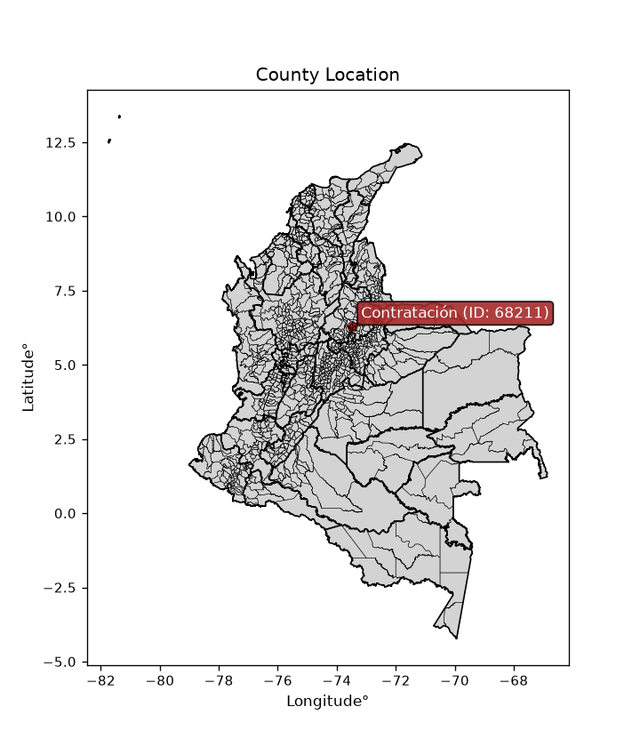
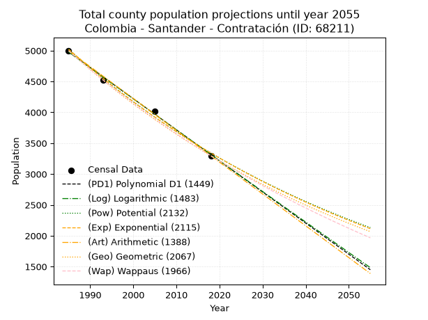
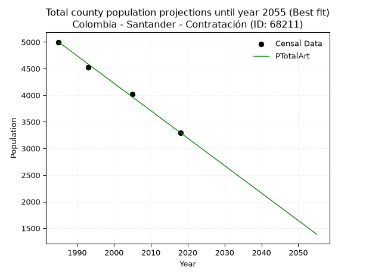
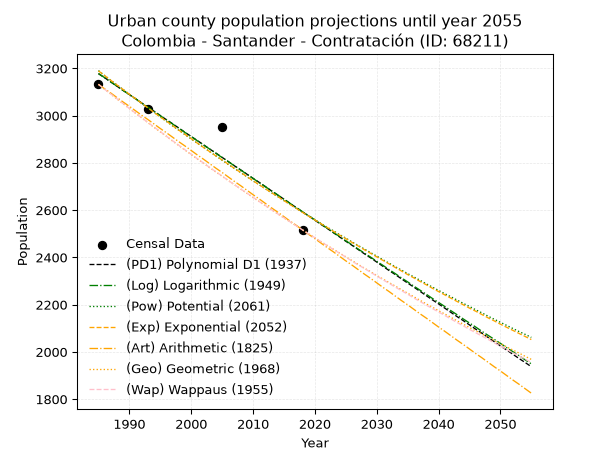
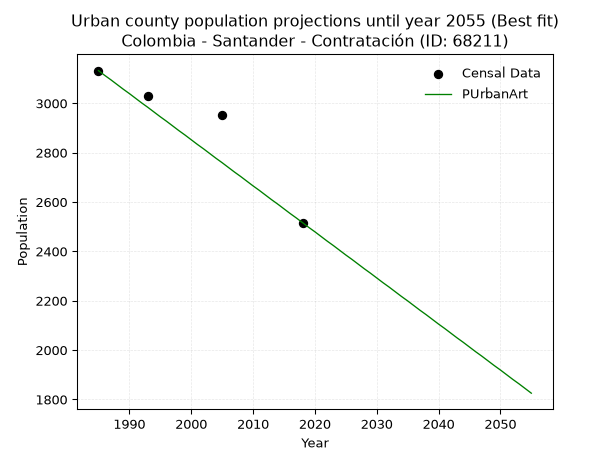
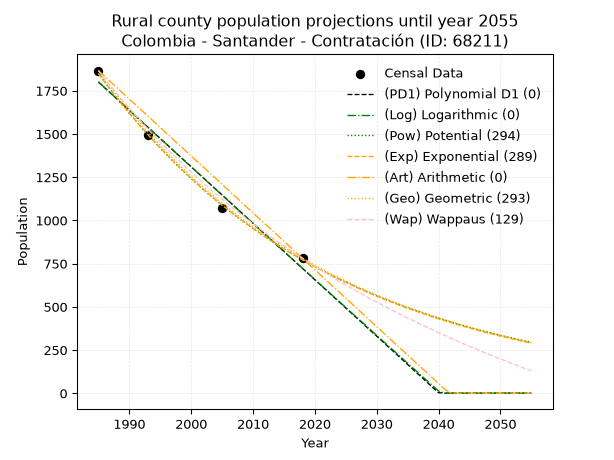
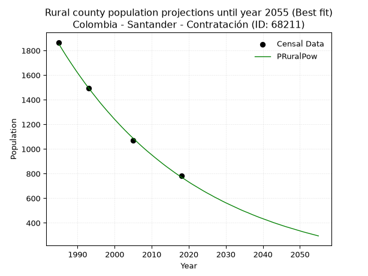

<div align="center">


</div>

# _“Population and Public Services Demand Projections (PPSD) until Year 2050 for Colombia - Santander - Contratación (ID: 68211)”_
Keywords: `population` `public-service` `projection` `lineal` `polynomial` `logarithmic` `potential` `exponential` `arithmetic` `geometric` `wappaus` `dane` `colombia` `south-america`

PPSD are analytical estimates used by governments and planners to anticipate future changes in population size, age distribution, and the resulting community needs for utilities, healthcare, education, and infrastructure as sizing future water treatment facilities, electrical grids, and road networks based on spatial growth.

<div align="center">

</img>

</div>


> **General running parameters**: • app_version: _v20260806_. • Python version: _3.14.7_. • Pandas version: _3.0.5_. • NumPy version: _2.5.1_. • Creates, save and include plots into reports (create_plot): _False_. • Projection until year: _2050_. • Process polynomial degree 2 and up: _False_. • Process Wappaus: _True_. • Process Wappaus: _True_. • Set negative values to zero: _True_. • Set infinite values to zero: _True_. • Drop dataset notes: _True_. 
<div align="center">

Dynamic map: [:earth_americas:Google](http://maps.google.com/maps?q=6.290561328,-73.4744263) [:earth_americas:OSM](https://www.openstreetmap.org/#map=18/6.290561328/-73.4744263&layers=P) [:earth_americas:Bing](https://www.bing.com/maps?cp=6.290561328~-73.4744263&lvl=18) [:earth_americas:Apple](https://maps.apple.com/frame?center=6.290561328%2C-73.4744263&span=0.003%2C0.006)

</div>


<div align="center">

```geojson
{
  "type": "Feature",
  "geometry": {
    "type": "Point", 
    "coordinates": [-73.4744263, 6.290561328]
  }, 
  "properties": {
    "Name": "Colombia - Santander - Contratación (ID: 68211)"
  }
}
```

</div>


## 0. Census Data (4 records)

Census data are official statistics collected by a government about the people and housing in a country. They usually include counts of total population, age, sex, race, income, education, and jobs.

📅Global census file: [Population.xlsx](../data/Population.xlsx)

| Source   |   Year |   CountryID | CountryName   |   StateID | StateName   |   CountyID | CountyName   |   PTotal |   PUrban |   PRural |
|:---------|-------:|------------:|:--------------|----------:|:------------|-----------:|:-------------|---------:|---------:|---------:|
| DANE     |   1985 |          57 | Colombia      |        68 | Santander   |      68211 | Contratación |     4998 |     3132 |     1866 |
| DANE     |   1993 |          57 | Colombia      |        68 | Santander   |      68211 | Contratación |     4520 |     3028 |     1492 |
| DANE     |   2005 |          57 | Colombia      |        68 | Santander   |      68211 | Contratación |     4021 |     2952 |     1069 |
| DANE     |   2018 |          57 | Colombia      |        68 | Santander   |      68211 | Contratación |     3296 |     2516 |      780 |

> 🔥Some records could had specific notes about the registered values or the corresponding urban or rural distribution.

📅[SUI-RUPS](https://www.datos.gov.co/Hacienda-y-Cr-dito-P-blico/Registro-nico-de-Prestadores-de-Servicios-P-blicos/4qkq-csdn/about_data) - Local public utility companies: [RUPS.csv](../data/RUPS.xlsx)

 | SERVICIO       | ESTADO    | NOMBRE                                                                                                                | NIT         | DEPARTAMENTO_DOMICILIO   | MUNICIPIO_DOMICILIO   | DIRECCION         |   TELEFONO | EMAIL                                           | TIPO_PRESTADOR                 | CLASIFICACION                 |
|:---------------|:----------|:----------------------------------------------------------------------------------------------------------------------|:------------|:-------------------------|:----------------------|:------------------|-----------:|:------------------------------------------------|:-------------------------------|:------------------------------|
| ACUEDUCTO      | OPERATIVA | UNIDAD ADMINISTRADORA DE SERVICIOS PUBLICOS DE ACUEDUCTO, ALCANTARILLADO Y ASEO DE LA CABECERA MUNICIPAL CONTRATACION | 890206058-1 | SANTANDER                | CONTRATACION          | Calle 4 No.6 - 51 |    7171231 | serviciospublicos@contratacion-santander.gov.co | MUNICIPIO (PRESTACIÓN DIRECTA) | MENOR O IGUAL A 2500 USUARIOS |
| ALCANTARILLADO | OPERATIVA | UNIDAD ADMINISTRADORA DE SERVICIOS PUBLICOS DE ACUEDUCTO, ALCANTARILLADO Y ASEO DE LA CABECERA MUNICIPAL CONTRATACION | 890206058-1 | SANTANDER                | CONTRATACION          | Calle 4 No.6 - 51 |    7171231 | serviciospublicos@contratacion-santander.gov.co | MUNICIPIO (PRESTACIÓN DIRECTA) | MENOR O IGUAL A 2500 USUARIOS |

## 1. Total

### 1.1. Coefficients and Parameters

* (PD1) Polynomial Deg 1: -50.39863508631019, 105018.61983139197 (lineal)
* (Log) Logarithmic: -100876.9059485097, 770974.9204914136
* (Pow) Potential: -24.726218210415166, 85.24218546953284
* (Exp) Exponential: -0.012355155043322926, 224883064779256.84
* (Art) Arithmetic: Year diff. 2018 - 1985 = 33, Population diff. 3296 - 4998 = -1702, Annual growth = -51.57575757575758
* (Geo) Geometric: Year diff. 2018 - 1985 = 33, Population diff. 3296 - 4998 = -1702, Annual growth % = -0.012536758480835575
* (Wap) Wappaus: i = -1.2436883910238141, Condition values only valid for < 200)

<sub>
Wappaus condition values: ['-0.00', '-1.24', '-2.49', '-3.73', '-4.97', '-6.22', '-7.46', '-8.71', '-9.95', '-11.19', '-12.44', '-13.68', '-14.92', '-16.17', '-17.41', '-18.66', '-19.90', '-21.14', '-22.39', '-23.63', '-24.87', '-26.12', '-27.36', '-28.60', '-29.85', '-31.09', '-32.34', '-33.58', '-34.82', '-36.07', '-37.31', '-38.55', '-39.80', '-41.04', '-42.29', '-43.53', '-44.77', '-46.02', '-47.26', '-48.50', '-49.75', '-50.99', '-52.23', '-53.48', '-54.72', '-55.97', '-57.21', '-58.45', '-59.70', '-60.94', '-62.18', '-63.43', '-64.67', '-65.92', '-67.16', '-68.40', '-69.65', '-70.89', '-72.13', '-73.38', '-74.62', '-75.86', '-77.11', '-78.35', '-79.60', '-80.84']
</sub>


### 1.2. Projected Dataset

|   Year |   CountyID |   PTotalPD1 |   PTotalLog |   PTotalPow |   PTotalExp |   PTotalArt |   PTotalGeo |   PTotalWap |
|-------:|-----------:|------------:|------------:|------------:|------------:|------------:|------------:|------------:|
|   1985 |      68211 |        4977 |        4979 |        5024 |        5022 |        4998 |        4998 |        4998 |
|   1986 |      68211 |        4927 |        4928 |        4962 |        4961 |        4946 |        4935 |        4936 |
|   1987 |      68211 |        4877 |        4877 |        4900 |        4900 |        4895 |        4873 |        4875 |
|   1988 |      68211 |        4826 |        4826 |        4840 |        4839 |        4843 |        4812 |        4815 |
|   1989 |      68211 |        4776 |        4776 |        4780 |        4780 |        4792 |        4752 |        4755 |
|   1990 |      68211 |        4725 |        4725 |        4721 |        4721 |        4740 |        4692 |        4697 |
|   1991 |      68211 |        4675 |        4674 |        4663 |        4663 |        4689 |        4634 |        4638 |
|   1992 |      68211 |        4625 |        4624 |        4605 |        4606 |        4637 |        4576 |        4581 |
|   1993 |      68211 |        4574 |        4573 |        4548 |        4550 |        4585 |        4518 |        4524 |
|   1994 |      68211 |        4524 |        4522 |        4492 |        4494 |        4534 |        4462 |        4468 |
|   1995 |      68211 |        4473 |        4472 |        4437 |        4438 |        4482 |        4406 |        4413 |
|   1996 |      68211 |        4423 |        4421 |        4382 |        4384 |        4431 |        4350 |        4358 |
|   1997 |      68211 |        4373 |        4371 |        4328 |        4330 |        4379 |        4296 |        4304 |
|   1998 |      68211 |        4322 |        4320 |        4275 |        4277 |        4328 |        4242 |        4250 |
|   1999 |      68211 |        4272 |        4270 |        4222 |        4224 |        4276 |        4189 |        4197 |
|   2000 |      68211 |        4221 |        4219 |        4171 |        4173 |        4224 |        4136 |        4145 |
|   2001 |      68211 |        4171 |        4169 |        4119 |        4121 |        4173 |        4084 |        4093 |
|   2002 |      68211 |        4121 |        4119 |        4069 |        4071 |        4121 |        4033 |        4042 |
|   2003 |      68211 |        4070 |        4068 |        4019 |        4021 |        4070 |        3983 |        3992 |
|   2004 |      68211 |        4020 |        4018 |        3970 |        3971 |        4018 |        3933 |        3942 |
|   2005 |      68211 |        3969 |        3968 |        3921 |        3923 |        3966 |        3883 |        3892 |
|   2006 |      68211 |        3919 |        3917 |        3873 |        3874 |        3915 |        3835 |        3843 |
|   2007 |      68211 |        3869 |        3867 |        3825 |        3827 |        3863 |        3787 |        3795 |
|   2008 |      68211 |        3818 |        3817 |        3779 |        3780 |        3812 |        3739 |        3747 |
|   2009 |      68211 |        3768 |        3766 |        3732 |        3733 |        3760 |        3692 |        3700 |
|   2010 |      68211 |        3717 |        3716 |        3687 |        3688 |        3709 |        3646 |        3653 |
|   2011 |      68211 |        3667 |        3666 |        3642 |        3642 |        3657 |        3600 |        3607 |
|   2012 |      68211 |        3617 |        3616 |        3597 |        3598 |        3605 |        3555 |        3561 |
|   2013 |      68211 |        3566 |        3566 |        3553 |        3553 |        3554 |        3511 |        3516 |
|   2014 |      68211 |        3516 |        3516 |        3510 |        3510 |        3502 |        3467 |        3471 |
|   2015 |      68211 |        3465 |        3466 |        3467 |        3467 |        3451 |        3423 |        3426 |
|   2016 |      68211 |        3415 |        3416 |        3425 |        3424 |        3399 |        3380 |        3382 |
|   2017 |      68211 |        3365 |        3366 |        3383 |        3382 |        3348 |        3338 |        3339 |
|   2018 |      68211 |        3314 |        3316 |        3342 |        3341 |        3296 |        3296 |        3296 |
|   2019 |      68211 |        3264 |        3266 |        3301 |        3300 |        3244 |        3255 |        3253 |
|   2020 |      68211 |        3213 |        3216 |        3261 |        3259 |        3193 |        3214 |        3211 |
|   2021 |      68211 |        3163 |        3166 |        3221 |        3219 |        3141 |        3174 |        3170 |
|   2022 |      68211 |        3113 |        3116 |        3182 |        3179 |        3090 |        3134 |        3128 |
|   2023 |      68211 |        3062 |        3066 |        3143 |        3140 |        3038 |        3095 |        3087 |
|   2024 |      68211 |        3012 |        3016 |        3105 |        3102 |        2987 |        3056 |        3047 |
|   2025 |      68211 |        2961 |        2966 |        3068 |        3064 |        2935 |        3017 |        3007 |
|   2026 |      68211 |        2911 |        2916 |        3030 |        3026 |        2883 |        2980 |        2967 |
|   2027 |      68211 |        2861 |        2867 |        2994 |        2989 |        2832 |        2942 |        2928 |
|   2028 |      68211 |        2810 |        2817 |        2957 |        2952 |        2780 |        2905 |        2889 |
|   2029 |      68211 |        2760 |        2767 |        2922 |        2916 |        2729 |        2869 |        2851 |
|   2030 |      68211 |        2709 |        2717 |        2886 |        2880 |        2677 |        2833 |        2812 |
|   2031 |      68211 |        2659 |        2668 |        2851 |        2845 |        2626 |        2797 |        2775 |
|   2032 |      68211 |        2609 |        2618 |        2817 |        2810 |        2574 |        2762 |        2737 |
|   2033 |      68211 |        2558 |        2569 |        2783 |        2775 |        2522 |        2728 |        2700 |
|   2034 |      68211 |        2508 |        2519 |        2749 |        2741 |        2471 |        2694 |        2664 |
|   2035 |      68211 |        2457 |        2469 |        2716 |        2708 |        2419 |        2660 |        2627 |
|   2036 |      68211 |        2407 |        2420 |        2683 |        2674 |        2368 |        2626 |        2591 |
|   2037 |      68211 |        2357 |        2370 |        2651 |        2642 |        2316 |        2593 |        2556 |
|   2038 |      68211 |        2306 |        2321 |        2619 |        2609 |        2264 |        2561 |        2520 |
|   2039 |      68211 |        2256 |        2271 |        2587 |        2577 |        2213 |        2529 |        2485 |
|   2040 |      68211 |        2205 |        2222 |        2556 |        2546 |        2161 |        2497 |        2451 |
|   2041 |      68211 |        2155 |        2172 |        2525 |        2514 |        2110 |        2466 |        2416 |
|   2042 |      68211 |        2105 |        2123 |        2495 |        2483 |        2058 |        2435 |        2382 |
|   2043 |      68211 |        2054 |        2074 |        2465 |        2453 |        2007 |        2404 |        2348 |
|   2044 |      68211 |        2004 |        2024 |        2435 |        2423 |        1955 |        2374 |        2315 |
|   2045 |      68211 |        1953 |        1975 |        2406 |        2393 |        1903 |        2345 |        2282 |
|   2046 |      68211 |        1903 |        1926 |        2377 |        2364 |        1852 |        2315 |        2249 |
|   2047 |      68211 |        1853 |        1876 |        2348 |        2335 |        1800 |        2286 |        2216 |
|   2048 |      68211 |        1802 |        1827 |        2320 |        2306 |        1749 |        2257 |        2184 |
|   2049 |      68211 |        1752 |        1778 |        2292 |        2278 |        1697 |        2229 |        2152 |
|   2050 |      68211 |        1701 |        1728 |        2265 |        2250 |        1646 |        2201 |        2121 |
<div align="center">

</img>

</div>


### 1.3. Best fit with absolute and relative error (%)

Relative error puts that difference into context by dividing the absolute error by the true value, creating a unitless ratio or percentage that shows the scale of the mistake.

Absolute and relative error

|   Year | Source   |   CountryID | CountryName   |   StateID | StateName   |   CountyID_x | CountyName   |   PTotal |   PUrban |   PRural |   CountyID_y |   PTotalPD1 |   PTotalLog |   PTotalPow |   PTotalExp |   PTotalArt |   PTotalGeo |   PTotalWap |   PTotalPD1AbsError |   PTotalLogAbsError |   PTotalPowAbsError |   PTotalExpAbsError |   PTotalArtAbsError |   PTotalGeoAbsError |   PTotalWapAbsError |   PTotalPD1RelError |   PTotalLogRelError |   PTotalPowRelError |   PTotalExpRelError |   PTotalArtRelError |   PTotalGeoRelError |   PTotalWapRelError |
|-------:|:---------|------------:|:--------------|----------:|:------------|-------------:|:-------------|---------:|---------:|---------:|-------------:|------------:|------------:|------------:|------------:|------------:|------------:|------------:|--------------------:|--------------------:|--------------------:|--------------------:|--------------------:|--------------------:|--------------------:|--------------------:|--------------------:|--------------------:|--------------------:|--------------------:|--------------------:|--------------------:|
|   1985 | DANE     |          57 | Colombia      |        68 | Santander   |        68211 | Contratación |     4998 |     3132 |     1866 |        68211 |        4977 |        4979 |        5024 |        5022 |        4998 |        4998 |        4998 |                  21 |                  19 |                  26 |                  24 |                   0 |                   0 |                   0 |            0.420168 |            0.380152 |            0.520208 |            0.480192 |             0       |           0         |           0         |
|   1993 | DANE     |          57 | Colombia      |        68 | Santander   |        68211 | Contratación |     4520 |     3028 |     1492 |        68211 |        4574 |        4573 |        4548 |        4550 |        4585 |        4518 |        4524 |                  54 |                  53 |                  28 |                  30 |                  65 |                   2 |                   4 |            1.19469  |            1.17257  |            0.619469 |            0.663717 |             1.43805 |           0.0442478 |           0.0884956 |
|   2005 | DANE     |          57 | Colombia      |        68 | Santander   |        68211 | Contratación |     4021 |     2952 |     1069 |        68211 |        3969 |        3968 |        3921 |        3923 |        3966 |        3883 |        3892 |                  52 |                  53 |                 100 |                  98 |                  55 |                 138 |                 129 |            1.29321  |            1.31808  |            2.48694  |            2.4372   |             1.36782 |           3.43198   |           3.20816   |
|   2018 | DANE     |          57 | Colombia      |        68 | Santander   |        68211 | Contratación |     3296 |     2516 |      780 |        68211 |        3314 |        3316 |        3342 |        3341 |        3296 |        3296 |        3296 |                  18 |                  20 |                  46 |                  45 |                   0 |                   0 |                   0 |            0.546117 |            0.606796 |            1.39563  |            1.36529  |             0       |           0         |           0         |

Relative error mean

| Method    |   RelError | Best   |
|:----------|-----------:|:-------|
| PTotalPD1 |   0.863546 |        |
| PTotalLog |   0.869399 |        |
| PTotalPow |   1.25556  |        |
| PTotalExp |   1.2366   |        |
| PTotalArt |   0.701468 | True   |
| PTotalGeo |   0.869057 |        |
| PTotalWap |   0.824163 |        |

💙Best method: _**PTotalArt**_
<div align="center">

</img>

</div>


### 1.4. Fresh water supply demand in liters per capita per day (lpcd)

The fresh water supply demand typically ranges from 100 to 300 liters per capita per day (lpcd) for standard domestic and municipal planning, though absolute survival minimums set by the World Health Organization are as low as 7.5 to 20 liters per day, and total consumption in high-income nations can exceed 400 liters.

> `CZ`: Level in meters above the sea level (masl)<br> `WS`: Fresh water supply demand in liters per capita per day (lpcd or l/h/d)<br> `WSAll`: Zonal fresh water supply demand in liters per second (l/s)<br> `A`: Zonal area in square meters<br> `DP`: Population density (people/hectare or p/ha)

Reference values (RAS Colombia)

|    CZ |   WS |
|------:|-----:|
|  1000 |  120 |
|  2000 |  130 |
| 99999 |  140 |

County shapefile geometry properties and water supply values

|   CountyID |      ATotal |   CZTotal |   WSTotal |
|-----------:|------------:|----------:|----------:|
|      68211 | 1.36949e+08 |   1779.94 |       130 |

Projected values for best method: PTotalArt

|   CountyID |   Year |   PTotalArt |   DPTotal |   WSTotal |   WSTotalAll |
|-----------:|-------:|------------:|----------:|----------:|-------------:|
|      68211 |   1985 |        4998 |      0.36 |       130 |      7.52014 |
|      68211 |   1986 |        4946 |      0.36 |       130 |      7.4419  |
|      68211 |   1987 |        4895 |      0.36 |       130 |      7.36516 |
|      68211 |   1988 |        4843 |      0.35 |       130 |      7.28692 |
|      68211 |   1989 |        4792 |      0.35 |       130 |      7.21019 |
|      68211 |   1990 |        4740 |      0.35 |       130 |      7.13194 |
|      68211 |   1991 |        4689 |      0.34 |       130 |      7.05521 |
|      68211 |   1992 |        4637 |      0.34 |       130 |      6.97697 |
|      68211 |   1993 |        4585 |      0.33 |       130 |      6.89873 |
|      68211 |   1994 |        4534 |      0.33 |       130 |      6.82199 |
|      68211 |   1995 |        4482 |      0.33 |       130 |      6.74375 |
|      68211 |   1996 |        4431 |      0.32 |       130 |      6.66701 |
|      68211 |   1997 |        4379 |      0.32 |       130 |      6.58877 |
|      68211 |   1998 |        4328 |      0.32 |       130 |      6.51204 |
|      68211 |   1999 |        4276 |      0.31 |       130 |      6.4338  |
|      68211 |   2000 |        4224 |      0.31 |       130 |      6.35556 |
|      68211 |   2001 |        4173 |      0.3  |       130 |      6.27882 |
|      68211 |   2002 |        4121 |      0.3  |       130 |      6.20058 |
|      68211 |   2003 |        4070 |      0.3  |       130 |      6.12384 |
|      68211 |   2004 |        4018 |      0.29 |       130 |      6.0456  |
|      68211 |   2005 |        3966 |      0.29 |       130 |      5.96736 |
|      68211 |   2006 |        3915 |      0.29 |       130 |      5.89062 |
|      68211 |   2007 |        3863 |      0.28 |       130 |      5.81238 |
|      68211 |   2008 |        3812 |      0.28 |       130 |      5.73565 |
|      68211 |   2009 |        3760 |      0.27 |       130 |      5.65741 |
|      68211 |   2010 |        3709 |      0.27 |       130 |      5.58067 |
|      68211 |   2011 |        3657 |      0.27 |       130 |      5.50243 |
|      68211 |   2012 |        3605 |      0.26 |       130 |      5.42419 |
|      68211 |   2013 |        3554 |      0.26 |       130 |      5.34745 |
|      68211 |   2014 |        3502 |      0.26 |       130 |      5.26921 |
|      68211 |   2015 |        3451 |      0.25 |       130 |      5.19248 |
|      68211 |   2016 |        3399 |      0.25 |       130 |      5.11424 |
|      68211 |   2017 |        3348 |      0.24 |       130 |      5.0375  |
|      68211 |   2018 |        3296 |      0.24 |       130 |      4.95926 |
|      68211 |   2019 |        3244 |      0.24 |       130 |      4.88102 |
|      68211 |   2020 |        3193 |      0.23 |       130 |      4.80428 |
|      68211 |   2021 |        3141 |      0.23 |       130 |      4.72604 |
|      68211 |   2022 |        3090 |      0.23 |       130 |      4.64931 |
|      68211 |   2023 |        3038 |      0.22 |       130 |      4.57106 |
|      68211 |   2024 |        2987 |      0.22 |       130 |      4.49433 |
|      68211 |   2025 |        2935 |      0.21 |       130 |      4.41609 |
|      68211 |   2026 |        2883 |      0.21 |       130 |      4.33785 |
|      68211 |   2027 |        2832 |      0.21 |       130 |      4.26111 |
|      68211 |   2028 |        2780 |      0.2  |       130 |      4.18287 |
|      68211 |   2029 |        2729 |      0.2  |       130 |      4.10613 |
|      68211 |   2030 |        2677 |      0.2  |       130 |      4.02789 |
|      68211 |   2031 |        2626 |      0.19 |       130 |      3.95116 |
|      68211 |   2032 |        2574 |      0.19 |       130 |      3.87292 |
|      68211 |   2033 |        2522 |      0.18 |       130 |      3.79468 |
|      68211 |   2034 |        2471 |      0.18 |       130 |      3.71794 |
|      68211 |   2035 |        2419 |      0.18 |       130 |      3.6397  |
|      68211 |   2036 |        2368 |      0.17 |       130 |      3.56296 |
|      68211 |   2037 |        2316 |      0.17 |       130 |      3.48472 |
|      68211 |   2038 |        2264 |      0.17 |       130 |      3.40648 |
|      68211 |   2039 |        2213 |      0.16 |       130 |      3.32975 |
|      68211 |   2040 |        2161 |      0.16 |       130 |      3.2515  |
|      68211 |   2041 |        2110 |      0.15 |       130 |      3.17477 |
|      68211 |   2042 |        2058 |      0.15 |       130 |      3.09653 |
|      68211 |   2043 |        2007 |      0.15 |       130 |      3.01979 |
|      68211 |   2044 |        1955 |      0.14 |       130 |      2.94155 |
|      68211 |   2045 |        1903 |      0.14 |       130 |      2.86331 |
|      68211 |   2046 |        1852 |      0.14 |       130 |      2.78657 |
|      68211 |   2047 |        1800 |      0.13 |       130 |      2.70833 |
|      68211 |   2048 |        1749 |      0.13 |       130 |      2.6316  |
|      68211 |   2049 |        1697 |      0.12 |       130 |      2.55336 |
|      68211 |   2050 |        1646 |      0.12 |       130 |      2.47662 |

## 2. Urban

### 2.1. Coefficients and Parameters

* (PD1) Polynomial Deg 1: -17.719791248494293, 38351.01244480071 (lineal)
* (Log) Logarithmic: -35442.56835826609, 272306.24611009855
* (Pow) Potential: -12.601149259925151, 45.059300495972735
* (Exp) Exponential: -0.006300432321149942, 861234057.4542514
* (Art) Arithmetic: Year diff. 2018 - 1985 = 33, Population diff. 2516 - 3132 = -616, Annual growth = -18.666666666666668
* (Geo) Geometric: Year diff. 2018 - 1985 = 33, Population diff. 2516 - 3132 = -616, Annual growth % = -0.006614434933239877
* (Wap) Wappaus: i = -0.6610009442870632, Condition values only valid for < 200)

<sub>
Wappaus condition values: ['-0.00', '-0.66', '-1.32', '-1.98', '-2.64', '-3.31', '-3.97', '-4.63', '-5.29', '-5.95', '-6.61', '-7.27', '-7.93', '-8.59', '-9.25', '-9.92', '-10.58', '-11.24', '-11.90', '-12.56', '-13.22', '-13.88', '-14.54', '-15.20', '-15.86', '-16.53', '-17.19', '-17.85', '-18.51', '-19.17', '-19.83', '-20.49', '-21.15', '-21.81', '-22.47', '-23.14', '-23.80', '-24.46', '-25.12', '-25.78', '-26.44', '-27.10', '-27.76', '-28.42', '-29.08', '-29.75', '-30.41', '-31.07', '-31.73', '-32.39', '-33.05', '-33.71', '-34.37', '-35.03', '-35.69', '-36.36', '-37.02', '-37.68', '-38.34', '-39.00', '-39.66', '-40.32', '-40.98', '-41.64', '-42.30', '-42.97']
</sub>


### 2.2. Projected Dataset

|   Year |   CountyID |   PUrbanPD1 |   PUrbanLog |   PUrbanPow |   PUrbanExp |   PUrbanArt |   PUrbanGeo |   PUrbanWap |
|-------:|-----------:|------------:|------------:|------------:|------------:|------------:|------------:|------------:|
|   1985 |      68211 |        3177 |        3178 |        3190 |        3189 |        3132 |        3132 |        3132 |
|   1986 |      68211 |        3160 |        3160 |        3169 |        3169 |        3113 |        3111 |        3111 |
|   1987 |      68211 |        3142 |        3142 |        3149 |        3149 |        3095 |        3091 |        3091 |
|   1988 |      68211 |        3124 |        3124 |        3129 |        3129 |        3076 |        3070 |        3071 |
|   1989 |      68211 |        3106 |        3106 |        3110 |        3110 |        3057 |        3050 |        3050 |
|   1990 |      68211 |        3089 |        3088 |        3090 |        3090 |        3039 |        3030 |        3030 |
|   1991 |      68211 |        3071 |        3071 |        3071 |        3071 |        3020 |        3010 |        3010 |
|   1992 |      68211 |        3053 |        3053 |        3051 |        3052 |        3001 |        2990 |        2990 |
|   1993 |      68211 |        3035 |        3035 |        3032 |        3032 |        2983 |        2970 |        2971 |
|   1994 |      68211 |        3018 |        3017 |        3013 |        3013 |        2964 |        2950 |        2951 |
|   1995 |      68211 |        3000 |        2999 |        2994 |        2994 |        2945 |        2931 |        2932 |
|   1996 |      68211 |        2982 |        2982 |        2975 |        2976 |        2927 |        2912 |        2912 |
|   1997 |      68211 |        2965 |        2964 |        2956 |        2957 |        2908 |        2892 |        2893 |
|   1998 |      68211 |        2947 |        2946 |        2938 |        2938 |        2889 |        2873 |        2874 |
|   1999 |      68211 |        2929 |        2928 |        2919 |        2920 |        2871 |        2854 |        2855 |
|   2000 |      68211 |        2911 |        2911 |        2901 |        2902 |        2852 |        2835 |        2836 |
|   2001 |      68211 |        2894 |        2893 |        2883 |        2883 |        2833 |        2816 |        2817 |
|   2002 |      68211 |        2876 |        2875 |        2865 |        2865 |        2815 |        2798 |        2799 |
|   2003 |      68211 |        2858 |        2858 |        2847 |        2847 |        2796 |        2779 |        2780 |
|   2004 |      68211 |        2841 |        2840 |        2829 |        2829 |        2777 |        2761 |        2762 |
|   2005 |      68211 |        2823 |        2822 |        2811 |        2812 |        2759 |        2743 |        2744 |
|   2006 |      68211 |        2805 |        2805 |        2793 |        2794 |        2740 |        2725 |        2725 |
|   2007 |      68211 |        2787 |        2787 |        2776 |        2776 |        2721 |        2707 |        2707 |
|   2008 |      68211 |        2770 |        2769 |        2759 |        2759 |        2703 |        2689 |        2689 |
|   2009 |      68211 |        2752 |        2752 |        2741 |        2742 |        2684 |        2671 |        2672 |
|   2010 |      68211 |        2734 |        2734 |        2724 |        2724 |        2665 |        2653 |        2654 |
|   2011 |      68211 |        2717 |        2716 |        2707 |        2707 |        2647 |        2636 |        2636 |
|   2012 |      68211 |        2699 |        2699 |        2690 |        2690 |        2628 |        2618 |        2619 |
|   2013 |      68211 |        2681 |        2681 |        2673 |        2673 |        2609 |        2601 |        2601 |
|   2014 |      68211 |        2663 |        2664 |        2657 |        2657 |        2591 |        2584 |        2584 |
|   2015 |      68211 |        2646 |        2646 |        2640 |        2640 |        2572 |        2567 |        2567 |
|   2016 |      68211 |        2628 |        2628 |        2624 |        2623 |        2553 |        2550 |        2550 |
|   2017 |      68211 |        2610 |        2611 |        2607 |        2607 |        2535 |        2533 |        2533 |
|   2018 |      68211 |        2592 |        2593 |        2591 |        2590 |        2516 |        2516 |        2516 |
|   2019 |      68211 |        2575 |        2576 |        2575 |        2574 |        2497 |        2499 |        2499 |
|   2020 |      68211 |        2557 |        2558 |        2559 |        2558 |        2479 |        2483 |        2483 |
|   2021 |      68211 |        2539 |        2541 |        2543 |        2542 |        2460 |        2466 |        2466 |
|   2022 |      68211 |        2522 |        2523 |        2527 |        2526 |        2441 |        2450 |        2449 |
|   2023 |      68211 |        2504 |        2505 |        2512 |        2510 |        2423 |        2434 |        2433 |
|   2024 |      68211 |        2486 |        2488 |        2496 |        2494 |        2404 |        2418 |        2417 |
|   2025 |      68211 |        2468 |        2470 |        2481 |        2479 |        2385 |        2402 |        2401 |
|   2026 |      68211 |        2451 |        2453 |        2465 |        2463 |        2367 |        2386 |        2384 |
|   2027 |      68211 |        2433 |        2435 |        2450 |        2448 |        2348 |        2370 |        2368 |
|   2028 |      68211 |        2415 |        2418 |        2435 |        2432 |        2329 |        2354 |        2353 |
|   2029 |      68211 |        2398 |        2401 |        2420 |        2417 |        2311 |        2339 |        2337 |
|   2030 |      68211 |        2380 |        2383 |        2405 |        2402 |        2292 |        2323 |        2321 |
|   2031 |      68211 |        2362 |        2366 |        2390 |        2387 |        2273 |        2308 |        2305 |
|   2032 |      68211 |        2344 |        2348 |        2375 |        2372 |        2255 |        2293 |        2290 |
|   2033 |      68211 |        2327 |        2331 |        2360 |        2357 |        2236 |        2278 |        2274 |
|   2034 |      68211 |        2309 |        2313 |        2346 |        2342 |        2217 |        2263 |        2259 |
|   2035 |      68211 |        2291 |        2296 |        2331 |        2327 |        2199 |        2248 |        2244 |
|   2036 |      68211 |        2274 |        2278 |        2317 |        2313 |        2180 |        2233 |        2228 |
|   2037 |      68211 |        2256 |        2261 |        2303 |        2298 |        2161 |        2218 |        2213 |
|   2038 |      68211 |        2238 |        2244 |        2288 |        2284 |        2143 |        2203 |        2198 |
|   2039 |      68211 |        2220 |        2226 |        2274 |        2269 |        2124 |        2189 |        2183 |
|   2040 |      68211 |        2203 |        2209 |        2260 |        2255 |        2105 |        2174 |        2169 |
|   2041 |      68211 |        2185 |        2192 |        2246 |        2241 |        2087 |        2160 |        2154 |
|   2042 |      68211 |        2167 |        2174 |        2233 |        2227 |        2068 |        2146 |        2139 |
|   2043 |      68211 |        2149 |        2157 |        2219 |        2213 |        2049 |        2131 |        2124 |
|   2044 |      68211 |        2132 |        2139 |        2205 |        2199 |        2031 |        2117 |        2110 |
|   2045 |      68211 |        2114 |        2122 |        2192 |        2185 |        2012 |        2103 |        2095 |
|   2046 |      68211 |        2096 |        2105 |        2178 |        2172 |        1993 |        2089 |        2081 |
|   2047 |      68211 |        2079 |        2087 |        2165 |        2158 |        1975 |        2076 |        2067 |
|   2048 |      68211 |        2061 |        2070 |        2151 |        2144 |        1956 |        2062 |        2053 |
|   2049 |      68211 |        2043 |        2053 |        2138 |        2131 |        1937 |        2048 |        2038 |
|   2050 |      68211 |        2025 |        2036 |        2125 |        2117 |        1919 |        2035 |        2024 |
<div align="center">

</img>

</div>


### 2.3. Best fit with absolute and relative error (%)

Relative error puts that difference into context by dividing the absolute error by the true value, creating a unitless ratio or percentage that shows the scale of the mistake.

Absolute and relative error

|   Year | Source   |   CountryID | CountryName   |   StateID | StateName   |   CountyID_x | CountyName   |   PTotal |   PUrban |   PRural |   CountyID_y |   PUrbanPD1 |   PUrbanLog |   PUrbanPow |   PUrbanExp |   PUrbanArt |   PUrbanGeo |   PUrbanWap |   PUrbanPD1AbsError |   PUrbanLogAbsError |   PUrbanPowAbsError |   PUrbanExpAbsError |   PUrbanArtAbsError |   PUrbanGeoAbsError |   PUrbanWapAbsError |   PUrbanPD1RelError |   PUrbanLogRelError |   PUrbanPowRelError |   PUrbanExpRelError |   PUrbanArtRelError |   PUrbanGeoRelError |   PUrbanWapRelError |
|-------:|:---------|------------:|:--------------|----------:|:------------|-------------:|:-------------|---------:|---------:|---------:|-------------:|------------:|------------:|------------:|------------:|------------:|------------:|------------:|--------------------:|--------------------:|--------------------:|--------------------:|--------------------:|--------------------:|--------------------:|--------------------:|--------------------:|--------------------:|--------------------:|--------------------:|--------------------:|--------------------:|
|   1985 | DANE     |          57 | Colombia      |        68 | Santander   |        68211 | Contratación |     4998 |     3132 |     1866 |        68211 |        3177 |        3178 |        3190 |        3189 |        3132 |        3132 |        3132 |                  45 |                  46 |                  58 |                  57 |                   0 |                   0 |                   0 |            1.43678  |            1.46871  |             1.85185 |             1.81992 |             0       |             0       |             0       |
|   1993 | DANE     |          57 | Colombia      |        68 | Santander   |        68211 | Contratación |     4520 |     3028 |     1492 |        68211 |        3035 |        3035 |        3032 |        3032 |        2983 |        2970 |        2971 |                   7 |                   7 |                   4 |                   4 |                  45 |                  58 |                  57 |            0.231176 |            0.231176 |             0.1321  |             0.1321  |             1.48613 |             1.91546 |             1.88243 |
|   2005 | DANE     |          57 | Colombia      |        68 | Santander   |        68211 | Contratación |     4021 |     2952 |     1069 |        68211 |        2823 |        2822 |        2811 |        2812 |        2759 |        2743 |        2744 |                 129 |                 130 |                 141 |                 140 |                 193 |                 209 |                 208 |            4.36992  |            4.40379  |             4.77642 |             4.74255 |             6.53794 |             7.07995 |             7.04607 |
|   2018 | DANE     |          57 | Colombia      |        68 | Santander   |        68211 | Contratación |     3296 |     2516 |      780 |        68211 |        2592 |        2593 |        2591 |        2590 |        2516 |        2516 |        2516 |                  76 |                  77 |                  75 |                  74 |                   0 |                   0 |                   0 |            3.02067  |            3.06041  |             2.98092 |             2.94118 |             0       |             0       |             0       |

Relative error mean

| Method    |   RelError | Best   |
|:----------|-----------:|:-------|
| PUrbanPD1 |    2.26464 |        |
| PUrbanLog |    2.29102 |        |
| PUrbanPow |    2.43532 |        |
| PUrbanExp |    2.40894 |        |
| PUrbanArt |    2.00602 | True   |
| PUrbanGeo |    2.24885 |        |
| PUrbanWap |    2.23213 |        |

💙Best method: _**PUrbanArt**_
<div align="center">

</img>

</div>


### 2.4. Fresh water supply demand in liters per capita per day (lpcd)

The fresh water supply demand typically ranges from 100 to 300 liters per capita per day (lpcd) for standard domestic and municipal planning, though absolute survival minimums set by the World Health Organization are as low as 7.5 to 20 liters per day, and total consumption in high-income nations can exceed 400 liters.

> `CZ`: Level in meters above the sea level (masl)<br> `WS`: Fresh water supply demand in liters per capita per day (lpcd or l/h/d)<br> `WSAll`: Zonal fresh water supply demand in liters per second (l/s)<br> `A`: Zonal area in square meters<br> `DP`: Population density (people/hectare or p/ha)

Reference values (RAS Colombia)

|    CZ |   WS |
|------:|-----:|
|  1000 |  120 |
|  2000 |  130 |
| 99999 |  140 |

County shapefile geometry properties and water supply values

|   CountyID |   AUrban |   CZUrban |   WSUrban |
|-----------:|---------:|----------:|----------:|
|      68211 |   960109 |   1668.34 |       130 |

Projected values for best method: PUrbanArt

|   CountyID |   Year |   PUrbanArt |   DPUrban |   WSUrban |   WSUrbanAll |
|-----------:|-------:|------------:|----------:|----------:|-------------:|
|      68211 |   1985 |        3132 |     32.62 |       130 |      4.7125  |
|      68211 |   1986 |        3113 |     32.42 |       130 |      4.68391 |
|      68211 |   1987 |        3095 |     32.24 |       130 |      4.65683 |
|      68211 |   1988 |        3076 |     32.04 |       130 |      4.62824 |
|      68211 |   1989 |        3057 |     31.84 |       130 |      4.59965 |
|      68211 |   1990 |        3039 |     31.65 |       130 |      4.57257 |
|      68211 |   1991 |        3020 |     31.45 |       130 |      4.54398 |
|      68211 |   1992 |        3001 |     31.26 |       130 |      4.51539 |
|      68211 |   1993 |        2983 |     31.07 |       130 |      4.48831 |
|      68211 |   1994 |        2964 |     30.87 |       130 |      4.45972 |
|      68211 |   1995 |        2945 |     30.67 |       130 |      4.43113 |
|      68211 |   1996 |        2927 |     30.49 |       130 |      4.40405 |
|      68211 |   1997 |        2908 |     30.29 |       130 |      4.37546 |
|      68211 |   1998 |        2889 |     30.09 |       130 |      4.34687 |
|      68211 |   1999 |        2871 |     29.9  |       130 |      4.31979 |
|      68211 |   2000 |        2852 |     29.7  |       130 |      4.2912  |
|      68211 |   2001 |        2833 |     29.51 |       130 |      4.26262 |
|      68211 |   2002 |        2815 |     29.32 |       130 |      4.23553 |
|      68211 |   2003 |        2796 |     29.12 |       130 |      4.20694 |
|      68211 |   2004 |        2777 |     28.92 |       130 |      4.17836 |
|      68211 |   2005 |        2759 |     28.74 |       130 |      4.15127 |
|      68211 |   2006 |        2740 |     28.54 |       130 |      4.12269 |
|      68211 |   2007 |        2721 |     28.34 |       130 |      4.0941  |
|      68211 |   2008 |        2703 |     28.15 |       130 |      4.06701 |
|      68211 |   2009 |        2684 |     27.96 |       130 |      4.03843 |
|      68211 |   2010 |        2665 |     27.76 |       130 |      4.00984 |
|      68211 |   2011 |        2647 |     27.57 |       130 |      3.98275 |
|      68211 |   2012 |        2628 |     27.37 |       130 |      3.95417 |
|      68211 |   2013 |        2609 |     27.17 |       130 |      3.92558 |
|      68211 |   2014 |        2591 |     26.99 |       130 |      3.8985  |
|      68211 |   2015 |        2572 |     26.79 |       130 |      3.86991 |
|      68211 |   2016 |        2553 |     26.59 |       130 |      3.84132 |
|      68211 |   2017 |        2535 |     26.4  |       130 |      3.81424 |
|      68211 |   2018 |        2516 |     26.21 |       130 |      3.78565 |
|      68211 |   2019 |        2497 |     26.01 |       130 |      3.75706 |
|      68211 |   2020 |        2479 |     25.82 |       130 |      3.72998 |
|      68211 |   2021 |        2460 |     25.62 |       130 |      3.70139 |
|      68211 |   2022 |        2441 |     25.42 |       130 |      3.6728  |
|      68211 |   2023 |        2423 |     25.24 |       130 |      3.64572 |
|      68211 |   2024 |        2404 |     25.04 |       130 |      3.61713 |
|      68211 |   2025 |        2385 |     24.84 |       130 |      3.58854 |
|      68211 |   2026 |        2367 |     24.65 |       130 |      3.56146 |
|      68211 |   2027 |        2348 |     24.46 |       130 |      3.53287 |
|      68211 |   2028 |        2329 |     24.26 |       130 |      3.50428 |
|      68211 |   2029 |        2311 |     24.07 |       130 |      3.4772  |
|      68211 |   2030 |        2292 |     23.87 |       130 |      3.44861 |
|      68211 |   2031 |        2273 |     23.67 |       130 |      3.42002 |
|      68211 |   2032 |        2255 |     23.49 |       130 |      3.39294 |
|      68211 |   2033 |        2236 |     23.29 |       130 |      3.36435 |
|      68211 |   2034 |        2217 |     23.09 |       130 |      3.33576 |
|      68211 |   2035 |        2199 |     22.9  |       130 |      3.30868 |
|      68211 |   2036 |        2180 |     22.71 |       130 |      3.28009 |
|      68211 |   2037 |        2161 |     22.51 |       130 |      3.2515  |
|      68211 |   2038 |        2143 |     22.32 |       130 |      3.22442 |
|      68211 |   2039 |        2124 |     22.12 |       130 |      3.19583 |
|      68211 |   2040 |        2105 |     21.92 |       130 |      3.16725 |
|      68211 |   2041 |        2087 |     21.74 |       130 |      3.14016 |
|      68211 |   2042 |        2068 |     21.54 |       130 |      3.11157 |
|      68211 |   2043 |        2049 |     21.34 |       130 |      3.08299 |
|      68211 |   2044 |        2031 |     21.15 |       130 |      3.0559  |
|      68211 |   2045 |        2012 |     20.96 |       130 |      3.02731 |
|      68211 |   2046 |        1993 |     20.76 |       130 |      2.99873 |
|      68211 |   2047 |        1975 |     20.57 |       130 |      2.97164 |
|      68211 |   2048 |        1956 |     20.37 |       130 |      2.94306 |
|      68211 |   2049 |        1937 |     20.17 |       130 |      2.91447 |
|      68211 |   2050 |        1919 |     19.99 |       130 |      2.88738 |

## 3. Rural

### 3.1. Coefficients and Parameters

* (PD1) Polynomial Deg 1: -32.67884383781594, 66667.60738659133 (lineal)
* (Log) Logarithmic: -65434.337590243646, 498668.6743813152
* (Pow) Potential: -53.06039480774573, 178.2478254028527
* (Exp) Exponential: -0.026506639221588742, 1.3112648206563611e+26
* (Art) Arithmetic: Year diff. 2018 - 1985 = 33, Population diff. 780 - 1866 = -1086, Annual growth = -32.90909090909091
* (Geo) Geometric: Year diff. 2018 - 1985 = 33, Population diff. 780 - 1866 = -1086, Annual growth % = -0.026085804897644893
* (Wap) Wappaus: i = -2.4874596303167733, Condition values only valid for < 200)

<sub>
Wappaus condition values: ['-0.00', '-2.49', '-4.97', '-7.46', '-9.95', '-12.44', '-14.92', '-17.41', '-19.90', '-22.39', '-24.87', '-27.36', '-29.85', '-32.34', '-34.82', '-37.31', '-39.80', '-42.29', '-44.77', '-47.26', '-49.75', '-52.24', '-54.72', '-57.21', '-59.70', '-62.19', '-64.67', '-67.16', '-69.65', '-72.14', '-74.62', '-77.11', '-79.60', '-82.09', '-84.57', '-87.06', '-89.55', '-92.04', '-94.52', '-97.01', '-99.50', '-101.99', '-104.47', '-106.96', '-109.45', '-111.94', '-114.42', '-116.91', '-119.40', '-121.89', '-124.37', '-126.86', '-129.35', '-131.84', '-134.32', '-136.81', '-139.30', '-141.79', '-144.27', '-146.76', '-149.25', '-151.74', '-154.22', '-156.71', '-159.20', '-161.68']
</sub>


### 3.2. Projected Dataset

|   Year |   CountyID |   PRuralPD1 |   PRuralLog |   PRuralPow |   PRuralExp |   PRuralArt |   PRuralGeo |   PRuralWap |
|-------:|-----------:|------------:|------------:|------------:|------------:|------------:|------------:|------------:|
|   1985 |      68211 |        1800 |        1801 |        1851 |        1849 |        1866 |        1866 |        1866 |
|   1986 |      68211 |        1767 |        1768 |        1802 |        1801 |        1833 |        1817 |        1820 |
|   1987 |      68211 |        1735 |        1735 |        1754 |        1754 |        1800 |        1770 |        1775 |
|   1988 |      68211 |        1702 |        1702 |        1708 |        1708 |        1767 |        1724 |        1732 |
|   1989 |      68211 |        1669 |        1670 |        1663 |        1663 |        1734 |        1679 |        1689 |
|   1990 |      68211 |        1637 |        1637 |        1619 |        1620 |        1701 |        1635 |        1648 |
|   1991 |      68211 |        1604 |        1604 |        1577 |        1577 |        1669 |        1592 |        1607 |
|   1992 |      68211 |        1571 |        1571 |        1535 |        1536 |        1636 |        1551 |        1567 |
|   1993 |      68211 |        1539 |        1538 |        1495 |        1496 |        1603 |        1510 |        1528 |
|   1994 |      68211 |        1506 |        1505 |        1456 |        1457 |        1570 |        1471 |        1490 |
|   1995 |      68211 |        1473 |        1472 |        1418 |        1419 |        1537 |        1433 |        1453 |
|   1996 |      68211 |        1441 |        1440 |        1380 |        1382 |        1504 |        1395 |        1417 |
|   1997 |      68211 |        1408 |        1407 |        1344 |        1345 |        1471 |        1359 |        1381 |
|   1998 |      68211 |        1375 |        1374 |        1309 |        1310 |        1438 |        1323 |        1347 |
|   1999 |      68211 |        1343 |        1341 |        1275 |        1276 |        1405 |        1289 |        1313 |
|   2000 |      68211 |        1310 |        1309 |        1241 |        1243 |        1372 |        1255 |        1279 |
|   2001 |      68211 |        1277 |        1276 |        1209 |        1210 |        1339 |        1222 |        1247 |
|   2002 |      68211 |        1245 |        1243 |        1177 |        1178 |        1307 |        1191 |        1215 |
|   2003 |      68211 |        1212 |        1211 |        1146 |        1148 |        1274 |        1160 |        1183 |
|   2004 |      68211 |        1179 |        1178 |        1116 |        1118 |        1241 |        1129 |        1153 |
|   2005 |      68211 |        1147 |        1145 |        1087 |        1088 |        1208 |        1100 |        1123 |
|   2006 |      68211 |        1114 |        1113 |        1059 |        1060 |        1175 |        1071 |        1093 |
|   2007 |      68211 |        1081 |        1080 |        1031 |        1032 |        1142 |        1043 |        1064 |
|   2008 |      68211 |        1048 |        1047 |        1004 |        1005 |        1109 |        1016 |        1036 |
|   2009 |      68211 |        1016 |        1015 |         978 |         979 |        1076 |         989 |        1008 |
|   2010 |      68211 |         983 |         982 |         953 |         953 |        1043 |         964 |         981 |
|   2011 |      68211 |         950 |         950 |         928 |         928 |        1010 |         939 |         954 |
|   2012 |      68211 |         918 |         917 |         904 |         904 |         977 |         914 |         928 |
|   2013 |      68211 |         885 |         885 |         880 |         880 |         945 |         890 |         902 |
|   2014 |      68211 |         852 |         852 |         857 |         857 |         912 |         867 |         877 |
|   2015 |      68211 |         820 |         820 |         835 |         835 |         879 |         844 |         852 |
|   2016 |      68211 |         787 |         787 |         813 |         813 |         846 |         822 |         828 |
|   2017 |      68211 |         754 |         755 |         792 |         792 |         813 |         801 |         804 |
|   2018 |      68211 |         722 |         722 |         772 |         771 |         780 |         780 |         780 |
|   2019 |      68211 |         689 |         690 |         752 |         751 |         747 |         760 |         757 |
|   2020 |      68211 |         656 |         658 |         732 |         731 |         714 |         740 |         734 |
|   2021 |      68211 |         624 |         625 |         713 |         712 |         681 |         721 |         712 |
|   2022 |      68211 |         591 |         593 |         695 |         694 |         648 |         702 |         690 |
|   2023 |      68211 |         558 |         560 |         677 |         675 |         615 |         683 |         668 |
|   2024 |      68211 |         526 |         528 |         659 |         658 |         583 |         666 |         647 |
|   2025 |      68211 |         493 |         496 |         642 |         641 |         550 |         648 |         626 |
|   2026 |      68211 |         460 |         463 |         626 |         624 |         517 |         631 |         606 |
|   2027 |      68211 |         428 |         431 |         609 |         607 |         484 |         615 |         585 |
|   2028 |      68211 |         395 |         399 |         594 |         592 |         451 |         599 |         566 |
|   2029 |      68211 |         362 |         367 |         578 |         576 |         418 |         583 |         546 |
|   2030 |      68211 |         330 |         334 |         563 |         561 |         385 |         568 |         527 |
|   2031 |      68211 |         297 |         302 |         549 |         546 |         352 |         553 |         508 |
|   2032 |      68211 |         264 |         270 |         535 |         532 |         319 |         539 |         489 |
|   2033 |      68211 |         232 |         238 |         521 |         518 |         286 |         525 |         471 |
|   2034 |      68211 |         199 |         206 |         507 |         505 |         253 |         511 |         453 |
|   2035 |      68211 |         166 |         173 |         494 |         491 |         221 |         498 |         435 |
|   2036 |      68211 |         133 |         141 |         482 |         479 |         188 |         485 |         418 |
|   2037 |      68211 |         101 |         109 |         469 |         466 |         155 |         472 |         400 |
|   2038 |      68211 |          68 |          77 |         457 |         454 |         122 |         460 |         383 |
|   2039 |      68211 |          35 |          45 |         445 |         442 |          89 |         448 |         367 |
|   2040 |      68211 |           3 |          13 |         434 |         430 |          56 |         436 |         350 |
|   2041 |      68211 |           0 |           0 |         423 |         419 |          23 |         425 |         334 |
|   2042 |      68211 |           0 |           0 |         412 |         408 |           0 |         414 |         318 |
|   2043 |      68211 |           0 |           0 |         401 |         397 |           0 |         403 |         302 |
|   2044 |      68211 |           0 |           0 |         391 |         387 |           0 |         392 |         286 |
|   2045 |      68211 |           0 |           0 |         381 |         377 |           0 |         382 |         271 |
|   2046 |      68211 |           0 |           0 |         371 |         367 |           0 |         372 |         256 |
|   2047 |      68211 |           0 |           0 |         362 |         357 |           0 |         362 |         241 |
|   2048 |      68211 |           0 |           0 |         353 |         348 |           0 |         353 |         226 |
|   2049 |      68211 |           0 |           0 |         344 |         339 |           0 |         344 |         212 |
|   2050 |      68211 |           0 |           0 |         335 |         330 |           0 |         335 |         198 |
<div align="center">

</img>

</div>


### 3.3. Best fit with absolute and relative error (%)

Relative error puts that difference into context by dividing the absolute error by the true value, creating a unitless ratio or percentage that shows the scale of the mistake.

Absolute and relative error

|   Year | Source   |   CountryID | CountryName   |   StateID | StateName   |   CountyID_x | CountyName   |   PTotal |   PUrban |   PRural |   CountyID_y |   PRuralPD1 |   PRuralLog |   PRuralPow |   PRuralExp |   PRuralArt |   PRuralGeo |   PRuralWap |   PRuralPD1AbsError |   PRuralLogAbsError |   PRuralPowAbsError |   PRuralExpAbsError |   PRuralArtAbsError |   PRuralGeoAbsError |   PRuralWapAbsError |   PRuralPD1RelError |   PRuralLogRelError |   PRuralPowRelError |   PRuralExpRelError |   PRuralArtRelError |   PRuralGeoRelError |   PRuralWapRelError |
|-------:|:---------|------------:|:--------------|----------:|:------------|-------------:|:-------------|---------:|---------:|---------:|-------------:|------------:|------------:|------------:|------------:|------------:|------------:|------------:|--------------------:|--------------------:|--------------------:|--------------------:|--------------------:|--------------------:|--------------------:|--------------------:|--------------------:|--------------------:|--------------------:|--------------------:|--------------------:|--------------------:|
|   1985 | DANE     |          57 | Colombia      |        68 | Santander   |        68211 | Contratación |     4998 |     3132 |     1866 |        68211 |        1800 |        1801 |        1851 |        1849 |        1866 |        1866 |        1866 |                  66 |                  65 |                  15 |                  17 |                   0 |                   0 |                   0 |             3.53698 |             3.48339 |            0.803859 |            0.91104  |             0       |             0       |             0       |
|   1993 | DANE     |          57 | Colombia      |        68 | Santander   |        68211 | Contratación |     4520 |     3028 |     1492 |        68211 |        1539 |        1538 |        1495 |        1496 |        1603 |        1510 |        1528 |                  47 |                  46 |                   3 |                   4 |                 111 |                  18 |                  36 |             3.15013 |             3.08311 |            0.201072 |            0.268097 |             7.43968 |             1.20643 |             2.41287 |
|   2005 | DANE     |          57 | Colombia      |        68 | Santander   |        68211 | Contratación |     4021 |     2952 |     1069 |        68211 |        1147 |        1145 |        1087 |        1088 |        1208 |        1100 |        1123 |                  78 |                  76 |                  18 |                  19 |                 139 |                  31 |                  54 |             7.29654 |             7.10945 |            1.68382  |            1.77736  |            13.0028  |             2.89991 |             5.05145 |
|   2018 | DANE     |          57 | Colombia      |        68 | Santander   |        68211 | Contratación |     3296 |     2516 |      780 |        68211 |         722 |         722 |         772 |         771 |         780 |         780 |         780 |                  58 |                  58 |                   8 |                   9 |                   0 |                   0 |                   0 |             7.4359  |             7.4359  |            1.02564  |            1.15385  |             0       |             0       |             0       |

Relative error mean

| Method    |   RelError | Best   |
|:----------|-----------:|:-------|
| PRuralPD1 |   5.35489  |        |
| PRuralLog |   5.27796  |        |
| PRuralPow |   0.928597 | True   |
| PRuralExp |   1.02759  |        |
| PRuralArt |   5.11062  |        |
| PRuralGeo |   1.02659  |        |
| PRuralWap |   1.86608  |        |

💙Best method: _**PRuralPow**_
<div align="center">

</img>

</div>


### 3.4. Fresh water supply demand in liters per capita per day (lpcd)

The fresh water supply demand typically ranges from 100 to 300 liters per capita per day (lpcd) for standard domestic and municipal planning, though absolute survival minimums set by the World Health Organization are as low as 7.5 to 20 liters per day, and total consumption in high-income nations can exceed 400 liters.

> `CZ`: Level in meters above the sea level (masl)<br> `WS`: Fresh water supply demand in liters per capita per day (lpcd or l/h/d)<br> `WSAll`: Zonal fresh water supply demand in liters per second (l/s)<br> `A`: Zonal area in square meters<br> `DP`: Population density (people/hectare or p/ha)

Reference values (RAS Colombia)

|    CZ |   WS |
|------:|-----:|
|  1000 |  120 |
|  2000 |  130 |
| 99999 |  140 |

County shapefile geometry properties and water supply values

|   CountyID |      ARural |   CZRural |   WSRural |
|-----------:|------------:|----------:|----------:|
|      68211 | 1.35989e+08 |   1780.72 |       130 |

Projected values for best method: PRuralPow

|   CountyID |   Year |   PRuralPow |   DPRural |   WSRural |   WSRuralAll |
|-----------:|-------:|------------:|----------:|----------:|-------------:|
|      68211 |   1985 |        1851 |      0.14 |       130 |     2.78507  |
|      68211 |   1986 |        1802 |      0.13 |       130 |     2.71134  |
|      68211 |   1987 |        1754 |      0.13 |       130 |     2.63912  |
|      68211 |   1988 |        1708 |      0.13 |       130 |     2.56991  |
|      68211 |   1989 |        1663 |      0.12 |       130 |     2.5022   |
|      68211 |   1990 |        1619 |      0.12 |       130 |     2.436    |
|      68211 |   1991 |        1577 |      0.12 |       130 |     2.3728   |
|      68211 |   1992 |        1535 |      0.11 |       130 |     2.30961  |
|      68211 |   1993 |        1495 |      0.11 |       130 |     2.24942  |
|      68211 |   1994 |        1456 |      0.11 |       130 |     2.19074  |
|      68211 |   1995 |        1418 |      0.1  |       130 |     2.13356  |
|      68211 |   1996 |        1380 |      0.1  |       130 |     2.07639  |
|      68211 |   1997 |        1344 |      0.1  |       130 |     2.02222  |
|      68211 |   1998 |        1309 |      0.1  |       130 |     1.96956  |
|      68211 |   1999 |        1275 |      0.09 |       130 |     1.9184   |
|      68211 |   2000 |        1241 |      0.09 |       130 |     1.86725  |
|      68211 |   2001 |        1209 |      0.09 |       130 |     1.8191   |
|      68211 |   2002 |        1177 |      0.09 |       130 |     1.77095  |
|      68211 |   2003 |        1146 |      0.08 |       130 |     1.72431  |
|      68211 |   2004 |        1116 |      0.08 |       130 |     1.67917  |
|      68211 |   2005 |        1087 |      0.08 |       130 |     1.63553  |
|      68211 |   2006 |        1059 |      0.08 |       130 |     1.5934   |
|      68211 |   2007 |        1031 |      0.08 |       130 |     1.55127  |
|      68211 |   2008 |        1004 |      0.07 |       130 |     1.51065  |
|      68211 |   2009 |         978 |      0.07 |       130 |     1.47153  |
|      68211 |   2010 |         953 |      0.07 |       130 |     1.43391  |
|      68211 |   2011 |         928 |      0.07 |       130 |     1.3963   |
|      68211 |   2012 |         904 |      0.07 |       130 |     1.36019  |
|      68211 |   2013 |         880 |      0.06 |       130 |     1.32407  |
|      68211 |   2014 |         857 |      0.06 |       130 |     1.28947  |
|      68211 |   2015 |         835 |      0.06 |       130 |     1.25637  |
|      68211 |   2016 |         813 |      0.06 |       130 |     1.22326  |
|      68211 |   2017 |         792 |      0.06 |       130 |     1.19167  |
|      68211 |   2018 |         772 |      0.06 |       130 |     1.16157  |
|      68211 |   2019 |         752 |      0.06 |       130 |     1.13148  |
|      68211 |   2020 |         732 |      0.05 |       130 |     1.10139  |
|      68211 |   2021 |         713 |      0.05 |       130 |     1.0728   |
|      68211 |   2022 |         695 |      0.05 |       130 |     1.04572  |
|      68211 |   2023 |         677 |      0.05 |       130 |     1.01863  |
|      68211 |   2024 |         659 |      0.05 |       130 |     0.991551 |
|      68211 |   2025 |         642 |      0.05 |       130 |     0.965972 |
|      68211 |   2026 |         626 |      0.05 |       130 |     0.941898 |
|      68211 |   2027 |         609 |      0.04 |       130 |     0.916319 |
|      68211 |   2028 |         594 |      0.04 |       130 |     0.89375  |
|      68211 |   2029 |         578 |      0.04 |       130 |     0.869676 |
|      68211 |   2030 |         563 |      0.04 |       130 |     0.847106 |
|      68211 |   2031 |         549 |      0.04 |       130 |     0.826042 |
|      68211 |   2032 |         535 |      0.04 |       130 |     0.804977 |
|      68211 |   2033 |         521 |      0.04 |       130 |     0.783912 |
|      68211 |   2034 |         507 |      0.04 |       130 |     0.762847 |
|      68211 |   2035 |         494 |      0.04 |       130 |     0.743287 |
|      68211 |   2036 |         482 |      0.04 |       130 |     0.725231 |
|      68211 |   2037 |         469 |      0.03 |       130 |     0.705671 |
|      68211 |   2038 |         457 |      0.03 |       130 |     0.687616 |
|      68211 |   2039 |         445 |      0.03 |       130 |     0.66956  |
|      68211 |   2040 |         434 |      0.03 |       130 |     0.653009 |
|      68211 |   2041 |         423 |      0.03 |       130 |     0.636458 |
|      68211 |   2042 |         412 |      0.03 |       130 |     0.619907 |
|      68211 |   2043 |         401 |      0.03 |       130 |     0.603356 |
|      68211 |   2044 |         391 |      0.03 |       130 |     0.58831  |
|      68211 |   2045 |         381 |      0.03 |       130 |     0.573264 |
|      68211 |   2046 |         371 |      0.03 |       130 |     0.558218 |
|      68211 |   2047 |         362 |      0.03 |       130 |     0.544676 |
|      68211 |   2048 |         353 |      0.03 |       130 |     0.531134 |
|      68211 |   2049 |         344 |      0.03 |       130 |     0.517593 |
|      68211 |   2050 |         335 |      0.02 |       130 |     0.504051 |

#

<div align="center"><br><sub>Share this research</sub></div><br>

<sub>**APPS & TOOLS & CONTENT DISCLAIMER**: • NO WARRANTY - This content and software is provided by <a href="https://github.com/rcfdtools" target="_blank">github.com/rcfdtools</a> "as is", without any express or implied warranty, including warranties of merchantability, fitness for a particular purpose, or non-infringement. There is no guarantee that the software will be error-free or operate without interruption. • LIMITATION OF LIABILITY - Neither the authors nor copyright holders will be liable for claims or damages arising from the software or its use. You are responsible for determining if the software is appropriate for your use and assume all associated risks, including errors, legal compliance, and data loss. • NO PROFESSIONAL ADVICE - The software provides general information and does not offer professional advice. It should not replace consultation with professional advisors. [Clauses and global license for rcfdtools use.](https://github.com/rcfdtools/rcfdtools/blob/main/LICENSE.md)</sub>

| [:house: Home](Readme.md)  | [:beginner: Help / Collab](https://github.com/rcfdtools/R.HydroTools/discussions/31) |
|----------------------------|-------------------------------------------------------------------------------------------|