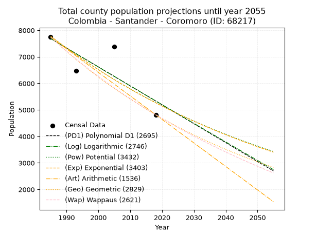
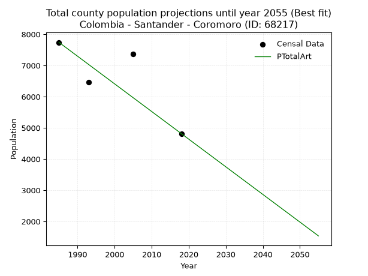
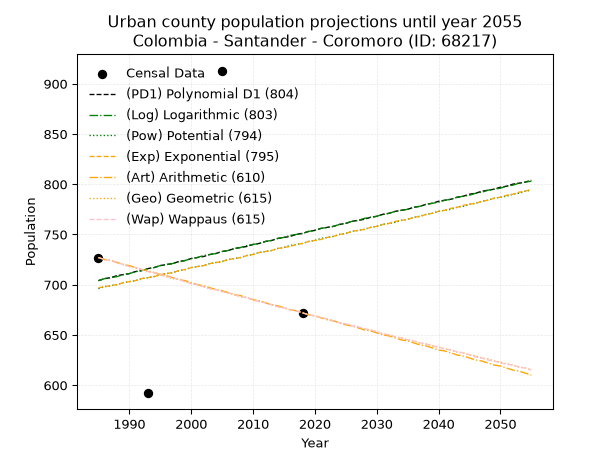
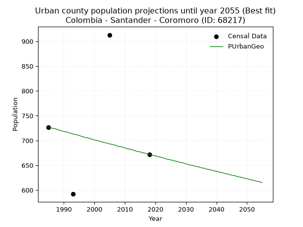
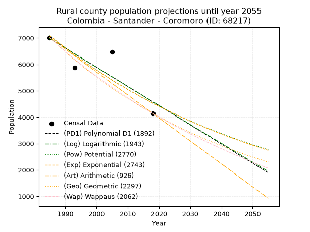
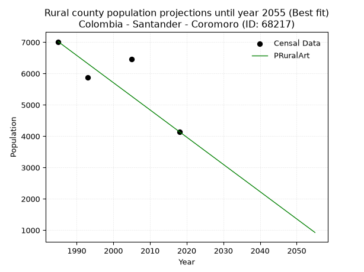

<div align="center">


</div>

# _“Population and Public Services Demand Projections (PPSD) until Year 2050 for Colombia - Santander - Coromoro (ID: 68217)”_
Keywords: `population` `public-service` `projection` `lineal` `polynomial` `logarithmic` `potential` `exponential` `arithmetic` `geometric` `wappaus` `dane` `colombia` `south-america`

PPSD are analytical estimates used by governments and planners to anticipate future changes in population size, age distribution, and the resulting community needs for utilities, healthcare, education, and infrastructure as sizing future water treatment facilities, electrical grids, and road networks based on spatial growth.

> **General running parameters**: • app_version: _v20260806_. • Python version: _3.14.7_. • Pandas version: _3.0.5_. • NumPy version: _2.5.1_. • Creates, save and include plots into reports (create_plot): _False_. • Projection until year: _2050_. • Process polynomial degree 2 and up: _False_. • Process Wappaus: _True_. • Process Wappaus: _True_. • Set negative values to zero: _True_. • Set infinite values to zero: _True_. • Drop dataset notes: _True_. 
<div align="center">

Dynamic map: [:earth_americas:Google](http://maps.google.com/maps?q=6.294998772,-73.0408161) [:earth_americas:OSM](https://www.openstreetmap.org/#map=18/6.294998772/-73.0408161&layers=P) [:earth_americas:Bing](https://www.bing.com/maps?cp=6.294998772~-73.0408161&lvl=18) [:earth_americas:Apple](https://maps.apple.com/frame?center=6.294998772%2C-73.0408161&span=0.003%2C0.006)

</div>


<div align="center">

```geojson
{
  "type": "Feature",
  "geometry": {
    "type": "Point", 
    "coordinates": [-73.0408161, 6.294998772]
  }, 
  "properties": {
    "Name": "Colombia - Santander - Coromoro (ID: 68217)"
  }
}
```

</div>


## 0. Census Data (4 records)

Census data are official statistics collected by a government about the people and housing in a country. They usually include counts of total population, age, sex, race, income, education, and jobs.

📅Global census file: [Population.xlsx](../data/Population.xlsx)

| Source   |   Year |   CountryID | CountryName   |   StateID | StateName   |   CountyID | CountyName   |   PTotal |   PUrban |   PRural |
|:---------|-------:|------------:|:--------------|----------:|:------------|-----------:|:-------------|---------:|---------:|---------:|
| DANE     |   1985 |          57 | Colombia      |        68 | Santander   |      68217 | Coromoro     |     7741 |      727 |     7014 |
| DANE     |   1993 |          57 | Colombia      |        68 | Santander   |      68217 | Coromoro     |     6466 |      592 |     5874 |
| DANE     |   2005 |          57 | Colombia      |        68 | Santander   |      68217 | Coromoro     |     7376 |      913 |     6463 |
| DANE     |   2018 |          57 | Colombia      |        68 | Santander   |      68217 | Coromoro     |     4816 |      672 |     4144 |

> 🔥Some records could had specific notes about the registered values or the corresponding urban or rural distribution.

📅   [RUPS](https://www.datos.gov.co/Hacienda-y-Cr-dito-P-blico/Registro-nico-de-Prestadores-de-Servicios-P-blicos/4qkq-csdn/about_data) - Local public utility companies: [RUPS.csv](../data/RUPS.xlsx)

 | SERVICIO       | ESTADO    | NOMBRE                                                                 | NIT         | DEPARTAMENTO_DOMICILIO   | MUNICIPIO_DOMICILIO   | DIRECCION            |   TELEFONO | EMAIL               | TIPO_PRESTADOR                 | CLASIFICACION                 |
|:---------------|:----------|:-----------------------------------------------------------------------|:------------|:-------------------------|:----------------------|:---------------------|-----------:|:--------------------|:-------------------------------|:------------------------------|
| ACUEDUCTO      | OPERATIVA | UNIDAD  DE SERVICIOS PUBLICOS DOMICILIARIOS DEL MUNICIPIO DE  COROMORO | 890205058-7 | SANTANDER                | COROMORO              | Carrera 5 No. 5 - 22 |    7247516 | cavilaver@gmail.com | MUNICIPIO (PRESTACIÓN DIRECTA) | MENOR O IGUAL A 2500 USUARIOS |
| ALCANTARILLADO | OPERATIVA | UNIDAD  DE SERVICIOS PUBLICOS DOMICILIARIOS DEL MUNICIPIO DE  COROMORO | 890205058-7 | SANTANDER                | COROMORO              | Carrera 5 No. 5 - 22 |    7247516 | cavilaver@gmail.com | MUNICIPIO (PRESTACIÓN DIRECTA) | MENOR O IGUAL A 2500 USUARIOS |

## 1. Total

### 1.1. Coefficients and Parameters

* (PD1) Polynomial Deg 1: -71.31071858691135, 149239.01485346942 (lineal)
* (Log) Logarithmic: -142609.3082186729, 1090574.2445694075
* (Pow) Potential: -23.595614730674072, 81.70339868897022
* (Exp) Exponential: -0.011800142418336414, 115675050721716.8
* (Art) Arithmetic: Year diff. 2018 - 1985 = 33, Population diff. 4816 - 7741 = -2925, Annual growth = -88.63636363636364
* (Geo) Geometric: Year diff. 2018 - 1985 = 33, Population diff. 4816 - 7741 = -2925, Annual growth % = -0.014278510608516148
* (Wap) Wappaus: i = -1.411744264336444, Condition values only valid for < 200)

<sub>
Wappaus condition values: ['-0.00', '-1.41', '-2.82', '-4.24', '-5.65', '-7.06', '-8.47', '-9.88', '-11.29', '-12.71', '-14.12', '-15.53', '-16.94', '-18.35', '-19.76', '-21.18', '-22.59', '-24.00', '-25.41', '-26.82', '-28.23', '-29.65', '-31.06', '-32.47', '-33.88', '-35.29', '-36.71', '-38.12', '-39.53', '-40.94', '-42.35', '-43.76', '-45.18', '-46.59', '-48.00', '-49.41', '-50.82', '-52.23', '-53.65', '-55.06', '-56.47', '-57.88', '-59.29', '-60.71', '-62.12', '-63.53', '-64.94', '-66.35', '-67.76', '-69.18', '-70.59', '-72.00', '-73.41', '-74.82', '-76.23', '-77.65', '-79.06', '-80.47', '-81.88', '-83.29', '-84.70', '-86.12', '-87.53', '-88.94', '-90.35', '-91.76']
</sub>


### 1.2. Projected Dataset

|   Year |   CountyID |   PTotalPD1 |   PTotalLog |   PTotalPow |   PTotalExp |   PTotalArt |   PTotalGeo |   PTotalWap |
|-------:|-----------:|------------:|------------:|------------:|------------:|------------:|------------:|------------:|
|   1985 |      68217 |        7687 |        7688 |        7775 |        7774 |        7741 |        7741 |        7741 |
|   1986 |      68217 |        7616 |        7617 |        7683 |        7683 |        7652 |        7630 |        7632 |
|   1987 |      68217 |        7545 |        7545 |        7593 |        7593 |        7564 |        7522 |        7525 |
|   1988 |      68217 |        7473 |        7473 |        7503 |        7503 |        7475 |        7414 |        7420 |
|   1989 |      68217 |        7402 |        7401 |        7415 |        7415 |        7386 |        7308 |        7316 |
|   1990 |      68217 |        7331 |        7330 |        7327 |        7328 |        7298 |        7204 |        7213 |
|   1991 |      68217 |        7259 |        7258 |        7241 |        7243 |        7209 |        7101 |        7112 |
|   1992 |      68217 |        7188 |        7186 |        7155 |        7158 |        7121 |        7000 |        7012 |
|   1993 |      68217 |        7117 |        7115 |        7071 |        7074 |        7032 |        6900 |        6913 |
|   1994 |      68217 |        7045 |        7043 |        6988 |        6991 |        6943 |        6801 |        6816 |
|   1995 |      68217 |        6974 |        6972 |        6906 |        6909 |        6855 |        6704 |        6720 |
|   1996 |      68217 |        6903 |        6900 |        6825 |        6828 |        6766 |        6608 |        6625 |
|   1997 |      68217 |        6832 |        6829 |        6744 |        6747 |        6677 |        6514 |        6532 |
|   1998 |      68217 |        6760 |        6757 |        6665 |        6668 |        6589 |        6421 |        6440 |
|   1999 |      68217 |        6689 |        6686 |        6587 |        6590 |        6500 |        6329 |        6349 |
|   2000 |      68217 |        6618 |        6615 |        6510 |        6513 |        6411 |        6239 |        6259 |
|   2001 |      68217 |        6546 |        6544 |        6433 |        6436 |        6323 |        6150 |        6170 |
|   2002 |      68217 |        6475 |        6472 |        6358 |        6361 |        6234 |        6062 |        6082 |
|   2003 |      68217 |        6404 |        6401 |        6284 |        6286 |        6146 |        5975 |        5996 |
|   2004 |      68217 |        6332 |        6330 |        6210 |        6213 |        6057 |        5890 |        5910 |
|   2005 |      68217 |        6261 |        6259 |        6137 |        6140 |        5968 |        5806 |        5826 |
|   2006 |      68217 |        6190 |        6188 |        6066 |        6068 |        5880 |        5723 |        5742 |
|   2007 |      68217 |        6118 |        6117 |        5995 |        5996 |        5791 |        5641 |        5660 |
|   2008 |      68217 |        6047 |        6046 |        5925 |        5926 |        5702 |        5561 |        5579 |
|   2009 |      68217 |        5976 |        5975 |        5855 |        5857 |        5614 |        5481 |        5498 |
|   2010 |      68217 |        5904 |        5904 |        5787 |        5788 |        5525 |        5403 |        5419 |
|   2011 |      68217 |        5833 |        5833 |        5720 |        5720 |        5436 |        5326 |        5340 |
|   2012 |      68217 |        5762 |        5762 |        5653 |        5653 |        5348 |        5250 |        5263 |
|   2013 |      68217 |        5691 |        5691 |        5587 |        5587 |        5259 |        5175 |        5186 |
|   2014 |      68217 |        5619 |        5620 |        5522 |        5521 |        5171 |        5101 |        5110 |
|   2015 |      68217 |        5548 |        5549 |        5458 |        5456 |        5082 |        5028 |        5035 |
|   2016 |      68217 |        5477 |        5478 |        5394 |        5392 |        4993 |        4957 |        4961 |
|   2017 |      68217 |        5405 |        5408 |        5331 |        5329 |        4905 |        4886 |        4888 |
|   2018 |      68217 |        5334 |        5337 |        5269 |        5266 |        4816 |        4816 |        4816 |
|   2019 |      68217 |        5263 |        5266 |        5208 |        5205 |        4727 |        4747 |        4745 |
|   2020 |      68217 |        5191 |        5196 |        5148 |        5144 |        4639 |        4679 |        4674 |
|   2021 |      68217 |        5120 |        5125 |        5088 |        5083 |        4550 |        4613 |        4604 |
|   2022 |      68217 |        5049 |        5055 |        5029 |        5024 |        4461 |        4547 |        4535 |
|   2023 |      68217 |        4977 |        4984 |        4970 |        4965 |        4373 |        4482 |        4467 |
|   2024 |      68217 |        4906 |        4914 |        4913 |        4907 |        4284 |        4418 |        4399 |
|   2025 |      68217 |        4835 |        4843 |        4856 |        4849 |        4196 |        4355 |        4332 |
|   2026 |      68217 |        4763 |        4773 |        4800 |        4792 |        4107 |        4293 |        4266 |
|   2027 |      68217 |        4692 |        4702 |        4744 |        4736 |        4018 |        4231 |        4201 |
|   2028 |      68217 |        4621 |        4632 |        4689 |        4680 |        3930 |        4171 |        4136 |
|   2029 |      68217 |        4550 |        4562 |        4635 |        4625 |        3841 |        4111 |        4072 |
|   2030 |      68217 |        4478 |        4492 |        4581 |        4571 |        3752 |        4053 |        4009 |
|   2031 |      68217 |        4407 |        4421 |        4528 |        4518 |        3664 |        3995 |        3946 |
|   2032 |      68217 |        4336 |        4351 |        4476 |        4465 |        3575 |        3938 |        3884 |
|   2033 |      68217 |        4264 |        4281 |        4424 |        4412 |        3486 |        3882 |        3823 |
|   2034 |      68217 |        4193 |        4211 |        4373 |        4360 |        3398 |        3826 |        3762 |
|   2035 |      68217 |        4122 |        4141 |        4323 |        4309 |        3309 |        3771 |        3702 |
|   2036 |      68217 |        4050 |        4071 |        4273 |        4259 |        3221 |        3718 |        3643 |
|   2037 |      68217 |        3979 |        4001 |        4224 |        4209 |        3132 |        3665 |        3584 |
|   2038 |      68217 |        3908 |        3931 |        4175 |        4159 |        3043 |        3612 |        3526 |
|   2039 |      68217 |        3836 |        3861 |        4127 |        4111 |        2955 |        3561 |        3468 |
|   2040 |      68217 |        3765 |        3791 |        4080 |        4062 |        2866 |        3510 |        3411 |
|   2041 |      68217 |        3694 |        3721 |        4033 |        4015 |        2777 |        3460 |        3355 |
|   2042 |      68217 |        3623 |        3651 |        3987 |        3968 |        2689 |        3410 |        3299 |
|   2043 |      68217 |        3551 |        3581 |        3941 |        3921 |        2600 |        3362 |        3244 |
|   2044 |      68217 |        3480 |        3511 |        3896 |        3875 |        2511 |        3314 |        3189 |
|   2045 |      68217 |        3409 |        3442 |        3851 |        3830 |        2423 |        3266 |        3135 |
|   2046 |      68217 |        3337 |        3372 |        3807 |        3785 |        2334 |        3220 |        3081 |
|   2047 |      68217 |        3266 |        3302 |        3763 |        3740 |        2246 |        3174 |        3028 |
|   2048 |      68217 |        3195 |        3233 |        3720 |        3696 |        2157 |        3128 |        2975 |
|   2049 |      68217 |        3123 |        3163 |        3677 |        3653 |        2068 |        3084 |        2923 |
|   2050 |      68217 |        3052 |        3093 |        3635 |        3610 |        1980 |        3040 |        2872 |
<div align="center">

</img>

</div>


### 1.3. Best fit with absolute and relative error (%)

Relative error puts that difference into context by dividing the absolute error by the true value, creating a unitless ratio or percentage that shows the scale of the mistake.

Absolute and relative error

|   Year | Source   |   CountryID | CountryName   |   StateID | StateName   |   CountyID_x | CountyName   |   PTotal |   PUrban |   PRural |   CountyID_y |   PTotalPD1 |   PTotalLog |   PTotalPow |   PTotalExp |   PTotalArt |   PTotalGeo |   PTotalWap |   PTotalPD1AbsError |   PTotalLogAbsError |   PTotalPowAbsError |   PTotalExpAbsError |   PTotalArtAbsError |   PTotalGeoAbsError |   PTotalWapAbsError |   PTotalPD1RelError |   PTotalLogRelError |   PTotalPowRelError |   PTotalExpRelError |   PTotalArtRelError |   PTotalGeoRelError |   PTotalWapRelError |
|-------:|:---------|------------:|:--------------|----------:|:------------|-------------:|:-------------|---------:|---------:|---------:|-------------:|------------:|------------:|------------:|------------:|------------:|------------:|------------:|--------------------:|--------------------:|--------------------:|--------------------:|--------------------:|--------------------:|--------------------:|--------------------:|--------------------:|--------------------:|--------------------:|--------------------:|--------------------:|--------------------:|
|   1985 | DANE     |          57 | Colombia      |        68 | Santander   |        68217 | Coromoro     |     7741 |      727 |     7014 |        68217 |        7687 |        7688 |        7775 |        7774 |        7741 |        7741 |        7741 |                  54 |                  53 |                  34 |                  33 |                   0 |                   0 |                   0 |            0.697584 |            0.684666 |             0.43922 |            0.426302 |             0       |             0       |             0       |
|   1993 | DANE     |          57 | Colombia      |        68 | Santander   |        68217 | Coromoro     |     6466 |      592 |     5874 |        68217 |        7117 |        7115 |        7071 |        7074 |        7032 |        6900 |        6913 |                 651 |                 649 |                 605 |                 608 |                 566 |                 434 |                 447 |           10.068    |           10.0371   |             9.35663 |            9.40303  |             8.75348 |             6.71203 |             6.91308 |
|   2005 | DANE     |          57 | Colombia      |        68 | Santander   |        68217 | Coromoro     |     7376 |      913 |     6463 |        68217 |        6261 |        6259 |        6137 |        6140 |        5968 |        5806 |        5826 |                1115 |                1117 |                1239 |                1236 |                1408 |                1570 |                1550 |           15.1166   |           15.1437   |            16.7977  |           16.757    |            19.0889  |            21.2852  |            21.0141  |
|   2018 | DANE     |          57 | Colombia      |        68 | Santander   |        68217 | Coromoro     |     4816 |      672 |     4144 |        68217 |        5334 |        5337 |        5269 |        5266 |        4816 |        4816 |        4816 |                 518 |                 521 |                 453 |                 450 |                   0 |                   0 |                   0 |           10.7558   |           10.8181   |             9.40615 |            9.34385  |             0       |             0       |             0       |

Relative error mean

| Method    |   RelError | Best   |
|:----------|-----------:|:-------|
| PTotalPD1 |    9.15951 |        |
| PTotalLog |    9.1709  |        |
| PTotalPow |    8.99993 |        |
| PTotalExp |    8.98256 |        |
| PTotalArt |    6.9606  | True   |
| PTotalGeo |    6.99932 |        |
| PTotalWap |    6.9818  |        |

💙Best method: _**PTotalArt**_
<div align="center">

</img>

</div>


### 1.4. Fresh water supply demand in liters per capita per day (lpcd)

The fresh water supply demand typically ranges from 100 to 300 liters per capita per day (lpcd) for standard domestic and municipal planning, though absolute survival minimums set by the World Health Organization are as low as 7.5 to 20 liters per day, and total consumption in high-income nations can exceed 400 liters.

> `CZ`: Level in meters above the sea level (masl)<br> `WS`: Fresh water supply demand in liters per capita per day (lpcd or l/h/d)<br> `WSAll`: Zonal fresh water supply demand in liters per second (l/s)<br> `A`: Zonal area in square meters<br> `DP`: Population density (people/hectare or p/ha)

Reference values (RAS Colombia)

|    CZ |   WS |
|------:|-----:|
|  1000 |  120 |
|  2000 |  130 |
| 99999 |  140 |

County shapefile geometry properties and water supply values

|   CountyID |      ATotal |   CZTotal |   WSTotal |
|-----------:|------------:|----------:|----------:|
|      68217 | 5.76362e+08 |   2584.37 |       140 |

Projected values for best method: PTotalArt

|   CountyID |   Year |   PTotalArt |   DPTotal |   WSTotal |   WSTotalAll |
|-----------:|-------:|------------:|----------:|----------:|-------------:|
|      68217 |   1985 |        7741 |      0.13 |       140 |     12.5433  |
|      68217 |   1986 |        7652 |      0.13 |       140 |     12.3991  |
|      68217 |   1987 |        7564 |      0.13 |       140 |     12.2565  |
|      68217 |   1988 |        7475 |      0.13 |       140 |     12.1123  |
|      68217 |   1989 |        7386 |      0.13 |       140 |     11.9681  |
|      68217 |   1990 |        7298 |      0.13 |       140 |     11.8255  |
|      68217 |   1991 |        7209 |      0.13 |       140 |     11.6813  |
|      68217 |   1992 |        7121 |      0.12 |       140 |     11.5387  |
|      68217 |   1993 |        7032 |      0.12 |       140 |     11.3944  |
|      68217 |   1994 |        6943 |      0.12 |       140 |     11.2502  |
|      68217 |   1995 |        6855 |      0.12 |       140 |     11.1076  |
|      68217 |   1996 |        6766 |      0.12 |       140 |     10.9634  |
|      68217 |   1997 |        6677 |      0.12 |       140 |     10.8192  |
|      68217 |   1998 |        6589 |      0.11 |       140 |     10.6766  |
|      68217 |   1999 |        6500 |      0.11 |       140 |     10.5324  |
|      68217 |   2000 |        6411 |      0.11 |       140 |     10.3882  |
|      68217 |   2001 |        6323 |      0.11 |       140 |     10.2456  |
|      68217 |   2002 |        6234 |      0.11 |       140 |     10.1014  |
|      68217 |   2003 |        6146 |      0.11 |       140 |      9.9588  |
|      68217 |   2004 |        6057 |      0.11 |       140 |      9.81458 |
|      68217 |   2005 |        5968 |      0.1  |       140 |      9.67037 |
|      68217 |   2006 |        5880 |      0.1  |       140 |      9.52778 |
|      68217 |   2007 |        5791 |      0.1  |       140 |      9.38356 |
|      68217 |   2008 |        5702 |      0.1  |       140 |      9.23935 |
|      68217 |   2009 |        5614 |      0.1  |       140 |      9.09676 |
|      68217 |   2010 |        5525 |      0.1  |       140 |      8.95255 |
|      68217 |   2011 |        5436 |      0.09 |       140 |      8.80833 |
|      68217 |   2012 |        5348 |      0.09 |       140 |      8.66574 |
|      68217 |   2013 |        5259 |      0.09 |       140 |      8.52153 |
|      68217 |   2014 |        5171 |      0.09 |       140 |      8.37894 |
|      68217 |   2015 |        5082 |      0.09 |       140 |      8.23472 |
|      68217 |   2016 |        4993 |      0.09 |       140 |      8.09051 |
|      68217 |   2017 |        4905 |      0.09 |       140 |      7.94792 |
|      68217 |   2018 |        4816 |      0.08 |       140 |      7.8037  |
|      68217 |   2019 |        4727 |      0.08 |       140 |      7.65949 |
|      68217 |   2020 |        4639 |      0.08 |       140 |      7.5169  |
|      68217 |   2021 |        4550 |      0.08 |       140 |      7.37269 |
|      68217 |   2022 |        4461 |      0.08 |       140 |      7.22847 |
|      68217 |   2023 |        4373 |      0.08 |       140 |      7.08588 |
|      68217 |   2024 |        4284 |      0.07 |       140 |      6.94167 |
|      68217 |   2025 |        4196 |      0.07 |       140 |      6.79907 |
|      68217 |   2026 |        4107 |      0.07 |       140 |      6.65486 |
|      68217 |   2027 |        4018 |      0.07 |       140 |      6.51065 |
|      68217 |   2028 |        3930 |      0.07 |       140 |      6.36806 |
|      68217 |   2029 |        3841 |      0.07 |       140 |      6.22384 |
|      68217 |   2030 |        3752 |      0.07 |       140 |      6.07963 |
|      68217 |   2031 |        3664 |      0.06 |       140 |      5.93704 |
|      68217 |   2032 |        3575 |      0.06 |       140 |      5.79282 |
|      68217 |   2033 |        3486 |      0.06 |       140 |      5.64861 |
|      68217 |   2034 |        3398 |      0.06 |       140 |      5.50602 |
|      68217 |   2035 |        3309 |      0.06 |       140 |      5.36181 |
|      68217 |   2036 |        3221 |      0.06 |       140 |      5.21921 |
|      68217 |   2037 |        3132 |      0.05 |       140 |      5.075   |
|      68217 |   2038 |        3043 |      0.05 |       140 |      4.93079 |
|      68217 |   2039 |        2955 |      0.05 |       140 |      4.78819 |
|      68217 |   2040 |        2866 |      0.05 |       140 |      4.64398 |
|      68217 |   2041 |        2777 |      0.05 |       140 |      4.49977 |
|      68217 |   2042 |        2689 |      0.05 |       140 |      4.35718 |
|      68217 |   2043 |        2600 |      0.05 |       140 |      4.21296 |
|      68217 |   2044 |        2511 |      0.04 |       140 |      4.06875 |
|      68217 |   2045 |        2423 |      0.04 |       140 |      3.92616 |
|      68217 |   2046 |        2334 |      0.04 |       140 |      3.78194 |
|      68217 |   2047 |        2246 |      0.04 |       140 |      3.63935 |
|      68217 |   2048 |        2157 |      0.04 |       140 |      3.49514 |
|      68217 |   2049 |        2068 |      0.04 |       140 |      3.35093 |
|      68217 |   2050 |        1980 |      0.03 |       140 |      3.20833 |

## 2. Urban

### 2.1. Coefficients and Parameters

* (PD1) Polynomial Deg 1: 1.422721798474642, -2119.7992773989026 (lineal)
* (Log) Logarithmic: 2865.4168083228033, -21054.05612207086
* (Pow) Potential: 3.7966937439040596, -9.677749937071573
* (Exp) Exponential: 0.0018868391679115373, 16.45627375471894
* (Art) Arithmetic: Year diff. 2018 - 1985 = 33, Population diff. 672 - 727 = -55, Annual growth = -1.6666666666666667
* (Geo) Geometric: Year diff. 2018 - 1985 = 33, Population diff. 672 - 727 = -55, Annual growth % = -0.0023810437473219537
* (Wap) Wappaus: i = -0.2382654276864427, Condition values only valid for < 200)

<sub>
Wappaus condition values: ['-0.00', '-0.24', '-0.48', '-0.71', '-0.95', '-1.19', '-1.43', '-1.67', '-1.91', '-2.14', '-2.38', '-2.62', '-2.86', '-3.10', '-3.34', '-3.57', '-3.81', '-4.05', '-4.29', '-4.53', '-4.77', '-5.00', '-5.24', '-5.48', '-5.72', '-5.96', '-6.19', '-6.43', '-6.67', '-6.91', '-7.15', '-7.39', '-7.62', '-7.86', '-8.10', '-8.34', '-8.58', '-8.82', '-9.05', '-9.29', '-9.53', '-9.77', '-10.01', '-10.25', '-10.48', '-10.72', '-10.96', '-11.20', '-11.44', '-11.68', '-11.91', '-12.15', '-12.39', '-12.63', '-12.87', '-13.10', '-13.34', '-13.58', '-13.82', '-14.06', '-14.30', '-14.53', '-14.77', '-15.01', '-15.25', '-15.49']
</sub>


### 2.2. Projected Dataset

|   Year |   CountyID |   PUrbanPD1 |   PUrbanLog |   PUrbanPow |   PUrbanExp |   PUrbanArt |   PUrbanGeo |   PUrbanWap |
|-------:|-----------:|------------:|------------:|------------:|------------:|------------:|------------:|------------:|
|   1985 |      68217 |         704 |         704 |         696 |         697 |         727 |         727 |         727 |
|   1986 |      68217 |         706 |         706 |         698 |         698 |         725 |         725 |         725 |
|   1987 |      68217 |         707 |         707 |         699 |         699 |         724 |         724 |         724 |
|   1988 |      68217 |         709 |         708 |         700 |         700 |         722 |         722 |         722 |
|   1989 |      68217 |         710 |         710 |         702 |         702 |         720 |         720 |         720 |
|   1990 |      68217 |         711 |         711 |         703 |         703 |         719 |         718 |         718 |
|   1991 |      68217 |         713 |         713 |         704 |         704 |         717 |         717 |         717 |
|   1992 |      68217 |         714 |         714 |         706 |         706 |         715 |         715 |         715 |
|   1993 |      68217 |         716 |         716 |         707 |         707 |         714 |         713 |         713 |
|   1994 |      68217 |         717 |         717 |         708 |         708 |         712 |         712 |         712 |
|   1995 |      68217 |         719 |         719 |         710 |         710 |         710 |         710 |         710 |
|   1996 |      68217 |         720 |         720 |         711 |         711 |         709 |         708 |         708 |
|   1997 |      68217 |         721 |         721 |         712 |         712 |         707 |         706 |         707 |
|   1998 |      68217 |         723 |         723 |         714 |         714 |         705 |         705 |         705 |
|   1999 |      68217 |         724 |         724 |         715 |         715 |         704 |         703 |         703 |
|   2000 |      68217 |         726 |         726 |         717 |         717 |         702 |         701 |         701 |
|   2001 |      68217 |         727 |         727 |         718 |         718 |         700 |         700 |         700 |
|   2002 |      68217 |         728 |         729 |         719 |         719 |         699 |         698 |         698 |
|   2003 |      68217 |         730 |         730 |         721 |         721 |         697 |         696 |         696 |
|   2004 |      68217 |         731 |         731 |         722 |         722 |         695 |         695 |         695 |
|   2005 |      68217 |         733 |         733 |         723 |         723 |         694 |         693 |         693 |
|   2006 |      68217 |         734 |         734 |         725 |         725 |         692 |         692 |         692 |
|   2007 |      68217 |         736 |         736 |         726 |         726 |         690 |         690 |         690 |
|   2008 |      68217 |         737 |         737 |         727 |         727 |         689 |         688 |         688 |
|   2009 |      68217 |         738 |         739 |         729 |         729 |         687 |         687 |         687 |
|   2010 |      68217 |         740 |         740 |         730 |         730 |         685 |         685 |         685 |
|   2011 |      68217 |         741 |         741 |         732 |         732 |         684 |         683 |         683 |
|   2012 |      68217 |         743 |         743 |         733 |         733 |         682 |         682 |         682 |
|   2013 |      68217 |         744 |         744 |         734 |         734 |         680 |         680 |         680 |
|   2014 |      68217 |         746 |         746 |         736 |         736 |         679 |         678 |         678 |
|   2015 |      68217 |         747 |         747 |         737 |         737 |         677 |         677 |         677 |
|   2016 |      68217 |         748 |         749 |         739 |         738 |         675 |         675 |         675 |
|   2017 |      68217 |         750 |         750 |         740 |         740 |         674 |         674 |         674 |
|   2018 |      68217 |         751 |         751 |         741 |         741 |         672 |         672 |         672 |
|   2019 |      68217 |         753 |         753 |         743 |         743 |         670 |         670 |         670 |
|   2020 |      68217 |         754 |         754 |         744 |         744 |         669 |         669 |         669 |
|   2021 |      68217 |         756 |         756 |         746 |         745 |         667 |         667 |         667 |
|   2022 |      68217 |         757 |         757 |         747 |         747 |         665 |         666 |         666 |
|   2023 |      68217 |         758 |         758 |         748 |         748 |         664 |         664 |         664 |
|   2024 |      68217 |         760 |         760 |         750 |         750 |         662 |         662 |         662 |
|   2025 |      68217 |         761 |         761 |         751 |         751 |         660 |         661 |         661 |
|   2026 |      68217 |         763 |         763 |         753 |         753 |         659 |         659 |         659 |
|   2027 |      68217 |         764 |         764 |         754 |         754 |         657 |         658 |         658 |
|   2028 |      68217 |         765 |         766 |         755 |         755 |         655 |         656 |         656 |
|   2029 |      68217 |         767 |         767 |         757 |         757 |         654 |         655 |         655 |
|   2030 |      68217 |         768 |         768 |         758 |         758 |         652 |         653 |         653 |
|   2031 |      68217 |         770 |         770 |         760 |         760 |         650 |         651 |         651 |
|   2032 |      68217 |         771 |         771 |         761 |         761 |         649 |         650 |         650 |
|   2033 |      68217 |         773 |         773 |         762 |         763 |         647 |         648 |         648 |
|   2034 |      68217 |         774 |         774 |         764 |         764 |         645 |         647 |         647 |
|   2035 |      68217 |         775 |         775 |         765 |         765 |         644 |         645 |         645 |
|   2036 |      68217 |         777 |         777 |         767 |         767 |         642 |         644 |         644 |
|   2037 |      68217 |         778 |         778 |         768 |         768 |         640 |         642 |         642 |
|   2038 |      68217 |         780 |         780 |         770 |         770 |         639 |         641 |         641 |
|   2039 |      68217 |         781 |         781 |         771 |         771 |         637 |         639 |         639 |
|   2040 |      68217 |         783 |         782 |         773 |         773 |         635 |         638 |         638 |
|   2041 |      68217 |         784 |         784 |         774 |         774 |         634 |         636 |         636 |
|   2042 |      68217 |         785 |         785 |         775 |         776 |         632 |         635 |         635 |
|   2043 |      68217 |         787 |         787 |         777 |         777 |         630 |         633 |         633 |
|   2044 |      68217 |         788 |         788 |         778 |         779 |         629 |         632 |         632 |
|   2045 |      68217 |         790 |         789 |         780 |         780 |         627 |         630 |         630 |
|   2046 |      68217 |         791 |         791 |         781 |         781 |         625 |         629 |         628 |
|   2047 |      68217 |         793 |         792 |         783 |         783 |         624 |         627 |         627 |
|   2048 |      68217 |         794 |         794 |         784 |         784 |         622 |         626 |         625 |
|   2049 |      68217 |         795 |         795 |         786 |         786 |         620 |         624 |         624 |
|   2050 |      68217 |         797 |         796 |         787 |         787 |         619 |         623 |         622 |
<div align="center">

</img>

</div>


### 2.3. Best fit with absolute and relative error (%)

Relative error puts that difference into context by dividing the absolute error by the true value, creating a unitless ratio or percentage that shows the scale of the mistake.

Absolute and relative error

|   Year | Source   |   CountryID | CountryName   |   StateID | StateName   |   CountyID_x | CountyName   |   PTotal |   PUrban |   PRural |   CountyID_y |   PUrbanPD1 |   PUrbanLog |   PUrbanPow |   PUrbanExp |   PUrbanArt |   PUrbanGeo |   PUrbanWap |   PUrbanPD1AbsError |   PUrbanLogAbsError |   PUrbanPowAbsError |   PUrbanExpAbsError |   PUrbanArtAbsError |   PUrbanGeoAbsError |   PUrbanWapAbsError |   PUrbanPD1RelError |   PUrbanLogRelError |   PUrbanPowRelError |   PUrbanExpRelError |   PUrbanArtRelError |   PUrbanGeoRelError |   PUrbanWapRelError |
|-------:|:---------|------------:|:--------------|----------:|:------------|-------------:|:-------------|---------:|---------:|---------:|-------------:|------------:|------------:|------------:|------------:|------------:|------------:|------------:|--------------------:|--------------------:|--------------------:|--------------------:|--------------------:|--------------------:|--------------------:|--------------------:|--------------------:|--------------------:|--------------------:|--------------------:|--------------------:|--------------------:|
|   1985 | DANE     |          57 | Colombia      |        68 | Santander   |        68217 | Coromoro     |     7741 |      727 |     7014 |        68217 |         704 |         704 |         696 |         697 |         727 |         727 |         727 |                  23 |                  23 |                  31 |                  30 |                   0 |                   0 |                   0 |             3.16369 |             3.16369 |              4.2641 |             4.12655 |              0      |              0      |              0      |
|   1993 | DANE     |          57 | Colombia      |        68 | Santander   |        68217 | Coromoro     |     6466 |      592 |     5874 |        68217 |         716 |         716 |         707 |         707 |         714 |         713 |         713 |                 124 |                 124 |                 115 |                 115 |                 122 |                 121 |                 121 |            20.9459  |            20.9459  |             19.4257 |            19.4257  |             20.6081 |             20.4392 |             20.4392 |
|   2005 | DANE     |          57 | Colombia      |        68 | Santander   |        68217 | Coromoro     |     7376 |      913 |     6463 |        68217 |         733 |         733 |         723 |         723 |         694 |         693 |         693 |                 180 |                 180 |                 190 |                 190 |                 219 |                 220 |                 220 |            19.7152  |            19.7152  |             20.8105 |            20.8105  |             23.9869 |             24.0964 |             24.0964 |
|   2018 | DANE     |          57 | Colombia      |        68 | Santander   |        68217 | Coromoro     |     4816 |      672 |     4144 |        68217 |         751 |         751 |         741 |         741 |         672 |         672 |         672 |                  79 |                  79 |                  69 |                  69 |                   0 |                   0 |                   0 |            11.756   |            11.756   |             10.2679 |            10.2679  |              0      |              0      |              0      |

Relative error mean

| Method    |   RelError | Best   |
|:----------|-----------:|:-------|
| PUrbanPD1 |    13.8952 |        |
| PUrbanLog |    13.8952 |        |
| PUrbanPow |    13.692  |        |
| PUrbanExp |    13.6576 |        |
| PUrbanArt |    11.1487 |        |
| PUrbanGeo |    11.1339 | True   |
| PUrbanWap |    11.1339 | True   |

💙Best method: _**PUrbanGeo**_
<div align="center">

</img>

</div>


### 2.4. Fresh water supply demand in liters per capita per day (lpcd)

The fresh water supply demand typically ranges from 100 to 300 liters per capita per day (lpcd) for standard domestic and municipal planning, though absolute survival minimums set by the World Health Organization are as low as 7.5 to 20 liters per day, and total consumption in high-income nations can exceed 400 liters.

> `CZ`: Level in meters above the sea level (masl)<br> `WS`: Fresh water supply demand in liters per capita per day (lpcd or l/h/d)<br> `WSAll`: Zonal fresh water supply demand in liters per second (l/s)<br> `A`: Zonal area in square meters<br> `DP`: Population density (people/hectare or p/ha)

Reference values (RAS Colombia)

|    CZ |   WS |
|------:|-----:|
|  1000 |  120 |
|  2000 |  130 |
| 99999 |  140 |

County shapefile geometry properties and water supply values

|   CountyID |   AUrban |   CZUrban |   WSUrban |
|-----------:|---------:|----------:|----------:|
|      68217 |   217732 |   1530.14 |       130 |

Projected values for best method: PUrbanGeo

|   CountyID |   Year |   PUrbanGeo |   DPUrban |   WSUrban |   WSUrbanAll |
|-----------:|-------:|------------:|----------:|----------:|-------------:|
|      68217 |   1985 |         727 |     33.39 |       130 |     1.09387  |
|      68217 |   1986 |         725 |     33.3  |       130 |     1.09086  |
|      68217 |   1987 |         724 |     33.25 |       130 |     1.08935  |
|      68217 |   1988 |         722 |     33.16 |       130 |     1.08634  |
|      68217 |   1989 |         720 |     33.07 |       130 |     1.08333  |
|      68217 |   1990 |         718 |     32.98 |       130 |     1.08032  |
|      68217 |   1991 |         717 |     32.93 |       130 |     1.07882  |
|      68217 |   1992 |         715 |     32.84 |       130 |     1.07581  |
|      68217 |   1993 |         713 |     32.75 |       130 |     1.0728   |
|      68217 |   1994 |         712 |     32.7  |       130 |     1.0713   |
|      68217 |   1995 |         710 |     32.61 |       130 |     1.06829  |
|      68217 |   1996 |         708 |     32.52 |       130 |     1.06528  |
|      68217 |   1997 |         706 |     32.43 |       130 |     1.06227  |
|      68217 |   1998 |         705 |     32.38 |       130 |     1.06076  |
|      68217 |   1999 |         703 |     32.29 |       130 |     1.05775  |
|      68217 |   2000 |         701 |     32.2  |       130 |     1.05475  |
|      68217 |   2001 |         700 |     32.15 |       130 |     1.05324  |
|      68217 |   2002 |         698 |     32.06 |       130 |     1.05023  |
|      68217 |   2003 |         696 |     31.97 |       130 |     1.04722  |
|      68217 |   2004 |         695 |     31.92 |       130 |     1.04572  |
|      68217 |   2005 |         693 |     31.83 |       130 |     1.04271  |
|      68217 |   2006 |         692 |     31.78 |       130 |     1.0412   |
|      68217 |   2007 |         690 |     31.69 |       130 |     1.03819  |
|      68217 |   2008 |         688 |     31.6  |       130 |     1.03519  |
|      68217 |   2009 |         687 |     31.55 |       130 |     1.03368  |
|      68217 |   2010 |         685 |     31.46 |       130 |     1.03067  |
|      68217 |   2011 |         683 |     31.37 |       130 |     1.02766  |
|      68217 |   2012 |         682 |     31.32 |       130 |     1.02616  |
|      68217 |   2013 |         680 |     31.23 |       130 |     1.02315  |
|      68217 |   2014 |         678 |     31.14 |       130 |     1.02014  |
|      68217 |   2015 |         677 |     31.09 |       130 |     1.01863  |
|      68217 |   2016 |         675 |     31    |       130 |     1.01562  |
|      68217 |   2017 |         674 |     30.96 |       130 |     1.01412  |
|      68217 |   2018 |         672 |     30.86 |       130 |     1.01111  |
|      68217 |   2019 |         670 |     30.77 |       130 |     1.0081   |
|      68217 |   2020 |         669 |     30.73 |       130 |     1.0066   |
|      68217 |   2021 |         667 |     30.63 |       130 |     1.00359  |
|      68217 |   2022 |         666 |     30.59 |       130 |     1.00208  |
|      68217 |   2023 |         664 |     30.5  |       130 |     0.999074 |
|      68217 |   2024 |         662 |     30.4  |       130 |     0.996065 |
|      68217 |   2025 |         661 |     30.36 |       130 |     0.99456  |
|      68217 |   2026 |         659 |     30.27 |       130 |     0.991551 |
|      68217 |   2027 |         658 |     30.22 |       130 |     0.990046 |
|      68217 |   2028 |         656 |     30.13 |       130 |     0.987037 |
|      68217 |   2029 |         655 |     30.08 |       130 |     0.985532 |
|      68217 |   2030 |         653 |     29.99 |       130 |     0.982523 |
|      68217 |   2031 |         651 |     29.9  |       130 |     0.979514 |
|      68217 |   2032 |         650 |     29.85 |       130 |     0.978009 |
|      68217 |   2033 |         648 |     29.76 |       130 |     0.975    |
|      68217 |   2034 |         647 |     29.72 |       130 |     0.973495 |
|      68217 |   2035 |         645 |     29.62 |       130 |     0.970486 |
|      68217 |   2036 |         644 |     29.58 |       130 |     0.968981 |
|      68217 |   2037 |         642 |     29.49 |       130 |     0.965972 |
|      68217 |   2038 |         641 |     29.44 |       130 |     0.964468 |
|      68217 |   2039 |         639 |     29.35 |       130 |     0.961458 |
|      68217 |   2040 |         638 |     29.3  |       130 |     0.959954 |
|      68217 |   2041 |         636 |     29.21 |       130 |     0.956944 |
|      68217 |   2042 |         635 |     29.16 |       130 |     0.95544  |
|      68217 |   2043 |         633 |     29.07 |       130 |     0.952431 |
|      68217 |   2044 |         632 |     29.03 |       130 |     0.950926 |
|      68217 |   2045 |         630 |     28.93 |       130 |     0.947917 |
|      68217 |   2046 |         629 |     28.89 |       130 |     0.946412 |
|      68217 |   2047 |         627 |     28.8  |       130 |     0.943403 |
|      68217 |   2048 |         626 |     28.75 |       130 |     0.941898 |
|      68217 |   2049 |         624 |     28.66 |       130 |     0.938889 |
|      68217 |   2050 |         623 |     28.61 |       130 |     0.937384 |

## 3. Rural

### 3.1. Coefficients and Parameters

* (PD1) Polynomial Deg 1: -72.73344038538602, 151358.81413086836 (lineal)
* (Log) Logarithmic: -145474.7250269956, 1111628.3006914777
* (Pow) Potential: -27.114405726428615, 93.26739798417758
* (Exp) Exponential: -0.01355848696668758, 3458697984258106.0
* (Art) Arithmetic: Year diff. 2018 - 1985 = 33, Population diff. 4144 - 7014 = -2870, Annual growth = -86.96969696969697
* (Geo) Geometric: Year diff. 2018 - 1985 = 33, Population diff. 4144 - 7014 = -2870, Annual growth % = -0.015820389985158
* (Wap) Wappaus: i = -1.5588760883616593, Condition values only valid for < 200)

<sub>
Wappaus condition values: ['-0.00', '-1.56', '-3.12', '-4.68', '-6.24', '-7.79', '-9.35', '-10.91', '-12.47', '-14.03', '-15.59', '-17.15', '-18.71', '-20.27', '-21.82', '-23.38', '-24.94', '-26.50', '-28.06', '-29.62', '-31.18', '-32.74', '-34.30', '-35.85', '-37.41', '-38.97', '-40.53', '-42.09', '-43.65', '-45.21', '-46.77', '-48.33', '-49.88', '-51.44', '-53.00', '-54.56', '-56.12', '-57.68', '-59.24', '-60.80', '-62.36', '-63.91', '-65.47', '-67.03', '-68.59', '-70.15', '-71.71', '-73.27', '-74.83', '-76.38', '-77.94', '-79.50', '-81.06', '-82.62', '-84.18', '-85.74', '-87.30', '-88.86', '-90.41', '-91.97', '-93.53', '-95.09', '-96.65', '-98.21', '-99.77', '-101.33']
</sub>


### 3.2. Projected Dataset

|   Year |   CountyID |   PRuralPD1 |   PRuralLog |   PRuralPow |   PRuralExp |   PRuralArt |   PRuralGeo |   PRuralWap |
|-------:|-----------:|------------:|------------:|------------:|------------:|------------:|------------:|------------:|
|   1985 |      68217 |        6983 |        6984 |        7089 |        7087 |        7014 |        7014 |        7014 |
|   1986 |      68217 |        6910 |        6911 |        6993 |        6992 |        6927 |        6903 |        6906 |
|   1987 |      68217 |        6837 |        6838 |        6898 |        6898 |        6840 |        6794 |        6799 |
|   1988 |      68217 |        6765 |        6765 |        6805 |        6805 |        6753 |        6686 |        6693 |
|   1989 |      68217 |        6692 |        6691 |        6712 |        6713 |        6666 |        6581 |        6590 |
|   1990 |      68217 |        6619 |        6618 |        6622 |        6623 |        6579 |        6476 |        6488 |
|   1991 |      68217 |        6547 |        6545 |        6532 |        6534 |        6492 |        6374 |        6387 |
|   1992 |      68217 |        6474 |        6472 |        6444 |        6446 |        6405 |        6273 |        6288 |
|   1993 |      68217 |        6401 |        6399 |        6357 |        6359 |        6318 |        6174 |        6191 |
|   1994 |      68217 |        6328 |        6326 |        6271 |        6273 |        6231 |        6076 |        6094 |
|   1995 |      68217 |        6256 |        6253 |        6186 |        6189 |        6144 |        5980 |        6000 |
|   1996 |      68217 |        6183 |        6180 |        6102 |        6105 |        6057 |        5886 |        5906 |
|   1997 |      68217 |        6110 |        6107 |        6020 |        6023 |        5970 |        5792 |        5814 |
|   1998 |      68217 |        6037 |        6035 |        5939 |        5942 |        5883 |        5701 |        5723 |
|   1999 |      68217 |        5965 |        5962 |        5859 |        5862 |        5796 |        5611 |        5634 |
|   2000 |      68217 |        5892 |        5889 |        5780 |        5783 |        5709 |        5522 |        5546 |
|   2001 |      68217 |        5819 |        5816 |        5702 |        5705 |        5622 |        5434 |        5459 |
|   2002 |      68217 |        5746 |        5744 |        5626 |        5628 |        5536 |        5348 |        5373 |
|   2003 |      68217 |        5674 |        5671 |        5550 |        5553 |        5449 |        5264 |        5288 |
|   2004 |      68217 |        5601 |        5598 |        5475 |        5478 |        5362 |        5181 |        5205 |
|   2005 |      68217 |        5528 |        5526 |        5402 |        5404 |        5275 |        5099 |        5122 |
|   2006 |      68217 |        5456 |        5453 |        5329 |        5331 |        5188 |        5018 |        5041 |
|   2007 |      68217 |        5383 |        5381 |        5258 |        5259 |        5101 |        4939 |        4961 |
|   2008 |      68217 |        5310 |        5308 |        5187 |        5189 |        5014 |        4860 |        4881 |
|   2009 |      68217 |        5237 |        5236 |        5118 |        5119 |        4927 |        4784 |        4803 |
|   2010 |      68217 |        5165 |        5164 |        5049 |        5050 |        4840 |        4708 |        4726 |
|   2011 |      68217 |        5092 |        5091 |        4981 |        4982 |        4753 |        4633 |        4650 |
|   2012 |      68217 |        5019 |        5019 |        4915 |        4915 |        4666 |        4560 |        4575 |
|   2013 |      68217 |        4946 |        4947 |        4849 |        4849 |        4579 |        4488 |        4501 |
|   2014 |      68217 |        4874 |        4874 |        4784 |        4783 |        4492 |        4417 |        4428 |
|   2015 |      68217 |        4801 |        4802 |        4720 |        4719 |        4405 |        4347 |        4355 |
|   2016 |      68217 |        4728 |        4730 |        4657 |        4655 |        4318 |        4278 |        4284 |
|   2017 |      68217 |        4655 |        4658 |        4595 |        4593 |        4231 |        4211 |        4214 |
|   2018 |      68217 |        4583 |        4586 |        4533 |        4531 |        4144 |        4144 |        4144 |
|   2019 |      68217 |        4510 |        4514 |        4473 |        4470 |        4057 |        4078 |        4075 |
|   2020 |      68217 |        4437 |        4442 |        4413 |        4410 |        3970 |        4014 |        4007 |
|   2021 |      68217 |        4365 |        4370 |        4354 |        4350 |        3883 |        3950 |        3940 |
|   2022 |      68217 |        4292 |        4298 |        4296 |        4292 |        3796 |        3888 |        3874 |
|   2023 |      68217 |        4219 |        4226 |        4239 |        4234 |        3709 |        3826 |        3809 |
|   2024 |      68217 |        4146 |        4154 |        4183 |        4177 |        3622 |        3766 |        3744 |
|   2025 |      68217 |        4074 |        4082 |        4127 |        4121 |        3535 |        3706 |        3680 |
|   2026 |      68217 |        4001 |        4010 |        4072 |        4065 |        3448 |        3648 |        3617 |
|   2027 |      68217 |        3928 |        3938 |        4018 |        4010 |        3361 |        3590 |        3554 |
|   2028 |      68217 |        3855 |        3867 |        3965 |        3956 |        3274 |        3533 |        3493 |
|   2029 |      68217 |        3783 |        3795 |        3912 |        3903 |        3187 |        3477 |        3432 |
|   2030 |      68217 |        3710 |        3723 |        3860 |        3850 |        3100 |        3422 |        3371 |
|   2031 |      68217 |        3637 |        3652 |        3809 |        3799 |        3013 |        3368 |        3312 |
|   2032 |      68217 |        3564 |        3580 |        3758 |        3747 |        2926 |        3315 |        3253 |
|   2033 |      68217 |        3492 |        3508 |        3709 |        3697 |        2839 |        3262 |        3195 |
|   2034 |      68217 |        3419 |        3437 |        3660 |        3647 |        2752 |        3211 |        3137 |
|   2035 |      68217 |        3346 |        3365 |        3611 |        3598 |        2666 |        3160 |        3080 |
|   2036 |      68217 |        3274 |        3294 |        3563 |        3550 |        2579 |        3110 |        3024 |
|   2037 |      68217 |        3201 |        3222 |        3516 |        3502 |        2492 |        3061 |        2968 |
|   2038 |      68217 |        3128 |        3151 |        3470 |        3455 |        2405 |        3012 |        2913 |
|   2039 |      68217 |        3055 |        3080 |        3424 |        3408 |        2318 |        2965 |        2859 |
|   2040 |      68217 |        2983 |        3008 |        3379 |        3362 |        2231 |        2918 |        2805 |
|   2041 |      68217 |        2910 |        2937 |        3334 |        3317 |        2144 |        2872 |        2752 |
|   2042 |      68217 |        2837 |        2866 |        3290 |        3272 |        2057 |        2826 |        2699 |
|   2043 |      68217 |        2764 |        2795 |        3247 |        3228 |        1970 |        2781 |        2647 |
|   2044 |      68217 |        2692 |        2723 |        3204 |        3185 |        1883 |        2737 |        2595 |
|   2045 |      68217 |        2619 |        2652 |        3162 |        3142 |        1796 |        2694 |        2544 |
|   2046 |      68217 |        2546 |        2581 |        3120 |        3100 |        1709 |        2652 |        2494 |
|   2047 |      68217 |        2473 |        2510 |        3079 |        3058 |        1622 |        2610 |        2444 |
|   2048 |      68217 |        2401 |        2439 |        3038 |        3017 |        1535 |        2568 |        2394 |
|   2049 |      68217 |        2328 |        2368 |        2999 |        2976 |        1448 |        2528 |        2345 |
|   2050 |      68217 |        2255 |        2297 |        2959 |        2936 |        1361 |        2488 |        2297 |
<div align="center">

</img>

</div>


### 3.3. Best fit with absolute and relative error (%)

Relative error puts that difference into context by dividing the absolute error by the true value, creating a unitless ratio or percentage that shows the scale of the mistake.

Absolute and relative error

|   Year | Source   |   CountryID | CountryName   |   StateID | StateName   |   CountyID_x | CountyName   |   PTotal |   PUrban |   PRural |   CountyID_y |   PRuralPD1 |   PRuralLog |   PRuralPow |   PRuralExp |   PRuralArt |   PRuralGeo |   PRuralWap |   PRuralPD1AbsError |   PRuralLogAbsError |   PRuralPowAbsError |   PRuralExpAbsError |   PRuralArtAbsError |   PRuralGeoAbsError |   PRuralWapAbsError |   PRuralPD1RelError |   PRuralLogRelError |   PRuralPowRelError |   PRuralExpRelError |   PRuralArtRelError |   PRuralGeoRelError |   PRuralWapRelError |
|-------:|:---------|------------:|:--------------|----------:|:------------|-------------:|:-------------|---------:|---------:|---------:|-------------:|------------:|------------:|------------:|------------:|------------:|------------:|------------:|--------------------:|--------------------:|--------------------:|--------------------:|--------------------:|--------------------:|--------------------:|--------------------:|--------------------:|--------------------:|--------------------:|--------------------:|--------------------:|--------------------:|
|   1985 | DANE     |          57 | Colombia      |        68 | Santander   |        68217 | Coromoro     |     7741 |      727 |     7014 |        68217 |        6983 |        6984 |        7089 |        7087 |        7014 |        7014 |        7014 |                  31 |                  30 |                  75 |                  73 |                   0 |                   0 |                   0 |            0.441973 |            0.427716 |             1.06929 |             1.04078 |             0       |             0       |             0       |
|   1993 | DANE     |          57 | Colombia      |        68 | Santander   |        68217 | Coromoro     |     6466 |      592 |     5874 |        68217 |        6401 |        6399 |        6357 |        6359 |        6318 |        6174 |        6191 |                 527 |                 525 |                 483 |                 485 |                 444 |                 300 |                 317 |            8.97174  |            8.93769  |             8.22268 |             8.25672 |             7.55873 |             5.10725 |             5.39666 |
|   2005 | DANE     |          57 | Colombia      |        68 | Santander   |        68217 | Coromoro     |     7376 |      913 |     6463 |        68217 |        5528 |        5526 |        5402 |        5404 |        5275 |        5099 |        5122 |                 935 |                 937 |                1061 |                1059 |                1188 |                1364 |                1341 |           14.467    |           14.4979   |            16.4165  |            16.3856  |            18.3816  |            21.1048  |            20.7489  |
|   2018 | DANE     |          57 | Colombia      |        68 | Santander   |        68217 | Coromoro     |     4816 |      672 |     4144 |        68217 |        4583 |        4586 |        4533 |        4531 |        4144 |        4144 |        4144 |                 439 |                 442 |                 389 |                 387 |                   0 |                   0 |                   0 |           10.5936   |           10.666    |             9.38707 |             9.3388  |             0       |             0       |             0       |

Relative error mean

| Method    |   RelError | Best   |
|:----------|-----------:|:-------|
| PRuralPD1 |    8.61858 |        |
| PRuralLog |    8.63234 |        |
| PRuralPow |    8.77389 |        |
| PRuralExp |    8.75547 |        |
| PRuralArt |    6.48507 | True   |
| PRuralGeo |    6.553   |        |
| PRuralWap |    6.53639 |        |

💙Best method: _**PRuralArt**_
<div align="center">

</img>

</div>


### 3.4. Fresh water supply demand in liters per capita per day (lpcd)

The fresh water supply demand typically ranges from 100 to 300 liters per capita per day (lpcd) for standard domestic and municipal planning, though absolute survival minimums set by the World Health Organization are as low as 7.5 to 20 liters per day, and total consumption in high-income nations can exceed 400 liters.

> `CZ`: Level in meters above the sea level (masl)<br> `WS`: Fresh water supply demand in liters per capita per day (lpcd or l/h/d)<br> `WSAll`: Zonal fresh water supply demand in liters per second (l/s)<br> `A`: Zonal area in square meters<br> `DP`: Population density (people/hectare or p/ha)

Reference values (RAS Colombia)

|    CZ |   WS |
|------:|-----:|
|  1000 |  120 |
|  2000 |  130 |
| 99999 |  140 |

County shapefile geometry properties and water supply values

|   CountyID |      ARural |   CZRural |   WSRural |
|-----------:|------------:|----------:|----------:|
|      68217 | 5.76145e+08 |   2584.77 |       140 |

Projected values for best method: PRuralArt

|   CountyID |   Year |   PRuralArt |   DPRural |   WSRural |   WSRuralAll |
|-----------:|-------:|------------:|----------:|----------:|-------------:|
|      68217 |   1985 |        7014 |      0.12 |       140 |     11.3653  |
|      68217 |   1986 |        6927 |      0.12 |       140 |     11.2243  |
|      68217 |   1987 |        6840 |      0.12 |       140 |     11.0833  |
|      68217 |   1988 |        6753 |      0.12 |       140 |     10.9424  |
|      68217 |   1989 |        6666 |      0.12 |       140 |     10.8014  |
|      68217 |   1990 |        6579 |      0.11 |       140 |     10.6604  |
|      68217 |   1991 |        6492 |      0.11 |       140 |     10.5194  |
|      68217 |   1992 |        6405 |      0.11 |       140 |     10.3785  |
|      68217 |   1993 |        6318 |      0.11 |       140 |     10.2375  |
|      68217 |   1994 |        6231 |      0.11 |       140 |     10.0965  |
|      68217 |   1995 |        6144 |      0.11 |       140 |      9.95556 |
|      68217 |   1996 |        6057 |      0.11 |       140 |      9.81458 |
|      68217 |   1997 |        5970 |      0.1  |       140 |      9.67361 |
|      68217 |   1998 |        5883 |      0.1  |       140 |      9.53264 |
|      68217 |   1999 |        5796 |      0.1  |       140 |      9.39167 |
|      68217 |   2000 |        5709 |      0.1  |       140 |      9.25069 |
|      68217 |   2001 |        5622 |      0.1  |       140 |      9.10972 |
|      68217 |   2002 |        5536 |      0.1  |       140 |      8.97037 |
|      68217 |   2003 |        5449 |      0.09 |       140 |      8.8294  |
|      68217 |   2004 |        5362 |      0.09 |       140 |      8.68843 |
|      68217 |   2005 |        5275 |      0.09 |       140 |      8.54745 |
|      68217 |   2006 |        5188 |      0.09 |       140 |      8.40648 |
|      68217 |   2007 |        5101 |      0.09 |       140 |      8.26551 |
|      68217 |   2008 |        5014 |      0.09 |       140 |      8.12454 |
|      68217 |   2009 |        4927 |      0.09 |       140 |      7.98356 |
|      68217 |   2010 |        4840 |      0.08 |       140 |      7.84259 |
|      68217 |   2011 |        4753 |      0.08 |       140 |      7.70162 |
|      68217 |   2012 |        4666 |      0.08 |       140 |      7.56065 |
|      68217 |   2013 |        4579 |      0.08 |       140 |      7.41968 |
|      68217 |   2014 |        4492 |      0.08 |       140 |      7.2787  |
|      68217 |   2015 |        4405 |      0.08 |       140 |      7.13773 |
|      68217 |   2016 |        4318 |      0.07 |       140 |      6.99676 |
|      68217 |   2017 |        4231 |      0.07 |       140 |      6.85579 |
|      68217 |   2018 |        4144 |      0.07 |       140 |      6.71481 |
|      68217 |   2019 |        4057 |      0.07 |       140 |      6.57384 |
|      68217 |   2020 |        3970 |      0.07 |       140 |      6.43287 |
|      68217 |   2021 |        3883 |      0.07 |       140 |      6.2919  |
|      68217 |   2022 |        3796 |      0.07 |       140 |      6.15093 |
|      68217 |   2023 |        3709 |      0.06 |       140 |      6.00995 |
|      68217 |   2024 |        3622 |      0.06 |       140 |      5.86898 |
|      68217 |   2025 |        3535 |      0.06 |       140 |      5.72801 |
|      68217 |   2026 |        3448 |      0.06 |       140 |      5.58704 |
|      68217 |   2027 |        3361 |      0.06 |       140 |      5.44606 |
|      68217 |   2028 |        3274 |      0.06 |       140 |      5.30509 |
|      68217 |   2029 |        3187 |      0.06 |       140 |      5.16412 |
|      68217 |   2030 |        3100 |      0.05 |       140 |      5.02315 |
|      68217 |   2031 |        3013 |      0.05 |       140 |      4.88218 |
|      68217 |   2032 |        2926 |      0.05 |       140 |      4.7412  |
|      68217 |   2033 |        2839 |      0.05 |       140 |      4.60023 |
|      68217 |   2034 |        2752 |      0.05 |       140 |      4.45926 |
|      68217 |   2035 |        2666 |      0.05 |       140 |      4.31991 |
|      68217 |   2036 |        2579 |      0.04 |       140 |      4.17894 |
|      68217 |   2037 |        2492 |      0.04 |       140 |      4.03796 |
|      68217 |   2038 |        2405 |      0.04 |       140 |      3.89699 |
|      68217 |   2039 |        2318 |      0.04 |       140 |      3.75602 |
|      68217 |   2040 |        2231 |      0.04 |       140 |      3.61505 |
|      68217 |   2041 |        2144 |      0.04 |       140 |      3.47407 |
|      68217 |   2042 |        2057 |      0.04 |       140 |      3.3331  |
|      68217 |   2043 |        1970 |      0.03 |       140 |      3.19213 |
|      68217 |   2044 |        1883 |      0.03 |       140 |      3.05116 |
|      68217 |   2045 |        1796 |      0.03 |       140 |      2.91019 |
|      68217 |   2046 |        1709 |      0.03 |       140 |      2.76921 |
|      68217 |   2047 |        1622 |      0.03 |       140 |      2.62824 |
|      68217 |   2048 |        1535 |      0.03 |       140 |      2.48727 |
|      68217 |   2049 |        1448 |      0.03 |       140 |      2.3463  |
|      68217 |   2050 |        1361 |      0.02 |       140 |      2.20532 |

<div align="center"><br><sub>Share this research</sub></div><br>

<sub>**APPS & TOOLS & CONTENT DISCLAIMER**: • NO WARRANTY - This content and software is provided by <a href="https://github.com/rcfdtools" target="_blank">github.com/rcfdtools</a> "as is", without any express or implied warranty, including warranties of merchantability, fitness for a particular purpose, or non-infringement. There is no guarantee that the software will be error-free or operate without interruption. • LIMITATION OF LIABILITY - Neither the authors nor copyright holders will be liable for claims or damages arising from the software or its use. You are responsible for determining if the software is appropriate for your use and assume all associated risks, including errors, legal compliance, and data loss. • NO PROFESSIONAL ADVICE - The software provides general information and does not offer professional advice. It should not replace consultation with professional advisors. [Clauses and global license for rcfdtools use.](https://github.com/rcfdtools/rcfdtools/blob/main/LICENSE.md)</sub>

| [:house: Home](Readme.md)  | [:beginner: Help / Collab](https://github.com/rcfdtools/R.HydroTools/discussions/31) |
|----------------------------|-------------------------------------------------------------------------------------------|