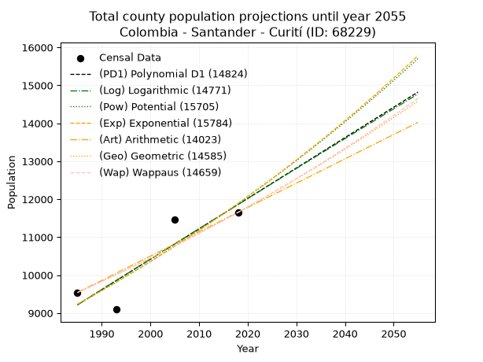
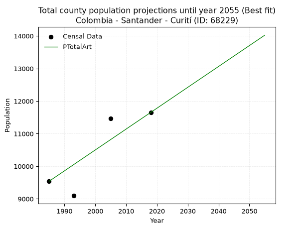
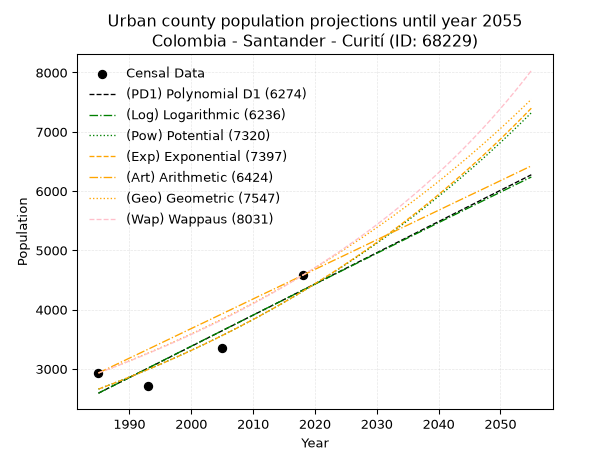
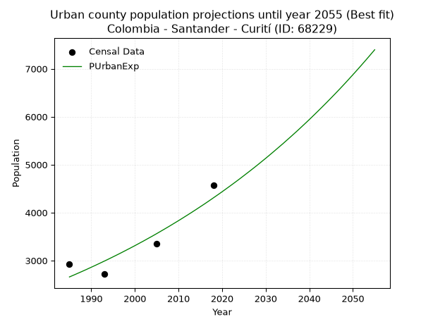
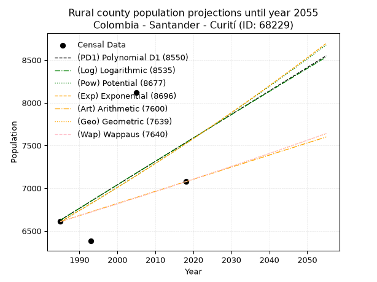
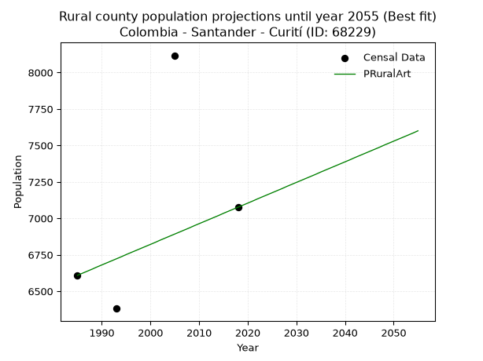

<div align="center">


</div>

# 📜 _“Population and Public Services Demand Projections (PPSD) until Year 2050 for Colombia - Santander - Curití (ID: 68229)”_
Keywords: `population` `public-service` `projection` `lineal` `polynomial` `logarithmic` `potential` `exponential` `arithmetic` `geometric` `wappaus` `dane` `colombia` `south-america`

PPSD are analytical estimates used by governments and planners to anticipate future changes in population size, age distribution, and the resulting community needs for utilities, healthcare, education, and infrastructure as sizing future water treatment facilities, electrical grids, and road networks based on spatial growth.

<div align="center">

</img>

</div>


> **General running parameters**: • app_version: _v20260806_. • Python version: _3.14.7_. • Pandas version: _3.0.5_. • NumPy version: _2.5.1_. • Creates, save and include plots into reports (create_plot): _False_. • Projection until year: _2050_. • Process polynomial degree 2 and up: _False_. • Process Wappaus: _True_. • Process Wappaus: _True_. • Set negative values to zero: _True_. • Set infinite values to zero: _True_. • Drop dataset notes: _True_. 
<div align="center">

Maps & GIS Layers: [:earth_americas:Google](http://maps.google.com/maps?q=6.605099256,-73.069383) [:earth_americas:OSM](https://www.openstreetmap.org/#map=18/6.605099256/-73.069383&layers=P) [:earth_americas:Bing](https://www.bing.com/maps?cp=6.605099256~-73.069383&lvl=18) [:earth_americas:Apple](https://maps.apple.com/frame?center=6.605099256%2C-73.069383&span=0.003%2C0.006) [:earth_americas:GISMobile](https://github.com/rcfdtools/R.GISMobile/blob/main/file/gis/CountyLayer_CO/Readme.md)

</div>


<div align="center">

```geojson
{
  "type": "Feature",
  "geometry": {
    "type": "Point", 
    "coordinates": [-73.069383, 6.605099256]
  }, 
  "properties": {
    "Name": "Colombia - Santander - Curití (ID: 68229)"
  }
}
```

</div>


## 0. Census Data (4 records)

Census data are official statistics collected by a government about the people and housing in a country. They usually include counts of total population, age, sex, race, income, education, and jobs.

📅Global census file: [Population.xlsx](../data/Population.xlsx)

| Source   |   Year |   CountryID | CountryName   |   StateID | StateName   |   CountyID | CountyName   |   PTotal |   PUrban |   PRural |
|:---------|-------:|------------:|:--------------|----------:|:------------|-----------:|:-------------|---------:|---------:|---------:|
| DANE     |   1985 |          57 | Colombia      |        68 | Santander   |      68229 | Curití       |     9539 |     2930 |     6609 |
| DANE     |   1993 |          57 | Colombia      |        68 | Santander   |      68229 | Curití       |     9095 |     2714 |     6381 |
| DANE     |   2005 |          57 | Colombia      |        68 | Santander   |      68229 | Curití       |    11464 |     3347 |     8117 |
| DANE     |   2018 |          57 | Colombia      |        68 | Santander   |      68229 | Curití       |    11653 |     4577 |     7076 |

> 🔥Some records could had specific notes about the registered values or the corresponding urban or rural distribution.

📅[SUI-RUPS](https://www.datos.gov.co/Hacienda-y-Cr-dito-P-blico/Registro-nico-de-Prestadores-de-Servicios-P-blicos/4qkq-csdn/about_data) - Local public utility companies: [RUPS.csv](../data/RUPS.csv)

 | SERVICIO       | ESTADO    | NOMBRE                                                                                          | NIT         | DEPARTAMENTO_DOMICILIO   | MUNICIPIO_DOMICILIO   | DIRECCION                    |   TELEFONO | EMAIL                          | TIPO_PRESTADOR          | CLASIFICACION                 |
|:---------------|:----------|:------------------------------------------------------------------------------------------------|:------------|:-------------------------|:----------------------|:-----------------------------|-----------:|:-------------------------------|:------------------------|:------------------------------|
| ACUEDUCTO      | OPERATIVA | JUNTA ADMINISTRADORA DEL ACUEDUCTO DEL COMUN, CANTERA Y PALMAR                                  | 804001801-4 | SANTANDER                | CURITI                | CALLE 6 4 11                 |    7187110 | acueductococapal8004@gmail.com | ORGANIZACION AUTORIZADA | MENOR O IGUAL A 2500 USUARIOS |
| ACUEDUCTO      | OPERATIVA | CORPORACION DE SERVICIOS DE ACUEDUCTO Y ALCANTARILLADO DE CURITI MUNICIPIO DE CURITI            | 800229603-8 | SANTANDER                | CURITI                | Carrera 6 No. 8-16           |    7187027 | andres.lesmes@rsdltda.com      | ORGANIZACION AUTORIZADA | MENOR O IGUAL A 2500 USUARIOS |
| ALCANTARILLADO | OPERATIVA | CORPORACION DE SERVICIOS DE ACUEDUCTO Y ALCANTARILLADO DE CURITI MUNICIPIO DE CURITI            | 800229603-8 | SANTANDER                | CURITI                | Carrera 6 No. 8-16           |    7187027 | andres.lesmes@rsdltda.com      | ORGANIZACION AUTORIZADA | MENOR O IGUAL A 2500 USUARIOS |
| ACUEDUCTO      | OPERATIVA | ASOCIACION DE USUARIOS DE ACUEDUCTO ALCANTARILLADO Y ASEO DE LAS VEREDAS LA PEÑA - AGUASEMBRADA | 900261473-4 | SANTANDER                | CURITI                | Salón Comunal vereda La Peña |    7242430 | aguasembrada09@gmail.com       | ORGANIZACION AUTORIZADA | MENOR O IGUAL A 2500 USUARIOS |

## 1. Total

### 1.1. Coefficients and Parameters

* (PD1) Polynomial Deg 1: 80.1063829787232, -149795.04255319107 (lineal)
* (Log) Logarithmic: 160354.54243903141, -1208418.4120797354
* (Pow) Potential: 15.338378461723039, -46.617130652265836
* (Exp) Exponential: 0.0076625106840151475, 0.00228884143697451
* (Art) Arithmetic: Year diff. 2018 - 1985 = 33, Population diff. 11653 - 9539 = 2114, Annual growth = 64.06060606060606
* (Geo) Geometric: Year diff. 2018 - 1985 = 33, Population diff. 11653 - 9539 = 2114, Annual growth % = 0.0060843439559454815
* (Wap) Wappaus: i = 0.6045734811306726, Condition values only valid for < 200)

<sub>
Wappaus condition values: ['0.00', '0.60', '1.21', '1.81', '2.42', '3.02', '3.63', '4.23', '4.84', '5.44', '6.05', '6.65', '7.25', '7.86', '8.46', '9.07', '9.67', '10.28', '10.88', '11.49', '12.09', '12.70', '13.30', '13.91', '14.51', '15.11', '15.72', '16.32', '16.93', '17.53', '18.14', '18.74', '19.35', '19.95', '20.56', '21.16', '21.76', '22.37', '22.97', '23.58', '24.18', '24.79', '25.39', '26.00', '26.60', '27.21', '27.81', '28.41', '29.02', '29.62', '30.23', '30.83', '31.44', '32.04', '32.65', '33.25', '33.86', '34.46', '35.07', '35.67', '36.27', '36.88', '37.48', '38.09', '38.69', '39.30']
</sub>


### 1.2. Projected Dataset

|   Year |   CountyID |   PTotalPD1 |   PTotalLog |   PTotalPow |   PTotalExp |   PTotalArt |   PTotalGeo |   PTotalWap |
|-------:|-----------:|------------:|------------:|------------:|------------:|------------:|------------:|------------:|
|   1985 |      68229 |        9216 |        9214 |        9229 |        9231 |        9539 |        9539 |        9539 |
|   1986 |      68229 |        9296 |        9294 |        9301 |        9302 |        9603 |        9597 |        9597 |
|   1987 |      68229 |        9376 |        9375 |        9373 |        9374 |        9667 |        9655 |        9655 |
|   1988 |      68229 |        9456 |        9456 |        9446 |        9446 |        9731 |        9714 |        9714 |
|   1989 |      68229 |        9537 |        9536 |        9519 |        9519 |        9795 |        9773 |        9773 |
|   1990 |      68229 |        9617 |        9617 |        9592 |        9592 |        9859 |        9833 |        9832 |
|   1991 |      68229 |        9697 |        9698 |        9667 |        9666 |        9923 |        9893 |        9891 |
|   1992 |      68229 |        9777 |        9778 |        9741 |        9740 |        9987 |        9953 |        9951 |
|   1993 |      68229 |        9857 |        9859 |        9817 |        9815 |       10051 |       10013 |       10012 |
|   1994 |      68229 |        9937 |        9939 |        9892 |        9891 |       10116 |       10074 |       10073 |
|   1995 |      68229 |       10017 |       10019 |        9969 |        9967 |       10180 |       10136 |       10134 |
|   1996 |      68229 |       10097 |       10100 |       10046 |       10043 |       10244 |       10197 |       10195 |
|   1997 |      68229 |       10177 |       10180 |       10123 |       10121 |       10308 |       10259 |       10257 |
|   1998 |      68229 |       10258 |       10260 |       10201 |       10198 |       10372 |       10322 |       10319 |
|   1999 |      68229 |       10338 |       10341 |       10280 |       10277 |       10436 |       10384 |       10382 |
|   2000 |      68229 |       10418 |       10421 |       10359 |       10356 |       10500 |       10448 |       10445 |
|   2001 |      68229 |       10498 |       10501 |       10439 |       10436 |       10564 |       10511 |       10509 |
|   2002 |      68229 |       10578 |       10581 |       10519 |       10516 |       10628 |       10575 |       10573 |
|   2003 |      68229 |       10658 |       10661 |       10600 |       10597 |       10692 |       10640 |       10637 |
|   2004 |      68229 |       10738 |       10741 |       10681 |       10678 |       10756 |       10704 |       10702 |
|   2005 |      68229 |       10818 |       10821 |       10763 |       10760 |       10820 |       10769 |       10767 |
|   2006 |      68229 |       10898 |       10901 |       10846 |       10843 |       10884 |       10835 |       10832 |
|   2007 |      68229 |       10978 |       10981 |       10929 |       10927 |       10948 |       10901 |       10898 |
|   2008 |      68229 |       11059 |       11061 |       11013 |       11011 |       11012 |       10967 |       10965 |
|   2009 |      68229 |       11139 |       11141 |       11098 |       11095 |       11076 |       11034 |       11031 |
|   2010 |      68229 |       11219 |       11221 |       11183 |       11181 |       11141 |       11101 |       11099 |
|   2011 |      68229 |       11299 |       11300 |       11268 |       11267 |       11205 |       11169 |       11166 |
|   2012 |      68229 |       11379 |       11380 |       11354 |       11353 |       11269 |       11237 |       11234 |
|   2013 |      68229 |       11459 |       11460 |       11441 |       11441 |       11333 |       11305 |       11303 |
|   2014 |      68229 |       11539 |       11539 |       11529 |       11529 |       11397 |       11374 |       11372 |
|   2015 |      68229 |       11619 |       11619 |       11617 |       11617 |       11461 |       11443 |       11442 |
|   2016 |      68229 |       11699 |       11699 |       11706 |       11707 |       11525 |       11512 |       11512 |
|   2017 |      68229 |       11780 |       11778 |       11795 |       11797 |       11589 |       11583 |       11582 |
|   2018 |      68229 |       11860 |       11858 |       11885 |       11887 |       11653 |       11653 |       11653 |
|   2019 |      68229 |       11940 |       11937 |       11976 |       11979 |       11717 |       11724 |       11724 |
|   2020 |      68229 |       12020 |       12016 |       12067 |       12071 |       11781 |       11795 |       11796 |
|   2021 |      68229 |       12100 |       12096 |       12159 |       12164 |       11845 |       11867 |       11869 |
|   2022 |      68229 |       12180 |       12175 |       12252 |       12257 |       11909 |       11939 |       11942 |
|   2023 |      68229 |       12260 |       12254 |       12345 |       12352 |       11973 |       12012 |       12015 |
|   2024 |      68229 |       12340 |       12334 |       12439 |       12447 |       12037 |       12085 |       12089 |
|   2025 |      68229 |       12420 |       12413 |       12533 |       12542 |       12101 |       12158 |       12163 |
|   2026 |      68229 |       12500 |       12492 |       12629 |       12639 |       12165 |       12232 |       12238 |
|   2027 |      68229 |       12581 |       12571 |       12725 |       12736 |       12230 |       12307 |       12313 |
|   2028 |      68229 |       12661 |       12650 |       12821 |       12834 |       12294 |       12382 |       12389 |
|   2029 |      68229 |       12741 |       12729 |       12919 |       12933 |       12358 |       12457 |       12466 |
|   2030 |      68229 |       12821 |       12808 |       13017 |       13032 |       12422 |       12533 |       12543 |
|   2031 |      68229 |       12901 |       12887 |       13115 |       13133 |       12486 |       12609 |       12620 |
|   2032 |      68229 |       12981 |       12966 |       13215 |       13234 |       12550 |       12686 |       12698 |
|   2033 |      68229 |       13061 |       13045 |       13315 |       13335 |       12614 |       12763 |       12777 |
|   2034 |      68229 |       13141 |       13124 |       13416 |       13438 |       12678 |       12841 |       12856 |
|   2035 |      68229 |       13221 |       13203 |       13517 |       13541 |       12742 |       12919 |       12936 |
|   2036 |      68229 |       13302 |       13282 |       13619 |       13645 |       12806 |       12997 |       13016 |
|   2037 |      68229 |       13382 |       13360 |       13722 |       13750 |       12870 |       13076 |       13097 |
|   2038 |      68229 |       13462 |       13439 |       13826 |       13856 |       12934 |       13156 |       13179 |
|   2039 |      68229 |       13542 |       13518 |       13930 |       13963 |       12998 |       13236 |       13261 |
|   2040 |      68229 |       13622 |       13596 |       14036 |       14070 |       13062 |       13317 |       13343 |
|   2041 |      68229 |       13702 |       13675 |       14141 |       14178 |       13126 |       13398 |       13427 |
|   2042 |      68229 |       13782 |       13753 |       14248 |       14287 |       13190 |       13479 |       13511 |
|   2043 |      68229 |       13862 |       13832 |       14356 |       14397 |       13255 |       13561 |       13595 |
|   2044 |      68229 |       13942 |       13910 |       14464 |       14508 |       13319 |       13644 |       13680 |
|   2045 |      68229 |       14023 |       13989 |       14573 |       14620 |       13383 |       13727 |       13766 |
|   2046 |      68229 |       14103 |       14067 |       14682 |       14732 |       13447 |       13810 |       13852 |
|   2047 |      68229 |       14183 |       14146 |       14793 |       14845 |       13511 |       13894 |       13939 |
|   2048 |      68229 |       14263 |       14224 |       14904 |       14960 |       13575 |       13979 |       14027 |
|   2049 |      68229 |       14343 |       14302 |       15016 |       15075 |       13639 |       14064 |       14115 |
|   2050 |      68229 |       14423 |       14380 |       15129 |       15191 |       13703 |       14149 |       14204 |
<div align="center">

</img>

</div>


### 1.3. Best fit with absolute and relative error (%)

Relative error puts that difference into context by dividing the absolute error by the true value, creating a unitless ratio or percentage that shows the scale of the mistake.

Absolute and relative error

|   Year | Source   |   CountryID | CountryName   |   StateID | StateName   |   CountyID_x | CountyName   |   PTotal |   PUrban |   PRural |   CountyID_y |   PTotalPD1 |   PTotalLog |   PTotalPow |   PTotalExp |   PTotalArt |   PTotalGeo |   PTotalWap |   PTotalPD1AbsError |   PTotalLogAbsError |   PTotalPowAbsError |   PTotalExpAbsError |   PTotalArtAbsError |   PTotalGeoAbsError |   PTotalWapAbsError |   PTotalPD1RelError |   PTotalLogRelError |   PTotalPowRelError |   PTotalExpRelError |   PTotalArtRelError |   PTotalGeoRelError |   PTotalWapRelError |
|-------:|:---------|------------:|:--------------|----------:|:------------|-------------:|:-------------|---------:|---------:|---------:|-------------:|------------:|------------:|------------:|------------:|------------:|------------:|------------:|--------------------:|--------------------:|--------------------:|--------------------:|--------------------:|--------------------:|--------------------:|--------------------:|--------------------:|--------------------:|--------------------:|--------------------:|--------------------:|--------------------:|
|   1985 | DANE     |          57 | Colombia      |        68 | Santander   |        68229 | Curití       |     9539 |     2930 |     6609 |        68229 |        9216 |        9214 |        9229 |        9231 |        9539 |        9539 |        9539 |                 323 |                 325 |                 310 |                 308 |                   0 |                   0 |                   0 |             3.3861  |             3.40707 |             3.24982 |             3.22885 |             0       |             0       |              0      |
|   1993 | DANE     |          57 | Colombia      |        68 | Santander   |        68229 | Curití       |     9095 |     2714 |     6381 |        68229 |        9857 |        9859 |        9817 |        9815 |       10051 |       10013 |       10012 |                 762 |                 764 |                 722 |                 720 |                 956 |                 918 |                 917 |             8.37823 |             8.40022 |             7.93843 |             7.91644 |            10.5113  |            10.0935  |             10.0825 |
|   2005 | DANE     |          57 | Colombia      |        68 | Santander   |        68229 | Curití       |    11464 |     3347 |     8117 |        68229 |       10818 |       10821 |       10763 |       10760 |       10820 |       10769 |       10767 |                 646 |                 643 |                 701 |                 704 |                 644 |                 695 |                 697 |             5.63503 |             5.60886 |             6.11479 |             6.14096 |             5.61759 |             6.06246 |              6.0799 |
|   2018 | DANE     |          57 | Colombia      |        68 | Santander   |        68229 | Curití       |    11653 |     4577 |     7076 |        68229 |       11860 |       11858 |       11885 |       11887 |       11653 |       11653 |       11653 |                 207 |                 205 |                 232 |                 234 |                   0 |                   0 |                   0 |             1.77637 |             1.7592  |             1.9909  |             2.00807 |             0       |             0       |              0      |

Relative error mean

| Method    |   RelError | Best   |
|:----------|-----------:|:-------|
| PTotalPD1 |    4.79393 |        |
| PTotalLog |    4.79384 |        |
| PTotalPow |    4.82349 |        |
| PTotalExp |    4.82358 |        |
| PTotalArt |    4.03221 | True   |
| PTotalGeo |    4.03898 |        |
| PTotalWap |    4.04059 |        |

💙Best method: _**PTotalArt**_
<div align="center">

</img>

</div>


### 1.4. Fresh water supply demand in liters per capita per day (lpcd)

The fresh water supply demand typically ranges from 100 to 300 liters per capita per day (lpcd) for standard domestic and municipal planning, though absolute survival minimums set by the World Health Organization are as low as 7.5 to 20 liters per day, and total consumption in high-income nations can exceed 400 liters.

> `CZ`: Level in meters above the sea level (masl)<br> `WS`: Fresh water supply demand in liters per capita per day (lpcd or l/h/d)<br> `WSAll`: Zonal fresh water supply demand in liters per second (l/s)<br> `A`: Zonal area in square meters<br> `DP`: Population density (people/hectare or p/ha)

Reference values (RAS Colombia)

|    CZ |   WS |
|------:|-----:|
|  1000 |  120 |
|  2000 |  130 |
| 99999 |  140 |

County shapefile geometry properties and water supply values

|   CountyID |      ATotal |   CZTotal |   WSTotal |
|-----------:|------------:|----------:|----------:|
|      68229 | 2.43749e+08 |   1665.27 |       130 |

Projected values for best method: PTotalArt

|   CountyID |   Year |   PTotalArt |   DPTotal |   WSTotal |   WSTotalAll |
|-----------:|-------:|------------:|----------:|----------:|-------------:|
|      68229 |   1985 |        9539 |      0.39 |       130 |      14.3527 |
|      68229 |   1986 |        9603 |      0.39 |       130 |      14.449  |
|      68229 |   1987 |        9667 |      0.4  |       130 |      14.5453 |
|      68229 |   1988 |        9731 |      0.4  |       130 |      14.6416 |
|      68229 |   1989 |        9795 |      0.4  |       130 |      14.7378 |
|      68229 |   1990 |        9859 |      0.4  |       130 |      14.8341 |
|      68229 |   1991 |        9923 |      0.41 |       130 |      14.9304 |
|      68229 |   1992 |        9987 |      0.41 |       130 |      15.0267 |
|      68229 |   1993 |       10051 |      0.41 |       130 |      15.123  |
|      68229 |   1994 |       10116 |      0.42 |       130 |      15.2208 |
|      68229 |   1995 |       10180 |      0.42 |       130 |      15.3171 |
|      68229 |   1996 |       10244 |      0.42 |       130 |      15.4134 |
|      68229 |   1997 |       10308 |      0.42 |       130 |      15.5097 |
|      68229 |   1998 |       10372 |      0.43 |       130 |      15.606  |
|      68229 |   1999 |       10436 |      0.43 |       130 |      15.7023 |
|      68229 |   2000 |       10500 |      0.43 |       130 |      15.7986 |
|      68229 |   2001 |       10564 |      0.43 |       130 |      15.8949 |
|      68229 |   2002 |       10628 |      0.44 |       130 |      15.9912 |
|      68229 |   2003 |       10692 |      0.44 |       130 |      16.0875 |
|      68229 |   2004 |       10756 |      0.44 |       130 |      16.1838 |
|      68229 |   2005 |       10820 |      0.44 |       130 |      16.2801 |
|      68229 |   2006 |       10884 |      0.45 |       130 |      16.3764 |
|      68229 |   2007 |       10948 |      0.45 |       130 |      16.4727 |
|      68229 |   2008 |       11012 |      0.45 |       130 |      16.569  |
|      68229 |   2009 |       11076 |      0.45 |       130 |      16.6653 |
|      68229 |   2010 |       11141 |      0.46 |       130 |      16.7631 |
|      68229 |   2011 |       11205 |      0.46 |       130 |      16.8594 |
|      68229 |   2012 |       11269 |      0.46 |       130 |      16.9557 |
|      68229 |   2013 |       11333 |      0.46 |       130 |      17.052  |
|      68229 |   2014 |       11397 |      0.47 |       130 |      17.1483 |
|      68229 |   2015 |       11461 |      0.47 |       130 |      17.2446 |
|      68229 |   2016 |       11525 |      0.47 |       130 |      17.3409 |
|      68229 |   2017 |       11589 |      0.48 |       130 |      17.4372 |
|      68229 |   2018 |       11653 |      0.48 |       130 |      17.5334 |
|      68229 |   2019 |       11717 |      0.48 |       130 |      17.6297 |
|      68229 |   2020 |       11781 |      0.48 |       130 |      17.726  |
|      68229 |   2021 |       11845 |      0.49 |       130 |      17.8223 |
|      68229 |   2022 |       11909 |      0.49 |       130 |      17.9186 |
|      68229 |   2023 |       11973 |      0.49 |       130 |      18.0149 |
|      68229 |   2024 |       12037 |      0.49 |       130 |      18.1112 |
|      68229 |   2025 |       12101 |      0.5  |       130 |      18.2075 |
|      68229 |   2026 |       12165 |      0.5  |       130 |      18.3038 |
|      68229 |   2027 |       12230 |      0.5  |       130 |      18.4016 |
|      68229 |   2028 |       12294 |      0.5  |       130 |      18.4979 |
|      68229 |   2029 |       12358 |      0.51 |       130 |      18.5942 |
|      68229 |   2030 |       12422 |      0.51 |       130 |      18.6905 |
|      68229 |   2031 |       12486 |      0.51 |       130 |      18.7868 |
|      68229 |   2032 |       12550 |      0.51 |       130 |      18.8831 |
|      68229 |   2033 |       12614 |      0.52 |       130 |      18.9794 |
|      68229 |   2034 |       12678 |      0.52 |       130 |      19.0757 |
|      68229 |   2035 |       12742 |      0.52 |       130 |      19.172  |
|      68229 |   2036 |       12806 |      0.53 |       130 |      19.2683 |
|      68229 |   2037 |       12870 |      0.53 |       130 |      19.3646 |
|      68229 |   2038 |       12934 |      0.53 |       130 |      19.4609 |
|      68229 |   2039 |       12998 |      0.53 |       130 |      19.5572 |
|      68229 |   2040 |       13062 |      0.54 |       130 |      19.6535 |
|      68229 |   2041 |       13126 |      0.54 |       130 |      19.7498 |
|      68229 |   2042 |       13190 |      0.54 |       130 |      19.8461 |
|      68229 |   2043 |       13255 |      0.54 |       130 |      19.9439 |
|      68229 |   2044 |       13319 |      0.55 |       130 |      20.0402 |
|      68229 |   2045 |       13383 |      0.55 |       130 |      20.1365 |
|      68229 |   2046 |       13447 |      0.55 |       130 |      20.2328 |
|      68229 |   2047 |       13511 |      0.55 |       130 |      20.3291 |
|      68229 |   2048 |       13575 |      0.56 |       130 |      20.4253 |
|      68229 |   2049 |       13639 |      0.56 |       130 |      20.5216 |
|      68229 |   2050 |       13703 |      0.56 |       130 |      20.6179 |

## 2. Urban

### 2.1. Coefficients and Parameters

* (PD1) Polynomial Deg 1: 52.63910076274509, -101899.36130068086 (lineal)
* (Log) Logarithmic: 105254.25858774086, -796646.462980112
* (Pow) Potential: 29.234849222186554, -92.98502584838229
* (Exp) Exponential: 0.014619791254635044, 6.626006560052874e-10
* (Art) Arithmetic: Year diff. 2018 - 1985 = 33, Population diff. 4577 - 2930 = 1647, Annual growth = 49.90909090909091
* (Geo) Geometric: Year diff. 2018 - 1985 = 33, Population diff. 4577 - 2930 = 1647, Annual growth % = 0.013608163746172908
* (Wap) Wappaus: i = 1.3296680673795367, Condition values only valid for < 200)

<sub>
Wappaus condition values: ['0.00', '1.33', '2.66', '3.99', '5.32', '6.65', '7.98', '9.31', '10.64', '11.97', '13.30', '14.63', '15.96', '17.29', '18.62', '19.95', '21.27', '22.60', '23.93', '25.26', '26.59', '27.92', '29.25', '30.58', '31.91', '33.24', '34.57', '35.90', '37.23', '38.56', '39.89', '41.22', '42.55', '43.88', '45.21', '46.54', '47.87', '49.20', '50.53', '51.86', '53.19', '54.52', '55.85', '57.18', '58.51', '59.84', '61.16', '62.49', '63.82', '65.15', '66.48', '67.81', '69.14', '70.47', '71.80', '73.13', '74.46', '75.79', '77.12', '78.45', '79.78', '81.11', '82.44', '83.77', '85.10', '86.43']
</sub>


### 2.2. Projected Dataset

|   Year |   CountyID |   PUrbanPD1 |   PUrbanLog |   PUrbanPow |   PUrbanExp |   PUrbanArt |   PUrbanGeo |   PUrbanWap |
|-------:|-----------:|------------:|------------:|------------:|------------:|------------:|------------:|------------:|
|   1985 |      68229 |        2589 |        2589 |        2658 |        2658 |        2930 |        2930 |        2930 |
|   1986 |      68229 |        2642 |        2642 |        2697 |        2697 |        2980 |        2970 |        2969 |
|   1987 |      68229 |        2695 |        2695 |        2737 |        2737 |        3030 |        3010 |        3009 |
|   1988 |      68229 |        2747 |        2747 |        2778 |        2777 |        3080 |        3051 |        3049 |
|   1989 |      68229 |        2800 |        2800 |        2819 |        2818 |        3130 |        3093 |        3090 |
|   1990 |      68229 |        2852 |        2853 |        2861 |        2860 |        3180 |        3135 |        3131 |
|   1991 |      68229 |        2905 |        2906 |        2903 |        2902 |        3229 |        3178 |        3173 |
|   1992 |      68229 |        2958 |        2959 |        2946 |        2945 |        3279 |        3221 |        3216 |
|   1993 |      68229 |        3010 |        3012 |        2989 |        2988 |        3329 |        3265 |        3259 |
|   1994 |      68229 |        3063 |        3065 |        3033 |        3032 |        3379 |        3309 |        3303 |
|   1995 |      68229 |        3116 |        3117 |        3078 |        3077 |        3429 |        3354 |        3347 |
|   1996 |      68229 |        3168 |        3170 |        3124 |        3122 |        3479 |        3400 |        3392 |
|   1997 |      68229 |        3221 |        3223 |        3170 |        3168 |        3529 |        3446 |        3438 |
|   1998 |      68229 |        3274 |        3276 |        3217 |        3215 |        3579 |        3493 |        3484 |
|   1999 |      68229 |        3326 |        3328 |        3264 |        3262 |        3629 |        3540 |        3531 |
|   2000 |      68229 |        3379 |        3381 |        3312 |        3310 |        3679 |        3589 |        3579 |
|   2001 |      68229 |        3431 |        3434 |        3361 |        3359 |        3729 |        3637 |        3628 |
|   2002 |      68229 |        3484 |        3486 |        3410 |        3408 |        3778 |        3687 |        3677 |
|   2003 |      68229 |        3537 |        3539 |        3460 |        3459 |        3828 |        3737 |        3727 |
|   2004 |      68229 |        3589 |        3591 |        3511 |        3509 |        3878 |        3788 |        3777 |
|   2005 |      68229 |        3642 |        3644 |        3563 |        3561 |        3928 |        3839 |        3829 |
|   2006 |      68229 |        3695 |        3696 |        3615 |        3614 |        3978 |        3892 |        3881 |
|   2007 |      68229 |        3747 |        3749 |        3668 |        3667 |        4028 |        3945 |        3934 |
|   2008 |      68229 |        3800 |        3801 |        3722 |        3721 |        4078 |        3998 |        3988 |
|   2009 |      68229 |        3853 |        3853 |        3777 |        3776 |        4128 |        4053 |        4043 |
|   2010 |      68229 |        3905 |        3906 |        3832 |        3831 |        4178 |        4108 |        4098 |
|   2011 |      68229 |        3958 |        3958 |        3888 |        3888 |        4228 |        4164 |        4155 |
|   2012 |      68229 |        4011 |        4011 |        3945 |        3945 |        4278 |        4220 |        4212 |
|   2013 |      68229 |        4063 |        4063 |        4003 |        4003 |        4327 |        4278 |        4270 |
|   2014 |      68229 |        4116 |        4115 |        4061 |        4062 |        4377 |        4336 |        4330 |
|   2015 |      68229 |        4168 |        4167 |        4121 |        4122 |        4427 |        4395 |        4390 |
|   2016 |      68229 |        4221 |        4220 |        4181 |        4182 |        4477 |        4455 |        4451 |
|   2017 |      68229 |        4274 |        4272 |        4242 |        4244 |        4527 |        4516 |        4514 |
|   2018 |      68229 |        4326 |        4324 |        4304 |        4307 |        4577 |        4577 |        4577 |
|   2019 |      68229 |        4379 |        4376 |        4367 |        4370 |        4627 |        4639 |        4641 |
|   2020 |      68229 |        4432 |        4428 |        4430 |        4434 |        4677 |        4702 |        4707 |
|   2021 |      68229 |        4484 |        4480 |        4495 |        4500 |        4727 |        4766 |        4774 |
|   2022 |      68229 |        4537 |        4532 |        4560 |        4566 |        4777 |        4831 |        4842 |
|   2023 |      68229 |        4590 |        4584 |        4627 |        4633 |        4827 |        4897 |        4911 |
|   2024 |      68229 |        4642 |        4636 |        4694 |        4701 |        4876 |        4964 |        4981 |
|   2025 |      68229 |        4695 |        4688 |        4762 |        4771 |        4926 |        5031 |        5053 |
|   2026 |      68229 |        4747 |        4740 |        4831 |        4841 |        4976 |        5100 |        5126 |
|   2027 |      68229 |        4800 |        4792 |        4902 |        4912 |        5026 |        5169 |        5200 |
|   2028 |      68229 |        4853 |        4844 |        4973 |        4984 |        5076 |        5239 |        5276 |
|   2029 |      68229 |        4905 |        4896 |        5045 |        5058 |        5126 |        5311 |        5353 |
|   2030 |      68229 |        4958 |        4948 |        5118 |        5132 |        5176 |        5383 |        5432 |
|   2031 |      68229 |        5011 |        5000 |        5192 |        5208 |        5226 |        5456 |        5512 |
|   2032 |      68229 |        5063 |        5052 |        5268 |        5285 |        5276 |        5530 |        5593 |
|   2033 |      68229 |        5116 |        5103 |        5344 |        5363 |        5326 |        5606 |        5677 |
|   2034 |      68229 |        5169 |        5155 |        5421 |        5441 |        5376 |        5682 |        5761 |
|   2035 |      68229 |        5221 |        5207 |        5500 |        5522 |        5425 |        5759 |        5848 |
|   2036 |      68229 |        5274 |        5259 |        5579 |        5603 |        5475 |        5838 |        5936 |
|   2037 |      68229 |        5326 |        5310 |        5660 |        5685 |        5525 |        5917 |        6026 |
|   2038 |      68229 |        5379 |        5362 |        5742 |        5769 |        5575 |        5998 |        6118 |
|   2039 |      68229 |        5432 |        5414 |        5825 |        5854 |        5625 |        6079 |        6212 |
|   2040 |      68229 |        5484 |        5465 |        5909 |        5940 |        5675 |        6162 |        6308 |
|   2041 |      68229 |        5537 |        5517 |        5994 |        6028 |        5725 |        6246 |        6406 |
|   2042 |      68229 |        5590 |        5568 |        6081 |        6117 |        5775 |        6331 |        6506 |
|   2043 |      68229 |        5642 |        5620 |        6168 |        6207 |        5825 |        6417 |        6608 |
|   2044 |      68229 |        5695 |        5671 |        6257 |        6298 |        5875 |        6504 |        6712 |
|   2045 |      68229 |        5748 |        5723 |        6347 |        6391 |        5925 |        6593 |        6819 |
|   2046 |      68229 |        5800 |        5774 |        6439 |        6485 |        5974 |        6683 |        6928 |
|   2047 |      68229 |        5853 |        5826 |        6531 |        6580 |        6024 |        6774 |        7039 |
|   2048 |      68229 |        5906 |        5877 |        6625 |        6677 |        6074 |        6866 |        7153 |
|   2049 |      68229 |        5958 |        5929 |        6721 |        6776 |        6124 |        6959 |        7270 |
|   2050 |      68229 |        6011 |        5980 |        6817 |        6876 |        6174 |        7054 |        7389 |
<div align="center">

</img>

</div>


### 2.3. Best fit with absolute and relative error (%)

Relative error puts that difference into context by dividing the absolute error by the true value, creating a unitless ratio or percentage that shows the scale of the mistake.

Absolute and relative error

|   Year | Source   |   CountryID | CountryName   |   StateID | StateName   |   CountyID_x | CountyName   |   PTotal |   PUrban |   PRural |   CountyID_y |   PUrbanPD1 |   PUrbanLog |   PUrbanPow |   PUrbanExp |   PUrbanArt |   PUrbanGeo |   PUrbanWap |   PUrbanPD1AbsError |   PUrbanLogAbsError |   PUrbanPowAbsError |   PUrbanExpAbsError |   PUrbanArtAbsError |   PUrbanGeoAbsError |   PUrbanWapAbsError |   PUrbanPD1RelError |   PUrbanLogRelError |   PUrbanPowRelError |   PUrbanExpRelError |   PUrbanArtRelError |   PUrbanGeoRelError |   PUrbanWapRelError |
|-------:|:---------|------------:|:--------------|----------:|:------------|-------------:|:-------------|---------:|---------:|---------:|-------------:|------------:|------------:|------------:|------------:|------------:|------------:|------------:|--------------------:|--------------------:|--------------------:|--------------------:|--------------------:|--------------------:|--------------------:|--------------------:|--------------------:|--------------------:|--------------------:|--------------------:|--------------------:|--------------------:|
|   1985 | DANE     |          57 | Colombia      |        68 | Santander   |        68229 | Curití       |     9539 |     2930 |     6609 |        68229 |        2589 |        2589 |        2658 |        2658 |        2930 |        2930 |        2930 |                 341 |                 341 |                 272 |                 272 |                   0 |                   0 |                   0 |            11.6382  |            11.6382  |             9.28328 |             9.28328 |              0      |              0      |              0      |
|   1993 | DANE     |          57 | Colombia      |        68 | Santander   |        68229 | Curití       |     9095 |     2714 |     6381 |        68229 |        3010 |        3012 |        2989 |        2988 |        3329 |        3265 |        3259 |                 296 |                 298 |                 275 |                 274 |                 615 |                 551 |                 545 |            10.9064  |            10.9801  |            10.1326  |            10.0958  |             22.6603 |             20.3021 |             20.0811 |
|   2005 | DANE     |          57 | Colombia      |        68 | Santander   |        68229 | Curití       |    11464 |     3347 |     8117 |        68229 |        3642 |        3644 |        3563 |        3561 |        3928 |        3839 |        3829 |                 295 |                 297 |                 216 |                 214 |                 581 |                 492 |                 482 |             8.81386 |             8.87362 |             6.45354 |             6.39379 |             17.3588 |             14.6997 |             14.401  |
|   2018 | DANE     |          57 | Colombia      |        68 | Santander   |        68229 | Curití       |    11653 |     4577 |     7076 |        68229 |        4326 |        4324 |        4304 |        4307 |        4577 |        4577 |        4577 |                 251 |                 253 |                 273 |                 270 |                   0 |                   0 |                   0 |             5.48394 |             5.52764 |             5.96461 |             5.89906 |              0      |              0      |              0      |

Relative error mean

| Method    |   RelError | Best   |
|:----------|-----------:|:-------|
| PUrbanPD1 |    9.21061 |        |
| PUrbanLog |    9.2549  |        |
| PUrbanPow |    7.95852 |        |
| PUrbanExp |    7.91798 | True   |
| PUrbanArt |   10.0048  |        |
| PUrbanGeo |    8.75047 |        |
| PUrbanWap |    8.6205  |        |

💙Best method: _**PUrbanExp**_
<div align="center">

</img>

</div>


### 2.4. Fresh water supply demand in liters per capita per day (lpcd)

The fresh water supply demand typically ranges from 100 to 300 liters per capita per day (lpcd) for standard domestic and municipal planning, though absolute survival minimums set by the World Health Organization are as low as 7.5 to 20 liters per day, and total consumption in high-income nations can exceed 400 liters.

> `CZ`: Level in meters above the sea level (masl)<br> `WS`: Fresh water supply demand in liters per capita per day (lpcd or l/h/d)<br> `WSAll`: Zonal fresh water supply demand in liters per second (l/s)<br> `A`: Zonal area in square meters<br> `DP`: Population density (people/hectare or p/ha)

Reference values (RAS Colombia)

|    CZ |   WS |
|------:|-----:|
|  1000 |  120 |
|  2000 |  130 |
| 99999 |  140 |

County shapefile geometry properties and water supply values

|   CountyID |   AUrban |   CZUrban |   WSUrban |
|-----------:|---------:|----------:|----------:|
|      68229 |   786938 |    1490.8 |       130 |

Projected values for best method: PUrbanExp

|   CountyID |   Year |   PUrbanExp |   DPUrban |   WSUrban |   WSUrbanAll |
|-----------:|-------:|------------:|----------:|----------:|-------------:|
|      68229 |   1985 |        2658 |     33.78 |       130 |      3.99931 |
|      68229 |   1986 |        2697 |     34.27 |       130 |      4.05799 |
|      68229 |   1987 |        2737 |     34.78 |       130 |      4.11817 |
|      68229 |   1988 |        2777 |     35.29 |       130 |      4.17836 |
|      68229 |   1989 |        2818 |     35.81 |       130 |      4.24005 |
|      68229 |   1990 |        2860 |     36.34 |       130 |      4.30324 |
|      68229 |   1991 |        2902 |     36.88 |       130 |      4.36644 |
|      68229 |   1992 |        2945 |     37.42 |       130 |      4.43113 |
|      68229 |   1993 |        2988 |     37.97 |       130 |      4.49583 |
|      68229 |   1994 |        3032 |     38.53 |       130 |      4.56204 |
|      68229 |   1995 |        3077 |     39.1  |       130 |      4.62975 |
|      68229 |   1996 |        3122 |     39.67 |       130 |      4.69745 |
|      68229 |   1997 |        3168 |     40.26 |       130 |      4.76667 |
|      68229 |   1998 |        3215 |     40.85 |       130 |      4.83738 |
|      68229 |   1999 |        3262 |     41.45 |       130 |      4.9081  |
|      68229 |   2000 |        3310 |     42.06 |       130 |      4.98032 |
|      68229 |   2001 |        3359 |     42.68 |       130 |      5.05405 |
|      68229 |   2002 |        3408 |     43.31 |       130 |      5.12778 |
|      68229 |   2003 |        3459 |     43.96 |       130 |      5.20451 |
|      68229 |   2004 |        3509 |     44.59 |       130 |      5.27975 |
|      68229 |   2005 |        3561 |     45.25 |       130 |      5.35799 |
|      68229 |   2006 |        3614 |     45.92 |       130 |      5.43773 |
|      68229 |   2007 |        3667 |     46.6  |       130 |      5.51748 |
|      68229 |   2008 |        3721 |     47.28 |       130 |      5.59873 |
|      68229 |   2009 |        3776 |     47.98 |       130 |      5.68148 |
|      68229 |   2010 |        3831 |     48.68 |       130 |      5.76424 |
|      68229 |   2011 |        3888 |     49.41 |       130 |      5.85    |
|      68229 |   2012 |        3945 |     50.13 |       130 |      5.93576 |
|      68229 |   2013 |        4003 |     50.87 |       130 |      6.02303 |
|      68229 |   2014 |        4062 |     51.62 |       130 |      6.11181 |
|      68229 |   2015 |        4122 |     52.38 |       130 |      6.20208 |
|      68229 |   2016 |        4182 |     53.14 |       130 |      6.29236 |
|      68229 |   2017 |        4244 |     53.93 |       130 |      6.38565 |
|      68229 |   2018 |        4307 |     54.73 |       130 |      6.48044 |
|      68229 |   2019 |        4370 |     55.53 |       130 |      6.57523 |
|      68229 |   2020 |        4434 |     56.34 |       130 |      6.67153 |
|      68229 |   2021 |        4500 |     57.18 |       130 |      6.77083 |
|      68229 |   2022 |        4566 |     58.02 |       130 |      6.87014 |
|      68229 |   2023 |        4633 |     58.87 |       130 |      6.97095 |
|      68229 |   2024 |        4701 |     59.74 |       130 |      7.07326 |
|      68229 |   2025 |        4771 |     60.63 |       130 |      7.17859 |
|      68229 |   2026 |        4841 |     61.52 |       130 |      7.28391 |
|      68229 |   2027 |        4912 |     62.42 |       130 |      7.39074 |
|      68229 |   2028 |        4984 |     63.33 |       130 |      7.49907 |
|      68229 |   2029 |        5058 |     64.27 |       130 |      7.61042 |
|      68229 |   2030 |        5132 |     65.21 |       130 |      7.72176 |
|      68229 |   2031 |        5208 |     66.18 |       130 |      7.83611 |
|      68229 |   2032 |        5285 |     67.16 |       130 |      7.95197 |
|      68229 |   2033 |        5363 |     68.15 |       130 |      8.06933 |
|      68229 |   2034 |        5441 |     69.14 |       130 |      8.18669 |
|      68229 |   2035 |        5522 |     70.17 |       130 |      8.30856 |
|      68229 |   2036 |        5603 |     71.2  |       130 |      8.43044 |
|      68229 |   2037 |        5685 |     72.24 |       130 |      8.55382 |
|      68229 |   2038 |        5769 |     73.31 |       130 |      8.68021 |
|      68229 |   2039 |        5854 |     74.39 |       130 |      8.8081  |
|      68229 |   2040 |        5940 |     75.48 |       130 |      8.9375  |
|      68229 |   2041 |        6028 |     76.6  |       130 |      9.06991 |
|      68229 |   2042 |        6117 |     77.73 |       130 |      9.20382 |
|      68229 |   2043 |        6207 |     78.88 |       130 |      9.33924 |
|      68229 |   2044 |        6298 |     80.03 |       130 |      9.47616 |
|      68229 |   2045 |        6391 |     81.21 |       130 |      9.61609 |
|      68229 |   2046 |        6485 |     82.41 |       130 |      9.75752 |
|      68229 |   2047 |        6580 |     83.62 |       130 |      9.90046 |
|      68229 |   2048 |        6677 |     84.85 |       130 |     10.0464  |
|      68229 |   2049 |        6776 |     86.11 |       130 |     10.1954  |
|      68229 |   2050 |        6876 |     87.38 |       130 |     10.3458  |

## 3. Rural

### 3.1. Coefficients and Parameters

* (PD1) Polynomial Deg 1: 27.467282215978035, -47895.68125251007 (lineal)
* (Log) Logarithmic: 55100.28385129065, -411771.94909962395
* (Pow) Potential: 7.867069887917478, -22.123742349611884
* (Exp) Exponential: 0.003922433310895126, 2.745641362543365
* (Art) Arithmetic: Year diff. 2018 - 1985 = 33, Population diff. 7076 - 6609 = 467, Annual growth = 14.151515151515152
* (Geo) Geometric: Year diff. 2018 - 1985 = 33, Population diff. 7076 - 6609 = 467, Annual growth % = 0.0020711242394604312
* (Wap) Wappaus: i = 0.2068179050276237, Condition values only valid for < 200)

<sub>
Wappaus condition values: ['0.00', '0.21', '0.41', '0.62', '0.83', '1.03', '1.24', '1.45', '1.65', '1.86', '2.07', '2.27', '2.48', '2.69', '2.90', '3.10', '3.31', '3.52', '3.72', '3.93', '4.14', '4.34', '4.55', '4.76', '4.96', '5.17', '5.38', '5.58', '5.79', '6.00', '6.20', '6.41', '6.62', '6.82', '7.03', '7.24', '7.45', '7.65', '7.86', '8.07', '8.27', '8.48', '8.69', '8.89', '9.10', '9.31', '9.51', '9.72', '9.93', '10.13', '10.34', '10.55', '10.75', '10.96', '11.17', '11.37', '11.58', '11.79', '12.00', '12.20', '12.41', '12.62', '12.82', '13.03', '13.24', '13.44']
</sub>


### 3.2. Projected Dataset

|   Year |   CountyID |   PRuralPD1 |   PRuralLog |   PRuralPow |   PRuralExp |   PRuralArt |   PRuralGeo |   PRuralWap |
|-------:|-----------:|------------:|------------:|------------:|------------:|------------:|------------:|------------:|
|   1985 |      68229 |        6627 |        6625 |        6606 |        6608 |        6609 |        6609 |        6609 |
|   1986 |      68229 |        6654 |        6653 |        6633 |        6634 |        6623 |        6623 |        6623 |
|   1987 |      68229 |        6682 |        6681 |        6659 |        6660 |        6637 |        6636 |        6636 |
|   1988 |      68229 |        6709 |        6708 |        6685 |        6686 |        6651 |        6650 |        6650 |
|   1989 |      68229 |        6737 |        6736 |        6712 |        6713 |        6666 |        6664 |        6664 |
|   1990 |      68229 |        6764 |        6764 |        6739 |        6739 |        6680 |        6678 |        6678 |
|   1991 |      68229 |        6792 |        6791 |        6765 |        6765 |        6694 |        6692 |        6692 |
|   1992 |      68229 |        6819 |        6819 |        6792 |        6792 |        6708 |        6705 |        6705 |
|   1993 |      68229 |        6847 |        6847 |        6819 |        6819 |        6722 |        6719 |        6719 |
|   1994 |      68229 |        6874 |        6874 |        6846 |        6845 |        6736 |        6733 |        6733 |
|   1995 |      68229 |        6902 |        6902 |        6873 |        6872 |        6751 |        6747 |        6747 |
|   1996 |      68229 |        6929 |        6930 |        6900 |        6899 |        6765 |        6761 |        6761 |
|   1997 |      68229 |        6956 |        6957 |        6927 |        6927 |        6779 |        6775 |        6775 |
|   1998 |      68229 |        6984 |        6985 |        6955 |        6954 |        6793 |        6789 |        6789 |
|   1999 |      68229 |        7011 |        7012 |        6982 |        6981 |        6807 |        6803 |        6803 |
|   2000 |      68229 |        7039 |        7040 |        7010 |        7009 |        6821 |        6817 |        6817 |
|   2001 |      68229 |        7066 |        7067 |        7037 |        7036 |        6835 |        6831 |        6831 |
|   2002 |      68229 |        7094 |        7095 |        7065 |        7064 |        6850 |        6846 |        6846 |
|   2003 |      68229 |        7121 |        7123 |        7093 |        7091 |        6864 |        6860 |        6860 |
|   2004 |      68229 |        7149 |        7150 |        7121 |        7119 |        6878 |        6874 |        6874 |
|   2005 |      68229 |        7176 |        7178 |        7149 |        7147 |        6892 |        6888 |        6888 |
|   2006 |      68229 |        7204 |        7205 |        7177 |        7175 |        6906 |        6902 |        6902 |
|   2007 |      68229 |        7231 |        7232 |        7205 |        7204 |        6920 |        6917 |        6917 |
|   2008 |      68229 |        7259 |        7260 |        7233 |        7232 |        6934 |        6931 |        6931 |
|   2009 |      68229 |        7286 |        7287 |        7262 |        7260 |        6949 |        6945 |        6945 |
|   2010 |      68229 |        7314 |        7315 |        7290 |        7289 |        6963 |        6960 |        6960 |
|   2011 |      68229 |        7341 |        7342 |        7319 |        7318 |        6977 |        6974 |        6974 |
|   2012 |      68229 |        7368 |        7370 |        7347 |        7346 |        6991 |        6989 |        6989 |
|   2013 |      68229 |        7396 |        7397 |        7376 |        7375 |        7005 |        7003 |        7003 |
|   2014 |      68229 |        7423 |        7424 |        7405 |        7404 |        7019 |        7018 |        7018 |
|   2015 |      68229 |        7451 |        7452 |        7434 |        7433 |        7034 |        7032 |        7032 |
|   2016 |      68229 |        7478 |        7479 |        7463 |        7462 |        7048 |        7047 |        7047 |
|   2017 |      68229 |        7506 |        7506 |        7492 |        7492 |        7062 |        7061 |        7061 |
|   2018 |      68229 |        7533 |        7534 |        7521 |        7521 |        7076 |        7076 |        7076 |
|   2019 |      68229 |        7561 |        7561 |        7551 |        7551 |        7090 |        7091 |        7091 |
|   2020 |      68229 |        7588 |        7588 |        7580 |        7580 |        7104 |        7105 |        7105 |
|   2021 |      68229 |        7616 |        7615 |        7610 |        7610 |        7118 |        7120 |        7120 |
|   2022 |      68229 |        7643 |        7643 |        7640 |        7640 |        7133 |        7135 |        7135 |
|   2023 |      68229 |        7671 |        7670 |        7669 |        7670 |        7147 |        7150 |        7150 |
|   2024 |      68229 |        7698 |        7697 |        7699 |        7700 |        7161 |        7164 |        7164 |
|   2025 |      68229 |        7726 |        7724 |        7729 |        7731 |        7175 |        7179 |        7179 |
|   2026 |      68229 |        7753 |        7752 |        7759 |        7761 |        7189 |        7194 |        7194 |
|   2027 |      68229 |        7780 |        7779 |        7789 |        7791 |        7203 |        7209 |        7209 |
|   2028 |      68229 |        7808 |        7806 |        7820 |        7822 |        7218 |        7224 |        7224 |
|   2029 |      68229 |        7835 |        7833 |        7850 |        7853 |        7232 |        7239 |        7239 |
|   2030 |      68229 |        7863 |        7860 |        7881 |        7884 |        7246 |        7254 |        7254 |
|   2031 |      68229 |        7890 |        7887 |        7911 |        7915 |        7260 |        7269 |        7269 |
|   2032 |      68229 |        7918 |        7915 |        7942 |        7946 |        7274 |        7284 |        7284 |
|   2033 |      68229 |        7945 |        7942 |        7973 |        7977 |        7288 |        7299 |        7299 |
|   2034 |      68229 |        7973 |        7969 |        8004 |        8008 |        7302 |        7314 |        7315 |
|   2035 |      68229 |        8000 |        7996 |        8035 |        8040 |        7317 |        7329 |        7330 |
|   2036 |      68229 |        8028 |        8023 |        8066 |        8071 |        7331 |        7344 |        7345 |
|   2037 |      68229 |        8055 |        8050 |        8097 |        8103 |        7345 |        7360 |        7360 |
|   2038 |      68229 |        8083 |        8077 |        8128 |        8135 |        7359 |        7375 |        7375 |
|   2039 |      68229 |        8110 |        8104 |        8160 |        8167 |        7373 |        7390 |        7391 |
|   2040 |      68229 |        8138 |        8131 |        8191 |        8199 |        7387 |        7406 |        7406 |
|   2041 |      68229 |        8165 |        8158 |        8223 |        8231 |        7401 |        7421 |        7421 |
|   2042 |      68229 |        8193 |        8185 |        8255 |        8264 |        7416 |        7436 |        7437 |
|   2043 |      68229 |        8220 |        8212 |        8286 |        8296 |        7430 |        7452 |        7452 |
|   2044 |      68229 |        8247 |        8239 |        8318 |        8329 |        7444 |        7467 |        7468 |
|   2045 |      68229 |        8275 |        8266 |        8351 |        8361 |        7458 |        7483 |        7483 |
|   2046 |      68229 |        8302 |        8293 |        8383 |        8394 |        7472 |        7498 |        7499 |
|   2047 |      68229 |        8330 |        8320 |        8415 |        8427 |        7486 |        7514 |        7515 |
|   2048 |      68229 |        8357 |        8347 |        8447 |        8460 |        7501 |        7529 |        7530 |
|   2049 |      68229 |        8385 |        8374 |        8480 |        8494 |        7515 |        7545 |        7546 |
|   2050 |      68229 |        8412 |        8401 |        8512 |        8527 |        7529 |        7560 |        7561 |
<div align="center">

</img>

</div>


### 3.3. Best fit with absolute and relative error (%)

Relative error puts that difference into context by dividing the absolute error by the true value, creating a unitless ratio or percentage that shows the scale of the mistake.

Absolute and relative error

|   Year | Source   |   CountryID | CountryName   |   StateID | StateName   |   CountyID_x | CountyName   |   PTotal |   PUrban |   PRural |   CountyID_y |   PRuralPD1 |   PRuralLog |   PRuralPow |   PRuralExp |   PRuralArt |   PRuralGeo |   PRuralWap |   PRuralPD1AbsError |   PRuralLogAbsError |   PRuralPowAbsError |   PRuralExpAbsError |   PRuralArtAbsError |   PRuralGeoAbsError |   PRuralWapAbsError |   PRuralPD1RelError |   PRuralLogRelError |   PRuralPowRelError |   PRuralExpRelError |   PRuralArtRelError |   PRuralGeoRelError |   PRuralWapRelError |
|-------:|:---------|------------:|:--------------|----------:|:------------|-------------:|:-------------|---------:|---------:|---------:|-------------:|------------:|------------:|------------:|------------:|------------:|------------:|------------:|--------------------:|--------------------:|--------------------:|--------------------:|--------------------:|--------------------:|--------------------:|--------------------:|--------------------:|--------------------:|--------------------:|--------------------:|--------------------:|--------------------:|
|   1985 | DANE     |          57 | Colombia      |        68 | Santander   |        68229 | Curití       |     9539 |     2930 |     6609 |        68229 |        6627 |        6625 |        6606 |        6608 |        6609 |        6609 |        6609 |                  18 |                  16 |                   3 |                   1 |                   0 |                   0 |                   0 |            0.272356 |            0.242094 |           0.0453926 |           0.0151309 |             0       |             0       |             0       |
|   1993 | DANE     |          57 | Colombia      |        68 | Santander   |        68229 | Curití       |     9095 |     2714 |     6381 |        68229 |        6847 |        6847 |        6819 |        6819 |        6722 |        6719 |        6719 |                 466 |                 466 |                 438 |                 438 |                 341 |                 338 |                 338 |            7.30293  |            7.30293  |           6.86413   |           6.86413   |             5.34399 |             5.29698 |             5.29698 |
|   2005 | DANE     |          57 | Colombia      |        68 | Santander   |        68229 | Curití       |    11464 |     3347 |     8117 |        68229 |        7176 |        7178 |        7149 |        7147 |        6892 |        6888 |        6888 |                 941 |                 939 |                 968 |                 970 |                1225 |                1229 |                1229 |           11.593    |           11.5683   |          11.9256    |          11.9502    |            15.0918  |            15.1411  |            15.1411  |
|   2018 | DANE     |          57 | Colombia      |        68 | Santander   |        68229 | Curití       |    11653 |     4577 |     7076 |        68229 |        7533 |        7534 |        7521 |        7521 |        7076 |        7076 |        7076 |                 457 |                 458 |                 445 |                 445 |                   0 |                   0 |                   0 |            6.45845  |            6.47258  |           6.28886   |           6.28886   |             0       |             0       |             0       |

Relative error mean

| Method    |   RelError | Best   |
|:----------|-----------:|:-------|
| PRuralPD1 |    6.40667 |        |
| PRuralLog |    6.39648 |        |
| PRuralPow |    6.28099 |        |
| PRuralExp |    6.27959 |        |
| PRuralArt |    5.10894 | True   |
| PRuralGeo |    5.10951 |        |
| PRuralWap |    5.10951 |        |

💙Best method: _**PRuralArt**_
<div align="center">

</img>

</div>


### 3.4. Fresh water supply demand in liters per capita per day (lpcd)

The fresh water supply demand typically ranges from 100 to 300 liters per capita per day (lpcd) for standard domestic and municipal planning, though absolute survival minimums set by the World Health Organization are as low as 7.5 to 20 liters per day, and total consumption in high-income nations can exceed 400 liters.

> `CZ`: Level in meters above the sea level (masl)<br> `WS`: Fresh water supply demand in liters per capita per day (lpcd or l/h/d)<br> `WSAll`: Zonal fresh water supply demand in liters per second (l/s)<br> `A`: Zonal area in square meters<br> `DP`: Population density (people/hectare or p/ha)

Reference values (RAS Colombia)

|    CZ |   WS |
|------:|-----:|
|  1000 |  120 |
|  2000 |  130 |
| 99999 |  140 |

County shapefile geometry properties and water supply values

|   CountyID |      ARural |   CZRural |   WSRural |
|-----------:|------------:|----------:|----------:|
|      68229 | 2.42963e+08 |   1665.84 |       130 |

Projected values for best method: PRuralArt

|   CountyID |   Year |   PRuralArt |   DPRural |   WSRural |   WSRuralAll |
|-----------:|-------:|------------:|----------:|----------:|-------------:|
|      68229 |   1985 |        6609 |      0.27 |       130 |      9.9441  |
|      68229 |   1986 |        6623 |      0.27 |       130 |      9.96516 |
|      68229 |   1987 |        6637 |      0.27 |       130 |      9.98623 |
|      68229 |   1988 |        6651 |      0.27 |       130 |     10.0073  |
|      68229 |   1989 |        6666 |      0.27 |       130 |     10.0299  |
|      68229 |   1990 |        6680 |      0.27 |       130 |     10.0509  |
|      68229 |   1991 |        6694 |      0.28 |       130 |     10.072   |
|      68229 |   1992 |        6708 |      0.28 |       130 |     10.0931  |
|      68229 |   1993 |        6722 |      0.28 |       130 |     10.1141  |
|      68229 |   1994 |        6736 |      0.28 |       130 |     10.1352  |
|      68229 |   1995 |        6751 |      0.28 |       130 |     10.1578  |
|      68229 |   1996 |        6765 |      0.28 |       130 |     10.1788  |
|      68229 |   1997 |        6779 |      0.28 |       130 |     10.1999  |
|      68229 |   1998 |        6793 |      0.28 |       130 |     10.2209  |
|      68229 |   1999 |        6807 |      0.28 |       130 |     10.242   |
|      68229 |   2000 |        6821 |      0.28 |       130 |     10.2631  |
|      68229 |   2001 |        6835 |      0.28 |       130 |     10.2841  |
|      68229 |   2002 |        6850 |      0.28 |       130 |     10.3067  |
|      68229 |   2003 |        6864 |      0.28 |       130 |     10.3278  |
|      68229 |   2004 |        6878 |      0.28 |       130 |     10.3488  |
|      68229 |   2005 |        6892 |      0.28 |       130 |     10.3699  |
|      68229 |   2006 |        6906 |      0.28 |       130 |     10.391   |
|      68229 |   2007 |        6920 |      0.28 |       130 |     10.412   |
|      68229 |   2008 |        6934 |      0.29 |       130 |     10.4331  |
|      68229 |   2009 |        6949 |      0.29 |       130 |     10.4557  |
|      68229 |   2010 |        6963 |      0.29 |       130 |     10.4767  |
|      68229 |   2011 |        6977 |      0.29 |       130 |     10.4978  |
|      68229 |   2012 |        6991 |      0.29 |       130 |     10.5189  |
|      68229 |   2013 |        7005 |      0.29 |       130 |     10.5399  |
|      68229 |   2014 |        7019 |      0.29 |       130 |     10.561   |
|      68229 |   2015 |        7034 |      0.29 |       130 |     10.5836  |
|      68229 |   2016 |        7048 |      0.29 |       130 |     10.6046  |
|      68229 |   2017 |        7062 |      0.29 |       130 |     10.6257  |
|      68229 |   2018 |        7076 |      0.29 |       130 |     10.6468  |
|      68229 |   2019 |        7090 |      0.29 |       130 |     10.6678  |
|      68229 |   2020 |        7104 |      0.29 |       130 |     10.6889  |
|      68229 |   2021 |        7118 |      0.29 |       130 |     10.71    |
|      68229 |   2022 |        7133 |      0.29 |       130 |     10.7325  |
|      68229 |   2023 |        7147 |      0.29 |       130 |     10.7536  |
|      68229 |   2024 |        7161 |      0.29 |       130 |     10.7747  |
|      68229 |   2025 |        7175 |      0.3  |       130 |     10.7957  |
|      68229 |   2026 |        7189 |      0.3  |       130 |     10.8168  |
|      68229 |   2027 |        7203 |      0.3  |       130 |     10.8378  |
|      68229 |   2028 |        7218 |      0.3  |       130 |     10.8604  |
|      68229 |   2029 |        7232 |      0.3  |       130 |     10.8815  |
|      68229 |   2030 |        7246 |      0.3  |       130 |     10.9025  |
|      68229 |   2031 |        7260 |      0.3  |       130 |     10.9236  |
|      68229 |   2032 |        7274 |      0.3  |       130 |     10.9447  |
|      68229 |   2033 |        7288 |      0.3  |       130 |     10.9657  |
|      68229 |   2034 |        7302 |      0.3  |       130 |     10.9868  |
|      68229 |   2035 |        7317 |      0.3  |       130 |     11.0094  |
|      68229 |   2036 |        7331 |      0.3  |       130 |     11.0304  |
|      68229 |   2037 |        7345 |      0.3  |       130 |     11.0515  |
|      68229 |   2038 |        7359 |      0.3  |       130 |     11.0726  |
|      68229 |   2039 |        7373 |      0.3  |       130 |     11.0936  |
|      68229 |   2040 |        7387 |      0.3  |       130 |     11.1147  |
|      68229 |   2041 |        7401 |      0.3  |       130 |     11.1358  |
|      68229 |   2042 |        7416 |      0.31 |       130 |     11.1583  |
|      68229 |   2043 |        7430 |      0.31 |       130 |     11.1794  |
|      68229 |   2044 |        7444 |      0.31 |       130 |     11.2005  |
|      68229 |   2045 |        7458 |      0.31 |       130 |     11.2215  |
|      68229 |   2046 |        7472 |      0.31 |       130 |     11.2426  |
|      68229 |   2047 |        7486 |      0.31 |       130 |     11.2637  |
|      68229 |   2048 |        7501 |      0.31 |       130 |     11.2862  |
|      68229 |   2049 |        7515 |      0.31 |       130 |     11.3073  |
|      68229 |   2050 |        7529 |      0.31 |       130 |     11.3284  |

#

<div align="center"><br><sub>Share this research</sub></div><br>

<sub>**APPS & TOOLS & CONTENT DISCLAIMER**: • NO WARRANTY - This content and software is provided by <a href="https://github.com/rcfdtools" target="_blank">github.com/rcfdtools</a> "as is", without any express or implied warranty, including warranties of merchantability, fitness for a particular purpose, or non-infringement. There is no guarantee that the software will be error-free or operate without interruption. • LIMITATION OF LIABILITY - Neither the authors nor copyright holders will be liable for claims or damages arising from the software or its use. You are responsible for determining if the software is appropriate for your use and assume all associated risks, including errors, legal compliance, and data loss. • NO PROFESSIONAL ADVICE - The software provides general information and does not offer professional advice. It should not replace consultation with professional advisors. [Clauses and global license for rcfdtools use.](https://github.com/rcfdtools/rcfdtools/blob/main/LICENSE.md)</sub>

| [:house: Home](Readme.md)  | [:beginner: Help / Collab](https://github.com/rcfdtools/R.HydroTools/discussions/31) |
|----------------------------|-------------------------------------------------------------------------------------------|