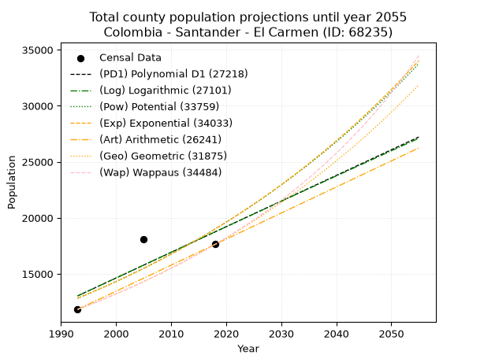
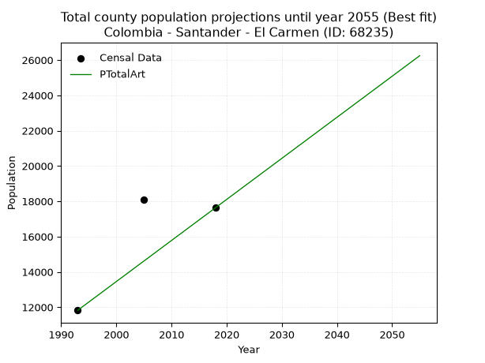
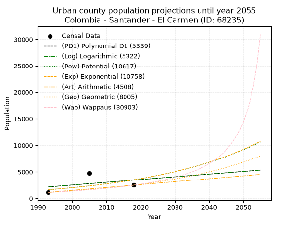
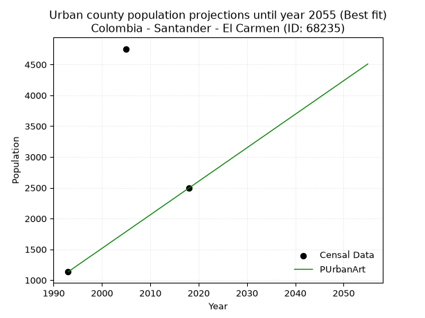
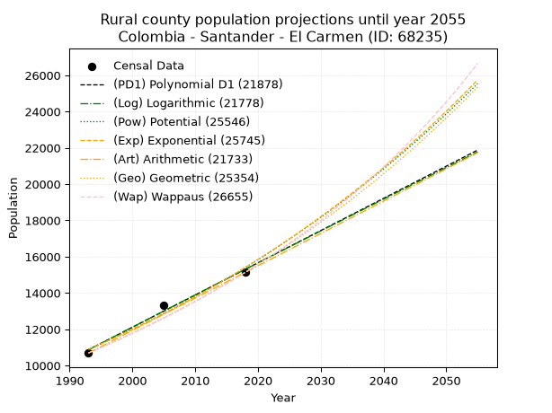
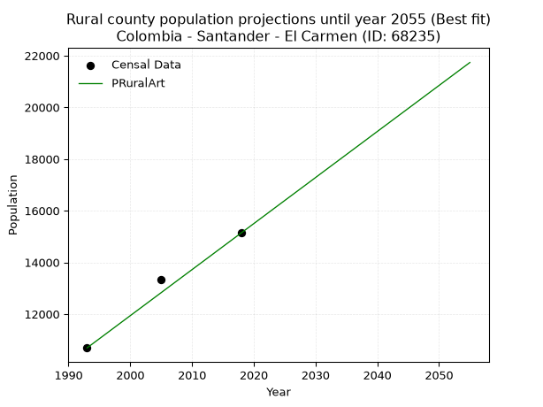

<div align="center">


</div>

# _“Population and Public Services Demand Projections (PPSD) until Year 2050 for Colombia - Santander - El Carmen (ID: 68235)”_
Keywords: `population` `public-service` `projection` `lineal` `polynomial` `logarithmic` `potential` `exponential` `arithmetic` `geometric` `wappaus` `dane` `colombia` `south-america`

PPSD are analytical estimates used by governments and planners to anticipate future changes in population size, age distribution, and the resulting community needs for utilities, healthcare, education, and infrastructure as sizing future water treatment facilities, electrical grids, and road networks based on spatial growth.

> **General running parameters**: • app_version: _v20260806_. • Python version: _3.14.7_. • Pandas version: _3.0.5_. • NumPy version: _2.5.1_. • Creates, save and include plots into reports (create_plot): _False_. • Projection until year: _2050_. • Process polynomial degree 2 and up: _False_. • Process Wappaus: _True_. • Process Wappaus: _True_. • Set negative values to zero: _True_. • Set infinite values to zero: _True_. • Drop dataset notes: _True_. 
<div align="center">

Dynamic map: [:earth_americas:Google](http://maps.google.com/maps?q=6.700038452,-73.5106596) [:earth_americas:OSM](https://www.openstreetmap.org/#map=18/6.700038452/-73.5106596&layers=P) [:earth_americas:Bing](https://www.bing.com/maps?cp=6.700038452~-73.5106596&lvl=18) [:earth_americas:Apple](https://maps.apple.com/frame?center=6.700038452%2C-73.5106596&span=0.003%2C0.006)

</div>


<div align="center">

```geojson
{
  "type": "Feature",
  "geometry": {
    "type": "Point", 
    "coordinates": [-73.5106596, 6.700038452]
  }, 
  "properties": {
    "Name": "Colombia - Santander - El Carmen (ID: 68235)"
  }
}
```

</div>


## 0. Census Data (3 records)

Census data are official statistics collected by a government about the people and housing in a country. They usually include counts of total population, age, sex, race, income, education, and jobs.

📅Global census file: [Population.xlsx](../data/Population.xlsx)

| Source   |   Year |   CountryID | CountryName   |   StateID | StateName   |   CountyID | CountyName           |   PTotal |   PUrban |   PRural |
|:---------|-------:|------------:|:--------------|----------:|:------------|-----------:|:---------------------|---------:|---------:|---------:|
| DANE     |   1993 |          57 | Colombia      |        68 | Santander   |      68235 | El Carmen            |    11825 |     1135 |    10690 |
| DANE     |   2005 |          57 | Colombia      |        68 | Santander   |      68235 | El Carmen de Chucurí |    18098 |     4754 |    13344 |
| DANE     |   2018 |          57 | Colombia      |        68 | Santander   |      68235 | El Carmen            |    17638 |     2495 |    15143 |

> 🔥Some records has specific notes about the registered values or the corresponding urban or rural distribution.

## 1. Total

### 1.1. Coefficients and Parameters

* (PD1) Polynomial Deg 1: 228.80703624733982, -442980.710021332 (lineal)
* (Log) Logarithmic: 459463.17173810565, -3477698.736728903
* (Pow) Potential: 31.6152070744521, -100.20684070991969
* (Exp) Exponential: 0.015744482175685432, 3.022332741590498e-10
* (Art) Arithmetic: Year diff. 2018 - 1993 = 25, Population diff. 17638 - 11825 = 5813, Annual growth = 232.52
* (Geo) Geometric: Year diff. 2018 - 1993 = 25, Population diff. 17638 - 11825 = 5813, Annual growth % = 0.016122171273420305
* (Wap) Wappaus: i = 1.5783864508027017, Condition values only valid for < 200)

<sub>
Wappaus condition values: ['0.00', '1.58', '3.16', '4.74', '6.31', '7.89', '9.47', '11.05', '12.63', '14.21', '15.78', '17.36', '18.94', '20.52', '22.10', '23.68', '25.25', '26.83', '28.41', '29.99', '31.57', '33.15', '34.72', '36.30', '37.88', '39.46', '41.04', '42.62', '44.19', '45.77', '47.35', '48.93', '50.51', '52.09', '53.67', '55.24', '56.82', '58.40', '59.98', '61.56', '63.14', '64.71', '66.29', '67.87', '69.45', '71.03', '72.61', '74.18', '75.76', '77.34', '78.92', '80.50', '82.08', '83.65', '85.23', '86.81', '88.39', '89.97']
</sub>


### 1.2. Projected Dataset

|   Year |   CountyID |   PTotalPD1 |   PTotalLog |   PTotalPow |   PTotalExp |   PTotalArt |   PTotalGeo |   PTotalWap |
|-------:|-----------:|------------:|------------:|------------:|------------:|------------:|------------:|------------:|
|   1993 |      68235 |       13032 |       13025 |       12816 |       12822 |       11825 |       11825 |       11825 |
|   1994 |      68235 |       13261 |       13256 |       13021 |       13026 |       12058 |       12016 |       12013 |
|   1995 |      68235 |       13489 |       13486 |       13229 |       13232 |       12290 |       12209 |       12204 |
|   1996 |      68235 |       13718 |       13716 |       13441 |       13442 |       12523 |       12406 |       12399 |
|   1997 |      68235 |       13947 |       13946 |       13655 |       13656 |       12755 |       12606 |       12596 |
|   1998 |      68235 |       14176 |       14176 |       13873 |       13872 |       12988 |       12809 |       12797 |
|   1999 |      68235 |       14405 |       14406 |       14094 |       14092 |       13220 |       13016 |       13001 |
|   2000 |      68235 |       14633 |       14636 |       14319 |       14316 |       13453 |       13226 |       13208 |
|   2001 |      68235 |       14862 |       14866 |       14547 |       14543 |       13685 |       13439 |       13419 |
|   2002 |      68235 |       15091 |       15095 |       14778 |       14774 |       13918 |       13656 |       13633 |
|   2003 |      68235 |       15320 |       15325 |       15014 |       15009 |       14150 |       13876 |       13851 |
|   2004 |      68235 |       15549 |       15554 |       15252 |       15247 |       14383 |       14100 |       14073 |
|   2005 |      68235 |       15777 |       15783 |       15495 |       15489 |       14615 |       14327 |       14299 |
|   2006 |      68235 |       16006 |       16012 |       15741 |       15734 |       14848 |       14558 |       14529 |
|   2007 |      68235 |       16235 |       16241 |       15991 |       15984 |       15080 |       14793 |       14763 |
|   2008 |      68235 |       16464 |       16470 |       16245 |       16238 |       15313 |       15031 |       15001 |
|   2009 |      68235 |       16693 |       16699 |       16503 |       16495 |       15545 |       15273 |       15243 |
|   2010 |      68235 |       16921 |       16928 |       16764 |       16757 |       15778 |       15520 |       15490 |
|   2011 |      68235 |       17150 |       17156 |       17030 |       17023 |       16010 |       15770 |       15741 |
|   2012 |      68235 |       17379 |       17385 |       17300 |       17293 |       16243 |       16024 |       15997 |
|   2013 |      68235 |       17608 |       17613 |       17574 |       17568 |       16475 |       16282 |       16258 |
|   2014 |      68235 |       17837 |       17841 |       17852 |       17847 |       16708 |       16545 |       16523 |
|   2015 |      68235 |       18065 |       18069 |       18134 |       18130 |       16940 |       16812 |       16794 |
|   2016 |      68235 |       18294 |       18297 |       18421 |       18417 |       17173 |       17083 |       17070 |
|   2017 |      68235 |       18523 |       18525 |       18712 |       18710 |       17405 |       17358 |       17351 |
|   2018 |      68235 |       18752 |       18753 |       19008 |       19007 |       17638 |       17638 |       17638 |
|   2019 |      68235 |       18981 |       18980 |       19308 |       19308 |       17871 |       17922 |       17931 |
|   2020 |      68235 |       19210 |       19208 |       19612 |       19615 |       18103 |       18211 |       18229 |
|   2021 |      68235 |       19438 |       19435 |       19922 |       19926 |       18336 |       18505 |       18533 |
|   2022 |      68235 |       19667 |       19663 |       20236 |       20242 |       18568 |       18803 |       18844 |
|   2023 |      68235 |       19896 |       19890 |       20554 |       20563 |       18801 |       19106 |       19161 |
|   2024 |      68235 |       20125 |       20117 |       20878 |       20890 |       19033 |       19414 |       19485 |
|   2025 |      68235 |       20354 |       20344 |       21207 |       21221 |       19266 |       19727 |       19816 |
|   2026 |      68235 |       20582 |       20571 |       21540 |       21558 |       19498 |       20045 |       20153 |
|   2027 |      68235 |       20811 |       20797 |       21879 |       21900 |       19731 |       20369 |       20498 |
|   2028 |      68235 |       21040 |       21024 |       22223 |       22248 |       19963 |       20697 |       20851 |
|   2029 |      68235 |       21269 |       21250 |       22572 |       22601 |       20196 |       21031 |       21211 |
|   2030 |      68235 |       21498 |       21477 |       22926 |       22959 |       20428 |       21370 |       21579 |
|   2031 |      68235 |       21726 |       21703 |       23286 |       23324 |       20661 |       21714 |       21956 |
|   2032 |      68235 |       21955 |       21929 |       23651 |       23694 |       20893 |       22064 |       22341 |
|   2033 |      68235 |       22184 |       22155 |       24022 |       24070 |       21126 |       22420 |       22735 |
|   2034 |      68235 |       22413 |       22381 |       24398 |       24452 |       21358 |       22782 |       23138 |
|   2035 |      68235 |       22642 |       22607 |       24780 |       24840 |       21591 |       23149 |       23551 |
|   2036 |      68235 |       22870 |       22833 |       25168 |       25234 |       21823 |       23522 |       23973 |
|   2037 |      68235 |       23099 |       23058 |       25562 |       25634 |       22056 |       23901 |       24406 |
|   2038 |      68235 |       23328 |       23284 |       25962 |       26041 |       22288 |       24287 |       24849 |
|   2039 |      68235 |       23557 |       23509 |       26368 |       26454 |       22521 |       24678 |       25304 |
|   2040 |      68235 |       23786 |       23735 |       26779 |       26874 |       22753 |       25076 |       25770 |
|   2041 |      68235 |       24014 |       23960 |       27198 |       27301 |       22986 |       25480 |       26247 |
|   2042 |      68235 |       24243 |       24185 |       27622 |       27734 |       23218 |       25891 |       26737 |
|   2043 |      68235 |       24472 |       24410 |       28053 |       28174 |       23451 |       26309 |       27240 |
|   2044 |      68235 |       24701 |       24635 |       28490 |       28621 |       23684 |       26733 |       27756 |
|   2045 |      68235 |       24930 |       24859 |       28934 |       29075 |       23916 |       27164 |       28286 |
|   2046 |      68235 |       25158 |       25084 |       29385 |       29537 |       24149 |       27602 |       28830 |
|   2047 |      68235 |       25387 |       25308 |       29843 |       30005 |       24381 |       28047 |       29389 |
|   2048 |      68235 |       25616 |       25533 |       30307 |       30482 |       24614 |       28499 |       29964 |
|   2049 |      68235 |       25845 |       25757 |       30778 |       30965 |       24846 |       28958 |       30555 |
|   2050 |      68235 |       26074 |       25981 |       31257 |       31457 |       25079 |       29425 |       31163 |
<div align="center">

</img>

</div>


### 1.3. Best fit with absolute error and relative error (%)

Relative error puts that difference into context by dividing the absolute error by the true value, creating a unitless ratio or percentage that shows the scale of the mistake.

Absolute and relative error

|   Year | Source   |   CountryID | CountryName   |   StateID | StateName   |   CountyID_x | CountyName           |   PTotal |   PUrban |   PRural |   CountyID_y |   PTotalPD1 |   PTotalLog |   PTotalPow |   PTotalExp |   PTotalArt |   PTotalGeo |   PTotalWap |   PTotalPD1AbsError |   PTotalLogAbsError |   PTotalPowAbsError |   PTotalExpAbsError |   PTotalArtAbsError |   PTotalGeoAbsError |   PTotalWapAbsError |   PTotalPD1RelError |   PTotalLogRelError |   PTotalPowRelError |   PTotalExpRelError |   PTotalArtRelError |   PTotalGeoRelError |   PTotalWapRelError |
|-------:|:---------|------------:|:--------------|----------:|:------------|-------------:|:---------------------|---------:|---------:|---------:|-------------:|------------:|------------:|------------:|------------:|------------:|------------:|------------:|--------------------:|--------------------:|--------------------:|--------------------:|--------------------:|--------------------:|--------------------:|--------------------:|--------------------:|--------------------:|--------------------:|--------------------:|--------------------:|--------------------:|
|   1993 | DANE     |          57 | Colombia      |        68 | Santander   |        68235 | El Carmen            |    11825 |     1135 |    10690 |        68235 |       13032 |       13025 |       12816 |       12822 |       11825 |       11825 |       11825 |                1207 |                1200 |                 991 |                 997 |                   0 |                   0 |                   0 |            10.2072  |            10.148   |             8.38055 |             8.43129 |              0      |              0      |              0      |
|   2005 | DANE     |          57 | Colombia      |        68 | Santander   |        68235 | El Carmen de Chucurí |    18098 |     4754 |    13344 |        68235 |       15777 |       15783 |       15495 |       15489 |       14615 |       14327 |       14299 |                2321 |                2315 |                2603 |                2609 |                3483 |                3771 |                3799 |            12.8246  |            12.7915  |            14.3828  |            14.416   |             19.2452 |             20.8366 |             20.9913 |
|   2018 | DANE     |          57 | Colombia      |        68 | Santander   |        68235 | El Carmen            |    17638 |     2495 |    15143 |        68235 |       18752 |       18753 |       19008 |       19007 |       17638 |       17638 |       17638 |                1114 |                1115 |                1370 |                1369 |                   0 |                   0 |                   0 |             6.31591 |             6.32158 |             7.76732 |             7.76165 |              0      |              0      |              0      |

Relative error mean

| Method    |   RelError | Best   |
|:----------|-----------:|:-------|
| PTotalPD1 |    9.78257 |        |
| PTotalLog |    9.75368 |        |
| PTotalPow |   10.1769  |        |
| PTotalExp |   10.203   |        |
| PTotalArt |    6.41507 | True   |
| PTotalGeo |    6.94552 |        |
| PTotalWap |    6.99709 |        |

💙Best method: _**PTotalArt**_
<div align="center">

</img>

</div>


### 1.4. Fresh water supply demand in liters per capita per day (lpcd)

The fresh water supply demand typically ranges from 100 to 300 liters per capita per day (lpcd) for standard domestic and municipal planning, though absolute survival minimums set by the World Health Organization are as low as 7.5 to 20 liters per day, and total consumption in high-income nations can exceed 400 liters.

> `CZ`: Level in meters above the sea level (masl).<br> `WS`: Fresh water supply demand in liters per capita per day (lpcd or l/h/d).<br> `WSAll`: Zonal fresh water supply demand in liters per second (l/s).<br> `A`: Zonal area in square meters.

Reference values (RAS Colombia)

|    CZ |   WS |
|------:|-----:|
|  1000 |  120 |
|  2000 |  130 |
| 99999 |  140 |

County shapefile geometry properties and water supply values

|   CountyID |     ATotal |   CZTotal |   WSTotal |
|-----------:|-----------:|----------:|----------:|
|      68235 | 9.2257e+08 |   895.326 |       120 |

Projected values for best method: PTotalArt

|   CountyID |   Year |   PTotalArt |   WSTotal |   WSTotalAll |
|-----------:|-------:|------------:|----------:|-------------:|
|      68235 |   1993 |       11825 |       120 |      16.4236 |
|      68235 |   1994 |       12058 |       120 |      16.7472 |
|      68235 |   1995 |       12290 |       120 |      17.0694 |
|      68235 |   1996 |       12523 |       120 |      17.3931 |
|      68235 |   1997 |       12755 |       120 |      17.7153 |
|      68235 |   1998 |       12988 |       120 |      18.0389 |
|      68235 |   1999 |       13220 |       120 |      18.3611 |
|      68235 |   2000 |       13453 |       120 |      18.6847 |
|      68235 |   2001 |       13685 |       120 |      19.0069 |
|      68235 |   2002 |       13918 |       120 |      19.3306 |
|      68235 |   2003 |       14150 |       120 |      19.6528 |
|      68235 |   2004 |       14383 |       120 |      19.9764 |
|      68235 |   2005 |       14615 |       120 |      20.2986 |
|      68235 |   2006 |       14848 |       120 |      20.6222 |
|      68235 |   2007 |       15080 |       120 |      20.9444 |
|      68235 |   2008 |       15313 |       120 |      21.2681 |
|      68235 |   2009 |       15545 |       120 |      21.5903 |
|      68235 |   2010 |       15778 |       120 |      21.9139 |
|      68235 |   2011 |       16010 |       120 |      22.2361 |
|      68235 |   2012 |       16243 |       120 |      22.5597 |
|      68235 |   2013 |       16475 |       120 |      22.8819 |
|      68235 |   2014 |       16708 |       120 |      23.2056 |
|      68235 |   2015 |       16940 |       120 |      23.5278 |
|      68235 |   2016 |       17173 |       120 |      23.8514 |
|      68235 |   2017 |       17405 |       120 |      24.1736 |
|      68235 |   2018 |       17638 |       120 |      24.4972 |
|      68235 |   2019 |       17871 |       120 |      24.8208 |
|      68235 |   2020 |       18103 |       120 |      25.1431 |
|      68235 |   2021 |       18336 |       120 |      25.4667 |
|      68235 |   2022 |       18568 |       120 |      25.7889 |
|      68235 |   2023 |       18801 |       120 |      26.1125 |
|      68235 |   2024 |       19033 |       120 |      26.4347 |
|      68235 |   2025 |       19266 |       120 |      26.7583 |
|      68235 |   2026 |       19498 |       120 |      27.0806 |
|      68235 |   2027 |       19731 |       120 |      27.4042 |
|      68235 |   2028 |       19963 |       120 |      27.7264 |
|      68235 |   2029 |       20196 |       120 |      28.05   |
|      68235 |   2030 |       20428 |       120 |      28.3722 |
|      68235 |   2031 |       20661 |       120 |      28.6958 |
|      68235 |   2032 |       20893 |       120 |      29.0181 |
|      68235 |   2033 |       21126 |       120 |      29.3417 |
|      68235 |   2034 |       21358 |       120 |      29.6639 |
|      68235 |   2035 |       21591 |       120 |      29.9875 |
|      68235 |   2036 |       21823 |       120 |      30.3097 |
|      68235 |   2037 |       22056 |       120 |      30.6333 |
|      68235 |   2038 |       22288 |       120 |      30.9556 |
|      68235 |   2039 |       22521 |       120 |      31.2792 |
|      68235 |   2040 |       22753 |       120 |      31.6014 |
|      68235 |   2041 |       22986 |       120 |      31.925  |
|      68235 |   2042 |       23218 |       120 |      32.2472 |
|      68235 |   2043 |       23451 |       120 |      32.5708 |
|      68235 |   2044 |       23684 |       120 |      32.8944 |
|      68235 |   2045 |       23916 |       120 |      33.2167 |
|      68235 |   2046 |       24149 |       120 |      33.5403 |
|      68235 |   2047 |       24381 |       120 |      33.8625 |
|      68235 |   2048 |       24614 |       120 |      34.1861 |
|      68235 |   2049 |       24846 |       120 |      34.5083 |
|      68235 |   2050 |       25079 |       120 |      34.8319 |

## 2. Urban

### 2.1. Coefficients and Parameters

* (PD1) Polynomial Deg 1: 51.23773987206911, -99954.0810234559 (lineal)
* (Log) Logarithmic: 103253.05451597804, -782295.3665511416
* (Pow) Potential: 61.10848798259398, -198.4149094496863
* (Exp) Exponential: 0.03038227852479775, 8.24690153925801e-24
* (Art) Arithmetic: Year diff. 2018 - 1993 = 25, Population diff. 2495 - 1135 = 1360, Annual growth = 54.4
* (Geo) Geometric: Year diff. 2018 - 1993 = 25, Population diff. 2495 - 1135 = 1360, Annual growth % = 0.032007818535336297
* (Wap) Wappaus: i = 2.997245179063361, Condition values only valid for < 200)

<sub>
Wappaus condition values: ['0.00', '3.00', '5.99', '8.99', '11.99', '14.99', '17.98', '20.98', '23.98', '26.98', '29.97', '32.97', '35.97', '38.96', '41.96', '44.96', '47.96', '50.95', '53.95', '56.95', '59.94', '62.94', '65.94', '68.94', '71.93', '74.93', '77.93', '80.93', '83.92', '86.92', '89.92', '92.91', '95.91', '98.91', '101.91', '104.90', '107.90', '110.90', '113.90', '116.89', '119.89', '122.89', '125.88', '128.88', '131.88', '134.88', '137.87', '140.87', '143.87', '146.87', '149.86', '152.86', '155.86', '158.85', '161.85', '164.85', '167.85', '170.84']
</sub>


### 2.2. Projected Dataset

|   Year |   CountyID |   PUrbanPD1 |   PUrbanLog |   PUrbanPow |   PUrbanExp |   PUrbanArt |   PUrbanGeo |   PUrbanWap |
|-------:|-----------:|------------:|------------:|------------:|------------:|------------:|------------:|------------:|
|   1993 |      68235 |        2163 |        2159 |        1633 |        1635 |        1135 |        1135 |        1135 |
|   1994 |      68235 |        2214 |        2211 |        1684 |        1686 |        1189 |        1171 |        1170 |
|   1995 |      68235 |        2265 |        2263 |        1736 |        1738 |        1244 |        1209 |        1205 |
|   1996 |      68235 |        2316 |        2314 |        1790 |        1792 |        1298 |        1248 |        1242 |
|   1997 |      68235 |        2368 |        2366 |        1846 |        1847 |        1353 |        1287 |        1280 |
|   1998 |      68235 |        2419 |        2418 |        1903 |        1904 |        1407 |        1329 |        1319 |
|   1999 |      68235 |        2470 |        2469 |        1962 |        1962 |        1461 |        1371 |        1359 |
|   2000 |      68235 |        2521 |        2521 |        2023 |        2023 |        1516 |        1415 |        1401 |
|   2001 |      68235 |        2573 |        2573 |        2086 |        2085 |        1570 |        1460 |        1444 |
|   2002 |      68235 |        2624 |        2624 |        2151 |        2150 |        1625 |        1507 |        1489 |
|   2003 |      68235 |        2675 |        2676 |        2217 |        2216 |        1679 |        1555 |        1535 |
|   2004 |      68235 |        2726 |        2727 |        2286 |        2284 |        1733 |        1605 |        1583 |
|   2005 |      68235 |        2778 |        2779 |        2357 |        2355 |        1788 |        1657 |        1633 |
|   2006 |      68235 |        2829 |        2830 |        2430 |        2428 |        1842 |        1710 |        1684 |
|   2007 |      68235 |        2880 |        2882 |        2505 |        2502 |        1897 |        1764 |        1738 |
|   2008 |      68235 |        2931 |        2933 |        2582 |        2580 |        1951 |        1821 |        1793 |
|   2009 |      68235 |        2983 |        2985 |        2662 |        2659 |        2005 |        1879 |        1851 |
|   2010 |      68235 |        3034 |        3036 |        2744 |        2741 |        2060 |        1939 |        1911 |
|   2011 |      68235 |        3085 |        3087 |        2829 |        2826 |        2114 |        2001 |        1974 |
|   2012 |      68235 |        3136 |        3139 |        2916 |        2913 |        2169 |        2065 |        2039 |
|   2013 |      68235 |        3187 |        3190 |        3006 |        3003 |        2223 |        2131 |        2107 |
|   2014 |      68235 |        3239 |        3241 |        3099 |        3095 |        2277 |        2200 |        2177 |
|   2015 |      68235 |        3290 |        3293 |        3194 |        3191 |        2332 |        2270 |        2252 |
|   2016 |      68235 |        3341 |        3344 |        3292 |        3289 |        2386 |        2343 |        2329 |
|   2017 |      68235 |        3392 |        3395 |        3394 |        3391 |        2441 |        2418 |        2410 |
|   2018 |      68235 |        3444 |        3446 |        3498 |        3496 |        2495 |        2495 |        2495 |
|   2019 |      68235 |        3495 |        3497 |        3606 |        3603 |        2549 |        2575 |        2584 |
|   2020 |      68235 |        3546 |        3548 |        3716 |        3714 |        2604 |        2657 |        2678 |
|   2021 |      68235 |        3597 |        3600 |        3830 |        3829 |        2658 |        2742 |        2776 |
|   2022 |      68235 |        3649 |        3651 |        3948 |        3947 |        2713 |        2830 |        2880 |
|   2023 |      68235 |        3700 |        3702 |        4069 |        4069 |        2767 |        2921 |        2989 |
|   2024 |      68235 |        3751 |        3753 |        4194 |        4194 |        2821 |        3014 |        3105 |
|   2025 |      68235 |        3802 |        3804 |        4322 |        4324 |        2876 |        3111 |        3227 |
|   2026 |      68235 |        3854 |        3855 |        4455 |        4457 |        2930 |        3210 |        3356 |
|   2027 |      68235 |        3905 |        3906 |        4591 |        4595 |        2985 |        3313 |        3493 |
|   2028 |      68235 |        3956 |        3957 |        4732 |        4737 |        3039 |        3419 |        3639 |
|   2029 |      68235 |        4007 |        4007 |        4876 |        4883 |        3093 |        3528 |        3794 |
|   2030 |      68235 |        4059 |        4058 |        5025 |        5033 |        3148 |        3641 |        3960 |
|   2031 |      68235 |        4110 |        4109 |        5179 |        5189 |        3202 |        3758 |        4138 |
|   2032 |      68235 |        4161 |        4160 |        5337 |        5349 |        3257 |        3878 |        4328 |
|   2033 |      68235 |        4212 |        4211 |        5500 |        5514 |        3311 |        4002 |        4532 |
|   2034 |      68235 |        4263 |        4262 |        5668 |        5684 |        3365 |        4130 |        4752 |
|   2035 |      68235 |        4315 |        4312 |        5841 |        5859 |        3420 |        4263 |        4991 |
|   2036 |      68235 |        4366 |        4363 |        6019 |        6040 |        3474 |        4399 |        5249 |
|   2037 |      68235 |        4417 |        4414 |        6202 |        6226 |        3529 |        4540 |        5530 |
|   2038 |      68235 |        4468 |        4464 |        6391 |        6418 |        3583 |        4685 |        5836 |
|   2039 |      68235 |        4520 |        4515 |        6585 |        6616 |        3637 |        4835 |        6173 |
|   2040 |      68235 |        4571 |        4566 |        6786 |        6820 |        3692 |        4990 |        6543 |
|   2041 |      68235 |        4622 |        4616 |        6992 |        7031 |        3746 |        5150 |        6953 |
|   2042 |      68235 |        4673 |        4667 |        7204 |        7247 |        3801 |        5314 |        7409 |
|   2043 |      68235 |        4725 |        4717 |        7423 |        7471 |        3855 |        5485 |        7920 |
|   2044 |      68235 |        4776 |        4768 |        7648 |        7702 |        3909 |        5660 |        8496 |
|   2045 |      68235 |        4827 |        4818 |        7880 |        7939 |        3964 |        5841 |        9150 |
|   2046 |      68235 |        4878 |        4869 |        8119 |        8184 |        4018 |        6028 |        9899 |
|   2047 |      68235 |        4930 |        4919 |        8366 |        8436 |        4073 |        6221 |       10766 |
|   2048 |      68235 |        4981 |        4970 |        8619 |        8697 |        4127 |        6420 |       11781 |
|   2049 |      68235 |        5032 |        5020 |        8880 |        8965 |        4181 |        6626 |       12984 |
|   2050 |      68235 |        5083 |        5071 |        9149 |        9242 |        4236 |        6838 |       14436 |
<div align="center">

</img>

</div>


### 2.3. Best fit with absolute error and relative error (%)

Relative error puts that difference into context by dividing the absolute error by the true value, creating a unitless ratio or percentage that shows the scale of the mistake.

Absolute and relative error

|   Year | Source   |   CountryID | CountryName   |   StateID | StateName   |   CountyID_x | CountyName           |   PTotal |   PUrban |   PRural |   CountyID_y |   PUrbanPD1 |   PUrbanLog |   PUrbanPow |   PUrbanExp |   PUrbanArt |   PUrbanGeo |   PUrbanWap |   PUrbanPD1AbsError |   PUrbanLogAbsError |   PUrbanPowAbsError |   PUrbanExpAbsError |   PUrbanArtAbsError |   PUrbanGeoAbsError |   PUrbanWapAbsError |   PUrbanPD1RelError |   PUrbanLogRelError |   PUrbanPowRelError |   PUrbanExpRelError |   PUrbanArtRelError |   PUrbanGeoRelError |   PUrbanWapRelError |
|-------:|:---------|------------:|:--------------|----------:|:------------|-------------:|:---------------------|---------:|---------:|---------:|-------------:|------------:|------------:|------------:|------------:|------------:|------------:|------------:|--------------------:|--------------------:|--------------------:|--------------------:|--------------------:|--------------------:|--------------------:|--------------------:|--------------------:|--------------------:|--------------------:|--------------------:|--------------------:|--------------------:|
|   1993 | DANE     |          57 | Colombia      |        68 | Santander   |        68235 | El Carmen            |    11825 |     1135 |    10690 |        68235 |        2163 |        2159 |        1633 |        1635 |        1135 |        1135 |        1135 |                1028 |                1024 |                 498 |                 500 |                   0 |                   0 |                   0 |             90.5727 |             90.2203 |             43.8767 |             44.0529 |              0      |              0      |                0    |
|   2005 | DANE     |          57 | Colombia      |        68 | Santander   |        68235 | El Carmen de Chucurí |    18098 |     4754 |    13344 |        68235 |        2778 |        2779 |        2357 |        2355 |        1788 |        1657 |        1633 |                1976 |                1975 |                2397 |                2399 |                2966 |                3097 |                3121 |             41.565  |             41.544  |             50.4207 |             50.4628 |             62.3896 |             65.1451 |               65.65 |
|   2018 | DANE     |          57 | Colombia      |        68 | Santander   |        68235 | El Carmen            |    17638 |     2495 |    15143 |        68235 |        3444 |        3446 |        3498 |        3496 |        2495 |        2495 |        2495 |                 949 |                 951 |                1003 |                1001 |                   0 |                   0 |                   0 |             38.0361 |             38.1162 |             40.2004 |             40.1202 |              0      |              0      |                0    |

Relative error mean

| Method    |   RelError | Best   |
|:----------|-----------:|:-------|
| PUrbanPD1 |    56.7246 |        |
| PUrbanLog |    56.6268 |        |
| PUrbanPow |    44.8326 |        |
| PUrbanExp |    44.8786 |        |
| PUrbanArt |    20.7965 | True   |
| PUrbanGeo |    21.715  |        |
| PUrbanWap |    21.8833 |        |

💙Best method: _**PUrbanArt**_
<div align="center">

</img>

</div>


### 2.4. Fresh water supply demand in liters per capita per day (lpcd)

The fresh water supply demand typically ranges from 100 to 300 liters per capita per day (lpcd) for standard domestic and municipal planning, though absolute survival minimums set by the World Health Organization are as low as 7.5 to 20 liters per day, and total consumption in high-income nations can exceed 400 liters.

> `CZ`: Level in meters above the sea level (masl).<br> `WS`: Fresh water supply demand in liters per capita per day (lpcd or l/h/d).<br> `WSAll`: Zonal fresh water supply demand in liters per second (l/s).<br> `A`: Zonal area in square meters.

Reference values (RAS Colombia)

|    CZ |   WS |
|------:|-----:|
|  1000 |  120 |
|  2000 |  130 |
| 99999 |  140 |

County shapefile geometry properties and water supply values

|   CountyID |   AUrban |   CZUrban |   WSUrban |
|-----------:|---------:|----------:|----------:|
|      68235 |   275447 |   761.915 |       120 |

Projected values for best method: PUrbanArt

|   CountyID |   Year |   PUrbanArt |   WSUrban |   WSUrbanAll |
|-----------:|-------:|------------:|----------:|-------------:|
|      68235 |   1993 |        1135 |       120 |      1.57639 |
|      68235 |   1994 |        1189 |       120 |      1.65139 |
|      68235 |   1995 |        1244 |       120 |      1.72778 |
|      68235 |   1996 |        1298 |       120 |      1.80278 |
|      68235 |   1997 |        1353 |       120 |      1.87917 |
|      68235 |   1998 |        1407 |       120 |      1.95417 |
|      68235 |   1999 |        1461 |       120 |      2.02917 |
|      68235 |   2000 |        1516 |       120 |      2.10556 |
|      68235 |   2001 |        1570 |       120 |      2.18056 |
|      68235 |   2002 |        1625 |       120 |      2.25694 |
|      68235 |   2003 |        1679 |       120 |      2.33194 |
|      68235 |   2004 |        1733 |       120 |      2.40694 |
|      68235 |   2005 |        1788 |       120 |      2.48333 |
|      68235 |   2006 |        1842 |       120 |      2.55833 |
|      68235 |   2007 |        1897 |       120 |      2.63472 |
|      68235 |   2008 |        1951 |       120 |      2.70972 |
|      68235 |   2009 |        2005 |       120 |      2.78472 |
|      68235 |   2010 |        2060 |       120 |      2.86111 |
|      68235 |   2011 |        2114 |       120 |      2.93611 |
|      68235 |   2012 |        2169 |       120 |      3.0125  |
|      68235 |   2013 |        2223 |       120 |      3.0875  |
|      68235 |   2014 |        2277 |       120 |      3.1625  |
|      68235 |   2015 |        2332 |       120 |      3.23889 |
|      68235 |   2016 |        2386 |       120 |      3.31389 |
|      68235 |   2017 |        2441 |       120 |      3.39028 |
|      68235 |   2018 |        2495 |       120 |      3.46528 |
|      68235 |   2019 |        2549 |       120 |      3.54028 |
|      68235 |   2020 |        2604 |       120 |      3.61667 |
|      68235 |   2021 |        2658 |       120 |      3.69167 |
|      68235 |   2022 |        2713 |       120 |      3.76806 |
|      68235 |   2023 |        2767 |       120 |      3.84306 |
|      68235 |   2024 |        2821 |       120 |      3.91806 |
|      68235 |   2025 |        2876 |       120 |      3.99444 |
|      68235 |   2026 |        2930 |       120 |      4.06944 |
|      68235 |   2027 |        2985 |       120 |      4.14583 |
|      68235 |   2028 |        3039 |       120 |      4.22083 |
|      68235 |   2029 |        3093 |       120 |      4.29583 |
|      68235 |   2030 |        3148 |       120 |      4.37222 |
|      68235 |   2031 |        3202 |       120 |      4.44722 |
|      68235 |   2032 |        3257 |       120 |      4.52361 |
|      68235 |   2033 |        3311 |       120 |      4.59861 |
|      68235 |   2034 |        3365 |       120 |      4.67361 |
|      68235 |   2035 |        3420 |       120 |      4.75    |
|      68235 |   2036 |        3474 |       120 |      4.825   |
|      68235 |   2037 |        3529 |       120 |      4.90139 |
|      68235 |   2038 |        3583 |       120 |      4.97639 |
|      68235 |   2039 |        3637 |       120 |      5.05139 |
|      68235 |   2040 |        3692 |       120 |      5.12778 |
|      68235 |   2041 |        3746 |       120 |      5.20278 |
|      68235 |   2042 |        3801 |       120 |      5.27917 |
|      68235 |   2043 |        3855 |       120 |      5.35417 |
|      68235 |   2044 |        3909 |       120 |      5.42917 |
|      68235 |   2045 |        3964 |       120 |      5.50556 |
|      68235 |   2046 |        4018 |       120 |      5.58056 |
|      68235 |   2047 |        4073 |       120 |      5.65694 |
|      68235 |   2048 |        4127 |       120 |      5.73194 |
|      68235 |   2049 |        4181 |       120 |      5.80694 |
|      68235 |   2050 |        4236 |       120 |      5.88333 |

## 3. Rural

### 3.1. Coefficients and Parameters

* (PD1) Polynomial Deg 1: 177.56929637527068, -343026.6289978761 (lineal)
* (Log) Logarithmic: 356210.1172221278, -2695403.3701777635
* (Pow) Potential: 27.82801088860612, -87.78163543038129
* (Exp) Exponential: 0.0138709687942944, 1.0744668488393494e-08
* (Art) Arithmetic: Year diff. 2018 - 1993 = 25, Population diff. 15143 - 10690 = 4453, Annual growth = 178.12
* (Geo) Geometric: Year diff. 2018 - 1993 = 25, Population diff. 15143 - 10690 = 4453, Annual growth % = 0.014026649272533387
* (Wap) Wappaus: i = 1.3790113420818333, Condition values only valid for < 200)

<sub>
Wappaus condition values: ['0.00', '1.38', '2.76', '4.14', '5.52', '6.90', '8.27', '9.65', '11.03', '12.41', '13.79', '15.17', '16.55', '17.93', '19.31', '20.69', '22.06', '23.44', '24.82', '26.20', '27.58', '28.96', '30.34', '31.72', '33.10', '34.48', '35.85', '37.23', '38.61', '39.99', '41.37', '42.75', '44.13', '45.51', '46.89', '48.27', '49.64', '51.02', '52.40', '53.78', '55.16', '56.54', '57.92', '59.30', '60.68', '62.06', '63.43', '64.81', '66.19', '67.57', '68.95', '70.33', '71.71', '73.09', '74.47', '75.85', '77.22', '78.60']
</sub>


### 3.2. Projected Dataset

|   Year |   CountyID |   PRuralPD1 |   PRuralLog |   PRuralPow |   PRuralExp |   PRuralArt |   PRuralGeo |   PRuralWap |
|-------:|-----------:|------------:|------------:|------------:|------------:|------------:|------------:|------------:|
|   1993 |      68235 |       10869 |       10866 |       10892 |       10894 |       10690 |       10690 |       10690 |
|   1994 |      68235 |       11047 |       11045 |       11045 |       11046 |       10868 |       10840 |       10838 |
|   1995 |      68235 |       11224 |       11223 |       11200 |       11201 |       11046 |       10992 |       10989 |
|   1996 |      68235 |       11402 |       11402 |       11357 |       11357 |       11224 |       11146 |       11142 |
|   1997 |      68235 |       11579 |       11580 |       11517 |       11516 |       11402 |       11303 |       11296 |
|   1998 |      68235 |       11757 |       11759 |       11678 |       11677 |       11581 |       11461 |       11453 |
|   1999 |      68235 |       11934 |       11937 |       11842 |       11840 |       11759 |       11622 |       11613 |
|   2000 |      68235 |       12112 |       12115 |       12008 |       12005 |       11937 |       11785 |       11774 |
|   2001 |      68235 |       12290 |       12293 |       12176 |       12173 |       12115 |       11950 |       11938 |
|   2002 |      68235 |       12467 |       12471 |       12346 |       12343 |       12293 |       12118 |       12105 |
|   2003 |      68235 |       12645 |       12649 |       12519 |       12515 |       12471 |       12288 |       12273 |
|   2004 |      68235 |       12822 |       12827 |       12694 |       12690 |       12649 |       12460 |       12445 |
|   2005 |      68235 |       13000 |       13004 |       12872 |       12867 |       12827 |       12635 |       12619 |
|   2006 |      68235 |       13177 |       13182 |       13052 |       13047 |       13006 |       12812 |       12795 |
|   2007 |      68235 |       13355 |       13360 |       13234 |       13229 |       13184 |       12992 |       12974 |
|   2008 |      68235 |       13533 |       13537 |       13419 |       13414 |       13362 |       13174 |       13156 |
|   2009 |      68235 |       13710 |       13714 |       13606 |       13601 |       13540 |       13359 |       13341 |
|   2010 |      68235 |       13888 |       13892 |       13796 |       13791 |       13718 |       13546 |       13529 |
|   2011 |      68235 |       14065 |       14069 |       13988 |       13984 |       13896 |       13736 |       13719 |
|   2012 |      68235 |       14243 |       14246 |       14183 |       14179 |       14074 |       13929 |       13913 |
|   2013 |      68235 |       14420 |       14423 |       14380 |       14377 |       14252 |       14124 |       14110 |
|   2014 |      68235 |       14598 |       14600 |       14580 |       14578 |       14431 |       14322 |       14310 |
|   2015 |      68235 |       14776 |       14777 |       14783 |       14782 |       14609 |       14523 |       14513 |
|   2016 |      68235 |       14953 |       14953 |       14989 |       14988 |       14787 |       14727 |       14720 |
|   2017 |      68235 |       15131 |       15130 |       15197 |       15198 |       14965 |       14934 |       14930 |
|   2018 |      68235 |       15308 |       15307 |       15408 |       15410 |       15143 |       15143 |       15143 |
|   2019 |      68235 |       15486 |       15483 |       15622 |       15625 |       15321 |       15355 |       15360 |
|   2020 |      68235 |       15663 |       15659 |       15839 |       15843 |       15499 |       15571 |       15581 |
|   2021 |      68235 |       15841 |       15836 |       16058 |       16065 |       15677 |       15789 |       15805 |
|   2022 |      68235 |       16018 |       16012 |       16281 |       16289 |       15855 |       16011 |       16034 |
|   2023 |      68235 |       16196 |       16188 |       16506 |       16516 |       16034 |       16235 |       16266 |
|   2024 |      68235 |       16374 |       16364 |       16735 |       16747 |       16212 |       16463 |       16502 |
|   2025 |      68235 |       16551 |       16540 |       16967 |       16981 |       16390 |       16694 |       16743 |
|   2026 |      68235 |       16729 |       16716 |       17201 |       17218 |       16568 |       16928 |       16988 |
|   2027 |      68235 |       16906 |       16892 |       17439 |       17459 |       16746 |       17165 |       17237 |
|   2028 |      68235 |       17084 |       17067 |       17680 |       17703 |       16924 |       17406 |       17491 |
|   2029 |      68235 |       17261 |       17243 |       17924 |       17950 |       17102 |       17650 |       17749 |
|   2030 |      68235 |       17439 |       17418 |       18172 |       18201 |       17280 |       17898 |       18012 |
|   2031 |      68235 |       17617 |       17594 |       18423 |       18455 |       17459 |       18149 |       18281 |
|   2032 |      68235 |       17794 |       17769 |       18677 |       18713 |       17637 |       18404 |       18554 |
|   2033 |      68235 |       17972 |       17944 |       18934 |       18974 |       17815 |       18662 |       18832 |
|   2034 |      68235 |       18149 |       18120 |       19195 |       19239 |       17993 |       18924 |       19116 |
|   2035 |      68235 |       18327 |       18295 |       19459 |       19508 |       18171 |       19189 |       19405 |
|   2036 |      68235 |       18504 |       18470 |       19727 |       19780 |       18349 |       19458 |       19700 |
|   2037 |      68235 |       18682 |       18645 |       19999 |       20056 |       18527 |       19731 |       20001 |
|   2038 |      68235 |       18860 |       18819 |       20274 |       20337 |       18705 |       20008 |       20308 |
|   2039 |      68235 |       19037 |       18994 |       20552 |       20621 |       18884 |       20288 |       20621 |
|   2040 |      68235 |       19215 |       19169 |       20835 |       20909 |       19062 |       20573 |       20940 |
|   2041 |      68235 |       19392 |       19343 |       21121 |       21201 |       19240 |       20862 |       21266 |
|   2042 |      68235 |       19570 |       19518 |       21411 |       21497 |       19418 |       21154 |       21599 |
|   2043 |      68235 |       19747 |       19692 |       21704 |       21797 |       19596 |       21451 |       21939 |
|   2044 |      68235 |       19925 |       19867 |       22002 |       22102 |       19774 |       21752 |       22286 |
|   2045 |      68235 |       20103 |       20041 |       22304 |       22410 |       19952 |       22057 |       22640 |
|   2046 |      68235 |       20280 |       20215 |       22609 |       22723 |       20130 |       22366 |       23003 |
|   2047 |      68235 |       20458 |       20389 |       22919 |       23041 |       20308 |       22680 |       23373 |
|   2048 |      68235 |       20635 |       20563 |       23232 |       23363 |       20487 |       22998 |       23751 |
|   2049 |      68235 |       20813 |       20737 |       23550 |       23689 |       20665 |       23321 |       24138 |
|   2050 |      68235 |       20990 |       20911 |       23872 |       24020 |       20843 |       23648 |       24533 |
<div align="center">

</img>

</div>


### 3.3. Best fit with absolute error and relative error (%)

Relative error puts that difference into context by dividing the absolute error by the true value, creating a unitless ratio or percentage that shows the scale of the mistake.

Absolute and relative error

|   Year | Source   |   CountryID | CountryName   |   StateID | StateName   |   CountyID_x | CountyName           |   PTotal |   PUrban |   PRural |   CountyID_y |   PRuralPD1 |   PRuralLog |   PRuralPow |   PRuralExp |   PRuralArt |   PRuralGeo |   PRuralWap |   PRuralPD1AbsError |   PRuralLogAbsError |   PRuralPowAbsError |   PRuralExpAbsError |   PRuralArtAbsError |   PRuralGeoAbsError |   PRuralWapAbsError |   PRuralPD1RelError |   PRuralLogRelError |   PRuralPowRelError |   PRuralExpRelError |   PRuralArtRelError |   PRuralGeoRelError |   PRuralWapRelError |
|-------:|:---------|------------:|:--------------|----------:|:------------|-------------:|:---------------------|---------:|---------:|---------:|-------------:|------------:|------------:|------------:|------------:|------------:|------------:|------------:|--------------------:|--------------------:|--------------------:|--------------------:|--------------------:|--------------------:|--------------------:|--------------------:|--------------------:|--------------------:|--------------------:|--------------------:|--------------------:|--------------------:|
|   1993 | DANE     |          57 | Colombia      |        68 | Santander   |        68235 | El Carmen            |    11825 |     1135 |    10690 |        68235 |       10869 |       10866 |       10892 |       10894 |       10690 |       10690 |       10690 |                 179 |                 176 |                 202 |                 204 |                   0 |                   0 |                   0 |             1.67446 |             1.6464  |             1.88962 |             1.90833 |              0      |             0       |             0       |
|   2005 | DANE     |          57 | Colombia      |        68 | Santander   |        68235 | El Carmen de Chucurí |    18098 |     4754 |    13344 |        68235 |       13000 |       13004 |       12872 |       12867 |       12827 |       12635 |       12619 |                 344 |                 340 |                 472 |                 477 |                 517 |                 709 |                 725 |             2.57794 |             2.54796 |             3.53717 |             3.57464 |              3.8744 |             5.31325 |             5.43315 |
|   2018 | DANE     |          57 | Colombia      |        68 | Santander   |        68235 | El Carmen            |    17638 |     2495 |    15143 |        68235 |       15308 |       15307 |       15408 |       15410 |       15143 |       15143 |       15143 |                 165 |                 164 |                 265 |                 267 |                   0 |                   0 |                   0 |             1.08961 |             1.08301 |             1.74998 |             1.76319 |              0      |             0       |             0       |

Relative error mean

| Method    |   RelError | Best   |
|:----------|-----------:|:-------|
| PRuralPD1 |    1.78067 |        |
| PRuralLog |    1.75912 |        |
| PRuralPow |    2.39226 |        |
| PRuralExp |    2.41539 |        |
| PRuralArt |    1.29147 | True   |
| PRuralGeo |    1.77108 |        |
| PRuralWap |    1.81105 |        |

💙Best method: _**PRuralArt**_
<div align="center">

</img>

</div>


### 3.4. Fresh water supply demand in liters per capita per day (lpcd)

The fresh water supply demand typically ranges from 100 to 300 liters per capita per day (lpcd) for standard domestic and municipal planning, though absolute survival minimums set by the World Health Organization are as low as 7.5 to 20 liters per day, and total consumption in high-income nations can exceed 400 liters.

> `CZ`: Level in meters above the sea level (masl).<br> `WS`: Fresh water supply demand in liters per capita per day (lpcd or l/h/d).<br> `WSAll`: Zonal fresh water supply demand in liters per second (l/s).<br> `A`: Zonal area in square meters.

Reference values (RAS Colombia)

|    CZ |   WS |
|------:|-----:|
|  1000 |  120 |
|  2000 |  130 |
| 99999 |  140 |

County shapefile geometry properties and water supply values

|   CountyID |      ARural |   CZRural |   WSRural |
|-----------:|------------:|----------:|----------:|
|      68235 | 9.22295e+08 |   895.366 |       120 |

Projected values for best method: PRuralArt

|   CountyID |   Year |   PRuralArt |   WSRural |   WSRuralAll |
|-----------:|-------:|------------:|----------:|-------------:|
|      68235 |   1993 |       10690 |       120 |      14.8472 |
|      68235 |   1994 |       10868 |       120 |      15.0944 |
|      68235 |   1995 |       11046 |       120 |      15.3417 |
|      68235 |   1996 |       11224 |       120 |      15.5889 |
|      68235 |   1997 |       11402 |       120 |      15.8361 |
|      68235 |   1998 |       11581 |       120 |      16.0847 |
|      68235 |   1999 |       11759 |       120 |      16.3319 |
|      68235 |   2000 |       11937 |       120 |      16.5792 |
|      68235 |   2001 |       12115 |       120 |      16.8264 |
|      68235 |   2002 |       12293 |       120 |      17.0736 |
|      68235 |   2003 |       12471 |       120 |      17.3208 |
|      68235 |   2004 |       12649 |       120 |      17.5681 |
|      68235 |   2005 |       12827 |       120 |      17.8153 |
|      68235 |   2006 |       13006 |       120 |      18.0639 |
|      68235 |   2007 |       13184 |       120 |      18.3111 |
|      68235 |   2008 |       13362 |       120 |      18.5583 |
|      68235 |   2009 |       13540 |       120 |      18.8056 |
|      68235 |   2010 |       13718 |       120 |      19.0528 |
|      68235 |   2011 |       13896 |       120 |      19.3    |
|      68235 |   2012 |       14074 |       120 |      19.5472 |
|      68235 |   2013 |       14252 |       120 |      19.7944 |
|      68235 |   2014 |       14431 |       120 |      20.0431 |
|      68235 |   2015 |       14609 |       120 |      20.2903 |
|      68235 |   2016 |       14787 |       120 |      20.5375 |
|      68235 |   2017 |       14965 |       120 |      20.7847 |
|      68235 |   2018 |       15143 |       120 |      21.0319 |
|      68235 |   2019 |       15321 |       120 |      21.2792 |
|      68235 |   2020 |       15499 |       120 |      21.5264 |
|      68235 |   2021 |       15677 |       120 |      21.7736 |
|      68235 |   2022 |       15855 |       120 |      22.0208 |
|      68235 |   2023 |       16034 |       120 |      22.2694 |
|      68235 |   2024 |       16212 |       120 |      22.5167 |
|      68235 |   2025 |       16390 |       120 |      22.7639 |
|      68235 |   2026 |       16568 |       120 |      23.0111 |
|      68235 |   2027 |       16746 |       120 |      23.2583 |
|      68235 |   2028 |       16924 |       120 |      23.5056 |
|      68235 |   2029 |       17102 |       120 |      23.7528 |
|      68235 |   2030 |       17280 |       120 |      24      |
|      68235 |   2031 |       17459 |       120 |      24.2486 |
|      68235 |   2032 |       17637 |       120 |      24.4958 |
|      68235 |   2033 |       17815 |       120 |      24.7431 |
|      68235 |   2034 |       17993 |       120 |      24.9903 |
|      68235 |   2035 |       18171 |       120 |      25.2375 |
|      68235 |   2036 |       18349 |       120 |      25.4847 |
|      68235 |   2037 |       18527 |       120 |      25.7319 |
|      68235 |   2038 |       18705 |       120 |      25.9792 |
|      68235 |   2039 |       18884 |       120 |      26.2278 |
|      68235 |   2040 |       19062 |       120 |      26.475  |
|      68235 |   2041 |       19240 |       120 |      26.7222 |
|      68235 |   2042 |       19418 |       120 |      26.9694 |
|      68235 |   2043 |       19596 |       120 |      27.2167 |
|      68235 |   2044 |       19774 |       120 |      27.4639 |
|      68235 |   2045 |       19952 |       120 |      27.7111 |
|      68235 |   2046 |       20130 |       120 |      27.9583 |
|      68235 |   2047 |       20308 |       120 |      28.2056 |
|      68235 |   2048 |       20487 |       120 |      28.4542 |
|      68235 |   2049 |       20665 |       120 |      28.7014 |
|      68235 |   2050 |       20843 |       120 |      28.9486 |

<div align="center"><br><sub>Share this research</sub></div><br>

<sub>**APPS & TOOLS & CONTENT DISCLAIMER**: • NO WARRANTY - This content and software is provided by <a href="https://github.com/rcfdtools" target="_blank">github.com/rcfdtools</a> "as is", without any express or implied warranty, including warranties of merchantability, fitness for a particular purpose, or non-infringement. There is no guarantee that the software will be error-free or operate without interruption. • LIMITATION OF LIABILITY - Neither the authors nor copyright holders will be liable for claims or damages arising from the software or its use. You are responsible for determining if the software is appropriate for your use and assume all associated risks, including errors, legal compliance, and data loss. • NO PROFESSIONAL ADVICE - The software provides general information and does not offer professional advice. It should not replace consultation with professional advisors. [Clauses and global license for rcfdtools use.](https://github.com/rcfdtools/rcfdtools/blob/main/LICENSE.md)</sub>