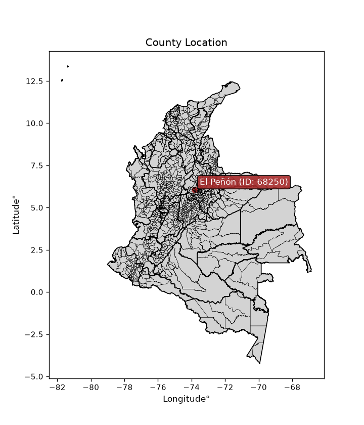
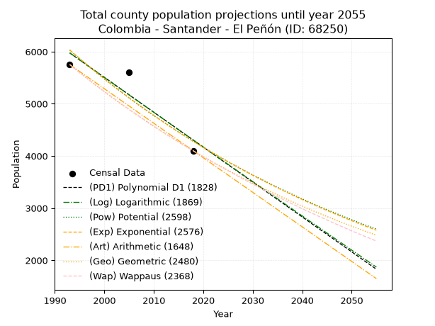
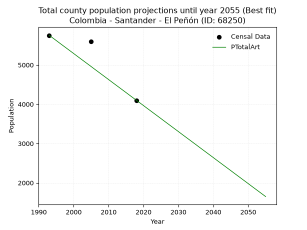
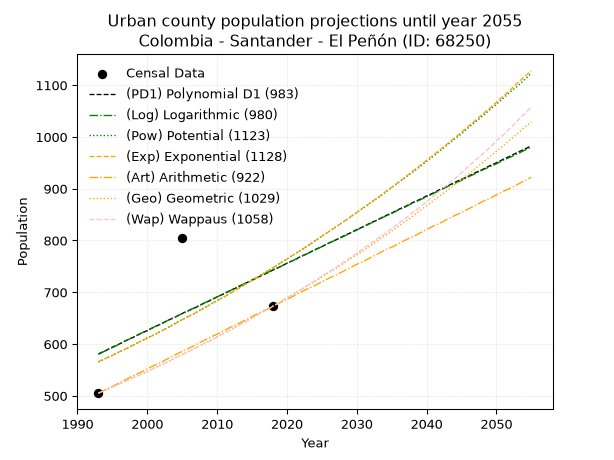
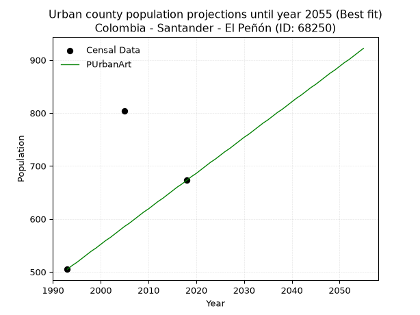
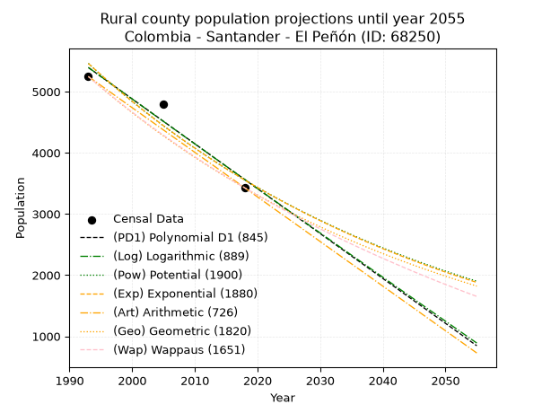

<div align="center">


</div>

# _“Population and Public Services Demand Projections (PPSD) until Year 2050 for Colombia - Santander - El Peñón (ID: 68250)”_
Keywords: `population` `public-service` `projection` `lineal` `polynomial` `logarithmic` `potential` `exponential` `arithmetic` `geometric` `wappaus` `dane` `colombia` `south-america`

PPSD are analytical estimates used by governments and planners to anticipate future changes in population size, age distribution, and the resulting community needs for utilities, healthcare, education, and infrastructure as sizing future water treatment facilities, electrical grids, and road networks based on spatial growth.

<div align="center">

</img>

</div>


> **General running parameters**: • app_version: _v20260806_. • Python version: _3.14.7_. • Pandas version: _3.0.5_. • NumPy version: _2.5.1_. • Creates, save and include plots into reports (create_plot): _False_. • Projection until year: _2050_. • Process polynomial degree 2 and up: _False_. • Process Wappaus: _True_. • Process Wappaus: _True_. • Set negative values to zero: _True_. • Set infinite values to zero: _True_. • Drop dataset notes: _True_. 
<div align="center">

Dynamic map: [:earth_americas:Google](http://maps.google.com/maps?q=6.055369794,-73.8155321) [:earth_americas:OSM](https://www.openstreetmap.org/#map=18/6.055369794/-73.8155321&layers=P) [:earth_americas:Bing](https://www.bing.com/maps?cp=6.055369794~-73.8155321&lvl=18) [:earth_americas:Apple](https://maps.apple.com/frame?center=6.055369794%2C-73.8155321&span=0.003%2C0.006)

</div>


<div align="center">

```geojson
{
  "type": "Feature",
  "geometry": {
    "type": "Point", 
    "coordinates": [-73.8155321, 6.055369794]
  }, 
  "properties": {
    "Name": "Colombia - Santander - El Peñón (ID: 68250)"
  }
}
```

</div>


## 0. Census Data (3 records)

Census data are official statistics collected by a government about the people and housing in a country. They usually include counts of total population, age, sex, race, income, education, and jobs.

📅Global census file: [Population.xlsx](../data/Population.xlsx)

| Source   |   Year |   CountryID | CountryName   |   StateID | StateName   |   CountyID | CountyName   |   PTotal |   PUrban |   PRural |
|:---------|-------:|------------:|:--------------|----------:|:------------|-----------:|:-------------|---------:|---------:|---------:|
| DANE     |   1993 |          57 | Colombia      |        68 | Santander   |      68250 | El Peñón     |     5752 |      505 |     5247 |
| DANE     |   2005 |          57 | Colombia      |        68 | Santander   |      68250 | El Peñón     |     5600 |      804 |     4796 |
| DANE     |   2018 |          57 | Colombia      |        68 | Santander   |      68250 | El Peñón     |     4097 |      673 |     3424 |

> 🔥Some records could had specific notes about the registered values or the corresponding urban or rural distribution.

📅[SUI-RUPS](https://www.datos.gov.co/Hacienda-y-Cr-dito-P-blico/Registro-nico-de-Prestadores-de-Servicios-P-blicos/4qkq-csdn/about_data) - Local public utility companies: [RUPS.csv](../data/RUPS.xlsx)

 | SERVICIO       | ESTADO    | NOMBRE                                                                                                  | NIT         | DEPARTAMENTO_DOMICILIO   | MUNICIPIO_DOMICILIO   | DIRECCION                             |   TELEFONO | EMAIL                        | TIPO_PRESTADOR                 | CLASIFICACION                 |
|:---------------|:----------|:--------------------------------------------------------------------------------------------------------|:------------|:-------------------------|:----------------------|:--------------------------------------|-----------:|:-----------------------------|:-------------------------------|:------------------------------|
| ACUEDUCTO      | OPERATIVA | UNIDAD ADMINISTRADORA DE SERVICIOS PUBLICOS DE ACUEDUCTO, ALCANTARILLADO Y ASEO DEL MUNICIPIO EL  PEÑON | 800213967-3 | SANTANDER                | EL PENON              | Carrera 4 N° 5 - 72 Palacio Municipal |    9999999 | alexmendezgarcia08@gmail.com | MUNICIPIO (PRESTACIÓN DIRECTA) | MENOR O IGUAL A 2500 USUARIOS |
| ALCANTARILLADO | OPERATIVA | UNIDAD ADMINISTRADORA DE SERVICIOS PUBLICOS DE ACUEDUCTO, ALCANTARILLADO Y ASEO DEL MUNICIPIO EL  PEÑON | 800213967-3 | SANTANDER                | EL PENON              | Carrera 4 N° 5 - 72 Palacio Municipal |    9999999 | alexmendezgarcia08@gmail.com | MUNICIPIO (PRESTACIÓN DIRECTA) | MENOR O IGUAL A 2500 USUARIOS |

## 1. Total

### 1.1. Coefficients and Parameters

* (PD1) Polynomial Deg 1: -66.88486140725132, 139276.10874200793 (lineal)
* (Log) Logarithmic: -134034.1758871143, 1024285.5759414121
* (Pow) Potential: -27.487071088897203, 94.47410669649489
* (Exp) Exponential: -0.013716778899547059, 4496124976808962.0
* (Art) Arithmetic: Year diff. 2018 - 1993 = 25, Population diff. 4097 - 5752 = -1655, Annual growth = -66.2
* (Geo) Geometric: Year diff. 2018 - 1993 = 25, Population diff. 4097 - 5752 = -1655, Annual growth % = -0.01348002450916741
* (Wap) Wappaus: i = -1.344298913595289, Condition values only valid for < 200)

<sub>
Wappaus condition values: ['-0.00', '-1.34', '-2.69', '-4.03', '-5.38', '-6.72', '-8.07', '-9.41', '-10.75', '-12.10', '-13.44', '-14.79', '-16.13', '-17.48', '-18.82', '-20.16', '-21.51', '-22.85', '-24.20', '-25.54', '-26.89', '-28.23', '-29.57', '-30.92', '-32.26', '-33.61', '-34.95', '-36.30', '-37.64', '-38.98', '-40.33', '-41.67', '-43.02', '-44.36', '-45.71', '-47.05', '-48.39', '-49.74', '-51.08', '-52.43', '-53.77', '-55.12', '-56.46', '-57.80', '-59.15', '-60.49', '-61.84', '-63.18', '-64.53', '-65.87', '-67.21', '-68.56', '-69.90', '-71.25', '-72.59', '-73.94', '-75.28', '-76.63']
</sub>


### 1.2. Projected Dataset

|   Year |   CountyID |   PTotalPD1 |   PTotalLog |   PTotalPow |   PTotalExp |   PTotalArt |   PTotalGeo |   PTotalWap |
|-------:|-----------:|------------:|------------:|------------:|------------:|------------:|------------:|------------:|
|   1993 |      68250 |        5975 |        5975 |        6030 |        6030 |        5752 |        5752 |        5752 |
|   1994 |      68250 |        5908 |        5908 |        5947 |        5948 |        5686 |        5674 |        5675 |
|   1995 |      68250 |        5841 |        5840 |        5866 |        5867 |        5620 |        5598 |        5599 |
|   1996 |      68250 |        5774 |        5773 |        5786 |        5787 |        5553 |        5523 |        5525 |
|   1997 |      68250 |        5707 |        5706 |        5707 |        5708 |        5487 |        5448 |        5451 |
|   1998 |      68250 |        5640 |        5639 |        5629 |        5630 |        5421 |        5375 |        5378 |
|   1999 |      68250 |        5573 |        5572 |        5552 |        5553 |        5355 |        5302 |        5306 |
|   2000 |      68250 |        5506 |        5505 |        5476 |        5478 |        5289 |        5231 |        5235 |
|   2001 |      68250 |        5440 |        5438 |        5401 |        5403 |        5222 |        5160 |        5165 |
|   2002 |      68250 |        5373 |        5371 |        5328 |        5329 |        5156 |        5091 |        5096 |
|   2003 |      68250 |        5306 |        5304 |        5255 |        5257 |        5090 |        5022 |        5027 |
|   2004 |      68250 |        5239 |        5237 |        5183 |        5185 |        5024 |        4954 |        4960 |
|   2005 |      68250 |        5172 |        5170 |        5113 |        5115 |        4958 |        4888 |        4893 |
|   2006 |      68250 |        5105 |        5103 |        5043 |        5045 |        4891 |        4822 |        4828 |
|   2007 |      68250 |        5038 |        5037 |        4975 |        4976 |        4825 |        4757 |        4763 |
|   2008 |      68250 |        4971 |        4970 |        4907 |        4908 |        4759 |        4693 |        4698 |
|   2009 |      68250 |        4904 |        4903 |        4840 |        4842 |        4693 |        4629 |        4635 |
|   2010 |      68250 |        4838 |        4836 |        4774 |        4776 |        4627 |        4567 |        4572 |
|   2011 |      68250 |        4771 |        4770 |        4710 |        4711 |        4560 |        4505 |        4510 |
|   2012 |      68250 |        4704 |        4703 |        4646 |        4646 |        4494 |        4445 |        4449 |
|   2013 |      68250 |        4637 |        4636 |        4583 |        4583 |        4428 |        4385 |        4389 |
|   2014 |      68250 |        4570 |        4570 |        4521 |        4521 |        4362 |        4326 |        4329 |
|   2015 |      68250 |        4503 |        4503 |        4459 |        4459 |        4296 |        4267 |        4270 |
|   2016 |      68250 |        4436 |        4437 |        4399 |        4398 |        4229 |        4210 |        4212 |
|   2017 |      68250 |        4369 |        4370 |        4339 |        4338 |        4163 |        4153 |        4154 |
|   2018 |      68250 |        4302 |        4304 |        4281 |        4279 |        4097 |        4097 |        4097 |
|   2019 |      68250 |        4236 |        4238 |        4223 |        4221 |        4031 |        4042 |        4041 |
|   2020 |      68250 |        4169 |        4171 |        4166 |        4163 |        3965 |        3987 |        3985 |
|   2021 |      68250 |        4102 |        4105 |        4109 |        4107 |        3898 |        3934 |        3930 |
|   2022 |      68250 |        4035 |        4039 |        4054 |        4051 |        3832 |        3881 |        3875 |
|   2023 |      68250 |        3968 |        3972 |        3999 |        3996 |        3766 |        3828 |        3822 |
|   2024 |      68250 |        3901 |        3906 |        3945 |        3941 |        3700 |        3777 |        3768 |
|   2025 |      68250 |        3834 |        3840 |        3892 |        3887 |        3634 |        3726 |        3716 |
|   2026 |      68250 |        3767 |        3774 |        3839 |        3835 |        3567 |        3675 |        3664 |
|   2027 |      68250 |        3700 |        3708 |        3788 |        3782 |        3501 |        3626 |        3612 |
|   2028 |      68250 |        3634 |        3641 |        3737 |        3731 |        3435 |        3577 |        3561 |
|   2029 |      68250 |        3567 |        3575 |        3686 |        3680 |        3369 |        3529 |        3511 |
|   2030 |      68250 |        3500 |        3509 |        3637 |        3630 |        3303 |        3481 |        3461 |
|   2031 |      68250 |        3433 |        3443 |        3588 |        3580 |        3236 |        3434 |        3411 |
|   2032 |      68250 |        3366 |        3377 |        3540 |        3532 |        3170 |        3388 |        3363 |
|   2033 |      68250 |        3299 |        3311 |        3492 |        3483 |        3104 |        3342 |        3314 |
|   2034 |      68250 |        3232 |        3245 |        3445 |        3436 |        3038 |        3297 |        3267 |
|   2035 |      68250 |        3165 |        3180 |        3399 |        3389 |        2972 |        3253 |        3219 |
|   2036 |      68250 |        3099 |        3114 |        3353 |        3343 |        2905 |        3209 |        3173 |
|   2037 |      68250 |        3032 |        3048 |        3309 |        3297 |        2839 |        3166 |        3126 |
|   2038 |      68250 |        2965 |        2982 |        3264 |        3253 |        2773 |        3123 |        3080 |
|   2039 |      68250 |        2898 |        2916 |        3220 |        3208 |        2707 |        3081 |        3035 |
|   2040 |      68250 |        2831 |        2851 |        3177 |        3165 |        2641 |        3039 |        2990 |
|   2041 |      68250 |        2764 |        2785 |        3135 |        3121 |        2574 |        2998 |        2946 |
|   2042 |      68250 |        2697 |        2719 |        3093 |        3079 |        2508 |        2958 |        2902 |
|   2043 |      68250 |        2630 |        2654 |        3052 |        3037 |        2442 |        2918 |        2858 |
|   2044 |      68250 |        2563 |        2588 |        3011 |        2996 |        2376 |        2879 |        2815 |
|   2045 |      68250 |        2497 |        2523 |        2971 |        2955 |        2310 |        2840 |        2773 |
|   2046 |      68250 |        2430 |        2457 |        2931 |        2915 |        2243 |        2802 |        2730 |
|   2047 |      68250 |        2363 |        2392 |        2892 |        2875 |        2177 |        2764 |        2688 |
|   2048 |      68250 |        2296 |        2326 |        2853 |        2836 |        2111 |        2727 |        2647 |
|   2049 |      68250 |        2229 |        2261 |        2815 |        2797 |        2045 |        2690 |        2606 |
|   2050 |      68250 |        2162 |        2195 |        2778 |        2759 |        1979 |        2654 |        2565 |
<div align="center">

</img>

</div>


### 1.3. Best fit with absolute and relative error (%)

Relative error puts that difference into context by dividing the absolute error by the true value, creating a unitless ratio or percentage that shows the scale of the mistake.

Absolute and relative error

|   Year | Source   |   CountryID | CountryName   |   StateID | StateName   |   CountyID_x | CountyName   |   PTotal |   PUrban |   PRural |   CountyID_y |   PTotalPD1 |   PTotalLog |   PTotalPow |   PTotalExp |   PTotalArt |   PTotalGeo |   PTotalWap |   PTotalPD1AbsError |   PTotalLogAbsError |   PTotalPowAbsError |   PTotalExpAbsError |   PTotalArtAbsError |   PTotalGeoAbsError |   PTotalWapAbsError |   PTotalPD1RelError |   PTotalLogRelError |   PTotalPowRelError |   PTotalExpRelError |   PTotalArtRelError |   PTotalGeoRelError |   PTotalWapRelError |
|-------:|:---------|------------:|:--------------|----------:|:------------|-------------:|:-------------|---------:|---------:|---------:|-------------:|------------:|------------:|------------:|------------:|------------:|------------:|------------:|--------------------:|--------------------:|--------------------:|--------------------:|--------------------:|--------------------:|--------------------:|--------------------:|--------------------:|--------------------:|--------------------:|--------------------:|--------------------:|--------------------:|
|   1993 | DANE     |          57 | Colombia      |        68 | Santander   |        68250 | El Peñón     |     5752 |      505 |     5247 |        68250 |        5975 |        5975 |        6030 |        6030 |        5752 |        5752 |        5752 |                 223 |                 223 |                 278 |                 278 |                   0 |                   0 |                   0 |             3.87691 |             3.87691 |             4.8331  |             4.8331  |              0      |              0      |               0     |
|   2005 | DANE     |          57 | Colombia      |        68 | Santander   |        68250 | El Peñón     |     5600 |      804 |     4796 |        68250 |        5172 |        5170 |        5113 |        5115 |        4958 |        4888 |        4893 |                 428 |                 430 |                 487 |                 485 |                 642 |                 712 |                 707 |             7.64286 |             7.67857 |             8.69643 |             8.66071 |             11.4643 |             12.7143 |              12.625 |
|   2018 | DANE     |          57 | Colombia      |        68 | Santander   |        68250 | El Peñón     |     4097 |      673 |     3424 |        68250 |        4302 |        4304 |        4281 |        4279 |        4097 |        4097 |        4097 |                 205 |                 207 |                 184 |                 182 |                   0 |                   0 |                   0 |             5.00366 |             5.05248 |             4.49109 |             4.44227 |              0      |              0      |               0     |

Relative error mean

| Method    |   RelError | Best   |
|:----------|-----------:|:-------|
| PTotalPD1 |    5.50781 |        |
| PTotalLog |    5.53599 |        |
| PTotalPow |    6.00687 |        |
| PTotalExp |    5.9787  |        |
| PTotalArt |    3.82143 | True   |
| PTotalGeo |    4.2381  |        |
| PTotalWap |    4.20833 |        |

💙Best method: _**PTotalArt**_
<div align="center">

</img>

</div>


### 1.4. Fresh water supply demand in liters per capita per day (lpcd)

The fresh water supply demand typically ranges from 100 to 300 liters per capita per day (lpcd) for standard domestic and municipal planning, though absolute survival minimums set by the World Health Organization are as low as 7.5 to 20 liters per day, and total consumption in high-income nations can exceed 400 liters.

> `CZ`: Level in meters above the sea level (masl)<br> `WS`: Fresh water supply demand in liters per capita per day (lpcd or l/h/d)<br> `WSAll`: Zonal fresh water supply demand in liters per second (l/s)<br> `A`: Zonal area in square meters<br> `DP`: Population density (people/hectare or p/ha)

Reference values (RAS Colombia)

|    CZ |   WS |
|------:|-----:|
|  1000 |  120 |
|  2000 |  130 |
| 99999 |  140 |

County shapefile geometry properties and water supply values

|   CountyID |      ATotal |   CZTotal |   WSTotal |
|-----------:|------------:|----------:|----------:|
|      68250 | 3.97677e+08 |   1214.79 |       130 |

Projected values for best method: PTotalArt

|   CountyID |   Year |   PTotalArt |   DPTotal |   WSTotal |   WSTotalAll |
|-----------:|-------:|------------:|----------:|----------:|-------------:|
|      68250 |   1993 |        5752 |      0.14 |       130 |      8.65463 |
|      68250 |   1994 |        5686 |      0.14 |       130 |      8.55532 |
|      68250 |   1995 |        5620 |      0.14 |       130 |      8.45602 |
|      68250 |   1996 |        5553 |      0.14 |       130 |      8.35521 |
|      68250 |   1997 |        5487 |      0.14 |       130 |      8.2559  |
|      68250 |   1998 |        5421 |      0.14 |       130 |      8.1566  |
|      68250 |   1999 |        5355 |      0.13 |       130 |      8.05729 |
|      68250 |   2000 |        5289 |      0.13 |       130 |      7.95799 |
|      68250 |   2001 |        5222 |      0.13 |       130 |      7.85718 |
|      68250 |   2002 |        5156 |      0.13 |       130 |      7.75787 |
|      68250 |   2003 |        5090 |      0.13 |       130 |      7.65856 |
|      68250 |   2004 |        5024 |      0.13 |       130 |      7.55926 |
|      68250 |   2005 |        4958 |      0.12 |       130 |      7.45995 |
|      68250 |   2006 |        4891 |      0.12 |       130 |      7.35914 |
|      68250 |   2007 |        4825 |      0.12 |       130 |      7.25984 |
|      68250 |   2008 |        4759 |      0.12 |       130 |      7.16053 |
|      68250 |   2009 |        4693 |      0.12 |       130 |      7.06123 |
|      68250 |   2010 |        4627 |      0.12 |       130 |      6.96192 |
|      68250 |   2011 |        4560 |      0.11 |       130 |      6.86111 |
|      68250 |   2012 |        4494 |      0.11 |       130 |      6.76181 |
|      68250 |   2013 |        4428 |      0.11 |       130 |      6.6625  |
|      68250 |   2014 |        4362 |      0.11 |       130 |      6.56319 |
|      68250 |   2015 |        4296 |      0.11 |       130 |      6.46389 |
|      68250 |   2016 |        4229 |      0.11 |       130 |      6.36308 |
|      68250 |   2017 |        4163 |      0.1  |       130 |      6.26377 |
|      68250 |   2018 |        4097 |      0.1  |       130 |      6.16447 |
|      68250 |   2019 |        4031 |      0.1  |       130 |      6.06516 |
|      68250 |   2020 |        3965 |      0.1  |       130 |      5.96586 |
|      68250 |   2021 |        3898 |      0.1  |       130 |      5.86505 |
|      68250 |   2022 |        3832 |      0.1  |       130 |      5.76574 |
|      68250 |   2023 |        3766 |      0.09 |       130 |      5.66644 |
|      68250 |   2024 |        3700 |      0.09 |       130 |      5.56713 |
|      68250 |   2025 |        3634 |      0.09 |       130 |      5.46782 |
|      68250 |   2026 |        3567 |      0.09 |       130 |      5.36701 |
|      68250 |   2027 |        3501 |      0.09 |       130 |      5.26771 |
|      68250 |   2028 |        3435 |      0.09 |       130 |      5.1684  |
|      68250 |   2029 |        3369 |      0.08 |       130 |      5.0691  |
|      68250 |   2030 |        3303 |      0.08 |       130 |      4.96979 |
|      68250 |   2031 |        3236 |      0.08 |       130 |      4.86898 |
|      68250 |   2032 |        3170 |      0.08 |       130 |      4.76968 |
|      68250 |   2033 |        3104 |      0.08 |       130 |      4.67037 |
|      68250 |   2034 |        3038 |      0.08 |       130 |      4.57106 |
|      68250 |   2035 |        2972 |      0.07 |       130 |      4.47176 |
|      68250 |   2036 |        2905 |      0.07 |       130 |      4.37095 |
|      68250 |   2037 |        2839 |      0.07 |       130 |      4.27164 |
|      68250 |   2038 |        2773 |      0.07 |       130 |      4.17234 |
|      68250 |   2039 |        2707 |      0.07 |       130 |      4.07303 |
|      68250 |   2040 |        2641 |      0.07 |       130 |      3.97373 |
|      68250 |   2041 |        2574 |      0.06 |       130 |      3.87292 |
|      68250 |   2042 |        2508 |      0.06 |       130 |      3.77361 |
|      68250 |   2043 |        2442 |      0.06 |       130 |      3.67431 |
|      68250 |   2044 |        2376 |      0.06 |       130 |      3.575   |
|      68250 |   2045 |        2310 |      0.06 |       130 |      3.47569 |
|      68250 |   2046 |        2243 |      0.06 |       130 |      3.37488 |
|      68250 |   2047 |        2177 |      0.05 |       130 |      3.27558 |
|      68250 |   2048 |        2111 |      0.05 |       130 |      3.17627 |
|      68250 |   2049 |        2045 |      0.05 |       130 |      3.07697 |
|      68250 |   2050 |        1979 |      0.05 |       130 |      2.97766 |

## 2. Urban

### 2.1. Coefficients and Parameters

* (PD1) Polynomial Deg 1: 6.487206823027847, -12348.345415778504 (lineal)
* (Log) Logarithmic: 13046.727476243723, -98540.81222152287
* (Pow) Potential: 22.39354369318247, -71.1353457967128
* (Exp) Exponential: 0.011138658181378016, 1.2926238186424989e-07
* (Art) Arithmetic: Year diff. 2018 - 1993 = 25, Population diff. 673 - 505 = 168, Annual growth = 6.72
* (Geo) Geometric: Year diff. 2018 - 1993 = 25, Population diff. 673 - 505 = 168, Annual growth % = 0.011553710446542853
* (Wap) Wappaus: i = 1.1409168081494059, Condition values only valid for < 200)

<sub>
Wappaus condition values: ['0.00', '1.14', '2.28', '3.42', '4.56', '5.70', '6.85', '7.99', '9.13', '10.27', '11.41', '12.55', '13.69', '14.83', '15.97', '17.11', '18.25', '19.40', '20.54', '21.68', '22.82', '23.96', '25.10', '26.24', '27.38', '28.52', '29.66', '30.80', '31.95', '33.09', '34.23', '35.37', '36.51', '37.65', '38.79', '39.93', '41.07', '42.21', '43.35', '44.50', '45.64', '46.78', '47.92', '49.06', '50.20', '51.34', '52.48', '53.62', '54.76', '55.90', '57.05', '58.19', '59.33', '60.47', '61.61', '62.75', '63.89', '65.03']
</sub>


### 2.2. Projected Dataset

|   Year |   CountyID |   PUrbanPD1 |   PUrbanLog |   PUrbanPow |   PUrbanExp |   PUrbanArt |   PUrbanGeo |   PUrbanWap |
|-------:|-----------:|------------:|------------:|------------:|------------:|------------:|------------:|------------:|
|   1993 |      68250 |         581 |         580 |         565 |         566 |         505 |         505 |         505 |
|   1994 |      68250 |         587 |         587 |         572 |         572 |         512 |         511 |         511 |
|   1995 |      68250 |         594 |         593 |         578 |         578 |         518 |         517 |         517 |
|   1996 |      68250 |         600 |         600 |         585 |         585 |         525 |         523 |         523 |
|   1997 |      68250 |         607 |         607 |         591 |         591 |         532 |         529 |         529 |
|   1998 |      68250 |         613 |         613 |         598 |         598 |         539 |         535 |         535 |
|   1999 |      68250 |         620 |         620 |         605 |         605 |         545 |         541 |         541 |
|   2000 |      68250 |         626 |         626 |         612 |         611 |         552 |         547 |         547 |
|   2001 |      68250 |         633 |         633 |         618 |         618 |         559 |         554 |         553 |
|   2002 |      68250 |         639 |         639 |         625 |         625 |         565 |         560 |         560 |
|   2003 |      68250 |         646 |         646 |         632 |         632 |         572 |         566 |         566 |
|   2004 |      68250 |         652 |         652 |         640 |         639 |         579 |         573 |         573 |
|   2005 |      68250 |         659 |         659 |         647 |         647 |         586 |         580 |         579 |
|   2006 |      68250 |         665 |         665 |         654 |         654 |         592 |         586 |         586 |
|   2007 |      68250 |         671 |         672 |         661 |         661 |         599 |         593 |         593 |
|   2008 |      68250 |         678 |         678 |         669 |         668 |         606 |         600 |         600 |
|   2009 |      68250 |         684 |         685 |         676 |         676 |         613 |         607 |         606 |
|   2010 |      68250 |         691 |         691 |         684 |         684 |         619 |         614 |         613 |
|   2011 |      68250 |         697 |         698 |         691 |         691 |         626 |         621 |         621 |
|   2012 |      68250 |         704 |         704 |         699 |         699 |         633 |         628 |         628 |
|   2013 |      68250 |         710 |         711 |         707 |         707 |         639 |         635 |         635 |
|   2014 |      68250 |         717 |         717 |         715 |         715 |         646 |         643 |         642 |
|   2015 |      68250 |         723 |         724 |         723 |         723 |         653 |         650 |         650 |
|   2016 |      68250 |         730 |         730 |         731 |         731 |         660 |         658 |         658 |
|   2017 |      68250 |         736 |         737 |         739 |         739 |         666 |         665 |         665 |
|   2018 |      68250 |         743 |         743 |         747 |         747 |         673 |         673 |         673 |
|   2019 |      68250 |         749 |         749 |         756 |         756 |         680 |         681 |         681 |
|   2020 |      68250 |         756 |         756 |         764 |         764 |         686 |         689 |         689 |
|   2021 |      68250 |         762 |         762 |         773 |         773 |         693 |         697 |         697 |
|   2022 |      68250 |         769 |         769 |         781 |         781 |         700 |         705 |         705 |
|   2023 |      68250 |         775 |         775 |         790 |         790 |         707 |         713 |         714 |
|   2024 |      68250 |         782 |         782 |         799 |         799 |         713 |         721 |         722 |
|   2025 |      68250 |         788 |         788 |         808 |         808 |         720 |         729 |         731 |
|   2026 |      68250 |         795 |         795 |         817 |         817 |         727 |         738 |         739 |
|   2027 |      68250 |         801 |         801 |         826 |         826 |         733 |         746 |         748 |
|   2028 |      68250 |         808 |         807 |         835 |         835 |         740 |         755 |         757 |
|   2029 |      68250 |         814 |         814 |         844 |         845 |         747 |         764 |         766 |
|   2030 |      68250 |         821 |         820 |         854 |         854 |         754 |         772 |         775 |
|   2031 |      68250 |         827 |         827 |         863 |         864 |         760 |         781 |         785 |
|   2032 |      68250 |         834 |         833 |         873 |         873 |         767 |         790 |         794 |
|   2033 |      68250 |         840 |         840 |         882 |         883 |         774 |         800 |         804 |
|   2034 |      68250 |         847 |         846 |         892 |         893 |         781 |         809 |         813 |
|   2035 |      68250 |         853 |         852 |         902 |         903 |         787 |         818 |         823 |
|   2036 |      68250 |         860 |         859 |         912 |         913 |         794 |         828 |         833 |
|   2037 |      68250 |         866 |         865 |         922 |         923 |         801 |         837 |         843 |
|   2038 |      68250 |         873 |         872 |         932 |         934 |         807 |         847 |         854 |
|   2039 |      68250 |         879 |         878 |         942 |         944 |         814 |         857 |         864 |
|   2040 |      68250 |         886 |         884 |         953 |         955 |         821 |         867 |         875 |
|   2041 |      68250 |         892 |         891 |         963 |         965 |         828 |         877 |         886 |
|   2042 |      68250 |         899 |         897 |         974 |         976 |         834 |         887 |         897 |
|   2043 |      68250 |         905 |         904 |         985 |         987 |         841 |         897 |         908 |
|   2044 |      68250 |         912 |         910 |         996 |         998 |         848 |         907 |         919 |
|   2045 |      68250 |         918 |         916 |        1006 |        1009 |         854 |         918 |         931 |
|   2046 |      68250 |         924 |         923 |        1018 |        1021 |         861 |         928 |         943 |
|   2047 |      68250 |         931 |         929 |        1029 |        1032 |         868 |         939 |         955 |
|   2048 |      68250 |         937 |         936 |        1040 |        1044 |         875 |         950 |         967 |
|   2049 |      68250 |         944 |         942 |        1052 |        1055 |         881 |         961 |         979 |
|   2050 |      68250 |         950 |         948 |        1063 |        1067 |         888 |         972 |         992 |
<div align="center">

</img>

</div>


### 2.3. Best fit with absolute and relative error (%)

Relative error puts that difference into context by dividing the absolute error by the true value, creating a unitless ratio or percentage that shows the scale of the mistake.

Absolute and relative error

|   Year | Source   |   CountryID | CountryName   |   StateID | StateName   |   CountyID_x | CountyName   |   PTotal |   PUrban |   PRural |   CountyID_y |   PUrbanPD1 |   PUrbanLog |   PUrbanPow |   PUrbanExp |   PUrbanArt |   PUrbanGeo |   PUrbanWap |   PUrbanPD1AbsError |   PUrbanLogAbsError |   PUrbanPowAbsError |   PUrbanExpAbsError |   PUrbanArtAbsError |   PUrbanGeoAbsError |   PUrbanWapAbsError |   PUrbanPD1RelError |   PUrbanLogRelError |   PUrbanPowRelError |   PUrbanExpRelError |   PUrbanArtRelError |   PUrbanGeoRelError |   PUrbanWapRelError |
|-------:|:---------|------------:|:--------------|----------:|:------------|-------------:|:-------------|---------:|---------:|---------:|-------------:|------------:|------------:|------------:|------------:|------------:|------------:|------------:|--------------------:|--------------------:|--------------------:|--------------------:|--------------------:|--------------------:|--------------------:|--------------------:|--------------------:|--------------------:|--------------------:|--------------------:|--------------------:|--------------------:|
|   1993 | DANE     |          57 | Colombia      |        68 | Santander   |        68250 | El Peñón     |     5752 |      505 |     5247 |        68250 |         581 |         580 |         565 |         566 |         505 |         505 |         505 |                  76 |                  75 |                  60 |                  61 |                   0 |                   0 |                   0 |             15.0495 |             14.8515 |             11.8812 |             12.0792 |              0      |              0      |              0      |
|   2005 | DANE     |          57 | Colombia      |        68 | Santander   |        68250 | El Peñón     |     5600 |      804 |     4796 |        68250 |         659 |         659 |         647 |         647 |         586 |         580 |         579 |                 145 |                 145 |                 157 |                 157 |                 218 |                 224 |                 225 |             18.0348 |             18.0348 |             19.5274 |             19.5274 |             27.1144 |             27.8607 |             27.9851 |
|   2018 | DANE     |          57 | Colombia      |        68 | Santander   |        68250 | El Peñón     |     4097 |      673 |     3424 |        68250 |         743 |         743 |         747 |         747 |         673 |         673 |         673 |                  70 |                  70 |                  74 |                  74 |                   0 |                   0 |                   0 |             10.4012 |             10.4012 |             10.9955 |             10.9955 |              0      |              0      |              0      |

Relative error mean

| Method    |   RelError | Best   |
|:----------|-----------:|:-------|
| PUrbanPD1 |   14.4952  |        |
| PUrbanLog |   14.4292  |        |
| PUrbanPow |   14.1347  |        |
| PUrbanExp |   14.2007  |        |
| PUrbanArt |    9.03814 | True   |
| PUrbanGeo |    9.2869  |        |
| PUrbanWap |    9.32836 |        |

💙Best method: _**PUrbanArt**_
<div align="center">

</img>

</div>


### 2.4. Fresh water supply demand in liters per capita per day (lpcd)

The fresh water supply demand typically ranges from 100 to 300 liters per capita per day (lpcd) for standard domestic and municipal planning, though absolute survival minimums set by the World Health Organization are as low as 7.5 to 20 liters per day, and total consumption in high-income nations can exceed 400 liters.

> `CZ`: Level in meters above the sea level (masl)<br> `WS`: Fresh water supply demand in liters per capita per day (lpcd or l/h/d)<br> `WSAll`: Zonal fresh water supply demand in liters per second (l/s)<br> `A`: Zonal area in square meters<br> `DP`: Population density (people/hectare or p/ha)

Reference values (RAS Colombia)

|    CZ |   WS |
|------:|-----:|
|  1000 |  120 |
|  2000 |  130 |
| 99999 |  140 |

County shapefile geometry properties and water supply values

|   CountyID |   AUrban |   CZUrban |   WSUrban |
|-----------:|---------:|----------:|----------:|
|      68250 |   206733 |   2546.46 |       140 |

Projected values for best method: PUrbanArt

|   CountyID |   Year |   PUrbanArt |   DPUrban |   WSUrban |   WSUrbanAll |
|-----------:|-------:|------------:|----------:|----------:|-------------:|
|      68250 |   1993 |         505 |     24.43 |       140 |     0.818287 |
|      68250 |   1994 |         512 |     24.77 |       140 |     0.82963  |
|      68250 |   1995 |         518 |     25.06 |       140 |     0.839352 |
|      68250 |   1996 |         525 |     25.4  |       140 |     0.850694 |
|      68250 |   1997 |         532 |     25.73 |       140 |     0.862037 |
|      68250 |   1998 |         539 |     26.07 |       140 |     0.87338  |
|      68250 |   1999 |         545 |     26.36 |       140 |     0.883102 |
|      68250 |   2000 |         552 |     26.7  |       140 |     0.894444 |
|      68250 |   2001 |         559 |     27.04 |       140 |     0.905787 |
|      68250 |   2002 |         565 |     27.33 |       140 |     0.915509 |
|      68250 |   2003 |         572 |     27.67 |       140 |     0.926852 |
|      68250 |   2004 |         579 |     28.01 |       140 |     0.938194 |
|      68250 |   2005 |         586 |     28.35 |       140 |     0.949537 |
|      68250 |   2006 |         592 |     28.64 |       140 |     0.959259 |
|      68250 |   2007 |         599 |     28.97 |       140 |     0.970602 |
|      68250 |   2008 |         606 |     29.31 |       140 |     0.981944 |
|      68250 |   2009 |         613 |     29.65 |       140 |     0.993287 |
|      68250 |   2010 |         619 |     29.94 |       140 |     1.00301  |
|      68250 |   2011 |         626 |     30.28 |       140 |     1.01435  |
|      68250 |   2012 |         633 |     30.62 |       140 |     1.02569  |
|      68250 |   2013 |         639 |     30.91 |       140 |     1.03542  |
|      68250 |   2014 |         646 |     31.25 |       140 |     1.04676  |
|      68250 |   2015 |         653 |     31.59 |       140 |     1.0581   |
|      68250 |   2016 |         660 |     31.93 |       140 |     1.06944  |
|      68250 |   2017 |         666 |     32.22 |       140 |     1.07917  |
|      68250 |   2018 |         673 |     32.55 |       140 |     1.09051  |
|      68250 |   2019 |         680 |     32.89 |       140 |     1.10185  |
|      68250 |   2020 |         686 |     33.18 |       140 |     1.11157  |
|      68250 |   2021 |         693 |     33.52 |       140 |     1.12292  |
|      68250 |   2022 |         700 |     33.86 |       140 |     1.13426  |
|      68250 |   2023 |         707 |     34.2  |       140 |     1.1456   |
|      68250 |   2024 |         713 |     34.49 |       140 |     1.15532  |
|      68250 |   2025 |         720 |     34.83 |       140 |     1.16667  |
|      68250 |   2026 |         727 |     35.17 |       140 |     1.17801  |
|      68250 |   2027 |         733 |     35.46 |       140 |     1.18773  |
|      68250 |   2028 |         740 |     35.8  |       140 |     1.19907  |
|      68250 |   2029 |         747 |     36.13 |       140 |     1.21042  |
|      68250 |   2030 |         754 |     36.47 |       140 |     1.22176  |
|      68250 |   2031 |         760 |     36.76 |       140 |     1.23148  |
|      68250 |   2032 |         767 |     37.1  |       140 |     1.24282  |
|      68250 |   2033 |         774 |     37.44 |       140 |     1.25417  |
|      68250 |   2034 |         781 |     37.78 |       140 |     1.26551  |
|      68250 |   2035 |         787 |     38.07 |       140 |     1.27523  |
|      68250 |   2036 |         794 |     38.41 |       140 |     1.28657  |
|      68250 |   2037 |         801 |     38.75 |       140 |     1.29792  |
|      68250 |   2038 |         807 |     39.04 |       140 |     1.30764  |
|      68250 |   2039 |         814 |     39.37 |       140 |     1.31898  |
|      68250 |   2040 |         821 |     39.71 |       140 |     1.33032  |
|      68250 |   2041 |         828 |     40.05 |       140 |     1.34167  |
|      68250 |   2042 |         834 |     40.34 |       140 |     1.35139  |
|      68250 |   2043 |         841 |     40.68 |       140 |     1.36273  |
|      68250 |   2044 |         848 |     41.02 |       140 |     1.37407  |
|      68250 |   2045 |         854 |     41.31 |       140 |     1.3838   |
|      68250 |   2046 |         861 |     41.65 |       140 |     1.39514  |
|      68250 |   2047 |         868 |     41.99 |       140 |     1.40648  |
|      68250 |   2048 |         875 |     42.33 |       140 |     1.41782  |
|      68250 |   2049 |         881 |     42.62 |       140 |     1.42755  |
|      68250 |   2050 |         888 |     42.95 |       140 |     1.43889  |

## 3. Rural

### 3.1. Coefficients and Parameters

* (PD1) Polynomial Deg 1: -73.37206823027908, 151624.4541577863 (lineal)
* (Log) Logarithmic: -147080.90336335805, 1122826.3881629352
* (Pow) Potential: -34.4693218929062, 117.46904596942227
* (Exp) Exponential: -0.017196495476134548, 4.184324411421949e+18
* (Art) Arithmetic: Year diff. 2018 - 1993 = 25, Population diff. 3424 - 5247 = -1823, Annual growth = -72.92
* (Geo) Geometric: Year diff. 2018 - 1993 = 25, Population diff. 3424 - 5247 = -1823, Annual growth % = -0.016928948376562336
* (Wap) Wappaus: i = -1.6819282666359128, Condition values only valid for < 200)

<sub>
Wappaus condition values: ['-0.00', '-1.68', '-3.36', '-5.05', '-6.73', '-8.41', '-10.09', '-11.77', '-13.46', '-15.14', '-16.82', '-18.50', '-20.18', '-21.87', '-23.55', '-25.23', '-26.91', '-28.59', '-30.27', '-31.96', '-33.64', '-35.32', '-37.00', '-38.68', '-40.37', '-42.05', '-43.73', '-45.41', '-47.09', '-48.78', '-50.46', '-52.14', '-53.82', '-55.50', '-57.19', '-58.87', '-60.55', '-62.23', '-63.91', '-65.60', '-67.28', '-68.96', '-70.64', '-72.32', '-74.00', '-75.69', '-77.37', '-79.05', '-80.73', '-82.41', '-84.10', '-85.78', '-87.46', '-89.14', '-90.82', '-92.51', '-94.19', '-95.87']
</sub>


### 3.2. Projected Dataset

|   Year |   CountyID |   PRuralPD1 |   PRuralLog |   PRuralPow |   PRuralExp |   PRuralArt |   PRuralGeo |   PRuralWap |
|-------:|-----------:|------------:|------------:|------------:|------------:|------------:|------------:|------------:|
|   1993 |      68250 |        5394 |        5394 |        5461 |        5460 |        5247 |        5247 |        5247 |
|   1994 |      68250 |        5321 |        5321 |        5367 |        5367 |        5174 |        5158 |        5159 |
|   1995 |      68250 |        5247 |        5247 |        5275 |        5276 |        5101 |        5071 |        5073 |
|   1996 |      68250 |        5174 |        5173 |        5185 |        5186 |        5028 |        4985 |        4989 |
|   1997 |      68250 |        5100 |        5100 |        5096 |        5097 |        4955 |        4901 |        4905 |
|   1998 |      68250 |        5027 |        5026 |        5009 |        5010 |        4882 |        4818 |        4824 |
|   1999 |      68250 |        4954 |        4952 |        4923 |        4925 |        4809 |        4736 |        4743 |
|   2000 |      68250 |        4880 |        4879 |        4839 |        4841 |        4737 |        4656 |        4664 |
|   2001 |      68250 |        4807 |        4805 |        4757 |        4759 |        4664 |        4577 |        4585 |
|   2002 |      68250 |        4734 |        4732 |        4675 |        4677 |        4591 |        4500 |        4509 |
|   2003 |      68250 |        4660 |        4658 |        4596 |        4598 |        4518 |        4423 |        4433 |
|   2004 |      68250 |        4587 |        4585 |        4517 |        4519 |        4445 |        4349 |        4358 |
|   2005 |      68250 |        4513 |        4512 |        4440 |        4442 |        4372 |        4275 |        4285 |
|   2006 |      68250 |        4440 |        4438 |        4365 |        4366 |        4299 |        4203 |        4213 |
|   2007 |      68250 |        4367 |        4365 |        4290 |        4292 |        4226 |        4131 |        4142 |
|   2008 |      68250 |        4293 |        4292 |        4217 |        4219 |        4153 |        4061 |        4072 |
|   2009 |      68250 |        4220 |        4218 |        4145 |        4147 |        4080 |        3993 |        4002 |
|   2010 |      68250 |        4147 |        4145 |        4075 |        4076 |        4007 |        3925 |        3934 |
|   2011 |      68250 |        4073 |        4072 |        4006 |        4007 |        3934 |        3859 |        3867 |
|   2012 |      68250 |        4000 |        3999 |        3938 |        3938 |        3862 |        3793 |        3801 |
|   2013 |      68250 |        3926 |        3926 |        3871 |        3871 |        3789 |        3729 |        3736 |
|   2014 |      68250 |        3853 |        3853 |        3805 |        3805 |        3716 |        3666 |        3672 |
|   2015 |      68250 |        3780 |        3780 |        3740 |        3740 |        3643 |        3604 |        3609 |
|   2016 |      68250 |        3706 |        3707 |        3677 |        3677 |        3570 |        3543 |        3546 |
|   2017 |      68250 |        3633 |        3634 |        3615 |        3614 |        3497 |        3483 |        3485 |
|   2018 |      68250 |        3560 |        3561 |        3553 |        3552 |        3424 |        3424 |        3424 |
|   2019 |      68250 |        3486 |        3488 |        3493 |        3492 |        3351 |        3366 |        3364 |
|   2020 |      68250 |        3413 |        3415 |        3434 |        3432 |        3278 |        3309 |        3305 |
|   2021 |      68250 |        3340 |        3342 |        3376 |        3374 |        3205 |        3253 |        3247 |
|   2022 |      68250 |        3266 |        3270 |        3319 |        3316 |        3132 |        3198 |        3190 |
|   2023 |      68250 |        3193 |        3197 |        3263 |        3260 |        3059 |        3144 |        3133 |
|   2024 |      68250 |        3119 |        3124 |        3208 |        3204 |        2986 |        3091 |        3077 |
|   2025 |      68250 |        3046 |        3052 |        3154 |        3149 |        2914 |        3038 |        3022 |
|   2026 |      68250 |        2973 |        2979 |        3100 |        3096 |        2841 |        2987 |        2967 |
|   2027 |      68250 |        2899 |        2906 |        3048 |        3043 |        2768 |        2936 |        2914 |
|   2028 |      68250 |        2826 |        2834 |        2997 |        2991 |        2695 |        2887 |        2861 |
|   2029 |      68250 |        2753 |        2761 |        2946 |        2940 |        2622 |        2838 |        2808 |
|   2030 |      68250 |        2679 |        2689 |        2897 |        2890 |        2549 |        2790 |        2757 |
|   2031 |      68250 |        2606 |        2617 |        2848 |        2841 |        2476 |        2742 |        2706 |
|   2032 |      68250 |        2532 |        2544 |        2800 |        2792 |        2403 |        2696 |        2655 |
|   2033 |      68250 |        2459 |        2472 |        2753 |        2745 |        2330 |        2650 |        2606 |
|   2034 |      68250 |        2386 |        2399 |        2707 |        2698 |        2257 |        2606 |        2556 |
|   2035 |      68250 |        2312 |        2327 |        2661 |        2652 |        2184 |        2561 |        2508 |
|   2036 |      68250 |        2239 |        2255 |        2616 |        2607 |        2111 |        2518 |        2460 |
|   2037 |      68250 |        2166 |        2183 |        2573 |        2562 |        2039 |        2475 |        2413 |
|   2038 |      68250 |        2092 |        2110 |        2529 |        2519 |        1966 |        2434 |        2366 |
|   2039 |      68250 |        2019 |        2038 |        2487 |        2476 |        1893 |        2392 |        2320 |
|   2040 |      68250 |        1945 |        1966 |        2445 |        2433 |        1820 |        2352 |        2274 |
|   2041 |      68250 |        1872 |        1894 |        2404 |        2392 |        1747 |        2312 |        2229 |
|   2042 |      68250 |        1799 |        1822 |        2364 |        2351 |        1674 |        2273 |        2185 |
|   2043 |      68250 |        1725 |        1750 |        2325 |        2311 |        1601 |        2234 |        2141 |
|   2044 |      68250 |        1652 |        1678 |        2286 |        2272 |        1528 |        2197 |        2097 |
|   2045 |      68250 |        1579 |        1606 |        2247 |        2233 |        1455 |        2159 |        2054 |
|   2046 |      68250 |        1505 |        1534 |        2210 |        2195 |        1382 |        2123 |        2012 |
|   2047 |      68250 |        1432 |        1462 |        2173 |        2157 |        1309 |        2087 |        1970 |
|   2048 |      68250 |        1358 |        1391 |        2137 |        2121 |        1236 |        2052 |        1928 |
|   2049 |      68250 |        1285 |        1319 |        2101 |        2084 |        1163 |        2017 |        1887 |
|   2050 |      68250 |        1212 |        1247 |        2066 |        2049 |        1091 |        1983 |        1847 |
<div align="center">

</img>

</div>


### 3.3. Best fit with absolute and relative error (%)

Relative error puts that difference into context by dividing the absolute error by the true value, creating a unitless ratio or percentage that shows the scale of the mistake.

Absolute and relative error

|   Year | Source   |   CountryID | CountryName   |   StateID | StateName   |   CountyID_x | CountyName   |   PTotal |   PUrban |   PRural |   CountyID_y |   PRuralPD1 |   PRuralLog |   PRuralPow |   PRuralExp |   PRuralArt |   PRuralGeo |   PRuralWap |   PRuralPD1AbsError |   PRuralLogAbsError |   PRuralPowAbsError |   PRuralExpAbsError |   PRuralArtAbsError |   PRuralGeoAbsError |   PRuralWapAbsError |   PRuralPD1RelError |   PRuralLogRelError |   PRuralPowRelError |   PRuralExpRelError |   PRuralArtRelError |   PRuralGeoRelError |   PRuralWapRelError |
|-------:|:---------|------------:|:--------------|----------:|:------------|-------------:|:-------------|---------:|---------:|---------:|-------------:|------------:|------------:|------------:|------------:|------------:|------------:|------------:|--------------------:|--------------------:|--------------------:|--------------------:|--------------------:|--------------------:|--------------------:|--------------------:|--------------------:|--------------------:|--------------------:|--------------------:|--------------------:|--------------------:|
|   1993 | DANE     |          57 | Colombia      |        68 | Santander   |        68250 | El Peñón     |     5752 |      505 |     5247 |        68250 |        5394 |        5394 |        5461 |        5460 |        5247 |        5247 |        5247 |                 147 |                 147 |                 214 |                 213 |                   0 |                   0 |                   0 |             2.8016  |             2.8016  |             4.07852 |             4.05946 |              0      |              0      |              0      |
|   2005 | DANE     |          57 | Colombia      |        68 | Santander   |        68250 | El Peñón     |     5600 |      804 |     4796 |        68250 |        4513 |        4512 |        4440 |        4442 |        4372 |        4275 |        4285 |                 283 |                 284 |                 356 |                 354 |                 424 |                 521 |                 511 |             5.90075 |             5.9216  |             7.42285 |             7.38115 |              8.8407 |             10.8632 |             10.6547 |
|   2018 | DANE     |          57 | Colombia      |        68 | Santander   |        68250 | El Peñón     |     4097 |      673 |     3424 |        68250 |        3560 |        3561 |        3553 |        3552 |        3424 |        3424 |        3424 |                 136 |                 137 |                 129 |                 128 |                   0 |                   0 |                   0 |             3.97196 |             4.00117 |             3.76752 |             3.73832 |              0      |              0      |              0      |

Relative error mean

| Method    |   RelError | Best   |
|:----------|-----------:|:-------|
| PRuralPD1 |    4.22477 |        |
| PRuralLog |    4.24146 |        |
| PRuralPow |    5.08963 |        |
| PRuralExp |    5.05964 |        |
| PRuralArt |    2.9469  | True   |
| PRuralGeo |    3.62107 |        |
| PRuralWap |    3.55157 |        |

💙Best method: _**PRuralArt**_
<div align="center">

</img>

</div>


### 3.4. Fresh water supply demand in liters per capita per day (lpcd)

The fresh water supply demand typically ranges from 100 to 300 liters per capita per day (lpcd) for standard domestic and municipal planning, though absolute survival minimums set by the World Health Organization are as low as 7.5 to 20 liters per day, and total consumption in high-income nations can exceed 400 liters.

> `CZ`: Level in meters above the sea level (masl)<br> `WS`: Fresh water supply demand in liters per capita per day (lpcd or l/h/d)<br> `WSAll`: Zonal fresh water supply demand in liters per second (l/s)<br> `A`: Zonal area in square meters<br> `DP`: Population density (people/hectare or p/ha)

Reference values (RAS Colombia)

|    CZ |   WS |
|------:|-----:|
|  1000 |  120 |
|  2000 |  130 |
| 99999 |  140 |

County shapefile geometry properties and water supply values

|   CountyID |     ARural |   CZRural |   WSRural |
|-----------:|-----------:|----------:|----------:|
|      68250 | 3.9747e+08 |   1214.07 |       130 |

Projected values for best method: PRuralArt

|   CountyID |   Year |   PRuralArt |   DPRural |   WSRural |   WSRuralAll |
|-----------:|-------:|------------:|----------:|----------:|-------------:|
|      68250 |   1993 |        5247 |      0.13 |       130 |      7.89479 |
|      68250 |   1994 |        5174 |      0.13 |       130 |      7.78495 |
|      68250 |   1995 |        5101 |      0.13 |       130 |      7.67512 |
|      68250 |   1996 |        5028 |      0.13 |       130 |      7.56528 |
|      68250 |   1997 |        4955 |      0.12 |       130 |      7.45544 |
|      68250 |   1998 |        4882 |      0.12 |       130 |      7.3456  |
|      68250 |   1999 |        4809 |      0.12 |       130 |      7.23576 |
|      68250 |   2000 |        4737 |      0.12 |       130 |      7.12743 |
|      68250 |   2001 |        4664 |      0.12 |       130 |      7.01759 |
|      68250 |   2002 |        4591 |      0.12 |       130 |      6.90775 |
|      68250 |   2003 |        4518 |      0.11 |       130 |      6.79792 |
|      68250 |   2004 |        4445 |      0.11 |       130 |      6.68808 |
|      68250 |   2005 |        4372 |      0.11 |       130 |      6.57824 |
|      68250 |   2006 |        4299 |      0.11 |       130 |      6.4684  |
|      68250 |   2007 |        4226 |      0.11 |       130 |      6.35856 |
|      68250 |   2008 |        4153 |      0.1  |       130 |      6.24873 |
|      68250 |   2009 |        4080 |      0.1  |       130 |      6.13889 |
|      68250 |   2010 |        4007 |      0.1  |       130 |      6.02905 |
|      68250 |   2011 |        3934 |      0.1  |       130 |      5.91921 |
|      68250 |   2012 |        3862 |      0.1  |       130 |      5.81088 |
|      68250 |   2013 |        3789 |      0.1  |       130 |      5.70104 |
|      68250 |   2014 |        3716 |      0.09 |       130 |      5.5912  |
|      68250 |   2015 |        3643 |      0.09 |       130 |      5.48137 |
|      68250 |   2016 |        3570 |      0.09 |       130 |      5.37153 |
|      68250 |   2017 |        3497 |      0.09 |       130 |      5.26169 |
|      68250 |   2018 |        3424 |      0.09 |       130 |      5.15185 |
|      68250 |   2019 |        3351 |      0.08 |       130 |      5.04201 |
|      68250 |   2020 |        3278 |      0.08 |       130 |      4.93218 |
|      68250 |   2021 |        3205 |      0.08 |       130 |      4.82234 |
|      68250 |   2022 |        3132 |      0.08 |       130 |      4.7125  |
|      68250 |   2023 |        3059 |      0.08 |       130 |      4.60266 |
|      68250 |   2024 |        2986 |      0.08 |       130 |      4.49282 |
|      68250 |   2025 |        2914 |      0.07 |       130 |      4.38449 |
|      68250 |   2026 |        2841 |      0.07 |       130 |      4.27465 |
|      68250 |   2027 |        2768 |      0.07 |       130 |      4.16481 |
|      68250 |   2028 |        2695 |      0.07 |       130 |      4.05498 |
|      68250 |   2029 |        2622 |      0.07 |       130 |      3.94514 |
|      68250 |   2030 |        2549 |      0.06 |       130 |      3.8353  |
|      68250 |   2031 |        2476 |      0.06 |       130 |      3.72546 |
|      68250 |   2032 |        2403 |      0.06 |       130 |      3.61563 |
|      68250 |   2033 |        2330 |      0.06 |       130 |      3.50579 |
|      68250 |   2034 |        2257 |      0.06 |       130 |      3.39595 |
|      68250 |   2035 |        2184 |      0.05 |       130 |      3.28611 |
|      68250 |   2036 |        2111 |      0.05 |       130 |      3.17627 |
|      68250 |   2037 |        2039 |      0.05 |       130 |      3.06794 |
|      68250 |   2038 |        1966 |      0.05 |       130 |      2.9581  |
|      68250 |   2039 |        1893 |      0.05 |       130 |      2.84826 |
|      68250 |   2040 |        1820 |      0.05 |       130 |      2.73843 |
|      68250 |   2041 |        1747 |      0.04 |       130 |      2.62859 |
|      68250 |   2042 |        1674 |      0.04 |       130 |      2.51875 |
|      68250 |   2043 |        1601 |      0.04 |       130 |      2.40891 |
|      68250 |   2044 |        1528 |      0.04 |       130 |      2.29907 |
|      68250 |   2045 |        1455 |      0.04 |       130 |      2.18924 |
|      68250 |   2046 |        1382 |      0.03 |       130 |      2.0794  |
|      68250 |   2047 |        1309 |      0.03 |       130 |      1.96956 |
|      68250 |   2048 |        1236 |      0.03 |       130 |      1.85972 |
|      68250 |   2049 |        1163 |      0.03 |       130 |      1.74988 |
|      68250 |   2050 |        1091 |      0.03 |       130 |      1.64155 |

#

<div align="center"><br><sub>Share this research</sub></div><br>

<sub>**APPS & TOOLS & CONTENT DISCLAIMER**: • NO WARRANTY - This content and software is provided by <a href="https://github.com/rcfdtools" target="_blank">github.com/rcfdtools</a> "as is", without any express or implied warranty, including warranties of merchantability, fitness for a particular purpose, or non-infringement. There is no guarantee that the software will be error-free or operate without interruption. • LIMITATION OF LIABILITY - Neither the authors nor copyright holders will be liable for claims or damages arising from the software or its use. You are responsible for determining if the software is appropriate for your use and assume all associated risks, including errors, legal compliance, and data loss. • NO PROFESSIONAL ADVICE - The software provides general information and does not offer professional advice. It should not replace consultation with professional advisors. [Clauses and global license for rcfdtools use.](https://github.com/rcfdtools/rcfdtools/blob/main/LICENSE.md)</sub>

| [:house: Home](Readme.md)  | [:beginner: Help / Collab](https://github.com/rcfdtools/R.HydroTools/discussions/31) |
|----------------------------|-------------------------------------------------------------------------------------------|