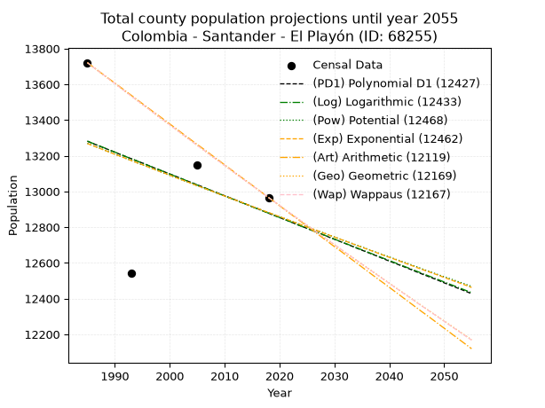
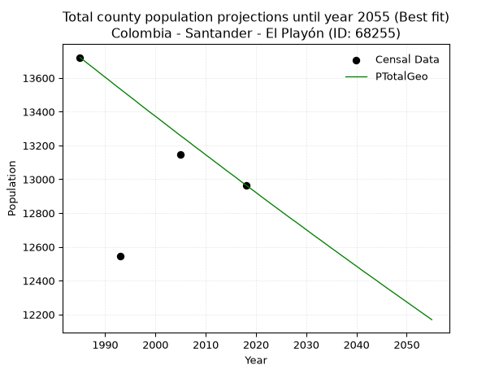
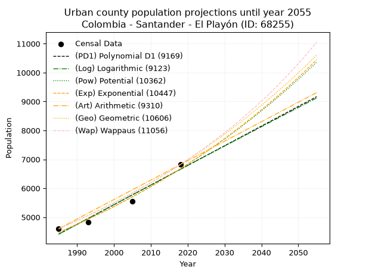
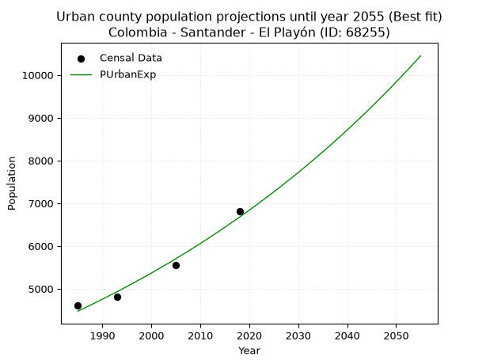
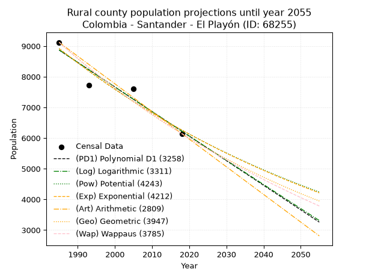
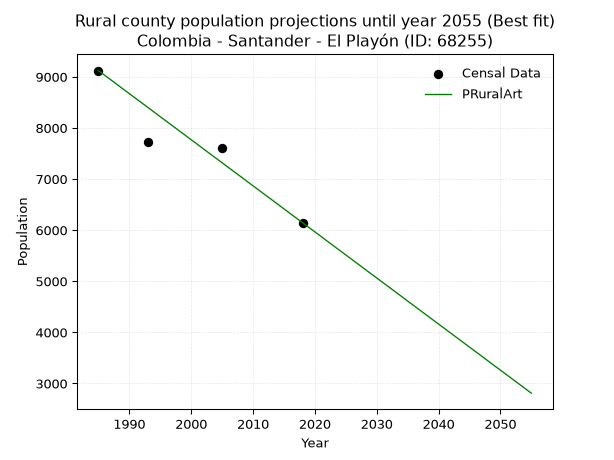

<div align="center">


</div>

# _“Population and Public Services Demand Projections (PPSD) until Year 2050 for Colombia - Santander - El Playón (ID: 68255)”_
Keywords: `population` `public-service` `projection` `lineal` `polynomial` `logarithmic` `potential` `exponential` `arithmetic` `geometric` `wappaus` `dane` `colombia` `south-america`

PPSD are analytical estimates used by governments and planners to anticipate future changes in population size, age distribution, and the resulting community needs for utilities, healthcare, education, and infrastructure as sizing future water treatment facilities, electrical grids, and road networks based on spatial growth.

> **General running parameters**: • app_version: _v20260806_. • Python version: _3.14.7_. • Pandas version: _3.0.5_. • NumPy version: _2.5.1_. • Creates, save and include plots into reports (create_plot): _False_. • Projection until year: _2050_. • Process polynomial degree 2 and up: _False_. • Process Wappaus: _True_. • Process Wappaus: _True_. • Set negative values to zero: _True_. • Set infinite values to zero: _True_. • Drop dataset notes: _True_. 
<div align="center">

Dynamic map: [:earth_americas:Google](http://maps.google.com/maps?q=7.470715181,-73.2028703) [:earth_americas:OSM](https://www.openstreetmap.org/#map=18/7.470715181/-73.2028703&layers=P) [:earth_americas:Bing](https://www.bing.com/maps?cp=7.470715181~-73.2028703&lvl=18) [:earth_americas:Apple](https://maps.apple.com/frame?center=7.470715181%2C-73.2028703&span=0.003%2C0.006)

</div>


<div align="center">

```geojson
{
  "type": "Feature",
  "geometry": {
    "type": "Point", 
    "coordinates": [-73.2028703, 7.470715181]
  }, 
  "properties": {
    "Name": "Colombia - Santander - El Playón (ID: 68255)"
  }
}
```

</div>


## 0. Census Data (4 records)

Census data are official statistics collected by a government about the people and housing in a country. They usually include counts of total population, age, sex, race, income, education, and jobs.

📅Global census file: [Population.xlsx](../data/Population.xlsx)

| Source   |   Year |   CountryID | CountryName   |   StateID | StateName   |   CountyID | CountyName   |   PTotal |   PUrban |   PRural |
|:---------|-------:|------------:|:--------------|----------:|:------------|-----------:|:-------------|---------:|---------:|---------:|
| DANE     |   1985 |          57 | Colombia      |        68 | Santander   |      68255 | El Playón    |    13721 |     4601 |     9120 |
| DANE     |   1993 |          57 | Colombia      |        68 | Santander   |      68255 | El Playón    |    12544 |     4821 |     7723 |
| DANE     |   2005 |          57 | Colombia      |        68 | Santander   |      68255 | El Playón    |    13148 |     5551 |     7597 |
| DANE     |   2018 |          57 | Colombia      |        68 | Santander   |      68255 | El Playón    |    12966 |     6821 |     6145 |

> 🔥Some records could had specific notes about the registered values or the corresponding urban or rural distribution.

## 1. Total

### 1.1. Coefficients and Parameters

* (PD1) Polynomial Deg 1: -12.187474909674709, 37472.74668807683 (lineal)
* (Log) Logarithmic: -24474.460659736276, 199125.32160067448
* (Pow) Potential: -1.7963440771211072, 10.046739908805174
* (Exp) Exponential: -0.000894426747181124, 78317.38774671349
* (Art) Arithmetic: Year diff. 2018 - 1985 = 33, Population diff. 12966 - 13721 = -755, Annual growth = -22.87878787878788
* (Geo) Geometric: Year diff. 2018 - 1985 = 33, Population diff. 12966 - 13721 = -755, Annual growth % = -0.0017135894953868025
* (Wap) Wappaus: i = -0.17146017071074215, Condition values only valid for < 200)

<sub>
Wappaus condition values: ['-0.00', '-0.17', '-0.34', '-0.51', '-0.69', '-0.86', '-1.03', '-1.20', '-1.37', '-1.54', '-1.71', '-1.89', '-2.06', '-2.23', '-2.40', '-2.57', '-2.74', '-2.91', '-3.09', '-3.26', '-3.43', '-3.60', '-3.77', '-3.94', '-4.12', '-4.29', '-4.46', '-4.63', '-4.80', '-4.97', '-5.14', '-5.32', '-5.49', '-5.66', '-5.83', '-6.00', '-6.17', '-6.34', '-6.52', '-6.69', '-6.86', '-7.03', '-7.20', '-7.37', '-7.54', '-7.72', '-7.89', '-8.06', '-8.23', '-8.40', '-8.57', '-8.74', '-8.92', '-9.09', '-9.26', '-9.43', '-9.60', '-9.77', '-9.94', '-10.12', '-10.29', '-10.46', '-10.63', '-10.80', '-10.97', '-11.14']
</sub>


### 1.2. Projected Dataset

|   Year |   CountyID |   PTotalPD1 |   PTotalLog |   PTotalPow |   PTotalExp |   PTotalArt |   PTotalGeo |   PTotalWap |
|-------:|-----------:|------------:|------------:|------------:|------------:|------------:|------------:|------------:|
|   1985 |      68255 |       13281 |       13282 |       13269 |       13268 |       13721 |       13721 |       13721 |
|   1986 |      68255 |       13268 |       13269 |       13257 |       13256 |       13698 |       13697 |       13697 |
|   1987 |      68255 |       13256 |       13257 |       13245 |       13244 |       13675 |       13674 |       13674 |
|   1988 |      68255 |       13244 |       13245 |       13233 |       13232 |       13652 |       13651 |       13651 |
|   1989 |      68255 |       13232 |       13232 |       13221 |       13220 |       13629 |       13627 |       13627 |
|   1990 |      68255 |       13220 |       13220 |       13209 |       13208 |       13607 |       13604 |       13604 |
|   1991 |      68255 |       13207 |       13208 |       13197 |       13197 |       13584 |       13581 |       13581 |
|   1992 |      68255 |       13195 |       13195 |       13185 |       13185 |       13561 |       13557 |       13557 |
|   1993 |      68255 |       13183 |       13183 |       13173 |       13173 |       13538 |       13534 |       13534 |
|   1994 |      68255 |       13171 |       13171 |       13161 |       13161 |       13515 |       13511 |       13511 |
|   1995 |      68255 |       13159 |       13159 |       13149 |       13150 |       13492 |       13488 |       13488 |
|   1996 |      68255 |       13147 |       13146 |       13138 |       13138 |       13469 |       13465 |       13465 |
|   1997 |      68255 |       13134 |       13134 |       13126 |       13126 |       13446 |       13441 |       13442 |
|   1998 |      68255 |       13122 |       13122 |       13114 |       13114 |       13424 |       13418 |       13419 |
|   1999 |      68255 |       13110 |       13110 |       13102 |       13103 |       13401 |       13395 |       13396 |
|   2000 |      68255 |       13098 |       13097 |       13090 |       13091 |       13378 |       13373 |       13373 |
|   2001 |      68255 |       13086 |       13085 |       13079 |       13079 |       13355 |       13350 |       13350 |
|   2002 |      68255 |       13073 |       13073 |       13067 |       13067 |       13332 |       13327 |       13327 |
|   2003 |      68255 |       13061 |       13061 |       13055 |       13056 |       13309 |       13304 |       13304 |
|   2004 |      68255 |       13049 |       13048 |       13044 |       13044 |       13286 |       13281 |       13281 |
|   2005 |      68255 |       13037 |       13036 |       13032 |       13032 |       13263 |       13258 |       13258 |
|   2006 |      68255 |       13025 |       13024 |       13020 |       13021 |       13241 |       13236 |       13236 |
|   2007 |      68255 |       13012 |       13012 |       13009 |       13009 |       13218 |       13213 |       13213 |
|   2008 |      68255 |       13000 |       13000 |       12997 |       12998 |       13195 |       13190 |       13190 |
|   2009 |      68255 |       12988 |       12987 |       12985 |       12986 |       13172 |       13168 |       13168 |
|   2010 |      68255 |       12976 |       12975 |       12974 |       12974 |       13149 |       13145 |       13145 |
|   2011 |      68255 |       12964 |       12963 |       12962 |       12963 |       13126 |       13123 |       13123 |
|   2012 |      68255 |       12952 |       12951 |       12951 |       12951 |       13103 |       13100 |       13100 |
|   2013 |      68255 |       12939 |       12939 |       12939 |       12940 |       13080 |       13078 |       13078 |
|   2014 |      68255 |       12927 |       12927 |       12927 |       12928 |       13058 |       13055 |       13055 |
|   2015 |      68255 |       12915 |       12914 |       12916 |       12916 |       13035 |       13033 |       13033 |
|   2016 |      68255 |       12903 |       12902 |       12904 |       12905 |       13012 |       13011 |       13011 |
|   2017 |      68255 |       12891 |       12890 |       12893 |       12893 |       12989 |       12988 |       12988 |
|   2018 |      68255 |       12878 |       12878 |       12881 |       12882 |       12966 |       12966 |       12966 |
|   2019 |      68255 |       12866 |       12866 |       12870 |       12870 |       12943 |       12944 |       12944 |
|   2020 |      68255 |       12854 |       12854 |       12859 |       12859 |       12920 |       12922 |       12922 |
|   2021 |      68255 |       12842 |       12842 |       12847 |       12847 |       12897 |       12899 |       12899 |
|   2022 |      68255 |       12830 |       12830 |       12836 |       12836 |       12874 |       12877 |       12877 |
|   2023 |      68255 |       12817 |       12817 |       12824 |       12824 |       12852 |       12855 |       12855 |
|   2024 |      68255 |       12805 |       12805 |       12813 |       12813 |       12829 |       12833 |       12833 |
|   2025 |      68255 |       12793 |       12793 |       12802 |       12801 |       12806 |       12811 |       12811 |
|   2026 |      68255 |       12781 |       12781 |       12790 |       12790 |       12783 |       12789 |       12789 |
|   2027 |      68255 |       12769 |       12769 |       12779 |       12779 |       12760 |       12767 |       12767 |
|   2028 |      68255 |       12757 |       12757 |       12768 |       12767 |       12737 |       12746 |       12745 |
|   2029 |      68255 |       12744 |       12745 |       12756 |       12756 |       12714 |       12724 |       12723 |
|   2030 |      68255 |       12732 |       12733 |       12745 |       12744 |       12691 |       12702 |       12702 |
|   2031 |      68255 |       12720 |       12721 |       12734 |       12733 |       12669 |       12680 |       12680 |
|   2032 |      68255 |       12708 |       12709 |       12722 |       12722 |       12646 |       12658 |       12658 |
|   2033 |      68255 |       12696 |       12697 |       12711 |       12710 |       12623 |       12637 |       12636 |
|   2034 |      68255 |       12683 |       12685 |       12700 |       12699 |       12600 |       12615 |       12615 |
|   2035 |      68255 |       12671 |       12673 |       12689 |       12687 |       12577 |       12593 |       12593 |
|   2036 |      68255 |       12659 |       12661 |       12678 |       12676 |       12554 |       12572 |       12571 |
|   2037 |      68255 |       12647 |       12649 |       12666 |       12665 |       12531 |       12550 |       12550 |
|   2038 |      68255 |       12635 |       12637 |       12655 |       12653 |       12508 |       12529 |       12528 |
|   2039 |      68255 |       12622 |       12625 |       12644 |       12642 |       12486 |       12507 |       12507 |
|   2040 |      68255 |       12610 |       12613 |       12633 |       12631 |       12463 |       12486 |       12485 |
|   2041 |      68255 |       12598 |       12601 |       12622 |       12620 |       12440 |       12464 |       12464 |
|   2042 |      68255 |       12586 |       12589 |       12611 |       12608 |       12417 |       12443 |       12442 |
|   2043 |      68255 |       12574 |       12577 |       12600 |       12597 |       12394 |       12422 |       12421 |
|   2044 |      68255 |       12562 |       12565 |       12589 |       12586 |       12371 |       12401 |       12400 |
|   2045 |      68255 |       12549 |       12553 |       12578 |       12574 |       12348 |       12379 |       12378 |
|   2046 |      68255 |       12537 |       12541 |       12566 |       12563 |       12325 |       12358 |       12357 |
|   2047 |      68255 |       12525 |       12529 |       12555 |       12552 |       12303 |       12337 |       12336 |
|   2048 |      68255 |       12513 |       12517 |       12544 |       12541 |       12280 |       12316 |       12315 |
|   2049 |      68255 |       12501 |       12505 |       12533 |       12530 |       12257 |       12295 |       12294 |
|   2050 |      68255 |       12488 |       12493 |       12522 |       12518 |       12234 |       12274 |       12273 |
<div align="center">

</img>

</div>


### 1.3. Best fit with absolute and relative error (%)

Relative error puts that difference into context by dividing the absolute error by the true value, creating a unitless ratio or percentage that shows the scale of the mistake.

Absolute and relative error

|   Year | Source   |   CountryID | CountryName   |   StateID | StateName   |   CountyID_x | CountyName   |   PTotal |   PUrban |   PRural |   CountyID_y |   PTotalPD1 |   PTotalLog |   PTotalPow |   PTotalExp |   PTotalArt |   PTotalGeo |   PTotalWap |   PTotalPD1AbsError |   PTotalLogAbsError |   PTotalPowAbsError |   PTotalExpAbsError |   PTotalArtAbsError |   PTotalGeoAbsError |   PTotalWapAbsError |   PTotalPD1RelError |   PTotalLogRelError |   PTotalPowRelError |   PTotalExpRelError |   PTotalArtRelError |   PTotalGeoRelError |   PTotalWapRelError |
|-------:|:---------|------------:|:--------------|----------:|:------------|-------------:|:-------------|---------:|---------:|---------:|-------------:|------------:|------------:|------------:|------------:|------------:|------------:|------------:|--------------------:|--------------------:|--------------------:|--------------------:|--------------------:|--------------------:|--------------------:|--------------------:|--------------------:|--------------------:|--------------------:|--------------------:|--------------------:|--------------------:|
|   1985 | DANE     |          57 | Colombia      |        68 | Santander   |        68255 | El Playón    |    13721 |     4601 |     9120 |        68255 |       13281 |       13282 |       13269 |       13268 |       13721 |       13721 |       13721 |                 440 |                 439 |                 452 |                 453 |                   0 |                   0 |                   0 |            3.20676  |            3.19948  |            3.29422  |            3.30151  |            0        |            0        |            0        |
|   1993 | DANE     |          57 | Colombia      |        68 | Santander   |        68255 | El Playón    |    12544 |     4821 |     7723 |        68255 |       13183 |       13183 |       13173 |       13173 |       13538 |       13534 |       13534 |                 639 |                 639 |                 629 |                 629 |                 994 |                 990 |                 990 |            5.09407  |            5.09407  |            5.01435  |            5.01435  |            7.92411  |            7.89222  |            7.89222  |
|   2005 | DANE     |          57 | Colombia      |        68 | Santander   |        68255 | El Playón    |    13148 |     5551 |     7597 |        68255 |       13037 |       13036 |       13032 |       13032 |       13263 |       13258 |       13258 |                 111 |                 112 |                 116 |                 116 |                 115 |                 110 |                 110 |            0.844235 |            0.851841 |            0.882263 |            0.882263 |            0.874658 |            0.836629 |            0.836629 |
|   2018 | DANE     |          57 | Colombia      |        68 | Santander   |        68255 | El Playón    |    12966 |     6821 |     6145 |        68255 |       12878 |       12878 |       12881 |       12882 |       12966 |       12966 |       12966 |                  88 |                  88 |                  85 |                  84 |                   0 |                   0 |                   0 |            0.678698 |            0.678698 |            0.655561 |            0.647848 |            0        |            0        |            0        |

Relative error mean

| Method    |   RelError | Best   |
|:----------|-----------:|:-------|
| PTotalPD1 |    2.45594 |        |
| PTotalLog |    2.45602 |        |
| PTotalPow |    2.4616  |        |
| PTotalExp |    2.46149 |        |
| PTotalArt |    2.19969 |        |
| PTotalGeo |    2.18221 | True   |
| PTotalWap |    2.18221 | True   |

💙Best method: _**PTotalGeo**_
<div align="center">

</img>

</div>


### 1.4. Fresh water supply demand in liters per capita per day (lpcd)

The fresh water supply demand typically ranges from 100 to 300 liters per capita per day (lpcd) for standard domestic and municipal planning, though absolute survival minimums set by the World Health Organization are as low as 7.5 to 20 liters per day, and total consumption in high-income nations can exceed 400 liters.

> `CZ`: Level in meters above the sea level (masl)<br> `WS`: Fresh water supply demand in liters per capita per day (lpcd or l/h/d)<br> `WSAll`: Zonal fresh water supply demand in liters per second (l/s)<br> `A`: Zonal area in square meters<br> `DP`: Population density (people/hectare)

Reference values (RAS Colombia)

|    CZ |   WS |
|------:|-----:|
|  1000 |  120 |
|  2000 |  130 |
| 99999 |  140 |

County shapefile geometry properties and water supply values

|   CountyID |      ATotal |   CZTotal |   WSTotal |
|-----------:|------------:|----------:|----------:|
|      68255 | 4.54153e+08 |   1164.15 |       130 |

Projected values for best method: PTotalGeo

|   CountyID |   Year |   PTotalGeo |   DPTotal |   WSTotal |   WSTotalAll |
|-----------:|-------:|------------:|----------:|----------:|-------------:|
|      68255 |   1985 |       13721 |      0.3  |       130 |      20.645  |
|      68255 |   1986 |       13697 |      0.3  |       130 |      20.6089 |
|      68255 |   1987 |       13674 |      0.3  |       130 |      20.5743 |
|      68255 |   1988 |       13651 |      0.3  |       130 |      20.5397 |
|      68255 |   1989 |       13627 |      0.3  |       130 |      20.5036 |
|      68255 |   1990 |       13604 |      0.3  |       130 |      20.469  |
|      68255 |   1991 |       13581 |      0.3  |       130 |      20.4344 |
|      68255 |   1992 |       13557 |      0.3  |       130 |      20.3983 |
|      68255 |   1993 |       13534 |      0.3  |       130 |      20.3637 |
|      68255 |   1994 |       13511 |      0.3  |       130 |      20.3291 |
|      68255 |   1995 |       13488 |      0.3  |       130 |      20.2944 |
|      68255 |   1996 |       13465 |      0.3  |       130 |      20.2598 |
|      68255 |   1997 |       13441 |      0.3  |       130 |      20.2237 |
|      68255 |   1998 |       13418 |      0.3  |       130 |      20.1891 |
|      68255 |   1999 |       13395 |      0.29 |       130 |      20.1545 |
|      68255 |   2000 |       13373 |      0.29 |       130 |      20.1214 |
|      68255 |   2001 |       13350 |      0.29 |       130 |      20.0868 |
|      68255 |   2002 |       13327 |      0.29 |       130 |      20.0522 |
|      68255 |   2003 |       13304 |      0.29 |       130 |      20.0176 |
|      68255 |   2004 |       13281 |      0.29 |       130 |      19.983  |
|      68255 |   2005 |       13258 |      0.29 |       130 |      19.9484 |
|      68255 |   2006 |       13236 |      0.29 |       130 |      19.9153 |
|      68255 |   2007 |       13213 |      0.29 |       130 |      19.8807 |
|      68255 |   2008 |       13190 |      0.29 |       130 |      19.8461 |
|      68255 |   2009 |       13168 |      0.29 |       130 |      19.813  |
|      68255 |   2010 |       13145 |      0.29 |       130 |      19.7784 |
|      68255 |   2011 |       13123 |      0.29 |       130 |      19.7453 |
|      68255 |   2012 |       13100 |      0.29 |       130 |      19.7106 |
|      68255 |   2013 |       13078 |      0.29 |       130 |      19.6775 |
|      68255 |   2014 |       13055 |      0.29 |       130 |      19.6429 |
|      68255 |   2015 |       13033 |      0.29 |       130 |      19.6098 |
|      68255 |   2016 |       13011 |      0.29 |       130 |      19.5767 |
|      68255 |   2017 |       12988 |      0.29 |       130 |      19.5421 |
|      68255 |   2018 |       12966 |      0.29 |       130 |      19.509  |
|      68255 |   2019 |       12944 |      0.29 |       130 |      19.4759 |
|      68255 |   2020 |       12922 |      0.28 |       130 |      19.4428 |
|      68255 |   2021 |       12899 |      0.28 |       130 |      19.4082 |
|      68255 |   2022 |       12877 |      0.28 |       130 |      19.3751 |
|      68255 |   2023 |       12855 |      0.28 |       130 |      19.342  |
|      68255 |   2024 |       12833 |      0.28 |       130 |      19.3089 |
|      68255 |   2025 |       12811 |      0.28 |       130 |      19.2758 |
|      68255 |   2026 |       12789 |      0.28 |       130 |      19.2427 |
|      68255 |   2027 |       12767 |      0.28 |       130 |      19.2096 |
|      68255 |   2028 |       12746 |      0.28 |       130 |      19.178  |
|      68255 |   2029 |       12724 |      0.28 |       130 |      19.1449 |
|      68255 |   2030 |       12702 |      0.28 |       130 |      19.1118 |
|      68255 |   2031 |       12680 |      0.28 |       130 |      19.0787 |
|      68255 |   2032 |       12658 |      0.28 |       130 |      19.0456 |
|      68255 |   2033 |       12637 |      0.28 |       130 |      19.014  |
|      68255 |   2034 |       12615 |      0.28 |       130 |      18.9809 |
|      68255 |   2035 |       12593 |      0.28 |       130 |      18.9478 |
|      68255 |   2036 |       12572 |      0.28 |       130 |      18.9162 |
|      68255 |   2037 |       12550 |      0.28 |       130 |      18.8831 |
|      68255 |   2038 |       12529 |      0.28 |       130 |      18.8515 |
|      68255 |   2039 |       12507 |      0.28 |       130 |      18.8184 |
|      68255 |   2040 |       12486 |      0.27 |       130 |      18.7868 |
|      68255 |   2041 |       12464 |      0.27 |       130 |      18.7537 |
|      68255 |   2042 |       12443 |      0.27 |       130 |      18.7221 |
|      68255 |   2043 |       12422 |      0.27 |       130 |      18.6905 |
|      68255 |   2044 |       12401 |      0.27 |       130 |      18.6589 |
|      68255 |   2045 |       12379 |      0.27 |       130 |      18.6258 |
|      68255 |   2046 |       12358 |      0.27 |       130 |      18.5942 |
|      68255 |   2047 |       12337 |      0.27 |       130 |      18.5626 |
|      68255 |   2048 |       12316 |      0.27 |       130 |      18.531  |
|      68255 |   2049 |       12295 |      0.27 |       130 |      18.4994 |
|      68255 |   2050 |       12274 |      0.27 |       130 |      18.4678 |

## 2. Urban

### 2.1. Coefficients and Parameters

* (PD1) Polynomial Deg 1: 67.96065837013164, -130489.8069048558 (lineal)
* (Log) Logarithmic: 135963.81395859955, -1028013.5394449414
* (Pow) Potential: 24.23108360291047, -76.2575924294702
* (Exp) Exponential: 0.012110342115355709, 1.624904297895376e-07
* (Art) Arithmetic: Year diff. 2018 - 1985 = 33, Population diff. 6821 - 4601 = 2220, Annual growth = 67.27272727272727
* (Geo) Geometric: Year diff. 2018 - 1985 = 33, Population diff. 6821 - 4601 = 2220, Annual growth % = 0.012002747091381716
* (Wap) Wappaus: i = 1.177950048550644, Condition values only valid for < 200)

<sub>
Wappaus condition values: ['0.00', '1.18', '2.36', '3.53', '4.71', '5.89', '7.07', '8.25', '9.42', '10.60', '11.78', '12.96', '14.14', '15.31', '16.49', '17.67', '18.85', '20.03', '21.20', '22.38', '23.56', '24.74', '25.91', '27.09', '28.27', '29.45', '30.63', '31.80', '32.98', '34.16', '35.34', '36.52', '37.69', '38.87', '40.05', '41.23', '42.41', '43.58', '44.76', '45.94', '47.12', '48.30', '49.47', '50.65', '51.83', '53.01', '54.19', '55.36', '56.54', '57.72', '58.90', '60.08', '61.25', '62.43', '63.61', '64.79', '65.97', '67.14', '68.32', '69.50', '70.68', '71.85', '73.03', '74.21', '75.39', '76.57']
</sub>


### 2.2. Projected Dataset

|   Year |   CountyID |   PUrbanPD1 |   PUrbanLog |   PUrbanPow |   PUrbanExp |   PUrbanArt |   PUrbanGeo |   PUrbanWap |
|-------:|-----------:|------------:|------------:|------------:|------------:|------------:|------------:|------------:|
|   1985 |      68255 |        4412 |        4411 |        4474 |        4476 |        4601 |        4601 |        4601 |
|   1986 |      68255 |        4480 |        4479 |        4529 |        4530 |        4668 |        4656 |        4656 |
|   1987 |      68255 |        4548 |        4547 |        4585 |        4585 |        4736 |        4712 |        4711 |
|   1988 |      68255 |        4616 |        4616 |        4641 |        4641 |        4803 |        4769 |        4767 |
|   1989 |      68255 |        4684 |        4684 |        4698 |        4698 |        4870 |        4826 |        4823 |
|   1990 |      68255 |        4752 |        4753 |        4755 |        4755 |        4937 |        4884 |        4880 |
|   1991 |      68255 |        4820 |        4821 |        4814 |        4813 |        5005 |        4942 |        4938 |
|   1992 |      68255 |        4888 |        4889 |        4873 |        4871 |        5072 |        5002 |        4997 |
|   1993 |      68255 |        4956 |        4957 |        4932 |        4931 |        5139 |        5062 |        5056 |
|   1994 |      68255 |        5024 |        5026 |        4993 |        4991 |        5206 |        5123 |        5116 |
|   1995 |      68255 |        5092 |        5094 |        5054 |        5052 |        5274 |        5184 |        5177 |
|   1996 |      68255 |        5160 |        5162 |        5115 |        5113 |        5341 |        5246 |        5238 |
|   1997 |      68255 |        5228 |        5230 |        5178 |        5176 |        5408 |        5309 |        5301 |
|   1998 |      68255 |        5296 |        5298 |        5241 |        5239 |        5476 |        5373 |        5364 |
|   1999 |      68255 |        5364 |        5366 |        5305 |        5302 |        5543 |        5437 |        5428 |
|   2000 |      68255 |        5432 |        5434 |        5370 |        5367 |        5610 |        5503 |        5493 |
|   2001 |      68255 |        5499 |        5502 |        5435 |        5432 |        5677 |        5569 |        5558 |
|   2002 |      68255 |        5567 |        5570 |        5501 |        5499 |        5745 |        5636 |        5625 |
|   2003 |      68255 |        5635 |        5638 |        5568 |        5566 |        5812 |        5703 |        5692 |
|   2004 |      68255 |        5703 |        5706 |        5636 |        5633 |        5879 |        5772 |        5761 |
|   2005 |      68255 |        5771 |        5774 |        5704 |        5702 |        5946 |        5841 |        5830 |
|   2006 |      68255 |        5839 |        5841 |        5774 |        5772 |        6014 |        5911 |        5900 |
|   2007 |      68255 |        5907 |        5909 |        5844 |        5842 |        6081 |        5982 |        5971 |
|   2008 |      68255 |        5975 |        5977 |        5915 |        5913 |        6148 |        6054 |        6043 |
|   2009 |      68255 |        6043 |        6045 |        5987 |        5985 |        6216 |        6127 |        6116 |
|   2010 |      68255 |        6111 |        6112 |        6059 |        6058 |        6283 |        6200 |        6190 |
|   2011 |      68255 |        6179 |        6180 |        6133 |        6132 |        6350 |        6274 |        6265 |
|   2012 |      68255 |        6247 |        6247 |        6207 |        6207 |        6417 |        6350 |        6341 |
|   2013 |      68255 |        6315 |        6315 |        6282 |        6282 |        6485 |        6426 |        6418 |
|   2014 |      68255 |        6383 |        6383 |        6358 |        6359 |        6552 |        6503 |        6496 |
|   2015 |      68255 |        6451 |        6450 |        6435 |        6436 |        6619 |        6581 |        6576 |
|   2016 |      68255 |        6519 |        6518 |        6513 |        6515 |        6686 |        6660 |        6656 |
|   2017 |      68255 |        6587 |        6585 |        6592 |        6594 |        6754 |        6740 |        6738 |
|   2018 |      68255 |        6655 |        6652 |        6672 |        6674 |        6821 |        6821 |        6821 |
|   2019 |      68255 |        6723 |        6720 |        6752 |        6756 |        6888 |        6903 |        6905 |
|   2020 |      68255 |        6791 |        6787 |        6834 |        6838 |        6956 |        6986 |        6990 |
|   2021 |      68255 |        6859 |        6854 |        6916 |        6921 |        7023 |        7070 |        7077 |
|   2022 |      68255 |        6927 |        6922 |        7000 |        7006 |        7090 |        7154 |        7165 |
|   2023 |      68255 |        6995 |        6989 |        7084 |        7091 |        7157 |        7240 |        7254 |
|   2024 |      68255 |        7063 |        7056 |        7169 |        7177 |        7225 |        7327 |        7345 |
|   2025 |      68255 |        7131 |        7123 |        7256 |        7265 |        7292 |        7415 |        7437 |
|   2026 |      68255 |        7198 |        7190 |        7343 |        7353 |        7359 |        7504 |        7531 |
|   2027 |      68255 |        7266 |        7257 |        7431 |        7443 |        7426 |        7594 |        7625 |
|   2028 |      68255 |        7334 |        7324 |        7521 |        7534 |        7494 |        7685 |        7722 |
|   2029 |      68255 |        7402 |        7391 |        7611 |        7625 |        7561 |        7778 |        7820 |
|   2030 |      68255 |        7470 |        7458 |        7702 |        7718 |        7628 |        7871 |        7919 |
|   2031 |      68255 |        7538 |        7525 |        7795 |        7812 |        7696 |        7965 |        8021 |
|   2032 |      68255 |        7606 |        7592 |        7888 |        7908 |        7763 |        8061 |        8123 |
|   2033 |      68255 |        7674 |        7659 |        7983 |        8004 |        7830 |        8158 |        8228 |
|   2034 |      68255 |        7742 |        7726 |        8079 |        8101 |        7897 |        8256 |        8334 |
|   2035 |      68255 |        7810 |        7793 |        8175 |        8200 |        7965 |        8355 |        8442 |
|   2036 |      68255 |        7878 |        7860 |        8273 |        8300 |        8032 |        8455 |        8552 |
|   2037 |      68255 |        7946 |        7926 |        8372 |        8401 |        8099 |        8557 |        8663 |
|   2038 |      68255 |        8014 |        7993 |        8472 |        8503 |        8166 |        8659 |        8777 |
|   2039 |      68255 |        8082 |        8060 |        8574 |        8607 |        8234 |        8763 |        8893 |
|   2040 |      68255 |        8150 |        8127 |        8676 |        8712 |        8301 |        8868 |        9010 |
|   2041 |      68255 |        8218 |        8193 |        8780 |        8818 |        8368 |        8975 |        9130 |
|   2042 |      68255 |        8286 |        8260 |        8885 |        8926 |        8436 |        9083 |        9252 |
|   2043 |      68255 |        8354 |        8326 |        8991 |        9034 |        8503 |        9192 |        9375 |
|   2044 |      68255 |        8422 |        8393 |        9098 |        9144 |        8570 |        9302 |        9502 |
|   2045 |      68255 |        8490 |        8459 |        9206 |        9256 |        8637 |        9414 |        9630 |
|   2046 |      68255 |        8558 |        8526 |        9316 |        9369 |        8705 |        9527 |        9761 |
|   2047 |      68255 |        8626 |        8592 |        9427 |        9483 |        8772 |        9641 |        9894 |
|   2048 |      68255 |        8694 |        8659 |        9539 |        9598 |        8839 |        9757 |       10030 |
|   2049 |      68255 |        8762 |        8725 |        9653 |        9715 |        8906 |        9874 |       10168 |
|   2050 |      68255 |        8830 |        8791 |        9768 |        9834 |        8974 |        9992 |       10309 |
<div align="center">

</img>

</div>


### 2.3. Best fit with absolute and relative error (%)

Relative error puts that difference into context by dividing the absolute error by the true value, creating a unitless ratio or percentage that shows the scale of the mistake.

Absolute and relative error

|   Year | Source   |   CountryID | CountryName   |   StateID | StateName   |   CountyID_x | CountyName   |   PTotal |   PUrban |   PRural |   CountyID_y |   PUrbanPD1 |   PUrbanLog |   PUrbanPow |   PUrbanExp |   PUrbanArt |   PUrbanGeo |   PUrbanWap |   PUrbanPD1AbsError |   PUrbanLogAbsError |   PUrbanPowAbsError |   PUrbanExpAbsError |   PUrbanArtAbsError |   PUrbanGeoAbsError |   PUrbanWapAbsError |   PUrbanPD1RelError |   PUrbanLogRelError |   PUrbanPowRelError |   PUrbanExpRelError |   PUrbanArtRelError |   PUrbanGeoRelError |   PUrbanWapRelError |
|-------:|:---------|------------:|:--------------|----------:|:------------|-------------:|:-------------|---------:|---------:|---------:|-------------:|------------:|------------:|------------:|------------:|------------:|------------:|------------:|--------------------:|--------------------:|--------------------:|--------------------:|--------------------:|--------------------:|--------------------:|--------------------:|--------------------:|--------------------:|--------------------:|--------------------:|--------------------:|--------------------:|
|   1985 | DANE     |          57 | Colombia      |        68 | Santander   |        68255 | El Playón    |    13721 |     4601 |     9120 |        68255 |        4412 |        4411 |        4474 |        4476 |        4601 |        4601 |        4601 |                 189 |                 190 |                 127 |                 125 |                   0 |                   0 |                   0 |             4.1078  |             4.12954 |             2.76027 |             2.7168  |             0       |             0       |             0       |
|   1993 | DANE     |          57 | Colombia      |        68 | Santander   |        68255 | El Playón    |    12544 |     4821 |     7723 |        68255 |        4956 |        4957 |        4932 |        4931 |        5139 |        5062 |        5056 |                 135 |                 136 |                 111 |                 110 |                 318 |                 241 |                 235 |             2.80025 |             2.82099 |             2.30243 |             2.28168 |             6.59614 |             4.99896 |             4.87451 |
|   2005 | DANE     |          57 | Colombia      |        68 | Santander   |        68255 | El Playón    |    13148 |     5551 |     7597 |        68255 |        5771 |        5774 |        5704 |        5702 |        5946 |        5841 |        5830 |                 220 |                 223 |                 153 |                 151 |                 395 |                 290 |                 279 |             3.96325 |             4.01729 |             2.75626 |             2.72023 |             7.11583 |             5.22428 |             5.02612 |
|   2018 | DANE     |          57 | Colombia      |        68 | Santander   |        68255 | El Playón    |    12966 |     6821 |     6145 |        68255 |        6655 |        6652 |        6672 |        6674 |        6821 |        6821 |        6821 |                 166 |                 169 |                 149 |                 147 |                   0 |                   0 |                   0 |             2.43366 |             2.47764 |             2.18443 |             2.15511 |             0       |             0       |             0       |

Relative error mean

| Method    |   RelError | Best   |
|:----------|-----------:|:-------|
| PUrbanPD1 |    3.32624 |        |
| PUrbanLog |    3.36137 |        |
| PUrbanPow |    2.50085 |        |
| PUrbanExp |    2.46846 | True   |
| PUrbanArt |    3.42799 |        |
| PUrbanGeo |    2.55581 |        |
| PUrbanWap |    2.47516 |        |

💙Best method: _**PUrbanExp**_
<div align="center">

</img>

</div>


### 2.4. Fresh water supply demand in liters per capita per day (lpcd)

The fresh water supply demand typically ranges from 100 to 300 liters per capita per day (lpcd) for standard domestic and municipal planning, though absolute survival minimums set by the World Health Organization are as low as 7.5 to 20 liters per day, and total consumption in high-income nations can exceed 400 liters.

> `CZ`: Level in meters above the sea level (masl)<br> `WS`: Fresh water supply demand in liters per capita per day (lpcd or l/h/d)<br> `WSAll`: Zonal fresh water supply demand in liters per second (l/s)<br> `A`: Zonal area in square meters<br> `DP`: Population density (people/hectare)

Reference values (RAS Colombia)

|    CZ |   WS |
|------:|-----:|
|  1000 |  120 |
|  2000 |  130 |
| 99999 |  140 |

County shapefile geometry properties and water supply values

|   CountyID |   AUrban |   CZUrban |   WSUrban |
|-----------:|---------:|----------:|----------:|
|      68255 |   584863 |    440.64 |       120 |

Projected values for best method: PUrbanExp

|   CountyID |   Year |   PUrbanExp |   DPUrban |   WSUrban |   WSUrbanAll |
|-----------:|-------:|------------:|----------:|----------:|-------------:|
|      68255 |   1985 |        4476 |     76.53 |       120 |      6.21667 |
|      68255 |   1986 |        4530 |     77.45 |       120 |      6.29167 |
|      68255 |   1987 |        4585 |     78.39 |       120 |      6.36806 |
|      68255 |   1988 |        4641 |     79.35 |       120 |      6.44583 |
|      68255 |   1989 |        4698 |     80.33 |       120 |      6.525   |
|      68255 |   1990 |        4755 |     81.3  |       120 |      6.60417 |
|      68255 |   1991 |        4813 |     82.29 |       120 |      6.68472 |
|      68255 |   1992 |        4871 |     83.28 |       120 |      6.76528 |
|      68255 |   1993 |        4931 |     84.31 |       120 |      6.84861 |
|      68255 |   1994 |        4991 |     85.34 |       120 |      6.93194 |
|      68255 |   1995 |        5052 |     86.38 |       120 |      7.01667 |
|      68255 |   1996 |        5113 |     87.42 |       120 |      7.10139 |
|      68255 |   1997 |        5176 |     88.5  |       120 |      7.18889 |
|      68255 |   1998 |        5239 |     89.58 |       120 |      7.27639 |
|      68255 |   1999 |        5302 |     90.65 |       120 |      7.36389 |
|      68255 |   2000 |        5367 |     91.77 |       120 |      7.45417 |
|      68255 |   2001 |        5432 |     92.88 |       120 |      7.54444 |
|      68255 |   2002 |        5499 |     94.02 |       120 |      7.6375  |
|      68255 |   2003 |        5566 |     95.17 |       120 |      7.73056 |
|      68255 |   2004 |        5633 |     96.31 |       120 |      7.82361 |
|      68255 |   2005 |        5702 |     97.49 |       120 |      7.91944 |
|      68255 |   2006 |        5772 |     98.69 |       120 |      8.01667 |
|      68255 |   2007 |        5842 |     99.89 |       120 |      8.11389 |
|      68255 |   2008 |        5913 |    101.1  |       120 |      8.2125  |
|      68255 |   2009 |        5985 |    102.33 |       120 |      8.3125  |
|      68255 |   2010 |        6058 |    103.58 |       120 |      8.41389 |
|      68255 |   2011 |        6132 |    104.85 |       120 |      8.51667 |
|      68255 |   2012 |        6207 |    106.13 |       120 |      8.62083 |
|      68255 |   2013 |        6282 |    107.41 |       120 |      8.725   |
|      68255 |   2014 |        6359 |    108.73 |       120 |      8.83194 |
|      68255 |   2015 |        6436 |    110.04 |       120 |      8.93889 |
|      68255 |   2016 |        6515 |    111.39 |       120 |      9.04861 |
|      68255 |   2017 |        6594 |    112.74 |       120 |      9.15833 |
|      68255 |   2018 |        6674 |    114.11 |       120 |      9.26944 |
|      68255 |   2019 |        6756 |    115.51 |       120 |      9.38333 |
|      68255 |   2020 |        6838 |    116.92 |       120 |      9.49722 |
|      68255 |   2021 |        6921 |    118.34 |       120 |      9.6125  |
|      68255 |   2022 |        7006 |    119.79 |       120 |      9.73056 |
|      68255 |   2023 |        7091 |    121.24 |       120 |      9.84861 |
|      68255 |   2024 |        7177 |    122.71 |       120 |      9.96806 |
|      68255 |   2025 |        7265 |    124.22 |       120 |     10.0903  |
|      68255 |   2026 |        7353 |    125.72 |       120 |     10.2125  |
|      68255 |   2027 |        7443 |    127.26 |       120 |     10.3375  |
|      68255 |   2028 |        7534 |    128.82 |       120 |     10.4639  |
|      68255 |   2029 |        7625 |    130.37 |       120 |     10.5903  |
|      68255 |   2030 |        7718 |    131.96 |       120 |     10.7194  |
|      68255 |   2031 |        7812 |    133.57 |       120 |     10.85    |
|      68255 |   2032 |        7908 |    135.21 |       120 |     10.9833  |
|      68255 |   2033 |        8004 |    136.85 |       120 |     11.1167  |
|      68255 |   2034 |        8101 |    138.51 |       120 |     11.2514  |
|      68255 |   2035 |        8200 |    140.2  |       120 |     11.3889  |
|      68255 |   2036 |        8300 |    141.91 |       120 |     11.5278  |
|      68255 |   2037 |        8401 |    143.64 |       120 |     11.6681  |
|      68255 |   2038 |        8503 |    145.38 |       120 |     11.8097  |
|      68255 |   2039 |        8607 |    147.16 |       120 |     11.9542  |
|      68255 |   2040 |        8712 |    148.96 |       120 |     12.1     |
|      68255 |   2041 |        8818 |    150.77 |       120 |     12.2472  |
|      68255 |   2042 |        8926 |    152.62 |       120 |     12.3972  |
|      68255 |   2043 |        9034 |    154.46 |       120 |     12.5472  |
|      68255 |   2044 |        9144 |    156.34 |       120 |     12.7     |
|      68255 |   2045 |        9256 |    158.26 |       120 |     12.8556  |
|      68255 |   2046 |        9369 |    160.19 |       120 |     13.0125  |
|      68255 |   2047 |        9483 |    162.14 |       120 |     13.1708  |
|      68255 |   2048 |        9598 |    164.11 |       120 |     13.3306  |
|      68255 |   2049 |        9715 |    166.11 |       120 |     13.4931  |
|      68255 |   2050 |        9834 |    168.14 |       120 |     13.6583  |

## 3. Rural

### 3.1. Coefficients and Parameters

* (PD1) Polynomial Deg 1: -80.14813327980639, 167962.55359293276 (lineal)
* (Log) Logarithmic: -160438.27461833574, 1227138.8610456148
* (Pow) Potential: -21.438837841427947, 74.65046579691722
* (Exp) Exponential: -0.010711712515097775, 15292359715604.932
* (Art) Arithmetic: Year diff. 2018 - 1985 = 33, Population diff. 6145 - 9120 = -2975, Annual growth = -90.15151515151516
* (Geo) Geometric: Year diff. 2018 - 1985 = 33, Population diff. 6145 - 9120 = -2975, Annual growth % = -0.011893286654762636
* (Wap) Wappaus: i = -1.181153162810549, Condition values only valid for < 200)

<sub>
Wappaus condition values: ['-0.00', '-1.18', '-2.36', '-3.54', '-4.72', '-5.91', '-7.09', '-8.27', '-9.45', '-10.63', '-11.81', '-12.99', '-14.17', '-15.35', '-16.54', '-17.72', '-18.90', '-20.08', '-21.26', '-22.44', '-23.62', '-24.80', '-25.99', '-27.17', '-28.35', '-29.53', '-30.71', '-31.89', '-33.07', '-34.25', '-35.43', '-36.62', '-37.80', '-38.98', '-40.16', '-41.34', '-42.52', '-43.70', '-44.88', '-46.06', '-47.25', '-48.43', '-49.61', '-50.79', '-51.97', '-53.15', '-54.33', '-55.51', '-56.70', '-57.88', '-59.06', '-60.24', '-61.42', '-62.60', '-63.78', '-64.96', '-66.14', '-67.33', '-68.51', '-69.69', '-70.87', '-72.05', '-73.23', '-74.41', '-75.59', '-76.77']
</sub>


### 3.2. Projected Dataset

|   Year |   CountyID |   PRuralPD1 |   PRuralLog |   PRuralPow |   PRuralExp |   PRuralArt |   PRuralGeo |   PRuralWap |
|-------:|-----------:|------------:|------------:|------------:|------------:|------------:|------------:|------------:|
|   1985 |      68255 |        8869 |        8871 |        8919 |        8916 |        9120 |        9120 |        9120 |
|   1986 |      68255 |        8788 |        8790 |        8823 |        8821 |        9030 |        9012 |        9013 |
|   1987 |      68255 |        8708 |        8709 |        8728 |        8727 |        8940 |        8904 |        8907 |
|   1988 |      68255 |        8628 |        8629 |        8635 |        8634 |        8850 |        8798 |        8802 |
|   1989 |      68255 |        8548 |        8548 |        8542 |        8542 |        8759 |        8694 |        8699 |
|   1990 |      68255 |        8468 |        8467 |        8451 |        8451 |        8669 |        8590 |        8597 |
|   1991 |      68255 |        8388 |        8387 |        8360 |        8361 |        8579 |        8488 |        8496 |
|   1992 |      68255 |        8307 |        8306 |        8271 |        8272 |        8489 |        8387 |        8396 |
|   1993 |      68255 |        8227 |        8226 |        8182 |        8184 |        8399 |        8288 |        8297 |
|   1994 |      68255 |        8147 |        8145 |        8095 |        8097 |        8309 |        8189 |        8199 |
|   1995 |      68255 |        8067 |        8065 |        8008 |        8010 |        8218 |        8092 |        8103 |
|   1996 |      68255 |        7987 |        7984 |        7922 |        7925 |        8128 |        7995 |        8007 |
|   1997 |      68255 |        7907 |        7904 |        7838 |        7841 |        8038 |        7900 |        7913 |
|   1998 |      68255 |        7827 |        7824 |        7754 |        7757 |        7948 |        7806 |        7819 |
|   1999 |      68255 |        7746 |        7743 |        7671 |        7675 |        7858 |        7713 |        7727 |
|   2000 |      68255 |        7666 |        7663 |        7590 |        7593 |        7768 |        7622 |        7636 |
|   2001 |      68255 |        7586 |        7583 |        7509 |        7512 |        7678 |        7531 |        7545 |
|   2002 |      68255 |        7506 |        7503 |        7429 |        7432 |        7587 |        7441 |        7456 |
|   2003 |      68255 |        7426 |        7423 |        7350 |        7353 |        7497 |        7353 |        7367 |
|   2004 |      68255 |        7346 |        7343 |        7271 |        7274 |        7407 |        7266 |        7280 |
|   2005 |      68255 |        7266 |        7263 |        7194 |        7197 |        7317 |        7179 |        7193 |
|   2006 |      68255 |        7185 |        7183 |        7118 |        7120 |        7227 |        7094 |        7107 |
|   2007 |      68255 |        7105 |        7103 |        7042 |        7044 |        7137 |        7009 |        7023 |
|   2008 |      68255 |        7025 |        7023 |        6967 |        6969 |        7047 |        6926 |        6939 |
|   2009 |      68255 |        6945 |        6943 |        6893 |        6895 |        6956 |        6844 |        6856 |
|   2010 |      68255 |        6865 |        6863 |        6820 |        6821 |        6866 |        6762 |        6773 |
|   2011 |      68255 |        6785 |        6783 |        6748 |        6749 |        6776 |        6682 |        6692 |
|   2012 |      68255 |        6705 |        6703 |        6676 |        6677 |        6686 |        6602 |        6612 |
|   2013 |      68255 |        6624 |        6624 |        6605 |        6606 |        6596 |        6524 |        6532 |
|   2014 |      68255 |        6544 |        6544 |        6535 |        6535 |        6506 |        6446 |        6453 |
|   2015 |      68255 |        6464 |        6464 |        6466 |        6466 |        6415 |        6370 |        6375 |
|   2016 |      68255 |        6384 |        6385 |        6398 |        6397 |        6325 |        6294 |        6297 |
|   2017 |      68255 |        6304 |        6305 |        6330 |        6329 |        6235 |        6219 |        6221 |
|   2018 |      68255 |        6224 |        6226 |        6263 |        6261 |        6145 |        6145 |        6145 |
|   2019 |      68255 |        6143 |        6146 |        6197 |        6195 |        6055 |        6072 |        6070 |
|   2020 |      68255 |        6063 |        6067 |        6132 |        6129 |        5965 |        6000 |        5996 |
|   2021 |      68255 |        5983 |        5987 |        6067 |        6063 |        5875 |        5928 |        5922 |
|   2022 |      68255 |        5903 |        5908 |        6003 |        5999 |        5784 |        5858 |        5849 |
|   2023 |      68255 |        5823 |        5829 |        5940 |        5935 |        5694 |        5788 |        5777 |
|   2024 |      68255 |        5743 |        5749 |        5877 |        5872 |        5604 |        5719 |        5705 |
|   2025 |      68255 |        5663 |        5670 |        5815 |        5809 |        5514 |        5651 |        5635 |
|   2026 |      68255 |        5582 |        5591 |        5754 |        5747 |        5424 |        5584 |        5564 |
|   2027 |      68255 |        5502 |        5512 |        5693 |        5686 |        5334 |        5518 |        5495 |
|   2028 |      68255 |        5422 |        5433 |        5633 |        5625 |        5243 |        5452 |        5426 |
|   2029 |      68255 |        5342 |        5354 |        5574 |        5565 |        5153 |        5387 |        5358 |
|   2030 |      68255 |        5262 |        5274 |        5516 |        5506 |        5063 |        5323 |        5290 |
|   2031 |      68255 |        5182 |        5195 |        5458 |        5447 |        4973 |        5260 |        5223 |
|   2032 |      68255 |        5102 |        5116 |        5400 |        5389 |        4883 |        5197 |        5157 |
|   2033 |      68255 |        5021 |        5038 |        5344 |        5332 |        4793 |        5135 |        5091 |
|   2034 |      68255 |        4941 |        4959 |        5288 |        5275 |        4703 |        5074 |        5026 |
|   2035 |      68255 |        4861 |        4880 |        5232 |        5219 |        4612 |        5014 |        4962 |
|   2036 |      68255 |        4781 |        4801 |        5177 |        5163 |        4522 |        4954 |        4898 |
|   2037 |      68255 |        4701 |        4722 |        5123 |        5108 |        4432 |        4895 |        4835 |
|   2038 |      68255 |        4621 |        4643 |        5070 |        5054 |        4342 |        4837 |        4772 |
|   2039 |      68255 |        4541 |        4565 |        5017 |        5000 |        4252 |        4780 |        4710 |
|   2040 |      68255 |        4460 |        4486 |        4964 |        4947 |        4162 |        4723 |        4648 |
|   2041 |      68255 |        4380 |        4407 |        4912 |        4894 |        4072 |        4667 |        4587 |
|   2042 |      68255 |        4300 |        4329 |        4861 |        4842 |        3981 |        4611 |        4526 |
|   2043 |      68255 |        4220 |        4250 |        4810 |        4790 |        3891 |        4556 |        4466 |
|   2044 |      68255 |        4140 |        4172 |        4760 |        4739 |        3801 |        4502 |        4407 |
|   2045 |      68255 |        4060 |        4093 |        4710 |        4689 |        3711 |        4449 |        4348 |
|   2046 |      68255 |        3979 |        4015 |        4661 |        4639 |        3621 |        4396 |        4289 |
|   2047 |      68255 |        3899 |        3937 |        4613 |        4589 |        3531 |        4343 |        4231 |
|   2048 |      68255 |        3819 |        3858 |        4565 |        4540 |        3440 |        4292 |        4174 |
|   2049 |      68255 |        3739 |        3780 |        4517 |        4492 |        3350 |        4241 |        4117 |
|   2050 |      68255 |        3659 |        3702 |        4470 |        4444 |        3260 |        4190 |        4060 |
<div align="center">

</img>

</div>


### 3.3. Best fit with absolute and relative error (%)

Relative error puts that difference into context by dividing the absolute error by the true value, creating a unitless ratio or percentage that shows the scale of the mistake.

Absolute and relative error

|   Year | Source   |   CountryID | CountryName   |   StateID | StateName   |   CountyID_x | CountyName   |   PTotal |   PUrban |   PRural |   CountyID_y |   PRuralPD1 |   PRuralLog |   PRuralPow |   PRuralExp |   PRuralArt |   PRuralGeo |   PRuralWap |   PRuralPD1AbsError |   PRuralLogAbsError |   PRuralPowAbsError |   PRuralExpAbsError |   PRuralArtAbsError |   PRuralGeoAbsError |   PRuralWapAbsError |   PRuralPD1RelError |   PRuralLogRelError |   PRuralPowRelError |   PRuralExpRelError |   PRuralArtRelError |   PRuralGeoRelError |   PRuralWapRelError |
|-------:|:---------|------------:|:--------------|----------:|:------------|-------------:|:-------------|---------:|---------:|---------:|-------------:|------------:|------------:|------------:|------------:|------------:|------------:|------------:|--------------------:|--------------------:|--------------------:|--------------------:|--------------------:|--------------------:|--------------------:|--------------------:|--------------------:|--------------------:|--------------------:|--------------------:|--------------------:|--------------------:|
|   1985 | DANE     |          57 | Colombia      |        68 | Santander   |        68255 | El Playón    |    13721 |     4601 |     9120 |        68255 |        8869 |        8871 |        8919 |        8916 |        9120 |        9120 |        9120 |                 251 |                 249 |                 201 |                 204 |                   0 |                   0 |                   0 |             2.75219 |             2.73026 |             2.20395 |             2.23684 |             0       |             0       |             0       |
|   1993 | DANE     |          57 | Colombia      |        68 | Santander   |        68255 | El Playón    |    12544 |     4821 |     7723 |        68255 |        8227 |        8226 |        8182 |        8184 |        8399 |        8288 |        8297 |                 504 |                 503 |                 459 |                 461 |                 676 |                 565 |                 574 |             6.52596 |             6.51301 |             5.94329 |             5.96918 |             8.75308 |             7.31581 |             7.43234 |
|   2005 | DANE     |          57 | Colombia      |        68 | Santander   |        68255 | El Playón    |    13148 |     5551 |     7597 |        68255 |        7266 |        7263 |        7194 |        7197 |        7317 |        7179 |        7193 |                 331 |                 334 |                 403 |                 400 |                 280 |                 418 |                 404 |             4.35698 |             4.39647 |             5.30473 |             5.26524 |             3.68567 |             5.50217 |             5.31789 |
|   2018 | DANE     |          57 | Colombia      |        68 | Santander   |        68255 | El Playón    |    12966 |     6821 |     6145 |        68255 |        6224 |        6226 |        6263 |        6261 |        6145 |        6145 |        6145 |                  79 |                  81 |                 118 |                 116 |                   0 |                   0 |                   0 |             1.2856  |             1.31814 |             1.92026 |             1.88771 |             0       |             0       |             0       |

Relative error mean

| Method    |   RelError | Best   |
|:----------|-----------:|:-------|
| PRuralPD1 |    3.73018 |        |
| PRuralLog |    3.73947 |        |
| PRuralPow |    3.84305 |        |
| PRuralExp |    3.83974 |        |
| PRuralArt |    3.10969 | True   |
| PRuralGeo |    3.2045  |        |
| PRuralWap |    3.18756 |        |

💙Best method: _**PRuralArt**_
<div align="center">

</img>

</div>


### 3.4. Fresh water supply demand in liters per capita per day (lpcd)

The fresh water supply demand typically ranges from 100 to 300 liters per capita per day (lpcd) for standard domestic and municipal planning, though absolute survival minimums set by the World Health Organization are as low as 7.5 to 20 liters per day, and total consumption in high-income nations can exceed 400 liters.

> `CZ`: Level in meters above the sea level (masl)<br> `WS`: Fresh water supply demand in liters per capita per day (lpcd or l/h/d)<br> `WSAll`: Zonal fresh water supply demand in liters per second (l/s)<br> `A`: Zonal area in square meters<br> `DP`: Population density (people/hectare)

Reference values (RAS Colombia)

|    CZ |   WS |
|------:|-----:|
|  1000 |  120 |
|  2000 |  130 |
| 99999 |  140 |

County shapefile geometry properties and water supply values

|   CountyID |      ARural |   CZRural |   WSRural |
|-----------:|------------:|----------:|----------:|
|      68255 | 4.53568e+08 |   1165.08 |       130 |

Projected values for best method: PRuralArt

|   CountyID |   Year |   PRuralArt |   DPRural |   WSRural |   WSRuralAll |
|-----------:|-------:|------------:|----------:|----------:|-------------:|
|      68255 |   1985 |        9120 |      0.2  |       130 |     13.7222  |
|      68255 |   1986 |        9030 |      0.2  |       130 |     13.5868  |
|      68255 |   1987 |        8940 |      0.2  |       130 |     13.4514  |
|      68255 |   1988 |        8850 |      0.2  |       130 |     13.316   |
|      68255 |   1989 |        8759 |      0.19 |       130 |     13.1791  |
|      68255 |   1990 |        8669 |      0.19 |       130 |     13.0436  |
|      68255 |   1991 |        8579 |      0.19 |       130 |     12.9082  |
|      68255 |   1992 |        8489 |      0.19 |       130 |     12.7728  |
|      68255 |   1993 |        8399 |      0.19 |       130 |     12.6374  |
|      68255 |   1994 |        8309 |      0.18 |       130 |     12.502   |
|      68255 |   1995 |        8218 |      0.18 |       130 |     12.365   |
|      68255 |   1996 |        8128 |      0.18 |       130 |     12.2296  |
|      68255 |   1997 |        8038 |      0.18 |       130 |     12.0942  |
|      68255 |   1998 |        7948 |      0.18 |       130 |     11.9588  |
|      68255 |   1999 |        7858 |      0.17 |       130 |     11.8234  |
|      68255 |   2000 |        7768 |      0.17 |       130 |     11.688   |
|      68255 |   2001 |        7678 |      0.17 |       130 |     11.5525  |
|      68255 |   2002 |        7587 |      0.17 |       130 |     11.4156  |
|      68255 |   2003 |        7497 |      0.17 |       130 |     11.2802  |
|      68255 |   2004 |        7407 |      0.16 |       130 |     11.1448  |
|      68255 |   2005 |        7317 |      0.16 |       130 |     11.0094  |
|      68255 |   2006 |        7227 |      0.16 |       130 |     10.874   |
|      68255 |   2007 |        7137 |      0.16 |       130 |     10.7385  |
|      68255 |   2008 |        7047 |      0.16 |       130 |     10.6031  |
|      68255 |   2009 |        6956 |      0.15 |       130 |     10.4662  |
|      68255 |   2010 |        6866 |      0.15 |       130 |     10.3308  |
|      68255 |   2011 |        6776 |      0.15 |       130 |     10.1954  |
|      68255 |   2012 |        6686 |      0.15 |       130 |     10.06    |
|      68255 |   2013 |        6596 |      0.15 |       130 |      9.92454 |
|      68255 |   2014 |        6506 |      0.14 |       130 |      9.78912 |
|      68255 |   2015 |        6415 |      0.14 |       130 |      9.6522  |
|      68255 |   2016 |        6325 |      0.14 |       130 |      9.51678 |
|      68255 |   2017 |        6235 |      0.14 |       130 |      9.38137 |
|      68255 |   2018 |        6145 |      0.14 |       130 |      9.24595 |
|      68255 |   2019 |        6055 |      0.13 |       130 |      9.11053 |
|      68255 |   2020 |        5965 |      0.13 |       130 |      8.97512 |
|      68255 |   2021 |        5875 |      0.13 |       130 |      8.8397  |
|      68255 |   2022 |        5784 |      0.13 |       130 |      8.70278 |
|      68255 |   2023 |        5694 |      0.13 |       130 |      8.56736 |
|      68255 |   2024 |        5604 |      0.12 |       130 |      8.43194 |
|      68255 |   2025 |        5514 |      0.12 |       130 |      8.29653 |
|      68255 |   2026 |        5424 |      0.12 |       130 |      8.16111 |
|      68255 |   2027 |        5334 |      0.12 |       130 |      8.02569 |
|      68255 |   2028 |        5243 |      0.12 |       130 |      7.88877 |
|      68255 |   2029 |        5153 |      0.11 |       130 |      7.75336 |
|      68255 |   2030 |        5063 |      0.11 |       130 |      7.61794 |
|      68255 |   2031 |        4973 |      0.11 |       130 |      7.48252 |
|      68255 |   2032 |        4883 |      0.11 |       130 |      7.34711 |
|      68255 |   2033 |        4793 |      0.11 |       130 |      7.21169 |
|      68255 |   2034 |        4703 |      0.1  |       130 |      7.07627 |
|      68255 |   2035 |        4612 |      0.1  |       130 |      6.93935 |
|      68255 |   2036 |        4522 |      0.1  |       130 |      6.80394 |
|      68255 |   2037 |        4432 |      0.1  |       130 |      6.66852 |
|      68255 |   2038 |        4342 |      0.1  |       130 |      6.5331  |
|      68255 |   2039 |        4252 |      0.09 |       130 |      6.39769 |
|      68255 |   2040 |        4162 |      0.09 |       130 |      6.26227 |
|      68255 |   2041 |        4072 |      0.09 |       130 |      6.12685 |
|      68255 |   2042 |        3981 |      0.09 |       130 |      5.98993 |
|      68255 |   2043 |        3891 |      0.09 |       130 |      5.85451 |
|      68255 |   2044 |        3801 |      0.08 |       130 |      5.7191  |
|      68255 |   2045 |        3711 |      0.08 |       130 |      5.58368 |
|      68255 |   2046 |        3621 |      0.08 |       130 |      5.44826 |
|      68255 |   2047 |        3531 |      0.08 |       130 |      5.31285 |
|      68255 |   2048 |        3440 |      0.08 |       130 |      5.17593 |
|      68255 |   2049 |        3350 |      0.07 |       130 |      5.04051 |
|      68255 |   2050 |        3260 |      0.07 |       130 |      4.90509 |

<div align="center"><br><sub>Share this research</sub></div><br>

<sub>**APPS & TOOLS & CONTENT DISCLAIMER**: • NO WARRANTY - This content and software is provided by <a href="https://github.com/rcfdtools" target="_blank">github.com/rcfdtools</a> "as is", without any express or implied warranty, including warranties of merchantability, fitness for a particular purpose, or non-infringement. There is no guarantee that the software will be error-free or operate without interruption. • LIMITATION OF LIABILITY - Neither the authors nor copyright holders will be liable for claims or damages arising from the software or its use. You are responsible for determining if the software is appropriate for your use and assume all associated risks, including errors, legal compliance, and data loss. • NO PROFESSIONAL ADVICE - The software provides general information and does not offer professional advice. It should not replace consultation with professional advisors. [Clauses and global license for rcfdtools use.](https://github.com/rcfdtools/rcfdtools/blob/main/LICENSE.md)</sub>

| [:house: Home](Readme.md)  | [:beginner: Help / Collaborate](https://github.com/rcfdtools/R.HydroTools/discussions/31) |
|----------------------------|-------------------------------------------------------------------------------------------|