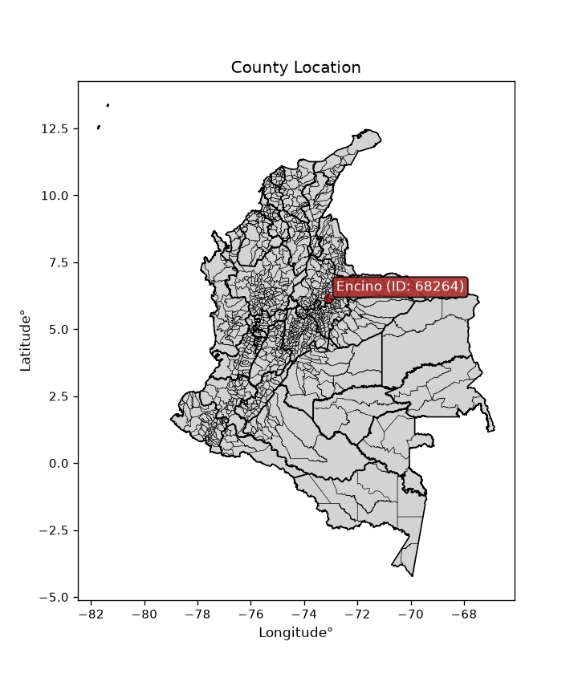
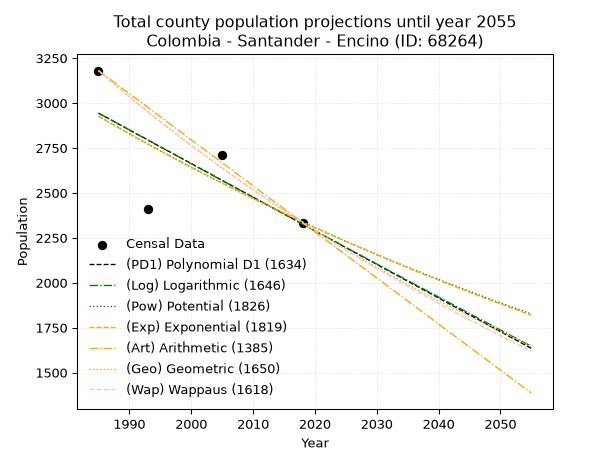
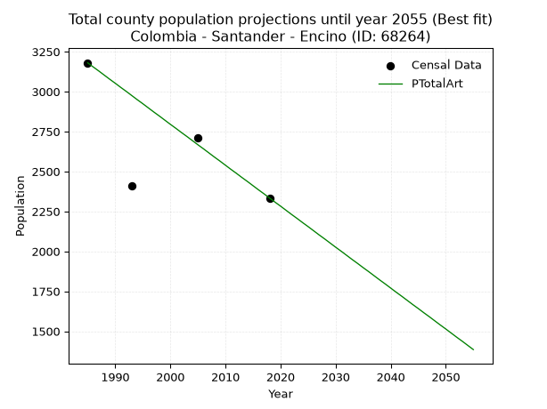
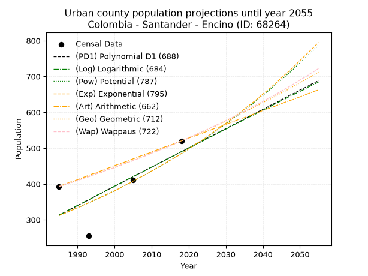
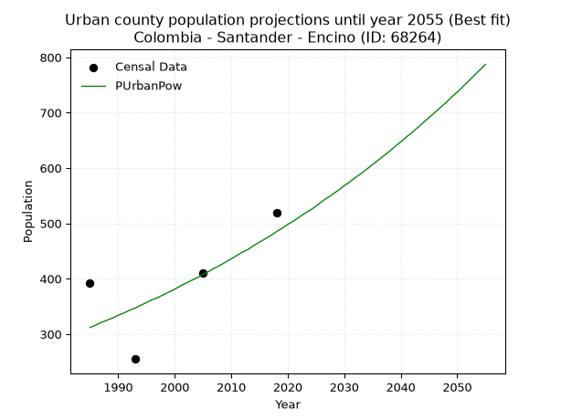
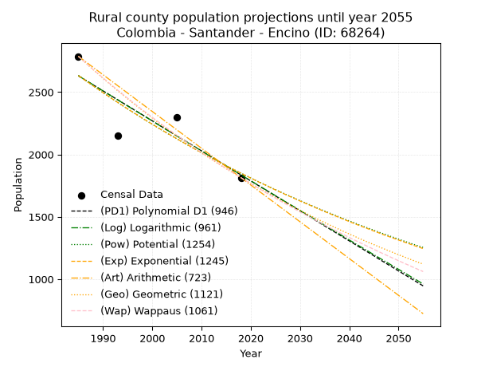
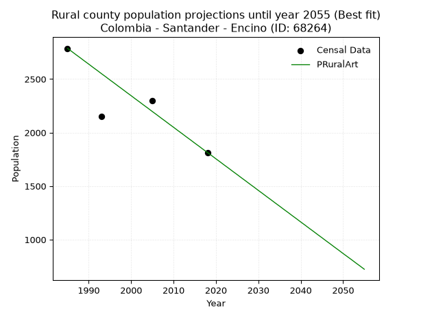

<div align="center">


</div>

# _“Population and Public Services Demand Projections (PPSD) until Year 2050 for Colombia - Santander - Encino (ID: 68264)”_
Keywords: `population` `public-service` `projection` `lineal` `polynomial` `logarithmic` `potential` `exponential` `arithmetic` `geometric` `wappaus` `dane` `colombia` `south-america`

PPSD are analytical estimates used by governments and planners to anticipate future changes in population size, age distribution, and the resulting community needs for utilities, healthcare, education, and infrastructure as sizing future water treatment facilities, electrical grids, and road networks based on spatial growth.

<div align="center">

</img>

</div>


> **General running parameters**: • app_version: _v20260806_. • Python version: _3.14.7_. • Pandas version: _3.0.5_. • NumPy version: _2.5.1_. • Creates, save and include plots into reports (create_plot): _False_. • Projection until year: _2050_. • Process polynomial degree 2 and up: _False_. • Process Wappaus: _True_. • Process Wappaus: _True_. • Set negative values to zero: _True_. • Set infinite values to zero: _True_. • Drop dataset notes: _True_. 
<div align="center">

Dynamic map: [:earth_americas:Google](http://maps.google.com/maps?q=6.137428981,-73.0987486) [:earth_americas:OSM](https://www.openstreetmap.org/#map=18/6.137428981/-73.0987486&layers=P) [:earth_americas:Bing](https://www.bing.com/maps?cp=6.137428981~-73.0987486&lvl=18) [:earth_americas:Apple](https://maps.apple.com/frame?center=6.137428981%2C-73.0987486&span=0.003%2C0.006)

</div>


<div align="center">

```geojson
{
  "type": "Feature",
  "geometry": {
    "type": "Point", 
    "coordinates": [-73.0987486, 6.137428981]
  }, 
  "properties": {
    "Name": "Colombia - Santander - Encino (ID: 68264)"
  }
}
```

</div>


## 0. Census Data (4 records)

Census data are official statistics collected by a government about the people and housing in a country. They usually include counts of total population, age, sex, race, income, education, and jobs.

📅Global census file: [Population.xlsx](../data/Population.xlsx)

| Source   |   Year |   CountryID | CountryName   |   StateID | StateName   |   CountyID | CountyName   |   PTotal |   PUrban |   PRural |
|:---------|-------:|------------:|:--------------|----------:|:------------|-----------:|:-------------|---------:|---------:|---------:|
| DANE     |   1985 |          57 | Colombia      |        68 | Santander   |      68264 | Encino       |     3180 |      393 |     2787 |
| DANE     |   1993 |          57 | Colombia      |        68 | Santander   |      68264 | Encino       |     2408 |      255 |     2153 |
| DANE     |   2005 |          57 | Colombia      |        68 | Santander   |      68264 | Encino       |     2711 |      411 |     2300 |
| DANE     |   2018 |          57 | Colombia      |        68 | Santander   |      68264 | Encino       |     2334 |      520 |     1814 |

> 🔥Some records could had specific notes about the registered values or the corresponding urban or rural distribution.

📅[SUI-RUPS](https://www.datos.gov.co/Hacienda-y-Cr-dito-P-blico/Registro-nico-de-Prestadores-de-Servicios-P-blicos/4qkq-csdn/about_data) - Local public utility companies: [RUPS.csv](../data/RUPS.xlsx)

 | SERVICIO       | ESTADO    | NOMBRE                                                                                            | NIT         | DEPARTAMENTO_DOMICILIO   | MUNICIPIO_DOMICILIO   | DIRECCION          |   TELEFONO | EMAIL                                                | TIPO_PRESTADOR          | CLASIFICACION                 |
|:---------------|:----------|:--------------------------------------------------------------------------------------------------|:------------|:-------------------------|:----------------------|:-------------------|-----------:|:-----------------------------------------------------|:------------------------|:------------------------------|
| ACUEDUCTO      | OPERATIVA | ADMINISTRACIÓN PUBLICA COOPERATIVA DEL MUNICIPIO DE ENCINO, SANTANDER                             | 900301723-3 | SANTANDER                | ENCINO                | Calle 5 No. 3 - 22 |    7248232 | gerencia@gerencia-espaguasan-encino-santander.gov.co | ORGANIZACION AUTORIZADA | MENOR O IGUAL A 2500 USUARIOS |
| ALCANTARILLADO | OPERATIVA | ADMINISTRACIÓN PUBLICA COOPERATIVA DEL MUNICIPIO DE ENCINO, SANTANDER                             | 900301723-3 | SANTANDER                | ENCINO                | Calle 5 No. 3 - 22 |    7248232 | gerencia@gerencia-espaguasan-encino-santander.gov.co | ORGANIZACION AUTORIZADA | MENOR O IGUAL A 2500 USUARIOS |
| ACUEDUCTO      | OPERATIVA | ASOCIACION DE SUSCRIPTORES DEL ACUEDUCTO RURAL "FUENTE DE ORO" VEREDA LA CABUYA, MUNICIPIO ENCINO | 900394640-9 | SANTANDER                | ENCINO                | VEREDA LA CABUYA   |    7248232 | josegirata@yahoo.com                                 | ORGANIZACION AUTORIZADA | HASTA 2500 SUSCRIPTORES       |

## 1. Total

### 1.1. Coefficients and Parameters

* (PD1) Polynomial Deg 1: -18.702930549979683, 40068.78683259686 (lineal)
* (Log) Logarithmic: -37468.79186306375, 287458.83720720175
* (Pow) Potential: -13.612100429536573, 48.35590431396032
* (Exp) Exponential: -0.00679541852913841, 2111017507.0885885
* (Art) Arithmetic: Year diff. 2018 - 1985 = 33, Population diff. 2334 - 3180 = -846, Annual growth = -25.636363636363637
* (Geo) Geometric: Year diff. 2018 - 1985 = 33, Population diff. 2334 - 3180 = -846, Annual growth % = -0.009328870013066037
* (Wap) Wappaus: i = -0.9298644771985359, Condition values only valid for < 200)

<sub>
Wappaus condition values: ['-0.00', '-0.93', '-1.86', '-2.79', '-3.72', '-4.65', '-5.58', '-6.51', '-7.44', '-8.37', '-9.30', '-10.23', '-11.16', '-12.09', '-13.02', '-13.95', '-14.88', '-15.81', '-16.74', '-17.67', '-18.60', '-19.53', '-20.46', '-21.39', '-22.32', '-23.25', '-24.18', '-25.11', '-26.04', '-26.97', '-27.90', '-28.83', '-29.76', '-30.69', '-31.62', '-32.55', '-33.48', '-34.40', '-35.33', '-36.26', '-37.19', '-38.12', '-39.05', '-39.98', '-40.91', '-41.84', '-42.77', '-43.70', '-44.63', '-45.56', '-46.49', '-47.42', '-48.35', '-49.28', '-50.21', '-51.14', '-52.07', '-53.00', '-53.93', '-54.86', '-55.79', '-56.72', '-57.65', '-58.58', '-59.51', '-60.44']
</sub>


### 1.2. Projected Dataset

|   Year |   CountyID |   PTotalPD1 |   PTotalLog |   PTotalPow |   PTotalExp |   PTotalArt |   PTotalGeo |   PTotalWap |
|-------:|-----------:|------------:|------------:|------------:|------------:|------------:|------------:|------------:|
|   1985 |      68264 |        2943 |        2944 |        2927 |        2926 |        3180 |        3180 |        3180 |
|   1986 |      68264 |        2925 |        2925 |        2907 |        2907 |        3154 |        3150 |        3151 |
|   1987 |      68264 |        2906 |        2907 |        2887 |        2887 |        3129 |        3121 |        3121 |
|   1988 |      68264 |        2887 |        2888 |        2868 |        2867 |        3103 |        3092 |        3093 |
|   1989 |      68264 |        2869 |        2869 |        2848 |        2848 |        3077 |        3063 |        3064 |
|   1990 |      68264 |        2850 |        2850 |        2829 |        2829 |        3052 |        3034 |        3036 |
|   1991 |      68264 |        2831 |        2831 |        2809 |        2809 |        3026 |        3006 |        3007 |
|   1992 |      68264 |        2813 |        2812 |        2790 |        2790 |        3001 |        2978 |        2980 |
|   1993 |      68264 |        2794 |        2794 |        2771 |        2772 |        2975 |        2950 |        2952 |
|   1994 |      68264 |        2775 |        2775 |        2752 |        2753 |        2949 |        2923 |        2925 |
|   1995 |      68264 |        2756 |        2756 |        2734 |        2734 |        2924 |        2895 |        2897 |
|   1996 |      68264 |        2738 |        2737 |        2715 |        2716 |        2898 |        2868 |        2871 |
|   1997 |      68264 |        2719 |        2718 |        2697 |        2697 |        2872 |        2842 |        2844 |
|   1998 |      68264 |        2700 |        2700 |        2678 |        2679 |        2847 |        2815 |        2818 |
|   1999 |      68264 |        2682 |        2681 |        2660 |        2661 |        2821 |        2789 |        2791 |
|   2000 |      68264 |        2663 |        2662 |        2642 |        2643 |        2795 |        2763 |        2765 |
|   2001 |      68264 |        2644 |        2643 |        2624 |        2625 |        2770 |        2737 |        2740 |
|   2002 |      68264 |        2626 |        2625 |        2606 |        2607 |        2744 |        2712 |        2714 |
|   2003 |      68264 |        2607 |        2606 |        2589 |        2589 |        2719 |        2686 |        2689 |
|   2004 |      68264 |        2588 |        2587 |        2571 |        2572 |        2693 |        2661 |        2664 |
|   2005 |      68264 |        2569 |        2569 |        2554 |        2555 |        2667 |        2636 |        2639 |
|   2006 |      68264 |        2551 |        2550 |        2537 |        2537 |        2642 |        2612 |        2614 |
|   2007 |      68264 |        2532 |        2531 |        2519 |        2520 |        2616 |        2587 |        2590 |
|   2008 |      68264 |        2513 |        2513 |        2502 |        2503 |        2590 |        2563 |        2566 |
|   2009 |      68264 |        2495 |        2494 |        2485 |        2486 |        2565 |        2539 |        2542 |
|   2010 |      68264 |        2476 |        2475 |        2469 |        2469 |        2539 |        2516 |        2518 |
|   2011 |      68264 |        2457 |        2457 |        2452 |        2452 |        2513 |        2492 |        2494 |
|   2012 |      68264 |        2438 |        2438 |        2436 |        2436 |        2488 |        2469 |        2471 |
|   2013 |      68264 |        2420 |        2419 |        2419 |        2419 |        2462 |        2446 |        2447 |
|   2014 |      68264 |        2401 |        2401 |        2403 |        2403 |        2437 |        2423 |        2424 |
|   2015 |      68264 |        2382 |        2382 |        2387 |        2387 |        2411 |        2401 |        2401 |
|   2016 |      68264 |        2364 |        2364 |        2371 |        2371 |        2385 |        2378 |        2379 |
|   2017 |      68264 |        2345 |        2345 |        2355 |        2354 |        2360 |        2356 |        2356 |
|   2018 |      68264 |        2326 |        2326 |        2339 |        2339 |        2334 |        2334 |        2334 |
|   2019 |      68264 |        2308 |        2308 |        2323 |        2323 |        2308 |        2312 |        2312 |
|   2020 |      68264 |        2289 |        2289 |        2307 |        2307 |        2283 |        2291 |        2290 |
|   2021 |      68264 |        2270 |        2271 |        2292 |        2291 |        2257 |        2269 |        2268 |
|   2022 |      68264 |        2251 |        2252 |        2277 |        2276 |        2231 |        2248 |        2247 |
|   2023 |      68264 |        2233 |        2234 |        2261 |        2260 |        2206 |        2227 |        2225 |
|   2024 |      68264 |        2214 |        2215 |        2246 |        2245 |        2180 |        2206 |        2204 |
|   2025 |      68264 |        2195 |        2197 |        2231 |        2230 |        2155 |        2186 |        2183 |
|   2026 |      68264 |        2177 |        2178 |        2216 |        2215 |        2129 |        2165 |        2162 |
|   2027 |      68264 |        2158 |        2160 |        2201 |        2200 |        2103 |        2145 |        2141 |
|   2028 |      68264 |        2139 |        2141 |        2187 |        2185 |        2078 |        2125 |        2120 |
|   2029 |      68264 |        2121 |        2123 |        2172 |        2170 |        2052 |        2105 |        2100 |
|   2030 |      68264 |        2102 |        2104 |        2157 |        2155 |        2026 |        2086 |        2080 |
|   2031 |      68264 |        2083 |        2086 |        2143 |        2141 |        2001 |        2066 |        2059 |
|   2032 |      68264 |        2064 |        2067 |        2129 |        2126 |        1975 |        2047 |        2039 |
|   2033 |      68264 |        2046 |        2049 |        2114 |        2112 |        1949 |        2028 |        2020 |
|   2034 |      68264 |        2027 |        2031 |        2100 |        2098 |        1924 |        2009 |        2000 |
|   2035 |      68264 |        2008 |        2012 |        2086 |        2083 |        1898 |        1990 |        1980 |
|   2036 |      68264 |        1990 |        1994 |        2072 |        2069 |        1873 |        1972 |        1961 |
|   2037 |      68264 |        1971 |        1975 |        2059 |        2055 |        1847 |        1953 |        1942 |
|   2038 |      68264 |        1952 |        1957 |        2045 |        2041 |        1821 |        1935 |        1923 |
|   2039 |      68264 |        1934 |        1939 |        2031 |        2028 |        1796 |        1917 |        1904 |
|   2040 |      68264 |        1915 |        1920 |        2018 |        2014 |        1770 |        1899 |        1885 |
|   2041 |      68264 |        1896 |        1902 |        2004 |        2000 |        1744 |        1881 |        1866 |
|   2042 |      68264 |        1877 |        1884 |        1991 |        1987 |        1719 |        1864 |        1848 |
|   2043 |      68264 |        1859 |        1865 |        1978 |        1973 |        1693 |        1846 |        1829 |
|   2044 |      68264 |        1840 |        1847 |        1965 |        1960 |        1667 |        1829 |        1811 |
|   2045 |      68264 |        1821 |        1829 |        1952 |        1947 |        1642 |        1812 |        1793 |
|   2046 |      68264 |        1803 |        1810 |        1939 |        1933 |        1616 |        1795 |        1775 |
|   2047 |      68264 |        1784 |        1792 |        1926 |        1920 |        1591 |        1779 |        1757 |
|   2048 |      68264 |        1765 |        1774 |        1913 |        1907 |        1565 |        1762 |        1739 |
|   2049 |      68264 |        1746 |        1755 |        1900 |        1894 |        1539 |        1745 |        1722 |
|   2050 |      68264 |        1728 |        1737 |        1888 |        1882 |        1514 |        1729 |        1704 |
<div align="center">

</img>

</div>


### 1.3. Best fit with absolute and relative error (%)

Relative error puts that difference into context by dividing the absolute error by the true value, creating a unitless ratio or percentage that shows the scale of the mistake.

Absolute and relative error

|   Year | Source   |   CountryID | CountryName   |   StateID | StateName   |   CountyID_x | CountyName   |   PTotal |   PUrban |   PRural |   CountyID_y |   PTotalPD1 |   PTotalLog |   PTotalPow |   PTotalExp |   PTotalArt |   PTotalGeo |   PTotalWap |   PTotalPD1AbsError |   PTotalLogAbsError |   PTotalPowAbsError |   PTotalExpAbsError |   PTotalArtAbsError |   PTotalGeoAbsError |   PTotalWapAbsError |   PTotalPD1RelError |   PTotalLogRelError |   PTotalPowRelError |   PTotalExpRelError |   PTotalArtRelError |   PTotalGeoRelError |   PTotalWapRelError |
|-------:|:---------|------------:|:--------------|----------:|:------------|-------------:|:-------------|---------:|---------:|---------:|-------------:|------------:|------------:|------------:|------------:|------------:|------------:|------------:|--------------------:|--------------------:|--------------------:|--------------------:|--------------------:|--------------------:|--------------------:|--------------------:|--------------------:|--------------------:|--------------------:|--------------------:|--------------------:|--------------------:|
|   1985 | DANE     |          57 | Colombia      |        68 | Santander   |        68264 | Encino       |     3180 |      393 |     2787 |        68264 |        2943 |        2944 |        2927 |        2926 |        3180 |        3180 |        3180 |                 237 |                 236 |                 253 |                 254 |                   0 |                   0 |                   0 |            7.45283  |            7.42138  |            7.95597  |            7.98742  |             0       |             0       |             0       |
|   1993 | DANE     |          57 | Colombia      |        68 | Santander   |        68264 | Encino       |     2408 |      255 |     2153 |        68264 |        2794 |        2794 |        2771 |        2772 |        2975 |        2950 |        2952 |                 386 |                 386 |                 363 |                 364 |                 567 |                 542 |                 544 |           16.0299   |           16.0299   |           15.0748   |           15.1163   |            23.5465  |            22.5083  |            22.5914  |
|   2005 | DANE     |          57 | Colombia      |        68 | Santander   |        68264 | Encino       |     2711 |      411 |     2300 |        68264 |        2569 |        2569 |        2554 |        2555 |        2667 |        2636 |        2639 |                 142 |                 142 |                 157 |                 156 |                  44 |                  75 |                  72 |            5.23792  |            5.23792  |            5.79122  |            5.75433  |             1.62302 |             2.76651 |             2.65585 |
|   2018 | DANE     |          57 | Colombia      |        68 | Santander   |        68264 | Encino       |     2334 |      520 |     1814 |        68264 |        2326 |        2326 |        2339 |        2339 |        2334 |        2334 |        2334 |                   8 |                   8 |                   5 |                   5 |                   0 |                   0 |                   0 |            0.342759 |            0.342759 |            0.214225 |            0.214225 |             0       |             0       |             0       |

Relative error mean

| Method    |   RelError | Best   |
|:----------|-----------:|:-------|
| PTotalPD1 |    7.26585 |        |
| PTotalLog |    7.25799 |        |
| PTotalPow |    7.25904 |        |
| PTotalExp |    7.26806 |        |
| PTotalArt |    6.29238 | True   |
| PTotalGeo |    6.3187  |        |
| PTotalWap |    6.3118  |        |

💙Best method: _**PTotalArt**_
<div align="center">

</img>

</div>


### 1.4. Fresh water supply demand in liters per capita per day (lpcd)

The fresh water supply demand typically ranges from 100 to 300 liters per capita per day (lpcd) for standard domestic and municipal planning, though absolute survival minimums set by the World Health Organization are as low as 7.5 to 20 liters per day, and total consumption in high-income nations can exceed 400 liters.

> `CZ`: Level in meters above the sea level (masl)<br> `WS`: Fresh water supply demand in liters per capita per day (lpcd or l/h/d)<br> `WSAll`: Zonal fresh water supply demand in liters per second (l/s)<br> `A`: Zonal area in square meters<br> `DP`: Population density (people/hectare or p/ha)

Reference values (RAS Colombia)

|    CZ |   WS |
|------:|-----:|
|  1000 |  120 |
|  2000 |  130 |
| 99999 |  140 |

County shapefile geometry properties and water supply values

|   CountyID |      ATotal |   CZTotal |   WSTotal |
|-----------:|------------:|----------:|----------:|
|      68264 | 3.99668e+08 |      2721 |       140 |

Projected values for best method: PTotalArt

|   CountyID |   Year |   PTotalArt |   DPTotal |   WSTotal |   WSTotalAll |
|-----------:|-------:|------------:|----------:|----------:|-------------:|
|      68264 |   1985 |        3180 |      0.08 |       140 |      5.15278 |
|      68264 |   1986 |        3154 |      0.08 |       140 |      5.11065 |
|      68264 |   1987 |        3129 |      0.08 |       140 |      5.07014 |
|      68264 |   1988 |        3103 |      0.08 |       140 |      5.02801 |
|      68264 |   1989 |        3077 |      0.08 |       140 |      4.98588 |
|      68264 |   1990 |        3052 |      0.08 |       140 |      4.94537 |
|      68264 |   1991 |        3026 |      0.08 |       140 |      4.90324 |
|      68264 |   1992 |        3001 |      0.08 |       140 |      4.86273 |
|      68264 |   1993 |        2975 |      0.07 |       140 |      4.8206  |
|      68264 |   1994 |        2949 |      0.07 |       140 |      4.77847 |
|      68264 |   1995 |        2924 |      0.07 |       140 |      4.73796 |
|      68264 |   1996 |        2898 |      0.07 |       140 |      4.69583 |
|      68264 |   1997 |        2872 |      0.07 |       140 |      4.6537  |
|      68264 |   1998 |        2847 |      0.07 |       140 |      4.61319 |
|      68264 |   1999 |        2821 |      0.07 |       140 |      4.57106 |
|      68264 |   2000 |        2795 |      0.07 |       140 |      4.52894 |
|      68264 |   2001 |        2770 |      0.07 |       140 |      4.48843 |
|      68264 |   2002 |        2744 |      0.07 |       140 |      4.4463  |
|      68264 |   2003 |        2719 |      0.07 |       140 |      4.40579 |
|      68264 |   2004 |        2693 |      0.07 |       140 |      4.36366 |
|      68264 |   2005 |        2667 |      0.07 |       140 |      4.32153 |
|      68264 |   2006 |        2642 |      0.07 |       140 |      4.28102 |
|      68264 |   2007 |        2616 |      0.07 |       140 |      4.23889 |
|      68264 |   2008 |        2590 |      0.06 |       140 |      4.19676 |
|      68264 |   2009 |        2565 |      0.06 |       140 |      4.15625 |
|      68264 |   2010 |        2539 |      0.06 |       140 |      4.11412 |
|      68264 |   2011 |        2513 |      0.06 |       140 |      4.07199 |
|      68264 |   2012 |        2488 |      0.06 |       140 |      4.03148 |
|      68264 |   2013 |        2462 |      0.06 |       140 |      3.98935 |
|      68264 |   2014 |        2437 |      0.06 |       140 |      3.94884 |
|      68264 |   2015 |        2411 |      0.06 |       140 |      3.90671 |
|      68264 |   2016 |        2385 |      0.06 |       140 |      3.86458 |
|      68264 |   2017 |        2360 |      0.06 |       140 |      3.82407 |
|      68264 |   2018 |        2334 |      0.06 |       140 |      3.78194 |
|      68264 |   2019 |        2308 |      0.06 |       140 |      3.73981 |
|      68264 |   2020 |        2283 |      0.06 |       140 |      3.69931 |
|      68264 |   2021 |        2257 |      0.06 |       140 |      3.65718 |
|      68264 |   2022 |        2231 |      0.06 |       140 |      3.61505 |
|      68264 |   2023 |        2206 |      0.06 |       140 |      3.57454 |
|      68264 |   2024 |        2180 |      0.05 |       140 |      3.53241 |
|      68264 |   2025 |        2155 |      0.05 |       140 |      3.4919  |
|      68264 |   2026 |        2129 |      0.05 |       140 |      3.44977 |
|      68264 |   2027 |        2103 |      0.05 |       140 |      3.40764 |
|      68264 |   2028 |        2078 |      0.05 |       140 |      3.36713 |
|      68264 |   2029 |        2052 |      0.05 |       140 |      3.325   |
|      68264 |   2030 |        2026 |      0.05 |       140 |      3.28287 |
|      68264 |   2031 |        2001 |      0.05 |       140 |      3.24236 |
|      68264 |   2032 |        1975 |      0.05 |       140 |      3.20023 |
|      68264 |   2033 |        1949 |      0.05 |       140 |      3.1581  |
|      68264 |   2034 |        1924 |      0.05 |       140 |      3.11759 |
|      68264 |   2035 |        1898 |      0.05 |       140 |      3.07546 |
|      68264 |   2036 |        1873 |      0.05 |       140 |      3.03495 |
|      68264 |   2037 |        1847 |      0.05 |       140 |      2.99282 |
|      68264 |   2038 |        1821 |      0.05 |       140 |      2.95069 |
|      68264 |   2039 |        1796 |      0.04 |       140 |      2.91019 |
|      68264 |   2040 |        1770 |      0.04 |       140 |      2.86806 |
|      68264 |   2041 |        1744 |      0.04 |       140 |      2.82593 |
|      68264 |   2042 |        1719 |      0.04 |       140 |      2.78542 |
|      68264 |   2043 |        1693 |      0.04 |       140 |      2.74329 |
|      68264 |   2044 |        1667 |      0.04 |       140 |      2.70116 |
|      68264 |   2045 |        1642 |      0.04 |       140 |      2.66065 |
|      68264 |   2046 |        1616 |      0.04 |       140 |      2.61852 |
|      68264 |   2047 |        1591 |      0.04 |       140 |      2.57801 |
|      68264 |   2048 |        1565 |      0.04 |       140 |      2.53588 |
|      68264 |   2049 |        1539 |      0.04 |       140 |      2.49375 |
|      68264 |   2050 |        1514 |      0.04 |       140 |      2.45324 |

## 2. Urban

### 2.1. Coefficients and Parameters

* (PD1) Polynomial Deg 1: 5.363709353673151, -10334.00963468472 (lineal)
* (Log) Logarithmic: 10717.942822606916, -81072.41928283869
* (Pow) Potential: 26.690697725408164, -85.52532286431773
* (Exp) Exponential: 0.013358525718051923, 9.509902823746886e-10
* (Art) Arithmetic: Year diff. 2018 - 1985 = 33, Population diff. 520 - 393 = 127, Annual growth = 3.8484848484848486
* (Geo) Geometric: Year diff. 2018 - 1985 = 33, Population diff. 520 - 393 = 127, Annual growth % = 0.008521533602885878
* (Wap) Wappaus: i = 0.8430415878389591, Condition values only valid for < 200)

<sub>
Wappaus condition values: ['0.00', '0.84', '1.69', '2.53', '3.37', '4.22', '5.06', '5.90', '6.74', '7.59', '8.43', '9.27', '10.12', '10.96', '11.80', '12.65', '13.49', '14.33', '15.17', '16.02', '16.86', '17.70', '18.55', '19.39', '20.23', '21.08', '21.92', '22.76', '23.61', '24.45', '25.29', '26.13', '26.98', '27.82', '28.66', '29.51', '30.35', '31.19', '32.04', '32.88', '33.72', '34.56', '35.41', '36.25', '37.09', '37.94', '38.78', '39.62', '40.47', '41.31', '42.15', '43.00', '43.84', '44.68', '45.52', '46.37', '47.21', '48.05', '48.90', '49.74', '50.58', '51.43', '52.27', '53.11', '53.95', '54.80']
</sub>


### 2.2. Projected Dataset

|   Year |   CountyID |   PUrbanPD1 |   PUrbanLog |   PUrbanPow |   PUrbanExp |   PUrbanArt |   PUrbanGeo |   PUrbanWap |
|-------:|-----------:|------------:|------------:|------------:|------------:|------------:|------------:|------------:|
|   1985 |      68264 |         313 |         313 |         312 |         312 |         393 |         393 |         393 |
|   1986 |      68264 |         318 |         318 |         316 |         316 |         397 |         396 |         396 |
|   1987 |      68264 |         324 |         324 |         321 |         320 |         401 |         400 |         400 |
|   1988 |      68264 |         329 |         329 |         325 |         325 |         405 |         403 |         403 |
|   1989 |      68264 |         334 |         335 |         329 |         329 |         408 |         407 |         406 |
|   1990 |      68264 |         340 |         340 |         334 |         334 |         412 |         410 |         410 |
|   1991 |      68264 |         345 |         345 |         338 |         338 |         416 |         414 |         413 |
|   1992 |      68264 |         350 |         351 |         343 |         343 |         420 |         417 |         417 |
|   1993 |      68264 |         356 |         356 |         347 |         347 |         424 |         421 |         420 |
|   1994 |      68264 |         361 |         361 |         352 |         352 |         428 |         424 |         424 |
|   1995 |      68264 |         367 |         367 |         357 |         357 |         431 |         428 |         428 |
|   1996 |      68264 |         372 |         372 |         362 |         361 |         435 |         431 |         431 |
|   1997 |      68264 |         377 |         378 |         366 |         366 |         439 |         435 |         435 |
|   1998 |      68264 |         383 |         383 |         371 |         371 |         443 |         439 |         439 |
|   1999 |      68264 |         388 |         388 |         376 |         376 |         447 |         443 |         442 |
|   2000 |      68264 |         393 |         394 |         381 |         381 |         451 |         446 |         446 |
|   2001 |      68264 |         399 |         399 |         387 |         386 |         455 |         450 |         450 |
|   2002 |      68264 |         404 |         404 |         392 |         392 |         458 |         454 |         454 |
|   2003 |      68264 |         410 |         410 |         397 |         397 |         462 |         458 |         458 |
|   2004 |      68264 |         415 |         415 |         402 |         402 |         466 |         462 |         461 |
|   2005 |      68264 |         420 |         420 |         408 |         408 |         470 |         466 |         465 |
|   2006 |      68264 |         426 |         426 |         413 |         413 |         474 |         470 |         469 |
|   2007 |      68264 |         431 |         431 |         419 |         419 |         478 |         474 |         473 |
|   2008 |      68264 |         436 |         436 |         424 |         424 |         482 |         478 |         477 |
|   2009 |      68264 |         442 |         442 |         430 |         430 |         485 |         482 |         481 |
|   2010 |      68264 |         447 |         447 |         436 |         436 |         489 |         486 |         486 |
|   2011 |      68264 |         452 |         452 |         442 |         442 |         493 |         490 |         490 |
|   2012 |      68264 |         458 |         458 |         448 |         448 |         497 |         494 |         494 |
|   2013 |      68264 |         463 |         463 |         453 |         454 |         501 |         498 |         498 |
|   2014 |      68264 |         469 |         468 |         460 |         460 |         505 |         503 |         502 |
|   2015 |      68264 |         474 |         474 |         466 |         466 |         508 |         507 |         507 |
|   2016 |      68264 |         479 |         479 |         472 |         472 |         512 |         511 |         511 |
|   2017 |      68264 |         485 |         484 |         478 |         478 |         516 |         516 |         516 |
|   2018 |      68264 |         490 |         490 |         485 |         485 |         520 |         520 |         520 |
|   2019 |      68264 |         495 |         495 |         491 |         491 |         524 |         524 |         524 |
|   2020 |      68264 |         501 |         500 |         498 |         498 |         528 |         529 |         529 |
|   2021 |      68264 |         506 |         506 |         504 |         505 |         532 |         533 |         534 |
|   2022 |      68264 |         511 |         511 |         511 |         512 |         535 |         538 |         538 |
|   2023 |      68264 |         517 |         516 |         518 |         518 |         539 |         543 |         543 |
|   2024 |      68264 |         522 |         521 |         524 |         525 |         543 |         547 |         548 |
|   2025 |      68264 |         528 |         527 |         531 |         532 |         547 |         552 |         552 |
|   2026 |      68264 |         533 |         532 |         539 |         540 |         551 |         557 |         557 |
|   2027 |      68264 |         538 |         537 |         546 |         547 |         555 |         561 |         562 |
|   2028 |      68264 |         544 |         543 |         553 |         554 |         558 |         566 |         567 |
|   2029 |      68264 |         549 |         548 |         560 |         562 |         562 |         571 |         572 |
|   2030 |      68264 |         554 |         553 |         568 |         569 |         566 |         576 |         577 |
|   2031 |      68264 |         560 |         558 |         575 |         577 |         570 |         581 |         582 |
|   2032 |      68264 |         565 |         564 |         583 |         585 |         574 |         586 |         587 |
|   2033 |      68264 |         570 |         569 |         590 |         593 |         578 |         591 |         592 |
|   2034 |      68264 |         576 |         574 |         598 |         600 |         582 |         596 |         598 |
|   2035 |      68264 |         581 |         580 |         606 |         609 |         585 |         601 |         603 |
|   2036 |      68264 |         587 |         585 |         614 |         617 |         589 |         606 |         608 |
|   2037 |      68264 |         592 |         590 |         622 |         625 |         593 |         611 |         614 |
|   2038 |      68264 |         597 |         595 |         630 |         633 |         597 |         616 |         619 |
|   2039 |      68264 |         603 |         601 |         639 |         642 |         601 |         621 |         625 |
|   2040 |      68264 |         608 |         606 |         647 |         651 |         605 |         627 |         630 |
|   2041 |      68264 |         613 |         611 |         656 |         659 |         609 |         632 |         636 |
|   2042 |      68264 |         619 |         616 |         664 |         668 |         612 |         637 |         642 |
|   2043 |      68264 |         624 |         622 |         673 |         677 |         616 |         643 |         647 |
|   2044 |      68264 |         629 |         627 |         682 |         686 |         620 |         648 |         653 |
|   2045 |      68264 |         635 |         632 |         691 |         696 |         624 |         654 |         659 |
|   2046 |      68264 |         640 |         637 |         700 |         705 |         628 |         659 |         665 |
|   2047 |      68264 |         646 |         643 |         709 |         714 |         632 |         665 |         671 |
|   2048 |      68264 |         651 |         648 |         718 |         724 |         635 |         671 |         677 |
|   2049 |      68264 |         656 |         653 |         728 |         734 |         639 |         676 |         683 |
|   2050 |      68264 |         662 |         658 |         737 |         744 |         643 |         682 |         690 |
<div align="center">

</img>

</div>


### 2.3. Best fit with absolute and relative error (%)

Relative error puts that difference into context by dividing the absolute error by the true value, creating a unitless ratio or percentage that shows the scale of the mistake.

Absolute and relative error

|   Year | Source   |   CountryID | CountryName   |   StateID | StateName   |   CountyID_x | CountyName   |   PTotal |   PUrban |   PRural |   CountyID_y |   PUrbanPD1 |   PUrbanLog |   PUrbanPow |   PUrbanExp |   PUrbanArt |   PUrbanGeo |   PUrbanWap |   PUrbanPD1AbsError |   PUrbanLogAbsError |   PUrbanPowAbsError |   PUrbanExpAbsError |   PUrbanArtAbsError |   PUrbanGeoAbsError |   PUrbanWapAbsError |   PUrbanPD1RelError |   PUrbanLogRelError |   PUrbanPowRelError |   PUrbanExpRelError |   PUrbanArtRelError |   PUrbanGeoRelError |   PUrbanWapRelError |
|-------:|:---------|------------:|:--------------|----------:|:------------|-------------:|:-------------|---------:|---------:|---------:|-------------:|------------:|------------:|------------:|------------:|------------:|------------:|------------:|--------------------:|--------------------:|--------------------:|--------------------:|--------------------:|--------------------:|--------------------:|--------------------:|--------------------:|--------------------:|--------------------:|--------------------:|--------------------:|--------------------:|
|   1985 | DANE     |          57 | Colombia      |        68 | Santander   |        68264 | Encino       |     3180 |      393 |     2787 |        68264 |         313 |         313 |         312 |         312 |         393 |         393 |         393 |                  80 |                  80 |                  81 |                  81 |                   0 |                   0 |                   0 |            20.3562  |            20.3562  |           20.6107   |           20.6107   |              0      |               0     |              0      |
|   1993 | DANE     |          57 | Colombia      |        68 | Santander   |        68264 | Encino       |     2408 |      255 |     2153 |        68264 |         356 |         356 |         347 |         347 |         424 |         421 |         420 |                 101 |                 101 |                  92 |                  92 |                 169 |                 166 |                 165 |            39.6078  |            39.6078  |           36.0784   |           36.0784   |             66.2745 |              65.098 |             64.7059 |
|   2005 | DANE     |          57 | Colombia      |        68 | Santander   |        68264 | Encino       |     2711 |      411 |     2300 |        68264 |         420 |         420 |         408 |         408 |         470 |         466 |         465 |                   9 |                   9 |                   3 |                   3 |                  59 |                  55 |                  54 |             2.18978 |             2.18978 |            0.729927 |            0.729927 |             14.3552 |              13.382 |             13.1387 |
|   2018 | DANE     |          57 | Colombia      |        68 | Santander   |        68264 | Encino       |     2334 |      520 |     1814 |        68264 |         490 |         490 |         485 |         485 |         520 |         520 |         520 |                  30 |                  30 |                  35 |                  35 |                   0 |                   0 |                   0 |             5.76923 |             5.76923 |            6.73077  |            6.73077  |              0      |               0     |              0      |

Relative error mean

| Method    |   RelError | Best   |
|:----------|-----------:|:-------|
| PUrbanPD1 |    16.9808 |        |
| PUrbanLog |    16.9808 |        |
| PUrbanPow |    16.0375 | True   |
| PUrbanExp |    16.0375 | True   |
| PUrbanArt |    20.1574 |        |
| PUrbanGeo |    19.62   |        |
| PUrbanWap |    19.4611 |        |

💙Best method: _**PUrbanPow**_
<div align="center">

</img>

</div>


### 2.4. Fresh water supply demand in liters per capita per day (lpcd)

The fresh water supply demand typically ranges from 100 to 300 liters per capita per day (lpcd) for standard domestic and municipal planning, though absolute survival minimums set by the World Health Organization are as low as 7.5 to 20 liters per day, and total consumption in high-income nations can exceed 400 liters.

> `CZ`: Level in meters above the sea level (masl)<br> `WS`: Fresh water supply demand in liters per capita per day (lpcd or l/h/d)<br> `WSAll`: Zonal fresh water supply demand in liters per second (l/s)<br> `A`: Zonal area in square meters<br> `DP`: Population density (people/hectare or p/ha)

Reference values (RAS Colombia)

|    CZ |   WS |
|------:|-----:|
|  1000 |  120 |
|  2000 |  130 |
| 99999 |  140 |

County shapefile geometry properties and water supply values

|   CountyID |   AUrban |   CZUrban |   WSUrban |
|-----------:|---------:|----------:|----------:|
|      68264 |   118690 |    1848.4 |       130 |

Projected values for best method: PUrbanPow

|   CountyID |   Year |   PUrbanPow |   DPUrban |   WSUrban |   WSUrbanAll |
|-----------:|-------:|------------:|----------:|----------:|-------------:|
|      68264 |   1985 |         312 |     26.29 |       130 |     0.469444 |
|      68264 |   1986 |         316 |     26.62 |       130 |     0.475463 |
|      68264 |   1987 |         321 |     27.05 |       130 |     0.482986 |
|      68264 |   1988 |         325 |     27.38 |       130 |     0.489005 |
|      68264 |   1989 |         329 |     27.72 |       130 |     0.495023 |
|      68264 |   1990 |         334 |     28.14 |       130 |     0.502546 |
|      68264 |   1991 |         338 |     28.48 |       130 |     0.508565 |
|      68264 |   1992 |         343 |     28.9  |       130 |     0.516088 |
|      68264 |   1993 |         347 |     29.24 |       130 |     0.522106 |
|      68264 |   1994 |         352 |     29.66 |       130 |     0.52963  |
|      68264 |   1995 |         357 |     30.08 |       130 |     0.537153 |
|      68264 |   1996 |         362 |     30.5  |       130 |     0.544676 |
|      68264 |   1997 |         366 |     30.84 |       130 |     0.550694 |
|      68264 |   1998 |         371 |     31.26 |       130 |     0.558218 |
|      68264 |   1999 |         376 |     31.68 |       130 |     0.565741 |
|      68264 |   2000 |         381 |     32.1  |       130 |     0.573264 |
|      68264 |   2001 |         387 |     32.61 |       130 |     0.582292 |
|      68264 |   2002 |         392 |     33.03 |       130 |     0.589815 |
|      68264 |   2003 |         397 |     33.45 |       130 |     0.597338 |
|      68264 |   2004 |         402 |     33.87 |       130 |     0.604861 |
|      68264 |   2005 |         408 |     34.38 |       130 |     0.613889 |
|      68264 |   2006 |         413 |     34.8  |       130 |     0.621412 |
|      68264 |   2007 |         419 |     35.3  |       130 |     0.63044  |
|      68264 |   2008 |         424 |     35.72 |       130 |     0.637963 |
|      68264 |   2009 |         430 |     36.23 |       130 |     0.646991 |
|      68264 |   2010 |         436 |     36.73 |       130 |     0.656019 |
|      68264 |   2011 |         442 |     37.24 |       130 |     0.665046 |
|      68264 |   2012 |         448 |     37.75 |       130 |     0.674074 |
|      68264 |   2013 |         453 |     38.17 |       130 |     0.681597 |
|      68264 |   2014 |         460 |     38.76 |       130 |     0.69213  |
|      68264 |   2015 |         466 |     39.26 |       130 |     0.701157 |
|      68264 |   2016 |         472 |     39.77 |       130 |     0.710185 |
|      68264 |   2017 |         478 |     40.27 |       130 |     0.719213 |
|      68264 |   2018 |         485 |     40.86 |       130 |     0.729745 |
|      68264 |   2019 |         491 |     41.37 |       130 |     0.738773 |
|      68264 |   2020 |         498 |     41.96 |       130 |     0.749306 |
|      68264 |   2021 |         504 |     42.46 |       130 |     0.758333 |
|      68264 |   2022 |         511 |     43.05 |       130 |     0.768866 |
|      68264 |   2023 |         518 |     43.64 |       130 |     0.779398 |
|      68264 |   2024 |         524 |     44.15 |       130 |     0.788426 |
|      68264 |   2025 |         531 |     44.74 |       130 |     0.798958 |
|      68264 |   2026 |         539 |     45.41 |       130 |     0.810995 |
|      68264 |   2027 |         546 |     46    |       130 |     0.821528 |
|      68264 |   2028 |         553 |     46.59 |       130 |     0.83206  |
|      68264 |   2029 |         560 |     47.18 |       130 |     0.842593 |
|      68264 |   2030 |         568 |     47.86 |       130 |     0.85463  |
|      68264 |   2031 |         575 |     48.45 |       130 |     0.865162 |
|      68264 |   2032 |         583 |     49.12 |       130 |     0.877199 |
|      68264 |   2033 |         590 |     49.71 |       130 |     0.887731 |
|      68264 |   2034 |         598 |     50.38 |       130 |     0.899769 |
|      68264 |   2035 |         606 |     51.06 |       130 |     0.911806 |
|      68264 |   2036 |         614 |     51.73 |       130 |     0.923843 |
|      68264 |   2037 |         622 |     52.41 |       130 |     0.93588  |
|      68264 |   2038 |         630 |     53.08 |       130 |     0.947917 |
|      68264 |   2039 |         639 |     53.84 |       130 |     0.961458 |
|      68264 |   2040 |         647 |     54.51 |       130 |     0.973495 |
|      68264 |   2041 |         656 |     55.27 |       130 |     0.987037 |
|      68264 |   2042 |         664 |     55.94 |       130 |     0.999074 |
|      68264 |   2043 |         673 |     56.7  |       130 |     1.01262  |
|      68264 |   2044 |         682 |     57.46 |       130 |     1.02616  |
|      68264 |   2045 |         691 |     58.22 |       130 |     1.0397   |
|      68264 |   2046 |         700 |     58.98 |       130 |     1.05324  |
|      68264 |   2047 |         709 |     59.74 |       130 |     1.06678  |
|      68264 |   2048 |         718 |     60.49 |       130 |     1.08032  |
|      68264 |   2049 |         728 |     61.34 |       130 |     1.09537  |
|      68264 |   2050 |         737 |     62.09 |       130 |     1.10891  |

## 3. Rural

### 3.1. Coefficients and Parameters

* (PD1) Polynomial Deg 1: -24.06663990365286, 50402.79646728164 (lineal)
* (Log) Logarithmic: -48186.734685670686, 368531.25649004057
* (Pow) Potential: -21.419587071510534, 74.05731785311725
* (Exp) Exponential: -0.010700001078123909, 4412666608948.278
* (Art) Arithmetic: Year diff. 2018 - 1985 = 33, Population diff. 1814 - 2787 = -973, Annual growth = -29.484848484848484
* (Geo) Geometric: Year diff. 2018 - 1985 = 33, Population diff. 1814 - 2787 = -973, Annual growth % = -0.012928768681550018
* (Wap) Wappaus: i = -1.281671309926037, Condition values only valid for < 200)

<sub>
Wappaus condition values: ['-0.00', '-1.28', '-2.56', '-3.85', '-5.13', '-6.41', '-7.69', '-8.97', '-10.25', '-11.54', '-12.82', '-14.10', '-15.38', '-16.66', '-17.94', '-19.23', '-20.51', '-21.79', '-23.07', '-24.35', '-25.63', '-26.92', '-28.20', '-29.48', '-30.76', '-32.04', '-33.32', '-34.61', '-35.89', '-37.17', '-38.45', '-39.73', '-41.01', '-42.30', '-43.58', '-44.86', '-46.14', '-47.42', '-48.70', '-49.99', '-51.27', '-52.55', '-53.83', '-55.11', '-56.39', '-57.68', '-58.96', '-60.24', '-61.52', '-62.80', '-64.08', '-65.37', '-66.65', '-67.93', '-69.21', '-70.49', '-71.77', '-73.06', '-74.34', '-75.62', '-76.90', '-78.18', '-79.46', '-80.75', '-82.03', '-83.31']
</sub>


### 3.2. Projected Dataset

|   Year |   CountyID |   PRuralPD1 |   PRuralLog |   PRuralPow |   PRuralExp |   PRuralArt |   PRuralGeo |   PRuralWap |
|-------:|-----------:|------------:|------------:|------------:|------------:|------------:|------------:|------------:|
|   1985 |      68264 |        2631 |        2631 |        2634 |        2633 |        2787 |        2787 |        2787 |
|   1986 |      68264 |        2606 |        2607 |        2606 |        2605 |        2758 |        2751 |        2752 |
|   1987 |      68264 |        2582 |        2583 |        2578 |        2578 |        2728 |        2715 |        2716 |
|   1988 |      68264 |        2558 |        2559 |        2550 |        2550 |        2699 |        2680 |        2682 |
|   1989 |      68264 |        2534 |        2534 |        2523 |        2523 |        2669 |        2646 |        2648 |
|   1990 |      68264 |        2510 |        2510 |        2496 |        2496 |        2640 |        2611 |        2614 |
|   1991 |      68264 |        2486 |        2486 |        2469 |        2470 |        2610 |        2578 |        2581 |
|   1992 |      68264 |        2462 |        2462 |        2443 |        2443 |        2581 |        2544 |        2548 |
|   1993 |      68264 |        2438 |        2438 |        2417 |        2417 |        2551 |        2511 |        2515 |
|   1994 |      68264 |        2414 |        2413 |        2391 |        2392 |        2522 |        2479 |        2483 |
|   1995 |      68264 |        2390 |        2389 |        2365 |        2366 |        2492 |        2447 |        2451 |
|   1996 |      68264 |        2366 |        2365 |        2340 |        2341 |        2463 |        2415 |        2420 |
|   1997 |      68264 |        2342 |        2341 |        2315 |        2316 |        2433 |        2384 |        2389 |
|   1998 |      68264 |        2318 |        2317 |        2290 |        2291 |        2404 |        2353 |        2358 |
|   1999 |      68264 |        2294 |        2293 |        2266 |        2267 |        2374 |        2323 |        2328 |
|   2000 |      68264 |        2270 |        2269 |        2242 |        2243 |        2345 |        2293 |        2298 |
|   2001 |      68264 |        2245 |        2244 |        2218 |        2219 |        2315 |        2263 |        2269 |
|   2002 |      68264 |        2221 |        2220 |        2194 |        2195 |        2286 |        2234 |        2239 |
|   2003 |      68264 |        2197 |        2196 |        2171 |        2172 |        2256 |        2205 |        2211 |
|   2004 |      68264 |        2173 |        2172 |        2148 |        2149 |        2227 |        2176 |        2182 |
|   2005 |      68264 |        2149 |        2148 |        2125 |        2126 |        2197 |        2148 |        2154 |
|   2006 |      68264 |        2125 |        2124 |        2103 |        2103 |        2168 |        2121 |        2126 |
|   2007 |      68264 |        2101 |        2100 |        2080 |        2081 |        2138 |        2093 |        2098 |
|   2008 |      68264 |        2077 |        2076 |        2058 |        2059 |        2109 |        2066 |        2071 |
|   2009 |      68264 |        2053 |        2052 |        2036 |        2037 |        2079 |        2039 |        2044 |
|   2010 |      68264 |        2029 |        2028 |        2015 |        2015 |        2050 |        2013 |        2017 |
|   2011 |      68264 |        2005 |        2004 |        1993 |        1994 |        2020 |        1987 |        1991 |
|   2012 |      68264 |        1981 |        1980 |        1972 |        1973 |        1991 |        1961 |        1965 |
|   2013 |      68264 |        1957 |        1956 |        1951 |        1952 |        1961 |        1936 |        1939 |
|   2014 |      68264 |        1933 |        1932 |        1931 |        1931 |        1932 |        1911 |        1913 |
|   2015 |      68264 |        1909 |        1909 |        1910 |        1910 |        1902 |        1886 |        1888 |
|   2016 |      68264 |        1884 |        1885 |        1890 |        1890 |        1873 |        1862 |        1863 |
|   2017 |      68264 |        1860 |        1861 |        1870 |        1870 |        1843 |        1838 |        1838 |
|   2018 |      68264 |        1836 |        1837 |        1850 |        1850 |        1814 |        1814 |        1814 |
|   2019 |      68264 |        1812 |        1813 |        1831 |        1830 |        1785 |        1791 |        1790 |
|   2020 |      68264 |        1788 |        1789 |        1812 |        1811 |        1755 |        1767 |        1766 |
|   2021 |      68264 |        1764 |        1765 |        1792 |        1791 |        1726 |        1745 |        1742 |
|   2022 |      68264 |        1740 |        1741 |        1774 |        1772 |        1696 |        1722 |        1719 |
|   2023 |      68264 |        1716 |        1718 |        1755 |        1754 |        1667 |        1700 |        1695 |
|   2024 |      68264 |        1692 |        1694 |        1736 |        1735 |        1637 |        1678 |        1672 |
|   2025 |      68264 |        1668 |        1670 |        1718 |        1716 |        1608 |        1656 |        1650 |
|   2026 |      68264 |        1644 |        1646 |        1700 |        1698 |        1578 |        1635 |        1627 |
|   2027 |      68264 |        1620 |        1622 |        1682 |        1680 |        1549 |        1614 |        1605 |
|   2028 |      68264 |        1596 |        1599 |        1665 |        1662 |        1519 |        1593 |        1583 |
|   2029 |      68264 |        1572 |        1575 |        1647 |        1645 |        1490 |        1572 |        1561 |
|   2030 |      68264 |        1548 |        1551 |        1630 |        1627 |        1460 |        1552 |        1539 |
|   2031 |      68264 |        1523 |        1527 |        1613 |        1610 |        1431 |        1532 |        1518 |
|   2032 |      68264 |        1499 |        1504 |        1596 |        1593 |        1401 |        1512 |        1497 |
|   2033 |      68264 |        1475 |        1480 |        1579 |        1576 |        1372 |        1492 |        1476 |
|   2034 |      68264 |        1451 |        1456 |        1562 |        1559 |        1342 |        1473 |        1455 |
|   2035 |      68264 |        1427 |        1433 |        1546 |        1542 |        1313 |        1454 |        1434 |
|   2036 |      68264 |        1403 |        1409 |        1530 |        1526 |        1283 |        1435 |        1414 |
|   2037 |      68264 |        1379 |        1385 |        1514 |        1510 |        1254 |        1417 |        1394 |
|   2038 |      68264 |        1355 |        1362 |        1498 |        1494 |        1224 |        1398 |        1374 |
|   2039 |      68264 |        1331 |        1338 |        1482 |        1478 |        1195 |        1380 |        1354 |
|   2040 |      68264 |        1307 |        1314 |        1467 |        1462 |        1165 |        1362 |        1334 |
|   2041 |      68264 |        1283 |        1291 |        1452 |        1446 |        1136 |        1345 |        1315 |
|   2042 |      68264 |        1259 |        1267 |        1436 |        1431 |        1106 |        1327 |        1296 |
|   2043 |      68264 |        1235 |        1244 |        1421 |        1416 |        1077 |        1310 |        1277 |
|   2044 |      68264 |        1211 |        1220 |        1407 |        1401 |        1047 |        1293 |        1258 |
|   2045 |      68264 |        1187 |        1196 |        1392 |        1386 |        1018 |        1277 |        1239 |
|   2046 |      68264 |        1162 |        1173 |        1377 |        1371 |         988 |        1260 |        1220 |
|   2047 |      68264 |        1138 |        1149 |        1363 |        1356 |         959 |        1244 |        1202 |
|   2048 |      68264 |        1114 |        1126 |        1349 |        1342 |         929 |        1228 |        1184 |
|   2049 |      68264 |        1090 |        1102 |        1335 |        1328 |         900 |        1212 |        1166 |
|   2050 |      68264 |        1066 |        1079 |        1321 |        1314 |         870 |        1196 |        1148 |
<div align="center">

</img>

</div>


### 3.3. Best fit with absolute and relative error (%)

Relative error puts that difference into context by dividing the absolute error by the true value, creating a unitless ratio or percentage that shows the scale of the mistake.

Absolute and relative error

|   Year | Source   |   CountryID | CountryName   |   StateID | StateName   |   CountyID_x | CountyName   |   PTotal |   PUrban |   PRural |   CountyID_y |   PRuralPD1 |   PRuralLog |   PRuralPow |   PRuralExp |   PRuralArt |   PRuralGeo |   PRuralWap |   PRuralPD1AbsError |   PRuralLogAbsError |   PRuralPowAbsError |   PRuralExpAbsError |   PRuralArtAbsError |   PRuralGeoAbsError |   PRuralWapAbsError |   PRuralPD1RelError |   PRuralLogRelError |   PRuralPowRelError |   PRuralExpRelError |   PRuralArtRelError |   PRuralGeoRelError |   PRuralWapRelError |
|-------:|:---------|------------:|:--------------|----------:|:------------|-------------:|:-------------|---------:|---------:|---------:|-------------:|------------:|------------:|------------:|------------:|------------:|------------:|------------:|--------------------:|--------------------:|--------------------:|--------------------:|--------------------:|--------------------:|--------------------:|--------------------:|--------------------:|--------------------:|--------------------:|--------------------:|--------------------:|--------------------:|
|   1985 | DANE     |          57 | Colombia      |        68 | Santander   |        68264 | Encino       |     3180 |      393 |     2787 |        68264 |        2631 |        2631 |        2634 |        2633 |        2787 |        2787 |        2787 |                 156 |                 156 |                 153 |                 154 |                   0 |                   0 |                   0 |             5.59742 |             5.59742 |             5.48977 |             5.52565 |             0       |              0      |             0       |
|   1993 | DANE     |          57 | Colombia      |        68 | Santander   |        68264 | Encino       |     2408 |      255 |     2153 |        68264 |        2438 |        2438 |        2417 |        2417 |        2551 |        2511 |        2515 |                 285 |                 285 |                 264 |                 264 |                 398 |                 358 |                 362 |            13.2373  |            13.2373  |            12.262   |            12.262   |            18.4858  |             16.628  |            16.8137  |
|   2005 | DANE     |          57 | Colombia      |        68 | Santander   |        68264 | Encino       |     2711 |      411 |     2300 |        68264 |        2149 |        2148 |        2125 |        2126 |        2197 |        2148 |        2154 |                 151 |                 152 |                 175 |                 174 |                 103 |                 152 |                 146 |             6.56522 |             6.6087  |             7.6087  |             7.56522 |             4.47826 |              6.6087 |             6.34783 |
|   2018 | DANE     |          57 | Colombia      |        68 | Santander   |        68264 | Encino       |     2334 |      520 |     1814 |        68264 |        1836 |        1837 |        1850 |        1850 |        1814 |        1814 |        1814 |                  22 |                  23 |                  36 |                  36 |                   0 |                   0 |                   0 |             1.21279 |             1.26792 |             1.98456 |             1.98456 |             0       |              0      |             0       |

Relative error mean

| Method    |   RelError | Best   |
|:----------|-----------:|:-------|
| PRuralPD1 |    6.65319 |        |
| PRuralLog |    6.67784 |        |
| PRuralPow |    6.83625 |        |
| PRuralExp |    6.83435 |        |
| PRuralArt |    5.74102 | True   |
| PRuralGeo |    5.80916 |        |
| PRuralWap |    5.79039 |        |

💙Best method: _**PRuralArt**_
<div align="center">

</img>

</div>


### 3.4. Fresh water supply demand in liters per capita per day (lpcd)

The fresh water supply demand typically ranges from 100 to 300 liters per capita per day (lpcd) for standard domestic and municipal planning, though absolute survival minimums set by the World Health Organization are as low as 7.5 to 20 liters per day, and total consumption in high-income nations can exceed 400 liters.

> `CZ`: Level in meters above the sea level (masl)<br> `WS`: Fresh water supply demand in liters per capita per day (lpcd or l/h/d)<br> `WSAll`: Zonal fresh water supply demand in liters per second (l/s)<br> `A`: Zonal area in square meters<br> `DP`: Population density (people/hectare or p/ha)

Reference values (RAS Colombia)

|    CZ |   WS |
|------:|-----:|
|  1000 |  120 |
|  2000 |  130 |
| 99999 |  140 |

County shapefile geometry properties and water supply values

|   CountyID |      ARural |   CZRural |   WSRural |
|-----------:|------------:|----------:|----------:|
|      68264 | 3.99549e+08 |   2721.28 |       140 |

Projected values for best method: PRuralArt

|   CountyID |   Year |   PRuralArt |   DPRural |   WSRural |   WSRuralAll |
|-----------:|-------:|------------:|----------:|----------:|-------------:|
|      68264 |   1985 |        2787 |      0.07 |       140 |      4.51597 |
|      68264 |   1986 |        2758 |      0.07 |       140 |      4.46898 |
|      68264 |   1987 |        2728 |      0.07 |       140 |      4.42037 |
|      68264 |   1988 |        2699 |      0.07 |       140 |      4.37338 |
|      68264 |   1989 |        2669 |      0.07 |       140 |      4.32477 |
|      68264 |   1990 |        2640 |      0.07 |       140 |      4.27778 |
|      68264 |   1991 |        2610 |      0.07 |       140 |      4.22917 |
|      68264 |   1992 |        2581 |      0.06 |       140 |      4.18218 |
|      68264 |   1993 |        2551 |      0.06 |       140 |      4.13356 |
|      68264 |   1994 |        2522 |      0.06 |       140 |      4.08657 |
|      68264 |   1995 |        2492 |      0.06 |       140 |      4.03796 |
|      68264 |   1996 |        2463 |      0.06 |       140 |      3.99097 |
|      68264 |   1997 |        2433 |      0.06 |       140 |      3.94236 |
|      68264 |   1998 |        2404 |      0.06 |       140 |      3.89537 |
|      68264 |   1999 |        2374 |      0.06 |       140 |      3.84676 |
|      68264 |   2000 |        2345 |      0.06 |       140 |      3.79977 |
|      68264 |   2001 |        2315 |      0.06 |       140 |      3.75116 |
|      68264 |   2002 |        2286 |      0.06 |       140 |      3.70417 |
|      68264 |   2003 |        2256 |      0.06 |       140 |      3.65556 |
|      68264 |   2004 |        2227 |      0.06 |       140 |      3.60856 |
|      68264 |   2005 |        2197 |      0.05 |       140 |      3.55995 |
|      68264 |   2006 |        2168 |      0.05 |       140 |      3.51296 |
|      68264 |   2007 |        2138 |      0.05 |       140 |      3.46435 |
|      68264 |   2008 |        2109 |      0.05 |       140 |      3.41736 |
|      68264 |   2009 |        2079 |      0.05 |       140 |      3.36875 |
|      68264 |   2010 |        2050 |      0.05 |       140 |      3.32176 |
|      68264 |   2011 |        2020 |      0.05 |       140 |      3.27315 |
|      68264 |   2012 |        1991 |      0.05 |       140 |      3.22616 |
|      68264 |   2013 |        1961 |      0.05 |       140 |      3.17755 |
|      68264 |   2014 |        1932 |      0.05 |       140 |      3.13056 |
|      68264 |   2015 |        1902 |      0.05 |       140 |      3.08194 |
|      68264 |   2016 |        1873 |      0.05 |       140 |      3.03495 |
|      68264 |   2017 |        1843 |      0.05 |       140 |      2.98634 |
|      68264 |   2018 |        1814 |      0.05 |       140 |      2.93935 |
|      68264 |   2019 |        1785 |      0.04 |       140 |      2.89236 |
|      68264 |   2020 |        1755 |      0.04 |       140 |      2.84375 |
|      68264 |   2021 |        1726 |      0.04 |       140 |      2.79676 |
|      68264 |   2022 |        1696 |      0.04 |       140 |      2.74815 |
|      68264 |   2023 |        1667 |      0.04 |       140 |      2.70116 |
|      68264 |   2024 |        1637 |      0.04 |       140 |      2.65255 |
|      68264 |   2025 |        1608 |      0.04 |       140 |      2.60556 |
|      68264 |   2026 |        1578 |      0.04 |       140 |      2.55694 |
|      68264 |   2027 |        1549 |      0.04 |       140 |      2.50995 |
|      68264 |   2028 |        1519 |      0.04 |       140 |      2.46134 |
|      68264 |   2029 |        1490 |      0.04 |       140 |      2.41435 |
|      68264 |   2030 |        1460 |      0.04 |       140 |      2.36574 |
|      68264 |   2031 |        1431 |      0.04 |       140 |      2.31875 |
|      68264 |   2032 |        1401 |      0.04 |       140 |      2.27014 |
|      68264 |   2033 |        1372 |      0.03 |       140 |      2.22315 |
|      68264 |   2034 |        1342 |      0.03 |       140 |      2.17454 |
|      68264 |   2035 |        1313 |      0.03 |       140 |      2.12755 |
|      68264 |   2036 |        1283 |      0.03 |       140 |      2.07894 |
|      68264 |   2037 |        1254 |      0.03 |       140 |      2.03194 |
|      68264 |   2038 |        1224 |      0.03 |       140 |      1.98333 |
|      68264 |   2039 |        1195 |      0.03 |       140 |      1.93634 |
|      68264 |   2040 |        1165 |      0.03 |       140 |      1.88773 |
|      68264 |   2041 |        1136 |      0.03 |       140 |      1.84074 |
|      68264 |   2042 |        1106 |      0.03 |       140 |      1.79213 |
|      68264 |   2043 |        1077 |      0.03 |       140 |      1.74514 |
|      68264 |   2044 |        1047 |      0.03 |       140 |      1.69653 |
|      68264 |   2045 |        1018 |      0.03 |       140 |      1.64954 |
|      68264 |   2046 |         988 |      0.02 |       140 |      1.60093 |
|      68264 |   2047 |         959 |      0.02 |       140 |      1.55394 |
|      68264 |   2048 |         929 |      0.02 |       140 |      1.50532 |
|      68264 |   2049 |         900 |      0.02 |       140 |      1.45833 |
|      68264 |   2050 |         870 |      0.02 |       140 |      1.40972 |

#

<div align="center"><br><sub>Share this research</sub></div><br>

<sub>**APPS & TOOLS & CONTENT DISCLAIMER**: • NO WARRANTY - This content and software is provided by <a href="https://github.com/rcfdtools" target="_blank">github.com/rcfdtools</a> "as is", without any express or implied warranty, including warranties of merchantability, fitness for a particular purpose, or non-infringement. There is no guarantee that the software will be error-free or operate without interruption. • LIMITATION OF LIABILITY - Neither the authors nor copyright holders will be liable for claims or damages arising from the software or its use. You are responsible for determining if the software is appropriate for your use and assume all associated risks, including errors, legal compliance, and data loss. • NO PROFESSIONAL ADVICE - The software provides general information and does not offer professional advice. It should not replace consultation with professional advisors. [Clauses and global license for rcfdtools use.](https://github.com/rcfdtools/rcfdtools/blob/main/LICENSE.md)</sub>

| [:house: Home](Readme.md)  | [:beginner: Help / Collab](https://github.com/rcfdtools/R.HydroTools/discussions/31) |
|----------------------------|-------------------------------------------------------------------------------------------|